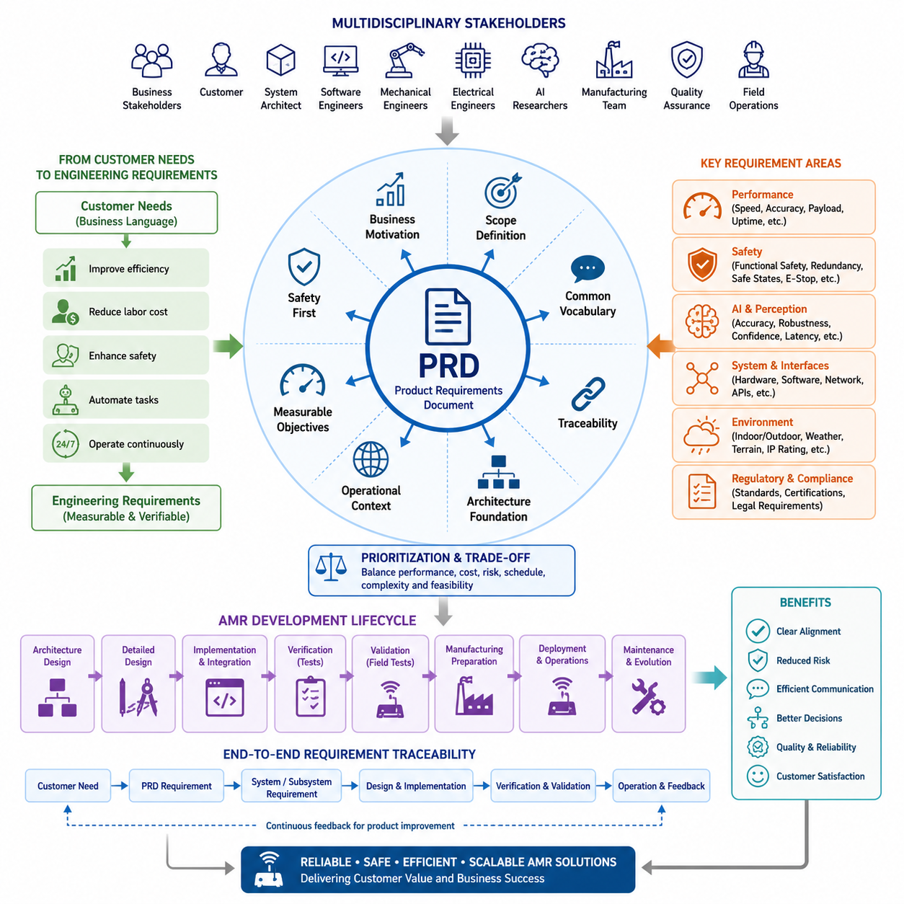
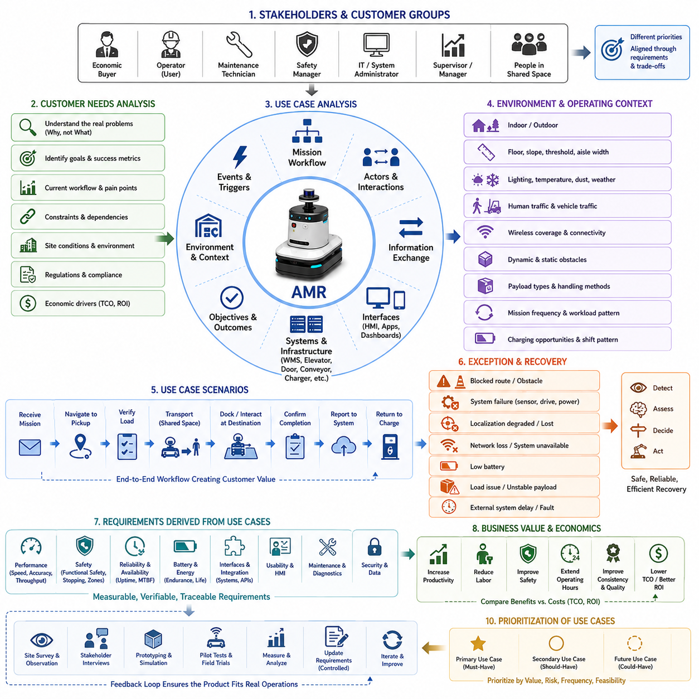
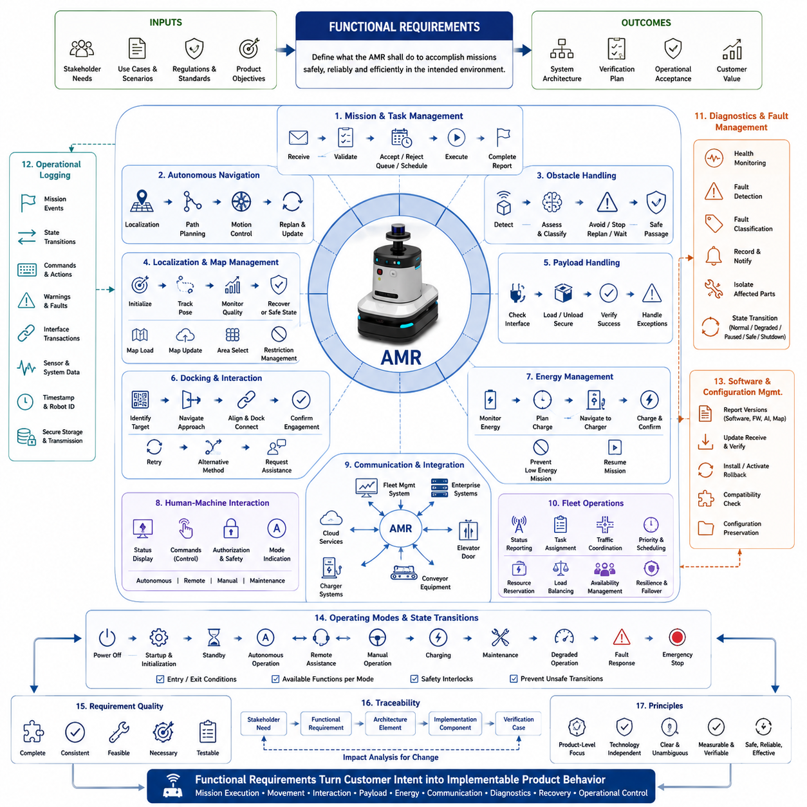
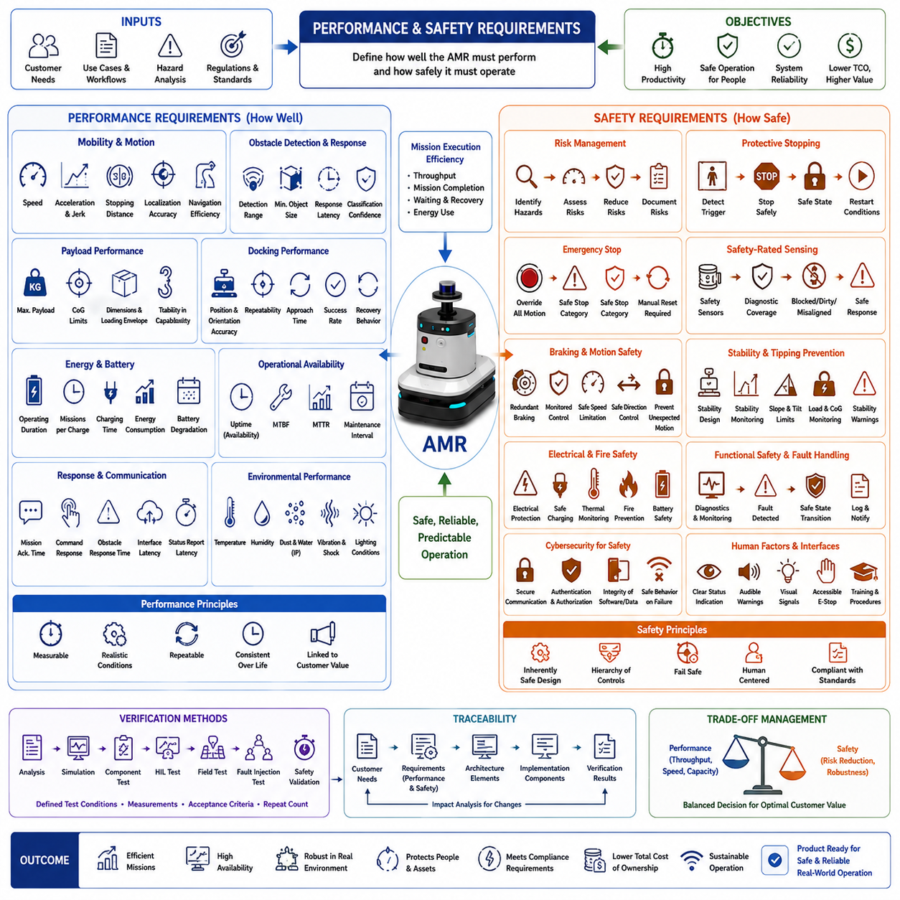
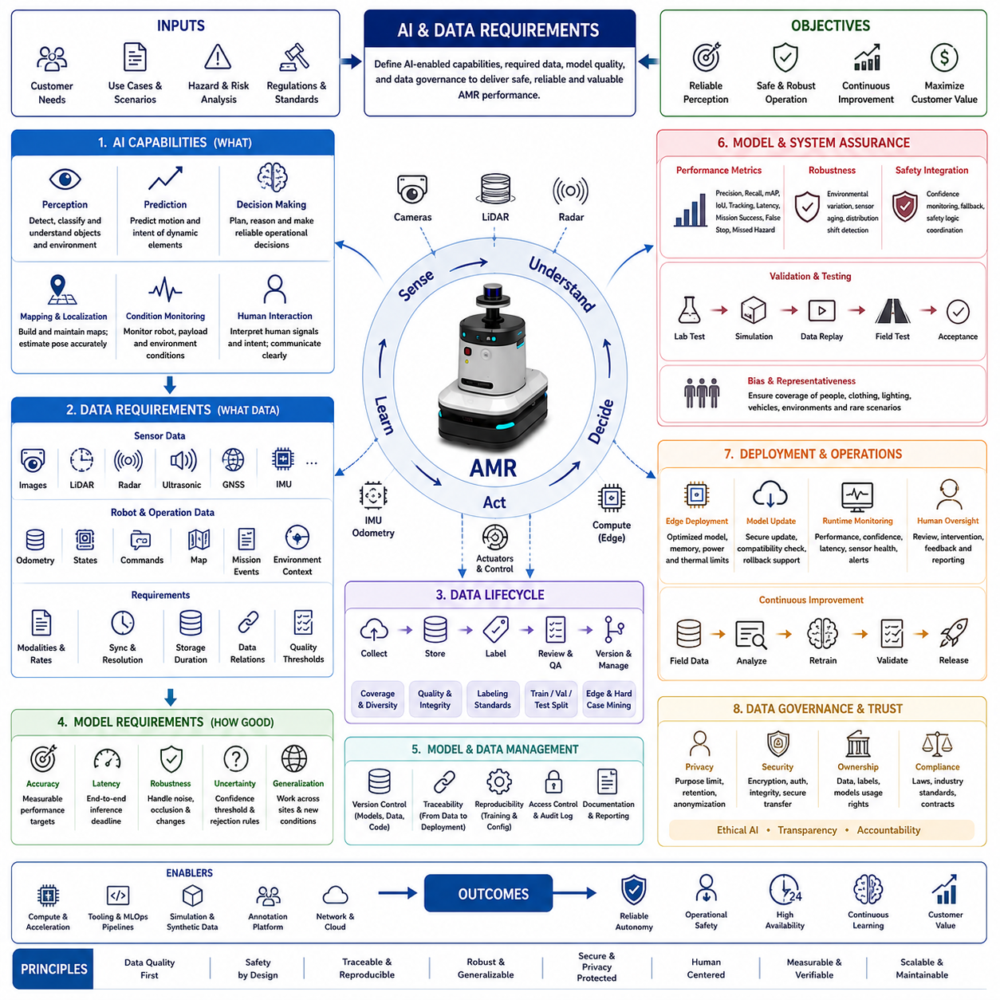
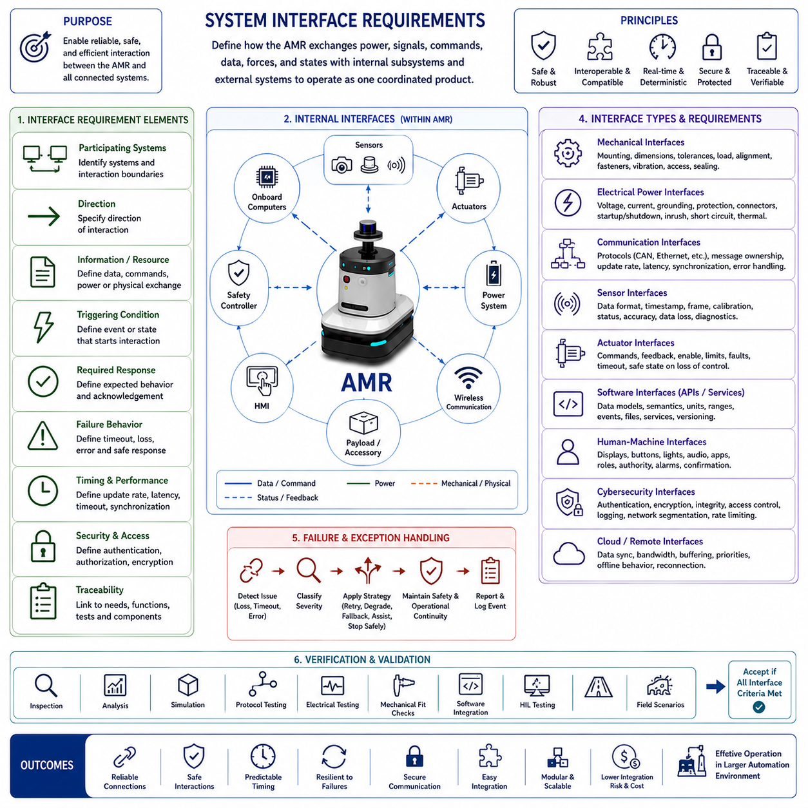
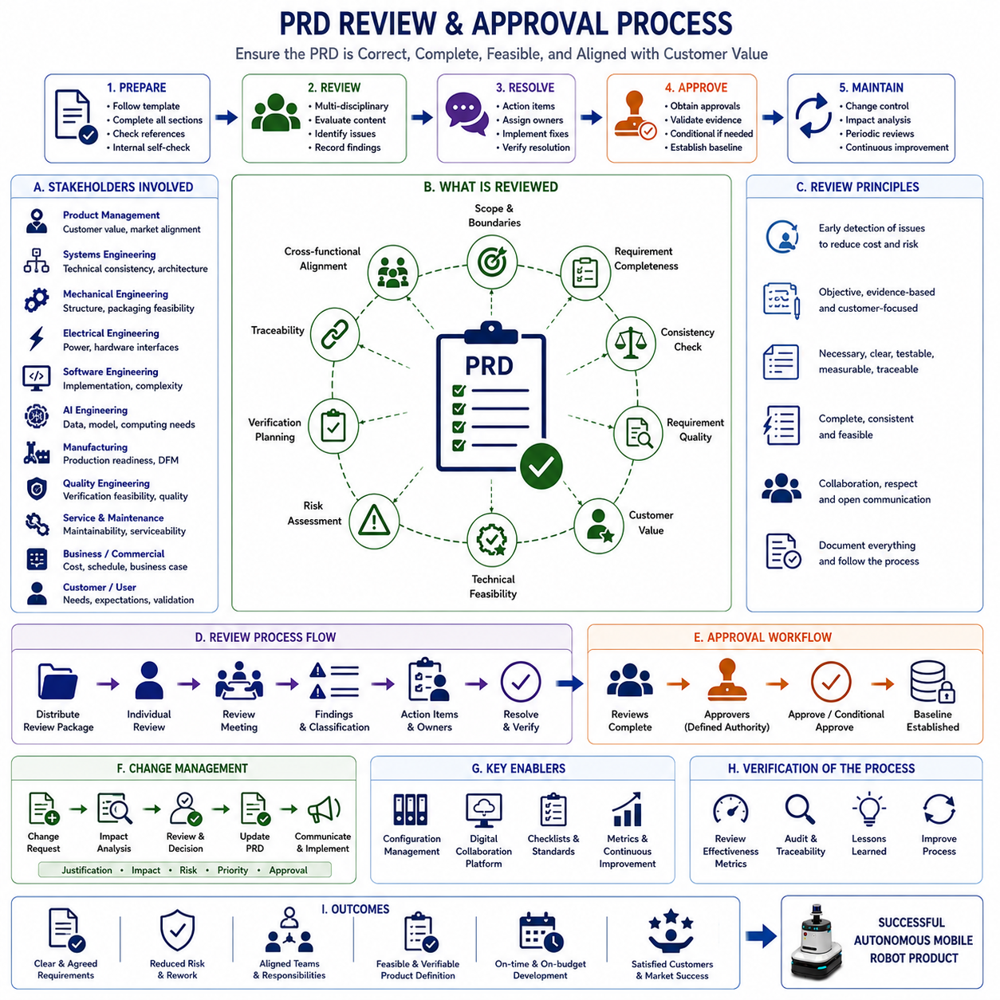
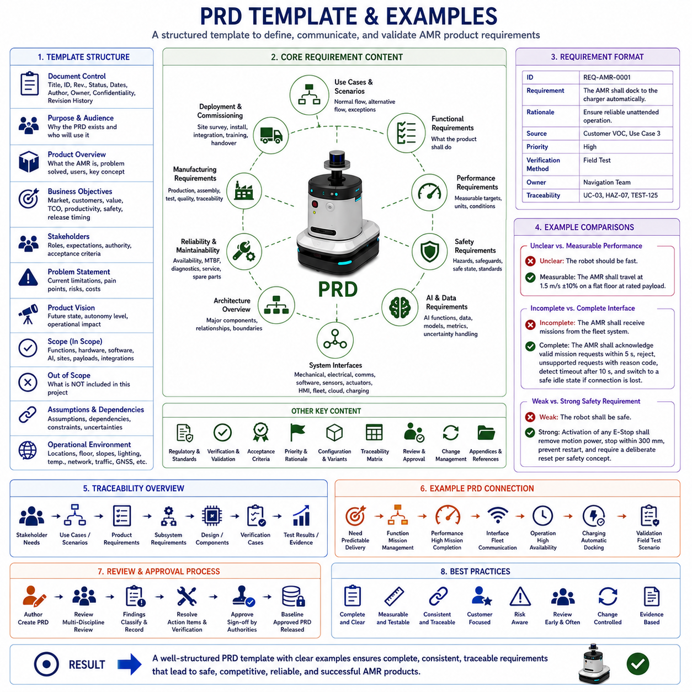

**Volume 10. AMR Engineering Process and Development Manual**

# Chapter01. Product Requirements Document

## 01.01 PRD Overview and Objectives

{width="7.268055555555556in" height="7.268055555555556in"}

A Product Requirements Document (PRD) serves as the primary reference that defines what an Autonomous Mobile Robot (AMR) product is expected to achieve, why it should be developed, and how its success will ultimately be measured throughout the entire engineering lifecycle. Rather than functioning as a simple list of requested features, the PRD establishes a common understanding among business stakeholders, customers, system architects, software engineers, mechanical designers, electrical engineers, AI researchers, manufacturing teams, quality assurance specialists, and field operation personnel. By documenting objectives before implementation begins, the PRD minimizes ambiguity, reduces communication gaps, and creates a stable foundation upon which every subsequent engineering activity can confidently build. The Product Requirements Document section appears as the opening element of the Product Requirements Document chapter within the attached engineering manual structure.

Modern AMR development involves the integration of numerous engineering disciplines, each operating with different design priorities and technical constraints. Mechanical engineers focus on structural integrity, payload capacity, durability, manufacturability, and environmental protection. Electrical engineers concentrate on power distribution, battery systems, safety circuits, sensors, and communication interfaces. Software developers design distributed applications, middleware, real-time control software, and cloud connectivity, while AI engineers develop perception algorithms, localization models, navigation intelligence, and decision-making capabilities. Without a comprehensive PRD, these teams often interpret customer expectations differently, resulting in incompatible assumptions that eventually increase project cost, schedule risk, and technical debt.

The primary objective of a PRD is to transform customer expectations into measurable engineering requirements that can be verified throughout development. Customers rarely describe their needs in technical language. Instead, they express operational goals such as transporting materials more efficiently, reducing labor costs, improving workplace safety, automating repetitive inspection tasks, or operating continuously without human intervention. The PRD bridges the gap between business language and engineering language by translating qualitative expectations into quantitative requirements that every engineering discipline can understand, analyze, implement, and validate using objective criteria.

A well-developed PRD also establishes the business motivation behind the project. Every engineering investment should contribute to a measurable business outcome, whether it involves increasing productivity, improving operational efficiency, reducing maintenance costs, expanding deployment environments, or creating competitive differentiation within a target market. Engineers who understand the business objectives behind each requirement are better equipped to make informed technical decisions when unexpected constraints arise during implementation. Consequently, the PRD becomes more than a specification document; it becomes a strategic reference that aligns engineering priorities with organizational objectives.

Another important purpose of the PRD is to define the product scope clearly before significant engineering resources are committed. Scope ambiguity is one of the leading causes of project overruns in robotics development because new ideas frequently emerge after implementation has already begun. Although innovation remains important, uncontrolled feature expansion can destabilize schedules, increase integration complexity, and compromise product reliability. A carefully prepared PRD distinguishes mandatory functions from optional enhancements while identifying boundaries that prevent uncontrolled expansion of development activities. This discipline enables engineering teams to deliver stable products without sacrificing future opportunities for incremental improvement.

The PRD establishes a shared vocabulary across multidisciplinary development organizations. Terminology such as mission execution, localization accuracy, payload capacity, obstacle avoidance, operational availability, docking precision, functional safety, perception confidence, fleet coordination, and autonomous recovery must be consistently defined before implementation begins. Differences in terminology between software developers, mechanical engineers, AI researchers, and customers frequently lead to misunderstandings that remain hidden until late integration stages. By documenting standardized definitions, the PRD reduces interpretation errors and improves communication efficiency throughout the entire project lifecycle.

Requirement traceability represents another essential objective of the PRD. Every requirement documented within the specification should originate from a legitimate stakeholder need and remain traceable through architecture design, subsystem implementation, verification planning, validation testing, manufacturing preparation, deployment procedures, and long-term maintenance. Traceability ensures that engineering teams can always explain why a particular function exists, how it contributes to customer value, which subsystem implements it, and how successful implementation will ultimately be verified. This structured relationship becomes increasingly important as AMR platforms grow more sophisticated and involve hundreds or even thousands of individual requirements.

The PRD also provides the starting point for system architecture development. Architects cannot design an optimal hardware and software architecture without first understanding operational objectives, environmental conditions, performance expectations, safety constraints, regulatory requirements, and anticipated product evolution. Decisions regarding computing platforms, sensor configurations, communication networks, battery capacity, AI accelerators, mechanical structures, and software modularization all depend upon clearly documented product requirements. Consequently, architecture should emerge from the PRD rather than precede it.

Successful AMR products must operate within highly variable environments, making operational context an indispensable component of the PRD. Indoor logistics robots navigate structured warehouse corridors, hospital service robots interact closely with patients and medical staff, outdoor inspection robots encounter changing weather conditions, while construction robots operate in continuously evolving work sites. These diverse operating environments influence sensor selection, localization methods, environmental protection ratings, mobility systems, safety strategies, and AI robustness requirements. The PRD therefore captures environmental assumptions explicitly to prevent incorrect design decisions based upon unrealistic operating conditions.

Performance objectives documented within the PRD must remain measurable, realistic, and verifiable. Statements such as "the robot shall navigate efficiently" provide little engineering value because efficiency lacks measurable definition. Instead, requirements should specify quantifiable expectations including maximum travel speed, localization accuracy, obstacle detection range, payload capacity, battery endurance, docking repeatability, system startup time, perception latency, mission completion rate, network availability, or operational uptime. Quantitative objectives enable engineers to evaluate trade-offs objectively while allowing validation teams to determine whether implementation satisfies customer expectations.

Safety objectives occupy a central role within every AMR Product Requirements Document because autonomous robots interact directly with humans, infrastructure, equipment, and valuable assets. Functional safety extends beyond emergency stop functions and includes hazard identification, collision avoidance, redundant sensing, fault detection, degraded operational modes, emergency recovery procedures, and safe shutdown mechanisms. The PRD identifies safety expectations early so that safety considerations become fundamental architectural principles instead of late-stage additions that increase complexity and certification effort.

Artificial intelligence has become an essential component of modern AMR platforms, making AI-related requirements increasingly important within the PRD. Perception accuracy, object recognition robustness, semantic understanding, localization confidence, adaptive planning, and autonomous decision-making capabilities all influence customer expectations. However, AI requirements should emphasize measurable operational performance rather than specific algorithms or implementation technologies. This approach allows engineering teams to adopt improved models during development without modifying customer-facing product requirements, thereby encouraging technological evolution while maintaining requirement stability.

The PRD also supports project planning by establishing priorities among competing engineering objectives. Every AMR project encounters constraints involving budget, schedule, computational resources, manufacturing complexity, and technical feasibility. Some requirements directly determine product success, while others primarily enhance user experience or operational convenience. By distinguishing essential requirements from desirable improvements, the PRD enables project managers and technical leaders to allocate engineering resources effectively while minimizing unnecessary development risks.

Ultimately, the Product Requirements Document functions as the contractual understanding between customer expectations and engineering execution. It provides a stable reference that guides architecture design, subsystem development, integration planning, testing strategies, manufacturing preparation, deployment procedures, and future product evolution. As AMR platforms continue to incorporate increasingly sophisticated AI capabilities, cloud services, edge computing, and autonomous decision-making, the importance of a comprehensive, measurable, and traceable PRD becomes even greater. A well-constructed PRD does not merely document product intentions; it establishes the engineering discipline required to transform innovative concepts into reliable, scalable, safe, and commercially successful autonomous robotic systems.

## 01.02 Customer and Use Case Analysis

{width="7.268055555555556in" height="7.268055555555556in"}

Customer and use case analysis is the process of understanding who will use an Autonomous Mobile Robot, what operational problems they need to solve, where the robot will work, and how success will be judged in real environments. Within the Product Requirements Document, this analysis provides the evidence needed to convert broad business expectations into practical product requirements. It prevents engineering teams from designing an impressive robot that performs well technically but fails to address the customer's actual workflow, constraints, risks, and economic priorities.

The starting point is the identification of all relevant customer groups rather than treating the purchasing organization as a single stakeholder. The economic buyer may focus on capital cost, return on investment, and deployment schedule, while operators care about ease of use, predictable behavior, and reduced workload. Maintenance technicians require accessible components, clear diagnostics, and rapid repair procedures. Safety managers evaluate hazards and compliance, and information technology teams examine network integration, cybersecurity, data ownership, and support responsibilities.

Customer analysis must therefore distinguish between buyers, users, maintainers, administrators, supervisors, and people who share the operating space with the robot. These groups may have different priorities and may even define success in conflicting ways. A production manager may request maximum speed and throughput, while a safety manager may prefer conservative motion and larger stopping margins. The PRD must capture these differences openly so that trade-offs can be evaluated before detailed design decisions lock the project into an unsuitable direction.

Direct customer statements should not be accepted as complete requirements without further analysis because customers often describe a preferred solution rather than the underlying problem. A request for a larger battery may actually indicate insufficient operating time, poor charging access, or inefficient mission scheduling. A request for additional sensors may reflect concern about blind spots or previous collision incidents. Engineers must investigate the reason behind each request so that the final requirement addresses the operational need rather than simply reproducing an assumed technical solution.

Use case analysis converts customer needs into structured descriptions of how the AMR will be used during normal, abnormal, degraded, and emergency conditions. A use case typically identifies the initiating actor, the operational objective, the environmental context, the expected sequence of actions, the information exchanged, and the final outcome. For an AMR, a use case may include receiving a transport mission, navigating to a pickup point, confirming load readiness, moving through shared traffic, docking at a destination, reporting completion, and returning to charge.

The analysis should describe the complete mission rather than only the autonomous driving portion. An AMR product creates value through an end-to-end operational workflow that may involve warehouse systems, elevators, automatic doors, conveyors, robotic arms, inspection equipment, fleet management software, charging stations, and human operators. If these interactions are excluded from the use case, important interface requirements may appear too late. The robot may navigate successfully but still fail because it cannot exchange task data, confirm payload transfer, or recover from a delayed external system.

Operational scenarios must be based on the customer's actual site conditions. Floor quality, corridor width, slopes, thresholds, lighting, dust, temperature, wireless coverage, human traffic, vehicle traffic, reflective surfaces, and dynamic obstacles can significantly influence system design. Indoor logistics facilities usually provide structured paths but may contain congestion and temporary storage. Outdoor sites introduce weather, surface variation, GNSS limitations, and environmental contamination. The PRD should record these conditions as design inputs rather than relying on ideal laboratory assumptions.

Mission frequency and workload patterns are equally important because average usage can hide demanding peak conditions. A robot may perform ten missions per hour during normal operation but face twice that load during a shift change or production peak. Battery endurance, charging strategy, fleet size, thermal behavior, communication capacity, and traffic management should be evaluated against realistic operating profiles. Customer analysis must therefore include mission duration, travel distance, waiting time, payload distribution, charging opportunities, operating shifts, and seasonal or daily demand variation.

The physical characteristics of transported or inspected objects also influence the use case. Payload mass alone is not sufficient because size, center of gravity, shape, stability, surface condition, and loading method affect chassis design, braking, suspension, docking, and motion control. A stable container on a rigid platform presents different requirements from a liquid tank, suspended load, towing cart, medical supply cabinet, or inspection arm. The PRD should describe representative payload configurations and identify unusual cases that could create instability or handling risk.

Human interaction should be analyzed from the perspective of both intended users and nearby non-users. Trained operators may understand status indicators and recovery procedures, while visitors, patients, contractors, or pedestrians may not recognize the robot's intentions. Use cases should therefore consider how the AMR communicates direction, motion state, warnings, faults, and requests for assistance. Interfaces may include displays, lights, sound, mobile applications, remote dashboards, physical buttons, or natural-language commands, but each method must reflect the user's working environment and skill level.

Exception scenarios are often more valuable than ideal workflows because field failures usually occur when normal assumptions break down. Examples include blocked routes, partially loaded pallets, unavailable elevators, moved charging stations, degraded localization, network loss, low battery, sensor contamination, unexpected human behavior, damaged floor surfaces, and failed external equipment. The use case analysis should define how the robot detects each condition, whether it waits, retries, selects an alternative, requests assistance, enters a safe state, or transfers responsibility to a remote operator.

Recovery requirements should be designed to minimize operational disruption without creating unsafe autonomous behavior. A robot that stops safely whenever uncertainty appears may satisfy basic safety expectations but still create unacceptable downtime. Conversely, aggressive automatic recovery can increase risk if the system does not understand the situation correctly. Customer analysis must determine which failures require immediate shutdown, which allow degraded operation, which can be resolved automatically, and which should be escalated to maintenance, supervision, or remote support personnel.

Quantitative acceptance criteria should emerge from the use case rather than being selected only from component capabilities. Travel speed should be related to mission throughput and pedestrian safety. Localization accuracy should reflect docking, aisle clearance, and payload transfer needs. Battery capacity should support the expected duty cycle with realistic degradation and charging opportunities. Detection range should correspond to stopping distance and vehicle dynamics. This use-case-driven method ensures that performance requirements are meaningful at the product level rather than isolated technical targets.

Economic analysis should connect each major use case to a customer value mechanism. The robot may reduce manual transport time, decrease workplace injuries, improve process consistency, extend operating hours, capture inspection data, or allow skilled workers to focus on higher-value activities. These benefits should be compared with acquisition cost, integration cost, infrastructure modifications, training, maintenance, energy consumption, and expected downtime. A technically successful use case may still be commercially unsuitable if the total cost of ownership exceeds the customer's achievable benefit.

The analysis should also identify deployment assumptions and customer responsibilities. Some AMR systems require accurate digital maps, stable wireless infrastructure, marked docking points, dedicated charging areas, floor maintenance, restricted traffic rules, or integration with enterprise software. These dependencies must be stated clearly because they influence schedule, cost, performance, and accountability. If the customer expects immediate operation without environmental preparation, the product architecture may need greater onboard autonomy, more robust perception, or alternative communication and localization methods.

Use cases should be prioritized according to business importance, safety significance, technical risk, frequency, and customer value. The primary use case represents the workflow that must succeed for the product to be commercially viable. Secondary use cases may support broader deployment or improve efficiency, while future use cases can guide architecture scalability without expanding the initial scope. This prioritization helps prevent the product from becoming overloaded with low-value features and allows the development team to focus first on the missions that define customer acceptance.

Customer and use case analysis should remain active throughout development rather than ending after the PRD is approved. Prototype testing, simulation, site surveys, operator interviews, field trials, and early deployments often reveal hidden assumptions that were not visible during initial discussions. These findings should be reviewed against the original use cases and incorporated through controlled requirement updates. Continuous feedback ensures that the product evolves in response to verified operational evidence while maintaining traceability and preventing uncontrolled scope changes.

A mature analysis process produces more than a collection of customer interviews. It creates a coherent operational model that links stakeholders, business goals, environments, workflows, interfaces, hazards, performance expectations, exception handling, and acceptance criteria. This model becomes the practical foundation for functional requirements, safety requirements, architecture design, verification planning, deployment preparation, and lifecycle support. When customer needs and use cases are understood correctly, AMR development can move from technology-centered experimentation toward reliable, scalable, and economically meaningful automation.

## 01.03 Functional Requirements

{width="7.268055555555556in" height="7.268055555555556in"}

Functional requirements define what an Autonomous Mobile Robot must do to satisfy customer needs and complete its intended operational missions. They describe required system behaviors, services, reactions, decisions, information exchanges, and interactions without prematurely prescribing detailed implementation methods. Within a Product Requirements Document, functional requirements form the bridge between customer and use case analysis and the later development of system architecture, subsystem specifications, software functions, hardware interfaces, verification procedures, and operational acceptance criteria.

A functional requirement should originate from an identified stakeholder need, use case, operational scenario, regulatory obligation, or product objective. It must explain the expected behavior of the AMR under clearly defined conditions and identify the result that the system must produce. Statements should be specific enough to support design and testing while remaining independent of a particular supplier, algorithm, sensor model, software library, or mechanical solution unless that technology is itself a mandatory business or interface constraint.

Effective functional requirements are normally written as clear statements describing what the system shall perform. The word "shall" is commonly used to distinguish mandatory product behavior from recommendations, explanations, assumptions, or future possibilities. A useful requirement identifies the responsible system, the required action, the triggering condition, and the expected output. Ambiguous expressions such as "fast," "intelligent," "user-friendly," or "highly reliable" should be avoided unless they are defined through separate measurable criteria.

The first major group of AMR functional requirements concerns mission reception and task management. The robot must be able to receive, interpret, validate, accept, reject, queue, suspend, resume, and complete missions originating from an operator, fleet management system, warehouse management system, manufacturing execution system, or another authorized source. Each mission should include sufficient information to identify its objective, priority, destination, payload condition, required equipment, timing constraints, and completion criteria.

After receiving a mission, the AMR must determine whether the requested task can be executed safely and correctly with its current configuration and operating state. The system should verify map availability, localization confidence, battery condition, sensor status, payload compatibility, communication availability, route accessibility, and required external interfaces. When a mission cannot be accepted, the robot should reject or postpone it with a meaningful reason rather than silently failing or beginning an operation that cannot be completed.

Autonomous movement is another central functional area. The AMR must determine its position, calculate a route, generate drivable motion commands, follow the planned path, and update its behavior as environmental conditions change. Navigation functions should support mission-specific destinations, allowed zones, prohibited areas, traffic directions, speed regions, docking approaches, and temporary restrictions. The functional requirements should describe the expected navigation behavior while leaving algorithm selection to the architecture and engineering design stages.

Obstacle handling requirements define how the robot responds to people, vehicles, equipment, temporary objects, blocked passages, and other conditions that interfere with planned movement. The AMR must detect relevant obstacles, classify their operational significance when required, reduce speed, stop, wait, replan, or request assistance according to the situation. The system should distinguish between short interruptions and persistent route blockage so that normal human movement does not cause unnecessary mission cancellation while unsafe passage is prevented.

Localization and map management functions must support consistent autonomous operation across the intended environment. The AMR should initialize its position, maintain pose estimates during motion, detect localization degradation, recover from temporary uncertainty when possible, and enter an appropriate safe state when reliable operation cannot continue. Map-related functions may include loading approved maps, selecting operational areas, receiving controlled updates, recognizing restricted regions, and maintaining compatibility between map versions and deployed robot software.

Payload handling requirements depend on the AMR product type and may include lifting, lowering, towing, coupling, releasing, conveying, securing, weighing, detecting, or verifying transported objects. The robot must confirm that the payload interface is ready before initiating transfer and should determine whether loading or unloading has completed successfully. Functional requirements should also define how the system behaves when a payload is missing, incorrectly positioned, mechanically unstable, incompatible, or not released by external equipment.

Docking functions enable precise interaction with charging stations, conveyors, elevators, inspection systems, robotic arms, workstations, and material transfer devices. The AMR must identify the correct docking target, approach it through an authorized path, align its position and orientation, confirm successful engagement, and report readiness to the connected system. If docking fails, the robot should perform a limited number of controlled retries, select an alternative method when available, or request assistance without creating repeated unsafe motion.

Energy management functions allow the robot to complete missions while preserving battery health and operational availability. The AMR should monitor energy state, estimate whether sufficient capacity remains for assigned work, request or schedule charging, navigate to an available charger, establish a charging connection, and confirm charging progress. The system should prevent mission acceptance when energy reserves are inadequate and support resumption of interrupted work after charging when operational policy permits.

Human-machine interaction functions must provide users with understandable information and appropriate control authority. Operators should be able to view robot identity, mission status, operating mode, battery level, warnings, faults, and requests for assistance. Authorized users may need functions for starting, pausing, cancelling, redirecting, recovering, or manually controlling the robot. The interface should prevent unauthorized or contradictory commands and should clearly indicate when the robot is operating autonomously, remotely, manually, or in a maintenance state.

The AMR must also communicate its intentions and status to people who are not trained operators. Functional behaviors may include visible motion indicators, directional lighting, audible warnings, projected symbols, display messages, or controlled movement patterns that make the robot's actions easier to understand. Requirements should specify when these signals are activated, what operational meaning they convey, and how they change during normal travel, turning, reversing, docking, waiting, fault handling, or emergency conditions.

External system integration requirements define how the AMR exchanges commands, status information, maps, task data, alarms, and operational records with surrounding infrastructure. Interfaces may connect to fleet management systems, enterprise applications, elevators, doors, conveyors, chargers, access control systems, inspection equipment, and cloud services. Functional requirements should identify the information exchanged, the direction of communication, authorization rules, expected acknowledgements, timeout behavior, and response to unavailable or inconsistent external systems.

Fleet operation introduces additional functions beyond the behavior of a single robot. A fleet-enabled AMR should report its position, availability, mission status, health condition, and resource needs to the fleet management system. It may receive coordinated traffic instructions, task assignments, map updates, charging reservations, and priority changes. The overall system should prevent route conflicts, coordinate shared resources, balance workloads, and support continued operation when individual robots become unavailable or require maintenance.

Diagnostic and fault management functions allow the AMR to identify abnormal conditions and respond in a controlled manner. The system should monitor critical hardware, software processes, sensors, actuators, networks, power modules, storage devices, and external interfaces. Detected faults should be classified according to severity and operational effect. The robot should record relevant evidence, notify authorized systems, isolate affected functions when possible, and transition to normal, degraded, paused, recovery, maintenance, or safe shutdown states as appropriate.

Operational logging functions provide the evidence required for debugging, validation, maintenance, customer support, and product improvement. The AMR should record mission events, state transitions, user commands, warnings, faults, navigation decisions, interface transactions, charging events, and selected sensor or system data. Logs should include synchronized timestamps and robot identification so that events can be reconstructed accurately. Storage and transmission behavior should prevent essential diagnostic information from being lost during network outages or system restarts.

Software and configuration management functions ensure that deployed robots operate with approved and compatible system versions. The AMR may need to report installed software, firmware, AI models, calibration data, maps, and parameter sets. Authorized updates should be received, verified, installed, activated, rolled back, or rejected according to controlled procedures. The system should prevent incompatible component combinations and preserve essential configuration information during maintenance, replacement, recovery, and remote update operations.

Functional requirements must also address operating modes and state transitions. Typical modes may include power-off, startup, initialization, standby, autonomous operation, manual operation, remote assistance, charging, maintenance, degraded operation, fault response, and emergency stop. The PRD should define which functions are available in each mode, what events cause transitions, what conditions must be satisfied before movement begins, and how the system prevents unexpected transitions that could create unsafe or confusing behavior.

Startup and shutdown behavior should be treated as functional product behavior rather than a minor technical detail. During startup, the AMR should verify essential hardware, initialize software services, validate configuration, establish communication, confirm safety functions, and determine whether autonomous operation is permitted. During shutdown, it should stop motion, place actuators in an appropriate state, preserve required data, close communications, and remove power in a controlled sequence. Recovery after unexpected power loss should also be defined.

Functional requirements should include degraded operation because not every fault requires complete system shutdown. Depending on the product and use case, the AMR may continue at reduced speed, disable selected missions, rely on an alternative sensor, return to a service area, or complete a safe unloading procedure. Degraded behavior must be explicitly authorized and bounded. The system should inform operators and connected services that capabilities have changed so that missions are not assigned under incorrect assumptions.

Every functional requirement should be traceable to its source and linked to architecture elements, implementation components, and verification cases. Traceability allows the project team to determine whether all customer needs have been addressed and whether unnecessary functions have entered the design without justification. It also supports impact analysis when a requirement changes, because engineers can identify the affected hardware, software, interfaces, tests, documents, manufacturing procedures, and field configurations before approving the modification.

Functional requirements should be reviewed for completeness, consistency, feasibility, necessity, and testability. Requirements that overlap should be consolidated, while conflicting statements should be resolved through stakeholder review. Each requirement should describe one primary behavior whenever practical so that implementation and verification remain clear. Dependencies and assumptions should be documented separately rather than hidden within complex sentences. This discipline reduces interpretation differences and prevents multiple engineering teams from implementing incompatible versions of the same expected behavior.

The functional requirements section of the PRD should remain focused on product-level capability rather than becoming a detailed design specification. It should define what the customer and operating environment require the AMR to accomplish, while subsystem documents explain how mechanical, electrical, embedded, software, perception, localization, navigation, AI, cloud, and fleet components will provide that capability. Maintaining this separation preserves design flexibility and allows technical solutions to evolve without repeatedly changing the approved product definition.

Well-constructed functional requirements create a stable foundation for architecture design, development planning, interface definition, risk assessment, testing, manufacturing preparation, deployment, and lifecycle support. They ensure that the AMR behaves as a coherent product rather than as a collection of independently developed technologies. By defining mission execution, movement, interaction, payload handling, energy management, communication, diagnostics, recovery, and operational control in a precise and traceable form, the PRD converts customer intent into implementable product behavior.

## 01.04 Performance and Safety Requirements

{width="7.268055555555556in" height="7.268055555555556in"}

Performance and safety requirements define how effectively an Autonomous Mobile Robot must operate and how safely it must behave while carrying out its assigned missions. Functional requirements describe what the robot shall do, whereas performance requirements establish the measurable level at which those functions must be delivered. Safety requirements define the conditions, controls, limitations, and protective behaviors needed to prevent unacceptable harm to people, equipment, infrastructure, payloads, and the robot itself. Together, these requirements convert general expectations into objective engineering targets that can guide architecture, design, testing, deployment, and operational approval.

Performance requirements must be derived from real customer workflows rather than selected only from component specifications or competitive marketing claims. A robot that can travel at high speed may still fail to improve productivity if it spends excessive time waiting, docking, recovering, charging, or interacting with external systems. Product-level performance should therefore be evaluated through mission completion time, transport throughput, availability, successful docking rate, recovery time, energy consumption, and operational consistency. Each metric should have a clear relationship to customer value and intended use cases.

A well-written performance requirement should identify the operating condition, measured quantity, required threshold, allowable variation, and verification method. Statements such as "the robot shall move quickly" or "the system shall be highly accurate" are not sufficient because they cannot support objective design decisions or acceptance testing. A useful requirement may define maximum speed under specified payload and floor conditions, localization accuracy within an approved operating area, stopping distance at a defined speed, or mission completion rate across a representative set of scenarios.

Vehicle speed is one of the most visible AMR performance characteristics, but it must be specified carefully. Maximum speed, normal operating speed, reduced speed, docking speed, reversing speed, and safety-limited speed may all require separate definitions. Speed limits should reflect payload stability, braking capability, sensor range, floor condition, pedestrian density, turning radius, and local operating rules. The PRD should avoid treating maximum speed as the primary indicator of productivity because actual mission throughput depends on the complete operational cycle.

Acceleration, deceleration, and jerk influence both safety and payload stability. Sudden motion can cause transported objects to shift, liquids to move, fragile products to be damaged, or nearby people to feel threatened. Motion requirements should therefore define acceptable acceleration and deceleration ranges for normal travel, emergency response, turning, docking, and payload transfer. Jerk limits may also be necessary when the robot transports sensitive equipment, medical materials, tall loads, suspended objects, or inspection systems requiring stable positioning.

Stopping performance must be defined under realistic operating conditions. The required stopping distance depends on vehicle speed, payload, floor friction, slope, tire condition, control latency, brake response, and environmental contamination. Performance requirements should distinguish normal controlled stopping from protective stopping and emergency stopping. Test conditions should include representative payloads and surfaces rather than ideal unloaded laboratory conditions. Where applicable, stopping performance should be validated across the most demanding combinations allowed by the product definition.

Localization performance determines whether the AMR can navigate reliably, remain within permitted areas, approach narrow passages, and interact with equipment. Localization requirements may include absolute position accuracy, relative accuracy, repeatability, heading accuracy, initialization time, recovery time, and confidence monitoring. The necessary value depends on the use case. General corridor travel may tolerate larger errors than precision docking, automated loading, robotic inspection, or interaction with fixed production equipment. Different operating modes may therefore require different localization targets.

Navigation performance should be measured through more than path accuracy. Important metrics include route completion rate, travel efficiency, replanning latency, obstacle response time, deadlock frequency, recovery success, traffic compliance, and the ability to maintain smooth motion in dynamic environments. A route that is mathematically short may not be operationally efficient if it causes frequent stops or conflicts with other robots. Navigation requirements should therefore balance travel time, safety margins, predictability, congestion, and energy use.

Obstacle detection performance must be specified according to the hazards present in the operating environment. Requirements may address detection range, field of view, minimum detectable object size, response latency, classification confidence, and performance under different lighting or weather conditions. The system should detect objects early enough to execute the required safety response within the available stopping distance. Performance should be evaluated for people, vehicles, low objects, overhanging structures, reflective surfaces, dark materials, and other relevant obstacles identified during hazard analysis.

Payload capability includes more than the maximum supported mass. Requirements should address allowable load dimensions, center-of-gravity limits, load distribution, attachment method, transfer height, towing resistance, and stability during acceleration, braking, turning, and slope operation. The robot may safely carry its rated payload only within a defined loading envelope. If users exceed this envelope, the system should detect the condition where possible, prevent unsafe motion, issue a warning, or require operator confirmation according to the approved operating policy.

Docking performance is typically defined through position accuracy, orientation accuracy, repeatability, approach time, engagement success rate, and recovery behavior after failure. The requirement should specify whether the value applies to the first attempt, after controlled retries, or across repeated operation under changing payload and environmental conditions. Docking success also depends on target design, floor variation, sensor visibility, mechanical tolerance, and communication with external equipment. These dependencies must be included in the verification conditions.

Battery and energy performance requirements determine how long the AMR can work and how effectively it can remain available. Relevant metrics include operating duration, mission count per charge, energy consumption per distance or mission, minimum reserve level, charging time, charging efficiency, and battery degradation over life. The PRD should define representative duty cycles because endurance measured during continuous unloaded driving may not represent real operation with waiting, lifting, computing, communication, and repeated acceleration.

Operational availability describes the proportion of scheduled time during which the robot is capable of performing assigned work. Availability is influenced by reliability, charging, maintenance, software restart time, fault recovery, environmental interruptions, and external infrastructure. Requirements may define uptime, mean time between failures, mean time to repair, preventive maintenance intervals, and maximum permitted downtime. These values should be tied to the customer's production or service expectations and measured using consistent definitions.

Response time is a critical performance requirement for distributed AMR systems. Mission acknowledgement, operator command response, obstacle reaction, emergency input processing, interface timeout, map loading, software startup, and remote status reporting may each require separate timing limits. Excessive latency can reduce productivity or create unsafe behavior even when individual algorithms are accurate. Timing requirements should include the complete end-to-end path from event detection to physical or informational response rather than considering only one software component.

Environmental performance requirements define how the robot must operate under temperature, humidity, dust, water exposure, vibration, shock, lighting variation, electromagnetic interference, and surface conditions. Indoor and outdoor AMRs face different challenges, but even structured facilities may contain metal dust, cleaning water, heat sources, reflective glass, or uneven transitions. Requirements should identify normal operating conditions, reduced-performance ranges, storage limits, and conditions under which the robot must stop or request assistance.

Safety requirements begin with systematic hazard identification and risk assessment. The development team must examine reasonably foreseeable situations in which the robot could cause injury, collision, crushing, trapping, falling objects, electrical hazards, fire, uncontrolled motion, or damage to property. Hazards should be evaluated across normal use, maintenance, charging, transport, software update, manual recovery, component failure, and foreseeable misuse. Safety requirements are then created to reduce each risk through design measures, protective functions, information, and operational controls.

Risk reduction should follow a disciplined hierarchy. The preferred approach is to remove hazards through inherently safe design, such as limiting energy, reducing pinch points, improving stability, or preventing access to dangerous components. When hazards cannot be eliminated, protective measures such as safety-rated sensing, braking, guards, interlocks, and emergency stopping are applied. Warnings, training, and operating procedures provide additional protection but should not replace feasible engineering controls.

Protective stopping requirements define how the AMR responds when a person or obstacle enters a safety zone or when safe operation can no longer be guaranteed. The robot should reduce or remove hazardous motion in a controlled manner while maintaining stability and preventing secondary risks. Requirements should define the trigger conditions, stopping category, brake behavior, restart conditions, indication to users, and interaction with mission state. Automatic restart should be permitted only when the environment has been reassessed and the approved safety logic allows it.

Emergency stop requirements provide a means for people to rapidly stop hazardous robot behavior. Emergency stop devices should be accessible, recognizable, and effective across relevant operating modes. Activating an emergency stop should override normal mission commands and place the system in a defined safe condition. Release of the emergency stop should not automatically restart motion. A deliberate reset and verification process should be required before the AMR can resume operation.

Safety-rated perception may be needed to detect people or obstacles within defined protective fields. The PRD should distinguish certified safety functions from general perception used for navigation or operational intelligence. A high-performance AI model may improve object recognition, but it should not automatically be treated as a safety-rated protective device. Safety requirements must define which sensing channels provide certified protection, how diagnostic coverage is achieved, and how the robot responds when a safety sensor is blocked, contaminated, misaligned, or unavailable.

Braking and motion control safety requirements should address single faults and loss of control authority. The AMR must prevent unintended movement during startup, shutdown, charging, loading, maintenance, and mode transitions. Depending on the risk level, the design may require redundant braking, monitored torque control, safe speed limitation, safe direction, or prevention of unexpected restart. The system should detect command inconsistencies, actuator faults, communication loss, and feedback errors before they develop into hazardous motion.

Stability requirements are particularly important for heavy-payload, towing, outdoor, or high-center-of-gravity robots. The product should remain stable during acceleration, braking, turning, slope travel, threshold crossing, and payload transfer within the approved operating envelope. Requirements may limit speed according to payload, steering angle, slope, or surface condition. Where tipping risk cannot be controlled through passive design alone, the system may need load detection, stability estimation, motion restriction, or operator warning functions.

Electrical safety requirements address battery energy, charging interfaces, power distribution, insulation, grounding, short circuits, overcurrent, overheating, and maintenance access. The robot should monitor critical electrical conditions and isolate hazardous energy when necessary. Charging should begin only after correct connection and compatibility have been confirmed. Requirements should also address damaged cables, connector faults, water exposure, battery thermal events, and safe handling during service or transport.

Fire and thermal safety must be considered because AMRs combine high-energy batteries, motors, power electronics, computers, and charging systems in compact enclosures. The system should monitor relevant temperatures, detect cooling failures, reduce power when limits are approached, and stop operation when continued use could create damage or hazard. Thermal protection should remain effective under high ambient temperature, blocked ventilation, sustained payload operation, or component degradation. Emergency procedures for suspected battery failure should also be defined.

Functional safety requirements should include monitoring, diagnostics, and transition to a safe state when faults occur. Safety-related components must be checked at startup and during operation according to the required diagnostic strategy. Detected faults should produce a predictable response, such as controlled stop, inhibited restart, reduced speed, or maintenance lockout. The robot should communicate the fault clearly and preserve sufficient evidence for troubleshooting and compliance records.

Cybersecurity can also affect physical safety because unauthorized commands, corrupted updates, false sensor data, or network attacks may alter robot behavior. Safety-related requirements should therefore coordinate with cybersecurity requirements to protect command channels, software authenticity, access control, and configuration integrity. A communication failure or authentication problem should not create uncontrolled motion. The AMR should enter a safe or limited state when trusted control information is unavailable.

Human factors should influence safety requirements because users must understand the robot's state and respond correctly. Visual indicators, audible warnings, displays, and controls should be consistent and unambiguous. The robot should communicate whether it is ready, moving, waiting, charging, faulted, remotely controlled, or under maintenance. Excessive alarms should be avoided because users may begin to ignore them. Safety information should be prioritized according to urgency and presented in a form suitable for the operating environment.

Verification methods must be defined for both performance and safety requirements. Suitable methods include analysis, inspection, simulation, component testing, hardware-in-the-loop testing, controlled field testing, and formal safety validation. Each test should specify initial conditions, payload, environment, software version, measurement equipment, acceptance threshold, and repeat count. Safety testing should also examine fault injection, sensor obstruction, communication loss, power interruption, emergency stop activation, and recovery procedures.

Requirements should account for production variation and lifecycle degradation rather than being demonstrated only on a single optimized prototype. Brake wear, tire wear, battery aging, sensor contamination, calibration drift, mechanical tolerance, and software updates may affect performance over time. Acceptance limits should therefore include realistic margins and periodic inspection or recalibration needs. A requirement that can be achieved only by a newly tuned prototype is not sufficient for a scalable commercial product.

Performance and safety requirements must be traceable to customer needs, use cases, hazards, architecture elements, and verification results. When one requirement changes, the team should be able to identify its effect on mechanical design, electrical systems, software behavior, AI models, test procedures, operating manuals, and deployment conditions. This traceability prevents local optimization from weakening system-level safety or customer value and provides evidence for design reviews and regulatory assessment.

The relationship between performance and safety requires careful trade-off management. Higher speed can improve throughput but increase stopping distance and collision energy. Larger payload capacity may improve business value but affect stability, braking, and battery endurance. Aggressive autonomous recovery may reduce downtime but create uncertainty during unusual conditions. The PRD should make these trade-offs visible and prioritize safe, predictable, and repeatable operation over isolated maximum-performance claims.

Well-defined performance and safety requirements provide the measurable framework needed to develop an AMR that is productive, dependable, and suitable for real-world operation. They establish how fast, accurate, available, efficient, robust, and responsive the product must be while defining how hazards are prevented, detected, controlled, and verified. By integrating customer value, operational context, engineering capability, and risk reduction, the PRD ensures that performance improvement never becomes separated from the responsibility to protect people and maintain safe system behavior.

## 01.05 AI and Data Requirements

{width="7.268055555555556in" height="7.268055555555556in"}

AI and data requirements define how an Autonomous Mobile Robot must use artificial intelligence, collect and manage operational data, and maintain acceptable performance throughout development and deployment. These requirements establish what AI-enabled capabilities are needed, which data supports them, how model quality is measured, and how data is protected, updated, and governed. Within the Product Requirements Document, they connect customer expectations with perception, prediction, decision-making, model development, validation, edge deployment, monitoring, and continuous improvement activities.

AI requirements should begin with the operational capability that the robot must provide rather than with a preferred model architecture or algorithm. Customers usually care about whether the AMR can detect people, recognize obstacles, understand scenes, estimate free space, classify payload conditions, predict motion, or make reliable decisions. The PRD should therefore describe the expected product behavior and measurable outcome while allowing engineering teams to select, replace, or improve the underlying model as technology evolves.

The relationship between AI and conventional software must be clearly defined. Some robot functions are better implemented through deterministic logic, geometric methods, safety-rated controllers, or rule-based state machines, while others benefit from machine learning. The PRD should identify where AI is necessary, where it is optional, and where it must not become the sole source of a safety-critical decision. This separation prevents unnecessary dependence on probabilistic models and supports a more robust system architecture.

Perception requirements often represent the largest group of AI-related product needs. The AMR may need to detect people, vehicles, pallets, racks, doors, floor boundaries, debris, low obstacles, overhanging structures, or environmental hazards. Requirements should specify the target classes, operating range, field of view, environmental conditions, minimum object size, expected confidence, latency, and failure response. They should also distinguish between general perception for navigation and certified safety functions.

AI performance should be measured with product-level metrics rather than only training metrics. Precision, recall, intersection over union, classification accuracy, and tracking quality are useful, but they must be connected to mission success, false-stop frequency, missed hazard rate, navigation efficiency, docking reliability, and operator workload. A model with strong benchmark scores may still be unsuitable if it creates unstable behavior, excessive warnings, delayed responses, or poor performance on site-specific conditions.

Data requirements begin with a clear definition of the information needed to develop and operate each AI capability. Relevant data may include camera images, LiDAR point clouds, radar measurements, ultrasonic signals, GNSS data, IMU data, wheel odometry, robot states, actuator commands, map information, mission events, environmental context, and human annotations. The PRD should identify required modalities, sampling rates, synchronization accuracy, resolution, storage duration, and relationships between sensor streams.

Dataset coverage is essential because an AI model can only learn from conditions represented in its training and validation data. The data plan should include expected environments, lighting conditions, weather, floor materials, payload types, human behavior, vehicle traffic, obstacle categories, sensor contamination, and rare operational events. Coverage should reflect real deployment diversity rather than only convenient development sites. Missing conditions should be recorded as known limitations or future collection priorities.

Data quality requirements should define how corrupted, incomplete, duplicated, misaligned, or poorly labeled data is detected and handled. Sensor calibration, timestamp synchronization, coordinate consistency, file integrity, metadata completeness, and label accuracy directly influence model reliability. The PRD should establish minimum quality thresholds and acceptance procedures for datasets before they are used in training or evaluation. Poor-quality data should not be silently mixed with approved data because it can introduce hidden model defects.

Labeling requirements should specify annotation classes, definitions, formats, quality levels, review procedures, and handling of ambiguous cases. Different annotators may interpret the same object or event differently unless the labeling policy is precise. The PRD should require consistent class definitions, boundary rules, occlusion handling, uncertainty marking, and quality audits. For complex tasks, multiple review levels or expert validation may be necessary to ensure that labels accurately reflect operational meaning.

Training, validation, and test datasets must remain appropriately separated. Validation data supports model selection and tuning, while test data provides an independent estimate of final performance. Repeatedly tuning models against the test set can produce misleading results and reduce confidence in deployment readiness. The PRD should define data separation principles, version control, access restrictions, and the conditions under which evaluation datasets may be updated or expanded.

Edge cases and hard cases require explicit attention because they often determine real-world reliability. Examples include partially visible people, unusual clothing, reflective materials, transparent objects, low-profile obstacles, strong sunlight, darkness, rain, dust, moving shadows, crowded intersections, damaged floor markings, and unexpected payload shapes. The data requirement should include a controlled process for collecting, labeling, reviewing, and prioritizing these cases after simulation, field tests, incidents, and customer feedback.

Synthetic data and simulation may supplement real-world data when rare, hazardous, or expensive scenarios are difficult to collect. Simulated sensors can generate controlled variations in lighting, weather, object position, motion, and failure conditions. However, synthetic data may not fully represent real sensor noise, material properties, environmental complexity, or human behavior. The PRD should define where synthetic data is permitted, how it is validated, and how sim-to-real performance gaps are measured.

Model robustness requirements should address changes that occur after deployment. Sensor aging, camera contamination, map changes, seasonal lighting, new vehicle types, altered worker clothing, modified facility layouts, and different geographic regions can reduce AI performance. The system should detect significant degradation where possible and avoid assuming that initial validation remains valid indefinitely. Requirements may include confidence monitoring, distribution-shift detection, fallback behavior, and scheduled reevaluation.

Uncertainty handling is a critical AI requirement because probabilistic models do not always produce reliable answers. The AMR should not treat every model output as equally trustworthy. Requirements should define confidence thresholds, rejection rules, escalation behavior, and interactions with deterministic safety logic. When confidence is insufficient, the robot may reduce speed, stop, request assistance, rely on an alternative sensing channel, or enter a limited operating mode instead of continuing with an uncertain decision.

Real-time performance requirements should include inference latency, update frequency, computational load, memory use, and behavior under resource contention. An accurate model may still be unsuitable if it responds too slowly or consumes resources needed by localization, planning, control, or safety monitoring. The PRD should define acceptable end-to-end delay from sensor acquisition to usable output and should identify priorities when several AI models compete for limited edge computing capacity.

AI deployment requirements should define supported processors, accelerators, model formats, runtime environments, and update mechanisms without unnecessarily locking the product to one temporary implementation. Models may need optimization through quantization, pruning, compilation, batching, or hardware-specific acceleration. The system should verify model compatibility before activation and prevent installation of versions that exceed memory, timing, thermal, or power limits. Rollback procedures should be available when an update performs incorrectly.

Version control and traceability must cover datasets, labels, training code, parameters, model weights, calibration files, evaluation reports, and deployment packages. Each released model should be linked to the exact data and configuration used to create it. This traceability allows engineers to reproduce results, compare versions, investigate failures, and determine which robots are affected by a model defect. Untracked model files or manually modified parameters should not be permitted in controlled deployments.

AI validation should include laboratory testing, simulation, recorded-data replay, closed-course testing, and representative field trials. Evaluation must cover normal scenarios, environmental variation, known edge cases, and expected failure conditions. The PRD should define acceptance criteria, repeat counts, statistical confidence, and minimum scenario coverage. It should also distinguish offline model accuracy from integrated robot behavior because system performance depends on sensing, timing, software, and control interactions.

Bias and representativeness should be considered whenever AI interacts with people or diverse operating environments. A detection model trained mostly on one site, clothing style, body type, vehicle design, or lighting condition may perform unevenly elsewhere. The data plan should therefore assess whether important user groups and environmental conditions are adequately represented. Discovered performance disparities should be documented and addressed before the product is approved for broader deployment.

Data privacy requirements are necessary when the AMR records images, audio, location information, employee activity, customer property, or operational processes. The PRD should define what data may be collected, why it is needed, how long it is retained, who may access it, and when it must be anonymized or deleted. Collection should be limited to legitimate product and operational purposes. Sensitive data should not be retained merely because storage capacity is available.

Data security requirements should protect information during recording, storage, transmission, training, and analysis. Access controls, encryption, authentication, integrity checking, audit logs, and secure deletion may be required depending on the deployment environment. The robot should prevent unauthorized extraction of customer data, maps, model files, or operational records. Cloud transfer and remote diagnostics should follow approved security policies and should not expose sensitive information through unprotected interfaces.

Data ownership and usage rights must be established before field collection begins. The customer, robot manufacturer, integration partner, and AI development team may have different expectations regarding who owns raw data, derived data, labels, trained models, and performance reports. The PRD or related agreements should clarify permitted uses, cross-site reuse, model training rights, retention periods, and restrictions on sharing. Ambiguity in ownership can delay development and damage customer trust.

Operational data collection should support maintenance and continuous improvement without overwhelming the robot or network. The system may record event-triggered sensor data, mission summaries, model confidence, hard cases, faults, near misses, and selected environmental conditions. Requirements should define recording triggers, pre-event and post-event windows, local buffering, upload priority, compression, and behavior during network loss. Critical evidence should be preserved even when full raw data cannot be stored.

Continuous learning should be controlled rather than allowing deployed robots to modify production models independently. Field data may be collected and used to train improved models, but new versions should pass review, validation, approval, and staged deployment before general release. Online adaptation may be permitted only within clearly bounded parameters and with rollback protection. This governance prevents uncontrolled model drift and ensures that improved performance does not introduce new risks.

Runtime monitoring requirements should track whether AI outputs remain reliable in operation. Useful indicators include confidence distributions, detection frequency, false alarm reports, intervention rate, processing latency, dropped frames, sensor health, and scenario coverage. Monitoring should identify unusual changes without assuming that every statistical variation represents a defect. Significant degradation should trigger investigation, model rollback, operating restrictions, or additional data collection according to defined procedures.

Human oversight requirements should define when operators, remote supervisors, or specialists must review AI decisions. Some situations may require confirmation before the robot acts, while others may allow full autonomy with post-event review. The interface should present relevant evidence without overwhelming users with raw model output. Operators should understand the meaning and limitations of confidence values and should be able to report incorrect detections, missed events, or unsafe behavior.

AI safety requirements should include fallback strategies for model failure, unavailable sensors, corrupted inputs, and inconsistent outputs. A failed AI component should not create uncontrolled motion or silently remove essential capability. The robot may rely on deterministic rules, redundant sensors, reduced-speed operation, remote assistance, or safe stopping depending on the function. The PRD should define which fallback is permitted for each capability and how the system confirms that normal operation can resume.

Data and AI requirements should remain traceable to customer needs, functional requirements, hazards, architecture elements, datasets, models, and verification cases. When a requirement changes, the team should be able to identify affected collection plans, annotation rules, training pipelines, edge hardware, software interfaces, validation reports, and deployed robots. This traceability supports impact analysis and prevents isolated model improvements from weakening system compatibility or safety.

A mature AI and data requirements process creates a controlled foundation for learning-enabled AMR behavior. It ensures that models are trained on relevant and trustworthy data, evaluated through meaningful operational metrics, deployed within computing constraints, monitored after release, and updated through governed procedures. By integrating performance, robustness, privacy, security, traceability, and lifecycle management, the PRD enables AI to contribute practical customer value without becoming an uncontrolled or poorly understood dependency.

## 01.06 System Interface Requirements

{width="7.268055555555556in" height="7.268055555555556in"}

System interface requirements define how an Autonomous Mobile Robot exchanges power, signals, commands, data, mechanical forces, and operational states with internal subsystems and external equipment. These requirements describe the boundaries that allow mechanical, electrical, embedded, software, artificial intelligence, cloud, fleet, and customer systems to operate as one coordinated product. A clear interface definition reduces integration risk by establishing what is exchanged, when it is exchanged, which component owns each function, and how the system reacts when communication or physical interaction does not occur as expected.

An interface requirement should identify the participating systems, the direction of interaction, the information or resource being transferred, the triggering condition, the required response, and the behavior under failure. It should remain sufficiently precise to support design, procurement, implementation, and verification without unnecessarily prescribing one supplier or technology. Ambiguous statements such as "the robot shall communicate with the customer system" are insufficient because they do not define message content, timing, protocol, authorization, acknowledgement, compatibility, or exception handling.

System boundaries must be established before detailed interface requirements are written. The AMR product may include the mobile platform, onboard computers, safety controller, sensors, actuators, battery system, human-machine interface, wireless communication, and selected cloud or fleet services. Other elements, such as elevators, conveyors, automatic doors, warehouse systems, inspection equipment, chargers, and customer networks, may remain external. The PRD should define where product responsibility ends and customer, supplier, or integration-partner responsibility begins.

Internal interfaces connect the major subsystems within the robot. Mechanical structures must support motors, batteries, sensors, computers, safety devices, payload modules, and protective covers while maintaining alignment, cooling, accessibility, and vibration limits. Electrical systems supply controlled power and protection to each device. Embedded controllers exchange commands and feedback with actuators, while high-level computers receive synchronized sensor data and generate navigation or mission decisions. Each boundary should have an identified owner and an approved specification.

Mechanical interface requirements define mounting geometry, dimensions, tolerances, load paths, fasteners, material compatibility, alignment features, service access, and environmental sealing. A sensor mount, payload platform, towing mechanism, docking fixture, or robotic arm interface must remain mechanically stable under expected vibration, shock, acceleration, braking, and payload conditions. Requirements should identify allowable forces, moments, deflection, center-of-gravity limits, installation orientation, and replacement procedures so that connected modules do not reduce accuracy, stability, or safety.

Electrical power interfaces define voltage ranges, current capacity, grounding, isolation, protection, connector type, polarity, startup sequence, shutdown sequence, and abnormal-condition behavior. The AMR may distribute battery voltage directly to traction systems while supplying regulated lower voltages to sensors, computers, communication devices, and control electronics. Requirements should account for inrush current, regenerative energy, transient voltage, short circuits, electromagnetic noise, thermal limits, and safe maintenance. Power availability should be coordinated with software and communication states.

Communication interfaces within the robot may use CAN, CAN FD, EtherCAT, Ethernet, serial links, digital input and output, or other approved technologies. The PRD should specify required data categories, message ownership, update rates, latency limits, synchronization needs, error detection, and bus-load assumptions. Detailed frame definitions may belong in a separate interface control document, but the product requirement should establish the performance and behavior expected from each connection. Critical control traffic should receive priority over nonessential diagnostic or logging data.

Sensor interfaces require more than a physical connector and data format. The system must know sensor position, orientation, calibration, timestamp, coordinate frame, operating status, and confidence. Camera, LiDAR, radar, ultrasonic, GNSS, IMU, encoder, and safety sensor data may be combined by perception and localization functions, making synchronization essential. Requirements should define acceptable timing error, calibration accuracy, startup availability, data-loss handling, and diagnostic reporting so that downstream software can determine whether sensor information is valid.

Actuator interfaces define how motion, braking, steering, lifting, coupling, and auxiliary mechanisms receive commands and report status. Commands may include velocity, position, torque, direction, enable state, or operating mode, while feedback may include measured motion, current, temperature, limit-switch state, fault code, and readiness. The interface should prevent contradictory or unsafe commands and should define timeout behavior. Loss of valid control data must result in a predictable transition, such as holding position, controlled stopping, or entering a safe state.

Software interfaces connect modules through messages, services, actions, shared data models, files, events, or application programming interfaces. Requirements should define semantic meaning rather than only field names. A mission identifier, robot pose, map version, payload state, fault code, or docking status must have one consistent interpretation across all components. Units, coordinate conventions, timestamps, enumerations, valid ranges, and unavailable-value handling should be standardized to prevent integration defects that are difficult to detect through compilation or basic connectivity testing.

Mission and fleet interfaces allow the AMR to receive tasks and report execution status. A mission request may include origin, destination, priority, payload information, route constraints, required equipment, timing, and completion criteria. The robot should acknowledge receipt, validate feasibility, report acceptance or rejection, provide progress updates, and publish completion or failure results. Requirements should define duplicate-message handling, cancellation, pause and resume behavior, mission ownership, timeout conditions, and recovery after temporary loss of the fleet management connection.

Enterprise interfaces connect the AMR system with warehouse management systems, manufacturing execution systems, hospital information systems, asset management platforms, or customer applications. These systems often use different data structures, transaction rules, and availability expectations from robot software. The PRD should identify the business events exchanged, such as transport requests, material identifiers, production status, inventory confirmation, and work completion. It should also define responsibility for data validation, retry, reconciliation, and audit records when transactions fail or arrive out of sequence.

Infrastructure interfaces enable interaction with elevators, automatic doors, conveyors, gates, traffic lights, chargers, docking stations, and inspection equipment. The robot must determine whether the target device is available, request access or operation, receive permission, confirm physical readiness, perform the interaction, and report completion. Requirements should define interlocks that prevent movement when the external system is not prepared. They should also address delayed responses, unavailable devices, conflicting requests, communication failure, and safe withdrawal from incomplete interactions.

Charging interfaces combine mechanical alignment, electrical connection, communication, and energy-management behavior. The AMR should identify the correct charger, approach within the approved alignment tolerance, establish contact, confirm electrical compatibility, and begin charging only after safety checks succeed. The charger and robot should exchange readiness, voltage, current, temperature, fault, and charging-state information where required. The interface must define disconnection behavior, emergency interruption, foreign-object conditions, contact contamination, and recovery after a failed charging attempt.

Human-machine interfaces allow operators, technicians, supervisors, and nearby personnel to understand and control the robot. The system may use physical buttons, touchscreens, lights, audible signals, mobile applications, remote dashboards, and maintenance tools. Interface requirements should define displayed information, command authority, user roles, alarm priority, language needs, accessibility, and confirmation steps for safety-relevant actions. The same operating state should be represented consistently across local and remote interfaces so that users do not receive conflicting information.

Cloud and remote-service interfaces may support monitoring, analytics, diagnostics, software updates, model deployment, map management, and long-term data storage. Requirements should define which functions remain available when the cloud connection is interrupted and which operations require online authorization. The AMR should continue essential local operation without depending on unnecessary cloud availability. Data upload priority, bandwidth limits, buffering, compression, retry behavior, and synchronization after reconnection should be specified to prevent network limitations from disrupting mission execution.

Cybersecurity requirements apply to every digital interface. Devices and services should authenticate authorized participants, protect data integrity, restrict command permissions, and prevent unauthorized access to robot control, maps, software, models, or customer information. Interface requirements may include encryption, certificate management, secure sessions, access logging, network segmentation, and rate limiting. Invalid, replayed, corrupted, or unauthenticated messages should be rejected without creating uncontrolled motion or blocking essential safety functions.

Timing requirements are essential for interfaces that support real-time control, perception, safety monitoring, and mission coordination. The PRD should define update frequency, maximum latency, jitter, timeout, synchronization accuracy, and response deadlines according to operational importance. A status dashboard may tolerate seconds of delay, while actuator control and obstacle-response data may require millisecond-level behavior. Timing should be measured end to end, including sensing, processing, network transfer, receiving software, and physical response where relevant.

Interface availability and degradation behavior should be explicitly defined because communication failures are unavoidable in real deployments. The AMR should distinguish between brief packet loss, a temporary service interruption, and a persistent interface failure. Depending on the affected function, it may continue locally, reduce speed, pause the mission, retry communication, use cached information, request assistance, or stop safely. Requirements should prevent indefinite waiting and repeated unsafe retries while preserving operational continuity whenever risk remains acceptable.

Compatibility and version management are necessary when software, firmware, maps, AI models, external services, or hardware modules evolve independently. Each interface should provide a means to identify supported versions and detect incompatible combinations before operation begins. Backward compatibility may be required for selected releases, while major changes may require coordinated upgrades. The system should reject unsupported configurations clearly and preserve rollback capability so that an unsuccessful update does not leave the robot unable to communicate with essential components.

Interface control documents provide the detailed technical definition needed by implementation teams and suppliers. They may contain connector drawings, pin assignments, signal levels, message schemas, protocol sequences, state machines, API definitions, timing diagrams, error codes, and ownership information. The PRD should establish which interfaces require these controlled documents and who approves them. Changes should follow formal review because even a small modification to a field, connector, coordinate frame, or timeout may affect several subsystems and deployed products.

Verification of interfaces should include inspection, analysis, simulation, protocol testing, electrical testing, mechanical fit checks, software integration, hardware-in-the-loop testing, and representative field scenarios. Tests should examine not only successful communication but also invalid inputs, delayed messages, duplicate requests, disconnects, corrupted data, incompatible versions, power interruptions, and partial physical engagement. Acceptance criteria should verify data meaning, timing, recovery, safety response, and end-to-end mission behavior rather than merely confirming that two devices can connect.

Traceability should connect every interface requirement to customer needs, use cases, functional requirements, architecture elements, implementation components, and verification cases. When an interface changes, the project team should identify affected hardware drawings, cable assemblies, software modules, APIs, tests, manuals, supplier agreements, and deployed configurations. This impact analysis is especially important for AMRs because interface defects can propagate across mechanical, electrical, software, AI, safety, fleet, and customer systems.

Well-defined system interface requirements allow independently developed components to behave as a unified AMR product. They establish reliable boundaries for physical connection, power delivery, communication, command authority, data interpretation, timing, security, diagnostics, and failure recovery. By defining both normal interaction and abnormal behavior, the PRD reduces late integration problems, clarifies organizational responsibility, supports modular development, and enables the robot to operate safely and effectively within a larger automated environment.

## 01.07 PRD Review and Approval Process

{width="7.268055555555556in" height="7.268055555555556in"}

The Product Requirements Document review and approval process establishes a structured framework for evaluating, validating, approving, and maintaining the product definition throughout the entire product lifecycle. A Product Requirements Document is not merely a collection of technical specifications but the official agreement that defines what the product is expected to accomplish, what customer value it must deliver, what constraints must be respected, and how development organizations will coordinate their activities. A disciplined review and approval process ensures that the PRD remains technically correct, commercially valuable, internally consistent, and fully aligned with customer expectations before engineering resources are committed.

The primary objective of the review process is to identify problems while changes remain inexpensive and manageable. Errors discovered during the early planning stage generally require only document revisions, whereas similar errors identified after hardware procurement, software implementation, manufacturing preparation, or customer deployment may require significant redesign, schedule delays, additional cost, and contractual changes. The PRD review process therefore serves as one of the highest-return quality assurance activities by reducing downstream technical risk through systematic evaluation before development begins.

The review process should involve all relevant stakeholders because no single discipline possesses complete knowledge of the product. Product management evaluates customer value and market alignment, systems engineering verifies technical consistency, mechanical engineering reviews structural feasibility, electrical engineering examines power and hardware interfaces, software engineering evaluates implementation complexity, AI engineering reviews data and model requirements, manufacturing assesses production readiness, quality engineering examines verification feasibility, service organizations evaluate maintainability, and business representatives verify commercial objectives. Customer representatives may also participate when contractual review is required.

The review process begins with document preparation and internal self-verification by the document owner. Before requesting a formal review, the author should confirm that the PRD follows the approved template, contains all mandatory sections, uses consistent terminology, references current documents, maintains version control, and satisfies organizational writing standards. Basic editorial issues should be resolved before multidisciplinary review begins so that reviewers can focus on product quality rather than document formatting.

Scope verification represents one of the earliest review activities. Reviewers should confirm that the PRD clearly defines the product boundary, intended customer, operational environment, use cases, supported configurations, exclusions, assumptions, dependencies, and business objectives. Undefined scope frequently leads to uncontrolled feature expansion, conflicting customer expectations, duplicated development effort, and schedule instability. Every stakeholder should understand exactly which functions belong to the product and which remain outside the project scope.

Requirement completeness should be evaluated systematically across all product domains. Functional requirements, performance requirements, safety requirements, AI requirements, interface requirements, environmental requirements, operational requirements, maintenance requirements, regulatory requirements, verification requirements, and lifecycle requirements should all be examined. Missing requirements frequently create more risk than incorrect requirements because missing functionality may remain unnoticed until late integration or customer acceptance testing.

Consistency checking ensures that requirements do not contradict one another or establish impossible expectations. A performance requirement should not conflict with a safety limitation, an interface definition should remain compatible with the system architecture, AI capabilities should match available computing resources, and operational procedures should agree with customer workflows. Reviewers should examine terminology, numerical values, operating modes, timing assumptions, units of measurement, and referenced standards to eliminate ambiguity and inconsistency throughout the document.

Requirement quality should be reviewed according to established systems engineering principles. Every requirement should be necessary, uniquely identifiable, clearly written, technically feasible, testable, measurable, traceable, implementation independent where appropriate, and free from subjective language. Words such as "fast," "intelligent," "user friendly," "high quality," or "efficient" should only appear when supported by measurable acceptance criteria. Poorly written requirements often create inconsistent implementation across development teams.

Customer value should remain the central evaluation criterion throughout the review process. Every major requirement should contribute to solving a customer problem, improving operational efficiency, increasing safety, reducing ownership cost, simplifying maintenance, or strengthening product competitiveness. Requirements without identifiable customer or business value should be questioned because unnecessary features increase development cost, implementation complexity, validation effort, and long-term maintenance burden without improving market success.

Technical feasibility reviews evaluate whether proposed requirements can realistically be achieved within available technology, budget, schedule, personnel, manufacturing capability, and supplier constraints. Performance targets should be supported by engineering evidence rather than optimistic assumptions. If requirements exceed current technological capability, reviewers should recommend revised objectives, phased implementation, risk mitigation activities, or additional research before formal approval.

Risk assessment should accompany every major PRD review. Technical risks, schedule risks, manufacturing risks, supply-chain risks, cybersecurity risks, AI-related risks, safety risks, certification risks, and commercial risks should be identified and documented. High-risk requirements may require prototypes, proof-of-concept studies, simulations, laboratory experiments, supplier evaluations, or customer validation before final approval. Recording identified risks improves decision transparency and supports future project management activities.

Verification planning should be examined while requirements are reviewed rather than after implementation begins. Each requirement should have at least one planned verification method such as inspection, analysis, simulation, demonstration, laboratory testing, field testing, or formal validation. Reviewers should confirm that acceptance criteria are measurable and that required test environments, equipment, datasets, instrumentation, and evaluation procedures are realistically available before product development proceeds.

Traceability review ensures that every requirement can be linked to its originating source and downstream implementation. Customer needs should connect to product objectives, functional requirements, subsystem specifications, implementation tasks, verification cases, and acceptance criteria. Traceability allows engineering teams to evaluate change impact efficiently and prevents undocumented features from entering the product. Complete traceability also simplifies certification, quality audits, regulatory compliance, and customer communication.

Cross-functional design alignment should be confirmed during review sessions. Mechanical packaging should support electrical architecture, electrical interfaces should support embedded software, software architecture should satisfy AI processing requirements, AI models should operate within available computing resources, and all subsystems should satisfy system-level safety objectives. Many integration problems originate from independently optimized subsystem decisions that were never evaluated from a complete system perspective.

Configuration management plays an important role throughout the PRD approval process. Every reviewed document should have a unique identifier, revision number, publication date, author, reviewer list, approval status, and change history. Obsolete versions should be archived while preventing accidental use during development. Controlled configuration management ensures that all engineering teams reference the same approved requirements and prevents conflicting interpretations caused by uncontrolled document distribution.

Formal review meetings should follow a structured agenda rather than informal discussion. Participants should receive review materials before the meeting, identify issues independently, classify findings according to severity, discuss proposed resolutions, assign action items, and record decisions. Review meetings should focus on product quality rather than organizational responsibility. Objective technical evidence should guide decisions instead of personal preference or organizational influence.

Review findings should be categorized according to their impact on product quality and project execution. Critical findings typically prevent approval because they affect safety, regulatory compliance, customer commitments, or fundamental product functionality. Major findings significantly influence implementation feasibility, integration, verification, or operational performance. Minor findings generally concern clarity, consistency, formatting, terminology, or editorial improvement. This prioritization allows review teams to concentrate effort where the greatest value can be achieved.

Action-item management is essential after every review. Each identified issue should have an owner, expected completion date, resolution status, verification method, and closure approval. Review comments should not disappear after meetings but should remain traceable until satisfactorily resolved. Effective action tracking prevents recurring issues and provides objective evidence that review recommendations have been implemented before document approval.

Approval authority should be defined before the review process begins. Different organizations may require approval from product management, chief systems engineering, software leadership, hardware leadership, safety engineering, quality assurance, manufacturing, regulatory specialists, executive management, or customer representatives. The approval workflow should clearly specify mandatory approvers, optional reviewers, approval sequence, conditional approval criteria, and required supporting evidence for final document release.

Conditional approval may be appropriate when limited unresolved issues remain that do not significantly affect development progress. Such approval should explicitly identify outstanding actions, responsible owners, required completion dates, associated risks, and restrictions. Conditional approval should never be used to postpone resolution of fundamental safety issues, major customer commitments, or critical architectural decisions that influence multiple engineering disciplines.

After formal approval, the PRD becomes the controlled baseline for product development. Engineering teams should implement the approved requirements rather than individual interpretations or informal discussions. Design changes should be introduced through a controlled change-management process rather than by directly modifying the approved document. Maintaining a stable baseline enables accurate planning, configuration control, verification management, supplier coordination, and contractual communication.

Requirement changes become inevitable during complex product development because customer expectations, technology, regulations, suppliers, and market conditions evolve. Every proposed change should include technical justification, business rationale, affected requirements, implementation impact, verification impact, schedule implications, cost implications, identified risks, and recommended priority. Change requests should undergo structured review before being incorporated into the approved PRD.

Impact analysis represents one of the most important responsibilities within change management. Even a seemingly simple requirement modification may affect mechanical design, electronics, software architecture, AI models, communication interfaces, safety analysis, manufacturing processes, documentation, supplier contracts, regulatory approval, testing procedures, training materials, and maintenance documentation. Comprehensive impact analysis prevents unintended consequences and improves overall engineering quality.

Periodic PRD reviews should continue throughout the product lifecycle rather than ending after initial approval. Major project milestones such as architecture completion, prototype availability, subsystem integration, verification completion, production readiness, customer pilot deployment, and commercial release provide opportunities to confirm that the approved requirements remain valid. Lessons learned during development may identify improvements for future product generations while preserving baseline integrity for the current release.

Review effectiveness should itself be measured and continuously improved. Organizations may monitor review participation, defect discovery rates, requirement quality metrics, review duration, change frequency, approval cycle time, post-release defect origins, customer feedback, and corrective-action effectiveness. These metrics help determine whether the review process identifies problems early enough and whether organizational knowledge is improving over successive projects.

Digital collaboration platforms can significantly improve PRD review efficiency by providing centralized document storage, version management, comment tracking, workflow automation, electronic approval, requirement traceability, issue management, and audit history. Collaborative tools reduce document duplication, improve reviewer visibility, simplify distributed engineering activities, and provide objective evidence for quality management systems operating across multiple organizations and geographic locations.

Organizations should establish review checklists that standardize evaluation across different projects. Checklists may include requirement clarity, consistency, completeness, feasibility, testability, safety, cybersecurity, AI readiness, interface compatibility, regulatory compliance, manufacturability, maintainability, serviceability, documentation quality, and customer alignment. Standardized checklists reduce dependence on individual reviewer experience while improving review consistency across multiple product families.

An effective PRD review culture encourages constructive technical discussion rather than document criticism. Review participants should focus on identifying risks, improving product quality, strengthening customer value, and supporting successful implementation. Open communication, evidence-based reasoning, mutual respect, and interdisciplinary collaboration enable better engineering decisions than authority-based approval. The objective is not to approve documents as quickly as possible but to maximize the probability of delivering a successful product.

A disciplined PRD review and approval process transforms the Product Requirements Document from a planning document into an authoritative engineering baseline that supports the entire product lifecycle. By combining systematic technical evaluation, cross-functional collaboration, structured risk assessment, controlled configuration management, formal approval authority, continuous traceability, and lifecycle change management, organizations establish a reliable foundation for product development. This process improves engineering quality, reduces project uncertainty, strengthens customer confidence, and ensures that every approved requirement contributes directly to a safe, competitive, maintainable, and commercially successful Autonomous Mobile Robot.

## 01.08 PRD Template and Examples

{width="7.268055555555556in" height="7.268055555555556in"}

A Product Requirements Document template provides a repeatable structure for defining an Autonomous Mobile Robot product in a clear, complete, and reviewable form. The template does not replace engineering judgment, but it ensures that important topics are not omitted and that different teams describe requirements using a common method. By standardizing section order, terminology, requirement format, traceability fields, and approval information, the template improves communication among product management, systems engineering, software, hardware, AI, safety, manufacturing, quality, service, suppliers, and customers.

The purpose of the PRD template is to transform product intentions into an organized engineering baseline. Early product ideas are often expressed through informal discussions, presentations, customer requests, market reports, and prototype demonstrations. These sources may contain useful information but usually differ in detail, accuracy, and authority. The template provides a controlled location where product scope, customer value, system behavior, measurable targets, constraints, assumptions, interfaces, verification methods, and approval decisions are consolidated into one authoritative document.

A practical PRD template should begin with document control information. This section identifies the document title, product name, document number, revision, status, author, owner, creation date, review date, approval date, confidentiality level, and applicable organization. A revision history should summarize major changes and identify the person responsible for each update. These fields may appear administrative, but they prevent teams from using obsolete versions and provide evidence of controlled decision-making throughout the product lifecycle.

The document purpose and intended audience should be explained near the beginning of the template. The purpose statement clarifies why the PRD exists and how it will be used during architecture, design, implementation, verification, production, deployment, and maintenance. The intended audience may include internal engineering teams, executives, external development partners, suppliers, certification organizations, manufacturing personnel, service teams, and customer representatives. Defining the audience helps the author select an appropriate level of technical detail and avoid unexplained assumptions.

The product overview section should describe the product at a level that can be understood by both technical and nontechnical stakeholders. It should explain what type of AMR is being developed, what operational problem it addresses, who will use it, and how it fits into a larger automation environment. A useful overview provides enough context to understand the requirements without becoming a marketing description. It should distinguish the proposed product from existing solutions and clarify the primary operational concept.

Business objectives should be included because product requirements are created to achieve measurable organizational and customer outcomes. The template may request information about target markets, expected customers, competitive position, revenue opportunity, deployment scale, total cost of ownership, productivity improvement, labor reduction, safety improvement, service strategy, and planned release timing. These objectives help reviewers determine whether each major technical requirement contributes to a valid business purpose rather than adding unnecessary complexity.

The customer and stakeholder section identifies the organizations and individuals who influence product requirements or are affected by product operation. These may include robot operators, supervisors, facility managers, maintenance technicians, information technology teams, safety managers, production engineers, logistics planners, system integrators, regulators, and purchasing organizations. For each stakeholder, the PRD may describe responsibilities, expectations, concerns, authority, and acceptance criteria. This information helps ensure that requirements reflect actual operational needs rather than assumptions made only by the development team.

The problem statement should explain the current operational limitation that the product is intended to solve. A strong problem statement describes existing workflows, delays, risks, costs, quality issues, capacity constraints, or safety concerns without immediately prescribing a technical solution. For example, the problem may involve frequent manual material movement, unpredictable transport waiting time, unsafe interaction with heavy loads, or limited traceability of completed tasks. Separating the problem from the solution allows alternative design approaches to be evaluated objectively.

The product vision describes the desired future condition after successful product deployment. It should communicate how the AMR will change the customer's operation, what level of autonomy is expected, how human roles will evolve, and what business or operational improvement will result. The vision should be ambitious enough to guide design decisions but specific enough to prevent unrelated features from entering the project. It provides a common direction when detailed requirements require interpretation or prioritization.

The scope section defines what the product and development project include. It should identify supported functions, hardware configurations, software services, AI capabilities, operational sites, payload categories, communication systems, accessories, and customer integration activities. Scope may be defined for the first release and separately for future releases. This distinction prevents long-term ideas from being mistaken for immediate contractual commitments and supports staged development when all capabilities cannot be delivered simultaneously.

An out-of-scope section is equally important because it records functions and responsibilities that the project will not deliver. Examples may include facility reconstruction, customer network ownership, automatic generation of all customer workflows, operation in public roads, handling of hazardous materials, unsupported robotic arms, or certification for environments not included in the current release. Explicit exclusions reduce misunderstanding and provide a basis for evaluating later change requests.

Assumptions and dependencies should be recorded in dedicated sections. Assumptions may describe available floor quality, wireless coverage, operator training, payload presentation, lighting, temperature, customer infrastructure, or expected mission volume. Dependencies may include supplier components, external APIs, charging stations, elevator controllers, mapping data, regulatory approval, cloud services, or customer-side software. Requirements based on uncertain assumptions should be identified because changes to those assumptions may significantly affect cost, schedule, architecture, and verification.

The operational environment section defines where and under what conditions the AMR must operate. It may include indoor or outdoor use, floor type, slope, doorway width, aisle geometry, lighting, dust, moisture, temperature, vibration, electromagnetic conditions, pedestrian density, vehicle traffic, GNSS availability, and network coverage. The environment should be described quantitatively whenever possible so that engineering teams can select components and design verification tests that represent realistic deployment conditions.

Use cases describe how stakeholders and external systems interact with the product to achieve operational goals. A use case may cover mission assignment, autonomous navigation, payload pickup, delivery, docking, charging, inspection, remote assistance, map updates, maintenance, or emergency recovery. The template should capture initiating conditions, actors, normal sequence, alternative sequence, completion state, and exception behavior. These scenarios help identify missing requirements and provide a practical foundation for system validation.

Operational scenarios should include both routine and exceptional situations. Normal operation may describe startup, mission execution, obstacle avoidance, docking, and shutdown. Exceptional scenarios may address blocked routes, communication loss, low battery, sensor degradation, payload mismatch, failed docking, emergency stop, localization uncertainty, external equipment unavailability, or unexpected human intervention. Including abnormal scenarios prevents the PRD from describing only ideal behavior and supports realistic reliability and safety planning.

Functional requirements define what the product shall do. The template should provide a consistent requirement format that includes a unique identifier, requirement statement, rationale, source, priority, verification method, owner, and traceability reference. Functional requirements may cover mission management, navigation, localization, obstacle response, payload handling, docking, charging, human interaction, fleet communication, diagnostics, logging, software updates, operating modes, and recovery functions. Each statement should describe one required behavior in clear and testable language.

Performance requirements define how well the required functions must be performed. The template may include target values for speed, acceleration, stopping distance, positioning accuracy, docking repeatability, mission completion rate, obstacle detection range, battery runtime, charging time, response latency, wireless availability, payload capacity, slope capability, uptime, and recovery time. Every value should include operating conditions, units, tolerances, and verification criteria. A number without context can produce misleading interpretations across engineering teams.

Safety requirements should be presented as an integrated product domain rather than a separate afterthought. The template should identify hazards, safety objectives, risk controls, operating limits, protective stops, emergency stops, speed restrictions, braking behavior, stability requirements, electrical protection, thermal protection, human detection, warning devices, and safe-state behavior. References to applicable standards, regulations, and risk assessments should be included where available. Safety requirements should remain traceable to identified hazards and planned verification evidence.

AI and data requirements should define the expected role of machine learning or intelligent perception within the product. The template may describe target AI functions, input sensors, output decisions, performance metrics, confidence handling, dataset coverage, labeling quality, edge cases, computing constraints, model versioning, runtime monitoring, fallback behavior, retraining controls, privacy, ownership, and cybersecurity. It should also distinguish AI functions from deterministic control so that uncertainty and failure behavior are handled appropriately.

System interface requirements define how the product interacts with internal subsystems and external systems. The template should identify mechanical, electrical, communication, software, sensor, actuator, human-machine, fleet, cloud, infrastructure, charging, and enterprise interfaces. Each interface description may include participating systems, information direction, protocol, data model, timing, authority, security, acknowledgement, failure behavior, compatibility, and verification. Detailed connector or message specifications may be referenced through controlled Interface Control Documents.

The system architecture section should provide a logical overview of the major product components and their relationships. Although the PRD should not become a detailed design specification, it should establish enough architectural context to allocate responsibilities and explain product boundaries. Typical elements include the mobile base, power system, safety controller, motion controller, perception sensors, navigation computer, AI computer, wireless network, fleet platform, human-machine interface, payload module, charger, and external customer systems.

Configuration and variant management should be included when the product supports multiple payloads, battery capacities, sensor packages, computing options, drive systems, regional versions, or customer-specific accessories. The template should distinguish standard configuration, optional configuration, prototype configuration, and future concept. Each variant should have defined compatibility rules and should not silently change core product requirements. A configuration matrix can help prevent combinations that have not been designed, tested, or approved.

Regulatory and standards requirements identify external obligations that influence product development. Applicable standards may relate to machinery safety, industrial trucks, electrical equipment, batteries, electromagnetic compatibility, wireless communication, cybersecurity, environmental protection, functional safety, data privacy, and regional certification. The template should identify the relevant document, revision, applicability, responsible owner, and required evidence. References should be reviewed regularly because standards and regulations can change during long development programs.

Reliability, availability, maintainability, and serviceability requirements define how the product should perform over extended operation. The template may request expected operating hours, failure rates, mission availability, diagnostic coverage, repair time, preventive maintenance interval, replaceable modules, spare-part strategy, service access, remote support, and maintenance data. These requirements influence architecture and component selection and should not be postponed until after the functional design is complete.

Manufacturing requirements should describe product characteristics necessary for repeatable production and assembly. They may include production volumes, standard components, assembly constraints, cable routing, fastening methods, calibration procedures, end-of-line testing, traceability labels, supplier controls, quality checkpoints, and production data collection. The PRD should avoid unnecessary manufacturing detail but should define product-level expectations that strongly affect cost, consistency, scalability, and production readiness.

Deployment and commissioning requirements define how the AMR will be introduced into a customer site. The template may include site survey needs, map creation, network configuration, charger installation, external system integration, acceptance testing, operator training, safety validation, documentation delivery, and production handover. It should clarify which tasks are performed by the product supplier, system integrator, customer, or third party. This distinction is essential for realistic project schedules and commercial agreements.

Verification and validation requirements should appear throughout the template and also in a consolidated section. Verification confirms that each requirement has been implemented correctly, while validation confirms that the completed product satisfies user needs in the intended environment. The template may assign inspection, analysis, simulation, demonstration, laboratory testing, field testing, or customer acceptance as verification methods. Each requirement should connect to measurable evidence, responsible organizations, and defined completion criteria.

Acceptance criteria should describe the conditions under which the customer or internal authority will accept the product or release. Criteria may include completion of mandatory tests, achievement of performance targets, closure of critical defects, delivery of documentation, successful site operation, training completion, regulatory evidence, and approved deviation status. Acceptance criteria should be defined before final testing begins so that approval decisions are based on agreed evidence rather than subjective judgment.

Requirement priority helps development teams make decisions when budget, time, or technical limitations prevent all features from being delivered at once. The template may use categories such as mandatory, high, medium, low, future, or optional. Priority should reflect customer value, safety importance, contractual obligation, technical dependency, and release timing. A requirement marked as low priority should not remain essential for product acceptance, and mandatory requirements should have clearly identified implementation and verification plans.

Requirement rationale explains why a requirement exists and can prevent future teams from removing or modifying it without understanding its purpose. The rationale may reference customer research, hazard analysis, market analysis, field data, architecture decisions, supplier limitations, regulatory obligations, or lessons learned. Rationale is not a replacement for the requirement itself, but it provides important context for design decisions, review discussions, and change impact analysis.

The requirement example section of the template should demonstrate both acceptable and unacceptable wording. An unclear statement such as "the AMR should operate for a long time" does not provide a measurable target. A stronger example would state that the AMR shall complete at least eight hours of representative operation under a defined mission cycle before requiring external charging. The improved version establishes the expected behavior, measurement conditions, and acceptance basis while avoiding unnecessary implementation details.

A second example may compare subjective and measurable navigation requirements. "The robot shall navigate accurately" is open to interpretation because accuracy may refer to localization, path tracking, stopping, or docking. A clearer requirement would state that the AMR shall stop within a defined positional tolerance relative to the commanded destination under specified floor, payload, speed, and localization conditions. The requirement can then be verified using agreed measurement equipment and repeated test trials.

Interface examples should also show the importance of defining failure behavior. A weak statement may require the AMR to receive missions from the fleet system. A complete requirement should state that the robot shall acknowledge each valid mission request within a specified period, reject unsupported requests with a reason code, detect communication timeout, and transition to a defined operational state if the fleet connection is lost. This wording supports normal operation, exception handling, and objective verification.

Safety requirement examples should avoid relying only on general statements such as "the robot shall be safe." A useful requirement may define that activation of an emergency stop device shall remove hazardous motion commands, initiate the required stop function, prevent automatic restart, and require a deliberate reset according to the approved safety concept. The specific stopping performance and safety integrity may be defined in supporting safety specifications while remaining traceable to the product requirement.

AI requirement examples should recognize uncertainty and runtime limitations. Instead of stating that an AI model shall always recognize obstacles correctly, the PRD may require the perception system to detect defined object categories within specified environmental conditions and to report confidence or validity status. When confidence is below the approved threshold, the system should reduce speed, request an alternative sensor confirmation, stop safely, or transition to another defined behavior according to the system safety strategy.

A complete example PRD should show how requirements connect across sections. A customer need for predictable material delivery may lead to a mission management function, a mission completion performance target, fleet interface requirements, operational availability criteria, charging requirements, diagnostic functions, and validation scenarios. Demonstrating this relationship teaches authors that a good PRD is not a list of disconnected statements but an integrated model of customer value, product behavior, technical constraints, and acceptance evidence.

The template should include a requirements traceability matrix or provide a reference to the system that manages traceability. The matrix may connect stakeholder needs, use cases, product requirements, subsystem requirements, architecture components, hazards, verification cases, and test results. This connection allows teams to identify orphan requirements, unimplemented needs, missing tests, and the impact of proposed changes. Traceability is particularly valuable during safety assessment, certification, customer review, and product updates.

A review and approval section should identify the required reviewers, approvers, review stages, finding categories, action owners, closure evidence, and approval status. The template may include signatures or electronic approval records from product management, systems engineering, hardware, software, AI, safety, quality, manufacturing, service, commercial leadership, and customers where required. The approval structure should reflect actual decision authority rather than collecting signatures that do not represent meaningful technical review.

The change-management section should explain how approved requirements may be modified. A change request should identify the proposed revision, justification, affected stakeholders, technical impact, cost, schedule, risk, verification impact, and required approval level. The PRD template should preserve previous baselines and should not allow major decisions to be replaced without an audit trail. Controlled change management protects engineering consistency while still allowing the product to evolve when justified.

Appendices may be used for detailed information that supports the main PRD without interrupting readability. Typical appendices include terminology, acronyms, reference documents, architecture diagrams, regulatory matrices, customer workflow descriptions, configuration tables, requirement examples, risk summaries, data dictionaries, test environment descriptions, and approval records. Each appendix should be referenced from the main document and should remain under the same configuration-management discipline.

The best PRD template is neither excessively short nor unnecessarily large. A template that is too simple may omit safety, interfaces, data, maintenance, deployment, and verification considerations. A template that is too rigid may encourage authors to fill sections without meaningful analysis or to include irrelevant details. The template should therefore provide structure, guidance, examples, and required fields while allowing controlled adaptation for different AMR products, development stages, customer environments, and organizational processes.

Using examples within the template improves consistency because authors can see the expected level of detail and requirement style. However, examples should never be copied without confirming their applicability. A requirement developed for a lightweight indoor transport robot may not apply to an outdoor heavy-duty AMR, an inspection robot, or a robotic-arm platform. Every example should be treated as guidance and rewritten according to actual customer needs, system architecture, hazards, technology, and verification conditions.

A well-designed PRD template and a carefully selected set of examples create a shared engineering language for product development. They help teams convert customer expectations into complete, measurable, traceable, and approved requirements while maintaining consistency across projects and product generations. When used with disciplined review, configuration management, change control, and lifecycle validation, the template becomes more than a document format. It becomes a practical framework for developing safe, competitive, maintainable, scalable, and commercially successful Autonomous Mobile Robot products.
