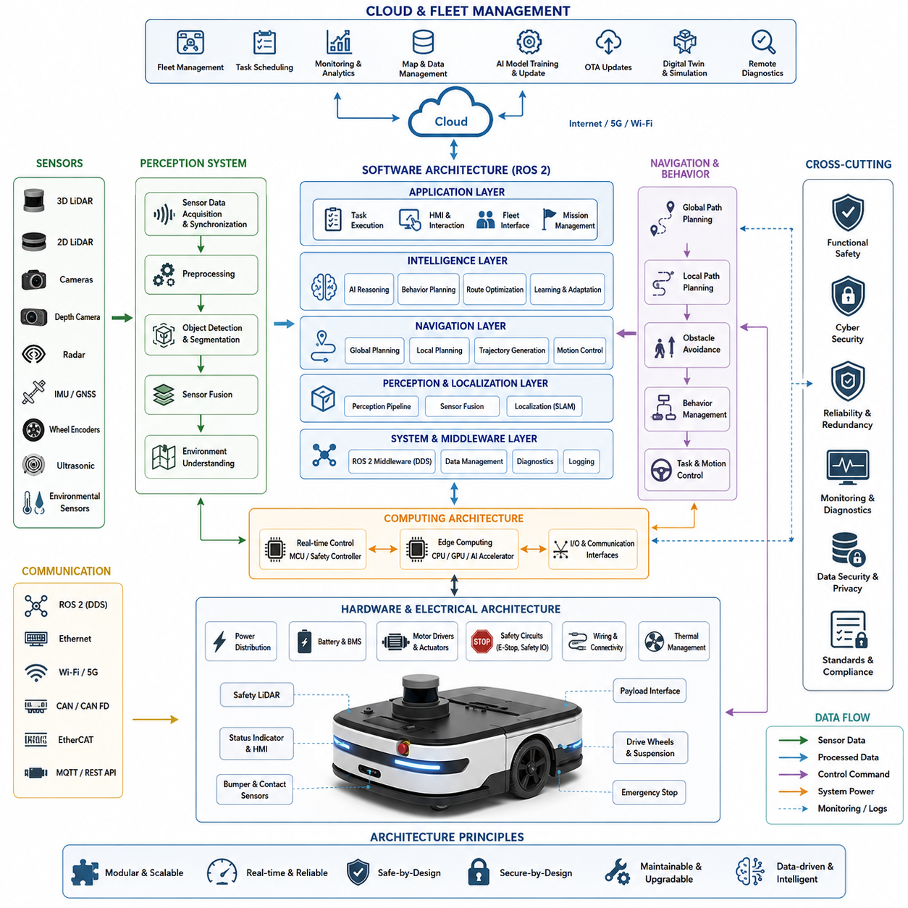
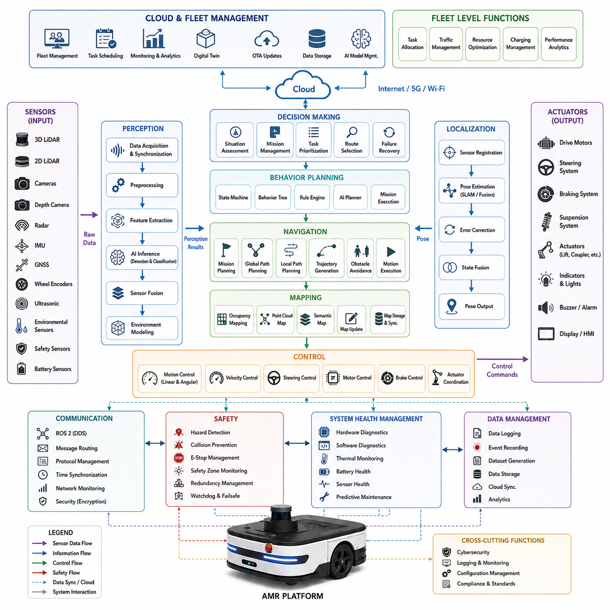
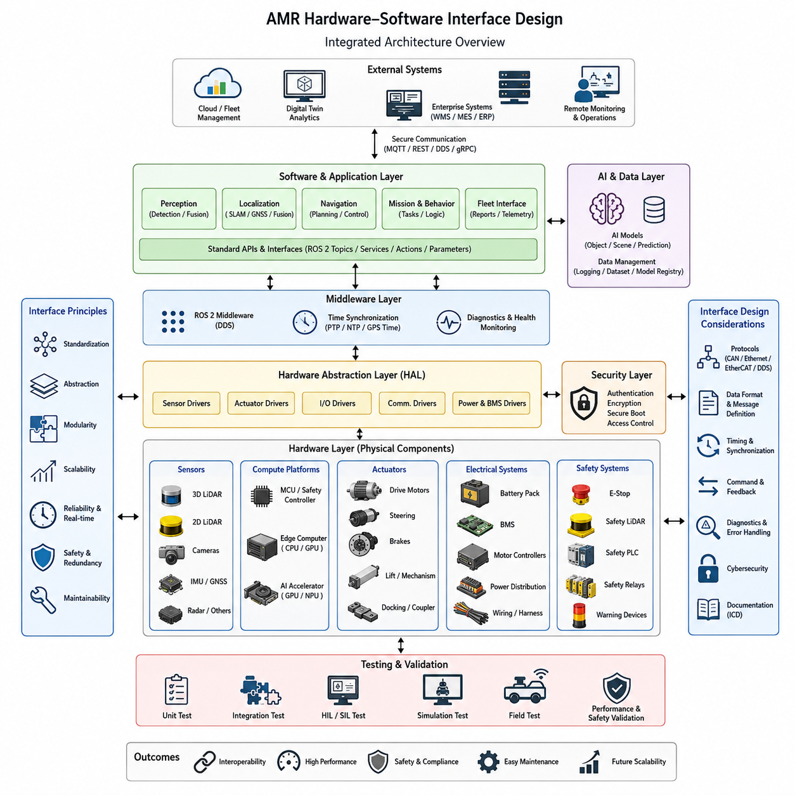
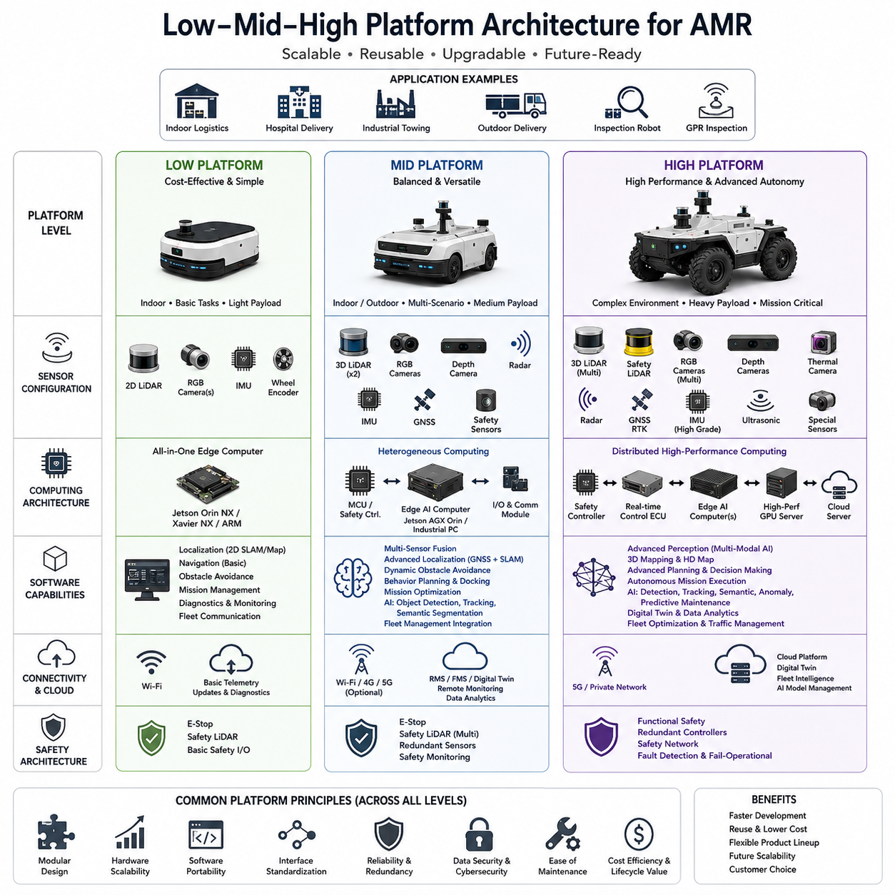
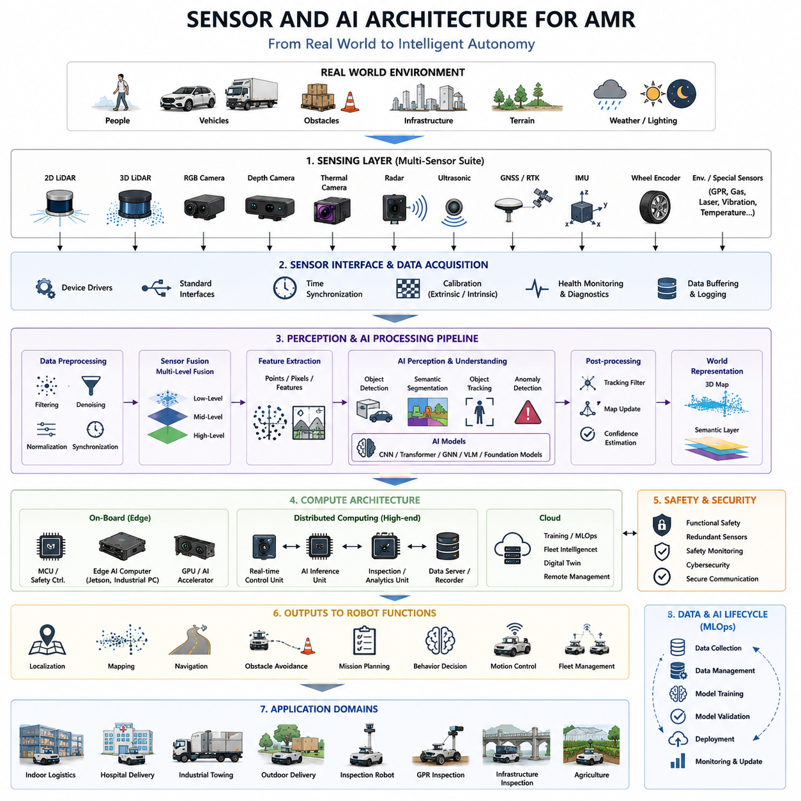
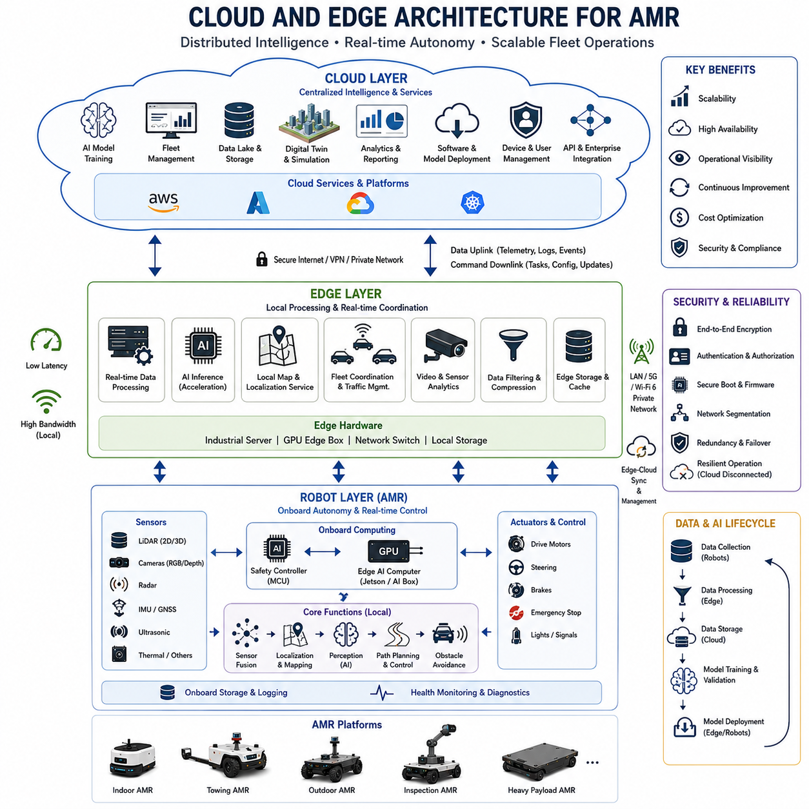
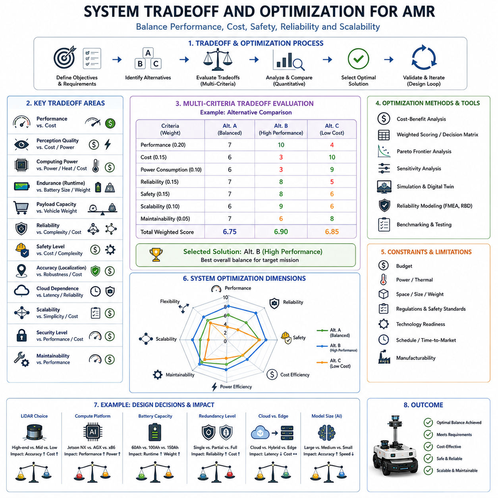
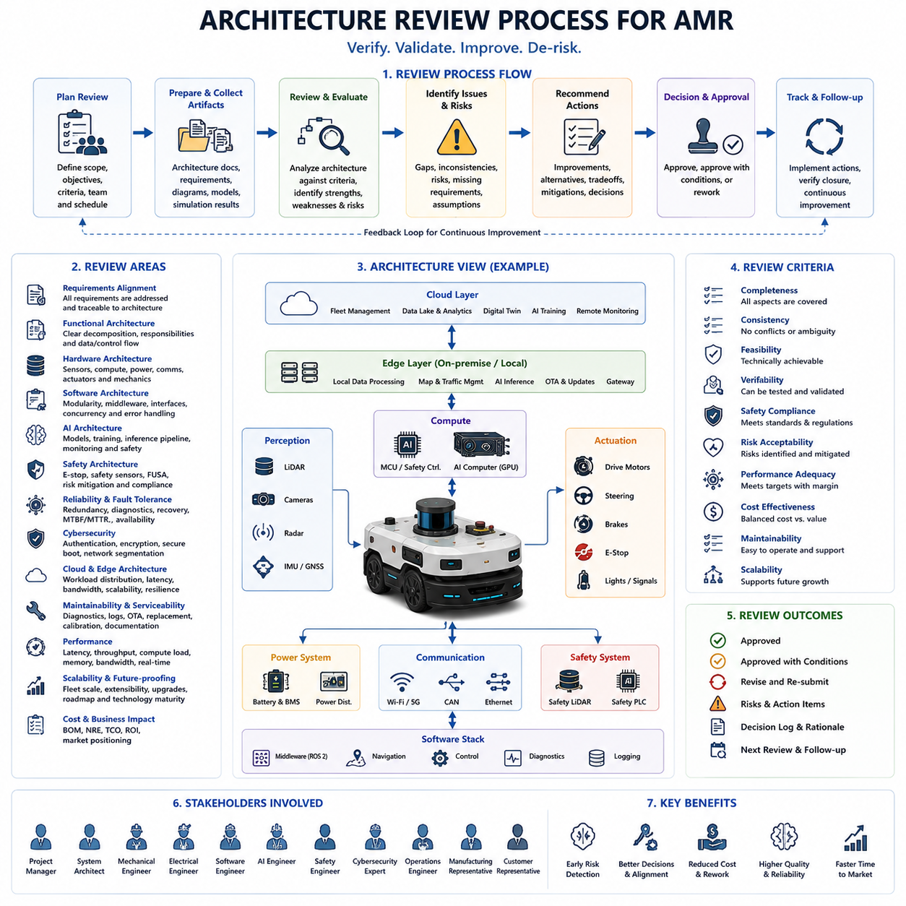

**Volume 10. AMR Engineering Process and Development Manual**

# Chapter 02. System Architecture Design

## 02.1 System Architecture Overview

{width="7.268055555555556in" height="7.268055555555556in"}

System architecture is the foundation of every successful Autonomous Mobile Robot (AMR) development project. It defines how hardware, software, communication networks, sensors, artificial intelligence modules, cloud services, and operational management systems work together as a unified platform. A well-designed architecture serves as the blueprint that guides development teams throughout the entire engineering lifecycle, from initial requirements analysis and prototype development to deployment, operation, maintenance, and future upgrades. In modern AMR systems, architecture is no longer limited to mechanical or electrical design. Instead, it encompasses a complete cyber-physical ecosystem that integrates robotics, embedded systems, artificial intelligence, cloud computing, edge computing, safety engineering, and fleet management into a single coherent framework. This chapter introduces the overall system architecture perspective and establishes the foundation for all subsequent engineering activities.

An AMR can be viewed as a collection of interconnected subsystems that collaborate to achieve autonomous operation. At the highest level, the system consists of the physical platform, perception system, localization and mapping system, navigation system, control system, AI subsystem, communication infrastructure, cloud services, and operational management layers. Each subsystem has specific responsibilities, but none operates independently. The performance of the entire robot depends on the effectiveness of interactions between these components. Architecture design therefore focuses not only on defining subsystem functions but also on ensuring reliable interfaces, data exchange mechanisms, timing synchronization, fault handling strategies, and scalability considerations.

The physical platform forms the foundation of the architecture. It includes the chassis, wheels, steering mechanisms, suspension systems, motors, actuators, brakes, batteries, power distribution systems, safety circuits, and environmental protection mechanisms. The physical platform provides mobility, structural support, and power resources for all higher-level functions. Whether the robot is intended for indoor logistics, hospital delivery, outdoor inspection, autonomous towing, agriculture, mining, or infrastructure inspection, the physical platform establishes the operational boundaries within which the robot can function. Architectural decisions at this level influence payload capacity, endurance, maneuverability, speed, terrain adaptability, and overall reliability.

Above the physical platform resides the electrical and embedded control architecture. This layer connects sensors, actuators, safety devices, communication buses, and computational units into a coordinated control framework. Embedded controllers typically manage low-level operations such as motor control, steering control, brake control, battery management, emergency stop handling, and health monitoring. These controllers operate under strict real-time requirements and often utilize communication protocols such as CAN, CAN FD, EtherCAT, RS485, Ethernet, or proprietary fieldbus technologies. The architecture must ensure deterministic performance, fault tolerance, and safe operation even under adverse conditions.

The perception subsystem represents the robot's sensory interface with the environment. Modern AMRs typically incorporate multiple sensor modalities, including 2D LiDAR, 3D LiDAR, RGB cameras, depth cameras, thermal cameras, radar systems, ultrasonic sensors, GNSS receivers, IMUs, wheel encoders, and environmental monitoring sensors. Each sensor provides a unique perspective on the surrounding environment. Architecture design determines how sensor data is acquired, synchronized, processed, fused, and distributed throughout the system. Since no single sensor is sufficient under all operating conditions, multi-sensor fusion becomes a critical architectural principle. Sensor redundancy and diversity improve robustness against environmental uncertainties such as dust, rain, fog, lighting variations, reflective surfaces, and dynamic obstacles.

Data generated by sensors flows into the perception processing pipeline. This subsystem transforms raw measurements into meaningful environmental understanding. Point clouds are converted into obstacle maps. Camera images become object detections and semantic classifications. Radar returns are transformed into moving target estimates. Thermal data identifies temperature anomalies. Sensor fusion algorithms combine these outputs to generate a unified representation of the robot's surroundings. Architecture design must carefully balance computational complexity, latency requirements, and accuracy objectives. Real-time operation often requires distributed processing across CPUs, GPUs, AI accelerators, and dedicated perception processors.

Localization and mapping functions provide spatial awareness. Without accurate localization, autonomous navigation becomes impossible. The architecture integrates odometry, inertial measurements, LiDAR observations, visual features, GNSS information, and map data to estimate the robot's position and orientation. Various approaches may be employed depending on operational requirements, including LiDAR SLAM, Visual SLAM, Visual-Inertial SLAM, GNSS-based localization, multi-sensor fusion localization, and hybrid approaches. Architecture decisions must account for indoor environments, outdoor environments, GPS-denied conditions, long-term operation, and map maintenance requirements.

The mapping subsystem serves as the robot's memory of the environment. Maps may include occupancy grids, point clouds, semantic maps, topological maps, HD maps, digital twins, and operational constraints. Different layers of mapping information support different operational objectives. Occupancy maps assist obstacle avoidance. Semantic maps support task execution. HD maps improve localization precision. Digital twins enable fleet-level simulation and monitoring. The architecture must define how maps are generated, updated, stored, distributed, and synchronized across multiple robots and cloud systems.

Navigation architecture transforms environmental understanding into autonomous movement. This subsystem includes global path planning, local path planning, trajectory generation, obstacle avoidance, behavior planning, motion control, and task execution logic. Global planners determine optimal routes across large operational environments. Local planners generate safe trajectories around obstacles. Behavior planners manage decision-making processes at intersections, elevators, charging stations, docking areas, and shared spaces. Motion controllers convert trajectories into steering, acceleration, and braking commands. The architecture ensures smooth interaction between planning layers while maintaining safety and operational efficiency.

Behavior planning represents a higher level of intelligence within the navigation architecture. Rather than simply avoiding obstacles, behavior planning determines how the robot should respond to complex operational scenarios. Examples include yielding to pedestrians, coordinating with other robots, entering elevators, opening automated doors, reversing while towing loads, parking in designated locations, waiting for traffic clearance, and responding to emergency situations. The architecture must support rule-based logic, state machines, behavior trees, AI-driven decision systems, or combinations thereof.

Artificial intelligence increasingly occupies a central role in modern AMR architecture. AI models perform object detection, semantic segmentation, anomaly detection, route optimization, predictive maintenance, human interaction, scene understanding, and task planning. Advanced systems may integrate multimodal foundation models, vision-language models, large language models, reinforcement learning agents, and embodied AI frameworks. Architecture design must define how AI components interact with traditional robotics software while maintaining predictability, safety, and real-time performance.

Computational architecture determines where processing occurs within the system. Edge computing performs real-time perception, localization, navigation, and control functions directly on the robot. Cloud computing supports large-scale data storage, model training, fleet management, analytics, and long-term optimization. Hybrid architectures distribute workloads across edge and cloud resources according to latency, bandwidth, reliability, and cost considerations. Critical safety functions always remain on the robot, while computationally intensive optimization tasks may execute in the cloud.

Many modern AMR systems adopt multi-tier computing architectures. A low-level processing layer manages safety-critical control loops. A mid-level processing layer executes perception and navigation algorithms. A high-level processing layer performs AI reasoning, mission planning, fleet coordination, and cloud integration. This hierarchical approach simplifies system design, improves modularity, and facilitates scalability. It also enables independent evolution of subsystems without disrupting overall system functionality.

Communication architecture serves as the nervous system of the robot. Internal communication connects sensors, controllers, processors, and actuators. External communication connects robots to fleet management systems, cloud services, digital twins, remote operators, and enterprise applications. Communication mechanisms may include Ethernet, Wi-Fi, 5G, private wireless networks, DDS middleware, MQTT protocols, ROS2 communication frameworks, REST APIs, and industrial communication standards. Architecture design must address bandwidth requirements, latency constraints, security considerations, reliability objectives, and scalability needs.

ROS2 has emerged as a dominant middleware framework within AMR architectures. It provides standardized communication mechanisms, modular software design principles, distributed computing capabilities, and interoperability across heterogeneous hardware platforms. ROS2 enables developers to organize functionality into reusable nodes that exchange information through topics, services, and actions. The architecture leverages ROS2 to promote modularity, maintainability, and rapid development while supporting real-time extensions where necessary.

Fleet management architecture extends system functionality beyond individual robots. Fleet Management Systems coordinate multiple robots operating within shared environments. Responsibilities include task allocation, traffic management, route optimization, resource scheduling, charging coordination, operational monitoring, and performance analytics. As fleet sizes increase, centralized and distributed coordination mechanisms become increasingly important. Architecture design must support both standalone robot operation and large-scale fleet deployments.

Cloud architecture provides long-term operational support for deployed systems. Cloud services enable data storage, OTA updates, AI model distribution, fleet monitoring, diagnostics, predictive maintenance, digital twin synchronization, and business analytics. The architecture must ensure secure communication between robots and cloud infrastructure while maintaining operational continuity during network disruptions. Robust edge autonomy remains essential because cloud connectivity cannot always be guaranteed.

Safety architecture represents one of the most critical aspects of system design. Autonomous robots interact with people, equipment, infrastructure, and dynamic environments. Functional safety mechanisms include emergency stop systems, safety LiDARs, redundant sensors, fail-safe controllers, watchdog timers, collision avoidance systems, safety zones, fault monitoring frameworks, and emergency recovery procedures. The architecture must ensure that failures in non-critical subsystems cannot compromise overall safety. Safety considerations must be incorporated from the earliest stages of architectural development rather than added later as separate features.

Cybersecurity architecture has become equally important as robots become increasingly connected. Threats may originate from unauthorized access, malware, network attacks, software vulnerabilities, compromised devices, or malicious insiders. Security architecture includes authentication mechanisms, encrypted communication channels, secure boot processes, access control policies, software integrity verification, key management systems, intrusion detection mechanisms, and incident response procedures. Security must be integrated into every architectural layer.

Scalability is another fundamental architectural principle. A successful architecture must accommodate future sensors, AI models, software modules, computing platforms, communication technologies, and operational requirements. Modular design practices reduce integration complexity and simplify upgrades. Well-defined interfaces enable subsystem replacement without requiring complete redesign. Scalability becomes particularly important for long-term product families that evolve across multiple generations.

Reliability and maintainability are closely related architectural objectives. Robots operating in industrial environments must achieve high availability and predictable performance. Architecture design should facilitate diagnostics, fault isolation, software updates, hardware replacement, and operational monitoring. Logging systems, health monitoring frameworks, remote diagnostics capabilities, and maintenance tools contribute significantly to long-term system reliability.

Ultimately, system architecture serves as the bridge between product requirements and engineering implementation. It transforms business objectives, customer expectations, operational constraints, safety requirements, and technological capabilities into a structured design framework. Every subsequent engineering activity---including mechanical design, electrical development, embedded software implementation, AI model deployment, navigation development, testing, manufacturing, and operational support---depends upon the quality of the architectural foundation. A well-designed architecture reduces development risk, accelerates integration, improves reliability, enhances scalability, and creates a platform capable of supporting future innovation throughout the lifecycle of the AMR product.

## 02.2 Functional Block Architecture

{width="7.268055555555556in" height="7.268055555555556in"}

Functional Block Architecture is one of the most important activities in Autonomous Mobile Robot (AMR) system engineering because it transforms high-level product requirements into a structured collection of functional modules that collectively deliver autonomous behavior. While the system architecture defines the overall organization of hardware, software, communication networks, sensors, computing resources, and operational infrastructure, the functional block architecture focuses on what the system must do and how different functions interact with one another. It provides a logical representation of the robot before implementation details are introduced. By separating functions from implementation technologies, engineers can better understand system complexity, identify dependencies, allocate responsibilities, and establish clear interfaces among subsystems.

The primary objective of a functional block architecture is to decompose a highly complex autonomous robot into manageable functional units. Modern AMRs are composed of hundreds of interacting software modules, electronic devices, sensors, communication channels, and mechanical systems. Without a structured functional model, development teams can easily become overwhelmed by system complexity. Functional decomposition enables engineers to organize the robot into logical layers and blocks that can be independently analyzed, designed, tested, and improved.

A functional block architecture typically begins with mission objectives. Every AMR is created to perform specific operational tasks within a defined environment. Examples include transporting materials inside factories, delivering medical supplies in hospitals, towing heavy carts in logistics centers, inspecting underground infrastructure, patrolling industrial facilities, or operating in outdoor agricultural environments. Mission objectives determine the functional capabilities that the robot must possess. These capabilities are then translated into functional blocks that collectively support autonomous operation.

At the highest level, the AMR functional architecture can be divided into sensing, perception, localization, mapping, planning, decision-making, control, communication, safety, management, and operational support functions. Each of these major functions is further decomposed into smaller blocks that perform specific responsibilities. The decomposition process continues until every function can be clearly understood, assigned to development teams, implemented as software modules or hardware components, and verified through testing.

The sensing function represents the interface between the robot and the physical world. Sensors continuously observe the environment and generate raw measurements that serve as the foundation for all higher-level functions. The sensing block includes LiDAR systems, cameras, radar sensors, ultrasonic sensors, GNSS receivers, inertial measurement units, wheel encoders, environmental sensors, safety sensors, battery monitoring devices, and actuator feedback systems. At the functional level, sensing is responsible for acquiring data, timestamping information, synchronizing measurements, performing sensor health monitoring, and distributing raw observations to downstream processing modules.

Above the sensing layer resides the perception function. Perception transforms raw sensor measurements into meaningful environmental understanding. This block performs object detection, object classification, semantic segmentation, obstacle recognition, free-space detection, lane recognition, human identification, vehicle tracking, environmental understanding, and scene interpretation. Perception serves as the robot's artificial sensory cortex, converting low-level measurements into structured information that can support navigation and decision-making processes.

Perception itself can be decomposed into multiple sub-functions. Data acquisition modules receive sensor streams from various devices. Preprocessing modules remove noise, correct distortions, normalize measurements, and prepare data for higher-level processing. Feature extraction modules identify meaningful patterns within sensor observations. AI inference modules execute deep learning models to recognize objects and classify environmental elements. Sensor fusion modules combine outputs from multiple sensors to create a unified environmental representation. Finally, environment modeling modules construct consistent representations of the surrounding world.

Localization functions determine the robot's position and orientation within the operating environment. Autonomous navigation cannot be achieved unless the robot continuously knows where it is. The localization block receives information from wheel odometry, IMUs, LiDAR scans, camera observations, GNSS receivers, and environmental landmarks. Using various estimation algorithms, localization computes the robot's pose and provides continuous position updates to planning and control modules. Functional decomposition of localization often includes sensor registration, coordinate transformation, pose estimation, uncertainty estimation, error correction, and state fusion functions.

Closely related to localization is the mapping function. Mapping creates and maintains digital representations of operational environments. Functional blocks within the mapping subsystem include occupancy mapping, point cloud generation, semantic map construction, topological mapping, HD map generation, map updating, map storage, map synchronization, and map distribution. The mapping function serves as a long-term memory system for the robot, enabling efficient navigation and environmental understanding across repeated operations.

Navigation functions occupy a central position within the functional architecture. Navigation converts mission objectives into executable motion plans. Navigation can be decomposed into several hierarchical blocks. Mission planning determines high-level objectives and destinations. Global path planning identifies optimal routes through known environments. Local path planning generates collision-free trajectories based on real-time observations. Trajectory generation produces dynamically feasible motion commands. Obstacle avoidance continuously modifies paths to accommodate unexpected environmental changes. Motion execution coordinates vehicle movement according to navigation objectives.

Behavior planning introduces a higher level of decision-making within the navigation architecture. Autonomous robots frequently encounter situations that cannot be solved through geometric path planning alone. Interactions with pedestrians, vehicles, elevators, automatic doors, charging stations, intersections, loading zones, and shared workspaces require contextual reasoning. Behavior planning manages these situations by evaluating environmental conditions and selecting appropriate operational responses. The functional architecture may include state machines, behavior trees, rule engines, AI planners, and mission execution managers that collectively support intelligent robot behavior.

The decision-making function serves as the cognitive center of the AMR. This block integrates information from perception, localization, mapping, navigation, safety, and operational constraints to determine appropriate actions. Decision-making may involve route selection, task prioritization, mission scheduling, resource allocation, failure recovery, operational optimization, and adaptive behavior selection. In advanced systems, artificial intelligence techniques such as reinforcement learning, large language models, world models, and autonomous agents may contribute to decision-making processes.

Control functions translate decisions into physical actions. The control architecture typically includes motion controllers, steering controllers, velocity controllers, motor controllers, braking controllers, suspension controllers, actuator coordinators, and low-level embedded control systems. Control functions operate under strict real-time constraints and must ensure stable, predictable, and safe robot behavior. Feedback loops continuously monitor actual system responses and adjust commands to maintain desired performance.

The communication function connects all blocks within the architecture. Modern AMRs rely on extensive information exchange between sensors, processors, controllers, cloud services, fleet management systems, and external infrastructure. Functional communication blocks include message routing, protocol management, middleware services, network monitoring, data synchronization, time synchronization, bandwidth management, and communication security. Without a robust communication architecture, distributed robotic systems cannot operate reliably.

ROS2-based architectures often implement communication functionality through topics, services, actions, and distributed middleware services. Functional blocks within ROS2 environments exchange information through well-defined interfaces, allowing development teams to build modular and scalable systems. The functional architecture therefore serves as the foundation for software architecture development and middleware integration.

Artificial intelligence functions have become increasingly important within modern AMR systems. AI functional blocks support object recognition, semantic understanding, anomaly detection, predictive maintenance, route optimization, multimodal reasoning, human interaction, and adaptive learning. Unlike traditional deterministic algorithms, AI functions introduce probabilistic reasoning and data-driven decision-making capabilities. Functional architecture design must carefully define the boundaries between AI-driven functions and safety-critical deterministic systems.

Fleet management functions become essential when multiple robots operate within shared environments. The fleet management block coordinates task allocation, traffic control, resource utilization, charging schedules, operational priorities, and performance monitoring across multiple robots. Functional decomposition includes task scheduling, route coordination, congestion management, fleet optimization, operational reporting, and system-wide analytics. Fleet-level functions often operate in cloud environments while maintaining close integration with individual robot systems.

Cloud functions provide long-term operational support and enterprise-level capabilities. Functional blocks include data storage, OTA update management, digital twin synchronization, AI model deployment, fleet monitoring, predictive maintenance analytics, operational reporting, cybersecurity monitoring, and business intelligence. The cloud architecture extends robot capabilities beyond onboard computational limitations and supports continuous improvement throughout the operational lifecycle.

Safety functions represent one of the most critical elements of the functional block architecture. Safety must not be viewed as a separate subsystem added after development. Instead, safety functions must be integrated throughout the architecture. Functional safety blocks include hazard detection, collision prevention, emergency stop management, safety zone monitoring, fault detection, redundancy management, watchdog supervision, degraded operation modes, and emergency recovery procedures. These functions ensure that the robot remains safe even when unexpected failures occur.

Cybersecurity functions have become equally important as robots become increasingly connected. Functional blocks within the cybersecurity architecture include authentication services, access control mechanisms, encryption systems, secure communication channels, software integrity verification, intrusion detection, threat monitoring, vulnerability management, and incident response coordination. Cybersecurity functions protect operational systems from unauthorized access and malicious activities.

System health management functions continuously monitor robot status during operation. Functional blocks include hardware diagnostics, software diagnostics, thermal monitoring, battery health assessment, communication quality monitoring, sensor status verification, AI model performance tracking, and predictive maintenance analysis. Health management enables proactive maintenance and improves long-term reliability.

Data management functions support the collection, storage, processing, and utilization of information generated during robot operation. Functional blocks include data logging, event recording, dataset generation, metadata management, version control, cloud synchronization, and analytics processing. Since modern AMRs generate massive amounts of operational data, effective data management architecture becomes essential for AI development, troubleshooting, performance optimization, and regulatory compliance.

The functional block architecture must also address scalability requirements. A well-designed architecture should allow new sensors, AI models, communication technologies, operational features, and software modules to be integrated without major redesign. Functional interfaces should be clearly defined, standardized, and technology-independent whenever possible. This modularity reduces development complexity and supports long-term product evolution.

Traceability is another important characteristic of a mature functional architecture. Every functional block should be linked to specific customer requirements, operational objectives, performance targets, safety requirements, and verification procedures. Traceability enables engineers to demonstrate compliance, perform impact analysis, manage changes, and ensure that all requirements are adequately addressed throughout the development lifecycle.

Ultimately, the Functional Block Architecture serves as the logical blueprint that bridges product requirements and system implementation. It defines the complete set of capabilities required for autonomous operation while establishing relationships among sensing, perception, localization, mapping, navigation, AI, control, communication, safety, cloud, and operational management functions. By organizing complex robotic systems into structured and interconnected functional blocks, engineers create a foundation that supports efficient development, systematic testing, scalable deployment, long-term maintenance, and continuous innovation. The quality of the functional architecture directly influences the reliability, safety, performance, maintainability, and future adaptability of the entire AMR platform, making it one of the most important artifacts in the robotics engineering process.

## 02.03 Hardware Software Interface Design

{width="7.268055555555556in" height="7.268055555555556in"}

Hardware and Software Interface Design is one of the most critical activities in the development of an Autonomous Mobile Robot (AMR) because it defines how physical components and digital intelligence cooperate to create a reliable, safe, scalable, and maintainable robotic system. Within the overall System Architecture Design process, Hardware-Software Interface Design serves as the bridge between mechanical systems, electrical systems, embedded controllers, edge computing platforms, AI software modules, cloud infrastructure, and operator-facing applications. The objective is not merely to connect hardware devices to software applications but to establish a structured framework that allows every subsystem to communicate consistently, predictably, and safely throughout the entire lifecycle of the robot. This architecture element is positioned within the System Architecture Design phase of the AMR Engineering Process and follows the Functional Block Architecture definition. It provides the foundation for later development activities involving embedded software, perception systems, localization, navigation, fleet management, cloud integration, and field operations.

In modern AMR systems, hardware and software are deeply interconnected. Sensors continuously generate large volumes of environmental information, actuators execute control commands generated by software algorithms, communication devices transfer information between distributed subsystems, and AI engines transform raw sensor observations into actionable decisions. The effectiveness of the entire robot depends heavily on the quality of interfaces connecting these elements. Poorly designed interfaces often lead to integration difficulties, synchronization problems, excessive latency, debugging challenges, safety risks, and long-term maintenance issues. Therefore, interface design must be approached as a primary architectural activity rather than an implementation detail.

The Hardware-Software Interface Design process begins with a comprehensive understanding of the robot\'s physical architecture. Every hardware component must be identified, categorized, and mapped to its software counterpart. Typical AMR platforms contain sensors such as 3D LiDARs, 2D safety LiDARs, RGB cameras, depth cameras, thermal cameras, radar systems, GNSS receivers, IMUs, wheel encoders, battery management systems, motor controllers, safety controllers, industrial I/O modules, wireless communication devices, and edge computing platforms. Each device exposes specific capabilities, data structures, communication protocols, timing characteristics, bandwidth requirements, and operational constraints. These characteristics must be documented before software integration begins.

A fundamental principle of interface design is abstraction. Software should interact with hardware through standardized abstraction layers rather than directly depending on device-specific implementations. This approach isolates application software from hardware variations and allows future upgrades without requiring extensive redesign. For example, a localization module should consume standardized pose information regardless of whether the source originates from GNSS, LiDAR SLAM, Visual SLAM, or sensor fusion algorithms. Similarly, navigation software should issue velocity commands through a common motion control interface without depending on the specific motor driver manufacturer.

The interface architecture typically consists of multiple layers. At the lowest level, physical devices communicate using electrical and communication standards. Above this layer, device drivers translate hardware-specific signals into software-readable information. Middleware services manage message transport, synchronization, discovery, and communication. Application modules consume and generate information through standardized APIs. Cloud and fleet systems interact with robot software through service-oriented interfaces. By organizing communication through these layers, the architecture remains modular and scalable.

Communication protocol selection represents one of the most important design decisions. Different robot subsystems require different communication mechanisms depending on latency, reliability, bandwidth, determinism, and safety requirements. Real-time motion control systems commonly utilize CAN Bus, CAN FD, EtherCAT, or industrial Ethernet networks. Safety systems often employ dedicated safety-certified communication channels. Sensor systems may use Ethernet, USB, GigE Vision, MIPI, serial interfaces, or proprietary protocols. Cloud communication frequently relies on MQTT, WebSocket, REST APIs, gRPC, or DDS-based frameworks. The interface architecture must clearly define which protocol is assigned to each subsystem and why it satisfies system requirements.

Time synchronization plays a critical role in AMR interface design. Multiple sensors operating independently can generate inconsistent information if timestamps are not synchronized. Localization, perception, sensor fusion, and navigation algorithms depend heavily on temporal consistency. Therefore, the architecture often includes centralized time synchronization mechanisms such as Precision Time Protocol, Network Time Protocol, GPS-derived timing references, or ROS2 time synchronization frameworks. Every data packet generated by a hardware device should contain precise timestamps that allow software modules to reconstruct system state accurately.

Sensor interfaces constitute one of the largest portions of the hardware-software integration effort. Each sensor produces unique data formats, frequencies, resolutions, and update rates. A 3D LiDAR may generate millions of points per second. A camera may stream high-resolution images at thirty or sixty frames per second. An IMU may generate hundreds or thousands of measurements per second. GNSS receivers provide periodic positioning updates. Radar systems generate object detection information. Software interfaces must normalize these heterogeneous data streams into consistent representations that can be processed efficiently by downstream applications.

Actuator interfaces require equally careful design. Motion controllers, steering systems, braking systems, lifting mechanisms, docking actuators, couplers, and auxiliary equipment must receive commands from software while continuously reporting operational status. These interfaces must support command execution, fault monitoring, state reporting, diagnostics, and safety supervision. Feedback loops must operate within strict timing constraints to ensure stable and predictable robot behavior. The interface specification should clearly define command structures, response formats, update frequencies, error handling procedures, and fail-safe behaviors.

Safety-related interfaces demand additional rigor because they directly affect human safety and operational risk. Emergency stop circuits, safety LiDAR systems, safety PLCs, safety relays, and redundant monitoring controllers typically operate independently from non-safety software functions. Interface definitions must clearly distinguish between safety-critical communication paths and standard operational communication channels. The architecture should ensure that safety functions remain operational even if application software crashes or communication failures occur.

Power management interfaces have become increasingly important in modern AMRs due to the complexity of battery-powered operations. Battery Management Systems provide information regarding voltage, current, temperature, state of charge, state of health, charging status, and fault conditions. Software applications use this information to perform mission planning, charging scheduling, energy optimization, predictive maintenance, and fleet-level resource allocation. The interface design must support both real-time operational monitoring and long-term analytics.

Edge computing platforms act as the computational center of the robot and therefore require comprehensive interface definitions. Modern AMRs often utilize heterogeneous computing architectures consisting of MCUs, industrial PCs, GPUs, AI accelerators, and dedicated safety controllers. The software architecture must define how workloads are distributed among these computational resources. Low-level control may execute on microcontrollers, perception algorithms on GPU-equipped edge computers, planning software on application processors, and fleet management tasks in the cloud. Hardware-software interfaces ensure efficient communication across these computational domains.

Artificial Intelligence integration introduces additional interface considerations. AI models consume large amounts of sensor information and generate outputs such as object detections, semantic maps, free-space estimates, anomaly predictions, or navigation recommendations. Interface specifications must define model inputs, output schemas, confidence metrics, execution timing requirements, version management procedures, and fallback behaviors. Standardized AI interfaces allow multiple models to coexist within the same system and facilitate future model upgrades without disrupting the overall architecture.

ROS2-based AMR systems frequently implement hardware-software interfaces through nodes, topics, services, actions, and parameters. Device drivers publish sensor information through standardized topics. Control systems subscribe to command messages and publish status information. Service interfaces provide configuration and diagnostic capabilities. Action interfaces support long-duration operations such as docking, navigation, or mission execution. Parameter interfaces allow dynamic configuration without software recompilation. Proper topic naming conventions, message definitions, and QoS policies become essential components of interface design.

Scalability is another major consideration. AMR platforms often evolve from prototype systems into commercial products supporting multiple configurations. A single software architecture may be deployed on indoor logistics robots, outdoor inspection robots, towing platforms, hospital service robots, or autonomous utility vehicles. Hardware-software interfaces must therefore accommodate different sensor combinations, actuator configurations, computing resources, and operational environments. Modular interface definitions enable platform reuse and reduce engineering costs across product families.

Fault management and diagnostics represent essential aspects of interface design. Every hardware component should expose diagnostic information that enables software systems to monitor operational health. Sensor failures, communication interruptions, power anomalies, overheating conditions, actuator malfunctions, and performance degradations must be detectable through standardized interfaces. Diagnostic frameworks typically include status codes, health indicators, event logs, error reports, warning levels, and recovery recommendations. These capabilities significantly improve maintainability and field support effectiveness.

Cybersecurity requirements increasingly influence interface architecture. Hardware devices must authenticate communication partners, protect sensitive information, and prevent unauthorized access. Secure communication channels, encrypted data transport, certificate management, secure boot mechanisms, and firmware integrity verification are becoming standard requirements for industrial AMR deployments. Interface specifications should include security requirements from the earliest design stages rather than treating cybersecurity as an afterthought.

Cloud and fleet integration extend hardware-software interfaces beyond the robot itself. Modern AMRs operate as connected cyber-physical systems within larger operational ecosystems. Robots exchange information with fleet management systems, cloud analytics platforms, digital twins, enterprise applications, warehouse management systems, manufacturing execution systems, and remote monitoring centers. Interface definitions must specify communication protocols, API structures, data ownership policies, synchronization mechanisms, and security controls governing these interactions.

Testing and validation activities are essential for ensuring interface reliability. Interface testing begins with individual device verification and progresses toward subsystem integration, system integration, simulation-based validation, Hardware-in-the-Loop testing, Software-in-the-Loop testing, and field deployment trials. Every interface specification should be associated with measurable acceptance criteria. Data latency, communication reliability, throughput capacity, synchronization accuracy, fault tolerance, recovery behavior, and resource utilization should all be evaluated systematically.

Documentation serves as the long-term foundation of successful interface management. Interface Control Documents define communication structures, message formats, timing requirements, protocol specifications, state machines, configuration parameters, and error handling procedures. These documents provide a shared reference for mechanical engineers, electrical engineers, embedded developers, AI engineers, software architects, validation teams, and operational personnel. Comprehensive documentation reduces ambiguity, improves collaboration, and accelerates future system evolution.

For advanced outdoor AMRs, autonomous inspection robots, GPR inspection platforms, towing robots, hospital logistics robots, and industrial fleet systems, Hardware-Software Interface Design becomes one of the most influential factors determining project success. A well-designed interface architecture enables modular development, efficient integration, rapid debugging, scalable deployment, reliable operation, and long-term maintainability. It transforms a collection of independent hardware devices and software applications into a unified autonomous system capable of operating safely and effectively in complex real-world environments. As AMR platforms continue evolving toward higher levels of autonomy, increased AI integration, larger fleet deployments, and stronger cloud connectivity, Hardware-Software Interface Design will remain a foundational discipline that connects physical robotics engineering with intelligent software systems and ensures that the entire robotic ecosystem operates as a coherent and dependable platform.

## 02.04 Low Mid High Platform Architecture

{width="7.268055555555556in" height="7.268055555555556in"}

Low-Mid-High Platform Architecture is a strategic system architecture methodology used to develop scalable Autonomous Mobile Robot (AMR) product families that can address multiple market segments while maximizing hardware reuse, software portability, manufacturing efficiency, and long-term maintainability. Instead of designing a completely different architecture for every robot product, a platform-based approach establishes a common technological foundation and then defines multiple performance tiers that can be adapted according to customer requirements, operational environments, payload demands, computational complexity, and autonomy levels. This architecture allows robotics companies to support cost-sensitive entry-level systems, balanced mid-range platforms, and high-performance premium solutions while maintaining a unified development ecosystem.

The concept of Low-Mid-High Platform Architecture originates from the recognition that not all robotic applications require the same level of sensing capability, computing power, autonomy, safety functionality, or fleet integration. A small indoor logistics robot operating inside a warehouse may require only basic navigation and obstacle avoidance capabilities. An industrial towing robot operating in a factory environment may require more sophisticated localization, multi-sensor perception, and traffic management capabilities. A large outdoor autonomous inspection robot performing infrastructure monitoring, security patrol, or GPR-based underground inspection may require advanced AI processing, high-end perception systems, cloud connectivity, digital twin integration, and autonomous mission execution. Designing separate architectures for each of these systems would significantly increase development cost and engineering complexity. Therefore, a scalable platform architecture becomes essential.

The Low Platform Architecture is typically designed to provide the minimum viable autonomous functionality while maintaining affordability, simplicity, reliability, and ease of deployment. This architecture focuses on applications where environmental complexity is relatively low and operational requirements are predictable. Typical examples include indoor delivery robots, warehouse transport robots, hospital logistics robots, educational robotics platforms, and basic industrial AMRs. The hardware configuration of a low platform generally consists of a compact mobile base, a limited sensor suite, a lightweight edge computing system, and simplified communication infrastructure.

The sensor architecture of a low platform often includes a single 2D LiDAR, a small number of RGB cameras, wheel encoders, and an IMU. Localization may rely on 2D LiDAR SLAM or predefined map-based navigation. Object detection capabilities are usually limited to essential obstacle avoidance and safety monitoring functions. The perception pipeline is optimized for computational efficiency rather than environmental richness. This approach reduces system cost while maintaining sufficient operational performance.

Computationally, the low platform commonly utilizes embedded AI computers such as NVIDIA Jetson Orin NX, Jetson Xavier NX, Intel-based edge systems, or ARM-based industrial computing modules. The processing architecture typically integrates robot control, localization, perception, and navigation within a single computing unit. This design minimizes power consumption, reduces hardware complexity, and simplifies thermal management.

The software architecture of a low platform emphasizes modularity and operational stability. Core modules generally include localization, navigation, mission management, sensor fusion, diagnostics, fleet communication, and safety monitoring. AI functionality is often focused on object detection, obstacle classification, and basic operational intelligence. Advanced capabilities such as semantic understanding, multimodal reasoning, or large-scale AI inference are usually excluded to preserve computational resources.

Communication systems in low-tier platforms are designed for operational simplicity. Wi-Fi communication may be sufficient for fleet management and remote monitoring. Cloud integration is generally limited to telemetry collection, software updates, diagnostics, and fleet coordination. Data processing is performed primarily on the robot itself, minimizing dependency on external infrastructure.

The Mid Platform Architecture represents a balanced solution that bridges affordability and advanced functionality. It targets industrial applications requiring higher autonomy, improved environmental understanding, greater payload capacity, and enhanced operational flexibility. Typical deployments include factory towing robots, outdoor logistics platforms, autonomous inspection systems, hospital logistics fleets, campus delivery robots, and industrial service robots.

The hardware architecture of a mid-tier platform expands significantly compared to the low platform. Multiple perception sensors are integrated to provide richer environmental awareness. Typical sensor configurations include dual 3D LiDARs, multiple RGB cameras, depth cameras, radar systems, IMUs, wheel encoders, GNSS receivers, and safety sensors. The perception architecture is designed to support sensor fusion and redundancy, improving operational robustness under diverse environmental conditions.

The computational architecture of a mid platform often separates robot control functions from AI processing functions. A dedicated microcontroller or safety controller manages real-time vehicle control, while an edge AI computer performs perception, localization, and navigation processing. Computing platforms may include NVIDIA Jetson AGX Orin, Jetson Thor-class systems, industrial x86 computers, or hybrid CPU-GPU architectures. This separation improves system stability and enables more advanced autonomy algorithms.

Software complexity increases significantly at the mid level. Multi-sensor fusion becomes a standard component of the perception pipeline. Localization systems may combine GNSS, LiDAR SLAM, visual odometry, IMU fusion, and map-based localization methods. Navigation modules support dynamic obstacle avoidance, behavior planning, fleet coordination, docking automation, and mission optimization. AI systems may incorporate object detection, semantic segmentation, tracking, anomaly detection, and environmental classification.

Cloud integration becomes more substantial in the mid-tier architecture. Fleet Management Systems (FMS), Robot Management Systems (RMS), digital twins, predictive maintenance platforms, and remote monitoring services become important operational components. Data collected during robot operation can be analyzed centrally to improve system performance and operational efficiency. Software updates, configuration management, and AI model deployment may be managed through cloud-based infrastructure.

The High Platform Architecture represents the most advanced level of AMR design. These systems are intended for highly autonomous operations in complex and dynamic environments where maximum perception capability, computational performance, reliability, scalability, and intelligence are required. Examples include autonomous infrastructure inspection robots, large-scale outdoor logistics platforms, GPR inspection systems, mining robots, agricultural robots, defense robots, autonomous construction equipment, and advanced smart city robotic systems.

The sensor architecture of a high platform is designed around comprehensive environmental awareness and operational redundancy. Multiple 3D LiDARs, multiple safety LiDARs, high-resolution RGB cameras, depth cameras, thermal cameras, radar arrays, GNSS RTK systems, high-grade IMUs, ultrasonic sensors, laser profilers, acoustic sensors, environmental sensors, and specialized inspection sensors may all operate simultaneously. Sensor redundancy ensures continued operation even in the presence of individual sensor failures or adverse environmental conditions.

High-tier platforms frequently incorporate specialized sensing technologies tailored to mission requirements. Infrastructure inspection robots may integrate Ground Penetrating Radar, thermal imaging systems, ultrasonic inspection devices, laser measurement systems, vibration sensors, and environmental monitoring equipment. These specialized subsystems generate large amounts of data that require sophisticated processing architectures.

The computational architecture of a high platform is characterized by distributed heterogeneous computing. Multiple computing nodes cooperate to execute different workloads. Dedicated safety controllers manage functional safety systems. Real-time control processors execute vehicle dynamics algorithms. Edge AI computers perform perception and sensor fusion. High-performance GPU servers execute AI inference, world model generation, and predictive analytics. Cloud systems provide fleet-level optimization and large-scale data processing.

In advanced outdoor robotic platforms, computational architectures may utilize combinations of Jetson-based AI computers, industrial edge servers, and high-performance GPUs such as RTX-class accelerators. In some architectures, one AI computing node is dedicated to autonomous navigation functions while another node is dedicated to inspection intelligence, sensor analytics, and AI inference. This separation ensures deterministic control performance while supporting computationally intensive AI workloads.

Software architecture in high-tier platforms evolves into a distributed service-oriented ecosystem. Multiple autonomous subsystems communicate through middleware frameworks such as ROS2 DDS architectures. Perception services, localization services, mapping services, planning services, AI reasoning services, mission execution services, cloud gateways, safety services, and diagnostic services operate independently while collaborating through well-defined interfaces. This architecture improves scalability and facilitates future technology upgrades.

Artificial Intelligence becomes a central component of high-tier architectures. Deep learning systems support object detection, semantic segmentation, object tracking, anomaly detection, defect identification, predictive maintenance, environmental understanding, multimodal perception, and autonomous decision-making. Foundation models, vision-language models, multimodal AI systems, and embodied intelligence frameworks may be integrated to support advanced operational capabilities.

The networking architecture of high platforms extends beyond individual robots. Robots become intelligent nodes within larger cyber-physical ecosystems. High-bandwidth communication links connect robots to cloud infrastructure, fleet management systems, digital twins, operational command centers, and enterprise information systems. Edge-cloud collaboration enables continuous learning, remote diagnostics, model optimization, and fleet-wide intelligence sharing.

One of the most important principles of Low-Mid-High Platform Architecture is software portability. Regardless of platform level, software modules should be designed using common interfaces and standardized APIs. Localization modules, navigation services, perception pipelines, mission planners, diagnostics frameworks, and fleet interfaces should remain compatible across platform tiers. This approach allows engineering teams to develop software once and deploy it across multiple products with minimal modification.

Another critical principle is hardware scalability. Sensor interfaces, communication frameworks, power systems, and computing architectures should support future expansion. A low-tier platform may initially deploy with a single LiDAR and camera, but the architecture should allow additional sensors to be integrated without requiring a complete redesign. This scalability protects long-term product investments and accelerates future product evolution.

Safety architecture also evolves across platform levels. Low-tier systems may rely on basic emergency stop mechanisms and safety LiDAR protection. Mid-tier systems incorporate redundant sensing and safety monitoring. High-tier platforms implement comprehensive functional safety architectures involving redundant controllers, safety communication networks, fault detection systems, fail-operational strategies, and advanced risk management mechanisms.

From a business perspective, Low-Mid-High Platform Architecture provides substantial advantages. Development resources can be shared across multiple products. Manufacturing processes become more efficient through component reuse. Supply chain management is simplified. Software maintenance costs are reduced. Certification activities become more manageable. Most importantly, customers can select platform configurations that align with their operational requirements and budget constraints while remaining within a common technological ecosystem.

For modern AMR manufacturers, platform architecture serves not only as a technical framework but also as a product strategy. It enables the creation of a complete robotics portfolio spanning entry-level indoor robots, industrial logistics platforms, outdoor autonomous systems, infrastructure inspection robots, GPR-based underground utility inspection platforms, and future intelligent robotic ecosystems. As autonomous robotics continues to evolve toward higher levels of intelligence, connectivity, and autonomy, the Low-Mid-High Platform Architecture approach will remain one of the most effective methods for balancing innovation, scalability, engineering efficiency, and commercial competitiveness.

## 02.05 Sensor and AI Architecture

{width="7.268055555555556in" height="7.268055555555556in"}

Sensor and AI Architecture represents one of the most important pillars of modern Autonomous Mobile Robot (AMR) systems because it defines how robots perceive, understand, interpret, and interact with the physical world. While mechanical systems provide mobility and electrical systems provide power, the combination of sensors and artificial intelligence creates the cognitive capability that transforms a machine into an autonomous robot. Sensor and AI Architecture serves as the foundation for perception, localization, mapping, navigation, safety, decision-making, mission execution, and operational intelligence. Within the overall System Architecture Design process, this architecture defines how data flows from physical sensors through processing pipelines and AI models into actionable decisions that enable autonomous behavior. It is a critical bridge between the physical environment and the digital intelligence of the robot.

The primary objective of Sensor and AI Architecture is to provide comprehensive environmental awareness while maintaining reliability, safety, scalability, and computational efficiency. An autonomous robot must continuously observe its surroundings, identify relevant objects, estimate its own position, predict future events, understand environmental context, and make intelligent decisions in real time. Achieving these capabilities requires a carefully designed architecture that integrates multiple sensors, sensor fusion algorithms, AI inference engines, data management systems, and computational resources into a unified framework.

Modern AMRs operate in highly dynamic environments where environmental conditions constantly change. Human workers move unpredictably, vehicles enter and leave operational areas, obstacles appear unexpectedly, weather conditions fluctuate, lighting changes throughout the day, and infrastructure layouts evolve over time. A single sensor cannot reliably capture all aspects of these complex environments. Therefore, Sensor and AI Architecture is typically built around a multi-sensor approach that combines complementary sensing technologies to provide robust environmental understanding.

The sensing layer forms the foundation of the architecture. This layer includes all physical devices responsible for capturing information from the environment. Typical AMR sensor suites include 2D LiDARs, 3D LiDARs, RGB cameras, depth cameras, thermal cameras, radar systems, ultrasonic sensors, GNSS receivers, IMUs, wheel encoders, tilt sensors, environmental sensors, and specialized industrial inspection sensors. Each sensor contributes unique information that enhances overall situational awareness.

2D LiDAR sensors are commonly used for localization, obstacle detection, and safety monitoring. They provide accurate distance measurements within a two-dimensional plane and are widely utilized in indoor navigation applications. Their reliability, maturity, and relatively low cost make them essential components in many AMR platforms. However, because they capture only a planar slice of the environment, additional sensors are often required to detect overhanging obstacles, vertical structures, or terrain variations.

3D LiDAR systems extend perception into three dimensions and provide dense spatial representations of the environment. These sensors generate point clouds containing millions of measurements that describe surrounding objects, terrain, structures, vegetation, vehicles, and pedestrians. 3D LiDAR plays a critical role in outdoor autonomous navigation, infrastructure inspection, digital twin generation, obstacle classification, and advanced mapping applications. The ability to capture detailed geometric information significantly improves environmental understanding and navigation robustness.

RGB cameras provide rich visual information that enables object recognition, semantic understanding, scene classification, visual inspection, and AI-driven perception. Cameras capture color, texture, shape, and contextual information that cannot be directly measured by LiDAR or radar systems. Computer vision algorithms utilize these images to detect people, vehicles, equipment, traffic signs, infrastructure defects, safety hazards, and operational anomalies.

Depth cameras provide three-dimensional information using stereo vision, structured light, or time-of-flight technologies. These sensors bridge the gap between conventional RGB imaging and LiDAR sensing by providing dense depth measurements together with visual imagery. They are commonly used for obstacle detection, manipulation systems, indoor navigation, human detection, and close-range perception tasks.

Thermal cameras contribute environmental awareness under conditions where conventional imaging systems become less effective. They detect heat signatures and temperature variations that reveal humans, animals, electrical faults, overheating equipment, insulation failures, and infrastructure anomalies. Thermal sensing becomes particularly valuable during night operations, adverse weather conditions, industrial inspections, and safety monitoring applications.

Radar systems provide reliable sensing capabilities under challenging environmental conditions. Unlike optical sensors, radar performance is less affected by fog, rain, dust, smoke, or darkness. Radar sensors can detect moving objects, estimate velocity, track targets, and support collision avoidance systems. Their robustness makes them important components in outdoor autonomous robots operating in harsh environments.

GNSS and RTK positioning systems provide absolute global positioning information that supports outdoor localization. While LiDAR and visual SLAM systems estimate relative movement, GNSS systems provide global reference coordinates. High-precision RTK solutions enable centimeter-level positioning accuracy, supporting autonomous operations in agriculture, infrastructure inspection, logistics, construction, and smart city applications.

IMUs, wheel encoders, and motion sensors provide critical vehicle state information. These sensors measure acceleration, angular velocity, orientation, wheel rotation, and vehicle dynamics. Although individual measurements may drift over time, they provide high-frequency motion estimates that support localization, control systems, and sensor fusion algorithms.

Specialized inspection robots often incorporate mission-specific sensing technologies. Ground Penetrating Radar systems detect underground utilities, buried infrastructure, and subsurface anomalies. Ultrasonic sensors evaluate material integrity and structural conditions. Laser profilers generate high-resolution surface measurements. Acoustic sensors monitor equipment health through vibration analysis. Environmental sensors measure temperature, humidity, gas concentration, radiation, and atmospheric conditions. These specialized sensors expand robotic capabilities beyond navigation and mobility into inspection, monitoring, and predictive maintenance applications.

The Sensor Interface Layer serves as the bridge between physical devices and software systems. Device drivers collect raw sensor data and convert it into standardized digital representations. The interface architecture defines communication protocols, message structures, synchronization mechanisms, calibration procedures, diagnostic reporting, and error handling functions. Standardized interfaces simplify integration and enable future sensor upgrades without major software modifications.

Time synchronization represents one of the most critical aspects of sensor architecture. Sensors operate at different frequencies and generate data independently. A LiDAR may produce scans at ten hertz, cameras may operate at thirty frames per second, IMUs may generate data at one thousand hertz, and GNSS receivers may update only a few times per second. Accurate timestamp synchronization is essential to ensure that sensor fusion algorithms combine measurements representing the same moment in time. Precision Time Protocol, GPS timing references, ROS2 time synchronization, and hardware-triggered synchronization systems are commonly employed to achieve temporal consistency.

Sensor calibration is another fundamental architectural requirement. Calibration establishes geometric and temporal relationships among sensors and computing systems. Intrinsic calibration defines sensor-specific parameters, while extrinsic calibration determines relative positions and orientations among devices. Accurate calibration ensures that information from different sensors can be fused correctly and interpreted consistently.

Sensor fusion forms the core processing layer of the architecture. The purpose of sensor fusion is to combine information from multiple sensors to create a more accurate and reliable representation of the environment than any individual sensor can provide alone. Fusion algorithms integrate LiDAR point clouds, camera imagery, radar measurements, GNSS positions, IMU data, wheel odometry, and environmental observations into unified world models.

Low-level fusion combines raw sensor measurements before higher-level interpretation occurs. Mid-level fusion integrates extracted features such as detected objects, landmarks, or semantic labels. High-level fusion combines decision outputs from multiple AI models and perception systems. The choice of fusion strategy depends on computational resources, latency requirements, operational complexity, and mission objectives.

Artificial Intelligence serves as the cognitive engine of the architecture. AI models transform sensor observations into meaningful environmental understanding. Object detection systems identify people, vehicles, equipment, obstacles, and infrastructure elements. Semantic segmentation models classify every pixel or point within an environment. Object tracking algorithms monitor moving targets over time. Anomaly detection systems identify unusual events or abnormal operating conditions. Predictive models estimate future states and potential risks.

Deep learning architectures play a central role in modern robotic perception systems. Convolutional Neural Networks process image-based information. Transformer architectures enable advanced scene understanding and multimodal reasoning. Graph neural networks support relational reasoning among detected objects. Vision-language models connect visual perception with natural language understanding. Foundation models provide generalized intelligence capabilities that can be adapted to multiple robotic tasks.

Multimodal AI architectures combine information from multiple sensing modalities to improve robustness and accuracy. Camera imagery, LiDAR point clouds, radar measurements, thermal information, GNSS coordinates, and operational metadata are fused into shared representations that provide richer environmental understanding. Multimodal systems often outperform single-modality approaches, particularly in challenging real-world environments.

AI inference pipelines are typically organized into multiple processing stages. Raw sensor data undergoes preprocessing, filtering, normalization, and synchronization. Feature extraction algorithms identify relevant patterns and structures. Deep learning models perform perception tasks such as detection, classification, segmentation, and tracking. Post-processing modules refine outputs and generate structured environmental representations suitable for navigation and decision-making systems.

Computational architecture plays a crucial role in determining system performance. Low-level AMRs may execute perception and AI functions on a single embedded computer such as NVIDIA Jetson Orin NX. Mid-level systems often utilize Jetson AGX Orin or industrial edge computers with dedicated AI acceleration. High-performance autonomous robots frequently employ distributed computing architectures consisting of multiple edge computers, GPU servers, safety controllers, and cloud-based processing resources.

In advanced industrial platforms, perception workloads may be distributed across multiple computing nodes. One processor may handle localization and navigation functions, another may execute AI perception models, while a third node manages specialized inspection analytics. This separation improves reliability and enables scalable system growth.

Edge AI architecture has become increasingly important because many robotic applications require real-time decision making. Latency-sensitive functions such as obstacle avoidance, safety monitoring, motion control, and navigation cannot depend entirely on cloud infrastructure. Therefore, AI inference is often executed locally on edge computing platforms while cloud systems provide long-term analytics, model training, fleet optimization, and digital twin services.

Cloud-connected AI architectures extend robotic intelligence beyond individual machines. Operational data collected by robots can be uploaded to centralized infrastructure for analysis, retraining, validation, and optimization. Fleet-wide learning enables improvements discovered by one robot to benefit all robots operating within the ecosystem. MLOps pipelines support model versioning, deployment, monitoring, rollback, and continuous improvement processes.

Safety remains a fundamental consideration throughout Sensor and AI Architecture. Perception failures can lead to navigation errors, operational disruptions, or safety incidents. Therefore, redundancy, diversity, validation, and fault detection mechanisms are incorporated into system design. Multiple sensor modalities provide overlapping coverage. Independent safety sensors monitor critical zones. AI outputs undergo consistency verification. Diagnostic systems continuously evaluate sensor health and model performance.

Cybersecurity considerations have also become increasingly important. Sensor data, AI models, operational information, and cloud communications must be protected from unauthorized access, manipulation, or interception. Secure communication channels, authentication mechanisms, encrypted storage, model integrity verification, and access control frameworks are integrated throughout the architecture.

Scalability represents another key design principle. Sensor and AI Architecture should support future technology evolution without requiring complete redesign. New sensors, improved AI models, additional processing resources, and emerging perception technologies should be integrated through standardized interfaces and modular software frameworks. This flexibility protects long-term investments and accelerates product development cycles.

For modern AMRs, autonomous inspection robots, hospital logistics platforms, industrial towing robots, outdoor autonomous vehicles, infrastructure inspection systems, and GPR-based utility mapping robots, Sensor and AI Architecture serves as the intelligence backbone of the entire system. It transforms raw environmental measurements into actionable knowledge, enabling robots to perceive their surroundings, understand operational contexts, make intelligent decisions, and safely execute missions. As robotics continues to evolve toward higher levels of autonomy, multimodal intelligence, foundation model integration, and large-scale fleet collaboration, Sensor and AI Architecture will remain one of the most important disciplines shaping the future of autonomous robotic systems.

## 02.06 Cloud and Edge Architecture

{width="7.268055555555556in" height="7.268055555555556in"}

Cloud and Edge Architecture is one of the most important architectural foundations of modern Autonomous Mobile Robot (AMR) systems because it defines how intelligence, computing resources, data processing, communication, fleet coordination, artificial intelligence, and operational services are distributed across robots, edge computing devices, and cloud infrastructure. In traditional robotic systems, nearly all computation is performed locally within the robot itself. However, as AMRs evolve toward higher levels of autonomy, multi-robot collaboration, large-scale fleet operations, AI-driven decision-making, digital twin integration, predictive maintenance, and continuous learning, a purely onboard computing model becomes increasingly insufficient. Cloud and Edge Architecture provides a scalable framework that combines local real-time intelligence with centralized computational resources, enabling autonomous robots to operate efficiently while remaining connected to a larger intelligent ecosystem. This architecture occupies a central position within the overall System Architecture Design process and directly influences software architecture, AI deployment, fleet management, cybersecurity, operational efficiency, and long-term scalability.

The primary objective of Cloud and Edge Architecture is to place computational workloads in the most appropriate execution environment. Some robotic functions require deterministic low-latency responses and must therefore execute directly on the robot. Other functions benefit from large-scale computational resources, centralized data aggregation, or long-term analytics and are therefore better suited for cloud execution. The architecture determines how these responsibilities are divided and coordinated. A successful design minimizes latency, maximizes reliability, optimizes bandwidth usage, and enables scalable growth without compromising safety or operational performance.

Modern AMRs generate enormous amounts of data during operation. High-resolution cameras, LiDAR systems, radar sensors, thermal imaging devices, GNSS receivers, IMUs, battery monitoring systems, motor controllers, inspection sensors, and AI inference engines continuously produce information. In advanced industrial robots, daily data generation can easily reach hundreds of gigabytes or even terabytes. Processing all data entirely in the cloud is impractical due to communication costs, bandwidth limitations, latency constraints, and cybersecurity concerns. Processing everything locally is equally challenging because onboard computing resources, power consumption, and thermal management impose practical limits. Cloud and Edge Architecture addresses this challenge by creating a distributed computing ecosystem.

The architecture is typically organized into three primary domains: the Robot Layer, the Edge Layer, and the Cloud Layer. Each layer performs specialized functions while cooperating through secure communication channels and standardized interfaces.

The Robot Layer represents the physical autonomous robot and contains all onboard computing resources. This layer includes safety controllers, embedded processors, edge AI computers, sensor processing systems, navigation modules, localization engines, motion controllers, and mission execution software. The Robot Layer is responsible for real-time autonomous behavior and must continue operating safely even if communication with external infrastructure is interrupted.

At the robot level, critical functions such as obstacle avoidance, motion control, safety monitoring, localization, sensor fusion, emergency response, behavior execution, and navigation planning must operate independently of cloud connectivity. Safety-related decisions often require response times measured in milliseconds and therefore cannot rely on remote computing resources. Consequently, the Robot Layer serves as the foundation of autonomous operation.

The Edge Layer acts as an intermediate computational infrastructure positioned between robots and cloud servers. Edge systems may be located within factories, warehouses, hospitals, campuses, ports, airports, construction sites, logistics centers, or smart city environments. These systems provide additional computational resources closer to the robots while maintaining significantly lower latency than centralized cloud services.

Edge computing is particularly valuable for applications involving large sensor data streams. Video analytics, LiDAR processing, local digital twin generation, map management, fleet coordination, traffic optimization, and localized AI inference can often be executed more efficiently at the edge. Because edge servers are physically close to robot fleets, communication latency remains low while computational capacity is significantly expanded.

The Cloud Layer represents centralized computing infrastructure that provides large-scale data processing, long-term storage, artificial intelligence training, fleet-wide analytics, operational management, digital twin services, software deployment, and enterprise integration. Cloud resources offer virtually unlimited scalability compared to onboard computing systems and therefore support functions that require extensive computational power or access to data from multiple robots and operational sites.

One of the most important principles of Cloud and Edge Architecture is workload allocation. Real-time workloads remain on the robot. Near-real-time workloads often execute on edge infrastructure. Long-term analytics and strategic optimization typically execute in the cloud. This separation ensures that safety-critical functions remain independent while maximizing the benefits of distributed computing.

In AMR systems, localization and navigation functions generally execute within the Robot Layer. The robot continuously processes sensor information, updates its position estimate, plans paths, avoids obstacles, and executes motion commands. These activities require deterministic performance and therefore cannot depend on cloud availability. Even brief communication interruptions should not affect autonomous operation.

Perception systems also rely heavily on edge processing. Object detection, semantic segmentation, object tracking, free-space detection, anomaly identification, and environmental understanding are often performed locally using GPU-accelerated edge computers. In advanced platforms, perception pipelines may be distributed across multiple computing nodes to balance computational load and improve scalability.

Artificial Intelligence deployment represents a major driver for Cloud and Edge Architecture adoption. AI models are typically trained in the cloud using large datasets collected from robot fleets operating across multiple environments. Training processes require substantial computational resources, including GPU clusters, high-capacity storage systems, experiment tracking platforms, and MLOps infrastructure. Once trained and validated, AI models are deployed to edge devices and robots for inference execution.

This separation between cloud training and edge inference enables efficient AI lifecycle management. Robots execute optimized inference models locally, while cloud infrastructure continuously improves model performance through retraining and validation. New models can be distributed across fleets using over-the-air deployment systems, enabling continuous performance improvement without requiring physical intervention.

Fleet Management Systems play a central role within Cloud and Edge Architecture. Modern AMR deployments often involve dozens, hundreds, or even thousands of robots operating simultaneously. Coordinating these robots requires centralized visibility, task allocation, traffic management, resource scheduling, performance monitoring, and operational analytics. Fleet management services are typically hosted within edge or cloud infrastructure and communicate continuously with robots throughout operation.

Task management systems assign missions to robots based on location, availability, battery status, workload, operational priorities, and environmental conditions. Traffic management systems coordinate movement across shared spaces and prevent congestion. Resource optimization algorithms improve fleet efficiency by balancing workload distribution and minimizing idle time.

Digital Twin technology has become increasingly important within Cloud and Edge Architecture. A digital twin represents a virtual model of physical robots, facilities, infrastructure, operational processes, and environmental conditions. Real-time operational data collected from robots continuously updates the digital twin environment. Engineers, operators, and AI systems use these virtual environments for monitoring, simulation, optimization, predictive maintenance, training, and operational planning.

Cloud-based digital twins enable fleet-level visibility across geographically distributed deployments. Facility managers can monitor robot locations, operational status, battery health, sensor performance, mission progress, and environmental conditions through centralized dashboards. Predictive analytics can identify emerging issues before failures occur, improving operational reliability and reducing maintenance costs.

Data management is another critical component of Cloud and Edge Architecture. Robots continuously generate telemetry, sensor recordings, diagnostic information, event logs, inspection data, and AI inference outputs. Efficient data pipelines determine which information remains local, which information is transmitted to edge servers, and which information is archived within cloud infrastructure.

Bandwidth limitations often require intelligent filtering strategies. For example, high-resolution LiDAR and GPR inspection systems may generate several gigabytes of data per hour. Transmitting all raw data directly to cloud servers may be economically impractical. Edge processing systems therefore perform filtering, compression, event extraction, anomaly identification, and summarization before transmitting selected information to centralized infrastructure.

For large-scale outdoor inspection robots, such as infrastructure inspection platforms and GPR-based underground utility mapping systems, edge filtering becomes particularly important. Rather than transmitting complete raw sensor streams, robots may transmit only detected anomalies, prioritized inspection results, metadata summaries, and selected datasets requiring further analysis. This significantly reduces communication costs while preserving operational intelligence.

Cloud and Edge Architecture also supports continuous learning systems. Operational data collected from deployed robots becomes a valuable source of information for improving AI models, navigation algorithms, perception systems, and operational procedures. MLOps pipelines automate dataset collection, labeling workflows, model training, validation processes, deployment approvals, and performance monitoring. The result is a continuously evolving robotic ecosystem that improves over time through accumulated operational experience.

Cybersecurity is a fundamental requirement throughout the architecture. Robots, edge devices, cloud services, communication networks, APIs, databases, and AI models all represent potential attack surfaces. Security mechanisms include encrypted communication channels, device authentication, certificate management, secure boot technologies, identity management systems, access control frameworks, intrusion detection systems, vulnerability monitoring, and compliance management processes.

Communication architecture is another major consideration. Robots may communicate using Wi-Fi, private LTE networks, 5G infrastructure, industrial wireless systems, satellite communication, or hybrid networking architectures. The communication framework must support reliable message delivery, fault tolerance, quality-of-service management, bandwidth optimization, and secure operation across diverse environments.

Resilience and fault tolerance are essential characteristics of Cloud and Edge Architecture. Robots must continue operating safely during communication interruptions, network congestion, edge server failures, or cloud outages. Local autonomy serves as the first layer of resilience. Edge infrastructure provides localized operational continuity. Cloud services support large-scale coordination and optimization but should not become single points of failure.

Scalability is one of the greatest advantages of this architecture. As robot fleets expand from a few units to hundreds or thousands of autonomous systems, centralized management, software deployment, monitoring, analytics, and operational coordination become increasingly important. Cloud infrastructure enables virtually unlimited scaling without requiring fundamental architectural redesign.

For modern industrial AMRs, hospital logistics fleets, autonomous towing robots, outdoor delivery platforms, smart factory systems, infrastructure inspection robots, GPR inspection platforms, agricultural robots, and smart city robotic ecosystems, Cloud and Edge Architecture provides the computational backbone that connects individual autonomous machines into a unified intelligent network. It enables real-time autonomy at the robot level, collaborative intelligence at the fleet level, and strategic optimization at the enterprise level. As robotics continues evolving toward increasingly connected, data-driven, AI-enabled, and large-scale autonomous ecosystems, Cloud and Edge Architecture will become one of the most critical foundations supporting the future of intelligent robotic systems.

## 02.07 System Tradeoff and Optimization

{width="7.268055555555556in" height="7.268055555555556in"}

System Tradeoff and Optimization is one of the most important activities within the AMR System Architecture Design process because it determines how engineering teams balance competing requirements, technological constraints, operational objectives, development costs, safety requirements, and long-term business goals. Every autonomous mobile robot is ultimately a collection of compromises. No robotic system can simultaneously maximize performance, minimize cost, eliminate risk, reduce complexity, achieve unlimited scalability, and maintain complete flexibility. Therefore, the role of System Tradeoff and Optimization is to identify competing factors, evaluate alternatives systematically, and select the most appropriate architecture that satisfies project objectives while remaining technically feasible and economically viable. Within the overall AMR Engineering Process, this activity follows the definition of hardware architecture, software architecture, sensor architecture, AI architecture, and cloud-edge architecture, and serves as the final optimization stage before detailed subsystem development begins.

The fundamental purpose of tradeoff analysis is to support engineering decision-making. AMR development involves hundreds of design decisions that influence system performance, reliability, manufacturability, maintainability, safety, scalability, and profitability. Every design choice introduces advantages and disadvantages. Increasing sensor quantity may improve perception accuracy but raises cost and power consumption. Adding computational resources may improve AI performance but increases thermal management requirements. Enhancing redundancy may improve reliability but adds complexity and maintenance burden. Tradeoff analysis provides a structured methodology for evaluating these competing factors and selecting balanced solutions.

One of the most common tradeoffs in AMR development involves performance versus cost. Customers often demand high-performance autonomous systems capable of operating in complex environments, yet market competitiveness frequently requires aggressive cost targets. Engineering teams must determine how much performance is necessary to satisfy operational requirements without introducing unnecessary expense. A robot designed for indoor logistics operations may not require the same sensor suite or computing power as an outdoor infrastructure inspection robot. Understanding actual operational needs prevents overengineering and improves commercial viability.

Sensor architecture decisions frequently involve significant tradeoffs. A system equipped with multiple 3D LiDARs, high-resolution cameras, radar sensors, thermal imagers, and GNSS RTK receivers can achieve exceptional environmental awareness. However, such configurations substantially increase acquisition costs, power consumption, processing requirements, data bandwidth, integration complexity, calibration effort, and maintenance costs. Alternatively, a minimal sensor configuration reduces system cost but may limit operational robustness and environmental adaptability. Optimization involves selecting the smallest sensor set capable of achieving required operational performance while maintaining adequate safety margins.

LiDAR selection provides a representative example of tradeoff analysis. High-end LiDAR systems provide long-range detection, dense point clouds, high angular resolution, and superior environmental understanding. These capabilities improve localization, obstacle detection, mapping accuracy, and navigation reliability. However, such systems often cost significantly more than lower-end alternatives. Engineering teams must determine whether incremental performance improvements justify additional investment. In many cases, sensor fusion strategies can provide equivalent operational performance using combinations of lower-cost sensors.

Camera system design presents similar optimization challenges. Higher image resolution improves object detection accuracy and inspection capability but increases bandwidth requirements, storage demands, processing load, and AI inference latency. Additional cameras improve environmental coverage but introduce synchronization, calibration, and maintenance complexity. The architecture must balance perception quality with system efficiency.

Computing architecture optimization is another critical consideration. Modern AMRs increasingly depend on AI workloads requiring substantial computational resources. High-performance GPU systems enable advanced perception, multimodal AI, semantic understanding, and predictive analytics. However, computational performance comes at the cost of increased power consumption, heat generation, hardware expense, physical space requirements, and system complexity.

Low-tier AMRs often utilize compact edge computers such as Jetson Orin NX systems because they provide sufficient computational capability while maintaining favorable power efficiency and cost characteristics. Mid-tier systems may adopt Jetson AGX Orin platforms to support more advanced perception and navigation capabilities. High-performance industrial robots frequently utilize distributed computing architectures involving multiple AI computers and GPU accelerators. Optimization requires matching computational resources to actual workload requirements rather than maximizing raw performance.

Power consumption versus operational endurance represents another major tradeoff. Additional sensors, AI processors, communication devices, and computing systems improve functionality but consume energy. Increased energy consumption reduces operational runtime unless battery capacity is increased. Larger batteries extend operational duration but increase vehicle weight, cost, charging time, and packaging complexity. The architecture must balance operational endurance against performance requirements.

Weight optimization becomes particularly important for mobile robotic platforms. Heavier robots can carry larger payloads and accommodate larger batteries, more sensors, and more powerful computing systems. However, increased weight affects energy efficiency, vehicle dynamics, tire wear, structural requirements, transportation logistics, and safety considerations. Lightweight designs improve efficiency but may limit payload capacity and system robustness. Successful optimization identifies the most effective balance between capability and mobility.

Mechanical architecture decisions frequently involve robustness versus efficiency tradeoffs. Heavy-duty chassis structures provide durability and environmental resilience but increase weight and manufacturing costs. Lightweight structures improve energy efficiency and maneuverability but may reduce impact resistance and operational lifespan. Material selection, structural design, and manufacturing processes must all be evaluated within the broader system optimization framework.

Reliability versus complexity represents one of the most challenging engineering tradeoffs. Redundancy improves system reliability by providing backup functionality when components fail. Multiple sensors, redundant communication networks, duplicate power supplies, backup controllers, and fail-safe mechanisms significantly improve operational robustness. However, redundancy increases system complexity, integration effort, cost, maintenance requirements, and diagnostic challenges. Optimization requires determining where redundancy is essential and where simpler architectures remain acceptable.

Safety architecture introduces additional tradeoff considerations. Functional safety standards require risk reduction mechanisms, safety monitoring systems, emergency stop circuits, safety LiDARs, safety PLCs, and fault detection capabilities. These features improve operational safety and regulatory compliance but increase hardware cost, software complexity, certification effort, and integration requirements. Engineering teams must identify appropriate safety architectures based on risk assessments, operational environments, and applicable regulations.

Localization architecture provides another example of optimization. Pure GNSS-based localization offers simplicity and low computational requirements but may perform poorly in urban canyons, indoor environments, tunnels, and heavily obstructed areas. LiDAR SLAM provides greater environmental independence but requires additional sensors and processing resources. Visual SLAM offers rich environmental understanding but may struggle under adverse lighting conditions. Multi-sensor fusion improves robustness but increases complexity. Optimization involves selecting localization approaches aligned with environmental requirements and operational constraints.

Cloud and Edge Architecture introduces numerous tradeoffs involving latency, bandwidth, computational efficiency, and operational scalability. Cloud-based processing provides access to virtually unlimited computational resources and centralized management capabilities. However, cloud dependence introduces communication latency, network dependency, cybersecurity concerns, and operational risks associated with connectivity interruptions. Edge computing provides low-latency processing and local autonomy but requires more powerful onboard infrastructure. Modern AMR architectures typically adopt hybrid cloud-edge strategies that balance these competing factors.

Artificial Intelligence architecture introduces additional optimization challenges. Large AI models often provide superior accuracy, robustness, and generalization capability. However, larger models require more memory, computational resources, storage capacity, inference time, and energy consumption. Smaller models execute efficiently on embedded hardware but may exhibit reduced performance under challenging conditions. Model optimization techniques such as quantization, pruning, distillation, and TensorRT acceleration help balance accuracy and computational efficiency.

Data management architectures also require tradeoff analysis. Retaining complete sensor recordings provides valuable information for debugging, validation, AI training, and regulatory compliance. However, storing and transmitting large volumes of data increases infrastructure costs and bandwidth requirements. Intelligent filtering, event-driven recording, compression algorithms, and edge analytics reduce data volume while preserving operational value.

Fleet architecture optimization becomes increasingly important as deployment scale grows. Small robot fleets may operate effectively using simple centralized management systems. Large-scale deployments involving hundreds or thousands of robots require sophisticated task allocation, traffic coordination, predictive maintenance, distributed communication, and cloud-based orchestration frameworks. Optimization involves balancing operational efficiency against system complexity and infrastructure investment.

Cybersecurity introduces another layer of tradeoff considerations. Strong security mechanisms improve protection against unauthorized access, data breaches, and operational disruption. Encryption, authentication, certificate management, secure boot technologies, and intrusion detection systems strengthen security posture. However, these mechanisms may increase latency, computational load, development effort, and operational complexity. Effective optimization integrates security without unnecessarily compromising performance or usability.

Scalability versus simplicity represents a common architectural challenge. Highly scalable systems accommodate future expansion, new sensors, additional robots, advanced AI capabilities, and evolving operational requirements. However, designing for maximum scalability often increases initial complexity and development cost. Simpler architectures may accelerate deployment but limit future growth opportunities. Optimization requires understanding long-term product strategy and expected evolution pathways.

Manufacturing considerations also influence system optimization. Custom components may provide superior performance and tighter integration but increase production costs, supply chain risks, certification challenges, and maintenance complexity. Standardized commercial components often reduce development risk and manufacturing cost but may introduce performance limitations. Design-for-Manufacturing principles help balance technical optimization with production efficiency.

Maintenance and lifecycle support must be incorporated into tradeoff analysis. Systems optimized exclusively for initial performance may become difficult to maintain, upgrade, troubleshoot, or repair. Modular architectures, standardized interfaces, replaceable components, remote diagnostics, and OTA update capabilities improve long-term maintainability. Lifecycle optimization considers total cost of ownership rather than focusing solely on initial acquisition cost.

Optimization methodologies frequently employ quantitative evaluation frameworks. Decision matrices, weighted scoring systems, simulation studies, sensitivity analyses, cost-benefit evaluations, reliability modeling, performance benchmarking, and digital twin simulations help engineering teams evaluate alternatives objectively. These tools transform subjective preferences into measurable engineering decisions and improve architectural transparency.

Simulation environments play an increasingly important role in tradeoff evaluation. Digital twins, Gazebo environments, Isaac Sim platforms, and hardware-in-the-loop testing frameworks allow engineers to evaluate architectural alternatives before physical implementation. Simulation reduces development risk, accelerates decision-making, and improves optimization accuracy.

Tradeoff analysis is not a one-time activity but a continuous process throughout the entire AMR lifecycle. Initial architectural decisions may require revision as requirements evolve, technologies improve, operational environments change, and customer expectations develop. Continuous optimization ensures that robotic platforms remain competitive, maintainable, and technologically relevant over time.

For advanced AMR systems, outdoor autonomous robots, industrial towing platforms, hospital logistics fleets, infrastructure inspection robots, GPR-based utility mapping systems, and large-scale fleet deployments, System Tradeoff and Optimization serves as the engineering discipline that transforms technological possibilities into practical products. It ensures that every architectural decision contributes to overall system objectives while balancing performance, safety, reliability, cost, scalability, maintainability, and operational effectiveness. As robotic systems become increasingly intelligent, connected, autonomous, and data-driven, the importance of structured tradeoff analysis and systematic optimization will continue to grow, making it one of the most critical components of successful AMR system architecture design.

## 02.08 Architecture Validation Process

{width="7.268055555555556in" height="7.268055555555556in"}

Architecture Review Process is a formal engineering activity used to evaluate, verify, validate, and improve the overall system architecture before detailed implementation begins. In Autonomous Mobile Robot (AMR) development, architecture decisions influence every aspect of the product, including performance, safety, reliability, scalability, maintainability, cybersecurity, manufacturability, and long-term operational success. Because architectural decisions are often difficult and expensive to modify after development progresses, a structured review process is essential to identify weaknesses, inconsistencies, risks, and optimization opportunities as early as possible. Within the System Architecture Design phase, the Architecture Review Process serves as the final verification gateway before the project transitions into detailed hardware development, software development, AI implementation, mechanical engineering, electrical engineering, and system integration activities.

The primary objective of an Architecture Review Process is to determine whether the proposed architecture can successfully satisfy system requirements while remaining technically feasible, economically viable, operationally sustainable, and strategically aligned with business goals. A successful architecture is not merely a collection of technologies assembled together. It is a coherent system in which all components work together effectively, efficiently, safely, and predictably throughout the product lifecycle. The review process ensures that this coherence exists before significant development resources are committed.

In AMR projects, architecture reviews typically occur multiple times throughout the development lifecycle. An initial conceptual review evaluates high-level architecture alternatives and system concepts. A preliminary architecture review examines subsystem structures and interface definitions. A detailed architecture review evaluates implementation readiness. Additional reviews may occur during major design changes, technology upgrades, field deployment expansions, or product platform evolution. Rather than being a one-time event, architecture review is an iterative engineering discipline that continuously supports architectural quality.

The review process begins with a comprehensive understanding of system requirements. Architecture cannot be evaluated independently of requirements because architecture exists to satisfy those requirements. Therefore, reviewers first examine operational objectives, customer expectations, regulatory constraints, performance targets, environmental conditions, safety requirements, cybersecurity requirements, maintenance expectations, and scalability goals. Every architectural element should trace back to a specific requirement or business objective.

Requirement traceability is one of the most important review criteria. Reviewers verify that all major requirements are addressed by corresponding architectural components. Functional requirements, performance requirements, safety requirements, reliability requirements, communication requirements, AI requirements, cloud integration requirements, and operational requirements must all be reflected within the architecture. Missing traceability often reveals hidden risks or incomplete designs.

System decomposition is another major review focus. Modern AMRs consist of numerous interconnected subsystems including perception systems, localization systems, navigation systems, motion control systems, AI engines, cloud services, fleet management platforms, safety systems, communication systems, diagnostics frameworks, and maintenance infrastructure. The review process evaluates whether subsystem boundaries are clearly defined and whether responsibilities are appropriately distributed.

Architectural modularity receives significant attention because it directly influences maintainability, scalability, and future product evolution. Well-designed architectures isolate functionality into independent modules connected through standardized interfaces. Poor modularity creates tight coupling between subsystems, making future modifications difficult and increasing integration risk. Reviewers examine interface definitions, communication mechanisms, dependency structures, and software abstraction layers to ensure modular design principles are properly implemented.

Hardware architecture evaluation forms a major component of the review process. Reviewers assess whether sensor configurations, computing platforms, communication systems, power systems, safety hardware, mechanical structures, and actuator systems adequately support operational objectives. They verify that selected hardware technologies provide sufficient performance margins and can operate reliably under expected environmental conditions.

Sensor architecture reviews focus on environmental perception capability, sensor coverage, redundancy, calibration requirements, synchronization mechanisms, and operational robustness. Reviewers evaluate whether the selected sensor suite can support required localization accuracy, obstacle detection performance, inspection functionality, and safety objectives. Particular attention is given to environmental limitations such as weather conditions, lighting variations, dust exposure, vibration, electromagnetic interference, and terrain complexity.

Artificial Intelligence architecture reviews have become increasingly important in modern robotic systems. Reviewers assess AI model selection, computational requirements, training methodologies, deployment strategies, inference pipelines, monitoring frameworks, validation procedures, and operational risk mitigation mechanisms. They evaluate whether AI systems provide measurable value while maintaining explainability, reliability, and operational safety.

Software architecture reviews examine overall software structure, middleware frameworks, communication architectures, data management systems, concurrency strategies, fault handling mechanisms, logging systems, and deployment workflows. Reviewers verify that software complexity remains manageable and that architecture supports future feature expansion without requiring extensive redesign.

Cloud and Edge Architecture reviews focus on workload distribution, communication latency, bandwidth requirements, fleet scalability, digital twin integration, remote monitoring capabilities, data management strategies, cybersecurity controls, and operational resilience. Reviewers evaluate whether cloud services enhance operational efficiency without introducing unacceptable dependency risks.

Safety architecture evaluation represents one of the most critical review activities. Functional safety requirements must be addressed systematically through hardware and software mechanisms. Reviewers examine emergency stop systems, safety LiDAR coverage, safety controller architecture, risk mitigation strategies, fault detection mechanisms, fail-safe behaviors, redundancy implementations, and compliance with relevant safety standards. Safety reviews ensure that the architecture can protect personnel, equipment, facilities, and operational assets under both normal and abnormal conditions.

Reliability assessment is closely related to safety but focuses more broadly on long-term operational stability. Reviewers evaluate failure modes, component reliability, redundancy strategies, fault tolerance mechanisms, maintenance accessibility, recovery procedures, diagnostic capabilities, and operational availability targets. Reliability reviews help identify potential weaknesses before deployment begins.

Cybersecurity reviews are becoming increasingly important as robots become more connected and data-driven. Reviewers evaluate authentication systems, encryption mechanisms, certificate management, access control frameworks, secure boot implementations, OTA update security, network segmentation, vulnerability management processes, and incident response capabilities. Cybersecurity considerations must be integrated into architecture from the earliest design stages rather than added later.

Scalability evaluation examines how architecture will perform as operational demands increase. A robot architecture that functions effectively in a prototype environment may encounter limitations when deployed across large facilities or multi-site operations. Reviewers assess fleet expansion capability, cloud scalability, communication infrastructure growth, data storage requirements, AI model deployment strategies, and long-term platform evolution pathways.

Maintainability reviews focus on operational support and lifecycle management. Architecture should support efficient diagnostics, component replacement, software updates, calibration procedures, field servicing, and continuous improvement activities. Reviewers evaluate whether maintenance tasks can be performed efficiently and whether operational downtime can be minimized.

Performance analysis represents another important review dimension. Reviewers evaluate computational load, memory utilization, communication bandwidth, sensor update rates, navigation latency, AI inference timing, cloud communication performance, and overall system responsiveness. Performance bottlenecks identified during architecture review can often be resolved at significantly lower cost than during later implementation phases.

Tradeoff analysis is frequently integrated into architecture reviews. Many architectural decisions involve competing objectives such as cost versus performance, redundancy versus complexity, scalability versus simplicity, local autonomy versus cloud dependency, and flexibility versus optimization. Reviewers evaluate whether architectural tradeoffs are justified and whether alternative solutions may provide superior overall value.

Simulation and modeling tools increasingly support architecture review activities. Digital twins, system simulations, performance models, communication models, and Hardware-in-the-Loop environments allow reviewers to evaluate architectural behavior before physical implementation. These tools reduce uncertainty and improve confidence in architectural decisions.

Documentation quality is also evaluated during architecture reviews. Architecture documentation serves as the primary communication mechanism among engineering teams, project managers, system integrators, certification bodies, manufacturing organizations, and operational personnel. Reviewers verify that architecture descriptions, interface definitions, data flow diagrams, subsystem specifications, risk assessments, and decision rationales are complete, accurate, and understandable.

Stakeholder participation is a defining characteristic of effective architecture reviews. Mechanical engineers, electrical engineers, software architects, AI specialists, safety engineers, cybersecurity experts, operations personnel, project managers, manufacturing teams, and customer representatives may all participate. Each stakeholder contributes unique perspectives and helps identify risks that might otherwise remain hidden.

Formal review processes often utilize structured checklists and evaluation criteria. Review criteria typically include requirement compliance, performance adequacy, safety compliance, cybersecurity readiness, maintainability, scalability, reliability, integration complexity, cost effectiveness, and technology maturity. Structured reviews improve consistency and reduce the likelihood of overlooking critical issues.

Risk identification is one of the most valuable outcomes of architecture review. Technical risks, operational risks, schedule risks, supply chain risks, integration risks, cybersecurity risks, regulatory risks, and business risks are systematically documented and evaluated. Early identification allows mitigation strategies to be developed before risks materialize into costly problems.

Decision documentation forms an essential part of the review process. Review findings, action items, recommendations, approved changes, deferred issues, identified risks, and architectural assumptions should all be formally recorded. This documentation creates traceability and supports future engineering activities throughout the project lifecycle.

In large-scale AMR programs, architecture reviews frequently align with formal development milestones. Concept Review, Preliminary Design Review, Critical Design Review, Integration Readiness Review, Operational Readiness Review, and Deployment Readiness Review provide structured checkpoints that guide project progression. Each review ensures that architectural maturity increases in a controlled and measurable manner.

For advanced AMR platforms, industrial towing robots, hospital logistics systems, autonomous outdoor vehicles, infrastructure inspection robots, GPR-based underground utility inspection systems, and multi-robot fleet deployments, Architecture Review Process serves as a critical quality assurance mechanism. It transforms architecture design from an informal engineering activity into a disciplined decision-making process supported by evidence, analysis, stakeholder collaboration, and systematic verification.

As robotic systems become increasingly complex through the integration of artificial intelligence, cloud computing, edge computing, digital twins, large-scale fleet management, cybersecurity frameworks, and autonomous decision-making capabilities, the importance of Architecture Review Process continues to grow. It provides the governance structure necessary to ensure that technical innovation remains aligned with operational objectives, safety requirements, economic constraints, and long-term business strategy. Ultimately, a rigorous Architecture Review Process significantly increases the probability that an AMR system will achieve its intended performance, reliability, safety, scalability, and commercial success throughout its operational lifecycle.
