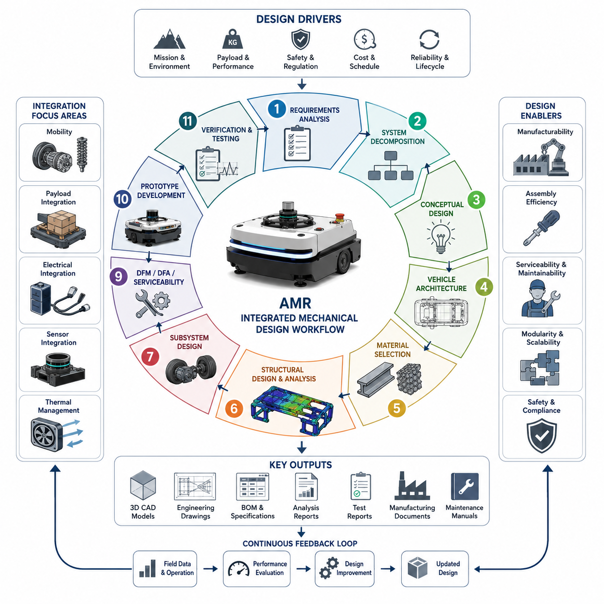
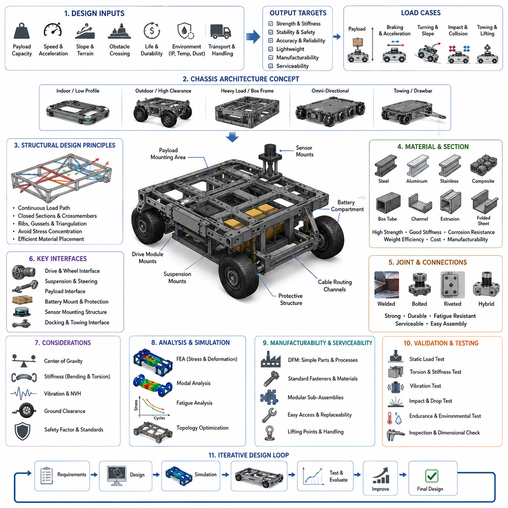
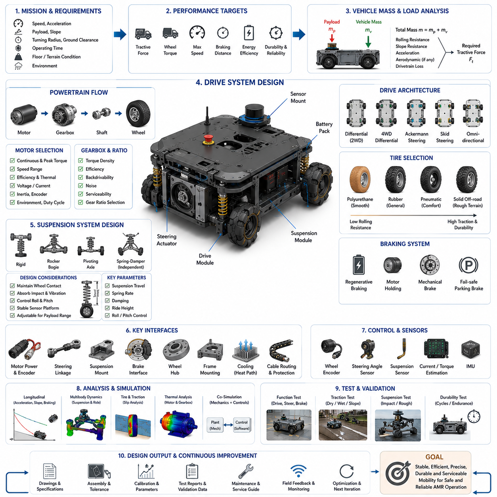
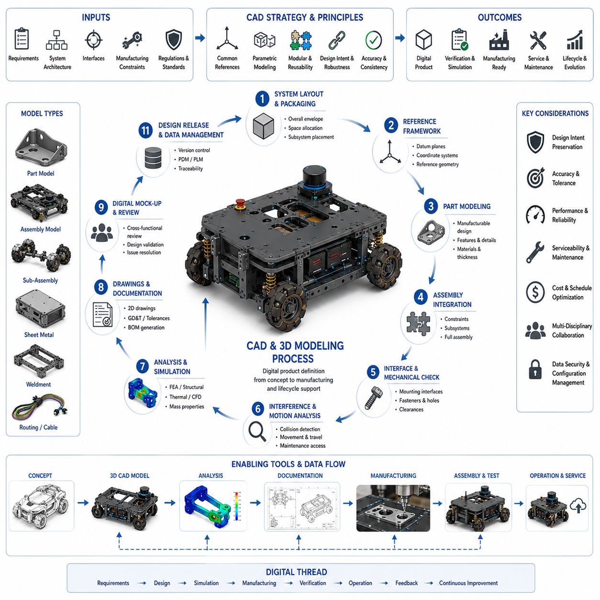
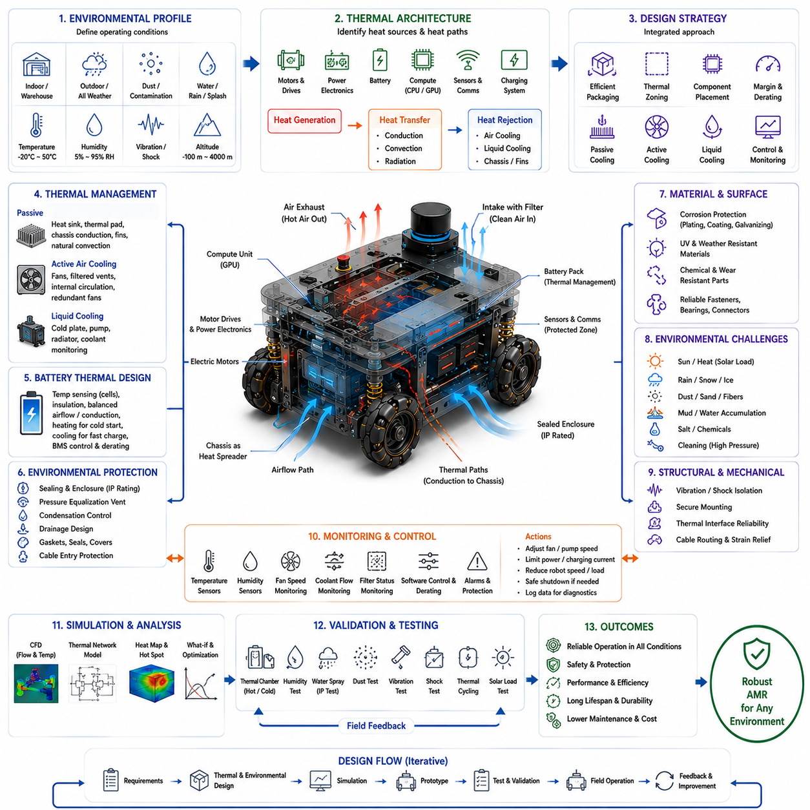
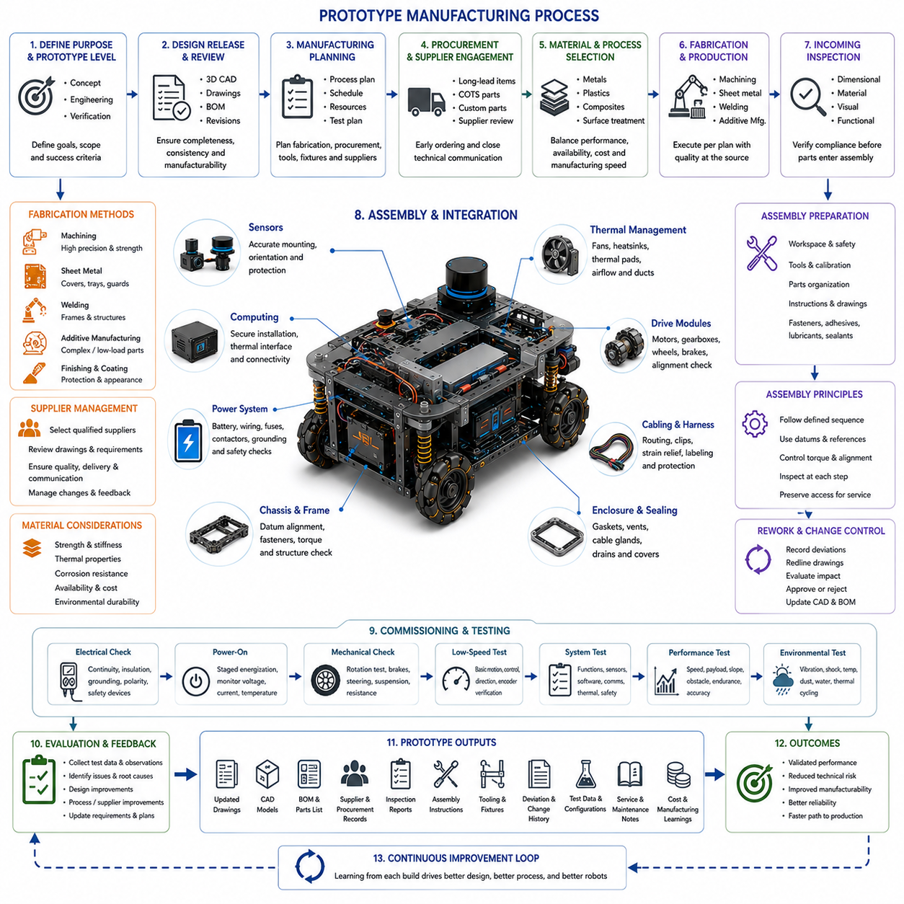
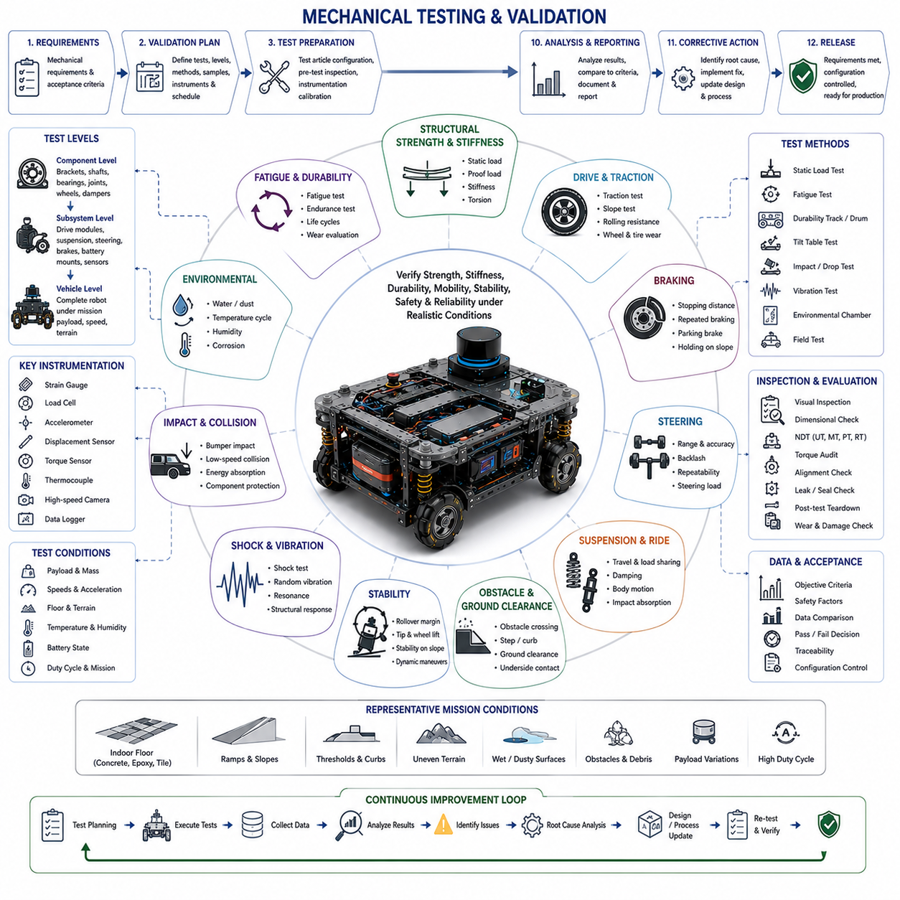
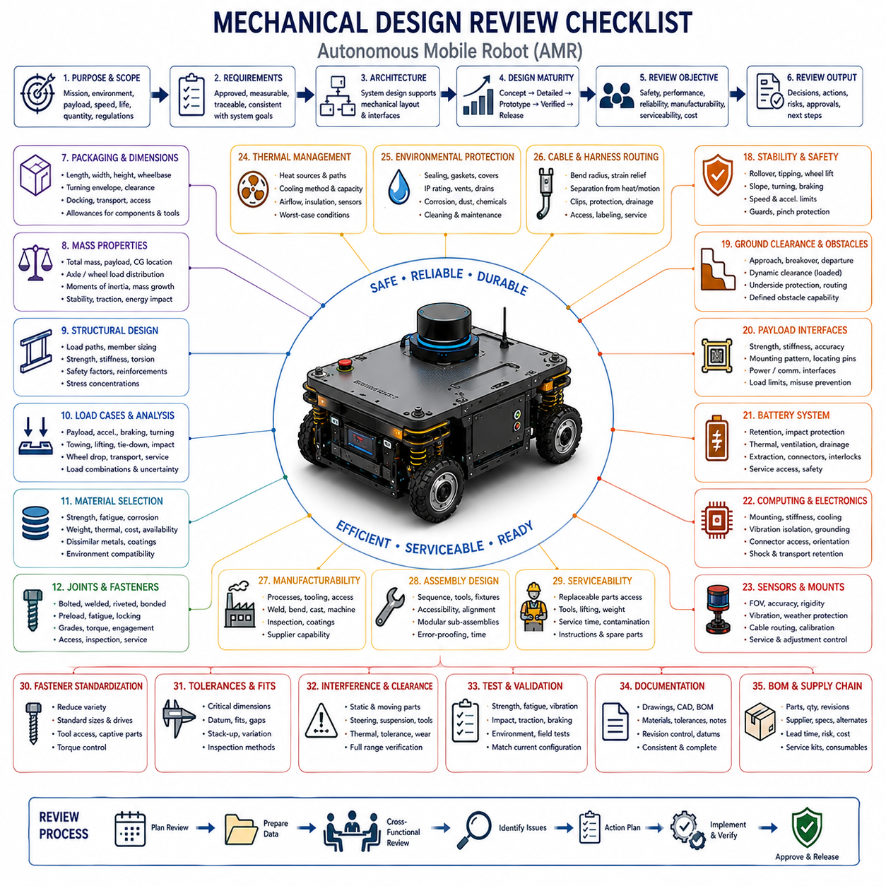

**Volume 10. AMR Engineering Process and Development Manual**


# Chapter 03. Mechanical Development Process

##  

## 03.01 Mechanical Design Workflow

{width="7.268055555555556in" height="7.268055555555556in"}

The mechanical design workflow is the engineering backbone that transforms product requirements into a manufacturable, reliable, and serviceable autonomous mobile robot. Unlike isolated component design, the workflow integrates system engineering principles with mechanical development, electrical integration, software constraints, manufacturing feasibility, and operational requirements throughout the entire product lifecycle. Every mechanical decision affects multiple engineering domains, including vehicle dynamics, localization accuracy, payload stability, thermal management, sensor performance, maintenance accessibility, and long-term reliability. Consequently, mechanical development should never be treated as an independent discipline but rather as an integral part of an interdisciplinary engineering process in which continuous collaboration among mechanical, electrical, embedded, AI, and software teams ensures that the final robot satisfies functional, safety, economic, and manufacturing objectives. The workflow described in this section follows the organization of the Mechanical Development Process within the engineering manual structure.

A successful mechanical development process always begins with understanding system-level requirements rather than immediately creating three-dimensional models. Engineers first analyze the operational environment, expected missions, customer expectations, applicable regulations, payload characteristics, mobility requirements, maintenance strategies, manufacturing volume, and lifecycle cost objectives. Indoor warehouse robots, outdoor inspection vehicles, hospital service robots, autonomous forklifts, construction robots, and defense platforms all impose fundamentally different mechanical requirements. Environmental factors such as uneven terrain, slopes, dust, water exposure, vibration, temperature variation, and continuous operation directly influence chassis configuration, structural strength, suspension architecture, enclosure design, and material selection. The mechanical workflow therefore starts with comprehensive requirement analysis before any physical design decisions are made.

System decomposition represents the next essential activity in the workflow. Instead of designing the robot as one large assembly, engineers divide the platform into manageable subsystems with clearly defined responsibilities and interfaces. Typical mechanical subsystems include the chassis frame, drive modules, steering mechanism, suspension, battery enclosure, sensor mounting structures, payload platform, protective housing, cooling assemblies, maintenance covers, cable routing structures, charging interface, and accessory mounting provisions. Defining subsystem boundaries early allows multiple engineering teams to work simultaneously while minimizing design conflicts. Well-defined interfaces between modules also simplify future upgrades because individual assemblies can evolve independently without requiring complete redesign of the entire platform.

Conceptual design explores multiple architectural alternatives before committing to detailed engineering. Engineers compare different chassis configurations, wheel arrangements, steering concepts, suspension mechanisms, drivetrain layouts, structural materials, enclosure concepts, and manufacturing approaches according to predefined evaluation criteria. Decisions should not rely solely on intuition or previous experience but instead consider quantitative tradeoff analyses involving weight, structural stiffness, manufacturing complexity, maintenance effort, cost, scalability, reliability, and future expandability. Early concept evaluation significantly reduces downstream engineering changes because many architectural problems can be identified before detailed CAD models and production drawings are created.

Vehicle architecture establishes the overall physical organization of the robot and defines how mechanical assemblies interact with electrical, electronic, and software systems. The location of batteries influences the center of gravity, which affects stability during acceleration, braking, cornering, and operation on slopes. Computing equipment requires structurally rigid mounting locations while maintaining sufficient thermal airflow. Sensors demand vibration isolation, unobstructed fields of view, accurate calibration references, and protection from environmental hazards. Maintenance components should remain accessible without removing unrelated assemblies. Every major subsystem must therefore be positioned according to overall system optimization rather than isolated mechanical convenience.

Material selection extends beyond choosing the strongest available structural material. Engineers evaluate strength-to-weight ratio, corrosion resistance, fatigue behavior, machinability, weldability, thermal expansion, electromagnetic compatibility, cost, availability, environmental durability, and recyclability. Aluminum alloys frequently offer favorable weight characteristics for mobile platforms, while high-strength steel provides superior stiffness and durability for heavy-load applications. Stainless steel improves corrosion resistance in harsh environments, whereas composite materials may reduce weight while increasing manufacturing complexity. Material decisions influence manufacturing methods, inspection procedures, repair strategies, and total product cost throughout the operational lifecycle.

Structural design transforms conceptual layouts into mechanically robust assemblies capable of supporting operational loads under all expected conditions. Static loading, dynamic loading, shock impacts, vibration, torsional deformation, fatigue cycles, and accidental misuse should all be considered during structural development. Engineers employ finite element analysis to predict stress distribution, deformation characteristics, safety margins, and resonance frequencies before physical prototypes are manufactured. Structural optimization seeks to minimize unnecessary weight while maintaining sufficient stiffness to preserve localization accuracy, sensor alignment, payload stability, and long-term dimensional integrity during continuous industrial operation.

The chassis serves as the primary load-bearing structure connecting every major subsystem. A well-designed chassis distributes forces efficiently while protecting sensitive components from excessive vibration and deformation. Mounting interfaces should be standardized to simplify manufacturing, maintenance, and future product variants. Engineers must consider assembly sequences, welding distortion, dimensional tolerances, inspection accessibility, lifting points, transportation requirements, and service procedures during chassis development. Modular chassis architectures often improve scalability because common structural platforms can support multiple product configurations with different payload capacities, sensor packages, or application-specific accessories.

Mobility subsystem design focuses on translating mechanical power into reliable vehicle motion across diverse operating environments. Wheel selection depends on terrain characteristics, required traction, rolling resistance, obstacle negotiation capability, durability, and maintenance requirements. Drive motor placement influences structural packaging, cooling performance, and drivetrain efficiency. Suspension systems improve stability on uneven terrain while reducing vibration transmitted to sensors and computing equipment. Steering mechanisms must achieve desired maneuverability while maintaining structural robustness and minimizing mechanical complexity. Every mobility decision influences localization accuracy, navigation performance, ride comfort, and overall operational efficiency.

Payload integration requires careful consideration of load distribution, structural reinforcement, center of gravity variation, and operational stability. Industrial robots often experience continuously changing payload conditions that alter vehicle dynamics throughout operation. Mechanical engineers evaluate how payload mass influences suspension behavior, braking distance, acceleration capability, steering response, structural deflection, and rollover stability. Payload interfaces should accommodate different customer equipment while maintaining standardized mechanical attachment methods. Flexible mounting systems increase platform versatility and reduce engineering effort when supporting multiple industrial applications.

Mechanical integration with electrical systems begins during early architectural planning rather than after structural completion. Battery compartments require adequate structural support, thermal isolation, ventilation, maintenance access, and protection against impact or environmental exposure. Wiring harnesses require dedicated routing channels that minimize electromagnetic interference while preventing abrasion, excessive bending, and accidental damage during maintenance. Mounting provisions for power distribution modules, emergency stop devices, charging connectors, communication equipment, and embedded controllers should be incorporated into structural components instead of being added as secondary modifications after mechanical development has been completed.

Sensor integration demands exceptional mechanical precision because perception quality depends heavily upon stable sensor positioning. Cameras, LiDAR units, radar modules, GNSS antennas, inertial measurement units, ultrasonic sensors, and environmental monitoring devices all possess unique mounting requirements. Structural vibration, thermal expansion, assembly tolerances, and accidental impacts may alter sensor alignment, reducing localization accuracy and perception reliability. Mechanical workflows therefore include dedicated sensor integration activities addressing mounting stiffness, calibration repeatability, environmental protection, cable routing, maintenance accessibility, and replacement procedures while preserving precise geometric relationships among sensing devices.

Thermal considerations increasingly influence mechanical architecture as computational performance continues to increase. High-performance GPUs, embedded computers, motor controllers, batteries, and power electronics generate significant heat during continuous operation. Mechanical engineers collaborate with electrical specialists to design airflow paths, heat sinks, ventilation systems, cooling ducts, protective filters, and environmental sealing strategies. Outdoor robots present additional challenges because cooling requirements compete with waterproofing, dust protection, and compact packaging constraints. Effective thermal integration improves component reliability, prevents performance degradation, and extends operational lifetime under demanding industrial conditions.

Design for manufacturability represents a critical engineering objective throughout the workflow. Components should be designed to minimize manufacturing complexity while maintaining functional performance. Engineers simplify machining operations, reduce weld count, standardize fasteners, minimize unique components, and increase assembly accessibility wherever practical. Manufacturing engineers participate in design reviews to identify production challenges before tooling investment begins. Early collaboration between design and manufacturing teams reduces production cost, shortens assembly time, improves quality consistency, and minimizes engineering changes during pilot production.

Design for assembly further optimizes production efficiency by simplifying installation procedures and reducing opportunities for human error. Mechanical assemblies should permit intuitive installation sequences, clear orientation, accessible fasteners, and sufficient tool clearance. Modular subassemblies reduce assembly complexity while facilitating parallel manufacturing operations. Self-locating features, alignment pins, standardized connectors, and mistake-proofing mechanisms improve production quality while reducing dependence on highly specialized assembly technicians. Efficient assembly design also benefits field maintenance because replacement procedures frequently resemble production assembly operations.

Serviceability remains an essential consideration because industrial robots often operate continuously for many years. Maintenance personnel require convenient access to batteries, filters, cooling fans, sensors, communication modules, electronic controllers, and drivetrain components without unnecessary disassembly. Mechanical engineers evaluate maintenance intervals, replacement procedures, inspection accessibility, lifting requirements, spare part standardization, and diagnostic support during development. Designing for maintainability reduces operational downtime, decreases lifecycle cost, and improves customer satisfaction throughout extended product deployment.

Prototype development converts digital engineering into physical validation. Initial prototypes verify structural integrity, dimensional accuracy, assembly procedures, component compatibility, maintenance accessibility, thermal behavior, vibration characteristics, and overall manufacturability. Mechanical prototypes frequently reveal integration issues that remain difficult to identify within computer models alone. Engineers document observed problems systematically and incorporate corrective modifications before subsequent prototype iterations. Multiple prototype generations progressively reduce technical risk while improving product maturity prior to production release.

Mechanical verification combines analytical methods with experimental testing to ensure compliance with engineering requirements. Structural load testing, vibration evaluation, impact resistance, fatigue testing, environmental exposure, thermal cycling, waterproof validation, dimensional inspection, and operational durability assessments confirm that physical hardware satisfies design expectations. Testing procedures should reproduce representative field conditions rather than ideal laboratory environments whenever possible. Measured performance data provide objective evidence supporting design acceptance while identifying opportunities for further optimization before commercial deployment.

Cross-disciplinary design reviews occur repeatedly throughout the workflow rather than only at project completion. Mechanical engineers present evolving designs to electrical, embedded, software, AI, manufacturing, quality, procurement, and service teams for comprehensive evaluation. Review participants identify interface conflicts, accessibility concerns, manufacturing risks, safety issues, maintenance challenges, and potential cost reductions before expensive tooling or production commitments occur. Structured design reviews significantly reduce downstream engineering changes while promoting organizational knowledge sharing across technical disciplines.

Documentation accompanies every phase of mechanical development because successful engineering depends upon traceable design decisions rather than undocumented assumptions. Requirement allocations, design calculations, material specifications, CAD models, finite element simulations, manufacturing drawings, tolerance analyses, test reports, engineering change records, supplier documentation, and review outcomes collectively establish the technical baseline for future development. Comprehensive documentation also facilitates certification activities, quality audits, maintenance support, regulatory compliance, and product evolution across multiple generations of robotic platforms.

Mechanical design workflow is ultimately an iterative engineering methodology rather than a strictly linear sequence of tasks. Information generated during simulation, prototyping, manufacturing, testing, deployment, and field operation continuously feeds back into earlier development stages, enabling systematic refinement of both individual components and overall system architecture. Organizations that embrace continuous improvement within their mechanical workflow consistently produce robots exhibiting greater reliability, improved manufacturability, enhanced serviceability, lower lifecycle costs, and superior operational performance. As autonomous mobile robots become increasingly sophisticated, the mechanical design workflow will continue evolving into an integrated systems engineering discipline that combines advanced simulation, digital twins, intelligent optimization, automated manufacturing, and field data analytics to deliver robust robotic platforms capable of supporting complex industrial applications across diverse operational environments.

기계 설계 워크플로우(Mechanical Design Workflow)는 제품 요구사항(Product Requirements)을 제조 가능하고(Manufacturable), 신뢰성이 높으며(Reliable), 유지보수가 용이한(Serviceable) 자율이동로봇(AMR, Autonomous Mobile Robot)으로 구현하는 핵심적인 엔지니어링 기반이다. 기계 설계를 개별 부품 설계(Component Design)로만 접근하는 것이 아니라, 시스템 엔지니어링(System Engineering) 원칙과 기계 개발(Mechanical Development), 전기 통합(Electrical Integration), 소프트웨어 제약(Software Constraints), 제조 가능성(Manufacturing Feasibility), 운영 요구사항(Operational Requirements)을 제품의 전체 생애주기(Product Lifecycle)에 걸쳐 통합하는 과정이다. 모든 기계적 설계 결정은 차량 동역학(Vehicle Dynamics), 위치 추정 정확도(Localization Accuracy), 적재 안정성(Payload Stability), 열 관리(Thermal Management), 센서 성능(Sensor Performance), 유지보수 접근성(Maintenance Accessibility), 장기 신뢰성(Long-Term Reliability)에 영향을 미친다. 따라서 기계 개발은 독립적인 분야가 아니라 기계, 전기, 임베디드(Embedded), 인공지능(AI), 소프트웨어 팀이 지속적으로 협력하여 기능적 목표(Functionality), 안전성(Safety), 경제성(Economics), 제조성(Manufacturability)을 동시에 만족시키는 통합 엔지니어링 프로세스의 일부로 수행되어야 한다. 본 내용은 엔지니어링 매뉴얼의 "Mechanical Development Process" 구조를 기반으로 작성되었다.

성공적인 기계 개발 프로세스는 곧바로 삼차원 모델(3D Model)을 설계하는 것이 아니라 시스템 수준(System-Level)의 요구사항을 충분히 이해하는 것에서 시작한다. 엔지니어는 먼저 운용 환경(Operational Environment), 수행 임무(Mission), 고객 요구(Customer Expectations), 적용 규정(Regulations), 적재 특성(Payload Characteristics), 이동 성능(Mobility Requirements), 유지보수 전략(Maintenance Strategy), 생산 규모(Manufacturing Volume), 제품 생애주기 비용(Lifecycle Cost)을 분석한다. 실내 물류 로봇, 실외 점검 로봇, 병원 서비스 로봇, 자율지게차(Autonomous Forklift), 건설 로봇, 국방 플랫폼은 각각 서로 다른 기계적 요구사항을 가진다. 또한 험로(Uneven Terrain), 경사(Slope), 먼지(Dust), 물(Water), 진동(Vibration), 온도 변화(Temperature Variation), 장시간 연속 운전(Continuous Operation)과 같은 환경 조건은 차체 구조(Chassis Configuration), 구조 강성(Structural Strength), 서스펜션(Suspension), 외함(Enclosure), 재료(Material) 선정에 직접적인 영향을 미친다. 따라서 기계 설계는 반드시 요구사항 분석을 완료한 이후에 시작되어야 한다.

시스템 분해(System Decomposition)는 기계 설계 워크플로우에서 매우 중요한 단계이다. 로봇 전체를 하나의 거대한 조립체(Assembly)로 설계하는 대신, 엔지니어는 역할과 인터페이스(Interface)가 명확한 여러 개의 하위 시스템(Sub-System)으로 나누어 개발한다. 일반적으로 차체 프레임(Chassis Frame), 구동 모듈(Drive Module), 조향 장치(Steering Mechanism), 서스펜션(Suspension), 배터리 케이스(Battery Enclosure), 센서 마운트(Sensor Mounting Structure), 적재 플랫폼(Payload Platform), 보호 커버(Protective Housing), 냉각 장치(Cooling Assembly), 유지보수 커버(Maintenance Cover), 케이블 라우팅(Cable Routing Structure), 충전 인터페이스(Charging Interface), 각종 액세서리 장착 구조(Accessory Mounting Provision) 등이 각각 독립적인 하위 시스템으로 정의된다. 이러한 구분은 여러 팀이 동시에 병렬 개발을 수행할 수 있도록 하며, 향후 특정 모듈만 독립적으로 업그레이드하는 것도 가능하게 만든다.

개념 설계(Conceptual Design)는 상세 설계에 들어가기 전에 다양한 시스템 구조(System Architecture)를 비교하고 평가하는 과정이다. 엔지니어는 차체 구조, 휠 배치(Wheel Arrangement), 조향 방식(Steering Concept), 서스펜션 구조, 구동계(Drivetrain), 구조 재료(Structural Material), 외함 구조, 제조 방법 등을 여러 관점에서 비교한다. 이러한 의사결정은 경험에만 의존하는 것이 아니라 중량(Weight), 구조 강성(Stiffness), 제조 난이도(Manufacturing Complexity), 유지보수성(Maintenance Effort), 비용(Cost), 확장성(Scalability), 신뢰성(Reliability), 미래 발전 가능성(Expandability) 등을 종합적으로 평가하는 정량적인 트레이드오프 분석(Tradeoff Analysis)에 기반해야 한다. 초기 개념 설계 단계에서 충분한 검토를 수행하면 이후의 설계 변경을 크게 줄일 수 있다.

차량 아키텍처(Vehicle Architecture)는 기계 구조와 전기(Electrical), 전자(Electronic), 소프트웨어 시스템이 서로 어떻게 통합되는지를 결정한다. 배터리(Battery)의 위치는 무게 중심(Center of Gravity)에 영향을 미치며, 이는 가속(Acceleration), 제동(Braking), 회전(Cornering), 경사면 주행에서 차량 안정성을 결정한다. 컴퓨팅 장치(Computing Equipment)는 구조적으로 강성이 충분한 위치에 설치되어야 하며 동시에 적절한 냉각 공기 흐름(Airflow)을 확보해야 한다. 센서는 진동(Vibration)으로부터 보호되면서도 시야(Field of View)를 확보하고 정확한 기준 좌표(Calibration Reference)를 유지해야 한다. 또한 유지보수가 필요한 부품은 다른 시스템을 해체하지 않고 접근할 수 있도록 배치되어야 한다. 따라서 차량 아키텍처는 개별 구성품이 아니라 시스템 전체의 최적화를 목표로 설계되어야 한다.

재료 선정(Material Selection)은 단순히 가장 강한 재료를 선택하는 과정이 아니다. 엔지니어는 강도 대비 중량(Strength-to-Weight Ratio), 내식성(Corrosion Resistance), 피로 특성(Fatigue Behavior), 가공성(Machinability), 용접성(Weldability), 열팽창(Thermal Expansion), 전자기 적합성(EMC, Electromagnetic Compatibility), 비용(Cost), 공급성(Availability), 환경 내구성(Environmental Durability), 재활용성(Recyclability)을 함께 고려한다. 알루미늄 합금(Aluminum Alloy)은 경량화에 유리하고, 고장력 강(High-Strength Steel)은 중량물 운반에서 우수한 강성을 제공한다. 스테인리스강(Stainless Steel)은 부식 환경에서 뛰어난 성능을 제공하며, 복합재료(Composite Material)는 경량화를 가능하게 하지만 제조 복잡성을 증가시킨다. 이러한 재료 선택은 제조 방식, 검사 절차, 수리 방법, 전체 제품 비용에 장기적인 영향을 미친다.

구조 설계(Structural Design)는 개념 설계를 실제 운용이 가능한 구조물로 구체화하는 단계이다. 엔지니어는 정하중(Static Load), 동하중(Dynamic Load), 충격(Shock), 진동(Vibration), 비틀림(Torsional Deformation), 반복 피로(Fatigue), 예상치 못한 오사용(Misuse)까지 고려하여 설계를 수행한다. 유한요소해석(FEA, Finite Element Analysis)을 활용하여 응력 분포(Stress Distribution), 변형(Deformation), 안전계수(Safety Margin), 공진 주파수(Resonance Frequency)를 예측하고, 이를 기반으로 실제 시제품 제작 전에 구조를 최적화한다. 목표는 불필요한 중량을 줄이면서도 위치 추정 정확도, 센서 정렬, 적재 안정성, 장기적인 구조 강성을 확보하는 것이다.

차체(Chassis)는 모든 주요 시스템을 연결하는 기본 구조물이다. 우수한 차체는 외부 하중을 효율적으로 분산시키면서도 민감한 장치를 진동과 변형으로부터 보호한다. 또한 장착 인터페이스(Mounting Interface)는 표준화되어야 하며, 제조, 유지보수, 제품 확장을 쉽게 지원해야 한다. 차체 설계에서는 용접 변형(Welding Distortion), 치수 공차(Dimensional Tolerance), 검사 접근성(Inspection Accessibility), 운반용 리프팅 포인트(Lifting Point), 조립 순서(Assembly Sequence), 유지보수 절차까지 함께 고려되어야 한다. 모듈형 차체(Modular Chassis)는 다양한 제품군(Product Family)에 공통 플랫폼을 제공할 수 있다는 장점이 있다.

이동 시스템(Mobility Subsystem)은 기계적인 동력을 실제 차량 이동으로 변환하는 핵심 요소이다. 바퀴(Wheel)는 노면 상태(Terrain), 접지력(Traction), 구름 저항(Rolling Resistance), 장애물 극복 능력(Obstacle Negotiation), 내구성(Durability), 유지보수성을 고려하여 선정된다. 구동 모터(Drive Motor)의 배치는 냉각 성능(Cooling Performance), 구조 패키징(Packaging), 동력 전달 효율에 영향을 준다. 서스펜션은 험로에서 차량 안정성을 높이고 센서와 컴퓨팅 장치에 전달되는 진동을 감소시킨다. 조향 장치(Steering Mechanism)는 높은 기동성(Maneuverability)을 제공하면서도 구조적 강성을 유지해야 한다. 이러한 이동 시스템 설계는 위치 추정(Localization), 내비게이션(Navigation), 승차감(Ride Comfort), 전체 운용 효율(Operation Efficiency)에 직접적인 영향을 미친다.

적재 시스템(Payload Integration)은 하중 분포(Load Distribution), 구조 보강(Structural Reinforcement), 무게 중심 변화(Center of Gravity Variation), 주행 안정성을 함께 고려해야 한다. 산업용 AMR은 운용 중 적재 중량이 지속적으로 변화하기 때문에 차량의 동역학 특성도 함께 변하게 된다. 엔지니어는 적재 중량이 제동 거리, 가속 성능, 조향 특성, 구조 변형, 전복 안정성(Rollover Stability)에 미치는 영향을 분석한다. 또한 적재 인터페이스(Payload Interface)는 다양한 고객 장비를 쉽게 장착할 수 있도록 표준화되어야 하며, 플랫폼의 활용도를 높이기 위해 유연한 구조를 갖추는 것이 바람직하다.

기계 설계와 전기 시스템(Electrical System)의 통합은 초기 단계부터 함께 진행되어야 한다. 배터리 공간은 구조적 지지뿐 아니라 열 차단(Thermal Isolation), 환기(Ventilation), 유지보수 접근성, 충격 보호를 동시에 고려해야 한다. 배선 하네스(Wiring Harness)는 마찰(Abrasion), 과도한 굽힘(Bending), 유지보수 중 손상을 방지하면서도 전자기 간섭(EMI, Electromagnetic Interference)을 최소화할 수 있도록 전용 라우팅 구조를 가져야 한다. 또한 전력 분배 모듈(Power Distribution Module), 비상정지 장치(E-Stop), 충전 커넥터, 통신 장비, 임베디드 제어기의 장착 구조도 초기 기계 설계 단계에서 함께 포함되어야 한다.

센서 통합(Sensor Integration)은 매우 높은 기계적 정밀도를 요구한다. 카메라(Camera), 라이다(LiDAR), 레이더(Radar), 위성항법 안테나(GNSS Antenna), 관성센서(IMU), 초음파 센서(Ultrasonic Sensor)는 각각 서로 다른 장착 조건을 가진다. 구조 진동, 열팽창, 조립 공차, 충격은 센서 정렬 오차를 발생시켜 위치 추정과 인지 성능을 저하시킬 수 있다. 따라서 기계 설계 과정에서는 센서 마운트 강성(Mounting Stiffness), 반복 가능한 보정(Calibration Repeatability), 환경 보호(Environmental Protection), 케이블 라우팅, 유지보수 접근성, 교체 절차까지 함께 설계하여 센서 간의 기하학적 관계를 정확하게 유지해야 한다.

열 설계(Thermal Design)는 컴퓨팅 성능이 증가할수록 기계 설계에서 더욱 중요한 요소가 되고 있다. GPU, 임베디드 컴퓨터, 모터 제어기, 배터리, 전력전자 장치는 장시간 운전 시 많은 열을 발생시킨다. 기계 엔지니어는 전기 엔지니어와 협력하여 공기 흐름(Airflow), 방열판(Heat Sink), 냉각 덕트(Cooling Duct), 환기(Ventilation), 먼지 필터(Filter), 방수 구조(Waterproof Structure)를 함께 설계한다. 특히 실외 로봇에서는 방수(IP Protection), 방진(Dust Protection), 소형 패키징(Compact Packaging)과 냉각 성능 사이의 균형을 맞추는 것이 매우 중요하다. 적절한 열 설계는 부품 수명을 연장하고 시스템 신뢰성을 향상시킨다.

제조를 고려한 설계(DFM, Design for Manufacturability)는 기계 설계 전 과정에서 중요한 목표이다. 엔지니어는 가공 공정을 단순화하고, 용접 개수를 줄이며, 체결 부품(Fastener)을 표준화하고, 부품 종류를 최소화하며, 조립 접근성을 향상시키도록 설계를 최적화한다. 제조 엔지니어는 설계 검토에 참여하여 생산 과정에서 발생할 수 있는 문제를 사전에 발견한다. 이러한 협업은 생산 비용을 절감하고 조립 시간을 단축하며, 양산(Pilot Production) 이전에 발생할 수 있는 설계 변경을 최소화한다.

조립을 고려한 설계(DFA, Design for Assembly)는 생산 효율을 더욱 향상시키기 위한 설계 방법이다. 모든 부품은 직관적인 조립 순서(Intuitive Assembly Sequence), 명확한 방향성(Orientation), 접근 가능한 체결부, 충분한 공구 공간(Tool Clearance)을 확보해야 한다. 모듈형 조립체(Modular Subassembly)는 병렬 생산을 가능하게 하며, 위치 결정 핀(Alignment Pin), 표준 커넥터(Standard Connector), 조립 실수 방지(Poka-Yoke) 구조는 품질 향상과 작업자 의존도를 줄이는 데 기여한다. 이러한 설계는 생산뿐 아니라 현장 유지보수에서도 동일한 장점을 제공한다.

정비성(Serviceability)은 산업용 AMR이 수년 동안 연속 운전되는 점을 고려할 때 매우 중요한 설계 요소이다. 유지보수 담당자는 배터리, 필터(Filter), 냉각 팬(Cooling Fan), 센서, 통신 모듈, 전자제어기(Electronic Controller), 구동계(Drivetrain)에 쉽게 접근할 수 있어야 하며, 불필요한 분해 작업은 최소화되어야 한다. 엔지니어는 유지보수 주기(Maintenance Interval), 교체 절차(Replacement Procedure), 검사 접근성, 리프팅 요구사항, 예비 부품 표준화, 진단 지원(Diagnostic Support)을 함께 고려한다. 유지보수를 고려한 설계는 시스템 가동률(Uptime)을 높이고 전체 생애주기 비용을 절감하며 고객 만족도를 향상시킨다.

시제품 개발(Prototype Development)은 디지털 설계를 실제 제품으로 검증하는 과정이다. 초기 시제품은 구조 강성, 치수 정확도, 조립 절차, 부품 간 간섭, 유지보수 접근성, 열 특성, 진동 특성, 제조 가능성을 확인하는 역할을 수행한다. 실제 시제품은 CAD 모델에서 발견하기 어려운 다양한 통합 문제를 보여주며, 엔지니어는 이를 체계적으로 분석하여 다음 시제품에서 개선한다. 여러 차례의 시제품 개발은 양산 이전에 기술적 위험을 크게 감소시키고 제품 완성도를 높인다.

기계 검증(Mechanical Verification)은 해석과 실제 시험을 함께 수행하여 설계가 요구사항을 만족하는지를 확인하는 과정이다. 구조 하중 시험(Structural Load Test), 진동 시험(Vibration Test), 충격 시험(Impact Test), 피로 시험(Fatigue Test), 환경 시험(Environmental Test), 열 사이클 시험(Thermal Cycling), 방수 시험(Waterproof Validation), 치수 검사(Dimensional Inspection), 내구 시험(Durability Test)을 수행하여 실제 제품의 성능을 확인한다. 가능하면 실제 운용 환경(Field Condition)을 재현한 시험을 수행해야 하며, 측정 결과는 설계 승인과 추가 최적화를 위한 객관적인 근거가 된다.

분야 간 설계 검토(Cross-Disciplinary Design Review)는 프로젝트 마지막이 아니라 개발 전 과정에서 반복적으로 수행된다. 기계 엔지니어는 전기, 임베디드, 소프트웨어, AI, 제조, 품질(Quality), 구매(Procurement), 서비스 팀과 함께 설계를 검토하여 인터페이스 충돌, 접근성 문제, 제조 위험, 안전 문제, 비용 절감 가능성을 조기에 발견한다. 이러한 체계적인 설계 검토는 이후 발생하는 설계 변경을 크게 줄이며 조직 전체의 기술 지식을 공유하는 효과도 제공한다.

문서화(Documention)는 기계 설계의 모든 단계에서 수행되어야 한다. 요구사항 할당(Requirement Allocation), 설계 계산(Design Calculation), 재료 사양(Material Specification), CAD 모델, 유한요소해석 결과, 제작 도면(Manufacturing Drawing), 공차 분석(Tolerance Analysis), 시험 보고서(Test Report), 설계 변경 기록(Engineering Change Record), 공급업체 문서(Supplier Documentation), 설계 검토 결과는 모두 향후 개발을 위한 기술 기준(Technical Baseline)이 된다. 이러한 문서들은 인증(Certification), 품질 감사(Quality Audit), 유지보수, 규정 준수(Regulatory Compliance), 차세대 제품 개발에서도 중요한 역할을 수행한다.

궁극적으로 기계 설계 워크플로우(Mechanical Design Workflow)는 단순한 순차적 개발 절차가 아니라 반복적으로 개선되는 엔지니어링 방법론이다. 시뮬레이션(Simulation), 시제품 개발, 제조, 시험, 현장 운용(Field Operation)에서 얻어진 정보는 다시 초기 설계 단계로 피드백(Feedback)되어 지속적인 개선(Continuous Improvement)을 가능하게 한다. 이러한 순환 구조를 적극적으로 활용하는 조직은 더욱 높은 신뢰성(Reliability), 우수한 제조성(Manufacturability), 향상된 정비성(Serviceability), 낮은 생애주기 비용(Lifecycle Cost), 뛰어난 운영 성능(Operational Performance)을 갖춘 로봇을 개발할 수 있다. 앞으로 자율이동로봇이 더욱 복잡하고 지능화될수록 기계 설계 워크플로우는 고급 시뮬레이션(Advanced Simulation), 디지털 트윈(Digital Twin), 지능형 최적화(Intelligent Optimization), 자동화 제조(Automated Manufacturing), 현장 데이터 분석(Field Data Analytics)을 통합하는 시스템 엔지니어링(System Engineering)의 핵심 분야로 더욱 발전하게 될 것이다.

##  

## 03.02 Chassis and Frame Design

{width="7.268055555555556in" height="7.268055555555556in"}

The chassis and frame form the primary structural foundation of an Autonomous Mobile Robot, supporting every mechanical, electrical, sensing, computing, and payload subsystem throughout the product lifecycle. Their design determines whether the robot can carry its rated load, maintain geometric accuracy, survive repeated shocks, protect internal equipment, and remain stable during acceleration, braking, turning, docking, and operation on uneven surfaces. Chassis engineering therefore extends far beyond creating a rigid metal structure. It is a system-level activity that converts operational requirements into a balanced physical platform with appropriate strength, stiffness, weight, packaging efficiency, manufacturability, safety, and serviceability. Within the provided manual structure, this subject follows the overall mechanical design workflow and establishes the structural basis for later drivetrain, suspension, CAD, prototyping, and validation activities.

The design process begins by translating product requirements into measurable structural targets. Payload capacity, robot mass, maximum speed, acceleration, braking force, slope capability, obstacle-crossing requirements, expected service life, environmental exposure, and transportation conditions must be clearly defined before frame geometry is selected. Engineers also consider abnormal situations such as emergency braking, collisions with low obstacles, uneven payload placement, improper lifting, towing forces, and accidental overloading. These scenarios establish the load cases that the structure must withstand. When structural requirements remain vague, engineers may either overdesign the platform, creating unnecessary mass and cost, or underdesign it, producing deformation, fatigue cracking, sensor misalignment, and premature field failures.

The chassis architecture should reflect the robot's intended mission and mobility concept. A compact indoor AMR may use a low-profile rectangular frame optimized for narrow aisles and differential drive, while an outdoor platform may require increased ground clearance, suspension travel, protective underbody structures, and reinforced wheel supports. Heavy-load transport robots often benefit from box-section or ladder-frame arrangements that distribute payload forces over multiple crossmembers. Omnidirectional robots require precise mounting planes for several drive modules, whereas towing robots must transfer concentrated drawbar loads into the main structure. Selecting the correct structural concept early is essential because changing the frame architecture after drivetrain, battery, and sensor integration has begun usually creates extensive redesign across the entire platform.

Load-path design is one of the most important principles in chassis engineering. Forces generated by payloads, wheels, suspension elements, lifting mechanisms, towing devices, and collision structures should travel through continuous and predictable structural paths toward the main frame. Abrupt changes in section geometry, unsupported plates, isolated brackets, and poorly positioned joints can create local stress concentrations that eventually lead to cracking or permanent deformation. Efficient load paths use closed sections, crossmembers, ribs, gussets, and triangulated members to spread forces over larger areas. Material should be placed where it contributes directly to stiffness and strength rather than being added uniformly, allowing the frame to remain robust without becoming unnecessarily heavy.

Global frame stiffness influences much more than structural survival. Excessive bending or torsional deformation can alter wheel contact forces, reduce traction, disturb suspension behavior, and change the relative alignment of sensors. A frame that twists while traveling over uneven terrain may introduce errors into LiDAR, camera, radar, and inertial sensor measurements, reducing localization and perception accuracy. Flexible mounting surfaces can also create inconsistent docking performance or payload positioning. For this reason, engineers define allowable vertical deflection, torsional displacement, and mounting-plane distortion under representative loads. The required stiffness should be achieved through efficient geometry and appropriate section selection rather than simply increasing plate thickness throughout the chassis.

The center of gravity must be considered continuously during frame development. Batteries, motors, gearboxes, computing units, payloads, and auxiliary equipment all contribute to the robot's mass distribution. Heavy components are generally positioned as low and as centrally as possible to improve rollover resistance and reduce load variation between wheels. However, packaging constraints, service access, cooling needs, and ground-clearance requirements may limit ideal placement. Engineers evaluate the center of gravity for empty, nominally loaded, and maximum-load configurations because payload position may change significantly during operation. Stability analysis should account for slopes, cornering, emergency braking, curb transitions, and lateral disturbances rather than relying only on static conditions on a level floor.

Material selection for the chassis requires a balance between mechanical performance, manufacturing process, environmental resistance, and total cost. Carbon steel is widely used because of its strength, stiffness, weldability, availability, and moderate cost, making it suitable for industrial and heavy-load frames. Aluminum alloys reduce weight and improve corrosion resistance but require careful joint design, welding control, and consideration of lower elastic modulus. Stainless steel may be justified in food, chemical, marine, or washdown environments, although its cost and manufacturing difficulty are higher. Composite materials and engineering plastics can be applied selectively to covers, panels, or secondary structures, but the primary frame must preserve predictable load transfer, repairability, and long-term dimensional stability.

Section geometry often has a greater influence on structural efficiency than material strength alone. Closed rectangular tubes, box beams, channels, extrusions, and folded sheet-metal sections can provide high bending and torsional stiffness with relatively low mass. Thin flat plates are generally inefficient when used without ribs, bends, or edge reinforcement because they deform easily under out-of-plane loading. Folded flanges and formed beads increase stiffness while preserving lightweight construction. Aluminum extrusion systems can simplify modular assembly and equipment mounting, but their joints may become the weakest part of the structure. Engineers therefore evaluate the complete assembly, including fasteners and connections, rather than comparing only the nominal properties of individual members.

Joint design requires particular attention because welds, bolts, rivets, and bonded interfaces frequently govern the durability of the frame. Welded structures provide strong and compact connections, but heat input may cause distortion, residual stress, reduced fatigue strength, and dimensional variation. Bolted joints improve modularity and repairability but require suitable preload, locking methods, bearing area, and access for tools. Riveted or bonded joints may support lightweight sheet structures, although they must be evaluated for environmental degradation and inspection difficulty. Hybrid joining methods can combine structural strength with serviceability. Every connection should transfer loads smoothly while avoiding sharp notches, unsupported fastener patterns, and excessive local deformation.

Welded frame design must account for the realities of fabrication rather than assuming that the final assembly will perfectly match the CAD model. Welding sequence, fixture design, heat distribution, joint preparation, penetration, and cooling behavior all affect dimensional accuracy. Long continuous welds may introduce more distortion than necessary, while poorly controlled intermittent welds may provide insufficient strength. Critical mounting surfaces for drive modules, bearings, sensors, and docking components may require post-weld machining or precision inserts. Datum structures should be established so that important geometric relationships can be measured after fabrication. Early consultation with manufacturing engineers helps prevent designs that are structurally sound in simulation but difficult to produce consistently.

The interface between the frame and the mobility system must withstand repeated dynamic loading. Wheel modules, motor brackets, axle supports, steering mechanisms, and suspension mounts experience traction forces, braking reactions, vertical impacts, and side loads. These interfaces should be reinforced without creating abrupt stiffness transitions that concentrate stress near welds or bolt holes. Drive-module mounting planes must maintain tight positional tolerances because angular or height errors can cause uneven tire wear, poor tracking, and control instability. Removable drive assemblies should use repeatable locating features so that replacement does not require complex realignment. Mechanical stops may also be needed to prevent motors or suspension elements from exceeding safe travel during severe impacts.

Payload interfaces create another major structural load path. The upper frame or deck must support distributed loads, point loads, dynamic equipment, robotic arms, conveyors, lifting devices, cabinets, or application-specific tools. A payload with a high center of gravity can generate large overturning moments even when its mass remains within the nominal capacity. Robotic manipulators create rapidly changing forces that may excite frame vibration or reduce vehicle stability. Engineers should therefore specify allowable payload envelopes, mounting zones, center-of-gravity limits, and interface bolt patterns. Standardized mounting grids make the platform reusable across applications, but local reinforcement must be added where concentrated loads enter the primary chassis.

Battery packaging is closely connected to frame design because batteries are among the heaviest components in an AMR. The battery compartment should support the full mass under shock and vibration while protecting cells, connectors, the battery management system, and service personnel. Restraint mechanisms must prevent movement during emergency stops, collisions, and transportation. Removable battery trays require guides, handles, locking features, and sufficient clearance for safe replacement. Structural barriers may be needed to separate the battery from impact zones, water entry paths, sharp edges, and high-temperature equipment. At the same time, the enclosure must permit ventilation or thermal management without weakening the frame or allowing contamination into critical areas.

Sensor mounting structures must be designed as extensions of the chassis reference system rather than decorative brackets attached late in development. Localization and perception sensors depend on stable geometric relationships, so their mounts require adequate stiffness, repeatable datums, and resistance to vibration. Tall sensor masts may experience significant oscillation during acceleration or rough-terrain travel, producing motion artifacts and calibration drift. The mast should therefore transfer loads into a sufficiently wide and rigid frame region. Protective guards must not obstruct the field of view or create reflections. Replaceable sensor brackets should return the device to a known position after service, minimizing the need for complete recalibration.

The chassis also protects internal components from environmental and operational hazards. Underbody plates may shield batteries, controllers, and wiring from debris, impacts, water, and dust. Side structures can absorb minor collisions before forces reach sensitive equipment. Covers and access panels should prevent contamination while remaining removable for maintenance. Drainage paths must avoid trapping water inside hollow sections or enclosures, and dissimilar metals should be isolated to reduce galvanic corrosion. Outdoor platforms may require sealed interfaces, corrosion-resistant coatings, and careful management of mud accumulation. Environmental protection should be integrated with load-bearing design rather than added as a separate cosmetic enclosure after the structural frame is complete.

Cable and hose routing provisions should be included directly within the chassis architecture. Harnesses require protected channels, appropriate bend radii, strain relief, separation from moving parts, and accessible fastening points. Routing paths should avoid sharp edges, hot surfaces, suspension travel, and locations exposed to debris or crushing. Service loops may be necessary near removable modules, but excessive loose cable can create wear and interference. Dedicated pass-through openings should include grommets or sealed fittings without unnecessarily weakening structural members. Coordinating these provisions early reduces the common practice of drilling uncontrolled holes into completed frames, which can compromise strength, corrosion protection, and configuration consistency.

Finite element analysis is used to evaluate structural performance before prototype fabrication. Static analysis estimates stress and deformation under payload, wheel, lifting, and towing loads. Torsional analysis examines frame twisting when wheels experience uneven vertical displacement. Modal analysis identifies natural frequencies that may interact with motor excitation, wheel impacts, or sensor mast vibration. Fatigue analysis estimates durability under repeated operational cycles, although its accuracy depends on realistic load histories, joint assumptions, and material data. Simulation should not be treated as proof by itself. Boundary conditions, contacts, weld representations, fastener preload, and mesh quality must reflect the physical structure closely enough to support engineering decisions.

Topology optimization and lightweight design methods can improve frame efficiency when applied with manufacturing constraints in mind. Optimization software may identify regions where material contributes little to stiffness and suggest more efficient load-bearing forms. However, mathematically optimal shapes are not always practical to weld, machine, inspect, or repair. Engineers must convert optimization results into producible geometry using tubes, plates, castings, or formed components. Weight reduction should focus on low-stress areas while preserving safety margins at joints, interfaces, and impact zones. A lighter chassis can increase payload capacity and battery runtime, but aggressive reduction without fatigue and durability consideration may create expensive field failures.

Tolerance management is essential because the chassis establishes reference geometry for the entire robot. Wheel positions, suspension mounts, payload surfaces, sensor datums, docking features, covers, and internal modules all depend on dimensional consistency. Geometric dimensioning and tolerancing should identify which surfaces control functional alignment and which dimensions can accept broader manufacturing variation. Datum schemes must correspond to practical inspection methods and assembly processes. Excessively tight tolerances increase machining and inspection costs, while loose tolerances may create misalignment, interference, noise, or calibration problems. A functional tolerance strategy protects critical interfaces without imposing unnecessary precision on noncritical regions.

Design for manufacturability encourages the use of repeatable processes, standard materials, accessible welds, common fasteners, and simplified part geometry. The number of unique brackets, plate thicknesses, tube sizes, and hardware types should be reduced where practical. Parts should be designed for available cutting, bending, machining, extrusion, casting, or welding capabilities rather than requiring specialized processes without clear benefit. Features that are difficult to fixture or inspect should be reconsidered early. Modular subframes can simplify production by allowing drive, battery, sensor, or payload assemblies to be built and tested separately before final integration. This approach improves throughput while isolating manufacturing defects.

Serviceability is equally important because structural design directly determines maintenance time. Covers should provide access to frequently serviced components without requiring removal of payload equipment or major body panels. Drive modules, batteries, controllers, and sensors should be replaceable using defined procedures and ordinary tools. Lifting points and support locations must be clearly designed so that technicians can safely raise or transport the robot. Threaded inserts, captive fasteners, removable panels, and replaceable wear guards can reduce field repair time. Structural components that are likely to experience collision damage should be replaceable independently rather than forming permanent parts of the primary frame.

Prototype frames provide the first opportunity to compare analytical expectations with physical behavior. Engineers measure chassis mass, dimensional accuracy, wheel alignment, static deflection, torsional stiffness, vibration, assembly fit, service access, and center-of-gravity location. Strain gauges, displacement sensors, accelerometers, and load cells may be used to validate simulation assumptions. Prototype testing often reveals unexpected flexibility at joints, local panel vibration, welding distortion, fastener loosening, or interference between subsystems. These findings should be documented and converted into design changes before pilot production rather than being addressed through informal workshop modifications that are not reflected in engineering records.

Structural validation must reproduce realistic operating conditions over sufficient duration. Testing may include maximum payload operation, repeated acceleration and braking, slope travel, curb or threshold crossing, endurance driving, towing, lifting, vibration exposure, drop or impact events, and environmental cycling. Inspection after testing should look for cracks, permanent deformation, loosened joints, coating damage, corrosion initiation, and changes in sensor alignment. Fatigue failures frequently begin at weld toes, bolt holes, sharp corners, and stiffness transitions, so these regions deserve focused examination. Validation results should confirm not only that the frame remains intact but also that functional accuracy and serviceability are preserved.

The completed chassis design becomes the physical reference for all later mechanical and system integration activities. Its drawings, material specifications, weld requirements, tolerances, surface treatments, inspection criteria, load limits, and interface definitions must be controlled under configuration management. Any change to battery size, payload position, wheel module, sensor mast, or external equipment may alter structural loading and should trigger an engineering impact assessment. A disciplined chassis and frame design process produces more than a strong structure; it creates a stable, accurate, manufacturable, and adaptable platform capable of supporting autonomous operation over many years of industrial service.

섀시(Chassis)와 프레임(Frame)은 자율이동로봇(AMR, Autonomous Mobile Robot)의 가장 기본적인 구조적 기반(Structural Foundation)으로서 모든 기계(Mechanical), 전기(Electrical), 센서(Sensing), 컴퓨팅(Computing), 적재(Payload) 시스템을 제품의 전체 생애주기(Product Lifecycle) 동안 지지하는 역할을 수행한다. 이들의 설계는 로봇이 정격 적재하중(Rated Load)을 안전하게 운반할 수 있는지, 기하학적 정밀도(Geometric Accuracy)를 유지할 수 있는지, 반복적인 충격(Shock)과 진동(Vibration)을 견딜 수 있는지, 내부 장비를 보호할 수 있는지, 그리고 가속(Acceleration), 제동(Braking), 회전(Turning), 도킹(Docking), 험로(Uneven Surface) 주행에서도 안정성을 유지할 수 있는지를 결정한다. 따라서 섀시 엔지니어링(Chassis Engineering)은 단순히 견고한 금속 구조물을 만드는 작업이 아니라, 운영 요구사항(Operational Requirements)을 강도(Strength), 강성(Stiffness), 중량(Weight), 패키징 효율(Packaging Efficiency), 제조성(Manufacturability), 안전성(Safety), 유지보수성(Serviceability)이 균형을 이루는 물리적 플랫폼으로 구현하는 시스템 수준(System-Level)의 설계 활동이다. 본 내용은 제공된 매뉴얼 구조에서 기계 설계 워크플로우(Mechanical Design Workflow) 다음 단계에 위치하며, 이후 구동계(Drivetrain), 서스펜션(Suspension), CAD 설계, 시제품 제작(Prototype), 검증(Validation)의 기반이 되는 구조 설계를 다룬다.

설계 과정은 제품 요구사항(Product Requirements)을 정량적인 구조 설계 목표(Structural Targets)로 변환하는 것에서 시작된다. 적재 용량(Payload Capacity), 로봇 질량(Robot Mass), 최고 속도(Maximum Speed), 가속 성능(Acceleration), 제동력(Braking Force), 등판 능력(Slope Capability), 장애물 통과 성능(Obstacle Crossing), 예상 수명(Service Life), 환경 조건(Environmental Exposure), 운송 조건(Transportation Conditions) 등이 프레임(Frame)의 형상을 결정하기 전에 명확하게 정의되어야 한다. 또한 비상 제동(Emergency Braking), 저속 충돌(Collision), 편하중(Uneven Payload), 잘못된 리프팅(Lifting), 견인(Towing), 과적(Overloading)과 같은 비정상 상황도 반드시 고려해야 한다. 이러한 다양한 하중 조건(Load Cases)이 구조물이 견뎌야 하는 설계 기준이 된다. 요구사항이 명확하지 않으면 불필요하게 무겁고 비용이 높은 과설계(Overdesign) 또는 구조 변형(Deformation), 피로 균열(Fatigue Crack), 센서 오정렬(Sensor Misalignment), 조기 고장(Field Failure)을 유발하는 과소설계(Underdesign)가 발생할 수 있다.

섀시 아키텍처(Chassis Architecture)는 로봇의 임무(Mission)와 이동 방식(Mobility Concept)을 반영해야 한다. 실내 물류 AMR은 차동 구동(Differential Drive)에 적합한 저상형 직사각형 프레임을 사용할 수 있지만, 실외 플랫폼은 높은 최저지상고(Ground Clearance), 충분한 서스펜션 이동거리(Suspension Travel), 하부 보호 구조(Underbody Protection), 강화된 휠 지지 구조(Wheel Support)가 요구된다. 중량 운반 로봇은 사다리형(Ladder Frame) 또는 박스형(Box Section) 구조를 통해 적재 하중을 여러 개의 크로스 멤버(Crossmember)로 분산시키는 것이 효과적이다. 전방향 이동(Omnidirectional) 로봇은 여러 개의 구동 모듈(Drive Module)을 매우 정밀하게 장착할 수 있는 기준면(Mounting Plane)이 필요하며, 견인형(Towing) 로봇은 집중되는 견인 하중(Drawbar Load)을 메인 프레임으로 효과적으로 전달해야 한다. 구동계, 배터리, 센서 통합 이후에는 프레임 구조 변경이 전체 시스템 재설계로 이어질 가능성이 높기 때문에 초기 단계에서 적절한 구조를 선정하는 것이 매우 중요하다.

하중 전달 경로(Load Path) 설계는 섀시 엔지니어링의 핵심 원칙 가운데 하나이다. 적재물(Payload), 바퀴(Wheel), 서스펜션, 리프팅 장치(Lifting Mechanism), 견인 장치(Towing Device), 충돌 보호 구조(Collision Structure)에서 발생하는 힘은 예측 가능하고 연속적인 경로를 따라 메인 프레임(Main Frame)으로 전달되어야 한다. 단면 형상이 갑자기 변화하거나, 지지되지 않은 평판(Plate), 독립적인 브래킷(Bracket), 부적절한 연결부(Joint)는 국부 응력 집중(Local Stress Concentration)을 발생시켜 균열이나 영구 변형을 유발한다. 효율적인 하중 전달은 폐단면(Closed Section), 크로스 멤버(Crossmember), 리브(Rib), 거싯(Gusset), 삼각 보강(Triangulated Member)을 이용하여 하중을 넓게 분산시킨다. 구조 재료는 필요한 위치에 집중적으로 배치되어야 하며, 단순히 전체 두께를 증가시키는 방식은 효율적인 설계가 아니다.

프레임의 전체 강성(Global Frame Stiffness)은 단순히 구조적 파손을 방지하는 역할만 하는 것이 아니다. 과도한 굽힘(Bending)이나 비틀림(Torsional Deformation)은 바퀴 접지력(Traction)을 변화시키고 서스펜션 거동을 왜곡하며 센서의 상대적인 위치를 변화시킨다. 험로 주행 중 프레임이 비틀리면 라이다(LiDAR), 카메라(Camera), 레이더(Radar), 관성측정장치(IMU, Inertial Measurement Unit)의 위치 관계가 변하여 위치 추정(Localization)과 환경 인식(Perception)의 정확도가 저하될 수 있다. 또한 유연한 프레임은 도킹(Docking) 정밀도와 적재물 위치 정밀도에도 영향을 미친다. 따라서 엔지니어는 대표적인 하중 조건에서 허용 처짐(Allowable Deflection), 비틀림 변위(Torsional Displacement), 장착면 변형(Mounting Plane Distortion)을 정량적으로 정의하며, 이를 만족하기 위해 단순히 두께를 증가시키기보다 효율적인 단면 형상과 구조 배치를 활용한다.

무게 중심(Center of Gravity)은 프레임 설계 전 과정에서 지속적으로 고려되어야 한다. 배터리(Battery), 모터(Motor), 감속기(Gearbox), 컴퓨팅 장치(Computing Unit), 적재물(Payload), 보조 장비(Auxiliary Equipment)는 모두 차량의 질량 분포(Mass Distribution)에 영향을 미친다. 일반적으로 무거운 부품은 가능한 한 낮고 중앙에 배치하여 전복 안정성(Rollover Resistance)을 향상시키고 바퀴 간 하중 편차를 줄인다. 그러나 패키징(Packaging), 정비 접근성(Service Access), 냉각(Cooling), 지상고(Ground Clearance) 등의 제약으로 인해 이상적인 위치 배치가 어려울 수도 있다. 엔지니어는 무적재 상태, 일반 적재 상태, 최대 적재 상태 모두에 대해 무게 중심을 계산하며, 경사면(Slope), 급회전(Cornering), 비상 제동, 턱 통과(Curb Transition), 측면 충격(Lateral Disturbance) 조건에서도 안정성을 분석해야 한다.

섀시 재료(Material Selection)는 기계적 성능(Mechanical Performance), 제조 방법(Manufacturing Process), 환경 내구성(Environmental Resistance), 전체 비용(Total Cost)의 균형을 고려하여 선정된다. 탄소강(Carbon Steel)은 높은 강도, 강성, 우수한 용접성(Weldability), 낮은 비용으로 인해 산업용 중량 프레임에서 가장 널리 사용된다. 알루미늄 합금(Aluminum Alloy)은 경량화와 내식성(Corrosion Resistance)에 유리하지만 낮은 탄성계수(Elastic Modulus)와 용접 관리가 필요하다. 스테인리스강(Stainless Steel)은 식품, 화학, 해양 환경처럼 부식이 심한 분야에 적합하지만 제조 비용이 증가한다. 복합재료(Composite Material)와 엔지니어링 플라스틱(Engineering Plastic)은 커버나 보조 구조물에는 적합하지만, 메인 프레임은 예측 가능한 하중 전달과 수리 용이성, 장기적인 치수 안정성을 확보해야 한다.

단면 형상(Section Geometry)은 재료 강도보다 구조 효율에 더 큰 영향을 미치는 경우가 많다. 사각 파이프(Rectangular Tube), 박스 빔(Box Beam), 채널(Channel), 압출재(Extrusion), 절곡 판재(Folded Sheet Metal)는 비교적 작은 질량으로 높은 굽힘 강성과 비틀림 강성을 제공한다. 보강이 없는 얇은 평판은 수직 방향 하중에 쉽게 변형되므로 구조 효율이 낮다. 플랜지(Flange), 비드(Bead), 절곡(Bending)은 중량 증가 없이 강성을 크게 향상시킨다. 알루미늄 압출 구조는 모듈화(Modularity)에 유리하지만 연결부(Joint)가 약점이 될 수 있으므로 단순히 부재 자체가 아니라 체결부(Fastener)와 연결 구조 전체를 함께 평가해야 한다.

연결부(Joint)는 프레임 내구성을 결정하는 가장 중요한 요소 중 하나이다. 용접(Welding), 볼트(Bolt), 리벳(Rivet), 접착(Bonding)은 각각 장단점을 가진다. 용접 구조는 강하고 공간 효율이 높지만 열변형(Distortion), 잔류 응력(Residual Stress), 피로 강도(Fatigue Strength) 저하를 유발할 수 있다. 볼트 체결은 유지보수와 모듈화에 유리하지만 적절한 체결력(Preload), 풀림 방지(Locking), 체결 면적(Bearing Area), 공구 접근성(Tool Access)이 확보되어야 한다. 리벳과 접착은 경량 구조에 적합하지만 환경 영향(Environmental Degradation)과 검사 어려움을 고려해야 한다. 하이브리드(Hybrid) 결합 방식은 강도와 유지보수성을 동시에 확보할 수 있다. 모든 연결부는 하중이 자연스럽게 전달되도록 설계되어야 하며 응력 집중을 유발하는 급격한 형상 변화는 피해야 한다.

용접 프레임(Welded Frame)은 CAD 모델과 실제 제작물 사이의 차이를 반드시 고려해야 한다. 용접 순서(Welding Sequence), 지그(Fixture), 열 분포(Heat Distribution), 용입(Penetration), 냉각(Cooling)은 최종 치수 정확도(Dimensional Accuracy)에 영향을 준다. 지나치게 긴 연속 용접은 변형을 증가시키며, 반대로 너무 적은 간헐 용접은 강도가 부족할 수 있다. 모터, 베어링(Bearing), 센서, 도킹 장치의 장착면은 용접 후 정밀 가공(Post-Weld Machining)이 필요할 수도 있다. 제조 단계에서 중요한 기준면(Datum)을 확보하여 제작 후에도 정확한 측정이 가능하도록 해야 하며, 초기부터 제조 엔지니어와 협업하는 것이 필수적이다.

프레임과 이동 시스템(Mobility System)의 연결부는 반복적인 동적 하중(Dynamic Load)을 견뎌야 한다. 휠 모듈(Wheel Module), 모터 브래킷(Motor Bracket), 차축(Axle), 조향 장치(Steering Mechanism), 서스펜션 장착부는 구동력(Traction), 제동력, 충격, 측면 하중을 지속적으로 받는다. 이러한 연결부는 충분히 보강되어야 하지만 강성 차이가 급격하게 발생하지 않도록 설계해야 한다. 구동 모듈의 장착면은 매우 높은 위치 정밀도를 유지해야 하며, 교체 가능한 모듈은 재장착 시에도 동일한 위치를 유지할 수 있는 기준 구조를 가져야 한다. 심한 충격 시 모터나 서스펜션이 허용 범위를 초과하지 않도록 기계적 스토퍼(Mechanical Stopper)를 적용하는 것도 중요하다.

적재 인터페이스(Payload Interface)는 또 하나의 중요한 하중 전달 경로이다. 상부 프레임(Upper Frame)은 분산 하중, 집중 하중(Point Load), 로봇 암(Robot Arm), 컨베이어(Conveyor), 리프터(Lifter), 제어 캐비닛(Control Cabinet) 등을 지지해야 한다. 무게 중심이 높은 적재물은 정격 중량 이내라도 큰 전복 모멘트(Overturning Moment)를 발생시킬 수 있다. 특히 로봇 암은 빠르게 변화하는 동적 하중을 발생시켜 프레임 진동을 유발하거나 차량 안정성을 감소시킬 수 있다. 따라서 엔지니어는 허용 적재 영역(Payload Envelope), 장착 구역(Mounting Zone), 무게 중심 제한(Center of Gravity Limit), 표준 볼트 패턴(Bolt Pattern)을 정의해야 한다. 다양한 응용 분야에 대응하기 위해 표준 장착 그리드(Standard Mounting Grid)를 사용할 수 있지만, 집중 하중이 전달되는 위치에는 국부 보강(Local Reinforcement)이 필요하다.

배터리(Battery)는 AMR에서 가장 무거운 구성품 가운데 하나이므로 프레임 설계와 매우 밀접한 관계를 가진다. 배터리 공간(Battery Compartment)은 충격과 진동에서도 셀(Cell), 커넥터(Connector), 배터리 관리 시스템(BMS, Battery Management System)을 안전하게 보호해야 한다. 비상 제동이나 충돌 시에도 배터리가 움직이지 않도록 고정 구조(Restraint Mechanism)가 필요하다. 탈착식 배터리 트레이(Removable Battery Tray)는 가이드(Guide), 손잡이(Handle), 잠금장치(Locking Feature), 충분한 교체 공간을 제공해야 한다. 또한 충격 보호, 방수, 먼지 유입 방지, 열 관리(Thermal Management)를 고려하면서도 프레임 강성을 약화시키지 않도록 설계해야 한다.

센서 장착 구조(Sensor Mounting Structure)는 단순한 브래킷이 아니라 프레임 기준 좌표계(Frame Reference System)의 일부로 설계되어야 한다. 위치 추정과 환경 인식은 센서 간의 기하학적 관계에 의존하므로 충분한 강성과 반복 가능한 기준면(Datum), 진동 저항성을 확보해야 한다. 높은 센서 마스트(Sensor Mast)는 가속이나 험로 주행 시 진동이 커질 수 있으므로 충분히 넓고 강성이 높은 프레임 영역과 연결되어야 한다. 보호 가드(Protective Guard)는 센서 시야를 방해하거나 반사를 유발해서는 안 되며, 센서를 교체한 후에도 동일한 위치로 복원될 수 있도록 설계해야 전체 재보정(Recalibration)을 최소화할 수 있다.

섀시는 내부 장비를 다양한 환경 위험으로부터 보호하는 역할도 수행한다. 하부 보호판(Underbody Plate)은 배터리, 제어기, 배선을 충격과 먼지, 물로부터 보호한다. 측면 구조(Side Structure)는 작은 충돌을 흡수하여 민감한 장비까지 충격이 전달되는 것을 방지한다. 커버(Cover)와 점검 패널(Access Panel)은 오염을 방지하면서도 유지보수를 쉽게 해야 한다. 내부에 물이 고이지 않도록 배수 구조(Drainage Path)를 마련하고, 이종 금속(Dissimilar Metal)은 갈바닉 부식(Galvanic Corrosion)을 방지하기 위해 절연해야 한다. 실외 플랫폼은 방수, 방청(Coating), 진흙 축적(Mud Accumulation)까지 고려하여 설계되어야 한다.

케이블(Cable)과 호스(Hose)의 배선 구조도 프레임 설계에 포함되어야 한다. 하네스(Harness)는 보호 채널(Protected Channel), 적절한 굽힘 반경(Bend Radius), 스트레인 릴리프(Strain Relief), 고정 지점을 가져야 하며, 움직이는 부품이나 뜨거운 표면, 충격이 예상되는 위치를 피해야 한다. 탈착식 모듈 근처에는 적절한 여유 길이(Service Loop)가 필요하지만 과도한 케이블은 마모와 간섭을 유발할 수 있다. 프레임을 완성한 후 임의로 구멍을 뚫는 방식은 구조 강성과 부식 방지 성능을 저하시킬 수 있으므로 초기 설계에서 충분히 고려해야 한다.

유한요소해석(FEA, Finite Element Analysis)은 시제품 제작 이전에 구조 성능을 평가하는 핵심 도구이다. 정적 해석(Static Analysis)은 적재 하중, 휠 하중, 리프팅, 견인 조건에서의 응력과 변형을 계산한다. 비틀림 해석(Torsional Analysis)은 바퀴 높이가 서로 다른 상황에서 프레임의 비틀림을 분석한다. 모달 해석(Modal Analysis)은 모터 진동이나 노면 충격과 공진할 수 있는 고유 진동수(Natural Frequency)를 확인한다. 피로 해석(Fatigue Analysis)은 반복 운전에 따른 내구성을 예측하지만 실제 하중 조건과 용접부 모델링이 정확해야 신뢰할 수 있다. 시뮬레이션은 실제 시험을 대체하는 것이 아니라 설계 의사결정을 지원하는 도구로 활용되어야 한다.

위상 최적화(Topology Optimization)와 경량화(Lightweight Design)는 제조 제약을 고려하면서 적용되어야 한다. 최적화 알고리즘은 강성에 거의 기여하지 않는 영역의 재료를 제거하여 효율적인 구조 형상을 제안할 수 있다. 그러나 수학적으로 최적인 형상이 항상 용접, 가공, 검사, 수리에 적합한 것은 아니다. 따라서 엔지니어는 결과를 실제 제조 가능한 튜브(Tube), 판재(Plate), 주조(Casting), 절곡 구조(Formed Component)로 변환해야 한다. 경량화는 저응력 영역을 중심으로 수행하되 연결부와 충격 영역의 안전계수(Safety Margin)는 반드시 유지해야 한다. 적절한 경량화는 적재 용량과 주행 시간을 증가시키지만 지나친 중량 감소는 피로 파손(Field Failure)의 원인이 될 수 있다.

공차 관리(Tolerance Management)는 섀시가 로봇 전체의 기준 구조이기 때문에 매우 중요하다. 휠 위치, 서스펜션 장착부, 적재면, 센서 기준면, 도킹 구조, 외장 커버, 내부 모듈은 모두 프레임 치수에 의존한다. 기하공차(GD&T, Geometric Dimensioning and Tolerancing)는 기능적으로 중요한 기준면과 일반 공차를 구분하여 지정해야 한다. 지나치게 엄격한 공차는 제조 비용을 증가시키며, 너무 넓은 공차는 조립 불량, 센서 정렬 오류, 소음, 간섭, 보정 문제를 발생시킬 수 있다. 기능 중심의 공차 전략(Function-Based Tolerance Strategy)이 효율적인 설계의 핵심이다.

제조를 고려한 설계(DFM, Design for Manufacturability)는 반복 가능한 공정과 표준 재료, 접근하기 쉬운 용접부, 공통 체결부품, 단순한 형상을 활용하도록 유도한다. 브래킷, 판재 두께, 파이프 규격, 체결부품 종류를 가능한 한 표준화해야 한다. 부품은 현재 보유한 절단(Cutting), 절곡(Bending), 가공(Machining), 압출(Extrusion), 주조(Casting), 용접 설비에 적합하도록 설계되어야 한다. 또한 구동 모듈, 배터리, 센서, 적재 시스템을 각각 독립적인 모듈(Subframe)로 제작한 후 최종 조립하는 방식은 생산성을 크게 향상시킬 수 있다.

유지보수성(Serviceability) 역시 매우 중요하다. 커버는 적재 장비를 제거하지 않고도 자주 정비하는 부품에 접근할 수 있도록 설계되어야 한다. 구동 모듈, 배터리, 제어기, 센서는 일반 공구를 이용하여 쉽게 교체할 수 있어야 한다. 리프팅 포인트(Lifting Point)와 지지 위치(Support Location)는 명확하게 정의되어야 하며, 캡티브 패스너(Captive Fastener), 교체 가능한 보호판(Replaceable Wear Guard), 탈착식 패널은 현장 수리 시간을 크게 줄여준다. 충돌 가능성이 높은 구조물은 메인 프레임 전체를 교체하지 않고 해당 부분만 교체할 수 있도록 설계하는 것이 바람직하다.

시제품 프레임(Prototype Frame)은 해석 결과와 실제 성능을 비교할 수 있는 첫 번째 기회이다. 엔지니어는 프레임 질량, 치수 정확도, 휠 정렬, 정적 처짐, 비틀림 강성, 진동 특성, 조립 적합성, 유지보수 접근성, 무게 중심을 측정한다. 스트레인 게이지(Strain Gauge), 변위 센서(Displacement Sensor), 가속도계(Accelerometer), 로드셀(Load Cell)을 이용하여 해석 결과를 검증할 수도 있다. 실제 시제품에서는 연결부 강성 부족, 용접 변형, 볼트 풀림, 패널 진동, 간섭과 같은 문제가 자주 발견되며, 이러한 결과는 반드시 설계에 반영되어야 한다.

구조 검증(Structural Validation)은 실제 운용 환경을 충분히 재현해야 한다. 최대 적재 상태, 반복적인 가속과 제동, 경사 주행, 턱 통과, 장시간 내구 주행, 견인, 리프팅, 진동 시험, 충격 시험, 환경 시험을 수행해야 한다. 시험 후에는 균열(Crack), 영구 변형(Permanent Deformation), 볼트 풀림, 도장 손상(Coating Damage), 부식(Corrosion), 센서 정렬 변화 등을 확인한다. 피로 파손은 용접부 끝(Weld Toe), 볼트 구멍(Bolt Hole), 날카로운 모서리(Sharp Corner), 강성 변화 구간(Stiffness Transition)에서 주로 발생하므로 이러한 위치를 집중적으로 검사해야 한다. 검증은 단순히 구조가 파손되지 않았는지를 확인하는 것이 아니라 기능적 정확성과 유지보수성이 유지되는지까지 평가해야 한다.

완성된 섀시 설계는 이후의 모든 기계 및 시스템 통합(System Integration)의 기준 구조가 된다. 도면(Drawing), 재료 사양(Material Specification), 용접 기준(Weld Requirement), 공차(Tolerance), 표면 처리(Surface Treatment), 검사 기준(Inspection Criteria), 허용 하중(Load Limit), 인터페이스 정의(Interface Definition)는 형상 관리(Configuration Management)를 통해 체계적으로 관리되어야 한다. 배터리 용량, 적재 위치, 휠 모듈, 센서 마스트, 외부 장비의 변경은 모두 구조 하중을 변화시킬 수 있으므로 반드시 엔지니어링 영향 분석(Engineering Impact Assessment)을 수행해야 한다. 체계적인 섀시 및 프레임 설계 프로세스는 단순히 튼튼한 구조물을 만드는 것이 아니라, 장기간 산업 현장에서 안정적으로 운용될 수 있는 정확하고, 제조 가능하며, 확장 가능한 자율주행 플랫폼의 기반을 구축하는 과정이다.

##  

## 03.03 Drive and Suspension Development

{width="7.268055555555556in" height="7.268055555555556in"}

Drive and suspension development determines how effectively an Autonomous Mobile Robot converts electrical energy into controlled motion while maintaining traction, stability, ride quality, structural durability, and perception accuracy. These subsystems form the mechanical interface between the robot and the operating surface, so their performance directly influences navigation precision, braking behavior, obstacle-crossing capability, payload protection, and overall system reliability. A well-designed mobility system must satisfy both normal operational requirements and abnormal conditions such as emergency stops, wheel impacts, uneven loading, slippery surfaces, and partial loss of traction. Within the mechanical development sequence, drive and suspension engineering follows chassis design because the frame architecture establishes the mounting locations, load paths, packaging limits, and geometric constraints that govern all later mobility decisions.

The development process begins with a clear definition of mission requirements and operating conditions. Engineers identify the required maximum speed, nominal cruising speed, acceleration, braking distance, payload capacity, slope capability, turning radius, ground clearance, obstacle height, operating duration, floor conditions, and environmental exposure. An indoor logistics AMR operating on smooth concrete has different mobility requirements from an outdoor inspection robot traveling over gravel, curbs, mud, or uneven terrain. Heavy-load platforms require greater torque and structural strength, while compact robots may prioritize maneuverability and low noise. These requirements are converted into measurable drive force, wheel torque, suspension travel, tire loading, motor power, thermal capacity, and durability targets.

Vehicle mass estimation is one of the earliest and most important inputs to drivetrain sizing. Engineers calculate the mass of the chassis, battery, motors, electronics, sensors, covers, payload equipment, and maximum cargo. The total mass is then combined with rolling resistance, slope resistance, acceleration demand, aerodynamic resistance where relevant, and drivetrain losses to determine the tractive force required at the wheels. Because actual product mass often increases during development, an appropriate engineering margin should be reserved. Underestimating vehicle mass can result in insufficient acceleration, overheating motors, excessive current consumption, poor slope performance, and shortened component life.

Wheel torque is derived from the required tractive force and effective wheel radius. A larger wheel improves obstacle-crossing capability and ground clearance but requires greater torque for the same tractive force. A smaller wheel reduces torque demand and packaging height but may struggle with floor joints, thresholds, debris, or rough terrain. Tire deformation also changes the effective rolling radius under load, particularly when using pneumatic or soft solid tires. Engineers therefore evaluate nominal and loaded wheel radius, traction coefficient, rolling resistance, and expected wear rather than relying only on catalog dimensions. Correct torque estimation is essential for selecting motors, gear reductions, shafts, bearings, and wheel hubs.

Motor selection requires more than matching peak power values. Engineers examine continuous torque, peak torque, speed range, efficiency map, thermal characteristics, voltage rating, current demand, rotor inertia, environmental protection, encoder compatibility, and expected duty cycle. A motor may produce sufficient short-duration peak torque but still overheat during continuous slope operation or repeated acceleration. High-speed motors combined with gear reduction can offer compact size and good efficiency, while direct-drive configurations reduce mechanical complexity but may require larger and heavier motors. Motor sizing should be validated against realistic mission cycles, including loaded travel, turning, docking, waiting, and regenerative braking.

The gear reduction system converts motor speed into usable wheel torque. Planetary gearboxes provide high torque density and compact packaging, while helical and spur gear arrangements may offer lower cost or simpler serviceability. Worm gears can provide high reduction ratios but often introduce efficiency losses and thermal challenges. Belt or chain drives allow flexible motor placement but require tension management, guarding, and periodic maintenance. The selected gear ratio must balance low-speed control, maximum speed, torque reserve, efficiency, acoustic performance, and backdrivability. Excessively high reduction improves torque but limits speed and can reduce control responsiveness, while insufficient reduction increases motor current and thermal loading.

Drivetrain efficiency strongly affects battery runtime and thermal performance. Energy is lost through motor copper resistance, magnetic losses, inverter switching, gearbox friction, bearing drag, tire deformation, and wheel-ground interaction. These losses increase with load, speed, temperature, and poor alignment. Engineers should estimate efficiency across the complete operating range rather than applying a single ideal value. Even modest improvements in drivetrain efficiency can reduce battery capacity requirements, cooling demand, and operating cost. Accurate efficiency analysis also supports realistic mission-duration prediction and helps identify whether mechanical or electrical changes provide the greatest system benefit.

Drive architecture determines how torque is distributed among the wheels. Differential-drive robots typically use two independently controlled drive wheels and passive casters, providing simple kinematics and compact turning capability. Four-wheel differential systems improve traction and payload support but require careful management of tire scrub and wheel-speed coordination. Ackermann steering reduces lateral tire slip during high-speed turns, while skid steering offers mechanical simplicity at the cost of increased tire wear and energy consumption. Omnidirectional systems provide excellent maneuverability but require precise wheel geometry and perform best on relatively smooth surfaces. Architecture selection must align with mission, environment, payload, speed, and maintenance objectives.

Traction depends on the normal force at each driven wheel and the coefficient of friction between tire and surface. A powerful drivetrain cannot generate useful motion if the wheels lack sufficient contact force. Engineers therefore analyze weight distribution under empty, nominal, and maximum-payload conditions. Acceleration, braking, slopes, and uneven terrain transfer load between wheels, potentially causing wheel slip or loss of steering control. Battery and payload placement should support favorable traction while preserving stability. In some configurations, suspension geometry or compliant drive mounts are used to keep driven wheels in contact with the ground despite frame twist or floor irregularities.

Tire selection has a major influence on traction, noise, vibration, efficiency, and maintenance. Polyurethane wheels provide low rolling resistance and long life on smooth industrial floors but may transmit substantial vibration. Rubber tires improve grip and shock isolation but can increase rolling resistance and wear. Pneumatic tires provide better ride quality and terrain compliance but require pressure monitoring and may be vulnerable to punctures. Solid off-road tires improve durability in harsh environments but add mass and may reduce precise low-speed control. Tire hardness, tread pattern, load rating, temperature range, chemical resistance, and floor-marking behavior must all be considered.

Suspension development begins by defining the required relationship between wheel movement and vehicle body motion. The suspension must maintain tire contact, absorb impacts, control oscillation, protect payloads, and preserve sensor stability without introducing excessive complexity. Some indoor AMRs use rigid chassis structures because the floor is flat and speeds are low. However, even small floor irregularities can unload a wheel on a stiff multi-wheel platform. Rocker mechanisms, pivoting axles, compliant drive modules, bogie systems, or spring-damper suspensions can improve contact and load sharing. The appropriate solution depends on terrain severity, speed, payload, precision, and available packaging space.

Suspension travel is determined by expected surface variation and obstacle conditions. Too little travel may cause wheel lift, impact loading, and reduced traction, while excessive travel increases vehicle height, center-of-gravity movement, and mechanical complexity. Bump and rebound limits should be defined so that wheels cannot collide with the chassis or overstress joints, cables, and dampers. Mechanical stops, elastomer bumpers, or hydraulic limits may be used to control extreme motion. Suspension geometry should also prevent large changes in wheel alignment, track width, or steering angle throughout the travel range.

Spring rate defines how much force is required to compress the suspension. A high spring rate reduces body movement and maintains platform height but transmits greater shock into the chassis and payload. A low spring rate improves compliance but may allow excessive roll, pitch, and bottoming under heavy loads. Variable payload AMRs present a particular challenge because the optimal spring rate changes with vehicle mass. Progressive springs, adjustable preload, air springs, elastomer elements, or semi-active systems may be considered when the payload range is wide. The chosen spring characteristic should support ground clearance and stability across all operating conditions.

Damping controls the speed of suspension motion and prevents repeated oscillation after a disturbance. Insufficient damping allows the robot body to bounce or sway, which can disturb sensors and payload equipment. Excessive damping can make the suspension harsh and prevent wheels from following rapid terrain changes. Engineers select damping characteristics based on vehicle mass, spring rate, travel, speed, and expected excitation frequencies. Hydraulic dampers provide controlled energy dissipation, while friction or elastomer damping may be sufficient for simpler low-speed platforms. Damping performance should be evaluated over temperature because fluid viscosity and material properties may change significantly.

Roll and pitch behavior are critical for stability and perception performance. During cornering, lateral acceleration shifts load toward the outside wheels and causes the body to roll. During acceleration and braking, longitudinal load transfer creates pitch motion. Excessive body movement can increase rollover risk, change sensor orientation, disturb payloads, and reduce docking precision. Suspension geometry, spring distribution, track width, wheelbase, center-of-gravity height, and anti-roll mechanisms all influence these responses. Engineers must balance comfort and terrain compliance against the need for a stable sensor and payload platform.

Steering development is closely connected to both drive and suspension design. Ackermann steering requires geometric coordination so that each wheel follows an appropriate turning radius with minimal slip. Independent steering modules enable advanced maneuverability but increase actuator count, control complexity, and calibration requirements. Skid-steer vehicles rely on differential wheel speeds and must withstand substantial lateral tire forces during turning. Caster-based platforms require stable trail geometry and sufficient load to avoid oscillation or shimmy. Steering mechanisms must maintain accuracy under payload, impact, wear, and suspension movement while remaining accessible for service.

Wheel alignment directly affects energy consumption, tire wear, tracking accuracy, and control quality. Toe, camber, caster, and axle parallelism should be defined according to the selected architecture. Manufacturing tolerances, frame distortion, bearing clearance, and suspension compliance can all alter alignment. Adjustable mounts may support calibration during prototype development, but production systems should minimize unnecessary adjustment points that can loosen or be assembled incorrectly. Precision datums and repeatable interfaces are especially important for modular drive units that may be replaced in the field.

Bearing and shaft design must account for radial loads, axial loads, impact forces, bending moments, speed, contamination, and service life. Wheel bearings may experience much higher loads during curb impacts or uneven terrain than under static conditions. Gearbox output bearings are not always designed to support large external wheel moments, so additional hub bearings may be required. Shaft diameter, material, heat treatment, keyways, splines, shoulders, and retaining features should be evaluated for both strength and fatigue. Seals and lubrication strategies must match environmental conditions and maintenance expectations.

Drive-module housings provide structural support, alignment, protection, and heat dissipation. The housing must maintain the relative position of motor, gearbox, bearings, encoder, brake, and wheel under load. Misalignment can create noise, wear, seal failure, and reduced efficiency. Outdoor or washdown applications require protection against water, dust, mud, and corrosion. At the same time, enclosed housings must release heat generated by motors and gears. Serviceable designs allow wheel, bearing, motor, or gearbox replacement without removing unrelated assemblies or disturbing critical calibration references.

Braking systems may combine regenerative electrical braking, motor holding torque, mechanical service brakes, and fail-safe parking brakes. Regenerative braking recovers energy and reduces mechanical wear but depends on battery acceptance, inverter condition, and control availability. A mechanical brake may be required to hold the robot on slopes or stop safely during power loss. Brake sizing should consider maximum loaded mass, slope angle, wheel radius, stopping distance, thermal capacity, and safety requirements. The braking architecture must define how the robot transitions between normal deceleration, emergency stopping, parking, and fault conditions.

Low-speed controllability is particularly important for docking, charging, payload transfer, and interaction with fixed equipment. Gear backlash, tire compliance, motor cogging, encoder resolution, bearing friction, and controller tuning all influence positioning quality. A drivetrain optimized only for maximum speed may perform poorly during millimeter-level approach motions. Engineers therefore evaluate minimum stable speed, start-up torque, direction reversal, backlash compensation, and creep control. Mechanical design and control design must be developed together because software cannot fully compensate for excessive play, compliance, or friction variation.

Vibration generated by the drivetrain can degrade sensor measurements, loosen fasteners, create noise, and shorten electronic component life. Sources include motor torque ripple, gear meshing, wheel imbalance, tire irregularity, bearing defects, road excitation, and structural resonance. Engineers use modal analysis, vibration measurements, isolation mounts, balancing, improved gear quality, structural reinforcement, and damping treatments to reduce harmful vibration. However, excessive isolation may allow unwanted sensor movement. Sensor mounts, computing units, and payload equipment should be designed according to their sensitivity and the measured vibration spectrum.

Thermal management is required because motors, inverters, gearboxes, brakes, and bearings convert part of the input energy into heat. Continuous low-speed operation at high torque can be especially demanding because motor cooling may be limited. Engineers estimate heat generation during representative duty cycles and evaluate conduction through housings, natural airflow, forced ventilation, liquid cooling where justified, and thermal interaction with nearby components. Temperature sensors can support derating and fault protection. Thermal design should also account for high ambient temperature, solar loading, dust-blocked cooling paths, and reduced lubricant performance in cold environments.

Electrical and mechanical interfaces must be coordinated throughout drive development. Motor power cables require suitable current capacity, shielding, strain relief, and routing through moving suspension elements. Encoder and communication cables should be protected from electromagnetic interference and mechanical damage. Flexible cable loops must accommodate steering and suspension travel without excessive bending or twisting. Connectors should remain accessible while being protected from impact and contamination. Poor cable integration can cause intermittent faults that are difficult to diagnose and may be incorrectly attributed to software or control systems.

Control-system requirements influence the mechanical design of drive and suspension components. Wheel encoders require appropriate resolution and mechanical mounting stability. Steering-angle sensors need accurate references and low backlash. Suspension position sensors may support load estimation, terrain adaptation, or active leveling. Torque sensors or motor-current estimation can assist traction control and collision detection. The mechanical architecture should provide stable sensor installation, protected wiring, and calibration features. Conversely, control algorithms should reflect real mechanical limits, compliance, delays, and friction rather than assuming ideal rigid behavior.

Simulation supports early evaluation of mobility performance before complete prototypes are available. Longitudinal models estimate acceleration, slope climbing, braking, energy consumption, and motor temperature. Multibody simulations examine suspension motion, wheel loads, roll, pitch, steering geometry, and obstacle crossing. Tire models support traction and slip analysis, although accurate parameters may be difficult to obtain. Co-simulation between mechanical dynamics and control software can reveal instability, actuator saturation, or poor tuning. Simulation results should be validated with physical measurements because simplified friction and terrain assumptions may differ from real operation.

Prototype testing begins with basic functional checks and gradually progresses toward full-load durability evaluation. Engineers confirm wheel rotation direction, gear ratio, encoder scaling, brake operation, steering range, suspension travel, ground clearance, and interference-free movement. Static loading verifies ride height and wheel-load distribution. Low-speed tests assess controllability, tracking, turning, and docking. Higher-speed and loaded tests evaluate acceleration, braking, thermal behavior, vibration, slope performance, and obstacle crossing. Progressive testing reduces risk and allows problems to be corrected before exposing the prototype to severe conditions.

Traction testing should include dry, wet, dusty, polished, sloped, and uneven surfaces representative of actual deployment. Wheel-slip behavior is measured during acceleration, braking, and turning with different payloads. Outdoor systems may also require gravel, mud, grass, snow, or loose-surface evaluation. Engineers compare measured traction with analytical assumptions and adjust tire selection, weight distribution, control logic, or drive architecture as necessary. Reliable mobility cannot be demonstrated on a single ideal floor because field conditions often differ significantly from laboratory environments.

Suspension validation examines wheel contact, body motion, impact response, ride height, roll, pitch, and structural loads. Test surfaces may include ramps, staggered blocks, thresholds, potholes, and repeated rough-track cycles. Accelerometers on the chassis, sensor mast, and payload can quantify transmitted vibration. Displacement sensors measure suspension travel and bottoming events, while wheel-load measurements reveal contact variation. Testing should confirm that the suspension improves terrain compliance without causing excessive oscillation, instability, or sensor motion.

Durability testing evaluates whether drive and suspension components can survive the required service life. Repeated starts, stops, turns, slope cycles, obstacle crossings, and continuous operation accelerate wear in gears, bearings, tires, brakes, bushings, joints, and fasteners. Temperature, noise, vibration, lubricant condition, backlash, and current consumption are monitored for progressive degradation. Periodic inspection identifies cracks, loosened hardware, seal damage, tire wear, and alignment changes. Field-representative duty cycles provide more meaningful results than simple constant-speed operation because real AMRs experience frequent transients.

Maintainability should be designed into every drive and suspension assembly. Tires and wheels are wear items and should be replaceable using accessible tools. Motors, gearboxes, brakes, bearings, dampers, and steering actuators may also require service during the product lifetime. Modular drive units can reduce downtime when interfaces are repeatable and connectors are easy to access. Diagnostic ports, inspection covers, lubricant access, lifting provisions, and clear replacement procedures improve field support. Maintenance design should also reduce the likelihood of incorrect reassembly or loss of wheel alignment after component replacement.

The final design must be controlled through drawings, interface specifications, torque requirements, lubrication instructions, alignment procedures, software calibration data, inspection criteria, and validated operating limits. Any later change to wheel size, payload mass, battery position, motor rating, gear ratio, tire material, or suspension setting may affect multiple aspects of mobility performance and should trigger a system-level review. Effective drive and suspension development produces more than a moving platform. It creates a stable, efficient, precise, durable, and serviceable mobility foundation that enables the AMR to execute autonomous missions safely across its intended operating environment.

구동 및 서스펜션 개발(Drive and Suspension Development)은 자율이동로봇(AMR, Autonomous Mobile Robot)이 전기에너지(Electrical Energy)를 제어된 움직임(Controlled Motion)으로 얼마나 효과적으로 변환하는지를 결정하며, 동시에 접지력(Traction), 안정성(Stability), 승차 품질(Ride Quality), 구조 내구성(Structural Durability), 인지 정확도(Perception Accuracy)를 유지하도록 한다. 이들 하위 시스템은 로봇과 운용 노면(Operating Surface) 사이의 기계적 인터페이스(Mechanical Interface)를 형성하므로 내비게이션 정밀도(Navigation Precision), 제동 거동(Braking Behavior), 장애물 통과 능력(Obstacle-Crossing Capability), 적재물 보호(Payload Protection), 전체 시스템 신뢰성(System Reliability)에 직접적인 영향을 미친다. 우수한 이동 시스템(Mobility System)은 정상적인 운용 요구사항뿐 아니라 비상정지(Emergency Stop), 휠 충격(Wheel Impact), 편하중(Uneven Loading), 미끄러운 노면(Slippery Surface), 부분적인 접지력 상실(Partial Loss of Traction)과 같은 비정상 조건도 만족해야 한다. 기계 개발 순서에서 구동 및 서스펜션 엔지니어링은 섀시 설계(Chassis Design) 이후에 수행되며, 이는 프레임 아키텍처(Frame Architecture)가 이후의 모든 이동 시스템 설계를 지배하는 장착 위치(Mounting Location), 하중 전달 경로(Load Path), 패키징 한계(Packaging Limit), 기하학적 제약(Geometric Constraint)을 결정하기 때문이다.

개발 프로세스는 임무 요구사항(Mission Requirements)과 운용 조건(Operating Conditions)을 명확하게 정의하는 것에서 시작한다. 엔지니어는 요구 최고 속도(Maximum Speed), 정상 순항 속도(Nominal Cruising Speed), 가속 성능(Acceleration), 제동 거리(Braking Distance), 적재 용량(Payload Capacity), 등판 능력(Slope Capability), 최소 회전 반경(Turning Radius), 최저지상고(Ground Clearance), 장애물 높이(Obstacle Height), 운용 시간(Operating Duration), 바닥 상태(Floor Conditions), 환경 노출(Environmental Exposure)을 식별한다. 평탄한 콘크리트 바닥에서 운용되는 실내 물류 AMR은 자갈, 턱, 진흙, 험로를 주행하는 실외 점검 로봇과 서로 다른 이동 성능 요구사항을 가진다. 중량물 운반 플랫폼은 더 큰 토크(Torque)와 구조 강도(Structural Strength)가 요구되며, 소형 로봇은 기동성(Maneuverability)과 저소음(Low Noise)을 우선할 수 있다. 이러한 요구사항은 구동력(Drive Force), 휠 토크(Wheel Torque), 서스펜션 이동거리(Suspension Travel), 타이어 하중(Tire Loading), 모터 출력(Motor Power), 열용량(Thermal Capacity), 내구성(Durability) 목표로 변환된다.

차량 질량 추정(Vehicle Mass Estimation)은 구동계(Drivetrain) 용량을 결정하는 가장 초기이면서 중요한 입력 조건이다. 엔지니어는 섀시, 배터리, 모터, 전자 장치, 센서, 커버, 적재 장비, 최대 화물의 질량을 계산한다. 이후 총질량(Total Mass)에 구름 저항(Rolling Resistance), 경사 저항(Slope Resistance), 가속 요구(Acceleration Demand), 필요한 경우 공기 저항(Aerodynamic Resistance), 구동계 손실(Drivetrain Loss)을 함께 고려하여 바퀴에서 필요한 견인력(Tractive Force)을 산정한다. 실제 제품의 질량은 개발 과정에서 증가하는 경우가 많으므로 적절한 엔지니어링 여유(Engineering Margin)를 확보해야 한다. 차량 질량을 과소평가하면 가속 성능 부족, 모터 과열, 과도한 전류 소비, 등판 성능 저하, 부품 수명 단축이 발생할 수 있다.

휠 토크(Wheel Torque)는 필요한 견인력과 유효 휠 반경(Effective Wheel Radius)으로부터 계산된다. 큰 바퀴는 장애물 통과 능력과 지상고를 향상시키지만 동일한 견인력을 얻기 위해 더 큰 토크가 필요하다. 작은 바퀴는 토크 요구와 패키징 높이를 줄일 수 있지만 바닥 이음부, 문턱, 이물질, 험로를 통과하는 능력이 떨어질 수 있다. 특히 공기압 타이어(Pneumatic Tire)나 연질 솔리드 타이어(Soft Solid Tire)는 하중에 따라 변형되므로 실제 유효 구름 반경이 달라진다. 따라서 엔지니어는 카탈로그 치수만 사용하는 것이 아니라 무부하 및 부하 상태의 휠 반경, 마찰계수(Friction Coefficient), 구름 저항, 예상 마모(Wear)를 함께 평가해야 한다. 정확한 토크 계산은 모터, 감속기(Gear Reduction), 샤프트(Shaft), 베어링(Bearing), 휠 허브(Wheel Hub)를 선정하는 데 필수적이다.

모터 선정(Motor Selection)은 단순히 최대 출력(Peak Power)을 일치시키는 작업이 아니다. 엔지니어는 연속 토크(Continuous Torque), 최대 토크(Peak Torque), 속도 범위(Speed Range), 효율 맵(Efficiency Map), 열 특성(Thermal Characteristics), 정격 전압(Voltage Rating), 전류 요구(Current Demand), 회전자 관성(Rotor Inertia), 환경 보호 등급(Environmental Protection), 엔코더 호환성(Encoder Compatibility), 예상 듀티 사이클(Duty Cycle)을 검토한다. 어떤 모터는 단시간 최대 토크는 충분하지만 장시간 경사 주행이나 반복 가속 중에는 과열될 수 있다. 고속 모터와 감속기를 조합하면 소형화와 효율을 동시에 달성할 수 있으며, 직접 구동(Direct Drive)은 기계적 복잡성을 줄이지만 더 크고 무거운 모터가 필요할 수 있다. 모터 용량은 적재 주행, 회전, 도킹, 대기, 회생 제동(Regenerative Braking)을 포함하는 실제 임무 사이클(Mission Cycle)을 기준으로 검증되어야 한다.

감속 시스템(Gear Reduction System)은 모터의 높은 회전 속도를 사용 가능한 휠 토크로 변환한다. 유성감속기(Planetary Gearbox)는 높은 토크 밀도(Torque Density)와 소형 패키징에 유리하며, 헬리컬 기어(Helical Gear)나 평기어(Spur Gear)는 비용이나 정비성 측면에서 장점을 가질 수 있다. 웜기어(Worm Gear)는 높은 감속비를 제공하지만 효율 손실과 열 문제가 발생하기 쉽다. 벨트(Belt)나 체인(Chain) 구동은 모터 배치의 자유도를 높이지만 장력 관리(Tension Management), 보호 커버, 정기적인 유지보수가 필요하다. 감속비(Gear Ratio)는 저속 제어(Low-Speed Control), 최고 속도, 토크 여유(Torque Reserve), 효율, 소음(Acoustic Performance), 역구동성(Backdrivability)의 균형을 이루어야 한다. 지나치게 높은 감속비는 토크를 높이지만 속도를 제한하고 제어 응답성을 떨어뜨릴 수 있으며, 감속비가 부족하면 모터 전류와 열부하가 증가한다.

구동계 효율(Drivetrain Efficiency)은 배터리 운용 시간과 열 성능에 직접적인 영향을 미친다. 에너지는 모터 권선 저항(Copper Resistance), 자기 손실(Magnetic Loss), 인버터 스위칭(Inverter Switching), 감속기 마찰(Gearbox Friction), 베어링 저항(Bearing Drag), 타이어 변형(Tire Deformation), 휠과 노면의 상호작용 과정에서 손실된다. 이러한 손실은 하중, 속도, 온도, 정렬 불량에 따라 증가한다. 엔지니어는 단일한 이상 효율값을 적용하기보다 전체 운용 범위에서의 효율을 추정해야 한다. 구동계 효율을 조금만 개선해도 필요한 배터리 용량, 냉각 요구, 운영 비용을 줄일 수 있다. 정확한 효율 분석은 실제 임무 지속시간을 예측하고 기계적 또는 전기적 변경 가운데 어떤 개선이 시스템에 더 큰 효과를 주는지 판단하는 데 도움이 된다.

구동 아키텍처(Drive Architecture)는 각 바퀴에 토크를 어떻게 분배할지를 결정한다. 차동 구동(Differential Drive) 로봇은 일반적으로 두 개의 독립 구동 휠과 수동 캐스터(Passive Caster)를 사용하며, 단순한 운동학(Kinematics)과 제자리 회전 능력을 제공한다. 4륜 차동 구동(Four-Wheel Differential Drive)은 접지력과 적재 지지 능력을 높이지만 타이어 스크럽(Tire Scrub)과 휠 속도 조정이 필요하다. 애커먼 조향(Ackermann Steering)은 고속 회전 시 횡방향 미끄러짐을 줄이며, 스키드 조향(Skid Steering)은 기계적으로 단순하지만 타이어 마모와 에너지 소비가 증가한다. 전방향 이동 시스템(Omnidirectional System)은 뛰어난 기동성을 제공하지만 정밀한 휠 기하와 비교적 평탄한 노면이 필요하다. 아키텍처는 임무, 환경, 적재량, 속도, 유지보수 목표에 맞게 선정되어야 한다.

접지력(Traction)은 각 구동 휠에 작용하는 수직 하중(Normal Force)과 타이어와 노면 사이의 마찰계수에 의해 결정된다. 구동계의 출력이 높더라도 충분한 접지 하중이 없으면 실제 이동에 사용할 수 없다. 따라서 엔지니어는 무적재, 정상 적재, 최대 적재 조건에서 하중 분포(Weight Distribution)를 분석한다. 가속, 제동, 경사 주행, 험로에서는 휠 사이의 하중이 이동하여 미끄러짐(Wheel Slip)이나 조향 제어 상실이 발생할 수 있다. 배터리와 적재물은 안정성을 유지하면서도 구동 휠에 충분한 접지 하중을 제공하도록 배치해야 한다. 일부 구조에서는 프레임 비틀림이나 바닥 불균일에도 구동 휠이 지면과 접촉하도록 서스펜션 기하(Suspension Geometry)나 유연한 구동 모듈(Compliant Drive Mount)을 적용한다.

타이어 선정(Tire Selection)은 접지력, 소음, 진동, 효율, 유지보수에 큰 영향을 준다. 폴리우레탄 휠(Polyurethane Wheel)은 평탄한 산업용 바닥에서 구름 저항이 낮고 수명이 길지만 충격과 진동을 많이 전달할 수 있다. 고무 타이어(Rubber Tire)는 접지력과 충격 흡수 성능이 우수하지만 구름 저항과 마모가 증가할 수 있다. 공기압 타이어는 승차 품질과 지형 순응성(Terrain Compliance)이 뛰어나지만 공기압 관리가 필요하고 펑크 위험이 있다. 실외용 솔리드 타이어(Solid Off-Road Tire)는 가혹한 환경에서 높은 내구성을 제공하지만 질량이 크고 정밀한 저속 제어에 불리할 수 있다. 타이어 경도(Hardness), 트레드 패턴(Tread Pattern), 하중 등급(Load Rating), 사용 온도, 내화학성(Chemical Resistance), 바닥 자국(Floor Marking) 특성까지 함께 고려해야 한다.

서스펜션 개발(Suspension Development)은 휠 움직임과 차체 움직임 사이의 요구 관계를 정의하는 것에서 시작한다. 서스펜션은 타이어 접촉을 유지하고, 충격을 흡수하며, 진동을 제어하고, 적재물을 보호하며, 센서 안정성을 유지해야 한다. 일부 실내 AMR은 바닥이 평탄하고 속도가 낮기 때문에 강체 섀시(Rigid Chassis)를 사용하지만, 작은 바닥 불균일도 다륜 플랫폼의 특정 휠을 들리게 할 수 있다. 로커 메커니즘(Rocker Mechanism), 피벗 액슬(Pivoting Axle), 유연 구동 모듈(Compliant Drive Module), 보기 시스템(Bogie System), 스프링-댐퍼 서스펜션(Spring-Damper Suspension)은 접지력과 하중 분배를 개선할 수 있다. 적합한 구조는 지형 조건, 속도, 적재량, 정밀도, 패키징 공간에 따라 결정된다.

서스펜션 이동거리(Suspension Travel)는 예상되는 노면 변화와 장애물 조건을 기준으로 결정된다. 이동거리가 너무 작으면 휠 들림(Wheel Lift), 충격 하중, 접지력 저하가 발생할 수 있으며, 지나치게 크면 차량 높이, 무게 중심 이동, 기계적 복잡성이 증가한다. 범프(Bump)와 리바운드(Rebound) 한계를 정의하여 휠이 섀시와 충돌하거나 조인트, 케이블, 댐퍼에 과도한 하중이 발생하지 않도록 해야 한다. 기계적 스토퍼(Mechanical Stop), 엘라스토머 범퍼(Elastomer Bumper), 유압식 제한 장치(Hydraulic Limit)를 이용하여 극한 움직임을 제어할 수 있다. 또한 서스펜션 전체 이동 구간에서 휠 정렬, 윤거(Track Width), 조향각(Steering Angle)이 과도하게 변화하지 않도록 기하 구조를 설계해야 한다.

스프링 상수(Spring Rate)는 서스펜션을 압축하는 데 필요한 힘을 결정한다. 높은 스프링 상수는 차체 움직임을 줄이고 플랫폼 높이를 유지하지만 더 큰 충격을 섀시와 적재물에 전달한다. 낮은 스프링 상수는 지형 순응성을 향상시키지만 차체 롤(Roll), 피치(Pitch), 최대 적재 시 바닥 충돌(Bottoming)을 증가시킬 수 있다. 적재량이 크게 변하는 AMR은 차량 질량에 따라 최적 스프링 특성이 달라지기 때문에 특히 설계가 어렵다. 점진형 스프링(Progressive Spring), 프리로드 조절(Adjustable Preload), 에어 스프링(Air Spring), 엘라스토머 요소(Elastomer Element), 반능동 시스템(Semi-Active System)을 고려할 수 있다. 선정된 스프링 특성은 모든 운용 조건에서 지상고와 안정성을 유지해야 한다.

감쇠(Damping)는 서스펜션 움직임의 속도를 제어하고 외란 이후 반복적인 진동을 방지한다. 감쇠가 부족하면 로봇 차체가 계속 튀거나 흔들려 센서와 적재 장비에 영향을 준다. 반대로 감쇠가 지나치면 서스펜션이 딱딱해지고 빠르게 변화하는 지형을 바퀴가 따라가기 어려워진다. 엔지니어는 차량 질량, 스프링 상수, 서스펜션 이동거리, 속도, 예상 가진 주파수(Excitation Frequency)를 기준으로 감쇠 특성을 결정한다. 유압 댐퍼(Hydraulic Damper)는 제어된 에너지 소산(Energy Dissipation)을 제공하며, 단순한 저속 플랫폼에서는 마찰 또는 엘라스토머 감쇠로도 충분할 수 있다. 유체 점도와 재료 특성은 온도에 따라 크게 달라질 수 있으므로 감쇠 성능은 다양한 온도 조건에서 평가되어야 한다.

롤(Roll)과 피치(Pitch) 거동은 안정성과 인지 성능에 매우 중요하다. 회전 시 횡가속도(Lateral Acceleration)는 하중을 바깥쪽 휠로 이동시키고 차체 롤을 발생시킨다. 가속과 제동 중에는 종방향 하중 이동(Longitudinal Load Transfer)으로 피치가 발생한다. 과도한 차체 움직임은 전복 위험, 센서 방향 변화, 적재물 흔들림, 도킹 정밀도 저하를 초래할 수 있다. 서스펜션 기하, 스프링 배치, 윤거, 축간거리(Wheelbase), 무게 중심 높이, 안티롤 메커니즘(Anti-Roll Mechanism)이 이러한 특성에 영향을 미친다. 엔지니어는 승차감과 지형 순응성을 확보하면서도 센서와 적재 플랫폼의 안정성을 유지하도록 균형을 맞추어야 한다.

조향 개발(Steering Development)은 구동계 및 서스펜션 설계와 밀접하게 연결된다. 애커먼 조향은 각 휠이 서로 다른 회전 반경을 따라 최소한의 미끄러짐으로 움직일 수 있도록 기하학적 조정이 필요하다. 독립 조향 모듈(Independent Steering Module)은 높은 기동성을 제공하지만 액추에이터 수, 제어 복잡성, 보정 요구가 증가한다. 스키드 조향 차량은 좌우 휠 속도 차이를 이용하며 회전 중 큰 횡방향 타이어 힘을 견뎌야 한다. 캐스터 기반 플랫폼(Caster-Based Platform)은 시미(Shimmy)와 진동을 방지할 수 있도록 안정적인 트레일 기하(Trail Geometry)와 적절한 하중이 필요하다. 조향 메커니즘은 적재, 충격, 마모, 서스펜션 움직임에서도 정확성을 유지해야 하며 정비 접근성도 확보되어야 한다.

휠 정렬(Wheel Alignment)은 에너지 소비, 타이어 마모, 주행 추종 정확도(Tracking Accuracy), 제어 품질에 직접 영향을 준다. 토우(Toe), 캠버(Camber), 캐스터(Caster), 차축 평행도(Axle Parallelism)는 선택된 구동 아키텍처에 따라 정의되어야 한다. 제조 공차, 프레임 변형, 베어링 유격, 서스펜션 변형은 모두 정렬에 영향을 줄 수 있다. 시제품 단계에서는 조절 가능한 마운트(Adjustable Mount)가 보정에 유리하지만 양산 시스템에서는 풀리거나 오조립될 수 있는 불필요한 조절부를 최소화해야 한다. 현장에서 교체되는 모듈형 구동 장치(Modular Drive Unit)는 정밀한 기준면과 반복 가능한 인터페이스가 특히 중요하다.

베어링과 샤프트 설계(Bearing and Shaft Design)는 반경 방향 하중(Radial Load), 축방향 하중(Axial Load), 충격력, 굽힘 모멘트(Bending Moment), 회전 속도, 오염, 요구 수명을 고려해야 한다. 휠 베어링은 정적 상태보다 턱 충격이나 험로에서 훨씬 큰 하중을 받을 수 있다. 감속기 출력 베어링이 외부 휠 모멘트를 충분히 지지하지 못하는 경우 별도의 허브 베어링(Hub Bearing)이 필요하다. 샤프트 직경, 재료, 열처리(Heat Treatment), 키웨이(Keyway), 스플라인(Spline), 숄더(Shoulder), 고정 구조는 강도와 피로 모두에 대해 검토해야 한다. 씰(Seal)과 윤활 전략(Lubrication Strategy)은 환경 조건과 유지보수 정책에 적합해야 한다.

구동 모듈 하우징(Drive-Module Housing)은 구조 지지, 정렬, 보호, 방열 기능을 수행한다. 하우징은 하중 조건에서도 모터, 감속기, 베어링, 엔코더, 브레이크, 휠의 상대 위치를 유지해야 한다. 정렬 불량은 소음, 마모, 씰 파손, 효율 저하를 유발한다. 실외 또는 세척 환경에서는 물, 먼지, 진흙, 부식으로부터의 보호가 필요하다. 동시에 밀폐된 하우징 내부에서 모터와 기어가 발생시키는 열을 외부로 방출해야 한다. 정비성이 높은 설계는 중요한 보정 기준을 변경하거나 관련 없는 조립체를 분해하지 않고도 휠, 베어링, 모터, 감속기를 교체할 수 있어야 한다.

제동 시스템(Braking System)은 회생 제동(Regenerative Braking), 모터 유지 토크(Motor Holding Torque), 기계식 서비스 브레이크(Mechanical Service Brake), 페일세이프 주차 브레이크(Fail-Safe Parking Brake)를 조합할 수 있다. 회생 제동은 에너지를 회수하고 기계적 마모를 줄이지만 배터리의 충전 수용 능력, 인버터 상태, 제어 시스템 가용성에 의존한다. 전원 상실 시 안전하게 정지하거나 경사면에서 차량을 유지하기 위해 기계식 브레이크가 필요할 수 있다. 브레이크 용량은 최대 적재 질량, 경사각, 휠 반경, 정지 거리, 열용량, 안전 요구사항을 기준으로 결정해야 한다. 또한 정상 감속, 비상정지, 주차, 고장 조건 사이의 전환 방식이 명확하게 정의되어야 한다.

저속 제어성(Low-Speed Controllability)은 도킹, 충전, 적재물 이송, 고정 설비와의 정밀 작업에서 특히 중요하다. 기어 백래시(Gear Backlash), 타이어 탄성(Tire Compliance), 모터 코깅(Motor Cogging), 엔코더 분해능(Encoder Resolution), 베어링 마찰, 제어기 튜닝은 모두 위치 정밀도에 영향을 준다. 최고 속도만을 기준으로 최적화된 구동계는 수 밀리미터 단위의 접근 동작에서 낮은 성능을 보일 수 있다. 따라서 최소 안정 속도(Minimum Stable Speed), 기동 토크(Start-Up Torque), 방향 전환(Direction Reversal), 백래시 보상(Backlash Compensation), 크리프 제어(Creep Control)를 평가해야 한다. 과도한 유격, 탄성, 마찰 변화는 소프트웨어만으로 완전히 보상할 수 없으므로 기계 설계와 제어 설계를 함께 개발해야 한다.

구동계에서 발생하는 진동(Vibration)은 센서 측정값을 저하시키고, 체결부품을 느슨하게 하며, 소음을 유발하고, 전자부품 수명을 단축시킬 수 있다. 주요 진동원은 모터 토크 리플(Torque Ripple), 기어 맞물림(Gear Meshing), 휠 불평형(Wheel Imbalance), 타이어 불균일, 베어링 결함, 노면 가진(Road Excitation), 구조 공진(Structural Resonance)이다. 엔지니어는 모달 해석(Modal Analysis), 진동 측정, 절연 마운트(Isolation Mount), 밸런싱(Balancing), 고정밀 기어, 구조 보강, 감쇠재(Damping Treatment)를 이용하여 유해한 진동을 줄인다. 다만 과도한 진동 절연은 센서 자체가 움직이는 문제를 발생시킬 수 있으므로 센서 마운트, 컴퓨팅 장치, 적재 장비의 민감도와 측정된 진동 스펙트럼에 따라 설계해야 한다.

모터, 인버터, 감속기, 브레이크, 베어링은 입력 에너지의 일부를 열로 변환하므로 열 관리(Thermal Management)가 필요하다. 특히 저속 고토크 상태가 지속되면 모터의 자체 냉각이 제한되어 열적으로 매우 불리할 수 있다. 엔지니어는 실제 듀티 사이클을 기준으로 열 발생량을 계산하고 하우징을 통한 전도(Conduction), 자연 대류(Natural Airflow), 강제 냉각(Forced Ventilation), 필요한 경우 액체 냉각(Liquid Cooling), 인접 부품과의 열 상호작용을 검토한다. 온도 센서(Temperature Sensor)는 성능 저감(Derating)과 고장 보호에 활용될 수 있다. 열 설계는 높은 외기 온도, 일사(Solar Loading), 먼지로 막힌 냉각 통로, 저온에서의 윤활 성능 저하도 고려해야 한다.

전기 인터페이스와 기계 인터페이스는 구동계 개발 전 과정에서 함께 조정되어야 한다. 모터 전원 케이블(Motor Power Cable)은 필요한 전류 용량, 차폐(Shielding), 스트레인 릴리프, 움직이는 서스펜션 구간을 통과하는 라우팅 조건을 만족해야 한다. 엔코더와 통신 케이블은 전자기 간섭(EMI, Electromagnetic Interference)과 기계적 손상으로부터 보호되어야 한다. 유연 케이블 루프(Flexible Cable Loop)는 조향과 서스펜션의 전체 움직임을 수용하면서 과도하게 굽히거나 꼬이지 않아야 한다. 커넥터(Connector)는 충격과 오염으로부터 보호되면서도 정비 시 접근 가능해야 한다. 부적절한 케이블 설계는 간헐적인 고장을 일으키며, 이러한 문제는 소프트웨어나 제어 시스템 오류로 잘못 판단되기 쉽다.

제어 시스템 요구사항(Control-System Requirements)은 구동 및 서스펜션 부품의 기계 설계에 영향을 미친다. 휠 엔코더(Wheel Encoder)는 충분한 분해능과 안정적인 기계 장착 구조가 필요하다. 조향각 센서(Steering-Angle Sensor)는 정확한 기준과 낮은 백래시가 요구된다. 서스펜션 위치 센서(Suspension Position Sensor)는 적재량 추정, 지형 적응, 능동 수평 제어(Active Leveling)에 활용될 수 있다. 토크 센서(Torque Sensor)나 모터 전류 추정(Current Estimation)은 접지 제어(Traction Control)와 충돌 감지에 도움을 준다. 기계 구조는 센서 장착 안정성, 보호된 배선, 보정 기능을 제공해야 하며, 제어 알고리즘은 이상적인 강체만을 가정하지 않고 실제 기계적 한계, 탄성, 지연, 마찰을 반영해야 한다.

시뮬레이션(Simulation)은 완전한 시제품이 제작되기 전에 이동 성능을 평가하는 데 활용된다. 종방향 모델(Longitudinal Model)은 가속, 등판, 제동, 에너지 소비, 모터 온도를 예측한다. 다물체 동역학 해석(Multibody Simulation)은 서스펜션 운동, 휠 하중, 롤, 피치, 조향 기하, 장애물 통과를 분석한다. 타이어 모델(Tire Model)은 접지력과 슬립을 분석하는 데 유용하지만 정확한 매개변수를 확보하기 어려울 수 있다. 기계 동역학과 제어 소프트웨어를 결합한 공동 시뮬레이션(Co-Simulation)은 불안정성, 액추에이터 포화(Actuator Saturation), 부적절한 튜닝을 조기에 발견할 수 있다. 다만 마찰과 지형의 단순화된 가정은 실제 운용과 다를 수 있으므로 시뮬레이션 결과는 반드시 물리적인 측정으로 검증해야 한다.

시제품 시험(Prototype Testing)은 기본적인 기능 확인에서 시작하여 최대 적재 내구 시험으로 점진적으로 확대된다. 엔지니어는 휠 회전 방향, 감속비, 엔코더 스케일링(Encoder Scaling), 브레이크 작동, 조향 범위, 서스펜션 이동거리, 지상고, 간섭 없는 움직임을 먼저 확인한다. 정적 하중 시험은 차고 높이(Ride Height)와 휠 하중 분포를 검증한다. 저속 시험에서는 제어성, 경로 추종, 회전, 도킹을 평가한다. 이후 고속 및 적재 시험을 통해 가속, 제동, 열 거동, 진동, 등판, 장애물 통과 성능을 평가한다. 단계적 시험은 위험을 줄이고 시제품이 심각한 조건에 노출되기 전에 문제를 수정할 수 있도록 한다.

접지력 시험(Traction Testing)은 실제 배치 환경을 대표하는 건조, 습윤, 먼지, 광택, 경사, 불균일 노면을 포함해야 한다. 다양한 적재 조건에서 가속, 제동, 회전 중 휠 슬립을 측정한다. 실외 시스템은 자갈, 진흙, 잔디, 눈, 느슨한 노면에 대한 시험도 필요할 수 있다. 엔지니어는 측정된 접지력과 해석 가정을 비교하고 필요한 경우 타이어 선정, 질량 분포, 제어 로직, 구동 아키텍처를 수정한다. 실제 현장 조건은 실험실 바닥과 크게 다를 수 있으므로 단일한 이상 노면에서의 시험만으로 이동 신뢰성을 입증할 수 없다.

서스펜션 검증(Suspension Validation)은 휠 접촉, 차체 움직임, 충격 응답, 차고 높이, 롤, 피치, 구조 하중을 평가한다. 시험 노면에는 경사로, 엇갈린 블록(Staggered Block), 문턱, 포트홀(Pothole), 반복 험로 트랙이 포함될 수 있다. 섀시, 센서 마스트, 적재물에 가속도계를 설치하여 전달 진동을 정량화할 수 있다. 변위 센서(Displacement Sensor)는 서스펜션 이동거리와 바닥 충돌을 측정하며, 휠 하중 측정은 접촉 변화량을 보여준다. 시험을 통해 서스펜션이 지형 순응성을 향상시키면서도 과도한 진동, 불안정, 센서 움직임을 유발하지 않는지 확인해야 한다.

내구 시험(Durability Testing)은 구동 및 서스펜션 부품이 요구 수명 동안 견딜 수 있는지를 평가한다. 반복적인 출발, 정지, 회전, 경사 주행, 장애물 통과, 연속 운전을 통해 기어, 베어링, 타이어, 브레이크, 부시(Bushing), 조인트, 체결부품의 마모를 가속한다. 온도, 소음, 진동, 윤활유 상태, 백래시, 전류 소비를 지속적으로 측정하여 열화 경향(Progressive Degradation)을 관찰한다. 정기 검사에서는 균열, 체결부 풀림, 씰 손상, 타이어 마모, 정렬 변화를 확인한다. 실제 AMR은 빈번한 과도 상태(Transient Condition)를 경험하므로 일정 속도의 단순 연속 운전보다 현장 임무를 반영한 시험 사이클이 더 의미 있는 결과를 제공한다.

유지보수성(Maintainability)은 모든 구동 및 서스펜션 조립체에 포함되어야 한다. 타이어와 휠은 대표적인 소모품(Wear Item)이므로 접근 가능한 일반 공구로 교체할 수 있어야 한다. 모터, 감속기, 브레이크, 베어링, 댐퍼, 조향 액추에이터도 제품 수명 동안 정비가 필요할 수 있다. 반복 가능한 인터페이스와 접근하기 쉬운 커넥터를 갖춘 모듈형 구동 장치는 시스템 정지 시간을 줄일 수 있다. 진단 포트(Diagnostic Port), 검사 커버, 윤활 접근부, 리프팅 장치, 명확한 교체 절차는 현장 지원을 향상시킨다. 정비 설계는 부품 교체 후 오조립이나 휠 정렬 손실 가능성도 줄여야 한다.

최종 설계는 도면(Drawing), 인터페이스 사양(Interface Specification), 체결 토크(Torque Requirement), 윤활 지침(Lubrication Instruction), 정렬 절차(Alignment Procedure), 소프트웨어 보정 데이터(Software Calibration Data), 검사 기준(Inspection Criteria), 검증된 운용 한계(Validated Operating Limit)를 통해 관리되어야 한다. 이후 휠 크기, 적재 질량, 배터리 위치, 모터 정격, 감속비, 타이어 재질, 서스펜션 설정이 변경되면 이동 성능의 여러 요소가 동시에 변할 수 있으므로 시스템 수준 검토(System-Level Review)를 수행해야 한다. 효과적인 구동 및 서스펜션 개발은 단순히 움직이는 플랫폼을 만드는 작업이 아니다. 이는 자율이동로봇이 의도된 운용 환경에서 임무를 안전하게 수행할 수 있도록 안정적이고, 효율적이며, 정밀하고, 내구성이 높고, 유지보수가 용이한 이동 기반(Mobility Foundation)을 구축하는 과정이다.

##  

## 03.04 CAD and 3D Modeling Process

{width="7.268055555555556in" height="7.268055555555556in"}

The CAD and 3D modeling process is the digital engineering foundation that transforms system concepts into precise virtual products before any physical hardware is manufactured. Modern Autonomous Mobile Robot development relies on three-dimensional computer-aided design not only for creating geometric models but also for supporting multidisciplinary collaboration, simulation, manufacturing, assembly planning, verification, lifecycle management, and future product evolution. Every structural member, bracket, enclosure, drive module, sensor mount, electrical compartment, and service panel is first defined digitally, allowing engineers to evaluate performance, detect integration problems, optimize manufacturability, and reduce development risk long before prototype fabrication begins. Within the engineering workflow, the CAD and 3D modeling process follows chassis, frame, and mobility development because those architectural decisions establish the primary mechanical layout that becomes the basis for detailed digital product definition.

Successful CAD development begins with a clearly defined engineering strategy rather than immediately producing three-dimensional geometry. Product requirements, system architecture, mechanical interfaces, manufacturing constraints, maintenance objectives, regulatory requirements, and expected product variants should already be understood before detailed modeling starts. The purpose of CAD is not simply to generate visually attractive models but to create an accurate digital representation of the physical product that supports engineering decisions throughout development. Every feature added to a model should have a functional reason connected to strength, assembly, manufacturing, packaging, thermal performance, safety, maintenance, or operational requirements.

The modeling process usually starts with a top-down system layout that defines the overall package envelope, wheel positions, drive modules, battery location, computing units, sensors, payload volume, maintenance access, and major structural members. This master layout establishes critical reference geometry shared by all engineering teams. Instead of designing individual components independently, engineers first define common coordinate systems, mounting planes, interface dimensions, and space allocation for every subsystem. Maintaining a common master layout reduces integration conflicts because every detailed component is developed using the same system references.

Parametric modeling is one of the most important principles of modern CAD development. Rather than creating fixed geometry that requires manual modification, engineers define dimensions, relationships, constraints, and design rules that automatically update dependent features whenever key parameters change. Wheel diameter, frame width, battery size, payload height, or sensor location can therefore be modified while preserving the overall design intent. Parametric design dramatically improves engineering productivity because product variants and future design iterations can often be generated through controlled parameter updates instead of rebuilding complete assemblies.

Reference geometry provides the framework upon which every component is constructed. Datum planes, coordinate systems, centerlines, axes, reference sketches, and interface surfaces establish stable foundations for subsequent modeling activities. Well-organized reference structures simplify assembly creation and prevent cascading failures when geometry changes later in development. Engineers avoid referencing temporary edges or complex surfaces whenever possible because these relationships often become unstable after model revisions. Robust reference strategies greatly improve long-term maintainability of large mechanical assemblies.

Part modeling converts engineering concepts into manufacturable components. Individual parts should represent realistic manufacturing processes including machining, sheet-metal forming, extrusion, casting, additive manufacturing, welding, or injection molding. Design features such as holes, fillets, chamfers, ribs, bosses, slots, and mounting tabs should correspond to actual production methods rather than purely geometric convenience. Engineers also incorporate tolerances, material thickness, bend radii, draft angles, machining allowances, and fastening provisions directly into component models so that manufacturing intent remains embedded within the digital product definition.

Assembly modeling integrates individual parts into functional subsystems while preserving accurate positional relationships. Mechanical engineers progressively build drive modules, battery assemblies, suspension systems, sensor towers, electronics compartments, covers, payload interfaces, and finally the complete robot platform. Proper assembly constraints define allowable movement and accurately represent mechanical behavior. Fully constrained assemblies reduce ambiguity and enable downstream simulations, interference analysis, motion studies, mass-property calculations, and manufacturing planning. Large assemblies should be organized hierarchically using logical subsystem structures to simplify navigation and collaborative development.

Mechanical interface management is one of the primary objectives of three-dimensional modeling. Every connection between structural members, motors, gearboxes, batteries, sensors, electrical enclosures, cooling systems, wiring routes, and payload equipment must be represented accurately. Interface definitions include mounting hole locations, bolt patterns, locating pins, connector clearances, cable routing channels, maintenance access, and assembly tolerances. Early verification of interfaces prevents costly redesign because dimensional conflicts become visible during virtual integration rather than after prototype fabrication.

Packaging analysis ensures that every subsystem occupies appropriate physical space while satisfying operational, thermal, electrical, and maintenance requirements. Engineers evaluate component spacing, maintenance clearances, airflow passages, battery replacement paths, cable routing, sensor visibility, wheel travel, suspension movement, and protective structures within the digital assembly. Effective packaging maximizes space utilization while minimizing unnecessary volume and preserving future expansion capability. Packaging studies often require continuous collaboration among mechanical, electrical, embedded, AI, and manufacturing teams because changes within one subsystem frequently influence many others.

Interference detection represents one of the greatest advantages of digital product development. CAD software automatically identifies collisions between moving or stationary components before physical prototypes are constructed. Engineers evaluate suspension travel, steering movement, payload operation, maintenance procedures, battery replacement, cover removal, cable routing, and assembly sequences under realistic operating conditions. Eliminating interference during virtual development substantially reduces prototype modifications, manufacturing delays, and field-service issues while improving overall product quality.

Motion simulation extends static assembly models into dynamic engineering analysis. Drive modules rotate, steering mechanisms articulate, suspension systems compress, lifting devices extend, maintenance panels open, and payload mechanisms operate within virtual environments before hardware exists. Motion analysis identifies excessive travel, insufficient clearance, unrealistic linkage geometry, unexpected collisions, and undesirable mechanical behavior. Although simplified compared with full multibody dynamics simulation, CAD motion studies provide valuable early verification of mechanical functionality while supporting design optimization.

Mass-property analysis is automatically available once accurate material assignments and geometry are completed. Engineers evaluate total mass, subsystem mass, center of gravity, moments of inertia, and weight distribution throughout the development process. These properties directly influence vehicle dynamics, stability, acceleration, braking, traction, structural loading, and energy consumption. Because product mass frequently increases during development, continuous monitoring of mass properties allows engineers to identify undesirable trends before they become difficult to correct.

CAD models provide the geometric foundation for finite element analysis, computational fluid dynamics, thermal simulation, vibration studies, and topology optimization. Structural analysis requires clean solid geometry with appropriate simplification of small cosmetic features that do not influence stress distribution. Thermal simulations depend upon realistic enclosure geometry, airflow channels, heat sinks, and component placement. High-quality CAD models therefore improve simulation accuracy while reducing preprocessing effort. Engineers often maintain dedicated analysis configurations derived from the master design to balance computational efficiency with physical realism.

Three-dimensional modeling also supports design for manufacturability from the earliest development stages. Manufacturing engineers review digital models to evaluate machining accessibility, welding feasibility, sheet-metal bending, fixture requirements, assembly tooling, inspection methods, and production cost. Components may be redesigned to reduce machining complexity, eliminate unnecessary welds, standardize fasteners, simplify fixtures, or improve assembly efficiency. Integrating manufacturing feedback into CAD development prevents expensive redesign after production tooling has already been commissioned.

Design for assembly is evaluated directly within digital assemblies. Engineers simulate installation sequences, identify inaccessible fasteners, verify tool clearance, analyze lifting requirements, and confirm ergonomic assembly procedures. Modular assemblies should permit independent manufacturing and testing before final integration. Digital assembly planning reduces production time, minimizes assembly errors, improves worker safety, and supports automated manufacturing where appropriate. Efficient assembly design also simplifies field maintenance because service operations frequently follow assembly procedures in reverse order.

Maintenance and serviceability considerations should be incorporated throughout the modeling process rather than added after product completion. CAD models verify access to batteries, controllers, sensors, filters, cooling fans, drive modules, connectors, and wiring. Maintenance covers should open without interfering with neighboring equipment, while removable modules require sufficient extraction paths. Engineers also evaluate technician reach, lifting space, replacement tooling, inspection visibility, and safety during maintenance procedures. Digital verification significantly reduces field service time and improves overall product maintainability.

Configuration management becomes increasingly important as CAD assemblies grow in complexity. Every released component, assembly, drawing, revision, material specification, and interface definition should remain under formal engineering change control. Product data management systems maintain version history, design ownership, approval records, and traceability between CAD files, bills of materials, manufacturing documentation, and verification results. Proper configuration control prevents conflicting revisions from entering production while ensuring that every engineering discipline works from the same validated product definition.

Collaboration among multidisciplinary engineering teams depends heavily upon shared three-dimensional product models. Mechanical engineers define structural geometry, electrical engineers allocate wiring and electronic hardware, embedded engineers package controllers, AI engineers specify computing platforms and sensor locations, while manufacturing engineers evaluate production feasibility. Cloud-based collaboration and product lifecycle management systems enable concurrent development across distributed engineering organizations while maintaining synchronized product information. Effective digital collaboration significantly shortens development schedules without sacrificing engineering quality.

Engineering drawings remain an essential output of the CAD process even though three-dimensional models serve as the primary design authority. Manufacturing drawings communicate dimensions, tolerances, surface finishes, materials, welding symbols, geometric dimensioning, heat treatment, coatings, inspection requirements, and assembly instructions. Well-prepared drawings eliminate ambiguity between design intent and manufacturing execution. Automated drawing generation from validated CAD models improves consistency while reducing documentation effort compared with manually prepared engineering documents.

Bills of materials are generated directly from structured assemblies and form the connection between engineering, procurement, manufacturing, inventory management, and service support. Every physical component receives a unique part number, description, material specification, quantity, revision level, and supplier information. Accurate bills of materials support purchasing, production planning, spare parts management, cost estimation, and lifecycle traceability. Maintaining synchronization between CAD assemblies and product documentation prevents configuration errors that may otherwise appear during manufacturing or field service.

Digital mock-up technology allows complete virtual products to be reviewed before prototype manufacturing begins. Engineers inspect overall appearance, subsystem integration, cable routing, maintenance accessibility, human interaction, transportation requirements, lifting procedures, and packaging within realistic operating scenarios. Digital reviews encourage cross-functional participation because specialists from different disciplines can examine the same virtual product simultaneously. Many integration problems that previously appeared only during prototype assembly are now resolved entirely within the digital environment.

The CAD and 3D modeling process ultimately functions as far more than a geometry creation activity. It establishes the digital engineering backbone supporting system integration, structural analysis, manufacturing preparation, prototype development, testing, documentation, configuration management, product evolution, and lifecycle support. As autonomous mobile robots continue becoming more sophisticated, digital product models increasingly serve as the central source of engineering knowledge connecting requirements, simulations, manufacturing, verification, field operation, and future improvements into one continuous digital thread. A disciplined CAD process therefore enables higher product quality, shorter development cycles, lower engineering cost, improved collaboration, and more reliable robotic platforms capable of evolving efficiently throughout successive product generations.

CAD 및 3차원 모델링 프로세스(CAD and 3D Modeling Process)는 시스템 개념(System Concept)을 실제 하드웨어가 제작되기 이전에 정밀한 디지털 제품(Digital Product)으로 구현하는 디지털 엔지니어링(Digital Engineering)의 핵심 기반이다. 현대의 자율이동로봇(AMR, Autonomous Mobile Robot) 개발에서 3차원 컴퓨터 지원 설계(Computer-Aided Design)는 단순히 형상(Geometry)을 생성하는 도구가 아니라, 다분야 협업(Multidisciplinary Collaboration), 시뮬레이션(Simulation), 제조(Manufacturing), 조립 계획(Assembly Planning), 설계 검증(Verification), 제품 생애주기 관리(Product Lifecycle Management), 차세대 제품 개발(Product Evolution)을 지원하는 핵심 플랫폼이다. 모든 구조 부재(Structural Member), 브래킷(Bracket), 외함(Enclosure), 구동 모듈(Drive Module), 센서 마운트(Sensor Mount), 전장실(Electrical Compartment), 정비 패널(Service Panel)은 실제 제작 전에 먼저 디지털 환경에서 정의되며, 이를 통해 엔지니어는 성능을 평가하고, 통합 문제를 발견하며, 제조성을 최적화하고, 시제품 제작 이전에 개발 위험을 크게 줄일 수 있다. 기계 개발 프로세스(Mechanical Development Process)에서 CAD 및 3차원 모델링은 섀시(Chassis), 프레임(Frame), 이동 시스템(Mobility System) 설계 이후 수행되며, 이러한 구조적 결정이 세부적인 디지털 제품 정의(Digital Product Definition)의 기반이 된다.

성공적인 CAD 개발은 곧바로 3차원 형상을 만드는 것이 아니라 명확한 엔지니어링 전략(Engineering Strategy)을 수립하는 것에서 시작된다. 제품 요구사항(Product Requirements), 시스템 아키텍처(System Architecture), 기계 인터페이스(Mechanical Interface), 제조 제약(Manufacturing Constraints), 유지보수 목표(Maintenance Objectives), 관련 규정(Regulatory Requirements), 제품 파생 모델(Product Variants)에 대한 이해가 선행되어야 한다. CAD의 목적은 단순히 보기 좋은 3차원 모델을 만드는 것이 아니라, 개발 전 과정에서 엔지니어링 의사결정을 지원할 수 있는 정확한 디지털 제품 표현(Digital Representation)을 구축하는 것이다. 모델에 추가되는 모든 형상은 강도(Strength), 조립(Assembly), 제조(Manufacturing), 패키징(Packaging), 열 성능(Thermal Performance), 안전성(Safety), 유지보수성(Serviceability), 운용 요구사항(Operational Requirements)과 직접 연결되는 명확한 기능적 이유를 가져야 한다.

모델링 프로세스(Modeling Process)는 일반적으로 전체 시스템을 표현하는 상위 레이아웃(Top-Down System Layout)에서 시작된다. 이 단계에서는 제품 외형(Product Envelope), 휠 위치(Wheel Position), 구동 모듈(Drive Module), 배터리(Battery), 컴퓨팅 장치(Computing Unit), 센서(Sensor), 적재 공간(Payload Volume), 유지보수 접근성(Maintenance Access), 주요 구조 부재(Main Structural Member)를 정의한다. 이러한 마스터 레이아웃(Master Layout)은 모든 엔지니어링 팀이 공유하는 핵심 기준 형상(Reference Geometry)이 된다. 개별 부품을 독립적으로 설계하는 대신, 엔지니어는 먼저 공통 좌표계(Common Coordinate System), 장착 기준면(Mounting Plane), 인터페이스 치수(Interface Dimension), 각 시스템의 공간 배치(Space Allocation)를 정의한다. 이러한 공통 레이아웃은 모든 세부 부품이 동일한 기준 좌표를 사용하여 개발되므로 시스템 통합 과정에서 발생하는 충돌을 크게 줄여준다.

파라메트릭 모델링(Parametric Modeling)은 현대 CAD 개발의 가장 중요한 원칙 가운데 하나이다. 고정된 형상을 직접 수정하는 방식이 아니라, 치수(Dimension), 관계(Relationship), 구속 조건(Constraint), 설계 규칙(Design Rule)을 정의하여 주요 파라미터(Parameter)가 변경될 경우 관련 형상이 자동으로 갱신되도록 한다. 예를 들어 휠 직경(Wheel Diameter), 프레임 폭(Frame Width), 배터리 크기(Battery Size), 적재 높이(Payload Height), 센서 위치(Sensor Location)가 변경되어도 전체 설계 의도(Design Intent)는 그대로 유지된다. 이러한 파라메트릭 설계는 제품 파생 모델(Product Variant)과 반복적인 설계 변경(Design Iteration)을 매우 효율적으로 수행할 수 있게 하며, 전체 조립체를 다시 설계하지 않고도 제품을 빠르게 수정할 수 있도록 지원한다.

기준 형상(Reference Geometry)은 모든 부품이 생성되는 기반 구조를 제공한다. 기준면(Datum Plane), 좌표계(Coordinate System), 중심선(Centerline), 축(Axis), 기준 스케치(Reference Sketch), 인터페이스 기준면(Interface Surface)은 이후의 모든 모델링 작업을 위한 안정적인 기준이 된다. 잘 구성된 기준 형상은 대규모 조립체(Large Assembly)의 구성을 단순화하고, 설계 변경이 발생하더라도 전체 모델이 연쇄적으로 오류를 일으키는 것을 방지한다. 엔지니어는 수정 과정에서 쉽게 사라질 수 있는 임시 모서리(Temporary Edge)나 복잡한 곡면(Complex Surface)을 참조하지 않으며, 장기간 유지보수가 가능한 안정적인 기준 구조를 구축하는 것이 중요하다.

부품 모델링(Part Modeling)은 엔지니어링 개념을 실제 제조 가능한 부품으로 구현하는 과정이다. 각 부품은 절삭 가공(Machining), 판금 성형(Sheet-Metal Forming), 압출(Extrusion), 주조(Casting), 적층 제조(Additive Manufacturing), 용접(Welding), 사출 성형(Injection Molding)과 같은 실제 제조 공정을 반영해야 한다. 구멍(Hole), 필렛(Fillet), 챔퍼(Chamfer), 리브(Rib), 보스(Boss), 슬롯(Slot), 장착 탭(Mounting Tab)과 같은 형상은 단순히 CAD 모델을 만들기 위한 것이 아니라 실제 생산 방법을 고려하여 설계되어야 한다. 또한 공차(Tolerance), 재료 두께(Material Thickness), 절곡 반경(Bend Radius), 드래프트 각도(Draft Angle), 가공 여유(Machining Allowance), 체결 구조(Fastening Provision)를 CAD 모델 안에 포함시켜 제조 의도가 디지털 모델에 그대로 반영되도록 해야 한다.

조립체 모델링(Assembly Modeling)은 개별 부품을 기능적인 하위 시스템(Sub-System)으로 통합하면서 정확한 위치 관계를 정의하는 과정이다. 기계 엔지니어는 구동 모듈, 배터리 시스템, 서스펜션, 센서 타워, 전장실, 외장 커버, 적재 인터페이스를 각각 조립한 후 최종적으로 전체 AMR 플랫폼을 구성한다. 올바른 조립 구속 조건(Assembly Constraint)은 실제 기계의 움직임을 정확하게 표현하며, 충분히 구속된 조립체는 간섭 분석(Interference Analysis), 운동 해석(Motion Study), 질량 특성(Mass Property), 제조 계획(Manufacturing Planning)을 지원한다. 대형 조립체는 기능별 하위 시스템으로 계층적으로 구성하여 협업과 관리 효율을 높이는 것이 바람직하다.

기계 인터페이스 관리(Mechanical Interface Management)는 3차원 모델링의 가장 중요한 목적 가운데 하나이다. 구조 부재, 모터(Motor), 감속기(Gearbox), 배터리, 센서, 전장 박스(Electrical Enclosure), 냉각 장치(Cooling System), 배선(Wiring), 적재 장비(Payload Equipment) 사이의 모든 연결 관계는 정확하게 정의되어야 한다. 인터페이스에는 장착 구멍 위치(Mounting Hole Location), 볼트 패턴(Bolt Pattern), 위치 결정 핀(Locating Pin), 커넥터 여유 공간(Connector Clearance), 케이블 라우팅(Cable Routing), 유지보수 공간(Maintenance Access), 조립 공차(Assembly Tolerance)가 포함된다. 이러한 인터페이스를 조기에 검증하면 실제 시제품 제작 이후 발생할 수 있는 치수 충돌을 미리 해결할 수 있다.

패키징 분석(Packaging Analysis)은 모든 시스템이 제한된 공간 안에서 운용 요구사항, 열 성능, 전기적 요구사항, 유지보수성을 만족하는지를 평가하는 과정이다. 엔지니어는 부품 간 간격(Component Spacing), 정비 공간(Maintenance Clearance), 공기 흐름(Airflow), 배터리 교체 경로(Battery Replacement Path), 케이블 배치, 센서 시야(Field of View), 휠 이동, 서스펜션 움직임, 보호 구조를 디지털 조립체 안에서 검토한다. 효율적인 패키징은 불필요한 공간을 줄이면서도 시스템 확장성을 유지해야 한다. 이러한 작업은 기계, 전기, 임베디드, AI, 제조 엔지니어가 지속적으로 협업해야 하는 대표적인 통합 설계 활동이다.

간섭 검출(Interference Detection)은 디지털 제품 개발이 제공하는 가장 큰 장점 중 하나이다. CAD 시스템은 움직이는 부품과 고정 부품 사이의 충돌을 실제 시제품 제작 이전에 자동으로 찾아낼 수 있다. 엔지니어는 서스펜션 이동, 조향 움직임, 적재물 동작, 유지보수 절차, 배터리 교체, 커버 제거, 케이블 이동, 조립 순서를 실제 운용 조건에서 검증한다. 가상 환경에서 이러한 간섭을 제거하면 시제품 수정, 제조 지연, 현장 유지보수 문제를 크게 줄일 수 있으며 전체 제품 품질도 향상된다.

운동 시뮬레이션(Motion Simulation)은 정적인 CAD 조립체를 실제 기계 움직임으로 확장하는 기능이다. 구동 모듈은 회전하고, 조향 장치는 방향을 바꾸며, 서스펜션은 압축되고, 리프터는 상승하며, 정비 커버는 열리고, 적재 장치는 실제처럼 동작한다. 이러한 운동 해석은 과도한 이동거리, 부족한 간격, 부적절한 링크(Link) 구조, 예상하지 못한 충돌, 비효율적인 기계 동작을 조기에 발견할 수 있도록 해준다. 완전한 다물체 동역학(Multibody Dynamics) 수준은 아니더라도 CAD 운동 해석은 초기 단계에서 매우 효과적인 설계 검증 수단이다.

질량 특성 분석(Mass Property Analysis)은 재료(Material)와 형상이 정확하게 정의되면 자동으로 계산할 수 있다. 엔지니어는 전체 질량(Total Mass), 하위 시스템 질량(Sub-System Mass), 무게 중심(Center of Gravity), 관성 모멘트(Moment of Inertia), 질량 분포(Weight Distribution)를 지속적으로 관리한다. 이러한 값은 차량 동역학(Vehicle Dynamics), 안정성(Stability), 가속, 제동, 접지력(Traction), 구조 하중(Structural Loading), 에너지 소비(Energy Consumption)에 직접적인 영향을 미친다. 개발 과정에서 제품 질량은 지속적으로 증가하는 경향이 있으므로 질량 특성을 꾸준히 관리하면 설계 초기에 문제를 발견하고 수정할 수 있다.

CAD 모델은 유한요소해석(FEA, Finite Element Analysis), 전산유체해석(CFD, Computational Fluid Dynamics), 열 해석(Thermal Simulation), 진동 해석(Vibration Analysis), 위상 최적화(Topology Optimization)의 기하학적 기반이 된다. 구조 해석은 응력 분포에 영향을 주지 않는 작은 형상을 제거한 단순화된 솔리드 모델(Solid Model)을 사용한다. 열 해석은 실제 외함, 공기 흐름, 방열판, 부품 위치를 정확히 반영해야 한다. 따라서 품질이 높은 CAD 모델은 시뮬레이션 정확도를 높이고 전처리 시간을 줄여준다. 실제 설계 모델에서 해석 전용 모델을 별도로 관리하는 경우도 많다.

3차원 모델링은 제조를 고려한 설계(DFM, Design for Manufacturability)를 초기부터 지원한다. 제조 엔지니어는 CAD 모델을 검토하여 절삭 가공 접근성(Machining Accessibility), 용접 가능성(Welding Feasibility), 판금 절곡(Sheet-Metal Bending), 지그(Fixture), 검사 방법(Inspection Method), 생산 비용(Production Cost)을 평가한다. 필요하면 부품을 재설계하여 가공을 단순화하고, 용접을 줄이며, 체결부품을 표준화하고, 지그를 간소화하며, 조립 효율을 높인다. 제조 의견을 CAD 설계에 조기에 반영하면 양산 설비 구축 이후 발생하는 비용이 큰 설계 변경을 예방할 수 있다.

조립을 고려한 설계(DFA, Design for Assembly)는 디지털 조립체에서 직접 검증할 수 있다. 엔지니어는 조립 순서(Assembly Sequence), 접근하기 어려운 체결부, 공구 공간(Tool Clearance), 리프팅 요구사항(Lifting Requirement), 작업자의 조립 자세를 시뮬레이션한다. 모듈형 조립체(Modular Assembly)는 독립적으로 제작 및 시험한 후 최종 조립할 수 있어야 한다. 디지털 조립 계획은 생산 시간을 줄이고 조립 오류를 감소시키며 자동화 생산(Automated Manufacturing)에도 활용될 수 있다. 또한 생산 조립과 정비 절차는 대부분 역순 관계를 가지므로 정비성 향상에도 직접 기여한다.

유지보수성(Serviceability)은 CAD 모델링 과정에서부터 반드시 고려되어야 한다. 배터리, 제어기(Controller), 센서, 필터(Filter), 냉각 팬(Cooling Fan), 구동 모듈, 커넥터, 배선에 쉽게 접근할 수 있는지 디지털 환경에서 검증한다. 유지보수 커버는 주변 장비와 간섭 없이 열려야 하며, 탈착식 모듈은 충분한 인출 공간(Extraction Path)을 가져야 한다. 엔지니어는 작업자의 접근 거리(Technician Reach), 리프팅 공간, 교체 공구, 검사 시야를 평가한다. 이러한 디지털 검증은 현장 유지보수 시간을 크게 단축시키고 전체 유지보수성을 향상시킨다.

제품 구성이 복잡해질수록 형상 관리(Configuration Management)는 더욱 중요해진다. 모든 부품, 조립체, 도면, 개정 이력(Revision), 재료 사양, 인터페이스 정의는 공식적인 설계 변경 관리(Engineering Change Control)를 통해 관리되어야 한다. 제품 데이터 관리(PDM, Product Data Management) 시스템은 버전 이력, 설계 책임자, 승인 기록, CAD 파일과 BOM(Bill of Materials), 제조 문서, 시험 결과 사이의 추적성을 유지한다. 체계적인 형상 관리는 서로 다른 버전의 부품이 생산되는 것을 방지하며 모든 엔지니어링 분야가 동일한 제품 정보를 사용할 수 있도록 한다.

기계, 전기, 임베디드, AI, 제조 엔지니어 간의 협업은 공유된 3차원 제품 모델을 중심으로 이루어진다. 기계 엔지니어는 구조를 설계하고, 전기 엔지니어는 전장과 배선을 배치하며, 임베디드 엔지니어는 제어기를 통합하고, AI 엔지니어는 컴퓨팅 장치와 센서 위치를 결정하며, 제조 엔지니어는 생산 가능성을 검토한다. 클라우드 기반 협업(Cloud-Based Collaboration)과 제품 생애주기 관리(PLM, Product Lifecycle Management)는 서로 다른 지역의 개발 조직이 동시에 협업할 수 있도록 지원하며 개발 기간을 단축하면서도 설계 품질을 유지하도록 한다.

3차원 모델이 설계의 중심이 되었더라도 엔지니어링 도면(Engineering Drawing)은 여전히 매우 중요한 결과물이다. 제조 도면은 치수(Dimension), 공차(Tolerance), 표면 거칠기(Surface Finish), 재료(Material), 용접 기호(Welding Symbol), 기하공차(GD&T, Geometric Dimensioning and Tolerancing), 열처리(Heat Treatment), 표면 처리(Coating), 검사 요구사항(Inspection Requirement), 조립 지침(Assembly Instruction)을 전달한다. 품질이 높은 도면은 설계 의도를 제조 현장에 정확하게 전달하며, CAD 모델에서 자동 생성되는 도면은 일관성을 유지하고 문서 작성 시간을 줄일 수 있다.

부품 목록(BOM, Bill of Materials)은 구조화된 CAD 조립체에서 자동으로 생성되며, 설계, 구매(Procurement), 제조, 재고 관리(Inventory Management), 유지보수(Service Support)를 연결하는 핵심 자료이다. 모든 부품에는 고유 부품 번호(Part Number), 설명(Description), 재료 사양(Material Specification), 수량(Quantity), 개정 번호(Revision Level), 공급업체 정보(Supplier Information)가 포함된다. 정확한 BOM은 구매, 생산 계획, 예비 부품 관리, 원가 계산, 제품 이력 관리(Lifecycle Traceability)를 지원하며 CAD 조립체와 항상 일치하도록 관리되어야 한다.

디지털 목업(Digital Mock-Up)은 시제품 제작 전에 완성된 가상 제품을 검토할 수 있도록 한다. 엔지니어는 전체 외관(Appearance), 하위 시스템 통합(Sub-System Integration), 케이블 라우팅, 유지보수 접근성, 작업자와의 상호작용(Human Interaction), 운송 요구사항, 리프팅 절차, 제품 패키징을 실제 운용 환경과 유사한 조건에서 검토한다. 디지털 검토는 다양한 분야의 전문가가 동일한 제품을 동시에 평가할 수 있도록 하며, 과거에는 시제품 제작 후에야 발견되던 통합 문제를 대부분 디지털 환경에서 해결할 수 있도록 한다.

궁극적으로 CAD 및 3차원 모델링 프로세스(CAD and 3D Modeling Process)는 단순히 형상을 생성하는 작업이 아니다. 이는 시스템 통합(System Integration), 구조 해석(Structural Analysis), 제조 준비(Manufacturing Preparation), 시제품 제작(Prototype Development), 시험(Testing), 문서화(Documention), 형상 관리(Configuration Management), 제품 발전(Product Evolution), 생애주기 지원(Lifecycle Support)을 연결하는 디지털 엔지니어링의 중심 축(Digital Engineering Backbone)이다. 자율이동로봇이 더욱 복잡하고 지능화될수록 디지털 제품 모델(Digital Product Model)은 요구사항, 시뮬레이션, 제조, 검증, 현장 운용, 지속적인 개선을 하나의 연속된 디지털 스레드(Digital Thread)로 연결하는 핵심 자산이 된다. 따라서 체계적인 CAD 프로세스는 더 높은 제품 품질(Product Quality), 짧은 개발 기간(Development Cycle), 낮은 개발 비용(Engineering Cost), 효율적인 협업(Collaboration), 그리고 지속적으로 발전 가능한 신뢰성 높은 로봇 플랫폼을 구현하는 핵심 기반이 된다.

##  

## 03.05 Thermal and Environmental Design

{width="7.268055555555556in" height="7.268055555555556in"}

Thermal and environmental design ensures that an Autonomous Mobile Robot can operate safely and consistently across the temperature, humidity, dust, water, vibration, shock, altitude, contamination, and weather conditions expected throughout its service life. The process begins by translating mission requirements into measurable environmental limits for storage, transport, startup, continuous operation, charging, maintenance, and emergency recovery. These limits influence enclosure design, component selection, airflow, sealing, material treatment, sensor placement, cable routing, and software protection strategies. Because thermal and environmental failures often appear only after prolonged field exposure, they must be addressed from the earliest mechanical design stages rather than treated as final validation activities.

The first step is to create an environmental profile that reflects the actual operating context of the robot. Indoor warehouse platforms may experience controlled temperatures but still encounter dust, cleaning chemicals, floor moisture, localized heat, and continuous duty cycles. Outdoor platforms must tolerate solar radiation, rain, snow, wind, mud, salt, insects, temperature cycling, and rapid changes between shaded and exposed areas. Robots operating near factories, ports, farms, construction sites, or defense facilities may face additional contamination and vibration. A realistic profile prevents both under-design, which causes field failures, and excessive over-design, which increases cost, mass, power consumption, and manufacturing complexity.

A complete thermal architecture begins with identification of every significant heat source. Motors, motor drives, power converters, batteries, embedded controllers, GPUs, network switches, charging circuits, sensors, communication modules, and auxiliary equipment all convert part of their input energy into heat. Their thermal behavior varies with load, ambient temperature, operating mode, and duty cycle. Peak heat generation may occur during acceleration, climbing, towing, high-rate charging, AI inference, or simultaneous sensor processing. Engineers therefore evaluate steady-state and transient heat loads rather than relying on nominal power ratings alone. This heat map becomes the basis for cooling system sizing and component placement.

Thermal design must also account for heat paths from each source to the surrounding environment. Heat may move through conduction across frames, cold plates, heat sinks, mounting plates, thermal pads, and fasteners; through convection using internal or external air; and through radiation from exposed surfaces. In sealed robots, natural conduction and radiation often become more important because airflow exchange with the environment is restricted. Chassis members can sometimes serve as structural heat spreaders, but this requires controlled interface surfaces and predictable thermal contact. A successful design uses multiple heat-transfer mechanisms together so that no single cooling path becomes a critical point of failure.

Component placement strongly influences thermal performance. High-power electronics should be positioned where heat can be transferred efficiently without heating sensitive sensors, batteries, or communication devices. Heat-generating equipment should not be packed into isolated corners with insufficient airflow or surrounded by cable bundles that block convection. Temperature-sensitive devices should be separated from motors, converters, and braking resistors whenever possible. Vertical placement may also be important because warm air rises inside enclosed compartments. CAD-based packaging studies allow engineers to compare different layouts and create controlled thermal zones before detailed enclosure and cooling hardware are finalized.

Passive cooling is preferred whenever heat loads and environmental conditions permit because it has no moving parts, requires little maintenance, and consumes no additional power. Passive strategies include high-conductivity mounting plates, external fins, heat spreaders, thermal interface materials, ventilation chimneys, reflective surfaces, and direct coupling to the chassis. These solutions are particularly valuable for safety controllers, communication modules, low-power computers, and sealed sensor units. However, passive cooling must be evaluated under worst-case ambient temperature, contamination, and orientation. A heat sink that performs well in clean laboratory air may lose effectiveness when covered by dust, mud, insulation, or protective body panels.

Active air cooling is used when passive methods cannot remove enough heat. Fans can circulate air inside a sealed enclosure or exchange air with the outside environment through filtered vents. Internal recirculation protects equipment from contamination but still requires an external heat-transfer surface. Open-loop ventilation offers better cooling but introduces dust, moisture, and maintenance risks. Fan selection must consider airflow, static pressure, noise, power consumption, bearing life, orientation, vibration, and expected clogging. Redundant fans, speed monitoring, blocked-filter detection, and software derating may be required when cooling failure could interrupt critical robot operation.

Liquid cooling becomes relevant for high-performance computing, dense power electronics, high-capacity chargers, or compact platforms with limited airflow. Cold plates, pumps, reservoirs, tubing, heat exchangers, and coolant monitoring can remove large heat loads while keeping electronics sealed from the environment. The additional cooling capacity must be balanced against increased mass, cost, leakage risk, maintenance, pump power, and system complexity. Hose routing, connector reliability, material compatibility, freeze protection, and service procedures require careful design. Liquid cooling is most effective when treated as an integrated subsystem rather than added after the mechanical package has already been fixed.

Battery thermal design deserves special attention because battery performance, charge acceptance, available power, aging, and safety are all temperature dependent. Low temperatures can reduce capacity and increase internal resistance, while excessive temperature accelerates degradation and may create hazardous conditions. Battery packs therefore require representative cell temperature sensing, balanced airflow or conduction paths, protective insulation, and controlled charging logic. Depending on the environment, heaters may be necessary for cold startup, while cooling may be required during fast charging or sustained high-power operation. The battery management system should coordinate thermal limits with power derating, charging permission, alarms, and safe shutdown behavior.

The thermal design of computing equipment is increasingly important as AMRs adopt powerful edge AI processors and GPUs. These devices may operate at high utilization for perception, localization, mapping, planning, digital twin processing, and multimodal inference. Their heat generation can change rapidly as workloads vary, creating local hot spots that are not visible from average enclosure temperature. Engineers use junction temperature estimates, processor telemetry, thermal resistance data, and workload-based testing to verify performance. Cooling margins should prevent thermal throttling because reduced computing speed can directly affect perception latency, navigation quality, and system safety.

Environmental sealing protects internal equipment from dust, water, oil, cleaning fluids, and accidental contact. Enclosure protection should be selected according to the real exposure level rather than a general preference for the highest possible rating. Highly sealed enclosures reduce contamination but complicate heat rejection, pressure equalization, drainage, cable entry, and serviceability. Gaskets, seals, covers, vents, connectors, and fasteners must work together as one protective boundary. Small design details such as gasket compression, surface flatness, screw spacing, cable-gland orientation, and drainage direction often determine whether the complete assembly performs as intended.

Pressure changes caused by temperature cycling, altitude variation, or rapid weather changes can draw moisture through weak seals even when direct water spray is prevented. Pressure-equalization vents allow air exchange while limiting water and particle entry, reducing stress on gaskets and enclosure joints. Their location must remain protected from splash, mud, washing jets, and mechanical damage. Condensation control is equally important because internal moisture may appear when a cold robot enters a warm humid environment. Hydrophobic vents, desiccants, drainage paths, internal heating, conformal coating, and startup procedures may be combined to manage this risk.

Material selection must consider environmental degradation as well as structural strength. Steel components may require plating, painting, powder coating, galvanizing, or specialized corrosion protection. Aluminum parts need compatible coatings and isolation from dissimilar metals to reduce galvanic corrosion. Polymers must withstand ultraviolet radiation, temperature cycling, impact, chemicals, and long-term creep. Elastomer seals require appropriate hardness, compression set, and resistance to oils, ozone, and cleaning agents. Fasteners, springs, connectors, and bearings should also be selected for the expected exposure because a small corroded component can disable an otherwise well-protected system.

Outdoor robots require careful management of solar loading. Dark surfaces exposed to direct sunlight may reach temperatures far above ambient air, especially when airflow is low. Solar heating can raise enclosure temperatures, reduce battery life, distort plastic covers, and affect sensor calibration. Engineers evaluate surface color, reflectivity, insulation, shading, enclosure orientation, and airflow to limit absorbed heat. Sensors and cameras may need protective sunshields that do not block their fields of view. Solar effects should be included in thermal simulation and outdoor testing because laboratory ambient-temperature tests alone cannot reproduce this heating mechanism.

Rain, snow, ice, and water accumulation influence both reliability and safety. External surfaces should encourage drainage rather than forming pockets where water can remain around connectors, fasteners, sensors, or cooling vents. Horizontal ledges should be minimized, and cable entries should use drip loops or downward-facing geometry. Snow and ice may obstruct LiDAR windows, cameras, ultrasonic sensors, cooling openings, emergency buttons, and moving joints. Heated windows, hydrophobic coatings, mechanical shields, cleaning systems, or operational restrictions may be required. Water-management design should consider both normal weather and high-pressure cleaning procedures used during maintenance.

Dust, sand, fibers, and industrial particles can obstruct fans, contaminate optical sensors, accelerate bearing wear, and create conductive deposits on electronics. The environmental strategy may include sealed compartments, replaceable filters, positive-pressure ventilation, labyrinth paths, protective covers, cleaning access, and contamination monitoring. Filters should be sized for the expected particle load and service interval rather than clean-air laboratory conditions. Their pressure drop increases as they collect dust, reducing airflow and thermal performance. Maintenance instructions should therefore connect filter inspection and replacement to temperature trends, fan speed, and operating hours.

Vibration and shock are closely linked to environmental design because thermal interfaces, seals, connectors, and cooling hardware must remain functional while the robot moves. Repeated floor impacts, wheel imbalance, drivetrain excitation, payload vibration, transportation shock, and obstacle crossing can loosen fasteners, damage solder joints, fatigue tubing, and reduce gasket compression. Components should be mounted with appropriate stiffness or isolation depending on their sensitivity and function. Thermal pads and heat sinks must maintain contact under motion, while fans and pumps should be qualified for their installed orientation and vibration environment.

Cable and connector design must support both thermal control and environmental protection. Cable bundles can block airflow, transfer heat, trap moisture, and create leakage paths through enclosure walls. Power cables may generate significant heat at high current, especially near terminals and connectors. Routing should maintain bend radius, strain relief, separation, service loops, and distance from hot surfaces or moving components. Environmentally exposed connectors require suitable sealing, locking, current rating, corrosion resistance, and mating-cycle life. Connector placement should allow inspection and replacement without compromising the primary environmental boundary.

Thermal and environmental design also depends on monitoring and control software. Distributed temperature, humidity, fan-speed, coolant-flow, and enclosure-status sensors provide information that cannot be obtained from a single central temperature measurement. The control system can use these inputs to adjust fan speed, pump flow, processor power, vehicle speed, charging current, mission duration, or shutdown thresholds. Warning levels should be separated from protective limits so that the robot can complete a safe maneuver before stopping. Diagnostic logs should preserve environmental conditions before and during faults to support field analysis.

Simulation provides an efficient way to evaluate thermal behavior before physical prototypes are available. Computational fluid dynamics can estimate airflow, pressure drop, recirculation, heat-sink performance, and enclosure temperature distribution. Thermal network models support early architecture studies, while detailed simulations examine local hot spots and transient behavior. Simulation results depend heavily on realistic boundary conditions, contact resistances, heat loads, fan curves, and material properties. Models should therefore be calibrated using prototype measurements and updated when hardware or software changes alter the heat-generation profile.

Prototype validation should reproduce the full environmental operating range rather than testing only individual components. Thermal chamber tests, cold starts, high-temperature operation, humidity exposure, water spray, dust ingress, vibration, shock, salt fog, solar loading, and thermal cycling may be applied according to product requirements. Combined tests are often more revealing than isolated tests because real failures occur through interaction. For example, vibration can weaken a seal before water exposure, or dust can reduce airflow before a high-temperature mission. Instrumented testing should measure internal temperatures, power, airflow, performance, and fault responses simultaneously.

Field validation remains essential because laboratories cannot reproduce every environmental combination. Long-duration trials reveal contamination patterns, maintenance burden, enclosure wear, connector degradation, sensor fouling, and user behavior that may not appear during formal qualification. Robots should be monitored across seasons, terrains, charging patterns, mission loads, and cleaning practices. Field data can identify temperature margins that are too small, filters that clog too quickly, seals that are difficult to maintain, or surfaces that collect water. These observations should feed directly into engineering change control and the next design revision.

The final thermal and environmental design must balance protection, cooling, reliability, serviceability, energy consumption, mass, cost, and manufacturing feasibility. Maximum sealing may conflict with heat rejection, powerful cooling may increase noise and maintenance, and heavy insulation may reduce available payload. The best solution is therefore an integrated architecture based on actual mission risks and measurable operating limits. When environmental requirements, thermal paths, materials, enclosures, sensors, controls, validation, and field feedback are developed together, the AMR gains the resilience needed for safe, predictable, and durable operation throughout its intended lifecycle.

열 및 환경 설계(Thermal and Environmental Design)는 자율이동로봇(AMR, Autonomous Mobile Robot)이 제품 수명 주기(Service Life) 동안 예상되는 온도(Temperature), 습도(Humidity), 먼지(Dust), 물(Water), 진동(Vibration), 충격(Shock), 고도(Altitude), 오염(Contamination), 기상 조건(Weather Condition)에서도 안전하고 안정적으로 운용될 수 있도록 보장하는 핵심 설계 분야이다. 이 과정은 저장(Storage), 운송(Transport), 시동(Startup), 연속 운전(Continuous Operation), 충전(Charging), 유지보수(Maintenance), 비상 복구(Emergency Recovery)에 대한 요구사항을 구체적인 환경 한계(Environmental Limits)로 변환하는 것에서 시작된다. 이러한 조건은 외함(Enclosure), 부품 선정(Component Selection), 공기 흐름(Airflow), 밀봉(Sealing), 재료 표면 처리(Material Treatment), 센서 배치(Sensor Placement), 케이블 배선(Cable Routing), 소프트웨어 보호 전략(Software Protection Strategy)에 직접적인 영향을 미친다. 열과 환경 문제는 장기간 현장 운용 이후에 나타나는 경우가 많으므로 최종 검증 단계가 아니라 기계 설계 초기부터 반드시 고려되어야 한다.

첫 번째 단계는 로봇이 실제로 운용될 환경을 반영하는 환경 프로파일(Environmental Profile)을 구축하는 것이다. 실내 물류창고 로봇은 비교적 일정한 온도에서 운용되지만 먼지, 세척 화학약품, 바닥의 수분, 국부적인 열원(Local Heat), 장시간 연속 운전(Duty Cycle)의 영향을 받는다. 반면 실외 플랫폼은 태양 복사(Solar Radiation), 비(Rain), 눈(Snow), 바람(Wind), 진흙(Mud), 염분(Salt), 곤충(Insects), 반복적인 온도 변화(Temperature Cycling), 그늘과 직사광선 사이의 급격한 환경 변화를 견뎌야 한다. 공장, 항만, 농업, 건설 현장, 국방 시설에서 운용되는 로봇은 추가적인 오염과 진동에 노출될 수 있다. 현실적인 환경 프로파일은 현장 고장을 유발하는 과소 설계(Under-design)와 비용·질량·전력 소비를 증가시키는 과도한 설계(Over-design)를 모두 방지한다.

완전한 열 아키텍처(Thermal Architecture)는 모든 주요 발열원(Heat Source)을 식별하는 것에서 시작된다. 모터(Motor), 모터 드라이브(Motor Drive), 전력 변환기(Power Converter), 배터리(Battery), 임베디드 제어기(Embedded Controller), GPU, 네트워크 스위치(Network Switch), 충전 회로(Charging Circuit), 센서(Sensor), 통신 모듈(Communication Module), 보조 장비(Auxiliary Equipment)는 입력 에너지의 일부를 열로 방출한다. 이들의 발열 특성은 부하(Load), 주변 온도(Ambient Temperature), 운전 모드(Operating Mode), 듀티 사이클(Duty Cycle)에 따라 달라진다. 최대 발열은 급가속, 경사 주행, 견인(Towing), 고속 충전(Fast Charging), AI 추론(Inference), 다중 센서 처리 시 발생할 수 있다. 따라서 엔지니어는 정격 소비전력뿐 아니라 정상 상태(Steady-State)와 과도 상태(Transient)의 열 부하를 모두 분석해야 하며, 이러한 열 지도(Heat Map)가 냉각 시스템과 부품 배치의 기준이 된다.

열 설계는 각 발열원으로부터 외부 환경까지의 열 전달 경로(Heat Path)를 함께 고려해야 한다. 열은 프레임(Frame), 냉각판(Cold Plate), 방열판(Heat Sink), 장착 플레이트(Mounting Plate), 열전도 패드(Thermal Pad), 체결부(Fastener)를 통한 전도(Conduction), 내부 또는 외부 공기를 이용한 대류(Convection), 외부 표면을 통한 복사(Radiation) 방식으로 이동한다. 밀폐형 로봇에서는 외부와 공기 교환이 제한되므로 전도와 복사의 중요성이 더욱 커진다. 섀시는 구조체이면서 동시에 열을 분산시키는 방열 구조(Heat Spreader)로 활용될 수 있지만, 이를 위해서는 안정적인 접촉면과 예측 가능한 열전달 특성이 확보되어야 한다. 성공적인 설계는 여러 가지 열 전달 메커니즘을 동시에 활용하여 특정 냉각 경로가 단일 실패 지점(Single Point of Failure)이 되지 않도록 구성한다.

부품 배치(Component Placement)는 열 성능(Thermal Performance)에 매우 큰 영향을 준다. 고출력 전자장치는 열을 효과적으로 방출할 수 있는 위치에 배치하되, 센서(Sensor), 배터리(Battery), 통신 장치(Communication Device)를 과도하게 가열하지 않도록 해야 한다. 발열 장치는 공기 흐름이 부족하거나 케이블 다발(Cable Bundle)에 둘러싸인 공간에 집중적으로 배치해서는 안 된다. 온도에 민감한 장치는 가능하면 모터, 전력 변환기, 제동 저항기(Braking Resistor)와 충분히 이격되어야 한다. 또한 따뜻한 공기가 상승하는 특성을 고려하여 수직 방향의 배치도 중요하다. CAD 기반 패키징 분석(Packaging Study)은 상세 설계 이전에 다양한 배치안을 비교하고 효율적인 열 구역(Thermal Zone)을 형성하는 데 도움을 준다.

수동 냉각(Passive Cooling)은 열 부하와 운용 환경이 허용하는 경우 가장 선호되는 방식이다. 움직이는 부품이 없고 유지보수가 거의 필요하지 않으며 추가적인 전력을 소비하지 않기 때문이다. 대표적인 방법으로는 고열전도 장착판(High Conductivity Mounting Plate), 외부 방열핀(External Fin), 열 확산판(Heat Spreader), 열 인터페이스 재료(Thermal Interface Material), 자연 대류 통로(Ventilation Chimney), 반사 표면(Reflective Surface), 섀시를 이용한 방열 구조 등이 있다. 이러한 방식은 안전 제어기(Safety Controller), 통신 모듈, 저전력 컴퓨터, 밀폐형 센서 장치에 특히 적합하다. 그러나 수동 냉각은 최악의 주변 온도, 먼지, 진흙, 외장 패널 등 다양한 환경 조건에서도 충분한 냉각 성능을 유지하는지 반드시 검증되어야 한다.

능동 공랭(Active Air Cooling)은 수동 냉각만으로 충분하지 않을 경우 적용된다. 팬(Fan)은 밀폐형 내부에서 공기를 순환시키거나 필터(Filter)를 통해 외부 공기와 열을 교환할 수 있다. 내부 순환은 오염을 줄일 수 있지만 외부 방열면이 필요하며, 외부 공기를 직접 사용하는 방식은 냉각 성능은 우수하지만 먼지와 습기 유입 위험이 증가한다. 팬 선정 시에는 풍량(Airflow), 정압(Static Pressure), 소음(Noise), 소비전력(Power Consumption), 베어링 수명(Bearing Life), 설치 방향, 진동 환경, 필터 막힘 가능성을 함께 고려해야 한다. 냉각 실패가 시스템 운용에 영향을 줄 수 있는 경우에는 이중 팬(Redundant Fan), 팬 속도 모니터링, 필터 막힘 감지, 소프트웨어 출력 제한(Derating)이 함께 적용된다.

액체 냉각(Liquid Cooling)은 고성능 AI 컴퓨팅, 고밀도 전력전자(Power Electronics), 대용량 충전기, 공기 흐름이 제한된 소형 플랫폼에서 활용된다. 냉각판(Cold Plate), 펌프(Pump), 저장탱크(Reservoir), 냉각 배관(Tubing), 열교환기(Heat Exchanger), 냉각수 상태 모니터링(Coolant Monitoring)을 이용하여 높은 열을 효과적으로 제거할 수 있으며 내부 전자장치를 밀폐 상태로 유지할 수 있다. 그러나 질량 증가, 비용 상승, 누설 위험, 유지보수 부담, 펌프 소비전력, 시스템 복잡성도 함께 고려해야 한다. 배관 경로, 커넥터 신뢰성, 재료 호환성, 동결 방지, 유지보수 절차를 포함하여 하나의 독립된 시스템으로 설계하는 것이 중요하다.

배터리 열 설계(Battery Thermal Design)는 특히 중요하다. 배터리 성능, 충전 속도, 출력, 수명, 안전성은 모두 온도의 영향을 크게 받는다. 저온에서는 용량 감소와 내부 저항 증가가 발생하고, 고온에서는 성능 저하와 수명 단축, 심각한 경우 안전 문제까지 발생할 수 있다. 따라서 배터리 팩(Battery Pack)은 셀(Cell)의 대표 온도를 정확하게 측정할 수 있어야 하며, 균일한 열전달 구조와 단열 구조를 함께 가져야 한다. 환경에 따라 저온 시동을 위한 히터(Heater), 급속 충전이나 고출력 운전 시의 냉각 장치가 필요할 수도 있다. 배터리 관리 시스템(BMS, Battery Management System)은 이러한 온도 정보를 이용하여 출력 제한, 충전 허용, 경고, 안전 정지 기능을 수행해야 한다.

AI 컴퓨팅 장치(Computing Equipment)의 열 설계는 최근 더욱 중요해지고 있다. 고성능 GPU와 엣지 AI 프로세서(Edge AI Processor)는 인지(Perception), 위치추정(Localization), 지도 작성(Mapping), 경로 계획(Planning), 디지털 트윈(Digital Twin), 멀티모달 추론(Multimodal Inference)을 수행하면서 매우 높은 발열을 발생시킨다. 이러한 장치는 작업 부하(Workload)에 따라 발열량이 급격히 변하며 평균 온도만으로는 국부적인 과열(Hot Spot)을 확인하기 어렵다. 엔지니어는 접합부 온도(Junction Temperature), 프로세서 내부 센서(Telemetry), 열저항(Thermal Resistance), 실제 운용 부하를 이용하여 냉각 성능을 검증한다. 열로 인한 성능 저하(Thermal Throttling)는 AI 처리 지연과 자율주행 성능 저하로 이어질 수 있으므로 충분한 열 여유(Thermal Margin)를 확보해야 한다.

환경 밀봉(Environmental Sealing)은 내부 장치를 먼지, 물, 오일, 세척액, 외부 접촉으로부터 보호한다. 보호 등급(IP Rating)은 단순히 가장 높은 등급을 선택하는 것이 아니라 실제 운용 환경에 맞추어 결정해야 한다. 높은 밀봉 성능은 오염을 줄이는 대신 열 방출, 압력 평형, 배수, 케이블 인입, 유지보수를 어렵게 만들 수 있다. 가스켓(Gasket), 실링(Seal), 커버(Cover), 통기구(Vent), 커넥터(Connector), 체결부(Fastener)는 하나의 통합된 보호 구조로 설계되어야 한다. 가스켓 압축률, 표면 평탄도, 체결 간격, 케이블 글랜드 방향, 배수 방향과 같은 세부 요소가 전체 방수 성능을 좌우한다.

온도 변화, 고도 변화, 기압 변화는 외함 내부 압력 변화를 유발하여 약한 실링 부위를 통해 습기가 유입될 수 있다. 압력 평형 통기구(Pressure Equalization Vent)는 내부와 외부의 압력을 조절하면서도 물과 먼지의 유입을 최소화한다. 또한 추운 환경에서 따뜻하고 습한 장소로 이동할 경우 내부 결로(Condensation)가 발생할 수 있으므로 소수성 통기구(Hydrophobic Vent), 제습제(Desiccant), 배수 구조, 내부 히터, 컨포멀 코팅(Conformal Coating), 시동 절차를 함께 활용하여 결로를 방지해야 한다.

재료 선정(Material Selection)은 구조 강도뿐 아니라 장기적인 환경 내구성도 함께 고려해야 한다. 강(Steel)은 도금(Plating), 도장(Painting), 분체도장(Powder Coating), 용융아연도금(Galvanizing) 등의 부식 방지 처리가 필요하며, 알루미늄(Aluminum)은 갈바닉 부식(Galvanic Corrosion)을 방지하기 위한 절연 처리가 요구된다. 고분자 재료(Polymer)는 자외선(UV), 온도 변화, 충격, 화학물질, 장기 크리프(Creep)에 견뎌야 하며, 고무 실링(Elastomer Seal)은 압축 영구 변형(Compression Set), 오일, 오존, 세척제에 대한 내성을 가져야 한다. 체결부, 스프링(Spring), 커넥터, 베어링(Bearing)도 환경 조건에 적합한 재료를 선택해야 한다.

실외 로봇은 태양 복사(Solar Loading)에 대한 고려가 필수적이다. 짙은 색상의 외장 패널은 직사광선 아래에서 주변 공기보다 훨씬 높은 온도까지 상승할 수 있다. 이러한 태양열은 내부 온도를 높이고 배터리 수명을 단축시키며 플라스틱 변형과 센서 오차를 유발할 수 있다. 따라서 표면 색상, 반사율(Reflectivity), 단열(Insulation), 차광 구조(Shading), 외함 방향, 공기 흐름을 함께 고려해야 하며, 센서는 시야를 방해하지 않는 차양 구조(Sun Shield)를 적용할 수 있다. 이러한 효과는 실외 시험과 열 시뮬레이션을 통해 반드시 검증되어야 한다.

비, 눈, 얼음, 물 고임은 신뢰성과 안전성 모두에 영향을 미친다. 외부 표면은 배수가 잘 되도록 설계하여 커넥터, 체결부, 센서, 통기구 주변에 물이 고이지 않도록 해야 한다. 수평면을 최소화하고 케이블은 드립 루프(Drip Loop)를 적용하거나 아래 방향으로 배치한다. 눈과 얼음은 LiDAR, 카메라(Camera), 초음파 센서(Ultrasonic Sensor), 냉각구, 비상정지 버튼(Emergency Button), 가동부를 막을 수 있으므로 가열 창(Heated Window), 발수 코팅(Hydrophobic Coating), 보호 커버, 세척 장치 등을 적용할 수 있다. 또한 고압 세척(High-Pressure Cleaning) 환경도 함께 고려해야 한다.

먼지, 모래, 섬유, 산업 분진은 팬을 막고 광학 센서를 오염시키며 베어링 마모를 가속시키고 전자회로에 전도성 오염을 형성할 수 있다. 이를 방지하기 위해 밀폐 구조, 교체형 필터, 양압 환기(Positive Pressure Ventilation), 미로 구조(Labyrinth Path), 보호 커버, 청소 접근성, 오염 모니터링을 적용할 수 있다. 필터는 실제 오염 환경과 유지보수 주기를 고려하여 선정해야 하며, 먼지가 축적되면 압력 손실이 증가하여 냉각 성능도 함께 감소한다. 따라서 필터 점검과 교체는 운전 시간, 팬 속도, 온도 변화와 연계하여 관리해야 한다.

진동과 충격(Vibration and Shock)은 열 및 환경 설계와 밀접하게 연관되어 있다. 반복적인 충격은 체결부를 느슨하게 만들고 납땜부(Solder Joint)를 손상시키며 냉각 배관을 피로시키고 가스켓의 압축력을 감소시킬 수 있다. 각 부품은 기능과 민감도에 따라 적절한 강성(Stiffness) 또는 진동 절연(Isolation)을 적용해야 한다. 열전도 패드와 방열판도 진동 환경에서 안정적인 접촉을 유지해야 하며 팬과 펌프도 실제 설치 방향과 진동 조건에서 검증되어야 한다.

케이블과 커넥터 설계(Cable and Connector Design)는 열 관리와 환경 보호를 동시에 만족해야 한다. 케이블 다발은 공기 흐름을 방해하고 열을 전달하며 수분을 머금고 외함 내부로 누수 경로를 만들 수 있다. 대전류 전원 케이블(Power Cable)은 단자와 커넥터에서 상당한 열을 발생시킬 수 있다. 따라서 배선은 최소 굽힘 반경(Bend Radius), 스트레인 릴리프(Strain Relief), 정비 루프(Service Loop), 고온 부품과의 이격을 유지해야 한다. 외부에 노출되는 커넥터는 방수, 잠금 구조(Locking), 전류 용량(Current Rating), 부식 방지, 반복 체결 수명을 모두 고려하여 선정해야 하며 유지보수가 쉽도록 배치해야 한다.

열 및 환경 설계는 소프트웨어 제어(Software Control)와도 긴밀하게 연결된다. 분산 온도 센서(Temperature Sensor), 습도 센서(Humidity Sensor), 팬 속도(Fan Speed), 냉각수 유량(Coolant Flow), 외함 상태(Enclosure Status)를 지속적으로 모니터링하면 단일 센서만으로는 확인할 수 없는 문제를 조기에 발견할 수 있다. 제어 시스템(Control System)은 이러한 정보를 이용하여 팬 속도, 펌프 유량, 프로세서 출력, 차량 속도, 충전 전류, 임무 지속 시간, 보호 정지 조건을 자동으로 조절한다. 경고 수준과 보호 수준은 구분되어야 하며, 안전하게 임무를 종료할 수 있도록 설계되어야 한다. 또한 고장 발생 전후의 환경 정보를 기록하여 현장 문제 분석(Field Analysis)에 활용해야 한다.

시뮬레이션(Simulation)은 시제품 제작 이전에 열 성능을 평가하는 효과적인 방법이다. 전산유체해석(CFD, Computational Fluid Dynamics)은 공기 흐름, 압력 손실, 순환, 방열판 성능, 내부 온도 분포를 예측할 수 있다. 열 네트워크 모델(Thermal Network Model)은 초기 구조 설계에 활용되며, 상세 해석은 국부적인 과열과 과도 열 거동을 분석한다. 시뮬레이션 결과는 경계 조건(Boundary Condition), 열저항, 발열량, 팬 성능 곡선(Fan Curve), 재료 특성에 크게 의존하므로 실제 시험 결과를 이용하여 지속적으로 보정해야 한다.

시제품 검증(Prototype Validation)은 실제 운용 환경 전체를 재현해야 한다. 열 챔버(Thermal Chamber), 저온 시동, 고온 운전, 습도 시험, 방수 시험, 방진 시험, 진동 시험, 충격 시험, 염수 분무(Salt Fog), 태양 복사, 열 반복(Thermal Cycling)을 요구사항에 맞게 수행해야 한다. 여러 환경을 동시에 적용하는 복합 시험(Combined Test)은 실제 현장에서 발생하는 고장을 더 잘 재현한다. 예를 들어 진동으로 실링이 약해진 후 방수 시험을 수행하거나 먼지로 냉각 성능이 저하된 상태에서 고온 시험을 수행하면 실제 환경과 유사한 결과를 얻을 수 있다. 시험에서는 내부 온도, 소비전력, 공기 흐름, 시스템 성능, 보호 기능을 동시에 계측해야 한다.

현장 검증(Field Validation)은 실험실 시험만으로는 확인할 수 없는 실제 운용 환경을 평가하는 과정이다. 장기간 운용을 통해 오염 패턴, 유지보수 부담, 외함 마모, 커넥터 열화, 센서 오염, 사용자 운용 습관 등을 확인할 수 있다. 다양한 계절, 지형, 충전 패턴, 임무 부하, 세척 환경에서 데이터를 수집하면 온도 여유 부족, 필터 막힘, 유지보수 어려움, 물 고임 현상 등을 발견할 수 있으며 이러한 정보는 다음 설계 변경과 제품 개선으로 직접 연결되어야 한다.

최종적인 열 및 환경 설계(Thermal and Environmental Design)는 보호 성능, 냉각 성능, 신뢰성(Reliability), 유지보수성(Serviceability), 에너지 소비(Energy Consumption), 질량(Mass), 비용(Cost), 제조성(Manufacturability)의 균형을 맞추는 과정이다. 최고의 밀봉 성능은 방열을 어렵게 만들 수 있으며, 강력한 냉각 시스템은 소음과 유지보수를 증가시킬 수 있고, 과도한 단열은 적재 중량(Payload)을 감소시킬 수 있다. 따라서 최적의 설계는 실제 임무 위험(Mission Risk)과 측정 가능한 운용 조건을 기반으로 통합적으로 수행되어야 한다. 환경 요구사항, 열 전달 경로, 재료, 외함, 센서, 제어 시스템, 검증 절차, 현장 피드백이 하나의 통합 아키텍처로 설계될 때 자율이동로봇은 제품 생애주기 전반에 걸쳐 안전하고 예측 가능하며 높은 내구성을 갖춘 플랫폼으로 운용될 수 있다.

##  

## 03.06 Prototype Manufacturing

{width="7.268055555555556in" height="7.268055555555556in"}

Prototype manufacturing is the stage in which validated digital designs are transformed into physical hardware for integration, testing, learning, and risk reduction. In Autonomous Mobile Robot development, the prototype is not merely an early version of the final product but a controlled engineering instrument used to verify structural performance, mobility behavior, thermal management, electrical packaging, sensor placement, maintainability, and production feasibility. The process connects CAD data, drawings, bills of materials, supplier information, manufacturing methods, assembly procedures, inspection criteria, and test plans into one coordinated physical realization.

The prototype manufacturing process begins with a clear definition of purpose. A concept prototype may be built rapidly to confirm dimensions, mobility, or user interaction, while an engineering prototype may require accurate materials, production-like components, and complete system integration. A verification prototype usually reflects the intended product architecture more closely and is used for formal testing. Defining the prototype level prevents unnecessary cost and avoids using expensive production methods when a simplified structure could answer the engineering question more efficiently.

Before fabrication begins, the design package must be reviewed for manufacturing readiness. Three-dimensional models, two-dimensional drawings, tolerances, material specifications, surface treatments, welding information, assembly references, and revision numbers should all be consistent. Engineers verify that every component has a unique identifier and that the bill of materials matches the released CAD assembly. Missing dimensions, unclear interfaces, conflicting revisions, or unavailable materials can create major delays once manufacturing starts, so a formal release review is essential.

The manufacturing plan translates the digital product definition into a practical sequence of fabrication, procurement, inspection, assembly, and rework activities. Components are grouped according to their production method, delivery time, technical risk, and dependency on other parts. Long-lead motors, gearboxes, batteries, bearings, sensors, computers, connectors, and custom electronics are ordered early, while fabricated parts are scheduled around their availability. The plan should also identify temporary fixtures, lifting equipment, machining tools, welding jigs, test stands, and qualified external suppliers required for completion.

Material selection for prototypes requires a balance between design accuracy, availability, cost, and manufacturing speed. Production-intent materials should be used when stiffness, heat transfer, corrosion resistance, fatigue, mass, or electromagnetic behavior must be validated. Substitute materials may be acceptable for packaging mock-ups or low-load brackets, provided their limitations are clearly documented. Uncontrolled substitution can produce misleading test results, particularly when the replacement material changes structural flexibility, thermal conductivity, damping, surface durability, or fastener performance.

Machined components are frequently used for drive housings, wheel hubs, bearing supports, structural interfaces, precision brackets, and sensor mounts. Machining provides dimensional accuracy and material properties close to those of production hardware, but it can be expensive for complex geometries. Prototype designers may simplify internal pockets, reduce special tooling requirements, or divide one complex part into several assembled components. These changes should preserve critical interfaces and load paths while allowing faster fabrication and easier modification during the learning phase.

Sheet-metal fabrication is widely used for covers, electronics trays, battery compartments, internal partitions, structural panels, and protective guards. Prototype sheet-metal parts should reflect realistic bend radii, minimum flange dimensions, tool access, relief features, and fastener placement. Laser cutting followed by bending provides rapid and repeatable production for low quantities. Engineers must consider springback, accumulated bend tolerance, welding distortion, and coating thickness because these effects can influence final assembly alignment even when the flat pattern is correct.

Welded frames and structural subassemblies require careful control of geometry and distortion. Welding sequence, joint preparation, clamping, heat input, and fixture design all influence dimensional accuracy. A frame that is correct in individual cut parts may become twisted or misaligned after welding. Datum surfaces and inspection points should therefore be defined before fabrication, and critical mounting interfaces may require machining after welding. Temporary braces can preserve geometry during welding and heat treatment, but they must be removed without introducing additional deformation.

Additive manufacturing is valuable for rapid production of sensor covers, cable guides, ducts, ergonomic handles, protective caps, interface adapters, and complex low-load components. It allows engineers to evaluate form and fit without waiting for conventional tooling. However, printed parts can differ significantly from production components in strength, temperature resistance, surface quality, dimensional stability, and environmental durability. Print orientation, layer bonding, support removal, and material aging should be considered when interpreting prototype performance or deciding whether a printed part is suitable for functional testing.

Commercial off-the-shelf components can shorten prototype schedules and reduce technical risk. Standard fasteners, bearings, hinges, dampers, wheels, cable glands, connectors, fans, pumps, enclosures, and structural profiles are often preferable to custom designs during early development. Their use enables rapid replacement and simplifies procurement, but engineers must verify load capacity, dimensions, environmental ratings, service life, and compatibility. A temporary commercial component should not silently become part of the final design without formal technical evaluation and configuration control.

Supplier selection is especially important during prototype manufacturing because low-volume work often requires flexibility and close technical communication. Suppliers should understand revision control, critical dimensions, inspection requirements, delivery priorities, and the experimental nature of the hardware. Early discussions can reveal manufacturing difficulties that are not obvious from CAD models. Engineers may adjust tolerances, corner geometry, weld access, surface finish, or tool requirements based on supplier feedback while preserving the functional intent of the design.

Incoming inspection ensures that purchased and fabricated components meet the requirements necessary for assembly and testing. Critical dimensions, materials, finishes, connector types, gear ratios, motor ratings, bearing fits, and mounting patterns should be checked before parts enter the assembly area. Inspection effort should be proportional to risk. A decorative cover may need only visual confirmation, while a precision drive housing may require coordinate measurement, bore verification, surface-flatness inspection, and material certification.

Dimensional inspection is not limited to determining whether a part matches its drawing. It also confirms whether the complete tolerance strategy supports assembly. Several individually acceptable parts may fail to fit together because of accumulated tolerances, coating thickness, welding distortion, or inconsistent reference datums. Prototype inspection therefore evaluates both part-level compliance and subsystem-level alignment. Results should be documented so that recurring fit issues can be traced back to design assumptions rather than solved repeatedly through manual modification.

Surface treatment protects prototype hardware and can influence fit, heat transfer, electrical grounding, corrosion resistance, and appearance. Painting, powder coating, anodizing, plating, galvanizing, passivation, and protective films should be selected according to the intended environment and the purpose of the prototype. Coating allowances must be considered at bearing seats, grounding surfaces, fastener interfaces, and sliding joints. In some cases, prototypes are assembled and tested before final coating so that structural modifications can be made more easily.

Assembly preparation begins before the first components are joined. The workspace should provide clean surfaces, suitable lifting equipment, calibrated tools, electrical safety controls, component storage, and access to current drawings and assembly instructions. Parts are organized by subsystem and verified against the bill of materials. Fasteners, adhesives, lubricants, sealants, thermal compounds, locking devices, and cable-management materials should be available in the correct specifications. Good preparation reduces assembly interruptions and prevents temporary substitutions that may compromise test validity.

Mechanical assembly usually proceeds from the primary frame and load-bearing structures toward drive, suspension, battery, computing, sensor, and protective systems. Datum features and reference dimensions are checked repeatedly as modules are installed. Bolted joints require defined torque, tightening sequence, locking method, and accessible tool paths. Bearings, shafts, seals, and gears should be installed using controlled procedures that avoid impact damage or contamination. Every assembly step should preserve the ability to inspect and correct alignment before surrounding components restrict access.

Drive-module installation is a critical stage because small alignment errors can create high friction, abnormal tire wear, vibration, noise, and inaccurate motion control. Motor shafts, gearboxes, wheel hubs, brakes, steering joints, and suspension interfaces must be positioned according to defined datums. Wheel orientation, toe, camber, axle parallelism, and ground contact should be measured rather than judged visually. Rotational freedom and mechanical resistance are checked before electrical power is applied, reducing the risk of damaging motors or drives during initial startup.

Battery and power-system installation requires strict safety procedures. Packs should be inspected for damage, correct voltage, secure terminals, insulation, connector polarity, and mounting integrity before connection. High-current cables must have suitable routing, bend radius, strain relief, abrasion protection, and separation from sharp edges or moving structures. Fuses, contactors, service disconnects, pre-charge circuits, grounding paths, and emergency isolation devices should be verified independently before the complete system is energized.

Thermal hardware is installed with careful attention to interface quality. Heat sinks, cold plates, fans, ducts, pumps, hoses, filters, and thermal pads must match the intended heat-transfer path. Uneven mounting pressure, incorrect thermal compound thickness, blocked airflow, reversed fans, kinked hoses, or poorly positioned sensors can reduce cooling performance significantly. The prototype assembly process should include inspection of thermal interfaces because these details are difficult to verify after enclosures and electronics are fully installed.

Environmental protection features are also evaluated during assembly. Gaskets must be installed without twisting, stretching, contamination, or discontinuity. Cable glands require the correct sealing range and tightening method, while pressure vents and drains must remain unobstructed. Cover flatness and fastener spacing influence gasket compression. Prototype assembly provides an opportunity to identify difficult sealing procedures, inaccessible screws, unstable gasket placement, and drainage problems before formal water or dust testing begins.

Cable harness installation combines electrical function with mechanical packaging. Harnesses should follow controlled routes with defined clips, supports, service loops, separation distances, and protection from heat, vibration, abrasion, and water collection. Connectors require correct locking, labeling, orientation, and strain relief. Prototype harnesses are often modified repeatedly, but temporary wiring should still follow safe practices. Poorly managed provisional cables can create intermittent faults that consume substantial debugging time and conceal the true behavior of the mechanical design.

Sensor installation must preserve calibrated position, rigid mounting, visibility, and service access. LiDAR, cameras, radar, ultrasonic sensors, GNSS antennas, IMUs, and wheel encoders depend on accurate mechanical relationships with the robot coordinate system. Mounting surfaces should be checked for orientation and deformation, while protective covers must not block fields of view or introduce reflections. Sensor brackets should resist vibration but remain adjustable enough for calibration and replacement during development.

Prototype manufacturing inevitably produces deviations, rework, and engineering changes. A hole may require relocation, a bracket may need reinforcement, or a cover may interfere with a cable. These modifications should never remain undocumented. Redline drawings, deviation records, nonconformance reports, temporary permits, and updated CAD models maintain the connection between the physical prototype and the official design. Without disciplined documentation, later prototypes may repeat the same problems or test results may be attributed to an incorrect configuration.

Rework should be evaluated for its effect on structural integrity, alignment, environmental protection, and test validity. Enlarging a hole, grinding a weld, adding a spacer, or cutting an access opening may solve an immediate assembly issue but change stiffness, load distribution, sealing, or appearance. Engineers should classify modifications as temporary prototype corrections, approved design changes, or manufacturing-process improvements. This distinction ensures that useful learning is captured without allowing uncontrolled workshop solutions to become permanent product features.

Progressive assembly inspection reduces the risk of discovering major problems only after the robot is complete. Each subsystem should be checked mechanically and electrically before integration with the next level. Drive modules can be rotated, brakes tested, battery circuits measured, fans operated, and sensors identified independently. This staged approach isolates faults and improves traceability. It also allows incomplete prototypes to provide useful engineering information while remaining systems are still under fabrication.

Initial power-on is a controlled commissioning activity rather than a simple switch operation. Insulation resistance, continuity, grounding, polarity, fuse ratings, emergency stops, service disconnects, and pre-charge behavior should be checked first. Current-limited supplies or staged energization may be used to reduce risk. Engineers monitor voltage, current, temperature, communication status, and unexpected movement during startup. Immediate shutdown criteria should be established in advance so that abnormal behavior does not damage expensive hardware.

Mechanical commissioning verifies that the assembled platform moves safely and predictably at low energy. Wheels are lifted or restrained during early tests, and motors are operated individually before coordinated motion begins. Steering direction, encoder polarity, brake release, suspension travel, and drive resistance are checked systematically. Low-speed movement confirms basic geometry and control relationships. Only after successful completion are speed, acceleration, payload, slope, and obstacle conditions increased gradually.

Prototype manufacturing also evaluates manufacturability and assembly efficiency. Engineers record the time required for each operation, tools used, difficult access points, repeated adjustments, damaged components, and unclear instructions. These observations reveal opportunities for fewer fasteners, better locating features, improved modularity, standardized hardware, easier cable installation, and more effective fixtures. A prototype that performs well but is extremely difficult to assemble may still require major redesign before production.

Serviceability is assessed by performing realistic maintenance tasks on the physical prototype. Batteries, filters, fans, controllers, sensors, wheels, drive units, and protective covers are removed and reinstalled using intended service tools. Engineers measure access time, lifting effort, connector visibility, risk of incorrect assembly, and the number of unrelated parts that must be removed. Physical testing often reveals ergonomic problems that are difficult to understand from CAD alone, particularly in dense compartments.

The prototype becomes the reference platform for integration across mechanical, electrical, embedded, navigation, AI, safety, and fleet-management teams. Mechanical hardware must support repeated software updates, sensor calibration, wiring changes, and test instrumentation without excessive disassembly. Dedicated mounting points, temporary access panels, network connections, measurement ports, and safe recovery methods can significantly improve development efficiency. The prototype should therefore be robust enough for experimentation while remaining representative of the intended product.

Testing feedback should return directly to the design and manufacturing process. Structural deformation, excessive temperature, noise, vibration, loose fasteners, cable damage, water entry, difficult maintenance, or inconsistent assembly are converted into engineering actions. Some findings require design changes, while others require improved work instructions, supplier processes, inspection criteria, or operator training. The objective is not merely to repair the prototype but to eliminate the underlying cause from future builds.

Multiple prototype cycles may be necessary because one physical build cannot efficiently validate every uncertainty. Early prototypes may focus on packaging and mobility, intermediate prototypes on structural strength and subsystem integration, and later prototypes on reliability, environmental performance, and production readiness. Each cycle should have clearly defined learning objectives and exit criteria. Repeating a prototype without incorporating documented lessons wastes time, while overly combining all objectives into one build creates excessive complexity and schedule risk.

Configuration control remains essential throughout prototype operation. Hardware revisions, software versions, calibration data, battery type, sensor configuration, payload, and temporary modifications should be recorded for every test. Two visually similar robots may behave differently because of hidden changes in gear ratio, tire type, cooling layout, firmware, or mass distribution. Reliable test interpretation depends on knowing exactly which configuration produced each result. Prototype serial numbers and build records support this traceability.

The final output of prototype manufacturing is not only a physical robot. It includes verified drawings, corrected CAD models, updated bills of materials, supplier records, inspection data, assembly instructions, tooling concepts, deviation history, test configurations, service observations, manufacturing lessons, and cost information. Together, these outputs form the evidence needed to advance toward design verification, pilot production, or further development. The physical hardware is valuable, but the captured engineering knowledge is what enables the next build to be faster, more accurate, and more reliable.

A disciplined prototype manufacturing process transforms design uncertainty into measurable evidence. It exposes weaknesses in geometry, tolerances, interfaces, materials, assembly methods, cooling, sealing, wiring, serviceability, and supplier capability before large production commitments are made. When design release, procurement, fabrication, inspection, assembly, commissioning, testing, documentation, and feedback are managed as one integrated workflow, the AMR prototype becomes a powerful learning platform that supports safer decisions, lower development risk, improved product quality, and a controlled transition from digital engineering to dependable physical production.

시제품 제작(Prototype Manufacturing)은 검증된 디지털 설계(Digital Design)를 실제 하드웨어(Physical Hardware)로 구현하여 시스템 통합(System Integration), 시험(Testing), 기술 학습(Learning), 개발 위험 감소(Risk Reduction)를 수행하는 단계이다. 자율이동로봇(AMR, Autonomous Mobile Robot) 개발에서 시제품은 단순히 최종 제품의 초기 버전이 아니라 구조 성능(Structural Performance), 주행 특성(Mobility Behavior), 열 관리(Thermal Management), 전장 패키징(Electrical Packaging), 센서 배치(Sensor Placement), 유지보수성(Serviceability), 생산 가능성(Production Feasibility)을 검증하기 위한 핵심적인 엔지니어링 도구이다. 이 과정은 CAD 데이터(CAD Data), 도면(Drawing), 부품 목록(BOM, Bill of Materials), 공급업체 정보(Supplier Information), 제조 방법(Manufacturing Method), 조립 절차(Assembly Procedure), 검사 기준(Inspection Criteria), 시험 계획(Test Plan)을 하나의 통합된 물리적 구현 과정으로 연결한다.

시제품 제작은 먼저 제작 목적(Purpose)을 명확하게 정의하는 것에서 시작된다. 개념 시제품(Concept Prototype)은 크기, 이동성, 사용자 인터페이스를 빠르게 검증하기 위해 제작될 수 있으며, 엔지니어링 시제품(Engineering Prototype)은 실제 생산 재료와 양산 수준의 부품을 사용하여 시스템 통합을 수행한다. 검증 시제품(Verification Prototype)은 최종 제품 구조를 가장 충실하게 반영하며 공식적인 성능 시험(Formal Testing)에 사용된다. 시제품 수준을 명확히 정의하면 불필요한 비용을 줄일 수 있으며, 단순한 구조만으로도 충분한 검증을 수행할 수 있는 단계에서 고비용 생산 공정을 사용하는 것을 방지할 수 있다.

제작이 시작되기 전에 설계 패키지(Design Package)는 제조 준비 상태(Manufacturing Readiness)를 충분히 검토해야 한다. 3차원 모델(3D Model), 2차원 도면(2D Drawing), 공차(Tolerance), 재료 사양(Material Specification), 표면 처리(Surface Treatment), 용접 정보(Welding Information), 조립 기준(Assembly Reference), 개정 번호(Revision Number)는 모두 일관성을 유지해야 한다. 모든 부품은 고유 식별 번호(Unique Identifier)를 가져야 하며 부품 목록(BOM)은 승인된 CAD 조립체와 정확히 일치해야 한다. 누락된 치수, 불명확한 인터페이스, 충돌하는 개정 이력, 조달이 어려운 재료는 실제 제작 과정에서 큰 지연을 초래할 수 있으므로 정식 설계 검토(Release Review)가 반드시 수행되어야 한다.

제조 계획(Manufacturing Plan)은 디지털 제품 정의(Digital Product Definition)를 실제 제작(Fabrication), 구매(Procurement), 검사(Inspection), 조립(Assembly), 수정 작업(Rework)의 순서로 구체화하는 과정이다. 부품은 제조 방법, 납기(Delivery Time), 기술 위험도(Technical Risk), 다른 부품과의 의존성에 따라 그룹화된다. 납기가 긴 모터(Motor), 감속기(Gearbox), 배터리(Battery), 베어링(Bearing), 센서(Sensor), 컴퓨터(Computer), 커넥터(Connector), 맞춤형 전자장치(Custom Electronics)는 우선적으로 발주되며, 제작 부품은 이러한 핵심 부품의 일정에 맞추어 생산된다. 또한 임시 지그(Fixture), 리프팅 장비(Lifting Equipment), 가공 공구(Machining Tool), 용접 지그(Welding Jig), 시험 장비(Test Stand), 외주 업체(External Supplier)도 함께 계획되어야 한다.

시제품 재료 선정(Material Selection)은 설계 정확성, 재료 확보 가능성, 비용, 제작 속도의 균형을 맞추어야 한다. 구조 강성(Stiffness), 열전달(Heat Transfer), 내식성(Corrosion Resistance), 피로 수명(Fatigue Life), 질량(Mass), 전자기 특성(Electromagnetic Behavior)을 검증해야 하는 경우에는 양산용 재료(Production-Intent Material)를 사용하는 것이 바람직하다. 반면 패키징 목업(Packaging Mock-up)이나 저하중 브래킷(Low-Load Bracket)은 대체 재료(Substitute Material)를 사용할 수 있지만 그 한계를 명확히 기록해야 한다. 재료를 임의로 변경하면 구조 강성, 열전도율, 감쇠 특성(Damping), 표면 내구성, 체결 성능이 달라져 시험 결과를 왜곡할 수 있다.

절삭 가공(Machining)은 구동 하우징(Drive Housing), 휠 허브(Wheel Hub), 베어링 지지부(Bearing Support), 구조 인터페이스(Structural Interface), 정밀 브래킷(Precision Bracket), 센서 마운트(Sensor Mount) 제작에 널리 사용된다. 절삭 가공은 높은 치수 정확도와 양산 수준의 재료 특성을 제공하지만 복잡한 형상에서는 비용이 높아질 수 있다. 따라서 시제품 단계에서는 내부 포켓을 단순화하거나 특수 공구 사용을 줄이고 하나의 복잡한 부품을 여러 개의 조립식 부품으로 나누어 제작하기도 한다. 이러한 변경은 중요한 인터페이스와 하중 전달 경로(Load Path)는 유지하면서 제작 시간을 줄이고 반복 수정이 가능하도록 해야 한다.

판금 제작(Sheet-Metal Fabrication)은 외장 커버(Cover), 전장 트레이(Electronics Tray), 배터리 박스(Battery Compartment), 내부 격벽(Internal Partition), 구조 패널(Structural Panel), 보호 가드(Protective Guard)에 널리 사용된다. 시제품 판금은 실제 절곡 반경(Bend Radius), 최소 플랜지 크기(Flange Dimension), 공구 접근성(Tool Access), 릴리프 형상(Relief Feature), 체결 위치(Fastener Placement)를 반영해야 한다. 레이저 절단(Laser Cutting)과 절곡(Bending)은 소량 제작에 적합하지만 스프링백(Springback), 누적 공차(Accumulated Tolerance), 용접 변형(Welding Distortion), 도장 두께(Coating Thickness)가 최종 조립 정렬에 영향을 줄 수 있으므로 충분히 고려해야 한다.

용접 프레임(Welded Frame)과 구조 조립체(Structural Subassembly)는 형상과 변형을 정밀하게 관리해야 한다. 용접 순서(Welding Sequence), 접합부 준비(Joint Preparation), 클램핑(Clamping), 열 입력(Heat Input), 지그 설계(Fixture Design)는 최종 치수 정확도를 결정한다. 개별 부품은 정확하더라도 용접 후 프레임 전체가 비틀리거나 정렬이 틀어질 수 있다. 따라서 기준면(Datum Surface)과 검사 위치(Inspection Point)를 미리 정의하고 중요한 장착면은 용접 후 추가 가공(Post Machining)을 수행하기도 한다. 임시 보강재(Temporary Brace)는 용접 중 형상을 유지하는 데 도움이 되지만 제거 시에도 추가 변형이 발생하지 않도록 해야 한다.

적층 제조(Additive Manufacturing)는 센서 커버(Sensor Cover), 케이블 가이드(Cable Guide), 공기 덕트(Air Duct), 손잡이(Handle), 보호 캡(Protective Cap), 인터페이스 어댑터(Interface Adapter), 저하중 부품 제작에 매우 유용하다. 금형 없이 빠르게 제작할 수 있어 형상(Form)과 조립 적합성(Fit)을 신속하게 검증할 수 있다. 그러나 출력 부품은 양산 부품과 강도, 내열성, 표면 품질, 치수 안정성, 환경 내구성이 다를 수 있다. 출력 방향(Print Orientation), 적층 접합(Layer Bonding), 서포트 제거(Support Removal), 재료 노화(Material Aging)를 고려하여 기능 시험에 적합한지 판단해야 한다.

상용 기성품(COTS, Commercial Off-The-Shelf Component)은 시제품 개발 기간을 단축하고 기술적 위험을 줄이는 데 매우 효과적이다. 표준 체결부(Standard Fastener), 베어링, 힌지(Hinge), 댐퍼(Damper), 바퀴(Wheel), 케이블 글랜드(Cable Gland), 커넥터, 팬(Fan), 펌프(Pump), 외함, 구조 프로파일은 초기 개발 단계에서 맞춤형 부품보다 유리한 경우가 많다. 다만 하중 용량, 치수, 환경 등급(Environmental Rating), 수명(Service Life), 호환성을 충분히 검토해야 하며 임시 부품이 별도의 기술 검토 없이 최종 제품에 그대로 적용되어서는 안 된다.

공급업체 선정(Supplier Selection)은 시제품 제작에서 특히 중요하다. 소량 제작은 높은 유연성과 긴밀한 기술 협업이 필요하기 때문이다. 공급업체는 설계 개정 관리(Revision Control), 중요 치수(Critical Dimension), 검사 기준, 납기 우선순위, 시제품의 실험적 특성을 충분히 이해해야 한다. 초기 협의를 통해 CAD에서는 발견하기 어려운 제조상의 문제를 확인할 수 있으며, 엔지니어는 기능을 유지하면서 공차, 모서리 형상, 용접 접근성, 표면 처리, 공구 요구사항 등을 공급업체 의견에 따라 개선할 수 있다.

입고 검사(Incoming Inspection)는 구매 부품과 제작 부품이 조립과 시험에 적합한지를 확인하는 과정이다. 중요 치수, 재료, 표면 처리, 커넥터 종류, 감속비(Gear Ratio), 모터 사양(Motor Rating), 베어링 맞춤(Bearing Fit), 장착 패턴(Mounting Pattern)을 조립 전에 확인해야 한다. 검사 수준은 위험도에 비례해야 하며 단순 외장 커버는 육안 검사만으로 충분할 수 있지만 정밀 구동 하우징은 3차원 측정(Coordinate Measurement), 구멍 치수(Bore Verification), 평면도 검사(Flatness Inspection), 재료 인증(Material Certification)이 필요할 수 있다.

치수 검사(Dimensional Inspection)는 단순히 도면과 일치하는지를 확인하는 작업이 아니다. 전체 공차 설계(Tolerance Strategy)가 실제 조립을 지원하는지도 함께 검증해야 한다. 개별 부품은 모두 허용 공차 안에 있어도 누적 공차, 도장 두께, 용접 변형, 기준면 차이로 인해 조립이 되지 않을 수 있다. 따라서 시제품에서는 부품 단위뿐 아니라 하위 시스템(Sub-System) 수준의 정렬 상태도 함께 평가하며, 반복되는 조립 문제는 설계 가정으로 추적하여 근본적으로 해결해야 한다.

표면 처리(Surface Treatment)는 시제품을 보호할 뿐 아니라 조립 적합성, 열전달, 접지(Grounding), 내식성, 외관에도 영향을 미친다. 도장(Painting), 분체도장(Powder Coating), 양극산화(Anodizing), 도금(Plating), 아연도금(Galvanizing), 부동태 처리(Passivation), 보호 필름(Protective Film)은 시제품 목적과 환경에 따라 선정된다. 베어링 장착면, 접지면, 체결부, 미끄럼면에서는 코팅 두께를 반드시 고려해야 한다. 경우에 따라 구조 수정이 쉽도록 도장 전에 조립과 시험을 먼저 수행하기도 한다.

조립 준비(Assembly Preparation)는 실제 조립 전에 완료되어야 한다. 작업 공간은 청결해야 하며 적절한 리프팅 장비, 교정된 공구(Calibrated Tool), 전기 안전 장치(Electrical Safety Control), 부품 보관 공간, 최신 도면과 조립 지침이 준비되어야 한다. 부품은 하위 시스템별로 정리되고 BOM과 대조하여 확인한다. 체결부, 접착제(Adhesive), 윤활제(Lubricant), 실란트(Sealant), 열전도재(Thermal Compound), 잠금 장치(Locking Device), 케이블 관리 자재도 사전에 준비되어야 한다. 이러한 준비는 조립 중단과 임시 부품 사용을 줄여 시험 신뢰성을 높인다.

기계 조립(Mechanical Assembly)은 일반적으로 프레임과 주요 구조체부터 시작하여 구동 시스템, 서스펜션(Suspension), 배터리, 컴퓨팅 장치, 센서, 보호 구조 순으로 진행된다. 기준면과 기준 치수는 조립 과정마다 반복적으로 확인되어야 한다. 볼트 체결은 지정된 토크(Torque), 체결 순서(Tightening Sequence), 풀림 방지 방법(Locking Method), 공구 접근성을 따라 수행한다. 베어링, 축(Shaft), 실링(Seal), 기어(Gear)는 충격이나 오염 없이 설치되어야 하며 이후 조립으로 접근이 어려워지기 전에 정렬 상태를 반드시 확인해야 한다.

구동 모듈(Drive Module) 조립은 가장 중요한 단계 중 하나이다. 작은 정렬 오차도 높은 마찰, 타이어 마모, 진동, 소음, 위치 오차를 유발할 수 있다. 모터 축(Motor Shaft), 감속기, 휠 허브, 브레이크, 조향 장치(Steering Joint), 서스펜션 연결부는 기준면에 맞게 조립되어야 한다. 휠 정렬, 토우(Toe), 캠버(Camber), 축 평행도, 접지 상태는 육안이 아니라 실제 측정을 통해 확인해야 한다. 전원을 인가하기 전에 회전 저항과 구동 상태를 확인하면 초기 손상을 예방할 수 있다.

배터리와 전원 시스템(Power System) 조립은 엄격한 안전 절차를 따라야 한다. 배터리는 손상 여부, 전압, 단자 상태, 절연, 극성, 장착 상태를 확인한 후 연결해야 한다. 대전류 케이블은 적절한 경로, 굽힘 반경, 스트레인 릴리프, 마모 보호, 날카로운 모서리 및 가동부와의 이격을 유지해야 한다. 퓨즈(Fuse), 접촉기(Contactor), 서비스 차단기(Service Disconnect), 프리차지 회로(Pre-charge Circuit), 접지 경로, 비상 차단 장치(Emergency Isolation Device)는 시스템 전체 전원을 인가하기 전에 독립적으로 검증해야 한다.

열 관리 부품(Thermal Hardware)은 열전달 품질을 고려하여 조립되어야 한다. 방열판, 냉각판, 팬, 덕트, 펌프, 호스, 필터, 열전도 패드는 설계된 열 전달 경로에 정확하게 설치되어야 한다. 불균일한 체결 압력, 잘못된 열전도재 두께, 막힌 공기 흐름, 팬 방향 오류, 호스 꺾임, 센서 위치 오류는 냉각 성능을 크게 저하시킬 수 있다. 이러한 열 인터페이스는 외함을 닫기 전에 반드시 점검되어야 한다.

환경 보호 구조(Environmental Protection)는 조립 과정에서도 함께 검증된다. 가스켓(Gasket)은 비틀림이나 오염 없이 정확히 장착되어야 하며 케이블 글랜드는 적절한 실링 범위와 체결 토크를 가져야 한다. 압력 평형 통기구(Pressure Vent)와 배수구(Drain)는 막히지 않아야 한다. 커버의 평탄도와 체결 간격은 가스켓 압축률에 직접적인 영향을 미친다. 시제품 조립은 방수와 방진 시험 전에 실링 작업의 어려움이나 배수 문제를 발견할 수 있는 좋은 기회가 된다.

케이블 하네스(Cable Harness)는 전기적 기능과 기계적 패키징을 동시에 만족해야 한다. 배선은 지정된 경로를 따라 클립(Clip), 지지대(Support), 서비스 루프(Service Loop), 충분한 간격을 유지하며 열, 진동, 마모, 물 고임으로부터 보호되어야 한다. 커넥터는 잠금 상태, 라벨, 방향, 스트레인 릴리프를 확인해야 한다. 시제품에서는 반복적인 수정이 발생하지만 임시 배선도 안전 규칙을 준수해야 하며, 그렇지 않으면 간헐적 고장이 발생하여 실제 설계 문제를 파악하기 어려워질 수 있다.

센서 설치(Sensor Installation)는 정확한 위치와 강성(Rigidity), 시야(Field of View), 유지보수 접근성을 보장해야 한다. LiDAR, 카메라(Camera), 레이더(Radar), 초음파 센서(Ultrasonic Sensor), GNSS 안테나, IMU, 휠 엔코더(Wheel Encoder)는 로봇 좌표계(Robot Coordinate System)와의 관계가 매우 중요하다. 장착면의 방향과 변형 여부를 확인하고 보호 커버가 시야를 방해하거나 반사를 유발하지 않도록 해야 한다. 센서 브래킷은 진동에는 강해야 하지만 개발 과정에서 교정(Calibration)과 교체가 가능하도록 적절한 조정 기능도 제공해야 한다.

시제품 제작 과정에서는 설계 변경(Engineering Change), 수정 작업(Rework), 편차(Deviation)가 불가피하게 발생한다. 구멍 위치 변경, 브래킷 보강, 커버 수정 등이 필요할 수 있지만 이러한 변경은 반드시 기록되어야 한다. 수정 도면(Redline Drawing), 편차 기록(Deviation Record), 부적합 보고서(Nonconformance Report), 임시 승인(Permit), CAD 모델 업데이트를 통해 실제 시제품과 공식 설계 사이의 일관성을 유지해야 한다. 그렇지 않으면 동일한 문제가 반복되거나 시험 결과를 잘못된 설계 상태와 연결하는 오류가 발생할 수 있다.

수정 작업은 구조 강도, 정렬 상태, 환경 보호 성능, 시험 결과에 미치는 영향을 반드시 평가해야 한다. 구멍 확대, 용접 연삭, 스페이서 추가, 점검창 절단은 조립 문제를 해결할 수 있지만 강성, 하중 분포, 밀봉 성능, 외관을 변경할 수도 있다. 따라서 수정은 임시 시제품 수정, 승인된 설계 변경, 제조 공정 개선으로 구분하여 관리해야 하며 현장의 임시 해결책이 그대로 양산 설계에 반영되는 것을 방지해야 한다.

단계별 조립 검사(Progressive Assembly Inspection)는 전체 로봇이 완성된 후에야 문제를 발견하는 위험을 줄여준다. 각 하위 시스템은 다음 단계와 통합되기 전에 기계적·전기적으로 독립 검사를 수행한다. 구동 모듈은 회전 시험을 하고 브레이크와 배터리 회로, 팬, 센서는 각각 별도로 확인한다. 이러한 단계별 접근은 문제를 신속하게 분리하여 원인을 추적할 수 있게 하며, 일부 시스템이 아직 제작 중인 경우에도 시제품으로부터 유용한 엔지니어링 정보를 얻을 수 있게 한다.

최초 전원 인가(Initial Power-on)는 단순히 스위치를 켜는 과정이 아니라 체계적인 시운전(Commissioning) 절차이다. 절연 저항(Insulation Resistance), 연속성(Continuity), 접지, 극성, 퓨즈 용량, 비상정지(Emergency Stop), 서비스 차단기, 프리차지 동작을 먼저 확인해야 한다. 전류 제한 전원(Current-Limited Supply)을 사용하는 경우도 있으며, 전압, 전류, 온도, 통신 상태, 예상하지 못한 움직임을 지속적으로 모니터링해야 한다. 이상이 발생할 경우 즉시 전원을 차단할 수 있는 기준도 미리 정의되어야 한다.

기계 시운전(Mechanical Commissioning)은 조립된 플랫폼이 안전하고 예측 가능한 방식으로 움직이는지를 확인하는 과정이다. 초기에는 바퀴를 들어 올리거나 고정한 상태에서 개별 모터를 시험하고 이후 전체 주행을 수행한다. 조향 방향, 엔코더 극성, 브레이크 동작, 서스펜션 이동, 구동 저항을 체계적으로 점검한다. 저속 주행으로 기본적인 기구 정렬과 제어 특성을 검증한 후 속도, 가속도, 적재 하중, 경사, 장애물 조건을 단계적으로 확대한다.

시제품 제작은 제조성(Manufacturability)과 조립 효율(Assembly Efficiency)도 함께 평가한다. 각 작업에 필요한 시간, 사용 공구, 접근이 어려운 위치, 반복 조정, 손상된 부품, 불명확한 작업 지침을 기록한다. 이러한 기록은 체결부 감소, 위치 결정 기능 개선, 모듈화(Modularity), 표준 부품 사용, 케이블 조립성 향상, 지그 개선 등의 기회를 제공한다. 성능은 우수하지만 조립이 지나치게 어려운 제품은 양산 이전에 반드시 설계를 개선해야 한다.

유지보수성(Serviceability)은 실제 시제품을 이용하여 평가된다. 배터리, 필터, 팬, 제어기, 센서, 바퀴, 구동 모듈, 보호 커버를 실제 공구로 분해하고 다시 조립한다. 작업 시간, 리프팅 부담, 커넥터 접근성, 조립 오류 가능성, 함께 분해해야 하는 다른 부품 수를 측정한다. 실제 작업을 수행하면 CAD에서는 확인하기 어려운 인체공학적 문제(Ergonomic Problem)를 쉽게 발견할 수 있다.

시제품은 기계, 전기, 임베디드, 자율주행(Navigation), AI, 안전(Safety), 플릿 관리(Fleet Management) 팀이 함께 사용하는 통합 플랫폼이 된다. 기계 구조는 반복적인 소프트웨어 업데이트, 센서 교정, 배선 변경, 시험 장비 설치를 위해 쉽게 접근할 수 있어야 한다. 임시 장착 위치, 점검 패널, 네트워크 포트, 계측 포트, 안전 복구 절차를 제공하면 개발 효율이 크게 향상된다. 따라서 시제품은 반복적인 실험을 견딜 수 있는 강인함과 최종 제품을 대표할 수 있는 구조를 동시에 가져야 한다.

시험 결과(Test Feedback)는 설계와 제조 공정으로 즉시 환류되어야 한다. 구조 변형, 과열, 소음, 진동, 체결부 풀림, 케이블 손상, 누수, 유지보수 어려움, 조립 불량은 모두 엔지니어링 개선 항목으로 전환된다. 일부는 설계 변경이 필요하고 일부는 작업 지침, 공급업체 관리, 검사 기준, 작업자 교육 개선으로 해결될 수 있다. 중요한 것은 단순히 시제품을 수리하는 것이 아니라 근본 원인을 제거하여 다음 제품에는 동일한 문제가 발생하지 않도록 하는 것이다.

모든 불확실성을 하나의 시제품으로 해결하기는 어렵기 때문에 여러 차례의 시제품 제작이 필요할 수 있다. 초기 시제품은 패키징과 이동성에 집중하고, 중간 단계는 구조 강도와 시스템 통합을 검증하며, 후속 시제품은 신뢰성, 환경 성능, 양산 준비 상태를 평가한다. 각 시제품 단계는 명확한 학습 목표(Learning Objective)와 종료 기준(Exit Criteria)을 가져야 한다. 이전 단계의 학습 내용을 반영하지 않고 동일한 시제품을 반복 제작하는 것은 시간 낭비이며, 반대로 모든 목표를 한 번에 수행하려 하면 지나친 복잡성과 일정 지연이 발생할 수 있다.

형상 관리(Configuration Control)는 시제품 운용 전 과정에서 반드시 유지되어야 한다. 하드웨어 개정(Hardware Revision), 소프트웨어 버전(Software Version), 교정 데이터(Calibration Data), 배터리 종류, 센서 구성, 적재 하중, 임시 수정 사항은 모든 시험마다 기록되어야 한다. 외관은 동일해 보이더라도 기어비, 타이어 종류, 냉각 구조, 펌웨어(Firmware), 질량 분포 차이에 따라 시험 결과는 달라질 수 있다. 정확한 시험 해석을 위해서는 어떤 구성(Configuration)에서 어떤 결과가 나왔는지를 명확히 추적할 수 있어야 하며, 이를 위해 시제품 일련번호(Prototype Serial Number)와 제작 기록(Build Record)을 유지해야 한다.

시제품 제작의 최종 결과는 단순히 하나의 물리적인 로봇이 아니다. 검증된 도면, 수정된 CAD 모델, 최신 BOM, 공급업체 기록, 검사 데이터, 조립 지침, 지그 설계, 편차 이력, 시험 구성, 유지보수 경험, 제조 노하우, 원가 정보까지 모두 포함된다. 이러한 자료는 설계 검증(Design Verification), 파일럿 생산(Pilot Production), 다음 개발 단계로 진행하기 위한 핵심 근거가 된다. 물리적인 시제품도 중요하지만, 그 과정에서 축적된 엔지니어링 지식이야말로 다음 시제품을 더욱 빠르고 정확하며 신뢰성 있게 제작할 수 있도록 하는 가장 중요한 자산이다.

체계적인 시제품 제작 프로세스(Prototype Manufacturing Process)는 설계 단계의 불확실성을 객관적인 검증 데이터로 전환하는 과정이다. 구조, 공차, 인터페이스, 재료, 조립 방법, 냉각, 밀봉, 배선, 유지보수성, 공급업체 역량에서 발생할 수 있는 문제를 양산 이전에 발견하여 개선할 수 있도록 한다. 설계 승인(Design Release), 구매, 제작, 검사, 조립, 시운전, 시험, 문서화, 피드백이 하나의 통합된 워크플로우(Integrated Workflow)로 관리될 때 AMR 시제품은 디지털 설계(Digital Engineering)에서 신뢰성 높은 실제 제품(Physical Production)으로 전환되는 가장 강력한 학습 플랫폼이 되며, 더 안전한 의사결정, 낮은 개발 위험, 향상된 제품 품질을 실현할 수 있다.

##  

## 03.07 Mechanical Testing and Validation

{width="7.268055555555556in" height="7.268055555555556in"}

Mechanical testing and validation confirm that an Autonomous Mobile Robot can withstand the loads, motions, impacts, vibrations, wear, environmental exposure, and service conditions expected throughout its intended lifecycle. The process transforms mechanical requirements into measurable test conditions and objective acceptance criteria. It verifies not only whether individual components are strong enough, but also whether the complete structure, joints, drive modules, suspension, wheels, covers, mounts, and payload interfaces work together reliably. Testing should begin during prototype development and continue through design verification, field trials, production readiness, and future product changes.

The first activity is to establish a mechanical validation plan that connects every requirement to a suitable analysis, inspection, test, or demonstration method. Structural strength, stiffness, dimensional stability, fatigue life, braking integrity, steering accuracy, traction, suspension behavior, ground clearance, obstacle capability, payload support, and serviceability should each have defined procedures and pass criteria. The plan also identifies required fixtures, instrumentation, samples, environmental conditions, safety controls, and reporting methods. Clear traceability prevents important requirements from being tested informally or omitted during a compressed development schedule.

Test levels should be selected according to the maturity of the product. Component tests examine individual brackets, shafts, bearings, joints, wheels, dampers, and structural members under controlled loading. Subsystem tests evaluate drive modules, suspension assemblies, steering systems, brakes, battery mounts, and sensor structures. Vehicle-level tests verify the integrated robot under realistic mass, speed, payload, terrain, and mission conditions. Each level provides different information, and lower-level tests are usually more efficient for identifying root causes before the complete platform becomes involved.

Test articles must be representative of the configuration being evaluated. Materials, geometry, fasteners, welds, coatings, tire types, payload locations, battery mass, and software limits can significantly influence mechanical behavior. A test performed on an incomplete or simplified prototype may still be useful, but its limitations must be documented. Hardware serial numbers, drawing revisions, component versions, temporary repairs, and calibration data should be recorded so that every result can be traced to the exact configuration that produced it.

Pre-test inspection establishes the condition of the test article before loading begins. Engineers examine welds, fasteners, bearings, seals, wheels, cables, covers, structural surfaces, and mounting interfaces for damage or assembly errors. Key dimensions, wheel alignment, ground clearance, joint torque, and initial deformation may also be recorded. Photographs and baseline measurements make it easier to distinguish test-induced damage from conditions that already existed. This inspection is especially important when one prototype is used repeatedly for multiple test sequences.

Instrumentation should be selected according to the mechanical behavior being measured. Strain gauges can determine local stress, load cells measure applied forces, accelerometers capture vibration and shock, displacement sensors track deflection, and torque sensors evaluate drivetrain loading. Thermocouples may be added when friction or bearing temperature is relevant. High-speed cameras and data loggers help analyze impact events and transient motion. Instrument locations must be planned carefully because poor placement can produce misleading results or miss the critical response entirely.

Static structural testing verifies that frames, brackets, mounts, platforms, and payload interfaces can support required loads without excessive stress, permanent deformation, or instability. Forces are applied gradually using dead weights, hydraulic actuators, mechanical fixtures, or suspended loads. Measurements are compared with analytical predictions and allowable limits. Static tests may include vertical payload loading, side loading, torsion, lifting points, towing forces, tie-down loads, bumper loads, and local interface loads. Safety factors should reflect uncertainty, material variation, and the consequences of failure.

Stiffness testing is distinct from ultimate strength testing because a structure may remain intact while deflecting too much for proper operation. Excessive frame twist can misalign wheels, distort sensor geometry, affect docking accuracy, or cause covers to interfere. Engineers therefore measure deflection under representative payload, acceleration, braking, turning, and uneven-ground conditions. The results are used to verify finite element models, optimize reinforcement, and confirm that the mechanical structure supports navigation and perception performance as well as structural safety.

Torsional stiffness is particularly important for mobile robots that travel across ramps, floor transitions, curbs, and uneven terrain. When wheels are positioned at different heights, the chassis experiences twisting loads that can alter wheel contact and subsystem alignment. A torsion test raises or loads selected wheels while measuring frame displacement and reaction forces. The results show whether the structure distributes load effectively and whether batteries, enclosures, sensor masts, and payload systems remain within acceptable alignment limits during terrain articulation.

Proof-load testing confirms that critical structures can safely withstand a load above the normal operating level without permanent damage. Lifting points, towing hooks, payload platforms, battery retainers, protective guards, and service supports may require proof testing. The applied load, duration, loading direction, and inspection method should be specified before the test. After unloading, engineers check permanent set, fastener movement, cracking, joint slippage, and dimensional change. Proof testing provides direct evidence of manufacturing quality as well as design capability.

Fatigue testing evaluates damage caused by repeated loading over time. AMRs experience millions of cycles from wheel rotation, floor joints, braking, acceleration, steering, suspension movement, vibration, and payload transfer. Loads well below the static strength limit can still initiate cracks or loosen joints after repeated exposure. Fatigue tests reproduce representative load spectra using actuators, test drums, durability tracks, or repeated mission cycles. The objective is to demonstrate required life with suitable margin while identifying weak joints, weld details, and stress concentrations.

Accelerated durability testing compresses long service exposure into a shorter laboratory or proving-ground program. Engineers may increase cycle frequency, payload, obstacle severity, vibration level, or duty cycle while maintaining failure mechanisms representative of field use. Acceleration factors must be justified carefully because unrealistic loading can create damage that would never occur in operation. A useful accelerated test increases the rate of relevant fatigue and wear without changing the fundamental mechanical behavior of the product.

Weld validation includes visual inspection, dimensional checks, nondestructive examination, and structural testing. Weld size, penetration, porosity, undercut, distortion, and accessibility influence strength and fatigue life. Dye penetrant, magnetic particle, ultrasonic, or radiographic methods may be applied according to material and risk. Welded prototypes should also be inspected after vibration and durability tests because small cracks may develop near heat-affected zones or joint transitions. Findings should lead to improvements in joint design, preparation, welding sequence, or fixture control.

Fastener validation examines whether bolted joints maintain preload and alignment under vibration, shock, thermal cycling, and repeated service. Torque alone does not guarantee clamp force because friction, coating, lubrication, and surface condition influence the relationship. Engineers evaluate locking methods, washers, thread treatments, prevailing torque, access, and tightening sequence. Witness marks or torque audits can identify movement after testing. Critical joints may require direct tension measurement or joint-specific validation rather than relying only on standard torque tables.

Bearing, shaft, and hub tests verify rotational performance, fit, alignment, lubrication, temperature, noise, and durability. Improper preload or misalignment can create rapid wear and high energy consumption even when the assembly initially operates. Test procedures may measure running torque, radial play, axial play, vibration, and surface temperature over time. After durability exposure, components are disassembled and inspected for pitting, brinelling, fretting, seal damage, grease degradation, and abnormal contact patterns.

Wheel and tire testing evaluates load capacity, traction, rolling resistance, wear, deformation, heat buildup, and compatibility with the operating surface. Indoor polyurethane wheels, rubber tires, pneumatic tires, and solid off-road tires behave differently under payload, temperature, contamination, and obstacle impact. Tests may include loaded rolling, braking, lateral force, wet-floor traction, slope climbing, abrasion, and puncture resistance. Tire performance also affects localization accuracy, energy use, vibration, and control tuning, so it should be considered a system parameter rather than an isolated component property.

Traction testing determines whether the robot can generate sufficient force without excessive slip on expected surfaces. Concrete, epoxy, tile, steel plates, wet floors, dust, ramps, gravel, soil, and mud can produce very different friction conditions. The robot is tested under representative payload, tire pressure, acceleration, braking, and slope conditions. Wheel slip, motor current, speed error, stopping distance, and surface condition are recorded. Results support tire selection, torque limits, traction control, and safe mission planning.

Slope capability testing verifies climbing, descending, stopping, restarting, and parking performance on inclined surfaces. The robot should be evaluated at multiple payloads and battery states because available torque and mass distribution may change. Tests include straight climbing, diagonal approach, low-speed control, regenerative braking, mechanical brake holding, and emergency stop. Engineers also observe wheel slip, rollback, thermal loading, ground clearance, and stability. The maximum validated slope should be based on repeatable performance with margin rather than a single successful attempt.

Braking validation confirms that service brakes, motor braking, parking brakes, and emergency stopping functions achieve the required deceleration and holding performance. Stopping distance is measured across speed, payload, slope, floor condition, and battery state. Repeated braking tests evaluate thermal fade and consistency, while parking tests confirm static holding on inclines. The mechanical structure must tolerate braking loads without joint movement or excessive deformation. Brake validation should also consider power loss, controller faults, and communication interruption.

Steering validation measures mechanical range, accuracy, backlash, repeatability, alignment, and resistance. Steering joints and actuators are tested under static load and during motion because tire forces can create much higher resistance than unloaded bench conditions. Engineers verify commanded angle against actual wheel angle and evaluate hysteresis across repeated direction changes. Mechanical stops, linkages, bearings, and mounting structures are inspected after durability cycles. Steering performance directly affects path tracking, tire wear, and docking precision.

Suspension testing evaluates wheel contact, travel, spring rate, damping, articulation, load sharing, roll, pitch, and impact absorption. The robot may be driven across bumps, steps, ramps, potholes, and uneven surfaces while wheel forces and body acceleration are measured. Tests confirm that suspension movement does not cause tire, cable, sensor, or enclosure interference. Engineers also examine whether the suspension maintains a stable sensor platform and predictable vehicle attitude under payload variation and dynamic maneuvers.

Obstacle-crossing tests determine whether the robot can safely negotiate floor joints, thresholds, cables, plates, curbs, debris, and terrain features defined by the mission profile. The test considers obstacle height, shape, approach angle, speed, payload, wheel diameter, suspension travel, and ground clearance. Successful crossing requires more than simply moving over the obstacle; the robot must avoid structural contact, excessive shock, wheel lift, loss of traction, and sensor disruption. Repeated obstacle exposure is also useful for durability assessment.

Ground-clearance validation confirms that the chassis, battery housing, covers, cable routes, and cooling components do not contact the surface during normal operation. Static clearance values from CAD are not sufficient because payload, suspension compression, tire deformation, frame twist, and dynamic pitch can reduce available space. Tests measure minimum clearance under maximum payload, braking, turning, slope transitions, and uneven terrain. Contact marks and underside inspection help identify vulnerable areas that require protection or layout changes.

Stability testing evaluates resistance to rollover, tipping, wheel lift, and uncontrolled sliding. The robot is tested under representative payload height, center of gravity, acceleration, turning radius, slope, and surface friction. Static tilt-table testing may establish basic rollover margin, while dynamic maneuvers reveal transient effects from steering and braking. Payload movement and liquid loads may require additional consideration. Stability limits should be incorporated into control software so that speed and acceleration are reduced when operating conditions approach mechanical boundaries.

Impact testing verifies that bumpers, covers, sensor guards, structural members, and internal mounts tolerate accidental contact. Low-speed collisions with fixed objects, pallet edges, doors, or other equipment may be simulated using controlled pendulums, carts, or vehicle motion. The test measures deformation, energy absorption, rebound, and damage to protected systems. Mechanical protection should prevent sharp edges, detached parts, electrical exposure, and sensor misalignment. Repeated minor impacts may be more representative than one severe event for many indoor AMRs.

Shock testing addresses short-duration loads from drops, curb impacts, transport handling, wheel strikes, and sudden stops. Components and assemblies may be exposed to defined acceleration pulses using shock machines or instrumented vehicle events. The response of batteries, computers, sensors, connectors, and mechanical mounts is monitored. A structure may survive the event while internal hardware shifts or loses calibration, so post-shock functional testing is essential. Fixtures should reproduce actual mounting conditions to avoid unrealistic results.

Vibration testing evaluates response to continuous excitation from motors, gearboxes, wheels, floor texture, road input, and transportation. Sine sweep testing identifies resonant frequencies, while random vibration represents broadband operational input. Engineers monitor fastener loosening, fatigue, noise, connector stability, sensor output, and structural amplification. Vibration profiles should be based on measured field data whenever possible. Overly generic test levels may be either insufficient or unnecessarily severe for the actual application.

Noise and mechanical refinement are also part of validation because abnormal noise often indicates misalignment, looseness, resonance, bearing damage, or poor contact. Sound-pressure measurements can be combined with vibration analysis to identify dominant sources. Gear mesh, motor excitation, tire interaction, cooling fans, covers, and cable impacts may all contribute. Reducing noise improves user acceptance and can increase reliability by eliminating the mechanical conditions that create it.

Ingress and environmental testing can affect mechanical validation because seals, covers, vents, and joints must preserve their function after motion and durability exposure. Water spray, dust, humidity, thermal cycling, corrosion, and cleaning chemicals may be applied before or after vibration testing. Engineers inspect gasket compression, fastener corrosion, cover deformation, drain function, and enclosure alignment. Combined environmental-mechanical testing is especially valuable because field failures often result from interactions between contamination, vibration, temperature, and wear.

Transport and handling tests verify that the robot survives shipping, lifting, tie-down, storage, and maintenance movement. Packaging vibration, pallet restraint, forklift handling, crane lifting, and transport shock can impose loads different from normal operation. Lifting eyes, tie-down points, service stands, and protective packaging should be tested with appropriate factors. After transport simulation, the robot is inspected and functionally tested to confirm that sensors, alignment, and internal modules remain unchanged.

Maintainability validation uses timed service tasks to evaluate access, ergonomics, tool requirements, lifting effort, and risk of assembly error. Technicians remove and replace wheels, batteries, drive modules, sensors, covers, fans, and filters using intended procedures. The test records task duration, damaged parts, difficult fasteners, unclear labels, and opportunities for modular replacement. Service validation is mechanical testing because poorly accessible or fragile designs can create repeated field damage even when the original product passed structural verification.

Post-test teardown provides information that external inspection cannot reveal. Bearings, gears, shafts, fasteners, welds, seals, bushings, tires, and structural joints are examined for wear, cracks, fretting, deformation, contamination, and lubrication condition. Dimensional measurements are compared with pre-test values. Teardown evidence helps determine whether the test margin was adequate and whether hidden degradation could continue toward failure. Components that appear functional may still show early damage requiring design improvement.

Failure analysis should follow a disciplined process whenever a test result does not meet requirements. Engineers preserve evidence, document the event sequence, examine data, reproduce the condition where safe, and identify physical root causes. The immediate damaged part may not be the original cause; excessive load may result from misalignment, control behavior, tolerance stack-up, or incorrect assembly. Corrective action should address the system-level cause and be verified through targeted retesting rather than relying only on visual repair.

Correlation between simulation and physical testing increases confidence in both methods. Measured strain, deflection, mode shapes, temperatures, and loads are compared with analytical predictions. Differences may reveal inaccurate boundary conditions, material properties, contact assumptions, or sensor placement. Once calibrated, simulation models can evaluate additional load cases that are difficult or expensive to reproduce physically. Test correlation therefore expands engineering knowledge rather than serving only as a pass-or-fail activity.

Acceptance criteria should be objective, measurable, and linked to product risk. Criteria may include maximum permanent deformation, stress margin, crack absence, torque retention, displacement, vibration level, stopping distance, wheel slip, temperature rise, service time, or number of completed cycles. Visual judgment alone should be avoided for critical functions. When criteria must be revised, the change should be justified through engineering analysis and approved configuration control rather than adjusted merely to accept an unsuccessful result.

Validation reports should document purpose, requirements, test article configuration, equipment, calibration, procedure, environmental conditions, data, observations, deviations, results, photographs, and conclusions. Raw data and processed results should be retained in a traceable system. Reports should distinguish between passing the defined test and demonstrating overall product reliability. A successful test provides evidence for specific conditions and configurations; it does not automatically prove performance outside the validated range.

Field testing complements laboratory validation by exposing the robot to real floors, obstacles, operators, payloads, weather, maintenance practices, and mission patterns. Long-duration field operation can reveal rare events, contamination, misuse, and combinations of load that controlled tests may miss. Data logging should capture mechanical shocks, vibration, motor loads, temperatures, wheel slip, and fault events. Field findings should be reviewed systematically and converted into design updates, revised test profiles, or operational limits.

Regression testing is required after significant design changes. Modifications to frame geometry, payload, wheels, tires, batteries, software limits, suspension, sensors, or enclosures can alter mechanical loads and behavior. It may not be necessary to repeat every previous test, but the affected requirements and interfaces must be evaluated. A structured impact assessment defines which validation evidence remains valid and which tests must be repeated. This approach controls cost while preserving technical confidence.

Mechanical validation is complete only when requirements, test evidence, deviations, corrective actions, and configuration records are fully aligned. Passing individual tests is insufficient if unresolved failures, undocumented modifications, or inconsistent hardware remain. A final review should confirm that every requirement has acceptable evidence, production drawings reflect tested hardware, and field limitations are clearly defined. This review supports the transition toward pilot production and ensures that manufacturing does not introduce an unvalidated mechanical configuration.

A disciplined mechanical testing and validation process converts physical behavior into reliable engineering evidence. It confirms structural integrity, mobility, durability, stability, braking, steering, suspension, environmental resistance, and serviceability under representative conditions. More importantly, it exposes the interaction between design, manufacturing, assembly, controls, payload, and real-world use. When planning, instrumentation, testing, failure analysis, simulation correlation, documentation, and feedback are managed as one continuous process, the AMR can progress from prototype hardware to a dependable product with controlled risk and demonstrated mechanical performance.

기계 시험 및 검증(Mechanical Testing and Validation)은 자율이동로봇(AMR, Autonomous Mobile Robot)이 제품 수명주기(Lifecycle) 동안 예상되는 하중(Load), 운동(Motion), 충격(Impact), 진동(Vibration), 마모(Wear), 환경 노출(Environmental Exposure), 유지보수 조건(Service Condition)을 안전하게 견딜 수 있는지를 확인하는 과정이다. 이 과정은 기계적 요구사항(Mechanical Requirement)을 측정 가능한 시험 조건(Test Condition)과 객관적인 합격 기준(Acceptance Criteria)으로 변환한다. 또한 개별 부품의 강도뿐 아니라 전체 구조(Structure), 연결부(Joint), 구동 모듈(Drive Module), 서스펜션(Suspension), 바퀴(Wheel), 커버(Cover), 장착 구조(Mount), 적재 인터페이스(Payload Interface)가 하나의 시스템으로 안정적으로 동작하는지를 검증한다. 이러한 시험은 시제품(Prototype) 단계부터 시작하여 설계 검증(Design Verification), 현장 시험(Field Trial), 양산 준비(Production Readiness), 이후 제품 변경(Product Change) 과정까지 지속적으로 수행되어야 한다.

기계 검증의 첫 번째 단계는 모든 요구사항을 적절한 해석(Analysis), 검사(Inspection), 시험(Test), 실증(Demonstration) 방법과 연결하는 기계 검증 계획(Mechanical Validation Plan)을 수립하는 것이다. 구조 강도(Structural Strength), 강성(Stiffness), 치수 안정성(Dimensional Stability), 피로 수명(Fatigue Life), 제동 성능(Braking Integrity), 조향 정확도(Steering Accuracy), 견인력(Traction), 서스펜션 거동(Suspension Behavior), 최저 지상고(Ground Clearance), 장애물 극복 능력(Obstacle Capability), 적재 성능(Payload Support), 유지보수성(Serviceability)은 각각 명확한 시험 절차와 합격 기준을 가져야 한다. 또한 필요한 지그(Fixture), 계측 장비(Instrumentation), 시험 샘플(Sample), 환경 조건(Environmental Condition), 안전 관리(Safety Control), 시험 보고 방법도 함께 정의해야 한다. 이러한 추적성(Traceability)은 중요한 요구사항이 비공식적으로 시험되거나 개발 일정 단축 과정에서 누락되는 것을 방지한다.

시험 수준(Test Level)은 제품의 개발 성숙도(Maturity)에 따라 선정되어야 한다. 부품 시험(Component Test)은 브래킷(Bracket), 축(Shaft), 베어링(Bearing), 조인트(Joint), 바퀴, 댐퍼(Damper), 구조 부재(Structural Member)를 개별적으로 평가한다. 하위 시스템 시험(Sub-System Test)은 구동 모듈, 서스펜션, 조향 시스템(Steering System), 브레이크(Brake), 배터리 장착부(Battery Mount), 센서 구조(Sensor Structure)를 검증한다. 차량 수준 시험(Vehicle-Level Test)은 실제 질량(Mass), 속도(Speed), 적재 하중(Payload), 지형(Terrain), 임무 조건(Mission Condition)에서 통합된 로봇을 평가한다. 각 시험은 서로 다른 정보를 제공하며, 일반적으로 하위 단계 시험이 전체 시스템 시험보다 문제의 근본 원인(Root Cause)을 더 효율적으로 찾아낼 수 있다.

시험 대상(Test Article)은 실제 평가하려는 구성(Configuration)을 정확히 대표해야 한다. 재료(Material), 형상(Geometry), 체결부(Fastener), 용접부(Weld), 표면 처리(Coating), 타이어 종류(Tire Type), 적재 위치(Payload Location), 배터리 질량(Battery Mass), 소프트웨어 제한(Software Limit)은 모두 기계적 거동(Mechanical Behavior)에 영향을 미친다. 단순화된 시제품이나 일부 기능만 포함된 시제품도 시험에 활용될 수 있지만 그 한계를 반드시 기록해야 한다. 하드웨어 일련번호(Hardware Serial Number), 도면 개정(Drawing Revision), 부품 버전(Component Version), 임시 수정(Temporary Repair), 교정 데이터(Calibration Data)를 함께 관리하면 모든 시험 결과를 정확한 제품 구성과 연결할 수 있다.

시험 전 검사(Pre-test Inspection)는 하중을 가하기 전에 시험 대상의 초기 상태를 확인하는 과정이다. 엔지니어는 용접부, 체결부, 베어링, 실링(Seal), 바퀴, 케이블, 커버, 구조 표면, 장착 인터페이스를 점검하여 손상이나 조립 오류를 확인한다. 또한 주요 치수(Key Dimension), 휠 정렬(Wheel Alignment), 최저 지상고(Ground Clearance), 체결 토크(Torque), 초기 변형(Initial Deformation)을 기록한다. 사진과 기준 치수(Baseline Measurement)는 시험 중 발생한 손상과 기존 상태를 구분하는 데 매우 유용하다. 하나의 시제품을 여러 시험에 반복 사용할 경우 이러한 초기 검사는 더욱 중요하다.

계측 장비(Instrumentation)는 측정하려는 기계적 특성(Mechanical Behavior)에 따라 선정되어야 한다. 스트레인 게이지(Strain Gauge)는 국부 응력(Local Stress)을 측정하고, 로드셀(Load Cell)은 하중을 계측하며, 가속도계(Accelerometer)는 진동과 충격을 측정한다. 변위 센서(Displacement Sensor)는 처짐(Deflection)을 측정하고, 토크 센서(Torque Sensor)는 구동계 부하를 평가한다. 마찰이나 베어링 온도가 중요한 경우에는 열전대(Thermocouple)도 함께 사용한다. 고속 카메라(High-Speed Camera)와 데이터 로거(Data Logger)는 충격과 과도 응답(Transient Response)을 분석하는 데 효과적이다. 센서 위치가 적절하지 않으면 중요한 응답을 놓치거나 잘못된 결과를 얻을 수 있으므로 설치 위치를 신중하게 결정해야 한다.

정적 구조 시험(Static Structural Test)은 프레임(Frame), 브래킷, 장착부(Mount), 플랫폼(Platform), 적재 인터페이스가 허용 응력 이내에서 충분한 하중을 지지하며 영구 변형(Permanent Deformation)이나 좌굴(Instability)이 발생하지 않는지를 확인한다. 하중은 추(Dead Weight), 유압 액추에이터(Hydraulic Actuator), 기계식 지그(Mechanical Fixture), 현수 하중(Suspended Load)을 이용하여 점진적으로 가한다. 측정 결과는 구조 해석 결과와 허용 기준과 비교된다. 정적 시험에는 수직 적재 하중, 측면 하중, 비틀림(Torsion), 리프팅 하중(Lifting Load), 견인 하중(Towing Force), 체결 하중(Tie-down Load), 범퍼 하중(Bumper Load), 인터페이스 하중이 포함될 수 있다. 안전계수(Safety Factor)는 재료 편차와 설계 불확실성, 고장 영향도를 고려하여 결정해야 한다.

강성 시험(Stiffness Test)은 최대 강도 시험(Ultimate Strength Test)과는 다른 목적을 가진다. 구조가 파손되지 않더라도 과도하게 변형되면 휠 정렬이 어긋나고 센서 위치가 변하며 도킹(Docking) 정확도와 커버 간섭이 발생할 수 있다. 따라서 엔지니어는 적재 하중, 가속, 제동, 회전, 요철 주행 조건에서 처짐과 변형을 측정한다. 이러한 결과는 유한요소해석(FEA, Finite Element Analysis) 모델을 검증하고 보강 구조를 최적화하며 기계 구조가 자율주행과 인지 성능까지 충분히 지원하는지를 확인하는 데 활용된다.

비틀림 강성(Torsional Stiffness)은 경사로, 문턱, 연석(Curb), 요철 지형(Uneven Terrain)을 주행하는 이동로봇에서 매우 중요하다. 바퀴의 높이가 서로 다르면 차체에는 비틀림 하중이 발생하여 휠 접촉 상태와 시스템 정렬이 달라질 수 있다. 비틀림 시험에서는 일부 바퀴를 들어 올리거나 하중을 가한 상태에서 프레임 변형과 반력을 측정한다. 이를 통해 구조가 하중을 균등하게 분산하는지, 배터리, 외함, 센서 마스트(Sensor Mast), 적재 시스템이 허용 정렬 범위 안에 유지되는지를 평가한다.

증명 하중 시험(Proof-Load Test)은 주요 구조물이 정상 운용 하중보다 높은 하중을 영구 손상 없이 견딜 수 있는지를 확인한다. 리프팅 포인트(Lifting Point), 견인 고리(Towing Hook), 적재 플랫폼, 배터리 고정부(Battery Retainer), 보호 가드, 정비 지지대(Service Support)가 대표적인 대상이다. 시험 전에 하중 크기, 지속 시간, 방향, 검사 방법을 명확히 정의해야 한다. 시험 후에는 영구 변형, 체결부 이동, 균열(Crack), 조인트 미끄러짐(Joint Slippage), 치수 변화를 확인한다. 이러한 시험은 설계 성능뿐 아니라 제조 품질까지 검증하는 중요한 근거가 된다.

피로 시험(Fatigue Test)은 반복 하중(Repeated Load)에 의해 발생하는 누적 손상을 평가한다. AMR은 휠 회전, 바닥 이음부(Floor Joint), 제동, 가속, 조향, 서스펜션 운동, 진동, 적재 작업으로 인해 수백만 회 이상의 반복 하중을 경험한다. 정적 강도보다 훨씬 작은 하중이라도 장기간 반복되면 균열이나 체결부 풀림을 유발할 수 있다. 피로 시험은 액추에이터, 내구 시험기(Durability Rig), 반복 임무(Mission Cycle)를 이용하여 실제 하중 스펙트럼을 재현하며, 충분한 수명과 설계 여유를 확보하는 동시에 취약한 용접부와 응력 집중부를 찾아낸다.

가속 내구 시험(Accelerated Durability Test)은 장기간의 현장 운용을 짧은 시간 안에 재현하는 시험이다. 반복 주기, 적재 하중, 장애물 강도, 진동 수준, 듀티 사이클을 증가시켜 실제 운용에서 발생하는 피로와 마모를 빠르게 재현한다. 그러나 실제 운용에서는 발생하지 않는 과도한 하중을 적용하면 비현실적인 고장을 유발할 수 있으므로 가속 계수(Acceleration Factor)는 충분한 근거를 가지고 결정해야 한다.

용접 검증(Weld Validation)은 육안 검사(Visual Inspection), 치수 검사(Dimensional Inspection), 비파괴 검사(NDT, Non-Destructive Testing), 구조 시험을 포함한다. 용접 크기, 용입(Penetration), 기공(Porosity), 언더컷(Undercut), 변형(Distortion), 접근성은 모두 구조 강도와 피로 수명에 영향을 준다. 재료와 위험도에 따라 침투 탐상(Dye Penetrant), 자분 탐상(Magnetic Particle), 초음파(Ultrasonic), 방사선 검사(Radiographic Inspection)를 적용할 수 있다. 또한 진동과 내구 시험 이후에도 열영향부(Heat Affected Zone) 주변 균열을 반드시 점검해야 하며, 결과는 용접 설계와 공정 개선으로 연결되어야 한다.

체결부 검증(Fastener Validation)은 볼트 체결(Bolted Joint)이 진동, 충격, 열 반복(Thermal Cycling), 반복 정비 후에도 체결력을 유지하는지를 평가한다. 토크(Torque)만으로 체결력을 보장할 수 없으므로 마찰, 윤활, 코팅, 표면 상태를 함께 고려해야 한다. 엔지니어는 풀림 방지 장치(Locking Method), 와셔(Washer), 나사 처리(Thread Treatment), 접근성, 체결 순서를 검토하며 토크 점검(Torque Audit)이나 장력 측정(Tension Measurement)을 통해 체결 상태를 확인한다.

베어링, 축, 허브 시험(Bearing, Shaft and Hub Test)은 회전 성능, 정렬, 윤활, 온도, 소음, 내구성을 평가한다. 초기에는 정상적으로 작동하더라도 프리로드(Preload)나 정렬 불량으로 인해 빠른 마모와 높은 에너지 손실이 발생할 수 있다. 시험에서는 회전 토크, 반경 방향 유격(Radial Play), 축 방향 유격(Axial Play), 진동, 온도를 측정하며, 시험 후에는 피팅(Pitting), 브리넬링(Brinelling), 프레팅(Fretting), 실링 손상, 윤활제 열화 상태를 분해 검사한다.

바퀴와 타이어 시험(Wheel and Tire Test)은 하중 용량, 견인력, 구름 저항(Rolling Resistance), 마모, 변형, 발열, 노면 적합성을 평가한다. 실내용 폴리우레탄 휠(Polyurethane Wheel), 고무 타이어(Rubber Tire), 공기 타이어(Pneumatic Tire), 오프로드 타이어는 적재 하중, 온도, 오염, 장애물 충격에 따라 서로 다른 특성을 가진다. 적재 주행, 제동, 횡력(Lateral Force), 젖은 노면, 경사 주행, 마모, 펑크 저항(Puncture Resistance)을 시험하며, 타이어는 위치 추정(Localization), 에너지 소비, 진동, 제어 성능에도 영향을 주므로 시스템 수준에서 평가되어야 한다.

견인력 시험(Traction Test)은 다양한 노면에서 충분한 추진력을 확보하는지를 검증한다. 콘크리트, 에폭시, 타일, 철판, 젖은 바닥, 먼지, 경사로, 자갈, 흙, 진흙에서 시험을 수행하며 적재 하중, 타이어 압력, 가속도, 제동 조건을 함께 고려한다. 휠 슬립(Wheel Slip), 모터 전류(Motor Current), 속도 오차, 제동 거리, 노면 상태를 기록하여 타이어 선정, 토크 제한, 견인 제어(Traction Control), 안전 운행 계획에 활용한다.

경사 주행 시험(Slope Capability Test)은 오르막, 내리막, 정지, 재출발(Restart), 주차 성능을 검증한다. 적재 하중과 배터리 잔량에 따라 출력과 무게 중심이 달라질 수 있으므로 다양한 조건에서 시험해야 한다. 직진 등판, 대각선 접근, 저속 제어, 회생 제동(Regenerative Braking), 기계식 브레이크, 비상 정지를 포함하며, 휠 슬립, 후진(Rollback), 열 부하, 최저 지상고, 안정성도 함께 평가한다. 최대 등판 능력은 반복 가능한 성능과 충분한 여유를 기준으로 결정해야 한다.

제동 검증(Braking Validation)은 서비스 브레이크(Service Brake), 모터 제동(Motor Braking), 주차 브레이크(Parking Brake), 비상 정지 기능(Emergency Stop)의 성능을 확인한다. 다양한 속도, 적재 하중, 경사, 노면, 배터리 상태에서 제동 거리(Stopping Distance)를 측정한다. 반복 제동으로 열 페이드(Thermal Fade)를 평가하며, 주차 시험에서는 경사면에서 정지 상태를 유지하는 능력을 검증한다. 또한 제동 시 구조물 변형과 전원 상실, 제어기 오류, 통신 장애도 함께 고려해야 한다.

조향 검증(Steering Validation)은 조향 범위, 정확도, 백래시(Backlash), 반복성(Repeatability), 정렬, 저항을 평가한다. 타이어 하중이 실제로 걸린 상태에서 조향 장치와 액추에이터를 시험하여 무부하 시험과의 차이를 확인한다. 명령 조향각(Commanded Angle)과 실제 휠 각도를 비교하고 반복적인 방향 전환 시 히스테리시스(Hysteresis)를 평가한다. 내구 시험 후에는 기계식 스토퍼(Mechanical Stop), 링크(Linkage), 베어링, 장착 구조를 점검하며, 조향 성능은 경로 추종(Path Tracking), 타이어 마모, 도킹 정밀도에 직접적인 영향을 미친다.

서스펜션 시험(Suspension Test)은 휠 접지력, 이동량(Travel), 스프링 상수(Spring Rate), 감쇠(Damping), 굴절(Articulation), 하중 분배, 롤(Roll), 피치(Pitch), 충격 흡수 성능을 평가한다. 범프(Bump), 계단(Step), 경사로(Ramp), 포트홀(Pothole), 불규칙 지형에서 시험하면서 휠 하중과 차체 가속도를 측정한다. 또한 서스펜션 움직임이 타이어, 케이블, 센서, 외함과 간섭하지 않는지, 센서 플랫폼이 안정적으로 유지되는지를 확인한다.

장애물 극복 시험(Obstacle-Crossing Test)은 바닥 이음부, 문턱, 케이블, 철판, 연석, 잔해, 지형 장애물을 안전하게 통과할 수 있는지를 평가한다. 장애물의 높이, 형상, 접근 각도, 속도, 적재 하중, 휠 직경, 서스펜션 이동량, 최저 지상고를 고려한다. 단순히 장애물을 넘는 것이 아니라 구조 접촉, 과도한 충격, 휠 들림, 견인력 손실, 센서 오동작이 발생하지 않아야 하며 반복 시험은 내구성 평가에도 활용된다.

최저 지상고 검증(Ground Clearance Validation)은 섀시, 배터리 하우징, 커버, 케이블, 냉각 장치가 노면과 접촉하지 않는지를 확인한다. CAD에서 계산한 정적 값만으로는 충분하지 않으며 적재 하중, 서스펜션 압축, 타이어 변형, 프레임 비틀림, 동적 피치가 모두 영향을 미친다. 최대 적재 상태와 제동, 회전, 경사 전환, 요철 주행에서 최소 지상고를 측정하며, 하부 접촉 흔적을 조사하여 보호 구조와 배치를 개선한다.

안정성 시험(Stability Test)은 전복(Rollover), 전도(Tipping), 휠 들림(Wheel Lift), 미끄러짐(Sliding)에 대한 저항성을 평가한다. 적재 높이, 무게 중심(Center of Gravity), 가속도, 회전 반경, 경사, 마찰 조건을 다양하게 적용한다. 정적 틸트 테이블(Tilt Table) 시험은 기본적인 전복 한계를 평가하며, 동적 시험은 조향과 제동에 따른 과도 거동을 확인한다. 이러한 결과는 제어 소프트웨어가 위험 조건에서 속도와 가속도를 제한하는 기준으로도 활용된다.

충돌 시험(Impact Test)은 범퍼, 커버, 센서 보호 구조, 프레임이 우발적인 충돌을 견딜 수 있는지를 검증한다. 팔레트, 문, 고정 구조물과의 저속 충돌을 진자(Pendulum), 이동 카트, 차량 주행으로 재현한다. 변형, 에너지 흡수, 반발(Rebound), 내부 시스템 손상을 평가하며, 반복적인 소규모 충돌이 실제 AMR 운용 환경에서는 단일 큰 충돌보다 더 현실적인 경우가 많다.

충격 시험(Shock Test)은 낙하(Drop), 연석 충돌, 운송 과정, 급정지에서 발생하는 짧은 시간의 큰 하중을 평가한다. 시험 장비를 이용하여 정의된 가속도 펄스(Acceleration Pulse)를 가하고 배터리, 컴퓨터, 센서, 커넥터, 장착 구조의 상태를 확인한다. 구조 자체는 손상되지 않더라도 내부 장치의 위치가 변하거나 교정 상태가 달라질 수 있으므로 기능 시험을 반드시 수행해야 한다.

진동 시험(Vibration Test)은 모터, 감속기, 바퀴, 노면, 운송 과정에서 발생하는 지속적인 가진(Excitation)에 대한 응답을 평가한다. 정현파 스윕(Sine Sweep)은 공진 주파수(Resonant Frequency)를 찾고, 랜덤 진동(Random Vibration)은 실제 운용 환경을 재현한다. 체결부 풀림, 피로, 소음, 커넥터 안정성, 센서 출력, 구조 증폭을 관찰하며, 가능하면 실제 현장에서 측정한 데이터를 기반으로 진동 프로파일을 구성해야 한다.

소음 및 기계적 완성도(Noise and Mechanical Refinement)도 중요한 검증 항목이다. 비정상적인 소음은 정렬 불량, 체결부 풀림, 공진, 베어링 손상, 접촉 불량을 의미하는 경우가 많다. 음압(Sound Pressure) 측정과 진동 해석을 함께 수행하면 기어, 모터, 타이어, 냉각 팬, 커버, 케이블 등 주요 소음원을 찾을 수 있으며, 소음 감소는 사용자 만족도뿐 아니라 기계적 신뢰성 향상에도 기여한다.

환경 시험(Environmental Test)은 기계 검증과 밀접하게 연결된다. 실링, 커버, 통기구, 연결부는 진동과 내구 시험 이후에도 방수와 방진 성능을 유지해야 한다. 물 분사(Water Spray), 먼지, 습도, 열 반복, 부식(Corrosion), 세척 화학약품을 적용한 후 가스켓 압축, 체결부 부식, 커버 변형, 배수 기능을 점검한다. 실제 현장 고장은 오염, 진동, 온도, 마모가 동시에 작용하는 경우가 많기 때문에 복합 환경 시험이 특히 중요하다.

운송 및 취급 시험(Transport and Handling Test)은 운송, 리프팅, 고정(Tie-down), 보관(Storage), 정비 이동 과정에서 제품이 손상되지 않는지를 검증한다. 포장 진동, 팔레트 고정, 지게차(Forklift), 크레인(Crane), 운송 충격은 실제 운행과 다른 하중을 발생시킬 수 있다. 리프팅 포인트, 고정 장치, 정비 스탠드, 포장 구조를 충분한 안전계수와 함께 시험하며, 운송 후에는 센서 정렬과 시스템 기능을 다시 확인해야 한다.

유지보수성 검증(Maintainability Validation)은 실제 정비 작업을 수행하면서 접근성, 작업 자세, 공구 요구사항, 리프팅 부담, 조립 오류 가능성을 평가한다. 바퀴, 배터리, 구동 모듈, 센서, 커버, 팬, 필터를 실제 절차에 따라 교체하며 작업 시간과 어려운 체결부, 손상된 부품, 개선 기회를 기록한다. 유지보수가 어려운 구조는 구조 강도가 충분하더라도 반복적인 현장 손상을 유발할 수 있으므로 중요한 기계 시험 항목이다.

시험 후 분해 검사(Post-test Teardown)는 외부에서는 확인할 수 없는 내부 상태를 분석한다. 베어링, 기어, 축, 체결부, 용접부, 실링, 부싱(Bushing), 타이어, 구조 연결부를 분해하여 마모, 균열, 프레팅, 변형, 오염, 윤활 상태를 확인한다. 또한 시험 전후의 치수를 비교하여 숨겨진 열화(Hidden Degradation)를 분석하고 설계 개선 여부를 판단한다.

고장 분석(Failure Analysis)은 시험 결과가 요구사항을 만족하지 못했을 때 체계적으로 수행되어야 한다. 엔지니어는 증거를 보존하고 사건 순서를 기록하며 데이터를 분석하고 가능한 경우 동일 조건을 재현하여 물리적인 근본 원인을 찾는다. 손상된 부품 자체가 원인이 아니라 정렬 불량, 제어 알고리즘, 공차 누적, 조립 오류가 원인일 수도 있다. 따라서 수정 조치는 단순한 수리가 아니라 시스템 수준의 원인을 해결하고 재시험(Retest)으로 검증되어야 한다.

시뮬레이션과 실제 시험의 상관관계(Correlation)는 두 방법 모두의 신뢰성을 높여준다. 측정된 응력, 변형, 진동 모드(Mode Shape), 온도, 하중을 해석 결과와 비교하여 경계 조건, 재료 특성, 접촉 조건, 센서 위치를 개선한다. 보정된 해석 모델은 실제 시험이 어려운 다양한 조건까지 평가할 수 있으므로 시험은 단순한 합격 여부가 아니라 엔지니어링 지식을 확장하는 과정이 된다.

합격 기준(Acceptance Criteria)은 객관적이고 측정 가능해야 하며 제품 위험도와 연결되어야 한다. 영구 변형, 응력 여유, 균열 유무, 체결력 유지, 변위, 진동 수준, 제동 거리, 휠 슬립, 온도 상승, 정비 시간, 반복 횟수 등이 대표적인 기준이다. 중요한 기능은 육안 판단만으로 합격 여부를 결정해서는 안 되며, 기준을 변경해야 하는 경우에는 반드시 공학적 근거와 형상 관리(Configuration Control)를 통해 승인되어야 한다.

검증 보고서(Validation Report)는 시험 목적, 요구사항, 시험 대상 구성, 장비, 교정 정보, 시험 절차, 환경 조건, 데이터, 관찰 결과, 편차, 사진, 결론을 모두 포함해야 한다. 원시 데이터(Raw Data)와 처리된 결과는 추적 가능한 시스템에 보관되어야 한다. 또한 특정 조건에서 시험을 통과한 것과 전체 제품의 신뢰성을 입증하는 것은 서로 다른 의미임을 명확히 구분해야 한다.

현장 시험(Field Testing)은 실제 바닥, 장애물, 작업자, 적재물, 기상 조건, 유지보수 환경, 임무 패턴에서 제품을 평가하여 실험실에서는 확인하기 어려운 문제를 발견한다. 장기간 운용하면서 기계 충격, 진동, 모터 부하, 온도, 휠 슬립, 고장 정보를 기록하고 이러한 결과를 설계 변경, 시험 절차 개선, 운용 제한 조건으로 연결해야 한다.

회귀 시험(Regression Testing)은 중요한 설계 변경 이후 반드시 수행되어야 한다. 프레임 형상(Frame Geometry), 적재 하중, 바퀴, 타이어, 배터리, 소프트웨어 제한, 서스펜션, 센서, 외함 변경은 모두 기계적 거동에 영향을 줄 수 있다. 모든 시험을 반복할 필요는 없지만 영향을 받는 요구사항과 인터페이스는 반드시 다시 검증해야 한다. 영향도 분석(Impact Assessment)을 통해 기존 시험 결과의 유효성을 판단하고 필요한 시험만 반복하면 비용을 절감하면서도 기술적 신뢰성을 유지할 수 있다.

기계 검증(Mechanical Validation)은 요구사항, 시험 결과, 편차, 수정 조치, 형상 관리 기록이 모두 일치할 때 비로소 완료된다. 개별 시험을 통과했더라도 미해결 고장, 기록되지 않은 수정, 일관되지 않은 하드웨어가 존재한다면 검증이 완료된 것으로 볼 수 없다. 최종 검토(Final Review)는 모든 요구사항이 충분한 시험 근거를 가지는지, 양산 도면이 실제 시험을 통과한 하드웨어와 일치하는지, 현장 운용 제한 사항이 명확히 정의되었는지를 확인한다. 이러한 검토는 파일럿 생산(Pilot Production)으로의 전환을 지원하고 검증되지 않은 기계 구조가 양산에 적용되는 것을 방지한다.

체계적인 기계 시험 및 검증 프로세스(Mechanical Testing and Validation Process)는 실제 물리적 거동(Physical Behavior)을 신뢰성 있는 엔지니어링 근거(Engineering Evidence)로 전환하는 과정이다. 이를 통해 구조 강도, 이동 성능(Mobility), 내구성(Durability), 안정성(Stability), 제동, 조향, 서스펜션, 환경 내구성(Environmental Resistance), 유지보수성을 실제 운용 조건에서 검증할 수 있다. 더 나아가 설계, 제조, 조립, 제어, 적재 시스템, 실제 운용 환경 사이의 상호작용을 명확히 이해할 수 있도록 해준다. 계획 수립, 계측, 시험, 고장 분석, 시뮬레이션 검증, 문서화, 피드백이 하나의 연속적인 프로세스로 관리될 때 AMR은 시제품에서 신뢰성 높은 제품으로 발전할 수 있으며, 개발 위험을 효과적으로 관리하면서 검증된 기계 성능을 확보할 수 있다.

##  

## 03.08 Mechanical Design Review Checklist

{width="7.268055555555556in" height="7.268055555555556in"}

A mechanical design review checklist provides a structured method for confirming that an Autonomous Mobile Robot has been designed with sufficient strength, functionality, manufacturability, safety, reliability, serviceability, and lifecycle readiness before progressing to the next development stage. It is not simply a list of drawing checks but a cross-functional verification framework that connects requirements, architecture, CAD data, analysis results, prototype findings, manufacturing constraints, and field expectations. A disciplined checklist reduces the risk of overlooked interfaces, undocumented assumptions, late redesign, repeated prototype failures, and production defects.

The checklist should be applied at several design maturity levels rather than used only at the final release. Early reviews examine mechanical concepts, space allocation, load paths, drive architecture, suspension principles, payload location, and major interfaces. Detailed reviews confirm dimensions, materials, tolerances, fasteners, thermal paths, sealing, cable routes, and manufacturing methods. Final reviews verify that test results, corrective actions, drawings, bills of materials, supplier data, and assembly instructions all represent the same validated configuration. This staged approach allows issues to be resolved when changes remain relatively inexpensive.

Every review begins by confirming the intended purpose and scope of the design. The team must understand the robot type, mission profile, operating environment, payload, speed, slope, obstacle capability, service life, production quantity, and regulatory context. Without this common definition, reviewers may judge the design against different assumptions. The checklist should therefore verify that mechanical requirements are approved, measurable, traceable, and consistent with system-level goals. Any unresolved or conflicting requirement should be recorded before detailed design approval is granted.

The relationship between system architecture and mechanical architecture must be reviewed carefully. The chassis, frame, drive modules, steering, suspension, battery, computing hardware, sensors, communication devices, payload equipment, charging interface, and protective covers should occupy clearly defined regions. The mechanical layout must support the functional architecture rather than forcing electrical or software teams to work around unsuitable packaging. Reviewers should confirm that each subsystem has adequate space, mounting interfaces, service access, thermal paths, and allowance for movement or future expansion.

Overall dimensions and packaging should be checked against operational constraints. Vehicle width, length, height, wheelbase, turning envelope, ground clearance, sensor height, payload envelope, lifting points, transportation limits, door clearance, elevator access, and docking geometry must be consistent. CAD models should include realistic component volumes, connectors, cable bends, covers, fasteners, and maintenance tools rather than simplified blocks alone. Packaging margins should be visible so that later component growth does not immediately create interference or force major structural changes.

Mass properties require formal review because they influence nearly every aspect of robot performance. The checklist should verify total mass, subsystem mass, payload assumptions, center of gravity, axle or wheel load distribution, moments of inertia, and expected mass growth. Battery size, computing hardware, structural reinforcements, cabling, covers, and accessories are often underestimated during early design. Reviewers should confirm that the mass model uses realistic materials and component data and that stability, traction, acceleration, braking, and energy calculations reflect the latest configuration.

Structural load cases must be clearly defined and linked to the mission profile. Static payload, acceleration, braking, turning, towing, lifting, tie-down, collision, obstacle impact, suspension articulation, wheel drop, transport shock, and maintenance loads should all be considered. The review should confirm that loads are applied through realistic paths and boundary conditions rather than simplified assumptions that artificially reduce stress. Load combinations, duty cycles, uncertainty, and consequences of failure should determine the required safety factors and validation methods.

The primary frame and chassis should be reviewed for clear and continuous load paths. Structural members should transfer forces efficiently between wheels, payload interfaces, batteries, lifting points, and protective structures. Sudden section changes, unsupported brackets, offset loads, weak joints, and unnecessary stress concentrations should be identified. Reviewers should examine whether local reinforcements solve the actual load-path problem or merely add mass. The structure should provide adequate strength while preserving stiffness, manufacturability, access, drainage, thermal performance, and future modification capability.

Stiffness requirements should be reviewed separately from structural strength. A frame can remain below material yield limits while deflecting enough to disturb wheel alignment, sensor calibration, docking accuracy, cover fit, or payload operation. The checklist should therefore include torsional stiffness, local mounting stiffness, sensor mast rigidity, battery support deflection, drive-module alignment, and payload platform deformation. Analytical predictions should be compared with prototype measurements whenever available, and the acceptable deformation limits should be related to functional performance rather than structural failure alone.

Material selection should be verified against strength, stiffness, fatigue, corrosion, mass, thermal conductivity, manufacturability, cost, availability, and repairability. Steel, aluminum, polymers, elastomers, composites, and surface treatments should be appropriate for the expected environment and manufacturing volume. Reviewers should identify dissimilar-metal contact, ultraviolet exposure, chemical compatibility, galvanic corrosion, temperature limits, creep, and coating damage risks. Material substitutions made during prototype development should not be accepted into the released design without formal evaluation.

Joint design is a major checklist category because many mechanical failures occur at connections rather than within the main structural members. Bolted, welded, bonded, riveted, pinned, clamped, and press-fit joints should each be examined for load direction, preload, fatigue, accessibility, corrosion, inspection, and service needs. Fasteners should have defined grade, size, length, thread engagement, locking method, tightening torque, and tool clearance. Reviewers should also verify that locating features control position so that bolts are not required to provide precision alignment unintentionally.

Welded structures require review of joint type, weld size, access, sequence, distortion, inspection, and fatigue performance. Welds should not be placed in highly stressed regions without suitable geometry and analysis. Heat-affected zones, closed cavities, drainage, coating access, and post-weld machining requirements should be considered. The checklist should confirm that welding symbols and acceptance criteria are complete and that the proposed supplier has appropriate capability. Prototype weld repairs and workshop modifications should be incorporated into the final design only after root-cause analysis.

The drive system review should verify that motors, gearboxes, shafts, couplings, bearings, hubs, wheels, brakes, and mounts satisfy torque, speed, efficiency, thermal, and durability requirements. Gear ratios should provide sufficient wheel torque with acceptable motor speed and control resolution. Shaft and bearing arrangements must account for radial, axial, impact, and misalignment loads. Reviewers should check service access, lubrication, sealing, backlash, retention features, and failure consequences. Rotating components should not create hazards or interfere with cables, covers, or suspension travel.

Wheel and tire selection should be reviewed as a system decision rather than a purchasing detail. Load rating, diameter, width, tread, hardness, rolling resistance, traction, wear, temperature, noise, puncture resistance, and surface compatibility should match the mission environment. The checklist should confirm that tire deformation and wear are included in ground-clearance and localization assumptions. Wheel replacement procedures, fastener access, inflation requirements, and supplier availability should also be considered because tire-related service issues can strongly affect fleet uptime.

Steering architecture should be reviewed for geometric correctness, mechanical range, accuracy, backlash, actuator sizing, linkage loads, and fail-safe behavior. Ackermann, differential, skid, omnidirectional, or independent steering systems each introduce different constraints. Reviewers should verify actual wheel-angle relationships, mechanical stops, sensor mounting, calibration access, and interference through the full steering range. Steering components must withstand tire forces under maximum payload and high-friction conditions, not merely unloaded bench operation.

Suspension design should be reviewed for wheel contact, travel, spring rate, damping, load sharing, articulation, roll, pitch, obstacle response, and sensor stability. The full range of suspension motion should be represented in CAD interference studies. Springs, dampers, bushings, pivots, and mounts require clear load ratings and life expectations. Reviewers should confirm that payload changes do not cause bottoming, excessive body motion, or uneven wheel loading. If the vehicle has no conventional suspension, structural compliance and tire deformation should still be evaluated.

Braking design should be checked for normal stopping, emergency stopping, parking, slope holding, power loss, and fault conditions. Motor braking, regenerative braking, mechanical brakes, and fail-safe mechanisms should be considered together. The checklist should verify stopping-distance targets, thermal capacity, repeated braking, brake release logic, actuator accessibility, wear inspection, and structural load paths. Parking brakes must hold the maximum validated mass on the required slope with adequate margin and without depending solely on active electrical power.

Stability and rollover risk must be reviewed using the latest center-of-gravity and payload information. Static tilt limits, dynamic turning, braking, slope transitions, wheel lift, and payload movement should be considered. Reviewers should confirm that speed and acceleration limits are consistent with mechanical stability and can be enforced by control software. Tall sensor masts, robot arms, lifting mechanisms, liquid loads, and adjustable payloads may change the center of gravity significantly. Stability should therefore be evaluated across all intended operating configurations.

Ground clearance and obstacle capability should be verified under realistic dynamic conditions. Static CAD clearance may decrease because of tire compression, suspension travel, frame twist, braking pitch, payload deflection, and manufacturing tolerance. The checklist should examine approach angle, departure angle, breakover geometry, underside protection, cable routes, battery housings, cooling components, and drain features. Defined obstacle heights and shapes should match the mission environment and should be confirmed by physical testing rather than geometry alone.

Payload interfaces should be reviewed for strength, stiffness, location accuracy, repeatability, modularity, and misuse. Mounting patterns, locating pins, power and communication interfaces, load limits, center-of-gravity restrictions, and allowable moments should be documented. The structure must tolerate dynamic payload loads during acceleration, braking, turning, and obstacle crossing. Reviewers should also consider installation procedures, lifting, operator access, incorrect mounting prevention, and future payload variants so that product expansion does not require uncontrolled frame modifications.

Battery installation should be reviewed for retention, impact protection, thermal behavior, service access, and electrical safety. The mechanical structure must support battery mass under normal motion, collision, lifting, and transport loads. Extraction paths, guides, lifting points, connectors, interlocks, and service disconnects should be accessible and protected. The checklist should verify that swelling allowance, drainage, insulation, ventilation, fire barriers, and thermal sensors are included where required. Battery replacement should not disturb unrelated systems or compromise sealing.

Computing and electronic hardware mounts require adequate stiffness, cooling, vibration isolation, grounding, and maintenance access. High-performance processors and power electronics may be heavy and thermally demanding. Reviewers should check mounting orientation, heat-sink contact, fan airflow, cable clearance, connector access, shock protection, and retention under transport loads. Isolation mounts should not allow excessive movement or damage thermal paths. The mechanical design must also permit software development, debugging, and component replacement without major disassembly.

Sensor mounting should preserve field of view, coordinate accuracy, rigidity, calibration, environmental protection, and serviceability. LiDAR, cameras, radar, ultrasonic sensors, GNSS antennas, IMUs, and encoders each have different mechanical requirements. The checklist should confirm that covers, brackets, fasteners, vibration, sunlight, rain, mud, and cable routing do not degrade sensor performance. Sensor locations should be defined relative to stable vehicle datums, and adjustment features should be controlled so that calibration cannot shift unintentionally.

Thermal design review should confirm that all significant heat sources and heat paths are identified. Motors, drives, batteries, computers, power converters, chargers, sensors, fans, and communication hardware should be evaluated under worst-case ambient temperature and duty cycle. Passive, active-air, and liquid-cooling methods should be reviewed for capacity, redundancy, maintenance, noise, contamination, and failure detection. Airflow paths should not be blocked by cables or later-added components, and temperature sensors should represent the critical locations rather than only convenient mounting points.

Environmental protection must be checked as a complete system boundary. Gaskets, covers, seams, vents, drains, connectors, cable glands, fasteners, coatings, and service openings should collectively achieve the intended protection level. Reviewers should examine gasket compression, surface flatness, screw spacing, pressure equalization, water paths, condensation, corrosion, dust accumulation, and cleaning methods. A high enclosure rating should not be accepted if it cannot be assembled consistently or maintained after repeated service.

Cable and harness routing should be included in the mechanical review because wiring strongly influences reliability and serviceability. Routes must provide adequate bend radius, strain relief, separation from heat and motion, abrasion protection, drainage, and access. Cable bundles should not obstruct airflow, suspension movement, steering, covers, or maintenance paths. The checklist should confirm clip spacing, connector orientation, service loops, labeling, and replacement procedures. Temporary prototype routing should be replaced by controlled production-intent designs before release.

Fastener standardization and tool access should be reviewed across the complete robot. Excessive fastener variety increases procurement, assembly, service, and inventory complexity. Reviewers should identify opportunities to standardize sizes, grades, coatings, and drive types without compromising function. Every fastener should be reachable using intended tools, and tightening should not require removal of unrelated equipment. Captive fasteners, locating features, and controlled torque specifications can reduce assembly error and improve field service performance.

Tolerance analysis should confirm that components can be manufactured and assembled consistently. Critical dimensions, datum structures, fits, gaps, flushness, hole positions, coating allowances, weld distortion, sheet-metal variation, and stack-up should be reviewed. Tight tolerances should be used only where they support a functional need because unnecessary precision increases cost and supplier risk. Reviewers should confirm that inspection methods are available and that tolerances reflect the actual manufacturing process rather than ideal CAD geometry.

Interference and clearance analysis should cover static, moving, thermal, and service conditions. Steering, suspension, wheel rotation, payload motion, cable flexing, cover opening, battery removal, tool access, and assembly sequence should be simulated through their full ranges. Clearance margins should account for tolerance, deformation, wear, vibration, and contamination. A design that is collision-free in nominal CAD geometry may still fail in production if the remaining gap is smaller than realistic variation.

Manufacturability should be reviewed with direct participation from suppliers and production engineers. Machining access, tool length, fixture location, sheet-metal bending, weld access, forming limits, casting draft, extrusion availability, additive-manufacturing orientation, coating, and inspection should all be considered. The checklist should identify complex features that add cost without adding function. Production quantity matters because a suitable prototype process may be inefficient or inconsistent for volume manufacturing.

Assembly design should be evaluated using the intended sequence, tools, fixtures, lifting methods, and workforce. Reviewers should identify blind operations, inaccessible fasteners, difficult alignments, unstable intermediate states, heavy manual handling, and opportunities for modular subassembly. Parts should include locating features that support repeatable installation. Error-proofing should prevent reversed, incomplete, or incorrect assembly where possible. Assembly time and rework observations from prototypes should be reflected in the final design.

Maintainability should be reviewed through realistic service tasks rather than visual judgment alone. Batteries, wheels, drive modules, sensors, filters, fans, controllers, brakes, and covers should be removable using defined tools and safe procedures. Reviewers should consider technician reach, lifting weight, connector visibility, contamination, replacement time, and risk of damaging adjacent systems. Frequently serviced parts should not require removal of major structural assemblies. Service instructions and spare-part configurations should match the released hardware.

Safety-related mechanical features require explicit review. Guards, covers, pinch-point protection, sharp edges, hot surfaces, lifting points, emergency access, braking structures, battery retention, and mechanical stops should be assessed. Protective elements must remain effective after impact, vibration, maintenance, and environmental exposure. The checklist should confirm that safety functions do not depend on fragile or easily removed components and that service activities cannot unintentionally bypass critical protection.

Prototype and test evidence should be reviewed against the current design. Static, fatigue, vibration, impact, traction, braking, steering, suspension, environmental, and field-test results must correspond to the same hardware configuration proposed for release. Failures and deviations should have documented root causes, corrective actions, and retest evidence. A design should not be approved solely because a prototype eventually operated successfully after undocumented workshop modifications.

Simulation results should be checked for appropriate assumptions and physical correlation. Finite element, motion, thermal, and tolerance analyses should use realistic materials, loads, contacts, constraints, and boundary conditions. Reviewers should understand sensitivity to uncertainty rather than accepting colorful result plots without engineering interpretation. Where prototype measurements exist, model correlation should be demonstrated. Unvalidated simulation should support decision-making but should not replace required physical evidence for high-risk functions.

Drawings and digital models must be complete, consistent, and controlled. Part numbers, revisions, materials, dimensions, tolerances, finishes, weld symbols, notes, and reference datums should match between CAD, drawings, and bills of materials. Suppressed components, temporary geometry, duplicate files, unresolved links, and incorrect mass properties should be removed. The released assembly should represent exactly what manufacturing is expected to build, not an idealized model that differs from the tested prototype.

The bill of materials should include every production component, quantity, revision, material, supplier reference, and approved alternative. Reviewers should confirm that commercial parts have valid specifications and that long-lead or single-source components are identified. Temporary prototype parts should not remain without ownership and disposition. Spare parts, service kits, adhesives, lubricants, seals, and manufacturing consumables may also require definition. The BOM should support procurement, assembly, costing, service, and traceability.

Configuration management should ensure that review decisions are preserved and implemented. Open issues, deviations, engineering changes, risk acceptances, and action owners should be recorded with completion dates and approval authority. A design review is not complete when a meeting ends; it is complete when required actions are resolved, verified, and incorporated into controlled data. Reviewers should confirm that no parallel or outdated CAD versions can be mistaken for the approved configuration.

Cost, schedule, and supply risk should be considered without weakening essential requirements. The checklist should identify expensive materials, complex processes, low-yield tolerances, custom tooling, limited suppliers, long lead times, and difficult inspection needs. Alternative solutions should be evaluated based on total lifecycle impact rather than purchase price alone. A lower-cost part that increases assembly time, failure risk, or service burden may not reduce overall product cost.

The final design review should confirm readiness for the next defined stage, such as detailed design, prototype build, verification testing, pilot production, or full release. Entry and exit criteria should be explicit. All critical requirements must have acceptable evidence, high-risk issues must be closed or formally controlled, and remaining assumptions must have clear validation plans. Conditional approval may be appropriate for limited issues, but the conditions, owners, and deadlines should be documented.

A mechanical design review checklist is most effective when it encourages engineering judgment rather than mechanical completion of boxes. Reviewers should challenge assumptions, inspect interfaces, trace loads, imagine failures, simulate service tasks, and compare the design with actual field conditions. The checklist provides consistency, but experienced cross-functional discussion provides insight. When requirements, architecture, structure, mobility, thermal management, manufacturing, testing, safety, documentation, and lifecycle concerns are reviewed together, the AMR design can advance with greater confidence, lower risk, and a much stronger foundation for reliable production and long-term operation.

기계 설계 검토 체크리스트(Mechanical Design Review Checklist)는 자율이동로봇(AMR, Autonomous Mobile Robot)이 다음 개발 단계로 진입하기 전에 충분한 강도(Strength), 기능성(Functionality), 제조성(Manufacturability), 안전성(Safety), 신뢰성(Reliability), 유지보수성(Serviceability), 생애주기 준비도(Lifecycle Readiness)를 갖추었는지를 확인하기 위한 체계적인 방법을 제공한다. 이는 단순히 도면을 점검하는 목록이 아니라 요구사항(Requirements), 아키텍처(Architecture), CAD 데이터(CAD Data), 해석 결과(Analysis Results), 시제품 결과(Prototype Findings), 제조 제약(Manufacturing Constraints), 현장 운용 기대사항(Field Expectations)을 연결하는 다분야 검증 프레임워크(Cross-Functional Verification Framework)이다. 체계적인 체크리스트는 누락된 인터페이스(Interface), 문서화되지 않은 가정, 늦은 설계 변경, 반복적인 시제품 실패, 양산 불량의 위험을 줄여준다.

체크리스트는 최종 설계 승인 단계에서 한 번만 사용하는 것이 아니라 여러 설계 성숙도 수준(Design Maturity Level)에서 반복적으로 적용되어야 한다. 초기 검토에서는 기계 개념(Mechanical Concept), 공간 배치(Space Allocation), 하중 전달 경로(Load Path), 구동 아키텍처(Drive Architecture), 서스펜션 원리(Suspension Principle), 적재 위치(Payload Location), 주요 인터페이스를 검토한다. 상세 검토에서는 치수(Dimension), 재료(Material), 공차(Tolerance), 체결부(Fastener), 열 전달 경로(Thermal Path), 밀봉(Sealing), 케이블 경로(Cable Route), 제조 방법을 확인한다. 최종 검토에서는 시험 결과, 수정 조치(Corrective Action), 도면, 부품 목록(BOM, Bill of Materials), 공급업체 자료, 조립 지침이 모두 동일한 검증 완료 구성(Validated Configuration)을 나타내는지 확인한다. 이러한 단계적 접근은 설계 변경 비용이 비교적 낮은 시점에 문제를 해결할 수 있도록 한다.

모든 검토는 설계의 목적과 범위(Purpose and Scope)를 확인하는 것에서 시작된다. 검토팀은 로봇 종류(Robot Type), 임무 프로파일(Mission Profile), 운용 환경(Operating Environment), 적재 하중(Payload), 속도(Speed), 경사(Slope), 장애물 극복 성능(Obstacle Capability), 사용 수명(Service Life), 생산 수량(Production Quantity), 규제 환경(Regulatory Context)을 공통으로 이해해야 한다. 이러한 공통 정의가 없으면 각 검토자가 서로 다른 가정을 기준으로 설계를 판단할 수 있다. 따라서 체크리스트는 기계 요구사항이 승인되었고, 측정 가능하며, 추적 가능하고, 시스템 수준 목표(System-Level Goal)와 일치하는지를 확인해야 한다. 해결되지 않았거나 서로 충돌하는 요구사항은 상세 설계 승인이 이루어지기 전에 반드시 기록되어야 한다.

시스템 아키텍처(System Architecture)와 기계 아키텍처(Mechanical Architecture)의 관계는 면밀하게 검토되어야 한다. 섀시(Chassis), 프레임(Frame), 구동 모듈(Drive Module), 조향(Steering), 서스펜션(Suspension), 배터리(Battery), 컴퓨팅 하드웨어(Computing Hardware), 센서(Sensor), 통신 장치(Communication Device), 적재 장비(Payload Equipment), 충전 인터페이스(Charging Interface), 보호 커버(Protective Cover)는 명확하게 정의된 공간을 가져야 한다. 기계 배치는 전기 또는 소프트웨어 팀이 부적절한 패키징을 우회하도록 강요해서는 안 되며, 기능 아키텍처(Functional Architecture)를 지원해야 한다. 검토자는 각 하위 시스템이 충분한 공간, 장착 인터페이스, 정비 접근성, 열 전달 경로, 움직임 여유, 향후 확장 공간을 갖추었는지 확인해야 한다.

전체 치수와 패키징(Overall Dimensions and Packaging)은 실제 운용 제약조건(Operational Constraints)에 맞추어 확인되어야 한다. 차량 폭, 길이, 높이, 휠베이스(Wheelbase), 회전 영역(Turning Envelope), 최저 지상고(Ground Clearance), 센서 높이, 적재 영역(Payload Envelope), 리프팅 포인트(Lifting Point), 운송 한계, 출입문 통과 폭, 엘리베이터 이용 가능성, 도킹 형상(Docking Geometry)이 서로 일치해야 한다. CAD 모델은 단순화된 블록만이 아니라 실제 부품 크기, 커넥터, 케이블 굽힘, 커버, 체결부, 정비 공구까지 포함해야 한다. 이후 부품 크기가 증가하더라도 즉시 간섭이나 대규모 구조 변경으로 이어지지 않도록 패키징 여유(Packaging Margin)가 명확하게 표시되어야 한다.

질량 특성(Mass Properties)은 로봇 성능의 거의 모든 측면에 영향을 주므로 공식적으로 검토해야 한다. 체크리스트는 전체 질량(Total Mass), 하위 시스템 질량(Sub-System Mass), 적재 가정(Payload Assumption), 무게 중심(Center of Gravity), 축 또는 바퀴별 하중 분포(Wheel Load Distribution), 관성 모멘트(Moment of Inertia), 예상 질량 증가(Mass Growth)를 확인해야 한다. 배터리 크기, 컴퓨팅 장치, 구조 보강재, 케이블, 커버, 부가 장비는 초기 설계에서 과소평가되는 경우가 많다. 검토자는 질량 모델이 실제 재료와 부품 데이터를 사용하고 있으며 안정성(Stability), 견인력(Traction), 가속, 제동, 에너지 계산이 최신 구성을 반영하는지 확인해야 한다.

구조 하중 조건(Structural Load Case)은 임무 프로파일과 명확하게 연결되어야 한다. 정적 적재 하중, 가속, 제동, 회전, 견인(Towing), 리프팅, 운송 고정(Tie-down), 충돌(Collision), 장애물 충격, 서스펜션 굴절(Suspension Articulation), 휠 낙하(Wheel Drop), 운송 충격, 정비 하중을 모두 고려해야 한다. 검토에서는 응력이 비현실적으로 낮아지도록 단순화된 가정이 아니라 실제 하중 전달 경로와 경계조건(Boundary Condition)이 적용되었는지를 확인해야 한다. 하중 조합(Load Combination), 듀티 사이클(Duty Cycle), 불확실성, 고장 결과에 따라 필요한 안전계수(Safety Factor)와 검증 방법이 결정되어야 한다.

주요 프레임과 섀시는 명확하고 연속적인 하중 전달 경로를 갖는지 검토되어야 한다. 구조 부재(Structural Member)는 휠, 적재 인터페이스, 배터리, 리프팅 포인트, 보호 구조 사이에서 하중을 효율적으로 전달해야 한다. 급격한 단면 변화, 지지되지 않은 브래킷, 편심 하중(Offset Load), 취약한 접합부, 불필요한 응력 집중(Stress Concentration)을 찾아내야 한다. 검토자는 국부 보강재(Local Reinforcement)가 실제 하중 경로 문제를 해결하는지, 아니면 단순히 질량만 증가시키는지를 확인해야 한다. 구조는 충분한 강도를 제공하면서도 강성, 제조성, 접근성, 배수, 열 성능, 향후 변경 가능성을 유지해야 한다.

강성 요구사항(Stiffness Requirement)은 구조 강도와 별도로 검토되어야 한다. 프레임이 재료 항복 한계(Yield Limit) 이하에 있어도 과도하게 변형되면 휠 정렬, 센서 교정, 도킹 정확도, 커버 조립, 적재 장치 작동에 문제가 발생할 수 있다. 따라서 체크리스트는 비틀림 강성(Torsional Stiffness), 국부 장착부 강성(Local Mounting Stiffness), 센서 마스트 강성(Sensor Mast Rigidity), 배터리 지지부 처짐, 구동 모듈 정렬, 적재 플랫폼 변형을 포함해야 한다. 가능한 경우 해석 결과는 시제품 측정값과 비교되어야 하며, 허용 변형 기준은 단순한 구조 파손이 아니라 기능 성능(Function Performance)과 연결되어야 한다.

재료 선정(Material Selection)은 강도, 강성, 피로, 부식, 질량, 열전도율(Thermal Conductivity), 제조성, 비용, 가용성, 수리 가능성을 기준으로 검증되어야 한다. 강(Steel), 알루미늄(Aluminum), 고분자 재료(Polymer), 탄성체(Elastomer), 복합재료(Composite), 표면 처리(Surface Treatment)는 예상 환경과 생산 수량에 적합해야 한다. 검토자는 이종 금속 접촉(Dissimilar-Metal Contact), 자외선 노출(UV Exposure), 화학적 적합성(Chemical Compatibility), 갈바닉 부식(Galvanic Corrosion), 온도 한계, 크리프(Creep), 코팅 손상 위험을 확인해야 한다. 시제품 제작 중 사용된 대체 재료는 정식 검토 없이 승인 설계에 포함되어서는 안 된다.

접합부 설계(Joint Design)는 많은 기계적 고장이 주요 구조 부재가 아니라 연결부에서 발생하기 때문에 핵심 체크 항목이다. 볼트 체결(Bolted Joint), 용접(Welded Joint), 접착(Bonded Joint), 리벳(Riveted Joint), 핀(Pinned Joint), 클램프(Clamped Joint), 압입(Press-Fit Joint)은 각각 하중 방향, 프리로드(Preload), 피로, 접근성, 부식, 검사, 정비 요구사항을 기준으로 검토해야 한다. 체결부는 등급(Grade), 크기, 길이, 나사 물림 길이(Thread Engagement), 풀림 방지 방식(Locking Method), 체결 토크(Tightening Torque), 공구 접근성을 명확하게 정의해야 한다. 또한 정밀 위치 결정이 볼트에 의존하지 않도록 위치 결정 형상(Locating Feature)이 설계되어 있는지 확인해야 한다.

용접 구조(Welded Structure)는 조인트 형상(Joint Type), 용접 크기(Weld Size), 접근성, 용접 순서, 변형, 검사, 피로 성능을 검토해야 한다. 적절한 형상과 해석 없이 높은 응력 구역에 용접부를 배치해서는 안 된다. 열영향부(Heat-Affected Zone), 밀폐 공간(Closed Cavity), 배수, 도장 접근성, 용접 후 가공(Post-Weld Machining) 요구사항을 함께 고려해야 한다. 체크리스트는 용접 기호(Welding Symbol)와 합격 기준이 완전하게 정의되어 있는지, 제안된 공급업체가 필요한 역량을 갖추었는지를 확인해야 한다. 시제품에서 수행된 용접 보수나 현장 수정은 근본 원인 분석(Root-Cause Analysis) 후에만 최종 설계에 반영되어야 한다.

구동 시스템(Drive System) 검토에서는 모터, 감속기(Gearbox), 축, 커플링(Coupling), 베어링, 허브(Hub), 휠, 브레이크, 장착 구조가 토크, 속도, 효율, 열, 내구성 요구사항을 충족하는지 확인해야 한다. 감속비(Gear Ratio)는 충분한 휠 토크를 제공하면서도 적절한 모터 회전수와 제어 분해능(Control Resolution)을 유지해야 한다. 축과 베어링 배치는 반경 방향 하중, 축 방향 하중, 충격, 정렬 오차를 고려해야 한다. 검토자는 정비 접근성, 윤활, 실링, 백래시(Backlash), 이탈 방지 구조(Retention Feature), 고장 영향도를 확인해야 한다. 회전 부품은 위험을 만들거나 케이블, 커버, 서스펜션 이동과 간섭해서는 안 된다.

휠과 타이어 선정(Wheel and Tire Selection)은 단순한 구매 항목이 아니라 시스템 수준 의사결정으로 검토되어야 한다. 하중 등급, 직경, 폭, 트레드(Tread), 경도(Hardness), 구름 저항(Rolling Resistance), 견인력, 마모, 온도, 소음, 펑크 저항(Puncture Resistance), 노면 적합성이 임무 환경과 일치해야 한다. 체크리스트는 타이어 변형과 마모가 최저 지상고 및 위치추정(Localization) 가정에 반영되어 있는지 확인해야 한다. 휠 교체 절차, 체결부 접근성, 공기압 관리, 공급업체 가용성도 플릿 가동률(Fleet Uptime)에 큰 영향을 미치므로 함께 검토해야 한다.

조향 아키텍처(Steering Architecture)는 기하학적 정확성, 기계적 범위, 정확도, 백래시, 액추에이터 크기, 링크 하중(Linkage Load), 고장 안전 동작(Fail-Safe Behavior)을 기준으로 검토해야 한다. 애커먼 조향(Ackermann Steering), 차동 조향(Differential Steering), 스키드 조향(Skid Steering), 전방향 조향(Omnidirectional Steering), 독립 조향(Independent Steering)은 서로 다른 제약조건을 가진다. 검토자는 실제 휠 각도 관계, 기계식 스토퍼(Mechanical Stop), 센서 장착, 교정 접근성, 전체 조향 범위에서의 간섭을 확인해야 한다. 조향 부품은 무부하 벤치 조건이 아니라 최대 적재와 높은 마찰 노면에서 발생하는 타이어 힘을 견뎌야 한다.

서스펜션 설계(Suspension Design)는 휠 접지, 이동량, 스프링 상수(Spring Rate), 감쇠(Damping), 하중 분배, 굴절(Articulation), 롤(Roll), 피치(Pitch), 장애물 응답, 센서 안정성을 기준으로 검토해야 한다. 서스펜션의 전체 움직임 범위는 CAD 간섭 분석에 포함되어야 한다. 스프링, 댐퍼, 부싱(Bushing), 피벗(Pivot), 장착부는 명확한 하중 등급과 수명 기준을 가져야 한다. 검토자는 적재 하중 변화로 인해 바닥 닿음(Bottoming), 과도한 차체 운동, 불균일한 휠 하중이 발생하지 않는지 확인해야 한다. 전통적인 서스펜션이 없는 차량도 구조 유연성과 타이어 변형을 평가해야 한다.

제동 설계(Braking Design)는 정상 제동, 비상 제동, 주차, 경사면 정지, 전원 상실, 고장 조건을 모두 포함하여 검토해야 한다. 모터 제동(Motor Braking), 회생 제동(Regenerative Braking), 기계식 브레이크(Mechanical Brake), 고장 안전 장치(Fail-Safe Mechanism)를 통합적으로 고려해야 한다. 체크리스트는 제동 거리, 열 용량, 반복 제동, 브레이크 해제 로직, 액추에이터 접근성, 마모 점검, 구조 하중 경로를 확인해야 한다. 주차 브레이크는 능동 전원에만 의존하지 않고 최대 검증 질량을 요구 경사에서 충분한 여유를 가지고 유지해야 한다.

안정성과 전복 위험(Stability and Rollover Risk)은 최신 무게 중심과 적재 정보에 기반하여 검토되어야 한다. 정적 경사 한계(Static Tilt Limit), 동적 회전, 제동, 경사 전환, 휠 들림, 적재물 이동을 고려해야 한다. 검토자는 속도와 가속도 제한이 기계적 안정성과 일치하며 제어 소프트웨어(Control Software)에서 실제로 강제될 수 있는지 확인해야 한다. 높은 센서 마스트, 로봇팔(Robot Arm), 리프팅 메커니즘(Lifting Mechanism), 액체 적재물, 가변 적재물은 무게 중심을 크게 변화시킬 수 있다. 따라서 모든 운용 구성에 대해 안정성을 평가해야 한다.

최저 지상고와 장애물 극복 성능(Ground Clearance and Obstacle Capability)은 실제 동적 조건에서 검증되어야 한다. 정적 CAD 기준의 여유 공간은 타이어 압축, 서스펜션 이동, 프레임 비틀림, 제동 피치, 적재부 처짐, 제조 공차로 인해 감소할 수 있다. 체크리스트는 접근각(Approach Angle), 이탈각(Departure Angle), 브레이크오버 형상(Breakover Geometry), 하부 보호 구조, 케이블 경로, 배터리 하우징, 냉각 부품, 배수 구조를 검토해야 한다. 정의된 장애물 높이와 형상은 실제 임무 환경과 일치해야 하며, 기하학만이 아니라 물리 시험을 통해 확인되어야 한다.

적재 인터페이스(Payload Interface)는 강도, 강성, 위치 정확도, 반복성(Repeatability), 모듈성(Modularity), 오사용(Misuse)을 기준으로 검토해야 한다. 장착 패턴, 위치 결정 핀(Locating Pin), 전원 및 통신 인터페이스, 하중 한계, 무게 중심 제한, 허용 모멘트(Allowable Moment)가 문서화되어야 한다. 구조는 가속, 제동, 회전, 장애물 통과 중 발생하는 동적 적재 하중을 견뎌야 한다. 검토자는 설치 절차, 리프팅, 작업자 접근성, 잘못된 장착 방지, 향후 적재 장치 파생 모델을 고려하여 무분별한 프레임 변경 없이 제품 확장이 가능한지 확인해야 한다.

배터리 장착(Battery Installation)은 고정, 충격 보호, 열 거동, 정비 접근성, 전기 안전성을 기준으로 검토해야 한다. 기계 구조는 정상 주행, 충돌, 리프팅, 운송 하중에서 배터리 질량을 안전하게 지지해야 한다. 인출 경로(Extraction Path), 가이드, 리프팅 포인트, 커넥터, 인터록(Interlock), 서비스 차단기(Service Disconnect)는 쉽게 접근 가능하면서도 보호되어야 한다. 체크리스트는 필요에 따라 팽창 여유(Swelling Allowance), 배수, 절연, 환기, 방화벽(Fire Barrier), 온도 센서가 포함되어 있는지 확인해야 한다. 배터리 교체 시 다른 시스템을 불필요하게 분해하거나 밀봉 성능을 손상시켜서는 안 된다.

컴퓨팅 및 전자 하드웨어 장착부(Computing and Electronic Hardware Mount)는 충분한 강성, 냉각, 진동 절연, 접지, 정비 접근성을 제공해야 한다. 고성능 프로세서와 전력전자 장치는 무겁고 발열량이 클 수 있다. 검토자는 장착 방향, 방열판 접촉, 팬 공기 흐름, 케이블 여유, 커넥터 접근성, 충격 보호, 운송 하중에서의 고정 성능을 확인해야 한다. 진동 절연 마운트(Isolation Mount)는 과도한 움직임을 허용하거나 열 전달 경로를 손상시켜서는 안 된다. 또한 기계 설계는 대규모 분해 없이 소프트웨어 개발, 디버깅, 부품 교체가 가능하도록 해야 한다.

센서 장착(Sensor Mounting)은 시야(Field of View), 좌표 정확도, 강성, 교정, 환경 보호, 유지보수성을 유지해야 한다. LiDAR, 카메라(Camera), 레이더(Radar), 초음파 센서(Ultrasonic Sensor), GNSS 안테나, IMU, 엔코더(Encoder)는 각각 다른 기계적 요구사항을 가진다. 체크리스트는 커버, 브래킷, 체결부, 진동, 햇빛, 비, 진흙, 케이블 경로가 센서 성능을 저하시키지 않는지 확인해야 한다. 센서 위치는 안정적인 차량 기준면(Vehicle Datum)을 기준으로 정의되어야 하며, 조정 기능은 교정 상태가 의도치 않게 변하지 않도록 제어되어야 한다.

열 설계 검토(Thermal Design Review)는 모든 주요 발열원과 열 전달 경로가 식별되어 있는지를 확인해야 한다. 모터, 드라이브, 배터리, 컴퓨터, 전력 변환기, 충전기, 센서, 팬, 통신 장치는 최악의 주변 온도와 듀티 사이클에서 평가되어야 한다. 수동 냉각(Passive Cooling), 능동 공랭(Active Air Cooling), 액체 냉각(Liquid Cooling)은 냉각 용량, 이중화(Redundancy), 유지보수, 소음, 오염, 고장 감지를 기준으로 검토되어야 한다. 공기 흐름은 케이블이나 추가 부품으로 막혀서는 안 되며, 온도 센서는 단순히 설치가 쉬운 위치가 아니라 실제 중요 위치를 대표해야 한다.

환경 보호(Environmental Protection)는 전체 시스템 경계(System Boundary)로 검토되어야 한다. 가스켓(Gasket), 커버, 이음부(Seam), 통기구(Vent), 배수구(Drain), 커넥터, 케이블 글랜드(Cable Gland), 체결부, 코팅, 정비 개구부(Service Opening)가 함께 목표 보호 수준을 달성해야 한다. 검토자는 가스켓 압축, 표면 평탄도, 나사 간격, 압력 평형, 물의 흐름, 결로(Condensation), 부식, 먼지 축적, 세척 방법을 확인해야 한다. 일관되게 조립하거나 반복 정비 이후 유지할 수 없는 높은 외함 등급은 실질적인 보호 성능으로 인정되어서는 안 된다.

케이블 및 하네스 경로(Cable and Harness Routing)는 신뢰성과 유지보수성에 직접적인 영향을 주므로 기계 설계 검토에 포함되어야 한다. 경로는 충분한 굽힘 반경, 스트레인 릴리프(Strain Relief), 열원 및 가동부와의 이격, 마모 보호, 배수, 접근성을 제공해야 한다. 케이블 다발은 공기 흐름, 서스펜션 이동, 조향, 커버, 정비 경로를 방해해서는 안 된다. 체크리스트는 클립 간격, 커넥터 방향, 서비스 루프(Service Loop), 라벨링, 교체 절차를 확인해야 한다. 임시 시제품 배선은 설계 승인 전에 제어된 양산 의도 설계(Production-Intent Design)로 변경되어야 한다.

체결부 표준화(Fastener Standardization)와 공구 접근성은 전체 로봇 수준에서 검토되어야 한다. 지나치게 많은 체결부 종류는 구매, 조립, 정비, 재고 관리를 복잡하게 만든다. 검토자는 기능을 손상시키지 않는 범위에서 크기, 등급, 코팅, 드라이브 형식(Drive Type)을 표준화할 수 있는 기회를 찾아야 한다. 모든 체결부는 의도된 공구로 접근 가능해야 하며, 하나의 체결부를 조이기 위해 관련 없는 장비를 제거해서는 안 된다. 캡티브 패스너(Captive Fastener), 위치 결정 형상, 제어된 토크 사양은 조립 오류를 줄이고 현장 정비 성능을 향상시킨다.

공차 분석(Tolerance Analysis)은 부품이 일관되게 제조되고 조립될 수 있는지를 확인해야 한다. 중요 치수, 기준면 구조(Datum Structure), 맞춤(Fit), 간격(Gap), 단차(Flushness), 구멍 위치, 코팅 여유, 용접 변형, 판금 편차, 공차 누적(Tolerance Stack-Up)을 검토해야 한다. 불필요하게 엄격한 공차는 비용과 공급 위험을 증가시키므로 기능적 필요가 있는 경우에만 사용해야 한다. 검토자는 검사 방법이 실제로 존재하고, 공차가 이상적인 CAD 형상이 아니라 실제 제조 공정을 반영하는지 확인해야 한다.

간섭 및 여유 공간 분석(Interference and Clearance Analysis)은 정적 조건, 가동 조건, 열변형 조건, 정비 조건을 모두 포함해야 한다. 조향, 서스펜션, 휠 회전, 적재물 움직임, 케이블 굽힘, 커버 개방, 배터리 제거, 공구 접근, 조립 순서는 전체 범위에서 시뮬레이션되어야 한다. 여유 공간은 공차, 변형, 마모, 진동, 오염을 고려한 마진을 가져야 한다. 명목상 CAD 형상에서는 충돌이 없더라도 실제 편차보다 여유가 작다면 양산에서 간섭이 발생할 수 있다.

제조성(Manufacturability)은 공급업체와 생산 엔지니어가 직접 참여하여 검토해야 한다. 절삭 가공 접근성, 공구 길이, 지그 위치, 판금 절곡, 용접 접근, 성형 한계(Forming Limit), 주조 드래프트(Casting Draft), 압출재 가용성, 적층 제조 방향, 표면 처리, 검사 방법을 모두 고려해야 한다. 체크리스트는 기능적 가치 없이 비용만 증가시키는 복잡한 형상을 식별해야 한다. 적합한 시제품 제조 공정이 양산에서는 비효율적이거나 일관성이 부족할 수 있으므로 생산 수량도 함께 고려해야 한다.

조립 설계(Assembly Design)는 실제 조립 순서, 공구, 지그, 리프팅 방법, 작업 인력을 기준으로 평가되어야 한다. 검토자는 보이지 않는 작업(Blind Operation), 접근하기 어려운 체결부, 어려운 정렬, 불안정한 중간 조립 상태, 과도한 수작업 중량물 취급, 모듈형 하위 조립체(Modular Subassembly)의 가능성을 찾아야 한다. 부품은 반복 가능한 설치를 지원하는 위치 결정 형상을 가져야 한다. 역조립, 불완전 조립, 잘못된 조립을 방지하는 오류 방지(Error-Proofing) 구조를 적용해야 한다. 시제품 조립 시간과 재작업 관찰 결과는 최종 설계에 반영되어야 한다.

유지보수성(Maintainability)은 외관상 판단이 아니라 실제 정비 작업을 통해 검토되어야 한다. 배터리, 바퀴, 구동 모듈, 센서, 필터, 팬, 제어기, 브레이크, 커버는 정의된 공구와 안전 절차로 분리 가능해야 한다. 검토자는 작업자 도달 범위, 리프팅 중량, 커넥터 가시성, 오염, 교체 시간, 인접 시스템 손상 가능성을 고려해야 한다. 자주 정비되는 부품을 교체하기 위해 주요 구조물을 분해해서는 안 된다. 정비 지침과 예비 부품 구성(Spare-Part Configuration)은 승인된 하드웨어와 일치해야 한다.

안전 관련 기계 구조(Safety-Related Mechanical Feature)는 명시적으로 검토되어야 한다. 가드(Guard), 커버, 끼임점 보호(Pinch-Point Protection), 날카로운 모서리, 고온 표면, 리프팅 포인트, 비상 접근, 제동 구조, 배터리 고정, 기계식 스토퍼를 평가해야 한다. 보호 요소는 충격, 진동, 정비, 환경 노출 이후에도 기능을 유지해야 한다. 체크리스트는 안전 기능이 쉽게 제거되거나 취약한 부품에 의존하지 않는지, 정비 작업이 핵심 보호 기능을 의도치 않게 무력화하지 않는지 확인해야 한다.

시제품 및 시험 근거(Prototype and Test Evidence)는 현재 설계와 비교 검토되어야 한다. 정적 하중, 피로, 진동, 충격, 견인력, 제동, 조향, 서스펜션, 환경, 현장 시험 결과가 승인 대상 하드웨어 구성과 동일해야 한다. 시험 실패와 편차는 근본 원인, 수정 조치, 재시험 결과가 문서화되어야 한다. 시제품이 문서화되지 않은 현장 수정 이후에 결국 작동했다는 이유만으로 설계를 승인해서는 안 된다.

시뮬레이션 결과(Simulation Result)는 가정과 물리적 상관관계(Physical Correlation)가 적절한지 확인해야 한다. 유한요소해석(FEA), 운동 해석(Motion Analysis), 열 해석(Thermal Analysis), 공차 해석은 실제 재료, 하중, 접촉, 구속조건, 경계조건을 사용해야 한다. 검토자는 공학적 해석 없이 화려한 결과 화면만 받아들이지 말고 불확실성에 대한 민감도(Sensitivity)를 이해해야 한다. 시제품 측정값이 있는 경우 모델 상관관계를 입증해야 한다. 검증되지 않은 시뮬레이션은 의사결정을 지원할 수 있지만 고위험 기능에서 필요한 물리적 시험을 대체해서는 안 된다.

도면과 디지털 모델(Digital Model)은 완전하고 일관되며 제어되어야 한다. 부품 번호, 개정, 재료, 치수, 공차, 표면 처리, 용접 기호, 주석, 기준면은 CAD, 도면, BOM 사이에서 일치해야 한다. 비활성화된 부품(Suppressed Component), 임시 형상, 중복 파일, 해결되지 않은 링크, 잘못된 질량 특성은 제거되어야 한다. 승인된 조립체는 이상화된 모델이 아니라 제조 부서가 실제로 제작해야 하는 정확한 형상을 나타내야 한다.

부품 목록(BOM)은 모든 양산 부품, 수량, 개정, 재료, 공급업체 참조, 승인 대체품을 포함해야 한다. 검토자는 상용 부품의 유효한 사양이 존재하는지, 장납기 부품(Long-Lead Item)이나 단일 공급원 부품(Single-Source Component)이 식별되어 있는지 확인해야 한다. 임시 시제품 부품은 담당자와 처리 계획 없이 남아 있어서는 안 된다. 예비 부품, 정비 키트(Service Kit), 접착제, 윤활제, 실링, 제조 소모품도 필요에 따라 정의해야 한다. BOM은 구매, 조립, 원가, 정비, 추적성을 모두 지원해야 한다.

형상 관리(Configuration Management)는 설계 검토 결정이 보존되고 실제로 반영되도록 해야 한다. 미해결 항목(Open Issue), 편차, 설계 변경(Engineering Change), 위험 수용(Risk Acceptance), 담당자(Action Owner), 완료 기한, 승인 권한을 기록해야 한다. 설계 검토는 회의가 끝날 때 완료되는 것이 아니라 필요한 조치가 해결되고 검증되며 관리된 데이터에 반영될 때 완료된다. 승인되지 않은 병렬 CAD 버전이나 구형 파일이 승인 구성으로 오인될 가능성이 없어야 한다.

비용, 일정, 공급 위험(Cost, Schedule and Supply Risk)은 핵심 요구사항을 약화시키지 않는 범위에서 검토해야 한다. 체크리스트는 고가 재료, 복잡한 공정, 수율이 낮은 공차, 맞춤형 치공구, 제한된 공급업체, 긴 납기, 어려운 검사 요구사항을 식별해야 한다. 대안은 단순 구매 가격이 아니라 전체 생애주기 영향(Total Lifecycle Impact)을 기준으로 평가해야 한다. 구매 비용이 낮더라도 조립 시간, 고장 위험, 정비 부담을 증가시키는 부품은 전체 제품 비용을 낮추지 못할 수 있다.

최종 설계 검토(Final Design Review)는 상세 설계, 시제품 제작, 검증 시험, 파일럿 생산(Pilot Production), 정식 출시(Full Release)와 같은 다음 단계로 진행할 준비가 되었는지를 확인해야 한다. 진입 기준(Entry Criteria)과 종료 기준(Exit Criteria)은 명확해야 한다. 모든 핵심 요구사항은 적절한 근거를 가져야 하며 고위험 문제는 종결되거나 공식적으로 통제되어야 하고 남아 있는 가정은 명확한 검증 계획을 가져야 한다. 제한적인 문제에 대해 조건부 승인(Conditional Approval)이 가능할 수 있지만 조건, 담당자, 완료 기한은 문서화되어야 한다.

기계 설계 검토 체크리스트(Mechanical Design Review Checklist)는 단순히 항목에 표시하는 방식이 아니라 엔지니어링 판단(Engineering Judgment)을 촉진할 때 가장 효과적이다. 검토자는 가정을 의심하고, 인터페이스를 확인하며, 하중을 추적하고, 고장 상황을 상상하고, 정비 작업을 시뮬레이션하며, 실제 현장 조건과 설계를 비교해야 한다. 체크리스트는 일관성을 제공하지만, 경험 있는 다분야 검토(Cross-Functional Review)가 실제 통찰력을 제공한다. 요구사항, 아키텍처, 구조, 이동 시스템, 열 관리, 제조, 시험, 안전, 문서화, 생애주기 요소를 함께 검토할 때 AMR 설계는 더 높은 신뢰도와 낮은 위험으로 발전할 수 있으며, 안정적인 양산과 장기 운용을 위한 강력한 기반을 확보할 수 있다.
