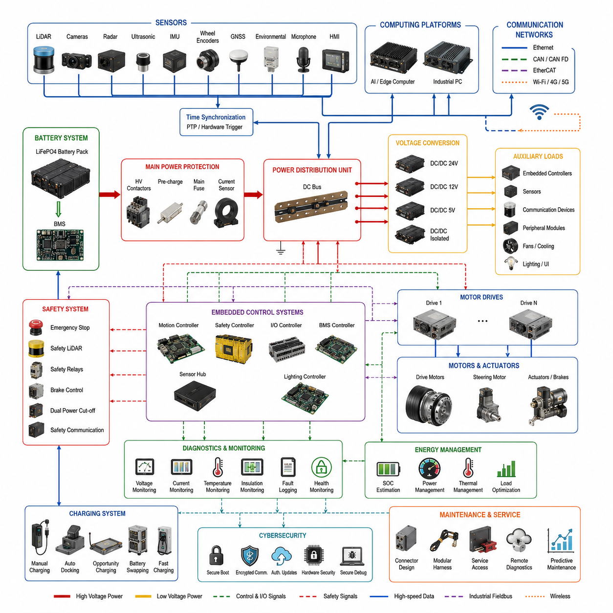
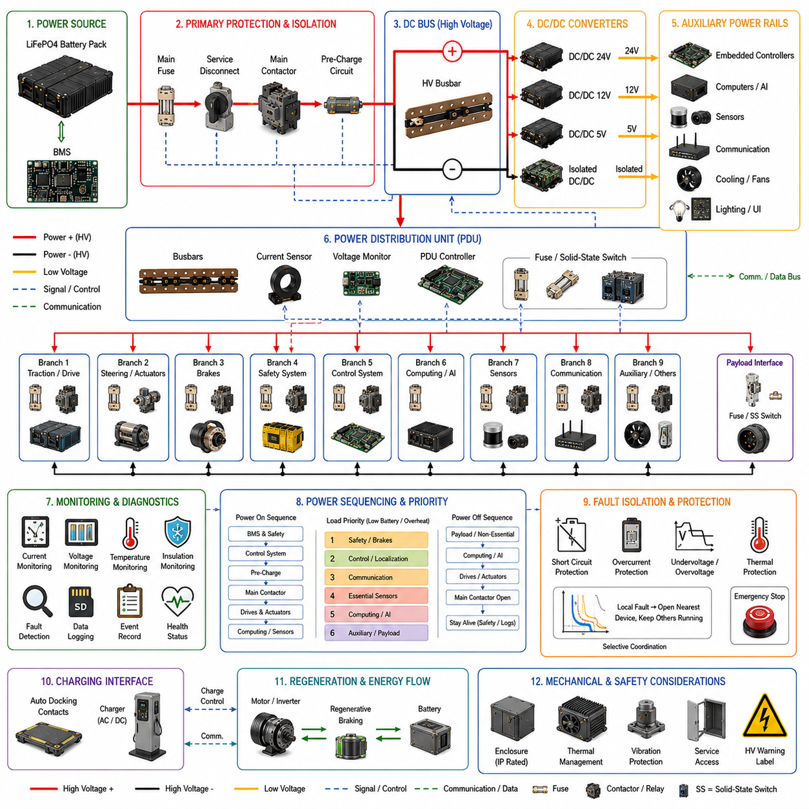
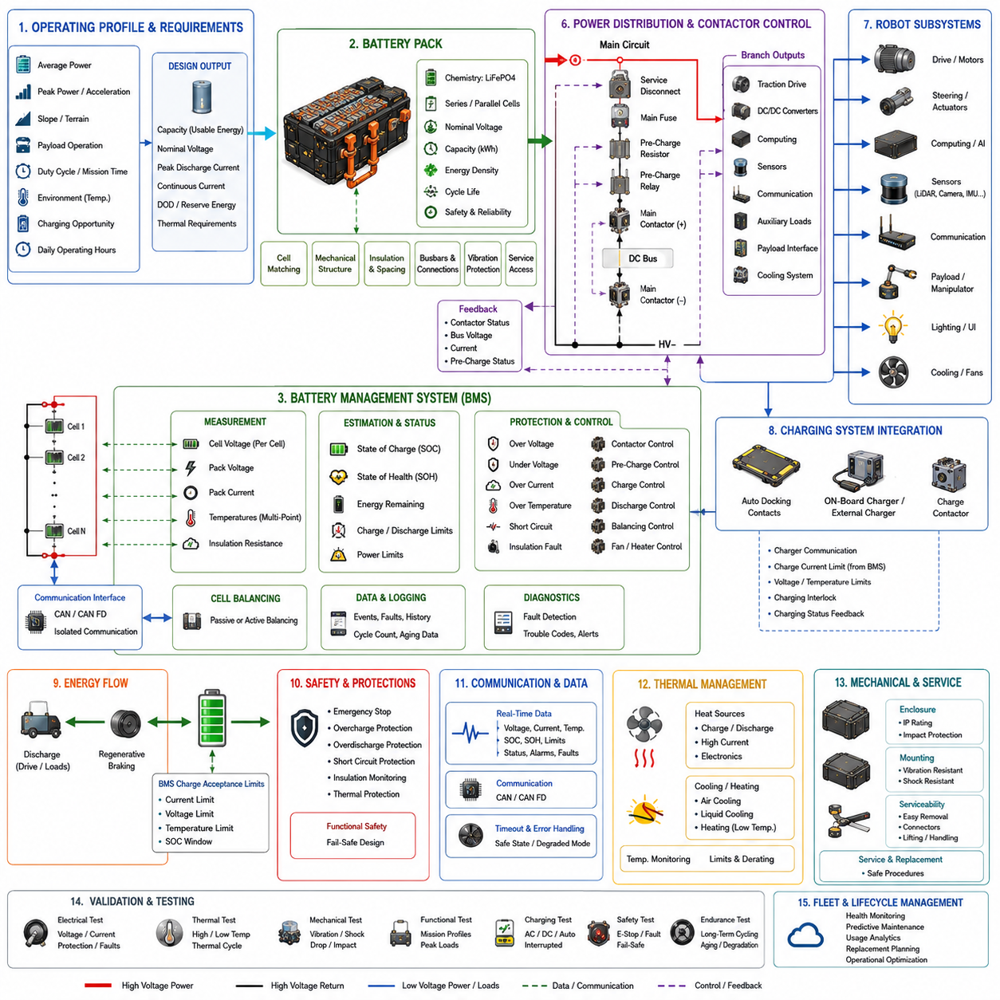
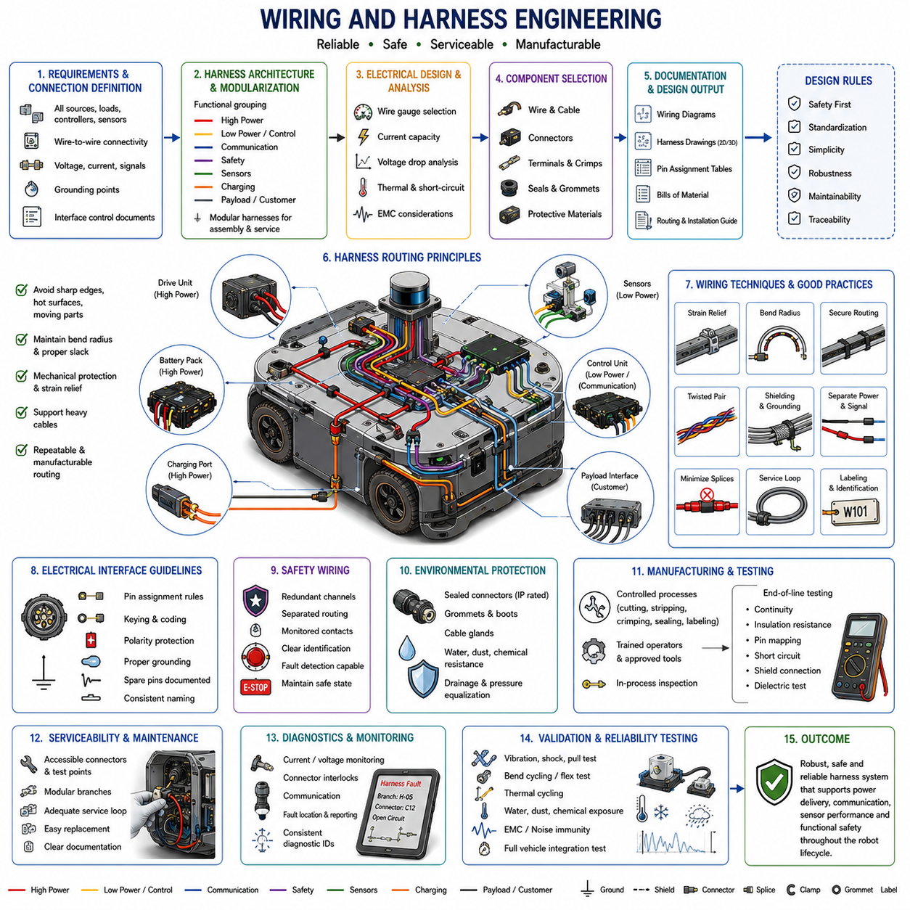
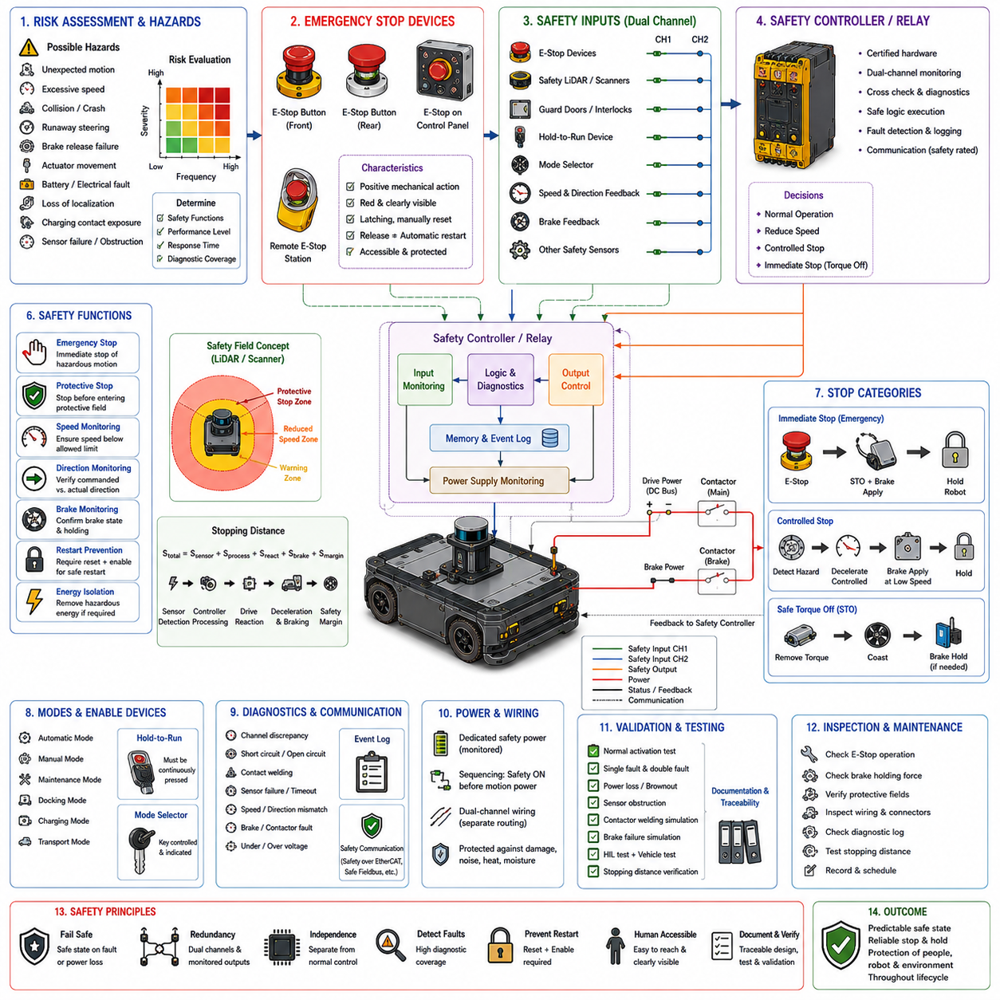
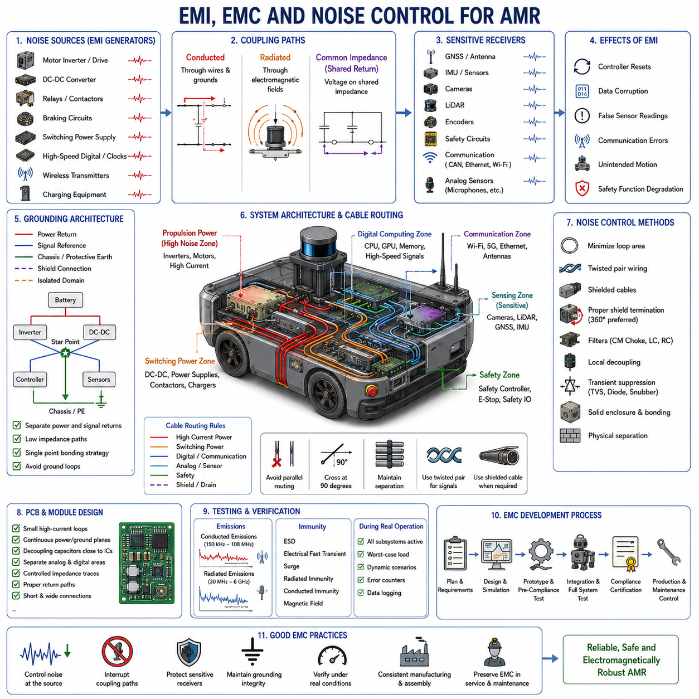
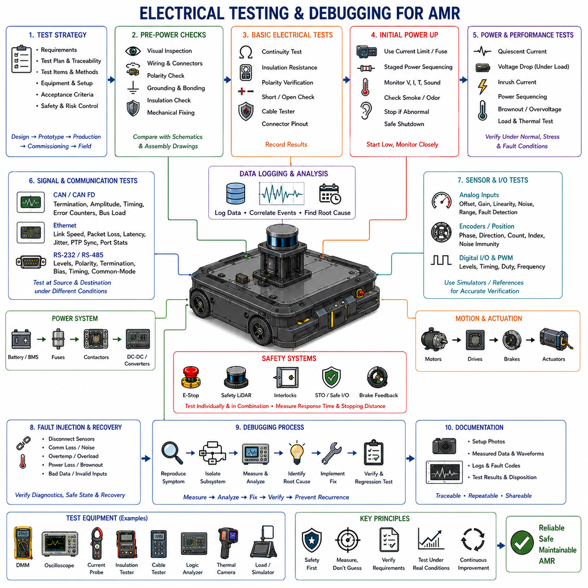
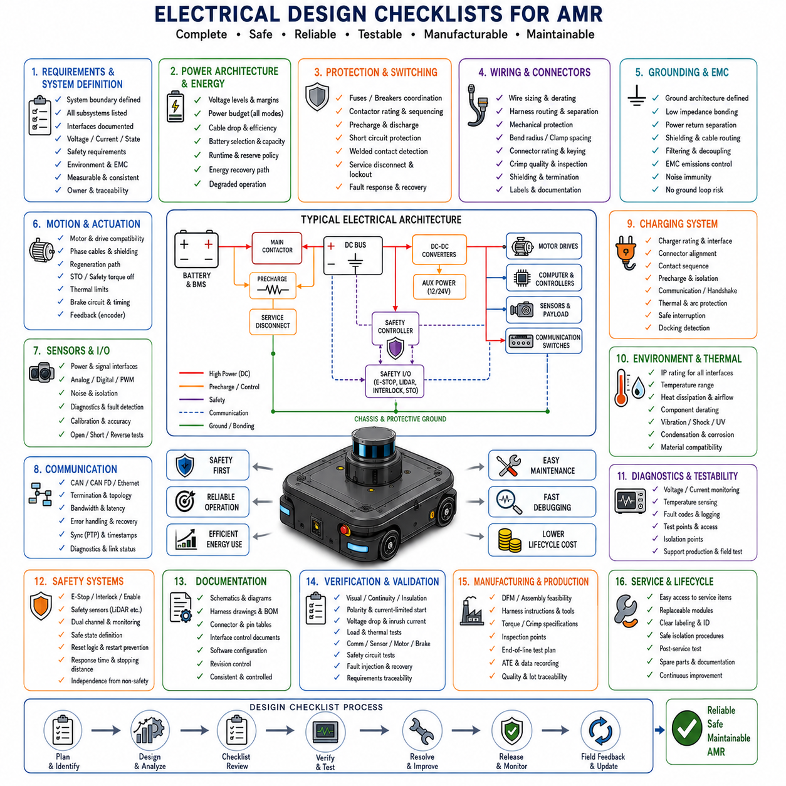

**Volume 10. AMR Engineering Process and Development Manual**

# Chapter 04. Electrical Development Process

## 04.01 Electrical System Architecture

{width="7.268055555555556in" height="7.268055555555556in"}

자율이동로봇(Autonomous Mobile Robot, AMR)의 전기 시스템 아키텍처(Electrical System Architecture)는 기계(Mechanical), 임베디드(Embedded), 소프트웨어(Software), 인공지능(AI) 기능을 모두 뒷받침하는 기반이다. 기계 구조가 로봇의 물리적 성능을 결정한다면, 전기 아키텍처는 안정적인 전력 공급, 결정론적(Deterministic) 통신, 기능 안전(Functional Safety), 센서(Sensor), 컴퓨팅(Computing), 모션 제어(Motion Control)를 가능하게 한다. 따라서 우수한 전기 시스템은 단순한 전기 부품들의 집합이 아니라 통합된 엔지니어링 프레임워크(Engineering Framework)로 설계되어야 한다. 또한 향후 센서, 컴퓨팅 플랫폼, 옵션 장비가 추가되더라도 대규모 재설계 없이 확장될 수 있도록 확장성(Scalability), 유지보수성(Maintainability), 안전성(Safety), 신뢰성(Reliability), 제품 진화(Product Evolution)를 고려해야 한다.

전기 아키텍처 개발은 시스템 요구사항(System Requirements)에 대한 철저한 분석에서 시작된다. 제품 사양은 동작 전압, 최대 및 연속 소비 전력, 목표 운용 시간, 환경 조건, 적재 중량(Payload), 연산 성능, 통신 대역폭, 기능 안전 규격 등을 정의한다. 이러한 요구사항은 전기 시스템 분할과 부품 선정의 핵심 제약 조건이 된다. 엔지니어는 개별 전기 부품을 먼저 선택하는 것이 아니라, 정상 및 비정상 운용 상황에서 전력, 통신 신호, 동기화 신호, 제어 명령, 진단 정보가 시스템 전체에서 어떻게 흐르는지를 설명하는 전체 전기 아키텍처를 먼저 정의해야 한다.

전기 시스템 분할(Electrical Partitioning)은 가장 초기 단계에서 수행되는 중요한 설계 결정이다. 이는 시스템의 복잡도, 유지보수성, 신뢰성에 직접적인 영향을 미친다. 대부분의 산업용 AMR은 전기 시스템을 고전압 구동부(High-Voltage Traction Domain), 보조 전원(Auxiliary Power Distribution), 임베디드 제어기(Embedded Control Electronics), 센서 시스템(Sensor Systems), 안전 회로(Safety Circuits), 통신 인프라(Communication Infrastructure), 엣지 컴퓨팅(Edge Computing), 충전 인터페이스(Charging Interface), 유지보수 서브시스템(Maintenance Subsystems) 등으로 구분한다. 각 영역은 서로 다른 전기적 특성, 고장 모드(Failure Mode), 안전 요구사항을 가지므로 이러한 경계를 초기에 정의하면 전자파 간섭(EMI)을 줄이고 배선을 단순화하며 제품 확장성을 높일 수 있다.

배터리 시스템(Battery System)은 일반적으로 로봇의 단일 주 전원 역할을 수행한다. 현대 산업용 AMR은 높은 안전성, 긴 수명, 안정적인 방전 특성 때문에 리튬인산철(Lithium Iron Phosphate, LFP) 배터리를 주로 사용한다. 배터리 용량은 평균 운용뿐 아니라 급가속, 경사 주행, 장애물 탈출, 로봇팔 동작, AI 추론, 통신 부하, 비상 동작과 같은 최대 부하까지 고려하여 결정되어야 한다. 따라서 전기 설계자는 정상 부하뿐 아니라 순간적인 최대 전력 요구를 분석하여 모든 운용 조건에서 안정적인 전압을 유지할 수 있도록 설계해야 한다.

배터리와 각 전기 부하 사이에는 주 전력 분배 시스템(Power Distribution Architecture)이 위치한다. 이 시스템에는 대전류 보호 장치, 접촉기(Contactor), 프리차지 회로(Pre-charge Circuit), 전류 센서(Current Sensor), 퓨즈(Fuse), 절연 감시(Isolation Monitoring), 배터리 차단 장치 등이 포함된다. 이러한 구조는 전기적 고장이 시스템 전체로 확산되지 않도록 제한하며, 모듈형 전력 분배 장치는 특정 회로만 분리하여 유지보수를 수행할 수 있도록 지원한다. 결과적으로 현장 서비스성과 시스템 가동률이 크게 향상된다.

전압 변환(Voltage Conversion)은 다양한 전압을 사용하는 구성 요소 때문에 필수적인 설계 요소이다. 구동 모터는 배터리 전압을 직접 사용할 수 있지만, 임베디드 제어기는 일반적으로 24V, 통신 장치는 12V, 센서와 프로세서는 5V 또는 그 이하의 안정된 전압을 필요로 한다. 따라서 고효율 DC-DC 컨버터(DC-DC Converter)는 여러 전압 레일(Voltage Rail)을 생성하면서 전기적 절연, 높은 효율, 전압 안정성을 동시에 제공해야 한다. 또한 적절한 배치는 전력 손실을 줄이고 전체 시스템 효율을 향상시킨다.

전원 시퀀싱(Power Sequencing) 또한 매우 중요한 설계 요소이다. 안전 제어기(Safety Controller)는 일반적으로 가장 먼저 기동되며, 이후 모터 제어기(Motion Controller)가 활성화된다. AI 컴퓨터와 고성능 프로세서는 보조 전원이 안정화된 이후 순차적으로 부팅된다. 종료 시에도 소프트웨어가 정상적으로 종료된 후 전원을 차단해야 데이터 손상과 시스템 오류를 방지할 수 있다. 체계적인 전원 시퀀싱은 예상치 못한 모터 동작, 파일 손상, 통신 오류를 예방하는 중요한 역할을 한다.

모터 제어 아키텍처(Motor Control Architecture)는 로봇에서 가장 큰 전력 소비 영역 중 하나이다. 모터 드라이버(Motor Driver)는 고전류 전력을 공급받는 동시에 임베디드 제어기와 실시간 제어 명령 및 진단 정보를 주고받는다. 따라서 전력선과 신호선을 분리하여 전자파 간섭을 최소화해야 한다. 또한 전류 센싱(Current Sensing), 엔코더 피드백(Encoder Feedback), 온도 모니터링(Thermal Monitoring), 브레이크 제어(Brake Control), 고장 감지(Fault Detection)가 통합되어 다양한 운용 환경에서 안정적인 주행을 보장해야 한다.

현대 AMR은 단일 중앙 제어기 대신 분산형 임베디드 제어기(Distributed Embedded Controller)를 사용하는 방향으로 발전하고 있다. 개별 마이크로컨트롤러(MCU)는 모터 제어, 배터리 관리(BMS), 안전 모니터링, 센서 관리, 조명, 사용자 인터페이스(UI), 보조 액추에이터를 담당한다. 반면 산업용 컴퓨터는 위치추정(Localization), 인지(Perception), 내비게이션(Navigation), 미션 계획(Mission Planning), 플릿(Fleet) 통신, AI 연산을 수행한다. 이러한 계층형(Hierarchical) 구조는 시스템 부하를 분산시키고 고장 격리를 향상시킨다.

통신 아키텍처(Communication Architecture)는 실시간 제어와 대용량 데이터 전송을 동시에 지원해야 한다. CAN, CAN FD, EtherCAT, Ethernet, USB, RS-485 및 무선 통신이 일반적으로 함께 사용된다. 모션 제어는 결정론적 필드버스(Fieldbus)를 사용하고, 고해상도 카메라와 AI 컴퓨터는 기가비트 이더넷(Gigabit Ethernet)을 활용한다. 요구 성능에 따라 네트워크를 분리하면 지연 시간을 줄이고 통신 안정성을 향상시킬 수 있다.

센서 통합(Sensor Integration)은 다양한 센서의 전기적 요구사항을 동시에 만족해야 하는 중요한 설계 영역이다. AMR은 LiDAR, 카메라(Camera), 레이더(Radar), 초음파 센서(Ultrasonic Sensor), 관성측정장치(IMU), 휠 엔코더(Wheel Encoder), GNSS, 환경 센서(Environmental Sensor), 마이크(Microphone), 사용자 인터페이스 장치를 함께 사용한다. 각각의 센서는 서로 다른 전압, 커넥터, 동기화, 전자파 민감도를 가지므로 표준 인터페이스(Standard Interface), 안정적인 전원, 차폐(Shielding), 진단 기능을 체계적으로 설계해야 한다.

시간 동기화(Time Synchronization)는 다중 센서 시스템에서 필수적인 기능이 되었다. 카메라, LiDAR, IMU, GNSS, 컴퓨팅 플랫폼 간의 정확한 시간 동기화를 위해 하드웨어 트리거(Hardware Trigger), 정밀 시계 동기화 프로토콜(Precision Time Protocol, PTP), 공통 클록(Common Clock), 결정론적 네트워크를 사용한다. 이러한 구조는 센서 융합(Sensor Fusion)의 정확도를 높이며, 반대로 시간 동기화가 부족하면 위치추정과 인지 성능이 크게 저하될 수 있다.

기능 안전 아키텍처(Functional Safety Architecture)는 일반 제어 시스템과 가능한 한 독립적으로 설계되어야 한다. 비상정지(Emergency Stop), 안전 제어기, 안전 LiDAR, 보호 릴레이, 이중 차단 회로, 브레이크 제어, 안전 통신은 운영 소프트웨어와 분리된 상태에서도 정상적으로 동작해야 한다. 따라서 운영체제 오류, AI 컴퓨터 장애, 통신 실패가 발생하더라도 안전 기능은 항상 독립적으로 유지되어야 한다.

이중화(Redundancy)는 적용 분야에 따라 수준이 달라진다. 일반적인 창고용 AMR은 제한적인 이중화만 필요하지만, 실외 자율주행 로봇, 대형 산업용 AMR, 국방 로봇은 이중 전원, 이중 통신, 다중 위치 센서, 백업 제동 장치, 고장 허용(Fault-Tolerant) 컴퓨팅 등을 적용한다. 전기 아키텍처는 고장 감지와 자동 복구 절차를 정의하여 일부 구성 요소의 장애가 전체 시스템의 위험으로 확대되지 않도록 해야 한다.

접지(Grounding)와 차폐(Shielding)는 초기 설계에서 종종 간과되지만 장기적인 신뢰성에 큰 영향을 미친다. 잘못된 접지는 통신 오류, 센서 오차, 전자파 방출 증가, 제어기 리셋 등의 원인이 된다. 따라서 섀시 접지(Chassis Ground), 신호 접지(Signal Ground), 보호 접지(Protective Earth), 케이블 차폐 연결, 절연 경계를 명확히 정의하여 일관성 있게 적용해야 한다.

열 관리(Thermal Management)는 전력 전자(Power Electronics), 모터 드라이버, GPU 컴퓨터, DC-DC 컨버터에서 발생하는 열을 효과적으로 처리하기 위해 필요하다. 냉각 팬(Cooling Fan), 히트싱크(Heat Sink), 액체 냉각(Liquid Cooling), 공기 흐름(Airflow), 온도 센서(Thermal Sensor), 과열 보호 기능이 포함된다. 또한 시스템은 온도가 한계를 초과하기 전에 계산 부하나 모터 출력을 자동으로 조절하여 장기적인 신뢰성을 확보해야 한다.

커넥터 아키텍처(Connector Architecture)는 생산성과 유지보수성에 직접적인 영향을 준다. 산업용 커넥터는 진동 저항, 방수(IP Rating), 역극성 방지, 충분한 전류 용량을 제공해야 하며 빠른 조립과 교체가 가능해야 한다. 커넥터 표준화를 통해 부품 관리가 단순화되고 생산 오류가 감소하며 현장 유지보수가 쉬워진다.

와이어링 하네스(Wiring Harness)는 기계 설계와 동시에 개발되어야 한다. 케이블은 움직이는 부품, 서스펜션, 진동, 열원, 유지보수 접근성, 향후 업그레이드를 고려하여 배치되어야 한다. 적절한 굽힘 반경(Bend Radius), 장력 완화(Strain Relief), 마모 방지, 방수 처리, 고정 방식은 장기적인 신뢰성 확보에 매우 중요한 요소이다.

전자기 적합성(EMI/EMC)은 개발 마지막 단계가 아니라 초기 아키텍처 설계 단계부터 고려되어야 한다. 대전류 모터, 스위칭 전원, GPU 시스템, 무선 통신, 장거리 케이블은 상당한 전자파를 발생시킬 수 있다. 따라서 부품 배치, 차폐 케이블, 접지 전략, 필터(Filter), 차동 통신(Differential Communication), PCB 레이아웃을 통해 전자파 문제를 사전에 최소화해야 한다.

진단 기능(Diagnostic Capability)은 유지보수 비용을 크게 줄이는 핵심 요소이다. 전압, 전류, 온도, 절연 상태, 통신 품질, 커넥터 상태, 배터리 건강도(State of Health), 자체 진단(Self-Test)을 지속적으로 수행하면 문제를 조기에 발견할 수 있다. 이러한 진단 체계는 예측 유지보수(Predictive Maintenance)를 가능하게 하여 고장이 발생하기 전에 부품 교체를 수행할 수 있도록 지원한다.

에너지 관리(Energy Management)는 단순히 전력을 공급하는 기능을 넘어 전체 시스템 효율을 최적화하는 역할을 한다. 배터리 잔량(State of Charge), 임무 우선순위, 온도 상태, 충전 기회를 지속적으로 평가하여 불필요한 부하를 줄이고 핵심 기능을 유지한다. CPU 및 GPU 주파수 조절, 센서 운용 최적화, 통신 관리 등을 통해 운용 시간을 연장할 수 있다.

충전 아키텍처(Charging Architecture)는 수동 충전, 자동 도킹(Auto Docking), 기회 충전(Opportunity Charging), 배터리 교체(Battery Swapping), 급속 충전(Fast Charging)을 모두 고려하여 설계될 수 있다. 충전 제어기는 배터리 관리 시스템(BMS)과 연동하여 전압, 전류, 온도, 절연 상태를 지속적으로 관리한다. 또한 플릿 관리 시스템(Fleet Management System)과 연계하여 충전 스케줄을 최적화함으로써 운용 효율과 배터리 수명을 동시에 향상시킨다.

사이버보안(Cybersecurity)은 현대 전기 아키텍처에서 점점 더 중요한 요소가 되고 있다. 보안 부트(Secure Boot), 펌웨어 보호(Firmware Protection), 암호화 통신(Encrypted Communication), 인증된 OTA 업데이트, 하드웨어 보안 모듈(Hardware Security Module), 보안 디버깅 인터페이스는 외부 공격으로부터 전기 시스템을 보호한다. 따라서 전기 설계자는 임베디드 소프트웨어 및 보안 전문가와 긴밀하게 협력하여 전체 시스템 보안을 확보해야 한다.

확장성(Scalability)은 장기간 제품 발전을 고려할 때 반드시 확보해야 하는 요소이다. 전기 아키텍처는 추가 센서, 고성능 컴퓨터, 로봇팔, 다양한 고객 옵션이 추가되더라도 전체 시스템을 다시 설계하지 않아도 되도록 구성되어야 한다. 모듈형 전력 분배, 표준 인터페이스, 확장 가능한 커넥터 구조, 소프트웨어 기반 전력 관리 기능은 차세대 제품 개발 비용을 크게 절감한다.

전기 아키텍처 검증(Verification)은 실제 시스템 조립 이전부터 시작된다. 시뮬레이션(Simulation)을 통해 전력 소비, 전압 안정성, 케이블 용량, 열 특성, 고장 전파를 분석하고, 이후 프로토타입(Prototype) 시험을 통해 실제 성능을 검증한다. 또한 HIL(Hardware-in-the-Loop) 시험은 제어기와 전력 전자 장치의 상호작용을 조기에 확인하여 개발 위험을 줄이고 최종 제품의 품질을 향상시킨다.

궁극적으로 우수한 전기 시스템 아키텍처(Electrical System Architecture)는 자율이동로봇(Autonomous Mobile Robot, AMR)의 모든 기능을 지탱하는 핵심 기반이다. 안정적인 전력 공급, 결정론적 제어, 신뢰성 높은 통신, 기능 안전, 확장성, 유지보수성을 제공함으로써 인지(Perception), 자율주행(Navigation), 인공지능(AI), 클라우드(Cloud), 플릿 관리(Fleet Management), 미래 제품 확장을 모두 지원하는 견고한 기술 기반을 구축하게 된다.

## 04.02 Power Distribution Design

{width="7.268055555555556in" height="7.268055555555556in"}

전력 분배 설계(Power Distribution Design)는 배터리(Battery)에서 발생한 전기에너지를 자율이동로봇 (Autonomous Mobile Robot, AMR)의 모든 기능 서브시스템으로 안정적으로 전달하는 방식을 정의하는 핵심 설계 분야이다. 전력 분배 시스템은 모든 운용 조건에서 안정적인 전압, 충분한 전류 공급 능력, 고장 격리(Fault Isolation), 높은 전력 효율, 안전한 전원 차단, 그리고 유지보수를 위한 접근성을 동시에 제공해야 한다. 구동(Propulsion), 컴퓨팅(Computing), 센서(Sensor), 통신(Communication), 기능 안전(Functional Safety), 조명(Lighting), 냉각(Cooling), 보조 장치(Auxiliary Device)는 각각 서로 다른 전기적 특성을 가지므로, 전력 분배는 단순히 케이블과 퓨즈를 연결하는 작업이 아니라 하나의 통합된 시스템 아키텍처(System Architecture)로 설계되어야 한다.

설계 과정은 모든 전기 부하(Electrical Load)를 식별하고 전압, 소비 전류, 운용 우선순위, 안전 등급, 운용 패턴(Duty Cycle)에 따라 분류하는 것에서 시작된다. 임베디드 제어기(Embedded Controller)나 네트워크 스위치(Network Switch)처럼 지속적으로 전력을 사용하는 부하와 조향 액추에이터(Steering Actuator), 브레이크(Brake), 냉각 팬(Cooling Fan), 로봇팔(Robot Arm), 고출력 조명처럼 간헐적으로 동작하는 부하는 구분되어야 한다. 또한 회생 전력(Regenerative Power), 기동 시 돌입 전류(Inrush Current), 순간 최대 부하(Peak Load), 고객 옵션 장비도 초기 단계에서 함께 분석해야 한다. 이러한 요소들이 평균 소비 전력보다 전선 규격과 보호 장치 선정에 더 큰 영향을 주는 경우가 많기 때문이다.

완전한 전기 부하 목록(Electrical Load List)에는 정격 전압, 허용 전압 범위, 연속 전류, 최대 전류, 기동 전류, 필요 시 역률(Power Factor), 운용 시간, 주변 온도, 요구 가용성(Availability) 등이 포함되어야 한다. 이러한 정보는 대기 상태(Standby), 일반 주행(Normal Driving), 가속(Acceleration), 도킹(Docking), 충전(Charging), 비상 운용(Emergency Operation)에서의 소비 전력을 계산하는 전력 예산(Power Budget)으로 통합된다. 전력 예산에는 실제 현장 환경, 부품 노화, 미래 기능 확장 등을 고려한 충분한 설계 여유(Margin)가 반드시 포함되어야 한다.

배터리 버스(Battery Bus)는 일반적으로 로봇에서 가장 높은 전력을 전달하는 전기 영역이다. 시스템 전압은 모터 출력, 플랫폼 크기, 운용 시간, 케이블 효율, 산업용 부품의 공급 가능성을 고려하여 결정된다. 높은 버스 전압은 동일한 전력을 더 작은 전류로 전달할 수 있어 케이블 굵기와 전력 손실을 줄일 수 있지만, 절연(Insulation), 커넥터(Connector), 유지보수, 보호 장치 요구사항은 더욱 엄격해진다. 따라서 선택된 전압은 배터리 관리 시스템(BMS), 모터 드라이브(Motor Drive), 충전 시스템, DC-DC 컨버터, 접촉기(Contactor), 그리고 전기 안전 규격과 모두 호환되어야 한다.

배터리 출력은 모든 장치에 직접 연결되어서는 안 된다. 일반적으로 배터리 단자 근처에는 메인 퓨즈(Main Fuse) 또는 주 보호 장치가 설치되어 가장 짧은 구간만 무보호 상태가 되도록 설계한다. 이는 케이블 단락 시 심각한 손상을 방지하기 위한 것이다. 또한 유지보수를 위해 사람이 직접 배터리를 분리할 수 있는 서비스 차단 장치(Service Disconnect)가 포함되는 경우가 많다. 이 장치는 쉽게 접근할 수 있어야 하며, 명확하게 표시되어야 하고, 정상 운용 중에는 실수로 조작되지 않도록 보호되어야 한다.

메인 접촉기(Main Contactor)는 배터리 버스를 전기적으로 연결하거나 차단하는 역할을 수행한다. 접촉기의 전류 용량은 연속 전류뿐 아니라 순간 최대 전류, 스위칭 빈도, 고장 전류, 주변 온도, 제품 수명을 고려하여 선정해야 한다. 또한 실제 부하 프로파일(Load Profile)을 기반으로 선택하는 것이 중요하다. 보조 접점(Auxiliary Contact)을 이용하면 제어기가 접촉기가 실제로 열리고 닫혔는지를 확인할 수 있으며, 접점 용착(Welded Contact) 여부를 검출하는 기능은 안전성이 중요한 시스템에서 필수적인 요소이다.

모터 인버터(Inverter), 전력 변환기(Power Converter), 산업용 컴퓨터와 같이 대용량 커패시터(Capacitor)를 포함하는 장치는 프리차지 회로(Pre-charge Circuit)가 반드시 필요하다. 프리차지가 없으면 메인 접촉기가 닫히는 순간 매우 큰 돌입 전류가 발생하여 접촉기 손상, 퓨즈 열화, 커넥터 스파크, 배터리 전압 강하를 유발할 수 있다. 프리차지 저항을 이용하여 커패시터를 먼저 충전한 후 메인 접촉기를 닫도록 구성하며, 이 과정에서 버스 전압(Bus Voltage)을 감시하여 저항 단선, 릴레이 고착, 이상 방전, 프리차지 실패 등을 검출해야 한다.

전력 분배 장치(Power Distribution Unit)는 메인 배터리 버스와 각 부하를 연결하는 중심 역할을 한다. 일반적으로 버스바(Busbar), 퓨즈(Fuse), 릴레이(Relay), 전자 스위치(Solid-State Switch), 전류 센서(Current Sensor), 전압 감시 회로, 통신 인터페이스가 포함된다. 추진 시스템, 안전 장치, 제어기, 컴퓨팅, 센서, 보조 장비, 고객 장비를 각각 독립된 전력 분기로 구성하면 고장이 다른 시스템으로 확산되는 것을 방지할 수 있으며, 유지보수 시 특정 장치만 분리하여 작업할 수 있다.

각 분기(Branch)의 보호 장치는 전선 용량과 부하 특성에 맞게 선정되어야 한다. 퓨즈나 차단기(Circuit Breaker)는 전선이 손상되기 전에 회로를 차단해야 하지만 정상적인 기동 전류나 순간 부하는 허용해야 한다. 과도하게 큰 보호 장치는 위험한 과부하를 차단하지 못할 수 있으며, 너무 작은 보호 장치는 가속이나 기동 과정에서 불필요하게 동작할 수 있다. 따라서 시간-전류 특성(Time-Current Curve), 주변 온도 보정(Derating), 케이블 묶음 효과, 고장 전류 등을 함께 고려하여 보호 장치를 선정해야 한다.

선택적 보호 협조(Selective Coordination)는 여러 단계의 보호 장치가 존재하는 경우 매우 중요하다. 특정 장치에서 고장이 발생하면 메인 퓨즈가 아니라 해당 분기의 보호 장치만 동작해야 한다. 이를 통해 다른 시스템은 정상적으로 계속 운용될 수 있으며, 고장 위치도 쉽게 확인할 수 있다. 보호 협조는 메인 보호 장치와 분기 보호 장치의 동작 특성을 비교 분석하여 이루어지며, 소형 저전압 로봇에서는 완전한 선택성이 어려울 수도 있지만 가능한 한 국부적인 차단(Local Fault Isolation)을 목표로 설계해야 한다.

고전류 전력 분배에는 버스바(Busbar)가 자주 사용된다. 버스바는 굵은 케이블보다 저항이 작고, 공간 활용성이 우수하며, 열 방출 성능과 생산 일관성이 뛰어나다. 버스바 설계에서는 두께, 폭, 재질, 표면 처리, 접촉 저항, 고정 방식, 연면 거리(Creepage Distance), 보호 커버를 함께 고려해야 한다. 또한 볼트 체결부는 진동으로 인해 접촉 저항이 증가하지 않도록 규정 토크(Torque)와 풀림 방지 구조를 적용해야 하며, 절연 커버는 공구 낙하나 작업 중 단락을 방지해야 한다.

케이블 규격(Cable Sizing)은 단순히 전류만으로 결정되지 않는다. 허용 전압 강하(Voltage Drop), 도체 온도, 절연 등급, 배선 길이, 묶음 보정, 주변 온도, 반복 굴곡, 진동, 커넥터 용량, 단락 내구성 등을 모두 고려해야 한다. 추진용 케이블은 연속 부하와 순간 최대 부하를 모두 만족해야 하며, 저전압 센서는 작은 전압 강하도 큰 영향을 미치므로 경우에 따라 더 굵은 전선이나 현장 DC-DC 컨버터가 필요할 수 있다.

전압 강하 분석(Voltage Drop Analysis)은 모든 주요 전력 경로에 대해 수행되어야 하며, 귀선(Return Line)도 함께 고려해야 한다. 과도한 전압 강하는 모터 토크 감소, 컴퓨터 리셋, 센서 오동작, 릴레이 탈락 등의 원인이 된다. 계산 시에는 최대 전류, 최대 케이블 길이, 커넥터 저항, 퓨즈 저항, 접촉기 저항, 고온에서 증가하는 도체 저항을 모두 반영해야 한다. 또한 실제 시제품에서는 이론 계산으로 예측하기 어려운 접촉 저항과 순간 현상이 존재하므로 실측 검증이 반드시 필요하다.

귀선(Return Current) 설계는 양극 전원만큼 중요하다. 차체(Chassis)를 무분별하게 전류 귀선으로 사용하면 전기 노이즈, 부식, 예측 불가능한 전류 경로, 통신 오류가 발생할 수 있다. 대부분의 산업용 로봇은 전용 귀선(عودة Conductor)을 사용하여 공통 접지(Common Ground)로 연결한다. 차체 접지는 전자기 적합성(EMC), 차폐(Shielding), 보호 기능을 위해 사용할 수 있지만 실제 운용 전류는 명확하게 정의된 귀선만을 통해 흐르도록 해야 한다. 특히 아날로그 센서와 통신 장치에서는 접지 루프(Ground Loop)가 발생하지 않도록 주의해야 한다.

부하는 전기적 노이즈 민감도와 스위칭 특성에 따라 그룹화해야 한다. 모터 드라이브, 브레이크, 펌프, 히터, 스위칭 전원은 많은 노이즈를 발생시키며, 카메라(Camera), 엔코더(Encoder), GNSS, IMU, 통신 장치는 이에 민감하다. 따라서 별도 전력 분기, 필터(Filter), 차폐 케이블, 절연 전원, 접지 전략, 물리적 배선 분리를 통해 간섭을 최소화해야 한다. 이러한 설계는 하네스(Harness), 기구 설계(Mechanical Layout), PCB 설계, 통신 구조와 함께 통합적으로 이루어져야 한다.

DC-DC 컨버터(DC-DC Converter)는 배터리 버스에서 다양한 보조 전압을 생성한다. 일반적으로 24V 제어 장치, 12V 통신 및 센서, 5V 임베디드 전자장치 등의 전압 레일(Voltage Rail)을 제공한다. 컨버터 용량은 연속 부하뿐 아니라 기동 부하, 변환 효율, 온도 보정, 향후 확장성을 고려하여 선정해야 한다. 병렬 운전은 제조사가 지원하는 경우에만 사용해야 하며, 중요한 시스템에서는 안전 장치와 일반 제어 장치에 각각 독립된 컨버터를 적용하여 고장 격리 성능을 높일 수 있다.

절연(Isolation)의 필요성은 시스템 위험도, 노이즈 환경, 통신 방식, 충전 구조에 따라 결정된다. 갈바닉 절연(Galvanic Isolation) 컨버터는 접지 전위 차이를 차단하고 고장이 다른 회로로 전파되는 것을 방지할 수 있다. 그러나 절연은 비용과 부피, 발열, 진단 복잡도를 증가시키므로 실제로 필요한 부분에만 적용해야 한다. 외부 인터페이스, 고객 장비, 안전 장치, 별도의 접지 시스템과 연결되는 장비에는 절연 전원이 특히 효과적이다.

전원 시퀀싱(Power Sequencing)은 각 전력 분기가 켜지고 꺼지는 순서를 제어한다. 일반적으로 배터리 관리 시스템(BMS)과 안전 제어기(Safety Controller)가 가장 먼저 동작하고, 이후 추진 시스템과 고성능 컴퓨터가 활성화된다. 프리차지 완료, 통신 확인, 브레이크 상태, 비상정지 상태가 검증된 후 모터 드라이브가 활성화된다. 시스템 종료 시에는 파일 시스템과 미션 데이터를 저장한 후 컴퓨팅 전원을 차단하며, 안전 시스템은 위험 에너지가 완전히 제거될 때까지 계속 동작한다.

부하 우선순위(Load Prioritization)는 배터리 잔량이나 열 용량이 부족한 경우에도 안전한 운용을 가능하게 한다. 안전 회로, 브레이크, 저수준 제어, 위치추정(Localization), 기본 통신은 필수 기능으로 유지되며, AI 가속기(AI Accelerator), 보조 조명, 옵션 장비, 디스플레이, 비필수 센서는 순차적으로 전력을 줄이거나 차단할 수 있다. 이를 통해 배터리가 부족한 상황에서도 로봇은 안전하게 충전소까지 이동할 수 있다.

전자식 전력 분배(Solid-State Power Distribution)는 기존 릴레이와 퓨즈 기반 구조보다 많은 장점을 제공한다. 전자 스위치는 전류 측정, 과부하 감지, 돌입 전류 제어, 고장 보고, 소프트웨어 기반 재설정을 지원하며, 원격 진단과 유지보수도 가능하게 한다. 그러나 자체 발열이 존재하고 기계식 릴레이와는 다른 고장 특성을 가지므로 누설 전류, 단락 특성, 열 보호, 전압 과도현상, 안전 고장 모드(Safe Failure State)를 충분히 검토해야 한다.

회생 제동(Regenerative Braking)은 감속 시 모터가 발전기로 동작하여 배터리 버스로 에너지를 되돌려 보내기 때문에 전력 분배 설계에 중요한 영향을 미친다. 배터리 관리 시스템은 현재 충전 상태와 온도에서 이 전류를 수용할 수 있어야 하며, 그렇지 못하면 버스 전압이 위험 수준까지 상승할 수 있다. 이를 방지하기 위해 제동 저항(Braking Resistor), 인버터 제어 제한, 에너지 저장 여유, 기계식 브레이크와의 협조 제어가 필요하며, 완전 충전 상태, 저온, 최대 적재, 급제동 조건에서 충분한 시험이 수행되어야 한다.

외부 고객 장비(Payload Interface)는 예측하기 어려운 부하 특성을 가지므로 명확한 전기적 경계를 가져야 한다. 각 출력은 전압, 연속 전류, 최대 전류, 커넥터 핀 배치, 통신 인터페이스, 접지 방식, 기동 특성을 명확히 정의해야 한다. 또한 독립적인 퓨즈 또는 전자 보호 장치를 적용하여 고객 장비의 고장이 내비게이션이나 안전 시스템에 영향을 주지 않도록 해야 하며, 비상 상황이나 충전 중에는 전원을 차단할 수 있는 제어 기능도 포함되어야 한다.

충전 회로(Charging Circuit)는 초기 설계 단계부터 전력 분배 시스템과 함께 고려되어야 한다. 충전 중 로봇이 동작 가능한지, 어떤 장치가 계속 운용되는지, 추진 시스템은 어떻게 차단되는지를 명확히 정의해야 한다. 자동 충전 도킹(Auto Docking)은 극성 보호, 접촉 감지, 절연 감시, 충전기와의 통신, 스파크 방지 기능을 포함해야 한다. 또한 충전 전류와 시스템 소비 전류가 동시에 흐를 수 있으므로 케이블, 접촉기, 퓨즈는 이 두 전류를 모두 고려하여 설계해야 한다.

비상 전원 차단(Emergency Power Removal)은 안전 상태(Safe State)를 달성하면서도 필요한 진단 기능은 유지해야 한다. 대부분의 로봇은 비상정지 시 모터와 액추에이터의 구동 전력은 차단하지만, 안전 제어기, 통신, 브레이크 감시, 진단 시스템은 계속 유지한다. 이를 통해 고장 원인을 기록하고 현재 상태를 운영자에게 보고할 수 있다. 따라서 비상정지, 정상 정지, 유지보수 차단, 소프트웨어 종료, 완전한 배터리 분리는 각각 서로 다른 동작 절차와 시간을 갖도록 설계되어야 한다.

모니터링 회로(Monitoring Circuit)는 보호 기능과 유지보수성을 동시에 향상시킨다. 주요 전력 분기의 전류 센서는 추진 부하, 컴퓨터 소비 전력, 센서 상태, 충전 전류, 누설 전류를 감시한다. 전압 센서는 배터리 상태, 컨버터 출력, 접촉기 상태, 케이블 이상을 확인하며, 버스바, 퓨즈, 커넥터, 컨버터, 고전류 접속부의 온도 센서는 접촉 저항 증가를 조기에 발견하는 데 도움을 준다. 모든 데이터는 시간 정보(Time Stamp)와 함께 저장되어 로봇의 운용 기록과 연계되어야 한다.

고장 진단(Fault Diagnosis)은 단순히 전원이 없다는 메시지를 출력하는 수준을 넘어야 한다. 시스템은 퓨즈 단선, 과전류 차단, 저전압, 접촉기 고장, 컨버터 과부하, 열 제한(Thermal Derating), 통신 오류, 절연 이상, 부하 분리 등을 명확하게 구분해야 한다. 이러한 진단 코드(Diagnostic Identifier)는 임베디드 펌웨어(Firmware), 로봇 소프트웨어, 플릿 관리 시스템(Fleet Dashboard), 서비스 매뉴얼, 생산 시험 장비에서 모두 동일하게 사용되어야 신속한 문제 해결이 가능하다.

열 설계(Thermal Design)는 전력 분배와 밀접하게 연결되어 있다. 모든 전선, 스위치, 퓨즈, 커넥터, 컨버터, 접속부는 전류가 흐르면서 열을 발생시킨다. 밀폐된 전기함에서는 내부 온도가 외부보다 훨씬 높아질 수 있으므로 실제 운용 부하와 공기 흐름을 고려한 열 해석이 필요하다. 고전류 장치는 섀시를 이용한 방열이나 강제 냉각이 가능한 위치에 배치해야 하며, 실외 로봇은 직사광선, 고온, 먼지, 냉각 통로 막힘까지 고려한 충분한 열 여유를 확보해야 한다.

기계적 패키징(Mechanical Packaging)은 전력 분배 부품을 진동, 충격, 수분, 먼지, 금속 이물질, 작업 중 접촉으로부터 보호해야 한다. 무거운 케이블은 장력 완화(Strain Relief)를 적용하여 단자가 하중을 받지 않도록 해야 하며, 서비스 커버(Service Cover)는 다른 고전류 구역을 노출시키지 않으면서 필요한 장치만 접근 가능하도록 설계되어야 한다. 또한 퓨즈 교체를 위해 주요 구조물을 분해하지 않아도 되도록 유지보수성을 확보해야 한다.

생산성(Manufacturability)은 설계 초기부터 고려되어야 한다. 전력 분배 장치는 반복 가능한 조립 방식, 규정 토크, 키드 커넥터(Keyed Connector), 명확한 라벨(Label), 오류 방지 배선을 적용해야 한다. 하네스 길이와 분기 위치는 실제 조립 순서에 맞게 설계되어야 하며, 생산 완료 후에는 극성, 절연 저항, 연속성, 퓨즈 규격, 릴레이 동작, 컨버터 출력, 전류 센서 보정, 비상정지, 통신을 모두 검사해야 한다. 이러한 설계는 생산 시간을 단축하고 품질 일관성을 높인다.

검증(Validation)은 정상 운용뿐 아니라 과부하, 단락, 역극성 연결, 저전압, 최대 전압, 충전, 회생 제동, 극한 온도, 진동, 부품 고장을 모두 포함해야 한다. 특히 많은 전력 문제는 모터 기동, 급제동, 컴퓨터 부팅, 여러 장치의 동시 기동 시 발생하므로 정상 상태와 과도 상태(Transient)를 모두 측정해야 한다. 측정 항목에는 버스 전압, 분기 전류, 접촉기 상태, 컨버터 출력, 온도, 통신 이벤트가 포함되어야 하며 충분한 샘플링 속도로 기록되어야 한다.

성숙한 전력 분배 설계는 향후 플랫폼 확장을 충분히 지원할 수 있어야 한다. 예비 전력 분기, 표준 전압 레일, 설정 가능한 전자 보호 장치, 모듈형 커넥터, 문서화된 고객 인터페이스를 제공하면 추가 센서, 컴퓨터, 로봇팔, 고객 옵션을 효율적으로 통합할 수 있다. 이러한 확장 여유는 단순히 남겨두는 것이 아니라 전류 용량, 커넥터 핀, 열 용량, 설치 공간까지 명확하게 계획되어야 한다.

결국 우수한 전력 분배 설계(Power Distribution Design)는 전력 효율(Efficiency), 기능 안전(Functional Safety), 유지보수성(Serviceability), 비용(Cost), 중량(Mass), 기구 설계(Packaging), 제품 확장성(Product Flexibility) 사이의 균형을 이루는 과정이다. 뛰어난 전력 분배 시스템은 가장 혹독한 운용 조건에서도 안정적으로 에너지를 공급하며, 고장을 필수 기능으로 확산되기 전에 차단한다. 정확한 부하 분석, 체계적인 보호 협조, 제어된 전원 시퀀싱, 종합적인 모니터링, 올바른 접지 설계, 현실적인 검증 과정을 통해 전력 분배 시스템은 제품 수명주기(Product Lifecycle) 전체에 걸쳐 신뢰성 높은 자율주행을 지원하는 핵심 기반이 된다.

## 04.03 Battery and BMS Integration

{width="7.268055555555556in" height="7.268055555555556in"}

배터리 및 배터리 관리 시스템 통합(Battery and Battery Management System Integration)은 저장된 전기에너지를 자율이동로봇(Autonomous Mobile Robot, AMR)이 안전하고 측정 가능하며 제어 가능하고 유지보수 가능한 전원으로 활용하도록 만드는 방식을 정의한다. 배터리 팩(Battery Pack)은 단순한 에너지 저장 장치가 아니다. 전압, 전류 공급 능력, 열적 거동, 노화 특성, 통신 인터페이스, 보호 로직이 추진(Propulsion), 컴퓨팅(Computing), 센싱(Sensing), 충전(Charging), 기능 안전(Functional Safety)에 직접 영향을 미친다. 따라서 성공적인 통합을 위해서는 전기, 기계, 임베디드 소프트웨어, 제어, 열, 생산, 서비스 엔지니어링 팀 간의 협업이 필요하다.

통합 과정은 로봇의 운용 프로파일(Operating Profile)을 명확하게 정의하는 것에서 시작된다. 엔지니어는 평균 소비 전력, 가속 시 최대 부하, 경사로 주행, 조향 부하, 페이로드(Payload) 동작, 제동, 컴퓨팅 부하, 환경 온도, 임무 시간, 충전 가능 시점, 일일 운용 시간을 파악해야 한다. 이러한 조건은 배터리 용량, 전압, 최대 방전 전류, 연속 전류, 허용 방전 깊이(Depth of Discharge), 열 요구사항으로 변환된다. 평균 소비 전력만을 기준으로 배터리를 선정하면 명목상 에너지가 충분하더라도 순간적으로 높은 부하가 발생하는 상황에서는 성능이 부족할 수 있다.

배터리 화학계(Battery Chemistry)의 선택은 안전성, 중량, 패키지 크기, 사이클 수명, 충전 시간, 비용, 환경 성능에 영향을 미친다. 리튬인산철(Lithium Iron Phosphate, LFP) 셀(Cell)은 열 안정성이 우수하고 사이클 수명이 길며 노화 특성이 비교적 예측 가능하고 고에너지 밀도 화학계보다 화재 위험이 낮아 산업용 이동로봇에 널리 적용된다. 그러나 에너지 밀도가 상대적으로 낮아 배터리 부피와 중량이 증가할 수 있다. 따라서 최종 선택은 항상 최대 에너지 밀도를 우선하는 것이 아니라 실제 제품 목표를 기준으로 이루어져야 한다.

정격 팩 전압(Nominal Pack Voltage)은 모터 드라이브(Motor Drive), 충전 장치, DC-DC 컨버터(DC-DC Converter), 접촉기(Contactor), 배선, 보호 장치와 함께 검토하여 선정해야 한다. 높은 전압을 사용하면 동일한 기계 출력을 더 작은 전류로 전달할 수 있어 케이블과 인버터 효율을 높일 수 있다. 그러나 절연, 커넥터, 유지보수, 고장 보호 요구사항은 더 엄격해진다. 완전 충전, 정격 상태, 낮은 충전 상태, 순간 전압 강하, 회생 제동 시 과전압을 포함한 전체 운용 전압 범위가 연결된 모든 전기 장치와 호환되어야 한다.

배터리 용량은 단순한 명판 용량(Nameplate Capacity)이 아니라 실제 사용 가능한 에너지(Usable Energy)를 기준으로 결정해야 한다. 설계 시 방전 깊이 제한, 저온 성능 저하, 셀 노화, 전력 변환 효율, 케이블 손실, 보조 부하, 예비 에너지, 충전소 복귀 에너지를 고려해야 한다. 로봇은 임무 종료 시 잔여 에너지가 전혀 없는 상태가 되어서는 안 된다. 예상하지 못한 교통 지연, 우회 경로, 휠 슬립(Wheel Slip), 추가적인 페이로드 부하, 충전기 접근 지연으로 소비 전력이 증가할 수 있기 때문이다. 따라서 에너지 예비 정책(Energy Reserve Policy)을 시스템 수준에서 정의하고 미션 계획 소프트웨어가 이를 준수하도록 해야 한다.

배터리 팩은 일반적으로 요구되는 전압, 에너지, 전류 공급 능력을 만족시키기 위해 직렬 및 병렬 셀 구성으로 설계된다. 셀 간 용량, 내부 저항, 자기방전 특성의 차이는 시간이 지남에 따라 불균형을 발생시킬 수 있으므로 셀 매칭(Cell Matching)이 중요하다. 기계적 압축, 셀 간격, 버스바(Busbar) 저항, 절연, 진동 고정, 열 전달도 정교하게 설계되어야 한다. 팩 구조가 부적절하면 셀 자체가 요구 사양을 충족하더라도 전류 불균형, 국부 과열, 단자 풀림, 가속 열화가 발생할 수 있다.

배터리 관리 시스템(Battery Management System, BMS)은 셀 전압, 팩 전압, 전류, 온도, 절연 상태, 충전 상태(State of Charge), 건강 상태(State of Health), 고장 상태를 감시한다. 또한 접촉기 명령 또는 외부 허가 신호를 통해 충전과 방전을 제어한다. BMS는 단순한 모니터링 보드가 아니라 안전 관련 임베디드 서브시스템(Safety-Relevant Embedded Subsystem)으로 취급해야 한다. BMS의 측정값과 판단은 로봇의 주행, 충전, 회생 에너지 수용, 임무 지속, 출력 제한 운전, 비상 종료 가능 여부를 결정한다.

셀 전압 모니터링(Cell Voltage Monitoring)은 과충전과 과도한 방전으로부터 배터리를 보호한다. 과충전은 열화와 열적 위험을 증가시키며, 과방전은 셀에 영구적인 손상을 주거나 불안정한 복구 특성을 유발할 수 있다. 따라서 BMS는 각 셀의 전압을 경고 및 차단 기준과 비교한다. 이러한 기준에는 필터링(Filtering), 지속 시간(Persistence Time), 히스테리시스(Hysteresis), 운용 상태 로직이 포함되어야 한다. 이를 통해 짧은 전기적 변동으로 불필요한 차단이 발생하는 것을 방지하면서 실제 고장에는 신속하게 대응할 수 있다.

온도 센싱(Temperature Sensing)은 팩 내부의 대표 지점에 적용되어야 한다. 배터리 인클로저(Enclosure) 내부에서는 셀 간 온도 차이가 크게 발생할 수 있기 때문이다. 센서는 예상되는 고온 영역, 저온 영역, 대전류 접속부, 열을 발생시키는 전자부품 주변을 감시해야 한다. BMS는 이 정보를 이용해 허용 온도 범위를 벗어난 경우 충전, 방전, 회생 제동을 제한한다. 온도 구배(Temperature Gradient)는 공기 흐름 막힘, 열 접촉 불량, 셀 불균형, 접속 저항 증가를 나타낼 수 있으므로 진단 측면에서도 중요한 정보이다.

팩 전류 측정(Pack Current Measurement)은 보호, 에너지 추정, 충전 제어, 출력 제한, 고장 진단을 지원한다. 요구 정확도, 절연, 측정 범위, 열 특성에 따라 홀 효과 센서(Hall-Effect Sensor), 션트 저항(Shunt Resistor), 기타 전류 측정 기술을 사용할 수 있다. 센서는 추진 시 방전 전류뿐 아니라 회생 제동 시 충전 전류도 측정할 수 있어야 한다. 오프셋 드리프트(Offset Drift)와 보정 오차는 충전 상태 추정 오차로 누적될 수 있으므로 생산 단계에서 교정하고 운용 중 팩 전압 변화와 비교하여 검증해야 한다.

충전 상태(State of Charge, SOC)는 사용 가능한 에너지의 양을 나타내지만 모든 조건에서 직접 측정할 수 있는 값은 아니다. BMS는 일반적으로 전류 적산(Current Integration), 개방 회로 전압(Open-Circuit Voltage), 온도 보상, 셀 모델(Cell Model), 보정 알고리즘을 결합하여 SOC를 추정한다. 로봇 운용 중에는 전류 변화가 빈번하고 충분한 휴지 시간이 부족하므로 정확한 추정이 어렵다. 따라서 SOC 추정은 정적인 실험실 충방전 조건뿐 아니라 실제 임무 프로파일을 사용하여 검증해야 한다. 로봇 제어 시스템 또한 운용 한계 부근에서 SOC 추정 오차를 고려할 수 있어야 한다.

건강 상태(State of Health, SOH)는 배터리가 초기 상태와 비교하여 어느 정도의 성능을 유지하고 있는지를 나타낸다. 용량 감소, 내부 저항 증가, 출력 성능, 사이클 횟수, 경과 시간, 온도 이력, 비정상 사건 등을 종합적으로 고려할 수 있다. 배터리가 높은 SOC를 표시하더라도 가속이나 리프팅(Lifting)에 필요한 전류를 공급하지 못할 수 있다. 따라서 SOH 정보는 수동적인 진단값으로만 사용하지 말고 유지보수 계획, 플릿(Fleet) 할당, 충전 전략, 교체 판단에 반영해야 한다.

셀 밸런싱(Cell Balancing)은 직렬로 연결된 셀 사이의 장기적인 전압 차이를 줄이는 기능이다. 패시브 밸런싱(Passive Balancing)은 높은 전압의 셀에서 소량의 에너지를 소모하며, 액티브 밸런싱(Active Balancing)은 셀 간 에너지를 이동시키지만 구조가 더 복잡하고 비용이 높다. 선택되는 방식은 팩 크기, 셀 품질, 운용 조건, 충전 시간, 예상 불균형 수준에 따라 결정된다. 밸런싱은 일반적으로 충전 중이나 제어된 대기 시간에 수행되어야 하며 국부적인 과열을 유발해서는 안 된다. 지속적인 불균형은 약화되거나 손상된 셀을 의미할 수 있으므로 밸런싱 상태는 진단 정보로 제공되어야 한다.

메인 접촉기 제어(Main Contactor Control)는 BMS와 전력 분배 시스템 사이에서 가장 중요한 인터페이스 중 하나이다. BMS가 접촉기를 직접 제어할 수도 있고 별도의 차량 제어기에 허가 신호를 제공할 수도 있다. 메인 접촉기를 닫기 전에는 셀 전압, 온도, 절연 상태, 비상정지 상태, 충전기 상태, 통신 가능 여부, 프리차지 조건을 확인해야 한다. 전환 이후에는 보조 접점 피드백(Auxiliary Contact Feedback)과 버스 전압 측정을 통해 실제 접촉기 상태를 검증하고 접점 용착, 코일 고장, 비정상적인 하류 전압을 검출해야 한다.

프리차지 시퀀스(Pre-charge Sequence)는 높은 돌입 전류로부터 접촉기와 하류 전자장치를 보호한다. BMS 또는 전력 제어기는 저항을 포함한 프리차지 경로를 먼저 닫고 DC 버스 전압의 상승을 감시한 후 적절한 전압 비율에 도달하면 메인 접촉기를 닫는다. 이 과정에는 시간 초과(Timeout), 저항 온도, 릴레이 피드백, 비정상 방전 감지가 포함되어야 한다. 하류 장치의 고장이나 단락이 프리차지 저항을 과열시킬 수 있으므로 반복적인 재시도 횟수도 제한해야 한다.

충전 통합(Charging Integration)은 배터리 팩, BMS, 온보드 제어기(Onboard Controller), 충전기(Charger), 충전 접촉기, 도킹 시스템(Docking System) 사이의 통신 및 전기적 협조를 요구한다. BMS는 셀 전압, 온도, SOC, SOH를 기준으로 허용 충전 전류와 전압을 결정한다. 충전기는 피드백 없이 고정된 프로파일을 적용하는 것이 아니라 이러한 제한값을 따라야 한다. 또한 충전 중 보조 부하가 동작할 수 있는지, 해당 소비 전력이 BMS 측정 전류와 셀에 전달되는 실제 에너지에 어떤 영향을 주는지도 정의해야 한다.

자동 충전(Automatic Charging)은 로봇이 사람의 직접적인 개입 없이 전기 인프라에 연결되므로 추가적인 요구사항이 필요하다. 도킹 접점은 극성 보호, 접촉 감지, 기계적 정렬 허용오차, 오염 저항성, 제어된 전원 투입 기능을 갖추어야 한다. 고전류를 인가하기 전에 통신을 통해 올바른 연결 상태를 확인해야 한다. 충전 중에는 주행 토크(Drive Torque)를 방지하면서도 충전 세션을 관리하는 데 필요한 제어 및 통신 전원은 유지해야 한다. 비정상적인 접점 분리, 아크(Arc), 충전기 고장, 비상 해제 상황도 안전하게 처리해야 한다.

회생 제동(Regenerative Braking)은 BMS의 충전 수용 한계와 통합되어야 한다. 감속이나 내리막 주행 중 모터 드라이브는 상당한 에너지를 배터리로 되돌릴 수 있다. 배터리 팩이 완전히 충전되어 있거나 지나치게 차갑거나 뜨거워 전류를 수용할 수 없는 경우 버스 전압이 빠르게 상승할 수 있다. BMS는 동적인 허용 충전 전류 한계(Dynamic Charge Current Limit)를 모터 제어 시스템에 전달해야 한다. 차량 제어기는 이를 바탕으로 회생 제동을 줄이고 기계식 제동을 적용하거나 속도를 제한하며, 필요 시 제동 저항을 활성화해야 한다.

BMS와 로봇 제어기 사이의 통신은 일반적으로 CAN, CAN FD 또는 다른 산업용 통신 인터페이스를 사용한다. 메시지에는 팩 전압, 전류, 온도, SOC, SOH, 충방전 허용 한계, 접촉기 상태, 절연 상태, 경고, 진단 코드가 포함될 수 있다. 메시지 주기, 타임아웃 동작, 스케일링(Scaling), 바이트 순서(Byte Order), 카운터 필드(Counter Field), 오류 검출 방식은 공식적으로 정의되어야 한다. BMS 통신이 상실되었을 때 각 서브시스템이 독립적으로 상태를 해석하도록 두어서는 안 되며, 예측 가능한 성능 저하 또는 안전 응답이 실행되어야 한다.

고장 처리(Fault Handling)는 경고, 출력 제한(Derating), 제어 정지(Controlled Stop), 즉시 차단, 서비스 필요 상태를 구분해야 한다. 중간 수준의 온도 상승은 출력 제한으로 대응할 수 있지만, 심각한 과전압, 절연 고장, 내부 단락 의심은 즉시 격리가 필요할 수 있다. 제어 정지가 가능한 상황에서는 주행 중 불필요한 강제 차단을 피해야 하지만, 항상 안전이 최우선이어야 한다. 복구 규칙에는 자동 해제되는 고장, 전원 재시작이 필요한 고장, 서비스 점검이 필요한 고장을 구분하여 정의해야 한다.

절연 모니터링(Insulation Monitoring)은 배터리 전압, 충전 인프라, 전도성 인클로저, 외부 장비로 인해 차체 누설 위험이 존재하는 시스템에서 특히 중요하다. 절연 저하는 위험한 상태가 되거나 센서와 통신에 영향을 주기 전에 검출되어야 한다. 절연 기준값은 필터, 컨버터, 수분, 케이블 정전용량, 연결된 페이로드 장비의 영향을 고려해야 한다. 팩 수준의 측정만으로는 누설 여부는 알 수 있어도 정확한 위치를 파악하기 어려우므로 분기 격리나 서비스 시험이 필요할 수 있다.

기계적 통합(Mechanical Integration)은 배터리를 충격, 진동, 변형, 물, 먼지, 비인가 접근으로부터 보호해야 한다. 팩 인클로저는 반복적인 충격과 차량 운동 중 셀 중량을 지지하면서 셀에 손상을 주는 구조 하중을 발생시키지 않아야 한다. 장착부는 커넥터나 냉각 인터페이스에 스트레스를 주지 않고 설치와 제거가 가능하도록 설계해야 한다. 대전류 단자, 서비스 차단 장치, 통신 커넥터, 인양 장치는 자격을 갖춘 기술자가 접근할 수 있어야 하며 정상 운용 중에는 보호되어야 한다.

열 통합(Thermal Integration)은 셀 자체의 발열과 로봇 주변 환경을 모두 고려해야 한다. 충전, 대전류 방전, 인접 모터 드라이브, 직사광선, 밀폐 공간, 제한된 공기 흐름이 열원으로 작용할 수 있다. 중간 수준의 실내 운용에서는 섀시로의 수동 전도 냉각이 충분할 수 있지만, 실외 또는 고출력 로봇은 강제 공랭(Forced-Air Cooling)이나 액체 냉각(Liquid Cooling)이 필요할 수 있다. 저온 환경에서는 배터리 히팅(Battery Heating)이 필요하다. 열 제어는 셀 사이의 온도 차이를 최소화해야 하며, 불균일한 온도는 셀 불균형과 불균일한 노화를 가속한다.

배터리의 물리적 인터페이스(Physical Battery Interface)는 명확한 극성, 키드 커넥터(Keyed Connector), 충분한 전류 용량, 접촉 보호, 진동 저항, 서비스 인터록(Service Interlock)을 포함해야 한다. 대전류 조건에서는 작은 접촉 저항 증가도 큰 열을 발생시키므로 제품 수명 전체에 걸쳐 낮은 커넥터 저항을 유지해야 한다. 고출력 플랫폼에서는 커넥터 온도 감시가 필요할 수 있다. 또한 잘못된 배터리 장착, 호환되지 않는 팩 연결, 기계적 잠금이나 통신 확인 전에 전원이 활성화되는 상황을 방지해야 한다.

생산 통합(Manufacturing Integration)은 셀, 모듈(Module), BMS 하드웨어, 펌웨어(Firmware), 보정 데이터, 완성된 팩에 대한 추적성(Traceability)을 요구한다. 생산 시험에서는 셀 전압 일관성, 온도 센서, 전류 센서 보정, 절연 저항, 통신, 접촉기 동작, 프리차지 시간, 밸런싱, 고장 주입(Fault Injection), 충전 동작을 검증해야 한다. 펌웨어와 설정 파일은 해당 팩 설계와 정확히 일치해야 한다. 시리얼 번호와 생산 기록을 통해 현장 고장을 부품 배치, 조립 공정, 소프트웨어 버전까지 추적할 수 있어야 한다.

서비스 및 교체 전략(Service and Replacement Strategy)은 배터리 인클로저 설계를 완료하기 전에 정의되어야 한다. 기술자는 안전하게 전원을 제거하고 배터리를 분리, 운반, 보관, 검사, 펌웨어 업데이트, 교체할 수 있는 절차를 필요로 한다. 로봇 소프트웨어는 배터리 교체를 인식하고 사이클 이력이나 유지보수 기록을 적절하게 갱신해야 한다. 교체형 배터리는 인양 장치, 가이드 커넥터, 배터리 카트가 필요할 수 있으며, 고정형 배터리는 작업자가 통제되지 않은 전기 위험에 노출되지 않으면서 진단과 모듈 수준 정비를 수행할 수 있어야 한다.

배터리 데이터는 로봇 상태 감시(Robot Health Monitoring) 및 플릿 관리 시스템(Fleet Management System)과 통합되어야 한다. 전류, 온도, 충전 동작, 고장 이벤트, 에너지 소비, 열화 추세 이력은 예측 유지보수(Predictive Maintenance)와 운용 최적화를 지원한다. 플릿 소프트웨어는 더 건강한 배터리를 가진 로봇에 고부하 임무를 할당하고, 수요가 낮은 시간에 충전을 예약하며, 비정상적인 에너지 소비를 보이는 로봇을 식별할 수 있다. 그러나 소비 증가가 배터리 열화가 아니라 페이로드, 주행 경로, 타이어 상태, 환경 변화에 의해 발생할 수 있으므로 BMS 원시 데이터는 운용 맥락과 함께 해석해야 한다.

검증(Validation)은 제품 수명 동안 예상되는 가장 가혹한 전기적, 열적, 기계적, 운용 조건을 재현해야 한다. 시험에는 최대 가속, 최대 적재, 반복 경사 주행, 저온 및 고온, 깊은 방전, 완전 충전 상태에서의 회생 제동, 충전기 중단, 통신 실패, 센서 고장, 접촉기 고장, 진동, 수분 노출, 장기 사이클 시험이 포함되어야 한다. 독립적인 배터리 팩 시험을 통과하더라도 모터 드라이브, 컨버터, 충전기, 로봇 소프트웨어와 통합된 상태에서 잘못 동작할 수 있으므로 시스템 수준 시험이 필수적이다.

성숙한 배터리 및 BMS 통합 설계(Battery and BMS Integration Design)는 고립된 배터리 부품이 아니라 제어 가능한 에너지 플랫폼(Controlled Energy Platform)을 구축한다. 이 플랫폼은 정확한 운용 한계, 안전한 전원 전환, 신뢰성 높은 충전, 열 보호, 의미 있는 진단, 유지보수성, 수명주기 가시성을 제공한다. 전기 하드웨어, 임베디드 제어, 기계 패키징, 충전 인프라, 플릿 소프트웨어를 하나의 통합 시스템으로 개발하면 로봇은 전체 임무 및 제품 수명주기(Product Lifecycle)에 걸쳐 예측 가능한 성능, 긴 배터리 수명, 높은 가용성, 향상된 안전성을 확보할 수 있다.

## 04.04 Wiring and Harness Engineering

{width="7.268055555555556in" height="7.268055555555556in"}

배선 및 하네스 엔지니어링(Wiring and Harness Engineering)은 전력(Electrical Power), 제어 신호(Control Signal), 통신 데이터(Communication Data), 안전 회로(Safety Circuit), 센서 인터페이스(Sensor Interface)가 자율이동로봇(Autonomous Mobile Robot, AMR) 전체에 어떻게 물리적으로 연결되는지를 정의하는 핵심 기술이다. 하네스(Harness)는 단순히 여러 전선을 묶어 놓은 것이 아니라 시스템의 신뢰성(Reliability), 전자기 적합성(Electromagnetic Compatibility, EMC), 유지보수성(Serviceability), 생산성(Manufacturability), 중량(Weight), 기능 안전(Functional Safety)에 직접적인 영향을 미친다. 따라서 우수한 하네스 설계는 시스템 아키텍처 단계부터 전기(Electrical), 기계(Mechanical), 임베디드(Embedded), 안전(Safety), 생산(Manufacturing), 현장 서비스(Field Service) 팀이 함께 수행해야 하는 통합 설계 과정이다.

설계는 모든 전원(Source), 부하(Load), 제어기(Controller), 센서(Sensor), 액추에이터(Actuator), 통신 인터페이스(Communication Interface), 접지점(Ground Point)에 대한 완전한 연결 정의(Connection Definition)에서 시작된다. 엔지니어는 전선 간 연결 관계(Wire-to-Wire Connectivity), 커넥터 유형(Connector Type), 핀 배치(Pin Assignment), 전압 등급(Voltage Class), 전류 수준(Current Level), 신호 특성(Signal Characteristic), 차폐(Shielding), 유지보수 경계를 정의해야 한다. 이러한 정보는 배선도(Wiring Diagram), 연결표(Connection Table), 하네스 도면(Harness Drawing), 인터페이스 제어 문서(Interface Control Document, ICD)에 기록된다. 모든 문서가 서로 일관성을 유지해야 하며, 문서화되지 않은 변경은 시제품 조립 과정에서 발견하기 어려운 통합 문제를 발생시킬 수 있다.

하네스 아키텍처(Harness Architecture)는 로봇의 기능적 분할(Function Partitioning)을 반영해야 한다. 고전류 구동 배선(High-Current Traction Wiring), 저전압 제어 배선(Low-Voltage Control Wiring), 통신 케이블(Communication Cable), 안전 회로(Safety Circuit), 센서 연결(Sensor Connection), 충전 라인(Charging Line), 고객 페이로드 인터페이스(Payload Interface)는 각각 독립적인 하네스 그룹으로 구성하는 것이 바람직하다. 모듈형 하네스(Modular Harness)는 손상된 일부 구간만 교체할 수 있도록 하여 유지보수를 단순화하며, 배터리 구획(Battery Compartment), 구동 유닛(Drive Unit), 센서 마스트(Sensor Mast), 제어함(Control Enclosure), 페이로드 구조(Payload Structure)와 같은 기계적 모듈과도 일치하도록 설계되어야 한다.

전선(Wire)의 선택은 허용 전류(Current Capacity), 전압 강하(Voltage Drop), 절연 등급(Insulation Rating), 유연성(Flexibility), 온도 범위(Temperature Range), 화학적 내성(Chemical Resistance), 마모 저항(Abrasion Resistance), 환경 노출(Environmental Exposure)을 종합적으로 고려하여 결정된다. 도체(Conductor)는 연속 전류와 순간 최대 전류 모두에서 과열 없이 동작해야 한다. 추진용 및 충전용 고전류 케이블은 열 해석과 단락 해석이 중요하며, 저전압 센서 회로는 전압 강하와 노이즈 민감도가 더 중요한 요소가 될 수 있다. 따라서 전선 규격은 단순한 정격 전류가 아니라 실제 운용 프로파일(Operating Profile)을 기준으로 결정되어야 한다.

전압 강하 분석(Voltage Drop Analysis)은 도체 저항, 전선 길이, 커넥터 저항, 퓨즈 저항, 접촉 저항, 온도 영향을 모두 포함해야 한다. 고전압 모터 회로에서는 작은 전압 손실이 큰 문제가 되지 않을 수 있지만, 5V 센서나 통신 장치에서는 동일한 전압 손실이 심각한 오동작을 유발할 수 있다. 안전 제어기(Safety Controller), 브레이크(Brake), 임베디드 컴퓨터(Embedded Computer), 네트워크 스위치(Network Switch)와 같은 핵심 부하는 최악 조건(Worst Case)에서 검토되어야 한다. 또한 실제 조립 상태에서는 압착 단자(Crimp), 단자(Terminal), 실제 배선 길이로 인해 계산과 다른 결과가 나타날 수 있으므로 시제품 측정이 반드시 필요하다.

절연 재료(Insulation Material)는 제품 수명 동안 안정적인 특성을 유지해야 한다. 절연체는 고온, 저온, 오일(Oil), 세척제(Cleaning Agent), 습기(Moisture), 자외선(UV), 진동(Vibration), 반복 굴곡(Bending)을 견딜 수 있어야 한다. 실내용 로봇은 비교적 안정된 환경에서 운용되지만, 실외 물류, 건설, 농업, 국방 로봇은 물, 염분, 먼지, 진흙, 연료, 큰 온도 변화에 노출된다. 따라서 전기적 요구사항만 충족하고 환경 조건을 만족하지 못하는 전선을 선택하면 절연 균열, 팽창, 누설 전류, 단락이 발생할 수 있다.

커넥터(Connector)의 선택은 하네스의 신뢰성과 유지보수성에 매우 큰 영향을 미친다. 커넥터는 충분한 전압 및 전류 용량, 확실한 잠금 구조(Locking), 극성 보호(Polarity Protection), 진동 저항(Vibration Resistance), 환경 밀봉(Environmental Sealing)을 제공해야 한다. 키(Key) 구조와 색상 구분(Coding)은 조립 및 유지보수 과정에서 잘못된 연결을 방지한다. 고전류 커넥터는 낮은 접촉 저항과 우수한 열 안정성이 요구되며, 고속 데이터 커넥터는 임피던스(Impedance)와 차폐 특성이 중요하다. 가능한 한 동일한 커넥터 계열을 사용하면 공구, 재고, 교육, 생산 복잡성을 줄일 수 있다.

핀 배치(Pin Assignment)는 일관된 설계 원칙을 따라야 한다. 전원(Power), 리턴(Return), 통신, 차폐, 안전 회로, 미사용 핀은 명확히 구분되어야 한다. 커넥터 구조가 허용한다면 노이즈가 많은 전원선과 민감한 아날로그 신호를 인접하게 배치하지 않는 것이 바람직하다. 예비 핀(Spare Pin)은 향후 확장을 위해 사용할 수 있지만 반드시 문서화하고 임의 사용을 방지해야 한다. 안전 관련 회로는 공유 핀이나 문서화되지 않은 점퍼(Jumper)에 의존해서는 안 되며, 모든 핀은 시스템 요구사항과 인터페이스 문서까지 추적 가능해야 한다.

압착(Crimping)은 산업용 하네스에서 가장 널리 사용되는 단자 접속 방식이다. 적절한 압착은 납땜(Soldering)으로 인한 강성 증가 없이 우수한 기계적·전기적 접속을 제공한다. 단자 종류, 전선 규격, 절연 외경, 피복 제거 길이(Stripping Length), 압착 높이(Crimp Height), 공구(Tooling)는 모두 규격에 맞아야 한다. 불량 압착은 외관상 정상처럼 보여도 높은 접촉 저항, 간헐적 접촉, 도체 파손을 유발할 수 있으므로 인장 시험(Pull Force Test), 압착 높이 검사, 외관 기준, 공구 교정이 필수적이다.

스플라이스(Splice)는 가능한 한 최소화해야 한다. 모든 추가 접속부는 저항 증가, 부피 증가, 고장 가능성을 높이기 때문이다. 스플라이스가 필요한 경우에는 접근이 쉽고 보호되며 응력이 적은 위치에 배치해야 한다. 전력 분배용 스플라이스는 하류 모든 분기의 전류를 견딜 수 있어야 하고, 신호용 스플라이스는 임피던스, 차폐, 접지 구조를 고려해야 한다. 노출 환경에서는 밀봉형 스플라이스(Sealed Splice)가 필요할 수 있으며, 숨겨진 스플라이스는 유지보수를 어렵게 하므로 생산용 하네스에서는 지양해야 한다.

기계적 배선 경로(Mechanical Routing)는 3차원 기구 설계와 동시에 개발되어야 한다. 하네스는 날카로운 모서리, 고온 부품, 회전 부품, 협착부(Pinch Point), 서스펜션 움직임, 조향 장치, 유지보수 공간을 피해야 한다. 최소 굽힘 반경(Bend Radius)을 유지하면서도 적절한 여유 길이를 확보해야 하며, 느슨한 케이블이 움직이는 부품과 접촉해서는 안 된다. 디지털 목업(Digital Mock-up)과 실제 시제품 검토를 통해 2차원 도면으로는 확인하기 어려운 문제를 조기에 발견할 수 있다. 또한 모든 생산 차량에서 동일한 배선 경로가 재현될 수 있어야 한다.

스트레인 릴리프(Strain Relief)는 케이블 하중이 단자나 커넥터 접점으로 직접 전달되는 것을 방지한다. 무거운 배터리 케이블, 수직 배선, 움직이는 센서 헤드, 로봇팔, 외부 장착 장치는 특별한 지지가 필요하다. 클램프(Clamp), 그로밋(Grommet), 백쉘(Backshell), 부트(Boot), 케이블 타이(Cable Tie), 가이드 채널은 절연을 손상시키지 않으면서 하중을 분산해야 한다. 지지점 간격은 케이블 중량, 진동, 가속도를 고려해야 하며, 너무 강한 고정도 응력을 집중시켜 오히려 손상을 유발할 수 있다.

반복적으로 움직이는 하네스(Flexible Harness)는 별도의 설계가 필요하다. 조향 장치, 서스펜션, 리프트(Lift), 매니퓰레이터(Manipulator), 도어, 텔레스코픽 구조(Telescopic Structure)를 통과하는 케이블은 고굴곡 전선(High-Flex Cable)과 일정한 굽힘 형상을 사용해야 한다. 비틀림(Torsion), 압축(Compression), 인장(Tension)은 제조사의 허용 범위를 넘지 않아야 한다. 단순한 정적 간섭 검토만으로는 충분하지 않으며, 반복 동작에 의해 도체나 차폐층이 파손될 수 있으므로 실제 움직임과 온도를 반영한 내구 시험(Motion Cycle Test)이 필요하다.

전자기 적합성(Electromagnetic Compatibility, EMC)은 하네스 배치에 크게 영향을 받는다. 모터 상선(Motor Phase Cable), 인버터 입력, 제동 회로, 스위칭 전원, 고전류 배터리 케이블은 강한 전자파 노이즈를 발생시킨다. 반면 카메라, 엔코더, GNSS, IMU, 아날로그 신호, 통신 버스는 이러한 노이즈에 민감하다. 물리적 이격, 차폐 케이블, 트위스트 페어(Twisted Pair), 필터 커넥터, 제어된 리턴 경로, 적절한 접지를 적용하면 간섭을 줄일 수 있다. 배선 규칙은 조립자의 판단이 아니라 신호 종류에 따라 명확히 정의되어야 한다.

트위스트 페어(Twisted Pair)는 차동 통신(Differential Communication)과 저레벨 신호에 널리 사용된다. 꼬임 구조는 자기 결합(Magnetic Coupling)을 줄이고 공통 모드(Common Mode) 노이즈 제거 능력을 향상시킨다. 꼬임은 가능한 한 커넥터 가까이까지 유지해야 하며, 불필요하게 풀어서는 안 된다. CAN, CAN FD, RS-485, Ethernet, 엔코더, 안전 통신은 각각 임피던스와 종단(Termination) 요구사항을 갖는다. 일반 케이블로 대체하면 모터 구동이나 장거리 통신에서 간헐적인 오류가 발생할 수 있다.

차폐(Shielding) 전략은 어떤 케이블에 차폐를 적용할지, 차폐를 어떻게 종단(Termination)할지, 섀시 또는 기준 접지에 어디에서 연결할지를 명확하게 정의해야 한다. 차폐가 떠 있는 상태(Floating)로 남아 있거나 긴 리드선을 통해 연결되거나 일관되지 않게 접지되면 효과가 거의 없다. 고주파 노이즈 제어는 일반적으로 커넥터나 인클로저 입구에서 낮은 임피던스의 원주형(Circumferential) 접속이 요구된다. 그러나 일부 시스템에서는 양단 접지가 저주파 순환 전류를 유발할 수 있으므로, 최종 차폐 전략은 주파수 범위, 인터페이스 종류, 절연 방식, 섀시 구조를 고려하여 결정해야 한다.

접지 및 리턴(Ground and Return)은 의도적으로 설계되어야 한다. 기계 프레임(Mechanical Frame)을 무분별한 전류 귀로(Return Path)로 사용하면 전위 차이, 부식, 예측하기 어려운 노이즈 경로가 발생할 수 있다. 일반적으로 전원과 신호에는 전용 리턴선을 함께 사용하고, 섀시 접지는 EMC 및 보호 목적에 사용한다. 시스템 특성에 따라 스타 접지(Star Ground), 분산 접지(Distributed Ground), 혼합 접지(Hybrid Ground)를 사용할 수 있으며, 생산과 유지보수 과정에서 의도하지 않은 병렬 경로가 생성되지 않도록 명확하게 문서화해야 한다.

안전 관련 배선(Safety-Related Wiring)은 단일 하네스 고장이 제동, 비상정지(Emergency Stop), 보호 센서, 토크 제거(Torque Removal)에 영향을 줄 수 있기 때문에 특별한 설계가 필요하다. 안전 회로는 이중 채널(Redundant Channel), 감시 접점(Monitored Contact), 분리된 배선 경로, 구별되는 전선 식별, 보호 커넥터를 사용할 수 있다. 이중화된 회로라도 동일한 커넥터, 번들(Bundle), 클램프, 노출 경로를 공유하면 공통 원인 고장(Common Cause Failure)이 발생할 수 있다. 하네스는 단선, 단락, 교차 연결, 전원 상실 상황에서도 의도한 안전 상태를 유지할 수 있도록 설계되어야 한다.

환경 밀봉(Environmental Sealing)은 커넥터나 케이블 인입부(Cable Entry)가 물, 먼지, 결로(Condensation), 세척 환경에 노출되는 경우 매우 중요하다. 씰(Seal), 부트, 케이블 글랜드(Cable Gland), 그로밋, 오버몰딩(Overmolding)은 케이블 외경과 목표 보호 등급(IP Rating)에 맞게 선정되어야 한다. 커넥터 자체의 보호 등급이 높더라도 케이블 씰이 잘못 선택되거나 조립 중 손상되면 방수 성능을 유지할 수 없다. 또한 온도 변화에 의해 밀폐 공간으로 수분이 유입될 수 있으므로 배수(Drainage)와 압력 평형(Pressure Equalization)도 시스템 수준에서 검토해야 한다.

하네스 식별(Harness Identification)은 생산, 시험, 유지보수를 향상시킨다. 전선, 분기, 커넥터, 모듈에는 내구성이 높은 라벨(Label)이나 마킹(Marking)을 적용하여 예상 환경에서도 식별이 가능해야 한다. 명명 규칙(Naming Convention)은 회로도(Schematic), BOM(Bill of Materials), 진단 문서, 서비스 매뉴얼과 일치해야 한다. 색상(Color Coding)은 인식 속도를 높일 수 있지만 조명, 오염, 공급업체 차이로 혼동될 수 있으므로 색상만으로 식별해서는 안 된다. 특히 안전 회로와 고전압 회로는 더욱 명확한 식별이 필요하다.

하네스 문서(Harness Documentation)에는 분기 길이, 분기 위치(Breakout), 커넥터 방향, 보호 슬리브(Protective Covering), 클램프 위치, 라벨, 스플라이스, 허용 오차(Tolerance)가 포함되어야 한다. 논리 회로도만으로는 실제 제작 정보를 제공할 수 없다. 3차원 하네스 모델은 배선 경로와 길이 정확도를 높여 주며, 폼보드(Formboard) 도면은 반복 가능한 생산을 지원한다. 또한 작은 커넥터 변경이나 배선 변경도 전기 설계, 기계 구조, 생산 공구, 유지보수에 영향을 줄 수 있으므로 엄격한 형상 관리(Revision Control)가 필요하다.

시제품 개발(Prototype Development)은 생산용 하네스를 즉시 확정하는 것이 아니라 단계적으로 진행해야 한다. 초기 하네스는 측정과 수정이 쉽도록 구성할 수 있으며, 이후 단계에서는 생산 재료와 보호 구조를 적용해야 한다. 모든 변경 사항은 반드시 기록되어야 하며, 임시 수정이 문서화되지 않은 영구 구조가 되어서는 안 된다. 하네스 검토에는 전기, 기계, 생산, 안전, 서비스 담당자가 모두 참여해야 하며, 각 분야는 서로 다른 위험 요소를 발견할 수 있다.

생산 품질(Manufacturing Quality)은 관리된 공정과 검증된 공구에 의해 확보된다. 전선 절단, 피복 제거, 압착, 씰 장착, 꼬임, 라벨 부착, 번들 작업, 커넥터 조립은 모두 승인된 작업 지침(Work Instruction)에 따라 수행되어야 한다. 자동화 설비는 반복성을 향상시키지만 수작업도 교육과 검사 기준이 필요하다. 생산 완료 후에는 연속성(Continuity), 절연 저항, 핀 매핑(Pin-to-Pin Mapping), 단락, 차폐 연결, 필요 시 내전압(Dielectric Strength)을 검사해야 하며, 시험 장비는 생산용 커넥터를 손상시키지 않아야 한다.

유지보수성(Serviceability)은 현장 고장이 발생한 후 추가하는 것이 아니라 설계 단계에서부터 고려되어야 한다. 기술자는 불필요한 구조물을 제거하지 않고도 커넥터, 시험 포인트(Test Point), 퓨즈(Fuse), 분기 인터페이스, 모듈 분리부에 접근할 수 있어야 한다. 커넥터는 실제 공구와 장갑을 착용한 상태에서도 잠금 장치를 조작할 수 있는 위치에 배치되어야 한다. 하네스는 교체를 위한 충분한 여유 길이를 가져야 하지만 과도하게 느슨해서는 안 된다. 기계적 경계에는 모듈형 커넥터를 사용하여 국부 손상 시 전체 하네스를 교체하지 않도록 하는 것이 바람직하다.

지능적인 하네스 설계는 진단 기능(Diagnostic Capability)도 향상시킨다. 전류 모니터링(Current Monitoring), 전압 센싱(Voltage Sensing), 루프백 회로(Loopback Circuit), 커넥터 인터록(Connector Interlock), 통신 진단은 장치 자체의 고장과 연결 문제를 구분하는 데 도움이 된다. 주요 전력 분배 지점에 시험 포인트를 두면 현장에서 빠른 측정이 가능하다. 그러나 진단 기능이 방수 성능이나 안전성을 저하시켜서는 안 된다. 시스템은 커넥터 및 하네스 고장을 서비스 문서와 플릿 모니터링 시스템에서 동일하게 사용할 수 있는 진단 코드(Diagnostic Identifier)로 보고해야 한다.

검증(Validation)은 제품 수명 동안 예상되는 전기적, 기계적, 환경적, 운용 조건을 모두 재현해야 한다. 시험에는 진동 중 연속성(Continuity), 커넥터 유지력(Retention), 케이블 인장(Pull Test), 반복 굴곡(Bend Cycling), 열 사이클(Thermal Cycling), 물, 먼지, 화학물질, 마모, 압축(Crush), 충격(Impact), 전자기 적합성(EMC)이 포함될 수 있다. 실제 차량 수준 시험이 반드시 필요한 이유는 하네스의 성능이 실제 배선 경로, 접지 구조, 스위칭 부하, 움직이는 기구에 크게 영향을 받기 때문이다. 시험 후에는 숨겨진 도체 손상, 절연 마모, 씰 변형, 접점 마모(Contact Fretting)까지 확인해야 한다.

성숙한 배선 및 하네스 엔지니어링(Wiring and Harness Engineering)은 단순히 전기적으로 연결된 시스템을 만드는 것이 아니다. 이는 견고한 기계 구조, 우수한 생산성, 뛰어난 진단성, 높은 유지보수성을 갖춘 통합 인프라를 구축하는 과정이다. 전기적 요구사항과 기계적 배선 경로, 환경 보호, 생산 공정, 현실적인 검증을 함께 고려함으로써 하네스는 안정적인 전력 공급, 결정론적 통신(Deterministic Communication), 기능 안전, 센서 성능, 그리고 장기적인 제품 진화를 지원하는 자율이동로봇의 핵심 기반이 된다.

## 04.05 Emergency Stop and Safety Circuit

{width="7.268055555555556in" height="7.268055555555556in"}

비상정지 및 안전 회로(Emergency Stop and Safety Circuit) 설계는 자율이동로봇(Autonomous Mobile Robot, AMR)이 위험한 상황을 감지하고, 위험 에너지를 제거하며, 제동을 수행하고, 의도하지 않은 재시작을 방지하며, 안전한 운용 상태를 유지하는 방법을 정의한다. 이러한 기능은 일반 내비게이션 소프트웨어(Navigation Software), 인공지능(AI), 통신 네트워크(Communication Network), 주 운영체제(Main Operating System)가 고장난 경우에도 정상적으로 동작해야 한다. 따라서 안전 회로는 명확하게 정의된 입력(Input), 논리(Logic), 출력(Output), 진단(Diagnostics), 리셋 조건(Reset Condition), 검증 요구사항(Validation Requirement)을 갖춘 독립적인 보호 계층(Protection Layer)으로 설계되어야 한다.

설계는 위험 분석(Hazard Analysis)과 위험도 평가(Risk Assessment)에서 시작된다. 엔지니어는 예상치 못한 이동(Unintended Motion), 과속(Excessive Speed), 충돌(Collision), 조향 폭주(Runaway Steering), 브레이크 해제(Brake Release), 액추에이터 동작(Actuator Movement), 배터리 이상(Battery Fault), 충전 단자 노출(Charging Contact Exposure), 위치추정 실패(Loss of Localization), 보호 센서 고장(Protective Sensor Failure)과 같은 위험 요소를 식별해야 한다. 각 위험은 심각도(Severity), 노출 빈도(Frequency of Exposure), 회피 가능성(Possibility of Avoidance), 요구되는 위험 감소 수준(Risk Reduction)을 기준으로 평가되며, 그 결과에 따라 안전 기능(Safety Function), 이중화 수준(Redundancy Level), 응답 시간(Response Time), 진단 범위(Diagnostic Coverage), 목표 성능(Target Performance)이 결정된다.

비상정지 기능(Emergency Stop Function)은 추가적인 위험을 만들지 않으면서 가능한 한 빠르게 위험한 움직임을 정지시키기 위한 기능이다. 이는 일반적인 운전 정지(Normal Operational Stop), 장애물 회피(Obstacle Avoidance), 또는 미션 취소(Mission Cancellation)를 대체하는 기능이 아니다. 비상정지는 로봇이 위험한 상태를 나타내어 사람이 즉시 개입해야 하는 상황에서 사용된다. 따라서 그 동작은 항상 예측 가능해야 하며, 쉽게 접근할 수 있고, 명확하게 식별 가능해야 하며, 고장 시 사용할 수 없는 일반 소프트웨어 명령과는 독립적으로 동작해야 한다.

비상정지 장치(Emergency Stop Device)는 일반적으로 작업자(Operator), 유지보수 담당자(Maintenance Personnel), 또는 주변 작업자가 즉시 접근할 수 있는 위치에 설치된다. 대형 이동로봇은 차체 여러 면, 제어 패널(Control Panel), 페이로드 장비(Payload Equipment) 근처, 원격 조작 장치(Remote Operator Station)에 여러 개의 비상정지 버튼이 필요할 수 있다. 설치 위치는 로봇의 크기, 접근 방향, 작업 환경, 끼임 위험 구역(Entrapment Zone)을 고려하여 결정해야 한다. 작업자가 위험 지역 안으로 들어가지 않고도 비상정지 장치에 접근할 수 있어야 한다.

비상정지 스위치(Emergency Stop Actuator)는 확실한 기계식 동작(Positive Mechanical Action)을 가져야 하며, 쉽게 식별 가능한 빨간색 조작부와 대비되는 배경색을 사용해야 한다. 한번 눌리면 회전(Twist)이나 당김(Pull)과 같은 의도적인 조작을 하기 전까지는 유지(Latched)되어야 한다. 또한 버튼을 해제했다고 해서 로봇이 자동으로 재시작되어서는 안 된다. 모든 위험 요소가 제거되었음을 확인한 후 별도의 리셋(Reset)과 운전 허가(Operational Enable) 절차를 거쳐야 한다.

안전 회로(Safety Circuit)는 일반적으로 이중 채널(Dual Channel) 배선을 사용한다. 이를 통해 단선(Open Circuit), 단락(Short Circuit), 접점 고장(Contact Failure)과 같은 단일 고장이 보호 기능을 상실시키더라도 이를 검출할 수 있다. 각 채널은 안전 릴레이(Safety Relay) 또는 안전 제어기(Safety Controller)에 의해 독립적으로 감시된다. 시스템은 두 채널의 상태와 동작 시점을 비교하여 접점 용착(Welded Contact), 교차 배선(Crossed Wire), 채널 간 단락, 비정상적인 동작을 검출한다. 단순히 두 개의 채널을 사용하는 것만으로는 충분하지 않으며, 두 채널 모두 정상적으로 동작하고 있음을 진단 논리(Diagnostic Logic)가 지속적으로 확인해야 한다.

안전 제어기(Safety Controller)는 비상정지 입력, 보호 센서 신호, 가드 스위치(Guard Switch), 브레이크 피드백(Brake Feedback), 구동 상태(Drive Status) 등 안전 관련 정보를 처리한다. 일반 제어기와 달리 안전 인증을 받은 하드웨어, 감시 기능(Monitored Execution), 진단 기능, 예측 가능한 고장 특성을 갖추고 있다. 안전 제어기는 로봇이 계속 운전 가능한지, 속도를 줄여야 하는지, 제어된 정지(Controlled Stop)를 수행해야 하는지, 또는 즉시 토크(Torque)를 제거해야 하는지를 판단한다. 안전 논리는 단순하고 추적 가능하며 일반 응용 소프트웨어와 분리되어야 한다.

안전 릴레이(Safety Relay)는 안전 기능이 적은 단순한 로봇에는 적합할 수 있지만, 여러 개의 안전 구역(Safety Zone), 구동축(Axis), 안전 스캐너(Safety Scanner), 브레이크, 운전 모드(Operation Mode)를 갖춘 복잡한 플랫폼에는 프로그래머블 안전 제어기(Programmable Safety Controller)가 더 적합하다. 선택 기준은 시스템 복잡도, 요구되는 진단 기능, 향후 확장성, 통신 인터페이스, 인증 목표에 따라 달라진다. 어떤 방식을 선택하더라도 안전 기능이 일반 소프트웨어나 일반 네트워크 메시지 또는 단일 제어 출력에만 의존해서는 안 된다.

안전 토크 차단(Safe Torque Off, STO)은 모터 드라이브가 토크를 생성하지 못하도록 하는 대표적인 안전 기능이다. STO가 활성화되면 메인 DC 버스(Main DC Bus)는 전원이 유지될 수 있지만, 인버터 내부의 게이트 제어(Gate Control)가 차단되어 모터는 토크를 생성할 수 없다. 이를 통해 전체 전원을 차단하지 않고도 위험한 움직임을 빠르게 제거할 수 있다. STO 기능은 안전 인증된 회로를 통해 연결되어야 하며, 가능하면 드라이브 피드백(Drive Feedback)이나 상태 감시를 통해 실제 동작 여부를 검증해야 한다.

모터 토크를 제거한다고 해서 로봇이 즉시 멈추는 것은 아니다. 이동 중인 AMR은 관성(Inertia), 경사(Slope), 적재 중량(Payload Mass), 낮은 구름 저항(Rolling Resistance) 때문에 계속 움직일 수 있다. 따라서 안전 설계는 정지 방식(Stopping Category), 제동 거리(Braking Distance), 브레이크 응답 시간(Brake Reaction Time), 기계식 유지 기능(Mechanical Holding)을 함께 고려해야 한다. 일부 상황에서는 제어된 감속 후 토크를 제거해야 하며, 다른 상황에서는 즉시 토크를 제거하고 기계식 브레이크를 적용해야 한다. 선택된 방식은 제동 거리가 지나치게 길거나 바퀴가 잠겨 불안정해지는 상황을 방지해야 한다.

기계식 브레이크(Mechanical Brake)는 정지 후 로봇을 유지하거나 경사면에서 움직이지 않도록 하기 위해 안전 회로와 함께 사용된다. 일반적으로 스프링 작동·전원 해제(Spring-Applied, Electrically Released) 방식이 사용되며, 전원이 끊기면 자동으로 브레이크가 작동하는 안전 특성을 제공한다. 그러나 브레이크 작동 시점은 모터 토크와 차량 속도에 맞추어야 한다. 고속에서 브레이크를 즉시 작동시키면 브레이크 손상이나 차량 불안정이 발생할 수 있으므로 가능한 경우 제어된 정지 논리를 사용해야 한다.

브레이크 피드백(Brake Feedback)은 브레이크가 실제로 작동했는지 또는 해제되었는지를 확인하여 진단 범위를 향상시킨다. 피드백은 감시 접점(Monitored Contact), 위치 센서(Position Sensor), 압력 센서(Pressure Sensor), 드라이브 상태 신호를 통해 얻을 수 있다. 안전 시스템은 브레이크 명령이 내려졌음에도 허용 시간 내에 기대한 상태가 확인되지 않는 경우 이를 고장으로 판단해야 한다. 이러한 경우 운용 제한, 제어된 정지, 또는 유지보수 잠금(Maintenance Lockout)을 수행할 수 있다.

안전 LiDAR(Safety LiDAR)와 기타 보호 센서(Protective Sensor)는 로봇 주변에 감시 구역(Monitored Detection Zone)을 형성한다. 이 구역은 일반적으로 경고 구역(Warning Zone), 감속 구역(Reduced-Speed Zone), 보호 정지 구역(Protective Stop Zone), 이동 방향에 따른 감시 영역(Direction-Dependent Field)으로 구성된다. 활성 구역은 속도, 조향 방향, 페이로드 형상, 이동 방향, 운전 모드에 따라 변경될 수 있다. 이러한 필드 전환(Field Switching)은 안전 인증을 받아야 하며 잘못된 영역이 선택되지 않도록 검증되어야 한다. 최악 조건에서도 실제 정지 거리는 항상 보호 영역의 깊이보다 짧아야 한다.

안전 회로는 경고 기능과 보호 기능을 명확히 구분해야 한다. 경고 영역은 속도 감소를 요청하거나 작업자에게 경고를 제공할 수 있지만, 보호 영역은 장애물과 충돌하기 전에 반드시 로봇을 정지시켜야 한다. 이러한 계층적 접근은 생산성을 높이면서도 안전성을 유지할 수 있다. 그러나 경고 기능이 보호 정지를 지연시켜서는 안 된다. 센서 응답 시간, 제어기 처리 시간, 드라이브 응답 시간, 브레이크 지연, 실제 감속 성능은 모두 안전 거리 계산(Safety Distance Calculation)에 포함되어야 한다.

안전 운전이 제한 속도에 의존하는 경우 속도 감시(Speed Monitoring)가 필요하다. 도킹(Docking), 수동 티칭(Manual Teaching), 유지보수, 작업자 근처 운전에서는 저속 운전만 허용될 수 있다. 안전 시스템은 일반 제어 소프트웨어를 신뢰하는 것이 아니라 실제 차량 속도가 허용 범위 이하임을 독립적으로 확인해야 한다. 이를 위해 독립 휠 엔코더(Independent Wheel Encoder), 드라이브의 안전 기능, 인증된 속도 감시 모듈을 사용할 수 있으며, 허용 속도를 초과하면 위험 상황이 발생하기 전에 정지 명령을 실행해야 한다.

방향 감시(Direction Monitoring) 역시 중요하다. 전진, 후진, 회전 시 필요한 보호 영역과 정지 거리가 서로 다르기 때문이다. 안전 제어기는 엔코더, 조향 상태, 드라이브 피드백을 이용하여 실제 이동 방향을 확인할 수 있다. 명령된 방향과 실제 이동 방향이 일치하지 않으면 로봇은 즉시 안전 상태(Safe State)로 전환되어야 한다. 이러한 기능은 견인 로봇(Towing Robot), 중량 플랫폼, 전방향 이동 차량(Omnidirectional Vehicle), 독립 조향 바퀴를 가진 시스템에서 특히 중요하다.

운전 모드(Operation Mode)는 안전 회로의 동작 방식에 직접 영향을 준다. 자동 운전, 수동 운전, 유지보수, 운송, 충전, 복구, 서비스 모드마다 허용 속도와 사용 가능한 기능이 달라질 수 있다. 특히 제한이 완화된 안전 기능을 사용하는 경우에는 운전 모드 선택이 명확하게 표시되고 제어되어야 한다. 유지보수 모드는 안전 장치를 단순히 우회(Bypass)해서는 안 되며, 대신 홀드 투 런(Hold-to-Run), 제한 속도(Limited Speed), 제한 이동(Limited Travel), 액추에이터 제한 동작과 같은 대체 보호 기능을 적용해야 한다.

홀드 투 런(Hold-to-Run) 장치는 작업자가 위험한 움직임을 허용하는 동안 지속적으로 조작해야 하는 안전 장치이다. 조작을 놓으면 즉시 움직임이 정지해야 한다. 3단계 인에이블 스위치(Three-Position Enabling Switch)는 너무 세게 잡거나 완전히 놓는 경우 모두 정지를 수행하여 추가적인 보호를 제공한다. 이러한 장치는 설정, 복구, 유지보수 과정에서 작업자가 로봇 가까이에 있어야 하는 경우에 매우 유용하다. 배선과 제어 논리는 안전 인증을 받아야 하며 일반 소프트웨어 버튼으로 대체되어서는 안 된다.

리셋 논리(Reset Logic)는 안전 설계에서 매우 중요한 요소이다. 리셋은 보호 회로가 정상 상태로 복귀했음을 확인하는 절차이지만, 위험한 움직임을 직접 시작해서는 안 된다. 리셋 스위치는 작업자가 위험 구역을 직접 확인할 수 있는 위치에 설치하거나, 작업자가 위험 구역 안에 남아 있을 수 없도록 추가적인 보호 장치를 갖추어야 한다. 자동 리셋(Automatic Reset)은 사람이 보호 구역 안에 들어갈 수 없거나 남아 있을 수 없다는 것이 명확히 보장되는 경우에만 제한적으로 허용되어야 한다.

재시작 방지(Restart Prevention)는 전원 복구, 비상정지 해제, 안전 센서 복구, 통신 회복, 제어기 재부팅 이후 로봇이 자동으로 다시 움직이지 않도록 보장한다. 안전 시스템이 모든 조건이 정상임을 확인한 후에도 별도의 운전 명령이 필요해야 한다. 이후 미션 관리자(Mission Manager)는 임무를 재개할지, 안전한 위치로 복귀할지, 작업자 지원을 요청할지를 결정한다. 이러한 구조는 안전 리셋과 운전 재시작을 명확히 구분하여 복구 과정에서 예기치 않은 움직임을 방지한다.

접촉기 제어(Contactor Control)는 위험한 전기 에너지를 완전히 제거해야 하는 경우 안전 아키텍처에 포함될 수 있다. 안전 출력은 모터 드라이브나 액추에이터에 전원을 공급하는 이중 접촉기(Redundant Contactor)를 개방할 수 있다. 보조 접점 피드백은 실제 개방 여부를 확인하고 접점 용착을 검출해야 한다. 그러나 접촉기를 자주 동작시키면 수명이 감소하고 재시작 시간이 길어질 수 있으므로, 일반적인 보호 정지에서는 STO를 사용하고, 비상 상황이나 유지보수 시에는 접촉기를 이용한 완전 절연을 수행하는 방식이 널리 사용된다.

안전 회로는 위험 에너지가 제거된 이후에도 핵심 진단 및 통신 기능을 유지해야 한다. 안전 제어기, 브레이크 감시, 상태 표시기(Status Indicator), 이벤트 기록기(Event Logger), 서비스 통신은 구동 토크가 제거된 이후에도 계속 동작할 수 있다. 이를 통해 어떤 안전 장치가 동작했는지, 어떤 보호 구역이 침범되었는지, 브레이크가 실제 작동했는지, 접촉기 고장이 발생했는지를 기록하고 보고할 수 있다. 모든 전원을 완전히 차단하면 실제 고장 원인을 확인하기 어려워질 수 있다.

안전 통신(Safety Communication)은 배선을 줄일 수 있지만 데이터 손상, 지연, 반복, 순서 오류, 통신 상실을 검출할 수 있는 안전 프로토콜을 사용해야 한다. Safety over EtherCAT, 안전 필드버스(Safe Fieldbus), 인증된 안전 메시지는 안전 스캐너, 드라이브, 안전 제어기, 원격 입출력 모듈을 연결할 수 있다. 네트워크 자체가 항상 물리적으로 이중화될 필요는 없지만, 안전 프로토콜은 통신 오류 발생 시 요구 시간 내에 예측 가능한 안전 응답을 보장해야 한다.

무선 비상정지(Wireless Emergency Stop)는 전파 간섭, 통신 범위 상실, 지연, 배터리 방전, 무단 접근 등의 위험이 있으므로 특별한 주의가 필요하다. 원격 비상정지는 통신 상태를 지속적으로 감시하는 안전 인증 시스템을 사용해야 하며, 연결이 끊어진 경우의 동작도 명확하게 정의되어야 한다. 일반 Wi-Fi 명령이나 모바일 애플리케이션은 유일한 비상정지 수단으로 사용되어서는 안 되며, 로봇에는 항상 사람이 직접 사용할 수 있는 물리적인 비상정지 버튼이 설치되어야 한다.

안전 회로 배선(Safety Circuit Wiring)은 가능한 한 고전류 전원선과 분리하여 배치해야 한다. 이중 채널은 마모, 압착, 열, 침수, 커넥터 고장으로 인한 공통 원인 손상을 줄일 수 있도록 서로 다른 경로를 사용하는 것이 바람직하다. 명확한 전선 식별, 잠금 커넥터(Locking Connector), 감시 루프(Monitored Loop), 문서화된 배선 경로는 유지보수성과 고장 검출 능력을 향상시킨다. 논리적으로 이중화되어 있어도 두 채널이 동일한 케이블이나 커넥터를 공유한다면 여전히 공통 원인 고장에 취약하다.

안전 장치용 전원(Power Supply)은 안정적이고 보호되며 지속적으로 감시되어야 한다. 안전 제어기, 안전 스캐너, 릴레이, 브레이크 회로는 전용 보호 회로나 독립적인 DC-DC 컨버터를 사용할 수 있다. 저전압, 과전압, 리턴선 단선, 불안정한 기동은 모두 정의된 안전 상태로 전환되어야 한다. 또한 전원 시퀀싱(Power Sequencing)은 구동 전원이 활성화되기 전에 안전 감시가 시작되고, 종료 시에는 위험 에너지가 제거될 때까지 안전 기능이 유지되도록 해야 한다.

진단 범위(Diagnostic Coverage)는 입력, 출력, 내부 논리, 배선, 접촉기, 브레이크, 통신을 지속적으로 감시함으로써 확보된다. 안전 제어기는 채널 불일치(Channel Discrepancy), 전원 단락, 접지 단락, 채널 간 단락, 접점 용착, 출력 과부하, 엔코더 불일치, 안전 스캐너 고장, 통신 타임아웃 등을 검출해야 한다. 고장 코드는 로봇 표시 장치, 플릿 관리 시스템, 서비스 매뉴얼, 유지보수 도구에서 동일한 형태로 사용되어야 한다.

고장은 영향과 복구 조건에 따라 분류되어야 한다. 일부 일시적인 이벤트는 장애물이 보호 영역에서 벗어나면 자동으로 해제될 수 있지만, 배선 고장, 접촉기 용착, 브레이크 고장, 안전 제어기 내부 오류는 점검 전까지 유지(Latched)되어야 한다. 반복적인 자동 복구는 간헐적인 안전 문제를 숨길 수 있다. 이벤트 로그(Event Log)에는 최초 신호, 로봇 속도, 운전 모드, 활성 안전 구역, 정지 명령, 브레이크 응답, 리셋 동작이 모두 기록되어 이후 분석이 가능해야 한다.

기계 설계(Mechanical Design)는 안전 회로 성능에도 직접 영향을 미친다. 로봇의 중량, 무게 중심, 타이어 상태, 적재 중량, 경사, 바닥 마찰계수는 실제 정지 거리를 결정한다. 따라서 전기적인 응답 시간만으로는 안전성을 입증할 수 없다. 최대 속도, 최대 적재, 마모된 타이어, 저마찰 바닥, 내리막 주행, 회전, 후진, 배터리 전압 변화까지 포함하여 실제 차량 시험을 수행해야 한다. 보호 영역과 속도 제한은 측정된 최악 조건을 기준으로 충분한 설계 여유를 두고 설정해야 한다.

검증(Validation)은 정상 동작뿐 아니라 단일 고장, 복합 고장, 전원 차단, 통신 상실, 센서 차단, 접촉기 용착 시뮬레이션, 브레이크 고장, 엔코더 불일치, 리셋 오용, 예기치 않은 재시작 시도를 포함해야 한다. HIL(Hardware-in-the-Loop) 시험은 차량 시험 이전에 논리와 응답 시간을 검증할 수 있지만, 실제 차량 시험은 반드시 수행되어야 한다. 모든 안전 기능은 위험 분석부터 요구사항, 설계, 구현, 시험 절차, 측정 결과, 최종 승인까지 추적 가능해야 한다.

정기 점검(Periodic Inspection)은 비상정지 장치, 커넥터, 브레이크, 안전 스캐너, 배선이 장기간 운용 중 열화될 수 있기 때문에 반드시 필요하다. 유지보수 절차에서는 버튼 래치(Latching), 접점 상태, 채널 일치 여부, 정지 거리, 브레이크 유지력(Holding Force), 스캐너 영역 설정, 경고 표시, 진단 기록을 확인해야 한다. 점검 주기는 운전 시간, 환경, 진동 수준, 적용 분야의 위험도를 기준으로 결정해야 한다. 자주 사용되지 않는 안전 장치도 정기적으로 시험하지 않으면 고장이 발견되지 않을 수 있다.

소프트웨어, 드라이브 파라미터, 타이어, 적재 중량, 브레이크 하드웨어, 스캐너 위치, 배선, 기계 구조의 변경은 모두 안전 기능에 영향을 줄 수 있으므로 형상 관리(Configuration Management)를 통해 엄격하게 관리되어야 한다. 최고 속도나 보호 영역의 작은 변경도 기존의 정지 거리 계산을 무효화할 수 있다. 안전 관련 변경 사항은 영향 분석(Impact Analysis), 문서 수정, 회귀 시험(Regression Test), 공식 승인(Formal Approval)을 거친 후에만 생산 또는 현장에 적용되어야 한다.

성숙한 비상정지 및 안전 회로(Emergency Stop and Safety Circuit)는 단순히 전원을 차단하는 기능을 넘어선다. 위험 상황을 감지하고, 제어된 정지 또는 즉시 정지를 수행하며, 모터 토크를 제거하고, 브레이크를 제어 및 감시하며, 예기치 않은 재시작을 방지하고, 고장을 보고하며, 안전한 복구 절차를 지원한다. 독립적인 안전 논리(Independent Safety Logic), 이중 채널(Redundant Channel), 감시 출력(Monitored Output), 보호 배선(Protected Wiring), 현실적인 정지 거리 분석, 체계적인 리셋 절차, 종합적인 검증을 결합함으로써 로봇은 개발 단계부터 실제 운용과 장기 유지보수에 이르기까지 항상 예측 가능한 안전 상태를 유지할 수 있다.

## 04.06 EMI EMC and Noise Control

{width="7.268055555555556in" height="7.268055555555556in"}

전자기 간섭(Electromagnetic Interference, EMI) 및 전자기 적합성(Electromagnetic Compatibility, EMC) 엔지니어링은 자율이동로봇(Autonomous Mobile Robot, AMR)이 전기적 노이즈를 발생시키고, 외부 노이즈를 받으며, 다른 전자장치와 공존하는 상황에서도 안정적으로 동작할 수 있는지를 결정한다. 로봇 내부에는 고전류 모터 드라이브(High-Current Motor Drive), 스위칭 컨버터(Switching Converter), 무선 장치(Wireless Device), 프로세서(Processor), 카메라(Camera), LiDAR, 통신 네트워크, 안전 회로가 근접하게 배치된다. 체계적인 제어가 없으면 시스템 간 간섭으로 리셋, 데이터 손상, 센서 오검출, 통신 불안정, 안전 기능 저하가 발생할 수 있다. 따라서 EMI 및 EMC는 최종 인증 단계가 아니라 초기 아키텍처 수준에서부터 고려해야 한다.

엔지니어링 과정은 잠재적인 노이즈 발생원(Noise Source), 민감한 수신부(Sensitive Receiver), 결합 경로(Coupling Path)를 식별하는 것에서 시작된다. 대표적인 발생원에는 모터 인버터(Motor Inverter), DC-DC 컨버터, 접촉기(Contactor), 릴레이(Relay), 제동 회로, 스위칭 전원, 고속 디지털 인터페이스, 프로세서 클록(Processor Clock), 무선 송신기, 충전 장치가 포함된다. 민감한 수신부에는 GNSS 모듈, IMU, 엔코더(Encoder), 카메라, 아날로그 센서, 마이크, 안전 입력, 통신 트랜시버(Communication Transceiver)가 포함된다. 간섭은 전도 경로, 방사 전자장, 정전 결합(Capacitive Coupling), 유도 결합(Inductive Coupling), 공통 리턴 임피던스를 통해 전달될 수 있다.

전도성 간섭(Conducted Interference)은 전원선, 신호선, 접지 경로, 공통 임피던스를 통해 이동한다. 모터 드라이브나 릴레이에서 발생한 전류 펄스(Current Pulse)는 동일한 전원망을 사용하는 센서나 제어기에 전압 변동을 전달할 수 있다. 이러한 교란은 저전압, 과전압, 리플(Ripple), 공통 모드 전압(Common-Mode Voltage), 고주파 과도전압(Transient) 형태로 나타날 수 있다. 따라서 전력 분배 아키텍처는 가능한 한 노이즈가 많은 부하와 민감한 부하를 분리하고, 국부 필터(Local Filter)를 적용하며, 고전류 스위칭 회로에 낮은 임피던스의 리턴 경로를 제공해야 한다.

방사성 간섭(Radiated Interference)은 시간에 따라 변화하는 전압이나 전류가 전자기장을 형성하고, 이 전자기장이 주변 배선이나 전자회로에 결합하면서 발생한다. 긴 모터 케이블, 차폐되지 않은 하네스, 인클로저 개구부, 프로세서 배선, 스위칭 노드는 안테나처럼 동작할 수 있다. 방사 강도는 주파수, 케이블 길이, 루프 면적(Loop Area), 전류 변화율, 전압 전이 속도, 물리적 배치에 영향을 받는다. 방사를 줄이려면 전류 루프를 최소화하고, 스위칭 에지를 제어하며, 노이즈 경로를 차폐하고, 민감한 장비와 충분한 거리를 확보해야 한다.

모터 드라이브는 높은 전류와 전압을 빠르게 스위칭하기 때문에 AMR에서 가장 강한 EMI 발생원 중 하나이다. 펄스폭변조(Pulse-Width Modulation, PWM)는 기본 스위칭 주파수를 훨씬 초과하는 고조파(Harmonic)를 생성한다. 모터 상선(Motor Phase Cable)은 강한 전자파를 방사할 수 있으며, 공통 모드 전류가 차체, 베어링, 케이블 차폐층을 통해 흐르게 할 수 있다. 따라서 드라이브 위치, 모터 케이블 경로, 스위칭 주파수, 필터 선택, 인클로저 본딩(Bonding), 차폐 종단은 초기 기계 및 전기 패키징 단계부터 함께 설계되어야 한다.

DC-DC 컨버터는 스위칭 트랜지스터, 인덕터(Inductor), 변압기(Transformer), 고속 정류소자를 통해 전도 및 방사 노이즈를 생성한다. 컨버터 입력 전류는 배터리 버스를 교란할 수 있고, 출력 리플은 제어기, 센서, 통신 장치에 영향을 줄 수 있다. 엔지니어는 컨버터 토폴로지(Topology), 스위칭 주파수, 부하 범위, 절연, 입력 필터, 출력 필터, 차폐, 물리적 위치를 검토해야 한다. 정격 부하에서 성능이 우수한 컨버터라도 기동, 저부하, 과부하 제한, 열 디레이팅(Thermal Derating) 조건에서는 다른 노이즈 특성을 나타낼 수 있다.

접지 아키텍처(Grounding Architecture)는 EMI 및 EMC 성능의 중심 요소이다. 시스템은 전력 리턴(Power Return), 신호 기준(Signal Reference), 섀시 접지(Chassis Ground), 차폐 연결, 보호 본딩(Protective Bonding), 절연 영역(Isolated Domain)을 명확히 정의해야 한다. 섀시를 무분별한 전류 리턴으로 사용하면 예측하기 어려운 전위차와 노이즈 경로가 형성될 수 있다. 일반적으로 운용 전류에는 전용 리턴선을 사용하고, 섀시는 차폐, 본딩, 고장 전류 제어에 의도적으로 사용한다. 선택된 접지 구조는 회로도, 하네스, 인클로저, 서비스 절차에서 일관되게 유지되어야 한다.

공통 임피던스 결합(Shared Impedance Coupling)은 여러 회로가 동일한 리턴선, 버스바, 커넥터, 접지 경로를 공유할 때 발생한다. 노이즈가 많은 부하 전류가 공통 임피던스에 전압을 만들면, 그 전압이 다른 회로에 간섭으로 나타난다. 이 문제는 고전류 모터나 브레이크 리턴이 저레벨 아날로그 센서 또는 통신 장치와 동일한 배선을 공유할 때 특히 심각하다. 별도 리턴, 스타 접속(Star Connection), 국부 접지, 굵은 도체, 낮은 인덕턴스 구조를 사용하면 이러한 결합을 크게 줄일 수 있다.

케이블 배선 경로(Cable Routing)는 노이즈 제어에 큰 영향을 준다. 고전류 모터, 인버터, 충전, 스위칭 전원 케이블은 센서, 엔코더, GNSS, 카메라, 통신 케이블과 분리해야 한다. 특히 긴 구간에서 평행 배선을 최소화하는 것이 중요하다. 노이즈 케이블과 민감한 케이블이 교차해야 하는 경우에는 가능한 한 직각에 가깝게 교차시키는 것이 결합을 줄이는 데 도움이 된다. 하네스 설계 문서에는 케이블 등급과 요구 이격 거리를 명확히 정의하여 생산 및 서비스 작업자의 임의 판단에 의존하지 않도록 해야 한다.

트위스트 페어(Twisted Pair) 케이블은 루프 면적을 줄이고 유도 전압을 균형화하여 자기장 노이즈의 수신과 방사를 감소시킨다. CAN, CAN FD, RS-485, Ethernet, 엔코더, 안전 통신, 차동 센서 인터페이스에 널리 사용된다. 꼬임은 커넥터 단자 가까이까지 유지해야 하며, 불필요하게 많이 풀어서는 안 된다. 케이블 임피던스와 종단 저항(Termination)은 통신 규격에 맞아야 한다. 잘못된 케이블 형상이나 과도한 풀림은 반사(Reflection)를 증가시키고 노이즈 내성을 떨어뜨릴 수 있다.

물리적 이격과 꼬임만으로 충분하지 않은 경우 차폐 케이블(Shielded Cable)을 사용한다. 차폐층은 결합된 전류가 흐를 수 있는 제어된 경로를 제공하고 전기장의 침투를 줄인다. 효과적인 차폐를 위해서는 특히 고주파에서 낮은 임피던스 종단이 필요하다. 긴 피그테일(Pigtail) 접속은 인덕턴스를 증가시켜 차폐 성능을 크게 저하시킬 수 있다. 고주파 노이즈에는 커넥터나 인클로저 입구에서의 원주형 종단(Circumferential Termination)이 일반적으로 유리하며, 전체 접지 전략에 따라 단일단, 양단, 또는 제어 임피던스 방식의 접속을 선택한다.

인클로저(Enclosure)는 기계적 구조가 전기적 연속성을 유지할 때만 효과적인 전자파 차폐 기능을 제공한다. 도전성 패널, 이음부, 커버, 도어, 케이블 인입부, 디스플레이, 통풍구, 서비스 포트는 모두 차폐 성능을 약화시킬 수 있다. 도장, 아노다이징(Anodizing), 부식, 가스켓(Gasket), 느슨한 체결부는 이음부 임피던스를 높일 수 있다. 본딩 접촉면은 의도적으로 처리해야 하며, 탈착 가능한 패널에는 도전성 가스켓이나 스프링 핑거(Spring Finger)를 적용할 수 있다. 환경 및 진동 시험 이후에도 차폐 성능을 다시 검증해야 한다.

필터(Filter)는 필요한 전력이나 신호는 통과시키면서 원하지 않는 주파수 성분을 제한한다. 대표적으로 커패시터, 페라이트 비드(Ferrite Bead), 공통 모드 초크(Common-Mode Choke), 차동 인덕터, 피드스루 필터(Feedthrough Filter), RC 회로, LC 필터, 과도전압 억제소자가 사용된다. 필터는 소스 임피던스, 부하 임피던스, 전류, 전압, 주파수 범위, 환경 조건을 고려하여 선정해야 한다. 배선이 필터를 우회하거나 접지 연결이 유도성으로 길거나 노이즈 유입 지점에서 멀리 설치되면 이론상 성능이 우수한 필터도 실제 효과가 낮을 수 있다.

입력 필터는 간섭이 모듈로 들어오는 커넥터나 회로 경계 가까이에 설치해야 한다. 출력 필터 역시 노이즈가 하네스로 전파되기 전에 발생원 근처에 배치해야 한다. 필터와 발생원 사이의 긴 배선은 안테나 역할을 하여 효과를 약화시킬 수 있다. 따라서 PCB 레이아웃, 커넥터 위치, 인클로저 접지, 하네스 설계가 필터의 기능을 뒷받침해야 한다. 단순히 필터 부품을 추가하는 것만으로는 EMI 제어를 달성할 수 없다.

접촉기, 릴레이, 브레이크, 솔레노이드(Solenoid)와 같은 유도성 부하는 전류 차단 순간 높은 과도전압을 발생시킨다. 이러한 과도전압은 전자부품을 손상시키거나 제어기 리셋, 통신 오류를 유발할 수 있다. 플라이백 다이오드(Flyback Diode), 과도전압 억제기(Transient Voltage Suppressor), RC 스너버(RC Snubber), 양방향 클램프(Bidirectional Clamp)를 스위칭 속도와 해제 시간 요구사항에 맞게 선택해야 한다. 지나친 억제는 브레이크나 접촉기 해제 시간을 지연시킬 수 있으므로 노이즈 제어와 기능 응답 사이의 균형이 필요하다.

정전기 방전(Electrostatic Discharge, ESD)은 노출된 금속 표면, 커넥터, 충전 접점, 사용자 인터페이스, 서비스 포트, 외부 센서를 통해 로봇 내부로 유입될 수 있다. 전류 펄스는 직접 접촉 또는 근접 전자장을 통해 전자회로에 결합될 수 있다. 효과적인 ESD 설계에는 섀시로 향하는 제어된 방전 경로, 보호된 커넥터 핀 배치, 과도전압 억제, 인클로저 본딩, 충분한 이격거리, 견고한 접지가 포함된다. 소프트웨어 복구는 운용 영향을 줄일 수 있지만, 우선적으로 하드웨어가 파괴적인 전류가 민감한 회로에 도달하지 못하도록 해야 한다.

전기적 고속 과도현상(Electrical Fast Transient)과 서지(Surge)는 릴레이 및 접촉기 스위칭, 충전 인프라, 장거리 케이블, 외부 전력 장비에서 발생할 수 있다. 이러한 교란은 매우 높은 전압과 빠른 상승 속도를 가질 수 있다. 보호를 위해 과도전압 억제기, 직렬 임피던스, 필터, 절연, 체계적인 접지, 충분한 부품 전압 정격이 필요할 수 있다. 반복적으로 발생하는 운용 노이즈와 드물지만 에너지가 큰 이벤트는 서로 다른 특성을 가지므로 구분하여 설계해야 한다.

통신 네트워크는 작은 노이즈만으로도 데이터 손상, 재전송 증가, 타임아웃을 유발할 수 있으므로 특별한 EMC 관리가 필요하다. 차동 버스(Differential Bus)는 적절한 종단, 제어 임피던스, 안정된 기준 연결, 충분한 공통 모드 허용 범위를 가져야 한다. 네트워크 커넥터와 차폐 경로도 모든 모듈에서 일관되게 유지되어야 한다. 시스템 시험 중에는 단순히 통신 성공 여부만 확인하지 말고 오류 카운터, 패킷 손실, 재시도율, 버스 오프(Bus-Off) 이벤트를 함께 감시해야 한다. 통신이 동작하고 있어도 노이즈 여유가 부족한 상태일 수 있기 때문이다.

아날로그 센서(Analog Sensor)는 깨끗한 전원, 안정적인 기준 전압, 저노이즈 배선, 적절한 필터를 필요로 한다. 공유 접지 전압, 컨버터 리플, 케이블 유도 노이즈, 기준 전압 변동, 에일리어싱(Aliasing)으로 신호 오류가 발생할 수 있다. 차동 측정, 차폐 트위스트 페어, 절연 인터페이스, 국부 전압 조정, 입력 필터는 내성을 높이는 데 도움이 된다. 다만 필터가 실제 동적 정보를 제거하거나 허용할 수 없는 지연을 발생시켜서는 안 되므로 센서 대역폭, 샘플링 속도, 제어 요구사항을 함께 고려해야 한다.

GNSS 수신기와 무선 시스템은 매우 약한 외부 신호를 처리하기 때문에 특히 민감하다. 프로세서, 디스플레이, Ethernet 링크, 스위칭 컨버터, 카메라, 모터 드라이브에서 발생한 노이즈가 수신 대역 근처의 잡음 바닥(Noise Floor)을 높이거나 고조파를 생성할 수 있다. 안테나 배치, 케이블 차폐, 접지면(Ground Plane), 컨버터 스위칭 주파수, 인클로저 누설을 함께 검토해야 한다. 수신 성능은 조용한 실험실 환경뿐 아니라 모든 로봇 서브시스템이 동작하는 조건에서 시험해야 한다.

시간 동기화(Time Synchronization)와 고속 센서 인터페이스도 EMI의 영향을 받을 수 있다. 카메라, LiDAR, IMU, 컴퓨팅 플랫폼은 Ethernet, 하드웨어 트리거(Hardware Trigger), PTP, USB, 고속 직렬 링크에 의존할 수 있다. 노이즈는 프레임 누락, 타임스탬프 불연속, 링크 재협상, 동기화 오류를 유발할 수 있다. 인터페이스 케이블은 임피던스와 차폐를 유지해야 하며, 트리거 신호에는 제어된 리턴 경로와 보호 회로가 필요하다. 진단 소프트웨어는 동기화 오류를 기록하여 전기 이벤트와 연계 분석할 수 있어야 한다.

인쇄회로기판(Printed Circuit Board, PCB) 설계는 모듈 수준의 노이즈 발생과 내성을 결정한다. 고전류 스위칭 루프는 작게 유지하고, 전원 및 접지면은 연속적으로 구성하며, 디커플링 커패시터(Decoupling Capacitor)는 장치 핀 가까이에 배치해야 한다. 민감한 아날로그 영역은 노이즈가 많은 디지털 또는 전력 영역과 분리해야 한다. 모든 고속 신호의 리턴 전류 경로를 고려해야 하며, 전류 흐름을 이해하지 못한 채 접지면을 분할하면 오히려 방사가 증가할 수 있다. 접지면의 단절부를 가로지르는 신호 배선은 큰 루프와 불안정을 만들 수 있다.

디커플링 커패시터는 빠른 스위칭 순간에 국부 에너지를 공급하고 전원 레일을 통한 노이즈 전파를 줄인다. 서로 다른 주파수 범위를 대응하기 위해 여러 용량의 커패시터를 사용할 수 있지만, 명목 용량보다 배치 위치와 연결 인덕턴스가 더 중요한 경우가 많다. 벌크 커패시터(Bulk Capacitor)는 느린 부하 변화에 대응하고, 소형 커패시터는 집적회로 근처의 고주파 전류를 처리한다. 전원 무결성(Power Integrity)은 정적 전압 측정만이 아니라 주파수에 따른 임피던스 특성으로 분석해야 한다.

클록 주파수, 프로세서 동작률, GPU 부하, 네트워크 트래픽은 전자파 방출 특성에 영향을 줄 수 있다. 로봇이 조용한 벤치 시험에서는 통과하더라도 모든 카메라가 스트리밍되고, GPU가 최대 부하로 동작하며, 모터가 가속하고, 무선 장치가 송신하는 조건에서는 실패할 수 있다. 따라서 EMC 검증은 현실적인 최악의 동작 조합을 재현해야 한다. 동적 워크로드, 열 스로틀링(Thermal Throttling), 절전 모드, 기동, 종료, 고장 복구 과정도 각각 노이즈 특성을 변화시킬 수 있으므로 시험에 포함해야 한다.

기계적 패키징(Mechanical Packaging)은 EMC 성능을 향상시키거나 약화시킬 수 있다. 발생원과 수신부의 거리, 케이블 인입 위치, 인클로저 분할, 냉각 개구부, 부품 방향이 결합 정도에 영향을 준다. 민감한 수신기는 인버터나 고전류 버스바 바로 옆에 배치해서는 안 된다. 금속 파티션은 노이즈 영역과 민감 영역을 분리할 수 있지만 올바른 본딩이 필요하다. 냉각을 위한 큰 개구부는 특정 주파수에서 차폐 성능을 약화시킬 수 있으므로 냉각과 차폐 요구사항의 균형이 필요하다.

시스템 아키텍처는 추진 전력, 스위칭 전원, 디지털 컴퓨팅, 통신, 센싱, 안전, 외부 인터페이스에 해당하는 전자기 구역(Electromagnetic Zone)을 정의해야 한다. 이러한 구역을 통과하는 인터페이스에는 필터, 차폐, 절연, 제어된 본딩이 필요할 수 있다. 구역 기반 접근은 엔지니어가 전류 경로를 검토하기 쉽게 하며, 노이즈 대책이 부분적으로 무질서하게 추가되는 것을 방지한다. 또한 향후 옵션 장비를 설치할 때 해당 구역의 전기적 특성에 따라 적절성을 평가할 수 있어 유지보수성과 확장성이 향상된다.

EMC 개발은 부품 수준, 서브시스템 수준, 완성 로봇 수준의 시험을 포함해야 한다. 부품 시험은 컨버터, 드라이브, 제어기, 센서를 개별적으로 평가하고, 서브시스템 시험은 실제 케이블 길이, 인클로저, 부하, 인터페이스를 반영한다. 완성 차량 시험은 개별 시험으로는 예측할 수 없는 상호작용을 확인한다. 개발 중 사전 적합성 시험(Pre-Compliance Test)을 수행하면 정식 인증 단계에서 대규모 패키징이나 하네스 변경이 필요한 위험을 줄일 수 있다.

전도 방출 시험(Conducted Emissions Test)은 전원 및 통신 인터페이스를 통해 되돌아가는 노이즈를 측정한다. 방사 방출 시험(Radiated Emissions Test)은 로봇이나 서브시스템 외부로 방출되는 전자기 에너지를 측정한다. 내성 시험(Immunity Test)은 외부 전자장, 전도성 교란, ESD, 고속 과도현상, 서지, 자기장에 대한 시스템 반응을 평가한다. 합격 기준은 영구 손상 여부뿐 아니라 의도하지 않은 이동, 안전 기능 저하, 데이터 손상, 리셋, 통신 상실, 허용할 수 없는 복구 동작까지 포함해야 한다.

효과적인 EMI 문제 해결에는 적절한 계측 장비가 필수적이다. 오실로스코프(Oscilloscope), 차동 프로브(Differential Probe), 전류 프로브(Current Probe), 스펙트럼 분석기(Spectrum Analyzer), 근접장 프로브(Near-Field Probe), 라인 임피던스 안정화 네트워크(Line Impedance Stabilization Network, LISN), 안테나, 데이터 로거(Data Logger)를 사용하여 발생 주파수와 결합 경로를 식별할 수 있다. 측정 결과는 모터 명령, 컨버터 상태, CPU 부하, 통신 활동, 안전 이벤트와 연계하여 분석해야 한다. 무작위 부품 교체는 여러 결합 메커니즘이 유사한 증상을 만들 수 있기 때문에 신뢰성 있는 해결책이 되기 어렵다.

문제 해결은 발생원을 단계적으로 격리하고, 운용 조건을 변경하고, 케이블 경로를 수정하며, 부하를 분리하고, 임시 차폐를 적용하고, 전류 또는 전압 스펙트럼을 측정하는 방식으로 체계적으로 진행해야 한다. 핵심은 문제가 전도성 차동 모드 노이즈(Conducted Differential-Mode Noise), 전도성 공통 모드 노이즈(Conducted Common-Mode Noise), 방사 전기장 결합, 방사 자기장 결합, 공통 임피던스 중 어느 메커니즘에 의해 발생하는지 확인하는 것이다. 원인을 이해한 후에야 근거 없이 필터를 추가하는 대신 실제 경로를 차단하는 대책을 적용할 수 있다.

EMI 제어를 위한 설계 변경은 열, 기계, 안전, 유지보수 요구사항과 함께 검증해야 한다. 추가 필터는 발열과 전압 강하를 만들고, 차폐는 중량과 강성을 증가시키며, 페라이트는 포화될 수 있고, 접지 변경은 고장 전류 경로에 영향을 줄 수 있다. 한 시험 조건을 개선한 해결책이 다른 주파수나 운전 모드에서 성능을 저하시킬 수도 있다. 따라서 엔지니어링 트레이드오프(Tradeoff)는 문서화하고, 여러 분야에서 검토하며, 전체 운용 조건에서 검증해야 한다.

EMC 성능은 물리적 구현에 크게 의존하므로 생산 일관성(Manufacturing Consistency)이 필수적이다. 차폐 종단, 케이블 경로, 본딩 접촉면, 체결 토크, 가스켓 설치, 커넥터 조립, 필터 접지는 도면과 작업 지침으로 관리해야 한다. 고주파 영역에서는 작은 조립 차이도 큰 성능 차이를 만들 수 있다. 생산 검사에서는 단순한 전기적 연속성뿐 아니라 주요 본딩 지점, 차폐 연속성, 케이블 등급별 이격, 커넥터 구성을 함께 확인해야 한다.

유지보수 절차는 초기 EMC 설계를 그대로 유지해야 한다. 차폐 케이블을 일반 케이블로 교체하거나, 긴 접지선을 추가하거나, 커넥터 셸을 변경하거나, 하네스 경로를 바꾸거나, 인클로저 커버를 느슨하게 두면 현장 문제가 발생할 수 있다. 서비스 매뉴얼은 EMC에 중요한 부품과 조립 방법을 명확히 식별해야 한다. 교체 부품은 관련 전기적·기계적 특성을 만족해야 하며, 간헐적인 센서나 통신 문제가 나타날 경우 최근 유지보수 변경 사항도 함께 검토해야 한다.

성숙한 EMI, EMC 및 노이즈 제어(Noise Control) 프로세스는 로봇 플랫폼 전체에서 예측 가능한 전자기적 동작을 구축한다. 이는 발생원에서 노이즈를 줄이고, 결합 경로를 차단하며, 민감한 수신부를 보호하고, 접지 무결성을 유지하며, 실제 시스템 부하 조건에서 성능을 검증하는 과정이다. 전기 아키텍처, PCB 설계, 하네스 배선, 차폐, 필터링, 패키징, 생산, 검증을 통합함으로써 로봇은 전체 운용 수명 동안 안정적인 센싱, 통신, 연산, 모션 제어, 기능 안전을 유지할 수 있다.

## 04.07 Electrical Testing and Debugging

{width="7.268055555555556in" height="7.268055555555556in"}

전기 시험 및 디버깅(Electrical Testing and Debugging)은 자율이동로봇(Autonomous Mobile Robot, AMR)의 전원, 제어, 센싱, 통신, 충전, 안전 시스템이 정상 조건뿐 아니라 비정상 및 고장 조건에서도 올바르게 동작하는지를 검증한다. 이 과정은 단순한 도통 여부나 전원 공급 가능성만 확인하는 데 그쳐서는 안 된다. 전압 수준, 전류 경로, 보호 장치, 접지, 신호 무결성, 타이밍, 열적 거동, 복구 논리가 로봇의 전체 운용 범위에서 허용 기준을 유지하는지 입증해야 한다. 효과적인 시험은 설계 단계에서 시작하여 시제품 통합, 생산, 시운전, 현장 서비스, 유지보수까지 계속된다.

첫 단계는 전기 요구사항과 연계된 명확한 검증 계획(Verification Plan)을 수립하는 것이다. 각 요구사항은 예상 입력 조건, 운전 상태, 측정 가능한 출력, 허용 공차, 시험 방법, 필요한 장비, 합격 또는 불합격 기준을 정의해야 한다. 요구사항에는 공급 전압, 소비 전류, 기동 순서, 종료 동작, 통신 품질, 센서 전원, 비상정지 응답, 절연, 충전, 고장 복구 등이 포함될 수 있다. 추적성(Traceability)을 확보하면 기본 시연에서 작동하는 것처럼 보인다는 이유로 중요한 기능이 비공식적으로 시험되거나 누락되는 것을 방지할 수 있다.

시험은 위험이 낮은 점검에서 시작하여 전원이 인가된 기능 평가로 단계적으로 진행해야 한다. 전원을 공급하기 전에 기술자는 배선, 커넥터, 퓨즈 정격, 극성, 접지, 차폐, 절연, 기계적 고정 상태, 부품 배치를 점검해야 한다. 실제 제작 상태를 회로도, 하네스 도면, 인터페이스 제어 문서(Interface Control Document), 조립 지침과 비교해야 한다. 육안 검사는 역방향 커넥터, 느슨한 단자, 손상된 절연, 잘못된 전선 굵기, 누락된 본딩 스트랩(Bonding Strap), 연결되지 않은 차폐층과 같은 결함을 고가의 전자장비가 손상되기 전에 발견하는 데 효과적이다.

도통 시험(Continuity Test)은 의도된 전기 경로가 연결되어 있고 의도하지 않은 연결이 존재하지 않는지를 확인한다. 디지털 멀티미터(Digital Multimeter)를 사용하여 지점 간 배선, 스위치 접점, 퓨즈 도통, 섀시 본딩, 접지 경로, 커넥터 핀 배열을 검증할 수 있다. 시험에서는 코일, 필터, 보호 장치를 통과하는 정상적인 저저항 경로와 실제 단락을 구분해야 한다. 복잡한 하네스에는 자동 케이블 테스터(Automated Cable Tester)를 사용하여 개방 회로, 교차 배선, 핀 간 단락, 과도한 저항을 빠르게 검출할 수 있다.

절연 저항 시험(Insulation Resistance Test)은 절연된 회로들이 서로 간에, 그리고 섀시와 전기적으로 분리된 상태를 유지하는지를 평가한다. 이는 배터리 시스템, 모터 상선, 충전 인터페이스, 고전류 배전, 노출된 도전성 구조에서 특히 중요하다. 시험 전압은 부품 정격과 시스템 요구사항에 따라 선택해야 한다. 과도한 전압은 민감한 전자부품을 손상시킬 수 있기 때문이다. 절연 시험 전압을 견딜 수 없는 모듈은 승인된 절차에 따라 분리하거나 보호해야 한다.

시스템에 전원을 인가하기 전에 극성 검증(Polarity Verification)을 수행하는 것이 필수적이다. 배터리 역접속, DC-DC 컨버터의 잘못된 극성, 센서 전원선 교차, 통신 차동선 반전은 즉각적인 손상이나 혼란스러운 증상을 일으킬 수 있다. 극성은 배터리 입력, 배전 출력, 제어기 커넥터, 센서, 액추에이터, 충전 포트에서 확인해야 한다. 키잉 커넥터(Keyed Connector)는 위험을 줄이지만 하네스 내부의 조립 오류까지 제거하지는 못한다. 따라서 최초 전원 인가 전에 주요 인터페이스에서 측정된 극성을 기록해야 한다.

최초 전원 인가(Initial Energization)는 가능한 경우 전류 제한 전원, 임시 퓨즈, 절연 장치, 단계적 전원 인가 방식을 사용해야 한다. 저전압 제어 회로에는 실험실 전원공급기(Laboratory Power Supply)를 사용하여 고장 에너지를 제한할 수 있고, 대형 DC 버스에는 프리차지 저항(Precharge Resistor)이나 제어된 접촉기 순서를 사용하여 돌입전류를 줄일 수 있다. 기술자는 최초 기동 중 전류, 전압, 온도, 냄새, 소리, 표시 상태를 감시해야 한다. 예상하지 못한 전류 증가, 불안정한 전압, 반복적인 릴레이 동작, 국부 발열이 나타나면 즉시 전원을 차단하고 원인을 조사해야 한다.

무부하 전류(Quiescent Current) 측정은 배선 고장, 비정상적으로 활성화된 부하, 누설 전류, 모듈 이상을 조기에 발견하는 데 도움이 된다. 로봇은 전원 꺼짐, 대기, 제어 전원 켜짐, 컴퓨팅 장치 켜짐, 드라이브 활성화, 충전, 절전 모드와 같이 정의된 상태에서 시험해야 한다. 측정된 전류는 예상 전력 예산과 부품별 소비전력과 비교해야 한다. 예상보다 높은 대기 전류는 특정 모듈이 절전 상태로 들어가지 못했음을 의미할 수 있고, 지나치게 낮은 값은 필요한 서브시스템이 전원을 공급받지 못하고 있음을 나타낼 수 있다.

전압 강하 시험(Voltage-Drop Test)은 부하가 인가된 상태에서 고전류 배전 경로의 품질을 평가한다. 도통 시험에서는 중요하지 않아 보이는 작은 저항도 모터, 히터, 브레이크, 컴퓨터, 충전 회로가 큰 전류를 사용할 때 상당한 전압 손실을 만들 수 있다. 대표 부하 조건에서 케이블, 커넥터, 퓨즈, 접촉기, 버스바, 접지선, 본딩 경로 양단의 전압을 측정해야 한다. 과도한 전압 강하는 배터리 전압이 정상이어도 제어기 리셋, 모터 성능 저하, 발열, 충전 불안정을 유발할 수 있다.

컴퓨터, 커패시터, 인버터, 컨버터는 정상 상태보다 훨씬 큰 순간 전류를 사용할 수 있으므로 기동 시 돌입전류(Inrush Current)를 측정해야 한다. 높은 돌입전류는 접촉기 용착, 퓨즈 단선, 배터리 보호 동작, DC 버스 전압 강하, 제어 전자장치 리셋을 유발할 수 있다. 일반 멀티미터는 짧은 이벤트를 놓칠 수 있으므로 오실로스코프 전류 프로브(Oscilloscope Current Probe)나 고속 데이터 수집 장치가 필요할 수 있다. 측정 결과는 퓨즈 시간-전류 특성, 접촉기 정격, 컨버터 제한값, 배터리 관리 임계값과 비교해야 한다.

전원 시퀀싱 시험(Power Sequencing Test)은 서브시스템이 의도된 순서로 기동하고 종료되는지를 확인한다. 안전 제어기, 저전압 제어 전자장치, 통신 네트워크, 컴퓨터, 모터 드라이브, 센서, 페이로드 장비는 서로 다른 타이밍을 요구할 수 있다. 안전 감시가 활성화되기 전에 드라이브 인에이블이 발생하거나 네트워크 준비 전에 센서가 데이터를 전송하면 로봇이 예측하기 어려운 상태에 들어갈 수 있다. 정상 기동, 빠른 전원 재인가, 중단된 기동, 브라운아웃(Brownout), 비상 종료, 부분 전원 손실 후 복구를 포함하여 시험해야 한다.

브라운아웃 시험(Brownout Test)은 공급 전압이 일시적으로 정상 운용 범위 아래로 떨어질 때 로봇이 어떻게 반응하는지를 평가한다. 이러한 현상은 모터 가속, 배터리 방전, 접촉기 스위칭, 충전기 전환, 불량 연결에서 발생할 수 있다. 어떤 모듈이 먼저 리셋되는지, 데이터가 손상되는지, 출력이 안전 상태로 전환되는지, 로봇이 자동 복구되는지 또는 수동 개입이 필요한지를 확인해야 한다. 제어된 전압 램프와 짧은 전압 강하를 이용하면 일반 운용 중에는 관찰하기 어려운 임계값과 히스테리시스(Hysteresis)를 파악할 수 있다.

과전압 시험(Overvoltage Test)은 충전 고장, 회생 에너지, 컨버터 이상, 과도현상에 대한 보호 기능을 검증한다. 인가되는 전압 수준과 지속시간은 승인된 안전 한계와 부품 정격 내에 있어야 한다. 엔지니어는 과도전압 억제기, 배터리 관리 논리, 드라이브 보호, 종료 회로가 의도한 대로 반응하는지 확인해야 한다. 또한 하나의 서브시스템이 분리될 때 다른 위치에서 버스 전압이 상승하는지도 점검해야 한다. 과전압 동작은 동적이므로 전압, 전류, 접촉기 상태, 고장 메시지를 동기화하여 측정하는 것이 중요하다.

부하 시험(Load Test)은 전력 회로가 현실적이고 최악 조건의 부하에서 정상적으로 동작하는지를 확인한다. 모터는 동력계(Dynamometer), 구속된 휠 시험, 급경사, 중량 페이로드, 제어된 가속 프로파일을 통해 부하를 가할 수 있다. 컴퓨팅 장치와 센서 부하도 동시에 활성화해야 한다. 개별 서브시스템 시험에서는 드러나지 않는 전체 전력 수요가 발생할 수 있기 때문이다. 버스 전압, 분기 전류, 커넥터 온도, 퓨즈 동작, 컨버터 안정성, 배터리 반응을 감시하고 지속 부하와 순간 부하를 모두 평가해야 한다.

열 시험(Thermal Test)은 저항, 반도체 손실, 접촉 상태가 온도에 따라 변하기 때문에 전기 검증과 밀접하게 연관된다. 전류가 흐르는 케이블, 커넥터, 퓨즈, 접촉기, 컨버터, 드라이브, 배터리는 장시간 운전 중 모니터링해야 한다. 열전대(Thermocouple), 열화상 카메라(Thermal Camera), 내장 센서, 데이터 로그를 통해 국부 발열을 식별할 수 있다. 따뜻해진 커넥터는 불량 압착, 오염, 부족한 접촉 압력, 규격 이하의 배선, 반복 과부하를 나타낼 수 있다. 필요할 경우 고온 환경과 낮은 냉각 조건도 포함해야 한다.

접지 및 본딩 시험(Grounding and Bonding Test)은 섀시, 인클로저, 케이블 차폐층, 보호 접지점, 신호 기준이 의도한 아키텍처에 따라 연결되어 있는지를 확인한다. 저주파 도통 측정만으로 고주파 본딩 문제를 모두 확인할 수는 없지만 중요한 기준값을 제공한다. 도장 또는 아노다이징된 접촉면, 본딩 와셔, 브레이드 스트랩(Braid Strap), 체결부, 부식 상태를 점검해야 한다. 통제되지 않은 접지 경로는 센서 오프셋, 통신 오류, 전자기 간섭, 예상하지 못한 고장 전류를 유발할 수 있다.

신호 레벨 시험(Signal-Level Test)은 디지털, 아날로그, 펄스 신호가 전기적 규격 내에 유지되는지를 확인한다. 오실로스코프를 사용하여 전압 진폭, 상승 및 하강 시간, 오버슈트(Overshoot), 링잉(Ringing), 노이즈, 듀티비, 주파수, 타이밍을 관찰할 수 있다. 로직 분석기(Logic Analyzer)는 디지털 상태 전이를 해석하고, 프로토콜 분석기(Protocol Analyzer)는 통신 동작을 분석하는 데 도움이 된다. 신호는 송신기와 수신기 양쪽에서 측정해야 한다. 송신단에서는 정상이어도 케이블과 커넥터를 통과한 후 수신단에서 열화될 수 있기 때문이다.

CAN 및 CAN FD 네트워크는 올바른 종단 저항, 유휴 전압, 차동 진폭, 공통 모드 전압, 에지 품질, 오류 카운터, 메시지 타이밍, 버스 사용률을 시험해야 한다. 잘못된 종단이나 과도하게 긴 스텁(Stub)은 특정 데이터 속도나 케이블 구성에서만 나타나는 반사를 유발할 수 있다. 모든 노드 전원 인가, 개별 노드 분리, 높은 버스 부하, 모터 동작, 고장 주입 조건을 포함해야 한다. 조용한 작업장에서 정상 통신하는 네트워크도 전체 로봇이 동작하는 환경에서는 간헐적으로 실패할 수 있다.

Ethernet 시험은 링크 속도, 케이블 품질, 패킷 손실, 재전송, 지연시간, 지터(Jitter), 동기화, 커넥터 고정 상태를 확인해야 한다. 카메라나 LiDAR와 같은 고대역폭 센서는 여러 스트림이 동시에 동작할 때 한계 상태의 링크를 드러낼 수 있다. 관리형 스위치(Managed Switch)는 완전한 링크 단절 전에 오류를 보여주는 포트 통계를 제공할 수 있다. 긴 케이블 경로, 진동, 최대 트래픽, 전원 재인가, 전자기 노이즈, 온도 변화를 포함하여 시험해야 한다. PTP와 같은 시간 동기화 기능은 오프셋과 안정성을 별도로 측정해야 한다.

RS-232, RS-422, RS-485와 같은 직렬 인터페이스는 신호 레벨, 극성, 종단, 바이어스(Biasing), 접지, 타이밍을 검증해야 한다. 특히 RS-485 네트워크는 잘못된 종단과 분산된 모듈 간 공통 모드 전위차에 민감하다. 멀리 떨어진 노드에서 오실로스코프를 사용하면 링잉이나 낮아진 차동 마진을 확인할 수 있다. 다양한 노드 조합, 케이블 길이, 전송 속도, 고장 조건에서 시험해야 하며, 응용 계층의 통신 타임아웃과 복구 동작도 검증해야 한다.

아날로그 입력 시험(Analog Input Test)은 전체 측정 범위에서 알려진 전압, 전류, 저항, 센서 시뮬레이션 값을 인가하여 수행한다. 결과는 오프셋, 이득 오차, 선형성, 노이즈, 포화, 응답 시간에 대해 확인해야 한다. 배터리 전압, 전류 센싱, 온도, 압력, 로드셀, 근접 센서 입력에는 교정된 기준 장비가 필요할 수 있다. 또한 개방 회로, 접지 단락, 전원 단락, 역극성, 간헐 접속 조건을 시험하여 진단 범위와 안전 동작을 검증해야 한다.

엔코더 및 위치 피드백 시험(Encoder and Position-Feedback Test)은 공급 전압, 신호 진폭, 위상 관계, 방향, 카운트 정확도, 인덱스 동작, 노이즈 내성을 확인해야 한다. 증분형 엔코더(Incremental Encoder)는 채널이 바뀌거나 펄스가 누락되어도 그럴듯하지만 잘못된 이동 데이터를 생성할 수 있다. 절대형 엔코더(Absolute Encoder)는 통신 무결성, 스케일링, 오프셋, 기동 시 유효성을 검증해야 한다. 전체 이동 범위에서 실제 기계적 움직임과 보고된 위치를 비교하고, 모터 스위칭 및 케이블 움직임 중 간헐적 오류를 확인해야 한다.

모터 상 시험(Motor Phase Test)은 드라이브를 활성화하기 전에 저항, 절연, 도통, 상간 비교로 시작한다. 전원이 인가된 이후에는 상 순서, 회전 방향, 전류 균형, 정류(Commutation), 속도 피드백, 토크 응답, 고장 검출을 확인해야 한다. 잘못 연결된 상선이나 엔코더 채널은 불안정한 동작이나 과전류를 유발할 수 있다. 초기 모터 시험은 전류와 속도 제한을 낮게 설정하여 수행해야 한다. 파형과 전류 측정을 통해 부적절한 튜닝, 손상된 권선, 커넥터 저항, 잘못된 모터 파라미터를 식별할 수 있다.

브레이크 회로는 코일 저항, 공급 전압, 해제 전류, 유지 전류, 억제 회로 동작, 해제 시간, 작동 시간, 피드백 상태를 검증해야 한다. 기계식 브레이크는 예상 전압과 온도 조건에서 반복적으로 일관되게 작동하고 해제되어야 한다. 저전압으로 인해 브레이크가 부분적으로만 해제되는지 확인해야 한다. 플라이백 다이오드가 작동 시간을 크게 지연시킬 수 있으므로 억제 장치의 영향도 측정해야 한다. 브레이크 시험은 드라이브 토크 및 안전 정지 논리와 함께 검증해야 한다.

접촉기 및 릴레이 시험(Contactor and Relay Test)은 코일 전압, 흡입 임계값, 탈락 임계값, 접점 저항, 스위칭 타이밍, 보조 접점 피드백, 억제 회로를 확인해야 한다. 반복 동작 시험은 불안정한 전원, 불량 연결, 제어 논리 문제를 드러낼 수 있다. 메인 접촉기는 과도한 전압 차이 상태에서 닫히지 않도록 프리차지 및 DC 버스 타이밍을 측정해야 한다. 용착 접점 검출과 고장 대응은 부품을 고의로 손상시키는 대신 통제된 시뮬레이션으로 시험해야 한다.

배터리 및 배터리 관리 시스템(Battery Management System, BMS) 시험은 셀 전압 보고, 팩 전압, 전류 측정, 온도 센싱, 상태 추정, 접촉기 제어, 셀 밸런싱, 충전 제한, 방전 제한, 고장 임계값, 통신을 확인해야 한다. 낮은 충전 상태, 높은 부하, 충전, 극한 온도, 센서 분리, 통신 상실, 보호 종료 조건을 포함해야 한다. 로봇 제어기는 BMS 경고와 고장에 적절히 대응해야 하며, 배터리가 예기치 않게 차단될 때까지 계속 운전해서는 안 된다.

충전 시스템 시험(Charging-System Test)은 커넥터 정렬, 접점 순서, 극성, 절연, 프리차지, 핸드셰이크(Handshake), 전압 및 전류 제어, 열적 거동, 충전 중단, 안전한 분리를 평가해야 한다. 자동 충전은 기계적 결합과 전기적 결합이 동시에 이루어지므로 부정확한 도킹은 간헐적 저항, 아크, 통신 실패를 일으킬 수 있다. 로봇은 충전 실패를 감지하고 제어되지 않은 재접속을 반복하지 않아야 한다. 충전기 전원 상실, 연결 중 로봇 움직임, 비상정지, 완전 충전, 배터리 및 충전기 고장 조건을 시험해야 한다.

안전 회로 시험(Safety-Circuit Test)은 일반 기능 시험과 독립적으로 수행해야 한다. 비상정지 버튼, 안전 LiDAR, 인터록(Interlock), 인에이블 장치, 브레이크 피드백, 안전 토크 차단(Safe Torque Off, STO), 접촉기, 리셋 논리를 개별적으로 그리고 조합하여 시험해야 한다. 실제 응답 시간과 정지 거리는 소프트웨어 로그만으로 추정하지 말고 직접 측정해야 한다. 개방 회로, 채널 불일치, 단락, 고착 접점, 통신 상실, 비정상 리셋 시도를 포함하여 단일 고장이 보호 기능을 제거하지 않는지 확인해야 한다.

고장 주입(Fault Injection)은 계획되고 통제될 경우 매우 효과적인 디버깅 방법이다. 엔지니어는 센서 분리, 통신 중단, 모듈 전원 차단, 과온도 시뮬레이션, 비정상 데이터 입력, 안전 채널 개방, 연결부 저항 증가 등을 수행할 수 있다. 목적은 진단 기능, 고장 격리, 복구 동작을 검증하는 것이다. 장비나 작업자에게 위험을 줄 수 있는 즉흥적인 방식으로 고장을 주입해서는 안 된다. 각 고장에는 명확한 방법, 예상 반응, 안전한 시험 구성, 복구 절차가 정의되어야 한다.

간헐적 전기 고장(Intermittent Electrical Fault)은 점검 시 로봇이 정상적으로 작동할 수 있기 때문에 가장 해결하기 어려운 문제 중 하나이다. 일반적인 원인에는 느슨한 압착 단자, 완전히 체결되지 않은 커넥터, 균열된 납땜부, 케이블 손상, 습기, 진동, 열팽창, 한계 상태의 통신 신호가 있다. 효과적인 디버깅에는 이벤트 로그, 파형 캡처, 환경 조건 재현, 의심되는 하네스의 주의 깊은 조작이 필요하다. 근거 없이 모듈을 교체하면 근본 결함을 남긴 채 문제를 일시적으로 숨길 수 있다.

데이터 로깅(Data Logging)은 전기적 값과 운전 상황을 동기화된 타임스탬프로 기록해야 한다. 유용한 항목에는 배터리 전압, 분기 전류, 컨버터 상태, 드라이브 상태, 온도, 통신 오류, 안전 입력, 접촉기 명령, 브레이크 피드백, CPU 리셋, 고장 코드가 포함된다. 이러한 신호를 상호 연계하면 원인과 결과를 파악할 수 있다. 예를 들어 짧은 버스 전압 강하가 컴퓨터 재부팅 직전에 발생하거나, 모터 전류 급증이 CAN 오류와 일치할 수 있다. 시간적 상관관계가 없으면 서로 관련된 이벤트가 별개의 문제처럼 보일 수 있다.

오실로스코프 트리거 기법(Oscilloscope Triggering Technique)은 짧거나 드물게 발생하는 고장을 포착하는 데 필수적이다. 트리거는 전압 임계값, 펄스 폭, 통신 오류, 에지 누락, 전류 급증, 외부 고장 신호를 기준으로 설정할 수 있다. 분할 메모리(Segmented Memory)와 장시간 기록 기능을 사용하면 과도한 데이터를 생성하지 않고 반복 이벤트를 수집할 수 있다. 부동 신호나 하이사이드 신호를 측정할 때는 차동 프로브가 필요하며, 전류 프로브는 과도 부하를 찾는 데 유용하다. 일반 프로브의 잘못된 접지는 단락을 만들 수 있으므로 측정 안전을 이해해야 한다.

체계적인 디버깅 과정은 먼저 증상을 재현하고 해당 증상이 나타나는 조건을 정의하는 것에서 시작해야 한다. 이후 시스템을 전원, 배전, 제어기, 네트워크, 센서, 액추에이터, 안전 출력과 같은 기능 구역으로 나누어야 한다. 여러 부품을 동시에 변경하는 대신 측정을 통해 가정을 검증해야 한다. 각 변경 사항을 기록하고 원래 조건과 결과를 비교해야 한다. 통제된 격리는 혼란을 줄이고 새로운 고장이 우연히 추가되는 것을 방지한다.

근본 원인(Root Cause)과 관찰된 증상(Observed Symptom)을 구분하는 것이 매우 중요하다. 통신 타임아웃은 노이즈, 전원 상실, 프로세서 과부하, 커넥터 움직임, 소프트웨어 교착 상태로 인해 발생할 수 있다. 모터 고장은 배터리, 접촉기, 엔코더, 브레이크, 열 제한, 네트워크 명령에서 시작될 수 있다. 따라서 디버깅은 전체 체인을 따라 에너지, 신호, 타이밍, 상태 전이를 추적해야 한다. 최초 고장 코드만 보고 판단하면 상위 문제에 반응했을 뿐인 정상 부품을 교체하게 될 수 있다.

기준 장치(Golden Unit), 검증된 정상 모듈, 브레이크아웃 케이블(Breakout Cable), 시뮬레이션 도구, 시험 지그(Test Fixture)는 문제 해결을 가속할 수 있다. 검증된 모듈로 교체하면 고장 범위를 좁히는 데 도움이 되지만, 설정 차이로 잘못된 결론이 나올 수 있으므로 비교 조건을 통제해야 한다. 브레이크아웃 박스(Breakout Box)는 하네스를 손상시키지 않고 커넥터 핀에 안전하게 접근할 수 있도록 한다. 센서 시뮬레이터, 프로그래머블 부하, 모터 에뮬레이터를 사용하면 전체 로봇을 운전하지 않고도 반복 가능한 시험을 수행할 수 있다. 시험 지그는 문서화하고 정기적으로 교정해야 한다.

중요한 전기적 수정 이후에는 회귀 시험(Regression Test)이 필요하다. 하나의 고장을 제거한 변경이 기동 시간, 보호 임계값, 열 성능, 통신, EMC 동작에 영향을 줄 수 있다. 수정된 항목의 시험과 관련 기능 및 안전 시험을 함께 다시 수행해야 한다. 소프트웨어 업데이트, 파라미터 변경, 배선 수정, 필터 추가, 대체 부품 적용은 모두 적절한 회귀 시험 범위를 요구한다. 공식 기록을 유지하면 이전에 해결된 문제가 이후 빌드에서 다시 발생하는 것을 방지할 수 있다.

생산 시험(Production Test)은 엔지니어링 지식을 효율적으로 반복 가능한 절차로 전환해야 한다. 출하 전 시험(End-of-Line Test)에는 도통, 절연, 기동 전류, 통신, 센서 인식, 액추에이터 동작, 브레이크 작동, 안전 기능, 충전, 고장 코드 확인이 포함될 수 있다. 자동 시험 장비(Automated Test Equipment)는 일관성을 높이고 시리얼 번호별 결과를 기록할 수 있다. 생산 시험은 조립 결함을 중심으로 하고, 정기 감사 시험은 부하 용량, 열적 여유, 전자기 적합성과 같은 심층 성능을 검증해야 한다.

현장 디버깅(Field Debugging)은 접근성, 장비, 시간, 안전 조건이 제한될 수 있으므로 추가적인 규율이 필요하다. 서비스 담당자는 명확한 회로도, 커넥터 도면, 예상 측정값, 고장 트리(Fault Tree), 안전한 절연 절차를 사용할 수 있어야 한다. 원격 로그는 현장 방문 전에 진단을 지원할 수 있지만, 배선이나 환경 손상이 의심될 때 물리적 점검을 대체해서는 안 된다. 현장 수리는 전선 굵기, 차폐, 커넥터 밀봉, 접지, 퓨즈 정격, 배선 경로를 유지하여 기존의 안전 및 EMC 설계를 보존해야 한다.

시험 문서(Test Documentation)에는 시험 구성 사진, 장비 식별 정보, 교정 상태, 소프트웨어 버전, 배선 구성, 환경 조건, 측정 데이터, 이상 현상, 최종 판정을 포함해야 한다. 복잡한 전기 검증에서 시스템이 합격했다는 단순한 문장만으로는 충분하지 않다. 기록된 파형, 전류 추적 데이터, 네트워크 통계, 열화상 이미지, 고장 로그는 객관적 증거를 제공하고 이후 조사에 활용될 수 있다. 명확한 문서는 다른 엔지니어가 개인 기억에 의존하지 않고 동일한 시험을 재현할 수 있게 한다.

성숙한 전기 시험 및 디버깅(Electrical Testing and Debugging) 프로세스는 요구사항 추적성, 안전한 전원 인가, 정밀 측정, 통제된 고장 주입, 체계적인 격리, 동기화된 로깅, 규율 있는 회귀 시험을 결합한다. 이는 각 회로가 개별적으로 작동하는지만 확인하는 것이 아니라 부하가 변하고, 고장이 발생하고, 통신이 교란되고, 환경 조건이 바뀌어도 전체 로봇이 안정적으로 유지되는지를 검증한다. 제품 수명주기 전반에서 시험을 핵심 엔지니어링 활동으로 관리하면 AMR은 신뢰성 높은 전력 공급, 정확한 센싱, 견고한 통신, 안전한 이동, 유지보수 가능한 현장 성능을 확보할 수 있다.

## 04.08 Electrical Design Checklists

{width="7.268055555555556in" height="7.268055555555556in"}

전기 설계 체크리스트(Electrical Design Checklist)는 자율이동로봇(Autonomous Mobile Robot, AMR)의 전기 시스템이 다음 개발 단계로 진행되기 전에 완전성, 일관성, 안전성, 시험 가능성(Testability), 생산성(Manufacturability), 유지보수성(Maintainability)을 확보했는지를 체계적으로 확인하기 위한 방법을 제공한다. 체크리스트는 엔지니어의 판단, 해석, 시뮬레이션, 검증을 대체하는 것이 아니라, 전력 분배(Power Distribution), 배선(Wiring), 접지(Grounding), 통신(Communication), 안전(Safety), 충전(Charging), 환경 보호(Environmental Protection), 문서화(Documentation), 생산 준비 상태(Production Readiness)에서 중요한 사항이 누락되는 것을 방지하는 역할을 한다. 또한 시제품 개발, 현장 고장, 생산 피드백, 설계 검토에서 얻은 교훈을 반영하여 지속적으로 발전해야 한다.

체크리스트는 명확한 시스템 경계(System Boundary)와 인터페이스 정의(Interface Definition)에서 시작해야 한다. 엔지니어는 모든 전기 서브시스템, 외부 연결, 전원 공급원, 부하, 통신 링크, 안전 인터페이스, 서비스 접근 지점을 식별해야 한다. 로봇은 배터리(Battery), 배터리 관리 시스템(Battery Management System, BMS), 접촉기(Contactor), 컨버터(Converter), 모터 드라이브(Motor Drive), 컴퓨터(Computer), 센서(Sensor), 통신 스위치(Communication Switch), 무선 장치(Wireless Device), 충전 장치(Charging Hardware), 안전 제어기(Safety Controller), 페이로드 장비(Payload Equipment) 등을 포함할 수 있다. 각 구성요소는 담당자, 전압 수준, 커넥터, 운전 상태, 보호 방법, 인터페이스 문서를 명확히 정의하여 비공식적인 가정에 의존하는 기능이 없도록 해야 한다.

전기 요구사항(Electrical Requirement)은 상세 설계를 승인하기 전에 완전성, 측정 가능성, 일관성을 검토해야 한다. 요구사항에는 운전 전압 범위, 전류 제한, 기동 및 종료 동작, 환경 조건, 안전 응답, 통신 성능, 전자기 적합성(Electromagnetic Compatibility, EMC), 충전 특성, 수명, 진단 기능이 포함되어야 한다. "낮은 전력(Low Power)", "빠른 응답(Fast Response)", "충분한 여유(Sufficient Margin)", "견고한 통신(Robust Communication)"과 같은 모호한 표현은 모두 측정 가능한 기준으로 대체해야 한다. 상충되는 요구사항은 회로도, 소프트웨어, 하네스, 기계 설계에 반영되기 전에 반드시 해결되어야 한다.

전력 아키텍처(Power Architecture) 체크리스트는 시스템의 모든 수준에서 정상 조건과 최악 조건의 전압을 확인해야 한다. 배터리 전압은 충전 상태(State of Charge), 온도, 부하, 노화, 충전 상태에 따라 변화하며, 컨버터와 부하는 각각 최소 및 최대 동작 전압을 가진다. 모든 모듈이 정상 운전, 회생 제동(Regenerative Event), 기동, 종료, 브라운아웃(Brownout), 고장 상태에서도 허용 전압 범위를 유지하는지 검증해야 한다. 또한 전압 여유는 배터리 정격 전압뿐 아니라 케이블 전압 강하, 커넥터 저항, 퓨즈 저항, 접촉기 전압 강하, 과도 현상, 제조 편차까지 포함하여 평가해야 한다.

완전한 전력 예산(Power Budget)은 정상 상태, 최대 부하, 기동, 고장, 충전, 대기, 절전 상태의 전류를 모두 포함해야 한다. 부하는 운전 모드별로 구분해야 하며, 모든 장치가 항상 최대 전력을 소비하는 것은 아니지만 일부 최악 조건에서는 여러 부하가 동시에 발생할 수 있다. 모터 가속, 페이로드 동작, 컴퓨팅 부하, 통신 트래픽, 히터, 팬, 충전 제어가 동시에 이루어질 수 있다. 체크리스트는 배터리, 버스바(Busbar), 컨버터, 커넥터, 케이블, 접촉기, 보호 장치가 지속 부하와 순간 부하를 모두 충분한 설계 여유를 가지고 지원하는지 확인해야 한다.

에너지 용량(Energy Capacity)은 단순히 배터리 정격 용량이 아니라 실제 임무 프로파일(Mission Profile)을 기준으로 검토해야 한다. 계산에는 주행 에너지, 컴퓨팅 전력, 센싱, 통신, 페이로드 동작, 대기 시간, 도킹 시도, 환경 제어, 예비 용량, 배터리 노화를 포함해야 한다. 실제 사용 가능한 에너지는 BMS 제한, 저온, 고전류, 수명 보호 전략으로 인해 정격보다 낮을 수 있다. 설계 검토에서는 예상 운전 시간(Runtime), 충전 시간, 예비 용량 정책, 성능 저하 운전(Degraded Operation), 안전 복귀 또는 도킹을 위한 최소 충전 상태를 확인해야 한다.

배터리 체크리스트는 화학 조성(Chemistry), 전압, 용량, 전류 공급 능력, 기계적 통합, 열 제한, 셀 밸런싱(Cell Balancing), 유지보수성, 규격 적합성을 검토해야 한다. BMS는 셀 전압, 팩 전압, 전류, 온도, 충전 상태(State of Charge), 건강 상태(State of Health), 고장 상태, 접촉기 제어를 정확히 제공해야 한다. 통신 상실, 센서 고장, 저온, 고온, 과전류, 단락, 과충전, 과방전에 대한 대응을 정의해야 하며, 로봇 제어기는 배터리가 보호 종료를 수행하기 전에 경고에 적절히 대응해야 한다.

배터리 절연(Battery Isolation)과 고전류 스위칭(High-Current Switching)은 세부적으로 검토해야 한다. 메인 접촉기(Main Contactor), 프리차지 회로(Precharge Circuit), 방전 경로, 서비스 차단 장치(Service Disconnect), 비상 절연(Emergency Isolation), 유지보수 잠금(Maintenance Lockout)은 적절한 정격과 시퀀스를 가져야 한다. 프리차지 저항과 시간은 커패시터 충전 전류를 제한하면서 메인 접촉기가 닫히기 전에 DC 버스가 목표 전압에 도달하도록 해야 한다. 체크리스트는 접촉기 피드백, 용착 접점 검출, 잔류 전압 방전, 고장 복구, 종료 후 안전 접근성을 확인해야 하며, 스위칭 장치는 지속 전류뿐 아니라 직류 차단 능력도 만족해야 한다.

보호 협조(Protection Coordination)는 퓨즈, 차단기, 전자식 보호장치, BMS 제한, 컨버터 제한, 전선 정격이 계층적으로 동작하는지 확인해야 한다. 하위 회로의 고장이 발생해도 관련 없는 안전 기능이나 제어 기능의 전원은 유지되는 것이 바람직하다. 퓨즈 정격은 기동 및 과도 전류를 견디면서도 배선과 커넥터를 보호할 수 있어야 한다. 시간-전류 특성(Time-Current Characteristic), 차단 용량, 주변 온도, 설치 조건, 직류 정격을 모두 검토해야 하며, 보호 장치는 위험한 임시 대체를 유도하지 않도록 안전하게 접근 가능해야 한다.

전선 규격(Wire Sizing)은 지속 전류, 최대 전류, 전압 강하, 주변 온도, 다발 배선 보정(Bundle Derating), 절연 등급, 기계적 강도, 설치 방법을 고려해야 한다. 열적으로 충분한 전선이라도 과도한 전압 강하나 과도 응답 저하를 일으킬 수 있다. 고전류 경로는 커넥터와 단자를 포함한 전체 경로의 실제 저항을 기준으로 검토해야 한다. 체크리스트는 모든 전선이 정상 운전과 보호 장치의 고장 제거 시간(Fault Clearing Time)을 모두 만족하는지 확인해야 한다.

하네스 아키텍처(Harness Architecture)는 추진 전력, 보조 전력, 안전, 통신, 아날로그 센싱, 고속 데이터, 외부 인터페이스를 명확히 구분해야 한다. 케이블 등급, 배선 경로, 최소 굽힘 반경, 클램프 간격, 마모 보호, 서비스 루프(Service Loop), 이동 관절 요구사항을 문서화해야 한다. 하네스는 날카로운 모서리, 고온 표면, 끼임 구간, 회전 부품, 물이 고이는 위치를 피해야 한다. 또한 조립 순서, 교체 접근성, 특정 서브시스템만 분리하여 정비할 수 있는 구조도 고려해야 한다.

커넥터 선정(Connector Selection)은 전류, 전압, 핀 수, 방수 성능, 진동, 체결 횟수, 키잉(Keying), 잠금 장치, 접촉 저항, 차폐, 서비스 환경을 기준으로 해야 한다. 단순히 공간 제약만으로 커넥터를 선택해서는 안 된다. 유사한 커넥터가 서로 잘못 연결되지 않는지, 극성이 뒤바뀌지 않는지, 미사용 핀이 적절히 처리되는지 확인해야 한다. 고전류 접점, 신호 접점, 통신선, 차폐 연결, 인터록 핀은 올바른 접속 순서를 가져야 하며, 온도와 오염, 부분 체결 조건까지 고려한 디레이팅(Derating)을 검토해야 한다.

압착 단자(Crimp Terminal)와 케이블 종단(Cable Termination)은 신뢰성의 핵심 요소로 검토해야 한다. 단자는 전선 굵기, 절연 외경, 도금, 커넥터 하우징, 승인된 압착 공구와 일치해야 한다. 인장력 기준, 압착 높이, 도체 돌출 길이, 실 위치, 검사 방법을 정의해야 한다. 승인되지 않은 경우 압착 단자에 납땜을 추가해서는 안 된다. 응력 집중을 만들고 진동 내구성을 저하시킬 수 있기 때문이다. 생산 문서에는 공구 교정, 단자 로트 관리, 합격 기준을 포함해야 한다.

접지 및 본딩 아키텍처(Grounding and Bonding Architecture)는 모든 분야에서 명확히 정의되고 검토되어야 한다. 전력 리턴(Power Return), 신호 기준(Signal Reference), 섀시 본딩, 차폐 종단, 보호 접지, 절연 영역, 외부 장비 연결을 명확히 구분해야 한다. 운전 전류가 의도하지 않게 섀시, 센서 기준선, 차폐층, 기계 베어링을 통과하지 않는지 확인해야 한다. 본딩 경로는 짧고, 낮은 임피던스를 가지며, 부식에 강하고, 기계적으로 견고해야 한다. 도장 또는 아노다이징 표면에는 접촉면 가공, 본딩 하드웨어, 도전성 가스켓이 필요할 수 있다.

공통 임피던스(Common Impedance)와 접지 루프(Ground Loop) 위험은 모든 분산 서브시스템에서 검토해야 한다. 고전류 모터, 브레이크, 히터, 충전 리턴은 민감한 센서나 통신 기준선과 동일한 좁은 도체나 커넥터 핀을 공유해서는 안 된다. 정상 운전, 기동, 고장, 충전, 외부 장비 연결 시 리턴 전류 경로를 확인해야 한다. 절연을 사용하는 경우 절연 전압, 연면거리(Creepage), 공간거리(Clearance), 공통 모드 범위, 절연 양측의 기준점을 검토해야 한다.

전자기 적합성(Electromagnetic Compatibility, EMC)은 하네스와 인클로저 설계가 확정되기 전에 반드시 검토해야 한다. 모터 드라이브, 컨버터, 접촉기, 컴퓨터, 카메라, GNSS, IMU, 무선 장치, 안전 회로에 대해 노이즈 발생원, 민감한 수신기, 결합 경로를 식별해야 한다. 체크리스트에는 케이블 이격, 트위스트 페어(Twisted Pair), 차폐 종단, 필터링, 인클로저 본딩, 유도성 부하 억제, 국부 디커플링(Local Decoupling), 접지를 포함해야 한다. 설계 결정은 방출(Emission)과 내성(Immunity)을 모두 고려해야 한다.

모터 드라이브 통합(Motor Drive Integration)은 공급 전압, 최대 전류, 지속 전류, 회생 동작, 모터 파라미터, 엔코더 호환성, 제동 전략, 안전 토크 차단(Safe Torque Off, STO), 열 제한, 통신을 검토해야 한다. 모터 상 케이블은 적절한 규격과 배선을 가져야 하며 필요한 경우 차폐와 필터링을 적용해야 한다. 회생 에너지는 배터리, 제동 저항, 또는 제어된 제한 장치로 안전하게 처리되어야 한다. 또한 배터리 분리, 바퀴 공회전, 급감속, 모터 정지, 엔코더 손실, 과열, 통신 상실 시의 동작을 확인해야 한다.

브레이크 회로(Brake Circuit)는 코일 전압, 해제 전류, 유지 전류, 억제 회로, 타이밍, 피드백, 페일세이프(Fail-Safe) 동작을 검토해야 한다. 스프링 작동·전원 해제(Spring-Applied, Electrically Released) 방식은 전원 상실 시 더 안전하지만 차량 동역학과 제어 타이밍이 일치해야 한다. 플라이백 다이오드는 브레이크 작동을 지연시킬 수 있고, 억제가 부족하면 큰 과도전압이 발생할 수 있다. 최소 전압과 고온에서 브레이크가 완전히 해제되는지, 요구 시간 내에 작동하는지, 최대 경사에서 충분한 유지력을 제공하는지 확인해야 한다.

DC-DC 컨버터는 입력 범위, 출력 안정도, 과도 응답, 절연, 효율, 열 디레이팅(Thermal Derating), 기동 특성, 돌입전류, 보호 기능, 노이즈를 검토해야 한다. 정격은 동시 부하, 최대 부하, 노화, 고온 환경까지 고려해야 한다. 병렬 컨버터는 전류 공유와 고장 상호작용을 분석해야 한다. 또한 컨버터 종료 시 안전, 제어, 통신, 진단 기능까지 함께 꺼지는지, 독립 전원이 필요한지 확인해야 한다.

전원 시퀀싱(Power Sequencing)은 모든 주요 상태에 대해 문서화되어야 한다. BMS 활성화, 접촉기 투입, 프리차지, 안전 제어기 기동, 네트워크 초기화, 컴퓨터 부팅, 센서 활성화, 드라이브 인에이블, 페이로드 활성화, 충전, 종료, 비상 절연의 순서와 타이밍을 확인해야 한다. 이러한 의존 관계는 예측하기 어려운 소프트웨어 타이밍에 의존해서는 안 된다. 빠른 전원 재인가, 중단된 기동, 부분 전원 상실, 브라운아웃 복구에서도 정의되지 않은 상태에 들어가지 않도록 해야 한다.

안전 회로(Safety Circuit)는 일반 제어 기능과 독립적으로 검토해야 한다. 비상정지 장치(Emergency Stop), 안전 LiDAR, 인터록, 인에이블 스위치, 안전 토크 차단(STO), 접촉기, 브레이크, 리셋 논리, 재시작 방지는 명확한 안전 요구사항과 진단 범위를 가져야 한다. 필요한 경우 이중 채널(Dual Channel), 감시 출력(Monitored Output), 채널 불일치 검출, 피드백, 안전 상태 정의, 비안전 소프트웨어와의 독립성을 확인해야 한다. 안전 리셋은 직접 이동을 재시작해서는 안 되며, 자동 복구는 안전성이 입증된 경우에만 제한적으로 허용되어야 한다.

안전 전원(Safety Power Supply)과 안전 배선은 필요한 정지를 완료하고 최종 상태를 보고할 수 있을 만큼 충분히 동작해야 한다. 전용 보호, 전압 감시, 케이블 경로, 커넥터 고정, 고장 대응을 확인해야 한다. 안전 배선은 공통 기계적 손상으로부터 보호되어야 하며, 분석 없이 단일 커넥터나 하네스를 공유해서는 안 된다. 통신 기반 안전 기능은 승인된 안전 프로토콜과 타임아웃 동작을 사용해야 하며, 통신 상실 시에는 요구된 시간 안에 예측 가능한 안전 상태로 전환되어야 한다.

통신 인터페이스(Communication Interface)는 물리 계층 호환성, 종단, 토폴로지(Topology), 대역폭, 타이밍, 주소 지정, 진단, 고장 복구를 검토해야 한다. CAN, CAN FD, Ethernet, RS-485, USB, 직렬 통신, 무선 인터페이스는 각각 다른 배선 및 접지 요구사항을 가진다. 최대 케이블 길이, 스텁 길이, 커넥터 핀 배열, 차폐 연결, 공통 모드 범위, 버스 사용률을 확인해야 한다. 오류 카운터, 링크 상태, 동기화 상태, 타임아웃은 시스템 진단에서 확인 가능해야 한다.

고대역폭 센서 네트워크(High-Bandwidth Sensor Network)는 최악의 데이터 속도에서 용량을 분석해야 한다. 여러 대의 카메라, LiDAR, 레이더(Radar), 오디오 장치, 진단 데이터는 스위치 대역폭, 컴퓨팅 자원, 저장 장치, 타이밍을 동시에 사용할 수 있다. 체크리스트는 네트워크 분할(Network Segmentation), 서비스 품질(Quality of Service, QoS), 멀티캐스트(Multicast), 패킷 손실 허용 범위, 타임스탬프 동기화를 검토해야 한다. PTP나 하드웨어 트리거는 그랜드마스터(Grandmaster), 백업 동작, 케이블 지연, 고장 보고를 정의해야 하며, 최대 컴퓨팅 및 모터 부하에서도 데이터 무결성을 확인해야 한다.

센서 전원 및 신호 인터페이스(Sensor Power and Signal Interface)는 전압 허용 범위, 전류, 기동 돌입전류, 노이즈, 접지, 교정(Calibration), 보호, 고장 검출을 검토해야 한다. 아날로그 센서는 국부 전압 조정, 차동 측정, 필터, 차폐 케이블이 필요할 수 있으며, 디지털 센서는 풀업 저항(Pull-Up Resistor), 레벨 시프팅(Level Shifting), 종단, 타이밍 제어가 필요할 수 있다. 개방 회로, 접지 단락, 전원 단락, 역접속, 기준선 분리, 잘못된 데이터, 간헐 통신에 대한 동작을 확인해야 하며, 진단 범위는 센서의 안전성과 중요도에 맞추어야 한다.

페이로드 커넥터, 서비스 포트, 충전 접점, 보조 전원 출력, 고객 장비와 같은 외부 인터페이스(External Interface)는 연결되는 장비가 다양할 수 있으므로 특별한 검토가 필요하다. 전압, 전류, 극성, 핀 순서, 절연, 접지, 단락 보호, ESD 보호, 방수, 오용 조건을 정의해야 한다. 외부 고장이 필수 기능을 중단시키거나 위험한 섀시 전압을 만들지 않는지 확인해야 하며, 인터페이스 한계와 허용 장비를 사용자와 시스템 통합자에게 명확히 제공해야 한다.

충전 아키텍처(Charging Architecture)는 전기 시스템과 기능 시스템 모두의 관점에서 검토해야 한다. 충전기 전압, 전류, 통신, 접지, 커넥터 정렬, 접점 순서, 프리차지, 절연, 역극성 보호, 아크 위험, 열 거동, 비상 차단을 포함해야 한다. 자동 도킹은 불완전한 접촉이나 높은 접촉 저항을 감지하고 반복적인 재접속을 방지해야 한다. 또한 로봇 전원 상실, 충전기 전원 상실, BMS 고장, 통신 실패, 비상정지, 예상치 못한 이동 중에도 안전해야 한다.

환경 보호(Environmental Protection)는 물, 먼지, 결로(Condensation), 염분, 화학물질, 온도, 고도, 진동, 충격, 자외선 노출을 검토해야 한다. 부품 등급만으로는 충분하지 않으며, 커넥터, 케이블 인입부, 배수 구조, 통기구(Breather), 인클로저 이음부가 적절히 설계되어야 한다. 모든 외부 인터페이스의 방진·방수 등급(Ingress Protection)을 확인하고, 물이 고이거나 케이블을 따라 이동할 수 있는 경로를 검토해야 한다. 장기 신뢰성을 위해 결로 방지, 컨포멀 코팅(Conformal Coating), 통풍, 부식 방지, 재질 호환성이 필요할 수 있다.

열 설계(Thermal Design)는 모든 전기 손실과 운전 모드를 포함해야 한다. 배터리, 컨버터, 드라이브, 접촉기, 퓨즈, 컴퓨터, 스위치, 커넥터, 케이블은 모두 열을 발생시키며 밀폐 공간에서는 서로 영향을 줄 수 있다. 최악의 주변 온도, 공기 흐름 감소, 막힌 필터, 팬 고장, 부품 디레이팅, 인접 기계 시스템의 열 영향을 검토해야 한다. 온도 센서는 단순히 설치하기 쉬운 위치가 아니라 실제 위험을 감지할 수 있는 위치에 배치해야 하며, 열 보호와 성능 저하 운전은 미션 및 안전 논리와 연계되어야 한다.

기계 통합(Mechanical Integration)은 전기 부품을 진동, 충격, 장력, 우발적 접촉으로부터 보호해야 한다. 무거운 케이블은 커넥터나 PCB에 하중을 전달해서는 안 되며, 모든 부품은 냉각, 조립, 검사, 교체를 위한 충분한 공간을 가져야 한다. 체결 잠금, 커넥터 고정, 케이블 클램프 간격, 유연 구간, 고무 부싱(Grommet), 스트레인 릴리프(Strain Relief), 패널 관통부 보호를 검토해야 한다. 서비스 커버를 열고 닫을 때 배선이 손상되지 않아야 하며, 이동 부품이 반복 굽힘으로 하네스 수명을 단축시키지 않아야 한다.

인쇄회로기판(Printed Circuit Board, PCB) 설계 체크리스트는 전원 무결성(Power Integrity), 접지면, 전류 루프, 디커플링, 연면거리, 공간거리, 배선 폭, 열 비아(Thermal Via), 커넥터 배치, 시험 포인트(Test Point), 보호 회로, 생산 제약을 포함해야 한다. 민감한 아날로그 회로는 스위칭 전원과 고속 디지털 회로에서 분리해야 하며, 고전류 경로는 적절한 구리 두께와 온도 상승 분석이 필요하다. 리턴 전류의 연속성, 제어 임피던스, ESD 경로, 프로그래밍 접근성, 안전하지 않은 측정 없이 고장을 진단할 수 있는 구조를 확인해야 한다.

진단 아키텍처(Diagnostic Architecture)는 어떤 전기적 상태를 로컬과 원격에서 관찰할 수 있는지를 정의해야 한다. 배터리 전압, 분기 전류, 컨버터 상태, 접촉기 피드백, 브레이크 상태, 온도, 통신 오류, 안전 상태, 리셋 원인을 동기화된 타임스탬프와 함께 제공해야 한다. 가능한 경우 고장 이후에도 진단 신호를 유지해야 하며, 고장 코드는 원인과 결과를 구분하고 로봇 표시기, 서비스 소프트웨어, 로그, 플릿 관리 시스템(Fleet Management System)에서 동일한 용어를 사용해야 한다.

시험 가능성(Testability)은 설계 요구사항의 일부로 포함되어야 한다. 시험 포인트, 브레이크아웃 연결(Breakout Connection), 전류 측정 위치, 절연 지점, 진단 커넥터의 존재와 접근성을 확인해야 한다. 보호 커버를 제거하거나 방수 구조를 손상시키지 않고도 안전하게 측정할 수 있어야 한다. 체크리스트는 생산 시험, 실험실 디버깅, 시운전, 현장 서비스를 모두 고려해야 한다. 정상적으로 동작하지만 효율적인 측정과 분리가 불가능한 설계는 문제 해결 시간과 전체 수명주기 비용을 증가시킨다.

검증 체크리스트(Verification Checklist)는 육안 검사, 도통, 절연 저항, 극성, 전류 제한 기동, 전압 강하, 돌입전류, 부하, 열 특성, 통신, 센서, 모터, 브레이크, 접촉기, BMS, 충전, 안전 회로, 고장 주입을 포함해야 한다. 시험 방법과 합격 기준은 시험 시작 전에 정의해야 한다. 요구사항은 시험 결과와 연결되어야 하며, 편차는 공식적으로 검토해야 한다. 시험은 정상 운전뿐 아니라 최악의 조합, 환경 스트레스, 현실적인 고장 복구까지 포함해야 한다.

고장 분석(Fault Analysis)은 단일 고장과 예측 가능한 복합 고장이 허용할 수 없는 위험이나 제어되지 않은 동작을 만들지 않는지 확인해야 한다. 개방 회로, 단락, 역극성, 접촉기 고착, 릴레이 용착, 센서 고장, 컨버터 이상, 통신 상실, 접지 고장, 과열, 배터리 절연을 검토해야 한다. 고장 형태 및 영향 분석(Failure Mode and Effects Analysis, FMEA)은 검출 방법, 보호 응답, 잔여 위험, 서비스 절차를 정의해야 하며, 부품의 고장 특성에 대한 가정은 실제 데이터와 시험으로 검증해야 한다.

소프트웨어와 전기 인터페이스는 함께 검토해야 한다. 많은 전기 기능이 설정값과 상태 논리에 의존하기 때문이다. 드라이브 제한, 컨버터 활성화, BMS 임계값, 안전 파라미터, 통신 타임아웃, 충전 제어, 센서 스케일링, 전원 모드는 소프트웨어에서 정의될 수 있다. 체크리스트는 버전 관리, 기본값, 파라미터 보호, 기동 검증, 고장 기록, 하드웨어 버전 간 호환성을 확인해야 한다. 전기 안전이 검토 없이 변경 가능한 소프트웨어 설정에 의존해서는 안 된다.

생산성 검토(Manufacturability Review)는 설계가 목표 생산량에서 일관되게 조립될 수 있는지를 확인해야 한다. 하네스 도면, 전선 목록, 커넥터 표, 압착 규격, 배선 지침, 체결 토크, 본딩 준비, 라벨, 검사 지점이 모두 완전해야 한다. 필요한 공구, 지그, 시험 장비, 교육된 작업자가 준비되어 있는지 확인해야 한다. 조립이 어려운 단계, 접근하기 어려운 커넥터, 과도한 케이블 변형, 모호한 배선 경로는 생산 이후가 아니라 설계 단계에서 개선해야 한다.

생산 시험 범위(Production Test Coverage)는 예상되는 조립 결함에 맞추어 정의해야 한다. 도통, 교차 배선 검출, 절연, 극성, 기동 전류, 통신, 센서 인식, 액추에이터 기능, 안전 동작, 충전 시험을 출하 전 시험에 포함할 수 있다. 자동 시험 장비는 제품 일련번호와 함께 결과, 소프트웨어 버전, 파라미터 버전을 기록해야 한다. 모든 제품, 샘플 제품, 시제품, 정기 감사 대상에 수행되는 시험 범위를 명확히 정의하고, 정기 시험에서 검출되지 않는 결함의 위험도 평가해야 한다.

유지보수성 검토(Serviceability Review)는 퓨즈, 차단 장치, 커넥터, 모듈, 배터리, 필터, 진단 포트에 안전하게 접근할 수 있는지를 확인해야 한다. 교체 절차는 차폐, 접지, 방수, 배선 경로, 교정을 유지해야 한다. 명확한 라벨, 커넥터 식별, 위험 에너지 절연, 잔류 전압 방전, 인양 장비 요구사항, 수리 후 시험 절차를 검토해야 한다. 현장에서 자주 교체되는 부품은 과도한 분해 작업이나 배선 손상을 유발하지 않아야 한다.

문서화(Documentation)는 시스템 구성도, 회로도, 하네스 도면, PCB 파일, 커넥터 표, 인터페이스 문서, 소프트웨어 설정, 시험 절차, 서비스 매뉴얼 간에 일관성을 유지해야 한다. 체크리스트는 개정 번호, 신호 이름, 핀 번호, 전선 색상, 퓨즈 값, 접지 기호, 부품 번호를 확인해야 한다. 상충되는 문서는 없는 문서보다 더 위험할 수 있다. 잘못된 확신을 제공하기 때문이다. 모든 공식 릴리스는 실제 하드웨어와 승인된 소프트웨어에 일치하는 기준 버전을 가져야 한다.

형상 관리 및 변경 관리(Configuration and Change Management)는 전기 성능에 영향을 미치는 모든 변경에 대해 영향 분석을 수행해야 한다. 배터리 종류, 컨버터, 모터, 케이블 길이, 커넥터, 퓨즈, 차폐 종단, 소프트웨어 파라미터, 인클로저, 냉각, 페이로드 변경은 안전, EMC, 열 특성, 운전 시간, 인증에 영향을 줄 수 있다. 체크리스트는 영향을 받는 요구사항, 도면, 시험, 예비 부품, 서비스 절차를 확인해야 하며, 회귀 시험은 단순히 수정된 부품만이 아니라 전체 위험 수준에 따라 결정해야 한다.

설계 검토(Design Review)는 체크리스트를 단순한 완료 여부 확인이 아니라 근거 중심(Evidence-Based)의 기술 검토로 활용해야 한다. 각 항목은 도면, 계산, 측정, 요구사항, 시험 결과 또는 문서화된 근거로 답변되어야 한다. 해당 없음(Not Applicable) 항목도 이유를 기록해야 한다. 미해결 항목은 담당자, 완료 목표일, 위험 수준, 종료 근거를 가져야 한다. 또한 개념 설계 검토(Concept Review), 예비 설계 검토(Preliminary Design Review), 상세 설계 검토(Critical Design Review), 생산 준비 검토(Production Readiness Review), 제품 승인 단계마다 요구되는 근거 수준을 구분해야 한다.

현장에서 얻은 교훈(Lessons Learned)은 향후 체크리스트 개정에 반드시 반영되어야 한다. 현장 고장, 생산 결함, 어려운 수리 사례, 잘못된 진단, 커넥터 손상, 수분 침투, 열 문제, 통신 오류, 예상치 못한 전력 상호작용은 설계의 약점을 보여주는 중요한 자료이다. 체크리스트는 고정된 회사 양식이 아니라 지속적으로 발전하는 엔지니어링 자산으로 관리되어야 한다. 실제 문제를 기반으로 간결하고 구체적인 검토 항목을 추가하면 설계 품질은 지속적으로 향상되고 동일한 고장 메커니즘이 다음 세대 제품에서 반복되는 것을 방지할 수 있다.

성숙한 전기 설계 체크리스트(Electrical Design Checklist)는 요구사항, 시스템 아키텍처, 계산, 회로도, 하네스 설계, PCB 설계, 안전, EMC, 진단, 시험 가능성, 생산, 유지보수를 하나의 체계로 통합한다. 그 목적은 문서 작업만으로 완벽함을 보장하는 것이 아니라 중요한 설계 결정이 충분한 근거를 가지고 검토되고 검증되었음을 입증하는 것이다. 제품 수명주기 전반에 걸쳐 체크리스트를 지속적으로 활용하면 시스템 통합 과정의 예기치 않은 문제를 줄이고, 설계 검토의 품질을 높이며, 추적성을 확보하고, AMR이 신뢰성 있는 전력 공급, 정확한 센싱, 견고한 통신, 안전한 주행, 효율적인 생산, 유지보수 가능한 현장 운용을 달성하도록 지원할 수 있다.
