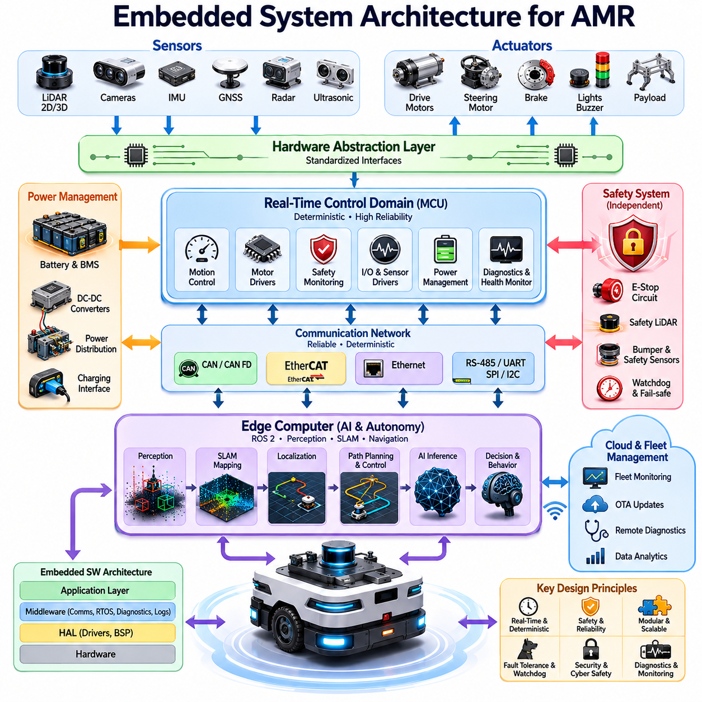
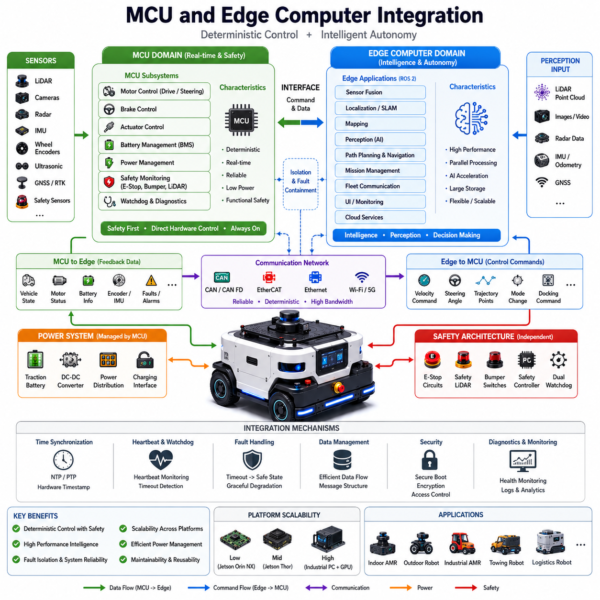
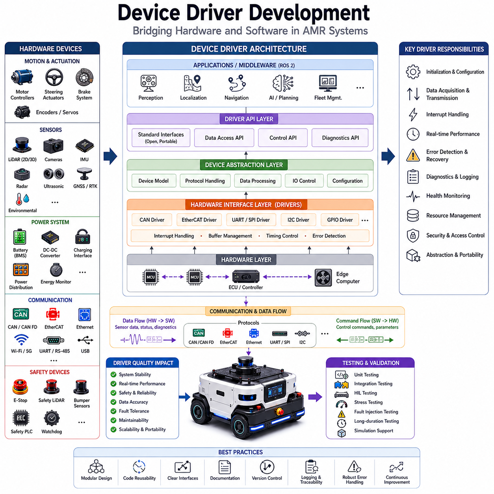
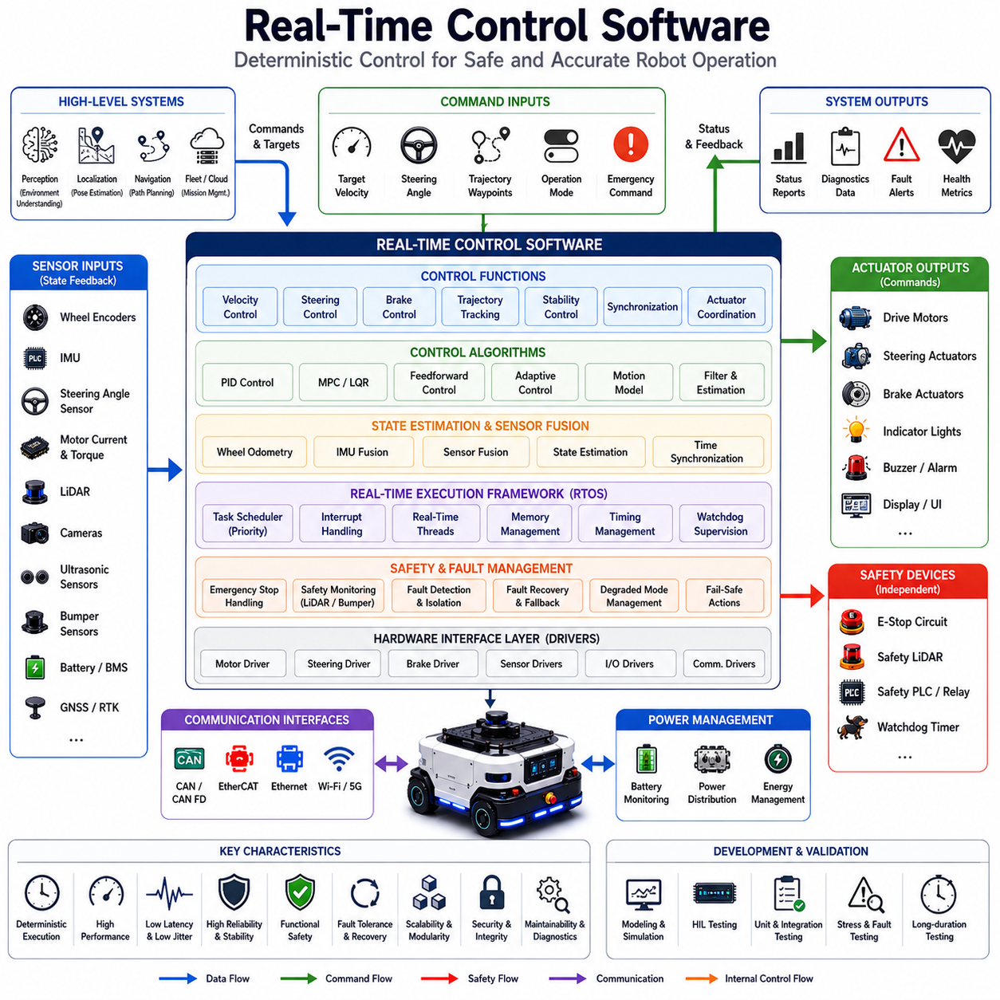
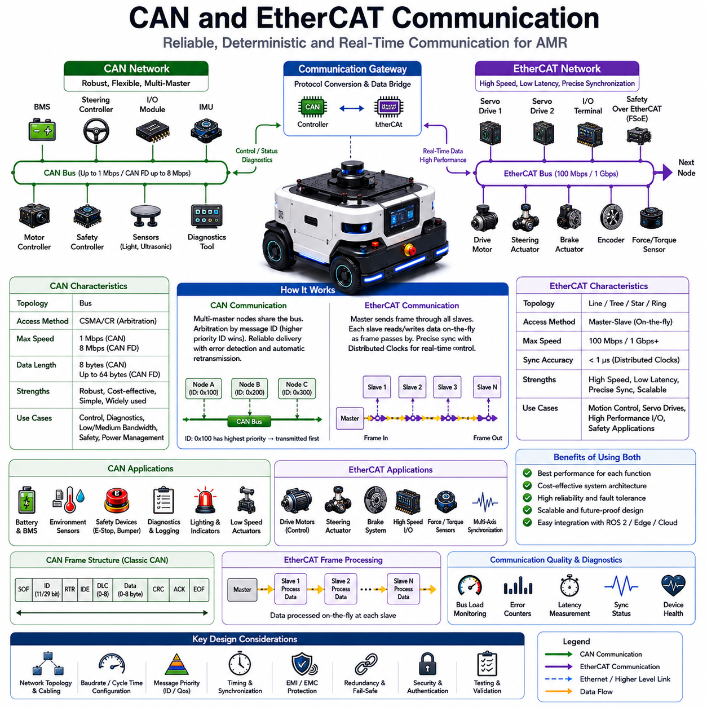
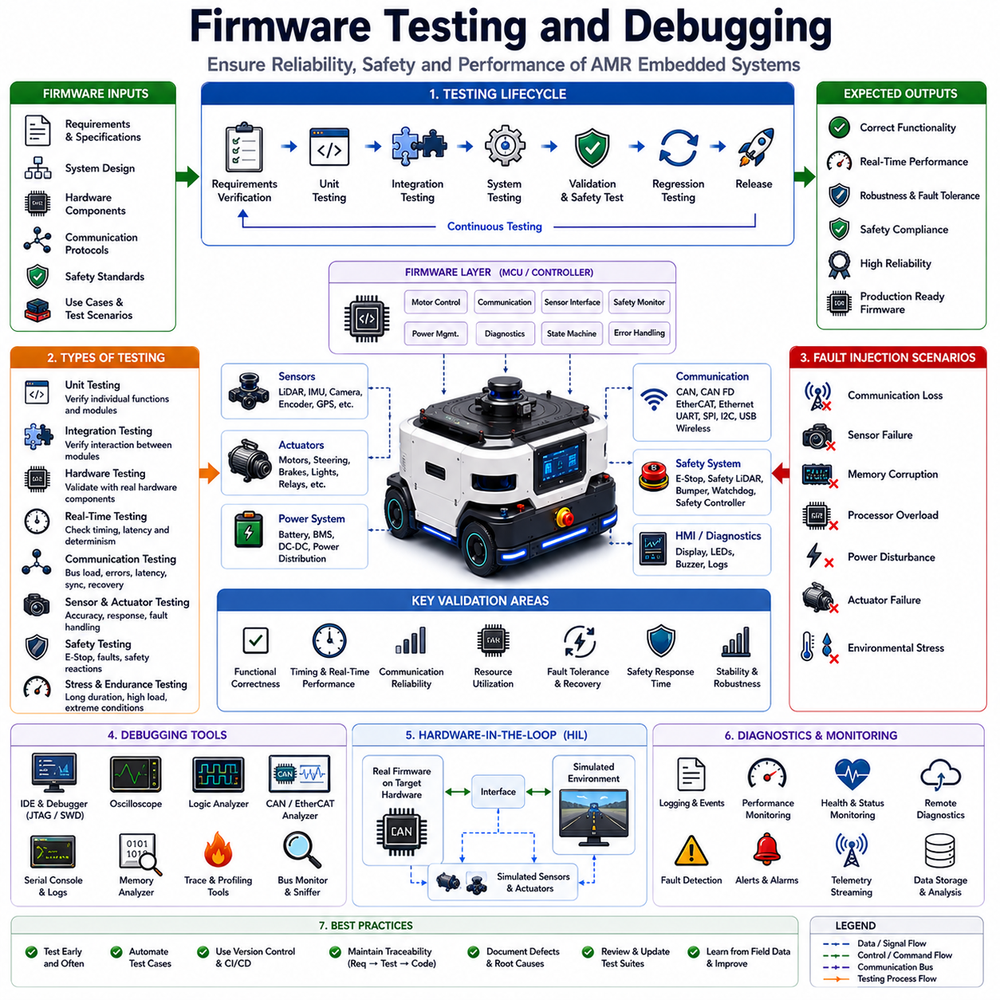
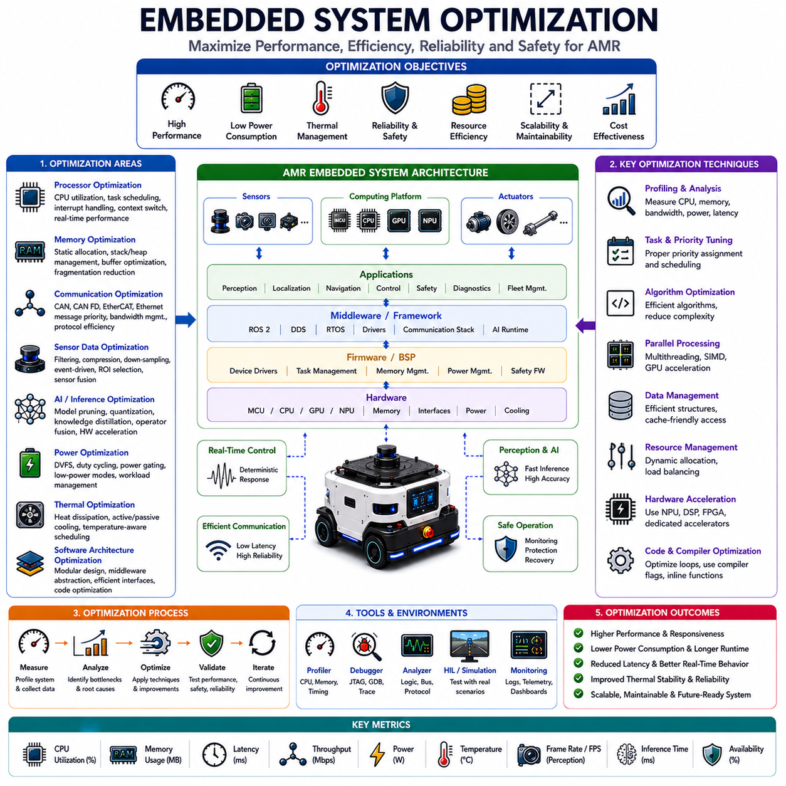
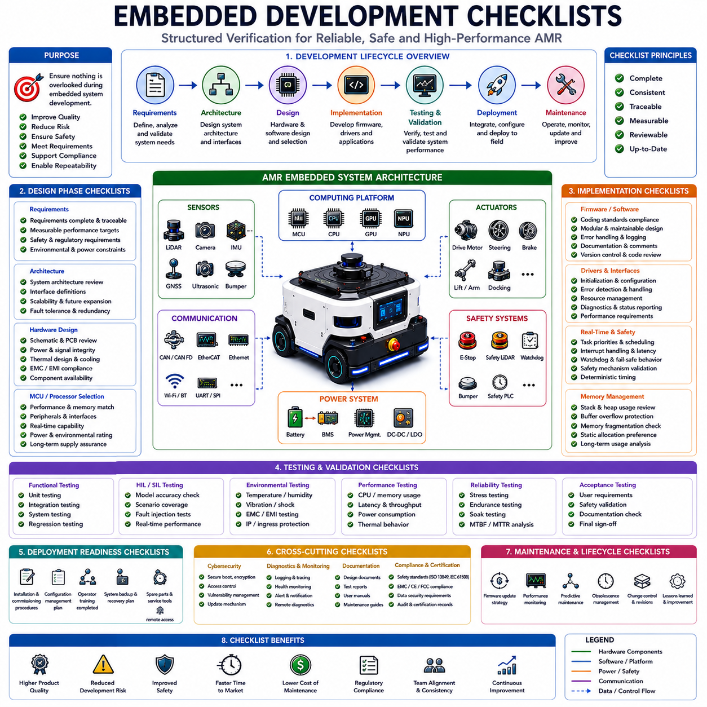

**Volume 10. AMR Engineering Process and Development Manual**

# Chapter 05. Embedded System Development

## 05.01 Embedded Architecture Overview

{width="7.268055555555556in" height="7.268055555555556in"}

임베디드 시스템 아키텍처는 자율이동로봇(AMR)의 가장 중요한 기반 기술 중 하나이다. 이는 센서, 액추에이터, 전원 시스템, 안전 장치와 같은 물리적 세계를 인지(Perception), 위치추정(Localization), 내비게이션(Navigation), 의사결정(Decision Making), 플릿 운영(Fleet Operation)을 담당하는 상위 소프트웨어 지능 계층과 직접 연결하는 역할을 수행한다. 전체 AMR 엔지니어링 프로세스에서 임베디드 시스템은 실시간 운영 계층으로서 결정론적 실행, 신뢰성 있는 통신, 하드웨어 추상화, 그리고 안전 필수 제어 기능을 보장한다. 따라서 확장성, 유지보수성, 성능, 기능 안전성 및 미래 제품 확장을 고려하여 신중하게 설계되어야 한다.

현대 AMR에서 임베디드 시스템은 단순한 모터 제어 기능에 국한되지 않는다. 오늘날의 임베디드 시스템은 MCU, 안전 컨트롤러, 모터 컨트롤러, 센서 처리 장치, 엣지 컴퓨터, 통신 게이트웨이, 전력 관리 모듈, 클라우드 연동 진단 시스템 등으로 구성된 고도로 통합된 컴퓨팅 생태계로 발전하였다. 따라서 임베디드 시스템 아키텍처는 기계 설계, 전기전자 설계, AI 소프트웨어 개발, 시스템 통합을 연결하는 핵심 연결고리 역할을 수행한다.

임베디드 아키텍처의 가장 중요한 목적은 로봇이 모든 환경과 운용 조건에서 안전하게 동작할 수 있도록 신뢰성 있고 결정론적인 제어 프레임워크를 구축하는 것이다. 이 아키텍처는 실시간 센싱, 모션 제어, 통신, 진단, 고장 처리 및 안전 관리 기능을 지원해야 하며, 동시에 상위 AI 애플리케이션이 독립적으로 실행될 수 있도록 해야 한다. 이를 통해 AI 추론, 지도 갱신, 클라우드 통신, 플릿 관리 등의 작업 부하가 증가하더라도 핵심 제어 기능은 안정적으로 유지될 수 있다.

일반적인 AMR 임베디드 아키텍처는 여러 계층으로 구성된다. 가장 하위 계층은 하드웨어 추상화 계층(Hardware Abstraction Layer)으로, 모터, 엔코더, IMU, 배터리 시스템, 안전 센서, 디지털 입력, 아날로그 센서, 통신 인터페이스 등이 MCU 또는 임베디드 프로세서에 연결된다. 이 계층은 하드웨어 의존성을 제거하고 표준화된 인터페이스를 제공함으로써 하드웨어 변경 시 소프트웨어 수정 범위를 최소화한다.

그 상위에는 장치 제어 계층(Device Control Layer)이 존재한다. 이 계층에는 센서 및 액추에이터를 제어하는 각종 드라이버가 포함된다. 모터 드라이버는 토크, 속도, 조향각, 제동 기능을 관리하며, 센서 드라이버는 LiDAR, 카메라, GNSS, 레이더, 초음파 센서 및 환경 센서 데이터를 수집한다. 통신 드라이버는 CAN, CAN FD, RS-485, EtherCAT, Ethernet, SPI, I2C, UART, USB 및 무선 통신 인터페이스를 관리한다. 장치 제어 계층은 데이터 수집과 전송을 안정적으로 수행하면서도 실시간성을 유지해야 한다.

실시간 제어 계층(Real-Time Control Layer)은 임베디드 시스템의 핵심 운영 계층이다. 이 계층은 모션 제어 알고리즘, 조향 제어 로직, 액추에이터 동기화, 전력 관리, 비상정지 처리, 고장 감시, 안전 상태 관리 등을 수행한다. 일반적으로 수십 Hz에서 수 kHz 수준의 제어 루프가 이 계층에서 실행된다. 특히 실외 자율주행 로봇의 경우 조향 및 구동 제어는 100Hz\~1000Hz 수준에서 동작하며, 배터리 모니터링이나 진단 기능은 보다 낮은 주기로 수행된다. 어떤 경우에도 제어 주기는 결정론적으로 유지되어야 한다.

현대 AMR은 단일 중앙 제어기보다 분산형 임베디드 아키텍처를 채택하는 경우가 많다. 여러 MCU가 각각의 기능을 담당하도록 구성된다. 예를 들어 하나의 MCU는 구동 및 조향 제어를 담당하고, 다른 MCU는 안전 LiDAR, 비상정지 회로, 범퍼 스위치, 워치독을 관리한다. 또 다른 MCU는 배터리 상태 감시, 충전 관리, 셀 밸런싱을 수행한다. 추가적으로 조명 시스템, 도킹 시스템, 페이로드 장비를 위한 전용 컨트롤러가 포함될 수 있다. 이러한 구조는 신뢰성 향상과 장애 격리, 유지보수성 및 확장성을 제공한다.

임베디드 컨트롤러 간 통신은 아키텍처 설계에서 매우 중요한 요소이다. CAN Bus는 높은 신뢰성과 강한 노이즈 내성, 성숙한 산업 생태계를 바탕으로 가장 널리 사용되는 통신 방식이다. 모터 제어, 배터리 관리, 센서 인터페이스 및 안전 시스템 연결에 폭넓게 적용된다. 시스템 복잡도가 증가하면 CAN FD를 통해 더 높은 대역폭을 확보할 수 있다. 고성능 산업용 로봇에서는 EtherCAT이 사용되며, 이는 정밀한 동기화와 결정론적 통신을 제공한다. Ethernet은 엣지 컴퓨터, LiDAR, AI 프로세서 간의 대용량 데이터 전송에 활용된다.

임베디드 시스템 설계의 핵심 원칙 중 하나는 실시간 작업과 비실시간 작업의 분리이다. 모터 제어, 비상정지 처리, 브레이크 제어, 안전 감시와 같은 실시간 기능은 AI 추론, 지도 생성, 클라우드 통신, 사용자 인터페이스와 독립적으로 동작해야 한다. 일반적으로 MCU는 실시간 제어를 수행하고, 엣지 컴퓨터는 AI 및 자율주행 소프트웨어를 담당한다. 이러한 분리는 안전성을 확보하는 데 매우 중요하다.

현대 AMR은 여러 계산 도메인으로 구성된다. 제어 도메인은 모터 제어기와 안전 제어기를 포함하며, 결정론적 제어를 담당한다. 자율주행 도메인은 ROS2, SLAM, 내비게이션, 센서 융합 소프트웨어를 실행한다. AI 도메인은 객체 검출, 의미 분할, 이상 탐지, 예측 분석과 같은 딥러닝 모델을 수행한다. 클라우드 도메인은 플릿 관리, OTA 업데이트, 원격 모니터링, 데이터 수집을 지원한다. 이들 도메인 간 인터페이스는 명확하게 정의되어야 한다.

안전성은 임베디드 아키텍처 전반에 걸쳐 가장 중요한 요구사항이다. 안전 기능은 이중화(Redundancy), 고장 검출(Fault Detection), 고장 격리(Fault Isolation), Fail-Safe 메커니즘을 포함해야 한다. 독립된 안전 컨트롤러는 워치독과 하트비트 신호를 이용하여 운영 컨트롤러를 감시한다. 제어 프로세서가 응답하지 않을 경우 안전 컨트롤러는 즉시 모터 전원을 차단하고 안전 상태로 전환시킨다. 이중 통신 경로, 이중 비상정지 회로, 독립 전원 시스템도 자주 적용된다.

워치독 아키텍처는 신뢰성 향상의 핵심 요소이다. 하드웨어 워치독은 프로세서 상태를 감시하며, 소프트웨어 워치독은 태스크 실행 상태와 통신 상태를 감시한다. 시스템 수준 워치독은 여러 컨트롤러 간 상호작용을 모니터링한다. 이상이 발생하면 태스크 재시작, 서브시스템 재부팅, 안전 정지 등의 조치를 수행한다.

전력 관리 아키텍처 역시 임베디드 시스템의 중요한 부분이다. AMR은 구동 배터리, 보조 전원, DC-DC 컨버터, 충전 인터페이스, BMS, 비상 전원 회로 등을 포함하는 복잡한 전력망을 가진다. 임베디드 컨트롤러는 전압, 전류, 온도, SOC(State of Charge), SOH(State of Health), 절연 상태 등을 지속적으로 모니터링한다. 이를 통해 에너지 효율 향상, 배터리 수명 연장, 과열 방지 및 안전한 운영이 가능해진다.

임베디드 소프트웨어는 일반적으로 계층형 구조를 따른다. 하위 계층은 하드웨어 추상화 계층이며, 중간 계층은 통신, 태스크 스케줄링, 동기화, 진단, 로그 관리 기능을 제공한다. 최상위 응용 계층에서는 모션 제어, 센서 처리, 상태 진단, 도킹 제어, 페이로드 제어 기능이 구현된다. 이러한 구조는 유지보수성과 재사용성을 크게 향상시킨다.

실시간 운영체제(RTOS)는 임베디드 시스템의 핵심 구성 요소이다. FreeRTOS, Zephyr, ThreadX, VxWorks, QNX, Embedded Linux 등이 널리 사용된다. RTOS는 결정론적 스케줄링, 인터럽트 처리, 메모리 관리, 프로세스 간 통신 기능을 제공한다. 운영체제 선택은 안전성 요구사항, 인증 요구사항, 계산 성능 요구사항에 따라 결정된다.

인터럽트 관리 역시 매우 중요하다. 비상정지, 충돌 감지, 모터 고장, 통신 장애, 배터리 이상과 같은 이벤트는 즉시 처리되어야 한다. 적절한 인터럽트 우선순위 설계를 통해 신속한 대응과 시스템 안정성을 동시에 확보할 수 있다.

메모리 아키텍처는 임베디드 시스템 성능에 직접적인 영향을 미친다. 플래시 메모리, RAM, 비휘발성 저장장치, 설정 데이터, 로그 데이터, 보정 데이터, 펌웨어 이미지를 효율적으로 관리해야 한다. 안전 시스템에서는 ECC(Error Correction Code), 메모리 보호, 중복 저장, 보안 부팅 기능이 자주 적용된다.

최근에는 사이버 보안이 임베디드 아키텍처의 필수 요소로 자리잡고 있다. Secure Boot는 부팅 시 펌웨어의 무결성을 검증하며, 하드웨어 보안 모듈은 암호화 키를 보호한다. 암호화 통신, 인증 메커니즘, 접근 제어 기능은 외부 공격으로부터 로봇을 보호한다. 클라우드와 연결되는 AMR의 경우 이러한 보안 기능은 필수적이다.

진단 및 상태 모니터링 기능도 아키텍처 전반에 내장된다. 프로세서 사용률, 메모리 사용량, 통신 지연, 모터 온도, 배터리 상태, 센서 건강 상태 등의 데이터를 지속적으로 수집한다. 이러한 정보는 예지 정비(Predictive Maintenance) 시스템으로 전달되어 잠재적 고장을 조기에 발견하는 데 활용된다.

확장성 또한 중요한 설계 목표이다. 우수한 임베디드 아키텍처는 동일한 플랫폼을 기반으로 소형 실내 AMR, 견인형 AMR, 실외 자율주행 로봇, 물류 로봇, 중장비 플랫폼까지 지원할 수 있어야 한다. 표준화된 인터페이스와 모듈형 설계를 통해 개발 비용을 줄이고 제품군 확장을 용이하게 한다.

고급 실외 자율주행 로봇의 경우 다중 컴퓨터 아키텍처가 일반적이다. 저수준 MCU는 실시간 제어와 안전 기능을 담당하고, 산업용 컴퓨터는 인지와 내비게이션을 수행하며, GPU 서버는 객체 검출, 의미 인식, 멀티모달 AI, 파운데이션 모델 추론을 수행한다. 이러한 계층형 컴퓨팅 구조는 높은 성능과 안전성을 동시에 제공한다.

임베디드 시스템 개발 과정에서는 철저한 검증과 시험이 필수적이다. HIL(Hardware-in-the-Loop) 시험, SIL(Software-in-the-Loop) 시뮬레이션, 고장 주입 시험, 스트레스 시험, 통신 강건성 시험, 환경 시험, 장시간 내구 시험 등을 통해 아키텍처의 신뢰성을 검증해야 한다. 이러한 검증 과정을 통해 실제 현장에서도 안정적인 운영이 가능해진다.

향후 임베디드 시스템 아키텍처는 엣지 AI 가속기, 이기종 컴퓨팅 플랫폼, 소프트웨어 정의 로보틱스, 클라우드 네이티브 운영 체계, 디지털 트윈 연동, 자가 진단 기능 등을 더욱 적극적으로 통합하게 될 것이다. 미래의 AMR 플랫폼은 더욱 복잡한 계산 능력을 제공하면서도 안전성, 신뢰성, 에너지 효율성, 유지보수성을 동시에 향상시켜야 한다. 결국 임베디드 시스템 아키텍처는 단순한 제어 시스템이 아니라 AMR 전체를 지탱하는 핵심 기반 기술이며, 모션 제어부터 AI 기반 자율주행까지 모든 기능을 가능하게 하는 중심 축이라고 할 수 있다.

## 05.02 MCU and Edge Computer Integration

{width="7.268055555555556in" height="7.268055555555556in"}

MCU와 엣지 컴퓨터 통합은 현대 자율이동로봇(AMR) 개발에서 가장 중요한 아키텍처 요소 중 하나이다. 이는 결정론적 실시간 제어 시스템과 고성능 자율주행 컴퓨팅 플랫폼을 연결하는 핵심 구조이기 때문이다. MCU는 신뢰성 있는 저수준 제어와 안전 필수 기능을 담당하며, 엣지 컴퓨터는 인지, 위치추정, 지도작성, 내비게이션, 인공지능, 클라우드 연동 및 플릿 운영을 위한 강력한 연산 능력을 제공한다. 이 두 영역의 통합 수준은 로봇의 성능, 안전성, 신뢰성, 확장성 및 유지보수성을 결정하는 핵심 요소가 된다.

전통적인 산업 자동화 시스템에서는 대부분의 제어와 모니터링 기능을 MCU가 수행하였다. 그러나 자율주행 로봇의 복잡성이 증가하면서 기존 MCU만으로는 처리할 수 없는 대규모 계산 요구가 발생하게 되었다. 현대 AMR은 다수의 LiDAR, 카메라, 레이더, 초음파 센서, GNSS 수신기, IMU 등에서 생성되는 방대한 데이터를 처리해야 하며 동시에 SLAM, 객체 인식, 경로 계획, 장애물 회피, 플릿 통신 등의 고급 알고리즘을 실행해야 한다. 이러한 작업은 멀티코어 CPU, GPU, AI 가속기, 고속 메모리를 갖춘 엣지 컴퓨터가 필요하다. 따라서 최근 AMR은 MCU와 엣지 컴퓨터가 협력하는 계층형 컴퓨팅 아키텍처를 채택하고 있다.

MCU 영역은 실시간성과 안전성이 요구되는 기능을 담당한다. 모터 제어, 조향 제어, 브레이크 제어, 액추에이터 동기화, 전력 관리, 배터리 모니터링, 비상정지 처리, 안전 센서 감시, 워치독 관리 등이 대표적인 기능이다. 이러한 작업은 정확한 주기와 예측 가능한 응답 시간을 요구한다. 따라서 MCU는 엣지 컴퓨터의 부하와 무관하게 독립적으로 동작해야 하며, 엣지 컴퓨터가 다운되거나 소프트웨어 오류가 발생하더라도 안전하게 제어 기능을 유지할 수 있어야 한다.

반면 엣지 컴퓨터는 로봇의 지능 계층(Intelligence Layer)을 담당한다. ROS2 미들웨어, 센서 융합, 위치추정, SLAM, 내비게이션, AI 추론, 플릿 통신, 사용자 인터페이스, 클라우드 연동, 미션 관리 등의 기능이 이 영역에서 수행된다. MCU와 달리 이러한 작업은 계산량이 매우 크고 실행 시간이 일정하지 않을 수 있다. 따라서 엣지 컴퓨터는 실시간성보다는 높은 연산 성능과 유연성을 우선시한다.

MCU와 엣지 컴퓨터 통합의 궁극적인 목표는 두 플랫폼의 장점을 결합하는 것이다. MCU는 안정성, 실시간성, 기능 안전성 및 하드웨어 제어 능력을 제공하며, 엣지 컴퓨터는 지능, 환경 인식, 학습 능력, 자율 의사결정 기능을 제공한다. 두 영역이 결합될 때 실제 환경에서 안전하게 운용 가능한 완전한 자율주행 로봇 시스템이 완성된다.

일반적인 AMR 아키텍처에서는 여러 개의 MCU와 하나 이상의 엣지 컴퓨터가 함께 사용된다. 모터 제어 MCU는 구동 및 조향을 담당하고, 안전 MCU는 비상정지 회로와 안전 센서를 감시하며, 배터리 관리 MCU는 충전 및 배터리 상태를 관리한다. 이러한 MCU들은 중앙 엣지 컴퓨터와 연결되어 전체 로봇의 행동을 조정한다. 대형 플랫폼의 경우 내비게이션, AI, 인지 및 플릿 통신을 위해 여러 대의 엣지 컴퓨터가 사용될 수도 있다.

통신 아키텍처는 MCU와 엣지 컴퓨터 통합에서 매우 중요한 역할을 한다. 센서 정보, 제어 명령, 상태 데이터, 오류 알림, 진단 정보 등을 안정적으로 교환할 수 있어야 한다. 대표적으로 CAN, CAN FD, EtherCAT, Ethernet, RS-485, UART, SPI, USB 등의 인터페이스가 사용된다. 통신 방식의 선택은 대역폭, 지연 시간, 신뢰성, 확장성 요구사항에 따라 결정된다.

CAN Bus는 산업용 AMR에서 가장 널리 사용되는 방식 중 하나이다. CAN은 결정론적 메시지 전달, 강력한 오류 검출 기능, 우수한 노이즈 내성을 제공한다. CAN FD는 기존 CAN보다 더 높은 데이터 전송률을 지원한다. EtherCAT은 다수의 액추에이터를 정밀하게 동기화해야 하는 산업용 로봇에서 널리 사용된다. Ethernet은 대용량 센서 데이터, AI 처리 결과 및 클라우드 통신을 위한 고속 데이터 전송에 적합하다.

설계 시 중요한 원칙 중 하나는 명령 생성(Command Generation)과 명령 실행(Command Execution)의 분리이다. 엣지 컴퓨터는 내비게이션과 장애물 회피 결과를 바탕으로 목표 속도, 조향각, 경로점, 도킹 명령 등을 생성한다. MCU는 이러한 고수준 명령을 받아 실제 액추에이터를 정밀하게 제어한다. 이를 통해 계획 기능과 제어 기능을 분리할 수 있으며, 실시간성과 안전성을 유지할 수 있다.

또 다른 중요한 요소는 장애 격리(Fault Containment)이다. AI 프로세스가 중단되거나 내비게이션 소프트웨어가 오동작하더라도 MCU는 차량 제어와 안전 감시를 계속 수행해야 한다. MCU와 엣지 컴퓨터 간 통신이 끊어질 경우에도 로봇은 정의된 안전 절차에 따라 감속, 정지 또는 비상정지를 수행해야 한다. 이를 위해 워치독, 하트비트 모니터링, 타임아웃 검출, Fail-Safe 모드가 적용된다.

하트비트 모니터링은 매우 일반적으로 사용되는 통합 기법이다. 엣지 컴퓨터는 일정 주기로 하트비트 메시지를 MCU에 전송한다. MCU는 이 신호를 감시하여 엣지 컴퓨터의 정상 동작 여부를 확인한다. 일정 시간 동안 하트비트가 수신되지 않으면 안전 상태로 전환한다. 상황에 따라 속도 제한, 차량 정지, 경고등 점등, 추진 시스템 차단, 비상정지 등의 조치가 수행된다.

데이터 흐름 구조도 신중하게 설계되어야 한다. IMU, 엔코더, 모터 컨트롤러, 배터리 시스템, 안전 센서 등에서 생성된 데이터는 MCU에서 수집되어 엣지 컴퓨터로 전달된다. 반대로 내비게이션 명령, 경로 정보, 운영 모드, 미션 지시는 엣지 컴퓨터에서 MCU로 전달된다. 따라서 메시지 구조, 통신 프로토콜, 동기화 방법, 오류 처리 규칙을 명확하게 정의해야 한다.

시간 동기화(Time Synchronization)도 매우 중요하다. 현대 AMR은 다양한 센서 데이터를 융합하여 위치추정과 환경 인식을 수행한다. 이를 위해 모든 데이터는 동일한 시간 기준을 사용해야 한다. 네트워크 시간 동기화, 하드웨어 타임스탬프, 정밀 시계 동기화, ROS2 시간 관리 기능 등이 사용된다.

통합 아키텍처에는 일반적으로 미들웨어 계층이 포함된다. 미들웨어는 메시지 직렬화, 통신 관리, 동기화, 오류 처리, 로깅 및 진단 기능을 제공한다. ROS2 기반 시스템에서는 DDS가 통신 백본 역할을 수행하며, CAN이나 EtherCAT 네트워크와 연결하기 위한 게이트웨이 소프트웨어가 함께 사용된다.

전력 관리 역시 MCU와 엣지 컴퓨터 협업의 중요한 부분이다. MCU는 배터리 상태, 전력 분배, 충전 시스템을 관리한다. 반면 엣지 컴퓨터는 CPU, GPU, AI 가속기를 사용하므로 높은 전력을 소비한다. MCU는 전체 시스템 전력 상태를 모니터링하며 필요에 따라 일부 계산 작업을 제한하거나 전력 소비를 최적화할 수 있다. 배터리 잔량이 부족한 경우 비필수 기능은 중단하고 핵심 제어 기능은 유지하도록 설계된다.

보안 역시 중요한 설계 요소가 되고 있다. MCU와 엣지 컴퓨터 간 통신은 무단 접근과 데이터 위변조로부터 보호되어야 한다. Secure Boot는 펌웨어 무결성을 검증하며, 암호화 및 인증 메커니즘은 통신 보안을 강화한다. 접근 제어는 시스템 공격 표면을 줄이는 역할을 수행한다. 특히 클라우드와 연결된 AMR에서는 이러한 보안 기능이 필수적이다.

소프트웨어 아키텍처는 일반적으로 계층형 구조를 따른다. 가장 하위 계층은 하드웨어 드라이버이며, 그 위에는 통신, 태스크 스케줄링, 진단 기능을 제공하는 미들웨어가 위치한다. MCU 측에서는 모션 제어와 안전 관리가 수행되고, 엣지 컴퓨터 측에서는 인지, 위치추정, 내비게이션, AI 추론, 플릿 관리 기능이 수행된다. 이러한 계층화는 유지보수성과 확장성을 크게 향상시킨다.

확장성도 중요한 설계 목표이다. 동일한 MCU 프레임워크를 다양한 로봇 플랫폼에서 재사용할 수 있어야 한다. 저가형 플랫폼은 Jetson Orin NX를 사용할 수 있으며, 중급 플랫폼은 Jetson Thor를 사용할 수 있다. 고급 자율주행 플랫폼은 산업용 PC와 고성능 GPU를 사용할 수 있다. 잘 설계된 MCU-엣지 통합 구조는 상위 컴퓨팅 성능이 변경되더라도 저수준 제어 시스템을 그대로 유지할 수 있게 한다.

실외 자율주행 로봇에서는 MCU와 엣지 컴퓨터 통합의 중요성이 더욱 커진다. 다수의 LiDAR, 카메라, 열화상 카메라, 레이더, GNSS, 환경 센서 데이터를 처리하면서도 험지와 악천후 환경에서 안정적으로 주행해야 하기 때문이다. MCU는 실시간 제어와 안전 기능을 유지하고, 엣지 컴퓨터는 고성능 인지와 자율주행 기능을 수행함으로써 신뢰성과 지능성을 동시에 확보할 수 있다.

통합 시스템 개발 과정에서는 다양한 검증 과정이 필요하다. HIL(Hardware-in-the-Loop) 시험을 통해 MCU와 엣지 컴퓨터 간 통신을 검증하고, 장애 주입 시험(Fault Injection Test)을 통해 프로세서 다운, 통신 장애, 센서 오류, 전원 문제에 대한 대응 능력을 평가한다. 장시간 내구 시험은 지속 운용 시 신뢰성을 검증하며, 안전 시험은 이상 상황 발생 시 적절한 안전 동작이 수행되는지 확인한다.

진단 및 상태 모니터링 기능도 필수적이다. MCU와 엣지 컴퓨터는 CPU 사용률, 메모리 사용량, 통신 지연, 배터리 상태, 모터 온도, 센서 상태, 네트워크 품질 등의 정보를 지속적으로 수집한다. 이러한 데이터는 예지 정비, 플릿 모니터링, 원격 유지보수 및 운영 최적화에 활용된다.

향후 MCU와 엣지 컴퓨터 통합 아키텍처는 더욱 고도화될 것이다. 이기종 컴퓨팅 플랫폼, AI 가속기, 소프트웨어 정의 제어 시스템, 엣지-클라우드 협업 구조, 디지털 트윈, 자율 복구(Self-Healing) 기능 등이 통합될 것으로 예상된다. 저수준 제어와 고수준 지능 간의 역할 구분은 계속 유지되겠지만, 두 영역 간 협업은 더욱 긴밀해질 것이다.

결국 MCU와 엣지 컴퓨터 통합은 현대 AMR 컴퓨팅 아키텍처의 핵심 기반 기술이다. 이는 결정론적 실시간 제어와 고급 인공지능을 하나의 로봇 플랫폼 안에서 공존하게 만든다. 명확한 역할 분담, 안정적인 통신 구조, 안전 경계 설정, 효율적인 인터페이스 설계를 통해 높은 지능성과 높은 신뢰성을 동시에 갖춘 자율주행 로봇을 개발할 수 있다. 이러한 통합 구조는 인지, 내비게이션, 플릿 관리, 클라우드 연동 및 미래 자율주행 기능을 구현하는 핵심 토대가 된다.

## 05.03 Device Driver Development

{width="7.268055555555556in" height="7.268055555555556in"}

디바이스 드라이버 개발은 임베디드 시스템 개발 과정에서 가장 기본적이면서도 중요한 활동 중 하나이다. 디바이스 드라이버는 하드웨어 구성요소와 소프트웨어 애플리케이션 사이를 연결하는 핵심 인터페이스 역할을 수행한다. 자율이동로봇(AMR)에서는 모든 센서, 액추에이터, 통신 모듈, 안전 장치, 전력 관리 장치가 적절한 드라이버를 통해 운영 소프트웨어와 연결되어야 한다. 아무리 뛰어난 내비게이션 알고리즘, 인공지능 모델, 인지 시스템, 플릿 관리 소프트웨어를 개발하더라도 신뢰성 있는 드라이버가 없다면 정상적으로 동작할 수 없다. 따라서 디바이스 드라이버는 모든 상위 로봇 기능을 지탱하는 가장 기초적인 기반 기술이라고 할 수 있다.

AMR 아키텍처에서 디바이스 드라이버는 하드웨어 추상화 계층(Hardware Abstraction Layer)의 역할을 수행한다. 이를 통해 응용 소프트웨어는 하드웨어의 전기적 신호, 메모리 주소, 인터럽트, 타이밍 제약조건 등을 직접 다루지 않고 표준화된 인터페이스를 사용할 수 있다. 결과적으로 소프트웨어의 이식성, 유지보수성, 확장성 및 재사용성이 크게 향상된다.

디바이스 드라이버 개발의 가장 중요한 목표는 하드웨어 자원에 대해 신뢰성 있고 결정론적이며 효율적인 접근을 제공하는 것이다. 드라이버는 하드웨어 초기화, 운영 파라미터 설정, 데이터 송수신, 인터럽트 처리, 장치 상태 모니터링, 통신 오류 복구, 진단 정보 제공 등의 역할을 수행한다. 드라이버의 품질은 시스템 안정성, 실시간 성능, 장애 대응 능력 및 안전성에 직접적인 영향을 미친다.

현대 AMR에는 다양한 하드웨어 장치가 존재하며 각각 전용 드라이버가 필요하다. 모션 제어 시스템에는 모터 컨트롤러, 조향 액추에이터, 브레이크 컨트롤러, 엔코더, 서보 드라이브가 포함된다. 센서 시스템에는 2D LiDAR, 3D LiDAR, RGB 카메라, 깊이 카메라, 열화상 카메라, 레이더, 초음파 센서, IMU, GNSS 수신기, RTK 시스템, 환경 센서 등이 포함된다. 전력 시스템에는 배터리 관리 시스템(BMS), DC-DC 컨버터, 충전 인터페이스, 전력 분배 장치가 포함된다. 통신 시스템에는 CAN 컨트롤러, Ethernet 어댑터, 무선 통신 모듈, 직렬 통신 인터페이스 및 산업용 필드버스 장치가 포함된다. 이러한 모든 장치는 각각의 특성에 맞는 드라이버를 필요로 한다.

디바이스 드라이버 아키텍처는 일반적으로 계층형 구조를 따른다. 가장 하위 계층은 하드웨어 인터페이스 계층으로서 레지스터, 메모리 맵 장치, 통신 컨트롤러 및 물리 인터페이스와 직접 연결된다. 그 위에는 장치 추상화 계층이 위치하며 하드웨어 의존 기능을 표준화된 소프트웨어 인터페이스로 변환한다. 최상위 계층은 API(Application Programming Interface)를 제공하여 미들웨어와 응용 소프트웨어가 장치를 쉽게 사용할 수 있도록 한다.

초기화 과정은 드라이버의 가장 중요한 역할 중 하나이다. 시스템 부팅 시 드라이버는 장치 존재 여부를 확인하고, 통신 파라미터를 설정하며, 운영 모드를 구성하고, 자원을 할당하며, 장치 상태를 검증해야 한다. 실제 환경에서는 장치 응답 지연, 통신 오류, 설정 불일치, 환경적 영향 등이 발생할 수 있기 때문에 드라이버는 이러한 상황을 안정적으로 처리해야 한다.

통신 관리는 드라이버의 핵심 기능이다. 현대 AMR에서는 CAN, CAN FD, EtherCAT, Ethernet, RS-232, RS-485, UART, SPI, I2C, USB 및 무선 통신 기술이 사용된다. 드라이버는 메시지 포맷 구성, 패킷 송수신, 버퍼 관리, 동기화, 타임아웃 검출, 오류 복구 및 대역폭 최적화를 수행해야 한다. 특히 안전 필수 장치의 경우 통신 신뢰성이 매우 중요하다.

인터럽트 처리 역시 임베디드 드라이버 개발의 핵심 요소이다. 많은 장치들은 새로운 데이터가 생성되거나 특정 이벤트가 발생했을 때 인터럽트를 발생시킨다. 엔코더는 펄스 인터럽트를 생성하고, 통신 컨트롤러는 메시지 수신 이벤트를 발생시키며, 안전 센서는 위험 상황을 감지했을 때 인터럽트를 발생시킨다. 드라이버는 이러한 이벤트를 신속하게 처리하면서도 CPU 부하를 최소화해야 한다.

실시간 성능 요구사항은 드라이버 설계에 큰 영향을 미친다. AMR의 제어 루프는 수십 Hz에서 수 kHz까지 동작할 수 있으며, 드라이버는 일정한 지연 시간과 최소한의 지터(Jitter)를 제공해야 한다. 드라이버 내부의 과도한 처리 지연은 제어 성능 저하, 위치추정 오차 증가, 내비게이션 오류 및 안전 기능 저하를 초래할 수 있다. 따라서 데이터 경로, 메모리 접근, 인터럽트 처리, 통신 스케줄링을 최적화해야 한다.

메모리 관리도 매우 중요하다. 드라이버는 버퍼, 큐, 공유 메모리, 설정 구조체 및 캐시를 효율적으로 관리해야 한다. 특히 LiDAR나 카메라와 같은 고대역폭 센서는 초당 수백 MB의 데이터를 생성할 수 있으므로 효율적인 버퍼링 메커니즘이 필요하다. 동시에 메모리 단편화를 최소화하고 결정론적 동작을 보장해야 한다.

오류 검출 및 복구 기능은 신뢰성 확보를 위해 필수적이다. 하드웨어 장치는 통신 중단, 센서 고장, 전원 이상, 과열, 케이블 분리, 전자기 간섭, 펌웨어 오류 등을 경험할 수 있다. 드라이버는 이러한 상태를 지속적으로 감시하고 이상이 발생하면 오류를 기록하며 자동 복구 절차를 수행해야 한다. 재연결, 통신 재시도, 장치 재설정, 대체 운영 모드 등이 일반적으로 사용되는 복구 방법이다.

진단 및 상태 모니터링 기능도 현대 드라이버의 중요한 역할이다. 드라이버는 통신 품질, 패킷 손실률, 신호 강도, 센서 상태, 장치 온도, 오류 횟수, 성능 지표 등을 지속적으로 수집한다. 이러한 정보는 예지 정비, 원격 모니터링, 장애 분석 및 운영 최적화에 활용된다. 특히 대규모 플릿 환경에서는 이러한 진단 기능이 매우 중요하다.

모터 드라이버 개발은 AMR 임베디드 시스템에서 가장 중요한 분야 중 하나이다. 모터 드라이버는 모터 컨트롤러, 서보 앰프, 조향 시스템, 브레이크 시스템과 연동된다. 속도 제어, 위치 제어, 토크 제어, 가속도 관리, 고장 감시, 엔코더 피드백 처리, 비상정지 기능을 지원해야 한다. 모터 제어는 차량 안전성과 직결되므로 높은 신뢰성과 결정론적 동작이 필수적이다.

센서 드라이버 개발 역시 매우 중요하다. LiDAR 드라이버는 포인트 클라우드 획득, 타임스탬프 생성, 데이터 동기화 및 진단 기능을 수행한다. 카메라 드라이버는 영상 획득, 노출 제어, 프레임 동기화, 이미지 전송을 담당한다. IMU 드라이버는 가속도 및 각속도 데이터를 수집하며, GNSS 드라이버는 위치 정보, 위성 상태, 보정 데이터 및 신뢰도 정보를 처리한다. 각 센서는 서로 다른 특성을 가지므로 이에 맞는 전용 드라이버 설계가 필요하다.

배터리 관리 시스템(BMS) 드라이버는 전력 관리 아키텍처의 핵심 요소이다. BMS 드라이버는 전압, 전류, 온도, SOC(State of Charge), SOH(State of Health), 셀 밸런싱 상태 및 오류 정보를 수집한다. 또한 충전 제어, 전력 최적화, 열 보호 및 안전 기능을 지원한다. 장시간 무인 운용이 요구되는 AMR에서는 배터리 상태 감시가 매우 중요하다.

안전 장치 드라이버는 기능 안전 요구사항을 만족해야 한다. 안전 LiDAR, 비상정지 회로, 안전 컨트롤러, 범퍼 센서, 안전 PLC 등의 장치는 엄격한 안전 기준에 따라 개발된다. 안전 드라이버는 결정론적 동작, 이중 감시, 오류 검출, Fail-Safe 응답 기능을 제공해야 하며, 기능 안전 표준에 따라 검증되어야 한다.

현대 AMR에서는 ROS2 기반 소프트웨어 구조가 널리 사용된다. 드라이버는 하드웨어 장치와 ROS2 미들웨어를 연결하는 역할을 수행한다. 센서 데이터는 ROS2 Topic을 통해 발행되며, 제어 명령은 Subscription 인터페이스를 통해 수신된다. 또한 진단 정보는 Service 또는 Diagnostic 인터페이스를 통해 제공된다. 잘 설계된 ROS2 드라이버는 시스템 통합을 크게 단순화한다.

하드웨어 추상화 프레임워크는 다양한 하드웨어 플랫폼 간의 호환성을 제공한다. 동일한 내비게이션 소프트웨어가 서로 다른 센서나 모터 컨트롤러를 사용하는 여러 플랫폼에서 동작할 수 있도록 한다. 이러한 구조는 개발 비용을 절감하고 제품 확장을 용이하게 만든다.

최근에는 보안(Security)도 중요한 요소가 되었다. 드라이버는 하드웨어에 직접 접근하는 계층이므로 공격 표면이 될 수 있다. 따라서 접근 제어, 펌웨어 검증, 메모리 보호, 보안 통신, 안전한 프로그래밍 기법이 적용되어야 한다. 특히 클라우드와 연결되는 AMR에서는 이러한 보안 기능이 필수적이다.

드라이버 개발 과정에서는 철저한 시험과 검증이 필요하다. 단위 시험(Unit Test)은 개별 기능을 검증하고, 통합 시험(Integration Test)은 상위 소프트웨어와의 연동을 평가한다. HIL(Hardware-in-the-Loop) 시험은 실제 하드웨어를 이용하여 드라이버 동작을 검증한다. 스트레스 시험은 극한 부하 조건을 평가하며, 장애 주입 시험(Fault Injection Test)은 오류 복구 능력을 검증한다. 장시간 내구 시험은 연속 운용 시의 신뢰성을 확인한다.

시뮬레이션 지원 기능도 점점 중요해지고 있다. 가상 드라이버는 실제 하드웨어 없이도 센서 데이터와 액추에이터 응답을 모사할 수 있다. 이를 통해 실제 프로토타입이 준비되기 전에도 인지, 내비게이션, AI 시스템 개발이 가능하다. 시뮬레이션 기반 개발은 프로젝트 리스크를 줄이고 개발 기간을 단축하는 효과가 있다.

버전 관리와 설정 관리는 장기 유지보수에 매우 중요하다. 하드웨어는 제품 수명 주기 동안 지속적으로 변경되며, 펌웨어 업데이트와 프로토콜 변경이 발생할 수 있다. 따라서 드라이버는 유연한 설정 구조, 하위 호환성, 버전 추적 기능을 제공해야 한다.

향후 로봇 시스템이 더욱 복잡해짐에 따라 디바이스 드라이버는 단순한 하드웨어 인터페이스를 넘어 지능형 인프라로 발전할 것이다. 자가 진단, 자동 장치 탐색, 예측 고장 감지, 디지털 트윈 연동, AI 기반 설정 관리, 자율 복구 기능 등이 포함될 것으로 예상된다. 이러한 기능은 신뢰성을 높이고 유지보수 비용을 줄이며 더욱 고도화된 로봇 응용을 가능하게 할 것이다.

결국 디바이스 드라이버 개발은 전체 임베디드 소프트웨어 스택의 가장 기초가 되는 핵심 기술이다. 모든 센서 데이터, 액추에이터 명령, 안전 신호, 진단 메시지, 통신 패킷은 반드시 디바이스 드라이버를 거쳐 상위 소프트웨어로 전달된다. 따라서 드라이버의 품질은 로봇 성능, 시스템 신뢰성, 안전성, 유지보수성 및 확장성을 직접적으로 결정한다. 이러한 이유로 디바이스 드라이버 엔지니어링은 AMR 임베디드 시스템 개발 과정에서 가장 중요한 기술 분야 중 하나이며, 성공적인 자율주행 로봇 개발의 핵심 기반이라고 할 수 있다.

## 05.04 Real Time Control Software

{width="7.268055555555556in" height="7.268055555555556in"}

실시간 제어 소프트웨어는 자율이동로봇(AMR)의 핵심 운영 계층이며, 임베디드 하드웨어 시스템과 상위 자율주행 지능을 연결하는 중심 역할을 수행한다. 인지 시스템이 주변 환경을 인식하고 내비게이션 시스템이 이동 경로를 결정하더라도, 실제 로봇의 물리적 움직임을 만들어내는 것은 실시간 제어 소프트웨어이다. 로봇의 모든 주행, 조향, 제동, 안전 대응은 결국 실시간 제어 소프트웨어의 성능과 신뢰성에 의해 결정된다. 따라서 실시간 제어 소프트웨어는 전체 AMR 아키텍처에서 가장 중요한 소프트웨어 구성요소 중 하나라고 할 수 있다.

실시간 제어 소프트웨어의 가장 중요한 목표는 모든 운용 조건에서 결정론적(Deterministic) 실행을 보장하는 것이다. 일반적인 응용 소프트웨어는 일정 수준의 지연이나 응답 시간 변동을 허용할 수 있지만, 로봇 제어 시스템은 예측 가능한 시간 내에 반드시 응답해야 한다. 모션 제어 루프, 조향 제어, 장애물 대응, 안전 감시, 액추에이터 동기화 등은 엄격한 시간 제약을 가진다. 이러한 요구사항을 만족하지 못할 경우 주행 성능 저하, 위치 오차 증가, 기계적 불안정성, 안전사고 또는 시스템 장애가 발생할 수 있다.

현대 AMR에서 실시간 제어 소프트웨어는 일반적으로 MCU, 실시간 프로세서, 산업용 컨트롤러 또는 RTOS 기반 임베디드 플랫폼에서 실행된다. 소프트웨어는 센서 데이터를 수집하고 시스템 상태를 평가하며 제어 알고리즘을 실행하고 액추에이터 명령을 생성하며 안전 상태를 지속적으로 감시한다. 이러한 과정은 시스템 요구사항에 따라 수십 Hz에서 수 kHz의 주기로 반복 수행된다.

실시간 제어 소프트웨어 아키텍처는 일반적으로 여러 계층으로 구성된다. 가장 하위 계층은 하드웨어 드라이버 및 실제 장치와 직접 연결되는 계층이다. 이 계층은 센서 데이터를 획득하고 액추에이터를 제어하며 통신 인터페이스를 관리하고 인터럽트를 처리한다. 그 위에는 제어 실행 계층이 존재하며 모션 제어 알고리즘, 안전 로직, 궤적 추종 기능 및 액추에이터 협조 제어가 구현된다. 상위 계층에서는 상태 관리, 진단, 장애 처리 및 엣지 컴퓨터와의 통신 기능이 수행된다.

실시간 제어 소프트웨어의 가장 중요한 역할 중 하나는 모션 제어(Motion Control)이다. 모션 제어 알고리즘은 목표 속도, 조향 명령, 경로 정보를 실제 모터 구동 명령으로 변환한다. 소프트웨어는 현재 상태와 목표 상태를 지속적으로 비교하여 제어 출력을 계산하고 이를 모터 드라이버와 조향 액추에이터에 전달한다. 모션 제어의 품질은 내비게이션 정확도, 승차감, 에너지 효율성 및 안전성에 직접적인 영향을 미친다.

속도 제어(Velocity Control)는 모션 제어의 기본 기능이다. 내비게이션 모듈로부터 목표 속도를 수신한 후 실제 속도와 비교하여 오차를 최소화하도록 모터 출력을 조정한다. 엔코더, 모터 센서, IMU 등의 피드백 정보를 활용하여 현재 상태를 측정하고 제어 알고리즘이 적절한 보정값을 계산한다. 우수한 속도 제어는 부드러운 가속과 감속, 안정적인 주행, 정확한 정지 및 에너지 효율 향상을 가능하게 한다.

조향 제어(Steering Control) 역시 매우 중요한 기능이다. 차동 구동(Differential Drive), 아커만 조향(Ackermann Steering), 스키드 조향(Skid Steering), 전방향 바퀴(Omnidirectional Wheel) 등 어떤 주행 구조를 사용하더라도 조향 제어 소프트웨어는 정확한 방향 제어를 수행해야 한다. 조향 알고리즘은 목표 경로와 현재 위치를 비교하여 필요한 조향각을 계산하고 이를 액추에이터에 전달한다. 특히 고속 주행을 수행하는 실외 자율주행 로봇에서는 조향 정확도가 매우 중요하다.

브레이크 제어 소프트웨어는 감속, 정지 정확도, 비상 제동 및 안전 기능을 담당한다. 정상 상황에서는 부드럽고 예측 가능한 감속을 수행하며, 위험 상황에서는 즉각적으로 제동을 수행하여 안전을 확보한다. 안전 시스템과 연동되어 위험 상황 발생 시 일반 운행 기능보다 우선적으로 동작한다.

궤적 추종(Trajectory Tracking)은 실시간 제어 소프트웨어의 고급 기능 중 하나이다. 내비게이션 시스템이 생성한 경로와 실제 로봇의 위치를 지속적으로 비교하여 오차를 최소화하도록 제어 명령을 생성한다. 이를 위해 정확한 위치 정보, 정밀한 액추에이터 제어, 안정적인 피드백 시스템이 필요하다. 궤적 추종 성능은 물류 로봇, 병원 로봇, 견인형 AMR, 실외 자율주행 차량의 운행 품질을 결정하는 중요한 요소이다.

제어 이론(Control Theory)은 실시간 제어 소프트웨어의 수학적 기반이 된다. PID(Proportional-Integral-Derivative) 제어는 단순성과 신뢰성 때문에 가장 널리 사용된다. PID 제어기는 목표값과 실제값 사이의 오차를 지속적으로 계산하여 적절한 제어 출력을 생성한다. 최근에는 MPC(Model Predictive Control), LQR(Linear Quadratic Regulator), 적응 제어(Adaptive Control), 강인 제어(Robust Control), 학습 기반 제어 기법도 적용되고 있다. 이러한 고급 기법들은 복잡한 환경과 변화하는 조건에서 더 높은 성능을 제공한다.

센서 통합은 실시간 제어 소프트웨어의 필수 요소이다. 엔코더는 속도와 이동 거리를 제공하고, IMU는 가속도와 각속도 정보를 제공한다. 조향 센서는 바퀴 각도를 측정하며, 모터 컨트롤러는 토크와 전류 정보를 제공한다. 안전 센서는 위험 상황을 감지한다. 실시간 제어 소프트웨어는 이러한 정보를 지속적으로 처리하여 제어 알고리즘에 반영한다.

시간 동기화(Time Synchronization)는 실시간 제어에서 매우 중요하다. 다양한 센서의 데이터는 동일한 시간 기준으로 정렬되어야 하며, 그렇지 않으면 제어 오차와 위치 추정 오류가 발생할 수 있다. 이를 위해 하드웨어 타임스탬프, 정밀 시계 동기화, 네트워크 시간 동기화 기술이 사용된다.

태스크 스케줄링(Task Scheduling)은 실시간 소프트웨어의 핵심 기능이다. 센서 데이터 수집, 제어 루프 실행, 통신 처리, 진단 기능, 장애 감시, 안전 관리 등 여러 작업이 동시에 수행된다. RTOS는 이들 태스크에 우선순위를 부여하고 적절한 CPU 자원을 할당한다. 비상정지 처리와 같은 고우선순위 작업은 즉시 실행되며, 진단 기능과 같은 저우선순위 작업은 남는 자원을 활용하여 수행된다.

인터럽트 처리 역시 결정론적 성능 확보에 중요한 역할을 한다. 센서, 통신 장치, 타이머, 안전 장치 등은 다양한 인터럽트를 생성한다. 실시간 소프트웨어는 이러한 이벤트에 빠르게 대응하면서도 전체 시스템 안정성을 유지해야 한다.

안전 통합(Safety Integration)은 실시간 제어 소프트웨어 설계에서 가장 중요한 요소 중 하나이다. 안전 기능은 AI, 내비게이션, 클라우드 시스템과 독립적으로 동작해야 한다. 실시간 제어 소프트웨어는 비상정지 회로, 안전 LiDAR, 범퍼 센서, 워치독, 배터리 상태, 모터 이상, 통신 상태를 지속적으로 감시한다. 이상 상황이 감지되면 즉시 정의된 안전 절차를 수행한다.

워치독(Watchdog)은 신뢰성을 향상시키는 중요한 기능이다. 소프트웨어 워치독은 제어 루프가 정상적으로 실행되는지 확인하며, 하드웨어 워치독은 프로세서의 정상 동작 여부를 감시한다. 다중 워치독 구조는 장애 허용성과 안전성을 크게 향상시킨다.

장애 검출 및 관리(Fault Detection and Management)는 시스템 신뢰성을 확보하는 핵심 기능이다. 실시간 소프트웨어는 센서 상태, 통신 상태, 액추에이터 상태, 전원 상태, 계산 자원 상태를 지속적으로 감시한다. 문제가 발견되면 원인을 식별하고 장애를 격리하며 적절한 복구 절차를 수행한다. 경우에 따라 재시작, 안전 모드 전환, 비상정지 등이 수행될 수 있다.

통신 인터페이스는 실시간 제어기와 상위 시스템을 연결한다. 내비게이션 시스템은 속도 명령과 경로 정보를 전달하고, 엣지 컴퓨터는 경로 업데이트를 제공한다. 플릿 관리 시스템은 작업 명령을 전달한다. 실시간 제어기는 상태 정보, 진단 정보, 오류 정보를 상위 시스템으로 전달한다. CAN, CAN FD, EtherCAT, Ethernet, 무선 네트워크 등이 주로 사용된다.

전력 관리 기능도 실시간 제어 소프트웨어와 밀접하게 연계된다. 배터리 전압, 전류, 온도, 충전 상태를 지속적으로 감시하며, 에너지 사용량을 최적화한다. 배터리 잔량이 부족할 경우 비필수 기능을 제한하고 핵심 기능을 유지하는 전략을 수행할 수 있다.

진단 및 모니터링 기능은 시스템 운영 상태를 가시화한다. 실시간 제어 소프트웨어는 실행 시간, CPU 사용률, 메모리 사용량, 통신 지연, 모터 성능, 센서 상태, 오류 통계 등을 기록한다. 이러한 정보는 유지보수, 성능 개선, 신뢰성 분석 및 원격 진단에 활용된다.

최근에는 사이버 보안도 중요한 설계 요소가 되었다. 보안 통신, 인증 메커니즘, 펌웨어 검증, Secure Boot, 접근 제어 기능을 통해 외부 공격으로부터 제어 시스템을 보호한다. 클라우드 연결이 증가함에 따라 이러한 기능은 필수 요구사항이 되고 있다.

실시간 제어 소프트웨어는 개발 과정에서 철저한 검증이 필요하다. 단위 시험(Unit Test), 통합 시험(Integration Test), HIL(Hardware-in-the-Loop) 시험, 스트레스 시험, 장애 주입 시험(Fault Injection Test), 장시간 내구 시험 등을 통해 성능과 안전성을 검증한다.

시뮬레이션 환경은 개발 효율성을 크게 향상시킨다. 디지털 트윈, 물리 기반 시뮬레이터, 가상 하드웨어 모델을 이용하여 실제 프로토타입이 준비되기 전에도 제어 알고리즘을 개발하고 검증할 수 있다. 이러한 접근 방식은 개발 기간을 단축하고 프로젝트 위험을 줄인다.

확장성 또한 중요한 설계 목표이다. 우수한 실시간 제어 프레임워크는 소형 실내 AMR부터 대형 실외 자율주행 차량, 견인형 AMR, 중장비 로봇까지 다양한 플랫폼에서 재사용될 수 있어야 한다. 이를 위해 모듈화된 구조, 표준 인터페이스, 설정 가능한 파라미터, 재사용 가능한 소프트웨어 컴포넌트가 필요하다.

미래의 실시간 제어 소프트웨어는 AI 기반 적응 제어, 모델 기반 엔지니어링, 디지털 트윈 연동, 예지 정비, 자율 장애 복구, 소프트웨어 정의 로보틱스 개념을 더욱 적극적으로 통합하게 될 것이다. 그러나 어떠한 첨단 AI 기술이 발전하더라도 결정론적 실시간 제어는 여전히 자율주행 로봇의 가장 중요한 기반 기술로 남게 될 것이다.

결국 실시간 제어 소프트웨어는 AMR의 심장과 같은 역할을 수행한다. 인지 결과를 실제 동작으로 변환하고, 내비게이션 결정을 물리적 움직임으로 구현하며, 안전 요구사항을 강제하고, 시스템 안정성을 유지하며, 모든 상황에서 예측 가능한 동작을 보장한다. 현대 자율주행 로봇의 모든 기능은 실시간 제어 소프트웨어 위에서 동작하며, 따라서 이는 AMR 개발에서 가장 중요한 엔지니어링 분야 중 하나라고 할 수 있다.

## 05.05 CAN and EtherCAT Communication

{width="7.268055555555556in" height="7.268055555555556in"}

CAN과 EtherCAT 통신은 현대 자율이동로봇(AMR)의 임베디드 통신 아키텍처를 구성하는 핵심 기술이다. 이들 통신 기술은 컨트롤러, 센서, 액추에이터, 안전 장치, 전력 관리 시스템 및 상위 컴퓨팅 플랫폼 간의 신뢰성 있고 결정론적이며 효율적인 데이터 교환을 가능하게 한다. 자율주행 로봇에서는 인공지능, 내비게이션, 인지 기술이 주목받는 경우가 많지만, 실제로 이러한 기능을 연결하는 통신 인프라 역시 동일하게 중요한 역할을 수행한다. 아무리 뛰어난 AI와 제어 알고리즘을 갖추고 있더라도 안정적인 통신 시스템이 없다면 로봇은 안전하고 효율적으로 동작할 수 없다.

현대 AMR에서는 수백 개에서 수천 개의 메시지가 매초 교환된다. 모터 컨트롤러는 속도 정보를 전송하고, 조향 시스템은 바퀴 위치를 보고하며, 배터리 관리 시스템은 전력 상태를 전달한다. 안전 센서는 위험 상황을 알리고, 위치추정 시스템은 내비게이션 데이터를 교환하며, 엣지 컴퓨터는 전체 임무 수행을 조정한다. 이러한 통신은 높은 신뢰성, 예측 가능한 지연 시간, 장애 허용성 및 확장성을 제공해야 한다. CAN과 EtherCAT은 이러한 요구사항을 만족시키는 대표적인 산업용 통신 기술로 자리 잡고 있다.

CAN(Controller Area Network)은 원래 자동차 산업을 위해 개발되었지만 현재는 산업 자동화와 로봇 분야에서 가장 널리 사용되는 통신 표준 중 하나가 되었다. CAN은 다중 마스터(Multi-Master) 구조를 제공하며, 여러 장치가 하나의 공통 버스를 공유한다. 각 노드는 중앙 통신 제어기 없이도 독립적으로 데이터를 송수신할 수 있다. 이러한 분산 구조는 배선 복잡도를 줄이고 장애 허용성을 향상시키며 시스템 확장을 용이하게 만든다.

CAN의 설계 철학은 신뢰성과 결정론적 통신에 초점을 맞추고 있다. 일반적인 직렬 통신이 점대점(Point-to-Point) 연결을 사용하는 것과 달리, CAN은 공유 버스를 사용하면서도 내장된 중재(Arbitration) 메커니즘을 제공한다. 여러 장치가 동시에 데이터를 전송하려고 할 경우 메시지 우선순위에 따라 자동으로 버스 사용 권한이 결정된다. 이를 통해 데이터 충돌 없이 안정적인 통신이 가능하다.

일반적인 AMR에서는 모터 컨트롤러, 조향 컨트롤러, 배터리 관리 시스템(BMS), IMU, 엔코더, 비상정지 시스템, 안전 컨트롤러, 조명 시스템, 도킹 인터페이스, 페이로드 제어기 및 환경 센서 등이 CAN 네트워크에 연결된다. 하나의 통신 백본을 공유함으로써 전체 시스템 구조가 단순해지고 효율적인 데이터 공유가 가능해진다.

CAN 통신은 장치 주소 기반이 아니라 메시지 식별자(Message Identifier) 기반으로 동작한다. 각 메시지는 고유한 식별자를 가지며, 해당 메시지가 무엇을 의미하는지 정의한다. 장치는 자신이 필요한 메시지만 수신하고 처리한다. 이러한 구조는 시스템 확장성을 높이고 새로운 장치를 쉽게 추가할 수 있도록 한다.

CAN의 가장 중요한 특징 중 하나는 중재(Arbitration) 기능이다. 여러 장치가 동시에 송신을 시도할 경우 메시지 ID를 비교하여 우선순위가 높은 메시지가 먼저 전송된다. 우선순위가 낮은 메시지는 자동으로 대기한다. 이 과정은 데이터 손상 없이 이루어지며 재전송 비용도 최소화된다. 따라서 비상정지(E-Stop)와 같은 안전 필수 메시지는 항상 가장 높은 우선순위를 가질 수 있다.

CAN 프로토콜은 강력한 오류 검출 및 장애 관리 기능을 제공한다. CRC(Cyclic Redundancy Check), 프레임 검증, 응답 확인, 비트 모니터링, 오류 카운터 등의 메커니즘이 지속적으로 통신 상태를 감시한다. 문제가 발생한 노드는 자동으로 네트워크에서 분리될 수 있어 전체 시스템의 안정성을 유지할 수 있다.

전통적인 CAN 네트워크는 최대 1 Mbps 속도를 지원한다. 이는 대부분의 제어 시스템에는 충분하지만, 최신 자율주행 로봇의 증가하는 데이터 요구를 충족하기에는 부족할 수 있다. 이를 해결하기 위해 CAN FD(Flexible Data Rate)가 등장하였다. CAN FD는 더 큰 데이터 프레임과 더 높은 전송 속도를 제공하면서도 기존 CAN 시스템과의 호환성을 유지한다.

그러나 CAN에도 한계가 존재한다. 대역폭이 제한적이기 때문에 LiDAR 포인트 클라우드, 카메라 영상, 대용량 인지 데이터와 같은 고속 데이터 전송에는 적합하지 않다. 따라서 CAN은 일반적으로 제어, 진단, 안전 및 저대역폭 센서 통신에 사용된다.

EtherCAT(Ethernet for Control Automation Technology)은 기존 산업용 통신 시스템의 성능 한계를 극복하기 위해 개발되었다. EtherCAT은 산업 자동화 및 모션 제어를 위한 초고속 실시간 통신 기술로 설계되었다. 일반 Ethernet과 달리 매우 낮은 지연 시간과 높은 동기화 정밀도를 제공한다.

EtherCAT의 가장 큰 특징은 On-the-Fly Processing 구조이다. 일반 네트워크에서는 각 노드가 전체 패킷을 수신한 후 처리하고 다시 전송하지만, EtherCAT은 데이터 프레임이 통과하는 순간 필요한 데이터만 읽고 기록한다. 이 방식은 지연 시간을 극도로 줄이고 네트워크 효율을 크게 향상시킨다.

EtherCAT은 100 Mbps 이상의 통신 속도를 제공하면서도 결정론적 통신 특성을 유지한다. 따라서 고성능 모션 제어, 정밀 로봇 제어, 산업 자동화 및 다축 서보 시스템에 매우 적합하다. 고급 AMR에서는 EtherCAT이 모터 제어, 조향 제어, 안전 시스템 및 실시간 동기화에 널리 활용된다.

EtherCAT의 또 다른 강점은 정밀한 시간 동기화이다. EtherCAT Distributed Clock 기능은 마이크로초 수준 또는 그 이하의 동기화 정확도를 제공한다. 이러한 정밀도는 다축 액추에이터 제어, 정밀 모션 제어, 협업 로봇 및 고성능 자율주행 플랫폼에서 필수적이다.

실외 자율주행 로봇에서는 EtherCAT을 활용하여 Drive-by-Wire 시스템을 구현하는 경우가 많다. 조향 액추에이터, 구동 모터, 브레이크 시스템, 서스펜션 제어기 및 안전 시스템이 정밀하게 동기화될 수 있다. 이를 통해 경로 추종 성능, 차량 안정성 및 승차감을 향상시킬 수 있다.

EtherCAT은 다양한 네트워크 토폴로지를 지원한다. Line, Tree, Star, Ring 및 Hybrid 구조를 구현할 수 있어 로봇 플랫폼의 구조에 따라 유연한 배선 설계가 가능하다. 복잡한 산업용 로봇 시스템에서도 설치와 유지보수가 용이하다.

실시간 제어 시스템에서 중요한 요소는 결정론성(Determinism)이다. 이는 통신 지연 시간을 예측할 수 있는 능력을 의미한다. CAN과 EtherCAT 모두 결정론적 특성을 제공하지만 EtherCAT은 더 낮은 지연 시간과 더 높은 동기화 정확도를 제공한다. 따라서 어떤 기술을 선택할지는 성능 요구사항, 비용, 시스템 규모 및 적용 분야에 따라 달라진다.

많은 AMR은 CAN과 EtherCAT을 동시에 사용하는 하이브리드 통신 구조를 채택한다. CAN은 배터리 시스템, 환경 센서, 진단 시스템, 보조 제어기 및 저속 데이터 전송에 사용된다. EtherCAT은 모터 제어, 조향 제어, 고속 서보 시스템 및 정밀 동기화가 필요한 영역에 사용된다. 이러한 혼합 구조는 성능과 비용의 균형을 제공한다.

통신 게이트웨이는 CAN 및 EtherCAT 네트워크를 상위 컴퓨팅 시스템과 연결하는 역할을 한다. 임베디드 컨트롤러는 프로토콜 변환 기능을 수행하며 ROS2, DDS, 산업용 PC 및 엣지 컴퓨터와 데이터를 교환한다. 이를 통해 실시간 제어 네트워크와 자율주행 소프트웨어 간의 통합이 가능해진다.

안전 통신은 산업용 로봇에서 매우 중요한 요소이다. 비상정지 신호, 충돌 경고, 안전 구역 침입 정보, 액추에이터 이상 및 전원 장애 정보는 높은 신뢰성으로 전달되어야 한다. EtherCAT에서는 FSoE(Fail Safe over EtherCAT)와 같은 기능을 통해 기능 안전 요구사항을 만족시킬 수 있다.

CAN과 EtherCAT 모두 강력한 진단 기능을 제공한다. 통신 품질, 오류 횟수, 지연 시간, 대역폭 사용률, 동기화 상태 및 장치 건강 상태를 지속적으로 모니터링한다. 이러한 정보는 예방 정비, 장애 분석, 성능 최적화 및 운영 관리에 활용된다.

안전 필수 로봇 시스템에서는 네트워크 이중화(Redundancy)가 자주 적용된다. 이중 통신 경로, 백업 컨트롤러, 중복 네트워크 인터페이스 등을 통해 통신 장애 발생 시에도 시스템 운영을 유지할 수 있다.

최근에는 사이버 보안 역시 중요한 요소가 되고 있다. 로봇이 클라우드 및 기업 네트워크와 연결됨에 따라 인증, 암호화 통신, 접근 제어, 안전한 장치 관리 기능이 필수적으로 요구된다. 미래의 로봇 통신 시스템에서는 보안 기능이 기본 설계 요소가 될 것이다.

통신 시스템 개발 과정에서는 철저한 검증이 필요하다. 네트워크 부하 시험, 지연 시간 분석, 동기화 검증, 장애 주입 시험, EMC 시험, 장시간 내구 시험 및 프로토콜 적합성 검증을 수행해야 한다. 이를 통해 실제 운영 환경에서도 안정적인 성능을 보장할 수 있다.

시뮬레이션 환경 역시 통신 시스템 개발에 중요한 역할을 한다. 가상 네트워크를 통해 메시지 흐름, 대역폭 사용량, 동기화 성능, 장애 복구 기능 및 시스템 확장성을 사전에 검증할 수 있다. 이러한 접근은 개발 위험을 줄이고 최적화를 가속화한다.

향후 로봇 통신 기술은 더 높은 대역폭, 더 정밀한 동기화, 향상된 보안 기능 및 더 높은 수준의 자율성을 지원하게 될 것이다. TSN(Time Sensitive Networking), 소프트웨어 정의 네트워크, AI 기반 통신 최적화, 클라우드 통합 통신 기술 등이 미래의 핵심 기술로 발전할 것으로 예상된다.

결국 CAN과 EtherCAT 통신은 현대 AMR의 디지털 신경망(Digital Nervous System) 역할을 수행한다. 센서, 컨트롤러, 액추에이터, 안전 장치, 엣지 컴퓨터 및 클라우드 서비스를 하나의 통합된 시스템으로 연결한다. 안정적인 통신은 협조 제어, 결정론적 동작, 기능 안전성 및 시스템 확장성을 가능하게 한다. 자율주행 로봇이 더욱 복잡하고 지능적으로 발전할수록 CAN과 EtherCAT 기반의 통신 아키텍처는 로봇 시스템을 지탱하는 가장 중요한 기반 기술 중 하나로 남게 될 것이다.

## 05.06 Firmware Testing and Debugging

{width="7.268055555555556in" height="7.268055555555556in"}

펌웨어 시험 및 디버깅은 임베디드 시스템 개발 과정에서 가장 중요한 단계 중 하나이다. 펌웨어는 하드웨어와 상위 소프트웨어를 직접 연결하는 운영 계층으로서, 자율이동로봇(AMR)에서는 모터 드라이버, 조향 시스템, 배터리 관리 시스템(BMS), 통신 인터페이스, 안전 제어기, 센서 및 액추에이터를 직접 제어한다. 작은 펌웨어 오류 하나도 전체 시스템으로 확산되어 내비게이션 실패, 통신 장애, 안전사고, 성능 저하 또는 시스템 중단을 초래할 수 있다. 따라서 모든 운용 조건에서 안정적으로 동작하는 펌웨어를 확보하기 위해서는 철저한 시험과 체계적인 디버깅이 필수적이다.

펌웨어 개발은 일반 응용 소프트웨어 개발과 상당히 다르다. 데스크톱 소프트웨어의 오류는 잘못된 결과나 프로그램 종료 정도로 끝날 수 있지만, 펌웨어 오류는 모션 제어, 전력 분배, 안전 시스템, 통신 네트워크 및 하드웨어 자체에 영향을 미칠 수 있다. 따라서 펌웨어 시험은 기능 검증뿐만 아니라 실시간 성능, 자원 사용률, 장애 허용성, 안전 대응 및 하드웨어 연동 특성까지 함께 평가해야 한다.

펌웨어 시험의 주요 목적은 정상 상황뿐만 아니라 비정상 상황과 극한 조건에서도 모든 기능이 설계 요구사항에 맞게 동작하는지 검증하는 것이다. 이를 통해 구현 오류, 통신 문제, 타이밍 위반, 메모리 결함, 하드웨어 호환성 문제 및 안전 취약점을 사전에 발견할 수 있다. 체계적인 디버깅 과정은 이러한 문제의 원인을 신속하게 찾아내고 수정할 수 있도록 지원한다.

펌웨어 시험은 요구사항 검증에서 시작된다. 모션 제어, 통신 인터페이스, 배터리 관리, 안전 모니터링, 진단 기능 및 장치 드라이버와 같은 모든 기능은 초기 설계 요구사항과 일치해야 한다. 요구사항 기반 시험은 기능 누락을 방지하고 전체 시스템에 대한 검증 범위를 확보하는 데 중요한 역할을 한다.

단위 시험(Unit Test)은 펌웨어 검증의 첫 단계이다. 개별 함수, 모듈, 드라이버 및 알고리즘을 독립적으로 시험하여 올바르게 동작하는지 확인한다. 모터 제어 알고리즘, 통신 드라이버, 센서 처리 모듈, 상태 기계(State Machine), 오류 처리 루틴 및 수학 연산 기능이 주요 시험 대상이다. 단위 시험은 초기 단계에서 결함을 발견할 수 있어 개발 비용을 크게 절감할 수 있다.

통합 시험(Integration Test)은 여러 모듈이 함께 동작할 때의 상호작용을 검증한다. 개별 모듈은 정상 동작하더라도 서로 연결되었을 때 예상치 못한 문제가 발생할 수 있다. 통신 스택과 드라이버, 센서 처리 모듈과 제어 알고리즘, 안전 모듈과 모션 제어 시스템 간의 연동을 검증하는 것이 중요하다.

하드웨어 검증은 펌웨어 시험의 핵심 요소이다. 펌웨어는 실제 하드웨어와 직접 연결되어 동작하기 때문에 MCU, 센서, 액추에이터, 통신 인터페이스, 메모리 장치, 전력 시스템 및 안전 회로와의 연동을 반드시 확인해야 한다. 제조 공차, 전기적 특성 차이, 환경 변화 등도 펌웨어 동작에 영향을 줄 수 있으므로 이를 고려한 시험이 필요하다.

실시간 성능 시험은 AMR 펌웨어 개발에서 특히 중요하다. 모션 제어 루프, 통신 서비스, 안전 모니터링 및 센서 데이터 수집은 엄격한 시간 제약을 만족해야 한다. 이를 위해 태스크 실행 시간, 인터럽트 지연, 통신 지연, 스케줄링 성능 및 제어 주기의 결정론성을 분석한다. 실시간 성능이 확보되지 않으면 제어 불안정, 내비게이션 오류 및 안전 문제로 이어질 수 있다.

인터럽트 시험 역시 중요한 검증 항목이다. 센서 이벤트, 통신 수신, 타이머 이벤트 및 안전 신호는 대부분 인터럽트를 통해 처리된다. 따라서 인터럽트 우선순위, 응답 시간, 중첩 인터럽트 처리 및 시스템 안정성을 평가해야 한다. 잘못된 인터럽트 설계는 예측 불가능한 동작을 유발할 수 있다.

통신 시험은 AMR 개발에서 매우 중요한 비중을 차지한다. 펌웨어는 CAN, CAN FD, EtherCAT, Ethernet, UART, SPI, I2C, USB 및 무선 통신을 안정적으로 지원해야 한다. 메시지 송수신, 동기화, 오류 처리, 패킷 무결성, 네트워크 부하 및 장애 복구 기능을 검증해야 한다. 특히 안전 관련 통신은 높은 신뢰성을 요구한다.

CAN 통신 시험에서는 버스 부하 분석, 메시지 우선순위 검증, 오류 주입 시험, 노드 장애 시뮬레이션 및 네트워크 복구 성능을 평가한다. EtherCAT 시험에서는 분산 클럭 동기화, 지연 시간, 실시간 제어 성능 및 통신 결정론성을 검증한다. 이를 통해 실제 산업 환경에서도 안정적인 통신을 보장할 수 있다.

센서 시험은 물리적 데이터를 정확하게 수집하고 처리하는 능력을 검증한다. LiDAR 드라이버는 포인트 클라우드 데이터를 정확하게 처리해야 하며, IMU는 가속도 및 각속도 데이터를 정확하게 측정해야 한다. GNSS는 위치 정보를 안정적으로 제공해야 하며, 엔코더는 정밀한 이동 정보를 제공해야 한다. 센서 시험에서는 정확도, 지연 시간, 동기화 성능 및 장애 대응 능력을 평가한다.

액추에이터 시험은 모터, 조향 장치, 브레이크 시스템, 릴레이 및 조명 장치 제어 성능을 검증한다. 제어 명령의 정확성, 응답 속도, 안정성 및 장애 발생 시의 대응 능력을 확인해야 한다. 특히 모션 제어 시스템은 차량 안전과 직결되므로 높은 수준의 검증이 필요하다.

배터리 관리 시스템(BMS) 펌웨어는 전력 관리와 안전성 측면에서 매우 중요하다. 전압, 전류, 온도, SOC(State of Charge), SOH(State of Health), 충전 상태 및 오류 감지 기능을 검증해야 한다. 과전압, 저전압, 과전류, 과열 및 충전 이상 상황에서도 적절히 대응하는지 확인해야 한다.

안전 시험은 펌웨어 검증에서 가장 중요한 분야 중 하나이다. 비상정지(E-Stop), 안전 LiDAR, 범퍼 센서, 워치독, 모터 장애 및 위험 상황 감지 기능이 요구 시간 내에 정확하게 동작해야 한다. 기능 안전 요구사항을 만족하기 위해 다양한 장애 주입 시험과 시나리오 시험이 수행된다.

워치독 시험은 시스템 복구 능력을 검증한다. 소프트웨어 워치독과 하드웨어 워치독이 펌웨어 정지, 무한 루프, 통신 장애 및 과부하 상황에서 적절히 동작하는지 평가한다. 이를 통해 장애 발생 시 자동 복구 능력을 확보할 수 있다.

장애 주입 시험(Fault Injection Test)은 펌웨어의 강건성을 평가하는 강력한 방법이다. 통신 중단, 센서 오류, 메모리 손상, 프로세서 과부하, 전원 장애 등을 인위적으로 발생시켜 시스템 반응을 확인한다. 이를 통해 실제 현장에서 발생할 수 있는 다양한 문제에 대한 대응 능력을 검증할 수 있다.

메모리 시험은 장시간 신뢰성을 확보하는 데 필수적이다. 스택 사용량, 힙 사용량, 버퍼 관리, 메모리 단편화, 메모리 누수 및 데이터 무결성을 평가한다. 많은 메모리 관련 문제는 장시간 운용 시에만 나타나므로 내구 시험이 중요하다.

프로세서 사용률 분석은 성능 병목을 찾는 데 활용된다. CPU 사용률, 태스크 실행 시간, 인터럽트 빈도 및 스케줄링 효율을 측정하여 과부하 상황을 방지한다. 높은 CPU 사용률은 실시간 성능 저하와 시스템 불안정을 초래할 수 있다.

디버깅은 펌웨어 개발의 핵심 활동이다. 효과적인 디버깅은 문제를 재현하는 것에서 시작된다. 동일한 조건에서 반복적으로 오류를 발생시켜야 원인을 분석할 수 있다. 재현 가능한 오류는 분석과 수정이 상대적으로 쉽다.

로그 시스템과 추적 시스템은 디버깅에 필수적이다. 이벤트 로그, 오류 로그, 통신 로그 및 성능 데이터를 기록하여 시스템 동작을 분석할 수 있다. 현대 펌웨어는 개발 단계와 운영 단계 모두에서 활용 가능한 로깅 프레임워크를 포함하는 경우가 많다.

JTAG 및 SWD 인터페이스는 저수준 디버깅에 널리 사용된다. 이를 통해 프로세서 레지스터, 메모리, 실행 상태 및 호출 스택을 직접 확인할 수 있다. 복잡한 임베디드 시스템 문제를 해결하는 데 필수적인 도구이다.

오실로스코프, 로직 애널라이저, 프로토콜 분석기 및 버스 모니터링 장비도 중요한 디버깅 도구이다. 많은 문제는 전기 신호, 타이밍 관계 또는 하드웨어 인터페이스 수준에서 발생하므로 소프트웨어 분석만으로는 해결할 수 없다.

HIL(Hardware-in-the-Loop) 시험은 펌웨어 검증에서 매우 강력한 방법이다. 실제 펌웨어와 하드웨어를 사용하면서 센서와 환경은 시뮬레이션으로 대체한다. 이를 통해 위험한 상황도 안전하게 재현할 수 있으며 반복 가능한 시험 환경을 구축할 수 있다.

스트레스 시험은 극한 조건에서의 동작을 평가한다. 최대 통신 부하, 최대 센서 업데이트율, 장시간 운전, 극한 온도 및 다중 장애 상황을 적용하여 시스템의 강건성을 확인한다. 이러한 시험은 평상시에는 나타나지 않는 잠재적 문제를 발견하는 데 유용하다.

환경 시험은 실제 운용 환경에서의 성능을 검증한다. 실외 AMR은 진동, 충격, 먼지, 습기, 비, 전자기 간섭 및 온도 변화에 노출된다. 펌웨어는 이러한 환경에서도 안정적으로 동작해야 한다.

회귀 시험(Regression Test)은 개발 과정 전반에 걸쳐 수행된다. 새로운 기능 추가나 코드 수정은 예상치 못한 부작용을 유발할 수 있다. 자동화된 회귀 시험은 기존 기능이 정상적으로 유지되는지 지속적으로 확인한다.

최근에는 CI/CD 기반의 연속 통합 및 연속 시험 체계가 펌웨어 개발에도 적용되고 있다. 코드 변경 시 자동 빌드, 자동 시험, 자동 보고가 수행되며 품질 문제를 조기에 발견할 수 있다.

플릿 규모가 커짐에 따라 현장 디버깅 기능도 중요해지고 있다. 원격 진단, 텔레메트리, OTA 로그 수집, 클라우드 기반 모니터링 및 예지 정비 시스템을 통해 현장 방문 없이도 문제를 분석할 수 있다.

사이버 보안 시험 역시 필수 요소가 되었다. Secure Boot, 펌웨어 인증, 암호화 통신, 접근 제어 및 취약점 분석을 통해 펌웨어를 외부 공격으로부터 보호해야 한다.

향후 펌웨어 시험 및 디버깅 기술은 더욱 고도화될 것이다. 인공지능을 활용한 결함 탐지, 자동 원인 분석, 이상 탐지 및 품질 예측 기술이 등장할 것으로 예상된다. 디지털 트윈 기반 가상 검증 환경은 실제 배포 전에 대규모 검증을 가능하게 할 것이다.

결국 펌웨어 시험 및 디버깅은 신뢰성 있는 임베디드 시스템 구축의 핵심 기반이다. 모든 안전 기능, 통신 프로토콜, 모션 제어 알고리즘, 센서 인터페이스 및 하드웨어 연동 기능은 충분히 검증된 펌웨어 위에서만 안정적으로 동작할 수 있다. 철저한 시험과 체계적인 디버깅은 운영 위험을 줄이고 시스템 신뢰성을 높이며 안전성을 확보하고 성공적인 자율주행 로봇 배포를 가능하게 한다. 따라서 펌웨어 시험 및 디버깅은 AMR 임베디드 시스템 개발 과정에서 가장 중요한 핵심 기술 분야 중 하나라고 할 수 있다.

## 05.07 Embedded System Optimization

{width="7.268055555555556in" height="7.268055555555556in"}

임베디드 시스템 최적화는 자율이동로봇(AMR)에 적용되는 임베디드 컴퓨팅 플랫폼의 성능, 효율성, 신뢰성, 확장성 및 유지보수성을 향상시키기 위한 핵심 엔지니어링 분야이다. 로봇 시스템이 점점 복잡해짐에 따라 임베디드 플랫폼은 실시간 제어 알고리즘, 센서 데이터 처리, 통신 프로토콜, 안전 모니터링, 인공지능 추론, 위치추정, 플릿 관리 기능 등을 동시에 수행해야 한다. 이러한 요구사항은 프로세서, 메모리, 통신 네트워크 및 전력 자원에 상당한 부담을 주기 때문에 최적화는 시스템 개발의 필수 요소가 된다.

임베디드 시스템 최적화의 가장 중요한 목표는 제한된 자원 내에서 최대 성능을 확보하는 것이다. 프로세서 연산 능력, 메모리 용량, 통신 대역폭, 저장 공간, 전력 소비 및 발열 여유는 모두 제한적이다. 최적화 기술은 이러한 제약 조건 안에서 성능을 극대화하면서도 신뢰성과 안전성을 유지하도록 설계된다. 자율주행 로봇에서는 최적화 수준이 내비게이션 정확도, 응답 속도, 배터리 사용 시간, 연산 효율성 및 전체 임무 수행 능력에 직접적인 영향을 미친다.

현대 AMR은 MCU, 임베디드 프로세서, 산업용 컴퓨터, GPU, AI 가속기, 통신 모듈 및 다양한 특수 하드웨어로 구성된 이기종 컴퓨팅(Heterogeneous Computing) 구조를 사용한다. 각각의 장치는 특정 기능을 담당하며 전체 시스템 성능에 기여한다. 따라서 최적화는 하드웨어, 펌웨어, 운영체제, 미들웨어, 통신 네트워크 및 응용 소프트웨어를 모두 포함하는 종합적인 접근이 필요하다.

프로세서 최적화는 임베디드 시스템 엔지니어링에서 가장 중요한 영역 중 하나이다. 임베디드 프로세서는 다수의 작업을 동시에 수행하면서도 실시간성을 유지해야 한다. 모션 제어, 센서 수집, 통신 처리, 안전 모니터링, 진단 기능 및 AI 연산이 동일한 자원을 공유하기 때문에 CPU 사용률, 태스크 스케줄링, 인터럽트 처리 효율, 컨텍스트 스위칭 비용 및 실행 시간을 분석하여 병목 구간을 제거해야 한다.

태스크 스케줄링 최적화는 실시간 성능 향상의 핵심이다. 대부분의 임베디드 시스템은 RTOS(Real-Time Operating System)를 사용하여 우선순위 기반으로 태스크를 관리한다. 모션 제어 및 비상정지와 같은 고우선순위 작업은 즉시 CPU를 사용할 수 있어야 하며, 진단이나 로그 저장과 같은 저우선순위 작업은 여유 자원을 활용하여 수행된다. 적절한 스케줄링은 지연 시간을 줄이고 결정론적 동작을 보장한다.

인터럽트 최적화 역시 중요하다. 센서 이벤트, 통신 수신, 타이머 만료 및 안전 신호는 대부분 인터럽트 기반으로 처리된다. 인터럽트가 과도하게 발생하면 CPU 부하가 증가하고 실시간 성능이 저하될 수 있다. 따라서 인터럽트 서비스 루틴의 실행 시간을 최소화하고 우선순위를 적절히 설계하여 시스템 전체의 효율성을 높여야 한다.

메모리 최적화는 임베디드 시스템에서 매우 중요한 분야이다. 특히 MCU 기반 시스템은 메모리 용량이 제한적이므로 효율적인 사용이 필수적이다. 스택(Stack), 힙(Heap), 버퍼(Buffer), 데이터 구조 및 메모리 접근 패턴을 최적화함으로써 성능을 향상시키고 비용을 절감할 수 있다. 장시간 연속 운용되는 시스템에서는 메모리 관리 품질이 신뢰성을 좌우한다.

기능 안전이 중요한 로봇 시스템에서는 동적 메모리 할당보다 정적 메모리 할당을 선호하는 경우가 많다. 동적 할당은 메모리 단편화(Fragmentation)를 유발할 수 있으며 예측 불가능한 동작을 초래할 수 있다. 반면 정적 할당은 메모리 사용량이 명확하고 검증이 용이하다. 동적 메모리를 사용해야 하는 경우에는 특별한 관리 기법을 적용하여 안정성을 확보한다.

캐시(Cache) 최적화는 프로세서 성능에 직접적인 영향을 준다. 현대 임베디드 프로세서는 여러 단계의 캐시 메모리를 포함하고 있으며, 자주 사용하는 데이터와 명령어를 빠르게 접근할 수 있도록 지원한다. 코드 구조, 데이터 배치 및 접근 패턴을 최적화하면 캐시 효율이 향상되어 CPU 부하를 크게 줄일 수 있다.

데이터 구조 최적화 역시 연산 효율성을 향상시키는 중요한 요소이다. 연결 리스트, 큐, 순환 버퍼, 해시 테이블, 트리 구조 등 다양한 데이터 구조는 각각의 용도에 맞게 선택되어야 한다. 적절한 데이터 구조는 메모리 사용량을 줄이고 실행 속도를 향상시킨다.

통신 최적화는 분산형 로봇 아키텍처에서 매우 중요하다. AMR은 CAN, CAN FD, EtherCAT, Ethernet, UART, SPI 및 무선 통신 네트워크를 통해 다수의 컨트롤러와 센서를 연결한다. 통신 병목은 시스템 전체 성능을 저하시킬 수 있다. 따라서 메시지 우선순위, 패킷 집계, 대역폭 관리, 프로토콜 최적화 및 통신 스케줄링을 통해 효율을 높여야 한다.

CAN 네트워크 최적화는 버스 사용률을 줄이면서도 필요한 정보를 안정적으로 전달하는 데 초점을 맞춘다. 메시지 ID, 전송 주기, 데이터 구조 및 우선순위를 적절히 설계해야 한다. EtherCAT 최적화는 동기화 정확도, 프레임 활용도, 분산 클럭 성능 및 결정론적 통신 특성을 개선하는 데 중점을 둔다.

센서 데이터 최적화는 현대 AMR에서 점점 더 중요해지고 있다. 다수의 LiDAR, 카메라, 레이더, 초음파 센서, GNSS 및 IMU는 방대한 데이터를 생성한다. 이러한 데이터를 그대로 처리하면 CPU와 메모리 자원이 빠르게 소모된다. 따라서 데이터 필터링, 압축, 다운샘플링, 이벤트 기반 처리, 관심 영역(ROI) 선택 및 센서 융합을 통해 연산량을 줄여야 한다.

인지 시스템 최적화도 필수적이다. 영상 처리, 포인트 클라우드 분석, 객체 검출, 의미 분할(Semantic Segmentation), 환경 이해 알고리즘은 매우 많은 계산 자원을 요구한다. 병렬 처리, 하드웨어 가속, 알고리즘 최적화 및 효율적인 작업 분배를 통해 성능을 향상시킬 수 있다.

인공지능 최적화는 최근 가장 중요한 연구 분야 중 하나이다. 딥러닝 모델은 대량의 연산과 메모리를 요구하기 때문에 임베디드 환경에서는 최적화가 필수적이다. 모델 가지치기(Model Pruning), 양자화(Quantization), 지식 증류(Knowledge Distillation), 연산자 통합(Operator Fusion) 및 하드웨어 전용 가속 기술이 널리 사용된다. 이러한 기법은 정확도를 유지하면서도 계산량을 크게 줄일 수 있다.

GPU 최적화는 AI 기반 AMR에서 매우 중요하다. Jetson Orin NX, Jetson Thor, RTX GPU와 같은 플랫폼에서는 GPU 활용도가 전체 성능을 좌우한다. 메모리 전송 최적화, 커널 실행 최적화, 워크로드 분산 및 자원 관리를 통해 AI 추론 성능을 향상시킬 수 있다.

전력 최적화는 로봇 운용 시간을 결정하는 핵심 요소이다. 배터리 기반 AMR은 에너지 효율을 극대화해야 한다. CPU 전력 관리, 통신 효율 향상, 센서 Duty Cycling, 액추에이터 에너지 관리 및 작업 스케줄링 최적화를 통해 전력 소비를 줄일 수 있다. 동적 전력 관리 기법은 부하에 따라 성능을 조절하여 에너지를 절약한다.

열 관리 최적화는 전력 관리와 밀접하게 연결된다. 높은 연산 부하는 많은 열을 발생시키며, 이는 성능 저하와 부품 수명 감소를 초래할 수 있다. 방열 구조 설계, 작업 분산, 동적 클럭 조절(DVFS), 능동 냉각 및 수동 냉각 기술을 통해 적정 온도를 유지해야 한다.

소프트웨어 아키텍처 최적화는 유지보수성과 확장성을 동시에 향상시킨다. 모듈형 구조, 계층형 설계, 서비스 지향 아키텍처(SOA), 미들웨어 추상화 및 표준 인터페이스를 사용하면 시스템 복잡도를 줄일 수 있다. 또한 이러한 구조는 성능 분석과 최적화를 더욱 용이하게 만든다.

코드 최적화는 가장 기본적인 최적화 기법 중 하나이다. 효율적인 알고리즘 선택, 반복문 최적화, 연산량 감소, 메모리 접근 최소화 및 컴파일러 최적화를 통해 실행 성능을 향상시킬 수 있다. 프로파일링 도구를 사용하면 병목 구간을 쉽게 식별할 수 있다.

컴파일러 최적화 옵션도 성능에 큰 영향을 미친다. 현대 컴파일러는 실행 속도 향상, 코드 크기 감소 및 메모리 효율 향상을 위한 다양한 최적화 기능을 제공한다. 다만 디버깅 편의성과 안정성도 함께 고려해야 한다.

실시간 최적화는 AMR 제어 시스템의 핵심이다. 모션 제어, 안전 감시, 통신 서비스 및 센서 처리 기능은 예측 가능한 시간 내에 수행되어야 한다. 지연 시간 분석, 지터 감소 및 스케줄링 최적화를 통해 실시간 요구사항을 만족시킬 수 있다.

안전 최적화는 성능 향상과 안전성 유지의 균형을 요구한다. 어떠한 최적화도 기능 안전 요구사항을 훼손해서는 안 된다. 따라서 모든 변경 사항은 철저한 검증을 거쳐야 한다.

진단 시스템 최적화는 유지보수 효율성을 높인다. 로그 기록, 상태 모니터링, 장애 탐지 및 원격 진단 기능은 운영 상태를 파악하는 데 중요한 역할을 한다. 효율적인 진단 시스템은 최소한의 자원으로 최대한의 정보를 제공해야 한다.

최적화 과정에서는 반드시 시험과 검증이 수반되어야 한다. 최적화는 예상치 못한 부작용을 초래할 수 있기 때문이다. 벤치마크 시험, 스트레스 시험, 내구 시험, 회귀 시험 및 실제 환경 시험을 통해 성능 향상 효과와 안정성을 검증해야 한다.

HIL(Hardware-in-the-Loop) 시험은 최적화 검증에 매우 유용하다. 실제 하드웨어와 시뮬레이션 환경을 결합하여 반복 가능하고 안전한 검증 환경을 제공한다.

시뮬레이션 환경 역시 최적화 과정에서 중요한 역할을 한다. 디지털 트윈, 가상 하드웨어 모델 및 물리 기반 시뮬레이션을 활용하면 실제 장비 없이도 다양한 설계안을 평가할 수 있다.

확장성 최적화는 미래 시스템 발전을 고려한다. 센서 수 증가, AI 모델 복잡도 증가, 플릿 규모 확대 등 미래 요구사항을 수용할 수 있는 구조를 설계해야 한다. 모듈형 하드웨어와 유연한 소프트웨어 구조는 장기적인 확장성을 제공한다.

향후 임베디드 시스템 최적화는 AI 기반 자원 관리, 적응형 컴퓨팅, 소프트웨어 정의 시스템, 디지털 트윈 및 예측 최적화 기술을 적극 활용하게 될 것이다. 시스템은 스스로 성능을 분석하고 최적의 동작 상태를 유지하는 방향으로 발전할 것으로 예상된다.

결국 임베디드 시스템 최적화는 단순히 시스템을 동작하게 만드는 수준을 넘어, 동일한 하드웨어 자원으로 더 높은 성능, 더 긴 운용 시간, 더 낮은 전력 소비, 더 높은 신뢰성 및 더 우수한 안전성을 달성하기 위한 지속적인 개선 과정이다. 프로세서 활용도, 메모리 효율성, 통신 성능, 전력 소비, 소프트웨어 구조 및 AI 연산 효율을 체계적으로 개선함으로써 AMR의 전체 성능을 극대화할 수 있다. 이러한 이유로 임베디드 시스템 최적화는 자율이동로봇 개발과 운영 전 과정에서 가장 중요한 핵심 엔지니어링 분야 중 하나로 평가된다.

## 05.08 Embedded Development Checklists

{width="7.268055555555556in" height="7.268055555555556in"}

임베디드 개발 체크리스트는 임베디드 시스템 개발 전 과정에서 발생할 수 있는 복잡성을 체계적으로 관리하기 위한 검증 프레임워크이다. 자율이동로봇(AMR) 개발에서는 하드웨어 플랫폼, MCU, RTOS, 디바이스 드라이버, 통신 네트워크, 안전 시스템, 전력 관리 모듈, 모션 제어기, 센서 인터페이스, 엣지 컴퓨팅 플랫폼 등 다양한 요소가 서로 긴밀하게 연결되어 있다. 이러한 복잡성 때문에 중요한 설계 요소나 검증 항목이 누락될 가능성이 존재하며, 이는 성능 저하, 신뢰성 문제, 안전 위험, 인증 실패, 유지보수 비용 증가 및 개발 일정 지연으로 이어질 수 있다. 체계적인 개발 체크리스트는 이러한 위험을 최소화하고 모든 핵심 요구사항이 적절히 검토되도록 지원한다.

임베디드 개발 체크리스트의 가장 중요한 목적은 반복 가능하고 일관된 엔지니어링 프로세스를 구축하여 인적 오류를 줄이고 제품 품질을 향상시키는 것이다. 체크리스트는 설계 검토, 구현 단계, 시험 절차, 검증 과정, 배포 준비 및 유지보수 계획 수립 과정에서 검증 도구로 활용된다. 특정 엔지니어의 경험이나 기억에 의존하기보다 표준화된 절차를 통해 프로젝트 전반에 걸쳐 일관된 품질을 확보할 수 있다.

임베디드 개발은 요구사항 정의 단계에서 시작된다. 요구사항 관련 체크리스트는 기능 요구사항, 성능 목표, 안전 요구사항, 통신 요구사항, 환경 조건, 전력 소비 목표, 신뢰성 요구사항, 유지보수성 목표 및 규제 준수 항목이 명확하게 정의되어 있는지 확인한다. 요구사항이 모호하거나 누락되면 개발 후반부에 큰 위험 요소로 작용할 수 있으므로 초기 검토가 매우 중요하다.

시스템 아키텍처 검토 역시 중요한 체크포인트이다. 아키텍처 체크리스트는 제안된 구조가 계산 성능 요구사항, 통신 요구사항, 장애 허용성, 확장성, 안전성 및 향후 발전 계획을 충분히 반영하는지 평가한다. MCU, 프로세서, 통신 네트워크, 센서, 액추에이터, 엣지 컴퓨터 및 클라우드 서비스 간의 관계가 명확하게 정의되어야 한다. 이러한 검토는 구현 이전에 설계상의 약점을 발견할 수 있게 해준다.

하드웨어 설계 체크리스트는 전기 시스템이 엔지니어링 표준에 따라 설계되었는지 확인한다. 전력 분배 회로, 전압 조정 회로, 통신 인터페이스, 신호 무결성, EMC 대책, 접지 설계, 커넥터 규격, 방열 설계 및 안전 회로가 검토 대상이다. 또한 부품 공급 가능성, 생산성, 유지보수성 및 장기 공급 안정성도 함께 평가한다.

MCU 선정 체크리스트는 임베디드 플랫폼 개발의 핵심 요소이다. 프로세서 성능, 메모리 용량, 주변장치 지원 여부, 통신 인터페이스, 실시간 성능, 전력 소비, 환경 내구성 및 장기 공급 여부가 프로젝트 요구사항과 일치하는지 확인한다. 초기 MCU 선정은 향후 시스템 성능과 비용에 큰 영향을 미친다.

펌웨어 개발 체크리스트는 소프트웨어 품질과 유지보수성을 확보하기 위한 항목들로 구성된다. 펌웨어 구조는 모듈화되어 있어야 하며, 문서화가 잘 되어 있고 시험 가능해야 하며 확장 가능해야 한다. 코딩 규칙, 오류 처리 방식, 메모리 관리 전략, 인터럽트 처리 구조, 통신 프로토콜 및 안전 관련 구현 방식도 검토 대상이 된다.

디바이스 드라이버 개발 체크리스트는 하드웨어 인터페이스 구현이 적절한지 확인한다. 초기화 절차, 오류 처리 기능, 장애 복구 메커니즘, 진단 기능, 자원 관리 방식 및 성능 요구사항을 검토한다. 센서 드라이버, 액추에이터 인터페이스, 통신 컨트롤러, 전력 관리 모듈 및 안전 장치 드라이버 모두가 해당된다.

실시간 소프트웨어 체크리스트는 결정론적 동작을 보장하기 위한 항목들로 구성된다. 제어 루프 주기, 태스크 우선순위, 인터럽트 응답 시간, 통신 지연 시간, 워치독 감시 기능, 시간 동기화 및 장애 복구 절차를 검증한다. AMR의 모션 제어와 안전 기능은 정확한 타이밍에 의존하기 때문에 실시간성 확보가 필수적이다.

메모리 관리 체크리스트는 임베디드 시스템에서 자주 발생하는 문제를 예방하는 데 도움을 준다. 스택 사용량, 힙 사용 정책, 버퍼 관리 방식, 메모리 단편화 위험, 메모리 보호 기능 및 장시간 운용 시 자원 사용 패턴을 점검한다. 메모리 관련 문제는 장기간 운용 후에 나타나는 경우가 많기 때문에 사전 검토가 매우 중요하다.

통신 시스템 체크리스트는 네트워크의 신뢰성과 상호운용성을 검증한다. CAN, CAN FD, EtherCAT, Ethernet, UART, SPI, I2C, USB 및 무선 통신 인터페이스가 올바르게 설정되었는지 확인한다. 오류 검출 기능, 장애 복구 절차, 동기화 기능, 대역폭 활용 및 장애 허용성도 함께 검토한다.

안전 엔지니어링 체크리스트는 임베디드 개발에서 가장 중요한 영역 중 하나이다. 기능 안전 요구사항, 위험 분석, 리스크 평가, 안전 메커니즘, 장애 검출 기능, 비상정지 시스템, 워치독 구조, 안전 통신 프로토콜, 이중화 구조 및 Fail-Safe 동작을 철저히 검토한다. 이를 통해 잠재적 위험을 사전에 식별하고 대응할 수 있다.

전력 관리 체크리스트는 에너지 효율성, 배터리 통합, 충전 시스템, 전력 분배 네트워크, 열 관리 및 보호 기능을 검토한다. 배터리 기반 AMR은 전력 관리가 운용 시간과 안전성에 직접적인 영향을 미치기 때문에 매우 중요하다. 과전류, 전압 불안정, 과열 및 배터리 열화와 관련된 위험 요소를 사전에 점검한다.

센서 통합 체크리스트는 인지 시스템의 신뢰성을 확보한다. 센서 장착 위치, 캘리브레이션 절차, 동기화 방식, 환경 보호 대책, 진단 기능, 통신 인터페이스 및 장애 감지 기능을 검토한다. 정확한 센서 통합은 위치추정, 내비게이션, 장애물 탐지 및 자율 의사결정의 기반이 된다.

액추에이터 제어 체크리스트는 모션 시스템의 성능과 안전성을 검증한다. 모터 컨트롤러, 조향 액추에이터, 브레이크 시스템, 리프트 장치, 도킹 장치 및 페이로드 제어 장치가 모든 조건에서 요구 성능을 만족하는지 확인한다. 제어 안정성, 응답 특성, 장애 처리 및 비상 대응 능력도 평가 대상이다.

사이버 보안 체크리스트는 클라우드와 네트워크 연결이 증가함에 따라 더욱 중요해지고 있다. Secure Boot, 펌웨어 인증, 암호화 통신, 접근 제어, 취약점 관리 및 업데이트 메커니즘을 검토한다. 보안은 개발 종료 후 추가하는 기능이 아니라 개발 전 과정에서 고려되어야 한다.

시험 및 검증 체크리스트는 시스템 검증 활동을 체계화한다. 단위 시험, 통합 시험, HIL 시험, SIL 시험, 장애 주입 시험, 환경 시험, 스트레스 시험, 내구 시험, 회귀 시험 및 인수 시험 계획을 포함한다. 충분한 검증은 실제 환경에서의 안정적인 운용을 보장한다.

HIL(Hardware-in-the-Loop) 검증 체크리스트는 시뮬레이션 환경이 실제 시스템을 정확하게 반영하는지 평가한다. 센서 모델, 액추에이터 모델, 환경 조건, 장애 시나리오, 통신 네트워크 및 시간 특성이 적절하게 구현되었는지 확인한다. 이를 통해 반복 가능한 검증 환경을 구축할 수 있다.

디버깅 및 진단 체크리스트는 문제 해결 효율성을 높인다. 로그 시스템, 추적 기능, 성능 모니터링 도구, 통신 분석기, 하드웨어 디버깅 인터페이스 및 장애 보고 체계를 점검한다. 우수한 진단 체계는 유지보수 비용을 크게 줄여준다.

성능 최적화 체크리스트는 CPU 사용률, 메모리 효율성, 통신 처리량, 전력 소비, 열 관리 및 시스템 확장성을 평가한다. 병목 현상과 자원 배분 전략을 분석하여 최적화 기회를 찾는다. 이러한 검토는 성능 목표 달성과 시스템 효율성 향상에 기여한다.

생산 준비 체크리스트는 설계가 실제 생산에 적합한지 확인한다. 부품 공급, 조립 절차, 생산 시험, 캘리브레이션, 펌웨어 설치, 품질 관리 및 추적성 확보 방안을 검토한다. 생산 단계의 위험을 줄이고 품질 일관성을 확보하는 데 중요한 역할을 한다.

배포 준비 체크리스트는 시스템이 실제 운영 환경에 적합한지 확인한다. 설치 절차, 초기 설정, 운영자 교육, 유지보수 문서, 예비 부품 계획, 원격 지원 기능 및 현장 서비스 절차를 점검한다. 이러한 준비는 고객 만족도와 운영 안정성을 향상시킨다.

유지보수 및 수명주기 관리 체크리스트는 장기 운영을 지원한다. 펌웨어 업데이트 전략, 설정 관리 체계, 진단 기능, 예비 부품 공급, 부품 단종 대응 계획, 사이버 보안 유지보수 및 문서 관리 체계를 포함한다. 산업용 로봇은 수년 이상 운영되는 경우가 많기 때문에 장기 계획이 중요하다.

형상 관리(Configuration Management) 체크리스트는 하드웨어와 소프트웨어 버전 관리를 지원한다. 버전 관리 시스템, 빌드 환경, 의존성 관리, 배포 절차, 변경 승인 프로세스 및 추적성을 검토한다. 효과적인 형상 관리는 통합 위험을 줄이고 개발 효율성을 향상시킨다.

문서화 체크리스트는 기술 정보의 정확성과 접근성을 보장한다. 시스템 아키텍처 문서, 인터페이스 명세서, 소프트웨어 설계 문서, 시험 보고서, 유지보수 매뉴얼, 사용자 가이드, 안전 분석 보고서 및 인증 문서를 지속적으로 관리해야 한다.

팀 협업 체크리스트는 하드웨어 엔지니어, 펌웨어 개발자, 소프트웨어 아키텍트, 시스템 통합 엔지니어, 안전 전문가, 품질 엔지니어 및 프로젝트 관리자의 협업을 지원한다. 명확한 의사소통 체계, 검토 절차, 승인 프로세스 및 이슈 관리 체계가 중요하다.

지속적 개선 체크리스트는 조직의 기술 역량 향상을 지원한다. 프로젝트 경험, 현장 운영 결과, 고객 피드백, 유지보수 경험 및 장애 분석 결과를 체계적으로 수집하고 향후 개발 프로세스에 반영한다. 이러한 활동은 조직의 성숙도를 높이고 제품 품질을 지속적으로 향상시킨다.

미래의 임베디드 개발 체크리스트는 인공지능 기반 검토 시스템, 자동 규정 준수 검증, 디지털 트윈 기반 검증 절차, 예측 품질 분석 및 자율 프로세스 모니터링 기능을 포함하게 될 것으로 예상된다. 이러한 기술은 개발 효율성과 제품 신뢰성을 더욱 향상시킬 것이다.

결국 임베디드 개발 체크리스트는 복잡한 개발 과정을 체계적이고 반복 가능하며 검증 가능한 프로세스로 전환하는 엔지니어링 관리 도구이다. 기술 요구사항, 안전 목표, 성능 기준, 품질 요구사항 및 운영 목표가 개발 전 과정에서 일관되게 달성되도록 지원한다. 따라서 임베디드 개발 체크리스트는 신뢰성 높고 안전하며 고성능의 자율이동로봇을 개발하기 위한 가장 중요한 엔지니어링 도구 중 하나라고 할 수 있다.
