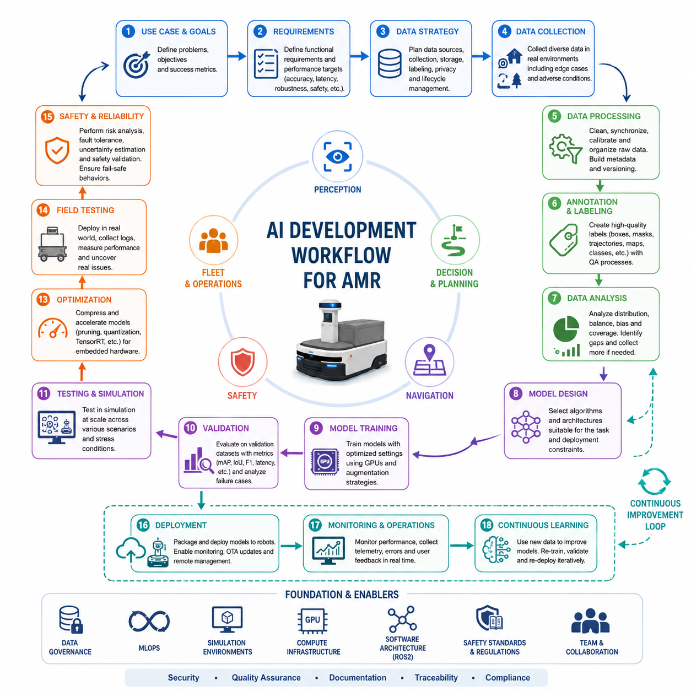
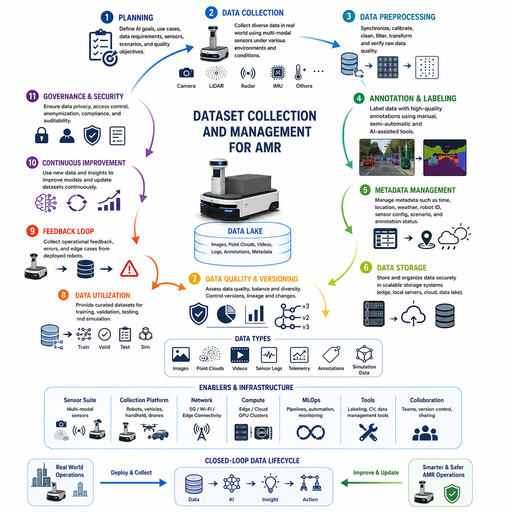
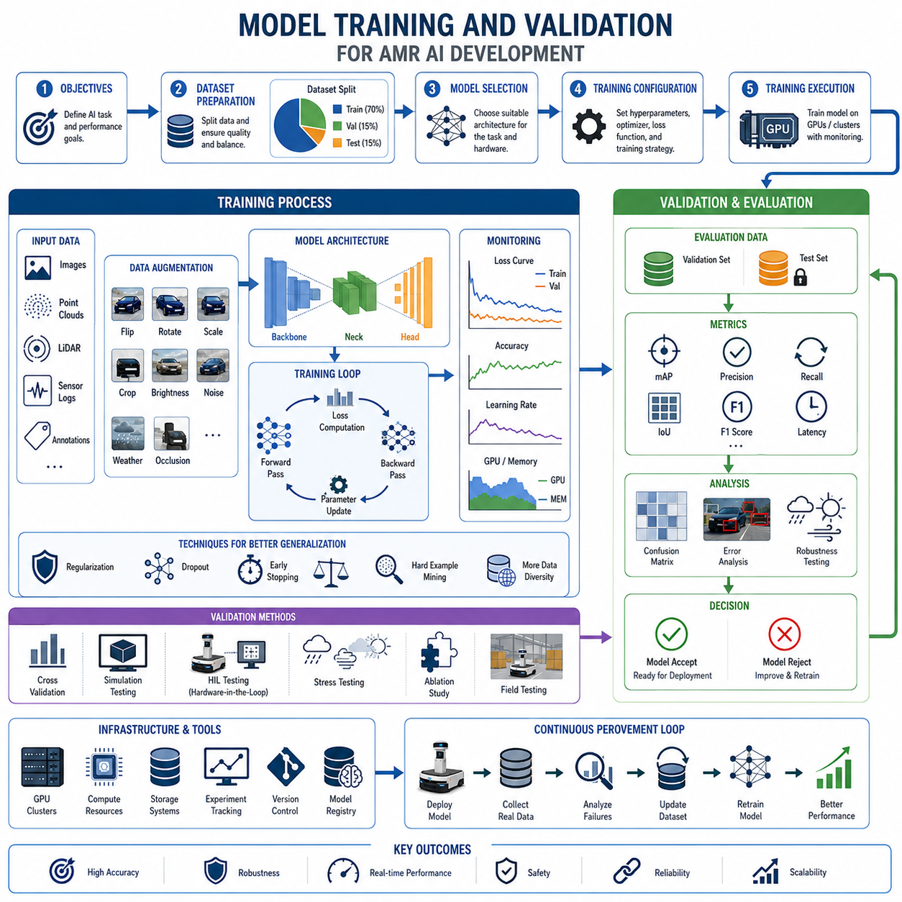
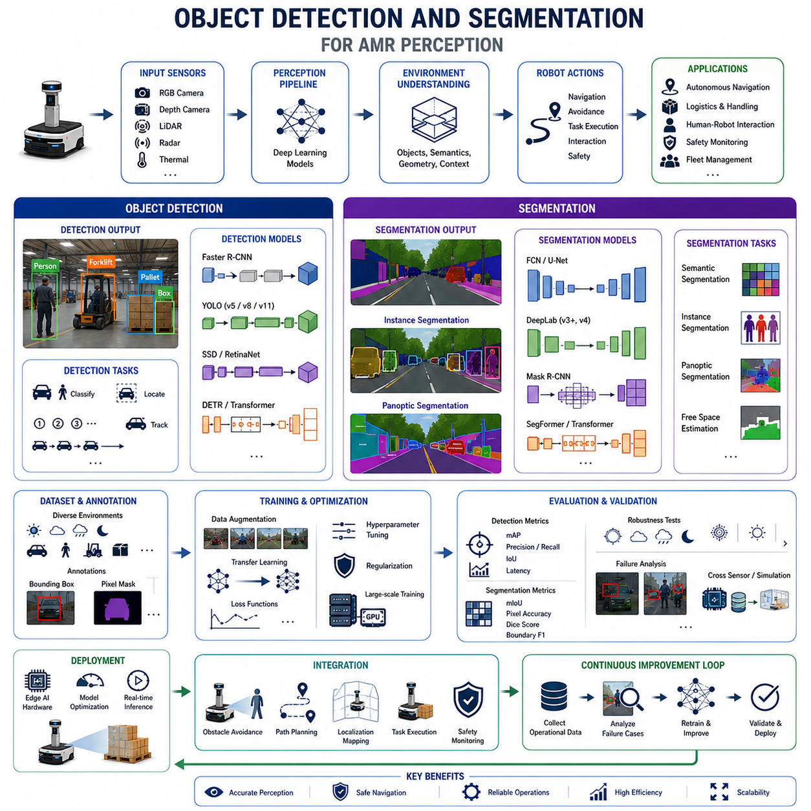
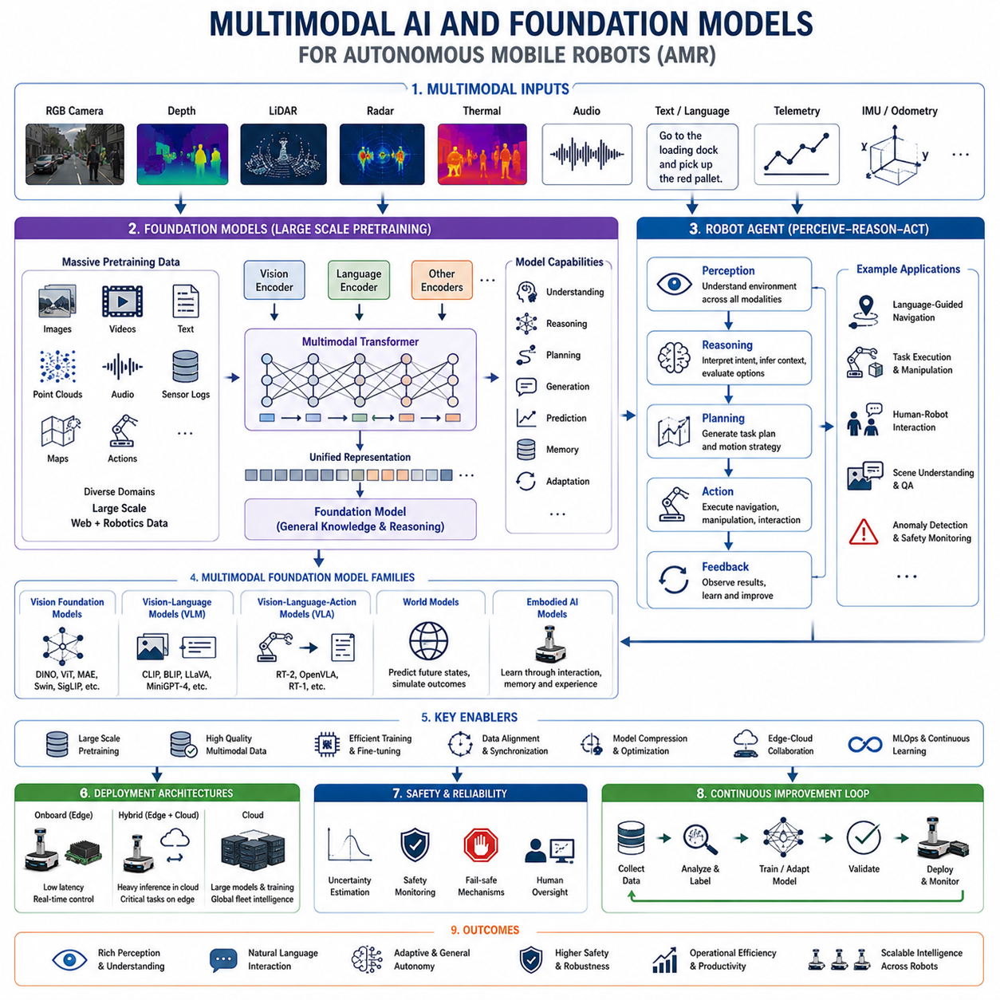
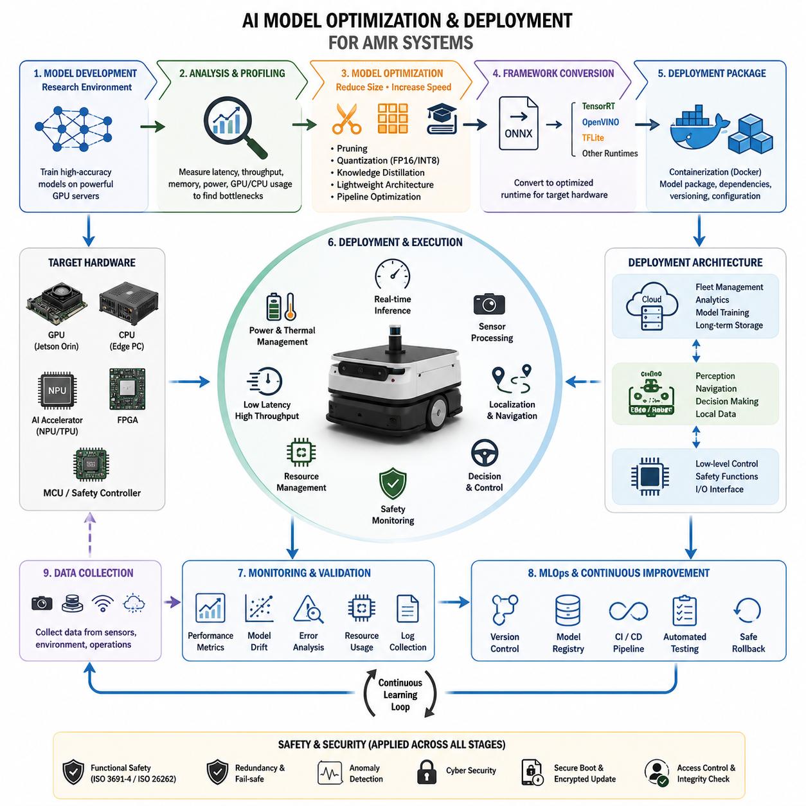
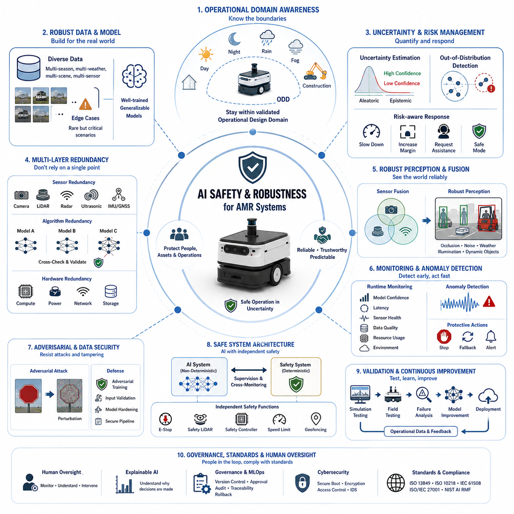
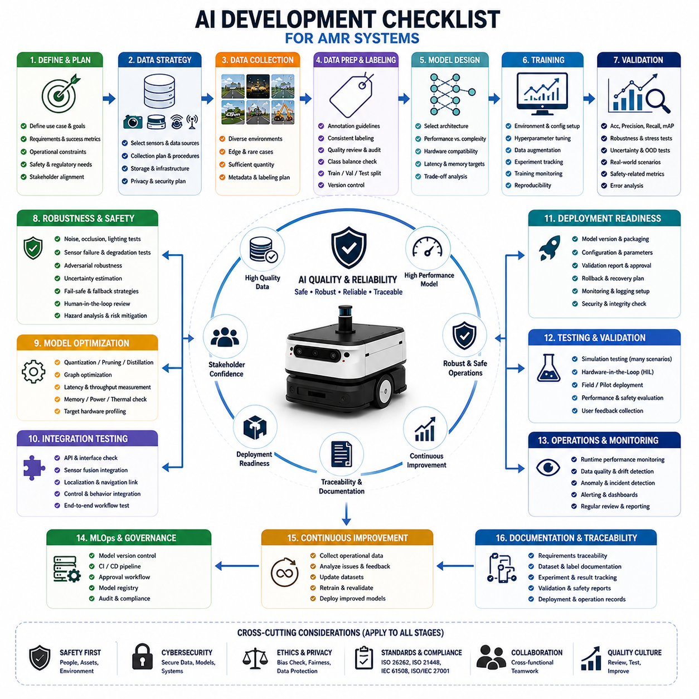

**Volume 10. AMR Engineering Process and Development Manual**

# Chapter 06. AI Model Development

## 06.01 AI Development Workflow

{width="7.268055555555556in" height="7.268055555555556in"}

자율주행 이동로봇(AMR)을 위한 AI 개발 워크플로우는 원시 운영 요구사항을 실제 배포 가능한 신뢰성 높은 인공지능 시스템으로 전환하기 위한 체계적인 엔지니어링 프로세스이다. 현대 AMR 플랫폼에서 AI는 더 이상 독립적인 소프트웨어 모듈이 아니라 인지(Perception), 의사결정(Decision Making), 내비게이션(Navigation), 안전(Safety), 운영 효율성(Operation Efficiency), 그리고 자율성(Autonomy)에 직접적인 영향을 미치는 핵심 시스템으로 자리 잡고 있다. 따라서 AI 개발은 단순한 모델 학습 과정이 아니라 시스템 엔지니어링, 데이터 엔지니어링, 머신러닝, 소프트웨어 개발, 검증, 배포, 지속적 개선을 포함하는 전체 수명주기 관점에서 접근해야 한다. 이러한 워크플로우는 실내 물류 로봇, 실외 자율주행 로봇, 견인 로봇, 검사 로봇, 의료 로봇, 산업용 서비스 로봇 등 다양한 AMR 플랫폼에 적용되는 AI 역량 개발의 기반이 된다.

AI 개발은 먼저 비즈니스 목표와 운영 시나리오를 명확히 정의하는 단계에서 시작된다. AI는 반드시 해결해야 할 문제를 중심으로 개발되어야 하며, 단순히 최신 기술을 적용하는 것이 목적이 되어서는 안 된다. 개발팀은 장애물 탐지, 보행자 인식, 자유 공간 추정, 팔레트 식별, 지형 분류, 시맨틱 맵 생성, 이상 탐지, 예지보전, 교통 예측, 자연어 기반 상호작용, 임무 계획, 자율 의사결정 지원과 같은 구체적인 문제를 정의해야 한다. 각 AI 기능은 운영 목표와 직접 연결되어야 하며 측정 가능한 성능 지표를 가져야 한다. 이를 통해 개발 과정이 실제 가치 창출에 집중될 수 있다.

목표가 정의되면 기능 요구사항과 성능 목표를 수립한다. 요구사항은 AI 시스템이 정상 상황과 비정상 상황에서 어떻게 동작해야 하는지를 설명한다. 예를 들어 객체 탐지 모델은 특정 정확도를 달성하면서 실시간 프레임 처리 성능을 유지해야 할 수 있다. 지형 분류 시스템은 다양한 기상 조건에서도 높은 신뢰도로 주행 가능 영역과 비주행 영역을 구분해야 할 수 있다. 이러한 요구사항에는 정확도, 정밀도, 재현율, 지연시간, 처리량, 강건성, 전력 소비, 메모리 사용량, 안전성 등이 포함된다. 이후 모든 개발 활동은 이러한 기준을 중심으로 평가된다.

다음 단계는 데이터 전략 수립이다. 데이터는 모든 AI 시스템의 근간이다. 최종 모델의 성능은 데이터의 품질과 다양성, 그리고 실제 환경을 얼마나 잘 반영하는지에 크게 의존한다. 개발팀은 데이터 수집 방법, 저장 구조, 라벨링 방식, 개인정보 보호 정책, 버전 관리 체계를 정의한다. 데이터는 RGB 카메라, Depth Camera, LiDAR, Radar, Thermal Camera, GNSS, IMU, 초음파 센서 및 운영 데이터베이스 등 다양한 소스에서 수집될 수 있다. 목표는 로봇이 실제로 운영될 환경을 충분히 대표하는 데이터셋을 구축하는 것이다.

데이터 수집 단계에서는 센서를 탑재한 로봇이 실제 환경에서 다양한 데이터를 획득한다. 실내 로봇은 병원, 물류센터, 공장, 창고 등에서 데이터를 수집하며, 실외 로봇은 도로, 건설 현장, 산업 단지, 농업 지역, 도시 환경 등에서 데이터를 확보한다. 특히 AI 성능을 저하시킬 수 있는 예외 상황(Edge Case)을 확보하는 것이 중요하다. 조도가 낮은 환경, 반사체, 악천후, 군중 밀집 지역, 센서 노이즈, 예기치 않은 장애물과 같은 상황은 AI 시스템의 강건성을 결정하는 핵심 요소가 된다.

수집된 데이터는 전처리 과정을 거친다. 원시 센서 데이터에는 동기화 오류, 누락 데이터, 손상된 샘플, 센서 보정 오차 등이 포함될 수 있다. 개발자는 데이터 정제, 센서 정렬, 타임스탬프 보정, 품질 검증, 정규화 작업을 수행한다. 동시에 메타데이터를 생성하여 데이터 검색, 버전 관리, 실험 추적이 가능하도록 한다. 체계적으로 관리되는 데이터셋은 AI 개발 생산성을 크게 향상시킨다.

데이터 라벨링 단계에서는 학습에 필요한 정답 정보를 생성한다. 사람에 의한 수동 라벨링, 자동 라벨링, 또는 혼합 방식을 사용할 수 있다. 적용 분야에 따라 바운딩 박스, 시맨틱 세그멘테이션 마스크, 인스턴스 세그멘테이션, 키포인트, 객체 궤적, 지형 분류, 자유 공간 정보, 이상 여부, 언어 명령, 행동 카테고리 등이 라벨로 사용된다. 라벨 품질은 모델 성능에 직접적인 영향을 미치므로 다중 검수, 샘플링 검증, 품질 평가 절차가 필수적이다.

데이터셋이 준비되면 탐색적 데이터 분석(EDA)을 수행한다. 이를 통해 데이터 분포, 클래스 균형, 환경 다양성, 센서 특성, 잠재적 편향성을 분석한다. 특정 클래스가 과도하게 많거나 부족하지 않은지, 실제 운영 환경이 충분히 반영되었는지 확인한다. 이러한 분석은 모델 개발 이전에 데이터 문제를 발견하고 해결할 수 있도록 돕는다.

이후 모델 설계 단계가 시작된다. 개발자는 문제의 특성, 계산 자원, 배포 환경, 유지보수 요구사항 등을 고려하여 적절한 AI 아키텍처를 선정한다. 전통적인 머신러닝 모델, 딥러닝 네트워크, Transformer 기반 모델, 멀티모달 파운데이션 모델, 강화학습 시스템, 하이브리드 AI 구조 등이 후보가 될 수 있다. 모델 선택 시에는 정확도뿐 아니라 연산 효율성, 메모리 사용량, 추론 지연시간, 확장성, 강건성을 함께 고려해야 한다.

모델 학습은 가장 많은 계산 자원을 요구하는 단계 중 하나이다. 모델은 반복적인 최적화 과정을 통해 데이터로부터 패턴을 학습한다. 개발자는 학습률, 배치 크기, 최적화 알고리즘, 손실 함수, 정규화 기법, 데이터 증강 전략 등을 설정한다. 일반적으로 GPU 서버나 고성능 클러스터 환경에서 학습이 수행된다. 학습 과정에서는 과적합, 과소적합, 그래디언트 불안정성, 자원 병목 현상 등을 지속적으로 모니터링해야 한다.

데이터 증강은 모델의 일반화 성능을 높이는 데 중요한 역할을 한다. 회전, 확대·축소, 이동, 자르기, 조명 변화, 날씨 시뮬레이션, 노이즈 추가, 가림 현상 생성 등의 방법을 사용하여 데이터 다양성을 증가시킨다. 또한 Gazebo, Isaac Sim, CARLA와 같은 시뮬레이션 환경에서 생성된 합성 데이터(Synthetic Data)를 활용할 수 있다. 실제 환경에서 수집하기 어려운 희귀 상황에 대해 대량의 데이터를 확보할 수 있다는 장점이 있다.

모델 학습이 완료되면 검증 단계가 진행된다. 검증 데이터셋을 활용하여 모델의 일반화 성능을 평가한다. 정확도, 재현율, 정밀도, F1 Score, mAP, IoU, 위치 오차 등 다양한 지표가 사용된다. 검증 결과를 바탕으로 모델의 강점과 약점을 분석하고 개선 방향을 도출한다.

이후 실제 운영 환경을 고려한 테스트가 수행된다. 시뮬레이션 환경에서는 수천 개 이상의 다양한 시나리오를 안전하게 검증할 수 있다. 보행자, 차량, 장애물, 환경 변화, 시스템 고장 상황 등을 반복적으로 재현하여 모델의 안정성을 확인한다. 시뮬레이션은 개발 비용과 위험을 크게 줄여주지만, 최종적으로는 실제 환경에서 검증되어야 한다.

하드웨어 통합 단계에서는 AI 모델을 ROS2 기반 로봇 소프트웨어 스택에 통합한다. 센서 인터페이스, DDS 통신, GPU 자원 관리, 메모리 최적화, 실시간 처리 구조 등을 구축한다. AI 모듈의 출력은 위치추정, 경로계획, 안전제어, 함대관리 시스템 등과 연동되어 실제 자율주행 기능을 수행하게 된다.

임베디드 플랫폼에 배포하기 위해서는 성능 최적화가 필요하다. AMR은 제한된 전력과 연산 자원을 사용하므로 모델 경량화가 필수적이다. 프루닝(Pruning), 양자화(Quantization), 지식 증류(Knowledge Distillation), TensorRT 최적화, 하드웨어 특화 컴파일 등의 기술이 활용된다. 목표는 정확도를 유지하면서 실시간 추론 성능을 확보하는 것이다.

현장 테스트(Field Test)는 AI 시스템을 최종적으로 평가하는 단계이다. 실제 운영 환경에 로봇을 배치하여 성능을 측정하고, 로그를 수집하며, 실패 사례를 분석한다. 실험실에서는 발견하기 어려운 환경 변화, 인프라 문제, 사용자 행동, 센서 열화 현상 등을 확인할 수 있다. 이러한 정보는 차세대 모델 개선에 매우 중요한 자료가 된다.

안전성 평가는 전체 개발 과정에 걸쳐 지속적으로 수행된다. 자율주행 로봇의 AI는 예측 가능하고 신뢰성 있게 동작해야 한다. 위험 분석, 고장 모드 분석, 안전 아키텍처 설계, 불확실성 추정, 신뢰도 평가, 비상 대응 전략 등이 함께 고려된다. 특히 산업용 및 공공 환경에서는 AI 판단을 독립적인 안전 시스템이 감시하는 구조가 요구된다.

모델이 충분히 검증되면 배포 단계로 진입한다. 배포 과정에서는 실행 환경 구성, 모델 패키징, 모니터링 시스템 구축, OTA 업데이트 체계 연결 등이 수행된다. 현대 AMR 플랫폼은 클라우드-엣지 아키텍처와 함대관리 시스템을 활용하여 대규모 로봇 운영을 지원한다.

배포 이후에도 AI 개발은 끝나지 않는다. 운영 중인 로봇으로부터 추론 결과, 환경 데이터, 오류 정보, 사용자 피드백을 지속적으로 수집한다. 이를 통해 성능 저하, 데이터 분포 변화, 새로운 실패 사례를 분석하고 개선 작업을 수행한다.

MLOps는 이러한 지속적 운영을 가능하게 하는 핵심 프레임워크이다. 실험 추적, 모델 버전 관리, 데이터셋 관리, 자동 테스트, CI/CD, 승인 프로세스 등을 통해 AI 개발을 연구 수준에서 산업용 엔지니어링 수준으로 발전시킨다.

지속 학습(Continuous Learning)은 최신 운영 데이터를 활용하여 모델을 반복적으로 개선하는 과정이다. 현장에서 발견된 새로운 장애물, 새로운 환경 조건, 새로운 운영 패턴은 다음 학습 사이클에 반영된다. 새로운 모델은 검증과 승인 과정을 거친 후 안전하게 재배포된다.

최종적으로 AI 개발 워크플로우는 요구사항 정의부터 데이터 수집, 모델 개발, 검증, 배포, 운영, 지속 개선에 이르는 전 과정을 체계적으로 연결하는 엔지니어링 프레임워크이다. 이는 단순한 머신러닝 개발 프로세스를 넘어 AMR 전체 시스템과 긴밀하게 통합된 지능형 로봇 개발 방법론이라 할 수 있다. 미래의 멀티모달 AI, 파운데이션 모델, Embodied AI, 자율 의사결정 시스템이 발전할수록 이러한 체계적인 AI 개발 워크플로우의 중요성은 더욱 커질 것이며, 차세대 지능형 로봇 플랫폼 구축의 핵심 기반이 될 것이다.

## 06.02 Dataset Collection and Management

{width="7.268055555555556in" height="7.268055555555556in"}

데이터셋 수집 및 관리는 자율주행 이동로봇(AMR) AI 개발의 가장 중요한 기반 요소 중 하나이다. 아무리 뛰어난 머신러닝 알고리즘이나 파운데이션 모델을 사용하더라도 최종 AI 시스템의 성능, 강건성, 안전성, 신뢰성은 결국 데이터의 품질과 다양성에 의해 결정된다. 로봇공학 분야에서 데이터는 단순한 지원 자산이 아니라 인지 정확도, 내비게이션 성능, 의사결정 품질, 운영 안전성, 그리고 장기적인 시스템 적응 능력을 좌우하는 핵심 엔지니어링 자원이다. 따라서 데이터셋 수집과 관리는 단순한 데이터 확보 활동이 아니라 체계적인 엔지니어링 프로세스로 접근해야 한다. AMR 개발 과정에서 데이터셋 관리는 실제 운영 환경과 AI 모델 개발을 연결하는 핵심 역할을 수행하며, 지속적인 학습, 검증, 최적화, 배포를 가능하게 하는 기반이 된다.

데이터셋 수집의 가장 중요한 목적은 로봇이 실제로 마주하게 될 환경, 작업, 객체, 사용자, 운영 조건에 대한 대표적인 정보를 확보하는 것이다. 우수한 데이터셋은 실제 환경의 복잡성을 충분히 반영하면서도 AI 모델이 새로운 상황에 일반화될 수 있도록 다양한 사례를 포함해야 한다. 개발팀은 객체 탐지, 시맨틱 분할, 장애물 분류, 사람 인식, 자유 공간 추정, 지형 분류, 이상 탐지, 교통 예측, 행동 이해, 예지보전, 자연어 상호작용, 멀티모달 추론과 같은 목표 기능에 따라 필요한 데이터 종류와 수집 전략을 정의해야 한다.

데이터셋 계획은 요구사항 정의 단계에서부터 시작된다. AI 엔지니어, 시스템 아키텍트, 현장 전문가, 운영 담당자들은 함께 필요한 데이터의 종류와 규모를 결정한다. 이 과정에서 데이터 소스, 센서 구성, 수집 주기, 저장 방식, 보존 정책, 라벨링 기준, 개인정보 보호 요구사항, 품질 목표 등이 정의된다. 초기 계획이 부족하면 AI 개발 전체 일정이 지연되는 경우가 많기 때문에 체계적인 데이터 전략 수립은 프로젝트 성공의 핵심 요소가 된다.

AMR 시스템은 다양한 센서를 통해 데이터를 생성한다. 최신 로봇은 RGB 카메라, 깊이 카메라, 열화상 카메라, LiDAR, Radar, 초음파 센서, GNSS 수신기, IMU, 휠 엔코더, 배터리 모니터링 장치, 환경 센서, 운영 로그 시스템 등을 동시에 사용한다. 각 센서는 서로 다른 형태의 정보를 제공하며, 데이터셋 수집 시스템은 이러한 다양한 데이터 스트림을 정확하게 동기화하여 저장해야 한다. 특히 센서 융합 알고리즘에서는 시간 동기화 정확도가 전체 시스템 성능에 직접적인 영향을 미친다.

실제 환경에서의 데이터 수집은 데이터셋 구축의 핵심이다. 로봇은 병원, 창고, 공장, 물류센터, 공항, 쇼핑몰과 같은 실내 환경뿐 아니라 도로, 건설 현장, 산업 단지, 항만, 농업 지역, 광산, 도시 환경과 같은 실외 환경에서도 데이터를 수집할 수 있다. 목표는 향후 로봇이 운영될 환경을 최대한 현실적으로 반영하는 것이다. 다양한 환경에서 수집된 데이터는 AI 모델이 새로운 장소에서도 안정적으로 동작할 수 있도록 해준다.

조명 조건은 데이터 품질에 매우 큰 영향을 미친다. AI 시스템은 밝은 태양광, 흐린 날씨, 새벽, 황혼, 야간, 실내 조명, 그림자 영역, 반사 표면, 급격한 조도 변화와 같은 다양한 조건에서 안정적으로 동작해야 한다. 따라서 데이터 수집 단계에서 이러한 환경을 의도적으로 포함해야 한다. 비, 눈, 안개, 먼지, 강풍, 습도 변화, 온도 변화 역시 반드시 고려되어야 하며, 이러한 다양성이 AI의 강건성을 향상시킨다.

데이터셋 구축에서 매우 중요한 원칙 중 하나는 엣지 케이스(Edge Case)와 희귀 이벤트(Rare Event)를 포함하는 것이다. 많은 AI 실패 사례는 일반 상황이 아니라 드물게 발생하는 예외 상황에서 발생한다. 예를 들어 부분적으로 가려진 물체, 비정상적인 형태의 장애물, 파손된 시설물, 공사 구역, 긴급 차량, 쓰러진 화물, 센서 오염, 통신 장애, 극한 환경 등이 이에 해당한다. 이러한 상황을 데이터셋에 포함하기 위해서는 장기간의 계획적인 데이터 수집 활동이 필요하지만, 결과적으로 AI의 안전성과 신뢰성을 크게 향상시킬 수 있다.

현대 AMR은 운영 중에도 지속적으로 데이터를 수집한다. 로봇은 실제 업무를 수행하면서 동시에 이동형 데이터 수집 플랫폼 역할을 수행할 수 있다. 이를 통해 별도의 데이터 수집 임무 없이도 방대한 데이터를 축적할 수 있다. 또한 여러 대의 로봇이 서로 다른 장소에서 수집한 데이터를 통합하면 데이터셋의 규모와 다양성을 빠르게 확대할 수 있다. 이러한 플릿(Fleet) 기반 수집 방식은 대규모 AI 개발과 지속적 학습의 핵심 요소가 되고 있다.

수집된 원시 데이터는 곧바로 AI 학습에 사용할 수 없다. 데이터 전처리 과정에서는 시간 동기화, 센서 보정, 좌표계 변환, 이미지 정규화, 포인트 클라우드 필터링, 노이즈 제거, 이상값 제거, 누락 데이터 처리, 품질 검증 등의 작업이 수행된다. 이러한 과정은 데이터의 일관성을 확보하고 모델 학습 품질을 향상시킨다.

메타데이터 관리 역시 데이터셋 운영의 핵심 요소이다. 메타데이터는 데이터가 언제, 어디서, 어떤 환경에서, 어떤 로봇에 의해 수집되었는지를 설명한다. 예를 들어 수집 시간, 위치 정보, 날씨 상태, 환경 유형, 로봇 식별 정보, 센서 구성, 소프트웨어 버전, 임무 종류, 라벨링 상태 등이 포함될 수 있다. 메타데이터가 잘 관리되면 데이터 검색, 필터링, 버전 관리, 감사 추적이 훨씬 효율적으로 수행된다.

라벨링과 어노테이션 과정은 원시 데이터를 AI 학습용 데이터로 변환하는 작업이다. 응용 분야에 따라 바운딩 박스, 시맨틱 세그멘테이션 마스크, 객체 추적 정보, 키포인트, 차선 정보, 자유 공간 경계, 지형 분류, 행동 분류, 위험 수준, 자연어 명령 등이 라벨로 사용된다. 최근에는 수작업 라벨링뿐 아니라 반자동 라벨링, 액티브 러닝, AI 기반 자동 라벨링 기술이 널리 활용되고 있다.

라벨 품질은 모델 성능에 직접적인 영향을 미친다. 잘못된 라벨이나 불완전한 라벨은 모델 성능을 크게 저하시킬 수 있다. 따라서 다중 검수 체계, 샘플 검증, 라벨 일관성 분석, 자동 품질 검사, 피드백 시스템 등을 통해 높은 품질을 유지해야 한다. 실제로 많은 경우 데이터 양보다 데이터 품질이 AI 성능에 더 큰 영향을 미친다.

데이터셋 버전 관리는 AI 개발에서 매우 중요하다. 데이터셋은 시간이 지나면서 지속적으로 수정되고 확장된다. 적절한 버전 관리 체계가 없다면 특정 모델이 어떤 데이터로 학습되었는지 추적하기 어렵다. 데이터셋 버전 관리는 변경 이력을 기록하고 이전 버전으로 복원할 수 있도록 하며, 실험 결과 재현성을 보장한다. 특히 산업용 로봇과 규제 산업에서는 필수적인 기능이다.

데이터 저장 구조는 확장성, 접근성, 신뢰성, 보안성을 고려하여 설계되어야 한다. 현대 로봇 기업은 엣지 저장 장치, 로컬 서버, 클라우드 스토리지, 데이터 레이크, 분산 데이터베이스를 결합한 하이브리드 구조를 많이 사용한다. 저장 시스템은 이미지, 영상, 포인트 클라우드, 센서 로그, 텔레메트리 데이터, 라벨 파일, 시뮬레이션 결과 등 다양한 형식의 데이터를 효율적으로 관리해야 한다.

데이터 보안과 개인정보 보호 역시 중요한 요소이다. 공공 환경에서 운영되는 로봇은 개인정보나 민감한 산업 정보를 수집할 가능성이 있다. 따라서 데이터 암호화, 접근 권한 관리, 익명화 처리, 감사 로그 관리, 데이터 보존 정책, 규제 준수 체계가 반드시 구축되어야 한다.

데이터 품질 평가는 일회성 작업이 아니라 지속적인 활동이다. 개발자는 데이터의 완전성, 정확성, 일관성, 대표성, 균형성, 다양성을 지속적으로 평가해야 한다. 클래스 불균형이나 환경 다양성 부족과 같은 문제는 AI 성능 저하의 원인이 되므로 체계적인 품질 관리가 필요하다.

최근에는 합성 데이터(Synthetic Data)의 활용이 크게 증가하고 있다. Gazebo, Isaac Sim, CARLA, Unreal Engine, 디지털 트윈 플랫폼을 활용하면 대량의 라벨링된 데이터를 효율적으로 생성할 수 있다. 충돌 상황, 극한 기상 조건, 장비 고장, 위험 지역과 같은 희귀 사례는 실제 수집이 어렵기 때문에 합성 데이터가 매우 유용하다. 물론 합성 데이터만으로는 충분하지 않지만 실제 데이터와 결합하면 모델의 강건성을 크게 향상시킬 수 있다.

디지털 트윈 환경은 실제 운영 환경을 가상 공간에 재현함으로써 데이터 생성 능력을 더욱 확대한다. 이를 통해 다양한 시나리오를 반복적으로 생성하고 센서 데이터를 시뮬레이션할 수 있으며, 대규모 검증과 실험을 수행할 수 있다.

멀티모달 AI의 발전은 데이터셋 관리의 복잡성을 더욱 증가시키고 있다. 최신 로봇 AI는 영상, 공간 정보, 시간 정보, 언어 정보, 운영 데이터를 동시에 활용한다. 따라서 데이터셋 관리 시스템은 다양한 센서 데이터 간의 관계를 유지하면서 동기화된 멀티모달 데이터 구조를 지원해야 한다. 이러한 데이터는 장면 이해, 인간-로봇 상호작용, 언어 기반 내비게이션, Embodied AI, 파운데이션 모델 학습의 기반이 된다.

운영 중 생성되는 피드백 데이터는 장기적인 데이터셋 관리에서 중요한 역할을 한다. 로봇 운영 과정에서 발견된 실패 사례, 불확실한 판단, 이상 행동, 성능 저하 사례는 자동으로 기록되고 분석된다. 이후 이러한 데이터는 차세대 모델 학습 데이터로 활용되어 지속적인 성능 향상을 가능하게 한다.

MLOps 프레임워크는 대규모 데이터셋 관리를 위한 핵심 인프라를 제공한다. 데이터 계보 추적, 실험 관리, 데이터셋 레지스트리, 자동 검증 파이프라인, CI/CD 워크플로우, 거버넌스 체계를 통해 데이터 운영의 효율성과 재현성을 확보한다.

대규모 로봇 플릿 환경에서는 중앙 집중형 데이터 관리 플랫폼이 필수적이다. 수백 또는 수천 대의 로봇으로부터 수집된 데이터를 통합 관리함으로써 운영 분석, 이상 탐지, 성능 비교, 지속 학습을 지원할 수 있다. 또한 이러한 플랫폼은 보안과 규제 준수 측면에서도 큰 장점을 제공한다.

결국 데이터셋 수집 및 관리는 단순한 데이터 저장 활동이 아니다. 이는 AI 개발의 성공 여부를 결정하는 전략적 엔지니어링 기능이다. 고품질 데이터셋은 정확한 인지, 신뢰성 있는 의사결정, 안정적인 자율주행, 효과적인 안전 시스템, 지속적인 성능 향상을 가능하게 한다. 반대로 부실한 데이터 관리 체계는 AI 실패, 개발 지연, 운영 문제의 근본 원인이 된다.

향후 AMR이 멀티모달 AI, 파운데이션 모델, Embodied AI, 자율 의사결정 시스템으로 발전함에 따라 데이터셋 관리의 중요성은 더욱 커질 것이다. 미래의 로봇은 전 세계에서 수집되는 방대한 데이터를 기반으로 지속적으로 학습하게 될 것이며, 체계적인 데이터 수집 및 관리 역량을 확보한 기업이 차세대 지능형 로봇 시장에서 경쟁 우위를 확보하게 될 것이다.

## 06.03 Model Training and Validation

{width="7.268055555555556in" height="7.268055555555556in"}

모델 학습 및 검증은 수집되고 라벨링된 데이터셋을 실제로 동작하는 인공지능 모델로 변환하는 핵심 엔지니어링 프로세스이다. 이 과정에서 데이터는 객체 인식, 장면 이해, 예측, 분류, 계획 지원, 자율 의사결정과 같은 기능을 수행할 수 있는 지능으로 전환된다. 데이터셋 구축이 AI 개발의 기초를 마련하는 단계라면, 모델 학습은 데이터를 지능으로 변환하는 단계이며, 검증은 이러한 지능이 실제 환경에서 신뢰할 수 있는지 확인하는 단계이다. AMR의 인지 능력과 자율주행 성능은 모델 학습과 검증의 품질에 직접적으로 의존하기 때문에, 이 과정은 단순한 머신러닝 실험이 아니라 체계적인 엔지니어링 워크플로우로 수행되어야 한다. AI 개발 전체 관점에서 모델 학습 및 검증은 데이터 엔지니어링과 실제 배포 사이를 연결하는 핵심 역할을 수행한다.

모델 학습은 먼저 AI 시스템이 달성해야 할 운영 목표를 명확하게 정의하는 것에서 시작된다. 모든 모델은 특정 문제를 해결하기 위해 개발되어야 한다. 이러한 문제에는 객체 탐지, 시맨틱 세그멘테이션, 장애물 분류, 자유 공간 추정, 지형 인식, 보행자 추적, 이상 탐지, 예지보전, 멀티모달 장면 이해, 언어 기반 내비게이션, 자율 의사결정 지원 등이 포함될 수 있다. 학습을 시작하기 전에 목표를 명확히 정의해야 적절한 모델 구조, 학습 전략, 평가 지표, 배포 아키텍처를 결정할 수 있다.

학습에 앞서 데이터셋은 일반적으로 학습용 데이터(Training Dataset), 검증용 데이터(Validation Dataset), 테스트 데이터(Test Dataset)로 분리된다. 학습 데이터는 모델 파라미터를 학습하는 데 사용되며, 검증 데이터는 하이퍼파라미터 조정과 중간 성능 평가에 활용된다. 테스트 데이터는 최종 평가 시까지 별도로 유지되어 모델의 일반화 성능을 객관적으로 측정하는 역할을 한다. 데이터셋 간 정보가 섞이는 데이터 누수(Data Leakage)가 발생하면 실제보다 과도하게 높은 성능이 나타날 수 있으므로 철저한 분리가 필요하다.

데이터 균형(Data Balancing) 역시 중요한 준비 과정이다. 실제 로봇 데이터는 특정 클래스에 편중되어 있는 경우가 많다. 예를 들어 정상 주행 데이터는 매우 많지만 사고 위험 상황이나 희귀 장애물 데이터는 상대적으로 적을 수 있다. 이러한 불균형이 존재하면 모델은 자주 등장하는 클래스에만 최적화되고 중요한 예외 상황에서는 성능이 저하될 수 있다. 이를 해결하기 위해 오버샘플링, 언더샘플링, 클래스 가중치 조정, Hard Example Mining, 추가 데이터 수집 등의 기법이 활용된다.

데이터 증강(Data Augmentation)은 모델의 일반화 능력을 향상시키기 위해 사용된다. 이미지 데이터의 경우 회전, 이동, 확대·축소, 자르기, 색상 변화, 조명 변화, 블러 효과, 날씨 효과, 노이즈 추가, 가림 현상 생성 등을 적용할 수 있다. LiDAR 및 포인트 클라우드 데이터에서는 좌표 변환, 포인트 제거, 위치 교란, 환경 시뮬레이션 등이 사용된다. 이러한 증강 기법은 모델이 다양한 실제 환경 변화에 대응할 수 있도록 돕는다.

모델 아키텍처 선택은 학습 과정에서 가장 중요한 결정 중 하나이다. 개발자는 정확도, 연산 효율성, 메모리 사용량, 확장성, 유지보수성, 배포 가능성을 종합적으로 고려해야 한다. 컴퓨터 비전 분야에서는 CNN(Convolutional Neural Network)이 널리 사용되며, 최근에는 멀티모달 추론과 언어 이해를 위해 Transformer 기반 구조가 빠르게 확산되고 있다. 또한 CNN, Transformer, Graph Neural Network, Recurrent Network, Attention 구조를 결합한 하이브리드 모델도 많이 활용되고 있다.

모델 구조는 목표 하드웨어와도 반드시 일치해야 한다. 산업용 AMR은 NVIDIA Jetson, 엣지 서버, 산업용 컴퓨터, AI 가속기와 같은 제한된 자원을 가진 플랫폼에서 동작한다. 연구실 환경에서 높은 정확도를 보이는 모델이 실제 배포 환경에서는 실행 불가능할 수도 있다. 따라서 하드웨어 제약 조건은 학습 완료 후가 아니라 모델 설계 단계에서부터 고려되어야 한다.

학습 설정(Training Configuration)은 모델이 어떤 방식으로 학습할지를 결정한다. 여기에는 학습률(Learning Rate), 최적화 알고리즘(Optimizer), 배치 크기(Batch Size), 에포크(Epoch), 손실 함수(Loss Function), 정규화 방법, 학습 스케줄링 정책 등이 포함된다. 이러한 설정은 학습 속도와 최종 성능에 매우 큰 영향을 미친다. 최근에는 자동 하이퍼파라미터 탐색(AutoML) 기술을 활용하여 최적 설정을 찾는 경우도 증가하고 있다.

최적화 알고리즘은 예측 오차를 기반으로 모델 파라미터를 업데이트하는 역할을 한다. 대표적으로 SGD, Adam, AdamW, RMSProp 등이 널리 사용된다. 데이터 특성과 모델 구조에 따라 적절한 알고리즘을 선택해야 하며, 안정적인 수렴과 높은 최종 성능을 확보하기 위해 세밀한 튜닝이 필요하다.

손실 함수는 모델이 최소화해야 할 목표를 정의한다. 분류 문제에서는 Cross Entropy Loss가 주로 사용되며, 객체 탐지에서는 분류 손실과 위치 손실을 함께 사용한다. 세그멘테이션에서는 Dice Loss, Focal Loss, IoU 기반 손실 함수가 활용된다. 최근의 로봇 AI는 여러 작업을 동시에 수행하는 경우가 많기 때문에 다양한 손실 함수를 결합한 멀티태스크 최적화가 일반적이다.

학습은 GPU 클러스터, 클라우드 서버, 고성능 워크스테이션 등에서 수행된다. 수백만 또는 수십억 개의 파라미터를 반복적으로 최적화하면서 모델은 데이터의 패턴을 학습한다. 이 과정에서는 손실 함수 변화, 정확도 추이, GPU 사용량, 메모리 소비, 학습 속도 등을 지속적으로 모니터링해야 한다. 조기에 이상 현상을 발견하면 불필요한 계산 비용을 줄일 수 있다.

학습 과정에서 가장 흔히 발생하는 문제는 과적합(Overfitting)이다. 과적합은 학습 데이터에 지나치게 특화되어 새로운 환경에서 성능이 급격히 저하되는 현상을 의미한다. 이를 방지하기 위해 정규화, Dropout, Weight Decay, 데이터 증강, Early Stopping, 모델 단순화 등의 방법이 사용된다. AMR은 다양한 환경에서 운영되므로 일반화 능력이 매우 중요하다.

반대로 과소적합(Underfitting)은 모델이 데이터의 패턴을 충분히 학습하지 못하는 현상이다. 이는 모델 구조가 지나치게 단순하거나 학습 시간이 부족한 경우에 발생할 수 있다. 따라서 적절한 모델 복잡도와 학습 전략을 선택해야 한다.

전이 학습(Transfer Learning)은 로봇 AI 개발에서 매우 중요한 기법이다. 처음부터 모델을 학습하는 대신 대규모 데이터셋으로 사전 학습된 모델을 활용하여 학습 시간을 줄이고 성능을 향상시킨다. 특히 프로젝트 전용 데이터셋이 작은 경우 매우 효과적이다.

최근에는 파운데이션 모델(Foundation Model)이 학습 과정에 적극적으로 활용되고 있다. 비전 파운데이션 모델, 멀티모달 Transformer, VLM(Vision Language Model), VLA(Vision Language Action) 모델은 대규모 사전 학습을 통해 강력한 초기 성능을 제공한다. 이를 특정 산업 환경에 맞게 파인튜닝하여 물류, 의료, 산업 검사, 농업, 자율주행 분야에 적용할 수 있다.

모델 검증은 학습 결과를 객관적으로 평가하는 과정이다. 검증 데이터는 모델이 직접 학습하지 않은 데이터로 구성되며, 실제 환경에서의 성능을 예측하는 역할을 한다. 검증 과정에는 정량적 평가뿐 아니라 정성적 분석, 실패 사례 분석, 강건성 평가, 운영 환경 벤치마킹 등이 포함된다.

성능 지표는 응용 분야에 따라 달라진다. 객체 탐지에서는 Precision, Recall, mAP, 탐지 지연시간이 사용된다. 세그멘테이션에서는 IoU, Dice Coefficient, Pixel Accuracy가 사용된다. 추적 시스템에서는 객체 ID 유지율과 궤적 정확도가 활용된다. 내비게이션 AI에서는 경로 예측 정확도, 장애물 분류율, 임무 성공률 등이 주요 지표가 된다.

혼동 행렬(Confusion Matrix) 분석은 모델의 약점을 파악하는 데 매우 유용하다. 어떤 클래스들이 서로 혼동되는지, 특정 데이터에 편향이 존재하는지 분석함으로써 데이터 수집 및 모델 개선 방향을 도출할 수 있다.

강건성 검증(Robustness Validation)은 일반적인 성능 평가를 넘어선다. 실제 환경은 노이즈와 불확실성이 존재하기 때문에 다양한 환경 조건에서 모델을 평가해야 한다. 조명 변화, 악천후, 부분 가림, 모션 블러, 센서 오류, 통신 장애, 환경 변화 등에 대한 성능을 검증함으로써 실제 운영 신뢰성을 확보할 수 있다.

데이터 규모가 제한적일 경우 교차 검증(Cross Validation)이 사용될 수 있다. 여러 번의 학습과 검증을 반복하여 보다 신뢰성 있는 성능 평가를 제공한다.

시뮬레이션 기반 검증은 로봇 AI 개발에서 매우 중요한 역할을 한다. Gazebo, Isaac Sim, CARLA, 디지털 트윈 환경을 활용하면 수천 개 이상의 시나리오를 안전하게 검증할 수 있다. 다양한 환경 변화와 시스템 오류를 반복적으로 재현할 수 있어 실제 테스트 비용을 크게 절감할 수 있다.

하드웨어-인-더-루프(HIL) 검증은 시뮬레이션과 실제 환경 사이를 연결하는 단계이다. 실제 하드웨어에서 모델을 실행하면서 지연시간, 처리량, 메모리 사용량, 전력 소비, 발열 특성 등을 평가한다. 이를 통해 실제 배포 이전에 성능 병목을 발견할 수 있다.

현장 검증(Field Validation)은 최종 검증 단계이다. 로봇을 실제 환경에 배치하여 다양한 운영 조건에서 성능을 평가한다. 이 과정에서는 인간과의 상호작용, 환경 변화, 센서 오염, 인프라 문제 등 연구실에서 발견하기 어려운 요소들을 확인할 수 있다.

안전성 검증은 전체 학습 및 검증 과정에 걸쳐 수행된다. AI 모델이 불확실한 상황에서도 안전하게 동작하는지 확인해야 하며, 신뢰도 추정, 이상 탐지, 비상 대응, 안전 시스템 연동 등을 평가한다. 산업용 로봇에서는 정확도만큼 안전성 검증이 중요하다.

실험 추적과 재현성 관리도 필수 요소이다. 데이터셋 버전, 하이퍼파라미터, 소프트웨어 환경, 하드웨어 구성, 학습 로그, 검증 결과 등을 기록하여 언제든지 동일한 결과를 재현할 수 있어야 한다.

최근 MLOps 플랫폼은 모델 학습과 검증 과정을 자동화하고 있다. 데이터 입력, 모델 학습, 검증 실행, 성능 모니터링, 결과 저장, 배포 준비를 자동으로 수행하여 개발 효율성과 품질을 향상시킨다.

모델 학습 및 검증의 최종 목표는 단순히 높은 정확도의 모델을 만드는 것이 아니다. 궁극적인 목표는 실제 복잡한 환경에서 안전하고 신뢰성 있게 동작할 수 있는 AI 시스템을 구축하는 것이다. 성공적인 검증은 해당 모델이 최적화, 배포, 운영 모니터링, 지속적인 개선 단계로 진입할 준비가 되었음을 의미한다.

향후 AMR이 Embodied AI, 멀티모달 추론, 자율 의사결정, 대규모 플릿 학습으로 발전함에 따라 모델 학습 및 검증 과정은 더욱 복잡하고 고도화될 것이다. 파운데이션 모델, 지속 학습, 시뮬레이션 기반 경험 생성, 분산 학습 기술이 적극 활용될 것이지만, 그 본질은 변하지 않는다. 즉, 데이터를 신뢰할 수 있는 지능으로 변환하여 안전하고 효율적인 자율 로봇 운영을 가능하게 하는 것이 모델 학습 및 검증의 궁극적인 목적이다. 이를 통해 차세대 지능형 로봇 시스템의 기술적 기반이 구축된다.

## 06.04 Object Detection and Segmentation

{width="7.268055555555556in" height="7.268055555555556in"}

객체 탐지(Object Detection)와 세그멘테이션(Segmentation)은 자율주행 이동로봇(AMR)의 인지 시스템에서 가장 중요한 핵심 기술 중 하나이다. 이 기술들은 로봇이 주변 환경에 존재하는 객체를 인식하고, 분류하며, 위치를 파악하고, 환경을 이해할 수 있도록 해준다. 객체 탐지와 세그멘테이션은 현대 로봇 인지 시스템의 기반을 형성하며, 내비게이션, 장애물 회피, 작업 수행, 인간-로봇 상호작용, 안전 모니터링, 플릿 운영, 자율 의사결정 등에 직접적인 영향을 미친다. 만약 로봇이 주변 환경을 정확하게 인식할 수 없다면 안전하고 효율적인 자율주행은 불가능하다. 따라서 객체 탐지와 세그멘테이션은 산업용 로봇, 물류 로봇, 의료 로봇, 농업 로봇, 실외 자율주행 로봇을 포함한 거의 모든 AMR 시스템의 필수 구성 요소로 자리 잡고 있다.

객체 탐지는 센서 데이터 내에서 특정 객체의 존재를 인식하고 위치를 찾는 기술이다. 일반적으로 결과는 객체의 종류(Class)와 해당 객체를 포함하는 바운딩 박스(Bounding Box) 형태로 제공된다. 반면 세그멘테이션은 더욱 세밀한 환경 이해를 제공한다. 단순히 사각형 영역으로 객체를 표시하는 것이 아니라 객체에 해당하는 모든 픽셀을 정확하게 구분하여 표시한다. 이를 통해 로봇은 단순한 객체 인식을 넘어 환경의 구조를 정밀하게 이해할 수 있게 된다.

AMR에서 객체 탐지의 역할은 단순한 장애물 인식을 넘어선다. 현대 로봇은 사람, 작업자, 지게차, 차량, 팔레트, 선반, 기계 장비, 자동문, 엘리베이터, 안전 장비, 박스, 컨테이너, 교통 표지판, 공사 자재, 인프라 시설 등을 인식해야 한다. 이러한 객체 정보는 로봇의 행동 결정에 직접적으로 활용된다. 예를 들어 사람을 인식하면 감속 및 안전 모드가 활성화될 수 있으며, 팔레트를 인식하면 물류 작업 절차가 시작될 수 있다. 따라서 객체 탐지는 인지와 행동을 연결하는 중요한 역할을 수행한다.

세그멘테이션은 환경 구조를 더욱 깊이 이해하도록 도와준다. 각 픽셀에 의미 정보를 부여함으로써 로봇은 주행 가능 영역, 벽, 장애물, 식생 지역, 도로, 보도, 작업 구역, 저장 공간, 위험 구역 등을 구분할 수 있다. 이는 단순한 거리 정보만으로는 얻을 수 없는 고차원적인 환경 이해를 제공한다. 예를 들어 두 영역이 물리적으로 비슷해 보이더라도 하나는 주행 가능한 도로이고 다른 하나는 위험 지역일 수 있다. 세그멘테이션은 이러한 차이를 인식하게 해준다.

객체 탐지와 세그멘테이션은 다양한 센서를 활용한다. RGB 카메라는 가장 널리 사용되는 센서이며, 저렴한 비용과 높은 해상도를 제공한다. 그러나 최근의 AMR 시스템은 RGB 카메라뿐 아니라 Depth Camera, Stereo Vision, Thermal Camera, LiDAR, Radar, Multispectral Camera 등을 함께 사용한다. 이러한 멀티센서 접근 방식은 개별 센서의 한계를 보완한다. 예를 들어 RGB 카메라는 야간 환경에서 성능이 저하될 수 있지만 열화상 카메라는 안정적으로 동작할 수 있으며, LiDAR는 조명과 무관하게 정확한 거리 정보를 제공할 수 있다.

데이터셋 구축은 객체 탐지 및 세그멘테이션 프로젝트에서 가장 중요한 요소 중 하나이다. 데이터셋은 실제 운영 환경을 충분히 반영해야 하며, 다양한 조명 조건, 기상 환경, 계절 변화, 카메라 시점, 객체 형태, 센서 구성, 운영 시나리오를 포함해야 한다. 데이터의 품질과 다양성은 모델의 일반화 능력을 결정하는 핵심 요소이다.

객체 탐지 데이터셋은 일반적으로 객체를 둘러싼 바운딩 박스와 클래스 라벨을 포함한다. 세그멘테이션 데이터셋은 보다 정밀한 픽셀 단위 마스크를 사용한다. 시맨틱 세그멘테이션(Semantic Segmentation)은 동일한 클래스의 모든 객체를 하나의 범주로 분류하며, 인스턴스 세그멘테이션(Instance Segmentation)은 같은 클래스에 속하는 객체도 개별적으로 구분한다. 파놉틱 세그멘테이션(Panoptic Segmentation)은 시맨틱 세그멘테이션과 인스턴스 세그멘테이션을 결합한 형태로, 환경 전체를 더욱 풍부하게 표현할 수 있다.

어노테이션 품질은 모델 성능에 직접적인 영향을 준다. 잘못된 라벨은 모델의 정확도를 크게 저하시킬 수 있다. 따라서 다단계 검수, 품질 평가, 자동 일관성 검사, 다수결 기반 검증 등의 품질 관리 절차가 필요하다. 특히 산업용 로봇에서는 안전과 직결되기 때문에 매우 높은 수준의 라벨링 품질이 요구된다.

현대 객체 탐지 시스템은 대부분 딥러닝 기반으로 구현된다. CNN(Convolutional Neural Network)은 컴퓨터 비전 분야에 혁신을 가져왔으며, 자동 특징 추출과 강력한 객체 인식 능력을 제공하였다. 초기에는 R-CNN, Fast R-CNN, Faster R-CNN과 같은 모델이 등장하여 객체 탐지의 기반을 마련하였다. 이러한 모델들은 후보 영역(Region Proposal)을 생성하여 탐지 정확도를 크게 향상시켰다.

이후 실시간 응용을 위해 Single-Stage Detector가 등장하였다. SSD, RetinaNet, YOLO 시리즈는 높은 정확도와 빠른 추론 속도를 동시에 제공하였다. 특히 로봇은 실시간 처리가 필수적이므로 이러한 모델들이 널리 활용되고 있다.

YOLO 계열 모델은 현재 로봇 분야에서 가장 널리 사용되는 객체 탐지 모델 중 하나이다. 최신 YOLO 모델은 정확도, 속도, 메모리 효율성, 배포 편의성 측면에서 뛰어난 균형을 제공한다. 보행자 탐지, 팔레트 인식, 차량 분류, 산업 검사, 재고 관리, 안전 구역 모니터링, 자율주행 지원 등에 광범위하게 적용되고 있다. 특히 임베디드 하드웨어에서도 높은 프레임 속도를 제공할 수 있어 산업용 AMR에 적합하다.

최근에는 Transformer 기반 객체 탐지 모델이 주목받고 있다. DETR(Detection Transformer)과 그 후속 모델들은 기존 Anchor 기반 방식 없이 Attention 메커니즘만으로 객체 탐지를 수행한다. 이러한 구조는 복잡한 장면에서 많은 객체를 동시에 인식할 수 있으며, 향후 로봇 인지 시스템에서 더욱 중요한 역할을 할 것으로 예상된다.

세그멘테이션 모델 역시 빠르게 발전해 왔다. FCN(Fully Convolutional Network)은 최초의 End-to-End 세그멘테이션 모델로 평가받는다. 이후 U-Net, DeepLab, PSPNet, SegFormer, Mask R-CNN, Transformer 기반 세그멘테이션 모델이 등장하면서 정확도와 효율성이 크게 향상되었다.

시맨틱 세그멘테이션은 자율주행 로봇의 내비게이션에 매우 중요한 역할을 한다. 실내 환경에서는 바닥, 벽, 가구, 문, 엘리베이터, 제한 구역 등을 구분할 수 있으며, 실외 환경에서는 도로, 보도, 식생 지역, 건물, 공사 구역, 위험 지형 등을 인식할 수 있다. 이러한 정보는 안전한 경로 계획과 자율주행에 활용된다.

인스턴스 세그멘테이션은 동일한 클래스의 객체를 개별적으로 구분한다. 예를 들어 여러 명의 보행자를 각각 구분하여 추적할 수 있다. 이를 통해 충돌 위험을 평가하거나 사람의 이동 방향을 예측할 수 있다. 특히 혼잡한 환경에서 매우 중요한 기능이다.

파놉틱 세그멘테이션은 환경 구조와 개별 객체 정보를 동시에 제공한다. 이를 통해 로봇은 전체 장면을 통합적으로 이해할 수 있으며, 고도화된 자율주행과 상황 인식이 가능해진다.

객체 탐지와 세그멘테이션 모델의 학습은 대규모 최적화 과정을 통해 수행된다. 데이터 증강, 전이 학습, 하이퍼파라미터 최적화, 손실 함수 조정, 정규화 기법 등이 활용된다. 최근에는 사전 학습된 파운데이션 모델을 활용하여 학습 시간을 줄이고 성능을 향상시키는 방식이 널리 사용되고 있다.

데이터 증강은 매우 중요한 역할을 한다. 실제 환경에서는 조명 변화, 날씨 변화, 부분 가림, 센서 노이즈, 모션 블러 등이 발생한다. 따라서 회전, 이동, 밝기 변화, 날씨 시뮬레이션, 객체 삽입, 노이즈 추가 등을 통해 데이터 다양성을 확보해야 한다. 또한 시뮬레이션 환경에서 생성된 합성 데이터(Synthetic Data)를 활용하여 학습 데이터를 확장할 수 있다.

성능 평가는 다양한 지표를 활용한다. 객체 탐지에서는 Precision, Recall, mAP, IoU, False Positive Rate, False Negative Rate, 추론 지연시간 등이 사용된다. 세그멘테이션에서는 Pixel Accuracy, Mean IoU, Dice Coefficient, 경계 정확도 등이 사용된다.

강건성 평가는 단순 정확도 평가보다 더욱 중요하다. 산업용 로봇은 악천후, 조명 변화, 부분 가림, 센서 오염, 동적 장애물 등 다양한 환경에서 동작해야 한다. 따라서 실제 운영 조건을 반영한 강건성 검증이 필수적이다.

최근에는 멀티센서 융합(Multi-Sensor Fusion)이 객체 탐지와 세그멘테이션 성능 향상에 크게 기여하고 있다. 카메라 영상, LiDAR 포인트 클라우드, Radar 데이터, Thermal 이미지 등을 결합함으로써 더욱 풍부한 환경 정보를 확보할 수 있다. 예를 들어 LiDAR는 정확한 거리 정보를 제공하고 카메라는 의미 정보를 제공하여 상호 보완적인 역할을 수행한다.

실시간 성능은 로봇 인지 시스템의 핵심 요구사항이다. 객체 탐지와 세그멘테이션은 지속적으로 센서 데이터를 처리해야 하며 지연시간이 최소화되어야 한다. 이를 위해 모델 프루닝, 양자화, TensorRT 최적화, 지식 증류, 그래프 최적화 등의 기술이 활용된다.

임베디드 플랫폼 배포는 또 다른 중요한 과제이다. 제한된 전력과 계산 자원 내에서 높은 성능을 유지해야 하기 때문이다. NVIDIA Jetson 시리즈와 같은 엣지 AI 플랫폼은 이러한 요구를 충족시키는 대표적인 솔루션으로 널리 사용되고 있다.

객체 탐지와 세그멘테이션은 로봇의 다른 서브시스템과 긴밀하게 연결된다. 탐지 결과는 장애물 회피, 경로 계획, 플릿 관리, 안전 모니터링, 작업 수행, 인간-로봇 상호작용에 활용된다. 세그멘테이션 결과는 자유 공간 추정, 맵 생성, 위치추정 보정, 시맨틱 내비게이션, 디지털 트윈 구축 등에 활용된다.

안전성은 인지 시스템 설계에서 매우 중요한 요소이다. False Negative는 위험 요소를 놓치는 결과를 초래할 수 있으며, False Positive는 불필요한 정지나 생산성 저하를 유발할 수 있다. 따라서 불확실성 추정, 신뢰도 평가, 안전 모니터링, 이중화 센서 구조 등이 함께 적용된다.

운영 중인 로봇은 지속적으로 새로운 데이터를 생성한다. 실패 사례, 엣지 케이스, 환경 변화 정보는 차세대 모델 개선에 활용될 수 있다. MLOps 시스템은 자동 데이터 수집, 모델 버전 관리, 실험 추적, 재학습 및 재배포 과정을 지원한다.

최근에는 파운데이션 모델, Vision-Language Model(VLM), 멀티모달 Transformer, 자기지도학습(Self-Supervised Learning), Open-Vocabulary Detection, Prompt-Based Segmentation, Embodied AI와 같은 기술들이 빠르게 발전하고 있다. 이러한 기술들은 로봇이 시각 정보뿐 아니라 언어와 문맥까지 이해하도록 발전시키고 있다.

결론적으로 객체 탐지와 세그멘테이션은 자율주행 로봇의 눈(Eyes)과 환경 이해 능력을 담당하는 핵심 기술이다. 이들은 원시 센서 데이터를 의미 있는 정보로 변환하여 안전한 주행, 지능적인 의사결정, 효율적인 작업 수행, 신뢰성 있는 자율 운영을 가능하게 한다. 미래의 로봇이 더욱 높은 수준의 자율성과 Embodied Intelligence를 갖추게 되더라도 객체 탐지와 세그멘테이션은 여전히 로봇이 세상을 인식하고 이해하며 상호작용하는 핵심 기반 기술로 남게 될 것이다.

## 06.05 Multimodal AI and Foundation Models

{width="7.268055555555556in" height="7.268055555555556in"}

멀티모달 AI(Multimodal AI)와 파운데이션 모델(Foundation Models)은 자율주행 이동로봇(AMR) 기술 발전 과정에서 가장 중요한 기술적 전환점 중 하나이다. 기존의 로봇 AI 시스템은 객체 탐지, 위치추정, 경로 계획, 장애물 회피와 같은 특정 기능을 수행하기 위해 각각의 목적에 맞게 개발된 전용 모델들로 구성되는 경우가 많았다. 이러한 모델들은 특정 문제에서는 높은 성능을 보였지만, 실제 복잡한 환경에서 요구되는 유연성, 적응성, 상황 이해 능력, 일반화된 추론 능력에는 한계가 있었다. 멀티모달 AI와 파운데이션 모델의 등장으로 로봇은 여러 종류의 센서와 정보를 동시에 이해하고 해석하며, 이를 기반으로 판단하고 행동할 수 있게 되었다. 이러한 기술은 단순 자동화를 넘어 Embodied Intelligence(체화 지능)로 진화하는 차세대 로봇 시스템의 핵심 기반이 되고 있다.

멀티모달 AI란 여러 종류의 데이터와 정보를 동시에 처리하고 통합적으로 이해할 수 있는 인공지능 기술을 의미한다. 로봇 분야에서는 RGB 영상, Depth 정보, LiDAR 포인트 클라우드, Radar 데이터, 열화상 이미지, 음성 신호, 자연어 명령, GPS 정보, IMU 데이터, 힘 센서 데이터, 환경 센서 데이터 등이 대표적인 입력 정보가 된다. 기존 AI가 단일 데이터 형태만 처리했다면, 멀티모달 AI는 서로 다른 데이터 사이의 관계를 학습하여 더욱 풍부한 환경 이해를 수행한다. 실제 세계는 본질적으로 멀티모달 환경이기 때문에, 인간이 시각, 청각, 촉각, 언어, 기억을 동시에 활용하는 것처럼 로봇도 여러 형태의 정보를 통합적으로 활용할 필요가 있다.

로봇 분야에서 멀티모달 AI가 필요한 이유는 개별 센서의 한계 때문이다. 카메라는 풍부한 의미 정보를 제공하지만 야간이나 역광 환경에서는 성능이 저하될 수 있다. LiDAR는 정확한 거리 정보를 제공하지만 의미 정보는 부족하다. Radar는 악천후에서도 안정적으로 동작하지만 객체 분류 능력은 제한적이다. 자연어 명령은 사용자의 의도를 전달하지만 물리적 환경 정보를 직접 제공하지는 않는다. 멀티모달 AI는 이러한 다양한 정보를 결합함으로써 단일 센서로는 얻을 수 없는 높은 수준의 신뢰성과 상황 인식 능력을 제공한다.

기존의 센서 융합(Sensor Fusion)도 여러 센서를 결합하는 기술이었지만, 멀티모달 AI는 단순한 데이터 결합을 넘어선다. 전통적인 센서 융합은 센서 측정값을 통합하는 수준이었다면, 멀티모달 AI는 영상, 공간 정보, 언어 정보, 시간 정보, 운영 정보 사이의 의미적 관계까지 학습한다. 이를 통해 장면 이해(Scene Understanding), 언어 기반 내비게이션(Language Guided Navigation), 자율 의사결정(Autonomous Decision Making)과 같은 고차원 기능을 수행할 수 있다.

파운데이션 모델은 인공지능 분야의 또 다른 혁신이다. 파운데이션 모델은 특정 작업만을 위해 학습된 모델이 아니라 방대한 데이터로 사전 학습된 범용 AI 모델이다. 이러한 모델은 다양한 작업에 재활용될 수 있으며, 파인튜닝(Fine-Tuning), 프롬프팅(Prompting), 전이학습(Transfer Learning)을 통해 새로운 문제에 빠르게 적용할 수 있다. 파운데이션 모델은 자연어 처리, 컴퓨터 비전, 멀티모달 AI 분야에서 혁신을 이끌고 있으며 로봇 분야에서도 빠르게 활용되고 있다.

GPT, Llama, Claude와 같은 대규모 언어 모델(LLM)은 파운데이션 모델의 가능성을 보여준 대표적인 사례이다. 이후 비전 파운데이션 모델(Vision Foundation Model), 멀티모달 파운데이션 모델, Vision-Language Model(VLM), Vision-Language-Action(VLA) 모델 등이 등장하면서 로봇 분야에도 적용 범위가 확대되고 있다. 이러한 모델들은 인지, 추론, 계획, 대화, 행동 생성까지 하나의 통합 프레임워크 안에서 수행할 수 있는 가능성을 보여주고 있다.

멀티모달 파운데이션 모델은 대규모 사전학습을 기반으로 구축된다. 학습 과정에서는 수십억 개의 이미지, 영상, 텍스트, 센서 데이터, 공간 정보 등이 활용된다. 목적은 특정 작업을 학습하는 것이 아니라 세상의 구조와 관계를 이해하는 것이다. 이러한 사전학습 덕분에 모델은 다양한 문제에 빠르게 적응할 수 있다.

비전 파운데이션 모델은 로봇 인지 시스템에 매우 중요한 역할을 한다. 수십억 장의 이미지로 학습된 모델은 객체 인식, 장면 이해, 세그멘테이션, 이상 탐지, 행동 인식, 공간 추론 등에 강력한 성능을 제공한다. 이를 활용하면 처음부터 모델을 학습할 필요 없이 사전 학습된 모델을 특정 환경에 맞게 조정하여 사용할 수 있다. 이는 데이터 수집 비용과 개발 시간을 크게 줄여준다.

Vision-Language Model(VLM)은 시각 정보와 언어 정보를 동시에 이해할 수 있는 모델이다. 이러한 모델은 이미지와 텍스트 사이의 관계를 학습함으로써 자연어 명령 이해, 장면 설명 생성, 질의응답, 텍스트 기반 객체 탐색 등을 수행할 수 있다. 예를 들어 작업자가 "로딩 구역 근처의 빨간 팔레트로 이동하라"고 지시하면 VLM은 언어 명령을 시각 정보와 연결하여 해당 객체를 찾고 이동 경로를 계획할 수 있다.

Vision-Language-Action(VLA) 모델은 한 단계 더 발전된 개념이다. VLA는 인지와 언어 이해뿐 아니라 행동 생성까지 수행한다. 즉, 무엇을 보았는지 이해하고, 사용자의 의도를 해석한 후, 실제 로봇 행동 명령까지 생성한다. 이는 범용 자율 로봇 개발에 매우 중요한 기술이다.

Embodied AI는 멀티모달 파운데이션 모델을 실제 물리 세계와 연결하는 개념이다. 기존 AI가 디지털 공간에서만 동작했다면 Embodied AI는 센서 관측, 이동, 조작, 환경 피드백을 통해 학습한다. 로봇은 실제 환경과 상호작용하면서 지능을 형성하게 되며, 이는 인간과 유사한 학습 방식에 가깝다.

월드 모델(World Model)은 고도화된 멀티모달 AI 시스템의 핵심 요소 중 하나이다. 월드 모델은 로봇 내부에 존재하는 환경의 가상 표현으로, 미래 상태를 예측하고 행동 결과를 시뮬레이션할 수 있게 해준다. 이를 통해 로봇은 행동을 실행하기 전에 결과를 예측하고 최적의 의사결정을 내릴 수 있다.

멀티모달 AI는 AMR의 인지 성능을 크게 향상시킨다. 기존 인지 시스템은 센서별로 독립적인 처리를 수행한 후 결과를 결합하는 방식이 많았다. 그러나 멀티모달 AI는 인지 과정 전체에서 깊은 수준의 정보 통합을 수행한다. 영상, LiDAR, 열화상, Radar, 운영 이력, 자연어 명령이 동시에 고려되므로 더욱 강력한 환경 이해가 가능해진다.

장면 이해(Scene Understanding)는 멀티모달 AI의 대표적인 응용 분야이다. 단순히 객체를 인식하는 수준을 넘어 환경 구조, 객체 간 관계, 현재 상황, 잠재적 위험 요소를 종합적으로 이해한다. 예를 들어 로봇은 지게차가 화물을 내리고 있으며, 근처에 작업자가 이동하고 있고, 공사 자재가 경로를 막고 있다는 사실을 동시에 이해할 수 있다.

자연어 기반 인간-로봇 상호작용 역시 멀티모달 AI의 중요한 응용 분야이다. 기존 로봇은 복잡한 프로그래밍이나 정형화된 명령어가 필요했지만, 파운데이션 모델 기반 시스템은 자연어를 직접 이해할 수 있다. 사용자는 일반적인 대화 방식으로 작업을 지시하거나 상태를 문의할 수 있으며, 로봇은 이에 적절히 응답할 수 있다.

작업 계획(Task Planning)과 의사결정(Decision Making) 역시 파운데이션 모델의 강점을 활용할 수 있는 영역이다. 대규모 사전학습을 통해 축적된 지식을 바탕으로 로봇은 새로운 상황에서도 적절한 전략을 생성하고 환경 변화에 대응할 수 있다. 이는 기존 규칙 기반 시스템보다 훨씬 높은 유연성을 제공한다.

로봇 에이전트(Robot Agent)는 멀티모달 AI를 실제 시스템으로 구현한 형태이다. 에이전트는 환경을 관찰하고, 기억을 유지하며, 목표를 달성하기 위한 계획을 생성하고 행동을 수행한다. 최근에는 파운데이션 모델이 이러한 에이전트의 두뇌 역할을 수행하면서 보다 지능적이고 적응적인 로봇 행동이 가능해지고 있다.

멀티모달 파운데이션 모델 학습은 매우 높은 계산 자원을 요구한다. 수천 개의 GPU와 대규모 분산 학습 인프라가 필요하며, 방대한 데이터셋과 고급 최적화 기술이 요구된다. 따라서 대부분의 기업은 이미 학습된 파운데이션 모델을 활용하고 특정 분야에 맞게 파인튜닝하는 전략을 사용한다.

멀티모달 AI를 위한 데이터셋은 기존 머신러닝 데이터셋보다 훨씬 복잡하다. 영상, LiDAR, GPS, 센서 로그, 언어 설명, 지도 정보, 작업 결과 등이 시간적으로 동기화된 상태로 관리되어야 한다. 따라서 데이터셋 관리와 데이터 엔지니어링의 중요성이 더욱 커지고 있다.

평가 방법 또한 변화하고 있다. 기존에는 정확도나 인식률만 평가하면 되었지만, 멀티모달 AI는 인지 능력, 추론 능력, 언어 이해, 계획 생성, 적응성, 안전성, 운영 성능 등을 종합적으로 평가해야 한다.

안전성은 더욱 중요한 이슈가 되고 있다. 파운데이션 모델은 예상하지 못한 결과를 생성할 수 있으며, 환경을 잘못 이해하거나 부적절한 판단을 내릴 가능성도 존재한다. 따라서 안전 모니터링, 불확실성 추정, 독립적인 안전 시스템, 검증 체계가 반드시 함께 구축되어야 한다.

엣지 AI 환경에서의 배포 역시 중요한 과제이다. 파운데이션 모델은 일반적으로 매우 크고 계산량이 많기 때문에 모바일 로봇에 직접 탑재하기 어렵다. 이를 해결하기 위해 모델 압축, 양자화, 프루닝, 지식 증류, 엣지-클라우드 협업 구조 등이 활용된다. 실제 산업용 로봇에서는 로컬 AI와 클라우드 AI를 결합한 하이브리드 구조가 많이 사용될 것으로 예상된다.

MLOps와 지속 학습(Continuous Learning)은 멀티모달 AI 운영의 핵심 요소가 된다. 운영 중 수집된 데이터를 활용하여 모델을 지속적으로 개선하고 새로운 환경에 적응시킬 수 있다. 이를 통해 시간이 지날수록 더욱 똑똑한 로봇을 구축할 수 있다.

미래의 멀티모달 AI는 Embodied Intelligence, World Model, Autonomous Agent, AGI와 밀접하게 연결될 것이다. 미래의 AMR은 인지, 언어, 기억, 추론, 계획, 행동을 하나의 통합 아키텍처 안에서 수행하게 될 가능성이 높다. 수많은 개별 모델 대신 소수의 강력한 파운데이션 모델이 로봇 전체를 제어하는 구조가 등장할 수 있다.

결론적으로 멀티모달 AI와 파운데이션 모델은 로봇 지능의 패러다임을 근본적으로 변화시키고 있다. 이들은 단순한 작업 수행을 넘어 환경을 이해하고, 추론하며, 사람과 자연스럽게 상호작용하고, 새로운 상황에 적응할 수 있는 지능을 제공한다. 다양한 형태의 정보를 통합하고 대규모 사전학습 지식을 활용함으로써, 차세대 AMR은 더욱 안전하고 효율적이며 자율적인 운영이 가능해질 것이다. 이러한 기술은 향후 지능형 로봇과 Embodied AI 시대를 여는 핵심 기반 기술이 될 것이다.

## 06.06 Model Optimization and Deployment

{width="7.268055555555556in" height="7.268055555555556in"}

자율주행이동로봇(AMR)을 위해 개발된 인공지능 모델은 결국 연구 환경을 벗어나 실제 운영 환경으로 배포되어야 한다. 모델 학습과 검증이 중요한 개발 단계이기는 하지만, AI의 진정한 가치는 모델이 실제 로봇 플랫폼에서 안정적이고 효율적이며 안전하게 동작할 때 실현된다. 따라서 모델 최적화와 배포는 AI 연구와 산업용 로봇 운영을 연결하는 핵심 엔지니어링 분야이다. 이 과정은 고성능 연구용 모델을 로봇 하드웨어, 엣지 컴퓨팅 자원, 통신 네트워크, 전력 예산, 안전 요구사항 및 운영 환경의 제약 속에서도 실행 가능한 형태로 변환하는 것을 목표로 한다. 이는 AMR 개발 프로세스에서 AI 모델 개발 단계의 핵심 요소로 자리 잡고 있다.

대부분의 로봇 프로젝트에서 연구 단계에서 개발된 초기 AI 모델은 실제 현장 배포에 적합하지 않을 정도로 크고 복잡하다. 학습 과정은 일반적으로 대용량 GPU 서버에서 수행되며, 풍부한 메모리와 높은 연산 성능을 활용할 수 있다. 그러나 실제 로봇은 Jetson Orin NX, Jetson AGX Orin, Jetson Thor, 산업용 Edge PC, FPGA 또는 전용 AI 가속기와 같은 제한된 컴퓨팅 자원을 사용한다. 이러한 환경에서는 메모리, 전력, 발열, 처리 속도에 대한 제약이 존재하므로 모델 최적화가 필수적이다.

최적화의 첫 단계는 모델 분석과 프로파일링이다. 엔지니어는 실제 운영 조건에서 모델이 어떻게 동작하는지를 정확히 이해해야 한다. 추론 지연시간(Inference Latency), GPU 사용률, CPU 사용률, 메모리 소비량, 전력 사용량, 발열 수준, 처리량 등을 측정하여 병목 구간을 파악한다. 이러한 분석 없이 진행되는 최적화는 효과가 제한적일 수 있다.

모델 크기 축소는 가장 일반적인 최적화 목표 중 하나이다. 많은 딥러닝 모델은 상당한 중복성을 포함하고 있기 때문에 일부 가중치나 구조를 제거해도 성능 저하가 크지 않다. 모델 프루닝(Model Pruning)은 불필요한 가중치, 뉴런, 채널 또는 계층을 제거하는 기술이다. 구조적 프루닝은 전체 계층이나 채널을 제거하여 실제 하드웨어에서 성능 향상을 쉽게 얻을 수 있으며, 비구조적 프루닝은 개별 가중치를 제거하여 모델 크기를 줄이는 데 활용된다.

양자화(Quantization)는 또 다른 중요한 최적화 방법이다. 대부분의 모델은 FP32(32비트 부동소수점) 정밀도로 학습되지만, 배포 환경에서는 반드시 그 수준의 정밀도가 필요한 것은 아니다. 따라서 FP16, INT8, INT4와 같은 저정밀 형식으로 변환하여 메모리 사용량과 연산량을 줄일 수 있다. 특히 INT8 양자화는 성능 저하를 최소화하면서도 추론 속도를 크게 향상시키기 때문에 산업용 로봇에서 널리 활용된다.

지식 증류(Knowledge Distillation)는 대형 모델의 성능을 소형 모델에 전달하는 기술이다. 대규모 Teacher 모델이 생성하는 출력 정보를 활용하여 Student 모델을 학습시키면 훨씬 작은 모델로도 높은 성능을 유지할 수 있다. 이는 엣지 장치에서 대형 파운데이션 모델을 직접 실행하기 어려운 경우 매우 효과적이다.

신경망 아키텍처 최적화는 모델 구조 자체를 배포 환경에 맞게 재설계하는 과정이다. MobileNet, EfficientNet, ShuffleNet, YOLO-Nano, YOLO-Tiny와 같은 경량화 모델은 적은 연산량으로도 우수한 성능을 제공한다. 이러한 구조는 실시간 처리가 필요한 모바일 로봇에서 자주 사용된다.

AMR의 인식 시스템에서는 단순한 정확도보다 추론 지연시간이 더욱 중요할 수 있다. 아무리 정확한 모델이라도 한 장의 이미지를 처리하는 데 1초가 걸린다면 자율주행에는 사용할 수 없다. 따라서 모델 최적화는 정확도뿐 아니라 속도, 안전성, 신뢰성, 전력 효율성을 동시에 고려해야 한다.

최적화 대상은 신경망 모델만이 아니다. 이미지 전처리, 포인트클라우드 필터링, 좌표 변환, 센서 동기화, 특징 추출, 객체 추적, 비최대 억제(NMS), 센서 융합과 같은 전후처리 과정도 상당한 연산 비용을 발생시킨다. 따라서 GPU 가속, 병렬 처리, 비동기 실행 등을 통해 전체 파이프라인을 최적화해야 한다.

하드웨어 인지 최적화(Hardware-Aware Optimization)는 실제 배포에서 매우 중요하다. GPU는 대규모 병렬 연산에 강점을 가지며, CPU는 범용 처리에 적합하다. FPGA는 낮은 지연시간과 높은 결정성을 제공하며, AI 가속기는 특정 신경망 연산에서 높은 에너지 효율을 제공한다. 최적의 배포 성능을 얻기 위해서는 하드웨어 특성을 고려한 설계가 필요하다.

현대의 로봇 시스템은 이종 컴퓨팅(Heterogeneous Computing) 구조를 채택하는 경우가 많다. 인식 알고리즘은 GPU에서, 제어 알고리즘은 실시간 CPU에서, 센서 인터페이스는 MCU에서, 안전 기능은 별도의 안전 프로세서에서 실행된다. 따라서 각 기능을 적절한 하드웨어에 배치하는 작업이 중요하다.

모델 배포 과정에서는 학습 프레임워크와 실제 실행 프레임워크 간의 변환이 필요하다. 일반적으로 PyTorch, TensorFlow, JAX와 같은 환경에서 학습된 모델은 ONNX, TensorRT, OpenVINO, TVM, TensorFlow Lite와 같은 배포 환경으로 변환된다. 이 과정에서 기능적 동등성이 유지되는지 반드시 검증해야 한다.

특히 NVIDIA 기반 로봇 플랫폼에서는 TensorRT가 매우 중요한 역할을 한다. TensorRT는 그래프 최적화, 계층 융합, 메모리 최적화, 저정밀 연산 지원 등을 통해 추론 속도를 크게 향상시킨다. 많은 산업용 AMR 프로젝트에서 TensorRT 기반 배포는 사실상 표준으로 자리 잡고 있다.

컨테이너 기술도 AI 배포에서 중요한 요소가 되었다. Docker와 같은 기술은 개발, 테스트, 운영 환경 간의 일관성을 제공한다. 또한 의존성 관리, 버전 관리, 롤백, 대규모 배포를 단순화할 수 있다. 로봇 기업들은 AI 서비스를 컨테이너 단위로 패키징하여 Fleet Management System을 통해 배포하는 방식을 널리 사용하고 있다.

배포 아키텍처는 전체 시스템 성능에 큰 영향을 미친다. 일부 AI 기능은 완전히 로봇 내부에서 실행되는 Edge AI 구조를 사용하고, 일부는 클라우드와 협력하는 Hybrid 구조를 채택한다. Edge AI는 낮은 지연시간과 네트워크 장애 시 독립성을 제공하며, Cloud AI는 대규모 연산 능력과 중앙 집중식 관리 기능을 제공한다.

산업용 AMR에서는 일반적으로 다계층 구조가 사용된다. 저수준 제어는 MCU에서 실행되고, 실시간 인식과 자율주행은 엣지 컴퓨터에서 수행된다. Fleet 관리, 데이터 분석, 장기 학습은 클라우드에서 처리된다. 이러한 구조는 확장성과 실시간성을 동시에 만족시킨다.

배포 이후의 모델 검증도 매우 중요하다. 실험실에서 우수한 성능을 보였던 모델이 실제 환경에서는 예상치 못한 문제를 겪을 수 있다. 조명 변화, 날씨 변화, 센서 노후화, 환경 변화, 시설 구조 변경, 예외 상황 등은 모델 성능에 영향을 미친다. 따라서 지속적인 성능 모니터링 체계가 필요하다.

운영 중인 모델은 추론 시간, 신뢰도, 오류율, 자원 사용량, 발열 상태, 운영 결과 등을 지속적으로 기록해야 한다. 이러한 모니터링은 성능 저하를 조기에 발견하고 예방 정비를 가능하게 한다.

장기 운영 환경에서는 모델 드리프트(Model Drift)가 발생할 수 있다. 환경이 변화하면서 학습 데이터와 실제 운영 데이터 간의 차이가 증가하기 때문이다. 새로운 물체, 변경된 교통 패턴, 시설 구조 변화, 계절 변화, 센서 노화 등이 대표적인 원인이다. 따라서 드리프트를 감지하고 재학습을 수행하는 체계가 필요하다.

MLOps는 이러한 배포와 운영을 지원하는 핵심 프레임워크이다. 모델 버전 관리, 모델 레지스트리, 자동 테스트, CI/CD 파이프라인, 자동 배포 및 롤백 기능을 제공하여 대규모 AI 운영을 가능하게 한다. 특히 수백 대 이상의 AMR을 운영하는 환경에서는 필수적인 요소이다.

안전성은 배포 전 과정에서 가장 중요한 고려사항 중 하나이다. AI 모델의 판단만으로 로봇을 운영해서는 안 되며, 신뢰도 임계값, 이중화 구조, 이상 탐지 시스템, 규칙 기반 안전 제약, 비상 정지 기능 등이 함께 작동해야 한다. 안전 인증이 필요한 기능은 가능한 한 AI와 독립적으로 동작하는 것이 바람직하다.

사이버보안 또한 중요하다. AI 모델은 기업의 핵심 자산이며 공격 대상이 될 수 있다. 따라서 Secure Boot, 암호화 저장소, 인증된 OTA 업데이트, 보안 통신 채널, 접근 제어 기술이 필요하다. 또한 승인된 모델만 실행될 수 있도록 무결성 검증 체계를 구축해야 한다.

배포 테스트는 일반적으로 시뮬레이션, Hardware-in-the-Loop(HIL), 파일럿 운영, 제한적 현장 배포, 전체 상용 배포의 단계를 거친다. 이러한 점진적 접근은 운영 리스크를 줄이고 안정성을 향상시킨다.

대규모 로봇 Fleet에서는 수백 또는 수천 대의 로봇을 동시에 관리해야 한다. 중앙 배포 시스템은 모델 버전 배포, 업데이트 일정 관리, 상태 모니터링, 롤백 관리, 규정 준수 검증 등을 수행한다. 이러한 기능은 대규모 운영 환경에서 필수적이다.

최신 로봇 개발에서는 배포를 프로젝트의 마지막 단계로 보지 않는다. 오히려 배포 이후부터 지속적인 개선 사이클이 시작된다. 현장에서 수집된 데이터는 데이터셋 구축, 모델 재학습, 최적화, 검증, 재배포 과정으로 다시 연결된다. 이러한 폐쇄형 학습 루프는 로봇이 운영 과정에서 지속적으로 성능을 향상시킬 수 있도록 한다.

미래의 모델 최적화와 배포 기술은 Edge AI 하드웨어, AutoML, Neural Architecture Search, Adaptive Inference, Federated Learning, Embodied AI의 발전과 함께 더욱 고도화될 것이다. 앞으로의 로봇 시스템은 실행 중에도 스스로 최적화를 수행하고, 엣지와 클라우드 간에 작업을 동적으로 분배하며, 운영 경험을 통해 지속적으로 학습하는 방향으로 발전할 것이다.

결국 모델 최적화와 배포는 단순한 기술적 절차가 아니라 AI 혁신을 실제 산업 현장에 적용하기 위한 핵심 엔지니어링 역량이다. AMR 개발 프로세스에서 이 단계는 연구실의 AI 모델을 실제 환경에서 안전하고 효율적으로 동작하는 지능형 로봇으로 전환하는 가장 중요한 연결 고리라고 할 수 있다.

## 06.07 AI Safety and Robustness

{width="7.268055555555556in" height="7.268055555555556in"}

인공지능은 자율주행이동로봇(AMR)의 핵심 기술로 자리 잡았으며, 인식, 위치추정 지원, 객체 인식, 사람 감지, 자율주행 지원, 이상 탐지, 예지보전, 지능형 의사결정 등 다양한 기능을 제공하고 있다. 그러나 AI가 안전과 직결되는 로봇 시스템에 깊이 통합될수록 신뢰성과 안전성은 더욱 중요한 엔지니어링 과제가 된다. 전통적인 소프트웨어는 일반적으로 결정론적이며 예측 가능한 동작을 수행하지만, AI 시스템은 확률 기반으로 동작하기 때문에 모든 상황에서 동일한 결과를 보장하기 어렵다. 따라서 AI 안전성(AI Safety)과 강건성(Robustness)은 불확실성, 환경 변화, 하드웨어 고장, 사이버 공격, 예기치 못한 상황 속에서도 시스템이 안전하고 안정적으로 동작하도록 보장하는 핵심 분야가 되었다. AMR 개발 프로세스에서 AI 안전성과 강건성은 사람, 자산, 시설, 그리고 운영 연속성을 보호하는 필수 요소이다.

AI 안전성의 가장 중요한 목표는 잘못된 예측, 환경 변화, 소프트웨어 결함, 센서 고장, 데이터 손상, 사이버 공격 또는 시스템 간 상호작용으로 인해 발생할 수 있는 위험을 방지하는 것이다. 기존 소프트웨어는 명시적으로 작성된 규칙에 따라 동작하지만, 머신러닝 모델은 데이터로부터 행동 패턴을 학습한다. 따라서 학습 데이터와 다른 상황을 만나면 예측하기 어려운 결과가 발생할 수 있다. 이러한 이유로 AI 안전성은 알고리즘, 시스템 아키텍처, 운영 절차, 검증 체계, 모니터링 시스템, 인간 감독 체계를 포함한 종합적인 접근을 필요로 한다.

AI 안전성에서 가장 중요한 개념 중 하나는 운영 영역(Operational Design Domain, ODD)이다. 모든 AI 모델은 특정 환경 조건, 센서 구성, 데이터 특성, 운영 시나리오를 가정하고 학습된다. 만약 실제 운영 환경이 이러한 가정 범위를 벗어나게 되면 성능 저하가 발생할 수 있다. 예를 들어 주간 환경에서 학습된 객체 탐지 모델은 야간 환경에서 성능이 크게 저하될 수 있으며, 도심 환경에서 학습된 보행자 인식 모델은 산업 현장이나 건설 현장에서 정확도가 낮아질 수 있다. 따라서 AI 시스템은 현재 상황이 검증된 운영 영역 안에 있는지를 지속적으로 판단해야 한다.

실제 환경의 불확실성은 AI 로봇 시스템이 직면하는 가장 큰 도전 중 하나이다. 조명은 시간에 따라 변화하며, 비, 눈, 안개, 먼지, 그림자 등은 센서 성능에 영향을 준다. 또한 사람과 차량의 행동은 항상 예측 가능하지 않다. AI 강건성은 이러한 변화 속에서도 허용 가능한 성능을 유지하는 능력을 의미한다. 이를 위해서는 다양한 환경에서 수집된 데이터와 광범위한 검증 과정이 필요하다.

데이터셋 다양성은 강건성을 결정하는 핵심 요소이다. 제한된 환경에서 수집된 데이터로 학습한 모델은 실험실에서는 높은 성능을 보이지만 실제 환경에서는 쉽게 실패할 수 있다. 따라서 데이터셋은 다양한 계절, 날씨, 시간대, 조명 조건, 객체 형태, 센서 시점 등을 포함해야 한다. 특히 모델이 어려워하는 사례를 의도적으로 포함시키는 것이 중요하다.

엣지 케이스(Edge Case)는 자주 발생하지는 않지만 심각한 결과를 초래할 수 있는 상황을 의미한다. 예를 들어 부분적으로 가려진 사람, 특이한 형태의 차량, 반사광, 공사 구간, 비상 상황, 센서 간섭 등이 이에 해당한다. 실제 로봇 안전성은 일반 상황보다 이러한 엣지 케이스에 얼마나 잘 대응하는지에 의해 결정되는 경우가 많다. 따라서 지속적인 수집, 분석, 학습 과정이 필요하다.

분포 외 탐지(Out-of-Distribution Detection)는 AI 안전성에서 매우 중요한 기술이다. 머신러닝 모델은 일반적으로 학습 데이터와 유사한 데이터를 입력으로 가정한다. 그러나 전혀 새로운 상황이 발생하면 모델은 잘못된 결과를 높은 신뢰도로 출력할 수 있다. 분포 외 탐지는 이러한 새로운 입력을 감지하고 속도 제한, 안전 거리 증가, 인간 개입 요청, 비상 모드 전환 등의 보호 조치를 수행한다.

신뢰도 추정(Confidence Estimation) 역시 중요한 안전 메커니즘이다. 모든 AI 예측 결과에는 신뢰도 정보가 함께 제공되어야 한다. 신뢰도가 높으면 정상 운행을 유지할 수 있지만, 신뢰도가 낮으면 속도를 줄이거나 추가 검증 절차를 수행하는 것이 바람직하다. 이러한 접근은 AI의 불확실성을 운영 의사결정에 반영할 수 있게 한다.

모델의 불확실성은 크게 두 가지로 구분된다. Aleatoric Uncertainty는 센서 노이즈나 환경 자체의 불확실성에서 발생하며, Epistemic Uncertainty는 모델이 충분히 학습하지 못한 영역에서 발생한다. 이러한 불확실성을 정량적으로 분석하는 것은 신뢰성 있는 의사결정을 가능하게 한다.

중복성(Redundancy)은 AI 안전성을 확보하는 가장 효과적인 방법 중 하나이다. 단일 센서나 단일 모델에 의존하지 않고 여러 센서와 여러 알고리즘을 활용하여 상호 검증을 수행한다. 카메라, LiDAR, Radar, 초음파 센서, GNSS, IMU 등을 함께 사용하는 이유도 이러한 중복성 확보에 있다. 한 센서가 실패하더라도 다른 센서가 이를 보완할 수 있다.

센서 융합(Sensor Fusion)은 강건성을 크게 향상시킨다. 카메라는 야간이나 역광 환경에서 어려움을 겪을 수 있지만 LiDAR는 비교적 안정적인 거리 정보를 제공한다. 반대로 안개나 폭우에서는 Radar가 더욱 효과적일 수 있다. 다양한 센서의 장점을 결합함으로써 시스템은 개별 센서의 한계를 극복할 수 있다.

적대적 공격(Adversarial Attack)에 대한 대응도 중요하다. 적대적 공격은 입력 데이터를 미세하게 조작하여 AI 모델이 잘못된 결과를 출력하도록 유도하는 공격 방식이다. 로봇 시스템에서는 객체 인식 오류나 자율주행 판단 오류를 유발할 수 있으므로, 모델은 이러한 공격에 대한 내성을 갖추어야 한다.

데이터 무결성(Data Integrity)은 AI 안전성과 직접적으로 연결된다. 센서 데이터 손상, 시간 동기화 오류, 통신 오류, 저장 장치 문제, 악의적인 데이터 변조는 AI 성능에 심각한 영향을 줄 수 있다. 따라서 데이터 품질을 지속적으로 검증하고 이상 여부를 확인해야 한다.

모델의 강건성은 학습 과정의 품질에도 영향을 받는다. 과적합(Overfitting)이 발생하면 모델은 학습 데이터는 잘 기억하지만 실제 환경에서는 일반화 능력이 부족해진다. 이를 방지하기 위해 정규화, 데이터 증강, 도메인 랜덤화, 합성 데이터 생성, 교차 검증 등의 기법이 사용된다.

시뮬레이션은 AI 안전성 검증에서 매우 중요한 역할을 한다. 고정밀 시뮬레이터를 이용하면 실제로 재현하기 어려운 위험 상황, 극한 기상 조건, 장비 고장, 비상 상황 등을 반복적으로 검증할 수 있다. 수천 개의 시나리오를 자동으로 실행하여 시스템의 한계를 평가할 수 있다.

그러나 시뮬레이션만으로는 충분하지 않다. 시뮬레이션과 현실 환경 사이에는 Sim-to-Real Gap이 존재하기 때문이다. 따라서 현장 테스트, 파일럿 운영, 실제 환경 검증이 반드시 병행되어야 한다.

인간 감독(Human Oversight)은 AI가 고도화되더라도 중요한 안전 장치로 남아 있다. 운영자는 AI가 무엇을 하고 있는지뿐만 아니라 왜 그러한 판단을 내렸는지를 이해할 수 있어야 한다. 이를 위해 설명 가능한 AI(Explainable AI)가 필요하다.

설명 가능한 AI는 모델의 의사결정 과정을 시각화하고 분석할 수 있도록 지원한다. 주목 영역(Attention Map), 특징 중요도 분석, 의사결정 추적, 불확실성 분석 등의 기술은 AI의 행동을 이해하고 오류를 분석하는 데 큰 도움을 준다.

운영 중에는 런타임 모니터링(Runtime Monitoring)이 필수적이다. 추론 시간, 신뢰도, 이상 징후, 센서 상태, 자원 사용량, 환경 조건 등을 실시간으로 모니터링하여 문제를 조기에 발견해야 한다.

이상 탐지(Anomaly Detection)는 추가적인 보호 계층을 제공한다. 센서 고장, 소프트웨어 오류, 하드웨어 문제, 사이버 공격, 미지의 환경 등을 탐지하면 시스템은 자동으로 감속, 정지, 안전 모드 전환 또는 운영자 호출을 수행할 수 있다.

안전한 AI 로봇은 반드시 Fail-Safe 아키텍처를 가져야 한다. AI는 결코 유일한 안전 장치가 되어서는 안 된다. 비상정지 장치, 안전 LiDAR, 안전 컨트롤러, 충돌 방지 시스템, 속도 제한 장치 등은 AI와 독립적으로 동작해야 한다. AI가 완전히 실패하더라도 시스템 전체는 안전해야 한다.

사이버보안과 AI 안전성의 관계도 점점 중요해지고 있다. AI 모델이 해킹되거나 변조되면 잘못된 행동을 수행할 수 있기 때문이다. 따라서 Secure Boot, 암호화 통신, 인증된 OTA 업데이트, 모델 무결성 검증, 접근 제어 등의 기술이 필요하다.

지속 학습(Continuous Learning)은 성능 향상에 도움이 되지만 새로운 위험도 발생시킨다. 따라서 운영 환경에서 직접 학습하는 대신 별도의 학습 환경에서 모델을 개선하고, 충분한 검증 후 운영 환경에 배포하는 절차가 필요하다.

MLOps는 안전한 AI 운영을 지원하는 핵심 체계이다. 버전 관리, 실험 추적, 모델 승인 프로세스, 자동 테스트, 배포 모니터링, 롤백 기능 등을 제공하여 모든 모델이 추적 가능하고 재현 가능하도록 보장한다.

AI 거버넌스(AI Governance)는 모델 개발, 검증, 배포, 모니터링, 폐기에 이르는 전 과정을 관리하는 조직적 체계를 의미한다. 책임 정의, 승인 기준, 문서화 요구사항, 감사 절차, 위험 관리 전략 등을 포함하며, 안전성과 규제 준수를 보장하는 역할을 수행한다.

국제 표준 역시 AI 안전성에 대한 요구사항을 강화하고 있다. 기능 안전, 기계 안전, 산업 자동화, 자율 시스템, 사이버보안 관련 표준은 신뢰할 수 있는 로봇 시스템 개발을 위한 지침을 제공한다.

대규모 산업 현장에서는 안전성 검증이 일회성 활동이 아니다. 운영 중 수집되는 데이터, 사고 보고서, 이상 탐지 결과, 운영자 피드백, 환경 변화 정보는 지속적인 개선 과정에 활용된다. 따라서 AI 안전성은 로봇의 전체 수명주기에 걸쳐 관리되어야 한다.

미래의 AI 안전성과 강건성 기술은 불확실성 인지 AI, 자기 모니터링 AI, 신뢰 가능한 파운데이션 모델, 형식 검증(Formal Verification), 자율 안전 평가 시스템, 설명 가능한 체화지능(Embodied Intelligence) 기술과 함께 더욱 발전할 것이다. 로봇이 점점 더 복잡한 환경에서 독립적으로 활동하게 될수록 안전성과 강건성은 성능만큼 중요한 경쟁력이 될 것이다.

결국 AI 안전성과 강건성은 단순한 기능이 아니라 AMR 개발 전 과정에 적용되는 핵심 엔지니어링 철학이다. 데이터 수집, 모델 학습, 검증, 배포, 운영, 유지보수, 지속 개선의 모든 단계에서 안전성이 고려되어야 한다. 진정으로 지능적인 로봇은 단순히 높은 성능을 가진 로봇이 아니라, 어떠한 환경에서도 예측 가능하고 신뢰할 수 있으며 안전하게 동작하는 로봇이다. AI 안전성과 강건성은 이러한 신뢰할 수 있는 차세대 AMR을 실현하기 위한 가장 중요한 기반 기술이라고 할 수 있다.

## 06.08 AI Development Checklists

{width="7.268055555555556in" height="7.268055555555556in"}

자율주행이동로봇(AMR)을 위한 인공지능 개발은 데이터 엔지니어링, 머신러닝, 소프트웨어 개발, 로봇 통합, 안전성 검증, 배포 엔지니어링, 운영 모니터링이 결합된 복합적인 엔지니어링 과정이다. 기존 소프트웨어 프로젝트와 달리 AI 시스템은 데이터 품질, 학습 방법론, 모델 아키텍처, 하드웨어 적합성, 운영 환경, 지속적 학습 체계에 크게 의존한다. 개발 과정에서 발생한 작은 실수 하나도 실제 현장 배포 이후에는 심각한 운영 문제로 이어질 수 있다. 따라서 AI 개발 체크리스트는 AI 시스템의 전 생애주기에 걸쳐 일관성, 추적성, 품질, 안전성 및 신뢰성을 확보하기 위한 중요한 엔지니어링 도구이다. AMR 개발 프로세스에서 AI 개발 체크리스트는 계획, 개발, 검토, 검증, 배포, 운영 및 유지보수를 체계적으로 수행하기 위한 프레임워크 역할을 수행한다.

AI 개발은 명확한 비즈니스 목표와 운영 요구사항을 정의하는 것에서 시작된다. 많은 AI 프로젝트가 실패하는 이유는 해결해야 할 문제보다 기술 자체에 초점을 맞추기 때문이다. 데이터 수집이나 모델 선택 이전에 운영 목표, 기대 성능, 환경 조건, 안전 요구사항, 하드웨어 제약 조건, 배포 환경을 명확하게 정의해야 한다. 모든 이해관계자가 사용 사례, 성공 기준, 성능 지표, 운영 범위 및 규제 요구사항에 대해 동일한 이해를 가져야 한다.

특히 로봇 분야에서는 AI 기능이 실제 물리적 행동과 연결되기 때문에 사용 사례 정의가 더욱 중요하다. 창고 재고 관리를 위한 객체 탐지 모델과 자율주행 중 보행자를 인식하는 모델은 전혀 다른 성능 요구사항을 가진다. 따라서 각 AI 기능에 대해 입력, 출력, 운영 조건, 성능 목표가 명확하게 정의되어야 하며, 요구사항과 구현 사이의 추적성이 유지되어야 한다.

데이터 전략은 성공적인 AI 개발의 가장 중요한 기반이다. 머신러닝 모델은 데이터로부터 학습하기 때문에 데이터 품질이 곧 모델 품질을 결정하는 경우가 많다. 데이터 수집 단계에서는 필요한 센서 종류, 저장 방식, 수집 절차 및 데이터 관리 체계를 미리 준비해야 한다. RGB 카메라, Depth Camera, Thermal Camera, LiDAR, Radar, GNSS, IMU 등 필요한 센서 구성이 충분히 검토되어야 한다.

데이터 수집 과정에서는 실제 운영 환경을 충분히 대표하는 데이터가 확보되었는지 확인해야 한다. 다양한 날씨, 조명, 계절, 장소, 교통 상황, 객체 유형을 포함해야 하며, 특히 안전에 영향을 줄 수 있는 드문 상황도 의도적으로 수집해야 한다. 일반적인 상황뿐만 아니라 어려운 사례(Hard Case)와 엣지 케이스(Edge Case)를 확보하는 것이 중요하다.

데이터 품질 검증은 AI 개발에서 가장 중요한 점검 항목 중 하나이다. 수집된 데이터에는 손상된 파일, 시간 동기화 오류, 누락 데이터, 센서 이상, 저장 오류 등이 존재할 수 있다. 이러한 문제는 개발 초기 단계에서 발견하고 수정하는 것이 훨씬 효율적이다. 따라서 데이터 수집 이후에는 반드시 품질 검증 절차가 수행되어야 한다.

데이터 라벨링 역시 엄격한 관리가 필요하다. 라벨링 기준은 문서화되어야 하며 모든 작업자가 동일한 기준을 적용해야 한다. 품질 검토, 다중 검수, 자동 검증, 정기 감사 등을 통해 라벨링 오류를 최소화해야 한다. 또한 모호한 사례에 대해서는 명확한 판단 기준을 마련해야 한다.

데이터셋 관리 과정에서는 학습용 데이터, 검증용 데이터, 테스트용 데이터를 명확하게 분리해야 한다. 데이터 누수(Data Leakage)가 발생하면 실제보다 과도하게 높은 성능이 측정될 수 있다. 또한 데이터셋 버전 관리 체계를 구축하여 어떤 데이터로 어떤 모델을 학습했는지 추적할 수 있어야 한다.

모델 아키텍처 선정 역시 중요한 점검 단계이다. 정확도뿐 아니라 추론 속도, 메모리 사용량, 하드웨어 제약, 안전성, 확장성 등을 고려하여 적합한 구조를 선택해야 한다. 모델 선택 이유와 성능 비교 결과를 문서화하여 향후 검토와 개선이 가능하도록 해야 한다.

학습 환경 준비 단계에서는 하드웨어 자원, 소프트웨어 의존성, 프레임워크 버전, 실험 관리 시스템 등을 점검해야 한다. 표준화된 학습 환경을 구축하면 재현성과 유지보수성이 향상된다.

모델 학습은 체계적인 절차에 따라 수행되어야 한다. 하이퍼파라미터, 손실 함수, 최적화 알고리즘, 데이터 증강 기법, 학습 종료 조건 등을 명확하게 정의해야 한다. 또한 실험 추적 시스템을 사용하여 모든 학습 결과를 기록하고 비교할 수 있어야 한다.

학습 과정에서는 손실 함수 변화, 검증 성능, GPU 사용률, 메모리 사용량 등을 지속적으로 모니터링해야 한다. 과적합, 과소적합, 학습 불안정성, 성능 저하 등이 발생할 경우 즉시 원인을 분석해야 한다.

검증 단계에서는 단순한 정확도 외에도 다양한 평가 지표를 사용해야 한다. Precision, Recall, F1 Score, mAP, 위치 오차, 추론 시간, 처리량, 안전성 관련 지표 등을 종합적으로 평가해야 한다. 선택된 지표가 실제 운영 요구사항을 반영하는지도 확인해야 한다.

로봇 시스템에서는 실제 운영 환경과 유사한 조건에서 검증이 수행되어야 한다. 다양한 날씨, 조명, 지형, 센서 상태, 운영 속도에서 테스트를 수행함으로써 실제 성능을 보다 정확하게 평가할 수 있다.

AI 강건성 평가 역시 중요한 검증 항목이다. 노이즈, 가림 현상, 센서 고장, 환경 변화, 적대적 공격, 분포 외 데이터 등에 대한 성능을 평가해야 한다. 또한 불확실성 추정 기능과 신뢰도 평가 기능이 정상적으로 동작하는지도 확인해야 한다.

설명 가능성(Explainability) 검토도 중요하다. 특히 안전과 관련된 AI 모델은 왜 특정 판단을 내렸는지 이해할 수 있어야 한다. Attention Map, Feature Importance 분석, 의사결정 추적 도구 등을 활용하여 모델의 행동을 분석해야 한다.

안전성 검토는 AMR AI 개발의 필수 요소이다. 위험 분석, 고장 모드 분석, 위험 완화 전략이 수행되어야 하며, 안전 기능은 AI와 독립적으로 동작해야 한다. 비상 정지 시스템, 안전 LiDAR, 속도 제한, 지오펜싱(Geofencing) 기능 등은 AI 오류와 무관하게 안전을 보장해야 한다.

사이버보안 역시 개발 과정에서 반드시 고려해야 한다. 데이터, 모델 파일, 배포 패키지, 통신 인터페이스가 외부 공격으로부터 보호되어야 한다. 암호화, 인증, 접근 제어, 무결성 검증 등의 기능을 포함해야 한다.

모델 최적화 단계에서는 목표 하드웨어에서 실제 성능을 검증해야 한다. 추론 속도, 메모리 사용량, 전력 소비, 발열, 저장 공간 요구사항 등을 측정해야 한다. 양자화, 프루닝, 지식 증류, TensorRT 최적화 등의 기법이 적절히 적용되었는지 확인해야 한다.

배포 준비 단계에서는 버전 정보, 설정 파일, 롤백 절차, 모니터링 체계, 검증 보고서가 준비되어 있어야 한다. 또한 배포 대상 모델이 모든 검증 절차를 통과했는지 확인해야 한다.

통합 테스트는 AI 모델이 다른 시스템과 정상적으로 연동되는지 확인하는 과정이다. 인식 시스템, 위치추정 시스템, 자율주행 모듈, 제어 시스템, Fleet Management System, 클라우드 서비스와의 연동을 검증해야 한다.

Hardware-in-the-Loop(HIL) 테스트는 실제 하드웨어를 포함한 상태에서 시스템을 검증하는 단계이다. 이를 통해 통신 병목, 시간 동기화 문제, 하드웨어 호환성 문제 등을 조기에 발견할 수 있다.

시뮬레이션 테스트는 다양한 환경과 시나리오를 자동으로 검증할 수 있는 효과적인 방법이다. 수천 개의 엣지 케이스를 평가할 수 있지만, 반드시 실제 환경 테스트와 함께 수행되어야 한다.

현장 검증(Field Validation)은 실제 운영 환경에서 수행되는 최종 평가 단계이다. 파일럿 운영을 통해 성능, 오류율, 사용자 피드백, 안전성 데이터를 수집하고 분석해야 한다. 실제 환경은 개발 단계에서 예상하지 못한 문제를 드러내는 경우가 많다.

모델 거버넌스(Model Governance)는 AI 시스템의 책임성과 추적성을 보장한다. 모델 승인 절차, 문서화 요구사항, 성능 보고서, 안전성 평가 결과, 배포 기록 등을 관리해야 한다. 이는 품질 관리와 규제 준수를 지원한다.

MLOps 준비 상태도 점검해야 한다. 모델 버전 관리, 자동 배포, 롤백 기능, 성능 모니터링, 재학습 체계, 장애 대응 체계가 준비되어 있어야 한다. AI 시스템은 배포 이후에도 지속적으로 관리되어야 한다.

운영 중에는 예측 품질, 신뢰도 분포, 추론 시간, 자원 사용량, 환경 변화, 모델 드리프트, 이상 발생 빈도 등을 지속적으로 모니터링해야 한다. 조기 경고 체계는 심각한 장애를 예방하는 데 도움이 된다.

장애 대응 계획도 반드시 마련되어야 한다. 문제 발생 시 원인 분석, 로그 수집, 영향 평가, 수정 조치, 이해관계자 보고 절차가 정의되어 있어야 한다. 체계적인 대응 절차는 운영 안정성을 향상시킨다.

지속적 개선 프로세스는 AI 개발의 마지막이자 가장 중요한 단계이다. 현장에서 수집된 데이터는 새로운 데이터셋 구축, 모델 재학습, 구조 개선, 강건성 향상에 활용되어야 한다. 운영 경험은 다음 세대 AI 모델 개발의 중요한 자산이 된다.

문서화는 전체 AI 개발 과정에서 매우 중요하다. 요구사항, 데이터셋, 학습 설정, 실험 결과, 검증 보고서, 안전성 분석, 배포 기록, 운영 로그 등이 체계적으로 관리되어야 한다. 이러한 문서는 협업, 감사, 유지보수, 문제 해결을 지원한다.

AI 기술이 발전할수록 AI 개발 체크리스트는 단순한 확인 문서를 넘어 종합적인 품질 관리 체계로 발전하고 있다. 대규모 AMR 프로젝트에서는 여러 팀과 공급업체, 다양한 하드웨어 및 소프트웨어 플랫폼이 함께 작업하기 때문에 체크리스트는 중요한 품질 보증 수단이 된다.

미래에는 자동 검증 시스템, AI 기반 개발 지원 도구, AI 거버넌스 플랫폼, 자동 안전성 평가, 지속적 규정 준수 관리 체계가 AI 개발 체크리스트와 통합될 것으로 예상된다. 이를 통해 개발 복잡성은 감소하고 품질과 신뢰성은 더욱 향상될 것이다.

결국 AI 개발 체크리스트는 AI 프로젝트 전반에 엔지니어링 규율을 적용하기 위한 실질적인 도구이다. 복잡한 개발 과정을 체계적이고 반복 가능하며 감사 가능한 프로세스로 전환함으로써 품질과 안전성을 확보할 수 있다. 산업 현장, 물류센터, 병원, 스마트시티, 인프라 시설 및 야외 환경에서 운영되는 AMR의 성공은 뛰어난 AI 모델 자체뿐만 아니라, 개념 설계부터 배포와 운영에 이르기까지 검증된 엔지니어링 절차를 얼마나 철저하게 적용했는가에 달려 있다고 할 수 있다.
