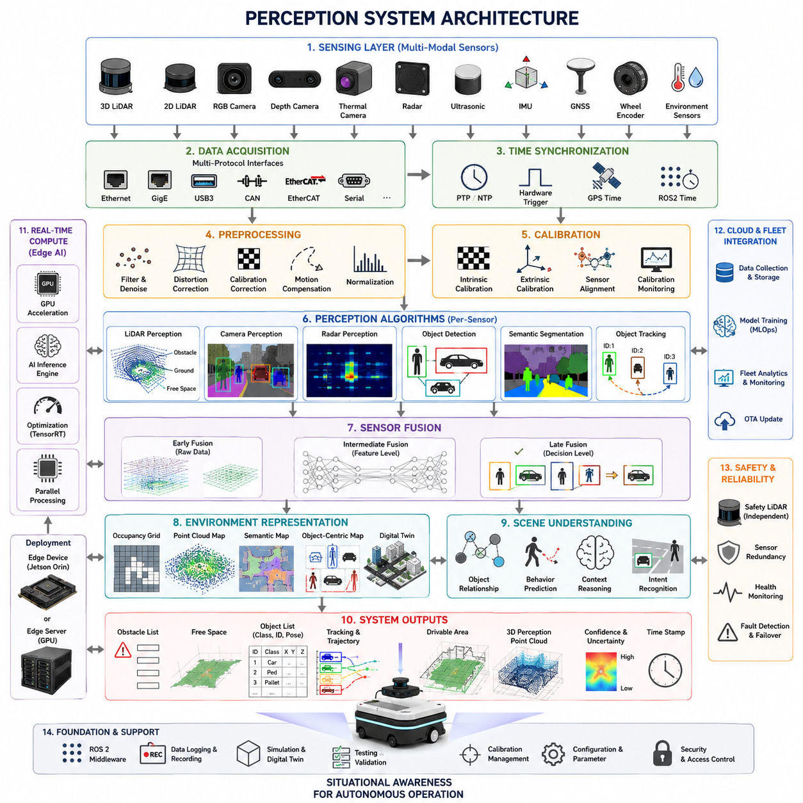
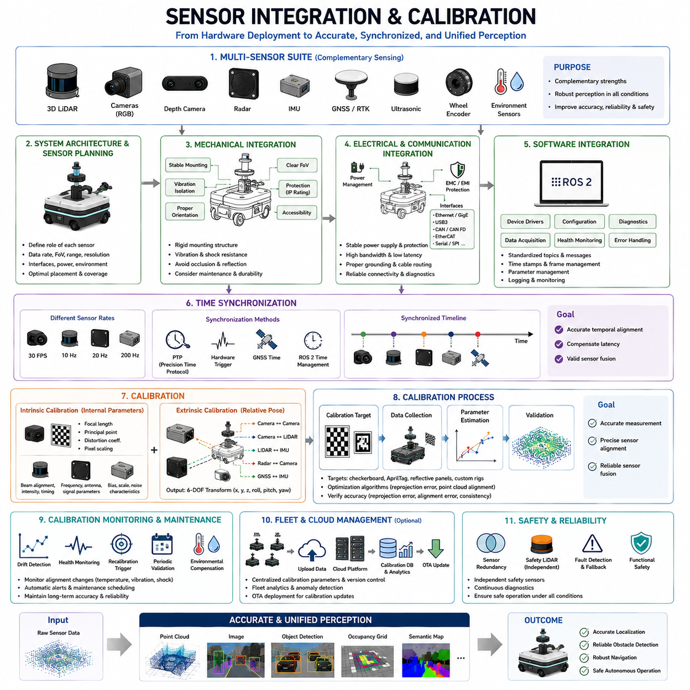
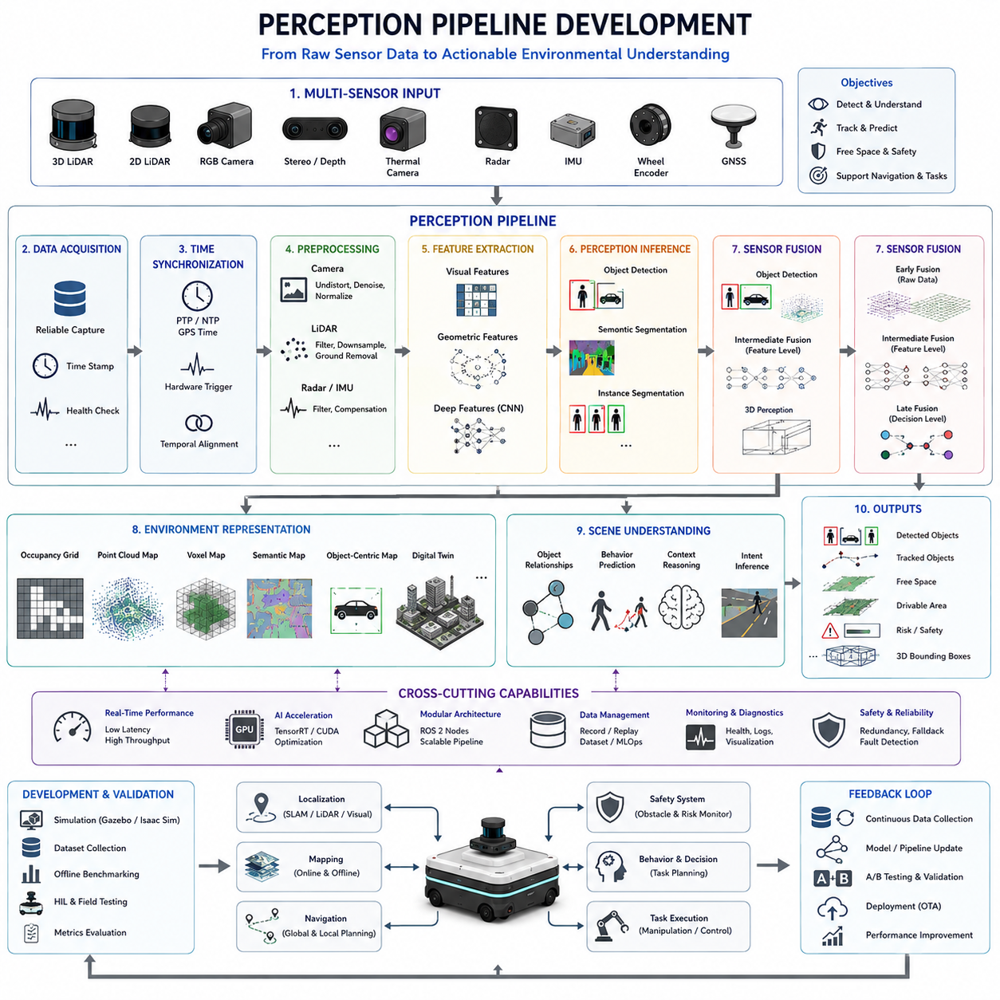
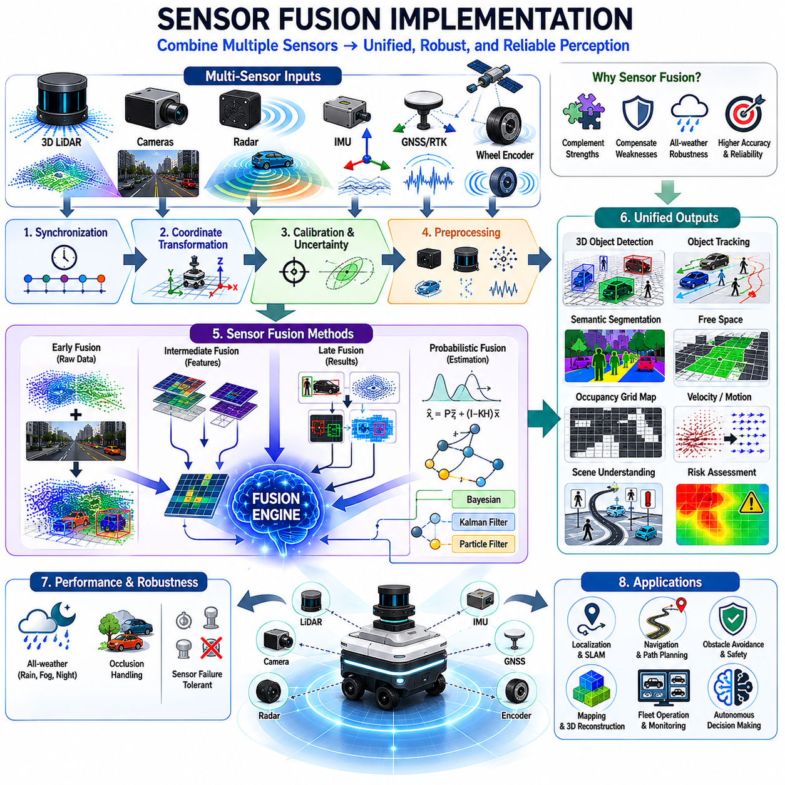
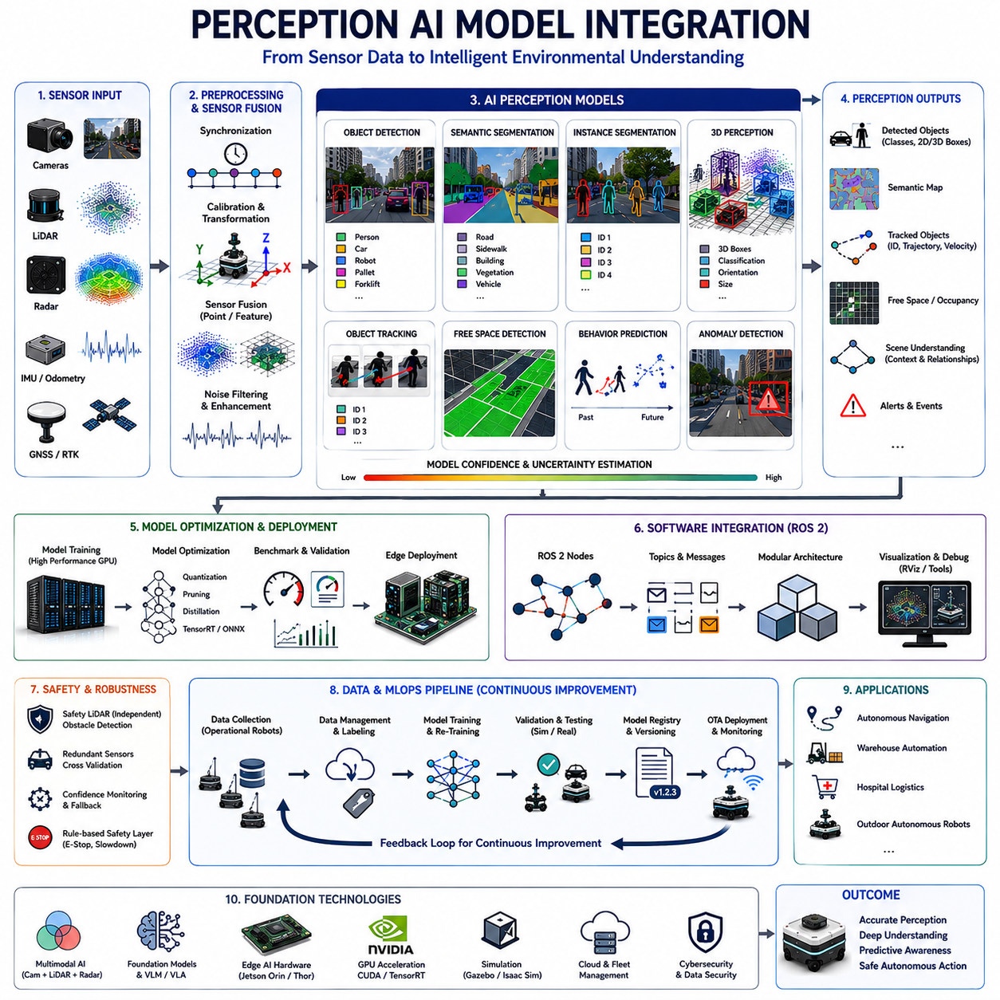
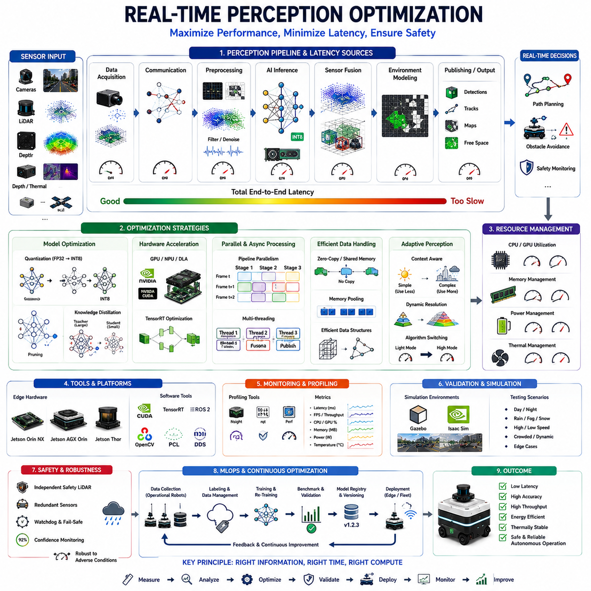
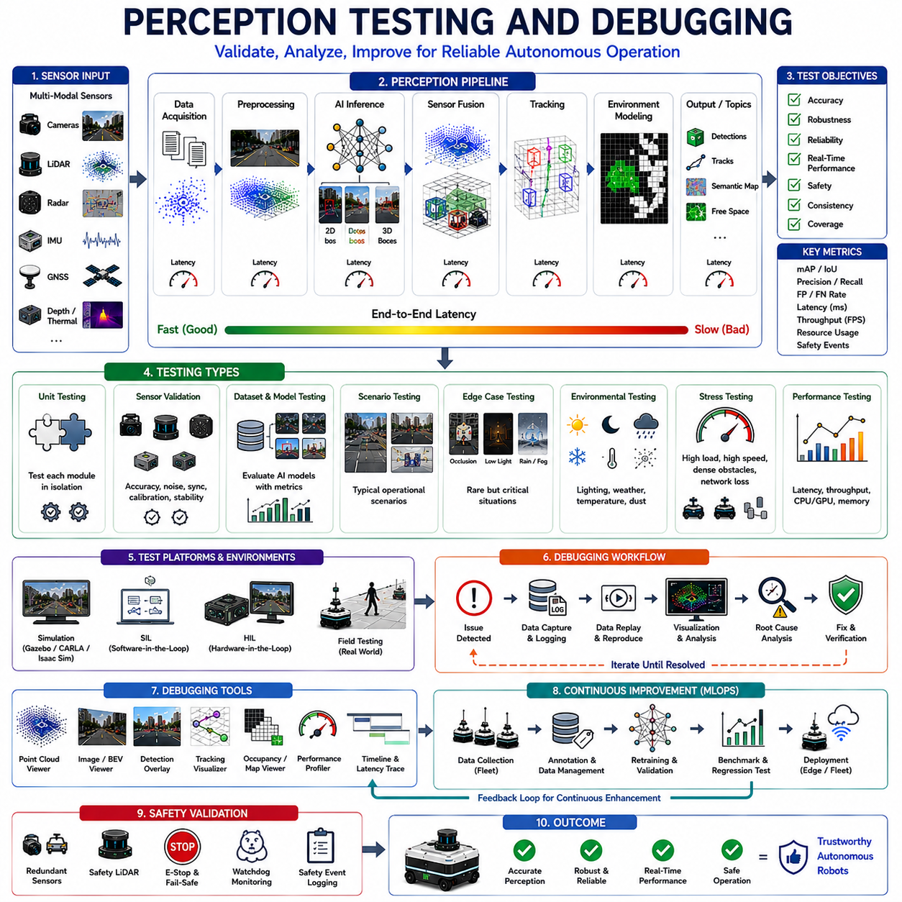
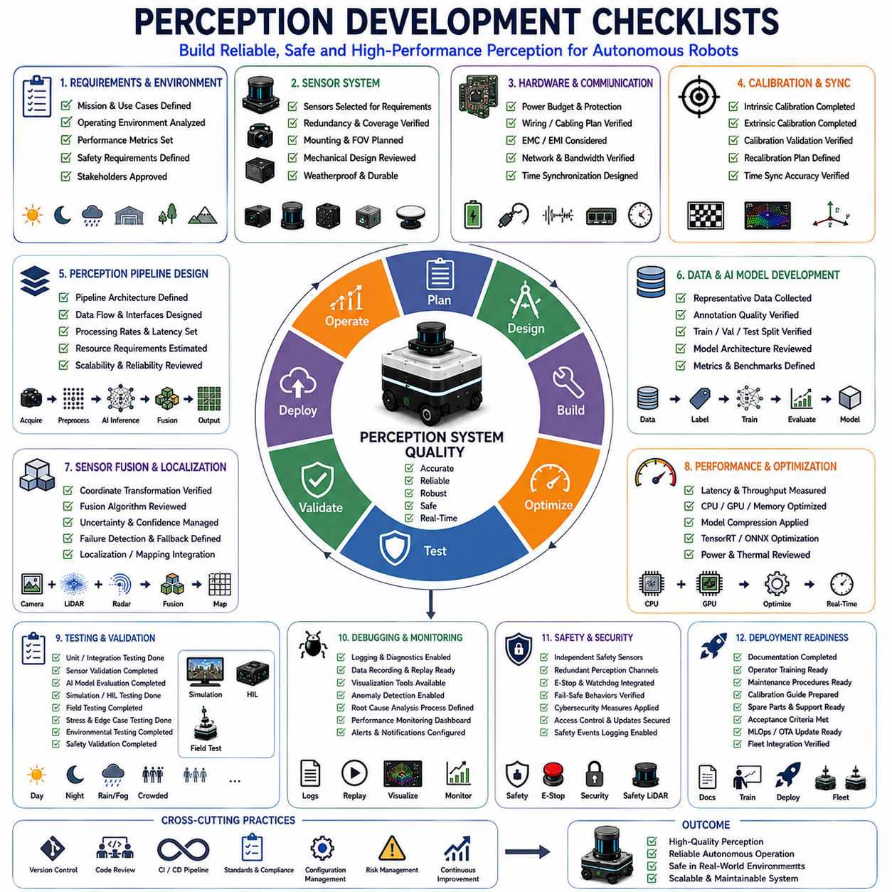

**Volume 10. AMR Engineering Process and Development Manual**

# Chapter07. Perception Development Workflow

## 07.01 Perception System Architecture

{width="7.268055555555556in" height="7.268055555555556in"}

Perception System Architecture is one of the most critical foundations of an Autonomous Mobile Robot (AMR). The perception subsystem acts as the robot's sensory nervous system, continuously observing the surrounding environment, interpreting incoming information, identifying relevant objects and events, and providing situational awareness to localization, mapping, navigation, safety, and AI decision-making modules. Without a robust perception architecture, even the most advanced planning and control algorithms cannot operate reliably because they depend entirely on accurate environmental understanding. Within a modern AMR, perception serves as the bridge between the physical world and the robot's digital intelligence, transforming raw sensor signals into meaningful representations of the environment. The Perception Development Workflow includes system architecture design, sensor integration, data processing pipelines, sensor fusion, AI model integration, optimization, validation, and deployment. This chapter introduces the overall architecture of perception systems and explains how various hardware and software components interact to create a complete perception solution.

The perception architecture begins with a clear understanding of operational requirements. Different robots require different perception capabilities depending on their intended environments and missions. A hospital delivery robot operating indoors requires precise human detection, corridor navigation, and elevator interaction. A logistics robot in a warehouse requires pallet recognition, obstacle avoidance, and dynamic traffic awareness. An outdoor autonomous robot must operate in changing weather conditions, varying lighting environments, uneven terrain, and mixed traffic scenarios involving pedestrians, vehicles, and infrastructure. Therefore, perception architecture must be designed around operational goals rather than sensor specifications alone.

At the highest level, a perception system can be divided into multiple layers. These layers include sensor acquisition, sensor synchronization, sensor preprocessing, perception algorithms, sensor fusion, environmental representation, AI-based scene understanding, and downstream interfaces. Each layer performs a specific function and contributes to transforming raw physical measurements into actionable intelligence. The architecture must be modular, scalable, maintainable, and capable of supporting future upgrades without major redesign.

The first layer is the sensing layer. This layer contains all physical sensors mounted on the robot platform. Modern AMRs typically use multiple sensor modalities because no single sensor can reliably handle all operating conditions. A perception architecture commonly includes 3D LiDAR, 2D safety LiDAR, RGB cameras, depth cameras, thermal cameras, radar sensors, ultrasonic sensors, GNSS receivers, IMUs, wheel encoders, and environmental sensors. Each sensor provides unique advantages and limitations. LiDAR offers accurate geometric information and distance measurements. Cameras provide rich semantic information and visual context. Radar performs well in rain, fog, dust, and low-visibility environments. Thermal cameras detect heat signatures and improve perception during nighttime operations. IMUs provide motion estimation and orientation data. GNSS supplies global positioning information for outdoor environments.

The sensor acquisition subsystem is responsible for collecting data from all connected sensors. This subsystem manages communication interfaces such as Ethernet, GigE Vision, USB3, CAN, EtherCAT, Serial, SPI, and proprietary sensor protocols. Since perception performance depends heavily on data integrity, acquisition software must ensure reliable packet transmission, timestamp preservation, error detection, and fault monitoring. Lost frames, corrupted packets, or communication delays can negatively affect downstream perception accuracy.

After acquisition, sensor synchronization becomes essential. Since sensors operate at different frequencies, accurate time alignment is required before fusion can occur. A camera may operate at 30 FPS, a LiDAR at 10 Hz, an IMU at 200 Hz, and a radar at 20 Hz. If these sensors are not synchronized properly, the robot may perceive an inconsistent representation of reality. Modern perception systems use synchronized timestamps through Precision Time Protocol (PTP), Network Time Protocol (NTP), hardware triggering mechanisms, GPS clocks, or ROS2 time synchronization frameworks. Time synchronization ensures that sensor measurements correspond to the same physical moment.

The next layer is sensor preprocessing. Raw sensor outputs typically contain noise, distortions, missing values, and environmental artifacts. Preprocessing improves data quality before higher-level algorithms consume the information. LiDAR preprocessing includes point cloud filtering, ground segmentation, outlier removal, intensity normalization, and motion compensation. Camera preprocessing includes image rectification, lens distortion correction, exposure normalization, color balancing, and image enhancement. Radar preprocessing includes clutter suppression, Doppler filtering, and target extraction. IMU preprocessing includes bias compensation, drift correction, and signal filtering.

Data quality directly influences perception performance. Therefore, calibration becomes a fundamental component of perception architecture. Calibration consists of intrinsic calibration and extrinsic calibration. Intrinsic calibration determines internal sensor parameters such as focal length, lens distortion coefficients, and sensor geometry. Extrinsic calibration determines the spatial relationship between sensors. For example, the transformation between a LiDAR coordinate frame and a camera coordinate frame must be accurately known to perform sensor fusion. Even small calibration errors can produce significant perception inaccuracies. Therefore, perception systems often include calibration monitoring and recalibration procedures throughout the robot lifecycle.

Once sensor data has been synchronized and preprocessed, perception algorithms begin extracting meaningful information. These algorithms operate on individual sensor streams before fusion occurs. LiDAR perception algorithms detect obstacles, estimate object dimensions, segment ground surfaces, identify traversable regions, and generate occupancy representations. Camera perception algorithms perform object detection, semantic segmentation, instance segmentation, lane detection, traffic sign recognition, human pose estimation, and visual classification. Radar algorithms estimate object velocity, track moving targets, and improve detection reliability in adverse weather conditions.

Object detection is one of the most important perception functions. Modern perception architectures typically use deep learning models such as YOLO, Faster R-CNN, RetinaNet, SSD, DETR, or transformer-based architectures. These models identify pedestrians, vehicles, forklifts, pallets, machinery, robots, obstacles, and infrastructure components. Detection outputs include object classes, confidence scores, bounding boxes, and spatial coordinates. Detection performance depends on dataset quality, model architecture, sensor quality, and environmental conditions.

Semantic segmentation provides pixel-level scene understanding. Instead of detecting individual objects only, segmentation classifies every pixel in an image into categories such as road, sidewalk, grass, building, wall, vehicle, human, obstacle, or free space. Semantic segmentation improves navigation, path planning, and environment understanding by enabling the robot to distinguish between traversable and non-traversable regions. Advanced perception systems often combine object detection and segmentation for richer environmental representations.

Object tracking extends detection capabilities by maintaining temporal consistency across frames. Tracking algorithms estimate object trajectories, velocities, directions, and future motion predictions. Multi-object tracking systems help robots understand dynamic environments and predict interactions with moving entities. Common tracking approaches include Kalman Filters, Extended Kalman Filters, Particle Filters, JPDA, SORT, DeepSORT, and transformer-based tracking architectures.

The sensor fusion layer combines information from multiple sensors to improve perception accuracy and robustness. Sensor fusion addresses the weaknesses of individual sensors while leveraging their complementary strengths. A camera may provide rich semantic information but struggle in darkness. A LiDAR may provide precise geometry but lack texture information. Radar may detect moving objects through rain and fog but provide lower resolution. By combining all three sensors, perception accuracy improves significantly.

Fusion architectures can be categorized as early fusion, intermediate fusion, and late fusion. Early fusion combines raw sensor data before feature extraction. Intermediate fusion combines learned feature representations generated by neural networks. Late fusion combines independent perception outputs such as object detections and tracking results. Each fusion strategy offers advantages depending on computational resources, latency requirements, and application constraints.

Environmental representation forms the next stage of perception architecture. After objects, obstacles, and free space have been identified, the robot must maintain a structured representation of the surrounding world. Common representations include occupancy grids, voxel maps, point cloud maps, semantic maps, object-centric maps, and digital twin environments. These representations provide input to localization, mapping, navigation, and planning systems.

Free-space detection is particularly important for autonomous navigation. The robot must continuously determine which areas are safe for movement. Free-space estimation combines geometric information from LiDAR and depth sensors with semantic information from cameras and AI models. The resulting representation defines navigable regions, obstacles, safety margins, and restricted areas. Navigation algorithms rely heavily on free-space outputs to generate safe trajectories.

Scene understanding represents a higher level of perception intelligence. Beyond detecting objects, the robot must understand contextual relationships within the environment. For example, the system should recognize that a person standing near a doorway may enter the robot's path, that a forklift carrying cargo behaves differently than a stationary forklift, or that construction barriers indicate temporary navigation restrictions. Scene understanding incorporates object relationships, semantic reasoning, contextual inference, and AI-driven interpretation.

Modern perception architectures increasingly integrate foundation models, multimodal AI, and vision-language models. These systems combine visual perception with language understanding to enable richer environmental interpretation. Instead of simply detecting a door, the robot may understand that the door is an emergency exit. Instead of recognizing a person, the robot may infer behavioral intent based on posture, motion, and environmental context. Such capabilities support next-generation embodied AI systems.

Real-time performance is a defining requirement of perception architecture. Perception outputs must be delivered within strict latency constraints. A perception system that generates highly accurate results but requires several seconds of processing is unsuitable for autonomous navigation. Therefore, architecture design must balance accuracy, computational cost, power consumption, and response time. Edge AI platforms such as Jetson Orin NX, Jetson AGX Orin, Jetson Thor, and GPU-based edge servers are commonly used to accelerate perception workloads.

Performance optimization includes GPU acceleration, TensorRT deployment, model quantization, pruning, batch optimization, asynchronous processing, multithreading, and pipeline parallelization. High-performance AMRs often separate perception processing into dedicated computational domains, allowing perception, localization, navigation, and AI reasoning to operate concurrently without resource contention.

Functional safety considerations are integrated throughout the perception architecture. Safety-critical perception functions require redundancy, fault detection, health monitoring, and graceful degradation mechanisms. Safety LiDAR systems operate independently from AI-based perception systems to ensure reliable obstacle detection even when AI models fail. Redundant sensors improve resilience against hardware failures and environmental disturbances. Continuous self-diagnostics monitor sensor health, communication integrity, calibration status, and processing latency.

Perception architecture must also support scalability and maintainability. As new sensors, AI models, and perception algorithms become available, the architecture should allow modular integration without disrupting existing functionality. ROS2-based architectures commonly use modular nodes, message interfaces, middleware abstraction, and containerized deployment strategies to support scalable perception development. Well-designed software architectures reduce integration complexity and accelerate development cycles.

Cloud and edge integration further enhance perception capabilities. Edge systems perform real-time inference and decision-making, while cloud infrastructure supports dataset collection, model retraining, performance monitoring, fleet analytics, and perception validation. Operational data collected from deployed robots continuously improves perception models through MLOps pipelines, enabling long-term performance enhancement across entire robot fleets.

Testing and validation are essential components of perception architecture development. Validation activities include sensor calibration verification, detection accuracy measurement, segmentation benchmarking, tracking performance evaluation, fusion robustness analysis, environmental stress testing, adverse weather testing, nighttime operation validation, and field deployment assessments. Simulation environments and digital twins enable large-scale testing before physical deployment. Field testing then confirms performance under real-world conditions.

Ultimately, a Perception System Architecture serves as the foundation of autonomous intelligence. It enables robots to perceive, understand, interpret, and interact with complex environments safely and efficiently. A successful architecture combines robust sensing, accurate synchronization, reliable preprocessing, advanced AI perception, intelligent sensor fusion, real-time optimization, safety mechanisms, and scalable software design. As AMR technology continues to evolve toward embodied intelligence and autonomous decision-making, perception architectures will become increasingly sophisticated, integrating multimodal reasoning, world models, and foundation AI systems that enable robots to understand the physical world with human-like awareness and operational reliability.

## 07.02 Sensor Integration and Calibration

{width="7.268055555555556in" height="7.268055555555556in"}

Sensor Integration and Calibration form the foundation of every successful perception system in an Autonomous Mobile Robot (AMR). Regardless of how advanced perception algorithms, artificial intelligence models, localization systems, or navigation software may be, their performance ultimately depends on the quality, consistency, and accuracy of the sensor data entering the system. A robot can only understand its environment as accurately as its sensors allow. Consequently, sensor integration and calibration are among the most critical engineering activities during robot development. They directly influence perception accuracy, localization stability, obstacle detection reliability, safety performance, and autonomous decision-making quality. Within the Perception Development Workflow, sensor integration and calibration serve as the bridge between hardware deployment and software intelligence, ensuring that all sensing components operate as a coherent and synchronized perception platform.

Modern AMRs rely on a diverse collection of sensors to achieve reliable environmental awareness. A single sensor cannot provide sufficient information under all operating conditions. Cameras provide rich semantic information but may struggle in darkness or poor weather conditions. LiDAR offers highly accurate geometric measurements but lacks visual semantics. Radar performs reliably in fog, dust, rain, and snow but often has lower spatial resolution. GNSS provides global positioning but may be unavailable indoors or in urban canyons. IMUs provide motion information but suffer from drift over time. Therefore, modern robotic systems integrate multiple complementary sensors to achieve robust perception and navigation performance.

Sensor integration begins with system-level architecture planning. Before physical installation occurs, engineers must define the purpose of each sensor, its expected operating range, data rate requirements, computational requirements, communication interfaces, environmental protection needs, and contribution to the overall perception pipeline. Sensor placement decisions significantly affect perception performance. A poorly positioned sensor may experience occlusions, vibration, electromagnetic interference, or environmental contamination that degrades data quality. Consequently, integration activities begin during the early system architecture phase rather than after hardware assembly.

Mechanical integration is the first stage of sensor deployment. Sensors must be mounted securely on the robot platform while maintaining structural stability under vibration, acceleration, shock loading, and environmental disturbances. Outdoor autonomous robots operating on rough terrain often experience significant mechanical stresses that can alter sensor alignment over time. Therefore, sensor mounting structures must be designed with adequate rigidity, vibration isolation, and environmental protection. Sensor brackets, mounting plates, shock absorbers, and protective housings become important components of the overall perception architecture.

LiDAR mounting is particularly critical because even small orientation errors can produce substantial mapping and localization inaccuracies. A one-degree mounting error may result in significant position deviations over long distances. Similarly, camera mounting must ensure stable optical alignment while minimizing vibration-induced image blur. Radar sensors require careful positioning to avoid reflections from robot structures and metallic components. GNSS antennas must be placed where satellite visibility is maximized and electromagnetic interference is minimized. Thermal cameras require thermal isolation to prevent heat generated by onboard electronics from affecting measurements.

Electrical integration follows mechanical installation. Each sensor requires stable power delivery, reliable communication channels, proper grounding, and electromagnetic compatibility. Power distribution design must account for sensor startup currents, operating power requirements, voltage tolerances, and transient conditions. Inadequate power regulation can cause sensor resets, unstable outputs, or intermittent communication failures. Therefore, dedicated power management strategies are often implemented for perception subsystems.

Communication architecture is another essential aspect of sensor integration. Modern AMRs commonly use Ethernet, Gigabit Ethernet, USB3, CAN, EtherCAT, RS232, RS485, SPI, and proprietary communication interfaces. High-bandwidth sensors such as 3D LiDARs and high-resolution cameras typically utilize Gigabit Ethernet or USB3 connections. Lower-bandwidth sensors such as IMUs, wheel encoders, and ultrasonic sensors may use CAN or serial communication. Integration engineers must carefully evaluate bandwidth requirements, latency constraints, packet loss tolerance, and synchronization capabilities when designing communication architectures.

Once sensors are physically integrated, software integration begins. Device drivers provide communication interfaces between hardware devices and perception software. Sensor drivers must support configuration management, data acquisition, diagnostics, health monitoring, and error handling. In ROS2-based systems, sensor drivers typically publish data through standardized topics, enabling perception modules to access sensor information through consistent software interfaces. Standardization simplifies system integration and improves software maintainability.

Time synchronization is one of the most important elements of sensor integration. Since different sensors operate at different frequencies and processing latencies, accurate temporal alignment is essential for sensor fusion. For example, a camera may capture images at 30 frames per second while a LiDAR produces point clouds at 10 Hz and an IMU generates measurements at 200 Hz. Without synchronization, sensor fusion algorithms may combine observations from different physical moments, leading to inaccurate environmental representations.

Several synchronization techniques are commonly used in robotic systems. Precision Time Protocol (PTP) provides high-accuracy network-based synchronization. Network Time Protocol (NTP) offers simpler synchronization suitable for less demanding applications. Hardware triggering mechanisms allow multiple sensors to capture measurements simultaneously. GPS-based timing systems provide globally synchronized timestamps for outdoor robots. ROS2 middleware additionally supports synchronized message handling and timestamp management throughout the perception pipeline.

Data synchronization extends beyond timestamps. Sensors may exhibit varying delays due to exposure times, signal processing pipelines, communication latency, or buffering mechanisms. Therefore, integration engineers must characterize sensor latency and compensate for timing offsets. Accurate latency modeling becomes increasingly important in high-speed autonomous robots where perception delays directly influence navigation performance and safety margins.

Calibration is the process of establishing accurate mathematical relationships between sensors and their physical environment. Calibration ensures that sensor measurements correctly represent reality and that information from multiple sensors can be combined consistently. Calibration activities are typically divided into intrinsic calibration and extrinsic calibration.

Intrinsic calibration focuses on internal sensor characteristics. For cameras, intrinsic calibration estimates focal length, principal point location, distortion coefficients, pixel scaling factors, and lens characteristics. These parameters allow software to correct optical distortions and accurately interpret image measurements. Without proper intrinsic calibration, object detection accuracy, depth estimation performance, and visual localization quality may degrade significantly.

LiDAR intrinsic calibration addresses beam alignment, intensity normalization, timing offsets, and measurement consistency. Radar intrinsic calibration compensates for frequency drift, antenna characteristics, and signal processing parameters. IMU intrinsic calibration estimates accelerometer biases, gyroscope biases, scale factors, and sensor noise characteristics. Each sensor type requires specialized calibration procedures tailored to its operating principles and measurement models.

Extrinsic calibration determines the geometric relationship between sensors. This process estimates the relative position and orientation of each sensor within a common coordinate framework. Extrinsic calibration is essential because sensor fusion requires measurements from different sensors to be represented within a unified reference frame. For example, a detected object in camera coordinates must be transformed into LiDAR coordinates before data fusion can occur.

Camera-to-camera calibration establishes stereo vision systems. Camera-to-LiDAR calibration enables visual-semantic information to be projected onto point clouds. LiDAR-to-IMU calibration supports SLAM and localization algorithms. Radar-to-camera calibration combines velocity information with visual object classification. GNSS-to-IMU calibration improves navigation performance through tightly coupled sensor fusion. Accurate extrinsic calibration is a prerequisite for all advanced perception architectures.

Calibration targets are commonly used during calibration procedures. Checkerboard patterns, AprilTags, ArUco markers, retroreflective targets, calibration panels, and specially designed geometric structures provide known reference points that facilitate parameter estimation. Modern calibration software automatically detects target features and computes transformation parameters using optimization algorithms. Nevertheless, calibration quality remains highly dependent on data quality, target visibility, environmental conditions, and measurement diversity.

Automated calibration tools have become increasingly important in large-scale robotic deployments. Manual calibration processes are often time-consuming and difficult to maintain across large robot fleets. Automated calibration systems continuously monitor sensor alignment and detect calibration drift during operation. Such systems reduce maintenance costs and improve long-term operational reliability.

Calibration validation is equally important as calibration execution. After calibration parameters are estimated, engineers must verify accuracy through quantitative evaluation methods. Reprojection error analysis is commonly used for camera calibration. Point cloud alignment error metrics evaluate LiDAR calibration quality. Sensor fusion consistency checks verify multi-sensor alignment. Validation procedures ensure that calibration results satisfy operational performance requirements.

Environmental conditions significantly influence calibration stability. Temperature changes can alter sensor dimensions and mechanical alignment. Vibration may gradually loosen mounting structures. Mechanical impacts may shift sensor orientations. Outdoor environments introduce dust, moisture, and thermal expansion effects that influence long-term calibration accuracy. Therefore, calibration should not be viewed as a one-time manufacturing activity but rather as a continuous lifecycle management process.

Sensor fusion performance depends directly on calibration accuracy. Small extrinsic calibration errors can create substantial perception inaccuracies. For example, a few millimeters of camera-LiDAR alignment error may cause object boundaries to shift significantly at longer distances. Such errors can reduce object detection confidence, degrade tracking performance, and negatively impact autonomous navigation. Therefore, calibration accuracy often becomes a limiting factor in overall perception performance.

Modern AMRs frequently implement calibration monitoring systems that continuously evaluate sensor consistency during operation. These systems compare expected sensor relationships against actual observations and generate warnings when deviations exceed predefined thresholds. Calibration health monitoring improves reliability and supports predictive maintenance strategies.

The increasing adoption of AI-based perception systems introduces additional calibration challenges. Deep learning models are often trained using calibrated datasets. Changes in sensor characteristics or alignment may introduce domain shifts that reduce model performance. Consequently, calibration management becomes closely linked with AI model management and MLOps processes. Organizations deploying large robot fleets often maintain calibration databases, version-controlled calibration parameters, and automated validation pipelines to ensure consistency across all deployed platforms.

In outdoor autonomous robots, calibration complexity increases due to the larger number of sensors and environmental variability. Systems may include multiple LiDARs, multiple cameras, radars, GNSS receivers, dual-antenna RTK systems, IMUs, thermal cameras, and specialized inspection sensors. Each additional sensor increases integration complexity and calibration requirements. Robust architecture design, standardized integration procedures, and automated calibration workflows become essential for maintaining system performance.

Simulation environments also play an important role in sensor integration and calibration. Digital twins and simulation platforms such as Gazebo and Isaac Sim enable engineers to validate sensor placement, evaluate calibration procedures, test synchronization strategies, and analyze perception performance before physical deployment. Virtual testing reduces development risk and accelerates integration cycles.

Functional safety considerations must also be incorporated into sensor integration architecture. Safety-critical sensors require independent validation paths, redundancy mechanisms, and fault detection capabilities. Safety LiDAR systems often operate separately from AI perception pipelines to ensure reliable obstacle detection even during perception software failures. Redundant sensors provide additional resilience against hardware malfunctions and environmental disturbances.

Cloud-connected robot platforms increasingly utilize remote calibration management systems. Calibration parameters can be stored centrally, distributed to deployed robots, and monitored across entire fleets. Fleet-wide analytics identify common calibration issues, detect recurring failure modes, and support continuous improvement initiatives. Such capabilities become increasingly valuable as autonomous robot deployments scale from individual robots to hundreds or thousands of units.

Ultimately, Sensor Integration and Calibration serve as the foundation upon which all perception capabilities are built. Successful integration ensures that sensors operate reliably, communicate efficiently, and provide consistent measurements. Accurate calibration ensures that sensor outputs correspond to physical reality and can be fused into a unified environmental representation. Together, these disciplines enable robust perception, reliable localization, accurate obstacle detection, effective navigation, and safe autonomous operation. As robotics systems continue evolving toward higher levels of autonomy and embodied intelligence, sensor integration and calibration will remain essential engineering disciplines that determine the overall effectiveness, safety, and reliability of autonomous robotic platforms.

## 07.03 Perception Pipeline Development

{width="7.268055555555556in" height="7.268055555555556in"}

Perception Pipeline Development is the engineering process of transforming raw sensor data into meaningful environmental understanding that can be utilized by localization, mapping, navigation, safety, and autonomous decision-making systems. Within an Autonomous Mobile Robot (AMR), the perception pipeline acts as the primary information processing chain that continuously converts physical observations into structured knowledge. While sensor integration and calibration establish the foundation for data acquisition, the perception pipeline provides the computational architecture that interprets sensor measurements and generates actionable outputs. A well-designed perception pipeline enables robots to detect objects, recognize free space, understand dynamic environments, track moving entities, estimate risks, and support intelligent autonomous behaviors. Consequently, perception pipeline development represents one of the most critical engineering activities within the Perception Development Workflow.

A perception pipeline can be viewed as a sequence of interconnected processing stages through which sensor data flows. Each stage performs a specific transformation, progressively converting raw measurements into higher-level semantic information. The pipeline begins with sensor acquisition and proceeds through synchronization, preprocessing, feature extraction, perception inference, sensor fusion, environmental representation, scene understanding, and output generation. Every stage contributes to the overall perception quality, and deficiencies in any stage can negatively affect downstream components.

The development process begins with defining perception objectives. Different robotic applications require different perception capabilities. A hospital delivery robot may prioritize human detection, elevator interaction, and corridor navigation. A warehouse robot may focus on pallet recognition, forklift tracking, and inventory identification. An outdoor inspection robot may require terrain classification, infrastructure detection, vehicle recognition, and adverse weather perception. Therefore, perception pipelines must be designed around operational requirements rather than generic perception functions.

The first stage of the pipeline is sensor data acquisition. This stage collects information from all sensing devices installed on the robot. Typical sensors include 3D LiDARs, 2D safety LiDARs, RGB cameras, stereo cameras, depth cameras, thermal cameras, radar systems, ultrasonic sensors, IMUs, wheel encoders, and GNSS receivers. Each sensor generates different types of information and operates at different frequencies. The acquisition subsystem must ensure reliable communication, accurate timestamps, data integrity verification, and fault handling mechanisms. Since all downstream processing depends on acquired data quality, acquisition reliability is a fundamental requirement.

Following acquisition, data synchronization aligns measurements from multiple sensors in time. A camera operating at thirty frames per second, a LiDAR operating at ten hertz, and an IMU operating at two hundred hertz produce data streams that must be correlated accurately. Time synchronization ensures that information used for sensor fusion represents the same physical state of the environment. Synchronization errors can introduce inconsistencies that degrade object detection, localization accuracy, and obstacle tracking performance. Modern perception pipelines employ hardware synchronization, Precision Time Protocol, Network Time Protocol, GPS timing references, and middleware timestamp management to achieve temporal consistency.

The preprocessing stage prepares sensor data for perception algorithms. Raw sensor outputs often contain noise, distortion, missing values, environmental artifacts, and communication-induced irregularities. Preprocessing improves data quality and standardizes information before higher-level analysis begins. Camera preprocessing typically includes lens distortion correction, exposure adjustment, image normalization, color balancing, denoising, and image enhancement. LiDAR preprocessing involves outlier removal, motion compensation, ground filtering, point cloud downsampling, and intensity normalization. Radar preprocessing includes clutter suppression, signal filtering, and target extraction. IMU preprocessing incorporates bias compensation, drift correction, and signal smoothing.

Data quality management is a major responsibility of the preprocessing layer. Sensors operating in real-world environments frequently encounter challenging conditions such as rain, fog, dust, glare, shadows, reflections, vibration, electromagnetic interference, and sensor contamination. Robust preprocessing algorithms must identify and mitigate these effects without introducing significant latency. In safety-critical robotic systems, preprocessing modules also provide data validation functions that detect abnormal sensor behavior and initiate fault recovery procedures.

Feature extraction constitutes the next stage of perception pipeline development. Features represent meaningful patterns extracted from sensor measurements. Traditional perception systems relied heavily on handcrafted features such as edges, corners, gradients, geometric descriptors, and statistical properties. Modern AI-driven perception systems increasingly utilize deep neural networks that automatically learn hierarchical feature representations from large datasets. Regardless of implementation method, feature extraction serves as the bridge between raw sensor data and perception intelligence.

In camera-based perception systems, feature extraction may identify visual structures such as edges, textures, shapes, colors, and object boundaries. Deep convolutional neural networks generate high-dimensional feature maps that encode semantic information useful for object recognition and scene understanding. In LiDAR systems, geometric features such as planes, corners, clusters, and spatial distributions are extracted from point clouds. Radar systems derive velocity signatures, Doppler characteristics, and target reflection patterns. These extracted features provide the foundation for perception inference algorithms.

Object detection is one of the most important functions within a perception pipeline. Detection algorithms identify and classify entities within the environment, including pedestrians, vehicles, robots, pallets, forklifts, infrastructure elements, obstacles, and operational equipment. Modern perception systems frequently employ deep learning models such as YOLO, Faster R-CNN, SSD, RetinaNet, DETR, and transformer-based architectures. These models produce object classifications, confidence scores, bounding boxes, and spatial coordinates. Detection outputs provide essential information for navigation, safety monitoring, and operational decision-making.

Semantic segmentation expands perception capabilities beyond object detection by classifying every pixel within an image. Instead of merely identifying objects, segmentation enables comprehensive scene understanding by labeling roads, sidewalks, walls, floors, vegetation, buildings, machinery, free space, and restricted areas. Segmentation outputs provide rich environmental context that supports navigation planning, localization enhancement, and risk assessment. In industrial robotics applications, segmentation often contributes significantly to operational safety and efficiency.

Instance segmentation further extends semantic segmentation by distinguishing individual objects belonging to the same category. For example, rather than identifying multiple people as a single semantic class, instance segmentation identifies each person separately. This capability improves object tracking, behavioral analysis, and human-robot interaction performance.

Object tracking is another essential perception pipeline component. Detection algorithms identify objects independently within each frame, but tracking algorithms establish temporal continuity across consecutive observations. Tracking systems estimate trajectories, velocities, accelerations, and future motion patterns. Accurate tracking enables robots to anticipate environmental changes and make proactive decisions. Common tracking approaches include Kalman Filters, Extended Kalman Filters, Particle Filters, Multiple Hypothesis Tracking, SORT, DeepSORT, and transformer-based tracking frameworks.

Free-space detection represents a critical output of perception pipelines used for autonomous navigation. The robot must continuously identify regions that are safe for traversal while distinguishing obstacles, hazards, restricted zones, and inaccessible areas. Free-space estimation combines geometric information from LiDARs and depth sensors with semantic information from cameras and AI models. The resulting navigable area representation becomes a primary input to path planning and motion control systems.

Obstacle detection and classification are closely related functions. Obstacles may be static or dynamic, known or unknown, temporary or permanent. Effective perception pipelines must identify obstacle boundaries, estimate dimensions, classify obstacle types, and determine movement characteristics. Dynamic obstacle understanding becomes especially important in environments shared with humans, vehicles, forklifts, and other autonomous robots.

Three-dimensional perception has become increasingly important as robotic applications expand into complex environments. 3D perception pipelines combine LiDAR point clouds, stereo vision, depth cameras, and sensor fusion technologies to construct volumetric representations of the environment. These systems estimate object dimensions, spatial relationships, traversability conditions, and environmental structures. Advanced 3D perception enables robots to navigate uneven terrain, avoid overhead obstacles, understand multi-level environments, and perform infrastructure inspection tasks.

Sensor fusion represents a central component of modern perception pipelines. No individual sensor provides complete environmental awareness under all operating conditions. Sensor fusion combines complementary information from multiple sensing modalities to improve accuracy, robustness, and reliability. Cameras contribute semantic understanding, LiDARs provide geometric precision, radars offer all-weather detection capabilities, and IMUs support motion estimation. Fusion architectures integrate these diverse data sources into unified environmental representations.

Perception pipelines commonly implement early fusion, intermediate fusion, and late fusion strategies. Early fusion combines raw sensor measurements before feature extraction. Intermediate fusion merges feature representations generated by neural networks. Late fusion combines independent perception outputs such as object detections, classifications, and tracking results. The choice of fusion strategy depends on computational resources, latency requirements, sensor characteristics, and operational objectives.

Environmental representation is the stage where perception outputs are organized into structured models of the world. Various representation methods are used depending on application requirements. Occupancy grids describe traversable and occupied regions. Point cloud maps preserve geometric detail. Voxel maps provide volumetric representations. Semantic maps incorporate contextual understanding. Object-centric maps track dynamic entities. Digital twins integrate perception outputs into comprehensive virtual models of operational environments.

Scene understanding introduces higher-level reasoning capabilities into the perception pipeline. Beyond identifying individual objects, scene understanding interprets relationships, context, intent, and environmental meaning. For example, a perception system may recognize that a pedestrian standing near a crosswalk is likely to cross the robot's path. It may infer that a forklift carrying a pallet behaves differently from an unloaded forklift. Such contextual reasoning significantly improves autonomous decision-making quality.

Recent advances in artificial intelligence have transformed perception pipeline architectures. Foundation models, multimodal AI systems, vision-language models, and vision-language-action architectures enable richer environmental understanding than traditional perception approaches. These technologies combine visual perception, language understanding, contextual reasoning, and world knowledge. As a result, perception pipelines increasingly support cognitive capabilities previously associated with human intelligence.

Real-time performance is a defining requirement of perception pipeline development. Perception outputs must be generated within strict latency constraints to support safe autonomous operation. A highly accurate perception result that arrives too late may be operationally useless. Therefore, developers must carefully balance accuracy, computational complexity, power consumption, and response time. High-performance robotic systems frequently employ GPU acceleration, TensorRT optimization, CUDA processing, model quantization, pipeline parallelization, asynchronous execution, and multi-threaded architectures to achieve real-time performance.

Pipeline scalability is another important design consideration. As robotic capabilities expand, new sensors, algorithms, AI models, and perception functions may need to be integrated. Modular software architectures enable independent development, testing, deployment, and upgrading of perception components. ROS2-based architectures commonly utilize modular nodes, standardized message interfaces, containerized deployment mechanisms, and distributed processing frameworks to support long-term scalability.

Testing and validation play a critical role throughout perception pipeline development. Individual modules must be evaluated independently before full-system integration occurs. Detection accuracy, segmentation quality, tracking consistency, fusion robustness, latency performance, computational efficiency, and failure recovery behavior must all be measured systematically. Validation activities include simulation testing, dataset benchmarking, hardware-in-the-loop evaluation, field trials, stress testing, adverse weather testing, nighttime operation testing, and long-duration operational assessments.

Data recording and replay capabilities are particularly valuable during perception development. Engineers frequently utilize recorded datasets to reproduce failures, evaluate algorithm improvements, compare model versions, and analyze edge cases. Continuous data collection supports iterative pipeline refinement and contributes to long-term perception performance improvement through MLOps workflows.

Functional safety considerations must be incorporated throughout the perception pipeline architecture. Safety-critical perception functions require redundancy, health monitoring, fault detection, failover mechanisms, and independent validation paths. Safety LiDAR systems often operate separately from AI perception pipelines to ensure reliable obstacle detection under all operating conditions. Safety-oriented design principles ensure that perception failures do not directly lead to hazardous robot behavior.

Cloud and edge integration increasingly influence perception pipeline development. Edge computing platforms perform real-time inference and decision-making, while cloud infrastructure supports dataset management, model training, fleet analytics, performance monitoring, and continuous deployment workflows. Operational data collected from deployed robots continuously improves perception capabilities across entire fleets, enabling long-term autonomous system evolution.

Ultimately, Perception Pipeline Development transforms raw sensor measurements into intelligent environmental understanding. It integrates sensor acquisition, synchronization, preprocessing, feature extraction, AI inference, sensor fusion, environmental modeling, scene understanding, and output generation into a cohesive architecture. A well-designed perception pipeline provides the situational awareness necessary for safe, reliable, and efficient autonomous operation. As robotics systems continue progressing toward embodied intelligence and advanced autonomy, perception pipelines will evolve from simple data processing chains into sophisticated cognitive systems capable of understanding and interacting with the physical world in increasingly human-like ways.

## 07.04 Sensor Fusion Implementation

{width="7.268055555555556in" height="7.268055555555556in"}

Sensor Fusion Implementation is the process of combining information from multiple sensors into a unified, accurate, reliable, and comprehensive representation of the environment. In Autonomous Mobile Robots (AMRs), no individual sensor can provide complete environmental awareness under all operating conditions. Cameras provide rich semantic information but may struggle in darkness or adverse weather. LiDAR delivers highly accurate geometric measurements but lacks semantic understanding. Radar performs reliably in rain, fog, dust, and snow but often provides lower spatial resolution. IMUs provide motion information but accumulate drift over time. GNSS offers global positioning capabilities but can become unreliable indoors or in dense urban environments. Sensor fusion addresses these limitations by integrating complementary sensor characteristics into a single perception framework that is more robust, accurate, and resilient than any individual sensing modality. Within the Perception Development Workflow, sensor fusion implementation serves as the core mechanism that transforms isolated sensor measurements into a coherent environmental understanding capable of supporting autonomous navigation, localization, mapping, safety monitoring, and intelligent decision-making.

The concept of sensor fusion is based on the principle that multiple observations of the same environment can collectively provide better information than individual measurements. Each sensor contributes unique strengths while compensating for the weaknesses of others. For example, a camera may accurately identify a pedestrian but struggle to estimate distance. LiDAR can precisely measure distance but may not distinguish between a pedestrian and a stationary object without additional context. Radar can estimate velocity directly but provides less detailed shape information. By combining these observations, the robot gains a richer and more reliable understanding of its surroundings.

Sensor fusion development begins with defining fusion objectives. Different robotic applications require different fusion strategies. A warehouse robot may prioritize obstacle detection, pallet recognition, and forklift tracking. A hospital robot may emphasize human detection and corridor navigation. An outdoor autonomous robot may require terrain classification, vehicle detection, pedestrian tracking, and long-range environmental awareness. Therefore, fusion architecture must be designed around operational requirements rather than simply combining all available sensors.

The implementation process starts with sensor characterization. Engineers must understand the capabilities, limitations, accuracy, update frequency, latency, field of view, environmental sensitivity, and failure modes of each sensor. Sensor models are developed to describe measurement uncertainty and performance characteristics. These models form the mathematical foundation for fusion algorithms because fusion quality depends heavily on accurate uncertainty estimation.

Data synchronization is a prerequisite for successful sensor fusion. Since sensors operate at different frequencies and experience varying communication and processing delays, their measurements must be aligned temporally before fusion occurs. A camera frame captured at one moment cannot be fused reliably with a LiDAR scan captured significantly earlier or later. Therefore, synchronization mechanisms such as Precision Time Protocol, Network Time Protocol, hardware triggering, GPS timing references, and ROS2 timestamp management are implemented to ensure temporal consistency across all sensor streams.

Coordinate transformation is another essential component of sensor fusion implementation. Each sensor operates within its own coordinate frame. Cameras observe the world through image coordinates, LiDARs generate measurements within three-dimensional sensor coordinates, radars use their own reference systems, and GNSS measurements exist within global coordinate systems. Sensor fusion requires all observations to be transformed into a common coordinate framework. Accurate extrinsic calibration parameters provide the spatial relationships necessary for these transformations.

Uncertainty modeling plays a central role in sensor fusion. Every measurement contains noise and error. Fusion algorithms must account for uncertainty rather than assuming perfect measurements. Covariance matrices, probability distributions, confidence scores, and statistical error models describe the reliability of sensor observations. Effective uncertainty modeling enables fusion systems to weigh measurements appropriately and reject unreliable information when necessary.

Sensor fusion architectures are commonly categorized into three levels: early fusion, intermediate fusion, and late fusion. Early fusion combines raw sensor data before feature extraction occurs. Intermediate fusion combines learned feature representations generated by perception algorithms. Late fusion combines independent perception outputs such as detections, classifications, or tracking results. Each approach offers unique advantages and trade-offs.

Early fusion operates directly on raw sensor measurements. For example, LiDAR point clouds may be projected onto camera images before any object detection algorithms are executed. This approach provides maximum access to sensor information and can potentially achieve superior accuracy. However, early fusion often requires significant computational resources and complex synchronization mechanisms. It is particularly sensitive to calibration errors and sensor alignment issues.

Intermediate fusion combines features extracted independently from different sensors. Deep neural networks generate feature representations from camera images, LiDAR point clouds, radar signals, and other sensor modalities. These features are then merged within a shared representation space before higher-level inference occurs. Intermediate fusion has become increasingly popular in modern AI-based perception systems because it balances information richness with computational efficiency.

Late fusion combines independently generated perception results. For example, camera-based object detection may identify pedestrians while LiDAR-based clustering estimates object geometry. Fusion algorithms then merge these results into a unified object representation. Late fusion architectures are often easier to implement, more modular, and more robust to individual sensor failures. They are widely used in industrial robotic systems due to their practical deployment advantages.

Probabilistic fusion techniques represent one of the most widely used approaches in robotic systems. Bayesian estimation methods combine prior knowledge with sensor observations to estimate environmental states. Bayesian filtering continuously updates beliefs as new measurements arrive. These approaches naturally incorporate uncertainty and provide mathematically consistent frameworks for sensor fusion.

The Kalman Filter is among the most commonly used sensor fusion algorithms. It estimates system states by combining predictions with noisy measurements. Kalman Filters are particularly effective when system dynamics are approximately linear and measurement noise follows Gaussian distributions. Applications include vehicle localization, object tracking, velocity estimation, and sensor state fusion.

Extended Kalman Filters extend the Kalman Filter framework to nonlinear systems by linearizing system models around current estimates. Many robotic systems rely on Extended Kalman Filters for localization, navigation, and multi-sensor integration because real-world robot dynamics are often nonlinear.

Unscented Kalman Filters provide improved nonlinear estimation accuracy by propagating carefully selected sample points through nonlinear transformations. These methods often outperform Extended Kalman Filters in highly nonlinear environments while maintaining computational efficiency suitable for real-time applications.

Particle Filters represent another important sensor fusion technique. Unlike Kalman-based methods, Particle Filters can represent arbitrary probability distributions and handle highly nonlinear systems. They are widely used in localization, SLAM, and multi-hypothesis tracking applications where uncertainty may be complex and multimodal.

Modern perception systems increasingly incorporate deep learning-based fusion architectures. Neural networks can learn optimal fusion strategies directly from training data without requiring explicit mathematical models. Multimodal neural networks combine image features, point cloud representations, radar information, and temporal observations within unified architectures. Transformer-based fusion models further enhance the ability to capture long-range dependencies and cross-modal relationships.

Camera-LiDAR fusion is one of the most common implementations in AMRs. Cameras provide semantic understanding while LiDAR supplies accurate depth information. Combined systems support object detection, semantic segmentation, free-space estimation, obstacle classification, and scene understanding. Many state-of-the-art autonomous driving and robotic perception systems rely heavily on camera-LiDAR fusion architectures.

LiDAR-IMU fusion plays a critical role in localization and mapping systems. IMUs provide high-frequency motion information while LiDARs supply environmental observations. Fusion algorithms combine these complementary measurements to improve pose estimation accuracy, reduce drift, and support robust SLAM performance. Modern LiDAR SLAM systems often incorporate tightly coupled LiDAR-IMU fusion architectures.

GNSS-IMU fusion is widely used in outdoor autonomous robots. GNSS provides global position measurements while IMUs offer high-frequency motion updates. Fusion algorithms compensate for GNSS outages, multipath errors, and temporary signal degradation. High-precision RTK systems further improve localization performance when integrated with inertial measurements.

Radar-camera fusion has gained increasing importance in outdoor perception systems. Radar provides reliable velocity measurements and all-weather detection capabilities, while cameras contribute semantic understanding. Combined systems improve object tracking, collision avoidance, and environmental awareness under challenging weather conditions.

Multi-sensor object tracking represents a major application of sensor fusion. Tracking systems combine detections from multiple sensors to estimate object trajectories, velocities, accelerations, and future positions. Fusion improves tracking stability, reduces false positives, and maintains object identities during temporary sensor failures or occlusions.

Occupancy mapping is another important fusion application. LiDAR, radar, cameras, depth sensors, and localization information contribute to occupancy grid generation. The resulting maps provide unified representations of free space, obstacles, and navigable regions. Navigation systems depend heavily on these fused environmental representations.

Semantic mapping extends occupancy mapping by incorporating contextual information. Sensor fusion enables the robot to understand not only where obstacles exist but also what those obstacles represent. Roads, sidewalks, buildings, equipment, pedestrians, vehicles, and operational zones can all be incorporated into semantic environmental models.

Real-time performance remains a fundamental requirement for sensor fusion implementation. Fusion algorithms must process large volumes of sensor data within strict latency constraints. High-performance computing platforms such as NVIDIA Jetson Orin NX, Jetson AGX Orin, Jetson Thor, and GPU-accelerated edge servers are commonly deployed to support computationally intensive fusion workloads. GPU acceleration, CUDA optimization, TensorRT deployment, asynchronous processing, and parallel computing techniques are frequently utilized to achieve real-time performance.

Robustness is another critical design objective. Real-world environments introduce sensor failures, communication interruptions, adverse weather conditions, calibration drift, electromagnetic interference, and unexpected operational scenarios. Fusion architectures must detect abnormal conditions, isolate faulty sensors, and continue operating safely despite degraded information quality. Fault-tolerant design principles ensure system reliability under challenging conditions.

Functional safety considerations significantly influence sensor fusion architectures. Safety-critical perception functions often incorporate redundant sensors and independent validation paths. Safety LiDAR systems may operate separately from AI-based fusion systems to provide guaranteed obstacle detection. Independent safety channels reduce the risk of common-mode failures and improve compliance with safety standards.

Testing and validation play essential roles in sensor fusion development. Engineers evaluate fusion accuracy, latency, robustness, computational efficiency, fault recovery behavior, environmental adaptability, and long-term stability. Testing activities include simulation-based validation, synthetic dataset evaluation, hardware-in-the-loop testing, field trials, adverse weather assessments, nighttime testing, and edge-case analysis.

Cloud and edge integration increasingly support sensor fusion deployment. Edge systems execute real-time fusion algorithms while cloud infrastructure manages datasets, retrains AI models, monitors fleet performance, and distributes software updates. Continuous operational data collection enables long-term fusion performance improvement through MLOps and fleet learning workflows.

As robotic systems evolve toward higher levels of autonomy, sensor fusion is becoming increasingly sophisticated. Future fusion architectures will incorporate multimodal foundation models, vision-language representations, world models, and embodied AI reasoning systems. These technologies will enable robots to interpret environmental observations not only geometrically but also semantically, contextually, and behaviorally.

Ultimately, Sensor Fusion Implementation serves as the intelligence amplification layer of robotic perception. By combining diverse sensor observations into a unified environmental representation, sensor fusion enables robust localization, reliable mapping, accurate obstacle detection, intelligent scene understanding, and safe autonomous navigation. A well-designed sensor fusion architecture transforms isolated sensor measurements into comprehensive situational awareness, providing the foundation upon which advanced autonomous behaviors are built. As AMR technology continues advancing, sensor fusion will remain one of the most critical enabling technologies for achieving reliable, scalable, and intelligent autonomous robotic systems.

## 07.05 Perception AI Model Integration

{width="7.268055555555556in" height="7.268055555555556in"}

Perception AI Model Integration is the process of incorporating artificial intelligence models into the perception architecture of an Autonomous Mobile Robot (AMR) and transforming raw sensor observations into actionable environmental intelligence. While sensor integration establishes the hardware foundation and perception pipelines provide the data processing framework, AI model integration introduces the cognitive capabilities that enable robots to interpret, understand, classify, predict, and reason about their surroundings. In modern robotics, perception systems have evolved beyond traditional rule-based algorithms toward AI-driven architectures capable of handling complex, dynamic, and unstructured environments. Consequently, Perception AI Model Integration has become one of the most critical stages within the Perception Development Workflow, serving as the bridge between sensor data and intelligent autonomous behavior. The topic naturally follows Sensor Fusion Implementation and precedes Real-Time Perception Optimization within the overall AMR engineering process.

The primary objective of perception AI model integration is to enable robots to transform sensor measurements into semantic understanding. Traditional perception algorithms focused primarily on geometry, distance estimation, and obstacle detection. Although these capabilities remain essential, modern autonomous robots must understand what objects are present, how they behave, what relationships exist between them, and what actions may occur in the near future. AI models provide these advanced capabilities by learning complex patterns from large-scale datasets and applying this knowledge during real-time operation.

Perception AI integration begins with the definition of perception objectives. Different robotic platforms require different perception capabilities depending on their intended applications. A hospital logistics robot may prioritize human detection, wheelchair recognition, corridor occupancy estimation, and elevator interaction. A warehouse AMR may focus on pallet detection, forklift identification, inventory recognition, and loading dock awareness. An outdoor autonomous robot may require pedestrian recognition, vehicle detection, terrain classification, infrastructure inspection, road boundary identification, and weather-adaptive perception. Therefore, AI model selection must always be driven by operational requirements rather than technological trends.

The integration process starts by identifying the perception tasks that will be performed by artificial intelligence models. Object detection is one of the most common tasks. AI models analyze images, point clouds, radar signatures, or fused sensor inputs to identify objects such as people, vehicles, robots, pallets, machinery, traffic signs, safety equipment, and obstacles. These detections become fundamental inputs for navigation, localization, safety monitoring, and mission planning.

Semantic segmentation is another major perception function supported by AI integration. Rather than identifying isolated objects, segmentation models classify every pixel within an image or every point within a point cloud. Roads, sidewalks, floors, walls, vegetation, buildings, loading zones, hazardous regions, and restricted areas can all be represented as semantic categories. This capability enables robots to understand environmental structure at a much deeper level than traditional object detection alone.

Instance segmentation extends semantic understanding by distinguishing individual entities within the same category. Instead of merely identifying multiple pedestrians as human objects, instance segmentation separates each individual person. This capability supports crowd analysis, multi-object tracking, behavioral prediction, and advanced human-robot interaction applications.

Object tracking is another important application of AI model integration. Tracking models establish temporal consistency between observations and maintain object identities over time. Modern tracking systems estimate position, velocity, acceleration, trajectory, and future movement patterns. AI-enhanced tracking significantly improves robot awareness in dynamic environments where humans, vehicles, forklifts, and other robots continuously move through operational spaces.

Three-dimensional perception has become increasingly dependent on AI technologies. Traditional point cloud processing algorithms often struggle in cluttered or complex environments. Deep learning models can analyze point clouds directly and extract high-level semantic information. Modern architectures such as PointNet, PointNet++, Point Transformer, VoxelNet, CenterPoint, and BEV-based perception systems enable highly accurate 3D object detection, classification, and environmental understanding.

The integration of AI models requires careful consideration of sensor modalities. Camera-based AI systems rely primarily on RGB images and visual information. LiDAR-based AI systems process geometric point cloud data. Radar-based AI systems analyze velocity and reflection signatures. Thermal perception models utilize infrared imagery. Multimodal AI architectures combine several sensor modalities simultaneously. The selected model architecture must align with the available sensor infrastructure and operational objectives.

Data preparation is a fundamental prerequisite for successful AI model integration. AI models learn from data, and their performance depends heavily on dataset quality. Data collection activities must capture representative environmental conditions, operating scenarios, weather variations, lighting conditions, obstacle types, and edge cases. For robotic systems, datasets should include both nominal operational situations and rare safety-critical scenarios. Comprehensive data collection supports robust model generalization and reduces deployment risk. This integration naturally connects with broader AI development and dataset management workflows within the AMR engineering process.

Labeling and annotation activities transform raw sensor recordings into supervised learning datasets. Bounding boxes, semantic masks, object identities, depth information, tracking labels, free-space regions, and behavioral annotations may all be required depending on model objectives. Annotation quality directly influences model performance. Consequently, quality assurance procedures are often incorporated into dataset development workflows to ensure consistency and accuracy.

Model selection represents a critical engineering decision. Modern perception systems utilize a wide range of AI architectures. Convolutional Neural Networks remain widely used for image-based perception tasks. Transformer-based architectures increasingly dominate state-of-the-art perception applications due to their ability to model long-range dependencies and contextual relationships. Hybrid architectures combining CNNs and Transformers often provide favorable tradeoffs between computational efficiency and perception accuracy.

Object detection models such as YOLO, Faster R-CNN, RetinaNet, SSD, EfficientDet, DETR, RT-DETR, and transformer-based detectors are commonly integrated into robotic perception pipelines. The choice depends on application requirements, computational resources, latency constraints, and target hardware. Real-time autonomous robots frequently prioritize efficient architectures capable of delivering low-latency inference while maintaining acceptable accuracy.

Segmentation models such as U-Net, DeepLab, SegFormer, Mask R-CNN, HRNet, and transformer-based semantic segmentation architectures provide scene understanding capabilities. These models enable robots to distinguish traversable regions from obstacles and understand environmental context more effectively.

AI model integration increasingly involves multimodal learning architectures. Rather than processing sensor streams independently, multimodal models combine visual, geometric, temporal, and contextual information within a unified learning framework. Camera-LiDAR fusion models, radar-camera fusion systems, and multimodal foundation models demonstrate significant improvements in perception robustness compared to single-modality approaches.

Recent advances in robotics have introduced foundation models into perception systems. Foundation models are trained on massive datasets and can generalize across diverse environments and tasks. These models provide powerful feature extraction capabilities, contextual understanding, and semantic reasoning. Their integration represents a major shift from narrowly specialized perception systems toward more generalized robotic intelligence. This trend aligns closely with the broader development of multimodal AI, foundation models, embodied AI, and vision-language architectures throughout modern AMR platforms.

Vision-Language Models have become increasingly relevant for perception AI integration. These models combine visual perception with natural language understanding. Instead of merely identifying objects, they can interpret relationships, understand instructions, answer questions about environments, and provide semantic explanations. Such capabilities enable robots to interact more naturally with human operators and adapt to previously unseen situations.

Vision-Language-Action architectures extend perception integration even further. These systems connect environmental understanding directly to decision-making and robot actions. Rather than treating perception and control as separate components, Vision-Language-Action systems establish end-to-end relationships between observations, reasoning processes, and autonomous behaviors.

Model optimization becomes essential before deployment. Many perception AI models are initially developed on high-performance training servers equipped with powerful GPUs. However, deployed robots operate under strict computational constraints. Edge computing platforms must balance inference performance, power consumption, thermal limitations, and latency requirements. Consequently, optimization techniques are necessary to enable practical deployment.

Quantization reduces model precision while preserving performance. Pruning removes unnecessary parameters and computations. Knowledge distillation transfers capabilities from large models to compact architectures. TensorRT optimization, ONNX conversion, CUDA acceleration, and graph-level optimizations further improve deployment efficiency. These optimization workflows are closely related to broader AI deployment and edge AI engineering processes within AMR development.

Hardware integration plays an important role in perception AI deployment. Modern robotic systems frequently utilize NVIDIA Jetson Orin NX, Jetson AGX Orin, Jetson Thor, edge GPU servers, and specialized AI accelerators. Perception models must be integrated with hardware resources in a manner that supports real-time inference while preserving system stability and reliability.

Software integration is equally important. AI perception models are typically deployed as modular components within ROS2-based software architectures. Input data arrives through standardized sensor interfaces, inference results are published through message topics, and downstream modules consume perception outputs. This modular approach simplifies maintenance, upgrades, debugging, and scalability.

Model orchestration becomes increasingly important as robots incorporate multiple AI models simultaneously. A perception system may contain separate models for object detection, segmentation, tracking, free-space estimation, terrain classification, human behavior prediction, and anomaly detection. Efficient orchestration mechanisms ensure that computational resources are allocated appropriately and that perception outputs remain temporally synchronized.

Functional safety considerations strongly influence AI model integration. AI models are probabilistic systems and cannot guarantee perfect accuracy under all conditions. Therefore, safety-critical robotic platforms incorporate independent validation mechanisms, redundant sensing channels, confidence monitoring systems, and fallback behaviors. Safety LiDARs, emergency stop systems, and rule-based safety supervisors frequently operate independently from AI perception modules to provide deterministic protection layers.

Robustness validation is an essential component of perception AI integration. Models must be evaluated across diverse environmental conditions, including rain, fog, snow, dust, low-light environments, glare, shadows, sensor contamination, partial occlusions, and unexpected obstacles. Robustness testing ensures that perception performance remains acceptable under realistic operating conditions.

Bias analysis and dataset diversity assessment are increasingly important. Models trained on limited datasets may perform poorly in unfamiliar environments. Therefore, dataset collection strategies must intentionally include diverse operational conditions, geographic regions, infrastructure types, object categories, and environmental variations.

Simulation environments play a major role in perception AI integration. Platforms such as Gazebo, Isaac Sim, CARLA, and digital twin systems enable developers to test AI perception models under thousands of controlled scenarios. Simulation accelerates development, reduces field-testing costs, and improves safety during early-stage validation.

Continuous learning capabilities are becoming increasingly important in robotic perception. Operational robots continuously generate new data during deployment. These datasets contain valuable information about edge cases, environmental changes, and previously unseen situations. MLOps pipelines collect operational data, retrain perception models, validate improvements, and deploy updated models back to fielded robots. This creates a continuous improvement cycle that enhances perception performance throughout the robot lifecycle. Such workflows directly align with Robot MLOps, continuous training, model registry, and deployment management processes within large-scale AMR systems.

Cloud and edge integration further enhance AI perception capabilities. Edge devices perform real-time inference locally to meet latency requirements, while cloud platforms provide large-scale model training, fleet-wide analytics, centralized monitoring, and software deployment infrastructure. Together, cloud and edge systems create a scalable architecture for perception AI management.

Future perception AI integration will increasingly leverage multimodal foundation models, world models, embodied AI architectures, cognitive reasoning systems, and autonomous agents. Perception systems will evolve from recognizing objects to understanding intentions, predicting behaviors, interpreting context, and reasoning about future events. Environmental understanding will become progressively more human-like, enabling higher levels of autonomy and adaptability.

Ultimately, Perception AI Model Integration represents the transformation of sensor data into robotic intelligence. It connects sensors, perception pipelines, AI models, optimization frameworks, deployment infrastructure, and operational feedback loops into a unified cognitive architecture. A well-integrated perception AI system enables robots to perceive accurately, understand context, predict environmental dynamics, and make informed autonomous decisions. As AMR technology advances toward embodied intelligence and highly autonomous operation, perception AI integration will remain one of the most important engineering disciplines responsible for enabling intelligent robotic behavior.

## 07.06 Real-Time Perception Optimization

{width="7.268055555555556in" height="7.268055555555556in"}

Real-Time Perception Optimization is the process of maximizing perception system performance while ensuring that all perception outputs are generated within the strict timing constraints required for safe and reliable autonomous operation. In Autonomous Mobile Robots (AMRs), perception systems continuously process massive volumes of sensor data from cameras, LiDARs, radars, depth sensors, thermal cameras, IMUs, GNSS receivers, and other sensing devices. These data streams must be transformed into actionable environmental intelligence within milliseconds. Even the most accurate perception system becomes ineffective if its outputs arrive too late for navigation, obstacle avoidance, or safety decision-making. Therefore, real-time optimization represents one of the most critical engineering disciplines within the Perception Development Workflow, ensuring that perception algorithms, AI models, software architectures, and hardware platforms operate efficiently under practical deployment constraints. This phase naturally follows Perception AI Model Integration and serves as the bridge between AI development and field deployment.

The primary objective of real-time perception optimization is to achieve the optimal balance between perception accuracy, computational efficiency, power consumption, memory utilization, and response latency. Autonomous robots operate within finite computational resources. While larger AI models often provide higher accuracy, they also require greater computational power and longer inference times. Real-time optimization focuses on identifying the most effective trade-offs that satisfy operational requirements while maintaining system responsiveness.

Perception latency directly influences robot behavior. Every perception pipeline introduces delays through sensor acquisition, communication, preprocessing, feature extraction, AI inference, sensor fusion, environmental modeling, and message transmission. These delays accumulate throughout the perception stack. For example, a camera may require image exposure time, transmission time, preprocessing time, neural network inference time, and result publication time before an object detection becomes available. If total latency exceeds acceptable limits, navigation decisions may be based on outdated environmental information. Consequently, latency analysis becomes a fundamental activity during optimization.

Optimization begins with system-level performance profiling. Engineers must first understand where computational resources are being consumed. Profiling tools measure CPU utilization, GPU utilization, memory bandwidth, cache efficiency, thread execution times, communication overhead, storage access delays, and network latency. Without accurate performance measurements, optimization efforts often target incorrect bottlenecks. Therefore, comprehensive profiling establishes the foundation for systematic performance improvement.

Sensor data acquisition represents the first stage requiring optimization. Modern robots may generate gigabytes of sensor data every hour. High-resolution cameras, multiple LiDAR units, radar arrays, and auxiliary sensors collectively create significant data-processing demands. Efficient acquisition architectures utilize direct memory access, zero-copy communication mechanisms, optimized device drivers, and high-bandwidth interfaces to minimize data transfer overhead.

Communication efficiency plays a major role in real-time performance. Perception pipelines frequently involve dozens of software components exchanging information continuously. Excessive message serialization, unnecessary data duplication, and inefficient middleware configurations can significantly increase latency. Modern ROS2-based systems utilize optimized DDS configurations, shared memory transport, intra-process communication, and efficient message structures to reduce communication overhead and improve overall responsiveness. These optimizations align closely with broader robot software architecture, middleware design, and ROS2 development methodologies.

Data preprocessing often consumes substantial computational resources. Image rectification, point cloud filtering, coordinate transformations, noise suppression, sensor synchronization, and calibration corrections must all be executed before perception algorithms begin. Optimization strategies include parallel processing, GPU acceleration, algorithm simplification, hardware-assisted computation, and adaptive preprocessing techniques that dynamically adjust processing complexity according to operational conditions.

Artificial intelligence inference is frequently the most computationally intensive component of modern perception systems. Deep neural networks for object detection, segmentation, tracking, anomaly detection, and scene understanding require billions of mathematical operations. Consequently, AI inference optimization has become a major focus of real-time perception engineering. The objective is to maximize inference throughput while minimizing latency and power consumption.

Model architecture selection significantly influences real-time performance. Lightweight architectures such as YOLO-Nano, YOLOv8-N, MobileNet, EfficientNet, and compact transformer variants often provide favorable trade-offs for embedded robotics platforms. Larger foundation models may offer superior accuracy but frequently exceed real-time deployment constraints. Therefore, model selection must consider both performance metrics and operational requirements.

Quantization is one of the most widely used optimization techniques. Quantization reduces numerical precision from floating-point representations to lower-precision formats such as INT8 or FP16. This reduction decreases memory requirements, accelerates computation, and improves hardware utilization while often preserving acceptable accuracy. Modern edge AI platforms provide dedicated support for quantized inference through specialized hardware accelerators.

Pruning further improves efficiency by removing redundant neural network parameters. Many deep learning models contain significant redundancy that contributes little to prediction quality. Structured pruning eliminates unnecessary channels, layers, or connections while maintaining model effectiveness. This process reduces computational complexity and memory consumption, making models more suitable for real-time deployment.

Knowledge distillation provides another powerful optimization mechanism. Large teacher models transfer their learned knowledge to smaller student models. The resulting compact models often achieve performance levels approaching those of larger architectures while requiring significantly fewer computational resources. Distillation is particularly valuable when deploying perception models on embedded edge devices.

Hardware acceleration plays a central role in real-time perception optimization. Modern AMRs frequently utilize specialized AI hardware platforms such as NVIDIA Jetson Orin NX, Jetson AGX Orin, Jetson Thor, GPU-equipped edge servers, tensor accelerators, and dedicated neural processing units. These platforms provide massively parallel computation capabilities that significantly accelerate perception workloads. Hardware-aware optimization ensures that algorithms utilize available resources efficiently.

CUDA-based acceleration enables developers to offload computationally intensive operations to GPUs. Image processing, point cloud processing, neural network inference, matrix operations, and sensor fusion algorithms all benefit from parallel execution. TensorRT further optimizes inference performance through graph simplification, layer fusion, precision reduction, memory optimization, and hardware-specific execution planning. These deployment-oriented optimizations are closely connected to AI model optimization and deployment workflows within AMR engineering processes.

Pipeline parallelization represents another essential optimization strategy. Perception systems consist of multiple sequential stages. Instead of processing data sequentially, parallel architectures execute independent tasks simultaneously. While one frame undergoes AI inference, another frame may be undergoing preprocessing and a third may be passing through sensor fusion. Pipeline parallelism improves overall throughput and reduces effective latency.

Multi-threading enables concurrent execution of perception components. Dedicated threads may handle sensor acquisition, preprocessing, inference, fusion, visualization, and logging independently. Proper thread scheduling prevents resource contention and ensures that critical perception tasks receive sufficient computational priority. Real-time operating system features and processor affinity mechanisms further improve deterministic performance.

Asynchronous processing techniques reduce idle waiting times throughout the perception pipeline. Rather than blocking execution until all operations complete, asynchronous architectures allow independent tasks to progress concurrently. This approach improves resource utilization and enhances system responsiveness under variable workloads.

Memory management significantly influences real-time performance. Excessive memory allocation, unnecessary data copying, cache inefficiencies, and fragmented memory usage can introduce substantial delays. High-performance perception systems utilize memory pooling, preallocated buffers, shared memory architectures, and optimized data structures to minimize memory overhead. Efficient memory management becomes increasingly important as sensor resolutions and AI model complexity continue to increase.

Sensor fusion optimization introduces additional challenges. Multiple sensor streams must be synchronized, transformed, filtered, and integrated while maintaining strict timing requirements. Adaptive fusion strategies dynamically adjust processing complexity based on environmental conditions and available computational resources. For example, certain fusion operations may be simplified during low-speed operation or when environmental complexity decreases.

Adaptive perception represents an emerging optimization paradigm. Instead of executing all perception algorithms continuously at maximum complexity, adaptive systems modify computational behavior according to operational context. During low-risk situations, reduced processing modes conserve resources. During complex or safety-critical scenarios, perception systems allocate additional computational resources to improve environmental understanding. This dynamic resource allocation improves overall system efficiency.

Edge computing architectures have become central to real-time perception optimization. Perception workloads must execute locally because cloud-based processing cannot satisfy strict latency requirements for autonomous operation. Edge computing platforms provide the computational capabilities necessary for real-time inference while maintaining independence from network connectivity. Cloud systems support training, analytics, and fleet management, while real-time perception remains an edge responsibility.

Power consumption optimization is particularly important for battery-powered robots. High-performance perception workloads can consume significant energy, reducing operational endurance. Dynamic frequency scaling, workload scheduling, hardware acceleration, model compression, and adaptive processing strategies help minimize energy consumption without sacrificing perception quality.

Thermal management is closely related to performance optimization. Sustained high computational loads generate heat, which may trigger thermal throttling and reduce processing performance. Effective thermal design includes active cooling systems, heat sinks, airflow management, thermal monitoring, and workload balancing strategies. Maintaining stable operating temperatures is essential for long-term perception reliability.

Robustness considerations must remain central during optimization efforts. Aggressive performance optimization should never compromise perception reliability or safety. Engineers must carefully evaluate the effects of model compression, quantization, reduced precision, and algorithm simplification. Safety-critical perception functions require conservative validation procedures to ensure that optimization does not introduce unacceptable risks.

Performance monitoring continues after deployment. Operational robots generate valuable performance data that reveal real-world bottlenecks, environmental challenges, and workload variations. Runtime monitoring systems track latency, resource utilization, inference times, throughput, memory usage, temperature, power consumption, and perception accuracy. These measurements support continuous optimization throughout the robot lifecycle.

MLOps frameworks increasingly support perception optimization workflows. Operational data collected from deployed robots enables continuous retraining, model refinement, benchmark comparison, and automated deployment of optimized model versions. Performance improvements can be distributed across entire robot fleets through cloud-connected deployment pipelines. These capabilities align closely with Robot MLOps, continuous deployment, edge AI management, and fleet optimization processes.

Simulation environments provide valuable optimization opportunities. Platforms such as Gazebo, Isaac Sim, and digital twin systems allow engineers to evaluate performance under diverse conditions without requiring physical field testing. Simulation enables systematic exploration of parameter configurations, workload distributions, sensor configurations, and optimization strategies.

Functional safety requirements strongly influence optimization decisions. Safety-related perception functions must maintain deterministic performance under all operating conditions. Redundant safety channels, independent validation systems, watchdog mechanisms, and fail-safe behaviors ensure that optimization efforts do not compromise system safety. Safety LiDAR systems frequently operate independently from AI perception pipelines to guarantee obstacle detection regardless of computational load.

Future real-time perception optimization will increasingly leverage specialized AI accelerators, heterogeneous computing architectures, adaptive neural networks, event-based sensing, neuromorphic processors, and autonomous workload management systems. Foundation models and multimodal perception architectures will require new optimization techniques capable of balancing unprecedented computational demands with real-time operational requirements.

Ultimately, Real-Time Perception Optimization transforms advanced perception algorithms into deployable robotic capabilities. It integrates hardware acceleration, software engineering, AI model optimization, memory management, parallel computing, thermal control, power management, and runtime monitoring into a unified performance engineering discipline. A well-optimized perception system enables robots to perceive complex environments accurately, respond rapidly to dynamic situations, and operate safely within practical computational constraints. As AMR platforms continue advancing toward higher levels of autonomy and embodied intelligence, real-time perception optimization will remain a fundamental engineering capability that determines whether sophisticated perception technologies can successfully transition from research environments into real-world autonomous robotic systems.

## 07.07 Perception Testing and Debugging

{width="7.268055555555556in" height="7.268055555555556in"}

evaluation, exposure stability analysis, frame-rate measurement, and environmental robustness testing. LiDAR validation focuses on ranging accuracy, point cloud consistency, scan coverage, intensity stability, environmental sensitivity, and calibration verification. Radar testing evaluates target detection reliability, velocity estimation accuracy, clutter rejection performance, and all-weather operation characteristics. IMU validation measures bias stability, drift behavior, noise characteristics, and motion estimation accuracy.

Calibration testing ensures that intrinsic and extrinsic calibration parameters remain accurate throughout system operation. Calibration errors can significantly degrade sensor fusion, localization, object detection, and environmental modeling performance. Testing procedures evaluate reprojection errors, coordinate transformation accuracy, alignment consistency, and long-term calibration stability. Automated calibration verification tools often monitor calibration quality continuously and generate alerts when recalibration becomes necessary.

Data synchronization validation verifies temporal consistency across sensor streams. Since perception systems frequently combine data from cameras, LiDARs, radars, IMUs, and GNSS receivers, synchronization errors can introduce significant perception inaccuracies. Testing activities evaluate timestamp accuracy, synchronization drift, communication latency, buffering behavior, and timing consistency under varying system loads.

Perception pipeline testing evaluates the complete data processing workflow from sensor acquisition to final perception outputs. Engineers analyze processing latency, throughput performance, resource utilization, error propagation, and output consistency throughout the pipeline. Pipeline testing identifies bottlenecks, timing violations, resource contention issues, and unexpected interactions between perception modules.

Artificial intelligence model testing represents a major component of modern perception validation. AI models must be evaluated using representative datasets covering expected operational conditions. Object detection models are assessed using metrics such as precision, recall, mean average precision, localization accuracy, classification accuracy, and confidence calibration. Semantic segmentation models are evaluated using Intersection-over-Union, pixel accuracy, class-wise accuracy, and boundary consistency metrics. Tracking models are assessed using identity preservation, tracking continuity, trajectory accuracy, and multi-object tracking benchmarks.

Dataset validation is closely related to AI model testing. Engineers must verify that training, validation, and testing datasets accurately represent real-world operating environments. Dataset bias, insufficient diversity, annotation errors, and incomplete coverage can significantly reduce model performance after deployment. Therefore, dataset quality assessment forms an essential component of perception testing activities.

Scenario-based testing evaluates perception performance under specific operational situations. These scenarios may include pedestrian crossings, crowded corridors, warehouse intersections, narrow passageways, loading dock operations, vehicle interactions, construction zones, emergency situations, and adverse weather conditions. Scenario testing provides insight into perception behavior during realistic operational events and helps identify context-specific weaknesses.

Edge-case testing focuses on unusual and rare situations that may not occur frequently but can have significant safety implications. Examples include partially occluded pedestrians, reflective surfaces, sensor contamination, low-light environments, unusual object configurations, temporary infrastructure changes, unexpected obstacles, and extreme weather events. Since many perception failures occur in edge cases rather than normal conditions, comprehensive edge-case testing significantly improves system robustness.

Environmental testing evaluates perception performance under varying external conditions. Lighting conditions represent one of the most significant environmental variables. Perception systems are tested during daylight, nighttime, dawn, dusk, indoor illumination, shadows, glare, and rapidly changing lighting conditions. Outdoor robots additionally undergo testing in rain, fog, snow, dust, wind, and varying temperature conditions. Environmental validation ensures that perception performance remains acceptable throughout the robot\'s operational envelope.

Stress testing intentionally pushes perception systems beyond normal operating limits. Increased obstacle density, higher vehicle speeds, elevated sensor data rates, communication disruptions, computational overload, memory pressure, and thermal stress conditions are introduced to evaluate system behavior under extreme conditions. Stress testing reveals hidden vulnerabilities and supports robustness improvements.

Real-time performance testing verifies compliance with latency and throughput requirements. Perception outputs must be generated quickly enough to support safe autonomous operation. Testing activities measure end-to-end latency, module-specific processing times, inference performance, sensor fusion delays, communication overhead, and resource utilization. Engineers identify performance bottlenecks and validate optimization strategies implemented during earlier development phases.

Hardware-in-the-loop testing provides an intermediate validation environment between simulation and field deployment. Real hardware components interact with simulated environments, enabling engineers to evaluate perception behavior under controlled conditions while preserving hardware realism. Hardware-in-the-loop testing improves repeatability, accelerates debugging, and reduces field-testing costs.

Simulation-based testing has become increasingly important for modern perception systems. Platforms such as Gazebo, Isaac Sim, CARLA, AirSim, and digital twin environments allow developers to generate thousands of test scenarios rapidly and safely. Simulation supports regression testing, algorithm comparison, parameter tuning, and large-scale validation activities that would be impractical using physical robots alone.

Field testing represents the ultimate validation stage. Real-world deployments expose perception systems to operational complexity that cannot be fully replicated in simulation. Field trials evaluate perception performance in actual deployment environments, including dynamic interactions with people, vehicles, infrastructure, weather conditions, and operational workflows. Data collected during field testing often reveal previously undiscovered issues and provide valuable feedback for system improvement.

Debugging methodologies play a crucial role throughout perception development. Effective debugging begins with comprehensive logging infrastructure. Perception systems generate large volumes of information regarding sensor measurements, processing states, inference outputs, synchronization status, resource utilization, and error conditions. Structured logging enables engineers to reconstruct failure events and identify root causes systematically.

Data recording and replay capabilities significantly improve debugging efficiency. Engineers can capture complete sensor datasets during problematic situations and replay them repeatedly under controlled conditions. Replay-based debugging enables reproducible analysis, comparative evaluation, and rapid iteration without requiring repeated field testing.

Visualization tools are essential for perception debugging. Point cloud visualizers, image overlays, object detection displays, segmentation viewers, trajectory plots, occupancy maps, and sensor fusion visualizations help engineers understand system behavior intuitively. Visual debugging frequently reveals issues that are difficult to identify through numerical logs alone.

Root-cause analysis techniques help isolate complex perception failures. Engineers systematically examine sensor inputs, preprocessing outputs, AI inference results, fusion states, timing information, and environmental conditions to determine failure origins. Structured root-cause analysis prevents symptom-focused troubleshooting and supports long-term corrective actions.

Anomaly detection mechanisms increasingly assist debugging workflows. Automated monitoring systems continuously evaluate perception outputs and identify unusual behavior patterns. These systems may detect sensor failures, calibration drift, synchronization errors, AI model degradation, communication interruptions, and performance regressions before they significantly impact operations.

Regression testing ensures that software updates do not introduce unintended performance degradation. Every modification to perception algorithms, AI models, middleware configurations, or hardware drivers must be evaluated against established benchmarks. Automated regression testing frameworks compare new system behavior against previous versions and identify unexpected changes.

MLOps practices are becoming increasingly important for perception testing and debugging. Operational robots continuously generate new datasets containing edge cases, environmental variations, and previously unseen conditions. MLOps pipelines support data collection, annotation, retraining, validation, benchmarking, deployment, and performance monitoring. These workflows enable continuous perception improvement throughout the robot lifecycle and ensure that deployed systems remain effective as operational environments evolve.

Cloud-connected fleet management systems further enhance testing and debugging capabilities. Fleet-wide performance analytics identify recurring issues, regional performance differences, sensor reliability trends, and model degradation patterns. Insights derived from large robot fleets often reveal optimization opportunities that individual robot testing cannot uncover.

Functional safety validation remains a fundamental aspect of perception testing. Safety-critical perception functions must be evaluated using rigorous procedures that verify reliability under fault conditions. Redundant sensing channels, independent safety monitors, emergency stop systems, safety LiDARs, and fail-safe behaviors are tested extensively to ensure compliance with safety requirements.

Future perception testing and debugging methodologies will increasingly leverage artificial intelligence, automated scenario generation, synthetic data creation, digital twins, self-diagnosing systems, autonomous validation frameworks, and continuous learning architectures. Testing processes will become increasingly proactive, identifying potential failures before deployment rather than reacting to failures after they occur.

Ultimately, Perception Testing and Debugging transform perception systems from experimental technologies into reliable operational capabilities. Through systematic validation, performance analysis, fault diagnosis, and continuous improvement, engineers ensure that perception architectures function safely and effectively under real-world conditions. As autonomous robots evolve toward higher levels of intelligence and autonomy, perception testing and debugging will remain indispensable engineering disciplines responsible for maintaining reliability, safety, and operational excellence throughout the entire lifecycle of robotic systems.

## 07.08 Perception Development Checklists

{width="7.268055555555556in" height="7.268055555555556in"}

Perception Development Checklists represent a structured framework used to ensure that every component of a robotic perception system has been properly designed, implemented, verified, optimized, validated, and prepared for deployment. Within the development lifecycle of an Autonomous Mobile Robot (AMR), perception systems are among the most complex subsystems because they integrate sensors, embedded hardware, communication networks, software pipelines, artificial intelligence models, sensor fusion algorithms, localization systems, environmental understanding modules, safety mechanisms, and operational validation procedures. A perception system may perform well in laboratory conditions yet fail in real-world environments if critical development activities are overlooked. Therefore, perception development checklists serve as systematic quality assurance tools that guide engineering teams through every stage of perception system development and reduce the risk of performance deficiencies, safety issues, deployment failures, and maintenance challenges.

The primary objective of perception development checklists is to provide a repeatable methodology for evaluating project readiness throughout the entire perception development process. Checklists establish consistency across development teams, support engineering reviews, improve communication between disciplines, and ensure that important tasks are not neglected during fast-paced development cycles. They also provide traceability between system requirements, implementation activities, verification procedures, and deployment readiness assessments.

Perception development begins with requirements definition. Before selecting sensors, designing algorithms, or training AI models, development teams must clearly define the operational objectives of the robotic platform. The checklist at this stage focuses on understanding mission requirements, operating environments, safety expectations, performance targets, and system constraints. Engineers verify that perception objectives have been documented, stakeholders have approved operational scenarios, environmental conditions have been identified, performance metrics have been established, and safety requirements have been incorporated into system specifications.

Environmental analysis forms an important part of early checklist activities. Engineers must evaluate lighting conditions, weather exposure, indoor and outdoor operating zones, expected obstacle types, human interaction requirements, infrastructure characteristics, communication conditions, and operational hazards. Perception systems developed without a complete understanding of environmental conditions often encounter significant performance limitations during deployment.

Sensor architecture planning represents the next major checklist category. Development teams verify that sensor selection aligns with operational requirements. Cameras, LiDARs, radars, thermal cameras, depth cameras, ultrasonic sensors, IMUs, GNSS receivers, and specialized inspection sensors are evaluated according to detection range, field of view, update frequency, environmental robustness, accuracy requirements, and integration complexity. Sensor redundancy requirements are reviewed to ensure that critical perception functions remain available during sensor failures.

Mechanical integration readiness must also be evaluated. Sensor mounting structures should provide adequate rigidity, vibration isolation, environmental protection, maintenance accessibility, and calibration stability. Checklist reviews confirm that mounting positions avoid occlusions, minimize interference, provide sufficient visibility, and support long-term operational reliability. Outdoor robots require additional verification regarding weather resistance, dust protection, thermal stability, and mechanical durability.

Electrical integration checklists ensure that perception hardware receives stable power and reliable communications. Engineers verify power budgets, startup currents, voltage tolerances, grounding strategies, electromagnetic compatibility considerations, communication bandwidth requirements, cable routing plans, and redundancy provisions. Electrical integration failures frequently manifest as intermittent perception issues that are difficult to diagnose later in development.

Sensor driver development introduces another set of checklist requirements. All sensors must communicate reliably with software systems through validated device drivers. Development teams verify configuration management, error handling, diagnostics reporting, health monitoring, firmware compatibility, logging functionality, and recovery mechanisms. Driver-level robustness is essential because every higher-level perception capability depends on reliable sensor data acquisition.

Time synchronization readiness is a critical checklist category. Modern perception systems combine data from multiple sensors operating at different frequencies. Development teams verify synchronization architecture, timestamp accuracy, latency characterization, clock stability, synchronization drift monitoring, and middleware support. Synchronization failures can severely degrade sensor fusion performance even when individual sensors operate correctly.

Calibration management forms another major checklist domain. Intrinsic calibration procedures must be defined for cameras, LiDARs, radars, IMUs, and other sensors. Extrinsic calibration workflows must establish accurate spatial relationships between sensing devices. Teams verify calibration targets, calibration software, validation procedures, recalibration schedules, drift monitoring strategies, and documentation requirements. Accurate calibration is fundamental to successful sensor fusion and perception performance.

Perception pipeline design reviews evaluate overall data flow architecture. Engineers verify that acquisition, preprocessing, feature extraction, AI inference, sensor fusion, environmental modeling, scene understanding, and output generation stages have been clearly defined. Data formats, communication interfaces, processing rates, resource requirements, failure handling procedures, and scalability considerations must all be reviewed before implementation progresses.

Data management readiness represents a particularly important checklist area for AI-enabled perception systems. Development teams confirm that representative datasets have been collected, labeled, validated, and stored appropriately. Dataset diversity is evaluated to ensure adequate coverage of operating conditions, weather variations, lighting scenarios, object classes, environmental structures, and rare safety-critical situations. Data governance procedures support long-term maintainability and regulatory compliance.

Artificial intelligence development introduces extensive checklist requirements. Teams verify dataset quality, annotation consistency, training-validation-testing separation, class balance, augmentation strategies, model architecture selection, training procedures, hyperparameter management, benchmarking methodologies, and performance evaluation criteria. Proper AI development discipline significantly improves model reliability and generalization capability.

Object detection development checklists verify that required object categories have been defined, labeling standards have been established, evaluation metrics have been selected, confidence thresholds have been optimized, and deployment requirements have been satisfied. Similar verification procedures apply to semantic segmentation, instance segmentation, object tracking, free-space detection, anomaly detection, and behavior prediction models.

Sensor fusion implementation requires specialized checklist reviews. Engineers verify coordinate transformations, synchronization consistency, uncertainty modeling, fusion architecture selection, confidence estimation methods, failure detection mechanisms, fallback strategies, and validation procedures. Sensor fusion systems must be tested under conditions where individual sensors experience degraded performance to ensure robustness.

Localization integration introduces another important checklist category. Perception outputs frequently support localization and mapping functions. Development teams verify compatibility with SLAM systems, occupancy mapping frameworks, semantic mapping architectures, navigation interfaces, and fleet management systems. Localization dependencies must be clearly understood to avoid integration problems during later development stages.

Real-time performance readiness is a major focus of perception development reviews. Engineers verify processing latency, throughput requirements, CPU utilization, GPU utilization, memory consumption, communication overhead, storage performance, and power consumption. Performance budgets should be established for every major perception component to ensure that system-level requirements remain achievable.

AI model optimization checklists evaluate deployment readiness. Teams verify quantization procedures, pruning strategies, knowledge distillation workflows, TensorRT optimization, ONNX conversion, CUDA acceleration, hardware compatibility, memory optimization, and inference benchmarking results. Models should demonstrate acceptable performance under actual deployment constraints rather than laboratory conditions alone.

Software architecture reviews examine modularity, scalability, maintainability, fault isolation, interface consistency, version control practices, testing coverage, deployment procedures, and documentation quality. ROS2 integration, middleware configuration, message definitions, service interfaces, and package management strategies are reviewed to support long-term system sustainability.

Cybersecurity considerations increasingly appear within perception development checklists. Engineers evaluate secure communications, authentication mechanisms, software update procedures, access controls, logging security, cloud connectivity protections, and vulnerability management strategies. As perception systems become more connected, cybersecurity becomes an important aspect of operational reliability.

Testing readiness constitutes one of the largest checklist categories. Unit testing procedures, integration testing workflows, sensor validation methods, AI model evaluation protocols, sensor fusion verification activities, simulation testing plans, hardware-in-the-loop testing strategies, field testing procedures, stress testing scenarios, and safety validation methodologies must all be documented and approved before deployment.

Environmental validation checklists ensure that perception systems are tested across the full operational envelope. Daytime operation, nighttime operation, rain, fog, snow, dust, glare, shadows, crowded environments, sparse environments, high-speed operation, low-speed operation, and edge-case scenarios should all be considered. Comprehensive environmental validation significantly improves deployment success rates.

Debugging infrastructure readiness must also be verified. Logging systems, data recording capabilities, replay frameworks, visualization tools, performance monitoring dashboards, anomaly detection systems, diagnostic interfaces, and root-cause analysis workflows should be available before large-scale testing begins. Effective debugging capabilities accelerate issue resolution and improve engineering productivity.

Safety reviews remain among the most important checklist activities. Development teams verify independent safety sensors, redundant perception channels, emergency stop integration, watchdog mechanisms, confidence monitoring systems, fail-safe behaviors, fault detection capabilities, and safety event logging. Functional safety requirements must be satisfied regardless of perception complexity or AI sophistication.

MLOps readiness introduces additional checklist requirements for AI-enabled perception systems. Teams verify data collection workflows, annotation pipelines, model registries, training infrastructure, validation frameworks, deployment automation, rollback procedures, fleet monitoring capabilities, and continuous improvement processes. MLOps maturity significantly influences long-term perception system maintainability.

Cloud and edge integration reviews ensure that operational data can be collected, analyzed, and utilized effectively. Engineers verify edge computing resources, cloud connectivity, data synchronization procedures, bandwidth requirements, storage capacities, remote diagnostics capabilities, fleet analytics infrastructure, and update deployment mechanisms.

Deployment readiness assessments represent the final stage of perception development checklists. Teams evaluate documentation completeness, operator training materials, maintenance procedures, calibration instructions, spare parts availability, monitoring tools, incident response plans, acceptance criteria, and customer validation requirements. Successful deployment depends not only on technical performance but also on operational preparedness.

Continuous improvement planning should also be incorporated into checklist methodologies. Perception systems continue evolving after deployment through operational feedback, data collection, AI retraining, software updates, sensor upgrades, and infrastructure enhancements. Checklist frameworks should therefore support lifecycle management rather than focusing solely on initial deployment readiness.

Future perception development checklists will increasingly incorporate foundation models, multimodal AI systems, Vision-Language Models, Vision-Language-Action architectures, world models, embodied AI reasoning systems, autonomous validation platforms, and self-improving robotic intelligence frameworks. As perception systems become more intelligent and complex, structured checklist methodologies will become even more important for ensuring reliability, safety, scalability, and operational success.

Ultimately, Perception Development Checklists serve as comprehensive engineering governance tools that guide perception systems from concept definition through deployment and long-term operation. They connect requirements, architecture, implementation, optimization, testing, validation, safety, deployment, and lifecycle management into a unified quality assurance framework. By systematically evaluating every aspect of perception development, checklists help organizations deliver robust, reliable, safe, and high-performance perception systems capable of supporting advanced autonomous robotic operations in real-world environments.
