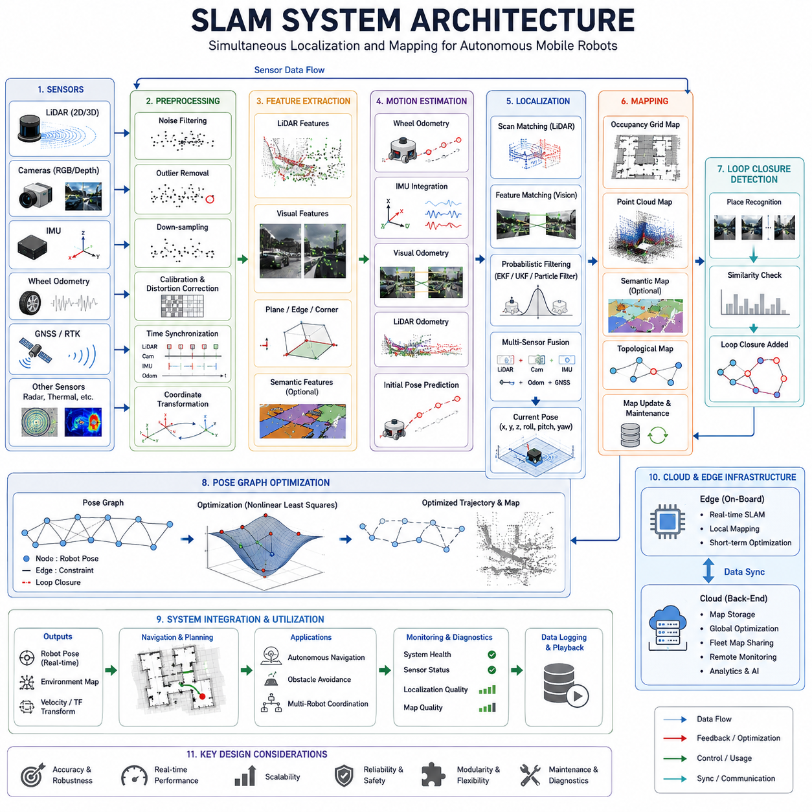
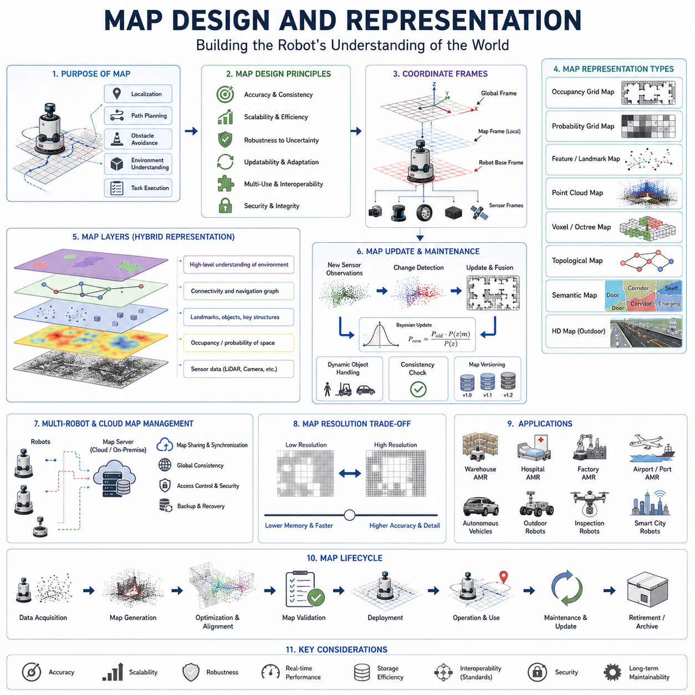
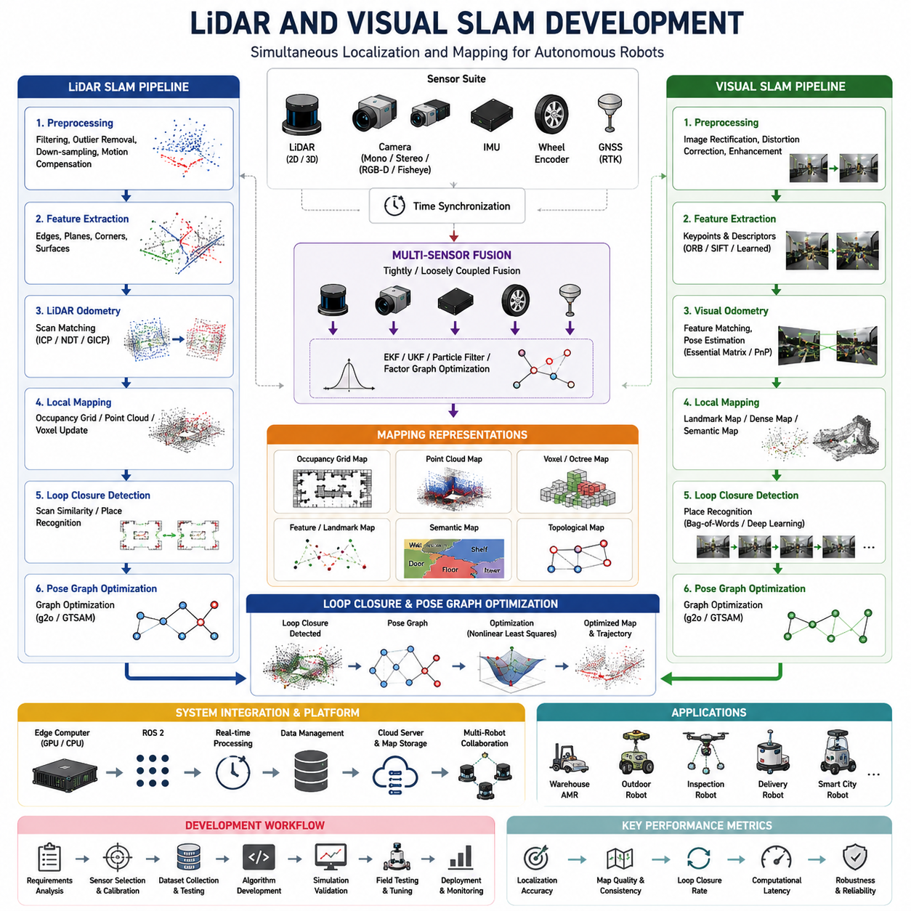
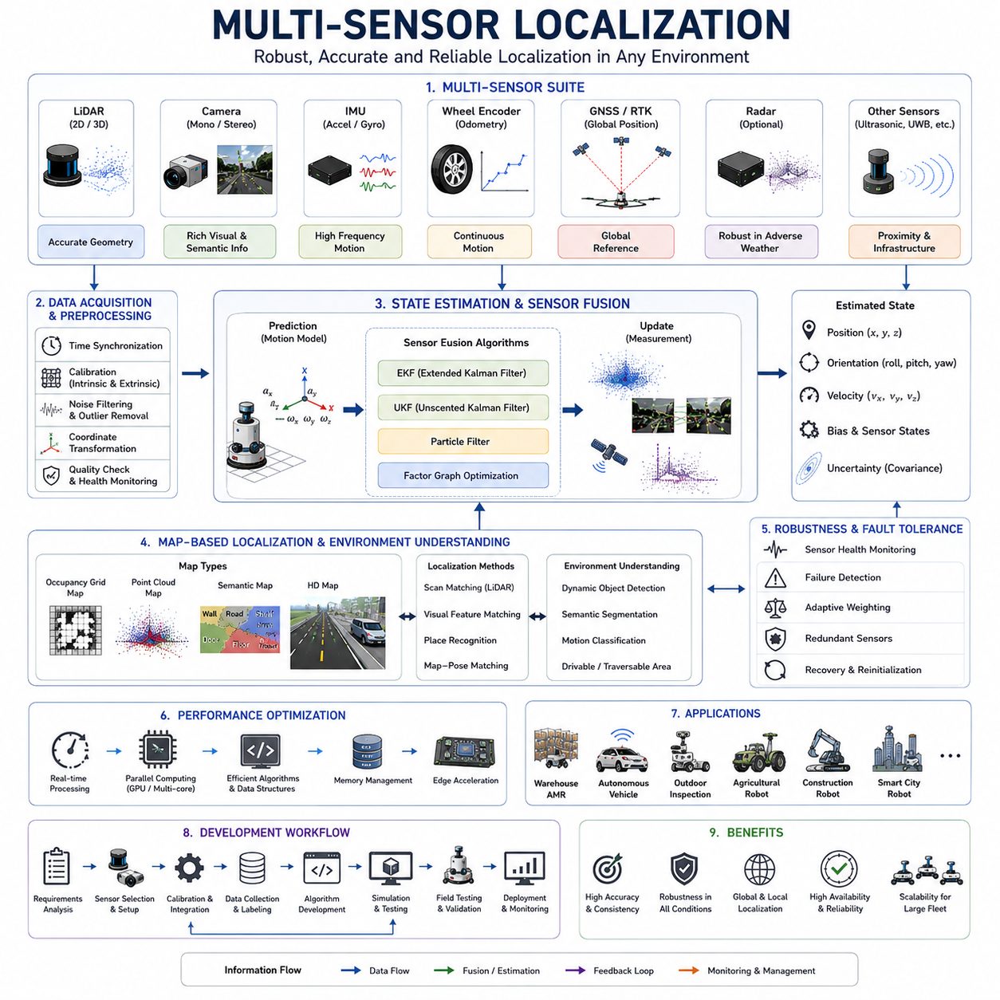
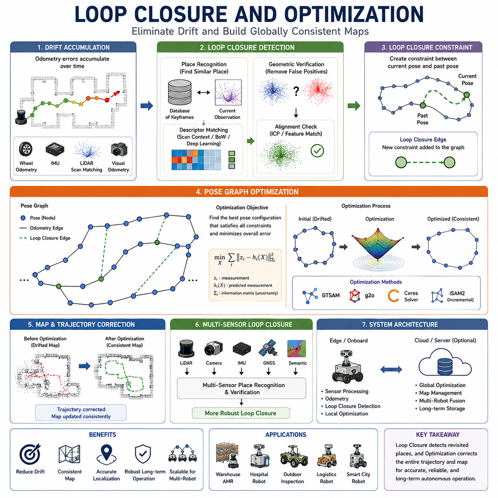
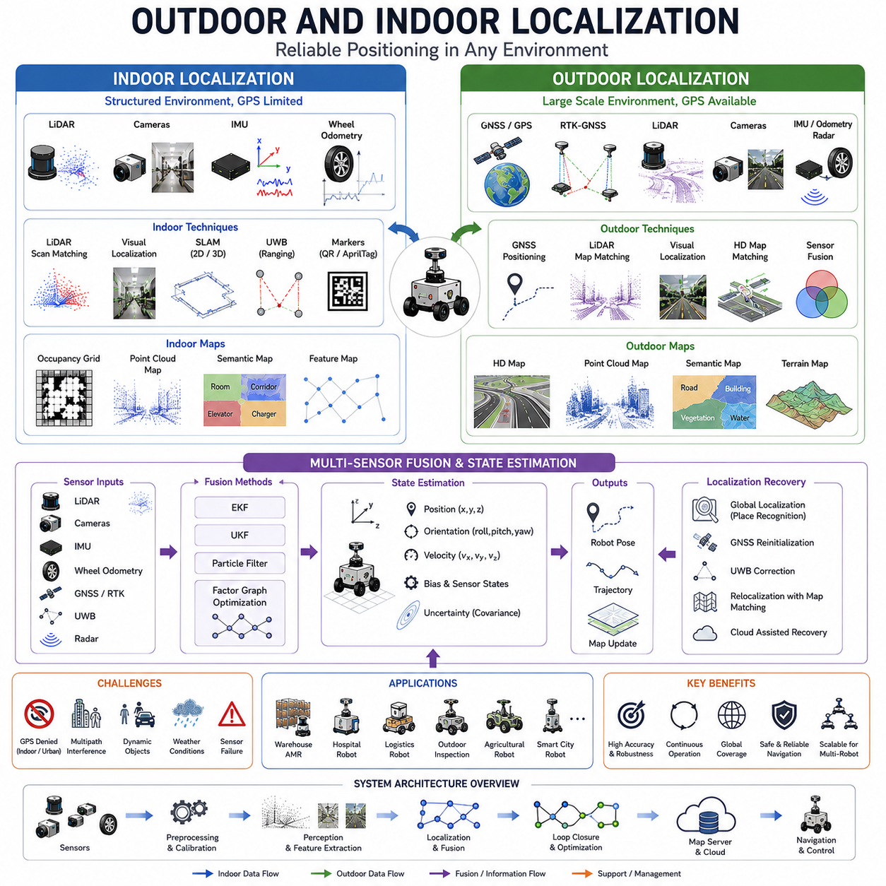
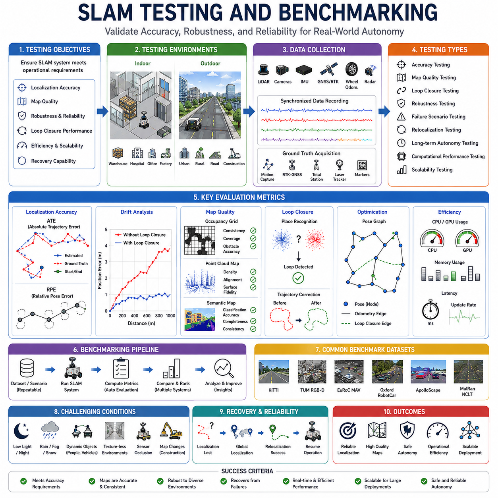
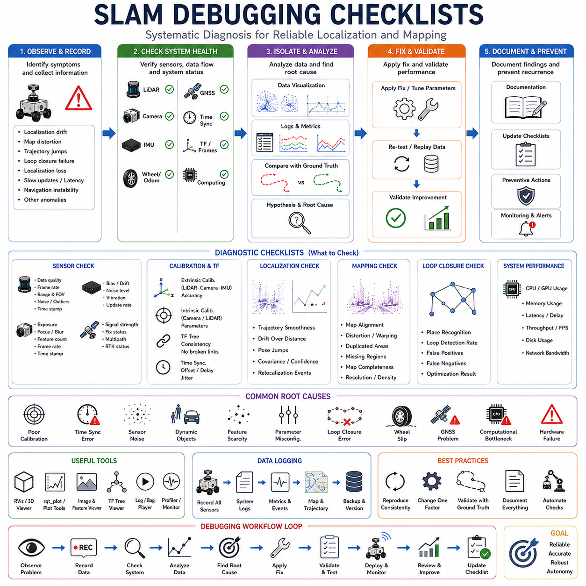

**Volume 10. AMR Engineering Process and Development Manual**

# Chapter08. SLAM Development Workflow

## 08.01 SLAM System Architecture

{width="7.268055555555556in" height="7.268055555555556in"}

Simultaneous Localization and Mapping (SLAM) is one of the most critical subsystems in an Autonomous Mobile Robot (AMR). It provides the capability for a robot to understand where it is located while simultaneously constructing a representation of the surrounding environment. Without a robust SLAM architecture, autonomous navigation becomes unreliable because the robot cannot accurately estimate its position or maintain a consistent understanding of the world. SLAM serves as the foundation of localization, mapping, path planning, obstacle avoidance, fleet coordination, and autonomous decision-making. Within a modern AMR system, the SLAM architecture acts as the bridge between perception and navigation, transforming raw sensor measurements into spatial intelligence that can be used by higher-level autonomy functions. The SLAM development workflow is therefore a core element of the overall AMR engineering process and forms a major component of the localization and navigation stack.

The primary objective of a SLAM system architecture is to continuously estimate the robot pose while generating and maintaining an accurate map of the environment. The robot pose typically consists of position and orientation information represented in either two-dimensional or three-dimensional coordinate systems. The map may be represented as an occupancy grid, point cloud, feature map, semantic map, topological graph, or high-definition digital environment model. The architecture must ensure that localization accuracy remains stable even when the environment changes, sensors become noisy, or external conditions introduce uncertainty.

A complete SLAM architecture begins with the sensor layer. The sensor layer provides the raw environmental observations used for localization and mapping. Depending on the robot platform, the sensor suite may include 2D LiDAR, 3D LiDAR, RGB cameras, depth cameras, stereo cameras, thermal cameras, radar systems, GNSS receivers, RTK systems, IMUs, wheel encoders, steering sensors, and other motion estimation devices. Each sensor contributes different information about the environment. LiDAR provides geometric structure, cameras provide visual features and semantic information, GNSS provides global positioning, while IMUs and wheel encoders provide motion estimates between observations. The overall reliability of the SLAM system is strongly influenced by sensor quality, sensor placement, calibration accuracy, synchronization precision, and environmental conditions.

Sensor synchronization is a fundamental architectural requirement. Modern robots often operate with multiple sensors running at different frequencies. A 3D LiDAR may generate data at ten hertz, cameras may operate at thirty frames per second, IMUs may run at hundreds of hertz, and wheel encoders may generate measurements continuously. The SLAM architecture must synchronize these data streams into a common temporal reference frame. Without accurate synchronization, sensor fusion errors can accumulate rapidly and lead to localization drift. Time synchronization mechanisms often utilize hardware timestamps, network time synchronization protocols, Precision Time Protocol systems, or ROS2 time synchronization frameworks.

Following the sensor layer is the preprocessing layer. Raw sensor data must be filtered, corrected, and transformed before it can be used by localization algorithms. LiDAR data typically undergoes noise filtering, outlier removal, voxel down-sampling, and coordinate frame transformation. Camera images may be corrected for lens distortion, exposure variation, motion blur, and illumination changes. IMU data may require bias correction and filtering. GNSS measurements may be filtered using statistical estimation methods to remove multipath effects and signal noise. The objective of preprocessing is to improve data quality while minimizing computational overhead.

The feature extraction layer converts raw sensor observations into meaningful representations that can be matched over time. In LiDAR-based systems, geometric features such as edges, corners, planes, and surface structures are extracted. In visual SLAM systems, image features such as ORB, SIFT, SURF, FAST, BRISK, or learned deep neural network features may be utilized. Feature extraction reduces the dimensionality of sensor observations while preserving information necessary for localization and mapping. Efficient feature extraction is particularly important in resource-constrained edge computing environments where real-time performance is required.

Motion estimation forms another critical component of the SLAM architecture. Motion estimation predicts how the robot has moved between consecutive observations. This prediction is often generated using wheel odometry, IMU integration, visual odometry, LiDAR odometry, or combinations of multiple approaches. Motion estimation provides an initial pose estimate that guides subsequent matching and optimization processes. Although motion estimation typically accumulates drift over time, it offers a computationally efficient mechanism for tracking robot movement over short intervals.

The localization subsystem estimates the robot\'s position within the map. Localization may be performed using scan matching, feature matching, probabilistic filtering, graph optimization, particle filtering, Kalman filtering, or advanced sensor fusion algorithms. In many modern AMR systems, localization is achieved through multi-sensor fusion architectures that combine LiDAR, vision, GNSS, IMU, and odometry data. Such architectures provide higher robustness than relying on any single sensor modality. Localization accuracy directly influences navigation performance, path tracking quality, safety behavior, and overall mission success.

Mapping is the process of constructing and maintaining an environmental representation. The mapping subsystem integrates observations from multiple sensor measurements and robot poses into a coherent map. In indoor environments, occupancy grids and feature maps are commonly used. Outdoor robots frequently utilize point cloud maps, HD maps, semantic maps, and terrain representations. Mapping architectures must balance accuracy, storage requirements, update frequency, and computational complexity. Large-scale environments may require hierarchical mapping structures or cloud-based map management systems.

Data association is one of the most challenging aspects of SLAM. The system must determine whether a newly observed feature corresponds to a previously observed feature. Incorrect associations can introduce severe localization errors and map inconsistencies. Data association algorithms often rely on geometric constraints, feature descriptors, probabilistic matching techniques, nearest-neighbor searches, and machine learning approaches. Robust data association becomes increasingly important in dynamic environments where objects, people, and vehicles continuously move through the robot\'s field of view.

Loop closure detection represents a major architectural component for long-term localization stability. Loop closure occurs when the robot revisits a previously mapped location. Detecting loop closure allows the system to correct accumulated drift and improve global map consistency. Visual SLAM systems often utilize image retrieval techniques, bag-of-words models, or deep learning-based place recognition. LiDAR-based systems may use scan matching or geometric similarity analysis. Once loop closure is detected, optimization algorithms adjust historical poses and map structures to ensure consistency.

Pose graph optimization serves as the mathematical backbone of many modern SLAM systems. In graph-based SLAM architectures, robot poses are represented as nodes while sensor constraints form edges between nodes. Optimization algorithms seek to minimize the overall error within the graph while satisfying all available constraints. Common optimization frameworks include g2o, Ceres Solver, GTSAM, and factor graph optimization approaches. Pose graph optimization enables large-scale mapping while maintaining high localization accuracy across extended operational periods.

Sensor fusion is increasingly important in industrial AMR applications. Single-sensor SLAM systems often struggle in challenging environments. Visual SLAM may fail under poor lighting conditions. LiDAR SLAM may struggle in featureless corridors. GNSS localization may degrade in urban canyons or indoor spaces. Multi-sensor fusion architectures overcome these limitations by combining complementary sensing modalities. Extended Kalman Filters, Unscented Kalman Filters, Particle Filters, and Factor Graph frameworks are commonly used to integrate information from multiple sensors.

The coordinate transformation framework is another essential architectural element. Robots operate across multiple coordinate frames including sensor frames, robot base frames, local map frames, odometry frames, and global coordinate systems. The transformation subsystem maintains relationships between these coordinate frames and ensures consistency throughout the localization pipeline. In ROS2 environments, the TF framework is widely used to manage coordinate transformations and support modular system integration.

Real-time performance requirements heavily influence SLAM architecture design. Autonomous robots must localize themselves continuously while navigating dynamic environments. Excessive computational delays can degrade navigation quality and compromise safety. Therefore, modern SLAM architectures frequently employ parallel processing, GPU acceleration, multithreading, hardware acceleration, and optimized software pipelines. Real-time constraints become even more demanding when operating with high-resolution LiDAR sensors, multiple cameras, and large-scale maps.

Cloud and edge integration are becoming increasingly important in advanced SLAM architectures. Edge computers perform real-time localization and mapping tasks directly on the robot, while cloud systems provide large-scale map storage, collaborative mapping, fleet-level map synchronization, and computationally intensive optimization services. Hybrid cloud-edge architectures enable scalable deployments across large robot fleets while maintaining low-latency local operation. Such architectures are particularly valuable in smart factories, hospitals, logistics centers, airports, ports, and smart city environments.

SLAM architectures for outdoor autonomous robots require additional capabilities beyond those used in indoor systems. Outdoor environments introduce challenges such as changing weather conditions, variable lighting, rough terrain, GNSS availability fluctuations, seasonal environmental changes, and large operational areas. Outdoor SLAM systems often integrate RTK-GNSS, dual-antenna heading systems, high-grade IMUs, LiDAR-based localization, semantic mapping, and terrain-aware mapping techniques. Multi-layer localization architectures are commonly adopted to provide robustness under varying environmental conditions.

Industrial deployment introduces additional requirements related to reliability, safety, maintainability, and scalability. A production-grade SLAM architecture must include health monitoring, diagnostic capabilities, failure detection mechanisms, recovery procedures, redundancy strategies, logging frameworks, and remote support tools. Engineers must be able to analyze localization failures, reproduce field issues, and continuously improve system performance based on operational data. Therefore, comprehensive monitoring and debugging capabilities are considered integral components of the overall architecture.

Modern SLAM systems are increasingly incorporating artificial intelligence technologies. Deep learning models can improve feature extraction, place recognition, semantic understanding, loop closure detection, sensor fusion, and dynamic object filtering. AI-enhanced SLAM architectures enable robots to understand not only geometric structures but also semantic context within their environment. This capability supports advanced navigation behaviors, human-robot interaction, task planning, and intelligent decision-making.

The future evolution of SLAM architecture will move toward fully integrated spatial intelligence systems capable of combining perception, localization, mapping, semantics, prediction, and reasoning within a unified framework. Future AMRs will utilize multimodal sensor fusion, foundation models, world models, semantic digital twins, collaborative fleet mapping, and cloud-scale spatial intelligence platforms. Rather than serving solely as a localization technology, SLAM will become a central component of embodied intelligence systems that enable robots to understand, navigate, predict, and interact with complex real-world environments. Within the AMR engineering workflow, the SLAM system architecture therefore remains one of the most critical foundations supporting autonomous operation, safe navigation, scalable deployment, and long-term operational success across industrial, logistics, healthcare, infrastructure inspection, and outdoor robotic applications.

## 08.02 Map Design and Representation

{width="7.268055555555556in" height="7.268055555555556in"}

Map design and representation form one of the most fundamental components of a SLAM system. While localization determines where the robot is positioned, the map serves as the robot's understanding of the environment in which it operates. The quality, structure, scalability, and maintainability of the map directly influence localization accuracy, navigation performance, obstacle avoidance capability, mission efficiency, and overall system reliability. A well-designed map architecture enables an Autonomous Mobile Robot (AMR) to operate safely and efficiently in complex environments ranging from warehouses and hospitals to factories, airports, ports, smart cities, and outdoor infrastructure inspection sites.

The primary objective of map design is to create a digital representation of the physical world that allows the robot to understand its surroundings, estimate its location, plan routes, avoid obstacles, and interact intelligently with the environment. Unlike traditional static maps used by human operators, robotic maps must support continuous updates, dynamic environmental changes, uncertainty management, and real-time decision-making. Therefore, map representation becomes a critical engineering discipline that combines geometry, probability theory, computer vision, sensor fusion, and software architecture.

The map representation selected for a robotic system depends on the application domain, sensor configuration, computational resources, localization requirements, and operational environment. Indoor AMRs often use occupancy grid maps due to their simplicity and computational efficiency. Outdoor autonomous robots frequently employ point cloud maps, semantic maps, HD maps, or multi-layer hybrid maps to capture the complexity of large-scale environments. Modern robotic systems increasingly utilize multiple map representations simultaneously because no single map structure is capable of addressing every operational requirement.

At the lowest level, map design begins with coordinate systems and reference frames. Every map exists within a coordinate framework that defines how positions and orientations are represented. The robot must maintain relationships among sensor coordinate frames, robot base frames, odometry frames, local map frames, and global reference frames. Consistent coordinate management ensures that sensor observations can be accurately integrated into the map and that localization algorithms can estimate robot position correctly. Coordinate transformations become particularly important in large-scale systems where multiple sensors and multiple robots contribute to a shared mapping infrastructure.

Occupancy grid maps represent one of the most widely used mapping approaches in autonomous robotics. In an occupancy grid map, the environment is divided into a large number of cells, each representing a small area of physical space. Each cell contains a probability value indicating whether the space is occupied, free, or unknown. Occupancy grids are computationally efficient, intuitive to visualize, and highly compatible with path planning algorithms. They are particularly effective in indoor navigation applications where environmental geometry remains relatively stable. However, occupancy grids can become memory-intensive when deployed over large environments or when high-resolution mapping is required.

Probabilistic mapping provides a framework for managing uncertainty within map representations. Sensor observations are inherently noisy, and environmental measurements often contain ambiguity. Instead of storing binary information, probabilistic maps represent confidence levels associated with occupancy, object presence, terrain classification, or environmental state. Bayesian estimation methods are commonly employed to update map probabilities as new observations become available. Probabilistic mapping significantly improves robustness in uncertain and dynamic environments.

Feature-based maps represent another important category of map design. Rather than storing every environmental measurement, feature maps store distinctive landmarks that can be repeatedly observed and recognized. Such landmarks may include corners, edges, poles, walls, visual markers, structural elements, or semantic objects. Feature-based maps require significantly less storage than dense occupancy maps and are highly suitable for long-term localization. However, their effectiveness depends heavily on the availability of stable and distinguishable environmental features.

Visual SLAM systems frequently utilize landmark maps generated from image features. Visual landmarks may consist of ORB features, SIFT descriptors, SURF features, BRISK keypoints, learned neural network descriptors, or semantic objects extracted through artificial intelligence models. Landmark-based representations enable efficient localization while minimizing storage requirements. They are particularly useful in environments where geometric information alone is insufficient for reliable localization.

Point cloud maps have become increasingly important in modern robotics due to the widespread adoption of 3D LiDAR technology. A point cloud map represents the environment as a collection of three-dimensional points, each describing a measured surface location. Point clouds preserve detailed geometric information and support highly accurate localization. They are particularly valuable in outdoor autonomous robots, industrial inspection systems, construction robotics, mining automation, and infrastructure monitoring applications. However, large point cloud maps may require substantial storage capacity and computational resources.

Voxel maps provide an extension of point cloud mapping by discretizing three-dimensional space into volumetric cells. Each voxel represents a cubic region of space and may store occupancy information, probability estimates, semantic labels, or environmental attributes. Voxel-based representations provide a structured framework for managing large-scale three-dimensional environments while reducing computational complexity. Octree-based map structures are commonly employed to optimize memory utilization and support efficient querying.

Topological maps represent environments using graph structures rather than geometric representations. Nodes correspond to significant locations, while edges represent navigable connections between locations. Topological maps are particularly useful for high-level navigation, mission planning, and long-distance route optimization. Unlike occupancy grids and point clouds, topological maps focus on connectivity rather than geometric precision. They are frequently used in large facilities such as hospitals, airports, warehouses, and smart buildings.

Semantic maps represent a major advancement in robotic map design. Traditional maps primarily describe geometric structures, whereas semantic maps incorporate contextual information about the environment. A semantic map may identify corridors, rooms, elevators, doors, intersections, loading stations, charging docks, storage racks, workstations, vehicles, pedestrians, and other meaningful objects. Semantic information enables robots to reason about their environment at a higher level and supports intelligent task execution. Modern AI-powered robotic systems increasingly rely on semantic maps to enhance autonomy and decision-making.

Hybrid mapping architectures combine multiple map representations into a unified framework. For example, an autonomous robot may simultaneously utilize an occupancy grid for local navigation, a point cloud map for localization, a topological graph for mission planning, and a semantic map for task execution. Hybrid architectures allow each representation to contribute its strengths while compensating for the limitations of other map types. Such architectures are becoming standard practice in advanced industrial AMR systems.

Map resolution is a critical design consideration. Higher map resolution improves localization precision and environmental detail but increases memory consumption, computational requirements, and update latency. Lower resolution maps reduce resource consumption but may lose important environmental information. Engineers must carefully balance accuracy, scalability, and computational efficiency when selecting map resolution. Adaptive resolution strategies are increasingly employed to provide high detail in critical regions while maintaining lower detail elsewhere.

Map update mechanisms are essential for maintaining environmental accuracy over time. Real-world environments are dynamic. Furniture moves, inventory changes, vehicles relocate, construction occurs, and environmental conditions evolve. A static map gradually becomes outdated, leading to localization errors and navigation failures. Therefore, modern map architectures support continuous updates, incremental corrections, and long-term environmental adaptation. Dynamic map management systems distinguish between permanent structures and temporary objects to maintain map consistency.

Change detection plays a crucial role in map maintenance. The robot must identify discrepancies between stored maps and current observations. Significant changes may indicate environmental modifications, temporary obstacles, damaged infrastructure, or sensor anomalies. Change detection algorithms compare current sensor data with existing map information and trigger map updates when necessary. Robust change detection improves long-term operational reliability and reduces localization degradation.

Map storage architecture becomes increasingly important as robot deployments scale. Small indoor robots may store maps locally on embedded computers, whereas large industrial fleets often utilize centralized map servers. Cloud-based map storage enables multiple robots to share mapping information, synchronize environmental updates, and maintain consistent operational awareness. Centralized map management also simplifies version control, deployment management, and fleet-wide map distribution.

Map version control is particularly important in industrial environments where maps evolve continuously. Different map versions may correspond to different facility layouts, construction phases, operational modes, or seasonal conditions. Effective version control mechanisms ensure that robots operate using appropriate map configurations while preserving historical mapping information for analysis and rollback purposes.

Multi-robot mapping introduces additional architectural complexity. When multiple robots contribute mapping data simultaneously, the system must merge observations into a consistent global map. This process requires coordinate alignment, conflict resolution, data synchronization, and distributed optimization. Collaborative mapping enables faster map generation, broader environmental coverage, and improved operational efficiency. Multi-robot mapping has become increasingly important in warehouses, manufacturing facilities, logistics hubs, airports, and smart city deployments.

High-definition mapping has emerged as a critical technology for outdoor autonomous robots. HD maps provide centimeter-level environmental accuracy and include detailed representations of roads, lanes, curbs, intersections, traffic signs, infrastructure assets, and terrain characteristics. HD maps serve as a localization reference for autonomous vehicles and outdoor robotic platforms operating in complex environments. Such maps often integrate LiDAR scans, aerial imagery, GNSS measurements, and semantic annotations.

Digital twin integration represents the next evolution of map design. A digital twin extends traditional mapping by creating a continuously synchronized virtual representation of the physical environment. Sensor observations, operational data, maintenance information, environmental conditions, and fleet activities can all be integrated into the digital twin. This enables advanced analytics, predictive maintenance, simulation-based testing, operational optimization, and strategic planning.

Artificial intelligence is increasingly influencing map representation methodologies. Deep learning models can automatically generate semantic labels, identify environmental structures, classify terrain, recognize objects, and predict environmental changes. AI-enhanced mapping systems transform maps from passive geometric representations into intelligent knowledge bases capable of supporting advanced reasoning and autonomous decision-making.

Map security and integrity have also become important considerations in modern robotic deployments. As maps increasingly influence safety-critical operations, unauthorized modification or corruption of map data could result in severe operational consequences. Secure storage, encryption, authentication, access control, and integrity verification mechanisms must therefore be incorporated into map management architectures.

The future of map design and representation is expected to move toward unified spatial intelligence frameworks that combine geometry, semantics, temporal information, operational context, predictive analytics, and artificial intelligence. Future robotic maps will not simply describe where objects exist but will also represent how environments behave, how they change over time, and how robots should interact with them. Such maps will function as intelligent environmental models that support perception, localization, navigation, planning, fleet management, digital twins, and embodied AI systems. Within the overall SLAM development workflow, map design and representation therefore remain foundational disciplines that determine the scalability, intelligence, robustness, and long-term success of autonomous robotic platforms.

## 08.03 LiDAR and Visual SLAM Development

{width="7.268055555555556in" height="7.268055555555556in"}

# 08_03 LiDAR and Visual SLAM Development

LiDAR and Visual SLAM technologies represent two of the most important approaches used in modern autonomous mobile robots for localization and mapping. Both methods aim to solve the fundamental problem of simultaneously estimating the robot's position while constructing a map of the surrounding environment. Although they share the same objective, LiDAR SLAM and Visual SLAM utilize different sensing modalities, mathematical models, environmental assumptions, and computational architectures. Understanding the development process of both technologies is essential for building robust autonomous systems capable of operating in diverse indoor and outdoor environments.

The development of a LiDAR and Visual SLAM system begins with a clear understanding of operational requirements. Engineers must first determine the target environment, localization accuracy requirements, map resolution, update frequency, computational limitations, sensor budgets, and deployment conditions. Warehouse robots, hospital AMRs, autonomous forklifts, outdoor patrol robots, construction robots, mining robots, agricultural robots, and infrastructure inspection systems all impose different requirements on the SLAM architecture. These requirements influence sensor selection, algorithm design, computing platform configuration, and system integration strategies.

Sensor selection forms the foundation of the development process. LiDAR SLAM systems typically utilize 2D LiDAR or 3D LiDAR sensors. A 2D LiDAR provides high-precision planar measurements and is often sufficient for indoor environments with relatively flat floors. A 3D LiDAR captures volumetric environmental information and is particularly effective in outdoor environments where terrain variations, vegetation, vehicles, buildings, and infrastructure must be represented. Sensor characteristics such as range, field of view, angular resolution, scanning frequency, noise characteristics, and environmental robustness significantly influence overall SLAM performance.

Visual SLAM systems rely primarily on cameras. Depending on application requirements, developers may utilize monocular cameras, stereo cameras, RGB-D cameras, fisheye cameras, panoramic cameras, or multi-camera systems. Monocular cameras offer low cost and simplicity but cannot directly measure depth. Stereo cameras estimate depth through image disparity. RGB-D cameras provide direct depth measurements but are typically limited to short-range operation. Multi-camera systems improve robustness and field-of-view coverage while increasing computational complexity.

After sensor selection, hardware integration becomes the next critical step. Sensor placement significantly affects SLAM performance. LiDAR sensors should be mounted to maximize environmental visibility while minimizing occlusions caused by robot structures. Cameras should be positioned to maintain stable visual observations and avoid excessive vibration. Mechanical mounting structures must ensure rigidity because even small movements between sensors can introduce calibration errors and localization drift. Industrial robotic platforms frequently include vibration isolation systems to improve measurement stability.

Sensor calibration represents one of the most important phases of development. Intrinsic calibration determines the internal parameters of cameras, including focal length, lens distortion coefficients, optical center position, and projection models. Extrinsic calibration establishes spatial relationships among LiDARs, cameras, IMUs, GNSS receivers, and robot coordinate frames. Accurate calibration is essential because sensor fusion algorithms assume precise geometric relationships between all sensing devices. Calibration errors often become a primary source of localization degradation.

Time synchronization is equally important. LiDAR, cameras, IMUs, wheel encoders, and GNSS receivers operate at different update frequencies. If measurements are not synchronized correctly, the system may associate sensor observations with incorrect robot poses. Hardware timestamping, Precision Time Protocol (PTP), Network Time Protocol (NTP), ROS2 time synchronization mechanisms, and dedicated synchronization hardware are commonly employed to ensure temporal consistency across all sensor streams.

The preprocessing stage prepares raw sensor data for subsequent SLAM processing. LiDAR measurements often undergo noise filtering, outlier removal, voxel down-sampling, motion compensation, and coordinate transformation. Camera images may require distortion correction, exposure adjustment, image enhancement, color normalization, and noise reduction. IMU data frequently undergoes bias correction and filtering. Effective preprocessing improves data quality while reducing computational overhead.

LiDAR SLAM development focuses heavily on geometric feature extraction. Environmental structures such as edges, corners, planes, poles, walls, and surface boundaries provide reliable landmarks for localization. Feature extraction algorithms identify stable geometric elements within LiDAR point clouds and use them for scan matching and pose estimation. The quality of extracted features directly influences localization accuracy and long-term map consistency.

Visual SLAM development emphasizes image feature extraction. Classical approaches use handcrafted features such as ORB, SIFT, SURF, FAST, BRISK, and AKAZE. These features are designed to remain stable under changes in viewpoint, illumination, scale, and rotation. More recently, deep learning-based feature extraction methods have emerged, providing improved robustness in challenging environments. Feature extraction serves as the foundation for visual odometry, place recognition, loop closure detection, and map construction.

Motion estimation forms the first stage of localization. LiDAR odometry estimates robot motion by aligning consecutive LiDAR scans. Visual odometry estimates motion by tracking image features across consecutive frames. IMU measurements provide high-frequency motion information that can bridge gaps between sensor observations. Wheel odometry provides additional motion constraints. The combination of these sources allows the system to generate an initial pose estimate that supports subsequent optimization.

Scan matching is one of the most important components in LiDAR SLAM systems. The objective is to align current LiDAR observations with previous scans or existing maps. Algorithms such as Iterative Closest Point (ICP), Normal Distributions Transform (NDT), Generalized ICP (GICP), and feature-based registration methods are commonly employed. Successful scan matching allows accurate estimation of robot movement and supports map generation.

Visual SLAM systems perform image matching rather than scan matching. Feature descriptors extracted from images are compared across frames to identify corresponding landmarks. Geometric constraints such as epipolar geometry, bundle adjustment, and pose estimation algorithms are then used to estimate camera motion. The reliability of image matching significantly influences localization accuracy, particularly in environments with repetitive patterns or limited visual texture.

Map generation occurs simultaneously with localization. LiDAR SLAM typically generates occupancy grids, point clouds, voxel maps, or high-definition geometric maps. Visual SLAM often creates sparse landmark maps, dense reconstruction maps, semantic maps, or hybrid representations. The map must accurately represent environmental structure while supporting efficient localization and navigation.

Loop closure detection is critical for long-term operation. As the robot moves through the environment, small localization errors accumulate over time. When the robot revisits a previously mapped location, loop closure algorithms recognize the location and generate constraints that correct accumulated drift. In LiDAR SLAM, loop closure often relies on scan similarity analysis. In Visual SLAM, place recognition techniques based on image descriptors, bag-of-words methods, or deep learning models are frequently used.

Pose graph optimization serves as the mathematical backbone of both LiDAR and Visual SLAM systems. Robot poses are represented as nodes within a graph, while sensor observations and motion estimates form edges connecting those nodes. Optimization algorithms minimize overall graph error while satisfying all constraints. Popular frameworks include GTSAM, g2o, Ceres Solver, and factor graph optimization techniques. Pose graph optimization enables consistent large-scale mapping and accurate localization.

Sensor fusion significantly improves SLAM robustness. Individual sensors possess inherent limitations. LiDAR performs well in darkness but may struggle in feature-poor environments. Cameras provide rich semantic information but are sensitive to illumination changes. IMUs provide rapid motion estimates but accumulate drift. GNSS provides global positioning but may be unavailable indoors. By combining these sensors, developers can create localization systems that remain reliable across diverse operating conditions.

Modern SLAM architectures increasingly integrate LiDAR, cameras, IMUs, GNSS, wheel encoders, radar sensors, and depth cameras within unified sensor fusion frameworks. Extended Kalman Filters, Unscented Kalman Filters, Particle Filters, Factor Graphs, and optimization-based fusion techniques are widely utilized. These architectures provide improved localization stability and resilience against sensor failures.

Real-time performance optimization is a major development challenge. Autonomous robots require continuous localization updates while navigating dynamic environments. Computational delays can negatively affect navigation accuracy and safety. Therefore, developers employ multithreading, GPU acceleration, CUDA optimization, TensorRT deployment, parallel processing pipelines, and memory-efficient data structures. Real-time optimization becomes especially important for high-resolution LiDAR sensors and multi-camera visual systems.

Environmental robustness must be carefully addressed throughout development. LiDAR SLAM systems may encounter challenges related to rain, snow, fog, dust, reflective surfaces, and vegetation. Visual SLAM systems may experience difficulties under poor lighting, glare, shadows, motion blur, and textureless environments. Robust algorithms must account for these challenges through adaptive filtering, sensor fusion, redundancy mechanisms, and environmental awareness models.

Dynamic object handling represents another important consideration. Real-world environments contain moving people, vehicles, forklifts, carts, machinery, and other transient objects. If dynamic objects are incorrectly incorporated into maps, localization performance may degrade significantly. Modern SLAM systems employ object detection, semantic segmentation, motion analysis, and AI-based filtering techniques to identify and exclude dynamic elements from mapping processes.

Testing and validation play a critical role in LiDAR and Visual SLAM development. Simulation environments such as Gazebo, Isaac Sim, CARLA, and digital twin platforms allow developers to evaluate algorithms under controlled conditions. Real-world testing must subsequently validate performance across representative operational scenarios. Localization accuracy, mapping quality, loop closure success rate, computational load, recovery behavior, and long-term stability are commonly evaluated.

Performance benchmarking provides objective measurements of system capability. Common metrics include Absolute Trajectory Error (ATE), Relative Pose Error (RPE), localization drift, map consistency, loop closure precision, computational latency, memory consumption, and robustness under environmental variations. Benchmarking enables quantitative comparison between alternative algorithms and system configurations.

Cloud and edge integration have become increasingly important in modern SLAM architectures. Edge computers perform real-time localization and mapping directly on the robot, while cloud systems support collaborative mapping, large-scale map storage, global optimization, fleet-level synchronization, and long-term map maintenance. This hybrid architecture is particularly valuable in smart factories, hospitals, logistics centers, airports, ports, and smart city deployments.

Artificial intelligence is increasingly transforming LiDAR and Visual SLAM development. Deep neural networks are being applied to feature extraction, place recognition, semantic understanding, object filtering, loop closure detection, sensor fusion, and map generation. AI-enhanced SLAM systems provide greater robustness, improved adaptability, and higher-level environmental understanding compared to purely geometric approaches.

Future LiDAR and Visual SLAM systems will evolve toward fully integrated spatial intelligence platforms. These systems will combine geometric perception, semantic understanding, world models, foundation models, digital twins, and collaborative cloud robotics. Rather than simply estimating position and generating maps, future SLAM architectures will provide comprehensive environmental understanding that supports navigation, planning, prediction, decision-making, and embodied intelligence. As autonomous robots become increasingly capable, LiDAR and Visual SLAM development will remain one of the most critical engineering disciplines enabling safe, scalable, and intelligent robotic autonomy.

## 08.04 Multi-Sensor Localization

{width="7.268055555555556in" height="7.268055555555556in"}

# 08_04 Multi-Sensor Localization

Multi-Sensor Localization is one of the most important technologies in modern autonomous mobile robots because no single sensor can provide reliable localization performance under all operating conditions. Every sensing technology possesses inherent strengths and weaknesses. LiDAR delivers highly accurate geometric measurements but may struggle in featureless environments. Cameras provide rich visual and semantic information but are sensitive to illumination changes. GNSS offers global positioning capability but may suffer from signal blockage and multipath effects. IMUs provide high-frequency motion estimation but accumulate drift over time. Wheel odometry supplies continuous motion information but becomes inaccurate due to wheel slip, uneven terrain, or mechanical wear. Multi-Sensor Localization addresses these limitations by combining information from multiple sensors to produce a localization solution that is more accurate, robust, and reliable than any individual sensor can achieve independently.

The primary objective of Multi-Sensor Localization is to continuously estimate the robot\'s position, orientation, velocity, and motion state while minimizing uncertainty and maintaining operational reliability. In autonomous mobile robots, localization is not simply the process of determining a position. It is the continuous estimation of the robot\'s state within a dynamic and uncertain environment. The localization architecture must remain operational during sensor degradation, environmental disturbances, temporary signal losses, and unexpected system failures. Consequently, Multi-Sensor Localization has become the standard approach in industrial AMRs, autonomous vehicles, outdoor autonomous robots, infrastructure inspection systems, agricultural machines, mining vehicles, and smart city robotic platforms.

The development of a Multi-Sensor Localization system begins with a comprehensive analysis of operational requirements. Engineers must evaluate the target environment, localization accuracy requirements, update frequency, operational speed, environmental complexity, safety requirements, computational limitations, and expected failure scenarios. Indoor warehouse robots require different localization strategies compared to outdoor inspection robots operating across large geographical areas. Hospital service robots, autonomous forklifts, agricultural robots, and infrastructure inspection platforms each impose unique constraints that influence sensor selection and fusion architecture design.

Sensor selection represents the foundation of the localization architecture. Modern robotic systems commonly utilize a combination of LiDAR, cameras, IMUs, wheel encoders, GNSS receivers, RTK systems, radar sensors, ultrasonic sensors, depth cameras, and sometimes specialized localization infrastructure such as UWB beacons or visual markers. Each sensor contributes a unique perspective on the environment and robot motion. The objective is to combine complementary sensing modalities in a manner that maximizes overall localization performance while minimizing vulnerability to individual sensor limitations.

LiDAR sensors contribute highly accurate geometric information. Both 2D and 3D LiDAR systems are widely used in localization applications. LiDAR measurements provide environmental structure information that can be matched against existing maps or previous observations. LiDAR-based localization performs particularly well in structured environments such as warehouses, factories, logistics centers, and urban areas. However, performance may degrade in open spaces, featureless corridors, dense vegetation, heavy rain, fog, or environments with repetitive structures.

Visual sensors provide rich environmental observations that complement geometric measurements. Cameras capture texture, color, semantic information, and visual landmarks that are often unavailable through LiDAR alone. Visual localization methods can identify distinctive environmental features and support place recognition, loop closure detection, and semantic understanding. Cameras also provide valuable redundancy when geometric localization becomes unreliable. However, visual systems remain sensitive to illumination changes, shadows, reflections, glare, fog, dust, and adverse weather conditions.

Inertial Measurement Units play a crucial role within Multi-Sensor Localization architectures. IMUs provide high-frequency measurements of acceleration and angular velocity, enabling continuous estimation of robot motion even when external sensors temporarily fail. IMUs bridge measurement gaps between slower sensors and provide short-term motion prediction. However, IMU integration inevitably accumulates drift over time, making sensor fusion essential for long-term localization stability.

Wheel odometry remains one of the most widely used localization inputs in mobile robotics. Encoders measure wheel rotation and estimate traveled distance. Odometry provides continuous motion information and is computationally efficient. However, wheel slip, uneven terrain, loose surfaces, tire deformation, and mechanical wear can introduce significant errors. Consequently, wheel odometry is rarely used as a standalone localization solution in modern autonomous robots.

Global Navigation Satellite Systems provide absolute positioning information for outdoor robotic systems. Standard GNSS receivers typically provide meter-level accuracy, while RTK-GNSS systems can achieve centimeter-level precision under favorable conditions. GNSS plays a critical role in large-scale outdoor environments where local maps may not provide sufficient coverage. However, GNSS signals are vulnerable to signal blockage, urban canyons, tunnels, dense forests, multipath effects, and indoor environments.

Radar sensors have become increasingly important in autonomous robotics because they perform reliably under adverse weather conditions. Unlike cameras and LiDAR systems, radar can often operate effectively during rain, snow, fog, and dust storms. Radar measurements provide additional environmental observations that improve localization robustness and support redundancy in safety-critical applications.

The architecture of a Multi-Sensor Localization system is typically organized into multiple processing layers. The first layer consists of sensor acquisition and synchronization. Each sensor generates data at different frequencies and with different latency characteristics. IMUs may operate at hundreds of Hertz, LiDAR sensors at ten to twenty Hertz, cameras at thirty frames per second, and GNSS receivers at one to ten Hertz. Accurate synchronization ensures that measurements from different sensors correspond to the same physical state of the robot.

Time synchronization is therefore one of the most critical requirements of localization development. Hardware timestamping, Precision Time Protocol, Network Time Protocol, ROS2 time synchronization frameworks, and dedicated synchronization hardware are commonly employed to achieve temporal consistency. Inaccurate synchronization can introduce localization errors that cannot be corrected through later processing stages.

Sensor calibration forms the next critical component. Intrinsic calibration determines the characteristics of individual sensors, while extrinsic calibration establishes spatial relationships among sensors. Accurate calibration ensures that measurements from LiDARs, cameras, IMUs, GNSS receivers, and wheel encoders can be represented within a common coordinate framework. Calibration errors directly affect localization accuracy and often become a major source of system instability.

The localization pipeline generally begins with motion prediction. Motion prediction estimates the robot\'s current state based on previous states and high-frequency sensor measurements. IMUs and wheel encoders commonly provide motion prediction inputs. The prediction stage produces an initial pose estimate that guides subsequent measurement updates. Although prediction accumulates errors over time, it provides continuous state estimation between external observations.

Measurement update processes refine the predicted state using environmental observations. LiDAR scan matching, visual feature matching, GNSS positioning, radar observations, and map-based localization all contribute correction information. Measurement updates reduce accumulated drift and improve localization accuracy. The balance between prediction and correction represents one of the central challenges of localization system design.

Sensor fusion algorithms serve as the mathematical core of Multi-Sensor Localization. Extended Kalman Filters remain among the most widely deployed approaches due to their computational efficiency and proven reliability. EKF-based systems estimate robot states while accounting for sensor uncertainties and dynamic system behavior. They provide robust performance in many industrial applications where real-time operation is required.

Unscented Kalman Filters provide improved performance for highly nonlinear systems. Unlike EKF methods, UKF approaches utilize deterministic sampling techniques to propagate uncertainty through nonlinear transformations. This often results in improved estimation accuracy while maintaining computational feasibility for embedded robotic platforms.

Particle Filters offer another powerful sensor fusion approach. Particle-based methods represent robot states using multiple hypotheses and can effectively handle nonlinearities and non-Gaussian uncertainties. Particle Filters are commonly employed in localization systems operating within ambiguous environments or when global localization is required. However, computational requirements typically exceed those of Kalman-based approaches.

Factor Graph Optimization has become increasingly popular in advanced robotic systems. Factor graphs represent sensor observations and motion constraints as interconnected relationships within a graphical optimization framework. This approach enables simultaneous integration of LiDAR, cameras, IMUs, GNSS, wheel odometry, and other sensors within a unified estimation process. Factor graph methods often achieve superior accuracy and consistency compared to traditional filtering approaches.

LiDAR localization commonly utilizes scan matching algorithms such as ICP, GICP, NDT, and feature-based registration methods. These techniques align current sensor observations with previously generated maps. Visual localization employs feature matching, visual odometry, place recognition, and bundle adjustment techniques. GNSS localization provides global reference constraints, while IMUs provide motion continuity. The fusion architecture combines all available information to generate a unified state estimate.

Map-based localization represents another critical component of Multi-Sensor Localization systems. Robots frequently localize themselves relative to occupancy grids, point cloud maps, semantic maps, HD maps, or digital twins. Environmental observations are compared against stored map representations to determine the most likely robot position. Map-based localization significantly improves accuracy and enables long-term operational stability.

Dynamic environments introduce additional complexity. Moving vehicles, pedestrians, forklifts, robots, and machinery can interfere with localization processes. Modern localization systems increasingly utilize semantic segmentation, object tracking, motion classification, and AI-based filtering techniques to identify dynamic objects and exclude them from localization calculations.

Failure detection and fault tolerance represent essential aspects of industrial localization architectures. Sensors may become obstructed, damaged, disconnected, or degraded during operation. A robust Multi-Sensor Localization system continuously monitors sensor health, measurement quality, confidence levels, and consistency metrics. When anomalies are detected, the system can reduce sensor weighting, activate redundant sensors, or initiate recovery procedures.

Real-time performance optimization remains a major engineering challenge. Multi-Sensor Localization systems must process large volumes of sensor data while maintaining low latency. High-performance edge computing platforms, GPU acceleration, parallel processing architectures, optimized algorithms, and efficient memory management techniques are commonly employed to satisfy real-time requirements.

Testing and validation are fundamental throughout the development process. Simulation environments such as Gazebo, Isaac Sim, CARLA, and digital twin platforms enable controlled testing under diverse operational scenarios. Field testing subsequently validates localization performance in real-world environments. Engineers evaluate localization accuracy, robustness, computational latency, recovery performance, fault tolerance, and long-term stability.

Performance benchmarking relies on metrics such as Absolute Trajectory Error, Relative Pose Error, localization drift, convergence time, availability, integrity, continuity, robustness, and computational efficiency. These metrics enable objective evaluation of localization architectures and support continuous improvement efforts.

Cloud and edge integration are becoming increasingly important. Edge computers perform real-time localization onboard the robot, while cloud platforms support map storage, fleet synchronization, collaborative localization, global optimization, and long-term analytics. Such architectures enable large-scale deployments involving hundreds or thousands of autonomous robots.

Artificial intelligence is transforming Multi-Sensor Localization development. Deep learning models are increasingly applied to feature extraction, place recognition, sensor fusion, uncertainty estimation, semantic localization, dynamic object filtering, and localization failure prediction. AI-enhanced localization systems provide improved adaptability and robustness compared to traditional approaches.

The future of Multi-Sensor Localization lies in fully integrated spatial intelligence architectures that combine geometric perception, semantic understanding, world models, foundation models, digital twins, and collaborative cloud robotics. Future systems will not merely estimate robot position but will understand environmental context, predict future states, adapt to changing conditions, and support higher-level autonomous decision-making. As robotic systems become more intelligent and autonomous, Multi-Sensor Localization will continue to serve as one of the most critical technologies enabling safe, reliable, and scalable robotic operation across industrial, commercial, and public environments.

## 08.05 Loop Closure and Optimization

{width="7.268055555555556in" height="7.268055555555556in"}

# 08_05 Loop Closure and Optimization

Loop Closure and Optimization represent the core mechanisms that enable a SLAM system to maintain long-term localization accuracy and map consistency. While odometry, scan matching, visual tracking, and sensor fusion provide continuous estimates of robot motion, all localization systems inevitably accumulate small errors over time. These errors, often referred to as drift, gradually distort the estimated trajectory and the generated map. Without correction mechanisms, a robot operating over long distances or extended durations would eventually lose localization accuracy and produce inconsistent maps. Loop Closure and Optimization solve this problem by detecting previously visited locations and using mathematical optimization techniques to correct accumulated errors throughout the entire mapping and localization system. As a result, they are considered among the most important components of modern SLAM architectures.

The fundamental concept of loop closure is based on the observation that autonomous robots frequently revisit locations that they have previously explored. When a robot returns to a location that already exists within the map, the system can compare the current observation with historical observations and determine whether both represent the same physical place. If the match is confirmed, a loop closure constraint is established. This constraint provides valuable information regarding accumulated localization error and enables the system to adjust previous pose estimates. In practical applications, loop closure serves as the primary mechanism for eliminating long-term drift and ensuring global consistency within large-scale maps.

The need for loop closure arises because every localization method introduces uncertainty. Wheel odometry accumulates encoder errors due to wheel slip and mechanical imperfections. IMU integration introduces drift caused by bias accumulation and sensor noise. LiDAR scan matching produces small alignment errors that gradually increase over distance. Visual odometry suffers from feature matching inaccuracies, illumination changes, motion blur, and scale estimation uncertainty. Even advanced multi-sensor fusion systems cannot completely eliminate error accumulation. Consequently, the robot\'s estimated trajectory gradually diverges from reality unless periodic corrections are introduced.

Loop closure detection begins with place recognition. Place recognition is the process of determining whether the robot has previously visited a particular location. The system compares current sensor observations against previously stored map information and searches for similarities. Successful place recognition requires robust environmental representations capable of remaining recognizable despite changes in viewpoint, illumination, weather conditions, seasonal variations, sensor noise, and environmental dynamics.

In LiDAR SLAM systems, place recognition often relies on geometric similarity analysis. LiDAR scans capture structural information about the environment, including walls, corners, buildings, roads, vegetation, and other physical features. Various descriptors are generated from LiDAR scans to represent these structures compactly. Scan Context, M2DP, NDT Histograms, and other geometric descriptors are commonly used. When the current descriptor closely matches a previously stored descriptor, the system identifies a potential loop closure candidate.

Visual SLAM systems employ image-based place recognition techniques. Traditional approaches frequently utilize Bag-of-Words models that convert image features into compact visual vocabularies. ORB, SIFT, SURF, BRISK, and AKAZE descriptors have historically been widely used for this purpose. More recently, deep learning approaches have significantly improved place recognition performance by generating robust feature embeddings capable of recognizing locations under varying environmental conditions. Convolutional Neural Networks, Vision Transformers, and foundation models increasingly contribute to modern place recognition architectures.

Place recognition alone is insufficient to establish a valid loop closure. False positives can introduce catastrophic mapping errors. Therefore, candidate matches must undergo geometric verification. Geometric verification evaluates whether the spatial relationship between observations is physically consistent. In visual systems, epipolar constraints, fundamental matrix estimation, homography validation, and feature correspondence analysis are commonly employed. In LiDAR systems, scan alignment and registration algorithms verify geometric consistency between observations. Only when sufficient consistency is confirmed is a loop closure constraint accepted.

Once a valid loop closure is detected, the system creates a constraint connecting the current robot pose with a previously visited pose. This constraint indicates that both poses should occupy nearly identical physical locations despite differences introduced by accumulated drift. The loop closure constraint becomes an additional piece of information within the SLAM optimization framework and contributes to the correction of the entire trajectory.

Graph-based SLAM provides the most common framework for loop closure integration. In graph SLAM, robot poses are represented as nodes, while sensor observations, odometry estimates, and loop closure constraints are represented as edges. Each edge defines a relationship between two poses and contains associated uncertainty information. The objective of optimization is to identify the configuration of all poses that best satisfies every available constraint simultaneously.

Pose graph optimization serves as the mathematical foundation of loop closure correction. When a new loop closure constraint is introduced, the existing trajectory may become inconsistent with the newly observed information. Optimization algorithms adjust all pose estimates throughout the graph to minimize overall error. Rather than correcting only the current position, optimization redistributes error across the entire trajectory. This process ensures smooth corrections and globally consistent maps.

The optimization problem is typically formulated as a nonlinear least-squares estimation problem. The objective function minimizes residual errors between observed constraints and estimated poses. Because robot trajectories often contain thousands or millions of observations, efficient optimization algorithms are required. Gauss-Newton optimization, Levenberg-Marquardt methods, Dogleg optimization, and gradient-based approaches are frequently employed.

Several software frameworks have become standard tools for SLAM optimization. GTSAM provides factor graph optimization capabilities and is widely used in academic and industrial robotics. g2o offers efficient graph optimization for large-scale SLAM systems. Ceres Solver supports nonlinear least-squares optimization and is commonly integrated into visual SLAM systems. These frameworks enable scalable optimization across large environments while maintaining computational efficiency.

Factor graph optimization has become increasingly popular because of its flexibility and scalability. Unlike traditional filtering approaches, factor graphs represent localization as a probabilistic optimization problem. Each sensor observation contributes a factor that constrains the estimated state. LiDAR measurements, visual observations, IMU readings, GNSS measurements, wheel odometry, and loop closure constraints can all be integrated within a unified factor graph framework. This architecture supports highly accurate localization and mapping while accommodating complex multi-sensor fusion strategies.

Loop closure plays a particularly important role in large-scale environments. In warehouse facilities, robots may repeatedly traverse long aisles and revisit storage locations. Hospital robots often travel through identical corridors and service areas. Outdoor inspection robots repeatedly patrol infrastructure networks, roads, pipelines, and railway systems. Without loop closure correction, localization drift would continuously accumulate during these operations. Loop closure ensures that localization accuracy remains stable even during long-duration missions.

Long-term localization introduces additional challenges for loop closure systems. Real-world environments change over time. Furniture may be moved, vehicles may appear or disappear, vegetation may grow, weather conditions may vary, and construction activities may alter environmental structures. Robust loop closure algorithms must distinguish between permanent environmental features and temporary changes. Failure to do so may reduce recognition performance or introduce incorrect constraints.

Semantic information is increasingly incorporated into loop closure detection systems. Traditional methods primarily rely on geometric or visual similarity. Semantic loop closure extends this concept by incorporating environmental understanding. The robot may recognize rooms, corridors, doors, elevators, intersections, charging stations, shelves, vehicles, or other semantic landmarks. Semantic information improves robustness and reduces false matches, particularly in visually repetitive environments.

Artificial intelligence is significantly advancing loop closure technology. Deep learning models can generate robust feature representations that remain stable despite environmental variations. Neural place recognition systems can identify locations under different lighting conditions, seasonal changes, weather conditions, and viewpoints. Deep learning also improves false positive rejection, loop candidate ranking, and semantic understanding. These capabilities enable more reliable loop closure performance in real-world deployments.

Multi-sensor loop closure architectures combine information from multiple sensing modalities. LiDAR-based place recognition may be combined with visual place recognition, semantic recognition, GNSS constraints, and map matching techniques. Multi-sensor approaches improve robustness because they reduce dependence on any single sensor. If one sensing modality becomes unreliable, alternative sensors can continue supporting loop closure detection.

Computational efficiency is a major consideration in loop closure development. Large-scale environments may contain millions of sensor observations and thousands of candidate locations. Exhaustively comparing every observation against all previous observations would be computationally infeasible. Therefore, indexing structures, hierarchical search methods, database acceleration techniques, approximate nearest-neighbor algorithms, and GPU acceleration are commonly employed to reduce computational complexity.

Incremental optimization techniques are often required for real-time operation. Instead of re-optimizing the entire graph whenever a new constraint is added, incremental methods update only affected portions of the graph. Algorithms such as iSAM and iSAM2 provide efficient incremental optimization capabilities and have become widely adopted in modern SLAM systems. These methods enable continuous optimization while maintaining real-time performance.

Map optimization extends beyond trajectory correction. Once optimized poses are available, the map itself must also be updated. Occupancy grids, point clouds, semantic maps, voxel maps, and HD maps all require correction to reflect optimized pose estimates. Map optimization ensures that environmental representations remain geometrically consistent and suitable for future localization and navigation tasks.

Cloud-based SLAM architectures increasingly support large-scale optimization. Edge computers perform local localization and loop closure detection, while cloud infrastructure executes computationally intensive optimization tasks. Cloud optimization enables fleet-level mapping, collaborative localization, shared map maintenance, and large-scale environmental consistency. Such architectures are becoming increasingly important in smart factories, logistics centers, hospitals, airports, and smart city deployments.

Testing and validation of loop closure systems require comprehensive evaluation procedures. Engineers must evaluate detection accuracy, false positive rates, optimization convergence, computational latency, trajectory consistency, map quality, and long-term robustness. Simulation environments such as Gazebo, Isaac Sim, CARLA, and digital twin platforms provide controlled testing environments, while field testing validates performance under real operational conditions.

Benchmarking commonly utilizes metrics such as loop closure precision, recall, false positive rate, trajectory drift reduction, map consistency improvement, optimization convergence time, computational efficiency, and memory consumption. These metrics allow objective comparison among competing algorithms and facilitate continuous improvement of SLAM systems.

Future loop closure and optimization systems will increasingly leverage artificial intelligence, semantic understanding, foundation models, world models, and cloud robotics infrastructures. Rather than relying solely on geometric similarity, future systems will understand environmental context, recognize complex spatial relationships, and adapt to environmental changes automatically. Optimization frameworks will integrate geometric, semantic, temporal, and behavioral information into unified spatial intelligence architectures.

As autonomous robots continue to expand into increasingly complex environments, Loop Closure and Optimization will remain essential technologies that enable accurate localization, globally consistent mapping, long-term autonomy, and scalable deployment. They transform local observations into coherent global environmental understanding and serve as the mechanisms that maintain reliability throughout the entire lifecycle of a SLAM system.

## 08.06 Outdoor and Indoor Localization

{width="7.268055555555556in" height="7.268055555555556in"}

# 08_06 Outdoor and Indoor Localization

Outdoor and Indoor Localization represents one of the most important disciplines in autonomous mobile robot development because robots are expected to operate reliably across a wide range of environments that differ significantly in structure, scale, sensor availability, environmental dynamics, and positioning constraints. While the fundamental objective of localization remains the same---estimating the robot's position and orientation within a reference coordinate system---the methods, sensors, algorithms, and system architectures required for indoor and outdoor localization can differ substantially. Understanding the differences between indoor and outdoor localization and developing architectures capable of operating in both environments is essential for modern AMRs, autonomous inspection robots, logistics platforms, hospital service robots, agricultural robots, smart city robots, and large-scale outdoor autonomous systems.

Localization serves as the foundation of autonomous operation. Every navigation decision, path planning process, obstacle avoidance maneuver, fleet coordination task, and mission execution sequence depends on accurate knowledge of the robot's current location. Even highly advanced perception and planning systems cannot function correctly if localization accuracy is compromised. Therefore, localization systems must be designed to provide continuous, reliable, and accurate position estimates under varying environmental conditions, sensor failures, and operational uncertainties.

Indoor localization environments possess characteristics that differ fundamentally from outdoor environments. Indoor spaces are generally structured, bounded, and relatively stable. Walls, corridors, doors, elevators, furniture, shelves, workstations, and architectural features provide rich geometric references for localization algorithms. GPS signals are typically unavailable or highly unreliable indoors, forcing robots to rely on local sensing technologies such as LiDAR, cameras, IMUs, wheel encoders, depth sensors, UWB systems, and artificial landmarks. Indoor localization architectures therefore focus heavily on map-based localization and local sensor fusion.

Outdoor localization environments introduce additional complexities. Outdoor robots may operate across large geographical areas containing roads, buildings, vegetation, slopes, open spaces, infrastructure assets, moving vehicles, pedestrians, weather effects, and changing environmental conditions. Unlike indoor environments, outdoor systems often have access to GNSS and RTK-GNSS positioning technologies. However, outdoor localization must also address challenges such as multipath interference, signal blockage, urban canyons, tunnels, forests, rain, fog, snow, dust, and seasonal changes. As a result, outdoor localization architectures frequently combine global positioning technologies with local perception-based localization methods.

The development of an indoor and outdoor localization system begins with operational requirement analysis. Engineers must define localization accuracy requirements, update frequency, maximum allowable drift, operational speed, environmental coverage, expected mission duration, safety constraints, and recovery requirements. A hospital delivery robot may require centimeter-level indoor localization, while an outdoor patrol robot may require reliable localization over several kilometers of operation. The application domain significantly influences localization architecture selection.

Coordinate system design forms a fundamental aspect of localization architecture. Indoor systems often utilize local coordinate systems referenced to facility maps. Outdoor systems may require integration of local coordinates, map coordinates, GNSS coordinates, and global geographic reference frames. Coordinate transformation frameworks ensure consistency among sensor measurements, maps, navigation modules, and cloud-based fleet management systems.

Indoor localization frequently relies on LiDAR-based methods. LiDAR sensors provide accurate geometric measurements that can be matched against occupancy grid maps, point cloud maps, or feature maps. Scan matching algorithms such as ICP, NDT, GICP, and feature-based registration techniques enable robots to estimate their position relative to previously generated maps. LiDAR localization performs particularly well in warehouses, factories, hospitals, airports, and logistics facilities where stable environmental structures are available.

Visual localization represents another important indoor localization technique. Cameras provide rich environmental observations that support feature matching, place recognition, semantic understanding, and visual odometry. Visual localization may utilize monocular cameras, stereo cameras, RGB-D sensors, fisheye cameras, or multi-camera systems. Visual methods are particularly effective in environments containing distinctive visual landmarks and semantic features.

Simultaneous Localization and Mapping remains one of the most widely used localization approaches in indoor robotics. During initial deployment, robots generate maps of the operating environment. Subsequent localization operations estimate robot position relative to those maps. SLAM-based localization provides high accuracy and supports autonomous operation without requiring external infrastructure. Modern SLAM systems commonly integrate LiDAR, cameras, IMUs, wheel odometry, and semantic perception modules.

Ultra-Wideband technology has emerged as an attractive localization solution for indoor industrial environments. UWB systems utilize fixed anchors distributed throughout a facility to estimate robot position using radio-frequency ranging measurements. UWB provides high accuracy, low latency, and robustness in environments where visual or LiDAR-based localization may be challenging. UWB is frequently integrated with SLAM systems to improve localization reliability.

Artificial landmarks provide another approach to indoor localization. QR codes, AprilTags, ArUco markers, reflective targets, and fiducial markers can be strategically placed throughout facilities. Cameras detect these landmarks and estimate robot position relative to known reference points. Marker-based localization is particularly useful in controlled industrial environments and can provide highly reliable recovery mechanisms when other localization methods fail.

Wheel odometry and IMU integration remain essential components of indoor localization architectures. These sensors provide continuous motion estimates between environmental observations and support smooth localization updates. Although both sensors accumulate drift over time, their integration with map-based localization systems significantly improves robustness and responsiveness.

Outdoor localization introduces additional opportunities through the availability of satellite navigation systems. GNSS provides global position estimates referenced to geographic coordinates. Standard GNSS systems typically provide meter-level accuracy, while RTK-GNSS systems can achieve centimeter-level positioning under favorable conditions. Outdoor autonomous robots operating across large geographical areas frequently rely on GNSS as a primary localization source.

RTK-GNSS has become particularly important in agriculture, construction, mining, infrastructure inspection, surveying, and autonomous vehicle applications. By utilizing correction signals from reference stations, RTK systems significantly improve positioning accuracy. However, RTK performance remains dependent on signal quality and can degrade under challenging environmental conditions.

GNSS alone is insufficient for reliable autonomous operation. Signal blockage frequently occurs near buildings, tunnels, bridges, forests, and urban infrastructure. Multipath reflections introduce positioning errors. Temporary signal loss can occur unexpectedly. Consequently, modern outdoor localization architectures combine GNSS with LiDAR localization, visual localization, IMU integration, wheel odometry, radar measurements, and map matching techniques.

LiDAR localization remains highly valuable in outdoor environments. High-definition point cloud maps provide detailed geometric representations of roads, buildings, infrastructure assets, terrain features, and environmental structures. Current LiDAR observations are matched against these maps to estimate robot position. LiDAR localization often provides superior local accuracy compared to GNSS alone and serves as an important backup when satellite positioning degrades.

Visual localization is increasingly used in outdoor autonomous systems. Cameras can identify road markings, signs, buildings, intersections, landmarks, infrastructure assets, and semantic environmental features. Deep learning-based place recognition systems improve robustness under changing lighting conditions, weather variations, and seasonal changes. Visual localization complements LiDAR and GNSS measurements while providing rich environmental understanding.

Radar-based localization is becoming increasingly important in adverse weather conditions. Unlike optical sensors, radar maintains performance during rain, snow, fog, dust, and low-visibility conditions. Radar measurements provide additional environmental constraints that improve localization reliability and support sensor redundancy strategies.

Multi-sensor fusion forms the foundation of modern indoor and outdoor localization architectures. Individual sensors inevitably possess limitations. By combining LiDAR, cameras, IMUs, wheel encoders, GNSS receivers, radar systems, UWB infrastructure, and semantic perception modules, robots can maintain localization performance across diverse operational conditions. Sensor fusion frameworks integrate complementary information sources while compensating for individual sensor weaknesses.

Extended Kalman Filters remain among the most widely used sensor fusion methods. EKF architectures estimate robot states while accounting for sensor uncertainties and system dynamics. Unscented Kalman Filters provide improved performance in highly nonlinear systems. Particle Filters support global localization and ambiguity resolution. Factor Graph Optimization enables integration of multiple sensor modalities within a unified probabilistic framework and often provides superior accuracy in large-scale environments.

Map design plays a critical role in both indoor and outdoor localization. Indoor environments commonly utilize occupancy grids, feature maps, semantic maps, and point cloud representations. Outdoor systems frequently employ HD maps, semantic maps, terrain maps, and digital twins. The selected map representation influences localization accuracy, computational requirements, scalability, and operational flexibility.

Semantic localization represents an important advancement in localization technology. Traditional localization systems primarily rely on geometric information. Semantic localization incorporates environmental meaning, allowing robots to recognize rooms, corridors, charging stations, elevators, roads, intersections, loading docks, parking areas, infrastructure assets, and operational zones. Semantic information improves robustness and supports higher-level autonomy.

Localization recovery mechanisms are essential for operational reliability. Robots occasionally experience localization failures due to sensor degradation, environmental ambiguity, map inconsistencies, or unexpected disturbances. Recovery strategies may include global localization, place recognition, semantic localization, GNSS reinitialization, UWB correction, or cloud-assisted recovery processes. Robust recovery mechanisms significantly improve long-term operational performance.

Dynamic environments create additional challenges. Indoor facilities contain moving people, forklifts, carts, mobile equipment, and inventory changes. Outdoor environments contain vehicles, pedestrians, construction activities, vegetation movement, and environmental changes. Modern localization systems increasingly utilize AI-based dynamic object filtering, semantic segmentation, object tracking, and environmental change detection to prevent transient objects from degrading localization accuracy.

Cloud and edge integration are becoming increasingly important in localization systems. Edge computers perform real-time localization onboard the robot, while cloud infrastructure supports map management, collaborative localization, fleet synchronization, long-term optimization, and environmental analytics. Large-scale robotic deployments increasingly depend on cloud-assisted localization architectures.

Testing and validation represent critical phases of localization development. Simulation platforms such as Gazebo, Isaac Sim, CARLA, and digital twin environments allow evaluation under diverse scenarios. Real-world testing subsequently validates performance under representative operational conditions. Localization accuracy, drift, recovery performance, fault tolerance, environmental robustness, computational efficiency, and long-term stability are carefully evaluated.

Benchmarking commonly utilizes metrics such as Absolute Trajectory Error, Relative Pose Error, localization availability, integrity, continuity, drift accumulation, convergence time, computational latency, and recovery success rate. These metrics enable objective comparison among localization architectures and support continuous performance improvement.

Artificial intelligence is rapidly transforming localization technology. Deep learning models support feature extraction, place recognition, semantic understanding, sensor fusion, uncertainty estimation, dynamic object filtering, and localization failure prediction. AI-enhanced localization systems provide greater robustness and adaptability compared to purely geometric approaches.

The future of indoor and outdoor localization lies in unified spatial intelligence systems capable of operating seamlessly across diverse environments. Future localization architectures will integrate LiDAR, cameras, GNSS, radar, IMUs, semantic perception, world models, foundation models, digital twins, and cloud robotics infrastructures. Rather than merely estimating position, these systems will understand environmental context, predict environmental changes, support collaborative fleet operation, and contribute to higher-level autonomous decision-making. As autonomous robots continue to expand into increasingly complex applications, Outdoor and Indoor Localization will remain one of the foundational technologies enabling safe, reliable, and scalable robotic autonomy.

## 08.07 SLAM Testing and Benchmarking

{width="7.268055555555556in" height="7.268055555555556in"}

# 08_07 SLAM Testing and Benchmarking

SLAM Testing and Benchmarking constitute one of the most critical phases in the development lifecycle of autonomous robotic systems. While algorithm design, sensor integration, localization, mapping, and optimization are essential technical components, the ultimate value of a SLAM system can only be determined through rigorous testing and objective performance evaluation. A SLAM system that performs well in simulation or laboratory environments may fail under real-world operational conditions if it has not been thoroughly validated. Consequently, systematic testing and benchmarking methodologies are required to verify localization accuracy, map quality, robustness, reliability, scalability, computational efficiency, and long-term operational stability. In industrial autonomous mobile robots, logistics robots, service robots, autonomous vehicles, agricultural machines, mining equipment, and infrastructure inspection robots, SLAM testing serves as the foundation for ensuring safe and dependable operation.

The primary objective of SLAM testing is to determine whether the localization and mapping system satisfies operational requirements under representative conditions. Testing must evaluate the complete SLAM architecture rather than isolated algorithmic components. Localization accuracy, map consistency, loop closure performance, sensor fusion effectiveness, failure recovery capability, computational resource utilization, and environmental adaptability all contribute to overall system performance. A comprehensive testing strategy therefore requires both component-level verification and full system validation.

SLAM benchmarking extends beyond simple testing by providing objective and repeatable performance measurements that enable comparison among alternative algorithms, sensor configurations, software architectures, and hardware platforms. Benchmarking allows engineers to identify strengths and weaknesses, quantify improvements, establish performance baselines, and support technology selection decisions. Without benchmarking, performance claims remain subjective and difficult to validate.

The development of a testing and benchmarking framework begins with requirement definition. Engineers must establish measurable performance objectives that align with operational needs. These objectives typically include localization accuracy, maximum allowable drift, map resolution, update frequency, localization recovery time, computational latency, processing throughput, memory consumption, reliability targets, and environmental operating conditions. Different robotic applications impose different requirements. A hospital delivery robot may prioritize localization accuracy and reliability, while an outdoor infrastructure inspection robot may emphasize long-term stability and large-area coverage.

Localization accuracy is often considered the most important SLAM performance metric. The purpose of localization testing is to determine how closely the estimated robot trajectory matches the ground truth trajectory. Ground truth data may be obtained using motion capture systems, high-precision RTK-GNSS receivers, total stations, laser trackers, reference markers, or carefully measured environments. Localization testing evaluates both instantaneous positioning accuracy and accumulated trajectory error over time.

Absolute Trajectory Error (ATE) is one of the most widely used localization metrics. ATE measures the difference between the estimated trajectory and the true trajectory. This metric quantifies global localization accuracy and provides a direct measure of overall positioning performance. Low ATE values indicate that the SLAM system successfully maintains accurate position estimates throughout the mission.

Relative Pose Error (RPE) evaluates short-term motion estimation performance. Instead of comparing absolute positions, RPE measures errors between consecutive pose estimates. This metric provides insight into local trajectory consistency and is particularly useful for analyzing odometry performance. RPE often reveals motion estimation deficiencies that may not be immediately visible through global trajectory metrics alone.

Drift analysis represents another critical testing activity. Drift refers to the gradual accumulation of localization error as the robot moves through the environment. Every localization method experiences some degree of drift due to sensor noise, calibration errors, environmental ambiguity, and computational approximations. Drift testing measures how rapidly localization errors accumulate and evaluates the effectiveness of correction mechanisms such as loop closure and optimization.

Map quality assessment is equally important. A localization system may produce accurate position estimates while simultaneously generating poor-quality maps. Therefore, testing procedures must evaluate map consistency, completeness, geometric accuracy, structural fidelity, semantic correctness, and long-term maintainability. Map quality directly influences navigation performance and future localization accuracy.

Occupancy grid maps are often evaluated using cell consistency metrics, coverage analysis, obstacle representation accuracy, and environmental completeness measurements. Point cloud maps may be evaluated through point density analysis, surface reconstruction quality, geometric consistency, alignment accuracy, and registration performance. Semantic maps require evaluation of object classification accuracy, semantic completeness, and contextual consistency.

Loop closure testing plays a vital role in SLAM validation. Loop closure mechanisms are responsible for correcting accumulated drift and maintaining global consistency. Testing procedures evaluate place recognition performance, loop detection accuracy, false positive rates, false negative rates, optimization effectiveness, and trajectory correction quality. Robust loop closure performance is particularly important in large-scale environments where robots repeatedly revisit previously mapped locations.

Place recognition benchmarking often involves challenging environmental variations. Engineers evaluate system performance under changing illumination, seasonal variations, viewpoint differences, weather conditions, environmental modifications, and dynamic object interference. A robust place recognition system should reliably identify previously visited locations despite significant environmental changes.

Optimization testing focuses on evaluating pose graph optimization, factor graph optimization, bundle adjustment, and map correction processes. Key metrics include convergence speed, optimization stability, computational efficiency, consistency improvement, and scalability. Optimization algorithms must maintain performance even when large numbers of constraints are introduced.

Sensor fusion validation represents another major testing category. Modern SLAM systems often integrate LiDAR, cameras, IMUs, GNSS receivers, wheel encoders, radar sensors, and additional perception systems. Testing procedures evaluate how effectively the fusion architecture combines information from multiple sources. Engineers analyze localization accuracy, robustness, fault tolerance, uncertainty estimation quality, and recovery behavior under various sensor configurations.

Calibration validation is essential because sensor calibration errors can significantly degrade SLAM performance. Testing procedures verify intrinsic calibration accuracy, extrinsic calibration consistency, temporal synchronization quality, and coordinate transformation correctness. Calibration testing often includes repeated measurements and long-term stability evaluations to ensure reliable system operation.

Environmental robustness testing examines system performance across diverse operating conditions. Indoor testing may include corridors, warehouses, hospitals, offices, factories, laboratories, and public facilities. Outdoor testing may include roads, urban environments, rural areas, agricultural fields, construction sites, forests, ports, and industrial infrastructure. Robust SLAM systems must maintain acceptable performance across a broad range of environments.

Lighting variation testing is particularly important for Visual SLAM systems. Engineers evaluate localization performance under daylight, nighttime, low-light conditions, artificial lighting, shadows, glare, reflections, and rapidly changing illumination. Deep learning-based visual systems may also be evaluated under adverse imaging conditions such as motion blur and sensor noise.

Weather testing plays a major role in outdoor SLAM validation. Rain, fog, snow, dust, wind, and temperature variations can significantly affect sensor performance. LiDAR returns may degrade during heavy precipitation. Cameras may experience reduced visibility. GNSS signals may be influenced by atmospheric conditions. Comprehensive testing ensures that localization systems remain operational under realistic environmental challenges.

Dynamic environment testing evaluates system behavior in the presence of moving objects. Warehouses contain forklifts and workers. Hospitals contain patients and staff. Urban environments contain vehicles and pedestrians. Construction sites contain moving equipment. Testing procedures assess the ability of SLAM systems to identify, filter, and manage dynamic objects without compromising localization accuracy.

Failure scenario testing is essential for safety-critical applications. Engineers intentionally introduce sensor failures, communication disruptions, map inconsistencies, localization degradation, and computational overload conditions. Recovery mechanisms are then evaluated to determine how effectively the system can restore localization performance. Robust recovery behavior significantly improves operational reliability.

Relocalization testing measures the system's ability to recover after losing localization. Robots may temporarily lose tracking due to environmental ambiguity, sensor occlusion, excessive motion, or unexpected disturbances. Successful relocalization requires efficient place recognition, map matching, and global localization mechanisms. Recovery time and success probability serve as important evaluation metrics.

Computational performance testing evaluates resource utilization and real-time capability. SLAM systems must process large volumes of sensor data while maintaining low latency. Engineers measure CPU utilization, GPU utilization, memory consumption, storage requirements, network bandwidth usage, processing latency, and update frequency. Real-time performance becomes especially important for high-speed autonomous robots.

Scalability testing determines how system performance changes as environmental size increases. Small laboratory environments rarely expose scalability limitations. Large warehouses, airports, factories, smart cities, and infrastructure networks introduce significantly greater computational challenges. Scalability testing evaluates map growth, database performance, optimization complexity, and long-term memory requirements.

Simulation-based testing provides a cost-effective environment for early validation. Platforms such as Gazebo, Isaac Sim, CARLA, Webots, AirSim, and digital twin environments allow engineers to generate repeatable testing scenarios. Simulation enables rapid experimentation, fault injection, parameter tuning, and large-scale benchmarking under controlled conditions.

Although simulation provides valuable insights, real-world testing remains indispensable. Physical environments introduce sensor imperfections, environmental variability, mechanical effects, communication challenges, and operational uncertainties that are difficult to model accurately. Therefore, successful SLAM development requires a balanced combination of simulation validation and field testing.

Benchmark datasets play an important role in objective evaluation. Public datasets such as KITTI, TUM RGB-D, EuRoC MAV, Oxford RobotCar, ApolloScape, NCLT, Newer College Dataset, and MulRan provide standardized testing environments that enable fair comparison among algorithms. These datasets include synchronized sensor data and ground truth measurements that support reproducible benchmarking.

Long-term autonomy testing has become increasingly important as robots are expected to operate continuously for days, weeks, or months. Long-term testing evaluates map maintenance, environmental adaptation, localization consistency, sensor degradation effects, memory management, and cumulative system reliability. Such testing is particularly important for industrial and infrastructure inspection applications.

Fleet-level benchmarking evaluates multi-robot SLAM performance. Collaborative localization, map sharing, cloud synchronization, distributed optimization, and fleet management systems introduce additional performance considerations. Multi-robot testing measures consistency across robots, synchronization efficiency, communication overhead, and collaborative mapping effectiveness.

Artificial intelligence is increasingly influencing SLAM testing methodologies. AI-driven testing systems can automatically generate challenging scenarios, identify failure patterns, classify localization errors, predict performance degradation, and optimize testing coverage. Machine learning techniques also support anomaly detection and automated benchmark analysis.

Cloud-based benchmarking infrastructures enable large-scale performance evaluation. Testing data collected from deployed robotic fleets can be aggregated, analyzed, and compared across multiple operational environments. Cloud analytics provide valuable insights into long-term system behavior and support continuous improvement processes.

Future SLAM testing and benchmarking frameworks will increasingly integrate digital twins, AI-driven evaluation systems, automated scenario generation, semantic performance metrics, and cloud robotics infrastructures. Testing will move beyond traditional geometric accuracy metrics to include environmental understanding, semantic consistency, predictive capability, resilience, and adaptive behavior.

As autonomous robots continue to expand into increasingly complex operational domains, SLAM Testing and Benchmarking will remain fundamental disciplines ensuring reliability, safety, scalability, and commercial viability. Effective testing transforms theoretical algorithms into trusted autonomous systems capable of operating continuously in real-world environments. Consequently, SLAM Testing and Benchmarking should be regarded not as a final validation activity but as a continuous engineering process that supports the entire lifecycle of autonomous robotic system development.

## 08.08 SLAM Debugging Checklists

{width="7.268055555555556in" height="7.268055555555556in"}

# 08_08 SLAM Debugging Checklists

SLAM Debugging Checklists represent one of the most important engineering tools for developing, validating, maintaining, and continuously improving autonomous robotic systems. While localization and mapping algorithms may perform well under controlled conditions, real-world robotic deployments inevitably encounter unexpected failures, environmental variations, sensor degradation, communication issues, synchronization problems, calibration drift, computational bottlenecks, and integration challenges. Debugging provides the systematic process through which engineers identify, isolate, analyze, reproduce, and resolve these issues. A well-defined SLAM debugging methodology transforms troubleshooting from a reactive activity into a structured engineering process that improves reliability, reduces downtime, accelerates development, and supports long-term operational success.

The purpose of a SLAM debugging checklist is not merely to identify failures after they occur. Instead, it provides a systematic framework for monitoring system health, detecting anomalies, verifying assumptions, validating sensor behavior, analyzing performance degradation, and preventing recurring issues. In industrial AMRs, autonomous vehicles, logistics robots, hospital service robots, infrastructure inspection platforms, agricultural robots, mining equipment, and outdoor autonomous systems, debugging procedures are considered essential operational capabilities rather than optional development tools.

SLAM systems are inherently complex because they integrate numerous hardware and software components. Sensors, calibration parameters, synchronization mechanisms, coordinate transformations, localization algorithms, mapping modules, optimization frameworks, navigation systems, operating systems, middleware layers, communication networks, and cloud infrastructure all contribute to overall system behavior. A failure in any one of these components may manifest as localization drift, map distortion, navigation instability, or complete loss of autonomy. Effective debugging therefore requires a structured approach that considers the entire system architecture.

The debugging process typically begins with symptom identification. Engineers first observe abnormal behavior and document observable symptoms. Common symptoms include localization drift, map distortion, trajectory jumps, delayed updates, loop closure failures, sensor inconsistencies, navigation oscillations, localization loss, excessive computational latency, unexpected relocalization events, map corruption, and degraded positioning accuracy. Precise symptom documentation significantly accelerates subsequent investigation and analysis.

Localization drift is one of the most frequently encountered SLAM issues. The robot gradually diverges from its true position despite continuous localization updates. Drift may originate from wheel odometry errors, IMU bias accumulation, poor scan matching performance, insufficient environmental features, calibration inaccuracies, synchronization errors, or sensor degradation. Debugging drift requires systematic evaluation of each contributing subsystem and comparison against ground truth measurements whenever possible.

Localization jumps represent another common failure mode. Instead of gradual drift, the estimated robot position suddenly changes unexpectedly. Such behavior may indicate loop closure errors, false place recognition, incorrect map matching, sensor fusion instability, GNSS anomalies, optimization failures, or software synchronization problems. Engineers must analyze localization timelines, optimization events, sensor observations, and confidence metrics to identify root causes.

Map distortion frequently indicates underlying localization problems. Maps may exhibit warped structures, duplicated features, inconsistent alignments, disconnected regions, or geometric deformations. Because mapping depends directly on localization quality, map anomalies often provide valuable clues regarding localization failures. Debugging map distortion requires simultaneous analysis of localization accuracy, scan registration quality, loop closure performance, and optimization consistency.

Sensor health verification represents one of the first stages of any debugging investigation. Every sensor contributing to the SLAM pipeline must be validated individually. Engineers verify operational status, data availability, measurement consistency, update frequency, communication integrity, and environmental responsiveness. A malfunctioning sensor may continue generating data while providing degraded or misleading measurements. Consequently, sensor health monitoring must evaluate data quality rather than merely confirming sensor connectivity.

LiDAR debugging focuses on point cloud quality, scan density, measurement consistency, environmental coverage, and timestamp accuracy. Engineers examine raw point cloud visualizations to identify missing regions, excessive noise, distorted structures, communication interruptions, or hardware degradation. Environmental conditions such as rain, fog, dust, reflective surfaces, and vegetation may significantly influence LiDAR performance and must be considered during diagnosis.

Visual SLAM debugging requires careful evaluation of image quality, feature extraction performance, feature tracking stability, exposure consistency, camera synchronization, and calibration accuracy. Common visual localization failures may result from poor lighting, motion blur, reflections, repetitive textures, lens contamination, or camera misalignment. Debugging tools often include feature visualization, image overlays, trajectory comparisons, and place recognition confidence analysis.

IMU debugging focuses on bias estimation, noise characteristics, drift behavior, vibration sensitivity, and synchronization quality. Engineers frequently analyze raw accelerometer and gyroscope outputs to identify abnormal patterns. Excessive vibration from motors, terrain interactions, mechanical resonances, or mounting issues can significantly degrade inertial measurement quality and negatively affect localization performance.

Wheel odometry debugging involves verification of encoder measurements, wheel diameter assumptions, gear ratios, kinematic models, and slip detection mechanisms. Wheel slip remains one of the most common sources of odometry errors, particularly in outdoor environments, construction sites, agricultural fields, and rough terrain applications. Comparing encoder-based motion estimates against LiDAR, visual, or GNSS measurements often reveals odometry inconsistencies.

GNSS debugging becomes particularly important in outdoor autonomous systems. Engineers evaluate satellite visibility, signal strength, correction service availability, multipath effects, baseline stability, and positioning accuracy. RTK systems require continuous monitoring of fix status, correction latency, ambiguity resolution performance, and communication quality. Urban canyons, tunnels, dense vegetation, and adverse weather conditions frequently introduce GNSS challenges.

Time synchronization verification is among the most critical debugging tasks in modern SLAM systems. Sensors often operate at different frequencies and communicate through separate channels. Even small synchronization errors can introduce substantial localization inaccuracies. Engineers verify timestamp consistency, clock synchronization mechanisms, communication latency, buffering behavior, and message ordering. Visualization tools that compare sensor timelines frequently reveal synchronization problems that are otherwise difficult to detect.

Coordinate transformation debugging focuses on validating relationships among sensor frames, robot frames, map frames, odometry frames, and global coordinate systems. Incorrect transformations frequently produce localization errors that appear unrelated to their actual source. Engineers inspect transformation trees, validate calibration parameters, and verify geometric consistency between coordinate frames. In ROS-based systems, TF debugging tools play a central role in diagnosing transformation-related issues.

Calibration verification remains one of the most important debugging activities. Sensor calibration may gradually degrade due to mechanical impacts, temperature variations, vibration, maintenance activities, or hardware replacement. Engineers periodically validate intrinsic calibration, extrinsic calibration, camera distortion parameters, LiDAR alignment, IMU orientation, and sensor mounting integrity. Even small calibration errors can significantly affect localization performance.

Scan matching analysis represents a critical component of LiDAR SLAM debugging. Engineers examine registration quality, convergence behavior, matching confidence, residual errors, and feature correspondence distributions. Poor scan matching performance may result from sparse environmental structure, dynamic objects, parameter misconfiguration, excessive noise, or algorithm limitations. Visualization of scan alignment often provides valuable diagnostic insights.

Visual feature debugging focuses on feature extraction quality, descriptor robustness, feature distribution, tracking consistency, and matching performance. Feature visualization tools allow engineers to inspect detected keypoints and monitor feature persistence over time. Sudden reductions in feature count frequently indicate environmental challenges or sensor problems.

Loop closure debugging is particularly important because incorrect loop closure constraints can severely corrupt maps and localization estimates. Engineers evaluate place recognition confidence, candidate ranking accuracy, geometric verification quality, false positive rates, and optimization outcomes. Visualization of loop closure events helps determine whether localization corrections are physically consistent and beneficial.

Optimization debugging examines pose graph structures, factor graph consistency, residual errors, convergence behavior, and constraint distributions. Optimization failures may result from inconsistent measurements, incorrect loop closures, numerical instability, or poorly configured solver parameters. Engineers often analyze optimization residuals and graph structures to identify problematic constraints.

Sensor fusion debugging focuses on how information from multiple sensors is combined. Engineers evaluate sensor weighting strategies, uncertainty estimation quality, covariance consistency, prediction-update behavior, and failure handling mechanisms. Fusion architectures may behave unpredictably when sensor confidence estimates are inaccurate or when conflicting measurements are introduced.

Computational performance debugging addresses latency, throughput, memory consumption, CPU utilization, GPU utilization, and communication bottlenecks. Localization systems must operate in real time to support autonomous navigation. Excessive latency may degrade localization quality even when algorithms function correctly. Profiling tools help identify performance bottlenecks and guide optimization efforts.

Memory management debugging becomes increasingly important in large-scale mapping applications. Point cloud accumulation, map growth, database expansion, and optimization complexity may gradually increase resource consumption. Engineers monitor memory allocation patterns, storage utilization, and long-term resource stability to prevent performance degradation during extended operation.

Communication debugging evaluates data transmission reliability among sensors, processors, edge computers, cloud infrastructure, and fleet management systems. Packet loss, bandwidth limitations, network congestion, and message delays can indirectly affect localization performance. Communication diagnostics therefore form an important component of comprehensive SLAM debugging.

Environmental debugging examines how environmental conditions influence system behavior. Dynamic objects, weather conditions, illumination changes, terrain variations, reflective surfaces, repetitive structures, and environmental modifications may introduce localization challenges. Engineers perform controlled experiments across diverse environments to identify operational limitations and improve robustness.

Reproducibility represents a fundamental principle of effective debugging. Engineers must be able to consistently reproduce observed failures before attempting corrective actions. Comprehensive logging systems play a critical role in this process. Raw sensor data, localization estimates, map updates, optimization events, system diagnostics, and performance metrics should all be recorded for offline analysis and replay.

Data logging architectures should support synchronized recording of all relevant information. ROS bag files, proprietary logging systems, database storage platforms, and cloud-based telemetry infrastructures are commonly used. High-quality logs enable detailed post-mission analysis and facilitate collaborative debugging among development teams.

Visualization tools significantly enhance debugging efficiency. Point cloud viewers, map visualization platforms, trajectory comparison tools, sensor dashboards, timing analyzers, feature tracking displays, and optimization graph visualizers provide intuitive insights into system behavior. Effective visualization often reveals issues that may remain hidden within raw numerical data.

Automated diagnostic systems are increasingly integrated into modern robotic platforms. These systems continuously monitor sensor health, localization confidence, computational performance, synchronization quality, and environmental conditions. Automated anomaly detection can identify emerging issues before they result in operational failures.

Artificial intelligence is also transforming SLAM debugging methodologies. Machine learning models can identify failure patterns, classify localization anomalies, predict performance degradation, detect sensor faults, and recommend corrective actions. AI-assisted debugging tools are becoming increasingly valuable as robotic systems grow in complexity.

Cloud-based debugging infrastructures provide centralized analysis capabilities across large robotic fleets. Data collected from deployed robots can be aggregated, analyzed, and compared across multiple environments. Fleet-level analytics enable identification of recurring failure patterns and support continuous improvement efforts.

Future SLAM debugging systems will increasingly integrate digital twins, autonomous diagnostics, predictive maintenance, AI-driven root cause analysis, cloud robotics platforms, and world models. Debugging will evolve from a reactive engineering activity into a proactive system intelligence capability that continuously monitors, analyzes, predicts, and improves localization performance throughout the entire operational lifecycle.

As autonomous robotic systems continue to expand into increasingly demanding environments, SLAM Debugging Checklists will remain essential tools for ensuring reliability, safety, maintainability, and long-term operational success. Effective debugging transforms complex autonomous systems into dependable engineering products capable of sustained real-world deployment, making it one of the most valuable disciplines within the entire SLAM development process.
