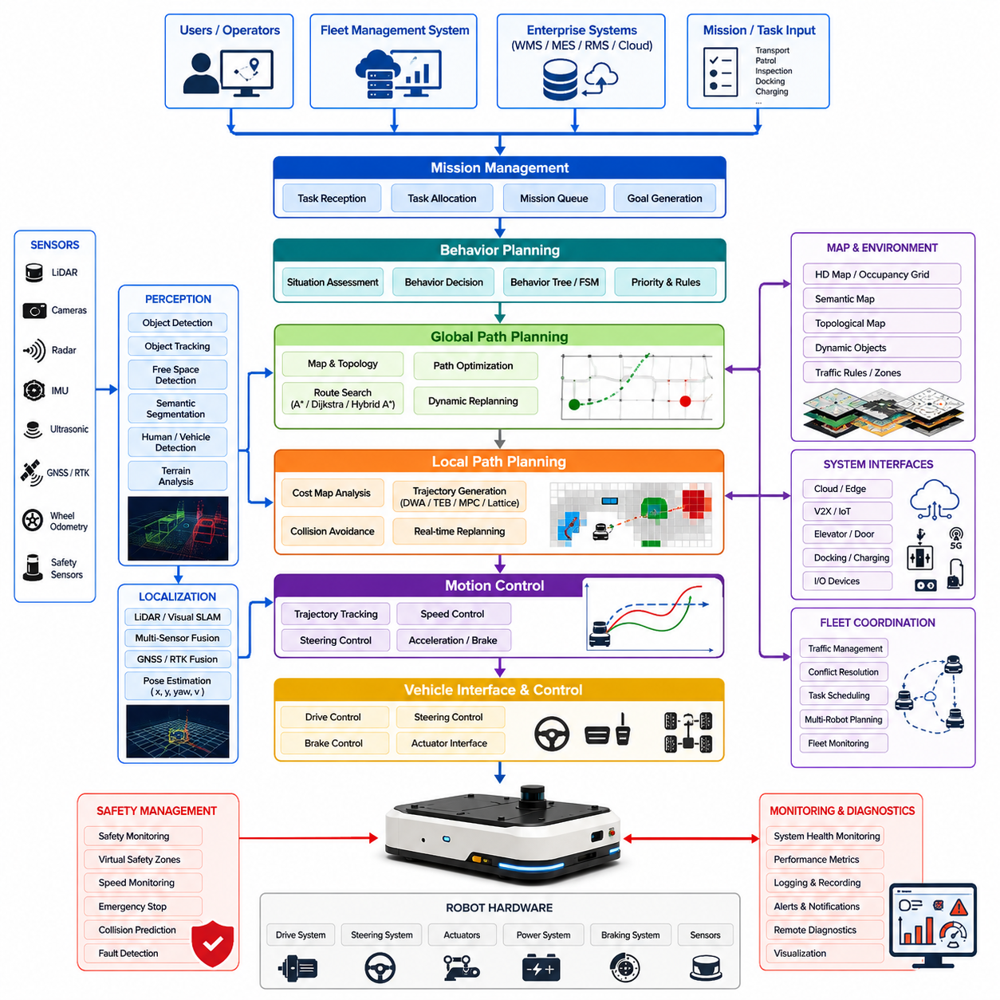
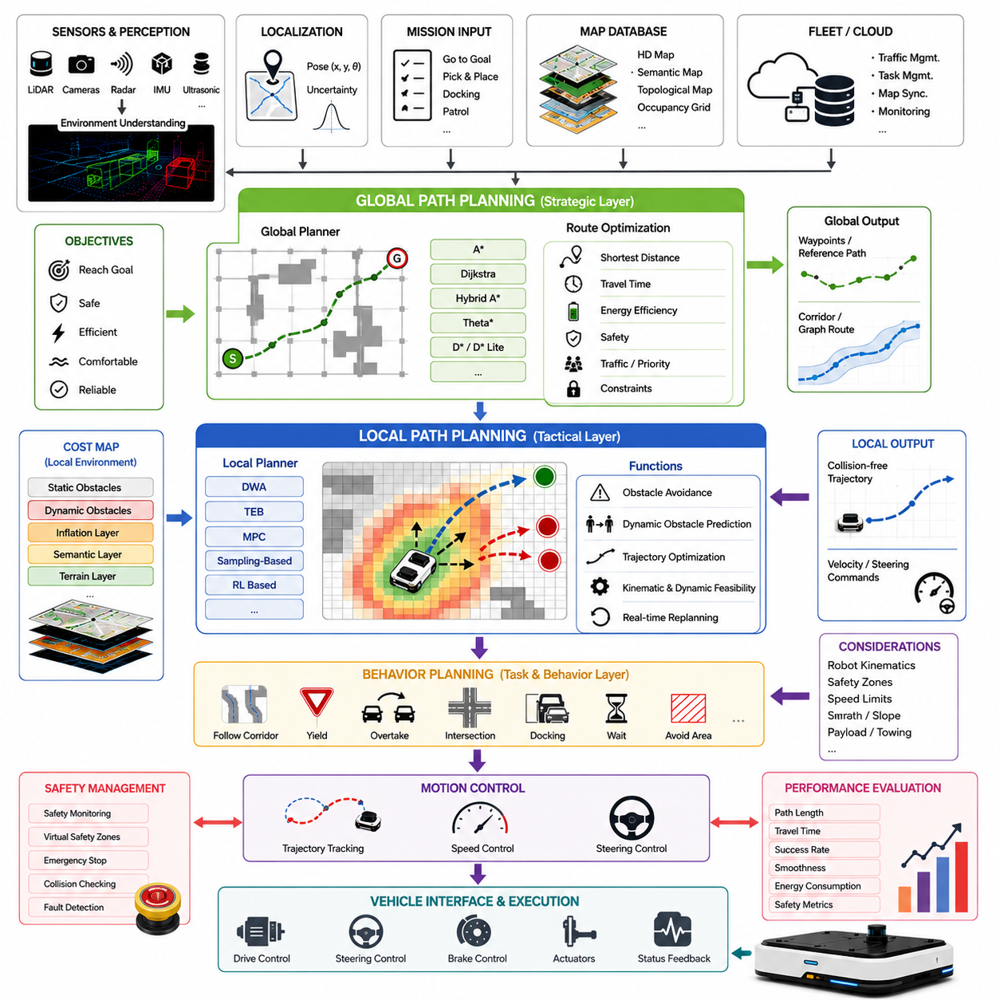
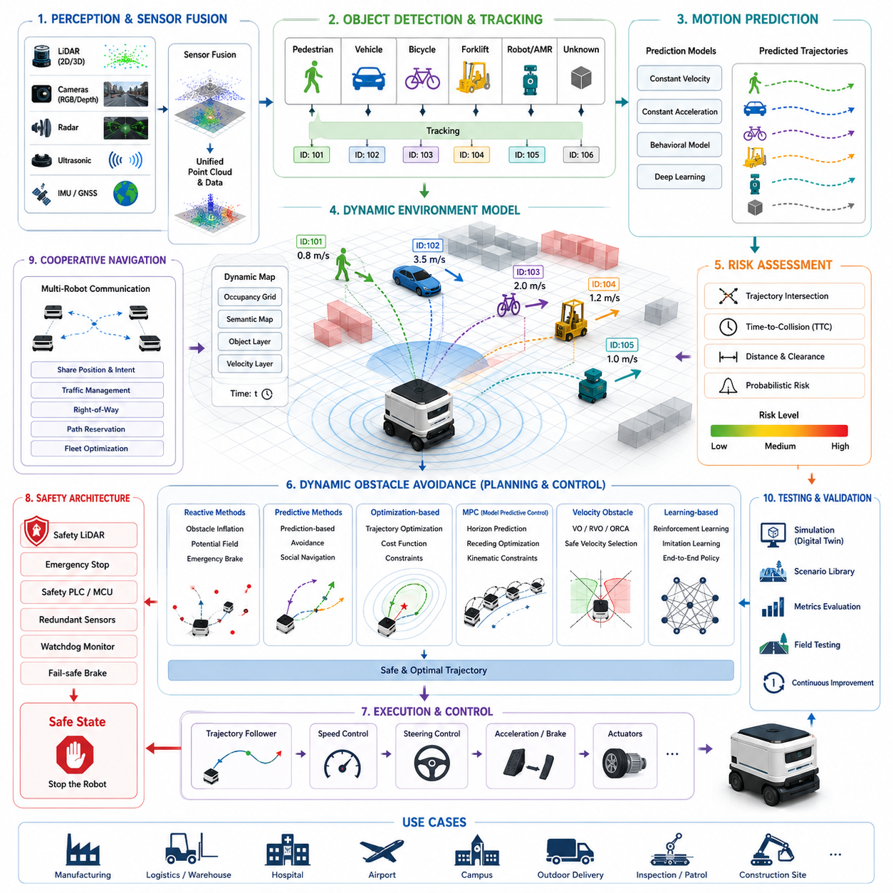
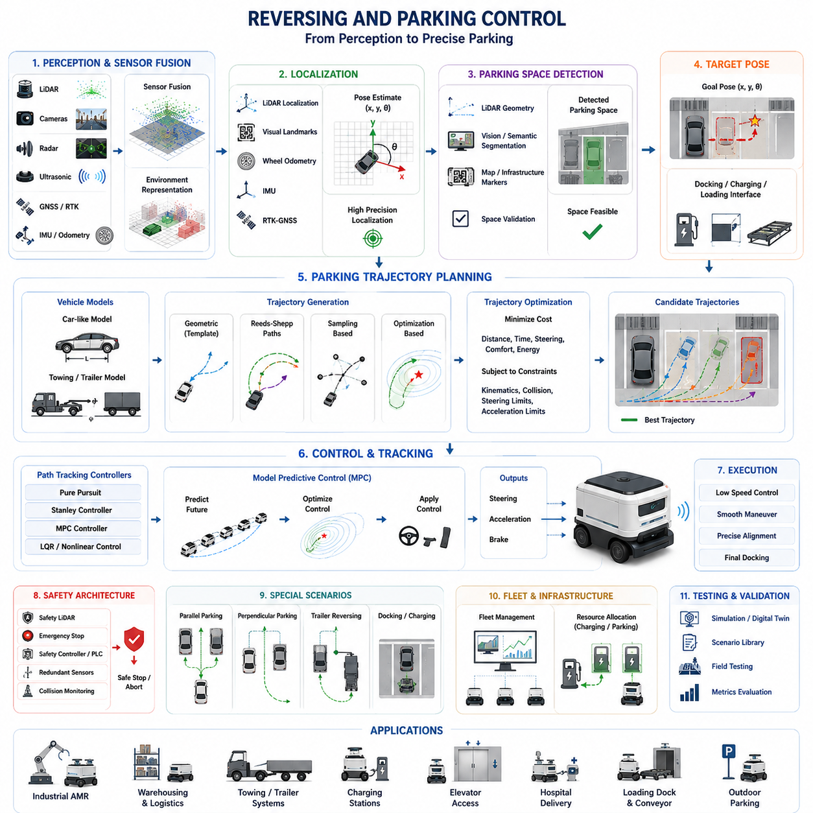
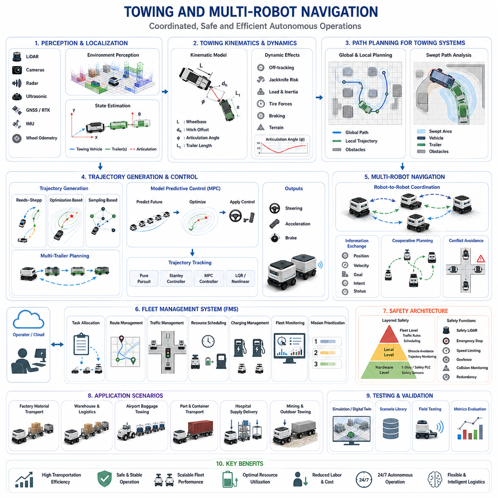
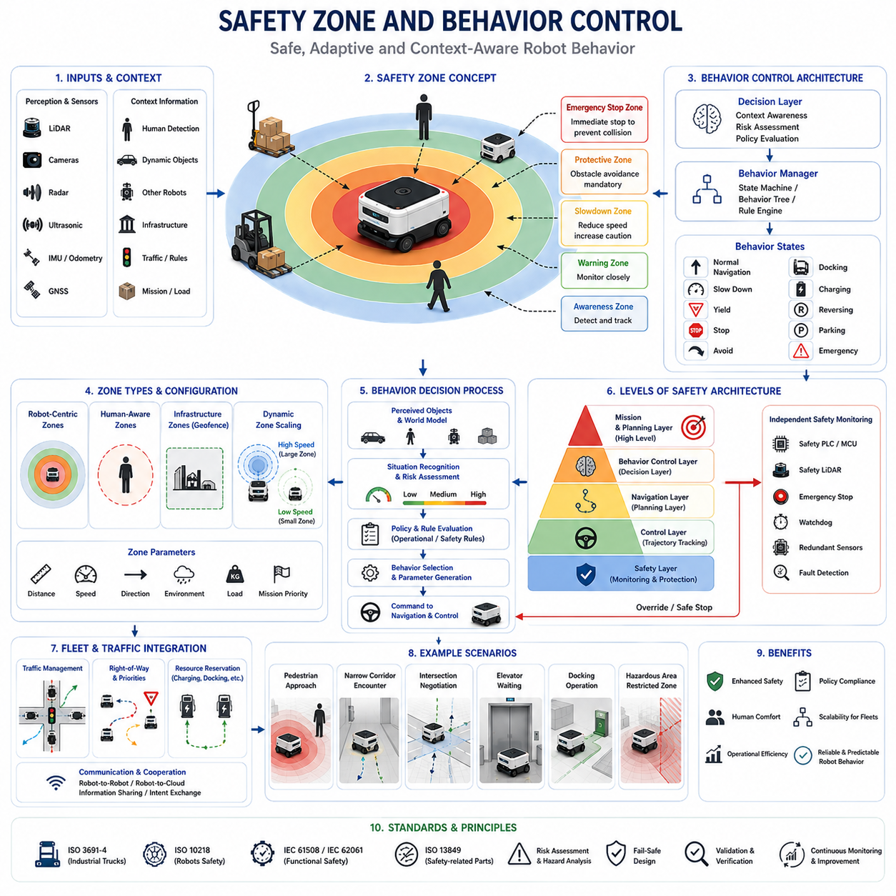
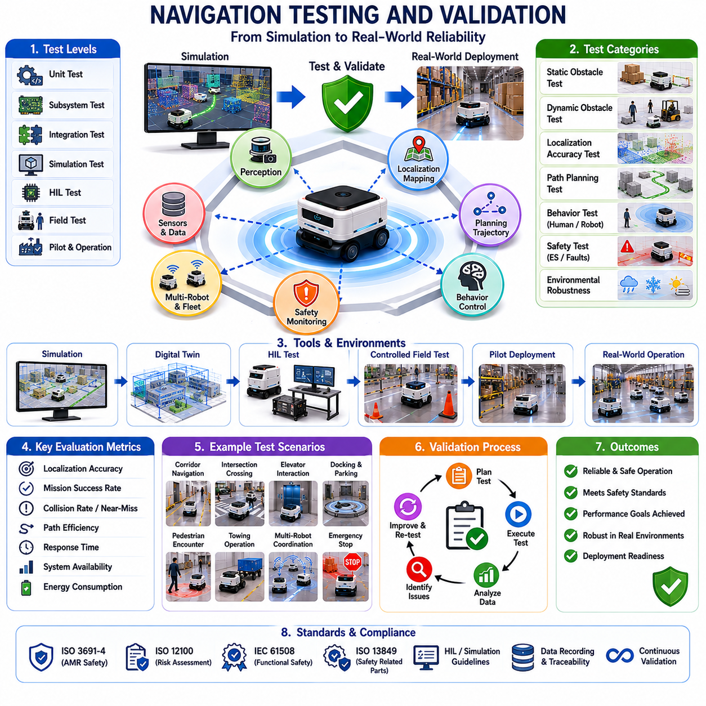
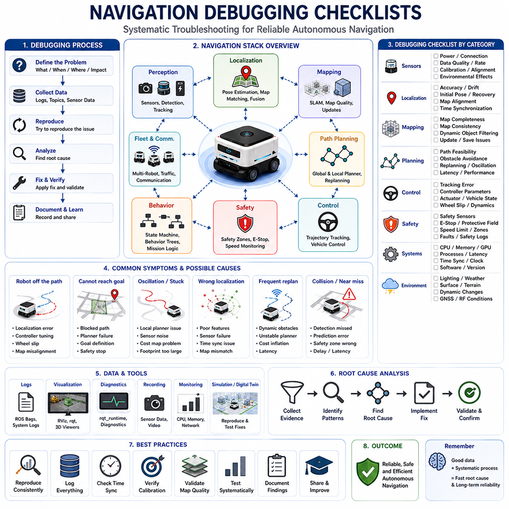

**Volume 10. AMR Engineering Process and Development Manual**

# Chapter09. Navigation Development Workflow

## 09.01 Navigation System Architecture

{width="7.268055555555556in" height="7.268055555555556in"}

Navigation System Architecture는 자율주행 이동로봇(AMR)의 가장 핵심적인 구성 요소 중 하나이다. 이 아키텍처는 인지(Perception)와 위치추정(Localization) 시스템으로부터 전달받은 정보를 실제 주행 명령으로 변환하는 의사결정 계층이며, 로봇이 안전하고 효율적으로 목적지까지 이동할 수 있도록 지원한다. 현대 AMR에서 내비게이션은 단순한 경로 탐색 알고리즘이 아니라 센서, 지도, 위치추정, 경로계획, 차량제어, 안전시스템, 클라우드 서비스 및 운영 시스템이 통합된 복합적인 소프트웨어 구조이다. 따라서 Navigation Development Workflow에서 Navigation System Architecture는 모든 내비게이션 기능의 기반이 되는 가장 중요한 단계로 간주된다.

내비게이션 시스템의 궁극적인 목표는 로봇을 현재 위치에서 목표 위치까지 이동시키는 것이다. 그러나 단순히 이동만 수행하는 것이 아니라 안전성, 효율성, 에너지 소비, 주행 성능, 환경 제약 조건, 운영 정책 등을 모두 고려해야 한다. 이를 위해 내비게이션 아키텍처는 위치추정 모듈, 지도 시스템, 인지 시스템, 차량 제어기, Fleet Management System(FMS), Robot Management System(RMS) 등 다양한 구성 요소와 지속적으로 정보를 교환한다. 이러한 구조는 대규모 산업 환경이나 병원, 물류센터, 스마트시티, 야외 자율주행 환경에서도 확장 가능하도록 설계된다.

내비게이션 아키텍처는 일반적으로 Mission Management Layer, Behavior Planning Layer, Global Path Planning Layer, Local Path Planning Layer, Motion Control Layer, Safety Management Layer 및 Monitoring Layer로 구성된다. 각 계층은 서로 다른 역할을 수행하지만 긴밀하게 연동되어 전체 자율주행 기능을 구현한다.

Mission Management Layer는 상위 시스템으로부터 작업 지시를 수신하는 역할을 담당한다. 작업 지시는 운영자, RMS, FMS, MES, WMS 또는 클라우드 서비스에서 전달될 수 있으며 특정 위치로 이동, 물류 운송, 순찰, 검사, 도킹, 충전 등의 작업이 포함된다. Mission Manager는 이러한 고수준 목표를 내비게이션 시스템이 처리할 수 있는 목표 좌표와 주행 명령으로 변환한다.

Behavior Planning Layer는 현재 상황에서 로봇이 어떤 행동을 수행해야 하는지 결정한다. 예를 들어 교차로에 접근했을 때 정지할 것인지, 우선권을 양보할 것인지, 우회할 것인지, 후진할 것인지 또는 새로운 경로를 요청할 것인지 등을 판단한다. 이러한 계층은 상태기계(State Machine), Behavior Tree, Rule-Based System, AI 기반 의사결정 시스템 등을 활용하여 구현된다. Behavior Planner는 로봇의 판단과 의사결정을 담당하는 두뇌 역할을 수행한다.

Global Path Planning Layer는 현재 위치에서 목표 위치까지의 전체 경로를 생성한다. 이 계층은 Occupancy Grid Map, Topological Map, Semantic Map, HD Map, Digital Twin Map 등을 활용하여 최적의 이동 경로를 계산한다. 대표적인 알고리즘으로는 A\*, Dijkstra, Hybrid A\*, Theta\*, D\* Lite 등이 사용된다. 글로벌 경로계획은 전체 이동 거리, 이동 시간, 에너지 소비, 제한 구역, 교통 흐름, 지형 조건 등을 고려하여 최적 경로를 산출한다.

글로벌 경로계획은 일반적으로 비교적 낮은 주기로 실행되지만, 대규모 공장, 병원, 항만, 공항, 스마트시티 환경에서는 경로 차단, 교통 혼잡, 임무 변경 등이 발생할 수 있으므로 동적 재계획 기능이 필요하다. 이를 통해 로봇은 실시간으로 새로운 최적 경로를 생성할 수 있다.

Local Path Planning Layer는 로봇 주변 환경을 기반으로 실제 주행 가능한 경로를 생성한다. 글로벌 플래너가 목적지까지의 큰 방향을 결정한다면, 로컬 플래너는 현재 순간에 어떻게 움직일지를 결정한다. 로컬 플래너는 사람, 차량, 장비, 장애물 등의 움직임을 실시간으로 분석하며 충돌 없는 안전한 궤적을 생성한다.

대표적인 로컬 플래닝 알고리즘으로는 Dynamic Window Approach(DWA), Timed Elastic Band(TEB), Model Predictive Control(MPC), Trajectory Optimization, Sampling-Based Planning 등이 있다. 이 계층은 일반적으로 10\~100Hz 수준의 높은 주기로 동작하며 실시간 환경 변화에 대응한다.

내비게이션 시스템의 핵심 구성요소 중 하나는 Cost Map Framework이다. Cost Map은 주변 환경을 수치적으로 표현하여 이동 위험도와 주행 가능성을 평가한다. LiDAR, 카메라, Radar, 초음파 센서, Depth Camera 등의 데이터를 통합하여 정적 장애물, 동적 장애물, 경사도, 위험 구역, 안전 영역, 통행 제한 구역 등을 표현한다. 로컬 플래너는 이러한 Cost Map을 활용하여 최적의 경로를 생성한다.

Localization Interface Layer는 내비게이션 시스템에 정확한 위치 정보를 제공한다. 위치추정이 부정확하면 아무리 우수한 경로계획 알고리즘도 정상적으로 동작할 수 없다. 위치 정보는 LiDAR SLAM, Visual SLAM, Multi-Sensor SLAM, GNSS RTK, IMU, Wheel Odometry, Landmark Localization 등의 기술을 통해 생성된다. 내비게이션 시스템은 위치뿐 아니라 방향, 속도, 오차 추정치(Covariance)까지 지속적으로 활용한다.

Perception Layer와의 연동 역시 매우 중요하다. 현대 AMR은 사람과 차량이 혼재된 동적 환경에서 동작하기 때문에 단순한 장애물 인식만으로는 충분하지 않다. 객체 검출(Object Detection), 객체 추적(Object Tracking), Free Space Detection, Semantic Segmentation, Human Detection, Vehicle Detection 등의 결과를 활용하여 주변 상황을 이해한다. 이를 통해 사람과 차량, 카트, 벽, 문, 장비 등을 구분하고 상황에 맞는 주행 전략을 수립할 수 있다.

Motion Control Layer는 실제 차량을 제어하는 계층이다. 로컬 플래너가 생성한 경로를 바탕으로 조향각, 속도, 가속도, 감속도, 제동 명령을 생성한다. 이 계층은 차량 동역학, 타이어 슬립, 하중 변화, 견인 조건, 노면 상태 등을 고려해야 한다. 대표적인 제어 방법으로는 PID Control, Pure Pursuit, Stanley Controller, MPC 등이 사용된다.

야외 자율주행 로봇에서는 내비게이션 아키텍처가 더욱 복잡해진다. GNSS 신호 오차, 멀티패스 현상, 기상 변화, 비포장 도로, 경사 지형, 식생 환경 등을 고려해야 하기 때문이다. 따라서 GNSS RTK, LiDAR Localization, Visual SLAM, IMU 기반 관성항법 등을 통합한 하이브리드 구조가 일반적으로 사용된다.

견인형 AMR(Towing AMR)의 경우 추가적인 복잡성이 존재한다. 트레일러가 연결되면 차량의 운동학적 특성이 변화하며 회전 반경, 궤적 추종, 후진 주행, 자동 결합 및 자동 주차 기능을 고려해야 한다. 특히 후진 상태에서의 주행 안정성과 트레일러 궤적 예측은 일반 AMR보다 훨씬 높은 수준의 경로계획 알고리즘을 요구한다.

다중 로봇 환경에서는 Fleet-Level Navigation이 필요하다. 각 로봇은 독립적으로 경로를 계획하지만 동시에 중앙 관제 시스템과 협력하여 교통 충돌, 병목 현상, 데드락을 방지해야 한다. 이를 위해 Fleet Manager, Traffic Manager, Map Server, Mission Scheduler 등이 통합된 아키텍처가 사용된다.

안전 시스템은 내비게이션 아키텍처 전체에 통합되어야 한다. Safety LiDAR, Safety PLC, Emergency Stop, Virtual Safety Zone, 속도 제한 기능 등이 항상 활성화되어 있어야 하며 위험 상황 발생 시 내비게이션 명령보다 우선적으로 동작해야 한다. 기능 안전(Functional Safety) 요구사항을 만족하기 위해 독립적인 감시 경로와 이중화 구조가 적용되는 경우도 많다.

현실 환경에서는 다양한 실패 상황이 발생하므로 Recovery Architecture 역시 필수적이다. 위치추정 실패, 장애물 차단, 지도 불일치, 센서 고장, 통신 장애 등이 발생하면 시스템은 자동 복구 절차를 수행해야 한다. 재경로 탐색, 후진 탈출, 재위치추정, 원격 운영자 호출, 안전 정지 등이 대표적인 복구 전략이다.

최근의 내비게이션 시스템은 대부분 ROS2 기반으로 구현된다. ROS2는 DDS 기반 통신 구조를 제공하며 Localization Node, Planner Node, Controller Node, Behavior Tree, Cost Map Server, Map Server, Recovery Manager 등을 모듈화하여 개발할 수 있도록 지원한다. 이러한 구조는 다양한 플랫폼에서 재사용성과 유지보수성을 크게 향상시킨다.

또한 클라우드와 엣지 컴퓨팅의 통합이 점차 중요해지고 있다. 실시간 제어는 엣지 컴퓨터에서 수행되고, 클라우드에서는 Fleet Optimization, Traffic Management, Data Analytics, Map Synchronization, Mission Scheduling 등이 수행된다. Digital Twin과 연계된 환경에서는 실제 운영 상황을 가상 공간에 재현하여 성능 예측과 최적화를 수행할 수 있다.

내비게이션 시스템은 지속적인 성능 평가와 검증이 필요하다. 주요 평가 지표로는 위치 정확도, 경로 효율성, 장애물 회피 성공률, 임무 성공률, 복구 성공률, 안전 사고 발생률, CPU 및 GPU 사용률, 에너지 효율성, Fleet 처리량 등이 사용된다. 이러한 지표들은 시스템의 신뢰성과 운영 효율성을 평가하는 중요한 기준이 된다.

향후 내비게이션 아키텍처는 AI 기반 의사결정, Foundation Model, World Model, Reinforcement Learning, Embodied AI, Multi-Agent Coordination 기술과 결합되면서 더욱 지능화될 것으로 예상된다. 로봇은 단순히 경로를 따라 이동하는 수준을 넘어 환경을 이해하고 미래 상황을 예측하며 사람과 협력하고 대규모 로봇 군집과 협조적으로 동작할 수 있게 될 것이다.

결국 Navigation System Architecture는 위치추정, 인지, 경로계획, 차량제어, 안전관리, Fleet Coordination을 하나의 통합 플랫폼으로 연결하는 핵심 프레임워크이다. 이는 산업용 AMR, 병원 물류 로봇, 견인형 AMR, 야외 순찰 로봇, GPR 기반 지하 인프라 검사 로봇, 농업 로봇, 스마트시티 로봇 등 다양한 자율주행 로봇 시스템의 성능과 신뢰성을 결정하는 가장 중요한 기술 기반이라고 할 수 있다.

## 09.02 Global and Local Path Planning

{width="7.268055555555556in" height="7.268055555555556in"}

Global Path Planning과 Local Path Planning은 자율주행 이동로봇(AMR) 내비게이션 시스템의 핵심 의사결정 구조를 구성하는 가장 중요한 기술이다. 위치추정(Localization)이 로봇이 어디에 있는지를 알려주고, 인지(Perception)가 주변 환경에 무엇이 존재하는지를 알려준다면, 경로계획(Path Planning)은 목적지까지 어떻게 이동해야 하는지를 결정한다. 현대 AMR 시스템에서 경로계획은 단순한 알고리즘 하나가 아니라 서로 다른 시간적·공간적 범위에서 동작하는 계층형(Hierarchical) 아키텍처로 구성된다. Global Planning과 Local Planning의 조합을 통해 로봇은 복잡하고 동적인 환경에서도 안전하고 효율적으로 자율주행을 수행할 수 있다. Navigation Development Workflow에서 경로계획은 임무 목표를 실제 주행 궤적으로 변환하는 핵심 지능 계층에 해당한다.

경로계획의 기본 목표는 현재 위치에서 목표 위치까지 충돌 없이 이동할 수 있는 안전하고 효율적인 경로를 생성하는 것이다. 하지만 실제 환경에서는 고정 장애물뿐 아니라 사람, 차량, 다른 로봇, 예측하기 어려운 환경 변화 등이 존재하기 때문에 문제는 매우 복잡해진다. 이를 해결하기 위해 대부분의 AMR 시스템은 Global Planner와 Local Planner를 분리하여 운영한다. Global Planner는 전체 환경을 고려한 장거리 경로를 생성하고, Local Planner는 현재 주변 환경을 고려하여 실시간 주행 경로를 생성한다.

Global Path Planning은 내비게이션의 전략적 계층에 해당한다. 이 계층의 주요 역할은 현재 위치에서 목적지까지 이동할 전체 경로를 결정하는 것이다. 글로벌 플래너는 Occupancy Grid Map, Topological Map, Semantic Map, HD Map, Vector Map, Digital Twin Map 등 다양한 지도 표현 방식을 활용한다. 이러한 지도 정보를 기반으로 전체 환경을 분석하고 최적의 이동 경로를 계산한다.

가장 널리 사용되는 글로벌 경로계획 알고리즘은 A\* 알고리즘이다. A\*는 현재까지의 이동 비용과 목표까지의 예상 비용을 동시에 고려하여 최적 경로를 탐색한다. 계산 효율성과 경로 품질이 우수하기 때문에 산업용 AMR에서 사실상 표준 알고리즘으로 사용되고 있다.

Dijkstra 알고리즘 역시 대표적인 글로벌 플래닝 기법이다. Dijkstra는 모든 가능한 경로를 탐색하여 최단 경로를 보장하지만 계산량이 많다. 따라서 A\*보다 느릴 수 있지만 최적해를 보장하는 특성 때문에 성능 비교 기준으로 자주 활용된다.

Hybrid A\*는 일반 A\*를 확장하여 차량의 운동학적 제약 조건을 고려한다. 이는 Ackermann Steering 차량, 야외 자율주행 로봇, 견인형 AMR과 같이 회전 반경이나 조향 제약이 존재하는 플랫폼에서 매우 중요하다. Hybrid A\*는 단순히 충돌 없는 경로가 아니라 실제 차량이 주행 가능한 경로를 생성한다.

Theta\* 알고리즘은 직선 가시성(Line-of-Sight)을 활용하여 더욱 자연스럽고 짧은 경로를 생성한다. 격자 기반 이동 제약을 줄여 보다 부드러운 경로를 제공하며 이동 효율성과 에너지 소비 측면에서 장점을 가진다.

실제 운영 환경에서는 장애물 이동, 통로 폐쇄, 교통 혼잡과 같은 변화가 발생할 수 있다. D\* 및 D\* Lite와 같은 알고리즘은 이러한 변화에 대응하여 동적으로 경로를 재생성할 수 있다. 기존 경로가 차단되더라도 전체 경로를 처음부터 다시 계산하지 않고 필요한 부분만 수정하기 때문에 효율적인 재계획이 가능하다.

글로벌 플래너는 단순히 이동 거리를 최소화하는 것만을 목표로 하지 않는다. 이동 시간, 에너지 소비, 안전성, 경사도, 통행 제한 구역, 교통 흐름, 임무 우선순위 등 다양한 요소를 동시에 고려한다. 이를 다중 목적 최적화(Multi-Objective Optimization)라고 하며 실제 산업 환경에서 매우 중요하게 사용된다.

글로벌 플래너의 출력 결과는 일반적으로 Waypoint, Navigation Corridor, Reference Path, Graph Route 등의 형태로 생성된다. 하지만 이러한 결과는 차량을 직접 제어하는 정보가 아니라 전체 이동 방향을 제시하는 상위 수준의 경로 정보이다. 실제 주행 가능한 궤적은 Local Planner가 생성한다.

Local Path Planning은 전술적·운영적 계층에 해당한다. 글로벌 플래너가 어디로 가야 하는지를 결정한다면 로컬 플래너는 지금 당장 어떻게 움직여야 하는지를 결정한다. 로컬 플래너는 주변 장애물, 이동 객체, 차량 상태, 안전 조건 등을 실시간으로 분석하여 실행 가능한 주행 궤적을 생성한다.

로컬 플래너는 일반적으로 10Hz에서 100Hz 수준의 높은 주기로 동작한다. 사람이나 차량이 갑자기 나타날 수 있고 환경 변화가 순간적으로 발생할 수 있기 때문에 매우 빠른 반응 속도가 요구된다.

대표적인 로컬 플래닝 기법 중 하나는 Dynamic Window Approach(DWA)이다. DWA는 가능한 속도 명령 후보들을 생성하고 각각의 미래 움직임을 예측한 뒤 목표 접근성, 장애물 회피 성능, 주행 안정성 등을 평가하여 최적의 명령을 선택한다. 계산량이 적고 구현이 간단하여 실내 AMR에서 널리 사용된다.

Timed Elastic Band(TEB)는 경로를 탄성 밴드 형태로 표현하고 지속적으로 최적화하는 방식이다. 장애물 회피와 시간 제약, 가속도 및 속도 제약을 동시에 고려할 수 있어 더욱 부드럽고 자연스러운 궤적을 생성한다.

Model Predictive Control(MPC)은 최근 가장 주목받는 기술 중 하나이다. MPC는 차량 동역학 모델을 활용하여 미래 상태를 예측하고 최적의 제어 명령을 계산한다. 높은 추종 정확도와 부드러운 주행 성능을 제공하기 때문에 고급 AMR과 야외 자율주행 로봇에서 점차 활용이 확대되고 있다.

Sampling-Based Planner는 다양한 후보 궤적을 생성한 후 안전성, 효율성, 에너지 소비, 편안함 등의 평가 기준을 적용하여 최적 궤적을 선택하는 방식이다. 복잡한 환경에서 유연하게 동작할 수 있다는 장점이 있다.

로컬 플래닝의 핵심 데이터 구조는 Cost Map이다. Cost Map은 환경을 수치적으로 표현한 지도이며 장애물과 위험 지역에는 높은 비용을 부여하고 안전한 영역에는 낮은 비용을 부여한다. 로컬 플래너는 이러한 Cost Map을 기반으로 최소 비용 경로를 탐색한다.

현대 Cost Map은 다중 레이어 구조로 구성된다. 정적 장애물 레이어는 벽, 설비, 구조물 등을 표현하며, 동적 장애물 레이어는 사람, 차량, 로봇 등을 표현한다. Inflation Layer는 안전 거리를 확보하기 위해 장애물 주변에 추가 비용을 부여한다. Semantic Layer는 보행자 구역, 위험 구역, 제한 구역 등을 표현한다. Terrain Layer는 경사도, 노면 상태, 주행 가능성 등을 나타낸다.

장애물 회피는 로컬 플래닝의 가장 중요한 기능 중 하나이다. 정적 장애물 회피는 벽이나 설비와의 충돌을 방지하며, 동적 장애물 회피는 움직이는 사람이나 차량의 미래 위치를 예측하여 안전한 경로를 생성한다. 최신 시스템은 객체 추적과 행동 예측 기술을 활용하여 더욱 안전한 회피 전략을 구현한다.

병원, 공항, 사무실, 공장과 같이 사람이 많은 환경에서는 Human-Aware Navigation이 중요하다. 사람의 이동 방향, 개인 공간, 군집 행동 등을 고려하여 자연스럽고 예측 가능한 경로를 생성해야 한다. 이러한 기능은 인간과 로봇이 공존하는 환경에서 필수적인 요소이다.

궤적 생성 과정에서는 차량의 운동학적 특성과 동역학적 특성을 반드시 고려해야 한다. Differential Drive, Omnidirectional Drive, Ackermann Steering, Skid Steering, Trailer Towing Vehicle 등은 서로 다른 주행 제약 조건을 가진다. 따라서 생성된 궤적은 수학적으로만 가능한 것이 아니라 실제 차량이 수행 가능한 형태여야 한다.

야외 자율주행 환경에서는 경로계획의 복잡성이 크게 증가한다. 비포장 도로, 경사 지형, GNSS 오차, 식생 환경, 기상 조건 등을 고려해야 하기 때문이다. 따라서 장거리 글로벌 경로계획과 실시간 로컬 적응을 결합한 계층형 아키텍처가 일반적으로 사용된다.

견인형 AMR에서는 추가적인 문제가 발생한다. 트레일러가 연결되면 차량 운동학이 복잡해지고 특히 후진 시 작은 조향 오차가 큰 위치 오차로 확대될 수 있다. 따라서 자동 결합, 후진 주차, 트레일러 추종 제어를 위한 특수 경로계획 알고리즘이 필요하다.

다중 로봇 환경에서는 경로 충돌 방지가 중요한 문제이다. 여러 로봇이 동일한 공간을 공유할 경우 각 로봇은 다른 로봇의 예상 경로를 고려해야 한다. Fleet Management System과 Traffic Management System은 중앙에서 전체 교통 흐름을 관리하고 로컬 플래너는 실시간 충돌 회피를 담당한다.

Behavior Planning은 글로벌 플래너와 로컬 플래너 사이의 중간 계층 역할을 수행한다. 복도 통과, 교차로 대기, 우선권 양보, 엘리베이터 탑승, 도킹 접근 등의 행동을 결정하며 이 결정이 전체 경로계획 과정에 영향을 미친다.

안전성은 경로계획 전체에 통합되어야 한다. Safety Zone, Emergency Stop Region, 속도 제한 구역, 보호 필드 등이 항상 고려되며 위험 상황이 발생하면 안전 시스템이 내비게이션 명령을 즉시 무효화할 수 있어야 한다.

최근에는 AI 기술이 경로계획에 적극적으로 활용되고 있다. 머신러닝은 장애물 예측과 행동 결정에 활용되며 강화학습(Reinforcement Learning)은 최적 주행 전략을 학습할 수 있도록 지원한다. Foundation Model과 World Model은 더욱 높은 수준의 상황 이해와 미래 예측 능력을 제공한다.

시뮬레이션은 경로계획 개발 과정에서 매우 중요한 역할을 수행한다. Gazebo, Isaac Sim, Digital Twin 플랫폼 등을 활용하여 수천 개 이상의 시나리오를 반복 검증할 수 있다. 이를 통해 실제 환경에 배포하기 전에 다양한 예외 상황과 실패 사례를 분석할 수 있다.

경로계획 성능 평가는 지속적으로 수행되어야 한다. 주요 평가 지표에는 경로 길이, 이동 시간, 장애물 회피 성공률, 경로 부드러움, 에너지 효율, 계산 지연 시간, 재계획 빈도, 안전 사고 발생률, 임무 성공률 등이 포함된다.

향후 경로계획 시스템은 기존 알고리즘과 AI 기반 의사결정 시스템이 결합된 형태로 발전할 것이다. Semantic Understanding, World Model, Multi-Agent Coordination, Embodied AI 기술이 적용되면서 로봇은 단순한 이동 장치를 넘어 환경을 이해하고 미래를 예측하며 협력적으로 행동하는 지능형 시스템으로 진화하게 될 것이다.

결국 Global Path Planning과 Local Path Planning은 자율주행의 핵심 심장부라 할 수 있다. 글로벌 플래닝은 장기적 방향을 제시하고, 로컬 플래닝은 실시간 적응 능력을 제공한다. 두 기술이 유기적으로 결합될 때 AMR은 공장, 병원, 물류센터, 항만, 공항, 농업 현장, 스마트시티, 야외 자율주행 환경 등 다양한 실제 운영 환경에서 안전하고 효율적인 자율주행을 수행할 수 있게 된다.

## 09.03 Dynamic Obstacle Avoidance

{width="7.268055555555556in" height="7.268055555555556in"}

동적 장애물 회피(Dynamic Obstacle Avoidance)는 현대 자율이동로봇(AMR), 자율주행 차량, 서비스 로봇, 물류 로봇, 점검 로봇, 실외 자율주행 로봇에서 가장 중요한 핵심 기능 중 하나이다. 전역 경로 계획(Global Path Planning)과 지역 경로 계획(Local Path Planning)이 로봇이 어디로 이동해야 하는지를 결정한다면, 동적 장애물 회피는 운행 중 예기치 않게 나타나는 이동 물체에 대해 안전하게 대응할 수 있도록 하는 역할을 수행한다. 이 기능은 사람이 존재하는 실제 환경에서 로봇이 안전하게 운용될 수 있도록 해주며, 보행자, 차량, 지게차, 카트, 자전거, 동물, 기타 이동체와의 상호작용을 가능하게 한다. 따라서 동적 장애물 회피는 단순한 경로 추종(Path Following)을 넘어 실제 자율성을 구현하는 핵심 기술이라 할 수 있다.

정적인 환경에서는 사전에 구축된 지도와 계획된 경로만으로도 이동이 가능하다. 그러나 공장, 물류센터, 병원, 공항, 캠퍼스, 건설 현장, 도심 환경과 같은 실제 운용 공간은 지속적으로 변화한다. 작업자가 이동하고, 지게차가 교차로를 통과하며, 차량이 진입하고, 임시 장애물이 수시로 발생한다. 따라서 로봇은 주변 환경을 지속적으로 감지하고, 움직이는 객체의 미래 위치를 예측하며, 충돌 가능성을 평가한 후 안전한 회피 경로를 생성해야 한다. 이러한 과정이 바로 동적 장애물 회피의 본질이다.

동적 장애물 회피의 첫 단계는 환경 인식(Perception)이다. 2D LiDAR, 3D LiDAR, RGB 카메라, Depth Camera, Radar, 초음파 센서, 열화상 카메라, GNSS, IMU 등 다양한 센서가 주변 환경 정보를 수집한다. 수집된 데이터는 인식 파이프라인을 통해 처리되며 객체 검출(Object Detection), 객체 분류(Classification), 객체 추적(Object Tracking), 속도 추정(Velocity Estimation) 등의 기능이 수행된다. 이를 통해 사람, 차량, 자전거, 로봇, 지게차, 기타 장애물을 구분하고 각각의 이동 상태를 파악할 수 있다.

다중 센서 융합(Multi-Sensor Fusion)은 동적 환경에서 매우 중요한 역할을 수행한다. 카메라는 야간이나 역광 환경에서 성능이 저하될 수 있으며, LiDAR는 반사체나 가림 현상에 영향을 받을 수 있다. Radar는 악천후에 강하지만 해상도가 낮다. 따라서 여러 센서의 정보를 통합함으로써 개별 센서의 약점을 보완하고 보다 안정적인 환경 인식을 수행할 수 있다. 센서 융합 시스템은 여러 센서의 데이터를 하나의 통합된 월드 모델(World Model)로 변환하여 더욱 정확한 객체 위치 및 이동 정보를 제공한다.

객체가 탐지되면 시스템은 동적 환경 모델(Dynamic Environment Model)을 구축한다. 정적 지도는 건물, 벽, 도로와 같은 고정 구조물을 표현하지만, 동적 환경 모델은 시간에 따라 변화하는 객체 정보를 포함한다. 점유 격자 지도(Occupancy Grid), Voxel Map, Semantic Map, Object-Centric Representation 등이 대표적인 방법이다. 특히 Dynamic Occupancy Grid는 각 셀(Cell)에 점유 확률뿐 아니라 이동 방향과 속도 정보까지 저장하여 미래 상황 예측에 활용한다.

동적 장애물 회피의 핵심은 미래 예측(Motion Prediction)이다. 현재 위치만을 기준으로 판단하는 것은 충분하지 않다. 로봇은 장애물이 앞으로 어디로 이동할 것인지를 예측해야 한다. 가장 단순한 방식은 현재 속도와 방향이 유지된다고 가정하는 Constant Velocity Model이다. 보다 발전된 방식은 가속도를 고려하는 Constant Acceleration Model이며, 최근에는 딥러닝 기반의 행동 예측 모델도 활용된다. 이러한 모델은 과거 이동 궤적, 주변 환경, 객체 종류 등을 고려하여 미래 경로를 확률적으로 예측한다.

특히 사람의 움직임은 예측하기 어렵다. 사람은 갑자기 멈추거나 방향을 바꾸고, 다른 사람과 상호작용하며 이동한다. 따라서 인간 중심 환경에서는 Social Navigation 개념이 중요하다. 로봇은 단순히 충돌을 피하는 것을 넘어 사람의 개인 공간(Personal Space)을 존중하고 사회적 규범을 고려하여 이동해야 한다. 병원에서는 환자와 의료진의 이동 패턴이 다르며, 물류센터에서는 작업자의 작업 동선이 존재한다. 이러한 맥락(Context)을 이해하는 것이 보다 자연스러운 회피 행동을 가능하게 한다.

충돌 위험도 평가(Collision Risk Assessment)는 예측된 장애물 경로와 로봇 경로가 충돌하는지를 분석하는 과정이다. 대표적으로 TTC(Time-To-Collision)와 같은 지표가 사용된다. TTC는 현재 상태가 유지될 경우 충돌까지 남은 시간을 의미한다. 또한 거리 기반 평가, 확률 기반 위험도 평가, 불확실성을 고려한 리스크 모델 등이 활용된다. 위험도가 높다고 판단되면 즉시 회피 동작 또는 감속 동작이 수행된다.

동적 장애물 회피 알고리즘은 크게 반응형(Reactive), 예측형(Predictive), 최적화 기반(Optimization-Based) 방식으로 구분할 수 있다.

반응형 방식은 현재 센서 데이터만을 이용하여 즉각적으로 대응한다. Potential Field, Obstacle Inflation, Emergency Braking 등이 대표적이다. 계산량이 적고 응답 속도가 빠르지만 진동 현상(Oscillation)이나 지역 최적점(Local Minimum) 문제가 발생할 수 있다.

예측형 방식은 장애물의 미래 위치를 고려한다. 현재뿐 아니라 미래 충돌 가능성까지 분석하여 보다 부드럽고 효율적인 회피 경로를 생성한다. 군중 환경이나 교차로 환경에서 특히 효과적이다.

최적화 기반 방식은 회피 문제를 수학적 최적화 문제로 정의한다. 이동 시간, 에너지 소비, 경로 부드러움, 승차감 등을 비용 함수(Cost Function)로 정의하고, 충돌 회피와 차량 운동학 제약을 만족하는 최적 경로를 계산한다.

최근 가장 널리 사용되는 방법 중 하나는 MPC(Model Predictive Control)이다. MPC는 일정 시간 범위 내 미래 상태를 예측하고 반복적으로 최적화 문제를 해결한다. 차량 동역학, 조향 제한, 가속도 제한, 안전 거리 등을 동시에 고려할 수 있기 때문에 실외 자율주행 로봇과 자율주행 차량에서 매우 효과적이다.

Velocity Obstacle 기반 알고리즘 역시 중요한 방법이다. 이 방법은 특정 속도를 선택했을 때 미래에 충돌이 발생하는 영역을 속도 공간에서 정의하고, 해당 영역을 피하는 속도를 선택한다. ORCA(Optimal Reciprocal Collision Avoidance)와 같은 확장 기법은 다수의 이동체가 서로 협력적으로 충돌을 회피하도록 지원한다.

최근에는 인공지능과 강화학습(Reinforcement Learning)을 활용한 회피 기술도 활발히 연구되고 있다. 강화학습 기반 시스템은 수많은 시뮬레이션을 통해 회피 정책을 학습할 수 있다. 또한 딥러닝 모델은 센서 데이터를 직접 입력받아 회피 행동을 생성할 수도 있다. 그러나 안전성 검증과 설명 가능성 측면에서 아직 해결해야 할 과제가 존재한다.

동적 장애물 회피에서 가장 중요한 요소는 안전성(Safety)이다. 고급 회피 알고리즘이 존재하더라도 최종적으로는 독립적인 안전 시스템이 반드시 존재해야 한다. 안전 LiDAR, Emergency Stop, 안전 PLC, 기능 안전 컨트롤러 등이 이에 해당한다. 만약 주행 시스템이 안전한 경로를 생성하지 못하는 경우, 안전 계층은 즉시 감속 또는 정지를 수행해야 한다.

이를 위해 다수의 로봇은 Safety Zone 개념을 사용한다. 로봇 주변을 여러 영역으로 구분하여 관리한다. 외곽 경고 영역에서는 속도를 줄이고, 보호 영역에서는 회피 동작을 수행하며, 위험 영역에서는 즉시 정지한다. 이러한 영역은 차량 속도, 하중, 환경 조건에 따라 동적으로 조정될 수 있다.

실외 자율주행 로봇은 더욱 복잡한 문제를 가진다. 차량, 자전거, 보행자, 동물, 건설 장비 등 매우 다양한 이동체가 존재한다. 또한 비, 눈, 안개, 먼지, 강한 햇빛 등 기상 조건이 센서 성능에 영향을 준다. 따라서 실외 환경에서는 더욱 강인한 인식 시스템과 예측 시스템이 요구된다.

대형 산업용 로봇과 견인형 AMR의 경우 추가적인 고려사항이 존재한다. 높은 하중은 제동 거리를 증가시키고 회전 성능을 제한한다. 트레일러가 연결된 경우 회피 동작 중 안정성이 저하될 수 있다. 따라서 차량 본체뿐 아니라 트레일러 전체의 궤적을 고려한 회피 계획이 필요하다.

다중 로봇 환경에서는 Fleet Management System(FMS)이 중요한 역할을 수행한다. 로봇들은 서로 위치와 의도를 공유하며 협력적으로 이동한다. 교차로 우선순위, 경로 예약, 교통 흐름 관리 등을 통해 전체 시스템의 효율성과 안전성을 향상시킨다.

동적 장애물 회피 알고리즘 개발 과정에서 시뮬레이션은 필수적이다. 가상 환경에서는 수천 개 이상의 시나리오를 반복적으로 시험할 수 있다. 보행자 횡단, 차량 진입, 갑작스러운 장애물 출현, 군중 환경, 비상 정지 상황 등 다양한 사례를 안전하게 검증할 수 있다. 이러한 시뮬레이션은 실제 현장 시험 이전에 알고리즘의 안정성과 성능을 검증하는 중요한 수단이 된다.

검증 과정에서는 충돌률, 근접 사고 발생률, 최소 안전 거리, 이동 효율성, 경로 부드러움, 승차감, 계산 지연 시간, 임무 성공률 등의 지표가 평가된다. 또한 실내와 실외 환경 모두에서 반복 시험이 수행되어야 하며, 다양한 기상 조건과 운영 조건이 포함되어야 한다.

실시간 성능 또한 매우 중요하다. 환경은 지속적으로 변화하므로 인식, 예측, 계획, 제어 과정이 수십 밀리초 수준에서 반복 수행되어야 한다. 이를 위해 GPU 가속, 병렬 처리, 최적화된 ROS2 아키텍처, Edge AI 플랫폼 등이 활용된다.

향후 동적 장애물 회피 기술은 Embodied AI, Foundation Model, Multimodal AI, World Model 기술과 결합될 것으로 예상된다. 미래의 로봇은 단순히 장애물을 피하는 수준을 넘어 사람의 의도를 이해하고, 협상하며, 사회적으로 자연스러운 방식으로 이동하게 될 것이다. 또한 다수의 자율 시스템이 협력하여 도시 전체 수준의 이동 최적화를 수행하는 방향으로 발전할 것이다.

결국 동적 장애물 회피는 인식(Perception), 예측(Prediction), 경로 계획(Planning), 제어(Control), 안전(Safety), 인공지능(AI)을 하나로 통합하는 자율주행의 핵심 기술이다. 병원, 공장, 물류센터, 스마트시티, 실외 점검 로봇, GPR 탐사 로봇, 순찰 로봇, 견인형 AMR 등 다양한 응용 분야에서 성공적인 자율주행을 실현하기 위해 반드시 확보되어야 하는 핵심 역량이며, 미래 자율로봇 산업의 경쟁력을 결정하는 중요한 기술 분야로 자리매김할 것이다.

## 09.04 Reversing and Parking Control

{width="7.268055555555556in" height="7.268055555555556in"}

후진 및 주차 제어(Reversing and Parking Control)는 현대 자율이동로봇(AMR), 자율주행 차량, 견인 로봇, 실외 자율주행 플랫폼, 물류 로봇, 병원 서비스 로봇 및 산업용 운송 시스템에서 매우 중요한 핵심 기술이다. 일반적으로 자율주행 시스템 개발에서는 전진 주행에 많은 관심이 집중되지만, 실제 현장에서는 후진 주행과 자동 주차 기능 역시 동일한 수준으로 중요하다. 로봇은 충전 스테이션, 도킹 위치, 적재 구역, 엘리베이터, 좁은 통로, 트레일러, 카트 및 지정된 주차 공간에 접근해야 하며, 이러한 작업은 전진 주행만으로는 수행하기 어렵다. 따라서 후진 및 주차 제어는 부가 기능이 아니라 자율주행 시스템의 핵심 구성 요소로 발전하였다. Navigation Development Workflow 관점에서 보면 후진 및 주차 제어는 Dynamic Obstacle Avoidance 이후 단계에 위치하며, 인식, 계획, 궤적 생성, 제어, 안전 관리 및 동작 실행이 모두 결합된 고난도 기술 분야라 할 수 있다.

자율 주차는 일반적인 주행과 근본적으로 다르다. 일반 주행에서는 비교적 넓은 공간에서 사전에 생성된 경로를 따라 이동하면 되지만, 주차 과정에서는 매우 좁은 공간에서 정밀한 위치 제어가 요구된다. 주변 장애물과의 간격이 수 센티미터에 불과한 경우도 많으며, 작은 위치 오차나 조향 오차도 충돌이나 도킹 실패로 이어질 수 있다. 따라서 주차 제어는 일반 주행보다 훨씬 높은 위치 정확도와 제어 정밀도, 그리고 강화된 안전 기능을 요구한다.

후진 주행은 차량의 운동 특성 자체가 전진과 다르기 때문에 더욱 복잡하다. 대부분의 차량은 전진 주행에 최적화된 조향 구조를 가지고 있으며, 후진 시에는 조향 응답이 비직관적으로 나타난다. 작은 조향 입력이 큰 궤적 변화로 이어질 수 있으며, 안정성도 감소할 수 있다. 특히 견인 차량이나 트레일러가 연결된 시스템에서는 잭나이프(Jackknife) 현상까지 고려해야 하므로 더욱 복잡한 운동학 및 동역학 모델이 필요하다.

후진 및 주차 제어의 목표는 현재 위치에서 목표 자세(Target Pose)까지 로봇을 이동시키는 것이다. 목표 자세는 단순한 위치뿐 아니라 방향까지 포함한다. 충전 스테이션, 자동 도킹 시스템, 자동 커플러, 컨베이어 인터페이스, 엘리베이터 입구, 보관 랙 등의 경우에는 몇 센티미터 이내의 위치 정확도와 수 도 이내의 방향 정확도가 요구된다.

주차 과정은 환경 인식으로부터 시작된다. LiDAR, 카메라, Depth Sensor, Radar, 초음파 센서, GNSS, IMU, 엔코더 및 위치추정 시스템이 지속적으로 환경 정보를 수집한다. 이러한 센서들은 주차 공간, 장애물, 차선, 도킹 목표물, 벽, 충전기 및 주변 구조물에 대한 정보를 제공한다. 센서 융합 시스템은 이 데이터를 통합하여 안정적인 환경 모델을 구축한다.

주차에서는 위치추정(Localization)의 정확성이 매우 중요하다. 일반적인 실외 주행에서는 수십 센티미터 수준의 오차가 허용될 수 있지만, 주차에서는 훨씬 높은 정밀도가 요구된다. LiDAR Localization, Visual Localization, Wheel Odometry, IMU 융합, RTK-GNSS, QR 코드, AprilTag, 자기 마커 등의 기술이 결합되어 고정밀 위치추정이 수행된다. 많은 산업용 시스템은 최종 주차 단계에서 별도의 정밀 위치 모드로 전환하기도 한다.

주차용 환경 모델은 일반 주행용 지도와 다르다. 주차 공간의 형상, 경계 조건, 도킹 인터페이스, 충전기 위치, 적재 공간 및 주변 장애물 정보가 상세하게 표현된다. 이를 위해 고해상도 Occupancy Grid, Semantic Parking Map, Docking Landmark Map 등이 사용된다.

주차 공간 검출(Parking Space Detection)은 핵심 인식 기능 중 하나이다. 시스템은 사용 가능한 주차 공간을 탐지하고 해당 공간이 충분한지 판단해야 한다. LiDAR 기반 형상 분석, 카메라 기반 비전 인식, Semantic Segmentation, 인프라 마커 인식 등이 활용된다. 실외 환경에서는 주차선, 연석, 콘, 펜스, 가상 경계 등이 활용될 수 있으며, 산업 환경에서는 충전기나 도킹 스테이션 위치가 주차 공간 역할을 한다.

주차 목표가 결정되면 시스템은 실행 가능한 주차 경로를 생성한다. 주차 경로 계획은 차량 운동학 제약을 반드시 고려해야 한다. 차량은 즉시 원하는 방향으로 움직일 수 없으며, 조향 각도 제한, 최소 회전 반경, 가속도 제한, 차량 크기, 장애물 간격 등이 모두 고려되어야 한다.

주차 경로 생성에는 다양한 방법이 사용된다. 기하학 기반 경로 생성은 미리 정의된 주차 패턴을 활용하며, 최적화 기반 방법은 주차 문제를 수학적 최적화 문제로 정의한다. 샘플링 기반 방법은 다양한 경로 후보를 생성하여 가장 적합한 경로를 선택한다. 실제 산업용 시스템에서는 이들 방법을 혼합하여 사용하는 경우가 많다.

Reeds-Shepp Path는 자율 주차에서 가장 널리 사용되는 방법 중 하나이다. Dubins Path가 전진 주행만을 고려하는 반면 Reeds-Shepp Path는 전진과 후진을 모두 허용하여 최단 경로를 생성할 수 있다. 좁은 공간에서 여러 번 방향을 전환해야 하는 주차 상황에 매우 적합하다.

경로 최적화(Trajectory Optimization)는 생성된 경로를 더욱 효율적으로 개선하는 과정이다. 이동 거리, 조향 횟수, 주행 시간, 승차감, 에너지 소비, 장애물 간격 등을 고려하여 최적의 주차 궤적을 계산한다. 이를 통해 보다 부드럽고 안정적인 주차 동작이 가능해진다.

견인형 AMR의 후진 주차는 훨씬 더 어려운 문제이다. 트레일러가 연결된 경우 후진 시 작은 조향 오차가 큰 트레일러 편차를 발생시킬 수 있다. 또한 잭나이프 현상을 방지해야 한다. 따라서 트레일러 각도, 히치(Hitch) 위치, 연결 구조를 포함한 고급 운동학 모델이 필요하다. 실제로 견인 차량의 후진 주차는 자율주행 분야에서도 가장 어려운 문제 중 하나로 알려져 있다.

Model Predictive Control(MPC)은 후진 및 주차 제어에 매우 효과적인 방법이다. MPC는 미래 차량 상태를 예측하고 반복적으로 최적화 문제를 해결한다. 이를 통해 차량 동역학, 장애물 회피, 조향 제한 및 목표 위치 도달 조건을 동시에 만족하는 제어 명령을 생성할 수 있다.

생성된 경로는 Trajectory Tracking Controller에 의해 추종된다. Pure Pursuit, Stanley Controller, MPC Controller, LQR Controller 등이 대표적으로 사용된다. 이러한 제어기는 실제 차량 위치와 목표 경로를 지속적으로 비교하여 조향, 가속 및 제동 명령을 생성한다.

주차 중에도 장애물 회피 기능은 항상 활성화되어야 한다. 주차 공간에는 작업자, 차량, 카트, 다른 로봇 등이 존재할 수 있기 때문이다. 만약 사람이 주차 공간에 진입하면 로봇은 즉시 정지하거나 새로운 경로를 생성해야 한다. 따라서 주차 시스템과 동적 장애물 회피 시스템은 긴밀하게 통합되어야 한다.

안전 아키텍처는 후진 및 주차 제어의 핵심 요소이다. 후진 시에는 센서 시야가 제한될 수 있으며 충돌 위험도 증가한다. 따라서 Safety LiDAR, 초음파 센서, Emergency Stop, 안전 컨트롤러, 이중화 센서 시스템이 사용된다. 위험 상황이 감지되면 즉시 감속, 정지 또는 주차 중단이 수행되어야 한다.

주차 시 속도는 일반 주행보다 훨씬 낮게 유지된다. 저속 주행은 제어 정확도를 높이고 정지 거리를 줄이며 안전성을 향상시킨다. 목표 위치에 가까워질수록 속도를 점진적으로 감소시키며, 최종 도킹 단계에서는 초당 수 센티미터 수준의 매우 낮은 속도로 이동하는 경우도 많다.

자동 도킹(Automatic Docking)은 주차 기술의 확장 개념이다. 충전 스테이션, 컨베이어, 자동 커플러, 물류 인터페이스 등과 정확하게 결합해야 한다. 이를 위해 정렬 카메라, 레이저 가이드, 적외선 마커, 자기 유도 시스템, 접촉 센서 등이 추가적으로 사용될 수 있다.

자율 충전 시스템은 자동 주차 기술의 대표적인 응용 사례이다. 배터리 잔량이 일정 수준 이하로 감소하면 로봇은 충전 스테이션으로 이동하여 자동 주차를 수행하고 충전을 시작한다. 이러한 기능은 무인 운영을 가능하게 하고 운영 비용을 크게 절감한다.

산업용 물류 환경에서는 반복적인 주차 작업이 이루어진다. 생산 라인, 적재 랙, 팔레트 스테이션, 컨베이어 인터페이스 등에 정확하게 위치해야 한다. 위치 오차가 발생하면 물류 흐름이 중단되거나 생산성이 저하될 수 있으므로 매우 높은 정밀도가 요구된다.

병원 로봇은 충전, 물품 배송, 엘리베이터 이용, 약품 운송 등의 과정에서 주차 기능을 활용한다. 병원 환경은 좁은 복도와 많은 사람들로 구성되어 있으므로 안전성과 예측 가능한 행동이 매우 중요하다.

실외 자율주행 로봇은 경사, 비포장 지형, 기상 변화, 조명 변화, GNSS 오차 등의 영향을 받는다. 따라서 실외 주차 시스템은 강인한 인식 기술과 적응형 제어 기술을 필요로 한다. RTK-GNSS, LiDAR Localization, 비전 기반 랜드마크 시스템이 주로 활용된다.

Fleet Management System(FMS)은 여러 대의 로봇 주차를 효율적으로 관리한다. 충전기와 도킹 공간은 공유 자원이기 때문에 예약, 우선순위 관리, 교통 흐름 제어가 필요하다. 효율적인 주차 스케줄링은 전체 시스템 생산성을 향상시킨다.

시뮬레이션은 주차 시스템 개발에서 매우 중요한 역할을 한다. 디지털 트윈 환경에서 좁은 주차 공간, 트레일러 후진, 충전기 정렬, 동적 장애물 상황 등을 반복적으로 시험할 수 있다. 이는 실제 현장에서 위험한 상황을 안전하게 검증할 수 있게 해준다.

검증 과정에서는 주차 정확도, 방향 정확도, 도킹 성공률, 이동 시간, 안전 거리 유지율, 충돌 발생률, 위치 오차, 제어 안정성 등이 평가된다. 다양한 환경 조건과 실제 운용 시나리오를 포함한 시험이 수행되어야 한다.

최근에는 인공지능 기술이 주차 시스템에도 적용되고 있다. 딥러닝 기반 시스템은 주차 공간 탐지, 경로 생성, 장애물 예측 및 최적화를 지원한다. 강화학습은 다양한 시뮬레이션 환경에서 효율적인 주차 전략을 학습할 수 있다. 향후에는 Vision-Language Model과 Multimodal AI가 주차 기능에도 적용될 것으로 예상된다.

미래의 후진 및 주차 제어 기술은 더욱 높은 자율성과 정밀도를 갖추게 될 것이다. 로봇은 복잡한 환경에서도 사람 수준 이상의 주차 능력을 확보하고, 다른 자율 시스템과 협력하며, 충전기와 물류 인프라를 자동으로 활용하게 될 것이다. World Model, Semantic Understanding, Cooperative Autonomy 기술이 이러한 발전을 더욱 가속화할 것으로 예상된다.

결국 후진 및 주차 제어는 인식, 위치추정, 경로 계획, 궤적 생성, 제어, 안전 공학 및 운영 지능이 결합된 종합 기술이다. 산업용 AMR, 견인 로봇, 병원 서비스 로봇, 실외 자율주행 로봇, GPR 점검 로봇 등 다양한 응용 분야에서 필수적인 핵심 기술이며, 장시간 무인 운영과 완전 자율화를 실현하기 위한 중요한 기반 기술로 자리 잡고 있다.

## 09.05 Towing and Multi-Robot Navigation

{width="7.268055555555556in" height="7.268055555555556in"}

견인 및 다중 로봇 내비게이션(Towing and Multi-Robot Navigation)은 자율이동로봇 분야에서 가장 복잡하고 고도화된 기술 영역 중 하나이다. 일반적인 내비게이션 시스템이 단일 로봇을 안전하게 목적지까지 이동시키는 데 초점을 맞춘다면, 견인 내비게이션은 트레일러나 카트가 연결된 차량의 운동학적 특성을 다루어야 하며, 다중 로봇 내비게이션은 여러 대의 자율 로봇이 동일한 공간에서 협력적으로 운용되는 문제를 해결해야 한다. 특히 두 기술이 결합될 경우 로봇은 자신의 움직임뿐만 아니라 다른 로봇들의 의도와 경로, 그리고 연결된 트레일러의 거동까지 동시에 고려해야 한다. Navigation Development Workflow에서 Towing and Multi-Robot Navigation은 Reversing and Parking Control 다음 단계에 위치하며, 인식, 위치추정, 경로계획, 장애물 회피, 궤적 생성 및 안전 기술을 기반으로 하면서도 상위 수준의 협업과 플릿(Fleet) 지능을 추가하는 분야이다.

견인 내비게이션은 차량이 하나 이상의 트레일러, 카트, 컨테이너 또는 적재 장비를 연결한 상태에서 자율적으로 이동하는 기술을 의미한다. 이러한 시스템은 제조 공장, 물류센터, 병원, 공항, 항만, 광산 및 대형 산업 현장에서 널리 활용된다. 일반적인 AMR은 자신의 차체만 고려하면 되지만, 견인 로봇은 연결된 모든 장치의 움직임까지 함께 관리해야 한다.

트레일러가 연결되면 차량의 운동 특성이 크게 달라진다. 전진 주행에서는 비교적 안정적이지만 회전 시에는 트레일러가 차량과 다른 궤적을 따라 이동한다. 이를 오프트래킹(Off-Tracking)이라 하며, 트레일러는 차량보다 안쪽으로 회전하는 경향이 있다. 따라서 내비게이션 시스템은 차량 자체의 경로뿐만 아니라 트레일러가 차지하는 전체 공간까지 고려해야 한다.

후진 시에는 상황이 더욱 복잡해진다. 트레일러는 본질적으로 불안정한 거동을 보이며 작은 조향 입력도 큰 각도 변화로 증폭될 수 있다. 적절한 제어가 이루어지지 않으면 잭나이프(Jackknife) 현상이 발생하여 차량과 트레일러가 접히듯 꺾이게 된다. 이는 충돌이나 기계적 손상으로 이어질 수 있기 때문에 후진 견인 제어는 자율주행 분야에서도 가장 어려운 문제 중 하나로 간주된다.

정확한 견인 내비게이션을 위해서는 차량의 운동학 모델(Kinematic Model)이 필수적이다. 차량의 휠베이스, 조향 각도, 히치(Hitch) 위치, 트레일러 길이, 연결 구조 및 관절 각도 제한 등을 모델링해야 한다. 이러한 모델은 미래 차량 상태를 예측하고 안전한 경로를 생성하는 기반이 된다.

고하중 산업용 시스템에서는 동역학 모델(Dynamic Model)의 중요성이 더욱 커진다. 수 톤 이상의 화물을 운반하는 경우 관성, 하중 분포, 타이어 힘, 제동 성능, 노면 상태 등이 차량 거동에 큰 영향을 미친다. 따라서 가속, 감속, 선회 및 비상 제동 상황까지 고려한 정교한 동역학 모델이 필요하다.

견인 로봇의 인식 시스템은 일반 AMR과 유사하게 LiDAR, 카메라, Radar, 초음파 센서, GNSS, IMU 등을 활용한다. 그러나 차량 주변뿐 아니라 연결된 트레일러 전체 영역까지 감지해야 한다. 트레일러에 의해 발생하는 사각지대를 제거하기 위해 추가 센서와 고급 센서 융합 기술이 요구된다.

위치추정 역시 차량뿐 아니라 트레일러의 위치와 방향까지 계산해야 한다. 대부분의 트레일러에는 별도의 위치 센서가 없으므로 차량의 운동 모델, 히치 센서, 카메라 및 LiDAR 데이터를 이용하여 트레일러 위치를 추정한다. 이는 좁은 통로와 복잡한 환경에서 매우 중요한 요소이다.

견인 차량의 경로 계획은 일반 차량보다 훨씬 복잡하다. 일반적인 경로 계획은 강체 차량을 가정하지만, 견인 차량은 연결 구조와 관절 운동을 고려해야 한다. 계획된 경로는 차량뿐 아니라 트레일러 전체가 충돌 없이 이동할 수 있도록 생성되어야 한다.

이를 위해 스웨프트 패스 분석(Swept Path Analysis)이 사용된다. 스웨프트 패스는 차량과 트레일러가 이동하는 동안 차지하게 되는 전체 공간을 의미한다. 충돌 검사 알고리즘은 이 공간이 벽, 기둥, 장비, 장애물 및 다른 차량과 겹치지 않는지 지속적으로 확인한다.

견인 경로 생성은 주로 최적화 기반 접근법을 사용한다. 이동 거리, 조향 횟수, 에너지 소비, 주행 시간 등을 최소화하면서 차량 운동학, 관절 각도 제한, 충돌 회피 및 안전 조건을 만족하는 경로를 계산한다.

Model Predictive Control(MPC)은 견인 차량 제어에서 매우 효과적인 방법이다. MPC는 차량과 트레일러의 미래 상태를 예측하고 반복적으로 최적화 문제를 해결한다. 이를 통해 조향 각도, 트레일러 각도, 장애물 위치 및 안정성을 동시에 고려한 제어 명령을 생성할 수 있다.

트레일러가 여러 대 연결된 경우 문제는 더욱 복잡해진다. 공항 수하물 운송 시스템이나 항만 물류 차량에서는 다중 트레일러 구성이 자주 사용된다. 각 트레일러는 새로운 자유도(Degree of Freedom)를 추가하며 시스템의 비선형성을 증가시킨다. 따라서 보다 정교한 계획 및 제어 알고리즘이 필요하다.

다중 로봇 내비게이션(Multi-Robot Navigation)은 여러 대의 자율 로봇이 동일한 공간에서 동시에 작업하는 환경을 다룬다. 각 로봇은 독립적인 임무를 수행하면서도 전체 시스템의 효율성을 유지해야 한다. 적절한 협력이 없으면 교통 혼잡, 교착 상태(Deadlock), 충돌 및 생산성 저하가 발생할 수 있다.

다중 로봇 내비게이션의 목표는 개별 로봇의 성능이 아니라 전체 플릿의 효율성을 최적화하는 것이다. 이를 위해 로컬 자율성과 중앙 집중형 관리가 적절히 조화되어야 한다.

Fleet Management System(FMS)은 이러한 환경의 핵심 역할을 수행한다. FMS는 작업 할당, 경로 관리, 교통 제어, 충전 스케줄링, 자원 관리 및 상태 모니터링을 담당한다. 각 로봇으로부터 정보를 수집하고 플릿 전체의 최적 운영을 위한 의사결정을 수행한다.

작업 할당(Task Allocation)은 가장 중요한 기능 중 하나이다. 새로운 작업이 발생하면 로봇 위치, 배터리 상태, 적재 능력, 현재 작업량 및 우선순위를 고려하여 가장 적합한 로봇에 임무를 배정한다. 이를 통해 이동 거리를 줄이고 운영 효율을 높일 수 있다.

플릿 규모가 커질수록 교통 관리(Traffic Management)의 중요성이 증가한다. 수십 대 또는 수백 대의 로봇이 동시에 움직이는 환경에서는 혼잡과 충돌 가능성이 급격히 증가한다. 따라서 교차로, 좁은 통로, 엘리베이터, 도킹 구역 등에 대한 교통 관리 정책이 필요하다.

교차로 관리는 특히 중요한 문제이다. 여러 대의 로봇이 동시에 접근할 경우 우선순위를 결정해야 한다. 예약 기반 방식(Reservation-Based Control)은 특정 시간 동안 특정 로봇에게 교차로 사용 권한을 부여한다. 또한 우선순위 규칙, 동적 스케줄링 및 예측 기반 충돌 해결 기법도 활용된다.

다중 로봇 환경에서의 경로 계획은 단일 로봇 경로 계획보다 훨씬 복잡하다. 각 로봇은 다른 로봇들의 미래 움직임까지 고려해야 한다. 협력형 경로 계획(Cooperative Planning)은 충돌을 최소화하고 전체 교통 흐름을 최적화하는 경로를 생성한다.

로봇 간 통신(Robot-to-Robot Communication)은 플릿 효율을 크게 향상시킨다. 로봇은 자신의 위치, 속도, 목적지, 작업 상태 및 계획 경로를 공유한다. 이를 통해 예측 기반 교통 관리와 협력적 충돌 회피가 가능해진다.

분산형 아키텍처에서는 각 로봇이 독립적으로 의사결정을 수행한다. 반면 중앙집중형 아키텍처에서는 중앙 서버가 모든 로봇을 관리한다. 실제 산업 현장에서는 두 방식의 장점을 결합한 하이브리드 구조가 가장 널리 사용된다.

충돌 회피는 플릿 환경에서도 여전히 중요하다. FMS가 전체 교통을 관리하더라도 개별 로봇은 예상치 못한 장애물과 위험 상황에 대응할 수 있어야 한다. 따라서 플릿 수준의 교통 관리와 로컬 수준의 장애물 회피가 동시에 동작해야 한다.

충전 스테이션 관리 역시 중요한 요소이다. 다수의 로봇이 제한된 수의 충전기를 공유하기 때문에 충전 스케줄링이 필요하다. 배터리 상태, 작업 우선순위 및 운영 계획을 고려하여 충전 순서를 결정해야 한다.

견인 로봇이 포함된 플릿은 일반 AMR 플릿보다 더 복잡하다. 견인 차량은 긴 차체와 넓은 회전 반경을 가지므로 일반 로봇보다 더 많은 공간을 요구한다. 따라서 플릿 관리 시스템은 이러한 특성을 고려하여 별도의 경로 및 교통 정책을 적용해야 한다.

실제 산업 환경에서는 일반 AMR, 견인 로봇, 자율 지게차, 점검 로봇, 서비스 로봇 및 사람이 운전하는 차량이 함께 존재한다. 이러한 이기종(Heterogeneous) 환경에서는 각 차량의 특성을 이해하고 적절하게 조정할 수 있는 유연한 내비게이션 프레임워크가 필요하다.

시뮬레이션은 견인 및 다중 로봇 내비게이션 개발에서 매우 중요한 역할을 한다. 디지털 트윈 환경을 통해 대규모 플릿 운영, 교통 흐름, 트레일러 거동, 충전 전략 및 비상 상황을 반복적으로 검증할 수 있다. 이를 통해 실제 배치 이전에 수많은 시나리오를 안전하게 평가할 수 있다.

검증 과정에서는 경로 추종 정확도, 트레일러 안정성, 충돌 발생률, 임무 완료 시간, 플릿 처리량, 충전기 활용률, 교통 혼잡 빈도, 교착 상태 발생률 및 전체 운영 효율성이 평가된다. 이러한 평가는 시뮬레이션과 실제 현장 시험을 모두 포함해야 한다.

최근에는 인공지능 기술이 플릿 관리에도 적극적으로 적용되고 있다. 머신러닝은 작업 할당, 교통 예측, 혼잡 관리 및 경로 최적화를 향상시킬 수 있다. 강화학습은 복잡한 환경에서 인간이 설계한 규칙보다 더 효율적인 운영 전략을 학습할 가능성을 보여주고 있다.

미래의 견인 및 다중 로봇 내비게이션 시스템은 클라우드 로보틱스, 디지털 트윈, Edge AI, 협력 자율성(Cooperative Autonomy) 및 플릿 지능(Fleet Intelligence)을 기반으로 발전할 것이다. 로봇들은 자율적으로 자원을 협상하고, 작업을 분담하며, 교통 흐름을 최적화하고, 운영 효율을 지속적으로 향상시키게 될 것이다.

결국 Towing and Multi-Robot Navigation은 개별 로봇 수준의 자율성을 넘어 대규모 자율 운송 생태계로 진화하는 핵심 기술이다. 견인 차량 제어, 협력적 경로 계획, 플릿 관리, 교통 제어, 분산 지능 및 기능 안전 기술을 통합함으로써 공장, 물류센터, 병원, 공항, 항만, 스마트시티 및 미래 산업 환경에서 완전 자동화된 물류와 운송 시스템을 구현할 수 있다. 향후 자율로봇 산업이 확대될수록 견인 및 다중 로봇 내비게이션은 전체 산업의 생산성과 확장성을 결정하는 핵심 기술로 자리 잡게 될 것이다.

## 09.06 Safety Zone and Behavior Control

{width="7.268055555555556in" height="7.268055555555556in"}

안전 구역 및 행동 제어(Safety Zone and Behavior Control)는 현대 자율이동로봇(AMR) 내비게이션 시스템에서 가장 중요한 기능 계층 중 하나이다. 인식 시스템이 주변 환경을 감지하고, 위치추정 시스템이 로봇의 위치를 계산하며, 경로 계획기가 이동 경로를 생성하고, 제어기가 실제 주행을 수행한다면, 안전 구역 및 행동 제어는 로봇이 특정 상황에서 어떻게 행동해야 하는지를 결정하는 상위 의사결정 계층이라고 할 수 있다. 이 계층은 환경 위험도, 운용 상황, 임무 목표, 사람의 존재 여부, 차량 상태 및 안전 요구사항을 지속적으로 평가하여 로봇이 항상 안전하고 예측 가능하며 운영 정책에 부합하는 행동을 수행하도록 한다. Navigation Development Workflow에서 Safety Zone and Behavior Control은 Towing and Multi-Robot Navigation 이후 단계에 위치하며, 실제 환경에서 내비게이션 의사결정을 안전성과 상황에 맞게 조정하는 역할을 담당한다.

산업 현장에서 로봇은 항상 동일한 방식으로 움직이지 않는다. 넓은 물류창고에서는 최고 속도로 주행할 수 있지만, 보행자가 많은 구역에 진입하면 즉시 속도를 줄여야 한다. 교차로에 접근하면 다른 차량이나 로봇에게 양보해야 할 수도 있다. 위험 물질을 운반하는 경우에는 빈 카트를 운반할 때보다 더욱 보수적인 주행 전략이 필요하다. 이러한 상황별 행동 변화는 Safety Zone 및 Behavior Control 시스템에 의해 결정된다.

안전 구역(Safety Zone)은 로봇 주변 또는 특정 환경에 정의된 가상 혹은 물리적 영역을 의미하며, 각 영역마다 서로 다른 안전 규칙과 행동 정책이 적용된다. 안전 구역은 로봇 주변에 설정될 수도 있고, 특정 시설, 장비, 사람 또는 작업 구역을 중심으로 설정될 수도 있다. 이러한 구역을 통해 로봇은 상황 변화에 따라 속도, 경로, 정지 조건, 회피 전략 및 상호작용 방식을 조정할 수 있다.

안전 구역 개념은 기능 안전(Functional Safety) 분야에서 유래하였다. 전통적인 산업 설비는 안전 펜스와 물리적 차단 장치를 통해 사람과 기계를 분리하였다. 그러나 이동형 로봇은 사람과 같은 공간을 공유해야 하므로 물리적 분리가 어렵다. 따라서 가상 안전 구역은 사람과 로봇이 안전하게 공존할 수 있도록 하는 핵심 기술로 발전하였다.

가장 일반적인 형태는 로봇 중심 안전 구역(Robot-Centric Safety Zone)이다. 이러한 구역은 로봇과 함께 이동하며, 장애물과의 거리에 따라 서로 다른 반응을 수행한다. 가장 바깥 영역은 경고 구역(Warning Zone)으로 불리며, 장애물이 진입하면 로봇은 상황을 더욱 집중적으로 감시한다. 그 다음은 감속 구역(Slowdown Zone)으로, 로봇은 속도를 줄여 반응 시간을 확보한다. 더 가까운 영역은 보호 구역(Protective Zone)으로, 장애물 회피 동작이 필수적으로 수행된다. 가장 안쪽은 비상 정지 구역(Emergency Stop Zone)으로, 즉각적인 제동이 수행된다.

동적 안전 구역(Dynamic Safety Zone)은 로봇의 운행 조건에 따라 크기가 변경된다. 고속으로 이동하는 경우 제동 거리가 길어지므로 더 큰 안전 구역이 필요하다. 반대로 저속 주행 시에는 더 작은 구역으로도 충분한 안전성을 확보할 수 있다. 이러한 적응형 안전 구역은 안전성과 운영 효율성을 동시에 향상시킨다.

환경 조건 역시 안전 구역 크기에 영향을 미친다. 실외 로봇이 비, 눈, 안개, 먼지 또는 야간 환경에서 운용될 경우 더 큰 안전 여유가 필요할 수 있다. 경사면, 울퉁불퉁한 지형, 복잡한 시설 구조 및 혼잡한 작업 환경 역시 안전 구역 확장 요인이 된다.

사람 중심 안전 구역(Human-Aware Safety Zone)은 특히 중요하다. 사람은 정적인 장애물과 달리 매우 예측하기 어려운 존재이다. 갑자기 방향을 바꾸거나 멈출 수 있으며 예상하지 못한 행동을 할 수 있다. 따라서 로봇은 사람 주변에 별도의 적응형 안전 구역을 생성하고 이에 맞추어 행동을 변경해야 한다.

사회적 안전 구역(Social Safety Zone)은 단순한 충돌 방지를 넘어 인간의 심리적 편안함까지 고려한다. 사람은 로봇이 너무 가까이 접근하거나 갑작스럽게 움직이는 것을 불편하게 느낄 수 있다. 따라서 로봇은 사람에게 접근할 때 속도를 줄이고, 좁은 통로에서는 양보하거나, 필요 시 우회 경로를 선택하는 등의 행동을 수행한다. 이러한 사회적 행동은 로봇에 대한 수용성을 크게 향상시킨다.

안전 구역은 인프라 기반으로도 정의될 수 있다. 물류 도크, 교차로, 엘리베이터 입구, 보행자 횡단 구역, 충전 스테이션, 생산 라인 및 위험 물질 저장소와 같은 장소는 특별한 운영 규칙이 적용되는 경우가 많다. 이러한 영역은 지오펜싱(Geofencing) 기술을 통해 가상 경계로 정의된다.

지오펜싱은 산업 현장에서 널리 사용된다. 로봇이 일반 작업 구역에서는 정상 속도로 주행하다가 보행자 구역에 진입하면 자동으로 저속 모드가 활성화될 수 있다. 위험 구역에 진입할 경우 추가 안전 검사가 수행될 수 있으며, 허가되지 않은 영역으로 이동할 경우 즉시 정지하도록 설정할 수도 있다.

행동 제어(Behavior Control)는 환경 정보를 실제 행동으로 변환하는 의사결정 계층이다. 내비게이션 시스템이 목적지까지 가는 방법을 결정한다면, 행동 제어는 현재 상황에서 어떤 행동이 적절한지를 결정한다. 동일한 목적지에 도달하는 여러 경로가 있더라도 모든 경로가 동일하게 안전하거나 적절한 것은 아니기 때문이다.

행동 제어는 일반적으로 상태 기계(Finite State Machine), 행동 트리(Behavior Tree), 규칙 기반 시스템(Rule-Based System), 계층형 계획기(Hierarchical Planner) 또는 이들의 조합으로 구현된다. 상태 기계는 로봇의 행동을 여러 상태로 정의하고, 환경 변화에 따라 상태를 전환한다. 행동 트리는 보다 유연하고 모듈화된 행동 구성을 가능하게 한다.

행동 상태에는 일반 주행, 장애물 회피, 양보, 정지, 도킹, 충전, 후진, 주차, 엘리베이터 연동, 교통 협상, 비상 대응 및 유지보수 모드 등이 포함될 수 있다. 로봇은 센서 데이터와 시스템 상태를 지속적으로 평가하여 적절한 행동 상태를 선택한다.

효율적인 행동 제어를 위해서는 상황 인식(Context Awareness)이 필수적이다. 단순히 장애물을 감지하는 것만으로는 충분하지 않다. 정지된 장애물인지, 이동하는 사람인지, 다른 로봇인지에 따라 대응 방식이 달라져야 한다. 이러한 맥락 이해는 안전성과 운영 효율성을 동시에 향상시킨다.

다중 로봇 환경에서는 행동 제어가 더욱 중요해진다. 여러 대의 로봇이 동일한 공간을 공유할 경우 양보 규칙, 우선순위 정책, 교차로 통과 규칙 및 자원 공유 정책이 필요하다. 이를 통해 혼잡을 줄이고 플릿 전체의 효율성을 높일 수 있다.

Fleet Management System(FMS)과의 연동 역시 중요하다. FMS는 우선순위 지정, 교차로 예약, 충전 스케줄링 및 자원 배분을 담당한다. 각 로봇은 이러한 정보를 기반으로 로컬 행동을 결정하면서도 독립적인 안전성을 유지한다.

견인 로봇의 경우 행동 제어는 더욱 보수적으로 동작해야 한다. 대형 하중, 긴 트레일러 및 고가의 화물을 운반하기 때문에 더 넓은 안전 구역과 더 낮은 속도 제한이 적용될 수 있다. 회전 시에도 추가적인 공간 확보가 필요하다.

실외 자율주행 로봇은 사람, 차량, 자전거, 동물, 공사 구역 및 기상 변화와 같은 복잡한 요소를 고려해야 한다. 따라서 행동 제어는 훨씬 더 적응적이고 지능적이어야 하며, 자율주행 자동차의 행동 계획 시스템과 유사한 구조를 가지는 경우가 많다.

기능 안전 원칙은 Safety Zone 및 Behavior Control 설계의 핵심이다. 위험 분석(Hazard Analysis)과 위험도 평가(Risk Assessment)를 통해 잠재적 위험을 식별하고 적절한 대응 전략을 정의한다. Safety Integrity Level(SIL), Performance Level(PL) 및 기능 안전 표준이 시스템 설계에 반영된다.

일반적으로 계층형 안전 아키텍처가 사용된다. 최상위 계층은 임무 계획과 운영 목표를 관리하고, 중간 계층은 행동 제어와 내비게이션을 수행한다. 최하위 계층은 비상 정지 및 안전 기능을 담당한다. 독립적인 안전 시스템은 위험한 명령이 실행되지 않도록 항상 감시 역할을 수행한다.

비상 행동(Emergency Behavior)은 마지막 안전 계층이다. 충돌 위험이 감지되면 비상 정지, 제어된 감속, 안전 정지 상태 진입 및 오류 복구 절차가 수행된다. 이러한 기능은 사람과 장비를 보호하기 위한 최후의 방어선 역할을 한다.

최근에는 인공지능 기술이 행동 제어에도 적용되고 있다. 머신러닝은 상황 인식, 행동 선택, 교통 예측, 인간 의도 추정 및 적응형 안전 관리 기능을 향상시킬 수 있다. 강화학습은 시뮬레이션을 통해 최적의 행동 정책을 학습할 수 있다. 그러나 산업 현장에서는 설명 가능성과 안전성을 확보하기 위해 AI와 규칙 기반 시스템을 함께 사용하는 경우가 많다.

인간 의도 예측(Human Intention Prediction)은 미래 행동 제어의 중요한 연구 분야이다. 로봇은 단순히 사람의 현재 움직임을 따라가는 것이 아니라, 앞으로 어떤 행동을 할지를 예측하게 된다. 사람이 길을 건널지, 특정 장비에 접근할지, 작업 공간으로 진입할지를 미리 예상함으로써 더욱 자연스럽고 안전한 행동이 가능해진다.

시뮬레이션과 디지털 트윈은 Safety Zone 및 Behavior Control 검증에 필수적이다. 가상 환경에서 보행자, 차량, 로봇, 시설물 및 비상 상황을 포함한 수천 개의 시나리오를 반복적으로 시험할 수 있다. 이를 통해 실제 현장 배치 전에 충분한 안전성을 검증할 수 있다.

검증 과정에서는 반응 시간, 안전 거리 유지, 정지 거리, 행동 전환 정확성, 정책 준수율, 장애물 대응 능력, 인간 상호작용 품질, 비상 대응 성능 및 운영 효율성이 평가된다. 시뮬레이션과 실제 현장 시험이 모두 필요하다.

주요 평가 지표로는 충돌 발생률, 근접 사고 빈도, 비상 정지 횟수, 인간 편의성 점수, 임무 성공률, 교통 흐름 효율성, 장애물 여유 거리, 규칙 준수율, 응답 지연 시간 및 시스템 가동률 등이 사용된다. 이러한 지표는 안전성과 생산성 사이의 균형을 평가하는 데 활용된다.

미래의 Safety Zone 및 Behavior Control 시스템은 더욱 지능화될 것이다. Semantic Understanding, World Model, Multimodal AI, Fleet Intelligence 및 Human-Centered AI가 통합되어 로봇은 단순히 규칙을 따르는 수준을 넘어 상황을 이해하고 미래를 예측하며 스스로 최적의 행동을 선택하게 될 것이다.

결국 Safety Zone and Behavior Control은 자율주행을 실제 환경에서 안전하고 사회적으로 수용 가능한 행동으로 발전시키는 핵심 기술이다. 기능 안전, 상황 인식, 환경 이해, 교통 협력, 인간-로봇 상호작용 및 적응형 의사결정을 통합함으로써 공장, 물류센터, 병원, 공항, 스마트시티, 실외 점검 로봇 및 미래 자율 시스템에서 신뢰성 있고 확장 가능한 자율 운용을 가능하게 한다. 따라서 Safety Zone 및 Behavior Control은 향후 자율로봇 산업의 성공을 결정하는 가장 중요한 핵심 기술 중 하나로 평가될 것이다.

## 09.07 Navigation Testing and Validation

{width="7.268055555555556in" height="7.268055555555556in"}

내비게이션 시험 및 검증(Navigation Testing and Validation)은 자율주행 시스템 개발 과정의 마지막이자 가장 중요한 단계이다. 인식 시스템, 위치추정 알고리즘, 경로 계획기, 장애물 회피 모듈, 행동 제어기 및 안전 시스템은 개발 과정에서 각각 검증되지만, Navigation Testing and Validation은 이러한 모든 구성 요소가 통합된 상태에서 실제 환경에서 안전하고 신뢰성 있게 동작하는지를 평가하는 종합 검증 과정이다. 아무리 우수한 내비게이션 아키텍처라 하더라도 시뮬레이션이나 실험실 환경에서만 검증되어서는 충분하지 않으며, 실제 운용 환경에서의 체계적인 시험을 통해 그 가치를 입증해야 한다. Navigation Development Workflow에서 Navigation Testing and Validation은 전체 개발 과정의 최종 단계로서 배포 승인, 고객 수용성 평가, 안전 인증 및 상용화를 위한 근거를 제공한다.

자율주행 시스템은 매우 복잡한 구조를 가진다. 센서 융합, 위치추정, 지도 생성, 장애물 검출, 이동 예측, 경로 계획, 궤적 생성, 차량 제어, 안전 감시, 플릿 관리 및 클라우드 통신 등 다양한 기능이 긴밀하게 연결되어 있다. 이들 중 어느 하나라도 문제가 발생하면 전체 시스템의 신뢰성이 저하될 수 있다. 따라서 시험 및 검증은 개별 구성 요소뿐 아니라 통합된 전체 시스템의 동작을 평가해야 한다.

시험(Test)의 목적은 로봇이 예상된 조건과 예상치 못한 조건 모두에서 임무를 안정적으로 수행하는지를 확인하는 것이다. 검증(Validation)은 단순한 기능 확인을 넘어 시스템이 고객 요구사항, 안전 규정, 운영 목표 및 성능 기준을 만족하는지를 확인하는 과정이다. 두 과정은 상호 보완적으로 작용하며 실제 현장 배치 가능 여부를 판단하는 근거가 된다.

효율적인 검증을 위해서는 체계적인 시험 방법론이 필요하다. 대부분의 산업용 로봇 프로젝트는 단위 시험(Unit Test), 서브시스템 시험(Subsystem Test), 통합 시험(Integration Test), 시뮬레이션 시험(Simulation Test), HIL(Hardware-in-the-Loop) 시험, 통제된 환경 시험, 파일럿 운영 및 최종 현장 검증의 단계로 진행된다.

단위 시험은 개별 소프트웨어 모듈을 대상으로 수행된다. 위치추정 함수, 경로 계획 알고리즘, 장애물 검출 모듈, 제어 알고리즘, 좌표 변환 함수 및 통신 인터페이스 등이 대상이다. 이러한 시험은 수학적 정확성, 안정성, 오류 처리 능력 및 코드 품질을 확인한다. 일반적으로 자동화된 테스트 프레임워크를 이용하여 수천 개의 테스트를 반복 수행한다.

서브시스템 시험은 관련 기능들이 결합된 모듈 단위로 수행된다. 예를 들어 위치추정 시스템, 인식 파이프라인, 내비게이션 스택, 안전 시스템 등이 이에 해당한다. 내부 인터페이스, 데이터 일관성, 처리 속도 및 오류 복구 능력을 평가한다.

통합 시험은 여러 서브시스템이 함께 동작하는 상황을 검증한다. 내비게이션 시스템은 인식, 위치추정, 계획, 제어 및 안전 모듈 간의 정보 교환에 크게 의존한다. 따라서 인터페이스 오류, 동기화 문제, 타이밍 오류 및 데이터 불일치 등을 확인하는 것이 매우 중요하다. 실제 현장에서 발생하는 많은 문제는 알고리즘 자체보다 시스템 통합 과정에서 발생한다.

시뮬레이션 기반 시험은 현대 로봇 개발에서 가장 중요한 검증 도구 중 하나이다. Gazebo, Isaac Sim, CARLA, Webots 및 디지털 트윈 환경을 활용하여 수천 개의 시나리오를 반복적으로 시험할 수 있다. 이를 통해 실제 장비나 인력에 위험을 주지 않고 다양한 조건을 검증할 수 있다.

시뮬레이션의 가장 큰 장점은 확장성이다. 실제 로봇이 수개월 동안 운행해야 수집할 수 있는 데이터를 시뮬레이션에서는 수 시간 내에 생성할 수 있다. 드물게 발생하는 위험 상황이나 극단적인 조건도 반복적으로 재현할 수 있어 검증 범위를 크게 확장할 수 있다.

디지털 트윈은 실제 운영 환경을 가상으로 복제한 시스템이다. 공장, 병원, 물류센터, 공항 등의 구조물, 설비, 작업 흐름 및 교통 패턴을 그대로 반영한다. 이를 통해 실제 환경과 매우 유사한 조건에서 내비게이션 성능을 평가할 수 있다.

시나리오 기반 시험은 내비게이션 검증의 핵심이다. 단순히 성능 수치를 측정하는 것이 아니라 특정 상황에서의 동작을 평가한다. 복도 주행, 장애물 회피, 교차로 통과, 엘리베이터 연동, 도킹, 자동 주차, 충전 스테이션 접근, 다중 로봇 협업, 보행자 대응 및 경로 재계획 등이 대표적인 시나리오이다.

정적 장애물 시험은 벽, 기둥, 선반, 장비, 팔레트 등의 고정 장애물을 배치하여 경로 계획 및 회피 성능을 평가한다. 경로 품질, 장애물과의 거리, 이동 효율성 및 임무 성공률이 주요 평가 요소이다.

동적 장애물 시험은 사람, 지게차, 차량, 카트, 자전거 및 다른 로봇과 같은 이동체를 포함한다. 이러한 환경에서는 로봇이 지속적으로 환경 모델을 업데이트하고 미래 움직임을 예측하며 충돌 위험을 평가해야 한다. 최소 안전 거리, 충돌 회피 성공률, 응답 시간 및 이동 효율성이 주요 지표가 된다.

위치추정 시험은 로봇이 자신의 위치를 얼마나 정확하게 계산하는지를 평가한다. 위치 오차는 전체 내비게이션 시스템에 영향을 미치기 때문에 매우 중요하다. 실내 위치추정, RTK-GNSS 기반 실외 위치추정, 센서 융합 성능, 장시간 운용 시 드리프트(Drift) 및 위치 복구 성능 등을 평가한다.

지도(Map) 검증도 중요하다. 지도 오류는 내비게이션 실패의 주요 원인이 될 수 있다. 따라서 지도 정확도, 완전성, 일관성, 업데이트 기능 및 유지보수 가능성을 평가해야 한다.

경로 계획 검증은 경로 품질, 계산 시간, 최적성 및 재계획 능력을 평가한다. 전역 경로 계획기와 지역 경로 계획기 모두가 검증 대상이며, 이동 거리, 주행 시간, 에너지 소비 및 계산 지연 시간이 주요 지표가 된다.

행동 제어 시험은 다양한 상황에서 로봇이 적절한 행동을 선택하는지를 평가한다. 사람, 차량, 다른 로봇 및 안전 구역과의 상호작용에서 올바른 행동 전환이 이루어지는지를 검증한다.

안전 시험은 내비게이션 검증에서 가장 중요한 부분 중 하나이다. 비상 정지 기능, 장애물 검출 성능, 안전 구역 동작, 센서 오류 대응, 통신 장애 대응 및 Fail-Safe 동작을 평가한다. 독립적인 안전 시스템은 주행 시스템과 별도로 검증되어야 한다.

고장 주입 시험(Fault Injection Test)은 의도적으로 오류를 발생시키는 시험이다. 센서 연결 해제, 위치추정 오류, 통신 장애, CPU 과부하, 액추에이터 고장 및 소프트웨어 예외 상황을 만들어 시스템의 복원력을 평가한다. 목표는 위험한 상황에서도 로봇이 안전 상태로 전환되는지를 확인하는 것이다.

환경 강건성 시험(Environmental Robustness Test)은 다양한 환경 조건에서의 성능을 평가한다. 실내에서는 조명 변화, 반사체 및 임시 장애물을 고려하며, 실외에서는 비, 눈, 안개, 먼지, 경사면, 울퉁불퉁한 지형, GNSS 신호 저하 및 온도 변화를 고려한다.

실외 자율주행 로봇은 특히 더 광범위한 검증이 필요하다. 도로, 캠퍼스, 산업 단지, 공사 현장, 농업 환경 및 비포장 도로 등 다양한 조건에서 시험이 수행되어야 한다. 계절 변화에 따른 성능 차이도 검토 대상이 된다.

성능 벤치마킹은 내비게이션 시스템을 정량적으로 평가하는 과정이다. 위치추정 정확도, 경로 추종 오차, 임무 성공률, 충돌 횟수, 근접 사고 빈도, 이동 효율성, 에너지 소비, CPU 사용률, 통신 지연 시간 및 시스템 가용성이 대표적인 평가 지표이다.

장시간 내구 시험(Endurance Test)은 수일 또는 수주 동안 연속 운용하여 신뢰성을 평가한다. 메모리 누수, 센서 성능 저하, 시간 동기화 오류 및 누적 위치 오차와 같은 문제는 장시간 시험을 통해서만 발견되는 경우가 많다.

다중 로봇 시험은 플릿 수준에서 성능을 평가한다. 개별 로봇은 정상적으로 동작하더라도 다수의 로봇이 함께 운용될 경우 혼잡, 교착 상태, 충전기 경쟁 및 통신 문제 등이 발생할 수 있다. 플릿 전체의 처리량과 효율성을 평가하는 것이 중요하다.

견인 로봇 검증은 더욱 복잡하다. 트레일러의 거동, 스웨프트 패스, 후진 안정성, 하중 변화 및 다중 트레일러 운용 등을 포함하여 평가해야 한다. 일반 AMR과는 다른 전용 시험 절차가 필요하다.

사람과 로봇의 상호작용 시험도 점점 중요해지고 있다. 보행자의 편안함, 사회적 수용성, 개인 공간 유지, 행동 예측 가능성 및 상호작용의 자연스러움 등을 평가한다. 로봇은 단순히 충돌을 피하는 것이 아니라 사람이 안전하다고 느낄 수 있도록 행동해야 한다.

현장 시험(Field Test)은 실험실 환경과 실제 운영 환경 사이의 간극을 줄이는 과정이다. 실제 조건에서 로봇을 운용하며 문제점을 발견하고 개선한다. 일반적으로 단계적으로 난이도를 높여가며 수행된다.

파일럿 운영(Pilot Deployment)은 상용화 직전 단계의 검증 과정이다. 실제 업무 환경에서 로봇이 실제 작업을 수행하며 운영 데이터를 수집한다. 이를 통해 작업 프로세스와의 적합성, 사용자 수용성 및 장기 신뢰성을 평가한다.

데이터 수집은 검증 과정 전체에서 핵심 역할을 한다. 로그 데이터, 센서 기록, 영상 데이터, 진단 정보 및 운영 통계는 문제 분석과 성능 개선의 근거가 된다. 또한 안전 인증과 규제 대응에도 필수적인 자료가 된다.

최근에는 인공지능 기술이 검증 과정에도 활용되고 있다. 자동 시나리오 생성, 이상 탐지, 커버리지 분석, 예측 기반 시험 및 시뮬레이션 최적화가 대표적인 예이다. AI는 잠재적인 문제를 더 빠르게 발견하고 분석하는 데 도움을 준다.

산업용 로봇은 다양한 규격과 인증 요구사항을 만족해야 한다. ISO 3691-4, ISO 12100, IEC 61508, ISO 10218, ISO 13849 등의 표준은 시험 절차, 위험 분석, 문서화 및 안전성 검증 방법을 정의하고 있다.

미래의 Navigation Testing and Validation은 클라우드 컴퓨팅, 디지털 트윈, AI 기반 시나리오 생성, 대규모 시뮬레이션 팜(Simulation Farm), 연속 검증(Continuous Validation) 및 자동화된 시험 시스템을 중심으로 발전할 것이다. 개발 조직은 특정 시점에만 시험을 수행하는 방식에서 벗어나 운영 전 과정에서 지속적으로 검증하는 체계로 전환하게 될 것이다.

결국 Navigation Testing and Validation은 자율주행 시스템의 신뢰성과 안전성을 보장하는 마지막 관문이다. 이를 통해 알고리즘 수준의 기술을 실제 현장에서 검증된 운영 시스템으로 발전시킬 수 있다. 물류 AMR, 병원 서비스 로봇, 견인 로봇, 실외 자율주행 로봇, 점검 로봇 및 미래 대규모 로봇 플릿 시스템에 이르기까지 Navigation Testing and Validation은 성공적인 자율주행 상용화를 위한 가장 중요한 핵심 기술 분야 중 하나로 자리매김하고 있다.

## 09.08 Navigation Debugging Checklists

{width="7.268055555555556in" height="7.268055555555556in"}

내비게이션 디버깅 체크리스트(Navigation Debugging Checklists)는 자율주행 로봇 시스템에서 발생하는 내비게이션 관련 문제를 식별하고, 원인을 분석하며, 해결하기 위한 체계적인 방법론을 의미한다. 내비게이션 알고리즘은 개발 단계에서는 정상적으로 동작하는 것처럼 보일 수 있지만, 실제 환경에서는 센서 노이즈, 환경 변화, 소프트웨어 통합 문제, 하드웨어 성능 한계, 통신 지연, 캘리브레이션 오차 및 다양한 예외 상황으로 인해 예상치 못한 문제가 발생할 수 있다. 자율주행 로봇의 복잡성이 증가함에 따라 디버깅은 단순한 문제 해결을 넘어 인식, 위치추정, 지도 생성, 경로 계획, 제어, 안전, 플릿 관리 및 시스템 통합 전반을 포함하는 독립적인 엔지니어링 분야로 발전하고 있다. Navigation Development Workflow에서 Navigation Debugging Checklists는 장기적인 신뢰성과 유지보수성을 확보하기 위한 최종 운영 지원 체계라고 볼 수 있다.

자율주행 시스템의 디버깅은 일반적인 소프트웨어 디버깅과 크게 다르다. 일반 소프트웨어는 동일한 입력에 대해 동일한 결과를 생성하는 경우가 많지만, 자율주행 로봇은 지속적으로 변화하는 실제 환경에서 동작한다. 센서 측정값, 조명 조건, 사람의 움직임, 통신 품질, 노면 상태 등이 끊임없이 변하기 때문에 동일한 문제가 항상 같은 방식으로 발생하지 않는다. 따라서 체계적인 디버깅 체크리스트는 문제를 재현하고 원인을 분석하기 위한 필수 도구가 된다.

디버깅의 목적은 단순히 오류를 발견하는 것이 아니라 근본 원인(Root Cause)을 찾아내는 것이다. 예를 들어 로봇이 경로를 벗어나는 현상은 위치추정 오류, 제어기 튜닝 문제, 휠 슬립, 센서 오차, 지도 오류, 시간 동기화 문제 등 다양한 원인으로 발생할 수 있다. 따라서 증상만 보고 판단하는 것이 아니라 체계적으로 가능한 원인을 하나씩 검증해야 한다.

디버깅의 첫 단계는 문제 정의이다. 어떤 문제가 발생했는지, 언제 발생했는지, 얼마나 자주 발생하는지, 어떤 환경 조건에서 나타나는지, 운영에 어떤 영향을 주는지를 정확히 기록해야 한다. "로봇이 이상하게 움직인다"는 설명보다는 "특정 교차로에서 오전 시간대에 경로를 벗어나며 위치추정 오차가 증가한다"와 같은 구체적인 설명이 훨씬 높은 분석 가치를 가진다.

데이터 수집은 모든 디버깅 활동의 출발점이다. 현대의 자율주행 로봇은 센서 데이터, 위치추정 결과, 경로 계획 결과, 제어 명령, 안전 이벤트, 통신 메시지 및 시스템 상태 정보를 지속적으로 기록한다. 이러한 로그는 문제 발생 시 시스템 상태를 재구성하고 원인을 분석하는 핵심 자료가 된다.

시간 동기화(Time Synchronization)는 가장 먼저 확인해야 할 항목 중 하나이다. 센서, 컴퓨터, 컨트롤러 및 네트워크 장비 간의 시간 차이는 센서 융합, 위치추정 및 경로 계획 오류를 유발할 수 있다. 작은 시간 오차도 위치추정 결과를 크게 왜곡할 수 있으므로 모든 장치의 시간 기준이 일치하는지 반드시 확인해야 한다.

인식 시스템 디버깅은 로봇이 주변 환경을 정확하게 감지하는지 확인하는 과정이다. LiDAR, 카메라, Depth Sensor, Radar, 초음파 센서, GNSS, IMU 및 엔코더가 정상적으로 동작하는지 점검해야 한다. 센서 오염, 렌즈 먼지, 케이블 불량, 전기적 노이즈 및 환경적 간섭은 흔한 문제 원인이다.

센서 캘리브레이션 검증 역시 매우 중요하다. 카메라 내부 파라미터, LiDAR와 카메라 간 외부 파라미터, IMU 정렬, 엔코더 보정값 및 GNSS 안테나 오프셋 등이 정확하지 않으면 내비게이션 성능이 크게 저하된다. 진동이나 충격, 장비 교체 이후에는 캘리브레이션 상태를 반드시 확인해야 한다.

센서 융합(Sensor Fusion) 디버깅은 여러 센서 정보를 결합하는 과정에서 오류가 발생하는지 확인한다. 개별 센서는 정상적으로 동작하더라도 융합 알고리즘의 가중치 설정, 시간 불일치, 좌표 변환 오류 또는 필터 불안정성으로 인해 잘못된 결과가 생성될 수 있다.

위치추정(Localization) 디버깅은 가장 빈번하게 수행되는 작업 중 하나이다. 대부분의 내비게이션 기능은 위치추정 결과를 기반으로 하기 때문에 위치 오차는 전체 시스템에 영향을 미친다. 위치 정확도, 드리프트 발생 여부, 초기화 상태, 재위치추정 성능 및 환경 적합성을 평가해야 한다.

지도(Map) 품질 검증도 중요하다. 위치추정과 경로 계획은 모두 지도에 의존한다. 지도 정확도, 해상도, 일관성, 최신성 및 환경 변화 반영 여부를 점검해야 한다. 시설 변경, 장비 이동, 공사 작업 등은 기존 지도를 무효화할 수 있다.

SLAM 디버깅은 지도 생성과 위치추정이 동시에 수행되기 때문에 더욱 복잡하다. 루프 클로저(Loop Closure), 특징점 추출 품질, 드리프트 누적, 계산 안정성 및 동적 객체 필터링 성능을 확인해야 한다.

경로 계획(Path Planning) 디버깅은 생성된 경로가 실제로 실행 가능한지 검증하는 과정이다. 경로가 장애물을 충분히 회피하는지, 차량 운동학 제약을 만족하는지, 운영 정책을 준수하는지를 확인한다. 대표적인 문제로는 경로 생성 실패, 과도한 경로 재생성, 장애물과의 거리 부족 및 비효율적인 우회 경로가 있다.

전역 경로 계획(Global Planner) 디버깅은 지도 상의 장거리 경로 생성 문제를 분석한다. 웨이포인트 연결 상태, 비용 지도(Cost Map), 그래프 구조 및 최적화 기준을 확인해야 한다.

지역 경로 계획(Local Planner) 디버깅은 실시간 장애물 회피 및 궤적 생성 성능을 평가한다. 동적 장애물 환경에서 재계획 속도, 회피 경로 품질 및 안전 거리 유지 능력이 주요 검토 대상이다.

궤적 생성(Trajectory Generation) 디버깅은 생성된 경로가 실제 차량에서 수행 가능한지 확인한다. 곡률 제한, 가속도 제한, 조향 제한, 견인 차량의 관절 각도 제한 등이 포함된다. 비현실적인 궤적은 제어 불안정성을 유발한다.

제어기(Controller) 디버깅은 계획된 경로를 얼마나 정확하게 추종하는지를 평가한다. Pure Pursuit, Stanley Controller, MPC, PID 등의 성능을 분석하며 추종 오차, 응답 속도 및 안정성을 점검한다.

실외 로봇과 견인 차량의 경우 차량 동역학 검증이 중요하다. 휠 슬립, 노면 상태, 하중 변화, 서스펜션 특성 및 액추에이터 비선형성 등이 내비게이션 성능에 영향을 줄 수 있다.

장애물 회피 디버깅은 정적 및 동적 장애물에 대한 대응 성능을 분석한다. 장애물 검출 정확도, 분류 성능, 충돌 위험 평가, 안전 거리 유지 및 회피 경로 생성 능력을 검증한다. 오탐(False Positive)은 생산성을 저하시키고, 미탐(False Negative)은 안전 문제를 유발한다.

동적 장애물 문제는 보행자, 차량 및 다른 로봇과의 상호작용을 포함한다. 센서 데이터와 로그를 기반으로 왜 특정 회피 행동이 선택되었는지 분석해야 한다.

안전 시스템 디버깅은 내비게이션 디버깅과 별도로 수행되어야 한다. Safety LiDAR, Emergency Stop, Safety Controller, Protective Field 및 속도 모니터링 기능이 독립적으로 검증되어야 한다. 안전 관련 문제는 최우선으로 처리되어야 한다.

행동 제어(Behavior Control) 디버깅은 상태 기계(State Machine), 행동 트리(Behavior Tree), 임무 관리자(Mission Manager) 및 운영 정책이 정상적으로 동작하는지 확인하는 과정이다. 상태 전환 오류, 교착 상태 및 정책 위반 사례를 분석한다.

다중 로봇 환경에서는 플릿 수준의 디버깅이 필요하다. 교통 관리, 작업 할당, 충전기 사용, 통신 품질 및 충돌 해결 알고리즘을 검토해야 한다. 플릿 규모가 커질수록 혼잡과 교착 상태 발생 가능성이 증가한다.

견인 로봇 디버깅은 추가적인 복잡성을 가진다. 트레일러 추종 성능, 관절 각도 변화, 스웨프트 패스(Swept Path), 후진 안정성 및 잭나이프 방지 기능을 검증해야 한다.

통신 디버깅은 네트워크 신뢰성을 평가한다. 패킷 손실, 지연 시간 증가, 대역폭 부족 및 네트워크 혼잡은 플릿 관리와 클라우드 연동에 영향을 줄 수 있다. 네트워크 이벤트와 내비게이션 문제의 상관관계를 분석하는 것이 중요하다.

컴퓨팅 성능 디버깅은 CPU 사용률, 메모리 사용량, GPU 부하, 프로세스 스케줄링 및 소프트웨어 지연 시간을 분석한다. 현대의 내비게이션 시스템은 수십 개의 프로세스가 동시에 동작하므로 자원 부족은 전체 시스템 성능 저하로 이어질 수 있다.

환경 디버깅은 조명 변화, 비, 눈, 안개, 먼지, 전자기 간섭, 진동 및 온도 변화와 같은 외부 요인의 영향을 분석한다. 재현이 어려운 문제는 환경 요인과 연관된 경우가 많다.

재현성(Reproducibility)은 효과적인 디버깅의 핵심 원칙이다. 동일한 문제를 반복적으로 발생시킬 수 있어야 원인을 체계적으로 분석할 수 있다. 재현이 어려운 경우에는 디지털 트윈과 시뮬레이션 환경이 유용한 도구가 된다.

로그 분석(Log Analysis)은 가장 강력한 디버깅 기법 중 하나이다. 로그, 센서 데이터, 텔레메트리 및 성능 지표를 통해 문제 발생 과정을 재구성할 수 있다. 최근에는 AI 기반 로그 분석 도구가 이상 패턴을 자동으로 탐지하기도 한다.

시각화 도구는 디버깅 효율을 크게 향상시킨다. 위치추정 결과, 센서 데이터, 장애물 정보, 경로 계획 결과, 안전 구역 및 통신 상태를 시각적으로 표현하면 텍스트 로그만으로는 발견하기 어려운 문제를 쉽게 파악할 수 있다.

근본 원인 분석(Root Cause Analysis)은 증상과 원인을 구분하는 과정이다. 단순히 보이는 문제를 수정하는 것이 아니라 실제 원인을 제거해야 한다. Five Whys, Fishbone Diagram, Fault Tree Analysis 및 FMEA와 같은 기법이 활용된다.

수정 조치 이후에는 반드시 회귀 시험(Regression Test)을 수행해야 한다. 소프트웨어 수정, 파라미터 변경, 하드웨어 교체 및 캘리브레이션 수정이 새로운 문제를 발생시키지 않는지 검증해야 한다.

지식 관리(Knowledge Management)도 중요하다. 디버깅 경험, 문제 사례, 해결 방법 및 검증 결과를 체계적으로 문서화하면 향후 유사한 문제를 훨씬 빠르게 해결할 수 있다.

최근에는 인공지능이 디버깅에도 활용되고 있다. AI는 이상 탐지, 성능 저하 예측, 고장 원인 분석 및 유지보수 추천 기능을 제공할 수 있다. 시스템이 복잡해질수록 AI 기반 디버깅 도구의 중요성은 더욱 증가할 것이다.

미래의 내비게이션 디버깅은 디지털 트윈, 클라우드 분석, 자율 진단, 예지 정비(Predictive Maintenance), 플릿 단위 모니터링 및 AI 기반 원인 분석을 중심으로 발전할 것으로 예상된다. 로봇은 스스로 이상 징후를 감지하고 고장이 발생하기 전에 문제를 경고하는 수준으로 발전할 것이다.

결국 Navigation Debugging Checklists는 자율주행 시스템의 장기적인 신뢰성과 안정성을 유지하기 위한 체계적인 문제 해결 프레임워크이다. 데이터 분석, 서브시스템 진단, 원인 분석, 수정 조치 검증 및 지속적인 개선 활동을 통합함으로써 디버깅을 단순한 문제 해결이 아닌 공학적 프로세스로 발전시킨다. 물류 AMR, 병원 서비스 로봇, 견인 로봇, 실외 자율주행 로봇, GPR 탐사 로봇, 다중 로봇 플릿 시스템 및 미래의 대규모 자율주행 생태계에 이르기까지 Navigation Debugging Checklists는 안전하고 신뢰성 있는 자율주행을 구현하기 위한 필수 기술로 자리 잡고 있다.
