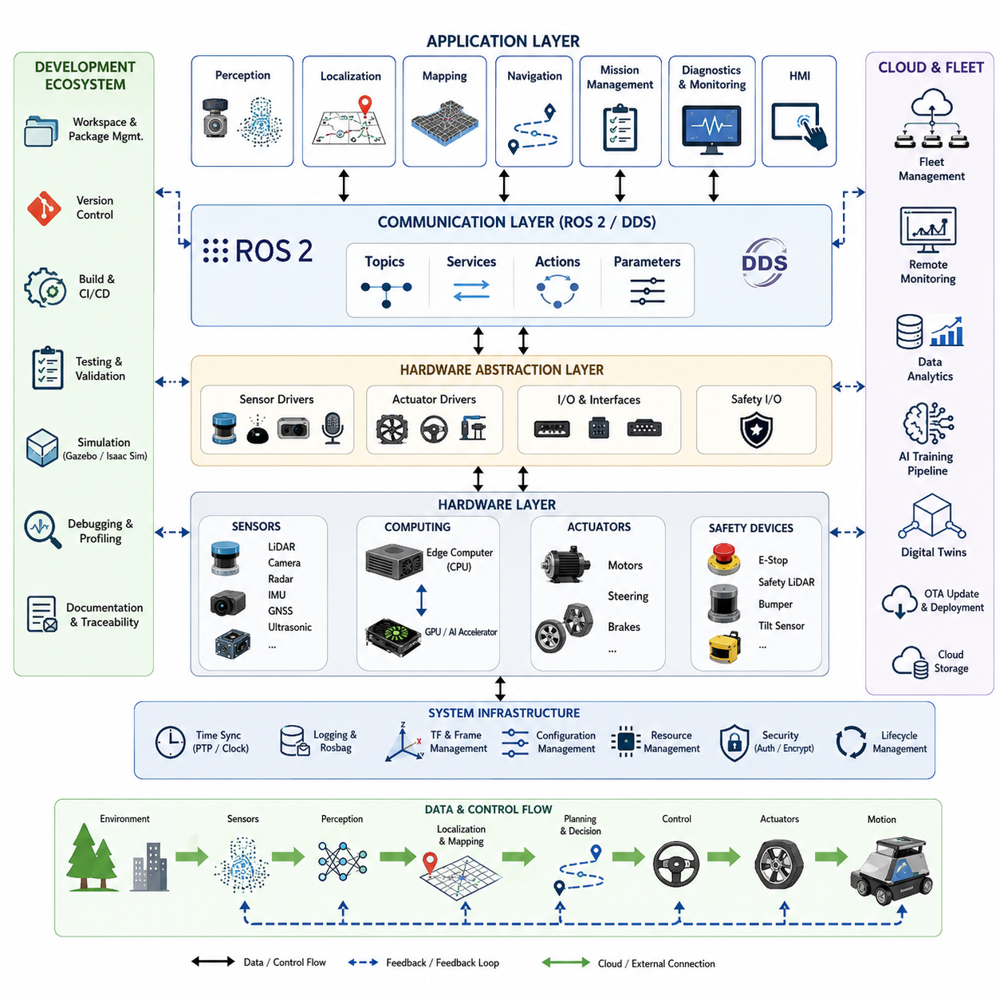
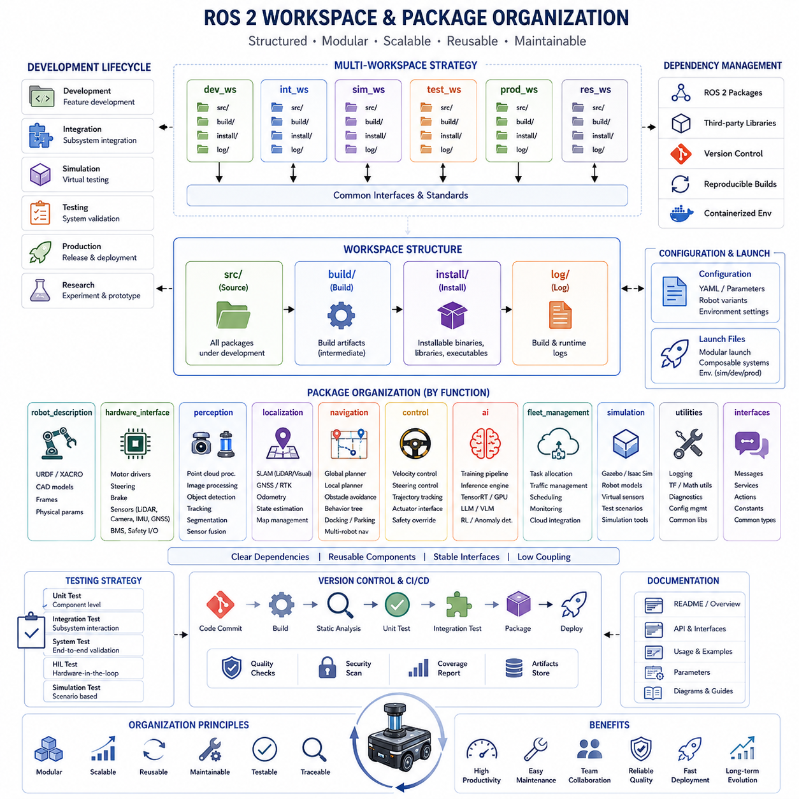
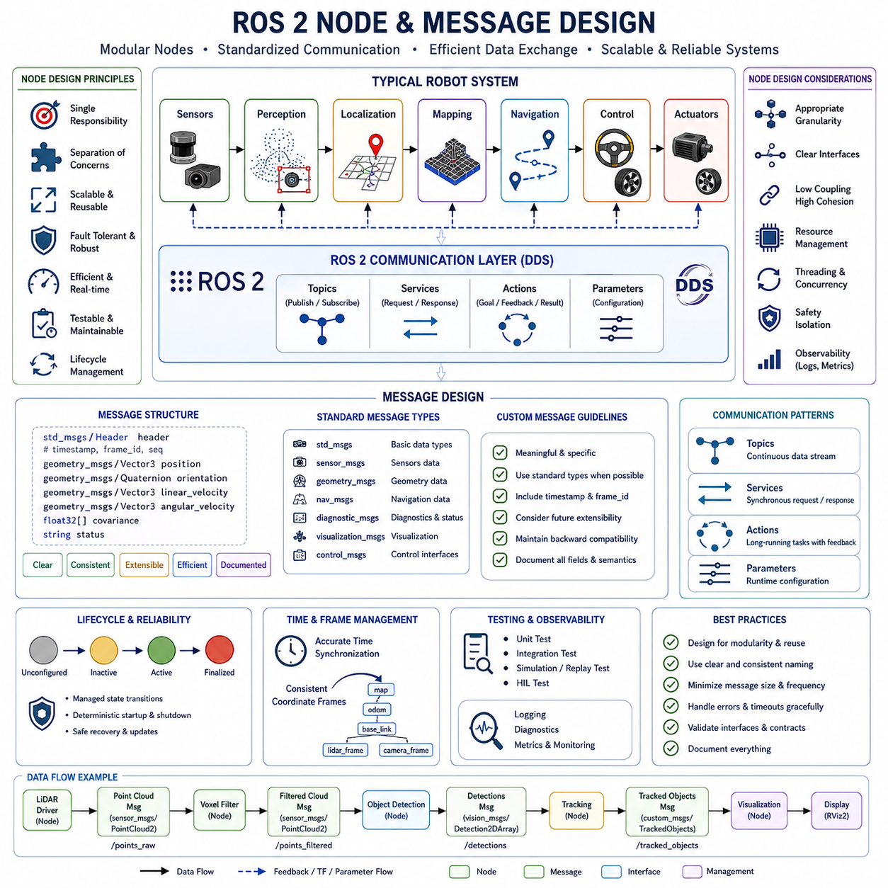
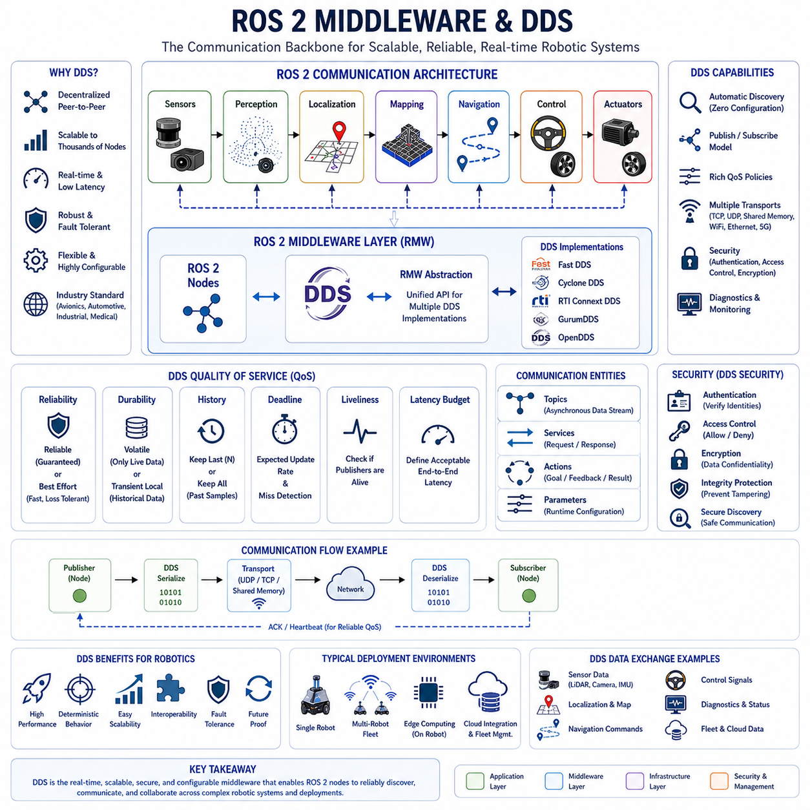
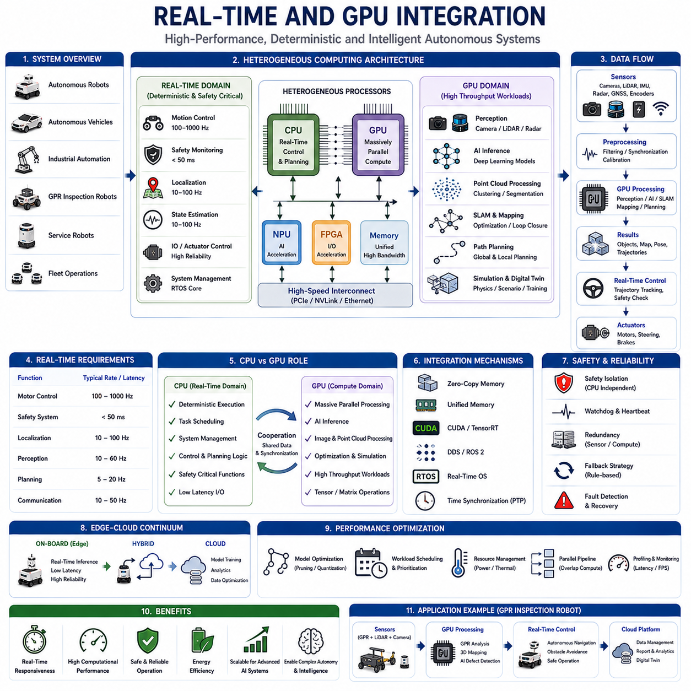
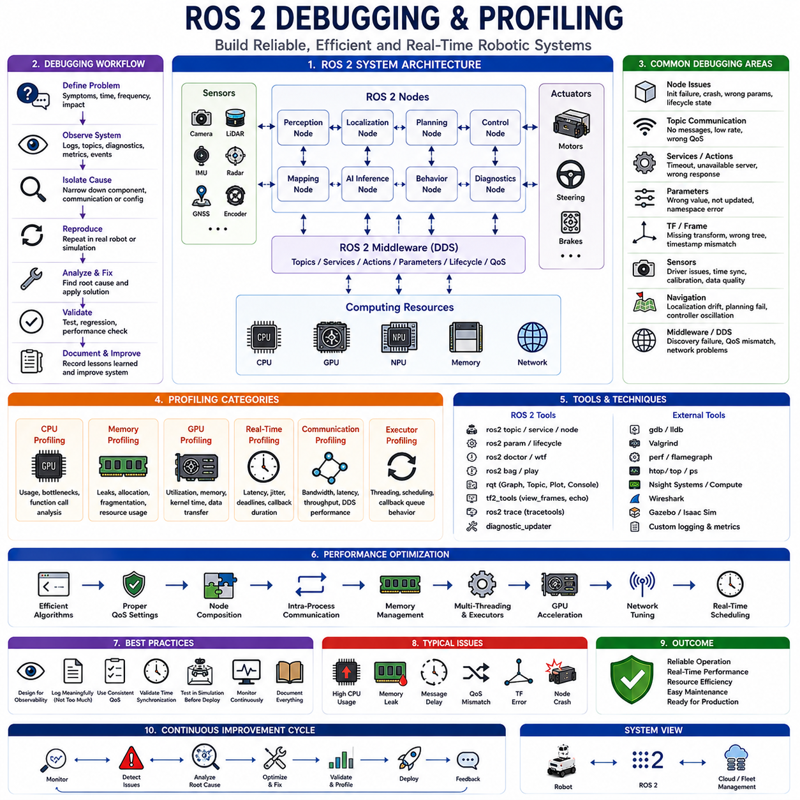
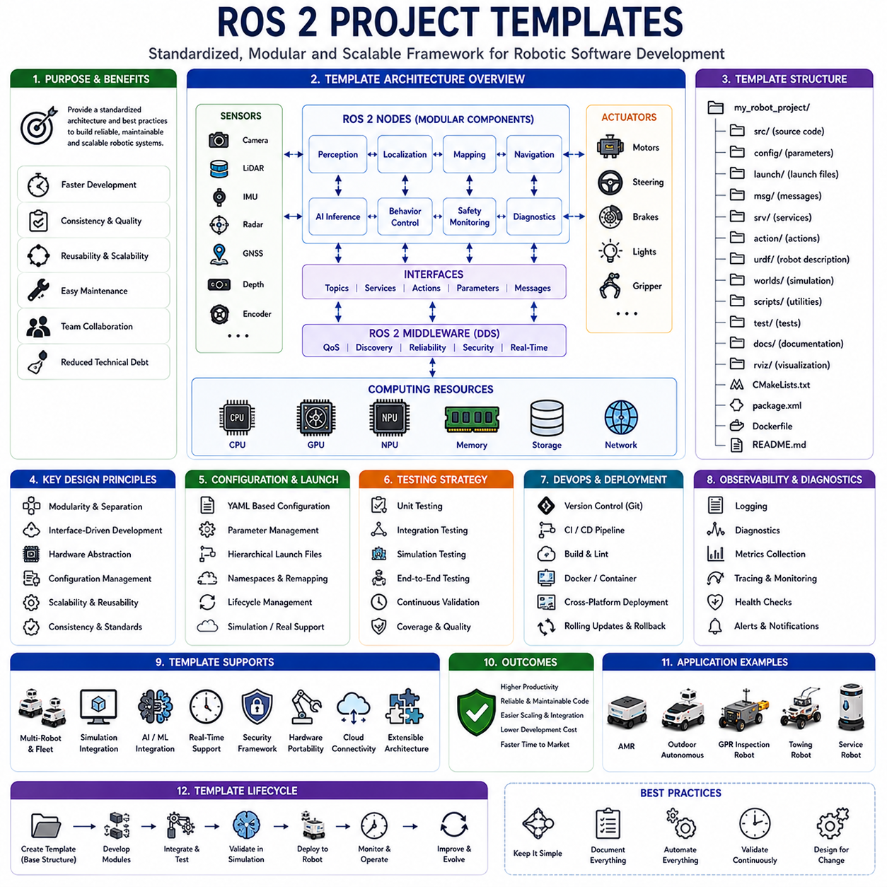

**Volume10. AMR Engineering Process and Development Manual**

# Chapter10. ROS2 Project Structure

## 10.01 ROS2 Project Architecture

{width="7.268055555555556in" height="7.268055555555556in"}

# 10_01_ROS2_Project_Architecture

ROS 2 Project Architecture serves as the foundational software framework for modern Autonomous Mobile Robots (AMRs), autonomous vehicles, inspection robots, logistics robots, service robots, and large-scale multi-robot systems. A well-designed ROS 2 architecture enables software scalability, maintainability, reliability, real-time operation, hardware abstraction, cloud integration, and long-term product evolution. As robot systems become increasingly complex and intelligent, the importance of a structured ROS 2 project architecture continues to grow. Rather than treating software as a collection of independent programs, ROS 2 architecture organizes the entire robot system into interconnected modules that collaborate through standardized communication interfaces, enabling efficient development and deployment across multiple robot platforms. The structure of this chapter corresponds to the ROS 2 Project Structure section within the AMR Engineering Process and Development Manual.

A ROS 2 project architecture begins with the definition of system-level objectives. Every robot project starts with functional requirements, operational constraints, performance targets, safety requirements, and deployment goals. These requirements drive the decomposition of the robot into software subsystems that can be developed independently while maintaining seamless integration. Typical subsystems include perception, localization, mapping, navigation, motion control, fleet management, diagnostics, cloud communication, human-machine interfaces, safety monitoring, and AI-based decision-making. The architecture must ensure that these components remain modular while supporting efficient information exchange across the system.

At the highest level, ROS 2 architecture follows a layered design philosophy. The hardware layer consists of sensors, actuators, embedded controllers, communication interfaces, power management systems, and safety devices. Above the hardware layer resides the hardware abstraction layer, which isolates physical device dependencies from higher-level software. Device drivers, communication protocols, and hardware interface nodes operate within this layer. The middleware layer, powered by DDS technology, provides reliable and configurable communication mechanisms between distributed software components. The application layer contains perception, localization, navigation, control, and mission management systems. Finally, the user and cloud layers provide fleet management, monitoring, analytics, and operational control capabilities.

One of the most important architectural principles in ROS 2 development is modularity. Each software function should be encapsulated into dedicated packages and nodes. This modular organization allows individual teams to develop, test, and deploy software components independently. For example, a perception package may contain camera drivers, LiDAR processing nodes, sensor fusion algorithms, and object detection models. A navigation package may contain path planners, behavior trees, obstacle avoidance algorithms, and trajectory generators. By separating responsibilities into independent modules, developers can update one subsystem without introducing instability into unrelated components.

The ROS 2 workspace serves as the primary development environment. A typical project includes multiple workspaces corresponding to development stages, testing environments, and deployment configurations. Source code is organized into packages residing within the source directory. Build artifacts are generated into dedicated build and install directories, while logging information is stored separately. This structured organization enables reproducible builds, dependency management, and collaborative development among large engineering teams.

Package organization represents one of the most critical aspects of ROS 2 architecture. Packages should be grouped according to functionality rather than implementation language. Core packages typically include robot description packages, sensor interface packages, localization packages, perception packages, navigation packages, control packages, simulation packages, fleet management packages, and utility libraries. Shared libraries should be separated from application-specific implementations to maximize code reuse across projects and robot platforms.

Robot description forms the foundation of many ROS 2 systems. The robot model defines the kinematic structure, physical dimensions, sensor locations, coordinate frames, and dynamic characteristics of the robot. These descriptions are commonly represented using URDF or XACRO files. Accurate robot descriptions ensure consistency across simulation, visualization, localization, navigation, and control subsystems. As robots evolve through multiple generations, maintaining a centralized robot description architecture becomes essential for reducing engineering complexity.

Node architecture defines how software functionality is distributed throughout the system. Each ROS 2 node should perform a well-defined responsibility while minimizing coupling with other nodes. Perception nodes process sensor information. Localization nodes estimate robot position. Navigation nodes generate motion commands. Control nodes translate desired motion into actuator-level instructions. Diagnostic nodes monitor system health. This separation of concerns improves reliability, simplifies debugging, and supports incremental software upgrades.

Communication architecture is another fundamental component of ROS 2 project design. ROS 2 uses topics, services, actions, and parameters to enable communication between nodes. Topics provide asynchronous publish-subscribe communication suitable for sensor data and state updates. Services support request-response interactions for configuration and control operations. Actions enable long-running tasks with feedback and cancellation capabilities. Parameters allow runtime configuration and system tuning. Selecting the appropriate communication mechanism for each interaction significantly impacts overall system performance and maintainability.

Data flow architecture must be carefully engineered to support real-time robotic operations. High-bandwidth sensors such as cameras, LiDARs, radars, thermal imagers, and depth sensors generate large volumes of data. Efficient transport mechanisms, message filtering, compression strategies, and synchronization methods must be incorporated into the architecture. In large outdoor robots, sensor data streams may exceed multiple gigabytes per hour, making bandwidth management and edge processing essential design considerations.

Time synchronization plays a critical role in distributed robotic systems. Multiple sensors operating at different frequencies must produce temporally aligned observations. ROS 2 architectures often integrate synchronization frameworks that align sensor measurements using hardware timestamps, Precision Time Protocol mechanisms, or synchronized clocks. Accurate synchronization improves sensor fusion performance, localization accuracy, and perception reliability.

Perception architecture forms one of the most computationally intensive subsystems in modern robots. Multiple sensing modalities including LiDAR, RGB cameras, depth cameras, thermal cameras, radar systems, ultrasonic sensors, GNSS receivers, and IMUs contribute information to the perception pipeline. Sensor processing nodes perform filtering, calibration correction, coordinate transformations, object detection, semantic segmentation, object tracking, and environmental understanding. The perception architecture must support high throughput while maintaining low latency and deterministic behavior.

Localization architecture determines the robot\'s position within its environment. Depending on deployment requirements, localization may utilize LiDAR SLAM, Visual SLAM, GNSS RTK positioning, wheel odometry, inertial navigation, or multi-sensor fusion. Localization nodes continuously estimate robot pose and provide coordinate transformations to downstream subsystems. Architectural design should allow localization algorithms to be replaced or upgraded without affecting navigation and control modules.

Navigation architecture transforms environmental understanding into safe robot movement. Global planners generate optimal routes through known maps. Local planners adapt trajectories based on dynamic obstacles and environmental conditions. Behavior managers coordinate navigation decisions according to operational objectives. Safety monitors continuously evaluate risk conditions and override navigation decisions when necessary. The navigation subsystem must balance efficiency, safety, and robustness under changing operational conditions.

Motion control architecture converts navigation commands into actuator-level actions. Low-level controllers interact with motor drivers, steering systems, braking systems, and embedded controllers. Real-time constraints become particularly important within this layer. Control loops often operate at frequencies ranging from tens to hundreds of hertz, requiring deterministic scheduling and predictable execution times. ROS 2 real-time capabilities enable integration between high-level planning and low-level control systems.

Safety architecture represents a critical component of industrial robot deployments. Safety nodes monitor emergency stop circuits, safety LiDAR systems, obstacle proximity zones, speed limits, tilt sensors, battery conditions, communication health, and hardware failures. Independent safety channels should remain operational even if primary software systems fail. Functional safety mechanisms are often separated from mission-oriented software to ensure predictable behavior during fault conditions.

Multi-threading architecture significantly affects ROS 2 performance. Modern robots execute dozens or hundreds of concurrent processes. Executors, callback groups, thread pools, and asynchronous processing mechanisms enable efficient utilization of multicore CPUs. Careful architectural planning prevents resource contention, latency spikes, deadlocks, and priority inversions. Real-time tasks should be isolated from computationally intensive AI workloads whenever possible.

GPU integration architecture has become increasingly important as robots adopt deep learning and AI-based perception systems. Modern ROS 2 projects frequently integrate CUDA, TensorRT, OpenVINO, and GPU-accelerated libraries. AI inference pipelines execute on dedicated GPU resources while traditional robotics functions operate on CPUs. Architectural separation between AI workloads and control systems helps maintain deterministic robot behavior while maximizing computational efficiency.

Simulation architecture enables efficient development before physical hardware becomes available. Simulation environments such as Gazebo and Isaac Sim replicate sensors, actuators, physics interactions, and environmental conditions. ROS 2 project architecture should ensure that simulation and real-world deployments share common software interfaces. This approach minimizes discrepancies between simulated validation and field performance.

Cloud and edge integration architecture extends robot capabilities beyond onboard computing resources. Edge computers perform latency-sensitive processing including perception, localization, navigation, and control. Cloud systems support fleet management, data analytics, machine learning pipelines, digital twins, software deployment, and remote monitoring. The architecture must define clear boundaries between cloud services and edge operations while ensuring resilience during network disruptions.

Fleet management architecture becomes essential when multiple robots operate within shared environments. Fleet servers coordinate task allocation, traffic management, route optimization, operational monitoring, and resource utilization. ROS 2 systems often integrate fleet management platforms through APIs, message brokers, and cloud services. Scalability considerations become increasingly important as fleet sizes grow from individual robots to hundreds or thousands of deployed units.

Logging and observability architecture support system debugging, validation, and maintenance. Comprehensive logging mechanisms capture operational events, system metrics, performance statistics, diagnostics, and error conditions. Data recording frameworks such as rosbag enable replay-based debugging and algorithm validation. Well-designed observability systems significantly reduce troubleshooting effort during development and field deployment.

Cybersecurity architecture must be integrated from the beginning of the project lifecycle. Authentication, authorization, encrypted communication, secure boot mechanisms, certificate management, and software integrity verification protect robots against unauthorized access and malicious activity. As robots become connected to enterprise networks and cloud infrastructures, cybersecurity becomes an essential architectural requirement rather than an optional feature.

Continuous integration and deployment architecture supports large-scale software engineering practices. Automated builds, testing pipelines, static code analysis, containerization, version control, and deployment automation enable efficient collaboration among distributed development teams. ROS 2 architectures should incorporate CI/CD workflows to maintain software quality throughout the product lifecycle.

Scalability remains a defining characteristic of successful ROS 2 architectures. The same architectural framework should support multiple robot variants ranging from entry-level platforms to advanced autonomous systems. By maintaining clear interfaces, modular packages, reusable libraries, and standardized communication protocols, organizations can reduce development costs while accelerating product evolution across future generations of robots.

Ultimately, ROS 2 Project Architecture serves as the central nervous system of modern autonomous robots. It connects sensors, perception systems, localization algorithms, navigation planners, controllers, safety systems, AI models, cloud services, and fleet management platforms into a unified software ecosystem. A well-designed architecture provides the foundation for reliability, scalability, maintainability, safety, and continuous innovation. As AMR systems continue to evolve toward higher levels of autonomy and intelligence, ROS 2 architecture will remain one of the most important engineering disciplines in the successful development of next-generation robotic platforms.

## 10.02 Workspace and Package Organization

{width="7.268055555555556in" height="7.268055555555556in"}

# 10_02 Workspace and Package Organization

Workspace and Package Organization is one of the most important foundations of a successful ROS 2 software architecture. As Autonomous Mobile Robot (AMR) systems grow in complexity, software projects often expand from a handful of packages to hundreds of interconnected components spanning perception, localization, mapping, navigation, artificial intelligence, embedded control, cloud integration, fleet management, simulation, testing, and deployment. Without a well-structured organization strategy, software maintenance becomes increasingly difficult, development velocity decreases, technical debt accumulates, and integration risks grow significantly. A properly organized ROS 2 workspace provides the structural framework that enables teams to scale robot software development from prototype systems to industrial-grade autonomous platforms.

A ROS 2 workspace serves as the primary development environment where source code, dependencies, build artifacts, configuration files, launch files, documentation, and deployment resources are managed. It represents the highest organizational level within a ROS 2 project. The workspace is designed to provide isolation, reproducibility, portability, and maintainability throughout the robot development lifecycle. By defining clear boundaries between development resources and generated artifacts, ROS 2 workspaces support collaborative engineering and continuous integration workflows.

The most common ROS 2 workspace structure consists of source directories, build directories, installation directories, and logging directories. The source directory contains all packages under active development. The build directory contains intermediate compilation outputs generated by the build system. The installation directory stores deployable binaries, libraries, and executable artifacts. The logging directory captures build logs, runtime diagnostics, and debugging information. This separation ensures that source code remains clean while generated artifacts can be recreated whenever necessary.

As robot projects mature, multiple workspaces are often used simultaneously. Development workspaces support active feature implementation and experimentation. Integration workspaces combine multiple subsystems for validation and testing. Simulation workspaces support virtual testing environments. Production workspaces contain validated software versions intended for deployment. Research workspaces may host experimental algorithms that have not yet entered the primary software branch. This layered workspace strategy reduces risk while enabling parallel development across multiple engineering teams.

Workspace architecture should align with the overall system architecture. For example, an outdoor autonomous robot project may include dedicated workspaces for perception development, navigation development, fleet management software, AI model development, simulation environments, and manufacturing support tools. Each workspace maintains clear responsibilities while sharing common interfaces and standards.

One of the primary goals of workspace organization is dependency management. Modern AMR systems depend on hundreds of software libraries including ROS 2 packages, DDS middleware, computer vision frameworks, machine learning toolkits, GPU acceleration libraries, database systems, networking frameworks, and cloud services. Workspace design should ensure that dependencies remain traceable, version-controlled, and reproducible across development environments.

Package organization forms the core of ROS 2 software architecture. A package is the smallest independently buildable unit within a ROS 2 system. Packages encapsulate source code, configuration files, launch files, message definitions, service definitions, documentation, and testing resources. Effective package organization enables modular development, simplifies maintenance, and promotes software reuse.

A common mistake in robot software development is organizing packages according to programming languages or individual developers. Instead, packages should be organized around functional responsibilities. Functional decomposition improves system clarity and aligns software structure with system-level architecture. Engineers can quickly understand the purpose of each package without examining implementation details.

Robot description packages typically form the foundation of the project. These packages contain URDF models, XACRO definitions, CAD-derived geometries, sensor mounting configurations, coordinate frame definitions, and physical parameters. Maintaining robot descriptions in dedicated packages ensures consistency across simulation, visualization, localization, and navigation systems.

Hardware interface packages provide communication with physical devices. These packages include motor drivers, steering controllers, brake systems, battery management interfaces, sensor drivers, GNSS receivers, IMU interfaces, LiDAR drivers, camera drivers, radar interfaces, and safety device integrations. Hardware abstraction layers should isolate vendor-specific implementations from higher-level software components.

Perception packages process sensor information and generate environmental understanding. These packages may contain point cloud processing algorithms, image processing pipelines, sensor calibration tools, object detection models, object tracking systems, semantic segmentation modules, free-space detection algorithms, and sensor fusion frameworks. Separating perception functions into dedicated packages simplifies algorithm evolution and hardware upgrades.

Localization packages estimate robot position and orientation. These packages often include SLAM systems, GNSS integration modules, odometry processing, state estimation frameworks, map management services, localization filters, and coordinate transformation utilities. Since localization technologies evolve rapidly, modular package structures facilitate future upgrades.

Navigation packages transform localization outputs into motion commands. These packages contain global path planners, local planners, obstacle avoidance systems, trajectory generators, behavior trees, mission execution logic, docking controllers, parking algorithms, towing controllers, and multi-robot coordination mechanisms. Organizing navigation functions into separate packages enables independent validation and optimization of each subsystem.

Control packages implement vehicle-specific motion control functionality. These packages typically include steering controllers, velocity controllers, actuator interfaces, drive system controllers, trajectory tracking algorithms, and safety overrides. Separating control logic from navigation logic improves portability across multiple robot platforms.

Artificial intelligence packages have become increasingly important in modern robot architectures. AI packages may include training pipelines, inference engines, TensorRT optimizations, multimodal reasoning modules, large language model interfaces, reinforcement learning policies, anomaly detection systems, and predictive analytics services. Isolating AI functionality simplifies model updates and supports independent deployment strategies.

Fleet management packages support multi-robot operations. These packages often include task allocation systems, traffic management algorithms, route optimization services, robot scheduling frameworks, fleet monitoring dashboards, cloud communication interfaces, and mission coordination services. As fleets scale from individual robots to hundreds of autonomous systems, modular fleet management architecture becomes essential.

Simulation packages provide virtual validation environments. These packages contain robot simulation models, Gazebo worlds, Isaac Sim environments, sensor simulation configurations, synthetic scenario generators, and testing automation tools. Maintaining simulation resources separately from operational software improves maintainability and accelerates validation workflows.

Utility packages provide reusable functionality across the entire software ecosystem. Examples include configuration management libraries, logging frameworks, mathematical utilities, coordinate transformation tools, serialization libraries, diagnostics frameworks, communication abstractions, and common software interfaces. Utility packages should remain lightweight, stable, and broadly reusable.

Interface packages play a particularly important role in large-scale ROS 2 systems. These packages contain message definitions, service definitions, action definitions, enumerations, constants, and shared communication contracts. By centralizing interface definitions, development teams can establish stable communication boundaries between subsystems while minimizing coupling.

Configuration management is another essential aspect of package organization. Configuration files should be separated from source code and stored within dedicated configuration directories. Parameters controlling perception algorithms, navigation behavior, localization settings, communication interfaces, safety limits, and deployment environments should be clearly organized and version-controlled. This separation simplifies deployment across multiple robot variants and operational environments.

Launch file organization significantly impacts project maintainability. Launch files define how ROS 2 nodes are instantiated, configured, and interconnected. Large robot systems often contain dozens or hundreds of launch files supporting simulation, testing, development, production, and maintenance activities. A hierarchical launch structure enables engineers to compose complex robot systems from reusable building blocks.

Testing infrastructure should be integrated directly into package organization. Unit tests validate individual components. Integration tests verify subsystem interactions. System tests evaluate end-to-end robot behavior. Hardware-in-the-loop tests validate interactions with physical devices. Simulation-based tests assess performance across diverse scenarios. Including testing resources within packages promotes continuous quality assurance throughout the development lifecycle.

Documentation architecture should evolve alongside package architecture. Every package should contain documentation describing purpose, dependencies, interfaces, configuration requirements, deployment procedures, limitations, and validation status. Well-documented packages significantly reduce onboarding time for new engineers and improve long-term maintainability.

Version control strategy strongly influences workspace organization. Large robotics organizations often employ repository structures that separate core platform components from product-specific implementations. Shared libraries may be maintained independently while application-specific packages remain within product repositories. Clear repository boundaries improve software governance and facilitate reuse across multiple robot programs.

Containerization has become increasingly important for workspace portability. Docker-based development environments ensure consistency across engineering teams, build servers, simulation platforms, and deployment targets. Containerized workspaces reduce dependency conflicts and improve reproducibility throughout the software lifecycle.

Continuous Integration and Continuous Deployment pipelines depend heavily on workspace structure. Automated builds, static analysis tools, code quality checks, security scanning, unit testing, integration testing, simulation validation, and deployment workflows all benefit from predictable package organization. A well-structured workspace significantly reduces CI/CD complexity and improves software reliability.

Large industrial AMR projects often adopt layered package architectures. Core infrastructure packages provide foundational services. Middleware packages implement communication and integration mechanisms. Functional packages implement perception, localization, navigation, and control capabilities. Application packages implement customer-specific behaviors and workflows. This layered approach supports scalability while reducing dependency complexity.

Cross-functional collaboration also benefits from structured workspace organization. Mechanical engineers, electrical engineers, embedded developers, AI researchers, software architects, safety engineers, and cloud developers can work within clearly defined package boundaries while maintaining integration consistency. This organizational clarity becomes increasingly valuable as project size and team size grow.

Safety-critical systems require additional organizational discipline. Safety packages should remain isolated from experimental software and non-critical functionality. Safety interfaces, validation procedures, certification artifacts, and hazard mitigation mechanisms should be traceable throughout the workspace. This traceability supports regulatory compliance and simplifies safety audits.

Cybersecurity considerations should also influence package architecture. Security-sensitive components including authentication systems, encryption libraries, secure communication modules, credential management systems, and access control mechanisms should be isolated and carefully governed. Clear package boundaries improve security reviews and vulnerability management.

As robot fleets expand globally, package organization must support multiple hardware configurations, regional variants, customer-specific customizations, and evolving software capabilities. Modular architectures allow organizations to maintain common platform components while introducing localized adaptations without fragmenting the codebase.

Ultimately, Workspace and Package Organization represents far more than directory management. It is a strategic software engineering discipline that directly impacts scalability, maintainability, quality, reliability, collaboration efficiency, deployment success, and long-term product evolution. A well-designed workspace architecture transforms robot software from a collection of isolated programs into a structured engineering platform capable of supporting years of continuous innovation. For modern AMR systems operating in factories, hospitals, logistics centers, smart cities, outdoor environments, and industrial inspection applications, effective workspace and package organization provides the foundation upon which all higher-level robotic capabilities are built.

## 10.03 Node and Message Design

{width="7.268055555555556in" height="7.268055555555556in"}

# 10_03 Node and Message Design

Node and Message Design is one of the most critical engineering disciplines in ROS 2 software development. While workspace organization defines how software is structured and maintained, node and message design determines how software components interact, exchange information, coordinate behavior, and ultimately execute robot functions. In modern Autonomous Mobile Robot (AMR) systems, hundreds of software nodes may operate simultaneously across perception, localization, mapping, navigation, motion control, artificial intelligence, fleet management, cloud connectivity, diagnostics, and safety subsystems. The efficiency, scalability, reliability, and maintainability of the entire robot platform depend heavily on how these nodes and communication interfaces are designed.

ROS 2 follows a distributed software architecture in which individual nodes perform specific responsibilities and communicate through standardized interfaces. A node represents an executable software component responsible for performing a particular function within the robot system. Rather than building a monolithic application containing all robot functionality, ROS 2 encourages developers to decompose the system into modular, loosely coupled nodes that can be independently developed, tested, deployed, and maintained. This architectural philosophy improves flexibility, fault isolation, scalability, and long-term software evolution.

The primary objective of node design is separation of concerns. Each node should perform a clearly defined task while minimizing dependencies on other nodes. A perception node should process sensor information. A localization node should estimate robot position. A path planning node should generate routes. A motion controller should convert trajectories into actuator commands. By maintaining clear functional boundaries, engineers can update or replace individual components without impacting the entire system.

One of the most important design principles is single responsibility. Each node should focus on one major function rather than attempting to perform multiple unrelated tasks. When a node becomes responsible for perception, localization, navigation, diagnostics, and communication simultaneously, complexity increases rapidly and maintenance becomes difficult. Smaller nodes with focused responsibilities are easier to understand, debug, optimize, and validate.

Node granularity represents a critical architectural decision. Excessively large nodes create tightly coupled software that becomes difficult to maintain. Excessively small nodes generate excessive communication overhead and increase system complexity. Effective node design balances modularity and performance by selecting an appropriate level of functional decomposition. The optimal granularity depends on system requirements, computational constraints, team structure, and operational objectives.

Scalability should be considered from the earliest stages of node architecture design. A robot prototype may initially contain only a small number of nodes, but commercial AMR platforms often evolve into systems containing hundreds of distributed software components. A scalable node architecture allows new features to be added without major redesign efforts. As new sensors, AI capabilities, cloud services, and fleet management functions are introduced, the architecture should accommodate growth naturally.

Reusability is another key design objective. Well-designed nodes should be reusable across multiple robot platforms. For example, a LiDAR processing node developed for an indoor logistics robot may later be reused on an outdoor inspection robot. Similarly, localization nodes, object detection nodes, diagnostics nodes, and fleet communication nodes often serve multiple robot families. Reusable node architectures significantly reduce development cost and accelerate product development.

Node lifecycle management plays an important role in industrial ROS 2 systems. ROS 2 lifecycle nodes provide structured state transitions including initialization, configuration, activation, deactivation, cleanup, and shutdown. Lifecycle management enables deterministic startup procedures, controlled system recovery, safe software updates, and predictable operational behavior. Large industrial deployments frequently rely on lifecycle management to improve system robustness and operational safety.

Communication architecture forms the foundation of node interaction. ROS 2 provides several communication mechanisms including topics, services, actions, and parameters. Each mechanism serves a different purpose and should be selected according to communication requirements. Understanding these communication models is essential for designing efficient robot software systems.

Topics implement asynchronous publish-subscribe communication. Publishers generate data while subscribers consume information independently. Topics are ideal for continuous data streams such as sensor measurements, robot states, environmental information, and control commands. The loose coupling provided by topics improves scalability and fault tolerance because publishers and subscribers remain independent.

Services provide synchronous request-response communication. A client sends a request and waits for a response from a service provider. Services are suitable for operations requiring immediate feedback, such as querying system status, resetting modules, loading maps, changing configurations, or initiating specific actions. Services should remain lightweight and avoid long execution times to prevent blocking system operations.

Actions extend the service model by supporting long-running tasks. Unlike services, actions provide continuous feedback, support cancellation requests, and report completion status. Navigation goals, docking operations, inspection missions, mapping procedures, and autonomous parking tasks are commonly implemented using actions. Actions improve user experience and system observability during extended operations.

Parameters provide runtime configuration mechanisms. Node behavior can be adjusted dynamically without recompiling software. Parameters often control perception thresholds, localization settings, navigation constraints, safety limits, communication configurations, and operational modes. Proper parameter design increases flexibility while simplifying deployment across multiple environments.

Message design is equally important as node design. Messages define the structure of information exchanged between nodes. A well-designed message architecture improves interoperability, readability, maintainability, and future extensibility. Poorly designed messages often become long-term obstacles that constrain system evolution and increase integration complexity.

Message definitions should prioritize clarity and simplicity. Each message should represent a logical unit of information. Fields should have clear meanings, consistent naming conventions, and well-documented semantics. Engineers working on different subsystems must be able to understand message structures without extensive external documentation.

Consistency is a fundamental principle of message design. Similar data types should follow common naming conventions throughout the system. Position information, velocity measurements, acceleration values, timestamps, identifiers, confidence scores, and status indicators should maintain consistent representations across all message definitions. Consistency reduces integration errors and improves software maintainability.

Extensibility should be considered when designing message schemas. Robot systems continuously evolve throughout their lifecycle. New sensors, algorithms, and operational requirements may require additional information fields. Message definitions should support future expansion while maintaining backward compatibility whenever possible.

Efficiency becomes particularly important in high-bandwidth robotic systems. Cameras, LiDAR sensors, radar systems, thermal imagers, and AI perception modules generate large volumes of data. Message definitions should minimize unnecessary data duplication while preserving required information. Efficient message structures reduce network utilization, memory consumption, CPU overhead, and communication latency.

Timestamp management is one of the most important aspects of message architecture. Nearly every message exchanged within a robotic system should include accurate timing information. Sensor fusion, localization, perception, navigation, and control systems rely heavily on temporal consistency. Incorrect timestamp handling often results in degraded performance, localization drift, synchronization failures, and unstable robot behavior.

Coordinate frame management is closely related to message design. Robot systems operate across multiple coordinate frames including map, odom, base_link, sensor frames, and world references. Messages containing spatial information should clearly identify associated coordinate frames. Consistent frame management prevents integration errors and simplifies multi-sensor fusion.

Standard ROS 2 message types should be used whenever possible. Geometry messages, sensor messages, navigation messages, visualization messages, diagnostic messages, and standard service definitions provide established interfaces that improve interoperability across the ROS ecosystem. Custom messages should only be introduced when existing standards cannot adequately represent required information.

Custom message design becomes necessary in advanced robotic applications. Specialized perception outputs, fleet management data, AI inference results, safety monitoring information, inspection reports, and mission-specific workflows often require custom message definitions. These custom messages should remain focused, well-documented, and aligned with broader architectural standards.

Interface packages play a central role in large ROS 2 projects. Rather than distributing message definitions across multiple packages, organizations commonly create dedicated interface repositories containing all shared messages, services, and actions. Centralized interface management improves consistency and simplifies version control across development teams.

Fault tolerance should influence both node and message architecture. Distributed robotic systems must continue operating despite individual component failures. Nodes should detect communication interruptions, recover from transient errors, and degrade gracefully when upstream data becomes unavailable. Message designs should support error reporting, health monitoring, and operational status communication.

Real-time requirements introduce additional architectural constraints. Motion control, obstacle avoidance, safety monitoring, and actuator control often operate under strict timing requirements. Nodes involved in real-time processing should minimize dynamic memory allocation, avoid blocking operations, reduce communication overhead, and maintain deterministic execution behavior.

Multi-threaded execution architectures further impact node design. Modern robots frequently execute perception pipelines, AI inference engines, localization systems, navigation planners, diagnostics services, and communication modules simultaneously. Callback groups, executors, asynchronous processing mechanisms, and thread management strategies must be considered during node architecture development.

Artificial intelligence integration introduces new node design challenges. AI inference nodes often require GPU resources, large memory allocations, model management systems, and asynchronous processing pipelines. AI nodes should be isolated from safety-critical and real-time subsystems to prevent computational contention and maintain predictable system behavior.

Safety-critical systems require additional design discipline. Safety nodes should remain independent from mission execution nodes. Emergency stop monitoring, safety LiDAR processing, collision detection, speed supervision, tilt monitoring, and hazard assessment functions should be isolated and validated independently. Safety communication pathways must remain reliable even during partial system failures.

Cloud-connected robotic systems extend node architecture beyond onboard computing platforms. Cloud communication nodes manage telemetry, diagnostics, fleet coordination, remote monitoring, software updates, and data collection. Clear architectural boundaries between cloud services and robot control systems improve cybersecurity, reliability, and operational resilience.

Testing considerations should be incorporated directly into node and message design. Nodes should support simulation environments, diagnostic interfaces, logging mechanisms, replay testing, unit testing, and integration testing. Well-designed communication interfaces significantly simplify automated validation and continuous integration workflows.

Observability is another essential design objective. Nodes should provide sufficient logging, diagnostics, status reporting, performance metrics, and health monitoring information to support troubleshooting and operational management. Effective observability reduces debugging effort and accelerates root-cause analysis in complex robotic deployments.

Version management becomes increasingly important as systems evolve. Message definitions should be carefully governed to prevent compatibility issues between software components. Interface versioning strategies help maintain interoperability across different software releases and deployment environments.

Large-scale industrial robotics programs often define node and message design standards at the organizational level. These standards establish naming conventions, communication patterns, message schemas, parameter structures, error reporting mechanisms, and interface governance processes. Standardization improves collaboration across teams and promotes long-term architectural consistency.

Ultimately, Node and Message Design serves as the communication backbone of a ROS 2 robotic system. Nodes represent the functional building blocks that perform perception, localization, navigation, control, safety, AI, and operational tasks. Messages define the language through which these components exchange information and coordinate behavior. A well-designed node and message architecture enables modularity, scalability, maintainability, reliability, fault tolerance, and future extensibility. As AMR systems continue to grow in complexity and autonomy, effective node and message design will remain one of the most important factors determining the success of modern robotic software platforms.

## 10.04 ROS2 Middleware and DDS

{width="7.268055555555556in" height="7.268055555555556in"}

# 10_04 ROS 2 Middleware and DDS

ROS 2 Middleware and Data Distribution Service (DDS) form the communication backbone of modern robotic systems. While nodes provide computational functionality and messages define information structures, the middleware layer is responsible for transporting data between distributed software components. In Autonomous Mobile Robots (AMRs), autonomous vehicles, industrial inspection robots, logistics robots, healthcare robots, and multi-robot systems, communication infrastructure directly influences system performance, scalability, reliability, safety, and operational efficiency. ROS 2 was designed specifically to address the limitations of earlier robotic communication frameworks by adopting DDS as its underlying middleware technology, enabling industrial-grade communication capabilities for increasingly complex robotic applications.

Middleware serves as an abstraction layer between application software and network infrastructure. It allows software developers to focus on robot functionality without needing to manage low-level communication protocols, network sockets, message serialization, routing mechanisms, or transport reliability. By providing standardized communication services, middleware simplifies software development while supporting interoperability among heterogeneous hardware and software components.

In ROS 1, communication relied on a centralized ROS Master that managed node discovery and registration. Although this architecture simplified initial development, it introduced scalability limitations and created a potential single point of failure. As robotic systems evolved toward larger deployments, multi-robot fleets, cloud integration, and distributed processing architectures, these limitations became increasingly significant. ROS 2 addressed these challenges by adopting DDS, which supports decentralized discovery and peer-to-peer communication.

DDS is an industry-standard middleware technology originally developed for mission-critical distributed systems. It has been widely adopted in aerospace, defense, autonomous transportation, industrial automation, telecommunications, medical systems, and real-time control applications. DDS provides highly configurable communication mechanisms capable of supporting demanding requirements such as low latency, deterministic behavior, fault tolerance, scalability, and real-time operation.

One of the most important characteristics of DDS is decentralized communication. Unlike centralized broker-based architectures, DDS allows nodes to discover each other automatically and communicate directly without requiring a central coordination server. This decentralized model improves system robustness because communication can continue even if individual nodes or network segments experience failures.

ROS 2 utilizes DDS through the ROS Middleware Interface, commonly referred to as RMW. The RMW layer abstracts vendor-specific DDS implementations and provides a consistent API to higher-level ROS 2 applications. This abstraction allows developers to switch between DDS vendors without modifying application code, thereby preserving software portability and reducing vendor lock-in.

Several DDS implementations are commonly used within ROS 2 environments. These include Fast DDS, Cyclone DDS, RTI Connext DDS, GurumDDS, and OpenDDS. Each implementation offers different tradeoffs in performance, resource utilization, licensing, certification support, and deployment characteristics. The choice of DDS implementation often depends on application requirements, hardware constraints, operational environments, and regulatory considerations.

Node discovery represents one of DDS\'s most important capabilities. When a ROS 2 node starts, it automatically announces its presence on the network. Other nodes discover this information without manual configuration. DDS continuously maintains awareness of participating nodes, available topics, communication endpoints, and network topology changes. This dynamic discovery mechanism simplifies deployment and supports highly adaptive robotic systems.

Topic-based communication forms the foundation of DDS architecture. Publishers produce data while subscribers consume information. DDS manages message delivery, endpoint matching, transport selection, and communication optimization automatically. This publish-subscribe model enables loosely coupled system architectures where components remain independent while sharing information efficiently.

Quality of Service (QoS) policies represent one of DDS\'s most powerful features. QoS settings allow developers to customize communication behavior according to application requirements. Different robotic subsystems often require different communication characteristics. High-frequency sensor streams, navigation commands, diagnostic messages, safety alerts, and cloud telemetry may all demand different levels of reliability, latency, durability, and resource allocation.

Reliability QoS determines whether message delivery is guaranteed. Reliable communication ensures that messages reach subscribers even under adverse network conditions. This mode is suitable for mission-critical data, configuration updates, control commands, and operational events. Best-effort communication prioritizes low latency and throughput over guaranteed delivery. High-bandwidth sensor streams such as LiDAR point clouds and camera images often use best-effort communication to reduce overhead.

Durability QoS controls how historical data is handled. Transient-local durability allows newly joined subscribers to receive previously published data. This capability is particularly useful for static information such as maps, robot configurations, calibration parameters, and operational status messages. Volatile durability limits communication to currently active subscribers.

History QoS determines how many previous messages are retained. Systems may store only the most recent message or maintain larger communication histories depending on application needs. Navigation systems, sensor processing pipelines, and debugging tools often benefit from retaining multiple historical messages for analysis and recovery purposes.

Deadline QoS specifies expected message update frequencies. DDS can automatically detect situations where publishers fail to meet required update rates. This feature supports health monitoring, fault detection, and safety supervision mechanisms within robotic systems.

Liveliness QoS enables nodes to verify that communication partners remain operational. DDS periodically monitors endpoint activity and reports failures when communication participants become unavailable. Liveliness monitoring plays an important role in fault-tolerant system architectures and distributed robot fleets.

Latency budget QoS allows developers to specify acceptable communication delays. DDS uses this information to optimize transport behavior according to application requirements. Time-critical systems such as motion control and obstacle avoidance often require minimal latency, while less critical applications may tolerate larger communication delays.

DDS communication performance significantly influences overall robot behavior. Autonomous robots continuously exchange large volumes of information including sensor measurements, localization estimates, navigation plans, AI inference results, diagnostics, safety alerts, actuator commands, and fleet management data. Efficient middleware operation ensures that information flows through the system with minimal delay and predictable timing characteristics.

Real-time communication support is one of the primary reasons ROS 2 adopted DDS. Many robotic subsystems operate under strict timing constraints. Motion controllers, obstacle avoidance systems, safety monitors, and actuator interfaces require deterministic communication behavior. DDS provides mechanisms that support predictable latency, bounded execution times, and real-time scheduling integration.

Scalability is another major advantage of DDS architecture. Small research robots may contain only a few software nodes, while industrial AMR fleets may consist of hundreds of robots and thousands of communicating processes. DDS scales effectively across these deployment sizes while maintaining manageable communication overhead and network efficiency.

Multi-robot systems particularly benefit from DDS architecture. Robot fleets operating in factories, hospitals, logistics centers, ports, airports, and smart cities require continuous communication among robots, fleet managers, traffic control systems, cloud services, and operational databases. DDS enables efficient information distribution across these highly distributed environments.

Network flexibility is another important characteristic. DDS supports communication across Ethernet, Wi-Fi, industrial fieldbus networks, cellular connections, and hybrid networking architectures. This flexibility enables deployment across diverse operational environments ranging from indoor warehouses to large outdoor industrial facilities.

Security has become increasingly important as robots connect to enterprise infrastructure and cloud services. DDS Security provides authentication, access control, encryption, message integrity protection, and secure discovery mechanisms. These capabilities help protect robotic systems against unauthorized access, malicious attacks, and data tampering.

Authentication mechanisms verify the identities of communication participants. Authorization policies control access to topics, services, and system resources. Encryption protects sensitive operational data while traversing potentially insecure networks. Together, these features provide a comprehensive security framework for modern robotic deployments.

Data serialization is another important middleware responsibility. DDS converts complex data structures into transportable binary formats while preserving semantic information. Efficient serialization minimizes bandwidth consumption and reduces communication latency. Large robotic systems frequently exchange high-volume sensor data, making serialization performance a significant factor in overall system efficiency.

Communication optimization techniques further improve DDS performance. Zero-copy transport mechanisms reduce memory duplication. Shared memory communication accelerates data exchange between processes on the same computer. Multicast transmission improves efficiency when distributing information to multiple subscribers. These optimizations become increasingly important in high-performance robotic platforms.

Cloud integration represents an emerging application area for DDS technology. Modern robots often connect to cloud-based fleet management systems, analytics platforms, digital twins, AI training pipelines, and remote monitoring services. DDS facilitates seamless communication between edge computing resources and cloud infrastructure while maintaining consistent communication semantics.

Diagnostics and observability are also enhanced through DDS. Middleware statistics provide insights into message rates, network utilization, endpoint health, communication latency, packet loss, and system performance. These capabilities simplify troubleshooting and improve operational visibility during development and deployment.

Simulation environments benefit significantly from DDS architecture. Simulated robots, virtual sensors, digital twins, and testing frameworks can communicate using the same middleware infrastructure as physical systems. This consistency improves simulation fidelity and reduces discrepancies between virtual and real-world deployments.

Resource management becomes increasingly important in embedded robotic systems. DDS implementations provide configurable memory allocation strategies, transport mechanisms, thread management options, and performance tuning parameters. Proper configuration enables DDS to operate efficiently even on resource-constrained embedded platforms.

Fault tolerance remains a critical requirement for industrial robotics. DDS supports automatic reconnection, dynamic endpoint discovery, redundant communication paths, and graceful recovery from network disruptions. These capabilities improve operational resilience in challenging deployment environments.

Middleware configuration should be considered an integral part of overall robot architecture design. Communication requirements vary significantly across perception systems, localization modules, navigation stacks, control loops, safety mechanisms, cloud interfaces, and fleet management platforms. Selecting appropriate DDS policies and configurations ensures optimal performance for each subsystem.

Large-scale robotics organizations often establish middleware standards governing topic naming conventions, QoS profiles, security policies, communication patterns, and deployment configurations. Standardization simplifies integration, improves interoperability, and supports long-term maintainability across multiple robot products.

Future robotic systems will continue increasing in complexity, autonomy, connectivity, and scale. As robots become more intelligent and collaborative, communication infrastructure will play an even more important role in overall system performance. DDS provides a robust foundation capable of supporting these future requirements while maintaining compatibility with evolving technologies.

Ultimately, ROS 2 Middleware and DDS serve as the nervous system of distributed robotic software architectures. They enable nodes to discover each other, exchange information, coordinate actions, and operate as a unified system despite being distributed across multiple processors, computers, robots, and cloud services. By providing scalable, reliable, configurable, secure, and real-time communication capabilities, DDS allows ROS 2 to support everything from small research robots to large industrial autonomous fleets. As autonomous robotics continues to advance, DDS will remain one of the most important enabling technologies underlying next-generation robotic software platforms.

## 10.05 Modular Software Development

{width="7.268055555555556in" height="7.268055555555556in"}

# 10_05 Modular Software Development

Modular Software Development is one of the most important engineering principles in modern robotic systems. As Autonomous Mobile Robots (AMRs), autonomous vehicles, industrial inspection robots, logistics robots, healthcare robots, and intelligent service robots continue to grow in complexity, software systems are evolving from simple applications into large-scale distributed platforms consisting of hundreds or even thousands of software components. In such environments, maintaining a monolithic software architecture becomes increasingly difficult. Development speed decreases, maintenance costs increase, testing complexity grows, and system reliability becomes harder to guarantee. Modular Software Development addresses these challenges by dividing complex robotic systems into smaller, independent, reusable, and maintainable software modules that can be developed, tested, deployed, and evolved independently.

The fundamental objective of modular software architecture is to manage complexity through separation of responsibilities. Rather than building a robot as a single software application, individual functions are organized into independent modules with clearly defined responsibilities and interfaces. Each module focuses on a specific aspect of robot operation while interacting with other modules through standardized communication mechanisms. This approach allows engineering teams to understand, maintain, and extend software systems more effectively over long product lifecycles.

Modularity begins with system decomposition. Every robotic platform consists of multiple functional domains including perception, localization, mapping, navigation, motion control, safety management, diagnostics, fleet coordination, cloud communication, artificial intelligence, simulation, data management, and operational monitoring. These domains should be separated into independent software modules that encapsulate their internal implementation details while exposing only necessary interfaces to the rest of the system.

One of the primary benefits of modular development is maintainability. In large robotics projects, software systems remain under continuous development for many years. New sensors are introduced, algorithms are upgraded, customer requirements evolve, and deployment environments change. A modular architecture allows developers to modify individual subsystems without affecting unrelated components. This reduces regression risks and simplifies long-term maintenance activities.

Scalability represents another significant advantage. Early prototypes often contain only a small number of software components, but successful robotic products typically evolve into complex platforms supporting multiple product variants and deployment scenarios. A modular architecture enables organizations to add new capabilities incrementally while preserving architectural stability. Additional sensors, AI functions, cloud services, and operational features can be integrated without requiring major redesign efforts.

Reusability is one of the most valuable outcomes of modular software development. Many robotic subsystems share common functionality across different products. LiDAR processing, sensor fusion, localization algorithms, diagnostics frameworks, communication interfaces, safety monitoring, and cloud connectivity modules are often applicable across multiple robot platforms. By designing these capabilities as reusable modules, organizations can reduce development costs and accelerate future projects.

Encapsulation forms a critical foundation of modular design. Each module should hide its internal implementation details and expose only clearly defined interfaces. Other modules should interact with a module through public APIs, topics, services, actions, or communication contracts without requiring knowledge of internal algorithms or data structures. Encapsulation reduces coupling and allows internal implementations to evolve independently.

Low coupling and high cohesion are central principles of modular architecture. Low coupling means that modules depend minimally on one another. High cohesion means that all functions within a module contribute to a common responsibility. Systems designed according to these principles are easier to understand, maintain, test, and extend. Changes within one module are less likely to create unintended side effects throughout the system.

Interface design becomes critically important in modular systems. Interfaces define how modules exchange information and collaborate. Poorly designed interfaces can create hidden dependencies, increase complexity, and limit future flexibility. Effective interfaces are stable, simple, well-documented, and independent of implementation details. They provide sufficient functionality without exposing unnecessary complexity.

In ROS 2 environments, modularity is typically implemented through packages, nodes, libraries, and communication interfaces. Packages provide logical grouping mechanisms for related functionality. Nodes encapsulate executable behaviors. Shared libraries provide reusable algorithms and utilities. Messages, services, actions, and parameters define communication contracts between modules. Together, these elements form the structural foundation of modular robotic software systems.

Perception systems provide an excellent example of modular architecture. Sensor drivers, calibration modules, data synchronization mechanisms, point cloud processing pipelines, image processing algorithms, object detection networks, object tracking systems, semantic segmentation models, and sensor fusion frameworks can all be implemented as independent modules. This structure enables perception teams to upgrade specific algorithms without disrupting the broader system.

Localization systems similarly benefit from modular design. GNSS processing, inertial navigation, odometry estimation, SLAM algorithms, map management, state estimation filters, and coordinate transformation services can operate as separate modules. As localization technologies evolve, individual components can be replaced or enhanced while maintaining consistent system interfaces.

Navigation architectures are often composed of multiple independent modules. Global path planners, local planners, behavior trees, obstacle avoidance systems, mission execution frameworks, docking controllers, parking algorithms, towing controllers, and traffic management services can all be developed independently. Modular navigation systems allow organizations to adapt robot behaviors to diverse operational environments without redesigning the entire navigation stack.

Control systems require particularly careful modularization. Motion controllers, steering controllers, velocity regulators, actuator interfaces, trajectory tracking algorithms, and safety overrides should remain separated from navigation and perception systems. This separation improves reliability and supports deployment across multiple hardware platforms.

Artificial intelligence integration has significantly increased the importance of modular architectures. Modern robotic systems often incorporate deep learning models, multimodal perception frameworks, large language models, reinforcement learning agents, anomaly detection systems, predictive maintenance engines, and decision-support algorithms. These AI components evolve rapidly and require frequent updates. Modular AI architectures enable independent model deployment, validation, monitoring, and optimization.

Cloud integration further emphasizes the value of modular software development. Telemetry collection, fleet management, remote monitoring, digital twins, OTA updates, analytics pipelines, and cloud-based AI services should remain separate from real-time onboard control systems. This separation improves cybersecurity, operational resilience, and deployment flexibility.

Safety-critical functionality should always be isolated within dedicated modules. Emergency stop management, safety LiDAR processing, collision detection, speed supervision, hazard monitoring, and functional safety mechanisms require independent validation and certification processes. Safety modules should remain protected from experimental features and non-critical software changes.

Diagnostics and health monitoring are often implemented as cross-cutting modules serving the entire robotic platform. These modules collect performance metrics, operational status information, fault reports, resource utilization statistics, communication health indicators, and environmental conditions. Centralized diagnostics architectures improve observability and accelerate troubleshooting.

Configuration management represents another important aspect of modular development. Each module should maintain clearly defined configuration parameters that control its behavior. Parameters should be externally configurable without requiring source code modifications. This flexibility supports deployment across different robot models, customer environments, and operational scenarios.

Version management becomes increasingly important as modular systems grow. Independent modules often evolve at different rates. Version control strategies should ensure compatibility between modules while supporting independent development cycles. Semantic versioning, interface governance, dependency management, and release planning become essential architectural practices.

Testing strategies align naturally with modular architectures. Individual modules can be validated through unit testing. Interactions between modules can be verified through integration testing. Complete workflows can be evaluated through system-level testing. This layered testing approach improves software quality while reducing validation complexity.

Simulation environments provide significant advantages for modular development. Individual modules can be tested using simulated inputs and virtual environments before deployment on physical robots. Simulation-based validation accelerates development cycles, reduces hardware dependencies, and improves software reliability.

Continuous Integration and Continuous Deployment pipelines benefit greatly from modular architectures. Individual modules can be built, tested, analyzed, and deployed independently. Automated quality checks, security scanning, performance benchmarking, and regression testing can be applied at the module level, improving development efficiency and reducing integration risks.

Resource management becomes more effective within modular systems. CPU-intensive AI modules, memory-intensive mapping systems, high-bandwidth perception pipelines, and latency-sensitive control systems can be independently optimized according to their specific requirements. Modular architectures support distributed computing, hardware acceleration, and workload balancing strategies.

Team organization often mirrors modular software structures. Perception engineers focus on perception modules. Navigation teams manage navigation systems. Embedded developers maintain hardware interfaces. Cloud engineers support backend services. AI researchers develop machine learning components. This alignment between software architecture and organizational structure improves collaboration and productivity.

Large-scale industrial robotics companies frequently establish software platforms built entirely around modular principles. Core infrastructure modules provide foundational services. Platform modules implement reusable capabilities. Product-specific modules customize behavior for individual robot families. Customer-specific modules provide deployment adaptations. This layered approach enables efficient scaling across multiple products and markets.

Cybersecurity requirements are easier to manage within modular systems. Authentication services, encryption mechanisms, access control systems, credential management frameworks, and security monitoring components can be implemented as dedicated modules with clearly defined responsibilities. This separation simplifies security reviews and vulnerability management processes.

Fault tolerance is also enhanced through modular architectures. Failures within one module can often be isolated without affecting the entire system. Recovery mechanisms, redundancy strategies, watchdog systems, and health monitoring services can detect and mitigate failures before they propagate throughout the robot platform.

Documentation becomes more manageable when software is organized into modules. Each module can maintain independent documentation describing its purpose, interfaces, dependencies, configuration options, operational constraints, testing status, and deployment requirements. Well-documented modules significantly reduce onboarding time for new engineers and improve long-term maintainability.

As robotic systems increasingly incorporate edge computing, cloud services, AI workloads, digital twins, fleet management platforms, and autonomous decision-making systems, modular development becomes even more essential. The complexity of future robotic platforms will continue growing, making architectural discipline a critical competitive advantage.

Ultimately, Modular Software Development is not simply a coding technique; it is a comprehensive engineering philosophy that shapes how robotic software systems are designed, implemented, maintained, and evolved. By organizing functionality into independent, reusable, scalable, and maintainable modules, organizations can build robotic platforms capable of supporting continuous innovation over many years. In modern AMR development, modular architecture serves as the foundation for reliability, scalability, collaboration, software quality, and long-term product success. As robotic systems become increasingly intelligent, connected, and autonomous, Modular Software Development will remain one of the most important principles guiding the creation of next-generation robotic software platforms.

## 10.06 Real-Time and GPU Integration

{width="7.268055555555556in" height="7.268055555555556in"}

# 10_06_Real_Time_and_GPU_Integration

Real-Time and GPU Integration is one of the most important architectural topics in modern autonomous robotic systems, intelligent vehicles, industrial automation platforms, AI inspection systems, and next-generation autonomous mobile robots. As autonomous systems evolve toward higher levels of intelligence and autonomy, computational workloads continue to increase dramatically. Modern robots must simultaneously process sensor data, perform localization, execute perception algorithms, run artificial intelligence models, generate navigation plans, manage safety systems, communicate with fleet management platforms, and execute motion control loops. Achieving all of these functions within strict real-time constraints requires a carefully designed integration strategy between real-time computing architectures and GPU-accelerated processing platforms. Within the AI and Robotics Development Workflow, Real-Time and GPU Integration represents the convergence point where software architecture, hardware architecture, operating systems, artificial intelligence, embedded systems, and high-performance computing technologies work together to deliver reliable autonomous operation.

Traditional robotic systems were primarily based on CPU-centric architectures. Navigation algorithms, localization systems, sensor processing pipelines, and control loops were typically executed using general-purpose processors. While these architectures were sufficient for relatively simple robots, the introduction of deep learning, computer vision, multimodal perception, large-scale sensor fusion, and foundation models has dramatically increased computational requirements. Tasks that previously required only a few milliseconds of CPU time may now involve billions of mathematical operations per second. Consequently, modern autonomous systems increasingly rely on GPUs to provide the computational performance necessary for real-time operation.

The fundamental challenge of Real-Time and GPU Integration lies in balancing computational throughput with deterministic execution. GPUs excel at processing large amounts of parallel data but are traditionally optimized for throughput rather than strict timing guarantees. In contrast, real-time systems prioritize predictable execution timing over raw computational performance. Autonomous robots require both characteristics simultaneously. Safety-critical functions such as motion control, emergency braking, and actuator management require deterministic response times, while perception, AI inference, and sensor processing require massive computational resources. Integrating these competing requirements into a unified architecture is a central challenge of modern robotic system design.

Real-time computing refers to systems that must respond to events within guaranteed timing constraints. In robotics, real-time requirements exist across multiple layers of the system. Low-level motor control loops may operate at frequencies between 100 Hz and 1000 Hz. Safety monitoring systems often require response times below 50 milliseconds. Localization systems may update at 10 Hz to 100 Hz. Perception pipelines often process sensor data at rates ranging from 10 Hz to 60 Hz. Navigation planners, behavior controllers, and fleet management systems operate at varying frequencies depending on application requirements. The architecture must ensure that all of these processes meet their respective deadlines.

Real-time systems are typically categorized as hard real-time, firm real-time, and soft real-time systems. Hard real-time systems require absolute deadline guarantees because failure to meet timing requirements can result in hazardous situations. Emergency stop systems, safety controllers, and motor protection mechanisms often fall into this category. Firm real-time systems tolerate occasional missed deadlines but experience degraded performance when delays occur. Soft real-time systems prioritize responsiveness but can tolerate timing variations without severe consequences. Most autonomous robots incorporate all three categories simultaneously.

GPU acceleration provides a solution to the increasing computational demands of autonomous systems. Modern GPUs contain thousands of processing cores capable of executing highly parallel operations. Tasks such as image processing, point cloud analysis, neural network inference, semantic segmentation, object detection, SLAM optimization, sensor fusion, trajectory optimization, and simulation can all benefit significantly from GPU acceleration. Performance improvements ranging from ten times to hundreds of times compared to CPU-only execution are common in AI-driven robotic applications.

Computer vision is one of the largest consumers of GPU resources in autonomous systems. Multiple RGB cameras, stereo cameras, depth cameras, thermal cameras, and panoramic imaging systems generate massive data streams. Processing these streams requires image enhancement, feature extraction, object detection, object tracking, semantic segmentation, instance segmentation, lane detection, and scene understanding. GPU acceleration enables these operations to occur in real time without overwhelming system resources.

Deep learning inference has become a primary motivation for GPU deployment. Modern autonomous robots frequently execute multiple neural networks simultaneously. Object detection networks identify obstacles and infrastructure elements. Semantic segmentation networks classify environmental regions. Pose estimation models track humans and equipment. Multimodal AI models integrate sensor information from multiple sources. Large language models increasingly provide higher-level reasoning capabilities. The computational requirements of these models often exceed the capabilities of conventional CPUs, making GPU acceleration essential.

LiDAR processing also benefits substantially from GPU integration. Modern 3D LiDAR systems generate millions of points per second. Point cloud registration, clustering, obstacle extraction, feature detection, map generation, and localization algorithms require extensive mathematical computations. GPU-based point cloud processing frameworks significantly reduce processing latency and improve system responsiveness.

SLAM systems represent another major application area for GPU acceleration. Simultaneous Localization and Mapping involves feature extraction, scan matching, optimization, loop closure detection, graph processing, and map maintenance. These operations become increasingly computationally intensive as map sizes grow. GPU acceleration enables larger maps, higher update frequencies, and more accurate localization performance.

Sensor fusion architectures frequently combine CPU and GPU resources. The CPU typically manages system orchestration, communication, state management, and deterministic control functions. GPUs handle computationally intensive tasks such as perception, AI inference, image processing, and optimization. Efficient data exchange mechanisms are required to minimize latency and avoid bottlenecks between processing domains.

Memory management becomes critically important in GPU-integrated systems. Large sensor streams, neural network models, point clouds, maps, and perception outputs consume significant memory resources. Data transfers between CPU memory and GPU memory can introduce substantial latency if not managed carefully. Techniques such as zero-copy memory access, shared memory architectures, direct memory access, and optimized data pipelines are frequently employed to reduce communication overhead.

CUDA has become the dominant GPU programming framework within robotics applications. CUDA enables developers to write parallel algorithms optimized for NVIDIA GPUs. Computer vision libraries, deep learning frameworks, SLAM systems, and simulation platforms increasingly leverage CUDA acceleration to achieve real-time performance. Alternative technologies such as OpenCL, Vulkan Compute, and vendor-specific accelerators are also utilized depending on hardware requirements.

Embedded GPU platforms have transformed robotic system architectures. Devices such as NVIDIA Jetson Orin NX, Jetson AGX Orin, Jetson Thor, and future embedded AI processors provide high-performance GPU acceleration within power-constrained environments. These platforms enable sophisticated AI workloads to execute directly on mobile robots without requiring cloud connectivity. Embedded GPUs support real-time perception, navigation, and decision-making while maintaining acceptable power consumption levels.

Edge computing architectures are closely related to Real-Time and GPU Integration. Rather than transmitting all sensor data to remote cloud systems, autonomous robots increasingly perform local processing at the edge. Edge AI reduces communication latency, improves reliability, enhances privacy, and enables operation in environments with limited network connectivity. GPU-accelerated edge computing allows robots to perform complex AI inference locally while maintaining real-time responsiveness.

Cloud integration complements edge computing by providing additional computational resources when available. Training AI models, processing large datasets, running simulations, and performing fleet-level optimization often occur within cloud environments. Real-time operational functions remain on the robot, while non-time-critical workloads are offloaded to centralized computing infrastructure. Hybrid cloud-edge architectures have become increasingly common in large-scale robotic deployments.

Task scheduling plays a crucial role in real-time GPU systems. Multiple AI models, perception pipelines, localization processes, and planning algorithms may compete for GPU resources. Resource contention can create unpredictable latency and degrade system performance. Sophisticated scheduling mechanisms prioritize critical workloads while maintaining overall system efficiency. Real-time schedulers, workload partitioning strategies, and resource isolation techniques are often employed to guarantee predictable behavior.

Safety considerations significantly influence Real-Time and GPU Integration strategies. Safety-critical functions should never depend entirely on GPU execution because GPU workloads may experience unpredictable delays under extreme conditions. Consequently, safety architectures often separate deterministic safety functions from computationally intensive AI workloads. Independent safety controllers monitor system behavior and can intervene even if GPU processing becomes overloaded.

Redundancy is commonly incorporated into GPU-based robotic architectures. Multiple processing paths may perform similar functions using different computational methods. For example, an AI-based perception system may operate alongside a conventional rule-based obstacle detection system. If one system experiences degradation or failure, the redundant subsystem can maintain safe operation until recovery occurs.

Power management is another important consideration. GPUs provide exceptional computational performance but also consume significant electrical power. Mobile robots must balance processing performance against battery life. Dynamic power scaling, workload adaptation, model optimization, quantization, and energy-aware scheduling techniques help maximize operational efficiency while preserving computational capability.

Model optimization techniques are essential for practical deployment. Neural network pruning, quantization, TensorRT optimization, ONNX conversion, operator fusion, and architecture simplification significantly reduce computational requirements. Optimized models consume fewer resources while maintaining acceptable accuracy. Such techniques are particularly important for embedded GPU platforms operating within power and thermal constraints.

Thermal management directly affects GPU reliability and performance. Intensive AI workloads generate substantial heat, particularly in compact embedded systems. Thermal throttling can reduce computational performance and compromise real-time behavior. Cooling systems, thermal monitoring, workload balancing, and environmental management strategies are necessary to maintain stable operation.

Simulation environments increasingly leverage GPU acceleration as well. Digital twins, physics simulations, synthetic data generation, reinforcement learning training, and autonomous system validation all benefit from GPU-based computation. High-fidelity simulations allow developers to evaluate complex robotic behaviors under diverse conditions before deployment.

Multi-GPU architectures provide additional computational scalability for advanced robotic systems. High-end autonomous platforms may utilize dedicated GPUs for perception, AI reasoning, navigation, simulation, and inspection tasks. Resource partitioning enables independent workloads to execute concurrently while minimizing interference. Such architectures are particularly relevant for large inspection robots, autonomous vehicles, defense platforms, and industrial automation systems.

Fleet management systems increasingly incorporate GPU-accelerated analytics. Predictive maintenance, traffic optimization, mission planning, anomaly detection, and fleet coordination algorithms can process large amounts of operational data efficiently. Integration between edge robots and centralized GPU-enabled infrastructure supports intelligent fleet-wide decision-making.

Artificial intelligence continues to drive the evolution of Real-Time and GPU Integration. Foundation models, multimodal reasoning systems, vision-language models, world models, and embodied AI architectures require computational capabilities far beyond those of traditional robotic systems. Future autonomous platforms will rely heavily on GPU acceleration to support advanced reasoning, environmental understanding, human interaction, and adaptive decision-making.

The future of Real-Time and GPU Integration will likely involve heterogeneous computing architectures that combine CPUs, GPUs, NPUs, FPGAs, dedicated AI accelerators, and specialized robotics processors. Workloads will be dynamically distributed according to computational characteristics, latency requirements, power constraints, and operational priorities. Such architectures will enable increasingly intelligent robotic systems while maintaining the deterministic behavior required for safety-critical applications.

Ultimately, Real-Time and GPU Integration represents the technological foundation that enables modern autonomous robots to achieve both intelligence and responsiveness. By combining deterministic real-time control with high-performance parallel computation, these architectures support advanced perception, AI reasoning, navigation, safety monitoring, fleet coordination, and operational autonomy. Whether applied to industrial AMRs, outdoor autonomous robots, GPR inspection platforms, hospital service robots, towing systems, autonomous vehicles, or future embodied AI systems, Real-Time and GPU Integration remains one of the most critical technologies for achieving scalable, reliable, and commercially viable robotic autonomy.

# 10_06_Real_Time_and_GPU_Integration

## 10.07 ROS2 Debugging and Profiling

{width="7.268055555555556in" height="7.268055555555556in"}

# 10_07_ROS2_Debugging_and_Profiling

ROS 2 Debugging and Profiling is a critical engineering discipline that ensures autonomous robotic systems operate reliably, efficiently, safely, and predictably in real-world environments. As robotic systems become increasingly complex, the number of software components, communication channels, sensor interfaces, artificial intelligence models, navigation modules, and distributed computing resources grows significantly. A modern autonomous robot may consist of hundreds of ROS 2 nodes exchanging thousands of messages per second while simultaneously processing data from multiple sensors, executing AI inference workloads, performing localization, planning navigation trajectories, managing fleet communication, and controlling actuators. Under such conditions, even minor software defects, communication bottlenecks, timing inconsistencies, resource limitations, or configuration errors can lead to degraded performance or complete system failures. ROS 2 Debugging and Profiling provides the systematic methodologies, tools, and processes required to identify these problems, analyze their causes, and optimize overall system behavior.

ROS 2 was designed to address many limitations of ROS 1 while supporting modern robotic applications that require real-time operation, distributed computing, enhanced security, scalability, and industrial deployment capabilities. However, the flexibility and complexity of ROS 2 architectures introduce new debugging challenges. Developers must understand not only application logic but also middleware behavior, DDS communication mechanisms, Quality of Service policies, real-time scheduling, executor behavior, memory management, and hardware interactions. Consequently, effective debugging and profiling require a holistic understanding of the entire robotic software stack.

The primary objective of debugging is to identify and resolve functional issues that prevent the system from operating correctly. Profiling, in contrast, focuses on measuring system performance and identifying inefficiencies that reduce responsiveness, throughput, determinism, or resource utilization. While debugging answers the question of why something is not working, profiling answers the question of why something is not working efficiently. Together, these activities form the foundation of reliable ROS 2 software engineering.

A typical ROS 2 application consists of multiple nodes communicating through topics, services, actions, parameters, and lifecycle interfaces. Each node may execute independently while participating in a distributed computational architecture. The decentralized nature of ROS 2 improves modularity and scalability but also complicates troubleshooting because failures may propagate across multiple nodes and communication layers. Understanding these interactions is the first step toward effective debugging.

The debugging process usually begins with problem characterization. Engineers must clearly define the observed symptoms, identify when and where the issue occurs, determine how frequently it appears, and understand its operational impact. Problems such as delayed sensor updates, navigation instability, missed control deadlines, communication interruptions, memory leaks, unexpected node crashes, and inconsistent behavior should be documented precisely. Accurate problem descriptions significantly reduce troubleshooting time and improve diagnostic effectiveness.

System observability is one of the most important principles of ROS 2 debugging. A system that cannot be observed cannot be effectively debugged. ROS 2 provides numerous tools for monitoring node status, message flows, topic activity, service interactions, parameter configurations, and execution behavior. Engineers should design robotic systems with observability in mind by incorporating comprehensive logging, diagnostics, metrics collection, event monitoring, and health reporting mechanisms.

Logging is often the first diagnostic tool used during debugging. ROS 2 includes a flexible logging framework that supports multiple severity levels including DEBUG, INFO, WARN, ERROR, and FATAL. Proper logging practices allow developers to trace execution paths, identify failure conditions, monitor system state transitions, and reconstruct operational events. Logging should provide meaningful information without overwhelming developers with excessive output. Structured logging approaches improve traceability and facilitate automated analysis.

Node debugging focuses on verifying the behavior of individual software components. Engineers must ensure that nodes initialize correctly, subscribe to the appropriate topics, publish expected outputs, process incoming data correctly, and manage resources efficiently. Common issues include incorrect topic names, namespace mismatches, parameter configuration errors, callback failures, initialization problems, and improper lifecycle state transitions.

Topic communication debugging is one of the most common ROS 2 troubleshooting activities. Topics form the backbone of inter-node communication, and communication failures can disrupt entire robotic systems. Engineers should verify topic existence, publication rates, message contents, subscriber connectivity, and Quality of Service compatibility. ROS 2 command-line tools provide visibility into active topics, message frequencies, and data flow characteristics.

Quality of Service configuration represents a unique challenge in ROS 2. DDS-based communication introduces QoS policies that influence reliability, durability, latency, history depth, and resource usage. Nodes with incompatible QoS settings may fail to communicate despite appearing correctly configured. Debugging communication issues often requires careful examination of QoS profiles and DDS behavior. Understanding how reliability, transient local durability, deadline policies, and liveliness mechanisms interact is essential for diagnosing complex communication failures.

Service and action debugging require additional attention because these communication mechanisms involve request-response interactions. Service failures may result from unavailable servers, timeout conditions, parameter mismatches, or callback execution problems. Action interfaces introduce further complexity through feedback channels, cancellation requests, and long-running execution states. Engineers must verify all communication pathways and state transitions during troubleshooting.

Parameter management is another important debugging area. Modern ROS 2 systems often rely heavily on configurable parameters to adapt behavior without modifying source code. Incorrect parameter values can significantly affect localization, navigation, perception, control, and AI performance. Engineers should validate parameter configurations, verify parameter updates, and ensure that runtime modifications propagate correctly throughout the system.

Lifecycle node debugging has become increasingly important in large-scale robotic systems. ROS 2 lifecycle nodes provide structured state management through transitions such as unconfigured, inactive, active, and finalized states. While lifecycle management improves operational robustness, incorrect transitions or state synchronization failures can create unexpected behaviors. Engineers should carefully monitor lifecycle events and validate state machine logic during debugging activities.

Middleware debugging represents one of the most advanced aspects of ROS 2 troubleshooting. ROS 2 relies on DDS implementations such as Fast DDS, Cyclone DDS, Connext DDS, and others to provide communication services. Problems within the middleware layer may manifest as communication delays, discovery failures, bandwidth limitations, packet loss, or synchronization issues. Understanding DDS discovery mechanisms, participant configuration, transport protocols, and network behavior is often necessary when diagnosing complex communication problems.

Network debugging is particularly important in distributed robotic systems. Autonomous robots frequently operate across multiple computers connected through Ethernet, Wi-Fi, 5G, or industrial communication networks. Latency, jitter, packet loss, bandwidth limitations, firewall configurations, and multicast restrictions can all affect ROS 2 communication performance. Engineers should monitor network conditions continuously and correlate communication anomalies with operational events.

Time synchronization plays a fundamental role in robotic systems. Localization, sensor fusion, perception, navigation, and control algorithms all depend on consistent timestamps. Unsynchronized clocks can produce misleading sensor data, inaccurate state estimates, and unstable behavior. ROS 2 debugging procedures should always verify time synchronization across all participating devices, particularly in multi-computer deployments.

Sensor integration debugging is critical because sensor data forms the foundation of autonomous decision-making. Cameras, LiDARs, radar systems, IMUs, GNSS receivers, wheel encoders, depth sensors, and ultrasonic sensors must all provide accurate and timely information. Engineers should verify sensor drivers, message timestamps, calibration parameters, frame transformations, update frequencies, and data integrity. Sensor-related issues frequently propagate throughout the navigation and perception stack.

TF debugging is among the most common ROS 2 troubleshooting activities. The TF framework manages coordinate transformations between reference frames. Errors within the TF tree can affect localization, mapping, navigation, perception, and sensor fusion. Engineers should verify frame connectivity, transformation accuracy, timestamp consistency, and update frequencies. Missing or incorrect transforms often produce navigation failures that are difficult to diagnose without systematic TF analysis.

Navigation stack debugging involves the interaction of multiple subsystems including localization, mapping, planning, behavior control, recovery behaviors, obstacle avoidance, and control algorithms. Engineers should evaluate each component independently while also analyzing integrated behavior. Common navigation issues include localization drift, path planning failures, controller oscillations, obstacle avoidance errors, costmap inconsistencies, and behavior tree misconfigurations.

Perception system debugging focuses on object detection, segmentation, tracking, classification, sensor fusion, and environmental understanding. Deep learning models, point cloud processing pipelines, computer vision algorithms, and multimodal AI systems introduce substantial complexity. Engineers must verify data preprocessing, model inputs, inference outputs, synchronization mechanisms, and environmental assumptions. Visualization tools play an essential role in perception debugging because many failures are easier to identify visually than through numerical analysis.

Artificial intelligence integration introduces additional debugging challenges. Neural networks often behave as black-box systems whose internal decision-making processes are difficult to interpret. Engineers should monitor inference latency, model confidence scores, input distributions, feature representations, and output consistency. Model drift, dataset mismatch, quantization errors, and hardware-specific optimization issues may affect AI performance in production environments.

Profiling begins where debugging ends. Once functional correctness has been established, engineers must determine whether the system operates efficiently enough to satisfy performance requirements. CPU utilization, memory consumption, GPU workloads, communication latency, scheduling behavior, thread contention, and execution timing become primary areas of investigation.

CPU profiling identifies computational bottlenecks within software components. High CPU utilization may indicate inefficient algorithms, excessive message processing, unnecessary computations, poor thread management, or suboptimal data structures. Profiling tools help developers understand where processing time is spent and guide optimization efforts toward the most impactful areas.

Memory profiling is equally important. Memory leaks, excessive allocations, fragmentation, and inefficient memory usage can gradually degrade system performance and eventually cause failures. Long-duration robotic missions are particularly vulnerable to memory-related issues because problems may accumulate over time. Memory profiling tools enable developers to identify allocation patterns and eliminate resource leaks before deployment.

GPU profiling has become increasingly relevant as robotic systems adopt AI-driven architectures. Deep learning inference, computer vision processing, SLAM optimization, point cloud analysis, and simulation workloads often execute on GPUs. Engineers should monitor GPU utilization, memory consumption, kernel execution times, data transfer overhead, and thermal behavior. Optimizing GPU workloads can significantly improve overall system responsiveness.

Real-time profiling evaluates deterministic execution behavior. Autonomous robots frequently contain tasks with strict timing requirements. Missed deadlines can affect control stability, safety monitoring, localization accuracy, and navigation performance. Engineers should measure execution latency, scheduling jitter, callback durations, and end-to-end processing delays. Real-time analysis tools provide visibility into timing behavior across the entire software stack.

Executor profiling is unique to ROS 2 architectures. Executors manage callback execution, scheduling, and concurrency behavior. Single-threaded and multi-threaded executors exhibit different performance characteristics. Poor executor configuration can introduce latency, starvation, priority inversion, and resource contention. Profiling executor behavior helps developers optimize responsiveness and improve system determinism.

Communication profiling evaluates message latency, throughput, bandwidth utilization, serialization overhead, and DDS performance. Large sensor streams, high-frequency control messages, AI inference outputs, and distributed fleet communications can generate substantial communication loads. Engineers should identify bottlenecks and optimize message pathways to reduce latency and improve scalability.

Distributed tracing has emerged as a powerful profiling methodology for ROS 2 systems. Tracing tools capture detailed execution information across nodes, processes, threads, middleware layers, and hardware resources. End-to-end traces reveal how information flows through the system and help engineers identify latency sources that would otherwise remain hidden. Trace-based analysis is particularly valuable for diagnosing intermittent performance issues.

Simulation environments play an important role in ROS 2 debugging and profiling. Digital twins, Gazebo, Isaac Sim, Webots, and other simulation platforms allow engineers to reproduce failures, evaluate optimizations, and validate modifications under controlled conditions. Simulation-based debugging reduces risk while accelerating development cycles.

Continuous monitoring has become increasingly important in production robotic systems. Rather than waiting for failures to occur, modern architectures collect operational metrics continuously and detect anomalies proactively. Performance degradation, resource exhaustion, communication irregularities, and emerging faults can often be identified before they affect operational reliability.

Artificial intelligence is increasingly being applied to debugging and profiling activities. Machine learning algorithms can analyze logs, identify anomalies, predict failures, correlate events, and recommend corrective actions. AI-assisted diagnostics are expected to become an increasingly important component of future robotic software engineering workflows.

As autonomous systems continue to grow in complexity, ROS 2 Debugging and Profiling will evolve toward highly automated, data-driven, and predictive methodologies. Future robotic platforms will incorporate self-monitoring capabilities, autonomous diagnostics, intelligent observability frameworks, and continuous optimization mechanisms. These capabilities will enable robots to identify performance issues, isolate root causes, and implement corrective actions with minimal human intervention.

Ultimately, ROS 2 Debugging and Profiling serves as the operational foundation that transforms complex robotic software into reliable, maintainable, and production-ready autonomous systems. By combining systematic troubleshooting methodologies, comprehensive observability, performance analysis, resource optimization, and continuous monitoring practices, engineers can ensure that ROS 2-based robotic platforms achieve the reliability, scalability, and efficiency required for real-world deployment. Whether applied to industrial AMRs, outdoor autonomous vehicles, GPR inspection robots, hospital service platforms, towing robots, fleet management systems, or future embodied AI systems, ROS 2 Debugging and Profiling remains an essential discipline for achieving robust and trustworthy robotic autonomy.

# 10_07_ROS2_Debugging_and_Profiling

## 10.08 ROS2 Project Templates

{width="7.268055555555556in" height="7.268055555555556in"}

# 10_08_ROS2_Project_Templates

ROS 2 Project Templates represent standardized architectural frameworks that accelerate the development, deployment, maintenance, and scalability of robotic software systems. As autonomous robots become increasingly sophisticated, software complexity grows rapidly. Modern robotic platforms integrate perception systems, artificial intelligence modules, localization algorithms, mapping systems, navigation stacks, fleet management components, cloud services, safety systems, and hardware interfaces into a unified architecture. Without a structured development methodology, software projects can quickly become difficult to maintain, extend, test, and deploy. ROS 2 Project Templates provide reusable design patterns, directory structures, software conventions, configuration methodologies, and integration strategies that enable development teams to build reliable robotic systems efficiently and consistently.

Within the ROS 2 Development Workflow, ROS 2 Project Templates serve as the foundation upon which all software components are organized. They define how source code is structured, how nodes interact, how configurations are managed, how interfaces are designed, how deployment is automated, and how scalability is achieved throughout the project lifecycle. Rather than treating each robot project as a unique software effort, project templates encourage the use of repeatable engineering practices that improve productivity and reduce technical debt.

The motivation for project templates originates from the challenges associated with large-scale robotic software development. Small prototype projects may consist of only a few ROS 2 nodes, but industrial autonomous robots often contain hundreds of nodes distributed across multiple computers. These nodes exchange sensor data, localization estimates, AI inference results, navigation commands, diagnostic information, and fleet coordination messages. As system complexity increases, software organization becomes a critical success factor.

A well-designed ROS 2 project template establishes consistency across development teams. Engineers joining a project can quickly understand system architecture, locate source code, identify interfaces, and contribute effectively. Standardization also improves collaboration among software developers, AI engineers, embedded engineers, systems engineers, test engineers, and DevOps teams. Consistent project organization reduces onboarding time and minimizes misunderstandings between development groups.

One of the fundamental principles of ROS 2 Project Templates is modularity. Robotic systems should be decomposed into independent functional modules that communicate through clearly defined interfaces. Localization, perception, navigation, mapping, behavior control, safety monitoring, diagnostics, and hardware drivers should each exist as separate modules. This separation improves maintainability, simplifies testing, and allows individual components to evolve independently.

Package organization forms the core of template design. ROS 2 packages represent logical software units containing source code, launch files, configuration files, interface definitions, documentation, and test resources. A standardized template typically defines package naming conventions, dependency management rules, coding standards, and package responsibilities. Clear package boundaries help prevent excessive coupling and improve software quality.

A common project structure begins with a workspace that contains multiple packages organized according to functionality. Hardware abstraction packages manage sensors and actuators. Perception packages process camera, LiDAR, radar, and depth data. Localization packages estimate robot position. Navigation packages generate paths and trajectories. Control packages execute motion commands. Safety packages monitor hazards. Utility packages provide shared services. Such organization improves readability and simplifies long-term maintenance.

Hardware abstraction layers play an important role in scalable robotic architectures. Hardware-specific details should be isolated from higher-level software components. By introducing abstraction layers, developers can replace sensors, controllers, or computing hardware without modifying navigation, perception, or AI modules. This approach significantly improves portability and reduces integration effort across different robotic platforms.

Interface-driven development is another key principle of ROS 2 Project Templates. Communication contracts should be defined explicitly through message definitions, service interfaces, action specifications, and parameter schemas. Well-defined interfaces enable teams to develop modules independently while ensuring compatibility during integration. Interface stability also supports long-term system evolution.

Message design deserves careful consideration because messages form the foundation of inter-node communication. Poorly designed messages can increase bandwidth consumption, complicate integration, and reduce scalability. Effective templates establish message design guidelines that emphasize clarity, efficiency, extensibility, and maintainability. Consistent naming conventions and semantic definitions improve interoperability across subsystems.

Configuration management is a major component of professional ROS 2 projects. Large robotic systems contain hundreds or thousands of configurable parameters. Navigation settings, sensor calibrations, AI model selections, communication policies, safety thresholds, and deployment configurations must be managed systematically. Project templates typically define standardized YAML configuration structures that separate configuration data from source code.

Launch system organization is equally important. ROS 2 launch files coordinate node startup, parameter loading, namespace management, remapping rules, and system initialization procedures. Well-designed templates provide hierarchical launch architectures that support simulation, development, testing, deployment, and production environments. Hierarchical launch structures improve maintainability and reduce duplication.

Lifecycle management is increasingly incorporated into advanced ROS 2 project templates. Lifecycle nodes provide structured state transitions including initialization, activation, deactivation, cleanup, and shutdown. Templates that incorporate lifecycle management improve reliability, support fault recovery, and facilitate controlled system startup sequences. Lifecycle-aware architectures are particularly valuable in industrial robotic deployments.

Namespace design becomes critical as robotic systems scale. Namespaces provide logical separation between subsystems, robots, fleets, and operational environments. Consistent namespace conventions improve system organization and simplify multi-robot deployments. Templates often define namespace structures that support both single-robot and fleet-scale architectures.

Multi-robot support is a common requirement in industrial environments. Fleet management systems may coordinate dozens or hundreds of robots simultaneously. Project templates should support scalable namespace structures, communication isolation, configuration management, and deployment automation for large robotic fleets. Scalability considerations should be incorporated from the earliest stages of template design.

Testing frameworks are essential components of mature ROS 2 templates. Automated testing improves software quality and reduces regression risks. Unit tests verify individual algorithms. Integration tests evaluate subsystem interactions. Simulation tests validate system behavior under realistic conditions. End-to-end tests assess complete mission execution. Templates should provide standardized testing structures that encourage continuous verification throughout development.

Simulation integration is particularly important for robotics projects. High-quality templates include support for simulation platforms such as Gazebo, Isaac Sim, Webots, or custom digital twin environments. Simulation enables developers to evaluate algorithms, reproduce failures, validate improvements, and train AI models without requiring physical hardware. Maintaining consistency between simulation and deployment environments significantly accelerates development.

Continuous Integration and Continuous Deployment practices have become increasingly important in ROS 2 projects. Modern robotic software development often involves frequent updates, distributed teams, and large codebases. Templates should include CI/CD workflows that automate building, testing, static analysis, dependency validation, packaging, and deployment processes. Automated pipelines improve reliability and reduce human error.

Containerization technologies such as Docker have become standard components of professional ROS 2 development workflows. Containers provide reproducible execution environments that simplify deployment across development workstations, edge computers, cloud infrastructure, and production robots. Project templates often include container definitions that standardize software dependencies and runtime environments.

Security considerations are increasingly incorporated into ROS 2 project templates. Autonomous robots frequently operate within critical infrastructure, industrial facilities, hospitals, and public environments. Secure communication, authentication, access control, encryption, and audit logging are important architectural requirements. ROS 2 security frameworks can be integrated into project templates to support secure deployment practices.

Artificial intelligence integration has become a defining characteristic of modern robotic systems. Templates must accommodate AI model management, inference pipelines, GPU acceleration, dataset handling, model version control, and performance monitoring. AI modules should remain modular and configurable so that models can be updated without disrupting the broader software architecture.

GPU-enabled architectures introduce additional organizational requirements. AI inference nodes, perception pipelines, point cloud processing modules, and computer vision systems often rely on CUDA, TensorRT, ONNX Runtime, or similar frameworks. Project templates should clearly separate GPU-specific components from platform-independent logic while supporting efficient resource utilization.

Real-time system considerations influence template design as well. Safety-critical components, motion controllers, sensor interfaces, and deterministic processing pipelines require careful scheduling and resource management. Templates should separate real-time workloads from non-critical computational tasks while minimizing interference between execution domains.

Observability represents a key requirement for maintainable robotic systems. Templates should include support for logging, diagnostics, metrics collection, tracing, monitoring, and health reporting. Comprehensive observability enables efficient debugging, performance analysis, predictive maintenance, and operational support throughout the robot lifecycle.

Diagnostics frameworks help identify system issues before failures occur. Hardware health, sensor status, communication quality, CPU utilization, memory consumption, GPU workloads, battery conditions, and software exceptions should be monitored continuously. Templates that integrate diagnostic infrastructure improve reliability and simplify maintenance operations.

Documentation is often overlooked during software development but plays a crucial role in long-term project success. High-quality ROS 2 templates include documentation structures covering architecture descriptions, interface specifications, configuration guides, deployment procedures, troubleshooting instructions, and operational workflows. Well-documented systems remain maintainable even as development teams evolve.

Version control strategies are closely tied to project templates. Templates should define branching models, release management procedures, dependency control mechanisms, and software versioning policies. Structured version management improves traceability and facilitates collaboration across large engineering organizations.

Large-scale robotic projects frequently require support for multiple hardware configurations. A single software platform may be deployed across several robot models with different sensors, actuators, computing resources, and operational requirements. Project templates should separate platform-specific configurations from reusable software components, enabling efficient product-line development.

In advanced robotic organizations, templates often evolve into complete platform architectures. Rather than developing individual robots independently, companies create common software platforms shared across product families. This approach reduces development costs, improves software quality, accelerates feature deployment, and enables consistent user experiences across multiple robotic products.

For complex autonomous systems such as outdoor inspection robots, GPR-based infrastructure inspection platforms, hospital service robots, logistics AMRs, towing robots, and industrial fleet systems, project templates provide the architectural discipline necessary to manage long-term software growth. As system complexity increases, the value of standardized project structures becomes even more significant.

Future ROS 2 Project Templates will increasingly incorporate AI-assisted software generation, automated architecture validation, digital twin integration, cloud-native deployment models, fleet-scale orchestration, cybersecurity frameworks, and continuous optimization pipelines. Templates will evolve from static directory structures into intelligent development ecosystems capable of supporting the entire robotic software lifecycle.

Ultimately, ROS 2 Project Templates provide the engineering foundation that transforms robotic software development from an ad hoc programming effort into a scalable, maintainable, and industrialized engineering process. By establishing standardized architectural patterns, modular software structures, reusable interfaces, deployment automation mechanisms, testing frameworks, and operational support systems, these templates enable development teams to build sophisticated robotic platforms with greater reliability, efficiency, and long-term sustainability. Whether applied to autonomous mobile robots, outdoor autonomous vehicles, GPR inspection systems, industrial automation platforms, fleet management solutions, or future embodied AI systems, ROS 2 Project Templates remain a fundamental component of successful robotic software engineering.

# 10_08_ROS2_Project_Templates
