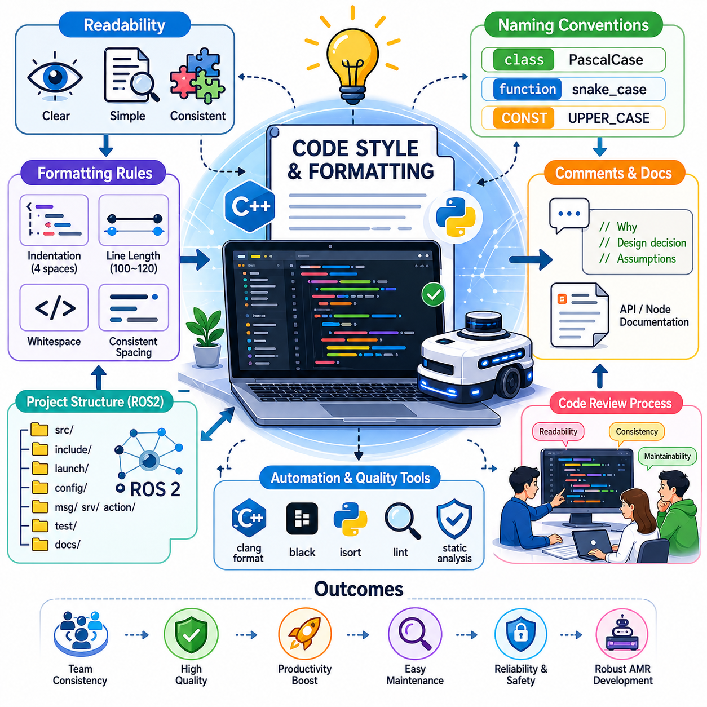
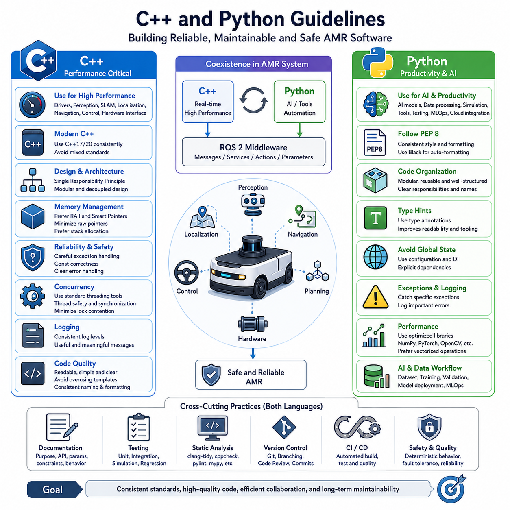
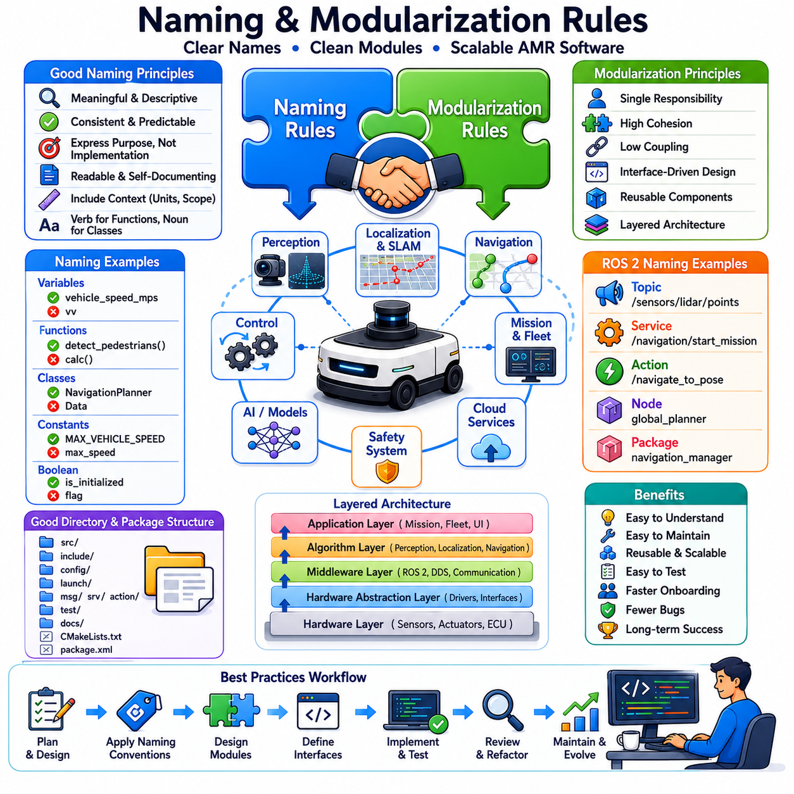
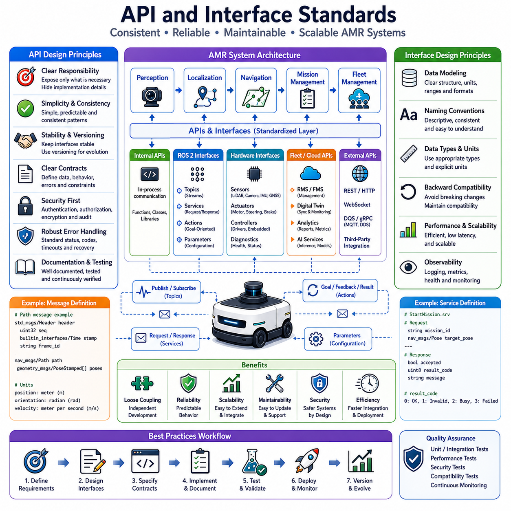
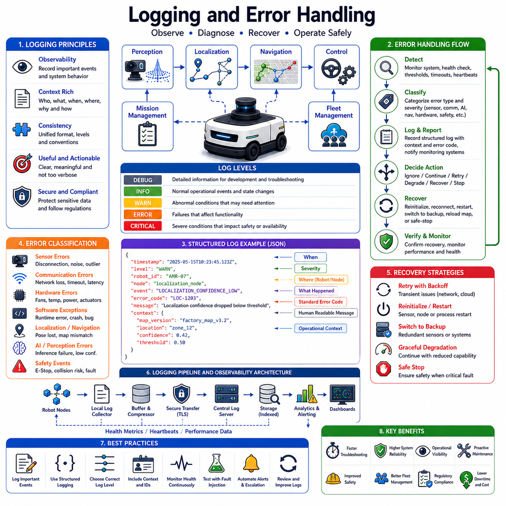
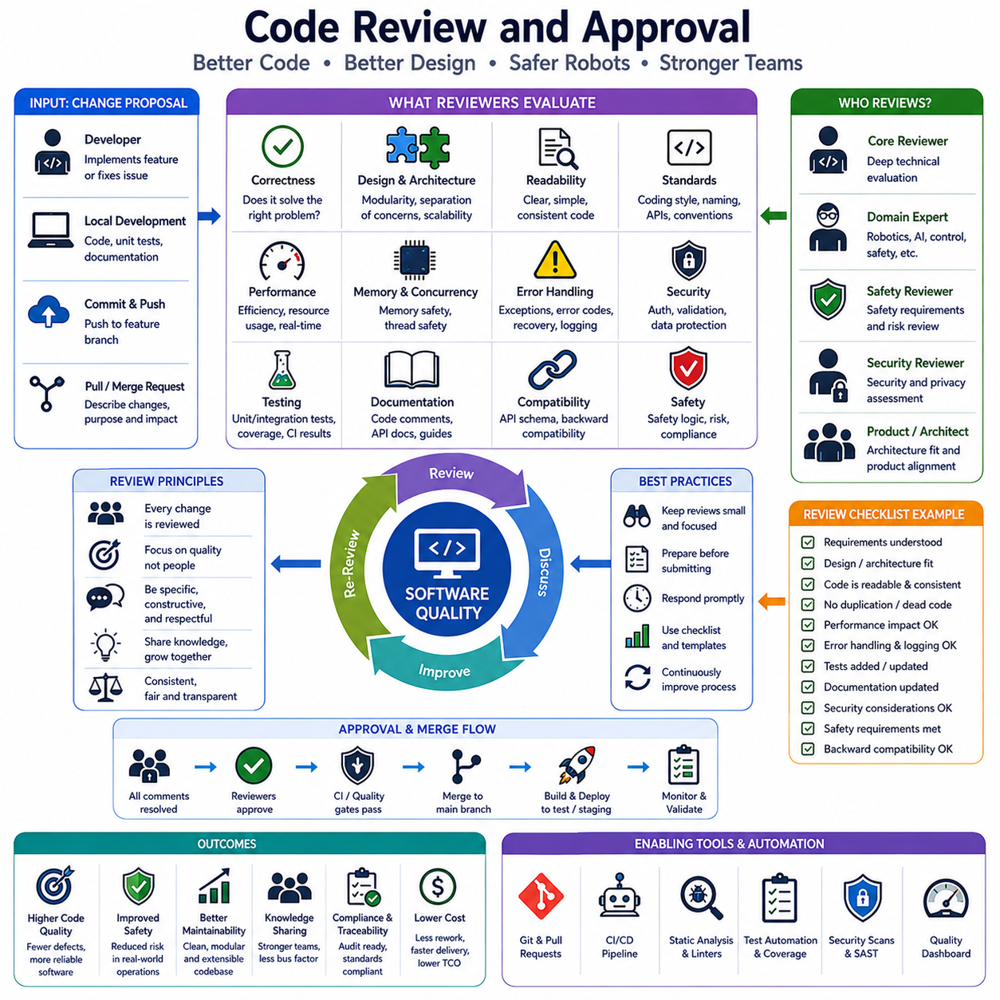
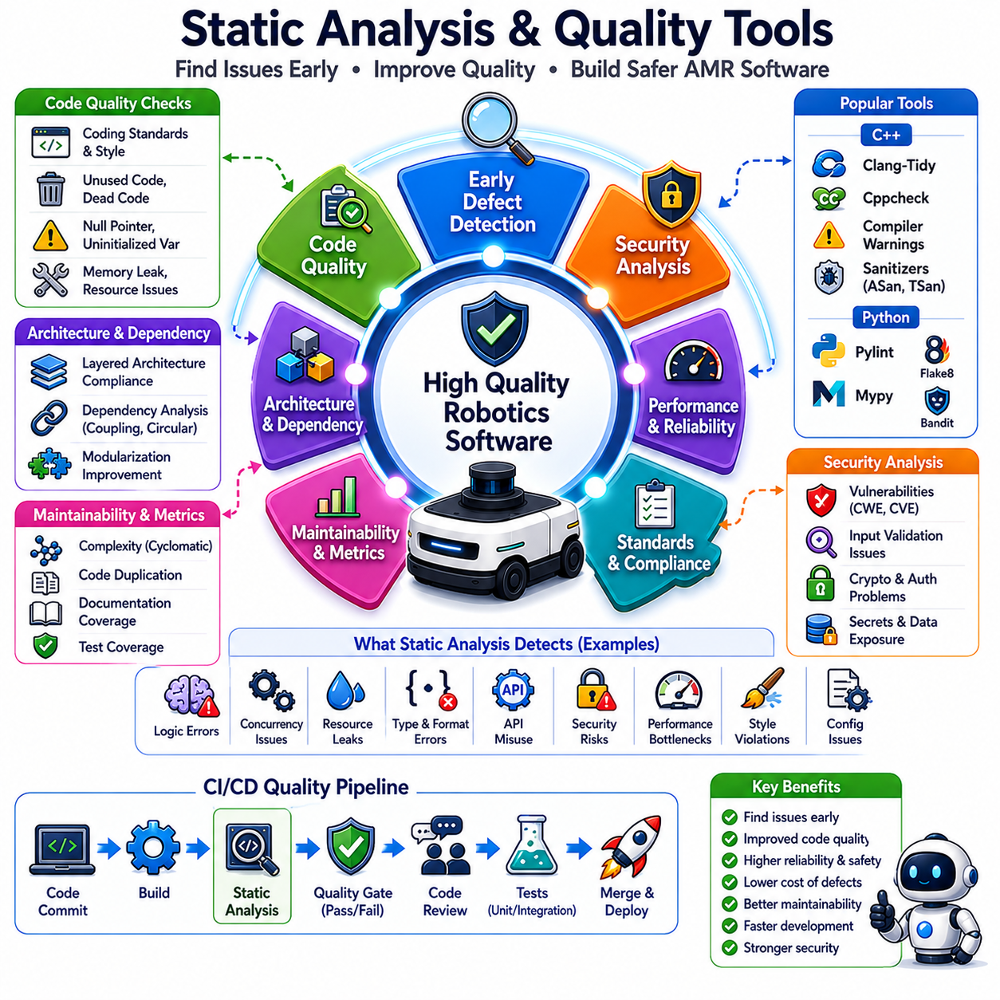
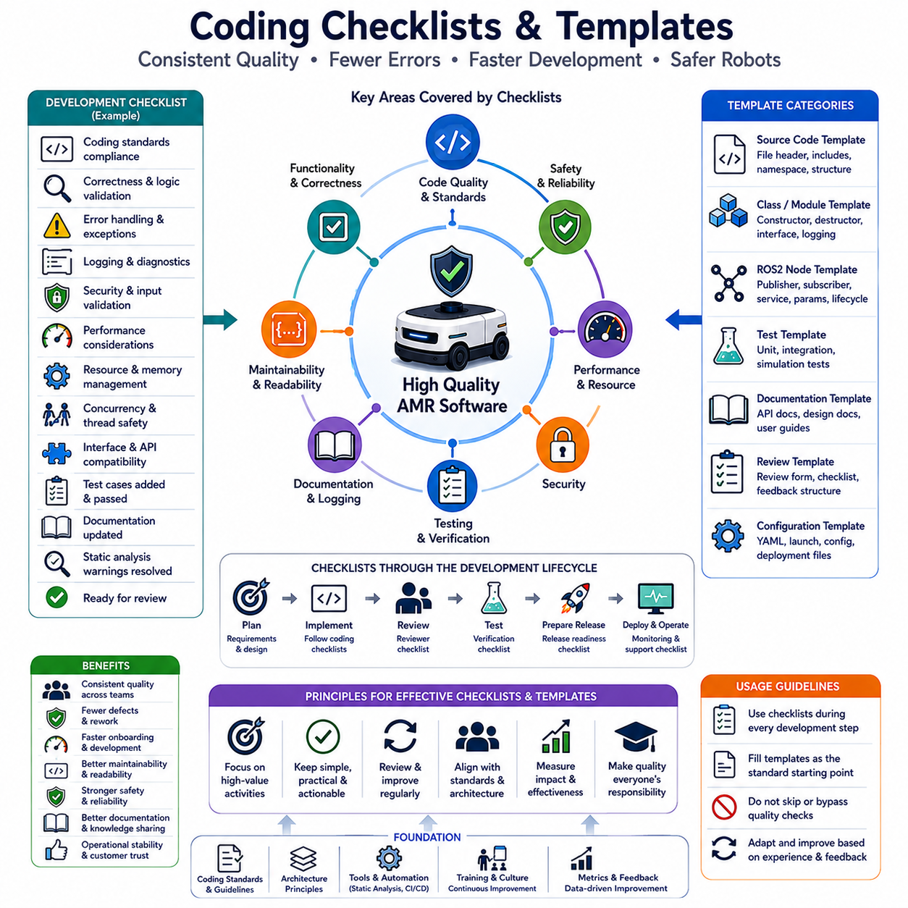

**Volume 10. AMR Engineering Process and Development Manual**

# Chapter 11. Code Standards and Guidelines

## 11.01 Code Style and Formatting

{width="7.268055555555556in" height="7.268055555555556in"}

# 11_01 코드 스타일 및 포맷팅 (Code Style and Formatting)

코드 스타일과 포맷팅은 전문적인 AMR(Autonomous Mobile Robot) 소프트웨어 엔지니어링의 가장 기본적인 요소 중 하나이다. 대규모 로봇 프로젝트에서는 소프트웨어가 한 명의 개발자에 의해 작성되는 경우가 거의 없다. 기계 설계 엔지니어, 전장 엔지니어, 임베디드 개발자, AI 연구원, 인지(Perception) 개발자, SLAM 엔지니어, 내비게이션 개발자, 클라우드 엔지니어, DevOps 엔지니어, 품질보증 담당자 등이 동일한 코드베이스에서 협업하게 된다. 이러한 환경에서 일관된 코딩 표준이 없다면 소프트웨어는 빠르게 유지보수가 어려워지고, 디버깅과 검증, 기능 확장이 복잡해진다.

수백 개의 ROS2 노드, 수천 개의 소스 파일, 수백만 줄 이상의 코드로 구성될 수 있는 AMR 시스템에서 코드 스타일은 단순히 보기 좋은 코드를 만드는 문제가 아니다. 이는 생산성, 신뢰성, 안전성, 유지보수성에 직접적인 영향을 미치는 핵심 엔지니어링 요소이다.

코드 스타일 및 포맷팅 가이드라인의 목표는 여러 개발자가 작성한 코드가 마치 하나의 팀이 작성한 것처럼 보이게 만드는 것이다. 일관된 포맷은 코드 리뷰 시 인지 부담을 줄이고, 디버깅을 단순화하며, 신규 개발자의 온보딩 속도를 높이고, 유지보수 과정에서 발생할 수 있는 오류를 감소시킨다. 구조화된 코드베이스는 개발자가 코드 형식을 해석하는 데 시간을 소비하는 대신 실제 기능 구현과 문제 해결에 집중할 수 있도록 해준다.

AMR 개발 환경에서는 다양한 프로그래밍 언어가 함께 사용된다. C++는 고성능 인지, SLAM, 위치추정, 내비게이션 및 실시간 제어 시스템 개발에 주로 활용된다. Python은 AI 모델 개발, 데이터 처리, 시뮬레이션, 테스트 자동화 및 운영 도구 개발에 폭넓게 사용된다. Bash 스크립트는 배포 자동화, 시스템 설정, Docker 운영, CI/CD 파이프라인 관리에 활용된다. 언어가 다르더라도 모든 소프트웨어는 가독성, 일관성, 단순성, 유지보수성을 핵심 철학으로 공유해야 한다. 이 내용은 AMR Engineering Process Manual의 「Code Standards and Guidelines」 장에 포함되며, 코드 스타일 및 포맷팅 규칙을 정의한다.

코드 포맷팅의 가장 중요한 원칙은 가독성이다. 코드는 작성되는 횟수보다 읽히는 횟수가 훨씬 많다. 개발자는 함수를 한 번 작성하지만, 이후 수십 번에서 수백 번 이상 검토하고 수정하며 유지보수하게 된다. 따라서 모든 포맷팅 결정은 개인 취향보다 가독성을 우선해야 한다. 지나치게 압축된 코드, 독특한 스타일, 과도한 개인화는 장기적인 유지보수에 장애물이 된다.

들여쓰기(Indentation)는 가장 눈에 띄는 포맷 요소이다. 대부분의 AMR 프로젝트에서는 4칸 공백 또는 일관된 탭 정책을 사용한다. 탭과 공백을 혼용하면 개발 환경에 따라 코드가 다르게 보일 수 있으므로 금지하는 것이 바람직하다. 중첩 구조는 시각적으로 명확해야 하며, 지나치게 깊은 중첩은 함수 분리가 필요하다는 신호로 간주할 수 있다.

한 줄의 최대 길이를 제한하는 것도 중요하다. 일반적으로 100\~120자 범위가 많이 사용된다. 짧은 줄 길이는 코드 리뷰와 비교 작업을 용이하게 하며, 노트북이나 원격 터미널 환경에서도 가독성을 유지할 수 있게 한다. 너무 긴 표현식은 논리적인 단위로 분리하여 표현하는 것이 좋다.

공백(Whitespace)의 사용 역시 코드 이해도를 높이는 데 중요한 역할을 한다. 연산자, 대입문, 제어문에는 일관된 공백 규칙을 적용해야 한다. 빈 줄은 논리적인 코드 블록을 구분하는 데 사용되며, 과도하게 사용하면 오히려 구조를 흐리게 만들 수 있다. 적절한 균형을 유지하는 것이 중요하다.

명명 규칙(Naming Convention)은 코드 스타일의 핵심 요소 중 하나이다. 변수, 함수, 클래스, 네임스페이스, 상수, 파일 및 디렉터리는 명확한 규칙을 따라야 한다. 의미를 쉽게 이해할 수 있는 이름을 사용하는 것이 중요하다. 예를 들어 차량 속도를 나타내는 변수라면 \`vv\` 대신 \`vehicle_velocity\`를 사용해야 하며, 장애물 탐지 함수라면 \`do_detection\`보다 \`detect_obstacles\`가 훨씬 명확하다. 좋은 이름은 문서의 역할을 대신할 수 있다.

C++에서는 일반적으로 클래스 이름에 PascalCase를 사용하고, 함수와 변수에는 snake_case를 사용하며, 상수는 UPPER_CASE를 사용하는 경우가 많다. 네임스페이스는 간결하면서도 기능을 명확히 표현해야 한다. 헤더 파일과 구현 파일 역시 프로젝트 전반에 걸쳐 일관된 규칙을 따라야 한다.

Python 개발에서는 PEP8 규칙을 따르는 것이 일반적이다. 클래스는 PascalCase, 함수는 snake_case, 상수는 대문자 형식을 사용한다. Python은 특히 AI 모델 개발과 데이터 처리에 많이 사용되므로 여러 연구원이 협업하는 환경에서는 일관성이 더욱 중요하다.

주석(Comment)은 무엇을 하는지보다 왜 그렇게 구현했는지를 설명해야 한다. 코드 내용을 그대로 설명하는 주석은 가치가 낮으며 시간이 지나면 오히려 혼란을 초래할 수 있다. 좋은 주석은 설계 의도, 가정, 제약 조건, 안전 요구사항, 알고리즘 선택 이유, 성능 트레이드오프 등을 설명한다. 예를 들어 특정 센서 융합 임계값을 선택한 이유를 설명하는 주석은 매우 유용하지만, 단순히 임계값 비교를 수행한다는 설명은 의미가 적다.

문서화 주석(Document Comment)은 프로젝트 전체에서 표준화되어야 한다. 공개 API, ROS2 노드, 서비스(Service), 액션(Action), 메시지(Message) 정의에는 목적, 입력, 출력, 제한 조건, 의존성, 실패 조건 등을 포함하는 구조화된 설명이 제공되어야 한다. 이러한 주석은 자동 문서 생성 도구와 연계하여 개발 문서와 API 레퍼런스를 생성하는 데 활용될 수 있다.

함수(Function)는 하나의 명확한 역할만 수행하도록 설계하는 것이 바람직하다. 지나치게 긴 함수는 여러 책임이 섞여 있다는 신호일 수 있으며, 더 작은 함수들로 분리하는 것이 좋다. 함수 시그니처, 매개변수 이름, 지역 변수의 구성은 모두 직관적이어야 하며 논리적으로 정리되어야 한다.

클래스(Class)는 공개 인터페이스와 내부 구현을 명확하게 구분해야 한다. 일반적으로 Public 인터페이스를 먼저 배치하고, 이후 Protected 및 Private 영역을 배치한다. 생성자, 소멸자, 초기화 함수, 콜백 함수, 유틸리티 함수는 일관된 순서로 정렬되어야 한다. 이러한 구조는 대규모 코드베이스 탐색을 훨씬 쉽게 만든다.

파일 구성(File Organization) 역시 중요한 요소이다. 하나의 파일은 관련된 기능만 포함해야 하며 지나치게 커진 파일은 적절히 분리해야 한다. 헤더 포함 순서도 일관된 규칙을 따라야 하며, 일반적으로 프로젝트 헤더, 외부 라이브러리, 표준 라이브러리 순으로 배치한다. 불필요한 의존성과 중복 Include는 제거해야 한다.

ROS2 프로젝트에서는 패키지 구조가 매우 중요하다. 소스 코드, 런치 파일, 설정 파일, 파라미터, 메시지 정의, 서비스 정의, 액션 정의, 문서, 테스트 코드가 명확히 분리되어야 한다. 이러한 구조는 시스템 통합과 유지보수를 크게 단순화한다. 이는 ROS2 프로젝트 구조와 직접적으로 연결되는 중요한 개발 원칙이다.

포맷팅 자동화 도구를 적극적으로 활용하는 것이 권장된다. 수작업 포맷팅은 결국 일관성을 잃게 된다. C++의 clang-format, Python의 black, import 정리를 위한 isort, 그리고 다양한 Lint 도구를 개발 환경에 통합해야 한다. 이러한 도구들은 자동으로 스타일을 적용하여 코드 리뷰 시 불필요한 논쟁을 줄여준다.

Lint 도구와 정적 분석 도구는 품질 관리의 중요한 축이다. 사용되지 않는 변수, 죽은 코드, 복잡도 증가, 명명 규칙 위반, 잠재적 버그 등을 조기에 발견할 수 있다. CI/CD 파이프라인에 이러한 도구를 통합하면 개발 과정 전체에서 코딩 표준을 지속적으로 유지할 수 있다.

코드 리뷰 프로세스에서도 스타일 준수 여부를 검토해야 한다. 리뷰어는 가독성, 유지보수성, 모듈화 수준, 일관성을 평가해야 한다. 그러나 반복적인 포맷팅 검사는 자동화 도구가 담당하도록 하여 리뷰어는 아키텍처, 성능, 안전성, 알고리즘 검토에 집중하는 것이 바람직하다.

오류 처리(Error Handling) 방식도 일관성을 유지해야 한다. 로그 출력, 예외 처리, 오류 코드 관리, 복구 절차는 공통 패턴을 따라야 한다. 특히 안전이 중요한 AMR 시스템에서는 현장 엔지니어가 로그를 통해 문제를 진단하기 때문에 표준화된 오류 처리 구조가 매우 중요하다.

설정 파일(Configuration File) 역시 포맷팅 규칙을 적용해야 한다. YAML, JSON, XML, Launch 파일, 파라미터 파일은 모두 일관된 들여쓰기와 구조를 유지해야 한다. 로봇 시스템은 방대한 설정 정보를 사용하기 때문에 설정 파일의 가독성 또한 소스 코드만큼 중요하다.

테스트 코드 역시 운영 코드와 동일한 수준의 품질을 유지해야 한다. 단위 테스트, 통합 테스트, 시뮬레이션 테스트, HIL(Hardware-In-the-Loop) 테스트, 검증 스크립트는 모두 장기적으로 유지되는 자산이므로 동일한 스타일 규칙을 적용해야 한다.

AMR 플랫폼이 연구 단계에서 상용 제품으로 발전함에 따라 코드의 수명은 더욱 길어진다. 초기 연구 단계에서 작성된 코드가 수년간 제품에 포함되는 경우도 흔하다. 일관된 스타일과 포맷팅 규칙은 기술 부채를 줄이고, 신규 인력의 적응 속도를 높이며, 대규모 협업 개발을 가능하게 한다. 특히 인지, SLAM, 내비게이션, AI, Fleet Management, 클라우드 서비스, 임베디드 제어 등 다양한 영역이 결합된 복합 로봇 시스템에서는 이러한 효과가 더욱 크게 나타난다.

결론적으로 코드 스타일과 포맷팅은 단순히 코드를 예쁘게 만드는 작업이 아니다. 이는 소프트웨어 품질, 개발 효율성, 운영 안정성, 조직의 확장성을 향상시키는 핵심 엔지니어링 활동이다. 전문적인 AMR 개발 조직에서는 명확한 스타일 가이드가 팀 전체의 공통 언어 역할을 수행하며, 이를 통해 안전하고 신뢰할 수 있으며 장기간 유지보수가 가능한 자율주행 로봇 소프트웨어를 구축할 수 있다.

## 11.02 C++ and Python Guidelines

{width="7.268055555555556in" height="7.268055555555556in"}

# 11_02 C++ 및 Python 개발 가이드라인 (Cpp and Python Guidelines)

C++와 Python은 현대 AMR(Autonomous Mobile Robot) 개발에서 가장 중요한 두 가지 프로그래밍 언어이다. Bash, JavaScript, SQL, YAML, Docker, 클라우드 기술과 같은 다양한 보조 기술들이 로봇 생태계 전반에 사용되지만, 실제 로봇의 지능, 자율주행, 인지, 내비게이션, 운영 소프트웨어의 핵심은 대부분 C++ 또는 Python으로 구현된다. 따라서 두 언어에 대한 일관된 개발 가이드라인을 수립하는 것은 확장 가능하고 유지보수가 용이하며 신뢰성 높은 로봇 시스템을 구축하기 위한 필수 요소이다.

일반적인 AMR 시스템 아키텍처에서 C++는 성능이 중요한 영역에 사용된다. 센서 드라이버, 인지 시스템, 위치추정, SLAM 엔진, 내비게이션 프레임워크, 경로 계획기, 실시간 제어기, 하드웨어 인터페이스, 통신 미들웨어, 안전 시스템 등이 대표적인 예이다. 반면 Python은 AI 모델 개발, 데이터 전처리, 시뮬레이션, 테스트 자동화, 운영 도구, MLOps 파이프라인, 클라우드 연동, 프로토타입 개발 등에 널리 활용된다. 두 언어가 동일 프로젝트 안에서 함께 사용되기 때문에 각 언어의 장점을 살리면서도 전체 프로젝트의 일관성을 유지할 수 있는 개발 기준이 필요하다. 본 장은 AMR Engineering Process and Development Manual의 「Code Standards and Guidelines」 항목에 속하며, 전문적인 로봇 소프트웨어 개발을 위한 C++ 및 Python 개발 지침을 설명한다.

프로그래밍 가이드라인의 목적은 단순히 스타일을 강제하는 것이 아니다. 소프트웨어 품질, 가독성, 유지보수성, 이식성, 테스트 용이성, 장기적인 지속 가능성을 향상시키는 것이 핵심 목표이다. 자율주행 로봇은 현장에 배치된 후 수년 이상 운영되는 경우가 많다. 이 기간 동안 원 개발자가 아닌 다른 엔지니어가 코드를 수정하고 유지보수하게 되므로 명확한 개발 규칙은 기술 부채를 줄이고 프로젝트의 장기 안정성을 높인다.

C++ 개발에서는 가독성이 무엇보다 중요하다. 현대 C++는 템플릿, 메타프로그래밍, Concepts, Variadic Templates, Constexpr, Lambda, Compile-Time Programming 등 매우 강력한 기능을 제공한다. 하지만 이러한 기능은 실제 엔지니어링 가치가 있을 때만 사용해야 한다. 지나치게 복잡한 기법은 유지보수성을 떨어뜨리고 디버깅을 어렵게 만든다. 따라서 가능한 한 직관적이고 이해하기 쉬운 구현 방식을 선택하는 것이 바람직하다.

프로젝트 전체는 동일한 C++ 표준을 사용해야 한다. 현재 대부분의 로봇 프로젝트는 C++17 또는 C++20을 표준으로 채택하고 있다. 여러 버전의 언어 표준이 혼재되면 코드의 일관성이 깨지고 빌드 환경 관리가 복잡해진다. 컴파일러, 빌드 시스템, 라이브러리, CI 환경 역시 동일한 표준에 맞추어 운영해야 한다.

헤더 파일은 가볍고 명확하게 설계되어야 한다. 불필요한 의존성은 컴파일 시간을 증가시키고 유지보수를 어렵게 만든다. 가능한 경우 Forward Declaration을 활용하여 결합도를 줄여야 한다. Include Guard 또는 \`#pragma once\`를 일관되게 사용해야 하며, 순환 참조는 아키텍처 수준에서 제거해야 한다.

클래스 설계는 단일 책임 원칙(Single Responsibility Principle)을 따라야 한다. 하나의 클래스는 하나의 명확한 목적만 가져야 한다. 지나치게 거대한 클래스는 테스트와 유지보수가 어려워진다. 기능을 여러 개의 독립적이고 응집도 높은 모듈로 분리하는 것이 바람직하다. 특히 ROS2 환경에서는 여러 노드가 메시지 기반으로 통신하므로 모듈화의 중요성이 더욱 크다.

메모리 관리는 C++ 개발에서 가장 중요한 요소 중 하나이다. 현대 C++에서는 RAII(Resource Acquisition Is Initialization) 원칙을 적극적으로 활용해야 한다. Raw Pointer 사용은 최소화하고 Smart Pointer를 활용하는 것이 권장된다. 공유 소유권은 Shared Pointer, 단독 소유권은 Unique Pointer를 사용하며 가능한 경우 Stack Allocation을 우선적으로 고려해야 한다. 올바른 메모리 관리는 메모리 누수와 비정상 종료를 방지하고 시스템 안정성을 향상시킨다.

예외 처리(Exception Handling)는 신중하게 사용해야 한다. 상위 레벨 애플리케이션에서는 예외 처리가 유용할 수 있지만, 실시간 제어 루프에서는 결정론적 동작이 요구되므로 예외 사용을 제한하는 경우가 많다. 프로젝트 차원에서 명확한 정책을 수립해야 하며, 안전 관련 모듈은 일반적으로 명시적인 오류 처리 방식을 선호한다.

Const Correctness 역시 중요한 원칙이다. 객체 상태를 변경하지 않는 함수는 \`const\`로 선언해야 하며, 변경이 필요 없는 인자는 \`const reference\`를 사용하는 것이 좋다. 이는 코드의 의도를 명확히 하고 최적화에도 도움이 된다.

함수는 하나의 논리적 작업만 수행해야 한다. 지나치게 긴 함수는 여러 책임이 섞여 있다는 신호일 수 있으며, 작은 함수들로 분리하는 것이 바람직하다. 함수의 입력과 출력 관계가 명확할수록 테스트와 유지보수가 쉬워진다.

템플릿 프로그래밍은 신중하게 사용해야 한다. 템플릿은 유연성과 성능을 제공하지만 복잡도를 증가시키고 컴파일 시간을 늘릴 수 있다. 따라서 명확한 이점이 있는 경우에만 사용하는 것이 바람직하다.

멀티스레딩과 동시성은 로봇 소프트웨어에서 매우 중요한 요소이다. 인지, 내비게이션, AI 추론, 통신, 사용자 인터페이스 등이 동시에 실행되는 경우가 많다. 따라서 표준화된 동시성 기법을 사용해야 하며, 공유 자원에 대한 접근은 적절한 동기화 메커니즘으로 보호되어야 한다. 또한 락 경쟁을 최소화하여 성능 저하를 방지해야 한다.

로그(Log) 시스템은 일관된 규칙을 따라야 한다. 디버그, 정보, 경고, 오류, 치명적 오류 등의 로그 레벨을 표준화하고 의미 있는 정보를 제공해야 한다. 로그는 시스템 상태와 장애 원인을 분석하는 데 도움을 주어야 하며 불필요한 메시지로 가득 차서는 안 된다.

Python 개발은 단순성과 생산성을 중심으로 한다. Python 코드는 가능한 한 PEP8 규칙을 따라야 한다. 일관된 포맷은 협업을 용이하게 하며 유지보수 비용을 줄여준다. Black과 같은 자동 포맷터를 사용하여 프로젝트 전체의 스타일을 통일하는 것이 좋다.

Python 모듈은 명확한 역할을 가져야 한다. 거대한 스크립트 대신 재사용 가능한 모듈과 패키지 구조를 구성해야 한다. 함수는 명확한 책임과 이해하기 쉬운 이름을 가져야 하며 과도한 중첩 구조는 피해야 한다. Python의 가장 큰 장점은 단순성이므로 불필요한 복잡성을 추가해서는 안 된다.

최근 Python 개발에서는 타입 힌트(Type Hint)가 매우 중요해지고 있다. Python은 동적 타입 언어이지만 타입 정보를 명시하면 가독성이 향상되고 정적 분석 도구와 IDE 지원을 효과적으로 활용할 수 있다. 센서 데이터, AI 모델, 통신 인터페이스 등 복잡한 구조를 다루는 로봇 소프트웨어에서는 특히 큰 도움이 된다.

Python에서는 전역 변수(Global Variable)를 최대한 피해야 한다. 전역 상태는 숨겨진 의존성을 만들고 테스트를 어렵게 한다. 설정 값은 설정 파일이나 전용 구성 관리 시스템을 통해 관리하는 것이 바람직하다.

예외 처리는 명확하고 구체적으로 수행해야 한다. 모든 예외를 무조건 처리하는 광범위한 Exception Handler는 실제 문제를 숨길 수 있다. 처리하려는 예외만 명시적으로 처리하고 적절한 복구 전략을 구현해야 한다. 중요한 오류는 반드시 로그와 함께 기록되어야 한다.

Python은 실시간 제어에 사용되지 않는 경우가 많지만 성능 역시 중요하다. 계산량이 큰 작업은 NumPy, PyTorch, TensorFlow, OpenCV 또는 C++ 확장 모듈을 활용해야 한다. 반복문보다는 벡터화(Vectorization)된 연산을 우선적으로 사용하는 것이 효율적이다.

AI와 데이터 처리 분야는 Python의 대표적인 활용 영역이다. 데이터셋 관리, 라벨링, 학습 파이프라인, 검증 시스템, 모델 변환, TensorRT 배포, MLOps 자동화 등이 대부분 Python 기반으로 구현된다. 따라서 프로젝트 구조, 실험 관리, 설정 관리, 버전 관리 체계를 체계적으로 유지해야 한다.

문서화는 C++와 Python 모두에서 매우 중요하다. 공개 API, 클래스, 함수, ROS2 노드, 서비스, 액션 인터페이스는 목적, 입력값, 출력값, 제약 조건, 예상 동작 등을 설명해야 한다. 잘 작성된 문서는 신규 개발자의 적응 시간을 줄이고 전체 개발 생산성을 향상시킨다.

테스트 역시 언어와 관계없이 동일한 수준으로 수행되어야 한다. 단위 테스트, 통합 테스트, 시뮬레이션 테스트, 회귀 테스트, 성능 테스트는 모두 운영 코드와 함께 개발되어야 한다. CI 환경에서 자동 실행되도록 구성하여 장기적인 품질을 확보해야 한다.

정적 분석 도구는 개발 프로세스의 필수 요소이다. C++에서는 clang-tidy, cppcheck, Sanitizer 등을 사용할 수 있으며, Python에서는 pylint, flake8, mypy, bandit 등을 활용할 수 있다. 이러한 도구들은 잠재적인 버그와 보안 문제를 조기에 발견하는 데 도움을 준다.

버전 관리 또한 중요하다. Git 저장소를 기반으로 브랜치 전략, 커밋 규칙, 코드 리뷰 정책, 릴리스 관리 절차를 명확히 정의해야 한다. 의미 있는 커밋 메시지는 변경 이력을 추적하고 문제를 분석하는 데 큰 도움이 된다.

ROS2 기반 로봇 시스템에서는 C++와 Python이 함께 사용되는 경우가 많다. 성능이 중요한 노드는 C++로 구현하고, AI 파이프라인이나 운영 도구는 Python으로 구현하는 것이 일반적이다. 이 경우 메시지 구조, 인터페이스 정의, 파라미터 체계, 통신 프로토콜을 일관되게 유지해야 한다.

안전성 역시 코딩 규칙에 반영되어야 한다. AMR 소프트웨어는 실제 물리 환경과 직접 상호작용한다. 따라서 결정론적 동작, 오류 격리, 장애 복구, 자원 관리, 운영 투명성을 중요하게 고려해야 한다. 소프트웨어 오류는 단순한 장애를 넘어 안전사고와 장비 손상으로 이어질 수 있기 때문이다.

AMR 플랫폼이 점점 더 AI 중심의 자율 시스템으로 발전함에 따라 소프트웨어 복잡성도 지속적으로 증가하고 있다. 인지 시스템, 위치추정, 내비게이션, Fleet Management, 클라우드 서비스, 디지털 트윈, Embodied AI 등이 모두 하나의 플랫폼 안에서 통합되고 있다. 이러한 복잡성을 효과적으로 관리하기 위해서는 C++와 Python에 대한 명확한 개발 기준이 필수적이다.

결론적으로 C++ 및 Python 가이드라인은 단순한 코딩 취향의 문제가 아니다. 이는 소프트웨어의 신뢰성, 유지보수성, 확장성, 성능, 안전성을 결정하는 핵심 엔지니어링 규칙이다. 체계적인 개발 표준을 적용함으로써 로봇 기업은 연구 단계의 프로토타입부터 대규모 상용 서비스까지 안정적으로 운영할 수 있는 견고한 소프트웨어 플랫폼을 구축할 수 있다.

## 11.03 Naming and Modularization Rules

{width="7.268055555555556in" height="7.268055555555556in"}

# 11_03 명명 규칙 및 모듈화 규칙 (Naming and Modularization Rules)

명명 규칙(Naming)과 모듈화(Modularization)는 지속 가능한 AMR(Autonomous Mobile Robot) 소프트웨어 엔지니어링의 가장 중요한 기반 요소 중 하나이다. 알고리즘, 시스템 아키텍처, 프레임워크는 개발 과정에서 많은 관심을 받지만, 실제로 장기적인 유지보수 문제의 상당수는 부적절한 이름과 잘못된 모듈 구조에서 발생한다. 인지(Perception), SLAM, 내비게이션, AI 모델, 클라우드 서비스, Fleet Management, 임베디드 제어, 안전 시스템 등이 하나의 플랫폼에 통합되면서 로봇 소프트웨어의 복잡성은 지속적으로 증가하고 있다. 이러한 환경에서 명확한 명명 규칙과 체계적인 모듈 설계는 소프트웨어 품질, 확장성, 유지보수성 및 개발 효율성을 유지하는 핵심 요소가 된다.

명명 규칙과 모듈화의 목적은 소프트웨어가 제품 수명 주기 전체에 걸쳐 이해하기 쉽고, 유지보수가 가능하며, 재사용 가능하고, 테스트하기 쉬우며, 기능 확장이 가능하도록 만드는 것이다. 좋은 이름은 별도의 설명 없이도 의도를 전달할 수 있으며, 잘 설계된 모듈은 기능을 분리하고 의존성을 줄이며 신뢰성을 향상시킨다. 결국 명명 규칙과 모듈화는 소프트웨어 아키텍처를 구성하는 언어와 구조라고 할 수 있다.

AMR 프로젝트에는 소프트웨어 엔지니어, AI 연구원, 로봇 개발자, 시스템 아키텍트, DevOps 엔지니어, 품질보증 담당자, 현장 운영 엔지니어 등이 함께 참여한다. 또한 소프트웨어는 수년간 운영되며 원 개발자가 아닌 다른 엔지니어가 유지보수를 수행하는 경우가 많다. 따라서 일관된 명명 규칙과 모듈화 전략은 신규 인력의 적응 시간을 줄이고 협업을 원활하게 하며 유지보수 과정에서 발생할 수 있는 오류를 줄여준다. 본 장은 AMR Engineering Process and Development Manual의 「Code Standards and Guidelines」 항목에 속하며 명명 규칙과 모듈 설계 원칙을 정의한다.

명명 규칙의 가장 중요한 목적은 의사소통이다. 좋은 이름은 변수, 함수, 클래스, 패키지, 노드, 인터페이스가 무엇을 의미하는지 즉시 이해할 수 있도록 해준다. 개발자는 구현 코드를 보지 않더라도 이름만 보고 해당 요소의 역할과 책임을 파악할 수 있어야 한다. 이름은 코드 안에 포함된 가장 기본적인 문서라고 할 수 있다.

이름은 짧은 것보다 의미가 명확한 것이 중요하다. 개발 단계에서는 짧은 이름이 편리해 보일 수 있지만 장기적으로는 혼란을 유발하는 경우가 많다. 예를 들어 \`vv\`라는 변수보다 \`vehicle_velocity\`가 훨씬 명확하며, \`calc()\`라는 함수보다 \`calculate_path_cost()\`가 실제 역할을 더 잘 설명한다.

이름은 구현 방식이 아니라 기능적 의미를 표현해야 한다. 예를 들어 보행자를 탐지하는 함수는 특정 알고리즘 이름이 아니라 \`detect_pedestrians()\`와 같이 기능 중심으로 명명하는 것이 바람직하다. 이렇게 하면 내부 알고리즘이 변경되더라도 인터페이스는 그대로 유지될 수 있다.

일관성 또한 매우 중요하다. 동일한 개념은 프로젝트 전체에서 동일한 용어를 사용해야 한다. 예를 들어 내비게이션 시스템에서 "Waypoint"라는 용어를 사용한다면 다른 모듈에서도 동일한 용어를 사용해야 한다. 어떤 곳에서는 Waypoint를 사용하고 다른 곳에서는 Checkpoint나 Target Point를 사용하면 개발자 간 의사소통이 어려워지고 혼란이 발생한다.

변수 이름은 의미와 범위를 함께 표현해야 한다. 지역 변수는 비교적 간결한 이름을 사용할 수 있지만, 멤버 변수나 공개 인터페이스는 충분히 설명적인 이름을 사용하는 것이 좋다. 특히 물리량을 나타내는 변수는 단위를 포함하는 것이 권장된다. 예를 들어 \`vehicle_speed_mps\`, \`battery_voltage_v\`, \`sensor_range_m\`과 같은 이름은 단위에 대한 오해를 방지할 수 있다.

불린(Boolean) 변수는 상태를 자연스럽게 표현해야 한다. 일반적으로 \`is_\`, \`has_\`, \`can_\`, \`should_\`, \`enable_\`과 같은 접두어를 사용하는 것이 좋다. 예를 들어 \`is_initialized\`, \`has_obstacle\`, \`can_navigate\`, \`should_stop\` 등은 조건문의 의미를 직관적으로 이해할 수 있게 해준다.

함수 이름은 동작(Action)을 표현해야 한다. 함수는 일반적으로 특정 작업을 수행하므로 동사 형태를 사용하는 것이 바람직하다. 예를 들어 \`initialize_system\`, \`load_configuration\`, \`compute_pose\`, \`detect_obstacles\`, \`generate_trajectory\`, \`publish_status\`와 같은 이름은 함수의 역할을 명확하게 전달한다.

클래스 이름은 개체(Entity), 서비스(Service), 구성 요소(Component)를 나타내는 명사 형태가 적합하다. 예를 들어 \`NavigationPlanner\`, \`ObstacleDetector\`, \`FleetManager\`, \`LocalizationEngine\`, \`BatteryMonitor\`와 같은 이름은 해당 클래스의 책임을 쉽게 이해할 수 있도록 해준다.

인터페이스는 구현이 아니라 추상화를 중심으로 이름을 지어야 한다. 예를 들어 특정 GNSS 장치를 사용하는 위치추정 시스템이라도 인터페이스 이름은 \`LocalizationProvider\`와 같이 기능 중심으로 정의하는 것이 좋다. 이는 향후 구현체가 변경되더라도 인터페이스를 유지할 수 있게 해준다.

상수(Constant)는 변경되지 않는 값이라는 점과 목적을 명확하게 표현해야 한다. 일반적으로 대문자 표기법을 사용하며, 단순한 값보다 의미를 나타내는 이름을 사용한다. 예를 들어 \`MAX_VEHICLE_SPEED\`, \`DEFAULT_TIMEOUT_MS\`, \`SAFETY_STOP_DISTANCE_M\` 등이 좋은 예이다.

열거형(Enum)은 상태나 모드를 명확하게 표현해야 한다. 예를 들어 \`NAVIGATION_RUNNING\`, \`NAVIGATION_PAUSED\`, \`NAVIGATION_COMPLETED\`와 같은 이름은 숫자 코드보다 훨씬 이해하기 쉽다.

파일 이름 역시 명확해야 한다. 파일 이름은 해당 파일이 담당하는 주요 기능을 반영해야 하며 일관된 규칙을 유지해야 한다. 이는 프로젝트 탐색을 쉽게 만들고 유지보수 효율을 높여준다.

디렉터리 구조는 시스템 아키텍처를 반영해야 한다. 상위 디렉터리는 Perception, Localization, Navigation, Control, Cloud, Fleet Management, Simulation, Testing 등 주요 기능 단위로 구성하는 것이 바람직하다. 명확한 디렉터리 구조는 전체 시스템을 이해하는 데 큰 도움이 된다.

ROS2 패키지 이름은 간결하면서도 기능을 명확히 표현해야 한다. 예를 들어 \`navigation_manager\`, \`perception_pipeline\`, \`slam_server\`, \`fleet_controller\`, \`sensor_fusion\`과 같은 이름은 패키지의 역할을 직관적으로 전달한다.

ROS2 노드 이름도 기능 중심으로 정의해야 한다. 예를 들어 \`lidar_processor\`, \`global_planner\`, \`path_tracker\`, \`mission_scheduler\`, \`battery_monitor\` 등은 노드가 수행하는 역할을 쉽게 이해할 수 있게 해준다.

ROS2 토픽 이름은 계층 구조를 반영하는 것이 중요하다. 예를 들어 \`/sensors/lidar/points\`, \`/navigation/global_path\`, \`/localization/current_pose\`, \`/fleet/task_status\`와 같은 구조는 시스템의 데이터 흐름을 직관적으로 표현한다.

ROS2 서비스 이름은 요청되는 동작을 표현해야 한다. 예를 들어 \`/navigation/start_mission\`, \`/mapping/save_map\`, \`/system/reboot\`, \`/fleet/assign_task\`와 같은 이름은 수행되는 작업을 명확하게 나타낸다.

ROS2 액션(Action)은 장시간 수행되는 목표 기반 작업을 나타낸다. 예를 들어 \`/navigate_to_pose\`, \`/dock_to_charger\`, \`/inspect_route\`, \`/execute_mission\`과 같은 이름이 적절하다.

모듈화는 단순히 이름을 정하는 것을 넘어 소프트웨어 구조 자체를 설계하는 과정이다. 모듈은 명확한 책임과 인터페이스를 가지는 기능 단위이며, 적절한 모듈화는 결합도를 낮추고 유지보수성을 향상시키며 독립적인 개발을 가능하게 한다.

모듈화의 가장 중요한 원칙은 관심사의 분리(Separation of Concerns)이다. 각 모듈은 하나의 명확한 책임만 가져야 하며 불필요한 기능을 포함해서는 안 된다. 예를 들어 Localization 모듈은 Fleet Management 기능을 포함해서는 안 되며, Perception 모듈은 Cloud Synchronization 기능을 직접 구현해서는 안 된다.

높은 응집도(High Cohesion)는 좋은 모듈의 특징이다. 하나의 모듈 내부 기능들은 동일한 목적을 향해 협력해야 한다. 관련 없는 기능들이 섞여 있다면 해당 모듈은 재구성이 필요하다는 신호일 수 있다.

낮은 결합도(Low Coupling) 또한 중요하다. 모듈 간 의존성은 최소화되어야 하며 명확한 인터페이스를 통해서만 상호작용해야 한다. 지나친 결합은 한 모듈의 변경이 전체 시스템에 영향을 주는 원인이 된다.

인터페이스 기반 설계는 효과적인 모듈화를 지원한다. 모듈은 외부에 필요한 기능만 공개하고 내부 구현은 숨겨야 한다. 이러한 캡슐화는 복잡성을 줄이고 유지보수를 용이하게 만든다.

재사용 가능한 모듈은 적극적으로 설계해야 한다. 로깅, 설정 관리, 통신 추상화, 파라미터 처리, 좌표 변환, 진단 기능 등은 여러 곳에서 활용될 수 있는 공통 라이브러리 형태로 구현하는 것이 바람직하다.

의존성 관리도 매우 중요하다. 일반적으로 상위 애플리케이션 계층에서 하위 유틸리티 계층 방향으로만 의존성이 흐르도록 설계해야 한다. 순환 의존성은 유지보수와 테스트를 어렵게 만들기 때문에 피해야 한다.

대규모 AMR 시스템은 계층형 아키텍처(Layered Architecture)를 사용하는 경우가 많다. 하드웨어 추상화 계층, 장치 드라이버 계층, 미들웨어 계층, 인지 계층, 위치추정 계층, 내비게이션 계층, 미션 관리 계층, 클라우드 계층, 사용자 인터페이스 계층 등으로 구분하면 시스템 구조를 명확하게 유지할 수 있다.

모듈화는 테스트를 쉽게 만든다. 모듈이 독립적으로 설계되어 있으면 전체 로봇 시스템 없이도 단위 테스트를 수행할 수 있다. Mock 객체와 Dependency Injection 기법을 활용하면 테스트 효율을 더욱 향상시킬 수 있다.

확장성 또한 모듈화의 중요한 장점이다. 새로운 센서, AI 모델, 내비게이션 알고리즘, 클라우드 서비스, Fleet 기능이 추가되더라도 기존 시스템을 크게 변경하지 않고 새로운 기능을 통합할 수 있다.

문서화 역시 모듈 경계를 명확히 해야 한다. 아키텍처 다이어그램, 패키지 설명서, API 문서, 인터페이스 명세서는 각 모듈의 역할과 의존성, 통신 방식, 통합 방법을 설명해야 한다.

코드 리뷰에서는 기능의 정확성뿐 아니라 이름의 적절성과 모듈 구조도 함께 검토해야 한다. 부적절한 이름은 설계 의도가 불분명하다는 신호일 수 있으며, 잘못된 모듈 구조는 아키텍처 문제를 의미할 수 있다.

정적 분석 도구와 아키텍처 분석 도구는 명명 규칙과 모듈화 규칙 준수를 자동으로 검증하는 데 활용될 수 있다. 이러한 도구들은 유지보수 문제가 발생하기 전에 구조적 결함을 조기에 발견할 수 있도록 도와준다.

로봇 플랫폼이 수백 대 또는 수천 대 규모의 Fleet으로 확장되면 소프트웨어 복잡성은 급격히 증가한다. Fleet Management, 클라우드 운영, 디지털 트윈, AI 인프라, 사이버 보안, 운영 분석 시스템 등이 추가되면서 체계적인 구조 관리가 필수적이 된다. 이때 명확한 명명 규칙과 모듈화 원칙은 복잡성을 관리하는 핵심 도구가 된다.

결론적으로 명명 규칙과 모듈화는 단순한 코딩 규칙이 아니다. 이는 소프트웨어 품질, 유지보수성, 확장성, 안전성, 프로젝트 성공 여부를 결정하는 핵심 엔지니어링 원칙이다. 좋은 이름은 의도를 명확하게 전달하고, 잘 설계된 모듈은 복잡성을 격리하며 독립적인 발전을 가능하게 한다. 두 요소가 결합될 때 현대 AMR 시스템은 장기간 이해 가능하고 확장 가능하며 신뢰성 높은 소프트웨어 플랫폼으로 발전할 수 있다.

## 11.04 API and Interface Standards

{width="7.268055555555556in" height="7.268055555555556in"}

# 11_04 API 및 인터페이스 표준 (API and Interface Standards)

API(Application Programming Interface)와 소프트웨어 인터페이스는 현대 AMR(Autonomous Mobile Robot) 시스템 내부 통신의 핵심 기반이다. 로봇 플랫폼이 점점 더 소프트웨어 중심의 분산 아키텍처로 발전하면서 상호작용하는 구성 요소의 수는 급격히 증가하고 있다. 센서는 인지(Perception) 모듈과 통신하고, 인지 모듈은 위치추정(Localization) 시스템과 데이터를 교환하며, 위치추정 시스템은 내비게이션 프레임워크에 정보를 제공한다. 내비게이션 시스템은 미션 관리 플랫폼과 연동되고, Fleet Management 시스템은 클라우드 기반 인프라를 통해 여러 대의 로봇을 동시에 제어한다. 이러한 환경에서 명확한 API 및 인터페이스 표준이 없다면 시스템 통합은 복잡해지고 유지보수 비용은 증가하며 확장성은 크게 저하된다.

API 및 인터페이스 표준의 가장 중요한 목적은 소프트웨어 구성 요소 간의 일관되고 신뢰할 수 있으며 유지보수가 가능한 통신 방식을 제공하는 것이다. API는 정보 제공자와 소비자 사이의 계약(Contract) 역할을 수행한다. 어떤 데이터를 교환할 수 있는지, 통신은 어떤 방식으로 이루어지는지, 어떤 동작이 보장되는지, 오류는 어떻게 처리되는지를 정의한다. 잘 설계된 인터페이스는 각 모듈이 독립적으로 개발될 수 있도록 하면서도 전체 로봇 시스템의 상호운용성을 보장한다.

AMR 개발 환경에서는 다양한 수준의 API가 존재한다. 프로세스 내부 모듈 간 통신을 위한 내부 API가 있으며, ROS2의 Topic, Service, Action을 통한 분산 노드 간 인터페이스가 존재한다. 또한 센서, 액추에이터, 모터 드라이버, GNSS 수신기, LiDAR, 카메라, 임베디드 장치와 연결되는 하드웨어 인터페이스가 있다. Fleet Management API는 로봇과 RMS/FMS 플랫폼을 연결하며, 클라우드 API는 디지털 트윈, 분석 시스템, MLOps 인프라, 원격 운영 플랫폼과의 통신을 담당한다. 이러한 모든 계층에서 일관된 인터페이스 설계 원칙이 필요하다. 본 장은 AMR Engineering Process and Development Manual의 「Code Standards and Guidelines」 항목에 속하며, 전문적인 로봇 시스템을 위한 API 및 인터페이스 설계 원칙을 설명한다.

좋은 API 설계는 명확한 책임 구분에서 시작된다. 인터페이스는 외부와 상호작용하는 데 필요한 기능만 공개하고 내부 구현은 숨겨야 한다. 이러한 추상화(Abstraction)는 모듈 간 결합도를 줄이고 내부 구현이 변경되더라도 외부 시스템에 영향을 주지 않도록 한다. 인터페이스 사용자는 내부 구현 방식이 아니라 제공되는 기능에만 관심을 가져야 한다.

인터페이스는 가능한 한 단순해야 한다. 복잡한 인터페이스는 학습 비용을 증가시키고 통합을 어렵게 만들며 유지보수 부담을 높인다. 노출되는 함수, 파라미터, Topic, Service, Action은 모두 명확한 목적을 가져야 한다. 불필요한 기능은 제거하고 필요한 기능만 제공하는 것이 바람직하다.

일관성은 고품질 API의 가장 중요한 특성 중 하나이다. 유사한 기능은 동일한 명명 규칙, 파라미터 구조, 반환 방식, 오류 처리 패턴을 사용해야 한다. 예를 들어 하나의 Service가 상태 코드를 포함하는 응답 구조를 사용한다면 관련 Service들도 동일한 방식을 따르는 것이 좋다. 일관성은 개발자의 학습 부담을 줄이고 생산성을 향상시킨다.

API 이름은 명확하고 예측 가능해야 한다. 함수는 동작을 나타내야 하고, 클래스는 개체를 나타내야 하며, 서비스는 수행되는 작업을 표현해야 한다. 애매한 이름은 통합 과정에서 오류와 오해를 발생시키는 주요 원인이 된다.

인터페이스 계약(Contract)은 가능한 한 안정적으로 유지되어야 한다. 이미 공개되어 여러 모듈에서 사용되고 있는 API를 자주 변경하면 유지보수 비용이 크게 증가한다. 인터페이스 변경이 필요한 경우에는 버전 관리 체계를 통해 신중하게 관리해야 한다. 가능하면 하위 호환성(Backward Compatibility)을 유지하는 것이 바람직하다.

대규모 로봇 프로젝트에서는 버전 관리가 매우 중요하다. 시스템이 발전하면서 새로운 기능은 추가되지만 기존 기능도 계속 동작해야 한다. API는 명확한 버전 정보를 포함해야 하며, 여러 버전의 소프트웨어가 동시에 운영될 수 있도록 설계해야 한다. 체계적인 버전 관리는 통합 리스크를 줄이고 배포를 단순화한다.

데이터 모델링은 인터페이스 설계의 핵심 요소이다. 데이터 구조는 명확하게 정의되어야 하며 일관성을 유지해야 한다. 각 필드는 의미, 허용 범위, 단위, 형식이 명확해야 한다. 데이터 정의가 모호하면 시스템 통합 과정에서 심각한 문제가 발생할 수 있다.

물리량은 반드시 단위를 포함해야 한다. 거리 값은 미터(m), 속도는 m/s, 각도는 degree 또는 radian, 시간은 명확한 기준을 사용해야 한다. 단위의 불명확성은 다양한 산업 분야에서 실제 사고의 원인이 되었으며, 로봇 시스템에서는 반드시 제거되어야 한다.

데이터 타입 선택 역시 중요하다. 수치 정밀도, 메모리 사용량, 통신 대역폭, 연산 효율성을 모두 고려해야 한다. 지나치게 높은 정밀도는 자원 낭비를 초래하고, 지나치게 낮은 정밀도는 시스템 성능을 저하시킬 수 있다.

ROS2 인터페이스는 AMR 시스템에서 가장 중요한 API 중 하나이다. ROS2는 Topic, Service, Action, Parameter를 통해 통신한다. Topic은 연속적인 데이터 스트림에 적합하며, Service는 요청-응답 방식의 동기 통신에 적합하다. Action은 장시간 수행되는 작업에 적합하며, Parameter는 설정 관리에 사용된다.

ROS2 메시지는 명확하고 일관되게 설계되어야 한다. 메시지 필드는 의미 있는 이름을 사용해야 하며, 관련 메시지들은 동일한 구조와 패턴을 공유하는 것이 좋다. 메시지는 필요한 기능을 제공하면서도 가능한 한 단순하게 유지해야 한다.

Topic 인터페이스는 내부 구현이 아니라 논리적인 데이터 흐름을 반영해야 한다. Topic은 인지, 위치추정, 내비게이션, 진단, Fleet Management 등 기능 영역별로 계층 구조를 갖는 것이 좋다. 이러한 구조는 모니터링과 디버깅을 훨씬 쉽게 만들어 준다.

Service 인터페이스는 명확한 트랜잭션(Transaction) 구조를 가져야 한다. 요청(Request)은 작업 수행에 필요한 모든 정보를 포함해야 하며, 응답(Response)은 결과, 상태, 오류 정보를 예측 가능한 방식으로 제공해야 한다. 숨겨진 의존성이나 암묵적인 가정은 피해야 한다.

Action 인터페이스는 목표 기반 작업에 적합하다. 예를 들어 목적지 이동, 자동 충전, 순찰, 검사 작업, 물류 배송 등과 같은 장시간 작업은 Action으로 구현하는 것이 적합하다. Action은 Goal, Feedback, Result 구조를 명확하게 정의해야 한다.

하드웨어 추상화 인터페이스는 로봇 소프트웨어 아키텍처의 핵심이다. 장치별 세부 구현은 표준 인터페이스 뒤에 숨겨야 한다. 이를 통해 센서나 장치가 변경되더라도 상위 소프트웨어는 수정 없이 그대로 사용할 수 있다. 이러한 추상화는 다양한 플랫폼 지원과 시뮬레이션 환경 구축에 매우 유용하다.

센서 인터페이스는 제조사와 관계없이 동일한 데이터 접근 방식을 제공하는 것이 바람직하다. LiDAR, 카메라, Radar, IMU, GNSS, 초음파 센서, 열화상 카메라 등이 모두 가능한 한 일관된 구조를 제공해야 한다. 이는 인지 알고리즘 개발과 통합을 단순화한다.

액추에이터 인터페이스 역시 모터, 조향 시스템, 브레이크, 매니퓰레이터 등 다양한 장치를 추상화해야 한다. 상위 소프트웨어는 장치별 프로토콜이 아니라 표준 명령 체계를 통해 제어할 수 있어야 한다.

클라우드 및 Fleet Management 인터페이스는 추가적인 고려 사항이 필요하다. 로봇은 RMS, FMS, 디지털 트윈, 운영 대시보드, 분석 플랫폼, AI 서비스와 지속적으로 통신한다. 이러한 인터페이스는 확장성, 보안성, 신뢰성을 보장해야 하며 지연 시간, 네트워크 품질, 통신 단절과 같은 현실적인 조건도 고려해야 한다.

REST API는 클라우드 연동에 가장 널리 사용되는 방식 중 하나이다. REST 인터페이스는 리소스 중심 구조를 유지해야 하며, URL 구조, 요청 형식, 응답 형식이 일관성을 가져야 한다. 또한 충분한 문서화가 제공되어야 한다.

실시간 통신이 필요한 경우에는 WebSocket, DDS, MQTT, gRPC 등의 기술이 사용될 수 있다. 인터페이스 기술 선택은 개인 취향이 아니라 시스템 요구사항을 기반으로 결정되어야 한다.

보안은 모든 API 설계에 반드시 포함되어야 한다. 인증(Authentication), 권한 관리(Authorization), 암호화(Encryption), 감사 로그(Audit Log), 접근 제어는 초기 설계 단계부터 고려되어야 한다. 보안은 사후에 추가하는 기능이 아니라 설계의 일부가 되어야 한다.

오류 처리 방식도 표준화되어야 한다. 인터페이스는 예상 가능한 오류 상황, 응답 방식, 재시도 정책, 타임아웃 규칙, 복구 절차를 명확히 정의해야 한다. 예측 가능한 오류 처리는 시스템 안정성을 크게 향상시킨다.

상태 보고(Status Reporting)는 일관된 구조를 사용해야 한다. 인터페이스 사용자는 현재 작업이 성공했는지, 실패했는지, 진행 중인지, 사용자 개입이 필요한지 쉽게 파악할 수 있어야 한다. 명확한 상태 정의는 운영과 디버깅을 단순화한다.

문서화는 API 관리의 핵심이다. 모든 공개 인터페이스는 목적, 사용 방법, 입력값, 출력값, 데이터 구조, 단위, 가정 사항, 제약 조건, 예제 코드, 오류 상황 등을 포함해야 한다. 아무리 잘 설계된 API라도 문서가 부족하면 사용하기 어려운 시스템이 된다.

자동 문서 생성 도구를 활용하면 문서의 일관성과 유지보수성을 높일 수 있다. 인터페이스 정의 자체를 문서 생성의 기준으로 활용하면 구현 변경 시 문서도 자동으로 갱신할 수 있다.

테스트는 인터페이스 검증의 필수 요소이다. API는 단위 테스트, 통합 테스트, 회귀 테스트, 성능 테스트, 보안 테스트를 통해 지속적으로 검증되어야 한다. 자동화된 테스트 파이프라인은 장기적인 안정성을 보장하는 중요한 도구이다.

Mock 인터페이스와 시뮬레이션 환경은 개발 효율성을 크게 향상시킨다. 실제 하드웨어나 클라우드 서비스가 준비되지 않은 상황에서도 인터페이스를 검증할 수 있으며 통합 리스크를 줄일 수 있다.

모니터링과 가시성(Observability)도 인터페이스 설계에 포함되어야 한다. 로그, 메트릭 수집, 상태 모니터링, 성능 추적, 진단 정보 제공 기능은 운영 지원과 장애 분석에 매우 중요하다.

AMR 플랫폼이 AI, 디지털 트윈, 클라우드 로보틱스, Fleet Orchestration, Edge Computing과 결합되면서 인터페이스의 수와 복잡성은 계속 증가하고 있다. 이러한 환경에서 명확한 API 및 인터페이스 표준은 복잡성을 관리하는 핵심 도구가 된다.

결론적으로 API와 인터페이스는 단순한 통신 수단이 아니다. 이는 독립적인 개발, 안정적인 통합, 확장 가능한 아키텍처, 장기적인 유지보수를 가능하게 하는 공식적인 엔지니어링 계약이다. 잘 설계된 인터페이스는 복잡성을 줄이고 협업을 촉진하며 소프트웨어 품질을 향상시킨다. 체계적인 API 및 인터페이스 표준을 구축함으로써 로봇 기업은 다양한 환경과 대규모 운영 시나리오를 지원할 수 있는 견고한 AMR 생태계를 구축할 수 있다.

## 11.05 Logging and Error Handling

{width="7.268055555555556in" height="7.268055555555556in"}

# 11_05 로깅 및 오류 처리 (Logging and Error Handling)

로깅(Logging)과 오류 처리(Error Handling)는 신뢰성 높은 AMR(Autonomous Mobile Robot) 소프트웨어를 구축하기 위한 핵심 기반 기술이다. 아무리 뛰어난 자율주행 로봇이라 하더라도 개발, 테스트, 배포, 현장 운영 과정에서 다양한 장애와 예외 상황은 반드시 발생한다. 센서 연결이 끊어질 수 있고, 네트워크 통신이 불안정해질 수 있으며, 위치추정 알고리즘의 신뢰도가 낮아질 수 있다. 또한 AI 모델이 예상하지 못한 결과를 출력하거나 배터리 이상 상태가 발생할 수 있으며, 클라우드 서비스가 일시적으로 중단될 수도 있다. 이러한 상황에서 강건한 로봇 플랫폼과 불안정한 플랫폼을 구분하는 가장 중요한 요소 중 하나가 바로 로깅과 오류 처리 체계이다.

로깅과 오류 처리의 목적은 단순히 장애 발생 후 원인을 찾는 것이 아니다. 시스템 동작을 가시화하고, 문제를 신속하게 분석하며, 예방 정비를 가능하게 하고, 운영 안정성을 향상시키며, 비정상 상황에서도 안전하게 복구할 수 있도록 지원하는 것이 핵심 목적이다. 수십 대에서 수천 대 규모의 AMR Fleet, 클라우드 서비스, AI 시스템, 분산 소프트웨어 구조가 결합된 현대 로봇 환경에서는 로깅과 오류 관리가 선택 사항이 아니라 필수적인 운영 역량이 된다.

현대 AMR 시스템은 본질적으로 분산 시스템이다. 하나의 로봇 내부에서도 수십 개에서 수백 개의 소프트웨어 노드가 동시에 실행될 수 있다. 인지 시스템은 LiDAR와 카메라 데이터를 처리하고, 위치추정 시스템은 로봇 위치를 계산하며, 내비게이션 시스템은 경로를 생성하고, 제어 시스템은 액추에이터를 제어한다. Fleet Management 시스템은 작업을 할당하고, 클라우드는 운영 데이터를 수집한다. 장애가 발생했을 때 엔지니어는 단순히 무엇이 발생했는지뿐만 아니라 왜 발생했는지, 언제 발생했는지, 어디에서 발생했는지, 그리고 다른 시스템으로 어떻게 전파되었는지를 파악해야 한다. 이러한 정보를 제공하는 핵심 수단이 바로 로깅 시스템이다.

본 장은 AMR Engineering Process and Development Manual의 「Code Standards and Guidelines」 항목에 속하며, 전문적인 로봇 소프트웨어 시스템을 위한 로깅 구조, 진단 체계, 장애 관리, 예외 처리, 복구 전략 및 운영 가시성(Observability) 설계 원칙을 정의한다.

로깅의 가장 기본적인 원칙은 시스템의 중요한 이벤트가 모두 관측 가능해야 한다는 것이다. 초기화 과정, 설정 변경, 센서 장애, 통신 오류, 미션 수행, 내비게이션 결정, 안전 시스템 개입, 복구 절차 등 주요 이벤트는 적절한 로그를 남겨야 한다. 장애 발생 시 엔지니어가 시스템이 무엇을 하고 있었는지 추측해서는 안 된다.

로그는 단순한 메시지보다 맥락(Context)을 제공해야 한다. 예를 들어 "Localization Error"라는 로그는 큰 도움이 되지 않는다. 대신 특정 지도 버전, 특정 위치, 특정 환경 조건에서 위치추정 신뢰도가 임계값 이하로 감소했다는 정보를 제공한다면 훨씬 유용하다. 충분한 맥락 정보는 장애 분석 시간을 크게 단축시킨다.

효과적인 로깅을 위해서는 일관성이 필수적이다. 로그 형식, 심각도 수준, 시간 정보, 시스템 식별자, 메시지 구조는 프로젝트 전체에서 통일되어야 한다. 이러한 일관성은 자동 분석 도구와 중앙 모니터링 시스템이 효율적으로 동작할 수 있도록 지원한다.

로그 레벨(Log Level)은 명확하게 정의되어야 한다. Debug 로그는 개발 및 상세 분석을 위한 정보를 제공한다. Information 로그는 시스템 시작, 미션 수행, 설정 로딩, 작업 완료 등 정상 동작을 기록한다. Warning 로그는 즉각적인 장애는 아니지만 주의가 필요한 상황을 나타낸다. Error 로그는 기능에 영향을 주는 장애를 의미하며, Critical 로그는 안전성이나 시스템 가용성에 심각한 영향을 줄 수 있는 상황을 의미한다.

너무 많은 로그 역시 문제가 될 수 있다. 과도한 로그는 저장 공간을 낭비하고 분석을 어렵게 만들며 중요한 정보를 묻어버릴 수 있다. 따라서 모든 로그는 실제로 가치 있는 정보를 제공하는지 검토해야 한다. 로깅은 단순한 내부 상태 기록이 아니라 문제 해결에 도움이 되는 정보를 제공해야 한다.

구조화된 로깅(Structured Logging)은 단순 텍스트 로그보다 훨씬 강력하다. 구조화된 로그는 시간 정보, 로봇 ID, 노드 이름, 시스템 카테고리, 이벤트 유형, 오류 코드, 심각도 수준, 미션 ID 등의 정보를 별도 필드로 저장한다. 이러한 구조는 자동 필터링, 통계 분석, 대시보드 시각화 및 이상 탐지에 매우 유용하다.

시간 정보(Timestamp)는 로그의 가장 중요한 요소 중 하나이다. 모든 로그는 정확한 시간 정보를 포함해야 하며, 시스템 전체가 동일한 시간 기준을 사용해야 한다. 이를 위해 NTP, PTP 또는 ROS2 시간 동기화 기능을 활용하는 것이 일반적이다.

Fleet 환경에서는 로봇 식별자(Robot ID)가 반드시 포함되어야 한다. 여러 대의 로봇이 동시에 운영되는 경우 특정 로그가 어느 로봇에서 발생했는지 쉽게 확인할 수 있어야 한다. 필요에 따라 미션 ID, 고객 ID, 운영 장소, 소프트웨어 버전 정보도 함께 기록할 수 있다.

ROS2는 기본적인 로깅 기능을 제공한다. ROS2의 표준 로깅 프레임워크를 활용하면 노드 기반 분산 구조와 자연스럽게 통합할 수 있으며, 자체적인 비표준 로깅 시스템을 만드는 것보다 유지보수가 훨씬 쉽다.

진단 메시지는 운영 관점에서 의미 있는 정보를 제공해야 한다. 로그를 읽는 엔지니어는 무엇이 발생했는지, 왜 중요한지, 어떤 조치가 필요한지를 빠르게 이해할 수 있어야 한다.

오류 코드(Error Code)는 표준화를 위해 매우 중요하다. 단순한 텍스트 메시지만 사용하는 대신 체계적인 오류 코드를 정의하면 자동 분석과 통계 처리가 가능해진다. 예를 들어 센서 오류, 통신 오류, 위치추정 오류, AI 추론 오류, 배터리 오류 등을 별도 코드 체계로 관리할 수 있다.

오류 분류 체계(Error Classification)는 장애 대응 전략 수립에 도움을 준다. 센서 장애, 네트워크 장애, 하드웨어 장애, 소프트웨어 예외, 설정 오류, 위치추정 실패, 내비게이션 실패, AI 모델 오류, 클라우드 연결 실패, 안전 관련 이벤트 등으로 구분할 수 있다.

예외 처리(Exception Handling)는 소프트웨어 안정성 확보의 핵심 요소이다. 처리되지 않은 예외는 프로세스 종료를 유발할 수 있으며 시스템 전체의 안정성을 저하시킬 수 있다. 따라서 모든 모듈은 예외 생성, 전파, 기록, 복구에 대한 명확한 정책을 가져야 한다.

예외는 절대로 무시되어서는 안 된다. 예외를 단순히 Catch한 후 아무 처리도 하지 않으면 숨겨진 오류가 발생하게 되며, 이는 장기적으로 매우 어려운 문제를 초래한다. 모든 예외는 적절한 복구 절차 또는 로깅을 동반해야 한다.

오류 처리의 목표는 가능한 경우 Graceful Degradation을 구현하는 것이다. 예를 들어 보조 센서가 고장 났다고 해서 전체 로봇을 즉시 정지시킬 필요는 없다. 대신 기능을 제한된 모드로 전환하고 운영자에게 알린 뒤 계속 동작할 수 있다. 이러한 점진적 기능 저하는 시스템 가용성을 크게 향상시킨다.

Fault Isolation도 매우 중요하다. 한 모듈의 장애가 다른 모듈로 전파되지 않도록 설계해야 한다. 모듈화와 인터페이스 기반 설계는 이러한 장애 격리에 큰 도움을 준다.

재시도(Retry) 메커니즘은 일시적인 장애에 대응하는 중요한 방법이다. 네트워크 지연, 클라우드 장애, 센서 통신 오류 등은 재시도를 통해 해결될 수 있다. 그러나 무한 재시도는 또 다른 문제를 유발할 수 있으므로 적절한 제한이 필요하다.

타임아웃(Timeout) 관리 역시 중요하다. 모든 통신, 서비스 호출, 하드웨어 동작에는 명확한 타임아웃이 정의되어야 한다. 무한 대기는 시스템 동작을 예측 불가능하게 만들기 때문이다.

복구 전략(Recovery Strategy)은 주요 장애 유형별로 명확히 정의되어야 한다. 소프트웨어 노드 재시작, 센서 재초기화, 네트워크 재연결, 하드웨어 리셋, 백업 시스템 전환, 지도 재로딩, 위치추정 재시작, 안전 정지 절차 등이 대표적인 복구 방법이다.

안전 관련 장애는 특별히 관리되어야 한다. 장애물 탐지 실패, 비상정지 활성화, 위치추정 상실, 브레이크 이상, 조향 시스템 오류, 배터리 위험 상태, 안전 센서 장애 등은 반드시 정의된 안전 절차를 수행해야 한다. 이러한 이벤트는 사고 분석을 위해 충분한 로그를 남겨야 한다.

건전성 모니터링(Health Monitoring)은 시스템 상태를 지속적으로 평가한다. 센서, 컴퓨팅 자원, 네트워크, 배터리, AI 엔진, 내비게이션 모듈, 클라우드 연결 상태 등을 주기적으로 점검하여 문제가 심각해지기 전에 발견할 수 있다.

Heartbeat 메커니즘은 노드의 생존 여부를 확인하는 대표적인 방법이다. 일정 주기로 Heartbeat 메시지를 전송하여 노드가 정상적으로 동작하고 있는지 확인할 수 있다. Heartbeat가 사라지면 소프트웨어 장애나 통신 문제를 의심할 수 있다.

성능 모니터링도 중요하다. CPU 사용률, GPU 사용률, 메모리 사용량, 저장 공간, 네트워크 대역폭, AI 추론 시간, 위치추정 주기, 내비게이션 주기 등을 지속적으로 감시해야 한다. 많은 장애는 성능 저하로부터 시작된다.

Fleet 규모의 운영 환경에서는 중앙 집중식 로그 수집이 필요하다. 개별 로봇의 로그를 중앙 서버에 수집하여 검색, 통계 분석, 장애 추적, 이벤트 상관관계 분석 등을 수행할 수 있어야 한다.

클라우드 기반 모니터링 플랫폼은 대시보드, 알람, 자동 장애 탐지, 예지 정비 분석, Fleet 전체 상태 시각화 기능을 제공할 수 있다. Fleet 규모가 커질수록 이러한 자동화된 관측 시스템의 중요성은 더욱 증가한다.

보안 이벤트 역시 별도의 로깅 체계를 가져야 한다. 인증 실패, 비인가 접근 시도, 무결성 위반, 사이버 공격, 비정상 네트워크 활동, 권한 상승 시도 등은 높은 우선순위의 보안 로그로 기록되어야 한다.

로그에는 개인정보나 고객의 민감한 데이터가 포함되지 않도록 주의해야 한다. 필요한 경우 적절한 암호화와 접근 제어를 적용해야 하며 관련 규정을 준수해야 한다.

로깅과 오류 처리 역시 테스트 대상이 되어야 한다. 의도적으로 센서 장애, 네트워크 장애, 설정 오류, 하드웨어 장애를 발생시켜 시스템이 예상대로 동작하는지 검증해야 한다. Fault Injection Testing은 실제 환경에서의 안정성을 크게 향상시킨다.

문서화도 중요하다. 로그 레벨 정의, 오류 코드 체계, 장애 대응 절차, 복구 전략, 모니터링 정책, 운영자 대응 프로세스를 명확하게 문서화해야 한다.

AMR 플랫폼이 AI 중심, 클라우드 중심, Fleet 중심 구조로 발전함에 따라 장애 유형 역시 더욱 복잡해지고 있다. AI 추론 오류, Edge-Cloud 동기화 문제, 다중 로봇 협업 오류, 사이버 보안 위협 등 새로운 문제들이 지속적으로 등장하고 있다. 이러한 환경에서 효과적인 로깅과 오류 처리는 시스템 복잡성을 관리하고 안전성을 확보하는 핵심 수단이 된다.

결론적으로 로깅과 오류 처리는 단순한 디버깅 도구가 아니다. 이는 신뢰성, 유지보수성, 안전성, 운영 효율성, 제품 경쟁력을 결정하는 핵심 엔지니어링 분야이다. 잘 설계된 로깅 시스템은 소프트웨어의 동작을 관찰 가능한 정보로 변환하며, 효과적인 오류 처리 시스템은 장애 상황에서도 안정적인 운영을 가능하게 한다. 두 요소가 결합될 때 AMR 플랫폼은 연구실 수준의 프로토타입을 넘어 대규모 상용 운영 환경에서도 안정적으로 동작할 수 있는 진정한 산업용 자율주행 시스템으로 발전할 수 있다.

## 11.06 Code Review and Approval

{width="7.268055555555556in" height="7.268055555555556in"}

# 11_06 코드 리뷰 및 승인 (Code Review and Approval)

코드 리뷰(Code Review)와 승인(Approval) 절차는 전문적인 AMR(Autonomous Mobile Robot) 소프트웨어 개발에서 가장 중요한 품질 보증 활동 중 하나이다. 자동화 테스트, 시뮬레이션 검증, 정적 분석, CI/CD 파이프라인은 소프트웨어 품질 향상에 큰 역할을 하지만, 사람의 검토를 완전히 대체할 수는 없다. 코드 리뷰는 결함을 발견하고 설계 품질을 개선하며, 엔지니어링 지식을 공유하고, 개발 표준을 준수하도록 만들며, 유지보수성을 향상시키고 장기적인 기술 부채를 줄이는 데 중요한 역할을 한다. 인지(Perception), 위치추정(Localization), 내비게이션(Navigation), AI, Fleet Management, 클라우드 서비스, 임베디드 제어, 안전 기능 등이 결합된 복잡한 로봇 시스템에서는 코드 리뷰가 운영 환경으로 결함이 유입되는 것을 막는 중요한 안전 장치가 된다.

코드 리뷰의 목적은 단순히 버그를 찾는 것이 아니다. 효과적인 리뷰는 아키텍처, 유지보수성, 가독성, 안전성, 확장성, 신뢰성, 보안성, 성능, 엔지니어링 표준 준수 여부를 종합적으로 평가한다. 잘 운영되는 리뷰 문화에서는 소프트웨어 품질이 특정 개발자의 책임이 아니라 팀 전체의 공동 책임이 된다.

현대의 AMR 플랫폼은 수많은 ROS2 패키지, 클라우드 서비스, 임베디드 제어기, AI 파이프라인, 시뮬레이션 환경, 운영 도구 등으로 구성되며 수백만 줄 이상의 코드를 포함할 수 있다. 개발 조직 역시 로봇 엔지니어, AI 연구원, 임베디드 개발자, DevOps 엔지니어, 클라우드 개발자, 품질보증 담당자, 현장 지원 엔지니어 등으로 구성된다. 이러한 환경에서는 체계적인 코드 리뷰 및 승인 프로세스가 장기적인 품질 유지의 핵심이 된다.

본 장은 AMR Engineering Process and Development Manual의 「Code Standards and Guidelines」 항목에 속하며, 전문적인 로봇 소프트웨어 조직에서 적용할 수 있는 코드 리뷰 원칙, 승인 절차, 검토 기준 및 운영 방법을 설명한다.

코드 리뷰의 가장 기본적인 원칙은 모든 운영 코드가 병합(Merge) 전에 검토되어야 한다는 것이다. 긴급 상황이 아닌 이상 운영 브랜치에 직접 커밋하는 행위는 금지되어야 한다. 변경 규모가 작더라도 모든 수정은 공식적인 리뷰 절차를 거쳐야 한다. 작은 수정이 예상치 못한 심각한 장애를 유발하는 경우는 로봇 시스템에서 매우 흔하게 발생한다.

코드 리뷰는 리뷰어가 코드를 보기 전부터 시작된다. 개발자는 리뷰 가능한 상태의 코드를 제출해야 한다. 컴파일 오류가 없어야 하며, 자동 테스트가 통과되어야 하고, 문서가 최신 상태로 유지되어야 하며, 코딩 규칙을 준수해야 한다. 리뷰어는 기본적인 문법 오류나 포맷팅 문제를 찾는 데 시간을 소비하는 것이 아니라 설계 품질과 기술적 완성도를 평가하는 데 집중해야 한다.

리뷰 범위는 단순한 기능 검증을 넘어선다. 코드가 요구사항을 충족하는지, 설계가 유지보수 가능한지, 아키텍처 원칙을 따르는지, 안전 요구사항을 만족하는지, 향후 확장이 가능한지를 함께 검토해야 한다. 현재는 정상 동작하더라도 불필요한 기술 부채를 유발하는 구현이라면 좋은 설계라고 볼 수 없다.

가독성(Readability)은 코드 리뷰에서 가장 먼저 평가해야 할 요소 중 하나이다. 코드는 작성자의 의도를 명확하게 전달해야 한다. 함수 이름은 의미가 있어야 하고, 변수는 역할을 쉽게 이해할 수 있어야 하며, 모듈은 명확한 책임을 가져야 한다. 코드가 이해되기 위해 지나치게 많은 설명이 필요하다면 더 단순하게 개선할 여지가 있다는 의미일 수 있다.

리뷰어는 프로젝트의 코딩 표준 준수 여부를 확인해야 한다. 명명 규칙, 포맷팅 규칙, API 표준, 로깅 정책, 문서화 기준, 아키텍처 원칙 등이 일관되게 적용되었는지 검토해야 한다. 이러한 기준이 지속적으로 유지될 때 장기적인 유지보수 비용을 크게 줄일 수 있다.

모듈화(Modularity)와 관심사의 분리(Separation of Concerns)도 중요한 검토 대상이다. 모듈 간 책임 경계가 명확한지, 불필요한 의존성이 없는지, 추상화가 적절히 적용되었는지 확인해야 한다. 특정 기능이 과도하게 결합되어 있거나 여러 모듈에 동일한 책임이 분산되어 있다면 개선이 필요하다.

중복 코드(Code Duplication)는 특별히 주의 깊게 검토해야 한다. 동일한 로직이 여러 곳에 복사되면 유지보수 비용이 증가하고 버그 발생 가능성이 높아진다. 가능하면 기존 라이브러리와 공통 모듈을 재사용하도록 유도해야 한다.

성능은 로봇 시스템에서 매우 중요한 요소이다. 인지 시스템, 위치추정 엔진, 내비게이션 프레임워크, AI 추론 모듈, 제어 루프는 대부분 실시간 요구사항을 가진다. 리뷰어는 알고리즘 복잡도, 메모리 사용량, 통신 오버헤드, CPU/GPU 부하, 실시간성 영향을 검토해야 한다. 기능적으로 올바른 코드라도 성능 문제를 유발한다면 운영 환경에서 심각한 장애가 될 수 있다.

C++ 기반 시스템에서는 메모리 관리가 중요한 검토 항목이다. 객체 소유권이 명확한지, Smart Pointer 사용이 적절한지, 메모리 누수 가능성이 없는지, 객체 수명이 예측 가능한지 확인해야 한다.

멀티스레드 환경에서는 Race Condition, Deadlock, Priority Inversion, 동기화 오류 등이 발생할 수 있다. 이러한 문제는 테스트만으로 발견하기 어려운 경우가 많기 때문에 리뷰 단계에서 세심하게 검토해야 한다.

오류 처리(Error Handling)와 장애 복구(Fault Recovery) 역시 중요한 검토 대상이다. 예외 상황 발생 시 적절한 처리와 복구가 이루어지는지, 오류 코드가 일관되게 사용되는지, 충분한 진단 정보가 로그에 기록되는지 확인해야 한다.

로깅 품질도 반드시 검토해야 한다. 중요한 이벤트가 기록되는지, 로그 메시지가 충분한 맥락 정보를 제공하는지, 민감한 정보가 노출되지 않는지, 로그가 지나치게 많거나 부족하지 않은지 확인해야 한다. 좋은 로그는 현장 장애 분석 시간을 크게 단축시킨다.

보안(Security)은 모든 리뷰에 포함되어야 한다. 인증, 권한 관리, 암호화, 입력값 검증, 보안 통신, 자격 증명 관리, 접근 제어 등이 적절하게 구현되었는지 확인해야 한다. 보안 취약점은 사소한 구현 실수에서 발생하는 경우가 많다.

AI 및 머신러닝 모듈은 별도의 관점에서 검토해야 한다. 데이터 전처리, 학습 파이프라인, 추론 흐름, 모델 버전 관리, 신뢰도 추정, 장애 시 대체 동작(Fallback) 등을 확인해야 한다. AI 시스템은 일반 소프트웨어와 다른 유형의 실패 모드를 갖기 때문이다.

ROS2 기반 시스템에서는 노드 구조, Topic 설계, Service 인터페이스, Action 구현, Parameter 관리, Lifecycle 사용 여부 등을 함께 검토해야 한다. 메시지 정의는 안정적으로 유지되어야 하며, Topic 이름은 프로젝트 표준을 따라야 한다.

인터페이스 호환성도 중요하다. API, 메시지 구조, 데이터베이스 스키마, 설정 파일 형식, 통신 프로토콜 변경은 하위 호환성에 영향을 줄 수 있으므로 신중하게 검토해야 한다.

테스트 범위(Test Coverage)는 모든 리뷰에서 확인해야 한다. 새로운 기능에는 반드시 적절한 단위 테스트(Unit Test), 통합 테스트(Integration Test), 시뮬레이션 테스트, 회귀 테스트가 함께 제공되어야 한다.

자동 테스트 결과는 승인 전에 반드시 확인해야 한다. CI 시스템은 컴파일, 정적 분석, 스타일 검사, 단위 테스트, 통합 테스트, 보안 검사, 성능 테스트 등을 자동으로 수행해야 한다. 이러한 자동화는 리뷰 품질을 높이고 검토자의 부담을 줄여준다.

문서화도 코드와 함께 검토되어야 한다. 아키텍처 문서, API 문서, 사용자 매뉴얼, 배포 가이드, 운영 절차서, 파라미터 설명서 등이 최신 상태로 유지되는지 확인해야 한다. 구현과 문서가 서로 다르면 운영 과정에서 혼란이 발생한다.

변경 규모(Change Size)는 리뷰 품질에 직접적인 영향을 준다. 지나치게 큰 변경은 검토하기 어렵고 결함이 누락될 가능성이 높다. 따라서 작은 단위의 Pull Request를 자주 생성하는 것이 바람직하다.

건설적인 커뮤니케이션도 중요하다. 리뷰는 사람을 평가하는 것이 아니라 소프트웨어 품질을 향상시키기 위한 활동이다. 피드백은 기술적인 근거를 바탕으로 구체적이고 존중하는 방식으로 전달되어야 한다. 리뷰 과정은 비난의 문화가 아니라 학습과 성장의 문화가 되어야 한다.

승인 권한은 명확히 정의되어야 한다. 단순한 유틸리티 수정은 한 명의 리뷰어로 충분할 수 있지만, 안전 관련 제어 알고리즘, 자율주행 기능, 사이버 보안 기능, 클라우드 인프라 변경 등은 여러 명의 전문가 승인이 필요할 수 있다.

안전 관련 소프트웨어는 더욱 엄격한 검토가 필요하다. 장애물 회피, 비상정지, 위치추정 무결성, 모션 제어, 충돌 방지, 기능 안전 시스템 등은 독립적인 검토자와 추가 승인 절차를 요구할 수 있다.

공식적인 승인 프로세스는 추적성과 책임성을 보장한다. 리뷰 기록에는 검토자, 승인 여부, 발견된 문제, 해결 이력, 테스트 결과, 관련 요구사항 정보가 포함되어야 한다. 이러한 기록은 대규모 프로젝트와 규제 산업에서 매우 중요하다.

메트릭(Metrics)은 리뷰 프로세스 개선에 활용할 수 있다. 리뷰 참여율, 결함 발견율, 평균 리뷰 시간, 승인 소요 시간, 릴리스 이후 결함 수 등의 지표를 통해 프로세스를 지속적으로 개선할 수 있다.

코드 리뷰의 가장 큰 장점 중 하나는 지식 공유(Knowledge Sharing)이다. 리뷰 과정에서 개발자는 자신이 담당하지 않는 영역의 코드도 접하게 되며, 시스템 구조와 설계 철학을 자연스럽게 학습하게 된다. 이는 특정 인력 의존도를 줄이고 조직 전체의 역량을 향상시킨다.

대규모 로봇 프로젝트에서는 코드 리뷰 체크리스트를 사용하는 경우가 많다. 체크리스트에는 아키텍처, 코딩 표준, 테스트, 보안, 성능, 안전성, 문서화, 로깅, 오류 처리, API 호환성, 배포 준비 상태 등의 항목이 포함될 수 있다.

현대적인 리뷰 프로세스는 다양한 도구의 지원을 받는다. Git 기반 Pull Request 시스템, 정적 분석 도구, 자동 테스트 시스템, 커버리지 분석 도구, 아키텍처 검증 도구, 품질 대시보드 등이 활용된다. 이를 통해 리뷰어는 단순한 검사보다 더 높은 수준의 엔지니어링 품질 평가에 집중할 수 있다.

AMR 플랫폼이 AI 중심, 클라우드 중심, Fleet 중심 구조로 발전하면서 소프트웨어 복잡성은 계속 증가하고 있다. Fleet Orchestration, Digital Twin, Edge Computing, Foundation Model, Multimodal AI, 분산 클라우드 아키텍처 등이 추가되면서 체계적인 거버넌스의 중요성도 더욱 커지고 있다. 이러한 환경에서 코드 리뷰와 승인 절차는 품질과 안정성을 유지하기 위한 핵심 관리 수단이 된다.

결론적으로 코드 리뷰와 승인은 단순한 관리 절차가 아니다. 이는 소프트웨어 품질, 안전성, 유지보수성, 신뢰성, 프로젝트 성공을 결정하는 핵심 엔지니어링 활동이다. 효과적인 리뷰 프로세스는 개인의 개발 결과물을 조직 전체의 엔지니어링 자산으로 발전시키며, 장기적으로 신뢰할 수 있고 확장 가능한 AMR 플랫폼 구축의 기반이 된다.

## 11.07 Static Analysis and Quality Tools

{width="7.268055555555556in" height="7.268055555555556in"}

# 11_07 정적 분석 및 품질 도구 (Static Analysis and Quality Tools)

정적 분석(Static Analysis)과 품질 도구(Quality Tools)는 현대 AMR(Autonomous Mobile Robot) 소프트웨어 개발에서 매우 중요한 역할을 수행한다. 로봇 시스템의 복잡성이 지속적으로 증가함에 따라, 단순히 수작업 코드 리뷰와 실행 기반 테스트만으로는 소프트웨어의 품질, 신뢰성, 안전성, 유지보수성을 충분히 보장하기 어려워지고 있다. 현대 AMR 플랫폼은 인지(Perception), 위치추정(Localization), 내비게이션(Navigation), AI 파이프라인, 임베디드 제어기, Fleet Management 시스템, 클라우드 서비스, 시뮬레이션 환경, 운영 도구 등으로 구성되며 수백만 줄 이상의 코드를 포함할 수 있다. 이러한 대규모 소프트웨어 환경에서는 자동화된 품질 평가 체계가 필수적인 엔지니어링 활동이 된다.

정적 분석의 가장 중요한 목적은 소프트웨어를 실행하기 전에 결함, 아키텍처 위반, 코딩 규칙 위반, 보안 취약점, 성능 문제, 유지보수 위험 요소를 발견하는 것이다. 동적 테스트가 실행 중인 소프트웨어의 동작을 검증하는 반면, 정적 분석은 소스 코드, 설정 파일, 빌드 환경, 의존성 구조 등을 실행 없이 분석한다. 이를 통해 개발 초기 단계에서 문제를 발견할 수 있으며 수정 비용을 크게 줄일 수 있다.

전문적인 로봇 개발 조직에서는 정적 분석을 품질 보증 활동의 기본 요소로 간주해야 한다. 정적 분석은 코드 리뷰, 자동화 테스트, 시뮬레이션 검증, HIL(Hardware-In-the-Loop) 테스트, 현장 검증을 보완하며 다층적인 품질 관리 체계를 구성한다. 이러한 계층적 검증 체계는 소프트웨어 신뢰성을 크게 향상시킨다.

본 장은 AMR Engineering Process and Development Manual의 「Code Standards and Guidelines」 항목에 속하며, 정적 분석 및 품질 도구를 로봇 개발 프로세스에 통합하기 위한 원칙과 방법론을 설명한다.

정적 분석의 가장 큰 장점 중 하나는 결함을 조기에 발견할 수 있다는 점이다. 개발 단계에서 발견된 오류는 통합 테스트나 현장 운영 단계에서 발견된 오류보다 훨씬 낮은 비용으로 수정할 수 있다. 정적 분석은 개발자가 코드를 작성한 직후 문제를 발견할 수 있도록 지원하며, 리뷰나 병합 이전에 품질 문제를 제거할 수 있게 한다.

코드 품질 평가는 코딩 표준 준수 여부 확인에서 시작된다. 대부분의 조직은 명명 규칙, 포맷팅 규칙, 모듈화 원칙, API 구조, 문서화 기준, 로깅 정책, 아키텍처 규칙 등을 정의하고 있다. 정적 분석 도구는 이러한 기준을 자동으로 검증하여 리뷰어의 부담을 줄이고 프로젝트 전체의 일관성을 향상시킨다.

프로젝트 규모가 커질수록 일관성의 중요성은 더욱 커진다. 수십 명의 개발자가 동일한 플랫폼에 참여하는 경우 각자의 개발 스타일이 혼재될 수 있다. 자동 스타일 검사 도구는 작성자와 관계없이 동일한 코드 스타일을 유지하도록 만들어 가독성과 협업 효율을 높인다.

정적 분석 도구는 일반적인 프로그래밍 오류를 매우 효과적으로 탐지할 수 있다. 사용되지 않는 변수, 실행될 수 없는 코드, 반환값 누락, Null Pointer 접근, 자원 누수, 초기화되지 않은 변수, 타입 변환 오류, 산술 오버플로우, 잘못된 조건문 등은 자동으로 탐지 가능한 대표적인 사례이다. 이러한 문제는 테스트 과정에서 발견되지 않을 수도 있지만 실제 운영 환경에서는 심각한 장애를 유발할 수 있다.

메모리 관련 오류는 특히 C++ 기반 로봇 시스템에서 매우 중요하다. 자율주행 로봇은 장시간 연속 운행되는 경우가 많기 때문에 메모리 안정성이 핵심 요구사항이 된다. 정적 분석 도구는 메모리 누수, Dangling Pointer, Double Free, 잘못된 메모리 접근, 소유권 관리 문제 등을 탐지할 수 있다. 이러한 문제를 조기에 제거하면 장기적인 안정성을 크게 향상시킬 수 있다.

동시성(Concurrency) 분석 또한 중요한 기능이다. AMR 시스템은 인지 처리, 위치추정, 경로 생성, AI 추론, 통신 관리, 로깅, 클라우드 연동 등을 동시에 수행하기 위해 멀티스레드를 적극적으로 활용한다. Race Condition, Deadlock, 동기화 오류, Lock Contention, Thread Safety 문제는 수작업 검토만으로 발견하기 어렵다. 고급 정적 분석 도구는 이러한 문제를 식별하는 데 큰 도움을 준다.

아키텍처 준수 여부를 검증하는 것도 정적 분석의 중요한 역할이다. 대규모 로봇 시스템은 일반적으로 하드웨어 추상화 계층, 미들웨어 계층, 인지 계층, 위치추정 계층, 내비게이션 계층, 미션 관리 계층, 클라우드 연동 계층, 사용자 인터페이스 계층으로 구성된다. 정적 분석 도구는 계층 간 의존성이 올바르게 유지되는지 확인하고 설계 원칙 위반을 탐지할 수 있다.

의존성 분석(Dependency Analysis)은 소프트웨어 구조를 이해하는 데 매우 유용하다. 모듈 간 결합도가 높을수록 유지보수 비용이 증가한다. 정적 분석은 순환 의존성(Circular Dependency), 불필요한 라이브러리 사용, 의존성 증가 추세 등을 분석하여 모듈화 개선 방향을 제시할 수 있다.

보안 분석(Security Analysis)의 중요성은 지속적으로 증가하고 있다. 로봇이 클라우드, 기업 네트워크, 원격 관리 시스템과 연결되면서 사이버 보안은 핵심 요소가 되었다. 보안 분석 도구는 인증 취약점, 암호화 오류, 입력값 검증 부족, 버퍼 오버플로우, 접근 제어 문제, 안전하지 않은 데이터 처리 방식 등을 탐지할 수 있다.

입력값 검증(Input Validation) 분석 역시 매우 중요하다. 많은 장애는 예상하지 못한 입력값, 손상된 설정 파일, 비정상 센서 데이터, 통신 오류 등에서 시작된다. 정적 분석은 이러한 위험 요소를 조기에 발견하고 방어적 프로그래밍 기법을 강화하도록 지원한다.

C++ 개발 환경에서는 다양한 정적 분석 도구가 사용된다. Clang-Tidy는 코딩 스타일, 성능 최적화, 현대 C++ 사용법, 가독성 개선, 잠재적 결함 탐지 기능을 제공한다. Cppcheck는 메모리 관리, 정의되지 않은 동작, 이식성 문제를 탐지하는 데 유용하다. 또한 컴파일러 경고 시스템도 매우 중요한 품질 도구이다.

컴파일러 경고는 절대로 무시해서는 안 된다. 대부분의 조직은 가능한 경우 Warning Zero 정책을 적용한다. 경고는 종종 미래의 운영 장애로 이어질 수 있는 문제를 암시한다. 따라서 경고를 적극적으로 제거하는 문화가 중요하다.

Sanitizer 도구는 정적 분석을 보완한다. Address Sanitizer, Thread Sanitizer, Memory Sanitizer, Undefined Behavior Sanitizer 등은 테스트 중에 발생하는 문제를 탐지할 수 있다. 엄밀히 말하면 정적 분석 도구는 아니지만 품질 관리 체계에서 중요한 역할을 수행한다.

Python 기반 로봇 소프트웨어 역시 정적 분석의 혜택을 크게 받을 수 있다. Python은 AI 개발, 데이터 처리, 시뮬레이션, 자동화, 클라우드 서비스 구축에 널리 사용된다. Python은 동적 언어이지만 정적 분석을 통해 많은 문제를 사전에 발견할 수 있다.

Pylint는 코딩 규칙, 복잡도, 명명 규칙, 중복 코드 등을 분석한다. Flake8은 스타일 규칙 준수를 검증하며, Mypy는 정적 타입 검사를 제공한다. Bandit은 Python 코드의 보안 취약점을 탐지하는 데 사용된다.

타입 검사(Type Checking)는 최근 Python 개발에서 매우 중요한 요소가 되었다. 타입 힌트를 사용하면 코드 가독성이 향상되고 IDE 지원이 강화되며 정적 분석의 정확도도 높아진다. 이는 유지보수성과 통합 효율을 크게 향상시킨다.

코드 복잡도 분석은 유지보수 위험을 평가하는 데 유용하다. 지나치게 복잡한 함수, 깊은 중첩 구조, 거대한 클래스, 높은 결합도를 가진 모듈은 이해와 테스트를 어렵게 만든다. 복잡도 분석은 리팩토링이 필요한 영역을 식별하는 데 도움을 준다.

유지보수성 분석은 Cyclomatic Complexity, Coupling, Cohesion, 상속 깊이, 코드 중복도, 문서화 수준, 테스트 커버리지 등의 지표를 측정한다. 이러한 수치는 소프트웨어 건강 상태를 객관적으로 평가하는 데 활용된다.

문서 품질도 자동으로 분석할 수 있다. 문서가 없는 인터페이스, 누락된 주석, 잘못된 참조, 형식 오류 등을 자동으로 검출할 수 있다. 문서 품질 향상은 신규 개발자의 적응 속도를 높이고 지식 공유를 촉진한다.

API 준수 여부 역시 자동 검증이 가능하다. 메시지 정의, 서비스 인터페이스, 파라미터 구조, REST API 규칙 등이 프로젝트 표준을 따르는지 확인할 수 있다. 이는 시스템 통합의 안정성을 높이는 데 매우 중요하다.

ROS2 프로젝트에서는 패키지 구조, 노드 정의, Topic 이름 규칙, Service 구조, Parameter 사용 방식, Launch 파일 구성 등을 자동으로 검증할 수 있다. 이러한 분석은 통합 문제를 사전에 예방한다.

설정 파일(Configuration) 분석도 중요한 품질 활동이다. YAML, JSON, XML, Launch 파일, Docker 설정, CI/CD 구성 파일 등은 시스템 동작에 직접적인 영향을 미친다. 정적 검증은 운영 환경에서 발생할 수 있는 많은 문제를 예방한다.

오픈소스 의존성 분석(Open Source Dependency Analysis)은 최근 매우 중요해지고 있다. AMR 플랫폼은 수백 개의 외부 라이브러리를 사용할 수 있다. 의존성 분석 도구는 오래된 패키지, 알려진 보안 취약점, 라이선스 문제, 지원 종료 라이브러리 등을 식별할 수 있다.

품질 대시보드(Quality Dashboard)는 소프트웨어 상태를 시각적으로 제공한다. 정적 분석 결과를 통합하여 결함 수, 보안 취약점 수, 복잡도 지표, 테스트 커버리지, 문서화 수준 등을 모니터링할 수 있다. 이러한 정보는 기술적 의사결정을 지원하는 중요한 자료가 된다.

CI/CD 파이프라인은 정적 분석을 자동 품질 게이트(Quality Gate)로 활용해야 한다. 모든 코드 제출 시 자동 검사를 수행하여 품질 기준을 만족하는 경우에만 다음 단계로 진행하도록 구성할 수 있다.

품질 게이트는 개발 조직이 요구하는 최소 품질 수준을 정의한다. 예를 들어 최대 복잡도 제한, 최소 테스트 커버리지, Critical 보안 취약점 0건, Warning 0건, 정적 분석 통과 등이 품질 게이트가 될 수 있다.

정적 분석의 가장 큰 문제 중 하나는 False Positive이다. 모든 경고가 실제 결함을 의미하는 것은 아니다. 따라서 조직은 경고를 검토하고, 필요한 경우 문서화된 방식으로 예외 처리할 수 있는 체계를 마련해야 한다.

개발자 교육도 매우 중요하다. 개발자가 각 규칙의 목적과 검출되는 결함의 의미를 이해할 때 정적 분석 도구는 단순한 규제 수단이 아니라 학습 도구로 활용될 수 있다. 이러한 접근은 조직 전체의 품질 수준을 향상시킨다.

품질 지표는 처벌이 아니라 개선을 위한 도구로 사용되어야 한다. 지나치게 숫자 중심의 관리는 형식적인 규정 준수만 유도할 수 있다. 품질 지표는 리팩토링, 위험 감소, 기술 부채 제거, 프로세스 개선을 지원하는 방향으로 활용되어야 한다.

AMR 플랫폼이 Foundation Model, Multimodal AI, Edge Computing, Fleet Orchestration, Digital Twin, 클라우드 인프라 중심으로 발전하면서 소프트웨어 복잡성은 지속적으로 증가하고 있다. 이러한 환경에서 정적 분석과 품질 도구는 복잡성을 관리하고 엔지니어링 품질을 유지하는 핵심 수단이 된다.

결론적으로 정적 분석과 품질 도구는 인간의 전문성, 아키텍처 설계, 테스트, 현장 검증을 대체하는 것이 아니다. 오히려 이러한 활동의 효과를 극대화하는 강력한 보조 수단이다. 자동화된 품질 검증 체계를 개발 프로세스에 통합함으로써 로봇 기업은 보다 안전하고, 신뢰성이 높으며, 유지보수가 쉽고, 확장 가능한 AMR 소프트웨어 플랫폼을 구축할 수 있으며, 이는 장기적인 상용화 성공의 중요한 기반이 된다.

## 11.08 Coding Checklists and Templates

{width="7.268055555555556in" height="7.268055555555556in"}

# 11_08 코딩 체크리스트 및 템플릿 (Coding Checklists and Templates)

코딩 체크리스트(Coding Checklist)와 템플릿(Template)은 전문적인 AMR(Autonomous Mobile Robot) 소프트웨어 개발에서 매우 중요한 엔지니어링 도구이다. 로봇 시스템이 인공지능, 인지 시스템, 위치추정, 내비게이션, 임베디드 제어, 클라우드 서비스, Fleet Management, 안전 시스템 등 다양한 기술을 포함하면서 점점 더 복잡해짐에 따라 일관된 품질을 유지하는 것은 어려운 과제가 되고 있다. 코딩 표준, 코드 리뷰, 테스트 절차, 품질 보증 체계는 개발 방향을 제시하지만, 실제 개발 현장에서는 이를 반복적으로 적용할 수 있는 실질적인 도구가 필요하다. 체크리스트와 템플릿은 이러한 요구를 충족시키는 운영 기반을 제공한다.

코딩 체크리스트의 주요 목적은 소프트웨어가 다음 개발 단계로 진행되기 전에 반드시 확인해야 하는 중요한 엔지니어링 항목들을 검증하는 것이다. 템플릿은 개발 과정의 일관성을 확보하고, 불필요한 편차를 줄이며, 개발 속도를 높이고, 조직의 모범 사례를 자연스럽게 적용할 수 있도록 지원한다. 체크리스트와 템플릿은 추상적인 개발 원칙을 실제 업무에서 반복적으로 활용 가능한 형태로 변환해 주는 역할을 수행한다.

AMR 프로젝트에는 로봇 엔지니어, AI 연구원, 임베디드 개발자, 클라우드 개발자, DevOps 엔지니어, 품질보증 담당자 등 다양한 분야의 인력이 참여한다. 또한 개발자의 경험 수준과 담당 영역도 서로 다르다. 체크리스트와 템플릿은 이러한 다양한 인력들이 동일한 품질 기준을 적용할 수 있도록 해주는 공통된 엔지니어링 언어 역할을 한다.

본 장은 AMR Engineering Process and Development Manual의 「Code Standards and Guidelines」 항목에 속하며, 코딩 체크리스트와 템플릿의 목적, 구조, 활용 방법 및 운영 원칙을 설명한다.

체크리스트의 가장 큰 장점 중 하나는 인간의 실수를 줄여준다는 점이다. 소프트웨어 개발 과정에서는 동일한 검증 작업을 반복적으로 수행해야 한다. 개발자는 코딩 규칙 준수 여부를 확인하고, 오류 처리 로직을 검토하며, 문서를 업데이트하고, 테스트를 수행하며, 인터페이스 호환성을 검증하고, 보안 영향을 검토해야 한다. 아무리 숙련된 개발자라도 일정 압박이나 업무 집중 과정에서 중요한 항목을 놓칠 수 있다. 체크리스트는 이러한 누락을 방지하기 위한 체계적인 확인 수단이 된다.

실제 소프트웨어 장애의 상당수는 복잡한 기술 문제보다는 단순한 실수에서 발생한다. Null Pointer 검사 누락, 문서화되지 않은 파라미터, 처리되지 않은 예외, 잘못된 설정값, 부족한 테스트 케이스 등이 운영 환경에서 심각한 문제를 유발할 수 있다. 체크리스트는 이러한 일반적인 실수를 체계적으로 줄여준다.

템플릿은 개발자가 매번 처음부터 구조를 설계하지 않아도 되도록 표준화된 시작점을 제공한다. 소스 코드 파일, 클래스, 모듈, 인터페이스, 설정 파일, 문서, 테스트 코드, 리뷰 문서 등에 대한 표준 템플릿을 사용하면 일관성을 유지하면서 개발 효율을 높일 수 있다. 개발자는 기본 구조를 설계하는 대신 실제 문제 해결에 집중할 수 있게 된다.

효과적인 체크리스트는 실질적인 엔지니어링 활동을 지원해야 한다. 지나치게 길거나 복잡한 체크리스트는 형식적인 절차로 전락할 수 있다. 따라서 체크리스트는 소프트웨어 품질, 유지보수성, 안전성, 신뢰성에 직접적인 영향을 주는 핵심 항목 위주로 구성되어야 한다.

개발 체크리스트는 기본적인 구현 품질 검증에서 시작해야 한다. 코드가 정상적으로 컴파일되는지, 코딩 표준을 준수하는지, 명명 규칙이 일관적인지, 아키텍처 원칙을 따르는지를 확인해야 한다. 이러한 기본적인 검증이 이후 품질 관리의 출발점이 된다.

가독성(Readability)은 모든 체크리스트에서 중요하게 다루어져야 한다. 코드는 작성자의 의도를 명확하게 전달해야 한다. 함수 이름은 의미가 있어야 하고, 변수는 역할을 쉽게 이해할 수 있어야 하며, 모듈은 명확한 책임을 가져야 한다. 높은 가독성은 유지보수 비용을 줄이고 팀 전체의 생산성을 향상시킨다.

오류 처리(Error Handling)는 별도의 검토 항목으로 관리되어야 한다. 비정상 상황에 적절히 대응하는지, 예외 처리가 올바르게 구현되었는지, 복구 절차가 필요한 경우 충분히 고려되었는지, 로그를 통해 진단 정보가 제공되는지를 확인해야 한다. 하드웨어와 상호작용하는 로봇 시스템에서는 특히 중요하다.

로깅(Logging) 역시 체크리스트에 포함되어야 한다. 주요 이벤트, 상태 변화, 오류, 경고, 미션 수행 정보 등이 적절하게 기록되는지 확인해야 한다. 로그는 장애 분석과 운영 지원의 핵심 자료가 되므로 충분한 정보와 적절한 수준의 상세도를 제공해야 한다.

보안(Security) 항목도 개발 과정에서 반복적으로 검토되어야 한다. 입력값 검증, 인증, 권한 관리, 보안 통신, 자격 증명 보호, 개인정보 처리 등의 항목을 체크리스트에 포함함으로써 보안을 개발 프로세스의 일부로 만들 수 있다.

성능 검증도 중요한 체크리스트 항목이다. 로봇 시스템은 인지, 위치추정, 경로 생성, 제어, AI 추론 등을 실시간으로 수행해야 한다. 따라서 구현이 성능 요구사항을 만족하는지, 불필요한 자원 낭비가 없는지 확인해야 한다.

C++ 기반 개발에서는 메모리 관리 항목이 반드시 포함되어야 한다. 자원 소유권이 명확한지, Smart Pointer 사용이 적절한지, 객체 수명이 올바르게 관리되는지, 메모리 누수 가능성이 없는지 등을 확인해야 한다.

멀티스레드 환경에서는 Race Condition, Deadlock, 동기화 오류, 공유 자원 충돌과 같은 문제가 발생할 수 있다. 따라서 동시성(Concurrency) 관련 검토도 체계적으로 수행해야 한다.

테스트는 소프트웨어 품질 보증의 핵심이다. 새로운 기능에는 반드시 단위 테스트, 통합 테스트, 시뮬레이션 테스트, 회귀 테스트가 함께 제공되어야 한다. 테스트가 없는 기능은 완성된 기능으로 간주해서는 안 된다.

문서화 역시 체크리스트에 포함되어야 한다. 소스 코드 주석, API 설명서, 아키텍처 문서, 설정 가이드, 배포 절차, 운영 매뉴얼 등이 실제 구현과 일치하는지 확인해야 한다. 오래된 문서는 오히려 잘못된 정보를 제공할 수 있다.

인터페이스 검증도 중요한 활동이다. API, ROS2 메시지, 서비스 정의, 액션 인터페이스, 설정 파라미터, 데이터베이스 구조, 통신 프로토콜 등이 프로젝트 표준을 따르는지 확인해야 한다.

코드 리뷰 제출 전 체크리스트는 리뷰 품질을 향상시킨다. 개발자는 리뷰 요청 전에 컴파일 성공 여부, 테스트 결과, 문서 업데이트 여부, 정적 분석 결과, 코딩 규칙 준수 여부, 디버깅 코드 제거 여부 등을 확인해야 한다.

리뷰어 체크리스트도 별도로 운영할 수 있다. 리뷰어는 기능 정확성, 가독성, 유지보수성, 성능, 보안, 테스트 범위, 아키텍처 준수 여부, 문서 품질, 로깅 품질 등을 체계적으로 검토할 수 있다.

릴리스 준비 체크리스트는 배포 전 최종 검증을 수행하는 데 사용된다. 테스트 완료 여부, 결함 수정 상태, 승인된 문서, 설정 검증 결과, 통합 테스트 결과, 백업 및 롤백 계획, 모니터링 준비 상태 등을 포함할 수 있다.

안전 관련 시스템은 별도의 체크리스트가 필요하다. 자율주행, 장애물 회피, 비상정지, 모션 제어, 기능 안전, 사람-로봇 협업과 같은 기능은 일반 기능보다 더 엄격한 검증 절차를 적용해야 한다.

ROS2 프로젝트에서는 노드 이름, Topic 이름, 파라미터 정의, Lifecycle 관리, 메시지 호환성, Launch 파일 설정 등을 검토하는 전용 체크리스트를 운영할 수 있다. 이는 시스템 통합성과 유지보수성을 향상시킨다.

AI 및 머신러닝 시스템은 별도의 품질 검증 항목을 요구한다. 학습 데이터 품질, 모델 버전 관리, 성능 검증, 추론 시간 측정, 신뢰도 평가, Fallback 동작, 강건성 테스트 등을 포함할 수 있다.

설정 관리(Configuration Management) 체크리스트는 운영 환경의 일관성을 확보하는 데 중요하다. 설정 파일, 컨테이너 정의, 네트워크 설정, 클라우드 구성 등이 올바르게 관리되는지 확인해야 한다.

템플릿은 조직의 엔지니어링 표준을 실제 개발에 적용하는 가장 효과적인 방법 중 하나이다. 소스 코드 템플릿은 파일 헤더, 라이선스 정보, 네임스페이스 구조, 클래스 정의 방식 등을 표준화할 수 있다.

클래스 템플릿은 생성자, 소멸자, 초기화 함수, 설정 관리, 오류 처리, 로깅 기능, 인터페이스 정의를 일관되게 구성하는 데 도움을 준다. 이는 객체지향 기반 로봇 소프트웨어의 품질을 향상시킨다.

ROS2 노드 템플릿은 Publisher, Subscriber, Service, Action, Parameter, Diagnostics, Lifecycle 관리 등을 포함하는 표준 구조를 제공할 수 있다. 이를 통해 개발 속도와 일관성을 동시에 확보할 수 있다.

문서 템플릿은 API 문서, 설계 문서, 테스트 보고서, 배포 가이드, 운영 매뉴얼, 장애 대응 절차 등을 동일한 형식으로 작성할 수 있도록 지원한다. 표준화된 문서는 지식 공유와 유지보수에 큰 도움이 된다.

테스트 템플릿은 단위 테스트, 통합 테스트, 시뮬레이션 테스트, 성능 평가, 회귀 테스트 등을 일관되게 수행할 수 있도록 지원한다.

코드 리뷰 템플릿은 리뷰의 품질을 높인다. 아키텍처, 기능, 보안, 성능, 테스트, 문서화, 로깅, 오류 처리, 배포 준비 상태 등을 평가할 수 있는 표준 양식을 제공할 수 있다.

정적 분석 템플릿은 Clang-Tidy, Cppcheck, Pylint, Flake8, Mypy, 보안 스캐너, 의존성 분석 도구 등에 대한 조직 표준 설정을 제공한다. 이를 통해 프로젝트 간 품질 평가 기준을 통일할 수 있다.

조직은 체크리스트와 템플릿을 지속적으로 개선해야 한다. 기술 변화, 개발 경험, 운영 경험이 축적됨에 따라 품질 기준도 발전해야 한다. 지속적인 개선을 통해 체크리스트가 형식적인 문서가 아니라 실제 가치 있는 엔지니어링 도구로 유지될 수 있다.

품질 지표는 체크리스트의 효과를 평가하는 데 활용될 수 있다. 결함 발생률, 리뷰 결과, 테스트 커버리지, 운영 장애 수, 유지보수 비용 등을 분석함으로써 품질 활동의 효과를 객관적으로 측정할 수 있다.

체크리스트의 성공 여부는 조직 문화에 크게 좌우된다. 체크리스트를 단순한 규정이 아니라 소프트웨어 품질과 운영 안정성을 높이는 도구로 인식할 때 가장 큰 효과를 얻을 수 있다.

AMR 플랫폼이 Foundation Model, Multimodal AI, Fleet Orchestration, Edge Computing, Digital Twin, 클라우드 서비스 중심으로 발전함에 따라 소프트웨어 복잡성은 계속 증가할 것이다. 이러한 환경에서 체계적인 체크리스트와 표준 템플릿은 품질과 일관성을 유지하기 위한 강력한 수단이 된다.

결론적으로 코딩 체크리스트와 템플릿은 단순한 문서가 아니다. 이는 조직의 엔지니어링 경험과 지식을 반복 가능한 개발 프로세스로 변환하는 실질적인 도구이다. 체계적인 가이드 제공, 품질 편차 감소, 일관성 향상, 지속적인 개선 지원을 통해 소프트웨어 품질, 안전성, 유지보수성, 신뢰성 및 프로젝트 성공에 직접적으로 기여한다. 전문적인 AMR 개발 조직에서는 이러한 체크리스트와 템플릿이 복잡한 자율주행 시스템을 안정적으로 개발하고 운영하기 위한 핵심 기반이 된다.
