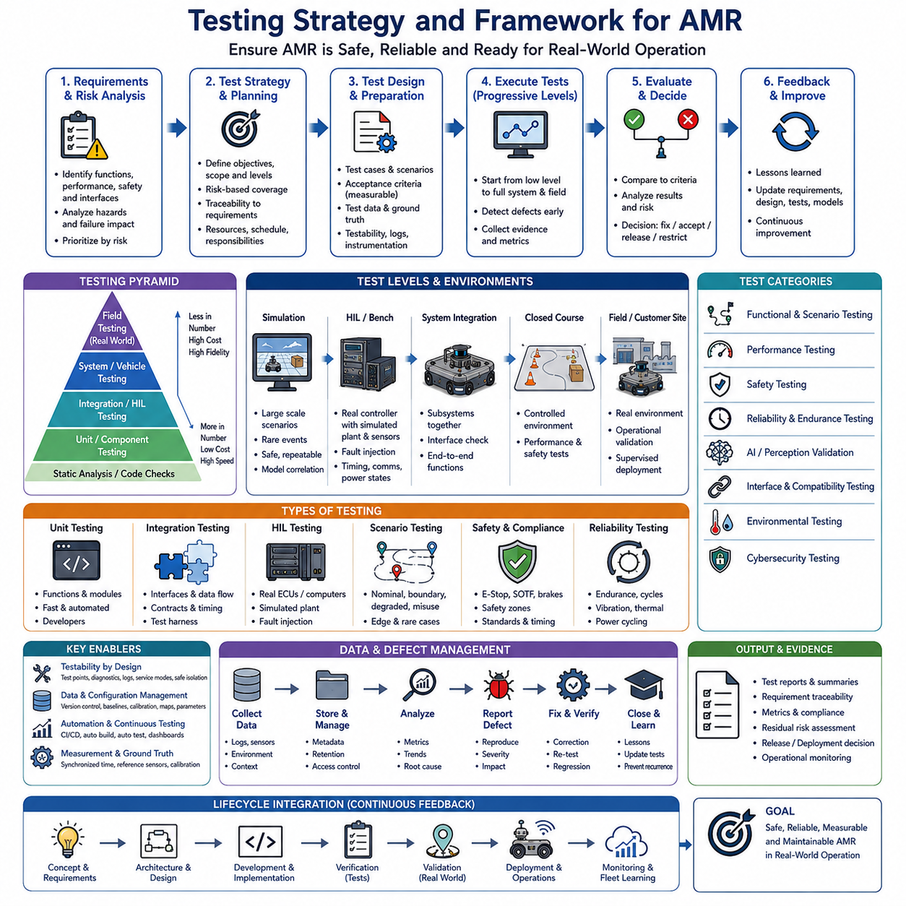
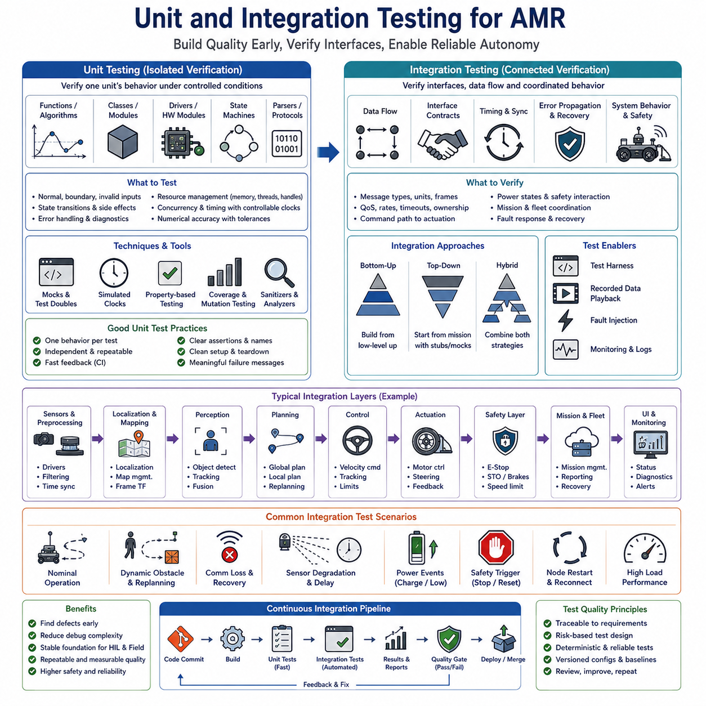
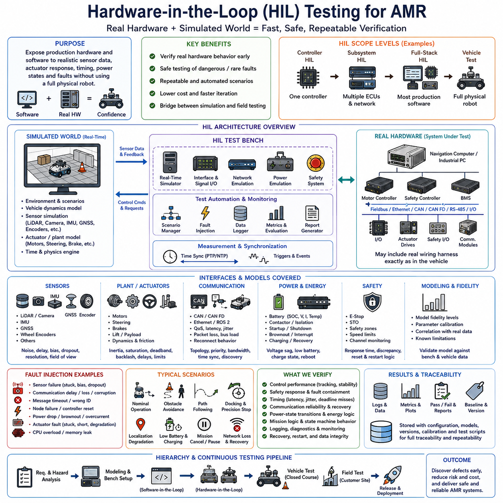
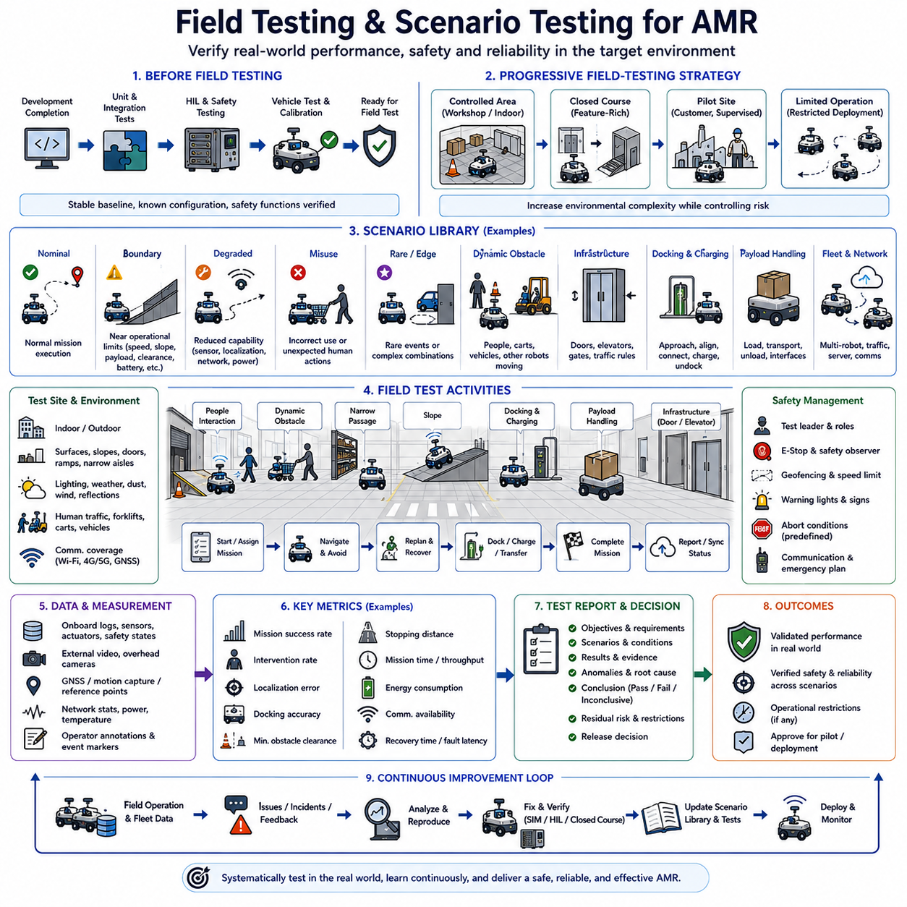
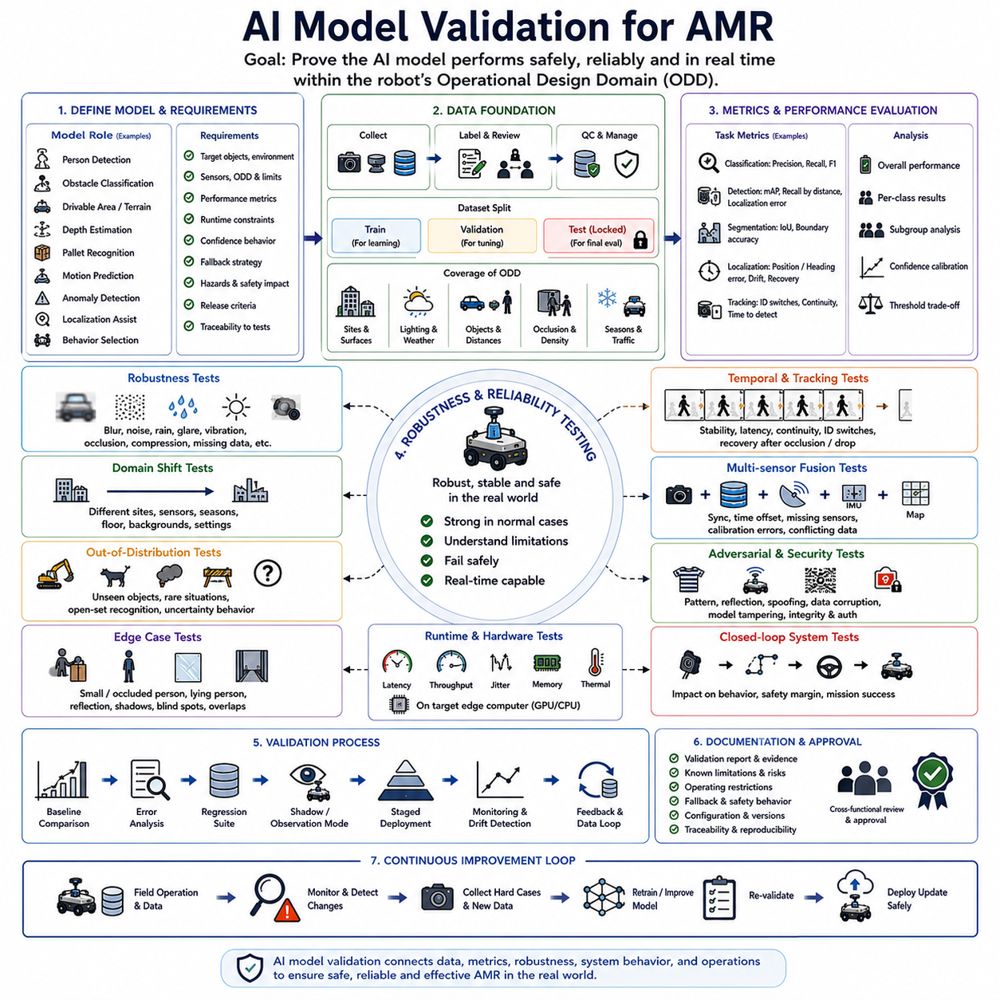
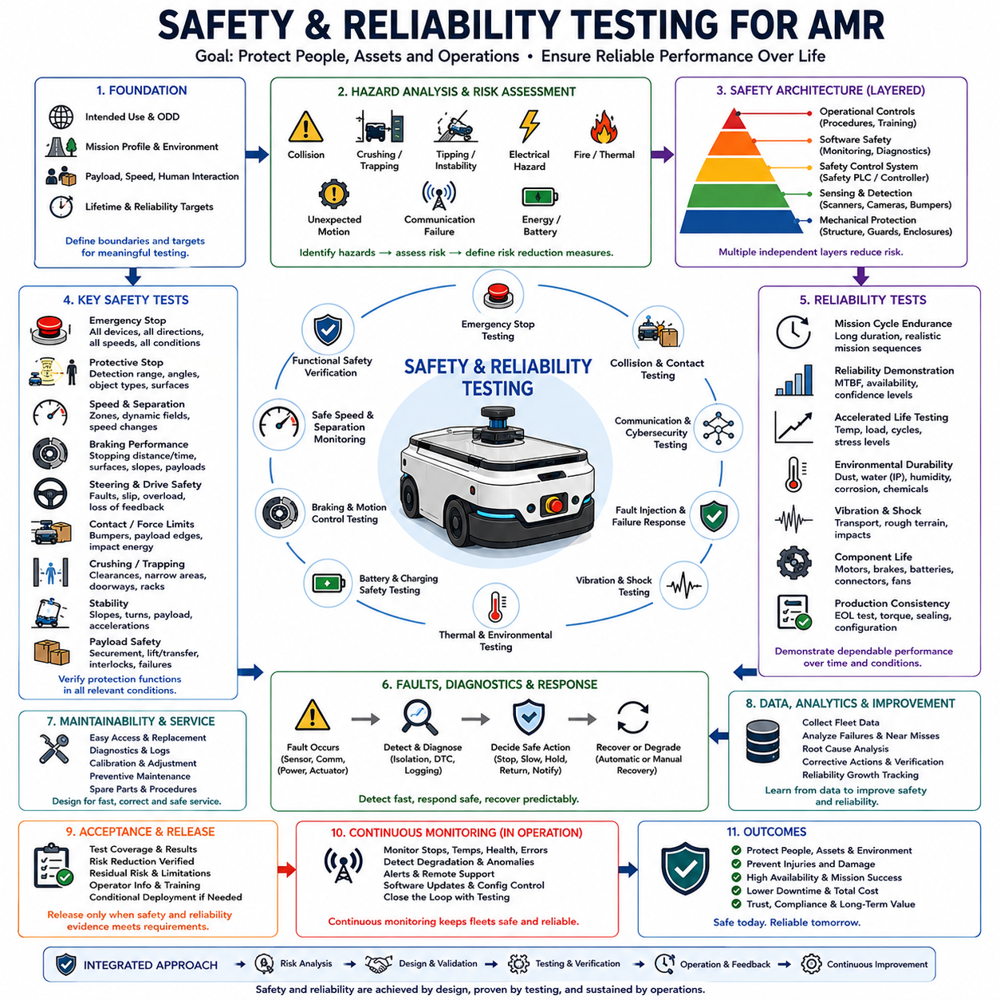
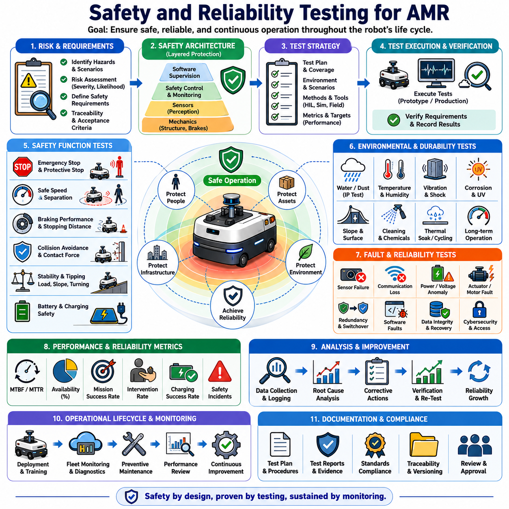
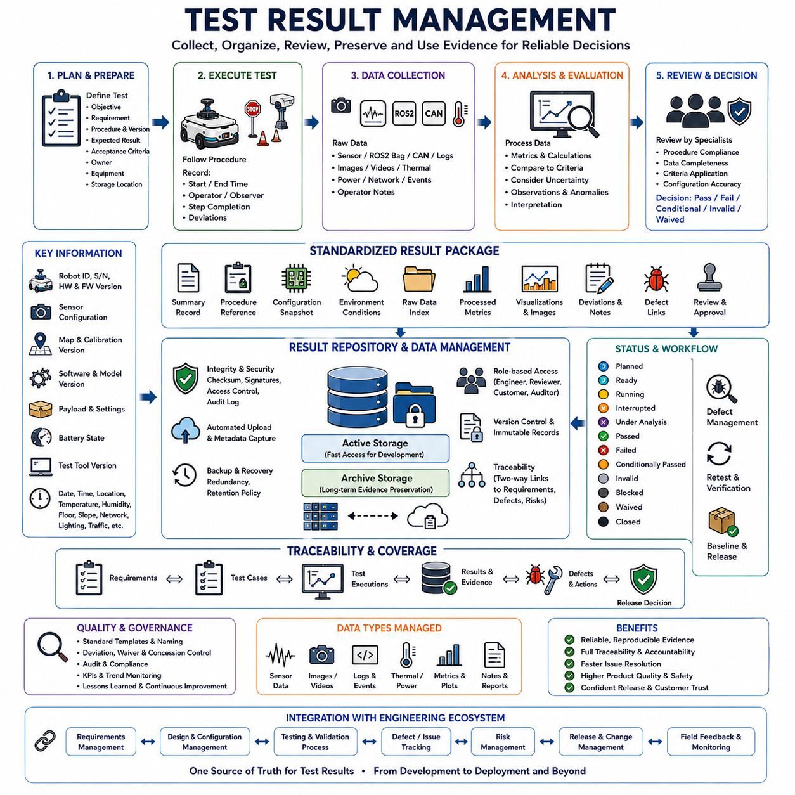
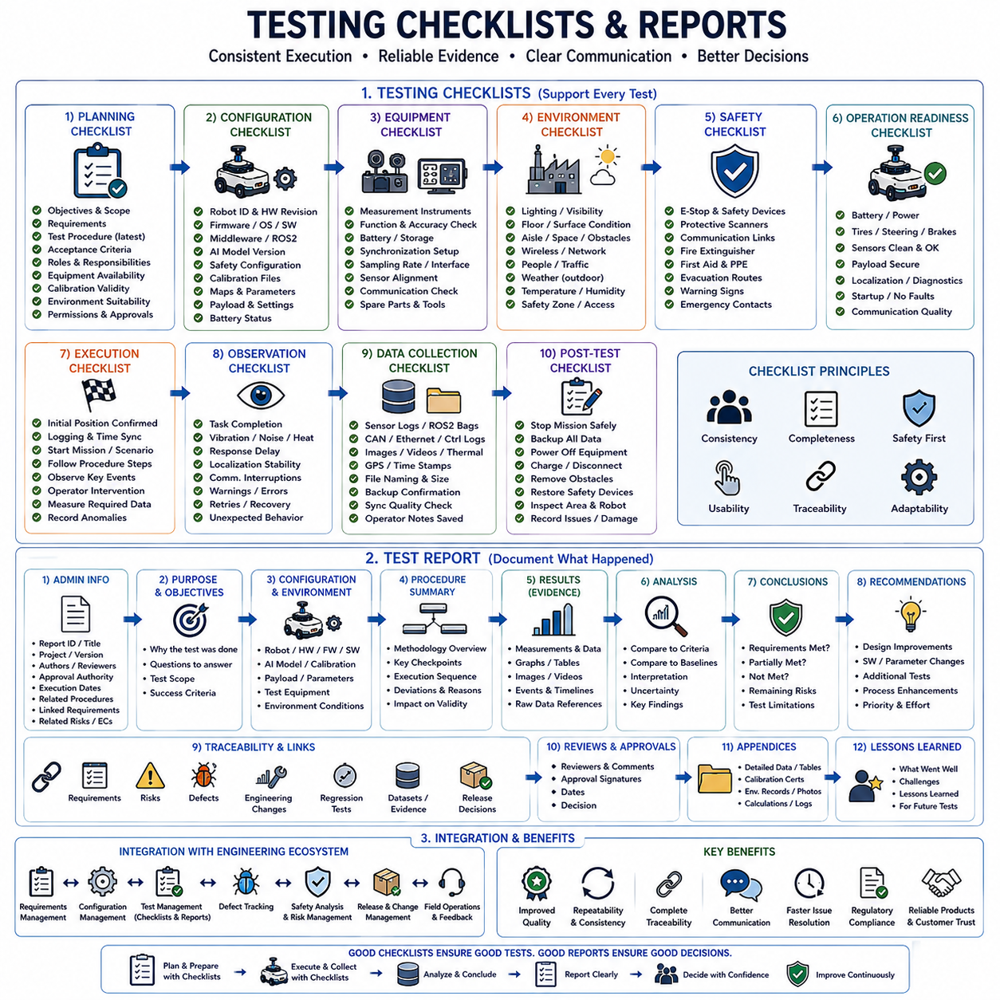

**Volume10. AMR Engineering Process and Development Manual**

# Chapter12. Testing and Validation Process

## 12.01 Testing Strategy and Framework

{width="7.268055555555556in" height="7.268055555555556in"}

A testing strategy and framework define how an autonomous mobile robot is evaluated from early development through production release and field operation. The framework connects product requirements, system risks, engineering evidence, test environments, acceptance criteria, and release decisions within one controlled process. Its purpose is not merely to find defects at the end of development, but to prevent defects, detect them early, verify intended behavior, and demonstrate that the complete robot can perform its missions safely and reliably under realistic operating conditions.

An effective testing strategy begins with a clear understanding of the product, its intended use, and the consequences of failure. The engineering team should identify the robot's operating environment, payload, speed, duty cycle, navigation area, human interaction, charging method, communication infrastructure, and maintenance concept. Testing priorities should reflect these conditions. A hospital delivery robot, a towing robot, and an outdoor inspection platform may share software and hardware technologies, but they require different scenarios, risk controls, performance limits, and evidence for operational acceptance.

The framework should maintain direct traceability between requirements and verification activities. Every functional, performance, safety, reliability, environmental, cybersecurity, and interface requirement should be linked to one or more test methods and measurable acceptance criteria. The relationship must remain visible as requirements change. Traceability prevents important functions from being assumed correct because they worked during a demonstration. It also provides evidence that each released capability has been inspected, analyzed, simulated, tested, or otherwise verified through an approved method.

Testing should be planned according to risk rather than distributing equal effort across every function. High-risk items include functions whose failure could cause injury, collision, loss of control, mission interruption, equipment damage, or difficult field recovery. New technologies, tightly coupled interfaces, components with limited operating margin, and functions that previously failed also require greater coverage. Risk-based planning helps the team determine test depth, repetition, independence, environmental stress, instrumentation, and review authority while avoiding excessive effort on low-consequence behavior.

The overall strategy should use layered verification so that defects are detected at the lowest practical level. Individual algorithms, software functions, electronic modules, mechanical assemblies, sensors, and actuators should be tested before they are integrated into larger subsystems. Subsystems should then be tested through defined interfaces before complete vehicle evaluation begins. This progression reduces debugging complexity because failures discovered during full-robot testing may originate from many interacting components. Early isolation improves development speed and reduces the cost of correction.

A commonly used framework follows a test pyramid in which numerous fast and inexpensive lower-level tests support a smaller number of complex system and field tests. Static analysis, code checks, unit tests, interface tests, component tests, and simulation should run frequently. Integration, hardware-in-the-loop, vehicle-level, endurance, safety, and field tests require more resources and therefore run at selected milestones. The pyramid should not be interpreted as reducing real-world testing. Instead, lower layers improve quality before valuable robots and test facilities are used.

The test lifecycle should begin during requirements and architecture development rather than after implementation. Engineers should review whether requirements are measurable, interfaces are observable, faults can be injected, and critical states can be recorded. Test points, diagnostic messages, simulation interfaces, data logging, calibration access, service modes, and safe isolation features should be designed into the product. A system that cannot expose its internal state may be difficult to validate even when its nominal operation appears correct. Testability is therefore a system requirement.

The test plan should describe scope, objectives, responsibilities, test levels, environments, equipment, data requirements, entry conditions, exit conditions, and reporting rules. It should distinguish development testing from formal verification, validation, production testing, commissioning, and operational monitoring. Development testing may explore behavior and support debugging, while formal verification demonstrates compliance with approved requirements. Validation determines whether the resulting product is suitable for its intended use. These activities may use similar equipment, but their purpose and evidence requirements are different.

Entry criteria determine whether a test item is sufficiently prepared for meaningful evaluation. Required software and hardware versions should be identified, known critical defects should be reviewed, calibration should be valid, the test environment should be available, safety controls should be approved, and instrumentation should be operational. Starting a formal test with unstable configurations or undocumented modifications creates unreliable evidence. Exit criteria should define the required pass rate, permitted residual defects, completed reports, reviewed anomalies, and approval authority needed to proceed.

Test environments should represent increasing levels of realism and complexity. Software may first be evaluated in local development environments, automated build systems, and simulation. Subsystems may then use bench rigs, sensor simulators, motor emulators, network test tools, and hardware-in-the-loop systems. Complete robots can progress through controlled indoor facilities, closed outdoor areas, representative customer sites, and supervised field operation. Each environment should have a defined role. Simulation provides scale and repeatability, while physical testing reveals real sensor, timing, environmental, and mechanical effects.

Simulation is valuable for generating large numbers of scenarios, controlling rare events, and testing software before hardware becomes available. Maps, robot dynamics, sensor models, traffic, pedestrians, obstacles, communication conditions, and faults can be varied systematically. However, simulation results depend on model fidelity and should not be treated as automatic proof of real-world performance. The strategy should define which behaviors can be verified primarily through simulation, which require correlation with measured data, and which must be demonstrated using physical hardware and representative environments.

Hardware-in-the-loop testing connects production controllers or computing hardware to simulated sensors, actuators, vehicle dynamics, and environmental responses. It allows repeatable evaluation of control logic, timing, communication, power-state behavior, diagnostic reactions, and fault handling without exposing a full robot to unnecessary risk. The HIL framework should reproduce realistic update rates, delays, noise, message loss, actuator limits, and failure conditions. Its models and interfaces must be version-controlled because inaccurate simulation can produce misleading confidence or false failures.

System integration testing verifies that mechanical, electrical, software, sensing, control, communication, safety, and user-interface elements operate together correctly. Integration should follow a planned sequence rather than connecting all modules at once. Interface contracts, message definitions, coordinate frames, units, timing, power states, fault codes, and ownership of commands must be checked. Many system failures are not defects inside individual components but mismatches between components that were independently correct. Integration testing therefore requires strong logging and synchronized measurement.

Scenario-based testing evaluates the robot through complete operational situations rather than isolated functions. Scenarios may include mission assignment, initialization, localization, route planning, obstacle avoidance, docking, payload handling, charging, emergency stopping, recovery, and mission reporting. Each scenario should define initial conditions, environmental factors, actors, expected behavior, measurable outcomes, and termination conditions. Variations in speed, payload, lighting, floor condition, obstacle density, network availability, and human behavior should be introduced to explore the operational envelope.

A formal scenario library should include nominal cases, boundary conditions, degraded modes, misuse conditions, rare events, and edge cases. Nominal cases confirm routine operation, while boundary tests examine maximum payload, minimum clearance, low battery, high traffic, weak communication, extreme temperature, or reduced sensor quality. Degraded-mode tests determine whether the robot can slow down, stop, request assistance, return to a safe location, or continue with restricted capability. Edge cases should be collected continuously from simulation, field logs, incidents, and customer feedback.

Safety testing must be planned independently from normal functional testing because successful mission behavior does not demonstrate adequate risk reduction. Emergency-stop devices, protective fields, safe torque off, brakes, speed monitoring, interlocks, restart prevention, and fault responses should be evaluated with measurable timing and stopping distance. Tests should include single faults, channel disagreement, sensor obstruction, communication loss, actuator failure, and unexpected state transitions. Safety evidence should be reviewed by personnel with appropriate authority and independence from the implementation team.

Reliability testing determines whether the robot can maintain acceptable performance over time and repeated operation. The framework should include endurance driving, repeated docking, charging cycles, connector mating, actuator cycling, vibration, thermal exposure, power cycling, and long-duration software operation. Reliability evaluation should record not only complete failures but also performance drift, increasing temperature, communication errors, calibration change, battery degradation, and maintenance demand. Accelerated testing may be used, but acceleration factors and failure mechanisms must remain technically justified.

Performance testing should measure navigation accuracy, stopping accuracy, localization stability, obstacle detection range, braking distance, mission completion time, throughput, energy consumption, charging efficiency, payload capability, network latency, and computing utilization. Metrics must be defined precisely so results from different teams and test sites remain comparable. Average values alone are insufficient for safety- or mission-critical behavior. The framework should also examine percentiles, worst cases, variability, confidence intervals, environmental dependence, and the conditions associated with outliers.

AI-based perception and decision functions require additional validation because their behavior is influenced by training data and operating context. The test strategy should separate dataset evaluation, offline model testing, simulation, controlled vehicle testing, and field monitoring. Metrics should be examined across relevant object classes, distances, lighting, weather, backgrounds, sensor conditions, and demographic or environmental variations where applicable. Incorrect confidence, distribution shift, sensor degradation, and rare combinations should be tested. Model version, dataset version, parameters, and deployment configuration must remain traceable.

Regression testing confirms that modifications do not damage previously accepted behavior. Every software update, hardware revision, parameter adjustment, map change, sensor replacement, safety configuration, or communication change should trigger a risk-based regression scope. Automated tests should run frequently in continuous integration, while selected bench, HIL, vehicle, and field tests run according to impact. A maintained regression suite should include historical defects and critical customer scenarios. Defects that once escaped should become permanent test assets whenever practical.

Test automation improves repetition, coverage, and speed when it is applied to stable and measurable procedures. Automated tools can build software, configure environments, execute simulations, stimulate interfaces, capture logs, calculate metrics, compare results, and generate reports. Automation should not hide the test logic or make failures difficult to interpret. Test scripts, configurations, reference data, and acceptance thresholds should be reviewed and version-controlled like production software. Automated results require periodic audits to confirm that the test itself remains valid.

Configuration management is essential because test results are meaningful only when the tested system is precisely identified. Records should include robot serial number, hardware revisions, software packages, firmware, AI models, calibration files, maps, parameters, test scripts, simulation models, fixtures, and environmental settings. Uncontrolled changes during testing can invalidate comparisons and prevent reproduction. The framework should define approved baselines, temporary experimental configurations, release candidates, and the process for promoting a tested configuration into a production or deployment baseline.

Test data should be collected with synchronized timestamps and sufficient context to explain the robot's behavior. Useful information includes sensor streams, localization estimates, commands, actuator feedback, safety states, power values, network statistics, system resource usage, fault codes, operator actions, environmental conditions, and ground-truth measurements. Data collection should be designed around specific questions rather than recording everything without purpose. Storage, naming, metadata, retention, access control, and privacy requirements must be established before large-scale testing begins.

Ground truth and reference measurements are necessary for evaluating accuracy. Navigation tests may use surveyed markers, motion capture, total stations, calibrated reference sensors, or carefully measured fixtures. Timing tests may require hardware triggers and synchronized clocks. Payload and force tests need calibrated masses or load cells. The uncertainty of the reference equipment should be significantly smaller than the acceptance tolerance. Test reports should state measurement uncertainty and calibration status so that marginal results are not interpreted with unjustified precision.

A defect management process should connect every test failure to investigation, correction, verification, and closure. Reports should describe the observed behavior, expected behavior, environment, configuration, reproduction steps, logs, severity, operational impact, and temporary controls. The team should distinguish the reported symptom from the root cause. Closing a defect requires evidence that the correction works and that related functions remain unaffected. Repeated or systemic defects should trigger architecture, process, supplier, or requirement reviews rather than isolated patches.

Test results should support clear engineering and management decisions. A dashboard may summarize coverage, pass rate, unresolved defects, safety status, reliability progress, scenario completion, and requirement verification, but summarized indicators should remain connected to detailed evidence. Release decisions should consider residual risk, operational restrictions, workarounds, monitoring capability, and recovery procedures, not only the number of passed tests. A product may be technically functional yet unsuitable for release if critical conditions remain untested or poorly understood.

The testing organization should define responsibilities and independence. Developers normally create unit and component tests, while integration teams evaluate interfaces and complete functions. Specialized personnel may lead safety, cybersecurity, EMC, environmental, reliability, AI, or field testing. Quality or approval authorities should review formal evidence and unresolved deviations. Collaboration is still necessary, but the person who implemented a critical function should not be the only person deciding that it is acceptable. Independent review improves objectivity and identifies hidden assumptions.

The framework should also establish practical feedback loops from testing into requirements, architecture, implementation, manufacturing, and operations. A failed test may reveal an implementation defect, but it may also expose an unrealistic requirement, incomplete interface, weak diagnostic design, unsuitable component, or missing operating rule. Test findings should therefore be analyzed at the system level. Lessons learned should update checklists, design standards, simulation models, scenario libraries, production tests, service procedures, and future product planning.

Field validation is the final confirmation that the robot can operate within its intended environment, but it should not be the first time major system behavior is evaluated. Field tests should use controlled deployment stages, trained supervision, rollback plans, recovery equipment, and defined operational limits. The team should compare field performance with simulation and controlled-site results, investigate differences, and refine models. Customer workflows, human behavior, facility infrastructure, radio conditions, floor changes, and maintenance practices often reveal interactions that laboratory testing cannot fully reproduce.

Testing continues after deployment through operational monitoring and fleet learning. Robots should report health, safety events, mission outcomes, localization quality, battery behavior, communication faults, intervention frequency, and emerging failure patterns. These data can identify environmental changes, component aging, software regressions, and new edge cases. Operational monitoring does not replace pre-release validation, but it provides evidence for maintenance, updates, continuous improvement, and risk control. Significant field discoveries should feed back into regression and acceptance testing.

A mature testing strategy and framework integrates requirement traceability, risk-based planning, layered verification, simulation, HIL, system integration, scenario testing, safety evaluation, reliability testing, automation, data management, defect control, and field feedback. It creates a continuous chain of evidence from early design assumptions to operational performance. When testing is treated as a lifecycle engineering discipline rather than a final project phase, the AMR development team can detect defects earlier, control technical risk, make defensible release decisions, and deliver robots that are safe, reliable, measurable, and suitable for sustained real-world operation.

## 12.02 Unit and Integration Testing

{width="7.268055555555556in" height="7.268055555555556in"}

Unit and integration testing form the technical foundation of the verification process for an autonomous mobile robot. Unit testing examines individual functions, classes, nodes, algorithms, drivers, and hardware modules in isolation, while integration testing evaluates whether those elements exchange data, commands, timing, power, and state information correctly when connected. Together, they detect defects before full-system and field testing, reduce debugging complexity, and provide repeatable evidence that the robot's internal components and interfaces behave according to their specified contracts.

The boundary of a unit should be selected according to responsibility and observable behavior rather than only source-file size. A unit may be a mathematical function, localization filter, route-planning method, state-machine transition, communication parser, motor-control calculation, diagnostic routine, sensor driver, or power-control module. The unit should have clearly defined inputs, outputs, states, errors, and dependencies. When a unit contains too many responsibilities, tests become difficult to interpret because one failure may originate from several unrelated behaviors.

Each unit test should verify one understandable behavior under controlled conditions. The test must define the initial state, applied input, expected output, tolerance, timing assumptions, and relevant side effects. Tests should cover normal values, boundary values, invalid values, missing information, repeated calls, and state transitions. A successful test should demonstrate more than the absence of a crash. It should confirm that the unit returns the correct result, changes only the intended state, generates appropriate diagnostics, and leaves the system in a predictable condition.

Unit tests for numerical algorithms require carefully selected reference values and tolerances. Localization, coordinate transformation, trajectory generation, speed control, energy estimation, and sensor filtering often use floating-point calculations whose results may vary slightly across processors or libraries. Tests should compare values using technically justified tolerances rather than exact equality. They should also examine zero values, very small and large magnitudes, negative values, angular wraparound, coordinate-frame boundaries, overflow, division by zero, and invalid numerical results such as infinity or not-a-number values.

State-machine testing is particularly important in AMR software because mission execution, charging, docking, recovery, safety coordination, and power control rely on state-dependent behavior. Tests should verify valid transitions, rejected transitions, entry and exit actions, timeout handling, repeated events, event ordering, and recovery after interruption. The state machine should not enter an undefined condition when it receives unexpected or duplicated messages. Every safety- or mission-critical transition should be associated with an explicit condition and an observable result.

Sensor-processing units should be tested with representative data as well as malformed and degraded inputs. A LiDAR processing function may receive empty scans, invalid ranges, partial fields, unexpected timestamps, or points outside the configured region. Camera and depth-processing units may encounter missing frames, changed resolution, saturated pixels, corrupt metadata, or delayed delivery. Tests should verify filtering, coordinate transformation, object extraction, confidence handling, and diagnostic behavior without requiring the physical sensor to be present.

Communication parsers and protocol handlers require tests for valid packets, incorrect lengths, invalid identifiers, checksum failures, out-of-order messages, duplicated messages, missing fields, timeout, and reconnection. A parser should reject malformed data without corrupting internal state or producing unsafe commands. Serialization and deserialization tests should confirm that transmitted data can be reconstructed without loss of units, sign, precision, or meaning. Compatibility tests may also compare messages generated by different software versions or programming languages.

Device drivers should be unit-tested by separating hardware access from decision logic. Hardware-dependent functions can be represented through abstraction layers, mock objects, emulators, or recorded responses. This allows the test to simulate successful communication, delayed response, unavailable device, invalid register value, communication error, and unexpected reset. Driver tests should verify initialization, configuration, data conversion, retry limits, fault reporting, shutdown, and recovery without requiring every test to operate real hardware.

Mock objects and test doubles replace external dependencies with controlled behavior. They can represent sensors, databases, networks, clocks, file systems, motor controllers, safety interfaces, or fleet-management services. A useful mock should reproduce the interface contract while allowing the test to control responses and inspect interactions. Excessive mocking can create unrealistic confidence, however, because the test may only prove that one artificial component communicates with another artificial component. Critical assumptions must later be verified through integration tests with real implementations.

Time-dependent functions should use controllable clocks whenever possible. Waiting for actual seconds or minutes makes tests slow and can introduce nondeterministic failures. A simulated clock allows timeout, retry, scheduling, watchdog, and expiration logic to be evaluated instantly and repeatedly. Tests should examine delayed events, clock jumps, timestamp rollover, stale information, missing updates, and events arriving at identical times. Real-time performance remains a separate integration concern, but logical timing behavior should first be verified deterministically.

Concurrency testing is necessary when units use multiple threads, asynchronous callbacks, shared memory, queues, or executors. Tests should examine race conditions, deadlocks, priority conflicts, lost notifications, duplicate processing, and unsafe access to shared state. Because concurrency defects may appear only under specific timing, tests should repeat operations, vary scheduling order, and use instrumentation capable of detecting thread and memory errors. Shared resources should have clear ownership, and callbacks should not make unbounded or blocking calls inside time-critical execution paths.

Error-handling tests should confirm that every expected failure is detected, reported, and contained. A unit should distinguish recoverable conditions from fatal errors and should not hide failures behind generic success responses. Tests should verify error codes, exception handling, diagnostic messages, fallback values, retry behavior, and resource cleanup. When a function fails midway, it should not leave locks, files, communication channels, actuators, or internal state in an inconsistent condition that causes later failures.

Resource-management tests verify that repeated execution does not produce memory leaks, file-descriptor leaks, thread accumulation, queue growth, or unreleased communication resources. These tests may call initialization and shutdown many times, repeatedly create and destroy objects, or process long sequences of data. Memory-analysis and sanitizer tools can identify defects that ordinary functional tests miss. Resource limits are especially important for robots expected to operate continuously for days or weeks without restarting.

Unit tests should remain independent from each other. A test should not depend on execution order, data left by a previous test, a shared mutable configuration, or an external network service. Each test should create its required state and clean it afterward. Independence enables parallel execution and makes failures reproducible. When tests share expensive fixtures, the shared setup must remain controlled so that one test cannot alter conditions for another. Hidden dependencies create intermittent failures and reduce trust in the test suite.

A unit-test suite should execute quickly enough to run whenever code changes. Developers should be able to receive feedback before changes are merged into the main branch. Fast tests encourage frequent use, while slow or unreliable suites are often bypassed. Tests may be divided into rapid local checks and more extensive automated jobs, but essential unit behavior should remain available in the shortest feedback loop. Continuous integration should compile the code, execute tests, collect results, and reject changes that violate required quality gates.

Code coverage can reveal untested statements, branches, conditions, and functions, but coverage percentage alone does not prove test quality. A test may execute a line without checking its result or may miss important combinations despite high coverage. Coverage should therefore guide review rather than serve as the only acceptance measure. Safety-critical branches, error paths, boundary conditions, and state transitions require deliberate verification. Meaningful assertions and risk-based scenarios are more valuable than increasing coverage through superficial execution.

Mutation testing can provide deeper evidence about the effectiveness of a unit-test suite. This method introduces small changes such as reversing a condition, modifying a constant, removing a function call, or changing an operator. A strong suite should fail when the implementation is intentionally altered. If many mutations survive, the tests may execute the code without checking the correct behavior. Mutation testing is computationally expensive, but it can be valuable for critical algorithms, safety logic, and shared libraries.

Property-based testing verifies general rules across many automatically generated inputs rather than relying only on manually selected examples. A coordinate transformation followed by its inverse should return the original point within tolerance. A speed limiter should never produce output above the configured limit. A route cost should remain nonnegative, and serialization followed by deserialization should preserve information. Property-based tests can reveal unusual combinations and boundary cases that engineers may not anticipate when writing individual examples.

Integration testing begins when two or more verified elements are connected through their real or representative interfaces. The objective is to confirm data flow, command ownership, timing, resource sharing, error propagation, and coordinated state behavior. Components that operate correctly in isolation may fail together because they interpret units, coordinate frames, timestamps, identifiers, or state names differently. Integration testing is therefore centered on the contracts between components rather than repeating every internal unit-level calculation.

An interface contract should define message structure, data type, units, valid range, coordinate frame, timestamp source, update rate, quality indication, timeout, ownership, and error behavior. For services or commands, it should specify preconditions, response codes, retry rules, idempotency, and cancellation. Integration tests should treat these definitions as executable expectations. A connection is not fully verified merely because data is transmitted. The receiving component must interpret it correctly and produce the intended system-level effect.

Incremental integration is generally more effective than connecting the complete robot software stack at once. The team may begin with sensor drivers and preprocessing, then add localization, mapping, planning, control, safety coordination, mission management, fleet communication, and user interfaces in controlled stages. Each stage should have entry criteria, expected data flows, health indicators, and rollback capability. When a failure appears, the most recently added interface becomes a focused investigation area rather than one possibility among dozens of simultaneous changes.

Bottom-up integration starts with low-level components and gradually combines them into larger subsystems. Sensor drivers may be integrated with filtering and perception before connecting to localization and planning. Motor controllers may be integrated with velocity control and odometry before accepting navigation commands. This approach provides realistic lower-level behavior to upper layers but may require temporary drivers or command generators. It is useful when hardware interfaces and foundational services are available early in development.

Top-down integration begins with mission or application logic while lower-level components are replaced by stubs and simulators. Mission sequencing, task allocation, recovery logic, and user interaction can therefore be evaluated before the complete navigation or hardware stack exists. As development progresses, simulated components are replaced by real implementations. This method exposes high-level architectural and workflow problems early, but the test team must carefully manage differences between simplified stubs and the eventual timing and failure behavior of real subsystems.

A hybrid integration strategy combines bottom-up and top-down methods. Stable hardware interfaces and foundational services can be built upward while mission-level functions are tested downward through simulation. The two streams meet through clearly controlled interface baselines. This approach is often appropriate for AMR development because mechanical, electrical, embedded, navigation, fleet, and application teams progress at different speeds. The integration plan should identify temporary components and define when each one will be replaced by a production implementation.

ROS 2 integration testing should verify node discovery, topic names, message types, quality-of-service settings, namespaces, parameters, services, actions, lifecycle states, executors, and callback behavior. Two nodes may use the same message type yet fail because one expects reliable delivery while the other uses best-effort communication, or because durability and queue-depth settings differ. Tests should examine startup order, node restart, delayed discovery, message loss, duplicate publishers, parameter changes, and transitions between inactive, active, and finalized states.

Quality of Service settings require realistic tests because their effects depend on network conditions and message rates. High-bandwidth sensor streams may use best-effort delivery, while commands and safety-related status may require more reliable behavior. Tests should examine queue overflow, late subscribers, unavailable publishers, network congestion, and reconnecting nodes. A setting that works on a single development computer may behave differently across distributed computers and managed switches. The integration environment should therefore reproduce the intended topology and traffic level.

Coordinate-frame integration is a frequent source of AMR defects. Tests should verify frame names, parent-child relationships, axis orientation, units, static transformations, dynamic transformations, and timestamp consistency. Sensor data must be transformed using information valid at the measurement time rather than the processing time. Missing, duplicated, or discontinuous transformations can produce unstable localization and planning. Recorded reference poses and known geometric arrangements help confirm that the combined transformation chain generates physically meaningful results.

Time synchronization should be tested across sensors, controllers, computers, and logging systems. Camera frames, LiDAR scans, IMU data, wheel odometry, GNSS measurements, commands, and actuator feedback may arrive through different clocks and communication paths. Integration tests should measure clock offset, drift, jitter, timestamp age, and behavior after synchronization loss or computer restart. Even small timing errors can appear as spatial error when the robot moves, especially during sensor fusion or high-speed operation.

Navigation integration testing should connect localization, mapping, global planning, local planning, obstacle processing, velocity control, and vehicle feedback. The test should verify that each module uses compatible maps, cost representations, footprints, limits, frames, and update rates. Controlled scenarios should examine route generation, dynamic replanning, obstacle appearance, localization degradation, blocked paths, goal cancellation, and recovery. The main concern is not only whether each module produces output, but whether the complete chain creates safe and stable robot motion.

Motion-control integration should verify the path from commanded velocity or trajectory to motor drive response and measured movement. Scaling, sign, wheel geometry, steering direction, acceleration limits, brake release, enable sequencing, and watchdog behavior must be consistent. Tests should include zero commands, small commands near deadband, maximum allowed commands, direction reversal, communication interruption, encoder error, and actuator saturation. Commanded motion and feedback should be logged with synchronized time to identify delay, oscillation, or tracking error.

Safety integration testing should verify the boundary between safety-rated functions and normal robot control. Protective stops, emergency stops, safe torque off, brake application, speed restrictions, field switching, reset, and restart prevention must influence the motion system as designed. Normal software should receive sufficient status information to report and recover appropriately, but it must not override safety decisions. Tests should confirm behavior when status messages are delayed, contradictory, or unavailable and when normal control commands continue during a safety stop.

Power-state integration includes the coordinated behavior of the BMS, contactors, converters, safety controller, computers, sensors, motor drives, payload equipment, and charging system. Tests should verify startup sequencing, shutdown, sleep, wakeup, emergency isolation, low-battery response, charger connection, and recovery after partial power loss. A module that works independently may create integration problems through excessive startup current, delayed readiness, or unexpected reboot behavior. Power and software states should be observed together.

Fleet and mission integration testing verifies the relationship between robot-level autonomy and external orchestration. The tests should cover mission assignment, acceptance, rejection, progress reporting, cancellation, priority change, pause, resume, loss of communication, duplicated commands, and recovery after reconnection. The robot must not execute the same mission twice because a message was retransmitted. Mission identifiers, robot state, map version, resource ownership, and result reporting should remain consistent across the robot and fleet-management system.

Test harnesses provide controlled inputs, observation points, simulators, recorders, and comparison tools for integration testing. A harness may launch a selected group of nodes, publish sensor data, emulate services, capture messages, inject delays, and evaluate expected outcomes. The harness should make dependencies and configuration explicit so that tests can be repeated in development machines and continuous-integration environments. It should also preserve logs and configuration when a failure occurs, allowing engineers to reproduce the exact execution.

Recorded-data playback is useful for repeatable integration testing of perception, localization, mapping, and planning. The same sensor sequence can be processed by different software versions, and outputs can be compared using defined metrics. Playback should preserve timestamps, ordering, frame information, and relevant metadata. However, recorded data cannot reproduce closed-loop interaction in which robot behavior changes the future sensor input. It should therefore complement simulation and physical testing rather than replace them.

Fault injection tests how connected components behave when an interface or dependency fails. Integration faults may include dropped messages, delayed responses, invalid timestamps, corrupted fields, frozen sensor values, bandwidth restriction, process termination, node restart, disk-full conditions, high CPU load, or unavailable configuration. The receiving subsystem should detect the condition, limit propagation, enter the correct degraded or safe state, and recover according to defined rules. Recovery itself must be tested because repeated reconnection can create unstable loops.

Negative integration testing intentionally violates interface assumptions. A component may receive a message with an unknown version, impossible value, incorrect frame, excessive rate, or unauthorized command. Services may return errors, fail to respond, or produce partial results. The test should verify that invalid information is rejected or contained without causing uncontrolled motion or hidden corruption. Defensive handling at subsystem boundaries is especially important when external payloads, customer systems, cloud services, or third-party modules are connected.

Performance integration testing examines latency, throughput, CPU usage, GPU usage, memory, network bandwidth, queue depth, and scheduling under combined operation. Individual nodes may meet their targets but exceed system resources when cameras, LiDAR, localization, planning, visualization, recording, and AI inference operate simultaneously. Tests should reproduce realistic maximum data rates and mission loads. The team should identify bottlenecks, priority inversion, resource starvation, and performance degradation before system-level field testing begins.

Determinism and repeatability should be assessed when identical inputs are expected to generate equivalent results. Multithreading, asynchronous communication, GPU processing, randomized algorithms, and timing variations can produce differences between runs. Some variation is acceptable, but acceptance limits should be defined. Seeds, scheduling settings, and configuration must be recorded when relevant. Unexpected nondeterminism complicates debugging and can hide rare failures, particularly in planning, perception, and state-management integration.

Integration-test failures require synchronized evidence from all participating components. Logs should include consistent timestamps, node and process identity, message identifiers, state transitions, commands, responses, and fault codes. Distributed tracing can follow a mission or request across services and nodes. Without correlation, each component may appear normal when viewed separately even though the combined sequence is incorrect. Test frameworks should automatically preserve relevant evidence around the failure rather than relying on engineers to collect it afterward.

Flaky tests are tests that pass or fail without a meaningful change in the product. They may result from uncontrolled timing, shared resources, random data, external services, inadequate cleanup, or unstable infrastructure. Flaky tests reduce trust and may cause genuine failures to be ignored. They should be investigated as defects in the verification system. Repeated execution can help characterize them, but simply retrying until a test passes should not be considered a valid acceptance method.

Regression suites should combine unit and integration tests according to change impact. A modification to a mathematical utility may require rapid unit tests and selected consumers, while changes to message definitions, timing, power management, safety interfaces, or common libraries require broader integration coverage. Historical defects should be converted into permanent tests. The suite should be organized so that developers receive fast feedback first and more extensive subsystem tests run before merge, release, or deployment.

Test results should be linked to software versions, hardware revisions, configuration files, maps, calibration, datasets, and test-harness versions. A passed result has limited value when the tested configuration cannot be reconstructed. Continuous-integration systems should archive reports, logs, metrics, and failed artifacts under a unique build identifier. Formal integration baselines should identify compatible versions across repositories and devices, preventing independently updated components from creating unverified combinations.

Review of unit and integration testing should consider more than the number of executed tests. Engineers should examine requirement coverage, risk coverage, boundary conditions, error paths, interface contracts, realistic timing, failure recovery, test independence, and the quality of assertions. Important tests should be understandable to reviewers who did not write the implementation. Clear test names, documented intent, controlled fixtures, and meaningful failure messages turn the suite into an engineering asset rather than a collection of opaque scripts.

A mature unit and integration testing process creates a continuous path from isolated correctness to coordinated subsystem behavior. Unit tests rapidly verify algorithms, states, errors, and local responsibilities, while integration tests confirm interfaces, timing, data flow, command ownership, power states, diagnostics, and recovery across connected components. When both levels are automated, traceable, configuration-controlled, and continuously improved, defects are detected earlier and the AMR reaches HIL, vehicle, safety, and field testing with a far more stable and understandable foundation.

## 12.03 Hardware in the Loop Testing

{width="7.268055555555556in" height="7.268055555555556in"}

Hardware-in-the-loop testing connects real robot controllers, embedded computers, communication devices, and selected electrical interfaces to a simulated robot and operating environment. It occupies the verification stage between software integration testing and complete vehicle testing. The purpose is to expose production hardware and production software to realistic sensor signals, actuator responses, timing behavior, communication traffic, power states, and faults without requiring the entire physical robot to move in a real facility.

A hardware-in-the-loop environment usually contains a system under test, a real-time simulation computer, interface and signal-conditioning equipment, test automation software, measurement instruments, and safety controls. The system under test may be a motor controller, safety controller, battery management controller, navigation computer, industrial PC, or complete distributed computing platform. The simulator represents the vehicle dynamics, sensors, actuators, environment, communication partners, and physical processes that are not present as real hardware.

The value of HIL testing comes from combining real implementation behavior with controlled simulation. Software-only simulation cannot fully reproduce processor scheduling, operating-system latency, device-driver behavior, communication-controller limitations, electrical interfaces, or hardware resets. Complete vehicle testing includes these effects but is slower, more expensive, less repeatable, and potentially dangerous. HIL testing provides an intermediate environment where realistic hardware behavior can be studied while scenarios and faults remain precisely controlled.

The scope of a HIL test should be defined according to the verification objective. Controller-level HIL may connect one embedded controller to simulated sensors and actuators. Subsystem HIL may include the navigation computer, motor controller, safety controller, and communication network. Full-stack HIL may execute most production software across the actual computing architecture while replacing the mechanical vehicle and external environment with simulation. Increasing scope improves realism but also increases configuration complexity and debugging difficulty.

The HIL architecture should preserve production interfaces wherever practical. If the vehicle uses CAN, CAN FD, Ethernet, EtherCAT, RS-485, digital input and output, analog signals, encoder pulses, or pulse-width modulation, the test environment should communicate through those same interfaces. Directly injecting internal software variables may be useful during development, but it bypasses drivers, protocol stacks, wiring assumptions, and timing effects. Formal verification should therefore stimulate the system at interfaces representative of the deployed robot.

Real-time execution is a fundamental requirement because the simulated plant must respond within the timing expected by the physical controller. A motor controller may require feedback every fraction of a millisecond, while navigation and mission systems may update at slower rates. The simulator should calculate the next system state, produce sensor outputs, receive control commands, and update the plant model within a deterministic cycle. Missed deadlines or excessive jitter can create behavior that belongs to the test bench rather than the product.

The real-time model should represent the physical behavior relevant to the test purpose. A motion-control HIL system may model wheel inertia, tire radius, steering geometry, friction, drivetrain delay, motor torque, braking force, vehicle mass, and payload effects. A navigation-focused system may additionally model pose, odometry, obstacle locations, sensor fields of view, and map constraints. The model need not reproduce every physical detail, but omitted effects must not invalidate the requirements being evaluated.

Model fidelity should be managed explicitly rather than assumed. Engineers should identify which physical effects are represented, simplified, measured, estimated, or excluded. A model may be sufficient for checking state transitions and communication recovery but inadequate for validating final stopping distance. Correlation testing should compare simulated responses with measurements from a real robot or component bench. Differences should be quantified, and model parameters should be calibrated using traceable data before the HIL result is used as formal evidence.

Sensor simulation may be performed at several levels. At a low level, the HIL system can generate electrical signals, encoder pulses, digital states, or protocol messages that imitate a sensor. At a higher level, it can provide processed measurements such as pose, range, velocity, or object lists. Advanced setups may generate camera images, LiDAR point clouds, GNSS data, IMU signals, and radar detections. The selected level determines which parts of the sensor interface and processing chain are actually verified.

Wheel encoder and odometry simulation should reproduce pulse frequency, direction, quantization, wheel slip, missed pulses, noise, and geometric mismatch. These effects influence speed estimation, localization, path tracking, and fault diagnostics. Tests should examine stationary conditions, slow movement near the resolution limit, acceleration, direction reversal, unequal wheel speeds, encoder loss, and implausible feedback. The controller should detect inconsistent data and respond without generating unstable or unsafe motion commands.

IMU simulation should include acceleration, angular velocity, gravity, bias, drift, noise, saturation, axis orientation, scale error, and timestamp behavior. Sensor-fusion software may appear stable with ideal data but fail when bias or delay is introduced. HIL tests should evaluate initialization, stationary alignment, vehicle turns, vibration-like disturbances, communication interruption, and sudden sensor resets. The simulation should maintain consistency between vehicle motion and generated inertial measurements to avoid physically impossible combinations.

GNSS simulation is useful for outdoor AMRs that depend on global positioning, heading, or real-time kinematic correction. The HIL environment can reproduce satellite visibility changes, correction loss, multipath-like errors, position jumps, delayed messages, degraded accuracy, and temporary outages. Tests should verify transitions between high-accuracy and degraded modes, integrity checks, localization fallback, mission restrictions, and recovery after correction returns. Position quality indicators must influence system behavior rather than being treated as simple metadata.

LiDAR and camera simulation can support perception, localization, and obstacle-handling tests, although the computational load is significantly higher than simple signal simulation. The environment should maintain consistency among robot pose, scene geometry, sensor mounting, visibility, occlusion, range limits, and update timing. Scenarios may include static obstacles, moving people, reflective surfaces, narrow passages, partial sensor blockage, frame loss, and changed lighting. Recorded data may be combined with generated data when complete real-time rendering is unnecessary.

Actuator and plant models close the control loop by converting commands into simulated physical response. Motor torque, wheel speed, steering angle, brake state, lift position, or payload motion should react according to realistic limits and delays. Saturation, deadband, backlash, friction, thermal derating, and reduced supply voltage may be introduced where relevant. Without a credible actuator model, the controller may receive unrealistically perfect feedback and important instability, tracking, or recovery problems may remain hidden.

The HIL system should reproduce the production communication topology, including switches, gateways, controllers, addressing, message priorities, and expected traffic. A distributed AMR may exchange high-rate sensor streams, control commands, diagnostics, safety status, and fleet messages across several networks. Integration tests should measure latency, jitter, packet loss, queue buildup, bus utilization, and behavior during congestion. Interface compatibility should be checked with the same message definitions and quality-of-service settings intended for deployment.

CAN and CAN FD testing should include normal traffic, maximum expected bus load, priority competition, message timeout, error frames, bus-off behavior, missing nodes, incorrect identifiers, and recovery. The test environment can emulate motor drives, battery controllers, chargers, or I/O modules while observing the real controller's reactions. Message counters, checksums, rolling codes, and diagnostic status should be verified. Repeated transmission must not cause duplicated state changes when a command is intended to be processed only once.

Ethernet and ROS 2 HIL testing should examine discovery, network startup order, address changes, time synchronization, quality-of-service compatibility, bandwidth limits, and reconnection. Camera and LiDAR streams may compete with control and diagnostic traffic, creating delay or packet loss. The environment should reproduce representative rates and message sizes rather than using only lightweight test messages. Tests should also verify that distributed nodes recover correctly when a switch, cable, process, or network interface is temporarily unavailable.

Time synchronization is critical because HIL combines several physical devices and simulated processes. Production computers may use PTP, GNSS time, NTP, hardware triggers, or local monotonic clocks. The test environment should measure clock offset, drift, timestamp age, and synchronization recovery. Sensor fusion, distributed logging, motion control, and fault analysis can all be corrupted by inconsistent time. A HIL test should therefore confirm both normal synchronized operation and behavior when the timing source is lost or disturbed.

Power-state simulation extends HIL beyond data interfaces by reproducing ignition, enable, wake, sleep, low-voltage, shutdown, charging, and emergency-isolation conditions. Programmable power supplies and electronic loads may be used to apply controlled voltage changes or current limits to real controllers. Tests should examine startup sequencing, brownout, brief interruption, slow voltage decay, unexpected reboot, and restoration. Software state and power state should be recorded together because many difficult field defects occur at their boundary.

Battery and charging HIL testing can represent state of charge, pack voltage, current, temperature, cell imbalance, contactor state, charger availability, and battery faults. The real energy-management or mission controller can then be evaluated without repeatedly charging and discharging a physical battery. Scenarios should include low energy during a mission, charger rejection, communication loss, overtemperature, contactor failure, and restart after charging. Energy estimates should remain physically consistent with simulated load and elapsed operation.

Safety-controller HIL testing requires carefully designed interfaces and independent protection of the test bench. The environment may stimulate emergency-stop channels, protective-field status, speed limits, brake feedback, contactor feedback, safety encoders, and reset inputs. It can verify safe torque off, restart prevention, channel discrepancy detection, and response timing. However, simulation cannot automatically establish certification. Safety-related results require validated models, calibrated timing measurement, controlled configuration, and appropriate review authority.

Fault injection is one of the strongest advantages of HIL because dangerous or rare failures can be produced repeatedly without damaging a robot. Faults may include open circuits, short circuits, stuck signals, invalid sensor values, frozen data, communication delay, message corruption, node termination, controller reset, excessive CPU load, memory pressure, and simulated mechanical failure. Each fault should have a defined injection time, duration, severity, expected detection mechanism, required response, and recovery condition.

Single-fault testing verifies that one failure is contained as required, while combined-fault testing examines interactions among multiple degraded conditions. A localization sensor may fail while communication quality is poor, or a low battery may occur during obstacle avoidance. Combined faults should be selected through hazard analysis rather than generated randomly without purpose. The HIL environment makes such cases repeatable, but the number of combinations can grow rapidly, so risk-based prioritization and scenario libraries are essential.

Watchdog and recovery behavior should be verified through deliberate timing violations and process interruption. The test system can stop sensor updates, delay command responses, freeze a software process, restart a controller, or remove a network participant. The AMR should detect stale information, inhibit unsafe output, enter a defined degraded state, and recover only when valid conditions are restored. Recovery tests should also confirm that repeated resets do not create oscillation, duplicated missions, uncontrolled actuator enabling, or corrupted persistent data.

Navigation HIL testing connects production localization, planning, and control software to a simulated moving robot and environment. The closed loop allows commands to change simulated motion, which then changes future sensor input. Scenarios can include route following, dynamic obstacles, blocked paths, narrow corridors, docking, goal cancellation, localization degradation, and map mismatch. Unlike recorded playback, closed-loop HIL captures the way one decision changes the next observation and therefore supports more realistic autonomy evaluation.

Docking and precision-stop testing can use plant models that represent pose error, wheel slip, steering offset, sensor noise, marker visibility, and final approach geometry. The controller should converge within the specified tolerance while respecting speed and safety constraints. Repeated trials can vary initial position, heading, payload, floor friction, and sensor quality. The resulting distributions help identify sensitivity and tune control parameters before physical docking equipment is repeatedly exposed to prototypes.

Mission-level HIL testing verifies how the robot responds to task assignment, navigation progress, charging needs, faults, pauses, cancellations, and external service requests. A fleet-management simulator can issue commands and observe acknowledgments, state updates, and mission results. The robot should preserve mission identity across reconnection and restart, avoid duplicate execution, and communicate degraded capability clearly. This testing connects real robot software to realistic operational workflows before customer-site deployment.

Payload interfaces can also be included when an AMR carries a lift, conveyor, robot arm, inspection module, or custom process equipment. The HIL system may emulate payload-ready status, interlocks, load presence, cycle completion, faults, and energy demand. Tests should verify command sequencing, ownership, timeout, safe interruption, and recovery. The mobile base should not depart while payload equipment is in an unsafe state, and the payload should not operate when localization, docking, or safety conditions are invalid.

Automation is necessary to gain the full benefit of HIL. Test software should configure the bench, load models, initialize controllers, execute scenarios, inject faults, collect measurements, evaluate acceptance criteria, and generate reports. Automated runs improve repetition and enable overnight regression testing. Nevertheless, test scripts must remain understandable and version-controlled. A highly automated bench can produce large quantities of incorrect evidence if its configuration, model, or expected results are wrong.

A reusable scenario description should define initial robot state, environment, model parameters, software configuration, input events, fault schedule, expected behavior, metrics, and termination rules. The same scenario may be executed in software-in-the-loop, HIL, and physical testing with appropriate adapters. This continuity improves traceability and supports comparison across test levels. Differences between environments should be documented so that passing a simplified HIL scenario is not mistaken for passing the final real-world validation.

Measurement and logging should capture both the real system and the simulated plant with synchronized time. Relevant data include controller inputs and outputs, model states, bus traffic, CPU load, memory use, power values, safety signals, state transitions, and fault-injection events. Triggered recording can preserve data before and after a failure. HIL logs should identify whether a value originated from real hardware, simulation, or the test harness, preventing confusion during root-cause analysis.

Acceptance criteria should be quantitative where possible. They may specify control error, response time, stopping time, message latency, detection delay, recovery duration, missed-cycle count, CPU utilization, bus load, or mission outcome. Criteria should include tolerance and measurement uncertainty. Merely observing that the controller appeared stable is insufficient. Automated evaluation should compare results with approved limits while preserving detailed data for engineering review, especially when values approach the boundary.

Configuration management is essential because a HIL result depends on many interacting versions. Records should identify production software, firmware, hardware revision, simulation model, model parameters, interface mappings, test scripts, calibration, network configuration, and bench equipment. Temporary modifications and debugging hooks should be visible. A result cannot support release when the tested arrangement cannot be reconstructed or when the production system differs from the verified baseline.

The HIL bench itself must undergo verification and maintenance. Interface channels should be calibrated, signal ranges checked, timing measured, safety functions tested, and simulator performance monitored. Reference tests can confirm that the bench produces known outputs before product testing begins. Changes to interface boards, operating systems, real-time software, models, or wiring may require requalification. Treating the test system as an uncontrolled laboratory tool weakens the credibility of every result it produces.

Correlation between HIL and physical tests should be reviewed continuously. Selected scenarios should run on both the bench and a real robot, and differences in motion, timing, power, communication, and fault response should be analyzed. When field data reveal an effect missing from the model, the model and regression suite should be updated. The goal is not to make simulation numerically identical in every detail, but to ensure that the HIL environment predicts the behaviors and risks relevant to engineering decisions.

HIL testing has limitations that must remain explicit. It cannot fully reproduce tire-floor interaction, mechanical wear, vibration, electromagnetic interference, complex optical effects, human behavior, environmental contamination, or unexpected physical installation conditions unless these are modeled and validated. It also cannot replace final safety, performance, endurance, and customer-site testing. Its role is to reduce uncertainty and expose defects early so that scarce physical testing can focus on phenomena that genuinely require the real robot.

A mature HIL process supports continuous integration by connecting software builds to scheduled tests on managed hardware benches. Approved changes can trigger smoke tests, subsystem regressions, fault campaigns, and performance measurements. Bench availability, reservation, health status, and result storage should be controlled centrally. Failed tests should preserve artifacts and automatically identify the tested baseline. This turns HIL from an occasional specialist activity into a repeatable part of the engineering pipeline.

The strongest HIL strategy begins with clear requirements, representative interfaces, validated real-time models, controlled faults, synchronized measurements, and traceable configurations. It then connects results to defect management, regression testing, system integration, and later field validation. When properly implemented, HIL testing exposes timing, communication, power, control, and recovery problems before they endanger a complete robot, reduces development cost, and creates a stable foundation for safe and reliable AMR deployment.

## 12.04 Field Testing and Scenario Testing

{width="7.268055555555556in" height="7.268055555555556in"}

Field testing and scenario testing verify whether an autonomous mobile robot can perform its intended missions under physical conditions that cannot be represented completely by software, bench, or hardware-in-the-loop environments. These tests expose the integrated robot to real surfaces, lighting, weather, people, infrastructure, radio networks, payloads, traffic, and operational procedures. Their purpose is to validate complete behavior, identify interactions that emerge only in the real world, and provide evidence that the robot is suitable for controlled deployment.

Field testing should begin only after lower-level verification has established a sufficiently stable foundation. Unit tests, integration tests, hardware-in-the-loop tests, safety checks, calibration, and basic vehicle tests should be completed to an agreed level before the robot enters a shared or customer environment. Field testing is not an efficient place to discover simple software defects, incorrect wiring, missing parameters, or obvious interface mismatches. Its value comes from evaluating realistic interactions that cannot be isolated easily on a laboratory bench.

A progressive field-testing strategy reduces risk by increasing environmental complexity in controlled stages. Initial tests may take place in a workshop or fenced indoor area with clear routes, artificial obstacles, and restricted access. The robot can then move to a closed course that represents doors, aisles, slopes, intersections, docking stations, and pedestrian zones. Later stages may use a pilot customer site under supervision, followed by limited operational deployment. Each stage should have defined entry and exit criteria.

The test site should be selected according to the intended operational design domain. Relevant conditions may include indoor factories, warehouses, hospitals, campuses, outdoor roads, loading areas, parking facilities, construction sites, or mixed indoor-outdoor routes. The site should reproduce the surfaces, dimensions, gradients, traffic patterns, visibility, communication coverage, and infrastructure expected in service. A robot validated only on clean, wide, flat floors should not be assumed suitable for narrow, dusty, reflective, wet, or uneven environments.

Before testing begins, the team should perform a site survey and document physical and operational conditions. The survey should record route geometry, floor material, ramps, steps, gaps, drainage channels, doors, elevators, loading docks, charging stations, GNSS visibility, wireless coverage, lighting, reflective surfaces, restricted areas, and emergency access. Human traffic, forklifts, carts, vehicles, and temporary obstacles should also be considered. These observations provide the basis for scenario design and help identify hazards that require specific controls.

A field test plan should define objectives, scenarios, responsibilities, schedules, required equipment, software and hardware baselines, safety controls, data collection, acceptance criteria, and abort conditions. The plan should distinguish exploratory engineering trials from formal validation. Exploratory trials may be modified during execution to understand behavior, while formal tests should follow approved procedures and controlled configurations. Both are valuable, but they produce different levels of evidence and should not be mixed without clear documentation.

Scenario testing converts operational requirements and identified risks into reproducible situations. A scenario should describe the initial robot state, mission, environment, route, actors, obstacles, infrastructure, payload, communication conditions, event sequence, expected response, performance metrics, and termination conditions. The description should be detailed enough that another team can recreate the situation. A scenario that only states that the robot should avoid a person is insufficient because speed, approach angle, visibility, distance, and human movement strongly affect the result.

A structured scenario library should include nominal, boundary, degraded, misuse, rare, and edge cases. Nominal scenarios confirm ordinary mission execution under expected conditions. Boundary scenarios test the limits of speed, payload, slope, clearance, battery, sensor range, network quality, or localization accuracy. Degraded scenarios examine operation with reduced capability. Misuse scenarios represent foreseeable incorrect actions by users or nearby people. Rare and edge cases cover unusual combinations that may still produce significant consequences.

Nominal field scenarios should represent the daily workflow expected after deployment. They may include robot startup, mission assignment, route following, obstacle avoidance, docking, payload transfer, charging, mission completion, and shutdown. The robot should perform these activities repeatedly without unnecessary intervention. Nominal testing should measure consistency as well as success because a function that succeeds once but varies widely in time, path, or accuracy may not support dependable operations.

Boundary testing examines performance near the defined operational limits. The robot may be tested with maximum payload, minimum aisle width, maximum permitted slope, low battery, reduced clearance, high traffic density, weak communication, or strong lighting contrast. Boundary conditions should be derived from requirements and risk analysis rather than chosen arbitrarily. The test should determine whether performance degrades gradually and predictably or changes suddenly near the limit. Appropriate margins should remain between normal operation and unsafe behavior.

Degraded-mode scenarios verify how the robot behaves when one or more supporting functions become unreliable. Examples include partial sensor obstruction, reduced localization quality, GNSS correction loss, network delay, unavailable fleet service, low battery, motor derating, or a blocked route. The robot may need to slow down, restrict its operating area, stop safely, request assistance, return to a known location, or preserve its mission for later recovery. Degraded behavior should be intentional, observable, and understandable to operators.

Misuse testing evaluates foreseeable actions that are not part of the intended procedure but may occur during real operation. A person may push the robot, place an object in a sensor field, load the platform incorrectly, interrupt docking, disconnect a charger, cross in front of the robot, or attempt to restart it before a fault is cleared. The test does not encourage misuse; it confirms that reasonable human mistakes do not immediately create uncontrolled motion, hidden damage, or unsafe recovery.

Rare-event testing addresses situations that may be difficult to observe during ordinary operation but have significant safety or mission consequences. These may include a person emerging suddenly from behind an obstacle, two doors changing state at once, simultaneous network loss and low battery, unexpected vehicle intrusion, a moving obstacle stopping in the robot's path, or a localization jump near a junction. Controlled field testing allows such events to be repeated while maintaining safety supervision and clear abort authority.

Edge cases often arise from unusual combinations rather than one extreme variable. A reflective floor, low sunlight, partial sensor contamination, and a dark obstacle may together reduce perception quality even when each factor alone is acceptable. A heavy payload, wet slope, and emergency stop may create a longer stopping distance than predicted from separate tests. Scenario design should therefore include selected combinations identified through hazard analysis, simulation, field incidents, and engineering judgment rather than testing every parameter independently.

Vehicle-dynamics testing should examine acceleration, braking, steering, turning radius, stability, traction, wheel slip, and response to changes in surface friction. Payload mass and center of gravity should be varied where applicable. Tests should include straight travel, tight turns, reversing, emergency stops, slopes, transitions between surfaces, and uneven ground. The robot should remain stable and controllable without excessive oscillation, wheel lift, trailer instability, or loss of localization caused by unexpected motion.

Navigation testing should evaluate localization, path planning, obstacle avoidance, replanning, recovery, docking, and route completion in realistic surroundings. The robot should be tested in open areas, narrow corridors, intersections, blind corners, repetitive structures, reflective spaces, and zones with changing obstacles. Maps, semantic restrictions, speed zones, one-way routes, and no-go areas should be verified. The system should remain predictable when a path becomes blocked or when the goal is canceled during movement.

Dynamic-obstacle scenarios should represent people, carts, forklifts, vehicles, animals, or other robots moving at different speeds and directions. Tests should vary approach angle, visibility, distance, crossing time, stop-and-go behavior, and group movement. The robot should detect and track relevant objects, maintain safe separation, adjust speed smoothly, and avoid unnecessary deadlock. It should also avoid aggressive path changes that create new hazards for nearby people or equipment.

Human-robot interaction testing should evaluate whether people can understand the robot's intentions and status. Lights, sounds, displays, projected indicators, and movement behavior should communicate starting, stopping, turning, yielding, fault, and assistance states clearly. Test participants should include trained operators and representative untrained users where appropriate. Observers should record hesitation, misunderstanding, unsafe approach, and repeated intervention. Usability weaknesses can become operational safety problems even when the autonomous functions are technically correct.

Door, elevator, gate, and infrastructure scenarios should verify both digital communication and physical interaction. The robot may need to request access, wait for confirmation, confirm opening, enter a constrained space, hold position, and resume after exit. Tests should include delayed responses, partial opening, unexpected closure, occupied elevators, unavailable services, and communication loss. The robot should not enter or continue when the physical state conflicts with the received digital status.

Docking and charging scenarios should evaluate approach, alignment, final stopping accuracy, electrical connection, charging authorization, energy transfer, undocking, and mission resumption. Initial position, heading, payload, floor friction, charger availability, and marker visibility should be varied. The robot should recognize unsuccessful contact, retry within limits, and request assistance when necessary. It should not damage connectors or remain in a misleading state where charging is assumed but energy is not being transferred.

Payload and material-handling scenarios should verify loading, transport, unloading, coupling, uncoupling, and interaction with conveyors, lifts, trailers, racks, or robot arms. Tests should vary load mass, distribution, center of gravity, restraint, identification, and sensor visibility. The robot should detect whether the payload interface is ready and secured before movement. Mission logic should prevent departure when interlocks are not satisfied and should respond safely if a payload fault occurs during transport.

Fleet-level field testing evaluates coordination among multiple robots and external management systems. Scenarios should include simultaneous mission assignment, traffic at intersections, shared narrow passages, charging queues, priority changes, blocked routes, robot failure, and network interruption. The fleet system should prevent deadlock, starvation, duplicate mission execution, and unsafe congestion. Scalability testing should increase robot count and mission rate while measuring latency, throughput, traffic efficiency, and operator workload.

Communication testing should reproduce realistic wireless coverage, interference, handover, bandwidth limitation, latency, and temporary disconnection. The robot should maintain safe local autonomy when external services are unavailable and should synchronize state correctly after reconnection. Commands must not be executed twice because of retransmission, and stale instructions should be rejected. The field test should also verify communication with chargers, doors, elevators, fleet servers, remote monitoring systems, and customer infrastructure.

Outdoor scenarios should consider rain, dust, wind, sunlight, shadows, temperature, puddles, uneven terrain, vegetation, GNSS availability, and changing surface conditions. Weather exposure should remain within the approved environmental limits and should use appropriate safety controls. The objective is to determine how the integrated system responds when sensor quality, traction, visibility, thermal load, and communication change together. Environmental testing in chambers cannot completely reproduce these operational interactions.

Night and low-light testing should verify camera performance, lighting systems, obstacle detection, visual indicators, and operator visibility. Artificial lighting, headlights, reflections, glare, shadows, and sudden transitions between bright and dark areas should be included. The robot's own lighting should not blind cameras or nearby people. Perception and localization performance should be compared with daytime results, and any reduced operating speed or restricted mode should activate automatically when required.

Long-duration field tests evaluate endurance, reliability, thermal stability, energy use, memory growth, communication quality, and maintenance demand across realistic mission cycles. The robot should repeat routes, docking, payload handling, and charging over many hours or days. Engineers should record not only complete failures but also increasing intervention frequency, slower mission time, localization drift, thermal derating, battery estimation error, and gradual mechanical change. These trends may reveal defects that short scenarios cannot detect.

Safety management is essential during every field test. The plan should define a test leader, safety observer, emergency-stop operator, site coordinator, and technical support roles. Controlled access, barriers, warning signs, personal protective equipment, speed restrictions, geofencing, and communication procedures may be required. Every participant should understand stop commands and evacuation routes. Production safety functions should remain active unless a specifically approved engineering test requires otherwise and equivalent protection is provided.

Abort conditions should be defined before execution so that test personnel do not debate safety decisions during a developing hazard. Conditions may include loss of emergency-stop capability, uncontrolled movement, unexpected acceleration, unstable load, excessive temperature, smoke, battery abnormality, communication failure beyond the approved duration, entry of an unauthorized person, or loss of site control. Any authorized safety observer should be able to stop the test immediately without waiting for management approval.

Instrumentation should provide synchronized evidence of robot behavior and environmental events. Useful sources include onboard logs, sensor recordings, actuator feedback, safety states, power data, network statistics, external video, overhead cameras, surveyed reference points, motion capture, GNSS references, and operator annotations. The measurement system should capture the period before and after critical events. A shared time reference allows engineers to compare perception, decision, command, movement, and external observations during analysis.

Ground-truth measurement is required for metrics such as position accuracy, docking precision, stopping distance, speed, object distance, mission time, and route deviation. Reference methods may include total stations, motion-capture systems, surveyed markers, calibrated cameras, radar speed measurement, load cells, or precision distance tools. The reference system's uncertainty should be small compared with the acceptance tolerance. Visual observation alone is insufficient when quantitative evidence is required for release decisions.

Field-test metrics should connect directly to operational and safety requirements. Typical measures include mission success rate, intervention rate, localization error, docking accuracy, minimum obstacle clearance, stopping distance, route completion time, throughput, energy consumption, charging success, communication availability, recovery time, and fault-detection latency. Results should be reported as distributions and worst cases, not only averages. The conditions associated with unsuccessful or marginal runs should be preserved for investigation.

Repeatability is more difficult in the field because people, lighting, weather, traffic, and wireless conditions change. The test team should control the variables that can be controlled and record those that cannot. Standardized obstacle positions, route markers, actor scripts, starting states, payloads, and timing cues improve consistency. Multiple repetitions are required to understand variability. When exact repetition is impossible, the report should describe the environmental differences and avoid treating unlike runs as directly equivalent.

Scenario actors should follow defined scripts when people or vehicles are part of the test. The script should specify starting position, path, speed, trigger event, expected interaction, and safe escape route. Training and rehearsal reduce variation and protect participants. Human actors should never be placed in unnecessary danger to test the robot's response. Dummies, soft targets, remotely controlled platforms, or staged obstacles should be used when a collision or very small safety margin is possible.

Exploratory testing remains valuable because not every important interaction can be predicted in advance. Experienced operators and engineers may vary routes, obstacles, mission sequences, and environmental conditions to search for unexpected behavior. Exploratory findings should be recorded with sufficient configuration and context to support reproduction. Once a significant behavior is found, it should be converted into a formal scenario with defined inputs, measurements, and acceptance criteria rather than remaining an undocumented observation.

A failure discovered in the field should be preserved as evidence before the system is reset or modified. Logs, videos, configuration, maps, calibration, environmental conditions, operator actions, and physical observations should be collected. The team should identify the first divergence from expected behavior rather than focusing only on the final symptom. The scenario should then be reproduced in the smallest practical environment, such as recorded playback, simulation, HIL, closed-course testing, or a controlled field rerun.

Corrective actions should be verified first in a controlled reproduction and then in the complete field scenario. A software change that removes one failure may alter timing, route selection, safety margins, energy use, or recovery behavior elsewhere. Regression tests should therefore include the original scenario, related scenarios, and basic nominal operation. The defect should not be closed until the fix is shown to work under representative conditions and the configuration is documented.

Configuration management is especially important because field behavior depends on the entire robot and site setup. Records should include robot serial number, hardware revision, software and firmware versions, AI models, maps, calibration, parameters, safety configuration, payload, battery state, network setup, infrastructure versions, and scenario scripts. Temporary tuning during a test must be documented. A successful run cannot support release if the tested configuration differs from the intended deployment baseline.

Formal test reports should describe objectives, requirements, site, equipment, configuration, scenarios, safety controls, environmental conditions, execution history, results, anomalies, metrics, evidence, and conclusions. Deviations from the approved procedure should be visible. Photographs and diagrams may support the record, but they should not replace measured data. The report should state whether each scenario passed, failed, or remained inconclusive and should explain the basis for that decision.

Release decisions should consider coverage and residual risk rather than only total pass rate. A robot may complete most tests successfully but remain unsuitable for deployment if a critical scenario is untested or a severe failure lacks a reliable mitigation. The review should examine operational restrictions, required supervision, environmental limits, recovery procedures, maintenance needs, and monitoring capability. Conditional release may be appropriate when restrictions are clear, enforceable, communicated, and supported by evidence.

Pilot deployment extends field testing into limited real operations with controlled exposure. The robot may operate during selected hours, on approved routes, with reduced speed, restricted payload, or nearby support personnel. Pilot results should measure mission success, intervention, user acceptance, infrastructure compatibility, maintenance effort, and emerging hazards. Expansion should occur only after defined acceptance criteria are met. A pilot should not become indefinite unapproved operation simply because the robot appears useful.

Operational feedback should continuously update the scenario library. Fleet logs, support cases, near misses, operator comments, maintenance records, and customer workflow changes may reveal new conditions that were not represented during validation. Important field events should become regression scenarios in simulation, HIL, closed-course, or customer-site testing. This feedback loop prevents the test program from remaining fixed while the product, environment, and user behavior continue to change.

A mature field and scenario testing process connects requirements, hazard analysis, controlled-site trials, realistic customer environments, synchronized data, measurable acceptance criteria, defect reproduction, corrective action, and operational learning. It confirms not only that individual functions work, but that the complete AMR can operate predictably amid real surfaces, people, infrastructure, communication, payloads, and environmental variation. When managed progressively and safely, it provides the final engineering evidence needed for reliable deployment.

## 12.05 AI Model Validation

{width="7.268055555555556in" height="7.268055555555556in"}

AI model validation determines whether a trained model performs its intended function reliably within the autonomous mobile robot's operational design domain. The process goes beyond reporting a single accuracy value from a test dataset. It examines data quality, task performance, uncertainty, robustness, timing, hardware execution, system interaction, failure behavior, and field suitability. The objective is to establish evidence that the model contributes to safe and dependable robot behavior under representative and foreseeable operating conditions.

Validation should begin with a precise definition of the model's role in the robot architecture. An AI model may detect people, classify obstacles, segment traversable ground, estimate depth, recognize pallets, predict motion, identify anomalies, support localization, or select navigation behavior. Each role produces different risks and acceptance criteria. A model that provides advisory information may tolerate occasional error, while a model that directly influences braking, steering, or route selection requires stricter performance limits and independent safety mechanisms.

The validation plan should connect model requirements to system-level requirements and identified hazards. It should define the target objects, environments, sensor configurations, environmental limits, performance metrics, runtime constraints, confidence behavior, fallback strategy, and release criteria. Requirements should describe not only average performance but also critical cases, such as detecting a partially occluded person near the robot or identifying non-traversable terrain before the vehicle enters it. Traceability should link every important requirement to datasets, scenarios, tests, and results.

Dataset separation is fundamental to credible validation. Training, validation, and final test sets should be separated so that performance is measured on data not used to optimize model parameters or select design choices. Images or sensor sequences from the same site, mission, recording session, or physical scene should not be divided carelessly across different sets because nearly identical samples can create hidden leakage. The final test set should remain stable and protected from repeated tuning until the model is ready for formal evaluation.

Validation data should represent the operational design domain rather than merely reflect what was easy to collect. Coverage should include expected sites, surfaces, object types, payloads, robot speeds, sensor mounting positions, lighting, weather, seasons, traffic patterns, backgrounds, viewing distances, and occlusion levels. For outdoor robots, rain, dust, glare, shadows, vegetation, wet surfaces, and GNSS-related conditions may be relevant. Indoor systems may require reflective floors, repetitive structures, narrow aisles, artificial lighting, and dense human activity.

Data distribution should be reviewed by meaningful subgroups because overall averages can hide serious weaknesses. Performance may differ by distance, object size, orientation, lighting, weather, motion, site, sensor, or class frequency. A person detector may achieve high overall recall while missing small or partially hidden people at long range. A terrain model may perform well on asphalt but fail on wet metal plates. Results should therefore be broken down into operationally important categories and compared with subgroup-specific acceptance limits.

Label quality places an upper limit on validation reliability. Ground-truth annotations should follow approved definitions, tools, and review procedures. Ambiguous cases should be marked consistently rather than forced into uncertain classes without explanation. Bounding boxes, segmentation masks, trajectories, poses, and object identities require different quality checks. A sampled portion of the validation set should undergo independent review, and disagreement rates should be measured. Incorrect labels must not be interpreted automatically as model failures or successes.

The selected metrics should reflect the robot task and the consequences of error. Classification may use precision, recall, F1 score, confusion matrices, and class-specific error rates. Object detection may use average precision, recall by distance, localization error, and missed critical objects. Segmentation may use intersection over union, boundary accuracy, and traversability error. Localization models may require position and heading error, drift, failure rate, and recovery time. No single metric is sufficient for every AI function.

Safety-relevant validation should distinguish false positives from false negatives according to their operational effect. A false positive obstacle may reduce efficiency or cause unnecessary stops, while a false negative person may create a serious hazard. However, excessive false positives can also be unsafe if operators begin ignoring warnings or if frequent abrupt stops create rear-collision risks. Thresholds should therefore be selected by considering both safety and mission performance, with explicit analysis of how model outputs affect downstream planning and control.

Confidence scores should be validated rather than assumed to represent true probability. A model may produce high confidence for incorrect predictions, especially when inputs differ from the training distribution. Calibration analysis compares predicted confidence with observed correctness and may use reliability diagrams, expected calibration error, or class-specific calibration measures. The system should define how confidence influences speed reduction, sensor fusion, human review, fallback processing, or safe stopping. A confidence value has little value unless it leads to an appropriate system response.

Threshold selection should use approved validation data and should not be tuned repeatedly on the final test set. Detection thresholds, non-maximum suppression settings, segmentation cutoffs, anomaly scores, and uncertainty limits can significantly change operational behavior. Engineers should examine performance across a range of thresholds and identify trade-offs between missed detections, false alarms, latency, and downstream stability. The chosen operating point should include margin for environmental variation and should be recorded as part of the released configuration.

Robustness testing evaluates whether performance remains acceptable when sensor data are imperfect. Inputs may contain blur, noise, compression, missing pixels, exposure changes, vibration, rain, dust, lens contamination, partial obstruction, timestamp errors, point-cloud sparsity, or dropped frames. These effects should be introduced at realistic severity levels and compared with field observations. The objective is not to make the model insensitive to every possible distortion, but to determine where performance degrades and ensure that the robot reacts safely before the limit is exceeded.

Domain shift occurs when deployment data differ from the data used during development. Changes may result from a new facility, different camera, modified lens, altered mounting height, software preprocessing, seasonal conditions, new uniforms, unfamiliar vehicles, or changed floor materials. Validation should include data from independent locations and hardware units whenever possible. Cross-site and cross-sensor evaluation reveals whether the model learned general task features or relied on background patterns and collection-specific artifacts that will not remain stable.

Out-of-distribution testing examines inputs outside the model's intended knowledge. An AMR may encounter unusual machinery, damaged pallets, smoke, animals, construction barriers, flooded areas, or objects that were never labeled during training. The model should not be expected to classify every unknown object correctly, but its uncertainty and system behavior should remain controlled. Validation should determine whether unknown inputs are misclassified with excessive confidence and whether complementary sensors, rule-based checks, or conservative fallback actions reduce the resulting risk.

Edge-case validation should focus on rare conditions with high operational importance. Examples include a child-sized person partially hidden behind a cart, a worker lying on the floor, a transparent panel, a dark object in a shadow, a reflective vest under glare, an obstacle aligned with a sensor blind spot, or two objects overlapping in the image. Such cases may be underrepresented in naturally collected datasets. They should be gathered deliberately, generated through controlled staging, or reproduced in simulation while preserving a clear distinction between synthetic and real evidence.

Adversarial testing in robotics should emphasize realistic physical and digital disturbances rather than only mathematical image perturbations. Relevant cases may include patterned clothing, confusing signs, strong reflections, repeated textures, sensor spoofing, corrupted messages, maliciously altered model files, or unexpected preprocessing values. The objective is to identify plausible ways that model behavior could be manipulated or destabilized. Security validation should also confirm model integrity, authenticated deployment, protected configuration, and detection of unauthorized model replacement.

Temporal validation is necessary when predictions are used across video frames, point-cloud sequences, or robot motion. Frame-level accuracy does not reveal flickering classifications, unstable tracks, delayed detection, or short periods of blindness. Tests should measure time to first detection, track continuity, identity switches, persistence after occlusion, prediction stability, and recovery after dropped frames. The model should respond quickly enough for vehicle speed and stopping distance, while temporal filtering should not delay recognition of rapidly emerging hazards.

Multi-sensor AI models require validation of both individual inputs and fusion behavior. Camera, LiDAR, radar, ultrasonic, IMU, and map information may have different ranges, timestamps, resolutions, and failure modes. Tests should include normal synchronization, controlled time offsets, missing modalities, calibration errors, and conflicting observations. The fusion model should not become less reliable than a single sensor when one modality is degraded. The system should identify unavailable inputs and transition to an approved reduced-capability mode when necessary.

Closed-loop validation evaluates the effect of model predictions on the moving robot rather than examining outputs in isolation. A small perception error may cause path changes, speed oscillation, repeated stops, unsafe clearance, or mission deadlock. Simulation, hardware-in-the-loop testing, closed-course trials, and field scenarios should connect the model to production planning and control software. This reveals feedback effects in which the robot's action changes its next observation. System-level success therefore remains the final measure of practical AI performance.

Runtime performance must be validated on the actual edge computing platform. Desktop inference speed does not represent behavior on the robot, where GPU load, CPU scheduling, memory bandwidth, thermal limits, sensor processing, logging, and communication operate simultaneously. Tests should measure end-to-end latency, throughput, jitter, memory use, startup time, power demand, and thermal stability. Worst-case timing is more important than average timing when delayed predictions can reduce stopping margin or destabilize control.

Model optimization can change accuracy and should be validated independently. Quantization, pruning, compilation, operator fusion, TensorRT conversion, reduced precision, and hardware-specific acceleration may introduce numerical differences or unsupported behavior. The optimized production artifact should be compared with the original reference model using representative and difficult samples. Validation must use the exact preprocessing, post-processing, runtime library, and hardware configuration intended for deployment. Testing only the training framework model is insufficient.

Repeatability and determinism should be examined because some AI pipelines produce variable results through asynchronous processing, nondeterministic kernels, randomized augmentation, or timing-dependent data selection. Repeated inference on identical input should remain within defined tolerance. When exact determinism is not possible, the expected variability should be measured and its system impact assessed. Reproducible test environments, fixed software dependencies, controlled seeds, and recorded execution settings support investigation when results differ between laboratories or releases.

Explainability tools can support validation by showing which regions, points, or features influenced a prediction, but they should not be treated as proof of correctness. Attention maps, saliency maps, feature visualizations, nearest examples, and error clusters may reveal dependence on backgrounds, shadows, labels, or irrelevant structures. Engineers should use these tools to generate hypotheses and discover dataset problems. Final acceptance must still rely on measured performance, robustness, system behavior, and controlled test evidence.

Bias and coverage analysis should examine whether performance differs across relevant human, object, or environmental groups. For AMRs operating around people, clothing, body size, mobility aids, posture, carried objects, and visibility conditions may affect detection. The goal is not to infer unnecessary personal attributes, but to ensure that safety performance does not depend on a narrow representation of workers or visitors. Weak subgroups should trigger additional data collection, labeling review, model improvement, or operational restrictions.

Error analysis should categorize failures rather than treating them as one undifferentiated count. Useful categories include missed small objects, class confusion, poor localization, duplicate detection, segmentation boundary error, delayed response, unstable confidence, calibration failure, preprocessing mismatch, and domain-specific error. Each category should be linked to representative samples and operational consequences. This approach helps determine whether improvement requires more data, better labels, architecture changes, threshold adjustment, sensor modification, or downstream logic changes.

Comparison with a baseline is necessary when approving a new model. The baseline may be the current production model, a conventional algorithm, a previous architecture, or a human-defined rule set. Evaluation should use the same datasets, scenarios, hardware, and acceptance criteria. A new model should not be released solely because one headline metric improves. Engineers should examine regressions in rare classes, latency, memory, confidence calibration, field stability, and downstream mission behavior. Benefits should outweigh newly introduced risks.

Regression testing should preserve important cases from previous releases, field failures, near misses, customer incidents, and known hard examples. Every model update should be evaluated against this stable regression suite before broader testing begins. Passing new data while failing previously solved cases indicates uncontrolled change. The suite should include both model-level inputs and closed-loop scenarios. Its content should evolve carefully so that historical performance remains visible rather than being hidden by constant replacement of difficult samples.

Validation should include a shadow or observation mode when practical. The candidate model can run on real robot data without controlling the robot, while its outputs are recorded and compared with the active production system. This provides evidence from realistic operations with limited immediate risk. Shadow testing can reveal domain shift, timing issues, false alarms, and unexpected object distributions. However, it cannot fully validate closed-loop behavior because the candidate model does not influence motion or future sensor observations.

Staged deployment reduces risk after laboratory and field validation. A model may first be released to internal robots, then to a small pilot fleet, selected sites, and finally the wider fleet. Speed, mission type, environment, or operating hours may be restricted during early stages. Monitoring should compare the new model with the approved baseline and detect changes in error indicators, intervention rate, confidence, latency, and mission success. Clear rollback criteria should be defined before deployment begins.

Runtime monitoring should detect data drift, performance proxies, resource problems, and abnormal confidence patterns. Because ground truth is rarely available immediately in the field, monitoring may use sensor statistics, class frequency, embedding distance, confidence distribution, disagreement between sensors, intervention events, safety stops, and operator reports. These signals do not replace formal validation, but they indicate when assumptions may no longer hold. Significant drift should trigger investigation, targeted data collection, and possible restriction or rollback.

AI model validation requires strict configuration and version management. Records should identify the training code, dataset version, label specification, model architecture, weights, hyperparameters, preprocessing, post-processing, runtime engine, calibration data, thresholds, hardware platform, and test scripts. The released model should have a unique identifier and cryptographic integrity record where appropriate. A test result is not meaningful if the exact artifact and execution pipeline cannot be reconstructed or distinguished from later experiments.

The validation report should describe intended use, prohibited use, data coverage, test methods, metrics, subgroup results, robustness tests, timing, hardware performance, known limitations, unresolved risks, and required fallback behavior. It should include unsuccessful and inconclusive results rather than presenting only favorable averages. Approval authorities should understand where the model performs well, where evidence is limited, and what operational controls remain necessary. Model documentation should be updated whenever the deployment domain or system interface changes.

Release approval should involve representatives from AI development, robotics software, systems engineering, safety, testing, operations, and product management. AI engineers can explain model behavior, but system specialists must assess how errors affect motion, mission execution, and human interaction. Independent review is especially important when the same team collected the data, trained the model, and defined the acceptance thresholds. Approval should confirm that evidence is sufficient for the intended operational design domain, not that the model is universally reliable.

A mature AI validation process combines representative data, protected test sets, subgroup analysis, calibrated confidence, robustness testing, domain-shift evaluation, real-time hardware measurement, closed-loop scenarios, regression suites, staged deployment, and continuous monitoring. It recognizes that model accuracy alone cannot establish robot safety or operational value. When validation is integrated with system engineering and field feedback, AI models can be introduced with controlled risk and maintained as traceable, measurable, and dependable components of the AMR.

## 12.06 Safety and Reliability Testing

{width="7.268055555555556in" height="7.268055555555556in"}{width="7.268055555555556in" height="7.268055555555556in"}

Safety and reliability testing verifies that an autonomous mobile robot can perform its intended missions without creating unacceptable risk and can continue operating predictably throughout its required service life. Safety testing focuses on preventing harm to people, property, infrastructure, payloads, and the environment. Reliability testing focuses on the probability that the robot and its subsystems will perform their required functions for a specified time under defined conditions. The two areas are closely connected because repeated faults, degraded components, and maintenance errors can eventually become safety hazards.

The test strategy should begin with a clear definition of the robot's intended use, operating environment, mission profile, payload range, speed limits, human interaction, infrastructure interfaces, and expected lifetime. These boundaries form the operational design domain and determine which hazards and failure mechanisms must be considered. A warehouse transport robot, an outdoor inspection platform, and a heavy towing AMR require different safety measures and reliability targets. Validation evidence is meaningful only when it is connected to a clearly defined application and configuration.

Hazard analysis provides the foundation for safety testing. Methods such as hazard and risk assessment, failure mode and effects analysis, fault-tree analysis, and task-based risk analysis identify situations that may produce injury, collision, crushing, entrapment, instability, electrical shock, fire, unintended motion, or mission loss. Each hazard should be connected to risk reduction measures such as inherent safe design, protective hardware, safety control functions, operational restrictions, warning systems, maintenance procedures, and operator training. Tests then confirm that these measures work as intended.

Safety requirements should be measurable and traceable. A requirement should specify the condition, expected response, timing limit, allowed tolerance, and resulting safe state. For example, a protective stop requirement may define the detected obstacle, robot speed, maximum response time, braking behavior, and minimum final clearance. General statements such as the robot shall stop safely are insufficient because they do not establish how safety will be measured. Every critical requirement should be linked to one or more verification procedures and recorded results.

A layered safety architecture should be tested as an integrated system rather than as isolated devices. Typical layers include mechanical protection, sensing, safety-rated control, motion limitation, braking, emergency stopping, software supervision, communication monitoring, operator controls, and operational procedures. If one layer becomes unavailable, another layer may reduce risk or place the robot in a safe condition. Testing should verify both normal cooperation among the layers and the behavior that occurs when one protection mechanism fails or becomes unreliable.

Emergency-stop testing confirms that emergency controls can remove or control hazardous motion within the required time and distance. Tests should include every emergency-stop device, remote control, safety bumper, external interface, and operator station. The robot should respond correctly at different speeds, directions, payloads, slopes, battery states, and surface conditions. Resetting an emergency stop should not cause automatic motion. Restart should require a deliberate command after the system confirms that all required safety conditions have been restored.

Protective-stop testing evaluates automatic stopping caused by safety scanners, bumpers, edge sensors, collision detectors, or external safety systems. The test should vary obstacle location, approach angle, object size, reflectivity, speed, and sensor coverage. The robot should detect the hazard within the specified range and reach a controlled stop without instability or unsafe contact. Protective stops may preserve power for rapid restart, but motion should remain inhibited until the protected area is clear and the restart conditions are satisfied.

Safe speed and separation monitoring should be tested across the complete motion envelope. The robot may use fixed speed zones, dynamic protective fields, human distance estimates, or infrastructure commands to limit velocity. Tests should confirm that the commanded and actual speeds remain within approved limits and that field sizes change correctly when speed changes. Delayed speed reduction, incorrect direction assumptions, or mismatched scanner configurations can reduce the available stopping distance and must be detected before deployment.

Braking performance should be measured under the most demanding approved conditions. Relevant variables include maximum payload, high speed, low battery voltage, hot brakes, cold brakes, wet floors, low-friction surfaces, slopes, wheel wear, and emergency commands. Stopping time and stopping distance should be measured repeatedly rather than estimated from nominal design values. The test should also examine directional stability, wheel lock, skidding, rollback, and the ability to hold position after stopping on an incline.

Steering and drive safety tests should verify that motion remains controlled when commands, feedback, or actuators become abnormal. Faults may include incorrect steering angle, unequal motor torque, encoder loss, drive overcurrent, wheel slip, stuck commands, or communication interruption. The robot should detect inconsistent behavior and prevent uncontrolled rotation, drift, or acceleration. Heavy or high-speed robots may require independent braking or redundant motion supervision so that one drive failure does not remove the ability to reach a safe state.

Collision and contact testing should evaluate both avoidance and energy limitation. Where contact is not permitted, the robot must stop or redirect before reaching a person or protected object. Where limited contact is foreseeable, forces, pressure, speed, and energy should remain within approved limits. Test devices, instrumented dummies, force sensors, and soft targets should be used instead of exposing people to unnecessary risk. Testing should include bumpers, corners, protrusions, payload edges, and attachments that may change the effective collision geometry.

Crushing and trapping hazards require special attention because a slowly moving robot can still generate significant force. Tests should examine walls, racks, doors, docking stations, elevators, conveyors, work cells, and narrow passages where a person may become trapped. The robot should maintain required clearances, detect intrusion, limit motion, or stop before hazardous compression occurs. Changes in payload dimensions or attachments should trigger renewed evaluation because they can create new trapping points that were not present in the base vehicle.

Stability testing verifies that the robot will not tip, roll, slide, or lose controllability during normal and foreseeable abnormal operation. Variables include payload mass, center of gravity, acceleration, turning speed, slopes, side slopes, surface transitions, wheel drop, braking, wind, and manipulator movement. Dynamic tests should reflect the combined effects of these factors. Safety margins should account for manufacturing variation, payload uncertainty, tire condition, and small deviations from the ideal route.

Payload safety testing should verify mechanical attachment, load detection, retention, transfer, and failure response. The robot should not move when the payload is unsecured, outside approved limits, or in an unsafe position. Lift tables, conveyors, robot arms, trailers, and custom modules may introduce new hazards and must be included in the system test. Interlocks should be checked during normal cycles, interrupted cycles, communication loss, emergency stops, and power restoration. Payload identification should not be trusted without independent consistency checks where risk is significant.

Electrical safety testing should evaluate insulation, grounding, bonding, overcurrent protection, connector integrity, battery isolation, charging circuits, and accessible voltage. Tests may include insulation resistance, dielectric withstand, leakage current, polarity, short-circuit protection, and ground continuity. The actual production wiring, connectors, enclosures, and installation practices should be used. Temporary laboratory wiring can hide routing, vibration, moisture, and assembly problems that will exist in the final robot.

Battery safety testing should examine normal operation, charging, overcurrent, overtemperature, low voltage, cell imbalance, communication loss, contactor failure, and abnormal shutdown. The battery management system should detect unsafe conditions and isolate the pack when required. Thermal sensors, fuses, contactors, service disconnects, and fire mitigation features should be verified individually and together. Tests should also confirm that the robot enters an appropriate mission state when energy becomes insufficient and does not stop unexpectedly in a hazardous location.

Charging safety should be verified during approach, alignment, connection, authorization, energization, energy transfer, disconnection, and departure. The system should prevent exposed energized contacts, incomplete mating, arcing, overheating, reverse polarity, and movement while connected. Misalignment, contamination, water, damaged connectors, communication failure, and interrupted charging should be included. The robot should distinguish between a mechanical connection and successful energy transfer, and should request assistance when repeated charging attempts fail.

Thermal testing verifies that electronic, electrical, battery, motor, brake, and computing components remain within safe temperature limits. Tests should include maximum processing load, high ambient temperature, low airflow, repeated acceleration, slope operation, charging, and extended mission cycles. Thermal soak can reveal slow heat accumulation that short tests miss. The robot should reduce performance, limit charging, stop safely, or shut down in a controlled manner before temperatures exceed approved limits.

Environmental safety and reliability testing should reproduce dust, water, humidity, condensation, temperature cycling, corrosion, ultraviolet exposure, chemicals, cleaning processes, and outdoor contamination where relevant. Enclosure ratings and connector specifications are valid only for the tested configuration, including seals, cable glands, fasteners, orientation, and installation method. Production assemblies should be tested because small changes in routing or sealing can invalidate component-level protection claims.

Vibration and shock testing evaluates whether the robot can withstand transportation, rough surfaces, curb transitions, impacts, payload movement, and long-term operation. Components may remain electrically functional during a short bench test but loosen, crack, disconnect, or drift after repeated vibration. Tests should examine connectors, circuit boards, sensors, batteries, structural joints, cable supports, fasteners, and calibration stability. Functional monitoring during and after exposure helps detect intermittent failures that visual inspection alone may miss.

Structural reliability testing should verify that the chassis, frame, covers, mounting points, lifting points, towing points, payload interfaces, and protective structures can withstand expected loads with appropriate margin. Static proof loads, cyclic loads, impact loads, torsion, and fatigue conditions may be required. Deformation should not interfere with sensors, wheels, doors, connectors, or safety clearances. Cracks, permanent set, loose joints, and fastener movement should be inspected after testing.

Reliability targets should be defined using measures appropriate to the product and business model. These may include mission completion probability, mean time between failures, mean time to repair, availability, intervention rate, component life, charging success, or maximum allowable downtime. A target such as high reliability is not testable. The mission profile should specify operating hours, travel distance, starts, stops, turns, docking cycles, charging cycles, payload transfers, environmental exposure, and maintenance intervals used to evaluate the target.

Reliability demonstration testing uses repeated operation to show that the robot can meet a statistical target with an agreed confidence level. The required test duration depends on the reliability objective, failure distribution, number of units, and allowed failures. A few successful hours on one prototype cannot establish fleet-level reliability. Test plans should define how accumulated time, distance, cycles, and failures are counted. Suspended tests, repaired units, configuration changes, and invalid runs should be handled consistently.

Accelerated life testing increases stress to reveal failure mechanisms within a practical period. Higher temperature, vibration, load, cycling rate, humidity, or electrical stress may be used when the acceleration relationship is understood. The purpose is not simply to test until something breaks, but to expose weaknesses that correspond to realistic service aging. Excessive stress can create artificial failures that would never occur in operation. Correlation with field conditions and physical failure analysis is therefore necessary.

Highly accelerated testing may be used during development to identify design margins and weak components. Rapid thermal changes, multi-axis vibration, voltage variation, or repeated power cycling can reveal intermittent connections, poor solder joints, marginal cooling, software restart problems, and mechanical resonances. These methods are valuable for improvement but should not be confused automatically with formal lifetime demonstration. Results must be interpreted according to the test method, stress level, and actual failure mechanism.

Mission-cycle testing should reproduce realistic sequences rather than operating each subsystem independently. A representative cycle may include startup, acceleration, travel, turning, obstacle stops, docking, payload operation, charging, communication loss, and shutdown. Repeating the complete cycle exposes interactions among thermal load, battery state, software resources, mechanical wear, and communication. The sequence should reflect actual use so that reliability estimates are not based on an unrealistic pattern of constant-speed travel or idle operation.

Long-duration autonomous testing can reveal memory leaks, data accumulation, localization drift, timestamp errors, thermal saturation, network degradation, and gradual sensor contamination. The robot should operate continuously with realistic missions and limited human intervention. Automatic test supervision should record every reset, pause, retry, route failure, false obstacle, missed charge, and operator action. Minor repeated interventions may indicate poor reliability even when the robot eventually completes each mission.

Fault injection verifies that the system detects failures and reaches the defined safe or degraded state. Faults may include sensor loss, implausible data, communication delay, bus-off, processor restart, corrupted configuration, actuator feedback mismatch, low voltage, thermal warning, or safety-channel disagreement. The injected fault should be controlled, measurable, and traceable. The expected detection time, diagnostic code, operator message, motion response, recovery rule, and persistent record should be defined before the test.

Single-fault testing confirms that one failure does not create an unacceptable hazard, while multiple-fault testing examines selected combinations where common causes or operational conditions can defeat independent protections. For example, a sensor may be obstructed during poor network coverage, or a brake fault may occur on a wet slope with maximum payload. Combined tests should be selected through risk analysis because testing every possible combination is impractical. Independence assumptions should be challenged where components share power, communication, cooling, or software.

Redundancy testing should demonstrate more than the presence of duplicate components. It should verify failure detection, isolation, switchover, degraded performance, diagnostic coverage, and common-cause resistance. Two sensors using the same power supply, connector, software driver, or physical location may fail together. Redundant steering, braking, communication, or localization functions should be tested by disabling each channel and observing whether the remaining system maintains the required safety function without unstable transitions.

Fail-safe behavior means that a detected failure leads to a condition that controls risk. This may involve stopping, limiting speed, disabling a payload, returning to a safe area, or maintaining position. The correct safe state depends on the situation. Stopping immediately in an intersection, fire route, slope, or railway crossing may create a new hazard. Safety testing should therefore verify context-aware reactions while ensuring that mission objectives never override essential protective functions.

Graceful degradation allows the robot to continue limited operation when full capability is unavailable. A robot may operate at reduced speed with one sensor degraded, use a restricted route after localization quality falls, or complete a safe return mission after a noncritical payload fault. Tests should confirm that degraded modes are clearly defined, automatically entered, visible to operators, and prevented from exceeding their approved limits. Recovery to normal mode should require evidence that the fault has genuinely cleared.

Diagnostic testing evaluates the ability to identify failures accurately and communicate useful information. The robot should distinguish between sensor obstruction, disconnection, calibration error, communication timeout, overheating, and internal malfunction where possible. Diagnostic trouble codes, logs, visual indicators, remote alarms, and maintenance messages should be consistent. A vague fault message may extend downtime or encourage unsafe troubleshooting. False alarms and missed diagnostics should therefore be measured as reliability and serviceability concerns.

Recoverability testing examines restart, reboot, power restoration, communication reconnection, mission continuation, manual recovery, towing, and service procedures. The robot should preserve essential state without repeating completed actions or losing control of the payload. Recovery procedures should be tested by personnel other than the developers to confirm that instructions are clear and practical. Manual brake release, lifting, towing, and emergency movement should not expose technicians to uncontrolled motion or electrical hazards.

Maintainability affects operational reliability because slow, difficult, or error-prone service increases downtime and the chance of incorrect repair. Tests should measure access time, diagnostic time, replacement time, calibration time, and restoration checks for common service items. Connectors, covers, filters, wheels, sensors, batteries, and controllers should be replaceable without damaging nearby components. Maintenance actions should restore sealing, grounding, cable routing, calibration, and safety configuration to the approved condition.

Preventive-maintenance intervals should be supported by test data, wear measurements, supplier limits, and field experience. Components such as tires, brakes, bearings, seals, cooling fans, connectors, batteries, and lifting mechanisms degrade at different rates. Reliability testing should monitor temperature, vibration, current, resistance, pressure, backlash, and dimensional wear where applicable. Maintenance should be scheduled before degradation creates unacceptable risk, but unnecessary replacement should also be avoided because service actions can introduce new faults.

Software reliability testing should examine repeated execution, exception handling, process recovery, resource exhaustion, update behavior, configuration loading, and data integrity. Long-running tests can reveal memory growth, file-system limits, log overflow, race conditions, and deadlocks. Watchdogs should identify failed processes without causing repeated reboot loops. Software faults that cannot be prevented should be contained so that motion and safety functions remain controlled. Safety functions should not depend solely on complex non-safety software behaving correctly.

Communication reliability testing should cover bandwidth limitation, latency, jitter, packet loss, network handover, server unavailability, duplicate messages, stale commands, and reconnection. The robot should maintain local safety when external fleet or cloud services are unavailable. Mission and state synchronization should not cause duplicated movement after recovery. Where communication is required for a safety function, its architecture, diagnostics, timeout, and fallback behavior should receive a level of verification appropriate to the resulting risk.

Cybersecurity testing supports safety and reliability because unauthorized access, corrupted data, or malicious control can create hazardous motion or extended downtime. Tests should examine authentication, authorization, secure boot, software integrity, encrypted communication, network segmentation, update protection, credential handling, and event logging. Attempts to send unauthorized commands, replace software, replay messages, or alter safety parameters should be rejected. Security controls should also fail predictably without blocking legitimate emergency or maintenance actions.

Production consistency should be included in the safety and reliability program. A prototype may pass testing while production units fail because of assembly variation, supplier changes, incorrect torque, damaged seals, cable routing, calibration, or software loading. End-of-line tests should confirm critical safety functions, electrical integrity, communication, braking, steering, sensor coverage, emergency stopping, and configuration. Sampling plans and process audits should address features that cannot be verified completely on every unit.

Change impact testing is required whenever hardware, software, sensors, payloads, suppliers, materials, maps, safety parameters, or manufacturing processes are modified. Even a small change can alter stopping distance, thermal performance, electromagnetic behavior, timing, calibration, or failure response. The team should determine which previous evidence remains valid and which tests must be repeated. Uncontrolled reuse of old test results can create a false impression that the modified robot has already been verified.

Field reliability growth depends on a disciplined process for collecting and analyzing operational failures. Fleet logs, maintenance records, customer reports, replaced parts, intervention events, and near misses should be linked to robot configuration and operating conditions. Failure analysis should identify the physical or logical root cause rather than only the failed component. Corrective actions should be verified in controlled testing and monitored after deployment to confirm that the failure rate actually decreases.

Reliability growth testing uses repeated cycles of test, failure discovery, analysis, correction, and retest. Early failures often reveal design weaknesses, while later failures may represent wear-out or rare combinations. Progress should be measured using consistent definitions and exposure data. Removing a failed component without understanding the cause may restore operation but does not improve reliability. Each significant failure should lead to a decision about design improvement, supplier control, software change, maintenance, monitoring, or operational restriction.

Test data should be synchronized and traceable across safety signals, control commands, sensor inputs, actuator feedback, network traffic, power, temperature, and external observation. High-speed recording may be required to measure stop response, contactor timing, safety-channel discrepancy, or intermittent communication loss. Reports should identify the tested robot, hardware revision, software version, calibration, payload, surface, environment, and instrumentation. A pass or failure without sufficient context cannot support engineering decisions.

Acceptance criteria should include measurement uncertainty and repeated-trial variation. Stopping distance, response time, force, temperature, mission success, and reliability metrics naturally vary. A result very close to the limit may not provide adequate margin when uncertainty and production variation are considered. Statistical analysis should distinguish random variation, systematic bias, and outliers. Worst-case results and failure distributions are often more important than the average when evaluating safety-critical behavior.

Independent review improves confidence in safety and reliability evidence. Development teams understand the system deeply but may also be influenced by schedule or prior assumptions. Test procedures, hazard coverage, instrumentation, deviations, failures, and conclusions should be reviewed by qualified personnel who were not solely responsible for the design. External assessment or certification may be required depending on the product, application, customer, and regulatory environment. Review should confirm evidence, not merely document completion.

Release decisions should consider unresolved hazards, test coverage, reliability confidence, known limitations, maintenance readiness, diagnostic capability, spare parts, training, and operational controls. Passing many tests does not compensate for one uncontrolled high-severity risk. Conditional deployment may be acceptable when speed, route, payload, environment, supervision, or operating hours are limited and enforced. Residual risks and restrictions should be communicated clearly to operators, customers, service teams, and fleet-management systems.

A mature safety and reliability testing process continues after release. Operational monitoring should identify abnormal stop frequency, rising temperatures, repeated resets, sensor degradation, charging failures, brake wear, communication loss, and increased human intervention. These indicators can reveal deterioration before a hazardous failure occurs. Field evidence should update hazard analysis, maintenance intervals, test scenarios, design requirements, and regression suites so that the robot becomes safer and more dependable over successive releases.

Effective safety and reliability testing combines hazard-based verification, functional safety testing, mechanical and electrical evaluation, environmental durability, fault injection, reliability demonstration, maintainability, production control, and field feedback. It confirms that the AMR can prevent or control hazardous behavior, tolerate foreseeable failures, recover predictably, and sustain its mission performance over time. When these activities are integrated throughout development and operation, they provide the evidence required for safe, reliable, and economically sustainable robotic deployment.

## 12.07 Test Result Management

{width="7.268055555555556in" height="7.268055555555556in"}

Test result management is the disciplined process of collecting, organizing, reviewing, preserving, and using evidence generated throughout autonomous mobile robot testing. It connects individual measurements and observations to engineering requirements, defects, risk decisions, and release approval. Without a controlled result-management process, even well-executed tests can lose value because the tested configuration, environmental conditions, raw data, analysis method, or final decision may become unclear. Effective management ensures that every conclusion can be traced back to reliable and reproducible evidence.

The process should begin before a test is executed. Each planned test should have a unique identifier, defined objective, linked requirement, procedure version, expected result, acceptance criteria, responsible owner, required equipment, and designated storage location. These elements create a stable framework for later interpretation. If result management begins only after testing is complete, important contextual information may already be missing. The test record should therefore be created during planning and updated continuously through execution, analysis, review, and closure.

A test result should represent more than a simple pass or fail status. It should include the conditions under which the test was performed, the measured values, the observed behavior, the comparison method, the applicable tolerance, and the engineering interpretation. A robot may complete a navigation scenario successfully while exhibiting excessive oscillation, delayed obstacle response, or repeated recovery actions. Recording only mission success would hide valuable information. Result records should preserve both the final judgment and the evidence that supports it.

Test identification must remain consistent across laboratories, simulation environments, hardware-in-the-loop benches, closed courses, pilot sites, and customer facilities. A structured naming convention may include the product family, subsystem, requirement group, test type, sequence number, and revision. The identifier should remain stable even when the procedure or result is updated. Stable identification prevents confusion between similar tests and allows reports, defects, logs, images, and configuration records to reference the same test without relying on informal filenames.

Configuration information is essential because AMR behavior depends on the combined state of hardware, software, calibration, maps, models, payloads, and settings. Every result should identify the tested robot, serial number, hardware revision, sensor configuration, firmware, operating system, application software, safety parameters, AI model version, map version, calibration package, payload, and test-tool version. A result without complete configuration data cannot prove that a later production unit or software release has the same behavior.

Environmental and operational conditions should be captured with enough detail to explain variation. Relevant data may include date, time, location, temperature, humidity, lighting, weather, floor material, slope, surface condition, network quality, human traffic, payload mass, center of gravity, battery state, robot speed, and mission duration. Not every parameter is important for every test, but the result-management template should identify which conditions are mandatory for each test category. Unrecorded conditions often become critical when a failure cannot be reproduced.

Test execution records should document who performed the test, who observed it, when it started and ended, which procedure steps were completed, and whether any deviations occurred. Manual notes should be timestamped and associated with the relevant event. If a procedure step was skipped, modified, or repeated, the reason should be recorded immediately. A result should never be marked valid simply because the final behavior appeared acceptable when the approved procedure was not followed.

Raw data should be preserved separately from processed results. Sensor recordings, ROS2 bags, CAN logs, Ethernet traces, controller logs, safety events, images, video, thermal data, power measurements, timing traces, and operator notes may all be required for later investigation. Raw evidence should remain unchanged after collection. Processing scripts may generate filtered signals, summaries, plots, or calculated metrics, but these derived artifacts should never replace the original data. Preserving raw data allows new analysis when assumptions or tools change.

Time synchronization is critical when multiple data sources must be compared. The robot, test equipment, cameras, measurement devices, servers, and external observers should use a common time reference or provide a known offset. A collision-avoidance test may require precise alignment among obstacle appearance, sensor detection, safety-controller output, motor command, brake activation, and vehicle stop. If timestamps are inconsistent, the measured response time may be misleading. Synchronization quality should therefore be recorded as part of the result.

Metadata should be generated automatically wherever possible. Manual entry of serial numbers, software versions, parameter files, calibration identifiers, and test timestamps is vulnerable to typing errors and omission. Test automation can query the robot and supporting systems before execution, store the configuration snapshot, and associate it with the result package. Automated metadata collection reduces administrative work and increases trust, but operators should still verify that the captured information matches the physical test configuration.

A standardized result package makes test evidence easier to understand and review. The package may contain a summary record, procedure reference, configuration snapshot, environmental conditions, raw data index, processed metrics, visualizations, photographs, deviation records, defect links, review comments, and final approval. The structure should remain consistent across teams while allowing subsystem-specific attachments. Standardization improves comparison among test campaigns and reduces the risk that important evidence is stored only in personal folders or informal messages.

Data integrity controls should confirm that files remain complete and unchanged. Checksums, digital signatures, immutable storage, controlled repositories, and access logs can protect critical evidence. Large sensor datasets may be copied between robots, local storage, servers, and archives, creating opportunities for corruption or accidental replacement. Automated verification should compare file size, checksum, transfer status, and package completeness. A report should not be approved when referenced evidence is missing or cannot be opened.

Storage architecture should distinguish active test data from long-term records. Active storage supports rapid upload, analysis, and collaboration during development, while archival storage preserves approved evidence for future audits, field investigations, certification, and product support. Retention policies should define how long different result types are stored. Safety evidence and release records may require longer retention than temporary debugging data. Storage decisions should consider data volume, retrieval speed, redundancy, security, and legal obligations.

Access control should protect confidential information and prevent unauthorized modification while allowing appropriate collaboration. Engineers may need to upload and analyze results, reviewers may need read and approval rights, and customers or external assessors may receive controlled subsets. Permissions should be based on roles rather than personal arrangements. Critical test results should not be editable after approval without creating a new revision and preserving the previous state. The system should maintain a clear history of who changed what and when.

Test status should be represented by more than pass, fail, and not tested. Useful states may include planned, ready, running, interrupted, under analysis, passed, failed, conditionally passed, invalid, blocked, waived, and closed. Each state should have a clear definition and permitted transition. For example, an interrupted test should not automatically become failed if the cause was unrelated to the item under test. A conditionally passed result should identify the restriction, required action, owner, and expiration condition.

Acceptance criteria should be applied consistently and should be visible within the result record. Numerical limits, logical conditions, required observations, statistical thresholds, and safety margins should be defined before execution. Changing criteria after seeing the result can introduce bias and weaken evidence. If a requirement or criterion must be revised, the change should be reviewed separately, justified, versioned, and applied transparently. The result should indicate which criterion version was used for the original decision.

Measurement uncertainty and repeatability should be considered when evaluating results near a limit. A stopping distance of 1.99 meters does not necessarily demonstrate compliance with a 2.00-meter limit if the measurement uncertainty is greater than the remaining margin. Repeated trials, instrument accuracy, calibration status, environmental variation, and data-processing methods should be considered. The record should distinguish the measured value, uncertainty estimate, acceptance limit, and decision rule so that borderline judgments remain technically defensible.

Unexpected observations should be recorded even when they do not cause formal failure. Noise, vibration, warning messages, temporary localization loss, slow recovery, abnormal heat, operator discomfort, repeated retries, or unusual network behavior may indicate an emerging problem. These observations can be classified as anomalies, concerns, or improvement opportunities. Ignoring them because the primary acceptance criterion passed can allow a minor issue to become a future reliability or safety failure.

Failed results should trigger a controlled defect-management workflow. The result should link directly to the associated defect, including severity, affected requirement, suspected subsystem, responsible team, target release, and current status. The defect record should reference the exact evidence package rather than relying on a copied description. This two-way linkage allows reviewers to move from the failed test to the corrective action and from the defect back to the original failure context.

Failure classification helps teams understand patterns across many tests. Categories may include requirement failure, procedure error, test-equipment fault, configuration mismatch, environmental interference, software defect, hardware defect, calibration error, data-quality issue, human error, and unknown cause. Classification should not be finalized too early because initial assumptions may change after investigation. The result-management system should allow the category and root-cause status to evolve while preserving the history of prior decisions.

Invalid tests must be distinguished from valid failures. A test may be invalid because the wrong software was installed, the sensor was not calibrated, the measurement device failed, the scenario was not executed correctly, or required environmental conditions were not achieved. Marking such a test as passed or failed would distort product quality data. The reason for invalidation should be reviewed, and the result should remain in the record so that the repeated effort and underlying process issue are visible.

Retesting should preserve the relationship between the original failure and subsequent verification. A corrective action does not erase the failed result. The new test should receive its own execution record while linking to the previous result, defect, fix version, and affected configuration. Reviewers should be able to see the complete sequence from initial failure through diagnosis, correction, regression testing, and closure. This history demonstrates that the issue was controlled rather than simply hidden by replacing old evidence.

Regression results should be managed as a stable historical baseline. When software, hardware, parameters, or AI models change, approved regression suites should be rerun and compared with earlier releases. The system should identify newly failed cases, recovered cases, changed metrics, and unexplained variation. Trend views can reveal gradual degradation that remains within individual limits but moves consistently in the wrong direction. Historical comparison is therefore an important function of result management, not merely report formatting.

Automated test systems should upload results directly to a central repository whenever practical. The system can associate execution logs, metrics, screenshots, and configuration data with the correct test case, reducing manual transfer errors. Automated pass or fail evaluation is useful for clear criteria, but critical results should still support human review. Automation should also report incomplete uploads, missing signals, script errors, and invalid measurements rather than generating a false pass when the analysis pipeline fails.

Analysis scripts and calculation methods should be version controlled. A test result may change if a filtering algorithm, coordinate transformation, timing rule, or statistical calculation is modified. The record should identify the exact script version, dependencies, parameters, and input data used to produce every metric. When analysis logic changes, teams should decide whether previous results must be recalculated. Derived values without a reproducible analysis method should not be treated as authoritative evidence.

Visualizations should support interpretation without replacing numerical records. Time plots, trajectories, heat maps, confusion matrices, latency distributions, stop-distance charts, fault timelines, and video overlays can reveal patterns that summary numbers hide. Every plot should identify the data source, units, axes, filtering, limits, and relevant events. Images should be generated from controlled data and scripts rather than manually edited in ways that could misrepresent the result. Important visual findings should also be described in text.

Test dashboards can provide a high-level view of project readiness. They may show requirement coverage, execution progress, pass rate, open failures, blocked tests, safety-critical defects, retest status, configuration coverage, and trend information. Dashboards should allow users to navigate to the underlying evidence. A green summary indicator is useful only when reviewers can understand how it was calculated. Metrics should avoid hiding untested requirements or high-severity failures behind large numbers of routine passing tests.

Coverage management should connect results to the complete requirement set. Each requirement may be verified by one or more tests, and each test may support multiple requirements. The system should show which requirements are fully verified, partially verified, failed, waived, or not yet covered. Coverage should also consider configurations, environments, payloads, speeds, and fault conditions. A requirement tested only on one prototype under ideal conditions may not provide sufficient product-level evidence.

Requirements traceability should remain bidirectional. From a requirement, reviewers should be able to find the test cases, executions, results, defects, corrective actions, and approvals. From a result, they should be able to identify the requirement, risk, design element, and release decision it supports. This structure is especially important for safety functions and regulated applications. Traceability should be maintained through controlled identifiers rather than informal references embedded only in documents.

Risk-based prioritization helps teams manage large result sets. Safety-critical failures, severe operational defects, common customer scenarios, and issues that block multiple tests should receive greater attention than cosmetic or low-frequency concerns. The result-management system should support severity, occurrence, detectability, and business impact classifications where appropriate. However, prioritization should not be used to silently ignore low-priority failures. Every unresolved issue should have an explicit disposition and owner.

Deviation management is required when testing cannot follow the approved plan exactly. A deviation may involve equipment substitution, changed site conditions, modified sequence, reduced sample size, unavailable sensor, or alternative measurement method. The deviation should describe what changed, why it changed, who approved it, and how it affects result validity. Significant deviations may require partial or complete repetition. Acceptance of a deviation should never be assumed merely because the test produced a favorable result.

Waivers and concessions should be controlled separately from normal passing results. A failed or incomplete requirement may be accepted temporarily because of operational restrictions, customer agreement, planned corrective action, or limited pilot scope. The waiver should define the affected product, configuration, site, duration, risk assessment, compensating controls, approval authority, and expiration. The underlying result should remain failed or incomplete rather than being reclassified as passed. This preserves transparency and prevents temporary exceptions from becoming permanent without review.

Review workflows should match the importance of the evidence. Routine software unit tests may be approved automatically when the controlled pipeline completes successfully, while vehicle-level safety tests may require review by testing, systems engineering, safety, and product authorities. Reviewers should confirm procedure compliance, data completeness, criterion application, configuration accuracy, and conclusion quality. Approval should be an accountable technical decision, not a simple electronic signature added without examination.

The result review should separate factual observations from interpretation. Measured values, timestamps, images, and events form the factual evidence. Explanations of cause, significance, or acceptability are engineering interpretations that may change as more information becomes available. Keeping these elements distinct allows future reviewers to reassess the conclusion without questioning whether the raw evidence was altered. The final record should clearly identify the author of the analysis and the approver of the disposition.

Version management should preserve every approved result and later revision. Corrections may be needed when metadata is incomplete, analysis contains an error, or a conclusion is updated. The original version should remain accessible, and the new version should describe what changed and why. Silent editing undermines trust because reviewers cannot determine whether the evidence they previously approved is the same evidence now being presented. Revision control is especially important for certification and customer acceptance records.

Release baselines should collect all results applicable to a specific product version. The baseline may include test procedures, approved results, open deviations, accepted waivers, configuration records, known limitations, and release-review decisions. Once established, the baseline should be protected from uncontrolled change. Future releases should reference the prior baseline and identify which evidence remains valid, which tests were repeated, and which new requirements or configurations were added.

Test result management should support product variants without duplicating evidence unnecessarily. Common platform tests may apply to several robot models, while payload, sensor, battery, or drive differences may require variant-specific validation. Applicability rules should be explicit and supported by engineering analysis. A result from one variant should not be reused for another merely because the robots look similar. The system should record the justification for inherited evidence and any limits on its use.

Supplier and partner test results require controlled integration. External reports should identify the tested component, revision, conditions, standards, equipment, acceptance criteria, and responsible organization. The receiving team should determine whether the supplier's evidence covers the actual installed configuration and system-level use. A component certificate does not automatically prove that the complete robot is safe or reliable. External evidence should be stored with its source, validity period, assumptions, and internal review decision.

Field-test and pilot-deployment results should be managed with the same discipline as laboratory tests. Operational data often contain incomplete ground truth, uncontrolled conditions, and human intervention, but they provide important evidence about real-world behavior. Each field event should be linked to the robot, software version, site, mission, environment, and operator action. Repeated interventions, near misses, charging failures, and recovery events should be preserved even when the customer mission was ultimately completed.

Privacy and confidentiality must be considered when result data contain people, customer facilities, maps, video, audio, network identifiers, or proprietary process information. Collection should be limited to what is necessary for validation, and access should follow approved policies. Data may require anonymization, masking, encryption, or site-specific retention rules. Privacy controls should preserve technical usefulness while preventing uncontrolled distribution. Removing all context may make the evidence unusable, so the balance should be planned before collection.

Backup and disaster recovery are essential for valuable test evidence. Data should not exist only on the robot, test laptop, or an individual engineer's workstation. Automated transfer, redundant storage, periodic backup verification, and restoration tests should be implemented according to data criticality. A backup that has never been restored cannot be assumed reliable. The recovery process should preserve metadata, permissions, links, and version history rather than recovering only disconnected files.

Retention and disposal policies should be documented and consistently applied. Temporary recordings may be deleted after analysis, while safety, reliability, customer acceptance, and release evidence may need to remain available throughout the product life and beyond. Deletion should consider ongoing investigations, warranty, legal obligations, certification, and future design reuse. When data reach the end of their retention period, disposal should be authorized, logged, and secure, particularly when confidential or personal information is involved.

Quality audits should examine whether result-management practices are actually followed. Auditors may sample tests to confirm requirement linkage, configuration accuracy, procedure compliance, data availability, defect traceability, approval completeness, and archive integrity. Repeated missing metadata or inconsistent decisions indicate a process weakness even if individual products appear to pass. Audit findings should lead to improvements in templates, automation, training, tools, responsibilities, and management oversight.

Key performance indicators for the testing process should be interpreted carefully. Useful measures may include execution completion, first-pass yield, retest frequency, defect closure time, invalid-test rate, automation coverage, evidence completeness, and requirement verification status. These indicators can reveal process inefficiency or quality problems, but they should not encourage teams to avoid difficult testing or reclassify failures. The purpose of metrics is to improve evidence quality and product readiness, not to create artificially favorable numbers.

Lessons learned should be captured from both successful and unsuccessful campaigns. Common configuration mistakes, unreliable equipment, difficult measurements, unclear criteria, repeated environmental problems, and effective diagnostic methods can improve future testing. Lessons should be incorporated into procedures, checklists, automation, design guidelines, and training rather than stored only in meeting notes. Reusing knowledge reduces repeated errors and allows later projects to begin with a more mature validation process.

A mature test result management system creates continuity from initial development through release, deployment, field support, and future product improvement. It preserves raw evidence, configuration, interpretation, approval, and historical context in a form that engineers can retrieve and trust. It also connects failures to corrective action and successful results to verified requirements. When result management is integrated with configuration control, defect tracking, risk management, and release governance, testing becomes durable engineering evidence rather than a temporary project activity.

## 12.08 Testing Checklists and Reports

{width="7.268055555555556in" height="7.268055555555556in"}

Testing checklists and reports provide the structured framework that transforms individual test activities into consistent engineering evidence. While test procedures describe how a test should be executed, checklists ensure that important preparation, execution, observation, and completion activities are not overlooked. Test reports document what actually occurred, summarize the collected evidence, identify deviations and limitations, and support technical decisions throughout the product lifecycle. Together they improve repeatability, traceability, communication, and confidence in autonomous mobile robot validation.

A checklist should be considered a verification aid rather than a replacement for engineering judgment. Its purpose is to reduce human error, improve consistency among different teams, and ensure that essential tasks are completed in the correct sequence. Experienced engineers may become familiar with routine activities, but repetitive work can increase the risk of overlooked details. A carefully designed checklist supports experts by ensuring that critical configuration steps, safety precautions, calibration activities, and documentation requirements receive the same attention during every test campaign.

Checklist development should begin by analyzing the complete testing workflow rather than creating isolated inspection lists. The workflow typically includes planning, equipment preparation, robot configuration, environmental verification, safety confirmation, procedure execution, result collection, data review, report preparation, corrective actions, and final approval. Each stage introduces opportunities for omission or misunderstanding. Organizing checklist items according to the natural sequence of work allows operators to follow the process logically while reducing unnecessary repetition and administrative burden.

Different levels of testing require different checklist structures. Unit testing may emphasize software configuration, interface verification, input conditions, and expected outputs. Integration testing focuses on communication, synchronization, subsystem interaction, and interface compatibility. System testing includes mission execution, navigation, safety functions, and operational scenarios. Field testing extends the checklist to environmental conditions, infrastructure interaction, human activity, weather, and long-duration operation. A single universal checklist rarely provides sufficient detail for every validation activity.

The planning checklist establishes whether testing is ready to begin. It should confirm that objectives have been approved, requirements have been identified, procedures are current, acceptance criteria are defined, responsibilities are assigned, equipment is available, calibration certificates remain valid, environmental conditions are appropriate, and necessary permissions have been obtained. Missing preparation frequently causes invalid tests, repeated work, or incomplete evidence. A thorough planning review therefore reduces schedule delays and increases confidence before the first measurement is collected.

Configuration checklists verify that the correct hardware and software are installed before testing begins. The checklist may include robot serial number, hardware revision, firmware version, operating system, middleware, application software, AI model version, safety configuration, calibration files, maps, payload configuration, battery status, communication settings, and parameter files. Even a minor configuration error can invalidate an entire test campaign. Recording configuration verification before execution simplifies later investigation and improves traceability throughout product development.

Equipment preparation checklists ensure that measurement instruments operate correctly and consistently. Cameras, LiDAR systems, force sensors, thermal cameras, oscilloscopes, network analyzers, data loggers, power analyzers, GPS receivers, timing systems, and calibration equipment should all be verified before use. Instrument batteries, storage capacity, synchronization settings, sampling frequency, communication interfaces, and sensor alignment should also be checked. Reliable measurements depend not only on the robot but also on the quality and readiness of the supporting test equipment.

Environmental verification checklists confirm that the testing environment satisfies the intended conditions. Indoor facilities may require verification of lighting, floor condition, aisle width, obstacle placement, wireless communication, emergency exits, and pedestrian access. Outdoor testing may additionally consider weather, wind, visibility, surface moisture, GNSS reception, traffic conditions, temperature, and environmental hazards. Recording these factors allows engineers to distinguish genuine product issues from environmental influences that may affect repeatability.

Safety checklists are among the most important documents in the testing process because they protect personnel, equipment, and surrounding infrastructure. Before every test, operators should verify emergency-stop devices, protective scanners, communication links, battery condition, fire extinguishers, first-aid equipment, evacuation routes, restricted areas, warning signs, personal protective equipment, and emergency contact procedures. Safety confirmation should never become a routine administrative task. Each item requires deliberate verification because overlooked hazards can create severe consequences even during apparently simple experiments.

Operational readiness checklists verify that the robot itself is prepared for execution. Battery charge, tire condition, steering operation, braking performance, sensor cleanliness, payload attachment, communication quality, localization status, diagnostic messages, and software initialization should all be confirmed before motion begins. Startup sequences should complete without unexpected warnings or unresolved diagnostic faults. If abnormalities are detected, the checklist should direct operators to suspend testing until the issue has been investigated rather than allowing testing to continue with uncertain system health.

Execution checklists guide operators through the approved testing sequence. Rather than replacing detailed procedures, they identify critical checkpoints where verification is required before continuing. Examples include confirming initial position, enabling logging, verifying synchronization, initiating the mission, observing specified events, recording operator interventions, measuring required variables, and documenting unexpected behavior. Checklists help maintain consistency between repeated executions, particularly when multiple engineers or different facilities perform identical validation activities over extended development programs.

Observation checklists encourage systematic recording of both expected and unexpected behavior. Operators should note successful task completion, abnormal vibration, excessive noise, thermal changes, delayed responses, unstable localization, communication interruptions, repeated retries, warning messages, sensor contamination, or environmental disturbances. Human observations complement automatically recorded data because certain behaviors remain easier to recognize visually than through numerical analysis alone. Consistent observation categories also simplify comparison among different test campaigns and support more effective failure investigation.

Data collection checklists verify that every required measurement has been recorded successfully. The checklist may confirm that sensor logs, ROS2 bags, CAN messages, Ethernet traffic, controller diagnostics, thermal recordings, images, videos, GPS traces, timestamps, and operator notes have been stored correctly. Operators should also verify file completeness, storage capacity, naming conventions, backup status, and synchronization quality before leaving the test site. Discovering missing data after equipment has been dismantled often requires expensive and time-consuming repetition of the entire experiment.

Post-test checklists ensure that testing concludes in a controlled manner. Data should be backed up, equipment powered down safely, batteries disconnected or charged appropriately, temporary obstacles removed, safety devices restored, test areas inspected, and configuration changes documented. Remaining faults, unresolved warnings, damaged equipment, or unusual observations should be reported immediately rather than being remembered later. Proper closure protects both the collected evidence and the readiness of equipment for future testing.

Checklist usability is an important engineering consideration. Excessively long checklists encourage operators to skip items or complete them without careful review. Extremely short checklists may omit critical verification steps. Effective checklists organize related tasks together, use clear language, minimize ambiguity, avoid unnecessary repetition, and present items in the order that work is naturally performed. Important safety items should be highlighted without overwhelming the reader. Well-designed formatting contributes directly to higher compliance and reduced human error.

Digital checklists provide significant advantages over paper documents when properly implemented. Electronic systems can automatically record timestamps, operator identity, configuration information, equipment status, GPS location, photographs, signatures, and completed actions. They may also prevent progression until mandatory items are confirmed or automatically retrieve software versions from the robot. However, digital systems should remain usable during network interruptions and should not prevent safe emergency actions because of software limitations. Simplicity remains more valuable than excessive automation.

Adaptive checklists allow different items to appear depending on the specific test context. Indoor navigation testing, AI perception validation, battery safety evaluation, environmental durability testing, and long-term reliability assessment each require different verification activities. Rather than presenting every possible item, intelligent checklist systems can activate only the relevant sections according to robot configuration, subsystem, environment, or selected procedure. This reduces operator workload while preserving technical completeness for each specialized validation activity.

Report preparation begins after sufficient evidence has been collected and reviewed. A test report should provide a complete technical summary that allows another engineer to understand what was tested, how it was tested, what evidence was collected, what conclusions were reached, and what limitations remain. Reports are intended not only for the engineers who performed the work but also for reviewers, project managers, certification authorities, customers, maintenance teams, and future development engineers who may revisit the results months or years later.

A report should begin with general administrative information including report identifier, project name, product version, test title, report revision, authors, reviewers, approval authority, execution dates, and associated procedures. This information establishes document identity and supports later retrieval. Reports should also identify the corresponding requirements, risks, engineering changes, release milestones, and related verification activities. Administrative completeness significantly improves document traceability throughout the product lifecycle.

The purpose section explains why the test was performed and which engineering questions it was intended to answer. Objectives should be specific rather than generic. For example, a report may evaluate emergency-stop response time, docking repeatability, localization accuracy, AI perception robustness, or long-duration mission reliability. Clearly stated objectives help reviewers interpret the reported evidence correctly and avoid drawing conclusions beyond the scope of the performed validation.

The test configuration section describes the evaluated system in sufficient detail to allow future reproduction. Information should include robot model, serial number, hardware revision, software versions, firmware, AI models, calibration data, sensor configuration, payload, safety parameters, communication settings, environmental conditions, measurement equipment, and relevant supporting infrastructure. Configuration information should match controlled engineering records rather than relying on manually entered descriptions whenever possible.

The procedure summary describes the executed methodology while referencing detailed procedures stored elsewhere. Rather than repeating every procedural instruction, the report should summarize the execution sequence, note important checkpoints, identify any deviations, and explain why modifications were necessary. If the executed process differed from the approved procedure, the report should describe the impact on result validity and indicate whether additional verification is required before engineering conclusions can be considered complete.

The results section presents the collected evidence objectively before interpretation begins. Numerical measurements, timing values, accuracy statistics, environmental observations, event sequences, diagnostic information, plots, photographs, screenshots, and data summaries should be organized logically according to the original objectives. Raw evidence should remain available through referenced datasets even when only summarized values appear in the report. Readers should be able to locate supporting data without searching through unrelated archives.

Graphs, tables, timelines, trajectory plots, confusion matrices, thermal images, event sequences, and comparison charts often communicate technical information more effectively than text alone. However, every figure should include appropriate labels, units, legends, scales, timestamps, and references so that its meaning remains clear without verbal explanation. Visualization supports interpretation but should never replace the underlying measurements or statistical evidence upon which engineering decisions depend.

Analysis sections explain the engineering significance of the measured results. Observed performance should be compared with acceptance criteria, previous product versions, simulation predictions, design expectations, industry requirements, and identified risks where appropriate. Analysis should distinguish objective observations from engineering interpretation. If multiple explanations remain possible, the report should acknowledge uncertainty rather than presenting unsupported conclusions. Honest technical reporting increases confidence even when results reveal unexpected weaknesses.

Any deviations from approved procedures should be documented carefully. Deviations may include equipment substitution, environmental variation, incomplete execution, interrupted testing, software changes, repeated trials, unavailable measurements, or modified acceptance criteria. The report should explain whether each deviation affected validity, required retesting, or limited the applicability of the conclusions. Transparent reporting prevents future reviewers from assuming that every execution followed identical conditions when important differences actually existed.

Unexpected observations deserve explicit documentation regardless of whether they caused formal test failure. Examples include intermittent communication loss, unexplained resets, temporary localization drift, abnormal acoustic noise, repeated warning messages, unusual operator intervention, or inconsistent AI confidence values. Such observations may represent early indicators of future reliability problems. Recording them systematically creates valuable engineering knowledge that may later explain failures discovered during field deployment or customer operation.

Conclusions should summarize the engineering assessment in relation to the original objectives rather than merely repeating numerical results. The report should indicate whether requirements were satisfied, partially satisfied, or not satisfied, identify remaining technical concerns, describe unresolved risks, and recommend further testing when appropriate. Conclusions should remain proportional to the available evidence. Successfully completing one scenario does not automatically demonstrate acceptable performance under every possible operating condition.

Recommendations provide practical guidance for future engineering activities. They may suggest design improvements, software modifications, parameter adjustments, additional measurements, expanded environmental testing, updated acceptance criteria, improved procedures, enhanced automation, or revised maintenance practices. Recommendations should be prioritized according to engineering impact and implementation effort. Well-structured recommendations transform testing from a documentation exercise into a continuous improvement process that strengthens future product generations.

Traceability sections connect the report with requirements, risks, defects, engineering changes, regression tests, release decisions, and supporting datasets. Bidirectional traceability allows reviewers to determine which evidence supports each requirement and which reports are affected when designs change. Traceability becomes particularly valuable during certification, customer acceptance, functional safety assessment, and long-term maintenance because engineering decisions often depend upon historical evidence collected many years earlier.

Review and approval workflows should match the significance of the evaluated functionality. Routine subsystem reports may require technical review by responsible engineers, whereas safety-critical validation reports may additionally require systems engineering, quality assurance, functional safety, product management, and independent review authorities. Electronic approval systems should preserve reviewer comments, revision history, approval dates, and digital signatures without allowing previously approved evidence to be modified silently.

Document version management ensures that report revisions remain transparent throughout development. Changes may result from corrected analysis, updated configuration information, additional testing, clarified conclusions, or revised engineering decisions. Every revision should describe what changed, why the modification was necessary, and which previous conclusions remain valid. Maintaining complete revision history prevents confusion during customer discussions, certification reviews, and future maintenance activities.

Confidentiality and information security should be considered when reports contain customer information, facility layouts, proprietary algorithms, AI models, operational maps, photographs, videos, network architecture, or safety parameters. Appropriate classification, access control, encryption, distribution limitations, and archival procedures should protect sensitive information without reducing engineering usefulness. Public versions may require redaction, while internal engineering reports preserve the complete technical record for future analysis.

Standardized report templates improve consistency across projects while reducing preparation effort. Templates typically include predefined sections for objectives, configuration, procedures, results, analysis, conclusions, recommendations, approvals, and appendices. Standardization simplifies training, document review, automated processing, and long-term maintenance because readers become familiar with the report structure regardless of the specific subsystem being evaluated. Templates should remain flexible enough to accommodate specialized testing without encouraging unnecessary documentation.

Appendices provide detailed supporting information that would otherwise interrupt the flow of the primary report. They may include complete measurement tables, calibration certificates, environmental records, software versions, parameter files, raw data references, supplementary figures, statistical calculations, risk analyses, and supporting photographs. Separating detailed evidence from the main narrative keeps reports readable while preserving complete technical documentation for future investigation and verification.

Lessons learned should be documented whenever testing reveals process improvements, unexpected challenges, effective diagnostic methods, recurring configuration mistakes, or successful engineering practices. Capturing operational experience benefits future validation activities and helps organizations avoid repeating avoidable errors. Lessons should be transferred into updated procedures, checklists, report templates, training materials, and engineering guidelines rather than remaining isolated within individual project reports.

Testing checklists and reports together form an essential knowledge-management system for autonomous mobile robot development. Checklists improve execution quality by reducing human error and increasing procedural consistency, while reports preserve technical evidence, engineering reasoning, and historical context throughout the product lifecycle. When integrated with configuration management, requirements traceability, defect tracking, safety assessment, and continuous improvement processes, they transform individual validation activities into a comprehensive engineering foundation that supports reliable product development, certification, deployment, and long-term operational success.
