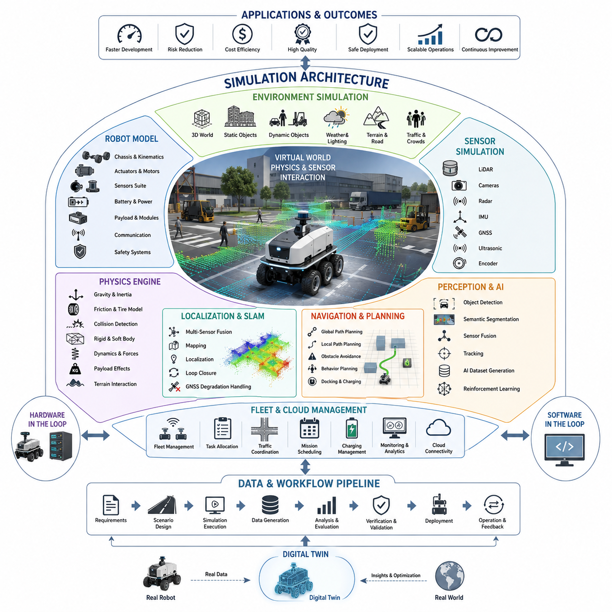
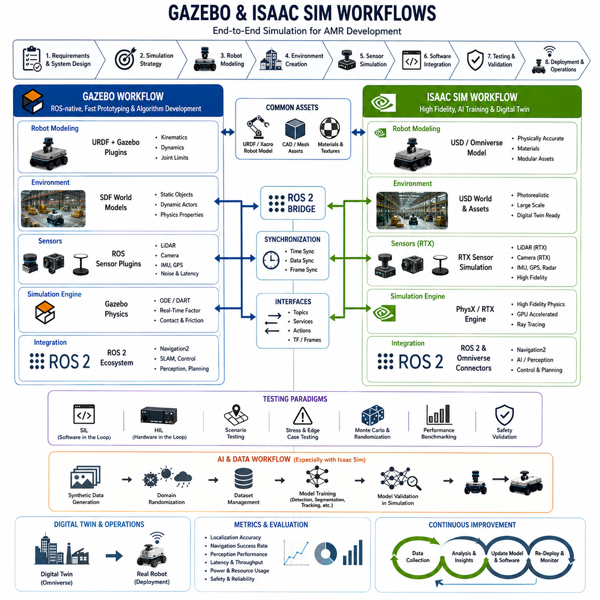
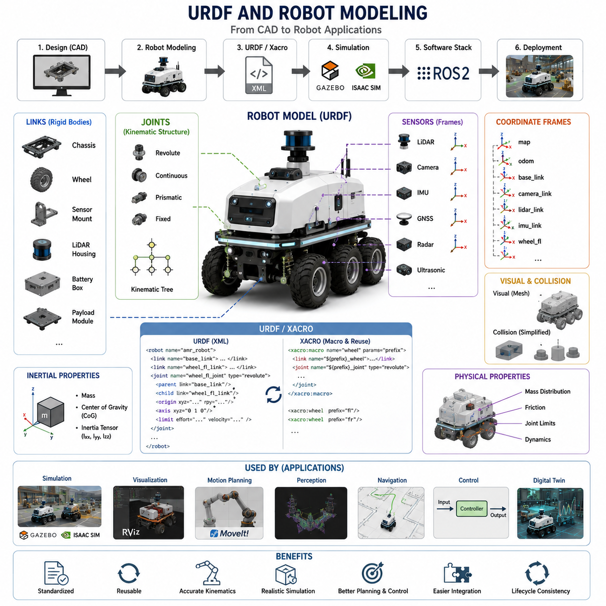
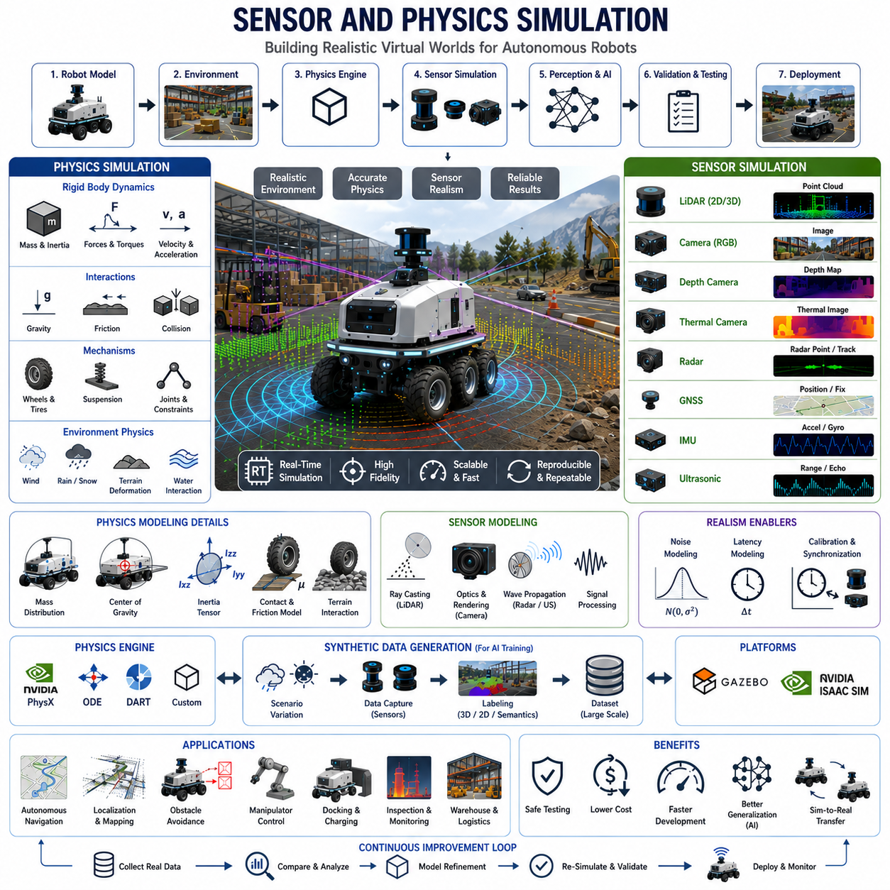
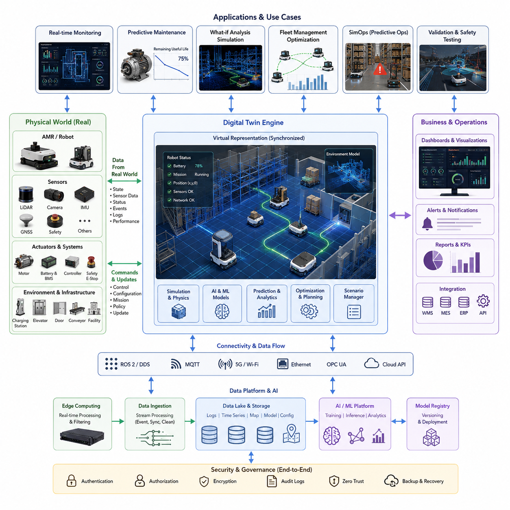
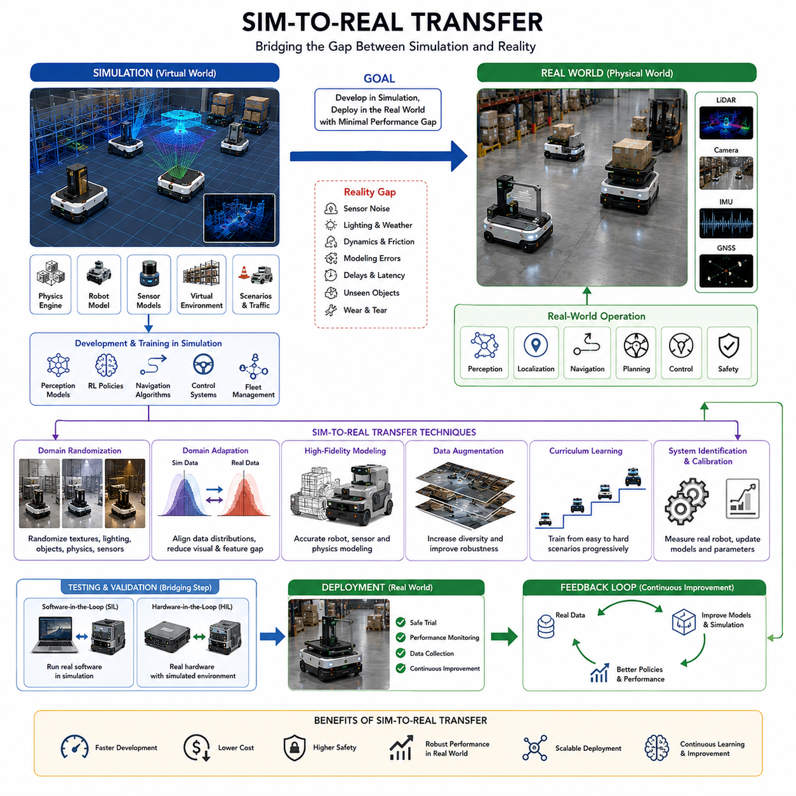
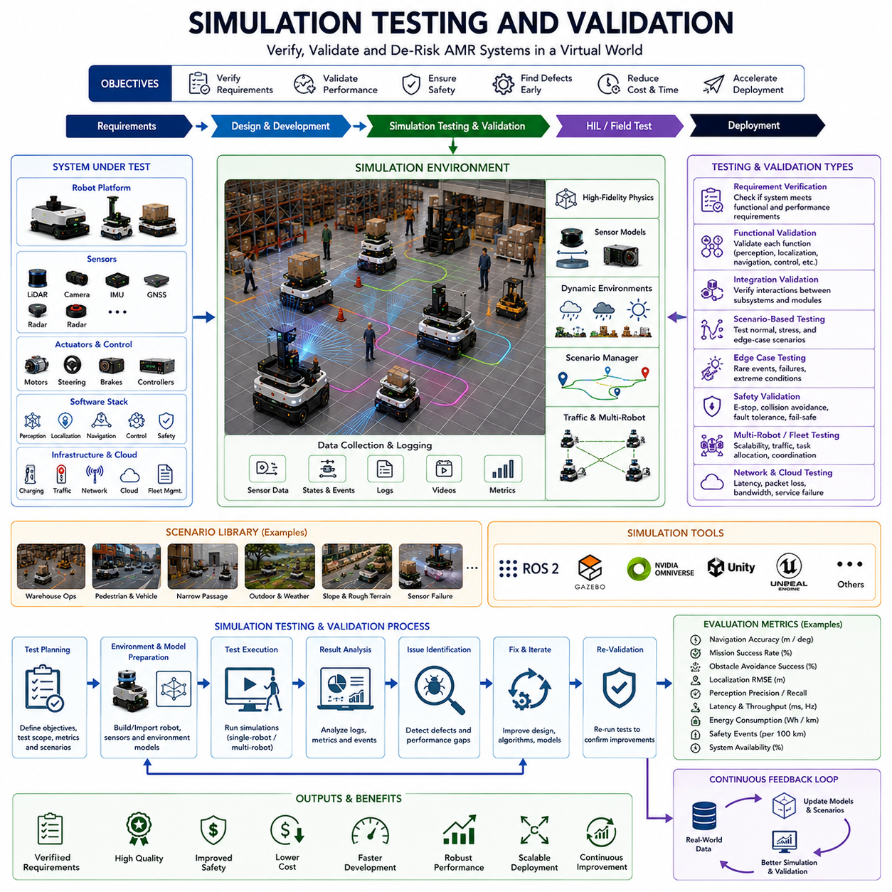
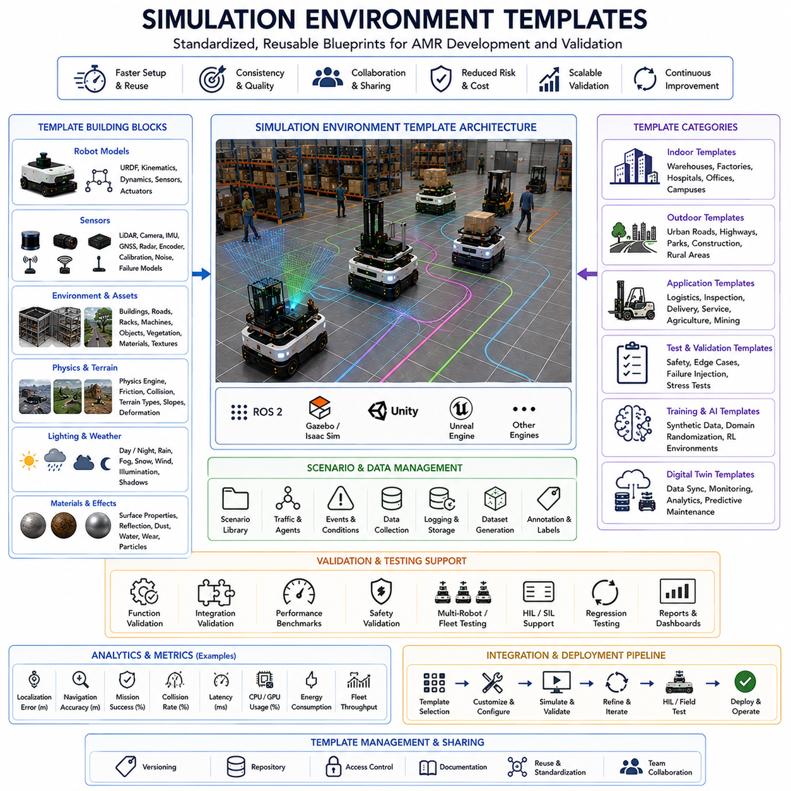

**Volume10. AMR Engineering Process and Development Manual**

# Chapter13. Simulation and Digital Twins

## 13.01 Simulation Architecture

{width="7.268055555555556in" height="7.268055555555556in"}

# 13_01_Simulation_Architecture

Simulation Architecture is one of the most important foundations in modern Autonomous Mobile Robot (AMR) development because it enables engineers to design, validate, optimize, and verify robotic systems before expensive physical prototypes are deployed. In traditional engineering projects, development teams often relied heavily on hardware testing, which resulted in long development cycles, high costs, safety risks, and limited repeatability. Modern robotics engineering has shifted toward simulation-driven development, where virtual environments are used throughout the entire product lifecycle. In AMR projects, simulation architecture serves as the digital backbone that connects mechanical design, electrical systems, embedded software, perception algorithms, SLAM modules, navigation stacks, artificial intelligence models, cloud services, fleet management systems, and operational workflows into a unified development ecosystem. This simulation-centric methodology significantly reduces risk while accelerating innovation and product maturity.

The primary objective of a simulation architecture is to create a virtual representation of both the robot and its operating environment. This virtual representation allows engineers to observe how the robot behaves under a wide variety of conditions that may be difficult, expensive, or dangerous to reproduce in real-world environments. The simulation environment acts as a digital laboratory where thousands of experiments can be executed repeatedly and consistently. This capability enables development teams to identify defects early, validate design assumptions, optimize performance, and improve overall system reliability before physical deployment begins.

A well-designed simulation architecture consists of multiple interconnected layers. The first layer is the environment simulation layer, which represents the physical world in which the robot operates. This environment may include factories, warehouses, hospitals, airports, logistics centers, outdoor roads, industrial facilities, construction sites, agricultural fields, or urban infrastructure. The simulation environment contains static objects such as buildings, walls, roads, fences, loading stations, elevators, and charging docks. It also contains dynamic objects including humans, vehicles, forklifts, robots, animals, and other moving obstacles. By modeling both static and dynamic elements, engineers can evaluate robot behavior under realistic operational conditions.

The second layer is the robot model layer. This layer contains a complete digital representation of the robot platform itself. The robot model includes chassis geometry, wheel configurations, suspension systems, actuators, motors, steering mechanisms, sensors, batteries, payload modules, communication devices, and safety systems. For outdoor AMRs, the robot model may include four-wheel steering systems, six-wheel-drive platforms, articulated suspension systems, towing mechanisms, or autonomous coupling devices. Every physical component must be represented accurately so that the simulation reflects actual system behavior. The fidelity of the robot model directly influences the reliability of simulation results.

The third layer is the physics simulation engine. This component is responsible for calculating how the robot interacts with its environment according to the laws of physics. Physics engines simulate gravity, friction, inertia, collisions, momentum, wheel slip, tire-ground interactions, payload effects, and dynamic forces. High-fidelity physics simulation is particularly important for outdoor autonomous robots operating on uneven terrain, slopes, gravel roads, mud, grass, sand, or construction sites. Without accurate physics models, navigation algorithms may appear successful in simulation while failing during real-world deployment. Therefore, simulation architects must carefully calibrate physics parameters using experimental measurements from actual hardware systems.

The fourth layer is the sensor simulation layer. Modern AMRs depend heavily on sensors for environmental perception and autonomous decision-making. Sensor simulation reproduces the behavior of LiDARs, cameras, depth cameras, thermal cameras, radar systems, ultrasonic sensors, GNSS receivers, IMUs, wheel encoders, and other sensing devices. A realistic sensor model must incorporate not only ideal measurements but also real-world imperfections. Noise, distortion, latency, packet loss, environmental interference, lighting variations, weather effects, sensor drift, and calibration errors should all be represented within the simulation environment. This approach enables developers to evaluate algorithm robustness under realistic operating conditions.

The perception simulation framework operates above the sensor layer and provides a testing platform for computer vision and sensor fusion algorithms. Object detection, semantic segmentation, free-space estimation, obstacle recognition, pedestrian tracking, vehicle classification, and environmental understanding systems can be evaluated within simulation before physical testing begins. Because simulated environments can generate perfectly labeled ground truth data, engineers can rapidly measure perception accuracy, precision, recall, tracking stability, and detection latency. This capability significantly accelerates AI model development and validation.

The localization and SLAM simulation layer focuses on robot positioning and map generation. Localization algorithms estimate the robot's position within a known environment, while SLAM algorithms simultaneously construct maps and determine robot pose in unknown environments. Simulation allows engineers to evaluate localization accuracy under varying conditions such as GNSS degradation, sensor occlusions, environmental changes, moving obstacles, and adverse weather. Multi-sensor localization systems combining LiDAR, GNSS, IMU, odometry, cameras, and radar can be extensively tested before field deployment. This significantly reduces integration risks during real-world operations.

The navigation simulation layer evaluates path planning, obstacle avoidance, behavior planning, traffic management, and mission execution. Autonomous navigation systems must continuously determine safe and efficient paths while responding to dynamic environmental conditions. Simulation environments can generate complex scenarios involving pedestrian crossings, intersections, vehicle traffic, narrow corridors, crowded facilities, docking stations, charging points, and multi-robot interactions. By repeatedly testing these scenarios, developers can optimize navigation parameters and identify edge cases that might otherwise remain undiscovered until deployment.

For multi-robot systems, simulation architecture extends beyond individual robot behavior to encompass fleet-level operations. Fleet simulations evaluate task allocation, traffic coordination, route optimization, charging management, mission scheduling, communication bandwidth utilization, and cloud connectivity. Large-scale simulations involving dozens or hundreds of robots enable organizations to understand system scalability and operational bottlenecks. Fleet simulation is particularly important for logistics centers, smart factories, hospitals, and large outdoor facilities where multiple autonomous robots operate simultaneously.

Artificial intelligence development increasingly depends on simulation infrastructure. AI-based perception systems, reinforcement learning agents, behavior prediction models, and autonomous decision-making systems require vast quantities of training data. Simulation environments can generate synthetic datasets at a scale that would be difficult to achieve through physical data collection alone. Engineers can systematically vary weather conditions, lighting, object types, traffic density, terrain characteristics, and environmental complexity to create highly diverse training datasets. These synthetic datasets complement real-world data and improve model generalization capabilities.

Reinforcement learning represents a particularly important application of simulation architecture. Training reinforcement learning agents directly on physical robots is often impractical due to safety risks, equipment wear, and long training times. Simulation environments enable millions of training iterations to be executed rapidly and safely. The agent learns navigation policies, obstacle avoidance behaviors, docking procedures, towing operations, and mission execution strategies through repeated interactions with the virtual environment. Once satisfactory performance is achieved, the learned policy can be transferred to physical robots through sim-to-real methodologies.

A critical challenge in simulation architecture is achieving high fidelity while maintaining computational efficiency. Increasing simulation realism typically requires greater computational resources. Detailed physics models, high-resolution sensors, large environments, and complex AI systems can significantly increase simulation execution times. Simulation architects must therefore balance realism against performance requirements. Some applications require real-time simulation for hardware-in-the-loop testing, while others prioritize maximum accuracy regardless of execution speed. The appropriate balance depends on project objectives and validation requirements.

Hardware-in-the-loop simulation represents an advanced architecture pattern frequently used in robotics development. In this configuration, physical hardware components interact directly with simulated environments. Examples include connecting actual motor controllers, embedded systems, safety controllers, perception computers, or navigation processors to virtual environments. This approach enables realistic system integration testing while avoiding the risks associated with full-scale physical operation. Hardware-in-the-loop architectures are particularly valuable during late-stage development and system validation activities.

Software-in-the-loop simulation provides another important validation methodology. Here, production software executes within a simulated environment using virtual sensors and virtual actuators. Because the exact software stack intended for deployment is used, engineers can identify software defects, performance bottlenecks, synchronization issues, and integration problems early in the development cycle. Continuous integration systems frequently execute software-in-the-loop simulations automatically whenever software changes are introduced. This practice improves software quality and reduces regression risks.

Cloud-based simulation architectures have emerged as an important trend in large-scale robotics development. Rather than relying on local workstations, simulation workloads can be distributed across cloud infrastructure. Cloud-based simulation enables parallel execution of thousands of test scenarios simultaneously. Organizations can evaluate multiple robot configurations, navigation algorithms, AI models, and environmental conditions at unprecedented scale. This approach dramatically accelerates testing and validation processes while improving engineering productivity.

Digital twin architectures extend simulation beyond development and into operational phases. A digital twin is a continuously synchronized virtual representation of a physical robot and its operating environment. Sensor data from deployed robots updates the digital twin in real time, enabling predictive analysis, operational monitoring, fault diagnosis, and performance optimization. Digital twins support proactive maintenance strategies, mission planning, fleet management, and long-term system improvement. As robotics systems become increasingly connected, digital twins are expected to become a standard component of advanced AMR architectures.

Verification and validation processes rely heavily on simulation architecture. Safety-critical robotics systems must demonstrate compliance with functional safety requirements before deployment. Simulation allows engineers to evaluate emergency stop behavior, obstacle avoidance reliability, fault recovery mechanisms, sensor failures, communication interruptions, power anomalies, and environmental hazards. Thousands of failure scenarios can be executed automatically, providing evidence that the system behaves safely under abnormal conditions. Such testing would often be impractical or dangerous to perform entirely in physical environments.

Simulation architecture also plays a central role in requirements traceability. Every system requirement can be linked to specific simulation scenarios, performance metrics, validation tests, and acceptance criteria. This traceability ensures that engineering teams can demonstrate compliance with customer requirements and regulatory standards. Simulation-generated evidence provides objective measurements that support design reviews, quality audits, certification activities, and project milestone assessments.

For outdoor autonomous robots, simulation complexity increases substantially due to environmental variability. Weather conditions, terrain characteristics, lighting changes, seasonal effects, GNSS disturbances, road conditions, and unpredictable obstacles all influence robot performance. Advanced simulation architectures incorporate weather models, terrain generators, traffic simulators, and environmental variability engines to capture these effects. Such capabilities are particularly important for outdoor patrol robots, inspection robots, agricultural robots, construction robots, and GPR-based infrastructure inspection platforms.

Modern simulation ecosystems frequently integrate platforms such as Gazebo, Isaac Sim, ROS2, Unreal Engine, Unity, digital twin frameworks, AI training pipelines, cloud services, and fleet management systems. These technologies collectively create an end-to-end development environment supporting the entire robotics lifecycle. Through standardized interfaces and modular architectures, engineering teams can continuously evolve simulation capabilities while maintaining compatibility with existing software and hardware assets.

Ultimately, Simulation Architecture serves as the foundation of efficient, scalable, and reliable AMR engineering. It transforms robotics development from a hardware-centric trial-and-error process into a data-driven and model-based engineering discipline. By enabling early validation, rapid iteration, AI training, system integration, safety verification, fleet analysis, and digital twin operations, simulation architecture significantly improves development efficiency and product quality. As autonomous robots become increasingly intelligent, connected, and capable, simulation architecture will continue to evolve into a core pillar of next-generation robotics engineering, enabling organizations to build safer, smarter, and more scalable autonomous systems.

# 13_01_Simulation_Architecture

## 13.02 Gazebo and Isaac Sim Workflows

{width="7.268055555555556in" height="7.268055555555556in"}

# 13_02_Gazebo and Isaac Sim Workflows

Gazebo and Isaac Sim have become two of the most influential simulation platforms in modern Autonomous Mobile Robot (AMR) development. As robotics systems continue to grow in complexity, the need for accurate, scalable, and repeatable simulation environments has become increasingly important. Development teams can no longer rely solely on physical testing because hardware prototypes are expensive, field testing is time-consuming, and many safety-critical situations are difficult to reproduce consistently. Gazebo and Isaac Sim provide virtual development environments that allow engineers to design, validate, optimize, and verify robotic systems before deployment. Although both platforms share the common objective of enabling simulation-driven robotics development, they differ significantly in architecture, capabilities, computational requirements, and intended use cases. Understanding the workflow associated with each platform is therefore essential for robotics engineers building next-generation autonomous systems.

The simulation workflow begins long before a virtual robot is launched inside a simulator. It starts during the system architecture phase, where engineers define the functional requirements of the robot. These requirements typically include mobility characteristics, sensor configurations, navigation capabilities, perception requirements, operational environments, safety constraints, and performance objectives. Once the requirements are defined, developers create a simulation strategy that identifies which aspects of the system will be evaluated in simulation and which aspects require physical testing. This strategy forms the foundation upon which Gazebo or Isaac Sim workflows are built.

The first major stage in both workflows is robot modeling. Every simulation environment requires a digital representation of the physical robot. This representation includes the chassis geometry, wheel configurations, suspension systems, actuators, motors, sensors, communication modules, batteries, payloads, and safety components. The robot model must accurately represent physical dimensions, mass distribution, inertia tensors, center of gravity, joint limits, and kinematic constraints. Any inaccuracies in the robot model can produce unrealistic simulation behavior and lead to incorrect engineering decisions.

In ROS2-based robotics development, robot descriptions are typically defined using URDF or Xacro files. These files provide a standardized representation of robot geometry and kinematics that can be used by Gazebo, Isaac Sim, visualization tools, planning frameworks, and control systems. The robot model becomes a common asset shared across multiple engineering disciplines. Mechanical engineers contribute CAD models, electrical engineers provide component placement information, and software engineers integrate control interfaces and sensor definitions. The result is a comprehensive digital representation of the actual robot platform.

Within Gazebo workflows, the URDF model is typically converted into a simulation-ready format that includes physical properties, collision geometries, visual meshes, joint dynamics, and sensor plugins. Gazebo plugins are attached to the robot model to simulate motor controllers, LiDAR devices, cameras, IMUs, GPS receivers, and other hardware components. These plugins provide the interface between the virtual environment and the robot software stack.

Isaac Sim follows a somewhat different approach. Instead of relying solely on traditional URDF structures, Isaac Sim leverages NVIDIA Omniverse technology and USD (Universal Scene Description) assets. Robot models are imported into USD-based environments where high-fidelity rendering, advanced physics simulation, and AI-specific workflows can be integrated. The USD architecture enables highly modular scene composition and supports collaborative development among multiple engineering teams.

After robot modeling is completed, the next stage involves environment creation. The simulation environment must represent the operational context in which the robot will function. For indoor AMRs, environments may include warehouses, factories, hospitals, airports, and logistics centers. Outdoor autonomous robots require roads, sidewalks, parking lots, construction sites, agricultural fields, industrial plants, railways, ports, and utility corridors.

Gazebo environments are often constructed using SDF world files combined with mesh assets and physics definitions. Buildings, walls, doors, ramps, obstacles, charging stations, traffic signs, and operational zones can be added to create realistic environments. Dynamic objects such as humans, forklifts, vehicles, and moving robots may also be introduced to evaluate navigation performance under changing conditions.

Isaac Sim expands this capability significantly through physically realistic rendering and digital twin integration. High-resolution environments can be generated using photorealistic assets, advanced material definitions, physically based rendering, and real-time ray tracing. This capability is particularly important for AI-driven perception systems because vision models often depend on realistic image generation to achieve successful sim-to-real transfer.

The sensor simulation workflow represents one of the most important aspects of robotics simulation. Modern AMRs rely heavily on perception systems that include LiDARs, cameras, depth sensors, thermal cameras, radar systems, GNSS receivers, IMUs, and wheel encoders. These sensors must be accurately modeled to ensure that the behavior observed in simulation closely matches real-world performance.

Gazebo provides mature sensor simulation capabilities that are widely used throughout the robotics community. Laser scanners generate point clouds, cameras produce image streams, IMUs provide motion data, and GPS modules estimate global positions. Sensor noise, latency, update rates, and measurement errors can be configured to approximate real hardware behavior.

Isaac Sim introduces additional realism through GPU-accelerated sensor simulation. RTX-based LiDAR models can generate highly detailed point clouds that accurately represent reflective surfaces and environmental interactions. Cameras support physically realistic lighting models, shadows, reflections, motion blur, lens distortion, and depth information. This level of realism is particularly valuable for AI model training and validation.

Once sensors are operational, the robot software stack can be integrated into the simulation environment. In most ROS2-based systems, perception, localization, SLAM, navigation, planning, and control nodes execute exactly as they would on physical hardware. The simulator publishes virtual sensor data while receiving motion commands generated by the robot software. This architecture allows developers to test the complete autonomy stack without requiring physical robots.

Localization and mapping workflows play a critical role during simulation. Engineers use Gazebo and Isaac Sim to evaluate SLAM algorithms, map generation procedures, localization accuracy, loop closure mechanisms, and sensor fusion frameworks. Simulation environments provide repeatable conditions that make it easier to compare algorithm performance across multiple software versions.

For outdoor robots, localization testing often includes GNSS signal degradation, multipath interference, sensor occlusions, environmental changes, and varying weather conditions. Engineers can repeatedly evaluate system performance under identical conditions and identify weaknesses that may not be obvious during limited field testing.

Navigation development forms another major workflow stage. Global planners, local planners, obstacle avoidance systems, behavior planners, docking algorithms, parking controllers, and fleet coordination systems are extensively tested within simulation. Engineers can generate hundreds or thousands of scenarios involving pedestrians, vehicles, narrow corridors, intersections, traffic congestion, dynamic obstacles, and operational disturbances.

Gazebo has traditionally been the preferred platform for ROS navigation development because of its strong integration with ROS and Navigation2. Developers can rapidly evaluate path planning algorithms, tune controller parameters, optimize recovery behaviors, and validate mission execution workflows.

Isaac Sim extends navigation workflows by enabling large-scale synthetic environment generation and advanced AI integration. Complex urban environments, industrial facilities, and logistics networks can be simulated at scale, allowing autonomous systems to be evaluated under highly diverse operational conditions.

Artificial intelligence workflows have become increasingly important in modern simulation environments. Deep learning models require large volumes of data for training and validation. Collecting sufficient real-world data is often expensive and time-consuming. Simulation environments solve this challenge by generating synthetic datasets.

Isaac Sim is particularly powerful in this area because it supports automated dataset generation using domain randomization techniques. Lighting conditions, object appearances, weather effects, textures, sensor positions, and environmental layouts can be varied automatically. This creates highly diverse datasets that improve model robustness and generalization.

Gazebo also supports AI development workflows, although its primary focus remains robotics system simulation rather than photorealistic dataset generation. Many organizations use Gazebo for algorithm verification while relying on Isaac Sim for synthetic data generation and perception model training.

A critical component of both workflows is Hardware-in-the-Loop testing. In HIL configurations, real hardware components interact with simulated environments. Motor controllers, embedded systems, safety controllers, AI accelerators, and sensor processors can be connected directly to Gazebo or Isaac Sim. This allows engineers to validate hardware-software integration before deploying complete robotic systems.

Software-in-the-Loop testing represents another essential workflow stage. Here, production software executes entirely within the simulation environment. Continuous integration pipelines frequently run automated simulation tests whenever code changes are introduced. This approach improves software quality, accelerates development cycles, and reduces regression risks.

Performance evaluation and benchmarking constitute another important phase of simulation workflows. Engineers measure localization accuracy, path planning efficiency, obstacle avoidance success rates, perception performance, computational latency, power consumption estimates, mission completion rates, and safety metrics. Automated evaluation frameworks compare simulation results against predefined acceptance criteria.

Digital twin workflows represent one of the most advanced applications of simulation technology. A digital twin maintains continuous synchronization between physical robots and virtual models. Operational data collected from deployed robots updates the virtual representation in real time. Engineers can use digital twins for predictive maintenance, operational optimization, fleet monitoring, and failure analysis.

Isaac Sim has become particularly important in digital twin implementations because of its integration with NVIDIA Omniverse. Entire facilities can be modeled as synchronized digital twins, allowing organizations to monitor operations, optimize workflows, and evaluate future modifications before implementing physical changes.

Sim-to-real transfer serves as the ultimate objective of both Gazebo and Isaac Sim workflows. The value of simulation depends on how accurately virtual results predict real-world performance. Engineers continuously compare simulation outputs with field testing data and refine models accordingly. Physics parameters, sensor characteristics, environmental conditions, and control algorithms are calibrated until simulation behavior closely matches reality.

The most successful robotics organizations use simulation as a continuous engineering process rather than a standalone development tool. Simulation supports requirements validation, architecture design, software development, AI training, integration testing, safety verification, fleet optimization, and operational monitoring throughout the entire product lifecycle.

In modern AMR engineering, Gazebo and Isaac Sim are not competing technologies but complementary platforms. Gazebo provides an open, ROS-native environment that excels in robotics algorithm development, software integration, and rapid prototyping. Isaac Sim provides high-fidelity physics, photorealistic rendering, synthetic data generation, GPU acceleration, and digital twin capabilities. Many advanced robotics companies employ both platforms simultaneously, using Gazebo for core robotics development and Isaac Sim for AI training, perception validation, and digital twin applications.

As autonomous robots become increasingly sophisticated, simulation workflows will continue to expand in scope and importance. Future robotics development will rely heavily on virtual engineering environments where entire fleets, facilities, cities, and infrastructure systems can be designed, tested, and optimized before physical deployment. Gazebo and Isaac Sim represent foundational technologies enabling this transformation, making simulation-driven robotics engineering one of the most critical disciplines in the development of next-generation autonomous systems.

## 13.03 URDF and Robot Modeling

{width="7.268055555555556in" height="7.268055555555556in"}

# 13_03 URDF and Robot Modeling

URDF, which stands for Unified Robot Description Format, is one of the most fundamental technologies in modern robotics development. It serves as the standard method for describing the physical structure, kinematic relationships, dynamic properties, sensor configurations, and coordinate systems of a robot in a machine-readable format. Within the ROS and ROS2 ecosystems, URDF has become the foundation upon which simulation, visualization, motion planning, control, perception, navigation, and digital twin systems are built. Without an accurate robot model, many higher-level robotic functions cannot operate correctly because they depend on a precise understanding of the robot\'s geometry and physical behavior.

Robot modeling is the process of creating a digital representation of a physical robot. This representation must capture not only the visual appearance of the robot but also its mechanical structure, mass distribution, joint constraints, sensor locations, actuator characteristics, and interaction with the surrounding environment. A well-designed robot model becomes a central engineering asset that can be reused throughout the entire product lifecycle, from initial concept design to deployment, maintenance, and future upgrades.

In a typical AMR development project, robot modeling begins during the system architecture phase. Mechanical engineers create detailed CAD models of the chassis, suspension systems, steering mechanisms, wheel assemblies, sensor mounts, payload structures, and protective enclosures. These CAD models provide the geometric foundation for the robot description. However, CAD models alone are insufficient because robotic software systems require information about kinematic chains, coordinate frames, joint relationships, and physical properties. URDF bridges the gap between mechanical design and robotic software by providing a structured representation that both humans and software systems can understand.

A URDF model is organized around the concepts of links and joints. A link represents a rigid body component of the robot. Examples include the chassis, wheels, steering arms, sensor housings, manipulator segments, battery compartments, and payload modules. Each link possesses geometric, visual, collision, and inertial properties. Joints define the relationships between links and determine how they move relative to one another. Revolute joints allow rotational movement, prismatic joints permit linear movement, fixed joints create rigid connections, and continuous joints support unrestricted rotation. Together, links and joints form the kinematic tree that defines the robot structure.

The kinematic model is one of the most important aspects of robot modeling. Kinematics describes how motion propagates through the robot structure. Forward kinematics calculates the position and orientation of robot components based on joint states, while inverse kinematics determines the required joint movements needed to achieve a desired pose. Accurate kinematic modeling is essential for navigation, manipulation, localization, perception, and autonomous decision-making systems. Even small errors in coordinate definitions can produce significant deviations during real-world operation.

Coordinate frames play a critical role within URDF models. Every link is associated with a coordinate frame that defines its position and orientation relative to its parent link. The robot ultimately becomes a hierarchy of interconnected frames. Standard frames commonly include the base_link, odom frame, map frame, sensor frames, camera frames, LiDAR frames, wheel frames, and end-effector frames. Proper frame management enables different software modules to exchange spatial information consistently and accurately.

Visual modeling represents another important component of URDF development. Visual models define how the robot appears in simulation and visualization environments. These models are typically generated from CAD systems and exported as mesh files such as STL, DAE, OBJ, or Collada formats. The visual representation helps developers inspect robot geometry, validate component placement, analyze accessibility, and perform design reviews. High-quality visual models are particularly useful in digital twin systems and simulation environments where realistic rendering is important.

Collision modeling differs from visual modeling in both purpose and implementation. While visual meshes prioritize appearance, collision models prioritize computational efficiency. Collision geometries are used by simulation engines, path planners, obstacle avoidance systems, and motion planning frameworks to determine physical interactions between objects. Simplified geometric representations such as boxes, cylinders, spheres, and low-polygon meshes are often used to reduce computational load while maintaining sufficient accuracy for collision detection.

Inertial modeling provides the physical characteristics necessary for dynamic simulation. Each link must define mass, center of gravity, and inertia tensor properties. These parameters determine how the robot responds to forces, torques, acceleration, braking, collisions, and terrain interactions. High-fidelity inertial models are essential for accurate simulation results. If mass properties are incorrect, the robot may behave unrealistically in simulation, leading to invalid performance predictions and poor sim-to-real transfer.

Modern AMRs often incorporate a wide variety of sensors. Robot models must therefore include precise sensor definitions and mounting positions. Sensors commonly modeled include 2D LiDARs, 3D LiDARs, RGB cameras, depth cameras, thermal cameras, radar systems, GNSS receivers, IMUs, ultrasonic sensors, wheel encoders, and safety scanners. Sensor placement significantly affects perception quality, field of view, localization accuracy, obstacle detection performance, and navigation behavior. Consequently, accurate sensor modeling is an important aspect of system design.

Outdoor autonomous robots require particularly detailed modeling because they operate in highly variable environments. Suspension systems, wheel geometries, tire dimensions, steering mechanisms, payload distributions, and sensor mounting structures all influence vehicle behavior. For example, a six-wheel-drive outdoor inspection robot may include independent suspension systems, articulated chassis components, multiple LiDARs, radar units, GNSS antennas, and thermal imaging devices. All these elements must be represented accurately within the robot model to ensure reliable simulation and software integration.

The introduction of Xacro significantly improved the scalability of URDF development. Xacro is a macro language that extends URDF functionality by allowing parameterization, reusable components, conditional logic, and modular definitions. Instead of maintaining large and repetitive XML files, developers can create reusable templates for wheels, sensors, actuators, suspension modules, and payload systems. This approach improves maintainability, reduces duplication, and simplifies configuration management across multiple robot variants.

For organizations developing entire robot product families, Xacro provides substantial benefits. A company may produce several robot platforms with different widths, payload capacities, sensor configurations, and drive systems. Rather than maintaining separate URDF files for every robot, engineers can create parameterized Xacro templates that generate robot descriptions automatically based on selected configuration parameters. This approach greatly reduces engineering effort and improves consistency across product lines.

Simulation environments rely heavily on robot models. Platforms such as Gazebo, Isaac Sim, Webots, and Unity require detailed robot descriptions to perform realistic simulation. The robot model serves as the bridge between software and virtual hardware. Simulation engines use the model to calculate kinematics, dynamics, collisions, sensor outputs, and environmental interactions. As a result, simulation accuracy is directly dependent on model quality.

Gazebo workflows typically begin with importing URDF or Xacro models into simulation environments. Plugins are then attached to represent motors, controllers, sensors, communication devices, and custom hardware interfaces. The resulting virtual robot behaves similarly to its physical counterpart and can be used for software validation, navigation testing, perception development, and system integration activities.

Isaac Sim extends robot modeling capabilities through integration with NVIDIA Omniverse and Universal Scene Description (USD) technology. URDF models can be imported and converted into USD representations that support advanced rendering, high-fidelity physics simulation, synthetic data generation, and digital twin workflows. This enables organizations to develop sophisticated simulation environments that closely resemble real-world operating conditions.

Robot modeling is not limited to simulation. Motion planning frameworks also depend heavily on robot descriptions. Systems such as MoveIt utilize robot models to calculate reachability, joint constraints, collision avoidance paths, and trajectory optimization. Accurate robot descriptions enable planners to generate safe and efficient movements while respecting mechanical limitations.

Perception systems likewise depend on robot models. Sensor fusion algorithms require precise transformations between coordinate frames. Camera calibration, LiDAR calibration, radar alignment, and IMU integration all rely on accurate robot descriptions. Errors in sensor placement definitions can propagate through the perception pipeline and degrade overall system performance.

Digital twin implementations further increase the importance of robot modeling. A digital twin is a continuously synchronized virtual representation of a physical robot. Real-time sensor data updates the digital model, enabling monitoring, diagnostics, predictive maintenance, operational analysis, and fleet management. The quality of the digital twin depends directly on the accuracy of the underlying robot model.

Model validation is a critical stage of robot modeling workflows. Engineers must verify that robot descriptions accurately represent physical systems. Validation typically includes geometry verification, frame consistency checks, joint limit validation, inertial parameter verification, collision testing, sensor alignment analysis, and simulation benchmarking. Automated validation tools are often used to identify errors before deployment.

Version control represents another important consideration. Robot models evolve throughout the development lifecycle as hardware designs change, sensors are added, payloads are modified, and new product variants are introduced. Managing these changes requires structured version control processes. Source control systems such as Git are commonly used to track modifications, support collaborative development, and maintain traceability across engineering teams.

Robot modeling also plays an important role in manufacturing and maintenance activities. Assembly documentation, wiring diagrams, service procedures, calibration workflows, and inspection processes can all be linked to the robot model. This creates a unified engineering database that supports the entire product lifecycle from design through operation and end-of-life management.

As robotics systems become increasingly sophisticated, robot models continue to evolve beyond simple kinematic descriptions. Modern robot descriptions may include semantic information, functional capabilities, operational constraints, safety properties, AI-related metadata, and cloud connectivity definitions. Future robot models will likely serve as comprehensive digital representations supporting autonomous decision-making, digital twins, fleet operations, simulation-driven development, and embodied AI systems.

Ultimately, URDF and robot modeling form the foundation of nearly every modern robotics software architecture. They provide a common language that connects mechanical engineering, electrical engineering, software development, simulation, perception, navigation, artificial intelligence, testing, deployment, and operations. A well-designed robot model enables accurate simulation, efficient software integration, reliable system validation, and scalable product development. As autonomous robots become more intelligent, more connected, and more capable, the importance of robust robot modeling methodologies will continue to grow, making URDF and related modeling technologies essential pillars of next-generation robotics engineering.

## 13.04 Sensor and Physics Simulation

{width="7.268055555555556in" height="7.268055555555556in"}

# 13_04 Sensor and Physics Simulation

Sensor and Physics Simulation is one of the most critical components of modern robotics simulation environments because it enables autonomous systems to perceive, understand, and interact with virtual worlds in a manner that closely resembles real-world operation. While robot models define the structure and capabilities of a robot, sensor simulation and physics simulation provide the environmental realism necessary for meaningful testing, validation, optimization, and training. Together, these two domains form the foundation upon which digital twins, autonomous navigation systems, perception pipelines, artificial intelligence models, and system-level verification processes are built.

In robotics engineering, simulation environments must reproduce not only the appearance of the world but also the physical laws and sensing mechanisms that govern robot behavior. Autonomous Mobile Robots (AMRs), outdoor autonomous vehicles, inspection robots, agricultural robots, logistics robots, and service robots all depend on a combination of sensors and physical interactions to make decisions. If either the sensor models or the physics models are inaccurate, the behavior observed in simulation may differ significantly from real-world operation. Consequently, high-fidelity sensor and physics simulation has become a central requirement for simulation-driven robotics development.

Physics simulation is responsible for reproducing the fundamental laws of motion and interaction within a virtual environment. It calculates how objects move, collide, accelerate, decelerate, rotate, and respond to external forces. A physics engine continuously solves mathematical equations that describe rigid body dynamics, soft body dynamics, contact mechanics, friction, gravity, momentum, inertia, and energy transfer. These calculations determine how robots interact with terrain, obstacles, payloads, structures, and other agents within the simulated environment.

The foundation of physics simulation begins with rigid body dynamics. Most robot components, including chassis structures, wheels, sensors, batteries, payloads, and manipulators, are modeled as rigid bodies. The simulation engine calculates their position, velocity, acceleration, and orientation based on applied forces and torques. These calculations enable realistic robot movement and provide the basis for testing locomotion, navigation, and control algorithms.

Mass properties play a significant role in determining simulation accuracy. Every robot component must have correctly defined mass, center of gravity, and inertia tensor values. These parameters influence acceleration performance, turning characteristics, braking behavior, rollover tendencies, suspension response, and stability under load. For outdoor robots operating on rough terrain, incorrect mass properties can lead to unrealistic simulation results and poor correlation with field performance.

Gravity is one of the most fundamental physical effects represented in simulation. Gravity influences robot stability, suspension compression, wheel loading, payload distribution, and energy consumption. Simulating gravity accurately is particularly important when evaluating slope climbing performance, stability on uneven terrain, docking operations, and obstacle traversal. Outdoor autonomous robots frequently encounter gradients, embankments, ramps, and irregular surfaces where gravitational effects directly influence system behavior.

Friction modeling represents another critical aspect of physics simulation. Friction determines how wheels interact with the ground and directly affects traction, steering performance, braking effectiveness, and energy efficiency. Various friction models may be used depending on the simulation requirements. High-fidelity models can represent asphalt, concrete, gravel, grass, mud, sand, snow, and wet surfaces. Accurate friction modeling is essential for autonomous robots operating in outdoor environments where terrain conditions vary continuously.

Wheel-ground interaction is among the most challenging areas of robotics simulation. Real-world wheel behavior involves complex interactions between tire deformation, surface properties, load distribution, slip ratios, and dynamic forces. Advanced simulation environments attempt to model these effects to improve the accuracy of vehicle dynamics prediction. This capability is particularly important for heavy-duty AMRs, agricultural robots, construction robots, and military-grade autonomous platforms.

Suspension simulation introduces additional complexity into physics modeling. Independent suspension systems, articulated chassis designs, shock absorbers, springs, dampers, and active suspension mechanisms influence ride quality, stability, sensor performance, and vehicle control. Suspension simulation allows engineers to evaluate robot behavior under rough terrain conditions before physical prototypes are built.

Collision simulation enables robots to interact realistically with their surroundings. Physics engines continuously monitor potential contacts between objects and calculate collision responses when contact occurs. These responses include force generation, energy dissipation, deformation effects, and motion changes. Collision simulation is essential for safety validation, obstacle avoidance testing, docking operations, warehouse navigation, and industrial automation applications.

Environmental physics extends beyond robot dynamics to include interactions with the surrounding world. Wind effects, water interactions, rain accumulation, snow coverage, dust generation, and terrain deformation may all influence robot performance. Although not every robotics application requires these advanced environmental effects, they become increasingly important for outdoor autonomous systems operating under diverse weather conditions.

Physics simulation alone is insufficient for autonomous robot development because robots perceive the world primarily through sensors. Sensor simulation therefore complements physics simulation by reproducing the outputs generated by real sensing devices. Sensor simulation enables software systems to process virtual measurements exactly as they would process real sensor data.

LiDAR simulation is among the most widely used forms of sensor simulation. LiDAR sensors emit laser pulses and measure the time required for reflections to return from surrounding objects. Simulation engines reproduce this process by casting virtual rays into the environment and calculating intersection distances. The resulting point clouds can be used for localization, mapping, obstacle detection, navigation, and environmental understanding.

Modern LiDAR simulation supports both 2D and 3D sensor configurations. High-fidelity simulation environments can reproduce scan frequencies, angular resolutions, measurement noise, range limitations, beam divergence, reflection characteristics, and environmental interference. RTX-accelerated simulation platforms further improve realism by modeling optical interactions with different surface materials.

Camera simulation plays an equally important role in robotics development. Cameras provide rich visual information used for object detection, semantic segmentation, scene understanding, visual localization, human detection, and artificial intelligence applications. Camera simulators generate image streams that replicate the outputs of real imaging devices.

High-fidelity camera simulation includes lighting conditions, shadows, reflections, lens distortion, motion blur, depth of field effects, exposure control, color balancing, sensor noise, and image compression artifacts. These factors significantly influence computer vision performance and therefore must be represented accurately during simulation-based development.

Depth cameras combine visual imaging with distance measurement capabilities. Simulation systems generate depth maps by calculating the distance between sensor pixels and environmental surfaces. These depth maps support obstacle avoidance, object recognition, manipulation, navigation, and three-dimensional scene reconstruction.

Thermal camera simulation is increasingly important for industrial inspection robots, security systems, infrastructure monitoring platforms, and search-and-rescue applications. Thermal simulations model heat generation, thermal radiation, environmental temperature gradients, and infrared sensor characteristics. This capability allows developers to test thermal perception algorithms without requiring expensive physical equipment.

Radar simulation has gained importance as autonomous systems expand into outdoor environments. Radar sensors provide robust detection capabilities under adverse weather conditions where cameras and LiDAR systems may experience performance degradation. Radar simulation reproduces radio wave propagation, reflections, multipath effects, Doppler shifts, and target tracking characteristics.

GNSS simulation provides virtual satellite-based positioning information. Autonomous outdoor robots frequently depend on GNSS receivers for localization and navigation. Simulation environments can reproduce satellite visibility, signal quality variations, multipath interference, atmospheric disturbances, and positioning errors. Advanced simulations also support RTK corrections and dual-antenna heading estimation.

IMU simulation reproduces inertial measurements including acceleration, angular velocity, and orientation estimates. IMUs play a critical role in localization, state estimation, control systems, and sensor fusion frameworks. Realistic IMU simulation includes noise characteristics, drift effects, bias accumulation, vibration sensitivity, and calibration imperfections.

Ultrasonic sensor simulation remains important for short-range obstacle detection and docking applications. These sensors operate using acoustic wave propagation and reflection. Simulation environments reproduce detection cones, range limitations, signal attenuation, and environmental interference to approximate real-world performance.

Sensor noise modeling represents one of the most important aspects of realistic simulation. Real sensors never produce perfectly accurate measurements. Noise arises from electronic circuits, environmental interference, manufacturing tolerances, thermal effects, and signal processing limitations. Simulation systems incorporate noise models to ensure that algorithms are robust against measurement uncertainty.

Latency simulation is equally important. Sensor measurements, communication systems, processing pipelines, and control loops all introduce delays. These delays influence system responsiveness and stability. Realistic simulation environments reproduce latency effects so that developers can evaluate system behavior under operational conditions.

Sensor synchronization is another major consideration in robotics systems. Multi-sensor platforms often rely on precise timing relationships among cameras, LiDARs, IMUs, GNSS receivers, and radar systems. Simulation environments must support accurate timestamp generation and synchronization mechanisms to ensure proper sensor fusion behavior.

Sensor fusion testing is one of the primary motivations for combining sensor simulation and physics simulation. Modern robots rarely rely on a single sensing modality. Instead, they integrate multiple sensors to improve robustness and accuracy. Simulation environments enable developers to evaluate sensor fusion algorithms under controlled conditions and systematically investigate failure scenarios.

Artificial intelligence development increasingly depends on simulated sensor data. Deep learning models require large datasets containing images, point clouds, radar measurements, depth maps, thermal imagery, and associated labels. Simulation environments can automatically generate these datasets at scale. By varying environmental conditions, object placements, lighting, weather, and sensor configurations, developers can create highly diverse datasets that improve model generalization.

Domain randomization has emerged as a powerful technique for sim-to-real transfer. Simulation parameters are intentionally varied across a wide range of values so that AI models learn robust representations rather than overfitting to specific conditions. Lighting, textures, weather conditions, object geometries, sensor noise levels, and environmental layouts may all be randomized during training.

The integration of physics simulation and sensor simulation enables the creation of realistic digital twins. Digital twins continuously synchronize virtual models with physical systems using real-time sensor data. Physics models predict future behavior while sensor models validate system state. This combination supports predictive maintenance, operational optimization, fleet monitoring, and performance analysis.

Validation and verification processes rely heavily on sensor and physics simulation. Thousands of operational scenarios can be executed automatically to evaluate localization performance, navigation robustness, obstacle avoidance reliability, perception accuracy, and safety compliance. These evaluations provide quantitative evidence supporting product certification, customer acceptance, and deployment readiness.

As robotics systems continue to evolve, sensor and physics simulation will become increasingly sophisticated. Future simulation environments will incorporate photorealistic rendering, advanced material models, weather simulation, deformable terrain modeling, large-scale digital twins, AI-driven scenario generation, and real-time cloud synchronization. These capabilities will further reduce the gap between simulation and reality, enabling faster development cycles and more reliable autonomous systems.

Ultimately, Sensor and Physics Simulation form the core of modern robotics simulation architecture. Physics simulation provides realistic environmental interactions, while sensor simulation enables autonomous systems to perceive and interpret those interactions. Together they create the virtual worlds necessary for design, testing, optimization, training, validation, and deployment. As autonomous robots become more intelligent, connected, and capable, high-fidelity sensor and physics simulation will remain an indispensable pillar of next-generation robotics engineering.

## 13.05 Digital Twin Integration

{width="7.268055555555556in" height="7.268055555555556in"}

# 13_05_Digital_Twin_Integration

Digital Twin Integration represents one of the most important technological advancements in modern Autonomous Mobile Robot (AMR) engineering. While traditional simulation environments are primarily used during development and testing phases, a digital twin extends the concept by maintaining a continuously synchronized virtual representation of a physical robot, its operational environment, and the associated infrastructure throughout the entire lifecycle of the system. Within the AMR development process, Digital Twin Integration serves as the bridge between simulation, deployment, operation, maintenance, optimization, and future product evolution. It transforms simulation from an isolated engineering tool into a living operational platform capable of supporting real-time monitoring, predictive analytics, autonomous decision-making, and continuous improvement. This topic is positioned within the Simulation and Digital Twins section of the AMR Engineering Process and Development Manual because it directly connects simulation technologies with operational robotics systems.

A digital twin can be defined as a virtual counterpart of a physical asset that remains continuously synchronized through bidirectional data exchange. In robotics, the physical asset may consist of a single robot, an entire fleet, a warehouse, a hospital, a factory, an outdoor logistics environment, or even a smart city infrastructure. The virtual counterpart replicates not only geometry and appearance but also behavior, dynamics, sensor outputs, environmental conditions, operational states, maintenance records, and performance metrics. Unlike static simulation models that are updated manually, digital twins continuously receive information from real systems and update their internal state automatically. This synchronization enables engineers, operators, and AI systems to understand the current condition of the robot while also predicting future behavior under various scenarios.

The architecture of a Digital Twin Integration framework typically consists of five major layers. The first layer is the physical layer, which includes robots, sensors, actuators, infrastructure devices, charging stations, elevators, automatic doors, fleet management systems, and environmental monitoring equipment. The second layer is the connectivity layer, responsible for transferring data between physical and virtual environments through communication protocols such as Ethernet, Wi-Fi, 5G, DDS, MQTT, ROS2 middleware, OPC-UA, and cloud APIs. The third layer is the data processing layer, where sensor fusion, data filtering, event processing, state estimation, and synchronization mechanisms operate. The fourth layer is the digital twin engine, which maintains the virtual representation and executes simulations, predictions, optimization algorithms, and AI models. The fifth layer is the application layer, where monitoring dashboards, operational analytics, predictive maintenance systems, AI decision support systems, and simulation-based planning tools are provided to users.

In a modern AMR platform, the digital twin continuously receives information from various sensors. LiDAR systems provide environmental geometry and obstacle information. Cameras deliver visual perception data. IMUs contribute motion and orientation measurements. GNSS receivers provide global positioning information for outdoor robots. Motor controllers transmit velocity, torque, current consumption, and operational status. Battery management systems provide energy consumption and battery health metrics. Safety sensors report emergency conditions and protective stop events. Fleet management systems provide mission status, task assignments, traffic conditions, and resource utilization information. By integrating all of these data streams, the digital twin maintains a highly accurate representation of the robot and its environment.

One of the most valuable aspects of Digital Twin Integration is real-time operational visibility. Engineers and operators can observe the current position, velocity, mission state, sensor status, battery condition, communication health, and safety state of every robot within a fleet. Instead of relying solely on raw telemetry data, the digital twin provides contextual understanding by combining multiple data sources into a coherent operational model. This allows operators to rapidly identify anomalies, diagnose failures, and understand system-wide behavior. In large-scale deployments involving hundreds or thousands of robots, such visibility becomes essential for maintaining operational efficiency.

Digital twins also play a critical role in predictive maintenance. Traditional maintenance strategies often rely on fixed schedules or reactive repair after failures occur. Both approaches can result in unnecessary costs or operational disruptions. Through continuous monitoring of component health indicators, the digital twin can estimate the remaining useful life of critical components such as motors, gearboxes, batteries, bearings, steering actuators, cooling systems, and computing hardware. Machine learning algorithms analyze historical operational data and detect early signs of degradation. As a result, maintenance activities can be scheduled before failures occur, reducing downtime and improving system reliability.

For outdoor autonomous robots, Digital Twin Integration becomes even more valuable because environmental conditions can vary significantly. Road conditions, terrain roughness, weather changes, lighting conditions, traffic patterns, and infrastructure availability all influence robot performance. The digital twin continuously updates environmental models based on sensor observations and external data sources. Weather forecasts can be integrated to predict future operational risks. Traffic information can influence route planning. Terrain models can be updated using perception data collected during operations. This dynamic environmental awareness enables more robust autonomous behavior and better mission planning.

A major advantage of digital twins is their ability to support what-if analysis. Engineers can evaluate hypothetical situations within the virtual environment before applying changes to real systems. New navigation algorithms, perception models, fleet management strategies, and AI decision policies can be tested safely in the digital twin. Multiple scenarios can be evaluated simultaneously, including rare edge cases that may be difficult or dangerous to reproduce in real-world environments. This capability significantly accelerates development while reducing operational risk.

Within ROS2-based robotic systems, Digital Twin Integration is typically implemented through bidirectional communication between operational robots and simulation platforms. Robot state information is published through ROS2 topics and transmitted to simulation environments such as Gazebo, Isaac Sim, Unity, Unreal Engine, or proprietary digital twin platforms. The simulation environment updates the virtual representation in real time. Conversely, commands, predictions, optimization recommendations, and AI-generated insights can be transmitted back to the physical robot through controlled communication channels. This bidirectional architecture creates a closed-loop cyber-physical system capable of continuous learning and adaptation.

The integration of Digital Twin technology with Fleet Management Systems introduces additional benefits. Rather than monitoring individual robots independently, the digital twin can model the entire fleet as a coordinated system. Task allocation efficiency, traffic congestion, charging station utilization, mission completion rates, and resource distribution can be analyzed at the fleet level. Simulation-based optimization algorithms can identify bottlenecks before they impact operations. Fleet managers can evaluate alternative scheduling strategies and determine optimal resource allocation policies using the digital twin as a decision support platform.

Artificial Intelligence significantly enhances Digital Twin Integration. AI models can analyze large-scale operational data and identify patterns that may not be visible through traditional monitoring approaches. Deep learning models can predict failures, estimate maintenance requirements, optimize energy consumption, and improve mission planning. Reinforcement learning agents can evaluate alternative operational strategies within the digital twin environment. Foundation models and embodied AI systems can use the digital twin as a world model for reasoning about future actions and outcomes. The combination of AI and Digital Twin technologies creates powerful capabilities for autonomous optimization and intelligent operations.

Digital twins are also becoming essential for validation and certification processes. Regulatory authorities and customers increasingly require evidence that autonomous systems can operate safely under diverse conditions. A well-designed digital twin provides a repeatable and traceable environment for testing safety functions, emergency procedures, fault recovery mechanisms, and operational scenarios. Validation campaigns can be executed thousands of times within the digital twin before physical testing begins. This approach reduces testing costs while increasing confidence in system performance.

Another important application is SimOps, or Simulation Operations. SimOps refers to the continuous execution of simulations in parallel with real-world operations. While robots perform missions in physical environments, the digital twin continuously predicts future states based on current observations. Potential collisions, congestion events, battery depletion risks, communication failures, and safety hazards can be identified before they occur. Operators receive proactive recommendations, allowing corrective actions to be implemented in advance. This predictive operational capability is becoming a key differentiator for advanced AMR platforms.

Data management represents a foundational requirement for Digital Twin Integration. Large-scale robotic systems generate enormous volumes of data, including sensor streams, perception outputs, localization information, navigation decisions, diagnostic records, mission logs, and maintenance histories. Efficient data pipelines are required to store, process, synchronize, and retrieve information. Edge computing architectures often perform initial filtering and preprocessing before transmitting selected data to cloud infrastructure. Data lakes, time-series databases, graph databases, and AI analytics platforms collectively support digital twin operations. Careful attention must be given to scalability, latency, reliability, and cybersecurity requirements.

Cybersecurity is particularly important because digital twins introduce additional connectivity between physical and virtual systems. Unauthorized access to the digital twin could potentially expose sensitive operational information or influence robot behavior. Secure communication protocols, authentication mechanisms, encryption technologies, access control policies, and audit logging systems must be incorporated throughout the architecture. Zero-trust principles are increasingly adopted to ensure that every communication pathway is continuously verified and protected.

For large industrial deployments, Digital Twin Integration extends beyond individual robots and includes infrastructure systems. Warehouse layouts, factory equipment, conveyor systems, elevators, automatic doors, charging stations, traffic management systems, inventory systems, and enterprise resource planning platforms can all be incorporated into a unified digital twin. This holistic representation allows organizations to optimize entire operational ecosystems rather than focusing solely on robotic assets. Such integration supports strategic planning, capacity analysis, resource optimization, and long-term operational improvement.

In GPR inspection robots, infrastructure inspection robots, and outdoor autonomous platforms, digital twins provide unique advantages. Underground utility maps, road infrastructure models, inspection histories, sensor measurements, anomaly detections, and maintenance records can all be integrated into a continuously evolving virtual representation. Engineers can compare historical and current conditions, identify deterioration trends, predict future failures, and prioritize maintenance activities. The digital twin becomes not only a representation of the robot but also a representation of the infrastructure being inspected.

The future of Digital Twin Integration will likely involve tighter coupling with cloud robotics, edge AI, foundation models, embodied intelligence, and autonomous operational management systems. Future digital twins will evolve from passive monitoring platforms into active decision-making entities capable of reasoning, planning, optimization, and autonomous intervention. Robots, infrastructure, and enterprise systems will operate within unified cyber-physical ecosystems where virtual and physical worlds continuously inform and improve one another. As AMR systems become increasingly complex and widely deployed, Digital Twin Integration will become a core engineering capability rather than an optional enhancement. It will serve as the foundation for scalable, intelligent, safe, and continuously improving robotic operations throughout the entire lifecycle of autonomous systems.

# 13_05_Digital_Twin_Integration

## 13.06 Sim-to-Real Transfer

{width="7.268055555555556in" height="7.268055555555556in"}

# 13_06_Sim-to-Real Transfer

Sim-to-Real Transfer is one of the most critical technologies in modern autonomous robotics development because it directly addresses the gap between virtual simulation environments and real-world deployment. In the AMR engineering process, simulation is extensively used to accelerate development, reduce testing costs, improve safety, and enable large-scale experimentation. However, no matter how sophisticated a simulation environment becomes, differences inevitably exist between virtual models and physical systems. These differences can cause robotic systems that perform exceptionally well in simulation to fail when deployed in the real world. Sim-to-Real Transfer focuses on minimizing this reality gap and ensuring that algorithms, AI models, control systems, perception pipelines, and operational strategies developed in simulation can be successfully transferred to actual robotic platforms with minimal performance degradation. Within the Simulation and Digital Twins section of the AMR Engineering Process and Development Manual, Sim-to-Real Transfer serves as the bridge connecting virtual development environments with operational robotic systems. It transforms simulation from a development convenience into a reliable engineering methodology capable of supporting production-grade autonomous systems.

The fundamental challenge of Sim-to-Real Transfer originates from the reality gap. The reality gap refers to the differences between simulated environments and physical environments that influence robot behavior. Even highly accurate simulation platforms cannot perfectly model every aspect of the real world. Sensor noise, environmental variability, hardware tolerances, communication delays, actuator imperfections, lighting conditions, weather effects, mechanical wear, and unexpected interactions all contribute to discrepancies between simulation and reality. A robot trained entirely within a perfect simulation may become overly dependent on assumptions that do not hold in the physical world. Consequently, the objective of Sim-to-Real Transfer is not to eliminate the reality gap completely but rather to make robotic systems robust enough to operate successfully despite those differences.

Modern robotics development increasingly relies on simulation-first methodologies. Engineers build digital models of robots, environments, sensors, and operational scenarios before physical prototypes become available. Navigation systems, perception algorithms, localization frameworks, fleet management software, and AI models are initially validated in virtual environments such as Gazebo, Isaac Sim, Unity, Unreal Engine, Webots, and proprietary simulation platforms. This approach significantly accelerates development cycles because thousands of test cases can be executed within hours rather than weeks. However, the value of simulation depends entirely on the ability to transfer learned behaviors and validated algorithms into real systems. Without successful Sim-to-Real Transfer, simulation results provide limited practical value.

One of the primary requirements for effective Sim-to-Real Transfer is accurate robot modeling. The simulated robot must closely represent the physical robot in terms of geometry, mass distribution, inertia, wheel characteristics, steering mechanisms, suspension systems, motor dynamics, actuator limitations, battery behavior, and sensor placement. Small discrepancies in these parameters can accumulate and produce significant behavioral differences. Therefore, robot models should be continuously refined using measurements obtained from physical prototypes. Calibration processes play an essential role in ensuring that simulation parameters remain aligned with real-world behavior.

Sensor modeling represents another crucial aspect of Sim-to-Real Transfer. Real sensors are inherently imperfect. LiDAR systems produce measurement noise and occasionally miss detections. Cameras experience motion blur, lens distortion, exposure variations, and changing illumination conditions. IMUs suffer from drift and bias accumulation. GNSS receivers experience multipath interference and signal degradation. Radar systems encounter reflections and environmental clutter. If simulations provide idealized sensor outputs, AI models and robotic algorithms may learn unrealistic assumptions. Consequently, advanced simulation environments incorporate realistic sensor models that include noise, latency, distortion, interference, environmental effects, and occasional failures. These imperfections help prepare robotic systems for real-world conditions.

Physics simulation fidelity significantly influences transfer performance. Real robots interact with complex physical environments involving friction, collisions, terrain deformation, suspension dynamics, wheel slip, vibration, aerodynamic effects, and environmental disturbances. Simplified physics models may be sufficient during early development stages, but high-fidelity simulations become necessary as deployment approaches. Modern simulation engines increasingly support detailed contact models, advanced rigid body dynamics, fluid interactions, and deformable terrain simulation. Accurate physics simulation improves the reliability of navigation, control, and mobility algorithms when transferred to physical robots.

Domain Randomization has emerged as one of the most successful techniques for improving Sim-to-Real Transfer. Instead of attempting to create a perfect simulation, domain randomization intentionally introduces variability into the virtual environment. Lighting conditions, textures, object appearances, sensor noise levels, weather conditions, material properties, friction coefficients, and environmental layouts are continuously randomized during training. By exposing AI models to a wide range of conditions, the system learns to focus on robust features rather than simulation-specific details. As a result, models become more resilient when deployed in previously unseen real-world environments.

Domain Adaptation provides another strategy for reducing the reality gap. While domain randomization increases variability, domain adaptation explicitly aligns simulated and real-world data distributions. Machine learning techniques such as adversarial training, feature alignment, style transfer, and representation learning can be used to minimize differences between simulated observations and real observations. Computer vision systems particularly benefit from domain adaptation because image appearance often differs significantly between simulation and reality. Through adaptation techniques, perception models trained in simulation can achieve improved real-world performance without requiring extensive manual data collection.

Reinforcement Learning has become one of the major beneficiaries of Sim-to-Real methodologies. Training reinforcement learning agents directly in physical environments is often impractical due to safety concerns, hardware wear, time requirements, and operational costs. Simulation environments allow millions of interactions to be executed rapidly and safely. However, reinforcement learning policies can be highly sensitive to environmental assumptions. To achieve successful transfer, developers incorporate domain randomization, robust reward functions, curriculum learning, and uncertainty modeling. These techniques help ensure that learned policies remain effective after deployment.

Perception systems present unique Sim-to-Real challenges. Object detection, semantic segmentation, obstacle recognition, scene understanding, and visual localization models frequently rely on large datasets. Generating real-world datasets can be expensive and time-consuming. Simulation environments enable automatic generation of synthetic datasets with perfect labels. Bounding boxes, segmentation masks, depth maps, object poses, and scene annotations can be produced automatically at large scale. Synthetic data generation dramatically accelerates AI development. However, synthetic images often differ visually from real-world images. Combining synthetic data, domain adaptation techniques, and limited real-world fine-tuning provides an effective strategy for transferring perception models into production environments.

Navigation systems also benefit significantly from Sim-to-Real Transfer. Global planning, local planning, obstacle avoidance, docking, charging, multi-robot coordination, and fleet management algorithms can be extensively tested within simulation before deployment. Virtual environments allow developers to evaluate rare edge cases, hazardous situations, and large-scale operational scenarios that may be difficult to reproduce physically. By validating navigation behavior across thousands of simulated scenarios, engineers can identify weaknesses and improve robustness prior to field testing.

The concept of Digital Twins further enhances Sim-to-Real Transfer. A digital twin maintains continuous synchronization between physical and virtual systems, enabling simulation models to evolve alongside real-world operations. Operational data collected from deployed robots can be used to update simulation parameters, improve environmental models, refine sensor representations, and recalibrate physics models. This continuous feedback loop gradually reduces the reality gap over time. Instead of treating simulation and deployment as separate phases, digital twin architectures establish a continuous cycle of learning and improvement.

Hardware-in-the-Loop testing represents an intermediate step between simulation and deployment. In this approach, real hardware components are integrated with simulated environments. Actual controllers, sensors, computing platforms, and communication systems interact with virtual worlds in real time. Hardware-in-the-Loop testing allows engineers to validate system integration, identify timing issues, evaluate communication performance, and uncover hardware-specific problems before full deployment. This methodology reduces risk while preserving many benefits of simulation.

Software-in-the-Loop testing provides a complementary approach. Software components execute exactly as they would on physical robots, but interact with simulated environments instead of real hardware. This enables rapid verification of software architectures, middleware integration, AI pipelines, perception modules, and navigation stacks. Software-in-the-Loop environments are particularly useful during early development stages when physical hardware may not yet be available.

Cloud robotics and edge computing architectures increasingly influence Sim-to-Real Transfer strategies. Modern autonomous systems often distribute computational workloads across edge devices, cloud infrastructure, and fleet management systems. Simulations must accurately represent communication delays, network bandwidth limitations, packet loss, synchronization mechanisms, and distributed processing architectures. Evaluating these factors during simulation improves deployment readiness and reduces operational surprises.

Operational scenario diversity is another key factor. Robots deployed in factories, hospitals, warehouses, logistics centers, smart cities, agricultural environments, and outdoor infrastructure inspection applications encounter vastly different conditions. Effective Sim-to-Real Transfer requires representative simulation environments that capture relevant operational variability. Environmental diversity should include different weather conditions, lighting conditions, human behaviors, traffic patterns, terrain characteristics, infrastructure configurations, and unexpected disturbances.

For outdoor autonomous robots, Sim-to-Real Transfer becomes especially challenging. Terrain roughness, slopes, mud, gravel, rain, snow, fog, vegetation, changing illumination, GNSS degradation, and dynamic obstacles create substantial environmental complexity. High-fidelity terrain modeling, weather simulation, sensor degradation modeling, and environmental randomization become essential components of successful transfer strategies. Continuous field data collection further supports model refinement and ongoing improvement.

Performance evaluation is a critical component of Sim-to-Real methodologies. Engineers must establish measurable metrics for transfer effectiveness. Navigation accuracy, localization error, obstacle detection performance, mission completion rates, energy efficiency, safety incidents, perception accuracy, system availability, and operational reliability are commonly monitored. Comparing these metrics between simulation and real-world deployments provides insight into remaining gaps and identifies opportunities for improvement.

MLOps practices increasingly support Sim-to-Real workflows. Data collected from deployed robots is continuously incorporated into training pipelines. AI models are retrained, validated, versioned, and redeployed through automated processes. Performance monitoring systems detect degradation and trigger corrective actions. This closed-loop lifecycle transforms Sim-to-Real Transfer from a one-time activity into a continuous operational capability.

Safety remains a primary concern throughout the transfer process. Autonomous systems must operate safely even when simulation assumptions prove inaccurate. Redundant sensing, conservative planning strategies, uncertainty estimation, fail-safe behaviors, emergency stop mechanisms, and operational constraints provide layers of protection. Robust safety architectures ensure that residual simulation inaccuracies do not result in hazardous outcomes.

The future of Sim-to-Real Transfer will likely be shaped by advances in foundation models, embodied AI, world models, digital twins, cloud robotics, and large-scale simulation platforms. Future robotic systems may continuously learn from operational experience and automatically update their virtual counterparts. Simulation environments will become increasingly realistic, while AI models will become more capable of generalizing across diverse environments. The boundary between simulation and reality will gradually blur as digital twins maintain persistent synchronization and robots continuously improve through experience. As autonomous systems become more sophisticated and widespread, Sim-to-Real Transfer will remain one of the foundational technologies enabling reliable, scalable, and economically viable robotic deployments across industries.

# 13_06_Sim-to-Real Transfer

## 13.07 Simulation Testing and Validation

{width="7.268055555555556in" height="7.268055555555556in"}

# 13_07_Simulation Testing and Validation

Simulation Testing and Validation is a fundamental component of modern Autonomous Mobile Robot (AMR) engineering because it provides a systematic and scalable methodology for evaluating robotic systems before deployment into real-world environments. As AMR platforms become increasingly complex, integrating advanced perception systems, localization technologies, autonomous navigation algorithms, artificial intelligence models, cloud connectivity, fleet management systems, and safety mechanisms, it becomes impractical and economically inefficient to rely solely on physical testing. Simulation Testing and Validation provides a controlled environment where engineers can evaluate system performance, identify defects, verify requirements, validate operational behavior, and assess safety under a wide range of conditions. Within the Simulation and Digital Twins section of the AMR Engineering Process and Development Manual, Simulation Testing and Validation serves as the final verification layer that ensures simulated systems behave as expected before transitioning to hardware-in-the-loop testing, field validation, pilot deployment, and commercial operation.

The primary objective of Simulation Testing and Validation is to reduce technical risk while accelerating development cycles. Traditional robotics development often depended heavily on physical prototypes and field testing. While physical testing remains essential, it is costly, time-consuming, resource-intensive, and sometimes unsafe. Complex robotic systems may encounter thousands of potential operational scenarios, many of which are difficult to reproduce consistently in real environments. Simulation enables these scenarios to be recreated repeatedly under controlled conditions, allowing engineers to evaluate system behavior systematically. Through simulation-based validation, defects can be discovered early in the development process, significantly reducing downstream engineering costs.

Modern simulation testing begins with a comprehensive representation of the robotic system. This includes mechanical structures, electrical architectures, embedded control systems, sensors, actuators, communication networks, AI models, navigation stacks, fleet management software, and environmental models. Every subsystem contributes to overall system behavior and must therefore be represented within the simulation environment. The goal is not simply to visualize robot movement but to reproduce operational behavior with sufficient fidelity to support engineering decisions.

A simulation validation framework typically consists of several interconnected components. The simulation engine provides physics modeling and environmental interaction capabilities. Robot models represent kinematics, dynamics, sensors, and control systems. Scenario management systems generate operational situations for testing. Data logging systems record simulation outputs. Analytics platforms evaluate performance metrics. Validation dashboards present results to engineers and stakeholders. Together, these components create a complete virtual testing laboratory capable of supporting large-scale validation campaigns.

Requirement verification represents one of the earliest stages of simulation testing. Every robotic system is developed based on a set of functional, performance, safety, operational, and business requirements. Simulation environments allow engineers to verify whether these requirements are satisfied before physical deployment. Navigation accuracy, obstacle avoidance performance, localization precision, mission completion rates, battery endurance, communication reliability, response times, and safety behaviors can all be evaluated against predefined acceptance criteria. Requirement traceability ensures that every simulation result can be linked directly to engineering specifications.

Functional validation focuses on confirming that individual system functions operate correctly. Perception systems must detect relevant objects. Localization systems must estimate position accurately. Navigation systems must generate safe paths. Fleet management systems must coordinate multiple robots efficiently. Charging systems must operate reliably. Safety systems must respond appropriately to hazardous situations. Each functional capability can be validated independently before being integrated into larger system-level tests.

System integration validation evaluates interactions among multiple subsystems. Modern AMRs rarely operate as isolated components. Perception outputs influence navigation decisions. Localization affects path planning. Fleet management systems coordinate task assignments. Cloud services provide updates and analytics. Simulation environments enable engineers to evaluate these interactions under realistic operational conditions. Integration testing often reveals issues that are not visible when subsystems are tested independently.

Physics-based validation is particularly important for mobile robots operating in dynamic environments. Vehicle stability, steering performance, braking behavior, acceleration characteristics, suspension response, wheel slip, collision response, and terrain interaction must be evaluated carefully. High-fidelity physics simulation enables engineers to analyze robot behavior under varying loads, environmental conditions, and operational scenarios. This process is especially important for outdoor autonomous robots where terrain variability can significantly influence performance.

Sensor validation constitutes another critical aspect of simulation testing. Real-world sensors experience noise, latency, environmental interference, calibration drift, partial failures, and degradation over time. Simulation environments must reproduce these effects accurately to ensure realistic evaluation. LiDAR performance can be tested under varying weather conditions. Cameras can be evaluated under different lighting environments. GNSS receivers can be assessed in urban canyons or signal-obstructed areas. Radar systems can be validated in cluttered environments. Such testing improves confidence that perception systems will perform reliably after deployment.

Artificial Intelligence systems require extensive validation before field operation. Object detection models, semantic segmentation networks, anomaly detection systems, reinforcement learning agents, behavior prediction models, and multimodal AI systems must be evaluated across diverse scenarios. Simulation environments provide an efficient platform for generating large quantities of labeled data and executing repeatable validation procedures. AI performance metrics such as precision, recall, false positive rates, false negative rates, latency, robustness, and confidence estimation can be measured systematically.

Scenario-based testing has become one of the most widely adopted validation methodologies in autonomous robotics. Instead of evaluating isolated functions, engineers create complete operational scenarios that reflect real-world missions. Robots may encounter pedestrians, vehicles, obstacles, construction zones, changing weather conditions, communication disruptions, or infrastructure failures. Scenario libraries can contain thousands of predefined situations covering normal operations, rare edge cases, and hazardous events. By executing these scenarios repeatedly, engineers gain a comprehensive understanding of system performance.

Edge case validation plays a particularly important role because many robotic failures occur under unusual conditions. Rare combinations of environmental factors, sensor failures, software anomalies, or operational events can expose weaknesses that remain hidden during routine testing. Simulation environments make it possible to generate and evaluate edge cases systematically. Engineers can intentionally create difficult situations that would be expensive, dangerous, or impossible to reproduce physically. Such testing improves system robustness and resilience.

Safety validation represents one of the highest priorities in AMR development. Autonomous robots interact directly with people, equipment, infrastructure, and public environments. Simulation testing enables evaluation of emergency stop systems, safety LiDAR responses, collision avoidance behaviors, hazard detection algorithms, redundancy mechanisms, fail-safe procedures, and recovery strategies. Safety validation scenarios often include sensor failures, communication losses, unexpected obstacles, software faults, and operator interventions. Regulatory compliance frequently requires evidence that these scenarios have been evaluated thoroughly.

Multi-robot validation introduces additional complexity. Fleet management systems must coordinate large numbers of robots operating simultaneously within shared environments. Traffic congestion, task allocation conflicts, charging station utilization, communication bottlenecks, and resource contention become important considerations. Simulation allows hundreds or even thousands of virtual robots to operate concurrently, enabling engineers to evaluate scalability and operational efficiency without requiring large physical deployments.

Cloud and edge architecture validation has become increasingly important as robotic systems adopt distributed computing models. Modern AMRs often rely on cloud services for fleet coordination, data analytics, model updates, and operational monitoring. Simulation environments can reproduce communication latency, bandwidth limitations, packet loss, synchronization delays, and cloud service failures. This enables validation of distributed architectures under realistic operational conditions.

Digital Twin technology significantly enhances simulation validation capabilities. Unlike traditional simulations that operate independently of real-world systems, digital twins remain synchronized with physical robots and environments. Operational data continuously updates virtual models, improving simulation accuracy over time. Validation environments can therefore evolve alongside deployed systems. This continuous synchronization reduces the gap between simulation results and real-world behavior.

Hardware-in-the-Loop validation provides a transitional stage between simulation and physical deployment. Real controllers, sensors, communication modules, and computing platforms interact with simulated environments in real time. Engineers can evaluate timing characteristics, hardware integration issues, communication performance, and control system behavior while maintaining the flexibility of simulation. Hardware-in-the-Loop testing frequently identifies issues that are not visible within purely virtual environments.

Software-in-the-Loop validation provides another important testing methodology. Complete software stacks execute within simulated environments exactly as they would on physical robots. ROS2 nodes, perception pipelines, localization systems, navigation modules, fleet management applications, and cloud interfaces can all be evaluated before hardware becomes available. Software-in-the-Loop testing accelerates development while reducing integration risk.

Performance benchmarking is a key outcome of simulation validation. Quantitative metrics provide objective evidence of system capability. Navigation accuracy, localization error, mission completion time, obstacle avoidance success rate, energy consumption, computational utilization, communication latency, fleet efficiency, and safety incident frequency are commonly measured. Benchmarking establishes performance baselines and supports comparison among alternative algorithms, architectures, and configurations.

Regression testing ensures that new software updates do not introduce unintended side effects. As robotic systems evolve, engineers continuously modify algorithms, models, and system architectures. Simulation environments allow previously validated scenarios to be executed automatically whenever changes occur. Any degradation in performance can be detected immediately. Continuous regression testing is essential for maintaining software quality in large-scale robotics projects.

Automation plays a major role in modern simulation validation frameworks. Continuous Integration and Continuous Deployment pipelines increasingly incorporate simulation-based testing. Every software update can trigger automated validation workflows that execute hundreds or thousands of scenarios. Results are analyzed automatically and compared against predefined acceptance criteria. This approach dramatically improves development efficiency while maintaining quality standards.

Data collection during simulation testing generates valuable engineering insights. Every simulation run produces logs, sensor streams, vehicle trajectories, performance metrics, event records, and system states. These datasets support debugging, optimization, machine learning development, and future validation activities. Large-scale simulation campaigns can generate datasets that would be prohibitively expensive to collect in real environments.

Simulation validation also contributes directly to Sim-to-Real Transfer strategies. By identifying discrepancies between simulated and real-world performance, engineers can refine models, improve sensor representations, update environmental parameters, and enhance domain randomization techniques. Continuous comparison between simulation outcomes and field results gradually reduces the reality gap and improves deployment success rates.

For outdoor autonomous robots, simulation validation becomes especially important because environmental variability is extremely high. Terrain conditions, weather patterns, lighting variations, GNSS degradation, dynamic obstacles, and infrastructure changes introduce significant uncertainty. Simulation environments allow engineers to evaluate robot behavior across a wide range of environmental conditions before field deployment. This improves reliability and reduces operational risk.

In large-scale industrial projects such as logistics automation, hospital robotics, smart factories, autonomous inspection robots, railway inspection platforms, GPR infrastructure inspection systems, and outdoor autonomous vehicle fleets, simulation testing frequently becomes the primary validation mechanism before deployment. Thousands of virtual operating hours can be accumulated long before physical systems enter service. This approach dramatically improves product maturity and reduces deployment failures.

The future of Simulation Testing and Validation will be shaped by advances in digital twins, cloud robotics, AI-driven scenario generation, foundation models, embodied intelligence, and autonomous validation systems. Future simulation platforms will automatically generate challenging scenarios, identify weaknesses, recommend improvements, and continuously learn from operational data. Validation environments will become increasingly autonomous, intelligent, and tightly integrated with real-world operations. As robotic systems continue to expand across industries, Simulation Testing and Validation will remain one of the most critical engineering disciplines for ensuring safety, reliability, scalability, and operational success throughout the entire lifecycle of autonomous robotic systems.

# 13_07_Simulation Testing and Validation

## 13.08 Simulation Environment Templates

{width="7.268055555555556in" height="7.268055555555556in"}{width="7.268055555555556in" height="7.268055555555556in"}

# 13_08_Simulation Environment Templates

Simulation Environment Templates provide a standardized framework for designing, deploying, validating, and maintaining simulation environments throughout the entire Autonomous Mobile Robot (AMR) development lifecycle. As modern robotic systems become increasingly sophisticated, simulation environments are no longer simple visualization tools used only for demonstrating robot movement. They have evolved into comprehensive engineering platforms that support system architecture validation, perception development, localization testing, navigation optimization, AI model training, fleet management evaluation, digital twin integration, safety certification, and deployment preparation. Within the Simulation and Digital Twins section of the AMR Engineering Process and Development Manual, Simulation Environment Templates serve as reusable blueprints that allow engineering teams to rapidly create consistent, scalable, and reliable virtual environments for development and testing activities. These templates ensure that simulation environments follow standardized engineering practices while reducing setup time and improving collaboration among multidisciplinary development teams.

A simulation environment template can be defined as a preconfigured collection of models, assets, scenarios, software components, data pipelines, validation tools, and operational workflows that are organized to support specific engineering objectives. Instead of creating simulation environments from scratch for every project, developers can utilize templates that encapsulate best practices and proven architectures. This approach significantly accelerates project initiation, improves reproducibility, reduces configuration errors, and promotes consistency across multiple robotic programs.

The growing complexity of AMR systems has increased the importance of standardized simulation frameworks. Modern autonomous robots integrate mechanical subsystems, electrical systems, embedded controllers, perception sensors, artificial intelligence models, localization algorithms, navigation software, cloud services, fleet management systems, and cybersecurity mechanisms. Each subsystem introduces additional simulation requirements. Without standardized templates, simulation environments can become fragmented, inconsistent, and difficult to maintain. Templates provide a structured foundation that simplifies environment creation while ensuring compatibility across engineering disciplines.

A comprehensive simulation environment template generally begins with infrastructure definitions. These definitions establish the software platforms, simulation engines, communication frameworks, and deployment architectures that form the basis of the virtual environment. Common simulation engines include Gazebo, Isaac Sim, Unity, Unreal Engine, Webots, and custom industrial simulators. Communication frameworks often rely on ROS2, DDS, MQTT, OPC-UA, REST APIs, and cloud interfaces. The template defines how these components are integrated and configured to support development workflows.

Robot modeling templates represent another foundational element. Every AMR project requires accurate representations of robot platforms. These templates include standardized structures for URDF files, robot kinematic models, dynamic parameters, sensor mounting definitions, collision geometries, visual meshes, actuator models, and hardware interface abstractions. Standardized robot modeling templates enable teams to create new robot models efficiently while maintaining consistency across multiple product variants.

Mechanical simulation templates focus on vehicle dynamics and physical interactions. These templates provide predefined configurations for wheel models, steering systems, suspension systems, drivetrain architectures, payload configurations, center-of-gravity calculations, terrain interaction models, and collision behaviors. For outdoor autonomous robots, templates may include advanced terrain models representing gravel roads, asphalt surfaces, dirt paths, grass fields, slopes, rough terrain, and construction environments. Such templates support rapid validation of mobility performance across diverse operating conditions.

Sensor simulation templates are critical for perception development. Modern AMRs typically integrate multiple sensing technologies including LiDAR, cameras, depth sensors, thermal cameras, radar systems, GNSS receivers, IMUs, wheel encoders, ultrasonic sensors, and environmental monitoring devices. Sensor templates define calibration parameters, update rates, communication interfaces, noise models, failure modes, environmental influences, and synchronization mechanisms. Standardized sensor templates ensure that perception developers can evaluate algorithms under realistic conditions without repeatedly configuring sensor behaviors.

Perception environment templates are designed specifically for AI-based perception development. These templates contain predefined datasets, object libraries, semantic labels, synthetic data generation pipelines, annotation systems, domain randomization configurations, and validation metrics. Object categories such as pedestrians, vehicles, forklifts, pallets, machinery, construction equipment, road signs, utility infrastructure, and environmental obstacles can be included as reusable assets. Such templates accelerate the development of object detection, semantic segmentation, tracking, and scene understanding models.

Localization and mapping templates provide predefined environments for evaluating SLAM and positioning algorithms. These templates include indoor facilities, warehouses, hospitals, factories, logistics centers, office buildings, campuses, urban roads, industrial complexes, tunnels, bridges, and outdoor infrastructure environments. Ground truth positioning systems, reference maps, GNSS signal models, loop closure scenarios, and localization benchmarks are typically integrated. These templates support repeatable evaluation of localization accuracy and mapping performance.

Navigation testing templates focus on autonomous movement and decision-making. These templates contain predefined traffic patterns, obstacle configurations, mission workflows, route networks, docking stations, charging facilities, elevators, automatic doors, intersections, pedestrian zones, and operational rules. Navigation templates allow engineers to validate global planning, local planning, obstacle avoidance, behavior planning, docking procedures, traffic management, and multi-robot coordination under controlled conditions.

Fleet simulation templates extend simulation capabilities from individual robots to entire robotic ecosystems. Modern industrial deployments often involve dozens, hundreds, or even thousands of robots operating simultaneously. Fleet templates include task management systems, traffic coordination algorithms, charging infrastructure, communication networks, cloud services, operational dashboards, and resource allocation policies. Engineers can evaluate fleet scalability, congestion management, mission scheduling, and operational efficiency before deploying physical systems.

Artificial Intelligence development templates have become increasingly important in modern robotics engineering. AI templates include training environments, synthetic data generators, reinforcement learning scenarios, behavior simulation frameworks, world models, digital twin interfaces, evaluation pipelines, and model deployment workflows. Reinforcement learning agents can interact with standardized training environments while computer vision systems can utilize automatically generated datasets. These templates significantly accelerate AI development cycles.

Domain randomization templates support robust Sim-to-Real Transfer strategies. Rather than relying on a single environment configuration, domain randomization templates automatically vary environmental conditions including lighting, weather, textures, object positions, material properties, sensor noise levels, and physical parameters. By exposing AI models to diverse conditions during training and validation, these templates improve robustness and reduce the reality gap between simulation and deployment.

Digital Twin templates provide a framework for synchronizing virtual and physical systems. These templates define data synchronization pipelines, operational monitoring interfaces, telemetry integration mechanisms, predictive analytics modules, maintenance models, and cloud communication architectures. Digital Twin templates enable organizations to rapidly establish virtual counterparts for deployed robotic systems and continuously update simulation environments using real-world operational data.

Scenario management templates play a crucial role in simulation validation. Large-scale robotic projects often require thousands of test scenarios covering normal operations, edge cases, failure conditions, safety incidents, environmental variations, and operational anomalies. Scenario templates provide standardized methods for creating, organizing, executing, and evaluating these tests. Engineers can reuse scenario libraries across projects, ensuring consistency and reducing validation effort.

Safety validation templates are particularly important for autonomous systems operating around people and critical infrastructure. These templates include emergency stop scenarios, sensor failure conditions, communication disruptions, obstacle intrusions, unexpected human behaviors, hazardous environmental conditions, and fault injection mechanisms. Safety templates support regulatory compliance and provide evidence that robotic systems behave appropriately under abnormal conditions.

Hardware-in-the-Loop templates provide predefined integration frameworks for connecting physical hardware components with simulated environments. Controllers, embedded systems, communication devices, sensors, and computing platforms can interact with virtual worlds in real time. These templates help engineering teams transition smoothly from software validation to hardware validation while maintaining simulation flexibility.

Software-in-the-Loop templates focus on validating complete software stacks within virtual environments. ROS2 nodes, navigation modules, perception pipelines, localization frameworks, AI inference engines, fleet management systems, and cloud services can be executed exactly as they would operate on physical robots. Software-in-the-Loop templates accelerate software verification and reduce integration risks.

Cloud robotics templates support distributed robotic architectures. Modern robotic systems increasingly rely on cloud-based services for fleet management, data analytics, model deployment, monitoring, and remote operations. Cloud simulation templates define network architectures, communication models, server infrastructures, data pipelines, security mechanisms, and operational workflows. These templates enable realistic evaluation of cloud-connected robotic systems.

Operational environment templates are designed to reflect real-world deployment conditions. Warehouse templates may include racks, pallets, forklifts, loading docks, and logistics operations. Hospital templates may include corridors, elevators, patient rooms, medical equipment, and human traffic patterns. Factory templates may include production lines, machinery, workstations, and material flow systems. Outdoor templates may include roads, sidewalks, intersections, parking areas, utility infrastructure, vegetation, and environmental variations. By providing industry-specific environments, these templates improve deployment readiness.

Data collection templates support the generation of simulation datasets. These templates define sensor recording procedures, annotation workflows, metadata standards, storage architectures, synchronization methods, and quality assurance processes. Consistent data collection templates improve dataset usability and facilitate AI model development.

Performance evaluation templates provide standardized metrics and reporting frameworks. Metrics may include navigation accuracy, localization error, obstacle avoidance success rates, mission completion efficiency, computational utilization, communication latency, safety performance, fleet throughput, and energy consumption. Standardized evaluation templates simplify performance comparisons and support engineering decision-making.

Automation templates are increasingly integrated into modern simulation infrastructures. Continuous Integration and Continuous Deployment pipelines often trigger simulation tests automatically whenever software updates occur. Automation templates define execution workflows, scenario selection rules, validation criteria, report generation processes, and notification mechanisms. Such templates improve engineering productivity and ensure continuous quality assurance.

Cybersecurity templates are becoming increasingly important as robotic systems become connected to cloud services and enterprise networks. Security templates include authentication mechanisms, encryption configurations, access control policies, vulnerability assessment procedures, and incident response simulations. These templates help evaluate system resilience against cyber threats.

Simulation Environment Templates also support knowledge transfer within organizations. As engineering teams grow and projects become more complex, maintaining consistent development practices becomes challenging. Templates capture institutional knowledge, engineering standards, proven configurations, and validated methodologies. New team members can adopt established practices quickly, reducing onboarding time and improving productivity.

For large-scale industrial projects such as warehouse automation systems, hospital service robots, autonomous forklifts, outdoor delivery robots, infrastructure inspection platforms, railway inspection systems, mining robots, agricultural robots, and GPR-based underground utility inspection robots, simulation environment templates provide enormous value. Standardized templates enable rapid environment creation, consistent validation, scalable testing, and efficient collaboration among multidisciplinary teams.

The future of Simulation Environment Templates will be influenced by digital twins, foundation models, embodied AI, cloud robotics, generative AI, and autonomous simulation platforms. Future templates may automatically generate environments, create realistic scenarios, adapt to operational data, identify validation gaps, and optimize testing strategies without direct human intervention. Generative AI may create complex virtual worlds automatically, while digital twins continuously synchronize templates with real-world operations. As robotic systems continue to evolve, Simulation Environment Templates will become an essential engineering asset that supports efficient development, reliable validation, scalable deployment, and continuous improvement throughout the lifecycle of autonomous robotic systems.

# 13_08_Simulation Environment Templates
