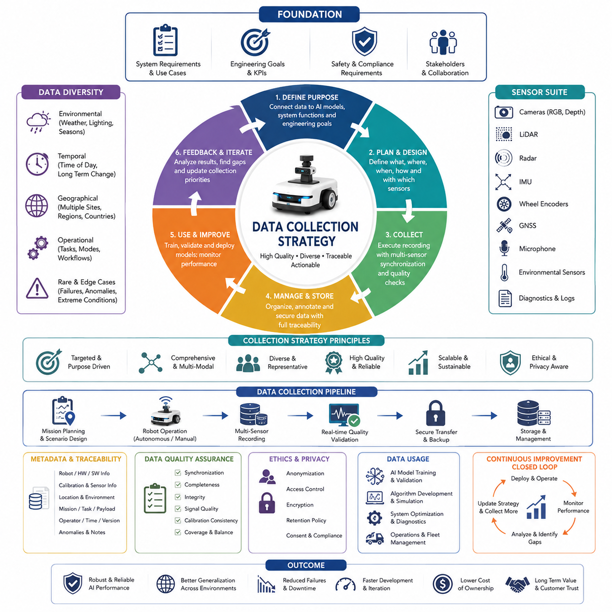
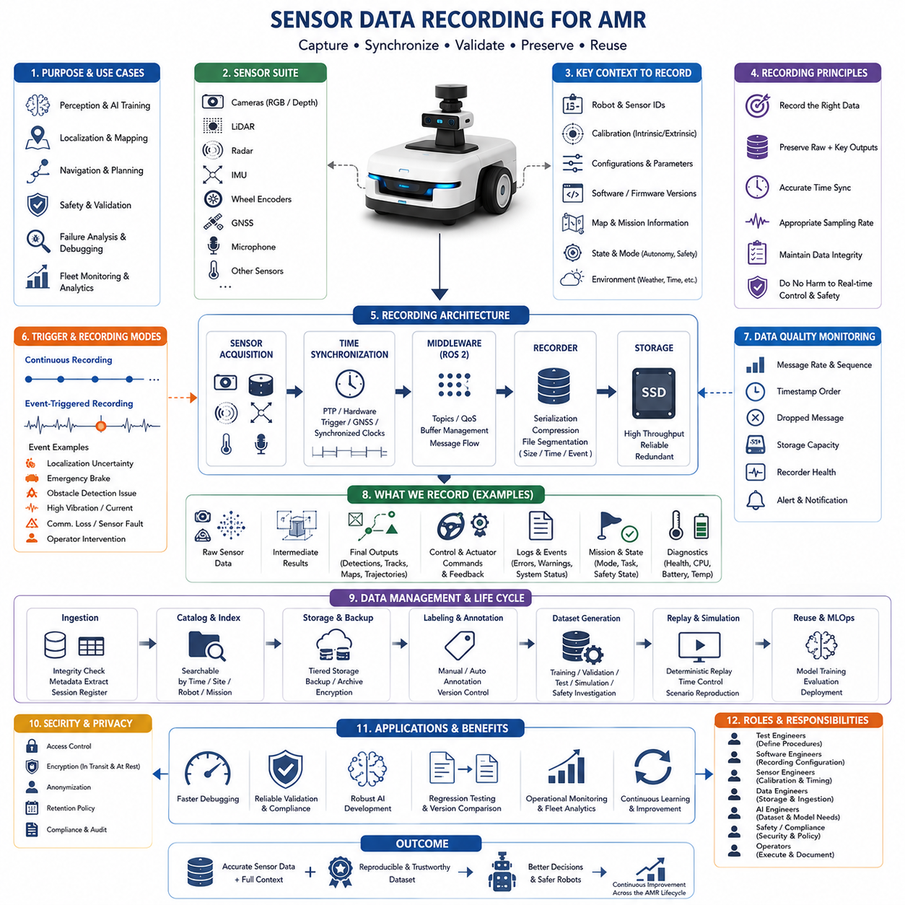
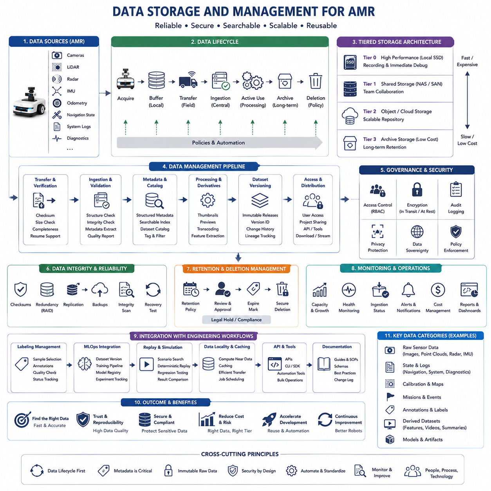
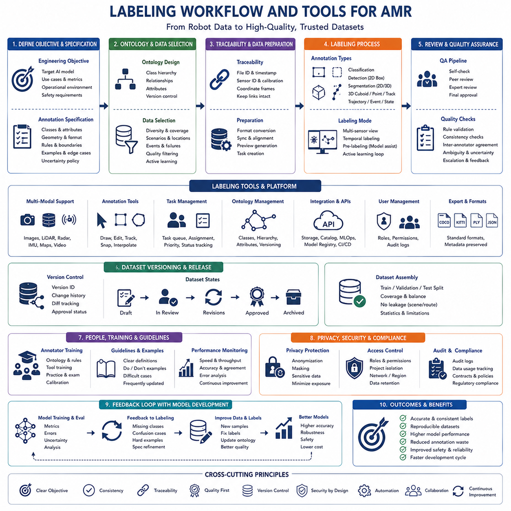
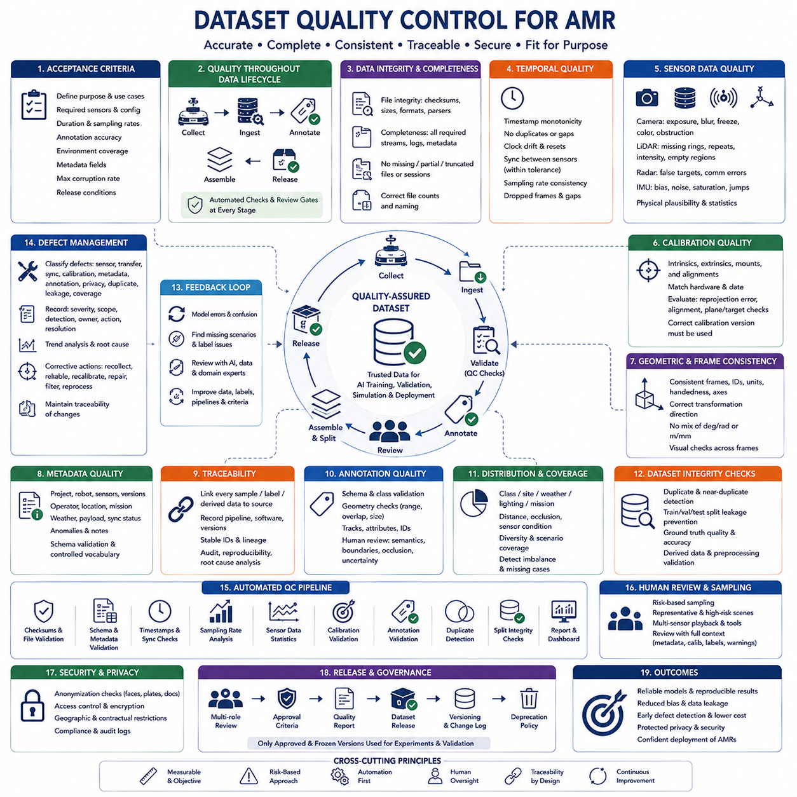
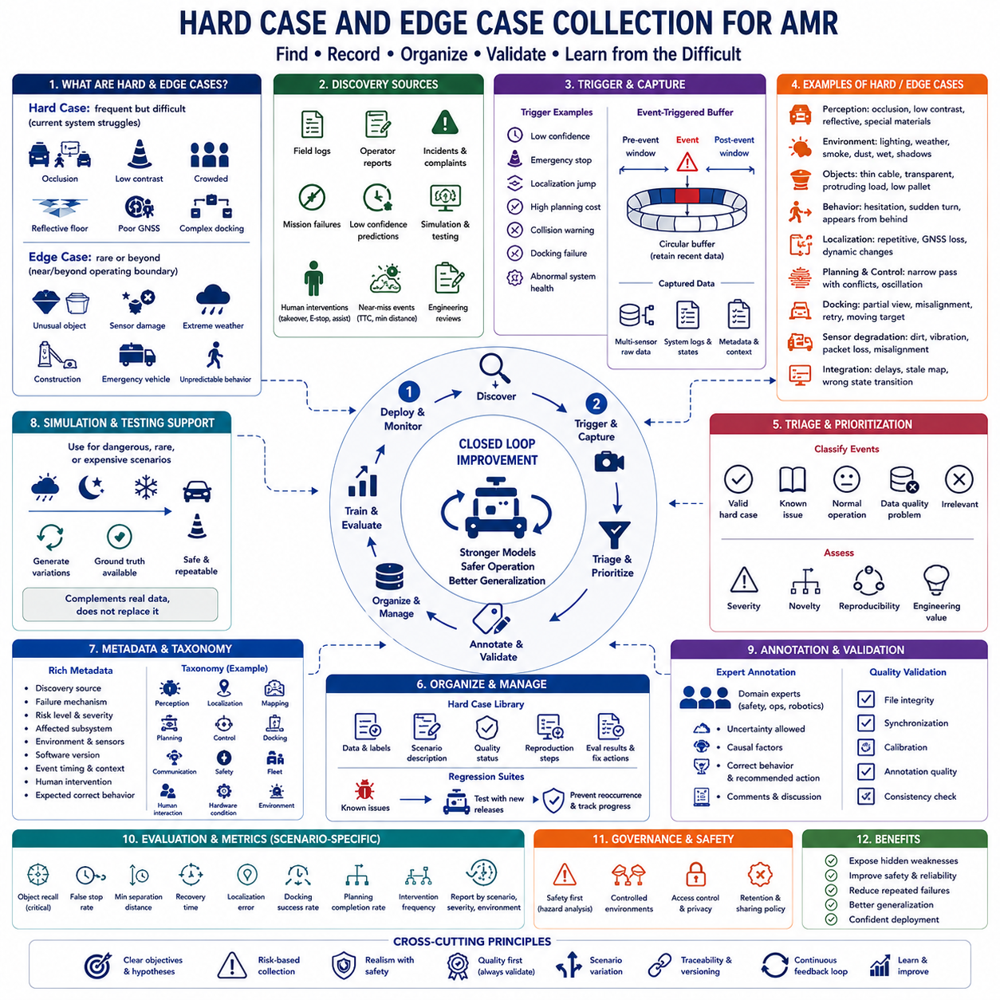
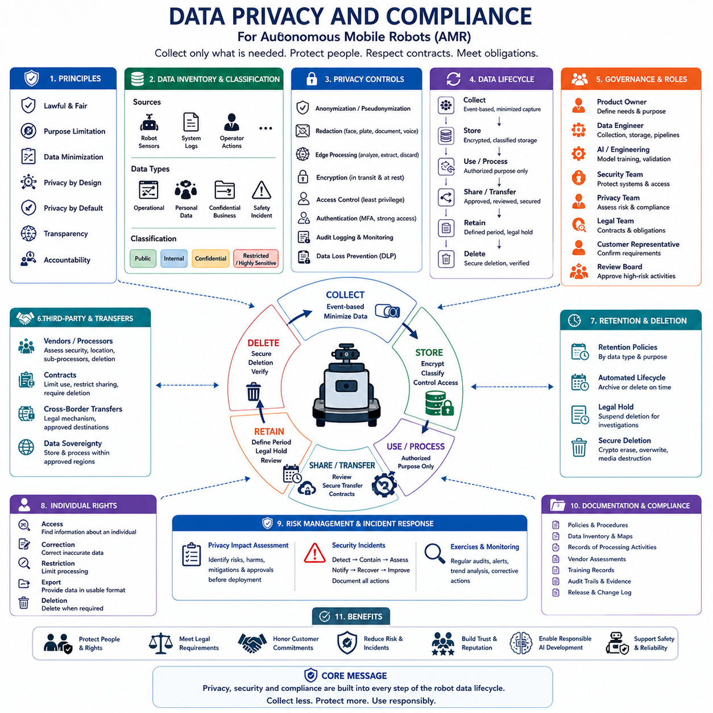
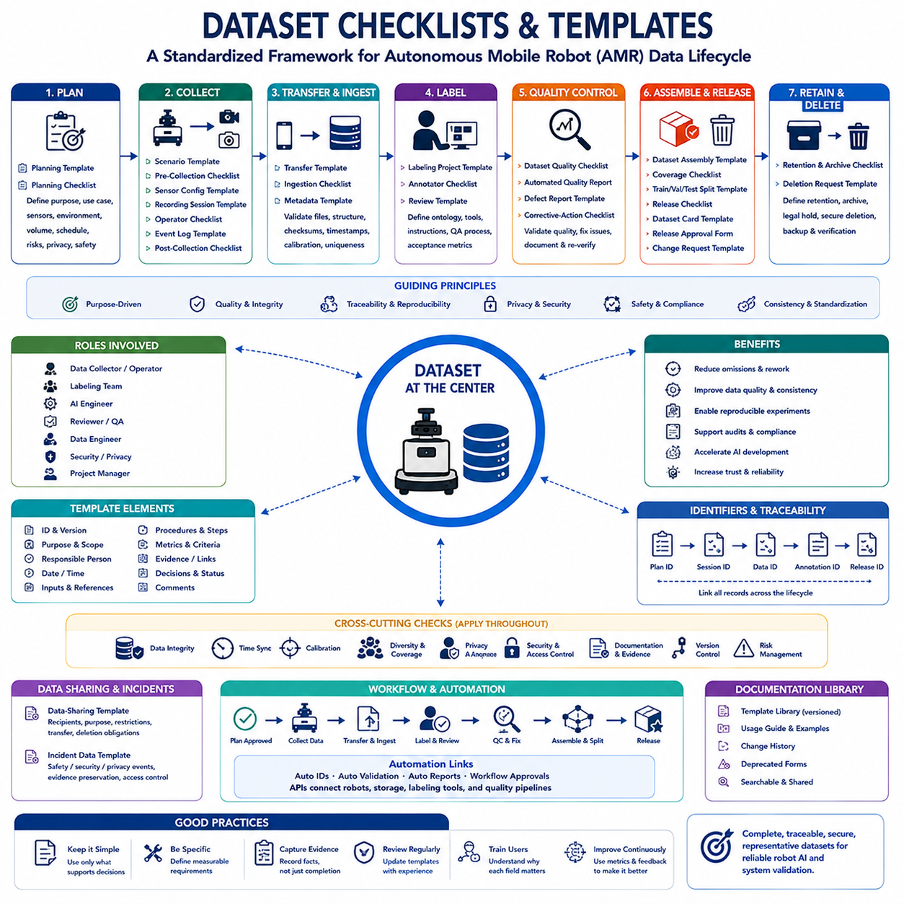

**Volume 10. AMR Engineering Process and Development Manual**

# Chapter 14. Data Collection and Labeling

## 14.01 Data Collection Strategy

{width="7.268055555555556in" height="7.268055555555556in"}

자율이동로봇(Autonomous Mobile Robot, AMR)의 모든 인공지능(AI) 기능은 데이터 수집(Data Collection)을 기반으로 구축된다. 위치추정(Localization), 인지(Perception), 장애물 회피(Obstacle Avoidance), 의미 이해(Semantic Understanding), 내비게이션(Navigation), 예지보전(Predictive Maintenance), 그리고 플릿 최적화(Fleet Optimization)는 모두 로봇이 실제 운용되는 환경을 정확하게 반영하는 데이터셋(Dataset)에 의존한다. 현대의 AI 모델(Model) 자체는 많은 관심을 받지만, 실제 자율 시스템의 성능은 신경망(Network) 구조의 미세한 개선보다 데이터의 품질(Quality), 다양성(Diversity), 일관성(Consistency), 그리고 추적성(Traceability)에 의해 더 크게 좌우된다. 따라서 체계적인 데이터 수집 전략(Data Collection Strategy)은 단순한 지원 활동이 아니라 핵심적인 엔지니어링(Engineering) 분야로 간주되어야 한다. 이 전략은 어떤 데이터를 수집할 것인지, 왜 필요한지, 어떻게 확보할 것인지, 품질을 어떻게 유지할 것인지, 그리고 생성된 데이터셋이 제품(Product)의 전체 생명주기(Lifecycle) 동안 지속적인 성능 향상을 어떻게 지원할 것인지를 정의해야 한다.

데이터 수집 전략의 가장 중요한 목적은 모든 데이터셋이 측정 가능한 엔지니어링 목표와 직접 연결되도록 만드는 것이다. 센서(Sensor)가 존재하거나 저장장치(Storage)가 충분하다는 이유만으로 데이터를 수집해서는 안 된다. 모든 데이터 수집 캠페인(Collection Campaign)은 개선이 필요한 AI 모델이나 소프트웨어 모듈(Module), 또는 시스템(System) 기능을 먼저 정의하는 것에서 시작해야 한다. 예를 들어 객체 검출(Object Detection)은 더 많은 보행자 데이터를 요구할 수 있으며, 위치추정은 다양한 조명 조건을 필요로 하고, 내비게이션은 혼잡한 환경과 동적 장애물(Dynamic Obstacle)에 대한 데이터를 요구할 수 있다. 이처럼 데이터 수집 활동을 명확한 엔지니어링 목표와 연결하면 불필요한 저장 비용을 줄일 수 있으며, 실제로 모델(Model)의 정확도(Accuracy), 강건성(Robustness), 그리고 운용 신뢰성(Reliability)을 향상시키는 데이터셋을 구축할 수 있다.

효율적인 데이터 수집 전략은 로봇이 현장(Field)에 배치된 이후가 아니라 시스템 엔지니어링(System Engineering) 단계에서부터 시작된다. 제품 요구사항(Product Requirements)은 운용 환경, 사용자, 안전 요구사항(Safety Requirements), 환경 조건(Environmental Conditions), 목표 성능 지표(Performance Metrics)를 정의하며, 이러한 요소들이 어떤 데이터를 확보해야 하는지를 자연스럽게 결정한다. 실내 물류 로봇은 좁은 통로(Narrow Aisle), 팔레트(Pallet) 인식, 반사 바닥, 작업자와의 상호작용 데이터를 필요로 한다. 반면 실외 배송 로봇은 다양한 날씨, 노면 상태, 위성항법(GNSS) 수신 상태, 계절 변화, 차량과 보행자, 그리고 시간대에 따른 조명 변화를 포함해야 한다. 산업 검사 로봇은 다양한 운용 조건에서 촬영된 고품질 이미지(Image)가 필요하다. 따라서 데이터 수집 계획은 AI만을 위한 독립적인 작업이 아니라 시스템 요구사항 엔지니어링의 연장선으로 이해되어야 한다.

포괄적인 데이터 수집 전략은 개별 센서가 아니라 전체 센서 시스템(Sensor Suite)을 대상으로 한다. 현대 AMR은 RGB 카메라(Camera), 깊이 카메라(Depth Camera), 스테레오 비전(Stereo Vision), 라이다(LiDAR), 레이더(Radar), 초음파 센서(Ultrasonic Sensor), 관성측정장치(IMU), 휠 엔코더(Wheel Encoder), 위성항법수신기(GNSS Receiver), 마이크(Microphone), 환경 센서(Environmental Sensor), 그리고 내부 진단 정보(Diagnostic Data)를 동시에 활용한다. 각각의 센서는 서로 다른 정보를 제공하며, 다른 센서의 한계를 보완한다. 따라서 데이터 수집 전략은 센서 동기화(Synchronization), 샘플링 주파수(Sampling Frequency), 캘리브레이션(Calibration), 타임스탬프(Timestamp) 정확도, 그리고 센서 상태 모니터링(Health Monitoring)까지 함께 정의해야 한다. 이러한 다중 센서(Multi-Sensor) 기록은 향후 센서 융합(Sensor Fusion) 알고리즘 개발과 새로운 AI 모델 적용을 가능하게 한다.

데이터셋에서 가장 중요한 품질 요소 중 하나는 다양성(Diversity)이다. 이상적인 조건에서만 학습된 AI 시스템은 실제 환경의 다양한 변수에 직면하면 쉽게 성능이 저하된다. 따라서 데이터는 계절(Season), 기상(Weather), 온도(Temperature), 시간(Time of Day), 조명(Illumination), 주행 속도(Speed), 적재 중량(Payload), 바닥 재질(Floor Material), 노면 상태(Road Surface), 교통 밀도(Traffic Density), 그리고 환경 복잡도(Environment Complexity)를 모두 포함하도록 계획적으로 수집되어야 한다. 로봇은 정상적인 작업뿐 아니라 예외적인 상황에서도 데이터를 확보해야 하며, 데이터셋의 가치는 단순한 데이터 양이 아니라 다양한 운용 경험을 얼마나 폭넓게 포함하는지에 의해 결정된다.

시간적 다양성(Temporal Diversity) 또한 매우 중요하다. 산업 시설은 설비 이동, 재고 변화, 임시 장애물 설치, 유지보수 작업 등으로 지속적으로 변화한다. 실외 환경 역시 식생 변화, 강설, 강우, 도로 공사, 교통 패턴 변화, 계절별 조명 변화가 반복된다. 특정 시기에만 수집된 데이터는 시간이 지나면서 빠르게 가치가 감소할 수 있다. 따라서 장기적인 데이터 수집 전략은 수개월 또는 수년에 걸쳐 정기적인 데이터 수집 캠페인을 수행하여 위치추정(Localization), 지도(Map), 그리고 인지 모델이 환경 변화에도 지속적으로 높은 성능을 유지할 수 있도록 해야 한다.

지역적 다양성(Geographical Diversity)도 데이터셋의 일반화 성능을 높이는 핵심 요소이다. 전 세계를 대상으로 배포될 로봇은 하나의 공장이나 창고, 도시에서만 수집된 데이터에 의존해서는 안 된다. 국가마다 도로 표시, 건축 양식, 표지판, 언어, 건축 자재, 안전 규정, 기후 조건, 그리고 작업 방식이 모두 다르다. 동일한 기업의 생산 공장이라 하더라도 레이아웃(Layout)과 작업 절차는 크게 달라질 수 있다. 따라서 여러 지역에서 데이터를 확보하는 전략은 특정 환경에 대한 과적합(Overfitting)을 줄이고 다양한 현장에서도 안정적으로 동작하는 AI를 만드는 데 기여한다.

운용 다양성(Operational Diversity)도 의도적으로 포함되어야 한다. 자율 로봇은 지도 작성(Mapping), 자율 주행(Autonomous Navigation), 수동 조작(Teleoperation), 유지보수(Maintenance), 도킹(Docking), 충전(Charging), 장애물 회피, 비상 정지(Emergency Stop), 장애 복구(Recovery), 그리고 소프트웨어 업데이트(Update) 등 매우 다양한 상태를 경험한다. 데이터는 로봇 상태 기계(State Machine)에 정의된 모든 운용 상태를 포함해야 한다. 정상적인 자율 주행 데이터만 수집하면 시스템의 실제 동작을 충분히 이해할 수 없으며, 장애 복구 과정이나 운영자의 개입, 오류 상황은 오히려 신뢰성 향상을 위한 가장 중요한 데이터가 되는 경우가 많다.

희귀 상황(Rare Event)은 발생 빈도는 낮지만 실제 시스템 실패의 상당 부분을 차지하기 때문에 별도의 전략이 필요하다. 예상하지 못한 보행자 행동, 센서 고장, 폭우, 안개, 미끄러운 노면, 공사 구간, 긴급 차량, 임시 장애물, GPS 수신 불량, 강한 반사체, 복잡한 교통 환경, 하드웨어 성능 저하 등이 대표적인 사례이다. 이러한 상황은 일반적인 운용 과정에서는 거의 발생하지 않으므로 별도의 데이터 수집 캠페인이나 시뮬레이션(Simulation)을 통해 적극적으로 확보해야 한다. 잘 구성된 엣지 케이스(Edge Case) 데이터셋은 일반 데이터를 무작정 늘리는 것보다 AI의 강건성을 훨씬 효과적으로 향상시킨다.

데이터 수집 전략은 엔지니어링 가치에 따라 우선순위(Priority)를 명확히 정의해야 한다. 초기 개발 단계에서는 다양한 환경을 폭넓게 확보하여 기본적인 모델 성능을 구축하는 것이 중요하다. 제품이 성숙해질수록 우선순위는 실제 현장에서 발견된 실패 사례와 어려운 상황으로 이동한다. 이후의 데이터 수집은 AI 신뢰도(Confidence)가 낮아지는 상황, 위치 오차가 증가하는 환경, 내비게이션 실패 사례 등에 집중된다. 이러한 반복적 개선(Iterative Improvement)은 개발 자원을 가장 효과적으로 활용할 수 있도록 해준다.

메타데이터(Metadata) 관리는 전문적인 데이터 수집 전략에서 필수적인 요소이다. 모든 데이터 기록에는 로봇 식별자(Robot ID), 하드웨어 구성(Hardware Configuration), 소프트웨어 버전(Software Version), 캘리브레이션 정보, 센서 사양, 펌웨어(Firmware) 버전, 작업자 정보, 위치 정보, 환경 조건, 미션(Mission) 종류, 적재 상태, 기록 시간, 그리고 특이 사항 등이 함께 저장되어야 한다. 풍부한 메타데이터는 방대한 데이터를 검색 가능한 엔지니어링 자산으로 전환하며, 데이터셋 필터링, 실험 재현(Reproducibility), 규제 대응, 그리고 향후 문제 분석을 크게 용이하게 만든다.

데이터 품질(Quality)은 수집이 완료된 이후가 아니라 수집 과정에서 즉시 검증되어야 한다. 자동화된 검증 시스템은 센서 동기화 정확도, 센서 동작 여부, 프레임(Frame) 손상, 저장 상태, 타임스탬프 연속성, 캘리브레이션 일관성, 신호 품질, 기록 시간 등을 자동으로 검사할 수 있다. 손상된 파일, 누락된 센서 데이터, 불안정한 시간 동기화, 하드웨어 오류를 조기에 발견하면 현장 작업을 다시 수행하는 비용을 크게 줄일 수 있으며, 이후 AI 개발 과정에서도 많은 시간을 절약할 수 있다.

저장 구조(Storage Architecture)는 대규모 데이터 수집 이전에 반드시 설계되어야 한다. 자율 로봇은 짧은 운용 시간 동안에도 수 테라바이트(Terabyte)의 데이터를 생성할 수 있다. 따라서 압축(Compression), 파일 구조(File Structure), 디렉터리 구조(Directory Structure), 파일 명명 규칙(Naming Convention), 백업(Backup), 장기 보관(Archive), 클라우드 동기화(Cloud Synchronization), 데이터 보존 정책(Retention Policy) 등을 사전에 정의해야 한다. 체계적인 저장 구조는 특정 상황의 데이터를 빠르게 검색할 수 있도록 하며, 로봇 수가 증가해도 확장 가능한 데이터 관리 체계를 제공한다.

데이터셋에도 소프트웨어 개발과 동일한 수준의 버전 관리(Version Control)가 적용되어야 한다. 새로운 데이터가 추가되고, 라벨(Label)이 수정되며, 오류 데이터가 제거되고, 주석 기준이 변경되면 데이터셋은 지속적으로 변화한다. 따라서 모든 데이터셋은 고유한 버전 번호(Version Identifier), 변경 이력(Change Log), 품질 지표(Quality Metrics), 그리고 재현 가능한 구성 정보를 가져야 한다. AI 모델 학습 역시 특정 데이터셋 버전을 기준으로 수행되어야만 실험 결과를 정확하게 재현하고 성능 향상을 객관적으로 검증할 수 있다.

윤리(Ethics)와 법적 요구사항(Legal Requirements)은 데이터 수집 초기 단계부터 반드시 고려되어야 한다. 공공장소 또는 반공공 환경에서 운용되는 로봇은 사람의 얼굴, 차량 번호판, 산업 기밀, 생산 공정, 고객 정보를 포함할 수 있다. 따라서 데이터 수집 전략은 익명화(Anonymization), 접근 제어(Access Control), 암호화(Encryption), 데이터 보존 기간, 사용자 동의(Consent), 개인정보 보호 규정(Privacy Regulation) 준수 등을 명확하게 정의해야 한다. 이러한 절차는 법적 요구사항을 만족시키는 동시에 고객과 사용자에게 신뢰를 제공하는 중요한 요소가 된다.

데이터 수집 전략은 여러 엔지니어링 분야가 함께 활용할 수 있도록 설계되어야 한다. 기계(Mechanical) 엔지니어는 진동(Vibration) 데이터를 이용하여 구조를 개선하고, 전기(Electrical) 엔지니어는 전력 소비와 통신 상태를 분석하며, 소프트웨어 엔지니어는 시스템 로그(System Log)와 미들웨어(Middleware) 성능을 분석한다. AI 연구자는 다중 센서 데이터를 활용하여 모델을 학습하고, 운영(Operation) 팀은 플릿(Fleet) 운영 효율성과 유지보수 성능을 분석한다. 하나의 데이터셋이 다양한 부서에서 동시에 활용될 수 있도록 설계하면 데이터 수집의 가치가 크게 향상되며 중복 작업도 줄일 수 있다.

시뮬레이션(Simulation) 역시 데이터 수집 전략의 중요한 구성 요소이다. 디지털 트윈(Digital Twin), 물리 시뮬레이터(Physics Simulator), 가상 환경(Virtual Environment)에서 생성되는 합성 데이터(Synthetic Data)는 실제 데이터와 상호 보완적인 역할을 수행한다. 시뮬레이션은 위험한 상황을 안전하게 생성하고, 희귀 상황을 반복적으로 만들며, 다양한 환경 조건을 빠르게 생성할 수 있다는 장점이 있다. 그러나 실제 센서의 노이즈(Noise)와 환경의 복잡성을 완전히 재현하기는 어렵기 때문에 합성 데이터는 실제 운용 데이터의 보완 수단으로 활용되어야 하며 이를 대체해서는 안 된다.

지속적인 개선(Continuous Improvement)은 데이터 수집을 일회성 작업이 아닌 장기적인 엔지니어링 프로세스(Engineering Process)로 만든다. 현장에 배치된 로봇은 지속적으로 새로운 데이터를 생성하며, 이를 분석하면 성능 저하, 환경 변화, 새로운 장애물 유형, 이전에 관찰되지 않았던 행동, 반복되는 실패 원인을 발견할 수 있다. 이러한 현장 피드백(Field Feedback)은 다음 데이터 수집 계획, 라벨링(Labeling), 모델 재학습(Retraining), 검증(Validation) 과정에 직접 반영되어야 한다. 이와 같은 폐쇄 루프(Closed Loop) 구조는 AI 시스템이 실제 환경 변화에 맞추어 지속적으로 발전하도록 지원한다.

궁극적으로 전문적인 데이터 수집 전략(Data Collection Strategy)은 로봇 AI 개발 파이프라인(Pipeline)의 모든 후속 작업을 지탱하는 기반이 된다. 센서 데이터 기록(Sensor Data Recording), 저장 관리(Storage Management), 라벨링(Labeling), 데이터셋 품질 관리(Quality Assurance), 엣지 케이스 수집(Edge Case Collection), 개인정보 보호(Privacy Protection), 모델 학습(Model Training), 검증(Validation), 현장 배포(Deployment), 그리고 지속적 학습(Continuous Learning)은 모두 초기 데이터 수집 전략에서 이루어진 결정에 의존한다. 데이터 수집을 체계적인 엔지니어링 프로세스로 수행하는 조직은 더 높은 신뢰성과 강건성을 갖춘 AI 시스템을 구축할 수 있으며, 개발 비용을 절감하고 모델 개선 속도를 높이는 동시에 자율이동로봇(AMR)의 전체 제품 생명주기 동안 지속적인 성능 향상을 실현할 수 있다.

## 14.02 Sensor Data Recording

{width="7.268055555555556in" height="7.268055555555556in"}

센서 데이터 기록(Sensor Data Recording)은 자율이동로봇(Autonomous Mobile Robot, AMR)이 개발, 시험, 배포 및 실제 운용 과정에서 생성하는 다양한 센서 정보를 체계적으로 수집(Capture), 시간 동기화(Synchronize), 검증(Validate), 그리고 보존(Preserve)하는 과정이다. 이는 순간적으로 발생하는 센서 신호를 반복적으로 활용 가능한 엔지니어링 증거(Engineering Evidence)로 변환하여 인지(Perception) 개발, 위치추정(Localization) 분석, 내비게이션(Navigation) 디버깅(Debugging), 안전성 검증(Safety Validation), AI 학습, 그리고 현장 장애 분석(Field Failure Investigation)을 지원한다. 따라서 데이터 기록 시스템은 단순한 진단 기능(Diagnostic Function)이 아니라 로봇 시스템 아키텍처(System Architecture)의 핵심 요소로 설계되어야 한다. 기록 시스템은 로봇이 실제로 무엇을 감지했고, 소프트웨어가 어떤 판단을 내렸으며, 물리적인 플랫폼이 어떻게 반응했는지를 정확하게 재현할 수 있어야 한다.

데이터 기록은 먼저 각 엔지니어링 목표에 필요한 센서 스트림(Sensor Stream)을 명확하게 정의하는 것에서 시작된다. 인지 개발 팀은 원본 카메라 영상(Camera Image), 포인트 클라우드(Point Cloud), 레이더(Radar) 검출 결과, 객체 추적(Object Tracking) 정보를 필요로 할 수 있으며, 위치추정 팀은 라이다(LiDAR) 스캔, 위성항법(GNSS) 측정값, 관성측정장치(IMU), 휠 오도메트리(Wheel Odometry), 지도(Map), 그리고 자세 추정(Pose Estimation)에 집중할 수 있다. 내비게이션 디버깅은 비용맵(Costmap), 계획 경로(Trajectory), 속도 명령(Velocity Command), 안전 구역 상태(Safety Zone), 구동기 피드백(Actuator Feedback)을 함께 기록해야 한다. 목적 없이 모든 데이터를 저장하면 저장 공간만 증가하고 분석 효율은 오히려 낮아진다. 따라서 기록 대상은 명확한 활용 목적, 예상되는 실패 유형(Failure Mode), 그리고 검증 기준(Validation Criteria)에 기반하여 선정되어야 한다.

향후 알고리즘(Algorithm) 개발 가능성을 고려한다면 가능한 한 원본(Raw) 센서 데이터를 보존하는 것이 바람직하다. 압축된 객체 목록(Object List)은 원본 카메라 영상을 대체할 수 없으며, 필터링된 포인트 클라우드는 약한 반사 신호를 제거하여 향후 객체 검출 실패 원인을 분석하지 못하게 만들 수 있다. 그러나 원본 데이터만 저장하면 일상적인 분석이 비효율적이 될 수도 있다. 따라서 실제 시스템에서는 원본 입력(Raw Input)과 일부 중간 처리 결과(Intermediate Output), 최종 결과(Final Output)를 함께 기록하는 방식이 많이 사용된다. 이러한 구조는 동일한 데이터를 이용하여 알고리즘 버전을 비교하고, 문제가 센서(Sensor), 전처리(Preprocessing), 인지, 센서 융합(Sensor Fusion), 경로 계획(Planning), 또는 제어(Control) 중 어느 단계에서 발생했는지를 명확하게 분석할 수 있도록 한다.

다중 센서(Multi-Sensor) 시간 동기화(Synchronization)는 센서 데이터 기록에서 가장 중요한 요구사항 가운데 하나이다. 카메라(Camera), 라이다(LiDAR), 레이더(Radar), GNSS, IMU, 휠 엔코더(Wheel Encoder), 그리고 제어 장치(Control Device)는 서로 다른 주기로 동작하며 각각 독립적인 내부 시계(Clock)를 사용할 수 있다. 타임스탬프(Timestamp)가 일치하지 않으면 개별 센서의 정확도가 높더라도 센서 융합 결과는 심각하게 왜곡될 수 있다. 따라서 기록 시스템은 PTP(Precision Time Protocol), 하드웨어 트리거(Hardware Trigger), GNSS 시간, 동기화된 임베디드 클록(Embedded Clock), 또는 ROS 2 시간 관리(Time Management)와 같은 공통 기준 시간을 사용해야 한다. 또한 클록 오프셋(Clock Offset), 드리프트(Drift), 동기화 상태, 그리고 타임스탬프 생성 방식도 함께 기록되어야 한다.

타임스탬프 품질(Timestamp Quality)은 여러 단계에서 평가되어야 한다. 센서가 실제 측정을 수행한 시점과 데이터를 전송한 시점, 드라이버(Driver)가 데이터를 수신한 시점, 미들웨어(Middleware)가 발행(Publish)한 시점, 그리고 기록 시스템이 저장한 시점은 서로 다를 수 있다. 고속 주행이나 정밀 센서 융합에서는 이러한 차이가 매우 큰 영향을 미칠 수 있다. 따라서 가능하다면 센서 획득 시각(Acquisition Time)과 소프트웨어 수신 시각(Software Receipt Time)을 구분하여 저장해야 한다. 또한 기록 지연(Latency), 메시지 큐(Queue) 지연, 메시지 손실(Dropped Message), 그리고 클록 진단 정보를 함께 기록하면 동기화 문제가 센서, 네트워크(Network), 드라이버, 미들웨어, 또는 저장 장치(Storage) 중 어느 부분에서 발생했는지를 쉽게 분석할 수 있다.

샘플링 주파수(Sampling Frequency)는 측정 대상의 특성과 활용 목적에 맞추어 결정되어야 한다. 일반적인 실내 주행에서는 초당 30프레임(Frame per Second)의 카메라 영상이 충분할 수 있지만, 고속 실외 주행에서는 더 높은 프레임 속도가 요구될 수 있다. IMU는 빠른 회전과 가속 변화를 정확하게 측정하기 위해 수백 헤르츠(Hertz)의 기록 속도가 필요하며, 반대로 온도나 배터리 상태(Battery Health)는 낮은 주기로도 충분하다. 지나치게 낮은 샘플링 속도는 중요한 현상을 놓칠 수 있으며, 반대로 과도하게 높은 속도는 저장 공간과 시스템 부하를 증가시킨다. 따라서 각 센서 스트림은 적절한 목표 주기와 허용 오차(Tolerance)를 명확하게 정의해야 한다.

데이터 기록은 센서 설정(Configuration)과 기록된 데이터 간의 관계도 반드시 보존해야 한다. 카메라의 노출(Exposure), 게인(Gain), 초점(Focus), 해상도(Resolution), 프레임 속도(Frame Rate), 압축 방식(Compression Mode), 이미지 포맷(Image Format)은 영상 품질에 직접적인 영향을 미친다. 라이다는 반환 모드(Return Mode), 스캔 패턴(Scan Pattern), 강도(Intensity), 회전 속도(Rotation Rate), 필터(Filter) 설정에 따라 포인트 클라우드가 달라질 수 있다. 레이더 또한 탐지 임계값(Detection Threshold)과 추적(Tracking) 설정이 결과에 영향을 준다. 따라서 기록 세션(Session)이 시작될 때와 설정이 변경될 때마다 이러한 구성 정보를 함께 저장해야 하며, 그렇지 않으면 환경 변화와 센서 설정 변화를 구분하기 어려워진다.

캘리브레이션(Calibration) 정보도 데이터 기록의 핵심 요소이다. 내부 캘리브레이션(Intrinsic Calibration)은 센서 자체의 측정 특성을 정의하고, 외부 캘리브레이션(Extrinsic Calibration)은 센서가 로봇 좌표계(Coordinate System)에서 어느 위치와 방향에 장착되어 있는지를 정의한다. 카메라 왜곡(Distortion), 라이다 정렬(Alignment), IMU 방향, GNSS 안테나 위치, 휠 기하(Wheel Geometry), 레이더 장착 각도는 모두 후속 처리 결과에 영향을 미친다. 따라서 기록 데이터는 해당 세션에서 사용된 정확한 캘리브레이션 버전을 참조해야 하며, 가능하면 변환 트리(Transform Tree), 좌표계 정의, 캘리브레이션 파일, 그리고 적용 기간까지 함께 저장하는 것이 바람직하다.

기록 시스템은 센서 데이터뿐 아니라 로봇의 소프트웨어와 하드웨어 환경도 함께 저장해야 한다. 센서 데이터만으로는 로봇이 특정한 행동을 수행한 이유를 설명할 수 없다. 따라서 데이터셋에는 로봇 모델(Model), 센서 일련번호(Serial Number), 컴퓨팅 플랫폼(Compute Platform), 펌웨어(Firmware), 운영체제(Operating System), 미들웨어 설정, 드라이버 버전, AI 모델 버전, 내비게이션 파라미터(Parameter), 지도 버전(Map Version), 그리고 미션(Mission) 정의가 함께 포함되어야 한다. 이러한 정보는 시간이 지나도 동일한 환경을 재현하고 소프트웨어 버전 간 성능을 비교하는 데 필수적이다.

ROS 2 기반 시스템에서는 일반적으로 Bag 파일(Bag File)을 이용하여 데이터를 기록하지만, 기록 구조는 기본 기능만으로 충분하지 않다. 토픽(Topic) 선택, QoS(Quality of Service), 직렬화(Serialization), 저장 플러그인(Storage Plugin), 파일 분할(File Splitting), 압축(Compression), 그리고 재생(Replay) 호환성은 모두 사전에 설계되어야 한다. 신뢰형(Reliable) QoS와 Best-Effort QoS는 네트워크 부하 상황에서 서로 다른 동작을 보일 수 있으며, 대용량 영상과 포인트 클라우드는 저장 성능이 부족할 경우 메시지 큐를 쉽게 가득 채울 수 있다. 따라서 기록 시스템은 실제 최고 부하(Peak Load) 환경에서도 로봇의 제어(Control)와 안전(Safety)에 영향을 주지 않는지 충분히 검증되어야 한다.

여러 개의 고대역폭 센서가 동시에 동작하는 경우 저장 장치(Storage)의 처리량(Throughput)은 매우 중요한 요소가 된다. 다수의 카메라, 고해상도 라이다, 레이더, 오디오(Audio), 시스템 로그(System Log)는 지속적으로 매우 높은 데이터 전송률(Data Rate)을 생성할 수 있다. 따라서 평균 및 최대 대역폭(Bandwidth), 프로토콜 오버헤드(Protocol Overhead), 순간적인 데이터 폭주(Burst)를 미리 계산해야 한다. SSD(Solid State Drive), 전용 기록 드라이브(Dedicated Recording Drive), 메모리 버퍼(Buffer), 최적화된 파일 포맷(File Format), 그리고 적절한 압축 기법은 이러한 문제를 해결하는 데 도움이 된다. 저장 장치는 노후화, 열에 의한 성능 저하(Thermal Throttling), 파일 시스템 단편화(Fragmentation), 다른 프로그램의 접근이 발생해도 충분한 여유를 유지해야 한다.

압축(Compression)은 저장 효율, 처리 부하, 그리고 정보 보존 간의 균형을 고려해야 한다. 무손실 압축(Lossless Compression)은 모든 센서 값을 정확하게 유지하지만 압축률은 제한적일 수 있다. 반대로 손실 압축(Lossy Compression)은 저장 공간을 크게 줄일 수 있지만, 미세한 결함(Defect), 원거리 객체, 저조도(Low Light) 정보 등을 제거하여 향후 AI 학습이나 분석에 불리할 수 있다. 따라서 개발(Development), 검증(Validation), 현장 모니터링(Field Monitoring), 사고 분석(Incident Investigation) 등 목적에 따라 서로 다른 기록 프로파일(Profile)을 사용하는 것이 일반적이며, 압축 방식과 품질 수준(Quality Level)은 반드시 기록되어야 한다.

파일 분할(File Segmentation)은 장시간 데이터 기록의 안정성과 관리 효율성을 높여준다. 하나의 매우 큰 파일은 손상(Corruption) 시 복구가 어렵고 전송이나 재생도 불편하다. 따라서 시간(Duration), 파일 크기(Size), 미션 단계(Mission Stage), 또는 이벤트(Event)를 기준으로 파일을 분할하면 장애 발생 시 영향을 최소화할 수 있다. 단, 중요한 사건이 파일 경계에서 잘리지 않도록 설계해야 하며, 필요하다면 이벤트 전후 수 초를 중첩 저장하는 버퍼(Buffer)를 사용하여 상황의 전체 흐름을 보존해야 한다.

지속적인 기록(Continuous Recording)은 개발 단계에서는 매우 유용하지만 대규모 플릿(Fleet) 운영에서는 비효율적일 수 있다. 이벤트 기반 기록(Event-Triggered Recording)은 위치추정 불확실성(Localization Uncertainty), 비상 제동(Emergency Braking), 반복적인 경로 재계획(Path Replanning), 장애물 검출 오류, 과도한 진동(Vibration), 통신 장애, 모터 과전류(Overcurrent), 센서 성능 저하, 운영자 개입(Operator Intervention)과 같은 의미 있는 상황에서만 데이터를 저장한다. 순환 버퍼(Circular Buffer)를 이용하면 장애가 발생하기 이전의 데이터도 함께 저장할 수 있으므로 원인 분석에 매우 효과적이다.

트리거(Trigger) 조건은 중요한 이벤트를 놓치지 않으면서도 불필요한 기록이 과도하게 발생하지 않도록 설계되어야 한다. 단일 센서 값만을 기준으로 판단하면 정상 상황도 오류로 인식될 수 있다. 따라서 여러 개의 신호, 지속 시간(Duration), 신뢰도(Confidence), 상태 전이(State Transition), 미션 상황(Mission Context)을 함께 고려하는 복합 조건이 더욱 안정적이다. 예를 들어 위치추정 공분산(Covariance)이 증가하더라도 스캔 매칭(Scan Matching) 실패나 경로 이탈(Path Deviation)이 동시에 발생할 때만 의미 있는 이벤트로 판단할 수 있다. 이러한 트리거 정의는 버전 관리(Version Control)를 수행하고 과거 데이터를 이용하여 충분히 검증되어야 한다.

데이터 기록 프로파일(Recording Profile)은 AMR 개발 단계에 따라 달라져야 한다. 초기 프로토타입(Prototype) 개발에서는 가능한 모든 센서를 기록하여 다양한 상호작용을 분석한다. 시스템 통합(System Integration) 단계에서는 인터페이스(Interface), 타이밍(Timing), 장애 분석(Failure Diagnosis)에 집중한다. 공식 검증(Formal Validation) 단계에서는 요구사항 검증을 위한 필수 신호만을 안정적으로 기록한다. 양산(Product) 로봇에서는 경량 운영 프로파일(Lightweight Profile)과 이벤트 기반 고해상도 기록(Event-Triggered High Resolution Recording)을 함께 사용하는 것이 일반적이다. 이러한 표준화는 서로 다른 팀과 현장의 데이터를 비교 가능하게 만든다.

데이터 무결성(Data Integrity)은 기록 이후가 아니라 기록 중에 확인되어야 한다. 시스템은 메시지 발생률(Message Rate), 순서(Sequence), 파일 크기(File Growth), 저장 공간(Storage Capacity), 센서 상태, 타임스탬프 순서, 체크섬(Checksum), 기록기(Recorder) 상태를 지속적으로 모니터링해야 한다. 필수 센서가 기록되지 않거나 저장 성능이 저하되면 운영자에게 즉시 경고해야 한다. 자동 검증을 통해 모든 필수 토픽(Topic)이 정상적으로 기록되었는지 확인하면 중요한 현장 시험(Field Test)이 무효가 되는 상황을 예방할 수 있다.

기록 시스템은 내비게이션, 제어, 그리고 안전 소프트웨어의 실시간 성능(Real-Time Performance)을 절대 방해해서는 안 된다. 대용량 데이터를 저장하는 과정은 CPU, 메모리, 네트워크, 저장 장치에 큰 부하를 줄 수 있다. 기록기가 제어 소프트웨어와 동일한 컴퓨터에서 실행되는 경우에는 자원(Resource) 제한과 스케줄링(Scheduling)을 이용하여 제어 기능을 보호해야 한다. 고성능 개발 플랫폼에서는 별도의 기록용 컴퓨터를 사용하는 것도 좋은 방법이다. 어떤 경우에도 데이터 저장이 로봇의 안전보다 우선되어서는 안 되며, 자원이 부족할 경우에는 기록 품질을 단계적으로 낮추더라도 제어 안정성은 반드시 유지되어야 한다.

네트워크 기반 기록(Network-Based Recording)은 추가적인 설계 고려가 필요하다. 센서는 이더넷(Ethernet), CAN, 시리얼(Serial), USB, 전용 캡처 하드웨어(Capture Hardware)를 통해 데이터를 전송한다. 패킷 손실(Packet Loss), 스위치 혼잡(Switch Congestion), 멀티캐스트(Multicast), 케이블 이상, QoS 설정은 모두 기록 결과에 영향을 줄 수 있다. 중앙 집중형 기록(Centralized Recording)은 관리가 쉽지만 병목(Bottleneck)이 발생할 수 있으며, 분산 기록(Distributed Recording)은 네트워크 부하를 줄일 수 있지만 이후 동기화와 파일 통합이 필요하다. 따라서 기록 구조는 로봇의 컴퓨팅 구조와 센서 대역폭에 맞추어 설계되어야 한다.

센서 데이터와 함께 운영 로그(Operational Log)도 반드시 기록되어야 한다. 운영 로그에는 노드(Node) 상태, 경고(Warning), 예외(Exception), 안전 이벤트(Safety Event), 미션 전환(Mission Transition), 운영자 명령, 네트워크 상태, CPU 및 GPU 사용률, 메모리 상태, 온도(Thermal Condition), 배터리 상태, 모터 전류, 통신 오류 등이 포함된다. 타임스탬프와 심각도(Level), 컴포넌트(Component) 식별자, 이벤트 코드(Event Code)를 갖춘 구조화된 로그(Structured Log)는 일반 텍스트보다 훨씬 높은 분석 가치를 제공한다. 이러한 로그와 센서 데이터를 함께 분석하면 시스템 이상이 발생한 전체 과정을 정확하게 재구성할 수 있다.

미션(Mission)과 상태(State) 정보 역시 함께 저장되어야 한다. 동일한 센서 데이터라도 로봇이 지도 작성(Mapping), 자율 주행(Navigation), 도킹(Docking), 충전(Charging), 대기(Waiting), 후진(Reversing), 장애 복구(Recovery), 또는 수동 조작(Manual Control) 상태인지에 따라 의미가 달라진다. 따라서 현재 미션, 작업(Task) 번호, 목적지(Destination), 경로(Route), 적재 상태(Payload), 자율 모드(Autonomy Mode), 안전 상태(Safety State), 운영자 개입 여부 등을 함께 기록하면 특정 상황만 선택하여 분석할 수 있다.

AI 모델 평가(Model Evaluation)나 위치추정 성능 비교(Benchmarking)를 위해서는 기준 데이터(Ground Truth)가 필요할 수 있다. 모션 캡처(Motion Capture), 측량된 기준점(Surveyed Landmark), 고정밀 GNSS, 기준 타깃(Target), 정밀 계측 장비, 수동 라벨링(Manual Annotation), 독립 추적 시스템(Independent Tracking System) 등이 이에 사용된다. 기준 데이터 역시 로봇 데이터와 정확하게 동기화되어야 하며, 자체 오차(Uncertainty)도 함께 기록되어야 한다. 기준 데이터가 완벽하다고 가정해서는 안 되며, 사용된 장비와 좌표계(Coordinate System), 캘리브레이션 방법도 함께 문서화되어야 한다.

개인정보 보호(Privacy)와 보안(Security)은 데이터 기록과 저장 과정 전체에 영향을 미친다. 카메라 영상과 오디오 데이터에는 사람의 얼굴, 차량 번호판, 생산 공정, 문서, 고객 자산 등이 포함될 수 있다. 따라서 기록 시스템은 암호화(Encryption), 접근 제어(Access Control), 안전한 전송(Secure Transfer), 보존 기간(Retention Period), 익명화(Anonymization)를 지원해야 한다. 민감한 데이터는 개인 저장장치나 관리되지 않는 클라우드 서비스에 자유롭게 복사되어서는 안 되며, 누가 데이터를 수집하고 접근하며 재사용할 수 있는지를 명확하게 정의해야 한다.

표준화된 파일 이름(Naming Convention)과 디렉터리 구조(Directory Structure)는 데이터 활용성을 크게 향상시킨다. 기록 세션(Session)은 날짜(Date), 현장(Site), 로봇(Robot), 미션(Mission), 소프트웨어 버전, 수집 목적 등을 포함하는 식별자를 사용할 수 있다. 그러나 파일 이름에는 불필요한 민감 정보를 포함하지 않는 것이 바람직하다. 상세한 메타데이터는 별도의 매니페스트 파일(Manifest File)에 저장하고, 자동화 도구를 이용하여 디렉터리 생성, 필수 정보 확인, 체크섬 계산, 세션 요약을 수행하면 대규모 데이터 관리가 훨씬 쉬워진다.

데이터가 수집된 이후에는 엔지니어링 활용 전에 데이터 적재(Ingestion) 과정을 거쳐야 한다. 이 과정에서는 파일 무결성 검사, 메타데이터 추출, 통계 계산, 미리보기(Preview) 생성, 손상된 프레임(Frame) 탐지, 토픽 발생률 분석, 중앙 카탈로그(Catalog) 등록 등이 수행된다. 또한 원본 데이터를 보호된 저장소에 복사하고 빠른 검토를 위한 저해상도 파생 데이터(Derivative Data)를 생성할 수도 있다. 원본 데이터를 변경하지 않고 별도의 가공 데이터를 생성하면 재현 가능한 분석(Reproducible Analysis)이 가능해진다.

센서 데이터를 체계적으로 기록하는 가장 큰 이유 중 하나는 재생(Replay) 기능이다. 엔지니어는 기록된 데이터를 이용하여 인지, 위치추정, 내비게이션 알고리즘에 동일한 입력을 반복적으로 제공할 수 있어야 한다. 비동기 실행(Asynchronous Execution), 랜덤(Random) 초기화, GPU 가속, 외부 서비스 등으로 인해 완전한 결정론적 재생(Deterministic Replay)은 어려울 수 있지만, 잘 설계된 기록 시스템은 반복 가능한 시험 환경을 제공한다. 재생 시스템은 시간 제어(Time Control), 토픽 변경(Remapping), 선택적 재생, 파라미터(Parameter) 교체, 알고리즘 버전 비교를 지원해야 한다.

기록 데이터는 회귀 시험(Regression Testing)에도 매우 중요한 역할을 한다. 새로운 센서 드라이버, AI 모델, 위치추정 알고리즘, 또는 내비게이션 파라미터가 적용될 때 기존 기록 데이터를 자동으로 재생하여 성능 변화를 비교할 수 있다. 회귀 데이터셋은 정상 운용뿐 아니라 어려운 환경과 과거 실패 사례도 반드시 포함해야 한다. 객체 검출 정확도, 위치 오차, 처리 지연(Latency), 경로 안정성(Path Stability), 안전 이벤트, 자원 사용량(Resource Usage) 등을 버전 간 비교하면 현장 데이터가 장기적인 검증 자산으로 활용될 수 있다.

센서 데이터 기록은 데이터 관리(Data Management)와 머신러닝 운영(MLOps)과 통합될 때 가장 큰 가치를 가진다. 기록된 세션(Session)은 검색(Indexing), 필터링(Filtering), 라벨링(Labeling), 변환(Transformation)을 거쳐 학습(Training), 검증(Validation), 시험(Test), 시뮬레이션(Simulation), 안전 분석(Safety Investigation)에 활용될 수 있다. AI 모델 모니터링(Model Monitoring)은 신뢰도가 낮거나 이상 상황(Unusual Situation)을 자동으로 탐지하여 원본 기록 데이터와 연결할 수 있으며, 재학습(Retraining) 이후 동일한 데이터로 다시 평가하여 승인 절차를 거친 후 배포할 수 있다. 따라서 센서 데이터 기록은 지속적 학습(Continuous Learning)의 첫 번째 단계가 된다.

성숙한 데이터 기록 프로세스(Process)는 명확한 역할과 책임(Roles and Responsibilities)을 포함해야 한다. 시험 엔지니어(Test Engineer)는 데이터 수집 절차를 정의하고, 소프트웨어 팀은 기록 설정을 관리하며, 센서 엔지니어는 캘리브레이션과 시간 동기화를 확인한다. 데이터 엔지니어(Data Engineer)는 저장과 적재(Ingestion)를 담당하고, AI 팀은 데이터 요구사항을 정의하며, 안전 및 규정 준수(Compliance) 팀은 민감한 정보를 관리한다. 운영자는 기록 시작과 종료, 상태 확인, 세션 문서화 절차를 쉽게 수행할 수 있어야 하며, 자동화는 사람의 실수를 줄여주지만 최종적인 책임은 여전히 담당자에게 있다.

궁극적으로 센서 데이터 기록(Sensor Data Recording)은 자율 로봇이 외부 세계와 상호작용한 모든 과정을 사실 그대로 보존하는 디지털 이력(Digital History)이다. 정확한 시간 동기화, 완전한 메타데이터, 검증된 무결성, 충분한 저장 성능, 안전한 저장 구조, 그리고 신뢰성 있는 재생 기능을 갖춘 기록 시스템은 정상 동작과 실패 사례 모두를 정확하게 분석할 수 있게 한다. 이러한 시스템은 물리적인 센서 입력과 소프트웨어의 의사결정, 시스템 성능, 그리고 실제 운용 결과를 하나의 연결된 데이터로 만들어 준다. 체계적인 기록 아키텍처(Recording Architecture)는 디버깅 시간을 단축하고, AI 개발을 가속화하며, 검증과 안전성 확보를 강화하고, 자율이동로봇(AMR)의 전체 제품 생명주기(Product Lifecycle)에 걸친 지속적인 성능 향상을 가능하게 한다.

## 14.03 Data Storage and Management

{width="7.268055555555556in" height="7.268055555555556in"}

데이터 저장 및 관리(Data Storage and Management)는 로봇이 수집한 정보를 신뢰할 수 있고, 검색 가능하며, 반복적으로 활용 가능한 엔지니어링 자산(Engineering Asset)으로 전환하는 기반 인프라(Infrastructure)를 제공한다. 자율이동로봇(Autonomous Mobile Robot, AMR)은 카메라(Camera) 영상, 포인트 클라우드(Point Cloud), 레이더(Radar) 측정값, 관성측정장치(IMU) 신호, 오도메트리(Odometry), 내비게이션 상태(Navigation State), 시스템 로그(System Log), 진단 데이터(Diagnostic Data) 등 방대한 양의 데이터를 지속적으로 생성한다. 이러한 데이터를 체계적으로 관리하지 않으면 기록은 단순한 파일 조각으로 흩어져 재사용과 분석이 어려워진다. 따라서 저장 시스템은 데이터 무결성(Data Integrity)을 유지하고, 상황 정보를 함께 보존하며, 접근을 통제하고, 효율적인 검색을 지원하며, 개발부터 검증, 배포, 장기 운용에 이르기까지 데이터가 지속적으로 활용될 수 있도록 설계되어야 한다.

저장 시스템(Storage System)의 설계는 저장 장치(Storage Hardware)를 선택하는 것보다 먼저 데이터 생명주기(Data Lifecycle)를 정의하는 것에서 시작해야 한다. 엔지니어는 데이터가 로봇에서 생성된 이후 임시 버퍼(Buffer), 현장 전송(Field Transfer), 중앙 적재(Central Ingestion), 활성 처리(Active Processing), 장기 보관(Long-Term Archive), 최종 삭제(Deletion)에 이르기까지 어떤 경로를 거치는지를 미리 계획해야 한다. 생명주기의 각 단계는 속도(Speed), 비용(Cost), 신뢰성(Reliability), 접근성(Accessibility)에 대한 요구사항이 다르다. 최근 기록은 빠른 디버깅(Debugging)을 위해 고성능 저장 장치를 사용할 수 있지만, 검증이 완료된 오래된 데이터는 저비용 장기 보관 장치로 이동할 수 있다. 이러한 생명주기를 미리 정의하면 불필요한 데이터 복제를 방지하고 중요한 데이터의 활용성을 장기간 유지할 수 있다.

저장 용량(Capacity) 계획은 매우 중요하다. 다중 센서(Multi-Sensor)를 사용하는 로봇은 짧은 기간에도 수 테라바이트(Terabyte)의 데이터를 생성할 수 있다. 저장 용량을 계산할 때는 카메라 수, 해상도(Resolution), 프레임 속도(Frame Rate), 라이다(LiDAR) 구성, 레이더 출력, 진단 로그, 압축 방식(Compression Method), 기록 시간, 로봇 수, 그리고 운용 빈도를 모두 고려해야 한다. 평균 데이터 발생량만으로는 충분하지 않으며, 순간적인 데이터 폭주(Burst)와 반복적인 수집 캠페인(Collection Campaign)도 반영해야 한다. 또한 백업(Backup), 복제(Replication), 파생 데이터셋(Derived Dataset), 라벨링(Labeling) 및 AI 학습 과정에서 생성되는 임시 파일까지 포함하여 현실적인 성장 계획(Growth Forecast)을 수립해야 한다.

계층형 저장 구조(Tiered Storage Architecture)는 성능과 비용의 균형을 제공하는 효과적인 방법이다. 고속 SSD(Solid State Drive)는 실시간 센서 기록과 즉각적인 디버깅을 지원하고, NAS(Network Attached Storage)는 여러 엔지니어가 데이터를 공유할 수 있도록 한다. 객체 저장소(Object Storage)나 클라우드(Cloud)는 확장 가능한 중앙 저장소 역할을 수행하며, 장기 보관 장치는 접근 속도는 느리지만 높은 내구성(Durability)을 제공한다. 데이터는 연령(Age), 프로젝트 상태(Project Status), 접근 빈도(Access Frequency), 비즈니스 가치(Business Value), 규제 요구사항(Regulatory Requirement)에 따라 자동으로 저장 계층 간 이동하도록 정책을 정의해야 하며, 모든 데이터를 고성능 저장 장치에 계속 유지해서는 안 된다.

로봇 내부의 로컬 저장(Local Storage)은 높은 성능과 운용 안정성(Operational Resilience)을 동시에 만족해야 한다. 저장 장치는 선택된 모든 센서 데이터를 최고 속도로 기록하면서도 메시지 손실(Message Loss)이나 제어 소프트웨어(Control Software)에 영향을 주지 않아야 한다. 남은 저장 공간은 지속적으로 모니터링되어야 하며, 용량이 부족해지기 전에 사용자에게 경고를 제공해야 한다. 저장 공간이 부족한 경우에는 중요하지 않은 데이터 기록을 중단하거나, 기록 품질을 낮추거나, 이벤트 기반(Event-Triggered) 데이터만 유지하거나, 이미 완료된 세션(Session)을 외부 저장소로 전송하는 등의 정책을 적용할 수 있다. 어떤 경우에도 저장 공간 부족이 로봇의 안전(Safety)이나 제어 안정성을 저해해서는 안 된다.

현장 데이터 전송(Field Transfer)은 데이터 손상(Corruption)과 데이터 유실(Loss)을 방지하도록 설계되어야 한다. 대용량 기록은 유선 네트워크(Wired Network), 무선 통신(Wireless Communication), 이동식 저장장치(Removable Drive), 또는 전용 전송 스테이션(Transfer Station)을 이용하여 중앙 저장소로 복사할 수 있다. 전송 과정에서는 파일 크기(File Size), 체크섬(Checksum), 세션 완전성(Session Completeness), 메타데이터(Metadata)의 일관성을 확인한 후 원본을 삭제해야 한다. 전송이 중단된 경우에는 처음부터 다시 시작하는 것이 아니라 이어받기(Resume)를 지원해야 한다. 수동 복사보다 자동화 도구(Automation Tool)를 사용하는 것이 로그(Log) 기록, 누락 파일 확인, 중복 복사 방지, 그리고 중앙 저장소의 정상 등록 여부를 검증하는 데 훨씬 효과적이다.

중앙 적재(Ingestion) 과정은 현장에서 전송된 파일을 공식적인 데이터 자산으로 전환하는 역할을 한다. 적재 과정에서는 디렉터리 구조(Directory Structure)를 검사하고, 체크섬을 확인하며, 파일의 정상 여부를 검증하고, 메타데이터를 추출하며, 센서 스트림(Stream)의 통계를 계산하고, 세션(Session)을 검색 가능한 카탈로그(Catalog)에 등록한다. 또한 이미지 썸네일(Thumbnail), 포인트 클라우드 미리보기(Preview), 저해상도 동영상(Video), 토픽 요약(Topic Summary), 데이터 품질 보고서(Quality Report)를 자동으로 생성할 수도 있다. 검증에 실패한 데이터는 즉시 운영 데이터셋으로 포함하지 말고 별도로 분리하여 검토하도록 해야 한다.

디렉터리 구조(Directory Structure)와 파일 명명 규칙(Naming Convention)은 프로젝트(Project), 로봇(Robot), 그리고 데이터 수집 장소(Site)에 관계없이 일관성을 유지해야 한다. 일반적으로 프로젝트, 장소, 로봇 ID, 날짜(Date), 미션(Mission), 기록 번호를 기준으로 세션을 구성할 수 있다. 그러나 지나치게 긴 파일 이름은 관리가 어렵고 민감한 정보를 노출할 수 있다. 따라서 상세한 정보는 파일 이름이 아니라 구조화된 매니페스트(Manifest)에 저장하는 것이 바람직하다. 자동화된 세션 생성 도구를 사용하면 사람마다 다른 이름 규칙이나 오타, 언어 차이로 인한 혼란을 예방할 수 있다.

메타데이터(Metadata)는 저장된 데이터를 이해할 수 있게 만드는 가장 중요한 요소이다. 모든 세션에는 로봇 정보, 센서 구성, 캘리브레이션(Calibration) 버전, 소프트웨어 빌드(Build), 펌웨어(Firmware), 지도(Map), 미션(Mission), 위치(Location), 환경 조건(Environment), 작업자(Operator), 적재 상태(Payload), 수집 목적(Purpose), 그리고 특이 사항(Anomaly)이 포함되어야 한다. 또한 기록 프로파일(Recording Profile), 압축 설정, 시간 동기화 상태(Synchronization Status), 품질 검증(Quality Validation) 결과도 함께 저장되어야 한다. 메타데이터가 없는 파일은 저장 공간만 차지할 뿐 실제 엔지니어링 가치가 크게 떨어진다. 구조화된 메타데이터는 수천 개의 기록을 열어보지 않고도 원하는 데이터를 검색할 수 있도록 해준다.

데이터셋 카탈로그(Dataset Catalog)는 실제 파일이 어디에 저장되어 있는지와 관계없이 논리적인 검색 기능을 제공해야 한다. 엔지니어는 센서 종류, 로봇 모델, 날짜, 장소, 기상 조건, 미션 상태, 소프트웨어 버전, 장애 이벤트, 라벨링 상태, 데이터셋 종류 등을 기준으로 데이터를 검색할 수 있어야 한다. 카탈로그는 로컬 서버(Local Server), NAS, 객체 저장소(Object Storage), 장기 보관 장치에 분산되어 있는 파일을 하나의 통합된 시스템처럼 보여준다. 이러한 구조는 저장 장치가 변경되더라도 사용자가 복잡한 디렉터리 경로를 기억하지 않아도 되는 장점을 제공한다.

데이터 무결성(Data Integrity)은 파일 생성부터 최종 삭제까지 지속적으로 보호되어야 한다. 체크섬(Checksum)은 데이터 전송, 저장, 백업, 복원 과정에서 발생하는 손상을 탐지하는 데 사용된다. 파일 시스템(File System)과 저장 장치는 오류 검출(Error Detection), 중복 저장(Redundancy), 장치 상태 모니터링(Health Monitoring), 장애 디스크 교체를 지원해야 한다. 장기 보관 데이터는 사용하지 않아도 시간이 지나면서 손상될 수 있으므로 정기적인 무결성 검사(Integrity Scan)가 필요하다. 중요한 데이터셋은 서로 다른 장애 영역(Failure Domain)에 최소 두 개 이상의 검증된 복사본을 유지하여 단일 디스크나 서버 장애로 데이터가 사라지지 않도록 해야 한다.

백업(Backup)과 복제(Replication)는 서로 다른 개념이다. 복제는 빠른 접근성과 가용성(Availability)을 높이지만 잘못 삭제된 파일이나 랜섬웨어(Ransomware)에 의해 손상된 데이터도 그대로 복제할 수 있다. 반면 백업은 특정 시점(Point in Time)의 데이터를 보존하여 이후 복원(Recovery)이 가능하도록 한다. 완전한 전략은 로컬 중복(Local Redundancy), 원격 복제(Off-Site Replication), 변경 불가능한 백업(Immutable Backup), 그리고 정기적인 복원 시험(Recovery Test)을 포함해야 한다. 단순히 백업 파일이 존재하는 것만으로는 충분하지 않으며, 실제 복원이 가능한지 반드시 검증되어야 한다.

보존 정책(Retention Policy)은 데이터 유형별로 저장 기간을 정의한다. 개발용 원본 데이터(Raw Development Data), 공식 검증 데이터(Formal Validation Data), 고객 운용 데이터(Customer Deployment Data), 안전 사고 기록(Safety Incident), 임시 디버깅 데이터(Debug Session), AI 학습용 데이터셋은 서로 다른 보존 기간을 가질 수 있다. 모든 데이터를 무기한 보관하면 비용과 보안 위험이 증가하지만, 너무 빨리 삭제하면 향후 장애 분석이나 규제 대응에 필요한 자료를 잃을 수 있다. 따라서 엔지니어링 가치, 법적 요구사항, 고객 계약, 개인정보 보호, 재현성(Reproducibility)을 모두 고려하여 보존 기간을 결정해야 한다.

삭제(Deletion)는 통제되고 기록 가능하며 검증 가능한 절차를 따라야 한다. 일반 사용자가 중요한 데이터를 임의로 삭제해서는 안 되며, 삭제 대상은 먼저 만료 예정(Expiration) 상태로 변경한 후 검토 기간을 거쳐 실제 삭제가 이루어져야 한다. 개인정보나 기밀 데이터는 안전 삭제(Secure Erasure) 또는 암호학적 삭제(Cryptographic Deletion)가 요구될 수 있다. 삭제 기록에는 무엇을 삭제했는지, 왜 삭제했는지, 누가 승인했는지, 그리고 법적 보존(Legal Hold) 때문에 삭제가 연기되었는지 등을 모두 포함해야 한다.

데이터셋 버전 관리(Dataset Versioning)는 데이터가 지속적으로 변경되기 때문에 반드시 필요하다. 새로운 세션이 추가되고, 손상된 데이터가 제거되며, 라벨(Label)이 수정되고, 클래스(Class) 정의가 변경되거나 품질 기준(Quality Rule)이 강화될 수 있다. 따라서 모든 데이터셋은 고유한 버전 번호(Version Identifier), 구성 정보(Composition), 생성일(Creation Date), 변경 이력(Change History)을 가져야 한다. AI 학습과 검증은 항상 고정된 데이터셋 버전을 사용해야 하며, 내용이 계속 바뀌는 디렉터리를 직접 참조해서는 안 된다. 이를 통해 모델 성능 변화가 데이터 때문인지 알고리즘 때문인지 정확하게 구분할 수 있다.

원본 데이터(Raw Data)는 중앙 적재가 완료된 이후에는 변경되지 않는 것이 원칙이다. 필터링된 포인트 클라우드, 크기 조정된 이미지, 익명화된 영상, 변환된 파일 포맷, 이벤트(Event), 특징(Feature), 주석(Annotation) 등은 모두 원본과 연결된 파생 데이터(Derived Data)로 저장되어야 한다. 원본을 그대로 유지하면 새로운 알고리즘을 적용하거나 기존 처리 과정의 오류를 수정하여 새로운 데이터셋을 생성할 수 있다. 원본과 파생 데이터 간의 관계는 항상 추적 가능(Traceable)해야 한다.

중복 제거(Deduplication)는 저장 공간을 절약하는 데 도움이 되지만 신중하게 적용해야 한다. 체크섬을 이용하면 완전히 동일한 파일은 쉽게 제거할 수 있다. 그러나 거의 유사한 데이터라도 시간, 위치, 조명, 시스템 상태가 다를 수 있으므로 무조건 삭제해서는 안 된다. 지나친 중복 제거는 AI 학습에 필요한 통계적 다양성(Statistical Diversity)을 감소시킬 수 있다. 따라서 목표는 실수로 생성된 중복 파일만 제거하고 실제 반복 관측(Repeated Observation)은 유지하는 것이다.

압축 정책(Compression Policy)은 데이터의 활용 목적에 따라 달라져야 한다. 무손실 압축(Lossless Compression)은 정확한 데이터 복원이 필요한 경우에 적합하며, 손실 압축(Lossy Compression)은 미리보기나 운영 모니터링에는 사용할 수 있다. 원본(Archive Master)과 파생 데이터(Derivative Data)는 명확히 구분되어야 하며, 반복적인 재압축(Repeated Transcoding)은 품질 저하를 초래하므로 피해야 한다. 압축 포맷과 품질 수준은 장기적으로 지원 가능한 표준(Standard)을 사용하는 것이 중요하다.

저장 포맷(Storage Format)은 저장 효율성과 상호운용성(Interoperability)에 직접적인 영향을 준다. 로봇 데이터는 ROS Bag, 이미지 시퀀스(Image Sequence), 비디오(Video), 포인트 클라우드(Point Cloud), 데이터베이스(Database), 바이너리 로그(Binary Log), 객체 저장(Object Storage) 등 다양한 형태로 저장될 수 있다. 어느 하나의 포맷이 모든 용도에 적합한 것은 아니다. 실시간 기록은 순차 저장(Sequential Writing)에 적합해야 하며, AI 학습은 병렬 접근(Parallel Access)이 쉬운 포맷을 선호한다. 포맷을 변환할 때는 타임스탬프(Timestamp), 좌표계(Coordinate Frame), 메타데이터, 데이터 타입(Data Type)이 손실되지 않도록 해야 한다.

접근 제어(Access Control)는 최소 권한 원칙(Principle of Least Privilege)을 따라야 한다. 운영자는 데이터 업로드 권한만 가질 수 있으며, 검증된 데이터셋을 삭제할 권한은 없어야 한다. AI 엔지니어는 익명화된 데이터에는 접근할 수 있지만 개인정보가 포함된 원본에는 접근하지 못하도록 제한할 수 있다. 저장 관리자(Storage Administrator)가 저장 장치를 관리한다고 해서 고객 데이터를 열람할 권한을 자동으로 가져서는 안 된다. 모든 접근, 다운로드, 수정, 공유, 삭제는 로그(Log)에 기록되어야 한다.

암호화(Encryption)는 저장된 데이터를 무단 접근으로부터 보호한다. 사람의 얼굴, 산업 시설, 지도(Map), 고객 정보, 알고리즘 등이 포함된 데이터는 전송 중(In Transit)과 저장 중(At Rest) 모두 암호화되어야 한다. 암호화 키(Key)는 데이터와 분리하여 관리하고, 주기적인 교체(Rotation), 백업, 접근 제어 정책을 함께 운영해야 한다. 암호화 자체보다 키 관리(Key Management)가 더욱 중요하며, 잘못 관리하면 데이터를 영구적으로 복구할 수 없게 될 수도 있다.

개인정보 보호(Privacy Protection)는 데이터를 널리 활용하기 전에 필요한 전처리 과정이다. 얼굴(Face), 차량 번호판(License Plate), 모니터 화면(Screen), 문서(Document), 음성(Voice), 위치 정보(Location), 고객 자산(Customer Asset)은 익명화(Anonymization) 또는 마스킹(Masking)이 필요할 수 있다. 이러한 처리는 원본을 보존하면서 별도의 파생 데이터셋을 생성하는 방식으로 수행하는 것이 바람직하다. 자동 익명화는 정확성을 반드시 검증해야 하며, 익명화 상태는 메타데이터와 카탈로그에서 쉽게 확인할 수 있어야 한다.

데이터 주권(Data Sovereignty)과 계약 요구사항(Contractual Requirement)은 데이터 저장 위치를 제한할 수 있다. 일부 고객은 데이터가 특정 국가, 특정 회사 네트워크, 또는 승인된 클라우드 지역(Cloud Region)에만 저장되기를 요구한다. 국방, 의료, 공공 인프라 분야는 더욱 엄격한 규제를 적용하기도 한다. 따라서 저장 시스템은 프로젝트(Project)별로 논리적·물리적 분리를 지원해야 하며, 다른 국가나 조직으로 데이터를 이동할 때는 명확한 승인 절차를 거쳐야 한다.

저장 시스템은 지속적인 모니터링(Monitoring)을 통해 안정성을 유지해야 한다. 관리자는 저장 용량(Capacity), 증가율(Growth Rate), 장치 상태(Device Health), 네트워크 처리량(Network Throughput), 적재 실패(Ingestion Failure), 백업 상태, 복제 지연(Replication Delay), 무결성 오류, 이상 접근(Access Anomaly)을 지속적으로 감시해야 한다. 추세 분석(Trend Analysis)을 통해 저장 공간 부족을 사전에 예측할 수 있으며, 중요한 장애는 담당자에게 자동으로 통보되어야 한다.

플릿(Fleet)과 데이터 수집 규모가 커질수록 비용 관리(Cost Management)의 중요성도 증가한다. 저장 비용에는 하드웨어, 클라우드 사용료, 네트워크 전송, 백업, 복제, 유지보수, 전력, 관리자 인건비, 데이터 처리 비용이 모두 포함된다. 저렴한 저장 장치가 항상 경제적인 것은 아니며, 접근 속도가 느리거나 전송 비용이 높을 수도 있다. 자주 사용하는 데이터는 고속 저장 장치에 유지하고, 거의 사용하지 않는 데이터는 장기 보관 계층으로 이동하는 것이 바람직하다.

확장 가능한 저장 구조(Scalable Storage)는 엔지니어링 작업 방식을 크게 변경하지 않고도 시스템이 성장할 수 있어야 한다. 초기에는 하나의 워크스테이션(Workstation)이나 NAS만으로 충분할 수 있지만, 여러 로봇과 여러 현장에서 동시에 데이터를 생성하면 이러한 구조는 한계에 도달한다. 따라서 자동 적재, 분산 접근, 병렬 처리, 메타데이터 검색, 정책 기반 이동, 용량 확장을 지원하는 구조가 필요하다. 사용자는 개별 디스크가 아니라 표준화된 서비스(Service)를 통해 데이터에 접근해야 한다.

데이터 위치(Data Locality)는 AI 학습과 시뮬레이션(Simulation)의 효율에 큰 영향을 준다. 대용량 데이터를 원격 저장소(Remote Storage)에서 GPU 서버로 반복 전송하면 많은 시간과 네트워크 대역폭을 소비한다. 따라서 연산 자원(Compute Resource)은 자주 사용하는 데이터 근처에 배치하거나 캐시(Cache)를 이용하여 임시 복사본을 제공하는 것이 효율적이다. 캐시는 언제든 다시 생성할 수 있지만 원본 데이터는 반드시 보호되어야 한다.

라벨링(Labeling) 시스템과의 연동도 필수적이다. 시스템은 어떤 원본 데이터가 선택되었는지, 누가 라벨링했는지, 어떤 온톨로지(Ontology)를 사용했는지, 품질 검사가 어떻게 수행되었는지, 수정이 어떻게 이루어졌는지를 추적해야 한다. 주석(Annotation) 파일은 원본 데이터와 항상 연결되어야 하며, 데이터셋은 미검토(Unreviewed), 라벨 완료(Labeled), 품질 확인(Quality Checked), 승인(Approved), 폐기(Deprecated), 보관(Archived)과 같은 상태를 관리해야 한다.

머신러닝 운영(MLOps)과의 연동은 재현 가능한 실험(Reproducible Experiment)을 가능하게 한다. AI 학습은 정확한 데이터셋 버전, 전처리 설정, 라벨링 버전을 참조해야 하며, 실험 결과에는 사용된 데이터, 모델(Model), 파라미터(Parameter), 실행 환경(Environment)이 모두 기록되어야 한다. 모델 레지스트리(Model Registry)는 학습에 사용된 데이터셋과 연결되어야 하며, 현장에서 문제가 발생하면 해당 모델이 어떤 데이터로 학습되었는지를 쉽게 추적할 수 있어야 한다.

재생(Replay), 시뮬레이션(Simulation), 그리고 회귀 시험(Regression Testing) 역시 체계적인 데이터 관리에 의존한다. 기록 세션은 시나리오(Scenario), 장애 유형(Failure Type), 환경 조건(Environment), 소프트웨어 버전으로 검색할 수 있어야 한다. 자동 시험 시스템은 승인된 데이터를 가져와 새로운 소프트웨어를 반복적으로 평가할 수 있으며, 결과는 항상 동일한 원본 데이터에 기반해야 한다. 실제 현장에서 발생한 장애 사례는 회귀 데이터셋에 추가되어 장기적인 검증 자산으로 활용될 수 있다.

재해 복구(Disaster Recovery)는 저장 시스템이 대규모 장애를 겪었을 때 어떻게 복원될 것인지를 정의해야 한다. 복구 계획에는 중요한 데이터셋, 복구 우선순위(Priority), 허용 가능한 데이터 손실(Acceptable Data Loss), 허용 가능한 중단 시간(Downtime), 백업 위치, 담당자, 대체 접근 방법이 포함되어야 한다. 복구 절차는 문서(Document)에만 존재해서는 안 되며 실제 모의 훈련(Recovery Exercise)을 통해 검증되어야 한다. 공식 검증 데이터(Formal Validation), 안전 사고 기록, 캘리브레이션 정보, 릴리스 데이터셋은 높은 복구 우선순위를 가져야 한다.

거버넌스(Governance)는 데이터의 소유권과 활용 권한을 정의한다. 프로젝트 책임자는 데이터 수집 목표를 정의하고, 데이터 엔지니어(Data Engineer)는 저장 인프라를 관리하며, 보안(Security) 팀은 접근 권한을 관리하고, 법무(Legal) 팀은 계약 조건을 검토하며, AI 팀은 데이터셋 구성을 정의한다. 명확한 소유권은 데이터 방치나 책임 충돌을 방지한다. 또한 외부 공유(Sharing), 공개(Publication), 고객 전달(Customer Transfer), 삭제, 익명화, 신규 프로젝트 활용 등에 대한 승인 절차도 포함되어야 한다.

문서화(Documentation)는 저장 시스템이 프로젝트와 담당자를 넘어 지속적으로 활용되기 위해 필수적이다. 새로운 엔지니어도 저장 구조, 메타데이터 스키마(Schema), 접근 절차, 백업 정책, 복구 절차, 파일 포맷, 명명 규칙, 데이터셋 릴리스 절차를 쉽게 이해할 수 있어야 한다. 저장 구조와 정책이 변경되면 버전 관리(Version Control)를 수행하고 관련 내용을 공유해야 한다. 운영 체크리스트(Checklist)는 적재, 보관, 이동, 삭제 작업을 표준화하여 오류를 줄이는 데 도움을 준다.

궁극적으로 데이터 저장 및 관리(Data Storage and Management)는 센서 데이터가 단순한 파일 집합으로 사라질 것인지, 아니면 조직의 지속 가능한 지식 자산(Knowledge Asset)으로 축적될 것인지를 결정한다. 성숙한 저장 아키텍처(Storage Architecture)는 고성능 데이터 기록, 검증된 전송, 통제된 적재, 풍부한 메타데이터, 검색 가능한 카탈로그, 변경되지 않는 원본 데이터(Immutable Raw Data), 버전 관리 데이터셋, 안전한 접근 제어, 신뢰성 있는 백업, 확장 가능한 용량, 그리고 명확한 거버넌스를 통합한다. 이러한 요소들이 함께 동작할 때 로봇 개발 조직은 필요한 데이터를 신속하게 찾고, 실험을 재현하며, 민감한 정보를 보호하고, 운영 위험을 줄이며, 자율이동로봇(AMR)의 전체 생명주기(Product Lifecycle)에 걸쳐 지속적인 성능 향상을 실현할 수 있다.

## 14.04 Labeling Workflow and Tools

{width="7.268055555555556in" height="7.268055555555556in"}

라벨링(Labeling)은 기록된 로봇 데이터를 머신러닝 시스템(Machine Learning System), 검증 도구(Validation Tool), 그리고 엔지니어링 팀(Engineering Team)이 이해할 수 있는 구조화된 정보로 변환하는 과정이다. 자율이동로봇(Autonomous Mobile Robot, AMR) 개발에서 라벨(Label)은 객체(Object), 노면(Road Surface), 주행 가능 영역(Free Space), 사람의 행동(Human Action), 로봇 상태(Robot State), 결함(Defect), 환경 조건(Environmental Condition), 궤적(Trajectory), 또는 장애 이벤트(Failure Event)를 표현할 수 있다. 신뢰할 수 있는 라벨링 워크플로(Labeling Workflow)는 단순히 주석(Annotation)을 생성하는 수준을 넘어야 한다. 무엇을 라벨링할 것인지, 각 범주(Category)를 어떻게 해석할 것인지, 어떤 도구를 사용할 것인지, 품질을 어떻게 검사할 것인지, 그리고 모든 주석이 원본 센서 데이터와 데이터셋 버전(Dataset Version)에 어떻게 추적 가능하게 연결되는지를 정의해야 한다.

라벨링 워크플로는 명확하게 정의된 엔지니어링 목표(Engineering Objective)에서 시작되어야 한다. 객체 검출(Object Detection)을 위해 생성되는 라벨은 의미 분할(Semantic Segmentation), 위치추정 평가(Localization Evaluation), 행동 예측(Behavior Prediction), 또는 내비게이션 장애 분석(Navigation Failure Analysis)에 필요한 라벨과 다르다. 주석 작업을 시작하기 전에 개발 팀은 대상 AI 모델(Target AI Model), 예상 출력 형식(Output Format), 성능 지표(Performance Metric), 운용 환경(Operational Environment), 그리고 안전 영향(Safety Implication)을 먼저 정의해야 한다. 이렇게 하면 의도된 알고리즘을 지원하지 못하는 대량의 주석을 생성하는 일을 방지할 수 있다. 명확한 목표는 어떤 데이터 샘플에 우선순위를 부여해야 하는지와 어느 수준의 주석 세부도가 필요한지를 결정하는 데도 도움이 된다.

주석 명세(Annotation Specification)는 엔지니어링 요구사항을 정밀한 라벨링 규칙(Labeling Rule)으로 변환해야 한다. 명세에는 모든 클래스(Class), 속성(Attribute), 기하 형식(Geometric Format), 올바른 예시(Valid Example), 잘못된 예시(Invalid Example), 경계 규칙(Boundary Rule), 가림 처리 정책(Occlusion Policy), 불확실성 규칙(Uncertainty Rule), 그리고 특수 사례(Special Case)가 정의되어야 한다. 보행자(Pedestrian), 차량(Vehicle), 팔레트(Pallet), 장애물(Obstacle), 주행 가능 영역(Drivable Area), 바닥 결함(Floor Defect), 미확인 객체(Unknown Object)와 같은 용어는 단순해 보이지만 작업자마다 다르게 해석될 수 있다. 명확한 정의는 사람, 현장, 시점에 따른 불일치를 줄여준다. 주석 명세는 버전 이력(Version History), 승인 기록(Approval Record), 그리고 해당 명세를 사용하는 데이터셋과의 연결 정보를 포함하는 통제된 기술 문서(Controlled Technical Document)로 관리되어야 한다.

온톨로지 설계(Ontology Design)는 데이터셋 안에서 현실 세계의 개념이 어떻게 조직되는지를 결정한다. 단순한 객체 검출 과제에서는 평면적인 클래스 목록(Flat Class List)으로 충분할 수 있지만, 복잡한 AMR 응용에서는 계층적 관계(Hierarchical Relationship)가 필요할 수 있다. 사람(Person)은 작업자(Worker), 방문자(Visitor), 운영자(Operator), 또는 보행자(Pedestrian)로 구분될 수 있으며, 차량(Vehicle)은 지게차(Forklift), 카트(Cart), 트럭(Truck), 또는 다른 로봇(Another Robot)을 포함할 수 있다. 노면 범주(Surface Category)는 콘크리트(Concrete), 아스팔트(Asphalt), 자갈(Gravel), 잔디(Grass), 물(Water), 미확인 지형(Unknown Terrain)으로 구분될 수 있다. 온톨로지는 엔지니어링 목표를 지원할 만큼 충분히 세밀해야 하지만, 작업자가 일관되게 적용하기 어려울 정도로 복잡해서는 안 된다. 샘플 수가 부족하거나 경계가 불명확한 클래스는 대규모 라벨링을 시작하기 전에 재검토해야 한다.

모든 기록 프레임을 라벨링하는 것은 거의 항상 비효율적이므로 데이터 선택(Data Selection)은 매우 중요한 단계이다. 연속된 카메라 영상이나 라이다 스캔은 매우 유사한 정보를 포함하는 경우가 많으며, 이를 모두 주석 처리하면 비용만 증가하고 모델 다양성(Model Diversity)은 거의 향상되지 않을 수 있다. 샘플 선택은 환경 다양성(Environmental Variety), 객체 빈도(Object Frequency), 미션 상태(Mission State), 센서 품질(Sensor Quality), 지역(Geography), 시간대(Time of Day), 날씨(Weather), 운용 난이도(Operational Difficulty), 그리고 알려진 장애 유형(Known Failure Mode)을 고려해야 한다. 자동화 도구는 특이 장면(Unusual Scene), 낮은 신뢰도 모델 출력(Low-Confidence Model Output), 또는 데이터 분포 공백(Distribution Gap)을 식별할 수 있다. 균형 잡힌 선택 전략은 무작위 선택이나 단순 시간 순서 선택보다 더 가치 있는 데이터셋을 만든다.

워크플로는 각 주석과 원본 센서 기록 사이의 연결 관계를 보존해야 한다. 라벨은 안정적인 파일 식별자(Stable File Identifier), 프레임 타임스탬프(Frame Timestamp), 센서 식별자(Sensor Identifier), 캘리브레이션 버전(Calibration Version), 그리고 좌표계(Coordinate Frame)를 참조해야 한다. 카메라, 라이다, 레이더, 또는 융합 데이터(Fused Data)를 함께 라벨링하는 경우에는 시간 동기화(Synchronization)와 기하 변환(Geometric Transformation) 정보가 반드시 유지되어야 한다. 원본 파일의 이름이 변경되거나 위치가 이동하거나 형식이 변환되더라도 주석 연결이 끊어져서는 안 된다. 이러한 추적성(Traceability)은 엔지니어가 라벨을 검증하고, 장면을 재구성하며, 전처리 과정을 재현하고, 하나의 학습 샘플이 원래 로봇 운용 데이터에서 어떻게 생성되었는지를 이해할 수 있게 한다.

서로 다른 AI 과제는 서로 다른 주석 기하 형식(Annotation Geometry)을 요구한다. 이미지 분류(Image Classification)는 전체 이미지에 하나 이상의 범주를 할당하고, 객체 검출(Object Detection)은 개별 객체 주위에 바운딩 박스(Bounding Box)를 생성한다. 의미 분할(Semantic Segmentation)은 모든 픽셀(Pixel)을 클래스별로 구분하며, 인스턴스 분할(Instance Segmentation)은 동일한 클래스에 속하는 개별 객체를 서로 분리한다. 3차원 인지(3D Perception)는 큐보이드(Cuboid), 포인트 단위 라벨(Point-Level Label), 궤적(Trajectory), 또는 시간에 따른 객체 트랙(Object Track)을 필요로 할 수 있다. 내비게이션 데이터셋은 자유 공간 폴리곤(Free-Space Polygon), 경로 경계(Path Boundary), 주행 가능성 값(Traversability Value), 또는 위험 영역(Risk Region)을 포함할 수 있다. 선택되는 주석 형식은 모델 출력과 일치해야 하며, 불필요한 복잡성을 추가해서는 안 된다.

시간적 라벨링(Temporal Labeling)은 로봇 분야에서 특히 중요하다. 많은 사건은 단일 프레임만으로는 이해할 수 없기 때문이다. 객체 추적(Object Tracking)은 연속 프레임에서 동일한 식별자를 유지해야 하며, 행동 예측(Behavior Prediction)은 시간에 따른 움직임, 방향, 상호작용, 의도 정보를 필요로 한다. 로봇 장애 분석은 이벤트의 시작, 진행, 해소 단계에 대한 라벨을 요구할 수 있다. 주석 도구는 시퀀스 재생(Sequence Playback), 동기화된 센서 화면(Synchronized Sensor View), 프레임 보간(Frame Interpolation), 트랙 관리(Track Management), 이벤트 타임라인(Event Timeline)을 지원해야 한다. 시간적 일관성 규칙은 객체 식별자가 언제 시작되고, 변경되고, 가려지며, 종료되는지를 명확하게 정의해야 한다.

다중 센서 주석(Multi-Sensor Annotation)은 작업자가 동일한 장면을 상호 보완적인 시점에서 확인할 수 있게 하여 정확성을 높일 수 있다. 어두운 카메라 영상에서는 보행자를 식별하기 어렵지만 라이다 포인트 클라우드나 레이더 트랙에서는 명확하게 보일 수 있다. 3차원 큐보이드는 여러 카메라 화면에 투영하여 형상을 검증할 수 있다. 라벨링 도구는 동기화된 센서 스트림 이동, 좌표 변환(Coordinate Transformation), 조절 가능한 뷰(View), 캘리브레이션 오버레이(Calibration Overlay)를 지원해야 한다. 그러나 다중 센서 인터페이스가 지나치게 복잡하면 작업 속도가 저하되고 인적 오류(Human Error)가 증가할 수 있으므로 사용성이 중요하다.

사전 라벨링(Pre-Labeling)은 기존 AI 모델을 사용하여 초기 예측값을 생성함으로써 주석 작업을 가속할 수 있다. 작업자는 빈 장면에서 처음부터 시작하는 대신, 생성된 라벨을 검토하고 수정하고 추가하거나 삭제한다. 이러한 모델 보조 방식(Model-Assisted Approach)은 초기 모델이 이미 일정 수준 이상의 성능을 보이고 수정 도구가 편리할 때 효과적이다. 반대로 품질이 낮은 사전 라벨은 앵커링 편향(Anchoring Bias)을 유발하여 작업자가 잘못된 예측을 충분히 검토하지 않고 받아들이게 만들 수 있다. 따라서 자동 사전 주석에 크게 의존하기 전에 수정률(Correction Rate), 오탐(False Positive), 미탐(Missed Object), 그리고 시간 절감 효과(Time Saving)를 측정해야 한다.

능동 학습(Active Learning)은 가장 높은 학습 가치를 제공할 가능성이 있는 샘플을 선택하여 효율을 더욱 높인다. 대량의 일반 데이터를 라벨링하는 대신, 낮은 신뢰도 예측(Low-Confidence Prediction), 모델 간 불일치(Model Disagreement), 희귀 클래스(Rare Class), 새로운 환경(New Environment), 또는 결정 경계(Decision Boundary) 근처의 장면을 우선 처리할 수 있다. 이러한 샘플이 라벨링되면 모델을 다시 학습하고 선택 과정을 반복한다. 능동 학습은 모델 개발과 라벨링 사이의 피드백 루프(Feedback Loop)를 형성하지만, 불확실한 사례에 지나치게 집중하여 전체 데이터셋 커버리지(Dataset Coverage)를 놓치지 않도록 주의해야 한다.

인간 작업자는 신뢰할 수 있는 결과를 생성하기 전에 충분한 교육(Training)을 받아야 한다. 교육에는 로봇의 운용 상황(Operational Context), 클래스 온톨로지(Class Ontology), 라벨링 도구, 품질 규칙(Quality Rule), 어려운 사례(Difficult Example), 그리고 에스컬레이션 절차(Escalation Process)가 포함되어야 한다. 실제 작업에 투입되기 전 연습 과제를 수행하고 검토받아야 한다. 작업 성능은 작업자 간 일치도(Agreement Rate), 오류 유형(Error Category), 완료 시간(Completion Time), 반복 작업 일관성(Consistency)을 통해 평가할 수 있다. 명세가 변경되고 새로운 클래스와 엣지 케이스(Edge Case)가 추가되므로 교육은 일회성 활동으로 끝나서는 안 된다. 정기적인 재교육(Refresher Session)과 캘리브레이션 훈련(Calibration Exercise)은 장기 프로젝트에서 품질을 유지하는 데 도움이 된다.

주석 도구(Annotation Tool)는 데이터 유형(Data Type), 작업 규모(Workflow Scale), 보안 요구사항(Security Requirement), 통합 요구사항(Integration Need)에 따라 선택되어야 한다. 소규모 프로젝트에서는 기본적인 이미지 라벨링 도구로 충분할 수 있지만, 대규모 로봇 프로젝트에서는 비디오(Video), 포인트 클라우드(Point Cloud), 센서 융합(Sensor Fusion), 사용자 역할(User Role), 작업 큐(Task Queue), 품질 검토(Quality Review), 온톨로지 관리(Ontology Management), API 연동을 지원해야 한다. 도구는 표준 형식(Standard Format) 또는 문서화된 형식으로 내보내기를 지원하고, 타임스탬프, 식별자, 속성, 관계 정보를 보존해야 한다. 안정적인 변환 기능이 없는 독점 형식(Proprietary Format)은 장기적인 종속 위험(Dependency Risk)을 만든다. 실제 파일 크기와 네트워크 조건에서 도구 성능을 검증하는 것도 중요하다.

많은 작업자와 검토자가 동시에 작업하는 경우 작업 관리(Task Management) 기능이 필수적이다. 라벨링 플랫폼은 데이터셋을 통제 가능한 작업 단위(Work Unit)로 나누고, 작업을 할당하며, 상태를 추적하고, 중복 편집을 방지하고, 누가 어떤 작업을 수행했는지를 기록해야 한다. 작업 단위는 진행률을 측정하고 미완료 작업을 재할당할 수 있을 정도의 크기로 구성해야 한다. 안전 관련 장면, 긴급한 모델 오류, 고객 검증 데이터에는 더 높은 우선순위(Priority)를 부여할 수 있다. 대시보드(Dashboard)는 처리량과 대기 작업을 보여줄 수 있지만, 생산성 지표가 정확도보다 속도를 우선하도록 유도해서는 안 된다.

품질 보증(Quality Assurance)은 작업 종료 후에만 수행하는 것이 아니라 전체 워크플로에 통합되어야 한다. 자동 검증은 누락된 라벨(Missing Label), 잘못된 클래스명(Invalid Class Name), 겹치는 기하 구조(Overlapping Geometry), 비정상적인 크기(Impossible Dimension), 끊어진 트랙(Broken Track), 지원되지 않는 속성(Unsupported Attribute), 또는 필수 주석이 없는 프레임을 탐지할 수 있다. 그러나 의미적 정확성(Semantic Correctness)과 애매한 사례를 판단하기 위해서는 여전히 사람의 검토가 필요하다. 계층형 검토 과정은 작업자의 자체 점검(Self-Check), 동료 검토(Peer Review), 전문가 검토(Expert Review), 최종 데이터셋 승인(Final Dataset Approval)으로 구성할 수 있다. 검토 수준은 데이터의 위험도와 활용 목적에 따라 달라져야 하며, 안전 중요 데이터셋(Safety-Critical Dataset)은 더 강한 통제를 받아야 한다.

작업자 간 일치도(Inter-Annotator Agreement)는 명세의 명확성과 라벨링 일관성을 평가하는 유용한 지표이다. 동일한 샘플을 여러 작업자에게 할당하고 클래스 일치도(Class Agreement), 바운딩 박스 중첩도(Bounding-Box Overlap), 분할 유사도(Segmentation Similarity), 속성 일관성(Attribute Consistency), 트랙 연속성(Track Continuity)을 비교할 수 있다. 낮은 일치도가 항상 작업자의 부주의를 의미하는 것은 아니다. 불명확한 클래스 정의, 낮은 센서 가시성(Sensor Visibility), 부족한 교육, 또는 실제로 불확실한 장면을 나타낼 수도 있다. 따라서 불일치는 단순히 한 작업자의 결과를 거부하는 근거가 아니라 명세와 교육을 개선하는 신호로 활용해야 한다.

모호하거나 불확실한 사례(Ambiguous and Uncertain Case)는 명시적으로 처리되어야 한다. 객체가 부분적으로만 보이거나, 심하게 가려졌거나, 온톨로지에 포함되지 않거나, 센서 한계로 식별이 불가능한 경우 작업자에게 임의 추정을 강요해서는 안 된다. 라벨링 시스템은 불확실(Uncertain), 무시(Ignore), 미확인(Unknown), 검토 필요(Review Required)와 같은 상태를 제공할 수 있다. 일부 모델은 불확실한 샘플을 사용할 수 있지만 다른 모델은 제외해야 하므로, 이러한 라벨이 후속 파이프라인에서 어떻게 처리되는지 명확한 규칙이 필요하다. 특히 관측이 불완전한 로봇 환경에서는 불확실성을 기록하는 것이 이를 숨기는 것보다 더 가치 있다.

엣지 케이스(Edge Case)와 희귀 이벤트(Rare Event)는 안전과 운용 측면에서 매우 중요하므로 특별한 검토가 필요하다. 넘어져 있는 물체, 특수 이동 보조기기(Unusual Mobility Device), 비상 행동(Emergency Behavior), 손상된 팔레트(Damaged Pallet), 임시 장벽(Temporary Barrier), 반사 표면(Reflective Surface), 센서 아티팩트(Sensor Artifact), 예상하지 못한 사람의 행동 등이 그 예이다. 이러한 사례는 일반 작업자가 아니라 도메인 전문가(Domain Expert)의 해석이 필요할 수 있다. 워크플로는 작업자가 낯선 장면을 에스컬레이션하고, 의견을 첨부하고, 온톨로지 업데이트를 요청할 수 있도록 지원해야 한다. 승인된 엣지 케이스는 이후 교육, 품질 관리, 회귀 시험(Regression Testing)의 기준 사례로 활용할 수 있다.

라벨 수정(Label Correction)은 버전 관리(Version Control)를 통해 통제되어야 한다. 오류가 발견되거나, 클래스 정의가 변경되거나, 자동화 도구가 개선되거나, 새로운 엔지니어링 요구사항이 생기면 주석은 변경될 수 있다. 모든 배포용 주석 세트(Annotation Set)는 고유한 버전, 변경 이력(Change History), 승인 상태(Approval Status), 원본 데이터셋과의 관계를 가져야 한다. 학습 실험은 계속 변경되는 프로젝트 폴더가 아니라 고정된 주석 릴리스(Annotation Release)를 참조해야 한다. 이를 통해 모델 성능 변화가 새로운 라벨 때문인지, 새로운 데이터 때문인지, 알고리즘 변경 때문인지를 구분할 수 있다.

워크플로는 주석 파일(Annotation File), 데이터셋 릴리스(Dataset Release), 작업 상태(Task State)를 구분해야 한다. 하나의 라벨은 초안(Draft) 상태에서 시작하여 검토를 거치고, 수정된 후 승인된 데이터셋에 포함될 수 있다. 이러한 단계를 혼동해서는 안 된다. 할당됨(Assigned), 진행 중(In Progress), 제출됨(Submitted), 검토됨(Reviewed), 반려됨(Rejected), 수정됨(Corrected), 승인됨(Approved), 폐기됨(Deprecated), 보관됨(Archived)과 같은 상태 값을 사용하면 작업 흐름을 명확하게 통제할 수 있다. 공식 학습, 검증, 시험 데이터셋에는 원칙적으로 승인된 주석만 포함되어야 한다.

라벨링 과정에서는 작업자가 민감한 영상, 지도, 산업 공정, 고객 정보를 열람할 수 있으므로 개인정보 보호(Privacy)와 보안(Security) 요구사항이 적용되어야 한다. 접근 권한은 프로젝트 역할(Project Role)과 계약 조건(Contractual Restriction)에 따라 부여되어야 한다. 데이터는 통제된 네트워크(Control Network)나 승인된 지역(Approved Region) 안에서만 처리되어야 할 수 있다. 원격 작업자는 필요한 최소 정보만 제공받아야 하며, 화면 캡처(Screenshot), 로컬 다운로드(Local Download), 개인 저장장치(Personal Storage), 통제되지 않는 공유(Uncontrolled Sharing)는 제한되어야 한다. 감사 로그(Audit Log)는 접근, 내보내기(Export), 작업 할당, 민감한 데이터셋 수정 내역을 기록해야 한다.

익명화(Anonymization)는 작업 목적에 따라 라벨링 전이나 후에 수행될 수 있다. 얼굴과 차량 번호판을 일반 주석 작업 전에 가릴 수 있지만, 너무 이른 익명화는 특정 모델에 필요한 시각 정보를 제거할 수 있다. 반대로 제한된 작업자만 원본에 접근하고 최종 데이터셋에는 익명화된 파생본(Derivative)만 포함하는 방식도 가능하다. 선택된 과정은 주석 기하 구조를 보존하고 보호된 원본 데이터와 승인된 결과 사이의 추적성을 유지해야 한다. 익명화 누락은 개인정보 노출 위험을 만들 수 있으므로 익명화 품질 역시 반드시 검토해야 한다.

라벨링 비용(Labeling Cost)은 예상되는 엔지니어링 가치와 함께 평가해야 한다. 비용은 주석 유형, 객체 밀도(Object Density), 시퀀스 길이(Sequence Length), 센서 복잡도(Sensor Complexity), 검토 수준(Review Depth), 도구 효율(Tool Efficiency), 작업 지역(Workforce Location), 전문성(Expertise)에 따라 달라진다. 픽셀 단위 분할(Pixel-Level Segmentation)과 3차원 추적(3D Tracking)은 이미지 분류보다 훨씬 많은 비용이 든다. 기술적으로 고도화되어 보인다는 이유만으로 지나치게 정밀한 라벨을 선택해서는 안 된다. 적절한 모델 구조(Model Architecture), 약한 지도학습(Weak Supervision), 자기지도학습(Self-Supervised Learning)을 함께 활용하면 더 단순한 주석 형식으로도 충분한 모델 성능을 얻을 수 있다.

자동화(Automation)는 사전 라벨링 외에도 워크플로 효율을 향상시킬 수 있다. 스크립트는 파일 형식 변환(Format Conversion), 작업 생성(Task Creation), 메타데이터 검증(Metadata Validation), 센서 미리보기 생성, 품질 지표 계산, 중복 프레임 탐지, 승인된 데이터셋 패키징을 수행할 수 있다. API는 라벨링 플랫폼을 저장소 카탈로그(Storage Catalog), 실험 추적(Experiment Tracking), 모델 레지스트리(Model Registry), 지속적 학습 파이프라인(Continuous Training Pipeline)과 연결할 수 있다. 자동화는 수동 파일 처리와 작업자별 편차를 줄여주지만, 모든 자동 변환 과정은 기록 가능하고 재현 가능해야 한다. 라벨이나 원본 데이터가 조용히 변경되면 데이터셋 전체에 대한 신뢰가 훼손될 수 있다.

완료된 주석은 통제된 데이터셋 조립 과정(Dataset Assembly Process)으로 전달되어야 한다. 승인된 샘플은 클래스 분포(Class Distribution), 시나리오 커버리지(Scenario Coverage), 품질 상태(Quality Status), 개인정보 수준(Privacy Level), 활용 목적에 따라 필터링된다. 학습, 검증, 시험 분할(Train, Validation, Test Split)은 매우 유사한 프레임, 반복 경로, 동일 이벤트의 데이터가 서로 다른 세트에 섞이지 않도록 주의해서 구성해야 한다. 시간적 시퀀스와 현장별 데이터는 분할 전에 그룹화가 필요할 수 있다. 최종 릴리스에는 주석 파일, 원본 참조(Source Reference), 온톨로지 버전(Ontology Version), 품질 보고서(Quality Report), 통계(Statistics), 알려진 한계(Known Limitation)가 포함되어야 한다.

라벨링 성능(Labeling Performance)은 생산성과 품질 지표를 함께 사용하여 모니터링해야 한다. 유용한 지표로는 주석 시간(Annotation Time), 검토 시간(Review Time), 수정률(Correction Rate), 일치도 점수(Agreement Score), 반려율(Rejected Task Rate), 클래스 빈도(Class Frequency), 누락 라벨 비율(Missing-Label Rate), 도구 오류율(Tool Failure Rate), 대기 작업량(Backlog Size)이 있다. 복잡한 엣지 케이스 데이터셋은 일반 데이터보다 더 많은 시간이 필요하므로 지표는 상황에 맞게 해석해야 한다. 목표는 최대 속도가 아니라 신뢰할 수 있는 주석을 일관되게 생산하는 것이다.

모델 학습 결과에서 얻은 피드백은 다시 라벨링 워크플로로 돌아와야 한다. 혼동 행렬(Confusion Matrix), 오탐(False Positive), 미탐(False Negative), 위치 오차(Localization Error), 클래스 불균형(Class Imbalance), 낮은 신뢰도 예측은 주석이나 온톨로지 설계의 약점을 드러낼 수 있다. 겉보기에는 모델 오류처럼 보이는 문제도 실제로는 일관성 없는 라벨, 잘못된 기하 구조, 누락된 예제에서 비롯될 수 있다. AI 엔지니어, 데이터 엔지니어, 도메인 전문가, 주석 관리자는 이러한 결과를 함께 검토해야 한다. 이러한 폐쇄 루프(Closed Loop)는 데이터셋과 라벨링 지침을 지속적으로 개선한다.

성숙한 라벨링 워크플로(Labeling Workflow)는 명확한 목표, 통제된 온톨로지, 대표성 있는 샘플 선택, 훈련된 작업자, 적절한 도구, 자동 검증, 구조화된 검토, 데이터셋 버전 관리, 개인정보 보호, 그리고 머신러닝 운영(MLOps) 통합을 하나의 체계로 결합한다. 주석은 단일 실험을 위해 임시로 생성되는 파일이 아니라 엔지니어링된 제품 산출물(Engineered Product Artifact)로 취급되어야 한다. 라벨링을 체계적으로 관리하면 로봇 개발 팀은 더 정확한 인지 모델을 구축하고, 학습 결과를 재현하며, 데이터셋의 약점을 식별하고, 불필요한 주석 비용을 줄이며, 자율이동로봇(AMR)의 전체 개발 및 운용 생명주기에서 안전성과 신뢰성을 향상시킬 수 있다.

## 14.05 Quality Control for Datasets

{width="7.268055555555556in" height="7.268055555555556in"}

데이터셋 품질 관리(Dataset Quality Control)는 수집되고, 처리되고, 라벨링된 데이터가 엔지니어링 분석(Engineering Analysis), 머신러닝(Machine Learning), 시뮬레이션(Simulation), 검증(Validation), 그리고 실제 배포(Deployment)에 적합한지를 체계적으로 검증하는 과정이다. 자율이동로봇(Autonomous Mobile Robot, AMR) 개발에서 데이터셋은 카메라(Camera) 영상, 라이다(LiDAR) 포인트 클라우드(Point Cloud), 레이더(Radar) 측정값, 관성측정장치(IMU) 데이터, 오도메트리(Odometry), 지도(Map), 미션 상태(Mission State), 시스템 로그(System Log), 주석(Annotation), 그리고 파생 특징(Derived Feature)을 포함할 수 있다. 품질 관리는 단순히 파일이 존재하는지를 확인하는 것이 아니라, 데이터가 완전하고(Complete), 동기화되어 있으며(Synchronized), 정확하게 캘리브레이션(Calibration)되어 있고, 대표성을 가지며(Representative), 올바르게 라벨링(Labeling)되어 있고, 추적 가능하며(Traceable), 안전하게 보호되고(Secure), 그리고 목적에 적합하도록 일관성 있게 관리되고 있는지를 확인해야 한다.

품질 관리(Quality Control)는 명확하게 정의된 승인 기준(Acceptance Criteria)에서 시작되어야 한다. 객체 검출(Object Detection)을 위한 데이터셋은 위치추정(Localization), 주행 가능성 추정(Traversability Estimation), 센서 융합(Sensor Fusion), 또는 장애 분석(Failure Analysis)을 위한 데이터셋과 서로 다른 검증 항목을 필요로 한다. 데이터 수집이 시작되기 전에 개발 팀은 필요한 센서, 최소 기록 시간(Minimum Recording Duration), 유효한 샘플링 속도(Sampling Rate), 주석 정확도(Annotation Accuracy), 환경 커버리지(Environmental Coverage), 메타데이터(Metadata) 항목, 허용 가능한 데이터 손상률(Corruption Rate), 그리고 데이터셋 배포 조건(Release Condition)을 정의해야 한다. 측정 가능한 기준이 없으면 데이터 승인 과정은 주관적이 될 수 있으며, 검토자마다 서로 다른 판단을 내리게 된다.

품질은 최종 배포 단계에서만 평가되는 것이 아니라 데이터 생명주기(Data Lifecycle) 전체에 걸쳐 관리되어야 한다. 문제는 센서 기록(Sensor Recording), 파일 전송(File Transfer), 형식 변환(Format Conversion), 시간 동기화(Synchronization), 캘리브레이션(Calibration), 필터링(Filtering), 익명화(Anonymization), 라벨링(Labeling), 데이터셋 분할(Dataset Splitting), 저장소 이전(Storage Migration) 과정에서 발생할 수 있다. 모델 학습(Model Training)이 시작된 이후 오류를 수정하는 것은 훨씬 많은 비용이 든다. 따라서 수집(Collection), 적재(Ingestion), 주석(Annotation), 데이터셋 조립(Assembly), 배포(Release) 단계마다 자동 검사와 검토 절차(Review Gate)를 배치하여 결함이 있는 데이터가 이후 단계로 전달되지 않도록 해야 한다.

파일 무결성(File Integrity)은 가장 기본적인 품질 요구사항이다. 모든 파일은 정상적으로 읽을 수 있어야 하며, 완전해야 하고, 기록 시스템(Recording System)이 생성한 원본과 동일해야 한다. 체크섬(Checksum), 파일 크기(File Size), 예상 파일 개수(Expected File Count), 압축 파일 검증(Archive Validation), 파일 형식 파서(Format Parser)는 데이터 손상(Corruption)이나 불완전한 전송(Incomplete Transfer)을 탐지할 수 있다. 손상된 이미지 파일(Broken Image), 잘린 동영상(Truncated Video), 읽을 수 없는 포인트 클라우드(Point Cloud), 비정상 로그(Log), 누락된 인덱스 파일(Index File)은 자동으로 탐지되어야 한다. 폴더의 전체 용량만 정상이라는 이유만으로 데이터셋을 승인해서는 안 되며, 일부 파일이 손상되거나 중복되었을 수도 있다.

완전성 검사(Completeness Check)는 하나의 기록 세션(Recording Session)에 필요한 모든 구성 요소가 존재하는지를 확인한다. 다중 센서(Multi-Sensor) 데이터셋은 동기화된 카메라 스트림(Camera Stream), 라이다 데이터(LiDAR Data), IMU 측정값, 오도메트리(Odometry), 캘리브레이션 파일(Calibration File), 로봇 상태 로그(Robot State Log), 미션 기록(Mission Record), 메타데이터(Metadata)를 모두 포함해야 할 수 있다. 하나의 센서 스트림이 누락되거나 다른 센서보다 늦게 시작되면 일부 응용에는 사용할 수 없게 된다. 완전성 규칙은 어떤 요소가 필수(Mandatory)인지, 선택(Optional)인지, 부분 기록(Partial Session)을 어떻게 분류할 것인지를 정의해야 한다. 일부 데이터는 불완전하더라도 활용할 수 있지만, 그 한계는 반드시 기록되어야 한다.

타임스탬프(Timestamp) 품질은 로봇 데이터셋에서 매우 중요하다. 인지(Perception)와 운동 추정(Motion Estimation)은 정확한 시간 정렬(Temporal Alignment)에 의존하기 때문이다. 품질 검사는 타임스탬프의 단조 증가(Monotonicity), 중복 타임스탬프(Duplicate Timestamp), 누락 구간(Missing Interval), 시계 드리프트(Clock Drift), 불규칙한 샘플링(Irregular Sampling), 갑작스러운 초기화(Reset)를 확인해야 한다. 특히 카메라(Camera), 라이다(LiDAR), 레이더(Radar), IMU 데이터를 융합할 때는 정의된 시간 오차 범위(Synchronization Tolerance)를 유지해야 한다. 작은 시간 오차도 잘못된 객체 위치(Object Position), 왜곡된 움직임(Motion), 또는 부정확한 기준값(Ground Truth)을 만들 수 있으므로 타임스탬프 품질은 정량적으로 평가되어야 한다.

샘플링 속도(Sampling Rate)의 일관성도 반드시 검증해야 한다. 각 센서는 기대되는 기록 주파수(Recording Frequency)를 가지지만 실제 속도는 프로세서 과부하(Processor Overload), 네트워크 혼잡(Network Congestion), 저장 장치 한계(Storage Limitation), 드라이버 오류(Driver Failure) 등으로 인해 감소할 수 있다. 품질 보고서는 기대 속도와 실제 속도를 비교하고, 누락 프레임(Dropped Frame), 프레임 간 간격(Gap Distribution)을 계산해야 한다. 짧은 데이터 누락은 일부 AI 응용에서는 허용될 수 있지만, 제어(Control) 분석이나 궤적 재구성(Trajectory Reconstruction)에서는 허용되지 않을 수 있다. 허용 기준은 응용 목적과 로봇 및 주변 객체의 속도를 고려하여 결정되어야 한다.

센서 데이터(Sensor Data)는 물리적으로 타당한지 검증되어야 한다. 카메라 영상은 과다 노출(Overexposure), 흐림(Blur), 정지 프레임(Frozen Frame), 색상 왜곡(Color Shift), 부분 차단(Blocked View)이 발생할 수 있다. 라이다 스캔은 누락된 링(Missing Ring), 비정상적인 강도(Intensity), 반복 프레임(Repeated Frame), 또는 과도한 빈 영역을 포함할 수 있다. IMU 신호는 일정한 값(Constant Value), 포화(Saturation), 과도한 노이즈(Noise), 비현실적인 급격한 변화(Jump)를 보일 수 있다. 레이더는 지속적인 허위 표적(False Target)이나 통신 오류를 포함할 수 있다. 자동 통계 검사는 이러한 이상을 탐지할 수 있지만, 실제 환경인지 센서 오류인지는 사람의 검토를 통해 확인해야 한다.

캘리브레이션(Calibration) 품질은 데이터셋의 기하학적 신뢰성(Geometric Reliability)에 직접적인 영향을 준다. 카메라 내부 파라미터(Intrinsic Parameter), 렌즈 왜곡(Lens Distortion), 라이다 정렬(LiDAR Alignment), 레이더 장착 위치(Radar Mounting), IMU 방향(IMU Orientation), 센서-로봇 변환(Sensor-to-Robot Transformation)은 기준 데이터를 이용하여 검증되어야 한다. 캘리브레이션 파일은 실제 하드웨어 구성(Hardware Configuration)과 기록 날짜(Recording Date)에 일치해야 한다. 오래된 캘리브레이션 버전을 사용하면 데이터셋이 완전해 보여도 잘못된 투영(Projection)이 발생할 수 있다. 재투영 오차(Reprojection Error), 포인트-이미지 정렬(Point-to-Image Alignment), 평면 일관성(Plane Consistency), 기준 물체 측정값(Known Target Measurement)을 이용하여 캘리브레이션 정확도를 평가할 수 있다.

좌표계(Coordinate Frame)의 일관성은 센서, 로봇, 지도, 세계 좌표계(World Frame) 간 변환이 수행될 때 반드시 검증되어야 한다. 프레임 식별자(Frame Identifier), 변환 방향(Transformation Direction), 단위(Unit), 좌표계 방향(Handedness), 원점 정의(Origin Definition), 축 규칙(Axis Convention)은 항상 일관되어야 한다. 위도와 경도(Latitude and Longitude)를 바꾸거나, 도(Degree)와 라디안(Radian)을 혼용하거나, 역변환(Inverse Transformation)을 잘못 적용하거나, 미터(Meter)와 밀리미터(Millimeter)를 혼용하는 오류는 심각한 문제를 초래한다. 품질 관리는 자동 변환 시험과 기준 객체 및 지도 특징의 시각화를 포함해야 한다.

메타데이터(Metadata)의 품질은 데이터셋을 이해하고 재사용할 수 있는지를 결정한다. 필요한 메타데이터에는 프로젝트(Project), 로봇 ID, 센서 구성(Sensor Configuration), 소프트웨어 버전(Software Version), 펌웨어(Firmware), 캘리브레이션(Calibration), 작업자(Operator), 위치(Location), 미션 목적(Mission Purpose), 날씨(Weather), 적재물(Payload), 시간 동기화 상태(Time Synchronization Status), 알려진 이상(Known Anomaly) 등이 포함될 수 있다. 센서 파일이 정상이라 하더라도 메타데이터가 누락되거나 일관성이 없으면 데이터셋의 승인 등급은 낮아져야 한다. 표준 스키마(Standard Schema), 통제된 용어집(Controlled Vocabulary), 검증 규칙(Validation Rule)은 철자 차이, 단위 혼동, 형식 불일치를 방지하는 데 도움이 된다.

추적성(Traceability)은 또 하나의 핵심 요구사항이다. 모든 처리된 샘플, 주석, 파생 특징은 원본 기록, 처리 파이프라인(Transformation Pipeline), 소프트웨어 버전, 데이터셋 릴리스(Dataset Release)와 연결되어야 한다. 라벨이 수정되거나 파일이 필터링된 경우에도 무엇이 왜 변경되었는지를 확인할 수 있어야 한다. 디렉터리 구조는 변경될 수 있으므로 경로(Path) 기반 참조보다 안정적인 식별자(Stable Identifier)를 사용하는 것이 바람직하다. 높은 추적성은 재현성(Reproducibility), 감사(Auditability), 원인 분석(Root-Cause Analysis), 데이터셋 버전 간 모델 성능 비교를 가능하게 한다.

주석 품질(Annotation Quality)은 센서 품질과 별도로 평가되어야 한다. 이미지나 포인트 클라우드가 완벽해도 라벨이 누락되거나 일관성이 없거나 기하학적으로 부정확하거나 온톨로지 규칙이 모호하면 좋은 AI 모델을 만들 수 없다. 자동 주석 검사는 잘못된 클래스(Class), 범위를 벗어난 좌표, 중첩 영역(Overlapping Region), 비정상적인 박스 크기(Box Size), 끊어진 트랙(Broken Track), 누락된 속성(Attribute), 중복 객체 식별자를 탐지할 수 있다. 그러나 의미적 정확성(Semantic Correctness), 어려운 경계(Boundary), 가림(Occlusion), 불확실성(Uncertainty), 장면의 맥락(Scene Context)은 사람의 검토가 필요하다.

작업자 간 일치도(Inter-Annotator Agreement)는 라벨링의 일관성과 명세의 명확성을 평가하는 중요한 지표이다. 동일한 샘플을 여러 작업자가 주석 처리한 후 클래스 일치(Class Agreement), IoU(Intersection over Union), 포인트 단위 유사도(Point-Level Similarity), 속성 일관성(Attribute Consistency), 시간적 트랙 연속성(Temporal Track Continuity)을 비교할 수 있다. 낮은 일치도는 부족한 교육, 모호한 정의, 낮은 가시성, 또는 실제 불확실성을 의미할 수 있다. 따라서 이러한 결과는 단순히 작업자를 평가하는 것이 아니라 온톨로지, 예제, 검토 절차, 교육 자료를 개선하는 데 활용되어야 한다.

클래스 분포(Class Distribution)는 데이터셋이 충분히 크더라도 불균형(Imbalance) 상태일 수 있으므로 지속적으로 모니터링해야 한다. 일반적인 객체, 단순한 환경, 주간 장면(Daytime Scene)이 대부분을 차지하고, 희귀하지만 안전에 중요한 사례는 거의 포함되지 않을 수 있다. 품질 보고서는 클래스, 장소, 날씨, 조명(Lighting), 미션, 거리(Distance), 가림(Occlusion), 센서 상태, 장애 유형(Failure Type)별 통계를 제공해야 한다. 통계적 불균형이 항상 동일한 샘플 수를 의미하는 것은 아니지만, 데이터셋 구성이 운용 위험과 모델 목표를 충분히 반영하는지 이해하고 문서화해야 한다.

다양성(Diversity)과 커버리지(Coverage)는 데이터셋이 실제 로봇이 운용될 환경을 충분히 대표하는지를 평가한다. 하나의 창고, 하나의 경로, 하나의 날씨에서만 수집된 데이터는 일반적인 운용 환경을 대표하지 못할 수 있다. 데이터셋은 다양한 노면, 레이아웃(Layout), 교통량(Traffic Level), 객체 밀도(Object Density), 조명, 계절(Season), 로봇 속도, 적재 상태(Payload), 운용 상태를 포함해야 한다. 커버리지 매트릭스(Coverage Matrix)나 시나리오 카탈로그(Scenario Catalog)는 빠진 조합을 쉽게 확인할 수 있게 한다. 단순한 데이터 용량(Data Volume)과 의미 있는 다양성은 동일한 개념이 아니다.

중복 데이터(Duplicate Data)와 유사 데이터(Near-Duplicate Data)는 데이터셋 크기를 과대평가하거나 데이터 누출(Data Leakage)을 유발하지 않도록 확인해야 한다. 동일한 파일은 체크섬으로 쉽게 탐지할 수 있으며, 유사한 이미지나 반복 시퀀스는 특징 기반 비교(Feature-Based Comparison)가 필요할 수 있다. 모든 유사 데이터를 제거하는 것은 바람직하지 않을 수 있으며, 시간적 연속성이나 반복 관측은 중요한 정보를 제공할 수도 있다. 목표는 실수로 생성된 중복과 과도한 반복을 제거하면서 통계적 연속성을 유지하는 것이다. 특히 학습, 검증, 시험 데이터셋을 분할하기 전에 이러한 검사는 필수적이다.

데이터셋 분할(Dataset Splitting)은 데이터 누출을 방지하기 위해 신중하게 수행되어야 한다. 연속 프레임, 동일 경로의 기록, 동일 객체, 동일 미션에서 수집된 장면을 무작위(Random)로 학습과 시험 데이터셋에 나누어서는 안 된다. 장소(Site), 미션(Mission), 경로(Route), 시간(Time) 단위의 그룹화가 필요할 수 있다. 검증 데이터셋과 시험 데이터셋은 한 번 배포된 이후에는 가능한 변경하지 않아야 모델 성능 비교가 의미를 가진다. 분할 규칙과 난수 시드(Random Seed)는 문서화되고 재현 가능해야 한다.

기준 데이터(Ground Truth)는 위치추정(Localization), 지도 생성(Mapping), 궤적 평가(Trajectory Evaluation), 센서 캘리브레이션에 사용될 경우 별도로 품질을 검증해야 한다. GNSS, 모션 캡처(Motion Capture), 기준 지도(Reference Map), 측량 기준점(Survey Point), 수동 거리 측정, 고정밀 위치 정보(High-Precision Pose)도 오류를 포함할 수 있다. 기준 데이터는 검증 없이 절대적으로 정확하다고 가정해서는 안 된다. 정확도(Accuracy), 갱신 속도(Update Rate), 커버리지(Coverage), 신호 중단 기간(Outage Period), 좌표계(Coordinate System), 불확실성(Uncertainty)을 문서화해야 한다. 여러 기준 정보가 서로 다를 경우에는 그 해결 방법도 명확해야 한다.

파생 데이터(Derived Data)는 전처리(Preprocessing) 과정에서 새로운 오류가 발생할 수 있으므로 별도의 품질 검사가 필요하다. 이미지 크기 조정(Image Resizing), 왜곡 보정(Rectification), 포인트 클라우드 필터링(Point-Cloud Filtering), 복셀화(Voxelization), 좌표 변환(Coordinate Transformation), 특징 추출(Feature Extraction), 압축(Compression)은 데이터나 메타데이터를 변경할 수 있다. 처리 결과는 샘플 검증(Sample Validation), 통계 요약(Statistical Summary), 재현 가능한 파이프라인 시험(Pipeline Test)을 통해 원본과 비교되어야 한다. 파생 데이터에는 처리 버전과 파라미터 설정(Parameter Configuration)이 함께 기록되어야 한다.

개인정보 보호(Privacy)와 보안(Security)은 데이터셋 승인 과정에 반드시 포함되어야 한다. 영상에는 얼굴(Face), 차량 번호판(License Plate), 문서(Document), 모니터 화면(Screen), 고객 시설(Customer Facility), 기밀 장비(Confidential Equipment)가 포함될 수 있다. 익명화(Anonymization)는 누락된 영역, 잘못된 마스킹(Masking), 불필요한 정보 제거를 검증해야 한다. 접근 권한(Access Permission), 암호화 상태(Encryption Status), 저장 지역 제한(Storage Region Restriction), 계약 조건도 함께 확인해야 한다. 기술적으로 완벽한 데이터셋이라도 개인정보나 고객 계약을 위반하면 사용할 수 없다.

대규모 로봇 프로젝트에서는 자동 품질 파이프라인(Automated Quality Pipeline)이 필수적이다. 스크립트와 서비스는 체크섬, 메타데이터 스키마, 타임스탬프, 샘플링 속도, 센서 통계, 캘리브레이션 기준, 주석 형식, 중복 데이터, 데이터셋 분할을 자동으로 검증할 수 있다. 결과는 일시적인 콘솔 메시지가 아니라 구조화된 품질 보고서(Quality Report)로 저장되어야 한다. 각 세션은 통과(Pass), 경고(Warning), 실패(Fail), 검토 필요(Review Required) 상태를 가질 수 있다. 자동화는 일관성을 높여주지만 품질 기준도 버전 관리되어야 한다.

자동 검사가 아무리 정교하더라도 시각적 검토(Visual Inspection)는 여전히 중요하다. 검토자는 흐림, 센서 차단, 잘못된 투영, 비현실적인 라벨, 환경 편향, 개인정보 문제를 자동 통계가 놓칠 수 있다는 점을 고려해야 한다. 대표 샘플, 위험 장면, 자동 검사 실패 사례, 무작위 샘플은 동기화된 재생(Synchronized Playback)과 다중 센서 시각화(Multi-Sensor Visualization)를 통해 확인해야 한다. 검토 인터페이스는 메타데이터, 캘리브레이션, 타임스탬프, 주석, 품질 경고를 함께 표시하여 충분한 정보를 기반으로 판단할 수 있도록 해야 한다.

품질 관리는 모든 데이터에 동일한 검토를 적용하기보다는 위험 기반 샘플링(Risk-Based Sampling)을 적용해야 한다. 안전 관련 이벤트, 희귀 클래스, 고객 검증 데이터, 새로운 센서, 새로운 장소, 자동 생성된 라벨은 더 깊은 검토가 필요하다. 반면 반복적으로 수집되는 일반 데이터는 자동 검사와 제한된 샘플 검토만으로 충분할 수 있다. 이러한 접근은 비용을 줄이면서도 신뢰성을 유지한다. 샘플링 전략은 승인 근거를 설명할 수 있도록 문서화되어야 한다.

결함(Defect)은 원인 분석(Root-Cause Analysis)을 지원할 수 있도록 일관성 있게 분류되어야 한다. 대표적인 결함 유형에는 센서 오류(Sensor Failure), 전송 손상(Transfer Corruption), 시간 동기화 오류(Synchronization Error), 캘리브레이션 불일치(Calibration Mismatch), 메타데이터 누락(Missing Metadata), 주석 오류(Annotation Error), 개인정보 위반(Privacy Violation), 중복 데이터(Duplicate Data), 데이터 누출(Data Leakage), 커버리지 부족(Insufficient Coverage)이 있다. 각 결함은 심각도(Severity), 영향 범위(Affected Scope), 탐지 방법(Detection Method), 담당자(Owner), 수정 조치(Corrective Action), 최종 처리 결과를 함께 기록해야 한다. 이러한 분석은 반복적으로 발생하는 문제를 식별하는 데 도움이 된다.

수정 조치(Corrective Action)는 데이터 재수집(Recollection), 재라벨링(Relabeling), 재캘리브레이션(Recalibration), 메타데이터 수정(Metadata Repair), 파일 복구(File Recovery), 익명화, 필터링, 재처리(Reprocessing)를 포함할 수 있다. 모든 수정은 추적성을 유지해야 하며, 통제된 기록 없이 원본 데이터를 덮어써서는 안 된다. 일부 결함은 수정할 수 있지만, 일부는 공식 데이터셋에서 제외되어야 한다. 수정된 데이터는 새롭게 수집된 데이터와 동일한 품질 검증 절차를 다시 거쳐야 한다. 데이터셋 릴리스 노트(Release Note)에는 주요 수정 사항과 남아 있는 제한 사항을 기록해야 한다.

데이터셋 품질 지표(Dataset Quality Metric)는 하나의 점수로 단순화해서는 안 되며 여러 지표를 함께 해석해야 한다. 파일 무결성은 우수하지만 환경 다양성이 부족할 수도 있고, 주석 정확도는 높지만 타임스탬프 품질이 낮을 수도 있다. 대표적인 지표에는 완전성 비율(Completeness Rate), 손상률(Corruption Rate), 프레임 누락률(Frame-Drop Rate), 시간 동기화 오차(Synchronization Error), 캘리브레이션 오차(Calibration Error), 작업자 간 일치도(Annotation Agreement), 클래스 커버리지(Class Coverage), 중복률(Duplicate Rate), 메타데이터 완전성(Metadata Completeness), 개인정보 준수(Privacy Compliance), 승인율(Review Acceptance)이 있다. 대시보드는 전체 현황을 요약할 수 있지만, 심각한 결함이 평균 점수에 묻혀서는 안 된다.

데이터셋 릴리스 승인(Release Approval)은 통제된 검토 절차를 따라야 한다. 데이터셋 책임자(Dataset Owner), 데이터 엔지니어(Data Engineer), 라벨링 책임자(Annotation Lead), AI 엔지니어, 도메인 전문가(Domain Expert), 보안 담당자(Security Representative)는 각자의 전문 분야를 검토할 수 있다. 승인 기준은 어떤 결함이 배포를 중단시키는지, 어떤 경고가 문서화와 함께 허용되는지를 정의해야 한다. 릴리스 패키지에는 데이터셋 식별자, 원본 참조(Source Reference), 온톨로지 버전(Ontology Version), 데이터 분할 정의(Split Definition), 품질 보고서, 알려진 제한 사항, 접근 등급(Access Classification), 변경 이력이 포함되어야 한다. 공식 실험(Formal Experiment)과 검증에는 승인되고 고정된(Frozen) 데이터셋만 사용되어야 한다.

품질 관리는 데이터셋이 배포된 이후에도 계속되어야 한다. 모델 오류(Model Error), 시뮬레이션 실패(Simulation Failure), 예상하지 못한 클래스 혼동(Class Confusion), 새로운 개인정보 문제는 초기 검토에서 발견되지 않았던 결함을 드러낼 수 있다. 이러한 문제는 관련 데이터 샘플과 연결하여 다시 검토되어야 한다. 수정은 기존 데이터를 조용히 변경하는 것이 아니라 새로운 데이터셋 버전(New Dataset Version)을 생성해야 한다. 심각한 문제가 있는 이전 버전은 폐기 공지(Deprecation Notice)를 통해 더 이상 사용하지 않도록 해야 한다.

모델 개발(Model Development)에서 얻는 피드백은 데이터 품질을 개선하는 데 매우 중요하다. 오탐(False Positive), 미탐(False Negative), 불안정한 예측(Unstable Prediction), 낮은 일반화 성능(Poor Generalization)은 누락된 시나리오(Missing Scenario), 일관성 없는 라벨(Inconsistent Label), 캘리브레이션 문제, 데이터 누출을 드러낼 수 있다. AI 엔지니어는 모든 성능 문제가 모델 자체에 있다고 가정해서는 안 된다. 데이터 엔지니어와 도메인 전문가가 함께 원인을 분석하면 알고리즘, 데이터 수집, 라벨링, 전처리, 평가 과정 중 어디에 문제가 있는지 정확히 파악할 수 있다. 이러한 피드백 루프(Feedback Loop)는 데이터셋과 개발 프로세스를 함께 발전시킨다.

성숙한 데이터셋 품질 관리 시스템(Dataset Quality Control System)은 사전에 정의된 승인 기준, 자동 검증, 사람의 검토, 센서와 주석 품질 검사, 커버리지 분석, 추적성, 보안 평가, 결함 관리, 버전 관리, 그리고 공식적인 릴리스 거버넌스(Release Governance)를 하나의 체계로 통합한다. 데이터 품질은 단순한 행정 절차가 아니라 핵심적인 엔지니어링 책임(Engineering Responsibility)으로 관리되어야 한다. 이러한 품질 관리 체계가 지속적으로 적용될 때 자율이동로봇(AMR) 개발 팀은 더 신뢰성 높은 AI 모델을 학습시키고, 실험을 재현하며, 숨겨진 편향(Hidden Bias)을 줄이고, 문제를 조기에 발견하며, 민감한 정보를 보호하고, 실제 환경에 로봇 시스템을 더욱 높은 신뢰도로 배포할 수 있다.

## 14.06 Hard Case and Edge Case Collection

{width="7.268055555555556in" height="7.268055555555556in"}

하드 케이스(Hard Case)와 엣지 케이스(Edge Case) 수집은 자율이동로봇(Autonomous Mobile Robot, AMR)이 처리하기 어렵거나, 매우 드물게 발생하거나, 모호하거나, 잠재적으로 위험한 상황을 의도적으로 찾아내고, 기록하고, 체계적으로 관리하며, 검증하는 과정이다. 일반적인 데이터셋은 깨끗한 통로(Clear Aisle), 안정적인 조명(Stable Lighting), 예측 가능한 보행자(Predictable Pedestrian), 장애물이 없는 경로(Unobstructed Route)와 같은 정상 운용 사례를 반복적으로 포함하는 경우가 많다. 이러한 데이터는 필수적이지만 실제 환경에서 시스템 실패를 유발하는 상황을 충분히 대표하지는 못한다. 하드 케이스는 인지(Perception), 위치추정(Localization), 경로 계획(Planning), 제어(Control), 사람과의 상호작용(Human Interaction), 시스템 통합(System Integration)의 약점을 드러내며, 엣지 케이스는 발생 빈도는 낮지만 운용과 안전 측면에서 심각한 영향을 줄 수 있는 상황을 보여준다.

하드 케이스(Hard Case)는 일반적으로 매우 희귀하지는 않지만 현재 시스템이 처리하기 어려워하는 상황을 의미한다. 예를 들어 부분적으로 가려진 보행자(Partially Occluded Pedestrian), 명암 대비가 낮은 장애물(Low-Contrast Obstacle), 반사 바닥(Reflective Floor), 혼잡한 교차로(Crowded Intersection), 불량한 GNSS 수신(Poor GNSS Reception), 복잡한 도킹 형상(Complex Docking Geometry), 또는 배경과 유사한 객체가 이에 해당한다. 엣지 케이스(Edge Case)는 일반적으로 시스템의 예상 운용 한계 근처 또는 그 밖에서 발생하는 상황으로, 특수 이동 보조기기(Unusual Mobility Device), 낙하된 적재물(Fallen Load), 긴급 차량(Emergency Vehicle), 손상된 센서(Damaged Sensor), 예상하지 못한 공사 차단물(Unexpected Construction Barrier), 또는 매우 예측하기 어려운 행동을 하는 사람 등이 포함된다. 이러한 구분은 유용하지만, 동일한 상황이라도 로봇, 환경, 시스템 성숙도에 따라 하드 케이스와 엣지 케이스를 동시에 만족할 수도 있다.

하드 케이스 수집(Hard-Case Collection)의 목적은 명확한 엔지니어링 질문(Engineering Question)과 연결되어야 한다. 개발 팀은 보행자 검출(Pedestrian Detection)을 향상시키거나, 불필요한 비상 정지(False Emergency Stop)를 줄이거나, 반복적인 환경에서 위치추정을 강화하거나, 혼잡 환경에서 장애물 회피를 검증하거나, 센서 성능 저하 이후의 복구를 시험하려고 할 수 있다. 명확한 목표 없이 희귀 사례(Rare Event)를 수집하면 단순히 특이한 장면을 찾는 수준에 머무르게 되어 실제 엔지니어링 가치가 낮아질 수 있다. 따라서 모든 수집 캠페인(Collection Campaign)은 대상 서브시스템(Target Subsystem), 예상 실패 모드(Expected Failure Mode), 평가 지표(Evaluation Metric), 운용 위험(Operational Risk), 그리고 데이터가 지원할 의사결정을 사전에 정의해야 한다.

하드 케이스는 여러 가지 상호 보완적인 정보원(Source)에서 발견될 수 있다. 현장 로그(Field Log), 작업자 보고서(Operator Report), 고객 불만(Customer Complaint), 안전 사고(Safety Incident), 미션 실패(Failed Mission), 낮은 신뢰도의 예측(Low-Confidence Prediction), 시뮬레이션 결과(Simulation Result), 회귀 시험(Regression Test), 그리고 엔지니어의 수동 검토(Manual Engineering Review)는 모두 중요한 후보 사례를 제공할 수 있다. 모델 출력(Model Output)은 특정 객체 클래스(Object Class), 거리(Distance), 조명(Lighting), 움직임(Motion Pattern)에 대한 반복적인 혼동을 보여줄 수 있다. 시스템 로그(System Log)는 위치추정 초기화(Localization Reset), 과도한 재경로 계획(Excessive Replanning), 비상 제동(Emergency Braking), 반복적인 도킹 시도(Docking Retry), 통신 중단(Communication Interruption), 또는 센서 성능 저하(Sensor Degradation)를 보여줄 수 있다. 효과적인 프로세스는 이러한 정보를 하나로 통합하여 활용한다.

모델 불확실성(Model Uncertainty)은 어려운 데이터를 식별하는 가장 유용한 지표 가운데 하나이다. 낮은 신뢰도의 검출(Low-Confidence Detection), 불안정한 분류(Unstable Classification), 여러 모델 간의 불일치(Model Disagreement), 급격히 변하는 예측(Rapidly Changing Prediction), 높은 예측 엔트로피(Prediction Entropy)는 모두 검토가 필요한 장면을 나타낼 수 있다. 그러나 불확실성만으로는 충분하지 않다. 모델은 높은 확신을 가지고도 잘못된 판단을 내릴 수 있기 때문이다. 따라서 수집 시스템은 인지 결과와 실제 시스템 동작 사이의 불일치도 함께 탐색해야 한다. 예를 들어 경로 계획기(Planner)는 장애물을 피하고 있는데 인지 모델은 자유 공간(Free Space)으로 판단하거나, 로봇은 정지했는데 인지 모델은 장애물이 없다고 판단하는 상황은 숨겨진 실패 모드를 드러내는 중요한 사례가 된다.

오탐(False Positive)과 미탐(False Negative)은 하드 케이스를 직접적으로 보여주는 대표적인 사례이다. 오탐은 불필요한 정지, 우회 경로, 생산성 저하를 유발할 수 있으며, 미탐은 사람이나 장애물 또는 위험 구역을 인식하지 못하게 만들 수 있다. 수집 과정에서는 원본 센서 데이터(Original Sensor Data), 모델 출력(Model Output), 시스템 결정(System Decision), 기준 정답(Ground Truth), 그리고 운용 상황(Operational Context)을 모두 함께 보존해야 한다. 잘못된 예측만 저장해서는 충분하지 않다. 오류가 환경(Environment), 센서(Sensor), 모델(Model), 캘리브레이션(Calibration), 시간 동기화(Timing), 지도(Map), 또는 후속 의사결정 로직(Decision Logic) 중 어디에서 비롯되었는지를 이해할 수 있어야 한다.

사람의 개입(Human Intervention)은 또 다른 중요한 하드 케이스 수집 대상이다. 수동 조작(Manual Takeover), 원격 지원(Remote Assistance), 비상 정지(Emergency Stop), 경로 취소(Route Cancellation), 지도 수정(Map Correction), 도킹 보조(Docking Guidance), 미션 재시작(Mission Restart)은 자율 운용이 충분하지 않았음을 의미한다. 이러한 사건이 발생하면 시스템은 이벤트 전후의 일정 시간(Time Window)을 자동으로 저장해야 한다. 저장되는 데이터에는 미션 상태(Mission State), 작업자 조작(Operator Action), 로봇 위치(Robot Pose), 센서 상태(Sensor Status), 소프트웨어 버전(Software Version), 그리고 원인 코드(Reason Code)가 포함되어야 한다. 이러한 개입 사례는 일반적인 데이터 수집 방식으로는 확보하기 어려운 중요한 정보를 제공한다.

근접 사고(Near-Miss Event)는 실제 충돌이나 인명 피해는 발생하지 않았지만 안전 측면의 약점을 보여주는 중요한 사례이다. 로봇이 사람 가까이를 지나가거나, 예상보다 늦게 제동하거나, 좁은 공간으로 진입하거나, 이동 중인 지게차(Forklift)를 예측하지 못하거나, 위험 구역 근처에서 일시적으로 위치를 잃는 상황이 이에 해당한다. 근접 사고는 충돌까지 남은 시간(Time to Collision), 최소 거리(Minimum Separation), 제동 여유(Braking Margin), 경로 편차(Trajectory Deviation), 안전 구역 침범(Safety-Zone Violation)과 같은 정량적인 기준으로 정의되어야 한다. 이러한 기준을 자동으로 감시하면 사람이 보고하지 않아도 중요한 사례를 수집할 수 있다.

환경(Environment)과 관련된 하드 케이스는 조명(Illumination), 날씨(Weather), 노면(Surface), 가시성(Visibility)이 어려운 조건을 포함해야 한다. 실내에서는 역광(Backlighting), 깜빡이는 조명(Flickering Lamp), 어두운 창고(Dark Storage Zone), 출입문을 통한 강한 햇빛(Sunlight), 반사 포장재(Reflective Packaging), 유리(Glass), 증기(Steam), 먼지(Dust), 임시 그림자(Temporary Shadow)가 발생할 수 있다. 실외에서는 비(Rain), 눈(Snow), 안개(Fog), 고인 물(Standing Water), 강한 직사광선(Direct Sunlight), 젖은 아스팔트(Wet Asphalt), 진흙(Mud), 식생(Vegetation), 급격한 밝기 변화가 존재한다. 이러한 조건은 카메라(Camera), 라이다(LiDAR), 레이더(Radar), 위치추정(Localization)에 서로 다른 영향을 미치므로, 전체 다중 센서(Multi-Sensor)의 반응을 함께 기록해야 한다.

객체(Object)와 관련된 엣지 케이스는 특이한 외형(Appearance), 형상(Shape), 재질(Material), 자세(Posture), 움직임(Motion)을 포함한다. 예를 들어 검은 바닥 위의 검은 물체(Black Object), 얇은 케이블(Thin Cable), 투명 패널(Transparent Panel), 반사 안전조끼(Reflective Safety Vest), 매달린 자재(Hanging Material), 낮은 팔레트(Low Pallet), 돌출 적재물(Protruding Load), 불규칙한 잔해(Irregular Debris), 열린 문(Open Door), 또는 경로 안으로 일부 돌출된 물체가 있다. 사람은 앉거나, 기어가거나, 누워 있거나, 큰 물건을 들거나, 카트를 밀거나, 휠체어를 사용하거나, 갑자기 방향을 바꿀 수도 있다. 데이터셋은 왜 이러한 객체가 어려운 사례인지, 일반 사례와 무엇이 다른지, 그리고 어떤 센서나 알고리즘이 이를 처리해야 하는지를 함께 설명해야 한다.

행동(Behavior)과 관련된 엣지 케이스는 시간에 따른 기록(Temporal Recording)이 필요하다. 보행자가 잠시 멈췄다가 다시 움직이거나, 방향을 바꾸거나, 장애물 뒤에서 갑자기 나타나거나, 로봇에게 신호를 보내거나, 의도적으로 반응을 시험하는 경우가 있다. 지게차는 후진하면서 명확한 시각적 단서를 제공하지 않을 수 있으며, 다른 로봇은 공유 통로에서 갑자기 멈출 수도 있다. 이러한 상호작용은 단일 이미지(Image Snapshot)만으로는 이해하기 어렵다. 이벤트 이전의 충분한 이력과 이후의 복구 과정까지 함께 기록하여 의도(Intent), 움직임(Motion), 시스템 반응(Reaction), 적응(Adaptation)을 평가해야 한다.

위치추정(Localization) 하드 케이스는 반복적인 구조(Repetitive Structure), 특징이 부족한 환경(Feature-Poor Environment), 동적인 환경(Dynamic Environment), 또는 혼동하기 쉬운 기하 구조(Geometrically Confusing Environment)에서 발생할 수 있다. 긴 복도(Long Corridor), 동일한 랙(Identical Rack), 넓은 개방 공간(Open Area), 유리 벽(Glass Wall), 금속 표면(Metallic Surface), 많은 사람의 이동(Moving Crowd), 임시 레이아웃 변경은 위치추정 신뢰도를 낮출 수 있다. GNSS는 건물 주변, 지붕 아래, 반사 구조물 근처에서 성능이 저하될 수 있으며, 휠 오도메트리(Wheel Odometry)는 미끄러운 노면이나 울퉁불퉁한 지면에서 부정확해질 수 있다. 이러한 사례는 원시 센서 데이터(Raw Sensor Data), 위치 추정값(Pose Estimate), 불확실성(Uncertainty), 지도 버전(Map Version), 보정 이벤트(Correction Event), 그리고 가능한 기준 위치(Ground Truth)를 함께 저장해야 한다.

지도(Map)와 관련된 엣지 케이스는 기준 지도(Reference Map)가 생성된 이후 환경이 변경되는 경우에 발생한다. 팔레트가 이동하거나, 공사 벽이 설치되거나, 문이 열리거나, 선반 위치가 변경되거나, 차량이 이전에는 비어 있던 공간에 주차될 수 있다. 로봇은 임시 장애물과 영구적인 구조 변경을 구분해야 한다. 데이터는 원본 지도, 실제 관측 장면, 감지된 변화, 작업자의 해석, 그리고 최종 지도 관리(Map Management) 결정을 모두 포함해야 한다. 이러한 사례는 지도 업데이트(Map Update), 변화 감지(Change Detection), 위치추정 강인성(Localization Robustness), 그리고 변화하는 환경에서의 미션 계획(Mission Planning)을 지원한다.

경로 계획(Planning)과 제어(Control)의 하드 케이스는 각각은 처리 가능한 여러 제약 조건이 동시에 발생할 때 자주 나타난다. 예를 들어 좁은 공간을 통과하는 동안 양쪽에서 사람이 접근하고, 임시 장애물이 시야를 가리며, 다른 로봇이 주요 경로를 막는 상황이 있을 수 있다. 경로 계획기는 진동(Oscillation), 장시간 정지(Indefinite Stop), 비효율적인 우회(Detour), 또는 안전 여유(Safety Margin)를 위반하는 결정을 내릴 수 있다. 이러한 사례에서는 후보 경로(Candidate Trajectory), 비용 지도(Cost Map), 제약 조건(Constraint), 계획기 상태(Planner State), 속도 명령(Velocity Command), 안전 제어(Safety Override), 그리고 최종 로봇 움직임을 함께 기록해야 한다.

도킹(Docking)과 정밀 위치 제어(Precision Positioning)는 또 다른 중요한 하드 케이스 분야이다. 바닥 높이 차이(Floor Level Variation), 휠 슬립(Wheel Slip), 마커 가시성(Marker Visibility), 목표 위치 이동(Target Movement), 조명 변화(Lighting), 기계 공차(Mechanical Tolerance), 적재 중량(Payload Weight), 접근 각도(Approach Angle)는 반복 정밀도(Repeatability)를 저하시킬 수 있다. 하드 케이스에는 부분적으로 가려진 마커(Partial Marker Occlusion), 반사되는 마커(Reflective Fiducial), 손상된 도킹 구조(Damaged Docking Structure), 불안정한 네트워크 통신(Unstable Network Communication), 지도와 약간 어긋난 도킹 스테이션이 포함될 수 있다. 기록에는 접근 경로(Approach Trajectory), 최종 위치 오차(Final Pose Error), 재시도 횟수(Retry Count), 센서 측정값, 정렬 보정(Alignment Correction), 그리고 도킹 결과가 포함되어야 한다.

센서 성능 저하(Sensor Degradation)와 고장(Failure)은 완전한 하드웨어 고장뿐 아니라 부분적인 성능 저하도 체계적으로 수집해야 한다. 렌즈 오염(Lens Contamination), 부분 가림(Partial Obstruction), 진동(Vibration), 온도 변화(Temperature Drift), 패킷 손실(Packet Loss), 간헐적인 전원 문제(Intermittent Power), 센서 정렬 불량(Misalignment), 라이다 반사 감소(Reduced LiDAR Return), 시간 불안정성(Timing Instability)은 모두 미묘한 성능 변화를 유발할 수 있다. 제어된 시험에서는 의도적으로 이러한 성능 저하를 만들 수 있으며, 현장에서는 자연스럽게 발생하는 사례를 기록할 수 있다. 데이터셋은 이러한 상태가 시뮬레이션인지, 의도적으로 생성된 것인지, 실제 운용 중 발생한 것인지를 명확히 기록해야 한다.

시스템 통합(System Integration) 엣지 케이스는 개별 구성 요소는 정상적으로 동작하지만 상호작용 과정에서 문제가 발생하는 경우이다. 인지 모듈이 지연된 장애물 정보를 전송하거나, 계획기가 오래된 지도를 사용하거나, 플릿 관리(Fleet Management)가 충전 중인 로봇에 새로운 미션을 할당하거나, 안전 제어기(Safety Controller)가 미션 상태를 갱신하지 않고 로봇을 정지시키는 사례가 있을 수 있다. 이러한 문제는 타이밍(Timing), 메시지 순서(Message Order), 네트워크 상태(Network Condition), 상태 전이(State Transition)에 의존하기 때문에 재현하기 어렵다. 따라서 동기화된 소프트웨어 로그, 통신 추적(Communication Trace), 상태 기계(State Machine) 전이, 자원 사용(Resource Utilization), 분산 타임스탬프(Distributed Timestamp)를 함께 기록해야 한다.

희귀 이벤트(Rare Event)는 현실성과 안전성 사이의 균형을 유지하며 수집해야 한다. 위험한 상황을 실제 환경에서 그대로 재현하는 것은 적절하지 않을 수 있다. 대신 시뮬레이션(Simulation), 폐쇄 시험장(Closed Test Facility), 연성 표적(Soft Target), 안전 운전자(Safety Driver), 통제된 작업자(Controlled Actor), 저속 시험(Reduced Speed), 하드웨어 인 더 루프(Hardware-in-the-Loop) 시험을 사용할 수 있다. 목표는 사람과 장비를 위험에 노출시키지 않으면서 실제와 유사한 센서와 시스템 반응을 확보하는 것이다. 모든 계획된 시나리오는 위험 분석(Hazard Analysis), 정지 조건(Stop Condition), 안전 역할(Safety Role), 그리고 통제 방법을 사전에 정의해야 한다.

시뮬레이션(Simulation)은 위험하거나 비용이 크거나 날씨에 의존하거나 극히 드문 상황을 생성하는 데 매우 유용하다. 가상 환경은 근접 충돌(Near Collision), 특이한 객체 조합(Unusual Object Combination), 센서 고장(Sensor Failure), 극한 조명(Extreme Illumination), 그리고 동일한 이벤트의 다양한 변형을 생성할 수 있다. 또한 객체 위치, 궤적(Trajectory), 가시성(Visibility), 시스템 상태에 대한 정확한 기준값(Ground Truth)을 제공한다. 그러나 시뮬레이션은 실제 센서 노이즈(Sensor Noise), 재질(Material), 사람의 행동(Human Behavior), 환경의 복잡성을 완벽히 재현하지 못할 수 있으므로 실제 현장 데이터(Field Data)를 보완하는 용도로 사용되어야 한다.

시나리오 변형(Scenario Variation)은 매우 중요하다. 하나의 사례만으로 엣지 케이스를 정의할 수는 없다. 부분적으로 가려진 보행자는 거리(Distance), 각도(Angle), 조명(Lighting), 의복(Clothing), 이동 속도(Speed), 가림 비율(Occlusion Ratio)을 다양하게 변화시켜 수집해야 한다. 반사 바닥 사례도 센서 종류, 바닥 재질, 로봇 속도, 환경 레이아웃을 다양하게 포함해야 한다. 이러한 체계적인 변형은 성능이 어느 조건에서 저하되는지를 이해하게 해주며, 하나의 연출된 장면(Stage Scene)에 과적합(Overfitting)되는 것을 방지한다.

하드 케이스 메타데이터(Hard-Case Metadata)는 일반 데이터셋보다 더욱 풍부해야 한다. 각 이벤트에는 발견 경로(Discovery Source), 예상 실패 메커니즘(Suspected Failure Mechanism), 위험 수준(Risk Level), 영향을 받는 서브시스템(Affected Subsystem), 운용 상황(Operational Context), 센서 상태(Sensor Condition), 소프트웨어 버전(Software Version), 환경 요인(Environmental Factor), 이벤트 시점(Event Timing), 사람의 개입(Human Intervention), 그리고 기대되는 올바른 동작(Expected Correct Behavior)이 포함되어야 한다. 또한 왜 이 사례가 중요한지를 설명하는 짧은 엔지니어링 설명도 함께 기록해야 한다. 이러한 구조화된 태그(Tag)는 낮은 가시성(Low Visibility), 동적 가림(Dynamic Occlusion), 위치추정 모호성(Localization Ambiguity), 제동 지연(Braking Delay), 센서 차단(Sensor Obstruction), 계획기 교착 상태(Planner Deadlock)와 같은 사례를 쉽게 검색할 수 있도록 한다.

전용 하드 케이스 분류 체계(Hard-Case Taxonomy)는 팀 간 일관성을 높여준다. 범주는 인지(Perception), 위치추정(Localization), 지도(Map), 경로 계획(Planning), 제어(Control), 도킹(Docking), 통신(Communication), 안전(Safety), 플릿 협조(Fleet Coordination), 사람과의 상호작용(Human Interaction), 하드웨어 상태(Hardware Condition)로 구성할 수 있다. 추가적으로 환경 난이도(Environmental Difficulty), 희귀성(Rarity), 심각도(Severity), 재현 가능성(Reproducibility), 원인에 대한 신뢰도(Confidence)도 함께 기록할 수 있다. 새로운 문제가 발견되면 분류 체계는 계속 발전해야 하지만 변경 이력은 반드시 버전 관리되어야 한다. 단순히 "어려움(Difficult)"이나 "비정상(Abnormal)"과 같은 포괄적인 분류는 체계적인 분석에 도움이 되지 않는다.

수집 시스템(Collection System)은 이벤트 기반 버퍼(Event-Triggered Buffer)를 지원해야 한다. 지속적인 기록은 저장 공간과 전송 비용 때문에 현실적이지 않을 수 있으며, 이벤트 발생 이후부터 기록하면 중요한 이전 상황을 잃어버릴 수 있다. 순환 버퍼(Circular Buffer)는 최근 데이터를 유지하다가 특정 조건이 발생하면 일정 시간 동안의 데이터를 저장한다. 트리거는 비상 정지(Emergency Stop), 낮은 모델 신뢰도(Low Model Confidence), 위치추정 점프(Localization Jump), 높은 경로 계획 비용(High Planner Cost), 작업자 개입(Manual Intervention), 충돌 경고(Collision Warning), 도킹 실패(Docking Failure), 시스템 이상(System Health Anomaly) 등이 될 수 있다. 저장되는 구간에는 이벤트 이전과 이후의 충분한 시간이 포함되어야 한다.

모든 이벤트가 실제 하드 케이스인 것은 아니다. 자동 트리거는 오경보(False Alarm), 중복 이벤트(Duplicate Event), 또는 정상 동작을 하드 케이스로 잘못 분류할 수 있다. 따라서 선별 과정(Triage Process)을 통해 실제 하드 케이스(Valid Hard Case), 이미 알려진 문제(Known Issue), 정상 운용(Normal Operation), 데이터 품질 문제(Data-Quality Failure), 무관한 이벤트(Irrelevant Event)로 구분해야 한다. 검토자는 심각도, 신규성(Novelty), 재현성, 그리고 엔지니어링 가치를 평가해야 한다. 중요한 사례는 즉시 상세 분석 대상으로 이동하고, 반복되는 저가치 사례는 통계적으로만 관리할 수도 있다.

신규성 탐지(Novelty Detection)는 기존 데이터와 다른 새로운 이벤트를 식별하는 데 도움이 된다. 특징 임베딩(Feature Embedding), 클러스터링(Clustering), 거리 기반 분석(Distance Measure), 분포 외 탐지(Out-of-Distribution Detection)는 외형, 기하 구조, 움직임, 센서 반응이 기존과 다른 사례를 찾아낼 수 있다. 신규성이 반드시 중요성을 의미하는 것은 아니지만, 데이터 규모가 매우 큰 경우 효과적인 필터가 된다. 시스템은 새로운 사례를 기존 하드 케이스 라이브러리(Hard-Case Library)와 비교하여 거의 동일한 사례만 반복적으로 수집하는 것을 방지하면서도 의미 있는 변형은 유지해야 한다.

하드 케이스 라이브러리(Hard-Case Library)는 통제된 엔지니어링 자산(Engineering Asset)으로 관리되어야 한다. 승인된 사례에는 원본 데이터(Source Data), 라벨(Label), 시나리오 설명(Scenario Description), 품질 상태(Quality Status), 재현 방법(Reproduction Instruction), 영향을 받는 소프트웨어 버전(Software Version), 평가 결과(Evaluation Result), 수정 조치(Corrective Action)가 포함되어야 한다. 사례는 회귀 시험 모음(Regression Suite)으로 구성하여 새로운 소프트웨어가 기존의 약점을 다시 발생시키는지를 지속적으로 평가할 수 있다. 이미 해결된 문제도 향후 구조 변경이나 환경 변화로 다시 발생할 수 있으므로 함께 보관해야 한다.

데이터 품질 관리(Data Quality Control)는 하드 케이스에서도 동일하게 중요하다. 특이한 포인트 클라우드가 실제 반사 표면을 의미할 수도 있지만 단순한 패킷 손실(Packet Loss)이나 센서 오류일 수도 있다. 갑작스러운 위치 변화(Pose Jump)는 실제 위치추정 실패일 수도 있고 잘못된 타임스탬프 때문일 수도 있다. 따라서 학습이나 평가에 사용하기 전에 파일 무결성(File Integrity), 시간 동기화(Synchronization), 캘리브레이션(Calibration), 메타데이터(Metadata), 주석 품질(Annotation Quality)을 반드시 확인해야 한다. 그렇지 않으면 실제 문제 대신 데이터 오류를 학습하게 될 수 있다.

하드 케이스의 주석(Annotation)은 도메인 전문지식(Domain Expertise)을 요구하는 경우가 많다. 일반 작업자는 로봇이 양보(Yield)해야 하는지, 진행해야 하는지, 재경로 계획(Replan)을 해야 하는지, 정지해야 하는지, 도움을 요청해야 하는지, 또는 장면을 위험(Unsafe)으로 판단해야 하는지를 알기 어려울 수 있다. 안전(Safety), 내비게이션(Navigation), 운영(Operation), 기계(Mechanical System), 고객 프로세스(Customer Process) 전문가가 올바른 대응을 정의해야 할 수도 있다. 라벨에는 일반적인 객체 클래스뿐 아니라 불확실성(Uncertainty), 원인(Causal Factor), 기대 시스템 동작(Expected System Behavior), 심각도(Severity), 권장 조치(Recommended Action)가 포함될 수 있다. 어려운 사례는 충분한 토론과 전문가 의견을 허용해야 한다.

하드 케이스는 학습(Training), 검증(Validation), 시험(Test) 데이터셋에 신중하게 배치되어야 한다. 동일한 연출된 시나리오(Stage Event)의 변형이 학습과 시험 데이터에 동시에 포함되면 성능이 과대평가될 수 있다. 따라서 시나리오 수준(Scenario-Level)의 그룹화가 필요하며, 일부 희귀 안전 사례는 보호된 회귀 시험(Protected Regression Test)으로 유지하고 일반 학습에는 사용하지 않는 것이 바람직하다. 데이터 분할(Dataset Split)은 학습, 모델 선택(Model Selection), 인증(Certification), 릴리스 검증(Release Validation)의 목적에 따라 달라져야 한다.

하드 케이스 성능 지표(Hard-Case Performance Metric)는 시나리오별로 정의되어야 한다. 전체 정확도(Overall Accuracy)가 매우 높더라도 중요한 희귀 사례에서 모두 실패할 수 있기 때문이다. 유용한 지표에는 중요한 객체의 재현율(Recall), 불필요한 정지 비율(False-Stop Rate), 최소 안전 거리(Minimum Separation Distance), 복구 시간(Recovery Time), 위치 오차(Localization Error), 도킹 성공률(Docking Success Rate), 경로 계획 완료율(Planner Completion Rate), 작업자 개입 빈도(Intervention Frequency), 안전 상태까지의 시간(Time to Safe State) 등이 있다. 이러한 결과는 하나의 평균 점수로 표현하는 것이 아니라 시나리오, 심각도, 환경, 거리별로 분석되어야 한다.

수집 과정(Collection Process)은 모델(Model)과 시스템(System) 개발과 연결된 폐쇄 루프(Closed Feedback Loop)를 형성해야 한다. 새롭게 발견된 실패는 검토되고, 라벨링되고, 우선순위가 지정된 후 학습 데이터셋이나 회귀 데이터셋에 추가된다. 새로운 모델과 소프트웨어는 새롭게 추가된 사례뿐 아니라 기존 기준 데이터셋(Baseline Dataset)에 대해서도 함께 평가된다. 성능이 향상되고 다른 기능에 심각한 성능 저하가 없다면 새로운 버전은 릴리스될 수 있다. 이후 현장 모니터링(Field Monitoring)을 통해 동일한 실패가 계속 발생하는지, 형태가 바뀌는지, 새로운 실패로 대체되는지를 지속적으로 확인해야 한다.

시스템이 알려진 하드 케이스에만 과적합(Overfitting)되지 않도록 주의해야 한다. 소수의 하드 케이스 라이브러리에 지나치게 최적화하면 일반적인 환경에서의 성능이 저하되거나 새로운 변형에 대응하지 못할 수 있다. 개발은 목표 지향적인 하드 케이스 학습과 넓고 대표성 있는 데이터셋을 함께 사용해야 하며, 일부 엣지 케이스는 학습 과정에서 숨겨진 상태(Hidden Test Set)로 유지하여 일반화 성능(Generalization)을 공정하게 평가해야 한다. 최종 목표는 특정 사례를 암기하는 것이 아니라 다양한 환경에서도 강인하게 동작하는 시스템을 구축하는 것이다.

거버넌스(Governance)는 하드 케이스 데이터가 안전 사고(Safety Incident), 고객 시설(Customer Facility), 개인정보(Personal Information), 제품 실패(Product Failure)와 관련될 수 있기 때문에 반드시 필요하다. 접근 권한(Access), 보존 기간(Retention), 공개(Disclosure), 공유(Sharing)는 보안 정책(Security Policy)과 계약 조건(Contractual Requirement)을 따라야 한다. 사고와 관련된 데이터는 법률 검토(Legal Review)나 제한된 접근이 필요할 수도 있다. 반대로 지나치게 엄격한 제한은 엔지니어가 실패 사례를 학습하는 것을 방해할 수 있다. 따라서 민감한 정보를 보호하면서도 기술적 활용을 가능하게 하는 균형 잡힌 관리 절차와 감사 추적(Audit Trail)이 필요하다.

성숙한 하드 케이스(Hard Case) 및 엣지 케이스(Edge Case) 수집 전략은 현장 발견(Field Discovery), 자동 이벤트 트리거(Automated Trigger), 작업자 피드백(Operator Feedback), 모델 불확실성(Model Uncertainty), 사고 분석(Incident Analysis), 시뮬레이션(Simulation), 통제된 시험(Controlled Testing), 전문가 라벨링(Expert Labeling), 품질 검증(Quality Validation), 시나리오 분류 체계(Scenario Taxonomy), 회귀 관리(Regression Management), 지속적인 모니터링(Continuous Monitoring)을 하나의 체계로 통합한다. 이러한 전략은 어려운 사례를 자율 시스템 성능 한계를 보여주는 가장 가치 있는 증거로 간주한다. 하드 케이스를 지속적으로 수집하고 학습함으로써 자율이동로봇(AMR) 개발 팀은 숨겨진 약점을 발견하고, 안전성을 강화하며, 반복적인 실패를 줄이고, 일반화 성능을 향상시키며, 정상적인 운용 조건을 넘어서는 다양한 환경에서도 신뢰성 있게 동작하는 로봇 시스템을 구축할 수 있다.

## 14.07 Data Privacy and Compliance

{width="7.268055555555556in" height="7.268055555555556in"}

데이터 개인정보 보호 및 규정 준수(Data Privacy and Compliance)는 로봇 데이터가 개인의 권리, 고객 계약(Customer Agreement), 보안 정책(Security Policy), 또는 적용 가능한 규제 요구사항(Regulatory Requirement)을 위반하지 않도록 수집, 처리, 저장, 공유, 보존, 삭제하는 방법을 정의한다. 자율이동로봇(Autonomous Mobile Robot, AMR)은 카메라(Camera), 마이크(Microphone), 라이다(LiDAR), 레이더(Radar), 위치 시스템(Location System), 접근 로그(Access Log), 운영자 계정(Operator Account), 미션 기록(Mission Record)을 통해 사람, 차량, 시설, 장비, 사업 활동에 관한 정보를 수집할 수 있다. 따라서 개인정보 보호는 데이터 수집이 이미 시작된 이후 수행하는 행정적 검토가 아니라 핵심 엔지니어링 요구사항(Core Engineering Requirement)으로 다루어져야 한다.

개인정보 보호 프로그램(Privacy Program)은 로봇이 어떤 정보를 수집하며 왜 그 정보가 필요한지를 식별하는 것에서 시작되어야 한다. 원시 센서 기록(Raw Sensor Recording)에는 식별 가능한 얼굴(Face), 의복(Clothing), 음성(Voice), 차량 번호판(License Plate), 컴퓨터 화면(Computer Screen), 문서(Document), 출입 배지(Access Badge), 주거 공간(Home Interior), 생산 공정(Production Process), 또는 지리 정보(Geographic Detail)가 포함될 수 있다. 시스템 로그(System Log)는 사용자 이름(Username), 네트워크 주소(Network Address), 장치 식별자(Device Identifier), 근무 일정(Work Schedule), 운영자 행동(Operator Action)을 포함할 수 있다. 엔지니어링 팀은 데이터 수집과 이용 여부를 결정하기 전에 각 데이터 범주(Data Category), 수집 목적(Collection Purpose), 출처(Source), 처리 방식(Processing Method), 예상 사용자(Expected User), 저장 위치(Storage Location), 보존 기간(Retention Period)을 문서화해야 한다.

목적 제한(Purpose Limitation)은 특정하고 정당한 엔지니어링 또는 운용상의 필요를 위해서만 데이터를 수집하도록 요구한다. 장애물 검출(Obstacle Detection)을 평가하기 위해 기록된 카메라 스트림(Camera Stream)이 직원 감시(Employee Monitoring), 마케팅(Marketing), 또는 무관한 행동 분석(Behavioral Analysis)에 자동으로 이용되어서는 안 된다. 새로운 활용 목적은 최초 고지(Notice), 승인(Authorization), 또는 계약상 근거(Contractual Basis)에 포함되지 않을 수 있으므로 별도의 검토를 거쳐야 한다. 명확한 목적 정의는 통제되지 않는 데이터셋 증가를 줄이고, 의도한 과제에 실제로 필요한 센서 스트림, 시간 구간(Time Window), 메타데이터 항목(Metadata Field), 해상도(Resolution)를 결정하는 데 도움이 된다.

데이터 최소화(Data Minimization)는 정의된 목적을 달성하는 데 필요한 정보만 수집하는 것을 의미한다. 이벤트 기반 이미지(Event-Triggered Image)나 추출된 특징(Extracted Feature)만으로 충분한 경우에는 전체 해상도의 연속 영상(Continuous Video)이 필요하지 않을 수 있다. 정밀한 위치 이력(Exact Location History) 대신 넓은 구역 식별자(Zone Identifier)만으로 분석 목적을 달성할 수도 있다. 마이크가 장착되어 있다는 이유만으로 음성(Audio)을 기록해서는 안 된다. 데이터 최소화는 모델 개발(Model Development), 검증(Validation), 시스템 진단(System Diagnosis)에 필요한 기술적 가치를 유지하면서 개인정보 노출(Privacy Exposure), 저장 비용(Storage Cost), 보안 위험(Security Risk), 전송 시간(Transfer Time), 검토 부담(Review Effort)을 줄일 수 있다.

설계 단계부터의 개인정보 보호(Privacy by Design)는 초기 개념 설계 단계부터 시스템 구조에 반영되어야 한다. 센서 선택(Sensor Selection), 시야각(Field of View), 기록 주기(Recording Frequency), 버퍼링(Buffering), 엣지 처리(Edge Processing), 암호화(Encryption), 사용자 접근(User Access), 데이터 내보내기(Data Export), 삭제 메커니즘(Deletion Mechanism)은 모두 개인정보 영향(Privacy Impact)을 고려하여 평가되어야 한다. 일반적으로 민감한 정보를 나중에 제거하는 것보다 불필요한 수집을 처음부터 방지하는 것이 더 쉽다. 엣지에서 얼굴을 마스킹하고, 승인된 이벤트만 기록하며, 신원 정보(Identity Data)와 센서 데이터를 분리하는 시스템은 모든 것을 기록한 후 수작업 정리에 의존하는 시스템보다 위험이 낮다.

기본 설정에서의 개인정보 보호(Privacy by Default)는 시스템이 합리적인 범위에서 가장 보호적인 설정으로 시작해야 함을 의미한다. 연속 기록(Continuous Recording), 외부 공유(External Sharing), 장기 보존(Long Retention), 광범위한 사용자 접근(Broad User Access)은 정당한 요구사항 없이 자동으로 활성화되어서는 안 된다. 기본 프로파일(Default Profile)은 음성 기록을 비활성화하고, 카메라 저장을 제한하고, 보존 기간을 단축하고, 로컬 파일(Local File)을 암호화하며, 외부 반출에는 명시적인 승인을 요구할 수 있다. 필요한 경우 추가 기능을 활성화할 수 있지만, 기본 구성은 일반적인 로봇 운용에 필요한 수준을 넘어 개인정보나 기밀 정보를 노출해서는 안 된다.

데이터 인벤토리(Data Inventory)는 조직이 보유 사실을 알지 못하는 정보를 보호할 수 없기 때문에 필수적이다. 인벤토리는 로봇 내부 저장소(Robot-Local Storage), 운영자 콘솔(Operator Console), 개발 워크스테이션(Development Workstation), 네트워크 결합 저장장치(Network Attached Storage, NAS), 클라우드 플랫폼(Cloud Platform), 라벨링 도구(Labeling Tool), 백업 시스템(Backup System), 시뮬레이션 환경(Simulation Environment), 모델 저장소(Model Repository), 고객 포털(Customer Portal), 이동식 저장장치(Removable Drive), 보관 데이터셋(Archived Dataset)을 포함해야 한다. 디버깅(Debugging), 형식 변환(Format Conversion), 익명화(Anonymization), 학습(Training), 공유(Sharing) 과정에서 생성된 복사본도 기록해야 한다. 임시 파일(Temporary File)과 개인 작업 폴더(Personal Working Folder)는 통제되지 않는 개인정보 노출의 주요 원인이므로 제외해서는 안 된다.

데이터 분류(Data Classification)는 정보 유형에 적절한 통제를 적용하는 데 도움이 된다. 공개 기술 데이터(Public Technical Data), 내부 엔지니어링 데이터(Internal Engineering Data), 고객 기밀 데이터(Customer-Confidential Data), 개인정보(Personal Data), 고도 민감 운용 데이터(Highly Sensitive Operational Data), 안전 사고 기록(Safety-Incident Record)은 서로 다른 접근 제한과 보존 정책을 요구할 수 있다. 데이터 분류는 폴더 이름으로 추정하는 방식이 아니라 메타데이터를 통해 데이터셋에 직접 연결되어야 한다. 하나의 데이터셋에 여러 민감도 수준이 혼합되어 있으면 민감 요소를 별도 통제 구성요소로 분리하지 않는 한 가장 엄격한 분류가 전체 패키지에 적용될 수 있다.

개인정보(Personal Data)는 직접적일 수도 있고 간접적일 수도 있다. 선명한 사람의 영상은 직접 식별을 가능하게 하지만, 고유 장치 식별자(Unique Device Identifier), 반복 경로(Repeated Route), 시간 패턴(Time Pattern), 유니폼(Uniform), 위치 이력(Location History), 또는 여러 속성의 조합도 간접적으로 개인을 식별할 수 있다. 개별적으로는 익명처럼 보이는 데이터도 다른 데이터셋과 결합되면 식별 가능해질 수 있다. 따라서 개인정보 평가에서는 이름, 얼굴, 식별 번호만이 아니라 데이터 연결(Linkage)과 재식별 위험(Re-Identification Risk)을 함께 고려해야 한다. 파생 특징(Derived Feature)과 모델 출력(Model Output)에도 개인에 관한 정보가 남아 있을 수 있다.

민감한 환경(Sensitive Environment)은 특별한 주의가 필요하다. 로봇은 공장(Factory), 병원(Hospital), 학교(School), 사무실(Office), 공공장소(Public Space), 물류창고(Warehouse), 군사시설(Military Facility), 주거 공간(Home), 연구실(Research Laboratory)에서 운용될 수 있다. 각 환경은 서로 다른 기대 수준, 위험, 계약 요구사항을 가진다. 병원에는 건강 관련 정보(Health-Related Information)가 존재할 수 있고, 공장은 기밀 생산 정보를 노출할 수 있으며, 학교는 아동(Child)과 관련될 수 있다. 데이터 수집 전략은 모든 배포에 동일한 정책을 적용하기보다 장소, 영향을 받는 사람, 운용 목적, 주변 활동의 민감도를 반영해야 한다.

투명성(Transparency)은 사람과 조직이 로봇 시스템이 무엇을 기록하며 그 정보를 어떻게 이용하는지 이해할 수 있도록 요구한다. 적절한 고지(Notice)는 센서 유형(Sensor Type), 기록 목적(Recording Purpose), 보존 기간, 접근 제한(Access Restriction), 문의 창구(Contact Point), 이용 가능한 권리(Available Right)를 설명할 수 있다. 투명성이 상세한 보안 아키텍처(Security Architecture)나 독점 알고리즘(Proprietary Algorithm)의 공개를 의미하는 것은 아니지만, 영향을 받는 개인이나 고객이 데이터 처리 방식을 이해할 수 있을 만큼의 정보는 제공해야 한다. 고지 내용은 실제 시스템 동작과 일치해야 하며, 수집이나 이용 방식이 실질적으로 변경되면 갱신되어야 한다.

동의(Consent)는 일부 상황에서 관련될 수 있지만, 유일한 처리 근거라고 가정해서는 안 된다. 적절한 승인 방식은 환경, 관계, 목적, 계약, 적용 규정에 따라 달라진다. 동의가 필요한 경우에는 의미 있고(Meaningful), 충분히 고지되며(Informed), 구체적이고(Specific), 요구되는 경우 철회 가능해야 한다. 산업 환경에서 직원의 동의에 의존하는 것은 참여가 완전히 자발적이지 않을 수 있기 때문에 부적절할 수 있다. 엔지니어링 팀은 임의로 처리 근거를 설정하지 말고 법무 및 개인정보 전문가와 협력하여 올바른 근거를 확인해야 한다.

고객 계약(Customer Contract)은 일반적인 개인정보 요구사항보다 더 엄격한 의무를 정의하는 경우가 많다. 고객은 데이터 저장 위치, 접근 가능 인원, 하도급업체(Subcontractor)의 처리 허용 여부, 사고 통보 방식, 범용 모델(Generic Model) 개선을 위한 데이터 활용 여부를 제한할 수 있다. 어떤 계약은 계약된 서비스 제공 목적으로만 데이터 이용을 허용할 수 있으며, 다른 계약은 익명화된 제품 개선(Anonymized Product Improvement)을 허용할 수 있다. 이러한 조건은 기술 통제(Technical Control), 데이터셋 태그(Dataset Tag), 워크플로 승인(Workflow Approval), 삭제 정책(Deletion Policy)으로 전환되어야 하며, 담당자가 계약 문구를 기억하는 데 의존해서는 안 된다.

데이터 주권(Data Sovereignty)은 정보가 어디에 저장되고 처리되는지를 다룬다. 일부 프로젝트는 데이터가 특정 국가, 지역, 고객 네트워크(Customer Network), 또는 승인된 클라우드 위치(Approved Cloud Location) 안에만 유지되도록 요구할 수 있다. 주 데이터베이스가 로컬에 남아 있더라도 원격 접근(Remote Access), 백업 복제(Backup Replication), 모델 학습(Model Training), 라벨링(Labeling), 기술 지원(Technical Support)을 통해 국경 간 이전(Cross-Border Transfer)이 발생할 수 있다. 따라서 아키텍처 다이어그램(Architecture Diagram)은 모든 처리 위치와 전송 경로(Transfer Path)를 보여주어야 한다. 지역 제한은 계정 구성(Account Configuration), 저장 정책(Storage Policy), 네트워크 통제(Network Control), 승인된 서비스 선택을 통해 강제되어야 한다.

국경 간 데이터 이전(Cross-Border Data Transfer)은 목적지의 개인정보 보호 수준, 계약 의무, 정부 접근 조건이 다를 수 있으므로 특별히 주의해야 한다. 클라우드 복제(Cloud Replication), 원격 엔지니어링 지원(Remote Engineering Support), 외부 라벨링(External Labeling), 공동 연구(Collaborative Research), 또는 직원이 해외에서 파일을 내려받는 행위도 국경 간 이전에 해당할 수 있다. 조직은 각 이전에 필요한 법적·계약적 메커니즘을 식별하고 승인된 목적지 기록을 유지해야 한다. 가능한 경우 익명화, 가명처리(Pseudonymization), 집계(Aggregation), 로컬 처리(Local Processing)를 통해 국경을 넘어 이동하는 개인정보의 양을 줄일 수 있다.

익명화(Anonymization)는 개인을 합리적으로 식별할 수 없도록 데이터를 변환하는 것을 목표로 한다. 얼굴 흐림 처리(Face Blurring), 차량 번호판 마스킹(License-Plate Masking), 음성 변조(Voice Alteration), 식별자 제거(Identifier Removal), 공간 일반화(Spatial Generalization), 시간 집계(Temporal Aggregation), 희귀 속성 삭제(Rare Attribute Deletion)가 활용될 수 있다. 그러나 환경 맥락(Environmental Context)과 결합 데이터(Combined Data)를 통해 여전히 신원이 드러날 수 있으므로 완전한 익명화는 어렵다. 단순히 이름이 제거되었는지가 아니라 재식별 가능성을 기준으로 평가해야 한다. 익명화 데이터셋은 원본과 분리하고 사용한 방법과 검증 상태(Validation Status)를 명확히 표시해야 한다.

가명처리(Pseudonymization)는 직접 식별자를 코드(Code)로 대체하면서 통제된 조건에서 데이터를 다시 연결할 수 있도록 유지하는 방식이다. 엔지니어가 신원 정보를 일상적으로 열람하지 않고도 반복 행동(Repeated Behavior), 미션 이력(Mission History), 장치 성능(Device Performance)을 분석해야 할 때 유용하다. 코드와 실제 신원 간 매핑(Mapping)은 별도로 저장하고 더 강한 접근 통제를 적용해야 한다. 가명처리된 정보는 재식별이 가능하므로 여전히 민감하다. 이를 완전히 익명화된 데이터와 동일하게 취급하거나 적절한 보호 없이 배포해서는 안 된다.

자동 비식별 처리(Automated Redaction)는 개인정보 보호의 확장성을 높일 수 있다. 컴퓨터 비전 모델(Computer Vision Model)은 데이터를 더 넓은 엔지니어링 팀에 배포하기 전에 얼굴, 차량 번호판, 배지(Badge), 화면(Screen), 문서(Document)를 검출하고 가릴 수 있다. 음성 처리(Audio Processing)는 발화(Speech)를 제거하거나 목소리를 변조할 수 있다. 그러나 자동 도구는 작거나, 가려져 있거나, 멀리 있거나, 비정상적인 형태의 대상을 놓칠 수 있다. 품질 보증(Quality Assurance)은 재현율(Recall), 과도한 마스킹(False Masking), 장면 영향(Scene Impact), 실패 조건(Failure Condition)을 측정해야 한다. 고위험 데이터셋은 학습, 공유, 공개 승인 전에 익명화 결과에 대한 사람의 검토가 필요할 수 있다.

엣지 처리(Edge Processing)는 데이터를 로봇에서 직접 변환하여 노출을 줄일 수 있다. 원시 영상을 전송하는 대신 객체 트랙(Object Track), 점유 격자(Occupancy Grid), 이벤트 영상(Event Clip), 익명화 이미지(Anonymized Image), 수치화된 상태 지표(Numerical Health Indicator)만 저장할 수 있다. 이러한 방식은 민감한 원본 데이터를 처리하는 시스템의 수를 줄이고 네트워크 위험(Network Risk)을 감소시킨다. 그러나 엣지 알고리즘(Edge Algorithm)은 신뢰할 수 있고, 업데이트 가능하며, 감사 가능해야 한다. 원시 데이터를 영구적으로 폐기한다면 남은 정보가 안전 사고 조사(Safety Investigation), 디버깅, 검증에 충분한지 확인해야 한다.

접근 제어(Access Control)는 최소 권한 원칙(Principle of Least Privilege)을 따라야 한다. 사용자는 배정된 역할과 프로젝트에 필요한 권한만 받아야 한다. 운영자는 기록 파일을 업로드할 수 있지만 다른 고객의 데이터셋은 열람하지 못하도록 할 수 있다. 라벨링 작업자는 신원 매핑에 접근하지 않고 익명화 이미지에만 접근할 수 있다. AI 엔지니어는 승인된 학습 데이터셋이 필요하지만 사고 기록이나 원시 고객 보관 데이터에는 접근할 필요가 없을 수 있다. 저장 시스템을 관리하는 관리자가 모든 저장 콘텐츠를 업무상 열람할 권한까지 자동으로 부여받아서는 안 된다. 권한은 정기적으로 검토되어야 한다.

역할 기반 접근 제어(Role-Based Access Control, RBAC)는 운영자(Operator), 데이터 엔지니어(Data Engineer), 라벨링 작업자(Annotator), 검토자(Reviewer), AI 개발자(AI Developer), 보안 관리자(Security Administrator), 고객 담당자(Customer Representative), 프로젝트 관리자(Project Manager)와 같은 역할에 권한을 연결하여 관리를 단순화할 수 있다. 매우 민감한 워크플로에서는 프로젝트, 위치, 국적(Nationality), 계약, 보안 등급(Clearance), 장치 상태(Device Status)를 사용하는 속성 기반 접근 제어(Attribute-Based Access Control)도 필요할 수 있다. 공유 계정(Shared Account)은 책임 추적성을 약화시키므로 피해야 한다. 담당자가 역할을 변경하거나 프로젝트를 떠나거나 데이터가 더 이상 필요하지 않으면 접근 권한을 즉시 제거해야 한다.

인증(Authentication)은 로봇 데이터를 저장하거나 처리하는 모든 시스템을 보호해야 한다. 강력한 비밀번호(Strong Password), 다중요소 인증(Multi-Factor Authentication), 신뢰 장치(Device Trust), 인증서 기반 접근(Certificate-Based Access), 안전한 세션 관리(Secure Session Management)는 위험 수준에 따라 적용될 수 있다. 원격 접근은 승인된 암호화 통신을 사용해야 하며 저장 서비스를 공용 인터넷(Public Internet)에 직접 노출해서는 안 된다. 로봇, 파이프라인(Pipeline), API가 사용하는 서비스 계정(Service Account)은 제한된 권한, 주기적으로 교체되는 인증정보(Credential), 모니터링되는 활동을 가져야 한다. 인증정보는 데이터셋, 스크립트, 소스 코드(Source Code), 외부 공유 설정 파일에 포함되어서는 안 된다.

암호화(Encryption)는 전송 중(In Transit)과 저장 중(At Rest)의 데이터를 모두 보호해야 한다. 로봇-서버 전송(Robot-to-Server Transfer), 클라우드 업로드(Cloud Upload), 라벨링 접근(Labeling Access), API 통신, 백업, 관리자 세션은 안전한 암호화 연결을 사용해야 한다. 저장 암호화(Storage Encryption)는 로봇 드라이브(Robot Drive), 워크스테이션, 서버, 이동식 매체(Removable Media), 데이터베이스(Database), 클라우드 객체(Cloud Object)에 적용될 수 있다. 암호화 키(Encryption Key)는 보호 대상 데이터와 분리하여 관리하고, 접근 통제, 교체(Rotation), 백업, 폐기(Revocation) 절차를 가져야 한다. 강력한 암호화 알고리즘도 키 관리가 부실하거나 관리자 권한이 과도하면 충분한 보호를 제공하지 못한다.

감사 로그(Audit Logging)는 누가 민감한 정보를 접근하고, 수정하고, 내보내고, 공유하고, 삭제했는지를 보여주는 증거를 제공한다. 로그는 적절한 경우 사용자 신원(User Identity), 시간(Time), 동작(Action), 데이터셋, 출발 장치(Source Device), 목적지(Destination), 결과(Result)를 기록해야 한다. 권한 변경(Permission Change), 로그인 실패(Failed Login), 대량 다운로드(Bulk Download), 익명화 우회(Anonymization Override), 보존 예외(Retention Exception)와 같은 중요한 관리 행위도 기록해야 한다. 감사 기록은 무단 수정으로부터 보호되어야 하며 위험과 정책에 따라 보존되어야 한다. 모니터링 시스템은 비정상 행동이 큰 사고로 발전하기 전에 이를 식별할 수 있다.

데이터 유출 방지(Data Loss Prevention, DLP) 통제는 정보가 실수나 고의로 외부로 이동하는 것을 줄일 수 있다. 이러한 통제는 개인 저장장치로의 복사, 승인되지 않은 클라우드 서비스 업로드, 대용량 첨부 파일 전송, 민감 이미지 인쇄, 승인 없는 데이터셋 내보내기를 제한할 수 있다. 워터마킹(Watermarking)과 다운로드 식별자(Download Identifier)는 특히 민감한 영상 데이터의 책임 추적성을 지원할 수 있다. 기술 통제는 명확한 정책과 현실적으로 사용 가능한 승인된 워크플로와 함께 적용되어야 한다. 정당한 엔지니어링 업무가 지나치게 어렵다면 사용자가 비공식 도구를 통해 보안을 우회할 수 있다.

제3자 처리자(Third-Party Processor)는 추가적인 개인정보 및 규정 준수 위험을 발생시킨다. 외부 라벨링 회사(External Labeling Company), 클라우드 제공업체(Cloud Provider), 컨설턴트(Consultant), 연구 협력기관(Research Partner), 소프트웨어 공급업체(Software Vendor), 지원 팀(Support Team)이 로봇 데이터에 접근할 수 있다. 접근을 허용하기 전에 조직은 보안 조치(Security Measure), 처리 위치(Processing Location), 재위탁업체(Subprocessor), 삭제 방식, 사고 대응, 계약상 약속을 평가해야 한다. 공급업체에는 필요한 최소한의 데이터만 제공해야 하며 다른 목적으로 사용하지 못하도록 해야 한다. 서비스가 종료되면 접근 권한을 해제하고 복사본을 삭제해야 한다.

오픈소스 도구(Open-Source Tool)도 외부 업체가 데이터를 직접 받지 않더라도 관리가 필요하다. 로컬 설치 애플리케이션(Local Application)에는 원격측정(Telemetry), 충돌 보고(Crash Reporting), 자동 업데이트(Automatic Update), 클라우드 연동 기능이 포함되어 메타데이터를 외부로 전송할 수 있다. 브라우저 기반 라벨링 도구(Browser-Based Labeling Tool)는 파일을 캐시(Cache)하거나 외부 서비스에 연결할 수 있다. 엔지니어링 팀은 민감한 데이터셋에 도구를 사용하기 전에 구성(Configuration), 네트워크 동작(Network Behavior), 라이선스(License), 업데이트 방식, 알려진 취약점(Known Vulnerability)을 검토해야 한다. 개인정보 위험은 사람의 의도적인 공유뿐 아니라 소프트웨어 동작에서도 발생할 수 있다.

보존 정책(Retention Policy)은 각 정보 범주를 얼마 동안 유지할 것인지를 정의한다. 원시 운용 기록(Raw Operational Recording), 안전 사고(Safety Incident), 고객 검증 데이터(Customer Validation Data), 익명화 학습 데이터셋(Anonymized Training Dataset), 접근 로그(Access Log), 백업(Backup), 임시 디버깅 파일(Temporary Debugging File)은 서로 다른 보존 기간이 필요할 수 있다. 저장 공간이 충분하다는 이유만으로 데이터를 무기한 보관해서는 안 된다. 반대로 너무 일찍 삭제하면 사고 조사, 계약 이행(Contract Fulfillment), 모델 재현(Model Reproducibility), 법적 방어(Legal Defense)가 불가능해질 수 있다. 보존 결정은 목적, 위험, 기술적 가치, 계약 요구사항, 적용 의무를 균형 있게 고려해야 한다.

보존 정책은 문서에만 존재해서는 안 되며 기술적으로 강제되어야 한다. 데이터셋 메타데이터에는 생성일(Creation Date), 분류(Classification), 목적(Purpose), 법적 보존 상태(Legal Hold Status), 예정 삭제일(Scheduled Deletion Date)이 포함될 수 있다. 자동 생명주기 규칙(Automated Lifecycle Rule)은 대상 데이터를 보관하거나 삭제할 수 있으며, 민감 데이터 삭제에는 검토와 승인을 요구할 수 있다. 백업 복사본, 파생 데이터셋, 캐시, 내보낸 파일, 라벨링 플랫폼 복제본도 삭제 절차에 포함되어야 한다. 기본 파일만 삭제하고 여러 통제되지 않는 복사본을 남기는 것은 개인정보 보호 목적을 달성하지 못한다.

안전한 삭제(Secure Deletion)는 승인된 보존 기간이 끝났을 때 데이터의 실질적인 복구를 방지해야 한다. 저장 기술에 따라 암호학적 삭제(Cryptographic Erasure), 검증된 덮어쓰기(Verified Overwrite), 객체 만료(Object Expiration), 데이터베이스 삭제(Database Deletion), 매체 파기(Media Destruction), 암호화 키 폐기(Key Revocation)를 사용할 수 있다. 삭제 방식은 민감도, 기술 역량, 계약 요구사항을 반영해야 한다. 삭제 기록에는 데이터셋, 범위(Scope), 날짜(Date), 방법(Method), 승인 주체(Authorizing Party)가 포함되어야 한다. 변경 불가능한 백업(Immutable Backup)에서 즉시 제거할 수 없는 경우에는 정상적인 백업 만료 시점까지 접근을 제한해야 한다.

법적 보존(Legal Hold)과 조사 요구사항(Investigation Requirement)은 정상 삭제를 일시적으로 중단시킬 수 있다. 사고, 분쟁(Dispute), 감사(Audit), 안전 조사(Safety Investigation), 규제기관 요청(Regulatory Request)과 관련된 데이터는 표준 보존 기간이 지났더라도 보존해야 할 수 있다. 보존 지시는 영향을 받는 시스템을 명확히 식별하고 자동 삭제를 방지해야 하지만, 필요 이상으로 데이터를 광범위하게 노출해서는 안 된다. 법적 보존이 종료되면 정상 보존 규칙을 다시 적용해야 한다. 대규모 보관 데이터의 일부만 관련된 경우에도 전체 데이터의 불필요한 장기 보존은 피해야 한다.

개인정보 권리 요청(Privacy Rights Request)은 적용되는 규정에 따라 개인과 관련된 정보를 찾아 열람, 정정(Correction), 처리 제한(Restriction), 내보내기(Export), 삭제해야 할 수 있다. 로봇 데이터셋은 신원이 직접 색인되지 않는 경우가 많아 이러한 요청을 기술적으로 처리하기 어려울 수 있다. 정확한 메타데이터, 시간 및 위치 기록(Time and Location Record), 카메라 식별자(Camera Identifier), 통제된 검색 도구(Search Tool)는 대응 능력을 향상시킬 수 있다. 그러나 검색 과정에서 새로운 개인정보 위험을 만들거나 다른 사람의 정보를 노출해서는 안 된다. 요청은 개인정보 및 법무 전문가가 참여하는 승인된 절차에 따라 처리해야 한다.

연구(Research), 벤치마킹(Benchmarking), 고객, 협력기관을 위한 데이터 공유(Data Sharing)는 공식 검토 절차를 따라야 한다. 검토에서는 목적, 법적 근거(Legal Authority), 계약 조건, 민감도, 익명화 상태, 라이선스(License), 수신자 통제(Recipient Control), 전송 방식(Transfer Method), 삭제 의무를 확인해야 한다. 공유 패키지에는 승인된 파일과 문서화된 메타데이터만 포함되어야 한다. 공개 배포(Public Release)는 데이터가 무기한 복사되고 외부 정보와 결합될 수 있기 때문에 특히 강한 검토가 필요하다. 데이터셋이 공개된 이후에는 기술적 삭제나 후속 이용 통제가 불가능할 수 있다.

모델 학습(Model Training)은 데이터셋 자체를 넘어서는 개인정보 위험을 발생시킨다. 특히 데이터셋이 작거나 반복적인 경우 모델이 특이한 이미지, 텍스트, 식별자, 민감한 패턴을 암기(Memorization)할 수 있다. 학습 파이프라인은 직접 식별자를 최소화하고, 접근을 통제하며, 원본 데이터셋을 문서화하고, 출력이 보호 정보(Protected Information)를 노출하는지 평가해야 한다. 모델 산출물(Model Artifact), 임베딩(Embedding), 체크포인트(Checkpoint), 로그에도 학습 사례에 대한 정보가 남아 있을 수 있으므로 적절한 분류를 적용해야 한다. 원본 데이터셋을 삭제했다고 해서 학습된 모델의 모든 개인정보 위험이 자동으로 제거되는 것은 아니다.

개인정보 보호 머신러닝(Privacy-Preserving Machine Learning)은 적절한 응용에서 정보 노출을 줄일 수 있다. 활용 가능한 기술에는 연합학습(Federated Learning), 안전한 집계(Secure Aggregation), 차등 개인정보 보호(Differential Privacy), 합성 데이터(Synthetic Data), 분할 학습(Split Learning), 특징 추출(Feature Extraction), 온프레미스 학습(On-Premise Training)이 포함될 수 있다. 각 기술은 정확도(Accuracy), 복잡성(Complexity), 설명 가능성(Explainability), 운영 비용(Operational Cost)에서 상충관계를 가진다. 이러한 기술을 모든 문제에 적용할 수 있는 해결책이나 올바른 데이터 거버넌스(Data Governance)의 대체 수단으로 제시해서는 안 된다. 효과는 구현 방식, 위협 모델(Threat Model), 데이터 특성, 필요한 보호 수준에 따라 달라진다.

합성 데이터(Synthetic Data)는 실제 데이터가 민감하거나 희귀하거나 공유하기 어려운 경우 모델 개발을 지원할 수 있다. 시뮬레이션은 실제 개인이나 고객 환경을 기록하지 않고도 사람, 차량, 시설, 행동을 생성할 수 있다. 그러나 합성 데이터는 비현실적인 분포(Unrealistic Distribution), 시각적 아티팩트(Visual Artifact), 단순화된 행동을 포함하여 모델 성능을 저하시킬 수 있다. 기밀 원본 모델(Confidential Source Model)을 기반으로 생성되면 민감한 설계 정보가 재현될 수도 있다. 합성 데이터셋은 출처(Origin), 생성 방식(Generation Method), 한계(Limitation), 대표적인 실제 환경과의 검증 결과를 문서화해야 한다.

개인정보 영향평가(Privacy Impact Assessment)는 새로운 데이터 처리 방식을 배포하기 전에 위험을 식별하는 구조화된 절차이다. 평가에는 시스템, 데이터 범주, 영향을 받는 사람, 목적, 처리 흐름(Processing Flow), 저장, 접근, 공유, 보존, 보안 통제, 잠재적 피해(Potential Harm)를 기술해야 한다. 위험에는 감시(Surveillance), 차별(Discrimination), 무단 공개(Unauthorized Disclosure), 과도한 모니터링(Excessive Monitoring), 부정확한 추론(Inaccurate Inference), 물리적 위험(Physical Danger), 고객 신뢰 상실(Loss of Customer Trust)이 포함될 수 있다. 완화 조치(Mitigation)는 담당자를 지정하고 릴리스 전에 검증해야 한다. 센서, 목적, 장소, 처리 방식이 변경되면 평가도 갱신되어야 한다.

로봇 데이터와 관련된 보안 사고(Security Incident)에 대응하기 위한 사전 계획이 필요하다. 저장장치 분실(Lost Storage Device), 계정 탈취(Compromised Account), 무단 다운로드(Unauthorized Download), 랜섬웨어(Ransomware), 클라우드 접근 설정 오류(Misconfigured Cloud Access), 이메일 오발송(Accidental Email Sharing), 노출된 API 키(Exposed API Key), 민감한 기록의 공개 게시(Public Publication)가 사고 사례가 될 수 있다. 대응 절차는 탐지(Detection), 격리(Containment), 증거 보존(Evidence Preservation), 영향 평가(Impact Assessment), 통보 결정(Notification Decision), 인증정보 교체(Credential Rotation), 복구(Recovery), 수정 조치(Corrective Action)를 지원해야 한다. 시간 제한이 있는 의무가 적용될 수 있으므로 책임과 보고 경로(Escalation Path)는 사고 전에 정의되어야 한다.

사고 대응 훈련(Incident Exercise)은 조직이 실제로 효과적으로 대응할 수 있는지를 검증한다. 탁상 훈련(Tabletop Exercise)은 도난당한 로봇 드라이브(Stolen Robot Drive), 유출된 데이터셋(Leaked Dataset), 침해된 라벨링 계정(Compromised Labeling Account), 고객 간 접근 오류(Cross-Customer Access Error)를 가정할 수 있다. 참여자는 어떤 시스템에 복사본이 존재하는지, 누구에게 보고해야 하는지, 접근을 어떻게 해제할지, 암호화가 데이터를 보호하는지, 사고를 어떻게 기록할지를 확인해야 한다. 훈련 결과는 아키텍처, 모니터링, 계약, 교육, 운용 절차에 반영되어야 한다. 한 번도 시험되지 않은 대응 계획은 실제 압박 상황에서 제대로 작동하지 않을 수 있다.

규정 준수 문서(Compliance Documentation)는 정책 요구사항과 기술적 증거(Technical Evidence)를 연결해야 한다. 유용한 기록에는 데이터 인벤토리, 처리 흐름도(Processing Map), 접근 권한 검토(Access Review), 보존 일정(Retention Schedule), 익명화 보고서(Anonymization Report), 공급업체 평가(Vendor Assessment), 이전 승인(Transfer Approval), 교육 기록(Training Record), 사고 로그(Incident Log), 보안 시험 결과(Security Test Result), 데이터셋 릴리스 문서(Dataset Release Document)가 포함된다. 조직은 특정 프로젝트나 데이터셋에 어떤 통제가 적용되었는지를 입증할 수 있도록 증거를 체계적으로 관리해야 한다. 운영 통제가 없는 과도한 문서화는 효과가 없지만, 문서화되지 않은 통제도 입증하기 어렵다.

많은 개인정보 침해는 정교한 공격보다 일상적인 사람의 행동에서 발생하므로 교육(Training)이 필수적이다. 엔지니어, 운영자, 라벨링 작업자, 관리자, 프로젝트 관리자, 지원 인력은 데이터 분류, 승인된 도구, 안전한 전송, 접근 규칙, 보존, 사고 보고, 개인 장치나 개인 계정 사용 제한을 이해해야 한다. 교육에는 현장 영상을 개인 클라우드에 복사하거나, 마스킹되지 않은 고객 이미지를 공개 이슈 추적 시스템(Public Issue Tracker)에 공유하는 것과 같은 로봇 개발 사례가 포함되어야 한다. 정기적인 재교육(Refresher Training)은 시스템과 정책 변경을 반영해야 한다.

규정 준수 모니터링(Compliance Monitoring)은 실제 작업이 승인된 설계와 일치하는지 평가해야 한다. 자동 보고서는 접근 추세(Access Trend), 저장 위치, 암호화되지 않은 파일(Unencrypted File), 기한이 지난 삭제(Overdue Deletion), 비활성 계정(Inactive Account), 익명화 실패(Failed Anonymization), 비정상적인 내보내기(Unusual Export)를 보여줄 수 있다. 정기 감사(Periodic Audit)는 프로젝트, 데이터셋, 공급업체, 사용자 권한을 표본 검사할 수 있다. 발견 사항은 담당자와 완료 기한을 가진 수정 조치로 이어져야 한다. 목표는 단순히 위반을 적발하는 것이 아니라 규정 준수 행동이 가장 쉬운 정상 업무 방식이 되도록 시스템과 절차를 개선하는 것이다.

거버넌스(Governance)는 명확한 책임 배분을 요구한다. 제품 책임자(Product Owner)는 운용 요구사항을 정의하고, 데이터 엔지니어(Data Engineer)는 수집과 저장을 관리하며, AI 팀은 학습 활용을 정의하고, 보안 팀(Security Team)은 시스템을 보호하며, 개인정보 전문가(Privacy Specialist)는 개인정보 위험을 평가하고, 법무 팀(Legal Team)은 의무를 해석하며, 고객 담당자(Customer Representative)는 계약 조건을 확인한다. 어느 한 조직만으로 전체 문제를 관리할 수 없다. 검토 위원회(Review Board)나 승인 워크플로(Approval Workflow)는 기술적 가치, 개인정보 위험, 안전 증거(Safety Evidence), 개발 속도, 상업적 약속(Commercial Commitment) 사이의 충돌을 조정할 수 있다.

개인정보 규정, 계약, 센서 구성, 데이터 활용 방식은 계속 변화하므로 버전 관리(Version Control)가 중요하다. 데이터셋 릴리스는 개인정보 분류(Privacy Classification), 익명화 방법, 승인된 목적, 접근 그룹(Access Group), 지역 제한(Geographic Restriction), 보존 기한, 적용 정책 버전(Policy Version)을 기록해야 한다. 데이터셋이 이후 재분류되거나 마스킹이 충분하지 않은 정보가 포함된 것으로 확인되면 새로운 통제 버전을 생성하고 이전 버전의 접근을 제한하거나 폐기 상태(Deprecated)로 전환해야 한다. 조용히 파일을 교체하면 감사와 실험 재현이 어려워진다.

성숙한 데이터 개인정보 보호 및 규정 준수 시스템(Data Privacy and Compliance System)은 목적 제한, 데이터 최소화, 설계 단계부터의 개인정보 보호, 데이터 분류, 투명성, 익명화, 접근 제어, 암호화, 보존, 안전한 삭제, 공급업체 거버넌스(Vendor Governance), 사고 대응, 문서화, 지속적인 모니터링을 하나의 체계로 통합한다. 개인정보 보호는 안전(Safety), 사이버보안(Cybersecurity), 고객 신뢰(Customer Trust), 엔지니어링 품질(Engineering Quality)과 밀접하게 연결되어 있다. 이러한 통제가 자율이동로봇(AMR)의 데이터 생명주기(Data Lifecycle)에 내재화되면 개발 팀은 불필요한 정보 노출을 줄이고, 오용(Misuse)을 방지하며, 프로젝트 의무를 충족하고, 민감한 정보에 대한 책임 있는 통제를 유지하면서 지능형 로봇 시스템(Intelligent Robotic System)을 개발하고 검증할 수 있다.

## 14.08 Dataset Checklists and Templates

{width="7.268055555555556in" height="7.268055555555556in"}

데이터셋 체크리스트 및 템플릿(Dataset Checklists and Templates)은 자율이동로봇(Autonomous Mobile Robot, AMR) 개발 생명주기 전반에서 데이터 관련 활동을 계획하고, 수행하고, 검토하고, 문서화하기 위한 표준화된 방법을 제공한다. 체크리스트와 템플릿은 포괄적인 엔지니어링 기대사항을 데이터 수집 담당자, 운영자, 라벨링 팀, AI 엔지니어, 검토자, 프로젝트 관리자가 반복적으로 수행할 수 있는 구체적인 작업으로 전환한다. 체크리스트(Checklist)는 필요한 단계가 완료되었는지를 확인하는 데 도움을 주며, 템플릿(Template)은 해당 단계와 관련된 증거(Evidence), 의사결정(Decision), 버전(Version), 책임(Responsibility), 결과(Result)를 기록한다. 두 도구를 함께 사용하면 누락을 줄이고, 일관성을 높이며, 데이터셋 관련 작업을 더욱 쉽게 감사하고 재현할 수 있다.

데이터셋 체크리스트는 일반적인 행정 양식으로 취급하기보다 데이터의 의도된 활용 목적(Intended Use)을 중심으로 설계되어야 한다. 객체 검출(Object Detection), 위치추정(Localization), 지도 작성(Mapping), 도킹(Docking), 주행 가능성 분석(Traversability Analysis), 시스템 진단(System Diagnostics), 안전 검증(Safety Validation)을 위해 수집되는 데이터는 서로 다른 항목과 승인 조건(Acceptance Condition)을 요구한다. 체크리스트에는 대상 활용 사례(Target Use Case), 예상되는 모델 또는 엔지니어링 출력, 운용 환경(Operating Environment), 필수 센서, 품질 기준(Quality Threshold), 후속 사용자(Downstream User)가 포함되어야 한다. 이를 통해 개발 팀은 기술적 목적을 직접 지원하는 정보를 수집하고 문서화할 수 있으며, 규모는 크지만 정의가 불명확한 데이터셋을 생성하는 일을 방지할 수 있다.

템플릿은 데이터 생명주기(Data Lifecycle)의 각 단계와 일치할 때 가장 효과적으로 활용할 수 있다. 계획(Planning), 기록(Recording), 전송(Transfer), 적재(Ingestion), 라벨링(Labeling), 품질 관리(Quality Control), 데이터셋 조립(Dataset Assembly), 릴리스(Release), 보존(Retention), 사고 처리(Incident Handling)를 위해 서로 다른 양식을 사용할 수 있다. 모든 내용을 하나의 지나치게 큰 템플릿에 포함하면 작성하기 어렵고 관련 없는 항목이 많아질 수 있다. 단계별 템플릿(Stage-Specific Template)을 사용하면 각 팀이 자신의 책임에 집중하면서 관련 기록 사이의 연결 관계를 유지할 수 있다. 안정적인 식별자(Stable Identifier)는 수집 계획, 기록 세션, 주석 프로젝트, 품질 보고서, 최종 데이터셋 릴리스를 서로 연결해야 한다.

데이터셋 계획 템플릿(Dataset Planning Template)은 로봇을 현장에 배치하여 데이터를 수집하기 전에 데이터셋이 왜 필요한지를 정의해야 한다. 이 템플릿에는 엔지니어링 문제(Engineering Problem), 가설(Hypothesis), 대상 알고리즘(Target Algorithm), 예상 시나리오(Expected Scenario), 필요한 다양성(Required Diversity), 데이터 규모(Data Volume), 수집 장소(Collection Location), 프로젝트 일정(Project Schedule), 담당자(Responsible Personnel), 예산(Budget), 완료 기준(Completion Criteria)이 포함되어야 한다. 계획에는 알려진 위험(Known Risk), 개인정보 보호 제약(Privacy Constraint), 안전 통제(Safety Control), 고객 제한(Customer Restriction), 센서 캘리브레이션(Sensor Calibration)이나 현장 접근(Site Access)과 같은 의존 조건도 기록해야 한다. 검토된 계획 템플릿은 명확한 기술 방향 없이 비용이 많이 드는 현장 작업을 시작하는 것을 방지한다.

계획 체크리스트(Planning Checklist)는 요구사항이 측정 가능하고 실현 가능한지를 확인해야 한다. 다양함(Diverse), 고품질(High Quality), 현실적(Realistic), 충분함(Sufficient)과 같은 표현은 관찰 가능한 조건으로 변환되어야 한다. 환경 커버리지(Environmental Coverage)는 장소(Location), 날씨(Weather), 조명(Lighting), 노면 유형(Surface Type), 교통 수준(Traffic Level), 로봇 속도(Robot Speed), 적재 상태(Payload), 운용 상태(Operating State)로 설명할 수 있다. 센서 요구사항에는 해상도(Resolution), 샘플링 속도(Sampling Rate), 동기화 허용오차(Synchronization Tolerance), 기록 시간(Recording Duration)이 포함되어야 한다. 개발 팀이 수집된 데이터를 어떻게 평가할 것인지, 충분한 커버리지를 확보했을 때 수집 캠페인을 어떤 기준으로 종료할 것인지를 설명할 수 있을 때에만 계획이 승인되어야 한다.

수집 시나리오 템플릿(Collection Scenario Template)은 기록할 특정 이벤트(Event)나 운용 조건(Operating Condition)을 설명한다. 여기에는 시나리오 이름(Scenario Name), 목적(Purpose), 장소(Location), 환경 설정(Environmental Setup), 로봇 구성(Robot Configuration), 초기 상태(Initial State), 참여 인원이나 차량(Participating People or Vehicles), 예상 진행 순서(Expected Sequence), 안전 예방조치(Safety Precaution), 트리거 조건(Trigger Condition), 원하는 변형(Desired Variation)이 포함될 수 있다. 통제 시험(Controlled Testing)의 경우 시험 간에 고정할 요소와 변경할 요소를 명확하게 구분해야 한다. 명확한 시나리오 템플릿은 반복 수집의 일관성을 높이고 다른 팀이 이후 동일한 이벤트를 재현할 수 있도록 한다.

수집 전 체크리스트(Pre-Collection Checklist)는 기록을 시작하기 전에 로봇과 현장이 준비되었는지를 확인해야 한다. 개발 팀은 센서 장착(Sensor Mounting), 청결 상태(Cleanliness), 캘리브레이션 상태(Calibration Status), 사용 가능한 저장 공간(Available Storage), 배터리 수준(Battery Level), 시스템 시계(System Clock), 시간 동기화(Time Synchronization), 소프트웨어 버전(Software Version), 지도 버전(Map Version), 네트워크 상태(Network Status), 안전 장치(Safety Device), 미션 설정(Mission Configuration), 비상 절차(Emergency Procedure)를 검증해야 한다. 필요한 승인과 개인정보 고지(Privacy Notice)도 확인되어야 한다. 현장 투입 전에 이러한 항목을 확인하면 잘못된 캘리브레이션 파일이나 부족한 디스크 용량과 같은 단순한 실수로 전체 기록 세션이 사용할 수 없게 되는 일을 방지할 수 있다.

센서 구성 템플릿(Sensor Configuration Template)은 데이터 수집 중 사용된 정확한 하드웨어 및 소프트웨어 설정을 기록해야 한다. 여기에는 센서 모델(Sensor Model), 일련번호(Serial Number), 펌웨어(Firmware), 드라이버 버전(Driver Version), 프레임 식별자(Frame Identifier), 장착 위치(Mounting Position), 해상도, 시야각(Field of View), 노출(Exposure), 게인(Gain), 프레임 속도(Frame Rate), 스캔 모드(Scan Mode), 네트워크 인터페이스(Network Interface), 압축(Compression), 타임스탬프 소스(Timestamp Source)가 포함될 수 있다. 템플릿은 내부 및 외부 캘리브레이션 파일(Intrinsic and Extrinsic Calibration File)도 참조해야 한다. 설정 정보를 구조화된 메타데이터(Structured Metadata)로 기록하는 방식은 기억, 화면 캡처, 수집 이후 작성한 비공식 메모에 의존하는 방식보다 신뢰성이 높다.

기록 세션 템플릿(Recording Session Template)은 각각의 데이터 캡처 작업을 완전하게 설명해야 한다. 여기에는 고유 세션 식별자(Unique Session Identifier), 날짜(Date), 시작 및 종료 시간(Start and End Time), 현장(Site), 로봇 ID, 운영자(Operator), 미션(Mission), 경로(Route), 센서 프로파일(Sensor Profile), 소프트웨어 빌드(Software Build), 적재 상태(Payload), 환경 조건(Environmental Condition), 이상 현상(Anomaly), 사람의 개입(Intervention), 최종 기록 상태(Final Recording Status)가 포함되어야 한다. 세션 기록은 원시 파일(Raw File), 시스템 로그(System Log), 캘리브레이션, 품질 결과(Quality Result)와 연결되어야 한다. 미리 정의된 항목으로 표현하기 어려운 사항을 기록할 수 있도록 간단한 서술형 필드(Narrative Field)를 제공할 수 있지만, 핵심 정보는 구조화된 형식으로 관리해야 한다.

기록 중에는 운영자 체크리스트(Operator Checklist)를 사용하여 반복해야 하는 작업을 일관되게 수행할 수 있다. 운영자는 필요한 모든 토픽(Topic)이 활성화되었는지, 타임스탬프가 정상적으로 증가하는지, 저장 공간 사용량이 정상인지, 카메라 영상이 선명한지, 라이다 반사 데이터(LiDAR Return)가 존재하는지, 위치추정이 안정적인지, 미션 상태가 올바른지를 확인할 수 있다. 주기적인 검사는 전체 기록이 끝나기 전에 오류를 발견할 수 있게 한다. 체크리스트는 실제 운용 중 활용할 수 있을 만큼 짧고 간결해야 하며, 운영자의 안전한 로봇 감독을 방해해서는 안 된다.

이벤트 로그 템플릿(Event Log Template)은 긴 기록 세션 안에서 발생한 중요한 순간을 문서화하는 데 도움을 준다. 이벤트에는 장애물 조우(Obstacle Encounter), 비상 정지(Emergency Stop), 수동 개입(Manual Intervention), 위치추정 실패(Localization Failure), 도킹 시도(Docking Attempt), 환경 변화(Environmental Change), 센서 성능 저하(Sensor Degradation), 비정상적인 사람 행동(Unusual Human Behavior), 미션 전환(Mission Transition)이 포함될 수 있다. 각 이벤트에는 타임스탬프, 범주(Category), 설명(Description), 심각도(Severity), 영향을 받은 서브시스템(Affected Subsystem), 예상 동작(Expected Behavior), 실제 동작(Actual Behavior), 검토자 의견(Reviewer Comment)이 포함되어야 한다. 이벤트 로그를 활용하면 전체 데이터셋을 처음부터 재생하지 않고도 가치가 높은 구간을 빠르게 찾을 수 있으며, 하드 케이스 수집(Hard-Case Collection)과 장애 분석(Failure Analysis)을 지원할 수 있다.

수집 후 체크리스트(Post-Collection Checklist)는 개발 팀이 시험 현장을 떠나기 전에 완료해야 한다. 계획된 모든 시나리오가 기록되었는지, 파일이 정상적으로 종료되었는지, 세션 메모(Session Note)가 작성되었는지, 저장 매체(Storage Media)가 식별되었는지, 가능한 경우 체크섬(Checksum)이 생성되었는지, 중요 데이터가 복사되거나 보호되었는지를 확인해야 한다. 운영자는 추가 시험이 필요한지 검토하고 실패한 기록을 명확하게 표시해야 한다. 시험 장비와 인력이 현장에 남아 있을 때 누락된 데이터를 발견하는 것이 나중에 다시 방문하는 것보다 훨씬 경제적이다.

데이터 전송 템플릿(Data Transfer Template)은 파일이 로봇 또는 현장 저장장치에서 중앙 저장소(Central Repository)로 어떻게 이동했는지를 기록해야 한다. 여기에는 출발 장치(Source Device), 목적지(Destination), 전송 도구(Transfer Tool), 담당자, 시작 및 완료 시간, 전체 용량(Total Size), 파일 수(File Count), 체크섬 방식(Checksum Method), 중단된 전송(Interrupted Transfer), 이어받기 작업(Resumed Operation), 최종 검증 결과(Final Verification Result)가 포함되어야 한다. 전송 과정은 증거 없이 단순한 끌어서 놓기(Drag-and-Drop) 복사에만 의존해서는 안 된다. 구조화된 전송 기록은 중앙 복사본이 완전한지 확인하고 현장 복사본을 안전하게 유지하거나 보관하거나 삭제할 수 있도록 한다.

적재 체크리스트(Ingestion Checklist)는 전송된 데이터가 공식 저장 및 카탈로그 시스템(Official Storage and Catalog System)에 등록하기에 적합한지를 검증한다. 디렉터리 구조(Directory Structure), 이름 규칙(Naming Rule), 파일 가독성(File Readability), 예상 센서 스트림(Expected Stream), 메타데이터 완전성(Metadata Completeness), 체크섬, 캘리브레이션 연결(Calibration Link), 타임스탬프 범위(Timestamp Range), 세션 식별자의 고유성(Session Identifier Uniqueness)을 확인해야 한다. 자동 검증 결과(Automated Validation Result)는 적재 기록에 첨부되어야 한다. 중요한 검사에 실패한 세션은 승인된 데이터와 혼합하지 않고 격리(Quarantine)해야 한다. 체크리스트에는 누가 경고를 승인할 수 있으며 누가 실패 항목을 해결해야 하는지가 정의되어야 한다.

메타데이터 템플릿(Metadata Template)은 데이터셋과 세션을 설명하기 위한 공통 스키마(Common Schema)를 제공한다. 필수 항목에는 프로젝트(Project), 로봇(Robot), 현장(Site), 센서(Sensor), 소프트웨어(Software), 지도(Map), 캘리브레이션(Calibration), 운영자(Operator), 미션(Mission), 환경 조건(Environmental Condition), 목적(Purpose), 개인정보 분류(Privacy Classification), 품질 상태(Quality Status), 보존 기한(Retention Date), 관련 데이터셋(Related Dataset)이 포함될 수 있다. 일관성이 필요한 항목에는 통제 용어집(Controlled Vocabulary)을 사용하고, 자유 서술형 필드는 의견이나 특이 사항에 제한해야 한다. 여러 팀의 기록이 호환될 수 있도록 단위(Unit), 날짜 형식(Date Format), 좌표계(Coordinate System), 허용 값(Allowed Value)을 문서화해야 한다.

라벨링 프로젝트 템플릿(Labeling Project Template)은 주석 목적(Annotation Objective), 원본 데이터셋(Source Dataset), 온톨로지 버전(Ontology Version), 주석 기하 형식(Annotation Geometry), 도구(Tool), 작업 단위 크기(Task Size), 작업 인력(Workforce), 지침(Instruction), 품질 검토 과정(Quality Process), 내보내기 형식(Export Format), 승인 지표(Acceptance Metric)를 정의해야 한다. 또한 어려운 클래스(Difficult Class), 불확실성 규칙(Uncertainty Rule), 가림 정책(Occlusion Policy), 예시(Example), 에스컬레이션 담당자(Escalation Contact), 검토 단계(Review Level)를 식별해야 한다. 사전 라벨링(Pre-Labeling)이나 능동 학습(Active Learning)의 활용 여부도 기록해야 한다. 이를 통해 라벨링 팀이 불완전한 지침을 기반으로 작업을 시작하거나 생산 과정에서 정의가 바뀌어 대규모 재작업이 발생하는 것을 방지할 수 있다.

주석 작업자 체크리스트(Annotator Checklist)는 각 작업에서 반드시 수행해야 하는 항목에 집중해야 한다. 작업자는 모든 가시 객체(Visible Object)를 검토했는지, 클래스 정의(Class Definition)를 따랐는지, 기하 형상(Geometry)이 정확하게 정렬되었는지, 트랙(Track)이 일관되게 유지되었는지, 필수 속성(Required Attribute)을 입력했는지, 불확실한 사례를 올바르게 표시했는지, 에스컬레이션된 문제에 의견을 추가했는지를 확인할 수 있다. 이미지 분류(Image Classification), 분할(Segmentation), 3차원 큐보이드(3D Cuboid), 시간적 추적(Temporal Tracking)은 서로 다른 통제가 필요하므로 체크리스트는 주석 유형을 반영해야 한다. 제출 전에 잘못된 작업을 자동으로 방지할 수 있다면 도구에 통합된 검사 기능을 우선적으로 사용하는 것이 바람직하다.

검토 템플릿(Review Template)은 주석 품질이 어떻게 평가되었는지를 기록해야 한다. 검토자 신원(Reviewer Identity), 샘플 크기(Sample Size), 선택 방법(Selection Method), 일치도 점수(Agreement Score), 공통 오류(Common Error), 반려된 작업(Rejected Task), 수정 요구사항(Correction Requirement), 온톨로지 관련 질문(Ontology Question), 최종 결정(Final Decision)이 포함될 수 있다. 검토자는 팀과 기간에 따른 추세를 분석할 수 있도록 결함(Defect)을 일관되게 분류해야 한다. 템플릿은 사소한 수정(Minor Correction)과 재교육(Retraining), 명세 수정(Specification Revision), 전체 재작업(Full Rework)이 필요한 체계적 오류(Systematic Error)를 구분해야 한다. 검토 결과는 평가한 정확한 주석 버전(Annotation Version)과 연결되어야 한다.

데이터셋 품질 체크리스트(Dataset Quality Checklist)는 기술적 유효성(Technical Validity)과 목적 적합성(Fitness for Purpose)을 모두 다루어야 한다. 검사 항목에는 파일 무결성(File Integrity), 완전성(Completeness), 타임스탬프 품질(Timestamp Quality), 샘플링 속도(Sampling Rate), 센서 데이터의 물리적 타당성(Sensor Plausibility), 캘리브레이션, 좌표계, 메타데이터, 주석 품질, 다양성(Diversity), 클래스 분포(Class Distribution), 중복(Duplicate), 데이터 분할 누출(Split Leakage), 기준 데이터(Ground Truth), 개인정보 보호, 보안이 포함될 수 있다. 모든 검사가 모든 데이터셋에 적용되는 것은 아니므로 해당하지 않는 항목은 사유와 함께 적용 제외(Not Applicable)로 표시할 수 있어야 한다. 심각한 결함(Critical Failure)은 평균 품질 점수에 가려지지 않고 릴리스를 중단시켜야 한다.

자동 품질 보고서(Automated Quality Report)는 검증 도구 버전(Validation Tool Version), 규칙 세트 버전(Ruleset Version), 실행 날짜(Execution Date), 검사 파일(Tested File), 결과(Result), 경고(Warning), 실패(Failure), 생성된 산출물(Generated Artifact)을 기록하는 표준 템플릿으로 요약할 수 있다. 보고서는 객관적 측정값(Objective Measurement)과 사람의 해석(Human Interpretation)을 구분해야 한다. 예를 들어 프레임 누락률(Frame-Drop Rate)은 자동으로 기록할 수 있지만, 해당 값이 의도된 작업에 허용 가능한지는 엔지니어가 판단해야 한다. 표준화된 보고서는 데이터셋 비교, 품질 추세 추적, 반복되는 수집 및 처리 문제 식별을 가능하게 한다.

결함 보고서 템플릿(Defect Report Template)은 일관된 조사와 수정 작업을 지원한다. 결함 식별자(Defect Identifier), 데이터셋 또는 세션(Dataset or Session), 탐지 방법(Detection Method), 설명(Description), 심각도(Severity), 영향 범위(Affected Scope), 예상 원인(Suspected Cause), 담당자(Owner), 임시 억제 조치(Temporary Containment), 수정 조치(Corrective Action), 검증 방법(Verification Method), 종료 상태(Closure Status)를 포함해야 한다. 보고서는 이미지, 로그, 스크립트, 품질 출력, 모델 실패와 같은 증거와 연결되어야 한다. 결함을 문서화하지 않고 조용히 수정하면 추적성이 약화되고 데이터셋 버전 간 차이를 이해하기 어려워진다.

수정 조치 체크리스트(Corrective-Action Checklist)는 선택된 복구 조치가 완료되고 독립적으로 검증되었는지를 확인해야 한다. 조치에는 데이터 재수집(Recollection), 파일 복구(File Recovery), 재라벨링(Relabeling), 메타데이터 수정(Metadata Correction), 재캘리브레이션(Recalibration), 필터링(Filtering), 익명화(Anonymization), 재처리(Reprocessing)가 포함될 수 있다. 원본 데이터가 보존되었는지, 처리 버전이 기록되었는지, 영향을 받은 파생 데이터(Derivative Data)가 다시 생성되었는지, 관련 실험(Dependent Experiment)이 식별되었는지를 확인해야 한다. 수정된 데이터셋도 새롭게 생성된 데이터셋과 동일한 릴리스 검사를 거쳐야 한다. 문제 종료는 단순한 수정 완료 진술이 아니라 검증 가능한 증거를 요구해야 한다.

데이터셋 조립 템플릿(Dataset Assembly Template)은 승인된 원본 데이터가 공식적인 학습(Training), 검증(Validation), 시험(Test), 시뮬레이션(Simulation), 회귀 데이터셋(Regression Dataset)으로 어떻게 전환되는지를 설명한다. 포함된 세션(Included Session), 제외 규칙(Exclusion Rule), 클래스 필터(Class Filter), 시나리오 커버리지(Scenario Coverage), 온톨로지 버전, 전처리 파이프라인(Preprocessing Pipeline), 분할 전략(Split Strategy), 그룹화 제약(Grouping Constraint), 난수 시드(Random Seed), 출력 형식(Output Format)을 나열해야 한다. 또한 관련 프레임, 경로, 미션, 현장이 데이터 누출을 방지하기 위해 동일한 그룹으로 유지되었는지를 기록해야 한다. 데이터셋 조립 과정은 문서화되지 않은 수동 선택이 아니라 기록된 입력과 설정을 기반으로 재현 가능해야 한다.

커버리지 체크리스트(Coverage Checklist)는 조립된 데이터셋이 의도된 운용 영역(Operating Domain)을 대표하는지를 평가한다. 요구 커버리지와 실제 커버리지를 현장, 조명, 날씨, 노면, 로봇 속도, 적재 상태, 객체 클래스, 거리, 가림, 미션 상태, 장애 시나리오에 따라 비교할 수 있다. 누락된 조합(Missing Combination)은 명시적으로 식별되어야 한다. 커버리지 승인이 항상 모든 범주에 동일한 샘플 수를 요구하는 것은 아니지만, 개발 팀은 주요 불균형을 이해하고 그 이유를 설명해야 한다. 이 템플릿은 실제로 대표성 있는 데이터셋과 단순히 크기만 큰 데이터셋을 구분하는 데 도움을 준다.

학습·검증·시험 분할 템플릿(Train, Validation, and Test Split Template)은 데이터를 분리하는 데 사용된 논리를 문서화해야 한다. 그룹화 수준(Grouping Level), 제외 규칙, 목표 비율(Target Proportion), 보호된 시험 사례(Protected Test Case), 중복 탐지 결과(Duplicate Detection Result), 누출 검사(Leakage Check)를 기록해야 한다. 연속적인 로봇 데이터는 인접 프레임이 매우 유사하므로 무작위 프레임 수준 분할(Random Frame-Level Split)이 부적절한 경우가 많다. 템플릿은 선택된 분할 방식이 의도된 평가 목적을 어떻게 지원하는지 설명해야 한다. 승인 후 검증 및 시험 데이터셋은 모델 간 비교의 의미를 유지하기 위해 고정(Frozen)되어야 한다.

데이터셋 릴리스 체크리스트(Dataset Release Checklist)는 필요한 기술, 품질, 보안, 개인정보 보호, 거버넌스 승인이 모두 완료되었는지를 확인해야 한다. 릴리스 패키지(Release Package)에는 데이터셋 식별자(Dataset Identifier), 버전(Version), 설명(Description), 원본 참조(Source Reference), 온톨로지(Ontology), 전처리 설정(Preprocessing Configuration), 분할 정의(Split Definition), 품질 보고서(Quality Report), 통계(Statistics), 알려진 제한 사항(Known Limitation), 접근 분류(Access Classification), 라이선스 또는 계약 제한(License or Contract Restriction), 보존 정책, 변경 이력(Change History)이 포함되어야 한다. 공식 모델 학습, 벤치마킹(Benchmarking), 검증, 고객 전달(Customer Delivery)에는 고정된 릴리스만 사용해야 한다. 초안 폴더(Draft Folder)를 공식 데이터셋으로 취급해서는 안 된다.

데이터셋 카드 템플릿(Dataset Card Template)은 릴리스된 데이터셋을 간결하고 이해하기 쉽게 설명한다. 목적(Purpose), 구성(Composition), 수집 환경(Collection Environment), 센서(Sensor), 라벨(Label), 전처리(Preprocessing), 지원 작업(Supported Task), 품질 상태(Quality Status), 알려진 편향(Known Bias), 제한 사항(Limitation), 개인정보 통제(Privacy Control), 권장 활용(Recommended Use)을 설명해야 한다. 또한 데이터셋이 특정 환경, 집단, 안전 조건을 대표하지 않는 경우 부적절한 활용(Inappropriate Use)을 명시해야 한다. 데이터셋 카드는 상세 기술 기록을 보완하며, 엔지니어가 특정 실험에 적합한 릴리스인지 빠르게 판단할 수 있게 한다.

릴리스 승인 양식(Release Approval Form)은 최종 검토를 담당하는 개인이나 역할(Role)을 식별해야 한다. 데이터 엔지니어링(Data Engineering), AI, 도메인 전문지식(Domain Expertise), 라벨링(Labeling), 보안(Security), 개인정보 보호(Privacy), 안전(Safety), 프로젝트 관리(Project Management) 담당자는 자신의 분야를 승인할 수 있다. 양식에는 승인 상태가 무조건 승인(Unconditional Approval), 조건부 승인(Conditional Approval), 반려(Rejected) 중 무엇인지 표시하고 해결되지 않은 경고(Unresolved Warning)를 기록해야 한다. 비공식 메시지보다 전자 워크플로 승인(Electronic Workflow Approval)을 사용하는 것이 책임 추적성을 보존하고 어느 버전이 사용 승인을 받았는지에 대한 불확실성을 방지할 수 있다.

변경 요청 템플릿(Change Request Template)은 승인된 데이터셋을 수정해야 할 때 사용해야 한다. 제안된 변경(Proposed Change), 변경 사유(Reason), 영향받는 파일(Affected File), 예상 효과(Expected Benefit), 호환성 영향(Compatibility Impact), 필요한 재처리(Required Reprocessing), 검증 계획(Validation Plan), 새로운 버전 번호(New Version Number)를 설명해야 한다. 변경에는 데이터 추가, 결함 데이터 제거, 라벨 수정, 온톨로지 업데이트, 분할 변경, 익명화 개선, 메타데이터 수정이 포함될 수 있다. 승인된 릴리스는 원래 위치에서 직접 수정해서는 안 된다. 이전 실험의 재현성을 유지하기 위해 새로운 버전을 생성해야 한다.

데이터셋 비교 템플릿(Dataset Comparison Template)은 팀이 버전 간 차이를 이해할 수 있도록 한다. 추가되거나 제거된 세션, 클래스 분포 변화, 수정된 결함, 온톨로지 차이(Ontology Difference), 전처리 변경(Preprocessing Change), 품질 지표 변화(Quality Metric Change), 개인정보 업데이트(Privacy Update), 영향을 받은 모델(Affected Model)을 보여줄 수 있다. 새로운 데이터셋 버전에서 모델 성능이 달라지는 경우 이 비교는 특히 중요하다. 구조화된 비교가 없으면 알고리즘의 변경이 아니라 데이터 구성이나 라벨 변화가 실제 원인임에도 성능 향상이나 저하를 알고리즘 변경의 결과로 잘못 판단할 수 있다.

보존 및 아카이브 체크리스트(Retention and Archival Checklist)는 데이터셋의 활성 사용이 종료된 이후 처리 방식을 확인해야 한다. 사업적 가치(Business Value), 법적 의무(Legal Obligation), 고객 계약(Customer Agreement), 개인정보 위험(Privacy Risk), 진행 중인 모델 의존성(Model Dependency), 저장 계층(Storage Tier), 백업 상태(Backup Status), 예정 삭제(Scheduled Deletion)를 검토해야 한다. 승인된 아카이브는 향후 데이터 해석에 필요한 핵심 메타데이터, 문서, 체크섬, 소프트웨어 의존성(Software Dependency)을 유지해야 한다. 데이터가 느린 저장장치로 이동하더라도 검색 가능해야 한다. 보존 결정은 사용 가능한 디스크 공간에 맡기지 말고 공식적으로 기록해야 한다.

삭제 요청 템플릿(Deletion Request Template)은 데이터셋, 삭제 사유(Reason), 승인 권한(Authority), 삭제 범위(Scope), 관련 복사본(Related Copy), 파생 데이터, 백업, 법적 보존 상태(Legal Hold Status), 삭제 방법(Deletion Method)을 식별해야 한다. 검토자는 삭제가 진행 중인 프로젝트, 안전 조사, 계약 의무, 실험 재현성을 훼손하지 않는지 확인해야 한다. 최종 기록에는 누가 삭제를 승인했는지, 언제 실행되었는지, 완료 여부를 어떻게 검증했는지, 백업 만료 전까지 남아 있는 복사본이 있는지를 표시해야 한다. 안전한 삭제(Secure Deletion)는 단순히 디렉터리를 수동으로 제거하는 것이 아니라 통제된 엔지니어링 절차이다.

데이터 공유 템플릿(Data-Sharing Template)은 고객(Customer), 공급업체(Vendor), 연구기관(Researcher), 파트너(Partner), 일반 대중(Public)에게 정보를 제공하기 전에 작성해야 한다. 수신자(Recipient), 목적(Purpose), 파일(File), 분류(Classification), 익명화 상태(Anonymization Status), 전송 방법(Transfer Method), 접근 기간(Access Period), 사용 제한(Usage Restriction), 재공유 규칙(Onward-Sharing Rule), 삭제 의무(Deletion Obligation), 승인 책임자(Responsible Approver)를 정의해야 한다. 체크리스트는 공유 패키지가 승인된 데이터만 포함하고 숨겨진 임시 파일, 인증정보(Credential), 불필요한 메타데이터를 포함하지 않는지 검증해야 한다. 공개 릴리스는 이후 이용에 대한 통제가 제한되므로 특히 상세한 검토가 필요하다.

사고 데이터 템플릿(Incident Data Template)은 안전, 보안, 개인정보, 운용 사고를 처리하는 데 사용된다. 사고(Event), 영향을 받은 로봇(Affected Robot), 시간(Time), 장소(Location), 관련 시스템(Involved System), 보존된 데이터셋(Preserved Dataset), 접근 제한(Access Restriction), 법적 보존(Legal Hold), 담당 조사자(Responsible Investigator), 증거 연결(Evidence Chain)을 식별해야 한다. 사고 기록은 일반 엔지니어링 데이터셋보다 강력한 통제가 필요할 수 있다. 템플릿은 관련 정보를 보존하면서 무제한 복사본이 생성되는 것을 방지해야 한다. 조사가 종료되면 데이터를 정상 보존 정책으로 되돌릴지, 제한된 상태로 유지할지, 삭제할지를 정의해야 한다.

체크리스트 라이브러리(Checklist Library)는 각 프로젝트가 독립적으로 다시 만드는 방식이 아니라 중앙에서 유지 관리해야 한다. 템플릿에는 담당자(Owner), 버전 번호(Version Number), 승인 날짜(Approval Date), 변경 이력(Change History), 사용 지침(Usage Guidance)이 있어야 한다. 폐기된 양식(Deprecated Form)은 팀이 오래된 요구사항을 계속 사용하지 않도록 명확하게 표시해야 한다. 라이브러리는 편집 가능한 운영 버전(Editable Operational Version)과 통제된 기준 버전(Controlled Reference Version)을 모두 제공해야 한다. 검색 가능한 작성 예시(Searchable Example)는 사용자가 복잡한 항목을 이해하는 데 도움을 주되 프로젝트별 전문 판단을 대체해서는 안 된다.

템플릿은 실제 사용성을 고려하여 설계되어야 한다. 지나치게 길고 반복적이며 실제 도구와 연결되지 않는 양식은 부실하게 작성되거나 우회될 가능성이 높다. 필수 항목은 의사결정, 조치, 추적성에 필요한 정보로 제한해야 한다. 가능한 경우 로봇, 저장 시스템(Storage System), 라벨링 플랫폼(Labeling Platform), 품질 파이프라인(Quality Pipeline)에서 값을 자동으로 입력해야 한다. 이미 신뢰할 수 있는 시스템에 존재하는 정보를 사용자가 수동으로 복사하도록 요구해서는 안 된다. 자동화는 정확성을 높이고 행정 부담을 줄인다.

디지털 워크플로(Digital Workflow)는 템플릿을 프로젝트 도구와 직접 연결할 수 있다. 수집 계획에서 기록 세션 식별자를 생성하고, 완료된 세션에서 자동으로 적재 작업(Ingestion Task)을 생성할 수 있다. 품질 실패는 결함 보고서를 자동으로 열고, 승인된 라벨은 데이터셋 조립을 시작하며, 릴리스 승인은 데이터셋 카탈로그(Dataset Catalog)에 새 버전을 게시할 수 있다. API와 워크플로 시스템은 서로 연결되지 않은 스프레드시트와 이메일 기반 승인을 줄여준다. 그러나 자동 상태 전이(Automated State Transition)는 사용자가 확인할 수 있어야 하며, 로그로 기록되고, 오류가 발생하면 되돌릴 수 있어야 한다.

체크리스트 작성이 엔지니어링 판단(Engineering Judgment)을 대체해서는 안 된다. 데이터셋이 모든 공식 항목을 충족하더라도 시나리오 설계가 부족하거나, 수집 환경이 편향되어 있거나, 의도된 활용 목적이 변경되었다면 사용하기에 부적절할 수 있다. 모든 항목이 확인되었더라도 충분한 기술적 근거가 있다면 검토자는 데이터를 반려할 수 있어야 한다. 반대로 위험이 낮은 예외(Exception)는 적절한 근거와 승인을 통해 허용될 수 있다. 체크리스트는 의사결정을 구조화하지만 책임 있는 전문가 평가를 제거해서는 안 된다.

지표(Metric)를 이용하여 체크리스트와 템플릿의 효과를 개선할 수 있다. 개발 팀은 누락된 항목(Missing Field), 반복 실패(Repeated Failure), 지연된 승인(Late Approval), 재작업률(Rework Rate), 미해결 결함(Unresolved Defect), 템플릿 작성 시간(Completion Time), 사용자 피드백(User Feedback)을 모니터링할 수 있다. 반복적으로 건너뛰거나 잘못 이해되는 항목은 지침이 불명확하거나 필요성이 낮다는 신호일 수 있다. 현재 양식에 반영되지 않은 반복 결함은 템플릿 업데이트로 이어져야 한다. 문서화 시스템은 로봇 아키텍처(Robot Architecture), 데이터 처리 방식(Data Practice), 규정(Regulation), 운용 경험(Operational Experience)의 변화에 따라 발전해야 한다.

교육(Training)은 양식을 작성하는 방법뿐 아니라 각 중요한 항목이 왜 필요한지를 설명해야 한다. 운영자는 캘리브레이션과 시간 동기화가 센서 융합(Sensor Fusion)에 어떤 영향을 미치는지 이해해야 하고, 라벨링 작업자는 온톨로지 버전이 라벨에 어떤 영향을 미치는지 이해해야 하며, AI 엔지니어는 데이터 분할 누출이 평가를 왜 무효화하는지 이해해야 한다. 좋은 기록과 잘못된 기록의 실제 사례는 필요한 상세 수준을 이해하는 데 도움이 된다. 신규 인력은 역할별 교육(Role-Specific Guidance)을 받아야 하며, 정기 재교육은 템플릿 변경과 반복되는 실수를 반영해야 한다.

성숙한 체크리스트 및 템플릿 체계(Checklist and Template Framework)는 계획, 수집, 전송, 적재, 라벨링, 품질 관리, 데이터셋 조립, 릴리스, 공유, 보존, 삭제를 일관된 식별자와 통제된 기록을 통해 연결한다. 이러한 체계는 기대사항을 명확하게 보여주고, 책임을 분명하게 하며, 증거를 쉽게 접근할 수 있도록 하고, 의사결정을 재현 가능하게 만든다. 엔지니어링 도구와 적절하게 통합된 문서는 불필요한 관료주의를 만들지 않으면서 예방 가능한 오류를 줄인다. 이를 통해 자율이동로봇(AMR) 개발 팀은 완전하고, 추적 가능하며, 안전하고, 대표성을 갖추고, 신뢰할 수 있는 AI 개발 및 시스템 검증에 적합한 데이터셋을 구축할 수 있다.
