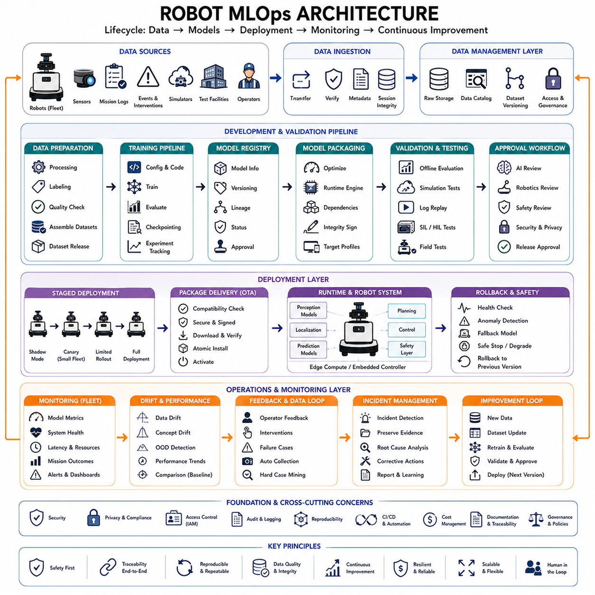
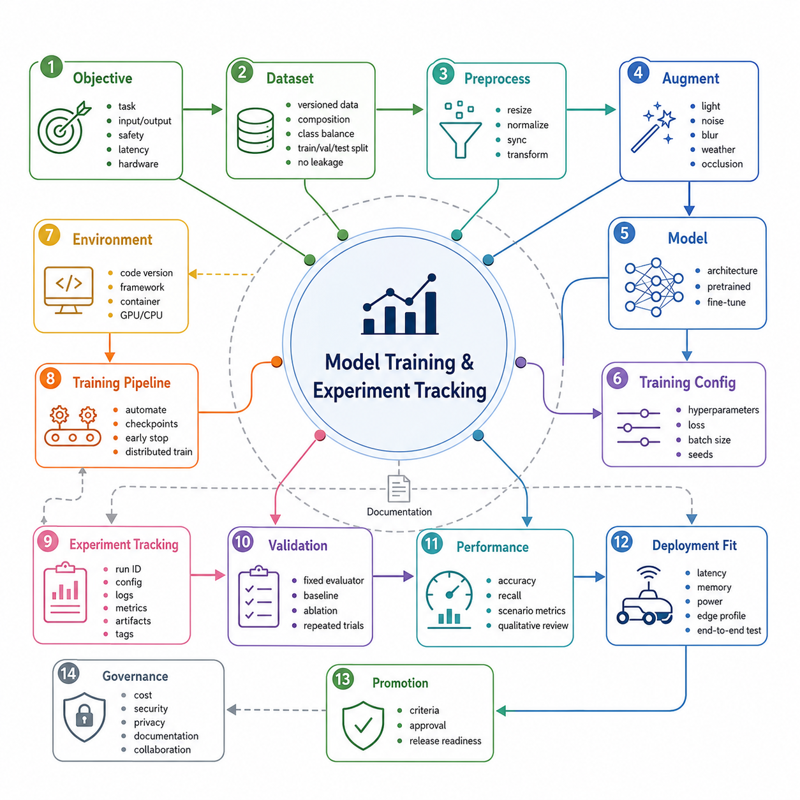
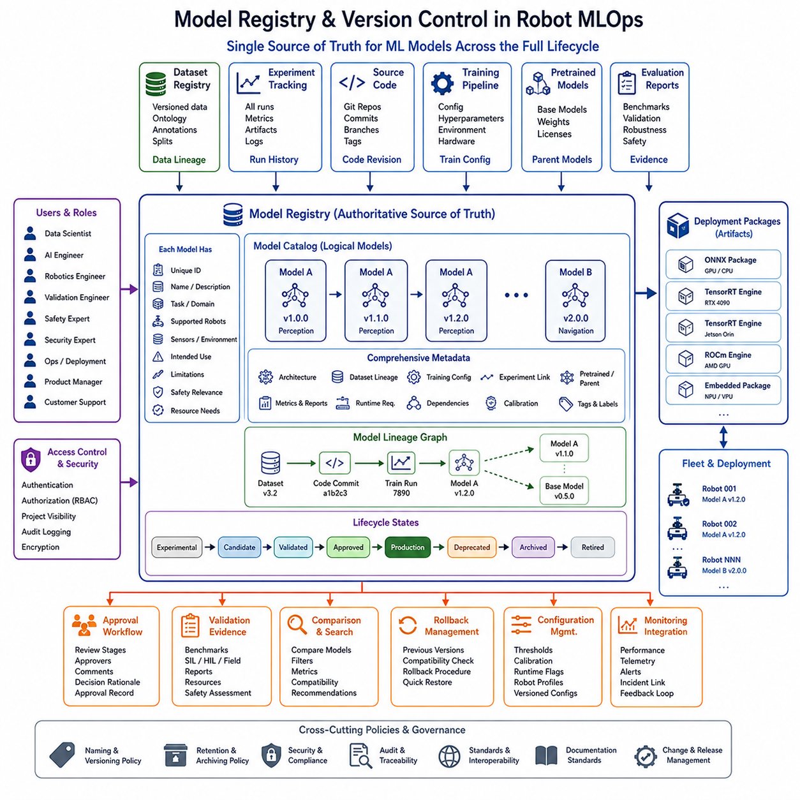
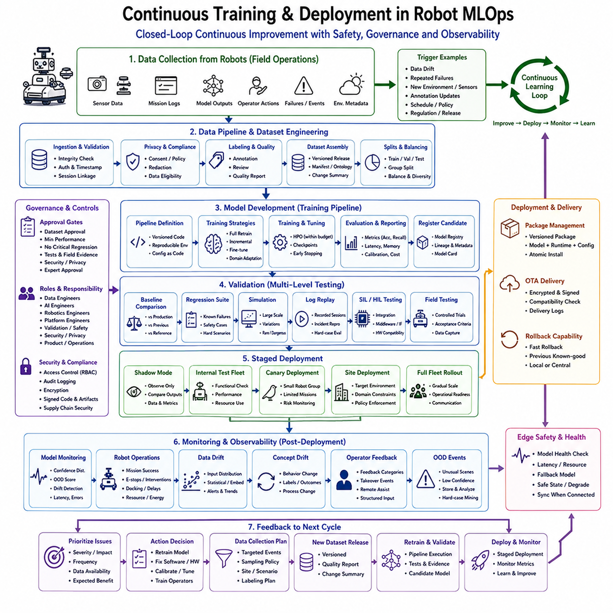
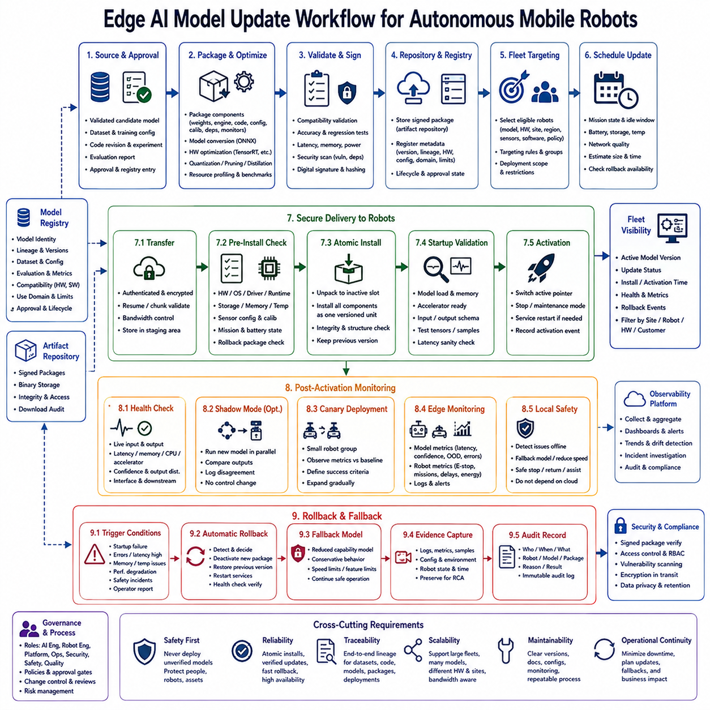
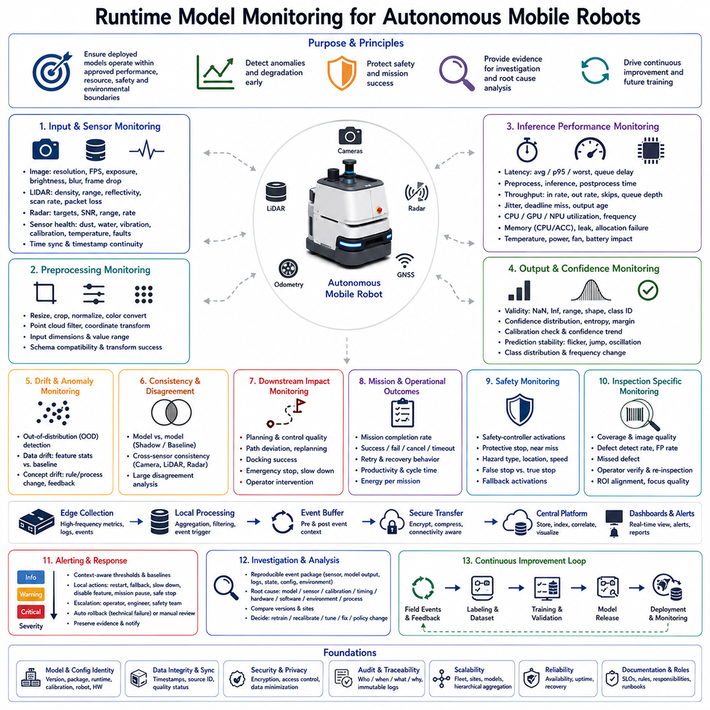
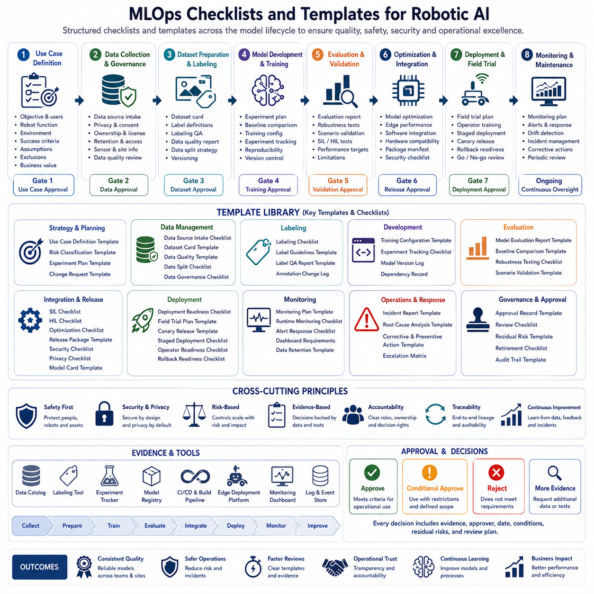

**Volume10. AMR Engineering Process and Development Manual**

# Chapter 15. MLOps for Robotics

## 15.01 Robot MLOps Architecture

{width="7.268055555555556in" height="7.268055555555556in"}

Robot MLOps architecture is the integrated engineering framework used to develop, train, validate, deploy, monitor, and continuously improve machine learning models that operate within robotic systems. Unlike conventional cloud-based machine learning, robot MLOps must connect data centers, development environments, simulation platforms, edge computers, embedded controllers, fleet management systems, and physical machines operating under real-world constraints. The architecture must preserve traceability between field data, datasets, training code, model versions, software releases, hardware configurations, and observed robot behavior.

A robot MLOps platform should begin with a clear separation between model development, robot software development, and operational deployment while maintaining controlled links among them. AI engineers may work on perception, prediction, anomaly detection, or navigation models, while robotics engineers manage middleware, localization, planning, control, safety, and hardware interfaces. These activities use different tools and release cycles, but the final product depends on their integration. The architecture should therefore coordinate models and software without allowing one artifact to change silently outside the release process.

The overall lifecycle begins with data generated by robots, simulations, test facilities, operators, and engineering tools. Sensor recordings, mission logs, model outputs, system states, intervention events, failures, and environmental metadata are transferred into managed storage and dataset catalogs. Selected data are then processed, labeled, validated, and assembled into versioned datasets. Training pipelines produce candidate models, which undergo offline evaluation, simulation, integration testing, controlled deployment, fleet monitoring, and feedback-driven improvement. Every stage should create records that allow the complete lifecycle to be reconstructed.

Robot MLOps differs from ordinary MLOps because models interact directly with the physical world. An error in an online recommendation system may affect user experience, while an error in a mobile robot perception or control model may cause an unsafe stop, collision risk, blocked mission, damaged equipment, or operational disruption. Model validation must therefore include physical safety, timing behavior, hardware compatibility, environmental robustness, and failure recovery. Performance cannot be judged only through average accuracy or loss values measured on a static benchmark.

The architecture should define the boundary between learning components and deterministic safety functions. Machine learning may classify objects, estimate traversability, detect anomalies, predict motion, or support localization, but safety-critical limits may remain enforced by certified sensors, safety controllers, speed limits, emergency stop circuits, and deterministic monitoring logic. This separation prevents a model from becoming the only protection against hazardous behavior. The MLOps system must record which decisions are advisory, operational, safety relevant, or directly connected to motion control.

A layered architecture is useful for managing complexity. The data layer stores raw recordings, metadata, labels, quality reports, and dataset releases. The development layer supports feature engineering, training, experiment tracking, evaluation, and collaboration. The validation layer connects simulation, replay, hardware-in-the-loop testing, and physical test facilities. The deployment layer packages models with runtime dependencies and distributes approved releases. The operations layer monitors fleet performance, system health, model behavior, data drift, and incidents. Governance and security apply across all layers.

The data ingestion layer should accept information from individual robots, test fleets, development platforms, and simulation systems. Upload may occur continuously, during charging, through wired transfer stations, or after a mission. The ingestion service should verify file integrity, session completeness, metadata, timestamps, calibration references, model version, software build, and robot configuration. Invalid or incomplete sessions should be isolated before they enter official datasets. Reliable ingestion ensures that training and investigation are based on trustworthy source material.

A central data catalog provides logical access to robot data stored across local servers, network storage, object storage, cloud regions, and archival systems. Engineers should be able to search by robot, mission, location, sensor, environment, software version, model version, failure event, annotation state, or quality status. Stable identifiers should connect raw sessions, derived files, labels, experiments, and releases. Without a catalog, valuable data become hidden inside folder structures and cannot support efficient model development or root-cause analysis.

Dataset versioning is one of the foundations of reproducible robot MLOps. Every training, validation, test, simulation, or regression dataset should have a unique identifier, content manifest, ontology version, preprocessing configuration, quality status, and change history. Data should not be referenced through mutable folders that change whenever new samples are added. A model result is meaningful only when the exact input dataset can be reproduced. Versioned datasets also help distinguish improvements caused by better data from those caused by algorithm changes.

Raw robot data should normally remain immutable after successful ingestion. Rectified images, synchronized sensor packages, filtered point clouds, anonymized videos, extracted features, and converted formats should be managed as derived data linked to their sources. Processing pipelines should record code version, parameter values, runtime environment, and output checksums. This structure allows teams to regenerate derived datasets when algorithms improve or processing defects are discovered without modifying the original evidence collected from the robot.

Training pipelines should be automated and declarative wherever possible. A pipeline may retrieve a fixed dataset version, apply preprocessing, initialize a model, execute training, evaluate checkpoints, generate reports, and register candidate artifacts. The configuration should define architecture, hyperparameters, augmentation, loss functions, random seeds, compute resources, and stopping conditions. Manual notebook steps may be useful for exploration, but official experiments should run through reproducible pipelines that can be repeated by another engineer or automation service.

Experiment tracking should capture more than a final performance score. Each run should record source code version, dataset version, configuration, hardware, software environment, training duration, metrics, artifacts, logs, and user or service identity. Comparisons should show changes between experiments and identify which parameters affected results. In robotics, evaluation may include detection accuracy, localization error, latency, memory use, power consumption, missed obstacle rate, false-stop rate, recovery time, and scenario-specific safety measures.

The model registry serves as the controlled source of machine learning artifacts. A registered model should include its identifier, version, architecture, weights, input and output specification, runtime requirements, supported hardware, training dataset, validation results, approval status, and known limitations. Registry states may include experimental, candidate, validated, approved, deployed, restricted, deprecated, and archived. Only approved models should be eligible for production packaging. The registry prevents anonymous weight files from circulating without context or authorization.

Model packaging must ensure that the artifact can execute consistently on the target robot computer. Packaging may include model weights, runtime engine, preprocessing and postprocessing logic, calibration references, configuration schemas, dependencies, and integrity signatures. Conversion to formats such as ONNX, TensorRT, or another optimized runtime can change numerical behavior, so the packaged model must be evaluated separately from the original training checkpoint. The package should identify supported GPUs, accelerators, memory requirements, and precision modes.

Robot deployment frequently involves heterogeneous hardware. A fleet may contain different GPU generations, embedded computers, sensor sets, memory capacities, or robot models. The deployment system should define compatibility rules and prevent an artifact from being installed on an unsupported platform. Hardware profiles can describe processor, accelerator, operating system, driver, middleware, sensor configuration, and available resources. A model may require multiple optimized packages while preserving one logical model version across different target devices.

Continuous integration should test model-related code whenever meaningful changes are submitted. Static analysis, unit tests, schema checks, preprocessing tests, model-loading tests, numerical comparisons, and small reference evaluations can detect defects early. Integration tests should confirm that input messages, tensor shapes, coordinate frames, labels, and outputs remain compatible with robot software. A model that performs well in isolation may still fail because of an interface mismatch or changed message definition, making software-model integration testing essential.

Continuous training should not mean that every newly collected sample automatically produces a production model. Automated pipelines can prepare datasets and train candidates, but promotion should depend on quality controls and approval policies. New data may contain labeling errors, unusual distributions, privacy restrictions, or unresolved incidents. The architecture should support continuous data preparation and candidate generation while preserving controlled release gates. This combines development speed with the caution required for physical robotic systems.

Simulation provides a scalable environment for evaluating models and robot behavior before field deployment. Candidate models can be tested across varied lighting, weather, object arrangements, sensor noise, traffic, failures, and rare scenarios. Simulation offers repeatability and ground truth but cannot fully reproduce physical sensor characteristics or human behavior. MLOps should therefore manage simulation scenarios, simulator versions, asset versions, random seeds, and evaluation results as controlled artifacts rather than treating simulation as an informal visual demonstration.

Log replay enables new models and software to process previously recorded robot data under repeatable conditions. A replay system can reproduce sensor messages, timestamps, mission states, and environmental context while collecting outputs for comparison. This is especially valuable for regression testing known failures and evaluating candidate models without repeating dangerous or expensive field events. Replay results should identify the exact recording, preprocessing path, runtime version, and evaluation logic so that performance differences can be traced accurately.

Software-in-the-loop testing evaluates robot algorithms without physical control hardware, while hardware-in-the-loop testing includes actual compute devices, networks, controllers, or sensor interfaces. Hardware-in-the-loop validation can reveal latency, thermal throttling, memory pressure, driver incompatibility, message loss, and timing behavior that simulation alone may miss. A mature MLOps pipeline should promote candidate models through progressively realistic environments, with clear acceptance conditions before moving from virtual testing to controlled physical trials.

Physical test facilities remain necessary because real robots experience mechanical vibration, wheel slip, sensor contamination, changing illumination, network variation, thermal conditions, and human interaction. Field validation should follow controlled scenarios and collect complete evidence for each release candidate. Test results should be linked to model, software, robot, map, sensor, and calibration versions. A model should not be approved based only on successful demonstrations; it should satisfy repeatable scenarios, quality criteria, and failure-handling expectations.

A staged deployment strategy reduces operational risk. A new model may first run in shadow mode, where it processes live data but does not influence robot decisions. Engineers compare its outputs with the active model and actual system behavior. The candidate may then be enabled on a test robot, a controlled site, a small fleet subset, and finally a broader deployment. Each stage should define monitoring requirements, success thresholds, maximum exposure, and rollback conditions. This prevents one unverified update from affecting an entire fleet.

Shadow deployment is particularly useful when the new model affects safety-related perception, localization, or behavior prediction. The model can generate detections, risk estimates, or trajectories while the current production system remains in control. Differences can be analyzed by scene, class, distance, environment, and failure type. Shadow mode also reveals runtime performance, resource use, and unexpected field distributions. However, shadow results should account for the fact that the robot's actions were controlled by another model, which may alter the observed scenario.

Canary deployment introduces the approved candidate to a limited number of robots or missions. The selected group should represent useful operating conditions while limiting business and safety exposure. Monitoring should compare canary robots with a baseline group using model metrics, operational performance, interventions, faults, and mission outcomes. Deployment should expand only when evidence meets predefined conditions. A canary release should automatically stop or roll back when critical indicators exceed acceptable thresholds.

Blue-green deployment can be adapted to robotic systems by maintaining two complete software and model environments. One environment remains active while the other receives and validates the new release. The robot or fleet system switches to the new environment only after readiness checks are complete. This approach can simplify rollback and reduce partial-update states. Storage, boot time, hardware capacity, and synchronization constraints must be considered because edge devices have fewer resources than cloud servers.

Over-the-air model delivery should use authenticated, encrypted, and integrity-verified channels. Packages must be signed so that the robot can verify their origin and confirm that they were not modified. The update service should check battery level, connectivity, available storage, current mission state, hardware compatibility, and safety conditions before installation. Updates should not interrupt critical operations unless explicitly designed to do so. Installation, activation, failure, and rollback events should be reported to fleet management.

Atomic updates help ensure that the robot does not enter an inconsistent state where part of a model package is new and another part is old. The system should download and verify the complete package before activation, preserve the current working version, and switch through a controlled transaction. If startup tests fail, the previous package should remain available. Model, configuration, preprocessing, and postprocessing components that depend on one another should be versioned and activated together.

Rollback is a core safety and reliability function. A robot should be able to return quickly to a known-good release when the new model causes errors, excessive latency, abnormal resource usage, degraded mission performance, or safety concerns. Rollback criteria may be defined centrally or triggered locally when communication is unavailable. The system should preserve evidence from the failed release so engineers can investigate the cause. Rollback does not replace validation, but it limits the impact of defects that escape testing.

Feature flags and runtime configuration can control whether a model or capability is active for specific robots, sites, missions, or conditions. They allow teams to disable problematic functions without rebuilding the entire software package. However, uncontrolled combinations of flags can create configurations that were never validated. The MLOps platform should version configurations, restrict allowed combinations, record changes, and associate field results with the exact active configuration. Configuration is part of the release and should not be treated as an informal operational detail.

Runtime monitoring should observe both machine learning behavior and robot system performance. Model-related metrics may include confidence distribution, class frequency, prediction stability, out-of-distribution score, inference latency, memory use, and missed input rate. Robot metrics may include emergency stops, interventions, route completion, docking success, localization resets, safety-controller activation, mission delay, and energy consumption. Combining these views helps determine whether a model is technically correct but operationally harmful, or operationally useful despite changes in offline metrics.

Data drift occurs when field data differ from the data used for training and validation. Changes may involve lighting, weather, object types, facility layout, camera characteristics, sensor aging, robot speed, human behavior, or customer processes. Drift monitoring can compare feature distributions, embeddings, model confidence, class frequencies, and environmental metadata. Not every distribution change requires retraining, but significant drift should trigger review, targeted collection, or evaluation against new scenarios.

Concept drift occurs when the relationship between inputs and correct outputs changes. An object that was previously treated as a temporary obstacle may become part of a permanent process, or traffic rules inside a facility may change. New equipment or work practices can alter expected robot behavior even when sensor appearance remains similar. Concept drift is more difficult to detect than simple data drift because it requires ground truth, operator feedback, or outcome analysis. MLOps should connect operational changes with dataset and model review.

Out-of-distribution detection can identify scenes that differ strongly from known training conditions. A model may flag unusual sensor patterns, object combinations, or environmental states and request conservative behavior or human assistance. The system should record these events for later analysis and potential inclusion in hard-case datasets. Out-of-distribution scores must be validated because they may react to harmless changes while missing dangerous unknowns. They are indicators for risk management, not guaranteed detectors of every unfamiliar situation.

Operational feedback should be structured rather than limited to free-text reports. Operators can classify false stops, missed obstacles, poor route choices, docking failures, localization issues, or unusual behavior through defined categories linked to timestamps and robot sessions. Remote assistance and manual takeover events should automatically preserve surrounding data. Structured feedback allows data engineers and AI teams to find recurring patterns, prioritize collection, and connect real-world problems to model and software versions.

Incident management should be integrated with the MLOps architecture. Safety events, near misses, privacy incidents, abnormal model behavior, and major mission failures require controlled data preservation and investigation. The incident record should link robot data, logs, model version, software release, environment, user actions, and corrective measures. Relevant artifacts may need restricted access or legal hold. The objective is to support root-cause analysis without creating uncontrolled copies of sensitive operational data.

Model explainability can support debugging, validation, and stakeholder review, although its usefulness depends on the model and task. Attention maps, feature importance, detection visualizations, confidence breakdowns, trajectory overlays, or nearest training examples may help engineers understand behavior. These tools should not be treated as proof that the model is safe or correct. Explanations are additional evidence that must be interpreted together with performance metrics, scenario tests, system logs, and domain knowledge.

Resource monitoring is necessary because robot computers operate under strict power, memory, thermal, and timing constraints. A candidate model may meet accuracy goals but consume excessive GPU memory, reduce battery life, delay other software, or trigger thermal throttling. Profiling should measure average and worst-case latency, processor utilization, accelerator utilization, memory, temperature, power, and startup time on the actual target platform. Resource acceptance criteria should be included in model promotion decisions.

Inference timing must be evaluated end to end rather than only measuring the neural network execution time. The complete path may include sensor acquisition, message transport, preprocessing, model execution, postprocessing, fusion, planning, and command generation. Queue delays and synchronization can be more significant than raw inference latency. MLOps reports should therefore distinguish model runtime from total decision latency and evaluate behavior under peak system load, not only under an isolated benchmark.

Reliability testing should examine what happens when the model or its runtime fails. Possible failures include missing inputs, corrupt tensors, unavailable accelerators, memory exhaustion, numerical instability, runtime crashes, invalid outputs, or prolonged inference. The robot should detect these conditions and transition to a defined fallback, reduced capability, safe stop, or human-assistance mode. Failure-injection testing can verify that monitoring and fallback mechanisms work as designed. A model release is incomplete without validated failure behavior.

Fallback models may provide reduced but reliable functionality when the primary model is unavailable or uncertain. A simpler detector, conservative traversability rule, geometric obstacle layer, or previous validated model may serve as a fallback. The architecture should define when fallback activation occurs, how long it remains active, what operational limits apply, and how the event is reported. Maintaining multiple runtimes increases complexity, so fallback behavior must be tested and versioned with the same discipline as primary operation.

Fleet-level observability should allow engineers to compare performance across robot models, sites, customers, software versions, and environmental conditions. Dashboards may summarize deployment coverage, active versions, update status, model health, incidents, interventions, drift signals, and operational outcomes. Aggregate metrics should preserve the ability to inspect individual events. Averages can hide site-specific failures, so the architecture must support drill-down from fleet trends to exact sessions and sensor data.

Central monitoring must be balanced with local autonomy. Robots may lose network connectivity, operate in restricted environments, or be unable to upload sensitive data. Local health monitoring should detect critical failures and enforce safe responses without relying on cloud access. The robot can store summarized metrics and event buffers until transfer becomes possible. Deployment and monitoring architecture should therefore support connected, intermittently connected, and fully isolated operating modes while maintaining traceability.

Security is a cross-cutting requirement throughout robot MLOps. Training data, models, update packages, source code, credentials, and fleet interfaces are valuable and potentially safety relevant. Access should follow least privilege, and actions should be logged. Model artifacts should be signed and verified, while pipelines should protect against unauthorized code or dependency changes. Software supply-chain controls should track third-party libraries, containers, base images, runtime engines, and vulnerabilities associated with each release.

Privacy controls should follow data through collection, labeling, training, monitoring, and incident analysis. Raw camera or audio data may require anonymization, restricted access, regional storage, and limited retention. Model development should document the permitted purpose and customer conditions attached to each dataset. Operational dashboards should avoid exposing unnecessary personal information. A technically successful pipeline is not acceptable if it violates privacy obligations, data sovereignty, or contractual restrictions.

Approval workflows should reflect the risk of the model and its intended function. A non-critical anomaly classifier may require AI and operations approval, while a perception model affecting motion decisions may also require robotics, safety, security, domain, and product review. The workflow should show evidence from datasets, evaluation, simulation, field testing, resource profiling, and failure analysis. Conditional approvals may restrict a release to specific sites, speeds, environments, or robot configurations.

Documentation should be generated as part of the pipeline rather than prepared only at the end. A model release package may include a model card, dataset references, evaluation summary, compatibility matrix, known limitations, safety assumptions, deployment instructions, monitoring plan, rollback procedure, and approval record. Automatically populated fields reduce omissions, while engineers provide interpretation and risk statements. Good documentation allows operations and support teams to understand what changed and how the release should be managed.

The architecture should support reproducibility across time. Training environments, runtime dependencies, compilers, accelerator libraries, and external packages change rapidly. Containers, environment lock files, artifact repositories, source-control tags, and infrastructure definitions can preserve execution conditions. For long-lived robotic products, teams may need to rebuild or analyze a model years after its original release. Reproducibility therefore includes software environments, hardware assumptions, calibration, and dataset availability.

Cost management is important because robot MLOps can use significant storage, network bandwidth, labeling labor, simulation resources, and GPU compute. The platform should track resource consumption by project, experiment, dataset, and deployment. Caching, tiered storage, selective upload, event-triggered collection, spot compute, and optimized pipelines may reduce expense. Cost should not be reduced by removing essential validation or monitoring. The objective is to allocate resources toward data and tests that provide the greatest engineering and safety value.

Organizational roles should be clearly defined. Data engineers manage ingestion, storage, metadata, and datasets. AI engineers develop models and training pipelines. Robotics engineers integrate models with middleware, planning, control, and hardware. Platform engineers operate compute, deployment, monitoring, and automation. Safety, security, privacy, quality, product, and operations teams provide requirements and approval. Clear ownership prevents critical tasks from being assumed to belong to another group.

A mature robot MLOps architecture creates a closed learning loop from field operation back to engineering and then safely into the fleet. Robots generate evidence about normal behavior, difficult scenarios, failures, drift, and user intervention. Managed pipelines convert this evidence into validated datasets and candidate models. Simulation, replay, integration tests, and controlled field deployment evaluate those candidates. Monitoring and governance determine whether a release remains acceptable. This loop enables continuous improvement without sacrificing traceability, safety, security, or operational stability.

## 15.02 Model Training and Experiment Tracking

{width="7.268055555555556in" height="7.268055555555556in"}

Model training and experiment tracking form the operational core of a Robot MLOps workflow. Model training transforms curated datasets, algorithms, configurations, and computing resources into candidate machine learning models, while experiment tracking records the exact conditions under which each candidate was produced and evaluated. In Autonomous Mobile Robot development, this process must support perception, localization, prediction, traversability analysis, anomaly detection, and other learning functions. The objective is not only to obtain high accuracy, but also to create models whose origin, behavior, limitations, resource requirements, and validation evidence can be reconstructed at any time.

Training should begin with a clearly defined engineering objective. A model may be intended to detect pedestrians, segment drivable terrain, estimate depth, classify floor conditions, predict human motion, detect sensor faults, or support precise docking. Each task requires different labels, data distributions, evaluation metrics, and operational constraints. Before training starts, the team should document the target function, expected input and output, deployment environment, safety relevance, acceptable latency, supported hardware, and performance thresholds. This prevents technically impressive results that do not solve the actual robot problem.

The training dataset should be fixed and versioned before an official experiment begins. Mutable folders that change during training make results difficult to reproduce and compare. A dataset release should include a unique identifier, source sessions, ontology version, preprocessing configuration, quality status, train-validation-test split, known limitations, and access restrictions. The experiment record must reference this exact version. When data are later added, corrected, or relabeled, a new dataset version should be created rather than silently modifying the original release.

Dataset composition should be reviewed before training because model behavior strongly reflects the data distribution. Class frequency, scenario coverage, environmental diversity, sensor quality, distance distribution, object size, occlusion, weather, lighting, robot speed, and site representation should be analyzed. A large dataset can still be weak if it contains many nearly identical frames or lacks rare but safety-critical situations. The training team should understand which operating conditions are well represented, which are limited, and which are intentionally reserved for validation or protected testing.

Training, validation, and test data must be separated using rules that prevent leakage. Consecutive frames, recordings from the same route, variations of one staged event, or data from the same mission can be highly similar. Random frame-level splitting may therefore produce unrealistic performance because the model is evaluated on scenes closely related to its training data. Grouping by mission, route, site, time period, robot, or scenario is often more appropriate. The split logic, random seed, exclusions, and protected test cases should be stored with the experiment.

Data preprocessing must be treated as part of the model rather than an informal preparation step. Image resizing, normalization, color conversion, lens correction, point-cloud filtering, voxelization, coordinate transformation, temporal alignment, feature extraction, and label conversion can significantly affect performance. The preprocessing pipeline should be implemented in version-controlled code and configured through explicit parameters. Training and inference must use compatible transformations. A mismatch between training preprocessing and robot runtime preprocessing can invalidate an otherwise accurate model.

Data augmentation can improve robustness by creating controlled variations of the training samples. Camera data may be modified through brightness, contrast, blur, crop, scale, noise, shadow, weather, or occlusion transformations. Point-cloud data may use rotation, translation, dropout, noise, density changes, or simulated sensor artifacts. Augmentation should represent plausible field conditions rather than arbitrary visual changes. Excessive or unrealistic augmentation can distort class meaning, damage labels, or teach the model behavior that does not occur in real robot operation.

Augmentation parameters should be recorded as part of each experiment. Two training runs using the same dataset and architecture may produce very different results if augmentation probability, intensity, ordering, or random seeds differ. The tracking system should capture which transformations were applied and whether they were used during training only or also during validation. When an augmentation strategy improves one scenario but damages another, scenario-level evaluation can reveal the tradeoff. This evidence helps teams refine augmentation instead of treating it as uncontrolled randomness.

Model architecture selection should reflect the task, target hardware, latency budget, memory capacity, and required accuracy. A larger model may perform better offline but may be unsuitable for an embedded robot computer because of inference delay, power consumption, or thermal load. A compact architecture may be preferable when rapid response and fleet scalability are more important than a small improvement in benchmark accuracy. The experiment should record the model family, layer configuration, input resolution, parameter count, computational complexity, and any architectural modifications.

Pretrained models can reduce training time and improve performance when the source representation is relevant to the robot task. However, the origin, license, training domain, architecture, and security of pretrained weights should be documented. Models trained on general internet imagery may not represent industrial, warehouse, outdoor, or safety-critical environments adequately. Fine-tuning strategies such as freezing early layers, gradual unfreezing, differential learning rates, or full retraining should be compared experimentally. Pretraining should not be assumed to guarantee reliable field generalization.

Hyperparameters define how the model learns and should be managed through structured configuration. Important values may include learning rate, optimizer, momentum, weight decay, batch size, epoch count, scheduler, warm-up period, loss weights, regularization, gradient clipping, and early-stopping conditions. These settings should not remain hidden inside notebooks or source files. A configuration file should be stored with each run so that another engineer can repeat the experiment. Hyperparameter changes should be visible when comparing runs.

The choice of loss function should match both the mathematical task and the operational consequences of different errors. In object detection, missing a pedestrian may be more serious than generating a small number of additional false positives. In traversability estimation, classifying unsafe ground as drivable may be more important than conservative rejection. Class weighting, focal loss, boundary loss, uncertainty-aware loss, or multi-task objectives may be used to reflect these priorities. The experiment record should explain how losses are combined and why their weights were selected.

Batch size affects optimization behavior, memory usage, and training speed. Large batches can improve hardware utilization but may require learning-rate adjustment and can reduce generalization in some cases. Small batches may better fit high-resolution images or point clouds but can produce noisy gradients and slow training. Gradient accumulation can simulate larger batches when device memory is limited. The effective batch size, number of devices, accumulation steps, and distributed training configuration should all be recorded because they influence reproducibility.

Randomness must be controlled as much as practical. Weight initialization, data shuffling, augmentation, sampling, dropout, and parallel computation can produce different results across runs. Setting random seeds improves repeatability, but some GPU operations and distributed systems may remain nondeterministic. The experiment record should capture seeds, framework settings, and known nondeterministic operations. Important conclusions should be based on repeated runs when variance is significant rather than on one unusually successful result.

The software environment should be captured precisely. Framework versions, CUDA libraries, drivers, operating system, Python packages, compiler settings, container images, and custom extensions can affect training and numerical output. A model that trains correctly in one environment may fail or produce different behavior after a dependency update. Containers, lock files, environment manifests, and artifact repositories can preserve the conditions of official experiments. The tracking system should link the run to the exact environment definition rather than storing only a broad description.

The source code version used for training must be recorded. Each experiment should reference a source-control commit, branch, tag, or packaged code artifact. Uncommitted local modifications should be avoided for official runs or explicitly captured as a patch. Training pipelines should record whether the working directory was clean and which configuration files were used. Without code lineage, a result may be impossible to reproduce even when the dataset and hyperparameters are known. Code version is therefore a fundamental experiment attribute.

Computing hardware also influences training behavior and cost. The tracking system should capture GPU or accelerator type, quantity, memory, CPU, system memory, storage, network, and distributed-training topology. Mixed-precision settings, tensor-core usage, data-loader workers, and interconnect configuration can change speed and numerical stability. Hardware information helps compare efficiency, estimate future resource requirements, and identify results that depend on a specific platform. It also supports planning when training must move between local servers, cloud systems, or shared clusters.

Training pipelines should be automated so that common stages execute consistently. A typical pipeline retrieves a dataset release, validates configuration, prepares the environment, launches training, saves checkpoints, evaluates intermediate models, generates metrics, stores artifacts, and registers the result. Automation reduces manual errors and makes large experiment series manageable. Nevertheless, the pipeline should expose its steps, inputs, and logs. A failed run should clearly indicate whether the cause came from data, configuration, code, infrastructure, or model behavior.

Checkpoint management is important for long or expensive training jobs. Periodic checkpoints allow a run to resume after interruption and enable comparison between different training stages. The system should define whether checkpoints are saved by time, epoch, metric improvement, or fixed intervals. Not every checkpoint needs permanent retention, but the best-performing, final, and diagnostically important checkpoints should be preserved. Checkpoint metadata should include training step, metrics, optimizer state, scheduler state, and compatibility information.

Early stopping can prevent unnecessary computation and reduce overfitting when validation performance stops improving. However, the monitored metric, patience, minimum improvement, and evaluation frequency must be selected carefully. A global metric may improve while a safety-critical scenario becomes worse. Early stopping based only on average validation loss may therefore be insufficient. The pipeline may track several metrics and preserve checkpoints that perform best on different operational criteria. The stopping rule should be explicit and reproducible.

Distributed training can reduce training time but introduces additional complexity. Data-parallel or model-parallel execution may change effective batch size, synchronization, random sampling, and numerical behavior. Network failure, worker imbalance, or inconsistent initialization can corrupt a run. The experiment record should capture world size, node count, device assignment, communication backend, gradient synchronization, and fault-recovery settings. Reproducibility should be verified across the actual distributed configuration rather than assumed from a single-device test.

Experiment tracking should assign a unique identifier to every run. The record should connect the run to its project, user, code, dataset, configuration, hardware, environment, start and end time, status, metrics, checkpoints, reports, and logs. Failed and cancelled runs should also remain visible because they contain useful evidence about unstable configurations, infrastructure limits, and ineffective approaches. Deleting unsuccessful experiments can create a misleading development history and lead other engineers to repeat the same mistakes.

Run names and tags should follow a consistent convention. Tags may describe task, model family, dataset version, site, sensor configuration, experiment purpose, branch, optimization method, or release target. Free-form names alone are often insufficient because teams use inconsistent abbreviations. Structured tags enable searching and grouping across many runs. They also allow dashboards to compare experiments by meaningful dimensions such as architecture, data version, augmentation strategy, or target hardware.

Metrics should be logged throughout training rather than only at the end. Training loss, validation loss, learning rate, gradient norm, precision, recall, class-specific scores, localization error, latency estimates, and resource use can reveal instability and overfitting. Curves help identify whether a run converged normally, plateaued, diverged, or learned at different rates across classes. Logging frequency should balance diagnostic value with storage and performance overhead. Important metrics should use consistent names and units across projects.

Global metrics should be complemented by scenario-specific and class-specific evaluation. A model can achieve high mean accuracy while failing on small pedestrians, reflective objects, low light, rain, long distance, partial occlusion, or unusual surfaces. Robot model validation should therefore report performance by operational category. The experiment tracker can store tables, confusion matrices, precision-recall curves, distance bins, environmental breakdowns, and failure-case galleries. These outputs make comparisons more meaningful than one aggregate score.

Qualitative artifacts are valuable for understanding model behavior. Detection overlays, segmentation images, point-cloud visualizations, trajectory plots, attention maps, false-positive examples, false-negative examples, and difficult-scene summaries can reveal systematic problems that numerical metrics hide. The tracking system should store representative artifacts with links to source samples. Selection should include best cases, typical cases, and failures rather than only visually impressive examples. Qualitative review should supplement, not replace, quantitative evaluation.

Training stability should be monitored through numerical and system indicators. Exploding gradients, vanishing gradients, NaN values, sudden loss spikes, memory leaks, data-loader stalls, hardware errors, and checkpoint corruption can invalidate a run. Automated alerts may stop or mark experiments when critical anomalies occur. The tracker should preserve diagnostic logs and recent metrics so engineers can identify the failure cause. A run that finishes successfully at the infrastructure level may still be invalid if numerical instability occurred during training.

Validation should use a fixed dataset and standardized evaluation code. Changing evaluation scripts between runs can make results incomparable even when the model improves. The evaluator should be versioned and tested, with clearly defined thresholds, matching rules, coordinate conventions, ignored regions, and uncertainty handling. The experiment record should reference the evaluator version. When evaluation logic changes, previous models may need to be re-evaluated so that comparisons remain fair.

Test data should remain protected from repeated optimization. Frequent inspection of the final test set can cause the development process to overfit indirectly, even when the samples are not used for gradient updates. Teams should use training and validation data for routine decisions and reserve the test set for milestone evaluation, release review, or formal comparison. Access to protected test data may be limited or automated. The experiment record should distinguish validation metrics from final test metrics and identify who authorized test execution.

Baseline models provide a stable reference for evaluating progress. A baseline may be the current production model, a simple algorithm, a previous release, or a standard architecture trained on the same dataset. Every candidate should be compared against appropriate baselines using identical evaluation procedures. Improvement should be assessed not only in average accuracy but also in latency, memory, operational scenarios, and failure cases. A candidate that improves one metric while degrading safety-critical behavior should not be considered automatically superior.

Ablation studies help determine which components actually contribute to performance. The team may remove one feature, augmentation, loss term, sensor input, architectural module, or dataset subset and compare the result. Experiment tracking makes these studies easier by organizing related runs and showing configuration differences. Ablations reduce the risk of keeping unnecessary complexity based on intuition. They also help identify whether gains come from architecture, data, preprocessing, or training strategy.

Hyperparameter search can be performed manually, through grid search, random search, Bayesian optimization, or population-based methods. Automated search should operate within controlled parameter ranges and resource budgets. Each trial must remain traceable and use consistent datasets and evaluation logic. Search systems can generate many runs, so tagging, grouping, pruning, and retention policies are necessary. The best trial should not be promoted solely because of one metric; robustness, variance, resource use, and operational suitability must also be reviewed.

Repeated trials are important when training variance is non-negligible. A configuration that performs well once may not consistently outperform a baseline. Running several seeds provides a distribution of results and helps estimate confidence in the improvement. The tracking platform should group repeated runs and summarize mean, variation, best, and worst performance. This is particularly valuable when differences between candidates are small or when rare scenarios contain few validation examples.

Class imbalance requires deliberate handling during training and evaluation. Rare safety-critical classes may be underrepresented, while normal background or common obstacles dominate the dataset. Sampling strategies, class weights, focal loss, targeted augmentation, hard-example mining, or additional data collection may be used. The selected method should be recorded and compared experimentally. Improving rare-class recall may increase false positives, so the operational cost of this tradeoff should be evaluated using robot-relevant metrics.

Hard-example mining can focus training on samples that the model frequently misclassifies or predicts with low confidence. These examples may include occlusions, small objects, unusual lighting, sensor artifacts, or confusing backgrounds. Mining can occur within the dataset or through new field collection. The experiment record should identify the mining rule, selected samples, and dataset version. Overusing a narrow set of hard cases can cause overfitting, so difficult examples should remain balanced with representative normal data.

Transfer learning experiments should distinguish which layers or modules are reused, frozen, reinitialized, or fine-tuned. The learning rate may differ between pretrained and newly added layers. Domain adaptation may also use unlabeled target data, adversarial objectives, self-training, or feature alignment. These choices influence both performance and stability. Experiment tracking should record the source model and lineage so that the final artifact can be traced through all preceding training stages.

Self-supervised and semi-supervised learning can reduce dependence on manual labels by using large amounts of unlabeled robot data. Pretext tasks, contrastive learning, masked prediction, pseudo-labeling, and consistency training may improve representations. However, automatically generated targets can contain systematic errors and reinforce model bias. Experiments should document unlabeled data sources, pseudo-label thresholds, teacher models, confidence filtering, and iteration steps. Evaluation must confirm that gains extend beyond the automatically labeled distribution.

Multi-task learning can combine related objectives such as detection, segmentation, depth, motion, or traversability in one model. Shared representations may improve efficiency and generalization, but competing tasks can also interfere with one another. Loss weighting, task sampling, shared layers, task-specific heads, and gradient balancing should be tracked carefully. Evaluation should report performance for every task, not only the primary objective. A combined model must also be compared with separate models in terms of runtime and operational complexity.

Curriculum learning may train the model on easier examples before introducing more difficult conditions. For example, the model may begin with clear daytime scenes and gradually include low light, occlusion, adverse weather, or rare objects. The curriculum schedule, difficulty definition, transition criteria, and dataset subsets should be recorded. Curriculum learning can improve convergence, but it may also bias the model if the progression does not represent real operation. Scenario-level validation should confirm that later stages retain normal-case performance.

Model compression may be included during or after training to meet robot deployment constraints. Pruning, quantization-aware training, knowledge distillation, low-rank adaptation, or architecture reduction can decrease latency and memory use. Compression experiments must compare accuracy, calibration, stability, and hardware performance with the original model. Quantization or runtime conversion can affect small objects, confidence values, and numerical behavior. The compressed model should be treated as a distinct artifact with its own evaluation and experiment record.

Knowledge distillation trains a smaller student model using outputs or representations from a larger teacher model. The experiment should document teacher version, student architecture, temperature, distillation loss, ground-truth loss, data version, and weighting strategy. A student may approach teacher accuracy while offering lower latency and power consumption. However, it can also inherit teacher errors and biases. Evaluation should compare the student with both the teacher and an independently trained model of similar size.

Confidence calibration is important because robot decision systems may use model confidence to trigger fallback behavior, human assistance, or conservative planning. A model with high accuracy can still produce poorly calibrated confidence estimates. Reliability diagrams, expected calibration error, threshold curves, and scenario-specific confidence analysis can be logged. Calibration methods such as temperature scaling or isotonic regression should be versioned and evaluated separately. Confidence thresholds used by robot software must correspond to the packaged model.

Resource profiling should accompany candidate model evaluation. The training result should eventually be tested on the intended edge computer or a representative hardware profile. Measurements should include inference latency, throughput, memory, processor utilization, accelerator utilization, temperature, power, and startup time. The experiment tracker may link offline training runs with separate deployment-profile runs. This connection helps teams select models based on overall robot suitability rather than accuracy alone.

End-to-end evaluation should verify the complete processing chain. Sensor input, decoding, preprocessing, model inference, postprocessing, message publication, fusion, and downstream robot logic all contribute to behavior. A model that meets isolated inference targets may still cause unacceptable decision delay when integrated. Evaluation artifacts should distinguish neural-network runtime from total pipeline latency. Results should be measured under realistic system load and sensor rates, including worst-case scenes and resource contention.

Experiment comparison should make configuration and outcome differences easy to understand. Engineers should be able to select several runs and view changes in code, datasets, preprocessing, architecture, hyperparameters, metrics, artifacts, hardware, and cost. Comparison tools should support filtering by scenario and deployment constraint. The best model may differ depending on whether the priority is accuracy, rare-case recall, latency, energy, or memory. The decision should therefore be based on an explicit multi-criteria review.

Promotion criteria should be defined before a candidate is registered for broader validation. Requirements may include minimum accuracy, no regression on critical classes, acceptable latency, stable training, completed documentation, dataset approval, and successful baseline comparison. Some models may require repeated runs or scenario-specific thresholds. The promotion decision should be stored with the experiment and identify the reviewer, evidence, conditions, and known limitations. Automated thresholds can support the process, but high-risk models still require expert judgment.

Failed experiments should be documented with enough detail to prevent repetition. A run may fail because of poor convergence, unstable loss, incorrect labels, incompatible input shapes, insufficient memory, preprocessing errors, or infrastructure interruption. The tracker should distinguish technical failure from an unsuccessful modeling hypothesis. Notes and tags can summarize the cause and next action. A transparent history of failed approaches often provides as much engineering value as successful results.

Cost tracking can improve experiment planning. GPU hours, storage, network transfer, labeling effort, and engineer time may be associated with each project or run. Large search campaigns can consume substantial resources without proportional value. Cost metrics help teams compare efficiency and decide whether additional training is justified. However, low cost should not be prioritized over necessary validation or safety. The aim is to use resources effectively while preserving technical rigor.

Access control and security should protect datasets, source code, model artifacts, and experiment records. Projects may contain customer-confidential data, safety incidents, proprietary algorithms, or restricted model weights. Users should receive permissions according to their role and project. Sensitive artifacts should be encrypted and audit logged. Service accounts used by training pipelines should have limited access. Experiment sharing should not expose credentials, personal data, or unauthorized source samples through visual artifacts or logs.

Privacy requirements must remain attached to training data and outputs. Dataset metadata should indicate allowed purpose, geographic restrictions, anonymization status, retention, and customer conditions. Experiment pipelines should prevent restricted data from being copied into unauthorized environments or external services. Visual examples stored in tracking systems may require masking. Model artifacts may also preserve sensitive information and should be classified appropriately. Successful training does not override privacy or contractual obligations.

Documentation should be generated continuously from experiment records. A candidate model summary can include purpose, dataset lineage, architecture, training configuration, evaluation results, scenario performance, resource profile, limitations, and approval status. Automatically populated information reduces manual error, while engineers provide interpretation and operational warnings. When a model advances toward deployment, this information can support a model card, validation report, and release package without reconstructing the history from scattered notes.

Collaboration improves when experiment information is centralized. AI engineers, data engineers, robotics engineers, safety reviewers, and project managers can examine the same records and discuss results using stable run identifiers. Comments, review status, comparisons, and linked defects help prevent duplicated work. The system should preserve decision context without turning the tracker into an unstructured discussion board. Important conclusions should be captured in formal notes, reports, or promotion decisions.

A mature model training and experiment tracking system connects controlled datasets, reproducible pipelines, source code, environments, hardware, metrics, artifacts, evaluation, and approvals into one traceable process. It enables teams to understand not only which model performed best, but why it performed differently, under which conditions it remains reliable, what resources it requires, and whether its results can be reproduced. This discipline allows Autonomous Mobile Robot teams to improve learning systems systematically while maintaining safety, operational relevance, security, and engineering accountability.

## 15.03 Model Registry and Version Control

{width="7.268055555555556in" height="7.268055555555556in"}

A model registry and version control system provide the governance foundation of Robot MLOps by ensuring that every machine learning model can be uniquely identified, traced, validated, deployed, monitored, and reproduced throughout its operational lifetime. In Autonomous Mobile Robot development, dozens or even hundreds of model variants may exist simultaneously for perception, localization, mapping, prediction, navigation, anomaly detection, and decision support. Without a structured registry, engineers quickly lose track of which model was trained from which dataset, validated under which conditions, deployed to which robots, and responsible for which operational behavior. The registry therefore serves as the authoritative source of truth for machine learning artifacts.

A model registry differs fundamentally from ordinary file storage. Saving model weights inside folders or cloud drives may preserve the binary artifact, but it does not preserve the engineering context required for reliable lifecycle management. A registry associates every model with structured metadata including model identifier, version, architecture, dataset lineage, training configuration, experiment history, evaluation reports, runtime requirements, deployment status, approval records, and operational limitations. Instead of simply storing files, the registry stores engineering knowledge that allows the entire development history of a model to be reconstructed.

Version control provides a systematic mechanism for managing change over time. Every improvement, correction, optimization, retraining activity, architecture modification, calibration adjustment, or deployment package should produce a new version rather than replacing an existing artifact. Historical versions must remain accessible because production incidents, customer support, regulatory investigations, or scientific validation may require engineers to reproduce previous behavior. Immutable versions prevent accidental overwriting and preserve confidence that the deployed model exactly matches the approved engineering record.

Every registered model should receive a globally unique identifier that remains stable throughout its lifetime. While version numbers change as the model evolves, the logical model identity remains constant. This separation allows engineers to discuss the evolution of a specific perception model or navigation predictor while distinguishing individual releases. Human-readable names may improve usability, but internal identifiers should remain machine-stable and globally unique to prevent ambiguity across projects, repositories, organizations, and deployment environments.

Model version numbering should follow a consistent organizational policy. Some organizations prefer semantic versioning using major, minor, and patch numbers, while others use sequential build identifiers or release-based naming conventions. Whatever policy is selected, the meaning of each increment should be documented. A major version may represent architectural redesign, a minor version may indicate retraining on new datasets, while a patch version may correct packaging, metadata, or deployment issues without changing model behavior. Consistency is more important than selecting one specific numbering scheme.

The registry should distinguish logical models from deployment packages. One trained model may be converted into several deployment artifacts optimized for different hardware accelerators, operating systems, runtime engines, precision modes, or robot platforms. For example, one perception model may exist as a PyTorch checkpoint, an ONNX representation, TensorRT engines for multiple GPU architectures, and optimized packages for embedded accelerators. These deployment packages should reference the same logical model version while maintaining their own packaging metadata and compatibility information.

Model lineage describes how a model was created from preceding engineering artifacts. A registered model should reference the training dataset version, preprocessing pipeline, source code revision, training configuration, experiment identifier, pretrained weights, fine-tuning history, and parent models if applicable. This lineage creates a directed engineering graph rather than an isolated file repository. Engineers investigating unexpected behavior can trace the complete ancestry of a deployed model instead of manually searching through disconnected documentation and storage locations.

Dataset lineage is equally important because machine learning behavior depends strongly on training data. The registry should identify exactly which dataset release, ontology version, annotation policy, preprocessing configuration, augmentation strategy, and train-validation-test split produced the model. When multiple dataset revisions exist, engineers should immediately determine whether observed improvements result from additional data, corrected labels, improved preprocessing, or algorithmic changes. Data lineage therefore supports fair comparison between model generations.

Training configuration should be preserved together with the model. Learning rates, optimizers, schedulers, batch sizes, loss functions, class weights, augmentation settings, random seeds, distributed training parameters, early stopping conditions, and hardware information all contribute to the final model behavior. A registry that stores only the resulting weight file provides little value for reproducibility. Complete configuration records allow experiments to be repeated under controlled conditions and simplify engineering investigations when unexpected differences appear between training runs.

Experiment tracking and model registration should remain closely connected while serving different purposes. Experiment tracking records every executed run, including unsuccessful attempts, exploratory configurations, and diagnostic experiments. The registry stores selected artifacts that become recognized engineering assets. Not every experiment deserves permanent registration as a deployable model. Promotion from experiment to registered model should occur only after satisfying predefined quality, documentation, validation, and governance requirements. This separation prevents the registry from becoming cluttered with temporary or low-quality artifacts.

Metadata quality is essential because engineers primarily search and compare models through metadata rather than binary files. Every registered model should include structured fields describing task, application domain, supported robot platforms, sensor configuration, operating environment, intended use, known limitations, safety relevance, resource requirements, confidence calibration status, supported runtime engines, and deployment restrictions. Metadata should follow controlled vocabularies whenever practical so that searches remain consistent across projects and engineering teams.

Model documentation should be integrated directly into the registry rather than maintained separately whenever possible. A model card may summarize purpose, architecture, dataset lineage, evaluation metrics, benchmark results, operational assumptions, limitations, ethical considerations, deployment guidance, and monitoring recommendations. Automatically generated documentation can populate many technical fields directly from experiment tracking systems, while engineering teams provide human interpretation and operational guidance. Centralized documentation reduces inconsistency and simplifies knowledge transfer across development teams.

Approval workflows transform model registration from simple storage into controlled governance. Candidate models should progress through defined review stages before becoming eligible for deployment. Reviewers may include AI engineers, robotics engineers, safety specialists, security experts, quality engineers, product managers, and domain experts depending on the operational risk of the application. Each approval should record reviewer identity, review date, supporting evidence, comments, decision rationale, and any operational restrictions. Governance records remain attached to the registered model throughout its lifecycle.

Model lifecycle states help organize engineering activities. Typical states include experimental, candidate, validated, approved, production, deprecated, archived, and retired. Experimental models remain under active research. Candidate models satisfy initial technical requirements but require additional review. Validated models complete formal evaluation. Approved models become eligible for deployment. Production models actively operate within robot fleets. Deprecated models remain available for compatibility but should not be selected for new deployments. Archived models preserve historical evidence, while retired models represent artifacts intentionally removed from operational consideration.

Validation evidence should accompany every approved model. Offline benchmark results, simulation reports, replay analysis, software-in-the-loop testing, hardware-in-the-loop validation, field trial summaries, resource profiling, calibration measurements, safety assessments, robustness analysis, and regression reports should all remain linked to the registered artifact. Engineers evaluating deployment decisions should not search across multiple storage systems for supporting documentation. The registry becomes significantly more valuable when all engineering evidence accompanies the model throughout its lifecycle.

Performance metrics should be interpreted within operational context rather than presented as isolated benchmark values. Detection accuracy, localization error, precision, recall, inference latency, memory consumption, calibration quality, robustness under adverse weather, low-light performance, rare object detection, and failure recovery capability describe different aspects of operational readiness. Registry metadata should distinguish between laboratory benchmarks and field validation. Engineers selecting a model for deployment should understand both its strengths and the conditions under which its performance becomes uncertain.

Hardware compatibility should be documented explicitly because robot fleets frequently contain heterogeneous computing platforms. A model may support desktop GPUs, embedded accelerators, industrial computers, or specialized inference processors with different runtime characteristics. Compatibility metadata should specify supported operating systems, CUDA versions, inference engines, processor architectures, memory requirements, storage requirements, power expectations, precision modes, and known hardware limitations. Automatic deployment systems rely on this information to prevent incompatible artifacts from reaching unsupported robots.

Runtime dependency management prevents deployment failures caused by incompatible software environments. Every registered model should identify required framework versions, runtime engines, container images, shared libraries, configuration schemas, preprocessing modules, postprocessing modules, calibration files, and auxiliary resources. Dependency relationships should remain version controlled together with the model itself. A deployment package should represent a complete operational unit rather than requiring operators to manually assemble multiple independent software components before execution.

Model packaging transforms engineering artifacts into deployable software components. Packaging may include model weights, runtime configuration, preprocessing logic, inference engine, calibration parameters, metadata, integrity signatures, dependency manifests, monitoring configuration, and rollback information. The packaging process itself should be version controlled because conversion to optimized runtime formats can introduce numerical differences. Registry entries should distinguish training artifacts from packaged deployment artifacts while maintaining traceable relationships between them.

Integrity verification protects model artifacts against accidental corruption and unauthorized modification. Cryptographic hashes, digital signatures, secure checksums, and package validation mechanisms allow deployment systems to verify artifact integrity before installation. Every registered deployment package should contain integrity metadata that remains associated with the package throughout storage, distribution, and installation. Integrity verification provides confidence that deployed robots execute exactly the artifact approved during engineering review rather than an altered or incomplete version.

Security considerations extend beyond protecting binary model files. Access permissions should distinguish between reading metadata, downloading artifacts, modifying documentation, approving releases, registering new versions, and deleting obsolete content. Authentication, authorization, audit logging, and role-based access control should protect registry operations. Sensitive models developed for defense, industrial inspection, or customer-specific applications may require project-specific visibility restrictions. Registry security therefore becomes part of the organization\'s overall software supply chain security strategy.

Role-based access control supports collaborative engineering while preserving accountability. Data scientists, AI engineers, robotics developers, system architects, validation engineers, product managers, deployment specialists, operations teams, and customer support personnel all require different levels of registry access. Some users may only inspect metadata, while others register new versions or approve production releases. Every modification should record user identity, timestamp, affected artifacts, and change rationale. Complete audit history simplifies both engineering investigations and regulatory compliance.

Audit logging provides historical transparency for every registry operation. Creating models, modifying metadata, approving releases, downloading artifacts, changing lifecycle states, updating documentation, and assigning deployment targets should all generate immutable audit records. Engineering organizations investigating operational incidents frequently need to determine exactly who approved a deployment, when configuration changed, and which artifacts were distributed. Comprehensive audit logs provide evidence supporting accountability while reducing uncertainty during post-incident analysis.

Model reproducibility depends on preserving every engineering dependency required to recreate the artifact. Source code revisions, dataset versions, preprocessing pipelines, training configurations, runtime environments, software dependencies, hardware characteristics, random seeds, experiment identifiers, and evaluation scripts all contribute to reproducibility. Registry systems should therefore integrate closely with experiment tracking, dataset management, source control, container registries, and infrastructure management rather than functioning as isolated storage repositories. Complete integration dramatically improves engineering confidence.

Branching strategies may be required when multiple product lines evolve simultaneously. An industrial inspection robot, warehouse logistics robot, hospital delivery robot, and outdoor autonomous vehicle may share common perception models while requiring task-specific optimization. Registry organization should support parallel evolution without confusing unrelated product releases. Branch relationships should remain explicit so that improvements developed for one application can be evaluated systematically for transfer into other products whenever appropriate.

Model comparison capabilities help engineering teams make informed deployment decisions. Engineers should compare candidate models using architecture, dataset lineage, experiment configuration, benchmark metrics, resource consumption, deployment compatibility, safety assessment, calibration quality, and operational limitations. Comparison tools should highlight meaningful differences instead of requiring manual inspection of extensive documentation. Registry interfaces become decision-support systems when they present engineering evidence in structured and searchable form rather than functioning only as artifact repositories.

Backward compatibility should be considered whenever interfaces change. Input formats, output schemas, tensor dimensions, coordinate conventions, metadata structures, runtime interfaces, and configuration files may evolve as models improve. Registry documentation should identify compatibility expectations and migration requirements. Automated deployment systems should verify interface compatibility before installing new versions. Clear compatibility policies reduce integration failures and simplify long-term maintenance across evolving robot software ecosystems.

Deprecation policies help organizations retire obsolete models without losing valuable historical knowledge. A deprecated model remains accessible for maintenance, investigation, customer support, or compatibility testing but should not appear as the preferred choice for new deployments. Registry metadata should explain why the model became deprecated, identify recommended replacements, describe known limitations, and specify support timelines. Deprecation therefore guides engineering decisions while preserving historical continuity.

Archiving differs from deletion because archived artifacts continue supporting traceability and reproducibility. Models associated with completed research projects, retired products, regulatory submissions, or customer deployments may require preservation for many years. Deleting these artifacts risks losing critical engineering evidence. Registry systems should therefore support long-term archival with reduced operational visibility while maintaining complete metadata, documentation, audit history, validation evidence, and deployment records.

Deletion policies should remain conservative because machine learning artifacts often become valuable long after active development ends. Temporary experiments may be removed according to retention policies, but registered production models, deployment packages, approval records, audit logs, and associated validation evidence should normally remain preserved. Any deletion should require explicit authorization and generate permanent audit records. Careful retention policies reduce legal, technical, and operational risk while maintaining manageable storage requirements.

Registry integration with continuous integration and continuous deployment pipelines enables automated lifecycle management. Successful training pipelines may automatically propose candidate registration, execute validation workflows, generate documentation, perform security checks, package deployment artifacts, and request engineering approval. Final production registration should remain governed by organizational policy rather than fully automatic promotion. Automation improves efficiency while human review preserves engineering judgment for safety-critical robotic systems.

Integration with fleet management systems closes the lifecycle loop between development and operation. The registry should identify exactly which robots operate each model version, which deployment package was installed, when updates occurred, whether rollback became necessary, and which operational metrics correspond to each release. Field observations can therefore be linked directly back to registered engineering artifacts. This traceability supports rapid incident investigation, targeted updates, and evidence-based model improvement.

Operational monitoring systems should reference registry identifiers instead of informal filenames. Performance dashboards, telemetry systems, anomaly detection platforms, incident reports, maintenance records, and customer support tools all benefit from referencing standardized model identities. Consistent identifiers eliminate ambiguity when multiple similar model versions operate simultaneously across geographically distributed robot fleets. Registry identifiers therefore become shared engineering language connecting development, deployment, operations, maintenance, and customer support.

Rollback management depends heavily upon reliable version control. When operational monitoring detects unacceptable behavior, engineers must rapidly identify the previously approved version and restore it safely. Registry metadata should identify predecessor versions, compatibility requirements, deployment history, rollback procedures, and operational notes. Automated deployment platforms should retrieve rollback candidates directly from the registry rather than relying on manually maintained backup folders or undocumented engineering practices.

Configuration management should remain synchronized with model version control. Machine learning models often depend on threshold values, calibration parameters, preprocessing options, runtime flags, confidence limits, safety margins, and robot-specific settings. Changing these configurations without corresponding version control can invalidate validation evidence. Registry systems should therefore associate compatible configuration versions with each model release and prevent unsupported combinations from entering production environments.

Model registry governance becomes increasingly important as organizations scale. Small research groups may successfully manage a handful of models through informal practices, but industrial robotics companies operating multiple products, customer deployments, engineering teams, and geographic regions require standardized governance. Registry policies establish consistent naming conventions, metadata requirements, approval workflows, security controls, documentation standards, lifecycle management, and retention rules. Organizational consistency improves collaboration while reducing engineering uncertainty.

Artificial intelligence regulations increasingly emphasize traceability, accountability, transparency, and documentation. Well-designed model registries naturally support these objectives by preserving engineering evidence throughout the complete model lifecycle. Regulators, auditors, certification organizations, customers, and internal quality teams may request information regarding training data, validation procedures, deployment history, operational limitations, and change management. Registry systems significantly reduce the effort required to produce reliable evidence supporting responsible AI governance.

Open standards improve long-term interoperability between engineering tools. Registry implementations should avoid unnecessary dependence on proprietary formats whenever practical. Standard metadata representations, interoperable artifact packaging, portable model formats, common documentation structures, and well-defined programming interfaces simplify migration between infrastructure providers and reduce vendor lock-in. Long-lived robotics platforms benefit from engineering ecosystems that remain adaptable as software frameworks, hardware accelerators, and organizational requirements evolve.

Ultimately, a model registry and version control system transform machine learning artifacts from isolated files into governed engineering assets. Every registered model becomes associated with complete technical history, validation evidence, deployment records, operational knowledge, governance decisions, and reproducibility information. This comprehensive lifecycle management enables Autonomous Mobile Robot organizations to deploy machine learning safely, maintain traceability across evolving fleets, investigate operational behavior efficiently, satisfy regulatory expectations, and continuously improve intelligent robotic systems without sacrificing engineering discipline or operational reliability.

## 15.04 Continuous Training and Deployment

{width="7.268055555555556in" height="7.268055555555556in"}

Continuous training and deployment extend Robot MLOps from periodic model development into a controlled operational cycle that continuously uses field evidence to improve machine learning systems. Autonomous Mobile Robots generate large volumes of sensor data, mission records, model outputs, operator interventions, failure events, and environmental metadata during daily operation. A continuous pipeline converts selected evidence into updated datasets, candidate models, validated deployment packages, and monitored releases. The objective is not uncontrolled automation, but repeatable improvement with traceability, safety, security, and clear approval boundaries.

Continuous training begins with a defined trigger rather than with the assumption that every new data sample should immediately retrain a model. Triggers may include scheduled model refreshes, significant data drift, repeated field failures, new customer environments, new sensors, expanded operational domains, annotation corrections, regulatory requirements, or major software releases. Each trigger should identify the engineering problem that retraining is expected to address. This prevents unnecessary training cycles that consume resources without producing meaningful operational value.

The continuous learning loop should distinguish data collection from model promotion. Robots may continuously collect observations and upload event summaries, but collected data should first pass through ingestion, privacy controls, quality validation, labeling, and dataset assembly. Only after these checks should data become eligible for training. Likewise, automatically trained models should remain candidates until they satisfy formal validation and approval requirements. This separation allows the pipeline to operate frequently without allowing unverified information or artifacts to reach production robots.

Field data selection is essential because uploading and labeling every sensor frame is usually impractical. Event-driven collection can prioritize emergency stops, remote interventions, low-confidence predictions, localization resets, docking failures, unusual obstacles, safety-controller activations, route blockages, or out-of-distribution scenes. Sampling policies may also preserve representative normal operation so that difficult cases do not dominate the dataset. Continuous training requires a balanced mixture of routine conditions, challenging scenarios, and rare but operationally significant events.

Data ingestion services should verify that uploaded sessions are complete, authentic, correctly timestamped, and linked to the appropriate robot, mission, sensor configuration, software build, and model version. File hashes, session manifests, calibration references, privacy classifications, and transfer status should be checked before data enter managed storage. Corrupt or incomplete recordings should be isolated for review. Reliable ingestion is critical because continuous pipelines can amplify small defects if invalid data are repeatedly incorporated into new dataset releases.

Metadata allows continuous training systems to understand the context in which data were produced. Useful metadata may include location, weather, lighting, route type, robot speed, payload, sensor health, mission outcome, operator action, model confidence, runtime latency, and environmental category. Metadata supports targeted data selection and scenario-based evaluation. It also helps determine whether performance changes result from a new model, new environment, altered hardware, changed customer process, or a modified robot configuration.

Privacy and compliance checks should occur before field data are made available for training. Camera, audio, location, customer process, and operator data may be subject to consent, anonymization, retention, geographic storage, or contractual restrictions. Automated redaction can remove faces, license plates, screens, voices, or other sensitive information before centralized upload. Dataset eligibility rules should prevent restricted data from entering unauthorized training environments. Continuous improvement is acceptable only when it respects privacy, sovereignty, security, and customer obligations.

Dataset construction should produce immutable, versioned releases rather than constantly changing collections. Each training cycle should reference a specific dataset version with a manifest, ontology, preprocessing configuration, quality report, split definition, and change summary. New field evidence may create a new release, but earlier datasets should remain available for reproducibility. The system should clearly explain which samples were added, removed, relabeled, anonymized, or reclassified compared with the previous version.

Training, validation, and test splits require special care in continuous pipelines. New data may be highly similar to existing recordings from the same route, mission, site, or event. If related samples are divided across training and validation sets, measured improvements may be misleading. Group-based splitting by mission, location, robot, time period, or scenario can reduce leakage. Protected test datasets should remain stable for milestone evaluation, while rotating validation sets may measure performance on newly emerging operational conditions.

Continuous training pipelines should be defined as reproducible workflows. A pipeline may retrieve approved data, validate schemas, perform preprocessing, create dataset splits, initialize a baseline, train candidates, evaluate checkpoints, generate reports, register artifacts, and request promotion. Pipeline definitions should be stored in version control and executed through managed infrastructure. Manual exploration remains useful, but production candidates should be generated through repeatable pipelines that preserve code, configuration, environment, hardware, and data lineage.

Retraining may use several strategies depending on the engineering objective. Full retraining starts from initial or pretrained weights and uses the complete updated dataset. Incremental training continues from an existing model using additional data. Fine-tuning adjusts selected layers for new environments or tasks. Domain adaptation uses target-domain data to reduce distribution differences. Each approach has advantages and risks. Incremental methods may be faster but can introduce forgetting, while full retraining may provide consistency at higher computational cost.

Catastrophic forgetting is a major risk when a model learns from recent data and loses performance on older operating conditions. A model adapted to one warehouse, weather condition, or customer site may become worse in previously supported environments. Continuous training should therefore include replay data from earlier datasets, balanced sampling, regularization, knowledge distillation, or multi-domain evaluation. Promotion should require evidence that newly improved conditions do not create unacceptable regressions in established scenarios.

Training configurations should remain controlled across cycles. Learning rate, optimizer, batch size, loss function, augmentation, class weights, random seeds, pretrained weights, scheduler, and early stopping rules should be versioned. Changes should be intentional and visible in experiment comparisons. When both data and training strategy change simultaneously, it becomes difficult to identify the cause of performance differences. Controlled experiments can separate the effects of new data, revised labels, architecture changes, and optimization settings.

Automatic hyperparameter tuning can improve candidate models, but it should operate within approved ranges and compute budgets. Search systems may evaluate learning rates, augmentations, model sizes, thresholds, or compression strategies. Every trial should remain traceable to its dataset and configuration. The selected candidate should not be chosen only by one aggregate metric. Repeated trials, scenario performance, inference cost, calibration, and safety-related error patterns should influence final selection.

Baseline comparison is essential in every continuous training cycle. The new candidate should be evaluated against the current production model, the previous approved version, and relevant reference models using identical datasets and evaluation code. Comparisons should include accuracy, recall, precision, latency, memory, calibration, field scenarios, rare cases, and operational metrics. A candidate should not be promoted merely because it performs better than another experimental model. It must demonstrate meaningful value relative to the deployed system.

Regression testing protects capabilities that already work. A regression suite should include known failure cases, safety-critical scenes, difficult lighting, adverse weather, small objects, docking scenarios, localization challenges, sensor degradation, and customer-specific conditions. Recorded logs and simulation scenarios allow repeatable comparison. Every candidate should process the same regression suite, and significant degradation should block promotion unless the change is understood, justified, and approved under explicit operational restrictions.

Simulation enables large-scale testing before robots are exposed to a new model. Candidate models can be evaluated across controlled variations of environment, sensor noise, object placement, traffic, weather, human behavior, and failure conditions. Simulation is particularly useful for rare or dangerous events that are difficult to reproduce physically. However, simulation results should not be treated as complete evidence because synthetic scenes may not capture all physical sensor and operational effects. Simulated validation should complement replay and field testing.

Log replay evaluates new candidates against previously recorded robot sessions. The system reproduces sensor streams, mission timing, model inputs, and relevant state while collecting the candidate's outputs. Replay allows engineers to compare models without repeating costly or unsafe field events. It is especially valuable for incident reproduction, hard-case evaluation, and regression testing. Replay results should record the exact session, preprocessing path, runtime, evaluation version, and candidate package used.

Software-in-the-loop testing confirms that the candidate integrates correctly with robot middleware, message definitions, coordinate frames, planning interfaces, and configuration services. Hardware-in-the-loop testing adds real robot computers, controllers, networks, accelerators, or sensor interfaces. These tests can reveal runtime faults, driver incompatibility, memory pressure, message loss, synchronization problems, thermal throttling, and timing behavior. Continuous deployment pipelines should move candidates through progressively realistic validation stages.

Physical field testing remains necessary before broad production deployment. Real robots experience vibration, wheel slip, sensor contamination, lighting variation, human unpredictability, network interruption, and thermal changes that are difficult to reproduce completely. Controlled field trials should use documented scenarios, acceptance criteria, trained operators, and complete data capture. Test results should remain linked to model, software, hardware, map, calibration, and robot configuration versions.

Promotion gates determine whether a candidate can advance from training to deployment. Gates may include dataset approval, minimum performance thresholds, no critical regression, successful simulation, replay completion, resource compatibility, field-test evidence, security checks, privacy review, documentation, and expert approval. Different models may require different gates depending on safety relevance. A low-risk analytics model may use lighter review, while a perception model affecting motion decisions requires stronger multidisciplinary validation.

Continuous deployment should not mean immediate full-fleet activation. A staged strategy reduces risk by gradually increasing operational exposure. The candidate may first operate in shadow mode, then on internal test robots, followed by a small canary group, a limited customer site, and finally a wider fleet. Each stage should define eligibility, duration, monitoring metrics, success criteria, rollback thresholds, and responsible reviewers. Advancement should depend on evidence rather than elapsed time alone.

Shadow deployment allows the candidate to process live robot data without controlling the robot. Its predictions can be compared with the active production model, operator observations, and mission outcomes. This stage reveals field distribution, runtime performance, resource consumption, confidence behavior, and disagreement patterns. Shadow mode is especially useful for safety-related perception or prediction. However, its results must be interpreted carefully because the robot's actual behavior was determined by another model.

Canary deployment activates the candidate on a small, controlled subset of robots or missions. The selected group should represent meaningful operating conditions while limiting safety and business exposure. Canary robots should be compared with a baseline group using operational and model-level indicators. Deployment should pause or automatically roll back if emergency stops, interventions, false detections, latency, resource use, mission failure, or other critical metrics exceed approved limits.

Site-based deployment may be appropriate when environments differ strongly. A model adapted for one facility, geography, climate, or customer workflow should first operate in that context before broader use. Registry metadata and deployment policy should specify supported domains and restrictions. A model validated for indoor warehouses should not automatically become eligible for outdoor operation. Continuous deployment systems should enforce environment, robot, sensor, and speed constraints associated with each approved model.

Over-the-air delivery provides a scalable method for distributing models to robot fleets. Packages should be transferred through authenticated and encrypted channels and verified using signatures and cryptographic hashes. The update manager should check robot identity, hardware profile, operating system, runtime version, battery level, available storage, network quality, and mission state before installation. Delivery events should be logged centrally so that operators know which package reached each robot and whether activation succeeded.

Atomic installation prevents partial updates from leaving robots in inconsistent states. The complete package should be downloaded, verified, unpacked, and tested before becoming active. Model weights, preprocessing, postprocessing, configuration, calibration, and runtime dependencies that must operate together should be activated as one transaction. The current working version should remain available until the new version passes startup checks. If activation fails, the robot should continue using or restore the previous approved package.

Compatibility validation should occur before and after installation. Pre-installation checks confirm that the package supports the robot's processor, accelerator, memory, sensors, drivers, runtime, and software interfaces. Post-installation checks verify that the model loads correctly, required resources are available, input and output schemas match, and health monitoring is active. Compatibility metadata should come from the model registry and robot inventory rather than from informal filenames or operator judgment.

Runtime configuration must be versioned with the model. Thresholds, class mappings, calibration parameters, preprocessing options, confidence limits, feature flags, safety margins, and site-specific settings can change model behavior even when weights remain unchanged. A validated model combined with an unapproved configuration may create an unvalidated system. Deployment packages should therefore identify compatible configuration versions and prevent unsupported combinations from becoming active.

Rollback is a fundamental capability of continuous deployment. Monitoring may reveal behavior that was not observed during testing, including unusual latency, false stops, missed detections, memory growth, site-specific failures, or safety concerns. The deployment platform should rapidly restore a known-good version while preserving evidence from the failed release. Rollback may be initiated centrally or locally when communication is unavailable. Procedures should be tested rather than assumed to work during an incident.

Local safety behavior should not depend entirely on cloud connectivity. Robots may operate with intermittent or restricted networks, so the edge system must monitor model health, runtime latency, missing inputs, invalid outputs, accelerator failures, and resource exhaustion. When critical conditions occur, the robot should activate a fallback model, reduce capability, request human assistance, or enter a safe state. Local decisions should later synchronize with central fleet records when communication becomes available.

Monitoring begins immediately after deployment. Model metrics may include confidence distribution, prediction stability, class frequency, out-of-distribution score, inference latency, missing input rate, and calibration behavior. Robot metrics may include mission completion, emergency stops, manual interventions, docking success, route delay, localization resets, safety-controller activation, energy use, and customer-reported issues. Combining both levels helps reveal whether technical model changes improve or harm actual robot operation.

Data drift monitoring identifies changes between current field inputs and the training distribution. New lighting, weather, equipment, facility layouts, object types, camera settings, sensor aging, robot speeds, or customer processes can alter data characteristics. Drift signals may use statistical summaries, embeddings, model confidence, class frequencies, or metadata comparisons. Drift does not automatically require retraining, but persistent or performance-related change should trigger investigation and targeted data collection.

Concept drift occurs when the correct relationship between observations and required behavior changes. A facility may introduce new traffic rules, redefine restricted areas, modify object handling, or change production processes. Input appearance may remain similar while the correct model output changes. Detecting concept drift often requires operator feedback, updated labels, mission outcomes, or domain review. Continuous training systems should connect operational process changes to dataset and model governance.

Out-of-distribution events should be recorded for later analysis. Unusual sensor patterns, new object categories, unexpected surfaces, rare weather, unfamiliar human activity, or damaged sensors may produce low-confidence or inconsistent predictions. The robot may respond conservatively while saving contextual data. These events become candidates for hard-case mining and future dataset expansion. Out-of-distribution detection itself must be validated because it can generate false alarms or miss important unknown conditions.

Operator feedback provides valuable ground truth that automated metrics may not capture. Operators can classify false stops, missed hazards, poor paths, docking problems, unusual behavior, or unnecessary interventions using structured categories. Remote assistance and manual takeover events should automatically preserve surrounding data and system state. Feedback should reference robot, mission, model, software, and timestamp identifiers. This creates a direct path from operational observation to future training data.

Incident management should integrate with the deployment pipeline. Safety events, near misses, privacy issues, significant mission failures, or abnormal model behavior require controlled evidence preservation and investigation. Incident records should include sensor data, logs, active model package, software version, configuration, robot state, operator actions, and environmental context. Relevant artifacts may require restricted access or legal hold. Retraining should not begin until the incident is understood sufficiently to avoid hiding or repeating the root cause.

Continuous improvement depends on prioritization. Not every detected issue deserves an immediate new model release. Teams should evaluate frequency, severity, safety impact, customer impact, data availability, and expected benefit. Some problems may require sensor repair, calibration, software correction, interface changes, operator training, or environmental modification rather than machine learning retraining. The continuous pipeline should support engineering decisions rather than assuming that every operational problem is a model problem.

Cost management is important because frequent training can consume substantial GPU time, storage, network bandwidth, labeling effort, simulation capacity, and engineering attention. Pipelines should track cost per dataset, experiment, candidate, and release. Caching, selective upload, event-based collection, tiered storage, incremental processing, and scheduled compute can improve efficiency. Cost optimization should never remove essential safety evaluation, regression testing, security review, or operational monitoring.

Security must protect the complete continuous pipeline. Attackers or accidental changes could corrupt data, alter labels, modify training code, replace model packages, steal intellectual property, or deploy unauthorized artifacts. Least-privilege access, signed code, secure build environments, dependency scanning, artifact signatures, audit logging, and protected service accounts should be applied. Software supply-chain records should identify third-party packages, containers, runtime engines, and vulnerabilities associated with every deployed model.

Documentation should be produced automatically throughout the cycle. Each release should include model identity, dataset lineage, training configuration, evaluation results, hardware compatibility, deployment scope, monitoring plan, limitations, rollback procedure, approvals, and change summary. Automated fields reduce omissions, while engineers add interpretation and risk statements. Good documentation helps operations, safety, customer support, and future development teams understand what changed and how the release should be managed.

Organizational roles should remain explicit. Data engineers manage ingestion and datasets. AI engineers develop training pipelines and models. Robotics engineers integrate models with perception, planning, control, and hardware. Platform engineers operate compute, registries, deployment, and monitoring. Validation, safety, security, privacy, quality, product, and operations teams provide evidence and approvals. Clear ownership prevents critical activities from being overlooked or duplicated.

A mature continuous training and deployment system forms a closed but controlled learning loop. Robots generate operational evidence, managed pipelines convert selected evidence into validated datasets, training produces traceable candidates, layered testing establishes readiness, staged deployment limits exposure, and fleet monitoring measures real-world behavior. Feedback then guides the next improvement cycle. This structure allows Autonomous Mobile Robot systems to learn from the field without sacrificing reproducibility, safety, security, governance, or operational stability.

## 15.05 Edge AI Model Update Workflow

{width="7.268055555555556in" height="7.268055555555556in"}

An Edge AI model update workflow defines how a machine learning model is prepared, validated, distributed, installed, activated, monitored, and, when necessary, rolled back on robotic edge computers. In Autonomous Mobile Robot systems, models operate under strict limitations involving processor capacity, accelerator type, memory, storage, power, temperature, communication quality, and mission availability. The workflow must therefore combine conventional software update discipline with model-specific validation, hardware compatibility, runtime monitoring, safety control, and fleet-level traceability.

The workflow begins only after a candidate model has completed formal development and validation. The candidate should already be linked to a fixed dataset version, training configuration, source code revision, experiment record, model registry entry, evaluation report, and approval status. Edge deployment should never begin from an unidentified weight file copied manually from a development computer. Every artifact must have a unique identifier, version, lineage, intended use, known limitations, supported hardware profile, and approved operational domain before packaging starts.

Model packaging transforms the validated model into a complete edge-deployable unit. The package may include model weights, optimized runtime engines, preprocessing and postprocessing code, class definitions, calibration files, runtime configuration, dependency manifests, monitoring parameters, startup checks, digital signatures, and rollback information. These components must be versioned together because changing one element can alter model behavior. A deployment package should function as one controlled software unit rather than as a collection of independently managed files.

Model conversion is often required because training formats may not be suitable for robot edge computers. A model trained in PyTorch, TensorFlow, or another framework may be exported to ONNX and then optimized for TensorRT, OpenVINO, TensorFlow Lite, or a vendor-specific accelerator runtime. Conversion can change numerical precision, supported operators, memory layout, and output values. Therefore, the converted artifact must be evaluated independently rather than assumed to behave identically to the original training checkpoint.

Hardware-specific optimization should reflect the target edge platform. A fleet may contain industrial PCs with discrete GPUs, embedded NVIDIA Jetson devices, neural processing units, vision processing units, CPUs, or custom accelerators. Each target may require different precision modes, tensor formats, memory allocation, operator fusion, batch settings, or runtime libraries. The update workflow should create separate deployment variants while preserving their connection to one logical model version. Compatibility metadata must clearly identify which robots can use each package.

Quantization, pruning, distillation, or graph optimization may be applied to reduce latency, memory use, power consumption, or storage requirements. These techniques can be essential for edge deployment but may introduce accuracy loss, confidence shifts, or class-specific degradation. A compressed model must therefore undergo the same evaluation discipline as any new model. Engineers should compare the optimized artifact with the original candidate using offline metrics, rare-case performance, calibration, runtime measurements, and robot-specific acceptance criteria.

Resource profiling should be performed on representative edge hardware before deployment approval. Measurements should include average and worst-case inference latency, memory consumption, accelerator utilization, processor utilization, startup time, temperature, power draw, and sustained performance under realistic system load. A model that performs well during an isolated benchmark may fail when localization, mapping, planning, recording, and communication processes run simultaneously. End-to-end system profiling is therefore more important than neural-network execution time alone.

Compatibility validation should verify the complete execution environment. The package must match processor architecture, operating system, driver version, accelerator runtime, middleware version, sensor configuration, message schema, calibration version, available storage, and memory capacity. The update service should reject unsupported combinations automatically. Compatibility decisions should be based on structured robot inventory and model registry metadata rather than filenames, informal notes, or operator assumptions.

Security checks should protect the model supply chain before the package leaves the build environment. Source code, dependencies, containers, runtime libraries, model weights, and configuration files should be scanned for known vulnerabilities and unauthorized changes. The final package should be hashed and digitally signed using controlled credentials. The robot must verify the signature and integrity before installation. Unsigned, corrupted, expired, or untrusted packages should be rejected even if they appear to contain a valid model version.

The update package should be stored in a controlled artifact repository connected to the model registry. The repository preserves the binary package, while the registry stores logical identity, lineage, compatibility, approval, lifecycle state, and deployment restrictions. The update controller retrieves packages through approved interfaces and records every download request. This separation prevents engineers from distributing models through personal drives, messaging systems, or untracked file servers that cannot provide reliable security or deployment history.

Fleet targeting determines which robots are eligible to receive an update. Selection may depend on robot model, hardware profile, sensor configuration, customer site, geographic region, software release, mission type, operational speed, safety classification, or network status. A model validated for one warehouse or one camera system should not be distributed automatically to unrelated environments. Targeting rules should be explicit, reviewable, version controlled, and linked to the approval conditions recorded in the registry.

The update scheduler must consider operational readiness before transfer. A robot may be executing a mission, carrying a payload, operating in a restricted zone, supporting a customer process, or running on low battery. Updates should normally be scheduled during charging, maintenance, idle periods, or planned service windows. The scheduler should evaluate mission state, battery level, network quality, expected transfer size, available storage, current temperature, and rollback capacity before beginning the update procedure.

Package transfer should use authenticated and encrypted communication. Edge robots may connect through factory Wi-Fi, private cellular networks, local servers, or intermittently available links. The transfer protocol should support interruption recovery, chunk validation, bandwidth control, and integrity checking. Large packages should not restart from the beginning after a temporary disconnection. The robot should store the package in a staging area and avoid modifying the active runtime until the complete artifact has been received and verified.

A pre-installation check should confirm that the robot remains eligible after transfer. Hardware status, free storage, memory, operating system, runtime libraries, active software version, sensor configuration, calibration, mission state, and battery level should be examined again. Conditions can change during a long download. The robot should also confirm that a known-good rollback package is available locally or can be restored reliably. Installation should stop if safety, compatibility, or recovery conditions are not satisfied.

Atomic installation prevents partial updates from creating inconsistent systems. All required files should be unpacked into an inactive deployment slot or isolated directory. Model weights, runtime engine, preprocessing, postprocessing, configuration, calibration, monitoring settings, and dependencies should be installed as a single versioned unit. Only after the full package passes integrity and structural checks should the system switch the active pointer. The previous working version must remain untouched until activation is confirmed.

Startup validation should occur before the new model can influence robot behavior. The edge computer should confirm that the model loads successfully, allocates required memory, recognizes the accelerator, accepts expected inputs, produces valid outputs, and meets initial latency limits. Test tensors or recorded reference samples can be processed locally to detect conversion, dependency, or schema errors. Failure at this stage should trigger immediate restoration of the previous active version without exposing the robot to unverified operation.

Activation should occur under controlled robot conditions. For models connected to perception, prediction, localization, navigation, or motion decisions, the robot may need to remain stationary, enter maintenance mode, or restart selected services. Activation events should be synchronized with fleet management so that operations teams understand the temporary state. The update system should record start time, completion time, activated model identifier, package version, configuration version, robot identity, and any restart or service interruption.

A short post-activation health check should verify that the model continues to operate correctly with live sensors and robot software. Input rates, tensor shapes, output frequency, confidence distribution, inference latency, memory usage, processor load, accelerator load, and error logs should be examined. The system should also verify that downstream modules receive valid messages and that no interface mismatch affects planning or control. The robot should remain in a restricted state until these checks pass.

Shadow mode can provide an additional safety stage for major updates. The new model processes live data while the existing production model remains in control. Outputs from both versions are recorded and compared by class, confidence, location, distance, latency, and disagreement type. Shadow execution reveals field behavior and resource use without directly changing robot decisions. However, it requires enough compute capacity to run both models simultaneously and should not cause overload that affects the active system.

Canary activation limits exposure by enabling the new package on a small subset of robots. The selected robots should represent relevant hardware, sites, sensors, and operational conditions while keeping safety and business risk manageable. Canary metrics should be compared with robots running the previous version. The workflow should define minimum observation time, mission count, success criteria, rollback thresholds, and reviewer responsibility before the deployment expands to a larger fleet group.

Edge monitoring begins immediately after activation and continues throughout the deployment lifetime. Model-level indicators may include confidence distribution, output stability, out-of-distribution score, prediction frequency, class distribution, inference latency, memory consumption, dropped inputs, and runtime errors. Robot-level indicators may include emergency stops, route failures, docking success, localization resets, manual interventions, safety-controller activation, mission completion, delay, energy use, and customer-reported problems.

Local health monitoring is necessary because cloud connectivity may be unavailable. The edge system should independently detect model crashes, invalid outputs, excessive latency, memory exhaustion, accelerator failure, missing sensor input, abnormal confidence, and temperature or power problems. When critical conditions occur, the robot may switch to a fallback model, reduce speed, disable a capability, request remote assistance, return to a safe location, or perform a controlled stop. Local safety responses must not depend on a remote server.

Rollback conditions should be defined before deployment. Triggers may include startup failure, repeated inference errors, latency beyond limits, memory growth, abnormal temperature, excessive false stops, reduced mission completion, safety incidents, or operator reports. Rollback may be automatic for clearly defined technical failures and manually approved for complex operational concerns. The previous model, configuration, and runtime package should be restored together to avoid unsupported combinations.

Rollback should be rapid, atomic, and fully recorded. The update system should deactivate the failing package, restore the known-good deployment slot, restart affected services, execute health checks, and notify fleet management. Evidence from the failed version should be preserved, including logs, metrics, input samples, configuration, robot state, and time of failure. The purpose is not only to recover operation but also to support root-cause analysis and prevent recurrence in later releases.

Fallback models differ from rollback versions. Rollback returns the system to a previous full release, while a fallback model may provide reduced capability when the primary runtime becomes unavailable or uncertain. A geometric obstacle detector, simpler neural network, conservative traversability rule, or CPU-compatible model may keep the robot in limited operation. Fallback activation rules, resource requirements, supported functions, speed limits, and exit conditions should be validated and version controlled.

Configuration management must remain synchronized with model updates. Confidence thresholds, class mappings, sensor calibration, image resizing, normalization, safety margins, runtime flags, and site-specific parameters can change behavior even when weights are unchanged. A validated model paired with an unapproved configuration becomes an unvalidated system. The package manifest should therefore list compatible configuration versions, and the robot should reject settings outside the approved compatibility range.

Fleet observability should show deployment status across every robot. Operations teams should see which model version is active, which package is staged, whether installation succeeded, when activation occurred, whether rollback was triggered, and what health status is currently reported. Dashboards should support filtering by site, robot type, hardware profile, customer, and software release. Aggregate summaries must also allow investigation of an individual robot and exact update event.

Offline or isolated robots require a separate but equivalent update process. Packages may be transferred through a local maintenance server, removable media, secured service laptop, or controlled factory network. The same signature verification, compatibility checking, atomic installation, health validation, audit logging, and rollback requirements must apply. When the robot reconnects to central systems, deployment records should synchronize without overwriting local evidence or creating duplicate events.

Auditability is essential because model updates can directly affect physical behavior. Every approval, package build, signature, download, installation, activation, failure, rollback, and operator intervention should create a timestamped record. Audit data should identify the user or service account, robot, model, package, configuration, reason, and result. These records support incident investigation, customer support, quality management, cybersecurity review, certification, and regulatory compliance.

Privacy considerations also apply to model update monitoring. Diagnostic logs and captured samples may contain camera images, audio, location, customer process information, or operator activity. Monitoring should collect only the information necessary for health assessment and investigation. Sensitive samples may require masking, encryption, restricted access, regional storage, or limited retention. Update troubleshooting must not create uncontrolled copies of customer or personal data.

The workflow should distinguish technical update success from operational model success. A package may download, install, activate, and execute without errors while still causing poor robot decisions in certain environments. Deployment evaluation must therefore combine technical health indicators with field outcomes. Mission completion, operator intervention, safety events, customer feedback, rare-case behavior, and drift signals determine whether the update creates real operational value.

Progressive fleet rollout should expand only after evidence from earlier stages satisfies predefined criteria. Deployment may move from development robots to internal test units, canary robots, one customer site, a regional group, and eventually the full eligible fleet. Each expansion should preserve the ability to pause or reverse deployment. Different robot groups may remain on different approved versions when hardware, environment, customer policy, or operational risk justifies controlled variation.

Update frequency should balance improvement speed with operational stability. Excessively frequent changes can increase validation workload, create configuration fragmentation, confuse support teams, and reduce confidence in field behavior. Very infrequent updates can leave known problems unresolved and delay valuable improvements. Organizations should establish release policies based on model risk, operational urgency, customer impact, validation capacity, and available rollback capability rather than pursuing update speed as an independent objective.

Documentation should accompany every edge model release. The release package should include model identity, purpose, lineage, supported robots, hardware requirements, runtime dependencies, configuration compatibility, validation evidence, resource profile, deployment scope, monitoring plan, known limitations, rollback procedure, and change summary. Automated generation can populate technical details, while engineers add operational interpretation and warnings. Documentation should remain accessible to development, deployment, operations, safety, and support teams.

Organizational responsibility must be clearly divided. AI engineers prepare and validate models. Robotics engineers confirm integration with perception, planning, control, and safety layers. Platform engineers operate registries, build systems, artifact repositories, deployment services, and observability. Fleet operations schedule updates and manage field readiness. Security, privacy, safety, quality, and product teams review risk and approve deployment scope. Clear ownership prevents update gaps and conflicting decisions.

A mature Edge AI model update workflow connects model development with reliable physical operation through a controlled chain of packaging, optimization, compatibility validation, secure transfer, atomic installation, staged activation, local health monitoring, fleet observability, and rollback. Every robot remains linked to a known model, package, configuration, and approval record. This discipline enables Autonomous Mobile Robot fleets to adopt improved intelligence while preserving safety, cybersecurity, traceability, maintainability, and operational continuity.

## 15.06 Runtime Model Monitoring

{width="7.268055555555556in" height="7.268055555555556in"}

Runtime model monitoring is the continuous observation of machine learning behavior while a robot is operating in real environments. In Autonomous Mobile Robot systems, model quality cannot be judged only by offline validation because live performance depends on sensors, hardware, software timing, environmental conditions, operational context, and interactions with downstream planning and control modules. Runtime monitoring therefore connects model-level signals with robot-level outcomes so that abnormal behavior can be detected, investigated, contained, and converted into future improvement actions.

The purpose of runtime monitoring is not simply to collect technical statistics. Its primary role is to determine whether a deployed model continues to operate within its approved performance, resource, safety, and environmental boundaries. A model may execute without software errors while still producing unreliable predictions, excessive latency, unstable confidence, or poor decisions in unfamiliar conditions. Monitoring must therefore evaluate both whether the model is running and whether its behavior remains operationally acceptable.

Monitoring begins with clear definitions of expected behavior. Each deployed model should have a monitoring specification that identifies supported input formats, normal inference frequency, expected latency, memory range, confidence behavior, class distribution, error tolerance, hardware profile, environmental domain, and known limitations. These expectations should come from validation evidence and deployment approval records. Without a documented baseline, it becomes difficult to distinguish normal variation from significant degradation.

Model identity must be included in every monitoring record. Logs and metrics should reference the exact model version, deployment package, runtime engine, preprocessing configuration, postprocessing configuration, calibration data, robot software version, hardware profile, and active feature settings. Two robots using the same weight file may behave differently if runtime or configuration components differ. Complete identity information allows engineers to reproduce issues and prevents incorrect comparisons between incompatible deployments.

Input monitoring verifies that the model receives valid and expected data. For camera models, this may include resolution, frame rate, exposure, brightness, blur, image compression, timestamp continuity, and missing-frame rate. For LiDAR or radar models, monitoring may examine point density, scan frequency, range distribution, reflectivity, packet loss, and synchronization. Invalid, delayed, corrupted, or incomplete sensor inputs can reduce model quality even when the neural network itself remains unchanged.

Sensor health should be connected to model monitoring because model outputs depend directly on sensor condition. Dust, water, vibration, lens obstruction, calibration shift, cable faults, temperature, or mechanical damage may change the input distribution. A monitoring system should correlate unusual predictions with sensor diagnostics rather than immediately concluding that the model has failed. This distinction helps determine whether the correct response is model retraining, sensor cleaning, recalibration, hardware repair, or configuration correction.

Preprocessing monitoring confirms that raw inputs are transformed exactly as expected. Image resizing, cropping, normalization, color conversion, point-cloud filtering, coordinate transformation, and temporal alignment can change model behavior. A software update may accidentally alter one preprocessing step while the model package remains unchanged. Runtime checks should verify input dimensions, value ranges, normalization statistics, transformation success, and schema compatibility before inference begins.

Inference latency is one of the most important runtime indicators for robotics. A model that produces correct outputs too slowly may be unsafe or operationally useless. Monitoring should capture average latency, percentile latency, worst-case latency, queue delay, preprocessing time, inference time, postprocessing time, and end-to-end response time. The system should also record whether latency increases under high robot speed, heavy processor load, thermal stress, simultaneous recording, or network activity.

Timing variation is often as important as average timing. A model may normally execute in thirty milliseconds but occasionally require several hundred milliseconds because of memory pressure, accelerator contention, garbage collection, driver behavior, or thermal throttling. These rare delays can disrupt control loops or cause stale perception. Runtime monitoring should therefore measure jitter, deadline misses, output age, dropped cycles, and timing correlation with other robot processes.

Throughput monitoring determines whether the model processes inputs at the required rate. Camera perception may require a stable number of frames per second, while mapping or inspection models may operate at different frequencies. If input data arrive faster than the model can process them, queues may grow and outputs may become outdated. The system should track received input rate, processed rate, skipped samples, queue depth, and backlog duration.

Memory monitoring should include both static allocation and long-term behavior. A model may start successfully but gradually consume more memory because of leaks, retained tensors, unbounded queues, logging buffers, or runtime fragmentation. The system should observe CPU memory, accelerator memory, swap use, allocation failures, and memory growth over time. Thresholds should distinguish temporary peaks from sustained increases that may eventually cause process termination or system instability.

Processor and accelerator utilization provide context for performance changes. High GPU, NPU, CPU, or memory-bandwidth use may explain increased inference latency or reduced throughput. However, low utilization combined with poor performance may indicate synchronization, data-transfer, driver, or pipeline inefficiencies. Monitoring should examine utilization together with frequency, temperature, power state, and competing workloads rather than interpreting one resource metric in isolation.

Temperature and power monitoring are critical for mobile robots because edge computers operate within limited cooling and battery capacity. High temperature can reduce processor frequency and cause thermal throttling, while excessive power consumption can shorten mission duration or overload the electrical system. Runtime monitoring should relate model load to temperature, fan behavior, power draw, battery discharge, and sustained inference performance under real operating conditions.

Output validation checks whether model results remain structurally and numerically valid. The system should detect missing outputs, NaN values, infinite values, invalid coordinates, negative dimensions, impossible distances, malformed tensors, unsupported class identifiers, or inconsistent array sizes. Structural failures can often trigger immediate local recovery because they indicate that downstream modules cannot safely use the output.

Confidence monitoring observes the statistical behavior of prediction scores. Sudden increases in very low confidence may indicate unfamiliar data, sensor degradation, poor lighting, or calibration problems. Unexpectedly high confidence can also be dangerous if the model becomes overconfident under incorrect conditions. Monitoring should track confidence distributions, percentiles, entropy, margin between top predictions, and confidence trends by class, site, mission, and environment.

Confidence values must be interpreted in relation to calibration. A well-calibrated model should produce confidence scores that approximately reflect actual correctness, but calibration may change after model optimization, quantization, domain shift, or deployment to new hardware. Runtime monitoring can compare confidence with later labels, operator feedback, mission outcomes, or reference sensors. Persistent mismatch may indicate that decision thresholds or calibration methods should be updated.

Prediction stability is important for temporal robotic behavior. A perception model that rapidly changes object identity, position, class, or traversability across consecutive frames may cause unstable planning. Monitoring can measure label flicker, track interruption, position jump, confidence oscillation, path-classification changes, or repeated appearance and disappearance of the same object. Temporal instability may reveal input noise, poor tracking, weak model robustness, or inconsistent postprocessing.

Class distribution monitoring helps detect environmental change or model malfunction. A warehouse robot may normally observe people, pallets, racks, and vehicles within predictable ranges. A sudden disappearance of one class or excessive increase in another may indicate new conditions, camera misalignment, label mapping errors, or model degradation. Class statistics should be analyzed with operational context because natural mission changes can also alter distributions.

Out-of-distribution monitoring estimates whether current inputs differ significantly from the data used during training and validation. Methods may use feature embeddings, reconstruction error, density estimation, distance measures, confidence patterns, metadata comparison, or dedicated detection models. The goal is not to prove that an input is unknown but to identify conditions where model reliability may be reduced. Out-of-distribution signals should be recorded with surrounding context for later review.

Data drift refers to changes in the statistical characteristics of inputs over time. Lighting, weather, camera exposure, facility layout, floor material, object appearance, robot speed, sensor aging, or customer operations may gradually shift the data distribution. Runtime monitoring can compare current feature statistics with training baselines or recent reference periods. Drift should be evaluated by scenario and site because a global average may hide important local changes.

Concept drift occurs when the correct interpretation or required response changes even though the input appearance may remain similar. A customer may introduce new traffic rules, redefine inspection criteria, alter safety zones, or change object handling processes. Model metrics alone may not detect this change. Operator feedback, updated procedures, mission outcomes, incident records, and business rules must therefore be integrated into runtime monitoring.

Model disagreement can provide a useful monitoring signal. A new model running in shadow mode may be compared with the active production model, a fallback model, a rule-based system, or another sensor modality. Large or persistent disagreement may identify difficult cases or hidden regressions. Disagreement does not automatically mean the new model is wrong, but it provides a targeted set of events for review and labeling.

Cross-sensor consistency monitoring checks whether outputs from different sensing systems agree within reasonable limits. Camera detections may be compared with LiDAR clusters, radar targets, ultrasonic measurements, odometry, maps, or digital twin data. Significant mismatch may indicate model errors, calibration changes, synchronization problems, sensor faults, or unusual environmental conditions. This type of monitoring is especially valuable when direct ground truth is unavailable during operation.

Downstream impact monitoring connects model outputs to robot behavior. A perception model may appear statistically stable while causing more emergency stops, slower routes, repeated replanning, or docking failures. Runtime monitoring should therefore link predictions to planning, control, safety, mission, and operator outcomes. This relationship helps determine whether a model-level change has practical significance for the complete robotic system.

Mission completion rate is a major operational indicator. Changes in perception, localization, prediction, or inspection models may affect whether robots complete assigned tasks without assistance. Monitoring should track successful completion, partial completion, cancellation, timeout, repeated attempts, and recovery behavior. These outcomes should be grouped by model version, mission type, site, robot, environmental condition, and failure reason.

Operator intervention is a valuable real-world quality signal. Manual takeover, remote assistance, route correction, speed reduction, emergency stop, or task cancellation may indicate that the model or connected autonomy stack encountered a difficult situation. Monitoring systems should preserve the period before and after intervention, including sensor data, model outputs, robot state, active software, and operator classification of the problem.

Safety-controller activation must be monitored separately from ordinary model metrics. Independent safety systems may stop the robot when the AI model misses an obstacle, produces delayed output, or creates an unsafe trajectory. An increase in protective stops may signal model degradation even when no collision occurs. Monitoring should record activation source, duration, location, robot speed, detected hazard, model output, and recovery action.

False stops and unnecessary caution also matter because overly conservative models can reduce productivity. Repeatedly classifying reflections, shadows, floor markings, dust, or harmless objects as hazards may cause delays and operator frustration. Monitoring should distinguish true protective actions from unnecessary interruptions. Productivity and safety should be evaluated together rather than optimizing one while ignoring the other.

Localization and navigation models require specialized runtime indicators. These may include localization covariance, map matching quality, pose jumps, relocalization frequency, loop-closure behavior, GNSS quality, scan matching score, path deviation, planning failure, and recovery count. Monitoring should correlate these signals with environmental conditions and active model versions to determine whether degradation comes from perception, mapping, localization, planning, or sensors.

Inspection and anomaly-detection models require different operational measures. Monitoring may include inspection coverage, image quality, defect detection frequency, false alarm rate, missed defect reports, operator confirmation, region-of-interest alignment, focus quality, and repeat inspection requests. Because verified labels may arrive later, the system should preserve traceability between predictions, inspected assets, human review, and final quality decisions.

Runtime monitoring should distinguish immediate health metrics from delayed performance metrics. Latency, memory, crashes, and missing inputs can be detected instantly. Accuracy, false-positive rate, defect recall, or mission effectiveness may require later labels, operator review, or customer outcomes. The monitoring architecture should support both real-time alerts and delayed evaluation pipelines without confusing their time scales.

Alerting should be based on meaningful thresholds and context. Fixed limits are useful for clear technical failures such as invalid outputs or memory exhaustion. Statistical thresholds may be more appropriate for confidence, class distribution, or drift. Dynamic baselines can account for differences between sites, mission types, weather, or operating hours. Alert rules should avoid excessive false alarms that cause operators to ignore important warnings.

Alert severity should reflect operational impact. Informational events may record unusual but noncritical behavior. Warning events may require engineering review or closer observation. Critical events may require automatic fallback, robot slowdown, mission suspension, rollback, or safe stop. Severity definitions should be connected to response procedures, responsible teams, escalation paths, and maximum response times.

Local alert handling is essential when network connectivity is limited. The edge computer should detect critical failures and apply predefined safety responses without waiting for cloud confirmation. Local rules may restart a model process, switch to a fallback model, reduce robot speed, disable a feature, suspend the mission, or stop safely. The local system should preserve evidence and synchronize the event with central monitoring when communication returns.

Centralized observability provides fleet-wide visibility across many robots and sites. A central platform can aggregate metrics, logs, deployment states, alerts, mission outcomes, and drift indicators. It allows teams to compare model versions, identify site-specific patterns, detect fleet-wide regressions, and prioritize investigation. Aggregation should preserve enough detail to trace a fleet-level trend back to an individual robot, mission, and inference event.

Dashboards should be designed for different users. AI engineers may need confidence, distribution, and error analysis. Robotics engineers may focus on timing, interfaces, and downstream behavior. Operations teams may require mission status, interventions, and robot availability. Safety teams may examine protective stops, near misses, and fallback events. Executives or product teams may need high-level reliability and customer impact indicators.

Logs, metrics, traces, and event records serve different purposes. Metrics provide compact numerical trends. Logs describe discrete messages and errors. Traces show timing and dependency across processing stages. Event records capture operational situations such as interventions, rollbacks, or safety activations. A mature monitoring system links these forms of evidence through common identifiers so that engineers can move from a dashboard alert to detailed root-cause information.

Monitoring data volume must be controlled because robots can generate large amounts of high-frequency information. Edge aggregation, sampling, compression, event-triggered capture, and tiered retention can reduce bandwidth and storage cost. Routine metrics may be summarized, while critical incidents preserve full-resolution context. Data reduction policies should retain enough information for diagnosis without uploading every sensor frame continuously.

Event-triggered recording is particularly useful for model investigation. The robot can maintain a rolling buffer of recent sensor data, predictions, and system state. When an emergency stop, low-confidence event, unusual disagreement, or operator intervention occurs, the buffer is preserved along with data collected afterward. This provides context before and after the event while limiting continuous storage requirements.

Privacy and data protection must be applied to runtime monitoring. Camera frames, audio, location, customer processes, and operator actions may contain sensitive information. Monitoring should collect only necessary data, apply masking or anonymization, encrypt storage and transfer, restrict access, and enforce retention policies. Different sites or countries may require different storage locations and approval processes.

Cybersecurity monitoring should protect both the model and monitoring infrastructure. Unexpected model files, altered configurations, invalid signatures, unauthorized parameter changes, suspicious access, or abnormal communication may indicate compromise. Security events should be correlated with runtime anomalies because malicious modification can appear as performance degradation. Audit logs must identify who or what changed model-related components.

Monitoring integrity is important because incorrect telemetry can hide or exaggerate problems. Metrics should include timestamps, source identity, sequence information, and quality status. Clock synchronization across sensors, edge computers, and central services is necessary for accurate event reconstruction. Missing or delayed monitoring data should itself generate a health signal rather than being interpreted as normal operation.

Thresholds and baselines should be versioned. Changes to alert rules, drift detectors, confidence limits, or aggregation logic can alter the interpretation of the same model behavior. Monitoring configuration should therefore be treated as a controlled artifact connected to the model and deployment version. Historical analysis must preserve which monitoring rules were active at each time.

Runtime monitoring should support model comparison across releases. Engineers should be able to compare latency, confidence, interventions, mission completion, safety events, energy use, and error patterns between current and previous versions. Comparisons should control for site, robot type, mission difficulty, operating hours, and environmental conditions. Without contextual normalization, a model deployed in harder conditions may appear worse even when it is more capable.

Canary monitoring requires direct comparison between a small updated group and a baseline group. The system should measure both technical and operational indicators under similar conditions. Deployment expansion should depend on predefined success criteria, observation duration, mission count, and absence of critical regressions. Significant differences should trigger investigation before more robots receive the model.

Rollback decisions should use monitoring evidence. Clear technical failures such as repeated crashes, invalid outputs, or severe latency may justify automatic rollback. Operational degradation may require review by AI, robotics, safety, and operations teams. Monitoring should preserve the exact evidence used for the decision, including metrics, events, model version, configuration, environmental context, and responsible approver.

A fallback model may be activated when monitoring detects that the primary model is unhealthy or uncertain. The fallback may offer lower accuracy or reduced functionality but provide predictable behavior under limited resources. Monitoring must confirm that the fallback is active, healthy, compatible, and operating within its own restrictions. The system should also define conditions for returning to the primary model.

Incident investigation should begin with a reproducible event package. This package may contain selected sensor data, model inputs, outputs, confidence values, runtime metrics, logs, traces, robot state, mission state, operator actions, active model identity, software version, calibration, and environmental metadata. Standardized packages reduce investigation time and help teams replay the event in simulation or offline analysis.

Root-cause analysis should avoid assuming that every anomaly is caused by the model. Problems may originate from sensors, calibration, timing, hardware, middleware, configuration, maps, network, downstream logic, environmental change, or operator procedure. Monitoring should provide enough cross-system evidence to separate these causes. Retraining a model without identifying the true source can hide the problem or make it worse.

Monitoring findings should feed the continuous training process. Repeated low-confidence events, out-of-distribution scenes, false stops, missed detections, or operator interventions can become candidates for data collection and labeling. The system should prioritize events by frequency, severity, novelty, safety impact, customer impact, and expected learning value. Selected samples should retain complete lineage from field event to future dataset version.

Not every monitoring issue requires model retraining. Some problems are better solved through threshold adjustment, calibration, sensor maintenance, software optimization, hardware upgrade, map correction, user training, or operational policy change. A mature organization uses monitoring evidence to choose the appropriate engineering response rather than treating machine learning as the default solution for every failure.

Service-level objectives can formalize acceptable runtime behavior. Examples may include maximum inference latency, minimum processing rate, allowable dropped-frame percentage, model availability, maximum intervention frequency, or minimum mission completion rate. These objectives should reflect model risk and operational importance. Violations should generate review, escalation, or automated action according to predefined policy.

Reliability analysis should consider both individual inference events and long-term model availability. A model may be accurate but restart frequently, fail after extended operation, or degrade under temperature changes. Monitoring should measure uptime, crash frequency, recovery time, fallback use, restart success, and duration of reduced capability. These measures help evaluate whether the model is dependable enough for production robotics.

Energy efficiency can be a runtime model metric because computation directly affects battery-powered robots. Monitoring may compare energy per inference, energy per mission, accelerator power state, thermal load, and battery consumption before and after model updates. A small accuracy improvement may not justify a large reduction in operating time. Model evaluation should therefore include mission-level energy consequences.

Monitoring systems should remain scalable as fleets grow. High-frequency metrics from hundreds or thousands of robots can overload networks and centralized storage. Hierarchical aggregation can summarize data locally, regionally, and centrally. Site servers may handle detailed analysis while sending selected indicators to the cloud. Monitoring architecture should support many model versions, robot types, customers, and deployment conditions without losing traceability.

Monitoring should also support disconnected or air-gapped robots. Local dashboards, log storage, alerting, and event capture must remain available without internet access. Data can be transferred later through approved maintenance processes. The same identity, integrity, retention, and audit requirements should apply to offline monitoring as to connected fleets.

Documentation is necessary for every monitoring design. The model release should identify required metrics, expected ranges, alert thresholds, drift methods, local safety actions, escalation rules, retention policy, privacy controls, and responsible teams. Known blind spots should also be documented. A monitoring system cannot guarantee detection of every failure, so limitations must be understood before deployment.

Organizational responsibility should be divided clearly. AI engineers define model behavior metrics and analyze predictions. Robotics engineers monitor integration, timing, sensors, and downstream effects. Platform engineers operate telemetry, storage, dashboards, and alerting. Operations teams classify field events and respond to robot issues. Safety, security, privacy, quality, and product teams review risks and approve response policies.

A mature runtime model monitoring system creates a continuous connection between deployed intelligence and real operational evidence. It observes inputs, preprocessing, inference, resources, outputs, confidence, drift, downstream behavior, mission outcomes, safety events, and human intervention. It responds locally to critical failures, provides fleet-wide observability, supports rollback and fallback, preserves evidence, and directs future engineering work. Through this disciplined structure, Autonomous Mobile Robot fleets can maintain trustworthy AI behavior across changing environments, hardware conditions, customer operations, and model generations.

## 15.07 AI Governance and Approval Process

{width="7.268055555555556in" height="7.268055555555556in"}

AI governance and approval define the organizational, technical, and operational controls used to ensure that artificial intelligence systems are developed, validated, deployed, monitored, and retired responsibly. In Autonomous Mobile Robot environments, AI models can influence perception, localization, navigation, inspection, prediction, and mission decisions that directly affect physical movement. Governance must therefore connect model performance with safety, cybersecurity, privacy, quality, legal obligations, customer requirements, and operational accountability.

The purpose of AI governance is not to slow innovation or replace engineering judgment with administrative procedure. Its purpose is to establish clear decision rights, required evidence, approval boundaries, and escalation paths before an AI capability affects real robots, workers, customers, assets, or production processes. A mature governance structure allows teams to move efficiently because responsibilities, documentation expectations, review criteria, and release conditions are defined before development reaches the deployment stage.

Governance should begin when an AI use case is proposed rather than after a model has already been developed. The initial proposal should describe the business objective, robotic function, expected users, operating environment, data requirements, potential safety impact, intended level of autonomy, and relationship with existing software and hardware. Early review helps determine whether machine learning is appropriate, whether simpler deterministic methods are sufficient, and which governance path should apply.

AI systems should be classified according to risk and operational importance. A model that summarizes maintenance logs usually requires lighter control than a perception model that influences obstacle avoidance. Risk classification may consider physical safety, autonomy level, reversibility, customer impact, privacy sensitivity, cybersecurity exposure, regulatory relevance, financial consequence, and the possibility of unnoticed failure. The assigned category determines the required testing depth, documentation, approval roles, monitoring, and deployment restrictions.

The proposed use domain must be explicitly defined. A model approved for indoor warehouses, low-speed operation, specified sensor configurations, and controlled lighting should not automatically be treated as suitable for outdoor roads, heavy rain, high-speed travel, or different cameras. Governance records should describe supported environments, robot types, hardware profiles, operating speeds, payload conditions, user groups, geographic regions, and known exclusions. These boundaries become enforceable deployment constraints.

Accountability should be assigned to named organizational roles. A model owner is responsible for the overall AI capability and its intended purpose. Data owners control dataset eligibility, quality, privacy, and access. AI engineers are responsible for training and model evidence. Robotics engineers verify physical integration and system behavior. Safety, security, privacy, quality, legal, product, and operations representatives review risks within their domains. Final approval authority must be clearly identified.

Responsibility should remain with the organization and designated decision makers rather than being attributed to the model itself. An AI model cannot approve its own deployment, accept legal liability, or determine whether residual risk is acceptable. Automated evaluation tools may calculate metrics and detect failures, but accountable people must interpret evidence and authorize progression through governance gates. Records should show who made each decision, when it was made, and on what evidence.

Data governance forms the foundation of model approval. Every dataset should have a known source, collection purpose, ownership status, access classification, license, consent basis, retention requirement, and geographic restriction where applicable. Data should not enter the training pipeline simply because it is technically available. Eligibility must be assessed against privacy, customer agreements, intellectual property, export control, security, and regulatory obligations.

Dataset quality should be reviewed before model training begins. Governance checks may examine completeness, label accuracy, class balance, scenario coverage, timestamp integrity, calibration references, sensor quality, duplicate content, data leakage, and representation of important operating conditions. The review should also identify known gaps, rare scenarios, and groups for which performance evidence is limited. Approval of a dataset does not imply that it is perfect, but its limitations must be visible.

Changes to datasets require version control and renewed evaluation. Adding new sites, changing label definitions, removing samples, updating annotations, or modifying preprocessing can alter model behavior even when the architecture is unchanged. Each dataset release should include a manifest, quality report, change summary, split definition, approval status, and relationship to previous versions. Training should reference immutable dataset identifiers so that model lineage remains reproducible.

Model development governance should require controlled source code, documented training configurations, approved dependencies, and traceable experiments. Learning rates, architectures, pretrained weights, augmentations, random seeds, loss functions, compression methods, and selection criteria should be recorded. Candidate models should be generated through reproducible pipelines rather than informal local execution when they are intended for production. Reproducibility allows reviewers to verify how the model was produced.

External models and pretrained components require additional review. Open-source models, commercial APIs, foundation models, synthetic data generators, and third-party libraries may introduce license obligations, security vulnerabilities, usage restrictions, data-transfer concerns, or unclear training provenance. Governance should identify these dependencies and assess whether their terms and risks are compatible with the intended robot product. External capability does not remove internal accountability.

Model evaluation should use predefined acceptance criteria that reflect the actual robotic function. Aggregate accuracy alone is rarely sufficient. Evaluation may require class-level precision and recall, calibration, rare-case performance, robustness, inference latency, memory use, energy impact, adverse-condition testing, safety-related errors, and downstream operational outcomes. Criteria should be defined before final model selection to reduce the risk of changing standards after results are known.

Baseline comparison should be mandatory. A candidate model should be compared with the current production model, previous approved versions, deterministic alternatives, and relevant reference systems using identical evaluation methods. The comparison should identify both improvements and regressions. A model should not be approved solely because it performs well in isolation. It must demonstrate that it provides meaningful value without creating unacceptable loss in established capabilities.

Scenario-based validation is especially important for robotic AI. Testing should cover normal operation, boundary conditions, degraded sensors, unusual objects, lighting changes, adverse weather, network interruption, high system load, recovery behavior, and customer-specific workflows. Safety-critical scenarios should be reviewed separately from average performance. Governance approval should depend on evidence that the model behaves acceptably across the conditions included in its declared operational domain.

Simulation, recorded-log replay, software-in-the-loop testing, hardware-in-the-loop testing, and physical field trials provide different forms of evidence. Simulation supports large-scale variation and rare-event testing. Replay provides repeatable comparison using real sensor records. Software and hardware integration tests expose interface, timing, driver, memory, and accelerator issues. Field trials reveal effects that cannot be fully reproduced. Approval should combine these layers rather than relying on only one.

Independent review improves approval quality. The people who developed the model may understand it deeply but can also be affected by schedule pressure, confirmation bias, or familiarity with known test cases. Depending on risk, validation may require reviewers who were not directly responsible for training. Independent safety, quality, cybersecurity, or external assessment may be appropriate when the system has high physical impact, regulatory relevance, or broad customer deployment.

Safety review should determine how the AI model interacts with deterministic safety mechanisms. Governance should verify that emergency stops, safety controllers, speed limits, protected zones, collision prevention, fallback logic, and safe-state behavior do not depend solely on uncertain model outputs. The model's failure modes should be documented, and independent protection layers should remain effective when the model is wrong, delayed, unavailable, or exposed to unfamiliar conditions.

Cybersecurity approval should cover the full model supply chain. Training environments, source repositories, dependencies, build systems, model registries, artifact repositories, deployment services, edge devices, and monitoring channels may all be attacked. Reviews should include access control, vulnerability scanning, code signing, package signatures, secrets management, integrity verification, audit logging, secure update mechanisms, and incident response. A technically accurate model can still be unsafe if its supply chain is compromised.

Privacy review should address data collection, training, evaluation, deployment, and monitoring. Camera, audio, location, operator, customer process, and inspection data may contain sensitive information. Governance should apply minimization, consent, masking, anonymization, encryption, access restrictions, retention rules, and regional storage requirements. Privacy controls should remain active during runtime monitoring and incident investigation, not only during initial dataset preparation.

Explainability requirements should match the model's function and risk. Not every neural-network decision can be reduced to a simple human-readable rule, but reviewers should understand the intended behavior, major inputs, performance boundaries, known failure modes, confidence limitations, and reasons for important design choices. For high-impact decisions, supporting evidence may include saliency analysis, feature studies, ablation tests, examples, counterexamples, or structured operator explanations.

Human oversight should be defined as an operational mechanism rather than a general principle. Governance should identify when operators can review, override, pause, correct, or terminate AI-driven actions. It should specify whether human intervention is expected during normal operation, only during exceptions, or not available in real time. Interfaces, training, response time, authority, and workload should be evaluated because nominal oversight is ineffective if people cannot understand or act on the system.

Approval gates should correspond to major lifecycle transitions. Typical gates may include use-case approval, data approval, training authorization, candidate registration, technical validation, safety review, security and privacy approval, field-trial authorization, limited deployment, and full production release. Each gate should define required evidence, decision makers, possible outcomes, and conditions for re-entry. Gates should prevent unresolved high-risk issues from being deferred into later stages without visibility.

An approval decision may result in approval, conditional approval, rejection, or request for additional evidence. Conditional approval is useful when a model is acceptable only under specific restrictions, such as limited speed, selected sites, defined sensors, supervised operation, or a small robot group. Conditions should be machine-readable where possible so deployment systems can enforce them. Informal verbal conditions are difficult to audit and easy to violate.

Residual risk acceptance should be explicit. No model can eliminate every uncertainty or failure possibility. Governance should document the remaining risks after mitigation, their expected likelihood and impact, available safeguards, monitoring plan, and responsible risk owner. Approval means that authorized decision makers understand and accept the residual risk within defined conditions. It should not be interpreted as a guarantee that the system cannot fail.

Model registry status should reflect governance state. A candidate may move through stages such as experimental, under review, validated, conditionally approved, production approved, suspended, deprecated, or retired. The registry should prevent packages without appropriate status from entering production deployment channels. Approval records, validation evidence, restrictions, expiration dates, and responsible owners should remain linked to the registered model version.

Production approval should apply to the complete deployment unit rather than weights alone. The approved unit may include the model, preprocessing, postprocessing, runtime engine, configuration, calibration, thresholds, class mappings, dependencies, hardware variant, and monitoring rules. Changing any of these components may alter behavior. Governance should define which changes require full reapproval, limited regression review, or administrative update.

Change control is necessary after approval. Model retraining, dataset updates, quantization, runtime conversion, threshold adjustment, sensor replacement, software interface changes, hardware upgrades, and site expansion can all affect validated behavior. Each change should be classified by impact. Low-risk changes may follow a simplified process, while major changes return to earlier governance gates. The classification decision should be documented and reviewable.

Staged deployment provides operational evidence while limiting exposure. A newly approved model may first run in shadow mode, internal test robots, a canary fleet, one customer site, or a limited geographic area. Each stage should define monitoring indicators, success criteria, observation duration, stop conditions, and rollback authority. Governance should require explicit approval before expanding deployment beyond the scope supported by current evidence.

Runtime monitoring is part of governance rather than a separate technical activity. Approval should define required model, resource, drift, safety, mission, operator, and security indicators. Thresholds, alert severity, escalation paths, local safety actions, and review responsibilities should be established before release. A model that cannot be adequately monitored may not be suitable for deployment, especially when ground truth is delayed or failure can remain hidden.

Periodic review should confirm that an approved model remains suitable over time. Environments, customer processes, regulations, hardware, datasets, attack methods, and organizational priorities can change. Reviews may be scheduled or triggered by incidents, drift, new sites, major software releases, extended deployment duration, or significant performance changes. Continued approval should depend on current evidence rather than the assumption that an old decision remains valid indefinitely.

Approval may include an expiration or review date. Time-limited approval is useful when evidence is incomplete, deployment conditions are changing, or technology is evolving rapidly. Before expiration, the model owner should provide updated monitoring results, incident history, drift analysis, customer feedback, security status, and validation evidence. The model may then be renewed, restricted, replaced, suspended, or retired.

Incident governance should define how safety events, near misses, privacy breaches, security concerns, unexpected model behavior, and major operational failures are reported and investigated. Immediate response may include stopping deployment, isolating robots, preserving evidence, activating fallback systems, or rolling back the model. Investigation should examine sensors, data, software, hardware, configuration, operators, environment, and organizational process rather than assuming the model alone caused the incident.

Corrective and preventive actions should follow investigation. Corrective action addresses the identified issue, while preventive action reduces the chance of similar problems elsewhere. Actions may include retraining, dataset expansion, calibration, software fixes, additional tests, stronger monitoring, revised procedures, operator training, hardware changes, or governance updates. Completion should be verified, not merely recorded as an intention.

Suspension authority should be clear. Safety, security, quality, or operations leaders may need the authority to pause a model release without waiting for the full approval committee when credible risk emerges. The process should specify who can suspend, which robots are affected, how operations continue, what evidence is preserved, and what conditions are required for reinstatement. Rapid suspension is essential when physical systems are involved.

Rollback approval should be planned before deployment. Some technical failures may permit automatic rollback, while complex operational issues may require human authorization. Governance should define known-good versions, fallback capability, rollback triggers, communication procedures, and post-rollback review. A release should not be approved if the organization cannot recover safely from deployment failure.

Documentation should be complete enough to support engineering, operations, audit, and future review. Required artifacts may include the use-case definition, risk classification, dataset card, model card, experiment lineage, evaluation report, safety assessment, security review, privacy review, field-test evidence, approval record, deployment restrictions, monitoring plan, rollback procedure, incident history, and change log. Documentation quality directly affects the organization's ability to govern the system.

Records should be retained according to model risk, product lifecycle, customer agreements, and legal requirements. Audit trails should capture who created, reviewed, approved, deployed, suspended, modified, or retired each model. They should also record timestamps, reasons, evidence, conditions, and outcomes. Immutable or protected records are particularly important when AI behavior affects safety, quality decisions, customer assets, or regulatory obligations.

Decision meetings should focus on unresolved risks and evidence rather than repeating information that is already documented. Review materials should summarize the intended use, risk class, performance, limitations, validation results, open issues, deployment scope, monitoring, and rollback readiness. Reviewers should receive materials early enough for meaningful analysis. Approval should not become a ceremonial meeting held after deployment commitments have already been made.

Governance metrics can measure whether the process itself is effective. Useful indicators may include review time, percentage of models with complete documentation, number of conditional approvals, unresolved findings, deployment incidents, rollback frequency, expired approvals, monitoring coverage, audit exceptions, and time to close corrective actions. The goal is not to minimize all findings but to identify whether important risks are being discovered and resolved consistently.

Process efficiency should be improved through automation where appropriate. Templates, model cards, dataset manifests, automated test reports, registry workflows, policy checks, signature verification, deployment eligibility rules, and approval dashboards can reduce manual effort. Automation should enforce repeatable controls while leaving judgment-based decisions to accountable reviewers. Poorly designed automation can create false confidence if teams assume that passing a checklist proves safety.

Governance should support multiple development speeds. Experimental research needs flexibility, while production deployment requires stronger control. Sandboxed environments can allow rapid iteration without exposing operational robots or sensitive data. As an experiment approaches field use, it should enter progressively stricter controls. This separation protects operations without forcing early research to follow the complete production approval process.

Customer-specific governance may be required when robot environments, policies, or risk tolerances differ. A model approved globally may still need site acceptance, customer security review, privacy agreement, local validation, or configuration approval. Governance records should separate core model approval from site-specific authorization. This allows reuse of common evidence while preserving accountability for local operating conditions.

Regulatory obligations should be identified and tracked as part of governance. Applicable requirements may involve machinery safety, functional safety, cybersecurity, privacy, product liability, workplace rules, data transfer, sector-specific inspection standards, or emerging AI regulation. Legal and compliance teams should determine which obligations apply. Engineering documents should provide evidence but should not independently claim regulatory compliance without appropriate review.

Ethical considerations may extend beyond formal regulation. Robot AI can affect worker autonomy, surveillance, accessibility, fairness, job design, and customer trust. Governance should consider whether data collection is proportionate, whether users understand system limitations, whether human dignity is respected, and whether the technology creates avoidable harm. Ethical review should be connected to concrete design and operating decisions rather than abstract statements.

Supplier governance is necessary when important AI components come from external vendors. Contracts and technical agreements should address model versions, update policies, security vulnerabilities, data handling, support periods, incident notification, performance claims, intellectual property, and evidence access. The organization deploying the robot must understand which risks are controlled by the supplier and which remain its own responsibility.

Training and competence are essential for reviewers and operators. Approval participants should understand the model's role, relevant metrics, major failure modes, and the limits of their own expertise. Operators should know how to recognize abnormal behavior, report events, activate safe responses, and avoid overreliance on automation. Governance is weakened when formal roles are assigned to people who lack time, authority, or technical understanding.

Conflicts of interest and schedule pressure should be managed. Project teams may face commercial deadlines, customer commitments, or performance targets that encourage premature deployment. Independent reviewers should be able to raise concerns without organizational penalty. Approval criteria should not be relaxed informally to meet schedules. When exceptions are necessary, they should be documented, time-limited, risk-assessed, and approved at the appropriate authority level.

AI governance should remain proportional. Excessive control over low-risk models wastes resources and encourages teams to bypass the process. Insufficient control over high-risk robotic functions exposes people and the organization to unacceptable harm. Risk-based pathways allow governance effort to focus where consequences are greatest. The classification method and thresholds should be reviewed periodically to ensure that the process remains practical and credible.

Retirement is part of the governance lifecycle. Models may be retired because of replacement, hardware changes, expired support, degraded performance, security risk, regulatory change, or loss of operational need. Retirement should remove deployment eligibility, preserve required records, identify affected robots, archive or delete artifacts according to policy, and confirm that no unsupported instances remain active. Customers and operations teams may require advance communication.

A mature AI governance and approval process creates a controlled path from idea to operational use. It defines the intended domain, classifies risk, governs data, requires reproducible development, evaluates technical and system performance, reviews safety, security, privacy, and legal concerns, assigns accountable approvers, enforces staged deployment, monitors field behavior, and manages incidents, changes, and retirement. This structure allows Autonomous Mobile Robot organizations to innovate while maintaining trust, evidence, and control.

The strongest governance systems are not based only on documents or committees. They are embedded in engineering tools, model registries, data platforms, deployment services, monitoring systems, access controls, and operational procedures. Policies become effective when unapproved datasets cannot enter production training, unapproved models cannot be deployed, incompatible robots cannot receive packages, and critical monitoring events automatically trigger defined responses. Governance then becomes part of the technical architecture.

Ultimately, AI approval is a continuing responsibility rather than a one-time decision. A model is acceptable only while its assumptions, operating domain, safeguards, monitoring, and supporting evidence remain valid. Every new dataset, site, hardware platform, software release, incident, and environmental change may affect that conclusion. Continuous governance ensures that deployed robotic intelligence remains aligned with organizational goals, customer expectations, human safety, cybersecurity, privacy, quality, and operational reliability.

## 15.08 MLOps Checklists and Templates

{width="7.268055555555556in" height="7.268055555555556in"}

MLOps checklists and templates provide a repeatable structure for developing, validating, approving, deploying, monitoring, and maintaining machine learning models used in robotic systems. In Autonomous Mobile Robot environments, these tools reduce dependence on informal knowledge and help teams confirm that important technical, operational, safety, security, and documentation requirements have been addressed. A checklist does not replace engineering judgment, but it makes that judgment more consistent, auditable, and transferable across projects, teams, robot platforms, and deployment sites.

The primary purpose of an MLOps checklist is to prevent critical activities from being omitted during a complex model lifecycle. AI development includes data collection, labeling, training, evaluation, integration, edge optimization, release, monitoring, rollback, and incident response. Each stage involves different people and tools, and failures often occur at the boundaries between them. A structured checklist creates visible handoff points and ensures that assumptions, dependencies, risks, and unresolved issues are reviewed before the model moves forward.

Templates complement checklists by defining how evidence should be documented. While a checklist may ask whether dataset quality was reviewed, a dataset report template specifies which information must be recorded, such as source, ownership, class coverage, labeling method, known gaps, privacy status, and version identifier. Templates make reports easier to compare and review because each model release presents similar information in a predictable format. They also reduce time spent designing documents repeatedly.

Checklist design should reflect the actual lifecycle of the organization rather than copying a generic software process. A research team may need lightweight experiment controls, while a production robotics team requires stronger requirements for safety validation, hardware compatibility, operational monitoring, and rollback readiness. The checklist should map to real approval gates, toolchains, responsible roles, and deployment environments. Items that do not correspond to actual decisions or risks should be removed or simplified.

Every checklist item should be specific enough to verify. Questions such as "Is the model good?" or "Was safety considered?" are too vague to produce reliable evidence. Better items ask whether the model met predefined class-level recall targets, whether degraded sensor scenarios were tested, whether fallback behavior was verified, or whether the deployment package passed signature validation. Each item should define the expected evidence, responsible reviewer, completion status, and any remaining condition or exception.

A checklist should not become a box-ticking exercise. Completion should mean that evidence exists and has been reviewed, not merely that a person selected a confirmation field. High-risk items may require links to reports, test logs, dashboards, approval records, or signed decisions. The process should also allow reviewers to mark an item as not applicable, but the reason should be recorded. This prevents teams from bypassing difficult requirements without explanation.

The use-case definition template is usually the first artifact in the MLOps workflow. It should describe the operational objective, intended users, robot function, environment, supported hardware, level of autonomy, expected outputs, downstream consumers, and business value. It should also identify known exclusions, assumptions, success criteria, and potential impact if the model fails. A clear use-case definition prevents later teams from evaluating the model against unclear or changing expectations.

A risk-classification template helps determine the required depth of validation and approval. It can examine physical safety, operational impact, privacy sensitivity, cybersecurity exposure, customer consequence, reversibility, legal relevance, and the possibility of unnoticed failure. The result should not only assign a risk category but also explain the reasoning. The category then selects the appropriate checklist path, required reviewers, test coverage, monitoring level, and deployment restrictions.

The data-source intake checklist confirms that newly collected or acquired data are eligible for use. It should verify source identity, collection purpose, ownership, license, customer permission, consent, access restrictions, geographic constraints, export limitations, and retention rules. For robot data, the checklist may also record sensor type, calibration state, robot configuration, site, mission, environmental condition, and collection software version. These details are essential for later reproducibility and analysis.

A dataset card template summarizes the contents and limitations of a dataset release. It should include the dataset identifier, version, creation date, source composition, sample count, class distribution, scenario coverage, labeling process, quality-control method, train-validation-test split, known biases, missing conditions, privacy controls, and intended use. It should also document unsuitable uses so that the dataset is not applied to environments or decisions that it was never designed to support.

The labeling checklist verifies that annotations are defined and produced consistently. It should confirm that label definitions, examples, edge cases, quality thresholds, reviewer responsibilities, and disagreement-resolution procedures are documented. For perception and inspection models, the checklist may include occlusion rules, object boundaries, defect categories, confidence tags, ignored regions, and temporal consistency. Label changes should trigger dataset version updates and impact analysis.

Data-quality templates should capture both automated and manual review results. Typical information includes missing files, corrupted samples, timestamp gaps, duplicate data, class imbalance, sensor dropout, calibration errors, annotation inconsistency, and distribution differences between splits. The report should describe what was detected, what was corrected, what remains unresolved, and how limitations affect model evaluation. Quality evidence should be linked to the exact dataset version used for training.

A data-split checklist is necessary to prevent leakage and misleading evaluation. It should verify that training, validation, and test sets are separated according to the operational problem. Random frame-level splitting may be inappropriate when adjacent frames are nearly identical. Robot datasets often require separation by mission, route, day, site, asset, weather, or robot unit. The checklist should explain the split logic and confirm that test data were not used for model selection.

The experiment-plan template defines the model-development approach before extensive training begins. It should record the hypothesis, baseline, candidate architectures, datasets, metrics, resource budget, expected risks, and decision criteria. The plan may include ablation studies, optimization strategies, robustness tests, and target hardware. Defining these elements early reduces unstructured experimentation and helps teams understand why a particular model or training method was selected.

An experiment-tracking checklist confirms that training runs are reproducible and comparable. It should verify source-code commit, dataset version, configuration file, random seed, dependency versions, pretrained weights, runtime environment, hardware, output artifacts, and evaluation results. Each experiment should receive a unique identifier. Failed runs should also be recorded when they provide useful evidence, because excluding unsuccessful attempts can hide important limitations or wasted effort.

The training configuration template should describe all parameters that materially affect model behavior. This includes architecture, optimizer, learning rate, schedule, batch size, loss functions, augmentations, sampling policy, stopping criteria, checkpoint policy, and mixed-precision settings. For continual or transfer learning, the template should also identify frozen layers, retained data, previous model source, and methods used to limit catastrophic forgetting. Configuration files should be stored as controlled artifacts.

A baseline evaluation checklist ensures that the candidate is compared with relevant alternatives. The comparison may include the production model, previous approved version, deterministic method, simpler neural network, vendor model, or human process. All candidates should be evaluated on the same datasets and scenarios. The checklist should require both improvements and regressions to be reported. A new model should not be selected only because one headline metric increased.

The model evaluation report template should present performance in a form that supports engineering decisions. It should include aggregate metrics, class-level metrics, calibration, confidence distributions, error examples, rare-case results, latency, throughput, memory use, and hardware profile. The report should separate development results from final test results and explain statistical uncertainty where relevant. Known weaknesses and unsupported conditions should be visible rather than hidden in appendices.

A robustness-testing checklist verifies performance outside ideal conditions. It may include lighting variation, blur, vibration, rain, fog, dust, partial obstruction, sensor noise, missing inputs, timestamp delay, unusual objects, map changes, high robot speed, and processor overload. The checklist should distinguish simulated corruption from real field evidence. It should also define expected behavior when confidence is low or inputs fall outside the approved operating domain.

A scenario-validation template organizes tests around real robot situations rather than isolated model outputs. Each scenario should describe initial conditions, environment, robot configuration, model version, expected behavior, pass criteria, safety precautions, and collected evidence. Examples may include pedestrian crossing, pallet obstruction, narrow aisle travel, docking approach, degraded localization, inspection of a difficult surface, or recovery after sensor interruption. Results should be reproducible and linked to logs.

A software-in-the-loop checklist verifies the model within the target software architecture without requiring the complete physical robot. It should check interfaces, message schemas, timestamps, preprocessing, postprocessing, configuration loading, exception handling, output validity, and compatibility with planning or inspection modules. Recorded data can be replayed to compare versions. The checklist should also verify deterministic behavior where repeatability is expected and document acceptable numerical variation.

A hardware-in-the-loop checklist confirms that the deployment package operates correctly with real edge hardware, drivers, accelerators, sensors, and communication interfaces. It should measure startup time, sustained latency, memory stability, temperature, power consumption, throughput, and behavior under concurrent workloads. Tests should include long-duration operation and restart recovery. Hardware-specific issues often remain invisible during workstation development, making this checklist essential.

The model-optimization checklist covers conversion and acceleration activities such as ONNX export, TensorRT compilation, quantization, pruning, and distillation. It should verify numerical compatibility, unsupported operations, calibration dataset quality, accuracy change, latency improvement, memory reduction, hardware dependence, and fallback behavior. Optimized artifacts must be treated as distinct deployment units because conversion can change outputs even when the original model remains unchanged.

The model card template provides a concise operational summary of the approved AI model. It should include model identity, purpose, supported domain, architecture, training data references, evaluation results, known limitations, expected inputs and outputs, hardware requirements, confidence interpretation, safety role, monitoring requirements, and prohibited uses. The model card should be understandable to engineering, operations, quality, and approval teams without requiring access to all development details.

A deployment-readiness checklist determines whether a candidate is prepared for controlled field use. It should confirm technical validation, safety review, security review, privacy approval, package integrity, registry status, target compatibility, monitoring configuration, rollback readiness, operator documentation, and support ownership. Open issues should be assessed by severity. A model should not enter deployment merely because training is complete or evaluation metrics are promising.

The release package template should describe every component distributed to the robot. It may include model weights, runtime engine, preprocessing code, postprocessing code, configuration, class mappings, calibration files, dependency versions, signatures, checksums, compatibility rules, and monitoring settings. The package manifest should make it possible to verify exactly what is installed. Weight files without complete runtime context are not sufficient for controlled production release.

A security checklist should be applied before model distribution. It should verify artifact signing, integrity checks, dependency vulnerability scans, access permissions, secrets handling, secure transfer, trusted repositories, device authentication, update authorization, and audit logging. It should also confirm that the robot rejects unsigned or incompatible packages. Security controls must protect the entire pipeline from training and build environments to edge installation and rollback.

A privacy checklist confirms that deployment and monitoring comply with approved data-handling rules. It should identify which sensor data are processed, stored, uploaded, retained, or shared. The checklist may require masking, anonymization, encryption, regional storage, restricted access, and deletion schedules. Event-triggered recording and incident packages should also follow these requirements. Privacy approval should be renewed when sites, sensors, retention, or data flows change.

The field-trial plan template defines how limited real-world evaluation will be conducted. It should specify trial objectives, robot units, sites, operators, duration, mission types, model versions, comparison groups, success criteria, stop conditions, safety controls, data collection, and communication procedures. The plan should distinguish observation from production acceptance. A successful trial should produce structured evidence rather than relying on informal impressions from a small number of demonstrations.

The operator-readiness checklist verifies that people responsible for field use understand the model and response procedures. Operators should know the intended behavior, limitations, warning signs, intervention methods, fallback modes, incident reporting process, and emergency actions. Training completion should be documented. The checklist should also confirm that interfaces clearly indicate active model state, reduced capability, pending update, or rollback status.

A staged-deployment checklist supports progression from shadow mode to canary, pilot, and wider release. Each stage should define eligible robots, sites, mission limits, observation period, metrics, alert thresholds, success criteria, and expansion authority. The checklist should confirm that baseline groups remain available for comparison. Deployment should pause automatically or manually when critical conditions are met, and expansion should require explicit review of collected evidence.

The canary-release template records the small group receiving a new model first. It should identify robot IDs, site, package version, start time, comparison baseline, expected mission count, monitored metrics, incident contacts, and rollback procedure. Results should compare technical indicators such as latency and memory with operational indicators such as mission completion, interventions, safety stops, productivity, and energy use. The conclusion should support expansion, modification, or rollback.

A runtime-monitoring checklist verifies that observability is active before production release. It should cover model identity, input quality, sensor state, inference latency, throughput, memory, temperature, output validity, confidence, drift, disagreement, mission outcomes, operator intervention, safety activation, and security events. It should also confirm dashboard access, local alert handling, data retention, timestamp synchronization, and escalation paths. Monitoring failure itself should generate an alert.

The monitoring-plan template defines which metrics are collected, where they are processed, how they are aggregated, and what actions follow abnormal conditions. For each metric, the template should identify expected range, warning threshold, critical threshold, evaluation window, responsible team, and response. It should distinguish immediate technical health from delayed accuracy or quality measurements. Site-specific baselines may be necessary when environments differ significantly.

An alert-response checklist helps operators and engineers act consistently when monitoring detects a problem. It should define the severity, initial containment, evidence preservation, notification path, fallback action, rollback authority, investigation owner, and recovery criteria. Local actions may include restarting a process, switching models, reducing speed, suspending a mission, or entering a safe state. The checklist should minimize delay during high-pressure incidents.

The rollback-readiness checklist confirms that the organization can recover from a failed release. It should verify the known-good model, retained package, compatibility, rollback command, local storage, activation procedure, validation test, responsible authority, and communication plan. Robots with limited connectivity should still be able to return to a safe version. Rollback should be tested before deployment rather than assumed to work during an incident.

An incident-report template should capture enough information for investigation and future learning. It may include time, robot, site, mission, model version, software version, sensor status, environmental condition, observed behavior, safety impact, operator action, logs, metrics, and preserved data. The report should separate confirmed facts from assumptions. Initial reports may be incomplete, but later updates should document root cause, corrective action, preventive action, and closure evidence.

A root-cause-analysis template can organize investigation across model, data, sensor, software, hardware, configuration, network, environment, and human factors. It should reconstruct the event timeline, identify contributing conditions, compare expected and actual behavior, and test hypotheses. The template should discourage premature conclusions that blame the model without evidence. Many AI incidents arise from integration or operational failures rather than training defects alone.

A corrective-and-preventive-action template records the actions created after incidents, audit findings, or repeated monitoring alerts. Each action should have an owner, priority, target date, verification method, and closure evidence. Actions may involve model changes, data collection, labeling, calibration, software fixes, hardware maintenance, monitoring improvements, process updates, or operator training. Closure should require proof that the action was implemented and effective.

A continuous-training checklist governs the use of field data for future model improvement. It should confirm event selection criteria, data eligibility, privacy review, labeling status, dataset versioning, drift analysis, baseline retention, retraining strategy, regression testing, and approval requirements. Field data should not automatically enter the next training cycle. Selection should be based on learning value, severity, frequency, novelty, and operational relevance.

The change-request template documents proposed modifications to data, models, thresholds, hardware, runtime, sensors, interfaces, or deployment scope. It should describe the reason, affected components, expected benefit, risk, required tests, rollback plan, and approval path. The change should be classified as minor, moderate, or major according to potential impact. This classification determines whether simplified review or full reapproval is required.

A model-comparison template is useful when several candidates or versions are under consideration. It should place key metrics, resource requirements, supported scenarios, known weaknesses, deployment complexity, monitoring needs, and operational impact side by side. The comparison should not force all decisions into a single score. Safety, latency, accuracy, energy, maintainability, and customer requirements may involve tradeoffs that require explicit judgment.

The approval-record template should provide a concise final decision. It should identify the model, dataset, package, operational domain, evidence reviewed, approvers, decision date, decision outcome, residual risks, conditions, deployment scope, monitoring requirements, expiration date, and rollback version. Possible outcomes may include approval, conditional approval, rejection, or request for more evidence. Conditions must be specific enough to enforce and audit.

A periodic-review checklist confirms that production models remain suitable after deployment. It should examine monitoring trends, drift, incidents, customer feedback, operator interventions, security status, hardware changes, new regulations, site expansion, and unresolved corrective actions. The review may renew approval, modify restrictions, request additional validation, suspend the model, or initiate retirement. Older approvals should not remain valid automatically when their original assumptions have changed.

The retirement checklist ensures that obsolete models are removed safely. It should confirm the replacement plan, affected robots, deployment eligibility removal, package archival or deletion, customer communication, record retention, monitoring shutdown, and verification that no unsupported instances remain active. It should also identify dependent software or reports that reference the retired model. Retirement is a controlled lifecycle stage, not simply the absence of new deployments.

Template ownership and versioning are important because the MLOps process itself changes over time. Each checklist and template should have an owner, version, approval date, revision history, and review schedule. Changes to terminology, test criteria, approval roles, or evidence requirements should be communicated to users. Historical projects should preserve the template version used at the time so that past decisions can be interpreted correctly.

Digital workflows can make checklists more effective. Integration with data catalogs, experiment trackers, model registries, issue systems, deployment platforms, and monitoring dashboards allows evidence to be linked automatically. Required fields can block progression when incomplete, and approval states can control deployment eligibility. Automation reduces manual transcription, but it should not obscure the reasoning behind decisions or allow incomplete evidence to appear valid.

Checklist metrics can reveal weaknesses in the MLOps process. Organizations may track incomplete documentation, repeated exceptions, review duration, failed deployment gates, missing monitoring, rollback events, unresolved risks, and overdue corrective actions. These metrics should be used to improve the process rather than punish teams for reporting issues. A healthy governance culture values early discovery of problems because hidden failures are more expensive and dangerous.

Training is necessary for effective checklist use. Engineers, reviewers, operators, and managers should understand why each artifact exists, what evidence is acceptable, and when escalation is required. New team members should receive examples of well-completed templates and common mistakes. Without shared understanding, teams may complete the same form in inconsistent ways, reducing its value for comparison, audit, and decision-making.

MLOps checklists should remain proportional to risk. Low-impact experimental models may use a shorter pathway, while safety-related perception or navigation models require comprehensive evidence. The organization should avoid forcing every project through the same process. Risk-based templates preserve speed for research while maintaining strong control for production systems that can affect people, assets, customer operations, or regulatory obligations.

A mature library of MLOps checklists and templates turns organizational experience into reusable engineering practice. It captures what must be defined, tested, reviewed, approved, monitored, and retained across the model lifecycle. By connecting each item to evidence, ownership, risk, and decision authority, the library supports consistent releases, faster reviews, clearer accountability, safer deployment, and continuous improvement across Autonomous Mobile Robot fleets.
