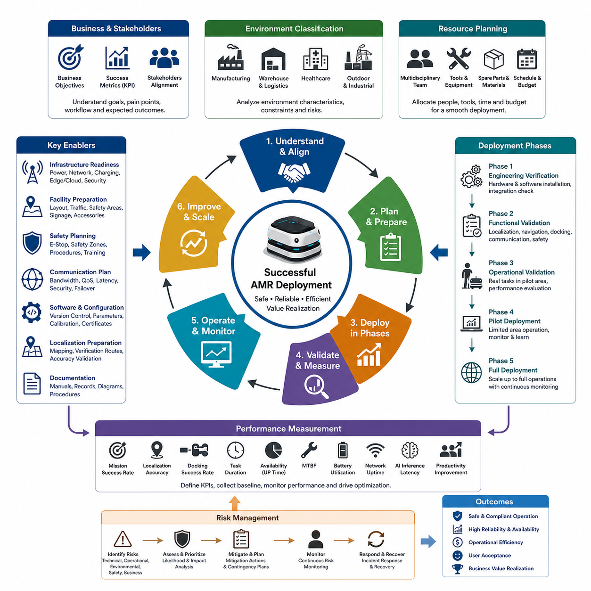
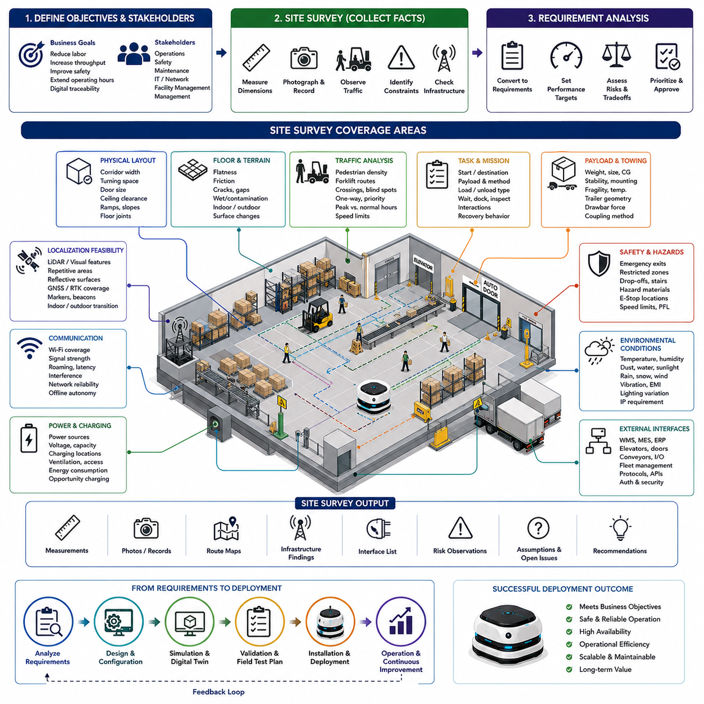
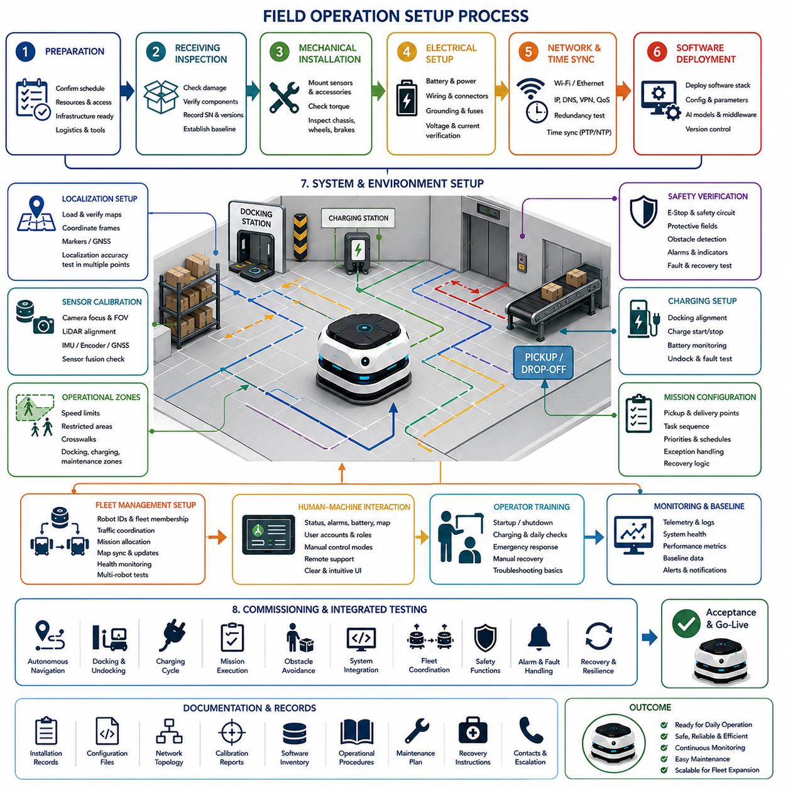
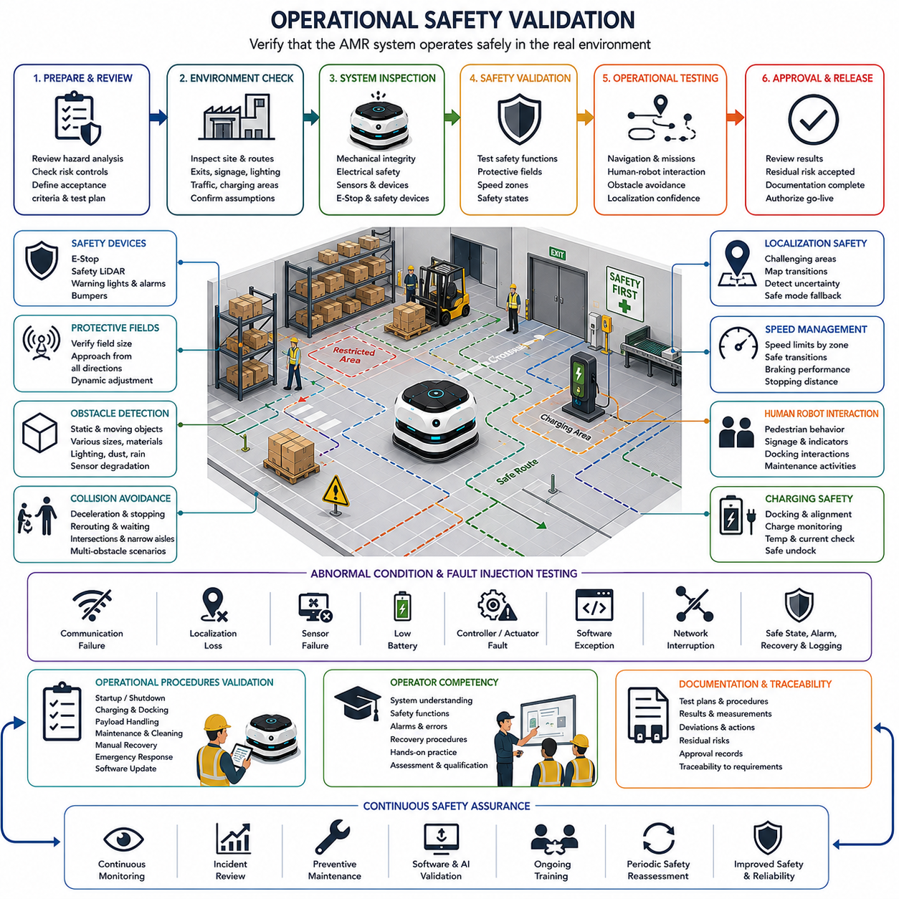
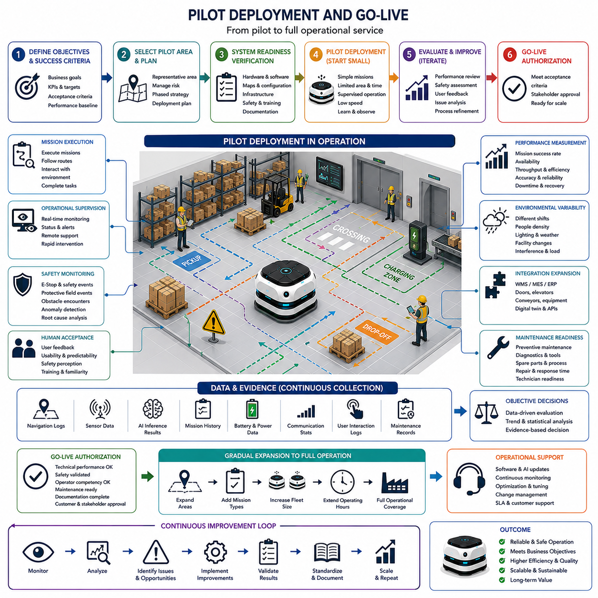
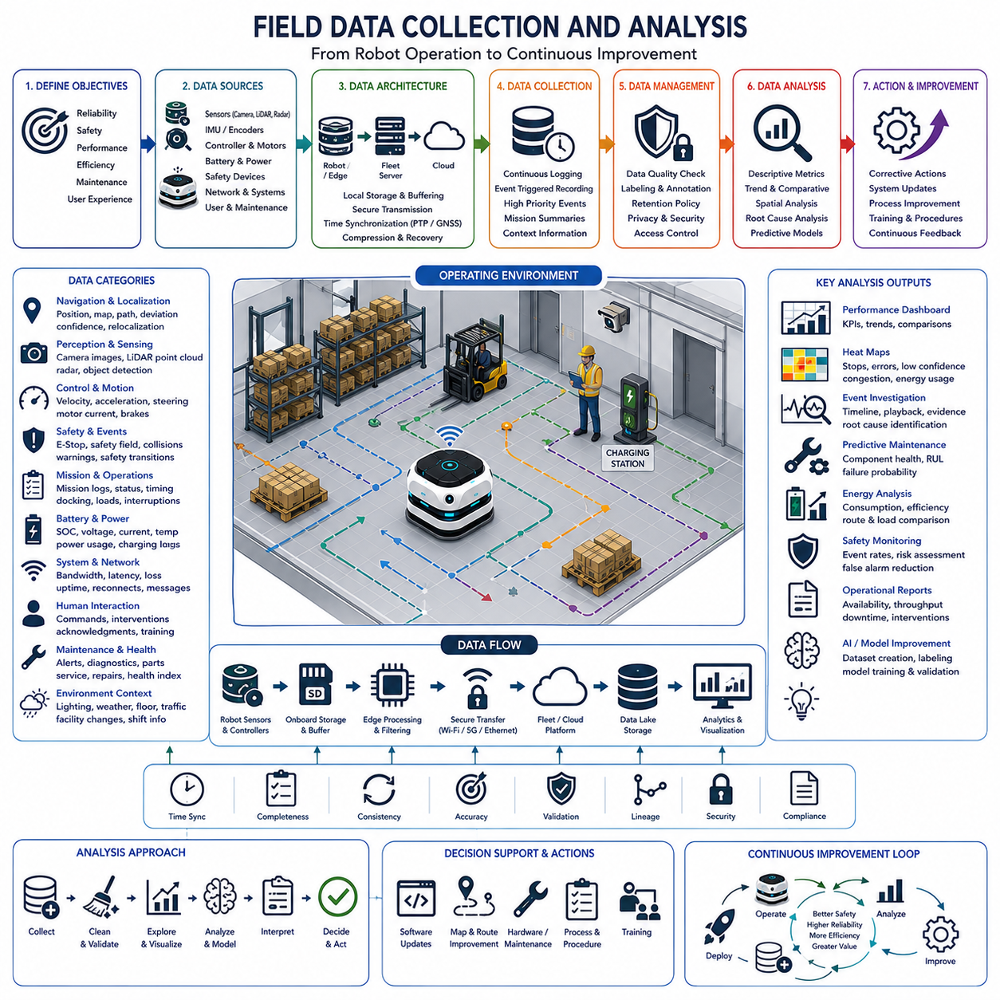
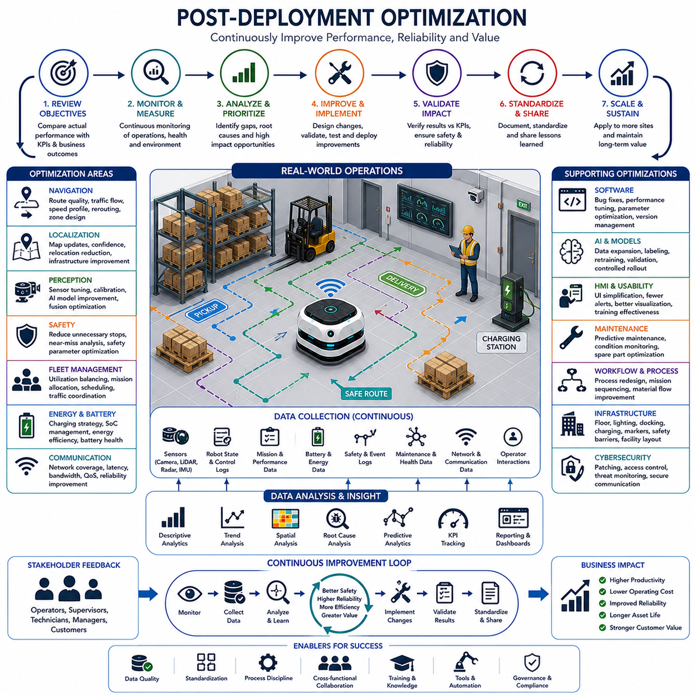
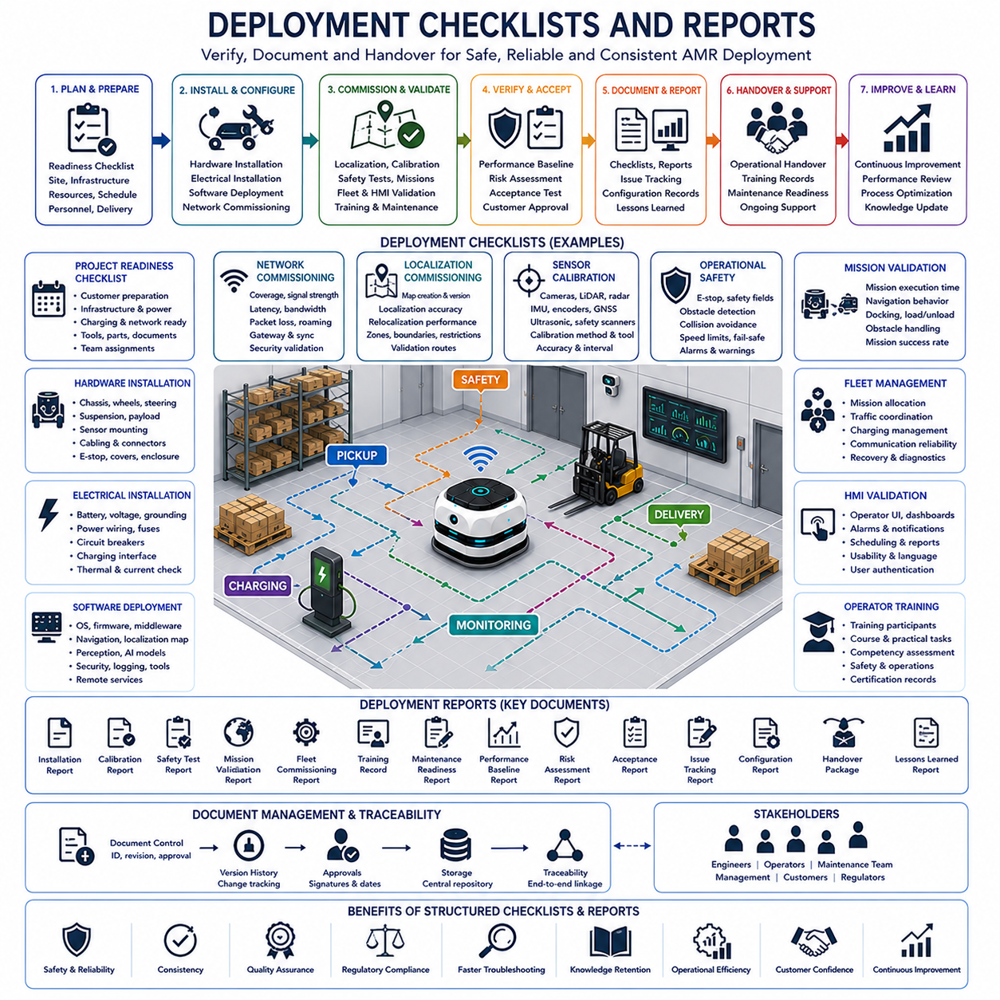

**Volume 10. AMR Engineering Process and Development Manual**

# Chapter 16. Deployment and Field Testing

## 16.01 Deployment Strategy and Planning

{width="7.268055555555556in" height="7.268055555555556in"}

Deployment strategy and planning establish the bridge between a successfully developed autonomous mobile robot and a reliable operational system capable of delivering long-term business value. While laboratory testing verifies individual functions under controlled conditions, deployment introduces numerous environmental, operational, organizational, and human variables that cannot be completely reproduced during development. A structured deployment strategy therefore minimizes uncertainty by defining how the robot, supporting infrastructure, software ecosystem, operational procedures, and customer organization will transition from engineering validation into daily production. Rather than treating deployment as a final installation activity, mature AMR projects consider it an integral engineering phase that begins during system architecture definition and continues until operational stability has been demonstrated over an extended period.

An effective deployment plan begins with a comprehensive understanding of customer objectives rather than technical specifications alone. Engineering teams should identify why automation is being introduced, which operational bottlenecks require improvement, what performance indicators define project success, and how existing workflows will evolve after robot introduction. These discussions involve production managers, facility operators, maintenance personnel, safety officers, IT administrators, and executive decision makers. Aligning technical deployment with measurable business objectives ensures that engineering decisions remain focused on operational value instead of isolated technological achievements.

Deployment planning also requires careful classification of deployment environments because every application introduces unique engineering constraints. Manufacturing plants prioritize production continuity and predictable logistics, hospitals require uninterrupted patient safety and hygiene, warehouses demand scalable fleet coordination, while outdoor industrial facilities introduce weather, terrain, GNSS availability, and environmental durability considerations. These environmental differences influence sensor configurations, localization methods, communication infrastructure, safety mechanisms, maintenance schedules, and operational procedures. A deployment strategy therefore begins by categorizing the target environment before selecting technical implementation approaches.

A successful deployment strategy divides implementation into manageable phases instead of attempting immediate full-scale operation. Initial engineering verification confirms that all hardware and software components have been correctly installed and integrated. Functional validation follows by confirming localization accuracy, navigation reliability, docking precision, communication stability, perception performance, emergency stop operation, and interaction with external systems. Operational validation subsequently evaluates the robot during representative production activities before gradually increasing workload until continuous production becomes feasible. This phased progression significantly reduces deployment risk while providing measurable checkpoints throughout the project.

Project planning should establish deployment milestones with clearly defined entry and exit criteria. Every deployment phase requires objective acceptance conditions before subsequent activities begin. For example, infrastructure installation should only be accepted after electrical systems, network connectivity, charging stations, safety devices, and communication coverage have passed inspection. Similarly, navigation validation should require consistent localization performance across all operational areas before mission execution testing proceeds. Clearly documented acceptance criteria eliminate ambiguity between engineering teams and customers while preventing premature progression into more complex operational stages.

Resource planning represents another essential component of deployment preparation. Deployment activities require multidisciplinary coordination involving mechanical engineers, electrical engineers, robotics software developers, AI specialists, IT personnel, safety experts, production supervisors, and customer representatives. Equipment such as calibration tools, diagnostic computers, spare components, network analyzers, lifting devices, and measurement instruments must be available according to project schedules. Comprehensive resource allocation minimizes deployment delays while ensuring that unexpected technical issues can be addressed without interrupting the overall implementation timeline.

Infrastructure readiness significantly influences deployment success because robot performance depends upon the surrounding operational ecosystem. Electrical power quality, wireless network coverage, charging station placement, cloud connectivity, edge computing resources, map storage, cybersecurity policies, access control systems, and physical traffic management should all be evaluated before robots arrive on site. Infrastructure deficiencies often create operational instability despite technically sound robotic systems. Early infrastructure verification therefore prevents unnecessary troubleshooting during later deployment stages.

Deployment planning should also address facility preparation activities that support safe robot operation. Floor conditions, obstacle locations, pedestrian traffic, emergency evacuation routes, loading stations, storage areas, elevator integration, automatic doors, lighting quality, reflective surfaces, and environmental hazards should be carefully documented. Physical modifications may include installing fiducial markers, charging docks, safety barriers, warning indicators, communication equipment, or dedicated maintenance areas. These preparations create a stable operational environment that improves both robot reliability and workplace safety.

Risk management should remain active throughout deployment planning rather than being treated as a separate documentation exercise. Potential technical failures, schedule delays, environmental uncertainties, supply chain disruptions, software defects, communication failures, human operational errors, and safety incidents should all be systematically identified before deployment begins. Each identified risk requires corresponding mitigation strategies, contingency plans, responsible personnel, monitoring methods, and recovery procedures. Continuous risk assessment enables deployment teams to respond rapidly when unexpected conditions arise without compromising project objectives.

Deployment schedules should account for operational realities rather than ideal engineering assumptions. Manufacturing facilities often operate around the clock with limited maintenance windows, hospitals cannot interrupt patient services, and logistics centers experience fluctuating workloads depending on business demand. Deployment activities should therefore be synchronized with customer operations to minimize production disruption. Weekend installations, nighttime validation, phased production transitions, and temporary parallel operation with existing systems frequently provide safer migration paths than immediate operational replacement.

Software deployment planning requires careful management of configuration consistency across multiple computing platforms. Embedded controllers, perception computers, edge AI accelerators, fleet management servers, cloud services, databases, monitoring systems, and operator interfaces should all operate with compatible software versions. Configuration management procedures should document firmware revisions, middleware versions, AI models, calibration files, navigation parameters, network settings, and security certificates. Maintaining complete software traceability significantly simplifies debugging while supporting future maintenance and system upgrades.

Localization preparation deserves particular attention because reliable positioning underpins nearly every autonomous behavior. Engineers should determine whether deployment will rely on LiDAR SLAM, Visual SLAM, GNSS, RTK positioning, fiducial markers, hybrid localization, or multi-sensor fusion. Mapping activities should be carefully planned to avoid temporary obstacles, construction activities, or abnormal environmental conditions that could reduce long-term localization robustness. Validation routes should represent the full operational environment rather than isolated demonstration paths to ensure consistent performance during production.

Communication planning extends beyond simply providing wireless connectivity. Engineers should evaluate network bandwidth, roaming behavior, latency, packet loss, interference sources, cybersecurity requirements, quality of service policies, cloud synchronization intervals, and failover communication mechanisms. Autonomous robots increasingly depend on continuous interaction with fleet management systems, monitoring platforms, digital twins, and cloud-based AI services. Consequently, communication reliability directly influences operational continuity and should be verified under realistic production workloads before deployment completion.

Safety planning integrates engineering controls with organizational procedures. Functional safety validation includes emergency stop verification, protective field configuration, speed limitation, collision avoidance, fault detection, recovery behavior, and safe shutdown mechanisms. Organizational safety measures include operator training, emergency response procedures, maintenance authorization, visitor awareness, reporting protocols, and incident investigation processes. Combining technical safeguards with human operational procedures creates multiple layers of protection that collectively reduce deployment risk.

Pilot deployment provides an opportunity to validate engineering assumptions using limited operational exposure before expanding to full production. A carefully selected pilot area should represent realistic operational complexity while limiting business impact if unexpected problems occur. During pilot operation, engineers monitor navigation success rates, mission completion times, localization stability, communication reliability, battery utilization, obstacle interactions, human acceptance, maintenance frequency, and software stability. Lessons learned during pilot deployment become valuable engineering inputs that improve subsequent large-scale implementation.

Performance measurement should be integrated into deployment planning from the beginning rather than introduced after system commissioning. Key performance indicators may include mission completion percentage, localization accuracy, docking success rate, average task duration, robot availability, mean time between failures, battery utilization, network uptime, AI inference latency, maintenance response time, and operational productivity improvements. Establishing baseline measurements before deployment allows engineering teams to objectively quantify operational benefits while identifying areas requiring further optimization.

Deployment documentation serves as the foundation for long-term operational sustainability. Engineering teams should produce installation records, configuration documents, network diagrams, calibration reports, validation results, maintenance procedures, software inventories, recovery instructions, operator manuals, and change management records. Well-maintained documentation accelerates troubleshooting, simplifies future upgrades, supports regulatory compliance, and preserves organizational knowledge even when personnel responsibilities change over the product lifecycle.

Successful deployment planning ultimately recognizes that autonomous mobile robots function as components of larger operational ecosystems rather than isolated machines. Sustainable deployment depends upon coordinated engineering, disciplined project management, reliable infrastructure, comprehensive validation, effective communication, continuous monitoring, and close collaboration between developers and end users. Organizations that approach deployment as an evolving engineering process instead of a single installation milestone consistently achieve higher system reliability, faster operational adoption, improved customer satisfaction, and more efficient long-term lifecycle management for autonomous robotic systems.

## 16.02 Site Survey and Requirement Analysis

{width="7.268055555555556in" height="7.268055555555556in"}

A site survey and requirement analysis establish the factual foundation for deploying an autonomous mobile robot in a real operating environment. The process converts customer expectations, facility conditions, workflow constraints, and technical limitations into validated engineering requirements. Unlike a general sales visit, a deployment-oriented survey must collect measurable evidence about routes, tasks, infrastructure, safety conditions, communication coverage, and system interfaces. The resulting information guides robot selection, configuration, validation planning, installation activities, and operational acceptance.

The survey should begin by clarifying the customer's operational objectives and the business problem that automation is expected to solve. Engineers need to understand whether the project aims to reduce manual transport, improve delivery consistency, increase inspection coverage, extend operating hours, reduce safety exposure, or create traceable digital workflows. These objectives should be translated into measurable outcomes such as throughput, cycle time, labor reduction, mission completion rate, operating availability, response time, or inspection frequency. Clear objectives prevent the project from becoming focused only on technical demonstration.

Stakeholder identification is necessary because deployment requirements are rarely controlled by a single department. Production managers may define throughput and scheduling needs, operators understand practical workflow details, safety personnel identify restricted areas, maintenance teams define service constraints, and IT teams control networks and cybersecurity policies. Facility managers may also approve structural modifications, power installations, charging locations, and traffic changes. Interviews should therefore include all relevant stakeholders so that conflicting requirements can be discovered before design decisions become difficult or expensive to change.

The physical survey should document the complete operational area rather than only the intended robot route. Engineers should measure corridor widths, turning spaces, door dimensions, ceiling clearances, loading zones, intersections, slopes, ramps, floor joints, drainage channels, and restricted passages. Temporary obstacles, parked equipment, pallets, carts, cables, and material staging areas must also be considered because they often create more operational difficulty than permanent structures. Accurate measurements support vehicle envelope analysis, path feasibility assessment, sensor placement, and safe clearance calculation.

Floor and terrain conditions have a direct effect on mobility, localization, braking, payload stability, and mechanical durability. Indoor surveys should examine floor flatness, surface friction, cracks, expansion joints, contamination, metal plates, wet areas, and transitions between different materials. Outdoor surveys should additionally evaluate gravel, soil, grass, mud, potholes, curbs, drainage, slopes, and weather-related surface changes. These observations influence wheel selection, ground clearance, suspension requirements, traction control, maximum speed, braking distance, and allowable payload under realistic conditions.

Traffic analysis should capture how people, vehicles, and equipment move through the facility throughout the day. A route that appears clear during a short visit may become heavily congested during shift changes, material replenishment, cleaning operations, or emergency activities. Survey teams should record pedestrian density, forklift movements, crossing points, blind corners, queue areas, one-way lanes, priority rules, and speed restrictions. Time-based observations are especially important because traffic patterns may vary significantly between normal production, peak activity, maintenance periods, and night operation.

Task analysis converts high-level use cases into precise mission definitions. Each mission should identify its starting point, destination, payload, loading method, unloading method, required timing, interaction steps, and recovery behavior. Engineers must understand whether loading is manual, automated, conveyor-based, forklift-assisted, or integrated with a robot arm. They should also determine whether the robot waits, docks, exchanges data, performs inspection, activates external equipment, or returns automatically. This decomposition reveals interface needs and operational dependencies that may not be visible from route observation alone.

Payload requirements must include more than nominal weight. The survey should document payload dimensions, center of gravity, load distribution, mounting method, stability, fragility, temperature sensitivity, contamination risks, and variation between normal and maximum cases. Towing applications require information about trailer geometry, drawbar forces, articulation, reversing behavior, and coupling mechanisms. Inspection applications require equipment mass, power demand, vibration limits, sensor line of sight, and positioning accuracy. These factors directly affect chassis selection, motor sizing, braking, docking, and safety validation.

Localization feasibility should be evaluated throughout the target environment because navigation performance depends heavily on available environmental features. Repetitive corridors, glass walls, reflective surfaces, open spaces, moving machinery, poor lighting, and changing storage layouts may reduce LiDAR or visual localization reliability. Outdoor areas may include GNSS shadowing, multipath effects, tree cover, narrow passages, and transitions between indoor and outdoor zones. The survey should identify where LiDAR SLAM, Visual SLAM, GNSS, RTK, markers, odometry, or fused localization methods are most appropriate.

Wireless communication coverage must be measured rather than assumed. Engineers should inspect access point locations, signal strength, channel congestion, roaming performance, latency, packet loss, and interference across all operating routes. Coverage should also be tested near elevators, steel structures, loading docks, outdoor boundaries, and areas containing high-power industrial equipment. Communication requirements should distinguish safety-critical local autonomy from fleet coordination, remote monitoring, cloud synchronization, software updates, and external system integration. The robot should maintain safe behavior even when network connectivity becomes degraded or temporarily unavailable.

Power and charging analysis should determine how the robot will sustain its expected duty cycle. The survey must identify available electrical sources, voltage levels, grounding quality, circuit capacity, charging station locations, ventilation, access control, and protection requirements. Charging positions should support safe entry and exit without obstructing traffic. Engineers should estimate daily energy consumption using mission distance, payload, speed, idle time, computation load, terrain, and environmental temperature. The results guide battery sizing, opportunity charging, automatic charging strategy, and the number of chargers required for fleet operation.

Safety requirement analysis should combine physical hazards, operational behavior, and organizational procedures. Survey teams should identify emergency exits, fire doors, hazardous materials, drop-offs, stairs, restricted zones, high-temperature areas, poor visibility, and locations where people may unexpectedly enter the robot path. Applicable speed limits, protective fields, warning indicators, emergency stop locations, and safe stopping distances should be defined for each operating zone. Safety requirements must also address maintenance, manual recovery, towing, battery handling, and response procedures following abnormal events.

Environmental conditions should be documented over the full expected operating range rather than only during the survey visit. Temperature, humidity, dust, water exposure, sunlight, rain, snow, wind, vibration, electromagnetic interference, and lighting variation may affect sensors, batteries, computers, connectors, and mechanical structures. Industrial environments may also introduce oil mist, metal particles, chemicals, steam, or explosive atmospheres. These findings determine protection ratings, thermal management, enclosure design, sensor cleaning needs, connector selection, and maintenance intervals.

External system interfaces must be identified early because successful deployment often depends on integration with existing digital and physical infrastructure. Relevant systems may include warehouse management, manufacturing execution, enterprise resource planning, building management, access control, elevators, automatic doors, conveyors, charging systems, inspection equipment, and fleet management platforms. Each interface should define data ownership, communication protocol, command direction, timing, error handling, authentication, and fallback behavior. Unclear interface responsibility is a common source of deployment delay and operational instability.

Operational availability and maintenance requirements should be established during the survey rather than after installation. The customer should define permitted downtime, maintenance windows, spare robot strategy, response expectations, and access conditions for service personnel. Engineers should identify where robots can be inspected, lifted, cleaned, charged, calibrated, and repaired without interrupting production. Spare parts, diagnostic tools, software access, remote support permissions, and escalation procedures should also be considered. These requirements influence both system architecture and lifecycle support planning.

Requirement analysis should convert all collected observations into structured, testable, and traceable statements. Each requirement should contain a clear condition, expected behavior, measurable performance target, verification method, and responsible owner. Vague statements such as "the robot should operate safely" should be replaced with specific requirements for speed, stopping distance, obstacle detection, protective zones, emergency behavior, and recovery. Requirements should also be classified by priority, technical risk, customer value, regulatory relevance, and dependency on external systems.

Conflicts and tradeoffs identified during analysis should be resolved before deployment design is finalized. High speed may conflict with safety margins, large payloads may reduce stopping precision, aggressive charging schedules may shorten battery life, and cloud dependence may conflict with network reliability or cybersecurity policy. The engineering team should document these tradeoffs and evaluate alternatives using measurable criteria. Decisions should be approved by the appropriate stakeholders so that later disagreements do not undermine system acceptance or create uncontrolled scope changes.

The survey report should include validated measurements, photographs or site records, route descriptions, infrastructure findings, interface lists, risk observations, assumptions, open issues, and recommended actions. Even when visual records are stored separately, the written report should explain their engineering significance. Every unresolved item should have an owner and target resolution date. Version control is essential because facilities, workflows, equipment layouts, and customer expectations may change between the initial survey, pilot installation, and final deployment.

Site survey results should also support simulation, digital twin preparation, and field test planning. Measured dimensions, terrain characteristics, traffic patterns, sensor constraints, and mission sequences can be reproduced in a virtual environment before physical installation. Simulation allows engineers to evaluate route feasibility, fleet congestion, docking approaches, sensor placement, and charging strategies with lower cost and risk. However, simulated results must remain linked to verified site data so that virtual validation does not rely on outdated layouts or unrealistic operational assumptions.

A formal review should be conducted after requirement analysis to confirm that the proposed AMR solution is technically feasible, commercially justified, operationally acceptable, and safe to deploy. The review should determine whether the standard platform is sufficient or whether mechanical, electrical, software, AI, or infrastructure modifications are required. It should also identify conditions that must be completed by the customer before installation. Deployment should proceed only when critical assumptions, responsibilities, acceptance criteria, and unresolved risks have been clearly documented and approved.

A disciplined site survey and requirement analysis reduce uncertainty before expensive deployment activities begin. They create a shared understanding between the customer, engineering organization, system integrators, and operational teams while providing traceable inputs for architecture, configuration, validation, and support. Projects that invest in detailed field analysis are better able to predict technical challenges, prevent late design changes, control project scope, and achieve stable operation. The survey therefore serves not as a preliminary formality, but as the engineering basis for reliable and scalable AMR deployment.

## 16.03 Field Operation Setup

{width="7.268055555555556in" height="7.268055555555556in"}

Field operation setup transforms a fully engineered autonomous mobile robot into an operational system capable of performing reliable daily missions within a real production environment. While deployment planning defines what should be accomplished, field operation setup focuses on establishing every physical, digital, and organizational element required before routine operation begins. This phase ensures that infrastructure, robot hardware, software configuration, communication systems, safety mechanisms, operational procedures, and personnel are prepared to function as an integrated ecosystem. A systematic setup process minimizes unexpected operational disruptions while providing a stable foundation for long-term autonomous operation.

Preparation activities should begin before the robot arrives at the deployment site. Engineering teams should verify that installation schedules, required equipment, access permissions, safety documentation, electrical infrastructure, network availability, and customer resources have all been confirmed. Delivery logistics, lifting equipment, unloading procedures, temporary storage locations, and equipment inspection areas should also be coordinated in advance. Early preparation reduces idle time during installation while preventing unnecessary delays caused by incomplete site readiness or unavailable support resources.

Upon arrival, every robot should undergo a comprehensive receiving inspection before entering the operational area. Engineers should verify mechanical integrity, shipping damage, connector conditions, battery status, sensor alignment, wheel condition, emergency stop functionality, protective covers, cooling systems, and accessory installation. Software versions, firmware revisions, calibration files, configuration parameters, and serial numbers should also be recorded. Establishing a documented baseline at delivery simplifies future troubleshooting while ensuring that no transportation-related issues remain unnoticed before commissioning.

Mechanical installation should verify that every structural component satisfies design specifications after transportation. Sensor mounting brackets, antennas, cameras, LiDAR units, radar modules, communication devices, safety scanners, docking interfaces, payload structures, and inspection equipment should all be securely fastened using specified torque values. Suspension components, drive wheels, steering mechanisms, braking systems, and chassis alignment should be visually inspected and mechanically verified. Small mechanical deviations introduced during shipment can significantly reduce localization accuracy or perception reliability during autonomous operation.

Electrical setup establishes stable power distribution throughout the robotic platform. Engineers should verify battery installation, power cable routing, connector engagement, grounding integrity, fuse protection, emergency disconnect circuits, charging interfaces, voltage stability, and current consumption under representative operating conditions. DC power supplies, edge computing hardware, network switches, industrial controllers, and peripheral devices should all receive stable power without excessive voltage drops or electrical noise. Proper electrical verification reduces intermittent failures that are often difficult to reproduce after deployment.

Network configuration represents one of the most important setup activities because modern autonomous robots depend upon continuous communication with fleet management systems, monitoring platforms, cloud infrastructure, and external industrial equipment. Wireless connections, Ethernet interfaces, VPN services, firewall policies, IP addressing, DNS configuration, time synchronization, and Quality of Service settings should all be validated before autonomous operation begins. Communication redundancy and automatic recovery mechanisms should also be verified to ensure operational continuity during temporary network degradation.

Time synchronization should receive particular attention because multiple sensors, controllers, AI processors, and fleet servers frequently exchange timestamped information. Precision Time Protocol, Network Time Protocol, hardware trigger synchronization, and synchronized sensor acquisition should all be validated during installation. Accurate timing supports sensor fusion, localization consistency, AI inference, event logging, diagnostics, and post-incident analysis. Even small synchronization errors may degrade perception accuracy or complicate engineering investigations following unexpected operational events.

Software deployment should ensure that every onboard and offboard component operates with validated production configurations. Navigation software, perception pipelines, localization modules, mission management, safety controllers, diagnostic services, AI models, communication middleware, fleet management interfaces, and cloud connectivity should all be configured according to documented release versions. Configuration files should remain under version control so that deployed systems can be reproduced consistently across multiple robots while simplifying future maintenance and software updates.

Localization setup begins with preparing the operational map and positioning framework. Engineers should verify map integrity, coordinate systems, reference frames, localization parameters, fiducial markers, GNSS corrections, map server synchronization, and transition zones between different localization methods. Initial localization accuracy should be validated at multiple positions throughout the operating environment rather than only at the startup location. Comprehensive localization verification establishes confidence that autonomous navigation will remain stable across all operational areas.

Sensor calibration should be verified immediately before field operation begins because transportation, installation, and environmental changes may influence sensor alignment. Cameras should be checked for focus, exposure, field of view, and geometric calibration. LiDAR units require verification of orientation and scan integrity, while IMUs, wheel encoders, GNSS receivers, radar modules, and ultrasonic sensors should all undergo functional validation. Multi-sensor calibration consistency directly influences localization, perception, obstacle detection, and navigation reliability.

Operational zones should be configured according to facility-specific safety and productivity requirements. Speed limits, restricted areas, pedestrian crossings, loading stations, docking regions, charging locations, maintenance areas, inspection zones, and emergency escape routes should all be represented within the navigation system. Dynamic operational policies may assign different behaviors during working hours, maintenance periods, or nighttime operation. Clearly defined operational zones improve both autonomous decision making and predictable interaction with human workers.

Safety system verification should confirm that every protective mechanism behaves according to design requirements before unrestricted operation is authorized. Emergency stop circuits, protective fields, speed limitation functions, obstacle detection, collision avoidance, audible alarms, visual indicators, manual recovery procedures, and fault handling logic should all be tested using representative operational scenarios. Safety validation should include both expected operating conditions and abnormal situations such as communication loss, localization failure, sensor malfunction, or emergency shutdown.

Charging infrastructure should be commissioned before routine operation begins. Engineers should validate docking alignment, charging initiation, communication between robot and charger, battery monitoring, charging completion, automatic undocking, and charging fault detection. Charging stations should also be evaluated for accessibility, traffic interference, environmental protection, and emergency access. Successful charging validation ensures continuous autonomous operation while reducing the likelihood of battery-related mission interruptions during production.

Mission configuration transforms customer workflows into executable autonomous tasks. Pickup locations, delivery destinations, inspection stations, waiting areas, docking procedures, scheduling policies, task priorities, mission sequencing, exception handling, and recovery logic should all be configured within the mission management system. Initial missions should remain relatively simple before progressively introducing higher operational complexity. Incremental mission deployment enables engineers to isolate configuration issues while minimizing operational risk during early production.

Fleet management configuration becomes increasingly important as multiple robots share operational space. Vehicle identification, fleet membership, traffic coordination policies, map synchronization, mission allocation rules, charging priorities, congestion management, and communication health should all be verified before collaborative operation begins. Fleet-level testing should include simultaneous navigation, intersection handling, docking coordination, task reassignment, and recovery from temporarily unavailable vehicles. Proper fleet configuration maximizes overall productivity while reducing traffic conflicts.

Human-machine interaction should receive equal attention during field operation setup because operators remain essential participants in autonomous workflows. Operator interfaces should present clear mission status, robot health information, alarms, battery conditions, localization quality, communication status, and maintenance notifications. User accounts, authorization levels, password policies, emergency controls, manual operation modes, and remote assistance capabilities should all be configured according to organizational requirements. Effective human interfaces improve operational transparency while supporting rapid decision making during unexpected situations.

Operator training should accompany technical installation rather than being postponed until after deployment. Personnel should understand startup procedures, shutdown processes, charging operations, routine inspections, emergency responses, fault reporting, manual recovery, basic troubleshooting, and safe interaction with autonomous robots. Maintenance personnel require additional instruction regarding diagnostics, software updates, calibration verification, preventive maintenance, spare parts replacement, and recovery following hardware failures. Comprehensive training significantly improves long-term operational reliability while reducing human-induced errors.

Operational monitoring systems should be activated before production begins to establish baseline performance measurements. Telemetry collection, event logging, health monitoring, AI inference statistics, battery utilization, mission history, localization quality, communication performance, and maintenance indicators should all be recorded continuously. Establishing baseline operational data allows engineering teams to distinguish between expected system behavior and emerging abnormalities while supporting predictive maintenance and continuous system improvement.

Documentation should accurately reflect the deployed system rather than the original engineering design. Installation records, configuration files, network topology, calibration reports, software inventories, operational procedures, maintenance schedules, recovery instructions, emergency contacts, and acceptance records should all be updated following installation. Accurate documentation ensures that future maintenance activities, software upgrades, troubleshooting, and system expansion can proceed efficiently without relying solely on institutional knowledge possessed by individual engineers.

A structured commissioning process should verify that all operational components function together before customer acceptance. Integrated testing should include autonomous navigation, docking, charging, mission execution, obstacle avoidance, external system communication, fleet coordination, safety behavior, alarm handling, operator interaction, and recovery from representative fault scenarios. Acceptance criteria should be measured objectively using predefined performance indicators rather than subjective observations. Only after successful commissioning should the robot transition into unrestricted operational service.

Field operation setup should be viewed as the beginning of operational engineering rather than the conclusion of deployment activities. Every successful installation establishes the foundation for continuous monitoring, operational optimization, AI model improvement, preventive maintenance, software evolution, and future fleet expansion. Organizations that invest in disciplined field operation setup consistently experience faster customer acceptance, greater operational stability, reduced maintenance costs, improved system availability, and more predictable long-term performance throughout the entire lifecycle of autonomous mobile robot deployments.

## 16.04 Operational Safety Validation

{width="7.268055555555556in" height="7.268055555555556in"}

Operational safety validation verifies that an autonomous mobile robot can perform its intended missions safely under actual operating conditions while protecting people, equipment, facilities, and surrounding infrastructure. Unlike laboratory verification, operational safety validation evaluates the complete robotic system within the environment where it will be deployed, considering realistic workflows, dynamic obstacles, human interactions, environmental uncertainties, and unexpected operational events. The objective is not only to confirm compliance with technical specifications but also to demonstrate that the integrated system consistently maintains an acceptable level of safety throughout its operational lifecycle.

Safety validation should begin with confirmation that all previously identified hazards have been addressed through appropriate engineering controls. Hazard analyses performed during system design, including Hazard Analysis and Risk Assessment activities, should be reviewed against the actual deployment environment to determine whether new hazards have emerged or whether previously identified risks have changed due to facility layout modifications, workflow adjustments, or operational constraints. Every identified hazard should remain traceable to corresponding mitigation measures, validation procedures, and documented acceptance criteria before operational testing proceeds.

The operational environment itself should undergo safety verification before the robot begins autonomous movement. Engineers should inspect floor conditions, traffic routes, emergency exits, restricted zones, charging stations, loading areas, pedestrian crossings, warning signs, lighting quality, communication coverage, and environmental obstacles. Temporary construction, relocated equipment, seasonal environmental changes, or modified production layouts may introduce new hazards that were not present during earlier site surveys. Safety validation therefore requires confirmation that the deployment environment continues to satisfy the assumptions established during system design.

Mechanical safety inspection should verify that the robot remains structurally sound following transportation, installation, and commissioning. Chassis integrity, suspension components, steering mechanisms, braking systems, payload mounting structures, sensor brackets, protective covers, wheel assemblies, and emergency stop devices should all be examined for proper installation and mechanical reliability. Loose fasteners, damaged connectors, misaligned sensors, or structural deformation can significantly reduce operational safety even when software functions correctly. Mechanical verification establishes confidence that physical hardware supports safe autonomous operation.

Electrical safety validation confirms that all power-related systems operate without creating hazards for operators or equipment. Battery installation, power distribution, insulation, grounding, overcurrent protection, emergency disconnect circuits, charging interfaces, and electrical enclosures should be inspected according to applicable safety requirements. Engineers should also verify that electrical cabinets remain properly sealed, connectors cannot be accidentally disconnected during operation, and thermal conditions remain within acceptable limits. Stable electrical operation reduces fire risks, unexpected shutdowns, and equipment damage during continuous operation.

Emergency stop functionality represents one of the most fundamental operational safety mechanisms and should be tested extensively under representative operating conditions. Every emergency stop device should immediately interrupt hazardous motion while placing the robot into a predefined safe state regardless of current mission status. Validation should include emergency stop activation from multiple locations, repeated activation cycles, recovery procedures, communication with external systems, and restart authorization. Operators should clearly understand when emergency stop activation is appropriate and how safe recovery should be performed afterward.

Protective field validation ensures that safety sensors correctly detect approaching personnel and obstacles before hazardous conditions develop. Safety LiDAR, laser scanners, vision-based safety systems, radar sensors, and other protective devices should be evaluated using representative approach speeds, directions, object sizes, and environmental conditions. Engineers should confirm that protective field dimensions correspond to vehicle speed, braking capability, payload characteristics, and environmental constraints. Dynamic protective field adjustment should also be validated if the robot modifies protection distances according to operational speed or maneuvering mode.

Obstacle detection validation should evaluate the robot\'s ability to identify both expected and unexpected objects throughout the operational environment. Test scenarios should include static obstacles, moving equipment, pedestrians, pallets, carts, reflective materials, transparent surfaces, suspended objects, irregularly shaped items, and partially occluded obstacles. Validation should also consider low-light conditions, bright sunlight, dust, rain, fog, and other environmental factors that may influence sensor performance. Reliable obstacle detection significantly reduces collision probability during routine operation.

Collision avoidance testing should verify that obstacle detection results produce safe vehicle behavior under realistic operational scenarios. The robot should demonstrate smooth deceleration, controlled stopping, appropriate rerouting, or safe waiting behavior depending on mission requirements and surrounding conditions. Engineers should evaluate behavior during crowded environments, narrow corridors, intersections, docking operations, reversing maneuvers, and simultaneous interactions with multiple moving obstacles. Collision avoidance algorithms should prioritize predictable and understandable behavior that supports safe human-robot collaboration.

Localization safety validation confirms that the robot maintains sufficient positional confidence throughout autonomous operation. Engineers should intentionally evaluate challenging localization conditions including repetitive corridors, reflective environments, feature-poor areas, indoor-outdoor transitions, temporary environmental changes, and partial sensor degradation. The robot should recognize localization uncertainty before navigation accuracy becomes unacceptable and should automatically transition into predefined safe operational modes. Localization confidence monitoring prevents hazardous navigation decisions caused by inaccurate positioning.

Navigation safety validation examines complete path execution rather than isolated planning algorithms. Test routes should represent realistic operational missions involving intersections, narrow passages, elevators, automatic doors, loading stations, charging areas, and shared traffic spaces. The robot should consistently remain within defined operating boundaries while respecting speed limits, safety zones, and traffic management rules. Unexpected environmental changes should trigger appropriate adaptive behavior without compromising safety or creating confusion for nearby personnel.

Human-robot interaction validation evaluates how safely operators and pedestrians coexist with autonomous systems during daily operation. Engineers should observe how people naturally respond to robot movement, warning signals, status indicators, audible alarms, visual displays, and stopping behavior. Validation should include situations where people intentionally or unintentionally obstruct robot movement, approach the robot during docking, manually interact with payloads, or perform maintenance activities nearby. Human behavior often differs significantly from engineering assumptions, making real-world observation essential for operational safety.

Operational speed validation should confirm that vehicle velocity remains appropriate for specific environmental conditions and mission contexts. Speed limits should automatically adapt according to pedestrian density, visibility, workspace constraints, turning radius, payload characteristics, and obstacle proximity. Validation should verify transitions between different speed zones, emergency deceleration performance, stopping distances, and acceleration smoothness. Excessive speed may reduce reaction time, while overly conservative speed can unnecessarily reduce operational efficiency.

Safety validation should include intentional fault injection to evaluate system responses under abnormal operating conditions. Engineers may simulate communication failures, localization loss, sensor malfunction, battery depletion, controller faults, actuator failures, software exceptions, and network interruptions. The robot should detect abnormal conditions rapidly, transition into predefined safe states, notify operators, record diagnostic information, and support controlled recovery procedures. Fault injection testing demonstrates system resilience beyond normal operational scenarios.

Communication safety should verify that temporary network failures do not compromise autonomous operation. Robots should continue executing locally safe behaviors even when connections to fleet management systems, cloud infrastructure, or remote monitoring platforms become unavailable. Validation should evaluate mission continuity, emergency stop communication, alarm reporting, data buffering, automatic reconnection, and operator notification during communication degradation. Safe autonomy should never depend solely upon continuous external network availability.

Battery safety validation extends beyond electrical performance to include operational behavior throughout charging and discharge cycles. Engineers should verify battery temperature monitoring, charging supervision, abnormal current detection, state-of-charge estimation, emergency charging interruption, automatic docking recovery, and safe shutdown before battery depletion reaches hazardous levels. Thermal events, charging abnormalities, or unexpected battery degradation should all generate appropriate protective responses before safety margins become compromised.

Cybersecurity considerations increasingly influence operational safety because unauthorized system access may directly affect robot behavior. Safety validation should therefore verify authentication mechanisms, secure communication channels, software integrity verification, access control policies, and protection against unauthorized configuration changes. Operational personnel should only possess permissions necessary for their assigned responsibilities, while engineering-level modifications require appropriate authorization and traceability. Maintaining cybersecurity strengthens both operational reliability and functional safety.

Operational procedures should also undergo safety validation because safe technology alone cannot guarantee safe operation. Startup procedures, shutdown activities, charging routines, maintenance workflows, manual recovery, emergency response, cleaning operations, payload handling, and software updates should all be executed by representative operators during validation. Engineers should identify procedural ambiguities, unnecessary complexity, or opportunities for human error. Simplified and standardized operational procedures significantly reduce safety risks during long-term deployment.

Operator competency should be assessed as part of operational safety validation. Personnel responsible for supervision, maintenance, emergency response, and routine operation should demonstrate understanding of robot behavior, safety functions, alarms, recovery procedures, maintenance restrictions, and reporting requirements. Practical exercises frequently reveal misunderstandings that remain unnoticed during classroom instruction. Competent operators contribute substantially to maintaining safe operation throughout the deployment lifecycle.

Every safety validation activity should generate documented evidence supporting final operational acceptance. Test procedures, measured results, environmental conditions, observed deviations, corrective actions, residual risks, approval records, and traceability to safety requirements should all be maintained within the project documentation. Comprehensive documentation supports regulatory compliance, future maintenance, software upgrades, incident investigations, and continuous safety improvement throughout the robot\'s operational lifetime.

Operational safety validation should ultimately be viewed as a continuous engineering discipline rather than a one-time certification event. Facilities evolve, software changes, AI models improve, workflows adapt, and operating environments continuously introduce new variables that influence safety performance. Organizations should therefore establish periodic safety reassessment, continuous monitoring, operational incident review, preventive maintenance, software validation, and recurring training programs to preserve safe autonomous operation. A mature safety validation process ensures that autonomous mobile robots continue protecting people and infrastructure while delivering reliable operational performance across their entire service life.

## 16.05 Pilot Deployment and Go-Live

{width="7.268055555555556in" height="7.268055555555556in"}

Pilot deployment and go-live represent the critical transition between engineering validation and full operational service for an autonomous mobile robot system. While laboratory testing, field setup, and operational safety validation demonstrate that individual components function correctly, pilot deployment verifies that the integrated system delivers reliable performance under real production conditions. This stage minimizes operational risk by introducing automation in a controlled manner before organization-wide adoption. Rather than treating go-live as a single event, successful organizations consider it the beginning of continuous operational optimization supported by monitoring, maintenance, and iterative improvement.

Pilot deployment should begin with clearly defined business objectives that extend beyond technical performance measurements. Engineering teams and customers should establish measurable success criteria such as mission completion rate, operational availability, throughput improvement, response time reduction, labor efficiency, inspection consistency, and system reliability. Every objective should include quantitative targets and acceptable tolerance ranges so that deployment success can be evaluated objectively. Well-defined operational goals ensure that engineering validation remains aligned with customer expectations and business value throughout the deployment process.

The pilot area should be carefully selected to represent realistic operational complexity while limiting the impact of unexpected failures. Engineers should choose an environment containing representative traffic conditions, infrastructure, operational workflows, environmental challenges, and user interactions without exposing the entire production process to unnecessary risk. A limited deployment area enables systematic observation of robot behavior while providing opportunities to correct issues before expanding autonomous operation across the complete facility.

Deployment planning should establish a phased operational strategy rather than immediately replacing existing manual processes. Initial pilot activities may involve supervised missions, limited operational hours, simplified routes, reduced vehicle speed, and low-priority logistics tasks. As confidence increases through successful operation, mission complexity, operating time, traffic interaction, payload diversity, and operational coverage can gradually expand. Incremental deployment significantly reduces technical uncertainty while allowing operators to become familiar with autonomous workflows.

System readiness verification should be completed immediately before pilot operation begins. Engineers should confirm that hardware installation, software configuration, localization maps, communication infrastructure, fleet management services, charging systems, safety devices, operational procedures, documentation, and operator training all satisfy predefined acceptance requirements. Configuration consistency across onboard computers, cloud services, edge computing platforms, and external industrial systems should also be verified. A comprehensive readiness review prevents avoidable issues from appearing during early operational evaluation.

Mission selection for pilot deployment should emphasize operational learning rather than maximum productivity. Initial missions should represent repetitive, predictable workflows with clearly defined start points, destinations, loading procedures, and completion conditions. Complex multi-stage operations, highly dynamic environments, or mission-critical logistics should generally be introduced only after the robot has demonstrated stable performance during simpler operational scenarios. Early success establishes confidence among users while reducing deployment risk.

Operational supervision remains essential throughout pilot deployment even when autonomous functionality is fully enabled. Engineering personnel should continuously monitor robot status, localization confidence, communication quality, sensor health, battery condition, navigation performance, mission execution, safety events, and environmental interactions. Real-time supervision enables rapid intervention if abnormal behavior develops while also providing valuable engineering observations that may not appear in laboratory testing. Continuous monitoring supports both operational safety and system refinement.

Human acceptance plays an important role in successful pilot deployment because operational personnel ultimately determine whether autonomous systems become integrated into daily workflows. Engineers should observe how operators, maintenance personnel, supervisors, and nearby workers interact with the robot during routine activities. Feedback regarding usability, predictability, safety perception, interface design, alarm behavior, mission scheduling, and operational convenience should be collected systematically. Addressing user concerns early significantly improves long-term adoption and organizational acceptance.

Performance measurement should begin immediately when pilot operation starts. Mission completion percentage, localization stability, obstacle avoidance success, docking accuracy, charging efficiency, communication availability, battery utilization, fleet coordination, average task duration, and recovery time following abnormal events should all be recorded continuously. Historical baseline measurements established before deployment allow engineering teams to compare autonomous performance against previous manual operations. Objective performance data provides evidence supporting future deployment expansion.

Safety monitoring should remain active throughout the entire pilot period regardless of previous validation results. Engineers should document emergency stop activations, protective field events, obstacle encounters, unexpected operator interventions, localization degradation, communication interruptions, software exceptions, and recovery procedures. Every safety-related event should undergo root cause analysis to determine whether hardware improvements, software modifications, operational changes, or additional operator training are required. Continuous safety assessment prevents small operational issues from developing into significant deployment risks.

Pilot deployment should intentionally include representative environmental variability rather than limiting operation to ideal conditions. Testing during different production shifts, varying pedestrian density, changing lighting conditions, diverse weather situations for outdoor systems, and fluctuating communication loads provides valuable information regarding operational robustness. Engineers should also evaluate system behavior during scheduled maintenance activities, temporary facility modifications, and realistic production interruptions. Broad environmental exposure increases confidence before full-scale deployment.

Integration with external industrial systems should be gradually expanded during pilot operation. Initial deployment may begin with independent robot missions before introducing communication with warehouse management systems, manufacturing execution systems, enterprise resource planning platforms, automated doors, elevators, conveyors, inspection equipment, and digital twin services. Progressive integration simplifies troubleshooting while allowing interface reliability to be verified before operational dependencies become critical. Stable system integration significantly improves long-term operational efficiency.

Operational procedures should evolve based on practical experience gained during pilot deployment. Startup sequences, shutdown procedures, charging operations, maintenance routines, manual recovery methods, emergency response instructions, mission scheduling practices, and operator responsibilities may all require refinement following real-world operation. Engineering teams should document lessons learned and update standard operating procedures accordingly. Continuous procedural improvement enhances both operational efficiency and organizational consistency.

Maintenance readiness should also be validated during pilot deployment because long-term system availability depends upon efficient service processes. Engineers should evaluate preventive maintenance schedules, spare part availability, diagnostic tools, remote support capability, software update procedures, calibration verification, battery replacement processes, and repair response times. Maintenance personnel should demonstrate their ability to diagnose and resolve representative faults independently before unrestricted deployment begins. Effective maintenance preparation significantly improves long-term operational reliability.

Data collection during pilot operation provides valuable engineering insights beyond immediate deployment objectives. Navigation logs, sensor recordings, AI inference results, environmental observations, mission histories, battery performance, communication statistics, operator interactions, and maintenance records create an extensive dataset supporting future optimization. Engineers should establish structured data management practices ensuring that collected information remains synchronized, traceable, secure, and available for subsequent engineering analysis, AI model improvement, and predictive maintenance development.

Decision making during pilot deployment should rely upon objective operational evidence rather than isolated observations. Performance trends collected over extended operational periods provide more reliable indicators than individual successful or unsuccessful missions. Statistical analysis of mission reliability, failure frequency, localization accuracy, battery performance, communication stability, and maintenance requirements enables informed deployment decisions supported by quantitative evidence. Evidence-based evaluation reduces subjective judgment while improving deployment confidence.

Go-live authorization should occur only after predefined operational acceptance criteria have been consistently achieved. Technical performance, safety validation, operator competency, maintenance readiness, documentation completeness, customer approval, regulatory compliance, and operational stability should all satisfy established requirements before unrestricted production begins. Formal acceptance reviews should include engineering teams, operational managers, maintenance personnel, safety representatives, and customer stakeholders to ensure that all deployment objectives have been successfully completed.

The transition from pilot deployment to full operational service should remain gradual even after formal go-live approval. Additional operational zones, mission categories, fleet size, production schedules, and customer workflows should be introduced incrementally while maintaining continuous performance monitoring. Controlled expansion enables engineering teams to detect scalability challenges before they influence the broader production environment. Progressive growth provides a stable path toward complete operational integration while minimizing organizational disruption.

Operational support becomes increasingly important following go-live because real production environments continue to evolve over time. Software updates, AI model improvements, environmental changes, facility modifications, infrastructure upgrades, workflow optimization, and new operational requirements all require coordinated engineering support. Establishing structured support processes ensures that deployed robots continue adapting safely and efficiently throughout their operational lifecycle while maintaining customer confidence and long-term system reliability.

Documentation should be finalized at the completion of pilot deployment to accurately represent the operational system rather than the original engineering design. Final configuration records, software versions, validated operational procedures, maintenance schedules, safety documentation, performance reports, training records, acceptance results, and known operational limitations should all be archived under formal version control. Comprehensive documentation preserves organizational knowledge while simplifying future maintenance, upgrades, troubleshooting, and deployment of additional robotic systems.

Pilot deployment and go-live should ultimately be regarded as the transition from project implementation to continuous operational engineering. Successful organizations recognize that deployment does not conclude when the robot begins autonomous operation but instead initiates an ongoing cycle of monitoring, optimization, maintenance, software evolution, user feedback, and operational improvement. A disciplined pilot deployment process significantly reduces deployment risk, accelerates organizational acceptance, improves long-term system availability, and establishes a scalable foundation for future autonomous mobile robot expansion across increasingly complex operational environments.

## 16.06 Field Data Collection and Analysis

{width="7.268055555555556in" height="7.268055555555556in"}

Field data collection and analysis provide the operational evidence required to understand how an autonomous mobile robot performs after deployment. Laboratory tests and simulations can confirm expected behavior under controlled conditions, but only field data reveals how the complete system responds to real traffic, changing environments, operator behavior, infrastructure limitations, and unexpected disturbances. A structured field data program transforms daily robot operation into measurable engineering knowledge that supports reliability improvement, safety assurance, performance optimization, predictive maintenance, and future system development.

The data collection strategy should begin with clearly defined operational questions rather than indiscriminate logging of every available signal. Engineering teams should identify which decisions the collected information must support, such as determining mission reliability, locating navigation bottlenecks, diagnosing repeated faults, measuring battery efficiency, evaluating localization stability, or identifying operator-related delays. Each question should be connected to specific data sources, sampling requirements, retention periods, ownership responsibilities, and analysis methods so that the resulting dataset remains useful and manageable.

A field data architecture should describe how information moves from robot sensors and onboard controllers to local storage, edge computing platforms, fleet management systems, cloud services, and engineering analysis environments. High-bandwidth sensor streams may remain temporarily on the robot or at the edge, while operational summaries and critical events are transmitted continuously. The architecture should consider communication availability, storage capacity, data priority, cybersecurity, synchronization, compression, and recovery after network interruption. A well-designed architecture ensures that essential information is preserved without overwhelming operational networks.

Accurate time synchronization is one of the most important requirements for meaningful field analysis. Sensor measurements, controller states, localization estimates, mission commands, fleet messages, battery records, and operator actions must share a consistent time reference. Without synchronized timestamps, engineers may incorrectly interpret the sequence of events or fail to identify the actual cause of a fault. Precision Time Protocol, Global Navigation Satellite System timing, hardware triggering, or disciplined onboard clocks may be used depending on the required accuracy and system architecture.

Data sources should represent the complete operational system rather than only the primary autonomous navigation software. Relevant information may include camera and LiDAR streams, radar measurements, wheel encoder values, inertial data, localization confidence, planned and executed trajectories, velocity commands, motor current, brake states, safety sensor events, battery management records, network statistics, mission histories, external system messages, operator inputs, and maintenance activities. Combining these sources enables engineers to analyze interactions among perception, planning, control, hardware, software, and human operations.

Sensor data collection should balance engineering value against storage and communication constraints. Continuous raw recording from multiple high-resolution cameras and three-dimensional LiDAR sensors may generate extremely large datasets that are difficult to store and transfer. A practical system may preserve lower-rate operational summaries continuously while recording full-resolution data around selected events, abnormal conditions, safety interventions, or representative missions. Event-triggered buffering allows engineers to retain the information immediately before and after an incident without requiring permanent storage of all raw data.

Operational logs should use structured formats that support automated search, filtering, correlation, and statistical analysis. Each record should contain a reliable timestamp, source module, severity level, event category, robot identifier, software version, mission identifier, relevant state information, and a concise description. Free-form messages alone are difficult to analyze across a large fleet because wording may vary between software components. Standardized logging schemas make it possible to compare behavior across robots, sites, software releases, and extended operating periods.

Mission-level data should capture the full lifecycle of each assigned task. Important records include mission creation time, dispatch source, robot assignment, route selection, start and completion times, intermediate states, docking attempts, loading and unloading events, pauses, cancellations, failures, operator interventions, and final outcome. This information allows engineers to calculate mission success rate, average cycle time, waiting time, route efficiency, failure distribution, and operational throughput. Mission histories also help determine whether delays originate from the robot, external equipment, operators, or production processes.

Localization data should include more than the robot's estimated position. Engineers should record covariance, confidence scores, matching quality, map version, sensor availability, correction events, relocalization attempts, and differences between predicted and observed motion. Analysis of these signals can identify areas where reflective surfaces, repetitive structures, environmental changes, dust, weather, or temporary obstacles reduce localization quality. Spatial visualization of confidence and error patterns supports targeted map updates, sensor repositioning, infrastructure improvement, and algorithm refinement.

Navigation analysis should compare planned trajectories with the paths actually executed by the robot. Deviations may indicate obstacle avoidance activity, localization drift, wheel slip, traffic congestion, poor path geometry, conservative safety settings, or control limitations. Engineers should evaluate travel distance, velocity profile, acceleration, turning behavior, stop frequency, rerouting events, clearance margins, and time spent waiting. Repeated deviations in specific locations often reveal facility or route-design problems that cannot be detected through average mission statistics alone.

Safety-related data must receive the highest collection priority because it supports incident investigation and continuous risk reduction. Emergency stop activations, protective field intrusions, safety scanner warnings, collision avoidance events, speed limit violations, manual overrides, localization safety transitions, and communication-related safe stops should all be captured with sufficient context. The system should preserve preceding sensor data, robot state, mission status, and nearby environmental conditions. Detailed event reconstruction allows engineers to distinguish true hazards from false alarms and implement appropriate corrective actions.

Human interaction data should be collected carefully to improve usability without violating privacy or workplace policies. Relevant information may include operator command sequences, intervention frequency, recovery duration, alarm acknowledgment, mission modification, charging actions, and maintenance responses. Engineers should focus on system interaction patterns rather than unnecessary personal monitoring. Analysis may reveal confusing interface elements, inconsistent procedures, insufficient training, or situations where the robot's behavior is difficult for workers to predict.

Battery and energy data provide insight into operational endurance, charging efficiency, and long-term component health. State of charge, voltage, current, temperature, cell imbalance, power consumption, charging duration, regenerative energy, idle consumption, and energy used per mission should be recorded. These measurements enable engineers to compare energy demand across routes, payloads, weather conditions, and operating modes. Gradual changes in capacity or internal resistance can indicate battery aging and support predictive replacement before operational availability is affected.

Mechanical and actuator data help identify developing hardware problems before complete failure occurs. Motor current, torque estimates, wheel speed differences, steering error, brake response, suspension behavior, vibration, temperature, bearing noise indicators, and repeated control corrections may reveal wear, misalignment, overload, or surface-related stress. Trend analysis is more valuable than isolated measurements because many mechanical failures develop slowly. Early detection enables preventive maintenance to be scheduled during planned downtime instead of after an unexpected service interruption.

Communication data should describe both network availability and the effect of communication quality on robot operation. Signal strength, packet loss, latency, jitter, reconnection attempts, bandwidth usage, access point transitions, and message queue delays should be monitored across the operating area. Spatial mapping of network performance can identify dead zones or overloaded infrastructure. Engineers should also analyze whether temporary network degradation influences mission dispatch, remote monitoring, fleet coordination, external equipment control, or data upload reliability.

Environmental context is necessary for interpreting robot performance correctly. Lighting, temperature, humidity, precipitation, dust, floor contamination, pedestrian density, vehicle traffic, door states, and temporary facility modifications can significantly affect sensors and mobility. Where direct environmental sensors are unavailable, operational shifts, weather records, maintenance notes, or facility events may provide useful context. Correlating environmental conditions with faults prevents engineers from attributing every performance change to software or hardware defects.

Data quality should be validated continuously because incomplete or incorrect records can lead to misleading conclusions. The collection system should detect missing timestamps, corrupted files, dropped sensor frames, duplicated messages, invalid units, clock drift, inconsistent identifiers, and unexpected sampling rates. Automated data quality reports can identify problems before they affect engineering decisions. Quality checks are especially important after software updates, storage changes, communication modifications, or integration of new external systems.

Data labeling is required when field information is used for machine learning, perception development, behavior classification, or detailed event analysis. Labels may describe obstacles, road conditions, human activities, localization failures, safety events, mission outcomes, or equipment states. Labeling guidelines should define classes, examples, uncertainty rules, review procedures, and quality targets. A consistent annotation process is essential because inconsistent labels can reduce model performance and make comparisons between datasets unreliable.

Privacy, security, and regulatory requirements must be considered throughout the data lifecycle. Camera recordings, operator identifiers, facility layouts, production information, customer assets, and industrial process data may contain sensitive information. Access should be controlled according to role, and data should be encrypted during transfer and storage. Retention periods, anonymization methods, deletion procedures, export controls, and customer approval requirements should be formally documented. Responsible governance enables engineering analysis while protecting organizational and personal information.

Storage policies should classify data according to operational importance, analysis value, and legal requirements. Critical safety events may require long retention periods, while routine high-volume sensor data may be deleted after a shorter interval unless selected for engineering use. Frequently accessed summaries can remain in fast storage, whereas archived raw data may move to lower-cost systems. Clear retention policies reduce storage cost, simplify compliance, and ensure that valuable evidence remains available when required.

Data transfer from robots should not interfere with mission execution or safety functions. Upload schedules may prioritize critical logs immediately while delaying large sensor files until the robot is charging or connected to a high-bandwidth network. Bandwidth limits, compression, resumable transfer, integrity checks, and local buffering should be implemented. If communication is interrupted, the system should preserve data safely and resume transfer without duplication or loss when the connection becomes available again.

Field analysis should begin with descriptive metrics that summarize normal operation. Common measures include mission success rate, mean mission time, distance traveled, energy consumption, localization confidence, obstacle stop frequency, docking success, charging availability, network uptime, maintenance hours, and operator intervention rate. These metrics should be examined by robot, route, site, mission type, shift, payload, software version, and environmental condition. Segmentation often reveals patterns that are hidden in fleet-wide averages.

Trend analysis helps distinguish temporary disturbances from long-term changes in system behavior. Engineers should evaluate daily, weekly, and monthly performance patterns while considering production schedules and environmental variation. Gradual increases in mission duration, energy consumption, localization corrections, or intervention frequency may indicate deteriorating hardware, map aging, route congestion, or software regression. Control limits and baseline comparisons can support early warning without generating excessive alarms from normal variability.

Spatial analysis is particularly valuable for autonomous mobile robot systems because many problems are location-dependent. Heat maps can display repeated stops, low localization confidence, network weakness, safety field activations, wheel slip, congestion, manual interventions, and excessive energy consumption across a facility map. Engineers can then connect operational issues to floor conditions, narrow passages, reflective surfaces, doorways, charging areas, intersections, or human traffic. Spatial evidence supports targeted corrective actions with minimal disruption.

Root cause analysis should combine event timelines, sensor records, system states, software logs, environmental context, and operator observations. A single error message rarely explains the complete failure mechanism. Engineers should reconstruct what occurred before, during, and after the event and identify contributing factors across multiple subsystems. Methods such as fault tree analysis, five-whys analysis, state-machine review, and comparative replay may be used. Corrective actions should address the underlying cause rather than only the visible symptom.

Comparative analysis between software versions is essential for safe system improvement. Every field record should include configuration, map, calibration, firmware, AI model, and software version information so that changes in performance can be associated with specific releases. Before wider deployment, engineers should compare new and previous versions using equivalent routes, missions, environmental conditions, and acceptance metrics. Regression analysis prevents performance improvements in one area from creating hidden problems elsewhere.

Field data can also support simulation and digital twin development. Real trajectories, sensor noise, traffic patterns, obstacle behavior, energy consumption, and failure scenarios can be used to improve the realism of virtual environments. Engineers can replay representative events, test revised algorithms, and evaluate alternative layouts without interrupting production. However, simulated conclusions should be validated against later field operation because a digital model may not capture every physical or human factor.

Predictive maintenance models can use long-term field data to estimate component degradation and future service needs. Motor current trends, temperature cycles, vibration, battery behavior, braking performance, communication faults, and maintenance histories may indicate an increasing probability of failure. Reliable prediction requires sufficient historical examples and careful avoidance of false alarms. Even simple threshold and trend methods can provide practical value before advanced machine learning models become available.

Analysis results should be communicated through operational dashboards and engineering reports designed for different audiences. Operators require clear current status and actionable alerts, maintenance teams need diagnostic and component health information, managers need availability and productivity indicators, while engineers require detailed event and sensor analysis. Presenting every metric to every user reduces clarity. Role-specific visualization improves decision quality and ensures that important issues receive timely attention.

Every significant finding should be connected to a corrective or improvement process. Analysis without action provides limited operational value. Identified issues may lead to software modifications, map updates, sensor calibration, route redesign, network improvements, hardware replacement, procedure changes, or additional training. Each action should include an owner, priority, due date, verification method, and expected impact. Follow-up analysis should confirm that the implemented change actually improved performance without creating new risks.

Field data collection and analysis should operate as a continuous feedback loop across the full robot lifecycle. Operational experience generates data, analysis converts data into findings, engineering teams implement improvements, and updated systems return to the field for further verification. This loop supports safer operation, higher availability, improved productivity, more accurate AI models, and more efficient maintenance. A mature data-driven organization treats every mission as both productive work and an opportunity to strengthen the autonomous system.

## 16.07 Post-Deployment Optimization

{width="7.268055555555556in" height="7.268055555555556in"}

Post-deployment optimization is the continuous engineering process of improving an autonomous mobile robot system after it has entered regular operation. Deployment and go-live demonstrate that the system functions safely and satisfies initial business objectives, but real operational environments continue to evolve through infrastructure modifications, workflow changes, software updates, seasonal conditions, equipment replacement, and shifting production requirements. Consequently, optimization should not be viewed as a one-time adjustment but as a structured lifecycle activity that continuously enhances reliability, efficiency, safety, scalability, maintainability, and customer value throughout the operational life of the robot system.

Optimization should begin with a comprehensive review of operational objectives established during the deployment phase. Engineering teams should compare actual field performance with the predefined key performance indicators, including mission completion rate, operational availability, navigation efficiency, energy consumption, safety event frequency, maintenance requirements, operator intervention rate, and customer productivity improvements. Differences between expected and measured performance should be quantified and prioritized according to operational impact rather than engineering convenience. Objective performance evaluation ensures that optimization efforts remain aligned with business outcomes instead of isolated technical improvements.

Performance monitoring should transition from deployment-focused observation to long-term operational intelligence. Continuous monitoring systems should collect mission statistics, localization confidence, battery utilization, communication quality, obstacle interactions, docking success, fleet coordination, and component health without interrupting normal operation. Engineering dashboards should present historical trends together with real-time status, enabling early recognition of gradual performance degradation. Long-term visibility allows organizations to identify subtle changes before they develop into operational failures or customer complaints.

Mission performance analysis provides valuable insight into opportunities for operational improvement. Engineers should identify missions requiring excessive travel distance, repeated waiting periods, unnecessary rerouting, prolonged docking attempts, or frequent manual intervention. Workflow optimization may involve modifying mission priorities, redesigning delivery sequences, balancing fleet assignments, reducing idle movement, or reorganizing operational zones. Even small improvements in frequently executed missions can produce substantial gains in productivity and energy efficiency across thousands of operating hours.

Navigation optimization should focus on improving route quality rather than simply reducing travel distance. Engineers should analyze traffic congestion, repeated obstacle encounters, narrow passages, turning frequency, acceleration patterns, and interactions with human workers. Alternative routing strategies may improve overall throughput by reducing delays even if travel distance increases slightly. Dynamic route selection, adaptive speed control, and traffic-aware path planning can significantly improve fleet performance in complex operational environments where conditions change continuously.

Localization performance should be reviewed regularly because operational environments rarely remain unchanged. New shelving, machinery relocation, temporary storage areas, reflective surfaces, seasonal decorations, lighting modifications, and structural renovations may reduce map quality or sensor reliability. Engineers should evaluate localization confidence maps, relocalization frequency, covariance trends, and correction events to identify areas requiring map updates or infrastructure improvements. Maintaining accurate localization significantly enhances navigation reliability while reducing unnecessary safety interventions.

Perception system optimization should consider both algorithm performance and sensor configuration. Analysis of field data may reveal conditions where cameras experience excessive glare, LiDAR encounters reflective interference, radar detects persistent false objects, or sensor fusion produces inconsistent environmental interpretation. Improvements may include sensor recalibration, mounting adjustments, parameter tuning, environmental modifications, AI model retraining, or additional sensing modalities. Continuous perception refinement enables more reliable autonomous behavior under diverse operational conditions.

Safety optimization extends beyond maintaining compliance with existing safety requirements. Engineers should analyze safety scanner activations, emergency stops, protective field intrusions, obstacle avoidance maneuvers, operator interventions, and near-miss situations to identify opportunities for preventive improvement. Many operational disruptions result from conservative safety configurations established during initial deployment. Carefully validated adjustments may reduce unnecessary stops while preserving or improving overall functional safety. Safety optimization should always follow structured risk assessment and formal verification procedures.

Fleet management optimization becomes increasingly important as the number of deployed robots grows. Engineers should evaluate robot utilization, charging schedules, mission allocation strategies, traffic coordination, maintenance planning, communication bandwidth, and operational balancing across the fleet. Uneven workload distribution may reduce battery life or accelerate component wear on specific vehicles while others remain underutilized. Intelligent fleet optimization maximizes overall productivity while extending equipment lifetime and minimizing operational bottlenecks.

Battery management optimization directly influences operational availability and lifecycle cost. Engineers should analyze charging frequency, state-of-charge profiles, charging duration, idle consumption, mission energy efficiency, thermal behavior, and long-term battery degradation. Charging policies may be adjusted to avoid simultaneous charging peaks, reduce unnecessary partial charging, or maximize battery health under continuous operation. Intelligent energy management increases productive operating time while delaying expensive battery replacement throughout the system lifecycle.

Communication infrastructure should be optimized using operational evidence collected after deployment. Wireless coverage, latency, packet loss, roaming performance, bandwidth utilization, and access point distribution should be reviewed periodically. Facility modifications or increased robot density may introduce communication bottlenecks that were not present during initial deployment. Infrastructure improvements such as additional wireless access points, network segmentation, quality-of-service policies, or upgraded communication technologies can significantly improve system responsiveness and operational reliability.

Software optimization should follow disciplined engineering practices rather than reactive problem solving. Operational logs, failure reports, user feedback, performance metrics, and field observations should guide software improvement priorities. Every software update should undergo regression testing, simulation validation, staged deployment, and performance comparison before broad release. Configuration management, version control, rollback procedures, and release documentation are essential for maintaining operational stability while introducing continuous improvements.

Artificial intelligence models should also evolve through operational learning. Field data provides representative examples of actual obstacles, environmental conditions, human behavior, weather variation, sensor noise, and operational anomalies that may not have been included during initial development. Continuous dataset expansion, annotation refinement, retraining, validation, and controlled deployment improve model robustness over time. However, every updated model should be evaluated carefully to ensure that improvements in one scenario do not reduce performance elsewhere.

Human-machine interaction should be optimized continuously because user experience strongly influences operational success. Engineers should analyze operator workflows, interface usage, alarm frequency, command sequences, recovery procedures, maintenance interactions, and training effectiveness. Simplifying user interfaces, reducing unnecessary alerts, improving visualization, and streamlining maintenance procedures can significantly improve operator confidence while reducing human error. Human-centered optimization contributes directly to higher productivity and stronger organizational acceptance.

Maintenance optimization should transition from corrective service toward predictive lifecycle management. Historical maintenance records, component health indicators, operational trends, diagnostic information, and environmental conditions should be analyzed together to identify early signs of degradation. Preventive replacement schedules may be refined using actual operational evidence instead of conservative calendar intervals. Predictive maintenance reduces unplanned downtime, improves spare part management, and lowers total cost of ownership while increasing operational availability.

Mechanical optimization should consider the cumulative effects of extended operation rather than isolated hardware failures. Engineers should monitor wheel wear, suspension behavior, steering precision, vibration patterns, structural integrity, bearing condition, motor efficiency, and braking performance over thousands of operating hours. Small mechanical adjustments performed during scheduled maintenance often prevent larger failures while maintaining navigation accuracy and operational safety. Long-term trend analysis is considerably more valuable than occasional visual inspection alone.

Operational workflow optimization should evaluate how robots integrate with surrounding industrial processes rather than focusing exclusively on robot performance. Delays may originate from loading stations, manual approvals, production scheduling, external equipment, warehouse organization, or communication between departments. Process redesign may reduce waiting time, simplify mission sequencing, improve material flow, or eliminate unnecessary manual interactions. Optimizing the complete operational workflow often produces greater business value than optimizing robot software in isolation.

Infrastructure optimization should be considered whenever repeated operational difficulties appear in specific locations. Engineers should examine floor conditions, lighting quality, charging station placement, docking infrastructure, traffic intersections, safety barriers, wireless coverage, fiducial markers, and environmental organization. Relatively minor facility improvements frequently eliminate recurring navigation problems, increase operational speed, and reduce maintenance effort without requiring significant software modification. Collaboration between facility management and robotics engineers is therefore essential for sustainable optimization.

Data-driven decision making should remain the foundation of all optimization activities. Engineering teams should avoid modifying system parameters solely on anecdotal observations or isolated operational incidents. Statistical analysis, trend evaluation, controlled experiments, A/B testing, and before-and-after performance comparison provide objective evidence supporting optimization decisions. Measured improvements should always be validated using predefined success criteria to ensure that optimization efforts produce genuine operational benefits instead of subjective impressions.

Scalability optimization becomes increasingly important as deployments expand across multiple facilities or customer sites. Standardized software architectures, configuration templates, deployment procedures, documentation, monitoring systems, maintenance practices, and training materials simplify future expansion while maintaining consistent quality. Lessons learned from earlier deployments should be incorporated into standardized engineering processes so that each new installation benefits from accumulated operational experience. Standardization reduces engineering effort while improving deployment consistency across large fleets.

Cybersecurity optimization should continue throughout the operational lifecycle because threats evolve continuously. Security monitoring should include authentication records, software integrity verification, access control reviews, vulnerability assessments, encrypted communication validation, and incident response procedures. Security patches should be introduced through controlled release processes that minimize operational disruption. Continuous cybersecurity improvement protects both operational continuity and customer trust while supporting regulatory compliance throughout long-term deployment.

Customer feedback should become an integral component of post-deployment optimization. Operators, supervisors, maintenance technicians, facility managers, and business stakeholders often identify practical improvement opportunities that are not visible through technical monitoring alone. Structured feedback programs, periodic operational reviews, user workshops, and customer satisfaction assessments provide valuable qualitative information complementing quantitative engineering data. Integrating customer experience with technical analysis results in more balanced optimization priorities.

Every optimization activity should be documented with clear objectives, implemented changes, validation methods, measured results, identified risks, and lessons learned. Maintaining comprehensive engineering records supports future troubleshooting, knowledge transfer, regulatory compliance, customer communication, and continuous process improvement. Documentation also enables engineers to understand why specific optimization decisions were made, preventing repeated investigation of previously resolved issues and preserving organizational knowledge across multiple product generations.

Post-deployment optimization should ultimately function as a continuous improvement cycle rather than a sequence of isolated engineering projects. Operational monitoring generates data, analysis identifies opportunities, engineering implements improvements, validation confirms effectiveness, and updated systems produce new operational knowledge for further refinement. This closed-loop engineering approach enables autonomous mobile robot systems to become progressively safer, more efficient, more reliable, and more valuable throughout their operational lifetime. Organizations that institutionalize continuous optimization gain long-term competitive advantages by transforming operational experience into sustained technological and business improvement.

## 16.08 Deployment Checklists and Reports

{width="7.268055555555556in" height="7.268055555555556in"}

Deployment checklists and reports provide the structured documentation required to verify that an autonomous mobile robot system has been deployed safely, correctly, and consistently. While engineering knowledge, technical expertise, and operational experience are essential during deployment, standardized documentation ensures that every critical activity is performed, verified, recorded, and reviewed without depending solely on individual experience. Well-designed checklists reduce human error, improve deployment consistency, simplify communication among multidisciplinary teams, and provide objective evidence supporting system acceptance, regulatory compliance, future maintenance, and continuous operational improvement.

Deployment documentation should begin with a clearly defined document management strategy. Every checklist, inspection record, commissioning report, configuration file, acceptance document, maintenance record, software release note, and operational approval should be controlled under a formal document management system. Each document should include a unique identifier, revision history, approval status, responsible engineer, creation date, modification history, and applicable project reference. Proper document control ensures that engineering teams always use the latest approved procedures while maintaining complete traceability throughout the system lifecycle.

Project deployment planning should include a deployment readiness checklist completed before equipment arrives at the operational site. This checklist should verify customer preparation, infrastructure availability, facility access, installation schedule, equipment delivery status, communication readiness, electrical power availability, charging infrastructure, network configuration, environmental conditions, required tools, spare parts, documentation availability, and personnel assignments. Early verification significantly reduces deployment delays caused by incomplete site preparation or missing resources.

Hardware installation checklists should guide engineers through the physical assembly and inspection of every major subsystem. Verification items should include chassis condition, mechanical fastening, wheel installation, steering mechanism, suspension components, payload structures, protective covers, cable routing, electrical connectors, sensor mounting, cooling systems, emergency stop devices, charging connectors, and enclosure integrity. Every inspection item should include measurable acceptance criteria rather than subjective observations, ensuring consistent installation quality regardless of deployment location.

Electrical installation reports should document the complete power distribution system after installation. Engineers should verify battery installation, voltage levels, grounding continuity, insulation resistance, power distribution wiring, fuse configuration, circuit breaker operation, emergency disconnect functionality, charging interface verification, and electrical cabinet organization. Thermal measurements, current consumption, protective device settings, and cable identification should also be recorded. Detailed electrical reports simplify troubleshooting while supporting future maintenance and regulatory inspections.

Software deployment checklists should confirm that every required software component has been installed correctly before autonomous operation begins. Verification should include operating system versions, firmware revisions, middleware configuration, navigation software, localization maps, perception models, AI inference engines, communication services, cybersecurity settings, logging configuration, diagnostic tools, and remote management services. Configuration consistency across onboard computers, fleet servers, edge systems, and cloud platforms should be verified systematically to prevent software incompatibility during operation.

Network commissioning reports should document communication performance throughout the deployment environment. Engineers should measure wireless coverage, signal strength, latency, bandwidth utilization, packet loss, roaming performance, synchronization accuracy, gateway availability, external system connectivity, and cybersecurity validation. Network diagrams identifying switches, access points, routers, firewalls, IP addressing, and communication protocols should accompany performance measurements. Comprehensive communication documentation supports future expansion, troubleshooting, and infrastructure optimization.

Localization commissioning documentation should verify that the deployed navigation maps accurately represent the operational environment. Engineers should record map creation procedures, mapping software versions, sensor calibration status, localization confidence measurements, relocalization performance, reference landmarks, map boundaries, restricted areas, operational zones, and environmental assumptions. Validation routes covering representative operational areas should demonstrate consistent localization accuracy under normal working conditions. Documentation should also define conditions requiring future map updates following facility modifications.

Sensor calibration reports should provide objective evidence that all perception sensors operate within required accuracy limits. Calibration records should include cameras, LiDAR sensors, radar units, ultrasonic sensors, inertial measurement units, wheel encoders, GNSS receivers, environmental sensors, safety scanners, and any external positioning equipment. Reports should document calibration methods, reference equipment, environmental conditions, achieved accuracy, calibration dates, responsible personnel, and recommended recalibration intervals. Accurate calibration records simplify long-term sensor maintenance and performance verification.

Operational safety checklists should confirm that every safety function has been validated successfully before unrestricted operation. Verification should include emergency stop performance, protective field configuration, collision avoidance behavior, obstacle detection, speed limitation, safety controller operation, fault recovery, communication fail-safe responses, battery protection, warning devices, operator notifications, and manual override functionality. Each test should document the test procedure, observed behavior, measured response time, acceptance result, and corrective actions when necessary.

Mission validation reports should demonstrate that representative operational tasks can be completed successfully under realistic conditions. Engineers should record mission execution time, navigation behavior, docking accuracy, loading and unloading performance, communication stability, operator interactions, obstacle handling, recovery procedures, and mission completion success. Each validated mission should represent an actual customer workflow rather than an artificial demonstration scenario. Mission documentation provides confidence that the deployed system satisfies operational expectations.

Fleet management commissioning should verify that multiple robots cooperate correctly under operational conditions. Reports should evaluate mission allocation, traffic coordination, charging management, conflict resolution, communication reliability, workload balancing, centralized monitoring, software synchronization, remote diagnostics, and recovery following communication interruption. Fleet-level validation is particularly important because individual robot performance does not necessarily guarantee stable multi-robot operation within complex industrial environments.

Human-machine interface validation should document the usability of operator interaction systems. Engineers should evaluate touchscreen interfaces, handheld devices, monitoring dashboards, alarm notifications, maintenance screens, mission scheduling interfaces, reporting functions, language localization, user authentication, and operator workflow efficiency. Representative users should perform practical operational tasks while engineers document usability observations and identified improvement opportunities. Effective interface documentation supports future user training and software refinement.

Operator training records should verify that personnel have acquired the knowledge required for safe and efficient system operation. Documentation should identify training participants, course content, practical exercises, competency assessments, emergency procedures, maintenance instructions, safety awareness, operational responsibilities, and evaluation results. Individual training records demonstrate organizational readiness while providing evidence of compliance with operational safety requirements. Refresher training schedules should also be documented for long-term operational support.

Maintenance readiness reports should confirm that long-term service activities can be performed effectively following deployment. Documentation should include preventive maintenance schedules, inspection intervals, spare part inventories, diagnostic procedures, calibration requirements, software update processes, battery maintenance instructions, lubrication schedules, cleaning procedures, repair guidelines, and escalation contacts. Maintenance documentation ensures that system reliability remains high throughout the operational lifecycle rather than only during initial deployment.

Performance baseline reports establish quantitative reference values immediately following deployment. Engineers should record mission duration, navigation accuracy, localization confidence, energy consumption, communication performance, docking precision, charging efficiency, system availability, operator intervention frequency, and maintenance effort. Future operational improvements and degradation can then be measured objectively against these baseline values. Establishing reliable reference measurements enables meaningful long-term performance analysis throughout the robot\'s operational life.

Risk assessment reports should summarize all identified hazards, implemented mitigation measures, residual risks, operational assumptions, and recommended monitoring activities. The report should demonstrate traceability between hazard identification, engineering controls, verification testing, and operational acceptance. Any remaining operational limitations should be documented clearly together with required procedural controls. Comprehensive risk documentation supports customer confidence while simplifying future regulatory review and system modification activities.

Acceptance reports represent the formal engineering conclusion that deployment objectives have been achieved successfully. Acceptance documentation should summarize completed installation activities, validated system functions, operational performance, safety verification, customer observations, outstanding issues, corrective actions, approved limitations, and final approval signatures. Formal acceptance establishes a clear transition from engineering deployment to operational ownership while defining responsibilities for future maintenance and support.

Issue tracking reports should document every technical problem identified during deployment regardless of severity. Each issue should include a unique identifier, discovery date, responsible owner, technical description, operational impact, priority level, temporary workaround, corrective action, verification status, and closure date. Maintaining complete issue records prevents unresolved problems from being forgotten while supporting systematic engineering improvement across future deployments.

Configuration management reports should document the exact technical state of the deployed system. Software versions, firmware revisions, hardware serial numbers, sensor calibration values, communication parameters, localization maps, AI models, configuration files, safety settings, user accounts, licenses, and installed options should all be recorded. Accurate configuration documentation enables rapid fault diagnosis while simplifying software upgrades, hardware replacement, and disaster recovery procedures.

Operational handover documentation should provide customers with all information necessary for independent operation after deployment completion. Delivered documents should include user manuals, maintenance manuals, troubleshooting guides, spare part lists, software backup procedures, recovery instructions, warranty information, support contacts, update policies, training materials, and emergency response procedures. Complete operational documentation significantly improves customer satisfaction while reducing future support requirements.

Lessons learned reports should capture engineering knowledge gained during deployment before project completion. Successful deployment strategies, recurring technical problems, customer feedback, infrastructure limitations, process improvements, software recommendations, hardware observations, safety considerations, and organizational experiences should all be documented systematically. Lessons learned should become part of future deployment standards so that every new project benefits from accumulated engineering experience.

Deployment reports should also include quantitative metrics describing overall project execution. Installation duration, commissioning time, issue resolution rate, customer acceptance period, training completion, system availability, deployment cost, resource utilization, documentation completeness, and schedule adherence provide valuable management insight. Comparing these metrics across multiple deployments enables organizations to improve engineering efficiency while reducing project risk and operational cost.

Digital reporting platforms increasingly replace paper-based deployment documentation. Electronic checklists, mobile inspection applications, cloud-based reporting systems, automated data collection, digital signatures, photo documentation, and centralized document repositories improve accessibility, traceability, version control, and collaboration. Integration between deployment reports and fleet management systems further reduces manual documentation effort while increasing data accuracy and operational transparency.

Deployment checklists and reports should ultimately function as an integrated quality assurance system supporting every phase of robot deployment. Standardized documentation transforms engineering knowledge into repeatable organizational processes that consistently deliver safe, reliable, and efficient autonomous mobile robot systems. By combining structured verification, objective measurement, comprehensive reporting, and continuous documentation improvement, organizations establish a scalable deployment methodology capable of supporting increasingly complex robotic systems across multiple facilities, customers, and future technology generations.
