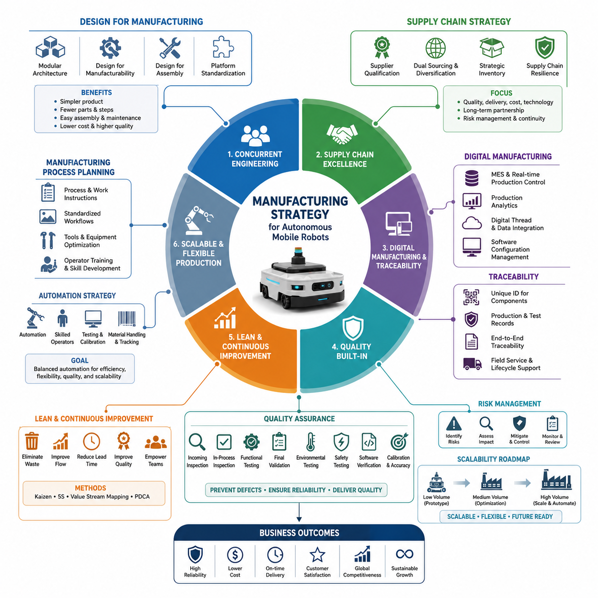
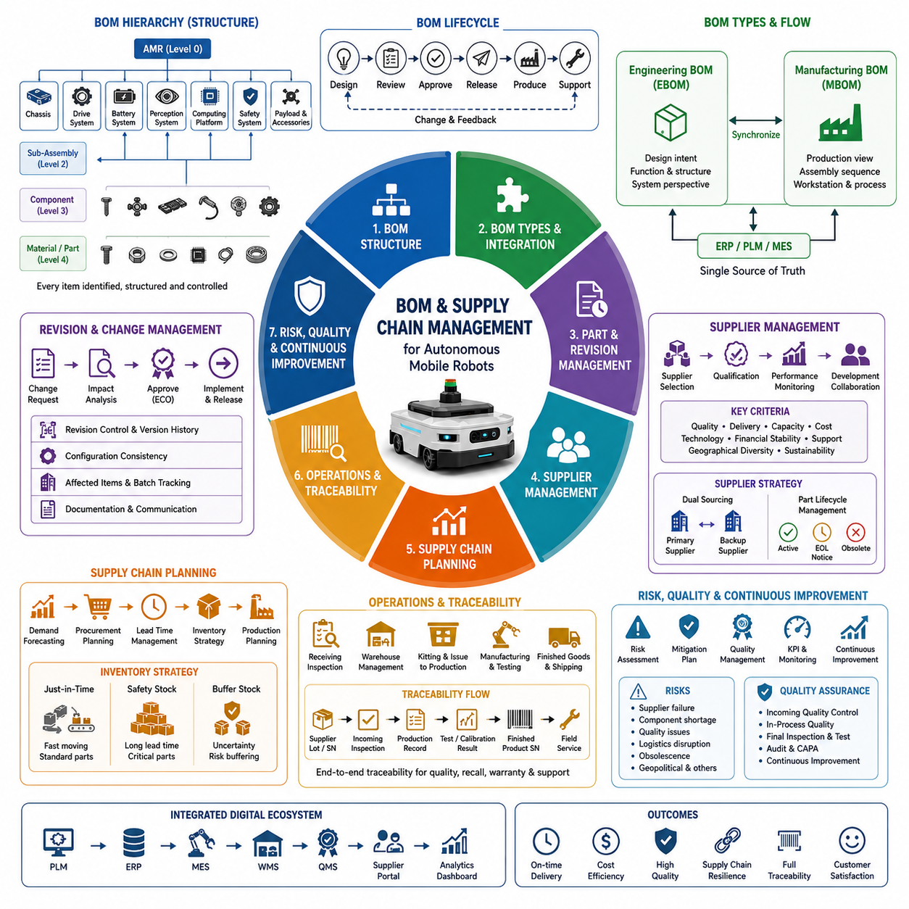
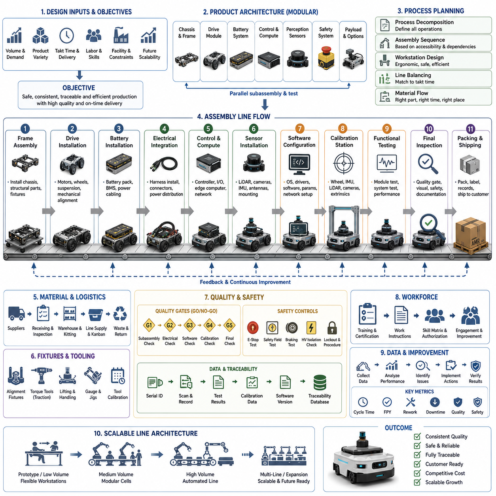
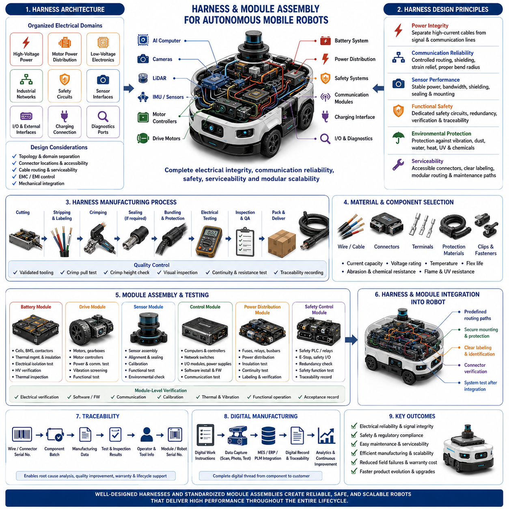
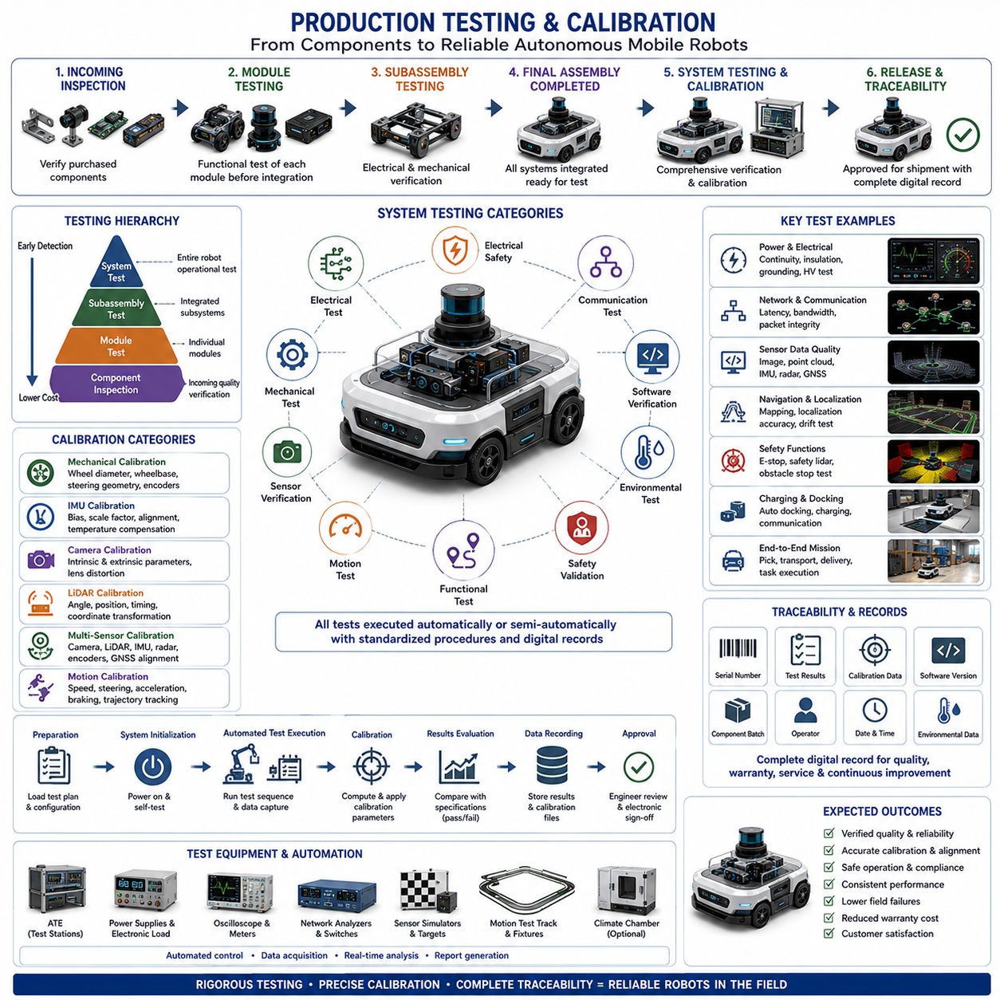
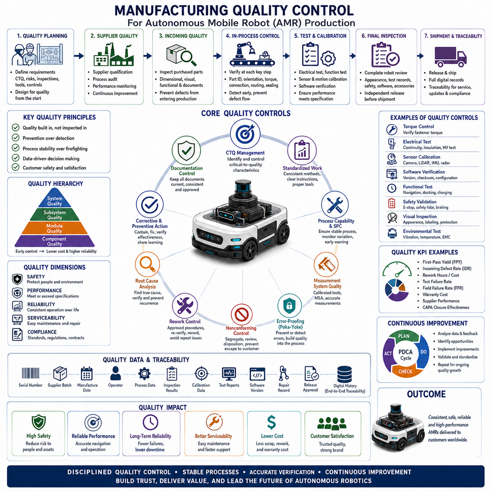
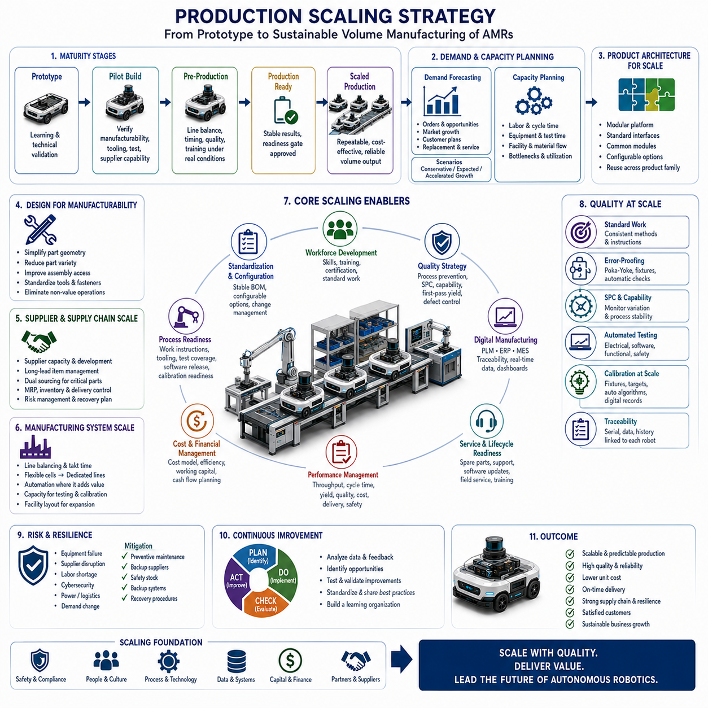
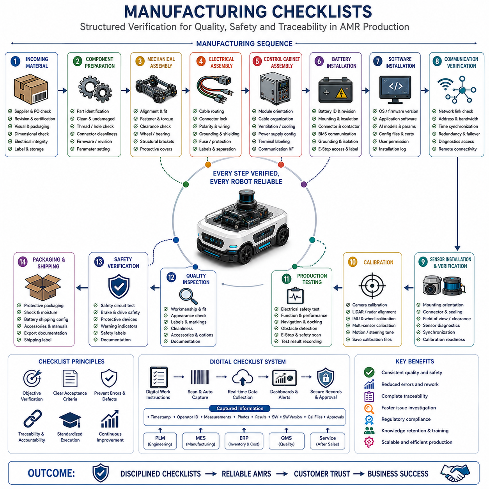

**Volume10. AMR Engineering Process and Development Manual**


# Chapter 17. Manufacturing Process

##  

## 17.01 Manufacturing Strategy

{width="7.268055555555556in" height="7.268055555555556in"}

A manufacturing strategy for Autonomous Mobile Robots is far more than defining how products are assembled. It establishes the complete operational philosophy that transforms engineering designs into reliable, scalable, and commercially successful products. Every manufacturing decision influences product quality, production cost, delivery schedules, serviceability, long-term reliability, and customer satisfaction. For industrial robots, manufacturing strategy must also accommodate continuous engineering improvements, software evolution, regulatory compliance, and rapid customization without sacrificing consistency. A successful strategy aligns engineering, procurement, manufacturing, quality assurance, logistics, and customer support into a unified production ecosystem where each department contributes to predictable and repeatable product realization.

Modern AMR manufacturing begins during product architecture definition rather than after design completion. Mechanical engineers, electrical engineers, embedded software developers, AI specialists, manufacturing engineers, procurement teams, and quality engineers collaborate from the earliest design stages. This concurrent engineering approach allows manufacturing constraints to influence product architecture before expensive redesigns become necessary. Components are selected not only for technical performance but also for supply stability, assembly efficiency, maintenance accessibility, and long-term availability. Design decisions therefore consider both engineering excellence and production practicality, reducing downstream risks while shortening overall development cycles.

A clear manufacturing vision distinguishes prototype development from commercial production. Prototype manufacturing emphasizes flexibility, rapid iteration, engineering validation, and design exploration. Engineers frequently modify mechanical structures, electrical layouts, software configurations, and sensor arrangements based on testing results. Commercial manufacturing, however, prioritizes repeatability, standardization, process control, documentation, and cost optimization. Transitioning between these two phases requires carefully planned process maturation so that engineering innovation is gradually converted into stable production procedures capable of delivering identical products at increasing volumes while preserving performance and safety characteristics.

Manufacturing strategy must define production objectives that extend beyond simple output volume. Organizations typically establish measurable targets including product reliability, manufacturing lead time, first-pass yield, production cost, defect rates, customer delivery performance, service readiness, and production scalability. These objectives guide investment decisions for production equipment, workforce development, automation technologies, supplier partnerships, quality systems, and digital manufacturing infrastructure. By establishing quantifiable goals early, organizations create objective metrics for evaluating manufacturing maturity throughout the product lifecycle instead of relying on subjective assessments.

Design for Manufacturability plays a central role in manufacturing strategy because product architecture directly determines production complexity. Engineers simplify structural components, reduce unnecessary fasteners, minimize unique part variations, standardize connectors, optimize cable routing, and create modular assemblies that simplify manufacturing operations. Mechanical interfaces become easier to align, electrical assemblies become easier to install, and software deployment becomes increasingly automated. Products designed with manufacturability in mind typically require fewer assembly steps, lower labor costs, shorter production cycles, and reduced opportunities for assembly errors while simultaneously improving product consistency.

Design for Assembly further optimizes production by analyzing how technicians physically construct each robot. Every assembly sequence is reviewed to minimize tool changes, awkward working positions, unnecessary part handling, repeated adjustments, and complex calibration activities. Components are positioned for easy access, standardized fasteners reduce assembly variation, and modular subsystems allow parallel assembly before final integration. Efficient assembly strategies reduce operator fatigue, shorten production time, improve ergonomic safety, and increase manufacturing throughput without compromising product quality.

Modular product architecture represents one of the most effective manufacturing strategies for industrial robots. Instead of treating the robot as one monolithic product, manufacturers divide the platform into standardized modules including chassis, suspension, drive units, battery systems, power distribution, computing platform, perception sensors, communication hardware, safety systems, and application payloads. Each module can be independently manufactured, tested, qualified, and serviced before final integration. Modularity supports product customization, accelerates maintenance, simplifies upgrades, improves inventory management, and enables multiple product variants to share common production resources.

Platform standardization extends modularity by allowing multiple robot models to reuse common hardware and software components. A family of indoor and outdoor robots may share identical battery modules, embedded controllers, motor drivers, communication interfaces, AI computing platforms, wiring standards, software frameworks, and diagnostic systems while differing only in chassis dimensions, payload capacity, or application-specific equipment. Standardization dramatically reduces engineering effort, supplier complexity, inventory costs, training requirements, and manufacturing variability while increasing purchasing leverage through higher production volumes of common components.

Supplier strategy forms another essential element of manufacturing planning. Manufacturers evaluate suppliers based on technical capability, quality performance, financial stability, manufacturing capacity, geographic location, delivery reliability, engineering support, and long-term partnership potential. Critical components such as batteries, LiDAR sensors, embedded computers, safety controllers, motor drives, and precision mechanical assemblies require comprehensive supplier qualification because failures within these components directly affect overall robot reliability. Diversified sourcing strategies further reduce operational risks associated with geopolitical changes, supply shortages, or unexpected production disruptions.

Supply chain resilience has become increasingly important due to global component shortages and market uncertainties. Manufacturing strategies therefore include dual-source qualification, strategic inventory management, long-term procurement agreements, alternative component validation, regional manufacturing flexibility, and proactive supplier monitoring. Rather than reacting to shortages after they occur, resilient organizations continuously evaluate supply chain health, forecast demand variability, monitor supplier performance indicators, and develop contingency plans that preserve production continuity during unexpected disruptions.

Manufacturing process planning transforms engineering documentation into executable production workflows. Detailed work instructions define assembly sequences, required tools, torque specifications, inspection criteria, calibration procedures, software installation processes, functional verification steps, and quality checkpoints. Every workstation receives standardized procedures that reduce operator variability while improving repeatability. Digital work instructions incorporating photographs, CAD illustrations, augmented reality guidance, and interactive verification further improve operator accuracy and reduce training requirements for new production personnel.

Automation strategy balances manufacturing efficiency with production flexibility. Fully automated production lines may achieve exceptional throughput but often lack adaptability for evolving robot platforms. Semi-automated manufacturing typically provides a more balanced solution, combining automated screw fastening, robotic material handling, automated testing stations, barcode tracking, software flashing, and calibration equipment with skilled human operators responsible for complex assembly, inspection, and decision-making activities. Selecting the appropriate automation level depends on production volume, product complexity, investment costs, and anticipated future product evolution.

Digital manufacturing technologies increasingly connect engineering, production, logistics, and quality management into unified information systems. Manufacturing Execution Systems coordinate production scheduling, workstation activities, operator assignments, component traceability, quality records, software versions, and production analytics in real time. Every robot receives a unique digital manufacturing history documenting component serial numbers, firmware versions, calibration results, inspection records, and production timestamps. This digital thread significantly improves troubleshooting, warranty management, regulatory compliance, and lifecycle traceability throughout the product\'s operational lifetime.

Traceability requirements continue to expand as industrial robots become more sophisticated and safety critical. Manufacturing strategy therefore assigns unique identifiers to major components including batteries, safety controllers, embedded computers, LiDAR units, cameras, motor controllers, wiring harnesses, and communication modules. Production databases associate these identifiers with assembly records, calibration data, software versions, inspection outcomes, and shipment information. If field failures occur, manufacturers can rapidly identify affected production batches, analyze root causes, and implement targeted corrective actions instead of broad product recalls.

Software manufacturing has become equally important as hardware production. Modern robots require installation of operating systems, middleware, firmware, AI models, navigation parameters, calibration databases, security certificates, and application software before shipment. Automated software deployment systems ensure every production unit receives validated software packages matching its hardware configuration. Configuration management prevents incompatible software installations while guaranteeing version consistency across manufacturing, field deployment, maintenance operations, and future over-the-air updates.

Calibration strategy represents a dedicated manufacturing discipline because robot accuracy depends heavily on precise sensor alignment and system configuration. Cameras require intrinsic and extrinsic calibration, LiDAR sensors require spatial alignment, inertial measurement units require bias compensation, steering systems require geometric calibration, wheel encoders require scaling validation, and multi-sensor synchronization must be verified before shipment. Automated calibration stations improve measurement consistency while reducing operator dependency. Calibration results become permanently associated with each robot\'s manufacturing record to support future diagnostics and maintenance.

Quality should be designed into manufacturing processes rather than inspected after production. Preventive quality strategies integrate inspection checkpoints throughout assembly, allowing defects to be detected immediately after each manufacturing stage. Incoming component inspection, in-process verification, subsystem functional testing, final system validation, environmental testing, electrical safety inspection, and software verification collectively establish multiple barriers preventing defective products from reaching customers. Early defect detection significantly reduces repair costs while minimizing production delays and warranty expenses.

Lean manufacturing principles help eliminate activities that do not contribute customer value. Production engineers continuously analyze unnecessary transportation, excessive inventory, waiting time, redundant inspections, inefficient motion, production bottlenecks, overprocessing, and manufacturing defects. Continuous improvement initiatives streamline workflows, reduce production waste, optimize workstation layouts, improve material flow, and increase operational efficiency without sacrificing quality. Lean methodologies encourage incremental improvements that collectively produce substantial long-term productivity gains.

Manufacturing strategy must also support serviceability throughout the robot lifecycle. Components expected to require maintenance, replacement, or upgrades should remain accessible without extensive disassembly. Standardized connectors, modular electrical assemblies, removable protective covers, accessible diagnostic interfaces, and clearly labeled wiring simplify field maintenance while reducing service costs. Manufacturing documentation therefore extends beyond production activities to include maintenance procedures, spare part identification, replacement instructions, and service verification processes supporting long-term operational reliability.

Risk management remains an integral manufacturing responsibility. Process Failure Mode and Effects Analysis identifies potential production failures before manufacturing begins, evaluating assembly mistakes, component defects, tooling inaccuracies, software installation errors, calibration failures, supplier variability, and operator inconsistencies. Each identified risk receives preventive controls, detection mechanisms, mitigation strategies, and continuous monitoring. Manufacturing risks are periodically reassessed as production volumes increase, new suppliers are introduced, or product revisions are released, ensuring the manufacturing system evolves alongside the product.

Manufacturing scalability ensures production capability can expand alongside market demand. Initial low-volume manufacturing often emphasizes flexibility and engineering collaboration, while later production stages gradually introduce automation, optimized tooling, dedicated assembly lines, supplier integration, standardized logistics, and advanced production analytics. Capacity planning considers workforce availability, facility expansion, equipment utilization, supplier readiness, inventory policies, and distribution capabilities. A scalable manufacturing strategy enables organizations to transition from dozens of robots to thousands annually without fundamentally redesigning production systems.

Ultimately, manufacturing strategy serves as the operational bridge connecting engineering innovation with commercial success. Advanced robot technologies achieve market impact only when supported by disciplined manufacturing systems capable of consistently producing safe, reliable, high-quality products at competitive costs. Organizations that integrate concurrent engineering, modular architecture, standardized processes, resilient supply chains, digital manufacturing, comprehensive traceability, preventive quality management, and scalable production practices establish a sustainable competitive advantage. Manufacturing therefore becomes not merely a production function but a strategic capability that enables continuous innovation, global deployment, long-term customer satisfaction, and enduring success within the rapidly evolving autonomous mobile robotics industry.

제조 전략(Manufacturing Strategy)은 자율이동로봇(Autonomous Mobile Robot, AMR)의 조립 방법만을 정의하는 활동이 아니다. 이는 설계 결과를 신뢰성이 높고(High Reliability), 확장 가능하며(Scalable), 상업적으로 성공할 수 있는 제품으로 전환하기 위한 전체 운영 철학을 수립하는 과정이다. 모든 제조 의사결정은 제품 품질(Product Quality), 생산 비용(Production Cost), 납기 일정(Delivery Schedule), 유지보수성(Serviceability), 장기 신뢰성(Long-Term Reliability), 그리고 고객 만족도(Customer Satisfaction)에 직접적인 영향을 미친다. 산업용 로봇에서는 지속적인 엔지니어링 개선, 소프트웨어 진화, 규제 준수, 그리고 신속한 맞춤화(Customization)를 수용하면서도 일관성을 유지할 수 있어야 한다. 성공적인 제조 전략은 엔지니어링(Engineering), 조달(Procurement), 제조(Manufacturing), 품질보증(Quality Assurance), 물류(Logistics), 고객지원(Customer Support)을 하나의 통합된 생산 생태계로 연결하여 예측 가능하고 반복 가능한 제품 생산을 실현하도록 한다.

현대 AMR 제조는 설계가 완료된 이후가 아니라 제품 아키텍처(Product Architecture)를 정의하는 초기 단계부터 시작된다. 기계(Mechanical), 전기(Electrical), 임베디드 소프트웨어(Embedded Software), 인공지능(AI), 제조 엔지니어(Manufacturing Engineer), 조달팀(Procurement Team), 품질 엔지니어(Quality Engineer)가 초기부터 함께 협업하는 동시공학(Concurrent Engineering) 접근법을 적용한다. 이를 통해 제조 제약사항이 고비용의 설계 변경 이전에 제품 구조에 반영될 수 있다. 부품은 단순히 기술 성능만이 아니라 공급 안정성(Supply Stability), 조립 효율성(Assembly Efficiency), 유지보수 접근성(Maintenance Accessibility), 장기 공급 가능성(Long-Term Availability)까지 고려하여 선정된다. 따라서 설계는 기술적 우수성과 생산 실용성을 동시에 만족시키며 개발 기간을 단축하고 후속 위험을 줄일 수 있다.

명확한 제조 비전은 시제품 개발(Prototype Development)과 양산(Commercial Production)을 명확히 구분한다. 시제품 제작은 유연성(Flexibility), 빠른 반복(Rapid Iteration), 설계 검증(Engineering Validation), 설계 탐색(Design Exploration)을 중시한다. 반면 양산은 반복성(Repeatability), 표준화(Standardization), 공정 관리(Process Control), 문서화(Documentation), 비용 최적화(Cost Optimization)를 우선한다. 두 단계 사이를 전환하기 위해서는 체계적인 제조 성숙화(Process Maturation)가 필요하며, 이를 통해 혁신적인 설계가 점진적으로 안정된 생산 절차로 전환되어 생산량이 증가해도 동일한 성능과 안전성을 유지하는 제품을 지속적으로 생산할 수 있다.

제조 전략은 단순히 생산량(Output Volume)만을 목표로 설정해서는 안 된다. 일반적으로 제품 신뢰성(Product Reliability), 생산 리드타임(Manufacturing Lead Time), 최초 합격률(First-Pass Yield), 생산 비용(Production Cost), 불량률(Defect Rate), 납기 준수율(Delivery Performance), 서비스 준비도(Service Readiness), 생산 확장성(Production Scalability)과 같은 측정 가능한 목표를 정의한다. 이러한 목표는 생산 설비 투자, 인력 양성, 자동화 기술, 공급업체 협력, 품질 시스템, 디지털 제조 인프라 구축에 대한 의사결정을 이끌어 준다. 초기부터 정량적인 목표를 설정하면 제조 성숙도를 객관적으로 평가할 수 있으며 주관적인 판단에 의존하지 않게 된다.

제조 용이성을 위한 설계(Design for Manufacturability, DFM)는 제조 전략의 핵심 요소이다. 제품 구조 자체가 생산 복잡도를 결정하기 때문이다. 엔지니어는 구조 부품을 단순화하고, 불필요한 체결부를 줄이며, 부품 종류를 최소화하고, 커넥터를 표준화하며, 케이블 배선을 최적화하고, 모듈형 구조를 설계하여 제조 과정을 단순하게 만든다. 기계 인터페이스는 쉽게 정렬되고, 전기 조립은 간단해지며, 소프트웨어 배포는 자동화된다. 이러한 설계는 조립 단계 수를 줄이고 인건비를 절감하며 생산 시간을 단축하고 조립 오류를 감소시키는 동시에 제품의 일관성을 크게 향상시킨다.

조립을 위한 설계(Design for Assembly, DFA)는 실제 작업자가 로봇을 어떻게 조립하는지를 분석하여 생산성을 향상시키는 접근법이다. 모든 조립 순서는 공구 교체(Tool Change), 불편한 작업 자세, 불필요한 부품 이동, 반복적인 조정, 복잡한 교정(Calibration) 작업을 최소화하도록 설계된다. 부품은 접근이 쉬운 위치에 배치되며, 표준 체결부를 사용하고, 모듈 단위의 병렬 조립을 통해 최종 조립 전에 부분 시스템을 완성할 수 있도록 한다. 이러한 방식은 작업자의 피로를 줄이고 생산 시간을 단축하며 작업 안전성과 생산성을 동시에 향상시킨다.

모듈형 제품 아키텍처(Modular Product Architecture)는 산업용 로봇 제조에서 가장 효과적인 전략 가운데 하나이다. 로봇을 하나의 거대한 제품으로 취급하지 않고 차체(Chassis), 서스펜션(Suspension), 구동 시스템(Drive Unit), 배터리 시스템(Battery System), 전력 분배(Power Distribution), 컴퓨팅 플랫폼(Computing Platform), 인식 센서(Perception Sensor), 통신 장치(Communication Hardware), 안전 시스템(Safety System), 작업 장치(Application Payload)와 같은 독립적인 모듈로 구성한다. 각 모듈은 개별적으로 생산, 시험, 검증, 유지보수가 가능하며 이후 최종 조립 단계에서 통합된다. 이러한 구조는 제품 맞춤화(Customization), 유지보수(Maintenance), 업그레이드(Upgrade), 재고 관리(Inventory Management), 다양한 제품 파생 모델 개발을 모두 용이하게 만든다.

플랫폼 표준화(Platform Standardization)는 모듈화를 더욱 확장하는 개념이다. 실내 및 실외 로봇이 동일한 배터리 모듈(Battery Module), 임베디드 컨트롤러(Embedded Controller), 모터 드라이버(Motor Driver), 통신 인터페이스(Communication Interface), AI 컴퓨팅 플랫폼(AI Computing Platform), 배선 규격(Wiring Standard), 소프트웨어 프레임워크(Software Framework), 진단 시스템(Diagnostic System)을 공유하면서 차체 크기나 적재 능력만 변경할 수 있다. 이러한 표준화는 엔지니어링 비용과 공급망 복잡도를 줄이고, 재고를 최소화하며, 교육 비용을 절감하고, 공통 부품의 대량 구매를 가능하게 하여 원가 경쟁력을 높인다.

공급업체 전략(Supplier Strategy)은 제조 전략의 또 다른 핵심 요소이다. 제조사는 공급업체의 기술력(Technical Capability), 품질 수준(Quality Performance), 재무 안정성(Financial Stability), 생산 능력(Manufacturing Capacity), 지역적 위치(Geographic Location), 납기 신뢰성(Delivery Reliability), 기술 지원 능력(Engineering Support), 장기 협력 가능성(Long-Term Partnership)을 종합적으로 평가한다. 특히 배터리(Battery), 라이다(LiDAR), 임베디드 컴퓨터(Embedded Computer), 안전 제어기(Safety Controller), 모터 드라이브(Motor Drive)와 같은 핵심 부품은 엄격한 공급업체 인증(Qualification)이 필요하며, 이들의 품질은 전체 로봇의 신뢰성을 직접 결정한다.

최근에는 글로벌 공급망의 불확실성이 증가하면서 공급망 복원력(Supply Chain Resilience)이 제조 전략에서 더욱 중요한 요소가 되었다. 이를 위해 이중 공급원(Dual Source), 전략적 재고 관리(Strategic Inventory Management), 장기 구매 계약(Long-Term Procurement Agreement), 대체 부품 검증(Alternative Component Validation), 지역별 생산 유연성(Regional Manufacturing Flexibility), 공급업체 모니터링(Supplier Monitoring) 등을 적극적으로 운영한다. 이러한 전략은 공급 부족이나 지정학적 변화가 발생하더라도 생산을 지속할 수 있도록 지원한다.

제조 공정 계획(Manufacturing Process Planning)은 엔지니어링 문서를 실제 생산 작업으로 변환하는 과정이다. 작업 표준서(Work Instruction)는 조립 순서, 사용 공구, 체결 토크(Torque), 검사 기준, 교정 절차, 소프트웨어 설치, 기능 시험, 품질 검사 항목 등을 상세히 정의한다. 모든 작업자는 동일한 절차를 따르므로 작업 편차가 감소하고 반복 생산성이 향상된다. 최근에는 사진, CAD 모델, 증강현실(Augmented Reality), 디지털 작업 지침(Digital Work Instruction)을 활용하여 작업 정확성과 교육 효율을 더욱 높이고 있다.

자동화 전략(Automation Strategy)은 생산 효율성과 생산 유연성 사이의 균형을 추구한다. 완전 자동화 생산 라인은 매우 높은 생산성을 제공하지만 제품 변경에 유연하게 대응하기 어렵다. 따라서 많은 산업용 로봇 제조사는 자동 체결(Automatic Screw Fastening), 자동 자재 이송(Material Handling), 자동 시험 장비(Automated Testing), 바코드 추적(Barcode Tracking), 소프트웨어 설치(Software Flashing), 자동 교정(Calibration)은 자동화하고, 복잡한 조립과 검사 및 판단은 숙련된 작업자가 수행하는 반자동(Semi-Automated) 생산 방식을 채택한다.

디지털 제조(Digital Manufacturing)는 엔지니어링, 생산, 물류, 품질 관리를 하나의 정보 시스템으로 통합한다. 제조 실행 시스템(Manufacturing Execution System, MES)은 생산 일정, 작업장 운영, 작업자 배치, 부품 추적성(Traceability), 품질 기록, 소프트웨어 버전, 생산 분석 데이터를 실시간으로 관리한다. 모든 로봇은 고유한 생산 이력(Digital Manufacturing History)을 가지며 부품 일련번호, 펌웨어 버전, 교정 결과, 검사 기록, 생산 시점이 모두 저장된다. 이러한 디지털 기록은 유지보수와 품질 분석, 규제 준수, 수명주기 관리에 중요한 기반이 된다.

추적성(Traceability)은 산업용 로봇의 안전성과 복잡성이 증가하면서 더욱 중요해지고 있다. 제조 전략은 배터리, 안전 제어기, 임베디드 컴퓨터, 라이다, 카메라, 모터 제어기, 와이어 하네스(Wiring Harness), 통신 모듈 등에 고유 식별번호를 부여한다. 생산 데이터베이스는 이 번호와 조립 기록, 교정 결과, 소프트웨어 버전, 검사 결과, 출하 정보를 연결한다. 현장에서 문제가 발생하면 영향을 받은 제품만 신속하게 식별할 수 있어 전체 제품 리콜 대신 정확한 원인 분석과 선택적 대응이 가능하다.

오늘날에는 소프트웨어 제조(Software Manufacturing)도 하드웨어 생산만큼 중요하다. 현대 AMR은 운영체제(Operating System), 미들웨어(Middleware), 펌웨어(Firmware), AI 모델(AI Model), 내비게이션 파라미터(Navigation Parameter), 교정 데이터베이스(Calibration Database), 보안 인증서(Security Certificate), 응용 소프트웨어(Application Software)를 생산 과정에서 설치해야 한다. 자동화된 소프트웨어 배포 시스템은 하드웨어 구성과 일치하는 검증된 소프트웨어를 모든 제품에 일관되게 설치하며, 제조부터 현장 운영, 유지보수, OTA(Over-the-Air) 업데이트까지 버전 일관성을 유지한다.

교정 전략(Calibration Strategy)은 제조 공정의 독립적인 핵심 분야이다. 카메라는 내부 및 외부 파라미터를 교정하고, 라이다는 공간 정렬을 수행하며, 관성측정장치(IMU)는 오차를 보정하고, 조향 시스템(Steering System)은 기하학적 보정을 수행하며, 엔코더(Encoder)는 스케일을 검증하고, 다중 센서 시간 동기화(Time Synchronization)도 확인해야 한다. 자동 교정 시스템은 측정 정확도를 향상시키며, 모든 교정 결과는 생산 기록에 영구적으로 저장되어 향후 유지보수와 진단에 활용된다.

품질(Quality)은 생산 이후 검사하는 것이 아니라 제조 공정 자체에 내재되어야 한다. 예방 중심 품질 관리(Preventive Quality Management)는 조립 과정마다 검사 지점을 배치하여 결함을 즉시 발견하도록 한다. 입고 검사(Incoming Inspection), 공정 중 검사(In-Process Inspection), 모듈 기능 시험(Sub-System Functional Test), 최종 시스템 시험(Final Validation), 환경 시험(Environmental Test), 전기 안전 검사(Electrical Safety Inspection), 소프트웨어 검증(Software Verification)이 단계적으로 수행된다. 이러한 다단계 품질 관리 체계는 불량 제품의 출하를 방지하고 품질 비용을 크게 절감한다.

린 제조(Lean Manufacturing)는 고객에게 가치를 제공하지 않는 모든 활동을 제거하는 것을 목표로 한다. 생산 엔지니어는 불필요한 운송(Transportation), 과도한 재고(Inventory), 대기 시간(Waiting), 중복 검사(Redundant Inspection), 비효율적인 작업 동선(Motion), 생산 병목(Bottleneck), 과잉 공정(Overprocessing), 제조 결함(Manufacturing Defect)을 지속적으로 분석하고 개선한다. 이러한 지속적 개선(Continuous Improvement)은 생산성을 높이고 낭비를 줄이며 장기적인 경쟁력을 확보하는 데 중요한 역할을 한다.

제조 전략은 제품의 전 생애주기(Lifecycle) 동안 유지보수성(Serviceability)도 고려해야 한다. 유지보수나 교체가 필요한 부품은 과도한 분해 없이 접근할 수 있어야 하며, 표준 커넥터(Standard Connector), 모듈형 전기 시스템(Modular Electrical Assembly), 탈착 가능한 보호 커버(Removable Protective Cover), 진단 포트(Diagnostic Interface), 명확한 배선 라벨(Wiring Label)이 제공되어야 한다. 따라서 제조 문서는 생산 절차뿐 아니라 유지보수 절차, 예비 부품 관리, 교체 방법, 서비스 검증 절차까지 포함하여 장기적인 운영 신뢰성을 지원한다.

위험 관리(Risk Management)는 제조 전략의 중요한 구성 요소이다. 공정 고장 형태 및 영향 분석(Process Failure Mode and Effects Analysis, PFMEA)은 조립 오류, 부품 결함, 공구 문제, 소프트웨어 설치 오류, 교정 실패, 공급업체 편차, 작업자 실수와 같은 위험을 생산 전에 식별한다. 각 위험에는 예방 조치, 탐지 방법, 대응 계획이 수립되며 생산량 증가나 설계 변경 시 지속적으로 재평가된다. 이를 통해 제조 시스템은 제품의 발전과 함께 지속적으로 개선된다.

생산 확장성(Manufacturing Scalability)은 시장 성장에 따라 생산 능력을 자연스럽게 확대할 수 있도록 하는 전략이다. 초기 소량 생산(Low-Volume Manufacturing)은 유연성과 엔지니어링 협업을 중시하지만, 생산량이 증가하면 자동화, 전용 생산 라인, 공급업체 통합, 표준 물류 체계, 생산 분석 시스템이 단계적으로 도입된다. 생산 능력 확대는 인력 확보, 시설 확장, 설비 활용률, 공급망 준비 수준, 재고 정책, 물류 체계까지 함께 고려하여 계획되어야 한다.

궁극적으로 제조 전략(Manufacturing Strategy)은 엔지니어링 혁신(Engineering Innovation)과 상업적 성공(Commercial Success)을 연결하는 핵심적인 가교 역할을 수행한다. 아무리 뛰어난 로봇 기술이라도 일관된 품질과 경쟁력 있는 비용으로 안정적으로 생산할 수 없다면 시장에서 성공하기 어렵다. 동시공학, 모듈형 설계, 표준화된 공정, 안정적인 공급망, 디지털 제조, 완전한 추적성, 예방 중심 품질 관리, 확장 가능한 생산 체계를 통합적으로 구축한 기업은 지속 가능한 경쟁 우위를 확보할 수 있다. 따라서 제조는 단순한 생산 활동이 아니라 지속적인 기술 혁신, 글로벌 시장 확대, 고객 만족, 그리고 자율이동로봇 산업의 장기적인 성공을 실현하는 핵심 전략 역량으로 이해되어야 한다.

##  

## 17.02 BOM and Supply Chain Management

{width="7.268055555555556in" height="7.268055555555556in"}

A Bill of Materials (BOM) and supply chain management strategy forms the operational backbone of modern Autonomous Mobile Robot manufacturing. While engineering defines how a robot should function, the BOM determines exactly what must be procured, assembled, verified, maintained, and eventually replaced throughout the product lifecycle. Every mechanical component, electrical device, sensor, embedded computer, cable, fastener, software license, firmware package, and calibration parameter must be accurately represented within the BOM structure to ensure complete product reproducibility. Effective supply chain management extends this responsibility beyond procurement by coordinating suppliers, manufacturing schedules, inventory planning, logistics, quality assurance, and lifecycle support. Together, BOM management and supply chain operations transform engineering designs into manufacturable products while maintaining cost efficiency, quality consistency, and delivery reliability.

The BOM should be viewed as a living engineering document rather than a static purchasing list. During product development, engineering teams continuously refine component selections as prototypes evolve, suppliers change, performance requirements mature, and manufacturing feedback is incorporated. Every design revision must be reflected immediately within the BOM to prevent manufacturing discrepancies and procurement errors. Version-controlled BOM management enables engineering, purchasing, manufacturing, quality assurance, and service organizations to operate from identical product definitions. This shared source of truth eliminates ambiguity, improves cross-functional communication, and ensures that every manufactured robot corresponds precisely to its approved engineering configuration.

A well-structured BOM follows a hierarchical architecture that mirrors the physical structure of the robot itself. The highest level represents the complete product, while successive lower levels define major assemblies such as the chassis, suspension system, drive module, battery system, electrical distribution, perception system, computing platform, communication subsystem, safety architecture, payload equipment, and external accessories. Each assembly contains progressively smaller subassemblies and individual components until every purchased part and manufactured item is completely identified. This hierarchical organization simplifies engineering analysis, production planning, maintenance documentation, spare parts management, and future product customization while supporting efficient configuration management across multiple product variants.

Engineering BOMs and Manufacturing BOMs serve different but complementary purposes throughout product development. The Engineering BOM focuses on functional relationships, design intent, technical architecture, and system integration from the perspective of engineering teams. In contrast, the Manufacturing BOM reorganizes identical components according to actual production workflows, assembly sequences, workstation assignments, procurement timing, and manufacturing logistics. Separating these two perspectives allows engineering innovation to continue independently while manufacturing maintains optimized production efficiency. Synchronization mechanisms between Engineering BOMs and Manufacturing BOMs ensure design revisions propagate correctly without disrupting ongoing production operations.

Component classification significantly improves BOM organization and downstream manufacturing efficiency. Mechanical parts, electrical components, electronic modules, sensors, fasteners, purchased assemblies, software items, consumables, adhesives, labels, packaging materials, and documentation should each follow standardized classification rules. Within each category, part numbering conventions identify product family, functional category, revision level, supplier information, and manufacturing status. Consistent classification simplifies procurement analysis, inventory reporting, supplier communication, engineering searches, and lifecycle management while reducing administrative complexity across large product portfolios.

Part numbering strategies play a critical role in preventing confusion throughout manufacturing and service operations. Every component should receive a unique identifier independent of its supplier\'s commercial part number. Internal part numbers remain stable even when suppliers change, allowing engineering documentation, manufacturing procedures, inventory systems, and maintenance manuals to preserve consistency throughout the product lifecycle. Intelligent numbering schemes often incorporate product family identifiers, component categories, revision information, and manufacturing classifications while avoiding unnecessary complexity that could increase human error during production activities.

Revision control represents one of the most important disciplines within BOM management. Every modification involving dimensions, materials, firmware versions, connector specifications, calibration parameters, approved suppliers, or manufacturing processes requires controlled engineering change procedures. Revision histories document what changed, why modifications were necessary, who approved them, and which production batches are affected. Effective revision management prevents incompatible component combinations, supports regulatory compliance, facilitates field service, and enables manufacturers to rapidly identify products influenced by specific engineering changes whenever technical issues emerge after deployment.

Engineering Change Management integrates design evolution with manufacturing execution through formal review and approval processes. Proposed modifications are evaluated for technical impact, manufacturing feasibility, supplier availability, inventory implications, cost consequences, regulatory compliance, software compatibility, and service documentation requirements before implementation. Approved Engineering Change Orders define implementation schedules, transition inventories, production cutover dates, validation activities, and communication plans across all affected departments. This structured process minimizes operational disruption while preserving complete product traceability throughout continuous product improvement initiatives.

Component lifecycle management ensures that every part remains commercially available throughout the intended product lifespan. Industrial robots frequently operate for ten years or longer, making long-term component availability a significant strategic consideration. Procurement teams continuously monitor supplier product roadmaps, obsolescence notifications, end-of-life announcements, technology transitions, and replacement recommendations. Alternative components are qualified before existing products become unavailable, preventing unexpected redesigns, production interruptions, and expensive emergency procurement activities while maintaining customer support capabilities throughout extended operational lifecycles.

Supplier selection extends well beyond pricing considerations. Manufacturers evaluate technical expertise, quality management systems, production capacity, financial stability, engineering collaboration capabilities, geographical diversity, logistics performance, cybersecurity practices, sustainability commitments, and historical delivery reliability before approving suppliers. Strategic partnerships with critical component suppliers encourage joint engineering development, early access to emerging technologies, improved forecasting accuracy, collaborative quality improvements, and faster resolution of manufacturing issues. Strong supplier relationships frequently become significant competitive advantages in rapidly evolving robotics markets.

Supplier qualification establishes confidence before production begins. Qualification activities include manufacturing capability assessments, quality system audits, process validation, first article inspections, sample evaluations, reliability testing, environmental verification, documentation reviews, and pilot production assessments. Approved suppliers undergo continuous performance monitoring based on quality metrics, delivery performance, responsiveness, corrective action effectiveness, and cost competitiveness. Regular supplier evaluations identify emerging risks before they influence production while encouraging continuous improvement throughout the supply chain ecosystem.

Single-source dependencies introduce substantial operational risks, particularly for high-value electronic components, industrial computers, batteries, LiDAR sensors, safety controllers, and communication modules. Supply chain strategies therefore emphasize dual sourcing whenever technically feasible. Secondary suppliers undergo engineering qualification before becoming necessary, ensuring production continuity if primary suppliers experience financial instability, capacity limitations, geopolitical disruptions, transportation delays, or unexpected product discontinuations. Although maintaining multiple qualified suppliers requires additional engineering effort, the resulting resilience often outweighs initial qualification costs.

Inventory management balances manufacturing continuity against financial efficiency. Excessive inventory increases storage costs, capital investment, insurance requirements, and obsolescence risks, while insufficient inventory creates production delays, expedited shipping expenses, customer dissatisfaction, and lost revenue. Advanced inventory strategies classify components according to demand variability, procurement lead time, criticality, unit value, and supplier reliability. Frequently used standard components may follow just-in-time replenishment, whereas long-lead or strategically critical items often require safety stock policies to protect manufacturing schedules against unexpected supply disruptions.

Forecasting demand accurately becomes increasingly important as manufacturing scales from prototype production toward commercial deployment. Sales projections, historical demand patterns, customer contracts, seasonal fluctuations, engineering change schedules, production capacity, and supplier lead times collectively influence procurement planning. Integrated forecasting systems continuously update purchasing requirements based on actual production progress, reducing inventory imbalances while improving supplier scheduling. Collaborative forecasting with strategic suppliers further enhances production stability by providing visibility into future manufacturing requirements months before purchase orders are issued.

Lead time management directly influences production flexibility and customer delivery performance. Every BOM component possesses unique procurement timelines depending on manufacturing complexity, supplier location, transportation methods, regulatory approvals, and global market conditions. High-performance embedded GPUs, industrial LiDAR systems, precision gearboxes, battery cells, and semiconductor devices frequently require procurement months before assembly begins. Manufacturing planning therefore prioritizes long-lead components early while maintaining procurement visibility across the entire supply chain. Proactive lead time management prevents production bottlenecks caused by late-arriving critical components.

Global logistics management coordinates transportation from multiple suppliers distributed across different countries and continents. Transportation mode selection considers cost, delivery speed, reliability, customs procedures, environmental conditions, packaging requirements, insurance coverage, and geopolitical risks. Air freight provides rapid delivery for urgent production needs but significantly increases logistics costs, whereas ocean freight offers lower transportation expenses for predictable production schedules. Effective logistics strategies combine multiple transportation methods according to production priorities while maintaining sufficient inventory buffers to absorb unavoidable transportation variability.

Warehouse operations contribute substantially to manufacturing efficiency. Incoming components require receiving inspections, identification labeling, barcode registration, storage location assignment, environmental protection, inventory counting, and controlled material issuance before entering production. Warehouse layouts minimize unnecessary material movement while supporting first-in-first-out inventory rotation, batch traceability, and rapid component retrieval. Digital warehouse management systems provide real-time inventory visibility, automated replenishment notifications, and complete material traceability from supplier receipt through final product shipment.

Traceability extends across the entire supply chain by associating every critical component with production records, supplier batches, inspection results, calibration data, firmware versions, and finished products. Batteries, safety controllers, industrial computers, LiDAR sensors, cameras, communication devices, motor controllers, and wiring harnesses often require serial number tracking throughout manufacturing and field operation. Comprehensive traceability enables rapid root cause investigations, selective product recalls, warranty analysis, predictive maintenance, and regulatory reporting whenever quality issues arise during operational deployment.

Software items increasingly become integral BOM components alongside traditional hardware. Operating systems, middleware distributions, embedded firmware, AI models, navigation software, cybersecurity certificates, calibration databases, and configuration files each possess controlled versions, release histories, compatibility requirements, and approval procedures. Software BOM management ensures manufacturing installs validated software packages matching specific hardware revisions while maintaining cybersecurity compliance and future update compatibility. Managing software and hardware together within unified configuration control significantly reduces integration errors during manufacturing and field service.

Cost management begins at the BOM level because every component directly influences product profitability. Procurement organizations continuously analyze material costs, supplier quotations, transportation expenses, currency fluctuations, inventory carrying costs, quality losses, and manufacturing labor associated with each BOM revision. Value engineering initiatives evaluate alternative materials, standardized components, integrated assemblies, simplified designs, and supplier consolidation opportunities without compromising performance or reliability. Continuous BOM optimization therefore contributes significantly to competitive pricing while maintaining high engineering standards.

Risk management within supply chain operations identifies vulnerabilities before they interrupt production. Risks include supplier bankruptcy, geopolitical instability, transportation disruptions, semiconductor shortages, natural disasters, cyberattacks, regulatory changes, currency volatility, quality failures, and unexpected demand fluctuations. Comprehensive risk assessments assign probability and impact scores while defining mitigation strategies including supplier diversification, strategic inventory reserves, alternative logistics routes, emergency procurement procedures, and business continuity planning. Organizations that actively manage supply chain risks recover significantly faster from global disruptions than those relying solely on reactive decision making.

Digital integration connects Engineering BOMs, Manufacturing BOMs, Enterprise Resource Planning systems, Product Lifecycle Management platforms, Manufacturing Execution Systems, warehouse management applications, supplier portals, and quality databases into a unified digital ecosystem. Information flows automatically between engineering revisions, procurement activities, manufacturing schedules, inventory updates, supplier communications, quality inspections, and customer deliveries. This integrated digital infrastructure minimizes manual data entry, reduces administrative errors, accelerates engineering change implementation, and provides real-time visibility across the entire manufacturing organization.

Sustainability considerations increasingly influence BOM and supply chain decisions. Manufacturers evaluate recycled materials, environmentally responsible suppliers, energy-efficient manufacturing processes, packaging reduction initiatives, transportation emissions, conflict mineral compliance, hazardous substance restrictions, and product recyclability throughout component selection. Sustainable procurement practices not only satisfy regulatory requirements but also improve corporate reputation, reduce long-term environmental impact, and strengthen relationships with environmentally conscious customers operating within global industrial markets.

Ultimately, BOM and supply chain management establish the foundation upon which successful robot manufacturing depends. Accurate product structures, disciplined configuration control, qualified suppliers, resilient procurement strategies, optimized inventory management, digital traceability, software configuration management, proactive risk mitigation, and integrated information systems collectively ensure that every manufactured robot faithfully reflects engineering intent while achieving consistent quality, competitive cost, reliable delivery, and long-term serviceability. As autonomous mobile robots become increasingly sophisticated and globally deployed, organizations that treat BOM management and supply chain operations as strategic engineering disciplines rather than administrative support functions will achieve greater manufacturing resilience, operational agility, customer satisfaction, and sustainable competitive advantage.

자재명세서(Bill of Materials, BOM)와 공급망 관리(Supply Chain Management) 전략은 현대 자율이동로봇(Autonomous Mobile Robot, AMR) 제조의 운영 기반을 형성한다. 엔지니어링(Engineering)이 로봇이 어떻게 동작해야 하는지를 정의한다면, 자재명세서(BOM)는 제품 수명주기(Product Lifecycle) 동안 정확히 무엇을 조달하고, 조립하고, 검증하고, 유지보수하며, 최종적으로 교체해야 하는지를 결정한다. 모든 기계 부품(Mechanical Component), 전기 장치(Electrical Device), 센서(Sensor), 임베디드 컴퓨터(Embedded Computer), 케이블(Cable), 체결 부품(Fastener), 소프트웨어 라이선스(Software License), 펌웨어 패키지(Firmware Package), 교정 파라미터(Calibration Parameter)는 제품의 완전한 재현성을 보장할 수 있도록 BOM 구조에 정확하게 반영되어야 한다. 효과적인 공급망 관리는 이러한 책임을 조달 영역을 넘어 공급업체, 생산 일정, 재고 계획, 물류, 품질보증(Quality Assurance), 수명주기 지원(Lifecycle Support)까지 확장한다. BOM 관리와 공급망 운영은 함께 엔지니어링 설계를 제조 가능한 제품으로 전환하면서 비용 효율성, 품질 일관성, 납기 신뢰성을 유지하도록 한다.

BOM은 단순한 구매 목록이 아니라 지속적으로 변화하는 살아 있는 엔지니어링 문서(Living Engineering Document)로 인식해야 한다. 제품 개발 과정에서 엔지니어링 팀은 시제품이 발전하고, 공급업체가 변경되고, 성능 요구사항이 구체화되며, 제조 피드백이 반영됨에 따라 부품 선정을 지속적으로 개선한다. 모든 설계 변경은 제조 불일치와 조달 오류를 방지하기 위해 즉시 BOM에 반영되어야 한다. 버전 관리 기반 BOM(Version-Controlled BOM)은 엔지니어링, 구매, 제조, 품질보증, 서비스 조직이 동일한 제품 정의를 기준으로 운영되도록 한다. 이러한 공통 기준 정보원(Single Source of Truth)은 모호성을 제거하고 부서 간 의사소통을 개선하며, 생산되는 모든 로봇이 승인된 엔지니어링 구성과 정확히 일치하도록 보장한다.

체계적으로 구성된 BOM은 로봇의 실제 물리 구조를 반영하는 계층형 아키텍처(Hierarchical Architecture)를 따른다. 최상위 수준은 완성된 전체 제품을 나타내며, 그 아래 단계에서는 차체(Chassis), 서스펜션 시스템(Suspension System), 구동 모듈(Drive Module), 배터리 시스템(Battery System), 전력 분배 시스템(Electrical Distribution), 인식 시스템(Perception System), 컴퓨팅 플랫폼(Computing Platform), 통신 하위 시스템(Communication Subsystem), 안전 아키텍처(Safety Architecture), 작업 장치(Payload Equipment), 외부 액세서리(External Accessory)와 같은 주요 조립체를 정의한다. 각 조립체는 모든 구매 부품과 제조 부품이 완전히 식별될 때까지 점차 더 작은 하위 조립체와 개별 부품으로 세분화된다. 이러한 계층 구조는 엔지니어링 분석, 생산 계획, 유지보수 문서화, 예비 부품 관리, 향후 제품 맞춤화를 단순화하며 여러 제품 파생형에 대한 효율적인 형상 관리(Configuration Management)를 지원한다.

엔지니어링 자재명세서(Engineering BOM, EBOM)와 제조 자재명세서(Manufacturing BOM, MBOM)는 제품 개발 과정에서 서로 다르지만 상호보완적인 역할을 수행한다. EBOM은 엔지니어링 팀의 관점에서 기능적 관계, 설계 의도, 기술 아키텍처, 시스템 통합에 중점을 둔다. 반면 MBOM은 동일한 부품을 실제 생산 흐름, 조립 순서, 작업장 배정, 조달 시점, 제조 물류에 따라 재구성한다. 이러한 두 관점을 분리하면 엔지니어링 혁신을 지속하면서도 제조 부문은 최적화된 생산 효율성을 유지할 수 있다. EBOM과 MBOM 간의 동기화 체계는 설계 변경이 진행 중인 생산 운영을 방해하지 않고 정확하게 반영되도록 보장한다.

부품 분류(Component Classification)는 BOM 구성과 이후 제조 효율성을 크게 향상시킨다. 기계 부품, 전기 부품, 전자 모듈, 센서, 체결 부품, 구매 조립체, 소프트웨어 항목, 소모품, 접착제, 라벨, 포장재, 문서는 각각 표준화된 분류 규칙을 따라야 한다. 각 분류 내에서는 부품 번호 체계(Part Numbering Convention)를 통해 제품군(Product Family), 기능 분류(Functional Category), 개정 수준(Revision Level), 공급업체 정보(Supplier Information), 제조 상태(Manufacturing Status)를 식별한다. 일관된 분류 체계는 조달 분석, 재고 보고, 공급업체 의사소통, 엔지니어링 검색, 수명주기 관리를 단순화하고 대규모 제품 포트폴리오의 행정적 복잡성을 줄인다.

부품 번호 전략(Part Numbering Strategy)은 제조 및 서비스 운영 전반에서 혼란을 방지하는 데 핵심적인 역할을 한다. 모든 부품은 공급업체의 상용 부품 번호와 별도로 고유한 내부 식별번호를 가져야 한다. 내부 부품 번호는 공급업체가 변경되더라도 안정적으로 유지되므로 엔지니어링 문서, 제조 절차, 재고 시스템, 유지보수 매뉴얼의 일관성을 제품 수명주기 전반에 걸쳐 보존할 수 있다. 지능적인 번호 체계는 제품군 식별자, 부품 분류, 개정 정보, 제조 구분을 포함할 수 있지만, 생산 과정에서 작업자의 실수를 증가시킬 수 있는 불필요한 복잡성은 피해야 한다.

개정 관리(Revision Control)는 BOM 관리에서 가장 중요한 규율 가운데 하나이다. 치수, 재료, 펌웨어 버전, 커넥터 사양, 교정 파라미터, 승인 공급업체, 제조 공정과 관련된 모든 변경은 통제된 엔지니어링 변경 절차(Engineering Change Procedure)를 따라야 한다. 개정 이력(Revision History)은 무엇이 변경되었는지, 왜 변경이 필요했는지, 누가 승인했는지, 어떤 생산 배치가 영향을 받는지를 기록한다. 효과적인 개정 관리는 호환되지 않는 부품 조합을 방지하고, 규제 준수(Regulatory Compliance)를 지원하며, 현장 서비스를 용이하게 하고, 배치 이후 기술 문제가 발생했을 때 특정 변경의 영향을 받은 제품을 신속하게 식별할 수 있도록 한다.

엔지니어링 변경 관리(Engineering Change Management)는 공식적인 검토와 승인 절차를 통해 설계 발전과 제조 실행을 연결한다. 제안된 변경 사항은 적용 전에 기술적 영향, 제조 가능성, 공급업체 가용성, 재고 영향, 비용 결과, 규제 준수, 소프트웨어 호환성, 서비스 문서 요구사항을 기준으로 평가된다. 승인된 엔지니어링 변경 지시서(Engineering Change Order, ECO)는 적용 일정, 전환 재고(Transition Inventory), 생산 전환 시점(Production Cutover Date), 검증 활동, 관련 부서 간 의사소통 계획을 정의한다. 이러한 구조화된 절차는 지속적인 제품 개선을 수행하면서도 운영 중단을 최소화하고 완전한 제품 추적성을 유지하도록 한다.

부품 수명주기 관리(Component Lifecycle Management)는 모든 부품이 의도된 제품 수명 동안 상업적으로 공급 가능하도록 보장한다. 산업용 로봇은 10년 이상 운용되는 경우가 많으므로 장기적인 부품 공급 가능성(Long-Term Availability)은 매우 중요한 전략적 고려사항이다. 조달팀은 공급업체 제품 로드맵(Product Roadmap), 단종 예정 통보(Obsolescence Notification), 수명 종료 공지(End-of-Life Announcement), 기술 전환, 대체품 권고를 지속적으로 모니터링한다. 기존 부품이 공급 불가능해지기 전에 대체 부품을 사전 검증하면 갑작스러운 재설계, 생산 중단, 고비용 긴급 구매를 방지하고 장기간의 고객 지원 역량을 유지할 수 있다.

공급업체 선정(Supplier Selection)은 단순한 가격 비교를 훨씬 넘어서는 과정이다. 제조사는 공급업체를 승인하기 전에 기술 전문성, 품질관리 시스템(Quality Management System), 생산 능력, 재무 안정성, 엔지니어링 협업 능력, 지리적 다양성, 물류 성과, 사이버보안 관행(Cybersecurity Practice), 지속가능성 약속(Sustainability Commitment), 과거 납기 신뢰성을 종합적으로 평가한다. 핵심 부품 공급업체와의 전략적 파트너십은 공동 기술 개발, 신기술 조기 접근, 수요 예측 정확도 향상, 공동 품질 개선, 제조 문제의 신속한 해결을 가능하게 한다. 강력한 공급업체 관계는 빠르게 발전하는 로봇 시장에서 중요한 경쟁 우위가 될 수 있다.

공급업체 자격 검증(Supplier Qualification)은 생산이 시작되기 전에 신뢰성을 확보하는 절차이다. 검증 활동에는 제조 역량 평가, 품질 시스템 감사(Quality Audit), 공정 검증(Process Validation), 초도품 검사(First Article Inspection), 샘플 평가, 신뢰성 시험(Reliability Test), 환경 검증(Environmental Verification), 문서 검토, 시험 생산 평가(Pilot Production Assessment)가 포함된다. 승인된 공급업체는 품질 지표, 납기 성과, 대응 속도, 시정조치 효과, 가격 경쟁력을 기준으로 지속적인 성과 모니터링을 받는다. 정기적인 공급업체 평가는 생산에 영향을 미치기 전에 잠재 위험을 발견하고 전체 공급망 생태계의 지속적 개선을 촉진한다.

단일 공급원 의존성(Single-Source Dependency)은 특히 고가 전자 부품, 산업용 컴퓨터, 배터리, 라이다 센서, 안전 제어기, 통신 모듈에서 상당한 운영 위험을 발생시킨다. 따라서 공급망 전략은 기술적으로 가능한 경우 이중 공급원(Dual Sourcing)을 강조한다. 보조 공급업체는 실제로 필요해지기 전에 엔지니어링 자격 검증을 완료해야 하며, 이를 통해 주요 공급업체의 재무 불안정, 생산 능력 부족, 지정학적 문제, 운송 지연, 예기치 않은 단종 상황에서도 생산 연속성을 확보할 수 있다. 여러 공급업체를 유지하려면 추가적인 엔지니어링 노력이 필요하지만, 확보되는 복원력(Resilience)은 초기 검증 비용보다 더 큰 가치를 제공하는 경우가 많다.

재고 관리(Inventory Management)는 생산 연속성과 재무 효율성 사이의 균형을 맞추는 활동이다. 과도한 재고는 보관 비용, 자본 투입, 보험 비용, 단종 위험을 증가시키는 반면, 부족한 재고는 생산 지연, 긴급 운송 비용, 고객 불만, 매출 손실을 초래한다. 고도화된 재고 전략은 부품을 수요 변동성(Demand Variability), 조달 리드타임(Procurement Lead Time), 중요도(Criticality), 단가(Unit Value), 공급업체 신뢰성에 따라 분류한다. 사용 빈도가 높은 표준 부품은 적시 재고 보충(Just-in-Time Replenishment)을 적용할 수 있으며, 장기 납기 또는 전략적 핵심 부품에는 예상치 못한 공급 중단으로부터 생산 일정을 보호하기 위한 안전재고(Safety Stock) 정책을 적용하는 것이 일반적이다.

생산이 시제품 단계에서 상업적 양산으로 확대될수록 정확한 수요 예측(Demand Forecasting)의 중요성도 증가한다. 판매 전망, 과거 수요 패턴, 고객 계약, 계절적 변동, 설계 변경 일정, 생산 능력, 공급업체 리드타임은 모두 조달 계획에 영향을 준다. 통합 예측 시스템(Integrated Forecasting System)은 실제 생산 진행 상황에 따라 구매 요구량을 지속적으로 갱신하여 재고 불균형을 줄이고 공급업체 생산 계획을 개선한다. 전략적 공급업체와 공동으로 수요를 예측하면 구매 주문이 발행되기 수개월 전부터 향후 생산 요구사항을 공유할 수 있어 생산 안정성이 더욱 향상된다.

리드타임 관리(Lead Time Management)는 생산 유연성과 고객 납기 성과에 직접적인 영향을 미친다. 모든 BOM 부품은 제조 복잡도, 공급업체 위치, 운송 방식, 규제 승인, 글로벌 시장 상황에 따라 서로 다른 조달 기간을 가진다. 고성능 임베디드 GPU, 산업용 라이다 시스템, 정밀 감속기(Precision Gearbox), 배터리 셀(Battery Cell), 반도체 장치는 조립 시작 수개월 전부터 구매해야 하는 경우가 많다. 따라서 제조 계획은 전체 공급망에 대한 조달 가시성을 유지하면서 장기 납기 부품을 우선적으로 확보해야 한다. 선제적인 리드타임 관리는 핵심 부품의 입고 지연으로 인한 생산 병목을 방지한다.

글로벌 물류 관리(Global Logistics Management)는 여러 국가와 대륙에 분산된 공급업체로부터 부품을 운송하는 과정을 조정한다. 운송 수단은 비용, 배송 속도, 신뢰성, 통관 절차(Customs Procedure), 환경 조건, 포장 요구사항, 보험 적용 범위, 지정학적 위험을 고려하여 선택한다. 항공 운송(Air Freight)은 긴급 생산 수요에 빠르게 대응할 수 있지만 물류 비용을 크게 증가시키는 반면, 해상 운송(Ocean Freight)은 예측 가능한 생산 일정에 대해 낮은 운송 비용을 제공한다. 효과적인 물류 전략은 생산 우선순위에 따라 여러 운송 방식을 조합하면서 불가피한 운송 변동을 흡수할 수 있는 충분한 재고 완충을 유지한다.

창고 운영(Warehouse Operation)은 제조 효율성에 상당한 영향을 미친다. 입고된 부품은 생산에 투입되기 전에 수입 검사(Receiving Inspection), 식별 라벨 부착, 바코드 등록, 보관 위치 배정, 환경 보호, 재고 실사, 통제된 자재 출고 절차를 거쳐야 한다. 창고 배치는 불필요한 자재 이동을 최소화하면서 선입선출(First-In, First-Out), 배치 추적성(Batch Traceability), 신속한 부품 검색을 지원해야 한다. 디지털 창고 관리 시스템(Warehouse Management System, WMS)은 실시간 재고 가시성, 자동 보충 알림, 공급업체 입고부터 완제품 출하까지의 완전한 자재 추적성을 제공한다.

추적성(Traceability)은 모든 핵심 부품을 생산 기록, 공급업체 배치, 검사 결과, 교정 데이터, 펌웨어 버전, 완성품과 연결함으로써 공급망 전체로 확장된다. 배터리, 안전 제어기, 산업용 컴퓨터, 라이다 센서, 카메라, 통신 장치, 모터 제어기, 와이어 하네스(Wiring Harness)는 제조와 현장 운영 전반에 걸쳐 일련번호 추적(Serial Number Tracking)이 필요한 경우가 많다. 포괄적인 추적성은 운영 현장에서 품질 문제가 발생했을 때 신속한 원인 분석, 선택적 제품 리콜(Selective Recall), 보증 분석(Warranty Analysis), 예지정비(Predictive Maintenance), 규제 보고를 가능하게 한다.

소프트웨어 항목(Software Item)은 전통적인 하드웨어와 함께 점점 더 중요한 BOM 구성 요소가 되고 있다. 운영체제(Operating System), 미들웨어 배포판(Middleware Distribution), 임베디드 펌웨어(Embedded Firmware), AI 모델(AI Model), 내비게이션 소프트웨어(Navigation Software), 사이버보안 인증서(Cybersecurity Certificate), 교정 데이터베이스(Calibration Database), 설정 파일(Configuration File)은 각각 통제된 버전, 배포 이력, 호환성 요구사항, 승인 절차를 가진다. 소프트웨어 BOM 관리는 제조 과정에서 특정 하드웨어 개정과 일치하는 검증된 소프트웨어 패키지가 설치되도록 보장하고, 사이버보안 준수와 향후 업데이트 호환성을 유지한다. 하드웨어와 소프트웨어를 통합된 형상 관리 체계로 관리하면 제조 및 현장 서비스 과정에서의 통합 오류를 크게 줄일 수 있다.

비용 관리(Cost Management)는 모든 부품이 제품 수익성에 직접적인 영향을 주기 때문에 BOM 단계에서 시작된다. 조달 조직은 각 BOM 개정에 대해 자재비, 공급업체 견적, 운송비, 환율 변동, 재고 유지비, 품질 손실 비용, 제조 인건비를 지속적으로 분석한다. 가치공학(Value Engineering) 활동은 성능이나 신뢰성을 저하시키지 않으면서 대체 재료, 표준 부품, 통합 조립체, 단순화된 설계, 공급업체 통합 가능성을 평가한다. 따라서 지속적인 BOM 최적화는 높은 기술 수준을 유지하면서도 경쟁력 있는 제품 가격을 확보하는 데 크게 기여한다.

공급망 운영의 위험 관리(Risk Management)는 생산이 중단되기 전에 취약 요소를 식별하는 활동이다. 위험 요소에는 공급업체 파산, 지정학적 불안정, 운송 중단, 반도체 부족, 자연재해, 사이버공격(Cyberattack), 규제 변경, 환율 변동, 품질 실패, 예기치 않은 수요 변동이 포함된다. 포괄적인 위험 평가는 각 위험에 발생 가능성과 영향도 점수를 부여하고, 공급업체 다변화, 전략적 재고 비축, 대체 물류 경로, 긴급 조달 절차, 사업 연속성 계획(Business Continuity Planning)과 같은 대응 전략을 정의한다. 공급망 위험을 적극적으로 관리하는 조직은 사후 대응에만 의존하는 조직보다 글로벌 공급 중단에서 훨씬 빠르게 회복할 수 있다.

디지털 통합(Digital Integration)은 EBOM, MBOM, 전사적 자원관리 시스템(Enterprise Resource Planning, ERP), 제품 수명주기 관리 플랫폼(Product Lifecycle Management, PLM), 제조 실행 시스템(Manufacturing Execution System, MES), 창고 관리 애플리케이션, 공급업체 포털, 품질 데이터베이스를 하나의 통합된 디지털 생태계로 연결한다. 정보는 엔지니어링 개정, 조달 활동, 제조 일정, 재고 갱신, 공급업체 의사소통, 품질 검사, 고객 납품 사이에서 자동으로 흐른다. 이러한 통합 디지털 인프라는 수작업 데이터 입력을 최소화하고, 행정 오류를 줄이며, 엔지니어링 변경의 적용 속도를 높이고, 제조 조직 전체에 대한 실시간 가시성을 제공한다.

지속가능성(Sustainability)은 BOM과 공급망 의사결정에 점점 더 큰 영향을 미치고 있다. 제조사는 부품 선정 과정에서 재활용 소재(Recycled Material), 환경 책임을 준수하는 공급업체, 에너지 효율적인 제조 공정, 포장재 절감, 운송 배출가스, 분쟁광물 규정(Conflict Mineral Compliance), 유해물질 제한(Hazardous Substance Restriction), 제품 재활용성(Product Recyclability)을 평가한다. 지속 가능한 조달 관행은 규제 요구사항을 충족할 뿐 아니라 기업 평판을 높이고, 장기적인 환경 영향을 줄이며, 글로벌 산업 시장에서 환경을 중시하는 고객과의 관계를 강화한다.

궁극적으로 자재명세서(BOM)와 공급망 관리(Supply Chain Management)는 성공적인 로봇 제조가 의존하는 핵심 기반을 구축한다. 정확한 제품 구조, 체계적인 형상 관리, 검증된 공급업체, 복원력 있는 조달 전략, 최적화된 재고 관리, 디지털 추적성, 소프트웨어 형상 관리, 선제적 위험 완화, 통합 정보 시스템은 모든 생산 로봇이 엔지니어링 의도를 충실히 반영하면서도 일관된 품질, 경쟁력 있는 비용, 신뢰할 수 있는 납기, 장기 유지보수성을 달성하도록 한다. 자율이동로봇이 더욱 정교해지고 전 세계적으로 배치될수록 BOM 관리와 공급망 운영을 단순한 행정 지원이 아니라 전략적 엔지니어링 분야(Strategic Engineering Discipline)로 다루는 조직은 더 높은 제조 복원력, 운영 민첩성, 고객 만족도, 지속 가능한 경쟁 우위를 확보하게 된다.

##  

## 17.03 Assembly Line Design

{width="7.268055555555556in" height="7.268055555555556in"}

Assembly line design for Autonomous Mobile Robots must translate a complex multidisciplinary product into a controlled, repeatable, and efficient production flow. Unlike conventional consumer products, an AMR combines a heavy mechanical platform, high-current electrical systems, safety devices, embedded controllers, sensors, edge computers, software, and calibration data within one integrated machine. The assembly line must therefore support both physical construction and digital configuration. Its primary objective is not simply to increase output, but to ensure that every robot is assembled safely, consistently, traceably, and in accordance with the approved engineering and manufacturing specifications.

The design process begins by defining production volume, product variety, takt time, delivery targets, labor availability, facility constraints, and expected future growth. A prototype workshop may rely on flexible technicians who complete most operations at one location, while commercial production requires clearly defined stations, balanced workloads, standardized tools, and controlled material movement. The chosen line architecture must reflect realistic demand rather than optimistic forecasts. Excessive automation creates unnecessary investment and rigidity, whereas insufficient process control produces variable quality, long lead times, and dependence on individual operator experience.

Product architecture strongly influences the efficiency of the assembly line. Robots designed around modular chassis, drive, battery, control, perception, safety, and payload assemblies can be produced through parallel subassembly processes before final integration. Each module can be built, inspected, and functionally tested independently, reducing the complexity of the main line. This approach also isolates defects earlier and prevents incomplete modules from entering final assembly. A modular flow enables multiple robot variants to share common stations while allowing optional sensors, computers, batteries, or application equipment to be installed through controlled configuration branches.

Process decomposition converts the Manufacturing Bill of Materials into a sequence of executable production operations. Engineers identify every fastening, wiring, mounting, software installation, inspection, calibration, and verification activity required to produce a finished robot. These tasks are grouped into logical workstations according to technical relationships, required tools, operator skills, safety conditions, and expected cycle time. The resulting process should follow a stable progression from structural assembly through electrical integration, software configuration, calibration, functional testing, final inspection, and shipment preparation without unnecessary backtracking or repeated handling.

Assembly sequence planning must account for physical accessibility and dependency between operations. Large internal components such as batteries, drive motors, power distribution units, and computing enclosures should be installed before exterior covers restrict access. Wiring harnesses should be routed before sensors and protective structures block cable paths. Software loading can begin after electrical power and network communication are available, while final sensor calibration must wait until mechanical installation is complete. A correctly designed sequence reduces rework, prevents component damage, and avoids situations in which previously assembled structures must be removed to complete later operations.

Workstation design should support operator safety, ergonomic efficiency, process repeatability, and visual clarity. Work surfaces, lifting devices, fixtures, tools, parts containers, displays, and inspection equipment must be positioned within comfortable reach. Heavy robot frames, batteries, motors, and payload modules require cranes, hoists, manipulators, or mobile lifting equipment to prevent injury and uncontrolled handling. Adjustable platforms may be needed to access the underside, top structure, and internal compartments. Proper workstation ergonomics reduce fatigue, improve assembly accuracy, and maintain stable productivity during extended production shifts.

Line balancing distributes work content across stations so that no individual process becomes a persistent bottleneck. Engineers estimate the standard time required for each operation and compare station workloads against the target takt time. Tasks may be divided, combined, transferred, or performed in parallel to maintain smooth flow. Because AMR assembly includes operations with very different durations, complete balance may not always be possible. Buffer positions between critical stations can absorb short-term variation, but excessive work-in-process should be avoided because it hides problems, occupies floor space, and increases manufacturing lead time.

Material flow must deliver the correct components to the correct station in the correct sequence without creating congestion or search time. Large modules may arrive through dedicated carts, while small fasteners, connectors, and consumables can be supplied using standardized bins or kitting systems. A production kit should contain only the parts required for a specific robot configuration or work order. Barcode or radio-frequency identification tracking verifies component identity before installation. Effective material presentation reduces picking errors, protects sensitive devices, supports traceability, and allows operators to concentrate on assembly rather than searching for missing items.

The physical line layout should minimize unnecessary transportation while maintaining safe separation between people, equipment, materials, and moving robots. Common arrangements include straight lines, U-shaped cells, modular production islands, and hybrid layouts combining subassembly cells with a central integration line. A U-shaped configuration supports flexible staffing and short communication paths, while a straight line may simplify high-volume material flow. For low- and medium-volume AMR production, modular cells often provide greater flexibility because stations can be added, relocated, or reconfigured as products and volumes evolve.

Specialized fixtures and tooling are essential for repeatable mechanical assembly. Chassis alignment fixtures, wheel positioning tools, sensor mounting gauges, battery guides, connector insertion aids, and torque-controlled fastening systems reduce dependence on manual judgment. Fixtures should locate components through stable mechanical references rather than relying on visual alignment. Tool calibration status must be controlled, and fastening equipment should record torque and angle values for critical joints. Proper tooling improves dimensional consistency, shortens training time, prevents damage, and creates objective evidence that safety-relevant assemblies were completed correctly.

Electrical assembly stations require additional controls because wiring errors may cause intermittent faults, component damage, fire risk, or safety system failure. Harnesses should be preassembled and tested before installation whenever possible. Connectors must be keyed, labeled, and routed according to controlled drawings. High-voltage or high-current circuits should be physically separated from low-voltage signal and communication cables where required. Electrical stations should include continuity testing, insulation checks, polarity verification, grounding validation, connector retention inspection, and controlled initial power-up procedures before the robot progresses to software integration.

Software installation must be integrated into the assembly line as a formal manufacturing operation rather than treated as an informal engineering task. Each robot receives approved operating systems, firmware, middleware, drivers, control software, navigation packages, AI models, security certificates, and configuration parameters matched to its hardware revision. Automated deployment tools should verify package integrity, hardware compatibility, and installation results. The final software configuration, serial numbers, calibration files, and test records must be stored against the robot's unique production identity to establish complete digital traceability.

Calibration stations convert the mechanically assembled robot into a precisely configured autonomous system. Wheel diameter, steering geometry, encoder scaling, inertial measurement unit orientation, camera parameters, LiDAR alignment, sensor extrinsics, safety zone geometry, and time synchronization may all require verification or adjustment. Calibration fixtures and reference targets should provide repeatable geometry and controlled environmental conditions. Whenever possible, software should guide the operator through each procedure, automatically detect invalid results, and upload approved calibration data to the production database without manual transcription.

Production testing should be distributed throughout the line rather than concentrated only at final inspection. Module-level tests verify drive units, battery systems, harnesses, computers, safety controllers, sensors, and communication devices before integration. In-process checks confirm that each assembly stage meets its acceptance criteria before hidden or inaccessible areas are closed. Final testing then validates the complete robot under powered and operational conditions. This layered strategy detects faults close to their source, reduces troubleshooting time, prevents defect accumulation, and improves first-pass yield across the production system.

Safety validation requires dedicated assembly and test controls because an AMR can move autonomously and contains significant stored electrical and mechanical energy. Emergency stops, safety LiDARs, protective fields, braking systems, contactors, warning indicators, speed limits, and fault responses must be tested using approved scenarios. Initial motion tests should occur within controlled areas that prevent unintended access. The line must also define lockout, battery isolation, lifting, charging, and recovery procedures. Operators should never rely solely on production software when performing safety-critical setup or diagnostic activities.

Quality gates establish formal decision points between major production stages. A robot or module may proceed only after required measurements, inspections, documentation, and tests have been completed. Digital quality gates can automatically block the next operation when a serial number is missing, a torque result is outside tolerance, calibration has failed, or an incorrect software version is detected. These controls prevent schedule pressure from bypassing essential verification. Nonconforming products should be transferred to a clearly separated repair area so that troubleshooting activities do not disrupt normal line flow.

Flexible manufacturing is important because AMR customers often require different payloads, sensor combinations, communication options, batteries, safety configurations, and software functions. The assembly line should preserve a stable common flow while managing variation through controlled option points. Product configuration rules must prevent incompatible combinations, and work instructions should automatically adapt to the selected build specification. Late-stage customization is preferable when it allows common modules to be assembled in advance while customer-specific equipment is installed near the end of the process.

Operator competence remains essential even in highly digitized production environments. Training should cover technical procedures, safety rules, quality criteria, tool usage, defect recognition, software interfaces, and escalation methods. Qualification records should identify which operators are authorized to perform specialized work such as high-current wiring, safety system validation, battery integration, or sensor calibration. Digital work instructions can provide step-by-step guidance, but they do not replace practical understanding. Experienced operators should participate in process improvement because they frequently identify inefficiencies that are not visible in design documents.

Production data provides the foundation for continuous assembly line improvement. Cycle time, downtime, first-pass yield, rework hours, defect location, tool results, calibration failures, material shortages, and station utilization should be collected automatically where practical. Analysis of these indicators reveals recurring bottlenecks and quality weaknesses. However, data should support engineering judgment rather than create unnecessary reporting burden. Metrics must connect to corrective actions, and each improvement should be verified through measurable changes in productivity, quality, safety, or lead time.

The assembly line should be designed for gradual scaling rather than one-time installation. Early production may use multipurpose stations and skilled technicians, while higher volumes justify dedicated fixtures, automated testing, powered conveyors, robotic handling, and additional parallel lines. Utilities, network connections, floor space, data systems, and material routes should reserve capacity for future expansion. A scalable design allows production volume to increase without destabilizing established quality controls or requiring complete reconstruction of the manufacturing environment.

Ultimately, effective assembly line design integrates product architecture, process planning, material logistics, workforce capability, automation, testing, safety, quality, and digital traceability into one coordinated production system. Its success is measured not only by how quickly robots leave the line, but also by whether they are consistent, safe, serviceable, and correctly configured for customer operation. A well-designed line exposes problems early, supports product variation, protects operators, preserves engineering intent, and adapts to future growth. It therefore becomes a strategic capability that converts advanced AMR technology into dependable industrial products at sustainable cost and scale.

자율이동로봇(Autonomous Mobile Robot, AMR)을 위한 조립 라인 설계(Assembly Line Design)는 복잡한 다학제 제품을 통제 가능하고, 반복 가능하며, 효율적인 생산 흐름으로 전환해야 한다. 일반 소비재와 달리 AMR은 중량 기계 플랫폼(Heavy Mechanical Platform), 고전류 전기 시스템(High-Current Electrical System), 안전 장치(Safety Device), 임베디드 제어기(Embedded Controller), 센서(Sensor), 엣지 컴퓨터(Edge Computer), 소프트웨어(Software), 교정 데이터(Calibration Data)를 하나의 통합 장비 안에 결합한다. 따라서 조립 라인은 물리적인 제품 조립뿐 아니라 디지털 설정(Digital Configuration)도 함께 지원해야 한다. 조립 라인의 주요 목적은 단순히 생산량을 늘리는 것이 아니라, 모든 로봇이 승인된 엔지니어링 및 제조 사양에 따라 안전하고, 일관되며, 추적 가능하게 조립되도록 보장하는 것이다.

설계 과정은 생산량(Production Volume), 제품 다양성(Product Variety), 택트 타임(Takt Time), 납품 목표(Delivery Target), 작업 인력 가용성(Labor Availability), 공장 제약조건(Facility Constraint), 향후 성장 전망을 정의하는 것에서 시작된다. 시제품 작업장(Prototype Workshop)은 한 명 또는 소수의 유연한 기술자가 대부분의 작업을 한 장소에서 수행할 수 있지만, 상업적 생산(Commercial Production)에서는 명확하게 구분된 작업장, 균형 잡힌 작업량, 표준화된 공구, 통제된 자재 이동이 필요하다. 선택되는 라인 아키텍처(Line Architecture)는 낙관적인 수요 예측이 아니라 현실적인 수요를 반영해야 한다. 과도한 자동화는 불필요한 투자와 경직성을 초래하고, 공정 통제가 부족하면 품질 편차, 긴 리드타임(Lead Time), 작업자 개인 경험에 대한 의존성이 증가한다.

제품 아키텍처(Product Architecture)는 조립 라인의 효율성에 큰 영향을 미친다. 차체(Chassis), 구동 시스템(Drive System), 배터리(Battery), 제어 시스템(Control System), 인식 시스템(Perception System), 안전 시스템(Safety System), 작업 장치(Payload Assembly)를 모듈 방식으로 설계한 로봇은 최종 통합 이전에 병렬 하위 조립 공정(Parallel Subassembly Process)을 통해 생산할 수 있다. 각 모듈은 독립적으로 조립, 검사, 기능 시험을 수행할 수 있으므로 주 조립 라인의 복잡성이 줄어든다. 또한 결함을 조기에 분리하고 불완전한 모듈이 최종 조립에 투입되는 것을 방지할 수 있다. 모듈형 생산 흐름(Modular Flow)은 여러 로봇 파생 모델이 공통 작업장을 공유하면서도 선택형 센서, 컴퓨터, 배터리, 응용 장비를 통제된 분기 공정을 통해 설치할 수 있도록 한다.

공정 분해(Process Decomposition)는 제조 자재명세서(Manufacturing Bill of Materials, MBOM)를 실행 가능한 생산 작업의 순서로 변환한다. 엔지니어는 완성된 로봇을 생산하기 위해 필요한 모든 체결, 배선, 장착, 소프트웨어 설치, 검사, 교정, 검증 활동을 식별한다. 이러한 작업은 기술적 연관성, 필요한 공구, 작업자 기술, 안전 조건, 예상 작업 시간에 따라 논리적인 작업장으로 그룹화된다. 최종 공정은 구조 조립에서 시작하여 전기 통합, 소프트웨어 설정, 교정, 기능 시험, 최종 검사, 출하 준비 단계로 안정적으로 이어져야 하며, 불필요한 역방향 이동이나 반복적인 취급이 발생하지 않아야 한다.

조립 순서 계획(Assembly Sequence Planning)은 작업 간의 물리적 접근성과 선후 관계를 고려해야 한다. 배터리, 구동 모터, 전력 분배 장치(Power Distribution Unit), 컴퓨팅 인클로저(Computing Enclosure)와 같은 대형 내부 부품은 외부 커버가 접근을 제한하기 전에 설치해야 한다. 와이어 하네스(Wiring Harness)는 센서와 보호 구조물이 케이블 경로를 막기 전에 배치해야 한다. 전원과 네트워크 통신이 사용 가능해지면 소프트웨어 설치를 시작할 수 있지만, 최종 센서 교정은 기계 장착이 완료된 이후에 수행해야 한다. 올바르게 설계된 조립 순서는 재작업을 줄이고 부품 손상을 방지하며, 후속 작업을 위해 이미 조립한 구조물을 다시 분해해야 하는 상황을 예방한다.

작업장 설계(Workstation Design)는 작업자의 안전, 인체공학적 효율성(Ergonomic Efficiency), 공정 반복성(Process Repeatability), 시각적 명확성을 지원해야 한다. 작업대, 리프팅 장치, 지그(Fixture), 공구, 부품 보관함, 디스플레이, 검사 장비는 편안하게 접근할 수 있는 범위에 배치해야 한다. 중량 로봇 프레임, 배터리, 모터, 작업 장치 모듈은 작업자의 부상과 불안정한 취급을 방지하기 위해 크레인(Crane), 호이스트(Hoist), 매니퓰레이터(Manipulator), 이동식 리프팅 장비를 사용해야 한다. 로봇 하부, 상부 구조, 내부 구획에 접근하기 위해 높이 조절 플랫폼이 필요할 수도 있다. 적절한 인체공학 설계는 작업자 피로를 줄이고 조립 정확도를 높이며 장시간 생산 교대에서도 안정적인 생산성을 유지하도록 한다.

라인 밸런싱(Line Balancing)은 특정 공정이 지속적인 병목(Bottleneck)이 되지 않도록 작업량을 각 작업장에 분배하는 과정이다. 엔지니어는 각 작업에 필요한 표준 시간을 산정하고 작업장별 작업량을 목표 택트 타임과 비교한다. 원활한 생산 흐름을 유지하기 위해 작업을 분할, 결합, 이전하거나 병렬로 수행할 수 있다. AMR 조립은 작업별 소요 시간이 크게 다르기 때문에 완전한 균형을 항상 달성하기는 어렵다. 핵심 작업장 사이에 완충 위치(Buffer Position)를 두면 단기적인 변동을 흡수할 수 있지만, 과도한 재공품(Work-in-Process)은 문제를 숨기고 공간을 차지하며 제조 리드타임을 증가시키므로 피해야 한다.

자재 흐름(Material Flow)은 혼잡이나 검색 시간 없이 올바른 부품을 올바른 작업장에 올바른 순서로 공급해야 한다. 대형 모듈은 전용 카트(Dedicated Cart)를 통해 운반할 수 있으며, 소형 체결 부품, 커넥터, 소모품은 표준 보관함이나 키팅 시스템(Kitting System)을 통해 공급할 수 있다. 생산 키트(Production Kit)에는 특정 로봇 구성 또는 작업 지시서에 필요한 부품만 포함되어야 한다. 바코드(Barcode) 또는 무선주파수 식별(Radio-Frequency Identification, RFID)을 활용하면 설치 전에 부품의 정확한 식별이 가능하다. 효과적인 자재 제공 방식은 피킹 오류(Picking Error)를 줄이고, 민감한 부품을 보호하며, 추적성을 지원하고, 작업자가 누락된 부품을 찾는 대신 조립 작업에 집중하도록 한다.

물리적인 라인 배치(Line Layout)는 사람, 장비, 자재, 이동 중인 로봇 사이의 안전한 분리를 유지하면서 불필요한 운반을 최소화해야 한다. 일반적인 형태에는 직선형 라인(Straight Line), U자형 셀(U-Shaped Cell), 모듈형 생산 아일랜드(Modular Production Island), 하위 조립 셀과 중앙 통합 라인을 결합한 혼합형 배치(Hybrid Layout)가 있다. U자형 구성은 유연한 인력 배치와 짧은 의사소통 거리를 지원하며, 직선형 라인은 대량 생산 자재 흐름을 단순하게 만들 수 있다. 저생산량 및 중간 생산량의 AMR 제조에서는 제품과 생산량 변화에 따라 작업장을 추가, 이동, 재구성하기 쉬운 모듈형 셀이 더 높은 유연성을 제공하는 경우가 많다.

반복 가능한 기계 조립을 위해서는 전용 지그와 공구(Specialized Fixture and Tooling)가 필수적이다. 차체 정렬 지그(Chassis Alignment Fixture), 휠 위치 조정 공구(Wheel Positioning Tool), 센서 장착 게이지(Sensor Mounting Gauge), 배터리 가이드(Battery Guide), 커넥터 삽입 보조 장치(Connector Insertion Aid), 토크 제어 체결 시스템(Torque-Controlled Fastening System)은 작업자의 수동 판단 의존도를 낮춘다. 지그는 육안 정렬이 아니라 안정적인 기계 기준점(Mechanical Reference)을 통해 부품 위치를 결정해야 한다. 공구의 교정 상태를 통제해야 하며, 안전 관련 체결부에는 토크와 회전각 값을 기록하는 체결 장비를 사용해야 한다. 적절한 공구는 치수 일관성을 높이고 교육 시간을 줄이며 부품 손상을 방지하고, 중요 조립이 올바르게 완료되었다는 객관적인 증거를 제공한다.

전기 조립 작업장(Electrical Assembly Station)은 배선 오류가 간헐적 고장, 부품 손상, 화재 위험, 안전 시스템 실패를 유발할 수 있으므로 추가적인 통제가 필요하다. 와이어 하네스는 가능한 경우 설치 전에 사전 조립과 시험을 완료해야 한다. 커넥터는 오삽입 방지 구조(Keyed Structure)를 가져야 하고, 라벨을 부착하며, 통제된 도면에 따라 배선해야 한다. 고전압 또는 고전류 회로는 필요에 따라 저전압 신호선 및 통신 케이블과 물리적으로 분리해야 한다. 전기 작업장에서는 로봇이 소프트웨어 통합 단계로 이동하기 전에 도통 시험(Continuity Test), 절연 검사(Insulation Check), 극성 확인(Polarity Verification), 접지 검증(Grounding Validation), 커넥터 체결 검사, 통제된 최초 전원 인가(Initial Power-Up)를 수행해야 한다.

소프트웨어 설치(Software Installation)는 비공식적인 엔지니어링 작업이 아니라 공식적인 제조 공정으로 조립 라인에 통합되어야 한다. 각 로봇에는 해당 하드웨어 개정과 일치하는 승인된 운영체제(Operating System), 펌웨어(Firmware), 미들웨어(Middleware), 드라이버(Driver), 제어 소프트웨어(Control Software), 내비게이션 패키지(Navigation Package), AI 모델(AI Model), 보안 인증서(Security Certificate), 설정 파라미터(Configuration Parameter)가 설치된다. 자동 배포 도구(Automated Deployment Tool)는 패키지 무결성, 하드웨어 호환성, 설치 결과를 검증해야 한다. 최종 소프트웨어 구성, 부품 일련번호, 교정 파일, 시험 기록은 로봇의 고유 생산 식별번호와 연결하여 완전한 디지털 추적성을 구축해야 한다.

교정 작업장(Calibration Station)은 기계적으로 조립된 로봇을 정밀하게 설정된 자율 시스템으로 전환한다. 휠 직경, 조향 기하학(Steering Geometry), 엔코더 스케일링(Encoder Scaling), 관성측정장치(Inertial Measurement Unit, IMU) 방향, 카메라 파라미터(Camera Parameter), 라이다 정렬(LiDAR Alignment), 센서 외부 파라미터(Sensor Extrinsic), 안전 영역 기하학(Safety Zone Geometry), 시간 동기화(Time Synchronization)는 모두 검증 또는 조정이 필요할 수 있다. 교정 지그와 기준 타깃(Reference Target)은 반복 가능한 기하학적 조건과 통제된 환경을 제공해야 한다. 가능한 경우 소프트웨어가 작업자를 각 절차에 따라 안내하고, 유효하지 않은 결과를 자동 감지하며, 승인된 교정 데이터를 수작업 입력 없이 생산 데이터베이스에 업로드해야 한다.

생산 시험(Production Testing)은 최종 검사에만 집중되지 않고 조립 라인 전반에 분산되어야 한다. 모듈 수준 시험(Module-Level Test)은 구동 장치, 배터리 시스템, 하네스, 컴퓨터, 안전 제어기, 센서, 통신 장치를 통합 전에 검증한다. 공정 중 검사(In-Process Check)는 숨겨지거나 접근하기 어려운 영역이 폐쇄되기 전에 각 조립 단계가 승인 기준을 충족하는지 확인한다. 이후 최종 시험(Final Test)은 완성된 로봇을 전원이 인가되고 실제 동작 가능한 상태에서 검증한다. 이러한 다층 시험 전략은 결함 발생 지점 가까이에서 문제를 발견하고, 고장 분석 시간을 줄이며, 결함 누적을 방지하고, 생산 시스템의 최초 합격률(First-Pass Yield)을 향상시킨다.

AMR은 자율적으로 이동하며 상당한 전기 및 기계 에너지를 저장하기 때문에 안전 검증(Safety Validation)에는 전용 조립 및 시험 통제가 필요하다. 비상정지(Emergency Stop), 안전 라이다(Safety LiDAR), 보호 영역(Protective Field), 제동 시스템(Braking System), 접촉기(Contactor), 경고 표시기(Warning Indicator), 속도 제한(Speed Limit), 고장 대응(Fault Response)을 승인된 시나리오에 따라 시험해야 한다. 최초 이동 시험은 의도하지 않은 사람의 접근을 방지하는 통제 구역에서 실시해야 한다. 또한 라인은 잠금 절차(Lockout), 배터리 절연(Battery Isolation), 리프팅, 충전, 복구 절차를 정의해야 한다. 작업자는 안전 관련 설정이나 진단을 수행할 때 생산 소프트웨어에만 의존해서는 안 된다.

품질 게이트(Quality Gate)는 주요 생산 단계 사이에 공식적인 의사결정 지점을 설정한다. 로봇 또는 모듈은 필요한 측정, 검사, 문서화, 시험이 완료된 이후에만 다음 단계로 이동할 수 있다. 디지털 품질 게이트(Digital Quality Gate)는 일련번호가 누락되거나, 토크 결과가 허용 범위를 벗어나거나, 교정이 실패하거나, 잘못된 소프트웨어 버전이 감지되면 다음 작업을 자동으로 차단할 수 있다. 이러한 통제는 일정 압박으로 인해 필수 검증 절차가 생략되는 것을 방지한다. 부적합 제품(Nonconforming Product)은 문제 해결 활동이 정상 라인의 흐름을 방해하지 않도록 명확히 분리된 수리 구역(Repair Area)으로 이동해야 한다.

AMR 고객은 서로 다른 작업 장치, 센서 조합, 통신 옵션, 배터리, 안전 구성, 소프트웨어 기능을 요구하는 경우가 많기 때문에 유연 생산(Flexible Manufacturing)이 중요하다. 조립 라인은 안정적인 공통 생산 흐름을 유지하면서 통제된 옵션 지점(Option Point)을 통해 제품 차이를 관리해야 한다. 제품 구성 규칙(Product Configuration Rule)은 호환되지 않는 조합을 방지해야 하며, 작업 지침은 선택된 생산 사양에 따라 자동으로 변경되어야 한다. 고객 맞춤형 장비를 공정 후반에 설치하고 공통 모듈을 사전에 조립할 수 있다면 후기 단계 맞춤화(Late-Stage Customization)가 더 효율적이다.

고도로 디지털화된 생산 환경에서도 작업자 역량(Operator Competence)은 여전히 필수적이다. 교육은 기술 절차, 안전 규칙, 품질 기준, 공구 사용법, 결함 인식, 소프트웨어 인터페이스, 문제 보고 방법을 포함해야 한다. 자격 기록(Qualification Record)은 고전류 배선, 안전 시스템 검증, 배터리 통합, 센서 교정과 같은 전문 작업을 수행할 권한이 있는 작업자를 명확히 식별해야 한다. 디지털 작업 지침은 단계별 안내를 제공할 수 있지만 실제적인 기술 이해를 대체할 수는 없다. 숙련 작업자는 설계 문서에서 발견하기 어려운 비효율을 자주 식별하므로 공정 개선 활동에 참여해야 한다.

생산 데이터(Production Data)는 지속적인 조립 라인 개선의 기반을 제공한다. 사이클 타임(Cycle Time), 가동 중단 시간(Downtime), 최초 합격률, 재작업 시간(Rework Hour), 결함 위치, 공구 결과, 교정 실패, 자재 부족, 작업장 가동률(Station Utilization)은 가능한 경우 자동으로 수집해야 한다. 이러한 지표를 분석하면 반복적인 병목과 품질 취약점을 발견할 수 있다. 그러나 데이터는 엔지니어링 판단을 지원해야 하며 불필요한 보고 부담을 만들어서는 안 된다. 모든 지표는 시정조치(Corrective Action)와 연결되어야 하며, 각각의 개선은 생산성, 품질, 안전 또는 리드타임의 측정 가능한 변화로 검증되어야 한다.

조립 라인은 한 번에 완성되는 설비가 아니라 단계적으로 확장 가능하도록 설계해야 한다. 초기 생산에서는 다목적 작업장과 숙련 기술자를 활용할 수 있지만, 생산량이 증가하면 전용 지그, 자동 시험, 동력식 컨베이어(Powered Conveyor), 로봇 자재 취급(Robotic Handling), 추가 병렬 라인을 도입할 수 있다. 전력과 공압 등의 유틸리티(Utility), 네트워크 연결, 바닥 공간, 데이터 시스템, 자재 이동 경로에는 향후 확장을 위한 여유가 확보되어야 한다. 확장 가능한 설계는 기존 품질 통제를 불안정하게 만들거나 제조 환경을 전면 재구축하지 않고도 생산량을 증가시킬 수 있도록 한다.

궁극적으로 효과적인 조립 라인 설계는 제품 아키텍처, 공정 계획, 자재 물류, 작업자 역량, 자동화, 시험, 안전, 품질, 디지털 추적성을 하나의 조정된 생산 시스템으로 통합한다. 조립 라인의 성공은 단순히 로봇이 얼마나 빠르게 생산되는가가 아니라, 생산된 로봇이 일관되고, 안전하며, 유지보수가 용이하고, 고객 운영 환경에 맞게 정확히 설정되었는가로 평가해야 한다. 잘 설계된 생산 라인은 문제를 조기에 드러내고, 제품 다양성을 지원하며, 작업자를 보호하고, 엔지니어링 의도를 보존하며, 향후 성장에 대응한다. 따라서 조립 라인은 첨단 AMR 기술을 지속 가능한 비용과 생산 규모로 신뢰할 수 있는 산업용 제품으로 전환하는 전략적 역량이 된다.

##  

## 17.04 Harness and Module Assembly

{width="7.268055555555556in" height="7.268055555555556in"}

Harness and module assembly represent two of the most critical manufacturing disciplines in Autonomous Mobile Robot production because they establish the electrical integrity, communication reliability, maintainability, and modular scalability of the entire robotic platform. While the mechanical structure provides the physical framework of the robot, the wiring harness serves as its nervous system, distributing electrical power, communication signals, safety circuits, synchronization signals, and diagnostic information throughout every subsystem. Likewise, modular assemblies combine multiple mechanical, electrical, and software components into standardized functional units that simplify manufacturing, testing, maintenance, and future product evolution. Together, harness engineering and modular assembly significantly influence production efficiency, field reliability, serviceability, and long-term lifecycle costs.

Modern AMRs contain increasingly complex electrical architectures due to the integration of high-performance AI computers, multiple cameras, LiDAR sensors, inertial measurement units, industrial Ethernet networks, motor controllers, safety systems, battery management systems, communication modules, and numerous peripheral devices. Instead of treating wiring as a secondary implementation task, successful manufacturers consider harness architecture during the earliest system design phases. Electrical topology, connector locations, cable routing, service accessibility, electromagnetic compatibility, and mechanical integration are developed simultaneously with mechanical structures to ensure that electrical installation remains practical throughout manufacturing and maintenance.

Harness architecture begins by defining electrical domains throughout the robot. High-voltage battery circuits, motor power distribution, low-voltage electronics, industrial communication networks, safety circuits, sensor interfaces, synchronization signals, external input/output interfaces, charging connections, and diagnostic ports are separated into organized electrical zones. This structured organization simplifies troubleshooting, reduces electromagnetic interference, improves serviceability, and minimizes the possibility of wiring errors during assembly. Clearly defined electrical domains also facilitate modular product development because subsystem interfaces become standardized and reusable across multiple robot platforms.

Power distribution harnesses require special consideration because autonomous robots often combine high-current propulsion systems with sensitive electronic devices operating simultaneously within confined mechanical spaces. Battery cables carrying hundreds of amperes should remain physically separated from communication lines, sensor wiring, Ethernet cables, and low-voltage control circuits whenever practical. Cable routing strategies minimize electromagnetic coupling, reduce conducted and radiated interference, and improve signal integrity throughout the vehicle. Proper grounding architecture further prevents electrical noise from degrading sensor performance, navigation accuracy, and communication reliability under demanding operating conditions.

Communication harnesses have become increasingly sophisticated as industrial robots adopt high-speed Ethernet networks, deterministic communication protocols, synchronized camera systems, distributed control architectures, and edge computing platforms. Network cables require controlled routing, bend radius protection, connector shielding, and mechanical strain relief to preserve communication quality. Time-sensitive networking, Precision Time Protocol synchronization, and high-bandwidth sensor data transmission demand consistent cable performance throughout the robot\'s operational lifetime. Assembly procedures therefore include careful handling requirements to prevent hidden cable damage that may not become apparent until long-term field operation.

Sensor harness design significantly influences perception system reliability. Cameras, LiDAR units, radar sensors, ultrasonic sensors, GNSS receivers, IMUs, microphones, and environmental sensors often operate simultaneously while generating substantial data traffic. Each sensor requires appropriate power supply stability, communication bandwidth, shielding, connector protection, and mechanical retention. Cable lengths, routing paths, connector orientations, and mounting clearances are optimized to minimize installation complexity while preserving measurement accuracy. Environmental sealing becomes particularly important for outdoor robots operating under rain, dust, vibration, temperature extremes, and chemical exposure.

Safety harnesses represent a dedicated subsystem because functional safety depends upon predictable electrical behavior. Emergency stop circuits, safety LiDAR interfaces, protective switches, redundant control signals, safety relays, contactors, warning devices, and braking systems require dedicated routing, unique connector identification, mechanical protection, and comprehensive verification. Safety-related circuits should never be modified without formal engineering approval, and assembly personnel must follow documented inspection procedures to verify wiring integrity before functional safety validation begins. Traceability records document every safety harness installation throughout production.

Connector selection strongly affects long-term field reliability. Connectors are evaluated according to current capacity, voltage rating, contact resistance, environmental sealing, vibration resistance, mating cycles, mechanical locking, insertion force, service accessibility, and manufacturing efficiency. Automotive, industrial, and military-grade connectors may all appear within a single robot depending on subsystem requirements. Keyed connector designs prevent incorrect installation, while standardized connector families simplify inventory management, technician training, and field replacement activities. Proper connector selection frequently eliminates numerous intermittent failures encountered during extended operational deployment.

Wire selection extends beyond conductor size alone. Engineers evaluate current capacity, voltage drop, temperature rating, insulation material, flexibility, abrasion resistance, chemical compatibility, flame resistance, ultraviolet stability, and expected mechanical movement before specifying cable types. Dynamic cable applications near steering mechanisms, suspension systems, robotic arms, or articulated structures require continuous flex cables designed for repeated motion cycles. Stationary wiring may instead prioritize durability and cost efficiency. Every cable specification therefore reflects its unique environmental and functional operating conditions.

Harness manufacturing itself follows highly standardized production processes. Individual wires are cut automatically to precise lengths, stripped under controlled conditions, labeled, terminated using calibrated crimping equipment, inspected, bundled, protected, and electrically tested before shipment to final assembly. Automated wire processing significantly improves dimensional consistency while reducing human error. Manufacturing documentation specifies wire colors, identification codes, terminal types, crimp specifications, seal installation procedures, and inspection criteria for every harness configuration used throughout the robot family.

Crimp quality directly influences electrical reliability because poor terminations create resistance increases, intermittent failures, overheating, and eventual connector degradation. Every crimping process utilizes validated tooling, calibrated equipment, approved terminals, specified conductor preparation lengths, and controlled inspection procedures. Sample pull tests, crimp height measurements, microscopic inspections, and electrical resistance evaluations verify process capability. Production organizations frequently certify operators specifically for harness manufacturing because manual crimp quality requires both technical understanding and practical experience.

Harness protection prevents long-term mechanical damage throughout robot operation. Corrugated conduit, braided sleeves, heat-shrink tubing, textile wrapping, protective channels, grommets, cable clamps, and flexible carriers shield wiring against abrasion, moisture, chemicals, ultraviolet radiation, sharp edges, vibration, and repeated movement. Protection methods vary according to installation environment and service requirements. Harnesses should remain adequately supported while preserving sufficient flexibility to accommodate manufacturing tolerances, thermal expansion, suspension movement, and maintenance activities without excessive mechanical stress.

Cable routing during assembly follows predefined pathways established during engineering design. Routing clips, mounting brackets, tie points, cable guides, and protective channels maintain controlled cable positions throughout the robot. Harnesses should avoid moving mechanical components, high-temperature surfaces, pinch points, sharp edges, rotating assemblies, hydraulic lines, and areas exposed to debris accumulation. Routing documentation includes three-dimensional illustrations, photographs, and digital work instructions that reduce assembly variation while improving repeatability across different production operators and manufacturing facilities.

Electrical identification improves manufacturing accuracy and future maintenance efficiency. Every harness branch, connector, cable, terminal, fuse, relay, distribution module, and diagnostic interface receives standardized labels corresponding to engineering documentation. Color coding may distinguish voltage levels, communication networks, safety circuits, or subsystem boundaries. Durable identification methods resist moisture, cleaning chemicals, ultraviolet exposure, abrasion, and aging throughout the robot\'s operational lifetime. Clear labeling significantly reduces troubleshooting time during production, service, and field repair activities.

Module assembly complements harness engineering by grouping related components into independently manufacturable functional units. Typical robot modules include battery assemblies, drive modules, wheel assemblies, sensor modules, perception towers, control cabinets, charging interfaces, communication modules, power distribution panels, and safety control units. Each module combines mechanical structures, electrical harnesses, connectors, electronics, cooling components, software, and calibration information into one standardized package. Independent module production allows specialized workstations to optimize assembly quality while reducing complexity within final robot integration.

Standard module interfaces enable efficient product family development. Mechanical mounting points, electrical connectors, communication protocols, software interfaces, cooling connections, diagnostic functions, and service procedures become standardized across multiple robot platforms. Engineers can therefore replace sensors, computing hardware, battery capacity, communication equipment, or application payloads without redesigning the entire robot architecture. Manufacturing benefits from reusable tooling, common work instructions, reduced inventory complexity, simplified operator training, and shorter engineering development cycles for future products.

Module-level functional testing significantly improves manufacturing quality. Rather than waiting until complete robot assembly, each module undergoes electrical verification, software installation, firmware programming, communication testing, calibration, thermal validation, vibration screening, and functional operation before entering final integration. Defects are isolated within individual modules, reducing troubleshooting complexity and preventing incomplete assemblies from consuming valuable production resources. Module acceptance records become part of the robot\'s complete digital manufacturing history and support future warranty analysis.

Battery module assembly requires particularly rigorous manufacturing controls because lithium battery systems combine high stored energy with complex electrical management systems. Battery cells, structural enclosures, thermal interfaces, battery management electronics, power contactors, safety fuses, cooling components, communication interfaces, insulation barriers, and protective covers must all be assembled according to tightly controlled procedures. Electrical isolation testing, insulation resistance measurement, high-voltage verification, communication validation, and thermal inspections ensure every battery module satisfies safety requirements before installation into the robot platform.

Control module assembly integrates embedded computers, industrial controllers, network switches, power supplies, input/output modules, storage devices, cooling systems, communication interfaces, and software environments into standardized electronic platforms. Cable management inside control enclosures receives particular attention because poor internal organization complicates maintenance while increasing thermal stress and electromagnetic interference. Modular control cabinets simplify field replacement, software updates, system upgrades, and future technology migration without requiring extensive rewiring of the complete robot.

Sensor modules often require mechanical assembly, optical alignment, environmental sealing, electrical integration, and calibration before shipment to final assembly. Camera modules, LiDAR units, radar systems, microphone arrays, GNSS antennas, and environmental monitoring devices each receive dedicated manufacturing procedures reflecting their measurement sensitivity. Protective covers should never compromise sensor performance, while mounting interfaces preserve calibration stability throughout transportation, installation, and operational vibration. Module testing confirms functional performance before integration into larger robot assemblies.

Traceability extends from individual wires and connectors through complete harnesses and modular assemblies. Production databases associate serial numbers, manufacturing dates, component batches, software versions, calibration records, inspection results, operator identities, tooling information, and quality measurements with each completed module. If field failures occur, manufacturers can rapidly identify affected production lots, investigate root causes, and implement targeted corrective actions. Comprehensive traceability significantly reduces warranty costs while strengthening customer confidence in long-term product support.

Digital manufacturing systems increasingly automate harness and module documentation throughout production. Electronic work instructions guide technicians through each assembly sequence while recording process completion, torque values, inspection results, photographs, barcode scans, software versions, calibration files, and quality approvals. Manufacturing Execution Systems synchronize this information with Enterprise Resource Planning, Product Lifecycle Management, quality databases, and service documentation. The resulting digital manufacturing record supports engineering improvements, regulatory compliance, predictive maintenance, and complete lifecycle management throughout the robot\'s operational existence.

Ultimately, harness and module assembly transform isolated electrical components into reliable functional systems capable of supporting advanced autonomous robotics. Carefully engineered harness architectures, standardized module interfaces, disciplined manufacturing procedures, comprehensive testing, rigorous traceability, and digital production control collectively determine electrical reliability, serviceability, manufacturing efficiency, scalability, and long-term operational performance. As robot complexity continues to increase with expanding AI capabilities and sensor integration, organizations that invest in world-class harness engineering and modular assembly methodologies will establish stronger manufacturing quality, reduced lifecycle costs, faster product evolution, and sustainable competitive advantages within the rapidly advancing robotics industry.

와이어 하네스(Harness)와 모듈 조립(Module Assembly)은 자율이동로봇(Autonomous Mobile Robot, AMR) 제조에서 가장 중요한 제조 기술 분야 가운데 하나이다. 이는 전체 로봇 플랫폼의 전기적 무결성(Electrical Integrity), 통신 신뢰성(Communication Reliability), 유지보수성(Serviceability), 모듈 확장성(Modular Scalability)을 결정하기 때문이다. 기계 구조(Mechanical Structure)가 로봇의 물리적인 골격을 제공한다면, 와이어 하네스는 전력(Power), 통신 신호(Communication Signal), 안전 회로(Safety Circuit), 시간 동기화 신호(Synchronization Signal), 진단 정보(Diagnostic Information)를 모든 하위 시스템으로 전달하는 신경망(Nervous System)의 역할을 수행한다. 또한 모듈 조립은 기계, 전기, 소프트웨어 구성 요소를 표준화된 기능 단위(Function Unit)로 통합하여 제조, 시험, 유지보수, 향후 제품 발전을 단순화한다. 따라서 하네스 설계와 모듈 조립은 생산 효율성, 현장 신뢰성(Field Reliability), 유지보수성, 그리고 장기적인 제품 수명주기 비용(Lifecycle Cost)에 매우 큰 영향을 미친다.

현대 AMR은 고성능 AI 컴퓨터(High-Performance AI Computer), 다수의 카메라(Camera), 라이다(LiDAR), 관성측정장치(Inertial Measurement Unit, IMU), 산업용 이더넷 네트워크(Industrial Ethernet Network), 모터 제어기(Motor Controller), 안전 시스템(Safety System), 배터리 관리 시스템(Battery Management System, BMS), 통신 모듈(Communication Module), 다양한 주변 장치(Peripheral Device)를 통합하면서 전기 시스템이 점점 더 복잡해지고 있다. 성공적인 제조사는 배선을 단순한 후속 작업으로 취급하지 않고 시스템 설계 초기 단계부터 하네스 구조를 함께 설계한다. 전기 토폴로지(Electrical Topology), 커넥터 위치, 케이블 경로, 유지보수 접근성, 전자기 적합성(Electromagnetic Compatibility, EMC), 기계적 통합은 기계 구조와 동시에 개발되어 제조와 유지보수가 모두 용이하도록 설계된다.

하네스 아키텍처(Harness Architecture)는 로봇 내부의 전기 영역(Electrical Domain)을 정의하는 것에서 시작된다. 고전압 배터리 회로(High-Voltage Battery Circuit), 모터 전력 분배(Motor Power Distribution), 저전압 전자 시스템(Low-Voltage Electronics), 산업용 통신망(Industrial Communication Network), 안전 회로(Safety Circuit), 센서 인터페이스(Sensor Interface), 시간 동기화 신호(Synchronization Signal), 외부 입출력 인터페이스(Input/Output Interface), 충전 연결(Charging Connection), 진단 포트(Diagnostic Port)는 각각 독립적인 전기 영역으로 구분된다. 이러한 체계적인 구성은 문제 해결을 단순화하고, 전자기 간섭(Electromagnetic Interference, EMI)을 줄이며, 유지보수성을 향상시키고, 조립 과정에서 배선 오류를 최소화한다. 또한 명확한 전기 영역 구분은 하위 시스템 인터페이스를 표준화하여 여러 로봇 플랫폼에서 재사용할 수 있도록 지원한다.

전력 분배 하네스(Power Distribution Harness)는 고전류 추진 시스템(High-Current Propulsion System)과 민감한 전자 장치를 동시에 사용하는 자율주행 로봇에서 특별한 고려가 필요하다. 수백 암페어(Ampere)의 전류가 흐르는 배터리 케이블은 통신선, 센서 배선, 이더넷 케이블, 저전압 제어 회로와 가능한 한 물리적으로 분리해야 한다. 케이블 배선 전략은 전자기 결합(Electromagnetic Coupling)을 최소화하고, 전도성 및 복사성 간섭(Conducted and Radiated Interference)을 줄이며, 차량 전체의 신호 무결성(Signal Integrity)을 향상시킨다. 적절한 접지 구조(Grounding Architecture)는 전기적 노이즈가 센서 성능, 자율주행 정확도, 통신 신뢰성을 저하시켜 가혹한 운용 환경에서 문제가 발생하는 것을 방지한다.

통신 하네스(Communication Harness)는 산업용 로봇이 고속 이더넷 네트워크(High-Speed Ethernet Network), 결정론적 통신 프로토콜(Deterministic Communication Protocol), 동기화된 카메라 시스템(Synchronized Camera System), 분산 제어 아키텍처(Distributed Control Architecture), 엣지 컴퓨팅 플랫폼(Edge Computing Platform)을 채택하면서 점점 더 복잡해지고 있다. 네트워크 케이블은 통신 품질을 유지하기 위해 경로 관리(Routing), 최소 굽힘 반경(Bend Radius), 차폐(Shielding), 장력 완화(Strain Relief)가 필요하다. 시간 민감형 네트워크(Time-Sensitive Networking, TSN), 정밀 시간 프로토콜(Precision Time Protocol, PTP), 대용량 센서 데이터 전송은 로봇 수명주기 동안 일정한 케이블 성능을 요구한다. 따라서 조립 절차에는 장기 운용 중에만 드러날 수 있는 숨겨진 케이블 손상을 방지하기 위한 취급 기준이 포함되어야 한다.

센서 하네스(Sensor Harness)의 설계는 인식 시스템(Perception System)의 신뢰성을 좌우한다. 카메라, 라이다, 레이더(Radar), 초음파 센서(Ultrasonic Sensor), 위성항법수신기(Global Navigation Satellite System, GNSS), IMU, 마이크(Microphone), 환경 센서(Environmental Sensor)는 동시에 동작하면서 많은 데이터를 생성한다. 각 센서는 안정적인 전원 공급, 충분한 통신 대역폭, 차폐, 커넥터 보호, 기계적 고정이 필요하다. 케이블 길이, 배선 경로, 커넥터 방향, 장착 여유 공간은 설치 복잡성을 줄이면서 측정 정확도를 유지하도록 최적화된다. 특히 실외 로봇은 비(Rain), 먼지(Dust), 진동(Vibration), 극한 온도(Temperature Extreme), 화학물질(Chemical Exposure)에 노출되므로 환경 밀봉(Environmental Sealing)이 매우 중요하다.

안전 하네스(Safety Harness)는 기능 안전(Functional Safety)이 예측 가능한 전기적 동작에 의존하기 때문에 독립적인 하위 시스템으로 설계된다. 비상 정지 회로(Emergency Stop Circuit), 안전 라이다 인터페이스(Safety LiDAR Interface), 보호 스위치(Protective Switch), 이중화 제어 신호(Redundant Control Signal), 안전 릴레이(Safety Relay), 접촉기(Contactor), 경고 장치(Warning Device), 제동 시스템(Braking System)은 별도의 배선 경로, 고유한 커넥터 식별, 기계적 보호, 철저한 검증 절차를 요구한다. 안전 관련 회로는 공식적인 엔지니어링 승인 없이 변경해서는 안 되며, 작업자는 기능 안전 검증 이전에 배선 무결성을 확인하는 문서화된 검사 절차를 따라야 한다. 또한 생산 과정에서는 모든 안전 하네스 설치에 대한 추적성 기록을 유지해야 한다.

커넥터 선정(Connector Selection)은 장기적인 현장 신뢰성에 직접적인 영향을 준다. 커넥터는 전류 용량(Current Capacity), 전압 등급(Voltage Rating), 접촉 저항(Contact Resistance), 환경 밀봉, 진동 저항(Vibration Resistance), 결합 횟수(Mating Cycle), 기계적 잠금(Mechanical Locking), 삽입력(Insertion Force), 유지보수 접근성, 제조 효율성을 기준으로 평가된다. 하나의 로봇 안에서도 하위 시스템에 따라 자동차용, 산업용, 군용 등급의 커넥터가 함께 사용될 수 있다. 키(Key) 구조를 갖는 커넥터는 잘못된 연결을 방지하며, 표준화된 커넥터 제품군은 재고 관리, 작업자 교육, 현장 교체를 단순화한다. 적절한 커넥터 선택만으로도 장기간 운용 중 발생하는 많은 간헐적 고장을 예방할 수 있다.

전선 선정(Wire Selection)은 단순히 도체의 굵기만을 의미하지 않는다. 엔지니어는 전류 용량, 전압 강하(Voltage Drop), 허용 온도, 절연 재질(Insulation Material), 유연성(Flexibility), 마모 저항(Abrasion Resistance), 화학적 적합성(Chemical Compatibility), 난연성(Flame Resistance), 자외선 안정성(Ultraviolet Stability), 예상 기계 운동(Mechanical Movement)을 모두 고려하여 케이블을 선택한다. 조향 장치, 서스펜션, 로봇 암(Robot Arm), 관절 구조(Articulated Structure) 근처에서는 반복 굽힘에 적합한 연속 굴곡 케이블(Continuous Flex Cable)을 사용해야 하며, 고정 배선은 내구성과 비용 효율성을 우선시할 수 있다. 따라서 모든 케이블은 설치 환경과 기능 요구사항에 맞추어 선정되어야 한다.

하네스 제조(Harness Manufacturing)는 매우 표준화된 생산 절차를 따른다. 각각의 전선은 자동 장비를 이용하여 정확한 길이로 절단되고, 규정된 조건에서 피복을 제거하며, 라벨을 부착하고, 교정된 압착 장비(Crimping Equipment)로 단자를 체결한 후 검사, 번들링(Bundling), 보호 처리, 전기적 시험을 거쳐 최종 조립 라인으로 공급된다. 자동 전선 가공(Automated Wire Processing)은 치수 일관성을 향상시키고 작업자의 실수를 줄인다. 제조 문서에는 전선 색상, 식별 코드, 단자 종류, 압착 규격, 실(Seal) 장착 절차, 검사 기준이 상세하게 정의되어야 한다.

압착 품질(Crimp Quality)은 전기적 신뢰성에 직접적인 영향을 미친다. 불량 압착은 접촉 저항 증가, 간헐적 접촉 불량, 과열(Overheating), 커넥터 열화를 유발한다. 모든 압착 공정은 검증된 공구, 교정된 장비, 승인된 단자, 규정된 도체 준비 길이, 통제된 검사 절차를 사용해야 한다. 시편 인장 시험(Pull Test), 압착 높이 측정(Crimp Height Measurement), 현미경 검사(Microscopic Inspection), 전기 저항 측정을 통해 공정 능력을 검증한다. 많은 제조사는 수작업 압착 품질 확보를 위해 작업자에게 별도의 자격 인증을 부여한다.

하네스 보호(Harness Protection)는 장기간의 로봇 운용 중 기계적 손상을 방지한다. 주름관(Corrugated Conduit), 브레이드 슬리브(Braided Sleeve), 열수축 튜브(Heat-Shrink Tubing), 직물 테이프(Textile Wrapping), 보호 채널(Protective Channel), 고무 부싱(Grommet), 케이블 클램프(Cable Clamp), 플렉시블 캐리어(Flexible Carrier)는 배선을 마모, 습기, 화학물질, 자외선, 날카로운 모서리, 진동, 반복 운동으로부터 보호한다. 보호 방식은 설치 환경과 유지보수 요구사항에 따라 달라진다. 또한 하네스는 제조 공차, 열팽창(Thermal Expansion), 서스펜션 운동, 유지보수 작업을 수용할 수 있도록 적절한 유연성을 유지하면서 충분히 지지되어야 한다.

조립 과정에서의 케이블 배선(Cable Routing)은 설계 단계에서 정의된 경로를 정확하게 따라야 한다. 라우팅 클립(Routing Clip), 장착 브래킷(Mounting Bracket), 고정 지점(Tie Point), 케이블 가이드(Cable Guide), 보호 채널은 로봇 내부에서 케이블의 위치를 일정하게 유지한다. 하네스는 움직이는 기계 부품, 고온 표면, 끼임 지점(Pinch Point), 날카로운 모서리, 회전 부품, 유압 배관(Hydraulic Line), 이물질이 쌓이는 영역을 피해야 한다. 배선 문서는 3차원 도면, 사진, 디지털 작업 지침을 포함하여 작업자 간 편차를 줄이고 반복 생산성을 높인다.

전기 식별(Electrical Identification)은 제조 정확성과 향후 유지보수 효율성을 향상시킨다. 모든 하네스 분기(Harness Branch), 커넥터, 케이블, 단자, 퓨즈(Fuse), 릴레이(Relay), 전력 분배 모듈(Power Distribution Module), 진단 인터페이스(Diagnostic Interface)는 엔지니어링 문서와 일치하는 표준 식별 체계를 가져야 한다. 색상 구분(Color Coding)은 전압 수준, 통신망, 안전 회로, 하위 시스템 경계를 구별하는 데 사용할 수 있다. 식별 라벨은 습기, 세척 화학물질, 자외선, 마모, 노화에 견딜 수 있어야 한다. 명확한 식별은 생산, 유지보수, 현장 수리 과정에서 문제 해결 시간을 크게 줄인다.

모듈 조립(Module Assembly)은 관련 구성 요소를 독립적으로 생산 가능한 기능 단위(Function Unit)로 통합하는 과정이다. 일반적인 모듈에는 배터리 모듈(Battery Module), 구동 모듈(Drive Module), 휠 모듈(Wheel Module), 센서 모듈(Sensor Module), 인식 타워(Perception Tower), 제어 캐비닛(Control Cabinet), 충전 인터페이스(Charging Interface), 통신 모듈(Communication Module), 전력 분배 패널(Power Distribution Panel), 안전 제어 모듈(Safety Control Unit)이 포함된다. 각 모듈은 기계 구조, 하네스, 커넥터, 전자 장치, 냉각 장치(Cooling Component), 소프트웨어, 교정 정보를 하나의 표준 패키지로 통합한다. 이러한 독립적인 모듈 생산은 전용 작업장에서 조립 품질을 향상시키고 최종 조립의 복잡성을 줄여 준다.

표준화된 모듈 인터페이스(Standard Module Interface)는 제품군(Product Family) 개발을 효율적으로 만든다. 기계 장착부(Mechanical Mounting Point), 전기 커넥터(Electrical Connector), 통신 프로토콜(Communication Protocol), 소프트웨어 인터페이스(Software Interface), 냉각 연결(Cooling Connection), 진단 기능(Diagnostic Function), 유지보수 절차(Service Procedure)를 표준화하면 여러 로봇 플랫폼에서 공통적으로 사용할 수 있다. 따라서 엔지니어는 전체 로봇 구조를 다시 설계하지 않고도 센서, 컴퓨팅 하드웨어, 배터리 용량, 통신 장비, 작업 장치를 교체할 수 있다. 제조 측면에서는 공용 공구, 공통 작업 지침, 단순한 재고 관리, 작업자 교육 단순화, 향후 제품 개발 기간 단축이라는 이점을 제공한다.

모듈 단위 기능 시험(Module-Level Functional Testing)은 제조 품질을 크게 향상시킨다. 완성 로봇 조립 이후까지 기다리지 않고 각 모듈에서 전기 검증(Electrical Verification), 소프트웨어 설치, 펌웨어 프로그래밍, 통신 시험, 교정, 열 시험(Thermal Validation), 진동 시험(Vibration Screening), 기능 시험을 수행한다. 결함은 개별 모듈 내부에서 분리되므로 문제 해결이 쉬워지고 미완성 조립체가 최종 조립 자원을 낭비하는 것을 방지한다. 모듈 승인 기록(Module Acceptance Record)은 로봇의 디지털 제조 이력(Digital Manufacturing History)에 포함되어 향후 품질 분석과 보증(Warranty) 분석에도 활용된다.

배터리 모듈 조립(Battery Module Assembly)은 리튬 배터리 시스템이 높은 저장 에너지와 복잡한 전기 관리 시스템을 동시에 포함하기 때문에 특히 엄격한 제조 관리가 요구된다. 배터리 셀(Battery Cell), 구조 인클로저(Structural Enclosure), 열 인터페이스(Thermal Interface), 배터리 관리 전자장치(BMS Electronics), 전력 접촉기(Power Contactor), 안전 퓨즈(Safety Fuse), 냉각 장치, 통신 인터페이스, 절연 구조(Insulation Barrier), 보호 커버는 모두 엄격한 절차에 따라 조립되어야 한다. 전기 절연 시험(Electrical Isolation Test), 절연 저항 측정(Insulation Resistance Measurement), 고전압 검증(High-Voltage Verification), 통신 검증, 열 검사(Thermal Inspection)를 수행하여 모든 배터리 모듈이 안전 요구사항을 충족하는지 확인한 후 로봇에 장착한다.

제어 모듈 조립(Control Module Assembly)은 임베디드 컴퓨터, 산업용 제어기(Industrial Controller), 네트워크 스위치(Network Switch), 전원 공급 장치(Power Supply), 입출력 모듈(Input/Output Module), 저장 장치(Storage Device), 냉각 시스템, 통신 인터페이스, 소프트웨어 환경을 하나의 표준 전자 플랫폼으로 통합한다. 제어 캐비닛 내부의 케이블 관리는 유지보수성과 열 관리, 전자기 간섭 측면에서 매우 중요하다. 모듈형 제어 캐비닛은 현장 교체, 소프트웨어 업데이트, 시스템 업그레이드, 향후 기술 전환을 전체 로봇 배선을 다시 구성하지 않고도 수행할 수 있도록 한다.

센서 모듈(Sensor Module)은 최종 조립 이전에 기계 조립, 광학 정렬(Optical Alignment), 환경 밀봉, 전기 통합, 교정을 수행해야 하는 경우가 많다. 카메라 모듈, 라이다, 레이더, 마이크 어레이(Microphone Array), GNSS 안테나, 환경 모니터링 장치는 각각 측정 특성에 맞는 전용 제조 절차를 가진다. 보호 커버는 센서 성능을 저하시켜서는 안 되며, 장착 구조는 운송, 설치, 진동 환경에서도 교정 안정성을 유지해야 한다. 최종 모듈 시험은 전체 로봇에 통합되기 전에 기능 성능을 검증한다.

추적성(Traceability)은 개별 전선과 커넥터부터 완성된 하네스와 모듈 조립체까지 모두 포함한다. 생산 데이터베이스는 일련번호(Serial Number), 제조일, 부품 배치(Component Batch), 소프트웨어 버전, 교정 기록, 검사 결과, 작업자 정보, 공구 정보, 품질 측정값을 모든 완성 모듈과 연결한다. 현장에서 문제가 발생하면 제조사는 영향을 받은 생산 배치를 신속하게 식별하고, 근본 원인(Root Cause)을 분석하며, 정확한 시정조치(Corrective Action)를 수행할 수 있다. 이러한 완전한 추적성은 보증 비용을 절감하고 고객의 장기적인 신뢰를 향상시킨다.

디지털 제조 시스템(Digital Manufacturing System)은 생산 과정 전반에서 하네스와 모듈 관련 문서를 자동화하고 있다. 전자 작업 지침(Electronic Work Instruction)은 작업자를 각 조립 단계로 안내하면서 공정 완료 여부, 토크 값(Torque Value), 검사 결과, 사진, 바코드 스캔, 소프트웨어 버전, 교정 파일, 품질 승인 정보를 동시에 기록한다. 제조 실행 시스템(Manufacturing Execution System, MES)은 이러한 정보를 전사적 자원관리(Enterprise Resource Planning, ERP), 제품 수명주기 관리(Product Lifecycle Management, PLM), 품질 데이터베이스, 서비스 문서와 연동한다. 결과적으로 생성되는 디지털 제조 기록(Digital Manufacturing Record)은 엔지니어링 개선, 규제 준수(Regulatory Compliance), 예지정비(Predictive Maintenance), 제품 수명주기 관리(Lifecycle Management)를 효과적으로 지원한다.

궁극적으로 하네스와 모듈 조립(Harness and Module Assembly)은 개별 전기 부품을 첨단 자율주행 로봇을 구동하는 신뢰성 높은 기능 시스템으로 통합하는 핵심 기술이다. 체계적으로 설계된 하네스 아키텍처, 표준화된 모듈 인터페이스, 엄격한 제조 절차, 포괄적인 시험 체계, 완전한 추적성, 디지털 생산 관리는 전기적 신뢰성, 유지보수성, 제조 효율성, 생산 확장성, 장기적인 운용 성능을 결정한다. 앞으로 AI 기능과 센서 통합이 더욱 확대될수록 세계 최고 수준의 하네스 엔지니어링(Harness Engineering)과 모듈 조립 기술(Module Assembly Methodology)에 투자하는 기업은 더욱 높은 제조 품질, 낮은 제품 수명주기 비용, 빠른 제품 진화, 그리고 지속 가능한 경쟁 우위를 확보하게 될 것이다.

##  

## 17.05 Production Testing and Calibration

{width="7.268055555555556in" height="7.268055555555556in"}

Production testing and calibration form the final technical bridge between manufacturing and operational deployment for Autonomous Mobile Robots. While mechanical assembly, electrical integration, and software installation establish the physical robot, comprehensive production testing verifies that every subsystem performs according to engineering specifications under controlled conditions. Calibration then refines the behavior of sensors, actuators, navigation systems, and safety mechanisms so that the completed robot achieves its intended accuracy, reliability, and repeatability. Together, production testing and calibration ensure that every manufactured robot leaves the factory with verified functional performance rather than relying on assumptions based solely on successful assembly. These activities transform manufacturing quality from a passive inspection process into an active validation discipline that directly influences customer satisfaction, field reliability, warranty cost, and long-term operational stability.

Production verification begins long before the final assembly stage. Modern manufacturing systems distribute testing throughout the production process so that defects are identified as close as possible to their point of origin. Incoming components undergo inspection before entering production, individual modules receive functional verification before integration, intermediate assemblies are tested before enclosure installation, and complete systems undergo comprehensive operational evaluation before shipment. This progressive validation strategy minimizes troubleshooting complexity because each detected failure is associated with a limited number of recent manufacturing activities. Early fault isolation reduces repair time, prevents defect propagation, and significantly improves first-pass manufacturing yield while lowering overall production costs.

Testing strategy should be developed simultaneously with product architecture rather than after hardware completion. Design engineers, manufacturing engineers, software developers, quality engineers, and service organizations jointly define measurable acceptance criteria for every subsystem during the product development phase. Testability becomes an engineering requirement alongside functionality, reliability, safety, and cost. Connectors, diagnostic interfaces, software logging capabilities, built-in self-test functions, calibration references, and maintenance access points are intentionally incorporated into the product architecture. This design-for-test philosophy simplifies manufacturing verification while reducing future service complexity and improving long-term maintainability.

Incoming inspection establishes the foundation of production quality by ensuring that purchased components satisfy engineering requirements before assembly begins. Mechanical parts are verified for dimensional accuracy, surface condition, material compliance, and machining quality. Electrical components undergo visual inspection, electrical verification, connector evaluation, and labeling confirmation. Sensors, industrial computers, communication devices, batteries, safety controllers, and power electronics receive additional functional verification according to supplier qualification procedures. Early detection of defective purchased parts prevents unnecessary manufacturing effort while protecting downstream production activities from supplier-related quality issues.

Mechanical verification confirms that structural assembly satisfies dimensional and functional specifications. Chassis alignment, suspension geometry, wheel installation, steering mechanisms, bearing preload, fastener torque, structural clearances, and moving mechanical interfaces are evaluated using standardized measurement equipment. Precision fixtures, laser measurement systems, torque monitoring tools, dial indicators, and digital inspection devices improve measurement repeatability while minimizing operator dependency. Mechanical inspection records become permanent manufacturing documentation supporting future warranty investigations, root cause analysis, and regulatory compliance.

Electrical testing validates the integrity of the robot\'s complete electrical architecture before software integration begins. Continuity measurements verify every conductor within wiring harnesses, insulation resistance confirms electrical isolation, grounding verification ensures proper protective bonding, polarity checks prevent incorrect power connections, and high-voltage testing identifies hidden insulation defects. Power distribution systems undergo controlled energization while engineers monitor voltage stability, current consumption, thermal behavior, and protective circuit operation. Automated electrical testing significantly improves repeatability while detecting wiring defects that may remain invisible during visual inspection alone.

Communication verification has become increasingly important as autonomous robots rely on distributed computing and high-speed networking. Industrial Ethernet networks, Controller Area Network buses, serial interfaces, wireless communication modules, synchronization systems, and diagnostic channels are verified under production conditions. Communication latency, bandwidth utilization, packet integrity, synchronization accuracy, network redundancy, and fault recovery behavior are measured using specialized diagnostic software. Reliable communication infrastructure forms the foundation upon which navigation, perception, fleet management, remote diagnostics, and autonomous decision-making depend throughout operational deployment.

Software verification ensures that every production robot receives the correct software configuration corresponding to its hardware revision and intended customer application. Manufacturing systems automatically install operating systems, embedded firmware, middleware, navigation software, artificial intelligence models, security certificates, communication parameters, calibration databases, and customer-specific configurations. Digital verification compares installed software against approved production releases while confirming compatibility between hardware, firmware, and application software. Automated deployment reduces configuration variability and eliminates manual installation errors that could otherwise compromise system reliability after shipment.

Built-in self-test capabilities provide rapid automated evaluation immediately after initial power-up. Embedded controllers perform processor diagnostics, memory verification, communication initialization, peripheral detection, sensor identification, storage validation, and software integrity checks before enabling normal operation. Error codes generated during self-testing guide manufacturing technicians directly toward defective components or incorrect configurations. Comprehensive self-test functions reduce troubleshooting time while establishing a repeatable diagnostic foundation that continues supporting maintenance activities throughout the robot\'s operational lifecycle.

Sensor verification represents one of the most critical stages within AMR production because autonomous operation depends upon accurate environmental perception. Cameras are evaluated for image quality, exposure control, focus stability, synchronization, and communication performance. LiDAR systems undergo rotational verification, distance accuracy evaluation, field-of-view inspection, point cloud validation, and synchronization testing. Radar sensors, ultrasonic sensors, inertial measurement units, GNSS receivers, microphones, and environmental sensors each follow dedicated verification procedures reflecting their unique measurement principles and operational requirements.

Calibration differs fundamentally from testing because testing evaluates whether a system satisfies predefined specifications, whereas calibration determines the optimal parameter values required to achieve those specifications. Manufacturing calibration establishes precise mathematical relationships between sensors, actuators, reference coordinate systems, and physical robot geometry. Calibration procedures compensate for manufacturing tolerances, assembly variation, component characteristics, and environmental influences that naturally occur during production. Accurate calibration significantly improves navigation performance, perception accuracy, localization precision, safety behavior, and overall system repeatability without requiring hardware modification.

Mechanical calibration begins with geometric alignment throughout the robot platform. Wheel diameters, wheelbase dimensions, steering geometry, suspension reference positions, encoder scaling factors, and kinematic parameters are measured and compensated. Differential-drive robots require precise wheel parameter calibration to minimize odometry drift, while omnidirectional and Ackermann steering systems demand accurate geometric models for trajectory tracking. Calibration data generated during manufacturing becomes part of each robot\'s permanent configuration database, ensuring software algorithms accurately represent the physical characteristics of the individual production unit.

Inertial measurement unit calibration removes sensor bias, scale factor errors, axis misalignment, and temperature-dependent drift characteristics before field deployment. Controlled calibration fixtures expose the robot to predefined orientations and motion profiles while software estimates correction parameters. Proper IMU calibration significantly improves dead reckoning, localization stability, motion estimation, and sensor fusion performance, particularly in environments where GNSS reception becomes unavailable or unreliable. Periodic recalibration procedures may later be performed during maintenance, but factory calibration establishes the initial performance baseline.

Camera calibration establishes intrinsic and extrinsic parameters governing image formation and spatial relationships. Intrinsic calibration determines focal length, principal point, lens distortion coefficients, and pixel geometry, while extrinsic calibration defines camera orientation and position relative to the robot coordinate system. Multi-camera systems additionally require inter-camera calibration ensuring accurate three-dimensional perception, image stitching, stereo vision, and sensor fusion. Automated calibration stations employing reference targets, robotic positioning systems, and computer vision algorithms achieve highly repeatable measurement quality while reducing operator influence.

LiDAR calibration ensures accurate spatial alignment between laser scanners and the robot reference frame. Rotational axis orientation, translational offsets, timing synchronization, mounting geometry, and coordinate transformations are determined using precisely measured calibration environments. Incorrect LiDAR calibration may introduce systematic localization errors, degraded obstacle detection, inaccurate mapping, and unstable autonomous navigation. Manufacturing calibration therefore verifies both mechanical installation quality and mathematical alignment before operational deployment.

Multi-sensor calibration integrates cameras, LiDARs, IMUs, radars, wheel encoders, GNSS receivers, and other perception devices into one consistent coordinate framework. Sensor fusion algorithms assume accurately known spatial relationships between measurement devices. Even small alignment errors may accumulate into significant localization inaccuracies or inconsistent environmental perception. Factory calibration establishes these transformation matrices using automated optimization algorithms, enabling robust perception performance across diverse operating conditions while minimizing field installation complexity.

Motion calibration validates the dynamic behavior of the complete robot under operational conditions. Acceleration profiles, braking performance, steering response, velocity regulation, trajectory tracking accuracy, rotational stability, wheel slip compensation, and motor controller tuning are evaluated through controlled driving scenarios. Motion calibration frequently includes optimization of proportional-integral-derivative control parameters, feedforward compensation, traction management, and suspension behavior according to vehicle configuration. Successful motion calibration ensures predictable navigation performance while minimizing unnecessary mechanical stress and energy consumption.

Safety system validation constitutes a mandatory production activity rather than an optional quality improvement. Emergency stop circuits, protective laser scanners, safety controllers, contactors, braking systems, speed monitoring, obstacle detection, fault handling, warning indicators, and emergency recovery procedures undergo comprehensive verification using documented test scenarios. Functional safety standards frequently require objective evidence demonstrating correct operation under both normal and fault conditions. Digital test records preserve this evidence for regulatory audits, customer acceptance, and future product liability investigations.

Environmental verification evaluates robot performance under representative operating conditions before shipment. Temperature variation, vibration exposure, shock loading, humidity, dust ingress, electromagnetic compatibility, electrical noise immunity, and charging system behavior may all be evaluated depending upon product requirements. Production testing rarely reproduces every possible field environment, but representative environmental validation identifies manufacturing weaknesses before deployment while confirming compliance with applicable industrial standards and customer specifications.

Functional acceptance testing combines all subsystems into complete operational scenarios closely representing actual customer applications. Robots perform navigation, obstacle avoidance, docking, charging, communication, localization, payload handling, mission execution, safety responses, and diagnostic reporting while production engineers observe overall system behavior. Acceptance testing verifies not only individual subsystem performance but also system-level interactions that may reveal integration issues invisible during isolated module testing. Successful completion demonstrates production readiness rather than merely technical functionality.

Production data collection supports continuous manufacturing improvement by transforming individual test results into long-term statistical knowledge. Every robot contributes measurements including calibration parameters, test durations, defect classifications, repair activities, software versions, environmental conditions, operator information, and acceptance results. Statistical process control identifies manufacturing trends before quality degradation becomes significant. Engineering organizations utilize production databases to refine component selection, manufacturing processes, calibration procedures, software algorithms, supplier performance, and future product designs through evidence-based decision making.

Digital traceability connects production testing directly with each robot\'s permanent manufacturing history. Serial numbers associate calibration files, inspection results, software versions, torque measurements, electrical test reports, sensor verification records, environmental validation data, operator approvals, and quality certifications with every individual production unit. This comprehensive digital record supports warranty analysis, service diagnostics, software updates, predictive maintenance, regulatory compliance, and engineering investigations throughout the complete operational lifecycle. Traceability transforms manufacturing documentation from archived paperwork into an active engineering resource.

Automation continues expanding within production testing because modern robots contain thousands of measurable parameters exceeding practical manual verification capability. Automated test equipment controls electrical measurements, software deployment, communication verification, sensor diagnostics, calibration routines, motion evaluation, safety validation, and report generation through standardized procedures. Human technicians supervise exceptions, analyze unexpected failures, and perform corrective actions while automated systems ensure consistent execution of repetitive verification activities. This balanced approach combines engineering expertise with manufacturing repeatability to maximize both efficiency and technical confidence.

Ultimately, production testing and calibration ensure that every autonomous mobile robot satisfies its engineering intent before reaching the customer. Comprehensive verification, precise calibration, standardized procedures, automated measurement, digital traceability, and continuous process improvement collectively establish the reliability, safety, navigation accuracy, perception quality, maintainability, and long-term operational stability expected from professional industrial robots. As robotic systems continue integrating increasingly sophisticated sensors, artificial intelligence, and autonomous capabilities, rigorous production validation will remain an indispensable manufacturing discipline enabling scalable deployment of dependable, high-performance autonomous robotic platforms.

생산 시험(Production Testing)과 교정(Calibration)은 자율이동로봇(Autonomous Mobile Robot, AMR)의 제조 과정과 실제 운용 사이를 연결하는 마지막 핵심 기술 단계이다. 기계 조립(Mechanical Assembly), 전기 통합(Electrical Integration), 소프트웨어 설치(Software Installation)가 로봇의 물리적 구성을 완성한다면, 생산 시험은 모든 하위 시스템이 엔지니어링 사양에 따라 정상적으로 동작하는지를 검증한다. 이어지는 교정은 센서(Sensor), 구동기(Actuator), 자율주행 시스템(Navigation System), 안전 장치(Safety Mechanism)의 동작 특성을 최적화하여 설계된 정확도, 신뢰성, 반복 정밀도를 달성하도록 만든다. 생산 시험과 교정은 단순히 조립이 완료되었다는 사실에 의존하지 않고, 모든 생산 로봇이 검증된 성능을 확보한 상태로 출하되도록 보장한다. 따라서 제조 품질을 수동적인 검사 단계가 아닌 능동적인 검증 체계로 전환하며, 고객 만족도(Customer Satisfaction), 현장 신뢰성(Field Reliability), 보증 비용(Warranty Cost), 장기적인 운용 안정성에 직접적인 영향을 미친다.

생산 검증(Production Verification)은 최종 조립 단계에서만 시작되는 것이 아니다. 현대 제조 시스템은 결함을 가능한 한 발생 지점 가까이에서 발견하기 위해 생산 전 과정에 시험 절차를 분산시킨다. 입고 부품은 생산에 투입되기 전에 검사하며, 개별 모듈은 통합 이전에 기능 시험을 수행하고, 중간 조립체는 외장 설치 전에 검증하며, 최종 시스템은 출하 전에 종합적인 운용 시험을 수행한다. 이러한 단계적 검증 전략은 각 결함을 최근 수행된 제한된 제조 작업과 연결할 수 있으므로 문제 분석이 단순해진다. 조기 결함 검출은 수리 시간을 단축하고 결함 확산을 방지하며, 최초 합격률(First-Pass Yield)을 크게 향상시키는 동시에 전체 생산 비용을 절감한다.

시험 전략(Test Strategy)은 하드웨어가 완성된 이후가 아니라 제품 아키텍처(Product Architecture)를 설계하는 단계에서 함께 수립되어야 한다. 설계 엔지니어, 제조 엔지니어, 소프트웨어 개발자, 품질 엔지니어, 서비스 조직은 제품 개발 단계에서 모든 하위 시스템에 대한 측정 가능한 승인 기준(Acceptance Criteria)을 공동으로 정의한다. 시험 용이성(Testability)은 기능(Functionality), 신뢰성(Reliability), 안전성(Safety), 비용(Cost)과 동일한 수준의 설계 요구사항으로 간주된다. 이를 위해 커넥터(Connector), 진단 인터페이스(Diagnostic Interface), 소프트웨어 로그 기능(Software Logging), 자체 진단(Built-In Self-Test), 교정 기준(Calibration Reference), 유지보수 접근 지점(Maintenance Access Point)을 제품 구조에 의도적으로 포함한다. 이러한 시험 중심 설계(Design-for-Test) 접근법은 제조 검증을 단순화하고 향후 유지보수를 더욱 쉽게 만든다.

입고 검사(Incoming Inspection)는 구매 부품이 조립 전에 엔지니어링 요구사항을 만족하는지를 확인함으로써 생산 품질의 기초를 마련한다. 기계 부품은 치수 정확도(Dimensional Accuracy), 표면 상태(Surface Condition), 재질 적합성(Material Compliance), 가공 품질(Machining Quality)을 검사한다. 전기 부품은 외관 검사, 전기적 검증(Electrical Verification), 커넥터 상태, 라벨 정보를 확인한다. 센서, 산업용 컴퓨터, 통신 장치, 배터리, 안전 제어기, 전력 전자 장치(Power Electronics)는 공급업체 인증 절차에 따라 추가적인 기능 시험을 수행한다. 구매 부품의 결함을 조기에 발견하면 불필요한 제조 작업을 줄이고 공급업체 품질 문제로부터 후속 생산 공정을 보호할 수 있다.

기계 검증(Mechanical Verification)은 구조 조립이 치수 및 기능 사양을 충족하는지를 확인하는 과정이다. 차체 정렬(Chassis Alignment), 서스펜션 기하학(Suspension Geometry), 휠 장착(Wheel Installation), 조향 장치(Steering Mechanism), 베어링 예압(Bearing Preload), 체결 토크(Fastener Torque), 구조 간극(Structural Clearance), 이동 기구(Moving Mechanical Interface)를 표준 측정 장비를 사용하여 검사한다. 정밀 지그(Precision Fixture), 레이저 측정 시스템(Laser Measurement System), 토크 관리 장비(Torque Monitoring Tool), 다이얼 게이지(Dial Indicator), 디지털 검사 장비(Digital Inspection Device)는 측정 반복성을 높이고 작업자 의존성을 줄인다. 이러한 기계 검사 결과는 향후 보증 분석, 근본 원인 분석(Root Cause Analysis), 규제 준수(Regulatory Compliance)를 위한 영구적인 제조 기록으로 보관된다.

전기 시험(Electrical Testing)은 소프트웨어를 설치하기 전에 로봇 전체 전기 시스템의 무결성을 검증한다. 도통 시험(Continuity Measurement)은 모든 배선의 연결 상태를 확인하고, 절연 저항(Insulation Resistance)은 전기적 절연 상태를 검증하며, 접지 검증(Grounding Verification)은 보호 접지의 적절성을 확인한다. 극성 검사(Polarity Check)는 전원 연결 오류를 방지하고, 고전압 시험(High-Voltage Testing)은 육안으로 확인하기 어려운 절연 결함을 발견한다. 이후 전력 분배 시스템은 통제된 조건에서 전원을 인가하며 전압 안정성, 전류 소비, 열 특성, 보호 회로 동작을 확인한다. 자동화된 전기 시험은 반복성을 높이고 육안 검사만으로는 발견하기 어려운 배선 결함을 효과적으로 검출한다.

통신 검증(Communication Verification)은 자율주행 로봇이 분산 컴퓨팅(Distributed Computing)과 고속 네트워크(High-Speed Networking)에 의존하게 되면서 더욱 중요해지고 있다. 산업용 이더넷(Industrial Ethernet), CAN 통신(Controller Area Network), 직렬 인터페이스(Serial Interface), 무선 통신 모듈(Wireless Communication Module), 시간 동기화 시스템(Synchronization System), 진단 채널(Diagnostic Channel)은 모두 생산 환경에서 검증된다. 통신 지연 시간(Latency), 대역폭(Bandwidth), 패킷 무결성(Packet Integrity), 시간 동기화 정확도(Synchronization Accuracy), 네트워크 이중화(Network Redundancy), 장애 복구(Fault Recovery)를 전용 진단 소프트웨어를 사용하여 측정한다. 안정적인 통신 인프라는 자율주행, 인식, 플릿 관리(Fleet Management), 원격 진단(Remote Diagnostics), 자율 의사결정의 기반이 된다.

소프트웨어 검증(Software Verification)은 모든 생산 로봇이 하드웨어 버전과 고객 요구에 맞는 정확한 소프트웨어를 설치받았는지를 확인한다. 제조 시스템은 운영체제(Operating System), 임베디드 펌웨어(Embedded Firmware), 미들웨어(Middleware), 자율주행 소프트웨어(Navigation Software), 인공지능 모델(AI Model), 보안 인증서(Security Certificate), 통신 설정, 교정 데이터베이스(Calibration Database), 고객 맞춤형 설정을 자동으로 설치한다. 디지털 검증(Digital Verification)은 설치된 소프트웨어와 승인된 생산 버전을 비교하고, 하드웨어·펌웨어·응용 소프트웨어 간 호환성을 확인한다. 자동화된 배포는 설정 편차를 줄이고 출하 후 시스템 신뢰성을 저하시킬 수 있는 수작업 설치 오류를 제거한다.

자체 진단 기능(Built-In Self-Test)은 최초 전원 인가 직후 자동으로 빠른 상태 점검을 수행한다. 임베디드 제어기(Embedded Controller)는 프로세서 진단, 메모리 검증, 통신 초기화, 주변 장치 인식, 저장 장치 확인, 소프트웨어 무결성 검사를 수행한 후 정상 동작을 시작한다. 자체 진단에서 생성되는 오류 코드는 제조 기술자가 결함 부품이나 잘못된 설정을 신속하게 찾을 수 있도록 지원한다. 이러한 자체 진단 기능은 생산 과정뿐 아니라 제품 운용 기간 동안 유지보수에도 활용되는 반복 가능한 진단 기반을 제공한다.

센서 검증(Sensor Verification)은 자율주행이 정확한 환경 인식에 의존하기 때문에 AMR 생산 과정에서 가장 중요한 시험 가운데 하나이다. 카메라는 영상 품질(Image Quality), 노출 제어(Exposure Control), 초점 안정성(Focus Stability), 시간 동기화, 통신 성능을 확인한다. 라이다는 회전 상태(Rotational Verification), 거리 정확도(Distance Accuracy), 시야각(Field of View), 포인트 클라우드(Point Cloud), 시간 동기화를 검증한다. 레이더, 초음파 센서, IMU, GNSS 수신기, 마이크, 환경 센서는 각각의 측정 원리와 운용 특성에 맞는 전용 시험 절차를 따른다.

교정(Calibration)은 시험과 근본적으로 다르다. 시험은 시스템이 사전에 정의된 성능을 만족하는지를 확인하는 과정이며, 교정은 그 성능을 달성하기 위해 필요한 최적의 파라미터(Parameter)를 결정하는 과정이다. 제조 교정은 센서, 구동기, 기준 좌표계(Reference Coordinate System), 로봇 기하학 사이의 정확한 수학적 관계를 설정한다. 교정 절차는 제조 공차, 조립 편차, 부품 특성, 환경 영향 등을 보정한다. 정확한 교정은 하드웨어를 변경하지 않고도 자율주행 성능, 인식 정확도, 위치 추정(Localization), 안전 동작, 반복 정밀도를 크게 향상시킨다.

기계 교정(Mechanical Calibration)은 로봇 플랫폼 전체의 기하학적 정렬(Geometric Alignment)부터 시작된다. 휠 직경(Wheel Diameter), 휠베이스(Wheelbase), 조향 기하학(Steering Geometry), 서스펜션 기준 위치(Suspension Reference Position), 엔코더 스케일(Encoder Scaling), 운동학 파라미터(Kinematic Parameter)를 측정하고 보정한다. 차동 구동(Differential Drive)은 오도메트리(Odometry) 오차를 줄이기 위해 정확한 휠 파라미터가 필요하며, 전방향 이동(Omnidirectional)과 애커먼 조향(Ackermann Steering)은 정확한 기하학 모델을 요구한다. 생산 과정에서 생성된 교정 데이터는 각 로봇의 영구적인 설정 데이터베이스(Configuration Database)에 저장되어 소프트웨어가 실제 물리적 특성을 정확하게 반영하도록 한다.

관성측정장치 교정(Inertial Measurement Unit Calibration)은 바이어스(Bias), 스케일 오차(Scale Factor Error), 축 정렬 오차(Axis Misalignment), 온도에 따른 드리프트(Temperature Drift)를 제거한다. 제어된 교정 장치는 다양한 자세와 운동 조건을 제공하고, 소프트웨어는 이를 이용하여 보정 파라미터를 계산한다. 올바르게 교정된 IMU는 GNSS가 불가능한 환경에서도 데드 레커닝(Dead Reckoning), 위치 추정, 자세 추정(Motion Estimation), 센서 융합(Sensor Fusion)의 정확도를 크게 향상시킨다. 이후 유지보수 과정에서도 재교정이 가능하지만, 공장 교정은 모든 성능의 기준점(Baseline)이 된다.

카메라 교정(Camera Calibration)은 영상 생성과 공간 관계를 결정하는 내부 파라미터(Intrinsic Parameter)와 외부 파라미터(Extrinsic Parameter)를 계산한다. 내부 교정은 초점 거리(Focal Length), 주점(Principal Point), 렌즈 왜곡 계수(Lens Distortion Coefficient), 픽셀 기하학을 결정하며, 외부 교정은 카메라의 위치와 자세를 로봇 좌표계에 대해 정의한다. 다중 카메라 시스템은 카메라 간 교정(Inter-Camera Calibration)을 수행하여 3차원 인식, 영상 결합(Image Stitching), 스테레오 비전(Stereo Vision), 센서 융합을 지원한다. 기준 타깃과 로봇 위치 제어 시스템을 이용한 자동 교정 장치는 작업자 영향 없이 높은 반복성을 확보한다.

라이다 교정(LiDAR Calibration)은 레이저 스캐너와 로봇 기준 좌표계 사이의 정확한 공간 관계를 설정한다. 회전축 방향(Rotational Axis Orientation), 위치 오프셋(Translational Offset), 시간 동기화, 장착 기하학(Mounting Geometry), 좌표 변환(Coordinate Transformation)을 정밀한 교정 환경에서 계산한다. 잘못된 라이다 교정은 위치 추정 오차, 장애물 인식 성능 저하, 지도 생성(Mapping) 오류, 자율주행 불안정을 초래할 수 있다. 따라서 제조 과정에서는 기계적 장착 품질과 수학적 정렬을 모두 검증한다.

다중 센서 교정(Multi-Sensor Calibration)은 카메라, 라이다, IMU, 레이더, 휠 엔코더(Wheel Encoder), GNSS 수신기를 하나의 일관된 좌표계로 통합한다. 센서 융합 알고리즘은 각 센서 사이의 공간적 관계가 정확히 알려져 있다고 가정한다. 작은 정렬 오차도 누적되어 위치 추정과 환경 인식의 큰 오류로 이어질 수 있다. 공장 교정에서는 자동 최적화 알고리즘을 이용하여 이러한 변환 행렬(Transformation Matrix)을 계산하며, 다양한 운용 환경에서도 안정적인 인식 성능을 제공하도록 한다.

운동 교정(Motion Calibration)은 실제 운용 조건에서 로봇의 동적 성능(Dynamic Behavior)을 검증한다. 가속 특성(Acceleration Profile), 제동 성능(Braking Performance), 조향 응답(Steering Response), 속도 제어(Velocity Regulation), 경로 추종(Trajectory Tracking), 회전 안정성(Rotational Stability), 휠 미끄럼 보정(Wheel Slip Compensation), 모터 제어기 튜닝(Motor Controller Tuning)을 다양한 주행 시나리오를 통해 평가한다. 비례-적분-미분 제어기(Proportional-Integral-Derivative Controller, PID), 피드포워드 보상(Feedforward Compensation), 구동력 관리(Traction Management), 서스펜션 특성도 차량 구성에 맞게 최적화된다. 이러한 교정은 예측 가능한 주행 성능과 에너지 효율을 동시에 확보한다.

안전 시스템 검증(Safety System Validation)은 선택 사항이 아니라 반드시 수행해야 하는 생산 활동이다. 비상 정지(Emergency Stop), 안전 라이다, 안전 제어기(Safety Controller), 접촉기, 제동 시스템, 속도 감시(Speed Monitoring), 장애물 감지(Obstacle Detection), 오류 처리(Fault Handling), 경고 표시기(Warning Indicator), 비상 복구(Emergency Recovery)는 문서화된 시험 시나리오를 기반으로 검증된다. 기능 안전 표준(Functional Safety Standard)은 정상 조건과 고장 조건 모두에서 올바르게 동작함을 입증하는 객관적인 증거를 요구한다. 디지털 시험 기록(Digital Test Record)은 규제 감사, 고객 승인, 제품 책임(Product Liability) 조사에 활용된다.

환경 검증(Environmental Verification)은 출하 전에 실제 운용 환경을 대표하는 조건에서 로봇 성능을 평가한다. 온도 변화(Temperature Variation), 진동(Vibration), 충격(Shock), 습도(Humidity), 먼지 유입(Dust Ingress), 전자기 적합성(Electromagnetic Compatibility), 전기적 노이즈 내성(Electrical Noise Immunity), 충전 시스템 동작을 제품 요구사항에 따라 시험한다. 모든 현장 환경을 완벽하게 재현할 수는 없지만 대표적인 환경 검증을 통해 제조상의 약점을 발견하고 산업 표준과 고객 요구사항을 충족하는지를 확인한다.

기능 승인 시험(Functional Acceptance Testing)은 모든 하위 시스템을 실제 고객 운용 시나리오와 유사한 형태로 통합하여 수행한다. 로봇은 자율주행, 장애물 회피, 도킹(Docking), 충전, 통신, 위치 추정, 작업 수행(Payload Handling), 임무 수행(Mission Execution), 안전 반응, 진단 보고를 수행하며 엔지니어는 전체 시스템의 동작을 관찰한다. 이러한 승인 시험은 개별 모듈 시험에서는 확인할 수 없는 시스템 수준(System-Level)의 통합 문제를 발견하며, 기술적인 기능뿐 아니라 실제 생산 준비 상태(Production Readiness)를 입증한다.

생산 데이터 수집(Production Data Collection)은 개별 시험 결과를 장기적인 통계 정보로 전환하여 제조 개선을 지원한다. 모든 생산 로봇은 교정 파라미터, 시험 시간, 결함 유형, 수리 내역, 소프트웨어 버전, 환경 조건, 작업자 정보, 승인 결과를 데이터베이스에 기록한다. 통계적 공정 관리(Statistical Process Control, SPC)는 품질 저하가 심각해지기 전에 제조 추세를 식별한다. 엔지니어링 조직은 이러한 생산 데이터를 활용하여 부품 선정, 제조 공정, 교정 절차, 소프트웨어 알고리즘, 공급업체 성능, 향후 제품 설계를 지속적으로 개선한다.

디지털 추적성(Digital Traceability)은 생산 시험 결과를 각 로봇의 영구적인 제조 이력과 연결한다. 일련번호(Serial Number)는 교정 파일, 검사 결과, 소프트웨어 버전, 토크 측정값, 전기 시험 보고서, 센서 검증 기록, 환경 검증 데이터, 작업자 승인, 품질 인증서를 개별 생산 장비와 연결한다. 이러한 완전한 디지털 기록은 보증 분석, 서비스 진단(Service Diagnostics), 소프트웨어 업데이트, 예지정비, 규제 준수, 엔지니어링 조사에 활용된다. 따라서 제조 문서는 단순한 보관 자료가 아니라 제품 수명주기 전체를 지원하는 능동적인 엔지니어링 자산이 된다.

자동화(Automation)는 현대 AMR이 수천 개의 측정 가능한 파라미터를 포함하게 되면서 생산 시험에서도 지속적으로 확대되고 있다. 자동 시험 장비(Automated Test Equipment)는 전기 측정, 소프트웨어 배포, 통신 검증, 센서 진단, 교정, 운동 성능 평가, 안전 검증, 시험 보고서를 표준화된 절차에 따라 수행한다. 작업자는 예외 상황을 관리하고 예상하지 못한 결함을 분석하며 시정조치를 수행하는 역할을 담당한다. 이러한 균형 잡힌 접근법은 엔지니어링 전문성과 제조 반복성을 동시에 확보하여 높은 생산 효율성과 기술적 신뢰성을 달성한다.

궁극적으로 생산 시험과 교정(Production Testing and Calibration)은 모든 자율이동로봇이 고객에게 전달되기 전에 설계 의도를 충실히 만족하도록 보장하는 핵심 제조 기술이다. 포괄적인 검증 체계, 정밀한 교정, 표준화된 절차, 자동화된 측정, 디지털 추적성, 지속적인 공정 개선은 산업용 로봇이 요구하는 신뢰성, 안전성, 자율주행 정확도, 인식 성능, 유지보수성, 장기 운용 안정성을 실현한다. 앞으로 로봇이 더욱 고도화된 센서와 인공지능을 통합하게 될수록 엄격한 생산 검증과 교정 기술은 대규모로 신뢰성 높은 자율주행 로봇을 보급하기 위한 필수적인 제조 역량으로 더욱 중요한 역할을 수행하게 될 것이다.

##  

## 17.06 Manufacturing Quality Control

{width="7.268055555555556in" height="7.268055555555556in"}

Manufacturing quality control establishes the disciplined framework that ensures every Autonomous Mobile Robot is produced according to approved engineering requirements, verified process standards, and consistent customer expectations. It extends beyond final inspection because product quality cannot be reliably created at the end of the production line. Instead, quality must be designed into components, manufacturing processes, assembly methods, software configuration, calibration procedures, documentation, and supplier relationships. Effective quality control identifies variation before it becomes a field failure, prevents defective material from entering production, and provides objective evidence that each completed robot satisfies defined mechanical, electrical, software, safety, and functional requirements.

Quality control begins with a clearly defined quality management system that connects product development, procurement, manufacturing, testing, service, and continuous improvement. Engineering drawings, bills of materials, process specifications, inspection standards, control plans, work instructions, acceptance criteria, and change records must remain aligned throughout the product lifecycle. When these documents are inconsistent, operators may assemble the correct component according to an outdated instruction or reject a valid part using obsolete criteria. Controlled documentation therefore forms the operational foundation of quality by ensuring that every manufacturing activity is performed using the latest approved information.

Product quality planning should begin during the earliest design stages rather than after production problems appear. Design engineers and manufacturing engineers jointly identify critical characteristics, potential failure modes, manufacturing risks, inspection methods, measurement equipment, and process controls before production launch. Design reviews evaluate whether dimensions can be measured, assemblies can be inspected, connectors can be accessed, software versions can be verified, and safety functions can be tested. This preventive approach reduces dependence on rework and final sorting because quality requirements are translated into measurable manufacturing controls before the first production unit enters the assembly line.

Critical-to-quality characteristics define the product attributes that directly influence safety, performance, reliability, serviceability, or regulatory compliance. In an AMR, these characteristics may include chassis geometry, wheel alignment, brake response, sensor mounting position, battery isolation, wiring polarity, connector locking, software version, emergency stop behavior, localization accuracy, and docking repeatability. Each characteristic requires an appropriate control method based on its risk and technical importance. High-risk features may require one-hundred-percent inspection, automated verification, independent approval, or permanent digital records, while lower-risk characteristics may be controlled through sampling and periodic process audits.

Incoming quality control prevents nonconforming purchased components from affecting downstream manufacturing operations. Supplier-delivered mechanical parts, electrical devices, batteries, sensors, computers, connectors, cables, safety components, and communication equipment are inspected according to defined acceptance plans. Inspection may include dimensional measurement, visual examination, electrical testing, documentation review, certificate verification, packaging assessment, and functional testing. The inspection level depends on supplier history, component criticality, process capability, and failure consequence. Effective incoming control protects production resources while also generating performance data that supports supplier development and sourcing decisions.

Supplier quality management is essential because a large portion of robot quality originates outside the final assembly facility. Suppliers must understand technical specifications, change-control requirements, traceability expectations, packaging standards, inspection methods, and notification procedures. Initial supplier qualification may involve process audits, capability studies, sample approval, material certification, and pilot production evaluation. After approval, supplier performance is monitored using defect rates, delivery consistency, response time, corrective action quality, and recurring failure trends. Collaborative supplier improvement is generally more sustainable than repeated incoming sorting because it addresses quality at the actual source of variation.

In-process quality control verifies manufacturing performance while assembly is still progressing. Operators and inspectors confirm part identity, orientation, installation sequence, connector engagement, fastener torque, cable routing, sealing condition, software loading, labeling, and workmanship at designated control points. These checks are positioned immediately after risk-sensitive operations so that errors are detected before they become hidden by later assembly. Effective in-process control reduces disassembly, limits defect propagation, and enables rapid feedback to the workstation where the issue originated. The objective is not merely to find defects but to maintain process stability.

Standardized work is a fundamental quality control mechanism because consistent output requires consistent execution. Work instructions should clearly describe the required sequence, tools, parameters, safety precautions, inspection points, and acceptance conditions for each task. Visual references, digital illustrations, photographs, torque values, connector identifiers, and error-proofing guidance improve operator understanding. Instructions must be practical at the workstation and written at a level appropriate for trained production personnel. When operators develop informal methods because official instructions are incomplete or inconvenient, manufacturing variation increases and quality becomes dependent on individual experience rather than controlled process design.

Process capability analysis determines whether a manufacturing process can consistently produce results within engineering tolerances. Measurements collected from machining, assembly, torque application, calibration, and testing are statistically evaluated to understand variation and process centering. A process may produce acceptable parts during a small trial while still lacking sufficient long-term capability. Capability indices, control charts, trend analysis, and distribution reviews reveal whether variation remains stable and predictable. When capability is insufficient, engineers must improve tooling, methods, equipment, materials, or tolerances rather than relying on repeated inspection to separate acceptable output from defective output.

Statistical process control provides early warning when manufacturing behavior begins to change. Measurements such as fastener torque, battery voltage, wheel alignment, cable resistance, sensor calibration offset, braking distance, and test duration can be monitored over time. Control limits distinguish normal process variation from unusual conditions requiring investigation. A result may still remain within the engineering specification while indicating that the process is drifting toward failure. Detecting this trend before nonconforming products are produced allows preventive adjustment and reduces scrap, rework, production interruption, and field risk.

Measurement system quality is as important as the manufacturing process being measured. An inaccurate, unstable, or poorly used measurement device can incorrectly accept defective parts or reject conforming products. Gauges, torque tools, electrical testers, calibration fixtures, laser systems, environmental chambers, and software-based measurement tools require documented calibration and maintenance. Measurement system analysis evaluates repeatability, reproducibility, bias, linearity, and stability. Operators must also be trained in correct measurement technique because inconsistent positioning, environmental conditions, or interpretation may create artificial variation that does not originate from the product itself.

Error-proofing reduces the opportunity for defects by making incorrect assembly difficult, detectable, or physically impossible. Keyed connectors prevent reversed installation, asymmetric brackets prevent orientation errors, barcode verification confirms correct part selection, torque tools validate fastening completion, and software interlocks block incompatible firmware. Fixtures may control component position, while sensors can confirm presence, alignment, or engagement before the process continues. Error-proofing is especially valuable for repetitive operations where even well-trained operators may occasionally make mistakes. Preventing an error is more effective and less costly than detecting it after integration.

Nonconforming material control ensures that defective or uncertain components cannot accidentally return to normal production flow. Suspect items are clearly identified, physically segregated, digitally blocked, and reviewed by authorized personnel. Disposition decisions may include rework, repair, use-as-is approval, return to supplier, or scrap. Each decision should consider technical risk, traceability, regulatory obligations, and customer impact. Informal acceptance of nonconforming material weakens quality discipline because temporary production convenience may introduce hidden reliability problems. A controlled review process preserves both production continuity and engineering accountability.

Rework and repair require the same level of control as original manufacturing. Approved procedures must define how a defect is corrected, which tools and materials are permitted, what inspections are repeated, and how the completed repair is documented. Rework can introduce new risks such as damaged connectors, reduced thread integrity, altered sealing, thermal exposure, contamination, or software inconsistency. Critical repairs may require engineering approval and additional functional testing. Repeated rework of the same defect is also an important process signal indicating that root cause correction has not yet been effective.

Root cause analysis focuses on understanding why a defect occurred and why existing controls failed to prevent or detect it. Effective investigation examines product design, material condition, supplier variation, tooling, operator method, software configuration, environment, measurement systems, and process documentation. Techniques such as the five-whys method, cause-and-effect analysis, fault-tree analysis, and structured problem-solving help teams move beyond visible symptoms. Corrective action should eliminate or control the actual failure mechanism, while preventive action should determine whether similar risks exist in other products, processes, suppliers, or production locations.

Corrective and preventive action systems provide formal management of significant or recurring quality problems. Each action includes problem definition, containment, root cause, permanent correction, implementation responsibility, completion date, and effectiveness verification. Immediate containment protects current production and customers, but it is not a substitute for permanent correction. Effectiveness must be confirmed through data showing that the problem no longer recurs and that no unintended consequences were created. A strong corrective action process converts individual failures into organizational learning and progressively strengthens manufacturing controls.

Final quality inspection confirms that the completed robot satisfies all release requirements before shipment. Inspectors review physical workmanship, labeling, protective covers, fastener completion, software configuration, calibration status, test records, safety approvals, accessories, documentation, and customer-specific options. The final stage should verify that all earlier controls were completed rather than repeating every manufacturing test. Release authority must remain independent enough to stop shipment when evidence is incomplete or results are unacceptable. A production schedule must never override mandatory safety, regulatory, or customer acceptance requirements.

Functional quality control evaluates the robot as an integrated operational system. Navigation, localization, obstacle detection, docking, charging, communication, mission execution, remote monitoring, safety response, and recovery behavior are tested through representative scenarios. This system-level evaluation is important because individual components may pass separate tests while interacting incorrectly after integration. Functional acceptance criteria should be measurable and linked to product requirements. Test routes, payload conditions, environmental settings, and software configurations must be controlled so that results remain comparable across different production units and manufacturing dates.

Software quality control has become a central part of robot manufacturing because identical hardware can behave differently when firmware, parameters, security certificates, artificial intelligence models, or application packages vary. Production systems must verify approved versions, installation completeness, configuration integrity, and compatibility between computing modules. Unauthorized or temporary development software must not remain on released units. Automated software deployment and checksum verification reduce manual errors, while digital records preserve the exact software configuration shipped with each robot. This information becomes essential for field support, cybersecurity response, and future updates.

Traceability connects quality evidence to every individual robot, module, and critical component. Serial numbers, supplier batches, manufacturing dates, operator records, process parameters, inspection results, calibration files, test reports, software versions, repair activities, and release approvals are stored within a digital manufacturing history. When a field issue occurs, traceability enables rapid identification of affected units and related production conditions. It also supports targeted corrective actions rather than broad recalls or unnecessary replacement. Complete traceability therefore reduces operational risk while improving service efficiency and customer confidence.

Quality audits verify whether manufacturing processes are being executed as designed. Product audits examine completed units, process audits evaluate workstation compliance, and system audits review the overall quality management framework. Audits should not function only as fault-finding exercises. Their purpose is to confirm control effectiveness, identify gaps, and promote continuous improvement. Audit findings require clear ownership, corrective actions, and closure verification. Regular layered process audits involving supervisors, engineers, and managers help maintain discipline while ensuring that quality expectations remain visible throughout the organization.

Quality performance indicators provide management with objective evidence of manufacturing health. Common measures include incoming defect rate, first-pass yield, rework hours, scrap cost, process capability, test failure rate, supplier performance, corrective action closure, field failure rate, and warranty cost. Metrics must be interpreted carefully because improving one indicator may negatively affect another. For example, reducing inspection time without improving process capability may temporarily increase output while creating field risk. Balanced indicators should encourage prevention, stable processes, customer satisfaction, and long-term reliability rather than short-term production volume alone.

Continuous improvement transforms quality control from a compliance activity into a strategic manufacturing capability. Production teams regularly analyze defects, process data, test results, service reports, and operator feedback to identify opportunities for improvement. Small changes in fixture design, workstation layout, connector selection, software automation, inspection timing, or supplier communication can produce significant long-term benefits. Improvements should be validated, documented, and incorporated into standard work so that gains are preserved. Quality knowledge must become part of the organization rather than remaining dependent on individual employees.

Manufacturing quality control ultimately ensures that each Autonomous Mobile Robot delivers predictable safety, performance, reliability, and serviceability throughout its intended lifecycle. This objective requires coordinated control of suppliers, documentation, materials, processes, measurements, software, testing, nonconformities, corrective actions, and traceability. Inspection alone cannot create quality, but disciplined prevention, stable processes, accurate verification, and continuous learning can. As AMRs integrate more sensors, computing systems, artificial intelligence, and safety functions, manufacturing quality control will remain essential for scaling production without sacrificing technical integrity or customer trust.

제조 품질 관리(Manufacturing Quality Control)는 모든 자율이동로봇(Autonomous Mobile Robot, AMR)이 승인된 엔지니어링 요구사항, 검증된 제조 공정 기준, 그리고 일관된 고객 기대 수준에 따라 생산되도록 보장하는 체계적인 관리 프레임워크(Framework)를 구축하는 활동이다. 이는 최종 검사(Final Inspection)를 넘어서는 개념으로, 제품 품질은 생산 라인의 마지막 단계에서 만들어질 수 없기 때문이다. 품질은 부품(Component), 제조 공정(Manufacturing Process), 조립 방법(Assembly Method), 소프트웨어 구성(Software Configuration), 교정 절차(Calibration Procedure), 문서 관리(Document Control), 공급업체 관리(Supplier Management)에 처음부터 반영되어야 한다. 효과적인 품질 관리는 작은 공정 변동이 현장 고장(Field Failure)으로 이어지기 전에 이를 발견하고, 불량 자재가 생산에 투입되는 것을 방지하며, 완성된 모든 로봇이 기계(Mechanical), 전기(Electrical), 소프트웨어(Software), 안전(Safety), 기능(Functionality) 요구사항을 충족한다는 객관적인 근거를 제공한다.

품질 관리는 제품 개발(Product Development), 구매(Procurement), 제조(Manufacturing), 시험(Testing), 서비스(Service), 지속적 개선(Continuous Improvement)을 하나로 연결하는 명확한 품질경영시스템(Quality Management System, QMS)에서 시작된다. 엔지니어링 도면(Engineering Drawing), 자재명세서(Bill of Materials, BOM), 공정 규격(Process Specification), 검사 기준(Inspection Standard), 관리 계획(Control Plan), 작업 지침서(Work Instruction), 승인 기준(Acceptance Criteria), 변경 이력(Change Record)은 제품 수명주기(Product Lifecycle) 전반에 걸쳐 항상 일치해야 한다. 이러한 문서들이 서로 불일치하면 작업자는 오래된 작업 지침에 따라 올바른 부품을 잘못 조립하거나, 구식 검사 기준으로 정상 부품을 불합격 처리할 수 있다. 따라서 체계적인 문서 관리는 모든 제조 활동이 최신 승인 정보를 기반으로 수행되도록 보장하는 품질 관리의 운영 기반이 된다.

제품 품질 계획(Product Quality Planning)은 생산 문제가 발생한 이후가 아니라 설계 초기 단계부터 시작되어야 한다. 설계 엔지니어와 제조 엔지니어는 생산 시작 이전에 중요 품질 특성(Critical Characteristic), 잠재적 고장 형태(Potential Failure Mode), 제조 위험(Manufacturing Risk), 검사 방법(Inspection Method), 측정 장비(Measurement Equipment), 공정 관리(Process Control)를 공동으로 정의한다. 설계 검토(Design Review)에서는 치수가 실제로 측정 가능한지, 조립 상태를 검사할 수 있는지, 커넥터에 접근 가능한지, 소프트웨어 버전을 확인할 수 있는지, 안전 기능을 시험할 수 있는지를 평가한다. 이러한 예방 중심 접근법은 재작업(Rework)이나 최종 선별 검사(Final Sorting)에 대한 의존도를 줄이고, 최초 생산 이전부터 품질 요구사항을 제조 공정에 반영하도록 한다.

중요 품질 특성(Critical-to-Quality Characteristic, CTQ)은 안전성, 성능, 신뢰성, 유지보수성, 규제 적합성(Regulatory Compliance)에 직접적인 영향을 미치는 제품 특성을 의미한다. AMR에서는 차체 기하학(Chassis Geometry), 휠 정렬(Wheel Alignment), 제동 응답(Brake Response), 센서 장착 위치(Sensor Mounting Position), 배터리 절연(Battery Isolation), 배선 극성(Wiring Polarity), 커넥터 잠금(Connector Locking), 소프트웨어 버전, 비상 정지(Emergency Stop), 위치 추정 정확도(Localization Accuracy), 도킹 반복 정밀도(Docking Repeatability) 등이 이에 해당한다. 각각의 품질 특성은 위험 수준과 기술적 중요도에 따라 적절한 관리 방법을 적용해야 한다. 위험도가 높은 항목은 전수 검사(100% Inspection), 자동 검증(Automated Verification), 독립 승인(Independent Approval), 영구적인 디지털 기록(Digital Record)이 요구될 수 있으며, 위험도가 낮은 항목은 샘플링 검사(Sampling Inspection)와 정기적인 공정 감사(Process Audit)로 관리할 수 있다.

입고 품질 관리(Incoming Quality Control, IQC)는 규격에 맞지 않는 구매 부품이 이후 제조 공정에 영향을 주지 않도록 하는 역할을 수행한다. 공급업체에서 납품된 기계 부품, 전기 장치, 배터리, 센서, 산업용 컴퓨터, 커넥터, 케이블, 안전 부품, 통신 장비는 정의된 승인 계획(Acceptance Plan)에 따라 검사된다. 검사 항목에는 치수 측정(Dimensional Measurement), 외관 검사(Visual Inspection), 전기 시험(Electrical Testing), 문서 검토(Document Review), 인증서 확인(Certificate Verification), 포장 상태(Packaging Assessment), 기능 시험(Functional Test)이 포함될 수 있다. 검사 수준은 공급업체 이력(Supplier History), 부품 중요도(Component Criticality), 공정 능력(Process Capability), 고장 영향도(Failure Consequence)에 따라 결정된다. 효과적인 입고 품질 관리는 생산 자원을 보호할 뿐 아니라 공급업체 성능을 평가하고 개선하는 데 필요한 데이터를 제공한다.

공급업체 품질 관리(Supplier Quality Management)는 로봇 품질의 상당 부분이 최종 조립 공장 밖에서 결정되기 때문에 매우 중요하다. 공급업체는 기술 규격(Technical Specification), 변경 관리(Change Control), 추적성(Traceability), 포장 기준(Packaging Standard), 검사 방법(Inspection Method), 변경 통보 절차(Notification Procedure)를 충분히 이해해야 한다. 초기 공급업체 승인(Initial Supplier Qualification)은 공정 감사(Process Audit), 공정 능력 평가(Capability Study), 시제품 승인(Sample Approval), 재료 인증(Material Certification), 파일럿 생산(Pilot Production Evaluation)을 포함할 수 있다. 승인 이후에는 불량률(Defect Rate), 납기 일관성(Delivery Consistency), 대응 속도(Response Time), 시정조치 품질(Corrective Action Quality), 반복 결함 경향(Recurring Failure Trend)을 지속적으로 관리한다. 공급업체와 협력하여 품질을 개선하는 것은 반복적인 입고 선별 검사보다 훨씬 지속 가능한 해결책이며, 품질 문제를 근본 원인에서 제거하는 데 효과적이다.

공정 중 품질 관리(In-Process Quality Control, IPQC)는 조립이 진행되는 동안 제조 품질을 지속적으로 검증한다. 작업자와 검사자는 부품 식별(Part Identity), 장착 방향(Orientation), 조립 순서(Installation Sequence), 커넥터 체결 상태(Connector Engagement), 체결 토크(Fastener Torque), 케이블 배선(Cable Routing), 밀봉 상태(Sealing Condition), 소프트웨어 설치(Software Loading), 라벨링(Labeling), 작업 품질(Workmanship)을 지정된 검사 지점(Control Point)에서 확인한다. 이러한 검사는 위험도가 높은 작업 직후에 배치되어 오류가 후속 조립에 의해 숨겨지기 전에 발견되도록 한다. 효과적인 공정 중 품질 관리는 분해 작업을 줄이고 결함 확산을 방지하며, 문제가 발생한 작업 공정으로 신속하게 피드백을 제공한다. 목적은 단순히 결함을 발견하는 것이 아니라 제조 공정 자체를 안정적으로 유지하는 것이다.

표준 작업(Standardized Work)은 일관된 생산 결과를 얻기 위한 핵심 품질 관리 수단이다. 작업 지침서는 작업 순서, 사용 공구, 설정값(Parameter), 안전 주의사항, 검사 항목, 승인 기준을 명확하게 설명해야 한다. 시각 자료(Visual Reference), 디지털 도면(Digital Illustration), 사진(Photograph), 토크 값(Torque Value), 커넥터 식별 정보(Connector Identifier), 오류 방지(Error-Proofing) 안내는 작업자의 이해도를 높인다. 작업 지침은 실제 생산 현장에서 사용하기 쉽고 숙련된 작업자 수준에 맞게 작성되어야 한다. 공식 작업 지침이 불완전하거나 비효율적이면 작업자는 비공식적인 작업 방법을 사용하게 되고, 결과적으로 품질은 관리된 공정이 아니라 개인의 경험에 의존하게 된다.

공정 능력 분석(Process Capability Analysis)은 제조 공정이 설계 공차(Engineering Tolerance)를 지속적으로 만족할 수 있는지를 평가한다. 가공(Machining), 조립(Assembly), 토크 체결(Torque Application), 교정(Calibration), 시험(Testing) 과정에서 수집된 측정 데이터를 통계적으로 분석하여 공정의 변동성과 중심 위치를 확인한다. 단기간의 시험 생산에서 양품을 만들 수 있다고 해서 장기적인 공정 능력이 충분한 것은 아니다. 공정 능력 지수(Capability Index), 관리도(Control Chart), 추세 분석(Trend Analysis), 분포 분석(Distribution Analysis)을 통해 공정 변동이 안정적인지를 평가한다. 공정 능력이 부족하면 반복 검사 대신 공구(Tooling), 작업 방법(Method), 장비(Equipment), 재료(Material), 설계 공차(Tolerance)를 개선해야 한다.

통계적 공정 관리(Statistical Process Control, SPC)는 제조 공정이 정상 상태에서 벗어나기 시작하는 시점을 조기에 발견한다. 체결 토크, 배터리 전압, 휠 정렬, 케이블 저항, 센서 교정값, 제동 거리, 시험 시간과 같은 다양한 데이터를 지속적으로 모니터링한다. 관리 한계(Control Limit)는 정상적인 공정 변동과 이상 상태를 구분하는 기준이 된다. 측정 결과가 아직 설계 규격 안에 있더라도 공정이 점차 불량 방향으로 이동하고 있다는 신호일 수 있다. 이러한 추세를 조기에 발견하면 제품이 불량이 되기 전에 공정을 조정할 수 있어 재작업, 폐기(Scrap), 생산 중단, 현장 문제를 줄일 수 있다.

측정 시스템 품질(Measurement System Quality)은 제조 공정 자체만큼 중요하다. 부정확하거나 불안정한 측정 장비는 불량 제품을 합격시키거나 정상 제품을 불합격 처리할 수 있다. 게이지(Gauge), 토크 공구(Torque Tool), 전기 시험기(Electrical Tester), 교정 지그(Calibration Fixture), 레이저 측정기(Laser System), 환경 시험 장비(Environmental Chamber), 소프트웨어 기반 측정 도구는 모두 정기적인 교정과 유지보수가 필요하다. 측정 시스템 분석(Measurement System Analysis, MSA)은 반복성(Repeatability), 재현성(Reproducibility), 편향(Bias), 선형성(Linearity), 안정성(Stability)을 평가한다. 또한 작업자 역시 올바른 측정 방법을 숙지해야 하며, 측정 위치나 환경 조건, 판독 방식의 차이로 인해 제품이 아닌 측정 과정에서 인위적인 변동이 발생하지 않도록 해야 한다.

오류 방지(Error-Proofing, Poka-Yoke)는 잘못된 조립이 어렵거나 쉽게 발견되거나 물리적으로 불가능하도록 설계하는 품질 관리 기법이다. 방향성이 있는 커넥터(Keyed Connector)는 반대 방향 삽입을 방지하고, 비대칭 브래킷(Asymmetric Bracket)은 잘못된 방향 조립을 막는다. 바코드 확인(Barcode Verification)은 올바른 부품 사용 여부를 검증하고, 스마트 토크 공구는 체결 완료 여부를 확인하며, 소프트웨어 인터록(Software Interlock)은 호환되지 않는 펌웨어 설치를 차단한다. 지그는 부품 위치를 정확하게 유지하고 센서는 부품 존재 여부나 체결 상태를 확인한다. 반복 작업에서는 숙련된 작업자도 실수를 할 수 있기 때문에 오류 방지는 검사보다 훨씬 효과적인 예방 수단이다.

부적합 자재 관리(Nonconforming Material Control)는 불량 또는 의심 부품이 생산 공정으로 다시 유입되지 않도록 보장한다. 의심 품목은 명확하게 표시하고 물리적으로 분리하며 디지털 시스템에서도 사용을 차단한 후 승인된 담당자가 검토한다. 처리 방법에는 재작업(Rework), 수리(Repair), 조건부 사용 승인(Use-As-Is), 공급업체 반품(Return to Supplier), 폐기(Scrap)가 있다. 모든 결정은 기술적 위험, 추적성, 규제 요구사항, 고객 영향을 종합적으로 고려해야 한다. 생산 일정 때문에 비공식적으로 부적합 자재를 사용하는 것은 잠재적인 신뢰성 문제를 제품에 남길 수 있으므로 엄격하게 관리되어야 한다.

재작업과 수리(Rework and Repair)는 최초 제조와 동일한 수준의 관리가 필요하다. 승인된 절차에는 수정 방법, 사용 가능한 공구와 자재, 재검사 항목, 기록 방법이 명확히 정의되어야 한다. 재작업 과정에서는 커넥터 손상, 나사산 손상(Thread Integrity), 밀봉 성능 저하, 열 영향(Thermal Exposure), 오염, 소프트웨어 불일치와 같은 새로운 위험이 발생할 수 있다. 중요한 수리는 엔지니어 승인과 추가적인 기능 시험이 필요할 수 있다. 동일한 결함에 대한 반복 재작업은 근본 원인이 아직 해결되지 않았음을 의미하는 중요한 공정 신호이다.

근본 원인 분석(Root Cause Analysis)은 결함이 발생한 이유와 기존 품질 관리가 이를 예방하거나 발견하지 못한 이유를 찾는 과정이다. 조사 대상에는 제품 설계, 재료 상태, 공급업체 변동, 공구, 작업 방법, 소프트웨어 설정, 환경, 측정 시스템, 공정 문서가 포함된다. 5Why 분석(Five Whys), 특성요인도(Cause-and-Effect Analysis), 고장수 분석(Fault Tree Analysis), 구조화된 문제 해결 기법을 사용하면 표면적인 증상 대신 실제 원인을 발견할 수 있다. 시정조치(Corrective Action)는 실제 고장 원인을 제거해야 하며, 예방조치(Preventive Action)는 동일한 위험이 다른 제품, 공정, 공급업체, 생산 라인에도 존재하는지를 함께 검토해야 한다.

시정 및 예방조치 시스템(Corrective and Preventive Action, CAPA)은 반복되거나 중요한 품질 문제를 체계적으로 관리하는 절차이다. 모든 조치에는 문제 정의, 임시 조치(Containment), 근본 원인, 영구 해결책, 책임자, 완료 일정, 효과 검증이 포함된다. 즉각적인 임시 조치는 현재 생산과 고객을 보호하지만 영구 해결책을 대신할 수는 없다. 조치의 효과는 동일한 문제가 다시 발생하지 않았음을 데이터로 입증해야 하며 새로운 부작용이 생기지 않았는지도 확인해야 한다. 강력한 CAPA 시스템은 개별 실패를 조직 전체의 학습 기회로 전환하여 제조 품질을 지속적으로 향상시킨다.

최종 품질 검사(Final Quality Inspection)는 출하 전에 완성된 로봇이 모든 승인 조건을 만족하는지를 확인한다. 검사자는 외관 품질, 라벨, 보호 커버, 체결 상태, 소프트웨어 구성, 교정 상태, 시험 결과, 안전 승인, 부속품, 문서, 고객 맞춤형 옵션을 확인한다. 최종 검사는 앞선 모든 품질 관리가 제대로 수행되었는지를 검증하는 단계이며, 제조 과정 전체를 다시 반복하는 것은 아니다. 출하 승인 권한은 독립성을 유지해야 하며, 필요한 근거가 부족하거나 결과가 부적합한 경우에는 생산 일정과 관계없이 출하를 중단할 수 있어야 한다.

기능 품질 관리(Functional Quality Control)는 로봇을 하나의 통합 시스템으로 평가한다. 자율주행(Navigation), 위치 추정(Localization), 장애물 감지(Obstacle Detection), 도킹(Docking), 충전(Charging), 통신, 임무 수행(Mission Execution), 원격 모니터링(Remote Monitoring), 안전 반응(Safety Response), 복구 동작(Recovery Behavior)을 실제 운용과 유사한 환경에서 시험한다. 개별 부품은 각각의 시험을 통과하더라도 시스템으로 통합되면 예상하지 못한 문제가 발생할 수 있기 때문에 이러한 통합 기능 시험은 매우 중요하다. 기능 승인 기준은 정량적으로 측정 가능해야 하며, 시험 경로(Test Route), 적재 조건(Payload Condition), 환경 설정(Environment Setting), 소프트웨어 버전은 모든 생산 장비에서 동일하게 유지되어야 한다.

소프트웨어 품질 관리(Software Quality Control)는 동일한 하드웨어라도 펌웨어(Firmware), 파라미터(Parameter), 보안 인증서(Security Certificate), 인공지능 모델(AI Model), 응용 프로그램(Application Package)이 다르면 완전히 다른 동작을 수행할 수 있기 때문에 현대 로봇 제조에서 매우 중요한 요소가 되었다. 제조 시스템은 승인된 소프트웨어 버전, 설치 완전성, 설정 무결성, 컴퓨팅 모듈 간 호환성을 확인해야 한다. 개발용 임시 소프트웨어가 출하 제품에 남아 있어서는 안 된다. 자동화된 소프트웨어 배포와 체크섬(Checksum) 검증은 작업자의 실수를 줄이며, 출하 시점의 정확한 소프트웨어 구성을 디지털 기록으로 남긴다. 이러한 정보는 유지보수, 사이버보안 대응(Cybersecurity Response), 향후 소프트웨어 업데이트에 매우 중요한 자료가 된다.

추적성(Traceability)은 품질 관련 모든 증거를 개별 로봇과 핵심 부품에 연결한다. 일련번호, 공급업체 배치(Supplier Batch), 제조일, 작업자 정보, 공정 파라미터, 검사 결과, 교정 파일, 시험 보고서, 소프트웨어 버전, 수리 기록, 출하 승인 정보는 모두 디지털 제조 이력(Digital Manufacturing History)에 저장된다. 현장에서 문제가 발생하면 추적성을 이용하여 영향을 받은 생산 제품과 관련 제조 조건을 신속하게 식별할 수 있다. 또한 전체 제품을 회수하는 대신 필요한 제품만 정확하게 조치할 수 있으므로 운영 위험을 줄이고 서비스 효율성과 고객 신뢰를 높일 수 있다.

품질 감사(Quality Audit)는 제조 공정이 설계된 방식대로 실제 수행되고 있는지를 확인한다. 제품 감사(Product Audit)는 완성품을 평가하고, 공정 감사(Process Audit)는 작업 현장을 평가하며, 시스템 감사(System Audit)는 품질경영시스템 전체를 평가한다. 감사는 단순히 문제를 찾는 활동이 아니라 현재의 관리 체계가 효과적으로 운영되는지를 확인하고 개선 기회를 찾는 활동이다. 모든 감사 결과는 명확한 책임자, 시정조치, 완료 확인 절차를 가져야 한다. 관리자, 엔지니어, 현장 감독자가 함께 참여하는 계층별 공정 감사(Layered Process Audit)는 조직 전체의 품질 문화를 유지하는 데 매우 효과적이다.

품질 성과 지표(Quality Performance Indicator)는 제조 상태를 객관적으로 평가하는 관리 도구이다. 대표적인 지표에는 입고 불량률, 최초 합격률(First-Pass Yield), 재작업 시간, 폐기 비용(Scrap Cost), 공정 능력(Process Capability), 시험 실패율(Test Failure Rate), 공급업체 성과, CAPA 완료율, 현장 고장률(Field Failure Rate), 보증 비용(Warranty Cost)이 포함된다. 그러나 하나의 지표를 개선하면 다른 지표가 악화될 수도 있기 때문에 균형 있는 해석이 필요하다. 예를 들어 검사 시간을 줄이면 생산량은 증가할 수 있지만 공정 능력이 충분하지 않다면 현장 고장이 증가할 위험도 함께 커질 수 있다. 따라서 품질 지표는 단기 생산량보다 예방 중심의 품질과 고객 만족을 장려해야 한다.

지속적 개선(Continuous Improvement)은 품질 관리를 단순한 규정 준수 활동이 아니라 전략적인 제조 경쟁력으로 발전시킨다. 생산 조직은 결함 데이터, 공정 데이터, 시험 결과, 서비스 보고서, 작업자 의견을 지속적으로 분석하여 개선 기회를 찾는다. 지그 설계, 작업장 배치, 커넥터 선정, 소프트웨어 자동화, 검사 시점, 공급업체와의 의사소통을 조금만 개선해도 장기적으로 매우 큰 효과를 얻을 수 있다. 모든 개선 사항은 검증과 문서화를 거쳐 표준 작업(Standard Work)에 반영되어야 하며, 조직의 품질 지식은 특정 개인이 아니라 조직 전체의 자산으로 축적되어야 한다.

궁극적으로 제조 품질 관리(Manufacturing Quality Control)는 모든 자율이동로봇이 설계된 수명주기 동안 예측 가능한 안전성(Safety), 성능(Performance), 신뢰성(Reliability), 유지보수성(Serviceability)을 제공하도록 보장하는 핵심 제조 활동이다. 이를 위해서는 공급업체, 문서, 자재, 제조 공정, 측정 시스템, 소프트웨어, 시험, 부적합 관리, 시정조치, 추적성을 통합적으로 관리해야 한다. 단순한 검사는 품질을 만들어낼 수 없지만, 체계적인 예방 활동, 안정된 공정, 정확한 검증, 지속적인 학습은 높은 품질을 지속적으로 유지할 수 있게 한다. 앞으로 AMR이 더욱 많은 센서, 고성능 컴퓨팅, 인공지능, 기능 안전 기술을 통합하게 될수록 제조 품질 관리는 대량 생산에서도 기술적 완성도와 고객 신뢰를 유지하는 가장 중요한 제조 역량으로 자리잡게 될 것이다.

##  

## 17.07 Production Scaling Strategy

{width="7.268055555555556in" height="7.268055555555556in"}

Production scaling strategy defines how an Autonomous Mobile Robot manufacturing organization expands from prototype and pilot production into repeatable, cost-effective, and commercially sustainable volume manufacturing. Scaling is not simply the act of producing more units because higher output exposes weaknesses that remain hidden during low-volume engineering builds. Processes that depend on expert judgment, manual adjustment, undocumented knowledge, or exceptional troubleshooting cannot support stable growth. A successful scaling strategy therefore combines product standardization, manufacturing readiness, supplier capacity, workforce development, quality control, digital systems, facility planning, and financial discipline into one coordinated expansion model.

The transition from prototype production to scaled manufacturing should occur through controlled maturity stages. Early prototypes are optimized for learning and technical validation, while pilot units verify manufacturability, tooling, work instructions, testing methods, and supplier capability. Pre-production builds then evaluate line balance, production timing, material flow, quality performance, and operator training under realistic conditions. Only after these stages demonstrate stable results should the organization increase production volume. A phased approach limits operational risk because manufacturing problems are resolved before they affect large quantities of material, labor, customer deliveries, or working capital.

Production volume forecasts provide the quantitative foundation for scaling decisions. Demand estimates should include confirmed orders, qualified sales opportunities, expected market growth, customer deployment schedules, service requirements, and product replacement cycles. Forecasts must distinguish strategic demand from optimistic commercial assumptions because facilities, equipment, inventory, and staffing require significant investment. Scenario planning is particularly important for emerging AMR markets where order patterns may be irregular. Organizations should prepare conservative, expected, and accelerated growth scenarios so that capacity can expand without creating excessive fixed cost or severe supply shortages.

Product architecture strongly influences production scalability. A robot designed as a collection of unique, tightly coupled components becomes increasingly difficult to manufacture as volume grows. Standardized mechanical interfaces, common electrical connectors, modular software configurations, reusable sensor packages, shared battery systems, and platform-based chassis designs reduce variation across product families. A modular architecture allows high-volume common modules to be produced efficiently while customer-specific functions remain isolated within configurable subsystems. This separation supports economies of scale without eliminating the flexibility required for different payloads, environments, and industrial applications.

Design for Manufacturability and Design for Assembly become essential during scaling because minor inefficiencies multiply across every production unit. Excessive fastener counts, difficult cable routing, inaccessible connectors, unnecessary alignment operations, manual sealing, and complex adjustment procedures increase labor time and defect risk. Engineering teams should simplify part geometry, reduce component variety, improve assembly access, standardize tools, and eliminate non-value-added operations before production grows. Each improvement may save only a few minutes per robot, but across hundreds or thousands of units it creates substantial gains in capacity, cost, consistency, and worker productivity.

Manufacturing readiness assessment determines whether the product and production system are sufficiently mature for the next volume stage. The assessment should examine drawing completeness, bill of materials stability, supplier approval, tooling availability, process capability, software release control, calibration readiness, test coverage, work instructions, safety compliance, and service documentation. Open engineering changes must be evaluated carefully because late design modifications can disrupt purchased inventory, assembly fixtures, training materials, and customer schedules. A formal readiness gate prevents commercial pressure from forcing immature products into production before risks are understood and controlled.

Capacity planning translates forecast demand into required manufacturing resources. Engineers calculate labor hours, workstation cycle times, equipment utilization, testing duration, storage requirements, facility space, material handling capacity, and supplier output. The slowest operation often determines the effective production rate, so bottleneck analysis is more important than simply increasing resources throughout the factory. Calibration stations, environmental testing, software loading, battery preparation, and final acceptance testing may consume more time than mechanical assembly. Capacity models should therefore represent the complete manufacturing flow rather than focusing only on visible assembly activities.

Line balancing distributes work across production stations so that no workstation consistently delays the entire process. Tasks are grouped according to technical sequence, skill level, tooling requirements, safety conditions, and cycle-time objectives. Work content may be redistributed when one station becomes overloaded, while parallel stations can be added for operations that cannot be shortened. Accurate time studies are necessary because estimates based on prototype builds often include engineering support unavailable during routine production. Balanced lines improve throughput, reduce work-in-process inventory, and create predictable production schedules while limiting operator fatigue and idle time.

Facility strategy should support current operations while allowing economical expansion. The initial manufacturing layout may use flexible work cells that accommodate frequent engineering changes and low-volume product variation. As demand stabilizes, dedicated module lines, controlled test areas, battery preparation zones, software configuration stations, and material supermarkets can be introduced. Expansion space, utility capacity, floor loading, network infrastructure, environmental control, and safety separation should be considered before equipment is installed. A facility designed only for immediate needs may require expensive relocation or interruption when production volume increases.

Automation should be introduced selectively according to technical need, economic value, and process maturity. Highly automated equipment is effective for repetitive, stable, and measurable tasks such as wire processing, screwdriving, electrical testing, software installation, barcode verification, and data capture. However, automating an unstable process may reproduce defects more quickly while making changes expensive. Early production generally benefits from flexible semi-automation that assists operators and records data without eliminating adaptability. Full automation becomes more attractive when product design, process sequence, and demand volume have achieved sufficient stability.

Workforce scaling requires more than hiring additional operators. Production growth creates demand for supervisors, manufacturing engineers, quality specialists, material planners, maintenance technicians, software configuration personnel, and supplier development professionals. Competency matrices should define the skills required for each workstation and identify qualification levels for critical tasks such as high-voltage assembly, safety testing, calibration, and software release. Structured training, practical certification, visual work instructions, and mentoring reduce dependence on individual experts. A scalable organization converts tacit knowledge into repeatable institutional capability.

Supplier capacity must increase in parallel with internal manufacturing capability. A production line cannot meet demand when critical suppliers lack equipment, labor, materials, or financial resources. Capacity reviews should examine supplier lead time, tooling ownership, sub-tier dependencies, quality systems, geographical risks, and recovery plans. Long-lead components such as batteries, industrial computers, sensors, motors, gearboxes, and safety controllers require early commitment. Supplier development programs may include forecast sharing, technical support, process audits, quality improvement, or financing arrangements. Dual sourcing is valuable for critical parts but must be managed carefully to preserve technical compatibility.

Supply-chain scaling also requires stronger material planning and inventory control. Low-volume production can tolerate manual purchasing and irregular deliveries, but higher volume demands accurate requirements planning, defined order policies, safety stock, lot-size management, and supplier schedules. Inventory levels must balance continuity with cash efficiency because AMRs contain expensive components that can immobilize substantial working capital. Excess inventory increases obsolescence risk when designs change, while insufficient inventory interrupts production. Material planning should therefore integrate demand forecasts, engineering revisions, supplier lead times, and production schedules within one controlled system.

Bill of materials stability becomes increasingly important as production expands. Frequent part substitutions, undocumented changes, and customer-specific modifications create purchasing errors, assembly confusion, and traceability gaps. Configurable bills of materials should distinguish standard platform content from approved options and regional variations. Engineering change management must evaluate inventory impact, supplier implementation timing, software compatibility, service requirements, and production cut-in dates. Effective configuration control allows several robot variants to share one manufacturing system without losing clarity regarding the exact components, software, and calibration data assigned to each unit.

Quality strategy must evolve from inspection-based control toward process-based prevention as output grows. Inspecting every characteristic manually becomes increasingly expensive and cannot compensate for unstable processes. Critical operations should use standardized work, error-proofing, automated verification, statistical process control, and capability monitoring. First-pass yield, defect recurrence, rework hours, supplier quality, calibration variation, and field failure rates should be tracked by product and production stage. Scaling is successful only when output increases without proportional growth in defects, warranty claims, or technical support workload.

Production testing can become a major bottleneck because AMRs require extensive electrical, software, sensor, navigation, safety, and functional validation. Test procedures should be automated where practical, and data acquisition should occur directly through manufacturing execution systems. Parallel test stations may be required for long-duration operations such as battery charging, endurance driving, thermal stabilization, or environmental verification. Test coverage must remain technically complete even when delivery pressure increases. Reducing testing time should result from better automation, earlier module verification, and improved process capability rather than removing essential acceptance criteria.

Calibration strategy must also support increasing volume without sacrificing precision. Manual calibration performed by senior engineers may be acceptable for early prototypes but becomes unsustainable in commercial manufacturing. Dedicated fixtures, reference targets, automated algorithms, controlled environments, and standardized acceptance limits should convert calibration into a repeatable production process. Mechanical, camera, LiDAR, IMU, wheel, and multi-sensor calibration data should be generated automatically and stored against each robot serial number. Scalable calibration minimizes operator interpretation while preserving the individual parameters required for accurate autonomous operation.

Digital manufacturing systems provide the information backbone required for volume production. Product lifecycle management controls engineering definitions, enterprise resource planning manages materials and costs, and manufacturing execution systems direct shop-floor activities and capture results. Barcode or radio-frequency identification links parts, modules, tools, software, calibration files, inspection data, and operator approvals to each robot. Real-time dashboards reveal bottlenecks, material shortages, quality trends, and schedule risk. Digital integration reduces administrative effort while preventing the loss of traceability that often occurs when production expands faster than information systems.

Production scheduling should account for product mix as well as total unit demand. Different robot configurations may require different batteries, sensor packages, computers, safety options, payload modules, or customer software. Poor sequencing can cause frequent tool changes, material confusion, and uneven workload. Mixed-model scheduling groups compatible configurations while maintaining customer priorities and delivery commitments. Frozen planning windows reduce last-minute disruption, while controlled flexibility allows urgent requirements to be accommodated. Stable schedules also improve supplier performance because purchase signals become more predictable and credible.

Cost management is central to scaling because increasing volume does not automatically guarantee profitability. Material prices may decline through purchasing leverage, yet labor, facilities, inventory, warranty, and engineering support can grow unexpectedly. Standard cost models should separate direct material, direct labor, manufacturing overhead, testing, calibration, packaging, logistics, warranty provision, and service preparation. Cost reduction programs should focus on design simplification, supplier negotiation, cycle-time improvement, yield enhancement, and platform reuse rather than compromising reliability. Sustainable scale requires unit economics that remain positive under realistic production and service conditions.

Working capital requirements often increase before revenue is received. Suppliers may require advance commitments, materials may arrive months before customer delivery, and finished robots may await site readiness or acceptance. Financial planning must therefore align purchase timing, production schedules, payment terms, inventory targets, and customer milestones. Growth can create cash stress even when sales appear strong. Deposits, milestone billing, supplier credit, inventory financing, and phased procurement can reduce exposure. Production scaling decisions should be evaluated not only by factory capacity but also by the organization\'s ability to finance the complete order-to-cash cycle.

Outsourcing can expand capacity rapidly when internal investment is limited, but it introduces dependency and control challenges. Contract manufacturers may produce mechanical structures, wire harnesses, electronic modules, or complete subassemblies under controlled specifications. The decision should consider intellectual property, technical complexity, quality capability, logistics, volume stability, and strategic importance. Core technologies related to safety, calibration, software configuration, and system integration may remain internal even when commodity manufacturing is outsourced. Clear acceptance criteria and digital traceability are essential to prevent outsourced capacity from weakening product consistency.

Regional production may become necessary as customers expand across different countries and industries. Local assembly can reduce transportation cost, lead time, import complexity, and service response time, but multiple sites create risks of process variation. A global manufacturing model should define common product standards, approved suppliers, tooling specifications, quality controls, software releases, and training requirements. Reference lines or centers of excellence can establish best practices that are replicated at regional facilities. Central governance combined with local execution allows geographical expansion without fragmenting the technical identity of the product.

Service and spare-parts capacity must scale together with new robot production. A rapidly expanding installed base creates demand for replacement modules, technical support, software updates, field repairs, and operator training. Manufacturing plans should reserve capacity for service parts rather than allocating all resources to new units. Modular designs and exchangeable assemblies reduce repair time and simplify inventory planning. Failure data from the field should return to engineering and production teams so that reliability improvements are incorporated into future builds. Scaling without service readiness may increase sales temporarily while damaging customer confidence.

Operational resilience protects scaled production from disruption. Manufacturing strategies should address equipment failure, supplier interruption, workforce shortages, cybersecurity incidents, utility loss, logistics delays, and sudden demand changes. Preventive maintenance, spare tooling, backup data systems, alternative suppliers, emergency inventory, and documented recovery procedures reduce vulnerability. Resilience does not require duplicating every resource, but critical dependencies should be visible and deliberately managed. As production volume grows, the consequence of a single interruption becomes greater, making continuity planning an essential part of manufacturing architecture.

Performance management enables leaders to determine whether scaling activities are producing the expected results. Important indicators include throughput, cycle time, schedule adherence, first-pass yield, labor productivity, equipment utilization, inventory turnover, supplier delivery, rework cost, warranty rate, and customer acceptance. Metrics should be reviewed together because isolated optimization can distort behavior. Maximizing utilization at one station may create excessive inventory elsewhere, while accelerating shipments may increase field failures. Balanced performance management aligns capacity, quality, cost, delivery, safety, and employee capability with long-term business objectives.

Continuous improvement remains necessary after target volume has been achieved. Production systems must evolve as products, customer expectations, suppliers, software, and automation technologies change. Structured improvement activities use shop-floor observations, production data, quality findings, service reports, and operator suggestions to identify opportunities. Improvements are tested, validated, documented, and standardized before wider implementation. The objective is not permanent rigidity but controlled learning. A mature production system becomes more capable over time while preserving configuration integrity, safety compliance, and predictable output.

Ultimately, production scaling strategy enables an AMR organization to transform engineering success into a repeatable industrial business. Sustainable scaling requires disciplined product architecture, phased manufacturing maturity, reliable suppliers, capable people, stable processes, digital traceability, financial readiness, and responsive service support. Expanding output without these foundations may increase short-term deliveries while creating quality, cost, and customer problems. When scaling is managed as an integrated technical and business system, the manufacturer can increase capacity while preserving safety, performance, reliability, and trust across a growing global fleet.

생산 확장 전략(Production Scaling Strategy)은 자율이동로봇(Autonomous Mobile Robot, AMR) 제조 조직이 시제품(Prototype)과 파일럿 생산(Pilot Production) 단계를 거쳐 반복 가능하고 비용 효율적이며 상업적으로 지속 가능한 양산 체계(Volume Manufacturing)로 발전하는 방법을 정의한다. 생산 확장은 단순히 더 많은 제품을 생산하는 것을 의미하지 않는다. 생산량이 증가하면 소량 생산에서는 드러나지 않았던 공정상의 약점이 자연스럽게 노출되기 때문이다. 전문가의 경험, 수작업 조정, 문서화되지 않은 노하우, 예외적인 문제 해결에 의존하는 공정은 안정적인 성장을 지원할 수 없다. 따라서 성공적인 생산 확장 전략은 제품 표준화(Product Standardization), 제조 준비도(Manufacturing Readiness), 공급업체 역량(Supplier Capacity), 인력 개발(Workforce Development), 품질 관리(Quality Control), 디지털 시스템(Digital System), 생산 시설 계획(Facility Planning), 재무 관리(Financial Discipline)를 하나의 통합된 확장 모델로 결합해야 한다.

시제품 생산에서 양산으로의 전환은 체계적인 성숙 단계(Maturity Stage)를 거쳐 이루어져야 한다. 초기 시제품은 학습과 기술 검증을 목적으로 개발되며, 파일럿 생산은 제조 가능성(Manufacturability), 생산 지그(Tooling), 작업 지침(Work Instruction), 시험 방법(Test Method), 공급업체 역량을 검증한다. 이후의 양산 준비 생산(Pre-Production Build)은 실제 생산 환경에서 생산 라인 균형(Line Balance), 생산 시간, 자재 흐름(Material Flow), 품질 성능, 작업자 교육을 평가한다. 이러한 단계에서 안정적인 결과가 확인된 이후에만 생산량을 확대해야 한다. 단계적인 접근 방식은 대량의 자재, 인력, 고객 납품, 운영 자본(Working Capital)에 영향을 주기 전에 제조 문제를 해결할 수 있으므로 운영 위험을 크게 줄여준다.

생산량 예측(Production Volume Forecast)은 생산 확장 의사결정의 정량적인 기반을 제공한다. 수요 예측에는 확정 주문(Confirmed Order), 잠재 고객 기회(Qualified Sales Opportunity), 예상 시장 성장(Market Growth), 고객 구축 일정(Customer Deployment Schedule), 서비스 요구사항(Service Requirement), 제품 교체 주기(Product Replacement Cycle)가 포함되어야 한다. 또한 실제 전략적 수요와 지나치게 낙관적인 영업 가정을 명확히 구분해야 한다. 생산 시설, 장비, 재고, 인력은 모두 상당한 초기 투자가 필요하기 때문이다. 특히 성장 초기의 AMR 시장은 주문 패턴이 불규칙한 경우가 많으므로 보수적 시나리오(Conservative Scenario), 일반 시나리오(Expected Scenario), 고성장 시나리오(Accelerated Growth Scenario)를 동시에 준비하여 생산 능력을 유연하게 확장할 수 있어야 한다.

제품 아키텍처(Product Architecture)는 생산 확장성을 결정하는 가장 중요한 요소 가운데 하나이다. 서로 긴밀하게 연결된 고유 부품들로 구성된 제품은 생산량이 증가할수록 제조가 어려워진다. 표준화된 기계 인터페이스(Mechanical Interface), 공통 전기 커넥터(Electrical Connector), 모듈형 소프트웨어 구성(Modular Software Configuration), 재사용 가능한 센서 패키지(Sensor Package), 공용 배터리 시스템(Battery System), 플랫폼 기반 차체 설계(Platform-Based Chassis Design)는 제품군(Product Family)의 다양성을 줄이면서도 생산 효율을 높인다. 이러한 모듈형 구조는 공통 모듈을 대량 생산하고 고객별 기능은 독립된 하위 시스템으로 유지하여 규모의 경제(Economies of Scale)와 제품 유연성을 동시에 확보할 수 있게 한다.

제조 용이성 설계(Design for Manufacturability, DFM)와 조립 용이성 설계(Design for Assembly, DFA)는 생산 확장 단계에서 매우 중요한 역할을 수행한다. 지나치게 많은 체결 부품(Fastener), 복잡한 케이블 배선(Cable Routing), 접근하기 어려운 커넥터, 반복적인 위치 조정 작업, 수작업 실링(Manual Sealing), 복잡한 정렬 작업은 작업 시간을 증가시키고 불량 가능성을 높인다. 따라서 엔지니어는 생산 확대 이전에 부품 형상을 단순화하고, 부품 종류를 줄이며, 조립 접근성을 개선하고, 공구를 표준화하며, 부가가치를 창출하지 않는 작업을 제거해야 한다. 이러한 작은 개선은 로봇 한 대당 몇 분 정도의 절감 효과만 있을 수 있지만, 수백 대에서 수천 대의 생산에서는 생산 능력, 비용, 품질, 작업 생산성을 크게 향상시킨다.

제조 준비도 평가(Manufacturing Readiness Assessment)는 제품과 생산 시스템이 다음 생산 단계로 진입할 준비가 되었는지를 확인하는 절차이다. 평가 대상에는 도면 완성도(Drawing Completeness), 자재명세서(Bill of Materials, BOM) 안정성, 공급업체 승인(Supplier Approval), 생산 지그 준비(Tooling Availability), 공정 능력(Process Capability), 소프트웨어 릴리스 관리(Software Release Control), 교정 준비도(Calibration Readiness), 시험 범위(Test Coverage), 작업 지침, 안전 규정 준수(Safety Compliance), 서비스 문서(Service Documentation)가 포함된다. 미완료된 설계 변경(Engineering Change)은 구매 자재, 생산 지그, 교육 자료, 고객 일정에 영향을 줄 수 있으므로 신중하게 검토해야 한다. 공식적인 제조 준비도 심사(Readiness Gate)는 기술적으로 미성숙한 제품이 상업적 압력에 의해 조기에 양산되는 것을 방지한다.

생산 능력 계획(Capacity Planning)은 수요 예측을 실제 제조 자원으로 변환하는 과정이다. 엔지니어는 작업 시간(Labor Hour), 공정 사이클 타임(Cycle Time), 장비 활용률(Equipment Utilization), 시험 시간, 저장 공간(Storage Requirement), 공장 면적(Facility Space), 자재 운반 능력(Material Handling Capacity), 공급업체 생산 능력을 계산한다. 생산 라인의 가장 느린 공정(Bottleneck)이 실제 생산량을 결정하는 경우가 많으므로 전체 공장에 자원을 무조건 추가하는 것보다 병목 공정 분석(Bottleneck Analysis)이 훨씬 중요하다. 특히 교정(Calibration), 환경 시험(Environmental Testing), 소프트웨어 설치(Software Loading), 배터리 준비(Battery Preparation), 최종 기능 시험(Final Acceptance Testing)은 기계 조립보다 더 많은 시간이 소요될 수 있다. 따라서 생산 능력 모델은 단순 조립이 아니라 전체 제조 흐름을 반영해야 한다.

라인 밸런싱(Line Balancing)은 전체 생산 라인이 일정한 속도로 운영되도록 작업을 각 공정에 적절히 분배하는 활동이다. 작업은 기술적 순서, 작업 난이도, 사용 공구, 안전 조건, 목표 사이클 타임을 고려하여 배치된다. 특정 공정이 과부하 상태가 되면 작업 내용을 재분배하거나 병렬 작업장(Parallel Workstation)을 추가할 수 있다. 정확한 시간 측정(Time Study)은 매우 중요하며, 시제품 제작에서 측정한 시간은 양산 환경과 차이가 있을 수 있다. 균형 잡힌 생산 라인은 생산성을 높이고 재공품(Work-In-Process Inventory)을 줄이며, 예측 가능한 생산 일정과 작업자의 피로 감소를 동시에 실현한다.

생산 시설 전략(Facility Strategy)은 현재의 생산뿐 아니라 미래의 확장도 함께 고려해야 한다. 초기 생산은 잦은 설계 변경과 다양한 제품을 수용할 수 있는 유연한 작업 셀(Flexible Work Cell)을 사용하는 것이 일반적이다. 수요가 안정되면 전용 모듈 생산 라인(Module Line), 시험 구역(Test Area), 배터리 준비 구역(Battery Preparation Zone), 소프트웨어 설정 스테이션(Software Configuration Station), 자재 공급 구역(Material Supermarket)을 구축할 수 있다. 장비를 설치하기 전에 확장 공간, 전력 용량, 바닥 하중(Floor Loading), 네트워크 인프라(Network Infrastructure), 환경 제어(Environmental Control), 안전 구역(Safety Separation)을 충분히 고려해야 한다. 현재의 요구만을 만족하도록 설계된 공장은 생산량 증가 시 큰 비용과 생산 중단을 초래할 수 있다.

자동화(Automation)는 기술적 필요성, 경제성, 공정 안정성을 고려하여 선택적으로 도입해야 한다. 반복적이고 안정적이며 측정 가능한 작업인 전선 가공(Wire Processing), 자동 체결(Screwdriving), 전기 시험(Electrical Testing), 소프트웨어 설치, 바코드 확인(Barcode Verification), 데이터 수집(Data Capture)에는 자동화가 매우 효과적이다. 그러나 불안정한 공정을 그대로 자동화하면 결함을 더 빠르게 반복 생산할 뿐 아니라 변경 비용도 크게 증가한다. 초기 생산에서는 작업자를 지원하면서 데이터를 자동으로 기록하는 반자동(Semi-Automation)이 더욱 적합하며, 제품 설계와 공정이 충분히 안정된 이후에 완전 자동화를 도입하는 것이 바람직하다.

인력 확장(Workforce Scaling)은 단순히 작업자를 많이 채용하는 것을 의미하지 않는다. 생산량이 증가하면 현장 관리자(Supervisor), 제조 엔지니어(Manufacturing Engineer), 품질 전문가(Quality Specialist), 자재 계획 담당(Material Planner), 유지보수 기술자(Maintenance Technician), 소프트웨어 설정 담당(Software Configuration Personnel), 공급업체 개발 담당(Supplier Development Professional)이 함께 필요해진다. 역량 매트릭스(Competency Matrix)는 각 작업장의 요구 기술과 고전압 조립(High-Voltage Assembly), 안전 시험(Safety Testing), 교정(Calibration), 소프트웨어 릴리스와 같은 핵심 작업의 자격 수준을 정의해야 한다. 체계적인 교육, 실습 인증, 시각적 작업 지침, 멘토링은 특정 전문가에 대한 의존도를 줄이고 조직 전체의 제조 역량을 향상시킨다.

공급업체 생산 능력(Supplier Capacity)은 내부 제조 능력과 동시에 확대되어야 한다. 핵심 공급업체가 장비, 인력, 자재, 자금 부족으로 생산하지 못하면 조립 라인도 목표 생산량을 달성할 수 없다. 공급업체 평가에는 납기(Lead Time), 생산 지그, 하위 공급망(Sub-Tier Dependency), 품질 시스템(Quality System), 지역적 위험(Geographical Risk), 복구 계획(Recovery Plan)이 포함되어야 한다. 배터리, 산업용 컴퓨터, 센서, 모터, 감속기(Gearbox), 안전 제어기와 같은 장기 조달 부품(Long-Lead Component)은 조기에 확보해야 한다. 공급업체 지원 프로그램에는 수요 예측 공유, 기술 지원, 공정 감사, 품질 개선, 자금 지원이 포함될 수 있으며, 이중 공급원(Dual Sourcing)은 중요한 부품의 공급 위험을 줄이는 효과적인 전략이다.

공급망 확장(Supply Chain Scaling)은 더욱 체계적인 자재 계획(Material Planning)과 재고 관리(Inventory Control)를 요구한다. 소량 생산에서는 수작업 구매와 불규칙한 납품이 가능하지만, 대량 생산에서는 자재소요계획(Material Requirements Planning, MRP), 주문 정책(Order Policy), 안전 재고(Safety Stock), 발주 단위(Lot Size), 공급업체 납품 일정이 필요하다. AMR에는 고가의 부품이 많이 포함되므로 재고는 운영 자본을 크게 차지한다. 과도한 재고는 설계 변경 시 폐기 위험을 높이고, 부족한 재고는 생산을 중단시킨다. 따라서 자재 계획은 수요 예측, 설계 변경, 공급업체 납기, 생산 계획을 통합적으로 관리해야 한다.

자재명세서 안정성(Bill of Materials Stability)은 생산량이 증가할수록 더욱 중요해진다. 잦은 부품 변경, 문서화되지 않은 수정, 고객 맞춤형 변경은 구매 오류, 조립 혼란, 추적성 문제를 발생시킨다. 구성 가능한 자재명세서(Configurable BOM)는 공통 플랫폼과 옵션 사양을 명확하게 구분해야 한다. 엔지니어링 변경 관리(Engineering Change Management)는 재고 영향, 공급업체 적용 시점, 소프트웨어 호환성, 서비스 요구사항, 생산 적용 시점을 함께 검토해야 한다. 효과적인 형상 관리(Configuration Control)는 다양한 제품 모델이 하나의 생산 시스템을 공유하면서도 각 제품의 정확한 부품, 소프트웨어, 교정 정보를 유지하도록 한다.

품질 전략(Quality Strategy)은 생산량 증가에 따라 검사 중심(Inspection-Based)에서 공정 예방(Process-Based Prevention) 중심으로 발전해야 한다. 모든 항목을 수작업으로 검사하는 것은 생산량이 증가할수록 비용이 증가하며 불안정한 공정을 근본적으로 해결하지 못한다. 중요한 공정에는 표준 작업(Standardized Work), 오류 방지(Error-Proofing), 자동 검증(Automated Verification), 통계적 공정 관리(Statistical Process Control, SPC), 공정 능력 관리(Process Capability Monitoring)를 적용해야 한다. 최초 합격률(First-Pass Yield), 결함 재발률(Defect Recurrence), 재작업 시간(Rework Hour), 공급업체 품질, 교정 편차, 현장 고장률(Field Failure Rate)을 지속적으로 관리해야 하며, 생산량이 증가해도 불량과 보증 비용이 함께 증가해서는 안 된다.

생산 시험(Production Testing)은 전기(Electrical), 소프트웨어(Software), 센서(Sensor), 자율주행(Navigation), 안전(Safety), 기능(Functionality)을 모두 검증해야 하기 때문에 생산 라인의 주요 병목 공정이 될 수 있다. 시험 절차는 가능한 범위에서 자동화되어야 하며, 데이터는 제조 실행 시스템(Manufacturing Execution System, MES)으로 자동 수집되어야 한다. 배터리 충전, 장시간 주행 시험, 열 안정화(Thermal Stabilization), 환경 시험은 병렬 시험 장비(Parallel Test Station)가 필요할 수 있다. 생산 압력이 증가하더라도 시험 범위를 줄여서는 안 되며, 시험 시간 단축은 자동화와 공정 개선을 통해 달성해야 한다.

교정 전략(Calibration Strategy) 역시 생산 확대를 지원할 수 있도록 발전해야 한다. 초기 시제품에서는 숙련된 엔지니어가 직접 수행하는 교정이 가능하지만, 양산에서는 지속 가능하지 않다. 전용 지그(Dedicated Fixture), 기준 타깃(Reference Target), 자동 교정 알고리즘, 제어된 환경, 표준 승인 기준을 이용하여 교정을 반복 가능한 생산 공정으로 전환해야 한다. 기계 교정(Mechanical Calibration), 카메라(Camera), 라이다(LiDAR), IMU, 휠(Wheel), 다중 센서(Multi-Sensor) 교정 데이터는 자동 생성되어 로봇의 일련번호와 함께 저장되어야 한다. 자동화된 교정은 작업자의 판단을 최소화하면서도 개별 로봇의 정확한 자율주행 성능을 유지하도록 한다.

디지털 제조 시스템(Digital Manufacturing System)은 대량 생산을 위한 정보 인프라 역할을 수행한다. 제품 수명주기 관리(Product Lifecycle Management, PLM)는 설계 정보를 관리하고, 전사적 자원관리(Enterprise Resource Planning, ERP)는 자재와 비용을 관리하며, 제조 실행 시스템(MES)은 생산 현장을 제어하고 데이터를 수집한다. 바코드(Barcode)와 RFID(Radio Frequency Identification)는 부품, 모듈, 공구, 소프트웨어, 교정 파일, 검사 데이터, 작업자 정보를 각 로봇과 연결한다. 실시간 대시보드(Real-Time Dashboard)는 병목 공정, 자재 부족, 품질 추세, 일정 위험을 즉시 보여준다. 디지털 통합은 생산이 확대되어도 추적성을 유지하면서 관리 효율을 높인다.

생산 일정 관리(Production Scheduling)는 단순한 생산 수량뿐 아니라 제품 조합(Product Mix)도 함께 고려해야 한다. 서로 다른 로봇은 배터리, 센서 패키지, 컴퓨터, 안전 옵션, 적재 모듈, 고객 소프트웨어가 다를 수 있다. 잘못된 생산 순서는 잦은 공구 교체, 자재 혼동, 불균형한 작업량을 초래한다. 혼합 모델 생산 일정(Mixed-Model Scheduling)은 유사한 구성을 묶으면서도 고객 납기와 우선순위를 유지한다. 계획 확정 기간(Frozen Planning Window)은 갑작스러운 변경을 줄이고, 제한적인 유연성은 긴급 고객 요구를 수용할 수 있도록 한다. 안정적인 생산 일정은 공급업체에도 예측 가능한 발주 정보를 제공하여 전체 공급망의 안정성을 높인다.

원가 관리(Cost Management)는 생산량이 증가한다고 자동으로 수익성이 향상되는 것은 아니기 때문에 매우 중요하다. 자재 단가는 낮아질 수 있지만 인건비, 생산 시설, 재고, 보증 비용, 엔지니어링 지원 비용은 예상보다 크게 증가할 수 있다. 표준 원가 모델(Standard Cost Model)은 자재비, 직접 노무비(Direct Labor), 제조 간접비(Manufacturing Overhead), 시험 비용, 교정 비용, 포장(Packaging), 물류(Logistics), 보증 비용, 서비스 준비 비용을 명확하게 구분해야 한다. 원가 절감은 신뢰성을 희생하는 것이 아니라 설계 단순화, 공급업체 협상, 사이클 타임 개선, 수율 향상(Yield Improvement), 플랫폼 재사용을 통해 이루어져야 한다.

운영 자본(Working Capital)은 매출이 발생하기 이전부터 크게 증가할 수 있다. 공급업체는 선발주를 요구할 수 있으며, 자재는 고객에게 납품되기 훨씬 전에 입고될 수 있고, 완성된 로봇은 설치 일정 때문에 장기간 재고로 보관될 수도 있다. 따라서 구매 일정, 생산 계획, 결제 조건(Payment Term), 재고 목표, 고객 납품 일정은 재무 계획과 함께 관리되어야 한다. 주문량이 증가하더라도 현금 흐름(Cash Flow)이 부족하면 생산 확대는 실패할 수 있다. 계약금(Deposit), 단계별 청구(Milestone Billing), 공급업체 신용(Supplier Credit), 재고 금융(Inventory Financing), 단계적 구매(Phased Procurement)는 이러한 위험을 줄이는 중요한 방법이다.

외주 생산(Outsourcing)은 내부 투자를 최소화하면서 생산 능력을 빠르게 확대할 수 있지만 새로운 위험도 함께 발생한다. 계약 제조사(Contract Manufacturer)는 기계 구조물, 와이어 하네스, 전자 모듈, 하위 조립체를 생산할 수 있다. 외주 여부는 지식재산권(Intellectual Property), 기술 복잡도, 품질 수준, 물류, 생산량, 전략적 중요성을 고려하여 결정해야 한다. 안전(Safety), 교정(Calibration), 소프트웨어 구성(Software Configuration), 시스템 통합(System Integration)과 같은 핵심 기술은 외주 생산을 하더라도 내부에서 유지하는 것이 일반적이다. 명확한 승인 기준과 디지털 추적성은 외주 생산에서도 제품 일관성을 유지하는 핵심 요소이다.

지역 생산 체계(Regional Production)는 고객이 여러 국가와 산업으로 확대되면서 필요해질 수 있다. 현지 조립(Local Assembly)은 운송 비용, 납기, 수입 절차, 서비스 대응 시간을 줄여주지만 여러 생산 거점은 공정 편차(Process Variation)를 유발할 위험이 있다. 글로벌 제조 모델(Global Manufacturing Model)은 공통 제품 규격, 승인된 공급업체, 생산 지그, 품질 기준, 소프트웨어 버전, 교육 체계를 표준화해야 한다. 기준 생산 라인(Reference Line)이나 전문 센터(Center of Excellence)는 우수 사례를 다른 지역 생산 공장으로 확산시키는 역할을 수행한다. 중앙 집중형 관리와 지역별 실행(Local Execution)을 결합하면 전 세계 생산 확대에서도 제품의 기술적 일관성을 유지할 수 있다.

서비스와 예비 부품(Service and Spare Parts)은 신제품 생산과 함께 동시에 확대되어야 한다. 설치된 로봇이 증가하면 교체 모듈, 기술 지원, 소프트웨어 업데이트, 현장 수리(Field Repair), 작업자 교육 수요도 함께 증가한다. 제조 계획은 신제품뿐 아니라 서비스 부품을 위한 생산 능력도 확보해야 한다. 모듈형 설계와 교환 가능한 조립체는 수리 시간을 줄이고 예비 부품 재고 관리를 단순화한다. 현장 고장 데이터는 다시 설계와 생산 부서로 전달되어 신뢰성 향상에 활용되어야 한다. 서비스 준비 없이 생산량만 확대하면 단기적인 판매는 증가할 수 있지만 고객 신뢰는 오히려 낮아질 수 있다.

운영 복원력(Operational Resilience)은 생산 확대 과정에서 발생할 수 있는 다양한 위험으로부터 제조 시스템을 보호한다. 생산 전략은 장비 고장, 공급업체 중단, 인력 부족, 사이버보안 사고(Cybersecurity Incident), 전력 공급 중단, 물류 지연, 급격한 수요 변화에 대응할 수 있어야 한다. 예방 정비(Preventive Maintenance), 예비 생산 지그(Spare Tooling), 백업 데이터 시스템, 대체 공급업체, 비상 재고(Emergency Inventory), 복구 절차(Recovery Procedure)는 생산 중단 위험을 줄여준다. 모든 자원을 이중화할 필요는 없지만 중요한 의존 관계는 명확하게 식별하고 관리해야 한다.

성과 관리(Performance Management)는 생산 확장이 목표대로 이루어지고 있는지를 객관적으로 평가한다. 주요 성과 지표(Key Performance Indicator, KPI)에는 생산량(Throughput), 사이클 타임(Cycle Time), 일정 준수율(Schedule Adherence), 최초 합격률, 노동 생산성(Labor Productivity), 장비 활용률(Equipment Utilization), 재고 회전율(Inventory Turnover), 공급업체 납기, 재작업 비용(Rework Cost), 보증 비용(Warranty Rate), 고객 승인율(Customer Acceptance)이 포함된다. 개별 지표만 최적화하면 전체 시스템 성능이 악화될 수 있으므로 균형 잡힌 해석이 필요하다. 생산 속도를 높이는 것이 항상 고객 만족으로 이어지는 것은 아니며, 품질과 납기, 비용, 안전성을 함께 고려해야 한다.

지속적 개선(Continuous Improvement)은 목표 생산량을 달성한 이후에도 계속되어야 한다. 제품, 고객 요구사항, 공급업체, 소프트웨어, 자동화 기술은 지속적으로 변화하기 때문이다. 생산 현장의 관찰 결과, 생산 데이터, 품질 분석, 서비스 보고서, 작업자 의견을 이용하여 개선 기회를 찾고, 이를 시험하고 검증한 후 표준 작업(Standard Work)에 반영해야 한다. 목표는 공정을 고정시키는 것이 아니라 통제된 학습(Control Learning)을 통해 점진적으로 발전시키는 것이다. 성숙한 생산 시스템은 형상 관리(Configuration Integrity), 안전 규정 준수, 안정적인 생산 능력을 유지하면서도 지속적으로 성능을 향상시킨다.

궁극적으로 생산 확장 전략(Production Scaling Strategy)은 AMR 기업이 기술적으로 성공한 제품을 반복 가능하고 지속 가능한 산업 비즈니스로 발전시키기 위한 핵심 전략이다. 성공적인 생산 확대를 위해서는 체계적인 제품 아키텍처, 단계적인 제조 성숙도, 안정적인 공급망, 숙련된 인력, 안정된 제조 공정, 디지털 추적성(Digital Traceability), 건전한 재무 구조(Financial Readiness), 신속한 서비스 체계(Service Support)가 함께 구축되어야 한다. 이러한 기반 없이 생산량만 증가시키면 단기적인 출하량은 늘어날 수 있지만 품질, 비용, 고객 만족에서 심각한 문제가 발생한다. 반대로 생산 확장을 기술과 경영이 통합된 시스템으로 관리한다면 제조사는 생산 능력을 지속적으로 확대하면서도 안전성, 성능, 신뢰성, 고객 신뢰를 유지하는 세계적인 AMR 제조 기업으로 성장할 수 있다.

##  

## 17.08 Manufacturing Checklists

{width="7.268055555555556in" height="7.268055555555556in"}

Manufacturing checklists provide a structured mechanism for ensuring that every production activity is executed consistently, verified objectively, and documented completely throughout the manufacturing lifecycle of an Autonomous Mobile Robot. Unlike engineering specifications that describe what a product should achieve, manufacturing checklists define how production personnel verify that every required activity has been completed correctly before proceeding to the next stage. They convert complex manufacturing knowledge into repeatable operational procedures that reduce human error, improve communication, strengthen traceability, and establish a disciplined production culture. As AMRs integrate increasingly sophisticated mechanical systems, electrical architectures, artificial intelligence computing platforms, safety functions, and autonomous navigation technologies, manufacturing checklists become indispensable tools for maintaining quality while supporting scalable production.

A manufacturing checklist should never be viewed as a simple administrative form or production record. Instead, it functions as an operational control mechanism that connects engineering intent with manufacturing execution. Every checklist represents accumulated organizational knowledge regarding critical assembly steps, inspection requirements, quality risks, process dependencies, safety precautions, calibration activities, and release criteria. By requiring each item to be verified before production advances, checklists reduce process variation and ensure that no essential activity is unintentionally omitted. Well-designed checklists also provide valuable historical records supporting quality investigations, regulatory compliance, warranty analysis, and continuous process improvement.

Checklist development begins during product and manufacturing process planning rather than after production starts. Manufacturing engineers, design engineers, quality specialists, production supervisors, software engineers, service personnel, and safety engineers collaborate to identify critical process steps requiring documented verification. Each checklist item should represent a measurable activity with a clearly defined acceptance condition rather than a subjective judgment. Questions such as whether fasteners have been tightened to specification, whether software versions match approved releases, whether electrical insulation satisfies requirements, or whether calibration files have been stored correctly produce objective manufacturing evidence. This systematic planning transforms production checklists into engineering tools instead of administrative paperwork.

Manufacturing checklists should follow the natural progression of product assembly. Incoming material verification precedes component preparation, mechanical assembly precedes electrical integration, electrical validation precedes software installation, software verification precedes calibration, calibration precedes functional testing, and final acceptance precedes shipment. Organizing checklists according to manufacturing sequence simplifies execution because operators evaluate only activities relevant to the current workstation. Sequential verification also minimizes defect propagation by ensuring that problems are corrected before subsequent operations conceal or complicate their diagnosis.

Incoming material checklists establish confidence that purchased components satisfy engineering requirements before entering production. Verification includes supplier identification, purchase documentation, revision status, material certification, packaging condition, visual inspection, dimensional conformity, electrical integrity, labeling accuracy, environmental protection, and storage requirements. Batteries, industrial computers, sensors, connectors, motors, gearboxes, communication devices, safety controllers, and precision mechanical components may require specialized incoming inspection procedures. Standardized receiving checklists prevent incorrect materials from entering production while providing traceable evidence supporting supplier quality management and inventory control.

Component preparation checklists ensure that individual parts are ready for assembly before installation begins. Protective packaging should be removed without damaging sensitive surfaces, identification labels must remain readable, threaded holes require cleanliness verification, electrical connectors should be inspected for contamination, firmware versions may require confirmation, and configurable components must receive correct parameter settings. Preparation activities frequently appear simple but significantly influence downstream manufacturing quality. Documented verification reduces the probability that hidden defects, incorrect revisions, or incomplete preparation will disrupt later assembly operations.

Mechanical assembly checklists verify that structural construction follows approved manufacturing procedures. Chassis alignment, frame installation, suspension components, steering mechanisms, drive modules, wheel assemblies, bearings, structural brackets, payload interfaces, protective covers, and mechanical clearances require systematic verification throughout assembly. Fastener installation deserves particular attention because improper torque, missing hardware, incorrect washers, damaged threads, or incomplete tightening frequently cause field failures despite otherwise successful manufacturing. Digital torque tools integrated with manufacturing systems increasingly automate fastener verification while permanently recording assembly quality for each robot.

Electrical assembly checklists confirm the integrity of wiring harnesses, power distribution, grounding systems, communication networks, battery connections, protective devices, electrical labeling, and connector engagement. Operators verify cable routing, strain relief, insulation protection, polarity, connector locking, fuse installation, shielding continuity, and electrical separation between high-power and low-voltage circuits. Electrical checklists should also verify compliance with approved harness routing drawings because improper cable positioning may create future reliability problems through abrasion, vibration, electromagnetic interference, or thermal exposure. Careful documentation significantly improves serviceability by preserving installation history.

Control cabinet assembly requires dedicated verification because modern AMRs integrate sophisticated computing platforms, industrial controllers, communication equipment, power electronics, safety systems, and network infrastructure within confined enclosures. Manufacturing checklists confirm module orientation, connector engagement, cable organization, ventilation clearance, cooling component installation, grounding continuity, terminal labeling, power supply configuration, and communication interface integrity. Proper organization inside electrical cabinets simplifies maintenance while reducing overheating, electromagnetic interference, accidental disconnection, and troubleshooting complexity throughout operational life.

Battery installation checklists address one of the highest-risk manufacturing activities due to stored electrical energy and functional safety implications. Verification includes battery identification, revision compatibility, mounting integrity, insulation condition, connector engagement, contactor installation, grounding, battery management system communication, cooling interfaces, mechanical protection, emergency disconnect accessibility, and electrical isolation. High-voltage warning labels, torque specifications, insulation measurements, and safety documentation should all be verified before battery energization. These procedures protect both manufacturing personnel and future operators while ensuring reliable energy system performance.

Software installation checklists ensure that every production robot receives the correct digital configuration corresponding to its hardware version and customer requirements. Verification includes operating system installation, embedded firmware, middleware, navigation software, artificial intelligence models, communication parameters, cybersecurity certificates, configuration files, calibration databases, user permissions, and diagnostic tools. Manufacturing personnel should confirm software version compatibility across distributed computing modules because mismatched releases may produce unpredictable operational behavior. Automated software deployment systems reduce manual error while generating digital evidence confirming installation completeness.

Communication verification checklists confirm reliable operation of every network interface before functional testing begins. Industrial Ethernet devices, Controller Area Network buses, serial communication ports, wireless modules, synchronization networks, diagnostic interfaces, and remote access functions are evaluated systematically. Link establishment, network addressing, bandwidth utilization, synchronization accuracy, redundancy behavior, and communication fault recovery may all require documented verification depending on system architecture. Reliable communication infrastructure is essential because autonomous functions depend upon continuous information exchange among distributed sensing, computing, control, and safety systems.

Sensor installation and verification checklists ensure that perception systems satisfy both mechanical and functional requirements. Cameras, LiDARs, radars, ultrasonic sensors, inertial measurement units, GNSS receivers, microphones, environmental sensors, and safety scanners require confirmation of mounting orientation, connector integrity, protective sealing, optical cleanliness, synchronization wiring, and communication functionality. Specialized checklist items may verify field-of-view clearance, vibration isolation, environmental protection, and calibration readiness. Consistent verification significantly reduces perception-related failures that might otherwise appear only after deployment in demanding operational environments.

Calibration checklists ensure that all required adjustment procedures have been completed before production release. Mechanical calibration, wheel parameter configuration, steering alignment, camera calibration, LiDAR alignment, IMU compensation, multi-sensor calibration, localization initialization, motion tuning, and safety parameter verification should each include documented acceptance criteria. Calibration files must be stored using controlled naming conventions linked to the robot serial number. Checklist completion confirms not only that calibration has been performed but also that resulting parameters satisfy engineering limits and have been archived correctly for future service reference.

Production testing checklists verify that manufacturing validation has been completed comprehensively before shipment authorization. Electrical safety testing, software verification, communication testing, sensor diagnostics, motion evaluation, navigation validation, obstacle detection, docking behavior, charging operation, emergency stop response, safety scanner performance, and diagnostic reporting are documented systematically. Pass or fail results alone are insufficient because numerical measurements, software versions, environmental conditions, operator identification, and test equipment status provide valuable engineering evidence. Comprehensive test checklists improve traceability while supporting future reliability investigations and warranty analysis.

Quality inspection checklists provide structured verification of workmanship, appearance, labeling, cleanliness, documentation, protective packaging, accessories, customer options, regulatory markings, and overall product presentation. Cosmetic defects may not influence functionality but still affect customer perception and brand reputation. Inspection criteria should clearly distinguish acceptable variation from nonconforming workmanship using photographs, dimensional references, standardized terminology, and measurable acceptance conditions. Consistent inspection practices reduce subjective decision-making while maintaining product appearance across different production shifts and manufacturing locations.

Safety verification checklists confirm that all mandatory protective functions operate correctly before product release. Emergency stop circuits, safety controllers, braking systems, warning indicators, protective scanners, electrical isolation, protective grounding, safety labels, lockout mechanisms, and operator documentation require documented confirmation. Manufacturing personnel should never assume that safety functions remain correct simply because other systems operate normally. Functional safety requires independent verification because incorrect configuration or hidden installation defects may not become visible during ordinary operational testing. Safety checklist completion represents an essential release condition rather than an optional administrative activity.

Packaging and shipping checklists ensure that completed robots remain protected throughout transportation and installation. Protective covers, shock restraints, battery shipping configuration, moisture protection, export documentation, software backup media, accessories, spare parts, manuals, customer labels, and transportation fixtures require verification before dispatch. Incorrect packaging can damage otherwise acceptable products or delay customer commissioning due to missing documentation and installation materials. Structured shipment verification therefore extends manufacturing quality beyond factory boundaries into the customer delivery process.

Digital manufacturing systems increasingly replace paper checklists with electronic work instructions and interactive verification platforms. Operators complete checklist items using industrial tablets, barcode scanners, torque tools, measurement devices, automated test equipment, and manufacturing execution systems. Digital checklists automatically capture timestamps, operator identification, measurement values, equipment identification, photographs, software versions, and approval signatures. Integration with enterprise resource planning and product lifecycle management systems creates complete manufacturing records while eliminating transcription errors and improving real-time production visibility.

Traceability is strengthened significantly through structured checklist management. Every completed checklist becomes part of the permanent manufacturing history associated with the robot serial number. Material batches, assembly personnel, process parameters, inspection results, calibration files, software versions, repair activities, quality approvals, and shipment records remain connected throughout the product lifecycle. When field issues occur, engineering teams can reconstruct manufacturing history quickly, identify affected production lots, evaluate recurring process variation, and implement targeted corrective actions without unnecessary product recalls.

Checklist management also supports workforce development and operational consistency. Newly trained operators can perform complex manufacturing tasks more confidently because structured checklists guide activity sequencing while reinforcing standardized work methods. Experienced personnel benefit as well because repetitive operations performed over long production periods remain protected against complacency and memory lapses. Checklists therefore function simultaneously as production controls, training resources, communication tools, and organizational knowledge repositories that preserve manufacturing expertise despite workforce expansion or personnel changes.

Continuous improvement should regularly evaluate checklist effectiveness rather than assuming existing documents remain permanently adequate. Production data, quality trends, operator feedback, service reports, engineering changes, supplier issues, customer observations, and regulatory updates may reveal opportunities to simplify, clarify, expand, or reorganize checklist content. Unnecessary checklist items increase administrative workload without improving quality, while missing verification points create hidden manufacturing risk. Effective checklist management balances thorough verification with practical execution, ensuring that production personnel focus attention on activities creating measurable value.

Manufacturing checklists ultimately represent far more than documentation requirements because they embody the operational discipline necessary for reliable industrial production of Autonomous Mobile Robots. By systematically guiding incoming inspection, component preparation, assembly verification, software configuration, calibration, testing, quality inspection, packaging, shipment, and traceability, checklists transform engineering knowledge into consistent manufacturing practice. As robotic systems become increasingly intelligent, connected, and safety-critical, comprehensive manufacturing checklists will remain fundamental tools for achieving repeatable quality, scalable production, regulatory compliance, customer confidence, and long-term operational excellence across global manufacturing operations.

제조 체크리스트(Manufacturing Checklists)는 자율이동로봇(Autonomous Mobile Robot, AMR)의 제조 전 과정에서 모든 생산 활동이 일관되게 수행되고, 객관적으로 검증되며, 완전하게 기록되도록 보장하는 체계적인 관리 수단이다. 엔지니어링 규격(Engineering Specification)이 제품이 달성해야 할 성능을 정의한다면, 제조 체크리스트는 다음 생산 단계로 진행하기 전에 모든 필수 작업이 올바르게 완료되었는지를 생산 작업자가 확인하는 방법을 정의한다. 체크리스트는 복잡한 제조 지식을 반복 가능한 작업 절차로 변환하여 작업자의 실수를 줄이고, 의사소통을 향상시키며, 추적성(Traceability)을 강화하고, 체계적인 생산 문화를 구축한다. AMR이 더욱 복잡한 기계 시스템(Mechanical System), 전기 아키텍처(Electrical Architecture), 인공지능 컴퓨팅 플랫폼(AI Computing Platform), 안전 기능(Safety Function), 자율주행 기술(Autonomous Navigation Technology)을 통합할수록 제조 체크리스트는 높은 품질과 생산 확장성을 유지하기 위한 필수적인 도구가 된다.

제조 체크리스트는 단순한 행정 문서나 생산 기록으로 간주되어서는 안 된다. 오히려 이는 엔지니어링 의도(Engineering Intent)와 실제 제조 실행(Manufacturing Execution)을 연결하는 운영 관리 도구이다. 각각의 체크리스트는 중요한 조립 절차(Critical Assembly Step), 검사 요구사항(Inspection Requirement), 품질 위험(Quality Risk), 공정 의존성(Process Dependency), 안전 주의사항(Safety Precaution), 교정 활동(Calibration Activity), 출하 승인 기준(Release Criteria)에 대한 조직의 축적된 경험을 반영한다. 모든 항목을 다음 공정으로 진행하기 전에 반드시 확인하도록 함으로써 공정 변동을 줄이고 중요한 작업이 누락되는 것을 방지한다. 또한 잘 설계된 체크리스트는 품질 조사, 규제 준수(Regulatory Compliance), 보증 분석(Warranty Analysis), 지속적 개선(Continuous Improvement)을 위한 중요한 이력 자료로 활용된다.

체크리스트 개발(Checklist Development)은 생산이 시작된 이후가 아니라 제품 설계와 제조 공정 계획 단계에서 시작되어야 한다. 제조 엔지니어, 설계 엔지니어, 품질 전문가, 생산 관리자, 소프트웨어 엔지니어, 서비스 담당자, 안전 엔지니어는 문서화된 검증이 필요한 핵심 공정을 함께 정의한다. 체크리스트의 각 항목은 주관적인 판단이 아니라 명확한 승인 조건(Acceptance Condition)을 가진 측정 가능한 활동이어야 한다. 예를 들어 체결 토크(Fastener Torque)가 규격에 맞는지, 소프트웨어 버전이 승인된 버전과 일치하는지, 전기 절연(Electrical Insulation)이 요구사항을 만족하는지, 교정 파일(Calibration File)이 올바르게 저장되었는지와 같은 항목은 객관적인 제조 근거를 제공한다. 이러한 체계적인 계획은 체크리스트를 단순한 행정 문서가 아니라 중요한 엔지니어링 관리 도구로 만든다.

제조 체크리스트는 실제 생산 공정의 자연스러운 순서를 따라 구성되어야 한다. 입고 자재 확인(Incoming Material Verification)은 부품 준비(Component Preparation)에 앞서 수행되어야 하며, 기계 조립(Mechanical Assembly)은 전기 통합(Electrical Integration)보다 먼저 이루어져야 한다. 이후 전기 검증(Electrical Validation), 소프트웨어 설치(Software Installation), 교정(Calibration), 기능 시험(Functional Testing), 최종 승인(Final Acceptance), 출하(Shipment)가 순차적으로 진행된다. 체크리스트를 이러한 제조 순서에 맞추어 구성하면 작업자는 현재 작업장에서 필요한 항목만 확인하면 되므로 작업 효율이 향상된다. 또한 순차적인 검증은 문제를 조기에 발견하여 후속 공정으로 결함이 확산되는 것을 방지한다.

입고 자재 체크리스트(Incoming Material Checklist)는 구매한 부품이 생산에 투입되기 전에 엔지니어링 요구사항을 만족하는지를 확인한다. 공급업체 정보(Supplier Identification), 구매 문서(Purchase Documentation), 도면 개정 버전(Revision Status), 재료 인증(Material Certification), 포장 상태(Packaging Condition), 외관 검사(Visual Inspection), 치수 적합성(Dimensional Conformity), 전기적 무결성(Electrical Integrity), 라벨 정확성(Labeling Accuracy), 환경 보호 상태(Environmental Protection), 보관 조건(Storage Requirement)을 확인한다. 배터리(Battery), 산업용 컴퓨터(Industrial Computer), 센서(Sensor), 커넥터(Connector), 모터(Motor), 감속기(Gearbox), 통신 장치(Communication Device), 안전 제어기(Safety Controller), 정밀 기계 부품은 별도의 입고 검사 절차가 필요할 수 있다. 표준화된 입고 체크리스트는 잘못된 자재의 생산 투입을 방지하고 공급업체 품질 관리와 재고 관리를 위한 추적 가능한 기록을 제공한다.

부품 준비 체크리스트(Component Preparation Checklist)는 개별 부품이 조립 전에 올바르게 준비되었는지를 확인한다. 보호 포장 제거 시 민감한 표면이 손상되지 않았는지 확인하고, 식별 라벨은 읽을 수 있는 상태를 유지해야 하며, 나사 구멍(Threaded Hole)은 청결 상태를 확인하고, 전기 커넥터(Electrical Connector)는 오염 여부를 검사해야 한다. 펌웨어(Firmware) 버전 확인이나 설정 가능한 부품의 파라미터(Parameter) 적용도 포함될 수 있다. 이러한 준비 작업은 단순해 보이지만 이후 제조 품질에 큰 영향을 미친다. 문서화된 검증은 숨겨진 결함, 잘못된 버전, 준비 부족으로 인해 이후 조립 공정이 중단되는 위험을 줄여준다.

기계 조립 체크리스트(Mechanical Assembly Checklist)는 구조 조립이 승인된 제조 절차에 따라 수행되었는지를 확인한다. 차체 정렬(Chassis Alignment), 프레임 설치(Frame Installation), 서스펜션(Suspension), 조향 장치(Steering Mechanism), 구동 모듈(Drive Module), 휠 조립체(Wheel Assembly), 베어링(Bearing), 구조 브래킷(Structural Bracket), 적재 인터페이스(Payload Interface), 보호 커버(Protective Cover), 기계 간극(Mechanical Clearance)을 체계적으로 검증한다. 특히 체결 부품(Fastener)은 체결 토크 부족, 누락된 부품, 잘못된 와셔(Washer), 손상된 나사산(Thread), 미완성 체결로 인해 현장 고장이 자주 발생하므로 특별한 관리가 필요하다. 제조 시스템과 연동된 디지털 토크 공구(Digital Torque Tool)는 체결 품질을 자동으로 검증하고 각 로봇의 조립 기록을 영구적으로 저장할 수 있다.

전기 조립 체크리스트(Electrical Assembly Checklist)는 와이어 하네스(Wire Harness), 전력 분배(Power Distribution), 접지 시스템(Grounding System), 통신 네트워크(Communication Network), 배터리 연결(Battery Connection), 보호 장치(Protective Device), 전기 라벨(Electrical Label), 커넥터 체결 상태를 확인한다. 작업자는 케이블 배선(Cable Routing), 장력 완화(Strain Relief), 절연 보호(Insulation Protection), 극성(Polarity), 커넥터 잠금(Connector Locking), 퓨즈(Fuse), 차폐(Shielding), 고전력 회로와 저전압 회로의 분리 상태를 검증한다. 또한 승인된 하네스 배선도(Harness Routing Drawing)와 일치하는지도 반드시 확인해야 한다. 잘못된 케이블 배치는 마모(Abrasion), 진동(Vibration), 전자기 간섭(Electromagnetic Interference, EMI), 열(Thermal Exposure)에 의해 장기적인 신뢰성 문제를 유발할 수 있으므로 정확한 기록이 유지되어야 한다.

제어 캐비닛 조립(Control Cabinet Assembly)은 현대 AMR이 고성능 컴퓨팅 플랫폼(Computing Platform), 산업용 제어기(Industrial Controller), 통신 장비, 전력 전자 장치(Power Electronics), 안전 시스템, 네트워크 장비(Network Infrastructure)를 제한된 공간 안에 통합하기 때문에 별도의 체크리스트가 필요하다. 제조 체크리스트는 모듈 방향(Module Orientation), 커넥터 체결, 케이블 정리(Cable Organization), 냉각 공간(Ventilation Clearance), 냉각 부품(Cooling Component), 접지 연속성(Grounding Continuity), 단자 라벨(Terminal Labeling), 전원 공급 장치(Power Supply Configuration), 통신 인터페이스를 확인한다. 캐비닛 내부가 체계적으로 구성되면 유지보수가 쉬워지고 과열, 전자기 간섭, 우발적인 분리, 고장 분석의 복잡성을 줄일 수 있다.

배터리 설치 체크리스트(Battery Installation Checklist)는 저장된 전기에너지와 기능 안전(Functional Safety) 때문에 가장 위험도가 높은 제조 공정 가운데 하나를 관리한다. 체크리스트에는 배터리 식별(Battery Identification), 버전 호환성(Revision Compatibility), 장착 상태(Mounting Integrity), 절연 상태(Insulation Condition), 커넥터 체결, 접촉기(Contactor), 접지, 배터리 관리 시스템(Battery Management System, BMS) 통신, 냉각 인터페이스(Cooling Interface), 기계 보호(Mechanical Protection), 비상 차단 장치(Emergency Disconnect), 전기 절연(Electrical Isolation)이 포함된다. 또한 고전압 경고 라벨(High-Voltage Warning Label), 체결 토크, 절연 저항 측정, 안전 문서도 확인해야 한다. 이러한 절차는 제조 작업자와 최종 사용자의 안전을 동시에 보장하며 안정적인 에너지 시스템 성능을 확보한다.

소프트웨어 설치 체크리스트(Software Installation Checklist)는 생산된 모든 로봇이 하드웨어 버전과 고객 요구사항에 맞는 정확한 소프트웨어를 설치받았는지를 확인한다. 운영체제(Operating System), 임베디드 펌웨어(Embedded Firmware), 미들웨어(Middleware), 자율주행 소프트웨어(Navigation Software), 인공지능 모델(AI Model), 통신 설정(Communication Parameter), 사이버보안 인증서(Cybersecurity Certificate), 구성 파일(Configuration File), 교정 데이터베이스(Calibration Database), 사용자 권한(User Permission), 진단 도구(Diagnostic Tool)를 확인한다. 분산 컴퓨팅 모듈(Distributed Computing Module) 간 소프트웨어 버전 호환성도 반드시 검증해야 한다. 자동화된 소프트웨어 배포 시스템은 작업자의 실수를 줄이고 설치 완료 여부를 디지털 기록으로 남긴다.

통신 검증 체크리스트(Communication Verification Checklist)는 기능 시험 전에 모든 네트워크 인터페이스(Network Interface)가 정상적으로 동작하는지를 확인한다. 산업용 이더넷(Industrial Ethernet), CAN 통신(Controller Area Network), 직렬 통신(Serial Communication), 무선 통신 모듈(Wireless Module), 시간 동기화 네트워크(Synchronization Network), 진단 인터페이스(Diagnostic Interface), 원격 접속(Remote Access)을 체계적으로 검증한다. 링크 연결(Link Establishment), 네트워크 주소(Network Address), 대역폭(Bandwidth), 시간 동기화 정확도(Synchronization Accuracy), 이중화(Redundancy), 통신 장애 복구(Fault Recovery)는 시스템 구조에 따라 문서화된 검증이 필요할 수 있다. 안정적인 통신은 센서, 컴퓨팅, 제어, 안전 시스템 간의 지속적인 정보 교환을 보장하는 핵심 기반이다.

센서 설치 및 검증 체크리스트(Sensor Installation and Verification Checklist)는 인식 시스템(Perception System)이 기계적·기능적 요구사항을 모두 만족하는지를 확인한다. 카메라(Camera), 라이다(LiDAR), 레이더(Radar), 초음파 센서(Ultrasonic Sensor), 관성측정장치(Inertial Measurement Unit, IMU), 위성항법수신기(Global Navigation Satellite System, GNSS), 마이크(Microphone), 환경 센서(Environmental Sensor), 안전 스캐너(Safety Scanner)는 장착 방향(Mounting Orientation), 커넥터 상태, 방수 밀봉(Protective Sealing), 광학 청결도(Optical Cleanliness), 동기화 배선(Synchronization Wiring), 통신 기능을 확인해야 한다. 추가적으로 시야 확보(Field of View), 진동 절연(Vibration Isolation), 환경 보호(Environmental Protection), 교정 준비 상태(Calibration Readiness)도 점검한다. 이러한 일관된 검증은 실제 운용 환경에서 발생할 수 있는 인식 관련 문제를 크게 줄여준다.

교정 체크리스트(Calibration Checklist)는 출하 전에 모든 필요한 교정 절차가 완료되었는지를 확인한다. 기계 교정(Mechanical Calibration), 휠 파라미터 설정(Wheel Parameter Configuration), 조향 정렬(Steering Alignment), 카메라 교정(Camera Calibration), 라이다 정렬(LiDAR Alignment), IMU 보정(IMU Compensation), 다중 센서 교정(Multi-Sensor Calibration), 위치 추정 초기화(Localization Initialization), 주행 튜닝(Motion Tuning), 안전 파라미터(Safety Parameter)를 각각 승인 기준과 함께 검증한다. 교정 파일은 로봇의 일련번호와 연결된 표준 파일명 규칙(Naming Convention)에 따라 저장되어야 한다. 체크리스트 완료는 교정 수행뿐 아니라 교정 결과가 엔지니어링 허용 범위를 만족하고 서비스를 위한 기록까지 정확하게 보관되었음을 의미한다.

생산 시험 체크리스트(Production Testing Checklist)는 출하 승인 전에 제조 검증이 완전하게 수행되었는지를 확인한다. 전기 안전 시험(Electrical Safety Testing), 소프트웨어 검증, 통신 시험, 센서 진단(Sensor Diagnostic), 주행 평가(Motion Evaluation), 자율주행 검증(Navigation Validation), 장애물 감지(Obstacle Detection), 도킹(Docking), 충전(Charging), 비상 정지(Emergency Stop), 안전 스캐너 성능, 진단 보고(Diagnostic Reporting)를 체계적으로 기록한다. 단순한 합격(Pass)과 불합격(Fail) 결과만으로는 충분하지 않으며, 측정값, 소프트웨어 버전, 환경 조건, 작업자 정보, 시험 장비 정보도 함께 기록해야 한다. 이러한 종합적인 시험 체크리스트는 추적성을 강화하고 향후 신뢰성 분석과 보증 분석에도 활용된다.

품질 검사 체크리스트(Quality Inspection Checklist)는 작업 품질(Workmanship), 외관(Appearance), 라벨(Labeling), 청결(Cleanliness), 문서(Document), 보호 포장(Protective Packaging), 부속품(Accessory), 고객 옵션(Customer Option), 규제 마킹(Regulatory Marking), 전체적인 제품 상태를 체계적으로 확인한다. 외관상의 작은 결함은 기능에는 영향을 주지 않을 수 있지만 고객 만족과 브랜드 신뢰도에는 큰 영향을 줄 수 있다. 검사 기준은 사진, 치수 기준, 표준 용어, 측정 가능한 승인 조건을 사용하여 허용 가능한 편차와 불량을 명확하게 구분해야 한다. 일관된 검사 기준은 작업자에 따른 주관적인 판단을 줄이고 모든 생산 라인에서 동일한 외관 품질을 유지하도록 한다.

안전 검증 체크리스트(Safety Verification Checklist)는 제품 출하 전에 모든 필수 안전 기능이 정상적으로 동작하는지를 확인한다. 비상 정지 회로(Emergency Stop Circuit), 안전 제어기(Safety Controller), 제동 시스템(Braking System), 경고 표시기(Warning Indicator), 보호 스캐너(Protective Scanner), 전기 절연(Electrical Isolation), 보호 접지(Protective Grounding), 안전 라벨(Safety Label), 잠금 장치(Lockout Mechanism), 작업자 문서를 확인해야 한다. 다른 기능이 정상적으로 동작한다고 해서 안전 기능도 반드시 정상이라는 보장은 없다. 잘못된 설정이나 숨겨진 설치 결함은 일반적인 기능 시험에서는 발견되지 않을 수 있으므로 독립적인 안전 검증이 반드시 수행되어야 한다. 안전 체크리스트의 완료는 선택 사항이 아니라 출하를 위한 필수 조건이다.

포장 및 출하 체크리스트(Packaging and Shipping Checklist)는 완성된 로봇이 운송과 설치 과정에서도 안전하게 보호되도록 한다. 보호 커버(Protective Cover), 충격 방지 장치(Shock Restraint), 배터리 운송 설정(Battery Shipping Configuration), 방습 보호(Moisture Protection), 수출 문서(Export Documentation), 소프트웨어 백업(Software Backup Media), 부속품, 예비 부품(Spare Part), 사용자 매뉴얼(Manual), 고객 라벨(Customer Label), 운송 지그(Transportation Fixture)를 확인한다. 포장이 잘못되면 정상 제품도 운송 중 손상될 수 있으며, 문서나 설치 자재가 누락되면 고객 설치가 지연될 수 있다. 따라서 출하 검증은 제조 품질을 공장 밖의 고객 현장까지 확장하는 중요한 역할을 한다.

디지털 제조 시스템(Digital Manufacturing System)은 종이 체크리스트를 전자 작업 지침(Electronic Work Instruction)과 대화형 검증 시스템(Interactive Verification Platform)으로 빠르게 대체하고 있다. 작업자는 산업용 태블릿(Tablet), 바코드 스캐너(Barcode Scanner), 디지털 토크 공구, 측정 장비, 자동 시험 장비, 제조 실행 시스템(MES)을 이용하여 체크리스트를 수행한다. 디지털 체크리스트는 시간(Time Stamp), 작업자 정보, 측정값, 장비 정보, 사진, 소프트웨어 버전, 전자 서명을 자동으로 기록한다. ERP와 PLM 시스템과의 연계를 통해 전체 제조 이력이 자동으로 생성되며 기록 오류를 줄이고 실시간 생산 관리도 가능하게 한다.

체계적인 체크리스트 관리는 추적성(Traceability)을 크게 향상시킨다. 완료된 모든 체크리스트는 로봇의 일련번호와 연결된 영구적인 제조 이력(Manufacturing History)의 일부가 된다. 자재 배치(Material Batch), 작업자 정보, 공정 파라미터(Process Parameter), 검사 결과, 교정 파일, 소프트웨어 버전, 수리 기록, 품질 승인, 출하 기록이 제품 수명주기 동안 모두 연결된다. 현장에서 문제가 발생하면 엔지니어는 제조 이력을 빠르게 복원하고 영향을 받은 생산 로트(Production Lot)를 식별하며 반복적인 공정 문제를 분석하고 필요한 시정조치를 수행할 수 있다.

체크리스트 관리는 작업자 교육과 생산 일관성 확보에도 매우 중요한 역할을 한다. 신규 작업자는 체계적인 체크리스트를 통해 복잡한 제조 작업도 자신 있게 수행할 수 있으며, 숙련 작업자 역시 장기간 반복 작업으로 인한 방심이나 기억 오류를 예방할 수 있다. 따라서 체크리스트는 생산 관리 도구일 뿐 아니라 교육 자료(Training Resource), 의사소통 수단(Communication Tool), 조직 지식 저장소(Organizational Knowledge Repository)의 역할도 함께 수행한다. 이를 통해 인력이 증가하거나 작업자가 교체되어도 제조 기술이 조직 내부에 안정적으로 유지된다.

지속적 개선(Continuous Improvement)은 체크리스트가 항상 최적의 상태를 유지하도록 정기적으로 검토되어야 한다. 생산 데이터, 품질 추세, 작업자 의견, 서비스 보고서, 설계 변경, 공급업체 문제, 고객 피드백, 규제 변경은 체크리스트를 단순화하거나 보완하거나 재구성할 필요성을 제시할 수 있다. 불필요한 항목은 작업자의 부담만 증가시키고, 반대로 중요한 검증 항목이 빠지면 제조 위험이 발생한다. 효과적인 체크리스트 관리는 철저한 검증과 실제 작업 효율 사이의 균형을 유지하여 생산 인력이 실제 품질 향상에 기여하는 핵심 활동에 집중하도록 한다.

궁극적으로 제조 체크리스트(Manufacturing Checklists)는 단순한 문서 관리가 아니라 자율이동로봇을 안정적으로 양산하기 위한 핵심 운영 체계이다. 입고 검사(Incoming Inspection), 부품 준비(Component Preparation), 조립 검증(Assembly Verification), 소프트웨어 구성(Software Configuration), 교정(Calibration), 시험(Testing), 품질 검사(Quality Inspection), 포장(Packaging), 출하(Shipment), 추적성 관리(Traceability)를 체계적으로 안내함으로써 엔지니어링 지식을 반복 가능한 제조 표준으로 전환한다. 앞으로 로봇 시스템이 더욱 지능화되고 연결성이 높아지며 기능 안전 요구사항이 강화될수록 포괄적인 제조 체크리스트는 반복 가능한 품질, 생산 확장성, 규제 준수, 고객 신뢰, 장기적인 제조 경쟁력을 확보하기 위한 가장 중요한 제조 관리 도구로 자리매김할 것이다.
