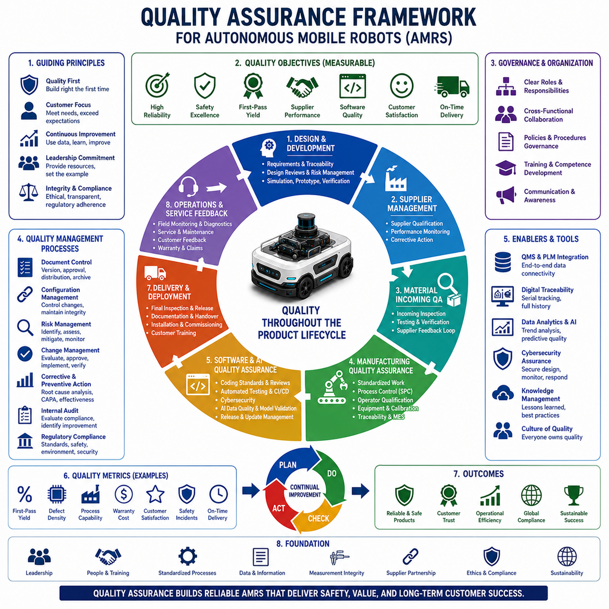
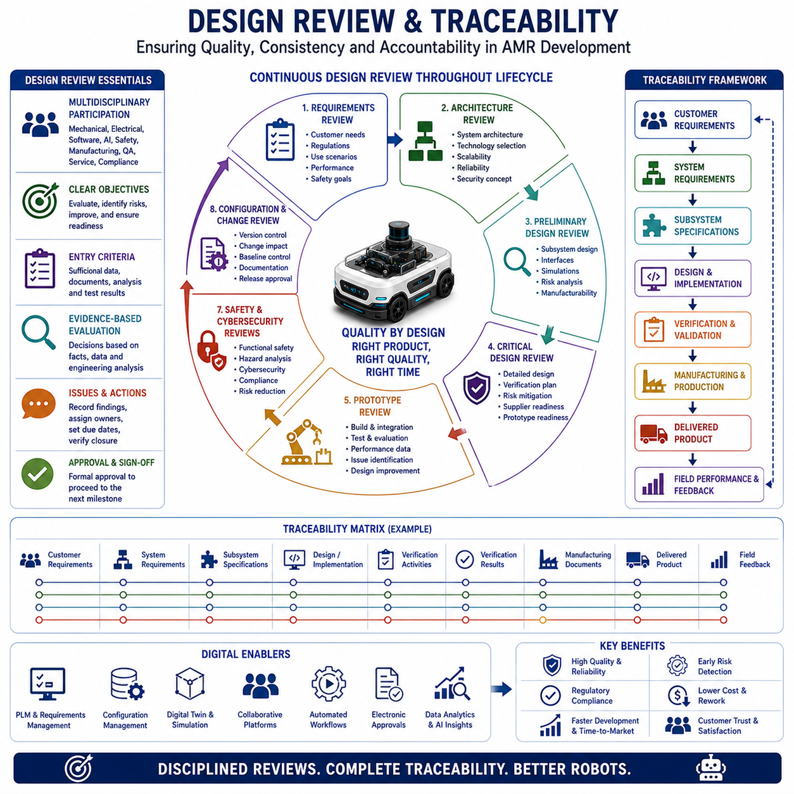
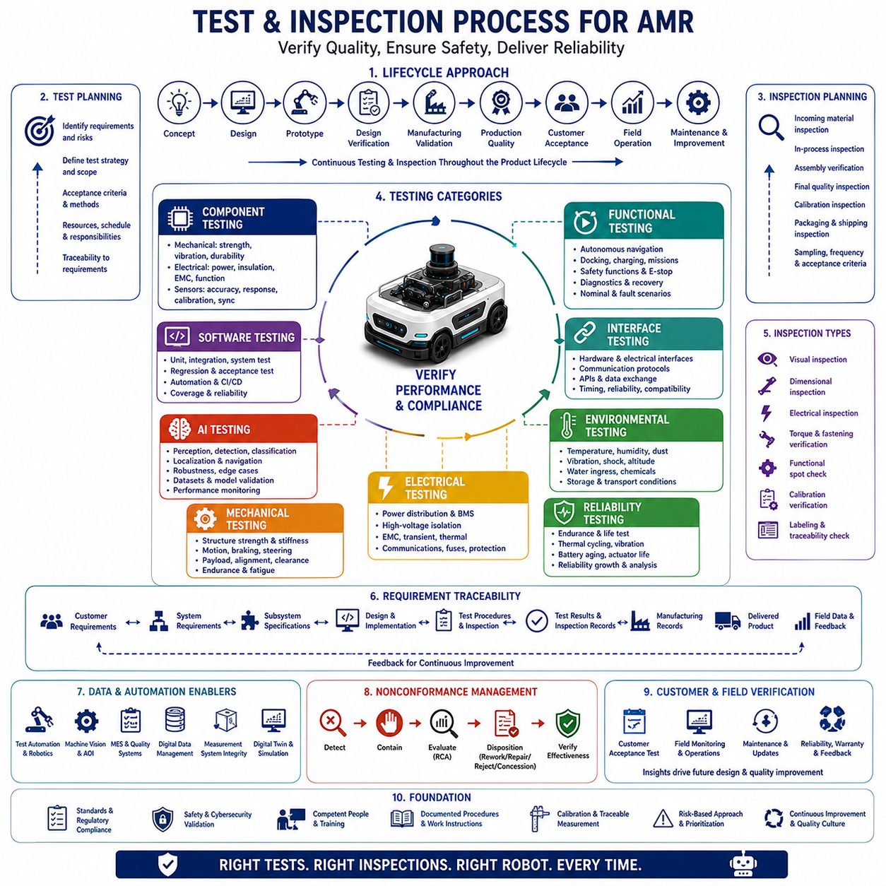
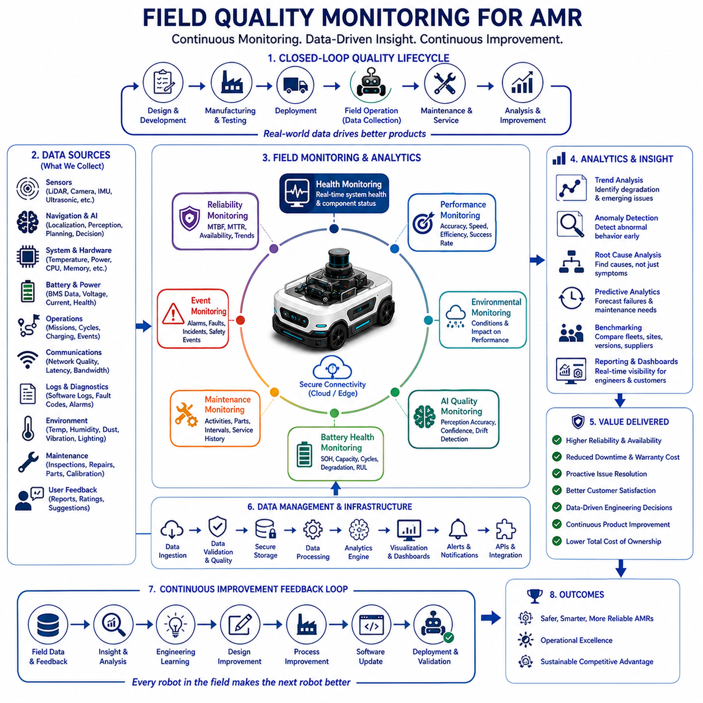
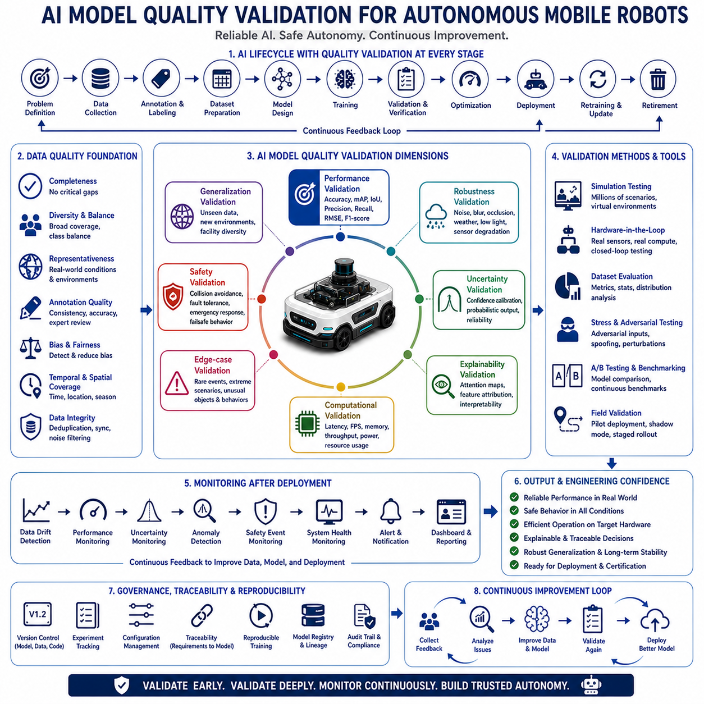
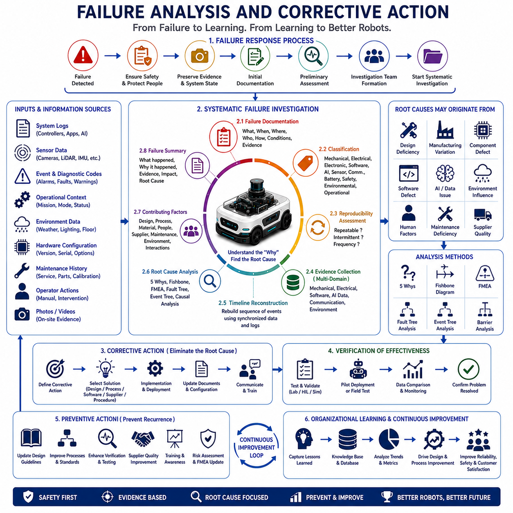
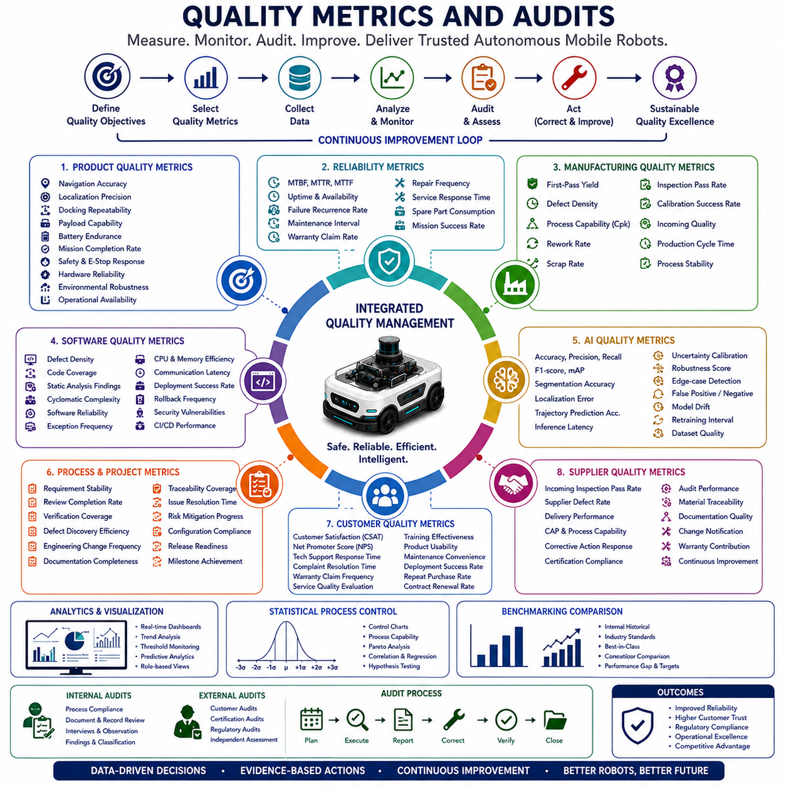
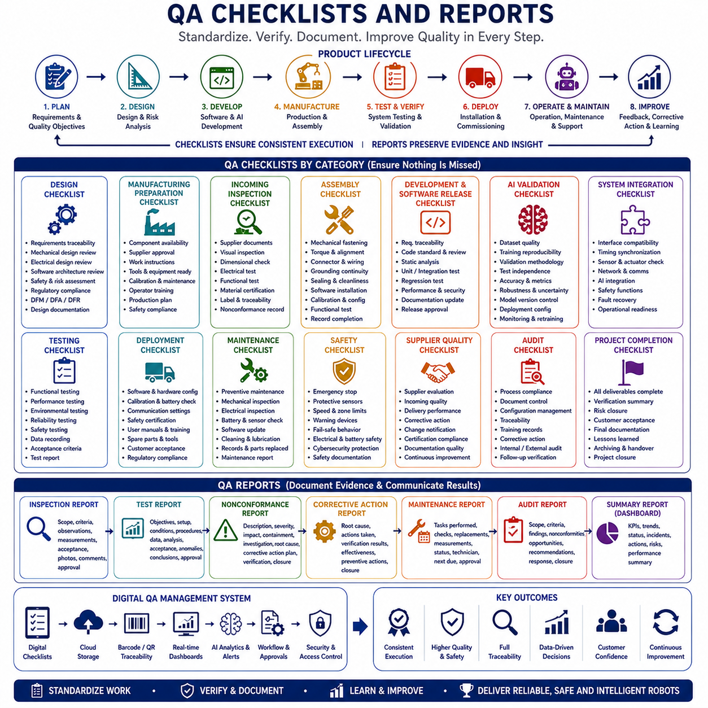

**Volume10. AMR Engineering Process and Development Manual**

# Chapter 18. Quality Assurance

## 18.01 Quality Assurance Framework

{width="7.268055555555556in" height="7.268055555555556in"}

Quality assurance provides the systematic framework that ensures Autonomous Mobile Robots are designed, manufactured, tested, delivered, and supported according to defined quality objectives throughout their entire lifecycle. Unlike quality control, which primarily focuses on detecting defects after they occur, quality assurance establishes organizational processes that prevent defects from being introduced in the first place. It integrates engineering methodology, manufacturing discipline, supplier management, software governance, safety engineering, verification planning, customer feedback, and continuous improvement into one coordinated management system. As AMRs evolve into highly autonomous and safety-critical industrial platforms, quality assurance becomes a strategic capability that directly influences reliability, customer confidence, operational efficiency, regulatory compliance, and long-term commercial success.

A quality assurance framework should begin with a clearly defined quality policy that reflects the organization\'s commitment to product excellence, customer satisfaction, operational consistency, and continual improvement. The quality policy establishes guiding principles that influence every engineering and manufacturing decision. Rather than functioning as a statement displayed only during external audits, the policy should become part of everyday engineering culture. Design decisions, supplier selection, manufacturing planning, software development, validation activities, customer support, and field maintenance should all demonstrate measurable alignment with these quality objectives. When quality policy becomes embedded within operational behavior, consistent organizational performance becomes achievable regardless of production scale.

Quality objectives translate broad organizational commitments into measurable operational targets. These objectives may include first-pass manufacturing yield, supplier quality performance, software defect density, production cycle stability, warranty reduction, field reliability, customer satisfaction, safety incident prevention, regulatory compliance, calibration accuracy, and delivery performance. Each objective should include quantitative targets, responsible organizations, measurement methodology, reporting frequency, and continuous improvement plans. Clearly defined objectives allow management to evaluate quality performance objectively while aligning engineering activities with long-term business strategy instead of focusing solely on short-term production output.

Leadership commitment represents the foundation of every effective quality assurance framework. Executive management establishes quality priorities by allocating resources, approving organizational policies, supporting engineering discipline, and demonstrating visible commitment to long-term product reliability rather than temporary production acceleration. When management consistently prioritizes schedule over quality, organizational behavior inevitably shifts toward accepting preventable defects and technical debt. Conversely, leadership that rewards systematic problem solving, engineering rigor, cross-functional collaboration, and preventive action encourages sustainable product excellence throughout development and manufacturing operations.

Organizational structure plays an important role in quality assurance because responsibilities must be clearly defined without creating unnecessary bureaucracy. Engineering teams remain responsible for technical correctness, manufacturing organizations ensure production consistency, supplier quality engineers manage external component quality, software teams maintain digital integrity, safety engineers oversee functional safety compliance, and quality organizations coordinate independent verification activities. Cross-functional collaboration is essential because product quality emerges from interactions among multiple engineering disciplines rather than from isolated departmental performance. Clear responsibility matrices reduce ambiguity while ensuring that quality ownership remains distributed across the entire organization.

Process standardization establishes repeatable methods for executing engineering, manufacturing, testing, purchasing, documentation, software development, and service activities. Standard operating procedures, engineering guidelines, work instructions, process maps, inspection criteria, and documentation templates reduce variation caused by individual interpretation. Standardization does not eliminate engineering creativity but instead ensures that innovative solutions are implemented through controlled processes. Stable processes improve predictability, simplify workforce training, facilitate auditing, strengthen traceability, and support production scaling while maintaining consistent product quality across different facilities and development teams.

Documentation management forms a critical element of quality assurance because every engineering decision, manufacturing activity, inspection result, software release, calibration record, supplier approval, and corrective action depends upon accurate documentation. Controlled document management systems maintain revision history, approval workflows, distribution control, change tracking, and archival procedures. Production personnel should always access current approved documents while obsolete versions remain protected against unintended use. Digital document management significantly reduces configuration errors while providing objective evidence supporting regulatory compliance, customer audits, warranty investigations, and engineering change management.

Requirements management provides traceability between customer expectations, engineering specifications, verification activities, manufacturing procedures, and delivered system performance. Every functional requirement, performance target, safety constraint, environmental condition, interface specification, and regulatory obligation should remain traceable throughout the product lifecycle. Requirement traceability demonstrates that engineering intent has been implemented, verified, validated, and maintained during subsequent design changes. Comprehensive traceability reduces project risk by ensuring that important customer requirements are neither overlooked nor unintentionally modified during development.

Design quality assurance begins before detailed engineering work starts. System architecture reviews evaluate design concepts for technical feasibility, reliability, manufacturability, maintainability, scalability, safety, cybersecurity, environmental compatibility, and serviceability. Formal design reviews involving multidisciplinary teams identify technical risks before significant development resources are invested. Concept validation, simulation, prototype evaluation, and design verification progressively increase engineering confidence while preventing costly design errors from propagating into manufacturing. Preventive design assurance is significantly more economical than correcting mature product defects after commercial deployment.

Risk management constitutes a continuous activity throughout the quality assurance framework. Engineering teams identify technical, operational, manufacturing, supplier, software, cybersecurity, safety, regulatory, and commercial risks using structured analytical methods. Each identified risk receives probability assessment, severity evaluation, mitigation planning, ownership assignment, verification strategy, and closure criteria. Risk registers should remain active throughout development and production because new information continuously changes project uncertainty. Proactive risk management enables organizations to prevent failures instead of reacting after quality problems become visible in production or customer environments.

Supplier quality assurance extends organizational quality expectations beyond internal manufacturing operations. Supplier qualification evaluates technical capability, manufacturing processes, quality systems, inspection methods, traceability, financial stability, environmental management, cybersecurity practices, and continuous improvement capability. Approved suppliers should participate in regular performance reviews based upon defect rates, delivery reliability, corrective action responsiveness, process capability, audit findings, and customer feedback. Long-term supplier partnerships encourage joint process improvement while reducing variation introduced through inconsistent external manufacturing practices.

Incoming quality assurance verifies that purchased materials satisfy engineering and contractual requirements before production begins. Sampling strategies, inspection plans, dimensional verification, electrical testing, material certification review, environmental compliance confirmation, software integrity verification, and packaging evaluation collectively prevent defective components from entering manufacturing. Incoming inspection results should feed supplier performance metrics and corrective action systems, creating closed-loop quality improvement rather than functioning solely as product acceptance activities. Effective incoming quality assurance reduces downstream production disruption while strengthening supply chain reliability.

Manufacturing quality assurance ensures that production processes consistently generate products meeting engineering specifications. Rather than relying solely on end-of-line inspection, manufacturing assurance emphasizes standardized work, operator qualification, equipment calibration, process capability analysis, statistical process control, preventive maintenance, manufacturing execution systems, digital traceability, and automated verification. Every workstation should operate according to documented procedures supported by measurable acceptance criteria. Stable manufacturing processes minimize variability, reduce rework, improve productivity, and produce consistent product quality regardless of production volume or workforce changes.

Equipment qualification ensures that manufacturing resources remain capable of producing conforming products throughout operational life. Production equipment, calibration instruments, assembly fixtures, torque tools, software programming stations, electrical test systems, and environmental chambers require installation qualification, operational qualification, and performance qualification before entering routine production. Periodic recalibration, preventive maintenance, software validation, and performance verification maintain equipment integrity over time. Reliable manufacturing equipment reduces measurement uncertainty while supporting objective process control and repeatable product quality.

Software quality assurance occupies an increasingly central role because modern AMRs depend upon millions of software instructions coordinating perception, localization, planning, navigation, fleet management, diagnostics, communication, cybersecurity, and functional safety. Software development processes should include coding standards, version control, peer review, automated testing, static analysis, continuous integration, cybersecurity assessment, configuration management, defect tracking, and controlled release procedures. Software assurance extends beyond source code quality to include deployment consistency, update management, rollback capability, and compatibility verification across distributed computing platforms.

Artificial intelligence introduces additional quality assurance considerations because learned models behave differently from deterministic algorithms. Training datasets require quality assessment, annotation verification, diversity analysis, bias evaluation, version control, reproducibility documentation, validation benchmarks, robustness testing, and operational monitoring. Model performance should be evaluated under representative environmental conditions including varying illumination, weather, sensor degradation, dynamic obstacles, and unexpected operational scenarios. Continuous monitoring after deployment enables engineering teams to detect performance drift while maintaining confidence in autonomous decision-making systems throughout operational life.

Verification and validation activities provide objective evidence that engineering requirements have been satisfied. Verification confirms that the system has been built according to specification, while validation demonstrates that the resulting product satisfies intended operational needs. Mechanical testing, electrical evaluation, software verification, sensor characterization, environmental testing, functional safety assessment, endurance evaluation, cybersecurity testing, user acceptance trials, and field validation collectively establish technical confidence. Quality assurance coordinates these activities by ensuring comprehensive test planning, traceable results, documented evidence, and independent review of verification completeness.

Configuration management protects product integrity by controlling every approved hardware component, software release, engineering drawing, manufacturing procedure, calibration parameter, documentation revision, and customer-specific option. Every released product configuration should remain reproducible throughout manufacturing and service life. Engineering changes require systematic evaluation of technical impact, inventory consequences, supplier implementation, manufacturing readiness, software compatibility, regulatory implications, and customer communication. Strong configuration control prevents unintended variation while supporting maintenance, spare parts management, warranty investigation, and product lifecycle support.

Measurement systems require quality assurance because incorrect measurements inevitably produce incorrect engineering decisions. Inspection instruments, torque tools, electrical measurement equipment, coordinate measuring machines, environmental sensors, calibration references, and automated testing systems should maintain traceable calibration status according to recognized national or international standards. Measurement system analysis evaluates repeatability, reproducibility, accuracy, bias, linearity, and stability. Reliable measurement capability forms the foundation upon which all quality decisions depend throughout engineering development and manufacturing operations.

Corrective action and preventive action establish structured methods for resolving quality problems while preventing recurrence. Nonconformities identified during engineering reviews, manufacturing inspections, supplier audits, field service, customer complaints, or reliability testing should undergo systematic root cause investigation rather than superficial symptom correction. Corrective actions eliminate existing causes, while preventive actions reduce the probability of similar failures appearing elsewhere within products, processes, suppliers, or organizational procedures. Effectiveness verification confirms that implemented improvements continue delivering expected quality benefits over time.

Internal auditing evaluates whether organizational processes operate according to established quality management requirements. Audits examine documentation, engineering practices, manufacturing execution, supplier management, software governance, calibration control, training effectiveness, traceability, corrective action implementation, and regulatory compliance. Internal audits should function primarily as improvement opportunities rather than fault-finding exercises. Objective auditing identifies systemic weaknesses before external customers or certification bodies discover them, thereby supporting organizational learning and continual improvement.

Regulatory compliance represents an integral component of quality assurance rather than an independent administrative activity. AMRs frequently operate within environments requiring compliance with machinery directives, electrical safety standards, electromagnetic compatibility regulations, cybersecurity guidance, environmental legislation, transportation requirements, and functional safety standards. Compliance evidence should be generated naturally through disciplined engineering and quality processes rather than reconstructed retrospectively before certification. Early integration of regulatory requirements reduces project delays while strengthening customer confidence and international market acceptance.

Customer feedback provides valuable information unavailable during laboratory development or factory testing. Field service reports, warranty claims, operational data, user interviews, maintenance records, software diagnostics, fleet analytics, and customer satisfaction surveys reveal practical reliability issues, usability challenges, environmental influences, and operational improvement opportunities. Quality assurance systems should collect, classify, prioritize, investigate, and distribute customer feedback throughout engineering, manufacturing, supplier management, and product planning organizations. Closed-loop feedback transforms operational experience into measurable product improvement.

Reliability assurance complements quality assurance by focusing upon long-term operational performance instead of initial manufacturing conformity alone. Accelerated life testing, environmental stress screening, endurance evaluation, vibration testing, thermal cycling, corrosion assessment, battery aging studies, software stability monitoring, and predictive maintenance analytics collectively estimate product durability under realistic operating conditions. Reliability growth programs analyze observed failures, implement engineering improvements, and verify effectiveness through repeated testing. Sustainable product quality requires consistent reliability throughout the intended service life rather than successful factory acceptance alone.

Digital quality assurance increasingly integrates engineering, manufacturing, suppliers, logistics, service, and customer operations through interconnected information systems. Product lifecycle management, enterprise resource planning, manufacturing execution systems, quality management platforms, digital twins, automated inspection technologies, industrial Internet of Things devices, and artificial intelligence analytics provide real-time visibility into product quality across the entire lifecycle. Digital integration enables predictive quality management by identifying trends before defects become widespread. Data-driven decision making therefore replaces reactive quality management based solely upon historical inspection results.

Quality metrics enable organizations to evaluate framework effectiveness objectively. Metrics may include first-pass yield, defect density, supplier performance, process capability indices, customer complaints, warranty costs, software reliability, safety incidents, audit findings, corrective action closure time, production variability, calibration accuracy, and delivery performance. Individual metrics should not be optimized independently because isolated improvement may create unintended consequences elsewhere. Balanced scorecards integrating quality, cost, delivery, safety, innovation, and customer satisfaction provide more comprehensive evaluation of organizational performance.

Quality culture ultimately determines whether formal quality assurance systems produce lasting organizational value. Procedures, documentation, audits, and performance indicators cannot compensate for organizational attitudes that tolerate shortcuts, incomplete verification, inadequate communication, or recurring technical debt. Every employee should understand that quality represents personal responsibility rather than departmental ownership. Organizations cultivating transparency, technical integrity, continuous learning, collaborative problem solving, and customer-focused engineering consistently achieve superior product performance while adapting successfully to evolving technologies and market expectations.

Ultimately, a comprehensive quality assurance framework transforms quality from an inspection activity into an integrated organizational philosophy governing every stage of the Autonomous Mobile Robot lifecycle. Through disciplined leadership, standardized processes, controlled documentation, supplier partnership, engineering verification, manufacturing consistency, software governance, regulatory compliance, customer feedback, digital integration, and continuous improvement, quality assurance creates reliable products capable of meeting demanding industrial applications. As autonomous robotic systems continue expanding across logistics, manufacturing, healthcare, construction, agriculture, defense, and public infrastructure, robust quality assurance frameworks will remain essential for ensuring safety, reliability, scalability, customer trust, and sustainable technological leadership.

## 18.02 Design Review and Traceability

{width="7.268055555555556in" height="7.268055555555556in"}

Design review and traceability form the foundation of systematic quality assurance throughout the development lifecycle of an Autonomous Mobile Robot. Modern AMRs integrate mechanical engineering, electrical systems, embedded software, artificial intelligence, functional safety, cybersecurity, communication networks, cloud services, and industrial automation into a single operational platform. Because changes in one engineering discipline often influence many others, uncontrolled design evolution can quickly introduce hidden technical risks. Design reviews provide structured technical evaluation before engineering decisions become permanently embedded in the product, while traceability establishes verifiable relationships among customer requirements, engineering specifications, implementation activities, verification results, manufacturing processes, and field performance. Together, they create an engineering governance framework that supports technical consistency, regulatory compliance, maintainability, scalability, and long-term product reliability.

Design review should be regarded as a continuous engineering activity rather than a single approval meeting conducted before product release. Effective reviews occur throughout the development process as system understanding matures and engineering decisions become progressively more detailed. Early reviews focus on system architecture, technology selection, operational concepts, safety philosophy, and customer requirements. Intermediate reviews evaluate subsystem integration, interface definitions, manufacturability, software architecture, and prototype performance. Final reviews confirm production readiness, documentation completeness, verification coverage, configuration control, manufacturing preparation, and service readiness. This progressive review strategy enables engineering organizations to identify technical weaknesses when corrective actions remain technically feasible and economically practical.

The primary objective of design review is not to criticize engineering work but to improve product quality through multidisciplinary evaluation. Every engineering discipline possesses specialized expertise, yet complex robotic systems frequently fail because interactions between disciplines remain insufficiently understood. Mechanical engineers may optimize structural performance without recognizing electrical routing constraints. Software engineers may improve navigation algorithms while increasing processor utilization beyond thermal limits. Manufacturing engineers may identify assembly challenges overlooked during design optimization. Design reviews encourage collaborative problem solving by bringing together experts from different domains, allowing the organization to evaluate complete system behavior instead of isolated component performance.

Successful design reviews require clearly defined entry criteria before technical discussions begin. Engineering drawings, three-dimensional models, electrical schematics, software architecture documents, interface definitions, requirement specifications, risk analyses, simulation results, prototype data, test reports, supplier information, and manufacturing considerations should all reach sufficient maturity before formal review sessions. Conducting reviews with incomplete engineering information often produces subjective discussions rather than objective technical evaluation. Establishing documented entry criteria improves review effectiveness while ensuring that engineering teams invest preparation effort before requesting organizational approval for major design decisions.

Review participants should represent all engineering disciplines influenced by the proposed design. Mechanical engineering, electrical engineering, embedded software, artificial intelligence, systems engineering, manufacturing engineering, quality assurance, functional safety, cybersecurity, supplier quality, field service, regulatory compliance, and project management each contribute unique perspectives. Customer representatives or operational specialists may also participate when deployment conditions significantly influence design decisions. Balanced multidisciplinary participation reduces organizational blind spots while encouraging constructive technical discussion based upon measurable engineering evidence instead of individual assumptions or departmental priorities.

System requirements review represents the first formal design evaluation within many development programs. Customer expectations, operational scenarios, regulatory obligations, environmental conditions, performance targets, interface requirements, safety objectives, maintainability expectations, service constraints, and lifecycle assumptions should all receive structured examination. Ambiguous or conflicting requirements create downstream engineering uncertainty that becomes increasingly expensive to resolve during later development stages. Requirements reviews therefore emphasize clarity, completeness, consistency, feasibility, verifiability, and traceability before detailed engineering design begins. Well-defined requirements significantly reduce redesign effort while establishing stable technical foundations for subsequent development activities.

System architecture review evaluates whether the proposed technical solution satisfies identified requirements using appropriate engineering principles. Hardware architecture, software architecture, sensor selection, computing platforms, communication networks, power distribution, mechanical structures, safety concepts, redundancy strategies, and cybersecurity mechanisms should operate together as an integrated engineering system. Review participants assess scalability, reliability, modularity, maintainability, manufacturability, serviceability, environmental robustness, and future product evolution. Architectural weaknesses discovered early can often be corrected through relatively simple design modifications, whereas architectural deficiencies identified after implementation frequently require expensive redesign affecting multiple engineering disciplines.

Preliminary design review examines subsystem implementation before detailed engineering activities become finalized. Mechanical layouts, electrical schematics, software frameworks, communication protocols, sensor integration, thermal management, packaging constraints, cable routing, structural analysis, preliminary manufacturing methods, and interface definitions receive comprehensive evaluation. Review discussions should identify unresolved technical risks requiring additional analysis, prototype testing, supplier consultation, or simulation. Rather than expecting complete engineering maturity, preliminary reviews ensure that technical direction remains fundamentally correct before substantial development resources become committed to detailed implementation.

Critical design review represents one of the most important engineering milestones because detailed implementation approaches have largely stabilized. Engineering drawings, manufacturing documentation, software architecture, hardware interfaces, control algorithms, calibration procedures, verification planning, risk mitigation strategies, supplier readiness, tooling requirements, production processes, and service documentation should demonstrate technical completeness. Review teams evaluate whether sufficient evidence exists to justify prototype manufacturing or production preparation. Remaining engineering issues should be documented together with ownership assignments, resolution schedules, verification activities, and acceptance criteria before review closure.

Prototype review evaluates actual physical implementation rather than theoretical engineering concepts. Mechanical performance, electrical behavior, software functionality, artificial intelligence operation, navigation accuracy, thermal characteristics, vibration response, electromagnetic compatibility, battery performance, user interaction, and safety mechanisms should all be examined using measured engineering data. Prototype reviews frequently reveal practical integration challenges not predicted through analytical models or simulations. Engineering teams should therefore treat prototype evaluation as an opportunity to improve system understanding instead of merely confirming original design assumptions.

Manufacturing readiness review determines whether engineering outputs can be transformed into stable production processes. Bills of materials, engineering drawings, assembly procedures, manufacturing tooling, inspection methods, calibration equipment, software installation procedures, production testing, quality documentation, supplier readiness, logistics planning, packaging methods, and service preparation all require evaluation. Design decisions should support efficient manufacturing while maintaining required quality levels. Manufacturing engineers often identify opportunities for design simplification that reduce production cost, improve assembly efficiency, strengthen quality consistency, and enhance long-term maintainability without compromising technical performance.

Safety review examines whether the product satisfies identified functional safety objectives throughout its intended operating environment. Hazard analyses, safety requirements, emergency functions, fault detection mechanisms, redundancy strategies, safety diagnostics, protective devices, risk mitigation measures, operator interfaces, warning systems, and regulatory compliance receive systematic evaluation. Functional safety reviews require objective engineering evidence rather than assumptions regarding safe operation. Because autonomous robots interact directly with people, equipment, and industrial environments, safety reviews remain mandatory throughout design evolution rather than appearing only before regulatory certification.

Cybersecurity review has become increasingly important as AMRs incorporate wireless communication, cloud connectivity, remote diagnostics, fleet management, software updates, artificial intelligence services, and industrial networking. Authentication methods, encryption strategies, software integrity verification, secure boot mechanisms, vulnerability management, access control, update procedures, network segmentation, data protection, and incident response capabilities should all undergo structured evaluation. Cybersecurity reviews must consider operational deployment as well as software architecture because secure engineering depends upon organizational processes in addition to technical implementation. Preventive cybersecurity assurance significantly reduces future operational risk while supporting customer confidence.

Software design review evaluates architecture, modularity, maintainability, performance, reliability, scalability, fault tolerance, coding standards, interface definitions, version management, testing strategy, and deployment procedures. Distributed computing architectures typical of AMRs require coordinated interaction among perception software, localization algorithms, motion planning, fleet communication, diagnostics, artificial intelligence modules, and safety supervision. Review teams assess not only individual software components but also system-wide interactions under normal operation, fault conditions, resource limitations, and future software evolution. High-quality software architecture reduces maintenance effort while supporting continuous functional enhancement throughout product life.

Artificial intelligence design review introduces additional evaluation criteria beyond conventional software engineering. Machine learning model selection, dataset quality, annotation consistency, validation methodology, inference performance, computational efficiency, explainability, robustness, operational monitoring, retraining strategy, bias assessment, and safety limitations require systematic engineering assessment. Review participants should understand that learned models evolve through statistical optimization rather than deterministic programming. Consequently, evaluation emphasizes representative validation datasets, operational boundary conditions, uncertainty management, and continuous performance monitoring rather than traditional algorithm correctness alone.

Interface review verifies compatibility among subsystems before physical integration begins. Mechanical interfaces, electrical connectors, communication protocols, software application programming interfaces, timing synchronization, power distribution, cooling systems, mounting provisions, maintenance access, and diagnostic connections all require standardized definitions. Interface inconsistencies frequently create expensive integration delays because multiple engineering teams independently develop connected subsystems. Formal interface reviews therefore reduce integration risk while supporting modular product architecture and supplier collaboration across complex engineering organizations.

Verification planning review confirms that every engineering requirement possesses an associated verification strategy before implementation completes. Analysis, inspection, demonstration, simulation, laboratory testing, environmental qualification, endurance evaluation, software testing, system validation, customer acceptance testing, and field trials collectively provide objective engineering evidence. Verification planning should define acceptance criteria, required equipment, measurement methods, responsibilities, documentation requirements, and traceability relationships linking requirements directly to verification results. Comprehensive planning prevents verification gaps while supporting efficient project execution and regulatory compliance.

Configuration review ensures that every engineering artifact remains properly controlled throughout product evolution. Hardware revisions, software releases, engineering drawings, requirement specifications, manufacturing procedures, calibration files, supplier documentation, verification records, and customer-specific configurations require systematic version management. Configuration inconsistencies create confusion across engineering, manufacturing, service, and customer support organizations. Formal configuration reviews therefore confirm that released product definitions remain internally consistent, completely documented, reproducible, and traceable throughout manufacturing, deployment, maintenance, and future engineering changes.

Traceability establishes documented relationships among engineering information throughout the entire product lifecycle. Customer requirements connect to system requirements, system requirements connect to subsystem specifications, subsystem specifications connect to detailed engineering implementation, implementation connects to verification activities, verification results connect to manufacturing documentation, manufacturing connects to delivered products, and operational performance connects back to engineering improvement. Complete traceability demonstrates that every engineering decision originates from an identifiable requirement while every requirement ultimately receives objective verification and operational validation.

Requirement traceability represents one of the most valuable engineering management tools within complex robotic development. Every customer expectation should receive a unique identifier maintained throughout system decomposition. Functional requirements, performance requirements, interface requirements, environmental requirements, cybersecurity requirements, manufacturing requirements, maintainability objectives, and safety constraints should remain linked to responsible engineering artifacts. Requirement traceability matrices enable engineering teams to evaluate change impact efficiently because modifications automatically identify affected documents, software modules, hardware components, verification activities, manufacturing procedures, and customer commitments.

Design traceability extends beyond requirement management by connecting engineering decisions with supporting technical justification. Material selection, structural analysis, component sizing, processor selection, sensor placement, battery capacity, communication architecture, software algorithms, safety mechanisms, and artificial intelligence models should each reference documented engineering rationale. Future engineers responsible for maintenance or product evolution can therefore understand why previous design decisions were made rather than relying upon assumptions or undocumented organizational memory. Design rationale significantly improves long-term maintainability while reducing repeated engineering analysis.

Verification traceability confirms that every engineering requirement has been evaluated using appropriate technical methods. Requirements lacking verification represent unacceptable engineering risk because product functionality remains unsupported by objective evidence. Conversely, verification activities lacking associated requirements indicate unnecessary engineering effort. Bidirectional traceability enables reviewers to navigate efficiently from customer expectations through implementation toward verification evidence and back again. This capability becomes particularly valuable during regulatory certification, customer audits, safety assessments, warranty investigations, and complex engineering change programs.

Manufacturing traceability connects engineering definitions directly with production execution. Individual robot serial numbers should associate with component batches, supplier records, assembly personnel, manufacturing equipment, torque values, calibration files, software versions, inspection results, functional testing, packaging records, shipment documentation, and customer delivery information. Comprehensive manufacturing traceability enables rapid investigation of field issues because engineering teams can identify affected production lots, supplier contributions, manufacturing conditions, and verification history without unnecessary disruption to unaffected products.

Software traceability ensures that deployed digital functionality remains completely identifiable throughout operational life. Software versions, firmware releases, artificial intelligence models, configuration parameters, cybersecurity certificates, update history, rollback capability, diagnostic records, and compatibility information should remain associated with each robot configuration. Distributed computing systems require particularly rigorous traceability because multiple processors frequently execute coordinated software releases simultaneously. Effective software traceability supports maintenance, remote updates, cybersecurity response, functional enhancement, and technical support while minimizing operational disruption.

Digital engineering platforms greatly strengthen design review and traceability by integrating product lifecycle management, requirements management, configuration control, manufacturing execution, quality management, software repositories, simulation tools, verification databases, and service information within unified digital ecosystems. Digital twins, automated workflow management, electronic approvals, revision tracking, collaborative engineering environments, and artificial intelligence analytics improve engineering visibility while reducing administrative overhead. Real-time information sharing enables multidisciplinary teams to evaluate design maturity using consistent engineering data regardless of geographical location or organizational structure.

Engineering change management relies heavily upon both structured design reviews and comprehensive traceability. Every proposed modification should identify technical justification, affected requirements, impacted components, software dependencies, manufacturing implications, supplier changes, verification updates, customer influence, regulatory considerations, documentation revisions, and lifecycle consequences before implementation approval. Traceability allows organizations to evaluate engineering change impact objectively rather than relying upon incomplete assumptions. Structured review ensures that modifications improve overall system quality instead of unintentionally introducing new technical risks elsewhere within the product.

Continuous improvement transforms accumulated design review findings and traceability information into future engineering knowledge. Lessons learned from prototype evaluation, manufacturing experience, supplier performance, verification activities, customer feedback, field reliability, warranty investigations, cybersecurity incidents, and service operations should return systematically into subsequent development programs. Organizations maintaining strong review discipline and comprehensive traceability gradually build reusable engineering knowledge supporting faster development, improved quality, reduced technical risk, simplified regulatory compliance, and greater customer confidence across successive generations of Autonomous Mobile Robot platforms.

## 18.03 Test and Inspection Process

{width="7.268055555555556in" height="7.268055555555556in"}

Testing and inspection constitute one of the most critical quality assurance activities throughout the development and manufacturing lifecycle of an Autonomous Mobile Robot. Every AMR integrates numerous hardware components, embedded controllers, artificial intelligence software, perception sensors, communication systems, functional safety mechanisms, power electronics, and mechanical assemblies into a highly interconnected engineering system. Even when individual components satisfy their respective specifications, integration failures may still emerge because of interface mismatches, environmental influences, manufacturing variation, or unexpected operational conditions. The testing and inspection process therefore provides systematic verification that every subsystem and the complete robot satisfy engineering requirements before progressing to subsequent development stages, production milestones, customer delivery, and long-term operational deployment.

Testing and inspection should not be regarded as the final activities performed after engineering development has finished. Instead, they represent continuous engineering processes that begin during system concept development and continue throughout design verification, prototype evaluation, manufacturing validation, production quality assurance, customer acceptance, field operation, maintenance, and product evolution. Early engineering testing identifies design weaknesses before substantial development resources are invested, while manufacturing inspection ensures production consistency and operational testing confirms real-world performance. Organizations that integrate testing throughout the entire product lifecycle generally achieve higher product reliability, lower warranty costs, shorter development cycles, and greater customer confidence than organizations relying primarily upon end-of-line inspection.

The overall objective of testing is to demonstrate objectively that engineering requirements have been satisfied, whereas inspection focuses on verifying that manufactured products conform to defined specifications and workmanship standards. Although these activities are closely related, they address different engineering questions. Testing determines whether the system performs required functions under specified operating conditions, while inspection evaluates whether physical implementation matches approved design documentation. Together, testing and inspection provide complementary evidence supporting technical acceptance, regulatory compliance, manufacturing readiness, and customer satisfaction. Effective quality assurance therefore requires both activities operating within a coordinated verification framework rather than as independent organizational functions.

Test planning begins long before physical hardware becomes available. Systems engineers, design engineers, software developers, manufacturing specialists, safety engineers, quality professionals, and project managers collaborate to identify engineering requirements requiring objective verification. Every functional requirement, performance specification, interface definition, environmental condition, reliability target, safety objective, cybersecurity requirement, and regulatory obligation should possess an associated verification strategy. Test planning identifies acceptance criteria, required equipment, measurement methods, responsibilities, schedules, documentation requirements, and traceability relationships. Comprehensive planning prevents verification gaps while ensuring efficient utilization of engineering resources throughout development and production.

Requirement-based testing establishes direct relationships between customer expectations and engineering verification activities. Each engineering requirement receives a unique identifier connected to one or more verification procedures. Functional requirements may require demonstration, performance requirements often require quantitative measurement, safety requirements demand structured validation, and environmental requirements require specialized qualification testing. Requirement traceability ensures that every specified capability receives objective engineering evidence while preventing unnecessary testing unrelated to documented requirements. Bidirectional traceability also simplifies engineering change management because modified requirements automatically identify affected verification procedures requiring review or repetition.

Inspection planning complements testing by defining systematic evaluation activities throughout manufacturing and assembly. Incoming material inspection, component inspection, in-process inspection, assembly verification, electrical inspection, software installation verification, calibration inspection, final quality inspection, packaging inspection, and shipping verification should all operate according to standardized procedures. Inspection plans specify sampling strategies, inspection frequencies, acceptance criteria, measurement methods, documentation requirements, responsible personnel, and corrective action procedures. Well-structured inspection planning prevents manufacturing variation from propagating through subsequent production stages while reducing unnecessary inspection effort through risk-based prioritization.

Component-level testing verifies that individual hardware modules satisfy their respective engineering specifications before system integration begins. Mechanical structures undergo dimensional verification, strength evaluation, fatigue assessment, vibration testing, corrosion resistance, and environmental qualification. Electrical modules require power verification, insulation measurement, communication testing, thermal evaluation, electromagnetic compatibility assessment, and functional validation. Sensors undergo calibration, accuracy characterization, response time evaluation, environmental robustness testing, synchronization verification, and communication integrity assessment. Early component testing isolates technical problems before integration complexity complicates diagnosis and corrective action.

Software testing forms an essential element of modern AMR verification because autonomous functionality depends heavily upon embedded software operating across multiple distributed computing platforms. Unit testing evaluates individual software modules, integration testing verifies subsystem interaction, system testing validates complete operational functionality, regression testing protects existing capability during software evolution, and acceptance testing confirms customer requirements. Automated testing frameworks execute thousands of verification cases consistently while generating objective evidence supporting software quality. Continuous integration environments further strengthen software reliability by automatically detecting implementation errors immediately after development changes occur.

Artificial intelligence testing introduces unique engineering challenges because learned models behave statistically rather than deterministically. Testing must therefore evaluate perception accuracy, classification reliability, object detection performance, localization precision, navigation robustness, anomaly detection capability, computational efficiency, uncertainty estimation, and operational consistency across representative environmental conditions. Training datasets, validation datasets, and operational datasets should remain independent to prevent evaluation bias. AI testing also includes edge-case analysis, rare-event evaluation, sensor degradation assessment, adversarial robustness testing, and long-term performance monitoring to ensure dependable autonomous behavior under realistic operating conditions.

Mechanical testing evaluates structural integrity, motion performance, durability, vibration resistance, impact tolerance, payload capability, suspension behavior, wheel alignment, steering accuracy, braking performance, and mechanical reliability. Static testing confirms structural strength under specified loading conditions, while dynamic testing evaluates moving systems during realistic operational scenarios. Endurance testing simulates long-term service conditions through repeated operating cycles that accelerate fatigue accumulation. Mechanical verification should include quantitative measurements supporting engineering analysis rather than relying solely upon subjective visual observation or operator experience.

Electrical testing confirms safe and reliable operation of power distribution systems, battery management, grounding, insulation, communication networks, connectors, protective devices, sensors, actuators, and electronic controllers. High-voltage isolation testing, continuity verification, power consumption measurement, thermal characterization, electromagnetic compatibility evaluation, transient response testing, communication diagnostics, and fault injection collectively establish electrical system integrity. Automated electrical test stations improve consistency while recording measurement values directly into digital manufacturing databases, thereby strengthening traceability and reducing manual documentation errors.

Functional testing verifies complete system operation under representative mission conditions. Autonomous navigation, obstacle avoidance, localization, docking, charging, fleet communication, mission execution, user interaction, emergency response, diagnostics, and recovery behavior should all demonstrate stable operation according to engineering specifications. Functional scenarios should include nominal operation together with abnormal conditions such as communication interruptions, sensor failures, localization degradation, battery depletion, unexpected obstacles, and operator intervention. Comprehensive functional testing confirms not only intended capability but also safe behavior during realistic fault conditions.

Interface testing evaluates communication and interoperability among integrated subsystems. Hardware interfaces, electrical connectors, software application programming interfaces, communication protocols, timing synchronization, sensor integration, actuator coordination, diagnostic communication, cloud connectivity, and industrial automation interfaces require systematic validation before full system deployment. Interface inconsistencies frequently produce integration failures despite satisfactory subsystem performance. Structured interface testing therefore verifies that independently developed components cooperate correctly under operational conditions while maintaining required timing, reliability, data integrity, and functional compatibility.

Environmental testing determines whether the AMR maintains specified performance under anticipated operating environments. Temperature extremes, humidity, dust exposure, water ingress, vibration, mechanical shock, electromagnetic interference, altitude, solar radiation, chemical exposure, and long-term storage conditions may all influence operational reliability. Environmental qualification follows recognized engineering standards whenever applicable while considering realistic deployment conditions expected by customers. Successful environmental testing demonstrates that product performance remains stable beyond controlled laboratory environments and throughout intended industrial operating conditions.

Reliability testing evaluates long-term operational stability rather than immediate functional correctness. Accelerated life testing, endurance operation, thermal cycling, vibration endurance, battery aging, actuator lifetime evaluation, sensor stability monitoring, software reliability assessment, and predictive maintenance analysis collectively estimate service life under representative operational conditions. Reliability growth programs systematically analyze observed failures, identify root causes, implement engineering improvements, and verify effectiveness through repeated testing. Sustainable product quality depends upon consistent operational reliability throughout the expected service lifetime rather than successful factory acceptance alone.

Calibration verification ensures that measurement systems, sensors, actuators, localization functions, and control algorithms maintain specified accuracy before product release. Camera calibration, LiDAR alignment, inertial measurement unit compensation, wheel parameter configuration, steering calibration, multi-sensor synchronization, localization initialization, and motion tuning require standardized procedures supported by objective acceptance criteria. Calibration records should remain permanently associated with product serial numbers while documenting calibration equipment, reference standards, environmental conditions, software versions, operator identification, and resulting parameter values supporting future maintenance and engineering analysis.

Inspection activities rely heavily upon standardized acceptance criteria to ensure consistent evaluation regardless of production shift, manufacturing location, or inspector experience. Visual inspection standards should include representative photographs, dimensional references, workmanship examples, labeling requirements, connector positioning, cable routing, mechanical clearances, surface finish expectations, cleanliness criteria, and assembly completeness. Quantitative acceptance criteria reduce subjective interpretation while improving consistency among inspectors and supporting objective quality management across expanding manufacturing operations.

Measurement system integrity represents a prerequisite for meaningful inspection and testing. Measurement instruments require periodic calibration traceable to recognized national or international standards. Coordinate measuring machines, torque tools, electrical instruments, thermal sensors, pressure gauges, force measurement systems, environmental chambers, and automated inspection equipment should maintain documented calibration status before engineering data are accepted as valid. Measurement system analysis evaluates repeatability, reproducibility, accuracy, bias, stability, and linearity, ensuring that observed engineering variation reflects actual product behavior rather than measurement uncertainty.

Automation increasingly transforms both testing and inspection processes. Automated optical inspection, robotic measurement systems, machine vision, barcode identification, digital torque verification, automated software deployment, electrical test automation, functional test sequencing, and manufacturing execution systems significantly improve repeatability while reducing operator workload. Automated systems also capture timestamps, measurement values, equipment identification, operator information, software versions, calibration references, and pass-fail decisions directly into digital quality databases. Automation therefore strengthens traceability while enabling scalable production without sacrificing verification quality.

Digital data management provides the information infrastructure supporting modern testing and inspection activities. Product lifecycle management systems, manufacturing execution systems, laboratory information management platforms, quality management software, configuration control databases, and digital twin environments collectively organize engineering evidence generated throughout product development and manufacturing. Every test result, inspection record, calibration file, software version, engineering revision, manufacturing lot, and corrective action should remain electronically traceable throughout the product lifecycle. Digital integration enables rapid engineering analysis while supporting customer audits, regulatory certification, warranty investigation, and continuous improvement.

Nonconforming product management defines systematic procedures for handling components or assemblies failing inspection or testing requirements. Products identified as nonconforming should be clearly segregated, documented, evaluated, and dispositioned according to standardized engineering procedures. Possible dispositions include rework, repair, engineering review, supplier return, concession approval, or product rejection depending upon technical impact and regulatory obligations. Structured nonconformance management prevents defective products from entering subsequent manufacturing stages while generating valuable engineering information supporting process improvement and supplier development.

Root cause analysis transforms testing failures and inspection findings into engineering knowledge rather than isolated corrective actions. Engineering teams should investigate underlying technical mechanisms instead of addressing only visible symptoms. Structured analytical methods evaluate design assumptions, manufacturing processes, software implementation, supplier variation, human factors, environmental influences, measurement uncertainty, and operational conditions contributing to observed failures. Corrective actions eliminate identified causes while preventive actions reduce recurrence probability throughout related engineering activities. Verification of corrective action effectiveness ensures that implemented improvements remain sustainable over extended operational periods.

Statistical analysis strengthens engineering decision making by distinguishing meaningful process variation from random measurement noise. Process capability indices, control charts, reliability distributions, failure trends, measurement uncertainty analysis, hypothesis testing, regression analysis, and predictive analytics provide quantitative insight supporting quality assurance decisions. Statistical methods become increasingly valuable as production volumes expand because large datasets reveal subtle quality trends impossible to detect through isolated observations. Data-driven engineering therefore enables proactive quality management before defects become widespread within manufacturing operations or customer deployments.

Customer acceptance testing provides final confirmation that delivered systems satisfy contractual requirements under representative operational conditions. Acceptance testing frequently includes mission execution, navigation performance, payload handling, communication verification, safety demonstration, software functionality, operator interaction, diagnostic capability, documentation review, and maintenance procedures. Customer participation strengthens mutual understanding while establishing confidence that delivered products satisfy intended operational objectives. Clearly defined acceptance criteria minimize interpretation differences and facilitate efficient project completion through objective engineering evidence rather than subjective expectations.

Testing and inspection continue after commercial deployment through field monitoring, preventive maintenance, software updates, fleet analytics, reliability assessment, warranty analysis, cybersecurity monitoring, and operational feedback collection. Field data frequently reveal environmental influences and operational scenarios impossible to reproduce completely within laboratory environments. Continuous operational verification therefore complements pre-release testing by extending engineering understanding throughout the entire product lifecycle. Lessons learned from operational experience should systematically return into future development programs, strengthening engineering knowledge and improving successive generations of Autonomous Mobile Robot platforms through disciplined evidence-based continuous improvement.

## 18.04 Field Quality Monitoring

{width="7.268055555555556in" height="7.268055555555556in"}

Field quality monitoring represents the continuous evaluation of product performance after deployment in real operating environments. While design verification, manufacturing inspection, and factory acceptance testing establish confidence before shipment, the true quality of an Autonomous Mobile Robot is ultimately demonstrated during long-term field operation. Industrial environments expose robots to highly dynamic conditions that cannot be fully reproduced inside laboratories or production facilities. Variable weather, changing floor conditions, operator behavior, unexpected obstacles, communication interruptions, component aging, and continuous operational cycles all influence system performance. Field quality monitoring therefore extends quality assurance beyond manufacturing by collecting objective operational evidence throughout the complete product lifecycle and transforming real-world experience into engineering knowledge for future product improvement.

Field quality monitoring should not be viewed simply as collecting customer complaints or responding to product failures. Instead, it represents a proactive engineering discipline designed to understand how products behave throughout their operational lifetime. Modern quality organizations continuously monitor robot health, operational efficiency, reliability trends, software behavior, environmental influences, maintenance history, and customer usage patterns before significant failures occur. Preventive monitoring allows engineering teams to identify gradual degradation, recognize emerging technical risks, and implement corrective improvements before customers experience serious operational disruptions. This predictive approach significantly reduces warranty costs while improving customer satisfaction and long-term product reliability.

The primary objective of field quality monitoring is to establish a closed engineering feedback loop connecting product design, manufacturing, deployment, operation, maintenance, and future development. Every deployed robot becomes an engineering data source that continuously contributes valuable operational information. Performance measurements collected during real missions validate engineering assumptions made during development while revealing operating conditions that were not fully anticipated during laboratory testing. Engineers can therefore refine product architectures, improve manufacturing processes, optimize software algorithms, strengthen component selection, and enhance maintenance strategies using objective operational evidence rather than assumptions or isolated customer feedback.

Effective field quality monitoring begins with comprehensive operational data collection. Autonomous Mobile Robots generate enormous quantities of information through embedded sensors, controllers, navigation systems, artificial intelligence modules, communication networks, battery management systems, diagnostic software, safety controllers, and fleet management platforms. Motion trajectories, localization confidence, obstacle detection events, mission completion statistics, charging cycles, processor utilization, thermal behavior, communication quality, actuator performance, battery health, software logs, fault codes, and maintenance records collectively describe the operational condition of each robot. Systematic data acquisition transforms daily robot operation into measurable engineering information supporting continuous quality improvement.

Data quality represents the foundation of meaningful field monitoring. Engineering decisions depend upon accurate, synchronized, complete, and traceable operational information. Time synchronization across distributed computing systems ensures that sensor measurements, software events, actuator commands, and communication messages can be correlated accurately during engineering analysis. Data integrity mechanisms prevent corruption during transmission and storage, while standardized logging formats simplify automated processing across multiple robot platforms. Consistent naming conventions, metadata definitions, software version identification, environmental context, and configuration records further strengthen the reliability of engineering conclusions derived from operational datasets.

Health monitoring provides continuous visibility into the operational condition of individual robots and complete fleets. Hardware diagnostics evaluate processor temperature, battery condition, power consumption, communication status, actuator health, sensor functionality, storage utilization, memory availability, cooling efficiency, and electrical integrity. Software diagnostics monitor process stability, computational load, navigation performance, localization confidence, artificial intelligence inference behavior, communication latency, cybersecurity events, and system resource allocation. Integrated health monitoring dashboards present both current operating conditions and long-term performance trends, enabling maintenance personnel and engineering teams to recognize gradual deterioration before operational failures occur.

Reliability monitoring evaluates the long-term consistency of robot operation throughout its intended service life. Rather than focusing only upon isolated failures, reliability engineering analyzes statistical performance across entire robot populations. Mean Time Between Failures, Mean Time To Repair, operational availability, mission success rate, recovery frequency, maintenance intervals, battery degradation, sensor stability, software restart frequency, and hardware replacement trends collectively describe overall product reliability. Continuous reliability monitoring identifies systematic weaknesses affecting multiple products while supporting quantitative engineering decisions regarding design improvements, supplier management, maintenance planning, and lifecycle cost optimization.

Performance monitoring verifies whether deployed robots continue satisfying engineering objectives under realistic operating conditions. Navigation accuracy, localization stability, obstacle avoidance effectiveness, docking precision, mission execution time, charging efficiency, payload handling capability, communication reliability, energy consumption, artificial intelligence inference speed, and task completion consistency provide measurable indicators of operational quality. Performance metrics should remain directly traceable to original engineering requirements established during product development. Continuous comparison between design targets and actual operational performance enables engineering organizations to validate design assumptions while identifying opportunities for future optimization.

Environmental monitoring evaluates the influence of surrounding operating conditions upon product performance and reliability. Industrial robots frequently operate across warehouses, factories, logistics centers, outdoor facilities, construction sites, airports, hospitals, ports, and manufacturing plants where environmental characteristics vary considerably. Temperature fluctuations, humidity, dust concentration, vibration levels, floor conditions, lighting variations, precipitation, electromagnetic interference, and network quality all influence robot behavior. Recording environmental parameters together with operational performance allows engineers to distinguish product limitations from environmental influences while supporting more robust future product designs.

Software quality monitoring has become increasingly important because modern Autonomous Mobile Robots depend heavily upon continuously evolving software platforms. Operational monitoring evaluates software stability, processor utilization, memory consumption, exception frequency, communication latency, database performance, navigation algorithm behavior, perception performance, artificial intelligence inference consistency, cybersecurity events, and update success rates. Over-the-air software deployment enables rapid implementation of improvements, but every software release requires continuous operational verification to ensure new functionality does not unintentionally degrade existing capabilities. Long-term software monitoring therefore complements traditional software testing by validating performance under realistic deployment conditions.

Artificial intelligence quality monitoring introduces additional engineering complexity because learned models continue interacting with environments that differ from original training datasets. Perception accuracy, classification confidence, localization uncertainty, anomaly detection behavior, semantic understanding, object recognition reliability, prediction consistency, and decision stability should be continuously evaluated using representative operational data. Distribution shifts caused by seasonal changes, new facility layouts, lighting variations, weather conditions, or unexpected operating scenarios may gradually reduce model performance without immediately generating obvious system failures. Continuous AI monitoring identifies such degradation early while providing valuable datasets supporting future retraining and model refinement.

Battery health monitoring represents one of the most valuable elements of field quality management because energy storage directly influences robot availability and operational efficiency. Charging frequency, discharge depth, internal resistance, temperature behavior, cycle count, capacity retention, charging duration, balancing performance, and abnormal voltage characteristics collectively describe battery condition throughout its service life. Predictive battery analytics estimate remaining useful life while identifying units requiring preventive replacement before unexpected operational interruptions occur. Effective battery monitoring improves fleet availability, reduces emergency maintenance, enhances operational safety, and lowers total lifecycle cost.

Maintenance monitoring connects operational quality with engineering service activities. Every inspection, preventive maintenance procedure, component replacement, software update, calibration activity, repair operation, and service intervention generates valuable engineering information. Maintenance frequency, repair duration, replaced components, technician observations, failure symptoms, diagnostic records, spare part utilization, and verification results collectively reveal long-term product behavior. Structured maintenance databases enable engineering teams to distinguish random failures from systematic design weaknesses while supporting optimized preventive maintenance schedules and improved service documentation.

Fleet-level monitoring extends quality management beyond individual robots by evaluating operational behavior across entire deployed populations. Fleet analytics identify common reliability issues, regional environmental influences, supplier-related variation, software version differences, manufacturing batch effects, and operational best practices. Statistical comparison among multiple fleets allows engineering organizations to recognize quality trends much earlier than isolated product analysis. Fleet monitoring also supports benchmarking among customer sites, enabling identification of exceptional operating conditions or unusually successful deployment practices that may guide future product optimization.

Event monitoring focuses on significant operational occurrences requiring engineering attention. Emergency stops, collision events, localization failures, navigation recovery procedures, communication interruptions, battery protection activation, thermal alarms, cybersecurity incidents, unexpected software restarts, actuator faults, and sensor failures should all generate structured event records. Each event requires sufficient contextual information including timestamps, software versions, operating conditions, environmental parameters, mission status, operator actions, and preceding system behavior. Detailed event reconstruction enables accurate engineering diagnosis while preventing repeated occurrence through systematic corrective actions.

Failure analysis transforms field incidents into opportunities for engineering improvement. Every significant product failure should undergo structured investigation beginning with symptom documentation followed by operational data analysis, hardware examination, software review, environmental evaluation, maintenance history assessment, supplier investigation, and root cause identification. Corrective actions should eliminate identified technical causes while preventive actions reduce recurrence probability across all deployed products. Effective failure analysis emphasizes engineering learning rather than assigning organizational blame, creating a quality culture focused upon continuous improvement supported by objective technical evidence.

Customer feedback represents an essential complement to automated operational monitoring because users often recognize quality characteristics that cannot be measured directly by embedded diagnostics. Ease of operation, perceived reliability, user interface clarity, maintenance convenience, operational flexibility, software usability, documentation quality, training effectiveness, and overall satisfaction contribute significantly to product quality. Structured customer feedback programs should combine surveys, service reports, operational reviews, support interactions, and periodic engineering meetings to capture qualitative observations alongside quantitative operational data. Integrating customer experience with technical monitoring produces a more comprehensive understanding of real-world product performance.

Quality dashboards provide visual management tools enabling engineers, service organizations, production managers, executives, and customers to understand operational quality efficiently. Dashboards integrate reliability metrics, fleet health, maintenance status, software versions, battery condition, active alarms, operational availability, mission success rates, cybersecurity events, environmental conditions, and ongoing engineering investigations into unified graphical presentations. Effective dashboards emphasize actionable engineering insight rather than overwhelming users with excessive information. Role-specific visualization further ensures that different stakeholders receive operational information relevant to their technical responsibilities.

Statistical quality analysis strengthens field monitoring by identifying long-term trends that remain invisible during individual incident investigations. Reliability growth analysis, failure distribution modeling, Weibull analysis, survival analysis, process capability evaluation, predictive analytics, anomaly detection, trend forecasting, and multivariable correlation collectively transform large operational datasets into quantitative engineering knowledge. Advanced analytics also support early identification of emerging quality risks before customer complaints become widespread. Data-driven quality engineering therefore enables proactive improvement rather than reactive problem solving.

Remote diagnostics significantly enhance field quality monitoring by allowing engineering teams to investigate deployed products without immediate physical access. Secure communication infrastructure enables engineers to retrieve operational logs, review software status, evaluate sensor behavior, inspect configuration parameters, execute diagnostic procedures, verify hardware health, and support maintenance personnel remotely. Remote diagnostics reduce service response time, minimize travel costs, improve engineering efficiency, and accelerate technical problem resolution while maintaining continuous operational support for geographically distributed customer installations.

Cybersecurity monitoring has become an integral component of field quality management because connected Autonomous Mobile Robots continuously exchange operational information through wireless networks, cloud platforms, industrial communication systems, and remote maintenance interfaces. Authentication failures, unauthorized access attempts, software integrity violations, network anomalies, abnormal communication behavior, certificate expiration, and intrusion detection events require continuous observation. Cybersecurity quality therefore extends beyond regulatory compliance by protecting operational reliability, customer trust, and long-term system availability against evolving digital threats.

Configuration monitoring ensures that engineering analysis always considers the exact product configuration operating in the field. Hardware revisions, software releases, artificial intelligence model versions, calibration parameters, sensor configurations, battery types, optional equipment, communication settings, and customer-specific modifications all influence operational behavior. Maintaining complete configuration traceability enables accurate comparison among deployed systems while ensuring engineering conclusions remain technically valid despite ongoing product evolution through updates, maintenance, and continuous improvement activities.

Engineering change management depends heavily upon field quality monitoring because operational evidence provides objective justification for product improvements. Engineering teams evaluate field data before approving design modifications, supplier changes, software updates, manufacturing process adjustments, or maintenance procedure revisions. After implementation, field monitoring verifies whether corrective actions successfully improve operational performance without introducing unintended side effects. This evidence-based improvement cycle ensures engineering decisions remain grounded in measurable product behavior rather than assumptions or isolated observations.

Continuous improvement represents the ultimate objective of field quality monitoring. Every operational observation, maintenance activity, software update, customer interaction, engineering investigation, and reliability trend contributes to organizational knowledge supporting future product evolution. Lessons learned from deployed fleets should systematically influence system architecture, component selection, manufacturing quality, artificial intelligence development, software engineering, maintenance planning, customer documentation, operator training, and quality management processes. Organizations that successfully integrate comprehensive field quality monitoring into engineering decision making continuously strengthen product reliability, customer confidence, operational efficiency, and competitive advantage while establishing a sustainable quality culture built upon objective operational evidence across the complete lifecycle of Autonomous Mobile Robot platforms.

## 18.05 AI Model Quality Validation

{width="7.268055555555556in" height="7.268055555555556in"}

Artificial Intelligence model quality validation represents one of the most important engineering activities in modern Autonomous Mobile Robot development because autonomous capability depends increasingly upon data-driven decision making rather than deterministic programming alone. Unlike conventional software, where identical inputs consistently produce identical outputs according to predefined algorithms, AI models learn complex representations from data and generalize their knowledge to previously unseen situations. This learning capability provides remarkable flexibility while simultaneously introducing new engineering challenges regarding reliability, explainability, robustness, reproducibility, and operational safety. AI model quality validation therefore establishes objective engineering evidence demonstrating that trained models satisfy defined technical requirements before deployment into real-world robotic systems operating alongside people, infrastructure, and industrial equipment.

AI quality validation should not be regarded as a single performance evaluation conducted immediately after model training. Instead, it represents a continuous engineering discipline extending throughout the complete artificial intelligence lifecycle, beginning with problem definition and data collection before continuing through data annotation, dataset preparation, model architecture selection, training, validation, optimization, deployment, operational monitoring, retraining, and eventual model retirement. Every stage influences final model quality because weaknesses introduced during early development frequently propagate throughout the entire learning process. Successful organizations therefore integrate systematic validation into every AI engineering activity rather than relying solely upon final benchmark scores to judge deployment readiness.

The primary objective of AI model validation is to determine whether a trained model performs consistently, safely, accurately, efficiently, and reliably under representative operational conditions. Model quality extends far beyond numerical accuracy because autonomous robots must operate continuously within uncertain environments where sensor noise, environmental variation, changing illumination, weather conditions, unexpected obstacles, hardware degradation, communication delays, and human interaction introduce substantial complexity. Validation therefore examines not only prediction performance but also operational stability, computational efficiency, uncertainty estimation, fault tolerance, safety behavior, and long-term robustness. Comprehensive validation provides engineering confidence that autonomous decision making remains dependable throughout realistic deployment scenarios.

Requirement definition forms the foundation of meaningful AI quality validation. Every artificial intelligence model should satisfy clearly documented engineering objectives connected directly to system-level requirements. Perception accuracy, localization precision, object classification performance, semantic segmentation quality, obstacle detection range, trajectory prediction reliability, anomaly detection sensitivity, computational latency, inference throughput, memory consumption, energy efficiency, and safety constraints should all possess measurable acceptance criteria before development begins. Well-defined engineering requirements prevent ambiguous evaluation while ensuring validation activities remain directly traceable to product objectives rather than arbitrary benchmark performance.

Dataset quality represents one of the strongest determinants of final AI performance because machine learning algorithms fundamentally learn statistical relationships embedded within training data. Validation therefore begins with rigorous evaluation of dataset completeness, diversity, balance, representativeness, annotation consistency, geographical coverage, environmental variation, seasonal diversity, sensor synchronization, temporal continuity, and class distribution. Datasets containing systematic bias, missing operating conditions, inconsistent labeling, duplicate samples, or insufficient rare-event representation inevitably produce models with corresponding operational weaknesses. High-quality data engineering therefore constitutes an essential prerequisite for reliable AI model validation.

Data annotation quality requires equally rigorous validation because supervised learning algorithms depend directly upon accurate ground truth information. Bounding boxes, semantic labels, object classifications, segmentation masks, depth references, localization targets, behavioral annotations, and temporal event markers should all undergo structured quality review before model training begins. Annotation consistency among multiple human annotators should be evaluated using objective statistical measures while ambiguous labeling guidelines require continuous refinement. Automated annotation validation, expert review, sampling inspection, disagreement analysis, and iterative correction collectively strengthen dataset integrity while reducing human labeling variability that may otherwise degrade model performance.

Dataset partitioning forms another critical validation activity because reliable performance estimation requires complete separation between training, validation, and testing datasets. Training data supports parameter optimization, validation data guides hyperparameter selection, while independent testing data provides unbiased performance evaluation. Operational evaluation datasets should remain isolated until final engineering assessment to prevent unintentional optimization toward hidden evaluation conditions. Proper dataset separation ensures reported performance accurately reflects expected deployment capability rather than memorization of previously observed samples or information leakage across dataset partitions.

Model architecture validation evaluates whether the selected neural network structure appropriately addresses intended engineering objectives while satisfying hardware constraints and operational requirements. Backbone networks, feature extraction mechanisms, attention modules, transformer architectures, multimodal fusion layers, recurrent structures, graph representations, and decision heads should all demonstrate suitability for target robotic applications. Architecture evaluation considers prediction quality together with computational complexity, memory utilization, inference latency, scalability, maintainability, explainability, deployment flexibility, and compatibility with embedded edge computing platforms operating under constrained power and thermal conditions.

Training process validation verifies that optimization procedures produce stable, reproducible, and generalizable learning behavior. Learning rate schedules, optimizer selection, batch size configuration, regularization techniques, normalization strategies, augmentation policies, initialization methods, loss functions, convergence behavior, checkpoint management, and distributed training consistency should all undergo systematic engineering review. Monitoring training curves, validation loss progression, gradient stability, parameter distributions, and convergence characteristics enables early detection of overfitting, underfitting, unstable optimization, or implementation errors before substantial computational resources are consumed.

Performance validation begins by evaluating fundamental prediction quality using objective quantitative metrics appropriate for each artificial intelligence task. Classification accuracy, precision, recall, F1-score, mean Average Precision, Intersection over Union, Root Mean Square Error, localization error, trajectory prediction accuracy, detection confidence, false positive rate, false negative rate, and receiver operating characteristic analysis collectively describe different aspects of model capability. Selecting appropriate evaluation metrics requires careful alignment with operational objectives because no individual metric adequately characterizes complete model quality across complex autonomous robotic applications.

Generalization validation determines whether trained models maintain satisfactory performance when encountering previously unseen operational conditions rather than merely reproducing training data patterns. Industrial environments continually evolve through equipment relocation, lighting changes, weather variation, seasonal effects, construction activity, sensor aging, and operational diversity. Validation datasets should therefore include geographical diversity, environmental variation, operational scenarios, customer facilities, infrastructure differences, and rare operating conditions representative of expected deployment environments. Strong generalization capability remains essential because autonomous robots inevitably encounter situations absent from original training datasets.

Robustness validation evaluates model behavior under imperfect sensing conditions commonly encountered during practical operation. Image blur, motion distortion, rain, snow, fog, shadows, partial occlusion, sensor noise, communication delay, missing sensor inputs, reduced illumination, electromagnetic interference, lens contamination, vibration, and degraded positioning signals all challenge perception reliability. Robust models should maintain acceptable performance despite moderate degradation while gracefully communicating uncertainty under severe operational limitations. Robustness evaluation therefore extends beyond ideal laboratory conditions toward realistic industrial operating environments.

Edge-case validation concentrates specifically upon rare but safety-critical operational situations that occur infrequently yet possess disproportionate engineering importance. Unexpected obstacles, damaged infrastructure, unusual vehicle configurations, atypical human behavior, emergency vehicles, construction equipment, hazardous materials, sensor obstruction, extreme weather, equipment failure, and uncommon lighting conditions frequently remain underrepresented within conventional datasets. Dedicated edge-case validation ensures artificial intelligence systems continue supporting safe decision making even when encountering operational scenarios lying outside normal statistical distributions observed during training.

Uncertainty estimation validation evaluates whether model confidence accurately reflects prediction reliability. Deep learning systems frequently produce highly confident yet incorrect predictions unless uncertainty estimation mechanisms receive explicit engineering attention. Confidence calibration, Bayesian inference, ensemble prediction, Monte Carlo sampling, evidential learning, entropy analysis, and probabilistic output evaluation enable autonomous systems to recognize situations requiring increased caution or human intervention. Reliable uncertainty estimation strengthens operational safety by preventing overconfident autonomous decisions under unfamiliar environmental conditions.

Explainability validation assesses whether engineering teams can understand, interpret, and justify important model decisions throughout development, verification, deployment, and regulatory assessment. Attention visualization, saliency mapping, feature attribution, activation analysis, counterfactual explanation, concept activation vectors, surrogate models, and decision trace visualization collectively improve transparency without necessarily revealing complete internal neural representations. Explainable artificial intelligence becomes particularly valuable when investigating operational failures, validating safety-critical behavior, satisfying certification requirements, or improving customer trust regarding autonomous robotic decision making.

Computational performance validation determines whether trained models satisfy embedded deployment constraints imposed by practical Autonomous Mobile Robot hardware. Inference latency, frame processing rate, processor utilization, graphics processing unit efficiency, memory consumption, bandwidth requirements, storage capacity, startup time, thermal behavior, power consumption, and multitasking compatibility directly influence real-time operational capability. Models demonstrating outstanding laboratory accuracy but exceeding computational resources available within deployed robotic platforms require optimization before practical implementation.

Optimization validation evaluates techniques intended to improve deployment efficiency while preserving acceptable prediction quality. Quantization, pruning, knowledge distillation, operator fusion, graph optimization, tensor compression, neural architecture simplification, hardware acceleration, mixed precision computation, and compiler optimization should each undergo comparative evaluation measuring prediction degradation alongside computational improvement. Engineering decisions regarding optimization require balanced consideration of accuracy, latency, energy consumption, reliability, maintainability, and future scalability rather than maximizing any single performance indicator independently.

Safety validation represents one of the highest priorities for AI models operating autonomous robots within environments shared with humans. Artificial intelligence should consistently support safe navigation, obstacle avoidance, collision prevention, emergency response, operational boundaries, speed limitation, fault detection, and graceful degradation during abnormal conditions. Validation scenarios should intentionally challenge safety mechanisms through sensor failures, unexpected obstacles, communication interruptions, localization degradation, conflicting sensor observations, hardware faults, and adversarial operating conditions. Safety validation emphasizes predictable behavior and controlled risk reduction rather than solely maximizing autonomous performance.

Adversarial robustness validation investigates model susceptibility to intentionally or unintentionally misleading input conditions capable of producing incorrect predictions. Sensor spoofing, adversarial image perturbations, malicious communication messages, environmental camouflage, deceptive visual patterns, unexpected reflections, and manipulated operating conditions may significantly influence deep learning behavior. Although many industrial deployments encounter limited malicious interference, adversarial evaluation strengthens engineering understanding regarding model vulnerabilities while supporting development of more resilient perception systems suitable for safety-critical robotic applications.

Simulation-based validation complements physical testing by exposing AI models to extensive operational diversity difficult or expensive to reproduce experimentally. High-fidelity digital twins, synthetic environments, photorealistic rendering, procedural scenario generation, traffic simulation, weather variation, virtual sensor modeling, and reinforcement learning environments collectively enable millions of validation scenarios covering normal operation together with rare safety-critical events. Simulation accelerates engineering evaluation while supporting repeatable comparison among successive model versions under identical operating conditions.

Hardware-in-the-loop validation bridges software evaluation with physical robotic systems by integrating real embedded hardware into simulated or partially physical environments. Sensors, processors, communication interfaces, actuators, power systems, localization modules, and artificial intelligence accelerators operate under representative real-time constraints while controlled environments reproduce operational complexity. Hardware-in-the-loop validation identifies timing issues, synchronization problems, computational bottlenecks, hardware compatibility limitations, and integration defects before large-scale field deployment, thereby reducing engineering risk while improving deployment confidence.

Field validation represents the final stage of AI quality verification because operational environments inevitably contain complexity beyond laboratory testing and simulation. Pilot deployments, supervised operation, staged rollout strategies, shadow mode execution, continuous monitoring, safety supervision, operator intervention recording, performance benchmarking, environmental logging, and long-term reliability observation collectively verify actual deployment capability. Field validation should initially limit operational exposure while progressively expanding autonomous functionality only after objective engineering evidence demonstrates stable and safe system behavior across representative operational conditions.

Continuous monitoring remains essential after deployment because artificial intelligence models continue encountering evolving environments throughout operational life. Data distribution drift, concept drift, seasonal variation, infrastructure modification, customer workflow changes, software updates, sensor aging, hardware replacement, and operational expansion gradually influence prediction quality. Continuous monitoring detects performance degradation early through automated quality metrics, operational analytics, anomaly detection, uncertainty monitoring, and engineering dashboards. This operational feedback supports timely retraining, dataset expansion, model refinement, and deployment updates before significant customer impact occurs.

Version management and reproducibility provide the engineering discipline necessary for maintaining trustworthy AI systems throughout extended product lifecycles. Every deployed model should remain completely traceable regarding training datasets, annotation versions, preprocessing methods, architecture definitions, hyperparameters, optimization settings, software dependencies, compiler versions, hardware platforms, validation reports, and deployment history. Comprehensive version control enables reliable rollback during unexpected operational issues while supporting certification, regulatory compliance, engineering investigation, and continuous product evolution based upon objective technical evidence.

Continuous improvement represents the ultimate objective of AI model quality validation. Every validation experiment, operational observation, customer deployment, failure investigation, retraining cycle, simulation scenario, field evaluation, software update, and engineering review contributes valuable knowledge supporting future model development. Organizations that establish disciplined validation methodologies continuously strengthen perception capability, decision quality, operational reliability, computational efficiency, safety assurance, customer confidence, and engineering productivity. Through systematic evidence-based validation integrated across the complete artificial intelligence lifecycle, Autonomous Mobile Robot platforms achieve progressively higher levels of trustworthy autonomy while maintaining the rigorous quality standards required for large-scale industrial deployment.

## 18.06 Failure Analysis and Corrective Action

{width="7.268055555555556in" height="7.268055555555556in"}

Failure analysis and corrective action represent fundamental engineering disciplines that transform unexpected problems into opportunities for continuous product improvement. Regardless of how carefully an Autonomous Mobile Robot is designed, manufactured, and validated, failures will inevitably occur during development, production, transportation, installation, or long-term field operation. Complex robotic systems integrate mechanical structures, electrical components, embedded controllers, perception sensors, artificial intelligence software, communication networks, batteries, safety systems, and cloud services, creating countless interactions that may produce unexpected behavior under certain operating conditions. Failure analysis therefore seeks not merely to identify what happened but to understand why it happened, how it occurred, and how similar failures can be prevented throughout future product generations.

Failure analysis should never be interpreted as assigning responsibility or identifying individuals to blame. Instead, it is a structured engineering investigation focused on understanding technical mechanisms, organizational processes, and operational conditions that collectively contributed to an undesired outcome. Organizations possessing strong quality cultures recognize failures as valuable engineering information rather than organizational embarrassment. Every failure provides objective evidence revealing limitations within product design, manufacturing processes, software implementation, supplier quality, maintenance procedures, operational assumptions, or environmental robustness. Effective organizations therefore systematically capture, analyze, document, and utilize every significant failure to strengthen future engineering decisions and improve long-term product reliability.

The primary objective of failure analysis is to identify the true root cause rather than merely correcting visible symptoms. Replacing a damaged component without understanding why it failed frequently results in repeated failures because the underlying engineering problem remains unresolved. Root causes may originate from design deficiencies, manufacturing variation, improper material selection, assembly errors, software defects, communication instability, environmental influences, human factors, supplier inconsistency, maintenance deficiencies, or interactions among multiple independent factors. Successful engineering investigations therefore continue until underlying technical mechanisms become fully understood through objective evidence rather than assumptions or speculation.

A systematic failure investigation begins immediately after failure detection. Initial response activities focus on ensuring operational safety, protecting personnel, preventing additional equipment damage, preserving evidence, documenting system status, recording environmental conditions, and collecting diagnostic information before system modification occurs. Premature repair, software updates, hardware replacement, or system reset may permanently destroy valuable evidence required for engineering investigation. Consequently, incident response procedures should prioritize evidence preservation while maintaining safe operational conditions. Well-defined response protocols significantly improve investigation quality by ensuring consistent information collection across different teams, facilities, and deployment environments.

Failure documentation provides the foundation for every subsequent engineering investigation. Engineers should record failure time, operating conditions, mission status, software version, hardware configuration, environmental characteristics, operator actions, maintenance history, sensor readings, communication logs, diagnostic codes, photographs, video recordings, and physical observations immediately after incident detection. Documentation should distinguish objectively observed facts from engineering hypotheses or personal opinions. Comprehensive documentation allows multidisciplinary investigation teams to reconstruct failure sequences accurately while supporting future comparison with similar incidents occurring across different products or customer installations.

Failure classification organizes engineering investigations according to standardized technical categories that facilitate trend analysis and organizational learning. Mechanical failures, electrical failures, electronic failures, software defects, artificial intelligence failures, sensor anomalies, communication interruptions, battery-related failures, navigation errors, safety events, environmental failures, manufacturing defects, and operational misuse each require specialized analytical approaches. Standardized classification enables engineering organizations to identify recurring quality patterns, prioritize improvement activities, allocate technical resources efficiently, and communicate investigation results consistently throughout product development, manufacturing, customer support, and executive management functions.

Reproducibility represents one of the most valuable characteristics supporting effective failure analysis. Engineers should determine whether observed failures occur consistently under repeatable operating conditions or appear only intermittently. Reproducible failures generally simplify engineering diagnosis because controlled experiments isolate contributing variables systematically. Intermittent failures require more sophisticated investigation involving long-term monitoring, statistical analysis, environmental correlation, hardware diagnostics, software tracing, communication monitoring, and operational logging. Establishing reproducibility significantly reduces uncertainty while improving confidence in identified root causes and proposed corrective actions.

Evidence collection extends beyond obvious physical damage because many failures originate from interactions among multiple engineering domains. Mechanical inspection evaluates structural deformation, wear, fracture, alignment, lubrication, fastener integrity, corrosion, contamination, and dimensional variation. Electrical investigation includes voltage measurement, current monitoring, insulation testing, connector inspection, signal integrity analysis, grounding verification, thermal evaluation, and electromagnetic compatibility assessment. Software investigation examines execution logs, process states, exception records, memory utilization, communication timing, algorithm behavior, and configuration parameters. Comprehensive evidence collection ensures multidisciplinary interactions receive appropriate engineering attention throughout the investigation process.

Artificial intelligence failures require specialized investigation techniques because learned models behave probabilistically rather than deterministically. Incorrect perception, misclassification, localization drift, confidence miscalibration, navigation instability, prediction inconsistency, anomaly detection failure, or unexpected decision behavior may originate from insufficient training data, dataset bias, sensor degradation, environmental changes, software implementation defects, computational limitations, or distribution shift between training and operational environments. AI failure analysis therefore combines traditional engineering investigation with data science methodologies, model interpretability techniques, operational dataset evaluation, uncertainty analysis, and retraining assessment to identify underlying technical causes.

Timeline reconstruction provides valuable insight into failure progression by arranging all observed events according to precise chronological order. Sensor measurements, communication messages, controller commands, software events, diagnostic alerts, operator interventions, environmental changes, and system responses should be synchronized using common timestamps whenever possible. Visual timeline representation frequently reveals causal relationships that remain difficult to recognize within isolated log files or engineering reports. Accurate chronological reconstruction enables investigation teams to distinguish initiating failures from secondary consequences while supporting more reliable root cause identification.

Root cause analysis represents the central activity within failure investigation. Multiple structured methodologies support engineering reasoning, including Five Whys analysis, Fishbone diagrams, Fault Tree Analysis, Failure Mode and Effects Analysis, Event Tree Analysis, causal factor analysis, barrier analysis, and systems thinking approaches. Different analytical methods provide complementary perspectives rather than competing alternatives. Engineering teams should select investigation methodologies appropriate for product complexity, available evidence, operational consequences, regulatory requirements, and organizational experience. Combining multiple analytical techniques frequently strengthens confidence in final engineering conclusions.

The Five Whys methodology encourages investigators to repeatedly question why each observed event occurred until underlying technical mechanisms become apparent. Although conceptually simple, successful application requires objective evidence supporting every answer rather than subjective assumptions. Engineering teams should resist stopping after identifying immediately visible causes because deeper questioning often reveals deficiencies within design decisions, engineering processes, quality management, supplier control, maintenance planning, organizational communication, or verification activities. Properly executed Five Whys analysis frequently identifies systemic improvement opportunities extending well beyond individual product failures.

Fishbone analysis organizes potential contributing factors into logical engineering categories including people, processes, materials, machines, measurements, environment, software, management, and external influences. Structured categorization encourages multidisciplinary investigation while reducing risk that important contributing factors remain overlooked. Rather than assuming single-cause explanations, Fishbone analysis recognizes that complex engineering failures often emerge through interaction among multiple independent weaknesses. This systems-oriented perspective supports comprehensive corrective action planning addressing entire engineering processes instead of isolated technical symptoms.

Failure Mode and Effects Analysis provides proactive insight by evaluating how potential failures may influence product operation before incidents actually occur. Following actual failures, investigation teams should compare observed incidents against previously documented Failure Mode and Effects Analysis results. Unexpected failures may indicate incomplete risk assessment, inadequate severity evaluation, inaccurate occurrence estimation, insufficient detection mechanisms, or evolving operational environments. Updating Failure Mode and Effects Analysis following every significant failure strengthens future design reviews while improving preventive engineering activities across subsequent product development programs.

Failure Tree Analysis offers a logical representation connecting top-level system failures with lower-level contributing events using Boolean relationships. Hardware failures, software defects, communication interruptions, operator actions, environmental influences, and maintenance deficiencies may combine through AND or OR relationships to produce observed operational failures. Fault Tree Analysis supports quantitative reliability estimation while identifying critical combinations requiring engineering attention. The method proves particularly valuable for safety-critical robotic systems where multiple independent failures must occur simultaneously before hazardous operational conditions emerge.

Corrective action begins only after sufficient engineering evidence supports confident root cause identification. Premature corrective implementation based upon incomplete understanding frequently introduces new problems while failing to eliminate original technical causes. Effective corrective actions directly address verified root causes rather than visible symptoms. Design modifications, software updates, manufacturing process improvements, supplier quality enhancements, maintenance procedure revisions, calibration improvements, documentation updates, operator training, configuration changes, or inspection enhancements may each represent appropriate corrective strategies depending upon investigation findings. Every corrective action should possess measurable engineering objectives and clearly defined implementation responsibilities.

Corrective actions should prioritize permanent elimination of identified technical causes whenever practical. Temporary workarounds, procedural warnings, operator instructions, or increased inspection frequency may reduce immediate operational risk but rarely resolve underlying engineering weaknesses completely. Permanent solutions frequently require design simplification, improved component selection, enhanced software architecture, increased environmental protection, better manufacturing control, stronger interface definition, or improved system redundancy. Long-term engineering investment generally produces substantially greater quality improvement than repeatedly managing identical operational failures through temporary corrective measures.

Verification of corrective action effectiveness represents an essential engineering responsibility frequently underestimated within quality management. Engineering teams should objectively demonstrate that implemented improvements successfully eliminate identified failure mechanisms without introducing unacceptable secondary consequences. Verification activities may include laboratory testing, simulation, hardware-in-the-loop evaluation, environmental qualification, accelerated life testing, manufacturing validation, pilot deployment, field monitoring, statistical comparison, and customer acceptance evaluation. Corrective actions remain incomplete until objective engineering evidence confirms sustained operational improvement under representative deployment conditions.

Preventive action extends beyond individual product correction by identifying opportunities to reduce recurrence probability throughout similar engineering activities. Lessons learned from one product frequently apply to related platforms, manufacturing processes, software architectures, supplier management systems, verification procedures, maintenance strategies, and organizational engineering practices. Preventive actions therefore emphasize organizational learning rather than isolated technical repair. Design guidelines, engineering standards, development checklists, training programs, review procedures, supplier qualification requirements, and validation methodologies should evolve continuously based upon accumulated failure investigation knowledge.

Configuration management plays an important role throughout failure analysis because accurate engineering investigation requires complete knowledge regarding hardware revisions, software versions, calibration parameters, artificial intelligence models, sensor configurations, manufacturing batches, supplier components, optional equipment, and maintenance history. Even apparently identical robots may differ substantially because of incremental engineering updates implemented throughout production or operational service. Comprehensive configuration traceability enables investigators to isolate failure-specific variables while supporting reliable comparison among affected and unaffected products operating under similar environmental conditions.

Supplier involvement becomes necessary whenever purchased components contribute significantly to observed failures. Effective supplier collaboration extends beyond requesting replacement parts by sharing operational evidence, engineering measurements, laboratory analysis, environmental conditions, manufacturing history, and reliability trends supporting joint technical investigation. Supplier corrective actions should integrate seamlessly with internal engineering improvements while maintaining consistent quality objectives across complete supply chains. Long-term partnerships emphasizing technical transparency frequently produce stronger reliability improvement than contractual relationships focused exclusively upon procurement cost or warranty responsibility.

Field failure analysis presents unique engineering challenges because operational evidence frequently becomes incomplete before investigation begins. Customers may restart systems, replace components, modify configurations, update software, relocate equipment, or continue operation after temporary recovery, potentially altering valuable diagnostic information. Remote monitoring, automated data logging, cloud-based diagnostics, event recording, predictive maintenance platforms, and digital twins therefore provide increasingly important support for preserving operational evidence before engineering teams arrive on site. Modern connected robotic systems substantially improve investigation effectiveness through continuous operational visibility.

Artificial intelligence and advanced analytics increasingly enhance failure investigation by automatically identifying operational anomalies, recognizing statistical patterns, predicting component degradation, clustering similar incidents, correlating environmental influences, and recommending probable root causes using historical engineering knowledge. Machine learning algorithms analyze enormous operational datasets impossible for manual engineering review while supporting predictive quality management rather than reactive problem solving. Nevertheless, engineering judgment remains essential because analytical algorithms assist investigation but cannot replace multidisciplinary technical reasoning or objective evidence evaluation.

Organizational learning represents the ultimate value generated through systematic failure analysis and corrective action. Every completed investigation should produce documented lessons learned, updated engineering standards, improved development procedures, revised design guidelines, enhanced verification activities, optimized maintenance practices, strengthened supplier collaboration, and expanded organizational knowledge repositories. Failure investigation reports should remain accessible throughout future engineering projects so accumulated experience continuously strengthens product quality across successive development generations. Organizations successfully institutionalizing engineering learning transform operational failures into strategic competitive advantages.

Continuous improvement forms the final objective of failure analysis and corrective action within Autonomous Mobile Robot development. Every observed failure, engineering investigation, corrective implementation, preventive initiative, field observation, customer report, supplier interaction, software update, manufacturing improvement, and reliability assessment contributes objective knowledge supporting progressively stronger engineering systems. Through disciplined root cause analysis, evidence-based corrective action, comprehensive preventive improvement, and organization-wide knowledge sharing, engineering teams systematically reduce operational risk while increasing product reliability, functional safety, customer confidence, lifecycle performance, and long-term technological competitiveness across increasingly complex autonomous robotic platforms.

## 18.07 Quality Metrics and Audits

{width="7.268055555555556in" height="7.268055555555556in"}

Quality metrics and audits form the foundation of systematic quality management throughout the complete lifecycle of Autonomous Mobile Robot development, manufacturing, deployment, and operational support. While engineering design, testing, verification, and validation establish confidence in product capability, organizations require objective measurement systems to determine whether quality objectives are consistently achieved over time. Without quantitative metrics and structured audits, engineering decisions rely heavily upon subjective opinions rather than measurable evidence. Quality metrics transform operational activities into numerical indicators that reveal trends, strengths, weaknesses, and opportunities for improvement, while audits verify that engineering processes, manufacturing activities, documentation, and organizational practices consistently comply with defined quality standards and technical requirements.

Quality should never be evaluated solely by the absence of product failures or customer complaints. High-quality organizations recognize that many quality problems remain hidden until systematic measurement reveals gradual deterioration or process variation. Metrics therefore provide continuous visibility into engineering performance long before failures become apparent. Product reliability, software stability, manufacturing consistency, supplier performance, customer satisfaction, maintenance effectiveness, artificial intelligence accuracy, cybersecurity resilience, and operational efficiency all require measurable indicators supporting objective engineering evaluation. Comprehensive quality management integrates these indicators into decision-making processes that guide continuous improvement across the entire organization.

The primary objective of quality metrics is to convert engineering performance into measurable information that supports evidence-based decision making. Every engineering activity generates data describing process capability, product performance, operational stability, or organizational effectiveness. Properly selected metrics enable engineers to compare actual performance against predefined objectives while identifying deviations requiring corrective action. Metrics also establish common communication between engineering teams, manufacturing organizations, management, suppliers, customers, and regulatory authorities by replacing subjective interpretation with objective quantitative evidence. Well-designed metrics therefore strengthen technical transparency throughout complex multidisciplinary development programs.

Effective quality measurement begins with clearly defined engineering objectives directly connected to organizational strategy. Quality metrics should never exist simply because data are available. Every metric must answer a meaningful engineering question related to safety, reliability, performance, efficiency, customer satisfaction, cost, maintainability, compliance, or product maturity. Organizations should establish measurable quality goals before selecting individual indicators, ensuring that collected information directly supports engineering priorities. Metrics disconnected from business objectives frequently consume substantial resources while providing limited practical value for product improvement or organizational learning.

Quality metrics may generally be classified into product metrics, process metrics, project metrics, operational metrics, supplier metrics, customer metrics, software metrics, artificial intelligence metrics, manufacturing metrics, and organizational performance metrics. Product metrics evaluate technical performance including reliability, safety, precision, durability, and functionality. Process metrics assess engineering workflow efficiency, development quality, testing coverage, review effectiveness, and manufacturing capability. Operational metrics monitor deployed product behavior throughout field service. Organizational metrics evaluate broader quality culture, training effectiveness, audit performance, corrective action implementation, and continuous improvement capability. Comprehensive quality management integrates these categories into a unified measurement framework.

Product quality metrics directly evaluate whether Autonomous Mobile Robot systems satisfy technical requirements throughout development and operational deployment. Navigation accuracy, localization precision, docking repeatability, obstacle avoidance performance, payload capability, battery endurance, charging efficiency, communication reliability, sensor stability, mission completion rate, emergency stop response, hardware reliability, environmental robustness, and operational availability collectively describe product capability. Engineering organizations should define objective acceptance thresholds for each characteristic while continuously monitoring performance across laboratory testing, manufacturing validation, field deployment, and long-term customer operation. Traceability between requirements and measured performance remains essential throughout product evolution.

Reliability metrics quantify long-term operational dependability using standardized engineering indicators. Mean Time Between Failures, Mean Time To Repair, Mean Time To Failure, operational availability, system uptime, component lifetime, repair frequency, preventive maintenance interval, failure recurrence rate, warranty claim frequency, service response time, spare part consumption, and mission success rate collectively characterize system reliability. Trend analysis over extended operational periods reveals gradual product improvement or deterioration while supporting engineering decisions regarding redesign priorities, supplier management, maintenance scheduling, lifecycle planning, and future technology investment.

Manufacturing quality metrics evaluate production consistency while ensuring every manufactured robot satisfies identical engineering specifications. First-pass yield, defect density, process capability index, rework rate, scrap rate, assembly accuracy, calibration success rate, inspection pass rate, supplier incoming quality, production cycle time, manufacturing variation, equipment utilization, process stability, and final acceptance test results collectively measure production quality. Manufacturing metrics enable early detection of process drift before defective products reach customers while supporting continuous optimization of production efficiency and product consistency.

Software quality metrics have become increasingly important because modern Autonomous Mobile Robots rely extensively upon complex software architectures controlling perception, navigation, communication, diagnostics, fleet management, cybersecurity, and artificial intelligence functions. Defect density, code coverage, static analysis findings, cyclomatic complexity, software reliability, exception frequency, processor utilization, memory efficiency, communication latency, deployment success rate, software rollback frequency, patch response time, security vulnerability count, and continuous integration performance provide objective evidence describing software maturity. Software metrics support disciplined engineering practices while reducing operational risk associated with increasing software complexity.

Artificial intelligence quality metrics require specialized evaluation because learned models exhibit statistical rather than deterministic behavior. Classification accuracy, precision, recall, F1-score, mean Average Precision, semantic segmentation accuracy, localization error, trajectory prediction accuracy, inference latency, uncertainty calibration, robustness score, edge-case detection rate, false positive frequency, false negative frequency, model drift indicators, retraining interval, and dataset quality measures collectively evaluate AI performance. Continuous monitoring throughout operational deployment remains particularly important because environmental evolution may gradually reduce model effectiveness despite initially satisfactory validation performance.

Process metrics evaluate the efficiency, consistency, and maturity of engineering activities supporting product development. Requirement stability, review completion rate, verification coverage, defect discovery efficiency, engineering change frequency, documentation completeness, traceability coverage, design review effectiveness, issue resolution time, risk mitigation progress, configuration management compliance, release readiness, and project milestone achievement collectively indicate engineering process capability. Organizations emphasizing process measurement generally experience fewer downstream quality problems because systematic process improvement prevents many technical failures before product deployment.

Customer quality metrics provide direct insight into product performance under realistic operational conditions. Customer satisfaction surveys, Net Promoter Score, technical support response time, warranty claim frequency, complaint resolution duration, service quality evaluation, training effectiveness, product usability, maintenance convenience, deployment success rate, repeat purchase behavior, contract renewal frequency, and customer retention collectively describe perceived product quality. Although customer feedback remains partially subjective, structured analysis combined with operational performance data provides valuable engineering guidance supporting future product improvement and market competitiveness.

Supplier quality metrics evaluate external partners contributing components, subsystems, software, manufacturing services, or engineering support. Incoming inspection pass rate, supplier defect frequency, delivery performance, corrective action responsiveness, process capability, certification compliance, audit performance, material traceability, documentation quality, change notification effectiveness, warranty contribution, and continuous improvement participation collectively measure supplier capability. Strong supplier quality management strengthens entire product reliability because external components frequently influence system performance, manufacturing stability, maintenance cost, and customer satisfaction throughout extended operational lifecycles.

Operational quality metrics monitor deployed robots during everyday customer usage. Fleet availability, mission completion efficiency, navigation recovery frequency, battery health, charging utilization, software update success, communication stability, maintenance interval compliance, artificial intelligence inference reliability, environmental adaptation, operator intervention frequency, safety event occurrence, predictive maintenance accuracy, and operational cost collectively describe real-world product performance. Field quality monitoring complements laboratory testing by continuously validating engineering assumptions under representative deployment conditions while identifying opportunities for ongoing optimization.

Quality dashboards integrate diverse engineering metrics into unified visualization platforms supporting technical decision making across organizational levels. Engineers require detailed technical measurements describing subsystem behavior, while managers require summarized indicators reflecting organizational performance and strategic objectives. Effective dashboards present real-time operational information together with historical trends, statistical comparisons, threshold monitoring, predictive analytics, corrective action status, and audit findings. Visualization should emphasize actionable engineering insight rather than overwhelming users with excessive numerical information. Role-specific dashboards further improve communication by presenting relevant quality indicators to different stakeholders.

Statistical Process Control strengthens manufacturing and engineering quality management by distinguishing random variation from systematic process changes requiring corrective intervention. Control charts, process capability indices, histograms, Pareto analysis, trend analysis, correlation analysis, regression analysis, distribution modeling, confidence intervals, and hypothesis testing enable objective interpretation of engineering measurements. Statistical methods reduce subjective decision making while supporting early detection of process instability before significant product quality degradation occurs. Data-driven statistical quality management therefore improves manufacturing consistency, engineering confidence, and long-term organizational learning.

Benchmarking compares organizational performance against internal historical data, industry standards, competitor capabilities, regulatory expectations, or recognized engineering best practices. Benchmarking identifies performance gaps while establishing realistic improvement targets supported by external evidence. Autonomous Mobile Robot manufacturers frequently benchmark navigation accuracy, reliability, fleet efficiency, battery endurance, deployment time, maintenance cost, software quality, artificial intelligence performance, cybersecurity maturity, and customer satisfaction against industry leaders. Effective benchmarking encourages continuous innovation without encouraging unrealistic performance objectives disconnected from practical engineering capability.

Quality audits provide independent verification that engineering processes, manufacturing activities, operational procedures, and quality management systems comply with documented requirements. Unlike routine supervision, audits systematically evaluate evidence supporting process conformity rather than relying upon assumptions regarding organizational performance. Audit activities examine documentation, records, observations, interviews, measurements, configuration control, traceability, corrective action implementation, supplier management, software development practices, manufacturing execution, maintenance procedures, and operational compliance. Independent evaluation strengthens organizational confidence by identifying weaknesses before they produce customer-visible failures or regulatory nonconformities.

Internal audits evaluate organizational compliance using trained personnel operating independently from audited activities. Engineering departments may audit manufacturing operations, software teams may audit configuration management, quality organizations may evaluate design reviews, and operational teams may assess maintenance practices. Internal audits provide continuous organizational learning while preparing companies for customer assessments, regulatory inspections, supplier evaluations, or certification audits. Regular internal auditing strengthens quality culture by encouraging process discipline, documentation accuracy, evidence-based decision making, and proactive identification of improvement opportunities before external review occurs.

External audits are conducted by customers, certification organizations, regulatory authorities, or independent assessment bodies. Customer audits evaluate supplier capability before major procurement decisions. Certification audits verify compliance with international standards such as ISO 9001 or functional safety frameworks. Regulatory audits examine adherence to legal requirements governing product safety, cybersecurity, environmental protection, or industrial operation. External audits provide objective third-party assessment while increasing organizational credibility within global markets. Successful organizations prepare continuously rather than treating audits as isolated inspection events occurring only before certification.

Audit planning significantly influences investigation effectiveness. Audit objectives, scope, evaluation criteria, schedules, responsibilities, documentation requirements, interview plans, sampling strategies, confidentiality provisions, reporting procedures, and follow-up activities should all be defined before field execution begins. Risk-based planning allocates greater audit attention toward safety-critical engineering activities, high-risk manufacturing processes, supplier quality issues, artificial intelligence development, cybersecurity management, and operational reliability. Thorough planning improves audit efficiency while ensuring limited organizational resources focus upon areas possessing greatest quality impact.

Evidence collection during audits emphasizes objective verification rather than subjective opinion. Documents, engineering records, software repositories, manufacturing reports, calibration certificates, inspection results, maintenance histories, operational logs, configuration databases, customer feedback, supplier documentation, and direct workplace observation collectively support audit conclusions. Interviews clarify engineering practice but should remain supported by objective evidence whenever possible. High-quality audits distinguish verified facts from assumptions while maintaining technical accuracy, organizational fairness, and professional independence throughout investigation activities.

Audit findings generally fall into several categories including conformity, opportunity for improvement, observation, minor nonconformity, major nonconformity, and critical nonconformity. Conformities demonstrate effective implementation of quality processes. Opportunities for improvement identify potential enhancement without indicating current failure. Nonconformities represent documented deviation from established requirements requiring corrective action. Proper classification ensures organizational attention remains proportional to technical significance while preventing excessive administrative burden for minor procedural observations or inadequate response to serious quality deficiencies.

Corrective action management integrates closely with audit activities because identifying deficiencies without ensuring effective resolution provides little long-term organizational benefit. Every significant audit finding should generate documented root cause analysis, corrective action planning, implementation schedules, responsible personnel assignment, verification activities, effectiveness evaluation, and management review. Follow-up audits verify sustained improvement rather than temporary compliance immediately preceding inspection. Successful corrective action systems emphasize organizational learning while preventing recurrence across similar engineering activities, products, suppliers, manufacturing facilities, and operational deployments.

Management review represents the highest organizational level of quality evaluation. Senior leadership periodically examines quality objectives, performance metrics, audit results, customer feedback, reliability trends, supplier performance, corrective actions, risk assessments, regulatory compliance, resource allocation, organizational capability, technology evolution, and strategic improvement opportunities. Management review ensures quality remains integrated with long-term business strategy rather than isolated within specialized quality departments. Leadership commitment significantly influences organizational culture, engineering discipline, continuous improvement, and customer confidence.

Continuous improvement forms the ultimate objective of quality metrics and audits. Measurements without action provide limited organizational value, while audits without improvement merely document existing conditions. Effective organizations continuously analyze quality indicators, investigate emerging trends, implement evidence-based improvements, verify corrective action effectiveness, strengthen engineering processes, update technical standards, enhance employee competence, improve supplier collaboration, refine artificial intelligence validation, optimize manufacturing capability, and expand organizational knowledge. Through disciplined measurement, independent auditing, statistical analysis, corrective action, and leadership commitment, Autonomous Mobile Robot developers establish sustainable quality management systems capable of supporting increasingly reliable, safe, intelligent, and competitive robotic platforms throughout their complete operational lifecycle.

## 18.08 QA Checklists and Reports

{width="7.268055555555556in" height="7.268055555555556in"}

Quality Assurance checklists and reports provide the operational framework that transforms quality policies, engineering standards, and verification activities into repeatable daily engineering practices. While quality metrics measure performance and audits evaluate compliance, checklists ensure that essential engineering tasks are completed consistently, and reports preserve objective evidence demonstrating that quality requirements have been satisfied. Autonomous Mobile Robot development involves thousands of interconnected engineering activities spanning mechanical design, electrical integration, embedded software, artificial intelligence, manufacturing, testing, deployment, maintenance, and customer support. Without standardized checklists and structured reporting, organizations become increasingly vulnerable to human error, inconsistent execution, undocumented changes, and incomplete verification. Well-designed Quality Assurance documentation therefore strengthens engineering discipline while supporting reliable, traceable, and repeatable product development throughout the entire lifecycle.

Quality Assurance documentation should never be viewed as unnecessary administrative work. Instead, every checklist and report represents an engineering control mechanism designed to reduce operational risk while improving product reliability, safety, and regulatory compliance. Documentation enables engineers to verify that required activities have been completed according to predefined standards before development progresses to subsequent phases. It also establishes organizational memory by preserving engineering knowledge beyond individual team members. Proper documentation supports communication among multidisciplinary teams, facilitates customer confidence, enables regulatory inspection, and provides valuable evidence during future troubleshooting, corrective action, warranty investigation, and product improvement activities.

The primary objective of Quality Assurance checklists is to ensure that critical engineering tasks are performed consistently regardless of project complexity, personnel experience, or organizational growth. Checklists reduce dependence upon individual memory by defining standardized sequences of verification activities covering design reviews, manufacturing preparation, software development, system integration, testing, deployment, maintenance, and operational monitoring. Human factors research has repeatedly demonstrated that structured checklists significantly reduce procedural errors, overlooked requirements, communication failures, and preventable quality defects within highly complex engineering systems. Consequently, successful organizations integrate checklists into every stage of product realization rather than using them only during final inspection.

Effective checklists begin with clearly defined engineering objectives. Every checklist item should correspond directly to a technical requirement, engineering standard, safety objective, regulatory expectation, or organizational quality policy. Generic checklists containing vague statements provide limited practical value because completion cannot be objectively verified. Each verification item should specify measurable acceptance criteria, responsible personnel, required evidence, completion status, verification method, review authority, and traceability to relevant engineering documentation whenever appropriate. Structured checklist design improves consistency while simplifying future audits, corrective action investigations, and engineering reviews.

Quality Assurance checklists may generally be classified into design checklists, development checklists, manufacturing checklists, inspection checklists, testing checklists, software release checklists, artificial intelligence validation checklists, supplier quality checklists, deployment checklists, maintenance checklists, audit checklists, safety checklists, and project completion checklists. Although each category addresses different engineering activities, all share common objectives including standardization, evidence collection, process consistency, requirement verification, traceability, and continuous quality improvement. Organizations should establish integrated checklist management systems ensuring consistent quality practices across every engineering discipline involved in Autonomous Mobile Robot development.

Design review checklists verify that engineering designs satisfy functional requirements before manufacturing begins. Mechanical reviews evaluate structural integrity, material selection, dimensional accuracy, manufacturability, tolerance allocation, environmental protection, maintainability, service accessibility, safety considerations, and regulatory compliance. Electrical reviews examine power distribution, grounding, connector selection, electromagnetic compatibility, protection circuitry, thermal behavior, cable routing, signal integrity, redundancy, and diagnostic capability. Software architecture reviews evaluate modularity, scalability, maintainability, interface definition, cybersecurity, configuration management, exception handling, fault recovery, resource utilization, and coding standard compliance. Early design verification substantially reduces downstream development cost by identifying engineering weaknesses before physical implementation.

Manufacturing preparation checklists ensure production readiness before assembly activities commence. Manufacturing engineers verify component availability, approved supplier status, material traceability, work instruction completeness, tooling readiness, calibration validity, operator training, equipment maintenance, environmental controls, inspection procedures, quality documentation, production scheduling, configuration management, and safety compliance. Manufacturing readiness assessments reduce production delays while minimizing assembly variation, process instability, documentation inconsistency, and avoidable manufacturing defects. Thorough preparation establishes stable production environments supporting consistent product quality throughout volume manufacturing operations.

Incoming inspection checklists verify purchased components before integration into production systems. Inspection activities include supplier documentation review, visual examination, dimensional verification, electrical testing, functional evaluation, calibration confirmation, material certification, packaging integrity, labeling accuracy, identification traceability, storage condition assessment, and nonconformance documentation whenever required. Incoming inspection prevents defective materials from entering manufacturing processes where detection becomes substantially more difficult and expensive. Effective supplier inspection therefore strengthens both manufacturing quality and long-term system reliability while supporting productive supplier relationships based upon objective technical evidence.

Assembly quality checklists guide manufacturing personnel through standardized production sequences ensuring consistent product construction. Individual assembly steps verify mechanical fastening, torque application, alignment accuracy, lubrication, connector engagement, cable routing, grounding continuity, sealing integrity, labeling completeness, software installation, configuration verification, calibration execution, functional testing, cleanliness, and documentation completion. Sequential verification significantly reduces assembly variation while improving manufacturing repeatability. Electronic checklist systems increasingly replace paper documentation by providing real-time process monitoring, digital traceability, automated quality alerts, and centralized production data collection supporting continuous manufacturing optimization.

Software development checklists establish disciplined engineering practices throughout software implementation and release management. Engineers verify requirement traceability, coding standard compliance, peer review completion, static analysis execution, unit testing, integration testing, regression testing, performance evaluation, cybersecurity assessment, memory utilization, processor loading, communication reliability, exception handling, documentation updates, configuration control, release approval, and deployment readiness before software distribution. Structured software verification reduces operational risk while strengthening maintainability, reliability, cybersecurity resilience, and long-term lifecycle support for increasingly complex robotic software platforms.

Artificial intelligence validation checklists address specialized verification requirements associated with machine learning systems. Engineers confirm dataset completeness, annotation quality, training reproducibility, validation methodology, testing independence, performance metrics, robustness evaluation, uncertainty estimation, inference latency, hardware compatibility, dataset diversity, model version control, deployment configuration, ethical considerations, explainability assessment, operational monitoring readiness, retraining procedures, and documentation completeness. AI-specific verification ensures learned models remain reliable under realistic operational conditions while reducing risk associated with environmental variation, dataset bias, distribution shift, and unexpected autonomous behavior.

System integration checklists verify that independently developed hardware and software components operate correctly as complete robotic systems. Integration activities evaluate communication interfaces, timing synchronization, sensor interoperability, actuator coordination, network stability, artificial intelligence integration, navigation performance, safety functionality, emergency response, fault recovery, battery management, cloud connectivity, fleet communication, cybersecurity mechanisms, diagnostic capability, and operational readiness. Integration verification emphasizes subsystem interaction because many engineering failures emerge only after individually successful components begin operating collectively within complete autonomous systems.

Testing checklists ensure every required verification activity is completed according to predefined engineering procedures. Functional testing verifies expected operational behavior under nominal conditions. Performance testing evaluates speed, precision, efficiency, and resource utilization. Environmental testing confirms operation under temperature, humidity, vibration, dust, electromagnetic interference, and mechanical shock. Reliability testing evaluates long-term operational stability through endurance testing and accelerated lifecycle assessment. Safety testing verifies protective functions under abnormal operating conditions. Comprehensive testing checklists improve verification completeness while providing objective evidence supporting engineering approval before product release.

Deployment readiness checklists verify that Autonomous Mobile Robot systems are prepared for customer installation and operational service. Engineers confirm software versions, hardware configuration, calibration status, battery condition, communication settings, safety certification, operational documentation, maintenance instructions, training materials, spare parts availability, cybersecurity configuration, customer acceptance procedures, warranty documentation, regulatory compliance, and installation requirements before shipment. Deployment verification minimizes operational disruption while improving customer confidence, installation efficiency, and successful transition from engineering development to practical industrial operation.

Maintenance checklists standardize preventive maintenance activities throughout operational service. Scheduled inspections verify mechanical wear, lubrication condition, electrical connections, battery health, sensor calibration, software updates, communication performance, safety device operation, environmental sealing, cooling efficiency, diagnostic logs, cleaning procedures, replacement intervals, documentation updates, and maintenance record completion. Preventive maintenance checklists reduce unexpected failures while extending equipment lifetime and improving operational reliability. Standardized maintenance documentation additionally supports predictive maintenance analytics by providing consistent historical engineering data across complete product fleets.

Safety checklists receive particular importance because Autonomous Mobile Robots operate alongside personnel, industrial equipment, and valuable infrastructure. Safety verification confirms emergency stop functionality, protective sensor performance, obstacle detection, speed limitation, warning devices, fail-safe behavior, electrical protection, battery safety, software interlocks, communication redundancy, cybersecurity protection, operational signage, regulatory labeling, risk mitigation implementation, and safety documentation. Comprehensive safety verification protects human life while ensuring compliance with applicable industrial regulations, international standards, and organizational safety policies throughout complete product operation.

Audit checklists provide systematic guidance supporting objective quality management evaluations. Internal and external auditors verify process compliance, document control, configuration management, traceability, training records, supplier management, corrective action implementation, calibration systems, manufacturing execution, testing procedures, software development practices, maintenance activities, cybersecurity controls, artificial intelligence governance, and continuous improvement initiatives. Audit checklists improve consistency among different auditors while reducing subjective interpretation and ensuring complete evaluation of organizational quality management systems against established engineering standards.

Quality Assurance reports preserve objective evidence describing engineering activities, verification results, quality performance, and organizational decisions. Unlike checklists that guide execution, reports communicate completed work, summarize observations, document conclusions, identify nonconformities, recommend corrective actions, and establish permanent engineering records supporting future reference. Reports strengthen traceability by linking engineering activities with measurable outcomes while enabling organizational learning across multiple development projects, manufacturing facilities, operational deployments, and customer support organizations.

Inspection reports document observations collected during component evaluation, manufacturing verification, installation assessment, maintenance activities, supplier evaluation, or operational monitoring. Typical inspection reports include identification information, inspection scope, evaluation criteria, observed measurements, acceptance status, detected defects, photographic evidence, engineering comments, corrective recommendations, reviewer approval, and traceability references. Consistent reporting formats improve communication while simplifying subsequent quality analysis, statistical evaluation, supplier assessment, warranty investigation, and regulatory review activities.

Testing reports summarize verification activities demonstrating product compliance with engineering requirements. Test reports identify objectives, equipment, environmental conditions, software versions, hardware configurations, testing procedures, measurement methods, collected data, statistical analysis, acceptance criteria, observed anomalies, engineering conclusions, corrective recommendations, and final approval status. Comprehensive reporting enables independent engineering review while preserving technical evidence supporting certification, customer acceptance, regulatory submission, future troubleshooting, and long-term product improvement. Report quality therefore directly influences organizational technical credibility and engineering transparency.

Nonconformance reports document deviations from approved engineering requirements identified during development, manufacturing, testing, deployment, or operational service. Reports describe observed conditions, affected components, severity classification, immediate containment actions, preliminary investigation, responsible organizations, engineering impact assessment, root cause analysis progress, corrective action planning, verification requirements, and closure approval. Standardized nonconformance reporting supports systematic quality management by ensuring every identified deviation receives appropriate engineering attention until verified resolution has been achieved.

Corrective action reports document organizational responses addressing identified quality problems. These reports summarize failure descriptions, root cause analysis findings, implemented engineering modifications, verification activities, effectiveness evaluation, preventive improvements, responsible personnel, implementation schedules, management approval, and closure status. Corrective action reporting establishes accountability while preserving organizational learning supporting future engineering decision making. Well-documented corrective actions significantly reduce recurrence probability because future projects benefit directly from accumulated engineering experience rather than repeating historical mistakes.

Quality dashboards increasingly complement traditional reports by presenting real-time engineering information through integrated digital visualization platforms. Modern dashboards consolidate manufacturing performance, software quality, artificial intelligence metrics, reliability trends, supplier performance, audit findings, customer feedback, corrective action status, predictive maintenance indicators, operational availability, and project progress within centralized decision-support environments. Interactive visualization enables engineers and managers to identify quality trends rapidly while prioritizing improvement activities according to objective operational evidence rather than isolated observations or delayed reporting cycles.

Digital Quality Assurance management systems continue transforming traditional documentation practices. Electronic checklists, automated inspection records, cloud-based reporting, mobile inspection applications, digital signatures, barcode traceability, Internet of Things connectivity, artificial intelligence analytics, workflow automation, and enterprise integration collectively improve documentation accuracy while reducing administrative effort. Digital transformation additionally enhances traceability, remote collaboration, regulatory compliance, audit readiness, and organizational knowledge management throughout geographically distributed engineering organizations supporting increasingly complex Autonomous Mobile Robot platforms.

Continuous improvement represents the ultimate objective of Quality Assurance checklists and reports. Documentation itself does not improve quality unless collected information actively supports engineering learning and organizational decision making. Effective organizations continuously review checklist effectiveness, simplify unnecessary procedures, improve report quality, automate repetitive documentation, strengthen engineering traceability, enhance evidence collection, integrate digital quality systems, expand employee competence, improve supplier collaboration, and refine verification methodologies based upon accumulated operational experience. Through disciplined documentation, standardized verification, objective reporting, and continuous organizational learning, Autonomous Mobile Robot developers establish mature Quality Assurance systems capable of delivering reliable, safe, maintainable, and globally competitive robotic products throughout every phase of their engineering lifecycle.
