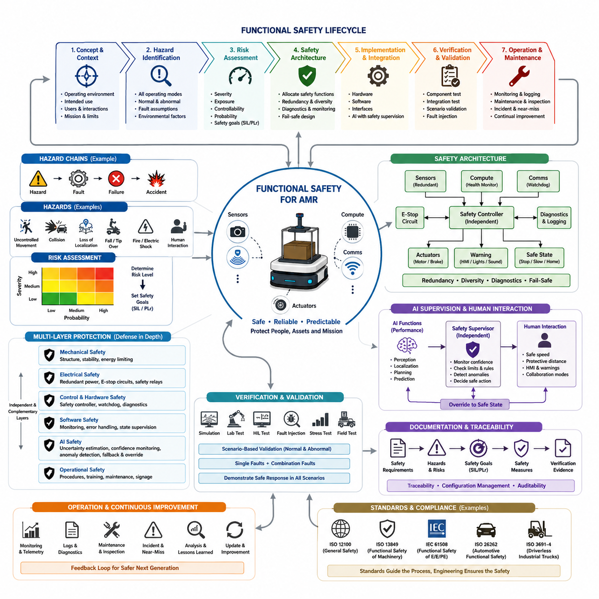
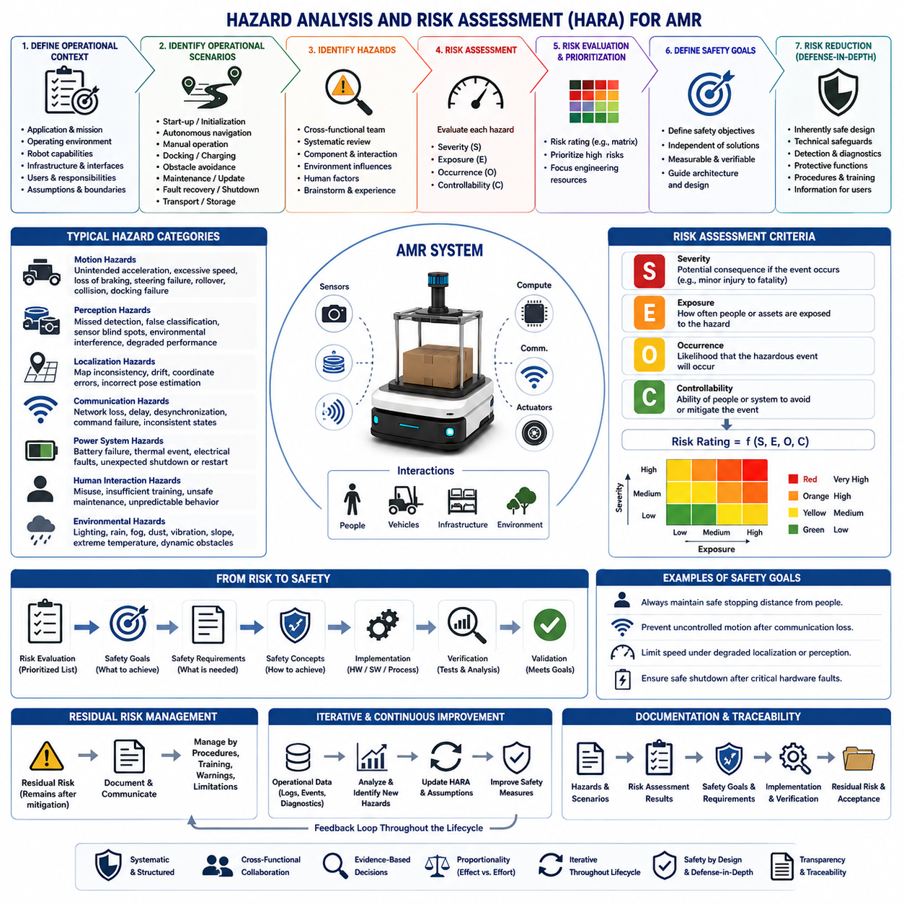
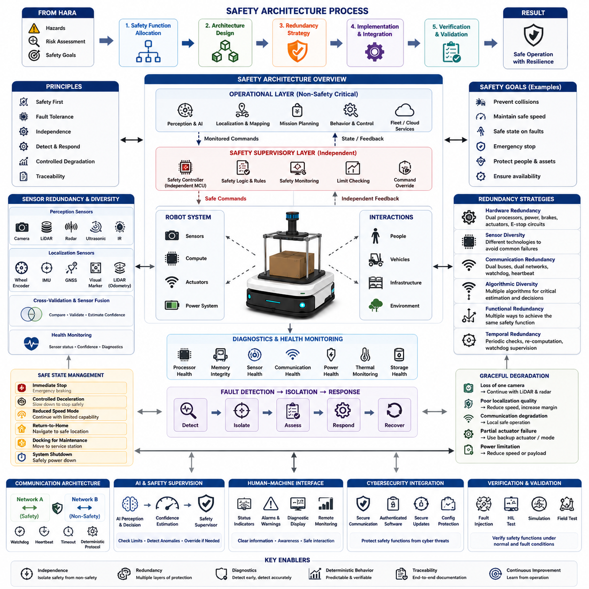
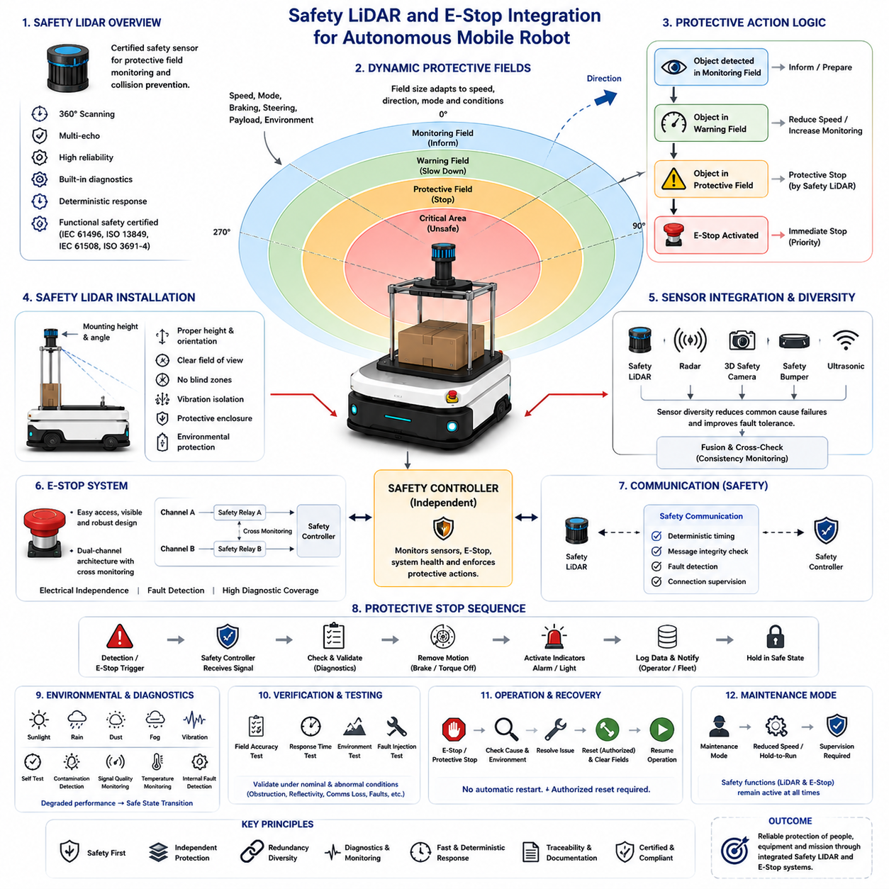
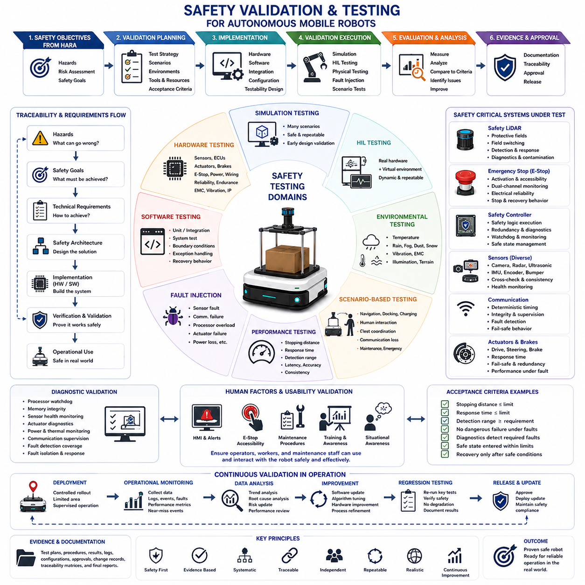
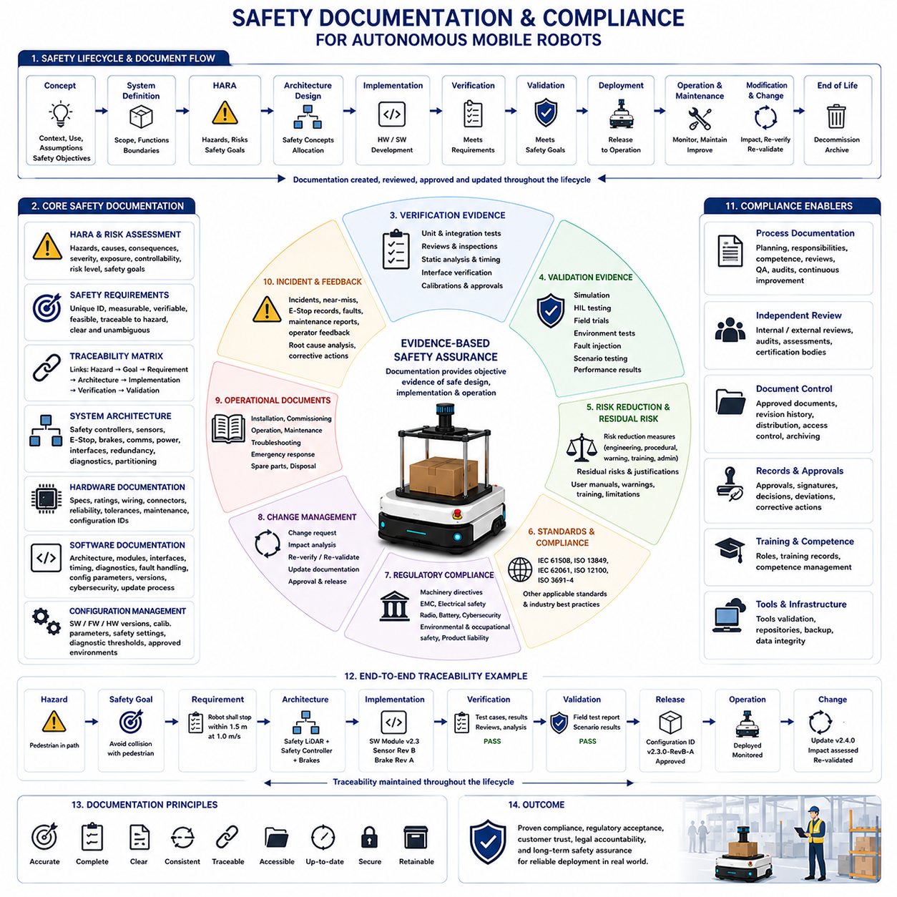
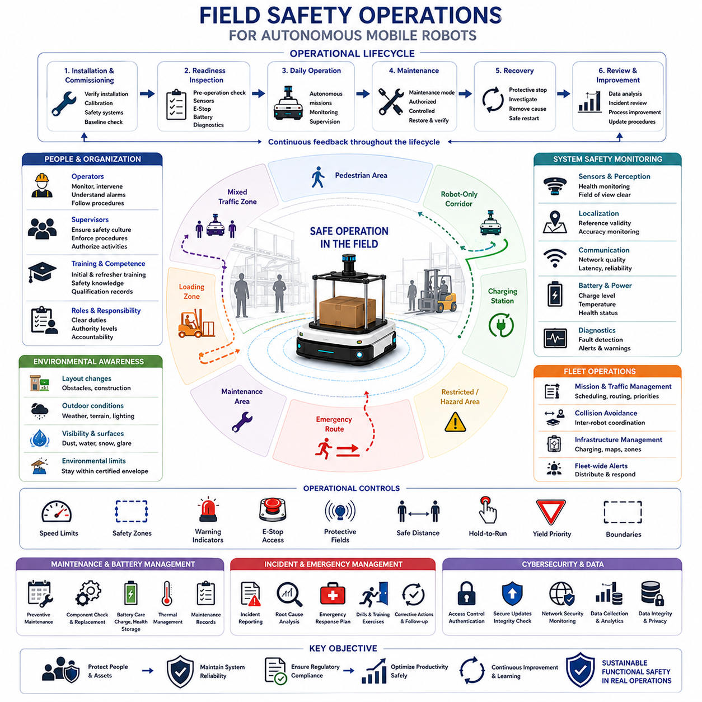
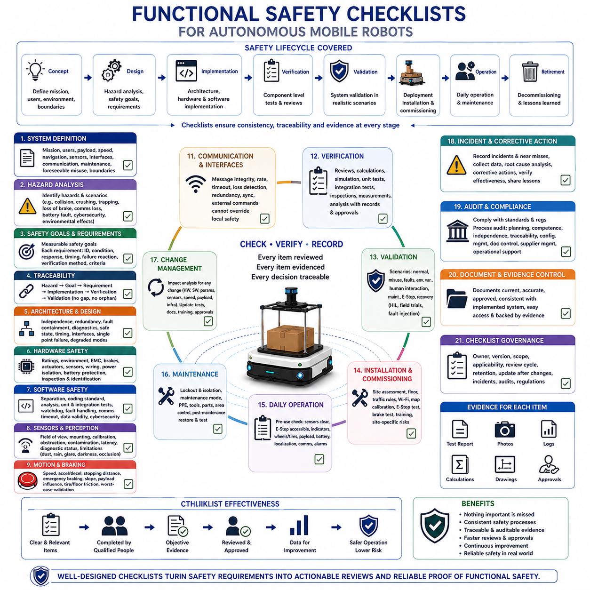

**Volume 10. AMR Engineering Process and Development Manual**


# Chapter 19. Functional Safety Process

##  

## 19.01 Functional Safety Overview

{width="7.268055555555556in" height="7.268055555555556in"}

Functional safety is the discipline of ensuring that an autonomous mobile robot behaves safely in the presence of faults, unexpected environmental conditions, human interaction, and component failures. Unlike general product safety, which often focuses on physical design characteristics such as sharp edges, insulation, or structural integrity, functional safety addresses whether the robot\'s electrical, electronic, software, sensing, communication, and control systems continue to perform their intended safety functions under both normal and abnormal operating conditions. For modern AMRs, functional safety is no longer an optional engineering activity performed near the end of development. Instead, it is a lifecycle-oriented engineering methodology that influences every stage of system development, from requirements definition and architecture design to implementation, verification, deployment, maintenance, and eventual retirement.

Industrial AMRs increasingly operate in dynamic environments where humans, forklifts, automated equipment, and mobile robots continuously share the same workspace. Unlike conventional industrial automation systems that function within fenced production cells, autonomous robots must make decisions while navigating unpredictable environments. Their software continuously interprets sensor data, estimates localization, predicts object motion, plans trajectories, and executes control commands. Every one of these activities introduces potential hazards if incorrect assumptions, sensor failures, software defects, hardware degradation, timing issues, or communication interruptions occur. Functional safety provides the systematic engineering framework that ensures these hazards are identified, analyzed, mitigated, monitored, and continuously controlled throughout the robot\'s operational lifetime.

The primary objective of functional safety is not to eliminate every possible failure, since no engineering system can guarantee absolute perfection. Instead, the goal is to reduce risk to an acceptable level by identifying hazardous situations before deployment and implementing protective mechanisms capable of preventing accidents or minimizing their consequences. This philosophy recognizes that failures will eventually occur. Sensors may become contaminated, motors may overheat, processors may reset unexpectedly, communication buses may lose synchronization, localization algorithms may drift, and operators may misuse equipment. A functionally safe robot is therefore designed not merely to avoid failures, but to remain controllable, predictable, and fail-safe whenever failures inevitably occur.

Risk reduction is achieved through multiple complementary engineering layers rather than relying on any single protective mechanism. Mechanical design contributes by preventing structural failures and minimizing dangerous energy transfer. Electrical engineering introduces redundant power paths, emergency stop circuits, and safety relays. Embedded systems monitor processor health, memory integrity, and communication timing. Software continuously supervises execution states, sensor validity, actuator responses, and diagnostic information. Artificial intelligence components estimate uncertainty, reject unreliable observations, and cooperate with deterministic safety controllers. Operational procedures further reinforce safety through maintenance schedules, inspection routines, operator training, and incident reporting. Functional safety integrates all of these disciplines into one coherent engineering process rather than treating them as isolated technical activities.

A useful way to understand functional safety is to distinguish between hazard, risk, fault, failure, and accident. A hazard represents a potential source of harm, such as an uncontrolled robot movement or excessive kinetic energy. Risk combines the probability that the hazard will occur with the severity of its consequences. A fault refers to an abnormal condition inside a component or subsystem, such as a failed encoder or corrupted software variable. A failure occurs when that fault prevents a function from operating correctly. An accident is the actual harmful event that results when failures propagate without sufficient protective measures. Functional safety engineering aims to interrupt this chain of events long before accidents become possible by detecting faults early, isolating failures, and executing predefined safe responses.

Modern AMRs contain hundreds of interacting hardware and software components. Sensors produce perception information, localization algorithms estimate robot position, planners generate trajectories, controllers regulate wheel motion, communication networks synchronize subsystems, and cloud services coordinate fleet operations. These components cannot be evaluated independently because their interactions often create emergent risks. A localization error may influence obstacle avoidance, which may subsequently affect motion control, ultimately producing unsafe robot behavior. Functional safety therefore emphasizes system-level thinking rather than component-level optimization. Engineers evaluate complete operational scenarios and analyze how faults propagate across subsystem boundaries.

The engineering lifecycle of functional safety begins with defining the operational context of the robot. Developers first establish intended operating environments, expected users, mission objectives, payload characteristics, environmental conditions, speed limitations, interaction models, and maintenance assumptions. These definitions determine the exposure of the robot to hazardous situations and directly influence acceptable risk levels. A warehouse robot transporting lightweight packages at walking speed requires different safety measures than a heavy outdoor autonomous vehicle transporting industrial equipment at highway-like speeds. Safety engineering therefore cannot be separated from system requirements because every application possesses unique operational characteristics and risk profiles.

Once operational assumptions have been established, engineers identify hazards through structured analyses that examine every operating mode of the robot. Startup, shutdown, charging, autonomous navigation, docking, obstacle avoidance, manual operation, maintenance, software updates, sensor calibration, emergency recovery, and communication loss all represent distinct operational states requiring individual safety evaluation. Hazard identification intentionally considers abnormal situations rather than only nominal operation. Engineers ask what happens if localization is lost during docking, if perception confidence decreases in heavy rain, if braking performance degrades on slopes, or if emergency stop signals become unavailable. Such systematic questioning forms the foundation for subsequent risk assessment activities.

Hazard analysis is followed by risk assessment, where identified hazards are prioritized according to severity, exposure frequency, controllability, and probability of occurrence. This prioritization allows engineering resources to focus on the most significant safety concerns. Risks involving potential human injury, vehicle collisions, high-energy motion, or loss of control typically require stronger mitigation strategies than risks associated with reduced productivity or temporary operational interruptions. Risk assessment also establishes measurable safety goals that guide architecture development, verification planning, and compliance activities throughout the remainder of the project.

Safety architecture translates these safety goals into technical solutions. Rather than depending upon single components, modern safety architectures emphasize redundancy, diversity, fault detection, diagnostics, graceful degradation, and fail-safe operation. Redundant sensors reduce the likelihood of undetected perception failures. Independent emergency stop circuits provide protection even if application software becomes unresponsive. Safety controllers supervise motion independently of mission planning software. Communication watchdogs detect timing failures, while health monitoring continuously verifies processor status, memory consistency, battery conditions, motor temperatures, and network availability. Collectively these mechanisms improve system resilience against both random hardware failures and systematic software defects.

Software plays an increasingly significant role in functional safety because modern robots depend heavily upon complex algorithms. Traditional embedded controllers executed relatively deterministic logic with limited variability. Contemporary AMRs integrate perception pipelines, machine learning models, simultaneous localization and mapping, semantic understanding, behavior planning, and cloud connectivity. These capabilities improve operational performance but also introduce additional uncertainty. Functional safety therefore requires clear separation between safety-critical functions and performance-enhancing functions. Artificial intelligence may recommend navigation decisions or interpret complex environments, but independent deterministic safety mechanisms ultimately supervise speed limits, collision avoidance boundaries, emergency braking, and safe-state transitions.

Artificial intelligence introduces unique engineering challenges because learning-based systems cannot always provide deterministic explanations for their outputs. Unlike conventional software, neural networks may exhibit performance degradation under unfamiliar environmental conditions, unusual lighting, sensor contamination, or adversarial inputs. Functional safety therefore does not simply assume that AI models are always correct. Instead, engineers evaluate uncertainty estimation, confidence monitoring, runtime anomaly detection, fallback strategies, and independent supervisory systems capable of overriding AI-generated decisions whenever confidence falls below acceptable thresholds. This layered approach enables advanced perception capabilities while preserving predictable safety behavior.

Human-robot interaction represents another fundamental aspect of functional safety. Autonomous robots increasingly operate in spaces shared with workers, visitors, customers, and maintenance personnel. Human behavior is inherently unpredictable. Individuals may cross robot paths unexpectedly, ignore warning signals, obstruct sensors, or intentionally interact with the vehicle. Functional safety therefore considers not only robot failures but also foreseeable human actions. Safe operating speeds, protective stopping distances, visual indicators, audible warnings, collaborative operating modes, and intuitive human-machine interfaces all contribute to reducing operational risk while maintaining productive human-robot collaboration.

Verification and validation ensure that implemented safety measures actually satisfy their intended objectives. Functional safety cannot rely solely on design assumptions or theoretical analyses. Engineers perform simulations, laboratory experiments, hardware-in-the-loop testing, software fault injection, environmental testing, stress testing, integration testing, field trials, and operational scenario evaluations to demonstrate that safety mechanisms behave correctly under realistic conditions. Testing intentionally introduces abnormal situations such as sensor failures, communication interruptions, processor overloads, localization errors, emergency stop activation, and degraded environmental conditions to verify safe system responses.

Safety validation extends beyond individual components to evaluate complete operational scenarios. The robot must demonstrate predictable behavior during startup, autonomous navigation, docking, charging, obstacle avoidance, manual intervention, remote supervision, maintenance activities, recovery procedures, and emergency shutdown. Validation also considers combinations of faults because multiple simultaneous failures may expose interactions that isolated component testing cannot reveal. Comprehensive scenario-based validation therefore becomes an essential element of functional safety engineering for increasingly complex autonomous systems.

Documentation constitutes another critical pillar of functional safety because engineering evidence must remain traceable throughout the entire product lifecycle. Safety requirements are linked to hazards, hazards are connected to mitigation strategies, mitigation strategies are implemented through specific design elements, and verification results demonstrate compliance with safety objectives. This traceability enables engineers, auditors, certification authorities, customers, and maintenance personnel to understand how safety decisions were derived and validated. Well-organized documentation also simplifies future product updates because design changes can be evaluated against previously established safety assumptions.

Functional safety continues after product deployment through operational monitoring and continuous improvement. Field data provides valuable information regarding unexpected environmental conditions, component reliability, maintenance effectiveness, operator behavior, software anomalies, and near-miss incidents. Engineers analyze operational logs, diagnostic reports, maintenance records, sensor statistics, and customer feedback to identify emerging safety trends. Lessons learned from deployed robots are incorporated into future software updates, hardware revisions, engineering guidelines, and development processes, creating a continuous feedback loop that strengthens product safety over successive generations.

International standards provide common engineering frameworks for implementing functional safety across different industries. These standards define terminology, lifecycle activities, risk management processes, documentation requirements, validation expectations, and systematic engineering practices rather than prescribing individual technical solutions. Compliance with relevant standards improves consistency, facilitates certification, enhances customer confidence, and promotes interoperability between suppliers. However, successful functional safety ultimately depends not on documentation alone but on disciplined engineering practices integrated throughout the entire product development lifecycle.

As autonomous mobile robots continue to evolve toward higher levels of autonomy, greater payload capacities, faster operating speeds, and increased artificial intelligence integration, functional safety becomes progressively more significant. Future robots will coordinate through fleets, interact with cloud services, collaborate with humans, utilize foundation models, and execute increasingly sophisticated missions. These capabilities expand operational opportunities while simultaneously increasing system complexity. Functional safety therefore serves as the foundational engineering discipline that ensures innovation does not compromise reliability, predictability, or human protection. The following chapters build upon this overview by examining hazard analysis, safety architectures, protective hardware integration, verification methodologies, documentation practices, operational safety management, and practical engineering checklists that collectively form a complete functional safety process for modern autonomous mobile robots.

기능 안전(Functional Safety)은 자율주행 모바일 로봇(Autonomous Mobile Robot, AMR)이 고장, 예기치 않은 환경 변화, 사람과의 상호작용, 그리고 부품의 결함이 발생하는 상황에서도 안전하게 동작하도록 보장하는 공학 분야이다. 일반적인 제품 안전(Product Safety)이 날카로운 모서리, 절연, 구조적 강도와 같은 물리적 설계 특성에 초점을 맞춘다면, 기능 안전은 전기(Electrical), 전자(Electronic), 소프트웨어(Software), 센서(Sensing), 통신(Communication), 제어(Control) 시스템이 정상 상태뿐 아니라 비정상 상태에서도 의도된 안전 기능(Safety Function)을 지속적으로 수행하는지를 다룬다. 현대 AMR에서 기능 안전은 개발 마지막 단계에서 수행하는 선택적 작업이 아니라, 요구사항 정의부터 시스템 설계, 구현, 검증, 배포, 유지보수, 폐기까지 제품 전 생애주기(Product Lifecycle)에 걸쳐 적용되는 핵심적인 공학 방법론이다.

산업용 AMR은 사람, 지게차(Forklift), 자동화 설비, 다른 이동형 로봇과 동일한 작업 공간을 공유하는 동적인 환경에서 점점 더 많이 운용되고 있다. 기존 산업 자동화 설비가 안전 펜스로 둘러싸인 생산 셀(Cell) 내부에서 동작했던 것과 달리, 자율주행 로봇은 예측하기 어려운 환경에서 스스로 판단을 내려야 한다. 로봇 소프트웨어는 지속적으로 센서 데이터를 해석하고, 위치를 추정하며, 물체의 움직임을 예측하고, 경로를 계획하며, 제어 명령을 실행한다. 이러한 모든 과정은 잘못된 가정, 센서 고장, 소프트웨어 결함, 하드웨어 열화, 시간 동기화 문제, 통신 장애 등이 발생할 경우 잠재적인 위험(Hazard)을 초래할 수 있다. 기능 안전은 이러한 위험을 식별하고, 분석하며, 완화(Mitigation)하고, 감시(Monitoring)하며, 로봇의 운용 수명 전체에 걸쳐 지속적으로 관리하기 위한 체계적인 공학 프레임워크(Engineering Framework)를 제공한다.

기능 안전의 가장 중요한 목적은 모든 가능한 고장을 완전히 제거하는 것이 아니다. 어떠한 공학 시스템도 절대적인 완벽함을 보장할 수 없기 때문이다. 대신, 위험(Hazard)을 사전에 식별하고 적절한 보호 메커니즘(Protective Mechanism)을 구현하여 사고 가능성을 줄이거나 사고의 영향을 최소화함으로써 위험(Risk)을 허용 가능한 수준(Acceptable Level)까지 감소시키는 것이 목표이다. 이러한 철학은 고장이 결국에는 반드시 발생한다는 현실을 전제로 한다. 센서는 오염될 수 있고, 모터는 과열될 수 있으며, 프로세서는 예기치 않게 재시작될 수 있고, 통신 버스(Communication Bus)는 동기화를 잃을 수 있으며, 위치 추정(Localization)은 오차가 누적될 수 있고, 작업자는 장비를 잘못 사용할 수도 있다. 따라서 기능적으로 안전한 로봇은 단순히 고장을 방지하는 것이 아니라, 고장이 발생하더라도 항상 제어 가능하고(Predictable), 예측 가능한 상태를 유지하며, 안전 상태(Fail-Safe State)로 전환될 수 있도록 설계된다.

위험 감소(Risk Reduction)는 하나의 보호 장치에 의존하는 것이 아니라 여러 공학 계층(Engineering Layer)이 상호 보완적으로 협력함으로써 이루어진다. 기계 설계(Mechanical Design)는 구조적 파손을 방지하고 위험한 에너지 전달을 최소화한다. 전기 설계(Electrical Engineering)는 이중화된 전원 경로(Redundant Power Path), 비상 정지 회로(Emergency Stop Circuit), 안전 릴레이(Safety Relay)를 제공한다. 임베디드 시스템(Embedded System)은 프로세서 상태, 메모리 무결성, 통신 타이밍을 지속적으로 감시한다. 소프트웨어는 실행 상태, 센서 유효성, 액추에이터 응답, 진단 정보를 지속적으로 확인한다. 인공지능(AI) 구성 요소는 불확실성을 추정하고, 신뢰도가 낮은 관측값을 배제하며, 결정론적 안전 제어기(Deterministic Safety Controller)와 협력하여 안전성을 확보한다. 운영 절차(Operation Procedure)는 유지보수 일정, 점검 절차, 작업자 교육, 사고 보고 체계를 통해 전체 안전성을 더욱 강화한다. 기능 안전은 이러한 모든 분야를 각각 독립적인 기술로 보는 것이 아니라 하나의 통합된 공학 프로세스로 관리한다.

기능 안전을 이해하기 위해서는 위험원(Hazard), 위험(Risk), 결함(Fault), 고장(Failure), 사고(Accident)를 구분하는 것이 중요하다. 위험원은 통제되지 않은 로봇의 움직임이나 과도한 운동 에너지처럼 잠재적으로 피해를 유발할 수 있는 원인을 의미한다. 위험은 이러한 위험원이 발생할 가능성과 발생했을 때의 심각도를 함께 고려한 개념이다. 결함은 고장 난 엔코더(Encoder)나 손상된 소프트웨어 변수처럼 시스템 내부에서 발생한 비정상 상태를 의미한다. 고장은 이러한 결함 때문에 시스템 기능이 의도한 대로 동작하지 못하는 상황이다. 사고는 이러한 고장이 충분한 보호 장치 없이 확산되어 실제 피해가 발생한 결과이다. 기능 안전 공학은 사고가 발생하기 훨씬 이전 단계에서 결함을 조기에 발견하고, 고장을 격리하며, 사전에 정의된 안전 동작을 수행함으로써 이러한 연쇄 과정을 차단하는 것을 목표로 한다.

현대 AMR은 수백 개 이상의 하드웨어(Hardware)와 소프트웨어(Software) 구성 요소로 이루어진 복잡한 시스템이다. 센서는 환경 정보를 제공하고, 위치 추정 알고리즘(Localization Algorithm)은 로봇의 위치를 계산하며, 경로 계획기(Planner)는 이동 경로를 생성하고, 제어기(Controller)는 바퀴의 움직임을 제어하며, 통신 네트워크는 각 하위 시스템을 동기화하고, 클라우드 서비스(Cloud Service)는 다수의 로봇을 관리한다. 이러한 구성 요소는 서로 긴밀하게 연결되어 있기 때문에 개별적으로만 평가해서는 충분하지 않다. 예를 들어 위치 추정 오류가 장애물 회피 알고리즘에 영향을 미치고, 이것이 다시 주행 제어에 영향을 주어 최종적으로 위험한 로봇 동작을 유발할 수 있다. 따라서 기능 안전은 개별 부품의 최적화보다 시스템 수준(System-Level)의 사고를 강조하며, 결함이 하위 시스템 사이에서 어떻게 전파되는지를 전체 운영 시나리오에서 분석한다.

기능 안전의 공학적 생애주기(Engineering Lifecycle)는 먼저 로봇이 어떤 환경에서 어떻게 사용될 것인지를 정의하는 것부터 시작된다. 개발자는 운용 환경, 사용자 특성, 임무 목표(Mission Objective), 적재 중량(Payload), 환경 조건, 속도 제한, 사람과의 상호작용 방식, 유지보수 가정을 명확히 정의한다. 이러한 정의는 로봇이 노출될 위험 수준을 결정하며 허용 가능한 위험 수준에도 직접적인 영향을 미친다. 보행 속도로 가벼운 물품을 운반하는 창고용 로봇과, 고속으로 산업 장비를 운반하는 대형 실외 자율주행 차량은 서로 다른 안전 대책이 필요하다. 따라서 기능 안전은 시스템 요구사항(System Requirement)과 분리될 수 없으며, 각 응용 분야(Application)는 고유한 운용 특성과 위험 특성을 가진다.

운용 환경이 정의되면 엔지니어는 로봇의 모든 운용 상태(Operation Mode)를 대상으로 체계적인 위험 식별(Hazard Identification)을 수행한다. 시동, 종료, 충전, 자율주행, 도킹(Docking), 장애물 회피, 수동 운전, 유지보수, 소프트웨어 업데이트, 센서 보정, 비상 복구, 통신 장애 등은 각각 독립적인 안전 평가 대상이 된다. 위험 식별은 정상 동작뿐 아니라 비정상 상황을 의도적으로 고려한다. 예를 들어 도킹 중 위치 추정을 잃는다면 어떻게 되는가, 폭우로 인해 인식 신뢰도가 감소하면 어떻게 되는가, 경사로에서 제동 성능이 저하되면 어떻게 되는가, 비상 정지 신호가 전달되지 않는다면 어떻게 되는가와 같은 질문을 체계적으로 수행한다. 이러한 분석은 이후 위험 평가(Risk Assessment)의 기반이 된다.

위험 식별 이후에는 위험 평가를 수행하여 각 위험을 심각도(Severity), 노출 빈도(Exposure), 제어 가능성(Controllability), 발생 가능성(Probability)에 따라 우선순위화한다. 이를 통해 개발 자원을 가장 중요한 안전 문제에 집중할 수 있다. 사람의 부상 가능성, 차량 충돌, 고에너지 운동, 제어 상실과 관련된 위험은 생산성 저하나 일시적인 운용 중단보다 훨씬 강력한 완화 대책이 요구된다. 위험 평가는 이후 시스템 아키텍처(System Architecture), 검증 계획(Verification Plan), 규격 준수(Compliance) 활동을 이끄는 측정 가능한 안전 목표(Safety Goal)를 정의하는 역할도 수행한다.

안전 아키텍처(Safety Architecture)는 이러한 안전 목표를 실제 기술적 해결책으로 구현한다. 현대의 안전 아키텍처는 단일 부품에 의존하지 않고, 이중화(Redundancy), 다양성(Diversity), 결함 감지(Fault Detection), 진단(Diagnostics), 점진적 성능 저하(Graceful Degradation), 안전 정지(Fail-Safe Operation)를 핵심 원칙으로 한다. 이중화된 센서는 인식 실패 가능성을 줄이고, 독립적인 비상 정지 회로는 응용 소프트웨어가 멈추더라도 보호 기능을 유지한다. 안전 제어기(Safety Controller)는 임무 계획 소프트웨어와 독립적으로 주행을 감시한다. 통신 감시기(Communication Watchdog)는 타이밍 오류를 감지하고, 시스템 상태 감시(Health Monitoring)는 프로세서 상태, 메모리 무결성, 배터리 상태, 모터 온도, 네트워크 연결을 지속적으로 확인한다. 이러한 다양한 메커니즘은 하드웨어의 우발적(Random) 고장과 소프트웨어의 체계적(Systematic) 결함 모두에 대한 시스템의 회복력(Resilience)을 높인다.

현대 로봇은 복잡한 알고리즘에 크게 의존하기 때문에 소프트웨어는 기능 안전에서 점점 더 중요한 역할을 담당한다. 과거의 임베디드 제어기는 비교적 단순하고 결정론적인(Deterministic) 제어 로직을 수행했지만, 오늘날의 AMR은 인식 파이프라인(Perception Pipeline), 기계학습(Machine Learning), 동시적 위치추정 및 지도작성(SLAM), 의미 기반 환경 이해(Semantic Understanding), 행동 계획(Behavior Planning), 클라우드 연결(Cloud Connectivity) 등을 통합한다. 이러한 기능은 성능을 향상시키지만 동시에 새로운 불확실성을 추가한다. 따라서 기능 안전은 안전 핵심 기능(Safety-Critical Function)과 성능 향상 기능(Performance Function)을 명확하게 분리한다. 인공지능은 주행 결정을 지원할 수 있지만, 속도 제한, 충돌 방지, 비상 제동, 안전 상태 전환은 독립적인 결정론적 안전 메커니즘이 최종적으로 감독한다.

인공지능은 학습 기반 시스템이 항상 결정론적인 설명을 제공하지 못하기 때문에 새로운 공학적 과제를 제시한다. 기존 소프트웨어와 달리 신경망(Neural Network)은 새로운 환경, 특이한 조명 조건, 센서 오염, 적대적 입력(Adversarial Input) 등에서 성능이 저하될 수 있다. 따라서 기능 안전은 AI 모델이 항상 옳다고 가정하지 않는다. 대신 불확실성 추정(Uncertainty Estimation), 신뢰도 모니터링(Confidence Monitoring), 실행 중 이상 감지(Runtime Anomaly Detection), 그리고 신뢰도가 허용 수준 이하로 떨어질 경우 AI의 결정을 무시하고 안전한 제어를 수행할 수 있는 독립적인 감독 시스템(Supervisory System)을 함께 설계한다. 이러한 다층 구조(Layered Architecture)는 고성능 AI를 활용하면서도 예측 가능한 안전성을 유지하도록 한다.

사람과 로봇의 상호작용(Human-Robot Interaction)은 기능 안전의 또 다른 핵심 요소이다. 자율주행 로봇은 작업자, 방문객, 고객, 유지보수 인력과 동일한 공간에서 함께 동작하는 경우가 점점 많아지고 있다. 사람의 행동은 본질적으로 예측하기 어렵다. 사람은 갑자기 로봇 앞을 가로지를 수도 있고, 경고 신호를 무시할 수도 있으며, 센서를 가리거나 의도적으로 로봇과 상호작용할 수도 있다. 따라서 기능 안전은 로봇 자체의 고장뿐 아니라 충분히 예상 가능한 인간의 행동까지 고려한다. 안전한 주행 속도, 보호 정지 거리(Protective Stopping Distance), 시각적 표시, 경고음, 협업 운전 모드(Collaborative Mode), 직관적인 인간-기계 인터페이스(Human-Machine Interface)는 모두 사람과 로봇이 안전하게 협업하기 위한 중요한 요소이다.

검증(Verification)과 확인(Validation)은 구현된 안전 대책이 실제로 의도한 목적을 만족하는지를 입증하는 과정이다. 기능 안전은 설계자의 가정이나 이론적 분석만으로는 충분하지 않다. 엔지니어는 시뮬레이션(Simulation), 실험실 시험(Laboratory Test), 하드웨어 인 더 루프(Hardware-in-the-Loop, HIL), 소프트웨어 결함 주입(Fault Injection), 환경 시험(Environmental Test), 스트레스 시험(Stress Test), 통합 시험(Integration Test), 현장 시험(Field Test), 다양한 운용 시나리오 평가를 수행하여 안전 메커니즘이 실제 환경에서도 올바르게 동작함을 확인한다. 이러한 시험에서는 센서 고장, 통신 장애, 프로세서 과부하, 위치 추정 오류, 비상 정지 동작, 열악한 환경 조건 등을 의도적으로 발생시켜 안전한 시스템 반응을 검증한다.

안전 확인(Validation)은 개별 구성 요소를 넘어 전체 운용 시나리오를 대상으로 수행된다. 로봇은 시동, 자율주행, 도킹, 충전, 장애물 회피, 수동 개입, 원격 관제, 유지보수, 복구 절차, 비상 종료 등 모든 상황에서 예측 가능한 동작을 수행해야 한다. 또한 여러 결함이 동시에 발생하는 복합 상황도 고려해야 한다. 단일 부품 시험에서는 발견되지 않는 상호작용 문제가 다중 결함 상황에서 나타날 수 있기 때문이다. 따라서 실제 운용 환경을 반영한 시나리오 기반 검증(Scenario-Based Validation)은 복잡한 자율주행 시스템의 기능 안전에서 필수적인 요소이다.

문서화(Documention)는 기능 안전의 또 다른 핵심 축이다. 모든 안전 관련 근거(Evidence)는 제품 생애주기 전체에 걸쳐 추적 가능성(Traceability)을 유지해야 한다. 안전 요구사항은 위험과 연결되고, 위험은 완화 대책과 연결되며, 완화 대책은 실제 설계 요소와 연결되고, 검증 결과는 이러한 안전 목표가 충족되었음을 입증한다. 이러한 추적성은 엔지니어, 인증 기관, 고객, 유지보수 담당자가 안전 설계의 근거를 명확하게 이해할 수 있도록 한다. 또한 향후 제품이 변경될 경우 기존의 안전 가정을 기준으로 변경 영향을 효율적으로 평가할 수 있게 한다.

기능 안전은 제품이 출시된 이후에도 계속된다. 현장 운용(Field Operation) 과정에서 수집되는 데이터는 예상하지 못했던 환경 조건, 부품 신뢰성, 유지보수 효과, 작업자 행동, 소프트웨어 이상, 사고 직전 상황(Near-Miss) 등에 대한 중요한 정보를 제공한다. 엔지니어는 운영 로그(Operation Log), 진단 보고서(Diagnostic Report), 유지보수 기록, 센서 통계, 고객 피드백 등을 분석하여 새로운 안전 위험을 발견한다. 이러한 경험은 이후 소프트웨어 업데이트, 하드웨어 개선, 공학 지침, 개발 프로세스에 반영되어 차세대 제품의 안전성을 지속적으로 향상시키는 피드백 루프(Feedback Loop)를 형성한다.

국제 표준(International Standard)은 다양한 산업에서 기능 안전을 일관성 있게 구현하기 위한 공통적인 공학 프레임워크를 제공한다. 이러한 표준은 특정 기술을 직접 규정하기보다는 용어(Terminology), 생애주기 활동(Lifecycle Activity), 위험 관리(Risk Management), 문서화 요구사항(Document Requirement), 검증 절차(Verification), 체계적인 공학 방법(Systematic Engineering Practice)을 정의한다. 관련 표준을 준수하면 개발 일관성이 향상되고, 인증(Certification)이 용이해지며, 고객의 신뢰를 높일 수 있다. 그러나 기능 안전의 성공 여부는 단순히 문서를 작성하는 것이 아니라, 개발 전 과정에서 공학 원칙을 철저하게 실천하는 데 달려 있다.

자율주행 모바일 로봇은 앞으로 더욱 높은 자율성, 더 큰 적재 중량, 더 빠른 이동 속도, 더욱 강력한 인공지능을 갖추게 될 것이다. 미래의 로봇은 플릿(Fleet) 단위로 협력하고, 클라우드와 긴밀하게 연동되며, 사람과 협업하고, 파운데이션 모델(Foundation Model)을 활용하며, 더욱 복잡한 임무를 수행하게 된다. 이러한 발전은 새로운 가능성을 열어주지만 동시에 시스템 복잡성도 크게 증가시킨다. 따라서 기능 안전은 혁신이 사람의 안전, 시스템의 신뢰성(Reliability), 예측 가능성(Predictability)을 훼손하지 않도록 보장하는 가장 근본적인 공학 분야이다. 이어지는 장에서는 위험 분석(Hazard Analysis), 안전 아키텍처(Safety Architecture), 보호 하드웨어(Protective Hardware), 검증 방법론(Validation Methodology), 문서화(Documention), 현장 안전 운영(Field Safety Operation), 그리고 실무에서 활용할 수 있는 기능 안전 체크리스트(Function Safety Checklist)를 차례대로 다루며 현대 AMR을 위한 완전한 기능 안전 프로세스(Functional Safety Process)를 설명한다.

##  

## 19.02 Hazard Analysis and Risk Assessment

{width="7.268055555555556in" height="7.268055555555556in"}

Hazard Analysis and Risk Assessment (HARA) forms the analytical foundation of functional safety for autonomous mobile robots. While the previous chapter introduced the overall philosophy of functional safety, this chapter focuses on the systematic process used to identify hazards, evaluate their associated risks, establish safety goals, and define the technical and operational measures required to reduce those risks to acceptable levels. HARA is not a one-time activity performed only during early design. Instead, it is an iterative engineering process that accompanies the robot throughout its entire lifecycle, continuously incorporating new knowledge obtained from design reviews, simulations, laboratory testing, field validation, customer feedback, maintenance records, and operational incidents. As autonomous systems become increasingly complex, the quality of hazard analysis largely determines the effectiveness of the entire functional safety program.

A hazard is any condition that has the potential to cause injury to people, damage to equipment, interruption of operations, environmental harm, or financial loss. Hazards themselves are neither failures nor accidents. Rather, they represent sources of potential harm that may become dangerous when combined with particular operating conditions or system failures. For example, the existence of a high-torque drive motor is not inherently unsafe. The hazard emerges when unintended motor activation occurs while a person occupies the robot\'s operating space. Likewise, autonomous navigation is not itself hazardous, but inaccurate localization combined with high vehicle speed and insufficient obstacle detection may create a hazardous situation. Hazard analysis therefore focuses not only on individual components but also on interactions among hardware, software, environmental conditions, and human behavior.

Risk differs from hazard because it considers both the likelihood that a hazardous situation will occur and the severity of its potential consequences. Two hazards with similar technical causes may require entirely different engineering responses if their associated risks differ significantly. A temporary localization error during low-speed indoor navigation may create only minor operational inconvenience, whereas the same localization error during high-speed outdoor operation near pedestrians may present an unacceptable safety risk. Risk assessment therefore enables engineering teams to prioritize development resources according to objective criteria instead of subjective judgment. This prioritization ensures that the most critical hazards receive the greatest attention during system design, verification, and validation.

The HARA process begins by clearly defining the operational context in which the robot is expected to function. Before hazards can be identified, engineers must understand the intended application, operational environment, mission objectives, payload characteristics, environmental conditions, infrastructure assumptions, maintenance procedures, operator responsibilities, and expected interactions with surrounding systems. A warehouse transportation robot, a hospital service robot, an outdoor security patrol vehicle, and a heavy industrial inspection platform all operate under different environmental conditions and therefore present different categories of hazards. Accurate hazard identification depends upon understanding these operational boundaries rather than evaluating the robot in isolation.

Operational scenarios provide the practical framework for hazard identification. Engineers systematically examine every mode in which the robot may operate, including startup, initialization, autonomous navigation, manual operation, remote supervision, docking, charging, obstacle avoidance, emergency stopping, software updating, maintenance, recovery after faults, transportation, storage, and shutdown. Each operational mode may expose different hazards because the robot\'s behavior, environmental interactions, and system configurations vary significantly across these situations. Comprehensive hazard analysis therefore requires scenario-based thinking rather than simply reviewing component specifications or software modules individually.

Hazard identification itself is a structured engineering activity rather than an informal brainstorming exercise. Cross-functional teams consisting of mechanical, electrical, embedded software, artificial intelligence, system engineering, manufacturing, field operations, quality assurance, and safety specialists collaborate to identify potential hazardous events. Different engineering disciplines often recognize different categories of hazards. Mechanical engineers focus on structural integrity and moving components, electrical engineers evaluate power distribution and insulation failures, software engineers examine algorithmic failures and timing issues, while field engineers contribute practical knowledge gained from operational experience. Combining these perspectives produces a more complete understanding of potential system risks.

Hazards associated with autonomous mobile robots can generally be classified into several broad categories. Motion-related hazards include unintended acceleration, excessive speed, unstable braking, uncontrolled steering, rollovers, collisions, and failures during docking. Perception-related hazards involve missed obstacle detection, false object classification, sensor blindness, environmental interference, and degraded sensor performance. Localization hazards include map inconsistencies, positioning drift, coordinate transformation errors, and incorrect pose estimation. Communication hazards arise from network interruptions, delayed command execution, synchronization failures, and inconsistent distributed system states. Power system hazards involve battery failures, thermal events, electrical faults, unexpected shutdowns, or uncontrolled restarts. Human interaction hazards result from operator misuse, inadequate training, unsafe maintenance procedures, or unpredictable pedestrian behavior.

Hazard identification also considers environmental influences that may affect robot performance. Lighting conditions, rain, snow, fog, dust, smoke, reflective surfaces, electromagnetic interference, vibration, uneven terrain, slopes, temperature extremes, humidity, and dynamic obstacles all influence system reliability. A perception system that performs well inside a clean warehouse may experience significantly different performance outdoors under direct sunlight or during heavy rainfall. Hazard analysis therefore evaluates environmental variability rather than assuming ideal operating conditions. This environmental perspective becomes increasingly important as robots expand into outdoor, construction, mining, agriculture, logistics, and public infrastructure applications.

Human factors represent another essential component of hazard analysis because people rarely behave exactly as engineering specifications assume. Operators may bypass procedures, maintenance personnel may disable protective devices during servicing, pedestrians may unexpectedly enter robot operating areas, and inexperienced users may misunderstand warning indicators. Human error should therefore be treated as a foreseeable operational condition rather than an exceptional circumstance. Functional safety engineering aims to design systems that remain tolerant of predictable human mistakes whenever reasonably possible instead of relying exclusively on perfect operator behavior.

Once hazards have been identified, engineers evaluate each hazard using structured risk assessment methodologies. Risk assessment typically considers four principal dimensions: the severity of potential consequences, the frequency or duration of exposure, the probability that the hazardous event will occur, and the possibility that people or systems can avoid or control the resulting situation. Different industrial standards define these parameters using slightly different terminology, but the underlying engineering objective remains consistent: quantify risk systematically so that safety decisions become objective, repeatable, and traceable rather than dependent upon personal opinion.

Severity evaluates the potential consequences if a hazardous event actually occurs. Consequences may range from negligible operational inconvenience to catastrophic loss of life. The evaluation considers not only direct physical injuries but also equipment damage, environmental impact, production interruption, financial loss, and reputational consequences. High-energy industrial robots transporting heavy payloads naturally present greater potential severity than lightweight indoor delivery robots because the kinetic energy available during collisions is substantially higher. Severity assessment therefore depends upon both robot characteristics and operational context.

Exposure evaluates how frequently humans, vehicles, equipment, or infrastructure encounter the hazardous situation. A hazard occurring only during annual maintenance may require different mitigation strategies than a hazard continuously present during daily autonomous operation. Robots operating twenty-four hours per day in densely populated facilities expose people to hazards more frequently than robots performing occasional inspections in restricted industrial zones. Exposure assessment therefore considers mission frequency, operational duration, environmental occupancy, traffic density, maintenance schedules, and expected system utilization throughout the robot\'s service life.

Occurrence probability estimates the likelihood that the hazardous event will actually develop. This evaluation incorporates hardware reliability, software maturity, environmental uncertainty, component aging, maintenance effectiveness, operational complexity, and historical failure data whenever available. Estimating occurrence probability for advanced autonomous systems presents particular challenges because machine learning algorithms, adaptive behaviors, and complex software interactions may exhibit characteristics that differ from traditional deterministic control systems. Engineers therefore combine quantitative reliability data with expert engineering judgment while continuously updating assessments using operational experience obtained after deployment.

Controllability considers whether humans or automated protective mechanisms can avoid or mitigate the hazardous situation once it begins. A slowly moving robot with multiple warning indicators and ample stopping distance may allow pedestrians sufficient time to react safely. Conversely, high-speed motion combined with limited visibility and delayed braking significantly reduces controllability. Modern autonomous robots also improve controllability through redundant perception systems, independent safety controllers, emergency braking functions, speed limitations, and supervised operating modes. Evaluating controllability therefore considers both human response capabilities and automated protective technologies.

After evaluating severity, exposure, occurrence probability, and controllability, engineers assign an overall risk classification that reflects the relative importance of each hazard. Various industrial methodologies employ risk matrices, numerical scoring systems, or standardized integrity levels to support consistent decision making. Regardless of the specific methodology employed, the purpose remains the same: prioritize engineering effort according to risk significance. High-risk hazards require comprehensive mitigation strategies, extensive verification activities, rigorous documentation, and often multiple independent protective mechanisms. Lower-risk hazards may be adequately addressed through simpler design improvements, operational procedures, or maintenance controls.

Risk evaluation naturally leads to the definition of safety goals. Safety goals describe the fundamental safety objectives that the system must achieve to prevent unacceptable risks. Rather than prescribing detailed technical implementations, safety goals define desired safety outcomes. For example, a safety goal may require that the robot always maintain a safe stopping distance from pedestrians, prevent uncontrolled vehicle motion after communication failure, avoid exceeding specified speed limits under degraded localization conditions, or guarantee safe shutdown following detection of critical hardware faults. These safety goals subsequently guide architecture design, software development, verification planning, and safety validation activities throughout the remainder of the engineering lifecycle.

Risk reduction follows the principle that no single protective measure should be considered sufficient for high-consequence hazards. Instead, engineers apply multiple complementary layers of protection. Inherently safe mechanical design reduces the likelihood of dangerous energy release. Reliable electrical architectures improve fault tolerance. Redundant sensors increase environmental awareness. Independent safety controllers supervise mission software. Diagnostic monitoring detects developing failures. Emergency stopping systems provide rapid intervention. Operational procedures establish safe maintenance practices, while training ensures that personnel understand residual risks. This defense-in-depth strategy significantly improves overall system resilience because multiple independent failures become necessary before hazardous events can occur.

Residual risk remains after all practical mitigation measures have been implemented. Functional safety recognizes that eliminating every conceivable risk is technically and economically impossible. Instead, engineers evaluate whether remaining risks have been reduced to acceptable levels considering available technology, operational benefits, industry practices, and applicable regulations. Residual risks that cannot be further reduced through reasonable engineering measures are documented clearly, communicated to operators, and managed through operating procedures, training programs, maintenance requirements, warning labels, and usage restrictions. Transparent communication of residual risk forms an essential element of responsible safety engineering.

Hazard analysis does not conclude once product development is completed. Operational data collected after deployment frequently reveals hazards that were not anticipated during initial design. Near-miss incidents, unexpected environmental conditions, sensor degradation patterns, maintenance observations, software anomalies, and customer feedback all provide valuable information for improving future risk assessments. Modern fleet management systems continuously collect diagnostic information, operational statistics, event logs, and health monitoring data that enable engineers to refine probability estimates, validate engineering assumptions, identify emerging trends, and prioritize future safety improvements. HARA therefore evolves continuously throughout the product lifecycle rather than remaining a static engineering document.

Artificial intelligence introduces additional considerations into hazard analysis because AI-based perception and decision-making systems often exhibit probabilistic rather than deterministic behavior. Machine learning models may experience reduced performance when encountering environmental conditions not represented within training datasets. Rare edge cases, sensor contamination, adversarial inputs, unexpected object configurations, or domain shifts may influence AI performance in ways that traditional software reliability models cannot easily predict. Hazard analysis therefore evaluates not only nominal AI accuracy but also uncertainty estimation, confidence monitoring, anomaly detection, fallback strategies, runtime supervision, and independent safety mechanisms capable of maintaining safe operation whenever AI confidence becomes insufficient.

Comprehensive documentation supports every stage of hazard analysis and risk assessment. Each identified hazard is linked to operational scenarios, risk evaluations, safety goals, mitigation strategies, implementation requirements, verification activities, validation evidence, and residual risk assessments. This traceability enables engineering teams to demonstrate that every significant hazard has been systematically considered and appropriately addressed. It also simplifies future design modifications because engineers can immediately determine how proposed changes influence existing hazards, safety requirements, and verification obligations. Well-maintained HARA documentation therefore becomes one of the most valuable long-term engineering assets for any autonomous mobile robot development program.

Ultimately, Hazard Analysis and Risk Assessment establishes the logical bridge between identifying potential dangers and implementing concrete safety solutions. Every subsequent activity within functional safety---including safety architecture design, redundancy planning, emergency stop implementation, software supervision, verification testing, operational procedures, compliance documentation, and continuous improvement---depends upon the accuracy and completeness of the HARA process. By systematically identifying hazards, objectively evaluating risks, defining measurable safety goals, and continuously refining engineering assumptions throughout the robot lifecycle, HARA enables autonomous mobile robots to achieve increasingly sophisticated capabilities while maintaining the high levels of safety required for widespread industrial and public deployment.

위험 분석 및 위험 평가(Hazard Analysis and Risk Assessment, HARA)는 자율주행 모바일 로봇(Autonomous Mobile Robot, AMR)의 기능 안전(Functional Safety)을 구성하는 분석적 기반이다. 이전 장에서 기능 안전의 전체적인 철학을 설명하였다면, 이번 장에서는 위험원을 체계적으로 식별하고, 관련 위험(Risk)을 평가하며, 안전 목표(Safety Goal)를 수립하고, 위험을 허용 가능한 수준까지 감소시키기 위해 필요한 기술적·운영적 대책을 정의하는 체계적인 절차를 다룬다. HARA는 개발 초기 단계에서 한 번만 수행하는 작업이 아니라, 설계 검토, 시뮬레이션(Simulation), 실험실 시험, 현장 검증(Field Validation), 고객 피드백, 유지보수 기록, 실제 운용 사고 등을 지속적으로 반영하면서 제품의 전체 생애주기(Product Lifecycle) 동안 반복적으로 수행되는 공학 프로세스이다. 자율 시스템이 더욱 복잡해질수록 위험 분석의 품질은 전체 기능 안전 체계의 성패를 결정하는 핵심 요소가 된다.

위험원(Hazard)은 사람의 부상, 장비의 손상, 운영 중단, 환경 피해 또는 재정적 손실을 유발할 가능성이 있는 모든 상태를 의미한다. 위험원 자체가 곧 고장(Failure)이나 사고(Accident)를 의미하는 것은 아니다. 위험원은 특정 운용 조건이나 시스템 고장과 결합될 때 실제 피해를 발생시킬 수 있는 잠재적인 원인이다. 예를 들어 고출력 구동 모터(High-Torque Drive Motor)가 존재한다고 해서 그것만으로 위험한 것은 아니다. 그러나 사람이 로봇의 작업 공간 안에 있을 때 의도하지 않은 모터 구동이 발생하면 위험한 상황(Hazardous Situation)이 형성된다. 마찬가지로 자율주행 자체는 위험하지 않지만, 부정확한 위치 추정(Localization)과 높은 주행 속도, 그리고 충분하지 않은 장애물 인식이 결합되면 심각한 위험을 초래할 수 있다. 따라서 위험 분석은 개별 부품만이 아니라 하드웨어(Hardware), 소프트웨어(Software), 환경(Environment), 사람(Human Behavior) 사이의 상호작용까지 함께 고려한다.

위험(Risk)은 위험원과는 다른 개념으로, 위험한 상황이 실제로 발생할 가능성과 그 결과의 심각도를 함께 고려한다. 동일한 기술적 원인으로 발생하는 두 가지 위험원이라 하더라도 위험 수준이 다르면 요구되는 공학적 대응도 완전히 달라질 수 있다. 예를 들어 저속 실내 주행에서 발생하는 일시적인 위치 추정 오류는 단순한 운용상의 불편만 초래할 수 있지만, 동일한 위치 추정 오류가 보행자가 많은 실외 환경에서 고속 주행 중 발생한다면 허용하기 어려운 안전 위험이 된다. 따라서 위험 평가는 주관적인 판단이 아니라 객관적인 기준에 따라 개발 자원의 우선순위를 결정하도록 지원하며, 가장 중요한 위험에 설계, 검증, 시험 자원을 집중할 수 있도록 한다.

HARA는 먼저 로봇이 실제로 어떤 환경에서 어떤 목적으로 운용될 것인지를 명확히 정의하는 것부터 시작한다. 위험을 식별하기 위해서는 적용 분야(Application), 운용 환경(Operational Environment), 임무 목표(Mission Objective), 적재 중량(Payload), 환경 조건(Environmental Condition), 기반 시설(Infrastructure), 유지보수 절차(Maintenance Procedure), 작업자의 역할, 주변 시스템과의 상호작용 등을 정확하게 이해해야 한다. 창고 운반 로봇, 병원 서비스 로봇, 실외 순찰 로봇, 중공업 검사 로봇은 모두 서로 다른 환경에서 운용되며 각각 서로 다른 위험을 가진다. 따라서 정확한 위험 식별은 로봇을 독립적으로 분석하는 것이 아니라 실제 운용 환경을 이해하는 것에서 시작된다.

운용 시나리오(Operational Scenario)는 위험 식별을 위한 가장 실질적인 분석 틀을 제공한다. 엔지니어는 시동(Start-up), 초기화(Initialization), 자율주행(Autonomous Navigation), 수동 운전(Manual Operation), 원격 관제(Remote Supervision), 도킹(Docking), 충전(Charging), 장애물 회피(Obstacle Avoidance), 비상 정지(Emergency Stop), 소프트웨어 업데이트, 유지보수, 고장 복구, 운송, 보관, 종료 등 모든 운용 상태를 체계적으로 검토한다. 각각의 운용 상태에서는 로봇의 동작 방식과 환경 조건, 시스템 구성 자체가 달라지므로 서로 다른 위험이 발생할 수 있다. 따라서 효과적인 위험 분석은 단순히 부품이나 소프트웨어 모듈을 검토하는 것이 아니라 실제 운용 시나리오 중심으로 이루어져야 한다.

위험 식별(Hazard Identification)은 단순한 브레인스토밍이 아니라 체계적인 공학 활동이다. 기계(Mechanical), 전기(Electrical), 임베디드 소프트웨어(Embedded Software), 인공지능(AI), 시스템 엔지니어링(System Engineering), 생산(Manufacturing), 현장 운영(Field Operation), 품질(Quality Assurance), 안전(Safety) 전문가가 함께 참여하여 위험을 분석한다. 각 분야는 서로 다른 종류의 위험을 발견할 수 있다. 기계 엔지니어는 구조 강도와 움직이는 부품을 중심으로 검토하고, 전기 엔지니어는 전원 분배와 절연 문제를 분석하며, 소프트웨어 엔지니어는 알고리즘 오류와 실시간 타이밍 문제를 검토한다. 현장 엔지니어는 실제 운용 경험에서 얻은 현실적인 위험 요소를 제공한다. 이러한 다양한 관점이 결합될 때 보다 완전한 위험 분석이 가능해진다.

AMR의 위험은 일반적으로 여러 범주로 분류할 수 있다. 주행(Motion) 관련 위험에는 의도하지 않은 가속, 과속, 제동 실패, 조향 이상, 전복(Rollover), 충돌(Collision), 도킹 실패 등이 포함된다. 인식(Perception) 관련 위험에는 장애물 미검출, 잘못된 객체 분류, 센서 사각지대, 환경 간섭, 센서 성능 저하 등이 있다. 위치 추정(Localization) 위험에는 지도 불일치(Map Inconsistency), 위치 드리프트(Position Drift), 좌표 변환 오류(Coordinate Transformation Error), 자세 추정 오류(Pose Estimation Error)가 포함된다. 통신(Communication) 위험에는 네트워크 단절, 명령 지연, 시간 동기화 실패, 분산 시스템 상태 불일치가 있다. 전원 시스템(Power System) 위험에는 배터리 이상, 열폭주(Thermal Event), 전기적 결함, 예기치 않은 시스템 종료 또는 재시작 등이 포함된다. 사람과의 상호작용(Human Interaction) 위험에는 작업자의 오용, 교육 부족, 부적절한 유지보수, 예측 불가능한 보행자 행동 등이 포함된다.

위험 식별은 환경(Environment)의 영향도 반드시 고려해야 한다. 조명(Lighting), 비(Rain), 눈(Snow), 안개(Fog), 먼지(Dust), 연기(Smoke), 반사면(Reflective Surface), 전자기 간섭(EMI), 진동(Vibration), 험로(Uneven Terrain), 경사(Slope), 극한 온도, 습도(Humidity), 움직이는 장애물(Dynamic Obstacle)은 모두 로봇의 성능에 영향을 미친다. 깨끗한 실내 창고에서 정상적으로 동작하는 인식 시스템도 강한 햇빛이나 폭우가 내리는 실외 환경에서는 전혀 다른 성능을 보일 수 있다. 따라서 위험 분석은 이상적인 조건이 아니라 다양한 환경 변화를 전제로 수행되어야 하며, 이는 건설, 광산, 농업, 물류, 스마트시티와 같은 실외 응용 분야에서 더욱 중요해진다.

사람(Human Factor)은 위험 분석의 또 다른 핵심 요소이다. 실제 작업자는 항상 절차를 정확하게 따르지 않는다. 작업자는 절차를 생략하거나, 유지보수 담당자가 보호 장치를 임시로 해제할 수도 있으며, 보행자가 갑자기 로봇의 이동 경로로 진입하거나, 초보 사용자가 경고 표시를 잘못 이해할 수도 있다. 따라서 사람의 실수(Human Error)는 예외적인 상황이 아니라 충분히 예상 가능한 운용 조건으로 간주되어야 한다. 기능 안전은 사람이 절대 실수하지 않을 것이라고 가정하는 대신, 예측 가능한 인간의 실수를 허용하면서도 안전을 유지할 수 있는 시스템을 설계하는 것을 목표로 한다.

위험원이 식별되면 구조화된 위험 평가(Risk Assessment)를 수행한다. 일반적으로 위험 평가는 네 가지 핵심 요소를 고려한다. 첫째는 사고 발생 시 결과의 심각도(Severity), 둘째는 위험에 노출되는 빈도 또는 시간(Exposure), 셋째는 실제 위험이 발생할 가능성(Occurrence Probability), 넷째는 사람이 또는 시스템이 이를 회피하거나 제어할 수 있는 정도(Controllability)이다. 산업 표준마다 용어는 약간 다를 수 있지만 기본적인 목적은 동일하다. 즉, 위험을 체계적으로 정량화하여 안전 설계가 개인의 경험이나 직관이 아니라 객관적인 기준에 따라 이루어지도록 하는 것이다.

심각도(Severity)는 위험이 실제 발생했을 경우 결과가 얼마나 큰지를 평가한다. 단순한 운용 불편부터 치명적인 인명 피해까지 다양한 수준을 고려한다. 또한 사람의 부상뿐 아니라 장비 손상, 환경 오염, 생산 중단, 재정적 손실, 기업 이미지 손상까지 함께 평가한다. 대형 적재물을 운반하는 고중량 산업용 로봇은 경량 실내 배송 로봇보다 훨씬 큰 운동 에너지를 가지므로 동일한 충돌이라도 심각도가 더 높다. 따라서 심각도 평가는 로봇 자체의 특성과 실제 운용 환경을 함께 고려해야 한다.

노출도(Exposure)는 사람이나 설비가 해당 위험 상황에 얼마나 자주 노출되는지를 평가한다. 연간 한 번 수행하는 유지보수 작업에서만 발생 가능한 위험과, 하루 24시간 반복되는 자율주행 과정에서 지속적으로 존재하는 위험은 서로 다른 수준의 대응이 필요하다. 사람이 많은 공장에서 하루 종일 운용되는 로봇은 제한 구역에서 가끔만 운용되는 검사 로봇보다 훨씬 높은 노출도를 가진다. 따라서 노출도 평가는 운용 빈도, 작업 시간, 주변 인원 밀도, 교통량, 유지보수 일정, 시스템 활용도 등을 종합적으로 고려한다.

발생 가능성(Occurrence Probability)은 실제 위험 상황이 얼마나 자주 발생할 것인지를 평가한다. 하드웨어 신뢰성(Hardware Reliability), 소프트웨어 성숙도(Software Maturity), 환경 불확실성, 부품 노화(Component Aging), 유지보수 수준, 시스템 복잡성, 과거 고장 데이터 등을 함께 고려한다. 특히 최신 자율주행 시스템은 기계학습(Machine Learning), 적응형 알고리즘(Adaptive Behavior), 복잡한 소프트웨어 상호작용을 포함하기 때문에 기존의 결정론적 시스템보다 발생 가능성을 예측하기가 더욱 어렵다. 따라서 실제 운용 데이터를 지속적으로 반영하여 위험 평가를 계속 수정하는 것이 중요하다.

제어 가능성(Controllability)은 위험 상황이 시작된 이후 사람이나 시스템이 이를 회피하거나 피해를 줄일 수 있는지를 평가한다. 저속으로 이동하면서 충분한 정지 거리와 경고 장치를 갖춘 로봇은 사람이 안전하게 피할 가능성이 높다. 반대로 고속 주행, 제한된 시야, 긴 제동 거리에서는 제어 가능성이 크게 감소한다. 현대 AMR은 이중화된 센서, 독립적인 안전 제어기(Safety Controller), 비상 제동(Emergency Braking), 속도 제한(Speed Limitation), 감독 운전(Supervised Operation) 등을 통해 제어 가능성을 향상시킨다. 따라서 제어 가능성은 사람의 대응 능력과 자동 보호 시스템을 함께 고려하여 평가한다.

심각도, 노출도, 발생 가능성, 제어 가능성을 종합하여 전체 위험 등급(Risk Classification)을 결정한다. 산업 분야에서는 위험 행렬(Risk Matrix), 수치 평가 방식, 무결성 수준(Integrity Level) 등을 활용하지만 목적은 동일하다. 즉, 위험 수준에 따라 개발 우선순위를 정하는 것이다. 위험도가 높은 항목은 다층 보호 구조(Multi-Layer Protection), 철저한 검증(Verification), 상세한 문서화(Documention), 독립적인 보호 장치를 요구한다. 반면 상대적으로 위험이 낮은 항목은 설계 개선이나 운용 절차, 유지보수 대책만으로도 충분할 수 있다.

위험 평가는 결국 안전 목표(Safety Goal)를 정의하는 단계로 이어진다. 안전 목표는 시스템이 반드시 달성해야 하는 핵심 안전 요구사항을 의미하며, 구체적인 구현 방법이 아니라 최종적으로 확보해야 할 안전 상태를 정의한다. 예를 들어 보행자와 항상 안전한 정지 거리를 유지할 것, 통신 장애 발생 시 차량이 제어되지 않는 움직임을 하지 않을 것, 위치 추정 성능이 저하되면 속도를 자동으로 제한할 것, 치명적인 하드웨어 결함이 발견되면 안전하게 시스템을 종료할 것 등이 안전 목표가 될 수 있다. 이러한 목표는 이후 시스템 아키텍처(System Architecture), 소프트웨어 개발, 검증 계획, 안전 시험의 기준이 된다.

위험 감소(Risk Reduction)는 하나의 보호 장치에만 의존해서는 안 된다. 대신 여러 개의 독립적인 보호 계층을 동시에 적용하는 방어 심층 구조(Defense-in-Depth)를 사용한다. 본질적으로 안전한 기계 설계(Inherently Safe Design)는 위험 에너지를 줄이고, 신뢰성 높은 전기 설계는 결함 허용성을 높인다. 이중화된 센서는 환경 인식을 향상시키고, 독립적인 안전 제어기는 임무 제어 소프트웨어를 지속적으로 감시한다. 진단 기능(Diagnostics)은 결함을 조기에 발견하고, 비상 정지(Emergency Stop)는 즉각적인 대응을 수행한다. 운영 절차(Operation Procedure)는 안전한 유지보수를 보장하며, 작업자 교육은 잔여 위험(Residual Risk)을 이해하도록 한다. 이러한 다층 구조는 여러 독립적인 보호 장치가 동시에 실패하지 않는 한 사고가 발생하지 않도록 시스템의 회복력(Resilience)을 크게 향상시킨다.

모든 현실적인 위험 저감 대책을 적용한 이후에도 잔여 위험(Residual Risk)은 남는다. 기능 안전은 모든 위험을 완전히 제거하는 것이 기술적으로도 경제적으로도 불가능하다는 사실을 인정한다. 따라서 현재 기술 수준, 운영상의 이점, 산업 관행, 관련 규정을 고려하여 남아 있는 위험이 허용 가능한 수준인지를 평가한다. 추가적인 기술적 개선이 현실적으로 어려운 위험은 명확하게 문서화하고, 사용자에게 충분히 알리며, 운용 절차, 교육, 유지보수 요구사항, 경고 표시, 사용 제한 등을 통해 관리한다. 잔여 위험을 투명하게 공개하는 것은 책임 있는 기능 안전 공학의 중요한 요소이다.

위험 분석은 제품 개발이 완료되었다고 해서 끝나는 것이 아니다. 실제 현장에서는 초기 설계 당시 예상하지 못했던 위험이 새롭게 발견되는 경우가 많다. 사고 직전 상황(Near-Miss), 예상하지 못한 환경 변화, 센서 성능 저하, 유지보수 과정에서 발견된 문제, 소프트웨어 이상, 고객 피드백은 모두 위험 평가를 개선하는 중요한 자료가 된다. 현대의 플릿 관리 시스템(Fleet Management System)은 다양한 진단 정보, 운용 통계, 이벤트 로그(Event Log), 시스템 상태 정보를 지속적으로 수집하여 발생 가능성을 재평가하고, 초기 설계 가정을 검증하며, 새로운 위험 추세를 발견하고, 향후 안전 개선의 우선순위를 결정하는 데 활용된다. 따라서 HARA는 정적인 문서가 아니라 제품 생애주기 전체에 걸쳐 지속적으로 발전하는 공학 활동이다.

인공지능(AI)은 위험 분석에 새로운 고려 사항을 추가한다. AI 기반 인식 및 의사결정 시스템은 기존의 결정론적 알고리즘과 달리 확률적인 특성을 가진다. 기계학습 모델은 학습 데이터에 존재하지 않았던 새로운 환경에서 성능이 크게 저하될 수 있다. 드문 엣지 케이스(Edge Case), 센서 오염, 적대적 입력(Adversarial Input), 예상하지 못한 객체 구성, 도메인 변화(Domain Shift)는 AI 성능에 영향을 줄 수 있다. 따라서 위험 분석은 단순한 평균 정확도가 아니라 불확실성 추정(Uncertainty Estimation), 신뢰도 모니터링(Confidence Monitoring), 이상 감지(Anomaly Detection), 폴백 전략(Fallback Strategy), 실행 중 감독(Runtime Supervision), 독립적인 안전 메커니즘까지 함께 평가해야 한다.

포괄적인 문서화(Documention)는 위험 분석과 위험 평가의 모든 단계를 뒷받침한다. 각각의 위험원은 운용 시나리오, 위험 평가 결과, 안전 목표, 위험 저감 대책, 구현 요구사항, 검증 활동, 검증 결과, 잔여 위험과 연결되어 추적 가능성(Traceability)을 유지한다. 이를 통해 모든 중요한 위험이 체계적으로 분석되고 적절하게 대응되었음을 입증할 수 있다. 또한 향후 설계 변경이 발생할 경우 기존 위험 분석과 안전 요구사항에 어떤 영향을 주는지를 즉시 확인할 수 있어 변경 관리(Change Management)도 효율적으로 수행할 수 있다. 따라서 HARA 문서는 장기적으로 가장 가치 있는 공학 자산 가운데 하나가 된다.

궁극적으로 위험 분석 및 위험 평가는 잠재적인 위험을 식별하는 단계와 실제 안전 대책을 구현하는 단계를 연결하는 핵심적인 연결 고리이다. 이후 수행되는 안전 아키텍처 설계(Safety Architecture), 이중화 설계(Redundancy), 비상 정지 구현(Emergency Stop), 소프트웨어 감독(Software Supervision), 검증 시험(Verification Test), 운영 절차(Operation Procedure), 규격 준수 문서(Compliance Documentation), 지속적인 개선(Continuous Improvement)은 모두 HARA의 결과를 기반으로 수행된다. 위험원을 체계적으로 식별하고, 위험을 객관적으로 평가하며, 측정 가능한 안전 목표를 정의하고, 제품 생애주기 동안 지속적으로 위험을 재평가하는 HARA는 자율주행 모바일 로봇이 더욱 높은 수준의 자율성과 복잡성을 확보하면서도 산업 현장과 공공 환경에서 요구되는 높은 수준의 안전성을 유지할 수 있도록 하는 가장 중요한 기능 안전 활동이다.

##  

## 19.03 Safety Architecture and Redundancy

{width="7.268055555555556in" height="7.268055555555556in"}

Safety architecture is the engineering framework that transforms the safety goals established during Hazard Analysis and Risk Assessment (HARA) into an implementable system capable of preventing hazardous events or limiting their consequences when faults occur. While HARA identifies what must be protected and why, safety architecture determines how those protections are realized through hardware, software, communication, sensing, control, diagnostics, and operational mechanisms. Central to this architecture is the concept of redundancy, which ensures that the failure of a single component does not immediately result in loss of a critical safety function. Modern autonomous mobile robots operate in dynamic environments where unpredictable conditions, hardware degradation, software faults, communication interruptions, and human interactions occur simultaneously. Consequently, safety architecture is designed not merely to achieve normal operational performance but to preserve safe behavior even when multiple abnormal conditions develop throughout the robot\'s lifecycle.

Safety architecture differs fundamentally from ordinary system architecture because its primary objective is risk reduction rather than functional optimization. Conventional system architecture emphasizes computational efficiency, modularity, performance, scalability, and maintainability. Safety architecture, by contrast, prioritizes fault tolerance, deterministic behavior, diagnosability, predictable failure responses, and controlled degradation. These objectives occasionally require engineering decisions that appear less efficient from a purely performance-oriented perspective. For example, maintaining two independent communication channels, duplicating safety processors, or implementing redundant sensors increases cost, power consumption, and system complexity. However, these additional resources substantially improve the system\'s ability to continue operating safely after individual component failures. Functional safety therefore recognizes that engineering efficiency must sometimes be balanced against the consequences of hazardous failures.

The design of safety architecture begins by allocating safety functions identified during HARA to specific system elements. Every safety goal is translated into concrete functional requirements that define detection mechanisms, monitoring strategies, protective responses, and verification criteria. A safety goal requiring collision avoidance, for example, may allocate responsibilities across perception sensors, localization systems, trajectory planners, safety controllers, braking actuators, communication networks, and diagnostic monitors. No individual subsystem alone guarantees safe operation. Instead, safety emerges from coordinated interactions among independently monitored components operating according to clearly defined interfaces and responsibilities. This allocation process establishes traceability between hazards, safety goals, architectural components, implementation activities, and verification procedures.

A fundamental principle of safety architecture is the separation of safety-critical functions from performance-oriented functions. Autonomous robots increasingly integrate sophisticated perception pipelines, artificial intelligence, cloud services, mission planners, fleet management systems, digital twins, and advanced optimization algorithms. These capabilities improve productivity but should not directly control safety decisions without independent supervision. Safety-critical functions such as emergency stopping, speed limitation, obstacle protection, safe state transitions, watchdog supervision, and hardware monitoring remain isolated from non-critical application software whenever practical. This separation reduces the likelihood that failures within high-complexity software propagate into the mechanisms responsible for protecting human life and maintaining safe operation.

Safety partitioning extends beyond software architecture into hardware organization. Many industrial robots employ dedicated safety controllers that operate independently from mission computers responsible for navigation, perception, and artificial intelligence. The mission computer determines desired robot behavior during normal operation, while the safety controller continuously supervises system health, evaluates protective sensors, verifies operating constraints, and overrides mission commands whenever safety boundaries are violated. This independent supervision ensures that even complete application software failure cannot disable fundamental safety functions. The separation also simplifies verification because deterministic safety logic can be validated independently from highly complex autonomous behaviors.

Redundancy forms one of the most recognizable characteristics of safety architecture. Redundancy means providing additional resources capable of performing equivalent or complementary safety functions when primary components fail. Contrary to common misunderstanding, redundancy does not necessarily require identical duplicate hardware. Instead, redundancy may be implemented through hardware duplication, algorithmic diversity, sensor diversity, communication diversity, temporal redundancy, or functional redundancy. The objective is not merely duplication but ensuring that independent mechanisms remain available to maintain safety despite failures affecting individual components or technologies.

Hardware redundancy provides multiple physical components capable of supporting continued safe operation. Examples include dual processors, redundant power supplies, independent emergency stop circuits, duplicated communication interfaces, multiple braking mechanisms, or backup battery systems. If one processor experiences failure, the second processor may continue executing essential safety functions. Likewise, redundant power distribution enables protective systems to remain operational even when primary electrical paths become unavailable. Hardware redundancy is particularly valuable for failures caused by physical damage, manufacturing defects, aging components, or environmental stresses affecting individual devices.

Sensor redundancy represents another essential architectural strategy for autonomous robots. Modern AMRs rely upon cameras, LiDARs, radars, ultrasonic sensors, inertial measurement units, wheel encoders, GNSS receivers, and proximity sensors to understand their environment and estimate vehicle state. No individual sensing technology performs optimally under every environmental condition. Cameras may struggle under poor illumination, LiDAR performance may degrade in heavy rain or snow, radar provides limited object classification, ultrasonic sensors possess restricted range, and GNSS becomes unreliable indoors or near large structures. Safety architecture therefore combines multiple sensing modalities to compensate for the limitations of individual technologies while improving overall environmental awareness and fault detection capability.

Sensor diversity differs from simple sensor duplication because different sensing technologies often exhibit independent failure characteristics. Two identical cameras may simultaneously fail under severe glare, whereas a radar system continues detecting nearby obstacles despite poor visibility. Similarly, wheel encoders may become inaccurate during wheel slip, while inertial measurements continue estimating vehicle dynamics. By integrating complementary sensing principles, safety architecture reduces the probability that common environmental conditions disable all perception capabilities simultaneously. Sensor fusion algorithms exploit these complementary characteristics while health monitoring continuously evaluates sensor consistency and confidence.

Redundancy within localization systems has become increasingly important as autonomous robots operate across larger and more complex environments. Safety architecture frequently combines wheel odometry, inertial navigation, visual localization, LiDAR-based localization, GNSS positioning, fiducial markers, and map matching techniques. Each localization method possesses distinct strengths and weaknesses. Wheel odometry accumulates drift over long distances, visual localization depends upon environmental features, LiDAR localization may struggle in highly repetitive environments, while GNSS performance varies according to satellite visibility. Cross-validating these independent localization estimates enables the system to detect abnormal positioning behavior before hazardous navigation errors develop.

Actuator redundancy contributes directly to maintaining safe motion control. Industrial robots frequently employ redundant braking mechanisms combining regenerative braking, service brakes, parking brakes, and emergency mechanical braking. Steering systems may include redundant feedback sensors or fail-safe steering geometries that preserve directional stability following actuator faults. Power distribution systems isolate safety-critical actuators from non-essential loads, ensuring that protective functions remain available even during partial electrical failures. These architectural strategies recognize that motion control represents one of the highest consequence safety domains within autonomous mobile robots.

Communication architecture also requires redundancy because distributed robotic systems depend heavily upon reliable information exchange. Safety-related data including emergency stop signals, speed limitations, health monitoring information, actuator commands, localization updates, and diagnostic messages must remain available despite network disturbances. Redundant communication buses, independent communication channels, watchdog timers, heartbeat monitoring, timeout supervision, and deterministic communication protocols improve resilience against packet loss, synchronization failures, or network congestion. Rather than assuming continuous communication availability, safety architecture explicitly defines appropriate system responses whenever communication quality degrades below acceptable thresholds.

Diagnostic coverage represents another essential element of safety architecture. Fault tolerance depends not only upon redundant resources but also upon the ability to detect failures rapidly and accurately. Safety diagnostics continuously monitor processor execution, memory integrity, sensor health, actuator responses, communication timing, power supply stability, thermal conditions, storage integrity, and software execution states. Built-in self-tests execute during startup and periodically throughout normal operation to verify hardware functionality. Runtime diagnostics compare redundant information sources, evaluate consistency constraints, monitor execution deadlines, and identify abnormal behavior before failures propagate into hazardous situations.

Watchdog mechanisms provide continuous supervision of software execution. Independent watchdog processors or hardware timers verify that critical software executes within expected timing constraints. If software becomes unresponsive due to deadlock, excessive computational load, memory corruption, or unexpected exceptions, watchdog mechanisms automatically initiate predefined recovery procedures or transition the system into a safe state. These mechanisms are particularly important within autonomous robots because perception algorithms, planning software, and artificial intelligence workloads may occasionally experience computational overload that would otherwise delay safety-critical responses.

Safe state management defines how the robot behaves after detection of critical faults. The safest response is not always immediate emergency stopping. Depending upon operational context, abrupt braking may itself introduce hazards such as load instability, vehicle collisions, or loss of traction. Safety architecture therefore defines multiple safe operating states appropriate for different situations. These may include controlled deceleration, reduced-speed operation, degraded perception mode, restricted navigation capability, autonomous return-to-home procedures, docking for maintenance, or complete system shutdown. Selecting appropriate safe states requires balancing immediate hazard reduction against secondary risks introduced by protective actions themselves.

Graceful degradation allows robots to continue operating with reduced capability rather than immediately terminating all functions after every fault. Not every failure justifies complete operational shutdown. For example, losing one of several cameras may reduce perception confidence without eliminating safe navigation entirely if LiDAR, radar, and other sensors remain available. Similarly, degradation of localization accuracy may require reducing vehicle speed rather than stopping immediately. Graceful degradation improves operational availability while maintaining safety because system capabilities adapt according to remaining functional resources and estimated confidence levels.

Artificial intelligence introduces unique architectural considerations because machine learning systems generally operate probabilistically rather than deterministically. Safety architecture therefore avoids relying exclusively upon AI outputs for safety-critical decisions. Instead, independent rule-based safety supervisors continuously monitor AI confidence estimates, evaluate operational constraints, detect anomalies, and override AI-generated commands whenever safety boundaries are violated. Runtime monitoring validates perception consistency, localization plausibility, trajectory feasibility, and actuator responses before permitting potentially hazardous actions. This layered supervisory architecture enables advanced autonomous behavior while preserving deterministic protection against AI uncertainty.

Human-machine interfaces also form part of safety architecture because operators require clear awareness of system status and residual risks. Safety indicators communicate operational modes, fault conditions, emergency states, maintenance requirements, and protective system activations. Audible warnings, visual indicators, diagnostic displays, maintenance interfaces, and remote monitoring dashboards enable operators to understand robot behavior and respond appropriately during abnormal situations. Well-designed interfaces reduce operator confusion and improve the effectiveness of manual interventions when required.

Cybersecurity increasingly influences safety architecture because communication networks, remote management systems, cloud services, and software updates introduce potential attack surfaces capable of affecting safety-critical functions. Safety and cybersecurity remain distinct engineering disciplines, yet their architectures increasingly overlap. Unauthorized modification of safety parameters, disruption of communication channels, malicious firmware updates, or falsified sensor information may compromise functional safety even when hardware remains fully operational. Consequently, modern safety architectures integrate secure communication, authenticated software execution, protected configuration management, and secure update mechanisms alongside traditional fault tolerance measures.

Verification of safety architecture requires more than demonstrating successful operation under normal conditions. Engineers intentionally introduce hardware faults, software failures, communication interruptions, sensor degradation, processor resets, power disturbances, and environmental challenges to verify that redundant mechanisms perform as intended. Fault injection, hardware-in-the-loop testing, software simulation, environmental testing, integration testing, and operational scenario validation collectively demonstrate that safety functions remain effective despite realistic failure conditions. Verification also confirms that redundant components operate independently rather than sharing hidden failure mechanisms capable of disabling multiple protective layers simultaneously.

Documentation and traceability remain essential throughout safety architecture development. Every architectural decision should be traceable to identified hazards, safety goals, technical requirements, implementation strategies, verification evidence, and residual risk evaluations. Configuration management ensures that safety-related modifications undergo controlled review before deployment. As robots evolve through software updates, hardware revisions, new sensors, expanded operating environments, and changing customer requirements, maintaining architectural traceability prevents inadvertent degradation of previously validated safety functions. Well-maintained documentation also supports regulatory compliance, certification activities, maintenance procedures, and future product development.

Ultimately, safety architecture and redundancy provide the practical engineering realization of functional safety within autonomous mobile robots. Hazard analysis identifies what must be protected, but safety architecture determines how protection is achieved through independent supervision, fault detection, redundancy, graceful degradation, deterministic safety control, and systematic verification. By distributing safety responsibilities across multiple independent layers while continuously monitoring system integrity and maintaining safe operation despite failures, modern safety architectures enable increasingly capable autonomous robots to operate reliably within complex industrial, commercial, and public environments without compromising the protection of people, equipment, infrastructure, or mission objectives.

안전 아키텍처(Safety Architecture)는 위험 분석 및 위험 평가(Hazard Analysis and Risk Assessment, HARA)에서 정의된 안전 목표(Safety Goal)를 실제 시스템으로 구현하기 위한 공학적 프레임워크(Engineering Framework)이다. HARA가 무엇을 왜 보호해야 하는지를 정의한다면, 안전 아키텍처는 하드웨어(Hardware), 소프트웨어(Software), 통신(Communication), 센서(Sensing), 제어(Control), 진단(Diagnostics), 운영 절차(Operation Mechanism)를 통해 이러한 보호 기능을 어떻게 구현할 것인지를 결정한다. 이 아키텍처의 핵심 개념은 이중화(Redundancy)이며, 이는 하나의 구성 요소가 고장 나더라도 중요한 안전 기능(Safety Function)이 즉시 상실되지 않도록 보장한다. 현대의 자율주행 모바일 로봇(Autonomous Mobile Robot, AMR)은 예측하기 어려운 환경, 하드웨어 열화, 소프트웨어 오류, 통신 장애, 사람과의 상호작용이 동시에 발생하는 환경에서 운용된다. 따라서 안전 아키텍처는 단순히 정상적인 성능을 달성하는 것이 아니라, 여러 비정상 상황이 동시에 발생하더라도 안전한 동작을 유지하도록 설계된다.

안전 아키텍처는 일반적인 시스템 아키텍처(System Architecture)와 근본적으로 목적이 다르다. 일반적인 시스템 아키텍처는 계산 효율성(Computational Efficiency), 모듈화(Modularity), 성능(Performance), 확장성(Scalability), 유지보수성(Maintainability)을 우선적으로 고려한다. 반면 안전 아키텍처는 결함 허용성(Fault Tolerance), 결정론적 동작(Deterministic Behavior), 진단 가능성(Diagnosability), 예측 가능한 고장 대응(Predictable Failure Response), 그리고 제어 가능한 성능 저하(Controlled Degradation)를 우선시한다. 이러한 목표를 달성하기 위해 성능 측면에서는 다소 비효율적으로 보일 수 있는 설계가 필요할 수도 있다. 예를 들어 독립적인 통신 채널을 두 개 유지하거나, 안전 프로세서를 이중화하거나, 센서를 중복 설치하면 비용, 전력 소비, 시스템 복잡도는 증가한다. 그러나 이러한 추가 자원은 개별 구성 요소가 고장 나더라도 시스템이 안전하게 동작할 가능성을 크게 높여준다. 기능 안전은 공학적 효율성과 위험한 고장의 결과 사이에서 적절한 균형을 유지하는 것을 중요하게 생각한다.

안전 아키텍처 설계는 HARA에서 정의된 안전 기능을 시스템의 구체적인 구성 요소에 할당하는 것부터 시작한다. 각각의 안전 목표는 감지 메커니즘(Detection Mechanism), 모니터링 전략(Monitoring Strategy), 보호 동작(Protective Response), 검증 기준(Verification Criteria)을 포함하는 구체적인 기능 요구사항으로 변환된다. 예를 들어 충돌 방지를 위한 안전 목표는 인식 센서(Perception Sensor), 위치 추정(Localization), 경로 계획기(Trajectory Planner), 안전 제어기(Safety Controller), 제동 액추에이터(Brake Actuator), 통신 네트워크, 진단 시스템에 각각 역할을 분담하게 된다. 어느 하나의 하위 시스템만으로 안전이 보장되는 것이 아니라, 서로 독립적으로 감시되는 여러 구성 요소가 명확하게 정의된 인터페이스와 책임에 따라 협력함으로써 전체 안전성이 확보된다. 이러한 기능 할당은 위험원(Hazard), 안전 목표, 아키텍처 구성 요소, 구현 활동, 검증 절차 사이의 추적 가능성(Traceability)을 제공한다.

안전 아키텍처의 가장 중요한 원칙 가운데 하나는 안전 핵심 기능(Safety-Critical Function)과 성능 중심 기능(Performance-Oriented Function)을 명확하게 분리하는 것이다. 현대 AMR은 고성능 인식 파이프라인(Perception Pipeline), 인공지능(AI), 클라우드 서비스(Cloud Service), 임무 계획기(Mission Planner), 플릿 관리(Fleet Management), 디지털 트윈(Digital Twin), 최적화 알고리즘 등을 통합하고 있다. 이러한 기능은 생산성과 효율성을 향상시키지만, 독립적인 감독 없이 안전 관련 의사결정을 직접 수행해서는 안 된다. 비상 정지(Emergency Stop), 속도 제한(Speed Limitation), 장애물 보호(Obstacle Protection), 안전 상태 전환(Safe State Transition), 워치독 감시(Watchdog Supervision), 하드웨어 상태 감시(Hardware Monitoring)와 같은 안전 기능은 가능하면 복잡한 응용 소프트웨어와 독립적으로 유지되어야 한다. 이러한 분리는 복잡한 응용 소프트웨어에서 발생한 오류가 사람의 안전을 담당하는 핵심 기능으로 전파되는 것을 방지한다.

이러한 안전 분리(Safety Partitioning)는 소프트웨어뿐 아니라 하드웨어 구성에도 적용된다. 많은 산업용 로봇은 내비게이션, 인식, 인공지능을 수행하는 임무 컴퓨터(Mission Computer)와 별도로 독립적인 안전 제어기(Safety Controller)를 사용한다. 임무 컴퓨터는 정상 운용 시 로봇의 행동을 결정하지만, 안전 제어기는 시스템 상태를 지속적으로 감시하고, 보호 센서를 평가하며, 운용 제한 조건을 확인하고, 안전 한계를 초과하면 임무 컴퓨터의 명령을 무시하고 직접 개입한다. 이러한 독립적인 감독 구조는 응용 소프트웨어 전체가 고장 나더라도 핵심 안전 기능이 계속 유지될 수 있도록 한다. 또한 결정론적인 안전 로직은 복잡한 자율주행 알고리즘과 분리되어 있기 때문에 검증도 훨씬 용이하다.

이중화(Redundancy)는 안전 아키텍처를 대표하는 가장 중요한 특징 가운데 하나이다. 이중화란 기본 구성 요소가 고장 나더라도 동일하거나 보완적인 안전 기능을 수행할 수 있도록 추가적인 자원을 제공하는 것을 의미한다. 흔히 이중화를 동일한 부품을 두 개 사용하는 것으로 생각하지만 실제로는 그렇지 않다. 이중화는 하드웨어 이중화(Hardware Redundancy), 알고리즘 다양성(Algorithmic Diversity), 센서 다양성(Sensor Diversity), 통신 다양성(Communication Diversity), 시간적 이중화(Temporal Redundancy), 기능적 이중화(Functional Redundancy) 등 다양한 방식으로 구현될 수 있다. 중요한 것은 단순한 중복이 아니라 개별 부품이나 기술이 실패하더라도 독립적인 보호 기능이 계속 유지되도록 하는 것이다.

하드웨어 이중화(Hardware Redundancy)는 동일한 기능을 수행할 수 있는 여러 개의 물리적인 구성 요소를 제공하는 방식이다. 예를 들어 듀얼 프로세서(Dual Processor), 이중 전원 공급 장치(Redundant Power Supply), 독립적인 비상 정지 회로(Emergency Stop Circuit), 중복 통신 인터페이스, 다중 제동 장치, 예비 배터리 시스템 등이 여기에 해당한다. 하나의 프로세서가 고장 나더라도 다른 프로세서가 핵심 안전 기능을 계속 수행할 수 있으며, 이중 전원 구조는 주 전원에 문제가 발생하더라도 보호 시스템이 계속 동작하도록 한다. 이러한 하드웨어 이중화는 물리적 손상, 제조 불량, 부품 노화, 환경 스트레스 등으로 발생하는 고장에 매우 효과적이다.

센서 이중화(Sensor Redundancy)는 자율주행 로봇에서 가장 중요한 안전 전략 가운데 하나이다. 현대 AMR은 카메라(Camera), 라이다(LiDAR), 레이더(Radar), 초음파 센서(Ultrasonic Sensor), 관성측정장치(IMU), 휠 엔코더(Wheel Encoder), GNSS 수신기, 근접 센서(Proximity Sensor)를 이용하여 주변 환경과 자신의 상태를 인식한다. 그러나 어떤 센서도 모든 환경에서 완벽하게 동작하지는 않는다. 카메라는 조명이 부족하면 성능이 떨어지고, 라이다는 비나 눈에서 성능이 저하될 수 있으며, 레이더는 물체 분류 능력이 제한적이고, 초음파는 측정 거리가 짧으며, GNSS는 실내나 대형 구조물 주변에서 정확도가 낮아진다. 따라서 안전 아키텍처는 다양한 센서를 함께 사용하여 개별 센서의 한계를 보완하고 환경 인식 능력과 결함 감지 능력을 동시에 향상시킨다.

센서 다양성(Sensor Diversity)은 단순히 동일한 센서를 두 개 사용하는 것과는 다르다. 서로 다른 센서는 서로 다른 고장 특성을 가지므로 공통 원인(Common Cause)에 의해 동시에 실패할 가능성이 낮다. 예를 들어 두 대의 카메라는 강한 햇빛에서 동시에 성능이 저하될 수 있지만, 레이더는 이러한 환경에서도 주변 장애물을 계속 감지할 수 있다. 또한 휠 엔코더는 바퀴 미끄러짐(Wheel Slip)이 발생하면 정확도가 떨어질 수 있지만, IMU는 차량의 움직임을 계속 추정할 수 있다. 이러한 다양한 센서를 융합(Sensor Fusion)하고 동시에 센서 상태를 지속적으로 감시함으로써 공통적인 환경 변화에도 전체 시스템의 안전성을 높일 수 있다.

위치 추정(Localization) 역시 이중화가 매우 중요하다. 현대의 안전 아키텍처는 휠 오도메트리(Wheel Odometry), 관성 항법(Inertial Navigation), 비전 위치 추정(Visual Localization), 라이다 위치 추정(LiDAR Localization), GNSS, 마커(Fiducial Marker), 지도 매칭(Map Matching) 등을 동시에 활용한다. 각각의 위치 추정 방법은 서로 다른 장단점을 가진다. 휠 오도메트리는 장거리에서 오차가 누적되고, 비전 위치 추정은 주변 특징점에 의존하며, 라이다는 반복적인 구조물에서 성능이 떨어질 수 있고, GNSS는 위성 수신 환경에 따라 정확도가 달라진다. 여러 독립적인 위치 추정 결과를 서로 비교함으로써 위치 이상을 조기에 발견하고 위험한 주행 오류를 예방할 수 있다.

액추에이터(Actuator)의 이중화 역시 안전한 주행 제어를 위해 매우 중요하다. 산업용 로봇은 회생 제동(Regenerative Braking), 서비스 브레이크(Service Brake), 주차 브레이크(Parking Brake), 기계식 비상 브레이크(Mechanical Emergency Brake)를 함께 사용하는 경우가 많다. 조향 시스템(Steering System)은 중복된 피드백 센서를 사용하거나, 액추에이터가 고장 나더라도 방향 안정성을 유지할 수 있는 구조를 채택하기도 한다. 전원 분배 시스템(Power Distribution System)은 안전 핵심 액추에이터와 일반 부하를 분리하여 부분적인 전기 고장이 발생하더라도 핵심 보호 기능이 계속 유지되도록 설계된다. 이러한 구조는 주행 제어(Motion Control)가 AMR에서 가장 중요한 안전 영역이라는 점을 반영한다.

통신 아키텍처(Communication Architecture) 역시 이중화가 필요하다. 분산 로봇 시스템은 안전 관련 데이터를 지속적으로 교환해야 한다. 비상 정지 신호, 속도 제한 정보, 상태 감시 데이터, 액추에이터 명령, 위치 정보, 진단 메시지는 통신 장애가 발생하더라도 가능한 한 계속 전달되어야 한다. 이를 위해 이중 통신 버스(Redundant Communication Bus), 독립적인 통신 채널, 워치독 타이머(Watchdog Timer), 하트비트 모니터링(Heartbeat Monitoring), 타임아웃 감시(Timeout Supervision), 결정론적 통신 프로토콜(Deterministic Communication Protocol)이 사용된다. 안전 아키텍처는 통신이 항상 정상일 것이라고 가정하지 않으며, 통신 품질이 허용 수준 이하로 떨어질 경우 시스템이 어떻게 안전하게 대응할 것인지를 명확하게 정의한다.

진단 범위(Diagnostic Coverage)는 안전 아키텍처의 또 다른 핵심 요소이다. 결함 허용성(Fault Tolerance)은 단순히 이중화된 자원을 갖는 것만으로는 충분하지 않다. 시스템은 결함을 신속하고 정확하게 감지할 수 있어야 한다. 이를 위해 프로세서 실행 상태, 메모리 무결성, 센서 상태, 액추에이터 응답, 통신 타이밍, 전원 안정성, 온도, 저장 장치, 소프트웨어 실행 상태를 지속적으로 감시한다. 자체 진단(Built-In Self-Test)은 시동 시와 운용 중에도 주기적으로 수행되어 하드웨어가 정상적으로 동작하는지를 확인한다. 실행 중 진단(Runtime Diagnostics)은 중복 정보의 일관성을 비교하고, 실행 시간 제한을 감시하며, 위험한 상황으로 발전하기 전에 이상 동작을 발견한다.

워치독(Watchdog)은 소프트웨어 실행을 지속적으로 감독하는 핵심 메커니즘이다. 독립적인 워치독 프로세서나 하드웨어 타이머는 중요한 소프트웨어가 정해진 시간 내에 정상적으로 실행되는지를 확인한다. 데드락(Deadlock), 과도한 계산 부하, 메모리 손상, 예기치 않은 예외 발생 등으로 소프트웨어가 응답하지 않으면 워치독은 자동으로 미리 정의된 복구 절차를 수행하거나 시스템을 안전 상태(Safe State)로 전환한다. 이는 특히 인공지능 기반 인식과 경로 계획 알고리즘이 높은 계산 부하를 가지는 현대 AMR에서 매우 중요한 보호 장치이다.

안전 상태 관리(Safe State Management)는 치명적인 결함이 발생한 이후 로봇이 어떤 방식으로 동작해야 하는지를 정의한다. 가장 안전한 대응이 항상 즉시 비상 정지를 의미하는 것은 아니다. 상황에 따라 급제동은 적재물의 불안정, 후방 차량과의 충돌, 미끄러짐과 같은 새로운 위험을 초래할 수도 있다. 따라서 안전 아키텍처는 상황에 따라 적절한 여러 종류의 안전 상태를 정의한다. 예를 들어 제어된 감속(Controlled Deceleration), 저속 운전(Reduced-Speed Operation), 제한된 인식 모드(Degraded Perception Mode), 제한된 자율주행, 자동 복귀(Return-to-Home), 유지보수를 위한 도킹(Docking), 완전한 시스템 종료(System Shutdown) 등이 있다. 적절한 안전 상태를 선택하기 위해서는 즉각적인 위험 감소와 보호 동작 자체가 초래하는 새로운 위험을 함께 고려해야 한다.

점진적 성능 저하(Graceful Degradation)는 모든 결함에서 즉시 시스템을 정지시키지 않고 제한된 성능으로 계속 운용하도록 하는 개념이다. 모든 고장이 전체 시스템 종료를 요구하는 것은 아니다. 예를 들어 여러 대의 카메라 가운데 한 대가 고장 나더라도 라이다와 레이더가 정상이라면 안전한 자율주행은 계속 가능할 수 있다. 위치 추정 정확도가 일부 저하된 경우에도 속도를 낮추는 것만으로 안전성을 유지할 수 있다. 이러한 점진적 성능 저하는 안전성을 유지하면서도 시스템 가용성(System Availability)을 높이는 중요한 전략이다.

인공지능(AI)은 안전 아키텍처에 새로운 설계 요구사항을 추가한다. 기계학습 기반 시스템은 결정론적이지 않기 때문에 안전 관련 의사결정을 AI만으로 수행해서는 안 된다. 대신 독립적인 규칙 기반 안전 감독기(Rule-Based Safety Supervisor)가 AI의 신뢰도(Confidence), 운용 조건, 이상 상태를 지속적으로 감시하고, 안전 한계를 초과하면 AI의 명령을 무시하거나 수정한다. 실행 중 모니터링(Runtime Monitoring)은 인식 결과의 일관성, 위치 추정의 타당성, 경로의 안전성, 액추에이터 응답 등을 확인한 이후에만 위험한 동작을 허용한다. 이러한 계층형 감독 구조(Layered Supervisory Architecture)는 고성능 AI와 결정론적 안전성을 동시에 확보할 수 있도록 한다.

인간-기계 인터페이스(Human-Machine Interface, HMI) 역시 안전 아키텍처의 중요한 구성 요소이다. 작업자는 시스템 상태와 잔여 위험(Residual Risk)을 명확하게 이해할 수 있어야 한다. 이를 위해 운용 모드(Operation Mode), 결함 상태(Fault Condition), 비상 상태(Emergency State), 유지보수 요구사항, 보호 기능의 동작 여부를 시각적 표시(Visual Indicator), 경고음(Audible Warning), 진단 화면(Diagnostic Display), 유지보수 인터페이스, 원격 관제 대시보드(Remote Monitoring Dashboard)를 통해 제공한다. 명확하게 설계된 인터페이스는 작업자의 혼란을 줄이고 비정상 상황에서 적절한 대응을 가능하게 한다.

사이버 보안(Cybersecurity)은 최근 안전 아키텍처에 매우 중요한 영향을 미치고 있다. 통신 네트워크, 원격 관리 시스템, 클라우드 서비스, OTA 업데이트는 안전 기능에 영향을 줄 수 있는 새로운 공격 경로(Attack Surface)를 제공한다. 기능 안전과 사이버 보안은 서로 다른 분야이지만 실제 시스템에서는 점점 더 긴밀하게 연결되고 있다. 안전 관련 파라미터를 무단 변경하거나, 통신을 방해하거나, 악성 펌웨어를 설치하거나, 가짜 센서 데이터를 입력하면 하드웨어가 정상이어도 기능 안전이 무너질 수 있다. 따라서 현대의 안전 아키텍처는 기존의 결함 허용 구조뿐 아니라 보안 통신(Secure Communication), 인증된 소프트웨어 실행(Authenticated Software Execution), 안전한 설정 관리(Configuration Management), 안전한 업데이트(Secure Update)를 함께 포함한다.

안전 아키텍처의 검증(Verification)은 정상 동작만 확인해서는 충분하지 않다. 엔지니어는 하드웨어 결함, 소프트웨어 오류, 통신 장애, 센서 성능 저하, 프로세서 재시작, 전원 이상, 환경 변화 등을 의도적으로 발생시켜 이중화 구조와 보호 메커니즘이 실제로 정상 동작하는지를 확인한다. 결함 주입(Fault Injection), 하드웨어 인 더 루프(Hardware-in-the-Loop), 소프트웨어 시뮬레이션, 환경 시험, 통합 시험, 운용 시나리오 검증 등을 수행하여 실제 고장 상황에서도 안전 기능이 유지되는지를 입증한다. 또한 여러 보호 장치가 공통 원인(Common Cause)에 의해 동시에 실패하지 않는지도 반드시 확인해야 한다.

문서화(Documention)와 추적 가능성(Traceability)은 안전 아키텍처 개발 전 과정에서 필수적이다. 모든 설계 결정은 위험원(Hazard), 안전 목표(Safety Goal), 기술 요구사항(Technical Requirement), 구현 전략(Implementation Strategy), 검증 결과, 잔여 위험과 연결되어야 한다. 설정 관리(Configuration Management)는 안전 관련 변경 사항이 충분한 검토를 거친 이후에만 실제 시스템에 적용되도록 보장한다. 로봇이 새로운 센서, 소프트웨어 업데이트, 하드웨어 개선, 운용 환경 확대 등을 거치면서 발전하더라도 이러한 추적 가능성은 이미 검증된 안전 기능이 의도하지 않게 손상되는 것을 방지한다. 또한 문서화는 규격 인증(Certification), 유지보수, 차세대 제품 개발에서도 중요한 기반이 된다.

궁극적으로 안전 아키텍처와 이중화는 기능 안전을 실제 시스템으로 구현하는 핵심 공학 기술이다. HARA가 무엇을 보호해야 하는지를 정의한다면, 안전 아키텍처는 독립적인 감독(Independent Supervision), 결함 감지(Fault Detection), 이중화(Redundancy), 점진적 성능 저하(Graceful Degradation), 결정론적 안전 제어(Deterministic Safety Control), 체계적인 검증(Systematic Verification)을 통해 그 보호를 실제로 구현한다. 여러 개의 독립적인 보호 계층이 서로 협력하여 시스템 상태를 지속적으로 감시하고, 결함이 발생하더라도 안전한 동작을 유지하도록 함으로써 현대의 안전 아키텍처는 산업 현장, 상업 시설, 공공 환경과 같은 복잡한 공간에서도 사람, 장비, 인프라, 그리고 임무(Mission)를 동시에 보호할 수 있는 신뢰성 높은 자율주행 모바일 로봇을 가능하게 한다.

##  

## 19.04 Safety LiDAR and E-Stop Integration

{width="7.268055555555556in" height="7.268055555555556in"}

Safety LiDAR and Emergency Stop integration represents one of the most critical layers of functional safety for autonomous mobile robots. While previous chapters introduced hazard analysis and safety architecture, this chapter focuses on the practical implementation of protective systems that directly prevent collisions and minimize injury when hazardous situations develop. Among all safety devices installed on an AMR, the Safety LiDAR and Emergency Stop system serve as the primary mechanisms responsible for detecting imminent danger and rapidly transitioning the robot into a safe operating state. Their effectiveness determines not only regulatory compliance but also the practical level of trust that operators, maintenance personnel, and surrounding workers place in autonomous robotic systems operating within shared industrial environments.

Safety LiDAR differs fundamentally from conventional perception LiDAR. Both technologies employ laser scanning to measure surrounding objects, yet their engineering objectives are significantly different. Conventional perception LiDAR is optimized for environmental understanding, mapping, localization, object recognition, and navigation planning. Performance metrics emphasize resolution, range, field of view, point density, and computational efficiency. Safety LiDAR, in contrast, is specifically designed to perform certified protective functions under deterministic operating conditions. Rather than producing the most detailed environmental model possible, Safety LiDAR continuously determines whether protected zones remain free of obstacles and immediately initiates predefined protective actions whenever those zones are violated. Reliability, deterministic timing, diagnostic capability, and certification become more important than mapping accuracy or perception quality.

The fundamental responsibility of Safety LiDAR is to establish protective fields around the robot. These virtual safety zones define where objects, people, vehicles, or unexpected obstacles may safely exist relative to the robot\'s current operating condition. When an object enters a predefined warning field, the robot may reduce speed, increase monitoring frequency, or prepare for braking. If the object penetrates a critical protective field, the Safety LiDAR immediately commands a protective stop through the safety controller regardless of the intentions of navigation software or mission planning algorithms. This deterministic protective behavior allows the robot to respond consistently even when higher-level software experiences delays, computational overload, or internal faults.

Protective fields are not fixed throughout robot operation. Modern Safety LiDAR systems dynamically adjust safety zones according to vehicle speed, travel direction, payload characteristics, braking performance, steering angle, operating mode, and environmental conditions. A slowly moving robot may require only a relatively small protective zone because it can stop within a short distance. As vehicle speed increases, stopping distance grows substantially due to momentum and actuator response time. Consequently, protective fields automatically expand to ensure that sufficient stopping distance always remains available. Similar adaptations occur during reverse motion, turning maneuvers, docking procedures, manual operation, maintenance modes, and autonomous navigation through narrow passages.

Dynamic protective field switching requires close integration between the Safety LiDAR, motion controller, localization system, and safety controller. The robot continuously communicates operating parameters including current velocity, steering status, acceleration, braking capability, and operational mode to the safety subsystem. The Safety LiDAR then activates the appropriate certified protective field corresponding to the robot\'s current state. Field transitions themselves must occur deterministically and without introducing unsafe intermediate conditions. Safety standards therefore require careful verification that protective zones remain valid during every transition between operating modes.

Multiple protective zones generally operate simultaneously. An outer monitoring field provides early warning that allows gradual speed reduction before dangerous situations develop. An intermediate warning field may further reduce speed while increasing diagnostic monitoring. The innermost protective field defines the final boundary beyond which continued robot motion becomes unacceptable. This layered field strategy minimizes unnecessary emergency stops while maintaining high levels of safety. Rather than immediately stopping every time an obstacle appears, the robot adapts its behavior progressively according to the severity of the developing situation.

The effectiveness of Safety LiDAR depends not only upon sensing technology but also upon careful installation. Mounting height, orientation, vibration isolation, protective enclosure design, environmental contamination, cable routing, and mechanical stability all influence protective performance. A Safety LiDAR mounted too high may fail to detect low obstacles, while mounting too low may reduce usable detection range due to floor reflections or accumulated debris. Blind zones created by structural components, payloads, robot attachments, or sensor housings must be carefully evaluated during system integration. Installation therefore becomes an engineering activity requiring systematic verification rather than simple mechanical assembly.

Environmental conditions significantly influence Safety LiDAR performance. Dust accumulation, water droplets, fog, smoke, snow, direct sunlight, reflective surfaces, transparent materials, airborne particles, and vibration may all affect optical sensing performance. Certified Safety LiDAR systems incorporate extensive diagnostics capable of detecting excessive contamination, degraded signal quality, optical obstruction, or internal hardware faults. Rather than continuing operation with uncertain protective capability, the system transitions into predefined safe operating states whenever diagnostic thresholds indicate unacceptable degradation. Continuous self-monitoring therefore forms an essential characteristic distinguishing certified safety devices from ordinary perception sensors.

Although Safety LiDAR provides primary area protection, it should not be considered the only protective sensing technology within modern autonomous robots. Functional safety emphasizes complementary sensing rather than dependence upon any single device. Additional protective sensors including safety bumpers, ultrasonic sensors, radar, three-dimensional safety cameras, wheel encoders, inertial measurement units, and emergency stop switches contribute independent information that improves overall fault tolerance. Sensor diversity reduces vulnerability to environmental conditions that may simultaneously affect individual sensing technologies. Safety architecture therefore integrates multiple protective mechanisms whose combined behavior achieves higher reliability than any individual sensor alone.

Emergency Stop systems provide the final protective layer when hazardous situations require immediate termination of robot motion. Unlike ordinary stop commands generated by application software, an Emergency Stop function directly interrupts hazardous motion through certified safety circuits designed to remain operational even during software failures or communication interruptions. Emergency Stop activation prioritizes human safety above operational continuity, productivity, or mission completion. Once activated, hazardous energy is removed or controlled sufficiently to eliminate unacceptable risk before normal operation may resume.

Emergency Stop functions are intentionally simple compared with autonomous navigation software. Simplicity improves predictability, verification, diagnostic coverage, and long-term reliability. Rather than depending upon complex decision-making algorithms, Emergency Stop systems utilize deterministic hardware logic, redundant safety relays, certified controllers, monitored contacts, dual-channel circuitry, and continuous diagnostic supervision. This architectural simplicity ensures that protective functions remain effective regardless of failures affecting higher-level computing platforms or artificial intelligence software.

Dual-channel Emergency Stop architecture has become standard practice within industrial functional safety. Two electrically independent channels simultaneously monitor Emergency Stop devices while continuously verifying agreement between both channels. If either channel detects activation, inconsistency, wiring faults, short circuits, or unexpected electrical behavior, protective stopping occurs immediately. Cross-monitoring prevents many dangerous failures from remaining undetected because discrepancies between independent channels reveal abnormal conditions before hazardous operation continues. Dual-channel architecture therefore substantially increases diagnostic coverage and fault tolerance compared with single-channel designs.

Emergency Stop devices themselves must remain readily accessible to operators, maintenance personnel, and nearby workers. Physical location, visibility, identification, mechanical robustness, activation force, and environmental protection all influence usability during emergencies. Operators should never need to search for Emergency Stop buttons while hazardous situations develop. Large red mushroom-shaped actuators mounted upon yellow backgrounds have become internationally recognized because they provide rapid visual identification under stressful conditions. Multiple Emergency Stop stations may be distributed throughout larger robotic workspaces to ensure rapid accessibility regardless of operator location.

Activation of Emergency Stop initiates a carefully defined sequence of protective actions rather than merely removing electrical power. Depending upon robot architecture, these actions may include controlled braking, motor torque removal, brake engagement, communication of emergency status, activation of warning indicators, logging diagnostic information, notification of fleet management systems, preservation of fault data, and transition into maintenance mode. Simply disconnecting power immediately may not always represent the safest response because uncontrolled deceleration, payload instability, or loss of steering control could introduce secondary hazards. Consequently, Emergency Stop implementation carefully balances rapid hazard reduction with controlled system behavior.

Safety LiDAR and Emergency Stop systems interact continuously during robot operation. Safety LiDAR provides automated protective intervention whenever obstacles violate certified protective zones, while Emergency Stop allows immediate human intervention whenever operators observe hazardous situations not yet recognized automatically. Both mechanisms ultimately influence the same safety controller but originate from fundamentally different decision sources. Safety LiDAR responds autonomously according to certified protective logic, whereas Emergency Stop reflects direct human judgment. Integrating both mechanisms within a unified safety architecture ensures consistent protective behavior regardless of how hazardous situations are detected.

Communication between Safety LiDAR and safety controllers typically utilizes certified safety communication protocols or dedicated safety inputs designed specifically for functional safety applications. Ordinary industrial communication networks may support navigation, diagnostics, or fleet management, but safety-related protective commands require deterministic timing, fault detection, message integrity verification, and protection against communication failures. Certified safety communication technologies continuously supervise message timing, sequence integrity, transmission errors, and connection status to ensure that protective information remains trustworthy throughout system operation.

Artificial intelligence should never replace certified Safety LiDAR or Emergency Stop functions within safety-critical architectures. AI-based perception may detect pedestrians, classify obstacles, estimate intent, predict motion trajectories, and optimize navigation efficiency. However, machine learning algorithms operate probabilistically and cannot currently provide deterministic guarantees equivalent to certified safety devices. Safety architecture therefore maintains clear separation between AI-assisted perception and certified protective systems. Artificial intelligence enhances operational intelligence, while Safety LiDAR and Emergency Stop remain responsible for enforcing absolute protective boundaries whenever hazardous situations arise.

Testing Safety LiDAR integration extends well beyond verifying obstacle detection. Engineers evaluate protective field accuracy, response timing, braking performance, field switching behavior, diagnostic functions, contamination detection, vibration tolerance, communication integrity, environmental robustness, and interaction with every operational mode supported by the robot. Test scenarios intentionally introduce sensor obstruction, reflective objects, transparent materials, communication interruptions, electrical disturbances, software failures, degraded braking performance, and unexpected obstacle movements. Comprehensive validation demonstrates that protective behavior remains deterministic under both nominal and abnormal operating conditions.

Emergency Stop validation similarly requires extensive testing. Engineers verify activation force, contact reliability, response time, electrical fault detection, wiring integrity, recovery procedures, reset behavior, accessibility, environmental durability, and interaction with other protective systems. Validation also confirms that Emergency Stop activation always overrides application software regardless of processor state, communication status, artificial intelligence behavior, or mission execution phase. Multiple simultaneous failures are intentionally introduced to ensure that Emergency Stop functions remain available despite unrelated component faults elsewhere within the system.

Recovery following Safety LiDAR intervention or Emergency Stop activation requires carefully controlled procedures. Automatic restart immediately after protective stopping generally violates fundamental functional safety principles because hazardous conditions may still exist. Instead, operators or supervisory systems verify that protective fields are clear, hardware diagnostics indicate healthy operation, emergency conditions have been resolved, and authorized reset procedures have been completed before motion resumes. This controlled recovery process prevents repeated hazardous situations while maintaining clear operator awareness of system status.

Maintenance activities require particular attention because technicians frequently work within protective zones while inspecting, calibrating, repairing, or testing robotic systems. Safety LiDAR protective fields may require temporary modification during authorized maintenance procedures, but these changes must remain carefully controlled, documented, and reversible. Maintenance modes often reduce allowable speeds, require continuous operator supervision, disable autonomous motion, or enforce hold-to-run operation. Emergency Stop devices remain fully operational throughout maintenance regardless of temporary modifications applied to other protective mechanisms.

Documentation and traceability play essential roles throughout Safety LiDAR and Emergency Stop integration. Engineers document protective field definitions, sensor mounting locations, braking calculations, response times, diagnostic coverage, communication architecture, verification evidence, maintenance procedures, calibration requirements, configuration changes, and residual risk assessments. Every modification affecting protective behavior undergoes formal engineering review because seemingly minor adjustments to sensor position, field geometry, braking parameters, or controller configuration may significantly influence overall functional safety performance.

Ultimately, Safety LiDAR and Emergency Stop integration represents the operational realization of functional safety within autonomous mobile robots. Hazard analysis identifies situations requiring protection, safety architecture establishes fault-tolerant supervisory structures, and Safety LiDAR together with Emergency Stop mechanisms implement deterministic protective actions whenever dangerous conditions arise. Through certified sensing, independent supervision, rapid protective response, comprehensive diagnostics, controlled recovery procedures, and systematic verification, these integrated safety technologies enable autonomous robots to operate productively within shared human environments while maintaining the high levels of reliability, predictability, and protection required for modern industrial automation.

안전 라이다(Safety LiDAR)와 비상 정지(Emergency Stop, E-Stop)의 통합은 자율주행 모바일 로봇(Autonomous Mobile Robot, AMR)의 기능 안전(Functional Safety)에서 가장 중요한 보호 계층 가운데 하나이다. 앞선 장에서 위험 분석(Hazard Analysis)과 안전 아키텍처(Safety Architecture)를 설명하였다면, 이번 장에서는 위험 상황이 발생했을 때 충돌을 직접 방지하고 인명 피해를 최소화하는 보호 시스템의 실제 구현 방법을 다룬다. AMR에 장착되는 다양한 안전 장치 가운데 안전 라이다와 비상 정지 시스템은 가장 핵심적인 보호 메커니즘으로, 임박한 위험을 감지하고 로봇을 신속하게 안전 상태(Safe Operating State)로 전환하는 역할을 담당한다. 이들의 성능은 단순히 안전 규격을 만족하는 수준을 넘어 작업자, 유지보수 인력, 그리고 주변 근무자가 자율주행 로봇을 얼마나 신뢰할 수 있는지를 결정하는 중요한 요소가 된다.

안전 라이다는 일반적인 인식용 라이다(Perception LiDAR)와 근본적으로 목적이 다르다. 두 장치 모두 레이저 스캐닝(Laser Scanning)을 이용하여 주변 물체를 측정하지만 공학적인 목표는 크게 다르다. 일반적인 인식용 라이다는 환경 인식(Environmental Perception), 지도 생성(Mapping), 위치 추정(Localization), 객체 인식(Object Recognition), 경로 계획(Navigation Planning)을 최적화하기 위해 설계된다. 따라서 해상도(Resolution), 측정 거리(Range), 시야각(Field of View), 포인트 밀도(Point Density), 계산 효율성이 중요한 성능 지표가 된다. 반면 안전 라이다는 인증(Certification)된 보호 기능을 결정론적(Deterministic)으로 수행하기 위해 설계된다. 가능한 한 정밀한 환경 모델을 생성하는 것이 목적이 아니라, 보호 영역(Protective Field)에 사람이거나 장애물이 존재하는지를 지속적으로 감시하고, 보호 영역이 침범되면 즉시 미리 정의된 보호 동작을 수행하는 것이 목적이다. 따라서 지도 생성 성능보다 신뢰성(Reliability), 결정론적 응답 시간, 진단 기능(Diagnostic Capability), 안전 인증이 훨씬 더 중요하다.

안전 라이다의 가장 기본적인 역할은 로봇 주변에 보호 영역(Protective Field)을 설정하는 것이다. 이러한 가상의 안전 영역은 현재 로봇의 운용 상태를 기준으로 사람, 차량, 장애물 등이 어느 위치까지 접근할 수 있는지를 정의한다. 물체가 외부 경고 영역(Warning Field)에 진입하면 로봇은 속도를 줄이거나 감시 빈도를 높이며 제동을 준비할 수 있다. 물체가 내부 보호 영역(Protective Field)에 진입하면 안전 라이다는 내비게이션 소프트웨어나 임무 계획기(Mission Planner)의 의도와 관계없이 즉시 안전 제어기(Safety Controller)에 보호 정지(Protective Stop)를 명령한다. 이러한 결정론적인 보호 동작은 상위 소프트웨어가 지연되거나 과부하 상태이거나 내부 오류가 발생한 경우에도 일관된 안전성을 유지하도록 한다.

보호 영역은 항상 고정되어 있는 것이 아니다. 현대의 안전 라이다는 차량 속도(Vehicle Speed), 이동 방향(Travel Direction), 적재 중량(Payload), 제동 성능(Braking Performance), 조향 각도(Steering Angle), 운용 모드(Operation Mode), 환경 조건(Environmental Condition)에 따라 보호 영역을 동적으로 변경한다. 저속으로 이동하는 로봇은 짧은 거리 안에서 정지할 수 있기 때문에 상대적으로 작은 보호 영역만 필요하다. 그러나 속도가 증가하면 운동 에너지와 제동 시간이 증가하므로 더 긴 정지 거리가 필요하다. 이에 따라 보호 영역도 자동으로 확대되어 항상 충분한 안전 정지 거리를 확보한다. 후진(Reverse Motion), 회전(Turning), 도킹(Docking), 수동 운전(Manual Operation), 유지보수(Maintenance Mode), 협소한 통로 주행 등에서도 각각 다른 보호 영역이 적용된다.

이와 같은 동적 보호 영역(Dynamic Protective Field) 전환은 안전 라이다, 모션 제어기(Motion Controller), 위치 추정 시스템(Localization System), 안전 제어기 사이의 긴밀한 연동을 요구한다. 로봇은 현재 속도, 조향 상태, 가속도, 제동 능력, 운용 모드를 지속적으로 안전 시스템에 전달한다. 안전 라이다는 이러한 정보를 바탕으로 현재 상태에 맞는 인증된 보호 영역을 선택하여 활성화한다. 보호 영역이 전환되는 과정에서도 중간에 안전하지 않은 상태가 발생해서는 안 된다. 따라서 모든 운용 모드 전환 과정에서 보호 영역이 항상 유효하게 유지되는지를 철저하게 검증해야 한다.

일반적으로 여러 개의 보호 영역이 동시에 운용된다. 가장 바깥쪽의 감시 영역(Monitoring Field)은 위험이 가까워지기 전에 속도를 점진적으로 감소시키도록 한다. 그보다 안쪽의 경고 영역은 속도를 더욱 낮추고 시스템의 감시 수준을 높인다. 가장 안쪽의 보호 영역은 더 이상의 이동이 허용되지 않는 최종 경계이며, 이 영역을 침범하면 즉시 보호 정지가 수행된다. 이러한 다단계 보호 구조는 불필요한 비상 정지를 줄이면서도 높은 수준의 안전성을 유지한다. 즉, 장애물이 보였다고 항상 즉시 정지하는 것이 아니라 위험 수준에 따라 점진적으로 대응하는 것이다.

안전 라이다의 성능은 센서 자체뿐 아니라 설치 방법에도 크게 영향을 받는다. 장착 높이(Mounting Height), 설치 각도(Orientation), 진동 차단(Vibration Isolation), 보호 하우징(Protective Enclosure), 오염 방지 구조, 케이블 배선(Cable Routing), 기계적 강성(Mechanical Stability) 등이 모두 보호 성능에 영향을 준다. 너무 높게 설치하면 낮은 장애물을 감지하지 못할 수 있고, 너무 낮게 설치하면 바닥 반사나 먼지 때문에 유효 감지 거리가 감소할 수 있다. 또한 차체 구조물, 적재물, 부착 장비, 센서 하우징 등에 의해 발생하는 사각지대(Blind Zone)도 반드시 분석해야 한다. 따라서 설치 작업은 단순한 기계 조립이 아니라 체계적인 검증이 필요한 공학 활동이다.

환경 조건(Environmental Condition) 역시 안전 라이다의 성능에 큰 영향을 준다. 먼지(Dust), 물방울(Water Droplet), 안개(Fog), 연기(Smoke), 눈(Snow), 직사광선(Direct Sunlight), 반사면(Reflective Surface), 투명 물체(Transparent Material), 공기 중 입자(Airborne Particle), 진동(Vibration)은 모두 광학 성능을 저하시킬 수 있다. 인증된 안전 라이다는 오염 상태, 신호 품질 저하, 광학부 차단, 내부 하드웨어 이상 등을 지속적으로 감시하는 다양한 진단 기능(Self-Diagnostics)을 포함하고 있다. 진단 결과 보호 성능이 허용 기준 이하로 떨어지면 시스템은 불확실한 상태로 계속 운용되는 대신 미리 정의된 안전 상태(Safe State)로 자동 전환된다. 이러한 지속적인 자기 진단(Self-Monitoring)은 일반 인식 센서와 안전 센서를 구분하는 중요한 특징이다.

안전 라이다는 주요 보호 장치이지만 현대 AMR에서 유일한 보호 센서는 아니다. 기능 안전은 하나의 센서에 의존하지 않고 상호 보완적인 센서 구조를 지향한다. 안전 범퍼(Safety Bumper), 초음파 센서(Ultrasonic Sensor), 레이더(Radar), 3차원 안전 카메라(3D Safety Camera), 휠 엔코더(Wheel Encoder), 관성측정장치(IMU), 비상 정지 스위치(Emergency Stop Switch) 등이 서로 독립적인 정보를 제공하여 전체 시스템의 결함 허용성(Fault Tolerance)을 향상시킨다. 다양한 센서를 함께 사용하면 특정 환경 조건이 하나의 센서에 영향을 주더라도 전체 보호 기능은 계속 유지될 수 있다. 따라서 안전 아키텍처는 여러 보호 메커니즘을 통합하여 개별 센서보다 훨씬 높은 신뢰성을 확보한다.

비상 정지(Emergency Stop, E-Stop)는 위험 상황에서 로봇의 움직임을 즉시 종료시키는 최종 보호 계층(Final Protective Layer)이다. 일반적인 응용 소프트웨어가 생성하는 정지 명령과 달리 비상 정지는 소프트웨어 오류나 통신 장애가 발생하더라도 계속 동작하는 인증된 안전 회로(Safety Circuit)를 통해 위험한 움직임을 직접 차단한다. 비상 정지는 생산성이나 임무 수행보다 사람의 안전을 최우선으로 고려한다. 따라서 비상 정지가 활성화되면 위험 에너지가 제거되거나 제어되어 허용할 수 없는 위험이 사라질 때까지 정상 운용은 재개되지 않는다.

비상 정지 기능은 자율주행 소프트웨어에 비해 의도적으로 매우 단순하게 설계된다. 단순성은 예측 가능성(Predictability), 검증 용이성(Verification), 진단 범위(Diagnostic Coverage), 장기적인 신뢰성을 향상시킨다. 복잡한 알고리즘에 의존하는 대신, 비상 정지는 결정론적 하드웨어 로직(Deterministic Hardware Logic), 이중 안전 릴레이(Redundant Safety Relay), 인증된 안전 제어기(Certified Safety Controller), 감시 접점(Monitored Contact), 이중 채널 회로(Dual-Channel Circuit), 지속적인 진단 기능을 이용한다. 이러한 구조 덕분에 상위 컴퓨터나 인공지능이 고장 나더라도 핵심 보호 기능은 계속 유지된다.

산업용 기능 안전에서는 이중 채널(Dual-Channel) 비상 정지 구조가 일반적으로 사용된다. 두 개의 독립적인 전기 채널이 비상 정지 스위치를 동시에 감시하며 서로의 상태를 지속적으로 비교한다. 어느 한쪽 채널에서 비상 정지, 배선 이상, 단락(Short Circuit), 예기치 않은 전기적 이상이 감지되면 즉시 보호 정지가 수행된다. 두 채널을 상호 감시(Cross-Monitoring)함으로써 위험한 고장이 감지되지 않은 채 계속 운용되는 상황을 방지할 수 있다. 따라서 이중 채널 구조는 단일 채널보다 훨씬 높은 결함 허용성과 진단 범위를 제공한다.

비상 정지 장치 자체도 작업자가 쉽게 접근할 수 있도록 설계되어야 한다. 설치 위치(Location), 가시성(Visibility), 식별성(Identification), 기계적 강도(Mechanical Robustness), 조작 힘(Activation Force), 환경 보호 성능(Environmental Protection)은 모두 사용성을 결정하는 요소이다. 작업자는 위험한 상황에서 비상 정지 버튼을 찾기 위해 시간을 낭비해서는 안 된다. 빨간색 버섯형(Mushroom-Type) 버튼과 노란색 배경은 전 세계적으로 표준화된 형태로, 긴급 상황에서도 쉽게 인식할 수 있도록 설계되어 있다. 대형 작업 공간에서는 어느 위치에서도 쉽게 접근할 수 있도록 여러 개의 비상 정지 버튼을 설치하기도 한다.

비상 정지가 활성화되면 단순히 전원을 차단하는 것이 아니라 미리 정의된 보호 절차가 순차적으로 수행된다. 시스템 구조에 따라 제어된 제동(Controlled Braking), 모터 토크 제거(Motor Torque Removal), 브레이크 체결(Brake Engagement), 비상 상태 통신(Emergency Status Communication), 경고 표시 활성화, 진단 정보 저장, 플릿 관리 시스템(Fleet Management System) 통보, 고장 데이터 저장, 유지보수 모드(Maintenance Mode) 전환 등이 수행된다. 전원을 즉시 차단하는 것이 항상 가장 안전한 것은 아니다. 급격한 감속은 적재물 불안정, 조향 상실, 추가 충돌과 같은 새로운 위험을 유발할 수도 있기 때문이다. 따라서 비상 정지는 빠른 위험 제거와 제어 가능한 시스템 거동을 동시에 고려하여 설계된다.

안전 라이다와 비상 정지는 항상 서로 연동되어 동작한다. 안전 라이다는 인증된 보호 영역을 침범하는 장애물을 자동으로 감지하여 보호 정지를 수행하며, 비상 정지는 작업자가 자동 시스템이 아직 인식하지 못한 위험을 발견했을 때 직접 개입할 수 있도록 한다. 두 시스템은 모두 동일한 안전 제어기에 연결되지만, 위험 판단의 출처는 다르다. 안전 라이다는 인증된 논리에 따라 자동으로 동작하고, 비상 정지는 사람의 직접적인 판단에 의해 작동한다. 이러한 두 시스템을 하나의 안전 아키텍처로 통합함으로써 어떤 방식으로 위험이 발견되더라도 일관된 보호 동작을 수행할 수 있다.

안전 라이다와 안전 제어기 사이의 통신은 일반 산업용 네트워크가 아니라 기능 안전을 위한 인증된 안전 통신 프로토콜(Safety Communication Protocol)이나 전용 안전 입력(Safety Input)을 사용한다. 일반 통신은 내비게이션, 진단, 플릿 관리에 활용될 수 있지만, 안전 관련 명령은 결정론적인 응답 시간, 통신 오류 검출, 메시지 무결성(Message Integrity), 통신 장애 보호 기능을 반드시 가져야 한다. 인증된 안전 통신 기술은 메시지 타이밍, 순서, 오류, 연결 상태를 지속적으로 감시하여 보호 정보가 항상 신뢰할 수 있도록 보장한다.

인공지능(AI)은 인증된 안전 라이다나 비상 정지를 대체해서는 안 된다. AI 기반 인식은 사람을 탐지하고, 장애물을 분류하며, 이동 방향을 예측하고, 내비게이션 효율을 높일 수 있다. 그러나 기계학습 알고리즘은 확률적으로 동작하므로 인증된 안전 장치와 같은 결정론적 보장을 제공할 수 없다. 따라서 안전 아키텍처는 AI 기반 인식과 인증된 보호 시스템을 명확하게 분리한다. 인공지능은 운용 효율성과 지능을 향상시키고, 안전 라이다와 비상 정지는 절대적인 보호 경계를 유지하는 역할을 담당한다.

안전 라이다의 검증(Verification)은 단순히 장애물을 감지하는지만 확인하는 것으로 끝나지 않는다. 보호 영역의 정확도(Field Accuracy), 응답 시간(Response Time), 제동 성능(Braking Performance), 보호 영역 전환(Field Switching), 진단 기능(Diagnostic Function), 오염 감지(Contamination Detection), 진동 내성(Vibration Tolerance), 통신 무결성(Communication Integrity), 환경 내구성(Environmental Robustness), 모든 운용 모드와의 연동을 종합적으로 시험한다. 또한 센서 차단, 반사 물체, 투명 물체, 통신 장애, 전기적 이상, 소프트웨어 오류, 제동 성능 저하, 예기치 않은 장애물 이동 등을 의도적으로 발생시켜 정상 상황뿐 아니라 비정상 상황에서도 결정론적인 보호 기능이 유지되는지를 검증한다.

비상 정지 시스템도 동일하게 철저한 검증이 필요하다. 버튼의 조작 힘, 접점 신뢰성(Contact Reliability), 응답 시간, 전기적 결함 감지, 배선 상태, 복구 절차(Recovery Procedure), 리셋 동작(Reset Behavior), 접근성, 환경 내구성, 다른 보호 시스템과의 연동을 모두 확인해야 한다. 또한 프로세서 상태, 통신 상태, 인공지능의 동작 여부, 현재 수행 중인 임무와 관계없이 비상 정지가 항상 응용 소프트웨어를 우선하여 동작하는지를 검증해야 한다. 여러 고장을 동시에 발생시키는 시험도 수행하여 다른 부품이 고장 나더라도 비상 정지 기능이 계속 유지되는지를 확인한다.

안전 라이다나 비상 정지가 동작한 이후의 복구 절차(Recovery Procedure) 역시 매우 중요하다. 기능 안전 원칙에서는 보호 정지 직후 자동으로 다시 출발하는 것을 일반적으로 허용하지 않는다. 위험 상황이 여전히 존재할 가능성이 있기 때문이다. 따라서 작업자나 감독 시스템은 보호 영역이 완전히 비어 있는지 확인하고, 모든 진단 기능이 정상 상태임을 확인하며, 비상 원인이 제거되었는지 확인하고, 승인된 리셋 절차를 수행한 이후에만 로봇의 움직임을 다시 허용한다. 이러한 제어된 복구 절차는 동일한 위험 상황이 반복되는 것을 방지하고 작업자가 현재 시스템 상태를 명확하게 이해하도록 한다.

유지보수(Maintenance)는 특별한 주의가 필요한 작업이다. 유지보수 작업자는 센서 보정(Calibration), 점검, 수리, 시험 과정에서 보호 영역 내부에서 작업하는 경우가 많다. 따라서 승인된 유지보수 절차에서는 일시적으로 보호 영역을 변경할 수 있지만, 이러한 변경은 반드시 관리되고 문서화되어야 하며 언제든 원래 상태로 복구될 수 있어야 한다. 유지보수 모드에서는 허용 속도를 크게 제한하거나, 작업자의 지속적인 감독을 요구하거나, 자율주행을 비활성화하거나, 홀드-투-런(Hold-to-Run) 방식만 허용하는 경우가 많다. 이 과정에서도 비상 정지 장치는 항상 정상적으로 동작해야 한다.

문서화(Documention)와 추적 가능성(Traceability)은 안전 라이다와 비상 정지 시스템 통합 과정 전체에서 매우 중요한 역할을 한다. 보호 영역 정의(Field Definition), 센서 설치 위치, 제동 거리 계산, 응답 시간, 진단 범위, 통신 구조, 검증 결과, 유지보수 절차, 보정 요구사항(Calibration Requirement), 설정 변경(Configuration Change), 잔여 위험(Residual Risk)은 모두 체계적으로 문서화되어야 한다. 보호 동작에 영향을 주는 모든 변경 사항은 반드시 공식적인 공학 검토(Engineering Review)를 거쳐야 한다. 센서 위치, 보호 영역 크기, 제동 파라미터, 제어기 설정과 같은 작은 변경도 전체 기능 안전 성능에 큰 영향을 줄 수 있기 때문이다.

궁극적으로 안전 라이다와 비상 정지의 통합은 자율주행 모바일 로봇에서 기능 안전을 실제로 구현하는 핵심 기술이다. 위험 분석(Hazard Analysis)은 어떤 상황을 보호해야 하는지를 정의하고, 안전 아키텍처(Safety Architecture)는 결함 허용 구조를 구축하며, 안전 라이다와 비상 정지 시스템은 위험이 발생했을 때 결정론적인 보호 동작을 실제로 수행한다. 인증된 센서(Certified Sensor), 독립적인 감독(Independent Supervision), 신속한 보호 응답(Rapid Protective Response), 포괄적인 진단(Comprehensive Diagnostics), 제어된 복구 절차(Controlled Recovery Procedure), 체계적인 검증(Systematic Verification)을 통해 이러한 통합 안전 시스템은 자율주행 로봇이 사람과 함께 작업하는 산업 환경에서도 높은 수준의 신뢰성(Reliability), 예측 가능성(Predictability), 그리고 안전성(Safety)을 유지하면서 생산적으로 운용될 수 있도록 하는 핵심 기반이 된다.

##  

## 19.05 Safety Validation and Testing

{width="7.268055555555556in" height="7.268055555555556in"}

Safety validation and testing constitute the evidence-based foundation of functional safety for autonomous mobile robots. Previous chapters established how hazards are identified, risks are evaluated, safety architectures are developed, and protective devices such as Safety LiDAR and Emergency Stop systems are integrated. None of these engineering activities, however, are sufficient by themselves to demonstrate that a robot is genuinely safe for deployment. Functional safety requires objective evidence that safety functions perform correctly under both normal and abnormal conditions. Safety validation and testing therefore transform engineering assumptions into measurable proof by systematically examining whether implemented safety mechanisms satisfy their intended safety goals throughout the complete operational lifecycle of the robot.

A fundamental distinction exists between verification and validation, although the two activities are closely related. Verification asks whether the system has been implemented correctly according to specified requirements. Validation asks whether the implemented system actually fulfills the intended operational safety objectives in real-world conditions. Verification therefore focuses on engineering correctness, while validation focuses on operational suitability. A safety controller may be verified to execute every programmed instruction exactly as specified, yet validation may still reveal that the protective strategy itself is insufficient for complex industrial environments. Effective functional safety requires both verification and validation because technically correct implementation does not automatically guarantee practical safety.

Safety testing differs significantly from ordinary functional testing because the objective extends beyond confirming correct operation during nominal conditions. Ordinary software testing primarily demonstrates that expected functions perform correctly when inputs remain within anticipated ranges. Safety testing deliberately introduces faults, abnormal situations, degraded environmental conditions, hardware failures, communication interruptions, unexpected human behavior, and component malfunctions to verify that protective mechanisms continue preventing hazardous outcomes. Rather than asking whether the robot performs its intended mission efficiently, safety testing asks whether the robot continues protecting people, equipment, infrastructure, and itself whenever the unexpected inevitably occurs.

The safety validation process begins by establishing measurable safety objectives derived directly from Hazard Analysis and Risk Assessment. Every safety goal defined during HARA must correspond to one or more validation activities capable of objectively demonstrating compliance. A requirement stating that the robot shall maintain safe stopping distance from pedestrians cannot remain merely a written statement. Engineers must define measurable acceptance criteria including stopping distance, response time, detection range, braking consistency, environmental conditions, allowable uncertainties, and acceptable performance variation. These measurable criteria transform abstract safety goals into verifiable engineering evidence.

Traceability plays an essential role throughout safety validation. Every validation activity should remain traceable to hazards, safety goals, technical requirements, architectural elements, implemented software, hardware components, and corresponding test results. This end-to-end traceability enables engineers, certification authorities, customers, and maintenance organizations to understand exactly how each identified hazard has been addressed through implementation and subsequently verified through objective testing. Comprehensive traceability also simplifies future system modifications because design changes can immediately be evaluated against previously validated safety assumptions.

Validation planning begins early in system development rather than after implementation has been completed. Safety engineers identify required test environments, instrumentation, simulation models, hardware resources, software tools, environmental conditions, acceptance criteria, documentation procedures, and required evidence before detailed implementation begins. Early planning allows system architecture to incorporate diagnostic interfaces, logging capabilities, measurement points, synchronization mechanisms, and fault injection facilities that greatly simplify later validation activities. Designing for testability therefore becomes an important architectural objective alongside designing for functionality and performance.

Simulation represents the first major stage of safety validation because many hazardous situations cannot initially be evaluated safely using physical robots. High-fidelity simulation environments reproduce vehicle dynamics, sensor behavior, environmental conditions, pedestrian interactions, communication delays, actuator characteristics, and fault scenarios under controlled conditions. Engineers evaluate thousands of operational scenarios that would be expensive, dangerous, or impractical to reproduce physically. Simulation supports early identification of design weaknesses while enabling rapid iteration before hardware becomes available. Although simulation cannot replace physical validation entirely, it substantially increases testing efficiency and scenario coverage.

Digital twins further enhance simulation-based safety validation by continuously synchronizing virtual models with real robotic systems. Unlike traditional offline simulations, digital twins incorporate operational data collected from deployed robots, allowing validation models to evolve alongside actual hardware. Engineers evaluate software updates, configuration changes, maintenance procedures, environmental adaptations, and predicted failure modes using continuously updated virtual representations before applying modifications to production systems. This approach reduces deployment risk while improving confidence that proposed changes preserve previously validated safety characteristics.

Software testing forms another critical component of functional safety validation. Individual software modules undergo unit testing to verify deterministic behavior under normal and abnormal inputs. Integration testing confirms correct interaction among software components including perception pipelines, localization algorithms, trajectory planners, safety controllers, communication middleware, diagnostic services, and fleet management interfaces. System-level software testing subsequently evaluates complete operational workflows across realistic mission scenarios. Safety-related software testing emphasizes deterministic timing, exception handling, boundary conditions, memory integrity, numerical stability, and graceful recovery from abnormal operating conditions.

Hardware testing evaluates the reliability and safety performance of physical components supporting protective functions. Sensors, processors, communication interfaces, actuators, emergency stop circuits, braking systems, power supplies, batteries, wiring harnesses, connectors, and diagnostic modules undergo electrical, mechanical, thermal, environmental, and endurance testing. Hardware validation verifies not only nominal performance but also degradation behavior, aging effects, manufacturing tolerances, vibration resistance, electromagnetic compatibility, ingress protection, and long-term operational reliability. Since functional safety depends upon predictable hardware behavior, physical component validation remains indispensable regardless of software sophistication.

Hardware-in-the-loop testing provides an important bridge between simulation and complete physical validation. Real hardware components interact with simulated environments operating in real time, allowing engineers to evaluate embedded controllers, communication systems, actuators, and diagnostic functions under realistic dynamic conditions without exposing physical robots to unnecessary risk. Hardware-in-the-loop systems support repeatable evaluation of hazardous situations including sensor failures, communication delays, localization errors, actuator faults, emergency stopping, and abnormal environmental conditions. This methodology combines the realism of actual hardware with the flexibility and safety of virtual environments.

Environmental validation evaluates robot safety under diverse operating conditions that influence sensing, computation, communication, and mechanical performance. Temperature extremes, humidity, rain, fog, snow, dust, smoke, vibration, uneven terrain, reflective surfaces, low illumination, direct sunlight, electromagnetic interference, and airborne contaminants all influence autonomous system behavior. Functional safety cannot assume ideal laboratory conditions because deployed robots inevitably encounter environmental variability. Validation therefore demonstrates that protective functions remain effective across the full range of specified operating environments while appropriately transitioning into safe states whenever environmental conditions exceed certified operational limits.

Safety LiDAR validation extends beyond verifying obstacle detection accuracy. Engineers evaluate protective field geometry, dynamic field switching, response timing, contamination detection, optical degradation, communication integrity, diagnostic coverage, field calibration accuracy, vibration tolerance, reflective object handling, transparent obstacle detection, and interactions with vehicle motion. Objects approaching from multiple directions, varying speeds, different heights, unusual geometries, and complex environmental backgrounds challenge protective sensing capabilities under realistic operating conditions. Validation confirms deterministic protective behavior regardless of these variations.

Emergency Stop validation requires equally comprehensive evaluation. Engineers measure activation force, mechanical durability, electrical reliability, contact monitoring, dual-channel consistency, diagnostic response, emergency braking performance, recovery procedures, accessibility, visibility, environmental resistance, and interaction with every operational mode supported by the robot. Emergency Stop testing intentionally introduces processor failures, software crashes, communication interruptions, sensor faults, power disturbances, and unrelated hardware malfunctions to verify that protective stopping remains immediately available despite failures elsewhere within the system architecture.

Fault injection represents one of the most valuable techniques within functional safety validation because actual failures rarely occur frequently enough to support comprehensive testing naturally. Engineers deliberately introduce hardware faults, corrupted sensor measurements, communication interruptions, processor overloads, memory corruption, actuator failures, timing violations, localization errors, perception anomalies, software exceptions, and configuration inconsistencies. Observing system behavior during these artificially generated failures confirms whether fault detection mechanisms, diagnostic coverage, redundancy strategies, graceful degradation, and safe state transitions function as intended. Controlled fault injection significantly improves confidence that the system will respond appropriately when similar failures occur during actual operation.

Diagnostic validation verifies that protective monitoring mechanisms correctly identify abnormal operating conditions before hazardous failures develop. Processor watchdogs, memory integrity checks, communication supervision, sensor health monitoring, actuator diagnostics, power monitoring, thermal monitoring, storage verification, software execution supervision, and consistency checking collectively detect developing faults. Validation confirms detection thresholds, response timing, false positive rates, diagnostic coverage, fault isolation capability, and recovery procedures. Effective diagnostics reduce residual risk because hazardous failures become detectable before protective functions are compromised.

Performance validation evaluates whether safety functions satisfy quantitative engineering requirements throughout realistic operation. Engineers measure braking distances, stopping times, protective response latency, sensor detection range, localization accuracy, communication delay, processor utilization, diagnostic execution frequency, actuator response consistency, and recovery duration. These measurements demonstrate that implemented safety mechanisms not only function correctly but also satisfy performance margins established during hazard analysis. Statistical evaluation across repeated experiments ensures that acceptable performance remains consistent despite manufacturing variation and environmental uncertainty.

Human factors validation recognizes that functional safety depends not only upon autonomous technology but also upon effective interaction between robots and people. Operators, maintenance personnel, supervisors, visitors, and nearby workers participate in controlled evaluations examining interface usability, warning effectiveness, Emergency Stop accessibility, maintenance procedures, diagnostic interpretation, recovery operations, alarm recognition, and overall situational awareness. Human behavior frequently differs from engineering assumptions, making practical usability validation essential for preventing foreseeable operational errors that could compromise safety.

Scenario-based validation has become increasingly important for autonomous systems because isolated component testing cannot fully represent complex operational interactions. Engineers develop representative scenarios covering autonomous navigation, obstacle avoidance, docking, charging, manual intervention, fleet coordination, communication loss, degraded localization, sensor contamination, pedestrian interactions, emergency evacuation, maintenance activities, software updates, power failures, and abnormal environmental conditions. These integrated scenarios verify that independently validated subsystems cooperate correctly under realistic mission conditions rather than merely functioning correctly in isolation.

Field testing represents the final stage of safety validation before full deployment. Unlike laboratory testing, field validation exposes robots to genuine operational environments containing realistic infrastructure, unpredictable human behavior, variable weather, equipment interactions, operational schedules, and long-duration missions. Initial field trials typically begin under carefully supervised conditions with restricted operational boundaries and progressively expand toward full autonomous capability as confidence increases. Field validation frequently reveals practical operational considerations that controlled laboratory testing cannot anticipate, making it indispensable despite the extensive validation completed earlier.

Validation continues after commercial deployment through continuous operational monitoring. Functional safety does not conclude once products enter service because real-world operation continuously generates new information regarding environmental conditions, hardware reliability, software robustness, operator behavior, maintenance effectiveness, and unexpected edge cases. Fleet management systems collect diagnostic logs, fault reports, sensor statistics, communication performance, braking events, protective interventions, Emergency Stop activations, and near-miss incidents. Engineers analyze these operational datasets to identify emerging trends, refine hazard analyses, improve diagnostic algorithms, and strengthen future product generations.

Regression testing becomes increasingly important as autonomous robots receive software updates throughout their operational lifetime. New features, improved perception algorithms, enhanced localization methods, cybersecurity patches, communication optimizations, and artificial intelligence improvements may unintentionally influence previously validated safety functions. Regression testing therefore repeats selected validation activities following every safety-related modification to demonstrate that existing protective behavior remains unchanged while confirming correct operation of newly introduced capabilities. Continuous regression validation preserves long-term confidence in evolving robotic systems.

Documentation provides the permanent evidence supporting every safety validation activity. Test procedures, environmental conditions, instrumentation calibration, configuration information, software versions, hardware revisions, measured results, acceptance decisions, anomalies, corrective actions, engineering judgments, and approval records are systematically preserved throughout the product lifecycle. Well-structured validation documentation enables regulatory compliance, certification, maintenance planning, product improvement, customer confidence, and future engineering reuse. Complete documentation also allows independent reviewers to reproduce critical validation activities whenever questions arise regarding system safety.

Ultimately, safety validation and testing provide the objective proof that transforms safety engineering from theoretical design into demonstrated operational capability. Hazard analysis identifies what must be protected, safety architecture establishes protective mechanisms, Safety LiDAR and Emergency Stop systems implement deterministic intervention, and comprehensive validation demonstrates that every protective function performs reliably under realistic operating conditions. Through systematic verification, rigorous validation, extensive fault injection, environmental evaluation, human factors assessment, continuous operational monitoring, and disciplined documentation, autonomous mobile robots achieve the measurable confidence necessary to operate safely alongside people within increasingly complex industrial, commercial, and public environments.

안전 검증 및 시험(Safety Validation and Testing)은 자율주행 모바일 로봇(Autonomous Mobile Robot, AMR)의 기능 안전(Functional Safety)을 객관적으로 입증하는 핵심 기반이다. 앞선 장에서는 위험 분석(Hazard Analysis), 위험 평가(Risk Assessment), 안전 아키텍처(Safety Architecture), 그리고 안전 라이다(Safety LiDAR)와 비상 정지(Emergency Stop, E-Stop) 시스템의 통합에 대해 설명하였다. 그러나 이러한 공학적 활동만으로는 로봇이 실제 운용에 적합할 정도로 안전하다는 것을 증명할 수 없다. 기능 안전은 정상 및 비정상 조건 모두에서 안전 기능(Safety Function)이 의도대로 수행된다는 객관적인 증거(Objective Evidence)를 요구한다. 따라서 안전 검증 및 시험은 공학적인 가정을 실제 측정 가능한 증거로 전환하는 과정이며, 구현된 안전 메커니즘이 로봇의 전체 운용 생애주기(Product Lifecycle) 동안 안전 목표(Safety Goal)를 충족하는지를 체계적으로 확인하는 활동이다.

검증(Verification)과 확인(Validation)은 서로 밀접하게 연관되어 있지만 명확하게 구분되는 개념이다. 검증은 시스템이 정의된 요구사항에 따라 올바르게 구현되었는지를 확인하는 과정이다. 반면 확인은 구현된 시스템이 실제 운용 환경에서 의도한 안전 목표를 충족하는지를 평가하는 과정이다. 즉, 검증은 공학적인 정확성을 확인하고, 확인은 실제 운용 적합성을 검증한다. 예를 들어 안전 제어기(Safety Controller)가 모든 프로그램 명령을 정확하게 수행한다는 것이 검증되었다 하더라도, 실제 산업 환경에서는 그 보호 전략 자체가 충분하지 않을 수도 있다. 따라서 기능 안전은 구현의 정확성을 확인하는 검증과 실제 운용 안전성을 확인하는 확인이 모두 필요하며, 단순히 기술적으로 정확하게 구현되었다는 사실만으로는 실제 안전이 보장되지 않는다.

안전 시험(Safety Testing)은 일반적인 기능 시험(Functional Testing)과도 목적이 다르다. 일반적인 소프트웨어 시험은 예상된 입력 범위에서 기능이 정상적으로 동작하는지를 확인하는 데 초점을 둔다. 반면 안전 시험은 하드웨어 고장(Hardware Failure), 통신 장애(Communication Failure), 센서 이상(Sensor Failure), 환경 악화(Environmental Degradation), 사람의 예기치 않은 행동(Human Behavior), 부품 결함(Component Malfunction) 등을 의도적으로 발생시켜 보호 메커니즘이 계속해서 위험한 결과를 방지할 수 있는지를 확인한다. 즉, 일반 시험이 임무 수행 능력을 평가한다면, 안전 시험은 예상하지 못한 상황에서도 사람, 장비, 인프라, 그리고 로봇 자체를 지속적으로 보호할 수 있는지를 평가한다.

안전 확인 절차는 위험 분석 및 위험 평가(Hazard Analysis and Risk Assessment, HARA)에서 정의된 안전 목표를 측정 가능한 형태로 구체화하는 것부터 시작한다. HARA에서 정의된 모든 안전 목표는 객관적으로 검증 가능한 하나 이상의 시험 항목과 연결되어야 한다. 예를 들어 "보행자와 안전한 정지 거리를 유지해야 한다"는 요구사항은 단순한 문장으로 끝나서는 안 된다. 엔지니어는 정지 거리(Stopping Distance), 응답 시간(Response Time), 감지 거리(Detection Range), 제동 일관성(Braking Consistency), 시험 환경, 허용 오차(Allowable Uncertainty), 성능 편차 등을 수치적으로 정의해야 한다. 이러한 측정 가능한 기준(Acceptance Criteria)은 추상적인 안전 목표를 실제 시험 가능한 공학적 요구사항으로 변환한다.

추적 가능성(Traceability)은 안전 확인 과정 전체에서 매우 중요한 역할을 한다. 각각의 검증 활동은 위험원(Hazard), 안전 목표(Safety Goal), 기술 요구사항(Technical Requirement), 시스템 아키텍처(System Architecture), 구현된 하드웨어와 소프트웨어, 그리고 시험 결과와 명확하게 연결되어야 한다. 이러한 종단 간 추적성(End-to-End Traceability)은 엔지니어, 인증 기관(Certification Authority), 고객, 유지보수 조직이 각각의 위험원이 어떻게 구현을 통해 해결되었고, 다시 어떻게 객관적인 시험으로 입증되었는지를 명확하게 이해할 수 있도록 한다. 또한 향후 시스템 변경이 발생하더라도 기존의 검증 결과와 비교하여 변경 영향을 효율적으로 분석할 수 있다.

안전 검증 계획(Validation Planning)은 시스템 구현이 완료된 이후가 아니라 개발 초기 단계부터 시작된다. 안전 엔지니어는 필요한 시험 환경(Test Environment), 계측 장비(Instrumentation), 시뮬레이션 모델(Simulation Model), 하드웨어 자원(Hardware Resource), 소프트웨어 도구, 환경 조건(Environmental Condition), 합격 기준(Acceptance Criteria), 문서화 절차(Document Procedure), 확보해야 하는 증거(Evidence)를 개발 초기부터 정의한다. 이러한 조기 계획은 시스템 설계 단계에서 진단 인터페이스(Diagnostic Interface), 로그 기록 기능(Logging Capability), 계측 지점(Measurement Point), 시간 동기화(Synchronization), 결함 주입(Fault Injection) 기능 등을 미리 설계할 수 있게 하여 이후의 검증을 훨씬 효율적으로 수행할 수 있도록 한다. 따라서 시험 가능성(Testability)을 고려한 설계는 기능과 성능만큼 중요한 설계 목표가 된다.

시뮬레이션(Simulation)은 안전 검증의 첫 번째 주요 단계이다. 실제 로봇을 이용하여 모든 위험 상황을 직접 시험하는 것은 비용이 많이 들고 위험하기 때문이다. 고정밀 시뮬레이션은 차량 동역학(Vehicle Dynamics), 센서 특성, 환경 조건, 보행자 움직임, 통신 지연, 액추에이터 특성, 다양한 고장 시나리오를 재현한다. 이를 통해 실제 환경에서 수행하기 어렵거나 위험한 수천 개의 운용 시나리오를 반복적으로 시험할 수 있다. 시뮬레이션은 하드웨어가 준비되기 이전에도 설계상의 문제를 조기에 발견하고 빠르게 개선할 수 있도록 해준다. 물론 시뮬레이션만으로 실제 시험을 완전히 대체할 수는 없지만, 시험 효율성과 시나리오 범위를 크게 향상시키는 중요한 도구이다.

디지털 트윈(Digital Twin)은 시뮬레이션 기반 안전 검증을 한 단계 발전시킨 기술이다. 기존의 오프라인 시뮬레이션과 달리 디지털 트윈은 실제 로봇으로부터 수집되는 운용 데이터를 지속적으로 반영하여 가상 모델을 항상 최신 상태로 유지한다. 이를 통해 엔지니어는 소프트웨어 업데이트, 설정 변경(Configuration Change), 유지보수 절차, 환경 변화, 예상되는 고장 모드를 실제 시스템에 적용하기 전에 가상 환경에서 먼저 검증할 수 있다. 이러한 접근 방식은 실제 시스템에 변경을 적용하기 전에 기존의 안전 특성이 유지되는지를 확인함으로써 배포 위험을 크게 줄여준다.

소프트웨어 시험(Software Testing)은 기능 안전 검증의 또 다른 핵심 요소이다. 개별 소프트웨어 모듈은 단위 시험(Unit Test)을 통해 정상 및 비정상 입력에서 결정론적으로 동작하는지를 확인한다. 통합 시험(Integration Test)은 인식 파이프라인(Perception Pipeline), 위치 추정(Localization), 경로 계획기(Trajectory Planner), 안전 제어기, 통신 미들웨어(Communication Middleware), 진단 서비스(Diagnostic Service), 플릿 관리(Fleet Management Interface) 등이 서로 올바르게 상호작용하는지를 검증한다. 이후 시스템 수준 시험(System-Level Test)은 실제 임무 시나리오에서 전체 운용 흐름을 평가한다. 기능 안전 소프트웨어 시험은 결정론적인 실행 시간, 예외 처리(Exception Handling), 경계 조건(Boundary Condition), 메모리 무결성(Memory Integrity), 수치 안정성(Numerical Stability), 비정상 상황으로부터의 복구 능력을 중점적으로 평가한다.

하드웨어 시험(Hardware Testing)은 보호 기능을 담당하는 물리적 구성 요소의 신뢰성과 안전 성능을 검증한다. 센서(Sensor), 프로세서(Processor), 통신 인터페이스(Communication Interface), 액추에이터(Actuator), 비상 정지 회로, 제동 시스템, 전원 공급 장치(Power Supply), 배터리(Battery), 배선(Wiring Harness), 커넥터(Connector), 진단 모듈(Diagnostic Module)은 전기적(Electrical), 기계적(Mechanical), 열(Thermal), 환경(Environmental), 내구성(Endurance) 시험을 수행한다. 하드웨어 검증은 정상 성능뿐 아니라 성능 열화, 노화(Aging), 제조 편차(Manufacturing Tolerance), 진동(Vibration), 전자파 적합성(EMC), 방진·방수(Ingress Protection), 장기 신뢰성(Long-Term Reliability)까지 함께 평가한다. 기능 안전은 예측 가능한 하드웨어 동작을 전제로 하기 때문에 이러한 시험은 매우 중요하다.

하드웨어 인 더 루프(Hardware-in-the-Loop, HIL) 시험은 시뮬레이션과 실제 하드웨어 시험을 연결하는 중요한 단계이다. 실제 하드웨어가 실시간 가상 환경과 상호작용하도록 구성하여 임베디드 제어기(Embedded Controller), 통신 시스템, 액추에이터, 진단 기능을 실제와 유사한 조건에서 시험할 수 있다. HIL은 센서 고장, 통신 지연, 위치 추정 오류, 액추에이터 이상, 비상 정지, 열악한 환경 조건 등 다양한 위험 상황을 실제 로봇을 위험에 노출시키지 않고 반복적으로 시험할 수 있도록 한다. 따라서 실제 하드웨어의 현실성과 가상 환경의 유연성을 동시에 제공하는 매우 효과적인 시험 방법이다.

환경 검증(Environmental Validation)은 다양한 환경 조건에서 안전 기능이 유지되는지를 평가한다. 극한 온도(Temperature), 습도(Humidity), 비(Rain), 안개(Fog), 눈(Snow), 먼지(Dust), 연기(Smoke), 진동(Vibration), 험로(Uneven Terrain), 반사면(Reflective Surface), 저조도(Low Illumination), 직사광선(Direct Sunlight), 전자기 간섭(Electromagnetic Interference), 공기 중 오염물(Airborne Contaminant)은 모두 자율주행 시스템의 성능에 영향을 준다. 기능 안전은 이상적인 실험실 환경을 전제로 하지 않으며, 실제 운용 환경 전체에서 보호 기능이 유지되는지를 입증해야 한다. 또한 환경 조건이 인증 범위를 초과하면 시스템이 적절하게 안전 상태(Safe State)로 전환되는지도 함께 확인해야 한다.

안전 라이다(Safety LiDAR) 검증은 단순히 장애물을 감지하는지만 확인하는 것이 아니다. 보호 영역의 형상(Protective Field Geometry), 동적 보호 영역 전환(Dynamic Field Switching), 응답 시간(Response Timing), 오염 감지(Contamination Detection), 광학 성능 저하(Optical Degradation), 통신 무결성(Communication Integrity), 진단 범위(Diagnostic Coverage), 보호 영역 보정(Calibration Accuracy), 진동 내성(Vibration Tolerance), 반사 물체, 투명 장애물, 차량 움직임과의 연동 등을 종합적으로 평가한다. 다양한 방향과 속도로 접근하는 장애물, 서로 다른 높이와 형상, 복잡한 배경 환경에서도 결정론적인 보호 동작이 유지되는지를 검증한다.

비상 정지(Emergency Stop) 검증도 동일하게 철저하게 수행된다. 버튼의 조작 힘(Activation Force), 기계적 내구성(Mechanical Durability), 전기적 신뢰성(Electrical Reliability), 접점 감시(Contact Monitoring), 이중 채널(Dual-Channel) 일관성, 진단 응답(Diagnostic Response), 비상 제동 성능(Emergency Braking Performance), 복구 절차(Recovery Procedure), 접근성(Accessibility), 가시성(Visibility), 환경 내구성(Environmental Resistance), 다양한 운용 모드와의 연동을 모두 시험한다. 또한 프로세서 고장, 소프트웨어 오류, 통신 장애, 센서 이상, 전원 장애 등 다양한 결함을 의도적으로 발생시켜도 비상 정지가 항상 즉시 동작하는지를 확인한다.

결함 주입(Fault Injection)은 기능 안전 검증에서 가장 중요한 시험 기법 가운데 하나이다. 실제 고장은 자주 발생하지 않기 때문에 자연스럽게 충분한 시험 데이터를 얻기 어렵다. 따라서 엔지니어는 하드웨어 결함, 센서 데이터 손상, 통신 장애, 프로세서 과부하, 메모리 오류, 액추에이터 이상, 타이밍 오류, 위치 추정 오류, 인식 이상, 소프트웨어 예외, 설정 오류 등을 인위적으로 발생시킨다. 이러한 시험을 통해 결함 감지(Fault Detection), 진단 범위(Diagnostic Coverage), 이중화(Redundancy), 점진적 성능 저하(Graceful Degradation), 안전 상태 전환(Safe State Transition)이 실제로 의도한 대로 동작하는지를 확인할 수 있다. 이러한 결함 주입 시험은 실제 운용 중 유사한 고장이 발생했을 때 시스템이 적절하게 대응할 것이라는 신뢰성을 크게 높여준다.

진단 검증(Diagnostic Validation)은 보호 감시 기능이 위험한 고장을 충분히 조기에 발견할 수 있는지를 평가한다. 프로세서 워치독(Watchdog), 메모리 무결성 검사, 통신 감시, 센서 상태 감시, 액추에이터 진단, 전원 감시, 온도 감시, 저장 장치 검증, 소프트웨어 실행 감시, 일관성 검사 등이 모두 대상이 된다. 검증 과정에서는 감지 임계값(Detection Threshold), 응답 시간, 오검출(False Positive) 비율, 진단 범위, 결함 분리(Fault Isolation), 복구 절차를 확인한다. 효과적인 진단은 위험한 고장이 실제 사고로 이어지기 전에 발견되도록 하여 잔여 위험(Residual Risk)을 크게 감소시킨다.

성능 검증(Performance Validation)은 안전 기능이 실제 운용 중에도 정량적인 공학 요구사항을 만족하는지를 평가한다. 제동 거리(Braking Distance), 정지 시간(Stopping Time), 보호 응답 지연(Response Latency), 센서 감지 거리(Sensor Detection Range), 위치 추정 정확도(Localization Accuracy), 통신 지연(Communication Delay), 프로세서 사용률(Processor Utilization), 진단 수행 주기(Diagnostic Frequency), 액추에이터 응답 일관성, 복구 시간(Recovery Duration) 등을 측정한다. 이러한 측정 결과는 안전 메커니즘이 단순히 동작하는 것뿐 아니라 HARA에서 정의된 성능 기준을 충분한 여유(Margin)를 가지고 만족하는지를 입증한다. 또한 반복 시험을 통한 통계 분석은 제조 편차와 환경 변화에도 일관된 성능을 유지하는지를 확인한다.

사람 중심 검증(Human Factors Validation)은 기능 안전이 자율주행 기술뿐 아니라 사람과의 상호작용에도 크게 의존한다는 점을 고려한다. 작업자(Operator), 유지보수 담당자(Maintenance Personnel), 감독자(Supervisor), 방문객, 주변 근무자가 참여하여 사용자 인터페이스(HMI), 경고 표시, 비상 정지 접근성, 유지보수 절차, 진단 정보 해석, 복구 절차, 경보 인식, 상황 인식(Situational Awareness)을 평가한다. 실제 사람의 행동은 설계 단계의 가정과 다를 수 있으므로 이러한 인간 중심 검증은 예측 가능한 작업자의 실수로 인해 안전성이 저하되는 것을 방지하는 데 매우 중요하다.

시나리오 기반 검증(Scenario-Based Validation)은 자율주행 시스템에서 점점 더 중요해지고 있다. 개별 부품 시험만으로는 복잡한 실제 운용 상황을 충분히 평가할 수 없기 때문이다. 엔지니어는 자율주행, 장애물 회피, 도킹, 충전, 수동 개입, 플릿 협업(Fleet Coordination), 통신 장애, 위치 추정 성능 저하, 센서 오염, 보행자와의 상호작용, 비상 대피, 유지보수, 소프트웨어 업데이트, 전원 장애, 비정상 환경 조건 등을 포함하는 다양한 운용 시나리오를 설계한다. 이러한 통합 시나리오는 개별적으로 검증된 하위 시스템이 실제 임무 환경에서도 서로 올바르게 협력하는지를 확인한다.

현장 시험(Field Testing)은 안전 검증의 마지막 단계이다. 실험실과 달리 실제 현장에서는 예측하기 어려운 인프라(Infrastructure), 사람의 행동, 기상 변화, 주변 장비와의 상호작용, 장시간 운용 등이 존재한다. 따라서 초기 현장 시험은 제한된 구역과 감독 하에서 시작하여 점차 자율성을 확대하는 방식으로 수행된다. 실제 현장은 실험실에서는 발견하지 못했던 다양한 문제를 드러내므로, 충분한 실험실 검증 이후에도 반드시 수행되어야 하는 필수 단계이다.

안전 검증은 제품 출시 이후에도 계속된다. 실제 운용 과정에서는 새로운 환경 조건, 하드웨어 신뢰성 변화, 소프트웨어 이상, 작업자의 행동, 유지보수 효과, 새로운 엣지 케이스(Edge Case)가 지속적으로 발견된다. 플릿 관리 시스템(Fleet Management System)은 진단 로그(Diagnostic Log), 결함 보고(Fault Report), 센서 통계, 통신 성능, 제동 이벤트, 보호 개입(Protective Intervention), 비상 정지 동작, 사고 직전 상황(Near-Miss Incident)을 지속적으로 수집한다. 엔지니어는 이러한 데이터를 분석하여 새로운 위험을 발견하고, 위험 분석(HARA)을 수정하며, 진단 알고리즘을 개선하고, 차세대 제품의 안전성을 향상시킨다.

회귀 시험(Regression Testing)은 소프트웨어 업데이트가 반복되는 현대 AMR에서 매우 중요하다. 새로운 기능, 향상된 인식 알고리즘, 개선된 위치 추정, 사이버 보안 패치(Cybersecurity Patch), 통신 최적화, 인공지능 개선은 기존에 검증된 안전 기능에 의도하지 않은 영향을 줄 수 있다. 따라서 안전과 관련된 변경이 발생할 때마다 기존의 검증 항목 가운데 중요한 부분을 반복 수행하여 기존 보호 기능이 그대로 유지되는지를 확인하고, 동시에 새롭게 추가된 기능도 정상적으로 동작하는지를 검증해야 한다. 이러한 지속적인 회귀 시험은 장기간 운용되는 자율주행 로봇의 안전성을 유지하는 핵심 활동이다.

문서화(Documention)는 모든 안전 검증 활동을 입증하는 영구적인 근거 자료가 된다. 시험 절차(Test Procedure), 환경 조건, 계측 장비의 보정 상태(Calibration), 시스템 설정(Configuration), 소프트웨어 버전, 하드웨어 개정 이력(Hardware Revision), 측정 결과, 합격 여부(Acceptance Decision), 이상 현상, 수정 조치(Corrective Action), 공학적 판단, 승인 기록 등을 체계적으로 관리한다. 이러한 문서는 인증(Certification), 유지보수, 제품 개선, 고객 신뢰 확보, 차세대 개발을 지원하며, 필요할 경우 독립적인 기관에서도 동일한 시험을 재현할 수 있도록 한다.

궁극적으로 안전 검증 및 시험은 기능 안전을 단순한 설계 개념에서 실제로 입증된 안전 시스템으로 완성시키는 핵심 과정이다. 위험 분석(Hazard Analysis)은 무엇을 보호해야 하는지를 정의하고, 안전 아키텍처(Safety Architecture)는 보호 메커니즘을 설계하며, 안전 라이다(Safety LiDAR)와 비상 정지(Emergency Stop)는 실제 보호 기능을 수행한다. 그리고 체계적인 검증과 확인은 이러한 보호 기능이 실제 운용 환경에서도 신뢰성 있게 동작한다는 객관적인 증거를 제공한다. 엄격한 검증(Verification), 종합적인 확인(Validation), 광범위한 결함 주입(Fault Injection), 환경 시험(Environmental Evaluation), 인간 중심 평가(Human Factors Assessment), 지속적인 현장 모니터링(Operational Monitoring), 그리고 철저한 문서화를 통해 자율주행 모바일 로봇은 사람과 함께 산업, 상업, 공공 환경에서 안전하게 운용될 수 있을 만큼 충분한 신뢰성과 안전성을 확보하게 된다.

##  

## 19.06 Safety Documentation and Compliance

{width="7.268055555555556in" height="7.268055555555556in"}

Safety documentation and compliance form the formal evidence that an autonomous mobile robot has been engineered, implemented, verified, validated, and maintained according to recognized functional safety principles. Previous chapters examined hazard analysis, safety architecture, protective devices, validation activities, and testing methodologies. Documentation transforms these engineering activities into structured, traceable records that demonstrate compliance with applicable standards, regulations, and customer requirements. Functional safety is not achieved merely because a robot behaves safely during demonstrations. It is achieved when objective evidence consistently shows that safety has been systematically designed, implemented, verified, validated, and managed throughout the complete lifecycle of the product.

Compliance is often misunderstood as simply obtaining certification or passing an audit. In reality, compliance represents the continuous demonstration that engineering processes consistently satisfy the requirements established by applicable standards, regulations, contractual obligations, and internal quality systems. Certification bodies review documentation because documentation provides objective evidence that engineering decisions were made systematically rather than arbitrarily. Therefore, documentation is not administrative overhead but an essential engineering artifact that supports safety assurance, product reliability, legal accountability, customer confidence, and long-term maintainability.

Functional safety documentation begins during the earliest concept phase rather than after system development has been completed. Initial documents define the intended operational environment, expected users, system boundaries, operational assumptions, intended functions, foreseeable misuse, and overall safety objectives. These early definitions establish the context within which all subsequent engineering decisions are made. If the operational assumptions are incorrect or incomplete, every downstream safety activity may become invalid regardless of implementation quality. Consequently, concept documentation establishes the foundation upon which the entire safety lifecycle is constructed.

The safety lifecycle documentation evolves continuously as the project progresses through system definition, hazard analysis, architectural design, implementation, verification, validation, deployment, maintenance, modification, and retirement. Every stage produces new evidence while refining previous assumptions. Documentation therefore represents a living engineering process rather than a static collection of reports. Controlled updates ensure that changes in hardware, software, operational environments, regulatory requirements, customer expectations, or maintenance procedures remain consistently reflected throughout the complete documentation structure.

Hazard Analysis and Risk Assessment documentation occupies one of the central positions within functional safety records. Every identified hazard should be documented together with its initiating conditions, potential consequences, severity classification, exposure probability, controllability assessment, resulting risk level, and corresponding safety goals. The rationale supporting every engineering judgment should also be preserved because future reviewers, auditors, maintenance engineers, and product developers may need to understand why specific decisions were made. Well-documented hazard analyses significantly improve consistency when future system modifications introduce new operational scenarios or technologies.

Safety requirements documentation transforms identified safety goals into specific engineering requirements that guide implementation. Each requirement should be uniquely identified, measurable, verifiable, technically feasible, and traceable to its originating hazard. Requirements should avoid ambiguous wording, subjective interpretation, or implementation-specific assumptions whenever possible. Clearly structured safety requirements enable engineers, software developers, hardware designers, system integrators, testers, and certification authorities to maintain a common understanding of expected protective behavior throughout development.

Traceability documentation provides the links connecting every engineering activity across the safety lifecycle. A complete traceability chain typically connects hazards, safety goals, safety requirements, architectural elements, software modules, hardware components, verification activities, validation tests, identified issues, corrective actions, and final approval records. Traceability matrices enable engineers to demonstrate that every identified hazard has been addressed through implemented safety functions and subsequently verified by objective evidence. They also simplify change management because modified requirements immediately identify affected components and associated validation activities.

System architecture documentation explains how safety functions are implemented throughout the robotic platform. High-level architectural descriptions identify safety controllers, communication pathways, redundant components, diagnostic mechanisms, protective sensors, Emergency Stop circuits, braking systems, localization interfaces, perception systems, actuator control, power distribution, and software partitioning. Detailed interface specifications define signal flows, timing constraints, communication protocols, failure responses, diagnostic behavior, and operational dependencies. Comprehensive architectural documentation enables independent reviewers to understand safety implementation without relying solely on source code or hardware inspection.

Hardware documentation provides complete descriptions of every physical component contributing to functional safety. Safety-related processors, controllers, sensors, communication modules, wiring harnesses, connectors, relays, actuators, braking mechanisms, batteries, power supplies, and diagnostic circuits should all be documented with technical specifications, electrical characteristics, environmental ratings, reliability information, manufacturing tolerances, maintenance procedures, and configuration identifiers. Hardware documentation supports maintenance, troubleshooting, replacement, manufacturing consistency, and long-term product support throughout the operational lifecycle.

Software documentation represents another major component of compliance evidence. Safety-related software architecture, module responsibilities, interface definitions, execution timing, memory allocation, diagnostic functions, fault handling, exception management, communication behavior, configuration parameters, version history, cybersecurity considerations, and update procedures should all be documented systematically. Software documentation should remain synchronized with implementation because outdated documentation may become more dangerous than missing documentation by misleading engineers regarding actual system behavior.

Configuration management documentation ensures that every hardware and software version remains uniquely identifiable throughout development and deployment. Every released configuration should specify exact software versions, firmware revisions, hardware revisions, calibration parameters, safety settings, communication configurations, diagnostic thresholds, and approved operating environments. Configuration management prevents uncertainty regarding which validated configuration is installed within a specific robot while enabling efficient investigation whenever field incidents or maintenance activities occur.

Verification documentation records evidence demonstrating that implemented components satisfy specified engineering requirements. Unit tests, integration tests, hardware inspections, software reviews, timing analyses, static code analysis, interface verification, design reviews, manufacturing inspections, calibration activities, and engineering approvals collectively establish objective evidence supporting implementation correctness. Every verification activity should document procedures, environmental conditions, measurement equipment, acceptance criteria, observed results, identified anomalies, corrective actions, reviewer approvals, and final conclusions.

Validation documentation complements verification by demonstrating that the complete robotic system satisfies intended operational safety objectives. Validation reports document simulation results, Hardware-in-the-Loop testing, field trials, environmental testing, fault injection experiments, human factors evaluations, Emergency Stop validation, Safety LiDAR performance, braking measurements, recovery procedures, and operational scenario testing. Rather than evaluating individual components independently, validation documentation demonstrates that integrated system behavior adequately protects people, equipment, facilities, and surrounding operations under realistic conditions.

Risk reduction documentation explains how each identified hazard has been mitigated through engineering controls, protective functions, operational procedures, warning mechanisms, maintenance activities, or administrative controls. Residual risks that cannot reasonably be eliminated should also be documented together with explanations describing why further risk reduction is impractical or disproportionate. User manuals, maintenance instructions, operator training materials, warning labels, and operational limitations collectively contribute to documenting how remaining risks are communicated to users throughout the product lifecycle.

Functional safety standards generally require extensive evidence supporting systematic engineering processes in addition to technical performance. Standards emphasize documented planning, organizational responsibilities, competence management, independent reviews, change management, verification activities, validation procedures, quality assurance, configuration control, and continuous improvement. Compliance therefore extends beyond technical design into engineering governance, organizational discipline, and lifecycle management. Effective documentation demonstrates that safety results from structured engineering processes rather than isolated technical achievements.

International standards provide common frameworks supporting globally recognized functional safety practices. Standards such as IEC 61508 establish generic functional safety principles for electrical, electronic, and programmable electronic safety systems. ISO 13849 addresses safety-related control systems for machinery. IEC 62061 focuses on machine functional safety using programmable control systems. ISO 12100 provides systematic machinery risk assessment guidance, while ISO 3691-4 establishes safety requirements specifically applicable to driverless industrial trucks and autonomous mobile robots. Documentation should clearly identify which standards govern product development while demonstrating how corresponding requirements have been satisfied.

Regulatory compliance frequently extends beyond functional safety standards alone. Depending upon deployment environments and target markets, autonomous robots may require compliance with machinery directives, electromagnetic compatibility regulations, electrical safety requirements, wireless communication regulations, battery transportation standards, cybersecurity requirements, environmental regulations, occupational safety legislation, and product liability obligations. Documentation should clearly distinguish mandatory regulatory compliance from voluntary industry standards while maintaining evidence supporting both categories where applicable.

Change management documentation becomes increasingly important as robotic platforms evolve after initial deployment. Hardware replacements, software updates, cybersecurity patches, perception improvements, localization refinements, customer-specific customization, maintenance modifications, sensor substitutions, communication upgrades, and configuration adjustments may all influence previously validated safety characteristics. Every change should therefore undergo documented impact analysis identifying affected safety requirements, required verification activities, validation updates, configuration revisions, documentation modifications, approval authorities, and deployment decisions. Controlled change management preserves long-term safety despite continuous technological evolution.

Operational documentation supports safe deployment and routine use of autonomous mobile robots throughout their service life. Installation procedures, commissioning instructions, startup sequences, shutdown procedures, operator guidance, maintenance schedules, calibration requirements, troubleshooting workflows, diagnostic interpretation, recovery procedures, emergency response instructions, software update processes, spare part specifications, and disposal guidelines all contribute to maintaining validated safety characteristics during everyday operation. Well-structured operational documentation reduces human error while supporting consistent field performance across diverse deployment environments.

Incident documentation provides valuable information supporting continuous safety improvement. Unexpected behavior, protective interventions, Emergency Stop activations, near-miss events, hardware failures, software anomalies, maintenance observations, customer feedback, operator reports, and environmental issues should all be systematically recorded and investigated. Root cause analysis identifies contributing technical, organizational, operational, or environmental factors while documenting corrective actions preventing recurrence. Incident documentation therefore transforms operational experience into engineering knowledge that continuously strengthens future product generations.

Independent reviews and safety audits provide additional confidence that documentation accurately represents implemented systems. Internal quality teams, external assessors, certification organizations, customers, and regulatory authorities review documentation to evaluate engineering completeness, process compliance, technical consistency, traceability, evidence quality, and lifecycle management. Audit findings should themselves be documented together with corrective actions, implementation schedules, verification results, and management approvals. Continuous auditing strengthens engineering discipline while maintaining confidence throughout long product lifecycles.

Document control ensures that only approved, current, and authorized information is used throughout engineering, manufacturing, testing, deployment, and maintenance. Controlled document repositories maintain revision histories, approval signatures, distribution records, change summaries, archival copies, and access permissions. Engineers should always know which document version governs a particular configuration, while obsolete documents remain archived for historical traceability without risking unintended operational use. Effective document control prevents confusion that could otherwise introduce safety risks through inconsistent engineering information.

Ultimately, safety documentation and compliance transform functional safety from individual engineering activities into a disciplined, repeatable, and auditable lifecycle process. Hazard analysis identifies potential dangers, safety requirements define protective objectives, system architecture implements protective mechanisms, verification confirms implementation correctness, validation demonstrates operational effectiveness, and comprehensive documentation preserves objective evidence linking every stage together. Through rigorous documentation, systematic traceability, disciplined configuration management, structured change control, internationally recognized standards, and continuous compliance activities, autonomous mobile robots establish the technical credibility, regulatory acceptance, customer confidence, and long-term safety assurance necessary for reliable deployment within increasingly demanding industrial and public environments.

안전 문서화(Safety Documentation)와 규정 준수(Compliance)는 자율주행 모바일 로봇(Autonomous Mobile Robot, AMR)이 인정된 기능 안전(Functional Safety) 원칙에 따라 설계, 구현, 검증, 확인, 유지관리되었음을 입증하는 공식적인 근거 자료이다. 앞선 장에서는 위험 분석(Hazard Analysis), 안전 아키텍처(Safety Architecture), 보호 장치(Protective Device), 안전 검증(Validation), 그리고 시험(Testing) 방법론을 다루었다. 문서화는 이러한 공학적 활동을 구조화되고 추적 가능한 기록으로 변환하여 관련 표준(Standard), 규정(Regulation), 고객 요구사항(Customer Requirement)에 대한 적합성을 입증한다. 기능 안전은 단순히 시연 과정에서 로봇이 안전하게 동작한다고 해서 달성되는 것이 아니다. 제품의 전체 생애주기(Product Lifecycle) 동안 안전이 체계적으로 설계되고 구현되며 검증되고 관리되었다는 객관적인 증거(Objective Evidence)가 지속적으로 제시될 때 비로소 기능 안전이 달성되었다고 할 수 있다.

규정 준수는 종종 인증(Certification)을 획득하거나 심사(Audit)를 통과하는 것만으로 오해되기도 한다. 그러나 실제로 규정 준수란 적용 가능한 표준, 법규, 계약 요구사항, 내부 품질 시스템의 요구사항을 공학 프로세스가 지속적으로 만족하고 있음을 입증하는 활동이다. 인증 기관이 문서를 중점적으로 검토하는 이유는 문서가 모든 공학적 의사결정이 임의적으로 이루어진 것이 아니라 체계적인 절차를 거쳐 수행되었음을 보여주는 객관적인 증거이기 때문이다. 따라서 문서화는 단순한 행정 업무가 아니라 안전 보증(Safety Assurance), 제품 신뢰성(Product Reliability), 법적 책임(Legal Accountability), 고객 신뢰(Customer Confidence), 장기 유지보수(Long-Term Maintainability)를 지원하는 중요한 공학 산출물이다.

기능 안전 문서화는 시스템 개발이 완료된 이후가 아니라 개념 설계(Concept Phase) 단계에서부터 시작된다. 초기 문서는 예상 운용 환경(Operational Environment), 예상 사용자(Expected User), 시스템 경계(System Boundary), 운용 가정(Operational Assumption), 의도된 기능(Intended Function), 예측 가능한 오용(Foreseeable Misuse), 전체 안전 목표(Safety Objective)를 정의한다. 이러한 초기 정의는 이후 모든 공학적 의사결정이 이루어지는 기준이 된다. 만약 운용 가정이 부정확하거나 불완전하다면 이후 수행되는 모든 안전 활동은 구현 수준과 관계없이 잘못된 방향으로 진행될 수 있다. 따라서 개념 단계 문서는 전체 안전 생애주기의 토대를 형성한다.

안전 생애주기(Safety Lifecycle) 문서는 시스템 정의(System Definition), 위험 분석(Hazard Analysis), 아키텍처 설계(Architectural Design), 구현(Implementation), 검증(Verification), 확인(Validation), 배포(Deployment), 유지보수(Maintenance), 변경(Modification), 폐기(Retirement)에 이르기까지 지속적으로 발전한다. 각 단계는 새로운 증거를 생성하는 동시에 기존 가정을 보완하고 수정한다. 따라서 문서는 단순히 정적인 보고서의 집합이 아니라 살아있는 공학 문서(Living Engineering Documentation)이다. 하드웨어, 소프트웨어, 운용 환경, 규제 요구사항, 고객 요구사항, 유지보수 절차가 변경되면 이러한 변화가 전체 문서 체계에 일관되게 반영되도록 관리되어야 한다.

위험 분석 및 위험 평가(Hazard Analysis and Risk Assessment, HARA) 문서는 기능 안전 문서 가운데 가장 핵심적인 위치를 차지한다. 각각의 위험원(Hazard)은 발생 조건(Initiating Condition), 예상 결과(Potential Consequence), 심각도(Severity), 노출 빈도(Exposure Probability), 제어 가능성(Controllability), 최종 위험 수준(Risk Level), 대응하는 안전 목표(Safety Goal)와 함께 문서화되어야 한다. 또한 각각의 공학적 판단이 내려진 근거(Rationale)도 함께 기록해야 한다. 향후 감사자(Auditor), 유지보수 엔지니어, 후속 개발자가 특정 결정이 내려진 이유를 이해해야 하기 때문이다. 체계적으로 문서화된 HARA는 향후 새로운 기능이나 기술이 추가될 때 일관성 있는 위험 평가를 가능하게 한다.

안전 요구사항 문서(Safety Requirements Documentation)는 안전 목표를 실제 구현 가능한 공학 요구사항으로 변환한다. 각각의 요구사항은 고유 식별자(Unique Identifier)를 가져야 하며, 측정 가능(Measurable), 검증 가능(Verifiable), 기술적으로 실현 가능(Technically Feasible), 그리고 원래 위험원과 추적 가능(Traceable)해야 한다. 또한 요구사항은 모호하거나 주관적인 표현을 피하고 특정 구현 방식에 과도하게 의존하지 않는 것이 바람직하다. 명확한 안전 요구사항은 시스템 엔지니어, 소프트웨어 개발자, 하드웨어 설계자, 시스템 통합자, 시험 엔지니어, 인증 기관이 동일한 보호 목표를 공유하도록 해준다.

추적 가능성 문서(Traceability Documentation)는 안전 생애주기 전체를 연결하는 핵심 요소이다. 완전한 추적 체계는 위험원(Hazard), 안전 목표(Safety Goal), 안전 요구사항(Safety Requirement), 시스템 아키텍처(System Architecture), 소프트웨어 모듈(Software Module), 하드웨어 구성품(Hardware Component), 검증 활동(Verification Activity), 확인 시험(Validation Test), 발견된 문제(Issue), 수정 조치(Corrective Action), 최종 승인 기록(Approval Record)을 서로 연결한다. 이러한 추적성 매트릭스(Traceability Matrix)는 모든 위험원이 적절한 보호 기능으로 구현되었고, 다시 객관적인 시험을 통해 검증되었음을 명확하게 보여준다. 또한 요구사항이 변경될 경우 영향을 받는 구성 요소와 시험 항목을 즉시 확인할 수 있어 변경 관리(Change Management)를 크게 단순화한다.

시스템 아키텍처 문서(System Architecture Documentation)는 안전 기능이 로봇 전체에서 어떻게 구현되는지를 설명한다. 상위 수준 아키텍처는 안전 제어기(Safety Controller), 통신 경로(Communication Path), 이중화 구성(Redundancy), 진단 메커니즘(Diagnostic Mechanism), 보호 센서(Protective Sensor), 비상 정지 회로(Emergency Stop Circuit), 제동 시스템(Braking System), 위치 추정 인터페이스(Localization Interface), 인식 시스템(Perception System), 액추에이터 제어(Actuator Control), 전원 분배(Power Distribution), 소프트웨어 분리(Software Partitioning)를 설명한다. 세부 인터페이스 문서는 신호 흐름(Signal Flow), 시간 제약(Timing Constraint), 통신 프로토콜(Communication Protocol), 고장 대응(Failure Response), 진단 동작(Diagnostic Behavior), 운용 의존성(Operational Dependency)을 정의한다. 이러한 문서는 독립적인 검토자가 소스 코드나 하드웨어를 직접 보지 않고도 안전 구현 방식을 이해할 수 있도록 한다.

하드웨어 문서(Hardware Documentation)는 기능 안전에 기여하는 모든 물리적 구성 요소를 상세하게 설명한다. 안전 관련 프로세서(Processor), 제어기(Controller), 센서(Sensor), 통신 모듈(Communication Module), 배선(Wiring Harness), 커넥터(Connector), 릴레이(Relay), 액추에이터(Actuator), 제동 장치(Braking Mechanism), 배터리(Battery), 전원 공급 장치(Power Supply), 진단 회로(Diagnostic Circuit)에 대해 기술 사양(Technical Specification), 전기적 특성(Electrical Characteristic), 환경 등급(Environmental Rating), 신뢰성 정보(Reliability Information), 제조 공차(Manufacturing Tolerance), 유지보수 절차(Maintenance Procedure), 구성 식별자(Configuration Identifier)를 체계적으로 기록한다. 이러한 문서는 유지보수, 문제 해결, 부품 교체, 제조 일관성, 장기적인 제품 지원을 가능하게 한다.

소프트웨어 문서(Software Documentation) 역시 규정 준수의 중요한 근거 자료이다. 안전 관련 소프트웨어 아키텍처, 모듈 역할(Module Responsibility), 인터페이스 정의(Interface Definition), 실행 시간(Execution Timing), 메모리 할당(Memory Allocation), 진단 기능(Diagnostic Function), 결함 처리(Fault Handling), 예외 처리(Exception Management), 통신 동작(Communication Behavior), 설정 변수(Configuration Parameter), 버전 이력(Version History), 사이버 보안(Cybersecurity), 업데이트 절차(Update Procedure)를 체계적으로 문서화해야 한다. 특히 문서는 실제 구현과 항상 일치해야 하며, 오래된 문서는 오히려 잘못된 판단을 유도하여 문서가 없는 것보다 더 큰 위험을 초래할 수 있다.

구성 관리 문서(Configuration Management Documentation)는 개발과 운영 과정에서 모든 하드웨어와 소프트웨어 버전을 명확하게 식별하도록 한다. 각각의 배포 버전은 소프트웨어 버전, 펌웨어(Firmware) 개정 번호, 하드웨어 개정(Hardware Revision), 보정 파라미터(Calibration Parameter), 안전 설정(Safety Setting), 통신 설정, 진단 임계값(Diagnostic Threshold), 승인된 운용 환경을 명확하게 기록해야 한다. 이러한 구성 관리는 특정 로봇에 어떤 버전이 설치되어 있는지를 항상 명확하게 확인할 수 있도록 하며, 현장에서 문제가 발생했을 때 신속한 원인 분석을 가능하게 한다.

검증 문서(Verification Documentation)는 구현된 구성 요소가 요구사항을 만족한다는 객관적인 증거를 기록한다. 단위 시험(Unit Test), 통합 시험(Integration Test), 하드웨어 검사(Hardware Inspection), 소프트웨어 리뷰(Software Review), 실행 시간 분석(Timing Analysis), 정적 코드 분석(Static Code Analysis), 인터페이스 검증(Interface Verification), 설계 검토(Design Review), 제조 검사(Manufacturing Inspection), 보정 활동(Calibration Activity), 공학 승인(Engineering Approval) 등이 모두 검증 문서에 포함된다. 각각의 검증 활동은 시험 절차(Test Procedure), 환경 조건(Environmental Condition), 계측 장비(Measurement Equipment), 합격 기준(Acceptance Criteria), 측정 결과(Result), 발견된 문제(Anomaly), 수정 조치(Corrective Action), 검토자 승인(Reviewer Approval), 최종 결론(Final Conclusion)을 함께 기록해야 한다.

확인 문서(Validation Documentation)는 검증과 달리 전체 시스템이 실제 운용 목표를 충족한다는 것을 입증한다. 확인 보고서는 시뮬레이션(Simulation), 하드웨어 인 더 루프(Hardware-in-the-Loop, HIL), 현장 시험(Field Trial), 환경 시험(Environmental Testing), 결함 주입(Fault Injection), 인간 요소 평가(Human Factors Evaluation), 비상 정지(Emergency Stop) 검증, 안전 라이다(Safety LiDAR) 성능, 제동 성능(Braking Performance), 복구 절차(Recovery Procedure), 운용 시나리오 시험(Operational Scenario Testing) 등을 포함한다. 이러한 문서는 개별 구성 요소가 아니라 통합된 전체 시스템이 실제 환경에서 사람, 장비, 시설을 적절하게 보호하는지를 입증하는 자료가 된다.

위험 저감 문서(Risk Reduction Documentation)는 각각의 위험원이 공학적 제어(Engineering Control), 보호 기능(Protective Function), 운용 절차(Operational Procedure), 경고 장치(Warning Mechanism), 유지보수 활동(Maintenance Activity), 관리적 통제(Administrative Control)를 통해 어떻게 감소되었는지를 설명한다. 완전히 제거할 수 없는 잔여 위험(Residual Risk)도 함께 문서화하고, 추가적인 위험 감소가 현실적으로 어렵거나 비용 대비 효과가 적은 이유를 명확하게 기록해야 한다. 또한 사용자 설명서(User Manual), 유지보수 지침(Maintenance Instruction), 작업자 교육 자료(Operator Training Material), 경고 라벨(Warning Label), 운용 제한 사항(Operation Limitation)은 잔여 위험을 사용자에게 전달하는 중요한 문서가 된다.

기능 안전 표준(Functional Safety Standard)은 기술 성능뿐 아니라 체계적인 공학 프로세스를 입증하는 문서를 요구한다. 표준은 계획 수립(Planning), 조직 책임(Organizational Responsibility), 역량 관리(Competence Management), 독립 검토(Independent Review), 변경 관리(Change Management), 검증(Verification), 확인(Validation), 품질 보증(Quality Assurance), 구성 관리(Configuration Control), 지속적인 개선(Continuous Improvement)을 모두 문서화하도록 요구한다. 따라서 규정 준수는 단순한 기술 설계를 넘어 조직의 공학 관리 체계까지 포함하는 개념이다. 잘 작성된 문서는 안전이 우연한 결과가 아니라 체계적인 공학 프로세스의 산물임을 보여준다.

국제 표준(International Standard)은 전 세계적으로 인정되는 기능 안전 프레임워크를 제공한다. IEC 61508은 전기·전자·프로그램 가능 전자 안전 시스템(Electrical, Electronic and Programmable Electronic Safety Systems)을 위한 일반적인 기능 안전 원칙을 제시한다. ISO 13849는 기계류(Machinery)의 안전 관련 제어 시스템(Safety-Related Control System)을 다루며, IEC 62061은 프로그램 가능한 제어 시스템을 이용한 기계 기능 안전을 정의한다. ISO 12100은 체계적인 기계 위험 평가(Risk Assessment)를 위한 지침을 제공하며, ISO 3691-4는 무인 산업용 차량(Driverless Industrial Truck)과 자율주행 모바일 로봇에 대한 안전 요구사항을 규정한다. 문서는 어떤 표준을 적용했는지를 명확히 밝히고, 해당 요구사항을 어떻게 충족했는지를 체계적으로 입증해야 한다.

규제 준수(Regulatory Compliance)는 기능 안전 표준만으로 끝나지 않는다. 적용 국가와 운용 환경에 따라 기계 지침(Machinery Directive), 전자파 적합성(EMC), 전기 안전(Electrical Safety), 무선 통신(Wireless Communication), 배터리 운송(Battery Transportation), 사이버 보안(Cybersecurity), 환경 규제(Environmental Regulation), 산업 안전 법규(Occupational Safety Legislation), 제조물 책임(Product Liability) 등을 함께 만족해야 한다. 문서에서는 법적으로 반드시 충족해야 하는 규제와 산업계에서 자발적으로 따르는 표준을 명확하게 구분하고 각각의 적합성을 입증해야 한다.

변경 관리 문서(Change Management Documentation)는 제품 출시 이후에도 매우 중요한 역할을 한다. 하드웨어 교체(Hardware Replacement), 소프트웨어 업데이트(Software Update), 사이버 보안 패치(Cybersecurity Patch), 인식 알고리즘 개선(Perception Improvement), 위치 추정 성능 향상(Localization Refinement), 고객 맞춤 기능(Customization), 유지보수 변경, 센서 교체, 통신 업그레이드(Communication Upgrade), 설정 변경(Configuration Adjustment)은 기존에 검증된 안전 특성에 영향을 줄 수 있다. 따라서 모든 변경은 영향 분석(Impact Analysis)을 수행하여 영향을 받는 안전 요구사항, 필요한 검증 및 확인 시험, 구성 변경, 문서 수정, 승인 절차를 함께 기록해야 한다. 이러한 체계적인 변경 관리는 지속적인 기술 발전 속에서도 기능 안전을 유지하도록 한다.

운영 문서(Operational Documentation)는 실제 현장에서 안전한 운용을 지원한다. 설치 절차(Installation Procedure), 시운전(Commissioning), 기동 절차(Startup Sequence), 종료 절차(Shutdown Procedure), 작업자 지침(Operator Guidance), 유지보수 일정(Maintenance Schedule), 보정 요구사항(Calibration Requirement), 문제 해결 절차(Troubleshooting Workflow), 진단 해석(Diagnostic Interpretation), 복구 절차(Recovery Procedure), 비상 대응(Emergency Response), 소프트웨어 업데이트 절차, 예비 부품 사양(Spare Part Specification), 폐기 절차(Disposal Guideline) 등이 모두 포함된다. 이러한 운영 문서는 작업자의 실수를 줄이고 다양한 운용 환경에서도 일관된 안전성을 유지하도록 지원한다.

사고 문서(Incident Documentation)는 지속적인 안전 개선을 위한 중요한 자료가 된다. 예상하지 못한 동작, 보호 개입(Protective Intervention), 비상 정지(Emergency Stop), 사고 직전 상황(Near-Miss Event), 하드웨어 고장(Hardware Failure), 소프트웨어 이상(Software Anomaly), 유지보수 결과, 고객 피드백(Customer Feedback), 작업자 보고(Operator Report), 환경 문제(Environmental Issue)를 모두 체계적으로 기록하고 분석해야 한다. 근본 원인 분석(Root Cause Analysis)은 기술적, 조직적, 운용적, 환경적 원인을 규명하고 동일한 문제가 다시 발생하지 않도록 수정 조치(Corrective Action)를 문서화한다. 이러한 사고 문서는 실제 운용 경험을 차세대 제품의 공학적 지식으로 전환하는 중요한 역할을 한다.

독립 검토(Independent Review)와 안전 감사(Safety Audit)는 문서가 실제 구현과 일치하는지를 확인하는 추가적인 안전 장치이다. 내부 품질 조직(Quality Team), 외부 평가 기관(External Assessor), 인증 기관(Certification Organization), 고객(Customer), 규제 기관(Regulatory Authority)은 문서를 검토하여 공학적 완전성(Engineering Completeness), 프로세스 적합성(Process Compliance), 기술적 일관성(Technical Consistency), 추적성(Traceability), 증거의 품질(Evidence Quality), 생애주기 관리(Lifecycle Management)를 평가한다. 감사 결과 역시 문서화되며, 발견된 문제에 대한 수정 조치, 일정, 검증 결과, 관리자의 승인 기록이 함께 관리된다. 지속적인 감사는 장기간 제품 운용에서도 높은 공학적 수준을 유지하도록 돕는다.

문서 관리(Document Control)는 승인된 최신 문서만이 개발, 제조, 시험, 운영, 유지보수에 사용되도록 보장한다. 문서 저장소(Document Repository)는 개정 이력(Revision History), 승인 서명(Approval Signature), 배포 기록(Distribution Record), 변경 요약(Change Summary), 보관 문서(Archived Copy), 접근 권한(Access Permission)을 관리한다. 엔지니어는 특정 제품 구성(Configuration)에 어떤 문서 버전이 적용되는지를 항상 명확하게 확인할 수 있어야 하며, 오래된 문서는 이력 추적을 위해 보관하되 실제 운용에는 사용되지 않도록 관리해야 한다. 이러한 체계적인 문서 관리는 서로 다른 정보로 인해 발생할 수 있는 안전 위험을 방지한다.

궁극적으로 안전 문서화와 규정 준수는 기능 안전을 개별 공학 활동이 아니라 체계적이고 반복 가능하며 감사 가능한 생애주기 관리 프로세스로 완성시킨다. 위험 분석(Hazard Analysis)은 잠재적인 위험을 식별하고, 안전 요구사항(Safety Requirement)은 보호 목표를 정의하며, 시스템 아키텍처(System Architecture)는 보호 메커니즘을 구현하고, 검증(Verification)은 구현의 정확성을 확인하며, 확인(Validation)은 실제 운용 안전성을 입증한다. 그리고 체계적인 문서화는 이러한 모든 단계를 객관적인 증거로 연결한다. 엄격한 문서 관리(Document Control), 완전한 추적 가능성(Traceability), 체계적인 구성 관리(Configuration Management), 변경 관리(Change Control), 국제 표준(International Standard)에 대한 적합성, 지속적인 규정 준수 활동을 통해 자율주행 모바일 로봇은 산업 및 공공 환경에서 장기간 신뢰성 있게 운용될 수 있는 기술적 신뢰성(Technical Credibility), 규제 수용성(Regulatory Acceptance), 고객 신뢰(Customer Confidence), 그리고 지속 가능한 안전 보증(Long-Term Safety Assurance)을 확보하게 된다.

##  

## 19.07 Field Safety Operations

{width="7.268055555555556in" height="7.268055555555556in"}

Field safety operations represent the practical application of functional safety after an autonomous mobile robot has completed development, verification, validation, and deployment. Previous chapters described how safety is engineered into the system through hazard analysis, safety architecture, protective devices, validation activities, documentation, and regulatory compliance. However, even the most rigorously engineered robot can become unsafe if it is operated improperly in the field. Functional safety therefore extends beyond design and certification into everyday operation, where operators, maintenance personnel, supervisors, fleet managers, and service engineers collectively ensure that safety mechanisms continue functioning throughout the robot\'s operational lifetime. Field safety operations transform documented engineering principles into disciplined operational practices that protect people, equipment, facilities, and production processes under real working conditions.

Unlike laboratory environments, field operations expose autonomous mobile robots to constantly changing conditions. Human movement patterns vary throughout the day, production layouts evolve, temporary obstacles appear unexpectedly, lighting conditions change, weather affects outdoor operations, communication quality fluctuates, and equipment may be relocated without prior notice. Safety operations must therefore accommodate uncertainty while maintaining predictable protective behavior. Operational procedures cannot assume ideal environmental conditions or perfectly trained personnel. Instead, field safety strategies emphasize continuous monitoring, operational discipline, environmental awareness, and systematic response to changing circumstances so that safety performance remains consistent despite operational variability.

Safe field operation begins before the robot performs its first autonomous mission. Installation and commissioning establish the baseline safety condition from which future operation proceeds. Engineers verify installation quality, sensor calibration, communication integrity, localization accuracy, braking performance, emergency stop functionality, Safety LiDAR protective fields, warning indicators, battery condition, software configuration, and operational boundaries. Commissioning also confirms that the deployed configuration exactly matches the validated system configuration documented during development. Any deviation between validated documentation and deployed hardware or software must be identified and resolved before autonomous operation begins.

Operational readiness inspections should be performed routinely before each operating period. These inspections verify that safety sensors remain unobstructed, protective housings are intact, emergency stop devices are accessible, warning lights function correctly, tires or wheels remain in acceptable condition, batteries possess sufficient charge, communication systems operate normally, localization references remain valid, and diagnostic systems report no unresolved faults. Although many of these inspections require only a few minutes, they significantly reduce the probability that minor defects will develop into hazardous operational failures. Preventive inspection represents one of the most effective methods of maintaining functional safety throughout long-term deployment.

Operators remain central participants in field safety even when robots operate autonomously. Functional safety never assumes that autonomous technology completely replaces human judgment. Operators monitor robot behavior, recognize abnormal situations, initiate emergency intervention when necessary, interpret diagnostic information, coordinate maintenance activities, and supervise recovery following protective stops. Effective operational safety therefore depends upon clearly defined operator responsibilities, appropriate training, situational awareness, and sufficient understanding of both robot capabilities and operational limitations. Human supervision complements autonomous safety rather than competing with it.

Operator training extends beyond learning how to start and stop the robot. Personnel should understand safety indicators, warning messages, protective field behavior, emergency procedures, recovery processes, maintenance restrictions, environmental limitations, communication failures, battery management, and expected robot responses under abnormal conditions. Training should also explain why protective mechanisms operate as they do rather than simply describing operating procedures. Personnel who understand the engineering rationale behind safety functions are more likely to recognize abnormal behavior, avoid unsafe practices, and respond appropriately during unexpected situations.

Supervisors play an equally important role by maintaining safe operational environments rather than focusing solely on production efficiency. Operational pressure should never encourage bypassing protective mechanisms, disabling safety sensors, ignoring diagnostic warnings, or postponing necessary maintenance. Supervisors establish operational priorities, coordinate robot scheduling, authorize maintenance activities, investigate incidents, enforce safety procedures, and ensure that operators possess appropriate qualifications. Functional safety depends as much upon organizational culture as technological capability because human decisions frequently determine whether protective mechanisms remain effective during everyday operation.

Environmental awareness represents a continuous operational responsibility. Industrial facilities evolve over time as production equipment is relocated, storage areas expand, temporary workstations appear, construction activities occur, or maintenance operations introduce unexpected obstacles. Outdoor environments present even greater variability through weather changes, seasonal vegetation, uneven terrain, temporary road closures, water accumulation, dust, snow, fog, or changing illumination. Field safety operations therefore include routine environmental assessment to identify changes capable of influencing robot navigation, perception, localization, communication, braking performance, or protective sensing before hazardous situations develop.

Operational boundaries should remain clearly defined throughout deployment. Every autonomous robot operates within certified environmental, operational, and performance limits established during development and validation. Maximum speed, allowable payload, operating temperature, terrain conditions, visibility requirements, communication quality, localization accuracy, battery condition, and protective sensor performance collectively define the certified operating envelope. Field personnel should understand these limitations because exceeding validated operating conditions invalidates assumptions underlying functional safety. Operational discipline requires suspending autonomous operation whenever certified boundaries cannot be maintained safely.

Safety zones provide another important operational control mechanism. Facilities frequently define pedestrian areas, robot-only corridors, mixed traffic zones, restricted maintenance areas, loading zones, charging stations, emergency evacuation routes, and hazardous process regions. Operational procedures specify robot behavior within each area, including maximum speed, warning behavior, yielding priorities, communication requirements, and access permissions. Dynamic safety zones may also be established temporarily during maintenance, construction, special production activities, or emergency response. Clear definition and enforcement of operational zones reduce ambiguity while improving predictable interaction between robots and human workers.

Human-robot interaction requires carefully designed operational practices because people rarely behave as predictably as engineering models assume. Workers may approach moving robots unexpectedly, carry oversized materials, become distracted, wear reflective clothing, push carts into robot pathways, or temporarily obstruct localization landmarks. Robots must maintain conservative protective behavior while operators and supervisors educate personnel regarding safe interaction practices. Human behavior should never be expected to compensate for inadequate robotic safety design, yet operational awareness significantly reduces unnecessary protective stops and improves overall workplace safety.

Communication plays a fundamental role during field safety operations. Operators, maintenance personnel, supervisors, fleet managers, production planners, and emergency responders must exchange accurate information regarding robot status, operational changes, maintenance activities, environmental conditions, and abnormal events. Standardized terminology, clearly defined reporting procedures, consistent alarm prioritization, and reliable communication channels reduce misunderstanding during both routine operation and emergency situations. Effective communication supports coordinated decision-making while preventing small operational issues from escalating into significant safety incidents.

Fleet operations introduce additional safety considerations beyond those associated with individual robots. Multiple autonomous vehicles may share navigation infrastructure, charging stations, communication networks, maintenance resources, loading areas, and operational pathways. Fleet management systems coordinate mission scheduling, traffic control, collision avoidance, charging priorities, congestion management, and emergency response across the entire robotic population. Operational procedures define how fleet-wide events including communication failures, localization degradation, infrastructure outages, software updates, and emergency evacuations influence coordinated robot behavior. Safe fleet operation depends upon centralized coordination combined with reliable local protective mechanisms.

Battery management contributes directly to operational safety because inadequate energy reserves influence braking capability, communication reliability, computational performance, and mission completion. Operational procedures define minimum battery thresholds for mission initiation, charging schedules, battery health monitoring, thermal supervision, storage conditions, replacement intervals, transportation requirements, and emergency response following battery faults. Personnel should never attempt to maximize productivity by operating robots below established safety thresholds because insufficient energy may compromise critical protective functions during unexpected situations.

Maintenance activities require carefully controlled operational procedures because maintenance personnel frequently work inside protective zones where autonomous operation would normally be prohibited. Maintenance mode typically reduces vehicle speed, disables autonomous navigation, requires continuous operator supervision, limits actuator power, or enables Hold-to-Run control. Temporary modification of protective functions should occur only under authorized procedures with documented approval, clearly identified responsibilities, and appropriate risk mitigation measures. Once maintenance concludes, normal safety configuration must be fully restored and verified before autonomous operation resumes.

Recovery following protective stops requires disciplined operational procedures rather than automatic restart. Protective stops occur because the system has detected conditions potentially influencing safety. Operators should identify the initiating cause, verify environmental safety, inspect diagnostic information, confirm proper sensor operation, remove hazards, evaluate surrounding conditions, and execute approved recovery procedures before authorizing continued operation. Automatic restart without investigation risks repeated exposure to unresolved hazards. Controlled recovery therefore represents a critical component of field safety operations rather than merely restoring productivity.

Incident management extends beyond responding to accidents. Near-miss events, repeated protective stops, unusual sensor behavior, localization instability, communication interruptions, unexpected braking events, operator concerns, maintenance observations, environmental changes, and customer feedback all provide valuable safety information. Operational personnel should report these events systematically even when no injury or equipment damage occurs. Early recognition of recurring operational patterns enables engineering teams to identify emerging safety risks before serious incidents develop. Continuous reporting strengthens long-term operational safety through organizational learning.

Emergency response planning ensures that personnel respond consistently during hazardous situations requiring immediate intervention. Emergency procedures define responsibilities for operators, supervisors, maintenance personnel, facility management, medical responders, and external emergency services. Procedures specify emergency stop activation, area isolation, communication protocols, incident reporting, medical assistance, equipment recovery, evidence preservation, technical investigation, and authorization for resumed operation. Regular emergency exercises familiarize personnel with these procedures while identifying weaknesses requiring procedural improvement before actual emergencies occur.

Cybersecurity increasingly influences field safety because connected autonomous robots depend upon communication networks, remote diagnostics, software updates, cloud services, and fleet coordination. Unauthorized software modification, communication disruption, malicious network activity, compromised credentials, or configuration manipulation may indirectly influence functional safety. Operational procedures therefore include access control, authentication management, software integrity verification, secure update mechanisms, network monitoring, incident response, and cybersecurity awareness training. Protecting digital infrastructure supports physical safety by preserving the integrity of safety-related software and communication systems.

Operational data collection supports continuous safety improvement throughout deployment. Modern autonomous robots generate extensive diagnostic logs, mission records, protective interventions, Emergency Stop activations, braking statistics, localization quality measurements, sensor health information, battery performance data, communication reliability metrics, environmental observations, and maintenance histories. Fleet management platforms analyze these datasets to identify trends, predict component degradation, optimize maintenance schedules, improve operational procedures, refine safety parameters, and support future engineering development. Data-driven operational management transforms everyday field experience into measurable improvements in long-term functional safety.

Periodic safety reviews ensure that deployed robotic systems continue satisfying original safety assumptions despite evolving operational environments. Review activities examine maintenance history, incident reports, software updates, environmental modifications, production changes, operator feedback, component aging, diagnostic trends, regulatory developments, and technological improvements. Safety reviews may recommend additional validation, procedural modifications, updated operator training, revised maintenance schedules, infrastructure improvements, or hardware upgrades. Continuous reassessment acknowledges that operational environments evolve throughout the product lifecycle and therefore require corresponding adaptation of safety management practices.

Ultimately, field safety operations represent the continuous execution of functional safety after engineering development has concluded. Hazard analysis defines potential risks, safety architecture establishes protective mechanisms, validation demonstrates technical effectiveness, documentation preserves objective evidence, and compliance confirms regulatory conformity. Field operations ensure that these carefully engineered safety capabilities remain effective every day through disciplined procedures, trained personnel, environmental awareness, preventive maintenance, operational monitoring, incident management, cybersecurity protection, and continuous improvement. By integrating engineering excellence with operational discipline, autonomous mobile robots achieve sustainable functional safety throughout their entire service life while supporting reliable, productive, and trustworthy collaboration between humans and intelligent robotic systems.

현장 안전 운영(Field Safety Operations)은 자율주행 모바일 로봇(Autonomous Mobile Robot, AMR)이 개발, 검증(Verification), 확인(Validation), 배포(Deployment)를 완료한 이후 기능 안전(Functional Safety)을 실제 현장에서 지속적으로 구현하는 과정이다. 앞선 장에서는 위험 분석(Hazard Analysis), 안전 아키텍처(Safety Architecture), 보호 장치(Protective Device), 안전 검증 활동, 문서화(Documention), 규정 준수(Compliance)를 통해 안전이 어떻게 시스템에 설계되는지를 설명하였다. 그러나 아무리 철저하게 설계된 로봇이라도 현장에서 잘못 운용되면 안전성을 잃을 수 있다. 따라서 기능 안전은 설계와 인증에서 끝나는 것이 아니라 실제 운용 단계까지 이어진다. 작업자(Operator), 유지보수 담당자(Maintenance Personnel), 감독자(Supervisor), 플릿 관리자(Fleet Manager), 서비스 엔지니어(Service Engineer)가 함께 협력하여 안전 메커니즘이 제품의 전체 운용 수명 동안 지속적으로 정상 동작하도록 관리해야 한다. 현장 안전 운영은 문서화된 공학 원칙을 실제 작업 현장에서 사람, 장비, 시설, 생산 공정을 보호하는 운영 절차로 전환하는 활동이다.

실험실 환경과 달리 실제 현장은 끊임없이 변화한다. 사람의 이동 패턴은 시간대마다 달라지고, 생산 설비의 배치는 변경되며, 임시 장애물이 예고 없이 나타난다. 조명 조건은 계속 변하고, 실외에서는 날씨가 영향을 미치며, 통신 품질도 일정하지 않다. 또한 설비가 사전 통보 없이 이동되는 경우도 발생한다. 따라서 현장 안전 운영은 이러한 불확실성을 수용하면서도 항상 예측 가능한 보호 동작을 유지해야 한다. 운영 절차는 이상적인 환경이나 완벽하게 교육된 작업자를 전제로 할 수 없으며, 지속적인 모니터링(Monitoring), 운영 규율(Operational Discipline), 환경 인식(Environmental Awareness), 변화에 대한 체계적인 대응을 통해 다양한 운용 조건에서도 안전성을 유지하도록 설계되어야 한다.

안전한 현장 운용은 로봇이 첫 번째 자율 임무를 수행하기 이전부터 시작된다. 설치(Installation)와 시운전(Commissioning)은 이후 모든 운용의 기준이 되는 초기 안전 상태를 확립한다. 엔지니어는 설치 품질, 센서 보정(Calibration), 통신 무결성(Communication Integrity), 위치 추정(Localization) 정확도, 제동 성능(Braking Performance), 비상 정지(Emergency Stop) 기능, 안전 라이다(Safety LiDAR)의 보호 영역(Protective Field), 경고 표시, 배터리 상태, 소프트웨어 설정(Configuration), 운용 경계(Operation Boundary)를 확인한다. 또한 실제 배포된 하드웨어와 소프트웨어가 개발 단계에서 검증된 구성과 정확하게 일치하는지도 검토한다. 검증된 구성과 실제 배포된 구성이 다를 경우에는 자율 운전을 시작하기 전에 반드시 문제를 해결해야 한다.

운용 준비 점검(Operational Readiness Inspection)은 매 운용 시작 전에 반복적으로 수행되어야 한다. 이러한 점검에서는 안전 센서가 가려져 있지 않은지, 보호 커버가 손상되지 않았는지, 비상 정지 장치에 쉽게 접근할 수 있는지, 경고등이 정상 동작하는지, 바퀴와 타이어 상태가 양호한지, 배터리 잔량이 충분한지, 통신 시스템이 정상인지, 위치 추정 기준이 유지되고 있는지, 진단 시스템(Diagnostic System)에 해결되지 않은 오류가 없는지를 확인한다. 대부분의 점검은 수분 내에 끝나지만, 작은 이상이 큰 사고로 발전하는 것을 예방하는 매우 효과적인 방법이다. 예방 점검(Preventive Inspection)은 장기적인 기능 안전 유지에 가장 중요한 활동 가운데 하나이다.

자율주행이 이루어지는 환경에서도 작업자는 여전히 현장 안전의 핵심 구성원이다. 기능 안전은 자율 기술이 인간의 판단을 완전히 대체한다고 가정하지 않는다. 작업자는 로봇의 동작을 감시하고, 이상 상황을 발견하며, 필요 시 비상 개입(Emergency Intervention)을 수행하고, 진단 정보를 해석하며, 유지보수를 조정하고, 보호 정지 이후의 복구를 감독한다. 따라서 안전한 현장 운영은 작업자의 명확한 역할 정의, 적절한 교육, 상황 인식(Situational Awareness), 그리고 로봇의 기능과 한계를 충분히 이해하는 것에 크게 의존한다. 인간의 감독은 자율 시스템과 경쟁하는 것이 아니라 이를 보완하는 역할을 수행한다.

작업자 교육(Operator Training)은 단순히 로봇을 켜고 끄는 방법을 익히는 것으로 끝나지 않는다. 교육에는 안전 표시(Safety Indicator), 경고 메시지(Warning Message), 보호 영역의 동작 방식, 비상 절차(Emergency Procedure), 복구 과정(Recovery Process), 유지보수 제한 사항, 환경적 제약, 통신 장애, 배터리 관리, 비정상 상황에서 로봇이 어떻게 반응하는지에 대한 내용이 포함되어야 한다. 또한 보호 기능이 왜 그렇게 설계되었는지를 함께 설명해야 한다. 안전 기능의 공학적 배경을 이해한 작업자는 이상 상황을 보다 쉽게 인식하고, 위험한 행동을 피하며, 예상하지 못한 상황에서도 적절하게 대응할 가능성이 높다.

감독자(Supervisor)는 생산성만 관리하는 것이 아니라 안전한 작업 환경을 유지하는 중요한 책임을 가진다. 생산 일정 때문에 보호 장치를 우회하거나, 안전 센서를 비활성화하거나, 진단 경고를 무시하거나, 필요한 유지보수를 연기해서는 안 된다. 감독자는 운영 우선순위를 결정하고, 로봇 운행 일정을 조정하며, 유지보수를 승인하고, 사고를 조사하며, 안전 절차를 준수하도록 관리하고, 작업자의 자격을 확인한다. 기능 안전은 기술뿐 아니라 조직 문화(Organizational Culture)에 크게 의존하며, 실제 현장에서 안전 장치가 지속적으로 유지되는지는 결국 사람의 의사결정에 달려 있다.

환경 인식(Environmental Awareness)은 현장 안전 운영에서 지속적으로 수행되어야 하는 활동이다. 산업 현장은 생산 설비 이동, 창고 확장, 임시 작업장 설치, 공사, 유지보수 작업 등으로 계속 변화한다. 실외 환경은 날씨, 계절 변화, 식생(Vegetation), 노면 상태, 임시 도로 폐쇄, 물 고임, 먼지, 눈, 안개, 조도 변화 등 훨씬 다양한 변화를 가진다. 따라서 현장 안전 운영에는 내비게이션(Navigation), 인식(Perception), 위치 추정(Localization), 통신, 제동 성능, 보호 센서에 영향을 줄 수 있는 환경 변화를 지속적으로 확인하는 절차가 포함되어야 한다.

운용 경계(Operation Boundary)는 실제 운용 중에도 명확하게 유지되어야 한다. 모든 자율주행 로봇은 개발과 검증 과정에서 정의된 인증된 운용 범위(Certified Operating Envelope) 내에서만 운용되어야 한다. 최대 속도(Maximum Speed), 허용 적재 중량(Payload), 운용 온도(Operating Temperature), 지형 조건(Terrain Condition), 가시성(Visibility), 통신 품질, 위치 추정 정확도, 배터리 상태, 보호 센서 성능 등이 모두 인증 범위를 구성한다. 현장 작업자는 이러한 한계를 명확히 이해해야 하며, 인증 범위를 벗어나는 상황에서는 자율 운전을 중단해야 한다. 검증되지 않은 환경에서의 운용은 기능 안전의 기본 가정을 무효화하기 때문이다.

안전 구역(Safety Zone)은 현장 운영을 위한 중요한 관리 수단이다. 산업 현장에서는 보행자 구역(Pedestrian Area), 로봇 전용 통로(Robot-Only Corridor), 혼합 이동 구역(Mixed Traffic Zone), 유지보수 구역(Maintenance Area), 적재 구역(Loading Zone), 충전 구역(Charging Station), 비상 대피 통로(Emergency Evacuation Route), 위험 공정 구역(Hazardous Process Area) 등을 정의한다. 각 구역에서는 최대 속도, 경고 방식, 양보 우선순위(Yield Priority), 통신 요구사항, 접근 권한이 각각 다르게 적용된다. 또한 유지보수나 공사와 같은 특별한 상황에서는 임시 안전 구역(Temporary Safety Zone)을 설정하기도 한다. 이러한 구역을 명확하게 정의하고 관리하면 사람과 로봇의 상호작용을 더욱 예측 가능하게 만들 수 있다.

사람과 로봇의 상호작용(Human-Robot Interaction)은 세심한 운영 절차를 필요로 한다. 실제 사람의 행동은 공학 모델처럼 항상 예측 가능하지 않기 때문이다. 작업자는 갑자기 로봇 앞으로 이동하거나, 큰 자재를 운반하거나, 주의를 다른 곳에 빼앗기거나, 반사되는 작업복을 착용하거나, 카트를 밀고 로봇의 이동 경로를 가로지르거나, 위치 추정 기준물을 가리는 경우가 있다. 따라서 로봇은 항상 보수적인 보호 동작을 유지해야 하며, 동시에 작업자에게 올바른 상호작용 방법을 지속적으로 교육해야 한다. 인간이 로봇의 부족한 안전 설계를 보완해야 한다고 가정해서는 안 되지만, 올바른 작업 습관은 불필요한 보호 정지를 줄이고 전체적인 작업장 안전을 향상시킨다.

통신(Communication)은 현장 안전 운영에서 매우 중요한 요소이다. 작업자, 유지보수 담당자, 감독자, 플릿 관리자, 생산 관리자, 비상 대응 인력은 로봇의 상태, 운영 변경 사항, 유지보수 작업, 환경 변화, 이상 상황에 대한 정보를 정확하게 공유해야 한다. 표준화된 용어(Standardized Terminology), 명확한 보고 절차(Reporting Procedure), 일관된 경보 우선순위(Alarm Prioritization), 신뢰성 있는 통신 수단은 일상적인 운용뿐 아니라 비상 상황에서도 오해를 줄여준다. 효과적인 정보 공유는 작은 문제를 큰 사고로 확대시키지 않고 조직 전체가 일관되게 대응할 수 있도록 한다.

플릿 운영(Fleet Operation)은 단일 로봇보다 더욱 복잡한 안전 요소를 포함한다. 여러 대의 자율주행 로봇은 동일한 내비게이션 인프라(Navigation Infrastructure), 충전소, 통신망, 유지보수 자원, 적재 공간, 이동 경로를 함께 사용한다. 플릿 관리 시스템(Fleet Management System)은 임무 일정(Mission Scheduling), 교통 제어(Traffic Control), 충돌 방지(Collision Avoidance), 충전 우선순위, 혼잡 관리(Congestion Management), 비상 대응을 전체 플릿 수준에서 조정한다. 또한 통신 장애, 위치 추정 성능 저하, 인프라 장애, 소프트웨어 업데이트, 비상 대피와 같은 상황에서 전체 플릿이 어떻게 동작해야 하는지도 정의한다. 안전한 플릿 운영은 중앙 집중식 관리와 각 로봇의 독립적인 보호 기능이 함께 작동할 때 가능하다.

배터리 관리(Battery Management)는 현장 안전과 직접적으로 연결된다. 배터리 잔량 부족은 제동 성능, 통신 안정성, 연산 성능, 임무 수행 능력에 영향을 줄 수 있다. 따라서 운영 절차에서는 최소 배터리 잔량, 충전 일정(Charging Schedule), 배터리 상태 감시(Battery Health Monitoring), 온도 관리(Thermal Supervision), 보관 조건(Storage Condition), 교체 주기(Replacement Interval), 운송 요구사항(Transportation Requirement), 배터리 이상 발생 시 비상 대응 절차를 명확하게 정의해야 한다. 생산성을 높이기 위해 안전 기준 이하의 배터리 상태에서 로봇을 운용해서는 안 된다. 충분하지 않은 에너지는 중요한 보호 기능의 정상 동작을 방해할 수 있기 때문이다.

유지보수(Maintenance)는 특별한 안전 절차가 필요한 작업이다. 유지보수 담당자는 일반적으로 자율 운행이 금지되는 보호 영역 내부에서 작업하게 된다. 유지보수 모드(Maintenance Mode)에서는 속도를 제한하거나, 자율주행을 비활성화하거나, 작업자의 지속적인 감독을 요구하거나, 액추에이터 출력(Actuator Power)을 제한하거나, 홀드-투-런(Hold-to-Run) 제어만 허용하는 방식이 일반적이다. 보호 기능을 일시적으로 변경하는 경우에도 반드시 승인 절차를 거쳐야 하며, 책임자를 지정하고 위험을 충분히 관리해야 한다. 유지보수가 끝난 후에는 모든 안전 설정을 원래 상태로 복구하고 다시 검증한 이후에만 자율 운행을 재개해야 한다.

보호 정지(Protective Stop) 이후의 복구(Recovery)는 자동 재시작이 아니라 체계적인 절차를 따라야 한다. 보호 정지는 시스템이 안전에 영향을 줄 수 있는 상황을 감지했음을 의미한다. 따라서 작업자는 원인을 확인하고, 주변 환경의 안전을 확인하며, 진단 정보를 점검하고, 센서가 정상 동작하는지 확인하고, 위험 요소를 제거한 이후 승인된 복구 절차를 수행해야 한다. 원인을 확인하지 않은 상태에서 자동으로 다시 운행하면 동일한 위험에 반복적으로 노출될 수 있다. 따라서 체계적인 복구 절차는 생산성을 회복하는 과정이 아니라 기능 안전을 유지하는 중요한 운영 절차이다.

사고 관리(Incident Management)는 실제 사고에만 대응하는 것이 아니다. 사고 직전 상황(Near-Miss Event), 반복적인 보호 정지, 비정상적인 센서 동작, 위치 추정 불안정(Localization Instability), 통신 장애, 예상하지 못한 제동, 작업자의 의견, 유지보수 기록, 환경 변화, 고객 피드백도 모두 중요한 안전 정보이다. 실제 피해가 발생하지 않았더라도 이러한 정보를 체계적으로 기록하고 보고해야 한다. 반복되는 패턴을 조기에 발견하면 심각한 사고가 발생하기 전에 새로운 위험을 미리 식별하고 개선할 수 있다. 지속적인 보고 체계는 조직 전체의 학습을 통해 장기적인 안전성을 향상시킨다.

비상 대응 계획(Emergency Response Planning)은 위험 상황에서 모든 사람이 일관되게 행동하도록 한다. 비상 절차에는 작업자, 감독자, 유지보수 담당자, 시설 관리자, 의료 대응 인력, 외부 응급 구조 기관의 역할이 포함된다. 또한 비상 정지(Emergency Stop) 사용, 작업 구역 격리(Area Isolation), 통신 절차, 사고 보고, 의료 지원, 장비 복구, 증거 보존(Evidence Preservation), 기술 조사(Technical Investigation), 운행 재개 승인 절차가 정의되어야 한다. 정기적인 비상 대응 훈련(Emergency Exercise)은 실제 사고가 발생하기 전에 절차상의 문제점을 발견하고 개선할 수 있도록 한다.

사이버 보안(Cybersecurity)은 연결형 자율주행 로봇에서 현장 안전과 점점 더 밀접하게 연결되고 있다. 원격 진단(Remote Diagnostics), 소프트웨어 업데이트, 클라우드 서비스(Cloud Service), 플릿 관리, 통신망(Network)에 의존하는 로봇은 악의적인 소프트웨어 변경, 통신 방해, 네트워크 공격, 계정 탈취, 설정 변경으로 인해 기능 안전이 간접적으로 영향을 받을 수 있다. 따라서 운영 절차에는 접근 제어(Access Control), 인증(Authentication), 소프트웨어 무결성 검증(Software Integrity Verification), 안전한 업데이트(Secure Update), 네트워크 감시(Network Monitoring), 사고 대응, 사이버 보안 교육이 포함되어야 한다. 디지털 인프라를 보호하는 것은 결국 안전 관련 소프트웨어와 통신 시스템의 신뢰성을 유지하는 것이며, 이는 물리적인 안전으로 이어진다.

운영 데이터 수집(Operational Data Collection)은 지속적인 안전 향상을 위한 중요한 자산이다. 현대의 자율주행 로봇은 진단 로그(Diagnostic Log), 임무 기록(Mission Record), 보호 개입, 비상 정지, 제동 통계, 위치 추정 품질, 센서 상태, 배터리 성능, 통신 신뢰성, 환경 정보, 유지보수 기록 등 다양한 데이터를 생성한다. 플릿 관리 플랫폼은 이러한 데이터를 분석하여 장기적인 경향을 파악하고, 부품 열화를 예측하며, 유지보수 일정을 최적화하고, 운영 절차를 개선하며, 안전 파라미터를 조정하고, 차세대 제품 개발에 활용한다. 이러한 데이터 기반 운영(Data-Driven Operation)은 실제 현장 경험을 지속적인 기능 안전 향상으로 연결한다.

정기적인 안전 검토(Periodic Safety Review)는 실제 운용 환경이 변화하더라도 초기의 안전 가정이 계속 유지되는지를 확인하는 과정이다. 검토 항목에는 유지보수 이력(Maintenance History), 사고 보고, 소프트웨어 업데이트, 환경 변화, 생산 공정 변경, 작업자 의견, 부품 노화(Component Aging), 진단 통계(Diagnostic Trend), 규제 변화(Regulatory Development), 기술 발전(Technological Improvement)이 포함된다. 이러한 검토 결과에 따라 추가 검증, 운영 절차 수정, 작업자 재교육, 유지보수 일정 변경, 인프라 개선, 하드웨어 업그레이드가 필요할 수 있다. 운영 환경은 제품 생애주기 동안 지속적으로 변화하므로 안전 관리 역시 이에 맞추어 계속 발전해야 한다.

궁극적으로 현장 안전 운영(Field Safety Operations)은 공학적인 개발이 완료된 이후에도 기능 안전을 지속적으로 실행하는 활동이다. 위험 분석(Hazard Analysis)은 잠재적인 위험을 정의하고, 안전 아키텍처(Safety Architecture)는 보호 메커니즘을 구축하며, 안전 검증(Validation)은 기술적인 안전성을 입증하고, 문서화(Documention)는 객관적인 증거를 제공하며, 규정 준수(Compliance)는 법적·기술적 요구사항을 충족함을 보장한다. 현장 안전 운영은 이러한 공학적 성과가 실제 작업 현장에서 매일 유지되도록 하는 마지막 단계이다. 체계적인 운영 절차, 충분한 교육을 받은 작업자, 지속적인 환경 감시, 예방 유지보수(Preventive Maintenance), 운영 모니터링(Operational Monitoring), 사고 관리(Incident Management), 사이버 보안(Cybersecurity), 지속적인 개선(Continuous Improvement)을 통합함으로써 자율주행 모바일 로봇은 제품의 전체 수명 동안 안정적인 기능 안전을 유지하며 사람과 지능형 로봇이 신뢰성 있고 생산적으로 협력하는 작업 환경을 실현할 수 있다.

##  

## 19.08 Functional Safety Checklists

{width="7.268055555555556in" height="7.268055555555556in"}

Functional safety checklists provide a structured method for confirming that safety-related activities have been completed consistently across the entire lifecycle of an autonomous mobile robot. They convert complex requirements, engineering judgments, test evidence, and operational responsibilities into practical review items that can be examined by designers, integrators, validators, operators, maintenance personnel, quality teams, and auditors. A checklist does not replace engineering analysis, but it helps ensure that important safety tasks are not forgotten when projects become complex, schedules become compressed, or responsibilities are distributed across multiple organizations.

The value of a functional safety checklist depends upon its relationship with the actual system architecture and safety lifecycle. Generic checklists may provide useful reminders, but they cannot capture every hazard, operating condition, interface, or failure mechanism associated with a specific robot. Effective checklists should therefore be derived from the system definition, hazard analysis, safety goals, safety requirements, technical architecture, validation plan, operational environment, and applicable standards. Each item should reflect a real safety obligation rather than an administrative preference, and every completed item should be supported by traceable evidence.

Checklist development begins with a clear definition of scope. The organization must determine whether the checklist applies to an individual component, a software release, a complete robot, a fleet management system, an installation site, a maintenance activity, or the entire product lifecycle. Scope should also identify the responsible organization, applicable robot model, hardware revision, software version, operating environment, payload range, speed range, and intended use. Without this information, checklist results may appear complete while actually referring to a different system configuration or operating condition.

System definition checklist items confirm that the intended function and operational boundaries are documented accurately. Reviewers examine the robot's mission, users, payload, navigation method, sensing technologies, maximum speed, stopping behavior, environmental conditions, communication dependencies, human interaction, charging method, maintenance concept, and foreseeable misuse. The system boundary should clearly identify external infrastructure, cloud services, fleet software, customer equipment, doors, elevators, charging stations, traffic control systems, and other components that may influence safe behavior even when they are not physically part of the robot.

Hazard analysis checklist items verify that potential sources of harm have been identified systematically. The review should consider collision, crushing, trapping, shearing, impact, uncontrolled motion, loss of braking, localization failure, perception degradation, communication loss, battery faults, electrical hazards, thermal events, mechanical instability, payload movement, software malfunction, cybersecurity compromise, maintenance errors, and environmental effects. Each hazard should include operating scenarios, initiating events, affected persons, possible consequences, estimated risk, existing controls, residual risk, and justification for the selected safety measures.

Safety goal and requirement checklists confirm that identified hazards have been translated into measurable protective objectives. Each safety requirement should possess a unique identifier, clear wording, defined operating condition, expected response, timing constraint, failure response, verification method, and acceptance criterion. Requirements should avoid subjective expressions such as "sufficiently safe" or "quickly stop." Instead, they should define measurable limits for speed, stopping distance, response time, diagnostic coverage, protective field size, communication timeout, localization confidence, braking performance, or fault reaction.

Traceability checklist items verify that every hazard is linked to at least one safety goal and that every safety goal is decomposed into implementable requirements. Those requirements should be allocated to hardware, software, control logic, sensors, mechanical structures, operational procedures, or external infrastructure. Each implementation item should then be linked to verification and validation evidence. Traceability reviews also confirm that no safety requirement remains unimplemented, no test remains unrelated to a requirement, and no design feature has been introduced without a defined purpose or approval basis.

Architecture checklist items examine whether safety functions are implemented through a coherent and sufficiently independent system structure. Reviewers confirm the allocation of responsibilities among safety controllers, main computers, motor drives, braking systems, protective sensors, Emergency Stop circuits, communication networks, power systems, localization modules, perception systems, and fleet interfaces. The checklist should evaluate independence, redundancy, fault containment, diagnostic monitoring, safe-state behavior, timing, interface assumptions, common-cause failures, single-point failures, degraded modes, restart conditions, and the consequences of losing external services.

Hardware safety checklists confirm that physical components are suitable for their intended safety functions. Items may address electrical ratings, environmental protection, mechanical strength, thermal margins, connector locking, cable routing, grounding, electromagnetic compatibility, braking capacity, actuator failure behavior, sensor mounting, visibility, battery protection, fuse selection, power isolation, component derating, ingress protection, and manufacturing tolerances. Hardware reviews should also verify that safety-related parts are uniquely identified, appropriately documented, inspected during production, and protected against incorrect installation or substitution.

Software safety checklists examine architecture, implementation, configuration, diagnostics, fault handling, timing, and update control. Reviewers confirm that safety-related modules are clearly separated from non-safety functions, interfaces are defined, input ranges are checked, communication timeouts are implemented, unexpected states are handled, and outputs transition to safe behavior when required. Additional items address coding standards, static analysis, unit testing, integration testing, memory use, concurrency, watchdogs, initialization, shutdown, data validity, logging, version control, cybersecurity, and the prevention of unauthorized parameter changes.

Sensor and perception checklists evaluate whether the robot can reliably detect people, obstacles, boundaries, surfaces, and environmental conditions relevant to safety. Safety LiDAR protective fields, cameras, ultrasonic sensors, radar, bumpers, wheel encoders, inertial sensors, and localization references should be checked for mounting accuracy, field of view, obstruction, contamination, calibration, diagnostic status, latency, environmental sensitivity, and failure detection. Reviewers also confirm that perception limitations caused by dust, rain, fog, glare, darkness, reflective surfaces, transparent objects, or occlusion are documented and addressed operationally.

Motion and braking checklists verify that commanded and unintended movement remain within safe limits. Testing should consider maximum speed, acceleration, deceleration, stopping distance, emergency braking, protective stopping, slope operation, turning stability, payload influence, tire condition, floor friction, battery state, actuator delay, and communication loss. The checklist should confirm that stopping performance is validated under worst-case combinations of speed, mass, gradient, surface condition, sensor latency, control delay, and brake degradation rather than only under ideal laboratory conditions.

Emergency Stop checklists confirm that emergency intervention devices are accessible, clearly marked, correctly wired, and capable of bringing hazardous motion to a safe condition. Review items include button placement, visibility, mechanical latching, reset behavior, circuit architecture, contact monitoring, fault detection, restart prevention, remote Emergency Stop interfaces, and interaction with drive power and braking systems. The checklist should verify that resetting an Emergency Stop does not automatically restart autonomous motion and that operators must perform an intentional and authorized recovery action.

Communication and interface checklists evaluate all safety-relevant data exchanged among robot subsystems and external infrastructure. Items should address message integrity, update rate, timeout behavior, sequence control, source identification, network redundancy, clock synchronization, data validation, loss detection, and recovery. External commands from fleet management, remote control, doors, elevators, charging stations, or customer equipment should never override local protective functions. The checklist should confirm that the robot enters a defined safe or degraded state whenever required communication becomes unavailable or unreliable.

Verification checklists confirm that implementation outputs satisfy their specified requirements before complete-system validation begins. Evidence may include design reviews, calculations, simulation results, code reviews, static analysis, unit tests, integration tests, interface tests, hardware inspection, electrical measurements, timing analysis, calibration records, and manufacturing checks. Each verification item should identify the requirement being examined, the method used, test environment, equipment, expected result, actual result, reviewer, date, detected anomaly, corrective action, and final approval status.

Validation checklists determine whether the complete integrated robot achieves its safety goals in realistic operating scenarios. Validation should cover normal operation, foreseeable misuse, component faults, communication failures, sensor degradation, localization loss, battery faults, environmental variation, human interaction, maintenance conditions, protective stops, emergency response, and recovery. Simulation, Hardware-in-the-Loop testing, controlled facility testing, environmental testing, fault injection, field trials, and long-duration operation may all contribute evidence, but the checklist must confirm that acceptance criteria are defined before testing begins.

Installation and commissioning checklists ensure that the validated design has been deployed correctly at the customer site. Review items include floor condition, slopes, aisle width, pedestrian routes, visibility, lighting, localization references, wireless coverage, charging infrastructure, traffic rules, warning signs, safety zones, emergency access, sensor calibration, braking tests, software configuration, fleet connection, and operator training. Commissioning should also confirm that site-specific risks have been assessed and that any differences from the validated reference environment have been reviewed and approved.

Daily operational checklists support safe use after commissioning. Operators confirm that protective sensors are unobstructed, Emergency Stop devices are accessible, warning indicators function, wheels and tires are undamaged, payloads are secured, battery charge is sufficient, localization is stable, communication is available, and no unresolved diagnostic alarms are present. The checklist should remain brief enough for regular use while still addressing critical conditions. Excessively long daily forms may encourage superficial completion, whereas concise and relevant items support meaningful inspection.

Maintenance checklists control activities that may temporarily expose personnel to increased risk. Before maintenance begins, the robot should be isolated, secured against unintended movement, placed in an approved maintenance mode, and protected from unauthorized restart. Technicians should verify stored energy, battery isolation, actuator condition, lifting support, work area boundaries, required tools, replacement parts, and personal protective equipment. After maintenance, all covers, connectors, sensors, settings, protective functions, brakes, diagnostics, and software configurations should be restored and tested before release.

Change management checklists verify that modifications do not invalidate previous safety evidence. Hardware substitutions, software updates, parameter changes, sensor relocation, new payloads, speed increases, navigation changes, cybersecurity patches, customer customization, infrastructure modifications, and maintenance procedure changes all require impact analysis. Reviewers determine which hazards, requirements, interfaces, tests, documents, training materials, and approvals are affected. The checklist should prevent a change from being released until necessary verification, validation, configuration updates, and documentation revisions have been completed.

Incident and corrective-action checklists support systematic learning from accidents, near misses, unexpected stops, abnormal sensor behavior, communication failures, maintenance findings, or operator concerns. The event should be documented with time, location, robot configuration, mission state, environmental conditions, logs, witness information, damage, protective responses, and immediate actions. Root cause analysis should distinguish technical, operational, organizational, and environmental contributors. Corrective actions must be assigned, verified for effectiveness, documented, and communicated to all affected products and sites.

Audit and compliance checklists assess whether the safety process satisfies applicable standards, regulations, contractual obligations, and internal procedures. Reviewers examine planning, competence, independence, hazard analysis, requirements, traceability, architecture, verification, validation, configuration management, change control, incident management, document control, supplier management, and operational support. Compliance should not be reduced to the presence of documents. The checklist must confirm that documents are current, technically accurate, approved, consistent with the implemented system, and supported by objective evidence.

Checklist governance is necessary to prevent forms from becoming outdated or ceremonial. Each checklist should have an owner, revision number, approval status, applicable configuration, review frequency, and defined retention period. Updates should reflect new hazards, product changes, operational experience, regulatory changes, audit findings, and lessons from incidents. Obsolete versions should be archived but removed from active use. Digital checklist systems can improve consistency by requiring mandatory fields, attaching evidence, recording signatures, linking configuration data, and automatically escalating incomplete or failed items.

Ultimately, functional safety checklists create a disciplined connection between safety intent and practical execution. They help teams confirm that hazards have been assessed, requirements have been implemented, architecture has been reviewed, hardware and software have been verified, complete systems have been validated, installations have been commissioned correctly, operations remain controlled, maintenance is performed safely, and changes are assessed before release. When tailored to the actual robot and supported by traceable evidence, checklists strengthen accountability, reduce omission, improve auditability, and sustain reliable functional safety throughout the complete service life of autonomous mobile robots.

기능 안전 체크리스트(Functional Safety Checklist)는 자율주행 모바일 로봇(Autonomous Mobile Robot, AMR)의 전체 생애주기(Lifecycle)에 걸쳐 안전과 관련된 활동이 일관성 있게 수행되었는지를 확인하기 위한 체계적인 방법을 제공한다. 체크리스트는 복잡한 요구사항(Requirement), 공학적 판단(Engineering Judgment), 시험 결과(Test Evidence), 운영 책임(Operation Responsibility)을 설계자(Designer), 시스템 통합자(System Integrator), 검증 담당자(Validator), 작업자(Operator), 유지보수 담당자(Maintenance Personnel), 품질 조직(Quality Team), 감사자(Auditor)가 실제로 점검할 수 있는 항목으로 변환한다. 체크리스트는 공학적 분석 자체를 대체하는 것이 아니라, 프로젝트가 복잡해지고 일정이 촉박해지거나 여러 조직이 함께 개발하는 환경에서도 중요한 안전 활동이 누락되지 않도록 보장하는 역할을 수행한다.

기능 안전 체크리스트의 가치는 실제 시스템 아키텍처(System Architecture)와 안전 생애주기(Safety Lifecycle)와 얼마나 밀접하게 연결되어 있는가에 의해 결정된다. 일반적인 체크리스트는 참고 자료로는 유용하지만 특정 로봇이 가지는 모든 위험(Hazard), 운용 조건(Operating Condition), 인터페이스(Interface), 고장 메커니즘(Failure Mechanism)을 모두 반영할 수는 없다. 따라서 효과적인 체크리스트는 시스템 정의(System Definition), 위험 분석(Hazard Analysis), 안전 목표(Safety Goal), 안전 요구사항(Safety Requirement), 기술 아키텍처(Technical Architecture), 검증 계획(Validation Plan), 운용 환경(Operational Environment), 적용 표준(Applicable Standard)을 기반으로 작성되어야 한다. 각각의 항목은 단순한 행정 절차가 아니라 실제 안전 의무를 반영해야 하며, 완료된 모든 항목은 추적 가능한 객관적 증거(Traceable Evidence)로 뒷받침되어야 한다.

체크리스트 작성은 우선 적용 범위(Scope)를 명확하게 정의하는 것에서 시작된다. 체크리스트가 개별 부품(Component), 소프트웨어 릴리스(Software Release), 완성된 로봇, 플릿 관리 시스템(Fleet Management System), 설치 현장(Installation Site), 유지보수 작업(Maintenance Activity), 또는 전체 제품 생애주기(Product Lifecycle)에 적용되는 것인지를 먼저 결정해야 한다. 또한 대상 로봇 모델(Model), 하드웨어 개정(Hardware Revision), 소프트웨어 버전(Software Version), 운용 환경, 허용 적재 중량(Payload), 속도 범위(Speed Range), 의도된 사용 목적(Intended Use), 담당 조직도 함께 정의되어야 한다. 이러한 정보가 없으면 체크리스트가 모두 완료되었더라도 실제로는 다른 시스템 구성이나 운용 조건을 대상으로 작성된 것일 수 있다.

시스템 정의 체크리스트(System Definition Checklist)는 의도된 기능(Intended Function)과 운용 경계(Operation Boundary)가 정확하게 정의되었는지를 확인한다. 검토자는 로봇의 임무(Mission), 사용자(User), 적재물(Payload), 내비게이션(Navigation) 방식, 센서(Sensor) 구성, 최고 속도(Maximum Speed), 정지 특성(Stopping Behavior), 환경 조건(Environmental Condition), 통신 의존성(Communication Dependency), 사람과의 상호작용(Human Interaction), 충전 방식(Charging Method), 유지보수 개념(Maintenance Concept), 예측 가능한 오용(Foreseeable Misuse)을 검토한다. 또한 시스템 경계(System Boundary)는 클라우드 서비스(Cloud Service), 플릿 소프트웨어(Fleet Software), 고객 설비(Customer Equipment), 자동문, 엘리베이터, 충전소, 교통 제어 시스템(Traffic Control System) 등 로봇 외부에 있지만 안전에 영향을 미치는 모든 요소를 명확하게 정의해야 한다.

위험 분석 체크리스트(Hazard Analysis Checklist)는 잠재적인 위험 요소(Hazard)가 체계적으로 식별되었는지를 검토한다. 충돌(Collision), 끼임(Crushing), 협착(Trapping), 절단(Shearing), 충격(Impact), 제어되지 않은 이동(Uncontrolled Motion), 제동 실패(Brake Failure), 위치 추정 실패(Localization Failure), 인식 성능 저하(Perception Degradation), 통신 손실(Communication Loss), 배터리 이상(Battery Fault), 전기적 위험(Electrical Hazard), 열적 사고(Thermal Event), 기계적 불안정(Mechanical Instability), 적재물 이동(Payload Movement), 소프트웨어 오류(Software Malfunction), 사이버 보안 침해(Cybersecurity Compromise), 유지보수 오류(Maintenance Error), 환경 영향(Environmental Effect) 등을 모두 검토해야 한다. 각각의 위험은 운용 시나리오(Operating Scenario), 발생 원인(Initiating Event), 영향을 받는 사람(Person at Risk), 예상 결과(Potential Consequence), 위험 수준(Risk Level), 기존 보호 대책(Control Measure), 잔여 위험(Residual Risk), 그리고 안전 대책 선정의 근거까지 포함하여 평가되어야 한다.

안전 목표 및 안전 요구사항 체크리스트(Safety Goal and Safety Requirement Checklist)는 위험이 측정 가능한 보호 목표로 적절히 변환되었는지를 확인한다. 각각의 안전 요구사항은 고유 식별자(Unique Identifier), 명확한 문장, 적용 조건(Operating Condition), 기대되는 시스템 반응(Expected Response), 시간 제약(Timing Constraint), 고장 대응(Failure Response), 검증 방법(Verification Method), 합격 기준(Acceptance Criterion)을 가져야 한다. 또한 "충분히 안전하다" 또는 "빠르게 정지한다"와 같은 모호한 표현은 사용하지 않고, 속도, 정지 거리(Stopping Distance), 응답 시간(Response Time), 진단 범위(Diagnostic Coverage), 보호 영역 크기(Protective Field Size), 통신 제한 시간(Communication Timeout), 위치 추정 신뢰도(Localization Confidence), 제동 성능 등을 정량적으로 정의해야 한다.

추적성 체크리스트(Traceability Checklist)는 모든 위험이 최소 하나 이상의 안전 목표와 연결되어 있는지 확인한다. 또한 모든 안전 목표는 구현 가능한 요구사항으로 세분화되어야 하며, 각각의 요구사항은 하드웨어(Hardware), 소프트웨어(Software), 제어 로직(Control Logic), 센서, 기계 구조(Mechanical Structure), 운영 절차(Operational Procedure), 외부 인프라(Infrastructure) 중 적절한 요소에 할당되어야 한다. 이후 구현된 항목은 다시 검증(Verification) 및 확인(Validation) 결과와 연결되어야 한다. 이러한 추적성 검토는 구현되지 않은 안전 요구사항이나 목적 없이 추가된 기능이 없는지를 확인하는 중요한 과정이다.

아키텍처 체크리스트(Architecture Checklist)는 안전 기능(Safety Function)이 논리적이고 독립적인 시스템 구조를 통해 구현되었는지를 확인한다. 안전 제어기(Safety Controller), 메인 컴퓨터(Main Computer), 모터 구동기(Motor Drive), 제동 시스템(Braking System), 보호 센서(Protective Sensor), 비상 정지(Emergency Stop) 회로, 통신망(Communication Network), 전원 시스템(Power System), 위치 추정(Localization) 모듈, 인식 시스템(Perception System), 플릿 인터페이스(Fleet Interface)의 역할 분담을 검토한다. 또한 독립성(Independence), 이중화(Redundancy), 고장 격리(Fault Containment), 진단 기능(Diagnostic Monitoring), 안전 상태(Safe State), 타이밍(Timing), 인터페이스 가정(Interface Assumption), 공통 원인 고장(Common Cause Failure), 단일 고장(Single Point Failure), 성능 저하 운용(Degraded Mode), 재시작 조건(Restart Condition), 외부 서비스 상실의 영향 등을 함께 평가한다.

하드웨어 안전 체크리스트(Hardware Safety Checklist)는 물리적 구성 요소가 안전 기능 수행에 적합한지를 확인한다. 전기적 정격(Electrical Rating), 환경 보호 등급(Environmental Protection), 기계적 강도(Mechanical Strength), 열적 여유(Thermal Margin), 커넥터 잠금(Connector Locking), 케이블 배선(Cable Routing), 접지(Grounding), 전자파 적합성(Electromagnetic Compatibility, EMC), 제동 용량(Braking Capacity), 액추에이터 고장 동작(Actuator Failure Behavior), 센서 장착 상태(Sensor Mounting), 배터리 보호(Battery Protection), 퓨즈(Fuse) 선정, 전원 차단(Power Isolation), 부품 여유 설계(Component Derating), 방수·방진(Ingress Protection), 제조 공차(Manufacturing Tolerance) 등을 점검한다. 또한 안전 관련 부품이 정확하게 식별되고, 문서화되며, 생산 과정에서 검사되고, 잘못된 설치나 부품 교체를 방지할 수 있는지도 확인해야 한다.

소프트웨어 안전 체크리스트(Software Safety Checklist)는 소프트웨어 구조(Architecture), 구현(Implementation), 설정(Configuration), 진단(Diagnostics), 고장 처리(Fault Handling), 실행 시간(Timing), 업데이트 관리(Update Control)를 검토한다. 안전 관련 모듈과 일반 기능이 명확히 분리되어 있는지, 인터페이스가 정의되어 있는지, 입력 범위(Input Range)가 검증되는지, 통신 시간 초과(Timeout)가 구현되어 있는지, 예외 상황이 적절하게 처리되는지, 필요 시 출력이 안전 상태(Safe State)로 전환되는지를 확인한다. 또한 코딩 규칙(Coding Standard), 정적 분석(Static Analysis), 단위 시험(Unit Test), 통합 시험(Integration Test), 메모리 관리(Memory Management), 동시성(Concurrency), 워치독(Watchdog), 초기화(Initialization), 종료(Shutdown), 데이터 유효성(Data Validity), 로그(Logging), 버전 관리(Version Control), 사이버 보안(Cybersecurity), 무단 설정 변경 방지까지 포함하여 검토한다.

센서 및 인식 체크리스트(Sensor and Perception Checklist)는 사람, 장애물, 경계, 노면, 환경 조건을 안전하게 감지할 수 있는지를 확인한다. 안전 라이다(Safety LiDAR), 카메라(Camera), 초음파 센서(Ultrasonic Sensor), 레이더(Radar), 범퍼(Bumper), 휠 엔코더(Wheel Encoder), 관성 센서(Inertial Sensor), 위치 추정 기준(Localization Reference)에 대해 장착 정확도(Mounting Accuracy), 시야각(Field of View), 장애물 가림(Obstruction), 오염(Contamination), 보정(Calibration), 진단 상태(Diagnostic Status), 지연 시간(Latency), 환경 민감도(Environmental Sensitivity), 고장 감지(Failure Detection)를 확인한다. 또한 먼지(Dust), 비(Rain), 안개(Fog), 역광(Glare), 어둠(Darkness), 반사체(Reflective Surface), 투명 물체(Transparent Object), 가림(Occlusion) 등으로 발생하는 인식 한계도 문서화되고 운영 절차에 반영되어야 한다.

이동 및 제동 체크리스트(Motion and Braking Checklist)는 계획된 이동과 비의도적 이동이 모두 안전 범위 내에 있는지를 검토한다. 최고 속도(Maximum Speed), 가속(Acceleration), 감속(Deceleration), 정지 거리(Stopping Distance), 비상 제동(Emergency Braking), 보호 정지(Protective Stop), 경사로 운행(Slope Operation), 회전 안정성(Turning Stability), 적재물 영향(Payload Influence), 타이어 상태(Tire Condition), 바닥 마찰(Floor Friction), 배터리 상태(Battery State), 액추에이터 지연(Actuator Delay), 통신 손실(Communication Loss) 등을 시험해야 한다. 또한 최악 조건(Worst Case Condition)에서의 속도, 질량, 경사, 노면, 센서 지연, 제어 지연, 제동 성능 저하를 모두 고려하여 검증이 수행되었는지를 확인해야 한다.

비상 정지 체크리스트(Emergency Stop Checklist)는 비상 개입 장치(Emergency Intervention Device)가 쉽게 접근 가능하고 명확하게 표시되어 있으며 올바르게 배선되고 위험한 움직임을 안전하게 정지시킬 수 있는지를 확인한다. 버튼 위치(Button Placement), 가시성(Visibility), 기계적 고정(Mechanical Latching), 리셋(Reset) 동작, 회로 구조(Circuit Architecture), 접점 감시(Contact Monitoring), 고장 감지(Fault Detection), 자동 재시작 방지(Restart Prevention), 원격 비상 정지(Remote Emergency Stop), 구동 전원 및 제동 시스템과의 연동 등을 점검한다. 또한 비상 정지를 해제하더라도 로봇이 자동으로 자율주행을 시작하지 않고 작업자의 명시적인 승인 절차를 거쳐야 하는지도 확인해야 한다.

통신 및 인터페이스 체크리스트(Communication and Interface Checklist)는 로봇 내부와 외부에서 교환되는 모든 안전 관련 데이터(Safety-Relevant Data)를 검토한다. 메시지 무결성(Message Integrity), 갱신 주기(Update Rate), 시간 초과(Timeout), 순서 제어(Sequence Control), 송신자 식별(Source Identification), 네트워크 이중화(Network Redundancy), 시계 동기화(Clock Synchronization), 데이터 검증(Data Validation), 통신 손실 감지(Loss Detection), 복구 절차(Recovery)를 확인한다. 또한 플릿 관리(Fleet Management), 원격 제어(Remote Control), 자동문, 엘리베이터, 충전소, 고객 설비에서 전달되는 외부 명령이 로컬 보호 기능(Local Protective Function)을 무시하지 않는지도 반드시 확인해야 한다.

검증 체크리스트(Verification Checklist)는 구현 결과가 요구사항을 만족하는지를 전체 시스템 확인 이전에 점검한다. 설계 검토(Design Review), 계산(Calculation), 시뮬레이션(Simulation), 코드 리뷰(Code Review), 정적 분석(Static Analysis), 단위 시험(Unit Test), 통합 시험(Integration Test), 인터페이스 시험(Interface Test), 하드웨어 검사(Hardware Inspection), 전기적 측정(Electrical Measurement), 시간 분석(Timing Analysis), 보정 기록(Calibration Record), 제조 검사(Manufacturing Check)가 검증 근거가 된다. 각각의 검증 항목은 대상 요구사항, 검증 방법, 시험 환경, 계측 장비, 기대 결과, 실제 결과, 검토자, 수행 일자, 발견된 문제, 수정 조치, 승인 상태를 함께 기록해야 한다.

확인 체크리스트(Validation Checklist)는 완성된 로봇이 실제 운용 환경에서 안전 목표를 만족하는지를 평가한다. 정상 운용(Normal Operation), 예측 가능한 오용(Foreseeable Misuse), 부품 고장(Component Fault), 통신 장애, 센서 성능 저하, 위치 추정 손실, 배터리 이상, 환경 변화, 사람과의 상호작용, 유지보수 상황, 보호 정지, 비상 대응, 복구 절차 등을 모두 포함해야 한다. 시뮬레이션(Simulation), 하드웨어 인 더 루프(Hardware-in-the-Loop, HIL), 실험실 시험(Laboratory Test), 환경 시험(Environmental Test), 결함 주입(Fault Injection), 현장 시험(Field Trial), 장시간 운용(Long-Duration Operation)이 모두 활용될 수 있으며, 시험 시작 이전에 합격 기준(Acceptance Criteria)이 명확히 정의되어 있어야 한다.

설치 및 시운전 체크리스트(Installation and Commissioning Checklist)는 검증된 설계가 고객 현장(Customer Site)에 올바르게 설치되었는지를 확인한다. 바닥 상태(Floor Condition), 경사(Slope), 통로 폭(Aisle Width), 보행자 동선(Pedestrian Route), 조명(Lighting), 위치 추정 기준(Localization Reference), 무선 통신(Wireless Coverage), 충전 인프라(Charging Infrastructure), 교통 규칙(Traffic Rule), 경고 표지(Warning Sign), 안전 구역(Safety Zone), 비상 접근(Emergency Access), 센서 보정, 제동 시험, 소프트웨어 설정, 플릿 연결(Fleet Connection), 작업자 교육이 모두 점검 대상이다. 또한 설치 현장의 특수한 위험이 평가되었고, 기준 환경과 다른 점이 승인 절차를 거쳤는지도 확인해야 한다.

일일 운영 체크리스트(Daily Operational Checklist)는 시운전 이후에도 안전한 운용을 지원한다. 작업자는 보호 센서가 가려져 있지 않은지, 비상 정지 장치가 접근 가능한지, 경고 장치가 정상 동작하는지, 바퀴와 타이어가 손상되지 않았는지, 적재물이 안전하게 고정되었는지, 배터리 잔량이 충분한지, 위치 추정이 안정적인지, 통신이 정상인지, 해결되지 않은 진단 경고가 없는지를 확인한다. 일일 점검은 반복 수행이 가능하도록 간결해야 하지만, 안전에 중요한 항목은 반드시 포함해야 한다. 지나치게 긴 체크리스트는 형식적인 점검으로 이어질 수 있으며, 핵심 항목 중심의 간결한 체크리스트가 실제 안전 향상에 더 효과적이다.

유지보수 체크리스트(Maintenance Checklist)는 유지보수 과정에서 작업자가 위험에 노출되지 않도록 관리한다. 유지보수를 시작하기 전에 로봇은 전원을 격리(Isolation)하고, 의도하지 않은 움직임을 방지하며, 유지보수 모드(Maintenance Mode)로 전환하고, 무단 재시작을 방지해야 한다. 또한 저장 에너지(Stored Energy), 배터리 차단(Battery Isolation), 액추에이터 상태, 리프팅 장비(Lifting Support), 작업 구역 경계, 필요한 공구, 교체 부품, 개인 보호 장비(Personal Protective Equipment, PPE)를 확인한다. 유지보수가 완료되면 모든 커버(Cover), 커넥터, 센서, 설정, 보호 기능, 제동 시스템, 진단 기능, 소프트웨어 설정을 원래 상태로 복원하고 시험을 수행한 후에만 운용을 재개해야 한다.

변경 관리 체크리스트(Change Management Checklist)는 시스템 변경이 기존 안전 검증 결과를 무효화하지 않는지를 확인한다. 하드웨어 교체(Hardware Substitution), 소프트웨어 업데이트(Software Update), 파라미터 변경(Parameter Change), 센서 위치 변경(Sensor Relocation), 새로운 적재물(New Payload), 속도 증가(Speed Increase), 내비게이션 변경, 사이버 보안 패치(Cybersecurity Patch), 고객 맞춤 기능(Customer Customization), 인프라 변경, 유지보수 절차 변경은 모두 영향 분석(Impact Analysis)의 대상이 된다. 영향을 받는 위험(Hazard), 요구사항, 인터페이스, 시험, 문서, 교육 자료, 승인 절차를 모두 검토해야 하며, 필요한 검증과 문서 수정이 완료되기 전에는 변경 사항을 배포해서는 안 된다.

사고 및 시정 조치 체크리스트(Incident and Corrective Action Checklist)는 사고, 사고 직전 상황(Near Miss), 예기치 않은 정지, 센서 이상, 통신 장애, 유지보수 결과, 작업자 의견으로부터 조직이 학습할 수 있도록 지원한다. 사고 발생 시 시간(Time), 장소(Location), 로봇 구성(Configuration), 임무 상태(Mission State), 환경 조건(Environmental Condition), 로그(Log), 목격자(Witness), 피해(Damage), 보호 기능의 동작, 초기 대응을 모두 기록해야 한다. 근본 원인 분석(Root Cause Analysis)은 기술적 원인뿐 아니라 운영, 조직, 환경적인 요인도 함께 분석해야 하며, 시정 조치(Corrective Action)는 효과가 확인되고 모든 관련 제품과 현장에 공유되어야 한다.

감사 및 규정 준수 체크리스트(Audit and Compliance Checklist)는 기능 안전 프로세스가 적용 표준(Standard), 규정(Regulation), 계약 요구사항(Contractual Requirement), 내부 절차(Internal Procedure)를 만족하는지를 평가한다. 계획(Planning), 역량(Competence), 독립성(Independence), 위험 분석, 요구사항, 추적성(Traceability), 아키텍처, 검증, 확인, 구성 관리(Configuration Management), 변경 관리(Change Control), 사고 관리(Incident Management), 문서 관리(Document Control), 공급업체 관리(Supplier Management), 운영 지원(Operation Support)을 모두 검토한다. 규정 준수는 단순히 문서가 존재하는지만 확인하는 것이 아니라, 문서가 최신 상태이며 실제 구현과 일치하고 객관적인 증거로 뒷받침되는지를 확인하는 과정이다.

체크리스트 관리(Checklist Governance)는 체크리스트가 단순한 형식 문서로 전락하는 것을 방지한다. 각각의 체크리스트는 책임자(Owner), 개정 번호(Revision Number), 승인 상태(Approval Status), 적용 구성(Applicable Configuration), 검토 주기(Review Frequency), 보관 기간(Retention Period)을 명확히 가져야 한다. 새로운 위험, 제품 변경, 운영 경험, 규정 개정, 감사 결과, 사고 분석 결과는 체크리스트에 지속적으로 반영되어야 한다. 오래된 버전은 기록 보존을 위해 보관하되 실제 업무에서는 제거되어야 한다. 디지털 체크리스트 시스템(Digital Checklist System)은 필수 입력 항목(Mandatory Field), 증거 첨부(Evidence Attachment), 전자 서명(Electronic Signature), 구성 정보 연계(Configuration Link), 미완료 항목 자동 알림(Auto Escalation) 등을 통해 일관성을 더욱 향상시킬 수 있다.

궁극적으로 기능 안전 체크리스트(Functional Safety Checklist)는 안전 목표(Safety Intent)를 실제 실행(Practical Execution)과 연결하는 체계적인 수단이다. 체크리스트는 위험이 평가되었는지, 요구사항이 구현되었는지, 아키텍처가 검토되었는지, 하드웨어와 소프트웨어가 검증되었는지, 전체 시스템이 확인되었는지, 설치가 올바르게 완료되었는지, 운영이 통제되고 있는지, 유지보수가 안전하게 수행되는지, 변경 사항이 적절하게 평가되었는지를 확인하도록 지원한다. 실제 로봇 시스템에 맞게 구성되고 추적 가능한 객관적 증거로 뒷받침되는 체크리스트는 책임성(Accountability)을 높이고, 누락(Omission)을 줄이며, 감사 가능성(Auditability)을 향상시키고, 자율주행 모바일 로봇의 전체 운용 수명 동안 신뢰할 수 있는 기능 안전을 지속적으로 유지하도록 지원한다.
