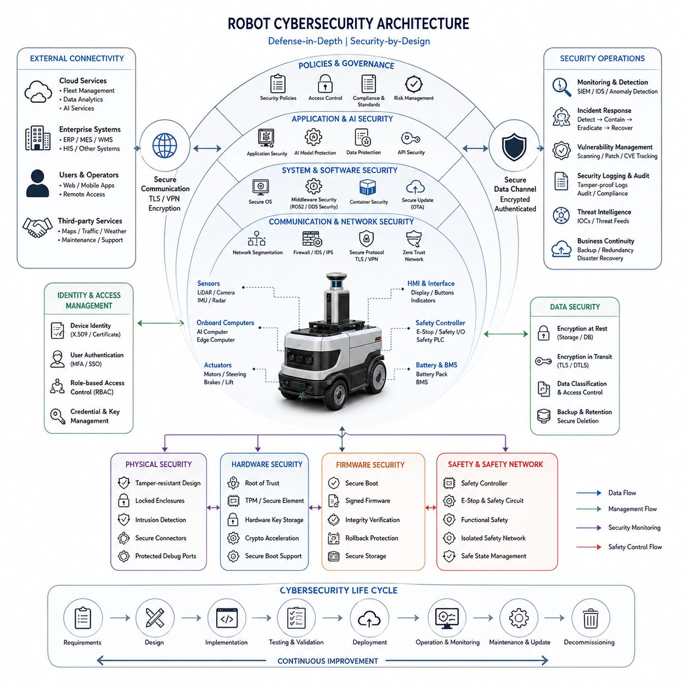
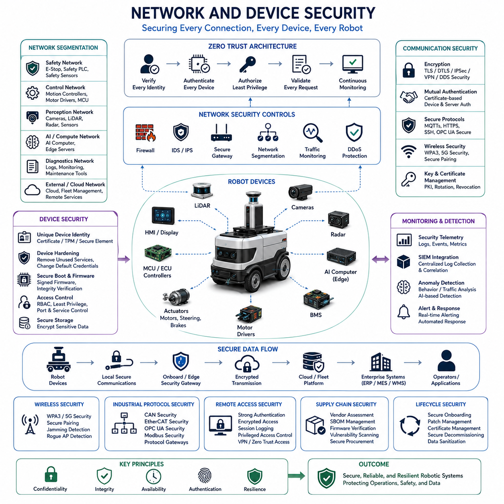
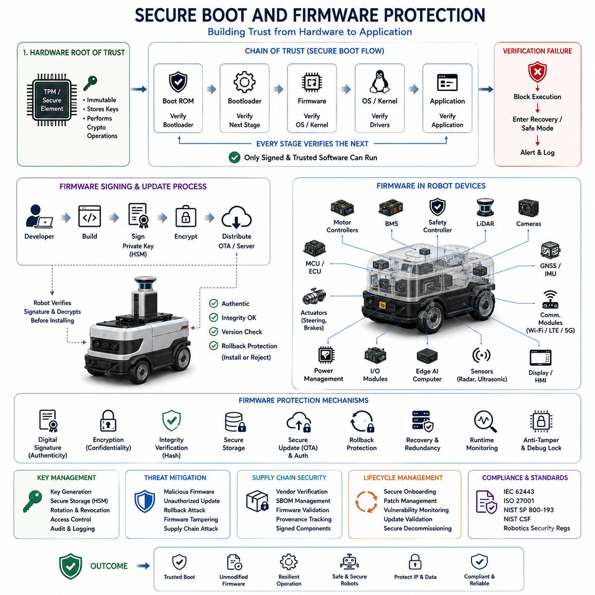
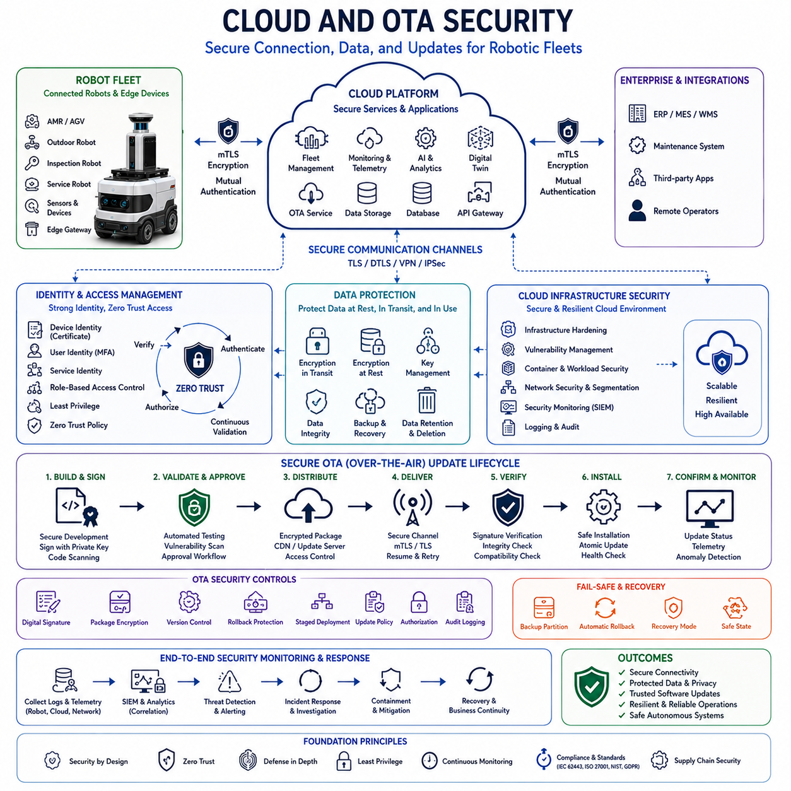
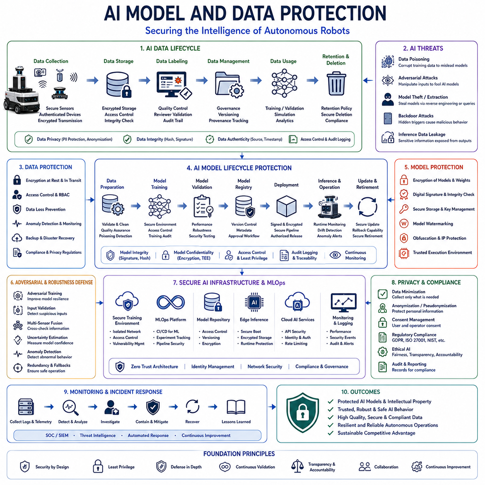
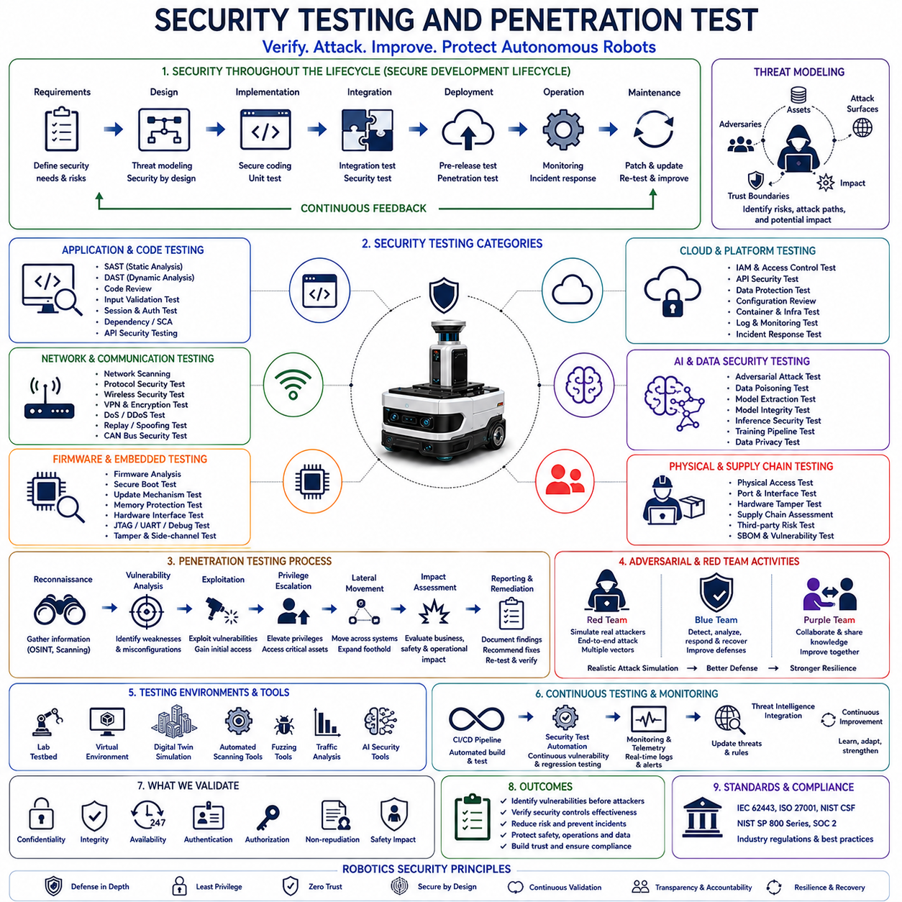
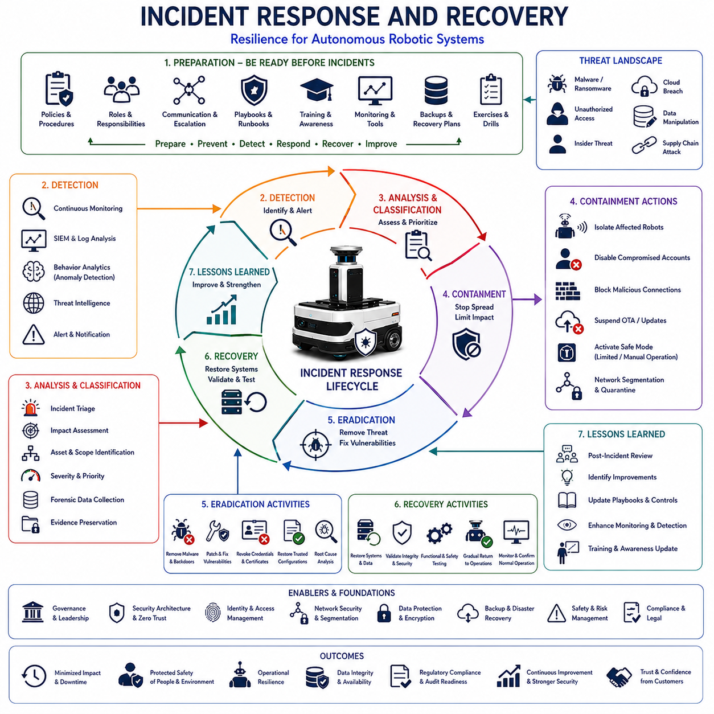
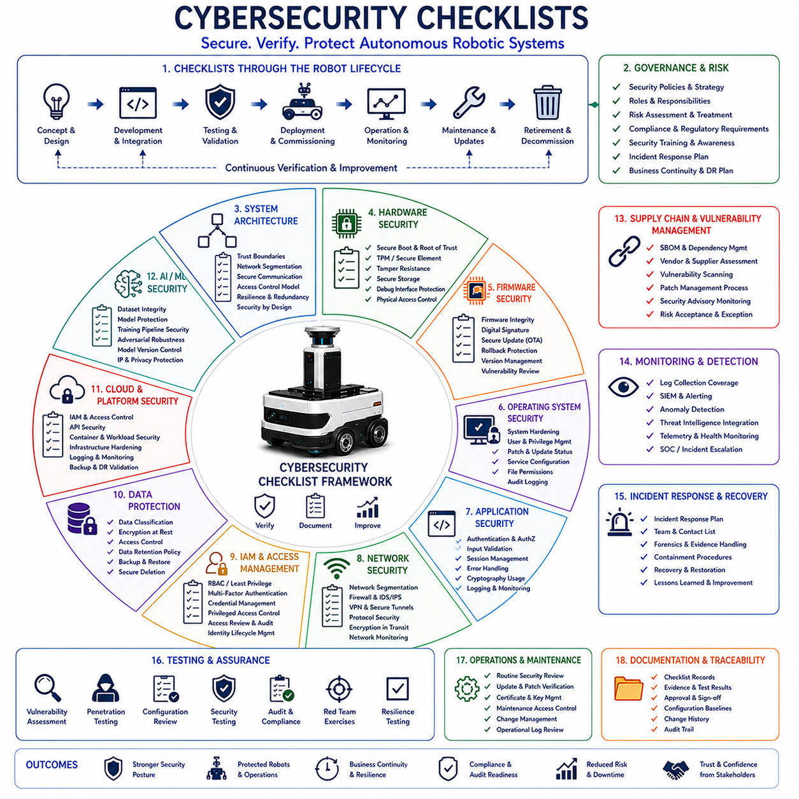

**Volume 10. AMR Engineering Process and Development Manual**


# Chapter 20. Cybersecurity Process

##  

## 20.01 Robot Cybersecurity Architecture

{width="7.268055555555556in" height="7.268055555555556in"}

# 20_01_Robot_Cybersecurity_Architecture

Modern Autonomous Mobile Robots (AMRs), outdoor autonomous robots, inspection robots, logistics robots, hospital service robots, and industrial autonomous systems are no longer isolated machines operating within closed environments. They have evolved into highly connected cyber-physical systems that continuously exchange information among onboard computers, sensors, cloud platforms, fleet management systems, digital twins, AI services, and enterprise infrastructure. As robots become increasingly intelligent, autonomous, and networked, cybersecurity becomes a fundamental architectural requirement rather than an optional feature. A cybersecurity architecture for robotics must therefore be designed from the earliest stages of system engineering and integrated into every layer of hardware, software, networking, cloud infrastructure, and operational processes. This cybersecurity-by-design philosophy ensures that robots remain trustworthy, resilient, safe, and operational even in hostile cyber environments. The Robot Cybersecurity Architecture forms the foundation of the broader Cybersecurity Process defined within the AMR Engineering Process and Development Manual.

The primary objective of robot cybersecurity architecture is to protect robotic systems against unauthorized access, malicious manipulation, data theft, service disruption, software tampering, and safety-related cyber attacks. Unlike traditional IT systems, robots directly interact with the physical world. A successful cyber attack against a robot can result not only in data loss but also in physical damage, operational downtime, safety incidents, regulatory violations, and reputational harm. Consequently, robot cybersecurity must address both information security and operational safety simultaneously.

A comprehensive robot cybersecurity architecture typically consists of multiple defense layers. These layers include physical security, hardware security, firmware security, operating system security, middleware security, application security, communication security, cloud security, AI security, operational security, and incident response capabilities. The architectural principle follows a Defense-in-Depth strategy where multiple independent protection mechanisms are deployed throughout the system. If one security layer is compromised, additional layers continue to provide protection and containment.

At the lowest level of the architecture lies physical security. Physical access remains one of the most dangerous attack vectors because an attacker who gains direct access to a robot may bypass many software protections. Physical security mechanisms include tamper-resistant enclosures, lockable maintenance panels, hardware intrusion detection sensors, secure connector interfaces, encrypted storage devices, protected debug ports, and controlled access to maintenance equipment. Industrial robots deployed in factories, logistics centers, hospitals, airports, ports, and public environments must be designed to detect and report unauthorized physical access attempts.

Above physical security resides hardware security architecture. Modern robots increasingly utilize trusted hardware components such as Trusted Platform Modules (TPMs), Hardware Security Modules (HSMs), secure elements, cryptographic accelerators, and hardware root-of-trust devices. These components provide secure storage for encryption keys, digital certificates, authentication credentials, and cryptographic operations. Hardware-based security prevents attackers from extracting sensitive information even if they obtain physical access to storage devices or embedded computing platforms.

The concept of Root of Trust serves as the foundation of hardware cybersecurity. Root of Trust establishes a secure starting point from which all software components can be verified. During system startup, the robot verifies the integrity and authenticity of firmware, bootloaders, operating systems, middleware components, and application software. Only trusted and verified software is allowed to execute. This mechanism prevents malicious firmware injection and unauthorized software modification.

Secure Boot represents one of the most important components of robot cybersecurity architecture. Secure Boot ensures that every software component loaded during startup is digitally signed and verified before execution. If a modified or malicious software image is detected, the robot can block startup, switch to a safe mode, or revert to a trusted recovery image. Secure Boot is especially critical for autonomous robots operating in safety-sensitive environments because compromised startup software could directly affect navigation, perception, control, and safety functions.

Firmware security extends protection to microcontrollers, motor controllers, sensor processors, battery management systems, safety controllers, and communication modules. Many robotics platforms contain dozens of embedded controllers. Each controller represents a potential attack surface. Firmware security architecture includes signed firmware updates, secure firmware storage, encrypted firmware distribution, version control mechanisms, rollback protection, and integrity verification procedures.

Operating system security provides protection for edge computers, AI servers, embedded Linux platforms, real-time operating systems, and cloud-connected computing infrastructure. Robot operating systems must follow hardened security configurations. Unnecessary services should be disabled, user privileges should be minimized, access controls must be enforced, and security patches must be continuously maintained. Security policies should follow the principle of least privilege, ensuring that software components receive only the permissions required for their intended functionality.

Containerization technologies such as Docker increasingly play a role in robot software deployment. Container security architecture ensures that applications operate within isolated environments. Containers reduce attack propagation and limit the impact of compromised applications. Security controls may include container image signing, vulnerability scanning, runtime monitoring, and secure container registries.

Middleware security is particularly important in robotics because middleware serves as the communication backbone connecting sensors, perception modules, localization systems, navigation software, AI components, and control systems. ROS2-based architectures rely heavily on DDS communication frameworks. Security mechanisms such as DDS Security enable authentication, encryption, access control, and secure communication channels among distributed robotic components. Secure middleware prevents unauthorized nodes from injecting malicious commands or intercepting sensitive operational data.

Network security architecture protects communication between onboard devices, edge computing systems, fleet management servers, cloud services, and external enterprise systems. Modern robots often use Ethernet, Wi-Fi, 5G, LTE, VPNs, CAN networks, EtherCAT networks, and industrial communication protocols. Each communication channel introduces potential security risks.

A layered network security architecture typically includes network segmentation, firewalls, intrusion detection systems, intrusion prevention systems, secure gateways, encrypted communication protocols, and zero-trust networking principles. Critical safety systems should remain isolated from external networks whenever possible. Safety controllers, emergency stop systems, and low-level motion control systems often require dedicated network segments that cannot be directly accessed from public networks.

Communication security relies heavily on encryption technologies. Data exchanged between robots and cloud platforms should utilize secure communication protocols such as TLS, DTLS, IPSec, SSH, VPN tunnels, and certificate-based authentication. Encryption protects confidentiality, integrity, and authenticity of transmitted information. Communication security becomes increasingly important as fleets of robots exchange operational data across public networks.

Identity and Access Management (IAM) serves as a central pillar of cybersecurity architecture. Every robot, user, service, application, cloud resource, and device should possess a unique digital identity. Authentication mechanisms verify identities before granting access to resources. Authorization policies determine which actions authenticated entities may perform. Role-based access control, attribute-based access control, and multi-factor authentication improve protection against unauthorized access.

Robot fleet management introduces unique cybersecurity challenges. Large deployments may involve hundreds or thousands of robots distributed across multiple facilities. Cybersecurity architecture must support centralized identity management, certificate lifecycle management, access policy enforcement, software distribution, security monitoring, and incident response coordination across the entire fleet.

Cloud security architecture becomes increasingly important as robotics platforms adopt cloud-native technologies. Cloud services often host fleet management systems, digital twins, telemetry databases, AI training pipelines, analytics engines, operational dashboards, and remote monitoring platforms. Cloud security mechanisms include identity management, encrypted storage, secure APIs, network isolation, workload protection, audit logging, compliance controls, and continuous monitoring.

API security represents another critical architectural domain. Modern robotic systems frequently integrate with enterprise resource planning systems, warehouse management systems, manufacturing execution systems, hospital information systems, traffic management platforms, and third-party services. APIs must implement strong authentication, authorization, rate limiting, input validation, logging, and threat detection capabilities.

OTA (Over-The-Air) update systems introduce both operational benefits and cybersecurity risks. Secure OTA architecture ensures that software updates cannot be modified, spoofed, intercepted, or injected by unauthorized actors. Update packages should be digitally signed, encrypted, verified before installation, and protected through secure distribution channels. Rollback mechanisms allow systems to recover from failed or compromised updates. Version traceability and auditability remain essential components of OTA security governance.

Data security architecture protects operational data, perception data, maps, localization information, mission records, maintenance logs, AI training datasets, and customer information. Data protection mechanisms include encryption at rest, encryption in transit, access controls, backup systems, retention policies, secure deletion procedures, and compliance management. Organizations must consider regulatory requirements related to privacy, data residency, and cybersecurity standards.

AI security has emerged as a major cybersecurity domain within modern robotic architectures. AI models themselves become attack targets. Threats include model theft, model tampering, adversarial attacks, data poisoning, prompt injection, inference manipulation, and unauthorized model replication. Security architecture must protect AI training pipelines, model repositories, inference systems, and deployment workflows.

Adversarial machine learning presents unique challenges. Attackers may intentionally manipulate sensor inputs to mislead perception algorithms, object detection systems, navigation systems, or decision-making models. Robust AI architectures therefore incorporate anomaly detection, sensor redundancy, confidence estimation, uncertainty modeling, and multi-sensor validation mechanisms.

Cybersecurity architecture must also address supply chain security. Modern robots depend upon hardware components, sensors, software libraries, operating systems, AI frameworks, cloud services, and third-party vendors. Vulnerabilities within supply chains may introduce hidden risks into deployed systems. Supply chain security includes vendor assessments, software bill of materials management, dependency scanning, code signing verification, vulnerability tracking, and procurement security policies.

Monitoring and detection capabilities form another essential layer of cybersecurity architecture. Security monitoring continuously observes system activities, network traffic, authentication events, software integrity, configuration changes, and operational anomalies. Security Information and Event Management systems aggregate logs and telemetry from robots, cloud platforms, network devices, and enterprise systems to support threat detection and forensic analysis.

Intrusion Detection Systems specifically monitor abnormal behavior that may indicate cyber attacks. Examples include unexpected communication patterns, unauthorized software execution, abnormal resource consumption, unusual motion commands, suspicious login attempts, and configuration modifications. Machine learning-based detection systems increasingly complement traditional rule-based approaches.

Security logging architecture ensures that cybersecurity events are recorded consistently across all components. Logs must be tamper-resistant, synchronized, searchable, and retained according to organizational policies. Accurate logging supports incident investigations, compliance audits, root cause analysis, and continuous security improvement.

Incident response architecture defines how organizations react when cybersecurity events occur. Incident response procedures include detection, classification, containment, eradication, recovery, validation, communication, and post-incident analysis. Robotic systems require specialized response strategies because cyber incidents may affect both digital infrastructure and physical operations.

Business continuity and disaster recovery capabilities help maintain operational resilience. Cybersecurity architecture should include backup systems, redundant communication paths, failover mechanisms, recovery procedures, and emergency operational modes. Autonomous robots must be capable of transitioning into safe states when cybersecurity threats are detected.

Compliance and standards alignment provide governance for cybersecurity architecture. Relevant standards may include IEC 62443, ISO 27001, ISO 21434 concepts adapted from automotive cybersecurity, NIST Cybersecurity Framework, NIST SP 800-series guidance, ETSI security standards, and emerging robotics cybersecurity regulations. Organizations developing industrial AMRs, hospital robots, logistics robots, outdoor autonomous systems, and smart city robots should establish compliance frameworks that align cybersecurity activities with regulatory requirements and customer expectations.

For large-scale autonomous robot deployments, cybersecurity architecture must ultimately support the entire robot lifecycle. Security begins during requirements engineering and continues through design, implementation, testing, deployment, operation, maintenance, updates, decommissioning, and disposal. Security is not a one-time activity but a continuous engineering discipline integrated into every stage of robot development and operation.

The future of robot cybersecurity architecture will increasingly incorporate zero-trust security models, AI-powered threat detection, autonomous security agents, confidential computing, secure multi-party collaboration, quantum-resistant cryptography, hardware-backed identity systems, and self-healing cyber-physical infrastructures. As robots become more intelligent, connected, and autonomous, cybersecurity will evolve from a supporting function into a core architectural capability that directly determines the reliability, safety, scalability, and trustworthiness of next-generation robotic ecosystems. The success of future AMR fleets, outdoor autonomous robots, industrial inspection platforms, GPR inspection robots, hospital service robots, and smart city robotic infrastructures will depend heavily on the strength and maturity of their cybersecurity architecture.

# 20_01_Robot_Cybersecurity_Architecture

현대의 자율이동로봇(AMR), 실외 자율주행 로봇, 검사 로봇, 물류 로봇, 병원 서비스 로봇 및 산업용 자율 시스템은 더 이상 폐쇄된 환경에서 독립적으로 동작하는 기계가 아니다. 이들은 온보드 컴퓨터, 센서, 클라우드 플랫폼, 플릿 관리 시스템, 디지털 트윈, AI 서비스 및 기업 인프라와 지속적으로 데이터를 교환하는 고도로 연결된 사이버-물리 시스템(Cyber-Physical System)으로 발전하였다. 로봇이 더욱 지능화되고 자율화되며 네트워크화됨에 따라 사이버보안은 선택적인 기능이 아니라 필수적인 시스템 아키텍처 요소가 되었다. 따라서 로봇 사이버보안은 시스템 엔지니어링 초기 단계부터 설계되어야 하며, 하드웨어, 소프트웨어, 네트워크, 클라우드 인프라, 운영 프로세스 전반에 통합되어야 한다. 이러한 Security-by-Design 철학은 적대적인 사이버 환경에서도 로봇이 신뢰성, 안정성, 안전성을 유지하도록 보장한다.

로봇 사이버보안 아키텍처의 주요 목적은 무단 접근, 악의적 조작, 데이터 탈취, 서비스 중단, 소프트웨어 변조 및 안전과 관련된 사이버 공격으로부터 로봇 시스템을 보호하는 것이다. 일반적인 IT 시스템과 달리 로봇은 실제 물리 환경과 직접 상호작용한다. 따라서 로봇에 대한 사이버 공격은 단순한 데이터 손실을 넘어 장비 손상, 운영 중단, 안전사고, 규제 위반, 기업 신뢰도 하락으로 이어질 수 있다. 이러한 이유로 로봇 사이버보안은 정보보안과 기능 안전(Functional Safety)을 동시에 고려해야 한다.

포괄적인 로봇 사이버보안 아키텍처는 다층 방어 구조로 구성된다. 여기에는 물리 보안, 하드웨어 보안, 펌웨어 보안, 운영체제 보안, 미들웨어 보안, 애플리케이션 보안, 통신 보안, 클라우드 보안, AI 보안, 운영 보안, 사고 대응 체계 등이 포함된다. 이러한 구조는 Defense-in-Depth 원칙을 따른다. 즉, 하나의 보안 계층이 침해되더라도 다른 계층들이 지속적으로 보호 기능을 수행하도록 설계된다.

가장 하위 계층은 물리 보안이다. 공격자가 로봇에 직접 접근할 수 있다면 많은 소프트웨어 기반 방어 체계를 우회할 수 있기 때문이다. 물리 보안은 잠금 장치가 있는 유지보수 패널, 침입 감지 센서, 보호된 커넥터, 암호화 저장장치, 디버그 포트 보호, 유지보수 장비 접근 통제 등을 포함한다. 공장, 물류센터, 병원, 공항, 항만 및 공공장소에 배치되는 산업용 로봇은 무단 물리 접근 시도를 감지하고 보고할 수 있어야 한다.

물리 보안 위에는 하드웨어 보안 계층이 존재한다. 최신 로봇은 TPM(Trusted Platform Module), HSM(Hardware Security Module), Secure Element, 암호화 가속기, Hardware Root-of-Trust 장치 등을 활용한다. 이러한 장치는 암호화 키, 디지털 인증서, 인증 정보 및 보안 관련 데이터를 안전하게 저장한다. 하드웨어 기반 보안은 저장장치가 탈취되거나 컴퓨팅 플랫폼이 노출되더라도 중요한 정보를 보호할 수 있다.

하드웨어 보안의 핵심 개념은 Root of Trust이다. 이는 모든 소프트웨어 신뢰의 출발점이 되는 보안 기반이다. 시스템 부팅 과정에서 펌웨어, 부트로더, 운영체제, 미들웨어, 애플리케이션의 무결성과 진위 여부를 검증한다. 검증된 소프트웨어만 실행을 허용함으로써 악성 코드 삽입과 시스템 변조를 방지한다.

Secure Boot는 로봇 보안에서 가장 중요한 요소 중 하나이다. 부팅 시 로드되는 모든 소프트웨어는 디지털 서명을 검증받아야 한다. 변조되거나 악성으로 판단되는 소프트웨어가 발견되면 시스템은 부팅을 중단하거나 안전 모드로 전환하거나 신뢰할 수 있는 복구 이미지로 롤백한다. 이는 자율주행, 인지, 제어, 안전 기능을 수행하는 로봇에서 특히 중요하다.

펌웨어 보안은 MCU, 모터 제어기, 센서 프로세서, 배터리 관리 시스템(BMS), 안전 제어기 및 통신 모듈을 보호한다. 현대 로봇에는 수십 개의 임베디드 컨트롤러가 존재하며, 각각이 잠재적인 공격 표면이 될 수 있다. 이를 위해 서명된 펌웨어, 암호화된 펌웨어 저장, 안전한 배포, 버전 관리, 롤백 방지 및 무결성 검증 기능이 필요하다.

운영체제 보안은 엣지 컴퓨터, AI 서버, 임베디드 리눅스 시스템 및 실시간 운영체제를 보호한다. 불필요한 서비스 제거, 최소 권한 원칙 적용, 접근 제어 강화, 보안 패치 관리 등이 핵심 요소이다. 모든 소프트웨어는 필요한 최소한의 권한만 가져야 하며 이를 통해 공격 확산을 최소화할 수 있다.

최근에는 Docker와 같은 컨테이너 기술이 로봇 시스템에 널리 활용되고 있다. 컨테이너 보안은 애플리케이션을 서로 격리된 환경에서 실행하도록 하여 침해 범위를 제한한다. 또한 이미지 서명, 취약점 스캔, 런타임 모니터링, 보안 레지스트리 등의 기능을 제공한다.

미들웨어 보안은 로봇 아키텍처에서 매우 중요하다. 미들웨어는 센서, 인지 모듈, 위치추정, 내비게이션, AI, 제어 시스템을 연결하는 핵심 통신 계층이기 때문이다. ROS2 기반 시스템에서는 DDS Security를 활용하여 인증, 암호화, 접근 제어 및 안전한 통신을 구현할 수 있다. 이를 통해 악성 노드가 명령을 주입하거나 데이터를 가로채는 것을 방지한다.

네트워크 보안은 온보드 장치, 엣지 컴퓨팅, 플릿 관리 서버, 클라우드 플랫폼 및 외부 시스템 간의 통신을 보호한다. 현대 로봇은 Ethernet, Wi-Fi, LTE, 5G, VPN, CAN, EtherCAT 등 다양한 네트워크를 사용한다. 따라서 네트워크 분리, 방화벽, 침입 탐지 시스템, 침입 방지 시스템, 보안 게이트웨이 및 Zero Trust 네트워크 구조가 필요하다.

특히 안전 제어기, 비상정지 시스템, 저수준 모션 제어 시스템은 외부 네트워크와 분리된 독립적인 네트워크 영역에 배치하는 것이 바람직하다. 이를 통해 외부 침입이 안전 시스템에 직접 영향을 주지 못하도록 한다.

통신 보안은 TLS, DTLS, IPSec, SSH, VPN 등의 암호화 기술을 기반으로 한다. 로봇과 클라우드 사이에서 교환되는 모든 데이터는 암호화되어야 하며, 인증서를 이용한 상호 인증 체계를 적용해야 한다. 이는 데이터의 기밀성, 무결성 및 진위성을 보장한다.

Identity and Access Management(IAM)는 로봇 보안의 핵심 축이다. 로봇, 사용자, 서비스, 애플리케이션, 클라우드 자원 모두 고유한 디지털 신원을 가져야 한다. 인증(Authentication)은 신원을 확인하고, 권한 부여(Authorization)는 허용된 작업을 결정한다. 역할 기반 접근 제어(RBAC), 속성 기반 접근 제어(ABAC), 다중 인증(MFA)은 무단 접근을 방지하는 중요한 수단이다.

대규모 로봇 플릿 환경에서는 수백\~수천 대의 로봇을 중앙에서 관리해야 한다. 따라서 인증서 관리, 접근 정책 관리, 소프트웨어 배포, 보안 모니터링 및 사고 대응을 지원하는 중앙 보안 인프라가 필요하다.

클라우드 보안은 플릿 관리 시스템, 디지털 트윈, AI 학습 플랫폼, 운영 대시보드, 분석 엔진 및 원격 모니터링 시스템을 보호한다. 이를 위해 암호화 저장소, 안전한 API, 네트워크 격리, 접근 제어, 감사 로그 및 지속적인 모니터링이 필요하다.

API 보안 역시 중요하다. 로봇은 ERP, MES, WMS, HIS 등 다양한 외부 시스템과 연동된다. 따라서 강력한 인증, 권한 관리, 입력 검증, 요청 제한(Rate Limiting), 감사 로그 및 위협 탐지 기능이 요구된다.

OTA(Over-The-Air) 업데이트는 운영 효율성을 높이지만 동시에 새로운 공격 경로를 제공한다. 안전한 OTA 시스템은 디지털 서명, 암호화, 무결성 검증, 안전한 배포 채널 및 롤백 기능을 포함해야 한다. 이를 통해 악성 업데이트가 배포되는 것을 방지할 수 있다.

데이터 보안은 운영 데이터, 센서 데이터, 지도 정보, 위치 데이터, 유지보수 기록, AI 학습 데이터 및 고객 정보를 보호한다. 이를 위해 저장 데이터 암호화, 전송 데이터 암호화, 접근 통제, 백업, 데이터 보존 정책 및 안전한 삭제 기능이 필요하다.

AI 보안은 최근 가장 중요한 분야 중 하나로 떠오르고 있다. AI 모델은 모델 탈취, 모델 변조, 데이터 오염(Data Poisoning), 적대적 공격(Adversarial Attack), 추론 조작 등의 위협에 노출될 수 있다. 따라서 학습 파이프라인, 모델 저장소, 추론 엔진 및 배포 프로세스를 보호해야 한다.

특히 적대적 머신러닝 공격은 센서 입력을 조작하여 객체 인식, 내비게이션, 의사결정 모델을 오작동시킬 수 있다. 이를 방지하기 위해 다중 센서 검증, 이상 탐지, 신뢰도 평가 및 불확실성 분석 기술이 활용된다.

공급망 보안 또한 매우 중요하다. 로봇은 다양한 하드웨어 부품, 센서, 운영체제, AI 프레임워크 및 외부 라이브러리에 의존한다. 공급망 보안은 공급업체 평가, SBOM(Software Bill of Materials), 취약점 추적, 코드 서명 검증 및 보안 조달 정책을 포함한다.

보안 모니터링과 위협 탐지 시스템은 전체 아키텍처를 지속적으로 감시한다. 로그인 이벤트, 네트워크 트래픽, 소프트웨어 무결성, 시스템 설정 변경, 비정상 동작 등을 분석하여 공격 징후를 탐지한다. SIEM(Security Information and Event Management)은 이러한 로그를 통합 분석하는 핵심 플랫폼이다.

침입 탐지 시스템은 비정상적인 통신 패턴, 비인가 명령, 비정상적인 리소스 사용, 의심스러운 로그인 시도 및 설정 변경 등을 실시간으로 감지한다. 최근에는 AI 기반 탐지 기법도 적극 활용되고 있다.

보안 로그는 사고 분석, 규정 준수, 감사 및 원인 분석의 기반이 된다. 따라서 로그는 위변조가 불가능해야 하며 시간 동기화와 중앙 저장 기능을 갖추어야 한다.

사고 대응 체계는 보안 이벤트가 발생했을 때 탐지, 분류, 격리, 제거, 복구, 검증 및 사후 분석을 수행한다. 로봇 시스템은 물리적 동작까지 영향을 받을 수 있으므로 IT 시스템보다 더욱 정교한 대응 체계가 요구된다.

비즈니스 연속성과 재해 복구 체계는 사이버 공격 발생 시에도 운영을 지속할 수 있도록 한다. 이를 위해 백업 시스템, 이중화 통신망, 장애 복구 절차, 안전 모드 운영 기능이 필요하다. 자율주행 로봇은 위협 감지 시 즉시 안전 상태(Safe State)로 전환될 수 있어야 한다.

사이버보안 아키텍처는 IEC 62443, ISO 27001, NIST Cybersecurity Framework, NIST SP 800 시리즈, ETSI 보안 표준 및 향후 로봇 보안 규제와의 정합성을 확보해야 한다. 이는 고객 신뢰 확보와 글로벌 시장 진출을 위해 필수적이다.

궁극적으로 로봇 사이버보안은 요구사항 정의, 설계, 구현, 시험, 배포, 운영, 유지보수, OTA 업데이트, 폐기 단계에 이르는 전체 수명주기를 포괄해야 한다. 보안은 특정 시점의 작업이 아니라 지속적으로 관리되고 개선되어야 하는 엔지니어링 프로세스이다.

미래의 로봇 사이버보안은 Zero Trust Architecture, AI 기반 위협 탐지, 자율 보안 에이전트, Confidential Computing, 양자 내성 암호(Post-Quantum Cryptography), 하드웨어 기반 디지털 신원 체계 및 자가 복구(Self-Healing) 보안 시스템으로 발전할 것이다. 자율주행 로봇, 실외 자율주행 플랫폼, GPR 검사 로봇, 병원 서비스 로봇, 스마트시티 로봇 인프라가 확산될수록 사이버보안은 단순한 지원 기능이 아니라 로봇의 신뢰성, 안전성, 확장성 및 사업 성공을 결정하는 핵심 경쟁력이 될 것이다.

##  

## 20.02 Network and Device Security

{width="7.268055555555556in" height="7.268055555555556in"}

# 20_02_Network_and_Device_Security

Network and Device Security forms one of the most critical pillars of modern robot cybersecurity architecture. Autonomous Mobile Robots (AMRs), outdoor autonomous robots, logistics robots, hospital service robots, industrial inspection robots, and smart city robotic systems rely heavily on continuous communication among sensors, embedded controllers, edge computers, cloud platforms, fleet management systems, enterprise infrastructure, and external services. As robotic systems become increasingly connected, their attack surface expands significantly. Every network interface, wireless connection, communication protocol, embedded controller, and edge computing device becomes a potential entry point for cyber attackers. Consequently, Network and Device Security must be designed as a foundational element of robot architecture rather than an afterthought introduced during deployment. The objective is to ensure confidentiality, integrity, availability, authenticity, and resilience across all networked components within the robotic ecosystem.

A modern robotic system may contain dozens of interconnected devices operating simultaneously. These include AI computers, embedded controllers, motor drivers, battery management systems, safety controllers, LiDAR sensors, cameras, GNSS receivers, IMUs, radar units, wireless communication modules, operator interfaces, and cloud-connected gateways. Each device generates, receives, processes, and transmits information that contributes to robot operation. Because these devices often communicate through Ethernet, CAN, EtherCAT, Wi-Fi, LTE, 5G, Bluetooth, serial interfaces, and industrial protocols, securing both the devices and the networks connecting them becomes essential for maintaining safe and reliable operation.

The concept of Zero Trust Architecture is becoming increasingly important within robotic environments. Traditional network security models assumed that devices operating within a trusted network could communicate freely. However, modern cybersecurity principles recognize that any device may eventually become compromised. Zero Trust assumes that no device, user, application, or network segment should be trusted automatically. Every interaction requires authentication, authorization, and validation before access is granted. This approach significantly reduces lateral movement opportunities for attackers who manage to penetrate part of the robotic infrastructure.

Network segmentation serves as a foundational design principle for robotic cybersecurity. Instead of allowing unrestricted communication among all devices, the robot network should be divided into multiple security zones. Critical control systems, safety systems, perception systems, AI processing systems, maintenance interfaces, cloud communication modules, and operator workstations should operate within separate network segments. Segmentation limits attack propagation and prevents a compromise in one subsystem from affecting the entire robotic platform.

A typical industrial robot may include a safety network, a control network, a perception network, a diagnostics network, and an external communication network. The safety network often contains emergency stop systems, safety PLCs, safety LiDARs, and functional safety components. This network should be isolated from external communication channels and protected through strict access controls. The control network manages motion controllers, motor drivers, steering systems, braking systems, and embedded real-time controllers. The perception network handles cameras, LiDARs, radars, and sensor fusion systems. Cloud connectivity and fleet management communications should operate within separate security domains connected through controlled gateways.

Device identity management plays a central role in secure robotic systems. Every device participating in robot operations should possess a unique digital identity. This identity is typically established through cryptographic certificates, hardware-based identities, trusted platform modules, or secure elements. Device identity allows the system to verify that communication originates from legitimate hardware rather than unauthorized devices attempting to join the network.

Authentication mechanisms ensure that only authorized devices can participate in system communications. Mutual authentication is particularly important in robotic systems. Rather than authenticating only one side of a connection, both communicating parties verify each other\'s identities. For example, a robot should verify the identity of a cloud server before transmitting operational data, while the cloud platform should verify the identity of the robot before accepting incoming connections. Mutual authentication prevents impersonation attacks and unauthorized access attempts.

Certificate-based authentication has become a preferred mechanism for robotic environments. Digital certificates provide scalable identity management for large fleets of robots. Each robot, subsystem, and cloud service can be assigned a unique certificate issued by a trusted certificate authority. During communication establishment, certificates are exchanged and validated, ensuring that only trusted entities participate in network operations.

Device hardening is another essential component of network and device security. Many embedded devices ship with default credentials, unnecessary services, open communication ports, and insecure configurations. Before deployment, each device should undergo a hardening process that removes unnecessary software, disables unused services, closes unused ports, changes default passwords, applies security patches, and restricts access permissions. Device hardening significantly reduces the attack surface exposed to potential adversaries.

Operating system security is closely related to device security. Embedded Linux systems, real-time operating systems, Windows-based industrial computers, and edge AI platforms must be configured according to cybersecurity best practices. User privileges should be minimized, system services should be restricted, security logs should be enabled, and vulnerability management processes should be implemented throughout the operational lifecycle.

Network communication security relies heavily on encryption technologies. Unencrypted communication channels expose sensitive operational data to interception and manipulation. Therefore, all communications between robots, cloud platforms, edge systems, operator stations, and enterprise services should utilize encrypted protocols. Common examples include TLS, DTLS, IPSec, SSH, VPN tunnels, and secure DDS communication channels. Encryption protects data confidentiality while ensuring communication integrity and authenticity.

Secure communication becomes particularly important in fleet management environments. A modern fleet may consist of hundreds or thousands of robots distributed across multiple facilities. Fleet management systems continuously exchange mission assignments, telemetry information, diagnostics data, software updates, maps, and operational commands. Without encryption and authentication, attackers could potentially intercept communications, inject malicious commands, or manipulate fleet operations.

Wireless network security presents unique challenges for robotic deployments. Wi-Fi, LTE, and 5G connectivity provide flexibility and scalability but also introduce additional attack vectors. Wireless communications are inherently exposed to eavesdropping, jamming, spoofing, replay attacks, and rogue access points. Security controls must therefore include strong encryption, secure authentication mechanisms, frequency management strategies, network monitoring, and anomaly detection capabilities.

Wi-Fi security should utilize modern protocols such as WPA3 Enterprise with certificate-based authentication. Legacy wireless security mechanisms are often vulnerable to credential theft and unauthorized access. In industrial environments, wireless networks supporting robot operations should operate within dedicated security zones separate from guest networks and general-purpose enterprise communications.

Cellular communication security is increasingly relevant as outdoor autonomous robots rely on LTE and 5G connectivity for remote operations. Cellular networks provide stronger security mechanisms than traditional Wi-Fi in many scenarios; however, additional protections such as VPN tunnels, certificate-based authentication, endpoint validation, and encrypted application protocols remain necessary. Organizations should assume that public communication infrastructure may eventually become compromised and design accordingly.

Firewalls play a crucial role in protecting robot networks. Firewalls enforce communication policies that define which devices, applications, and services may exchange information. In robotic systems, firewalls can be deployed at multiple levels, including onboard devices, edge gateways, cloud infrastructure, and facility network boundaries. A layered firewall architecture provides multiple checkpoints that inspect and control traffic flow.

Intrusion Detection Systems (IDS) and Intrusion Prevention Systems (IPS) enhance network visibility and threat detection capabilities. IDS solutions monitor network traffic for suspicious activities such as unauthorized access attempts, unusual communication patterns, malware signatures, and protocol violations. IPS solutions extend this capability by automatically blocking malicious traffic before it reaches critical systems. Together, these technologies improve situational awareness and reduce response times during cyber incidents.

Industrial communication protocols require specialized security considerations. Many robots utilize protocols such as CAN, EtherCAT, Modbus, OPC UA, PROFINET, and industrial Ethernet variants. Some legacy industrial protocols were originally designed without strong security mechanisms. Therefore, additional protections such as network segmentation, protocol gateways, encryption overlays, and traffic monitoring become necessary to mitigate associated risks.

CAN bus security presents a particular challenge because traditional CAN networks lack authentication and encryption capabilities. Attackers who gain access to a CAN network may potentially inject malicious messages affecting vehicle control, battery systems, or embedded controllers. Modern robotic architectures increasingly incorporate secure gateways, message authentication techniques, and network isolation strategies to protect CAN-based communications.

EtherCAT networks often support real-time control systems for motion control and industrial automation. Because these networks directly influence robot movement and operational behavior, they must be protected from unauthorized access. Access control mechanisms, secure engineering workstations, network segmentation, and continuous monitoring help maintain EtherCAT security.

Device monitoring and health management contribute significantly to cybersecurity resilience. Security monitoring should continuously observe device status, firmware versions, configuration changes, authentication events, network activity, resource utilization, and operational behavior. Deviations from expected behavior may indicate device compromise, malware activity, hardware failure, or insider threats.

Security telemetry collected from devices provides valuable information for centralized monitoring systems. Modern Security Information and Event Management platforms aggregate logs from robots, cloud systems, gateways, network devices, and enterprise infrastructure. Correlating security events across multiple sources enables earlier threat detection and more effective incident response.

Remote management capabilities must also be secured carefully. While remote diagnostics, maintenance, software updates, and operational monitoring provide significant operational benefits, they also create potential attack vectors. Remote access should always require strong authentication, encrypted communication channels, session logging, and role-based authorization controls. Privileged administrative access should be tightly controlled and continuously audited.

Supply chain security influences device security throughout the robot lifecycle. Components sourced from external vendors may introduce hidden vulnerabilities, malicious modifications, or unsupported software dependencies. Organizations should implement vendor qualification processes, firmware verification procedures, software bill of materials tracking, vulnerability assessments, and procurement security requirements. Supply chain transparency improves trustworthiness and reduces exposure to third-party risks.

Device lifecycle management represents another critical security consideration. Security responsibilities begin before deployment and continue until device retirement. New devices should undergo security validation before entering operational environments. During operation, devices require patch management, vulnerability assessments, certificate renewal, and configuration monitoring. At end-of-life, secure decommissioning procedures must ensure that sensitive information is removed and credentials are revoked.

Patch management remains one of the most effective cybersecurity practices. Vulnerabilities are continuously discovered in operating systems, firmware, communication stacks, and software libraries. Timely patch deployment reduces exposure to known threats. However, robotic environments often require careful validation before updates can be installed because operational reliability and safety must not be compromised. Consequently, organizations should establish structured patch testing and deployment workflows.

Threat modeling helps identify network and device security risks during system design. Security engineers systematically analyze potential attack paths, adversary capabilities, critical assets, trust boundaries, and failure consequences. Threat modeling enables proactive implementation of security controls before vulnerabilities are exploited in operational environments.

Network and Device Security also plays an important role in regulatory compliance. Many industries require adherence to cybersecurity frameworks such as IEC 62443, ISO 27001, NIST Cybersecurity Framework, NIST SP 800 guidelines, and emerging robotic cybersecurity regulations. Compliance activities encourage organizations to adopt consistent security processes and maintain adequate documentation throughout the robot lifecycle.

As robotic systems continue evolving toward greater autonomy, connectivity, and intelligence, the importance of network and device security will continue to increase. Future robotic ecosystems will incorporate thousands of interconnected robots, cloud-native services, AI-driven operations, edge computing platforms, digital twins, and smart infrastructure. Protecting these highly distributed environments requires adaptive cybersecurity architectures capable of responding to continuously changing threat landscapes.

Ultimately, Network and Device Security serves as the protective nervous system of modern robotic platforms. It ensures that every sensor, controller, computer, communication channel, cloud service, and fleet management component operates within a trusted environment. By combining strong device identity, secure communications, network segmentation, continuous monitoring, robust access control, and lifecycle security management, organizations can build robotic systems that remain resilient, trustworthy, and secure throughout their operational lifetime. Such capabilities are essential for the successful deployment of industrial AMRs, outdoor autonomous robots, GPR inspection robots, logistics fleets, hospital service robots, and next-generation intelligent robotic infrastructures operating at global scale.

# 20_02_Network_and_Device_Security

네트워크 및 디바이스 보안(Network and Device Security)은 현대 로봇 사이버보안 아키텍처를 구성하는 가장 중요한 핵심 요소 중 하나이다. 자율이동로봇(AMR), 실외 자율주행 로봇, 물류 로봇, 병원 서비스 로봇, 산업용 검사 로봇, 스마트시티 로봇 시스템은 센서, 임베디드 제어기, 엣지 컴퓨터, 클라우드 플랫폼, 플릿 관리 시스템(FMS), 기업 인프라 및 외부 서비스와 지속적으로 연결되어 동작한다. 로봇 시스템의 연결성이 증가할수록 공격 표면(Attack Surface) 역시 급격히 확대된다. 모든 네트워크 인터페이스, 무선 연결, 통신 프로토콜, 임베디드 제어기 및 컴퓨팅 장치는 잠재적인 공격 경로가 될 수 있다. 따라서 네트워크 및 디바이스 보안은 배포 이후에 추가하는 기능이 아니라 시스템 설계 초기 단계부터 아키텍처에 내재되어야 한다. 그 목표는 로봇 생태계 전체에서 기밀성(Confidentiality), 무결성(Integrity), 가용성(Availability), 인증성(Authentication), 복원력(Resilience)을 확보하는 것이다.

현대의 로봇은 수십 개 이상의 장치로 구성된다. 여기에는 AI 컴퓨터, 임베디드 제어기, 모터 드라이버, 배터리 관리 시스템(BMS), 안전 제어기, LiDAR, 카메라, GNSS 수신기, IMU, 레이더, 무선 통신 모듈, 사용자 인터페이스 및 클라우드 게이트웨이가 포함된다. 각 장치는 데이터를 생성하고 수집하며 처리하고 전달한다. 이러한 장치들은 Ethernet, CAN, EtherCAT, Wi-Fi, LTE, 5G, Bluetooth, Serial Interface 및 다양한 산업용 프로토콜을 통해 연결되기 때문에 장치 자체와 이를 연결하는 네트워크 모두를 보호해야 한다.

최근 로봇 보안에서 가장 중요한 개념 중 하나는 Zero Trust Architecture이다. 과거에는 내부 네트워크에 연결된 장치는 기본적으로 신뢰하는 방식이 일반적이었다. 그러나 현대 보안 환경에서는 어떤 장치도 완전히 신뢰할 수 없다고 가정한다. 모든 사용자, 장치, 애플리케이션, 서비스는 접근 전에 인증과 권한 검증을 수행해야 한다. 이러한 접근 방식은 공격자가 일부 시스템에 침투하더라도 내부 확산을 최소화하는 데 매우 효과적이다.

네트워크 분리(Network Segmentation)는 로봇 보안의 기본 원칙이다. 모든 장치가 자유롭게 통신하는 대신 안전 제어 시스템, 주행 제어 시스템, 인지 시스템, AI 시스템, 진단 시스템, 클라우드 연결 시스템 등을 서로 다른 보안 영역으로 분리한다. 이를 통해 특정 영역이 침해되더라도 다른 영역으로 공격이 확산되는 것을 방지할 수 있다.

일반적인 산업용 로봇은 안전 네트워크, 제어 네트워크, 인지 네트워크, 진단 네트워크 및 외부 통신 네트워크로 구성된다. 안전 네트워크에는 비상정지(E-Stop), Safety PLC, Safety LiDAR 등이 포함되며 외부 네트워크와 논리적으로 분리된다. 제어 네트워크는 모터 드라이버, 조향 장치, 브레이크 시스템, MCU를 담당한다. 인지 네트워크는 카메라, LiDAR, 레이더 및 센서 융합 시스템을 연결한다. 클라우드 및 플릿 관리 시스템은 별도의 보안 게이트웨이를 통해 연결된다.

디바이스 식별(Device Identity Management)은 안전한 로봇 네트워크의 핵심이다. 네트워크에 참여하는 모든 장치는 고유한 디지털 신원을 가져야 한다. 이는 인증서(Certificate), TPM, Secure Element 또는 하드웨어 기반 신원 체계를 통해 구현된다. 디바이스 신원은 통신 상대가 실제 승인된 장치인지 확인하는 역할을 한다.

인증(Authentication)은 승인되지 않은 장치가 네트워크에 참여하지 못하도록 한다. 특히 상호 인증(Mutual Authentication)이 중요하다. 예를 들어 로봇은 클라우드 서버의 신원을 확인해야 하고, 클라우드 역시 로봇의 신원을 검증해야 한다. 이를 통해 장치 위장(Spoofing) 공격이나 무단 접속을 차단할 수 있다.

인증서 기반 인증은 대규모 플릿 운영에서 가장 효과적인 방법이다. 수백 또는 수천 대의 로봇이 각각 고유한 인증서를 보유하고 신뢰된 인증기관(CA)에 의해 관리된다. 통신 시 인증서를 교환하고 검증함으로써 신뢰된 장치만 네트워크에 참여할 수 있다.

디바이스 하드닝(Device Hardening)은 또 다른 중요한 보안 절차이다. 많은 임베디드 장치는 기본 비밀번호, 불필요한 서비스, 열려 있는 포트 및 취약한 설정 상태로 출하된다. 실제 운영 전에 불필요한 기능 제거, 포트 차단, 기본 계정 변경, 보안 패치 적용 및 접근 권한 제한을 수행해야 한다. 이를 통해 공격 표면을 크게 줄일 수 있다.

운영체제 보안도 디바이스 보안의 핵심 영역이다. 임베디드 리눅스, 실시간 운영체제(RTOS), 산업용 Windows 시스템 및 AI 컴퓨팅 플랫폼은 최소 권한 원칙에 따라 구성되어야 한다. 불필요한 서비스 제거, 로그 활성화, 보안 설정 강화 및 지속적인 취약점 관리가 필수적이다.

네트워크 통신 보안은 암호화 기술에 의존한다. 암호화되지 않은 통신은 도청과 데이터 변조에 매우 취약하다. 따라서 로봇과 클라우드, 로봇과 서버, 로봇과 플릿 관리 시스템 사이의 모든 통신은 TLS, DTLS, IPSec, SSH, VPN 또는 DDS Security와 같은 보안 프로토콜을 사용해야 한다. 이를 통해 데이터의 기밀성, 무결성 및 인증성을 확보할 수 있다.

특히 플릿 관리 환경에서는 통신 보안이 더욱 중요하다. 수백 대 이상의 로봇이 임무 정보, 상태 정보, 진단 데이터, 지도 데이터 및 소프트웨어 업데이트를 지속적으로 교환하기 때문이다. 암호화와 인증이 없으면 공격자가 통신을 가로채거나 악성 명령을 삽입할 수 있다.

무선 네트워크 보안은 독특한 도전 과제를 가진다. Wi-Fi, LTE, 5G 네트워크는 높은 유연성을 제공하지만 동시에 도청, 재전송 공격, 재밍(Jamming), 위장 공격, 불법 액세스 포인트 등의 위험을 수반한다. 따라서 강력한 암호화, 인증 체계, 주파수 관리 및 이상 탐지 기능이 필요하다.

Wi-Fi 네트워크는 WPA3 Enterprise와 인증서 기반 인증을 사용하는 것이 바람직하다. 산업 현장에서는 로봇용 무선망을 사무용 네트워크 및 방문자 네트워크와 분리하여 운영해야 한다.

LTE 및 5G와 같은 셀룰러 네트워크는 실외 자율주행 로봇에서 매우 중요하다. 이러한 네트워크는 비교적 강력한 보안 기능을 제공하지만 VPN, TLS, 인증서 기반 인증 및 엔드포인트 검증을 추가적으로 적용해야 한다. 공용 통신망 역시 완전히 신뢰할 수 없다는 가정하에 설계해야 한다.

방화벽(Firewall)은 로봇 네트워크 보호의 핵심 구성 요소이다. 방화벽은 어떤 장치와 서비스가 통신할 수 있는지 정의하고 불필요한 연결을 차단한다. 로봇 내부, 엣지 게이트웨이, 클라우드 인프라 및 시설 네트워크 경계에 다층 구조로 배치될 수 있다.

침입 탐지 시스템(IDS)과 침입 방지 시스템(IPS)은 네트워크 보안 가시성을 향상시킨다. IDS는 비정상적인 접근 시도, 악성 트래픽, 프로토콜 위반 및 의심스러운 패턴을 탐지한다. IPS는 이러한 공격을 자동으로 차단한다. 두 시스템은 사이버 위협을 조기에 발견하고 대응 시간을 단축하는 데 중요한 역할을 한다.

산업용 통신 프로토콜 역시 별도의 보안 대책이 필요하다. 로봇은 CAN, EtherCAT, Modbus, OPC UA, PROFINET 등 다양한 프로토콜을 사용한다. 특히 일부 레거시 프로토콜은 보안을 고려하지 않고 설계되었기 때문에 추가적인 보호 계층이 필요하다.

CAN 네트워크는 대표적인 사례이다. 전통적인 CAN 버스는 인증 및 암호화 기능이 없다. 공격자가 CAN 네트워크에 접근할 경우 모터 제어, 배터리 시스템, 차량 제어 시스템을 조작할 수 있다. 따라서 보안 게이트웨이, 메시지 인증 및 네트워크 분리 기술이 필요하다.

EtherCAT 네트워크는 실시간 모션 제어에 사용되므로 보안이 매우 중요하다. EtherCAT 시스템은 접근 제어, 네트워크 분리, 보안 엔지니어링 워크스테이션 및 지속적인 모니터링을 통해 보호되어야 한다.

디바이스 모니터링과 상태 관리는 사이버 복원력을 향상시킨다. 장치 상태, 펌웨어 버전, 설정 변경, 인증 이벤트, 네트워크 활동 및 자원 사용량을 지속적으로 감시해야 한다. 이상 행동은 장치 침해, 악성코드 감염 또는 하드웨어 고장을 의미할 수 있다.

보안 텔레메트리는 중앙 보안 관제 시스템으로 수집된다. SIEM(Security Information and Event Management)은 로봇, 클라우드, 네트워크 장비 및 기업 시스템의 로그를 통합 분석한다. 이를 통해 위협을 조기에 탐지하고 사고 대응을 효율화할 수 있다.

원격 관리 기능도 반드시 보호되어야 한다. 원격 진단, 유지보수, OTA 업데이트 및 운영 모니터링은 큰 장점을 제공하지만 동시에 공격 경로가 될 수 있다. 따라서 강력한 인증, 암호화된 연결, 세션 기록 및 역할 기반 권한 관리가 필수적이다.

공급망 보안은 디바이스 보안에 직접적인 영향을 준다. 외부 공급업체의 하드웨어와 소프트웨어는 숨겨진 취약점을 포함할 수 있다. 따라서 공급업체 평가, SBOM 관리, 펌웨어 검증, 취약점 분석 및 보안 조달 정책을 구축해야 한다.

디바이스 수명주기 관리 역시 중요하다. 장치는 도입 전 보안 검증을 받아야 하며 운영 중에는 패치 관리, 인증서 갱신, 취약점 점검 및 설정 감시를 수행해야 한다. 폐기 시에는 저장된 데이터와 인증 정보를 완전히 삭제해야 한다.

패치 관리는 가장 효과적인 보안 활동 중 하나이다. 운영체제, 펌웨어, 라이브러리 및 통신 스택에서 지속적으로 새로운 취약점이 발견된다. 그러나 로봇 시스템은 기능 안전과 운영 안정성을 고려해야 하므로 충분한 검증 후 단계적으로 배포해야 한다.

위협 모델링(Threat Modeling)은 설계 단계에서 잠재적인 공격 경로와 취약점을 식별하는 활동이다. 이를 통해 공격자의 능력, 중요 자산, 신뢰 경계 및 실패 영향을 분석하고 적절한 보안 대책을 설계할 수 있다.

네트워크 및 디바이스 보안은 IEC 62443, ISO 27001, NIST Cybersecurity Framework, NIST SP 800 시리즈와 같은 국제 보안 표준의 준수에도 중요한 역할을 한다. 이러한 표준은 일관된 보안 프로세스와 문서화 체계를 제공한다.

미래의 로봇 시스템은 수천 대의 로봇, 클라우드 네이티브 서비스, 디지털 트윈, 엣지 AI 플랫폼 및 스마트 인프라가 연결된 거대한 생태계로 발전할 것이다. 이러한 환경에서는 네트워크 및 디바이스 보안이 더욱 중요한 전략적 요소가 된다.

궁극적으로 네트워크 및 디바이스 보안은 로봇 시스템의 신경망과 같은 역할을 수행한다. 모든 센서, 제어기, 컴퓨터, 통신 채널, 클라우드 서비스 및 플릿 관리 시스템이 신뢰할 수 있는 환경에서 동작하도록 보장한다. 강력한 디바이스 신원 관리, 안전한 통신, 네트워크 분리, 지속적 모니터링, 접근 제어 및 수명주기 보안 관리를 통합함으로써 기업은 산업용 AMR, 실외 자율주행 로봇, GPR 검사 로봇, 물류 플릿, 병원 서비스 로봇 및 차세대 지능형 로봇 인프라를 안전하고 신뢰성 있게 운영할 수 있다.

##  

## 20.03 Secure Boot and Firmware Protection

{width="7.268055555555556in" height="7.268055555555556in"}

# 20_03_Secure_Boot_and_Firmware_Protection

Secure Boot and Firmware Protection constitute one of the most fundamental layers of cybersecurity in modern robotic systems. Autonomous Mobile Robots (AMRs), outdoor autonomous robots, industrial inspection robots, logistics robots, hospital service robots, agricultural robots, and intelligent autonomous platforms depend on a complex collection of software components that execute from the moment power is applied to the system. These components include bootloaders, firmware, embedded controllers, operating systems, middleware frameworks, device drivers, safety controllers, AI inference engines, communication modules, and application software. If attackers compromise any of these foundational software elements, they can potentially gain complete control over the robotic platform. Therefore, Secure Boot and Firmware Protection establish the trust foundation upon which all higher-level cybersecurity mechanisms depend. Their primary purpose is to ensure that only authentic, verified, and authorized software can execute on robotic hardware throughout the entire system lifecycle.

In modern cyber-physical systems, firmware occupies a unique position within the software stack. Firmware operates below the operating system and directly controls hardware devices such as microcontrollers, motor drivers, battery management systems, sensors, communication interfaces, safety controllers, GNSS modules, LiDAR units, cameras, and embedded processing platforms. Because firmware executes before most cybersecurity controls become active, it represents an especially attractive target for sophisticated attackers. A compromised firmware component can bypass application security, evade operating system protections, manipulate sensor data, disable safety functions, or establish persistent access that survives system reboots and software updates.

The concept of trust begins with the Hardware Root of Trust. A Root of Trust is a hardware-based security anchor that provides a secure and immutable starting point for system verification. The Root of Trust is typically implemented using trusted hardware components such as Trusted Platform Modules (TPMs), Secure Elements, Hardware Security Modules (HSMs), cryptographic processors, or secure boot ROMs integrated into microcontrollers and processors. These components store cryptographic keys securely and perform signature verification operations that cannot be modified by software.

Secure Boot relies on this Root of Trust to verify every stage of the boot process. When power is applied to the robot, the Root of Trust validates the integrity and authenticity of the first bootloader. The verified bootloader then validates the next software component, which subsequently verifies the next layer. This process creates a Chain of Trust extending from hardware to firmware, operating system, middleware, and application software. If any component fails verification, the system prevents execution and transitions into a secure recovery state or safe operating mode.

The Chain of Trust is one of the most important principles within Secure Boot architecture. Every software component must verify the integrity of the component that follows it. Trust is never assumed; it is continuously established through cryptographic validation. This mechanism prevents attackers from replacing legitimate software with malicious versions during startup. Even if an attacker gains access to storage media, unauthorized software cannot execute because it lacks valid cryptographic signatures.

Digital signatures serve as the foundation of Secure Boot verification. Before deployment, firmware images and software packages are signed using private cryptographic keys controlled by authorized manufacturers or development organizations. During startup, the system verifies these signatures using trusted public keys stored within secure hardware. Only software signed by trusted authorities is permitted to execute. Digital signatures provide strong guarantees regarding software authenticity, integrity, and origin.

Firmware integrity verification extends beyond initial startup procedures. Modern robotic systems frequently perform runtime integrity monitoring to ensure that firmware remains unchanged during operation. Integrity verification mechanisms calculate cryptographic hashes of critical software components and compare them against trusted reference values. Unexpected modifications may indicate malware infection, unauthorized updates, memory corruption, or cyber attacks.

Embedded controllers represent a particularly important target for firmware protection. A typical autonomous robot may contain dozens of microcontrollers responsible for motion control, steering systems, braking systems, battery management, safety monitoring, sensor processing, communication management, and power distribution. Each controller requires independent firmware security mechanisms. Compromise of even a single controller may create significant operational or safety risks.

Motor controllers provide a useful example of firmware security requirements. Malicious firmware modifications could alter acceleration limits, disable braking functions, manipulate steering commands, or override safety restrictions. Therefore, motor controller firmware should support secure boot processes, signed firmware updates, encrypted firmware storage, rollback protection, and continuous integrity monitoring.

Battery Management Systems (BMS) represent another critical firmware protection domain. BMS firmware controls charging operations, battery balancing, thermal protection, current limits, voltage monitoring, and safety shutdown procedures. Compromised BMS firmware could cause battery damage, operational failures, fire hazards, or complete system outages. Secure firmware architecture therefore becomes essential for both cybersecurity and safety.

Safety controllers require the highest levels of firmware protection. Safety PLCs, emergency stop controllers, safety LiDAR processing units, and functional safety systems directly influence risk mitigation mechanisms. Any unauthorized modification of safety firmware may compromise the robot's ability to respond to hazards. Consequently, safety-critical firmware often incorporates additional verification layers, independent validation procedures, and certification requirements.

Firmware encryption provides another important protection mechanism. While digital signatures verify authenticity and integrity, encryption protects confidentiality. Encrypted firmware prevents attackers from reverse-engineering software, extracting intellectual property, discovering vulnerabilities, or analyzing proprietary algorithms. Firmware encryption becomes especially important for robots containing advanced AI models, proprietary navigation algorithms, or specialized industrial control technologies.

Secure firmware storage further strengthens protection mechanisms. Firmware images stored within flash memory, SSDs, eMMC modules, or onboard storage systems should be protected against unauthorized access and tampering. Secure storage technologies may utilize hardware encryption, trusted execution environments, encrypted partitions, and hardware-backed key management systems.

Key management plays a central role in Secure Boot architecture. Cryptographic keys represent the trust anchors used for software verification. If signing keys become compromised, attackers may potentially generate malicious software that appears legitimate. Therefore, organizations must establish strict key management procedures covering key generation, storage, distribution, rotation, backup, revocation, and destruction. Hardware Security Modules are frequently used to protect critical signing keys from unauthorized access.

Firmware update security represents a major operational challenge throughout the robot lifecycle. Modern robots continuously receive firmware updates to address vulnerabilities, improve performance, add features, and support new hardware capabilities. However, firmware update mechanisms themselves can become attack vectors if not properly secured. Secure firmware update architectures require authentication, encryption, integrity verification, authorization controls, version validation, and audit logging.

Over-the-Air (OTA) firmware updates have become increasingly common within large robotic fleets. OTA systems enable organizations to deploy security patches and software improvements remotely without physical access to robots. Because OTA infrastructure directly influences firmware distribution, it must implement robust security controls. Firmware packages should be digitally signed, encrypted during transmission, verified before installation, and monitored throughout deployment processes.

Rollback protection prevents attackers from replacing current firmware with older vulnerable versions. Even if a firmware image is authentic and properly signed, older versions may contain known vulnerabilities that have already been corrected. Rollback protection mechanisms enforce version policies ensuring that devices only accept approved firmware versions that meet minimum security requirements.

Recovery mechanisms provide resilience when verification failures occur. If firmware corruption, failed updates, or security violations are detected, robots must recover safely without compromising operations or safety. Recovery architectures may include backup firmware partitions, redundant bootloaders, factory recovery images, secure maintenance modes, and remote recovery capabilities. These mechanisms ensure continued availability while preserving security guarantees.

Trusted Execution Environments (TEEs) further strengthen firmware protection by creating isolated execution regions within processors. Sensitive operations such as cryptographic key handling, authentication processes, secure communications, and integrity verification can execute within protected environments separated from general-purpose operating systems. TEEs reduce exposure to software vulnerabilities and privilege escalation attacks.

Firmware protection also extends to communication modules. Wireless communication devices supporting Wi-Fi, LTE, 5G, Bluetooth, GNSS, and industrial radio systems often contain proprietary firmware. Compromised communication firmware may enable traffic interception, unauthorized remote access, denial-of-service attacks, or command injection. Consequently, communication modules require the same rigorous firmware protection controls applied to other critical devices.

Supply chain security significantly influences firmware trustworthiness. Robotic systems often incorporate components from multiple suppliers, each contributing firmware and software components. Organizations must verify the authenticity of firmware received from vendors, maintain software bills of materials, track component provenance, assess supplier security practices, and validate firmware signatures before deployment. Supply chain attacks increasingly target firmware because they offer opportunities to compromise large numbers of devices simultaneously.

Firmware vulnerability management represents an ongoing cybersecurity responsibility. Security researchers continuously discover vulnerabilities affecting processors, microcontrollers, operating systems, communication stacks, and embedded software. Organizations must maintain visibility into firmware versions deployed across robot fleets, monitor vulnerability disclosures, assess operational impacts, and deploy updates efficiently. Effective vulnerability management reduces exposure to emerging threats.

Security monitoring capabilities should continuously observe firmware-related activities. Relevant events include firmware updates, integrity verification failures, unauthorized configuration changes, secure boot violations, recovery mode activations, certificate validation failures, and suspicious device behavior. Monitoring systems provide early warning indicators that support threat detection and incident response activities.

Secure Boot and Firmware Protection contribute directly to compliance with cybersecurity standards and regulatory frameworks. Standards such as IEC 62443, ISO 27001, NIST Cybersecurity Framework, NIST SP 800-193 Platform Firmware Resiliency Guidelines, and emerging robotic cybersecurity regulations increasingly emphasize secure startup mechanisms, firmware integrity, supply chain security, and recovery capabilities. Organizations deploying robotic systems in critical infrastructure, healthcare, transportation, manufacturing, and public environments must demonstrate compliance with these requirements.

Artificial intelligence systems introduce additional firmware security considerations. Edge AI accelerators, GPU platforms, neural processing units, and inference engines frequently rely on low-level firmware components. Attackers targeting AI firmware may attempt to manipulate model execution, extract proprietary models, bypass security restrictions, or interfere with autonomous decision-making processes. Protecting AI-related firmware therefore becomes an essential component of modern robotic cybersecurity architecture.

The future of Secure Boot and Firmware Protection will continue evolving alongside advances in robotics and cybersecurity. Emerging technologies include hardware-attested identity systems, confidential computing platforms, cryptographic attestation services, post-quantum cryptography, autonomous firmware validation systems, self-healing recovery architectures, and AI-assisted threat detection. These technologies will further strengthen the trust foundations upon which autonomous robotic systems depend.

Ultimately, Secure Boot and Firmware Protection establish the first line of trust within robotic cybersecurity architecture. They ensure that every software component executing within the robot originates from authorized sources, remains unmodified, and operates according to intended design principles. By combining hardware roots of trust, secure boot chains, cryptographic signatures, firmware encryption, secure updates, integrity monitoring, rollback protection, recovery mechanisms, and lifecycle security management, organizations can build robotic platforms that remain resilient against sophisticated cyber threats. Such capabilities are essential for industrial AMRs, outdoor autonomous robots, GPR inspection robots, logistics fleets, hospital service robots, and next-generation intelligent robotic ecosystems operating in increasingly connected and adversarial environments.

# 20_03_Secure_Boot_and_Firmware_Protection

Secure Boot와 Firmware Protection은 현대 로봇 시스템의 사이버보안에서 가장 근본적인 보안 계층 중 하나이다. 자율이동로봇(AMR), 실외 자율주행 로봇, 산업용 검사 로봇, 물류 로봇, 병원 서비스 로봇, 농업용 로봇 및 지능형 자율 시스템은 전원이 인가되는 순간부터 다양한 소프트웨어 구성요소에 의존하여 동작한다. 이러한 구성요소에는 부트로더(Bootloader), 펌웨어(Firmware), 임베디드 제어기, 운영체제, 미들웨어, 디바이스 드라이버, 안전 제어기, AI 추론 엔진, 통신 모듈 및 응용 소프트웨어가 포함된다. 만약 공격자가 이러한 기반 소프트웨어 중 하나라도 침해할 경우 전체 로봇 플랫폼을 장악할 수 있다. 따라서 Secure Boot와 Firmware Protection은 모든 상위 보안 기능이 신뢰할 수 있도록 만드는 보안의 출발점이며, 전체 시스템의 신뢰 기반(Trust Foundation)을 형성한다. 그 목적은 로봇 수명주기 전반에 걸쳐 인증된 소프트웨어만 실행되도록 보장하는 것이다.

사이버-물리 시스템(CPS)에서 펌웨어는 매우 특별한 위치를 차지한다. 펌웨어는 운영체제보다 낮은 계층에서 동작하며 MCU, 모터 드라이버, 배터리 관리 시스템(BMS), 센서, 통신 모듈, 안전 제어기, GNSS, LiDAR, 카메라 및 각종 임베디드 장치를 직접 제어한다. 펌웨어는 대부분의 보안 기능이 활성화되기 전에 실행되기 때문에 공격자에게 매우 매력적인 목표가 된다. 펌웨어가 침해되면 운영체제 보안을 우회하고, 센서 데이터를 조작하며, 안전 기능을 무력화하고, 재부팅 이후에도 지속되는 백도어를 설치할 수 있다.

보안의 시작점은 Hardware Root of Trust이다. Root of Trust는 시스템 신뢰의 출발점이 되는 하드웨어 기반 보안 앵커(Security Anchor)이다. 이는 TPM(Trusted Platform Module), Secure Element, HSM(Hardware Security Module), 암호화 프로세서 또는 프로세서 내부의 Secure Boot ROM 형태로 구현된다. 이러한 장치는 암호화 키를 안전하게 저장하고 소프트웨어 검증에 필요한 암호 연산을 수행한다.

Secure Boot는 Root of Trust를 활용하여 부팅 과정의 모든 단계를 검증한다. 전원이 인가되면 Root of Trust가 가장 먼저 부트로더의 무결성과 진위성을 검증한다. 검증된 부트로더는 다음 단계의 소프트웨어를 검증하고, 이후 운영체제와 미들웨어, 응용 프로그램까지 순차적으로 검증이 이어진다. 이를 Chain of Trust라고 부른다. 만약 어느 단계에서라도 검증에 실패하면 시스템은 해당 소프트웨어 실행을 차단하고 안전 복구 모드(Secure Recovery Mode) 또는 안전 상태(Safe State)로 전환한다.

Chain of Trust는 Secure Boot 아키텍처의 핵심 원리이다. 모든 소프트웨어는 다음 단계의 소프트웨어를 검증해야 하며, 신뢰는 자동으로 부여되지 않는다. 각 단계마다 암호학적 검증을 통해 신뢰가 확립된다. 이러한 구조는 공격자가 부팅 과정에서 정상 소프트웨어를 악성 코드로 교체하는 것을 방지한다. 공격자가 저장장치에 접근하더라도 유효한 디지털 서명이 없는 소프트웨어는 실행될 수 없다.

디지털 서명(Digital Signature)은 Secure Boot 검증의 핵심 기술이다. 펌웨어와 소프트웨어는 배포 전에 제조사 또는 개발 조직이 보유한 개인키(Private Key)로 서명된다. 부팅 과정에서는 신뢰된 공개키(Public Key)를 사용하여 서명을 검증한다. 유효한 서명을 가진 소프트웨어만 실행되므로 소프트웨어의 출처와 무결성을 보장할 수 있다.

펌웨어 무결성 검증(Firmware Integrity Verification)은 부팅 시점에만 수행되는 것이 아니다. 최신 로봇 시스템은 운영 중에도 펌웨어 무결성을 지속적으로 점검한다. 이를 위해 암호학적 해시(Hash)를 계산하고 기준값과 비교한다. 예상치 못한 변경이 발견되면 악성코드 감염, 비인가 수정, 메모리 손상 또는 사이버 공격 가능성을 의심할 수 있다.

임베디드 제어기는 펌웨어 보호의 가장 중요한 대상 중 하나이다. 일반적인 자율주행 로봇에는 모션 제어, 조향 제어, 브레이크 제어, 배터리 관리, 안전 감시, 센서 처리 및 통신 관리를 담당하는 수십 개의 MCU가 존재한다. 각 제어기는 독립적인 펌웨어 보안 체계를 가져야 하며, 단 하나의 제어기가 침해되더라도 심각한 운영 위험이 발생할 수 있다.

예를 들어 모터 제어기 펌웨어가 악의적으로 변경되면 가속도 제한이 해제되거나 브레이크 기능이 무력화될 수 있으며, 조향 명령이 변조될 수도 있다. 따라서 모터 제어기 역시 Secure Boot, 디지털 서명 검증, 펌웨어 암호화, 롤백 방지 및 무결성 모니터링 기능을 갖추어야 한다.

배터리 관리 시스템(BMS) 역시 중요한 보호 대상이다. BMS는 충전, 셀 밸런싱, 온도 보호, 전류 제한 및 비상 차단 기능을 담당한다. BMS 펌웨어가 침해되면 배터리 손상, 화재 위험, 운영 중단 등의 심각한 문제가 발생할 수 있다. 따라서 BMS에도 강력한 펌웨어 보호 체계가 필요하다.

안전 제어기(Safety Controller)는 가장 높은 수준의 보호가 요구되는 영역이다. Safety PLC, E-Stop Controller, Safety LiDAR 처리 장치 및 기능안전 시스템은 위험 대응 기능을 담당한다. 이러한 펌웨어가 변조되면 로봇은 위험 상황에서 적절히 대응할 수 없게 된다. 따라서 안전 관련 펌웨어는 추가적인 검증 절차와 독립적인 인증 체계를 적용하는 경우가 많다.

펌웨어 암호화(Firmware Encryption)는 디지털 서명과는 다른 역할을 수행한다. 디지털 서명이 무결성과 진위성을 보장한다면, 암호화는 기밀성을 보호한다. 암호화된 펌웨어는 공격자가 역공학(Reverse Engineering)을 수행하거나 지적재산(IP)을 탈취하는 것을 어렵게 만든다. 특히 AI 알고리즘, 자율주행 알고리즘 및 산업용 제어 기술을 포함한 로봇에서는 매우 중요한 보호 수단이다.

안전한 펌웨어 저장(Secure Firmware Storage)도 중요한 요소이다. 펌웨어는 Flash Memory, SSD, eMMC 등 다양한 저장장치에 저장되는데, 이 저장 공간이 변조되지 않도록 보호해야 한다. 이를 위해 암호화 저장소, Trusted Execution Environment(TEE), Secure Partition 및 하드웨어 기반 키 관리 시스템을 사용할 수 있다.

암호화 키 관리(Key Management)는 Secure Boot의 핵심이다. 모든 신뢰 체계는 암호화 키에 의존한다. 만약 서명 키가 유출되면 공격자는 정상 소프트웨어처럼 보이는 악성 코드를 배포할 수 있다. 따라서 키 생성, 저장, 배포, 교체, 폐기 및 복구 과정에 대한 엄격한 관리 체계가 필요하다. 일반적으로 HSM이 이러한 키를 보호하는 데 사용된다.

펌웨어 업데이트 보안은 로봇 운영 과정에서 매우 중요한 과제이다. 로봇은 지속적으로 보안 패치, 기능 개선 및 성능 향상을 위해 펌웨어 업데이트를 수행한다. 그러나 업데이트 과정 자체가 공격 경로가 될 수 있다. 따라서 업데이트는 인증, 암호화, 무결성 검증, 권한 관리, 버전 검증 및 감사 로그 기능을 포함해야 한다.

대규모 플릿에서는 OTA(Over-The-Air) 업데이트가 일반적으로 사용된다. OTA는 물리적으로 접근하지 않고도 수백 대 이상의 로봇에 업데이트를 배포할 수 있게 한다. 하지만 OTA 시스템이 침해되면 전체 플릿이 위험에 노출될 수 있으므로 강력한 보안 통제가 필요하다. 모든 펌웨어 패키지는 서명되고 암호화되어야 하며 설치 전에 반드시 검증되어야 한다.

롤백 방지(Rollback Protection)는 매우 중요한 기능이다. 공격자는 최신 펌웨어 대신 과거의 취약한 버전을 설치하려고 시도할 수 있다. 롤백 방지는 최소 허용 버전을 강제함으로써 이러한 공격을 방지한다.

복구 메커니즘(Recovery Mechanism)은 검증 실패 시 시스템 복원력을 제공한다. 펌웨어 손상이나 업데이트 실패가 발생하면 로봇은 백업 이미지, 이중화 부트로더, 공장 초기화 이미지 또는 원격 복구 기능을 이용하여 안전하게 복구할 수 있어야 한다.

Trusted Execution Environment(TEE)는 민감한 작업을 일반 운영체제와 분리된 보호 영역에서 실행한다. 암호화 키 처리, 인증, 무결성 검증 및 보안 통신과 같은 작업은 TEE 내부에서 수행되어 공격 노출을 최소화한다.

통신 모듈의 펌웨어도 보호 대상이다. Wi-Fi, LTE, 5G, Bluetooth, GNSS 및 산업용 무선 장치는 자체 펌웨어를 포함하고 있다. 통신 모듈이 침해되면 데이터 도청, 원격 침입, 서비스 거부 공격 및 명령 주입이 가능해진다. 따라서 동일한 수준의 펌웨어 보호 체계가 적용되어야 한다.

공급망 보안(Supply Chain Security)은 펌웨어 신뢰성에 직접적인 영향을 미친다. 로봇은 다양한 공급업체의 하드웨어와 펌웨어를 사용한다. 따라서 펌웨어 출처 검증, SBOM(Software Bill of Materials) 관리, 공급업체 평가 및 디지털 서명 검증이 필수적이다. 최근 공급망 공격은 대규모 시스템을 한 번에 침해할 수 있기 때문에 더욱 중요해지고 있다.

펌웨어 취약점 관리 역시 지속적인 보안 활동이다. 프로세서, MCU, 운영체제, 통신 스택 및 임베디드 소프트웨어에서 새로운 취약점이 지속적으로 발견된다. 따라서 조직은 플릿 전체의 펌웨어 버전을 추적하고 취약점을 평가하며 적절한 패치를 배포해야 한다.

보안 모니터링 시스템은 펌웨어 관련 이벤트를 지속적으로 감시해야 한다. 업데이트 수행, 무결성 검증 실패, 비인가 설정 변경, Secure Boot 오류, 복구 모드 진입 및 인증서 검증 실패 등이 주요 감시 대상이다. 이러한 이벤트는 잠재적인 공격의 초기 징후가 될 수 있다.

Secure Boot와 Firmware Protection은 IEC 62443, ISO 27001, NIST Cybersecurity Framework, NIST SP 800-193 Platform Firmware Resiliency Guidelines 및 향후 로봇 사이버보안 규제 준수에도 중요한 역할을 한다. 특히 중요 인프라, 병원, 물류센터, 제조공장 및 공공 환경에 배치되는 로봇은 이러한 요구사항을 충족해야 한다.

AI 시스템 역시 추가적인 펌웨어 보안 요구사항을 가진다. GPU, NPU, AI 가속기 및 추론 엔진은 자체 펌웨어를 포함한다. 공격자는 이를 통해 AI 모델을 탈취하거나 추론 결과를 조작하거나 자율주행 의사결정을 방해할 수 있다. 따라서 AI 관련 펌웨어도 동일한 수준으로 보호해야 한다.

미래의 Secure Boot 및 Firmware Protection 기술은 하드웨어 기반 신원 증명(Hardware Attestation), Confidential Computing, 원격 무결성 검증, 양자 내성 암호(Post-Quantum Cryptography), AI 기반 펌웨어 검증 및 자가 복구(Self-Healing) 보안 기술로 발전할 것이다.

궁극적으로 Secure Boot와 Firmware Protection은 로봇 사이버보안의 첫 번째 신뢰 계층을 형성한다. 이를 통해 로봇에서 실행되는 모든 소프트웨어가 인증된 출처에서 제공되었고 변조되지 않았으며 의도된 방식으로 동작함을 보장할 수 있다. Hardware Root of Trust, Chain of Trust, 디지털 서명, 펌웨어 암호화, 안전한 업데이트, 무결성 모니터링, 롤백 방지, 복구 메커니즘 및 수명주기 보안 관리를 결합함으로써 산업용 AMR, 실외 자율주행 로봇, GPR 검사 로봇, 물류 플릿, 병원 서비스 로봇 및 차세대 지능형 로봇 플랫폼은 점점 더 복잡해지는 사이버 위협 환경에서도 안전하고 신뢰성 있게 운영될 수 있다.

##  

## 20.04 Cloud and OTA Security

{width="7.268055555555556in" height="7.268055555555556in"}

# 20_04_Cloud_and_OTA_Security

Cloud and OTA Security represents one of the most critical domains within modern robotic cybersecurity architecture. As Autonomous Mobile Robots (AMRs), outdoor autonomous robots, industrial inspection robots, logistics robots, hospital service robots, and smart infrastructure platforms become increasingly connected, their operational capabilities rely heavily on cloud computing services and Over-the-Air (OTA) update mechanisms. These technologies enable centralized fleet management, remote monitoring, AI model deployment, software maintenance, data analytics, digital twin synchronization, predictive maintenance, and continuous feature enhancement. While cloud connectivity and OTA capabilities provide significant operational advantages, they also introduce new attack surfaces that can affect not only individual robots but entire fleets of autonomous systems simultaneously. Consequently, Cloud and OTA Security must be designed as a comprehensive end-to-end cybersecurity framework that protects data, software, infrastructure, communications, identities, and operational processes throughout the entire robot lifecycle.

The transition from standalone robotic systems to cloud-connected robotic ecosystems fundamentally changes cybersecurity requirements. Traditional robots often operated within isolated environments with limited external connectivity. Modern robotic platforms continuously exchange information with cloud servers, fleet management systems, analytics platforms, digital twins, enterprise applications, AI services, and remote operators. Every connection between a robot and a cloud service becomes a potential attack vector. Therefore, cloud security must extend beyond conventional IT security and address the unique challenges associated with cyber-physical systems, autonomous operations, and safety-critical robotic behaviors.

A cloud-connected robot architecture typically includes onboard computers, edge gateways, wireless communication networks, cloud service platforms, databases, monitoring systems, fleet management software, analytics engines, AI training infrastructure, OTA distribution services, and enterprise integrations. Each component introduces distinct cybersecurity risks. Effective Cloud and OTA Security therefore requires a layered defense architecture that protects every interaction occurring between robots and cloud resources.

Identity serves as the foundation of cloud security. Every robot, user, cloud service, application, API endpoint, database, and management system must possess a unique and verifiable digital identity. Identity and Access Management systems establish trust relationships among these entities. Without strong identity controls, attackers may impersonate legitimate robots, gain unauthorized access to cloud resources, manipulate operational data, or distribute malicious software updates.

Certificate-based authentication has become a standard practice for cloud-connected robotics. Each robot receives a unique digital certificate during manufacturing or onboarding processes. These certificates enable mutual authentication between robots and cloud services. Before data exchange occurs, both parties verify each other\'s identities. This mechanism prevents unauthorized devices from joining operational fleets and reduces the risk of impersonation attacks.

Zero Trust principles are increasingly adopted within cloud robotics environments. Traditional security models assumed that systems operating inside trusted networks could communicate freely. Modern cybersecurity strategies reject this assumption. Every user, device, service, application, and communication session must continuously prove its identity and authorization status. Zero Trust architectures minimize attack propagation and improve resilience against insider threats and compromised systems.

Cloud communication security relies heavily on encryption technologies. Data transmitted between robots and cloud platforms may include telemetry information, operational status reports, navigation maps, sensor data, AI inference results, maintenance records, software packages, and mission assignments. Unauthorized interception or modification of such data could significantly impact operations. Therefore, all communications should utilize strong encryption protocols such as TLS, DTLS, IPSec, VPN tunnels, and secure API gateways.

Data protection represents a core responsibility of cloud security architecture. Cloud platforms store large volumes of information generated by robotic fleets. This information may include operational logs, video recordings, LiDAR point clouds, maintenance records, mission histories, user information, AI training datasets, and digital twin models. Data must be protected both while stored and while transmitted. Encryption at rest, encryption in transit, key management systems, access controls, retention policies, backup strategies, and secure deletion procedures all contribute to comprehensive data protection.

Cloud infrastructure security focuses on protecting the computing resources that support robotic operations. Modern cloud platforms typically utilize virtual machines, containers, Kubernetes clusters, serverless functions, storage services, databases, message brokers, and monitoring systems. Each component requires security controls that prevent unauthorized access, privilege escalation, malware execution, configuration errors, and resource abuse. Infrastructure hardening, vulnerability management, security monitoring, and automated compliance validation form important elements of this protection strategy.

Container security has become especially relevant within cloud-native robotic platforms. Many fleet management systems, AI services, digital twin platforms, and analytics applications are deployed as containers. Container security mechanisms include image signing, vulnerability scanning, runtime monitoring, secure registries, access controls, and workload isolation. These controls reduce the risk of compromised applications affecting critical cloud services.

API security plays a central role in cloud robotics. Robots frequently interact with cloud services through application programming interfaces. Fleet management systems, enterprise software, maintenance platforms, digital twins, and third-party services all rely on APIs to exchange information. Because APIs serve as gateways into cloud environments, they require strong authentication, authorization, input validation, encryption, logging, rate limiting, and anomaly detection mechanisms.

Fleet management systems represent particularly sensitive cloud assets. A compromised fleet management platform may enable attackers to monitor robot activities, alter missions, disable safety mechanisms, manipulate operational data, or distribute malicious updates across an entire fleet. Consequently, fleet management security requires strict access controls, role-based authorization, audit logging, continuous monitoring, and separation of administrative privileges.

Digital twin platforms introduce additional security requirements. Digital twins continuously synchronize operational information between physical robots and virtual representations. Because these systems often contain detailed operational data, facility layouts, asset locations, and performance metrics, they become valuable targets for attackers. Secure synchronization channels, encryption, identity validation, and access control policies help protect digital twin environments.

Artificial intelligence services operating within cloud infrastructure also require dedicated protection mechanisms. Cloud-based AI systems may perform model training, simulation, analytics, optimization, fleet learning, and predictive maintenance functions. AI models themselves represent valuable intellectual property. Security controls should protect training datasets, model repositories, inference services, experiment tracking systems, and deployment pipelines from unauthorized access or manipulation.

OTA security is one of the most important aspects of robotic cloud security architecture. Over-the-Air updates enable organizations to deploy software improvements, security patches, firmware updates, AI model enhancements, and configuration changes remotely. While OTA capabilities dramatically reduce maintenance costs and improve operational flexibility, they also create a direct pathway into robot software environments. If OTA systems are compromised, attackers may potentially distribute malicious software across entire robotic fleets.

The OTA lifecycle begins with software development and package creation. Security must be integrated throughout this process. Software packages should be generated within secure development environments, validated through automated testing pipelines, scanned for vulnerabilities, and approved through formal release management procedures. Software integrity should be verified before packages are approved for deployment.

Digital signatures provide the primary trust mechanism for OTA updates. Every software package, firmware image, configuration update, and AI model should be digitally signed using cryptographic keys controlled by authorized organizations. Before installation, robots verify these signatures using trusted public keys stored within secure hardware. Unsigned or improperly signed packages must be rejected automatically.

Software authenticity verification prevents attackers from injecting unauthorized updates. Even if malicious actors gain access to communication networks, they cannot successfully install software unless they possess valid signing credentials. This protection significantly reduces the likelihood of software supply chain attacks affecting deployed robotic systems.

Encryption further strengthens OTA security. Update packages should be encrypted while stored and transmitted. Encryption protects intellectual property, prevents unauthorized inspection of proprietary algorithms, and reduces opportunities for reverse engineering. It also helps prevent attackers from analyzing update contents to identify vulnerabilities.

OTA deployment systems require robust authorization mechanisms. Not every user should be permitted to deploy software updates. Administrative privileges should be restricted to authorized personnel operating under defined approval workflows. Multi-factor authentication, role-based access control, change management procedures, and audit logging help ensure accountability and reduce insider threat risks.

Version management plays a critical role in OTA security. Organizations must maintain visibility into software versions deployed across robotic fleets. Version tracking supports vulnerability management, compliance reporting, rollback operations, and incident response activities. Accurate version control enables rapid identification of affected systems when vulnerabilities are discovered.

Rollback protection prevents attackers from exploiting older software versions. A common attack technique involves replacing current software with previously released versions containing known vulnerabilities. Rollback protection mechanisms enforce minimum software version requirements and reject attempts to install outdated releases. These controls ensure that security improvements remain effective after deployment.

Staged deployment strategies reduce operational risks associated with software updates. Rather than updating an entire fleet simultaneously, organizations often deploy updates incrementally. Pilot deployments allow security validation and performance verification before broader rollout. This approach limits potential impact if unexpected issues occur during deployment.

Update validation processes provide additional protection. Before installation, robots verify package signatures, integrity hashes, compatibility requirements, dependency relationships, and version constraints. Validation ensures that only authorized, complete, and compatible updates are installed. Failure to meet validation criteria should automatically halt deployment.

Secure recovery mechanisms improve resilience against update failures. Despite extensive testing, software updates may occasionally encounter unexpected issues. Recovery architectures typically include backup partitions, redundant firmware images, rollback capabilities, and recovery boot modes. These mechanisms enable robots to return to known-good states without requiring physical intervention.

Cloud monitoring and security operations centers provide continuous visibility into cloud and OTA activities. Monitoring systems collect telemetry from robots, cloud services, deployment pipelines, databases, network infrastructure, and administrative systems. Security analytics engines correlate events and identify suspicious behaviors that may indicate cyber attacks, misconfigurations, or insider threats.

Security Information and Event Management platforms play a central role in operational monitoring. SIEM systems aggregate logs from multiple sources, support forensic investigations, detect anomalies, and generate alerts. Examples of monitored events include failed authentication attempts, unauthorized API access, abnormal software deployments, certificate validation failures, unusual traffic patterns, and privilege escalation attempts.

Incident response capabilities are essential for cloud-connected robotic environments. Organizations must establish procedures for detecting, containing, investigating, and recovering from cybersecurity incidents. Cloud environments should support rapid isolation of compromised resources, certificate revocation, credential rotation, deployment suspension, and emergency software rollback. Incident response planning reduces operational disruption and limits damage during security events.

Business continuity and disaster recovery strategies further strengthen cloud security resilience. Cloud service outages, ransomware attacks, infrastructure failures, and large-scale cyber incidents may affect robotic operations. Redundant infrastructure, geographically distributed services, automated backups, failover mechanisms, and disaster recovery plans help maintain operational continuity even during significant disruptions.

Supply chain security extends into cloud and OTA ecosystems. Cloud providers, software vendors, AI framework suppliers, container image repositories, open-source dependencies, and update distribution services all contribute to the overall security posture. Organizations must assess supplier security practices, verify software provenance, maintain software bills of materials, and monitor third-party vulnerabilities throughout the system lifecycle.

Regulatory compliance increasingly influences Cloud and OTA Security architectures. Standards such as IEC 62443, ISO 27001, NIST Cybersecurity Framework, NIST SP 800-series guidance, SOC 2, GDPR, and emerging robotic cybersecurity regulations establish requirements for identity management, access controls, software integrity, incident response, monitoring, and operational governance. Compliance activities improve security maturity while supporting customer trust and market access.

The future of Cloud and OTA Security will continue evolving alongside robotics, artificial intelligence, and cloud computing technologies. Emerging capabilities include confidential computing, hardware-backed attestation, autonomous security agents, AI-powered threat detection, secure federated learning, post-quantum cryptography, software supply chain transparency, and self-healing cloud infrastructures. These technologies will provide stronger protection for increasingly autonomous and interconnected robotic ecosystems.

Ultimately, Cloud and OTA Security enables organizations to operate large-scale robotic fleets safely, efficiently, and securely. By protecting identities, communications, data, cloud infrastructure, software updates, deployment pipelines, and operational processes, organizations establish the trust necessary for autonomous systems to function reliably in complex real-world environments. As robotics continues expanding into manufacturing, logistics, healthcare, transportation, infrastructure inspection, agriculture, and smart cities, Cloud and OTA Security will remain a foundational capability that directly influences operational resilience, cybersecurity maturity, and long-term business success.

# 20_04_Cloud_and_OTA_Security

Cloud 및 OTA(Over-the-Air) Security는 현대 로봇 사이버보안 아키텍처에서 가장 중요한 영역 중 하나이다. 자율이동로봇(AMR), 실외 자율주행 로봇, 산업용 검사 로봇, 물류 로봇, 병원 서비스 로봇, 스마트 인프라 로봇은 점점 더 클라우드 컴퓨팅 서비스와 OTA 업데이트 메커니즘에 의존하고 있다. 이러한 기술은 중앙 집중형 플릿 관리, 원격 모니터링, AI 모델 배포, 소프트웨어 유지보수, 데이터 분석, 디지털 트윈 동기화, 예지보전(Predictive Maintenance), 지속적인 기능 개선을 가능하게 한다. 그러나 클라우드 연결성과 OTA 기능은 운영 효율성을 크게 향상시키는 동시에 새로운 공격 표면(Attack Surface)을 제공한다. 공격자가 클라우드 또는 OTA 시스템을 침해할 경우 개별 로봇뿐만 아니라 수백\~수천 대의 로봇 플릿 전체에 영향을 줄 수 있다. 따라서 Cloud 및 OTA Security는 데이터, 소프트웨어, 인프라, 통신, 신원 관리 및 운영 프로세스를 보호하는 종합적인 종단간(End-to-End) 보안 체계로 설계되어야 한다.

독립적으로 동작하던 기존 로봇과 달리 현대 로봇은 클라우드 기반 생태계의 일부로 동작한다. 로봇은 클라우드 서버, 플릿 관리 시스템(FMS), 분석 플랫폼, 디지털 트윈, 기업 시스템, AI 서비스 및 원격 운영자와 지속적으로 데이터를 교환한다. 따라서 로봇과 클라우드 사이의 모든 연결은 잠재적인 공격 경로가 된다. 클라우드 보안은 일반적인 IT 보안을 넘어 자율 시스템과 사이버-물리 시스템(CPS)의 특성을 고려해야 한다.

일반적인 클라우드 기반 로봇 아키텍처는 온보드 컴퓨터, 엣지 게이트웨이, 무선 통신망, 클라우드 플랫폼, 데이터베이스, 모니터링 시스템, 플릿 관리 소프트웨어, 분석 엔진, AI 학습 인프라, OTA 서버 및 기업 시스템 연동 모듈로 구성된다. 각각의 구성 요소는 고유한 보안 위험을 가지며, 모든 구성 요소를 포괄하는 다계층 보안 체계가 필요하다.

클라우드 보안의 출발점은 디지털 신원(Identity)이다. 모든 로봇, 사용자, 클라우드 서비스, API, 데이터베이스 및 관리 시스템은 고유하고 검증 가능한 디지털 신원을 가져야 한다. Identity and Access Management(IAM)는 이러한 신원을 관리하고 신뢰 관계를 구축한다. 신원 관리가 제대로 이루어지지 않으면 공격자는 정상 로봇으로 위장하거나 클라우드 자원에 무단 접근할 수 있으며, 운영 데이터를 조작하거나 악성 업데이트를 배포할 수도 있다.

인증서 기반 인증(Certificate-Based Authentication)은 클라우드 로보틱스 환경에서 가장 널리 사용되는 방법이다. 각 로봇은 제조 단계 또는 초기 등록 과정에서 고유한 디지털 인증서를 부여받는다. 클라우드와 로봇은 상호 인증(Mutual Authentication)을 수행하여 서로의 신원을 검증한다. 이를 통해 승인되지 않은 장치가 플릿에 참여하는 것을 방지할 수 있다.

최근에는 Zero Trust Architecture가 클라우드 로봇 환경에 적극적으로 적용되고 있다. 과거에는 내부 네트워크에 존재하는 시스템을 기본적으로 신뢰했지만, 현대 보안 환경에서는 어떠한 사용자, 장치, 서비스도 자동으로 신뢰하지 않는다. 모든 접근은 지속적으로 인증과 권한 검증을 수행해야 하며, 이를 통해 내부자 위협과 시스템 침해에 대한 복원력을 향상시킬 수 있다.

클라우드 통신 보안은 강력한 암호화 기술에 의존한다. 로봇과 클라우드 사이에서 전송되는 데이터에는 텔레메트리, 운영 상태 정보, 지도 데이터, 센서 데이터, AI 추론 결과, 유지보수 정보, OTA 패키지 및 작업 명령 등이 포함된다. 이러한 데이터가 가로채지거나 변조되면 운영에 심각한 영향을 줄 수 있다. 따라서 TLS, DTLS, IPSec, VPN 및 보안 API 게이트웨이를 통해 모든 통신을 보호해야 한다.

데이터 보호는 클라우드 보안의 핵심 역할 중 하나이다. 클라우드는 운영 로그, 영상 데이터, LiDAR 포인트 클라우드, 유지보수 이력, 임무 기록, 사용자 정보, AI 학습 데이터 및 디지털 트윈 모델을 저장한다. 이러한 데이터는 저장 시(At Rest)와 전송 시(In Transit) 모두 보호되어야 한다. 암호화, 키 관리, 접근 통제, 데이터 보존 정책, 백업 및 안전한 삭제 기능이 필수적이다.

클라우드 인프라 보안은 로봇 서비스를 지원하는 서버와 플랫폼을 보호한다. 현대 클라우드 환경은 가상 머신, 컨테이너, Kubernetes 클러스터, 서버리스 서비스, 데이터베이스 및 메시지 브로커로 구성된다. 이러한 자원은 무단 접근, 권한 상승, 악성코드 실행 및 설정 오류로부터 보호되어야 한다. 시스템 하드닝, 취약점 관리, 보안 모니터링 및 자동화된 규정 준수 검사가 중요한 역할을 한다.

특히 클라우드 네이티브 환경에서는 컨테이너 보안이 매우 중요하다. 플릿 관리 시스템, AI 서비스, 디지털 트윈 플랫폼 및 데이터 분석 서비스는 대부분 컨테이너 기반으로 운영된다. 이미지 서명, 취약점 스캔, 런타임 모니터링, 보안 레지스트리 및 워크로드 격리 기능을 통해 컨테이너 환경을 보호할 수 있다.

API 보안은 클라우드 로봇 시스템의 핵심 요소이다. 로봇은 플릿 관리 시스템, ERP, MES, 유지보수 플랫폼 및 디지털 트윈 시스템과 API를 통해 데이터를 교환한다. API는 클라우드 환경으로 진입하는 관문이므로 강력한 인증, 권한 관리, 입력 검증, 암호화, 로그 기록 및 비정상 요청 탐지 기능이 필요하다.

플릿 관리 시스템(FMS)은 가장 중요한 클라우드 자산 중 하나이다. 만약 플릿 관리 시스템이 침해된다면 공격자는 로봇 상태를 감시하고 임무를 조작하며 운영 데이터를 변경하거나 악성 업데이트를 배포할 수 있다. 따라서 엄격한 권한 관리, 감사 로그, 관리자 권한 분리 및 지속적인 모니터링이 요구된다.

디지털 트윈 시스템도 중요한 보호 대상이다. 디지털 트윈은 실제 로봇과 가상 모델을 지속적으로 동기화한다. 이러한 시스템에는 시설 구조, 자산 위치, 운영 정보 및 성능 데이터가 포함되므로 강력한 접근 통제와 암호화된 동기화 채널이 필요하다.

클라우드 기반 AI 서비스 역시 보호되어야 한다. AI 모델 학습, 시뮬레이션, 분석, 플릿 학습(Fleet Learning) 및 예지보전 서비스는 모두 중요한 지적재산(IP)과 운영 데이터를 포함한다. 따라서 데이터셋, 모델 저장소, 추론 서비스 및 배포 파이프라인을 보호해야 한다.

OTA 보안은 로봇 클라우드 보안에서 가장 중요한 요소 중 하나이다. OTA 업데이트는 보안 패치, 펌웨어 업데이트, AI 모델 개선 및 설정 변경을 원격으로 배포할 수 있게 해준다. 이는 운영 비용을 절감하고 유지보수 효율성을 높이지만 동시에 로봇 내부 소프트웨어에 직접 접근하는 경로를 제공한다. 만약 OTA 시스템이 침해되면 공격자는 전체 플릿에 악성 소프트웨어를 배포할 수 있다.

OTA 보안은 소프트웨어 개발 단계부터 시작된다. 모든 소프트웨어 패키지는 안전한 개발 환경에서 생성되어야 하며, 자동화된 테스트와 취약점 분석을 거쳐 공식 승인 절차를 통과해야 한다. 승인되지 않은 소프트웨어는 배포되어서는 안 된다.

디지털 서명은 OTA 보안의 핵심 신뢰 메커니즘이다. 펌웨어, 소프트웨어, 설정 파일 및 AI 모델은 모두 암호화 서명되어야 한다. 로봇은 설치 전에 서명을 검증하고, 검증되지 않은 패키지는 자동으로 거부해야 한다.

소프트웨어 진위성 검증은 공격자가 악성 업데이트를 배포하는 것을 방지한다. 공격자가 네트워크에 접근하더라도 유효한 서명 키를 보유하지 않는 한 악성 소프트웨어를 설치할 수 없다.

암호화는 OTA 보안을 더욱 강화한다. 업데이트 패키지는 저장 중과 전송 중 모두 암호화되어야 한다. 이는 지적재산 보호와 역공학 방지에도 도움이 된다.

OTA 시스템은 강력한 권한 관리 체계를 가져야 한다. 모든 사용자가 업데이트를 배포할 수 있어서는 안 된다. 다중 인증(MFA), 역할 기반 접근 제어(RBAC), 변경 승인 절차 및 감사 로그를 통해 권한을 통제해야 한다.

버전 관리는 OTA 운영에서 매우 중요하다. 플릿 전체의 소프트웨어 버전을 정확히 추적해야 취약점 관리, 규정 준수 및 사고 대응이 가능하다.

롤백 방지(Rollback Protection)는 과거 취약 버전 설치를 차단한다. 공격자는 이미 알려진 취약점이 존재하는 이전 버전을 설치하려고 시도할 수 있다. 롤백 방지는 최소 버전 정책을 강제하여 이러한 공격을 방지한다.

대규모 플릿에서는 단계적 배포(Staged Deployment)가 일반적이다. 먼저 일부 로봇에 업데이트를 적용하여 검증한 후 전체 플릿으로 확대한다. 이를 통해 예기치 못한 문제 발생 시 영향을 최소화할 수 있다.

업데이트 검증 과정에서는 디지털 서명, 해시값, 의존성, 버전 정보 및 호환성을 점검한다. 검증에 실패하면 설치는 즉시 중단되어야 한다.

복구 메커니즘은 업데이트 실패 시 시스템 복원력을 제공한다. 이중 파티션, 백업 이미지, 롤백 기능 및 복구 부트 모드를 활용하여 정상 상태로 복원할 수 있어야 한다.

클라우드 보안 운영센터(SOC)는 클라우드 및 OTA 관련 활동을 지속적으로 감시한다. 로봇, 클라우드 서버, 데이터베이스, 배포 시스템 및 네트워크 장비에서 발생하는 이벤트를 수집하여 위협을 탐지한다.

SIEM(Security Information and Event Management)은 여러 시스템의 로그를 통합 분석한다. 비정상 로그인, API 남용, 의심스러운 소프트웨어 배포, 인증서 오류 및 비정상 네트워크 트래픽을 탐지하여 보안 담당자에게 경고를 제공한다.

사고 대응 체계는 보안 사고 발생 시 신속한 대응을 가능하게 한다. 클라우드 환경은 침해된 자원을 격리하고 인증서를 폐기하며 자격 증명을 교체하고 OTA 배포를 중단하거나 롤백할 수 있어야 한다.

비즈니스 연속성(BCP)과 재해 복구(DR) 체계는 클라우드 장애, 랜섬웨어 공격, 데이터센터 장애 및 대규모 사이버 공격 상황에서도 로봇 운영을 지속할 수 있도록 한다. 이를 위해 이중화된 인프라, 지리적으로 분산된 서비스, 자동 백업 및 장애 조치(Failover) 시스템이 필요하다.

공급망 보안 역시 클라우드와 OTA 보안에 직접 연결된다. 클라우드 제공업체, AI 프레임워크, 컨테이너 이미지 저장소, 오픈소스 라이브러리 및 OTA 플랫폼 공급업체는 모두 전체 보안 수준에 영향을 미친다. 따라서 공급업체 평가, SBOM 관리 및 취약점 모니터링이 필수적이다.

Cloud 및 OTA Security는 IEC 62443, ISO 27001, NIST Cybersecurity Framework, SOC 2, GDPR 및 향후 로봇 사이버보안 규제의 핵심 요구사항과도 밀접하게 연결된다. 이러한 규정은 신원 관리, 접근 통제, 소프트웨어 무결성, 모니터링 및 사고 대응을 요구한다.

미래에는 Confidential Computing, Hardware Attestation, AI 기반 위협 탐지, Secure Federated Learning, Post-Quantum Cryptography 및 Self-Healing Cloud Infrastructure와 같은 기술이 Cloud 및 OTA Security를 더욱 강화할 것이다.

궁극적으로 Cloud 및 OTA Security는 대규모 로봇 플릿을 안전하고 효율적으로 운영하기 위한 핵심 기반 기술이다. 신원 관리, 통신 보호, 데이터 보안, 클라우드 인프라 보호, OTA 업데이트 보호, 배포 파이프라인 보안 및 운영 프로세스 보안을 통합함으로써 기업은 자율주행 로봇, 산업용 AMR, GPR 검사 로봇, 물류 로봇, 병원 서비스 로봇 및 스마트시티 로봇 인프라를 신뢰성 있게 운영할 수 있다. 앞으로 로봇이 제조, 물류, 의료, 교통, 인프라 점검, 농업 및 스마트시티 전반으로 확대될수록 Cloud 및 OTA Security는 운영 안정성, 보안 성숙도 및 사업 성공을 결정하는 핵심 경쟁력이 될 것이다.

##  

## 20.05 AI Model and Data Protection

{width="7.268055555555556in" height="7.268055555555556in"}

# 20_05_AI_Model_and_Data_Protection

AI Model and Data Protection is one of the most important pillars of cybersecurity in modern robotic systems. Autonomous Mobile Robots (AMRs), outdoor autonomous robots, logistics robots, hospital service robots, industrial inspection robots, agricultural robots, and smart infrastructure platforms increasingly depend on artificial intelligence for perception, localization, navigation, decision-making, prediction, anomaly detection, and human-robot interaction. As AI becomes the central intelligence layer of robotic platforms, AI models and datasets evolve into strategic assets that directly influence safety, operational performance, competitive advantage, and business value. Consequently, protecting AI models and data is no longer simply an information security concern. It becomes a fundamental requirement for ensuring trustworthy autonomy, operational resilience, intellectual property protection, and long-term system reliability. The objective of AI Model and Data Protection is to safeguard the confidentiality, integrity, availability, authenticity, traceability, and trustworthiness of both machine learning models and the data that supports them throughout their entire lifecycle.

Modern robotic AI systems rely on a complex ecosystem of datasets, machine learning pipelines, training environments, simulation platforms, model repositories, deployment systems, edge inference engines, cloud AI services, and continuous learning infrastructures. These assets represent significant investments in research, development, data collection, labeling, validation, optimization, and operational deployment. In many cases, the accumulated value of training data and AI models exceeds the value of the underlying hardware platform. Therefore, cybersecurity architectures must treat AI assets as critical resources requiring dedicated protection mechanisms.

Data serves as the foundation of every AI system. Robotic AI models learn patterns, behaviors, environmental characteristics, and decision-making strategies from large collections of sensor data. Typical robotic datasets may include RGB images, depth images, LiDAR point clouds, radar measurements, GNSS information, IMU data, thermal images, ultrasonic sensor data, map information, vehicle telemetry, maintenance records, operator interactions, mission histories, and simulation-generated synthetic data. Because these datasets directly influence model behavior, protecting their quality and integrity becomes essential.

The AI data lifecycle begins with data collection. Robots operating in factories, hospitals, logistics centers, construction sites, ports, airports, railways, smart cities, and outdoor environments continuously generate enormous volumes of operational information. During collection, data must be protected against unauthorized access, interception, modification, and loss. Secure communication channels, encrypted storage systems, authenticated devices, and access-controlled collection infrastructures help preserve the integrity of collected information.

Data authenticity is a critical security requirement. AI systems depend on trustworthy observations of the physical world. If attackers manipulate sensor inputs during collection, models may learn incorrect behaviors or produce unreliable predictions. Mechanisms such as sensor authentication, timestamp verification, digital signatures, cryptographic hashing, and secure telemetry transmission help ensure that collected data originates from legitimate sources and remains unmodified.

Data labeling introduces another important security challenge. Human annotators and automated labeling systems create the ground truth information used during training. Incorrect labels, malicious annotations, inconsistent classification standards, or unauthorized modifications can significantly degrade model performance. Therefore, labeling workflows should incorporate quality control procedures, reviewer validation processes, audit trails, version tracking, and access controls.

Data governance establishes organizational policies for managing AI datasets throughout their lifecycle. Governance frameworks define ownership, access rights, retention periods, compliance requirements, quality standards, audit procedures, and usage restrictions. Effective governance improves accountability while reducing operational and regulatory risks associated with large-scale AI deployments.

Data privacy becomes increasingly important when robots operate in public or human-centric environments. Hospital service robots, delivery robots, facility management robots, and smart city systems may collect personally identifiable information, facial images, behavioral patterns, voice recordings, or sensitive operational data. Privacy-preserving architectures should incorporate anonymization, pseudonymization, encryption, consent management, data minimization, and regulatory compliance mechanisms to protect individuals and organizations.

Data integrity protection remains essential throughout storage and processing operations. Datasets stored within cloud environments, edge servers, data lakes, model training platforms, and backup systems should be protected using cryptographic checksums, digital signatures, access controls, and integrity monitoring mechanisms. These protections reduce the likelihood of accidental corruption and malicious tampering.

Data poisoning represents one of the most significant threats facing AI systems. In a poisoning attack, adversaries intentionally manipulate training data to influence model behavior. Poisoned datasets may introduce hidden vulnerabilities, biased decision-making, degraded performance, incorrect classifications, or targeted backdoors. Because robotic systems often operate autonomously in dynamic environments, poisoned models may create serious operational and safety consequences.

Defending against data poisoning requires comprehensive validation pipelines. Organizations should implement dataset quality assessments, anomaly detection systems, statistical analysis procedures, data provenance tracking, outlier identification, and human review processes. Continuous monitoring of dataset characteristics can help identify suspicious modifications before training begins.

Synthetic data has become increasingly important in robotics development. Simulation platforms generate synthetic environments, sensor outputs, and operational scenarios that supplement real-world datasets. Although synthetic data offers significant advantages in scalability and coverage, it must also be protected from manipulation. Secure simulation environments, controlled generation pipelines, version management systems, and validation procedures help ensure synthetic data reliability.

Machine learning models themselves represent highly valuable intellectual property. AI models may require months or years of development effort, extensive computational resources, proprietary algorithms, specialized architectures, and carefully curated datasets. Consequently, model protection becomes a major cybersecurity priority.

Model confidentiality protects proprietary architectures, learned parameters, optimization strategies, and operational capabilities from unauthorized disclosure. Attackers may attempt to extract models through direct access, reverse engineering, inference analysis, memory inspection, or API-based extraction techniques. Encryption, secure storage, access control mechanisms, trusted execution environments, and hardware-backed security modules help safeguard model confidentiality.

Model integrity ensures that AI systems operate according to intended designs. Unauthorized modifications to model weights, neural network architectures, configuration files, or deployment parameters may alter robot behavior in unpredictable ways. Integrity protection mechanisms include digital signatures, cryptographic hashing, model validation procedures, secure deployment pipelines, and runtime integrity monitoring.

Model version control plays a critical role in AI governance and cybersecurity. Organizations often manage multiple model versions simultaneously across development, testing, validation, and production environments. Version management systems provide traceability, reproducibility, rollback capabilities, approval workflows, and deployment visibility. These capabilities improve accountability while supporting security investigations and compliance requirements.

Model registries provide centralized repositories for storing, tracking, and managing AI models throughout their lifecycle. Secure model registries incorporate authentication, authorization, encryption, audit logging, version tracking, metadata management, and approval workflows. Centralized governance reduces the risk of unauthorized deployments and configuration errors.

Model theft represents a growing cybersecurity concern. Sophisticated attackers may attempt to reproduce proprietary models by observing inputs and outputs over time. Known as model extraction attacks, these techniques can potentially reconstruct valuable AI capabilities without direct access to training data or source code. Defensive strategies include query monitoring, rate limiting, output obfuscation, watermarking, access controls, and anomaly detection systems.

Model watermarking provides a useful technique for intellectual property protection. Watermarks embed identifiable signatures within trained models without affecting operational performance. These signatures allow organizations to demonstrate ownership, detect unauthorized copies, and support legal enforcement actions when intellectual property violations occur.

Adversarial machine learning introduces another major security challenge. Adversarial attacks manipulate input data in ways that cause AI systems to produce incorrect outputs while remaining difficult for humans to detect. For robotic systems, adversarial examples may target cameras, LiDAR sensors, radar systems, localization algorithms, perception pipelines, and navigation models.

An adversarial attack might cause a perception system to misclassify obstacles, ignore pedestrians, misinterpret traffic signs, incorrectly identify hazards, or generate unsafe navigation decisions. Because robotic systems interact directly with physical environments, adversarial vulnerabilities may create both cybersecurity and safety risks.

Robustness engineering helps improve resilience against adversarial threats. Techniques include adversarial training, sensor fusion, uncertainty estimation, redundancy mechanisms, anomaly detection, confidence scoring, runtime validation, and multi-modal verification. By combining multiple information sources, robotic systems become less susceptible to manipulation of individual sensors.

Backdoor attacks represent a particularly dangerous form of AI compromise. During training, attackers introduce hidden triggers that cause models to behave normally under most conditions but produce malicious outputs when specific patterns appear. Because backdoors may remain dormant for extended periods, they can be difficult to detect using traditional testing methods.

Model validation and testing processes therefore play a crucial role in AI security. Validation frameworks should evaluate performance, robustness, explainability, fairness, adversarial resilience, failure modes, safety characteristics, and security vulnerabilities before deployment. Independent verification activities improve confidence in operational behavior.

AI deployment security extends protection mechanisms into production environments. Models deployed on edge computers, embedded devices, cloud platforms, GPUs, and AI accelerators require secure distribution channels, encrypted storage, integrity verification, access controls, and runtime monitoring. Deployment pipelines should ensure that only approved and validated models reach operational systems.

MLOps platforms increasingly serve as the operational backbone for AI lifecycle management. These platforms support experiment tracking, model training, validation, deployment, monitoring, retraining, governance, and auditing. Because MLOps systems directly influence AI behavior, they require strong cybersecurity protections including identity management, access controls, encryption, logging, vulnerability management, and continuous monitoring.

Runtime model monitoring provides visibility into operational AI performance. Monitoring systems track prediction accuracy, confidence levels, drift indicators, anomaly patterns, resource utilization, and security events. Continuous observation enables early detection of model degradation, adversarial behavior, data quality issues, and emerging threats.

Model drift presents both operational and security concerns. Environmental changes, sensor degradation, evolving operational conditions, and shifting data distributions may reduce model effectiveness over time. Continuous monitoring, retraining workflows, validation procedures, and governance controls help maintain long-term reliability.

Supply chain security extends into AI ecosystems. Organizations frequently utilize open-source frameworks, pretrained models, third-party datasets, cloud AI services, optimization tools, and external libraries. Each dependency introduces potential risks. Secure supply chain practices include software bill of materials management, provenance verification, vulnerability assessment, dependency monitoring, code signing, and vendor evaluation.

AI governance establishes organizational oversight mechanisms for model development, deployment, operation, and retirement. Governance frameworks define approval authorities, risk management processes, ethical requirements, compliance obligations, security controls, audit procedures, and accountability structures. Effective governance ensures that AI systems remain trustworthy throughout their lifecycle.

Regulatory requirements increasingly influence AI security practices. Standards such as ISO 27001, IEC 62443, NIST AI Risk Management Framework, NIST Cybersecurity Framework, emerging AI regulations, privacy laws, and industry-specific compliance requirements encourage organizations to implement robust protections for models and data assets.

The future of AI Model and Data Protection will continue evolving alongside advances in robotics and artificial intelligence. Emerging technologies such as confidential computing, federated learning, privacy-preserving machine learning, homomorphic encryption, secure multi-party computation, AI attestation frameworks, hardware-backed model protection, autonomous security agents, and post-quantum cryptography will strengthen the security foundations of intelligent robotic systems.

Ultimately, AI Model and Data Protection ensures that robotic intelligence remains trustworthy, secure, explainable, resilient, and reliable. By protecting datasets, training pipelines, model repositories, deployment systems, runtime environments, and operational workflows, organizations can preserve the integrity of autonomous decision-making processes while safeguarding valuable intellectual property. As AI becomes increasingly central to autonomous robotics, model and data protection will serve as a critical enabler of safe, scalable, and commercially successful robotic ecosystems operating across industrial, logistics, healthcare, infrastructure, agricultural, and smart city environments.

# 20_05_AI_Model_and_Data_Protection

AI 모델 및 데이터 보호(AI Model and Data Protection)는 현대 로봇 시스템의 사이버보안에서 가장 중요한 핵심 영역 중 하나이다. 자율이동로봇(AMR), 실외 자율주행 로봇, 물류 로봇, 병원 서비스 로봇, 산업용 검사 로봇, 농업용 로봇 및 스마트 인프라 플랫폼은 인지(Perception), 위치추정(Localization), 내비게이션(Navigation), 의사결정(Decision Making), 예측(Prediction), 이상 탐지(Anomaly Detection), 인간-로봇 상호작용(HRI) 등을 위해 인공지능에 점점 더 의존하고 있다. AI가 로봇의 핵심 지능 계층으로 자리 잡으면서 AI 모델과 데이터는 안전성, 운영 성능, 경쟁력, 사업 가치를 결정하는 전략적 자산이 되었다. 따라서 AI 모델과 데이터를 보호하는 것은 단순한 정보보안의 문제가 아니라 신뢰할 수 있는 자율성, 운영 복원력, 지적재산 보호 및 장기적인 시스템 신뢰성을 보장하기 위한 필수 요소가 되었다. AI 모델 및 데이터 보호의 목적은 데이터와 모델의 기밀성, 무결성, 가용성, 진위성, 추적성 및 신뢰성을 전체 수명주기에 걸쳐 유지하는 것이다.

현대 로봇의 AI 시스템은 데이터셋, 머신러닝 파이프라인, 학습 환경, 시뮬레이션 플랫폼, 모델 저장소, 배포 시스템, 엣지 추론 엔진, 클라우드 AI 서비스 및 지속 학습 인프라로 구성된 복잡한 생태계에 의존한다. 이러한 자산들은 데이터 수집, 라벨링, 검증, 최적화 및 운영 과정에서 막대한 투자와 노력을 통해 구축된다. 많은 경우 AI 모델과 데이터의 가치는 로봇 하드웨어 자체의 가치보다 더 크다. 따라서 사이버보안 아키텍처는 AI 자산을 보호해야 할 핵심 자산으로 간주해야 한다.

데이터는 모든 AI 시스템의 출발점이다. 로봇 AI는 대규모 센서 데이터를 통해 환경을 학습하고 행동 전략을 형성한다. 데이터셋에는 RGB 이미지, Depth 이미지, LiDAR 포인트 클라우드, 레이더 데이터, GNSS 정보, IMU 데이터, 열화상 이미지, 초음파 센서 데이터, 지도 정보, 차량 텔레메트리, 유지보수 기록, 사용자 상호작용 데이터, 임무 이력 및 시뮬레이션 기반 합성 데이터(Synthetic Data)가 포함된다. 이러한 데이터의 품질과 무결성은 AI 모델의 성능을 직접 결정하므로 반드시 보호되어야 한다.

AI 데이터 수명주기는 데이터 수집 단계에서 시작된다. 공장, 병원, 물류센터, 건설 현장, 항만, 공항, 철도 및 스마트시티에서 운영되는 로봇은 방대한 양의 데이터를 생성한다. 데이터 수집 과정에서는 무단 접근, 데이터 탈취, 변조 및 손실을 방지해야 한다. 이를 위해 안전한 통신 채널, 암호화 저장소, 인증된 장치 및 접근 제어 체계를 적용해야 한다.

데이터 진위성(Data Authenticity)은 매우 중요한 보안 요구사항이다. AI는 현실 세계를 정확히 반영하는 데이터를 기반으로 학습해야 한다. 만약 공격자가 센서 데이터를 조작하면 AI 모델은 잘못된 정보를 학습하거나 잘못된 판단을 내릴 수 있다. 센서 인증, 타임스탬프 검증, 디지털 서명, 암호화 해시 및 안전한 텔레메트리 전송 기술은 데이터가 정상적인 출처에서 생성되었음을 보장한다.

데이터 라벨링(Data Labeling) 과정 역시 중요한 보안 대상이다. 사람이 직접 수행하거나 자동화된 시스템이 생성한 라벨은 AI 학습의 정답(Ground Truth)이 된다. 잘못된 라벨, 악의적인 라벨링, 비일관적인 기준 또는 무단 수정은 모델 성능을 심각하게 저하시킬 수 있다. 따라서 라벨링 프로세스에는 품질 검증, 다중 리뷰, 변경 이력 추적, 버전 관리 및 접근 통제 기능이 필요하다.

데이터 거버넌스(Data Governance)는 데이터 수명주기 전반을 관리하기 위한 정책 체계이다. 데이터 소유권, 접근 권한, 보존 기간, 품질 기준, 감사 절차 및 사용 제한 정책을 정의한다. 효과적인 데이터 거버넌스는 책임성을 높이고 운영 및 규제 위험을 감소시킨다.

병원 서비스 로봇, 배송 로봇, 스마트시티 로봇과 같이 사람과 밀접하게 상호작용하는 시스템에서는 데이터 프라이버시가 중요하다. 얼굴 이미지, 행동 패턴, 음성 정보, 위치 정보 및 개인 식별 정보(PII)가 수집될 수 있기 때문이다. 이를 위해 익명화(Anonymization), 가명화(Pseudonymization), 암호화, 동의 관리 및 데이터 최소화(Data Minimization) 원칙을 적용해야 한다.

데이터 무결성 보호는 저장과 처리 과정 전반에 걸쳐 필요하다. 클라우드, 데이터 레이크, 모델 학습 플랫폼 및 백업 시스템에 저장된 데이터는 암호학적 체크섬, 디지털 서명, 접근 제어 및 무결성 검증 기능을 통해 보호되어야 한다. 이를 통해 우발적인 손상과 악의적인 변조를 방지할 수 있다.

데이터 포이즈닝(Data Poisoning)은 AI를 대상으로 하는 가장 위험한 공격 중 하나이다. 공격자는 학습 데이터를 의도적으로 오염시켜 AI 모델이 잘못된 행동을 학습하도록 만든다. 데이터 포이즈닝은 성능 저하, 편향된 의사결정, 특정 상황에서의 오작동 및 백도어 삽입으로 이어질 수 있다. 특히 자율주행 로봇에서는 심각한 안전 문제를 유발할 수 있다.

데이터 포이즈닝 방어를 위해서는 데이터 품질 분석, 이상 탐지, 통계 검증, 데이터 출처 추적, 아웃라이어 탐지 및 전문가 검토 절차가 필요하다. 지속적인 데이터 모니터링은 오염된 데이터가 학습에 사용되기 전에 발견할 수 있도록 도와준다.

합성 데이터(Synthetic Data)는 로봇 개발에서 점점 더 중요해지고 있다. 시뮬레이션 환경에서 생성된 데이터는 실제 데이터 부족 문제를 해결할 수 있다. 그러나 합성 데이터 역시 변조될 수 있으므로 생성 파이프라인, 시뮬레이션 환경, 버전 관리 및 검증 체계를 보호해야 한다.

AI 모델 자체는 매우 가치 있는 지적재산(IP)이다. 모델 개발에는 수개월 또는 수년의 연구개발, 대규모 컴퓨팅 자원, 전문 인력 및 방대한 데이터가 필요하다. 따라서 AI 모델 보호는 중요한 보안 과제가 된다.

모델 기밀성(Model Confidentiality)은 모델 구조, 학습된 파라미터, 최적화 전략 및 핵심 기술을 보호한다. 공격자는 역공학, API 분석, 메모리 추출 및 모델 추론 분석을 통해 모델을 탈취하려고 시도할 수 있다. 이를 방지하기 위해 암호화, 안전한 저장소, 접근 제어, TEE(Trusted Execution Environment) 및 하드웨어 보안 모듈을 활용할 수 있다.

모델 무결성(Model Integrity)은 AI가 의도된 방식으로 동작하도록 보장한다. 모델 가중치, 신경망 구조, 설정 파일 또는 배포 파라미터가 무단으로 변경되면 로봇 행동이 예측 불가능하게 변할 수 있다. 디지털 서명, 해시 검증, 보안 배포 파이프라인 및 런타임 무결성 검증은 이러한 위협을 방지한다.

모델 버전 관리(Model Version Control)는 AI 거버넌스와 보안에서 매우 중요하다. 개발, 테스트, 검증 및 운영 단계마다 다양한 모델 버전이 존재할 수 있다. 버전 관리 시스템은 추적성, 재현성, 롤백 기능, 승인 프로세스 및 배포 가시성을 제공한다.

모델 레지스트리(Model Registry)는 AI 모델을 중앙에서 관리하는 저장소이다. 안전한 모델 레지스트리는 인증, 권한 관리, 암호화, 감사 로그, 버전 추적 및 승인 절차를 포함한다. 이를 통해 승인되지 않은 모델 배포를 방지할 수 있다.

모델 탈취(Model Theft)는 최근 증가하고 있는 위협이다. 공격자는 입력과 출력을 반복적으로 분석하여 원본 모델을 복제하려고 시도한다. 이를 모델 추출 공격(Model Extraction Attack)이라고 한다. 방어를 위해 질의 횟수 제한, 출력 제한, 워터마킹, 접근 통제 및 이상 탐지 기술을 적용할 수 있다.

모델 워터마킹(Model Watermarking)은 지적재산 보호를 위한 기술이다. 모델 내부에 보이지 않는 식별 정보를 삽입하여 소유권을 증명할 수 있다. 이를 통해 불법 복제 모델을 식별하고 법적 대응 근거를 확보할 수 있다.

적대적 머신러닝(Adversarial Machine Learning)은 AI 보안의 핵심 연구 분야이다. 공격자는 사람의 눈으로는 거의 구분할 수 없는 작은 변화를 입력 데이터에 추가하여 AI가 잘못된 결과를 생성하도록 만든다.

예를 들어 카메라 기반 객체 인식 모델이 장애물을 인식하지 못하거나, 표지판을 잘못 해석하거나, 보행자를 무시하도록 만들 수 있다. 로봇은 물리적 환경과 직접 상호작용하기 때문에 이러한 공격은 안전 문제로 이어질 수 있다.

이를 방어하기 위해 적대적 학습(Adversarial Training), 다중 센서 융합, 불확실성 분석, 신뢰도 평가, 이상 탐지 및 다중 모달 검증 기법이 활용된다. 여러 센서를 동시에 활용하면 단일 센서 공격의 영향을 줄일 수 있다.

백도어 공격(Backdoor Attack)은 더욱 위험한 형태의 AI 공격이다. 공격자는 학습 과정에서 특정 트리거를 삽입하여 평상시에는 정상적으로 동작하지만 특정 패턴이 등장하면 악의적인 행동을 수행하도록 만든다. 이러한 공격은 일반적인 테스트 과정에서 발견하기 어렵다.

따라서 AI 모델 검증 및 시험 체계는 보안 측면에서도 매우 중요하다. 모델 성능뿐 아니라 강건성(Robustness), 설명 가능성(Explainability), 공정성(Fairness), 적대적 공격 저항성, 실패 모드 및 안전 특성을 검증해야 한다.

AI 배포 보안(AI Deployment Security)은 운영 환경에서 모델을 보호하는 활동이다. 모델은 엣지 컴퓨터, GPU 서버, AI 가속기 및 클라우드 플랫폼에 배포된다. 배포 과정에서는 암호화, 접근 제어, 무결성 검증 및 안전한 배포 채널을 사용해야 한다.

MLOps 플랫폼은 AI 수명주기 관리의 중심 역할을 수행한다. 학습, 검증, 배포, 모니터링, 재학습 및 거버넌스를 지원하는 MLOps 플랫폼은 강력한 인증, 접근 통제, 암호화, 감사 로그 및 취약점 관리 기능을 갖추어야 한다.

런타임 모델 모니터링(Runtime Model Monitoring)은 운영 중인 AI의 상태를 지속적으로 관찰한다. 예측 정확도, 신뢰도, 드리프트(Drift), 이상 패턴, 자원 사용량 및 보안 이벤트를 모니터링하여 성능 저하와 보안 위협을 조기에 발견할 수 있다.

모델 드리프트(Model Drift)는 운영 환경 변화로 인해 모델 성능이 감소하는 현상이다. 센서 노화, 환경 변화, 데이터 분포 변화 등이 원인이 된다. 지속적인 모니터링과 재학습 체계는 이러한 문제를 해결하는 데 중요하다.

공급망 보안은 AI 생태계에도 적용된다. 오픈소스 프레임워크, 사전 학습 모델, 외부 데이터셋, AI 라이브러리 및 클라우드 AI 서비스는 모두 잠재적인 위험 요소가 될 수 있다. 따라서 SBOM 관리, 출처 검증, 취약점 분석 및 공급업체 평가가 필요하다.

AI 거버넌스(AI Governance)는 모델 개발, 배포, 운영 및 폐기 전 과정을 관리한다. 승인 절차, 위험 관리, 윤리 기준, 규정 준수 및 감사 체계를 포함하며 AI의 신뢰성을 유지하는 데 중요한 역할을 한다.

ISO 27001, IEC 62443, NIST AI Risk Management Framework, NIST Cybersecurity Framework 및 향후 AI 규제는 AI 모델과 데이터 보호를 위한 요구사항을 점점 강화하고 있다. 이러한 표준은 조직이 체계적인 AI 보안 체계를 구축하도록 지원한다.

미래의 AI 모델 및 데이터 보호는 Confidential Computing, Federated Learning, Privacy-Preserving AI, Homomorphic Encryption, Secure Multi-Party Computation, AI Attestation, Hardware-Based Model Protection, Autonomous Security Agent 및 Post-Quantum Cryptography 기술을 통해 더욱 발전할 것이다.

궁극적으로 AI 모델 및 데이터 보호는 로봇 지능의 신뢰성과 안전성을 보장하는 핵심 기반 기술이다. 데이터셋, 학습 파이프라인, 모델 저장소, 배포 시스템, 운영 환경 및 MLOps 프로세스를 보호함으로써 자율주행 의사결정의 무결성을 유지하고 기업의 핵심 지적재산을 보호할 수 있다. AI가 산업용 AMR, 실외 자율주행 로봇, GPR 검사 로봇, 물류 로봇, 병원 서비스 로봇, 스마트시티 로봇 인프라의 핵심 기술로 자리 잡을수록 AI 모델 및 데이터 보호는 안전성, 확장성, 신뢰성 및 사업 성공을 결정하는 필수 요소가 될 것이다.

##  

## 20.06 Security Testing and Penetration Test

{width="7.268055555555556in" height="7.268055555555556in"}

Security Testing and Penetration Testing represent essential activities within the cybersecurity lifecycle of modern robotic systems. Autonomous Mobile Robots (AMRs), outdoor autonomous robots, logistics robots, hospital service robots, industrial inspection robots, agricultural robots, and smart city robotic platforms operate in increasingly connected and complex environments where cyber threats can directly impact operational safety, system availability, business continuity, and public trust. While security architectures, encryption mechanisms, secure boot systems, identity management frameworks, and cloud security controls provide important layers of defense, no cybersecurity architecture can be considered trustworthy until it has been rigorously tested against realistic attack scenarios. Security Testing and Penetration Testing therefore serve as the verification mechanisms that validate whether cybersecurity controls function as intended and whether robotic systems can withstand adversarial attempts to compromise their operation. The primary objective is to identify vulnerabilities, assess risks, verify security controls, improve resilience, and ensure that robotic systems remain secure throughout their operational lifecycle.

Robotic systems present unique cybersecurity challenges compared to traditional IT systems. A successful attack against a conventional information system may result in data loss or service interruption. However, an attack against a robotic platform can directly influence physical actions, autonomous decisions, navigation behavior, safety functions, and human interactions. Consequently, cybersecurity testing for robotics must evaluate both digital security and physical safety implications. Security testing becomes a multidisciplinary activity involving software engineers, embedded developers, network specialists, AI engineers, cloud architects, safety engineers, and cybersecurity professionals.

Security testing begins during the earliest phases of system development. Cybersecurity should not be treated as a final validation step performed immediately before deployment. Instead, testing activities must be integrated throughout the entire Secure Development Lifecycle (SDL). Requirements analysis, architecture design, implementation, integration, deployment, operation, and maintenance phases all contribute to cybersecurity assurance. Early testing enables organizations to identify vulnerabilities when remediation costs remain relatively low.

The concept of Security by Design emphasizes continuous verification throughout development. Security controls should be tested whenever new features, software components, hardware devices, communication interfaces, cloud services, or AI capabilities are introduced. Continuous validation helps prevent vulnerabilities from accumulating and reduces the likelihood of major security failures during operational deployment.

Threat modeling provides the foundation for effective security testing strategies. Before testing begins, organizations must understand the assets, attack surfaces, trust boundaries, adversary capabilities, and potential consequences associated with robotic systems. Threat models identify which components require the highest levels of scrutiny and guide the development of realistic attack scenarios.

A typical robotic threat model includes onboard computers, embedded controllers, sensors, communication networks, cloud services, OTA systems, fleet management platforms, AI models, operator interfaces, maintenance tools, and third-party integrations. Each component introduces potential vulnerabilities that must be evaluated systematically through structured testing procedures.

Security testing encompasses a broad range of activities designed to evaluate different aspects of cybersecurity. These activities include vulnerability assessment, code review, static analysis, dynamic analysis, configuration validation, network security testing, firmware analysis, cloud security assessment, API testing, AI security evaluation, supply chain validation, red team exercises, and penetration testing. Together, these methods provide comprehensive visibility into the overall security posture of the robotic ecosystem.

Vulnerability assessment represents one of the most common security evaluation methods. Automated scanners, manual reviews, and specialized analysis tools identify known weaknesses within operating systems, applications, firmware components, communication protocols, databases, and cloud services. Vulnerability assessments provide valuable visibility into security exposure and support prioritization of remediation efforts.

Static Application Security Testing (SAST) examines source code without executing software. SAST tools analyze programming errors, insecure coding practices, buffer overflows, injection vulnerabilities, memory management issues, authentication weaknesses, and cryptographic implementation errors. Because SAST occurs during development, vulnerabilities can often be corrected before software reaches operational environments.

Dynamic Application Security Testing (DAST) complements static analysis by evaluating software while it is running. DAST tools interact with applications as external attackers would, searching for vulnerabilities that may not be visible through source code inspection alone. Dynamic testing often reveals runtime configuration issues, session management weaknesses, API vulnerabilities, and authentication flaws.

Software composition analysis has become increasingly important due to widespread reliance on open-source software. Modern robotic systems frequently incorporate ROS2 packages, Linux components, AI frameworks, cloud libraries, middleware modules, container images, and third-party dependencies. Software composition analysis identifies known vulnerabilities within external components and helps organizations manage supply chain risks.

Firmware security testing evaluates low-level software executing within embedded devices, microcontrollers, safety controllers, communication modules, battery management systems, and sensor processing units. Firmware analysis examines secure boot implementations, update mechanisms, cryptographic protections, access controls, memory protections, and resilience against tampering. Because firmware operates beneath operating systems, vulnerabilities at this layer may have severe consequences.

Embedded system testing requires specialized techniques. Hardware debugging interfaces, JTAG ports, UART connections, flash memory extraction methods, side-channel analysis, fault injection techniques, and hardware reverse engineering may be used to evaluate embedded security mechanisms. These assessments help identify weaknesses that traditional software testing approaches may overlook.

Network security testing focuses on communication pathways connecting robotic systems. Modern robots communicate through Ethernet, Wi-Fi, LTE, 5G, CAN, EtherCAT, DDS, VPNs, industrial protocols, and cloud services. Network testing evaluates authentication mechanisms, encryption implementations, firewall configurations, segmentation policies, intrusion detection capabilities, and protocol security.

Wireless security testing plays a particularly important role in outdoor autonomous robots and large robotic fleets. Security engineers evaluate resistance to eavesdropping, rogue access points, signal spoofing, replay attacks, denial-of-service attacks, jamming attempts, and unauthorized network access. Wireless environments introduce unique attack vectors that require dedicated validation procedures.

CAN bus security testing examines vulnerabilities within vehicle-style communication networks frequently used by robotic platforms. Traditional CAN protocols lack built-in authentication and encryption. Security assessments evaluate whether attackers can inject malicious messages, manipulate motor commands, alter safety parameters, interfere with battery systems, or compromise vehicle control functions.

Cloud security testing has become essential as robotic platforms increasingly rely on cloud-native architectures. Security assessments evaluate identity management systems, access controls, API security, encryption mechanisms, data protection controls, container security, infrastructure configurations, monitoring systems, and incident response capabilities. Cloud testing ensures that attackers cannot leverage cloud environments to compromise robotic operations.

API security testing represents a major component of cloud security assessments. Fleet management systems, digital twins, maintenance platforms, AI services, and enterprise integrations frequently expose APIs. Testing procedures evaluate authentication, authorization, input validation, session management, encryption, rate limiting, logging, and resilience against common attack techniques such as injection attacks and privilege escalation.

Identity and Access Management testing verifies that users, devices, applications, and services receive only the permissions necessary for their intended functions. Assessments examine role-based access controls, attribute-based access controls, multi-factor authentication systems, certificate management procedures, privileged account management, and identity federation mechanisms.

AI security testing has emerged as a specialized discipline within robotic cybersecurity. Artificial intelligence systems introduce unique attack surfaces that differ significantly from traditional software. AI security assessments evaluate model integrity, training data quality, inference security, model extraction resistance, adversarial robustness, and operational reliability.

Adversarial testing examines how AI systems respond to intentionally manipulated inputs. Security researchers may modify images, LiDAR point clouds, radar signals, GPS data, or sensor measurements to determine whether perception systems can be deceived. Such testing helps identify vulnerabilities that could influence autonomous decision-making processes.

Data poisoning assessments evaluate the resilience of machine learning pipelines against manipulated training data. Security teams attempt to introduce malicious samples into training datasets to determine whether validation controls can detect and prevent corruption. Effective data governance and quality assurance processes significantly improve resistance to poisoning attacks.

Model extraction testing evaluates whether proprietary AI models can be reconstructed through observation of inputs and outputs. Organizations developing advanced robotics technologies often invest significant resources into AI model development. Protecting these models from theft requires understanding how attackers may attempt to reverse engineer intellectual property through inference-based attacks.

Penetration testing represents one of the most comprehensive security evaluation methodologies. Unlike vulnerability assessments, which primarily identify weaknesses, penetration testing actively attempts to exploit vulnerabilities to demonstrate real-world attack scenarios. Penetration testers simulate adversarial behavior while operating within defined rules of engagement.

A penetration test typically begins with reconnaissance activities. Testers gather information regarding network architecture, exposed services, software versions, communication protocols, cloud resources, APIs, wireless networks, and operational workflows. This information supports development of realistic attack strategies.

Following reconnaissance, testers identify vulnerabilities and evaluate exploitation opportunities. Successful exploitation may provide access to additional systems, credentials, communication channels, cloud services, or administrative interfaces. Testers document attack paths, privilege escalation opportunities, lateral movement possibilities, and potential business impacts.

Robotic penetration testing extends beyond traditional IT systems. Security teams may attempt to manipulate sensor inputs, disrupt localization systems, interfere with navigation algorithms, compromise fleet management platforms, inject malicious commands, alter operational parameters, or influence autonomous decision-making processes. These scenarios help evaluate both cybersecurity and safety resilience.

Red Team exercises provide advanced adversarial simulations. Unlike conventional penetration testing, Red Teams operate with broader objectives and greater operational flexibility. Their goal is to emulate realistic threat actors seeking to compromise organizational assets. Red Team activities may span weeks or months and involve social engineering, physical security assessments, network attacks, cloud exploitation, and AI manipulation attempts.

Blue Teams represent defensive security personnel responsible for detecting and responding to attacks. During Red Team exercises, Blue Teams monitor systems, investigate anomalies, contain threats, and execute incident response procedures. Combined Red Team and Blue Team exercises improve organizational readiness and strengthen security operations capabilities.

Purple Team methodologies integrate offensive and defensive perspectives. Rather than treating Red and Blue Teams as independent groups, Purple Team exercises encourage collaboration and knowledge sharing. Offensive findings directly inform defensive improvements, accelerating security maturity.

Physical security testing remains an important component of robotic cybersecurity assessments. Robots deployed in public environments may face unauthorized access attempts, hardware tampering, theft, maintenance interface exploitation, and physical sabotage. Security evaluations examine tamper detection mechanisms, hardware protections, secure storage systems, and physical access controls.

Supply chain security testing evaluates trustworthiness throughout the procurement and deployment lifecycle. Organizations assess software dependencies, firmware sources, hardware suppliers, cloud providers, open-source components, and third-party integrations. Supply chain validation helps reduce exposure to compromised components and hidden vulnerabilities.

Security testing also supports regulatory compliance. Standards such as IEC 62443, ISO 27001, NIST Cybersecurity Framework, NIST SP 800 guidelines, SOC 2 requirements, and emerging robotic cybersecurity regulations increasingly require evidence of security validation activities. Comprehensive testing demonstrates due diligence and supports certification efforts.

Continuous security testing is becoming increasingly important as robotic systems evolve toward DevSecOps and MLOps operational models. Automated testing pipelines continuously evaluate software updates, firmware releases, AI model deployments, infrastructure changes, and cloud configurations. Continuous validation reduces security debt and accelerates secure innovation.

Security monitoring systems provide valuable feedback that enhances testing effectiveness. Logs, telemetry, alerts, incident reports, vulnerability disclosures, and operational observations help identify emerging threats and guide future testing activities. Testing and monitoring should function as complementary elements within a broader cybersecurity strategy.

The future of Security Testing and Penetration Testing will increasingly incorporate AI-assisted vulnerability discovery, autonomous penetration testing agents, digital twin security validation, continuous attack simulation platforms, automated threat emulation systems, adversarial AI testing frameworks, and cyber-physical resilience assessments. These capabilities will improve scalability while addressing the growing complexity of intelligent robotic ecosystems.

Ultimately, Security Testing and Penetration Testing provide the evidence necessary to trust robotic cybersecurity architectures. They transform theoretical security controls into verified operational protections by demonstrating whether systems can resist realistic attacks. By integrating vulnerability assessment, penetration testing, adversarial AI evaluation, cloud security validation, firmware analysis, red team operations, and continuous monitoring, organizations can build robotic platforms that remain secure, resilient, and trustworthy throughout their lifecycle. Such capabilities are essential for industrial AMRs, outdoor autonomous robots, GPR inspection robots, logistics fleets, hospital service robots, and future generations of intelligent autonomous systems operating in increasingly interconnected environments.

# 20_06_Security_Testing_and_Penetration_Test

보안 테스트(Security Testing)와 침투 테스트(Penetration Testing)는 현대 로봇 시스템의 사이버보안 수명주기에서 필수적인 활동이다. 자율이동로봇(AMR), 실외 자율주행 로봇, 물류 로봇, 병원 서비스 로봇, 산업용 검사 로봇, 농업용 로봇 및 스마트시티 로봇 플랫폼은 점점 더 복잡하고 연결된 환경에서 운영되고 있으며, 사이버 공격은 운영 안전성, 시스템 가용성, 비즈니스 연속성 및 대중의 신뢰에 직접적인 영향을 줄 수 있다. Secure Boot, 암호화, IAM, 클라우드 보안, OTA 보안과 같은 다양한 방어 체계가 존재하더라도 실제 공격에 대해 검증되지 않은 보안 아키텍처는 신뢰할 수 없다. 따라서 Security Testing과 Penetration Testing은 보안 통제가 실제 환경에서 제대로 동작하는지 확인하고, 로봇 시스템이 공격에 얼마나 견딜 수 있는지 검증하는 핵심 수단이다. 그 목적은 취약점을 발견하고, 위험을 평가하며, 보안 통제를 검증하고, 시스템의 복원력을 향상시키는 데 있다.

로봇 시스템은 일반적인 IT 시스템과는 다른 보안 특성을 가진다. 일반적인 정보시스템에 대한 공격은 데이터 유출이나 서비스 중단으로 끝날 수 있지만, 로봇에 대한 공격은 물리적인 동작, 자율 의사결정, 주행 경로, 안전 기능 및 인간과의 상호작용에 직접 영향을 미칠 수 있다. 따라서 로봇 보안 테스트는 디지털 보안뿐 아니라 기능 안전(Functional Safety)까지 고려해야 한다. 이를 위해 소프트웨어 엔지니어, 임베디드 개발자, 네트워크 전문가, AI 엔지니어, 클라우드 아키텍트, 안전 엔지니어 및 보안 전문가가 함께 참여해야 한다.

보안 테스트는 개발 후반부에 수행되는 단순 검증 절차가 아니다. 개발 초기 단계부터 전체 Secure Development Lifecycle(SDL)에 통합되어야 한다. 요구사항 분석, 시스템 아키텍처 설계, 구현, 통합, 배포, 운영 및 유지보수 전 과정에서 지속적으로 수행되어야 한다. 조기에 취약점을 발견할수록 수정 비용은 낮아지고 보안 수준은 향상된다.

Security by Design 개념은 개발 과정 전체에 걸쳐 지속적인 검증을 수행하는 것을 의미한다. 새로운 기능, 소프트웨어 모듈, 하드웨어 장치, 네트워크 인터페이스, 클라우드 서비스 또는 AI 기능이 추가될 때마다 보안 검증이 이루어져야 한다. 이를 통해 잠재적인 취약점이 누적되는 것을 방지할 수 있다.

효과적인 보안 테스트는 위협 모델링(Threat Modeling)에서 시작된다. 위협 모델링은 보호해야 할 자산, 공격 표면, 신뢰 경계, 공격자의 능력 및 공격 성공 시 영향을 분석하는 과정이다. 이를 통해 어떤 시스템이 가장 중요한 보안 검증 대상인지 결정할 수 있다.

일반적인 로봇 위협 모델에는 온보드 컴퓨터, 임베디드 제어기, 센서, 네트워크, 클라우드 서비스, OTA 플랫폼, 플릿 관리 시스템(FMS), AI 모델, 운영자 인터페이스, 유지보수 도구 및 외부 연동 시스템이 포함된다. 각각의 구성 요소는 독립적인 공격 표면을 형성하며 체계적인 보안 검증이 필요하다.

보안 테스트는 다양한 활동으로 구성된다. 여기에는 취약점 분석(Vulnerability Assessment), 소스코드 리뷰, 정적 분석, 동적 분석, 설정 검증, 네트워크 보안 테스트, 펌웨어 분석, 클라우드 보안 평가, API 보안 테스트, AI 보안 평가, 공급망 검증, 레드팀 훈련 및 침투 테스트 등이 포함된다. 이러한 활동을 종합적으로 수행함으로써 전체 시스템의 보안 수준을 평가할 수 있다.

취약점 분석은 가장 일반적인 보안 평가 방법이다. 자동화된 스캐너와 수동 분석 도구를 사용하여 운영체제, 애플리케이션, 펌웨어, 통신 프로토콜, 데이터베이스 및 클라우드 서비스에 존재하는 알려진 취약점을 탐지한다. 이를 통해 보안 위험을 식별하고 우선순위를 정할 수 있다.

정적 애플리케이션 보안 테스트(SAST)는 소프트웨어를 실행하지 않고 소스코드를 분석하는 방법이다. 버퍼 오버플로우, 메모리 오류, 인증 취약점, 암호화 구현 오류 및 안전하지 않은 코딩 패턴을 탐지할 수 있다. 개발 단계에서 수행되므로 수정 비용이 상대적으로 낮다.

동적 애플리케이션 보안 테스트(DAST)는 실행 중인 소프트웨어를 대상으로 한다. 외부 공격자 관점에서 애플리케이션을 분석하여 런타임 환경에서 발생하는 취약점을 탐지한다. 세션 관리 문제, API 취약점, 인증 오류 및 설정 문제를 발견하는 데 효과적이다.

소프트웨어 구성 분석(SCA)은 오픈소스 의존성이 증가함에 따라 매우 중요해지고 있다. ROS2 패키지, Linux 구성 요소, AI 프레임워크, 클라우드 라이브러리 및 컨테이너 이미지에 포함된 알려진 취약점을 분석하여 공급망 위험을 줄일 수 있다.

펌웨어 보안 테스트는 MCU, BMS, 모터 제어기, 통신 모듈, Safety Controller 및 센서 프로세서의 보안을 평가한다. Secure Boot, 암호화, 업데이트 메커니즘, 접근 제어 및 변조 방지 기능을 검증한다. 펌웨어는 운영체제보다 낮은 계층에서 동작하므로 취약점이 발견될 경우 영향이 매우 크다.

임베디드 시스템 보안 테스트는 특수한 기술을 필요로 한다. JTAG, UART, 디버그 인터페이스, 플래시 메모리 추출, 사이드 채널 분석(Side Channel Analysis), Fault Injection 및 하드웨어 역공학 기법이 활용된다. 이러한 기법은 일반적인 소프트웨어 테스트로는 발견하기 어려운 취약점을 찾아낸다.

네트워크 보안 테스트는 로봇의 통신 경로를 평가한다. Ethernet, Wi-Fi, LTE, 5G, CAN, EtherCAT, DDS, VPN 및 산업용 프로토콜에 대한 인증, 암호화, 방화벽 설정, 네트워크 분리 정책 및 침입 탐지 기능을 검증한다.

특히 무선 네트워크 보안 테스트는 실외 자율주행 로봇에서 매우 중요하다. 도청(Eavesdropping), 위조 AP(Rogue AP), 신호 스푸핑(Spoofing), 재전송 공격(Replay Attack), 서비스 거부 공격(DoS), 재밍(Jamming) 및 무단 접근에 대한 저항성을 평가한다.

CAN Bus 보안 테스트도 중요하다. 전통적인 CAN 프로토콜은 인증과 암호화를 지원하지 않는다. 따라서 공격자가 CAN 네트워크에 접근하여 모터 명령을 조작하거나 안전 관련 설정을 변경할 수 있는지 검증해야 한다.

클라우드 보안 테스트는 현대 로봇 플랫폼에서 필수적이다. IAM, API 보안, 데이터 암호화, 컨테이너 보안, 접근 제어, 모니터링 및 사고 대응 기능을 평가한다. 클라우드 환경이 침해되면 전체 플릿에 영향을 미칠 수 있기 때문이다.

API 보안 테스트는 플릿 관리 시스템, 디지털 트윈, AI 서비스 및 기업 시스템 연동 인터페이스를 평가한다. 인증, 권한 관리, 입력 검증, 세션 관리, 암호화, 로깅 및 권한 상승 공격에 대한 방어 능력을 검증한다.

IAM(Identity and Access Management) 테스트는 사용자, 장치 및 서비스가 필요한 최소 권한만 가지는지 확인한다. RBAC, ABAC, MFA, 인증서 관리 및 관리자 계정 보안 체계를 검증한다.

AI 보안 테스트는 최근 급속히 중요성이 증가하고 있는 분야이다. AI 모델은 기존 소프트웨어와는 다른 공격 표면을 가진다. 따라서 모델 무결성, 학습 데이터 품질, 추론 보안, 모델 탈취 방지 및 적대적 공격 저항성을 평가해야 한다.

적대적 공격(Adversarial Attack) 테스트는 AI 모델이 조작된 입력에 어떻게 반응하는지 평가한다. 카메라 이미지, LiDAR 데이터, 레이더 신호 또는 GNSS 데이터를 변조하여 인식 시스템을 속일 수 있는지 검증한다.

데이터 포이즈닝(Data Poisoning) 테스트는 학습 데이터에 악성 샘플을 삽입했을 때 검증 시스템이 이를 탐지할 수 있는지 평가한다. 이는 AI 학습 파이프라인의 신뢰성을 검증하는 중요한 방법이다.

모델 추출(Model Extraction) 테스트는 공격자가 입력과 출력만을 관찰하여 AI 모델을 복제할 수 있는지 평가한다. 기업이 투자한 AI 모델의 지적재산 보호를 위해 매우 중요하다.

침투 테스트(Penetration Testing)는 가장 종합적인 보안 검증 방법 중 하나이다. 취약점 분석이 문제를 발견하는 데 초점을 둔다면, 침투 테스트는 실제 공격자처럼 취약점을 악용하여 현실적인 공격 시나리오를 재현한다.

침투 테스트는 일반적으로 정찰(Reconnaissance) 단계에서 시작된다. 네트워크 구조, 서비스 정보, 소프트웨어 버전, API, 무선 네트워크 및 운영 환경에 대한 정보를 수집한다.

이후 공격자는 취약점을 탐색하고 실제로 악용을 시도한다. 이를 통해 권한 상승, 시스템 접근, 클라우드 침입, 데이터 탈취 또는 운영 제어 가능성을 평가한다.

로봇 침투 테스트는 일반 IT 시스템보다 훨씬 복잡하다. 센서 데이터 조작, 위치추정 교란, 내비게이션 공격, 플릿 관리 시스템 침입, 악성 명령 주입 및 자율주행 의사결정 조작까지 포함될 수 있다. 이를 통해 보안뿐 아니라 안전 측면의 위험도 평가할 수 있다.

레드팀(Red Team) 훈련은 실제 공격자를 모방하는 고급 보안 평가 방식이다. 네트워크 공격뿐 아니라 사회공학, 물리적 침입, 클라우드 공격 및 AI 공격까지 포함한다. 목표는 조직의 전체 방어 체계를 검증하는 것이다.

블루팀(Blue Team)은 방어 조직을 의미한다. 레드팀 공격을 탐지하고 분석하며 대응하는 역할을 수행한다. 이를 통해 실제 사고 대응 역량을 향상시킬 수 있다.

퍼플팀(Purple Team)은 레드팀과 블루팀의 협업 방식이다. 공격과 방어 조직이 함께 학습하며 보안 체계를 개선한다. 이를 통해 보안 성숙도를 빠르게 향상시킬 수 있다.

물리 보안 테스트도 중요하다. 공공장소에 배치된 로봇은 무단 접근, 장치 분해, 유지보수 포트 악용 및 물리적 파괴 공격에 노출될 수 있다. 따라서 물리적 접근 통제와 변조 감지 기능을 평가해야 한다.

공급망 보안 테스트는 하드웨어, 펌웨어, 오픈소스 라이브러리, 클라우드 서비스 및 외부 공급업체에 대한 신뢰성을 검증한다. 공급망 공격은 최근 가장 위험한 위협 중 하나로 평가받고 있다.

보안 테스트는 IEC 62443, ISO 27001, NIST Cybersecurity Framework, NIST SP 800 시리즈 및 향후 로봇 사이버보안 규제 준수를 위해서도 중요하다. 체계적인 보안 검증은 인증 획득과 고객 신뢰 확보에 필수적이다.

최근 DevSecOps 및 MLOps 환경에서는 지속적 보안 테스트(Continuous Security Testing)가 중요해지고 있다. 소프트웨어 업데이트, 펌웨어 배포, AI 모델 교체 및 클라우드 설정 변경 시마다 자동화된 보안 검증이 수행된다.

보안 모니터링 시스템은 테스트 활동을 보완한다. 로그, 텔레메트리, 사고 기록, 취약점 보고서 및 운영 데이터는 새로운 위협을 발견하고 향후 테스트 전략을 개선하는 데 활용된다.

미래의 Security Testing과 Penetration Testing은 AI 기반 취약점 탐지, 자동 침투 테스트 에이전트, 디지털 트윈 기반 보안 검증, 자동 공격 시뮬레이션, AI 적대적 공격 평가 및 사이버-물리 복원력 평가 기술로 발전할 것이다.

궁극적으로 Security Testing과 Penetration Testing은 로봇 사이버보안 아키텍처를 신뢰할 수 있게 만드는 핵심 검증 수단이다. 취약점 분석, 침투 테스트, AI 보안 평가, 클라우드 보안 검증, 펌웨어 분석, 레드팀 훈련 및 지속적인 보안 모니터링을 통합함으로써 산업용 AMR, 실외 자율주행 로봇, GPR 검사 로봇, 물류 플릿, 병원 서비스 로봇 및 차세대 지능형 자율 시스템은 점점 더 복잡해지는 사이버 위협 환경에서도 안전하고 신뢰성 있게 운영될 수 있다.

##  

## 20.07 Incident Response and Recovery

{width="7.268055555555556in" height="7.268055555555556in"}

Incident Response and Recovery is a critical pillar of cybersecurity for modern robotic systems. Autonomous Mobile Robots (AMRs), outdoor autonomous robots, logistics robots, hospital service robots, industrial inspection robots, agricultural robots, and smart infrastructure platforms operate in highly connected environments where cyber incidents can directly affect safety, operations, productivity, business continuity, and public trust. Despite implementing advanced security controls such as secure boot, identity management, encryption, AI protection, network segmentation, cloud security, and continuous monitoring, no system can be guaranteed to be completely immune from cyber threats. Consequently, organizations must assume that security incidents will eventually occur and prepare comprehensive response and recovery mechanisms that enable rapid detection, containment, eradication, restoration, and continuous improvement. Incident Response and Recovery ensures that robotic systems remain resilient even when defenses fail, minimizing operational disruption while preserving safety and trust.

Modern robotic systems differ significantly from traditional IT environments because cyber incidents may have direct physical consequences. A compromised office computer may result in data loss or business disruption, but a compromised autonomous robot may cause navigation failures, mission interruption, safety hazards, equipment damage, environmental impacts, or risks to human operators. Therefore, robotic incident response requires integration between cybersecurity operations, safety engineering, fleet management, operational technology, and business continuity planning.

Incident Response begins with preparation. Effective response capabilities cannot be developed during a crisis. Organizations must establish policies, procedures, roles, responsibilities, communication channels, escalation paths, response teams, forensic capabilities, and recovery plans before incidents occur. Preparation activities include cybersecurity governance, employee training, tabletop exercises, simulation drills, security monitoring deployment, tool selection, and response playbook development.

The concept of cyber resilience forms the foundation of incident response planning. Cyber resilience focuses not only on preventing attacks but also on maintaining critical functions during adverse conditions. A resilient robotic fleet should continue operating safely even when portions of the system become compromised. Resilience requires redundancy, graceful degradation, isolation mechanisms, recovery procedures, backup systems, and adaptive operational capabilities.

An incident may be defined as any event that threatens the confidentiality, integrity, availability, authenticity, safety, or reliability of robotic systems and supporting infrastructure. Incidents may include malware infections, ransomware attacks, unauthorized access, credential theft, firmware compromise, cloud breaches, insider threats, data manipulation, denial-of-service attacks, supply chain compromises, AI model tampering, unauthorized software deployments, or physical sabotage.

Effective incident management begins with detection. Organizations cannot respond to incidents they cannot identify. Security monitoring systems continuously observe robotic infrastructure for suspicious activities and abnormal behaviors. Data sources include robots, embedded controllers, cloud services, fleet management systems, AI platforms, communication networks, security appliances, authentication systems, and operational technology environments.

Security Information and Event Management platforms aggregate information from diverse sources and correlate events to identify potential threats. Indicators of compromise may include repeated authentication failures, unusual network traffic, unexpected software changes, abnormal robot behavior, unauthorized API access, privilege escalation attempts, unusual telemetry patterns, or integrity verification failures.

Behavioral analytics increasingly play an important role in robotic cybersecurity. Machine learning systems can identify deviations from expected operational patterns that may indicate cyber attacks. Examples include unexpected navigation behavior, abnormal sensor readings, unusual fleet communication patterns, unauthorized configuration changes, or deviations in robot mission execution.

Threat intelligence enhances detection capabilities by providing information regarding emerging attack techniques, known threat actors, malware campaigns, vulnerabilities, and industry-specific risks. By integrating threat intelligence into monitoring systems, organizations improve their ability to identify attacks before significant damage occurs.

Once a potential incident is detected, the next phase involves analysis and classification. Security teams must determine the nature of the event, affected assets, attack vectors, potential impacts, operational consequences, and urgency levels. Not every anomaly represents a cyber attack. Careful analysis prevents unnecessary disruption while ensuring that genuine threats receive immediate attention.

Incident classification frameworks help organizations prioritize response activities. Incidents may be categorized according to severity, operational impact, safety implications, affected systems, business consequences, regulatory obligations, and recovery complexity. High-severity incidents involving safety-critical robotic functions typically require immediate escalation and executive awareness.

Forensic investigation plays a crucial role during incident analysis. Digital forensics involves collecting, preserving, analyzing, and documenting evidence associated with cybersecurity events. For robotic systems, forensic data may include system logs, network captures, firmware images, memory snapshots, sensor data, command histories, cloud records, authentication logs, and fleet management activities.

Evidence preservation is particularly important because regulatory investigations, legal proceedings, insurance claims, compliance audits, and root-cause analyses may depend on accurate forensic records. Chain-of-custody procedures ensure that collected evidence remains admissible and trustworthy.

Containment represents the next major phase of incident response. Once a threat has been identified, organizations must prevent it from spreading further throughout robotic environments. Containment strategies aim to reduce damage while preserving operational continuity whenever possible.

Short-term containment may involve isolating affected robots, disabling compromised accounts, blocking malicious communications, restricting network access, suspending OTA deployments, disabling vulnerable services, or activating alternative operational modes. Rapid containment reduces opportunities for attackers to expand their access.

Robotic systems often require specialized containment approaches. Unlike traditional IT assets that can simply be disconnected, robots may be actively performing missions, transporting materials, operating in hazardous environments, or interacting with people. Containment procedures must therefore prioritize safety while minimizing operational disruption.

Fleet isolation mechanisms enable selective containment of compromised robots without affecting the entire fleet. Network segmentation, device quarantine policies, certificate revocation procedures, and software-defined security controls help organizations isolate affected assets while preserving broader operational capabilities.

Safe Mode operation represents an important resilience mechanism. When cyber incidents affect autonomous functionality, robots may transition into predefined safe states that limit operational capabilities while maintaining safety. Examples include reduced-speed operation, manual control modes, restricted mission execution, geofenced movement, or complete operational shutdown.

Following containment, organizations initiate eradication activities. Eradication focuses on removing malicious software, eliminating attacker access, correcting vulnerabilities, restoring trusted configurations, revoking compromised credentials, replacing affected certificates, and addressing root causes.

Malware eradication may involve removing unauthorized software, restoring clean firmware images, rebuilding operating systems, replacing compromised containers, patching vulnerabilities, updating security controls, and validating system integrity. Eradication efforts should be systematic and carefully documented.

Credential compromise frequently plays a role in cyber incidents. Response teams may need to reset passwords, rotate cryptographic keys, replace digital certificates, revoke access tokens, and update authentication mechanisms. Strong identity management practices significantly improve recovery effectiveness.

Root cause analysis represents one of the most important components of eradication. Organizations must understand how attackers gained access, which vulnerabilities were exploited, what security controls failed, and why detection did or did not occur. Addressing root causes reduces the likelihood of recurrence.

Recovery begins after threats have been contained and eradicated. Recovery activities focus on restoring systems, validating integrity, resuming operations, and returning robotic fleets to normal functionality. Recovery should occur gradually and systematically to avoid reintroducing compromised components into operational environments.

System restoration may involve rebuilding servers, redeploying software, restoring firmware, recovering databases, synchronizing cloud services, reinstalling AI models, validating configuration settings, and restoring communication channels. Recovery procedures should prioritize critical functions and safety-sensitive operations.

Backup systems play a central role in recovery architectures. Organizations should maintain secure backups of firmware, software, AI models, configuration files, operational databases, certificates, digital twins, and fleet management data. Backup systems must be protected against ransomware, corruption, unauthorized access, and accidental deletion.

Recovery validation is essential before systems return to full operation. Validation procedures verify software integrity, firmware authenticity, configuration correctness, communication security, AI model integrity, safety functionality, and operational performance. Comprehensive testing helps ensure that hidden compromises do not persist.

Operational testing frequently accompanies recovery activities. Recovered robots may undergo navigation tests, sensor validation, communication checks, safety verification, AI performance assessments, cloud connectivity validation, and mission execution trials before being approved for production use.

Business continuity planning closely integrates with incident response and recovery. Business continuity focuses on maintaining essential organizational functions despite disruptions. For robotic operations, continuity plans may include alternative workflows, manual processes, backup facilities, redundant fleets, emergency staffing arrangements, and contingency logistics procedures.

Disaster recovery extends business continuity concepts to large-scale incidents affecting infrastructure, cloud services, data centers, communication networks, or entire operational regions. Disaster recovery plans establish procedures for restoring critical capabilities within defined recovery objectives.

Recovery Time Objective (RTO) defines the maximum acceptable downtime following an incident. Recovery Point Objective (RPO) defines the maximum acceptable amount of data loss. These metrics guide investment decisions regarding redundancy, backup frequency, recovery infrastructure, and operational resilience.

Communication management remains critical throughout incident response and recovery activities. Internal stakeholders, customers, partners, suppliers, regulators, insurers, law enforcement agencies, and executive leadership may require timely updates regarding incident status, impacts, and recovery progress.

Transparent communication helps preserve trust during cybersecurity events. However, information disclosure must be carefully managed to avoid revealing sensitive details that could benefit attackers or compromise ongoing investigations. Communication strategies should balance transparency, accuracy, legal requirements, and operational security.

Regulatory compliance increasingly influences incident response requirements. Standards and frameworks such as IEC 62443, ISO 27001, NIST Cybersecurity Framework, NIST SP 800-61 Computer Security Incident Handling Guide, GDPR, and emerging robotic cybersecurity regulations establish expectations for incident reporting, evidence preservation, response procedures, and recovery planning.

Training and exercises are essential for maintaining response readiness. Incident response teams should participate in tabletop exercises, simulation scenarios, cyber range activities, red team exercises, and recovery drills. Practical experience improves coordination, decision-making, communication, and technical response capabilities.

Lessons learned activities conclude the incident response lifecycle. Following recovery, organizations conduct post-incident reviews to evaluate performance, identify weaknesses, document findings, improve procedures, update security controls, enhance monitoring systems, revise training programs, and strengthen resilience strategies.

Continuous improvement transforms incidents into learning opportunities. Every cybersecurity event provides valuable insights regarding adversary behavior, technology limitations, operational challenges, and organizational preparedness. Mature organizations use these insights to strengthen cybersecurity programs over time.

Artificial intelligence increasingly supports incident response operations. AI-driven analytics can accelerate threat detection, automate log analysis, prioritize alerts, identify attack patterns, assist forensic investigations, recommend containment actions, and improve recovery planning. Human oversight remains essential, but AI significantly enhances response efficiency.

The future of Incident Response and Recovery will continue evolving alongside robotics, cloud computing, autonomous systems, and artificial intelligence. Emerging technologies include autonomous response agents, self-healing infrastructures, predictive cyber resilience platforms, digital twin incident simulations, AI-assisted forensic systems, automated recovery orchestration, and adaptive security architectures.

Ultimately, Incident Response and Recovery provides the operational resilience necessary for secure robotic ecosystems. While prevention remains important, true cybersecurity maturity is measured by an organization\'s ability to detect, contain, eradicate, recover from, and learn from security incidents. By integrating monitoring, forensic analysis, containment mechanisms, recovery procedures, business continuity planning, disaster recovery capabilities, and continuous improvement practices, organizations can ensure that autonomous robotic systems remain safe, trustworthy, and operational even in the presence of sophisticated cyber threats. Such resilience is essential for industrial AMRs, outdoor autonomous robots, GPR inspection robots, logistics fleets, hospital service robots, smart infrastructure systems, and future generations of intelligent autonomous platforms operating in increasingly interconnected environments.

사고 대응 및 복구(Incident Response and Recovery)는 현대 로봇 시스템의 사이버보안에서 매우 중요한 핵심 영역이다. 자율이동로봇(AMR), 실외 자율주행 로봇, 물류 로봇, 병원 서비스 로봇, 산업용 검사 로봇, 농업용 로봇 및 스마트 인프라 플랫폼은 고도로 연결된 환경에서 운영되며, 사이버 사고는 운영 안전성, 시스템 가용성, 생산성, 비즈니스 연속성 및 사회적 신뢰에 직접적인 영향을 미칠 수 있다. Secure Boot, IAM, 암호화, 네트워크 분리, AI 보안, 클라우드 보안 등 다양한 보안 기술이 적용되더라도 모든 위협을 완벽하게 차단할 수는 없다. 따라서 조직은 언젠가는 보안 사고가 발생할 수 있다는 가정하에 사고를 신속하게 탐지하고, 확산을 차단하며, 위협을 제거하고, 시스템을 복구하며, 지속적으로 개선할 수 있는 체계를 구축해야 한다. Incident Response and Recovery의 목적은 방어 체계가 실패하더라도 로봇 시스템이 안전성과 운영 연속성을 유지하도록 하는 것이다.

현대 로봇 시스템은 일반적인 IT 시스템과 달리 사이버 사고가 물리적 결과로 이어질 수 있다는 특징을 가진다. 일반 사무용 컴퓨터가 침해되면 데이터 유출이나 서비스 중단이 발생할 수 있지만, 자율주행 로봇이 침해되면 내비게이션 오류, 임무 실패, 장비 손상, 안전사고 또는 인명 위험으로 이어질 수 있다. 따라서 로봇 분야의 사고 대응은 사이버보안뿐 아니라 기능 안전(Functional Safety), 플릿 운영, OT(Operation Technology) 및 비즈니스 연속성 계획까지 함께 고려해야 한다.

사고 대응은 준비(Preparation) 단계에서 시작된다. 효과적인 대응 역량은 사고가 발생한 이후에 만들어지는 것이 아니다. 조직은 사전에 정책, 절차, 역할과 책임, 대응 조직, 의사소통 체계, 포렌식 도구, 복구 절차 및 비상 대응 계획을 구축해야 한다. 또한 보안 교육, 모의 훈련(Tabletop Exercise), 시뮬레이션 훈련, 모니터링 시스템 구축 및 대응 플레이북 개발도 포함된다.

사이버 복원력(Cyber Resilience)은 사고 대응의 핵심 개념이다. 이는 공격을 예방하는 것뿐 아니라 공격이 발생하더라도 핵심 기능을 지속적으로 유지할 수 있는 능력을 의미한다. 복원력 있는 로봇 시스템은 일부 구성 요소가 침해되더라도 전체 운영이 중단되지 않는다. 이를 위해 이중화, 장애 격리, 백업, 안전 모드 및 복구 메커니즘이 필요하다.

보안 사고는 시스템의 기밀성(Confidentiality), 무결성(Integrity), 가용성(Availability), 진위성(Authentication), 안전성(Safety) 또는 신뢰성을 위협하는 모든 사건을 의미한다. 여기에는 악성코드 감염, 랜섬웨어 공격, 무단 접근, 자격 증명 탈취, 펌웨어 변조, 클라우드 침해, 내부자 위협, 데이터 조작, 서비스 거부 공격(DoS), 공급망 공격, AI 모델 변조 및 비인가 소프트웨어 배포 등이 포함된다.

효과적인 대응의 첫 단계는 탐지(Detection)이다. 탐지되지 않은 사고는 대응할 수 없다. 따라서 로봇, 임베디드 제어기, 클라우드 서비스, 플릿 관리 시스템(FMS), AI 플랫폼, 네트워크 장비 및 보안 장비로부터 지속적으로 데이터를 수집하고 분석해야 한다.

SIEM(Security Information and Event Management)은 다양한 시스템에서 발생하는 로그를 수집하고 상관 분석을 수행하여 잠재적인 위협을 탐지한다. 반복적인 로그인 실패, 비정상 네트워크 트래픽, 예상치 못한 소프트웨어 변경, 비인가 API 접근, 권한 상승 시도, 무결성 검증 실패 및 비정상적인 로봇 행동은 모두 침해 징후(Indicators of Compromise)가 될 수 있다.

최근에는 행동 분석(Behavioral Analytics)이 중요한 역할을 하고 있다. AI 기반 분석 시스템은 정상적인 운영 패턴과 비교하여 이상 행동을 탐지한다. 예를 들어 비정상적인 주행 경로, 센서 데이터 이상, 통신 패턴 변화, 설정 변경 또는 임무 수행 방식의 변화는 사이버 공격의 징후일 수 있다.

위협 인텔리전스(Threat Intelligence)는 새로운 공격 기법, 악성코드 캠페인, 공격 그룹 및 취약점 정보를 제공함으로써 탐지 능력을 향상시킨다. 이를 통해 공격이 실제 피해를 발생시키기 전에 조기에 발견할 수 있다.

잠재적인 사고가 발견되면 분석 및 분류(Analysis and Classification) 단계가 시작된다. 보안팀은 해당 사건이 실제 공격인지 여부를 판단하고, 영향 범위, 공격 경로, 피해 규모, 운영 영향 및 긴급성을 평가한다. 모든 이상 현상이 공격은 아니므로 정확한 분석이 필요하다.

사고 분류 체계는 대응 우선순위를 결정하는 데 사용된다. 사고는 심각도, 운영 영향, 안전 영향, 규제 영향 및 복구 복잡성에 따라 구분된다. 특히 안전 관련 시스템에 영향을 주는 사고는 즉각적인 대응과 경영진 보고가 필요하다.

디지털 포렌식(Digital Forensics)은 사고 분석의 핵심 요소이다. 포렌식은 로그, 네트워크 패킷, 펌웨어 이미지, 메모리 덤프, 센서 데이터, 명령 기록, 클라우드 이벤트 및 인증 로그를 수집하고 분석하는 과정이다.

증거 보존(Evidence Preservation)은 매우 중요하다. 규제 조사, 법적 분쟁, 보험 청구, 감사 및 원인 분석 과정에서 신뢰할 수 있는 증거가 필요하기 때문이다. 이를 위해 체인 오브 커스터디(Chain of Custody) 절차를 유지해야 한다.

분석이 완료되면 격리(Containment) 단계가 시작된다. 격리의 목적은 공격이 다른 시스템으로 확산되는 것을 막는 것이다. 격리는 피해를 최소화하면서 가능한 한 운영을 유지하는 방향으로 수행된다.

단기 격리 조치에는 감염된 로봇 분리, 계정 비활성화, 악성 네트워크 연결 차단, OTA 업데이트 중단, 취약 서비스 비활성화 및 제한 모드 운영이 포함될 수 있다.

로봇 환경에서는 단순히 전원을 차단할 수 없는 경우가 많다. 로봇이 위험 구역에서 작업 중이거나 사람과 상호작용하고 있을 수 있기 때문이다. 따라서 격리 과정에서도 안전이 최우선으로 고려되어야 한다.

플릿 격리(Fleet Isolation)는 전체 플릿을 중단시키지 않고 특정 로봇만 분리하는 기능이다. 네트워크 세분화, 장치 격리 정책, 인증서 폐기 및 보안 게이트웨이를 활용하여 구현할 수 있다.

안전 모드(Safe Mode)는 사고 대응 과정에서 중요한 기능이다. 자율 기능에 문제가 발생하면 로봇은 저속 주행, 수동 제어 모드, 제한된 임무 수행 또는 완전 정지 상태로 전환될 수 있다. 이를 통해 안전을 확보하면서 복구 작업을 수행할 수 있다.

격리 이후에는 제거(Eradication) 단계가 수행된다. 제거 단계의 목적은 악성코드 제거, 공격자 접근 차단, 취약점 수정, 설정 복구, 인증서 교체 및 근본 원인 제거이다.

악성코드 제거 과정에서는 운영체제 재설치, 펌웨어 재배포, 컨테이너 교체, 취약점 패치 및 보안 설정 강화를 수행할 수 있다. 이러한 작업은 체계적으로 진행되어야 하며 모든 변경 사항은 기록되어야 한다.

자격 증명 탈취가 발생한 경우 비밀번호 재설정, 암호화 키 교체, 인증서 재발급 및 접근 권한 검토가 필요하다. 강력한 IAM 체계는 복구 과정을 크게 단순화한다.

근본 원인 분석(Root Cause Analysis)은 제거 단계에서 가장 중요한 활동 중 하나이다. 공격자가 어떤 취약점을 이용했는지, 어떤 보안 통제가 실패했는지, 왜 탐지가 늦어졌는지를 분석해야 재발 방지가 가능하다.

위협이 제거되면 복구(Recovery) 단계가 시작된다. 복구의 목적은 시스템을 정상 상태로 되돌리고 운영을 재개하는 것이다. 복구는 점진적으로 수행되어야 하며, 충분한 검증이 이루어진 후 운영 환경으로 복귀해야 한다.

복구 과정에서는 서버 재구축, 소프트웨어 재설치, 펌웨어 복구, 데이터베이스 복원, 클라우드 동기화, AI 모델 재배포 및 네트워크 복구가 수행될 수 있다. 특히 안전 관련 기능은 우선적으로 검증되어야 한다.

백업 시스템은 복구의 핵심이다. 펌웨어, 소프트웨어, AI 모델, 설정 파일, 인증서, 데이터베이스 및 디지털 트윈 데이터는 정기적으로 백업되어야 한다. 또한 백업 자체도 랜섬웨어와 변조로부터 보호되어야 한다.

복구 검증(Recovery Validation)은 운영 재개 전에 반드시 수행되어야 한다. 소프트웨어 무결성, 펌웨어 진위성, 네트워크 보안, AI 모델 무결성 및 기능 안전 검증을 통해 시스템이 정상 상태인지 확인한다.

운영 검증 시험(Operation Validation Test)도 중요하다. 복구된 로봇은 센서 검증, 통신 시험, 주행 시험, 안전 기능 시험, AI 성능 검증 및 임무 수행 시험을 거쳐야 한다.

비즈니스 연속성 계획(BCP)은 사고 대응 및 복구와 밀접하게 연계된다. BCP는 사고 발생 시에도 핵심 업무를 유지하기 위한 계획이다. 대체 작업 절차, 수동 운영 방식, 예비 플릿 및 비상 인력 운영 계획이 포함될 수 있다.

재해 복구(DR)는 데이터센터 장애, 클라우드 장애, 대규모 랜섬웨어 공격 및 지역 단위 재난과 같은 상황을 대상으로 한다. DR 계획은 핵심 서비스를 얼마나 빠르게 복구할 수 있는지 정의한다.

복구 시간 목표(RTO)는 허용 가능한 최대 다운타임을 의미하며, 복구 시점 목표(RPO)는 허용 가능한 최대 데이터 손실 범위를 의미한다. 이 두 지표는 백업 및 이중화 전략 수립의 기준이 된다.

사고 대응 과정에서는 의사소통 관리도 매우 중요하다. 고객, 파트너, 공급업체, 규제 기관, 보험사 및 경영진에게 적절한 정보를 제공해야 한다.

투명한 커뮤니케이션은 신뢰를 유지하는 데 중요하지만, 동시에 공격자에게 도움이 되는 민감한 정보가 공개되지 않도록 주의해야 한다. 따라서 커뮤니케이션 전략은 투명성과 보안의 균형을 유지해야 한다.

IEC 62443, ISO 27001, NIST Cybersecurity Framework, NIST SP 800-61 및 향후 로봇 사이버보안 규제는 사고 대응 및 복구 절차를 중요한 요구사항으로 정의하고 있다. 따라서 체계적인 대응 체계는 규제 준수 측면에서도 필수적이다.

훈련과 모의 연습은 대응 역량을 유지하는 핵심 수단이다. 테이블탑 훈련, 사이버 레인지 훈련, 레드팀 시뮬레이션 및 복구 훈련을 통해 대응 조직은 실제 사고 발생 시 효과적으로 협력할 수 있다.

사고가 종료된 후에는 교훈 분석(Lessons Learned)을 수행해야 한다. 대응 과정에서 잘된 점과 부족했던 점을 분석하고 절차를 개선하며 보안 통제를 강화해야 한다.

지속적 개선(Continuous Improvement)은 모든 사고 대응 활동의 최종 목표이다. 모든 사고는 조직이 더 강한 보안 체계를 구축할 수 있는 학습 기회가 되어야 한다.

최근에는 AI 기반 사고 대응 기술도 활용되고 있다. AI는 로그 분석 자동화, 위협 탐지, 우선순위 지정, 포렌식 지원 및 복구 계획 수립을 지원할 수 있다. 다만 최종 의사결정에는 여전히 인간 전문가의 판단이 필요하다.

미래의 Incident Response and Recovery는 자율 대응 에이전트, Self-Healing Infrastructure, 디지털 트윈 기반 사고 시뮬레이션, AI 기반 포렌식 분석, 자동 복구 오케스트레이션 및 적응형 보안 아키텍처로 발전할 것이다.

궁극적으로 Incident Response and Recovery는 로봇 시스템의 운영 복원력을 보장하는 핵심 역량이다. 진정한 사이버보안 성숙도는 공격을 완전히 막는 능력이 아니라 공격이 발생했을 때 이를 신속하게 탐지하고, 격리하고, 제거하고, 복구하며, 이를 통해 학습하고 개선하는 능력에서 결정된다. 모니터링, 포렌식, 격리 메커니즘, 복구 절차, 비즈니스 연속성 계획, 재해 복구 체계 및 지속적 개선 활동을 통합함으로써 산업용 AMR, 실외 자율주행 로봇, GPR 검사 로봇, 물류 플릿, 병원 서비스 로봇, 스마트 인프라 로봇 및 차세대 지능형 자율 시스템은 점점 더 복잡해지는 사이버 위협 환경에서도 안전하고 신뢰성 있게 운영될 수 있다.

##  

## 20.08 Cybersecurity Checklists

{width="7.268055555555556in" height="7.268055555555556in"}

Cybersecurity Checklists provide a structured and repeatable methodology for verifying the security posture of robotic systems throughout their lifecycle. Autonomous Mobile Robots (AMRs), outdoor autonomous robots, industrial inspection robots, logistics robots, agricultural robots, hospital service robots, and smart infrastructure platforms consist of highly complex combinations of hardware, software, firmware, cloud services, communication networks, artificial intelligence systems, operational technologies, and human-machine interfaces. Because cybersecurity encompasses numerous interconnected components, organizations often struggle to ensure that all security requirements are consistently implemented, verified, and maintained. Cybersecurity Checklists address this challenge by transforming security principles into practical verification activities that can be systematically executed by engineers, operators, integrators, auditors, and security professionals.

The purpose of cybersecurity checklists is not merely compliance verification. Their primary objective is to establish operational discipline, reduce human error, improve security consistency, enhance traceability, support continuous improvement, and ensure that critical security controls are not overlooked during development, deployment, operation, maintenance, and retirement phases. Checklists convert abstract cybersecurity frameworks into actionable procedures that can be integrated directly into engineering workflows.

Modern robotic systems operate within dynamic environments where cybersecurity risks continuously evolve. New vulnerabilities emerge, software updates introduce changes, cloud services evolve, AI models are retrained, communication infrastructures expand, and operational requirements change. Consequently, cybersecurity cannot be treated as a one-time activity. Security verification must become a recurring process embedded within the entire lifecycle of robotic systems. Checklists provide the mechanism for maintaining this continuous verification approach.

Cybersecurity governance serves as the foundation of all checklist activities. Before evaluating technical controls, organizations must establish clear governance structures defining cybersecurity responsibilities, decision-making authority, accountability mechanisms, risk ownership, reporting relationships, compliance obligations, and security objectives. Governance checklists help ensure that cybersecurity remains integrated with organizational strategy rather than being treated as an isolated technical function.

A governance checklist typically evaluates whether cybersecurity policies have been formally approved, whether security roles and responsibilities have been assigned, whether risk assessments are regularly conducted, whether compliance requirements have been identified, whether security training programs exist, and whether incident response responsibilities are clearly defined. These organizational controls provide the framework within which technical security measures operate.

Risk management checklists help organizations identify, assess, prioritize, and mitigate cybersecurity risks affecting robotic systems. Effective risk management requires systematic evaluation of assets, threats, vulnerabilities, likelihoods, impacts, and mitigation strategies. Risk assessment activities should consider operational environments, safety implications, business consequences, regulatory requirements, and evolving threat landscapes.

System architecture security checklists focus on verifying that cybersecurity principles have been incorporated into overall robotic system design. Security architecture reviews evaluate trust boundaries, network segmentation, secure communication pathways, identity management mechanisms, access control models, encryption strategies, redundancy provisions, monitoring capabilities, and resilience features. Early architectural verification significantly reduces downstream security issues.

Hardware security checklists evaluate the physical and embedded security characteristics of robotic platforms. These assessments verify implementation of secure boot mechanisms, trusted platform modules, hardware roots of trust, tamper resistance features, secure storage technologies, debugging interface protections, cryptographic accelerators, and physical access controls. Hardware security forms the foundational trust layer upon which higher-level protections depend.

Embedded system security checklists focus on microcontrollers, firmware environments, motor controllers, battery management systems, safety controllers, sensor processing units, and communication modules. Verification activities examine firmware integrity, update mechanisms, memory protections, authentication capabilities, secure configuration management, and resilience against tampering or unauthorized modification.

Secure Boot verification represents a particularly important checklist category. Organizations should verify that hardware roots of trust are operational, cryptographic keys are protected, bootloaders validate software signatures, firmware integrity checks execute correctly, rollback protections are enforced, recovery mechanisms function properly, and unauthorized software cannot execute during startup processes.

Firmware security checklists ensure that embedded software remains trustworthy throughout operational lifecycles. Verification activities include digital signature validation, firmware encryption assessment, secure update testing, version control verification, integrity monitoring configuration, vulnerability management reviews, and supply chain provenance validation.

Operating system security checklists evaluate the hardening of Linux, Windows, real-time operating systems, and embedded operating environments commonly used within robotic platforms. Security verification examines user management, privilege controls, service configurations, patch levels, file permissions, audit logging, system monitoring, secure configurations, and vulnerability exposure.

Software development security checklists support Secure Development Lifecycle implementation. Development teams verify secure coding practices, code review procedures, static analysis execution, dependency management controls, software composition analysis results, vulnerability remediation processes, test coverage metrics, and deployment approval workflows. Security should be embedded throughout software engineering activities rather than added after development completion.

Application security checklists evaluate the protection mechanisms implemented within robotic applications. Verification includes authentication controls, authorization mechanisms, session management, input validation, error handling, cryptographic usage, logging capabilities, data protection controls, and resilience against common attack techniques such as injection attacks and privilege escalation.

Network security checklists verify the protection of communication infrastructures connecting robots, cloud platforms, fleet management systems, operational technologies, enterprise applications, and external services. Verification activities include network segmentation reviews, firewall rule validation, intrusion detection configuration, virtual private network deployment, wireless security controls, protocol protections, and communication encryption assessments.

Wireless communication security requires dedicated checklist categories. Organizations should verify secure Wi-Fi configurations, certificate-based authentication, cellular communication protections, Bluetooth security settings, wireless intrusion monitoring, rogue access point detection capabilities, and resilience against spoofing, replay, jamming, and eavesdropping attacks.

Industrial communication security checklists focus on protocols frequently used within robotic environments, including DDS, CAN, EtherCAT, Modbus, OPC UA, PROFINET, and other industrial networking technologies. Verification activities assess authentication mechanisms, encryption capabilities, message integrity protections, access restrictions, and protocol-specific security configurations.

Identity and Access Management checklists verify that access rights are appropriately controlled throughout robotic ecosystems. Organizations should confirm implementation of role-based access controls, multi-factor authentication, certificate management processes, privileged account protections, identity lifecycle management procedures, and access review programs. Strong identity controls significantly reduce opportunities for unauthorized access.

Authentication security checklists evaluate how users, devices, applications, and services prove their identities. Verification includes password policies, certificate deployment, credential protection mechanisms, token management systems, authentication logging, failed login monitoring, and account lockout configurations.

Authorization checklists ensure that authenticated entities receive only the permissions necessary for their intended functions. Principle of Least Privilege implementation, role separation, administrative restrictions, temporary access controls, and periodic access reviews help minimize the impact of compromised credentials.

Data protection checklists verify security controls surrounding operational data, telemetry information, sensor recordings, maintenance records, AI training datasets, digital twin information, and business-sensitive assets. Verification activities include encryption implementation, access controls, retention policies, backup procedures, secure deletion processes, data classification practices, and privacy protections.

Privacy checklists become especially important when robotic systems interact with people or collect personal information. Organizations should verify compliance with privacy regulations, implementation of anonymization procedures, consent management processes, data minimization principles, privacy impact assessments, and secure handling of personally identifiable information.

Cloud security checklists assess infrastructure supporting fleet management, data analytics, AI services, digital twins, and remote operations. Verification activities include identity management reviews, access control validation, container security assessments, infrastructure hardening checks, monitoring configuration verification, API security evaluation, and backup testing.

OTA security checklists ensure safe software and firmware update operations. Organizations should verify digital signature enforcement, update package integrity validation, encryption protections, deployment authorization controls, rollback prevention mechanisms, recovery capabilities, approval workflows, and audit logging procedures.

Artificial Intelligence security checklists have become increasingly important within autonomous robotic systems. AI security verification includes dataset integrity assessment, model protection validation, training pipeline security reviews, inference environment protections, adversarial robustness testing, model version management, monitoring configuration, and intellectual property safeguards.

Dataset security checklists evaluate the quality and trustworthiness of AI training data. Verification activities include provenance tracking, integrity validation, access controls, labeling quality assessments, poisoning detection mechanisms, version control implementation, and backup protection procedures.

Model protection checklists focus on safeguarding trained machine learning assets. Organizations should verify model encryption, secure storage, access controls, deployment approvals, watermarking implementation, extraction resistance mechanisms, runtime integrity monitoring, and lifecycle management procedures.

Supply chain security checklists evaluate dependencies originating from external suppliers, open-source projects, cloud providers, hardware manufacturers, software vendors, and service partners. Verification includes software bill of materials management, provenance validation, vendor risk assessments, dependency monitoring, vulnerability tracking, and contractual security requirements.

Vulnerability management checklists ensure continuous identification and remediation of security weaknesses. Organizations should verify vulnerability scanning schedules, patch management procedures, remediation timelines, exception handling processes, security advisory monitoring, and risk acceptance workflows.

Security monitoring checklists evaluate visibility capabilities across robotic ecosystems. Verification activities include log collection coverage, alert generation accuracy, anomaly detection configuration, telemetry retention policies, forensic readiness measures, dashboard functionality, and Security Operations Center integration.

Incident response checklists help organizations prepare for cybersecurity events. Verification includes response plan availability, team assignments, escalation procedures, communication strategies, forensic capabilities, containment mechanisms, recovery procedures, and exercise schedules. Well-defined response checklists improve decision-making during high-pressure situations.

Business continuity and disaster recovery checklists verify resilience against operational disruptions. Organizations should assess backup integrity, recovery testing frequency, failover capabilities, redundancy configurations, recovery objectives, continuity procedures, and emergency communication plans.

Penetration testing checklists support systematic validation of security controls through adversarial testing. Verification activities include scope definition, rules of engagement, attack surface identification, exploitation assessment, reporting procedures, remediation tracking, and retesting activities.

Compliance checklists align robotic cybersecurity programs with regulatory requirements and industry standards. Organizations may evaluate conformance with IEC 62443, ISO 27001, NIST Cybersecurity Framework, NIST SP 800 series guidance, SOC 2 controls, GDPR obligations, and emerging robotic cybersecurity regulations.

Operational security checklists support day-to-day management of robotic fleets. Routine verification activities include account reviews, certificate expiration monitoring, software update status checks, vulnerability remediation tracking, configuration validation, monitoring system reviews, and incident log analysis.

Maintenance security checklists ensure that routine servicing activities do not introduce cybersecurity risks. Verification includes technician authentication, maintenance interface protection, configuration backup procedures, update validation, service logging, and post-maintenance security testing.

Audit checklists provide structured methods for evaluating cybersecurity maturity and control effectiveness. Internal audits, third-party assessments, certification reviews, and compliance inspections all benefit from standardized checklist methodologies that improve consistency and repeatability.

Continuous improvement checklists ensure that cybersecurity programs evolve alongside changing technologies, threats, and operational requirements. Organizations should regularly review incidents, audit findings, vulnerability trends, threat intelligence reports, operational experiences, and regulatory developments to identify improvement opportunities.

Digital transformation and autonomous operations continue increasing the complexity of robotic ecosystems. As AI models, cloud platforms, edge computing infrastructures, digital twins, and autonomous decision-making systems become more sophisticated, cybersecurity verification requirements will continue expanding. Future cybersecurity checklists will increasingly incorporate automated validation, continuous compliance monitoring, AI-assisted auditing, digital twin security assessments, autonomous risk evaluation, and predictive resilience analysis.

Ultimately, Cybersecurity Checklists transform cybersecurity from a collection of theoretical principles into practical operational discipline. They provide structured mechanisms for verifying that security controls remain effective, consistent, and aligned with organizational objectives. By integrating governance, risk management, architecture verification, hardware protection, software security, network defense, cloud security, AI protection, incident response readiness, compliance validation, and continuous improvement activities, organizations can build robotic platforms that remain secure, resilient, trustworthy, and operational throughout their entire lifecycle. These capabilities are essential for industrial AMRs, outdoor autonomous robots, GPR inspection robots, logistics fleets, hospital service robots, agricultural platforms, and future generations of intelligent autonomous systems operating within increasingly interconnected digital environments.

# 20_08_Cybersecurity_Checklists

사이버보안 체크리스트(Cybersecurity Checklists)는 로봇 시스템의 전체 수명주기에 걸쳐 보안 상태를 체계적이고 반복적으로 검증하기 위한 실용적인 방법론이다. 자율이동로봇(AMR), 실외 자율주행 로봇, 산업용 검사 로봇, 물류 로봇, 농업용 로봇, 병원 서비스 로봇 및 스마트 인프라 플랫폼은 하드웨어, 소프트웨어, 펌웨어, 클라우드 서비스, 통신 네트워크, 인공지능 시스템, 운영 기술(OT) 및 인간-기계 인터페이스가 복합적으로 결합된 매우 복잡한 시스템이다. 이러한 환경에서는 보안 요구사항이 누락되거나 일관성 없이 적용될 위험이 존재한다. 사이버보안 체크리스트는 보안 원칙을 실제 검증 가능한 활동으로 전환하여 엔지니어, 운영자, 시스템 통합자, 감사자 및 보안 담당자가 일관된 방식으로 보안을 확인할 수 있도록 지원한다.

사이버보안 체크리스트의 목적은 단순한 규정 준수가 아니다. 체크리스트는 운영 규율을 확립하고, 인적 오류를 줄이며, 보안 품질의 일관성을 확보하고, 추적성을 향상시키며, 지속적인 개선을 가능하게 한다. 또한 개발, 배포, 운영, 유지보수 및 폐기 단계에서 중요한 보안 통제가 누락되지 않도록 보장한다. 즉, 추상적인 보안 프레임워크를 실제 엔지니어링 활동으로 연결하는 역할을 수행한다.

현대 로봇 시스템은 지속적으로 변화하는 환경에서 운영된다. 새로운 취약점이 발견되고, 소프트웨어 업데이트가 수행되며, 클라우드 서비스와 AI 모델이 지속적으로 변경된다. 따라서 사이버보안은 일회성 작업이 아니라 반복적으로 수행되어야 하는 지속적인 활동이다. 체크리스트는 이러한 지속적인 보안 검증을 가능하게 하는 핵심 도구이다.

사이버보안 거버넌스(Cybersecurity Governance)는 모든 체크리스트의 출발점이다. 기술적인 보안 검토 이전에 조직은 역할과 책임, 의사결정 권한, 위험 관리 체계, 보고 체계, 규제 준수 요구사항 및 보안 목표를 명확하게 정의해야 한다. 거버넌스 체크리스트는 사이버보안이 단순한 기술 활동이 아니라 조직 운영의 일부로 자리 잡도록 보장한다.

거버넌스 체크리스트는 보안 정책 승인 여부, 책임자 지정 여부, 정기적인 위험 평가 수행 여부, 규제 요구사항 식별 여부, 보안 교육 체계 구축 여부 및 사고 대응 조직의 구성 여부 등을 확인한다. 이러한 요소들은 모든 기술적 보안 활동의 기반이 된다.

위험 관리(Risk Management) 체크리스트는 로봇 시스템에 영향을 미치는 위험을 식별하고 평가하며 우선순위를 부여하는 데 사용된다. 보호 대상 자산, 위협, 취약점, 발생 가능성 및 영향도를 분석하여 적절한 대응 방안을 마련하도록 지원한다. 특히 기능 안전, 운영 환경, 사업 영향 및 규제 요구사항을 함께 고려해야 한다.

시스템 아키텍처 보안 체크리스트는 보안이 설계 단계에서 적절히 반영되었는지 검증한다. 신뢰 경계(Trust Boundary), 네트워크 분리, 안전한 통신 구조, 신원 관리 체계, 접근 통제, 암호화 전략, 이중화 및 복원력 설계 등을 확인한다. 설계 단계에서 발견된 문제는 운영 이후 발견되는 문제보다 훨씬 적은 비용으로 수정할 수 있다.

하드웨어 보안 체크리스트는 로봇 플랫폼의 물리적 및 임베디드 보안 수준을 평가한다. Secure Boot, TPM, Hardware Root of Trust, Secure Element, 물리적 변조 방지 기능, 암호화 저장소 및 디버깅 인터페이스 보호 기능을 확인한다. 하드웨어 보안은 전체 신뢰 체인의 가장 기초가 되는 영역이다.

임베디드 시스템 보안 체크리스트는 MCU, 펌웨어, 모터 제어기, 배터리 관리 시스템(BMS), 안전 제어기, 센서 프로세서 및 통신 모듈을 대상으로 한다. 펌웨어 무결성, 인증 기능, 보안 설정 관리, 업데이트 기능 및 변조 방지 기능을 검증한다.

Secure Boot 체크리스트는 신뢰 체인의 핵심 요소를 확인한다. Hardware Root of Trust의 정상 동작 여부, 암호화 키 보호 상태, 부트로더의 서명 검증 기능, 롤백 방지 기능, 복구 메커니즘 및 비인가 소프트웨어 실행 방지 기능을 검토한다.

펌웨어 보안 체크리스트는 디지털 서명, 펌웨어 암호화, OTA 업데이트 보호, 버전 관리, 무결성 검증 및 공급망 신뢰성 검증 여부를 확인한다. 펌웨어는 운영체제보다 낮은 계층에서 동작하므로 보안성이 매우 중요하다.

운영체제 보안 체크리스트는 Linux, Windows, RTOS 및 임베디드 운영체제의 보안 상태를 평가한다. 사용자 관리, 권한 설정, 서비스 구성, 패치 수준, 파일 권한, 감사 로그 및 시스템 모니터링 기능을 검증한다.

소프트웨어 개발 보안 체크리스트는 Secure Development Lifecycle(SDL)의 적용 여부를 확인한다. 안전한 코딩 표준 준수, 코드 리뷰 수행, 정적 분석 결과, 오픈소스 의존성 관리, 취약점 수정 프로세스 및 테스트 수행 여부를 검토한다.

애플리케이션 보안 체크리스트는 인증, 권한 관리, 세션 관리, 입력값 검증, 오류 처리, 암호화 사용 및 로깅 기능을 평가한다. SQL Injection, Command Injection, 권한 상승 공격과 같은 일반적인 취약점에 대한 방어 여부도 확인한다.

네트워크 보안 체크리스트는 로봇, 클라우드, 플릿 관리 시스템, 기업 시스템 및 외부 서비스 간 통신 환경을 평가한다. 네트워크 분리, 방화벽 규칙, VPN 사용 여부, IDS/IPS 설정, 프로토콜 보안 및 암호화 적용 여부를 확인한다.

무선 통신 보안 체크리스트는 Wi-Fi, LTE, 5G, Bluetooth 등 무선 통신 환경을 대상으로 한다. 인증서 기반 인증, WPA3 설정, 무선 침입 탐지, Rogue AP 탐지, 스푸핑 및 재전송 공격 방어 기능을 검증한다.

산업용 통신 프로토콜 보안 체크리스트는 DDS, CAN, EtherCAT, OPC UA, Modbus 및 PROFINET과 같은 산업용 프로토콜의 보안 기능을 평가한다. 인증, 암호화, 메시지 무결성 보호 및 접근 제한 기능을 확인한다.

IAM(Identity and Access Management) 체크리스트는 사용자, 장치 및 서비스의 접근 권한이 적절히 관리되는지 확인한다. RBAC(Role-Based Access Control), MFA(Multi-Factor Authentication), 인증서 관리, 관리자 계정 보호 및 접근 권한 검토 절차를 평가한다.

인증(Authentication) 체크리스트는 비밀번호 정책, 인증서 배포, 자격 증명 보호, 토큰 관리, 로그인 실패 모니터링 및 계정 잠금 정책을 검증한다.

권한 관리(Authorization) 체크리스트는 최소 권한 원칙(Principle of Least Privilege)의 적용 여부를 평가한다. 역할 분리, 관리자 권한 제한, 임시 권한 부여 및 정기적인 권한 검토가 포함된다.

데이터 보호 체크리스트는 운영 데이터, 센서 데이터, AI 학습 데이터, 디지털 트윈 데이터 및 기업 자산을 보호하기 위한 통제를 평가한다. 암호화, 접근 통제, 보관 정책, 백업, 데이터 분류 및 안전한 삭제 기능을 확인한다.

프라이버시 체크리스트는 사람과 상호작용하는 로봇에서 중요하다. 얼굴 정보, 음성 정보, 위치 정보 및 개인 식별 정보가 수집되는 경우 익명화, 동의 관리, 데이터 최소화 및 개인정보 영향 평가 수행 여부를 검증한다.

클라우드 보안 체크리스트는 플릿 관리, 데이터 분석, AI 서비스 및 디지털 트윈을 운영하는 클라우드 환경을 평가한다. IAM, 컨테이너 보안, 인프라 하드닝, API 보안, 백업 및 모니터링 기능을 검증한다.

OTA 보안 체크리스트는 소프트웨어와 펌웨어 업데이트의 안전성을 확인한다. 디지털 서명, 패키지 무결성 검증, 암호화, 승인 절차, 롤백 방지 및 감사 로그 기능을 평가한다.

AI 보안 체크리스트는 데이터셋, 학습 파이프라인, AI 모델, 추론 환경 및 MLOps 시스템을 보호하기 위한 통제를 검증한다. AI 모델 무결성, 데이터 품질, 적대적 공격 방어, 모델 버전 관리 및 지적재산 보호 기능이 포함된다.

데이터셋 보안 체크리스트는 데이터 출처 추적, 무결성 검증, 접근 통제, 라벨링 품질, 데이터 포이즈닝 탐지 및 버전 관리를 평가한다.

모델 보호 체크리스트는 모델 암호화, 안전한 저장소, 접근 제어, 워터마킹, 모델 추출 공격 방어 및 런타임 무결성 검증 기능을 확인한다.

공급망 보안 체크리스트는 외부 공급업체, 오픈소스 프로젝트, 클라우드 서비스 제공업체, 하드웨어 제조사 및 소프트웨어 공급업체의 신뢰성을 평가한다. SBOM 관리, 출처 검증, 취약점 추적 및 공급업체 위험 평가를 포함한다.

취약점 관리 체크리스트는 취약점 스캔 주기, 패치 관리 절차, 수정 일정, 예외 처리 프로세스 및 보안 권고 모니터링 여부를 검토한다.

보안 모니터링 체크리스트는 로그 수집 범위, 경보 생성, 이상 탐지, 데이터 보존 정책, 포렌식 준비 상태 및 SOC 연계 여부를 평가한다.

사고 대응 체크리스트는 대응 계획, 조직 구성, 의사소통 체계, 포렌식 역량, 격리 절차, 복구 절차 및 훈련 계획을 검증한다.

비즈니스 연속성 및 재해 복구 체크리스트는 백업 무결성, 복구 테스트, 장애 조치(Failover), 이중화, RTO 및 RPO 목표 달성 여부를 평가한다.

침투 테스트 체크리스트는 공격 표면 식별, 공격 시나리오 정의, 취약점 악용 검증, 결과 보고, 수정 추적 및 재검증 절차를 포함한다.

규정 준수 체크리스트는 IEC 62443, ISO 27001, NIST Cybersecurity Framework, NIST SP 800 시리즈, SOC 2, GDPR 및 향후 로봇 사이버보안 규제와의 적합성을 평가한다.

운영 보안 체크리스트는 계정 검토, 인증서 만료 확인, 소프트웨어 업데이트 상태, 취약점 수정 현황, 설정 검증 및 사고 로그 분석과 같은 일상적인 보안 활동을 지원한다.

유지보수 보안 체크리스트는 정비 과정에서 새로운 보안 위험이 발생하지 않도록 한다. 정비 인력 인증, 유지보수 인터페이스 보호, 설정 백업, 업데이트 검증 및 정비 후 보안 검사를 포함한다.

감사 체크리스트는 내부 감사, 외부 감사, 인증 심사 및 규제 점검 시 일관된 평가 기준을 제공한다. 이를 통해 조직의 보안 성숙도를 객관적으로 평가할 수 있다.

지속적 개선 체크리스트는 사고 분석 결과, 감사 결과, 취약점 추세, 위협 인텔리전스 및 운영 경험을 반영하여 보안 체계를 지속적으로 발전시키는 데 사용된다.

향후 로봇 시스템은 AI, 디지털 트윈, 클라우드 네이티브 플랫폼 및 자율 운영 기술의 발전과 함께 더욱 복잡해질 것이다. 이에 따라 사이버보안 체크리스트 역시 자동화 검증, 지속적 규정 준수 모니터링, AI 기반 감사, 디지털 트윈 보안 검증 및 예측 기반 복원력 분석 기능을 포함하도록 발전할 것이다.

궁극적으로 Cybersecurity Checklists는 사이버보안을 이론적 개념에서 실제 운영 가능한 프로세스로 전환하는 핵심 도구이다. 거버넌스, 위험 관리, 시스템 아키텍처, 하드웨어 보안, 소프트웨어 보안, 네트워크 보안, 클라우드 보안, AI 보호, 사고 대응, 규정 준수 및 지속적 개선 활동을 체계적으로 검증함으로써 산업용 AMR, 실외 자율주행 로봇, GPR 검사 로봇, 물류 플릿, 병원 서비스 로봇, 농업용 로봇 및 미래의 지능형 자율 시스템이 전체 수명주기에 걸쳐 안전하고 신뢰성 있게 운영될 수 있도록 지원한다.
