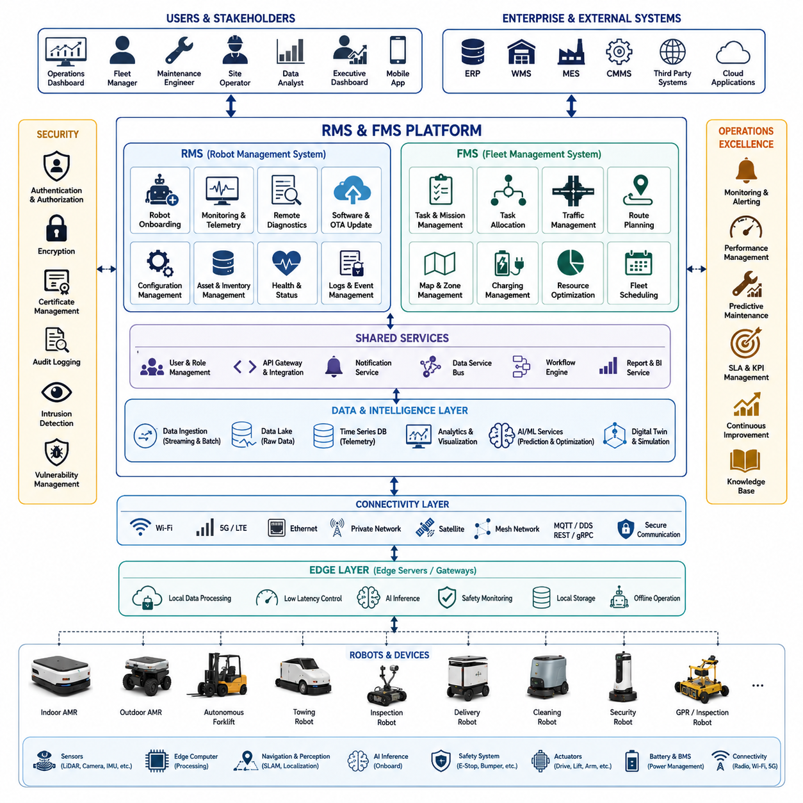
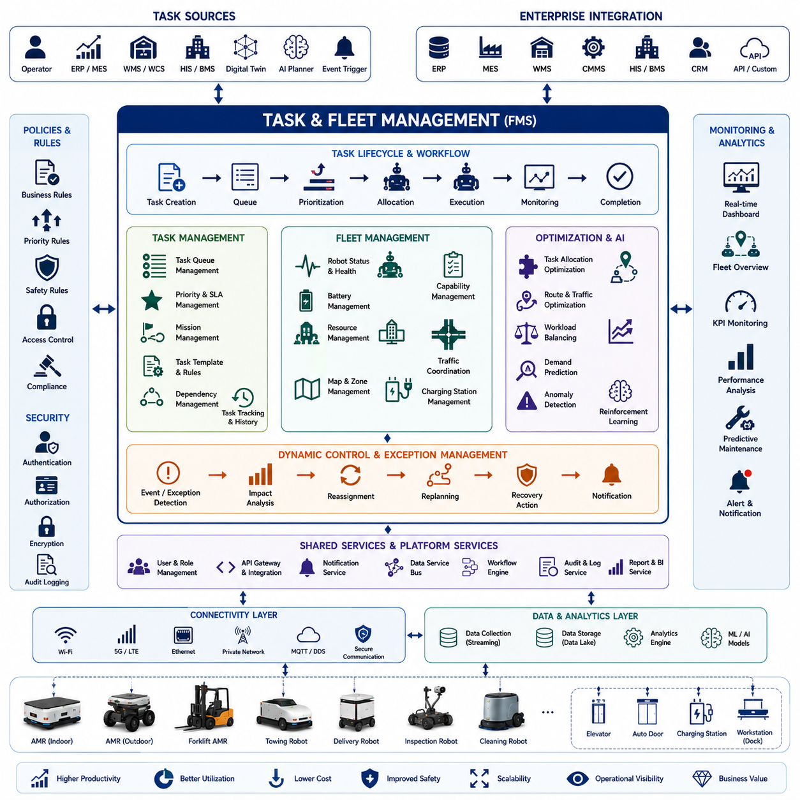
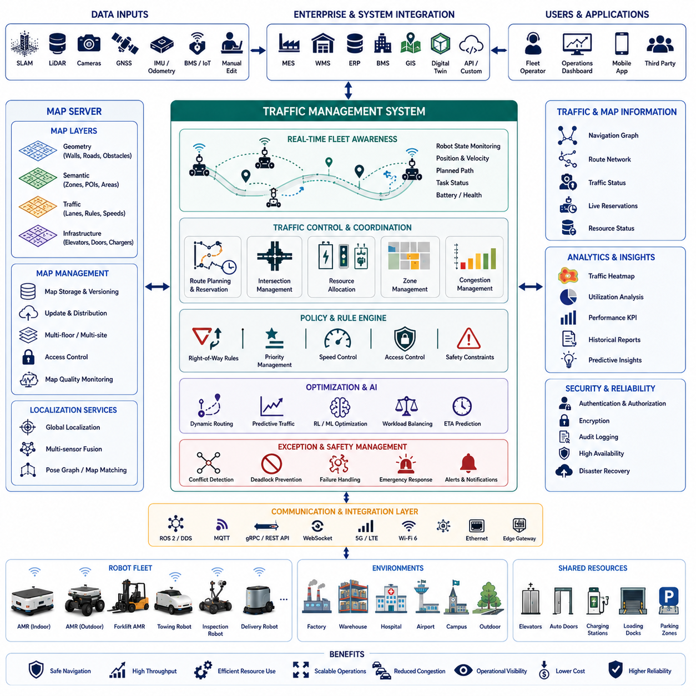
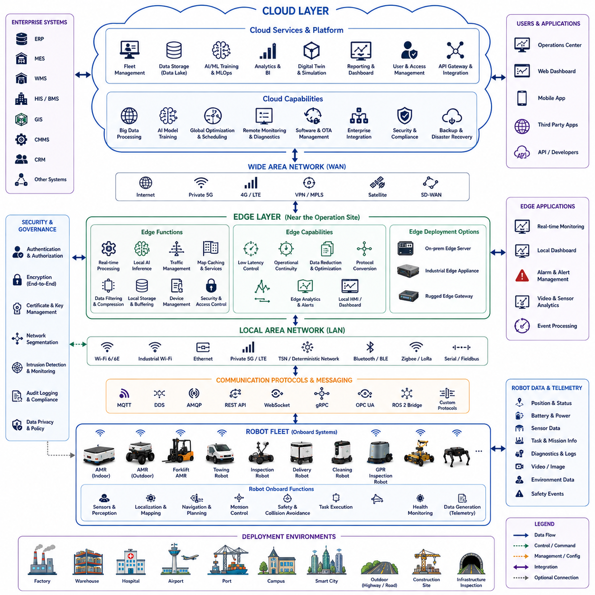
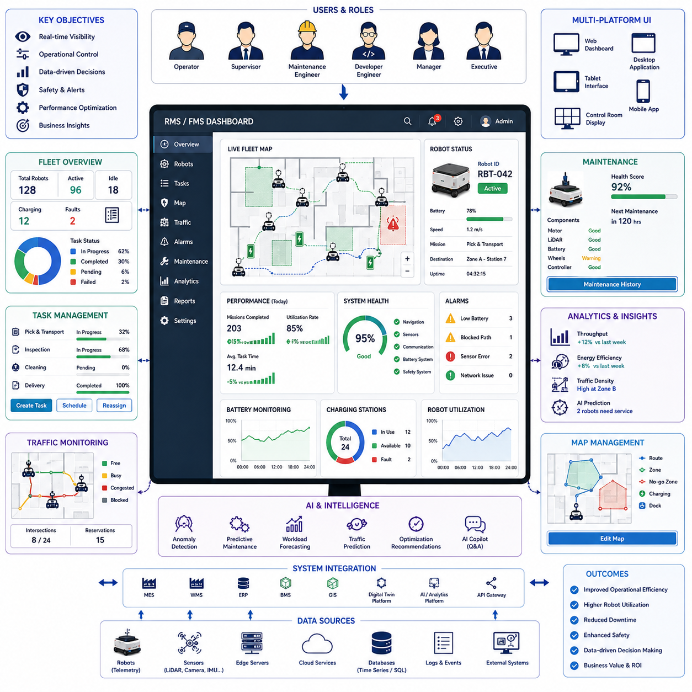
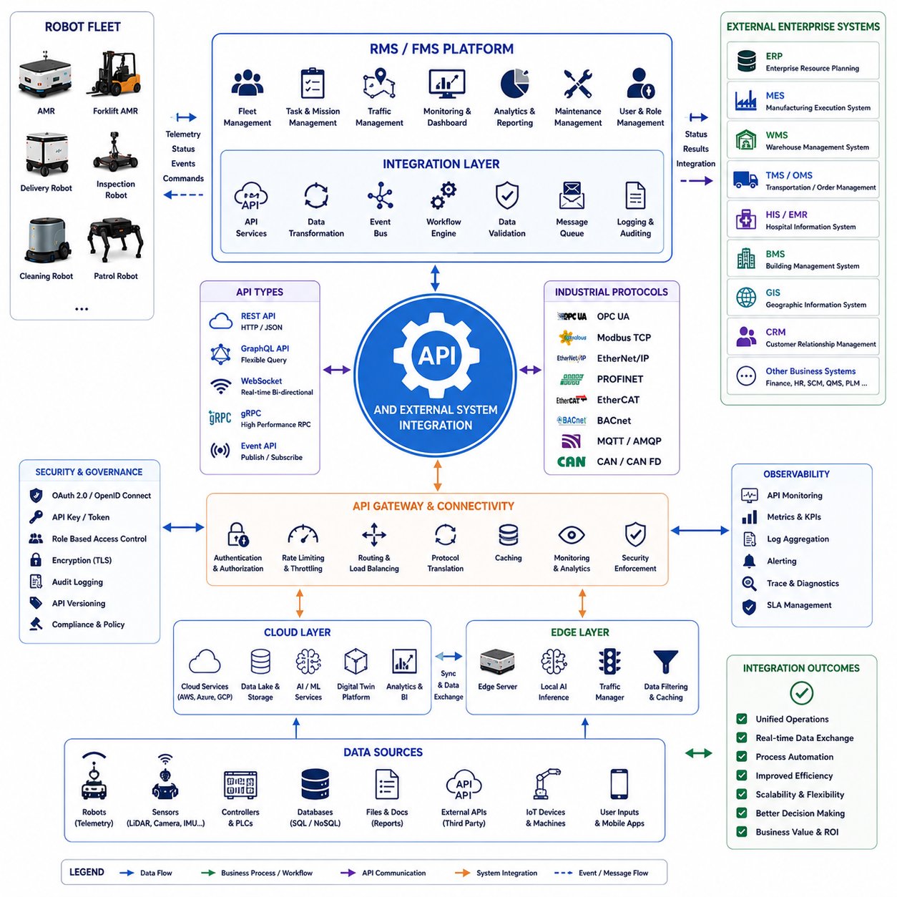
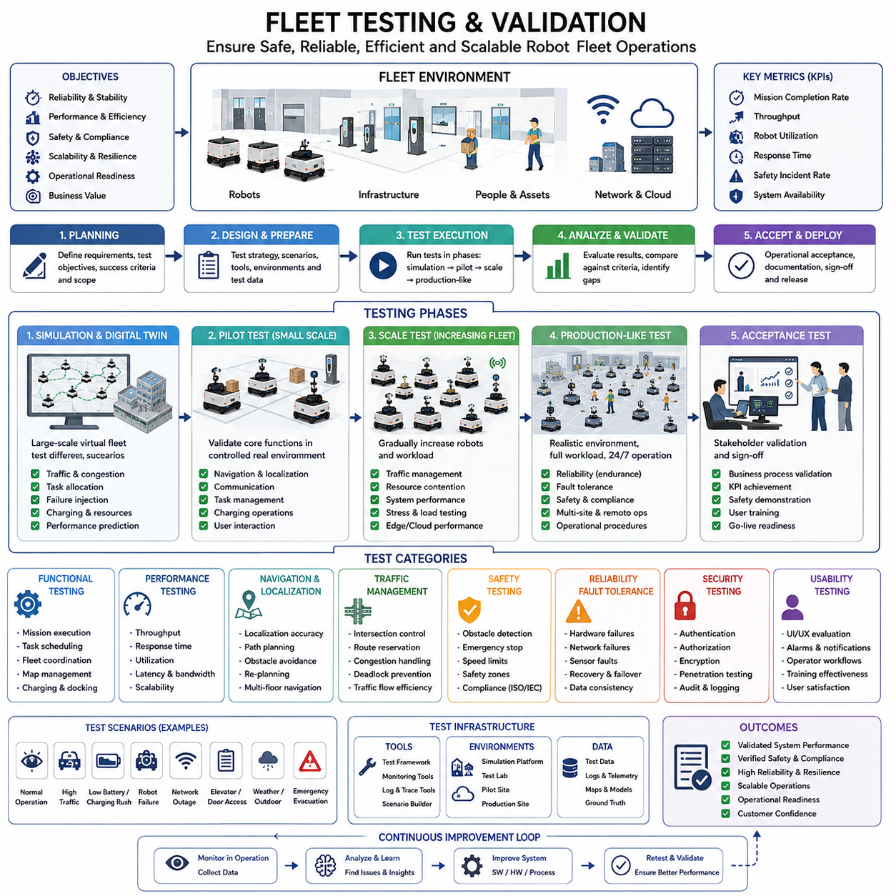
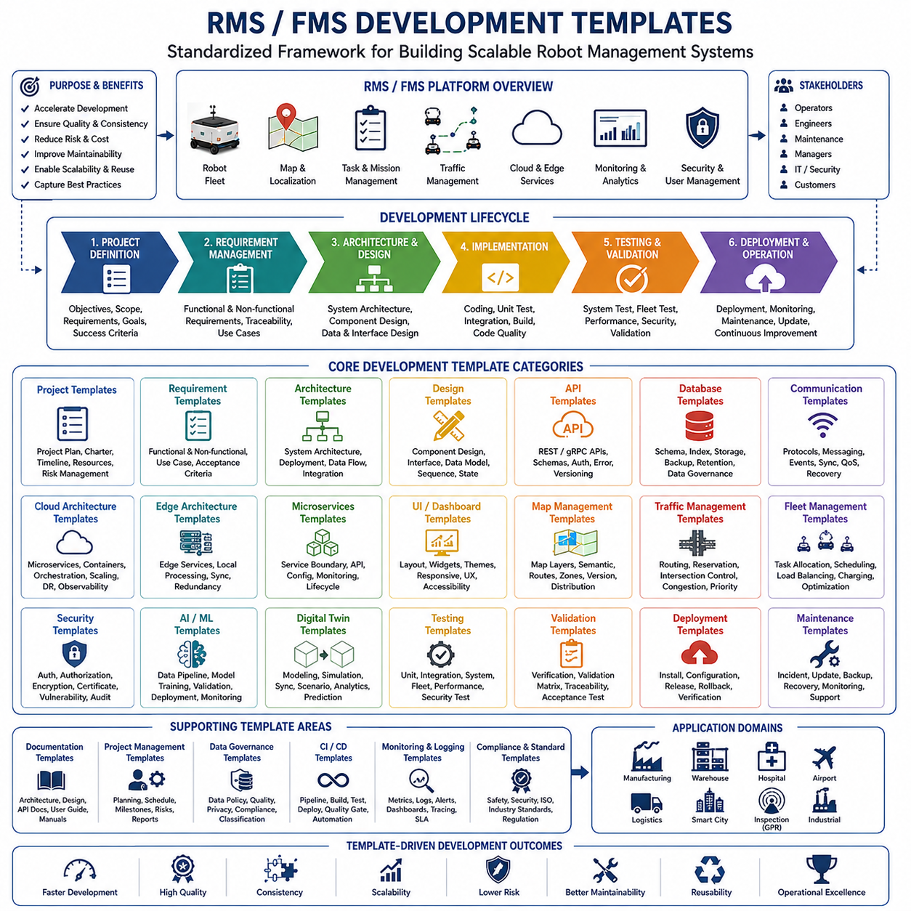

**Volume 10. AMR Engineering Process and Development Manual**


# Chapter 21. RMS and FMS Development

##  

## 21.01 RMS and FMS Architecture

{width="7.268055555555556in" height="7.268055555555556in"}

Robot Management Systems (RMS) and Fleet Management Systems (FMS) have become foundational technologies for modern Autonomous Mobile Robot (AMR) deployments. As organizations transition from operating a few standalone robots to managing hundreds or even thousands of autonomous systems across factories, warehouses, hospitals, logistics centers, airports, smart cities, and outdoor industrial environments, the need for a scalable and intelligent management platform becomes essential. RMS and FMS provide the digital infrastructure that connects robots, operators, enterprise systems, cloud services, and operational workflows into a unified ecosystem. They serve as the operational brain of large-scale robotic deployments and enable reliable, efficient, and safe autonomous operations. The RMS and FMS architecture is a critical component of modern AMR engineering and is considered a core subsystem within robot software and operational platforms.

At a high level, RMS focuses on robot-centric management while FMS focuses on fleet-centric orchestration. RMS is responsible for monitoring, configuring, updating, diagnosing, and maintaining individual robots. It provides visibility into robot health, hardware status, software versions, sensor conditions, battery status, fault conditions, and operational logs. FMS operates at a higher abstraction layer and manages the coordination of multiple robots working together toward organizational objectives. It handles task scheduling, traffic control, mission allocation, resource optimization, route coordination, and operational analytics. Although the two systems have distinct responsibilities, modern AMR platforms typically integrate RMS and FMS into a unified architecture that provides seamless visibility from individual hardware components to enterprise-wide robotic operations.

The architecture of RMS and FMS is commonly organized into multiple layers. At the lowest layer are the physical robots operating in the field. These robots may include indoor logistics AMRs, outdoor autonomous robots, autonomous forklifts, towing robots, inspection robots, delivery robots, hospital service robots, security robots, and specialized industrial platforms. Each robot contains embedded controllers, edge computers, perception systems, navigation modules, AI inference engines, safety systems, communication interfaces, and operational software stacks. The robots continuously generate operational data that must be collected, processed, analyzed, and acted upon by higher-level management systems.

Above the robot layer lies the edge communication layer. This layer establishes secure and reliable connectivity between robots and management platforms. Communication technologies may include Ethernet, Wi-Fi, private LTE, 5G, industrial wireless networks, satellite communication, mesh networking, and hybrid communication architectures. Communication protocols often include MQTT, DDS, WebSocket, REST APIs, gRPC, ROS2 communication bridges, OPC UA, AMQP, and custom industrial protocols. The communication layer must ensure low latency, high reliability, secure authentication, encryption, fault tolerance, and scalability. In large industrial deployments, network interruptions are inevitable, making offline operation and edge autonomy essential architectural requirements.

The next layer consists of robot service middleware. This middleware acts as the interface between robot software stacks and management systems. Middleware collects telemetry data, health metrics, sensor information, navigation status, mission progress, safety events, diagnostic logs, and operational statistics. It also provides command channels that allow RMS and FMS platforms to issue tasks, update configurations, deploy software, initiate diagnostics, and manage robot behavior. The middleware layer abstracts hardware differences and provides a unified interface for heterogeneous robot fleets.

A key architectural challenge in RMS and FMS environments is managing heterogeneous fleets. Modern enterprises rarely operate robots from a single vendor. A hospital may use delivery robots, disinfection robots, telepresence robots, and logistics robots from different manufacturers. A smart factory may operate forklifts, towing robots, pallet movers, and inspection robots from multiple suppliers. The RMS and FMS architecture therefore requires a vendor-neutral integration framework capable of managing robots with diverse hardware, operating systems, communication protocols, sensor configurations, and software architectures. Standardized APIs and middleware abstraction layers become critical enablers of interoperability.

The RMS core platform provides centralized robot management capabilities. It maintains a digital representation of every robot within the deployment. Each robot is associated with operational metadata including serial number, hardware configuration, software version, firmware version, deployment location, maintenance history, battery condition, performance statistics, operational status, and diagnostic records. The RMS continuously monitors these attributes and provides real-time visibility into fleet conditions. Operators can identify failures, predict maintenance requirements, analyze performance trends, and remotely manage robotic assets from centralized dashboards.

Remote monitoring is one of the most important RMS functions. Operators require immediate visibility into robot status across multiple locations. The monitoring system collects telemetry streams from robots and presents operational information through graphical dashboards. Information typically includes robot location, mission progress, battery state, charging status, CPU utilization, GPU utilization, memory consumption, network quality, sensor health, fault conditions, safety events, environmental conditions, and operational performance indicators. Historical trends are stored within data warehouses to support long-term analysis and continuous improvement initiatives.

Another critical component of RMS architecture is remote diagnostics. Traditional maintenance models require technicians to physically inspect robots when problems occur. Modern RMS platforms dramatically reduce maintenance costs by enabling remote diagnostics. Engineers can access logs, replay sensor recordings, inspect system states, analyze navigation failures, review AI inference outputs, and identify root causes without visiting deployment sites. Remote diagnostics improve operational availability and reduce downtime across large fleets.

Software lifecycle management is another essential RMS capability. AMRs continuously evolve throughout their operational lifetime. Navigation algorithms improve, AI models are retrained, safety features are enhanced, and cybersecurity vulnerabilities are patched. RMS platforms therefore incorporate software deployment frameworks that support firmware updates, software package distribution, AI model deployment, configuration management, rollback mechanisms, and version control. Over-the-air update systems allow thousands of robots to receive updates in a controlled and traceable manner.

The FMS architecture focuses on operational coordination of multiple robots. When a fleet receives incoming work requests, the FMS determines which robots should perform specific tasks. Task allocation algorithms evaluate robot location, battery status, workload, availability, capability, priority levels, traffic conditions, operational constraints, and business objectives. The goal is to maximize throughput, minimize travel distance, reduce waiting times, optimize resource utilization, and maintain operational efficiency.

Mission planning is a fundamental responsibility of FMS. A mission may involve transporting materials, delivering supplies, inspecting infrastructure, towing equipment, performing security patrols, or conducting autonomous surveys. Missions are decomposed into executable tasks that can be assigned to robots. The FMS manages mission lifecycle states including creation, scheduling, dispatch, execution, monitoring, completion, cancellation, recovery, and reporting.

Traffic management represents one of the most complex aspects of FMS architecture. As fleet sizes increase, robots begin competing for shared resources such as corridors, intersections, elevators, charging stations, loading docks, doorways, and narrow passages. Without coordination, congestion, deadlocks, inefficiencies, and safety hazards can occur. Traffic management systems continuously monitor robot positions and dynamically coordinate movement throughout operational environments.

Modern FMS platforms often incorporate centralized traffic control engines. These systems maintain global awareness of all fleet activities and predict future robot movements. Traffic controllers reserve pathways, manage right-of-way priorities, coordinate intersection crossings, allocate shared resources, and prevent route conflicts. Advanced traffic systems may incorporate predictive simulation, AI-based optimization, and digital twin environments to improve decision making.

Map management is another core architectural component. FMS platforms maintain facility maps that represent navigable environments. Maps may include buildings, warehouses, hospitals, campuses, factories, outdoor facilities, road networks, and infrastructure assets. The map server provides centralized map distribution, version control, localization references, semantic annotations, operational zones, restricted areas, safety boundaries, and route planning information. Robots access these maps during localization and navigation processes.

Charging management becomes increasingly important as fleet sizes grow. FMS platforms monitor battery conditions and coordinate charging schedules across multiple robots. Charging optimization algorithms balance operational demands with energy availability. Robots are dispatched to charging stations based on mission priorities, battery forecasts, queue conditions, and operational requirements. Intelligent charging management prevents resource bottlenecks and maximizes fleet availability.

Cloud integration is a defining characteristic of modern RMS and FMS architectures. Cloud platforms provide scalable computing resources for analytics, data storage, machine learning, simulation, digital twins, reporting, and operational monitoring. Cloud services enable centralized management across geographically distributed deployments. Organizations operating fleets across multiple cities, factories, hospitals, or countries can manage all robotic assets through a unified cloud-based platform.

Edge computing remains equally important. Many robotic operations require low-latency decision making that cannot depend entirely on cloud connectivity. Edge nodes provide local processing capabilities for mission execution, traffic management, AI inference, safety monitoring, and operational continuity. Hybrid cloud-edge architectures combine centralized intelligence with decentralized autonomy, ensuring resilient operations under varying network conditions.

Data management forms the backbone of RMS and FMS platforms. Every robot continuously generates large volumes of telemetry, sensor recordings, mission logs, AI outputs, maintenance records, safety events, and operational metrics. Data pipelines ingest, process, store, and analyze this information. Data lakes and time-series databases support historical analysis, predictive maintenance, operational optimization, and machine learning workflows.

Digital twin integration is becoming a major architectural trend. A digital twin represents a virtual model of robots, facilities, fleets, operational environments, and business processes. RMS and FMS platforms synchronize real-world data with digital representations, enabling simulation, forecasting, performance analysis, scenario testing, and operational planning. Digital twins allow organizations to evaluate deployment changes before implementing them in physical environments.

Cybersecurity must be integrated throughout the RMS and FMS architecture. Robots, communication networks, cloud services, edge systems, databases, APIs, and operator interfaces all represent potential attack surfaces. Security mechanisms include authentication, authorization, encryption, certificate management, secure communication protocols, intrusion detection, audit logging, vulnerability management, and security monitoring. As robotic fleets become mission-critical infrastructure, cybersecurity becomes a primary architectural requirement rather than an optional feature.

High availability and fault tolerance are essential design goals. Fleet operations often support critical industrial and healthcare processes where downtime can have significant consequences. RMS and FMS architectures therefore incorporate redundancy, failover mechanisms, distributed databases, backup communication paths, disaster recovery procedures, and resilient infrastructure designs. These mechanisms ensure continuity of operations even during hardware failures, network disruptions, software defects, or infrastructure outages.

Analytics and business intelligence capabilities provide operational visibility beyond day-to-day fleet management. RMS and FMS platforms collect key performance indicators including mission completion rates, robot utilization, fleet efficiency, travel distance, charging efficiency, maintenance costs, operational availability, incident frequency, safety events, and productivity metrics. Advanced analytics support continuous improvement initiatives and strategic decision making.

Artificial intelligence increasingly enhances RMS and FMS functionality. AI models predict maintenance requirements, optimize task allocation, forecast battery usage, identify anomalies, improve traffic management, detect operational inefficiencies, and recommend corrective actions. Future systems are expected to incorporate autonomous fleet optimization engines capable of continuously adapting operational strategies based on real-world performance.

For large-scale outdoor autonomous robot deployments such as inspection robots, patrol robots, infrastructure monitoring systems, and GPR-based underground inspection platforms, RMS and FMS architectures become even more critical. These deployments often span extensive geographical regions, operate under varying environmental conditions, and generate massive volumes of sensor data. Centralized fleet coordination, edge-cloud integration, predictive maintenance, mission orchestration, and AI-assisted operational management become indispensable capabilities.

The future RMS and FMS architecture will evolve toward fully autonomous operational ecosystems. Human operators will increasingly transition from direct control roles to supervisory roles focused on strategic objectives and exception management. Intelligent management platforms will dynamically coordinate fleets, optimize missions, predict failures, allocate resources, update software, retrain AI models, and adapt to changing operational conditions with minimal human intervention. RMS and FMS will ultimately serve as the central nervous system of next-generation robotic enterprises, enabling scalable, intelligent, resilient, and highly autonomous fleet operations across virtually every industry.

로봇 관리 시스템(RMS, Robot Management System)과 플릿 관리 시스템(FMS, Fleet Management System)은 현대 자율이동로봇(AMR) 운영의 핵심 기반 기술이다. 기업이 몇 대의 독립적인 로봇을 운영하는 수준을 넘어 수백 대, 수천 대의 자율 로봇을 공장, 물류센터, 병원, 공항, 스마트시티, 산업 현장에 배치하기 시작하면서 이를 통합적으로 관리할 수 있는 플랫폼의 필요성이 급격히 증가하고 있다. RMS와 FMS는 로봇, 운영자, 기업 시스템, 클라우드 서비스, 현장 운영 프로세스를 하나의 통합 생태계로 연결하는 디지털 인프라 역할을 수행한다. 이들은 대규모 로봇 운영의 두뇌 역할을 하며 안전하고 효율적인 자율운영을 가능하게 한다. RMS와 FMS는 현대 AMR 소프트웨어 플랫폼과 운영 시스템의 핵심 구성 요소로 간주된다.

RMS는 개별 로봇 중심의 관리를 담당하고, FMS는 다수의 로봇으로 구성된 플릿 전체의 운영을 담당한다. RMS는 개별 로봇의 상태 감시, 설정 관리, 소프트웨어 업데이트, 원격 진단, 유지보수 등을 수행한다. 반면 FMS는 여러 대의 로봇이 협력하여 작업을 수행하도록 임무 할당, 교통 제어, 경로 조정, 자원 최적화, 작업 스케줄링 등을 담당한다. 실제 산업 환경에서는 두 시스템이 통합된 플랫폼 형태로 제공되는 경우가 많으며, 이를 통해 하드웨어 수준부터 기업 운영 수준까지 전체 가시성을 확보할 수 있다.

RMS 및 FMS 아키텍처는 일반적으로 다계층 구조로 구성된다. 가장 하위 계층에는 실제 현장에서 운용되는 로봇이 존재한다. 여기에는 물류 AMR, 병원 서비스 로봇, 자율 지게차, 견인 로봇, 순찰 로봇, 배송 로봇, GPR 기반 지하 인프라 점검 로봇, 실외 자율주행 로봇 등이 포함된다. 각 로봇은 임베디드 제어기, 엣지 컴퓨터, 인지 시스템, 자율주행 소프트웨어, 안전 시스템, 통신 모듈, AI 추론 엔진 등을 내장하고 있으며 지속적으로 운영 데이터를 생성한다.

그 위에는 통신 계층이 존재한다. 이 계층은 로봇과 중앙 관리 플랫폼 간의 안정적이고 안전한 연결을 제공한다. Ethernet, Wi-Fi, Private LTE, 5G, 산업용 무선망, 위성통신, 메쉬 네트워크 등이 활용될 수 있으며 MQTT, DDS, WebSocket, REST API, gRPC, ROS2 Bridge, OPC UA 등의 프로토콜이 사용된다. 통신 계층은 낮은 지연시간과 높은 신뢰성, 보안성, 확장성을 동시에 제공해야 한다. 특히 대규모 산업 환경에서는 네트워크 장애가 빈번하게 발생할 수 있기 때문에 로컬 자율성 확보와 오프라인 운영 능력이 필수적이다.

중간 계층에는 로봇 서비스 미들웨어가 위치한다. 미들웨어는 로봇 내부 소프트웨어와 RMS/FMS를 연결하는 인터페이스 역할을 수행한다. 로봇 상태, 센서 정보, 임무 진행 상황, 안전 이벤트, 진단 로그, 위치 정보 등을 수집하여 상위 시스템으로 전달하며, 반대로 중앙 시스템으로부터 명령을 받아 로봇에 전달한다. 이러한 미들웨어는 다양한 제조사의 로봇을 동일한 방식으로 관리할 수 있도록 표준화된 인터페이스를 제공한다.

현대 산업 환경에서는 단일 제조사의 로봇만 사용하는 경우가 드물다. 병원에서는 배송 로봇, 소독 로봇, 안내 로봇이 함께 사용될 수 있고, 스마트팩토리에서는 지게차, 견인 로봇, 자재 운반 로봇, 검사 로봇이 동시에 운영될 수 있다. 따라서 RMS와 FMS는 이기종 로봇 플릿(Heterogeneous Fleet)을 관리할 수 있는 구조를 가져야 한다. 이를 위해 표준 API와 통합 미들웨어 계층이 중요한 역할을 수행한다.

RMS의 핵심 기능은 로봇 자산 관리이다. 시스템은 각 로봇의 시리얼 번호, 하드웨어 구성, 소프트웨어 버전, 펌웨어 버전, 배터리 상태, 유지보수 이력, 설치 위치, 성능 지표 등을 관리한다. 이를 통해 운영자는 개별 로봇의 현재 상태와 과거 이력을 실시간으로 확인할 수 있다.

원격 모니터링은 RMS의 가장 중요한 기능 중 하나이다. 운영자는 중앙 대시보드에서 로봇의 위치, 임무 상태, 배터리 상태, 충전 상태, CPU 및 GPU 사용률, 네트워크 상태, 센서 상태, 안전 이벤트 등을 실시간으로 확인할 수 있다. 또한 장기간 축적된 데이터를 기반으로 성능 추세 분석과 운영 최적화가 가능하다.

원격 진단 기능 역시 매우 중요하다. 과거에는 현장 기술자가 직접 방문하여 문제를 조사해야 했지만, 현대 RMS는 로그 분석, 센서 데이터 재생, 상태 점검, 오류 분석 등을 원격으로 수행할 수 있도록 지원한다. 이를 통해 유지보수 비용을 절감하고 로봇 가동률을 향상시킬 수 있다.

소프트웨어 수명주기 관리 또한 RMS의 핵심 기능이다. 로봇은 운영 기간 동안 지속적으로 진화한다. 새로운 자율주행 알고리즘이 적용되고, AI 모델이 업데이트되며, 보안 패치가 배포된다. RMS는 OTA(Over-The-Air) 업데이트 시스템을 통해 수백 대, 수천 대의 로봇에 소프트웨어, 펌웨어, AI 모델, 설정 파일 등을 안전하게 배포할 수 있도록 지원한다.

FMS는 다수 로봇의 협업 운영을 담당한다. 작업 요청이 발생하면 FMS는 각 로봇의 위치, 배터리 상태, 현재 작업량, 장비 능력, 우선순위 등을 고려하여 가장 적합한 로봇에 작업을 할당한다. 목표는 이동 거리 최소화, 처리량 최대화, 대기 시간 감소, 자원 활용도 향상이다.

임무 관리(Mission Management)는 FMS의 핵심 기능이다. 자재 운반, 배송, 순찰, 검사, 견인, 시설 점검 등의 업무는 여러 개의 세부 작업으로 분해되며, FMS는 이를 생성하고 스케줄링하며 실행 상태를 추적한다. 임무 생성부터 완료까지의 전체 수명주기를 관리하는 것이 FMS의 역할이다.

교통 관리(Traffic Management)는 대규모 플릿 운영에서 가장 복잡한 기능 중 하나이다. 수십 대에서 수백 대의 로봇이 동시에 이동하면 교차로, 통로, 엘리베이터, 자동문, 충전 스테이션 등의 공유 자원을 놓고 경쟁하게 된다. 이를 적절히 제어하지 않으면 병목 현상, 교착 상태, 충돌 위험이 발생할 수 있다.

현대 FMS는 중앙 집중형 교통 제어 엔진을 통해 전체 로봇의 위치를 실시간으로 파악하고 미래 이동 경로를 예측한다. 이를 기반으로 경로 예약, 우선순위 제어, 교차로 통과 관리, 공유 자원 할당 등을 수행하여 효율적인 운영을 보장한다. 최근에는 AI 기반 최적화와 디지털 트윈 시뮬레이션 기술도 활용되고 있다.

지도 관리(Map Management) 역시 중요한 구성 요소이다. FMS는 건물, 공장, 병원, 물류센터, 캠퍼스, 스마트시티 등의 운영 환경을 디지털 지도로 관리한다. 지도 서버는 지도 버전 관리, 위치 참조 정보, 운영 구역, 제한 구역, 안전 구역 등의 정보를 제공하며 로봇의 자율주행을 지원한다.

충전 관리(Charging Management)는 플릿 규모가 커질수록 중요성이 증가한다. FMS는 배터리 상태를 지속적으로 감시하고 충전 스케줄을 최적화한다. 로봇의 작업 우선순위와 충전소 사용 현황을 고려하여 적절한 시점에 충전을 수행하도록 제어함으로써 전체 플릿의 가용성을 극대화한다.

클라우드 통합은 현대 RMS 및 FMS의 핵심 특징이다. 클라우드는 대규모 데이터 저장, 분석, 머신러닝, 디지털 트윈, 시뮬레이션, 보고서 생성 등의 기능을 제공한다. 여러 도시와 국가에 분산된 로봇을 하나의 플랫폼에서 통합 관리할 수 있도록 지원한다.

그러나 로봇 운영은 항상 낮은 지연시간을 요구하므로 엣지 컴퓨팅 역시 필수적이다. 엣지 서버는 로컬 환경에서 임무 수행, 교통 제어, AI 추론, 안전 제어 등을 수행한다. 따라서 현대 RMS/FMS는 클라우드와 엣지를 결합한 하이브리드 아키텍처를 채택하는 경우가 많다.

데이터 관리는 전체 시스템의 기반이 된다. 로봇은 지속적으로 텔레메트리 데이터, 센서 데이터, 임무 로그, AI 결과, 유지보수 기록 등을 생성한다. RMS와 FMS는 이를 수집하여 데이터 레이크와 시계열 데이터베이스에 저장하고 운영 분석, 예지정비, AI 학습 등에 활용한다.

디지털 트윈은 차세대 RMS/FMS의 중요한 기술이다. 디지털 트윈은 로봇, 시설, 플릿, 운영 환경을 가상 공간에 동일하게 재현한다. 실시간 데이터를 기반으로 물리 시스템과 동기화되며 시뮬레이션, 예측 분석, 성능 검증, 운영 최적화를 가능하게 한다.

사이버보안은 전체 아키텍처에 내재되어야 한다. 로봇, 통신망, 클라우드 서버, API, 데이터베이스, 운영자 인터페이스는 모두 잠재적인 공격 대상이 될 수 있다. 따라서 인증, 권한 관리, 암호화, 인증서 관리, 침입 탐지, 보안 모니터링, 취약점 관리 등이 필수적으로 구현되어야 한다.

고가용성(High Availability)과 장애 복구(Fault Tolerance) 또한 매우 중요하다. 특히 병원, 공장, 물류센터와 같은 미션 크리티컬 환경에서는 시스템 중단이 큰 손실을 초래할 수 있다. 따라서 RMS와 FMS는 이중화 서버, 분산 데이터베이스, 백업 네트워크, 재해 복구 체계를 포함하는 안정적인 구조를 갖추어야 한다.

분석 및 비즈니스 인텔리전스 기능은 운영 성과를 정량적으로 평가할 수 있도록 지원한다. 임무 완료율, 로봇 가동률, 이동 거리, 충전 효율, 유지보수 비용, 장애 발생률, 안전 이벤트 수 등의 KPI를 지속적으로 분석함으로써 운영 최적화를 달성할 수 있다.

최근에는 인공지능이 RMS 및 FMS 기능을 더욱 고도화하고 있다. AI는 예지정비, 작업 최적화, 배터리 수명 예측, 이상 탐지, 교통 최적화, 운영 효율 개선 등에 활용되고 있다. 향후에는 AI가 전체 플릿 운영을 자율적으로 최적화하는 수준까지 발전할 것으로 예상된다.

특히 지하 인프라 점검용 GPR 로봇, 순찰 로봇, 실외 자율주행 로봇과 같은 대규모 야외 로봇 시스템에서는 RMS와 FMS의 중요성이 더욱 커진다. 넓은 지역에서 운영되고 다양한 환경 조건에 노출되며 대용량 센서 데이터를 생성하기 때문에 중앙 집중형 플릿 관리와 클라우드-엣지 통합 구조가 필수적이다.

미래의 RMS와 FMS는 완전 자율 운영 플랫폼으로 발전할 것이다. 인간 운영자는 직접 제어자가 아니라 감독자 역할을 수행하게 되며, 시스템은 스스로 임무를 계획하고, 자원을 배분하고, 장애를 예측하고, 소프트웨어를 업데이트하며, 운영 전략을 최적화하게 될 것이다. 결국 RMS와 FMS는 차세대 로봇 기업과 스마트 인프라의 중앙 신경계 역할을 수행하며 대규모 자율 로봇 생태계를 운영하는 핵심 플랫폼으로 자리잡게 될 것이다.

##  

## 21.02 Task and Fleet Management

{width="7.268055555555556in" height="7.268055555555556in"}

Task and Fleet Management is one of the most critical functional domains within a Robot Management System (RMS) and Fleet Management System (FMS). As Autonomous Mobile Robot (AMR) deployments scale from a handful of robots to hundreds or even thousands operating simultaneously across factories, warehouses, hospitals, logistics hubs, airports, campuses, and outdoor industrial environments, the complexity of coordinating robotic operations increases exponentially. Task and Fleet Management provides the intelligence, orchestration, optimization, and operational control necessary to transform individual autonomous robots into a coordinated and efficient robotic workforce. Within modern robotic ecosystems, Task and Fleet Management acts as the operational brain responsible for ensuring that the right robot performs the right task at the right time while maximizing efficiency, safety, resource utilization, and business value.

At the most fundamental level, a task represents a unit of work that must be performed by a robot. Tasks may include transporting materials between production stations, delivering medical supplies within hospitals, moving pallets in warehouses, towing carts in manufacturing facilities, conducting infrastructure inspections, performing security patrols, collecting environmental data, executing cleaning operations, or carrying out autonomous field surveys. While individual tasks may appear simple, large-scale robotic environments often involve thousands of concurrent tasks, dynamic priorities, changing operational conditions, and complex dependencies. Effective task management ensures that these activities are executed in an organized and optimized manner.

Task management begins with task generation. Tasks may originate from multiple sources, including human operators, enterprise software systems, production planning systems, warehouse management systems, manufacturing execution systems, hospital information systems, building management systems, digital twins, AI planning engines, or automated event triggers. In modern industrial environments, many tasks are generated automatically based on business workflows. For example, when a production machine completes a manufacturing batch, an automated request may trigger an AMR to transport finished products to a storage area. Similarly, when a hospital inventory system detects low stock levels in a nursing station, an autonomous delivery task may be generated automatically.

Once tasks are generated, they enter a task queue managed by the Fleet Management System. The task queue acts as a centralized repository where pending, active, completed, canceled, failed, and scheduled tasks are maintained. The queue management system continuously evaluates operational conditions and determines how tasks should be assigned across available robotic resources. The complexity of this process grows rapidly as fleet sizes increase because multiple tasks may compete for the same robots while multiple robots may be capable of executing the same task.

Task prioritization is a key component of fleet management. Not all tasks have equal importance. In a hospital environment, emergency medication delivery may take precedence over routine linen transport. In a manufacturing facility, production-critical material transport may be prioritized over scheduled inventory movement. Task prioritization mechanisms allow the FMS to dynamically reorder workloads based on business objectives, operational urgency, safety requirements, service-level agreements, and customer expectations. Prioritization engines often support multiple priority levels, escalation rules, and dynamic re-prioritization based on real-time events.

Task allocation represents one of the most important decision-making functions within a fleet management architecture. The goal of task allocation is to determine which robot should execute a particular task. Although this appears straightforward, optimal task allocation requires evaluating numerous factors simultaneously. Robot location, battery status, operational health, payload capacity, navigation capability, current workload, estimated travel time, mission priority, environmental constraints, and resource availability all influence assignment decisions. Effective task allocation algorithms significantly improve fleet efficiency while reducing operational costs.

Several allocation strategies are commonly used in robotic fleet management systems. The simplest approach assigns tasks to the nearest available robot. While computationally efficient, this method often fails to optimize long-term fleet performance. More advanced systems use cost-based optimization models that evaluate multiple operational parameters before assigning tasks. AI-driven allocation systems may employ machine learning algorithms, reinforcement learning models, or predictive optimization techniques to continuously improve assignment decisions based on historical performance and real-time operational conditions.

Mission management extends beyond individual task assignment. A mission may consist of multiple tasks executed sequentially or in parallel. For example, a warehouse replenishment mission may involve traveling to a storage location, loading inventory, transporting products to a destination, unloading materials, verifying delivery completion, and returning to a standby area. Mission orchestration systems coordinate these complex workflows while ensuring proper execution sequencing and exception handling. Mission management provides higher-level operational control than individual task scheduling and enables robots to participate in sophisticated business processes.

Fleet management requires continuous awareness of robot status. Every robot within the fleet maintains operational states that describe its current condition. Common states include idle, available, executing task, charging, paused, maintenance mode, offline, faulted, emergency stop, and reserved. The Fleet Management System continuously monitors these states and uses them when making allocation and scheduling decisions. Accurate state management is essential because assigning tasks to unavailable or impaired robots can disrupt operational workflows.

Battery management plays a major role in fleet operations. Mobile robots depend on finite energy resources and must balance productive work with charging requirements. Fleet management systems continuously monitor battery health, charge levels, energy consumption rates, charging station availability, and projected mission requirements. Intelligent charging strategies ensure that robots remain available for critical operations while avoiding unnecessary charging delays. Advanced systems may predict future workload demand and proactively schedule charging activities to maximize fleet productivity.

Resource management extends beyond robots themselves. Many robotic environments contain shared resources that must be coordinated carefully. Elevators, automatic doors, charging stations, loading docks, workstations, pallet locations, inspection points, parking areas, and traffic intersections represent resources that multiple robots may require simultaneously. Resource management systems allocate access rights, reserve resources, enforce scheduling constraints, and prevent conflicts. Without proper resource coordination, operational bottlenecks can significantly reduce fleet efficiency.

Traffic coordination is closely integrated with task and fleet management. As fleet sizes increase, robots frequently encounter situations where movement paths intersect or shared spaces become congested. Fleet management systems continuously monitor robot positions, predicted trajectories, and environmental conditions. Traffic coordination engines dynamically adjust robot routes, assign priorities, reserve pathways, and manage intersection behavior to prevent collisions and deadlocks. Effective traffic management is particularly important in high-density deployments where dozens or hundreds of robots operate within confined environments.

Map-aware fleet management improves operational efficiency by incorporating environmental knowledge into scheduling and routing decisions. The FMS maintains detailed maps containing navigation routes, operational zones, safety boundaries, restricted areas, charging locations, pickup points, delivery destinations, and infrastructure assets. Task allocation decisions can incorporate travel distance, route complexity, expected congestion, and environmental constraints. By leveraging map intelligence, fleet management systems optimize robot utilization and reduce unnecessary movement.

Dynamic task reassignment is another essential capability. Operational environments are inherently unpredictable. Robots may experience failures, batteries may deplete unexpectedly, traffic conditions may change, urgent tasks may emerge, or environmental obstacles may disrupt planned operations. Fleet management systems must continuously evaluate changing conditions and adapt task assignments accordingly. Dynamic reassignment allows missions to continue despite unexpected disruptions and improves overall system resilience.

Exception management is critical for maintaining operational continuity. Even highly autonomous robots occasionally encounter situations requiring intervention. Navigation failures, blocked pathways, hardware faults, communication disruptions, sensor anomalies, payload issues, and environmental hazards can prevent normal mission completion. Fleet management systems detect these conditions, classify incidents, initiate recovery procedures, and notify operators when human intervention becomes necessary. Effective exception management minimizes downtime and ensures reliable operations.

Scalability is a fundamental architectural requirement for fleet management platforms. Early deployments may involve only a few robots, but successful robotic programs often expand significantly over time. Fleet management systems must support growth from small pilot projects to enterprise-scale deployments involving thousands of robots across multiple locations. Scalable architectures typically utilize distributed microservices, cloud-native platforms, elastic computing resources, container orchestration systems, and high-performance databases to accommodate increasing operational demands.

Multi-site fleet management introduces additional complexity. Large organizations frequently operate robots across multiple facilities, cities, regions, or countries. Centralized fleet management platforms provide unified visibility across geographically distributed deployments while allowing local operational autonomy. Multi-site architectures support centralized monitoring, global reporting, software deployment, policy enforcement, and performance benchmarking while accommodating site-specific operational requirements.

Enterprise integration significantly enhances the value of fleet management systems. Modern FMS platforms integrate with Enterprise Resource Planning systems, Warehouse Management Systems, Manufacturing Execution Systems, Computerized Maintenance Management Systems, Hospital Information Systems, Customer Relationship Management platforms, and Building Management Systems. These integrations allow robotic operations to become fully embedded within broader business workflows. Rather than functioning as isolated automation systems, robots become active participants in enterprise operations.

Data-driven fleet optimization is becoming increasingly important. Fleet management platforms collect enormous volumes of operational data including task execution times, travel distances, battery consumption, utilization rates, fault frequencies, traffic patterns, mission outcomes, and resource usage statistics. Advanced analytics platforms process this information to identify inefficiencies, predict operational bottlenecks, optimize workflows, and improve overall fleet performance. Data-driven decision making enables continuous improvement across robotic operations.

Artificial intelligence is transforming task and fleet management capabilities. AI algorithms can forecast workload demand, predict equipment failures, optimize task assignments, estimate mission completion times, identify traffic bottlenecks, and recommend operational improvements. Machine learning models continuously learn from historical operational data and improve scheduling accuracy over time. Future fleet management systems will increasingly rely on autonomous optimization engines capable of managing large robotic fleets with minimal human supervision.

Digital twin integration further enhances fleet management capabilities. Digital twins provide virtual representations of robots, facilities, operational workflows, and environmental conditions. Fleet managers can simulate operational changes, evaluate deployment strategies, test scheduling algorithms, analyze congestion scenarios, and validate optimization strategies before implementing them in physical environments. This capability reduces operational risk while accelerating continuous improvement initiatives.

Operational visibility remains one of the primary objectives of task and fleet management systems. Modern dashboards provide real-time visualization of robot locations, mission status, traffic conditions, resource utilization, battery conditions, maintenance alerts, operational performance indicators, and business metrics. Decision makers gain comprehensive visibility into robotic operations and can make informed management decisions based on real-time data.

Cybersecurity is an essential consideration within task and fleet management architectures. Because fleet management systems directly control operational robots, security breaches can have significant operational and safety consequences. Authentication, authorization, encryption, secure communication protocols, audit logging, access control policies, and security monitoring mechanisms must be integrated throughout the platform. As robotic fleets become increasingly connected and autonomous, cybersecurity becomes a core operational requirement.

The future of task and fleet management will move toward fully autonomous orchestration. Intelligent fleet management platforms will continuously monitor operational objectives, predict future demand, allocate resources dynamically, coordinate traffic, manage energy consumption, optimize maintenance schedules, and adapt operational strategies in real time. Human operators will increasingly focus on strategic supervision while autonomous software systems handle day-to-day operational decision making.

For advanced outdoor autonomous robot deployments, including infrastructure inspection robots, patrol robots, logistics platforms, and GPR-based underground inspection systems, task and fleet management becomes even more important. These systems operate across large geographic regions, encounter dynamic environmental conditions, and generate complex operational requirements. Advanced fleet management architectures enable coordinated mission execution, efficient resource utilization, predictive maintenance, and large-scale operational scalability.

Ultimately, Task and Fleet Management serves as the operational intelligence layer that transforms individual autonomous robots into a coordinated robotic workforce. By integrating task scheduling, mission orchestration, traffic coordination, resource management, analytics, AI optimization, enterprise integration, and operational monitoring, modern fleet management platforms enable organizations to achieve safe, scalable, efficient, and highly autonomous robotic operations across virtually every industry sector.

작업 및 플릿 관리는 로봇 관리 시스템(RMS)과 플릿 관리 시스템(FMS)에서 가장 중요한 기능 영역 중 하나이다. 자율이동로봇(AMR)의 적용 규모가 소수의 로봇에서 수백 대, 수천 대의 로봇으로 확대되면서 공장, 물류센터, 병원, 공항, 스마트시티, 산업 현장 등에서 동시에 운영되는 로봇들을 효율적으로 관리하는 것이 매우 중요한 과제가 되었다. 작업 및 플릿 관리는 이러한 대규모 로봇 운영 환경에서 필요한 지능형 운영, 자원 최적화, 업무 조정, 운영 제어 기능을 제공한다. 개별 로봇이 단순히 독립적으로 동작하는 것이 아니라 하나의 통합된 로봇 조직처럼 협력하여 운영될 수 있도록 만드는 핵심 기술이 바로 작업 및 플릿 관리이다.

작업(Task)은 로봇이 수행해야 하는 업무 단위를 의미한다. 작업의 종류는 매우 다양하다. 생산라인 간 자재 이송, 병원 내 의약품 배송, 물류창고의 팔레트 운반, 견인 로봇을 이용한 카트 이동, 시설 점검, 보안 순찰, 환경 데이터 수집, 청소 작업, 인프라 검사 등이 대표적인 예이다. 개별 작업은 단순해 보일 수 있지만 실제 운영 환경에서는 수천 개의 작업이 동시에 발생하며 서로 다른 우선순위와 제약 조건을 가진다. 작업 관리 시스템은 이러한 업무를 체계적으로 생성하고 관리하며 실행한다.

작업은 다양한 경로를 통해 생성된다. 운영자가 직접 생성할 수도 있고 ERP, MES, WMS, 병원 정보 시스템, 디지털 트윈, AI 계획 엔진, 자동 이벤트 시스템 등을 통해 자동으로 생성될 수도 있다. 예를 들어 생산설비에서 제품 생산이 완료되면 자동으로 자재 이송 작업이 생성될 수 있으며, 병원 재고 시스템에서 특정 물품의 재고 부족을 감지하면 자동으로 배송 작업이 생성될 수 있다.

생성된 작업은 FMS 내부의 작업 큐(Task Queue)에 저장된다. 작업 큐는 대기 중인 작업, 수행 중인 작업, 완료된 작업, 실패한 작업, 예약된 작업 등을 관리하는 중앙 저장소 역할을 한다. FMS는 현재 운영 상황을 지속적으로 분석하며 어떤 로봇이 어떤 작업을 수행해야 하는지를 결정한다. 로봇 수가 증가할수록 여러 작업이 하나의 로봇을 필요로 하거나 여러 로봇이 동일 작업을 수행할 수 있는 상황이 발생하므로 작업 배분의 중요성이 더욱 커진다.

작업 우선순위 관리는 플릿 운영의 핵심 기능이다. 모든 작업의 중요도가 동일하지는 않다. 병원에서는 응급 약품 배송이 일반 물품 배송보다 우선되어야 하며, 제조 공장에서는 생산라인 정지와 관련된 자재 운송이 일반 재고 이동보다 높은 우선순위를 가져야 한다. FMS는 비즈니스 목표, 운영 중요도, 안전 요구사항, 서비스 수준 계약(SLA) 등을 고려하여 작업 우선순위를 동적으로 조정한다.

작업 할당(Task Allocation)은 플릿 관리에서 가장 중요한 의사결정 과정 중 하나이다. 특정 작업을 어느 로봇에게 배정할 것인지를 결정하는 과정이다. 이때 로봇의 현재 위치, 배터리 상태, 적재 능력, 센서 상태, 임무 수행 능력, 현재 작업량, 예상 이동 시간, 환경 조건 등을 종합적으로 고려해야 한다. 올바른 작업 할당은 전체 플릿 효율을 크게 향상시키며 운영 비용을 절감할 수 있다.

가장 단순한 할당 방식은 가장 가까운 로봇을 선택하는 방법이다. 그러나 이러한 방식은 장기적인 효율성을 보장하지 못한다. 최근의 FMS는 비용 함수 기반 최적화 기법을 사용하여 다양한 조건을 동시에 평가한다. 더 나아가 인공지능 기반 시스템은 머신러닝이나 강화학습을 활용하여 지속적으로 작업 할당 품질을 개선하고 있다.

임무 관리(Mission Management)는 단일 작업보다 상위 개념이다. 하나의 임무는 여러 개의 작업으로 구성될 수 있다. 예를 들어 창고 재고 보충 임무는 저장 위치 이동, 물품 적재, 목적지 이동, 하역, 검증, 복귀 등의 여러 작업을 포함한다. 임무 관리 시스템은 이러한 복합 작업의 순서를 관리하고 전체 흐름을 제어한다.

플릿 관리를 위해서는 모든 로봇의 상태를 지속적으로 파악해야 한다. 로봇은 일반적으로 대기(Idle), 사용 가능(Available), 작업 수행 중(Executing), 충전 중(Charging), 유지보수(Maintenance), 오프라인(Offline), 장애(Fault), 비상정지(E-Stop) 등의 상태를 가진다. FMS는 이러한 상태 정보를 실시간으로 수집하여 작업 배정 및 운영 의사결정에 활용한다.

배터리 관리는 플릿 운영에서 매우 중요한 요소이다. 이동형 로봇은 제한된 에너지를 사용하기 때문에 작업 수행과 충전 사이의 균형을 유지해야 한다. FMS는 배터리 잔량, 충전 속도, 충전소 가용성, 향후 작업 계획 등을 고려하여 충전 일정을 최적화한다. 지능형 충전 전략은 플릿의 가동률을 극대화하는 데 중요한 역할을 한다.

플릿 관리에서는 로봇뿐 아니라 다양한 공유 자원도 관리해야 한다. 엘리베이터, 자동문, 충전 스테이션, 하역장, 작업 공간, 주차 공간, 검사 지점 등은 여러 로봇이 동시에 필요로 하는 자원이다. 자원 관리 시스템은 예약, 우선순위 관리, 접근 권한 제어 등을 수행하여 충돌과 병목 현상을 방지한다.

교통 관리(Traffic Management)는 플릿 관리와 긴밀하게 연결되어 있다. 로봇 수가 증가하면 이동 경로가 서로 교차하고 특정 구역에 혼잡이 발생하게 된다. FMS는 로봇의 현재 위치와 예상 이동 경로를 분석하여 우선순위를 결정하고 경로를 조정하며 충돌과 교착 상태를 예방한다. 특히 좁은 통로와 교차로가 많은 환경에서는 교통 관리가 운영 효율에 결정적인 영향을 미친다.

지도 기반 플릿 관리는 운영 효율성을 더욱 향상시킨다. FMS는 건물, 공장, 병원, 물류센터, 캠퍼스 등의 상세 지도를 보유하고 있으며 이동 거리, 예상 혼잡도, 경로 복잡도, 안전 구역 등을 고려하여 작업을 할당한다. 이러한 지도 기반 의사결정은 불필요한 이동을 줄이고 전체 처리량을 향상시킨다.

운영 환경은 항상 변화하기 때문에 동적 작업 재할당 기능이 필요하다. 로봇 장애, 배터리 부족, 경로 차단, 긴급 작업 발생 등의 상황이 발생하면 FMS는 즉시 작업 계획을 재조정한다. 이를 통해 예상치 못한 상황에서도 운영 연속성을 유지할 수 있다.

예외 상황 관리(Exception Management) 역시 매우 중요하다. 로봇은 장애물, 센서 오류, 통신 문제, 하드웨어 고장, 환경 변화 등으로 인해 정상적인 작업 수행이 어려워질 수 있다. FMS는 이러한 문제를 자동으로 감지하고 복구 절차를 수행하며 필요할 경우 운영자에게 알림을 전송한다.

플릿 관리 시스템은 높은 확장성을 가져야 한다. 초기에는 몇 대의 로봇으로 시작할 수 있지만 성공적인 프로젝트는 수백 대, 수천 대 규모로 성장하는 경우가 많다. 따라서 현대 FMS는 마이크로서비스 아키텍처, 클라우드 네이티브 플랫폼, 컨테이너 기반 인프라, 분산 데이터베이스 등을 활용하여 확장성을 확보한다.

대규모 기업에서는 여러 지역과 국가에 걸쳐 로봇을 운영하는 경우가 많다. 다중 사이트 플릿 관리(Multi-Site Fleet Management)는 여러 공장, 병원, 물류센터를 하나의 중앙 플랫폼에서 통합 관리할 수 있도록 지원한다. 이를 통해 글로벌 수준의 운영 가시성과 통합 관리를 실현할 수 있다.

기업 시스템과의 연동은 플릿 관리의 가치를 극대화한다. ERP, MES, WMS, CMMS, 병원 정보 시스템, CRM, 건물 관리 시스템 등과 연동함으로써 로봇은 독립적인 장비가 아니라 기업 운영 프로세스의 일부로 동작하게 된다. 이러한 통합은 업무 자동화를 더욱 강화한다.

데이터 기반 최적화는 현대 플릿 관리의 핵심 방향이다. FMS는 작업 수행 시간, 이동 거리, 배터리 사용량, 가동률, 장애 발생률, 교통 흐름, 자원 사용 현황 등의 데이터를 지속적으로 수집한다. 분석 시스템은 이러한 데이터를 활용하여 병목 구간을 찾고 운영 효율을 향상시키며 지속적인 개선을 지원한다.

인공지능은 작업 및 플릿 관리를 더욱 지능적으로 변화시키고 있다. AI는 작업 수요를 예측하고, 장비 고장을 사전에 예측하며, 최적의 작업 배분 전략을 수립하고, 교통 흐름을 최적화할 수 있다. 머신러닝 기반 시스템은 운영 경험을 학습하면서 시간이 지날수록 더 나은 의사결정을 수행하게 된다.

디지털 트윈은 플릿 관리 기능을 더욱 강화한다. 디지털 트윈 환경에서는 실제 운영 환경을 가상 공간에 그대로 재현할 수 있다. 이를 통해 새로운 스케줄링 전략, 교통 제어 정책, 로봇 배치 방식 등을 실제 적용 전에 검증할 수 있으며 운영 리스크를 크게 줄일 수 있다.

운영 가시성은 플릿 관리의 주요 목적 중 하나이다. 현대 FMS 대시보드는 로봇 위치, 작업 상태, 배터리 상태, 교통 흐름, 장애 정보, KPI, 운영 통계 등을 실시간으로 제공한다. 운영자는 전체 플릿의 상태를 한눈에 파악하고 신속하게 의사결정을 수행할 수 있다.

사이버보안은 플릿 관리 시스템에서 반드시 고려되어야 한다. FMS는 실제 로봇의 행동을 제어하기 때문에 보안 침해가 발생하면 운영 중단이나 안전 문제로 이어질 수 있다. 인증, 권한 관리, 암호화, 접근 제어, 보안 모니터링 등의 기능이 플랫폼 전반에 적용되어야 한다.

미래의 작업 및 플릿 관리는 완전 자율 운영 방향으로 발전할 것이다. 시스템은 작업 수요를 예측하고, 자원을 자동 배분하며, 교통 흐름을 최적화하고, 유지보수를 계획하며, 운영 전략을 실시간으로 조정하게 될 것이다. 인간은 세부 운영보다는 전략적 의사결정과 감독 역할에 집중하게 된다.

특히 사용자가 개발 중인 GPR 기반 지하 인프라 점검 로봇, 실외 자율주행 순찰 로봇, 대형 견인 AMR, 스마트시티 로봇 플랫폼과 같은 대규모 야외 로봇 시스템에서는 작업 및 플릿 관리의 중요성이 더욱 크다. 넓은 지역에서 다수의 로봇이 동시에 운영되는 환경에서는 임무 관리, 교통 관리, 자원 최적화, 예지정비, 클라우드-엣지 통합 운영이 필수적인 요소가 된다.

결국 작업 및 플릿 관리는 개별 로봇을 하나의 협업 가능한 지능형 로봇 조직으로 변화시키는 핵심 기술이다. 작업 스케줄링, 임무 관리, 교통 제어, 자원 관리, 데이터 분석, AI 최적화, 기업 시스템 연동, 운영 모니터링을 통합함으로써 현대 FMS는 안전하고 효율적이며 확장 가능한 자율 로봇 운영을 가능하게 한다. 이는 미래의 스마트 공장, 스마트 물류, 스마트 병원, 스마트시티를 구현하는 핵심 기반 기술로 자리잡게 될 것이다.

##  

## 21.03 Traffic and Map Server Integration

{width="7.268055555555556in" height="7.268055555555556in"}

Traffic and Map Server Integration is one of the most critical architectural components within modern Robot Management Systems (RMS) and Fleet Management Systems (FMS). As Autonomous Mobile Robot (AMR) deployments expand from isolated robotic applications to large-scale multi-robot ecosystems, the ability to coordinate robot movement, manage shared resources, maintain environmental awareness, and provide centralized navigation intelligence becomes essential. Traffic management and map server integration together form the operational infrastructure that enables hundreds or even thousands of robots to navigate safely, efficiently, and collaboratively within complex environments. This integration serves as the foundation for scalable robotic operations across manufacturing facilities, logistics centers, hospitals, airports, smart cities, ports, campuses, warehouses, industrial plants, and outdoor autonomous robot deployments.

At a fundamental level, a map server acts as the authoritative source of environmental knowledge for all robots operating within a fleet. It maintains digital representations of operational environments and provides consistent spatial information to every robot. The traffic management system utilizes this environmental knowledge to coordinate robot movement, allocate navigation resources, prevent collisions, optimize traffic flow, and maintain operational efficiency. While map servers provide situational awareness, traffic management systems transform that awareness into coordinated action. Together they create a unified navigation infrastructure that supports large-scale autonomous operations.

The role of the map server extends far beyond simple map storage. Modern robotic environments require highly detailed digital representations that include geometric layouts, navigation graphs, semantic information, safety zones, restricted areas, operational regions, charging stations, loading zones, elevators, automatic doors, intersections, docking stations, parking areas, and critical infrastructure elements. The map server maintains these representations and ensures that all robots operate using synchronized environmental information. Consistent map data is essential because even small discrepancies between robot maps can lead to navigation failures, localization errors, route conflicts, and operational inefficiencies.

Map servers typically manage multiple map layers simultaneously. The geometric layer contains physical structures such as walls, roads, corridors, buildings, obstacles, and terrain features. The semantic layer contains operational information including work zones, storage areas, inspection points, restricted regions, hazardous locations, and service locations. The traffic layer contains route definitions, priority zones, intersection control regions, one-way pathways, virtual lanes, speed control areas, and congestion management rules. The infrastructure layer contains information about elevators, automatic doors, access control systems, charging stations, and facility interfaces. Combining these layers provides a comprehensive representation of the operational environment.

In large robotic deployments, centralized map management becomes increasingly important. Multiple robots may operate across different facilities, floors, campuses, or geographic regions. The map server provides version control mechanisms that ensure robots access the correct environmental models. When facility layouts change, maps can be updated centrally and distributed automatically throughout the fleet. Version management prevents inconsistencies and ensures that all robots maintain synchronized environmental awareness.

Localization services are closely integrated with map servers. Autonomous robots continuously estimate their positions relative to known environmental maps. Localization algorithms utilize LiDAR data, camera observations, GNSS information, IMU measurements, odometry data, radar inputs, and other sensor streams to determine robot positions. The map server provides reference maps that support these localization processes. High-quality map management directly influences localization accuracy, navigation reliability, and operational safety.

Traffic management begins with real-time awareness of robot positions and movements. Every robot continuously reports its current location, velocity, mission status, route information, and operational state to the traffic management system. This centralized visibility allows the system to maintain a dynamic representation of fleet activity. By understanding where robots are located and where they intend to travel, the traffic controller can coordinate movements across the entire operational environment.

Traffic coordination becomes increasingly challenging as fleet sizes grow. Small deployments with only a few robots may rely on decentralized collision avoidance mechanisms. However, large-scale deployments require centralized coordination to prevent congestion, deadlocks, resource conflicts, and inefficient routing behavior. Traffic management systems act as air traffic control centers for robotic fleets, continuously monitoring movement and coordinating navigation activities.

Path reservation is one of the most important traffic management functions. Before a robot enters a critical navigation segment, the traffic controller may reserve portions of the route to prevent conflicts with other robots. Route reservations ensure that only authorized robots enter specific areas during designated time periods. Reservation mechanisms reduce collision risks and improve operational predictability. Advanced systems support dynamic reservation updates as environmental conditions change.

Intersection management represents a critical component of traffic control architecture. Intersections naturally create conflict points where multiple robots may attempt to occupy the same space simultaneously. Traffic controllers manage these interactions by enforcing right-of-way rules, scheduling crossing sequences, assigning priorities, and coordinating robot behavior. Effective intersection management prevents deadlocks while maintaining efficient traffic flow throughout the environment.

Resource allocation extends traffic management beyond simple movement coordination. Many operational environments contain shared resources that multiple robots may require. Elevators, automatic doors, charging stations, docking ports, inspection points, loading bays, storage locations, and maintenance areas represent resources that must be managed carefully. Traffic management systems reserve these resources, schedule access, coordinate usage, and prevent operational conflicts. Resource-aware navigation improves overall fleet efficiency and minimizes waiting times.

Zone management provides another layer of traffic control. Operational environments are often divided into logical regions with different behavioral requirements. Production zones, warehouse aisles, hospital corridors, public areas, maintenance regions, safety zones, and hazardous environments may all require specialized navigation rules. Traffic management systems enforce zone-specific policies including speed limits, access permissions, priority rules, and safety constraints. Zone-based control enables flexible adaptation to diverse operational conditions.

Congestion management becomes essential in high-density robotic environments. Large fleets frequently encounter bottlenecks around intersections, loading zones, charging stations, and shared pathways. Traffic management systems continuously monitor traffic density and identify emerging congestion patterns. Dynamic routing algorithms redirect robots through alternative pathways, adjust mission priorities, modify traffic flow policies, and distribute workloads to reduce congestion. Proactive congestion management improves throughput and operational efficiency.

Traffic optimization is increasingly supported by artificial intelligence. Machine learning algorithms analyze historical traffic patterns, mission execution data, congestion events, and operational performance metrics. These models predict future traffic conditions and recommend optimal routing strategies. AI-enhanced traffic management systems continuously adapt to changing operational environments and improve decision-making over time. Predictive traffic control represents an important advancement in large-scale robotic operations.

Map server integration significantly enhances traffic management effectiveness. Because the map server maintains detailed environmental knowledge, traffic controllers can make more informed decisions regarding route planning, congestion avoidance, and resource allocation. The traffic system utilizes navigation graphs maintained by the map server to calculate efficient routes while respecting operational constraints. This integration enables coordinated decision-making across navigation, traffic control, and fleet management systems.

Digital twin integration further expands the capabilities of traffic and map server architectures. Digital twins maintain virtual representations of facilities, robots, traffic flows, and operational processes. Real-time synchronization between physical operations and virtual models enables simulation-based decision support. Traffic management systems can evaluate alternative routing strategies, predict congestion scenarios, assess operational changes, and validate optimization approaches before deploying them in real environments. Digital twin integration reduces operational risk while accelerating continuous improvement efforts.

Multi-floor navigation introduces additional complexity to traffic and map management. Hospitals, office buildings, manufacturing facilities, and logistics centers frequently span multiple floors connected by elevators and stairways. Map servers maintain hierarchical representations that describe relationships between floors and vertical transportation systems. Traffic controllers coordinate elevator usage, manage floor transitions, reserve transportation resources, and ensure smooth navigation across multi-level environments.

Outdoor autonomous robot deployments require specialized traffic and map server capabilities. Unlike structured indoor environments, outdoor operations involve dynamic conditions such as weather, pedestrians, vehicles, construction activities, road closures, and environmental variability. Outdoor map servers often integrate GNSS maps, HD maps, geospatial information systems, satellite imagery, road networks, terrain models, and infrastructure data. Traffic management systems must adapt continuously to changing environmental conditions while maintaining operational safety and efficiency.

For outdoor inspection robots, patrol robots, autonomous logistics platforms, and GPR-based underground infrastructure inspection systems, map server integration becomes particularly important. These robots often operate across extensive geographic regions containing complex road networks and distributed infrastructure assets. Map servers provide centralized geographic intelligence while traffic systems coordinate mission execution across large operational areas. Dynamic route planning, geographic zoning, mission prioritization, and infrastructure-aware navigation become essential capabilities.

Safety remains a primary objective throughout traffic and map server integration architectures. Traffic management systems continuously monitor potential collision risks, route conflicts, congestion conditions, infrastructure interactions, and operational anomalies. Safety policies are enforced through route restrictions, speed controls, protected zones, emergency response mechanisms, and fail-safe operational procedures. Centralized traffic awareness significantly enhances fleet safety compared to purely decentralized navigation approaches.

Cybersecurity plays an increasingly important role in traffic and map server architectures. Because these systems influence robot movement and operational behavior, unauthorized access could have serious safety and operational consequences. Security mechanisms include authentication, authorization, encrypted communications, certificate management, audit logging, intrusion detection, and access control policies. Protecting navigation infrastructure is essential for maintaining trust and reliability within robotic ecosystems.

Scalability is a key design requirement. Future robotic deployments may involve thousands of robots operating simultaneously across multiple facilities and geographic regions. Traffic and map server architectures must support distributed processing, cloud-native deployment, microservices infrastructure, horizontal scaling, fault tolerance, and high availability. Modern architectures increasingly leverage cloud computing and edge computing to balance centralized coordination with local responsiveness.

Cloud-edge integration enables optimal performance across diverse operational environments. Cloud servers provide centralized map management, long-term analytics, optimization services, digital twin simulation, and enterprise integration. Edge servers provide low-latency traffic control, localized routing decisions, operational continuity, and resilience during network interruptions. Hybrid cloud-edge architectures combine the strengths of both approaches and represent the preferred design pattern for large-scale robotic systems.

Enterprise integration further increases the value of traffic and map server systems. Manufacturing Execution Systems, Warehouse Management Systems, Enterprise Resource Planning platforms, Building Management Systems, Geographic Information Systems, Infrastructure Management Systems, and Digital Twin Platforms can all interact with navigation infrastructure. These integrations enable robotic operations to align directly with business objectives and operational workflows.

Operational analytics provide valuable insights into navigation performance. Traffic management systems collect information regarding travel times, congestion events, intersection utilization, route efficiency, resource usage, waiting times, safety incidents, and mission completion rates. Analytics engines transform this data into actionable intelligence that supports continuous optimization and strategic planning.

Future traffic and map server architectures will become increasingly autonomous and intelligent. AI-driven systems will predict traffic conditions before congestion occurs, dynamically adjust navigation policies, optimize infrastructure utilization, coordinate heterogeneous robot fleets, and adapt to changing operational environments without human intervention. Digital twins, predictive analytics, reinforcement learning, and autonomous optimization engines will play central roles in next-generation robotic infrastructure.

Ultimately, Traffic and Map Server Integration serves as the navigation backbone of modern robotic ecosystems. By combining centralized environmental intelligence with intelligent traffic coordination, these systems enable safe, efficient, scalable, and highly autonomous fleet operations. As robotic deployments continue to expand across industries, Traffic and Map Server Integration will become one of the most important enabling technologies for large-scale autonomous mobility and intelligent robotic operations.

교통 관리(Traffic Management)와 맵 서버(Map Server) 통합은 현대 로봇 관리 시스템(RMS)과 플릿 관리 시스템(FMS)에서 가장 중요한 핵심 아키텍처 중 하나이다. 자율이동로봇(AMR)이 단순한 개별 로봇 운영 단계를 넘어 대규모 다중 로봇 생태계로 발전하면서 로봇 이동을 조정하고, 공유 자원을 관리하며, 환경 정보를 통합하고, 중앙 집중형 내비게이션 서비스를 제공하는 기능이 필수 요소가 되었다. 교통 관리와 맵 서버는 수백 대에서 수천 대의 로봇이 복잡한 환경 속에서 안전하고 효율적으로 협력할 수 있도록 지원하는 핵심 인프라 역할을 수행한다. 이러한 시스템은 제조 공장, 물류센터, 병원, 공항, 스마트시티, 항만, 산업 플랜트, 캠퍼스, 창고, 실외 자율주행 로봇 운영 환경 등 다양한 분야에서 대규모 자율주행 운영을 가능하게 하는 기반 기술이다.

맵 서버는 모든 로봇이 공유하는 환경 정보의 기준점 역할을 수행한다. 운영 환경에 대한 디지털 표현을 저장하고 관리하며, 모든 로봇에게 동일한 공간 정보를 제공한다. 교통 관리 시스템은 이러한 환경 정보를 활용하여 로봇 이동을 조정하고, 경로 충돌을 방지하며, 자원을 할당하고, 전체 교통 흐름을 최적화한다. 즉 맵 서버가 환경에 대한 인지 능력을 제공한다면, 교통 관리 시스템은 그 정보를 실제 운영 행동으로 전환하는 역할을 수행한다. 두 시스템이 결합될 때 비로소 대규모 자율주행 플릿을 안정적으로 운영할 수 있는 통합 내비게이션 인프라가 구축된다.

현대의 맵 서버는 단순히 지도를 저장하는 역할에 그치지 않는다. 로봇 운영 환경에는 건물 구조, 도로, 통로, 작업 구역, 안전 구역, 제한 구역, 충전소, 하역장, 도킹 스테이션, 엘리베이터, 자동문, 교차로, 주차 구역 등 다양한 정보가 포함된다. 맵 서버는 이러한 정보를 통합적으로 관리하며 모든 로봇이 동일한 환경 정보를 사용하도록 보장한다. 만약 로봇마다 서로 다른 지도를 사용한다면 위치 오차, 경로 충돌, 내비게이션 실패와 같은 문제가 발생할 수 있기 때문에 맵 정보의 일관성은 매우 중요하다.

맵 서버는 일반적으로 여러 계층의 정보를 동시에 관리한다. 기하학적 계층은 벽, 건물, 도로, 통로, 장애물, 지형 정보 등을 포함한다. 의미론적 계층은 작업 구역, 보관 장소, 검사 지점, 위험 구역, 서비스 구역 등의 운영 정보를 포함한다. 교통 계층은 이동 경로, 우선순위 구역, 교차로 제어 구역, 일방통행 경로, 가상 차선, 속도 제한 구역 등을 관리한다. 또한 인프라 계층은 엘리베이터, 자동문, 충전소, 접근 제어 시스템 등의 시설 정보를 포함한다. 이러한 다중 계층 구조는 환경을 더욱 정밀하게 표현할 수 있도록 지원한다.

대규모 플릿 운영에서는 중앙 집중형 지도 관리가 필수적이다. 하나의 기업이 여러 공장, 병원, 물류센터 또는 도시 단위로 로봇을 운영하는 경우 모든 로봇이 최신 지도 정보를 사용할 수 있어야 한다. 맵 서버는 버전 관리 기능을 제공하여 환경이 변경되었을 때 새로운 지도를 중앙에서 배포할 수 있도록 지원한다. 이를 통해 전체 플릿이 동일한 환경 정보를 공유하게 된다.

위치 추정(Localization) 역시 맵 서버와 밀접하게 연관되어 있다. 자율주행 로봇은 LiDAR, 카메라, GNSS, IMU, 오도메트리, 레이더 등의 센서를 활용하여 자신의 위치를 추정한다. 이 과정에서 맵 서버가 제공하는 지도 정보는 기준 좌표계 역할을 수행한다. 지도 품질이 높을수록 위치 추정 정확도가 향상되며 자율주행의 안정성과 신뢰성도 함께 향상된다.

교통 관리는 실시간 위치 정보 수집에서 시작된다. 모든 로봇은 자신의 현재 위치, 속도, 이동 방향, 임무 상태, 계획 경로 등을 지속적으로 중앙 시스템에 보고한다. 교통 관리 시스템은 이를 기반으로 전체 플릿의 현재 상태를 실시간으로 파악한다. 어떤 로봇이 어디에 있는지, 앞으로 어디로 이동할 예정인지를 이해함으로써 충돌을 예방하고 이동을 최적화할 수 있다.

플릿 규모가 커질수록 교통 제어의 중요성은 더욱 증가한다. 몇 대 수준의 로봇은 자체 충돌 회피 기능만으로도 운영이 가능하지만 수십 대에서 수백 대 규모로 증가하면 중앙 집중형 교통 제어가 필수적이다. 교통 관리 시스템은 항공 교통 관제 시스템과 유사하게 전체 로봇의 이동을 관리하고 조정하는 역할을 수행한다.

경로 예약(Path Reservation)은 교통 관리의 핵심 기능 중 하나이다. 로봇이 특정 구간에 진입하기 전에 해당 구간을 예약함으로써 다른 로봇이 동일한 공간에 진입하지 못하도록 한다. 이러한 예약 시스템은 충돌 위험을 줄이고 운영의 예측 가능성을 높인다. 또한 환경 변화에 따라 예약 정보를 동적으로 변경할 수 있는 기능도 제공된다.

교차로 관리(Intersection Management)는 교통 관리에서 가장 중요한 요소 중 하나이다. 교차로는 여러 로봇의 경로가 만나는 공간이기 때문에 충돌 위험이 높다. 교통 관리 시스템은 우선 통행 규칙을 적용하고, 통과 순서를 결정하며, 특정 로봇에게 우선권을 부여함으로써 안전한 이동을 보장한다. 효과적인 교차로 관리는 교착 상태를 방지하고 전체 이동 효율을 향상시킨다.

교통 관리는 단순한 이동 제어를 넘어 자원 관리 기능도 포함한다. 엘리베이터, 자동문, 충전소, 하역장, 검사 지점, 작업 공간 등은 여러 로봇이 동시에 사용하려는 공유 자원이다. 교통 관리 시스템은 이러한 자원을 예약하고 사용 순서를 조정하며 충돌을 방지한다. 자원 기반 교통 제어는 전체 운영 효율성을 크게 향상시킨다.

구역 관리(Zone Management)는 또 다른 중요한 기능이다. 생산 구역, 물류 구역, 공공 구역, 유지보수 구역, 위험 구역 등은 서로 다른 운영 정책을 요구한다. 교통 관리 시스템은 구역별 속도 제한, 접근 권한, 우선순위 정책, 안전 규칙 등을 적용하여 환경 특성에 맞는 운영을 수행한다.

혼잡 관리(Congestion Management)는 대규모 플릿 환경에서 필수적인 기능이다. 교차로, 충전소, 하역장과 같은 특정 구역은 병목 현상이 발생하기 쉽다. 교통 관리 시스템은 실시간으로 교통 밀도를 분석하고 혼잡이 예상되는 경우 대체 경로를 제안하거나 우선순위를 조정하여 전체 플릿의 흐름을 최적화한다.

최근에는 인공지능 기반 교통 최적화 기술이 적극적으로 활용되고 있다. AI는 과거 이동 패턴, 혼잡 발생 기록, 임무 수행 이력 등을 분석하여 미래의 교통 상황을 예측한다. 이를 통해 사전에 혼잡을 예방하고 최적의 이동 전략을 수립할 수 있다. 이러한 예측 기반 교통 제어는 차세대 플릿 관리 시스템의 핵심 기술로 평가받고 있다.

맵 서버와 교통 관리의 통합은 이러한 기능들을 더욱 강력하게 만든다. 맵 서버가 제공하는 상세 환경 정보를 기반으로 교통 관리 시스템은 최적 경로를 계산하고, 혼잡을 회피하며, 자원 할당을 수행할 수 있다. 이는 내비게이션, 교통 제어, 플릿 관리가 하나의 통합 플랫폼 안에서 동작하도록 만든다.

디지털 트윈 기술은 교통 및 맵 서버 통합의 가치를 더욱 높여준다. 디지털 트윈은 실제 시설, 로봇, 교통 흐름, 작업 프로세스를 가상 공간에 동일하게 구현한다. 이를 통해 새로운 경로 정책, 교통 전략, 플릿 운영 방식을 실제 적용 전에 시뮬레이션할 수 있다. 결과적으로 운영 리스크를 줄이고 지속적인 개선을 지원할 수 있다.

다층 건물(Multi-Floor Environment)에서의 운영은 추가적인 복잡성을 가진다. 병원, 오피스, 공장, 물류센터는 여러 층으로 구성되는 경우가 많다. 맵 서버는 각 층의 구조뿐 아니라 엘리베이터와 같은 수직 이동 수단을 함께 관리한다. 교통 관리 시스템은 엘리베이터 사용을 예약하고 층 간 이동을 조정하며 전체 이동 흐름을 최적화한다.

실외 자율주행 환경에서는 더욱 복잡한 문제가 발생한다. 날씨 변화, 보행자, 차량, 공사 구역, 도로 폐쇄 등 다양한 변수가 존재하기 때문이다. 실외 맵 서버는 GNSS 지도, HD Map, GIS 정보, 위성 영상, 도로 네트워크, 지형 데이터 등을 통합 관리한다. 교통 관리 시스템은 이러한 정보를 활용하여 안전하고 효율적인 이동을 수행한다.

특히 사용자가 개발 중인 GPR 기반 지하 인프라 점검 로봇, 순찰 로봇, 실외 물류 로봇, 스마트시티 자율주행 플랫폼과 같은 대규모 야외 로봇 시스템에서는 맵 서버와 교통 관리의 중요성이 더욱 크다. 넓은 지역을 대상으로 운영되기 때문에 중앙 집중형 지도 관리와 임무 기반 교통 제어가 필수적이다. 도로망, 지하 시설 위치, 점검 대상 자산 정보, 위험 구역 등을 통합적으로 관리해야 하며, 실시간 임무 우선순위와 교통 최적화 기능이 요구된다.

안전은 교통 및 맵 서버 통합 시스템의 최우선 목표이다. 교통 관리 시스템은 충돌 위험, 경로 충돌, 혼잡 상황, 인프라 사용 상태 등을 지속적으로 모니터링한다. 속도 제한, 보호 구역, 긴급 정지 정책, 안전 우회 경로 등을 적용하여 안전성을 확보한다. 중앙 집중형 교통 관제는 개별 로봇의 충돌 회피 기능만 사용하는 방식보다 훨씬 높은 수준의 안전성을 제공한다.

사이버보안 또한 중요한 고려사항이다. 교통 및 맵 서버는 로봇의 실제 이동을 제어하는 핵심 인프라이기 때문에 보안 침해가 발생하면 심각한 운영 및 안전 문제로 이어질 수 있다. 인증, 권한 관리, 암호화, 인증서 기반 보안, 접근 제어, 침입 탐지 등의 기능이 필수적으로 구현되어야 한다.

확장성 역시 중요한 설계 요구사항이다. 미래의 로봇 운영 환경은 수천 대의 로봇이 여러 시설과 도시에서 동시에 운영되는 형태로 발전할 것이다. 따라서 교통 및 맵 서버는 마이크로서비스, 클라우드 네이티브 구조, 분산 처리, 수평 확장, 장애 복구 기능을 갖추어야 한다.

클라우드와 엣지 컴퓨팅의 통합은 최적의 성능을 제공한다. 클라우드는 지도 관리, 분석, 디지털 트윈, 최적화 서비스를 담당하고, 엣지는 저지연 교통 제어와 실시간 운영 기능을 담당한다. 이러한 하이브리드 구조는 대규모 자율주행 시스템의 표준 아키텍처로 자리잡고 있다.

기업 시스템과의 연동 또한 중요하다. MES, ERP, WMS, GIS, 디지털 트윈 플랫폼, 시설 관리 시스템 등과의 연계를 통해 로봇 운영을 기업의 전체 비즈니스 프로세스와 통합할 수 있다.

운영 분석 기능은 이동 시간, 혼잡 발생 빈도, 교차로 사용률, 경로 효율성, 자원 사용률, 대기 시간, 안전 이벤트 등을 분석하여 운영 개선에 필요한 통찰을 제공한다.

미래의 교통 및 맵 서버 통합 시스템은 더욱 자율적이고 지능적인 방향으로 발전할 것이다. 인공지능은 혼잡을 사전에 예측하고, 최적 경로를 자동 생성하며, 이기종 로봇 플릿을 통합 관리하고, 환경 변화에 스스로 적응하게 될 것이다. 디지털 트윈, 강화학습, 예측 분석, 자율 최적화 엔진이 이러한 차세대 플랫폼의 핵심 요소가 될 것이다.

결국 교통 관리 및 맵 서버 통합은 현대 로봇 생태계의 내비게이션 백본(Navigation Backbone) 역할을 수행한다. 중앙 집중형 환경 정보와 지능형 교통 제어를 결합함으로써 대규모 로봇 플릿의 안전성, 효율성, 확장성, 자율성을 실현한다. 향후 스마트팩토리, 스마트물류, 스마트병원, 스마트시티, GPR 기반 인프라 점검 시스템과 같은 미래 산업에서 가장 중요한 핵심 기반 기술 중 하나로 자리잡게 될 것이다.

##  

## 21.04 Cloud and Edge Communication

{width="7.268055555555556in" height="7.268055555555556in"}

Cloud and Edge Communication is one of the most important architectural foundations of modern Robot Management Systems (RMS), Fleet Management Systems (FMS), and large-scale Autonomous Mobile Robot (AMR) deployments. As robotic systems evolve from isolated autonomous machines into highly connected intelligent ecosystems, communication between cloud infrastructure, edge computing platforms, robots, enterprise systems, and operational environments becomes a critical capability. Cloud and Edge Communication enables distributed intelligence, scalable operations, centralized visibility, remote management, real-time decision-making, AI deployment, data collection, and continuous optimization. It serves as the digital nervous system that connects all components of a robotic ecosystem and allows them to function as a coordinated and intelligent operational platform.

Historically, autonomous robots were designed as self-contained systems. Navigation, perception, planning, and control functions were executed entirely within the robot itself. While this architecture provided operational independence, it limited scalability, data sharing, centralized management, and fleet-level optimization. As robotic deployments expanded across factories, hospitals, warehouses, logistics centers, airports, ports, campuses, and smart cities, the need for distributed communication architectures became increasingly evident. Modern robotic platforms therefore combine onboard intelligence, edge computing infrastructure, and cloud services into a unified architecture that balances autonomy, performance, scalability, and operational efficiency.

Cloud computing provides centralized computational resources capable of supporting large-scale data processing, long-term storage, machine learning operations, fleet management, digital twin simulation, enterprise integration, and business analytics. Cloud platforms aggregate information from entire robotic fleets and provide a global view of operations. By centralizing data and services, organizations can manage geographically distributed robots from a unified platform. Cloud environments also simplify software deployment, operational monitoring, reporting, cybersecurity management, and AI model lifecycle management.

Edge computing complements cloud infrastructure by providing computational resources closer to robots and operational environments. Unlike cloud servers, which may be located hundreds or thousands of kilometers away, edge servers operate near deployment sites and provide low-latency processing capabilities. Edge platforms support mission-critical functions that require immediate responses, including traffic coordination, safety monitoring, local AI inference, route optimization, operational continuity, and real-time decision-making. The combination of cloud and edge computing enables robotic systems to leverage both centralized intelligence and localized responsiveness.

A fundamental principle of Cloud and Edge Communication architecture is workload distribution. Different computational tasks have different latency, bandwidth, reliability, and scalability requirements. Real-time control functions such as obstacle avoidance, emergency braking, motion control, sensor fusion, and navigation must execute locally within the robot or at nearby edge infrastructure because delays of even a few hundred milliseconds can compromise safety and performance. Conversely, computationally intensive processes such as fleet analytics, machine learning training, predictive maintenance, digital twin simulation, and enterprise reporting can be executed in cloud environments where computational resources are effectively unlimited.

Communication between robots, edge platforms, and cloud systems occurs through multiple networking technologies. Wi-Fi remains one of the most common communication methods within indoor facilities due to its low cost and high bandwidth. Industrial Wi-Fi deployments often provide connectivity throughout factories, warehouses, hospitals, and logistics centers. Private LTE and private 5G networks are increasingly adopted because they provide improved reliability, deterministic performance, enhanced security, and broader coverage. Public cellular networks can also support mobile robotic operations, particularly in outdoor environments. Additional communication methods include Ethernet, mesh networking, satellite communication, microwave links, and hybrid communication infrastructures.

Communication protocols play a crucial role in cloud-edge integration. Modern robotic systems commonly utilize MQTT, DDS, REST APIs, WebSockets, gRPC, AMQP, OPC UA, ROS2 communication bridges, and custom industrial protocols. MQTT is particularly popular due to its lightweight design and efficient support for publish-subscribe communication models. DDS provides deterministic communication capabilities suitable for real-time robotic applications. REST APIs enable integration with enterprise software platforms, while WebSockets support continuous bidirectional communication. The selection of communication protocols depends on operational requirements including latency, reliability, scalability, security, and interoperability.

The publish-subscribe communication model is widely used within cloud-edge robotic architectures. In this model, robots publish operational data while subscribers receive information relevant to their functions. Sensor status, robot position, battery condition, task progress, diagnostic information, AI outputs, and fleet telemetry can all be distributed through publish-subscribe infrastructures. This architecture reduces communication complexity and enables scalable information sharing across large robotic ecosystems.

Telemetry collection represents one of the primary functions of Cloud and Edge Communication systems. Every robot continuously generates operational data including location information, navigation status, battery levels, sensor conditions, CPU utilization, GPU utilization, network quality, fault conditions, environmental measurements, mission execution statistics, and safety events. Cloud and edge platforms aggregate this information to provide operational visibility and support decision-making processes. Telemetry data forms the foundation for monitoring, analytics, predictive maintenance, and continuous improvement initiatives.

Data synchronization between cloud and edge systems requires careful architectural design. Operational environments frequently experience communication interruptions, bandwidth limitations, and network instability. Edge platforms therefore maintain local storage capabilities that enable autonomous operation during connectivity disruptions. When communication is restored, synchronization services reconcile locally stored data with cloud repositories. This architecture ensures operational continuity while preserving centralized visibility and historical records.

Bandwidth management is particularly important in robotic systems that generate large volumes of sensor data. High-resolution cameras, LiDAR systems, radar sensors, thermal imaging devices, ultrasonic sensors, GPR systems, and other advanced perception technologies can generate terabytes of information during routine operations. Transmitting all raw sensor data directly to cloud environments is often impractical. Edge processing architectures therefore perform filtering, compression, summarization, feature extraction, event detection, and anomaly identification before transmitting relevant information to cloud systems. This significantly reduces communication costs while maintaining operational value.

For large-scale outdoor robotic deployments such as GPR-based underground infrastructure inspection robots, intelligent bandwidth management becomes essential. Ground Penetrating Radar systems can generate extremely large datasets, often exceeding several gigabytes per hour. In such environments, edge computing platforms process radar signals locally, extract relevant features, identify anomalies, classify infrastructure conditions, and transmit only summarized results or selected data segments to cloud environments. This architecture enables scalable operations without overwhelming communication infrastructure.

Fleet Management Systems rely heavily on cloud-edge communication infrastructure. Task assignments, mission updates, route modifications, traffic management decisions, software deployments, operational alerts, and configuration changes must be distributed efficiently across robotic fleets. Communication services ensure that robots receive updated instructions while continuously reporting operational status. Reliable communication directly impacts fleet efficiency and operational effectiveness.

Traffic management systems also depend on robust cloud-edge communication architectures. Traffic controllers require real-time awareness of robot positions, route reservations, congestion conditions, and resource utilization. Edge platforms often perform localized traffic coordination to minimize latency while cloud systems provide fleet-wide optimization and strategic oversight. This hierarchical communication model balances responsiveness and scalability.

Digital twin integration further increases the importance of communication infrastructure. Digital twins maintain synchronized virtual representations of robots, facilities, assets, workflows, and operational processes. Continuous data exchange between physical environments and virtual models enables simulation, forecasting, predictive analytics, performance optimization, and operational planning. Cloud-edge communication services provide the synchronization mechanisms necessary to maintain accurate digital representations.

Artificial Intelligence and Machine Learning systems are major beneficiaries of cloud-edge communication architectures. AI model development typically occurs in cloud environments where large-scale datasets and computational resources are available. Once trained, models are deployed to edge platforms or robots for real-time inference. Operational data collected from deployed robots is transmitted back to cloud systems where model performance can be evaluated and improved. This continuous feedback loop supports ongoing AI evolution and optimization.

MLOps for robotics relies heavily on cloud-edge communication. Data collection, experiment tracking, model training, validation, deployment, monitoring, rollback management, and performance analysis all require reliable information exchange between robots, edge platforms, and cloud infrastructure. Modern robotic organizations increasingly treat AI models as operational assets that must be continuously managed throughout their lifecycle.

Over-the-Air software updates represent another critical communication function. Large robotic fleets require mechanisms for distributing software updates, firmware upgrades, configuration changes, AI model revisions, cybersecurity patches, and operational enhancements. Cloud-edge communication infrastructures enable centralized deployment while minimizing operational disruption. Rollback capabilities, deployment validation, staged rollouts, and version management improve reliability and reduce operational risk.

Cybersecurity is a fundamental consideration in Cloud and Edge Communication architecture. Communication channels represent potential attack vectors that could compromise robotic operations. Security mechanisms include mutual authentication, certificate-based identity management, encryption, secure communication protocols, key management systems, intrusion detection, network segmentation, endpoint protection, and continuous security monitoring. As robotic systems become increasingly connected, cybersecurity becomes inseparable from communication architecture.

Operational resilience is another important design objective. Communication networks inevitably experience failures due to hardware issues, environmental conditions, infrastructure outages, or cybersecurity incidents. Cloud-edge architectures therefore incorporate redundancy, failover mechanisms, multi-path networking, local autonomy, distributed decision-making, and disaster recovery capabilities. Robots must remain operational even when cloud connectivity becomes unavailable. Edge systems provide operational continuity while cloud services recover from disruptions.

Multi-site deployments introduce additional communication challenges. Organizations operating robots across multiple facilities, cities, or countries require architectures capable of supporting geographically distributed operations. Cloud platforms provide centralized management while regional edge infrastructures provide localized responsiveness. This hierarchical architecture enables scalable global operations while maintaining site-level performance requirements.

Enterprise integration significantly expands the scope of Cloud and Edge Communication. Manufacturing Execution Systems, Warehouse Management Systems, Enterprise Resource Planning platforms, Hospital Information Systems, Building Management Systems, Geographic Information Systems, and Digital Twin Platforms all exchange information with robotic ecosystems. Communication services enable interoperability across diverse technology environments and allow robotic operations to become fully integrated components of enterprise workflows.

Operational analytics depend heavily on communication infrastructure. Cloud platforms aggregate telemetry, mission statistics, fleet performance metrics, traffic patterns, maintenance records, battery usage trends, safety events, and operational outcomes. Advanced analytics engines transform this information into actionable intelligence that supports strategic decision-making and continuous optimization initiatives.

Future Cloud and Edge Communication architectures will become increasingly intelligent, autonomous, and adaptive. AI-driven communication systems will dynamically optimize network utilization, prioritize mission-critical information, predict communication failures, allocate computational workloads, and adjust communication strategies based on operational conditions. Emerging technologies such as 6G networks, edge AI accelerators, autonomous communication orchestration, distributed digital twins, and federated learning will further enhance communication capabilities.

For next-generation robotic platforms including outdoor autonomous vehicles, infrastructure inspection robots, GPR inspection systems, autonomous logistics fleets, hospital robots, smart city robots, and industrial AMRs, Cloud and Edge Communication will remain one of the most important enabling technologies. These systems require continuous coordination between local autonomy and centralized intelligence, making communication infrastructure a foundational component of operational success.

Ultimately, Cloud and Edge Communication serves as the information backbone of modern robotic ecosystems. By connecting robots, edge platforms, cloud services, enterprise systems, AI infrastructure, digital twins, and operational workflows into a unified architecture, it enables scalable, intelligent, resilient, and highly autonomous robotic operations. As robotic deployments continue to expand in size and complexity, Cloud and Edge Communication will become increasingly central to the future of autonomous systems, industrial automation, and intelligent infrastructure.

클라우드 및 엣지 통신은 현대 로봇 관리 시스템(RMS), 플릿 관리 시스템(FMS), 그리고 대규모 자율이동로봇(AMR) 운영 환경의 핵심 기반 아키텍처 중 하나이다. 로봇이 단순한 독립형 장비에서 벗어나 서로 연결된 지능형 생태계로 발전함에 따라 클라우드 인프라, 엣지 컴퓨팅 플랫폼, 로봇, 기업 시스템, 운영 환경 간의 통신은 필수적인 요소가 되었다. 클라우드 및 엣지 통신은 분산 지능, 중앙 집중형 관리, 실시간 의사결정, 원격 운영, 데이터 수집, AI 배포, 지속적인 최적화를 가능하게 하며 전체 로봇 생태계를 하나의 통합된 시스템으로 연결하는 디지털 신경망 역할을 수행한다.

초기의 자율주행 로봇은 대부분 독립형 구조로 설계되었다. 인지, 위치추정, 경로계획, 제어와 같은 기능이 모두 로봇 내부에서 수행되었다. 이러한 구조는 높은 자율성을 제공했지만 대규모 플릿 운영, 데이터 공유, 중앙 집중형 관리, 운영 최적화 측면에서는 한계를 가지고 있었다. 이후 공장, 병원, 물류센터, 공항, 스마트시티 등에서 수많은 로봇이 동시에 운영되기 시작하면서 분산형 통신 아키텍처의 필요성이 커졌다. 현대의 로봇 플랫폼은 온보드 컴퓨팅, 엣지 컴퓨팅, 클라우드 컴퓨팅을 결합한 구조를 채택하여 자율성과 확장성을 동시에 확보하고 있다.

클라우드는 대규모 데이터 저장, AI 학습, 디지털 트윈 운영, 플릿 관리, 기업 시스템 연동, 분석 및 보고 기능을 제공한다. 클라우드는 전체 플릿의 데이터를 수집하여 전사적인 관점에서 운영 상황을 분석할 수 있도록 지원한다. 또한 여러 지역에 분산된 로봇을 하나의 플랫폼에서 통합 관리할 수 있으며 소프트웨어 배포, 운영 모니터링, 보안 관리, AI 모델 관리 등을 중앙에서 수행할 수 있게 한다.

엣지 컴퓨팅은 클라우드의 역할을 보완한다. 엣지 서버는 실제 로봇이 운영되는 현장 근처에 위치하며 낮은 지연시간(Low Latency)을 제공한다. 교통 관리, 안전 모니터링, 실시간 AI 추론, 경로 최적화, 현장 운영 제어와 같이 즉각적인 응답이 필요한 기능은 엣지에서 수행된다. 결과적으로 클라우드는 중앙 집중형 지능을 제공하고, 엣지는 실시간 대응 능력을 제공하는 역할을 한다.

클라우드 및 엣지 아키텍처의 가장 중요한 설계 원칙은 작업 분산(Workload Distribution)이다. 모든 작업을 클라우드에서 처리하는 것은 비효율적이며 위험할 수 있다. 장애물 회피, 비상 정지, 모터 제어, 센서 융합과 같은 기능은 수 밀리초 단위의 응답이 필요하므로 반드시 로봇 내부 또는 엣지 서버에서 처리되어야 한다. 반면 대규모 데이터 분석, AI 모델 학습, 예지정비 분석, 디지털 트윈 시뮬레이션, 운영 보고서 생성 등은 클라우드에서 수행하는 것이 효율적이다.

로봇과 엣지, 클라우드 간의 연결은 다양한 네트워크 기술을 통해 이루어진다. 실내 환경에서는 Wi-Fi가 가장 널리 사용되며 공장, 병원, 물류센터 등에서 높은 대역폭을 제공한다. 최근에는 Private LTE 및 Private 5G가 높은 신뢰성과 보안성을 제공하기 때문에 산업 현장에서 빠르게 도입되고 있다. 실외 환경에서는 공용 LTE 및 5G 네트워크도 활용된다. 이외에도 Ethernet, Mesh Network, 위성 통신, 산업용 무선 네트워크 등이 사용될 수 있다.

통신 프로토콜은 클라우드-엣지 통합의 핵심 요소이다. 현대 로봇 시스템은 MQTT, DDS, REST API, WebSocket, gRPC, OPC UA, ROS2 Bridge 등 다양한 프로토콜을 활용한다. MQTT는 경량 구조와 Publish-Subscribe 모델 덕분에 가장 널리 사용되는 프로토콜 중 하나이다. DDS는 실시간성이 요구되는 로봇 환경에 적합하며, REST API는 ERP, MES, WMS와 같은 기업 시스템과의 연동에 활용된다. WebSocket은 지속적인 양방향 통신을 지원하며 실시간 모니터링에 유용하다.

Publish-Subscribe 구조는 클라우드 및 엣지 통신에서 매우 중요한 패턴이다. 로봇은 자신의 상태 데이터를 Publish하고, RMS, FMS, 대시보드, 분석 시스템 등은 필요한 정보를 Subscribe하여 수신한다. 위치 정보, 배터리 상태, 임무 상태, 센서 데이터, 진단 정보 등이 이러한 방식으로 전달된다. 이 구조는 대규모 플릿 환경에서도 높은 확장성을 제공한다.

텔레메트리(Telemetry) 데이터 수집은 클라우드 및 엣지 통신의 핵심 기능이다. 모든 로봇은 위치 정보, 배터리 상태, 센서 상태, CPU 사용률, GPU 사용률, 네트워크 상태, 임무 수행 정보, 장애 정보 등을 지속적으로 생성한다. 이러한 데이터는 클라우드와 엣지 플랫폼으로 수집되어 운영 모니터링과 의사결정을 지원한다. 또한 예지정비, 성능 분석, 운영 최적화의 기반 데이터로 활용된다.

클라우드와 엣지 간 데이터 동기화는 매우 중요한 설계 요소이다. 실제 현장에서는 네트워크 장애나 통신 두절이 발생할 수 있다. 따라서 엣지 서버는 로컬 저장소를 보유하고 독립적으로 운영될 수 있어야 한다. 통신이 복구되면 로컬 데이터를 클라우드와 자동 동기화하여 데이터 일관성을 유지한다. 이러한 구조는 운영 연속성을 보장한다.

대용량 센서 데이터를 처리하는 과정에서 대역폭 관리도 중요하다. 고해상도 카메라, LiDAR, 레이더, 열화상 카메라, GPR 등의 센서는 엄청난 양의 데이터를 생성한다. 모든 원본 데이터를 클라우드로 전송하는 것은 현실적으로 불가능하다. 따라서 엣지 시스템은 데이터 필터링, 압축, 특징 추출, 이벤트 검출 등을 수행한 후 의미 있는 정보만 클라우드로 전송한다.

특히 사용자가 개발 중인 GPR 기반 지하 인프라 점검 로봇과 같은 시스템에서는 이러한 구조가 필수적이다. GPR 데이터는 시간당 수 기가바이트에서 수십 기가바이트에 이를 수 있다. 따라서 엣지 시스템에서 먼저 레이더 신호를 처리하고, 공동 탐지, 이상 탐지, 위험도 분석 등을 수행한 후 결과만 클라우드로 전송하는 구조가 요구된다. 이를 통해 통신 비용을 줄이고 실시간성을 확보할 수 있다.

플릿 관리 시스템(FMS)은 클라우드 및 엣지 통신에 크게 의존한다. 작업 할당, 임무 변경, 경로 수정, 교통 제어, 소프트웨어 업데이트, 운영 알림 등이 지속적으로 로봇과 교환되어야 하기 때문이다. 안정적인 통신은 플릿 운영 효율을 결정하는 핵심 요소이다.

교통 관리 시스템 역시 강력한 통신 인프라가 필요하다. 교통 제어기는 로봇의 현재 위치, 경로 예약 상태, 혼잡도, 자원 사용 현황 등을 실시간으로 파악해야 한다. 일반적으로 엣지 서버가 현장 교통 제어를 수행하고, 클라우드는 전체 플릿 최적화를 담당하는 계층형 구조가 적용된다.

디지털 트윈 시스템은 클라우드 및 엣지 통신의 중요성을 더욱 높인다. 디지털 트윈은 실제 로봇, 시설, 작업 프로세스의 가상 복제본이다. 실제 환경과 가상 환경이 실시간으로 동기화되어야 하기 때문에 지속적인 데이터 교환이 필요하다. 이를 통해 시뮬레이션, 예측 분석, 운영 최적화가 가능해진다.

AI와 머신러닝 시스템 역시 클라우드-엣지 통신의 주요 수혜자이다. AI 모델 학습은 일반적으로 클라우드에서 수행되지만 추론(Inference)은 로봇이나 엣지 서버에서 수행된다. 운영 데이터는 다시 클라우드로 전송되어 모델 개선에 활용된다. 이러한 지속적인 피드백 루프는 AI 성능 향상의 핵심 구조이다.

MLOps 환경에서도 클라우드와 엣지 통신은 필수적이다. 데이터 수집, 모델 학습, 버전 관리, 검증, 배포, 모니터링, 롤백 관리 등 모든 과정이 로봇, 엣지, 클라우드 간의 정보 교환을 필요로 한다.

OTA(Over-The-Air) 업데이트는 클라우드 및 엣지 통신의 대표적인 활용 사례이다. 수백 대에서 수천 대의 로봇에 소프트웨어 업데이트, 펌웨어 업데이트, AI 모델 배포, 보안 패치를 적용하기 위해서는 안정적인 통신 인프라가 필요하다. 현대 시스템은 단계적 배포, 롤백 기능, 배포 검증 기능 등을 포함하여 운영 안정성을 확보한다.

사이버보안은 클라우드 및 엣지 통신 구조의 필수 요소이다. 통신 경로는 해킹의 주요 공격 대상이 될 수 있기 때문에 인증, 암호화, 인증서 기반 보안, 키 관리, 침입 탐지, 네트워크 분리, 엔드포인트 보호 등의 기능이 반드시 포함되어야 한다.

운영 복원력(Operational Resilience)도 중요하다. 네트워크 장애는 언제든 발생할 수 있다. 따라서 로봇은 클라우드 연결이 끊어져도 기본적인 자율주행 기능을 유지해야 하며, 엣지 서버는 독립적으로 운영될 수 있어야 한다. 이러한 구조는 전체 시스템의 안정성을 크게 향상시킨다.

다중 사이트(Multi-Site) 운영 환경에서는 더욱 복잡한 통신 구조가 필요하다. 여러 공장, 병원, 물류센터, 도시에서 운영되는 로봇을 통합 관리하기 위해 클라우드는 중앙 제어 역할을 수행하고, 각 현장의 엣지 서버는 로컬 제어 역할을 수행한다. 이러한 계층형 구조는 글로벌 규모의 로봇 운영을 가능하게 한다.

기업 시스템과의 통합 역시 클라우드 및 엣지 통신의 중요한 역할이다. ERP, MES, WMS, HIS, GIS, 디지털 트윈 플랫폼, 시설 관리 시스템 등과 연계함으로써 로봇 운영은 기업 전체 업무 프로세스의 일부가 된다.

운영 분석 역시 통신 인프라에 의존한다. 임무 수행 데이터, 이동 거리, 교통 패턴, 배터리 사용량, 장애 이력, 유지보수 기록 등이 클라우드에 수집되고 분석되어 운영 최적화와 경영 의사결정에 활용된다.

미래의 클라우드 및 엣지 통신은 더욱 지능적이고 자율적인 방향으로 발전할 것이다. AI는 네트워크 사용량을 최적화하고, 중요 데이터의 우선순위를 조정하며, 통신 장애를 예측하고, 연산 작업을 자동으로 분산할 수 있게 될 것이다. 또한 6G 네트워크, 엣지 AI 가속기, 연합학습(Federated Learning), 분산 디지털 트윈 기술 등이 결합되면서 새로운 수준의 통신 인프라가 구축될 것이다.

실외 자율주행 로봇, GPR 기반 점검 로봇, 스마트시티 로봇, 병원 로봇, 물류 로봇, 산업용 AMR과 같은 차세대 로봇 시스템에서 클라우드 및 엣지 통신은 핵심 기반 기술로 남을 것이다. 이러한 시스템은 로컬 자율성과 중앙 집중형 지능을 동시에 필요로 하기 때문이다.

결국 클라우드 및 엣지 통신은 현대 로봇 생태계의 정보 백본(Information Backbone) 역할을 수행한다. 로봇, 엣지 플랫폼, 클라우드 서비스, 기업 시스템, AI 인프라, 디지털 트윈, 운영 프로세스를 하나의 통합된 아키텍처로 연결함으로써 확장 가능하고 지능적이며 복원력이 뛰어난 자율 로봇 운영을 가능하게 한다. 앞으로 로봇 시스템의 규모와 복잡성이 증가할수록 클라우드 및 엣지 통신은 더욱 중요한 핵심 기술로 자리잡게 될 것이다.

##  

## 21.05 Dashboard and UI Development

{width="7.268055555555556in" height="7.268055555555556in"}

Dashboard and UI Development is one of the most visible and operationally important domains within Robot Management Systems (RMS), Fleet Management Systems (FMS), and large-scale Autonomous Mobile Robot (AMR) ecosystems. While autonomous robots, AI models, navigation systems, cloud platforms, and edge infrastructures provide the intelligence and operational capabilities of robotic systems, dashboards and user interfaces serve as the primary interaction layer between humans and robotic operations. They transform complex robotic activities into understandable, actionable, and manageable information, enabling operators, supervisors, engineers, maintenance teams, managers, and executives to effectively monitor, control, analyze, and optimize robotic fleets.

In modern robotic deployments, hundreds or even thousands of robots may operate simultaneously across factories, warehouses, hospitals, airports, logistics centers, campuses, smart cities, ports, and outdoor industrial environments. Managing such large-scale robotic ecosystems requires far more than simple monitoring screens. Advanced dashboards provide real-time situational awareness, operational control, fleet visibility, performance analytics, maintenance intelligence, safety management, AI insights, and business-level reporting. Dashboard and UI Development therefore becomes a critical component that directly impacts operational efficiency, user productivity, safety, and overall system adoption.

The primary objective of a robotic dashboard is to provide operational visibility. Operators must understand the current status of every robot, task, mission, traffic condition, resource utilization level, and system health indicator at any given moment. Without effective visualization, even highly autonomous robotic systems become difficult to manage. Dashboards convert large volumes of telemetry, sensor information, fleet data, and operational metrics into intuitive visual representations that support rapid decision-making.

A modern RMS/FMS dashboard typically begins with a centralized operational overview. This high-level interface provides a real-time summary of fleet activity, including the total number of robots, active missions, completed tasks, charging status, fault conditions, safety alerts, and operational efficiency indicators. Operators can quickly assess overall fleet performance without examining individual robots. Executive-level users often rely on this overview to understand operational trends and key performance indicators.

Fleet visualization is one of the most important dashboard capabilities. Interactive maps display robot locations, movement paths, mission destinations, traffic conditions, charging stations, docking locations, restricted zones, safety areas, and infrastructure assets. As robots move throughout the environment, their positions are continuously updated in real time. Operators can immediately identify congestion, abnormal behavior, route conflicts, and operational bottlenecks. Interactive map-based interfaces provide intuitive situational awareness that significantly improves operational control.

Robot-specific dashboards provide detailed information regarding individual robotic assets. Each robot typically has a dedicated interface displaying operational status, battery condition, navigation state, mission progress, localization confidence, sensor health, communication quality, safety status, hardware diagnostics, and software versions. Maintenance personnel and engineers frequently utilize these interfaces to investigate issues and perform troubleshooting activities.

Task management dashboards focus on operational workflow execution. These interfaces display active tasks, pending tasks, scheduled missions, completed jobs, task priorities, execution progress, estimated completion times, and resource allocations. Supervisors can monitor workload distribution across robotic fleets and identify operational inefficiencies. Task dashboards often support manual task creation, mission scheduling, priority adjustments, and task reassignment functions.

Traffic monitoring dashboards provide real-time visibility into robot movement throughout operational environments. Traffic congestion, intersection utilization, route reservations, blocked pathways, resource conflicts, and navigation anomalies are displayed visually. Traffic management interfaces enable operators to identify navigation problems before they impact operational performance. In large-scale robotic deployments, traffic dashboards function similarly to air traffic control systems by providing centralized movement visibility.

Map management interfaces represent another critical component of RMS/FMS dashboards. Map editors allow authorized users to create, modify, validate, and distribute operational maps. Users can define navigation routes, restricted zones, virtual barriers, charging locations, workstations, traffic control regions, and infrastructure assets. Changes can be deployed across entire robotic fleets through centralized map management platforms. Effective map visualization tools improve navigation reliability and reduce operational complexity.

Dashboard development increasingly incorporates digital twin technologies. Digital twin interfaces provide synchronized virtual representations of robots, facilities, infrastructure assets, and operational processes. Operators can observe both physical and virtual environments simultaneously. Digital twins support operational monitoring, scenario analysis, performance optimization, predictive maintenance, simulation testing, and training activities. The integration of digital twins significantly enhances situational awareness and operational decision-making.

Real-time monitoring represents one of the most demanding dashboard requirements. Robots continuously generate telemetry information including position data, battery levels, CPU utilization, GPU utilization, network status, mission progress, fault conditions, environmental measurements, AI outputs, and safety events. Dashboards must process, aggregate, and visualize these data streams with minimal latency. Real-time information delivery is essential for maintaining operational awareness and supporting timely interventions.

Alarm and event management interfaces help operators identify critical situations requiring attention. Operational alerts may include navigation failures, battery warnings, hardware faults, communication interruptions, safety incidents, sensor anomalies, traffic congestion, charging failures, localization degradation, and cybersecurity events. Effective alarm management systems prioritize alerts based on severity and operational impact. Visualization techniques such as color coding, filtering, grouping, and escalation mechanisms improve operator responsiveness.

Maintenance dashboards support asset health monitoring and predictive maintenance programs. These interfaces provide visibility into robot health indicators, component lifecycles, diagnostic information, fault histories, maintenance schedules, spare parts inventories, and service records. Predictive maintenance algorithms often generate recommendations based on operational data trends. Maintenance teams use these dashboards to minimize downtime and maximize fleet availability.

Battery monitoring interfaces are particularly important for large mobile robot fleets. Battery dashboards provide information regarding charge levels, charging schedules, battery health, energy consumption rates, charging station utilization, charging history, and projected operational endurance. Intelligent visualization helps operators optimize energy management strategies and prevent operational disruptions caused by battery depletion.

Performance analytics dashboards transform operational data into actionable insights. Metrics such as robot utilization, mission completion rates, task execution times, travel distances, charging efficiency, resource utilization, traffic density, safety events, and operational throughput are analyzed continuously. Interactive charts, trend visualizations, comparative reports, and KPI dashboards enable organizations to identify optimization opportunities and measure operational success.

Artificial Intelligence is increasingly integrated into dashboard environments. AI-powered dashboards provide predictive insights, anomaly detection, workload forecasting, maintenance recommendations, congestion predictions, performance optimization suggestions, and operational risk assessments. Rather than simply displaying historical information, modern dashboards proactively assist users by identifying emerging issues and recommending corrective actions.

Role-based user interfaces improve usability across diverse stakeholder groups. Different users require different levels of information and control. Fleet operators focus on daily operations, maintenance personnel focus on equipment health, engineers focus on diagnostics, managers focus on performance metrics, and executives focus on business outcomes. Role-based dashboards present relevant information to each user group while reducing interface complexity and improving productivity.

User experience design plays a crucial role in dashboard effectiveness. Robotic systems generate enormous volumes of information, and poorly designed interfaces can overwhelm users. Effective dashboard design emphasizes clarity, simplicity, consistency, visual hierarchy, intuitive navigation, responsive layouts, and contextual information presentation. Human-centered design principles ensure that users can rapidly understand system status and take appropriate actions.

Responsive design has become increasingly important as robotic operations expand across multiple devices. Modern RMS/FMS platforms often provide web dashboards, desktop applications, tablet interfaces, mobile applications, and control room displays. Responsive UI architectures ensure consistent functionality across different screen sizes and operating environments. Mobile access enables remote monitoring and management capabilities that improve operational flexibility.

Cloud-native dashboard architectures support scalability and global accessibility. Cloud-based user interfaces allow users to access operational information from any authorized location. Multi-site robotic deployments benefit from centralized visibility across geographically distributed facilities. Cloud dashboards also simplify software updates, feature deployment, and infrastructure management.

Edge-based dashboards complement cloud interfaces by providing localized operational visibility. Edge dashboards remain operational even during cloud communication disruptions. In mission-critical environments such as manufacturing plants, hospitals, logistics centers, and infrastructure inspection projects, local dashboards ensure uninterrupted operational awareness and control capabilities.

Dashboard security is a critical architectural requirement. User interfaces provide access to operational controls, sensitive data, and mission-critical systems. Authentication, authorization, role-based access control, multi-factor authentication, encryption, audit logging, session management, and cybersecurity monitoring mechanisms must be integrated throughout the dashboard platform. Secure interface design protects robotic operations from unauthorized access and cyber threats.

External system integration significantly enhances dashboard functionality. Enterprise Resource Planning systems, Manufacturing Execution Systems, Warehouse Management Systems, Building Management Systems, Geographic Information Systems, Customer Relationship Management platforms, Digital Twin Platforms, and AI analytics systems can all contribute information to dashboard environments. Integrated dashboards provide unified visibility across operational and business domains.

Dashboard customization enables organizations to adapt interfaces to specific operational requirements. Configurable widgets, user-defined layouts, personalized reports, custom alerts, workflow automation tools, and configurable visualizations allow organizations to tailor interfaces to their unique needs. Flexible dashboard architectures improve user adoption and long-term system value.

For advanced outdoor autonomous robotic systems such as infrastructure inspection robots, GPR inspection platforms, patrol robots, smart city robots, autonomous logistics fleets, and large-scale industrial AMRs, dashboard requirements become even more sophisticated. Operators must visualize geographic information, road networks, inspection routes, asset conditions, weather data, traffic information, infrastructure health indicators, and mission progress across extensive operational areas. Geographic dashboards often integrate GIS technologies, satellite imagery, HD maps, digital twins, and infrastructure databases to provide comprehensive operational visibility.

In GPR-based underground infrastructure inspection systems, dashboards may visualize subsurface anomaly detections, risk classifications, inspection coverage maps, historical inspection records, infrastructure conditions, AI-generated assessments, and maintenance recommendations. Such specialized interfaces transform complex sensor data into actionable engineering insights and support infrastructure asset management workflows.

Future Dashboard and UI Development will increasingly leverage artificial intelligence, augmented reality, digital twins, conversational interfaces, voice interaction, autonomous analytics, predictive visualization, and immersive operational environments. AI copilots may assist operators by answering questions, generating reports, recommending actions, and automating routine workflows. Digital twin interfaces will become increasingly interactive and intelligent, enabling deeper operational understanding and optimization.

Ultimately, Dashboard and UI Development serves as the human-machine interface layer that connects people with robotic ecosystems. By transforming complex operational data into intuitive visual experiences, dashboards enable effective monitoring, control, optimization, and decision-making. As robotic systems continue to expand in scale, intelligence, and complexity, Dashboard and UI Development will remain one of the most important enablers of successful robotic operations, providing the visibility, usability, and operational intelligence necessary to manage the autonomous systems of the future.

대시보드 및 UI 개발은 로봇 관리 시스템(RMS), 플릿 관리 시스템(FMS), 그리고 대규모 자율이동로봇(AMR) 생태계에서 가장 사용자와 직접적으로 연결되는 핵심 영역 중 하나이다. 자율주행 로봇, 인공지능, 내비게이션 시스템, 클라우드 플랫폼, 엣지 인프라가 로봇 시스템의 두뇌 역할을 수행한다면, 대시보드와 사용자 인터페이스는 인간과 로봇 시스템을 연결하는 창구 역할을 수행한다. 이들은 복잡한 로봇 운영 데이터를 사람이 이해하기 쉬운 형태로 변환하여 운영자, 관리자, 유지보수 엔지니어, 시스템 개발자, 경영진이 효과적으로 로봇 시스템을 모니터링하고 제어하며 분석할 수 있도록 지원한다.

현대의 로봇 운영 환경에서는 수십 대에서 수천 대의 로봇이 동시에 공장, 물류센터, 병원, 공항, 항만, 스마트시티, 산업 현장에서 운영된다. 이러한 대규모 시스템을 효율적으로 관리하기 위해서는 단순한 상태 표시 화면만으로는 충분하지 않다. 고도화된 대시보드는 실시간 운영 현황, 플릿 상태, 교통 상황, 자원 활용도, 유지보수 정보, 안전 상태, AI 분석 결과, 비즈니스 성과 지표 등을 통합적으로 제공해야 한다. 따라서 대시보드와 UI 개발은 운영 효율성, 사용자 생산성, 시스템 안전성, 그리고 전체 솔루션의 성공 여부에 직접적인 영향을 미치는 중요한 분야가 된다.

대시보드의 가장 기본적인 목적은 운영 가시성(Operational Visibility)을 제공하는 것이다. 운영자는 현재 어떤 로봇이 어디에 있으며, 어떤 임무를 수행하고 있고, 어떤 문제가 발생하고 있는지를 즉시 파악할 수 있어야 한다. 대시보드는 방대한 양의 텔레메트리 데이터와 운영 정보를 직관적인 시각화 형태로 변환하여 빠른 의사결정을 지원한다.

현대 RMS/FMS 대시보드는 일반적으로 중앙 운영 현황 화면으로 시작된다. 이 화면에서는 전체 로봇 수, 현재 운영 중인 로봇 수, 수행 중인 임무 수, 완료된 작업 수, 충전 상태, 장애 발생 현황, 운영 효율성 지표 등을 한눈에 확인할 수 있다. 운영자는 개별 로봇을 확인하지 않고도 전체 플릿의 상태를 빠르게 파악할 수 있다. 경영진은 이러한 화면을 통해 운영 현황과 핵심 성과 지표를 확인할 수 있다.

플릿 시각화(Fleet Visualization)는 가장 중요한 기능 중 하나이다. 인터랙티브 지도 기반 화면을 통해 로봇의 현재 위치, 이동 경로, 목적지, 충전소, 도킹 스테이션, 안전 구역, 제한 구역, 작업 구역 등을 실시간으로 확인할 수 있다. 로봇의 위치는 지속적으로 업데이트되며 운영자는 혼잡 지역, 경로 충돌, 이상 행동 등을 즉시 파악할 수 있다. 지도 기반 UI는 전체 운영 상황을 가장 직관적으로 표현하는 방법 중 하나이다.

개별 로봇 대시보드는 특정 로봇에 대한 상세 정보를 제공한다. 여기에는 배터리 상태, 위치 추정 상태, 내비게이션 정보, 센서 상태, 네트워크 연결 상태, CPU 및 GPU 사용률, 안전 상태, 진단 정보, 소프트웨어 버전 등이 포함된다. 유지보수 엔지니어와 개발자는 이러한 화면을 통해 문제를 분석하고 원인을 파악할 수 있다.

작업 관리(Task Management) 대시보드는 운영 업무를 중심으로 구성된다. 현재 진행 중인 작업, 대기 중인 작업, 예약된 작업, 완료된 작업, 우선순위 정보, 예상 완료 시간 등을 확인할 수 있다. 운영자는 필요에 따라 새로운 작업을 생성하거나 우선순위를 조정하고 작업을 다른 로봇으로 재할당할 수 있다.

교통 관리(Traffic Monitoring) 대시보드는 로봇 이동 상황을 실시간으로 시각화한다. 교차로 점유 현황, 경로 예약 상태, 교통 혼잡도, 차단된 경로, 자원 충돌 등이 시각적으로 표시된다. 운영자는 문제가 발생하기 전에 병목 현상을 예측하고 대응할 수 있다. 대규모 플릿 환경에서는 이러한 화면이 항공 교통 관제 시스템과 유사한 역할을 수행한다.

맵 관리(Map Management) 인터페이스는 운영 환경을 관리하는 중요한 기능을 제공한다. 사용자는 지도 편집기를 통해 새로운 경로를 생성하거나 제한 구역을 설정하고, 안전 구역과 작업 구역을 정의할 수 있다. 변경된 지도는 중앙 서버를 통해 전체 플릿에 배포될 수 있으며, 이를 통해 운영 환경 변화에 신속하게 대응할 수 있다.

최근에는 디지털 트윈(Digital Twin) 기술이 대시보드에 통합되고 있다. 디지털 트윈 화면은 실제 로봇과 시설을 가상 환경에 그대로 재현하여 운영자가 물리적 환경과 가상 환경을 동시에 확인할 수 있도록 한다. 이를 통해 운영 모니터링, 시뮬레이션, 성능 분석, 운영 최적화, 교육 및 훈련 등을 수행할 수 있다.

실시간 모니터링은 대시보드 개발에서 가장 중요한 요구사항 중 하나이다. 로봇은 위치 정보, 배터리 상태, 센서 데이터, CPU 사용률, 네트워크 품질, 장애 정보, AI 결과 등 다양한 데이터를 지속적으로 생성한다. 대시보드는 이러한 데이터를 최소한의 지연으로 처리하고 표시해야 한다. 실시간 정보 제공은 빠른 대응과 안전한 운영을 가능하게 한다.

알람 및 이벤트 관리 기능은 운영자가 중요한 문제를 즉시 인지할 수 있도록 지원한다. 배터리 부족, 센서 오류, 네트워크 장애, 안전 사고, 경로 차단, 충전 실패, 위치 추정 오류, 사이버보안 이벤트 등이 발생하면 시스템은 이를 경고 형태로 표시한다. 심각도에 따라 우선순위를 부여하고 색상, 아이콘, 알림 등을 통해 사용자의 주의를 유도한다.

유지보수 대시보드는 로봇의 건강 상태를 관리하는 데 사용된다. 각 구성품의 수명, 장애 이력, 진단 결과, 정비 일정, 교체 주기, 부품 재고 현황 등을 확인할 수 있다. 예지정비 알고리즘이 생성한 추천 정보도 함께 제공되어 유지보수 비용을 줄이고 로봇 가동률을 높일 수 있다.

배터리 관리 화면은 대규모 플릿 운영에서 매우 중요하다. 충전 상태, 충전 이력, 배터리 건강도, 에너지 소비율, 충전소 사용 현황 등을 시각화하여 운영자가 전체 에너지 상태를 파악할 수 있도록 지원한다. 이를 통해 충전 전략을 최적화하고 운영 중단을 예방할 수 있다.

성능 분석 대시보드는 운영 데이터를 비즈니스 가치로 변환한다. 로봇 가동률, 임무 완료율, 작업 처리 시간, 이동 거리, 충전 효율, 자원 활용률, 교통 혼잡도, 안전 사고 발생률 등을 분석하여 KPI 형태로 제공한다. 차트와 그래프를 통해 장기적인 운영 추세를 확인하고 개선 방향을 도출할 수 있다.

인공지능은 대시보드 기능을 더욱 고도화하고 있다. AI 기반 대시보드는 단순히 데이터를 보여주는 수준을 넘어 미래를 예측하고 문제를 사전에 발견한다. 예를 들어 장애 예측, 유지보수 추천, 교통 혼잡 예측, 작업량 예측, 운영 최적화 제안 등을 자동으로 제공할 수 있다.

역할 기반(Role-Based) UI 설계는 사용성을 크게 향상시킨다. 운영자는 실시간 상태와 작업 정보를 중요하게 생각하고, 유지보수 엔지니어는 진단 정보와 장비 상태를 필요로 하며, 경영진은 KPI와 비용 절감 효과를 중요하게 본다. 따라서 사용자 역할에 따라 서로 다른 화면과 기능을 제공하는 것이 중요하다.

사용자 경험(User Experience, UX)은 대시보드 성공 여부를 결정하는 중요한 요소이다. 로봇 시스템은 방대한 데이터를 생성하기 때문에 화면이 복잡하면 오히려 운영 효율이 떨어질 수 있다. 따라서 명확한 정보 구조, 직관적인 탐색, 일관된 디자인, 적절한 시각적 강조가 필요하다.

현대의 RMS/FMS는 웹 브라우저, 데스크톱 애플리케이션, 태블릿, 모바일 앱, 대형 관제 화면 등 다양한 환경에서 사용된다. 따라서 반응형 UI(Responsive UI) 설계가 필수적이다. 사용자는 언제 어디서나 동일한 정보를 확인하고 필요한 작업을 수행할 수 있어야 한다.

클라우드 기반 대시보드는 전 세계 어디서나 접근이 가능하며 다중 사이트 운영 환경에 적합하다. 여러 공장, 병원, 물류센터를 하나의 화면에서 통합 관리할 수 있다. 또한 새로운 기능을 신속하게 배포할 수 있는 장점이 있다.

반면 엣지 기반 대시보드는 클라우드 연결이 끊어지더라도 현장 운영을 지속할 수 있도록 지원한다. 공장, 병원, 인프라 점검 현장과 같은 미션 크리티컬 환경에서는 이러한 로컬 대시보드가 매우 중요하다.

보안은 대시보드 설계의 필수 요소이다. 대시보드는 실제 로봇을 제어할 수 있는 권한을 가지기 때문에 인증, 권한 관리, 다중 인증, 접근 제어, 감사 로그, 세션 관리 등의 보안 기능이 반드시 포함되어야 한다.

ERP, MES, WMS, GIS, BMS, 디지털 트윈 플랫폼, AI 분석 시스템 등과의 통합은 대시보드의 가치를 크게 향상시킨다. 사용자는 하나의 화면에서 로봇 운영 정보뿐 아니라 기업 운영 정보까지 통합적으로 확인할 수 있다.

사용자 맞춤형(Customization) 기능 역시 중요하다. 위젯 배치, 대시보드 구성, 알람 설정, KPI 선택, 보고서 생성 방식 등을 사용자가 직접 설정할 수 있어야 한다. 이를 통해 조직별 요구사항에 최적화된 운영 환경을 구축할 수 있다.

특히 사용자가 개발 중인 GPR 기반 지하 인프라 점검 로봇, 실외 순찰 로봇, 스마트시티 로봇, 대형 물류 로봇과 같은 야외 자율주행 플랫폼에서는 더욱 고도화된 대시보드가 필요하다. GIS 지도, 위성 영상, 도로 네트워크, 점검 이력, 자산 위치 정보, 위험도 분석 결과 등을 통합적으로 제공해야 한다.

GPR 기반 점검 시스템에서는 지하 매설물 위치, 이상 탐지 결과, 위험도 등급, 점검 이력, AI 분석 결과, 유지보수 권고 사항 등을 시각화할 수 있다. 이러한 대시보드는 복잡한 레이더 데이터를 엔지니어가 이해할 수 있는 형태로 변환하여 인프라 관리 업무를 지원한다.

미래의 대시보드와 UI는 인공지능, 증강현실(AR), 디지털 트윈, 음성 인터페이스, 대화형 AI 비서 기술과 결합될 것이다. AI 코파일럿은 사용자의 질문에 답변하고 보고서를 자동 생성하며 최적의 운영 전략을 제안할 수 있다. 디지털 트윈 기반 인터페이스는 더욱 사실적이고 직관적인 운영 환경을 제공하게 될 것이다.

결국 대시보드 및 UI 개발은 인간과 로봇을 연결하는 핵심 인터페이스 계층이다. 복잡한 운영 데이터를 이해하기 쉬운 형태로 변환하고, 모니터링과 제어, 분석과 최적화를 가능하게 함으로써 대규모 자율 로봇 시스템의 성공적인 운영을 지원한다. 로봇 시스템이 더욱 대규모화되고 지능화될수록 대시보드와 UI의 중요성은 더욱 커질 것이며, 미래 자율 로봇 생태계의 핵심 구성 요소로 자리잡게 될 것이다.

##  

## 21.06 API and External System Integration

{width="7.268055555555556in" height="7.268055555555556in"}

API and External System Integration is one of the most important architectural domains within modern Robot Management Systems (RMS), Fleet Management Systems (FMS), and large-scale Autonomous Mobile Robot (AMR) ecosystems. As robotic deployments continue to expand across manufacturing facilities, warehouses, hospitals, logistics centers, airports, smart cities, ports, infrastructure inspection projects, and industrial environments, robots can no longer operate as isolated systems. They must become fully integrated participants within broader enterprise workflows, digital infrastructures, and operational ecosystems. API and External System Integration provides the communication framework that enables robots, fleet management platforms, enterprise applications, cloud services, edge systems, digital twins, analytics platforms, and operational technologies to function as a unified intelligent system.

Historically, robotic systems were designed as standalone automation solutions focused primarily on executing predefined tasks. Communication with external systems was often limited, proprietary, and highly customized. While such approaches were sufficient for small deployments, they quickly became impractical as organizations expanded robotic operations. Modern enterprises rely on interconnected digital ecosystems where information must flow seamlessly across multiple systems. RMS and FMS platforms therefore require robust integration architectures that support interoperability, scalability, maintainability, security, and future extensibility.

At its core, API integration enables controlled information exchange between systems. An Application Programming Interface serves as a standardized contract that defines how systems communicate, exchange data, invoke services, and coordinate operations. APIs allow robotic platforms to receive instructions, report operational status, access business information, trigger workflows, synchronize data, and interact with external applications. By exposing well-defined interfaces, RMS and FMS platforms become interoperable components within larger enterprise architectures rather than isolated operational tools.

Modern robotic environments typically involve numerous external systems. Manufacturing facilities may utilize Enterprise Resource Planning systems, Manufacturing Execution Systems, Warehouse Management Systems, Quality Management Systems, Product Lifecycle Management platforms, and Industrial Internet of Things infrastructures. Hospitals may integrate Hospital Information Systems, Electronic Medical Records, Inventory Management Systems, Building Management Systems, and Clinical Workflow Platforms. Logistics organizations often operate Transportation Management Systems, Order Management Platforms, Supply Chain Visibility Solutions, and Customer Relationship Management systems. Effective API integration enables robotic operations to align directly with business objectives and operational processes.

Enterprise Resource Planning integration is one of the most common requirements within industrial robotic deployments. ERP systems manage business operations including inventory, procurement, production planning, asset management, financial processes, and resource allocation. RMS and FMS platforms exchange information with ERP systems to synchronize inventory movement, material handling tasks, work orders, production schedules, and asset utilization data. By integrating directly with ERP environments, robotic fleets become active participants in enterprise operations and contribute directly to business value creation.

Manufacturing Execution System integration plays a critical role in smart factory environments. MES platforms coordinate production workflows, track manufacturing progress, monitor equipment utilization, and manage operational resources. Robotic systems receive production-related tasks from MES environments and provide execution status updates throughout manufacturing processes. Integration enables real-time coordination between production equipment, autonomous robots, material flow systems, and operational personnel. This connectivity improves manufacturing efficiency, reduces delays, and enhances operational visibility.

Warehouse Management System integration is particularly important within logistics and distribution environments. WMS platforms coordinate inventory storage, order fulfillment, replenishment operations, inbound receiving, outbound shipping, and warehouse optimization activities. Autonomous mobile robots frequently serve as physical execution mechanisms for warehouse workflows. API integration enables task synchronization, inventory tracking, location updates, order processing, and operational reporting. As a result, robotic fleets operate as seamless extensions of warehouse management infrastructure.

Building Management System integration is increasingly common in hospitals, office buildings, airports, campuses, and smart facilities. BMS platforms manage building infrastructure including HVAC systems, access control systems, elevators, lighting systems, security systems, automatic doors, energy management systems, and environmental monitoring devices. Robotic platforms interact with these systems through APIs to access elevators, open doors, navigate secured areas, coordinate facility operations, and improve service delivery. Such integrations significantly expand robotic capabilities and operational reach.

Geographic Information System integration is particularly important for outdoor autonomous robotic deployments. GIS platforms provide geospatial intelligence, infrastructure maps, asset information, utility networks, environmental data, and geographic context. Outdoor robots such as inspection robots, patrol systems, infrastructure monitoring platforms, utility maintenance vehicles, and GPR-based underground inspection systems rely heavily on GIS information for mission planning, navigation, asset identification, and operational reporting. API-based GIS integration enhances situational awareness and supports geographically distributed operations.

Digital Twin integration represents one of the most advanced forms of external system connectivity. Digital twins maintain virtual representations of robots, facilities, assets, infrastructure, workflows, and operational environments. Continuous data exchange between RMS/FMS platforms and digital twin systems enables synchronized virtual environments that support simulation, optimization, predictive analytics, operational planning, and scenario analysis. APIs facilitate bidirectional information flow between physical and virtual worlds, enabling more intelligent operational decision-making.

Cloud platform integration significantly expands the capabilities of robotic systems. Cloud services provide scalable infrastructure for data storage, analytics, machine learning, monitoring, digital twins, reporting, and application hosting. RMS and FMS platforms expose APIs that allow cloud services to collect telemetry, distribute updates, manage configurations, perform analytics, and coordinate fleet operations. Cloud integration supports centralized management of geographically distributed robotic deployments and enables advanced operational intelligence.

Edge computing platforms also require extensive API integration. Edge servers perform localized processing functions including traffic management, AI inference, safety monitoring, data filtering, protocol translation, and operational continuity. APIs facilitate communication between robots, edge devices, cloud services, and enterprise systems. This layered architecture enables efficient workload distribution while maintaining operational responsiveness and resilience.

Industrial communication standards play a major role in external system integration. Manufacturing and industrial environments often utilize protocols such as OPC UA, Modbus TCP, EtherNet/IP, PROFINET, CAN, EtherCAT, BACnet, and MQTT. RMS and FMS platforms frequently include protocol gateways that translate between robotic communication frameworks and industrial automation networks. Protocol interoperability enables robots to operate alongside industrial equipment, production machinery, sensors, controllers, and facility infrastructure.

REST APIs remain the most widely adopted integration mechanism in modern robotic architectures. REST interfaces provide simplicity, scalability, broad compatibility, and strong developer support. Through REST APIs, external systems can access robot status information, submit tasks, retrieve mission results, manage configurations, query historical data, and perform administrative operations. REST-based architectures are particularly effective for enterprise integration and cloud-native applications.

GraphQL is gaining popularity within advanced robotic platforms because it provides flexible data access mechanisms. Unlike traditional REST architectures that often require multiple requests, GraphQL allows clients to retrieve precisely the information they require through a single query. This improves efficiency and reduces network overhead, particularly in complex dashboard environments and multi-system integration scenarios.

WebSocket communication enables real-time bidirectional connectivity between robotic systems and external applications. Dashboards, monitoring systems, digital twins, traffic management platforms, and operator interfaces frequently utilize WebSockets to receive live operational updates. Real-time communication improves situational awareness and supports dynamic operational control.

gRPC has emerged as a preferred technology for high-performance service-to-service communication within distributed robotic architectures. Based on Protocol Buffers, gRPC provides efficient serialization, strong typing, low latency, and multi-language support. Cloud services, edge platforms, analytics systems, and microservices architectures frequently utilize gRPC for internal communication workflows.

Event-driven architectures are becoming increasingly important in robotic ecosystems. Rather than relying exclusively on request-response interactions, event-driven systems publish operational events that external systems can consume asynchronously. Robot arrivals, task completions, safety incidents, maintenance alerts, charging events, traffic anomalies, and inspection results may all generate events that trigger automated workflows. Event-driven integration improves scalability and enables highly responsive operational ecosystems.

API gateways provide centralized management of integration services. Large RMS and FMS platforms often expose hundreds of APIs supporting diverse operational functions. API gateways handle authentication, authorization, routing, rate limiting, protocol translation, monitoring, auditing, and security enforcement. Centralized API management simplifies integration while improving operational governance.

Security is one of the most important considerations in API design. External integrations create potential attack surfaces that must be protected carefully. Authentication mechanisms such as OAuth 2.0, OpenID Connect, API keys, certificate-based authentication, and token management systems ensure that only authorized users and applications access robotic services. Encryption protects information during transmission while access control policies restrict operations according to organizational roles and responsibilities.

Role-based access control enhances API security by limiting permissions according to user responsibilities. Fleet operators, maintenance personnel, system administrators, developers, external partners, and third-party applications may all require different levels of access. Fine-grained authorization mechanisms prevent unauthorized actions while supporting operational flexibility.

API monitoring and observability are critical for maintaining integration reliability. Organizations must continuously monitor API usage, response times, error rates, throughput, availability, and security events. Observability platforms provide visibility into integration performance and help identify bottlenecks, failures, and operational anomalies before they impact robotic operations.

Version management is another important architectural consideration. APIs evolve over time as new features, capabilities, and business requirements emerge. Backward compatibility strategies ensure that existing integrations continue functioning even as platforms evolve. Well-defined versioning policies reduce integration risks and simplify long-term maintenance.

For advanced outdoor robotic deployments such as infrastructure inspection systems, autonomous patrol robots, smart city platforms, logistics fleets, and GPR-based underground inspection robots, API integration becomes particularly important. These systems often interact with GIS platforms, asset management systems, infrastructure databases, utility management platforms, digital twin environments, maintenance management systems, weather services, and regulatory reporting systems. Robust integration architectures enable seamless coordination across highly complex operational ecosystems.

In GPR-based infrastructure inspection projects, APIs may connect RMS/FMS platforms with asset management databases, geospatial information systems, digital twin environments, maintenance planning systems, infrastructure risk assessment platforms, and engineering analytics applications. Inspection results generated by robots can automatically update infrastructure records, trigger maintenance workflows, generate risk reports, and support long-term asset management strategies.

Artificial Intelligence increasingly enhances integration capabilities. AI-powered integration platforms can automatically classify data, map schemas, identify anomalies, recommend workflows, generate integration logic, and optimize information exchange processes. Future integration architectures will become increasingly autonomous and adaptive as AI technologies mature.

Microservices architectures further improve integration flexibility. Rather than exposing monolithic systems, modern RMS and FMS platforms increasingly consist of modular services connected through APIs. This approach improves scalability, maintainability, fault isolation, deployment agility, and technology evolution. Microservices enable organizations to develop and integrate robotic capabilities incrementally while supporting continuous innovation.

The future of API and External System Integration will be characterized by greater interoperability, standardization, automation, intelligence, and ecosystem connectivity. Open standards, semantic interoperability frameworks, autonomous integration platforms, AI-driven orchestration systems, and digital ecosystem architectures will allow robotic platforms to interact seamlessly with increasingly diverse technologies and operational environments.

Ultimately, API and External System Integration serves as the connective tissue that links robotic systems with the broader digital enterprise. By enabling secure, scalable, and intelligent information exchange between robots, cloud platforms, edge infrastructure, enterprise applications, industrial systems, digital twins, and business workflows, integration architectures transform robotic fleets from isolated automation tools into fully connected operational assets. As robotic deployments continue to expand across industries and geographic regions, API and External System Integration will remain a foundational capability for achieving scalable, intelligent, and enterprise-wide robotic operations.

API 및 외부 시스템 통합은 현대 로봇 관리 시스템(RMS), 플릿 관리 시스템(FMS), 그리고 대규모 자율이동로봇(AMR) 생태계에서 가장 중요한 아키텍처 영역 중 하나이다. 제조 공장, 물류센터, 병원, 공항, 스마트시티, 항만, 인프라 점검 현장 등 다양한 환경에서 로봇의 활용이 확대되면서 로봇은 더 이상 독립적으로 운영되는 장비가 아니라 기업의 디지털 시스템과 긴밀하게 연결된 구성 요소가 되어야 한다. API 및 외부 시스템 통합은 로봇, 플릿 관리 플랫폼, 클라우드 서비스, 엣지 컴퓨팅 시스템, 디지털 트윈, 분석 플랫폼, 기업 시스템 간의 정보 교환을 가능하게 하며, 전체 운영 환경을 하나의 통합된 지능형 시스템으로 연결하는 역할을 수행한다.

과거의 로봇 시스템은 독립적인 자동화 장비로 설계되는 경우가 많았다. 외부 시스템과의 연동은 제한적이었으며, 제조사별로 서로 다른 방식이 사용되었다. 이러한 방식은 소규모 운영 환경에서는 문제가 없었지만 대규모 로봇 운영 환경에서는 유지보수와 확장성 측면에서 한계를 드러냈다. 현대의 기업은 ERP, MES, WMS, CRM, 클라우드 플랫폼, 디지털 트윈 등 다양한 시스템을 동시에 운영하기 때문에 로봇 역시 이러한 디지털 생태계와 원활하게 연동되어야 한다.

API(Application Programming Interface)는 서로 다른 시스템 간의 표준화된 통신 수단이다. API를 통해 로봇 시스템은 외부로부터 작업 지시를 받고, 운영 상태를 보고하며, 데이터를 제공하거나 다른 시스템의 기능을 호출할 수 있다. API는 RMS와 FMS를 독립적인 소프트웨어가 아니라 기업 전체 시스템의 일부로 동작하도록 만든다.

현대 산업 환경에서는 다양한 외부 시스템과의 연동이 필요하다. 제조 공장에서는 ERP, MES, WMS, 품질 관리 시스템(QMS), PLM(Product Lifecycle Management), 산업 IoT 플랫폼 등이 사용된다. 병원에서는 HIS(Hospital Information System), EMR(Electronic Medical Record), 재고 관리 시스템, 시설 관리 시스템 등이 사용된다. 물류 환경에서는 TMS(Transportation Management System), OMS(Order Management System), 공급망 관리 시스템 등이 운영된다. API 통합은 이러한 시스템과 로봇 간의 정보 흐름을 가능하게 한다.

ERP 연동은 가장 일반적인 통합 사례 중 하나이다. ERP는 재고, 구매, 생산 계획, 자산 관리, 재무 관리 등을 담당한다. RMS와 FMS는 ERP와 연동하여 재고 이동 정보, 자재 운반 작업, 생산 계획, 자산 활용 정보 등을 교환한다. 이를 통해 로봇은 단순한 운반 장비가 아니라 기업 운영 프로세스의 일부로 기능하게 된다.

MES 연동은 스마트팩토리 환경에서 매우 중요하다. MES는 생산 작업 지시, 공정 진행 상황, 설비 상태, 생산 자원 관리 등을 담당한다. 로봇은 MES로부터 작업 지시를 받아 자재를 운반하고, 수행 결과를 다시 MES로 보고한다. 이러한 실시간 연동은 생산 효율성을 향상시키고 공정 흐름을 최적화한다.

WMS 연동은 물류 및 창고 자동화 환경에서 핵심적인 역할을 한다. WMS는 입고, 출고, 재고 관리, 피킹, 적치 작업 등을 관리한다. AMR은 WMS와 연동하여 물품 이동 작업을 수행하고 재고 위치 정보를 업데이트한다. 이를 통해 창고 운영 전체가 자동화될 수 있다.

BMS(Building Management System)와의 연동도 점차 중요해지고 있다. 병원, 공항, 캠퍼스, 오피스 빌딩과 같은 환경에서는 로봇이 엘리베이터를 호출하거나 자동문을 제어하고 출입 통제 시스템과 연동해야 한다. API를 통해 로봇은 건물 인프라와 직접 상호작용할 수 있으며, 이를 통해 서비스 범위를 크게 확장할 수 있다.

GIS(Geographic Information System) 연동은 실외 자율주행 로봇에서 매우 중요하다. GIS는 지리 정보, 도로망, 시설 위치, 지하 매설물 정보, 환경 데이터 등을 제공한다. 순찰 로봇, 점검 로봇, 물류 로봇, GPR 기반 지하 인프라 점검 로봇은 GIS 정보를 활용하여 경로 계획, 임무 계획, 자산 식별을 수행한다.

디지털 트윈 연동은 가장 발전된 형태의 외부 시스템 통합 중 하나이다. 디지털 트윈은 로봇, 시설, 자산, 작업 흐름을 가상 환경에 동일하게 구현한 시스템이다. RMS와 FMS는 디지털 트윈과 지속적으로 데이터를 교환하며 시뮬레이션, 최적화, 예측 분석, 운영 계획 수립을 지원한다.

클라우드 플랫폼 연동은 로봇 운영의 범위를 크게 확장한다. 클라우드는 데이터 저장, AI 학습, 분석, 모니터링, 디지털 트윈 운영, 보고서 생성 등을 수행한다. RMS와 FMS는 API를 통해 클라우드와 데이터를 교환하며 원격 관리와 글로벌 운영을 가능하게 한다.

엣지 컴퓨팅 시스템 역시 다양한 API를 통해 연결된다. 엣지 서버는 교통 관리, AI 추론, 안전 모니터링, 데이터 필터링 등의 기능을 수행한다. API는 로봇과 엣지 서버, 클라우드 간의 정보 교환을 담당하며 계층형 아키텍처를 구성한다.

산업 현장에서는 OPC UA, Modbus TCP, EtherNet/IP, PROFINET, EtherCAT, BACnet, MQTT와 같은 산업용 프로토콜이 널리 사용된다. RMS와 FMS는 이러한 프로토콜을 지원하는 게이트웨이를 통해 생산 설비, PLC, 센서, 제어기와 연동할 수 있다. 이를 통해 로봇은 기존 자동화 설비와 자연스럽게 통합된다.

REST API는 현재 가장 널리 사용되는 API 방식이다. REST는 단순하고 확장성이 뛰어나며 대부분의 시스템에서 지원된다. 외부 시스템은 REST API를 통해 로봇 상태 조회, 작업 생성, 임무 관리, 데이터 검색, 설정 변경 등의 기능을 수행할 수 있다.

최근에는 GraphQL도 점차 활용되고 있다. GraphQL은 필요한 데이터만 선택적으로 요청할 수 있기 때문에 REST보다 효율적인 데이터 교환이 가능하다. 복잡한 대시보드나 다중 시스템 연동 환경에서 특히 유용하다.

WebSocket은 실시간 양방향 통신을 지원한다. 대시보드, 디지털 트윈, 관제 시스템은 WebSocket을 사용하여 로봇 상태를 실시간으로 수신할 수 있다. 이를 통해 운영자는 지연 없이 최신 정보를 확인할 수 있다.

gRPC는 클라우드 및 마이크로서비스 환경에서 널리 사용된다. Protocol Buffers 기반의 고성능 통신 기술로, 낮은 지연시간과 높은 효율성을 제공한다. RMS, FMS, AI 플랫폼, 분석 시스템 간의 내부 통신에 적합하다.

최근 로봇 생태계에서는 이벤트 기반(Event-Driven) 아키텍처가 중요해지고 있다. 로봇의 작업 완료, 충전 시작, 장애 발생, 안전 이벤트, 점검 결과 등이 이벤트로 생성되며 외부 시스템은 이를 실시간으로 수신하여 자동화된 업무를 수행할 수 있다. 이러한 방식은 높은 확장성과 유연성을 제공한다.

API Gateway는 수많은 API를 중앙에서 관리하는 역할을 수행한다. 인증, 권한 관리, 트래픽 제어, 로깅, 모니터링, 프로토콜 변환 등의 기능을 제공하며 전체 API 운영을 단순화한다.

보안은 API 설계에서 가장 중요한 요소 중 하나이다. API는 외부 시스템이 RMS와 FMS에 접근하는 통로이기 때문에 적절한 보안 체계가 반드시 필요하다. OAuth 2.0, OpenID Connect, API Key, 인증서 기반 인증 등이 널리 사용되며 모든 데이터는 암호화되어 전송되어야 한다.

역할 기반 접근 제어(Role-Based Access Control)는 사용자 권한을 세분화한다. 운영자, 관리자, 유지보수 엔지니어, 개발자, 외부 협력사는 서로 다른 권한을 가지며 API 역시 이에 맞추어 접근이 제한되어야 한다.

API 모니터링과 가시성(Observability)도 중요하다. 응답 시간, 오류율, 사용량, 처리량, 보안 이벤트 등을 지속적으로 분석함으로써 통합 시스템의 안정성을 유지할 수 있다.

버전 관리 역시 필수적인 요소이다. API는 지속적으로 발전하기 때문에 새로운 기능이 추가되더라도 기존 시스템이 정상적으로 동작할 수 있도록 하위 호환성을 유지해야 한다. 명확한 버전 관리 정책은 장기적인 유지보수 비용을 줄여준다.

특히 사용자가 개발 중인 GPR 기반 지하 인프라 점검 로봇, 실외 순찰 로봇, 스마트시티 로봇 플랫폼, 물류 AMR과 같은 시스템에서는 API 통합의 중요성이 더욱 크다. GIS 플랫폼, 시설물 관리 시스템, 자산 관리 시스템, 디지털 트윈, 유지보수 플랫폼, 기상 정보 시스템, 규제 보고 시스템 등과의 연동이 필수적이기 때문이다.

GPR 기반 인프라 점검 시스템에서는 API를 통해 지하 시설물 데이터베이스, GIS 시스템, 유지보수 관리 시스템, 위험도 평가 플랫폼과 연동할 수 있다. 로봇이 탐지한 이상 징후는 자동으로 시설물 데이터베이스에 기록되고, 위험도 분석 결과는 유지보수 작업 지시로 연결될 수 있다. 이를 통해 점검에서 유지보수까지의 전체 프로세스를 자동화할 수 있다.

인공지능은 API 통합 영역에서도 중요한 역할을 하고 있다. AI는 데이터 매핑, 스키마 변환, 이상 탐지, 워크플로우 추천, 자동 통합 설정 등을 지원할 수 있다. 미래에는 AI가 시스템 간 연동을 자동으로 구성하는 수준까지 발전할 것으로 예상된다.

마이크로서비스 아키텍처는 API 기반 통합을 더욱 유연하게 만든다. RMS와 FMS를 여러 개의 독립적인 서비스로 분리하여 각각 API로 연결함으로써 확장성, 유지보수성, 장애 격리 능력을 향상시킬 수 있다.

미래의 API 및 외부 시스템 통합은 더욱 개방적이고 지능적인 방향으로 발전할 것이다. 표준화된 인터페이스, AI 기반 통합 플랫폼, 자동 오케스트레이션, 의미 기반 데이터 교환 기술이 발전하면서 로봇은 다양한 디지털 시스템과 자연스럽게 연결될 것이다.

결국 API 및 외부 시스템 통합은 로봇과 기업의 디지털 생태계를 연결하는 핵심 연결 고리이다. 로봇, 클라우드, 엣지, ERP, MES, WMS, GIS, 디지털 트윈, AI 플랫폼을 하나의 통합된 운영 체계로 연결함으로써 로봇을 단순한 자동화 장비가 아니라 기업 운영의 핵심 자산으로 변화시킨다. 향후 대규모 플릿 운영과 스마트 인프라 환경이 확대될수록 API 및 외부 시스템 통합은 더욱 중요한 기반 기술로 자리잡게 될 것이다.

##  

## 21.07 Fleet Testing and Validation

{width="7.268055555555556in" height="7.268055555555556in"}

Fleet Testing and Validation is one of the most critical phases in the development and deployment of Robot Management Systems (RMS), Fleet Management Systems (FMS), and Autonomous Mobile Robot (AMR) ecosystems. While individual robot testing verifies the functionality of a single autonomous platform, fleet testing focuses on validating the behavior, performance, reliability, scalability, safety, and operational effectiveness of multiple robots operating simultaneously within a shared environment. As robotic deployments continue to grow from small pilot projects to large-scale enterprise implementations involving dozens, hundreds, or even thousands of robots, systematic fleet testing becomes essential to ensure successful operational outcomes.

The primary objective of fleet testing is to confirm that robotic systems can operate reliably under realistic operational conditions. In laboratory environments, individual robots may perform successfully when operating independently. However, large-scale deployments introduce numerous additional complexities including traffic interactions, resource contention, communication limitations, dynamic task allocation, charging coordination, environmental variability, and human-robot interaction. Fleet testing validates that the entire robotic ecosystem functions as an integrated operational platform rather than a collection of independent machines.

Fleet validation begins during system architecture development. Engineers must establish validation objectives, performance criteria, acceptance thresholds, operational requirements, safety targets, and scalability goals before testing activities begin. Clear validation requirements ensure that testing activities remain aligned with business objectives and operational expectations. Validation planning typically defines success criteria related to throughput, mission completion rates, utilization levels, navigation accuracy, response times, safety performance, communication reliability, and system availability.

Simulation-based validation is often the first stage of fleet testing. Before physical robots are deployed, engineers utilize simulation environments and digital twins to evaluate fleet behavior under controlled conditions. Simulation allows organizations to test large numbers of robots, evaluate traffic management algorithms, optimize task allocation strategies, analyze congestion scenarios, and assess operational performance without the costs and risks associated with physical testing. Modern digital twin platforms can simulate entire facilities, traffic patterns, operational workflows, infrastructure systems, and environmental conditions.

Virtual fleet testing provides significant advantages because extreme operational conditions can be evaluated safely. Engineers can simulate communication failures, robot breakdowns, charging station outages, traffic congestion, navigation failures, environmental hazards, and abnormal workloads. These scenarios would be difficult, expensive, or potentially dangerous to reproduce in real-world environments. Simulation-based testing helps identify weaknesses before physical deployment begins.

Following simulation validation, controlled pilot testing is typically conducted using physical robots. Pilot deployments operate within limited environments and involve a relatively small number of robots. The objective is to validate fundamental fleet management functions including task scheduling, mission execution, communication performance, traffic coordination, map management, charging operations, and user interactions. Pilot testing provides valuable operational feedback and allows engineering teams to refine system behavior before scaling deployments.

Communication testing is one of the most important aspects of fleet validation. Modern robotic ecosystems depend heavily on cloud services, edge infrastructure, wireless networks, and distributed software systems. Testing activities evaluate network latency, packet loss rates, communication reliability, synchronization accuracy, failover behavior, and bandwidth utilization. Communication validation ensures that robots maintain reliable connectivity under varying operational conditions and that fleet coordination remains effective even during network disruptions.

Task management validation evaluates the ability of the Fleet Management System to allocate, prioritize, schedule, monitor, and complete operational tasks efficiently. Testing scenarios may involve varying workload levels, dynamic task generation, changing priorities, resource constraints, and mission dependencies. Validation teams assess task completion rates, scheduling efficiency, response times, workload balancing effectiveness, and operational throughput. Successful task management testing demonstrates that fleet operations can support business requirements under realistic conditions.

Traffic management testing is particularly important for multi-robot deployments. As fleet sizes increase, interactions between robots become increasingly complex. Traffic validation evaluates route planning, intersection management, congestion handling, resource reservations, path conflicts, and collision avoidance behavior. Engineers measure traffic flow efficiency, waiting times, route optimization performance, congestion recovery capabilities, and overall fleet throughput. Large-scale traffic testing often represents one of the most challenging aspects of fleet validation.

Map validation ensures that robots operate correctly within digital representations of physical environments. Testing activities verify map accuracy, localization performance, route generation quality, semantic information consistency, multi-floor navigation capabilities, and map update procedures. Inaccurate maps can significantly impact operational reliability, making map validation a fundamental requirement for successful fleet deployment.

Localization validation focuses on the accuracy and robustness of robot positioning systems. Robots rely on LiDAR, cameras, GNSS, IMUs, odometry systems, radar sensors, and environmental features to determine their locations. Fleet testing evaluates localization accuracy under varying environmental conditions including changing lighting, moving obstacles, weather variations, infrastructure modifications, and sensor degradation. Reliable localization is essential for navigation safety and operational efficiency.

Navigation validation confirms that robots can move safely and efficiently throughout operational environments. Testing activities evaluate path planning, obstacle avoidance, route optimization, dynamic replanning, emergency responses, and mission execution performance. Validation scenarios may include crowded environments, dynamic obstacles, temporary route blockages, infrastructure failures, and complex navigation tasks. Successful navigation testing demonstrates that robots can achieve operational objectives while maintaining safety requirements.

Charging system validation becomes increasingly important as fleet sizes grow. Large robotic deployments often depend on shared charging infrastructure. Testing evaluates charging station utilization, charging schedules, battery management algorithms, energy consumption patterns, charging prioritization strategies, and fleet availability impacts. Validation teams analyze charging efficiency and ensure that energy management systems support continuous operations without creating operational bottlenecks.

Safety validation represents one of the most critical aspects of fleet testing. Autonomous robots frequently operate in environments shared with humans, vehicles, equipment, and infrastructure. Safety testing evaluates obstacle detection systems, emergency stop functions, collision avoidance algorithms, safety sensors, warning mechanisms, speed limitations, protected zones, and fail-safe behaviors. Validation activities must demonstrate compliance with applicable safety standards and regulatory requirements before operational deployment.

Human-robot interaction testing assesses how robotic systems interact with operators, maintenance personnel, facility workers, customers, patients, and other stakeholders. Testing evaluates user interfaces, alarm management systems, operator workflows, intervention procedures, safety communications, training requirements, and overall usability. Effective human-robot interaction improves operational efficiency while reducing risks associated with misunderstanding and improper system usage.

Scalability testing determines whether RMS and FMS platforms can support increasing fleet sizes and operational complexity. Early deployments may involve only a few robots, but future growth often requires support for hundreds or thousands of robotic assets. Scalability validation evaluates system performance under increasing workloads, communication demands, data volumes, task frequencies, user counts, and infrastructure requirements. Cloud-native architectures, distributed systems, and microservices platforms are often validated through large-scale stress testing exercises.

Reliability testing focuses on long-term operational performance. While short-duration tests may demonstrate basic functionality, real-world deployments require continuous operation over weeks, months, or years. Reliability validation evaluates uptime, fault rates, recovery mechanisms, maintenance requirements, component durability, software stability, and operational consistency. Extended endurance testing helps identify intermittent issues that may not appear during short-term evaluations.

Fault tolerance validation examines system behavior during abnormal operating conditions. Communication failures, hardware faults, software crashes, sensor malfunctions, power interruptions, infrastructure outages, and cybersecurity incidents can all affect robotic operations. Validation teams intentionally introduce faults to verify recovery procedures, redundancy mechanisms, failover systems, and operational continuity strategies. Fault tolerance testing ensures that robotic ecosystems remain resilient under adverse conditions.

Cybersecurity validation is becoming increasingly important as robotic systems become more connected. Security testing evaluates authentication mechanisms, authorization controls, encryption systems, access management policies, network protections, intrusion detection capabilities, audit logging functions, and vulnerability management procedures. Cybersecurity validation ensures that fleet operations remain protected against unauthorized access and malicious activities.

Cloud and edge infrastructure testing validates distributed computing architectures. Modern fleet management systems rely on cloud services for centralized coordination while utilizing edge computing for low-latency operational functions. Testing activities evaluate synchronization mechanisms, workload distribution, failover behavior, data consistency, communication performance, and operational continuity during connectivity disruptions. Hybrid cloud-edge architectures require extensive validation to ensure reliable operation.

Digital twin validation verifies the accuracy of virtual representations used for simulation, planning, monitoring, and optimization. Validation teams compare digital twin predictions against real-world observations and evaluate synchronization accuracy, modeling fidelity, scenario simulation quality, and predictive analytics performance. Accurate digital twins improve operational planning and support continuous improvement initiatives.

Performance benchmarking provides quantitative measurements of fleet capabilities. Key performance indicators often include mission completion rates, robot utilization levels, average task durations, fleet throughput, navigation efficiency, charging efficiency, safety incident rates, system availability, communication latency, and maintenance costs. Benchmarking enables objective performance assessment and supports comparisons across different deployment configurations.

Operational acceptance testing represents the final stage of fleet validation. Before production deployment, customers and operational stakeholders evaluate the system against predefined acceptance criteria. Acceptance testing typically includes representative operational workflows, realistic workload conditions, business process integration, user interactions, safety demonstrations, reporting capabilities, and performance verification. Successful acceptance testing confirms readiness for operational deployment.

For outdoor autonomous robotic systems, fleet validation becomes even more challenging. Environmental variability introduces additional complexity including weather conditions, terrain variations, GNSS disruptions, pedestrian interactions, vehicle traffic, infrastructure obstacles, and communication coverage limitations. Outdoor fleet testing must evaluate operational performance across diverse conditions to ensure reliable real-world operation.

For GPR-based underground infrastructure inspection robots, validation activities must also assess data acquisition quality, inspection coverage rates, anomaly detection accuracy, infrastructure mapping precision, AI model performance, edge processing capabilities, and cloud synchronization functions. Testing often includes comparison against known underground assets, controlled defect scenarios, and field validation campaigns involving real infrastructure environments.

Multi-site validation becomes important for organizations deploying robotic fleets across multiple facilities or geographic regions. Testing evaluates centralized management capabilities, remote monitoring functions, cloud infrastructure performance, software deployment mechanisms, configuration management procedures, and operational consistency across distributed environments. Multi-site validation ensures that fleet management architectures support enterprise-scale deployment strategies.

Artificial Intelligence increasingly contributes to fleet testing and validation activities. AI-based analytics can automatically identify anomalies, detect performance degradation, classify operational events, predict failures, and recommend optimization opportunities. Machine learning models also support automated testing, scenario generation, simulation validation, and performance assessment processes. Future validation frameworks are expected to become increasingly autonomous and data-driven.

The future of Fleet Testing and Validation will move toward continuous validation methodologies. Rather than treating validation as a one-time activity performed before deployment, organizations will continuously monitor fleet performance, validate operational behavior, assess safety compliance, and optimize system configurations throughout the entire operational lifecycle. Continuous validation supports adaptive robotic ecosystems capable of evolving alongside changing business requirements and operational environments.

Ultimately, Fleet Testing and Validation serves as the quality assurance foundation of modern robotic ecosystems. By systematically evaluating performance, safety, reliability, scalability, interoperability, and operational effectiveness, validation processes ensure that robotic fleets can achieve their intended objectives under real-world conditions. As robotic deployments continue to expand in scale, complexity, and business importance, Fleet Testing and Validation will remain a fundamental discipline for delivering safe, reliable, efficient, and commercially successful autonomous systems.

플릿 시험 및 검증은 로봇 관리 시스템(RMS), 플릿 관리 시스템(FMS), 그리고 자율이동로봇(AMR) 생태계의 개발과 구축 과정에서 가장 중요한 단계 중 하나이다. 개별 로봇 시험이 단일 로봇의 기능과 성능을 검증하는 과정이라면, 플릿 시험은 여러 대의 로봇이 동시에 운영되는 환경에서 전체 시스템의 동작, 성능, 안정성, 확장성, 안전성 및 운영 효율성을 검증하는 과정이다. 최근 로봇 운영 환경은 소규모 시범 사업을 넘어 수십 대, 수백 대, 나아가 수천 대 규모의 로봇이 동시에 운영되는 방향으로 발전하고 있기 때문에 체계적인 플릿 검증은 성공적인 상용화를 위한 필수 요소가 되고 있다.

플릿 시험의 가장 중요한 목적은 실제 운영 환경에서 로봇 시스템이 안정적으로 동작할 수 있는지를 확인하는 것이다. 실험실 환경에서는 개별 로봇이 정상적으로 동작하더라도 실제 현장에서는 교통 혼잡, 자원 경쟁, 통신 지연, 작업 우선순위 변경, 충전 스케줄링, 환경 변화, 사람과의 상호작용 등 다양한 변수가 발생한다. 플릿 검증은 이러한 복잡한 상황 속에서도 전체 로봇 생태계가 하나의 통합된 시스템으로 정상적으로 동작하는지를 평가한다.

플릿 검증은 시스템 아키텍처 설계 단계에서부터 시작된다. 개발자는 검증 목표, 성능 기준, 수용 조건, 운영 요구사항, 안전 목표, 확장성 목표 등을 명확하게 정의해야 한다. 이러한 기준은 이후의 모든 시험 활동이 비즈니스 목표와 운영 요구사항에 부합하도록 만드는 기준이 된다. 일반적으로 처리량, 임무 완료율, 로봇 활용도, 내비게이션 정확도, 응답 시간, 통신 안정성, 시스템 가용성 등이 주요 평가 지표로 사용된다.

플릿 시험의 첫 단계는 시뮬레이션 기반 검증이다. 실제 로봇을 투입하기 전에 디지털 트윈 및 시뮬레이션 환경을 활용하여 다양한 운영 시나리오를 검증한다. 시뮬레이션은 수백 대 이상의 로봇을 가상으로 운영하면서 교통 제어 알고리즘, 작업 할당 전략, 충전 관리, 혼잡 상황, 장애 발생 상황 등을 평가할 수 있게 해준다. 이를 통해 실제 장비를 사용하지 않고도 비용과 위험을 크게 줄일 수 있다.

가상 환경에서는 극단적인 상황도 안전하게 시험할 수 있다. 통신 장애, 로봇 고장, 충전소 장애, 교통 혼잡, 센서 오류, 네트워크 단절, 과도한 작업량 등의 상황을 재현하여 시스템의 한계를 확인할 수 있다. 이러한 시험은 실제 환경에서는 수행하기 어렵거나 위험할 수 있기 때문에 매우 중요한 검증 단계이다.

시뮬레이션 검증 이후에는 제한된 규모의 파일럿 테스트가 진행된다. 파일럿 테스트는 실제 로봇을 이용하여 비교적 작은 환경에서 수행된다. 이 단계에서는 작업 스케줄링, 임무 수행, 통신 성능, 교통 제어, 지도 관리, 충전 시스템, 사용자 인터페이스 등의 핵심 기능을 검증한다. 또한 실제 운영자로부터 피드백을 수집하여 시스템을 개선할 수 있다.

통신 검증은 플릿 시험에서 매우 중요한 영역이다. 현대의 로봇 시스템은 클라우드, 엣지 서버, 무선 네트워크, 분산 소프트웨어 플랫폼에 크게 의존한다. 시험 과정에서는 네트워크 지연 시간, 패킷 손실률, 통신 안정성, 데이터 동기화 정확도, 장애 복구 성능, 대역폭 사용량 등을 측정한다. 이러한 검증을 통해 통신 장애가 발생하더라도 플릿 운영이 안정적으로 유지되는지를 확인할 수 있다.

작업 관리(Task Management) 검증은 FMS가 작업을 효율적으로 생성하고 배분하며 완료할 수 있는지를 평가한다. 다양한 작업량, 우선순위 변화, 자원 제약 조건, 임무 의존성 등을 적용하여 실제 운영 환경과 유사한 조건을 재현한다. 검증 과정에서는 작업 완료율, 스케줄링 효율성, 응답 시간, 부하 분산 성능, 전체 처리량 등을 분석한다.

교통 관리(Traffic Management) 시험은 다중 로봇 환경에서 가장 중요한 검증 분야 중 하나이다. 로봇 수가 증가할수록 경로 충돌, 교차로 경쟁, 병목 현상, 자원 경쟁이 발생한다. 교통 검증은 경로 계획, 교차로 제어, 혼잡 관리, 경로 예약, 충돌 회피 기능 등을 평가한다. 이를 통해 전체 플릿의 이동 효율성과 처리량을 측정할 수 있다.

지도(Map) 검증은 디지털 지도와 실제 환경의 일치 여부를 확인하는 과정이다. 지도 정확성, 위치추정 성능, 경로 생성 품질, 의미 정보 일관성, 다층 건물 내비게이션 등을 평가한다. 잘못된 지도 정보는 위치 오차와 운영 장애를 유발하기 때문에 매우 중요한 검증 항목이다.

위치추정(Localization) 검증은 로봇이 자신의 위치를 정확하게 파악할 수 있는지를 평가한다. LiDAR, 카메라, GNSS, IMU, 오도메트리, 레이더 등을 활용한 위치추정 알고리즘의 정확성과 안정성을 측정한다. 조명 변화, 이동 장애물, 기상 변화, 시설 구조 변경 등의 다양한 환경 조건에서 시험이 수행된다.

내비게이션 검증은 로봇이 안전하고 효율적으로 이동할 수 있는지를 평가한다. 경로 계획, 장애물 회피, 동적 재계획, 비상 대응, 임무 수행 성능 등을 검증한다. 혼잡한 환경, 이동 장애물, 임시 차단 구역, 복잡한 이동 경로 등을 포함한 다양한 시나리오가 활용된다.

충전 시스템 검증은 플릿 규모가 커질수록 중요성이 증가한다. 다수의 로봇이 제한된 수의 충전소를 공유하기 때문에 충전 스케줄링, 충전 우선순위, 배터리 관리 알고리즘, 에너지 소비 패턴 등을 검증해야 한다. 이를 통해 충전이 운영 병목 요소가 되지 않도록 한다.

안전성 검증은 플릿 시험에서 가장 중요한 영역 중 하나이다. 로봇은 사람, 차량, 장비와 함께 운영되기 때문에 충돌 방지, 비상 정지, 안전 센서, 경고 시스템, 속도 제한, 보호 구역 등의 기능을 철저히 검증해야 한다. 또한 관련 국제 안전 규격 및 인증 요구사항을 만족해야 한다.

사람과 로봇의 상호작용(Human-Robot Interaction) 검증도 중요하다. 운영자, 유지보수 담당자, 작업자, 고객, 환자 등이 로봇과 상호작용하는 과정에서 발생할 수 있는 문제를 평가한다. 사용자 인터페이스, 알람 관리, 운영 절차, 안전 커뮤니케이션, 교육 체계 등을 검증하여 사용성을 향상시킨다.

확장성(Scalability) 시험은 RMS와 FMS가 증가하는 로봇 수를 지원할 수 있는지를 평가한다. 초기에는 소수의 로봇만 운영되지만 실제 환경에서는 수백 대 이상의 로봇이 운영될 수 있다. 확장성 시험에서는 작업량 증가, 데이터 증가, 사용자 증가, 통신량 증가 상황을 시뮬레이션하여 시스템 성능을 측정한다.

신뢰성(Reliability) 시험은 장기간 운영 성능을 평가한다. 짧은 시간 동안의 시험에서는 발견되지 않는 문제들이 장기 운영 과정에서 나타날 수 있다. 따라서 수주에서 수개월에 이르는 연속 운영 시험을 통해 시스템 안정성, 장애 발생률, 유지보수 요구사항, 소프트웨어 안정성을 검증한다.

장애 허용성(Fault Tolerance) 검증은 비정상 상황에서의 시스템 동작을 평가한다. 통신 장애, 하드웨어 고장, 센서 오류, 소프트웨어 충돌, 전원 장애 등을 의도적으로 발생시켜 복구 절차와 이중화 시스템이 정상적으로 동작하는지를 확인한다. 이러한 검증은 실제 운영 환경에서의 복원력을 확보하는 데 매우 중요하다.

사이버보안 검증은 연결성이 증가하는 현대 로봇 시스템에서 필수적인 요소이다. 인증, 권한 관리, 암호화, 네트워크 보호, 침입 탐지, 감사 로그, 취약점 관리 등을 평가하여 외부 공격으로부터 시스템을 보호할 수 있는지를 확인한다.

클라우드 및 엣지 컴퓨팅 검증은 분산 아키텍처의 안정성을 평가한다. 데이터 동기화, 작업 분산, 장애 복구, 통신 성능, 데이터 일관성 등을 확인하며 클라우드 연결이 끊어졌을 때도 엣지 시스템이 독립적으로 운영될 수 있는지를 검증한다.

디지털 트윈 검증은 가상 환경과 실제 환경의 일치도를 평가한다. 디지털 트윈의 예측 결과와 실제 운영 결과를 비교하여 모델 정확성을 검증하며, 이를 통해 시뮬레이션과 운영 계획 수립의 신뢰성을 확보한다.

성능 벤치마킹은 플릿의 객관적인 성능을 수치화하는 과정이다. 임무 완료율, 로봇 활용도, 평균 작업 시간, 이동 거리, 에너지 효율성, 시스템 가용성, 안전 사고 발생률 등이 주요 지표로 활용된다. 이를 통해 서로 다른 운영 환경이나 시스템 구성의 성능을 비교할 수 있다.

운영 수용 시험(Operational Acceptance Test)은 플릿 검증의 마지막 단계이다. 고객과 운영자가 실제 업무 시나리오를 수행하면서 시스템이 요구사항을 만족하는지를 평가한다. 생산 공정, 물류 작업, 병원 서비스, 점검 업무 등 실제 업무 흐름을 기반으로 검증이 수행되며, 성공적으로 통과하면 본격적인 운영이 시작된다.

실외 자율주행 로봇의 경우 검증 난이도는 더욱 높아진다. 기상 조건, 지형 변화, GNSS 신호 품질, 차량 교통, 보행자, 공사 구역, 통신 음영 지역 등이 추가적인 변수로 작용하기 때문이다. 따라서 다양한 환경 조건에서 반복적인 현장 시험이 필요하다.

특히 사용자가 개발 중인 GPR 기반 지하 인프라 점검 로봇의 경우 일반 AMR 검증 외에도 GPR 데이터 품질, 탐지 정확도, 점검 범위, AI 분석 성능, 엣지 데이터 처리 성능, 클라우드 동기화 기능 등을 검증해야 한다. 실제 매설물 정보와 비교하는 현장 검증을 통해 공동 탐지 성능과 위험도 평가 정확성을 확인해야 한다.

다중 사이트(Multi-Site) 검증은 여러 지역과 시설에 로봇을 배치하는 경우 수행된다. 중앙 관제, 원격 모니터링, 소프트웨어 배포, 설정 관리, 운영 정책의 일관성을 평가하여 대규모 기업 환경에서도 안정적인 운영이 가능한지를 검증한다.

최근에는 인공지능이 플릿 시험 및 검증에도 활용되고 있다. AI는 이상 상황을 자동으로 탐지하고, 성능 저하를 분석하며, 장애를 예측하고, 최적화 방안을 제안할 수 있다. 또한 자동 시나리오 생성과 자동 검증 기능을 통해 시험 효율성을 크게 향상시킬 수 있다.

미래의 플릿 검증은 지속적 검증(Continuous Validation) 방식으로 발전할 것이다. 과거에는 배포 전 한 번의 검증으로 끝났지만, 앞으로는 운영 중에도 지속적으로 성능과 안전성을 모니터링하고 검증하는 체계가 구축될 것이다. 이를 통해 변화하는 환경에 맞추어 시스템을 지속적으로 개선할 수 있다.

결국 플릿 시험 및 검증은 대규모 로봇 생태계의 품질 보증 체계라고 할 수 있다. 성능, 안전성, 신뢰성, 확장성, 상호운용성, 운영 효율성을 체계적으로 평가함으로써 실제 환경에서 성공적으로 운영될 수 있는 기반을 마련한다. 로봇의 규모와 중요성이 증가할수록 플릿 시험 및 검증은 더욱 핵심적인 기술 분야로 자리잡게 될 것이며, 안전하고 신뢰성 높은 자율 로봇 시스템 구축의 필수 요소가 될 것이다.

##  

## 21.08 RMS FMS Development Templates

{width="7.268055555555556in" height="7.268055555555556in"}

RMS (Robot Management System) and FMS (Fleet Management System) Development Templates provide the standardized architectural, engineering, operational, and management frameworks required for the successful development of large-scale robotic management platforms. As autonomous mobile robots continue to evolve from isolated robotic units into highly connected fleets operating across factories, warehouses, hospitals, airports, smart cities, industrial facilities, logistics centers, and infrastructure inspection environments, the complexity of software development increases significantly. A structured template-driven development methodology enables organizations to accelerate development, improve quality, reduce project risks, maintain consistency, and establish repeatable engineering processes throughout the entire RMS/FMS lifecycle.

An RMS/FMS platform is fundamentally different from conventional software systems. It must simultaneously manage real-time robot communications, mission scheduling, traffic control, map management, AI services, cloud infrastructure, edge computing resources, user interfaces, cybersecurity mechanisms, enterprise integrations, and operational analytics. Because of this complexity, development teams require standardized templates that define how systems should be designed, implemented, tested, deployed, maintained, and evolved over time. Development templates act as organizational knowledge repositories that capture best practices, architectural standards, engineering guidelines, and operational procedures.

The development lifecycle begins with project definition templates. These templates establish project objectives, business requirements, operational goals, stakeholder expectations, technical constraints, deployment environments, and success criteria. Project definition templates provide a structured approach for capturing customer needs and translating them into actionable engineering requirements. Clear project definition improves communication among stakeholders and ensures alignment between business objectives and technical implementation.

System requirement templates provide a formal mechanism for documenting functional and non-functional requirements. Functional requirements define what the RMS/FMS platform must accomplish, including fleet monitoring, task management, mission execution, traffic coordination, map services, dashboard visualization, API integration, user management, reporting capabilities, and maintenance functions. Non-functional requirements address performance, scalability, reliability, cybersecurity, maintainability, usability, interoperability, and regulatory compliance. Requirement templates establish traceability throughout the development process and provide the foundation for verification and validation activities.

System architecture templates define the overall structure of the RMS/FMS platform. These templates describe software layers, communication frameworks, service boundaries, deployment models, integration points, data flows, cloud-edge interactions, and infrastructure components. Architecture templates ensure consistency across development teams and facilitate scalable system growth. Standardized architecture documentation also improves maintainability and supports future platform evolution.

Functional decomposition templates help development teams break complex systems into manageable modules. RMS/FMS platforms typically consist of numerous functional domains including fleet management, traffic management, map services, task scheduling, communication services, digital twins, AI services, analytics engines, user interfaces, and enterprise integrations. Functional decomposition templates define module responsibilities, interfaces, dependencies, and operational relationships. This modular approach improves software maintainability and supports parallel development activities.

Software design templates provide detailed guidance regarding component design, service interactions, data structures, state management, error handling strategies, communication patterns, and integration approaches. Standardized design templates promote consistency and reduce architectural drift across large development projects. Design reviews become more efficient because all teams utilize common documentation structures and engineering terminology.

Data architecture templates play a critical role in RMS/FMS development. Robotic platforms generate enormous quantities of operational data including telemetry, mission information, map data, traffic events, diagnostics, maintenance records, AI outputs, and business analytics. Data architecture templates define database structures, storage strategies, retention policies, synchronization mechanisms, indexing approaches, backup procedures, and data governance models. Proper data architecture supports scalability, performance, and operational visibility.

Communication architecture templates define how robots, cloud services, edge platforms, enterprise systems, and user interfaces exchange information. These templates specify communication protocols, message structures, API standards, event models, security requirements, synchronization strategies, and fault recovery procedures. Communication consistency is essential because RMS/FMS platforms depend heavily on reliable information exchange across distributed environments.

API development templates establish standards for external system integration. APIs represent one of the most important aspects of RMS/FMS platforms because they connect robotic systems with ERP systems, MES platforms, WMS applications, GIS environments, digital twins, analytics services, maintenance systems, and third-party applications. API templates define endpoint structures, authentication methods, request formats, response formats, version management policies, error handling standards, and documentation requirements. Standardized APIs simplify integration and improve long-term maintainability.

Database templates provide reusable structures for managing operational information. Common database domains include robot information, fleet status, mission records, task history, traffic events, map metadata, user accounts, permissions, maintenance records, configuration settings, audit logs, and analytics data. Database templates ensure consistent schema design and facilitate future scalability.

Cloud architecture templates define deployment patterns for cloud-native RMS/FMS environments. These templates address microservices architectures, containerization strategies, orchestration frameworks, distributed storage systems, monitoring platforms, observability solutions, disaster recovery procedures, and scalability mechanisms. Cloud templates help organizations implement modern infrastructure practices while maintaining operational consistency.

Edge computing templates define local deployment architectures that support low-latency operations. Traffic management services, local AI inference, safety monitoring, map services, communication gateways, and operational continuity functions frequently operate within edge environments. Edge templates define hardware requirements, deployment models, synchronization mechanisms, redundancy strategies, and operational procedures.

Microservices development templates have become increasingly important in modern RMS/FMS architectures. Rather than developing monolithic applications, organizations often build independent services that communicate through APIs and event-driven architectures. Templates define service boundaries, deployment standards, communication patterns, monitoring requirements, and lifecycle management procedures. This approach improves flexibility, scalability, and maintainability.

User interface development templates provide standards for dashboard design, visualization components, workflow structures, navigation models, accessibility requirements, responsive layouts, and user experience principles. RMS/FMS platforms serve diverse stakeholders including operators, engineers, maintenance personnel, supervisors, managers, and executives. UI templates ensure consistent experiences across different applications and deployment environments.

Map management templates define procedures for creating, updating, validating, distributing, and maintaining digital maps. These templates address map layers, semantic information, navigation routes, traffic control zones, restricted areas, charging locations, infrastructure assets, and version management processes. Standardized map management improves navigation reliability and operational consistency.

Traffic management templates provide structured approaches for implementing route reservations, congestion control, intersection management, resource allocation, priority policies, and traffic optimization strategies. Traffic templates help development teams establish scalable movement coordination systems that support large robotic fleets.

Fleet management templates define the operational framework for task allocation, mission scheduling, workload balancing, charging coordination, fleet monitoring, and performance optimization. These templates establish consistent operational logic across multiple deployment environments and improve fleet efficiency.

Cybersecurity templates represent a critical component of RMS/FMS development. Modern robotic systems operate within interconnected environments that face increasing cybersecurity risks. Security templates define authentication mechanisms, authorization policies, encryption standards, certificate management procedures, vulnerability assessment methodologies, incident response plans, and compliance requirements. Security templates ensure that cybersecurity is integrated throughout the development lifecycle rather than treated as a separate activity.

AI and machine learning templates support the integration of intelligent capabilities within RMS/FMS platforms. These templates define data collection procedures, model development workflows, training pipelines, validation methodologies, deployment strategies, monitoring mechanisms, and model lifecycle management processes. AI templates promote reproducibility and support continuous improvement initiatives.

Digital twin templates establish frameworks for creating synchronized virtual representations of robotic operations. These templates define simulation environments, synchronization mechanisms, data exchange models, scenario generation processes, performance analysis workflows, and predictive analytics methodologies. Digital twins become increasingly valuable as robotic systems grow in complexity and scale.

Testing templates provide structured methodologies for validating system functionality, performance, reliability, safety, scalability, interoperability, and cybersecurity. Unit testing templates verify individual software components. Integration testing templates validate interactions between modules. System testing templates evaluate end-to-end operational behavior. Fleet testing templates assess large-scale multi-robot operations. Standardized testing approaches improve quality assurance and reduce deployment risks.

Validation templates define acceptance criteria and verification procedures. Every requirement, feature, interface, workflow, and operational process must be validated against predefined expectations. Validation templates provide traceability between requirements and test outcomes, ensuring that systems meet stakeholder expectations before deployment.

Deployment templates establish standardized procedures for software installation, infrastructure configuration, service activation, version management, rollback strategies, operational verification, and post-deployment monitoring. Deployment consistency reduces operational risks and simplifies maintenance activities.

Maintenance templates support long-term operational sustainability. These templates define incident management procedures, troubleshooting workflows, software update processes, configuration management practices, backup procedures, recovery strategies, maintenance schedules, and operational support methodologies. Standardized maintenance processes improve system availability and reduce lifecycle costs.

Documentation templates play a critical role throughout the development lifecycle. Architecture documents, design specifications, API references, deployment guides, operational manuals, maintenance procedures, user guides, training materials, and troubleshooting references all benefit from standardized structures. Consistent documentation improves knowledge sharing and reduces organizational dependency on individual engineers.

Project management templates provide governance frameworks for planning, scheduling, resource allocation, risk management, milestone tracking, issue management, quality control, stakeholder communication, and performance measurement. Large RMS/FMS projects often involve multidisciplinary teams spanning software engineering, robotics, AI, infrastructure, operations, cybersecurity, and business domains. Project templates improve coordination and support successful execution.

For advanced outdoor robotic systems including autonomous inspection robots, patrol robots, logistics platforms, and GPR-based underground infrastructure inspection systems, development templates become even more important. These environments introduce additional complexity related to GIS integration, outdoor navigation, weather conditions, distributed communications, infrastructure management, regulatory compliance, and large-scale geographic operations. Specialized templates help development teams address these unique requirements while maintaining consistency with core RMS/FMS architectures.

In GPR-based infrastructure inspection projects, templates may define workflows for radar data acquisition, anomaly detection, underground asset mapping, AI analysis, infrastructure condition assessment, risk classification, cloud synchronization, and maintenance integration. Standardized development methodologies improve engineering efficiency and support repeatable project execution across multiple deployments.

Organizations that adopt template-driven development approaches often achieve significant benefits including reduced development time, improved software quality, enhanced maintainability, faster onboarding of new engineers, stronger architectural consistency, lower operational risks, and improved project predictability. Templates capture organizational experience and transform individual expertise into reusable engineering assets.

Future RMS/FMS Development Templates will increasingly incorporate AI-assisted engineering, automated documentation generation, model-driven development, low-code integration frameworks, digital engineering methodologies, autonomous testing platforms, and continuous validation systems. These advancements will further accelerate development while improving quality and consistency.

Ultimately, RMS/FMS Development Templates serve as the engineering foundation for building scalable, reliable, secure, and maintainable robotic management platforms. By providing standardized frameworks for architecture, design, implementation, testing, deployment, operation, and continuous improvement, templates enable organizations to develop sophisticated robotic ecosystems more efficiently and with greater confidence. As robotic systems continue to expand across industries and geographic regions, template-driven development will become an essential practice for delivering world-class RMS and FMS solutions.

RMS(Robot Management System)와 FMS(Fleet Management System) 개발 템플릿은 대규모 로봇 관리 플랫폼을 효율적으로 개발하기 위해 필요한 표준화된 아키텍처, 엔지니어링, 운영 및 관리 프레임워크를 제공한다. 자율이동로봇이 단일 장비 수준을 넘어 공장, 물류센터, 병원, 공항, 스마트시티, 산업 플랜트, 인프라 점검 환경 등에서 대규모 플릿 형태로 운영되면서 소프트웨어의 복잡성은 급격히 증가하고 있다. 이러한 환경에서 템플릿 기반 개발 방법론은 개발 속도를 높이고 품질을 향상시키며 프로젝트 위험을 줄이고 일관성 있는 엔지니어링 체계를 구축할 수 있도록 지원한다.

RMS와 FMS는 일반적인 업무용 소프트웨어와는 근본적으로 다르다. 로봇 통신, 임무 스케줄링, 교통 제어, 지도 관리, 인공지능 서비스, 클라우드 플랫폼, 엣지 컴퓨팅, 사용자 인터페이스, 사이버보안, 외부 시스템 연동, 운영 분석 등을 동시에 처리해야 한다. 따라서 개발 조직은 설계, 구현, 시험, 배포, 유지보수, 고도화에 이르는 전 과정에서 사용할 수 있는 표준 템플릿을 필요로 한다. 이러한 템플릿은 조직의 기술 자산이자 개발 노하우의 집합체 역할을 수행한다.

개발 과정은 프로젝트 정의(Project Definition) 템플릿에서 시작된다. 이 템플릿은 프로젝트 목표, 비즈니스 요구사항, 운영 목표, 이해관계자 요구사항, 기술적 제약조건, 구축 환경, 성공 기준 등을 체계적으로 정의한다. 프로젝트 정의 템플릿은 고객 요구사항을 명확하게 수집하고 이를 실제 엔지니어링 요구사항으로 변환하는 역할을 수행한다. 명확한 프로젝트 정의는 개발팀과 고객 간의 의사소통을 원활하게 하고 개발 방향성을 일관되게 유지하도록 도와준다.

시스템 요구사항(System Requirement) 템플릿은 기능 요구사항과 비기능 요구사항을 구조적으로 관리하기 위한 도구이다. 기능 요구사항에는 플릿 모니터링, 작업 관리, 임무 수행, 교통 제어, 지도 서비스, 대시보드, API 연동, 사용자 관리, 보고서 생성 등이 포함된다. 비기능 요구사항에는 성능, 확장성, 안정성, 보안성, 유지보수성, 사용성, 상호운용성, 규제 준수 등이 포함된다. 요구사항 템플릿은 개발 전 과정에서 추적성을 제공하며 검증과 시험의 기준이 된다.

시스템 아키텍처 템플릿은 RMS/FMS의 전체 구조를 정의한다. 여기에는 소프트웨어 계층 구조, 서비스 구조, 데이터 흐름, 통신 체계, 클라우드-엣지 연동 구조, 외부 시스템 연계 구조 등이 포함된다. 아키텍처 템플릿은 여러 개발팀이 동일한 기준에 따라 시스템을 개발할 수 있도록 지원하며 향후 확장성과 유지보수성을 높여준다.

기능 분해(Function Decomposition) 템플릿은 복잡한 시스템을 여러 개의 모듈로 분리하는 기준을 제공한다. 일반적으로 RMS/FMS는 플릿 관리, 교통 관리, 지도 관리, 작업 스케줄링, 통신 서비스, 디지털 트윈, AI 서비스, 분석 플랫폼, 대시보드, API 서비스 등 다양한 기능 영역으로 구성된다. 기능 분해 템플릿은 각 모듈의 책임과 인터페이스를 명확하게 정의하여 개발 복잡도를 줄이고 병렬 개발을 가능하게 한다.

소프트웨어 설계 템플릿은 각 모듈의 상세 설계 기준을 제공한다. 컴포넌트 구조, 데이터 모델, 상태 관리 방식, 예외 처리 정책, 서비스 인터페이스, 통신 구조 등이 포함된다. 설계 템플릿을 사용하면 개발자마다 서로 다른 방식으로 구현하는 것을 방지할 수 있으며 전체 시스템의 일관성을 유지할 수 있다.

데이터 아키텍처 템플릿은 RMS/FMS에서 매우 중요한 역할을 한다. 로봇은 위치 정보, 센서 데이터, 작업 기록, 임무 정보, 유지보수 정보, AI 분석 결과 등 방대한 양의 데이터를 생성한다. 데이터 템플릿은 데이터베이스 구조, 저장 정책, 백업 정책, 동기화 방식, 데이터 보존 정책 등을 정의한다. 이를 통해 대규모 데이터 환경에서도 안정적인 운영이 가능해진다.

통신 아키텍처 템플릿은 로봇, 클라우드, 엣지, 대시보드, 외부 시스템 간의 데이터 교환 방식을 정의한다. 메시지 형식, 통신 프로토콜, 이벤트 모델, 동기화 방식, 장애 복구 절차 등이 포함된다. 통신 템플릿은 전체 시스템의 상호운용성을 확보하는 데 중요한 역할을 한다.

API 개발 템플릿은 외부 시스템 연동을 위한 표준을 제공한다. ERP, MES, WMS, GIS, 디지털 트윈, 유지보수 플랫폼 등 다양한 시스템과 RMS/FMS가 연동되기 위해서는 일관된 API 구조가 필요하다. API 템플릿은 엔드포인트 구조, 인증 방식, 요청 및 응답 형식, 오류 처리 방식, 버전 관리 정책 등을 정의한다.

데이터베이스 템플릿은 로봇 정보, 플릿 상태, 임무 기록, 사용자 정보, 교통 이벤트, 지도 데이터, 유지보수 기록, 감사 로그 등을 저장하기 위한 표준 구조를 제공한다. 이를 통해 데이터 모델의 일관성을 유지하고 확장성을 확보할 수 있다.

클라우드 아키텍처 템플릿은 클라우드 기반 RMS/FMS 구축을 위한 표준 구조를 정의한다. 마이크로서비스, 컨테이너, 쿠버네티스, 분산 데이터베이스, 모니터링 시스템, 장애 복구 체계 등이 포함된다. 이러한 템플릿은 클라우드 네이티브 플랫폼 구축을 보다 효율적으로 만든다.

엣지 컴퓨팅 템플릿은 현장 중심의 저지연 서비스 구조를 정의한다. 교통 제어, AI 추론, 안전 모니터링, 데이터 필터링, 통신 게이트웨이 등의 기능이 엣지에서 동작하기 때문에 이에 대한 하드웨어 구성, 서비스 구조, 동기화 방식 등이 포함된다.

마이크로서비스 개발 템플릿은 현대 RMS/FMS 개발에서 매우 중요한 요소이다. 기존의 거대한 단일 애플리케이션 대신 독립적인 서비스 단위로 개발함으로써 확장성과 유지보수성을 향상시킨다. 서비스 간 통신 방식, 배포 정책, 모니터링 기준 등을 템플릿으로 정의한다.

사용자 인터페이스(UI) 템플릿은 대시보드와 운영 화면의 일관성을 유지한다. 운영자, 관리자, 유지보수 엔지니어, 경영진은 서로 다른 정보를 필요로 하기 때문에 화면 구성 원칙, 디자인 규칙, 접근성 기준, 반응형 UI 설계 기준 등을 정의한다.

지도 관리(Map Management) 템플릿은 지도 생성, 수정, 검증, 배포, 버전 관리 절차를 정의한다. 지도 계층 구조, 의미 정보, 이동 경로, 교통 구역, 제한 구역, 충전소 정보 등을 체계적으로 관리할 수 있도록 지원한다.

교통 관리(Traffic Management) 템플릿은 경로 예약, 교차로 제어, 혼잡 관리, 자원 할당, 우선순위 정책 등을 정의한다. 이를 통해 대규모 로봇 플릿에서도 안정적인 이동 제어가 가능해진다.

플릿 관리(Fleet Management) 템플릿은 작업 할당, 임무 스케줄링, 부하 분산, 충전 관리, 성능 최적화 등의 기준을 제공한다. 이를 통해 다양한 환경에서도 일관된 플릿 운영 정책을 적용할 수 있다.

사이버보안 템플릿은 RMS/FMS 개발에서 필수적인 요소이다. 인증, 권한 관리, 암호화, 인증서 관리, 취약점 분석, 침해 대응 절차 등을 정의하여 보안이 개발 과정 전반에 내재화되도록 한다.

인공지능(AI) 및 머신러닝 템플릿은 데이터 수집, 모델 개발, 학습 파이프라인, 검증 절차, 배포 전략, 성능 모니터링 등을 표준화한다. 이를 통해 AI 기능의 재현성과 신뢰성을 높일 수 있다.

디지털 트윈 템플릿은 가상 환경 구축을 위한 표준을 제공한다. 시설 모델링, 데이터 동기화, 시뮬레이션 시나리오, 성능 분석, 예측 분석 구조 등을 정의하여 디지털 트윈 활용성을 극대화한다.

시험(Test) 템플릿은 품질 보증 체계를 구축하는 데 사용된다. 단위 시험, 통합 시험, 시스템 시험, 플릿 시험, 성능 시험, 보안 시험 등의 절차를 정의하며 개발 단계마다 필요한 검증 기준을 제공한다.

검증(Validation) 템플릿은 요구사항과 시험 결과를 연결한다. 모든 기능과 서비스는 사전에 정의된 기준에 따라 검증되어야 하며, 검증 템플릿은 이러한 추적성을 제공한다.

배포(Deployment) 템플릿은 설치, 구성, 서비스 활성화, 버전 관리, 롤백, 운영 검증 절차를 표준화한다. 이를 통해 현장 구축 과정에서 발생할 수 있는 위험을 줄일 수 있다.

유지보수(Maintenance) 템플릿은 장기적인 운영을 지원한다. 장애 대응 절차, 소프트웨어 업데이트, 백업 정책, 복구 절차, 유지보수 일정, 운영 지원 체계 등을 정의하여 시스템 가용성을 높인다.

문서화(Document) 템플릿은 아키텍처 문서, 설계 문서, API 문서, 운영 매뉴얼, 사용자 가이드, 유지보수 매뉴얼 등을 표준화한다. 일관된 문서는 지식 전달을 원활하게 하고 특정 개발자에 대한 의존도를 줄여준다.

프로젝트 관리(Project Management) 템플릿은 일정 관리, 자원 관리, 위험 관리, 품질 관리, 이슈 관리, 성과 관리 등을 위한 표준 절차를 제공한다. RMS/FMS 프로젝트는 다양한 전문 분야가 협업하는 대규모 프로젝트이기 때문에 체계적인 관리가 필수적이다.

특히 사용자가 개발 중인 GPR 기반 지하 인프라 점검 로봇, 실외 자율주행 순찰 로봇, 스마트시티 로봇 플랫폼, 대형 물류 로봇과 같은 시스템에서는 개발 템플릿의 중요성이 더욱 커진다. GIS 연동, 실외 내비게이션, 기상 환경 대응, 대규모 통신, 시설물 관리, 규제 대응 등 추가적인 복잡성이 존재하기 때문이다. 전문화된 템플릿은 이러한 특수 요구사항을 효과적으로 반영할 수 있도록 지원한다.

GPR 기반 점검 프로젝트에서는 레이더 데이터 수집, 이상 탐지, 지하 시설물 매핑, AI 분석, 위험도 평가, 클라우드 동기화, 유지보수 연계 프로세스 등을 템플릿화할 수 있다. 이를 통해 여러 프로젝트에서 동일한 품질과 개발 효율성을 확보할 수 있다.

템플릿 기반 개발 방식을 도입한 조직은 일반적으로 개발 기간 단축, 소프트웨어 품질 향상, 유지보수성 향상, 신규 인력 적응 시간 단축, 아키텍처 일관성 확보, 운영 위험 감소 등의 효과를 얻을 수 있다. 템플릿은 개인의 경험을 조직의 자산으로 전환하는 매우 중요한 도구이다.

미래의 RMS/FMS 개발 템플릿은 AI 기반 개발 지원, 자동 문서 생성, 모델 기반 개발(Model-Based Development), 로우코드(Low-Code) 플랫폼, 디지털 엔지니어링, 자동 시험 시스템과 결합될 것이다. 이를 통해 개발 속도와 품질은 더욱 향상될 것으로 예상된다.

결국 RMS/FMS 개발 템플릿은 확장 가능하고 신뢰성 있으며 안전하고 유지보수가 용이한 로봇 관리 플랫폼을 구축하기 위한 엔지니어링 기반이다. 아키텍처 설계부터 개발, 시험, 배포, 운영, 지속적인 개선에 이르기까지 일관된 프레임워크를 제공함으로써 조직이 보다 효율적으로 고품질의 RMS 및 FMS 솔루션을 개발할 수 있도록 지원한다. 앞으로 대규모 로봇 생태계가 확대될수록 템플릿 기반 개발은 세계 수준의 RMS/FMS 구축을 위한 필수적인 방법론으로 자리잡게 될 것이다.
