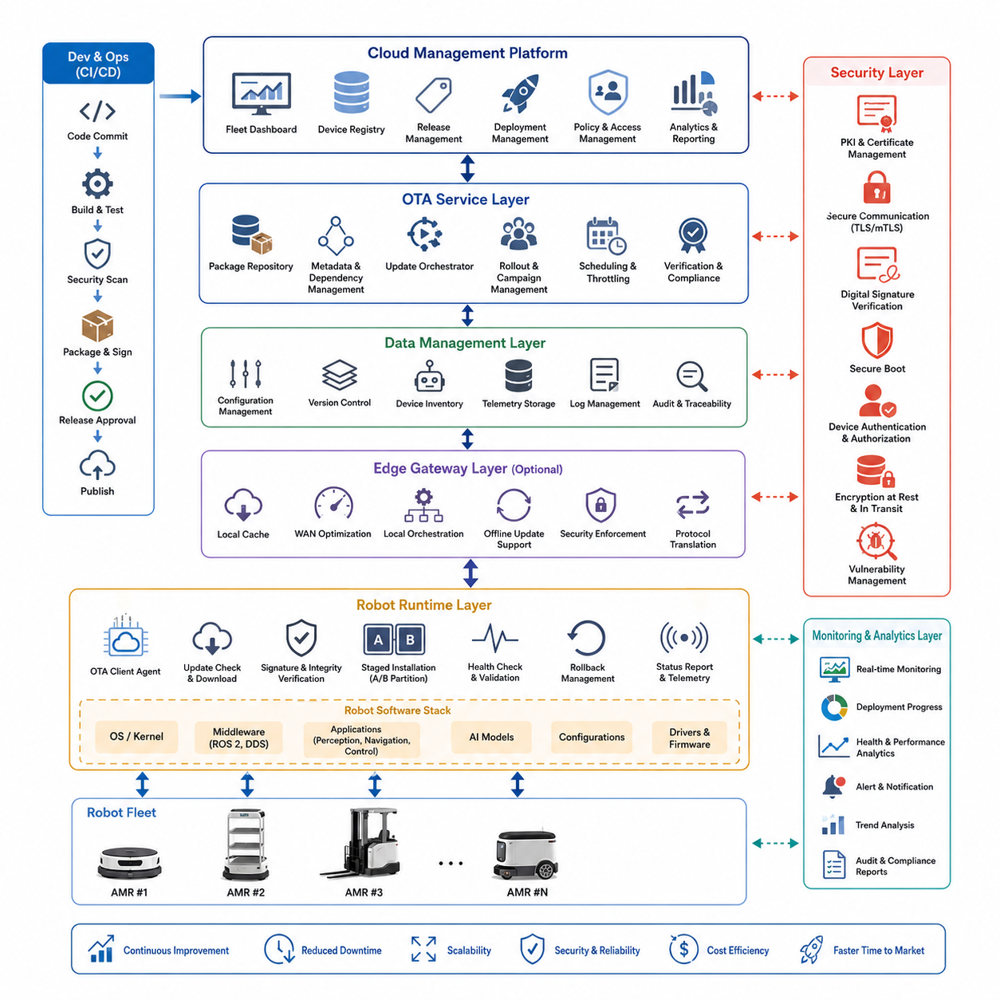
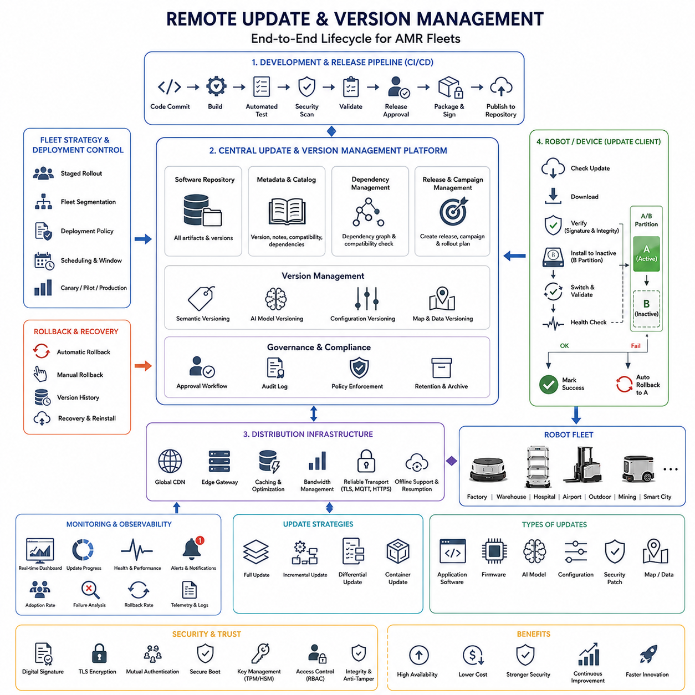
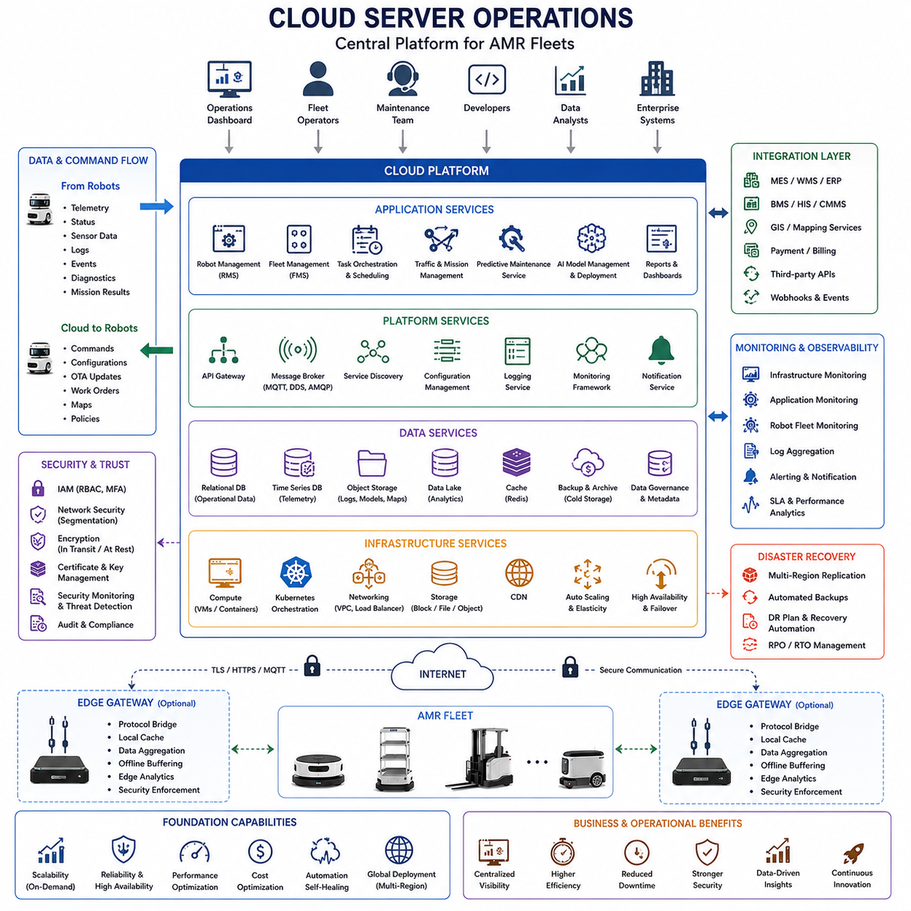
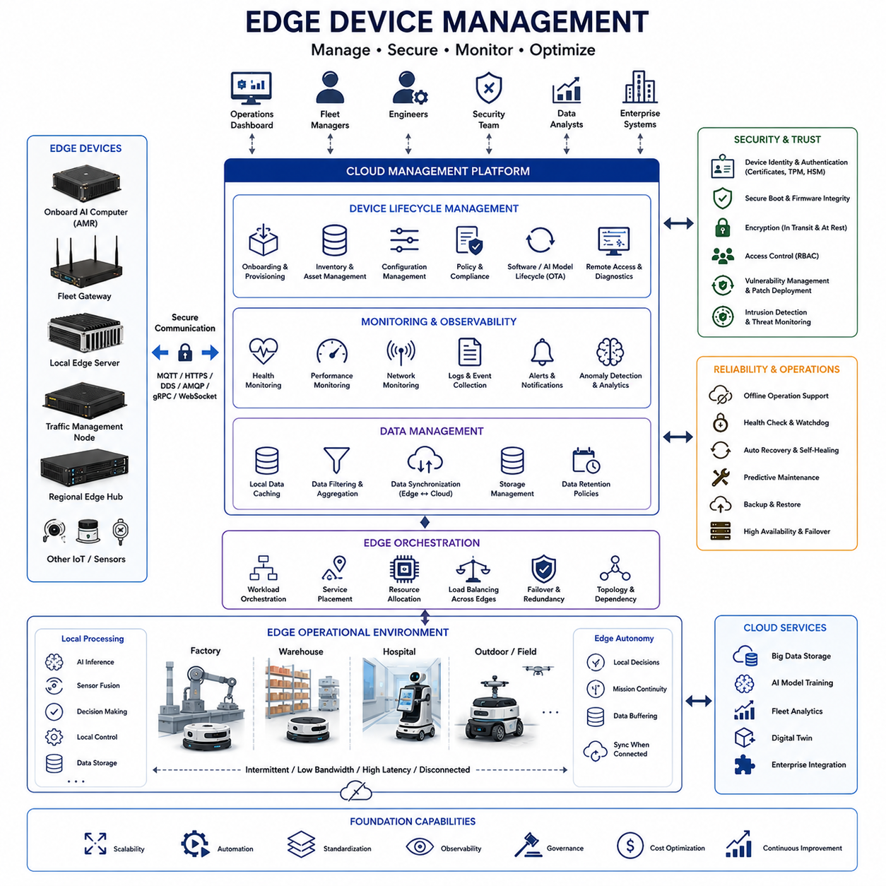
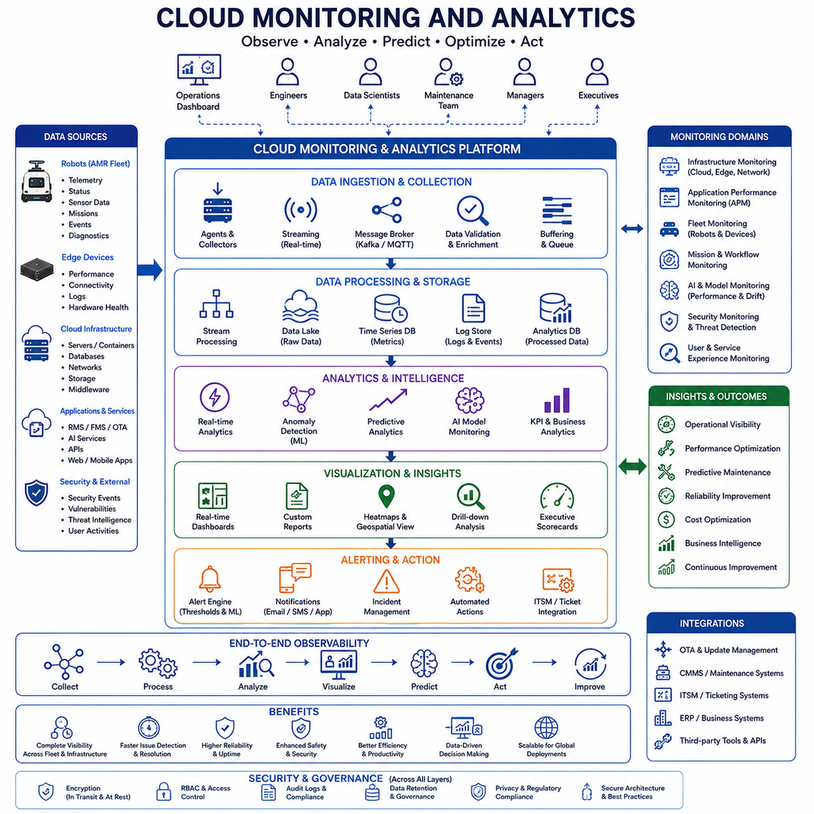
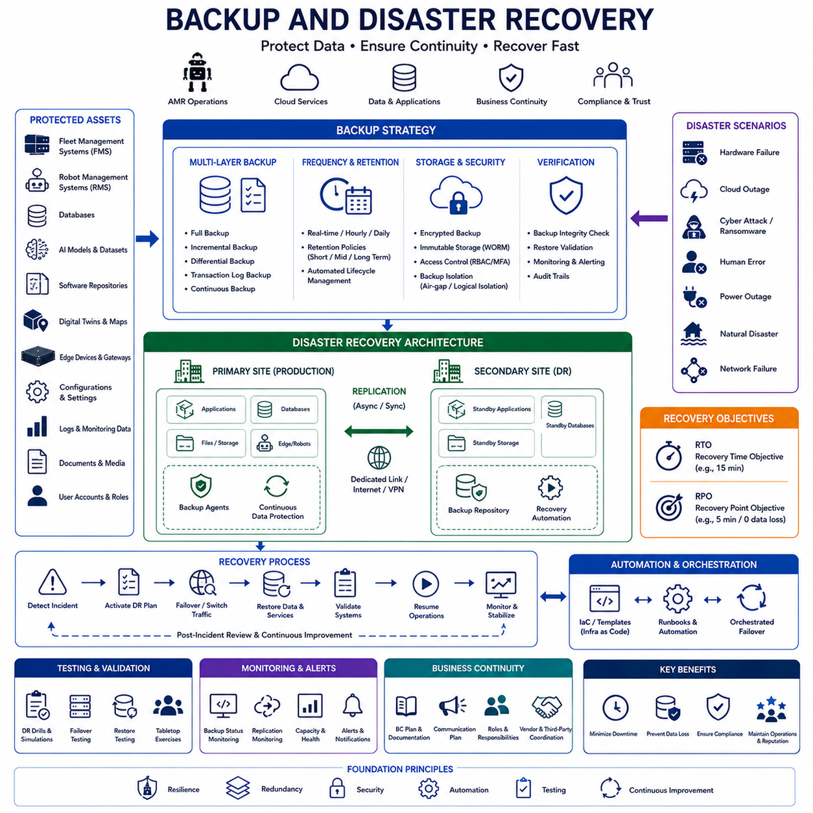
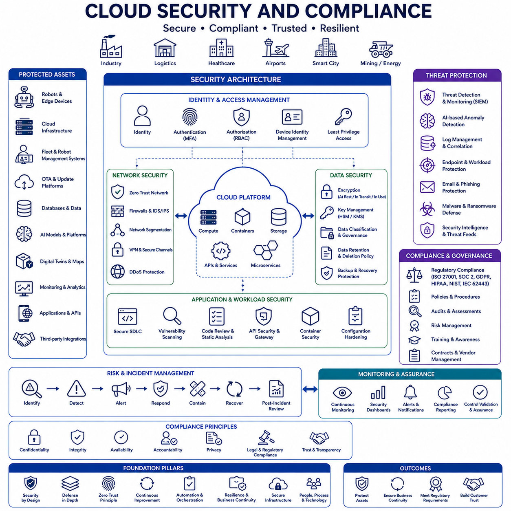
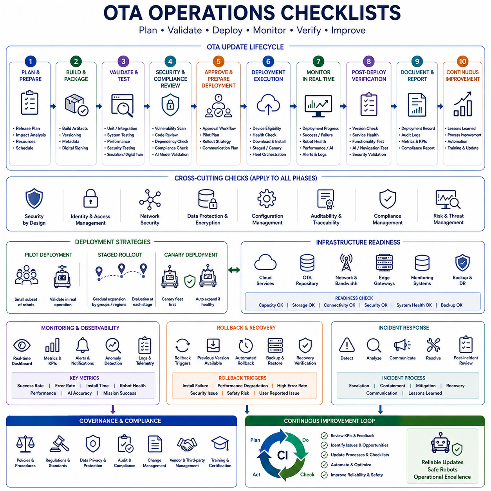

**Volume 10. AMR Engineering Process and Development Manual**


# Chapter 22. OTA and Cloud Operations

##  

## 22.01 OTA System Architecture

{width="7.268055555555556in" height="7.268055555555556in"}

# 22_01_OTA_System_Architecture

Over-the-Air (OTA) System Architecture is one of the most critical foundations of modern Autonomous Mobile Robot (AMR) platforms. As AMR deployments expand from a handful of robots to fleets consisting of hundreds or even thousands of autonomous systems operating across factories, hospitals, logistics centers, smart cities, ports, airports, and outdoor industrial environments, the ability to remotely manage software, firmware, AI models, configurations, security policies, and operational parameters becomes a fundamental requirement. OTA architecture enables continuous improvement of robot capabilities after deployment while significantly reducing maintenance costs, minimizing operational downtime, and accelerating the delivery of new features to customers. Within the overall AMR engineering framework, OTA architecture serves as the bridge between deployed robots and cloud-based operational infrastructure, ensuring that the entire fleet remains synchronized, secure, and continuously optimized. The OTA and Cloud Operations domain forms a dedicated engineering discipline within the AMR development lifecycle and includes OTA architecture, version management, cloud operations, edge device management, monitoring systems, disaster recovery mechanisms, and cybersecurity governance.

The primary objective of an OTA system architecture is to provide a scalable, secure, reliable, and fault-tolerant mechanism for delivering updates and operational changes to distributed robots. Unlike traditional software systems where updates may be manually installed by technicians, AMR fleets require automated update pipelines capable of handling heterogeneous hardware configurations, different software versions, varying network conditions, and geographically distributed deployments. The OTA architecture must therefore support intelligent update orchestration, staged deployment, rollback management, update verification, and fleet-wide visibility.

At the highest level, an OTA system architecture consists of several interconnected layers. These layers typically include the Cloud Management Layer, OTA Service Layer, Security Layer, Data Management Layer, Edge Gateway Layer, Robot Runtime Layer, and Monitoring and Analytics Layer. Together these components form a closed-loop operational ecosystem that continuously manages software distribution, health monitoring, feedback collection, and performance optimization throughout the operational life of the robot fleet.

The Cloud Management Layer functions as the central control plane of the OTA ecosystem. This layer is usually hosted in public cloud infrastructure, private cloud environments, hybrid cloud systems, or industrial edge-cloud deployments depending on customer requirements. The cloud management platform provides a centralized dashboard where operators can manage robot inventories, software versions, update campaigns, deployment schedules, system health metrics, and operational analytics. This layer serves as the single source of truth for fleet-wide software status and provides visibility into the operational state of every connected robot.

Within the Cloud Management Layer resides the OTA Management Server. This server maintains update repositories, software metadata, deployment policies, and device registration information. It tracks every software package, firmware release, AI model version, configuration profile, and security patch distributed throughout the robot fleet. The OTA server also maintains dependency relationships among software components, ensuring that updates are applied in a valid sequence and that incompatible software combinations are prevented from being deployed.

The OTA Service Layer acts as the operational engine responsible for distributing updates. This layer manages package generation, package storage, package signing, package distribution, deployment scheduling, update verification, and rollout management. When a new software release is approved, the OTA service creates deployment artifacts and publishes them into secure repositories. These artifacts may include robot operating system packages, perception algorithms, navigation software, firmware binaries, AI models, calibration data, configuration files, container images, and cybersecurity updates.

Modern OTA architectures increasingly rely on containerization technologies such as Docker and Kubernetes-based orchestration frameworks. Containerized deployment mechanisms provide greater consistency across hardware platforms and simplify dependency management. Instead of distributing individual binaries, OTA systems can deploy complete software environments packaged as container images. This approach improves deployment reliability while reducing software compatibility issues across heterogeneous robot fleets.

A critical component of the OTA architecture is the Device Registry Service. Every robot must be uniquely identified and registered within the cloud infrastructure. The registry maintains information such as robot identifiers, hardware configurations, sensor inventories, software versions, deployment locations, ownership records, operational status, and security credentials. Device registration enables targeted updates and allows operators to deploy specific software versions to selected groups of robots based on operational requirements.

Fleet segmentation plays an important role in OTA architecture. Rather than deploying updates simultaneously to all robots, deployments are typically organized into logical groups. These groups may be defined by geography, customer site, hardware generation, software version, mission type, operational environment, or risk category. Fleet segmentation enables staged rollouts that reduce deployment risk and allow engineers to validate updates on smaller subsets of robots before expanding deployment to larger populations.

The Security Layer represents one of the most important aspects of OTA architecture. Because OTA systems have the ability to modify robot behavior remotely, they become high-value targets for cyberattacks. The security architecture must therefore implement multiple layers of protection. Every software package distributed through the OTA infrastructure must be digitally signed using cryptographic signatures. Robots verify the authenticity and integrity of downloaded packages before installation. If signature validation fails, the update is automatically rejected.

Secure communication channels are equally important. OTA traffic typically uses TLS-encrypted communication to protect data confidentiality and prevent man-in-the-middle attacks. Mutual authentication mechanisms ensure that both the cloud server and the robot verify each other\'s identities before exchanging information. Device certificates, hardware security modules, trusted platform modules, and secure key storage technologies are commonly used to establish trust relationships throughout the OTA ecosystem.

Secure Boot mechanisms provide an additional layer of protection. Before executing software, the robot verifies the integrity of its operating system, firmware, and application stack. Secure Boot ensures that only trusted software can be executed on the robot platform. Combined with OTA security controls, Secure Boot creates a continuous chain of trust extending from software development through deployment and runtime execution.

The OTA architecture must also support robust version management capabilities. Version control extends beyond application software and includes firmware, operating systems, middleware components, AI models, navigation maps, configuration files, sensor calibration parameters, and cybersecurity policies. Maintaining version consistency across these components is essential because incompatibilities can lead to system failures or degraded operational performance.

Dependency management becomes increasingly complex as robot platforms evolve. A perception module may require a specific AI model version. A navigation system may depend on a particular middleware release. Firmware updates may require corresponding driver updates. The OTA system must maintain a comprehensive dependency graph and validate compatibility before initiating deployment. Automated compatibility verification significantly reduces deployment risks and prevents invalid software combinations from reaching production robots.

The Edge Gateway Layer provides an intermediate operational layer between cloud infrastructure and deployed robots. In large-scale industrial environments, direct communication between every robot and the cloud may be inefficient or impractical. Edge gateways aggregate communications, cache software packages, perform local deployment orchestration, and reduce cloud bandwidth requirements. This architecture is particularly valuable in factories, mines, ports, and outdoor industrial sites where network connectivity may be intermittent or constrained.

Edge gateways can also support local OTA operations during temporary cloud disconnections. Software packages may be synchronized from the cloud in advance and distributed locally when deployment windows become available. This approach improves operational resilience and allows updates to continue even during network outages.

At the robot level, the Robot Runtime Layer executes the update process. This layer contains the OTA client agent responsible for communicating with the cloud infrastructure, downloading packages, validating signatures, managing installations, reporting status, and performing rollback operations. The OTA client continuously monitors available updates and follows deployment policies defined by fleet operators.

Update installation strategies vary depending on system requirements. Some updates may be installed immediately, while others are scheduled during maintenance windows. Mission-critical robots often perform updates only when idle to avoid interrupting active operations. Advanced OTA architectures can coordinate updates across fleets to ensure that sufficient operational capacity remains available while updates are being deployed.

A/B partitioning techniques are widely used to improve deployment reliability. In this approach, the robot maintains two software partitions. One partition contains the currently active software while the second partition receives the new update. After installation, the robot reboots into the updated partition. If the new software fails validation tests, the robot automatically rolls back to the previous partition. This mechanism significantly reduces the risk of rendering robots inoperable due to faulty updates.

Rollback management is a mandatory feature of enterprise-grade OTA architectures. Even thoroughly tested software releases may encounter unforeseen issues in production environments. Automated rollback mechanisms allow robots to return to previously validated software versions when operational anomalies are detected. Rollback decisions may be triggered by installation failures, health monitoring alerts, performance degradation, increased error rates, or manual operator intervention.

OTA architecture increasingly supports AI model lifecycle management. Modern AMRs rely heavily on deep learning models for perception, classification, tracking, segmentation, anomaly detection, predictive maintenance, and autonomous decision-making. These models require continuous updates as new training data becomes available. OTA infrastructure enables efficient distribution of updated AI models without requiring changes to the underlying application software.

The Monitoring and Analytics Layer provides continuous visibility into deployment operations. Every stage of the update process generates telemetry that is collected and analyzed by cloud monitoring systems. Key metrics include download success rates, installation completion rates, deployment duration, rollback frequency, software adoption rates, device health indicators, and operational performance measurements. These metrics enable engineers to evaluate deployment effectiveness and identify emerging issues before they impact fleet operations.

Real-time dashboards provide operational awareness across the entire fleet. Engineers can monitor deployment progress, identify failed installations, analyze error trends, and verify software adoption rates. Historical analytics support long-term improvement efforts by revealing patterns in deployment performance and operational reliability.

Large-scale OTA architectures also integrate with CI/CD pipelines. Software developed by engineering teams flows through automated build, testing, validation, approval, packaging, and deployment stages. Once validation criteria are satisfied, approved releases become available for OTA distribution. This integration enables continuous delivery practices within AMR development organizations and shortens the time required to deliver improvements to deployed robots.

Cybersecurity monitoring is deeply integrated into modern OTA architectures. Security teams continuously evaluate vulnerabilities, monitor intrusion attempts, assess compliance status, and distribute emergency patches when new threats emerge. OTA infrastructure serves as the primary mechanism for rapidly deploying security updates across distributed robot fleets. This capability is particularly important for industrial deployments where operational continuity and cybersecurity resilience are essential business requirements.

Disaster recovery planning forms another critical component of OTA architecture. Cloud infrastructure failures, repository corruption, network disruptions, or cyberattacks can impact OTA operations. Redundant servers, replicated repositories, geographic failover mechanisms, backup strategies, and recovery procedures ensure operational continuity under adverse conditions. High-availability designs allow OTA services to remain functional even when individual infrastructure components experience failures.

As AMR fleets continue to expand in scale and complexity, OTA system architecture evolves from a simple software update mechanism into a comprehensive lifecycle management platform. It becomes responsible not only for software distribution but also for configuration management, AI model governance, cybersecurity operations, fleet optimization, operational analytics, and regulatory compliance. Future OTA architectures will increasingly leverage artificial intelligence, predictive analytics, digital twins, autonomous deployment strategies, and self-healing operational capabilities to manage large populations of intelligent robots with minimal human intervention.

Ultimately, OTA System Architecture serves as the operational nervous system of modern AMR ecosystems. It connects engineering teams, cloud infrastructure, edge systems, and autonomous robots into a unified platform capable of continuous evolution throughout the product lifecycle. By enabling secure, scalable, reliable, and automated software management, OTA architecture becomes a foundational technology for next-generation autonomous robotic systems operating across industrial, commercial, healthcare, logistics, infrastructure, and smart city environments.

# 22_01_OTA 시스템 아키텍처

OTA(Over-the-Air) 시스템 아키텍처는 현대 자율이동로봇(AMR) 플랫폼의 가장 중요한 기반 기술 중 하나이다. AMR이 소수의 로봇 운영 수준을 넘어 공장, 병원, 물류센터, 스마트시티, 항만, 공항, 산업 현장 등에서 수백 대에서 수천 대 규모의 로봇 플릿으로 확대됨에 따라 소프트웨어, 펌웨어, AI 모델, 설정값, 보안 정책 및 운영 파라미터를 원격으로 관리할 수 있는 능력이 필수 요소가 되었다. OTA 아키텍처는 배포 이후에도 로봇 기능을 지속적으로 개선할 수 있도록 하며, 유지보수 비용을 절감하고 운영 중단 시간을 최소화하며 새로운 기능을 빠르게 고객에게 제공할 수 있도록 지원한다. 전체 AMR 엔지니어링 체계에서 OTA 아키텍처는 현장에 배치된 로봇과 클라우드 기반 운영 인프라를 연결하는 핵심 역할을 수행하며, 전체 플릿이 항상 동기화되고 안전하며 최적의 상태를 유지할 수 있도록 한다.

OTA 및 클라우드 운영 영역은 AMR 개발 프로세스 내에서 독립적인 엔지니어링 분야로 구성되며, OTA 아키텍처, 버전 관리, 클라우드 운영, 엣지 디바이스 관리, 모니터링 시스템, 재해 복구 체계, 사이버보안 운영 등을 포함한다.

OTA 시스템 아키텍처의 주요 목적은 분산된 로봇들에게 소프트웨어 업데이트와 운영 변경 사항을 안전하고 안정적으로 배포할 수 있는 확장 가능한 플랫폼을 제공하는 것이다. 일반적인 IT 시스템에서는 관리자가 직접 소프트웨어를 설치할 수 있지만, AMR 환경에서는 다양한 하드웨어 구성, 여러 소프트웨어 버전, 서로 다른 네트워크 환경, 그리고 지역적으로 분산된 수많은 로봇을 동시에 관리해야 한다. 따라서 OTA 시스템은 자동화된 업데이트 배포, 단계별 롤아웃, 버전 검증, 장애 복구 및 플릿 단위 관리 기능을 제공해야 한다.

OTA 시스템은 일반적으로 클라우드 관리 계층, OTA 서비스 계층, 보안 계층, 데이터 관리 계층, 엣지 게이트웨이 계층, 로봇 런타임 계층, 모니터링 및 분석 계층으로 구성된다. 이러한 구성 요소들은 하나의 통합된 운영 생태계를 형성하여 소프트웨어 배포, 상태 모니터링, 데이터 수집, 성능 최적화를 지속적으로 수행한다.

클라우드 관리 계층은 OTA 시스템의 중앙 제어센터 역할을 수행한다. 이 계층은 퍼블릭 클라우드, 프라이빗 클라우드, 하이브리드 클라우드 또는 산업용 엣지 클라우드 환경에 구축될 수 있다. 운영자는 중앙 대시보드를 통해 로봇 자산 관리, 소프트웨어 버전 관리, 업데이트 배포 정책, 시스템 상태 모니터링 및 운영 분석 기능을 수행할 수 있다. 또한 전체 플릿의 소프트웨어 상태를 관리하는 단일 정보 저장소 역할도 담당한다.

이 계층 내부에는 OTA 관리 서버가 존재한다. OTA 관리 서버는 소프트웨어 저장소, 버전 메타데이터, 배포 정책 및 장치 등록 정보를 관리한다. 로봇 운영체제, 펌웨어, AI 모델, 설정 파일, 보안 패치 등 모든 업데이트 자산의 버전 이력을 유지하며, 소프트웨어 간 의존성을 분석하여 올바른 순서로 업데이트가 적용되도록 관리한다.

OTA 서비스 계층은 실제 업데이트 배포를 수행하는 핵심 엔진이다. 이 계층은 패키지 생성, 저장, 서명, 배포, 검증 및 롤아웃 관리를 담당한다. 새로운 소프트웨어 버전이 승인되면 OTA 시스템은 이를 배포 패키지로 생성하여 저장소에 등록한다. 이러한 패키지에는 운영체제, ROS2 패키지, AI 모델, 내비게이션 알고리즘, 펌웨어, 센서 설정값, 보안 패치 등이 포함될 수 있다.

최근에는 Docker 및 Kubernetes 기반의 컨테이너 기술을 OTA 시스템에 적극 활용하고 있다. 컨테이너 기반 OTA는 복잡한 의존성 문제를 줄이고 플랫폼 간 호환성을 높여준다. 단순한 실행 파일이 아니라 전체 실행 환경을 패키지 형태로 배포하기 때문에 소프트웨어 일관성과 안정성이 향상된다.

OTA 아키텍처의 중요한 구성 요소 중 하나는 디바이스 레지스트리 서비스이다. 모든 로봇은 고유한 식별자를 가지고 시스템에 등록되어야 한다. 디바이스 레지스트리는 로봇의 하드웨어 구성, 센서 구성, 소프트웨어 버전, 설치 위치, 운영 상태 및 보안 인증 정보를 저장한다. 이를 통해 특정 그룹의 로봇만 선택적으로 업데이트하거나 고객별, 지역별 맞춤형 배포 전략을 적용할 수 있다.

플릿 세분화(Fleet Segmentation)는 대규모 OTA 운영에서 매우 중요하다. 모든 로봇에 동시에 업데이트를 적용하는 대신 지역, 고객사, 하드웨어 버전, 운영 목적, 소프트웨어 버전 등에 따라 그룹을 나누어 배포한다. 이를 통해 일부 그룹에서 먼저 검증을 수행한 후 전체 플릿으로 확장할 수 있어 위험을 줄일 수 있다.

보안 계층은 OTA 시스템에서 가장 중요한 부분 중 하나이다. OTA 시스템은 원격으로 로봇 동작을 변경할 수 있으므로 공격자에게 매우 매력적인 목표가 된다. 따라서 모든 업데이트 패키지는 디지털 서명을 통해 보호되어야 하며, 로봇은 다운로드한 패키지의 무결성과 출처를 검증해야 한다. 검증에 실패한 패키지는 자동으로 폐기된다.

통신 과정에서도 TLS 기반 암호화를 사용하여 데이터 기밀성을 보호한다. 서버와 로봇은 상호 인증을 수행하며, 인증서 기반 신뢰 체계를 구축한다. 하드웨어 보안 모듈(HSM), TPM(Trusted Platform Module), 보안 키 저장소 등의 기술도 함께 활용된다.

Secure Boot 기술은 OTA 보안을 더욱 강화한다. 로봇은 부팅 과정에서 운영체제, 펌웨어 및 핵심 애플리케이션의 무결성을 검증한다. 이를 통해 승인되지 않은 소프트웨어의 실행을 차단하고 OTA 시스템 전체의 신뢰성을 보장할 수 있다.

OTA 시스템은 강력한 버전 관리 기능도 제공해야 한다. 버전 관리는 단순히 애플리케이션만이 아니라 운영체제, 펌웨어, 미들웨어, AI 모델, 내비게이션 맵, 설정 파일, 보안 정책 등 모든 구성 요소를 포함한다. 이러한 구성 요소 간의 호환성을 유지하는 것은 매우 중요하다.

의존성 관리 역시 핵심 기능이다. 예를 들어 특정 AI 모델은 특정 버전의 인식 소프트웨어와만 호환될 수 있으며, 펌웨어 업데이트는 특정 드라이버 버전을 요구할 수 있다. OTA 시스템은 이러한 관계를 관리하는 의존성 그래프를 유지하며 배포 전에 자동 검증을 수행한다.

엣지 게이트웨이 계층은 클라우드와 로봇 사이의 중간 계층 역할을 수행한다. 대규모 산업 환경에서는 모든 로봇이 클라우드와 직접 통신하는 것이 비효율적일 수 있다. 엣지 게이트웨이는 패키지를 캐싱하고 통신을 집약하며 로컬 배포를 수행함으로써 네트워크 부하를 줄인다.

특히 광산, 항만, 발전소, 철도 인프라, 스마트시티와 같은 환경에서는 네트워크 연결이 불안정할 수 있는데, 엣지 게이트웨이는 이러한 환경에서도 안정적인 OTA 운영을 지원한다.

로봇 측에서는 OTA 클라이언트 에이전트가 실행된다. 이 에이전트는 클라우드 서버와 통신하며 업데이트 검색, 다운로드, 검증, 설치 및 상태 보고를 수행한다. 또한 문제가 발생하면 롤백 기능도 수행한다.

업데이트 설치 방식은 운영 환경에 따라 달라질 수 있다. 일부 업데이트는 즉시 적용될 수 있지만, 대부분의 산업용 로봇은 운영이 종료된 유지보수 시간대에 설치된다. 또한 플릿 전체의 운영 능력을 유지하기 위해 순차적 배포 전략이 적용된다.

신뢰성을 높이기 위해 A/B 파티션 구조가 널리 사용된다. 현재 실행 중인 소프트웨어는 A 파티션에 유지하고, 새로운 업데이트는 B 파티션에 설치한다. 이후 시스템을 재부팅하여 새 버전을 실행하고 정상 동작을 확인한다. 문제가 발생하면 자동으로 이전 버전으로 복귀할 수 있다.

롤백 관리 기능은 기업용 OTA 시스템의 필수 요소이다. 충분한 검증을 거친 소프트웨어라 하더라도 실제 운영 환경에서는 예기치 않은 문제가 발생할 수 있다. OTA 시스템은 설치 실패, 성능 저하, 오류 증가, 운영 이상 등의 조건을 감지하면 자동으로 이전 버전으로 복구할 수 있어야 한다.

최근 OTA 시스템은 AI 모델 생명주기 관리 기능도 포함하고 있다. 현대 AMR은 객체 인식, 추적, 분류, 이상 탐지, 예지 정비, 의사결정 등에 다양한 딥러닝 모델을 사용한다. 새로운 데이터가 확보되면 AI 모델을 지속적으로 개선해야 하며, OTA 시스템은 이를 효율적으로 배포하는 핵심 수단이 된다.

모니터링 및 분석 계층은 OTA 운영의 가시성을 제공한다. 다운로드 성공률, 설치 성공률, 배포 시간, 롤백 빈도, 버전 보급률, 장치 상태, 성능 지표 등을 지속적으로 수집하고 분석한다. 이를 통해 엔지니어는 업데이트 효과를 평가하고 잠재적인 문제를 조기에 발견할 수 있다.

실시간 대시보드는 전체 플릿의 배포 현황을 한눈에 보여준다. 운영자는 설치 실패 로봇을 식별하고, 오류 패턴을 분석하며, 버전 전환 진행 상황을 확인할 수 있다. 장기적으로는 축적된 데이터를 활용하여 OTA 운영 효율성을 지속적으로 개선할 수 있다.

대규모 OTA 시스템은 CI/CD 파이프라인과도 긴밀하게 연동된다. 개발된 소프트웨어는 자동 빌드, 테스트, 검증, 승인 과정을 거쳐 OTA 배포 저장소에 등록된다. 이를 통해 지속적인 소프트웨어 개선과 빠른 현장 반영이 가능해진다.

사이버보안 운영 역시 OTA 아키텍처의 핵심 기능이다. 보안팀은 새로운 취약점을 모니터링하고 긴급 패치를 배포한다. OTA 시스템은 분산된 로봇들에게 보안 업데이트를 신속하게 전달할 수 있는 가장 효과적인 수단이다.

재해 복구 체계 또한 중요하다. 클라우드 장애, 저장소 손상, 네트워크 문제 또는 사이버 공격이 발생하더라도 서비스가 지속될 수 있도록 이중화 서버, 백업 저장소, 지역 간 복제 및 자동 복구 메커니즘이 구축되어야 한다.

미래의 OTA 시스템은 단순한 소프트웨어 배포 도구를 넘어 로봇 전체 생명주기 관리 플랫폼으로 발전할 것이다. AI 기반 운영 분석, 디지털 트윈 연계, 자율 배포 최적화, 예측형 유지보수, 자동 장애 복구 기술이 통합되면서 OTA는 AMR 운영의 핵심 인프라가 될 것이다.

결국 OTA 시스템 아키텍처는 현대 AMR 생태계의 신경망 역할을 수행한다. 개발 조직, 클라우드 인프라, 엣지 시스템, 자율주행 로봇을 하나의 통합 플랫폼으로 연결하여 지속적인 진화와 운영 최적화를 가능하게 한다. 안전하고 확장 가능하며 신뢰성 높은 OTA 아키텍처는 차세대 산업용 자율로봇 시스템의 성공을 결정하는 핵심 기술이라 할 수 있다.

##  

## 22.02 Remote Update and Version Management

{width="7.268055555555556in" height="7.268055555555556in"}

### 22_02_Remote Update and Version Management

Remote Update and Version Management is a core operational capability of modern Autonomous Mobile Robot (AMR) platforms and serves as one of the most important pillars of large-scale fleet operations. As AMR deployments evolve from isolated pilot projects into enterprise-wide autonomous systems consisting of hundreds or thousands of robots, manual software maintenance becomes impractical. Organizations require mechanisms that allow software, firmware, operating systems, AI models, security policies, configuration parameters, navigation maps, and operational data to be updated remotely, safely, and efficiently. Remote Update and Version Management provides the technological framework that enables continuous improvement of deployed robotic systems while minimizing downtime, reducing maintenance costs, improving cybersecurity posture, and accelerating innovation throughout the product lifecycle. The Remote Update and Version Management framework operates as a key component within the OTA and Cloud Operations domain and works closely with OTA architecture, cloud infrastructure, fleet management systems, cybersecurity platforms, and operational monitoring services.

In traditional industrial automation systems, software updates often required physical access to equipment, on-site service visits, and planned production shutdowns. While such approaches may be manageable for a small number of systems, they become increasingly expensive and operationally disruptive as robot fleets grow. AMR platforms operate in dynamic environments such as factories, warehouses, hospitals, airports, logistics centers, ports, rail infrastructure, mining operations, and smart cities. These environments demand continuous operational availability, making remote software maintenance an essential capability. Remote update technologies allow engineering teams to deploy improvements, bug fixes, performance enhancements, cybersecurity patches, and AI model updates without physically accessing individual robots.

The primary objective of Remote Update and Version Management is to ensure that every deployed robot operates using approved, validated, traceable, and secure software versions. This objective extends beyond simple software installation. The system must manage the complete lifecycle of software assets from development and validation through deployment, monitoring, rollback, retirement, and audit tracking. Every software component deployed within the robot ecosystem must be identifiable, versioned, documented, and managed according to established governance policies.

A modern AMR platform consists of numerous software layers, each of which may require independent version control. These layers typically include embedded firmware, motor controller software, battery management systems, safety controllers, operating systems, middleware frameworks, ROS2 packages, perception software, localization modules, navigation algorithms, AI models, configuration databases, cybersecurity policies, cloud communication services, and user interface components. Remote Version Management must maintain visibility and traceability across all of these layers while ensuring compatibility and consistency throughout the entire system.

Version management begins with software identification. Every software artifact must receive a unique version identifier that allows engineers to track its lifecycle. Most organizations adopt structured semantic versioning schemes that distinguish major releases, minor feature updates, and maintenance patches. Major versions typically represent significant architectural changes. Minor versions introduce new functionality while maintaining compatibility. Patch releases address defects, performance issues, or security vulnerabilities without altering primary system behavior.

The versioning strategy extends beyond application software. AI models, navigation maps, calibration files, configuration profiles, cybersecurity rules, and digital twin assets may all require independent version control. In modern robotics systems, AI models often evolve more rapidly than traditional software components. A perception model trained on new environmental data may be updated weekly or monthly, while navigation software may remain unchanged for extended periods. Effective version management enables these components to evolve independently while maintaining overall system stability.

Software repositories serve as the foundation of the version management infrastructure. Repositories maintain all approved software artifacts and their associated metadata. This metadata includes version numbers, release notes, compatibility information, dependency relationships, validation results, security approvals, deployment history, and rollback references. Centralized repositories provide a single source of truth for software governance and ensure that every deployed component can be traced back to its original source.

Dependency management represents one of the most challenging aspects of version control in autonomous robotics systems. Individual software components rarely operate in isolation. Perception modules may depend on specific AI models. Navigation systems may require particular middleware versions. Hardware drivers may only function correctly with certain firmware releases. The version management platform must therefore maintain a dependency graph that captures relationships among all system components. Before deployment, automated compatibility validation ensures that selected software versions can coexist safely within the target robot environment.

Remote update systems typically support multiple deployment strategies depending on operational requirements. Full system updates replace large portions of the software stack and are generally used for major releases. Incremental updates modify only specific components and reduce network bandwidth requirements. Differential updates transmit only the changes between versions, significantly minimizing download size. Container-based updates distribute complete runtime environments packaged as containers, simplifying dependency management and improving deployment consistency across diverse hardware platforms.

Update orchestration plays a critical role in large-scale fleet operations. Rather than updating all robots simultaneously, organizations generally employ staged deployment strategies. Updates are first deployed to development systems, followed by testing fleets, pilot customers, limited production groups, and eventually the full fleet. This progressive rollout approach reduces deployment risk and allows engineering teams to identify unexpected issues before large-scale distribution.

Fleet segmentation is a key operational capability within version management systems. Robots may be grouped according to customer, geographic region, hardware configuration, software generation, operational mission, or deployment environment. Segment-specific update policies allow organizations to deploy targeted software releases while maintaining operational flexibility. A hospital robot fleet may receive updates on a different schedule than industrial inspection robots operating in harsh outdoor environments.

Remote update scheduling must account for operational constraints. Autonomous robots often perform mission-critical tasks and cannot be interrupted during active operation. The update management system therefore evaluates robot status, battery levels, network quality, mission schedules, and operational priorities before initiating installation procedures. Updates are frequently scheduled during maintenance windows, charging periods, or low-utilization intervals to minimize disruption to business operations.

Reliability is one of the most important design requirements of remote update systems. A failed software update must never render a robot inoperable. To address this challenge, modern robotic platforms commonly implement A/B partition architectures. The currently operational software resides in one partition while the new version is installed in a secondary partition. Following installation, the robot reboots into the updated environment and performs validation procedures. If the update fails or operational anomalies are detected, the system automatically reverts to the previous version without requiring human intervention.

Rollback management forms an essential component of version governance. Even after extensive testing, software may exhibit unexpected behavior when deployed in real-world environments. Automated rollback capabilities allow robots to return to previously validated software versions whenever installation failures, performance degradation, communication issues, safety violations, or application crashes occur. Rollback decisions may be triggered automatically through health monitoring systems or manually by fleet operators.

Cybersecurity considerations heavily influence remote update architecture. Since update systems possess the authority to modify robot behavior, they represent high-value attack targets. Every update package must therefore be digitally signed using trusted cryptographic mechanisms. Robots verify software authenticity and integrity before installation. Unsigned or tampered packages are automatically rejected. Secure communication protocols such as TLS and mutual authentication mechanisms protect data exchanges between cloud infrastructure and deployed robots.

Secure Boot technologies extend version management security by verifying software integrity during startup. Combined with hardware-based trust anchors such as Trusted Platform Modules and Hardware Security Modules, Secure Boot establishes a chain of trust that extends from software development through deployment and runtime execution. This architecture significantly reduces the risk of unauthorized software execution.

Remote Update and Version Management systems increasingly support AI model lifecycle management. Modern AMRs depend heavily on machine learning models for perception, localization enhancement, object tracking, anomaly detection, predictive maintenance, and autonomous decision-making. As operational data accumulates, improved models become available and must be distributed efficiently throughout the fleet. AI-specific version management tracks training datasets, model architectures, hyperparameters, validation metrics, deployment history, and operational performance measurements. This capability ensures reproducibility and supports regulatory compliance requirements.

Configuration management represents another important dimension of version control. Not all operational changes require software updates. Many system behaviors can be modified through configuration parameters. Navigation settings, safety zones, sensor thresholds, communication policies, operational schedules, and mission rules may be updated independently of software releases. Remote configuration management enables rapid operational adaptation while reducing deployment complexity.

Map management is particularly important for autonomous mobile robots operating across multiple facilities. Indoor maps, outdoor maps, semantic maps, HD maps, traffic management data, and digital twin representations all require version control. Changes to facility layouts, operational workflows, or infrastructure must be reflected in robot navigation systems. Remote map distribution mechanisms allow organizations to maintain synchronized operational environments across entire fleets.

Monitoring and observability provide continuous visibility into update operations. Every update transaction generates telemetry data that is collected and analyzed by centralized monitoring platforms. Engineers track download success rates, installation completion rates, rollback frequency, deployment duration, software adoption trends, and post-deployment performance metrics. These insights support operational decision-making and help identify emerging issues before they affect fleet productivity.

Comprehensive audit logging is essential for enterprise deployments. Every software deployment, rollback operation, version transition, configuration modification, and administrative action must be recorded. Audit records support compliance requirements, forensic investigations, quality management processes, and operational traceability. Industries such as healthcare, transportation, infrastructure inspection, and industrial automation often require detailed historical records of software changes.

Remote Update and Version Management platforms are increasingly integrated with CI/CD pipelines and DevOps workflows. Software developed by engineering teams progresses through automated build, testing, validation, approval, packaging, and deployment stages. Once approved, releases become available for fleet distribution through OTA infrastructure. This integration enables continuous delivery practices while maintaining the reliability and safety requirements expected in industrial robotics systems.

Scalability becomes increasingly important as deployments expand. A fleet consisting of ten robots can be managed using relatively simple mechanisms, but global deployments involving thousands of robots require distributed cloud infrastructure, regional content delivery networks, edge gateways, intelligent bandwidth management, and automated orchestration systems. Scalable update architectures ensure that deployment performance remains predictable regardless of fleet size.

Future Remote Update and Version Management systems will evolve beyond traditional software deployment frameworks. Artificial intelligence will increasingly participate in deployment decision-making, predicting update risks, optimizing rollout schedules, identifying anomalous behavior patterns, and recommending corrective actions. Digital twins will enable software validation within virtual environments before physical deployment. Autonomous deployment systems will continuously optimize fleet software configurations based on operational performance and environmental conditions.

Ultimately, Remote Update and Version Management serves as the operational backbone of modern AMR lifecycle management. It enables organizations to maintain secure, reliable, compliant, and continuously improving robotic fleets throughout years of operation. By integrating software governance, cybersecurity, deployment automation, AI lifecycle management, configuration control, and operational analytics into a unified framework, Remote Update and Version Management becomes a foundational technology that supports the long-term success of autonomous robotic systems operating across industrial, commercial, healthcare, logistics, infrastructure, and smart city environments.

# 22_02 원격 업데이트 및 버전 관리 (Remote Update and Version Management)

원격 업데이트 및 버전 관리(Remote Update and Version Management)는 현대 자율이동로봇(AMR) 플랫폼의 핵심 운영 기술 중 하나이며, 대규모 플릿 운영을 가능하게 하는 가장 중요한 기반 기능 중 하나이다. AMR 시스템이 소규모 시범 사업 수준을 넘어 수백 대에서 수천 대 규모의 로봇이 운영되는 엔터프라이즈 환경으로 확대됨에 따라 수동 유지보수 방식은 더 이상 현실적인 방법이 될 수 없다. 기업은 소프트웨어, 펌웨어, 운영체제, AI 모델, 보안 정책, 설정 정보, 내비게이션 맵 및 운영 데이터를 원격으로 업데이트하고 관리할 수 있는 체계를 필요로 한다. 원격 업데이트 및 버전 관리 시스템은 현장에 배치된 로봇을 지속적으로 개선할 수 있도록 지원하며, 유지보수 비용을 절감하고 가동 중단 시간을 최소화하며, 보안 수준을 향상시키고, 신기능 배포 속도를 높이는 역할을 수행한다.

원격 업데이트 및 버전 관리는 OTA 및 클라우드 운영 영역의 핵심 구성 요소로서 OTA 시스템, 클라우드 인프라, 플릿 관리 시스템, 사이버보안 플랫폼, 운영 모니터링 시스템과 긴밀하게 연계된다.

전통적인 산업 자동화 시스템에서는 소프트웨어를 업데이트하기 위해 현장 방문, 장비 정지, 유지보수 인력 투입이 필요했다. 이러한 방식은 소수의 장비에는 적용 가능하지만 수백 대 이상의 로봇이 운영되는 환경에서는 유지보수 비용과 운영 중단 비용이 급격히 증가한다. 공장, 물류센터, 병원, 공항, 항만, 철도, 광산, 스마트시티 등에서 운영되는 AMR은 높은 가동률이 요구되므로 원격 소프트웨어 관리 기능이 필수적이다. 원격 업데이트 기술은 엔지니어가 현장을 방문하지 않고도 기능 개선, 버그 수정, 성능 향상, 보안 패치, AI 모델 개선 사항을 배포할 수 있도록 지원한다.

원격 업데이트 및 버전 관리의 궁극적인 목표는 모든 로봇이 승인되고 검증된 소프트웨어 버전을 안정적으로 실행하도록 보장하는 것이다. 이는 단순한 소프트웨어 설치를 의미하는 것이 아니라 개발, 검증, 배포, 모니터링, 롤백, 폐기까지 포함하는 전체 소프트웨어 생명주기 관리 체계를 의미한다. 따라서 모든 소프트웨어 구성 요소는 명확한 버전 정보와 이력 관리 체계를 가져야 하며, 변경 사항에 대한 추적이 가능해야 한다.

현대 AMR 플랫폼은 매우 다양한 소프트웨어 계층으로 구성된다. 여기에는 임베디드 펌웨어, 모터 제어기 소프트웨어, 배터리 관리 시스템, 안전 제어기, 운영체제, 미들웨어, ROS2 패키지, 인식 소프트웨어, SLAM 시스템, 내비게이션 알고리즘, AI 모델, 설정 파일, 보안 정책, 클라우드 통신 모듈, 사용자 인터페이스 등이 포함된다. 버전 관리 시스템은 이 모든 구성 요소에 대한 가시성과 추적성을 제공해야 하며, 각 구성 요소 간의 호환성을 유지해야 한다.

버전 관리는 소프트웨어 식별 과정에서 시작된다. 모든 소프트웨어 구성 요소는 고유한 버전 번호를 가져야 한다. 일반적으로 Semantic Versioning 체계를 사용하여 Major, Minor, Patch 버전으로 관리한다. Major 버전은 시스템 구조 변경을 의미하며, Minor 버전은 새로운 기능 추가를 의미한다. Patch 버전은 버그 수정이나 보안 패치와 같은 소규모 변경을 나타낸다.

버전 관리는 애플리케이션에만 적용되는 것이 아니다. AI 모델, 내비게이션 맵, 센서 보정 데이터, 설정 프로파일, 보안 정책 등도 모두 독립적인 버전 관리 대상이다. 특히 최근 로봇 시스템에서는 AI 모델이 일반 소프트웨어보다 더 빠르게 발전하기 때문에 AI 모델 버전 관리의 중요성이 점점 커지고 있다. 새로운 데이터로 재학습된 AI 모델은 주기적으로 배포되어야 하며, 시스템은 이를 효과적으로 관리해야 한다.

소프트웨어 저장소(Repository)는 버전 관리의 중심 역할을 수행한다. 저장소는 모든 승인된 소프트웨어와 관련 메타데이터를 관리한다. 메타데이터에는 버전 번호, 릴리즈 노트, 의존성 정보, 검증 결과, 보안 승인 정보, 배포 이력, 롤백 정보 등이 포함된다. 중앙 저장소는 조직 내에서 단일 진실 공급원(Single Source of Truth) 역할을 수행하며, 모든 배포 이력을 추적할 수 있게 해준다.

의존성 관리(Dependency Management)는 버전 관리에서 가장 어려운 부분 중 하나이다. 로봇 시스템의 소프트웨어는 서로 긴밀하게 연결되어 있기 때문이다. 예를 들어 인식 소프트웨어는 특정 AI 모델을 요구할 수 있고, 내비게이션 시스템은 특정 버전의 ROS2 미들웨어를 필요로 할 수 있다. 또한 특정 드라이버는 특정 펌웨어 버전에서만 정상 동작할 수 있다. 따라서 버전 관리 시스템은 전체 의존성 그래프를 관리하고 배포 전에 자동으로 호환성을 검증해야 한다.

원격 업데이트 시스템은 다양한 배포 전략을 지원해야 한다. 전체 시스템 업데이트는 운영체제와 주요 애플리케이션을 포함한 대규모 업데이트에 사용된다. 부분 업데이트는 특정 구성 요소만 수정하여 네트워크 사용량을 줄인다. 차등 업데이트(Differential Update)는 변경된 부분만 전송함으로써 다운로드 크기를 최소화한다. 최근에는 Docker 기반 컨테이너 배포도 널리 사용되고 있으며, 이는 의존성 문제를 줄이고 배포 신뢰성을 향상시킨다.

업데이트 오케스트레이션은 대규모 플릿 운영에서 매우 중요하다. 일반적으로 모든 로봇에 동시에 업데이트를 적용하지 않는다. 개발 환경, 테스트 플릿, 파일럿 고객, 일부 운영 그룹, 전체 플릿 순서로 단계적으로 배포한다. 이러한 방식은 위험을 최소화하고 예상하지 못한 문제를 조기에 발견할 수 있도록 한다.

플릿 세분화(Fleet Segmentation)는 운영 효율성을 높이는 중요한 기능이다. 로봇들은 고객사, 지역, 하드웨어 구성, 소프트웨어 세대, 운영 목적 등에 따라 그룹으로 나뉜다. 각 그룹은 서로 다른 업데이트 정책을 적용받을 수 있다. 예를 들어 병원용 로봇과 야외 산업용 검사 로봇은 서로 다른 업데이트 주기를 가질 수 있다.

업데이트 스케줄링 역시 중요한 기능이다. AMR은 실제 업무를 수행하는 장비이기 때문에 작업 중에 소프트웨어를 업데이트할 수 없다. 따라서 시스템은 배터리 상태, 네트워크 상태, 임무 스케줄, 운영 우선순위를 고려하여 적절한 시점에 업데이트를 수행한다. 일반적으로 충전 시간이나 유지보수 시간대에 업데이트가 진행된다.

원격 업데이트 시스템은 매우 높은 신뢰성을 가져야 한다. 업데이트 실패로 인해 로봇이 동작 불능 상태가 되어서는 안 된다. 이를 위해 대부분의 산업용 로봇은 A/B 파티션 구조를 사용한다. 현재 사용 중인 버전은 A 파티션에 유지하고, 새로운 버전은 B 파티션에 설치한다. 이후 재부팅을 통해 새 버전으로 전환하고, 문제가 발생하면 자동으로 이전 버전으로 복귀한다.

롤백(Rollback) 기능은 버전 관리 시스템의 필수 요소이다. 충분한 테스트를 거친 소프트웨어라도 실제 환경에서는 예기치 않은 문제가 발생할 수 있다. 설치 실패, 성능 저하, 통신 오류, 안전 규칙 위반, 애플리케이션 충돌 등이 발생하면 자동 또는 수동으로 이전 버전으로 복원할 수 있어야 한다.

사이버보안은 원격 업데이트 시스템 설계에 큰 영향을 미친다. 업데이트 시스템은 로봇의 동작을 변경할 수 있기 때문에 공격 대상이 될 가능성이 높다. 따라서 모든 업데이트 패키지는 디지털 서명을 통해 보호되어야 하며, 로봇은 설치 전에 무결성과 출처를 검증해야 한다. 위변조된 패키지는 자동으로 거부된다. 또한 TLS 기반 암호화 통신과 상호 인증 체계를 사용하여 클라우드와 로봇 간의 안전한 데이터 교환을 보장한다.

Secure Boot 기술은 업데이트 보안을 더욱 강화한다. 시스템 부팅 시 운영체제와 애플리케이션의 무결성을 검증하여 승인되지 않은 소프트웨어가 실행되는 것을 방지한다. TPM 및 HSM과 같은 하드웨어 기반 보안 기술과 결합하면 매우 높은 수준의 보안 체계를 구축할 수 있다.

최근에는 AI 모델 생명주기 관리가 원격 업데이트의 중요한 영역으로 부상하고 있다. AMR은 객체 인식, 추적, 이상 탐지, 예지 정비, 자율 의사결정 등에 AI 모델을 사용한다. 새로운 학습 데이터가 확보되면 모델을 재학습하고 현장에 배포해야 한다. AI 버전 관리 시스템은 학습 데이터셋, 모델 구조, 학습 파라미터, 성능 지표, 배포 이력 등을 관리하여 재현성과 추적성을 보장한다.

설정 관리(Configuration Management)도 중요한 기능이다. 모든 변경 사항이 소프트웨어 업데이트를 필요로 하는 것은 아니다. 안전 구역, 센서 임계값, 내비게이션 설정, 통신 정책, 운영 규칙과 같은 많은 요소는 설정 파일만 변경하여 수정할 수 있다. 원격 설정 관리 기능은 운영 환경 변화에 신속하게 대응할 수 있게 해준다.

맵(Map) 관리 역시 AMR 운영에서 매우 중요하다. 실내 지도, 실외 지도, HD 맵, 의미 기반 맵, 교통 관리 맵, 디지털 트윈 데이터 모두 버전 관리 대상이 된다. 공장 레이아웃이나 병원 구조가 변경되면 관련 지도 정보도 함께 업데이트되어야 하며, OTA 시스템은 이를 효율적으로 배포해야 한다.

모니터링 및 가시성(Observability)은 전체 업데이트 과정을 실시간으로 추적할 수 있게 해준다. 다운로드 성공률, 설치 성공률, 롤백 비율, 배포 시간, 버전 보급률, 운영 성능 등을 지속적으로 분석하여 업데이트 효과를 평가하고 문제를 조기에 발견한다.

감사 로그(Audit Log)는 엔터프라이즈 환경에서 필수적이다. 모든 업데이트, 롤백, 설정 변경, 관리자 작업은 기록되어야 하며, 이를 통해 규제 대응, 품질 관리, 사고 분석 및 운영 추적성을 확보할 수 있다.

원격 업데이트 및 버전 관리 시스템은 CI/CD 및 DevOps 환경과 긴밀하게 통합된다. 개발된 소프트웨어는 자동 빌드, 테스트, 검증, 승인 과정을 거친 후 OTA 저장소에 등록되며, 이후 플릿 전체로 배포된다. 이러한 자동화 체계는 개발 속도를 높이는 동시에 품질을 유지할 수 있도록 지원한다.

플릿 규모가 증가할수록 확장성은 더욱 중요해진다. 10대 규모의 로봇은 단순한 시스템으로도 관리할 수 있지만 수천 대 규모의 글로벌 플릿은 분산 클라우드, CDN(Content Delivery Network), 엣지 게이트웨이, 지능형 대역폭 관리 및 자동 오케스트레이션 기능이 필요하다.

미래의 원격 업데이트 및 버전 관리 시스템은 단순한 배포 플랫폼을 넘어 자율 운영 플랫폼으로 발전할 것이다. AI가 업데이트 위험도를 예측하고, 최적의 배포 시점을 결정하며, 이상 징후를 탐지하고, 자동 대응 전략을 추천하게 될 것이다. 또한 디지털 트윈과 연계하여 실제 배포 전에 가상 환경에서 충분한 검증을 수행하는 체계도 일반화될 것이다.

결론적으로 원격 업데이트 및 버전 관리는 현대 AMR 운영 체계의 핵심 기반 기술이다. 이는 소프트웨어 거버넌스, 보안 관리, 자동 배포, AI 모델 관리, 설정 제어, 운영 분석 기능을 하나의 통합 플랫폼으로 제공한다. 이러한 체계는 수년 동안 운영되는 대규모 자율주행 로봇 플릿의 안정성, 보안성, 확장성 및 지속적인 성능 향상을 가능하게 하며, 산업용 로봇 생태계의 성공을 결정하는 핵심 요소가 된다.

##  

## 22.03 Cloud Server Operations

{width="7.268055555555556in" height="7.268055555555556in"}

# 22_03 Cloud Server Operations

Cloud Server Operations represents the operational backbone of modern Autonomous Mobile Robot (AMR) ecosystems and serves as the central platform that enables large-scale deployment, monitoring, coordination, maintenance, analytics, and lifecycle management of autonomous robotic fleets. As AMR systems evolve from standalone autonomous machines into interconnected fleets operating across factories, hospitals, logistics centers, smart cities, airports, ports, warehouses, mining sites, and outdoor industrial environments, cloud infrastructure becomes an essential component for achieving scalability, operational efficiency, centralized visibility, and continuous service improvement. Cloud Server Operations encompasses the architecture, deployment, management, monitoring, security, maintenance, optimization, and governance of cloud infrastructure supporting autonomous robotic systems. Within the OTA and Cloud Operations domain, Cloud Server Operations functions as the core operational layer connecting robots, edge computing platforms, fleet management systems, digital twins, AI services, data analytics platforms, and enterprise business applications.

The primary objective of Cloud Server Operations is to provide a highly available, secure, scalable, and reliable platform capable of supporting thousands of simultaneously connected robotic devices. Unlike traditional industrial systems where operations are often localized within individual facilities, modern AMR deployments require centralized coordination across multiple geographic regions, operational sites, and customer environments. Cloud infrastructure provides the foundation for this coordination by offering centralized compute resources, storage systems, communication services, operational intelligence, and fleet-wide management capabilities.

Cloud operations begin with the concept of centralized robot connectivity. Every deployed robot continuously exchanges information with cloud services through secure communication channels. These communications include telemetry data, operational status reports, diagnostic information, sensor summaries, software version records, mission execution results, maintenance alerts, cybersecurity events, and fleet management instructions. The cloud platform aggregates this information and transforms it into actionable intelligence for operators, engineers, maintenance teams, and business stakeholders.

A modern cloud infrastructure for AMR systems is typically organized into multiple architectural layers. These layers commonly include the Infrastructure Layer, Platform Services Layer, Application Services Layer, Data Services Layer, Security Layer, Monitoring Layer, and Integration Layer. Together these components form a comprehensive operational ecosystem capable of supporting the complete lifecycle of autonomous robotic systems.

The Infrastructure Layer serves as the foundation of cloud operations. This layer consists of compute servers, virtual machines, container orchestration platforms, networking resources, storage systems, load balancers, and high-availability clusters. Infrastructure resources may be hosted within public cloud providers, private cloud environments, hybrid cloud architectures, or distributed edge-cloud deployments depending on customer requirements and regulatory constraints.

Public cloud environments provide significant advantages for AMR deployments due to their elasticity and scalability. As robot fleets grow, computing resources can be dynamically expanded without requiring major infrastructure investments. Cloud-native architectures allow organizations to scale operational services horizontally by adding additional compute instances, database nodes, storage resources, and communication gateways as demand increases.

Containerization technologies such as Docker and orchestration platforms such as Kubernetes have become foundational components of robotic cloud operations. Containerized services provide consistency across deployment environments, simplify software maintenance, and support automated scaling. Kubernetes clusters enable dynamic resource allocation, automated failover, workload balancing, and high-availability service deployment, ensuring operational continuity even when individual infrastructure components experience failures.

The Platform Services Layer provides common operational capabilities shared across multiple applications. These services include authentication systems, messaging platforms, API gateways, service discovery mechanisms, configuration management systems, logging services, monitoring frameworks, and orchestration tools. Platform services reduce complexity by providing reusable building blocks that support higher-level robotic applications.

One of the most important platform services is the communication infrastructure. Autonomous robots continuously exchange data with cloud systems through protocols such as MQTT, HTTPS, WebSocket, DDS bridging services, AMQP, and gRPC. These communication channels must support secure, low-latency, reliable, and scalable data exchange. Message brokers often serve as central communication hubs, enabling asynchronous interactions between robots, cloud services, and enterprise applications.

The Application Services Layer hosts operational applications that directly support robotic deployments. These applications include Robot Management Systems (RMS), Fleet Management Systems (FMS), task scheduling platforms, traffic management systems, mission orchestration engines, digital twin environments, predictive maintenance platforms, AI model management services, reporting systems, and customer-facing dashboards.

Robot Management Systems provide centralized visibility into individual robot status. Operators can monitor robot health, battery levels, connectivity status, mission progress, software versions, maintenance schedules, and operational alerts through unified management interfaces. Fleet Management Systems extend this functionality by coordinating multiple robots, optimizing task assignments, managing traffic flow, balancing workloads, and maximizing fleet productivity.

Cloud-based task orchestration engines play a crucial role in large-scale deployments. These systems receive work requests from enterprise applications, prioritize tasks based on business objectives, allocate resources across available robots, monitor execution progress, and dynamically adjust schedules as operational conditions change. Advanced orchestration platforms utilize optimization algorithms and artificial intelligence to maximize efficiency while minimizing operational costs.

The Data Services Layer manages the enormous volume of information generated by autonomous robot fleets. Modern AMRs continuously produce telemetry, logs, operational events, diagnostic data, sensor summaries, mission records, maintenance reports, AI inference statistics, and environmental observations. Cloud storage systems must support efficient collection, indexing, retrieval, analysis, and long-term retention of this information.

Data architectures typically combine multiple storage technologies. Relational databases manage structured operational information such as user accounts, robot inventories, mission records, and configuration settings. Time-series databases store telemetry streams and performance metrics. Object storage systems archive logs, software packages, AI models, digital twin assets, maps, and multimedia data. Data lakes provide centralized repositories for large-scale analytics and machine learning applications.

Data governance becomes increasingly important as deployments scale. Cloud operations must define policies for data ownership, retention periods, access controls, compliance requirements, backup procedures, and privacy protection. Organizations operating in healthcare, transportation, manufacturing, and critical infrastructure sectors often face strict regulatory requirements governing data management practices.

Artificial intelligence and analytics services are major consumers of cloud-hosted operational data. Historical fleet information supports predictive maintenance, anomaly detection, operational optimization, energy efficiency analysis, route optimization, and AI model improvement. Cloud-based analytics platforms transform raw operational data into actionable insights that improve both technical performance and business outcomes.

Cloud operations also play a central role in AI lifecycle management. AI models developed by engineering teams are stored, validated, versioned, monitored, and deployed through cloud infrastructure. Model registries maintain complete records of model lineage, training datasets, validation results, deployment history, and performance metrics. Cloud platforms facilitate continuous learning workflows by enabling model retraining using newly collected field data.

Digital twin environments represent an increasingly important cloud service for modern AMR deployments. Digital twins create virtual representations of robots, facilities, infrastructure, and operational workflows. Cloud-hosted digital twin systems enable simulation, scenario analysis, predictive maintenance, capacity planning, operational optimization, and software validation before deployment into physical environments. The integration of real-time operational data with digital twin models provides powerful decision-support capabilities.

Monitoring and observability are fundamental responsibilities of Cloud Server Operations. Every infrastructure component, application service, database system, communication channel, and robotic device must be continuously monitored. Monitoring systems collect metrics related to system availability, resource utilization, network performance, application health, robot connectivity, mission execution, security events, and operational efficiency.

Real-time dashboards provide centralized visibility into cloud and fleet operations. Engineers can monitor server performance, database health, message throughput, API response times, robot status, update progress, and operational anomalies. Alert management systems automatically notify responsible personnel when predefined thresholds are exceeded or abnormal conditions are detected.

High availability represents a critical design objective for cloud operations supporting robotic systems. Operational disruptions can impact business continuity, productivity, safety, and customer satisfaction. Therefore, cloud architectures typically incorporate redundancy across compute resources, databases, networking components, storage systems, and communication services. Load balancing, failover mechanisms, geographic replication, and disaster recovery strategies ensure continuous operation despite infrastructure failures.

Disaster recovery planning is an essential component of cloud operations. Cloud infrastructure must be capable of recovering from hardware failures, software defects, cyberattacks, network outages, natural disasters, and human errors. Recovery strategies often include automated backups, cross-region replication, infrastructure-as-code deployment models, recovery testing procedures, and predefined recovery objectives. These measures ensure rapid restoration of services following unexpected disruptions.

Cybersecurity is one of the most important aspects of Cloud Server Operations. Because cloud platforms serve as the central control and management point for robotic fleets, they represent attractive targets for cyber threats. Security architectures must therefore implement multiple layers of defense including identity and access management, network segmentation, encryption, vulnerability management, intrusion detection, security monitoring, threat intelligence integration, and incident response capabilities.

Identity and Access Management systems enforce strict control over user permissions and service interactions. Role-based access control ensures that users can only access resources necessary for their responsibilities. Multi-factor authentication strengthens account security, while centralized authentication systems simplify administrative management across large organizations.

Encryption is applied throughout the cloud environment. Data is protected both during transmission and while stored within databases, object storage systems, and backup repositories. Certificate management services, key management systems, hardware security modules, and secure communication protocols collectively support a robust security posture.

Cloud operations must also support enterprise integration requirements. Autonomous robotic systems rarely operate in isolation. They interact with Manufacturing Execution Systems, Warehouse Management Systems, Enterprise Resource Planning platforms, Building Management Systems, Hospital Information Systems, Geographic Information Systems, maintenance management platforms, and numerous other enterprise applications. API gateways, integration middleware, event-driven architectures, and data exchange services facilitate these interactions while maintaining security and operational reliability.

Operational scalability remains a defining characteristic of cloud-based robotic platforms. A system supporting ten robots may process thousands of events per hour, while a global deployment involving several thousand robots may generate millions of events daily. Cloud architectures must therefore support elastic scaling, distributed processing, load balancing, and intelligent resource allocation to accommodate growing operational demands without sacrificing performance.

Cloud cost optimization is another important operational responsibility. Infrastructure consumption must be continuously monitored and optimized to ensure sustainable operating costs. Techniques such as auto-scaling, resource right-sizing, workload scheduling, storage tiering, and efficient data retention policies help balance operational performance with financial efficiency.

As AMR technology continues to evolve, Cloud Server Operations is becoming increasingly intelligent and autonomous. Artificial intelligence is being applied to infrastructure management, capacity planning, anomaly detection, cybersecurity monitoring, performance optimization, and predictive maintenance. Self-healing cloud systems can automatically detect failures, initiate corrective actions, redistribute workloads, and restore services without human intervention.

Future cloud operations will likely integrate advanced digital twins, federated AI systems, multi-cloud orchestration, edge-cloud collaboration, autonomous infrastructure management, and large-scale robotic intelligence platforms. These technologies will further enhance scalability, resilience, operational efficiency, and decision-making capabilities across global robotic deployments.

Ultimately, Cloud Server Operations serves as the digital nervous system of modern AMR ecosystems. It provides the infrastructure, services, intelligence, security, and operational control necessary to support autonomous robot fleets throughout their entire lifecycle. By integrating cloud computing, data management, artificial intelligence, cybersecurity, fleet operations, and enterprise connectivity into a unified operational framework, Cloud Server Operations becomes a foundational technology enabling the next generation of intelligent, connected, and continuously evolving robotic systems operating across industrial, commercial, healthcare, logistics, infrastructure, and smart city environments.

# 22_03 클라우드 서버 운영 (Cloud Server Operations)

클라우드 서버 운영(Cloud Server Operations)은 현대 자율이동로봇(AMR) 생태계의 운영 중심축이며, 대규모 로봇 플릿의 배포, 모니터링, 제어, 유지보수, 데이터 분석 및 생명주기 관리를 가능하게 하는 핵심 플랫폼이다. AMR 시스템이 단독 로봇 수준을 넘어 공장, 병원, 물류센터, 스마트시티, 공항, 항만, 광산 및 다양한 산업 현장에서 수백 대에서 수천 대 규모로 운영되면서 클라우드 인프라는 확장성, 운영 효율성, 중앙 집중 관리, 지속적인 서비스 개선을 실현하는 필수 요소가 되었다.

클라우드 서버 운영은 단순히 서버를 운영하는 수준을 넘어 로봇 운영에 필요한 인프라 구축, 배포, 모니터링, 보안, 유지보수, 최적화 및 거버넌스 전반을 포함한다. OTA 및 클라우드 운영 영역에서 클라우드 서버는 로봇, 엣지 컴퓨팅 장치, 플릿 관리 시스템(FMS), 로봇 관리 시스템(RMS), 디지털 트윈, AI 플랫폼, 데이터 분석 시스템 및 기업용 업무 시스템을 연결하는 중심 허브 역할을 수행한다.

클라우드 서버 운영의 가장 중요한 목표는 수천 대의 로봇을 동시에 지원할 수 있는 고가용성, 고신뢰성, 고보안성 및 확장성을 갖춘 플랫폼을 제공하는 것이다. 기존 산업 시스템은 대부분 개별 현장 중심으로 운영되었지만, 현대 AMR 환경에서는 여러 지역과 다양한 고객 현장을 통합적으로 관리해야 한다. 클라우드는 이러한 요구를 충족하기 위해 중앙 집중형 컴퓨팅 자원, 저장소, 통신 서비스, 운영 분석 및 플릿 관리 기능을 제공한다.

클라우드 운영은 로봇과 클라우드 간의 지속적인 연결성 확보에서 시작된다. 모든 로봇은 클라우드와 안전한 통신 채널을 통해 지속적으로 데이터를 교환한다. 여기에는 텔레메트리 데이터, 상태 정보, 진단 정보, 배터리 상태, 임무 수행 결과, 유지보수 정보, 보안 이벤트, 소프트웨어 버전 정보 및 각종 운영 지표가 포함된다. 클라우드는 이러한 정보를 수집하고 분석하여 운영자와 엔지니어가 활용할 수 있는 통찰력을 제공한다.

현대적인 AMR 클라우드 플랫폼은 일반적으로 인프라 계층, 플랫폼 서비스 계층, 애플리케이션 서비스 계층, 데이터 서비스 계층, 보안 계층, 모니터링 계층, 통합 계층으로 구성된다. 이러한 계층들은 하나의 통합된 운영 생태계를 형성하여 로봇의 전체 생명주기를 지원한다.

인프라 계층은 클라우드 운영의 기반이 된다. 이 계층은 서버, 가상 머신, 컨테이너 오케스트레이션 플랫폼, 네트워크 자원, 저장소, 로드밸런서 및 고가용성 클러스터로 구성된다. 인프라는 퍼블릭 클라우드, 프라이빗 클라우드, 하이브리드 클라우드 또는 엣지 클라우드 형태로 구축될 수 있으며 고객 요구사항과 규제 조건에 따라 선택된다.

퍼블릭 클라우드는 높은 확장성을 제공한다. 로봇 수가 증가함에 따라 서버와 저장소를 동적으로 확장할 수 있어 초기 투자 비용을 줄이고 운영 효율성을 높일 수 있다. 클라우드 네이티브 아키텍처는 수요 증가에 따라 컴퓨팅 자원, 데이터베이스, 저장소 및 통신 서비스를 자동으로 확장할 수 있도록 지원한다.

Docker와 Kubernetes 기반의 컨테이너 기술은 현대 로봇 클라우드 운영의 핵심 기술로 자리잡고 있다. 컨테이너는 개발 환경과 운영 환경의 일관성을 보장하며, 유지보수를 단순화하고 자동 확장을 가능하게 한다. Kubernetes는 자원 자동 배분, 장애 복구, 로드 밸런싱 및 고가용성 서비스를 제공하여 일부 서버에 장애가 발생하더라도 전체 서비스가 중단되지 않도록 지원한다.

플랫폼 서비스 계층은 여러 애플리케이션에서 공통적으로 사용하는 기능을 제공한다. 여기에는 인증 시스템, 메시지 브로커, API 게이트웨이, 서비스 디스커버리, 설정 관리, 로그 관리, 모니터링 프레임워크 및 오케스트레이션 도구가 포함된다. 이러한 서비스들은 상위 애플리케이션 개발을 단순화하고 운영 효율성을 향상시킨다.

특히 통신 인프라는 매우 중요한 플랫폼 서비스이다. 로봇은 MQTT, HTTPS, WebSocket, DDS Bridge, AMQP, gRPC 등의 프로토콜을 사용하여 클라우드와 데이터를 교환한다. 이러한 통신은 안전하고 확장 가능하며 낮은 지연시간을 유지해야 한다. 메시지 브로커는 로봇, 클라우드 서비스 및 외부 시스템 간의 비동기 통신을 담당하는 핵심 요소이다.

애플리케이션 서비스 계층에는 실제 운영에 사용되는 주요 서비스들이 배치된다. 여기에는 RMS(Robot Management System), FMS(Fleet Management System), 작업 스케줄링 시스템, 교통 관제 시스템, 임무 오케스트레이션 엔진, 디지털 트윈 플랫폼, 예지 정비 시스템, AI 모델 관리 플랫폼 및 사용자 대시보드가 포함된다.

RMS는 개별 로봇의 상태를 중앙에서 관리한다. 운영자는 로봇 상태, 배터리 수준, 연결 상태, 작업 진행 상황, 소프트웨어 버전 및 유지보수 일정을 확인할 수 있다. FMS는 여러 로봇을 동시에 관리하며 작업 분배, 교통 흐름 제어, 자원 최적화 및 플릿 생산성 향상을 담당한다.

클라우드 기반 작업 오케스트레이션 엔진은 대규모 플릿 운영의 핵심 기능이다. 이 시스템은 외부 업무 시스템으로부터 작업 요청을 수신하고 우선순위를 결정하며 적절한 로봇에게 작업을 배정한다. 또한 진행 상황을 모니터링하고 필요에 따라 스케줄을 재조정한다. 최신 시스템은 AI와 최적화 알고리즘을 활용하여 운영 효율성을 극대화하고 비용을 최소화한다.

데이터 서비스 계층은 로봇이 생성하는 방대한 데이터를 관리한다. 현대 AMR은 텔레메트리, 로그, 이벤트 정보, 진단 데이터, 센서 데이터 요약, 작업 이력, 유지보수 정보 및 AI 추론 결과를 지속적으로 생성한다. 클라우드는 이러한 데이터를 수집, 저장, 검색, 분석 및 장기 보관할 수 있어야 한다.

데이터 저장은 일반적으로 여러 종류의 데이터베이스를 조합하여 구현된다. 관계형 데이터베이스는 사용자 정보, 로봇 정보, 작업 정보 등을 저장한다. 시계열 데이터베이스는 텔레메트리 데이터를 저장한다. 객체 저장소는 로그 파일, OTA 패키지, AI 모델, 지도 데이터 및 디지털 트윈 자산을 저장한다. 데이터 레이크는 대규모 분석 및 AI 학습을 위한 통합 저장소 역할을 수행한다.

데이터 거버넌스는 대규모 운영에서 매우 중요하다. 데이터 소유권, 보존 기간, 접근 권한, 개인정보 보호, 백업 정책 및 규제 준수 요구사항을 명확하게 정의해야 한다. 특히 의료, 교통, 제조 및 국가 기반시설 분야에서는 엄격한 규제를 준수해야 한다.

AI 및 분석 플랫폼은 클라우드 데이터의 주요 활용 분야이다. 축적된 데이터를 이용하여 예지 정비, 이상 탐지, 운영 최적화, 에너지 효율 분석, 경로 최적화 및 AI 모델 개선이 가능하다. 이를 통해 기술적 성능 향상뿐 아니라 비즈니스 가치 창출도 가능해진다.

클라우드는 AI 생명주기 관리의 중심 역할도 수행한다. AI 모델은 클라우드에서 저장, 검증, 버전 관리, 모니터링 및 배포된다. 모델 레지스트리는 학습 데이터, 검증 결과, 배포 이력 및 성능 정보를 관리하며 지속적인 AI 개선을 지원한다.

디지털 트윈 역시 클라우드 환경에서 중요한 서비스로 자리잡고 있다. 디지털 트윈은 실제 로봇, 시설, 운영 환경을 가상 공간에 구현한다. 이를 통해 시뮬레이션, 운영 최적화, 유지보수 예측, 생산성 분석 및 소프트웨어 검증을 수행할 수 있다. 실시간 데이터와 연계된 디지털 트윈은 강력한 의사결정 지원 도구가 된다.

모니터링 및 관찰성(Observability)은 클라우드 운영의 핵심 업무이다. 서버, 데이터베이스, 네트워크, 애플리케이션, 로봇 연결 상태 및 보안 이벤트를 지속적으로 감시해야 한다. 이를 통해 장애를 조기에 발견하고 대응할 수 있다.

실시간 대시보드는 전체 시스템의 상태를 한눈에 보여준다. 엔지니어는 서버 상태, 데이터베이스 성능, API 응답 시간, 메시지 처리량, 로봇 상태 및 운영 이상 현상을 확인할 수 있다. 경보 시스템은 임계치를 초과하거나 이상 현상이 발생하면 즉시 담당자에게 알림을 제공한다.

고가용성은 클라우드 운영에서 매우 중요한 목표이다. 서비스 중단은 생산성 저하, 고객 불만, 안전 문제를 초래할 수 있다. 따라서 서버, 데이터베이스, 네트워크 및 저장소는 모두 이중화되어야 하며, 장애 발생 시 자동으로 대체 시스템으로 전환되어야 한다.

재해 복구(Disaster Recovery) 역시 필수 요소이다. 하드웨어 장애, 소프트웨어 오류, 사이버 공격, 자연재해 또는 인적 실수가 발생하더라도 빠르게 복구할 수 있어야 한다. 이를 위해 자동 백업, 지역 간 복제, Infrastructure as Code 기반 복구 체계 및 정기적인 복구 훈련이 수행된다.

사이버보안은 클라우드 운영의 가장 중요한 요소 중 하나이다. 클라우드는 전체 플릿의 중앙 제어 시스템이기 때문에 공격 대상이 될 가능성이 높다. 따라서 IAM(Identity and Access Management), 네트워크 분리, 데이터 암호화, 취약점 관리, 침입 탐지, 보안 모니터링 및 사고 대응 체계를 구축해야 한다.

IAM 시스템은 사용자 접근 권한을 관리한다. 역할 기반 접근 제어(RBAC)를 통해 사용자가 필요한 자원에만 접근할 수 있도록 제한한다. 다중 인증(MFA)은 계정 보안을 강화하며 중앙 인증 시스템은 운영 효율성을 높인다.

암호화는 모든 계층에서 적용된다. 데이터는 전송 중뿐 아니라 저장 시에도 암호화된다. 인증서 관리 시스템, 키 관리 시스템(KMS), 하드웨어 보안 모듈(HSM) 등이 이를 지원한다.

클라우드는 다양한 기업 시스템과도 연계되어야 한다. MES, WMS, ERP, BMS, HIS, GIS, CMMS 등 다양한 업무 시스템과 API를 통해 통합되며, 이를 통해 로봇이 기업 운영 프로세스에 자연스럽게 포함될 수 있다.

운영 규모가 증가할수록 확장성은 더욱 중요해진다. 수십 대의 로봇은 비교적 단순한 구조로 운영 가능하지만 수천 대 규모의 글로벌 플릿은 분산 처리, 로드 밸런싱, 자동 확장 및 지능형 자원 할당 기술이 필요하다.

클라우드 비용 최적화 역시 중요한 운영 과제이다. 자동 확장, 자원 최적화, 스토리지 계층화 및 데이터 보존 정책을 통해 성능과 비용 사이의 균형을 유지해야 한다.

미래의 클라우드 운영은 점점 더 지능화될 것이다. AI가 인프라 관리, 용량 계획, 이상 탐지, 보안 분석 및 예지 정비를 수행하게 되며, 자가 치유(Self-Healing) 시스템은 장애를 자동으로 감지하고 복구할 것이다.

또한 디지털 트윈, 연합형 AI(Federated AI), 멀티 클라우드 오케스트레이션, 엣지-클라우드 협업 및 대규모 로봇 지능 플랫폼이 통합되면서 글로벌 로봇 운영의 효율성과 안정성은 더욱 향상될 것이다.

결국 클라우드 서버 운영은 현대 AMR 생태계의 디지털 신경망이라고 할 수 있다. 클라우드는 인프라, 데이터, AI, 보안, 플릿 운영 및 기업 시스템 연계를 하나의 통합 플랫폼으로 제공하며, 지능형 로봇이 지속적으로 진화하고 안정적으로 운영될 수 있도록 지원하는 핵심 기반 기술이다.

##  

## 22.04 Edge Device Management

{width="7.268055555555556in" height="7.268055555555556in"}

# 22_04 Edge Device Management

Edge Device Management is a critical operational discipline within modern Autonomous Mobile Robot (AMR) ecosystems and serves as the bridge between cloud infrastructure and physical robotic systems deployed in real-world environments. As robotic deployments continue to scale across factories, warehouses, hospitals, airports, ports, rail networks, logistics centers, smart cities, mining operations, agricultural environments, and outdoor industrial facilities, the number of distributed edge computing devices grows rapidly. These edge devices perform local processing, autonomous decision-making, sensor fusion, AI inference, communication management, cybersecurity enforcement, and operational coordination close to where data is generated. Effective Edge Device Management ensures that all distributed computing resources remain operational, secure, synchronized, and manageable throughout their entire lifecycle. Within the OTA and Cloud Operations domain, Edge Device Management forms a foundational capability that supports fleet scalability, operational reliability, low-latency processing, cybersecurity governance, and continuous software lifecycle management.

The fundamental purpose of Edge Device Management is to provide centralized visibility and control over geographically distributed computing systems that operate outside traditional data centers. Unlike cloud servers that reside within controlled infrastructure environments, edge devices are deployed in highly dynamic operational settings where environmental conditions, network connectivity, hardware configurations, and mission requirements may vary significantly. These devices must continue operating reliably despite intermittent communications, harsh environments, limited physical access, and continuously changing operational conditions.

An edge device within an AMR ecosystem can take many forms. It may be an onboard AI computer installed inside a robot, a fleet gateway deployed within a warehouse, a local computing server supporting a hospital robot network, a traffic management node controlling autonomous vehicle movement within a factory, or a regional processing hub supporting multiple robotic systems across a geographic area. Regardless of its form factor, each edge device performs critical computational tasks that reduce cloud dependency and improve operational responsiveness.

The rapid growth of AI-powered robotics has dramatically increased the importance of edge computing. Modern AMRs generate enormous volumes of data from sensors such as LiDARs, cameras, depth sensors, thermal imagers, radars, ultrasonic sensors, GNSS receivers, IMUs, GPR systems, and various industrial monitoring devices. Transmitting all raw sensor data to the cloud is often impractical due to bandwidth limitations, latency requirements, operational costs, and cybersecurity concerns. Edge computing allows data processing to occur close to the source, enabling real-time decision-making while reducing communication overhead.

Edge Device Management begins with device provisioning and onboarding. Before an edge device can participate in operational workflows, it must be registered within the management platform. The onboarding process establishes the device identity, hardware configuration, network credentials, software baseline, security certificates, ownership information, deployment location, operational role, and lifecycle status. Automated provisioning mechanisms significantly simplify large-scale deployments and ensure consistency across thousands of managed devices.

Device identity management is one of the most important aspects of edge operations. Every edge device must possess a unique identity that can be authenticated and verified throughout its operational life. Identity management systems typically utilize cryptographic certificates, secure hardware identifiers, Trusted Platform Modules (TPM), Hardware Security Modules (HSM), and device-specific credentials. These mechanisms establish trust between edge devices, cloud platforms, fleet management systems, and enterprise infrastructure.

Once devices are onboarded, centralized inventory management becomes essential. Organizations must maintain comprehensive visibility into deployed hardware assets, software versions, network configurations, operating environments, ownership records, maintenance histories, and operational status. Inventory databases serve as the foundation for lifecycle management, compliance reporting, cybersecurity monitoring, maintenance planning, and operational analytics.

Configuration management represents a core function of Edge Device Management. Edge devices operate within diverse environments and frequently require different configurations depending on deployment requirements. Network settings, communication parameters, sensor configurations, AI inference policies, cybersecurity rules, storage allocations, logging levels, update schedules, and operational constraints must all be managed consistently across distributed systems. Centralized configuration management enables administrators to define policies once and apply them across entire device populations while maintaining site-specific customization where necessary.

Software lifecycle management is another critical responsibility. Edge devices continuously receive updates to operating systems, middleware frameworks, device drivers, security patches, AI models, perception algorithms, navigation systems, fleet coordination software, and operational applications. Coordinating these updates across thousands of distributed devices requires sophisticated version management, deployment orchestration, rollback mechanisms, and compatibility validation processes. Integration with OTA infrastructure ensures that software improvements can be delivered efficiently while minimizing operational disruption.

AI model management has emerged as a particularly important aspect of edge operations. Modern AMRs rely heavily on artificial intelligence for perception, object detection, tracking, classification, semantic understanding, anomaly detection, predictive maintenance, navigation assistance, and autonomous decision-making. AI models deployed on edge devices require continuous updates as new training data becomes available. Edge Device Management platforms must support model versioning, validation, deployment, monitoring, rollback, and performance analysis throughout the AI lifecycle.

Monitoring and observability play a central role in maintaining operational reliability. Every edge device continuously generates telemetry related to CPU utilization, GPU utilization, memory consumption, storage availability, network performance, thermal conditions, power consumption, application health, communication status, and workload execution. These metrics are collected and analyzed by centralized monitoring platforms that provide real-time visibility into the health and performance of distributed computing resources.

Performance monitoring becomes increasingly important as robotic systems scale. Resource bottlenecks can negatively impact perception pipelines, navigation performance, AI inference latency, communication reliability, and mission execution efficiency. Proactive monitoring enables engineers to identify potential issues before they affect operational outcomes. Predictive analytics can further enhance reliability by forecasting future resource constraints and recommending corrective actions.

Network management represents another major operational responsibility. Edge devices often operate across heterogeneous communication environments that may include Ethernet, Wi-Fi, private LTE networks, public cellular networks, satellite communications, industrial fieldbus systems, and emerging 5G infrastructures. Network conditions can vary significantly between deployment sites and may fluctuate throughout daily operations. Edge Device Management systems must continuously monitor connectivity quality, bandwidth utilization, latency characteristics, packet loss rates, and communication reliability.

Offline operation support is one of the defining characteristics of edge computing. Unlike cloud-based services that assume persistent connectivity, edge devices must continue functioning even when communication with centralized infrastructure becomes unavailable. Local processing, local decision-making, local storage, local caching, and autonomous operational modes allow robotic systems to maintain mission continuity during temporary network disruptions. Once connectivity is restored, synchronization mechanisms reconcile locally stored data with cloud services.

Data management is a key responsibility of edge infrastructure. Edge devices collect, process, filter, aggregate, compress, and store large volumes of operational information. Intelligent data management policies determine which information should remain local, which data should be transmitted to cloud platforms, and how long information should be retained. These policies balance operational requirements, storage limitations, bandwidth costs, regulatory compliance obligations, and cybersecurity considerations.

Cybersecurity is among the most critical concerns within Edge Device Management. Because edge devices operate outside secure data center environments, they face increased exposure to physical tampering, unauthorized access, malware attacks, network intrusion attempts, and supply chain threats. Security architectures must therefore implement multiple layers of protection including secure boot mechanisms, encrypted storage, certificate-based authentication, endpoint protection, intrusion detection, vulnerability management, security monitoring, and policy enforcement frameworks.

Secure Boot technologies ensure that only trusted software can execute on managed devices. During startup, cryptographic verification mechanisms validate operating systems, firmware components, application binaries, and security policies. Any unauthorized modifications are detected and prevented from executing. This capability establishes a chain of trust extending from hardware initialization through application execution.

Vulnerability management processes continuously evaluate device security posture. Security teams monitor emerging threats, assess software vulnerabilities, prioritize remediation activities, and deploy security updates through OTA mechanisms. Automated vulnerability scanning and compliance assessment tools provide ongoing visibility into risk exposure across distributed edge environments.

Remote diagnostics significantly improve operational efficiency. Traditionally, troubleshooting field-deployed systems often required physical site visits by technical personnel. Modern Edge Device Management platforms provide remote access capabilities that allow engineers to inspect logs, analyze performance metrics, evaluate system configurations, review operational histories, collect diagnostic information, and execute maintenance procedures without traveling to deployment locations. This capability reduces maintenance costs while accelerating issue resolution.

Predictive maintenance capabilities further enhance operational reliability. By continuously analyzing device telemetry, environmental conditions, hardware utilization patterns, and historical maintenance records, machine learning models can identify early indicators of potential failures. Maintenance teams receive advance warning of developing issues and can schedule corrective actions before service disruptions occur.

Edge orchestration is becoming increasingly important in large-scale deployments. Multiple edge devices frequently collaborate to support complex operational workflows. Regional processing nodes, local gateways, traffic management controllers, AI inference servers, and fleet coordination systems must work together efficiently. Orchestration platforms manage workload distribution, resource allocation, service placement, failover procedures, and operational optimization across distributed edge infrastructures.

Scalability presents unique challenges for Edge Device Management. Managing a small number of devices can often be accomplished manually, but deployments involving hundreds or thousands of robots require highly automated operational frameworks. Device grouping, policy-based management, automated provisioning, centralized monitoring, bulk update mechanisms, and intelligent lifecycle automation become essential for maintaining operational efficiency at scale.

Compliance and governance requirements are increasingly influencing edge operations. Organizations operating in healthcare, transportation, energy, defense, manufacturing, and critical infrastructure sectors must comply with industry regulations governing cybersecurity, operational safety, data privacy, auditability, and system traceability. Edge Device Management platforms must therefore provide comprehensive logging, audit trails, policy enforcement mechanisms, compliance reporting capabilities, and evidence collection tools.

Integration with cloud infrastructure is fundamental to modern edge management strategies. While edge devices provide local processing and operational autonomy, cloud platforms deliver centralized visibility, large-scale analytics, long-term storage, AI model training, enterprise integration, fleet coordination, and strategic decision support. The combination of cloud intelligence and edge autonomy creates a balanced architecture capable of supporting highly distributed robotic operations.

The emergence of edge AI has further expanded the importance of edge device management. High-performance computing platforms such as NVIDIA Jetson Orin, Jetson Thor, industrial GPU servers, AI accelerators, and heterogeneous computing architectures enable increasingly sophisticated AI workloads to execute directly at the edge. Managing these computational resources requires advanced monitoring, optimization, scheduling, thermal management, and lifecycle governance capabilities.

Future Edge Device Management platforms will become increasingly autonomous. Artificial intelligence will assist with device provisioning, workload optimization, anomaly detection, cybersecurity monitoring, predictive maintenance, resource allocation, and operational decision-making. Self-healing systems will automatically detect failures, initiate recovery procedures, redistribute workloads, and maintain service continuity without human intervention.

As AMR deployments continue expanding across global industries, Edge Device Management will evolve from a supporting operational function into a strategic infrastructure capability. It will serve as the foundation that enables secure, scalable, resilient, and intelligent distributed robotic ecosystems. By integrating lifecycle management, cybersecurity, software governance, operational monitoring, AI deployment, network management, and autonomous orchestration into a unified framework, Edge Device Management becomes an essential technology for the successful deployment and operation of next-generation autonomous robotic systems across industrial, commercial, healthcare, logistics, infrastructure, and smart city environments.

# 22_04 엣지 디바이스 관리 (Edge Device Management)

엣지 디바이스 관리(Edge Device Management)는 현대 자율이동로봇(AMR) 생태계에서 매우 중요한 운영 분야이며, 클라우드 인프라와 실제 현장에서 운영되는 로봇 시스템을 연결하는 핵심 기술이다. 공장, 물류창고, 병원, 공항, 항만, 철도 인프라, 스마트시티, 광산, 농업 및 다양한 산업 현장에서 AMR 배치가 확대되면서 분산된 엣지 컴퓨팅 장치의 수는 급격히 증가하고 있다. 이러한 엣지 장치는 로컬 데이터 처리, 자율 의사결정, 센서 융합, AI 추론, 통신 관리, 사이버보안 제어 및 현장 운영 지원 기능을 수행한다. 효과적인 엣지 디바이스 관리는 분산된 컴퓨팅 자원을 안정적이고 안전하게 운영하면서 전체 생명주기에 걸쳐 지속적으로 관리할 수 있도록 지원한다. OTA 및 클라우드 운영 영역에서 엣지 디바이스 관리는 플릿 확장성, 운영 신뢰성, 저지연 처리, 사이버보안 및 소프트웨어 생명주기 관리의 기반 기술로 작동한다.

엣지 디바이스 관리의 가장 중요한 목적은 데이터센터 외부에 분산 배치된 컴퓨팅 장치들을 중앙에서 관리하고 가시성을 확보하는 것이다. 클라우드 서버는 일반적으로 통제된 환경에서 운영되지만, 엣지 장치는 다양한 산업 현장에 배치되므로 환경 조건, 네트워크 품질, 하드웨어 구성 및 운영 목적이 매우 다양하다. 따라서 엣지 장치는 네트워크 연결이 불안정하거나 물리적 접근이 제한된 상황에서도 안정적으로 동작해야 한다.

AMR 환경에서 엣지 디바이스는 다양한 형태로 존재할 수 있다. 로봇 내부에 탑재된 AI 컴퓨터일 수도 있고, 물류창고에 설치된 플릿 게이트웨이일 수도 있으며, 병원 전체의 로봇 운영을 지원하는 로컬 서버일 수도 있다. 또한 공장 내 교통 관제 시스템이나 여러 지역의 로봇을 지원하는 지역 거점 서버도 엣지 디바이스의 한 형태가 될 수 있다. 형태는 다르지만 모두 클라우드 의존성을 줄이고 현장에서 실시간 처리를 수행한다는 공통 목적을 가진다.

AI 기반 로봇 기술이 발전하면서 엣지 컴퓨팅의 중요성은 더욱 커지고 있다. 현대 AMR은 LiDAR, RGB 카메라, Depth 카메라, 열화상 카메라, Radar, 초음파 센서, GNSS, IMU, GPR 및 다양한 산업용 센서를 통해 엄청난 양의 데이터를 생성한다. 이러한 데이터를 모두 클라우드로 전송하는 것은 대역폭, 지연시간, 비용 및 보안 측면에서 비효율적이다. 엣지 컴퓨팅은 데이터가 생성되는 위치에서 직접 처리함으로써 실시간 의사결정을 가능하게 하고 네트워크 부하를 줄여준다.

엣지 디바이스 관리는 장치 등록 및 초기 구축 과정에서 시작된다. 새로운 장치가 운영 환경에 투입되기 위해서는 중앙 관리 시스템에 등록되어야 한다. 이 과정에서 장치의 고유 식별자, 하드웨어 구성, 네트워크 정보, 소프트웨어 버전, 보안 인증서, 설치 위치, 운영 역할 및 생명주기 상태가 등록된다. 자동화된 프로비저닝 시스템은 대규모 구축 시 운영 효율성을 크게 향상시킨다.

장치 식별 관리(Device Identity Management)는 엣지 운영에서 매우 중요한 요소이다. 모든 엣지 장치는 고유한 신원을 가져야 하며, 이를 기반으로 인증과 권한 부여가 수행된다. 일반적으로 디지털 인증서, TPM(Trusted Platform Module), HSM(Hardware Security Module), 암호화 키 및 장치 전용 보안 자격 증명이 사용된다. 이러한 체계는 클라우드, 엣지 장치, 플릿 관리 시스템 간의 신뢰 관계를 형성한다.

장치가 등록되면 중앙 자산 관리가 필요하다. 운영자는 현재 배치된 장비의 하드웨어 구성, 소프트웨어 버전, 네트워크 상태, 설치 위치, 유지보수 이력 및 운영 상태를 한눈에 파악할 수 있어야 한다. 자산 관리 데이터베이스는 생명주기 관리, 규정 준수, 보안 모니터링 및 유지보수 계획 수립의 기반이 된다.

설정 관리(Configuration Management)는 엣지 디바이스 관리의 핵심 기능 중 하나이다. 엣지 장치는 다양한 환경에서 운영되므로 서로 다른 설정값이 필요할 수 있다. 네트워크 설정, 통신 파라미터, 센서 설정, AI 정책, 보안 규칙, 저장소 구성, 로그 레벨, 업데이트 일정 및 운영 제한 조건 등을 중앙에서 관리할 수 있어야 한다. 이를 통해 운영 일관성을 유지하면서도 현장별 맞춤 설정을 적용할 수 있다.

소프트웨어 생명주기 관리 역시 매우 중요한 기능이다. 엣지 장치는 운영체제, 미들웨어, 장치 드라이버, 보안 패치, AI 모델, 인식 알고리즘, 내비게이션 소프트웨어 및 운영 애플리케이션에 대한 지속적인 업데이트를 받아야 한다. 이를 위해 OTA 시스템과 연계된 버전 관리, 배포 오케스트레이션, 롤백 및 호환성 검증 기능이 필요하다.

최근에는 AI 모델 관리가 엣지 운영의 핵심 영역으로 부상하고 있다. 현대 AMR은 객체 인식, 추적, 분류, 의미 분석, 이상 탐지, 예지 정비 및 자율 의사결정에 AI 모델을 활용한다. 이러한 모델은 새로운 데이터가 축적될 때마다 업데이트되어야 한다. 따라서 엣지 관리 플랫폼은 AI 모델의 버전 관리, 배포, 검증, 모니터링 및 롤백 기능을 제공해야 한다.

모니터링과 관찰성(Observability)은 안정적인 운영을 위해 필수적이다. 모든 엣지 장치는 CPU 사용률, GPU 사용률, 메모리 사용량, 저장 공간, 네트워크 성능, 온도, 전력 소비량, 애플리케이션 상태 및 통신 상태와 같은 정보를 지속적으로 생성한다. 중앙 모니터링 시스템은 이러한 데이터를 수집하고 분석하여 장치 상태를 실시간으로 확인할 수 있도록 한다.

성능 모니터링은 플릿 규모가 커질수록 중요성이 증가한다. CPU 부족, 메모리 부족, GPU 과부하, 저장 공간 부족은 인식 성능, 내비게이션 성능 및 AI 추론 속도에 직접적인 영향을 미친다. 사전 모니터링을 통해 잠재적인 문제를 조기에 발견하고 대응할 수 있다. 최근에는 예측 분석을 활용하여 미래의 자원 부족 상황을 예측하는 기능도 활용되고 있다.

네트워크 관리 역시 주요 운영 업무이다. 엣지 장치는 Ethernet, Wi-Fi, LTE, 5G, 위성통신 및 산업용 통신망 등 다양한 네트워크 환경에서 운영된다. 네트워크 상태는 지역과 시간에 따라 크게 달라질 수 있으므로 연결 품질, 대역폭 사용량, 지연시간 및 패킷 손실을 지속적으로 모니터링해야 한다.

엣지 컴퓨팅의 가장 큰 특징 중 하나는 오프라인 운영 지원이다. 클라우드 서비스는 일반적으로 지속적인 연결을 전제로 하지만, 엣지 장치는 클라우드 연결이 끊어진 상황에서도 계속 동작해야 한다. 이를 위해 로컬 데이터 처리, 로컬 의사결정, 로컬 저장소 및 캐시 기능이 제공된다. 네트워크가 복구되면 저장된 데이터는 클라우드와 자동으로 동기화된다.

데이터 관리 또한 중요한 역할을 차지한다. 엣지 장치는 대량의 데이터를 수집하고 필터링하며 압축하고 저장한다. 어떤 데이터는 현장에 유지하고 어떤 데이터는 클라우드로 전송할 것인지를 결정해야 한다. 이러한 정책은 저장 공간, 대역폭 비용, 보안 요구사항 및 규제 준수 조건을 고려하여 설계된다.

사이버보안은 엣지 디바이스 관리에서 가장 중요한 요소 중 하나이다. 엣지 장치는 데이터센터 밖에 위치하므로 물리적 공격, 무단 접근, 악성코드 감염, 네트워크 침입 및 공급망 공격에 노출될 가능성이 높다. 따라서 Secure Boot, 저장 데이터 암호화, 인증서 기반 인증, 엔드포인트 보안, 침입 탐지, 취약점 관리 및 보안 정책 적용 기능이 필요하다.

Secure Boot 기술은 신뢰할 수 있는 소프트웨어만 실행되도록 보장한다. 부팅 과정에서 운영체제, 펌웨어 및 애플리케이션의 무결성을 검증하여 변조된 소프트웨어의 실행을 방지한다. 이를 통해 하드웨어부터 애플리케이션까지 이어지는 신뢰 체인을 구축할 수 있다.

취약점 관리 프로세스는 지속적으로 보안 위험을 평가한다. 보안팀은 새로운 취약점을 모니터링하고 위험도를 분석하며 OTA를 통해 보안 패치를 배포한다. 자동 취약점 스캔 및 보안 상태 평가 기능은 전체 플릿의 보안 수준을 지속적으로 확인할 수 있도록 지원한다.

원격 진단(Remote Diagnostics)은 운영 효율성을 크게 향상시킨다. 과거에는 문제 분석을 위해 현장 방문이 필요했지만, 현대의 엣지 관리 플랫폼은 원격으로 로그를 확인하고 성능 데이터를 분석하며 설정 정보를 검토할 수 있다. 이를 통해 유지보수 비용을 절감하고 문제 해결 시간을 단축할 수 있다.

예지 정비(Predictive Maintenance)는 엣지 운영의 중요한 발전 방향 중 하나이다. 머신러닝 기반 분석을 통해 장치 상태, 온도, 전력 소비, 사용 패턴 및 과거 장애 데이터를 분석하여 고장을 사전에 예측할 수 있다. 이를 통해 유지보수 작업을 계획적으로 수행하고 예상치 못한 장애를 줄일 수 있다.

대규모 환경에서는 여러 엣지 장치가 협력하여 동작한다. 지역 서버, 플릿 게이트웨이, 교통 관제 노드, AI 추론 서버 및 운영 관리 시스템이 함께 동작하면서 복잡한 업무를 처리한다. 이를 위해 엣지 오케스트레이션 시스템은 작업 분배, 자원 할당, 장애 복구 및 성능 최적화를 수행한다.

확장성은 엣지 디바이스 관리의 중요한 과제이다. 수십 대 규모의 장치는 수동 관리가 가능하지만 수백 대에서 수천 대 규모의 장치는 자동화된 관리 체계가 필수적이다. 장치 그룹화, 정책 기반 관리, 자동 프로비저닝, 중앙 모니터링 및 대량 업데이트 기능은 대규모 운영의 핵심 요소이다.

규정 준수와 거버넌스 요구사항도 점점 중요해지고 있다. 의료, 교통, 에너지, 국방, 제조 및 국가 기반시설 분야에서는 보안, 안전, 개인정보 보호 및 감사 추적에 대한 엄격한 규제를 준수해야 한다. 따라서 엣지 관리 플랫폼은 로그 기록, 감사 추적, 정책 적용 및 규제 보고 기능을 제공해야 한다.

현대적인 엣지 관리 전략은 클라우드와 긴밀하게 통합된다. 엣지는 실시간 처리와 자율성을 제공하고, 클라우드는 중앙 관리, 장기 저장, AI 학습, 기업 시스템 통합 및 전략적 의사결정을 담당한다. 이러한 클라우드-엣지 협업 구조는 대규모 로봇 운영을 가능하게 하는 핵심 아키텍처가 된다.

특히 NVIDIA Jetson Orin, Jetson Thor, 산업용 GPU 서버 및 AI 가속기와 같은 고성능 플랫폼이 확산되면서 Edge AI의 중요성은 더욱 커지고 있다. 이러한 고성능 장치들을 효과적으로 운영하기 위해서는 자원 관리, 온도 관리, 스케줄링 및 성능 최적화 기능이 필요하다.

미래의 엣지 디바이스 관리 플랫폼은 더욱 자율화될 것이다. AI는 장치 등록, 자원 최적화, 이상 탐지, 보안 분석, 예지 정비 및 운영 의사결정을 지원하게 될 것이다. 또한 Self-Healing 기술을 통해 장애를 자동으로 감지하고 복구하며 서비스 연속성을 유지하게 될 것이다.

결국 엣지 디바이스 관리는 단순한 장치 관리 기술이 아니라 차세대 AMR 운영의 핵심 인프라 기술이다. 생명주기 관리, 사이버보안, 소프트웨어 관리, 운영 모니터링, AI 배포, 네트워크 관리 및 자동 오케스트레이션을 하나의 통합 프레임워크로 제공함으로써 산업용 로봇, 물류 로봇, 병원 로봇, 인프라 검사 로봇 및 스마트시티 로봇과 같은 차세대 자율 로봇 시스템의 성공적인 운영을 가능하게 하는 핵심 기반 기술이 된다.

##  

## 22.05 Cloud Monitoring and Analytics

{width="7.268055555555556in" height="7.268055555555556in"}

# 22_05 Cloud Monitoring and Analytics

Cloud Monitoring and Analytics is one of the most important operational capabilities within modern Autonomous Mobile Robot (AMR) ecosystems. As robot fleets expand from small pilot deployments to large-scale operational infrastructures consisting of hundreds or thousands of autonomous systems, organizations require comprehensive visibility into every aspect of robot performance, cloud infrastructure health, operational efficiency, software behavior, cybersecurity status, and business outcomes. Cloud Monitoring and Analytics provides the centralized intelligence layer that transforms raw operational data into actionable insights, enabling engineers, operators, maintenance teams, data scientists, business managers, and executive stakeholders to make informed decisions throughout the entire robot lifecycle. Within the OTA and Cloud Operations domain, Cloud Monitoring and Analytics serves as the nervous system of the digital robotic infrastructure, continuously collecting, processing, analyzing, visualizing, and acting upon operational information generated across the entire AMR ecosystem.

The primary objective of Cloud Monitoring and Analytics is to establish complete operational awareness across all robotic assets, cloud services, edge devices, communication networks, software platforms, and business processes. Without comprehensive monitoring, organizations lose visibility into system behavior, making it difficult to detect problems, optimize performance, ensure reliability, maintain cybersecurity, and continuously improve operational efficiency. Monitoring transforms complex distributed robotic systems into observable and manageable infrastructures where every important event, metric, transaction, and anomaly can be tracked and analyzed.

Modern AMR deployments generate enormous volumes of operational data. Every robot continuously produces telemetry information related to battery status, motor performance, localization quality, navigation behavior, sensor health, AI inference results, obstacle detection events, communication status, mission execution progress, environmental observations, safety events, and diagnostic logs. In addition, cloud platforms generate infrastructure metrics, database statistics, application performance measurements, network utilization data, security events, and user interaction records. Cloud Monitoring and Analytics consolidates all of these information sources into a unified operational intelligence platform.

The monitoring architecture typically begins with data acquisition. Distributed agents deployed across robots, edge devices, cloud services, databases, network components, and enterprise applications continuously collect operational metrics and events. These agents gather information from operating systems, middleware services, robotic applications, AI frameworks, communication stacks, storage systems, and cybersecurity platforms. The collected data is transmitted to centralized cloud monitoring systems through secure and scalable communication channels.

Data collection strategies must be carefully designed to balance visibility, bandwidth utilization, storage requirements, and operational costs. High-frequency telemetry streams may be collected every second or even multiple times per second for mission-critical parameters. Lower-priority metrics may be aggregated over longer intervals. Intelligent filtering, compression, summarization, and edge preprocessing techniques help optimize data collection efficiency while preserving analytical value.

Infrastructure monitoring forms the foundation of cloud observability. This discipline focuses on tracking the health and performance of cloud computing resources including virtual machines, containers, Kubernetes clusters, storage systems, databases, message brokers, API gateways, networking components, and load balancers. Infrastructure monitoring provides visibility into CPU utilization, memory consumption, disk performance, network throughput, service availability, request latency, container health, and resource allocation efficiency. These metrics enable operations teams to ensure that cloud infrastructure continues supporting robotic workloads without performance degradation.

Application Performance Monitoring expands observability into software services operating within the cloud ecosystem. RMS platforms, FMS platforms, OTA servers, task orchestration engines, digital twin systems, AI services, analytics applications, and customer-facing dashboards all generate performance data that must be continuously monitored. Application monitoring tracks response times, transaction success rates, processing latency, request volumes, error rates, queue utilization, API performance, and service dependencies. This visibility helps engineers rapidly identify bottlenecks and optimize operational efficiency.

Robot Fleet Monitoring represents one of the most important dimensions of cloud analytics. Fleet monitoring systems provide real-time visibility into the operational status of every deployed robot. Operators can monitor robot availability, battery levels, mission execution progress, navigation performance, communication quality, software versions, AI model versions, maintenance status, and overall fleet productivity. Fleet-wide dashboards enable centralized supervision of distributed robotic operations across multiple facilities and geographic regions.

Mission Monitoring focuses specifically on operational workflows executed by robots. Every task assignment, delivery mission, inspection route, towing operation, patrol activity, maintenance procedure, and logistics workflow generates operational data that can be tracked and analyzed. Mission analytics provide insights into task completion times, route efficiency, traffic congestion, operational bottlenecks, resource utilization, and productivity metrics. These insights help organizations optimize workflows and maximize return on investment.

AI Monitoring has become increasingly important as autonomous systems rely more heavily on machine learning and artificial intelligence. AI models deployed within robotic systems require continuous monitoring to ensure accuracy, reliability, fairness, robustness, and operational effectiveness. Cloud-based AI monitoring platforms track inference performance, model confidence levels, classification accuracy, anomaly detection rates, false positive rates, false negative rates, and prediction consistency. Continuous monitoring helps detect model drift, environmental adaptation challenges, and performance degradation over time.

Model drift detection is particularly important in real-world robotic deployments. Environmental conditions, operational behaviors, infrastructure layouts, weather patterns, and user interactions may change over time, causing AI models to perform differently than during initial validation. Monitoring systems continuously evaluate model performance and identify situations where retraining, recalibration, or model replacement may be required.

Cybersecurity Monitoring represents another critical component of cloud analytics. Modern robotic infrastructures face increasing exposure to cyber threats including unauthorized access attempts, malware infections, network intrusions, credential compromise, supply chain attacks, and denial-of-service incidents. Security monitoring systems continuously analyze authentication events, network traffic patterns, endpoint behavior, vulnerability scans, system integrity measurements, and threat intelligence feeds. Automated detection mechanisms identify suspicious activities and initiate incident response workflows when necessary.

Log management serves as a foundational capability for monitoring and analytics. Every component within the robotic ecosystem generates logs describing operational events, software behavior, communication activities, maintenance actions, security incidents, and system status changes. Centralized log aggregation platforms collect, index, store, and analyze these records. Engineers can search logs to investigate incidents, diagnose failures, validate system behavior, and support compliance requirements.

Observability extends beyond simple monitoring by providing deeper insight into system behavior. Modern observability frameworks combine metrics, logs, traces, and events to create comprehensive visibility into complex distributed systems. Distributed tracing technologies track requests as they move across cloud services, edge devices, databases, APIs, and robotic applications. This capability helps engineers understand system dependencies and identify root causes of performance issues.

Real-time dashboards provide operational awareness across all organizational levels. Operations teams require detailed technical views showing infrastructure status, service health, fleet activity, and operational alerts. Engineering teams need diagnostic insights related to software performance, AI behavior, communication reliability, and deployment effectiveness. Business stakeholders often require executive dashboards presenting productivity metrics, utilization statistics, cost analysis, service-level indicators, and operational trends. Effective dashboard design ensures that each stakeholder group receives relevant information in a clear and actionable format.

Alerting and notification systems transform monitoring data into operational action. Automated alert engines continuously evaluate incoming telemetry against predefined thresholds, anomaly detection models, statistical baselines, and business rules. When abnormal conditions are detected, alerts are generated and routed to appropriate personnel. Alerts may be delivered through dashboards, email, SMS, mobile applications, incident management systems, collaboration platforms, or automated response workflows.

Anomaly detection increasingly relies on machine learning techniques. Rather than depending solely on static thresholds, advanced monitoring systems analyze historical patterns and establish dynamic behavioral baselines. AI-powered analytics can identify subtle deviations from normal operations that may indicate emerging failures, cybersecurity threats, performance degradation, or operational inefficiencies before they become critical issues.

Predictive analytics represents one of the most valuable capabilities within cloud monitoring platforms. By analyzing historical operational data, machine learning models can forecast future events such as hardware failures, battery degradation, maintenance requirements, network congestion, infrastructure capacity limitations, and mission completion probabilities. Predictive insights enable proactive decision-making and reduce unplanned downtime.

Predictive maintenance is a particularly important application of cloud analytics. Continuous monitoring of motors, batteries, sensors, compute systems, communication devices, and environmental conditions allows organizations to detect early warning signs of component degradation. Maintenance activities can then be scheduled proactively rather than reactively, reducing service disruptions and extending asset lifecycles.

Business analytics transforms operational data into strategic insights. Organizations require visibility into fleet utilization, operational efficiency, mission throughput, labor savings, energy consumption, service quality, deployment performance, and return on investment. Business intelligence platforms aggregate operational metrics and present them through reports, dashboards, scorecards, and trend analyses that support executive decision-making.

Cloud Monitoring and Analytics also plays a critical role in software lifecycle management. Every OTA deployment, software release, AI model update, configuration change, and security patch can be monitored throughout its deployment lifecycle. Engineers track adoption rates, deployment success rates, rollback frequencies, performance impacts, and user experiences. This visibility supports continuous improvement and reduces deployment risk.

Data retention and historical analysis are important considerations within monitoring architectures. Short-term operational visibility supports real-time decision-making, while long-term historical records enable trend analysis, performance benchmarking, capacity planning, compliance reporting, and strategic optimization. Organizations must establish retention policies that balance analytical value with storage costs and regulatory requirements.

Scalability is essential for monitoring infrastructures supporting large robotic fleets. A small deployment may generate thousands of events per day, while a global deployment involving thousands of robots can generate millions or even billions of telemetry records daily. Monitoring platforms must therefore support distributed data ingestion, stream processing, scalable storage, high-performance querying, and real-time analytics across massive data volumes.

Cloud-native architectures have significantly enhanced monitoring capabilities. Technologies such as distributed event streaming, data lakes, serverless analytics, containerized monitoring services, scalable observability platforms, and AI-driven analysis engines provide unprecedented flexibility and scalability. These technologies enable organizations to monitor increasingly complex robotic ecosystems without sacrificing performance or operational responsiveness.

The future of Cloud Monitoring and Analytics will be characterized by greater automation, intelligence, and autonomy. Artificial intelligence will increasingly assist with anomaly detection, root cause analysis, predictive forecasting, operational optimization, cybersecurity monitoring, and automated remediation. Digital twins will provide simulation-based analytics, allowing organizations to evaluate operational scenarios before implementing changes in physical environments. Autonomous monitoring systems will continuously adapt their analytical models based on evolving operational conditions and emerging business objectives.

Ultimately, Cloud Monitoring and Analytics serves as the intelligence layer of modern AMR operations. It transforms vast quantities of distributed operational data into meaningful insights that improve reliability, performance, safety, security, efficiency, and business value. By integrating infrastructure monitoring, fleet observability, AI analytics, cybersecurity intelligence, predictive maintenance, business reporting, and continuous optimization into a unified operational framework, Cloud Monitoring and Analytics becomes an indispensable technology for the successful deployment and long-term operation of next-generation autonomous robotic systems across industrial, commercial, healthcare, logistics, infrastructure, and smart city environments.

# 22_05 클라우드 모니터링 및 분석 (Cloud Monitoring and Analytics)

클라우드 모니터링 및 분석(Cloud Monitoring and Analytics)은 현대 자율이동로봇(AMR) 생태계에서 가장 중요한 운영 기술 중 하나이다. 로봇 플릿이 소규모 파일럿 단계에서 수백 대 또는 수천 대 규모의 대규모 운영 체계로 발전함에 따라, 기업은 로봇 성능, 클라우드 인프라 상태, 운영 효율성, 소프트웨어 동작, 사이버보안 상태 및 비즈니스 성과를 실시간으로 파악할 수 있는 체계를 필요로 한다. 클라우드 모니터링 및 분석은 이러한 요구를 충족하기 위해 모든 운영 데이터를 수집하고 분석하여 실행 가능한 통찰력을 제공하는 중앙 지능 플랫폼 역할을 수행한다. 이를 통해 운영자, 엔지니어, 유지보수 담당자, 데이터 과학자, 관리자 및 경영진은 로봇의 전체 생명주기에 걸쳐 보다 정확한 의사결정을 수행할 수 있다.

OTA 및 클라우드 운영 영역에서 클라우드 모니터링 및 분석은 디지털 로봇 인프라의 신경망 역할을 수행한다. 전체 AMR 생태계에서 생성되는 방대한 운영 데이터를 지속적으로 수집, 처리, 분석, 시각화하고 필요한 대응을 수행하는 핵심 시스템이다.

클라우드 모니터링 및 분석의 가장 중요한 목적은 모든 로봇 자산, 클라우드 서비스, 엣지 장치, 통신 네트워크, 소프트웨어 플랫폼 및 운영 프로세스에 대한 완전한 가시성을 확보하는 것이다. 적절한 모니터링 체계가 없다면 운영자는 시스템 내부에서 발생하는 문제를 인식할 수 없으며, 성능 최적화, 장애 대응, 보안 유지 및 운영 효율 향상이 어려워진다. 모니터링은 복잡한 분산 로봇 시스템을 관찰 가능하고 관리 가능한 형태로 전환시켜 준다.

현대 AMR 시스템은 엄청난 양의 데이터를 생성한다. 로봇은 배터리 상태, 모터 상태, 위치 정확도, 내비게이션 성능, 센서 상태, AI 추론 결과, 장애물 탐지 정보, 통신 상태, 임무 수행 현황, 환경 정보, 안전 이벤트 및 진단 로그를 지속적으로 생성한다. 또한 클라우드 시스템은 서버 상태, 데이터베이스 성능, 애플리케이션 상태, 네트워크 사용량, 보안 이벤트 및 사용자 활동 정보를 생성한다. 클라우드 모니터링 플랫폼은 이러한 데이터를 통합하여 하나의 운영 정보 체계로 제공한다.

모니터링 아키텍처는 데이터 수집 단계에서 시작된다. 로봇, 엣지 장치, 클라우드 서버, 데이터베이스, 네트워크 장비 및 기업 시스템에 배치된 수집 에이전트가 지속적으로 운영 정보를 수집한다. 이러한 에이전트는 운영체제, 미들웨어, 로봇 애플리케이션, AI 프레임워크, 통신 서비스, 저장소 및 보안 시스템으로부터 데이터를 수집한다. 이후 수집된 정보는 안전한 통신 채널을 통해 중앙 모니터링 플랫폼으로 전달된다.

데이터 수집 전략은 가시성, 네트워크 사용량, 저장 공간 및 운영 비용을 균형 있게 고려해야 한다. 중요한 데이터는 초당 여러 번 수집될 수 있으며, 상대적으로 중요도가 낮은 데이터는 일정 주기로 집계될 수 있다. 또한 데이터 압축, 필터링 및 엣지 분석 기술을 활용하여 데이터 전송 효율을 높인다.

인프라 모니터링은 클라우드 운영의 기초를 형성한다. 이는 가상 머신, 컨테이너, Kubernetes 클러스터, 저장소, 데이터베이스, 메시지 브로커, API 게이트웨이 및 네트워크 장비의 상태를 지속적으로 확인하는 활동이다. CPU 사용률, 메모리 사용량, 디스크 성능, 네트워크 트래픽, 응답 시간 및 서비스 가용성을 추적함으로써 클라우드 인프라가 안정적으로 운영될 수 있도록 지원한다.

애플리케이션 성능 모니터링(Application Performance Monitoring)은 소프트웨어 서비스의 상태를 분석하는 분야이다. RMS, FMS, OTA 서버, 작업 스케줄러, 디지털 트윈 플랫폼, AI 서비스 및 사용자 대시보드와 같은 시스템의 응답 시간, 처리 속도, 오류율 및 API 성능을 분석한다. 이를 통해 엔지니어는 성능 병목 현상을 조기에 발견하고 최적화할 수 있다.

플릿 모니터링은 AMR 운영에서 가장 중요한 영역 중 하나이다. 운영자는 중앙 대시보드를 통해 모든 로봇의 상태를 확인할 수 있다. 배터리 수준, 임무 수행 상태, 위치 정보, 네트워크 연결 상태, 소프트웨어 버전, AI 모델 버전 및 유지보수 상태를 실시간으로 모니터링할 수 있으며, 이를 통해 대규모 로봇 플릿을 효율적으로 관리할 수 있다.

미션 모니터링은 실제 로봇 작업의 진행 상황을 분석한다. 물류 운송, 순찰, 검사, 견인 작업 및 서비스 로봇 업무 등 모든 작업은 운영 데이터를 생성한다. 이를 분석함으로써 작업 완료 시간, 경로 효율성, 교통 혼잡, 자원 활용도 및 생산성을 평가할 수 있다. 이러한 정보는 업무 프로세스 최적화와 투자 대비 효과 향상에 활용된다.

AI 모니터링은 최근 들어 매우 중요한 분야로 부상하고 있다. AMR은 객체 인식, 추적, 분류, 이상 탐지 및 자율 의사결정을 위해 AI 모델을 사용한다. 클라우드 기반 AI 모니터링 시스템은 추론 성능, 신뢰도 점수, 정확도, 오탐률, 미탐률 및 예측 일관성을 지속적으로 분석한다. 이를 통해 AI 모델이 안정적으로 동작하는지 확인할 수 있다.

특히 모델 드리프트(Model Drift) 탐지는 매우 중요하다. 실제 환경은 시간이 지남에 따라 변화하며, AI 모델이 학습 당시와 다른 조건에 노출될 수 있다. 공장 구조 변경, 계절 변화, 조명 변화, 작업 패턴 변화 등은 AI 성능 저하를 유발할 수 있다. 모니터링 시스템은 이러한 성능 변화를 감지하고 재학습이나 모델 교체가 필요한 시점을 판단한다.

사이버보안 모니터링은 클라우드 분석의 또 다른 핵심 요소이다. 현대 로봇 시스템은 무단 접근, 악성코드, 네트워크 침입, 인증 정보 탈취 및 공급망 공격과 같은 다양한 위협에 노출될 수 있다. 보안 모니터링 시스템은 인증 이벤트, 네트워크 트래픽, 시스템 무결성, 취약점 정보 및 위협 인텔리전스를 분석하여 이상 징후를 탐지한다. 문제가 발견되면 자동으로 보안 대응 절차가 시작된다.

로그 관리는 모니터링 시스템의 핵심 기반이다. 로봇과 클라우드 시스템은 다양한 이벤트를 로그 형태로 기록한다. 중앙 로그 관리 시스템은 이를 수집, 저장 및 분석하여 장애 원인 분석, 보안 감사, 성능 최적화 및 규제 대응에 활용한다.

관찰성(Observability)은 단순한 모니터링을 넘어 시스템 내부 동작을 깊이 이해하기 위한 개념이다. 현대 관찰성 플랫폼은 메트릭, 로그, 트레이스 및 이벤트를 통합하여 분석한다. 특히 분산 추적(Distributed Tracing)은 하나의 요청이 여러 서비스와 시스템을 거쳐 처리되는 과정을 추적할 수 있도록 하여 문제 원인을 신속하게 파악할 수 있게 한다.

실시간 대시보드는 운영 가시성을 제공하는 핵심 도구이다. 운영팀은 서버 상태, 서비스 상태, 플릿 활동 및 장애 정보를 확인할 수 있으며, 개발팀은 소프트웨어 성능과 AI 동작 상태를 분석할 수 있다. 경영진은 생산성, 가동률, 운영 비용 및 투자 효과를 확인할 수 있는 비즈니스 대시보드를 활용한다.

알림 및 경보 시스템(Alerting System)은 모니터링 데이터를 실제 운영 행동으로 연결한다. 시스템은 임계치 초과, 이상 탐지, 성능 저하 및 보안 이벤트를 감지하면 자동으로 알림을 생성한다. 알림은 대시보드, 이메일, SMS, 모바일 앱, 협업 플랫폼 및 사고 대응 시스템을 통해 전달될 수 있다.

최근에는 AI 기반 이상 탐지 기술이 널리 활용되고 있다. 기존에는 고정된 임계값 기반으로 문제를 탐지했지만, AI는 과거 데이터를 학습하여 정상 상태의 패턴을 이해하고 미세한 이상 현상도 탐지할 수 있다. 이를 통해 장애가 발생하기 전에 문제를 조기에 발견할 수 있다.

예측 분석(Predictive Analytics)은 클라우드 분석 플랫폼의 가장 가치 있는 기능 중 하나이다. 과거 운영 데이터를 기반으로 하드웨어 고장, 배터리 열화, 유지보수 시점, 네트워크 혼잡, 서버 자원 부족 및 작업 완료 가능성을 예측할 수 있다. 이를 통해 운영자는 사전에 대응 계획을 수립할 수 있다.

예지 정비(Predictive Maintenance)는 대표적인 활용 사례이다. 모터, 배터리, 센서, 컴퓨팅 장치 및 통신 장치의 상태를 지속적으로 분석하여 고장 징후를 조기에 발견할 수 있다. 유지보수 작업을 계획적으로 수행함으로써 예상치 못한 다운타임을 줄이고 장비 수명을 연장할 수 있다.

비즈니스 분석은 운영 데이터를 경영 정보로 전환한다. 플릿 활용률, 작업 처리량, 에너지 소비량, 인건비 절감 효과, 서비스 품질 및 투자 수익률을 분석함으로써 경영진의 전략적 의사결정을 지원한다.

클라우드 모니터링 및 분석은 소프트웨어 생명주기 관리에서도 중요한 역할을 수행한다. OTA 업데이트, 소프트웨어 릴리즈, AI 모델 배포 및 설정 변경 이후의 성능을 추적하여 문제를 조기에 발견하고 개선할 수 있다. 배포 성공률, 롤백 비율, 사용자 경험 및 성능 변화를 지속적으로 분석함으로써 안정적인 운영을 지원한다.

장기 데이터 보관 및 이력 분석도 중요한 요소이다. 단기 데이터는 실시간 운영에 활용되고, 장기 데이터는 성능 추세 분석, 용량 계획, 규제 대응 및 전략 수립에 활용된다. 따라서 데이터 보존 정책은 분석 가치와 저장 비용을 고려하여 설계되어야 한다.

대규모 로봇 플릿에서는 확장성이 필수적이다. 소규모 시스템은 하루 수천 건의 이벤트를 생성하지만, 수천 대 규모의 글로벌 플릿은 하루 수억 건 이상의 데이터를 생성할 수 있다. 따라서 클라우드 모니터링 플랫폼은 대규모 데이터 수집, 스트림 처리, 분산 저장 및 실시간 분석 기능을 제공해야 한다.

클라우드 네이티브 기술은 모니터링 기능을 크게 향상시켰다. 이벤트 스트리밍, 데이터 레이크, 서버리스 분석, 컨테이너 기반 모니터링 플랫폼 및 AI 분석 엔진은 대규모 로봇 운영 환경에서도 높은 성능과 유연성을 제공한다.

미래의 클라우드 모니터링 및 분석은 더욱 지능화될 것이다. AI는 이상 탐지, 원인 분석, 예측 분석, 보안 모니터링 및 자동 복구를 지원하게 될 것이다. 디지털 트윈은 실제 운영 환경을 가상으로 재현하여 시뮬레이션 기반 분석을 가능하게 할 것이며, 자율형 모니터링 시스템은 변화하는 운영 환경에 맞춰 스스로 분석 모델을 최적화하게 될 것이다.

결국 클라우드 모니터링 및 분석은 현대 AMR 운영의 지능 계층(Intelligence Layer)이라 할 수 있다. 이는 분산된 로봇 시스템에서 생성되는 방대한 데이터를 가치 있는 정보로 변환하여 신뢰성, 성능, 안전성, 보안성 및 운영 효율성을 향상시킨다. 인프라 모니터링, 플릿 관찰성, AI 분석, 사이버보안, 예지 정비, 비즈니스 분석 및 지속적인 최적화를 하나의 통합 플랫폼으로 제공함으로써 차세대 자율주행 로봇 시스템 운영의 핵심 기반 기술로 자리잡고 있다.

##  

## 22.06 Backup and Disaster Recovery

{width="7.268055555555556in" height="7.268055555555556in"}

# 22_06 Backup and Disaster Recovery

Backup and Disaster Recovery is a fundamental operational discipline within modern Autonomous Mobile Robot (AMR) ecosystems and serves as the final layer of resilience that protects robotic operations from catastrophic failures, data loss, cybersecurity incidents, infrastructure outages, human errors, and unexpected disasters. As AMR deployments become increasingly dependent on cloud computing, edge infrastructure, AI systems, fleet management platforms, digital twins, and large-scale operational data, the ability to rapidly recover from failures becomes essential for maintaining business continuity, operational safety, regulatory compliance, and customer trust. Within the OTA and Cloud Operations domain, Backup and Disaster Recovery functions as the safeguard that ensures robotic operations can continue or be restored quickly even under the most adverse circumstances.

The primary objective of Backup and Disaster Recovery is to minimize service disruption and prevent permanent data loss. In modern robotic environments, failures can originate from numerous sources including hardware malfunctions, software defects, database corruption, cloud service outages, network failures, power interruptions, cyberattacks, ransomware incidents, natural disasters, operator mistakes, configuration errors, and supply chain vulnerabilities. While preventive measures reduce the probability of failures, no system can completely eliminate risk. Backup and Disaster Recovery provides the mechanisms required to restore normal operations when preventive controls are insufficient.

Modern AMR ecosystems consist of many interconnected systems that require protection. These include cloud servers, fleet management platforms, robot management systems, OTA infrastructure, databases, AI model repositories, configuration management systems, digital twin platforms, mission scheduling services, cybersecurity platforms, edge computing devices, communication gateways, and the robots themselves. Because these components depend on one another, recovery planning must consider the entire ecosystem rather than individual systems in isolation.

Business continuity planning forms the strategic foundation of disaster recovery. Organizations must first identify critical operational functions and determine how long those functions can remain unavailable before significant operational, financial, safety, or reputational consequences occur. Business continuity planning defines recovery priorities, operational dependencies, emergency procedures, communication plans, escalation processes, and recovery responsibilities. This planning process ensures that recovery efforts focus first on the systems most essential to operational success.

Recovery objectives are among the most important concepts in disaster recovery architecture. Recovery Time Objective (RTO) defines the maximum acceptable duration of service interruption before operations must be restored. Recovery Point Objective (RPO) defines the maximum amount of data loss that can be tolerated. For example, an AMR deployment supporting hospital logistics may require an RTO measured in minutes and an RPO approaching zero, while less critical applications may tolerate longer recovery periods. These objectives guide the design of backup architectures, replication strategies, and recovery procedures.

Backup architecture begins with data classification. Not all information requires the same level of protection. Operational databases, robot configuration records, fleet management data, mission histories, cybersecurity logs, AI models, software repositories, digital twin assets, user accounts, audit records, and sensor-derived datasets each have different business value and recovery requirements. Data classification helps determine backup frequency, retention periods, storage locations, encryption requirements, and recovery priorities.

Database backup systems represent one of the most critical components of disaster recovery infrastructure. Fleet management databases contain robot inventories, mission schedules, operational histories, configuration settings, maintenance records, and user information. These databases often serve as the operational heart of robotic ecosystems. Backup mechanisms may include full backups, incremental backups, differential backups, transaction log backups, point-in-time recovery systems, and continuous database replication. The selected strategy depends on operational requirements and recovery objectives.

Modern cloud-native robotic systems frequently utilize distributed databases that require specialized backup approaches. Because data may be distributed across multiple nodes and geographic regions, backup systems must preserve transactional consistency and data integrity during the backup process. Advanced backup platforms provide automated snapshot creation, consistency validation, replication monitoring, and recovery verification capabilities.

File storage protection is equally important. AI models, software packages, OTA deployment artifacts, digital twin assets, maps, documentation, logs, multimedia data, and configuration files often reside within object storage systems or distributed file platforms. These assets represent significant intellectual property and operational value. Backup systems must therefore ensure that critical files remain protected against corruption, deletion, hardware failures, and cyberattacks.

AI and machine learning assets require special consideration within disaster recovery strategies. Modern AMR platforms increasingly depend on trained AI models for perception, navigation, predictive maintenance, anomaly detection, and autonomous decision-making. The loss of model repositories, training datasets, validation records, experiment histories, or deployment metadata can significantly impact operational capabilities. Backup architectures must therefore include comprehensive protection for AI lifecycle management systems and associated data assets.

Software repository protection is another important requirement. Robotic software platforms often consist of thousands of source code files, container images, configuration templates, deployment artifacts, and release packages. Version control systems, artifact repositories, and CI/CD platforms must be incorporated into backup strategies to ensure that software development and deployment operations can continue following major disruptions.

Cloud infrastructure backup extends beyond data protection. Infrastructure-as-Code frameworks, deployment templates, container definitions, Kubernetes configurations, network policies, security configurations, load balancer settings, DNS records, and cloud resource definitions all represent critical operational assets. Modern disaster recovery strategies increasingly treat infrastructure as recoverable software, allowing entire environments to be recreated automatically from version-controlled templates.

Geographic redundancy represents one of the most important principles in disaster recovery design. Storing backups within the same physical location as production systems exposes organizations to significant risk. Natural disasters, power outages, cyberattacks, or infrastructure failures can impact both production and backup systems simultaneously. Geographic replication distributes backup assets across multiple regions, data centers, cloud availability zones, or even multiple cloud providers. This approach significantly improves resilience and recovery capabilities.

Multi-region deployment architectures are increasingly common in large-scale AMR operations. Primary services operate in one region while secondary environments remain synchronized in alternative locations. If a regional outage occurs, traffic can be redirected to secondary systems with minimal service interruption. Active-active architectures maintain simultaneous operations across multiple regions, while active-passive architectures keep standby environments ready for activation when needed.

Edge infrastructure introduces unique disaster recovery challenges. Unlike centralized cloud systems, edge devices are physically distributed across operational environments. Local servers, gateways, AI processing nodes, and communication controllers may experience failures independently. Edge recovery strategies must therefore include local backups, configuration synchronization, automated reprovisioning, hardware replacement procedures, and remote recovery capabilities.

Robot-specific backup strategies are becoming increasingly important as robotic systems grow more sophisticated. Robots maintain local configuration files, calibration parameters, AI models, navigation maps, mission histories, diagnostic information, and operational logs. Backup systems must ensure that replacement robots can be rapidly provisioned with validated operational configurations. Automated robot restoration significantly reduces downtime during hardware failures or field replacements.

Cybersecurity considerations heavily influence modern backup strategies. Ransomware attacks have demonstrated that traditional backup systems can themselves become targets. Security-focused backup architectures implement immutable storage, air-gapped backups, write-once-read-many repositories, cryptographic integrity verification, access controls, and backup isolation mechanisms. These protections ensure that backup assets remain available even during severe cybersecurity incidents.

Immutable backups represent one of the most effective defenses against ransomware. Once written, backup data cannot be modified or deleted until predefined retention periods expire. This approach prevents attackers from encrypting, corrupting, or destroying recovery data. Combined with multi-factor authentication, role-based access control, and continuous monitoring, immutable storage significantly strengthens disaster recovery resilience.

Recovery automation plays a critical role in reducing recovery time. Manual recovery procedures are often complex, time-consuming, and vulnerable to human error. Automated recovery workflows can rapidly restore databases, redeploy applications, recreate infrastructure, reconfigure networks, synchronize data, validate services, and resume operations. Automation improves consistency while significantly reducing recovery durations.

Testing and validation are essential components of any disaster recovery program. Backup systems that have never been tested cannot be assumed to function correctly during emergencies. Organizations must conduct regular recovery exercises, failover simulations, backup validation procedures, tabletop exercises, and operational drills. Testing identifies procedural weaknesses, verifies recovery objectives, improves team readiness, and ensures that backup assets remain usable.

Disaster recovery testing should simulate realistic failure scenarios. Cloud outages, database corruption, ransomware incidents, communication failures, regional disasters, hardware losses, software deployment failures, and human errors all represent valuable test scenarios. The objective is not simply to verify backup availability but to validate complete operational recovery processes under realistic conditions.

Monitoring and observability are equally important within backup environments. Backup success rates, replication status, storage utilization, recovery readiness, integrity verification results, and failover capabilities must be continuously monitored. Automated alerts should notify administrators when backup failures, replication delays, storage capacity limitations, or compliance violations occur. Continuous monitoring ensures that recovery systems remain operational before emergencies arise.

Compliance and regulatory requirements frequently influence backup and recovery architectures. Healthcare, transportation, manufacturing, defense, energy, and critical infrastructure sectors often require specific retention periods, audit capabilities, recovery objectives, security controls, and disaster recovery documentation. Organizations must ensure that backup practices satisfy applicable regulatory obligations while supporting operational resilience.

Cloud-native technologies have significantly advanced disaster recovery capabilities. Snapshot-based backups, distributed object storage, serverless recovery workflows, container orchestration platforms, infrastructure-as-code automation, cross-region replication, and managed recovery services enable faster and more reliable restoration processes. These technologies reduce operational complexity while improving recovery performance.

Digital twins are beginning to play an important role in disaster recovery planning. Virtual representations of robotic ecosystems allow organizations to simulate disaster scenarios, evaluate recovery strategies, identify vulnerabilities, and optimize recovery workflows before actual incidents occur. Digital twin environments improve preparedness while reducing uncertainty during recovery operations.

Artificial intelligence is also transforming disaster recovery management. Machine learning systems can analyze operational dependencies, predict failure probabilities, identify recovery priorities, optimize backup schedules, detect anomalies within backup repositories, and recommend corrective actions. AI-assisted recovery planning improves efficiency and helps organizations respond more effectively to emerging threats.

As robotic ecosystems continue to expand, disaster recovery will evolve from a reactive operational function into a proactive resilience platform. Future recovery architectures will incorporate autonomous failover systems, self-healing infrastructure, predictive risk analysis, intelligent workload migration, adaptive backup policies, and AI-driven recovery orchestration. These capabilities will further reduce recovery times while improving operational continuity.

Ultimately, Backup and Disaster Recovery serves as the resilience foundation of modern AMR operations. It protects critical data, software assets, cloud services, edge infrastructure, AI systems, and robotic fleets against a wide range of failures and disruptions. By integrating backup management, replication, recovery automation, cybersecurity protection, business continuity planning, operational testing, and continuous improvement into a unified framework, Backup and Disaster Recovery becomes an essential technology for ensuring the long-term reliability, safety, and sustainability of autonomous robotic systems operating across industrial, commercial, healthcare, logistics, infrastructure, and smart city environments.

# 22_06 백업 및 재해 복구 (Backup and Disaster Recovery)

백업 및 재해 복구(Backup and Disaster Recovery)는 현대 자율이동로봇(AMR) 생태계에서 가장 중요한 운영 기술 중 하나이며, 시스템 장애, 데이터 손실, 사이버 공격, 인프라 장애, 인적 실수 및 예기치 못한 재난 상황으로부터 로봇 운영 환경을 보호하는 최종 방어선 역할을 수행한다. AMR 시스템이 클라우드 인프라, 엣지 컴퓨팅, AI 플랫폼, 플릿 관리 시스템, 디지털 트윈 및 대규모 운영 데이터에 의존하게 되면서, 장애 발생 시 신속하게 복구할 수 있는 능력은 비즈니스 연속성, 운영 안전성, 규제 준수 및 고객 신뢰를 유지하는 핵심 요소가 되었다.

OTA 및 클라우드 운영 영역에서 백업 및 재해 복구는 가장 심각한 장애 상황에서도 로봇 서비스가 지속되거나 신속하게 복구될 수 있도록 보장하는 핵심 보호 체계이다.

백업 및 재해 복구의 가장 중요한 목적은 서비스 중단 시간을 최소화하고 데이터 손실을 방지하는 것이다. 현대 로봇 시스템은 하드웨어 고장, 소프트웨어 결함, 데이터베이스 손상, 클라우드 서비스 장애, 네트워크 장애, 전원 장애, 랜섬웨어 공격, 자연재해, 운영자 실수, 설정 오류 및 공급망 문제 등 다양한 위험에 노출되어 있다. 예방 조치를 통해 위험을 줄일 수는 있지만 모든 위험을 제거할 수는 없다. 따라서 백업 및 재해 복구 체계는 이러한 상황에서 정상 운영을 복원하는 핵심 수단이 된다.

현대 AMR 생태계는 다양한 시스템으로 구성되어 있으며, 이들 모두가 보호 대상이 된다. 여기에는 클라우드 서버, 플릿 관리 시스템(FMS), 로봇 관리 시스템(RMS), OTA 플랫폼, 데이터베이스, AI 모델 저장소, 설정 관리 시스템, 디지털 트윈 플랫폼, 작업 스케줄링 서비스, 보안 플랫폼, 엣지 서버, 통신 게이트웨이 및 실제 로봇 장치가 포함된다. 이러한 구성 요소들은 서로 긴밀하게 연결되어 있으므로 재해 복구 계획은 개별 시스템이 아닌 전체 생태계를 기준으로 설계되어야 한다.

비즈니스 연속성 계획(Business Continuity Planning)은 재해 복구 전략의 출발점이다. 조직은 어떤 기능이 가장 중요한지, 그리고 얼마나 오랫동안 서비스가 중단될 수 있는지를 정의해야 한다. 이를 통해 복구 우선순위, 운영 의존성, 비상 대응 절차, 커뮤니케이션 계획 및 복구 책임자를 명확히 설정할 수 있다.

재해 복구에서 가장 중요한 개념 중 하나는 복구 목표이다. RTO(Recovery Time Objective)는 시스템이 허용 가능한 수준으로 복구되어야 하는 최대 시간을 의미한다. RPO(Recovery Point Objective)는 허용 가능한 데이터 손실 범위를 의미한다. 예를 들어 병원 물류 로봇 시스템은 수 분 이내의 RTO와 거의 0에 가까운 RPO가 요구될 수 있으며, 상대적으로 중요도가 낮은 시스템은 더 긴 복구 시간을 허용할 수 있다. 이러한 목표는 백업 아키텍처와 복구 전략을 결정하는 기준이 된다.

백업 시스템 설계는 데이터 분류(Data Classification)에서 시작된다. 모든 데이터가 동일한 수준의 보호를 필요로 하는 것은 아니다. 운영 데이터베이스, 로봇 설정 정보, 플릿 운영 기록, 미션 데이터, 보안 로그, AI 모델, 소프트웨어 저장소, 디지털 트윈 데이터, 사용자 정보 및 센서 데이터는 각각 다른 중요도를 가진다. 데이터 분류를 통해 백업 주기, 보존 기간, 저장 위치 및 암호화 정책을 정의할 수 있다.

데이터베이스 백업은 재해 복구 체계에서 가장 중요한 요소 중 하나이다. 플릿 관리 데이터베이스에는 로봇 정보, 작업 스케줄, 운영 기록, 설정 정보, 유지보수 이력 및 사용자 정보가 저장된다. 이러한 데이터는 로봇 운영의 핵심 자산이다. 데이터베이스 보호를 위해 전체 백업, 증분 백업, 차등 백업, 트랜잭션 로그 백업, 특정 시점 복구(Point-in-Time Recovery) 및 실시간 복제 기술이 활용된다.

최근에는 분산 데이터베이스 사용이 증가하면서 더욱 정교한 백업 기술이 요구되고 있다. 데이터가 여러 노드와 지역에 분산되어 저장되기 때문에 백업 과정에서도 데이터 일관성과 무결성을 유지해야 한다. 이를 위해 자동 스냅샷, 무결성 검증, 복제 상태 모니터링 및 자동 복구 기능이 활용된다.

파일 저장소 보호도 매우 중요하다. AI 모델, OTA 패키지, 디지털 트윈 데이터, 지도 데이터, 운영 문서, 로그 파일 및 멀티미디어 데이터는 기업의 핵심 자산이다. 따라서 저장소 시스템은 삭제, 손상, 하드웨어 장애 및 보안 사고로부터 이러한 자산을 보호해야 한다.

AI 및 머신러닝 자산은 특별한 보호가 필요하다. 현대 AMR은 객체 인식, 자율주행, 예지 정비 및 의사결정을 위해 다양한 AI 모델을 사용한다. AI 모델 저장소, 학습 데이터셋, 실험 결과 및 배포 기록이 손실될 경우 운영 능력에 심각한 영향을 미칠 수 있다. 따라서 AI 생명주기 관리 시스템도 백업 대상에 포함되어야 한다.

소프트웨어 저장소 보호 또한 중요하다. 로봇 플랫폼은 수많은 소스 코드, 컨테이너 이미지, 설정 템플릿, 배포 패키지 및 릴리즈 파일로 구성된다. Git 저장소, 아티팩트 저장소 및 CI/CD 플랫폼은 재해 발생 시에도 개발과 배포가 지속될 수 있도록 보호되어야 한다.

클라우드 인프라 백업은 단순히 데이터를 보호하는 것에 그치지 않는다. Infrastructure as Code(IaC) 템플릿, Kubernetes 설정, 네트워크 정책, 보안 설정, 로드밸런서 설정 및 DNS 구성도 중요한 자산이다. 현대 재해 복구 체계는 이러한 인프라 자체를 소프트웨어처럼 복구할 수 있도록 설계된다.

지리적 이중화(Geographic Redundancy)는 재해 복구 설계의 핵심 원칙이다. 백업 데이터를 운영 시스템과 동일한 장소에 저장할 경우 자연재해나 대규모 장애 시 함께 손실될 수 있다. 따라서 백업 데이터는 다른 데이터센터, 다른 지역 또는 다른 클라우드 환경에 저장해야 한다. 이러한 다중 지역 복제 전략은 복구 가능성을 크게 향상시킨다.

대규모 AMR 운영에서는 멀티 리전(Multi-Region) 아키텍처가 널리 사용된다. 주 운영 시스템은 하나의 지역에서 운영되고, 다른 지역에는 동기화된 예비 시스템이 유지된다. 장애 발생 시 트래픽을 다른 지역으로 전환함으로써 서비스 중단을 최소화할 수 있다.

엣지 인프라는 재해 복구 측면에서 특별한 과제를 가진다. 엣지 서버, 게이트웨이, AI 노드 및 통신 장치는 물리적으로 분산되어 있기 때문에 개별적으로 장애가 발생할 수 있다. 따라서 로컬 백업, 설정 동기화, 자동 재구성 및 원격 복구 기능이 필요하다.

로봇 자체에 대한 백업도 중요해지고 있다. 로봇 내부에는 설정 파일, 센서 보정 데이터, AI 모델, 지도 정보, 작업 기록 및 진단 로그가 저장된다. 이러한 정보가 백업되어 있어야 교체용 로봇에 빠르게 적용하여 서비스를 복구할 수 있다.

사이버보안은 현대 백업 전략에 큰 영향을 미친다. 특히 랜섬웨어 공격은 백업 시스템 자체를 공격 대상으로 삼는 경우가 많다. 이를 방지하기 위해 불변 백업(Immutable Backup), 에어갭(Air-Gap) 저장소, WORM(Write Once Read Many) 저장소, 무결성 검증 및 접근 제어 기술이 활용된다.

불변 백업은 랜섬웨어 대응에 매우 효과적이다. 한 번 저장된 데이터는 지정된 보존 기간 동안 수정하거나 삭제할 수 없기 때문에 공격자가 백업 데이터를 암호화하거나 파괴할 수 없다. 여기에 다중 인증(MFA)과 역할 기반 접근 제어(RBAC)를 결합하면 더욱 강력한 보호 체계를 구축할 수 있다.

복구 자동화는 복구 시간을 단축하는 핵심 요소이다. 수동 복구는 복잡하고 시간이 오래 걸리며 실수 가능성이 높다. 자동화된 복구 시스템은 데이터베이스 복원, 애플리케이션 배포, 네트워크 재구성, 데이터 동기화 및 서비스 검증을 자동으로 수행할 수 있다.

정기적인 테스트와 검증은 재해 복구 프로그램의 필수 요소이다. 실제로 테스트되지 않은 백업은 비상 상황에서 정상 동작한다고 보장할 수 없다. 따라서 복구 훈련, 장애 전환(Failover) 시뮬레이션, 백업 검증 및 운영 훈련을 정기적으로 수행해야 한다.

재해 복구 테스트는 실제 장애 상황을 가정해야 한다. 클라우드 장애, 데이터 손상, 랜섬웨어 공격, 네트워크 장애, 지역 재난, 서버 손실, 배포 실패 및 운영 실수와 같은 시나리오를 대상으로 훈련을 수행해야 한다. 이를 통해 실제 재난 발생 시 조직의 대응 능력을 향상시킬 수 있다.

백업 환경에 대한 모니터링 역시 중요하다. 백업 성공률, 복제 상태, 저장 공간 사용량, 무결성 검증 결과 및 복구 준비 상태를 지속적으로 감시해야 한다. 문제가 발생하면 즉시 관리자에게 알림을 제공해야 한다.

규제 및 법적 요구사항도 재해 복구 설계에 영향을 미친다. 의료, 교통, 제조, 국방, 에너지 및 국가 기반시설 분야에서는 데이터 보존 기간, 감사 기능, 보안 통제 및 재해 복구 문서화 요구사항을 준수해야 한다.

클라우드 네이티브 기술은 재해 복구를 크게 발전시켰다. 스냅샷 기반 백업, 분산 객체 저장소, 서버리스 복구 워크플로우, 컨테이너 오케스트레이션, IaC 자동화 및 지역 간 복제 기술은 복구 시간을 단축하고 운영 복잡성을 줄여준다.

최근에는 디지털 트윈도 재해 복구에 활용되고 있다. 디지털 트윈 환경에서는 재난 시나리오를 가상으로 시뮬레이션하여 복구 전략을 검증하고 취약점을 사전에 발견할 수 있다.

인공지능 역시 재해 복구에 적용되고 있다. AI는 시스템 의존성을 분석하고 장애 가능성을 예측하며 복구 우선순위를 결정하고 최적의 백업 스케줄을 추천할 수 있다. 이를 통해 운영 효율성과 복구 성공률을 높일 수 있다.

미래의 재해 복구 시스템은 점점 더 지능화되고 자동화될 것이다. 자율 장애 전환(Failover), 자가 치유(Self-Healing) 인프라, AI 기반 위험 분석, 지능형 워크로드 이동 및 자동 복구 오케스트레이션 기술이 통합되면서 복구 시간은 더욱 단축될 것이다.

결국 백업 및 재해 복구는 현대 AMR 운영의 회복탄력성(Resilience)을 보장하는 핵심 기반 기술이다. 데이터, 소프트웨어, 클라우드 서비스, 엣지 인프라, AI 시스템 및 로봇 플릿을 보호하며, 다양한 장애 상황에서도 운영을 지속할 수 있도록 지원한다. 백업 관리, 데이터 복제, 복구 자동화, 사이버보안, 비즈니스 연속성 계획, 운영 훈련 및 지속적인 개선 활동을 하나의 통합 체계로 제공함으로써 산업용, 물류용, 의료용, 인프라 점검용 및 스마트시티 로봇의 장기적인 안정성과 신뢰성을 보장하는 핵심 기술로 자리잡고 있다.

##  

## 22.07 Cloud Security and Compliance

{width="7.268055555555556in" height="7.268055555555556in"}

# 22_07 Cloud Security and Compliance

Cloud Security and Compliance is one of the most critical operational domains within modern Autonomous Mobile Robot (AMR) ecosystems. As robotic platforms become increasingly connected through cloud infrastructure, edge computing systems, artificial intelligence services, fleet management platforms, digital twins, and enterprise integrations, cybersecurity and regulatory compliance evolve from supporting functions into foundational requirements. Cloud Security and Compliance provides the governance framework, technical controls, operational processes, and risk management mechanisms necessary to protect robotic ecosystems against cyber threats, unauthorized access, data breaches, operational disruptions, and regulatory violations. Within the OTA and Cloud Operations domain, Cloud Security and Compliance serves as the trust layer that ensures confidentiality, integrity, availability, accountability, and regulatory adherence across the entire AMR infrastructure lifecycle.

The primary objective of Cloud Security and Compliance is to establish a secure and trustworthy operational environment capable of supporting large-scale robotic deployments. Modern AMR ecosystems operate across factories, warehouses, hospitals, airports, ports, smart cities, rail infrastructure, energy facilities, mining sites, logistics centers, and critical industrial environments. These deployments often involve sensitive operational data, customer information, infrastructure intelligence, AI models, fleet coordination systems, and mission-critical workflows. A successful cybersecurity incident can result in financial losses, operational downtime, reputational damage, safety risks, regulatory penalties, and loss of customer trust. Consequently, security must be integrated into every layer of the system architecture rather than treated as an afterthought.

Cloud Security begins with security-by-design principles. Security considerations must be incorporated during architecture planning, software development, infrastructure deployment, system integration, AI lifecycle management, and operational maintenance. Security-by-design ensures that protection mechanisms are embedded into the foundation of the platform rather than added after deployment. This proactive approach reduces attack surfaces, improves resilience, and simplifies long-term security management.

The modern AMR cloud ecosystem consists of numerous interconnected components that require protection. These include cloud infrastructure, robot management systems, fleet management systems, OTA platforms, edge computing devices, communication gateways, databases, AI platforms, digital twin environments, monitoring systems, analytics services, mobile applications, web portals, APIs, and third-party integrations. Every component represents a potential attack surface and must be protected through a comprehensive defense strategy.

Identity and Access Management serves as one of the most fundamental pillars of cloud security. Every user, robot, application, service, API, and edge device interacting with the cloud platform must possess a verified digital identity. Identity systems establish trust relationships and ensure that only authorized entities can access protected resources. Modern Identity and Access Management frameworks utilize centralized authentication services, federated identity systems, digital certificates, cryptographic credentials, device identities, and role-based authorization policies.

Authentication mechanisms verify the legitimacy of users and systems attempting to access cloud resources. Multi-Factor Authentication significantly enhances security by requiring multiple forms of verification before granting access. In enterprise robotic environments, authentication may combine passwords, hardware security keys, biometric verification, one-time passcodes, certificate-based authentication, and device trust validation. These mechanisms reduce the risk of credential compromise and unauthorized access.

Authorization controls determine what authenticated users and systems are permitted to do. Role-Based Access Control allows organizations to assign permissions according to operational responsibilities. Engineers, administrators, maintenance personnel, operators, cybersecurity analysts, auditors, and customers typically require different levels of access. Least Privilege principles ensure that users receive only the permissions necessary to perform their assigned functions. This approach minimizes risk and reduces the potential impact of compromised accounts.

Device Identity Management extends security beyond human users. Robots, edge devices, gateways, servers, sensors, and communication modules must each possess unique cryptographic identities. Device certificates, Trusted Platform Modules, Hardware Security Modules, and secure credential storage establish strong trust relationships between physical systems and cloud services. Device identity frameworks prevent unauthorized systems from joining operational environments and enable secure machine-to-machine communications.

Network security forms another critical layer of cloud protection. AMR ecosystems rely on extensive communication between robots, cloud services, edge platforms, enterprise systems, and third-party applications. Network architectures must therefore protect data flows against interception, manipulation, spoofing, denial-of-service attacks, and unauthorized access. Secure network design incorporates segmentation, firewalls, virtual private networks, zero-trust networking principles, intrusion detection systems, and encrypted communication channels.

Zero Trust Architecture has become increasingly important within cloud security environments. Traditional security models assumed that systems operating inside organizational networks could be trusted. Modern cybersecurity recognizes that threats may originate from both external and internal sources. Zero Trust principles require continuous verification of users, devices, applications, and communications regardless of their location. Every access request is evaluated based on identity, context, risk level, device health, and policy compliance before authorization is granted.

Encryption serves as a foundational security control protecting sensitive information throughout its lifecycle. Data must remain protected while stored, transmitted, processed, and archived. Encryption technologies safeguard operational records, user information, mission data, AI models, configuration files, telemetry streams, maintenance records, and business intelligence assets. Modern cloud platforms implement encryption using industry-standard cryptographic algorithms, centralized key management systems, hardware security modules, and certificate management infrastructures.

Data protection extends beyond encryption. Cloud Security and Compliance frameworks establish policies governing data classification, retention, access control, sharing permissions, archival procedures, deletion requirements, and privacy protections. Different categories of information require different protection levels depending on their sensitivity, regulatory requirements, operational value, and business impact. Data governance policies ensure that information remains appropriately protected throughout its lifecycle.

Application security represents a major area of focus within robotic cloud ecosystems. Software vulnerabilities remain one of the most common attack vectors affecting modern systems. Secure software development practices include threat modeling, secure coding standards, dependency management, vulnerability scanning, code reviews, penetration testing, static analysis, dynamic analysis, and continuous security validation. Security controls must be integrated throughout the software development lifecycle to minimize vulnerabilities before deployment.

API security has become increasingly important as robotic platforms rely heavily on cloud-native architectures and service-oriented designs. APIs facilitate communication among cloud services, mobile applications, enterprise systems, AI platforms, and robotic devices. API gateways provide centralized enforcement of authentication, authorization, encryption, rate limiting, logging, monitoring, and threat protection policies. Comprehensive API security ensures that service interactions remain protected against abuse and exploitation.

Container security is another critical consideration. Modern cloud infrastructures frequently utilize Docker containers, Kubernetes clusters, microservices, and cloud-native deployment architectures. Container security frameworks protect images, runtime environments, orchestration platforms, registries, and deployment pipelines. Continuous vulnerability scanning, image signing, runtime protection, admission controls, and workload isolation mechanisms help maintain a secure cloud-native environment.

Cloud Security and Compliance also encompasses software supply chain protection. Modern robotic systems depend on numerous third-party libraries, frameworks, operating systems, middleware platforms, AI models, open-source packages, and commercial software components. Supply chain attacks have become increasingly common as adversaries target dependencies rather than primary applications. Security programs therefore include software bill-of-materials management, dependency analysis, vulnerability assessment, code signing, integrity verification, and vendor risk management practices.

Cybersecurity monitoring and threat detection provide continuous visibility into security posture. Security Information and Event Management platforms aggregate logs, events, alerts, and telemetry from across the robotic ecosystem. Security analytics engines analyze user behavior, network activity, authentication patterns, system integrity measurements, endpoint telemetry, and threat intelligence feeds. Automated detection systems identify suspicious behavior and initiate response procedures when anomalies are detected.

Incident Response planning is essential for maintaining operational resilience. Despite preventive measures, organizations must assume that security incidents may eventually occur. Incident response frameworks define detection procedures, investigation methodologies, escalation paths, communication plans, containment strategies, recovery processes, and post-incident analysis activities. Well-prepared response teams can significantly reduce the impact of cybersecurity incidents and accelerate recovery efforts.

Vulnerability Management provides a structured process for identifying, evaluating, prioritizing, and remediating security weaknesses. Cloud environments continuously evolve, introducing new software versions, infrastructure components, integrations, and operational requirements. Automated vulnerability scanning, penetration testing, configuration assessments, and security audits help maintain visibility into emerging risks. Risk-based prioritization ensures that the most critical vulnerabilities receive immediate attention.

Compliance management represents a major component of cloud governance. Organizations deploying AMR systems often operate within regulated industries such as healthcare, manufacturing, transportation, logistics, energy, defense, and critical infrastructure. Regulatory requirements may originate from government agencies, industry standards bodies, customer contracts, or internal governance frameworks. Compliance programs establish policies, controls, documentation practices, audit procedures, and reporting mechanisms that demonstrate adherence to applicable requirements.

International cybersecurity standards provide valuable frameworks for cloud security governance. ISO 27001, ISO 27017, ISO 27018, IEC 62443, SOC 2, NIST Cybersecurity Framework, NIST SP 800-53, CIS Controls, and regional privacy regulations provide structured guidance for implementing effective security programs. Organizations frequently align their cloud security architectures with these standards to improve governance maturity and support customer trust.

Privacy protection has become increasingly important as robotic systems collect and process large volumes of operational and environmental data. Depending on deployment environments, robots may capture images, videos, location information, user interactions, operational records, and other potentially sensitive information. Privacy governance frameworks establish requirements for data minimization, consent management, anonymization, pseudonymization, retention controls, and lawful processing practices.

Auditability and traceability are essential characteristics of secure cloud operations. Every administrative action, configuration change, access request, software deployment, security event, compliance activity, and operational decision should be recorded through comprehensive audit logging mechanisms. Audit trails support regulatory compliance, forensic investigations, operational accountability, and continuous improvement initiatives.

Cloud Monitoring and Compliance reporting provide continuous visibility into security posture. Security dashboards present information regarding compliance status, vulnerability trends, incident statistics, authentication activity, access control effectiveness, policy violations, encryption coverage, and operational risks. Executive-level reporting supports governance oversight while technical reporting enables detailed operational analysis.

Artificial Intelligence introduces both opportunities and challenges within cloud security environments. AI systems can enhance threat detection, anomaly identification, behavioral analysis, incident response automation, and risk prediction. At the same time, AI models themselves become valuable assets requiring protection against theft, manipulation, adversarial attacks, and unauthorized access. AI governance frameworks therefore form an increasingly important component of cloud security programs.

Future Cloud Security and Compliance platforms will become increasingly autonomous and intelligence-driven. AI-powered security operations centers will continuously analyze operational environments, predict emerging threats, automate investigations, orchestrate response actions, and optimize security controls. Zero Trust architectures will become more pervasive, supply chain protection mechanisms will become more sophisticated, and compliance monitoring will increasingly operate in real time rather than through periodic audits.

Ultimately, Cloud Security and Compliance serves as the trust foundation of modern AMR ecosystems. It protects robotic infrastructure, operational data, software platforms, AI systems, cloud services, and business processes against a rapidly evolving threat landscape while ensuring adherence to regulatory and organizational requirements. By integrating identity management, access control, encryption, network security, application security, compliance governance, cybersecurity monitoring, incident response, vulnerability management, privacy protection, and continuous risk assessment into a unified operational framework, Cloud Security and Compliance becomes an indispensable capability supporting the safe, reliable, scalable, and sustainable deployment of autonomous robotic systems across industrial, commercial, healthcare, logistics, infrastructure, and smart city environments.

# 22_07 클라우드 보안 및 규정 준수 (Cloud Security and Compliance)

클라우드 보안 및 규정 준수(Cloud Security and Compliance)는 현대 자율이동로봇(AMR) 생태계에서 가장 중요한 운영 영역 중 하나이다. 로봇 플랫폼이 클라우드 인프라, 엣지 컴퓨팅, 인공지능 서비스, 플릿 관리 시스템, 디지털 트윈 및 기업 시스템과 긴밀하게 연결되면서 사이버보안과 규정 준수는 선택적인 기능이 아닌 필수적인 기반 요소가 되었다. 클라우드 보안 및 규정 준수는 로봇 생태계를 사이버 공격, 무단 접근, 데이터 유출, 운영 중단 및 규제 위반으로부터 보호하기 위한 정책, 기술, 운영 절차 및 위험 관리 체계를 제공한다. OTA 및 클라우드 운영 영역에서 클라우드 보안 및 규정 준수는 기밀성(Confidentiality), 무결성(Integrity), 가용성(Availability), 책임성(Accountability) 및 규제 준수(Compliance)를 보장하는 신뢰 계층(Trust Layer)의 역할을 수행한다.

클라우드 보안의 가장 중요한 목적은 대규모 로봇 운영을 안전하게 지원할 수 있는 신뢰성 높은 운영 환경을 구축하는 것이다. 현대 AMR은 공장, 물류센터, 병원, 공항, 항만, 스마트시티, 철도 인프라, 에너지 시설 및 다양한 산업 환경에서 운영된다. 이러한 시스템은 민감한 운영 데이터, 고객 정보, 시설 정보, AI 모델, 플릿 운영 정보 및 핵심 업무 프로세스를 포함하고 있기 때문에 보안 사고가 발생할 경우 재정적 손실, 운영 중단, 평판 하락, 안전 문제 및 법적 책임이 발생할 수 있다. 따라서 보안은 시스템 구축 이후에 추가하는 기능이 아니라 설계 단계부터 포함되어야 하는 필수 요소이다.

클라우드 보안은 보안 중심 설계(Security-by-Design) 원칙에서 시작된다. 시스템 아키텍처 설계, 소프트웨어 개발, 인프라 구축, 시스템 통합, AI 모델 개발 및 운영 관리의 모든 단계에서 보안을 고려해야 한다. 이러한 접근 방식은 공격 표면을 줄이고 시스템 복원력을 높이며 장기적인 보안 관리 비용을 절감할 수 있다.

현대 AMR 클라우드 환경은 다양한 구성 요소로 이루어져 있다. 클라우드 서버, 로봇 관리 시스템(RMS), 플릿 관리 시스템(FMS), OTA 플랫폼, 엣지 장치, 게이트웨이, 데이터베이스, AI 플랫폼, 디지털 트윈 시스템, 모니터링 플랫폼, 분석 시스템, 모바일 애플리케이션, 웹 포털, API 서비스 및 외부 연계 시스템 등이 모두 보호 대상이 된다. 각각의 구성 요소는 잠재적인 공격 표면이 될 수 있으므로 종합적인 보안 체계가 필요하다.

신원 및 접근 관리(IAM, Identity and Access Management)는 클라우드 보안의 핵심 요소이다. 사용자, 로봇, 애플리케이션, API, 서비스 및 엣지 장치는 모두 신뢰할 수 있는 디지털 신원을 가져야 한다. IAM 시스템은 중앙 인증 서비스, 연합 인증(Federated Identity), 디지털 인증서, 암호화 기반 자격 증명 및 역할 기반 권한 관리를 통해 신뢰 관계를 구축한다.

인증(Authentication)은 클라우드 자원에 접근하려는 사용자와 시스템의 신원을 검증하는 과정이다. 최근에는 다중 인증(MFA, Multi-Factor Authentication)이 표준 보안 기술로 자리잡고 있다. 비밀번호 외에도 보안 토큰, 생체 인증, 일회용 인증번호, 인증서 기반 인증 및 장치 검증 등을 함께 사용하여 보안 수준을 높인다.

인가(Authorization)는 인증된 사용자가 어떤 작업을 수행할 수 있는지를 결정한다. 역할 기반 접근 제어(RBAC)는 운영자, 관리자, 개발자, 유지보수 담당자, 보안 담당자 및 고객에게 서로 다른 권한을 부여한다. 최소 권한 원칙(Least Privilege Principle)을 적용하여 사용자가 자신의 업무 수행에 필요한 최소한의 권한만 갖도록 제한함으로써 보안 위험을 줄인다.

장치 신원 관리(Device Identity Management)는 사람뿐만 아니라 로봇과 장치까지 보호 범위를 확장한다. 로봇, 엣지 장치, 센서, 게이트웨이 및 서버는 모두 고유한 디지털 신원을 가져야 한다. 이를 위해 디지털 인증서, TPM(Trusted Platform Module), HSM(Hardware Security Module) 및 보안 키 저장소 기술이 활용된다. 이러한 체계는 승인되지 않은 장치가 운영 환경에 참여하는 것을 방지한다.

네트워크 보안은 클라우드 보호의 또 다른 핵심 요소이다. AMR은 로봇, 클라우드, 엣지 장치, 기업 시스템 및 외부 서비스 간의 광범위한 통신에 의존한다. 따라서 데이터 가로채기, 위조, 변조, 서비스 거부 공격 및 무단 접근을 방지할 수 있는 보안 네트워크 아키텍처가 필요하다. 이를 위해 네트워크 분리, 방화벽, VPN, 침입 탐지 시스템 및 암호화된 통신 기술이 사용된다.

최근에는 제로 트러스트 아키텍처(Zero Trust Architecture)가 중요한 보안 모델로 부상하고 있다. 과거에는 내부 네트워크를 신뢰하는 방식이 일반적이었지만, 현재는 내부와 외부를 구분하지 않고 모든 접근을 검증한다. 모든 사용자, 장치 및 서비스는 접근 요청 시마다 신원, 위치, 장치 상태 및 위험 수준을 평가받으며, 승인된 경우에만 접근이 허용된다.

암호화는 클라우드 보안의 가장 기본적인 보호 수단이다. 데이터는 저장 중(Data at Rest), 전송 중(Data in Transit), 처리 중(Data in Use) 모두 보호되어야 한다. 운영 데이터, 고객 정보, AI 모델, 설정 파일, 로그 데이터 및 업무 기록은 모두 강력한 암호화 기술을 통해 보호된다. 이를 위해 중앙 키 관리 시스템(KMS), 인증서 관리 시스템 및 HSM이 활용된다.

데이터 보호는 단순한 암호화만을 의미하지 않는다. 데이터 분류, 보관 정책, 접근 제어, 공유 정책, 보존 기간 및 폐기 정책을 포함하는 데이터 거버넌스 체계가 필요하다. 데이터의 중요도와 규제 요구사항에 따라 서로 다른 보호 수준을 적용해야 한다.

애플리케이션 보안은 클라우드 보안에서 매우 중요한 영역이다. 소프트웨어 취약점은 가장 일반적인 공격 경로 중 하나이기 때문이다. 이를 방지하기 위해 위협 모델링, 보안 코딩 표준, 의존성 관리, 취약점 스캔, 코드 리뷰, 침투 테스트 및 정적·동적 분석 기법이 사용된다. 보안은 개발 생명주기(SDLC) 전반에 통합되어야 한다.

API 보안 역시 중요성이 점점 증가하고 있다. 현대 AMR 플랫폼은 다양한 클라우드 서비스와 기업 시스템 간의 연계를 위해 API를 광범위하게 사용한다. API 게이트웨이는 인증, 권한 관리, 암호화, 트래픽 제어, 로깅 및 보안 정책을 중앙에서 관리한다. 이를 통해 API 남용 및 공격을 방지할 수 있다.

컨테이너 보안도 중요한 요소이다. Docker와 Kubernetes 기반의 클라우드 환경에서는 컨테이너 이미지, 런타임 환경, 오케스트레이션 시스템 및 이미지 저장소를 보호해야 한다. 이미지 서명, 취약점 스캔, 런타임 보호 및 워크로드 격리 기술이 이를 지원한다.

소프트웨어 공급망 보안(Supply Chain Security)은 최근 매우 중요해지고 있다. 로봇 플랫폼은 다양한 오픈소스 라이브러리, 미들웨어, 운영체제, AI 프레임워크 및 상용 소프트웨어에 의존한다. 공급망 공격은 이러한 의존성을 악용하는 공격 방식이다. 따라서 SBOM(Software Bill of Materials), 코드 서명, 의존성 분석 및 공급업체 위험 관리 체계가 필요하다.

사이버보안 모니터링과 위협 탐지는 보안 운영의 핵심 기능이다. SIEM(Security Information and Event Management) 시스템은 로그, 이벤트, 경고 및 텔레메트리 데이터를 수집하고 분석한다. 보안 분석 엔진은 사용자 행동, 네트워크 활동, 인증 패턴, 시스템 무결성 및 위협 정보를 분석하여 이상 징후를 탐지한다.

사고 대응(Incident Response)은 보안 사고 발생 시 피해를 최소화하기 위한 체계이다. 사고 탐지, 조사, 보고, 대응, 격리, 복구 및 사후 분석 절차를 사전에 정의하여 신속한 대응이 가능하도록 한다. 잘 준비된 대응 체계는 보안 사고의 영향을 크게 줄일 수 있다.

취약점 관리(Vulnerability Management)는 보안 약점을 지속적으로 식별하고 평가하며 해결하는 과정이다. 자동 취약점 스캔, 침투 테스트, 설정 감사 및 보안 점검을 통해 위험을 파악하고 우선순위에 따라 조치한다.

규정 준수(Compliance)는 클라우드 보안의 중요한 부분이다. 의료, 제조, 물류, 교통, 에너지 및 국방 분야는 다양한 법적·산업적 규제를 준수해야 한다. 규정 준수 프로그램은 정책, 절차, 문서화, 감사 및 보고 체계를 구축하여 요구사항 충족을 입증한다.

국제 표준은 클라우드 보안 거버넌스의 기준을 제공한다. ISO 27001, ISO 27017, ISO 27018, IEC 62443, SOC 2, NIST Cybersecurity Framework, NIST SP 800-53 및 CIS Controls는 보안 체계 구축에 널리 활용되는 대표적인 표준이다. 많은 기업들은 이러한 표준을 기반으로 보안 정책을 수립한다.

개인정보 보호는 점점 더 중요한 이슈가 되고 있다. 로봇은 영상, 위치 정보, 사용자 상호작용 정보 및 운영 데이터를 수집할 수 있다. 따라서 데이터 최소화, 익명화, 가명화, 보관 기간 제한 및 적법한 처리 절차를 포함하는 개인정보 보호 체계가 필요하다.

감사 가능성(Auditability)과 추적성(Traceability)은 안전한 클라우드 운영의 필수 조건이다. 모든 관리자 작업, 설정 변경, 접근 요청, 소프트웨어 배포, 보안 이벤트 및 운영 활동은 감사 로그에 기록되어야 한다. 이를 통해 규제 대응, 사고 분석 및 책임 추적이 가능해진다.

보안 모니터링과 규정 준수 보고는 현재의 보안 수준을 지속적으로 평가한다. 대시보드를 통해 취약점 현황, 보안 사고 통계, 인증 활동, 정책 위반, 암호화 적용 현황 및 위험 수준을 확인할 수 있다. 경영진은 이를 통해 조직의 보안 상태를 파악하고 전략적 결정을 내릴 수 있다.

인공지능은 보안 분야에 새로운 기회를 제공하고 있다. AI는 이상 탐지, 위협 분석, 사고 대응 자동화 및 위험 예측에 활용될 수 있다. 반면 AI 모델 자체도 보호 대상이 된다. 모델 탈취, 변조, 적대적 공격(Adversarial Attack) 및 무단 사용을 방지하기 위한 AI 보안 체계가 필요하다.

미래의 클라우드 보안 및 규정 준수 플랫폼은 더욱 지능화될 것이다. AI 기반 보안 운영 센터(SOC)는 위협을 실시간으로 분석하고 대응 절차를 자동화하며 보안 정책을 최적화할 것이다. 제로 트러스트 아키텍처는 더욱 보편화될 것이며, 공급망 보안과 실시간 규정 준수 모니터링도 더욱 발전할 것이다.

결국 클라우드 보안 및 규정 준수는 현대 AMR 생태계의 신뢰 기반(Trust Foundation)이다. 이는 로봇 인프라, 운영 데이터, 소프트웨어 플랫폼, AI 시스템 및 비즈니스 프로세스를 보호하는 핵심 체계이며, 변화하는 위협 환경 속에서도 안전하고 신뢰할 수 있는 운영을 가능하게 한다. 신원 관리, 접근 제어, 암호화, 네트워크 보안, 애플리케이션 보안, 규정 준수 관리, 보안 모니터링, 사고 대응, 취약점 관리, 개인정보 보호 및 지속적인 위험 평가를 통합함으로써 산업용 로봇, 물류 로봇, 의료 로봇, 인프라 점검 로봇 및 스마트시티 로봇의 안정적이고 지속 가능한 운영을 지원하는 핵심 기술이 된다.

##  

## 22.08 OTA Operations Checklists

{width="7.268055555555556in" height="7.268055555555556in"}

# 22_08 OTA Operations Checklists

OTA Operations Checklists represent the practical operational framework that ensures Over-the-Air (OTA) systems are deployed, managed, maintained, monitored, and continuously improved in a safe, reliable, secure, and scalable manner. While OTA architecture, cloud infrastructure, cybersecurity controls, and software lifecycle management provide the technical foundation, operational checklists translate those capabilities into repeatable execution procedures that can be followed consistently by engineering teams, operations personnel, cybersecurity specialists, fleet managers, and maintenance organizations. In modern Autonomous Mobile Robot (AMR) ecosystems, OTA systems are responsible for distributing software updates, firmware upgrades, AI models, security patches, configuration changes, navigation maps, and operational policies across large fleets of robots. Any failure in OTA operations can potentially affect hundreds or thousands of deployed robots simultaneously. Therefore, structured operational checklists become essential tools for reducing deployment risk, maintaining service continuity, ensuring compliance, and preserving operational reliability throughout the entire robot lifecycle.

OTA Operations Checklists provide standardized procedures that guide teams through every phase of the update lifecycle. These phases typically include planning, validation, approval, deployment preparation, rollout execution, monitoring, rollback management, incident response, post-deployment verification, and continuous improvement. By following well-defined checklists, organizations can minimize human error, improve operational consistency, and establish traceable governance practices for software deployment activities.

The OTA operational lifecycle begins with release planning and preparation. Before any update is distributed to production systems, engineering teams must verify that software development activities have been completed successfully. Source code repositories should contain approved versions of all software components. Build pipelines must generate reproducible artifacts. Release documentation should be completed and reviewed. Compatibility requirements must be validated against supported hardware configurations, operating systems, middleware versions, AI frameworks, and cloud services. Any unresolved defects, known limitations, or operational risks should be documented and evaluated before progressing to deployment activities.

Software packaging validation is a critical checkpoint during OTA preparation. Deployment artifacts must be inspected to ensure completeness, integrity, and correctness. Package metadata should accurately describe version numbers, dependencies, release notes, supported hardware platforms, and installation requirements. Digital signatures must be applied to all deployment packages to guarantee authenticity and integrity. Verification procedures should confirm that packages have not been corrupted during the build process and that cryptographic validation mechanisms function correctly.

Dependency validation represents another important pre-deployment activity. Modern robotic systems consist of multiple interconnected software layers including operating systems, middleware frameworks, ROS2 components, device drivers, AI models, perception modules, navigation systems, fleet coordination services, and cloud communication interfaces. OTA operations teams must verify that all software dependencies are satisfied and that no version conflicts exist. Dependency analysis helps prevent installation failures and operational disruptions following deployment.

Security review procedures form a mandatory component of OTA operational readiness. Cybersecurity teams should evaluate software updates for vulnerabilities, insecure configurations, exposed credentials, dependency risks, and compliance issues. Vulnerability scans, code security reviews, penetration testing results, and software composition analyses should be reviewed before deployment approval is granted. Security validation ensures that updates do not introduce new attack surfaces into production environments.

AI model deployment introduces additional validation requirements. Machine learning models distributed through OTA systems should undergo accuracy testing, robustness validation, performance benchmarking, drift assessment, explainability reviews, and operational safety evaluation. Model metadata should include training information, validation results, performance metrics, version identifiers, and deployment histories. AI governance requirements increasingly demand traceability throughout the entire model lifecycle.

Configuration management review is another essential checkpoint. Many operational changes are delivered through configuration updates rather than software modifications. Navigation parameters, safety thresholds, communication settings, operational schedules, mission profiles, cybersecurity policies, and sensor configurations should all undergo formal review processes before deployment. Configuration changes can significantly impact robot behavior and therefore require the same level of governance as software updates.

Testing and validation activities represent one of the most important sections of OTA operational checklists. Updates should first be deployed within development environments where engineers can verify basic functionality. Integration testing evaluates interactions among software components. System testing validates complete robot behavior. Performance testing measures resource utilization, latency characteristics, throughput capacity, and operational responsiveness. Security testing evaluates cybersecurity controls and vulnerability exposure. User acceptance testing confirms that business requirements are satisfied before deployment progresses toward production environments.

Simulation environments play a major role in OTA validation. Digital twins, virtual robot platforms, software-in-the-loop systems, hardware-in-the-loop systems, and cloud-based simulation environments allow teams to evaluate software behavior before deploying updates to physical robots. Simulation testing reduces operational risk by exposing defects within controlled environments rather than production deployments.

Pilot deployment planning provides an additional layer of protection. Rather than distributing updates across an entire fleet simultaneously, organizations typically begin with a small subset of robots operating under controlled conditions. Pilot deployments validate real-world performance, identify unexpected issues, evaluate operational impacts, and generate confidence before larger-scale rollouts occur. OTA operational checklists should clearly define pilot fleet selection criteria, evaluation metrics, monitoring procedures, and success thresholds.

Deployment approval workflows ensure proper governance throughout the release process. Software engineers, quality assurance personnel, cybersecurity specialists, operations managers, product owners, and executive stakeholders may all participate in approval decisions depending on organizational policies. Approval records should be documented and maintained for audit purposes. Formal approval procedures improve accountability and reduce deployment risk.

Deployment scheduling is another critical operational consideration. OTA updates should be scheduled during periods that minimize disruption to business operations. Factors such as robot utilization rates, production schedules, maintenance windows, staffing levels, customer requirements, network conditions, and operational priorities should be evaluated when selecting deployment times. Mission-critical environments often require carefully coordinated maintenance windows to avoid impacting operational continuity.

Before rollout begins, infrastructure readiness verification must be completed. Cloud servers, OTA repositories, communication gateways, content delivery systems, edge platforms, databases, monitoring systems, backup environments, and cybersecurity services should all be evaluated to ensure readiness. Capacity planning assessments should confirm that infrastructure resources can support anticipated deployment loads. Network bandwidth availability, storage capacity, processing resources, and communication reliability should be validated before deployment execution.

Rollout execution checklists guide the actual deployment process. OTA systems should verify device eligibility before initiating updates. Robot health status, battery levels, network connectivity, software compatibility, storage availability, and operational state should be evaluated. Robots actively executing critical missions may need to defer updates until safe installation conditions become available. Intelligent rollout orchestration helps ensure operational continuity while updates are distributed.

Progressive deployment strategies significantly reduce operational risk. Canary deployments distribute updates to a small percentage of robots before expanding rollout coverage. Staged deployments gradually increase deployment scope based on observed results. Regional deployments limit exposure by updating specific geographic areas independently. Fleet segmentation strategies allow organizations to isolate potential issues before they affect large populations of robots.

Real-time monitoring becomes essential during deployment activities. OTA operations teams should continuously monitor deployment success rates, installation durations, communication quality, error rates, rollback events, resource utilization, robot health indicators, AI model performance, navigation quality, mission execution metrics, and operational anomalies. Monitoring dashboards provide visibility into deployment progress and enable rapid identification of emerging issues.

Incident management procedures must be integrated into OTA operational checklists. Despite extensive testing, unexpected issues may arise during deployment. Operations teams should maintain predefined escalation procedures, communication plans, incident severity classifications, troubleshooting workflows, recovery strategies, and stakeholder notification processes. Rapid incident response minimizes operational disruption and accelerates recovery activities.

Rollback readiness is one of the most important aspects of OTA operations. Every deployment should include a validated rollback strategy before rollout begins. Rollback procedures must be tested and documented. Backup copies of previous software versions should remain available throughout deployment activities. Rollback triggers may include installation failures, performance degradation, increased error rates, cybersecurity concerns, safety incidents, or user-reported issues. Automated rollback mechanisms provide additional protection against large-scale failures.

Post-deployment verification ensures that updates have been installed successfully and are operating as intended. Verification activities include software version confirmation, service health validation, communication testing, navigation performance assessment, AI inference evaluation, sensor functionality checks, cybersecurity validation, and mission execution testing. Successful installation alone is insufficient; operational behavior must also be verified.

Fleet-wide operational monitoring continues after deployment completion. Engineers should evaluate long-term performance trends, reliability metrics, resource utilization patterns, error frequencies, maintenance impacts, cybersecurity indicators, and user feedback. Monitoring periods may extend for days or weeks following major releases to ensure stability under real-world operating conditions.

Documentation and audit management are essential components of OTA governance. Every deployment activity should generate records describing software versions, deployment schedules, approval decisions, validation results, rollout progress, incident reports, rollback events, monitoring observations, and post-deployment assessments. Comprehensive documentation supports compliance requirements, operational transparency, forensic investigations, and continuous improvement initiatives.

Compliance verification increasingly influences OTA operations. Organizations operating within healthcare, transportation, manufacturing, logistics, energy, defense, and critical infrastructure sectors may be subject to regulatory requirements governing software changes, cybersecurity controls, auditability, data protection, operational safety, and risk management. OTA checklists should therefore include compliance validation activities that ensure adherence to applicable regulations and industry standards.

Training and operational readiness assessments are also important. Personnel responsible for OTA operations should receive ongoing education regarding deployment procedures, cybersecurity practices, troubleshooting techniques, incident response workflows, monitoring tools, and governance requirements. Well-trained teams significantly improve deployment reliability and operational resilience.

Continuous improvement forms the final stage of OTA operational governance. Following each deployment cycle, organizations should conduct retrospective reviews to identify lessons learned, operational challenges, process inefficiencies, security concerns, monitoring gaps, and opportunities for optimization. Key performance indicators such as deployment success rates, rollback frequencies, incident counts, recovery times, deployment durations, and operational impacts provide valuable insights for future improvements.

Artificial intelligence is beginning to influence OTA operations as well. AI-assisted deployment systems can predict rollout risks, identify anomalous deployment patterns, optimize scheduling decisions, recommend rollback actions, forecast infrastructure requirements, and automate portions of operational decision-making. As robotic fleets continue expanding, intelligent automation will play an increasingly important role in managing deployment complexity.

Future OTA operational frameworks will evolve toward autonomous deployment ecosystems. Digital twins will simulate deployment outcomes before rollout. Predictive analytics will identify potential issues before they occur. Self-healing infrastructures will automatically recover from failures. Intelligent orchestration systems will continuously optimize deployment strategies based on operational conditions. These capabilities will further improve deployment safety, scalability, efficiency, and reliability.

Ultimately, OTA Operations Checklists provide the practical operational discipline required to transform OTA technology into a dependable enterprise capability. They ensure that software updates, AI models, security patches, configuration changes, and firmware releases are deployed safely, consistently, and efficiently across large robotic fleets. By integrating planning, validation, cybersecurity, deployment governance, monitoring, rollback management, compliance verification, incident response, and continuous improvement into a structured operational framework, OTA Operations Checklists become an essential element of successful AMR fleet management and long-term operational excellence.

# 22_08 OTA 운영 체크리스트 (OTA Operations Checklists)

OTA 운영 체크리스트(OTA Operations Checklists)는 OTA(Over-the-Air) 시스템을 안전하고 안정적이며 확장 가능하게 운영하기 위한 실무 중심의 운영 체계이다. OTA 아키텍처, 클라우드 인프라, 사이버보안 체계 및 소프트웨어 생명주기 관리가 기술적 기반을 제공한다면, OTA 운영 체크리스트는 이러한 기술들을 실제 운영 현장에서 일관되게 실행할 수 있도록 표준화된 절차를 제공한다. 현대 자율이동로봇(AMR) 환경에서 OTA 시스템은 소프트웨어 업데이트, 펌웨어 업그레이드, AI 모델 배포, 보안 패치, 설정 변경, 지도 데이터 갱신 및 운영 정책 배포를 담당한다. OTA 운영 과정에서 문제가 발생하면 수백 대 또는 수천 대의 로봇이 동시에 영향을 받을 수 있기 때문에 체계적인 운영 체크리스트는 필수적인 관리 도구가 된다.

OTA 운영 체크리스트의 핵심 목적은 소프트웨어 배포 과정에서 발생할 수 있는 위험을 최소화하고, 운영 안정성을 유지하며, 규정 준수와 품질 관리를 보장하는 것이다. 이를 위해 OTA 운영은 일반적으로 계획 수립, 검증, 승인, 배포 준비, 배포 실행, 모니터링, 롤백 관리, 사고 대응, 사후 검증 및 지속적 개선 단계로 구성된다. 표준화된 체크리스트를 활용하면 인적 오류를 줄이고 운영 일관성을 확보할 수 있으며, 모든 배포 활동에 대한 추적성과 감사 가능성을 제공할 수 있다.

OTA 운영은 릴리즈 계획과 준비 단계에서 시작된다. 새로운 업데이트를 배포하기 전에 개발이 정상적으로 완료되었는지 확인해야 한다. 소스 코드 저장소에는 승인된 버전이 등록되어 있어야 하며, 빌드 파이프라인은 재현 가능한 배포 패키지를 생성할 수 있어야 한다. 릴리즈 문서, 변경 이력, 사용자 영향도 분석 및 운영 가이드도 사전에 준비되어야 한다. 또한 하드웨어 플랫폼, 운영체제, 미들웨어, ROS2 버전, AI 프레임워크 및 클라우드 서비스와의 호환성 검증이 완료되어야 한다. 해결되지 않은 결함이나 알려진 제한사항은 배포 전에 평가되어야 한다.

배포 패키지 검증은 OTA 준비 과정에서 매우 중요한 단계이다. 배포 패키지에는 버전 정보, 의존성 정보, 릴리즈 노트 및 설치 요구사항이 정확하게 포함되어야 한다. 또한 모든 패키지는 디지털 서명을 통해 무결성과 신뢰성을 보장해야 한다. 패키지가 손상되지 않았는지 확인하고 암호학적 검증이 정상적으로 수행되는지 검토해야 한다.

의존성 검증 역시 중요한 사전 작업이다. 현대 AMR 시스템은 운영체제, ROS2, 장치 드라이버, AI 모델, 인식 모듈, 자율주행 모듈, 플릿 관리 소프트웨어 및 클라우드 인터페이스 등 수많은 구성 요소로 이루어져 있다. OTA 운영팀은 버전 충돌이 없는지 확인하고 필요한 모든 의존성이 충족되는지 검토해야 한다. 이를 통해 설치 실패와 운영 중단을 예방할 수 있다.

보안 검토 절차는 OTA 운영 준비 과정에서 필수적으로 수행되어야 한다. 사이버보안 담당자는 소프트웨어 취약점, 잘못된 설정, 노출된 자격 증명, 라이브러리 위험성 및 규정 준수 문제를 평가해야 한다. 취약점 스캔 결과, 코드 보안 검토 결과, 침투 테스트 결과 및 오픈소스 구성 분석 결과를 검토한 후에만 배포 승인을 진행해야 한다.

AI 모델 배포의 경우 추가적인 검증 절차가 필요하다. AI 모델은 정확도 평가, 강건성 검증, 성능 측정, 드리프트 분석 및 안전성 평가를 거쳐야 한다. 또한 학습 데이터 정보, 검증 결과, 성능 지표 및 버전 이력 정보가 포함되어야 한다. 최근에는 AI 거버넌스 요구사항이 강화되면서 모델의 추적성과 설명 가능성도 중요해지고 있다.

설정(Configuration) 변경 검토도 중요한 체크포인트이다. 실제 운영 환경에서는 소프트웨어 변경보다 설정 변경이 더 자주 발생한다. 내비게이션 파라미터, 안전 임계값, 통신 설정, 운영 스케줄, 미션 프로파일 및 보안 정책 변경은 로봇 동작에 직접적인 영향을 미치므로 반드시 공식 검토 절차를 거쳐야 한다.

테스트와 검증은 OTA 운영 체크리스트의 핵심 영역이다. 업데이트는 먼저 개발 환경에서 기본 기능 검증을 수행해야 한다. 이후 통합 테스트를 통해 소프트웨어 간 상호작용을 확인하고, 시스템 테스트를 통해 전체 로봇 동작을 검증해야 한다. 성능 테스트에서는 CPU, GPU, 메모리 사용량, 응답 속도 및 처리 성능을 평가한다. 보안 테스트는 취약점과 공격 가능성을 점검하며, 사용자 수용 테스트는 실제 업무 요구사항 충족 여부를 확인한다.

시뮬레이션 환경은 OTA 검증에서 매우 중요한 역할을 한다. 디지털 트윈, Software-in-the-Loop(SIL), Hardware-in-the-Loop(HIL) 및 가상 로봇 환경을 이용하면 실제 로봇에 배포하기 전에 다양한 상황을 검증할 수 있다. 이를 통해 실제 운영 환경에서 발생할 수 있는 문제를 사전에 발견할 수 있다.

파일럿 배포(Pilot Deployment)는 전체 플릿에 배포하기 전에 수행되는 중요한 단계이다. 일반적으로 일부 로봇만 선택하여 제한된 환경에서 업데이트를 적용한다. 이를 통해 실제 현장에서 발생할 수 있는 문제를 조기에 발견하고 운영 영향을 평가할 수 있다. 체크리스트에는 파일럿 대상 선정 기준, 평가 지표 및 성공 기준이 포함되어야 한다.

배포 승인 프로세스는 운영 거버넌스를 보장하는 중요한 절차이다. 개발팀, 품질보증팀, 보안팀, 운영팀 및 관리자가 배포 승인에 참여할 수 있으며, 승인 과정은 기록으로 남겨야 한다. 이러한 절차는 책임성을 강화하고 운영 위험을 줄이는 데 도움이 된다.

배포 일정 관리도 매우 중요하다. OTA 업데이트는 업무 영향이 최소화되는 시간대에 수행되어야 한다. 로봇 사용률, 생산 일정, 유지보수 시간, 인력 배치 상황 및 고객 요구사항을 고려하여 배포 시점을 결정해야 한다. 특히 미션 크리티컬 환경에서는 계획된 유지보수 창(Maintenance Window)을 활용하는 것이 일반적이다.

배포를 시작하기 전에 인프라 준비 상태를 점검해야 한다. 클라우드 서버, OTA 저장소, 통신 게이트웨이, 데이터베이스, 모니터링 시스템 및 백업 환경이 모두 정상 상태인지 확인해야 한다. 네트워크 대역폭, 저장 공간, 처리 능력 및 통신 품질도 충분한지 검증해야 한다.

배포 실행 단계에서는 각 로봇의 상태를 확인해야 한다. 배터리 수준, 네트워크 연결 상태, 저장 공간, 현재 작업 상태 및 소프트웨어 호환성을 점검한 후 업데이트를 시작해야 한다. 중요한 임무를 수행 중인 로봇은 작업 종료 후 업데이트하도록 설정할 수 있다.

점진적 배포(Progressive Deployment)는 운영 위험을 줄이는 대표적인 방법이다. 카나리 배포(Canary Deployment)는 일부 로봇에만 먼저 적용한 후 결과를 확인하고 점차 확대하는 방식이다. 단계별 배포(Staged Deployment)는 지역, 고객 또는 로봇 그룹 단위로 순차적으로 배포를 진행한다. 이러한 방법은 문제 발생 시 영향을 최소화할 수 있다.

배포 중에는 실시간 모니터링이 필수적이다. 설치 성공률, 설치 시간, 통신 상태, 오류 발생률, 롤백 발생 여부, 로봇 상태, AI 모델 성능 및 운영 이상 여부를 지속적으로 감시해야 한다. 모니터링 대시보드는 전체 배포 현황을 한눈에 확인할 수 있도록 제공되어야 한다.

사고 대응 절차는 OTA 운영 체크리스트에 반드시 포함되어야 한다. 예기치 않은 문제가 발생할 경우를 대비하여 사고 등급 분류, 보고 체계, 대응 절차, 복구 계획 및 커뮤니케이션 체계를 사전에 정의해야 한다. 신속한 대응은 운영 중단 시간을 최소화하는 데 매우 중요하다.

롤백(Rollback) 준비는 OTA 운영의 핵심 요소 중 하나이다. 모든 업데이트는 사전에 검증된 롤백 절차를 갖추어야 한다. 이전 버전의 소프트웨어는 항상 복구 가능해야 하며, 롤백 조건과 절차가 명확하게 정의되어 있어야 한다. 설치 실패, 성능 저하, 보안 문제, 안전 문제 또는 사용자 불만이 발생할 경우 즉시 이전 버전으로 복원할 수 있어야 한다.

배포 완료 후에는 사후 검증(Post-Deployment Verification)을 수행해야 한다. 설치된 버전 확인, 서비스 정상 동작 확인, 통신 테스트, 자율주행 성능 평가, AI 추론 성능 검증, 센서 상태 점검 및 미션 수행 테스트를 통해 정상 동작 여부를 확인한다. 단순히 설치가 성공했다고 해서 운영이 성공한 것은 아니므로 실제 성능 검증이 반드시 필요하다.

배포 후에도 일정 기간 동안 지속적인 운영 모니터링이 필요하다. 성능 변화, 오류 발생 빈도, 자원 사용량, 유지보수 영향도, 보안 이벤트 및 사용자 피드백을 분석하여 장기적인 안정성을 평가해야 한다.

문서화 및 감사 관리도 중요한 운영 활동이다. 모든 배포 활동은 버전 정보, 승인 기록, 테스트 결과, 배포 일정, 모니터링 결과, 사고 기록 및 롤백 이력과 함께 보관되어야 한다. 이러한 문서는 규정 준수, 품질 관리 및 향후 문제 분석에 활용된다.

규정 준수 검증은 최근 점점 더 중요해지고 있다. 의료, 제조, 물류, 교통, 에너지 및 국방 분야에서는 소프트웨어 변경과 관련된 다양한 규제를 준수해야 한다. OTA 체크리스트는 이러한 규정 요구사항을 충족할 수 있도록 설계되어야 한다.

운영 인력 교육도 필수적이다. OTA 담당자는 배포 절차, 보안 정책, 장애 대응 방법, 모니터링 도구 사용법 및 규정 준수 요구사항에 대해 지속적으로 교육받아야 한다. 숙련된 운영 인력은 배포 성공률을 크게 향상시킨다.

지속적인 개선은 OTA 운영의 마지막 단계이다. 각 배포 이후 회고(Retrospective)를 수행하여 문제점, 개선점, 보안 이슈 및 운영 효율성을 평가해야 한다. 배포 성공률, 롤백 발생률, 장애 건수, 복구 시간 및 운영 영향도를 분석함으로써 향후 배포 프로세스를 개선할 수 있다.

최근에는 인공지능이 OTA 운영에도 활용되고 있다. AI는 배포 위험을 예측하고 이상 패턴을 탐지하며 최적의 배포 일정을 추천할 수 있다. 또한 롤백 필요성을 판단하고 인프라 자원 요구사항을 예측하는 데에도 활용될 수 있다.

미래의 OTA 운영은 더욱 자율화될 것으로 예상된다. 디지털 트윈은 배포 전에 결과를 시뮬레이션하고, 예측 분석은 잠재적인 문제를 사전에 식별하며, 자가 치유(Self-Healing) 시스템은 장애 발생 시 자동으로 복구를 수행할 것이다. 지능형 오케스트레이션 플랫폼은 운영 환경 변화에 따라 배포 전략을 자동으로 최적화할 수 있게 될 것이다.

결국 OTA 운영 체크리스트는 OTA 기술을 실제 기업 환경에서 안정적으로 활용하기 위한 실천적 운영 체계이다. 소프트웨어 업데이트, AI 모델 배포, 보안 패치, 설정 변경 및 펌웨어 업그레이드를 안전하고 일관되게 수행할 수 있도록 지원하며, 계획 수립, 검증, 보안 점검, 배포 거버넌스, 모니터링, 롤백 관리, 규정 준수, 사고 대응 및 지속적인 개선을 하나의 통합 프레임워크로 제공함으로써 대규모 AMR 플릿 운영의 성공과 장기적인 운영 우수성을 보장하는 핵심 기술이 된다.
