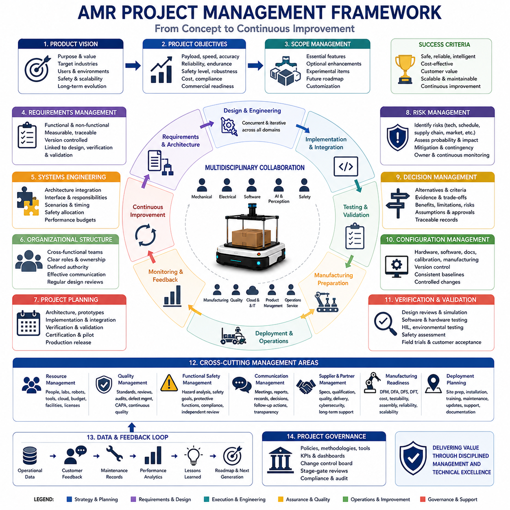
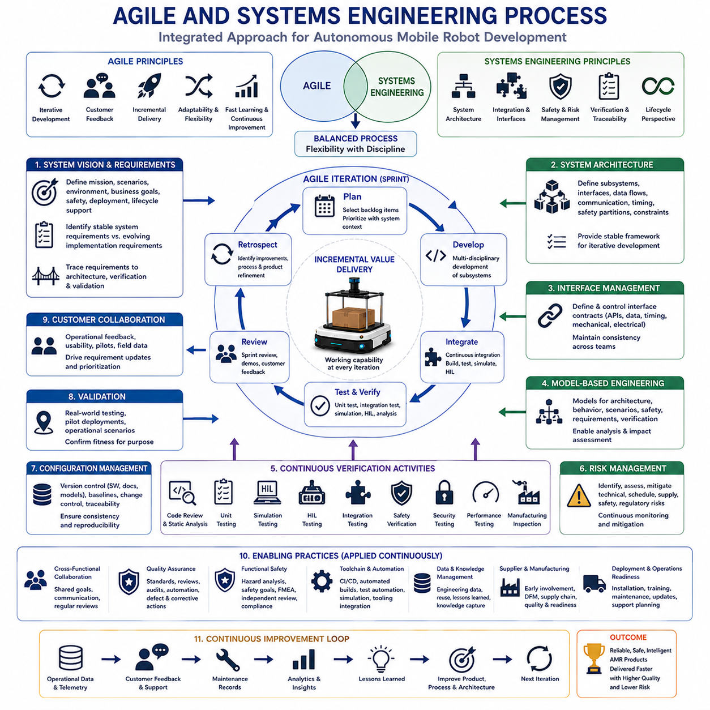
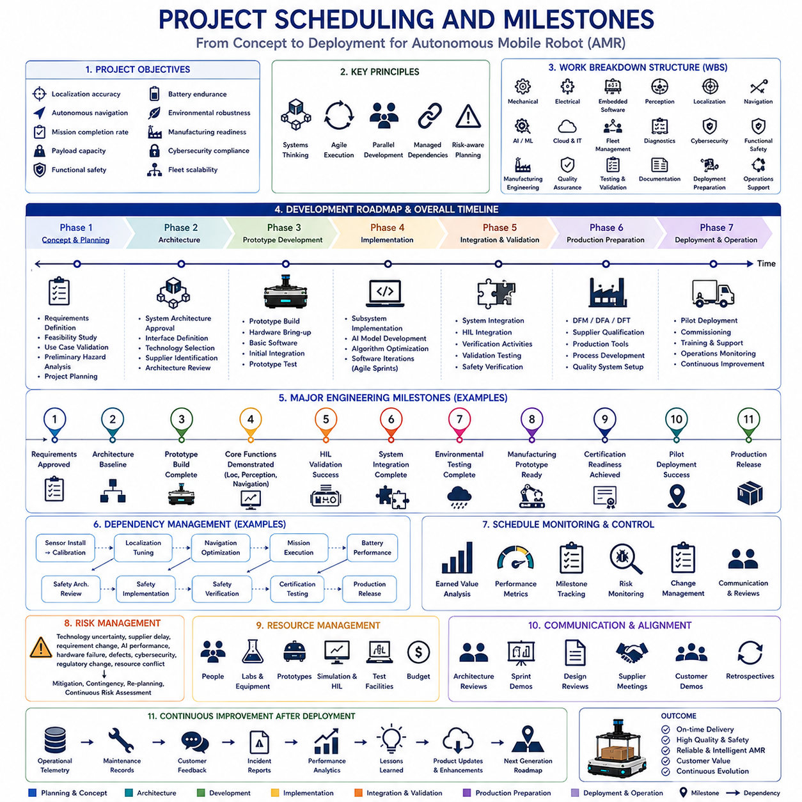
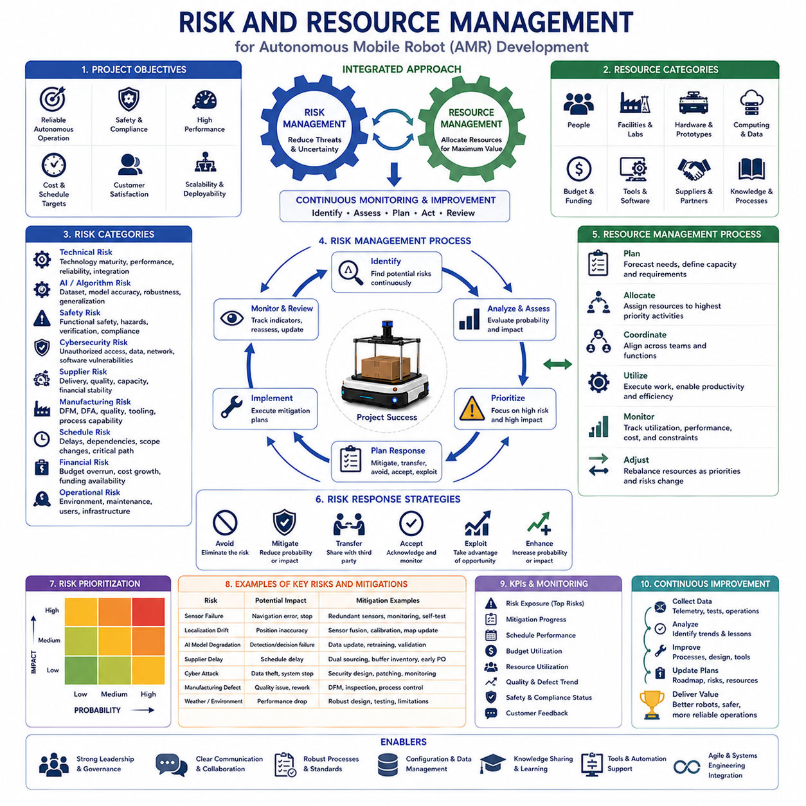
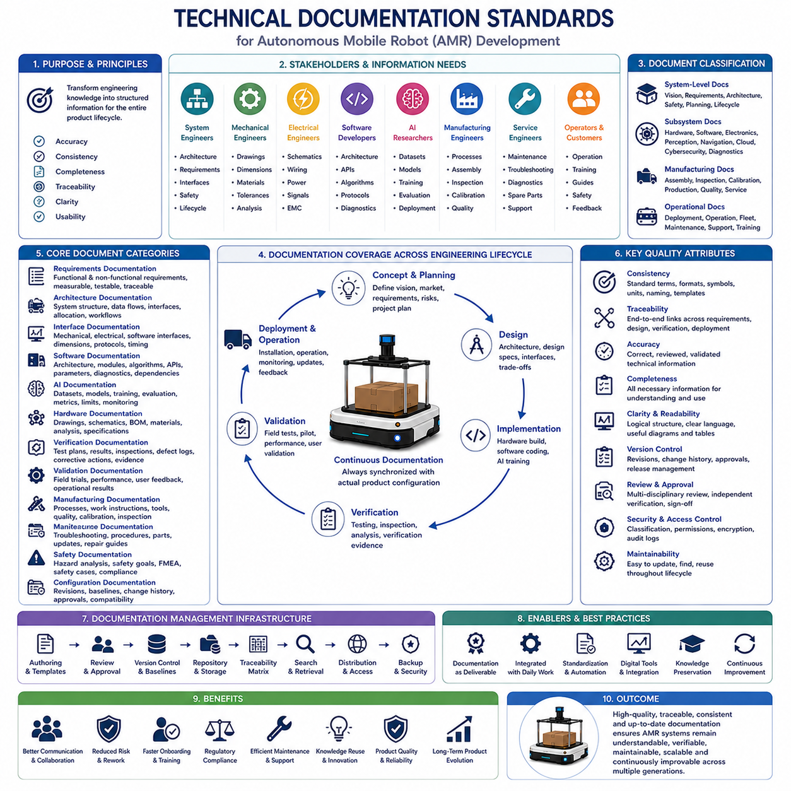
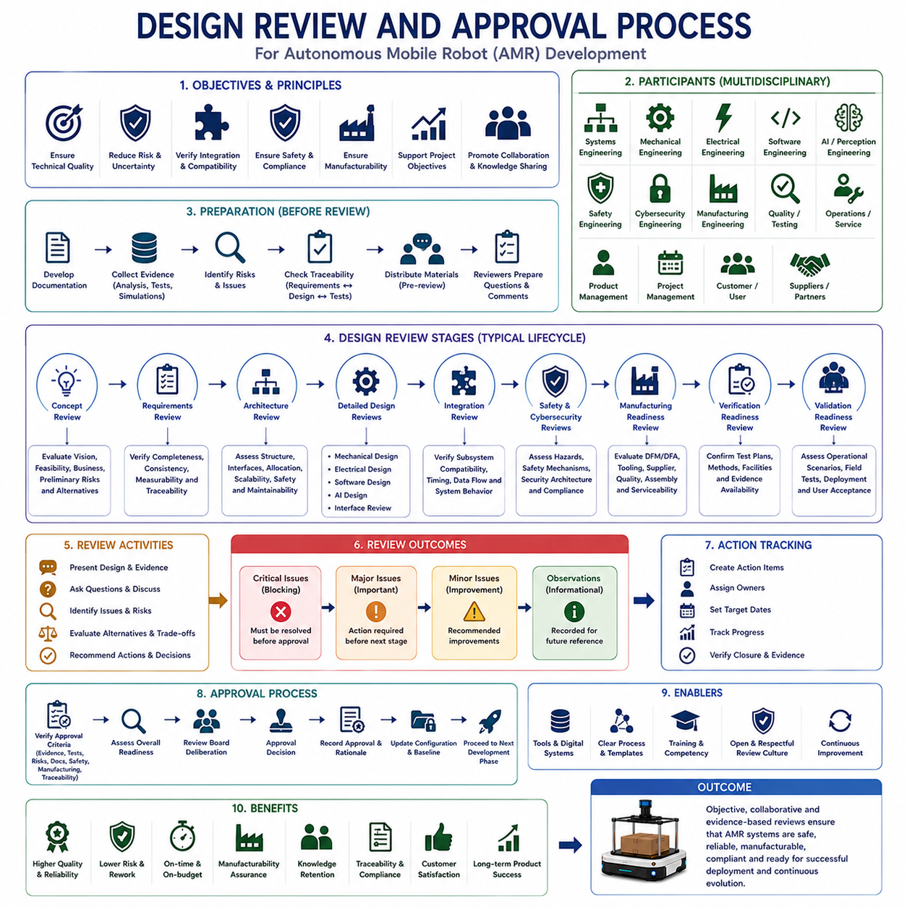
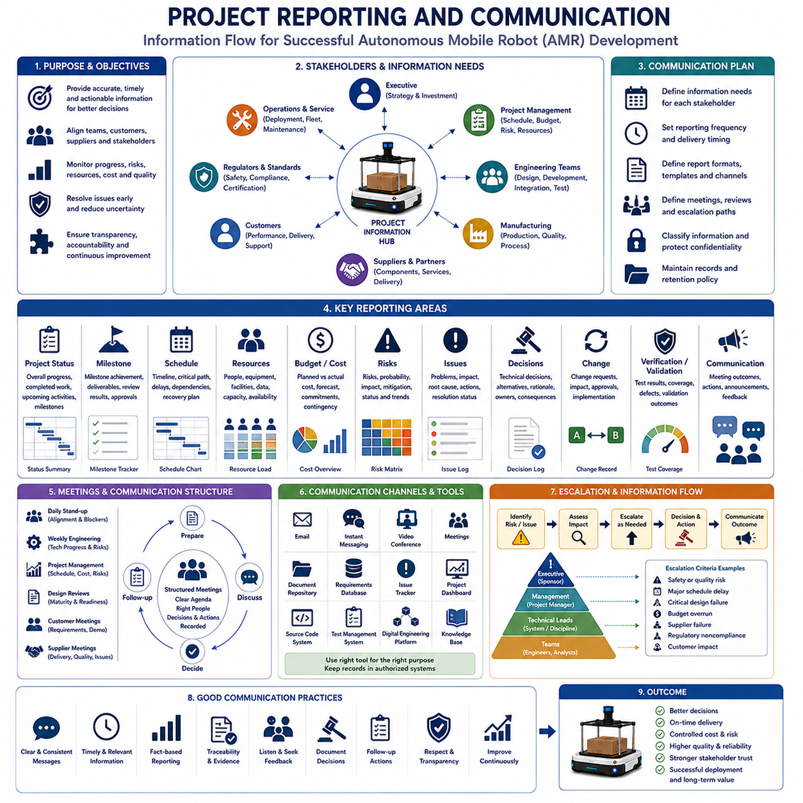
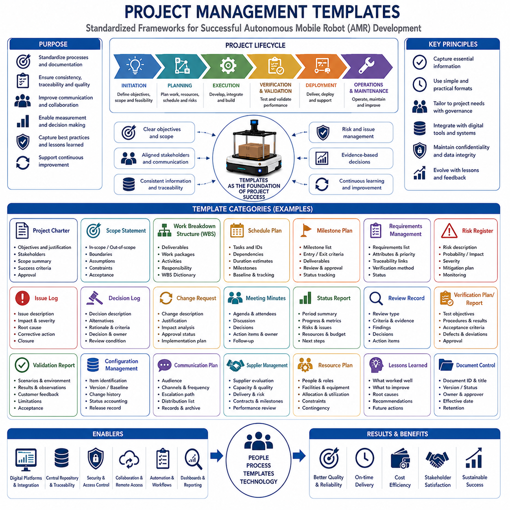

**Volume 10. AMR Engineering Process and Development Manual**

# Chapter23. Project Management and Documentation

## 23.01 AMR Project Management Framework

{width="7.268055555555556in" height="7.268055555555556in"}

An Autonomous Mobile Robot project differs fundamentally from conventional software or mechanical engineering projects because it integrates multiple engineering disciplines into a single intelligent system operating in dynamic physical environments. Software, electronics, mechanical design, electrical systems, perception, localization, navigation, artificial intelligence, cybersecurity, cloud infrastructure, manufacturing, functional safety, and operations all evolve simultaneously throughout development. Success therefore depends not only on technical excellence within individual domains but also on systematic coordination among disciplines whose decisions continuously influence one another. An AMR project management framework provides the organizational structure, decision-making processes, communication mechanisms, and engineering governance necessary to transform multidisciplinary development into a predictable and repeatable product lifecycle.

Unlike traditional product development, AMR engineering rarely progresses in a strictly sequential manner. Mechanical dimensions affect sensor placement, sensor placement influences perception performance, perception determines navigation capability, navigation affects mission planning, mission execution changes battery utilization, battery characteristics influence chassis design, and software optimization may require hardware modifications. Because dependencies exist throughout the entire system, project management must support continuous iteration rather than assuming that each engineering phase is completed before the next begins. Effective frameworks recognize that integration occurs from the earliest concept phase and continues until the product reaches operational maturity.

The framework begins with a clearly defined product vision that establishes the purpose of the robot within its intended operational environment. Rather than describing only technical specifications, the vision explains the operational problems the robot is expected to solve, the value delivered to customers, the target industries, expected users, deployment environments, productivity improvements, safety expectations, scalability goals, and long-term product evolution. A shared vision aligns engineering teams, management, manufacturing, marketing, service organizations, and external partners around common objectives before detailed design activities begin.

Project objectives should translate the product vision into measurable engineering targets. Objectives typically define payload capacity, operating speed, localization accuracy, navigation reliability, battery endurance, charging time, mission completion rate, functional safety level, environmental robustness, communication reliability, maintainability, cybersecurity resilience, manufacturing cost, regulatory compliance, and commercial readiness. Each objective should possess quantitative acceptance criteria so that progress can be evaluated objectively throughout development rather than relying on subjective assessments of project completion.

Scope management represents one of the most important responsibilities within AMR project management. Intelligent robotic systems naturally encourage continuous feature expansion because every new capability appears to create additional customer value. However, uncontrolled scope growth increases technical complexity, integration effort, validation requirements, schedule uncertainty, and overall project risk. The framework therefore distinguishes between essential product capabilities, optional enhancements, experimental technologies, future roadmap items, and customer-specific customization. Scope decisions should remain aligned with available resources, technical maturity, and market priorities rather than engineering enthusiasm alone.

Requirements management provides the foundation upon which multidisciplinary development is coordinated. Functional requirements define what the robot should accomplish, while non-functional requirements establish constraints involving performance, safety, reliability, environmental conditions, cybersecurity, maintainability, usability, diagnostics, regulatory compliance, manufacturing, and lifecycle support. Requirements should remain uniquely identifiable, measurable, traceable, version-controlled, and connected to design decisions, implementation tasks, verification evidence, and validation results. Effective requirements management reduces ambiguity while enabling systematic change control throughout development.

Systems engineering serves as the integrating discipline that connects every engineering domain. Rather than allowing individual teams to optimize isolated subsystems independently, systems engineering evaluates interactions across the complete robot architecture. Interface definitions, subsystem responsibilities, operational scenarios, timing requirements, communication protocols, safety allocations, computational resources, and performance budgets are coordinated continuously. This holistic perspective minimizes integration surprises by ensuring that local optimization never compromises overall system performance or operational reliability.

Organizational structure significantly influences project execution. Cross-functional teams consisting of mechanical engineers, electrical engineers, embedded software developers, AI researchers, perception specialists, localization engineers, cloud developers, safety engineers, manufacturing engineers, quality specialists, and product managers collaborate throughout development instead of working as isolated departments. Clear responsibility assignment, well-defined authority, structured communication channels, and regular multidisciplinary design reviews enable engineering decisions to incorporate diverse technical perspectives before implementation becomes costly to modify.

Project planning establishes the roadmap connecting concept development to commercial deployment. Planning typically includes system architecture definition, technology selection, prototype development, subsystem implementation, integration milestones, verification activities, validation campaigns, manufacturing preparation, regulatory certification, pilot deployment, and production release. Rather than treating these activities as isolated phases, the framework recognizes overlapping engineering efforts while identifying critical dependencies requiring coordination. Plans should remain adaptable because robotics projects inevitably encounter technical discoveries requiring controlled adjustment.

Work Breakdown Structure organization enables large AMR projects to be divided into manageable engineering activities while preserving system-level visibility. Mechanical structures, drive systems, battery systems, perception modules, localization software, navigation algorithms, fleet management, cloud infrastructure, cybersecurity, diagnostics, functional safety, manufacturing engineering, testing, documentation, and deployment each become manageable work packages. Dependencies among packages remain explicitly documented so that schedule adjustments and resource allocation decisions can consider their impact across the complete development program.

Schedule management within robotics emphasizes technical readiness rather than simply completing predefined tasks. Milestones should represent measurable engineering achievements such as successful autonomous navigation, validated obstacle avoidance, verified braking performance, completed safety architecture review, successful Hardware-in-the-Loop integration, completed environmental testing, or validated fleet coordination. Achievement-based milestones provide more reliable indicators of project progress than calendar-based reporting because they reflect actual technical capability rather than planned activity completion.

Resource management extends beyond personnel allocation to include laboratories, development robots, simulation infrastructure, computational resources, testing facilities, manufacturing equipment, sensors, embedded hardware, cloud platforms, software licenses, measurement instruments, and prototype components. Since many engineering activities depend upon shared infrastructure, resource conflicts can become significant schedule risks. Effective project management continuously balances engineering priorities with infrastructure availability while minimizing idle time and unnecessary duplication of expensive equipment.

Risk management forms an essential component of every AMR project because uncertainty exists across technology, integration, manufacturing, supply chains, regulations, customer acceptance, and operational environments. Technical risks may involve localization accuracy, perception robustness, battery performance, actuator reliability, software scalability, AI generalization, or communication latency. Project risks include schedule delays, supplier disruptions, component obsolescence, certification uncertainty, staffing changes, budget limitations, and manufacturing readiness. Each identified risk should include probability assessment, impact estimation, mitigation strategy, contingency planning, ownership assignment, and continuous monitoring throughout development.

Technical decision management ensures that important engineering choices remain transparent and traceable. Architecture selection, sensor configuration, computing platforms, operating systems, communication technologies, localization strategies, AI frameworks, battery chemistry, safety architecture, cybersecurity mechanisms, and manufacturing processes often influence the project for many years. Major decisions should therefore document considered alternatives, evaluation criteria, supporting evidence, expected benefits, limitations, assumptions, associated risks, and approval history. Decision records preserve organizational knowledge while supporting future product evolution.

Configuration management maintains consistency across hardware, software, documentation, calibration parameters, manufacturing instructions, and deployed systems. Every prototype, engineering sample, validation vehicle, and production robot should possess uniquely identifiable configurations linked to version-controlled design information. Configuration control prevents confusion during integration, simplifies troubleshooting, supports reproducible testing, enables controlled software updates, and ensures that verification evidence always corresponds to the exact system configuration under evaluation.

Verification and validation planning should begin during early project definition rather than after implementation concludes. Verification confirms that engineering outputs satisfy their specified requirements, whereas validation determines whether the integrated robot satisfies operational needs under realistic conditions. The project framework coordinates design reviews, simulations, software testing, hardware testing, Hardware-in-the-Loop experiments, environmental evaluations, fault injection, functional safety assessments, operational trials, customer acceptance testing, and long-duration field operation. Early planning ensures that evidence collection proceeds continuously rather than becoming concentrated near project completion.

Quality management within AMR development extends far beyond manufacturing inspection. Engineering quality includes requirement quality, architecture quality, software quality, hardware quality, interface quality, documentation quality, testing quality, process quality, supplier quality, cybersecurity quality, and operational quality. Continuous quality assurance integrates reviews, audits, coding standards, design standards, manufacturing controls, defect tracking, corrective actions, preventive actions, and continuous improvement into everyday engineering activities instead of treating quality as a final inspection function.

Functional safety management operates as an independent governance process throughout the project lifecycle. Hazard analysis, safety goals, safety requirements, architectural independence, protective functions, diagnostics, verification, validation, documentation, and compliance activities require dedicated planning and independent review. Project management ensures that safety activities receive appropriate resources, remain synchronized with technical development, and are never compromised by schedule pressure or commercial urgency. Safety milestones should possess equivalent importance to functional milestones because both contribute directly to successful product deployment.

Communication management becomes increasingly important as multidisciplinary teams expand. Engineering meetings, architecture reviews, interface workshops, risk reviews, design approvals, integration reports, testing summaries, customer demonstrations, supplier coordination, and executive progress reviews should each possess clearly defined objectives, participants, documentation standards, decision records, and follow-up responsibilities. Effective communication reduces misunderstanding, accelerates decision-making, improves interdisciplinary collaboration, and strengthens organizational alignment throughout complex development programs.

Supplier and partner management represent strategic elements within many AMR projects because sensors, computing platforms, batteries, actuators, embedded modules, cloud services, and manufacturing components frequently originate from specialized external organizations. Project management coordinates technical specifications, interface definitions, qualification activities, delivery schedules, quality expectations, cybersecurity requirements, documentation standards, and long-term support agreements. Strong supplier relationships reduce integration risk while improving product reliability and supply chain resilience during commercial production.

Manufacturing readiness planning begins well before engineering development concludes. Design for Manufacturing, Design for Assembly, Design for Serviceability, Design for Testability, and Design for Reliability principles should influence engineering decisions throughout development rather than being introduced during production preparation. Manufacturing engineers collaborate with design teams to simplify assembly, reduce component variation, improve inspection accessibility, optimize wiring, standardize fasteners, facilitate calibration, reduce production cost, and improve long-term maintainability without compromising system performance or safety.

Deployment planning bridges engineering development and operational reality. Site preparation, installation procedures, commissioning, operator training, maintenance planning, spare parts logistics, fleet monitoring, software update strategies, remote diagnostics, customer support, cybersecurity maintenance, and operational documentation must all be coordinated before commercial release. Successful deployment depends upon organizational readiness as much as technical readiness because customer satisfaction reflects the complete operational experience rather than the robot alone.

Continuous improvement represents the final element of the project management framework but simultaneously initiates the next development cycle. Operational data, customer feedback, maintenance records, software telemetry, incident reports, performance trends, manufacturing observations, supplier feedback, regulatory developments, and technological advances provide valuable information for future product evolution. Rather than treating project completion as the end of engineering responsibility, mature organizations establish systematic feedback loops connecting deployed systems directly to future architecture decisions, roadmap planning, process refinement, and organizational learning.

Ultimately, an AMR project management framework integrates multidisciplinary engineering into a unified product development process capable of delivering reliable, safe, intelligent, and commercially successful autonomous robotic systems. Product vision establishes strategic direction, requirements define measurable objectives, systems engineering coordinates multidisciplinary design, project planning organizes execution, risk management addresses uncertainty, configuration management preserves consistency, verification and validation confirm technical maturity, functional safety ensures dependable operation, quality management supports engineering excellence, manufacturing planning enables scalable production, and continuous improvement transforms operational experience into future innovation. By combining technical governance with disciplined project execution, organizations create a repeatable framework that enables autonomous mobile robot development to progress from concept to deployment with greater predictability, higher product quality, and sustainable long-term success.

## 23.02 Agile and System Engineering Process

{width="7.268055555555556in" height="7.268055555555556in"}

Agile software development and systems engineering originated from different engineering traditions, yet modern Autonomous Mobile Robot development requires both disciplines to operate together as a unified engineering process. Agile emphasizes rapid iteration, continuous customer feedback, incremental delivery, adaptive planning, and flexible responses to changing requirements. Systems engineering emphasizes comprehensive system architecture, multidisciplinary integration, interface management, lifecycle thinking, traceability, risk control, and verification across complex engineering domains. Neither methodology alone adequately addresses the challenges of developing intelligent robotic systems that combine mechanical structures, embedded electronics, perception algorithms, artificial intelligence, localization, navigation, cloud infrastructure, cybersecurity, manufacturing, and functional safety. An effective AMR development process therefore integrates Agile execution with systems engineering discipline to achieve both flexibility and technical rigor.

Traditional sequential development models assume that requirements can be fully defined before implementation begins. This assumption rarely holds for autonomous robotics because customer expectations, AI capabilities, sensing technologies, hardware platforms, regulatory requirements, and operational environments evolve continuously throughout development. Conversely, applying pure Agile practices without sufficient systems engineering often produces rapid software progress while allowing architectural inconsistencies, interface conflicts, safety issues, and integration problems to accumulate. The combined process recognizes that architecture should remain sufficiently stable to support long-term product evolution while implementation proceeds through continuous incremental improvement.

The integrated engineering process begins with a clear system vision that defines the operational objectives rather than immediately focusing on technical implementation. Engineers first identify customer needs, operational scenarios, environmental conditions, business objectives, safety expectations, deployment environments, and lifecycle support requirements. These high-level objectives provide stable guidance for subsequent Agile iterations while preventing individual development teams from optimizing isolated features that do not contribute meaningfully to overall system value. A shared system vision enables technical flexibility without sacrificing strategic direction.

Systems engineering establishes the overall architecture early in development while deliberately allowing implementation details to evolve through iterative refinement. High-level architectural decisions define subsystem responsibilities, interface boundaries, communication protocols, computational allocation, safety partitions, operational workflows, timing assumptions, hardware constraints, and integration principles. This architecture serves as the engineering framework within which Agile teams independently develop subsystem capabilities. Stable interfaces reduce integration uncertainty while allowing internal subsystem implementation to adapt continuously as technology matures.

Requirements engineering within an integrated process distinguishes between stable system requirements and evolving implementation requirements. Mission objectives, operational boundaries, safety constraints, regulatory obligations, environmental conditions, and customer commitments generally remain relatively stable throughout development. Implementation details involving algorithms, user interfaces, optimization techniques, AI models, software architecture, diagnostics, or visualization methods may evolve substantially during successive iterations. Separating stable requirements from adaptable implementation allows engineering teams to embrace innovation without compromising overall product integrity.

Agile planning organizes development into relatively short iterations while systems engineering maintains visibility across the complete product lifecycle. Individual sprints may focus on localization improvements, perception optimization, navigation refinement, battery management, diagnostics, cybersecurity enhancements, or fleet coordination. Systems engineering continuously evaluates whether these incremental improvements remain consistent with overall architectural objectives, safety requirements, interface definitions, manufacturing constraints, and long-term scalability. This dual perspective balances short-term productivity with long-term system sustainability.

Product backlogs represent more than collections of software features in AMR development. Backlog items may include hardware integration, sensor calibration, mechanical redesign, electrical improvements, safety analysis, environmental testing, manufacturing preparation, supplier qualification, documentation, cybersecurity assessment, simulation enhancement, customer evaluation, regulatory certification, or deployment preparation. Systems engineering prioritizes these multidisciplinary activities according to system dependencies rather than software development convenience alone. Consequently, backlog management reflects complete product evolution instead of only software implementation progress.

User stories remain valuable within robotics development but require broader interpretation than conventional software projects. A user story may describe operator interaction, maintenance procedures, manufacturing activities, deployment scenarios, fleet management, functional safety, remote diagnostics, charging workflows, or autonomous mission execution. Each story should connect customer value directly with system behavior while remaining traceable to system requirements, architecture, verification plans, validation scenarios, and operational objectives. User stories therefore become bridges linking customer expectations with multidisciplinary engineering implementation.

Systems architecture provides the stable foundation supporting iterative subsystem development. Mechanical engineers, embedded software developers, AI researchers, perception specialists, cloud engineers, electrical designers, safety engineers, manufacturing specialists, and operations teams may all work concurrently provided that interfaces remain well defined. Architecture documentation specifies data exchange, timing behavior, computational responsibilities, physical connections, communication assumptions, synchronization methods, diagnostic interfaces, and safety boundaries. Stable architectural interfaces significantly reduce integration risk even when subsystem implementations evolve rapidly.

Interface management becomes increasingly important as development progresses across multiple Agile teams. Every subsystem depends upon assumptions regarding communication timing, data formats, coordinate systems, electrical characteristics, software APIs, diagnostic information, synchronization methods, configuration parameters, and operational sequencing. Systems engineering continuously validates interface consistency while Agile teams independently improve subsystem functionality. Early identification of interface inconsistencies prevents expensive integration failures near project completion when modifications become increasingly difficult.

Model-Based Systems Engineering supports Agile development by representing system behavior through formal engineering models rather than relying exclusively on textual documentation. Functional architectures, operational workflows, interface definitions, state machines, timing diagrams, safety analyses, requirement relationships, and verification planning become interconnected engineering models that evolve continuously alongside implementation. These models improve communication among multidisciplinary teams while preserving traceability despite frequent iterative development. Model-based approaches also simplify impact analysis whenever requirements or architectural decisions change.

Continuous integration represents one of the most important engineering practices connecting Agile software development with systems engineering. Individual software modules, embedded controllers, perception algorithms, localization systems, navigation planners, cloud services, diagnostics, fleet management, and user interfaces should integrate regularly rather than waiting until late project phases. Automated builds, simulation environments, software testing, hardware integration platforms, and configuration management enable frequent integration while rapidly detecting incompatibilities introduced during ongoing development.

Simulation provides a safe environment for rapid Agile experimentation while supporting systems engineering validation. Virtual environments evaluate navigation performance, perception algorithms, obstacle avoidance, localization strategies, fleet coordination, communication behavior, fault recovery, and operational workflows before physical implementation. Systems engineering defines representative operational scenarios and acceptance criteria, whereas Agile teams continuously improve subsystem performance through iterative experimentation. Simulation accelerates development while reducing dependency upon expensive prototype hardware and controlled testing facilities.

Hardware development introduces longer iteration cycles than software engineering, requiring careful synchronization between Agile planning and systems engineering milestones. Mechanical redesign, printed circuit board fabrication, sensor procurement, actuator manufacturing, battery integration, environmental qualification, and prototype assembly often require weeks or months rather than days. Integrated project management therefore coordinates software iterations with hardware availability through digital twins, hardware emulators, Hardware-in-the-Loop systems, and staged prototype releases. This coordination enables continuous software progress despite physical hardware constraints.

Verification activities occur continuously throughout iterative development rather than exclusively after implementation completion. Unit testing, code review, static analysis, hardware inspection, interface verification, simulation validation, subsystem integration testing, calibration verification, timing analysis, cybersecurity assessment, and manufacturing inspection all contribute evidence confirming that implemented functionality satisfies engineering requirements. Systems engineering ensures that verification remains comprehensive across the complete system while Agile teams perform incremental verification during every development iteration.

Validation complements verification by confirming that integrated robotic behavior satisfies operational objectives under realistic conditions. Early validation often occurs through simulation, controlled laboratory testing, pilot deployments, customer demonstrations, or representative field scenarios. Later validation expands toward complex operational environments involving changing weather, varying terrain, human interaction, communication disruptions, sensor degradation, and long-duration autonomous operation. Incremental validation enables customer feedback throughout development while continuously improving system maturity prior to commercial deployment.

Risk management operates continuously throughout Agile iterations rather than remaining limited to project initiation. Technical uncertainty, supplier dependencies, AI model limitations, perception robustness, localization accuracy, hardware availability, manufacturing readiness, cybersecurity threats, regulatory changes, safety assumptions, and customer expectations evolve throughout development. Systems engineering identifies system-level risks while Agile teams address implementation-specific uncertainties through rapid experimentation. Frequent risk reassessment enables proactive mitigation before uncertainties become significant project delays.

Functional safety integration represents one of the strongest reasons for combining Agile methods with systems engineering. Safety analysis, hazard identification, architectural independence, protective mechanisms, diagnostics, verification, validation, documentation, and regulatory compliance require long-term engineering discipline that extends beyond individual software iterations. Agile teams may rapidly improve algorithms or software functionality, but systems engineering ensures that every modification remains consistent with safety goals, hazard analysis, traceability, and certification evidence. Safety therefore evolves continuously without compromising regulatory integrity.

Configuration management becomes increasingly important when multiple Agile teams simultaneously modify software, hardware, documentation, simulation models, calibration parameters, manufacturing instructions, and testing environments. Every system configuration should remain uniquely identifiable and reproducible. Version control, change approval, automated builds, configuration baselines, dependency management, software releases, hardware revisions, and documentation updates all contribute to maintaining engineering consistency. Effective configuration management enables rapid development while preventing integration confusion across multidisciplinary teams.

Quality assurance shifts from final inspection toward continuous engineering excellence throughout iterative development. Design reviews, coding standards, interface reviews, architecture assessments, automated testing, simulation validation, supplier evaluation, manufacturing audits, documentation review, cybersecurity assessment, functional safety evaluation, and operational readiness assessments become routine engineering activities integrated into every development cycle. Continuous quality management reduces defect accumulation while improving engineering maturity throughout the entire project lifecycle.

Cross-functional collaboration represents the cultural foundation of an integrated Agile systems engineering process. Mechanical engineers understand software constraints, AI researchers appreciate hardware limitations, manufacturing specialists influence design decisions, safety engineers participate throughout development, cloud developers coordinate with embedded software teams, and product managers continuously communicate customer priorities. Regular technical reviews, architecture workshops, integration demonstrations, sprint reviews, retrospectives, and multidisciplinary planning meetings create shared understanding across engineering domains that traditionally operate independently.

Customer involvement extends beyond software demonstrations to include operational evaluation, prototype assessment, workflow validation, deployment planning, maintenance review, training evaluation, usability feedback, and long-term operational observation. Customers frequently identify practical operational issues that remain invisible during laboratory development. Systems engineering incorporates this operational feedback into evolving requirements while Agile teams rapidly implement incremental improvements. Continuous customer collaboration therefore improves product usability without destabilizing overall system architecture.

Deployment planning begins long before engineering implementation concludes. Manufacturing preparation, installation procedures, commissioning workflows, operator training, maintenance documentation, remote diagnostics, fleet monitoring, software update mechanisms, cybersecurity maintenance, spare parts logistics, and customer support processes evolve concurrently with product development. Systems engineering coordinates complete lifecycle preparation while Agile iterations gradually mature individual operational capabilities. Consequently, commercial deployment becomes the natural continuation of engineering development rather than a separate post-development activity.

Continuous improvement represents both the conclusion and renewal of the integrated engineering process. Operational data, fleet telemetry, maintenance records, customer feedback, incident analysis, software analytics, manufacturing observations, supplier performance, regulatory evolution, and emerging technologies continuously influence future product development. Systems engineering evaluates long-term architectural implications while Agile teams implement incremental enhancements through successive development cycles. Organizational learning therefore becomes embedded within the engineering process itself rather than occurring only after project completion.

Ultimately, integrating Agile development with systems engineering creates a balanced engineering methodology capable of supporting the complexity of modern autonomous mobile robot development. Systems engineering provides architectural stability, lifecycle governance, multidisciplinary coordination, traceability, risk management, and long-term product integrity. Agile development contributes adaptability, rapid learning, continuous customer engagement, incremental delivery, and accelerated innovation. Together they enable organizations to develop intelligent robotic systems that remain technically coherent, operationally reliable, commercially competitive, functionally safe, and continuously adaptable throughout their complete product lifecycle.

## 23.03 Project Scheduling and Milestones

{width="7.268055555555556in" height="7.268055555555556in"}

Project scheduling provides the temporal structure that transforms an engineering vision into an executable development program. While systems engineering defines what must be built and Agile determines how teams iteratively develop capabilities, project scheduling determines when activities occur, how resources are coordinated, and how dependencies are managed throughout the product lifecycle. In Autonomous Mobile Robot development, scheduling is significantly more complex than in traditional software projects because hardware, software, artificial intelligence, perception, electronics, manufacturing, testing, certification, and deployment all progress at different speeds while remaining highly interdependent. Effective scheduling therefore becomes a strategic engineering discipline rather than simply a calendar management activity.

Unlike conventional software projects where development is primarily sequential within a single discipline, AMR development contains numerous parallel engineering streams. Mechanical chassis design influences sensor placement, sensor integration affects perception algorithms, perception determines localization quality, localization impacts navigation performance, navigation influences mission execution, and mission execution affects battery consumption and operational endurance. Meanwhile manufacturing engineering, supplier management, functional safety activities, documentation, and quality assurance proceed concurrently. Project schedules must therefore represent technical dependencies rather than merely chronological task ordering.

A successful schedule begins with a clearly defined product roadmap that describes the evolution of the robotic system from concept to commercial deployment. The roadmap typically includes concept development, feasibility analysis, system architecture definition, prototype construction, subsystem implementation, integration phases, validation campaigns, manufacturing preparation, certification, pilot deployment, production release, and post-deployment improvement. Rather than treating these as isolated stages, modern engineering organizations recognize overlapping execution where later activities begin before earlier phases have completely finished. Controlled overlap shortens development cycles while maintaining acceptable engineering risk.

Project scheduling starts with defining measurable project objectives that guide milestone planning. Objectives may include localization accuracy, autonomous navigation capability, obstacle avoidance reliability, mission completion rate, battery endurance, payload capacity, functional safety maturity, environmental robustness, manufacturing readiness, cybersecurity compliance, cloud connectivity, or fleet scalability. Every objective should ultimately correspond to observable engineering evidence. Scheduling then organizes development activities that progressively demonstrate achievement of these objectives throughout successive project phases.

Work Breakdown Structure serves as the primary organizational framework for scheduling. Instead of viewing development as one large engineering effort, the project is decomposed into manageable work packages representing mechanical engineering, electrical systems, embedded software, perception, localization, navigation, artificial intelligence, cloud infrastructure, fleet management, diagnostics, cybersecurity, functional safety, manufacturing engineering, quality assurance, testing, documentation, deployment preparation, and operational support. Each work package contains its own schedule while remaining connected through well-defined dependencies with other engineering domains.

Dependency analysis represents one of the most important activities in project scheduling. Certain engineering tasks cannot begin until prerequisite activities have reached sufficient maturity. Sensor calibration depends upon hardware installation. Localization tuning depends upon calibrated sensors. Navigation optimization depends upon reliable localization. Fleet management depends upon stable mission execution interfaces. Manufacturing documentation depends upon finalized hardware configurations. Certification testing depends upon stable functional safety implementation. Understanding these dependencies prevents unrealistic schedules that assume independent progress where technical coupling actually exists.

Critical path analysis identifies sequences of dependent activities that directly determine overall project duration. Delays affecting critical path tasks immediately delay project completion unless corrective actions are implemented. However, modern AMR development often contains multiple partially overlapping critical paths because hardware procurement, software implementation, AI model development, manufacturing preparation, supplier qualification, and certification activities evolve simultaneously. Effective project managers continuously monitor evolving critical paths rather than assuming a single fixed sequence throughout development.

Milestones represent measurable engineering achievements rather than arbitrary calendar dates. An effective milestone demonstrates that significant technical uncertainty has been eliminated. Examples include successful autonomous navigation inside representative environments, completion of safety architecture reviews, integration of perception and localization, successful Hardware-in-the-Loop validation, completion of environmental testing, successful autonomous docking, manufacturing prototype completion, fleet management integration, cybersecurity assessment completion, and customer acceptance demonstrations. Engineering milestones should always correspond to observable technical evidence rather than document completion alone.

Concept development milestones establish the engineering foundation before implementation begins. These early milestones typically include operational requirement definition, customer use-case validation, system architecture approval, technology selection, preliminary hazard analysis, interface definition, supplier identification, initial project planning, and feasibility assessment. Although no production software may yet exist, successful completion of concept milestones significantly reduces uncertainty during later development. Investing sufficient effort in concept definition prevents costly architectural redesign after implementation has already progressed.

Architecture milestones validate that multidisciplinary engineering teams share consistent assumptions regarding subsystem responsibilities, communication interfaces, computational allocation, timing constraints, safety partitions, data flows, mechanical packaging, electrical architecture, software frameworks, and deployment strategies. Architecture reviews should occur before extensive implementation begins because correcting architectural errors becomes increasingly expensive as subsystem maturity increases. Stable architecture enables Agile teams to iterate independently without repeatedly redefining system boundaries.

Prototype milestones demonstrate physical realization of engineering concepts. Early prototypes often prioritize learning over performance and therefore intentionally simplify many production features. Mechanical packaging, electrical integration, sensor installation, actuator control, battery management, onboard computing, communication infrastructure, and basic software frameworks gradually become operational. Prototype milestones confirm engineering feasibility while identifying practical integration challenges that cannot be discovered through documentation or simulation alone. Multiple prototype generations usually improve maturity through successive iterations.

Software scheduling differs fundamentally from hardware scheduling because implementation cycles occur much faster. Agile software development organizes work into relatively short sprints that continuously deliver incremental functionality. Hardware redesign, PCB fabrication, sensor procurement, machining, environmental testing, and assembly frequently require weeks or months. Project schedules therefore synchronize rapid software iterations with slower hardware evolution using simulation environments, digital twins, hardware emulators, and staged prototype availability. This synchronization allows continuous software progress despite hardware constraints.

Artificial intelligence development introduces additional scheduling uncertainty because model performance cannot always be predicted accurately before experimentation. Data collection, dataset annotation, model selection, training, evaluation, optimization, validation, robustness assessment, and deployment frequently require multiple experimental cycles. Scheduling AI activities therefore emphasizes iterative learning rather than deterministic completion dates. Milestones focus upon measurable capability improvements such as object detection accuracy, semantic segmentation quality, localization robustness, anomaly detection performance, or mission planning effectiveness instead of merely completing predefined engineering tasks.

System integration milestones verify that independently developed subsystems operate correctly as one coordinated robotic platform. Mechanical hardware, embedded controllers, sensors, perception software, localization algorithms, navigation planners, battery management systems, diagnostics, cloud services, fleet management, operator interfaces, and cybersecurity mechanisms gradually become interconnected. Integration milestones typically expose interface inconsistencies, timing conflicts, computational bottlenecks, synchronization problems, and unexpected system interactions. Frequent incremental integration significantly reduces the technical risk associated with final system assembly.

Verification milestones evaluate whether implemented functionality satisfies engineering requirements. Unit testing, software integration testing, interface verification, electrical inspection, mechanical measurements, timing validation, calibration assessment, simulation testing, Hardware-in-the-Loop evaluation, cybersecurity verification, safety mechanism validation, manufacturing inspection, and documentation review collectively establish objective engineering evidence. Verification schedules should distribute these activities continuously throughout development rather than concentrating them immediately before product release when corrective actions become considerably more expensive.

Validation milestones determine whether the integrated robotic system satisfies operational expectations under realistic conditions. Laboratory experiments gradually expand toward representative operational environments involving variable lighting, diverse terrain, changing weather, communication disruptions, dynamic obstacles, extended operating durations, human interaction, fleet coordination, charging operations, and maintenance procedures. Customer participation becomes increasingly important during validation because successful laboratory demonstrations do not necessarily guarantee operational usefulness. Validation milestones therefore progressively increase environmental realism while reducing residual deployment uncertainty.

Functional safety scheduling proceeds alongside mainstream engineering development rather than following implementation completion. Hazard analysis, safety goals, technical safety requirements, architecture evaluation, diagnostic implementation, safety verification, independent assessment, documentation preparation, compliance reviews, and certification evidence collection occur continuously throughout the project lifecycle. Scheduling safety activities independently ensures adequate engineering attention while preventing schedule pressure from delaying essential safety engineering tasks until project completion.

Manufacturing readiness milestones evaluate whether engineering designs can transition efficiently into repeatable production. Design for Manufacturing, Design for Assembly, Design for Testability, Design for Reliability, supplier qualification, production tooling, assembly procedures, calibration workflows, inspection methods, service documentation, spare parts management, logistics planning, and quality control processes gradually mature during development. Manufacturing preparation should not wait until engineering implementation concludes because production considerations frequently influence engineering decisions throughout product development.

Supplier management significantly influences project schedules because external organizations control component availability, manufacturing lead times, certification status, and technical support. Critical sensors, embedded computers, batteries, actuators, communication modules, safety controllers, printed circuit boards, mechanical assemblies, and specialized manufacturing services often require long procurement cycles. Scheduling therefore includes supplier qualification milestones, procurement planning, alternate sourcing strategies, delivery monitoring, incoming inspection, and contingency planning to reduce schedule vulnerability resulting from external dependencies.

Resource scheduling coordinates engineering personnel, laboratories, prototype vehicles, simulation infrastructure, testing facilities, manufacturing equipment, computational resources, measurement instruments, and financial budgets across concurrent activities. Many engineering tasks compete for limited shared resources, particularly specialized testing facilities or prototype hardware. Resource conflicts frequently become major schedule risks if not identified early. Effective resource planning balances utilization efficiency with sufficient flexibility to accommodate inevitable technical uncertainties and changing project priorities.

Schedule monitoring requires objective measurement of actual engineering progress rather than simply comparing completed tasks against planned activities. Earned value analysis, milestone completion, technical performance measures, defect trends, verification coverage, integration maturity, requirement traceability, risk exposure, manufacturing readiness, and customer feedback collectively provide a more accurate assessment of project health than calendar progress alone. Modern project management emphasizes engineering maturity indicators that reveal emerging schedule risks before significant delays become unavoidable.

Schedule risk management recognizes that uncertainty is inevitable in innovative engineering projects. Technical discoveries, supplier delays, changing customer requirements, AI experimentation, regulatory modifications, hardware failures, software defects, cybersecurity issues, environmental testing results, staffing changes, and manufacturing challenges all influence project timelines. Effective scheduling therefore includes contingency reserves, alternative development paths, incremental deliveries, flexible prioritization, risk mitigation strategies, and regular schedule reassessment. Adaptive scheduling maintains project momentum while accommodating unavoidable uncertainty without sacrificing engineering quality.

Communication milestones ensure that multidisciplinary engineering teams maintain shared understanding throughout development. Architecture reviews, sprint demonstrations, design reviews, supplier meetings, safety assessments, manufacturing workshops, customer demonstrations, executive reviews, integration checkpoints, and retrospective sessions provide structured opportunities for technical alignment. Well-planned communication events reduce misunderstandings, accelerate engineering decisions, improve collaboration, and ensure that evolving schedules remain consistent across all participating disciplines.

Deployment milestones transition engineering achievements into operational capability. Installation procedures, commissioning activities, operator training, maintenance preparation, software update infrastructure, remote diagnostics, fleet monitoring, customer documentation, service organization readiness, spare parts availability, cybersecurity maintenance, and operational support systems all become progressively established before commercial release. Deployment readiness depends upon coordinated completion of engineering, manufacturing, logistics, documentation, and customer support activities rather than product functionality alone.

Continuous improvement extends project scheduling beyond initial product release. Operational telemetry, maintenance records, customer feedback, incident reports, performance analytics, manufacturing observations, software metrics, cybersecurity updates, regulatory evolution, and technology advancements continuously generate new engineering work. Product roadmaps therefore incorporate planned post-release milestones supporting software updates, hardware revisions, feature expansion, reliability improvements, manufacturing optimization, and next-generation platform development. Scheduling thus evolves into an ongoing lifecycle management process rather than terminating when initial commercial deployment concludes.

Ultimately, project scheduling and milestone management transform complex multidisciplinary AMR development into a coordinated engineering journey with measurable progress, controlled uncertainty, and predictable delivery. Systems engineering provides lifecycle structure, dependency management, technical governance, verification planning, and integration discipline, while Agile execution contributes continuous iteration, adaptive planning, rapid learning, and incremental capability growth. Together they produce schedules that remain sufficiently structured to coordinate large engineering organizations while remaining flexible enough to accommodate innovation, evolving technologies, and changing customer needs. The result is a disciplined yet adaptable development process capable of delivering safe, reliable, intelligent, and commercially successful autonomous mobile robot systems.

## 23.04 Risk and Resource Management

{width="7.268055555555556in" height="7.268055555555556in"}

Risk management and resource management are two of the most fundamental disciplines in engineering project execution because they determine whether a technically sound design can be transformed into a successful commercial product. Every Autonomous Mobile Robot project contains uncertainty arising from technology, suppliers, manufacturing, customer expectations, regulations, schedules, budgets, and operational environments. At the same time, every project operates with limited engineering personnel, hardware, laboratory facilities, financial resources, computational capacity, and development time. Effective project management therefore requires continuous identification of uncertainty while ensuring that available resources are allocated where they generate the greatest engineering value. Rather than treating risks and resources as separate management activities, successful organizations integrate them into a unified decision-making framework throughout the entire product lifecycle.

Risk in engineering projects should not be interpreted solely as the possibility of failure. A risk represents any uncertain event that may influence project objectives, either positively or negatively. Most engineering organizations naturally focus on preventing failures such as schedule delays, component shortages, software defects, or certification problems. However, risk management also recognizes opportunities created by technological breakthroughs, improved supplier performance, accelerated manufacturing methods, or successful architectural simplification. Managing uncertainty therefore involves both reducing threats and exploiting favorable opportunities whenever they contribute to project objectives.

The first step of risk management is establishing a structured understanding of project objectives. Risks can only be evaluated relative to clearly defined goals. If the project aims to achieve reliable autonomous navigation in complex outdoor environments, then localization accuracy, perception robustness, environmental adaptability, computational performance, and sensor reliability become critical engineering concerns. If the objective emphasizes rapid commercialization, manufacturing readiness, supply chain stability, production cost, regulatory approval, and customer support may become equally important. Well-defined objectives provide the context necessary for identifying meaningful project risks rather than generating arbitrary lists of potential problems.

Risk identification begins during concept development and continues throughout the complete engineering lifecycle. At the earliest stages, engineering teams evaluate technological uncertainty, customer expectations, competing products, regulatory environments, operational scenarios, and available organizational capabilities. As development progresses, new risks emerge through prototype testing, subsystem integration, supplier interactions, manufacturing preparation, field validation, customer demonstrations, and commercial deployment. Risk identification therefore represents a continuous engineering activity rather than a one-time planning exercise performed only at project initiation.

Technical risks typically receive the greatest attention because they directly influence product performance. Mechanical reliability, actuator durability, battery lifetime, localization accuracy, perception robustness, navigation stability, communication reliability, cloud connectivity, cybersecurity resilience, computational limitations, software scalability, sensor degradation, artificial intelligence performance, thermal management, and environmental resistance all represent potential technical uncertainties. Every technical risk should be documented together with its engineering assumptions, supporting evidence, potential consequences, and current confidence level. Objective documentation enables engineering teams to evaluate progress without relying solely on subjective judgment.

Systems integration introduces an additional category of engineering risk that often exceeds the complexity of individual subsystem development. Independent engineering teams may successfully complete their assigned work while the complete robotic system still fails to operate correctly because interfaces, timing assumptions, computational allocation, electrical characteristics, coordinate systems, communication protocols, or diagnostic behavior differ between subsystems. Integration risks frequently remain hidden until hardware becomes available or multiple software components execute simultaneously. Continuous integration, interface reviews, simulation, and incremental system testing significantly reduce these risks before they threaten overall project schedules.

Artificial intelligence introduces distinctive uncertainties compared with deterministic software development. Performance depends upon dataset quality, annotation consistency, model architecture, computational resources, environmental diversity, operational scenarios, and continuous learning capability. AI models may achieve excellent laboratory performance while failing under previously unseen environmental conditions. Engineering organizations therefore treat AI development as an experimental process involving repeated hypothesis testing, model evaluation, robustness assessment, failure analysis, retraining, and validation. Risk management for AI emphasizes measurable performance evidence rather than optimistic expectations regarding algorithmic capability.

Functional safety represents a specialized engineering risk domain because failures may directly affect human safety or environmental protection. Hazard identification, hazard analysis, safety goals, technical safety requirements, architectural independence, diagnostic coverage, protective mechanisms, verification evidence, validation activities, and regulatory compliance collectively reduce safety-related uncertainty. Functional safety risks cannot be managed through software testing alone because hardware architecture, operational procedures, maintenance activities, manufacturing quality, and human interaction all contribute to overall system safety. Consequently, safety engineering remains integrated throughout every project phase.

Cybersecurity has become a major source of engineering risk as autonomous robots increasingly depend upon cloud services, wireless communication, remote diagnostics, software updates, fleet coordination, and connected operational infrastructure. Unauthorized system access, malicious software, communication interception, data manipulation, identity compromise, denial-of-service attacks, and supply chain vulnerabilities all threaten operational reliability. Cybersecurity risk management therefore combines secure architecture, authentication, encryption, access control, software maintenance, vulnerability assessment, penetration testing, monitoring, and incident response planning into a comprehensive engineering strategy rather than treating cybersecurity as an isolated software feature.

Supplier-related risks frequently determine project success because many critical technologies originate outside the development organization. Embedded computers, sensors, batteries, actuators, communication modules, electronic components, manufacturing equipment, and specialized software frameworks often depend upon long-term supplier relationships. Delivery delays, quality problems, discontinued components, financial instability, geopolitical restrictions, export controls, and manufacturing capacity limitations may all influence engineering schedules. Organizations therefore continuously evaluate supplier capability while developing alternate sourcing strategies, inventory planning, qualification procedures, and contractual agreements that reduce dependence upon single external providers.

Manufacturing risks emerge as products transition from engineering prototypes toward commercial production. Designs optimized exclusively for technical performance may prove expensive, difficult to assemble, difficult to calibrate, or difficult to maintain. Design for Manufacturing, Design for Assembly, Design for Testability, Design for Reliability, supplier qualification, production tooling, inspection procedures, calibration workflows, process validation, statistical quality control, and service documentation collectively reduce manufacturing uncertainty before volume production begins. Early manufacturing participation prevents engineering decisions that later become expensive production constraints.

Schedule risk reflects uncertainty regarding project completion rather than simply estimating task duration. Complex engineering activities rarely proceed exactly as originally planned because new discoveries, unexpected failures, regulatory changes, customer requests, supplier delays, or integration problems continuously modify project priorities. Effective schedule management therefore includes contingency reserves, milestone reassessment, dependency analysis, resource reallocation, incremental delivery strategies, and continuous schedule monitoring. Adaptive scheduling accepts uncertainty while preserving realistic commitments regarding overall project objectives.

Financial risks influence engineering decisions throughout product development. Research expenditures, prototype construction, laboratory equipment, manufacturing tools, supplier contracts, certification activities, engineering personnel, cloud infrastructure, software licensing, testing facilities, and deployment support all consume financial resources. Budget overruns frequently arise when technical complexity increases faster than anticipated or project scope expands without corresponding funding adjustments. Financial risk management therefore integrates engineering planning with cost forecasting, investment prioritization, expenditure monitoring, and contingency budgeting.

Operational risks become increasingly important as robotic systems move from controlled engineering environments into customer operations. Variable weather, changing terrain, lighting conditions, communication interruptions, unexpected human behavior, maintenance quality, operator training, fleet interactions, infrastructure limitations, and long-duration operation introduce uncertainties absent during laboratory development. Operational validation progressively expands environmental diversity to identify practical limitations before widespread deployment. Operational feedback subsequently becomes one of the most valuable sources of continuous risk reduction throughout the product lifecycle.

Effective risk evaluation combines probability with consequence rather than considering either factor independently. Highly probable events with limited consequences may require simple monitoring rather than extensive engineering effort. Extremely severe consequences may justify significant preventive investment even if probability remains relatively low. Many organizations employ structured probability-impact matrices to prioritize engineering attention, although detailed quantitative assessment often supplements qualitative evaluation for particularly critical systems. Prioritization ensures that limited engineering resources address the uncertainties most likely to influence overall project success.

Every significant project risk should include an explicit ownership assignment. Risk ownership identifies the individual or engineering team responsible for monitoring the uncertainty, collecting evidence, implementing mitigation strategies, evaluating progress, and communicating status throughout development. Shared responsibility frequently results in unclear accountability where everyone assumes another group will manage the problem. Clear ownership encourages proactive engineering behavior while ensuring that emerging issues receive timely management attention before escalation becomes necessary.

Risk mitigation strategies vary depending upon the nature of individual uncertainties. Certain technical risks can be eliminated through architectural simplification, improved design, additional verification, or alternative technology selection. Supplier risks may require alternate vendors, strategic inventory, or contractual safeguards. Schedule risks often benefit from incremental delivery, modular implementation, or contingency planning. Financial risks may require phased investment, prioritized scope, or additional funding sources. Effective mitigation emphasizes reducing uncertainty rather than merely documenting its existence.

Resource management complements risk management by ensuring that engineering capabilities remain available where they contribute greatest value. Resources extend beyond financial budgets to include engineering personnel, laboratories, prototype vehicles, simulation infrastructure, manufacturing facilities, computational platforms, testing equipment, development software, supplier capacity, organizational knowledge, and management attention. Every engineering decision ultimately competes for limited organizational resources. Resource allocation therefore becomes one of the most influential responsibilities of project leadership.

Human resources represent the most valuable engineering asset because multidisciplinary knowledge cannot easily be replaced through financial investment alone. Mechanical engineers, embedded software developers, electrical engineers, AI researchers, perception specialists, localization experts, cloud developers, cybersecurity engineers, safety specialists, manufacturing engineers, quality professionals, and project managers contribute complementary expertise that collectively determines project success. Effective organizations continuously develop technical competency, encourage knowledge sharing, promote cross-functional collaboration, and reduce dependence upon isolated individuals possessing unique critical knowledge.

Engineering facilities require careful scheduling because laboratories, environmental chambers, manufacturing equipment, prototype robots, Hardware-in-the-Loop systems, test tracks, computational clusters, measurement instruments, and specialized calibration equipment often become shared organizational resources. Resource conflicts may delay multiple engineering activities even when technical implementation proceeds according to plan. Centralized resource planning improves utilization while maintaining sufficient flexibility to accommodate unexpected engineering priorities or urgent verification activities.

Computational resources have become increasingly important as robotics development incorporates artificial intelligence, digital twins, simulation, cloud services, large-scale testing, and autonomous fleet management. Training machine learning models, executing high-fidelity simulations, processing sensor datasets, performing verification analysis, and supporting continuous integration require substantial computational infrastructure. Resource planning therefore considers processor capacity, GPU availability, storage systems, networking bandwidth, cloud computing costs, software licensing, and long-term scalability rather than focusing exclusively upon physical engineering equipment.

Knowledge itself constitutes a strategic engineering resource. Architecture decisions, design rationale, interface definitions, verification evidence, lessons learned, manufacturing experience, customer feedback, supplier knowledge, operational observations, and risk histories collectively represent organizational intellectual capital. Effective resource management therefore includes documentation, configuration management, knowledge repositories, engineering standards, design reviews, mentoring, and continuous learning. Organizations that systematically preserve engineering knowledge reduce future project risk while accelerating subsequent product development.

Resource prioritization should always align with project objectives rather than organizational tradition or individual preference. Critical-path activities, safety engineering, system integration, customer validation, manufacturing preparation, cybersecurity implementation, and verification typically deserve higher priority than lower-impact optimization efforts. Transparent prioritization improves engineering efficiency because every development team understands why particular resources receive temporary preference. Resource decisions therefore become objective responses to project needs instead of subjective organizational politics.

Resource balancing continuously adjusts engineering capacity according to evolving project maturity. Early development often emphasizes systems engineering, architecture definition, concept evaluation, and prototype construction. Middle project phases shift attention toward software implementation, subsystem integration, testing, and verification. Later phases increasingly prioritize manufacturing preparation, deployment planning, documentation, customer support, and operational readiness. Dynamic resource allocation ensures that organizational capability evolves alongside project requirements instead of remaining fixed throughout development.

Risk management and resource management become most effective when supported by objective engineering metrics. Technical performance indicators, verification coverage, integration maturity, manufacturing readiness, supplier performance, schedule adherence, budget utilization, defect trends, operational reliability, customer feedback, safety evidence, cybersecurity assessment, and resource utilization collectively provide quantitative insight into project health. Decision-making based upon measurable engineering evidence significantly improves project predictability while reducing subjective interpretation of development progress.

Ultimately, successful Autonomous Mobile Robot development depends upon continuously balancing uncertainty against available capability. Risk management identifies evolving threats and opportunities throughout engineering, manufacturing, deployment, and operational support. Resource management ensures that organizational knowledge, engineering expertise, financial investment, infrastructure, computational capacity, and management attention remain focused upon the highest-value activities. Together these disciplines create resilient engineering organizations capable of adapting to changing technology, uncertain environments, customer expectations, and market evolution while consistently delivering safe, reliable, intelligent, and commercially competitive robotic systems.

## 23.05 Technical Documentation Standards

{width="7.268055555555556in" height="7.268055555555556in"}

Technical documentation is one of the foundational assets of every engineering organization because it transforms engineering knowledge into structured information that can be understood, maintained, verified, transferred, and reused throughout the entire product lifecycle. In Autonomous Mobile Robot development, documentation extends far beyond user manuals or design reports. It captures system architecture, engineering rationale, software implementation, hardware specifications, interface definitions, verification evidence, manufacturing processes, operational procedures, maintenance instructions, safety analyses, and configuration histories. Without systematic documentation, engineering knowledge becomes dependent upon individual experience, making long-term product evolution increasingly difficult. Well-defined documentation standards therefore provide consistency, traceability, quality, and organizational continuity across multidisciplinary engineering projects.

Unlike traditional mechanical products that may remain relatively stable after production, autonomous robotic systems evolve continuously through software updates, artificial intelligence improvements, sensor upgrades, cybersecurity enhancements, operational feedback, manufacturing refinements, and customer-driven feature expansion. Documentation must therefore evolve alongside the product rather than representing a static snapshot created only during initial development. Effective documentation standards establish living engineering knowledge that remains synchronized with the actual product configuration throughout design, manufacturing, deployment, operation, maintenance, and future product generations.

The primary objective of technical documentation is to communicate engineering information accurately to different stakeholders with varying technical backgrounds. Mechanical engineers require structural specifications, manufacturing drawings, tolerance analyses, and material definitions. Electrical engineers focus on schematics, wiring diagrams, power architecture, and signal integrity. Software developers require architecture descriptions, APIs, algorithms, communication protocols, and software interfaces. AI researchers document datasets, model architectures, training methodologies, evaluation metrics, and deployment constraints. Manufacturing engineers depend upon assembly procedures, inspection standards, calibration instructions, and production workflows. Service engineers require troubleshooting guides, maintenance procedures, replacement instructions, and diagnostic information. Documentation standards ensure that every stakeholder receives information appropriate to their engineering responsibilities.

Documentation should always be considered an engineering deliverable rather than an administrative obligation. Every engineering decision eventually requires explanation, justification, verification, maintenance, or future modification. Documentation therefore becomes an extension of engineering itself rather than a secondary reporting activity. Organizations that postpone documentation until project completion often discover that engineering knowledge has already become fragmented or forgotten. Integrating documentation into everyday engineering activities significantly improves both engineering quality and organizational learning.

One of the fundamental principles of documentation standards is consistency. Similar engineering concepts should always be described using consistent terminology, notation, document structures, naming conventions, abbreviations, symbols, units, revision formats, and graphical representations. Consistent terminology prevents misunderstanding between engineering disciplines while simplifying maintenance, verification, translation, customer communication, supplier collaboration, and regulatory review. Standardized documentation also enables new engineers to become productive more rapidly because document organization remains predictable across multiple projects.

Traceability represents another essential characteristic of engineering documentation. Requirements should connect directly to system architecture, subsystem implementation, verification procedures, validation evidence, risk analysis, manufacturing instructions, operational procedures, maintenance documentation, and customer requirements. Every important engineering decision should remain traceable throughout the product lifecycle. Traceability enables engineers to understand why particular design decisions were made, evaluate the impact of proposed modifications, identify affected subsystems, and demonstrate compliance with engineering requirements during certification or customer evaluation.

Document classification organizes engineering information into structured categories according to purpose and audience. System-level documentation typically includes product vision, operational concepts, system requirements, architecture descriptions, interface specifications, safety strategies, project planning, and lifecycle management. Subsystem documentation describes detailed hardware, software, electronics, mechanics, perception algorithms, localization, navigation, cloud infrastructure, cybersecurity, and diagnostics. Manufacturing documentation includes assembly instructions, inspection procedures, calibration workflows, production testing, tooling requirements, quality standards, and service documentation. Operational documentation supports deployment, maintenance, troubleshooting, software updates, fleet management, operator training, and customer support.

System architecture documentation establishes the overall engineering structure of the robotic platform. It explains subsystem responsibilities, data flows, computational allocation, communication protocols, synchronization methods, hardware partitioning, software architecture, safety boundaries, cloud connectivity, and operational workflows. Rather than describing implementation details, architecture documentation explains how engineering components cooperate to achieve system-level objectives. Clear architectural documentation improves multidisciplinary communication while reducing integration uncertainty throughout development.

Requirements documentation defines what the system must accomplish independently from how implementation occurs. Functional requirements describe expected robotic behavior, mission execution, operator interaction, diagnostics, communication, fleet management, and autonomous operation. Non-functional requirements specify performance, reliability, environmental robustness, cybersecurity, maintainability, safety, usability, manufacturing constraints, scalability, and regulatory compliance. Well-written requirements remain measurable, testable, uniquely identifiable, version controlled, and directly traceable to verification evidence. Requirements documentation therefore becomes the contractual foundation supporting all subsequent engineering activities.

Interface documentation becomes increasingly important as engineering complexity grows. Mechanical interfaces define dimensions, mounting locations, tolerances, connectors, cooling requirements, and physical integration constraints. Electrical interfaces describe voltage levels, current limitations, connectors, communication buses, timing requirements, grounding strategies, and signal integrity considerations. Software interfaces document APIs, message formats, communication protocols, timing behavior, error handling, synchronization mechanisms, and version compatibility. Consistent interface documentation enables independently developed subsystems to integrate successfully while reducing misunderstandings between engineering teams.

Software documentation extends beyond source code comments to describe architecture, module responsibilities, algorithms, state machines, communication frameworks, configuration parameters, diagnostics, cybersecurity mechanisms, deployment procedures, testing methodologies, and software dependencies. Well-structured software documentation explains engineering intent rather than simply repeating implementation details visible within source code. Future software evolution depends heavily upon engineers understanding architectural reasoning instead of merely reading programming syntax.

Artificial intelligence documentation introduces additional requirements because AI behavior depends upon training processes rather than deterministic programming alone. Engineering teams document dataset sources, annotation methodologies, preprocessing pipelines, model architectures, hyperparameters, training procedures, evaluation datasets, validation methodologies, robustness assessments, performance metrics, deployment constraints, computational requirements, retraining procedures, and operational limitations. AI documentation also records known failure conditions, environmental assumptions, confidence estimation methods, and monitoring strategies to support safe operational deployment.

Hardware documentation includes mechanical drawings, assembly models, material specifications, manufacturing tolerances, printed circuit board layouts, electrical schematics, wiring diagrams, thermal analyses, structural calculations, component selections, supplier information, environmental ratings, connector definitions, and calibration procedures. Hardware documentation supports engineering design, manufacturing, maintenance, repair, supplier qualification, quality assurance, and future hardware revisions. Accurate documentation significantly reduces manufacturing errors while simplifying product maintenance throughout operational life.

Verification documentation provides objective evidence demonstrating that engineering implementation satisfies defined requirements. Verification reports include unit testing, subsystem testing, integration testing, Hardware-in-the-Loop evaluation, software validation, mechanical inspection, electrical testing, calibration verification, timing measurements, cybersecurity assessment, environmental qualification, manufacturing inspection, and functional safety verification. Documentation records not only successful outcomes but also identified defects, corrective actions, retesting activities, and final engineering conclusions. Complete verification evidence becomes essential during certification, regulatory review, customer acceptance, and future engineering investigations.

Validation documentation evaluates whether integrated robotic systems satisfy operational objectives under realistic conditions. Laboratory testing, field trials, pilot deployments, customer demonstrations, environmental evaluations, operational performance measurements, fleet behavior observations, maintenance experiences, operator feedback, and long-duration autonomous operation collectively establish confidence that engineering solutions satisfy real-world needs. Validation documentation bridges engineering implementation with operational usefulness while supporting future product improvements based upon observed performance.

Configuration management documentation maintains consistency between engineering documentation and actual product implementations. Every hardware revision, software release, calibration dataset, manufacturing process, firmware version, documentation revision, supplier change, and engineering modification receives unique identification together with change history, approval records, implementation dates, affected components, and compatibility information. Configuration documentation ensures that engineering teams always understand precisely which product configuration corresponds to specific documentation versions, verification evidence, manufacturing procedures, and customer deployments.

Version control plays a central role within documentation standards because engineering knowledge continuously evolves. Every document should include revision identifiers, modification histories, responsible authors, approval records, release dates, review status, and change summaries. Structured version management enables organizations to reconstruct historical engineering decisions, investigate operational incidents, reproduce previous product configurations, compare engineering alternatives, and maintain regulatory compliance throughout long product lifecycles. Modern engineering organizations increasingly integrate documentation version control directly with software repositories and configuration management systems.

Review procedures significantly improve documentation quality. Engineering documents should undergo structured technical review before approval to identify inconsistencies, ambiguities, missing information, incorrect assumptions, interface conflicts, formatting errors, and traceability gaps. Review participants typically represent multiple engineering disciplines because documentation frequently crosses organizational boundaries. Independent reviews improve technical accuracy while ensuring that documentation remains understandable beyond the immediate authoring team. Review processes therefore strengthen both engineering quality and organizational communication.

Documentation quality depends not only upon technical correctness but also upon readability. Documents should employ logical organization, consistent terminology, concise explanations, meaningful diagrams, standardized formatting, clearly labeled figures, informative tables, understandable language, and appropriate levels of technical detail. Excessively complex documentation discourages engineering usage, while oversimplified documentation omits essential technical information. Effective documentation standards balance completeness with practical usability so that engineers naturally consult documentation during daily development activities.

International engineering projects require documentation standards supporting collaboration across different languages, cultures, suppliers, customers, and regulatory authorities. Standard terminology, internationally recognized units, structured templates, controlled vocabularies, standardized abbreviations, graphical conventions, and consistent formatting significantly simplify translation while reducing interpretation errors. English frequently serves as the common engineering language, although localized documentation may also support manufacturing personnel, operators, maintenance engineers, or regional regulatory organizations.

Digital documentation management has transformed engineering organizations by replacing isolated static documents with integrated knowledge systems. Modern documentation platforms connect requirements databases, architecture models, software repositories, issue tracking systems, simulation results, manufacturing records, verification evidence, customer feedback, operational telemetry, and maintenance histories into unified engineering information environments. Digital integration improves traceability, accelerates engineering collaboration, simplifies change management, and reduces duplication of engineering knowledge throughout the organization.

Documentation security represents another increasingly important consideration. Technical documents often contain proprietary algorithms, manufacturing processes, cybersecurity architectures, supplier information, commercial strategies, and intellectual property. Documentation standards therefore include access control, user authentication, document classification, encryption, secure storage, backup strategies, audit logging, and controlled distribution. Effective security protects valuable engineering knowledge without unnecessarily restricting legitimate engineering collaboration.

Documentation also supports organizational learning by preserving engineering experience beyond individual projects. Design decisions, technical trade-offs, lessons learned, failure investigations, supplier evaluations, manufacturing improvements, customer observations, operational incidents, verification strategies, and successful engineering practices collectively become reusable organizational knowledge. Continuous documentation enables future engineering teams to build upon previous experience rather than repeatedly solving identical problems. Knowledge preservation significantly accelerates long-term product evolution while reducing technical risk.

Documentation standards become particularly valuable during product maintenance and lifecycle support. Service engineers depend upon accurate maintenance manuals, troubleshooting procedures, spare part definitions, calibration instructions, software update guides, wiring diagrams, diagnostics, replacement procedures, and operational histories. Well-maintained documentation reduces maintenance time, minimizes operational downtime, improves repair consistency, supports remote diagnostics, and enhances customer satisfaction throughout extended operational service.

Ultimately, technical documentation standards transform engineering knowledge into structured organizational capability. Systems engineering provides documentation architecture, traceability, lifecycle organization, and multidisciplinary integration. Engineering teams continuously contribute requirements, architecture descriptions, software documentation, hardware specifications, AI models, verification evidence, manufacturing procedures, operational guidance, maintenance instructions, and configuration histories throughout product development. Together these documentation practices ensure that Autonomous Mobile Robot systems remain understandable, maintainable, verifiable, scalable, and continuously improvable across multiple generations of technology, engineering teams, and commercial deployments.

## 23.06 Design Review and Approval Process

{width="7.268055555555556in" height="7.268055555555556in"}

Design review and approval processes provide the formal engineering governance that ensures every significant technical decision is evaluated before implementation proceeds to the next stage of development. In Autonomous Mobile Robot development, multidisciplinary engineering teams simultaneously design mechanical structures, electrical systems, embedded software, artificial intelligence, perception algorithms, localization methods, navigation systems, cybersecurity mechanisms, manufacturing processes, and functional safety architectures. Each subsystem influences the behavior of every other subsystem, making isolated engineering decisions increasingly risky as system complexity grows. Design reviews therefore establish structured checkpoints where engineering assumptions, technical evidence, system integration, safety implications, manufacturability, and project objectives are collectively examined before organizational commitment to the next development phase.

The primary objective of a design review is not to criticize engineering work but to improve engineering quality through collaborative technical evaluation. Every engineer develops solutions based upon available information, assumptions, experience, and technical judgment. Independent review introduces additional perspectives capable of identifying overlooked risks, inconsistent assumptions, interface conflicts, unnecessary complexity, incomplete analysis, or alternative engineering solutions. Design reviews therefore reduce technical uncertainty while encouraging knowledge sharing across multidisciplinary teams. Organizations that establish constructive review cultures consistently achieve higher engineering quality than organizations relying exclusively upon individual expertise.

Design approval differs from design review although both activities are closely related. A design review evaluates engineering maturity, identifies technical concerns, recommends improvements, and assesses readiness for subsequent development. Design approval represents the formal organizational decision accepting that engineering evidence sufficiently supports continuation toward implementation, integration, manufacturing, testing, deployment, or commercial release. Review generates engineering understanding, while approval establishes organizational commitment. Separating these responsibilities prevents approval decisions from becoming informal engineering discussions while preserving technical objectivity during evaluation.

Successful review processes begin long before formal review meetings occur. Engineering teams continuously develop documentation, system architecture, requirements, interface definitions, design calculations, simulation results, software prototypes, verification evidence, manufacturing analyses, and risk assessments throughout development. Formal review meetings then evaluate accumulated engineering evidence rather than becoming opportunities for discovering undocumented technical information. Thorough preparation significantly improves review effectiveness because participants can concentrate upon engineering quality instead of attempting to understand incomplete designs during limited meeting time.

Concept reviews represent the earliest formal engineering evaluation within the product lifecycle. These reviews examine customer requirements, operational objectives, system vision, business justification, technology feasibility, competitive positioning, regulatory considerations, preliminary hazards, engineering assumptions, resource availability, project scope, and architectural alternatives. Concept reviews determine whether sufficient understanding exists to justify investment in detailed engineering development. Decisions made during concept reviews frequently influence every subsequent engineering activity, making early technical alignment particularly valuable.

System requirements reviews verify that customer expectations have been translated into complete, measurable, internally consistent engineering requirements. Functional requirements describe expected robotic capabilities including autonomous navigation, perception, localization, mission execution, diagnostics, communication, fleet coordination, charging behavior, maintenance support, and operator interaction. Non-functional requirements define performance targets, environmental robustness, reliability, cybersecurity, maintainability, safety, scalability, manufacturing constraints, and regulatory compliance. Requirements reviews ensure completeness, traceability, consistency, and testability before detailed implementation begins.

Architecture reviews evaluate whether proposed system structures provide appropriate foundations for long-term product evolution. Participants examine subsystem responsibilities, interface definitions, communication protocols, computational allocation, hardware partitioning, software frameworks, timing assumptions, synchronization strategies, safety boundaries, cloud integration, diagnostics, scalability, maintainability, and deployment architecture. Architecture reviews intentionally emphasize structural engineering decisions rather than implementation details because correcting architectural deficiencies becomes increasingly expensive after subsystem development progresses.

Mechanical design reviews assess structural integrity, manufacturability, assembly complexity, material selection, dimensional tolerances, environmental resistance, thermal management, vibration behavior, maintenance accessibility, packaging efficiency, sensor placement, cable routing, actuator integration, battery installation, weight distribution, serviceability, and production feasibility. Review participants frequently include mechanical engineers, manufacturing specialists, electrical engineers, systems engineers, quality engineers, and service representatives to ensure multidisciplinary evaluation. Mechanical reviews reduce downstream manufacturing problems while improving long-term operational reliability.

Electrical design reviews focus upon power architecture, wiring integrity, connector selection, printed circuit board design, electromagnetic compatibility, signal integrity, grounding strategies, protection circuits, thermal behavior, component selection, diagnostics, power distribution, battery integration, charging systems, safety mechanisms, manufacturing constraints, and maintenance accessibility. Electrical architecture strongly influences system reliability because many software behaviors ultimately depend upon stable electrical infrastructure. Comprehensive electrical reviews therefore reduce integration uncertainty while improving long-term maintainability.

Software design reviews examine architecture, modularity, coding standards, communication frameworks, APIs, algorithms, state machines, diagnostics, error handling, configuration management, cybersecurity implementation, testing strategy, scalability, maintainability, computational efficiency, and deployment procedures. Rather than evaluating programming syntax alone, reviewers focus upon engineering intent, architectural consistency, interface quality, and future software evolution. Well-executed software reviews significantly reduce technical debt while improving long-term development productivity.

Artificial intelligence design reviews introduce additional engineering considerations beyond conventional software evaluation. AI reviews examine dataset quality, annotation methodology, model architecture, training procedures, validation methodology, performance metrics, computational requirements, operational assumptions, robustness evaluation, confidence estimation, explainability, monitoring strategies, retraining procedures, deployment constraints, and known limitations. Because AI behavior depends upon learned statistical relationships rather than deterministic programming, reviewers emphasize evidence demonstrating robustness across representative operational environments rather than isolated benchmark performance.

Systems integration reviews evaluate whether independently developed engineering disciplines remain compatible as complete robotic systems emerge. Mechanical structures, embedded software, perception algorithms, localization systems, navigation planners, electrical hardware, cloud infrastructure, diagnostics, cybersecurity mechanisms, operator interfaces, manufacturing processes, and maintenance procedures all require coordinated integration. Review participants verify interface consistency, communication timing, computational allocation, synchronization mechanisms, operational workflows, configuration compatibility, and diagnostic behavior. Early integration reviews substantially reduce expensive redesign after subsystem implementation approaches completion.

Functional safety reviews maintain particular importance because autonomous robots interact directly with physical environments, equipment, and people. Safety reviews evaluate hazard analysis, hazard mitigation strategies, safety goals, technical safety requirements, architectural independence, diagnostic coverage, protective functions, failure detection, fault tolerance, verification planning, validation evidence, documentation completeness, and regulatory compliance. Safety reviews frequently involve independent engineering personnel to ensure objective assessment. Safety approval requires evidence demonstrating that identified hazards have been systematically addressed rather than relying upon engineering optimism.

Cybersecurity reviews assess architecture resilience against evolving digital threats. Secure communication, authentication, authorization, encryption, software update mechanisms, vulnerability management, access control, secure boot procedures, network architecture, incident detection, monitoring capabilities, penetration testing, supplier security, operational maintenance, and recovery procedures collectively contribute to cybersecurity assurance. Review participants evaluate not only current implementation but also future maintainability because cybersecurity requires continuous adaptation throughout operational service life rather than one-time engineering completion.

Manufacturing readiness reviews evaluate whether engineering designs can transition efficiently into repeatable production. Participants assess Design for Manufacturing, Design for Assembly, Design for Testability, production tooling, supplier readiness, quality control procedures, calibration workflows, inspection methods, assembly instructions, process capability, logistics planning, service documentation, spare parts management, and production scalability. Manufacturing reviews identify practical production challenges while engineering modifications remain relatively inexpensive. Early manufacturing involvement consistently improves commercial product quality.

Verification readiness reviews confirm that engineering teams possess adequate procedures for objectively demonstrating requirement compliance. Test plans, simulation environments, Hardware-in-the-Loop platforms, laboratory facilities, environmental chambers, measurement equipment, calibration procedures, software testing frameworks, inspection methods, acceptance criteria, traceability matrices, documentation standards, and reporting mechanisms collectively determine verification capability. Verification planning should mature before implementation concludes because incomplete verification strategies frequently delay product release despite technically successful engineering development.

Validation readiness reviews examine operational realism rather than implementation correctness. Review participants evaluate customer use cases, deployment environments, representative operating scenarios, environmental diversity, maintenance procedures, operator training, fleet behavior, communication infrastructure, long-duration operation, failure recovery, service workflows, and customer acceptance criteria. Validation reviews ensure that engineering success ultimately translates into operational usefulness instead of remaining confined to laboratory demonstrations.

Review participants should represent all engineering disciplines significantly influenced by the evaluated design. Systems engineers maintain overall architectural consistency. Mechanical, electrical, software, AI, manufacturing, cybersecurity, quality, safety, testing, operations, and service engineers contribute specialized expertise relevant to their domains. Product managers provide customer perspectives, while project managers evaluate schedule, resource, and organizational implications. Diverse participation substantially improves review quality because multidisciplinary systems rarely fail solely within one engineering discipline.

Review preparation strongly influences review effectiveness. Engineering documentation should be distributed sufficiently in advance to permit detailed technical evaluation before meetings begin. Review participants prepare questions, identify concerns, examine assumptions, verify traceability, evaluate supporting evidence, and compare proposed solutions against engineering standards. Meeting time then focuses upon technical discussion, decision-making, and issue resolution rather than document presentation. Thorough preparation significantly increases review efficiency while improving engineering outcomes.

Review meetings should follow structured agendas emphasizing engineering evidence rather than organizational hierarchy. Presentations summarize objectives, requirements, architecture, implementation status, verification evidence, identified risks, unresolved issues, manufacturing considerations, safety implications, and proposed decisions. Review discussions encourage constructive technical questioning, alternative viewpoints, supporting evidence, and collaborative problem solving. Effective moderation ensures balanced participation while preventing meetings from becoming either superficial status updates or unstructured technical debates.

Review findings typically fall into several categories. Certain observations identify immediate design defects requiring correction before approval. Others recommend improvements enhancing performance, maintainability, manufacturability, safety, or scalability without preventing project continuation. Some findings identify documentation deficiencies, traceability gaps, or additional verification requirements. Remaining observations may represent long-term improvement opportunities recorded for future product generations. Structured categorization helps engineering teams prioritize corrective actions while maintaining realistic project schedules.

Action tracking transforms review observations into measurable engineering progress. Every identified issue receives unique identification, responsible ownership, planned resolution, target completion date, verification evidence, and closure criteria. Review documentation records discussion summaries, engineering rationale, decisions, unresolved concerns, approval status, and follow-up requirements. Structured action management prevents valuable engineering observations from disappearing after review meetings conclude while supporting continuous organizational learning.

Approval decisions should always remain evidence based rather than schedule driven. Engineering organizations occasionally encounter commercial pressure encouraging premature approval despite incomplete technical maturity. Effective governance resists such pressure by requiring objective evidence supporting design readiness. Approval criteria typically include requirement traceability, successful verification results, acceptable risk exposure, completed documentation, resolved critical issues, manufacturing readiness, safety evidence, and configuration consistency. Evidence-based approval significantly improves long-term product reliability despite occasionally requiring short-term schedule adjustments.

Digital engineering tools increasingly support review and approval processes through integrated documentation repositories, requirements databases, architecture models, configuration management systems, issue tracking platforms, simulation environments, software repositories, verification databases, workflow automation, electronic approvals, and engineering dashboards. Digital integration improves traceability, accelerates collaboration, simplifies change management, reduces administrative effort, and preserves organizational knowledge across multiple product generations. Modern engineering organizations increasingly treat review management as an integrated information process rather than isolated meeting documentation.

Review culture ultimately determines the effectiveness of every design review process. Organizations encouraging openness, technical curiosity, respectful questioning, evidence-based discussion, multidisciplinary collaboration, and continuous improvement consistently identify engineering issues earlier while strengthening organizational knowledge. Reviews should never become mechanisms for assigning blame or defending individual decisions. Instead, they provide opportunities for collective engineering refinement where every participant contributes toward developing safer, more reliable, more maintainable, and commercially successful robotic systems. Constructive review culture transforms engineering diversity into one of the organization\'s greatest competitive advantages.

Ultimately, design review and approval processes provide the governance structure that converts individual engineering activities into coherent system development. Systems engineering supplies lifecycle coordination, architecture evaluation, requirement traceability, multidisciplinary integration, verification planning, and risk management. Engineering teams contribute technical expertise, implementation evidence, manufacturing knowledge, safety analysis, operational understanding, and continuous improvement throughout every review stage. Together these structured processes ensure that Autonomous Mobile Robot systems evolve through objective engineering evidence, disciplined technical decision-making, collaborative expertise, and organizational accountability, resulting in products that are technically robust, operationally reliable, commercially viable, and continuously improvable throughout their complete lifecycle.

## 23.07 Project Reporting and Communication

{width="7.268055555555556in" height="7.268055555555556in"}

Project reporting and communication establish the information framework that allows engineering organizations to coordinate complex development activities, evaluate progress objectively, resolve problems early, and maintain alignment among technical teams, managers, customers, suppliers, and external stakeholders. In Autonomous Mobile Robot development, project information is distributed across mechanical design, electrical systems, embedded software, artificial intelligence, perception, localization, navigation, manufacturing, testing, safety, cybersecurity, deployment, and service operations. Without structured reporting, each discipline may appear productive while the integrated system gradually develops hidden schedule conflicts, interface inconsistencies, resource shortages, unresolved risks, and unclear responsibilities.

Effective project communication is not simply the frequent exchange of messages. It is the controlled delivery of accurate, relevant, timely, and actionable information to people who need it for decisions. Engineering teams require detailed technical information, while executives require concise explanations of progress, risks, budget, schedule, and business impact. Customers focus upon operational performance, delivery readiness, and unresolved limitations. Suppliers require interface specifications, purchase schedules, technical changes, and quality expectations. A mature communication system therefore adapts content, detail, frequency, and format according to the needs of each audience without creating conflicting versions of project reality.

Project reporting converts ongoing engineering activity into structured evidence of status and performance. Reports explain what has been completed, what remains unfinished, which milestones are approaching, where technical uncertainty remains, how resources are being consumed, and what decisions are required. A strong report does not merely list activities performed by team members. It connects activities to requirements, deliverables, milestones, risks, verification results, budget conditions, and operational objectives. This relationship allows decision-makers to distinguish genuine progress from effort that has not yet produced measurable engineering value.

Communication planning should begin during project initiation rather than after development becomes difficult. The communication plan identifies stakeholders, information requirements, reporting frequencies, document formats, meeting structures, escalation paths, approval authorities, communication tools, confidentiality classifications, and record retention policies. It also determines which information is communicated formally and which may be handled through informal collaboration. Early planning reduces duplicated meetings, prevents missing reports, clarifies ownership, and ensures that critical decisions are documented rather than remaining within private conversations or temporary messaging channels.

Stakeholder analysis forms the foundation of project communication. Each stakeholder influences the project differently and requires different information. System architects need cross-domain visibility into requirements, interfaces, and technical decisions. Project managers need schedule, resource, budget, risk, and dependency information. Functional engineers need detailed specifications and issue histories. Manufacturing teams need release dates, drawings, process requirements, and change notices. Customers need demonstrations of performance, implementation status, and delivery confidence. Regulatory organizations may require safety evidence and compliance records. Stakeholder analysis prevents both information overload and dangerous information gaps.

A reporting hierarchy helps separate strategic, managerial, and technical information without isolating them from one another. Strategic reports describe overall objectives, major achievements, commercial implications, critical risks, and high-level resource needs. Management reports address schedule status, milestone completion, budget consumption, staffing, supplier readiness, issue trends, and corrective actions. Technical reports provide detailed analyses of requirements, designs, interfaces, test results, defects, simulations, configuration status, and engineering decisions. These layers should remain connected so that executive conclusions can be traced back to credible technical evidence.

Project status reports are among the most frequently used reporting mechanisms. A useful status report summarizes the reporting period, completed deliverables, current work, milestone condition, schedule variance, resource condition, major risks, unresolved issues, upcoming decisions, and planned activities. The report should clearly distinguish facts from forecasts and assumptions. Statements such as "development is progressing normally" provide little value unless supported by measurable evidence. More useful reporting describes percentage completion, test outcomes, defect counts, interface readiness, design approval status, procurement conditions, or schedule deviations linked to specific causes.

Milestone reporting evaluates whether the project has achieved formally defined development outcomes. Milestones may include requirements approval, architecture completion, prototype build, subsystem integration, safety analysis approval, manufacturing readiness, verification completion, pilot deployment, customer acceptance, or commercial release. A milestone should represent an evidence-based achievement rather than a calendar date alone. Reports should identify entry criteria, expected deliverables, review findings, open actions, approval status, and remaining conditions. This approach prevents organizations from declaring milestones complete while critical technical work remains unresolved.

Schedule communication is essential because Autonomous Mobile Robot projects contain many dependencies among hardware, software, AI, suppliers, manufacturing facilities, testing resources, and customer deployment sites. Schedule reports should highlight the critical path, delayed tasks, near-term dependencies, available schedule margin, and recovery actions. Reporting every task with equal emphasis can hide the activities most likely to affect final delivery. Effective schedule communication therefore focuses attention upon dependency chains, integration windows, procurement lead times, test availability, and decisions that must occur before downstream activities can begin.

Resource reporting explains whether the project possesses sufficient people, equipment, funding, facilities, data, computing capacity, and supplier support to achieve planned objectives. Engineering teams often communicate resource needs only after shortages have already affected delivery. Proactive reporting identifies overloaded specialists, unavailable test equipment, limited prototype hardware, insufficient datasets, computing bottlenecks, procurement delays, and budget constraints before they become schedule failures. Resource reports should connect shortages to specific technical consequences, allowing management to prioritize investments based upon project impact rather than general requests.

Budget reporting provides visibility into planned expenditure, actual expenditure, committed cost, forecast cost, remaining contingency, supplier payments, prototype expenses, labor consumption, equipment purchases, cloud computing, testing, travel, and deployment support. Cost information should be interpreted together with technical progress. Spending below budget is not necessarily positive if important engineering tasks have been delayed, while temporary overspending may be acceptable when it removes major schedule or technical risk. Integrated cost and progress reporting enables managers to evaluate whether financial resources are producing expected engineering outcomes.

Risk reporting communicates uncertain events that may influence technical performance, schedule, budget, safety, quality, or commercialization. A risk report should describe the risk condition, cause, potential consequence, probability, impact, owner, mitigation action, trigger, and current status. Risks should not remain unchanged in reports for long periods without evidence of active management. Their probability and impact should be updated as new information becomes available. Clear risk communication encourages timely action and prevents teams from hiding uncertainty until it becomes an actual project issue.

Issue reporting differs from risk reporting because an issue represents a problem that has already occurred. Examples include failed tests, design defects, supplier delays, software instability, interface mismatches, missing data, damaged hardware, unresolved safety concerns, or customer requirement changes. Issue reports identify the immediate impact, containment action, root cause investigation, responsible owner, corrective action, target resolution date, and closure evidence. Separating risks from active issues improves decision-making because future uncertainty and current disruption require different management responses.

Technical decision reporting preserves the rationale behind important engineering choices. Decisions concerning sensors, processors, batteries, communication protocols, software frameworks, safety architecture, suppliers, mechanical structures, algorithms, or manufacturing processes often influence the product for many years. A decision record should describe the problem, considered alternatives, evaluation criteria, supporting evidence, trade-offs, selected option, responsible authority, date, and consequences. Without documented rationale, future engineers may repeat earlier debates or unknowingly reverse decisions without understanding their original constraints.

Change communication is particularly important because technical modifications frequently affect multiple engineering disciplines. A mechanical change may alter weight distribution, sensor visibility, cable routing, thermal performance, software calibration, manufacturing tooling, service procedures, and verification results. Formal engineering change communication identifies the requested modification, reason, affected requirements, impacted components, schedule effect, cost effect, verification needs, approval authority, implementation plan, and configuration baseline. Controlled change reporting prevents different teams from working with incompatible assumptions or outdated documentation.

Interface communication coordinates development between subsystems and organizations. Mechanical, electrical, software, network, data, thermal, safety, and operational interfaces must be described clearly and updated through controlled processes. Interface reports may document message structures, timing assumptions, connector assignments, voltage levels, mechanical dimensions, coordinate frames, failure behavior, compatibility, and ownership. Regular interface reviews are valuable because many integration failures originate not from defective components but from different teams interpreting shared interfaces differently.

Verification reporting provides objective evidence that system implementation satisfies defined requirements. Test reports describe objectives, procedures, configurations, equipment, environmental conditions, acceptance criteria, results, deviations, defects, corrective actions, and conclusions. Summary reports should distinguish passed, failed, blocked, and incomplete verification activities. Simply reporting the number of executed tests can be misleading because critical failures may remain unresolved. Verification communication should emphasize requirement coverage, severity of defects, evidence quality, retest status, and readiness for the next development stage.

Validation reporting explains whether the integrated robot satisfies customer and operational needs in realistic environments. Field trial reports may describe mission completion, navigation reliability, obstacle handling, localization stability, inspection performance, charging behavior, operator workload, maintenance requirements, environmental limitations, failure recovery, and customer feedback. Operational context is essential because performance achieved in controlled laboratories may not transfer directly to factories, construction sites, logistics facilities, or outdoor environments. Validation communication should therefore explain both successful behavior and practical limitations observed during deployment.

Meeting structures form a major part of the communication system but should be designed carefully. Daily coordination meetings support immediate task alignment and blocker identification. Weekly engineering meetings examine technical progress, interfaces, risks, and integration. Project management meetings review schedule, budget, resources, suppliers, and decisions. Design reviews evaluate maturity and readiness. Customer meetings address requirements, demonstrations, delivery, and feedback. Each meeting should have a defined objective, prepared information, appropriate participants, decision authority, and documented outcomes. Meetings without these elements consume time without improving coordination.

Meeting records preserve decisions, actions, responsibilities, and unresolved questions. Minutes should not attempt to reproduce every spoken statement. Instead, they should capture the meeting purpose, key evidence, major discussion points, decisions, action items, owners, due dates, and required follow-up. Draft minutes should be distributed promptly so that misunderstandings can be corrected while information remains current. Approved records then become part of the project knowledge base. This practice prevents later disputes about decisions and ensures that commitments remain visible beyond the original participants.

Communication tools support collaboration but do not automatically create effective communication. Email, instant messaging, document repositories, requirements databases, issue trackers, project dashboards, source code systems, digital engineering platforms, and video conferences each serve different purposes. Informal tools enable rapid discussion, while formal systems preserve controlled records and traceability. Important decisions should never remain only within temporary chat messages. Organizations should define which tools are authoritative for requirements, actions, schedules, defects, changes, approvals, and technical documentation.

Dashboards provide visual summaries of project condition and are especially useful for rapidly communicating complex information. Typical indicators include milestone status, schedule variance, budget condition, requirement completion, design maturity, test coverage, defect trends, risk exposure, supplier readiness, resource loading, and deployment progress. Dashboards should focus upon measures that support decisions rather than displaying large quantities of attractive but unimportant data. Every indicator should have a clear definition, responsible owner, update frequency, source, and threshold for management attention.

Communication quality depends heavily upon data integrity. Reports should be generated from controlled and current sources wherever possible. Manual copying between spreadsheets, presentations, emails, and dashboards creates opportunities for inconsistency. Integrated digital systems can connect schedules, requirements, test results, issue databases, configuration records, and financial information, reducing duplicated effort and improving accuracy. However, automation does not remove responsibility for interpretation. Engineers and managers must still explain why indicators changed and what actions should follow.

Escalation communication ensures that important problems reach the appropriate decision authority before they cause serious project impact. Escalation criteria may include safety concerns, critical design failures, major schedule delays, uncontrolled cost growth, supplier failure, cybersecurity incidents, regulatory noncompliance, unresolved customer conflict, or insufficient resources. A clear escalation path defines who must be informed, what evidence is required, how quickly action is expected, and who has authority to decide. Effective escalation is not a sign of project failure but a mechanism for timely organizational support.

Customer communication requires particular care because technical transparency must be balanced with clarity, confidentiality, and commercial responsibility. Customers should receive accurate information about progress, performance, risks, limitations, schedule changes, acceptance criteria, and required decisions. Excessively optimistic reporting may create unrealistic expectations, while excessively technical reporting may confuse operational stakeholders. Effective customer reports translate engineering evidence into operational meaning, explaining how current results influence deployment readiness, reliability, maintenance, productivity, safety, and long-term value.

Supplier communication supports procurement, technical alignment, quality control, and schedule reliability. Suppliers need clear specifications, drawings, interfaces, quantities, delivery dates, inspection criteria, documentation requirements, and change notifications. Engineering teams also require supplier status information concerning design maturity, production capacity, component availability, quality issues, and delivery risk. Regular supplier reporting is particularly important for batteries, motors, sensors, processors, custom mechanical parts, safety devices, and specialized manufacturing processes with long lead times or limited alternatives.

International projects introduce additional communication challenges involving language, culture, time zones, legal frameworks, engineering conventions, and organizational practices. Standard terminology, controlled document templates, explicit interface definitions, consistent units, clear action ownership, and written decision records significantly reduce misunderstanding. Important technical conclusions should not depend solely upon verbal agreement. Visual aids, structured summaries, bilingual documentation where necessary, and confirmation of mutual understanding help maintain alignment across national and organizational boundaries.

Confidentiality and information security must be integrated into reporting practices. Project reports may contain intellectual property, customer data, cybersecurity architecture, commercial strategy, supplier pricing, personal information, export-controlled technology, or safety vulnerabilities. Communication procedures should define access permissions, document classifications, encryption requirements, distribution restrictions, retention periods, and approved collaboration platforms. Security controls should protect sensitive information without preventing legitimate engineering collaboration or slowing urgent technical decisions.

Communication effectiveness should be evaluated and improved throughout the project. Warning signs include repeated misunderstandings, unresolved actions, duplicated work, unexpected changes, inconsistent reports, excessive meetings, delayed decisions, missing stakeholders, and engineers relying upon informal information instead of controlled sources. Retrospectives and project reviews can examine which communication channels worked, which reports supported useful decisions, where delays occurred, and how templates or meeting structures should change. Continuous improvement transforms communication from routine administration into an evolving engineering capability.

Ultimately, project reporting and communication connect distributed engineering activities into a shared understanding of project reality. Systems engineering provides requirement traceability, architecture context, interface coordination, verification evidence, and lifecycle structure. Project management contributes schedule, resource, budget, risk, issue, and stakeholder control. Engineering teams contribute accurate technical information, while customers, suppliers, manufacturing personnel, and operators provide operational perspectives. Together these practices ensure that Autonomous Mobile Robot projects progress through transparent evidence, timely decisions, accountable actions, coordinated collaboration, and continuous learning, resulting in systems that are technically mature, commercially credible, operationally reliable, and maintainable throughout their complete lifecycle.

## 23.08 Project Management Templates

{width="7.268055555555556in" height="7.268055555555556in"}

Project management templates provide standardized frameworks that transform complex engineering activities into repeatable, measurable, and well-coordinated workflows. In Autonomous Mobile Robot development, engineering teams must simultaneously manage mechanical design, electrical systems, embedded software, artificial intelligence, perception, localization, navigation, cybersecurity, manufacturing, testing, deployment, and maintenance. Each discipline produces numerous technical documents, schedules, design decisions, review records, risk assessments, verification reports, and communication artifacts throughout the product lifecycle. Without standardized templates, every engineer or project team may document information differently, making comparison, traceability, review, collaboration, and long-term maintenance increasingly difficult. Project management templates therefore create a common organizational language that improves engineering consistency, communication efficiency, and project governance across multiple products and development generations.

Templates should never be viewed as administrative paperwork that merely satisfies documentation requirements. Instead, they function as engineering guidance that ensures critical information is captured systematically before decisions are made. Well-designed templates reduce cognitive load because engineers no longer need to determine document structure each time new information must be recorded. They instead concentrate on engineering quality, technical analysis, and problem solving while the template ensures organizational consistency. Over time, standardized templates also become repositories of organizational best practices because they reflect lessons learned from previous projects rather than starting every project with completely new documentation structures.

A project charter template represents one of the earliest project management documents created during project initiation. The charter defines project objectives, business justification, expected outcomes, customer needs, scope boundaries, major assumptions, constraints, key stakeholders, preliminary schedule, estimated budget, organizational responsibilities, success criteria, and approval authorities. Although relatively concise, the project charter establishes the official foundation from which all subsequent planning activities evolve. A standardized charter template ensures that every new project begins with clearly documented objectives rather than relying upon informal verbal understanding between participants.

Project scope templates define exactly what the engineering organization intends to deliver while equally important describing what remains outside project responsibility. Scope clarification reduces misunderstandings between customers, management, engineering teams, suppliers, and manufacturing organizations. Scope documentation typically identifies included features, excluded functionality, supported environments, performance targets, interface responsibilities, regulatory objectives, deployment assumptions, maintenance expectations, and acceptance boundaries. Scope templates become particularly valuable when customer requirements evolve because proposed changes can be evaluated against formally approved project definitions instead of uncertain recollections.

Work Breakdown Structure templates organize complex engineering projects into manageable tasks, deliverables, work packages, and engineering activities. Rather than creating arbitrary task lists, standardized Work Breakdown Structure templates encourage consistent decomposition across different projects. High-level categories often include systems engineering, mechanical development, electronics, software, artificial intelligence, testing, manufacturing, documentation, deployment, and project management. Individual organizations further refine these categories according to product architecture and development methodology. Consistent Work Breakdown Structures improve planning accuracy, resource estimation, schedule tracking, progress measurement, and organizational reporting across multiple concurrent projects.

Project scheduling templates establish standardized methods for planning engineering activities over time. Templates frequently include task identifiers, dependencies, duration estimates, responsible owners, milestone relationships, planned start dates, planned completion dates, resource assignments, risk indicators, schedule buffers, and progress measurements. Schedule templates should remain flexible enough to accommodate Agile software development while simultaneously supporting long-lead manufacturing procurement, prototype construction, supplier coordination, laboratory testing, field validation, and commercial deployment. A standardized scheduling format allows management to compare project performance consistently across different engineering teams.

Milestone planning templates identify significant project achievements that represent measurable engineering maturity rather than simply calendar events. Typical milestones include requirements approval, architecture completion, subsystem readiness, prototype integration, functional safety assessment, manufacturing readiness, verification completion, validation success, customer acceptance, and product release. Milestone templates typically define entry criteria, expected deliverables, review procedures, required documentation, approval authorities, and exit conditions. Such templates prevent premature milestone declarations while ensuring that engineering evidence supports every transition between development phases.

Requirements management templates standardize how engineering requirements are captured, organized, reviewed, approved, traced, and verified. Each requirement typically includes a unique identifier, description, rationale, priority, source, verification method, acceptance criteria, responsible owner, implementation status, and traceability links. Templates also distinguish functional requirements, non-functional requirements, interface requirements, safety requirements, cybersecurity requirements, manufacturing constraints, operational requirements, and regulatory obligations. Consistent requirement templates significantly improve systems engineering because they maintain traceability from customer expectations through implementation, verification, and operational deployment.

Risk management templates provide structured methods for identifying, evaluating, prioritizing, mitigating, monitoring, and communicating project uncertainty. Risk registers typically include risk identifiers, descriptions, causes, probability, impact, overall severity, mitigation strategy, contingency planning, ownership, trigger conditions, review frequency, and closure criteria. Standardized templates ensure that technical risks, schedule risks, manufacturing risks, supplier risks, financial risks, cybersecurity risks, operational risks, regulatory risks, and organizational risks receive consistent evaluation throughout project execution. Over multiple projects, accumulated risk registers become valuable organizational knowledge supporting future planning.

Issue management templates complement risk management by documenting problems that have already occurred. Unlike future uncertainties represented by risks, issues require immediate action and resolution. Issue templates generally include issue identifiers, problem descriptions, discovery dates, affected components, severity classification, immediate impact, root cause analysis, containment actions, corrective actions, responsible owners, target resolution dates, verification evidence, and closure approval. Standardized issue management enables engineering organizations to analyze recurring problems, evaluate corrective action effectiveness, and continuously improve engineering processes through systematic organizational learning.

Decision log templates preserve the rationale behind important engineering choices throughout the product lifecycle. Significant decisions involving architecture, suppliers, processors, sensors, software frameworks, communication protocols, batteries, manufacturing technologies, testing methodologies, safety strategies, or deployment approaches often influence engineering activities long after the original decision makers have left the project. Decision templates typically document the engineering problem, considered alternatives, evaluation criteria, supporting evidence, selected solution, responsible authority, implementation consequences, and future review conditions. Comprehensive decision logs reduce repeated discussions while improving long-term engineering continuity.

Engineering change request templates support controlled modification of approved project baselines. Every proposed change should include the requested modification, business justification, technical rationale, affected requirements, impacted subsystems, interface consequences, schedule implications, budget effects, verification requirements, implementation strategy, approval status, configuration updates, and communication plan. Standardized change templates prevent uncontrolled scope expansion while enabling multidisciplinary engineering teams to evaluate technical consequences systematically before implementation begins.

Meeting templates improve organizational communication by establishing consistent structures for agendas, attendance records, discussion topics, technical evidence, decisions, action items, ownership assignments, due dates, unresolved questions, and follow-up activities. Different meeting types require different templates. Daily engineering coordination emphasizes blockers and immediate priorities. Weekly project meetings focus upon progress, risks, schedules, and resources. Design reviews require architecture evidence, verification results, unresolved issues, and approval decisions. Customer meetings emphasize demonstrations, delivery status, requirements clarification, and operational planning. Standardized meeting templates improve communication efficiency while preserving important engineering decisions.

Status report templates provide concise summaries of overall project condition. Effective templates include reporting periods, completed work, ongoing activities, upcoming milestones, schedule status, budget condition, resource utilization, technical progress, major risks, unresolved issues, verification status, customer interactions, supplier conditions, and management attention items. Standardized reporting enables project managers and executives to compare multiple projects using consistent metrics rather than interpreting individually formatted reports. Well-designed templates distinguish objective measurements from subjective assessments, encouraging evidence-based management decisions.

Review templates support systematic engineering evaluation throughout development. Different review types include concept reviews, requirements reviews, architecture reviews, design reviews, manufacturing reviews, verification reviews, validation reviews, and release readiness reviews. Each review template identifies objectives, participants, required documentation, evaluation criteria, review findings, action items, approval decisions, unresolved concerns, responsible owners, and follow-up schedules. Structured review templates encourage multidisciplinary participation while ensuring that important technical questions receive consistent attention before engineering advances to subsequent lifecycle phases.

Verification templates standardize documentation supporting objective evidence that engineering implementation satisfies approved requirements. Test templates commonly define objectives, configurations, procedures, equipment, environmental conditions, acceptance criteria, observed results, deviations, defects, supporting measurements, engineering conclusions, reviewer approval, and traceability references. Organizations frequently develop specialized templates for software testing, Hardware-in-the-Loop evaluation, environmental testing, cybersecurity assessment, manufacturing inspection, performance validation, and functional safety verification. Consistent verification documentation simplifies certification, regulatory review, customer acceptance, and future engineering investigation.

Validation templates document whether completed robotic systems satisfy operational needs under realistic conditions. Typical validation templates capture operational scenarios, deployment environments, representative workloads, customer participation, performance observations, operator feedback, environmental limitations, maintenance experiences, mission success rates, productivity measurements, safety observations, identified improvements, and final acceptance decisions. Unlike verification templates focusing upon engineering correctness, validation templates emphasize operational effectiveness and customer value. Together they provide complementary evidence supporting successful commercial deployment.

Configuration management templates maintain consistency between engineering documentation and physical product implementations. Templates define hardware versions, software releases, firmware revisions, calibration datasets, documentation baselines, approved suppliers, manufacturing processes, compatibility information, revision histories, change records, approval signatures, release dates, and deployment status. Effective configuration templates ensure that every deployed robotic system can be associated with precisely defined engineering documentation, verification evidence, maintenance procedures, and operational support records throughout its service life.

Communication templates standardize interactions among engineering teams, management, customers, suppliers, manufacturing organizations, service personnel, and regulatory authorities. Communication plans define audiences, reporting frequency, communication channels, document ownership, confidentiality levels, escalation procedures, distribution lists, approval workflows, and archival requirements. Standardized communication templates reduce misunderstanding because stakeholders consistently receive relevant information in familiar formats. Organizations also benefit from improved knowledge retention because communication records remain organized throughout long product lifecycles.

Supplier management templates support procurement, technical collaboration, quality assurance, manufacturing readiness, and commercial relationships. Supplier evaluation templates frequently include capability assessments, quality performance, delivery reliability, financial stability, technical support, certification status, manufacturing capacity, cybersecurity practices, risk exposure, and continuous improvement initiatives. Procurement templates define specifications, delivery schedules, acceptance criteria, inspection procedures, documentation requirements, and contractual milestones. Standardized supplier templates improve transparency while strengthening long-term strategic partnerships supporting product development.

Resource planning templates organize personnel, facilities, equipment, laboratories, computing infrastructure, software licenses, prototype materials, manufacturing resources, testing environments, and financial allocations throughout project execution. Resource templates identify availability, allocation percentages, utilization rates, conflicts, bottlenecks, planned expansions, backup resources, and contingency strategies. Engineering organizations increasingly integrate resource planning templates with project scheduling systems to identify capacity limitations before they delay critical engineering milestones. Accurate resource visibility substantially improves project predictability and organizational efficiency.

Knowledge management templates preserve engineering experience accumulated throughout multiple development programs. Lessons learned, technical recommendations, design patterns, recurring defects, successful mitigation strategies, supplier evaluations, manufacturing improvements, operational observations, customer feedback, and post-project reviews all contribute valuable organizational knowledge. Structured knowledge templates categorize information according to engineering discipline, project phase, product family, technical topic, severity, applicability, and recommended future actions. Such templates transform isolated engineering experience into reusable organizational capability supporting continuous technical improvement.

Digital project management platforms increasingly integrate templates directly into engineering workflows. Requirements databases, issue tracking systems, configuration management platforms, document repositories, project dashboards, software repositories, verification databases, manufacturing systems, and communication platforms all employ standardized digital templates to maintain consistency automatically. Digital integration reduces manual duplication, improves traceability, accelerates reporting, simplifies approval workflows, supports remote collaboration, and enables real-time project visibility across geographically distributed engineering organizations. Templates therefore become active elements of digital engineering infrastructure rather than passive documents stored within isolated file systems.

Templates should remain standardized without becoming rigid. Every organization, product family, customer, regulatory environment, and engineering methodology introduces unique requirements that may justify controlled adaptation. Effective template governance therefore distinguishes mandatory organizational information from optional project-specific customization. Regular template reviews incorporate lessons learned, technological advances, process improvements, regulatory changes, and user feedback while preserving overall consistency. Continuous template evolution ensures that documentation remains practical, relevant, and aligned with changing engineering practices instead of becoming obsolete administrative artifacts.

Ultimately, project management templates establish the structural foundation supporting disciplined engineering execution across the complete Autonomous Mobile Robot lifecycle. Systems engineering contributes requirement organization, architecture documentation, traceability, verification planning, and lifecycle coordination. Project management contributes planning, scheduling, resource allocation, reporting, communication, risk management, issue resolution, and governance. Engineering teams contribute technical expertise, implementation evidence, operational experience, manufacturing knowledge, and continuous improvement. Together these standardized templates transform individual engineering activities into coordinated organizational processes that improve communication, quality, efficiency, repeatability, maintainability, and long-term commercial success across multiple generations of autonomous robotic systems.
