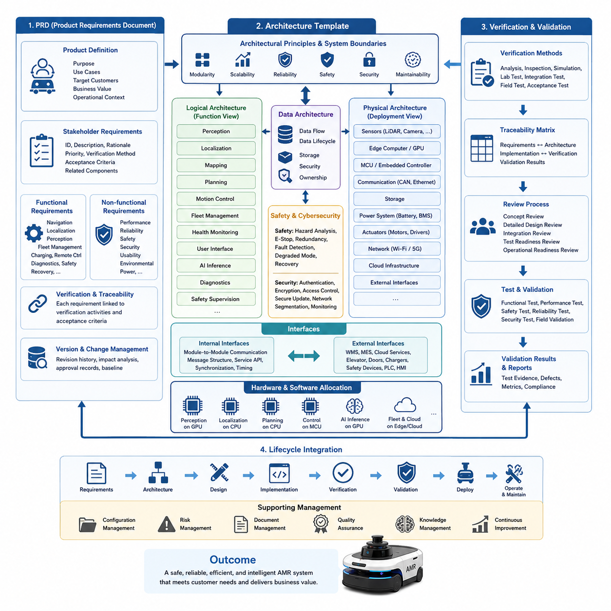
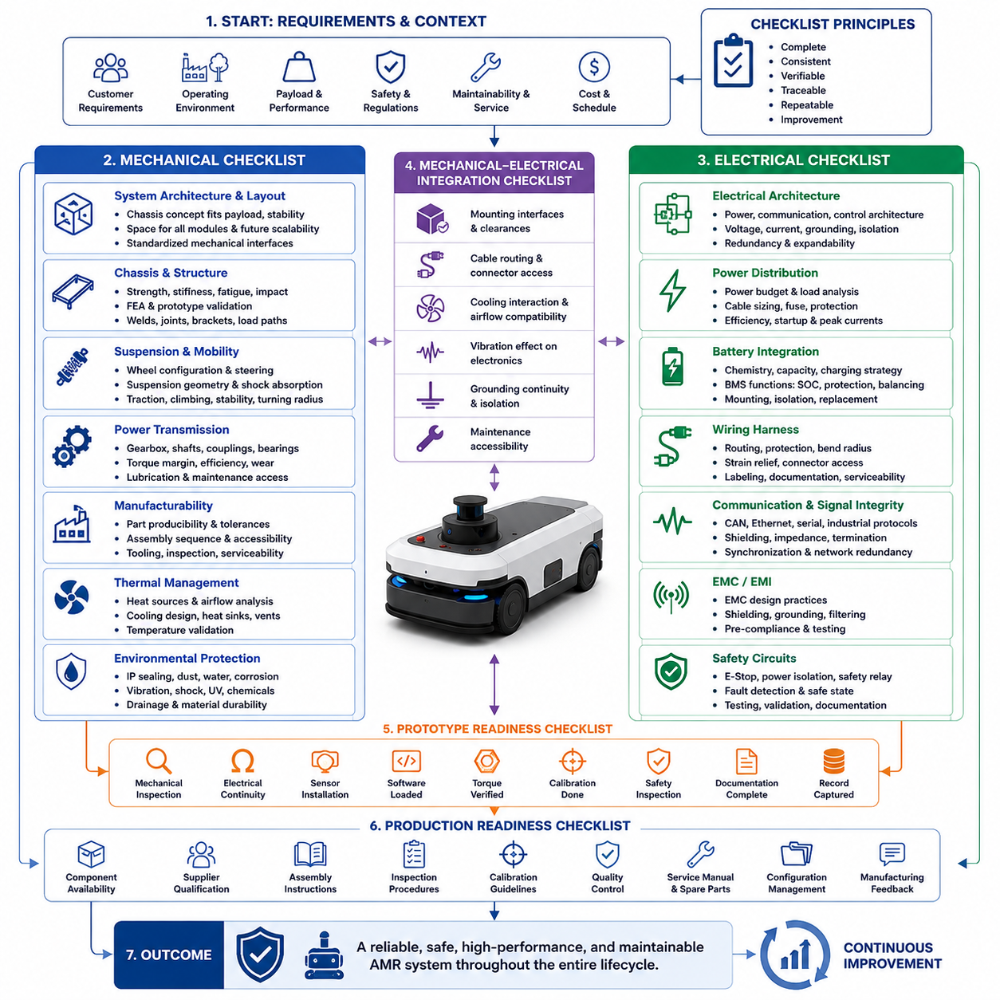
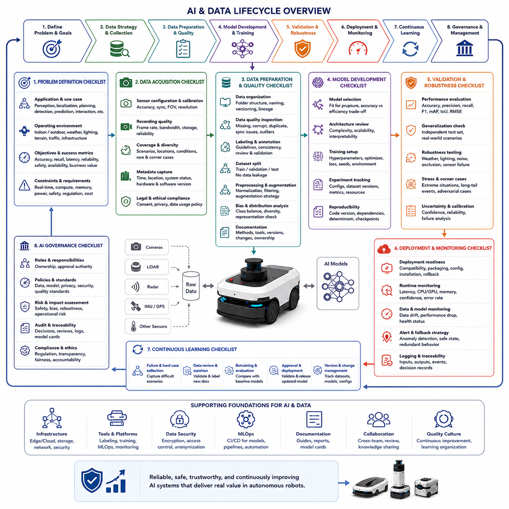
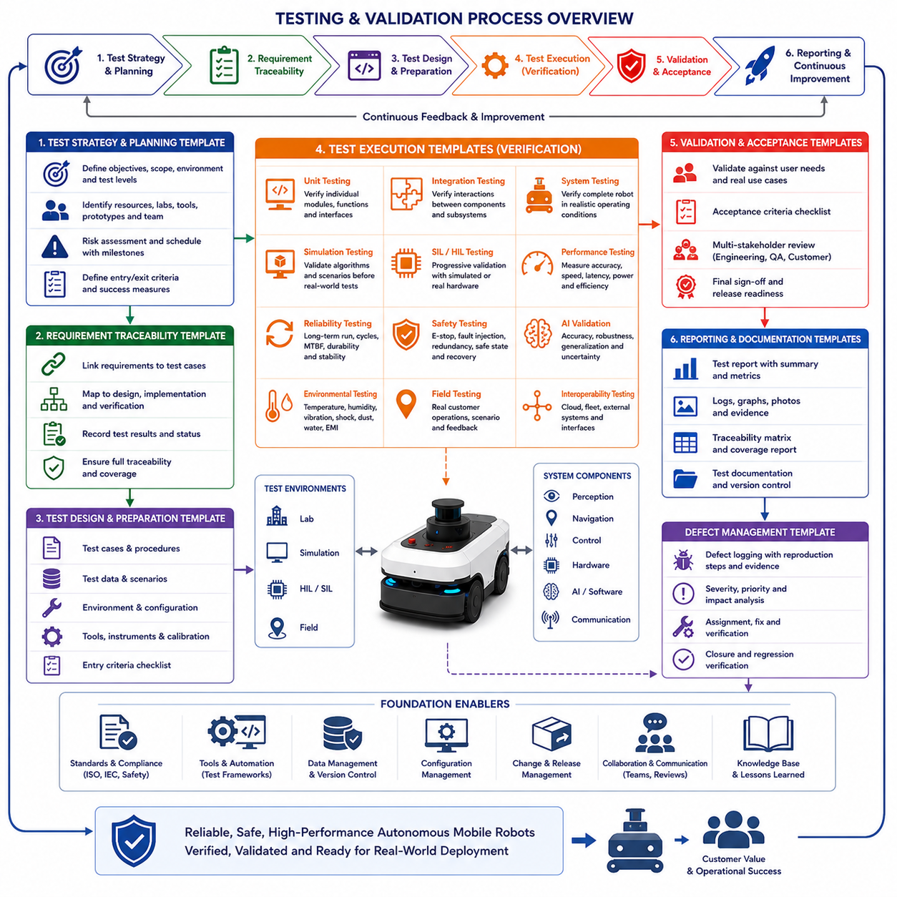
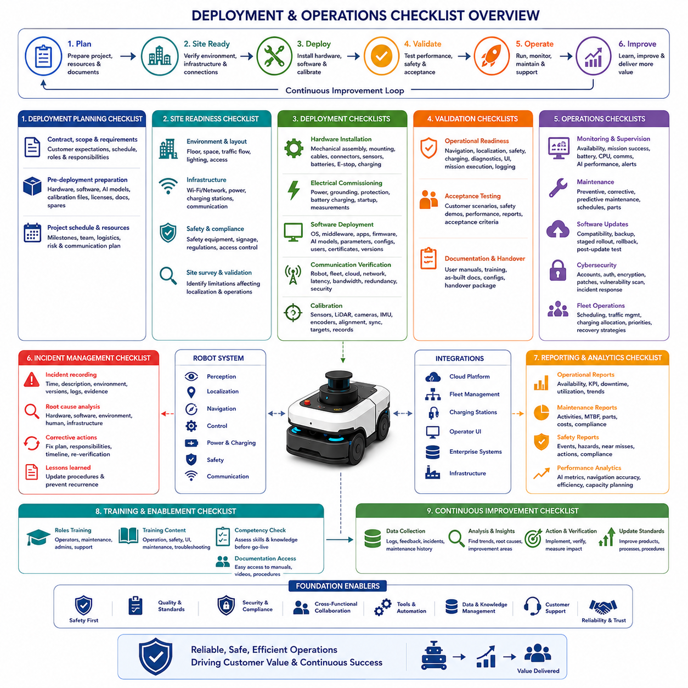
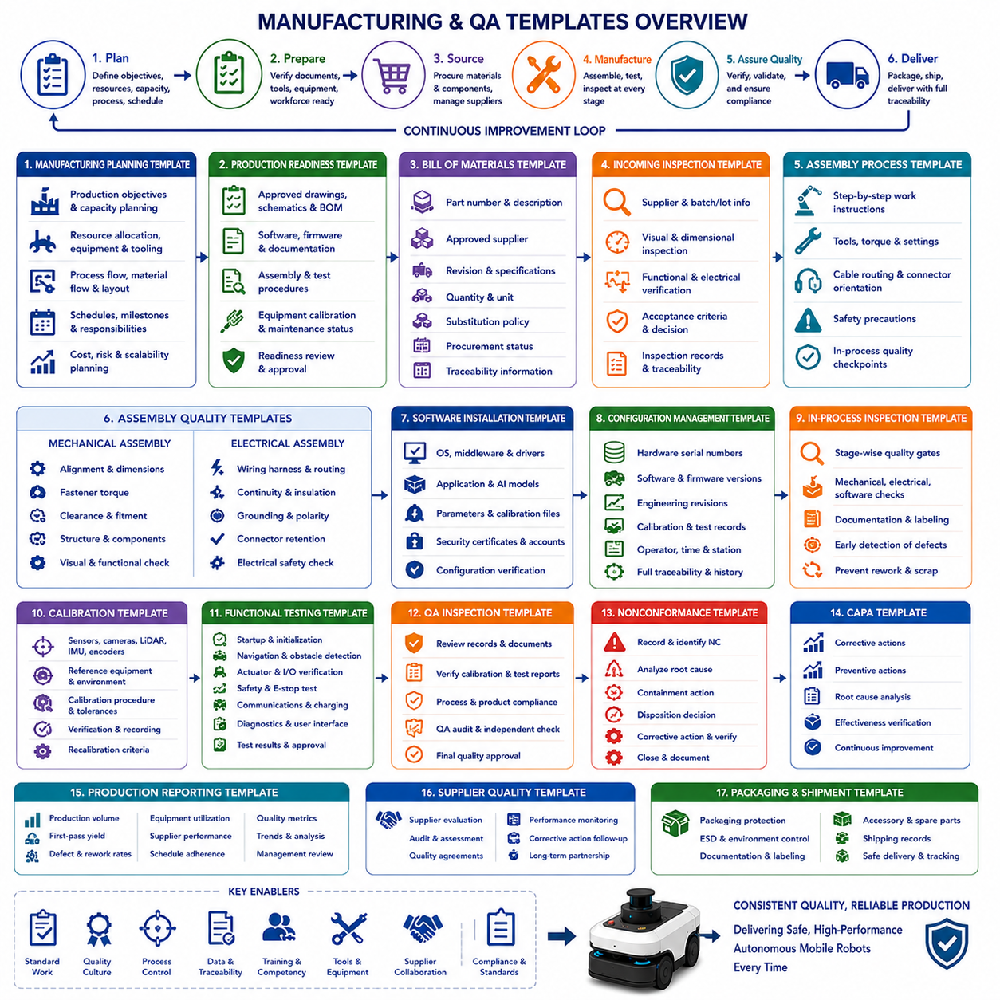
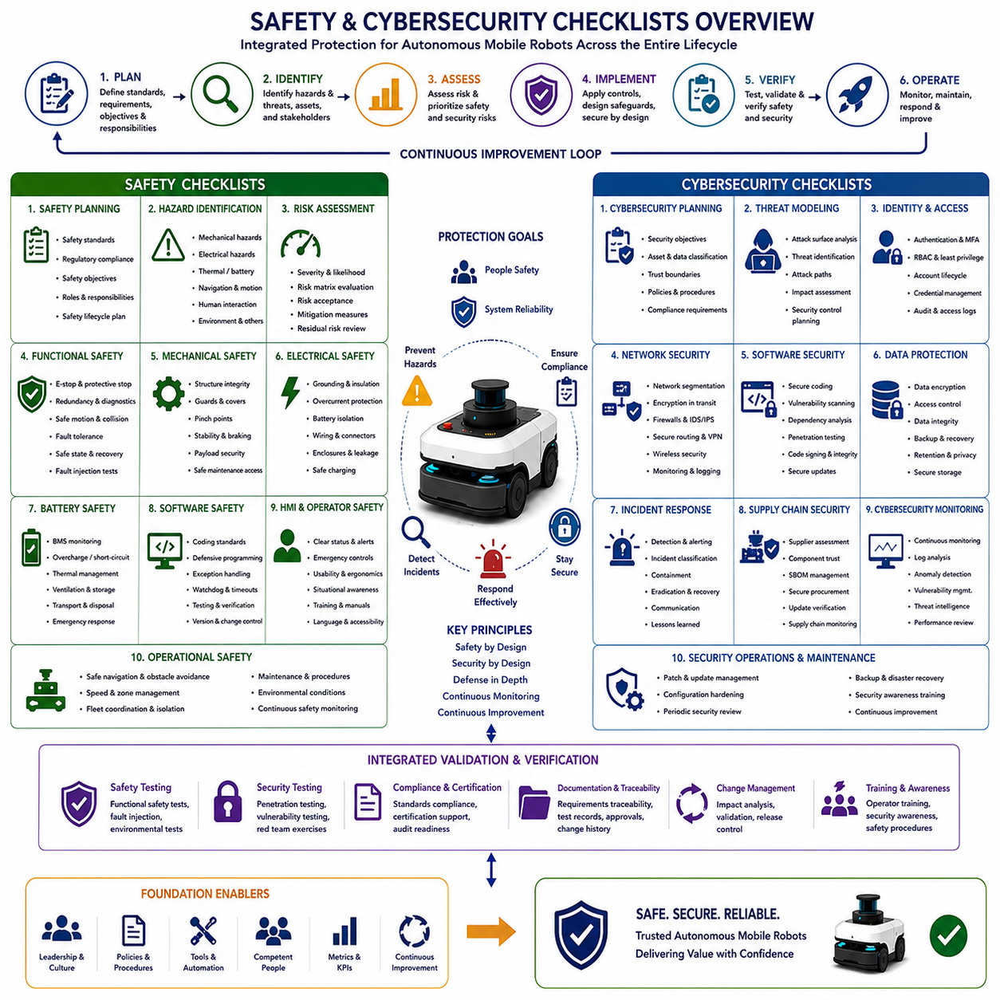
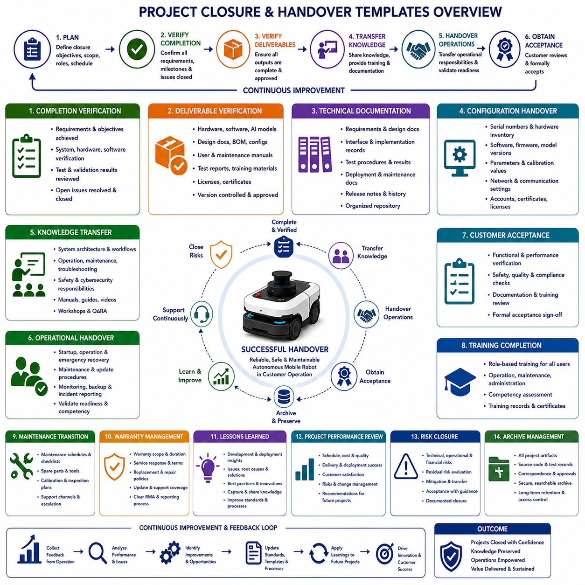

**Volume 10. AMR Engineering Process and Development Manual**


# Chapter24. Checklists and Templates

##  

## 24.01 PRD and Architecture Templates

{width="7.268055555555556in" height="7.268055555555556in"}

A well-designed Product Requirements Document and Architecture Template establishes the foundation for every successful AMR development project by creating a common understanding among customers, product managers, system architects, software engineers, mechanical designers, electrical engineers, AI researchers, manufacturing teams, and quality assurance personnel. Rather than serving as static documentation, these templates function as living engineering artifacts that evolve throughout the entire product lifecycle. Every requirement recorded in the PRD should eventually be reflected in architectural decisions, implementation plans, verification activities, validation reports, and deployment procedures, ensuring complete traceability from customer expectations to delivered system capabilities.

The PRD template should begin with a concise product definition describing the purpose of the autonomous mobile robot, its intended operational environments, target customers, expected business value, and major application scenarios. This introductory section provides sufficient context for every engineering discipline before technical discussions begin. It should explain whether the robot is intended for logistics, manufacturing, healthcare, construction, agriculture, outdoor inspection, security, or another industrial domain. The description also identifies the operational boundaries, expected mission duration, environmental conditions, payload characteristics, and high-level performance objectives that guide all subsequent engineering decisions.

Following the product definition, the template should document stakeholder requirements in a structured manner. Customers often describe problems from an operational perspective, while engineers naturally think in terms of technical solutions. A standardized PRD bridges these viewpoints by translating business objectives into measurable engineering requirements. Each requirement should include a unique identifier, detailed description, rationale, priority level, verification method, acceptance criteria, and related system components. Maintaining this structured format allows every requirement to remain traceable throughout development while minimizing ambiguity and reducing the possibility of conflicting interpretations among multidisciplinary teams.

Functional requirements form one of the largest sections within the template because they define what the robot must accomplish during normal operation. Functions should be described independently from implementation details so that engineering teams retain flexibility during architectural design. Typical functional descriptions include autonomous navigation, localization, obstacle avoidance, fleet communication, charging management, remote operation, mission scheduling, perception processing, diagnostics, logging, safety monitoring, and system recovery. Each function should clearly specify its expected inputs, processing behavior, outputs, operational limitations, and interactions with neighboring functions without prematurely constraining implementation technologies.

Non-functional requirements deserve equal attention because overall product quality depends heavily upon characteristics that extend beyond functional behavior. The template should specify measurable expectations for performance, reliability, availability, maintainability, scalability, usability, cybersecurity, functional safety, environmental robustness, power consumption, computational efficiency, and serviceability. Rather than using subjective expressions such as fast or reliable, every requirement should define quantitative targets whenever possible. Examples include localization accuracy, maximum latency, battery endurance, operating temperature range, system startup time, mean time between failures, software update duration, and recovery time after unexpected interruptions.

The architecture template transforms documented requirements into a structured technical solution capable of satisfying product objectives while balancing engineering tradeoffs. Instead of immediately presenting hardware diagrams, the document should first explain the architectural philosophy, major design principles, system boundaries, external interfaces, and decomposition strategy. Readers should quickly understand why the system has been partitioned into specific functional domains and how these domains collaborate to achieve overall mission objectives. This introductory architectural narrative provides valuable context before readers encounter detailed interface specifications or subsystem descriptions.

A logical architecture section defines the functional decomposition of the complete AMR system without referencing physical implementation. Major functions such as perception, localization, mapping, planning, motion control, fleet management, health monitoring, user interfaces, AI inference, diagnostics, cloud services, and safety supervision should be represented as interacting functional blocks. Each block description explains responsibilities, required inputs, generated outputs, internal processing objectives, and dependencies upon neighboring blocks. Maintaining a technology-independent logical architecture enables engineering teams to evaluate alternative implementations while preserving overall system behavior.

The physical architecture template translates logical functions into deployable hardware and software components. This section identifies edge computers, embedded controllers, GPUs, sensors, communication buses, storage devices, networking equipment, cloud infrastructure, power systems, and external interfaces. Every component should include specifications describing processing responsibilities, communication protocols, redundancy mechanisms, timing constraints, installation locations, environmental ratings, and resource utilization. Physical architecture documentation should also explain why specific technologies were selected and how they collectively satisfy performance, cost, reliability, and maintainability objectives.

Hardware and software allocation represents an important bridge between architectural planning and implementation. Each logical function should be assigned to an appropriate computational platform while considering processor capability, real-time constraints, safety requirements, memory limitations, thermal characteristics, and communication bandwidth. Templates should include allocation matrices showing which processors execute perception pipelines, localization algorithms, navigation planners, AI inference engines, fleet communication services, diagnostic modules, and user interface applications. These allocation tables simplify design reviews while supporting future scalability and hardware upgrades.

Interface definition templates provide standardized documentation for every interaction occurring inside or outside the robotic system. Internal interfaces describe communication among software modules, embedded controllers, and computational platforms using well-defined message structures, service calls, synchronization methods, and timing expectations. External interfaces specify interactions with warehouse management systems, manufacturing execution systems, cloud services, elevators, automatic doors, charging stations, safety equipment, industrial PLCs, and operator consoles. Standardized interface documentation significantly reduces integration risks by ensuring that every engineering team shares consistent communication expectations before implementation begins.

Data architecture documentation explains how information flows throughout the robot from sensor acquisition to high-level decision making. Templates should identify data producers, processing pipelines, storage locations, communication frequencies, synchronization mechanisms, retention policies, security classifications, and ownership responsibilities. Sensor observations, localization estimates, environmental maps, AI inference results, navigation commands, operational logs, maintenance records, and cloud synchronization events should each possess clearly documented lifecycles. Well-defined data architecture improves debugging efficiency while supporting future analytics, digital twin integration, and continuous learning workflows.

The architecture template should also include comprehensive safety and cybersecurity considerations from the earliest design stages rather than treating them as separate engineering activities. Safety documentation identifies hazard mitigation mechanisms, emergency stop strategies, redundant sensing approaches, fault detection methods, degraded operating modes, and system recovery procedures. Cybersecurity documentation defines authentication mechanisms, encrypted communication channels, secure software updates, access control policies, credential management, network segmentation, vulnerability monitoring, and incident response strategies. Integrating these considerations directly into architectural documentation ensures that protection mechanisms become fundamental design characteristics instead of late-stage additions.

Verification traceability represents another essential element of both PRD and architecture templates. Every requirement should reference one or more verification activities, including analysis, inspection, simulation, laboratory testing, integration testing, field validation, or customer acceptance demonstrations. Likewise, every architectural component should identify corresponding verification evidence demonstrating that implementation satisfies documented requirements. Traceability matrices provide efficient navigation between customer expectations, engineering solutions, implementation artifacts, and validation results, greatly simplifying certification activities, design reviews, quality audits, and future maintenance efforts.

Architecture review templates should standardize technical evaluations throughout the development lifecycle by defining common review objectives, required participants, evaluation criteria, approval workflows, and documentation outputs. Early conceptual reviews examine requirement completeness and architectural feasibility, while detailed design reviews evaluate interfaces, scalability, performance budgets, safety mechanisms, reliability strategies, and implementation readiness. Later reviews focus on integration results, testing evidence, operational readiness, manufacturing preparedness, and deployment planning. Consistent review templates improve engineering communication while ensuring that critical technical issues are identified before they become expensive implementation problems.

Version management forms an important component of engineering documentation because PRDs and architectures continuously evolve during product development. Templates should include document identifiers, revision histories, change summaries, approval records, affected subsystems, dependency analyses, and configuration baselines. Significant requirement changes should automatically trigger architecture reassessments, risk evaluations, implementation impact analyses, testing updates, and stakeholder notifications. Maintaining disciplined document version control enables distributed engineering organizations to collaborate efficiently while minimizing inconsistencies between documentation, software releases, hardware revisions, manufacturing instructions, and operational procedures.

The most effective PRD and Architecture Templates ultimately function as integrated engineering management tools rather than isolated documents. They establish a consistent framework that connects customer expectations, product strategy, system engineering, detailed implementation, verification planning, manufacturing preparation, operational deployment, and long-term maintenance into a unified development process. When maintained throughout the product lifecycle, these templates become authoritative references that preserve engineering knowledge, improve cross-functional collaboration, reduce project risks, accelerate decision making, and provide a repeatable foundation for developing increasingly sophisticated autonomous mobile robot platforms across multiple product generations.

잘 설계된 제품 요구사항 문서(Product Requirements Document, **PRD**)와 아키텍처 템플릿(Architecture Template)은 모든 성공적인 자율이동로봇(Autonomous Mobile Robot, **AMR**) 개발 프로젝트의 기반을 형성하며, 고객(Customer), 제품 관리자(Product Manager), 시스템 아키텍트(System Architect), 소프트웨어 엔지니어(Software Engineer), 기구 설계 엔지니어(Mechanical Engineer), 전장 설계 엔지니어(Electrical Engineer), 인공지능(AI) 연구원, 제조(Manufacturing) 팀, 품질보증(Quality Assurance, **QA**) 조직이 동일한 목표를 공유하도록 지원한다. 이러한 템플릿은 단순한 정적 문서가 아니라 제품 생명주기(Product Lifecycle) 전반에 걸쳐 지속적으로 발전하는 살아있는 엔지니어링 산출물이다. PRD에 기록된 모든 요구사항은 궁극적으로 아키텍처 설계, 구현 계획, 검증(Verification), 확인(Validation) 보고서 및 배포 절차에 반영되어 고객 요구사항부터 실제 시스템 기능까지 완전한 추적성(Traceability)을 보장해야 한다.

PRD 템플릿은 자율이동로봇(AMR)의 목적, 적용 환경, 목표 고객, 기대되는 비즈니스 가치, 주요 활용 시나리오를 간결하게 정의하는 제품 정의(Product Definition)부터 시작해야 한다. 이 도입부는 기술적인 세부사항에 들어가기 전에 모든 개발 분야가 동일한 배경을 이해하도록 충분한 정보를 제공한다. 또한 해당 로봇이 물류(Logistics), 제조(Manufacturing), 의료(Healthcare), 건설(Construction), 농업(Agriculture), 실외 검사(Outdoor Inspection), 보안(Security) 또는 기타 산업 분야를 대상으로 하는지 명확하게 설명해야 한다. 이와 함께 운용 범위(Operation Boundary), 예상 임무 시간(Mission Duration), 환경 조건(Environmental Conditions), 적재 하중(Payload), 그리고 이후의 모든 엔지니어링 의사결정을 이끌 핵심 성능 목표(Performance Objectives)를 정의해야 한다.

제품 정의 이후에는 이해관계자 요구사항(Stakeholder Requirements)을 체계적으로 정리해야 한다. 고객은 일반적으로 운영 관점(Operation Perspective)에서 문제를 설명하지만, 엔지니어는 기술적 해결방안(Technical Solution)의 관점에서 접근한다. 표준화된 PRD는 이러한 두 관점을 연결하여 비즈니스 목표(Business Objectives)를 측정 가능한 엔지니어링 요구사항(Engineering Requirements)으로 변환하는 역할을 수행한다. 각 요구사항은 고유 식별자(Unique Identifier), 상세 설명, 작성 목적(Rationale), 우선순위(Priority), 검증 방법(Verification Method), 승인 기준(Acceptance Criteria), 관련 시스템 구성요소(Related Components)를 포함해야 한다. 이러한 구조를 유지하면 개발 전 과정에서 요구사항 추적성이 확보되며, 여러 분야의 개발자 간 해석 차이와 충돌 가능성을 크게 줄일 수 있다.

기능 요구사항(Functional Requirements)은 시스템이 정상적으로 수행해야 하는 기능을 정의하기 때문에 PRD에서 가장 큰 비중을 차지한다. 기능은 구현 기술(Implementation Technology)과 독립적으로 기술되어야 하며, 이를 통해 아키텍처 설계 단계에서 다양한 기술적 선택이 가능하도록 해야 한다. 일반적인 기능에는 자율주행(Autonomous Navigation), 위치추정(Localization), 장애물 회피(Obstacle Avoidance), 플릿 통신(Fleet Communication), 충전 관리(Charging Management), 원격 제어(Remote Operation), 임무 스케줄링(Mission Scheduling), 인지(Perception), 진단(Diagnostics), 로그 관리(Logging), 안전 감시(Safety Monitoring), 시스템 복구(System Recovery) 등이 포함된다. 각 기능은 입력(Input), 처리(Process), 출력(Output), 운영 한계(Operation Limits), 그리고 다른 기능과의 상호작용을 명확히 정의해야 하며 구현 방식 자체를 제한해서는 안 된다.

비기능 요구사항(Non-functional Requirements)은 제품의 전체 품질을 결정하는 중요한 요소이므로 기능 요구사항과 동일한 수준의 중요성을 가진다. 템플릿에는 성능(Performance), 신뢰성(Reliability), 가용성(Availability), 유지보수성(Maintainability), 확장성(Scalability), 사용성(Usability), 사이버보안(Cybersecurity), 기능 안전(Functional Safety), 환경 내구성(Environmental Robustness), 전력 소비(Power Consumption), 계산 효율성(Computational Efficiency), 서비스 용이성(Serviceability)에 대한 정량적인 목표를 포함해야 한다. 단순히 빠르다(Fast), 안정적이다(Reliable)와 같은 표현 대신 위치추정 정확도(Localization Accuracy), 최대 지연시간(Maximum Latency), 배터리 지속시간(Battery Endurance), 동작 온도 범위(Operating Temperature Range), 시스템 부팅 시간(System Startup Time), 평균 고장 간격(Mean Time Between Failures), 소프트웨어 업데이트 시간, 장애 복구 시간 등 측정 가능한 수치를 제시해야 한다.

아키텍처 템플릿(Architecture Template)은 문서화된 요구사항을 실제 기술적 해결방안으로 변환하는 역할을 수행한다. 하드웨어(Hardware) 다이어그램부터 제시하기보다는 먼저 아키텍처 철학(Architectural Philosophy), 핵심 설계 원칙(Design Principles), 시스템 경계(System Boundaries), 외부 인터페이스(External Interfaces), 기능 분할 전략(Decomposition Strategy)을 설명해야 한다. 이를 통해 독자는 왜 시스템이 특정 기능 영역으로 분리되었는지, 그리고 이러한 기능들이 전체 임무를 수행하기 위해 어떻게 협력하는지를 이해할 수 있다. 이러한 설명은 세부 인터페이스 명세나 구성요소 설명 이전에 반드시 제공되어야 한다.

논리 아키텍처(Logical Architecture)는 물리적인 구현을 고려하지 않고 시스템 기능을 분해하여 정의한다. 인지(Perception), 위치추정(Localization), 지도 작성(Mapping), 경로 계획(Path Planning), 이동 제어(Motion Control), 플릿 관리(Fleet Management), 상태 감시(Health Monitoring), 사용자 인터페이스(User Interface), AI 추론(AI Inference), 진단(Diagnostics), 클라우드 서비스(Cloud Services), 안전 감시(Safety Supervision)와 같은 주요 기능은 서로 연결된 기능 블록(Function Block)으로 표현된다. 각 기능 블록은 자신의 책임(Responsibilities), 입력(Input), 출력(Output), 처리 목적(Processing Objectives), 그리고 다른 기능과의 의존성(Dependencies)을 명확히 설명해야 한다. 구현 기술과 독립적인 논리 아키텍처를 유지하면 전체 시스템 동작을 유지하면서 다양한 구현 방안을 비교·검토할 수 있다.

물리 아키텍처(Physical Architecture)는 논리 기능을 실제 배포 가능한 하드웨어와 소프트웨어 구성요소로 변환한다. 이 문서에는 엣지 컴퓨터(Edge Computer), 임베디드 제어기(Embedded Controller), 그래픽 처리 장치(Graphics Processing Unit, **GPU**), 센서(Sensor), 통신 버스(Communication Bus), 저장장치(Storage), 네트워크 장비(Network Equipment), 클라우드 인프라(Cloud Infrastructure), 전원 시스템(Power System), 외부 인터페이스(External Interface)가 포함된다. 각 구성요소는 담당 기능, 통신 프로토콜(Communication Protocol), 이중화(Redundancy), 시간 제약(Timing Constraints), 설치 위치, 환경 등급(Environmental Rating), 자원 활용(Resource Utilization)을 설명해야 한다. 또한 특정 기술을 선택한 이유와 그것이 성능, 비용, 신뢰성, 유지보수성 목표를 어떻게 만족시키는지도 함께 기술해야 한다.

하드웨어와 소프트웨어 할당(Hardware and Software Allocation)은 아키텍처 설계와 실제 구현을 연결하는 핵심 요소이다. 각 논리 기능은 프로세서 성능, 실시간 요구사항(Real-time Constraints), 안전성, 메모리 용량, 열 특성(Thermal Characteristics), 통신 대역폭(Bandwidth)을 고려하여 적절한 컴퓨팅 플랫폼에 배치되어야 한다. 템플릿에는 인지 파이프라인(Perception Pipeline), 위치추정 알고리즘, 경로 계획기(Path Planner), AI 추론 엔진, 플릿 통신 서비스, 진단 모듈, 사용자 인터페이스가 어떤 프로세서에서 실행되는지를 나타내는 할당 매트릭스(Allocation Matrix)가 포함되어야 한다. 이러한 표는 설계 검토를 단순화하고 향후 하드웨어 확장과 업그레이드도 쉽게 지원한다.

인터페이스 정의(Interface Definition) 템플릿은 시스템 내부와 외부에서 발생하는 모든 통신을 표준화하여 문서화한다. 내부 인터페이스(Internal Interface)는 소프트웨어 모듈, 임베디드 제어기, 컴퓨팅 플랫폼 간의 메시지 구조(Message Structure), 서비스 호출(Service Call), 동기화(Synchronization), 시간 요구사항(Timing)을 정의한다. 외부 인터페이스(External Interface)는 창고관리시스템(Warehouse Management System, **WMS**), 제조실행시스템(Manufacturing Execution System, **MES**), 클라우드 서비스, 엘리베이터(Elevator), 자동문(Automatic Door), 충전기(Charging Station), 안전 장비(Safety Equipment), 산업용 PLC, 운영자 콘솔(Operator Console)과의 연동을 설명한다. 표준화된 인터페이스 문서는 구현 이전부터 모든 개발 조직이 동일한 통신 규칙을 공유하도록 하여 통합 과정의 위험을 크게 줄여준다.

데이터 아키텍처(Data Architecture)는 센서 데이터가 획득된 이후 최종 의사결정에 활용될 때까지 시스템 내부에서 데이터가 어떻게 이동하는지를 설명한다. 템플릿은 데이터 생성자(Data Producer), 처리 파이프라인(Processing Pipeline), 저장 위치(Storage Location), 통신 주기(Communication Frequency), 동기화 방식, 보존 정책(Retention Policy), 보안 등급(Security Classification), 데이터 소유권(Ownership)을 정의해야 한다. 센서 데이터, 위치추정 결과, 환경 지도(Environment Map), AI 추론 결과, 주행 명령, 운영 로그(Operation Log), 유지보수 기록, 클라우드 동기화 정보는 모두 명확한 데이터 생명주기(Data Lifecycle)를 가져야 한다. 이러한 데이터 구조는 디버깅(Debugging), 디지털 트윈(Digital Twin), 데이터 분석(Analytics), 지속 학습(Continuous Learning)의 효율성을 크게 향상시킨다.

아키텍처 템플릿에는 기능 안전(Functional Safety)과 사이버보안(Cybersecurity)에 대한 내용도 초기 설계 단계부터 포함되어야 하며, 이를 별도의 후속 작업으로 취급해서는 안 된다. 안전 설계는 위험 완화(Hazard Mitigation), 비상정지(Emergency Stop), 센서 이중화(Redundant Sensing), 고장 감지(Fault Detection), 성능 저하 운전(Degraded Operation), 시스템 복구(System Recovery)를 정의해야 한다. 사이버보안 설계는 인증(Authentication), 암호화 통신(Encrypted Communication), 안전한 소프트웨어 업데이트(Secure Software Update), 접근 제어(Access Control), 자격증명 관리(Credential Management), 네트워크 분리(Network Segmentation), 취약점 관리(Vulnerability Monitoring), 사고 대응(Incident Response)을 포함해야 한다. 이러한 내용을 아키텍처에 통합하면 보안과 안전이 부가 기능이 아니라 시스템의 본질적인 설계 특성으로 자리 잡게 된다.

검증 추적성(Verification Traceability)은 PRD와 아키텍처 템플릿 모두에서 매우 중요한 요소이다. 모든 요구사항은 분석(Analysis), 검사(Inspection), 시뮬레이션(Simulation), 실험실 시험(Laboratory Testing), 통합 시험(Integration Testing), 현장 검증(Field Validation), 고객 수락 시험(Customer Acceptance Test) 등 하나 이상의 검증 활동과 연결되어야 한다. 또한 모든 아키텍처 구성요소는 해당 기능이 요구사항을 만족한다는 검증 근거(Evidence)를 명확히 제시해야 한다. 이러한 추적성 매트릭스(Traceability Matrix)는 고객 요구사항, 기술 설계, 구현 결과, 시험 결과를 효과적으로 연결하여 인증(Certification), 설계 검토, 품질 감사(Quality Audit), 유지보수를 더욱 효율적으로 수행할 수 있도록 지원한다.

아키텍처 검토(Architecture Review) 템플릿은 개발 과정 전반에서 일관된 기술 검토를 수행하기 위한 표준 절차를 제공해야 한다. 여기에는 검토 목적(Objectives), 필수 참석자(Participants), 평가 기준(Evaluation Criteria), 승인 절차(Approval Workflow), 결과 문서(Output)가 포함된다. 초기 검토에서는 요구사항 완전성과 아키텍처의 실현 가능성을 평가하고, 상세 설계 단계에서는 인터페이스, 확장성, 성능 예산(Performance Budget), 안전 메커니즘, 신뢰성 전략, 구현 준비 상태를 검토한다. 이후 단계에서는 통합 결과, 시험 데이터, 운영 준비 상태, 제조 준비도, 배포 계획을 확인한다. 이러한 표준 검토 절차는 개발 조직 간의 의사소통을 향상시키고, 고비용의 구현 단계 이전에 중요한 기술 문제를 발견할 수 있도록 지원한다.

버전 관리(Version Management)는 PRD와 아키텍처 문서가 개발 과정에서 지속적으로 변경되기 때문에 반드시 포함되어야 하는 핵심 요소이다. 템플릿에는 문서 식별자(Document Identifier), 개정 이력(Revision History), 변경 내용(Change Summary), 승인 기록(Approval Record), 영향받는 시스템(Impacted Subsystems), 영향 분석(Impact Analysis), 기준 버전(Configuration Baseline)이 포함되어야 한다. 중요한 요구사항이 변경되면 아키텍처 재검토, 위험 분석(Risk Evaluation), 구현 영향 분석, 시험 계획 수정, 이해관계자 통보가 자동으로 수행되어야 한다. 체계적인 버전 관리는 분산된 개발 조직에서도 문서와 소프트웨어, 하드웨어, 제조 지침, 운영 절차 간의 일관성을 유지하도록 지원한다.

효과적인 PRD와 아키텍처 템플릿은 단순한 문서가 아니라 전체 개발 과정을 관리하는 통합 엔지니어링 관리 도구(Integrated Engineering Management Tool)로 기능해야 한다. 이러한 템플릿은 고객 요구사항(Customer Requirements), 제품 전략(Product Strategy), 시스템 엔지니어링(System Engineering), 상세 구현(Detailed Implementation), 검증 계획(Verification Planning), 제조 준비(Manufacturing Preparation), 운영 배포(Operational Deployment), 장기 유지보수(Long-term Maintenance)를 하나의 일관된 개발 프로세스로 연결한다. 프로젝트 전 생명주기 동안 지속적으로 관리되는 PRD와 아키텍처 템플릿은 조직의 핵심 엔지니어링 지식을 축적하고, 부서 간 협업을 향상시키며, 프로젝트 위험을 줄이고, 의사결정을 가속화하며, 미래 세대의 더욱 고도화된 자율이동로봇(AMR) 플랫폼을 반복적으로 개발할 수 있는 견고한 기반을 제공한다.

##  

## 24.02 Mechanical and Electrical Checklists

{width="7.268055555555556in" height="7.268055555555556in"}

Mechanical and electrical checklists serve as structured engineering control tools that ensure every critical aspect of an Autonomous Mobile Robot has been reviewed before development progresses to the next phase. Unlike informal design notes, these checklists establish repeatable evaluation criteria that can be applied consistently across multiple projects, engineering teams, and product generations. They reduce the possibility of overlooked issues, improve communication between disciplines, and create documented evidence that engineering decisions have been systematically verified. When maintained throughout the product lifecycle, these checklists become valuable organizational knowledge that supports quality improvement, product reliability, and continuous engineering refinement.

The checklist process should begin during requirement analysis rather than after detailed design has already started. Engineers should first verify that customer requirements, operational environments, payload specifications, performance expectations, safety objectives, maintenance constraints, and applicable regulations have been completely understood before any mechanical or electrical design activities commence. Early requirement verification prevents unnecessary redesign efforts and ensures that engineering resources remain focused on solving the correct problems. Every checklist item should reference measurable design objectives that can later be validated through testing, inspection, or operational evaluation.

Mechanical engineering checklists should first evaluate the overall system architecture and structural concept before individual components are designed. Engineers should confirm that the selected chassis configuration supports expected payloads, operational stability, manufacturing feasibility, maintenance accessibility, and future product scalability. The structural layout should provide adequate space for batteries, sensors, computers, wiring, cooling systems, safety devices, and optional customer equipment without introducing unnecessary complexity. Mechanical interfaces between modules should remain standardized whenever possible to simplify future upgrades, manufacturing, and field replacement activities.

The chassis evaluation checklist should verify structural strength, stiffness, fatigue resistance, impact tolerance, corrosion protection, and environmental durability. Frame members should be analyzed under static, dynamic, and worst-case loading conditions while considering payload distribution, acceleration, braking forces, uneven terrain, and unexpected collisions. Engineers should review finite element analysis results together with physical prototype testing to ensure structural performance aligns with design assumptions. Particular attention should be given to weld quality, bolted joints, mounting brackets, and load transfer paths that directly influence long-term reliability.

Suspension and drive system checklists should confirm that wheel configurations, steering mechanisms, suspension geometry, shock absorption, and traction capabilities satisfy intended operating conditions. Indoor platforms typically prioritize maneuverability and compact turning performance, whereas outdoor robots require increased ground clearance, terrain adaptability, and vibration isolation. Engineers should verify wheel loading, tire selection, motor torque margins, braking performance, climbing capability, and overall vehicle stability across the complete operating envelope. Mechanical tolerances should support consistent alignment throughout prolonged operational use.

Power transmission checklists should examine every mechanical component responsible for transferring motor torque to the wheels or driven equipment. Gearboxes, shafts, couplings, bearings, belts, chains, and reduction mechanisms should all be evaluated for efficiency, wear resistance, lubrication requirements, thermal behavior, vibration characteristics, and maintenance accessibility. Load calculations should include transient conditions such as emergency braking, rapid acceleration, obstacle climbing, and repeated directional changes. Mechanical safety factors should remain appropriate without unnecessarily increasing system weight or manufacturing cost.

Manufacturability reviews form another important part of mechanical engineering checklists because excellent engineering designs may still fail during production if assembly complexity remains excessive. Engineers should confirm that every component can be manufactured using available production methods while maintaining acceptable dimensional tolerances and quality consistency. Fastener accessibility, assembly sequences, tooling requirements, inspection points, and replacement procedures should be evaluated before production begins. Design simplification opportunities should always be identified to reduce manufacturing time, production cost, and field maintenance effort without compromising system performance.

Thermal management checklists should verify that all heat-generating components operate within their specified temperature limits throughout expected environmental conditions. Mechanical engineers should evaluate airflow paths, cooling ducts, heat sinks, ventilation openings, sealing methods, and enclosure layouts while accounting for solar radiation, ambient temperature, internal heat generation, and dust accumulation. Computational thermal analysis should be supported by laboratory measurements and outdoor operational testing whenever possible. Cooling solutions should maintain acceptable temperatures without introducing unnecessary power consumption, acoustic noise, or maintenance requirements.

Environmental protection checklists ensure that mechanical assemblies remain reliable under expected operational conditions. Engineers should inspect enclosure sealing, ingress protection, corrosion resistance, drainage paths, vibration isolation, shock resistance, ultraviolet exposure, chemical compatibility, and long-term material degradation. Outdoor robots require particular attention to water intrusion, dust contamination, snow, mud, salt spray, and temperature cycling. Mechanical protection strategies should balance environmental robustness with service accessibility so that maintenance operations remain practical throughout the product lifecycle.

Electrical engineering checklists begin with overall electrical architecture verification to ensure that power generation, distribution, protection, communication, and control systems satisfy product requirements. Engineers should confirm that voltage levels, current capacities, grounding strategies, isolation methods, redundancy concepts, and safety mechanisms have been consistently applied throughout the electrical design. Electrical architecture should support future expansion while minimizing unnecessary complexity and ensuring compatibility between all electronic subsystems operating within the robot.

Power distribution checklists should verify battery selection, power budgets, voltage regulation, cable sizing, fuse coordination, circuit protection, connector ratings, and energy efficiency. Every electrical load should be accounted for under both normal and peak operating conditions to ensure sufficient power reserves remain available. Startup currents, regenerative braking energy, charging behavior, and emergency operating modes should all be considered during power system evaluation. Proper electrical margin planning reduces unexpected shutdowns while improving long-term system reliability.

Battery integration checklists should evaluate battery chemistry, capacity, charging strategy, thermal management, mechanical mounting, electrical isolation, monitoring accuracy, and Battery Management System integration. Engineers should verify state-of-charge estimation, fault detection capabilities, overcurrent protection, cell balancing, emergency disconnect functionality, and communication interfaces between battery controllers and the main vehicle computer. Mechanical packaging should adequately protect battery modules while allowing efficient maintenance and future replacement without extensive vehicle disassembly.

Wiring harness checklists should examine routing quality, cable protection, bend radius compliance, strain relief, connector accessibility, electromagnetic compatibility, and serviceability. Cable routing should minimize exposure to heat sources, moving mechanical components, sharp edges, and vibration. Harness organization should support efficient manufacturing while simplifying troubleshooting during field maintenance. Wire identification, labeling consistency, connector locking mechanisms, and documentation accuracy significantly improve maintenance efficiency and reduce human error during assembly and repair activities.

Signal integrity and communication checklists should verify reliable operation of communication buses including Ethernet, CAN, RS-485, USB, serial interfaces, and industrial communication protocols. Engineers should inspect cable shielding, grounding practices, impedance matching, connector quality, termination resistance, synchronization methods, and network redundancy where required. Communication architecture should remain robust under electromagnetic interference, vibration, and varying environmental conditions while maintaining deterministic behavior for real-time control systems.

Electromagnetic compatibility checklists should confirm that electrical systems neither generate excessive electromagnetic emissions nor become vulnerable to external interference. Engineers should review grounding strategies, shielding effectiveness, filter placement, cable separation, enclosure design, and PCB layout practices that influence electromagnetic performance. Compliance testing should be planned early rather than postponed until product certification because corrective actions become increasingly expensive after hardware designs have matured.

Safety circuit checklists should verify emergency stop functionality, redundant power isolation, safety relay operation, protective monitoring circuits, fault detection logic, and recovery procedures. Every safety-related electrical function should demonstrate predictable behavior under both normal operation and fault conditions. Safety mechanisms should default to known safe states whenever communication failures, power interruptions, hardware malfunctions, or software exceptions occur. Verification should include functional testing, failure simulation, and documentation review to demonstrate compliance with applicable safety requirements.

Mechanical and electrical integration checklists ensure that both engineering disciplines function as a unified system rather than as independent designs. Engineers should verify mounting interfaces, cable clearances, connector accessibility, cooling interactions, vibration effects on electronics, sensor alignment, grounding continuity, and maintenance accessibility across all integrated assemblies. Collaborative design reviews between mechanical and electrical teams help identify conflicts early while reducing integration risks that frequently emerge during prototype assembly and system testing.

Prototype readiness checklists should confirm that every subsystem has completed required inspections before integrated testing begins. Mechanical dimensions, electrical continuity, sensor installation, software loading, torque verification, calibration status, safety inspections, documentation completeness, and manufacturing records should all be reviewed before power is first applied to the robot. Establishing disciplined prototype readiness criteria significantly reduces avoidable failures during early integration while providing a stable foundation for systematic debugging and performance evaluation.

Production readiness checklists extend engineering verification beyond prototype validation by ensuring designs are suitable for repeatable manufacturing. Engineers should review component availability, supplier qualification, assembly documentation, inspection procedures, calibration instructions, quality control methods, service manuals, spare part planning, and configuration management before production release. Manufacturing feedback should be incorporated into future checklist revisions so that recurring assembly issues gradually disappear through continuous engineering improvement.

Effective mechanical and electrical checklists ultimately function as comprehensive engineering governance tools rather than simple inspection forms. They preserve organizational knowledge, standardize engineering practices, improve cross-functional collaboration, strengthen design quality, and establish objective review criteria throughout the complete product lifecycle. By integrating requirement verification, design evaluation, manufacturing preparation, testing, safety assessment, and maintenance planning into one consistent framework, these checklists help engineering organizations deliver reliable, maintainable, safe, and high-quality autonomous mobile robot systems across multiple generations of increasingly sophisticated products.

기계(Mechanical) 및 전기(Electrical) 체크리스트(Checklist)는 자율이동로봇(Autonomous Mobile Robot, **AMR**) 개발 과정에서 다음 단계로 진행하기 전에 모든 핵심 요소가 검토되었는지를 확인하는 체계적인 엔지니어링 관리 도구이다. 이는 단순한 설계 메모와 달리 다양한 프로젝트와 개발 조직, 여러 세대의 제품에 반복적으로 적용할 수 있는 표준 평가 기준을 제공한다. 이러한 체크리스트는 중요한 항목이 누락될 가능성을 줄이고, 여러 분야 간의 의사소통을 향상시키며, 모든 설계 결정이 체계적으로 검증되었다는 근거를 문서화한다. 제품 생명주기(Product Lifecycle) 전반에 걸쳐 지속적으로 관리될 경우 조직의 핵심 기술 자산으로 축적되어 품질 향상, 제품 신뢰성 증대, 지속적인 엔지니어링 개선을 지원한다.

체크리스트(Checklist)는 상세 설계가 완료된 이후가 아니라 요구사항 분석(Requirement Analysis) 단계에서부터 시작되어야 한다. 엔지니어는 고객 요구사항(Customer Requirements), 운영 환경(Operational Environment), 적재 하중(Payload), 성능 목표(Performance Expectations), 안전 목표(Safety Objectives), 유지보수 제약(Maintenance Constraints), 적용 규정(Applicable Regulations)이 충분히 이해되었는지를 먼저 확인한 후 기계 및 전기 설계를 시작해야 한다. 초기 단계에서 요구사항을 검증하면 불필요한 재설계(Redesign)를 방지할 수 있으며, 개발 자원이 실제 해결해야 하는 문제에 집중되도록 도와준다. 모든 체크리스트 항목은 이후 시험(Test), 검사(Inspection), 운영 평가(Operational Evaluation)를 통해 확인 가능한 정량적인 설계 목표와 연결되어야 한다.

기계 엔지니어링(Mechanical Engineering) 체크리스트는 개별 부품 설계 이전에 전체 시스템 아키텍처(System Architecture)와 구조 개념(Structural Concept)을 우선 평가해야 한다. 선택된 차체(Chassis) 구조가 요구되는 적재 하중, 주행 안정성, 제조 가능성(Manufacturability), 유지보수 접근성(Maintenance Accessibility), 향후 제품 확장성(Product Scalability)을 만족하는지 확인해야 한다. 또한 구조 배치는 배터리(Battery), 센서(Sensor), 컴퓨터(Computer), 배선(Wiring), 냉각 시스템(Cooling System), 안전 장치(Safety Device), 고객 옵션 장비를 충분히 수용할 수 있어야 하며 불필요한 복잡성을 최소화해야 한다. 모듈 간 기계 인터페이스(Mechanical Interface)는 가능한 한 표준화하여 향후 업그레이드와 유지보수를 용이하게 해야 한다.

차체(Chassis) 평가 체크리스트는 구조 강도(Structural Strength), 강성(Stiffness), 피로 내구성(Fatigue Resistance), 충격 저항성(Impact Tolerance), 부식 방지(Corrosion Protection), 환경 내구성(Environmental Durability)을 검토해야 한다. 프레임(Frame)은 정적 하중(Static Load), 동적 하중(Dynamic Load), 최악 조건(Worst-case Load)에 대해 해석되어야 하며, 적재물 분포(Payload Distribution), 가속(Acceleration), 제동(Braking), 불규칙한 노면(Uneven Terrain), 예상치 못한 충돌(Collision)을 모두 고려해야 한다. 유한요소해석(Finite Element Analysis, **FEA**) 결과는 실제 시제품 시험과 함께 검토되어야 하며, 용접부(Weld), 볼트 체결(Bolted Joint), 브래킷(Bracket), 하중 전달 경로(Load Path)가 장기적인 신뢰성에 적합한지를 확인해야 한다.

현가장치(Suspension)와 구동 시스템(Drive System) 체크리스트는 바퀴 구성(Wheel Configuration), 조향 시스템(Steering Mechanism), 서스펜션 형상(Suspension Geometry), 충격 흡수(Shock Absorption), 접지력(Traction Capability)이 목표 운용 환경을 만족하는지 확인해야 한다. 실내용 플랫폼은 기동성과 작은 회전 반경을 우선하지만, 실외 로봇은 높은 최저 지상고(Ground Clearance), 험지 적응성(Terrain Adaptability), 진동 절연(Vibration Isolation)이 더욱 중요하다. 또한 바퀴 하중(Wheel Loading), 타이어 선택(Tire Selection), 모터 토크 여유(Motor Torque Margin), 제동 성능(Braking Performance), 등판 능력(Climbing Capability), 차량 안정성(Stability)을 전체 운용 범위에서 평가해야 하며, 기계적 공차(Mechanical Tolerance)는 장기간 사용 후에도 정렬 상태를 유지할 수 있어야 한다.

동력 전달(Power Transmission) 체크리스트는 모터의 토크를 바퀴 또는 구동 장치에 전달하는 모든 기계 요소를 평가해야 한다. 감속기(Gearbox), 축(Shaft), 커플링(Coupling), 베어링(Bearing), 벨트(Belt), 체인(Chain), 감속 메커니즘(Reduction Mechanism)은 효율(Efficiency), 마모 저항(Wear Resistance), 윤활(Lubrication), 열 특성(Thermal Behavior), 진동(Vibration), 유지보수성(Maintenance Accessibility)을 검토해야 한다. 하중 계산은 비상 제동(Emergency Braking), 급가속(Rapid Acceleration), 장애물 극복(Obstacle Climbing), 반복적인 방향 전환과 같은 과도 조건(Transient Conditions)까지 포함해야 한다. 기계적 안전율(Mechanical Safety Factor)은 충분한 신뢰성을 확보하면서도 과도한 중량 증가를 유발하지 않도록 설정되어야 한다.

제조 가능성 검토(Manufacturability Review)는 설계가 우수하더라도 생산 과정에서 조립이 지나치게 복잡하면 제품 개발이 실패할 수 있기 때문에 매우 중요한 항목이다. 모든 부품이 현재의 제조 공정으로 생산 가능한지, 그리고 필요한 치수 공차(Dimensional Tolerance)와 품질 수준(Quality Consistency)을 유지할 수 있는지를 확인해야 한다. 체결부 접근성(Fastener Accessibility), 조립 순서(Assembly Sequence), 생산 치공구(Tooling), 검사 지점(Inspection Point), 부품 교체 절차(Replacement Procedure)를 사전에 검토해야 한다. 성능을 유지하면서도 생산 시간과 비용을 줄이고 유지보수를 단순화할 수 있는 설계 개선 기회도 지속적으로 찾아야 한다.

열 관리(Thermal Management) 체크리스트는 모든 발열 부품이 예상되는 운용 환경에서 허용 온도 범위 내에서 동작하는지를 검증해야 한다. 공기 흐름(Airflow), 냉각 덕트(Cooling Duct), 방열판(Heat Sink), 환기구(Ventilation Opening), 밀봉 구조(Sealing Method), 인클로저(Enclosure) 배치는 태양 복사(Solar Radiation), 주변 온도(Ambient Temperature), 내부 발열(Internal Heat Generation), 먼지 축적(Dust Accumulation)을 고려하여 설계되어야 한다. 열 해석 결과는 실제 실험실 시험과 실외 운용 시험을 통해 검증되어야 하며, 냉각 방식은 과도한 소비전력이나 소음 없이 목표 온도를 유지해야 한다.

환경 보호(Environmental Protection) 체크리스트는 기계 시스템이 실제 운용 환경에서도 높은 신뢰성을 유지할 수 있는지를 확인한다. 엔지니어는 인클로저 밀봉(Enclosure Sealing), 방진방수(Ingress Protection, **IP**), 부식 저항성(Corrosion Resistance), 배수 구조(Drainage Path), 진동 절연(Vibration Isolation), 충격 저항성(Shock Resistance), 자외선(UV) 노출, 화학물질 내성(Chemical Compatibility), 장기적인 재료 열화(Material Degradation)를 평가해야 한다. 특히 실외 로봇은 물(Water), 먼지(Dust), 눈(Snow), 진흙(Mud), 염분(Salt Spray), 반복적인 온도 변화까지 고려해야 하며, 높은 보호 성능과 유지보수 접근성 사이의 균형을 유지해야 한다.

전기 엔지니어링(Electrical Engineering) 체크리스트는 전체 전기 아키텍처(Electrical Architecture)부터 검토하여 전력 생성(Power Generation), 전력 분배(Power Distribution), 보호 회로(Protection), 통신(Communication), 제어(Control)가 제품 요구사항을 충족하는지 확인해야 한다. 전압(Voltage), 전류(Current), 접지(Grounding), 절연(Isolation), 이중화(Redundancy), 안전 메커니즘(Safety Mechanism)이 일관되게 적용되었는지 검토해야 하며, 향후 기능 확장도 지원할 수 있는 구조를 유지해야 한다.

전력 분배(Power Distribution) 체크리스트는 배터리 선정(Battery Selection), 전력 예산(Power Budget), 전압 조정(Voltage Regulation), 케이블 규격(Cable Sizing), 퓨즈(Fuse), 회로 보호(Circuit Protection), 커넥터 정격(Connector Rating), 에너지 효율(Energy Efficiency)을 확인해야 한다. 정상 운전뿐 아니라 최대 부하(Peak Load) 조건에서도 모든 전기 부하가 충분히 공급되는지를 검토해야 한다. 기동 전류(Startup Current), 회생 제동(Regenerative Braking), 충전 동작(Charging Behavior), 비상 운전(Emergency Operation)까지 고려해야 하며, 충분한 전력 여유(Power Margin)는 예상치 못한 시스템 정지를 줄이고 장기적인 신뢰성을 향상시킨다.

배터리 통합(Battery Integration) 체크리스트는 배터리 종류(Battery Chemistry), 용량(Capacity), 충전 전략(Charging Strategy), 열 관리(Thermal Management), 기계적 고정(Mechanical Mounting), 전기 절연(Electrical Isolation), 모니터링 정확도(Monitoring Accuracy), 배터리 관리 시스템(Battery Management System, **BMS**) 연동을 검토해야 한다. 충전 상태(State of Charge), 이상 감지(Fault Detection), 과전류 보호(Overcurrent Protection), 셀 밸런싱(Cell Balancing), 비상 차단(Emergency Disconnect), 차량 제어기와의 통신 인터페이스를 확인해야 하며, 배터리 교체가 쉽도록 기계적 구조도 함께 고려해야 한다.

배선 하네스(Wiring Harness) 체크리스트는 배선 경로(Routing), 케이블 보호(Cable Protection), 최소 굴곡 반경(Bend Radius), 장력 완화(Strain Relief), 커넥터 접근성(Connector Accessibility), 전자파 적합성(Electromagnetic Compatibility, **EMC**), 유지보수성(Serviceability)을 평가해야 한다. 배선은 열원, 움직이는 기계 부품, 날카로운 모서리, 진동으로부터 충분히 보호되어야 하며, 제조와 유지보수가 모두 용이하도록 설계되어야 한다. 배선 식별(Labeling), 커넥터 잠금 구조(Locking Mechanism), 문서 정확성은 현장 유지보수의 효율성과 작업자의 실수를 줄이는 데 큰 역할을 한다.

신호 무결성(Signal Integrity)과 통신(Communication) 체크리스트는 이더넷(Ethernet), CAN, RS-485, USB, 시리얼(Serial), 산업용 통신 프로토콜(Industrial Communication Protocol)이 안정적으로 동작하는지를 검증한다. 차폐(Shielding), 접지(Grounding), 임피던스 정합(Impedance Matching), 커넥터 품질, 종단 저항(Termination Resistance), 시간 동기화(Synchronization), 네트워크 이중화(Network Redundancy)를 검토해야 한다. 통신 시스템은 전자파 간섭과 진동, 다양한 환경 조건에서도 실시간 제어(Real-time Control)를 안정적으로 수행해야 한다.

전자파 적합성(Electromagnetic Compatibility, **EMC**) 체크리스트는 전기 시스템이 과도한 전자파를 발생시키지 않으며 외부 간섭에도 영향을 받지 않는지를 확인한다. 접지 구조(Grounding Strategy), 차폐 성능(Shielding Effectiveness), 필터(Filter), 케이블 분리(Cable Separation), 인클로저 설계, 인쇄회로기판(Printed Circuit Board, **PCB**) 배치를 검토해야 한다. EMC 시험은 제품 인증 직전에 수행하기보다는 설계 초기부터 계획해야 수정 비용을 크게 줄일 수 있다.

안전 회로(Safety Circuit) 체크리스트는 비상정지(Emergency Stop), 전원 차단(Power Isolation), 안전 릴레이(Safety Relay), 보호 회로(Protective Monitoring Circuit), 이상 감지(Fault Detection), 복구 절차(Recovery Procedure)를 확인해야 한다. 모든 안전 기능은 정상 운전뿐 아니라 고장 상황에서도 예측 가능한 방식으로 동작해야 하며, 통신 장애, 전원 이상, 하드웨어 고장, 소프트웨어 오류가 발생하면 항상 안전 상태(Safe State)로 전환되어야 한다. 이를 위해 기능 시험(Function Test), 고장 시뮬레이션(Failure Simulation), 문서 검토를 수행하여 안전 요구사항 충족 여부를 입증해야 한다.

기계와 전기의 통합(Mechanical and Electrical Integration) 체크리스트는 두 분야가 개별적으로 설계되는 것이 아니라 하나의 완전한 시스템으로 동작하는지를 확인한다. 장착 인터페이스(Mounting Interface), 케이블 간섭(Cable Clearance), 커넥터 접근성, 냉각 영향(Cooling Interaction), 진동이 전자장치에 미치는 영향, 센서 정렬(Sensor Alignment), 접지 연속성(Ground Continuity), 유지보수 접근성을 종합적으로 검토해야 한다. 기계와 전기 개발 조직이 함께 수행하는 설계 검토는 시제품 제작 이전에 대부분의 통합 문제를 발견할 수 있도록 도와준다.

시제품 준비(Prototype Readiness) 체크리스트는 통합 시험 전에 모든 하위 시스템이 필요한 검사를 완료했는지를 확인한다. 기계 치수(Mechanical Dimensions), 전기 연속성(Electrical Continuity), 센서 설치, 소프트웨어 탑재(Software Loading), 체결 토크(Torque Verification), 교정(Calibration), 안전 검사(Safety Inspection), 문서 완성도(Document Completeness), 제조 기록(Manufacturing Record)을 확인한 후 최초 전원을 인가해야 한다. 이러한 준비 절차는 초기 통합 과정에서 발생하는 불필요한 문제를 크게 줄이고 체계적인 디버깅을 가능하게 한다.

양산 준비(Production Readiness) 체크리스트는 설계가 반복 생산에 적합한지를 검증하는 마지막 단계이다. 부품 공급(Component Availability), 협력사 자격(Supplier Qualification), 조립 문서(Assembly Documentation), 검사 절차(Inspection Procedure), 교정 지침(Calibration Instruction), 품질 관리(Quality Control), 서비스 매뉴얼(Service Manual), 예비 부품 계획(Spare Parts Planning), 형상 관리(Configuration Management)를 모두 검토해야 한다. 제조 현장에서 발생한 문제는 이후 체크리스트에 반영하여 반복적인 생산 문제를 지속적으로 감소시켜야 한다.

효과적인 기계 및 전기 체크리스트(Mechanical and Electrical Checklist)는 단순한 검사 양식이 아니라 조직 전체를 위한 엔지니어링 관리 체계(Engineering Governance Tool)로 기능해야 한다. 이러한 체크리스트는 조직의 기술 지식을 축적하고, 개발 표준(Standard)을 유지하며, 부서 간 협업을 강화하고, 설계 품질을 향상시키며, 객관적인 설계 검토 기준을 제공한다. 요구사항 검증(Requirement Verification), 설계 평가(Design Evaluation), 제조 준비(Manufacturing Preparation), 시험(Testing), 안전 평가(Safety Assessment), 유지보수 계획(Maintenance Planning)을 하나의 일관된 프레임워크로 통합함으로써, 여러 세대에 걸친 자율이동로봇(AMR) 제품이 더욱 안전하고 신뢰성이 높으며 유지보수가 용이한 고품질 시스템으로 개발될 수 있도록 지원한다.

##  

## 24.03 AI and Data Checklists

{width="7.268055555555556in" height="7.268055555555556in"}

Artificial Intelligence and Data Checklists provide a systematic framework for ensuring that every AI component and dataset used in an Autonomous Mobile Robot satisfies engineering, operational, and business objectives before progressing to the next development stage. Unlike conventional software checklists that primarily focus on implementation quality, AI-oriented checklists evaluate the complete lifecycle of intelligent systems, including data acquisition, annotation, model development, validation, deployment, monitoring, and continuous improvement. By following standardized review procedures, engineering organizations reduce development risks, improve model reliability, increase reproducibility, and establish consistent quality standards across multiple AI projects and product generations.

The checklist process should begin with a clear understanding of the AI problem being solved rather than immediately selecting algorithms or neural network architectures. Engineers should verify that the target application, operational environment, customer expectations, business objectives, performance metrics, and deployment constraints have been completely defined. The AI task should specify whether it involves perception, localization, navigation, object detection, semantic segmentation, anomaly detection, predictive maintenance, language interaction, decision making, or multimodal reasoning. A well-defined problem statement prevents unnecessary experimentation and ensures that every subsequent engineering activity contributes directly toward measurable product objectives.

Data strategy checklists establish the foundation for successful AI development because model quality is fundamentally limited by dataset quality. Engineers should confirm that sufficient data sources have been identified, collection methods are practical, legal requirements have been satisfied, and expected operational scenarios are adequately represented. Data should include normal operating conditions together with rare events, difficult environmental situations, sensor degradation, seasonal variations, lighting changes, weather conditions, and unexpected operational behaviors. The collection strategy should prioritize diversity, representativeness, and long-term scalability rather than simply maximizing the total number of samples.

Data acquisition checklists verify that sensor systems consistently produce accurate, synchronized, and complete information suitable for AI training. Engineers should inspect sensor calibration, timestamp synchronization, recording frequency, storage bandwidth, communication reliability, environmental robustness, and metadata completeness before collecting large datasets. Every recording session should document sensor configurations, hardware revisions, environmental conditions, geographic locations, operational contexts, and system health information. Consistent recording procedures improve dataset reproducibility while simplifying future debugging, benchmarking, and continuous learning activities.

Dataset organization checklists ensure that collected information remains manageable throughout the entire AI lifecycle. Raw sensor recordings, processed datasets, annotations, metadata, calibration files, simulation outputs, and derived training subsets should follow standardized directory structures and naming conventions. Every dataset should include version identifiers, creation dates, responsible engineers, licensing information, and documented preprocessing procedures. Well-organized datasets reduce engineering confusion while supporting efficient collaboration among multiple research teams, software developers, validation engineers, and operational personnel.

Data quality checklists evaluate whether collected information accurately represents real-world operational conditions without introducing systematic bias or significant inconsistencies. Engineers should inspect sensor failures, missing frames, corrupted files, duplicated samples, synchronization errors, annotation inconsistencies, calibration inaccuracies, and abnormal recording conditions before datasets enter the training pipeline. Statistical analysis should examine class distributions, geographic diversity, weather coverage, environmental complexity, and operational balance to identify potential weaknesses. High-quality datasets generally contribute more to model performance than significantly larger but poorly curated collections.

Annotation checklists verify that labeling activities produce accurate, consistent, and reproducible ground truth suitable for supervised learning. Annotation guidelines should clearly define labeling rules, object categories, semantic boundaries, occlusion handling, uncertain observations, and difficult edge cases before annotation begins. Multiple reviewers should periodically inspect labeled samples to measure consistency between annotators and identify systematic interpretation differences. Continuous quality monitoring significantly reduces annotation errors while improving long-term dataset reliability for future model development.

Privacy and regulatory compliance checklists ensure that AI datasets satisfy applicable legal, contractual, and ethical requirements throughout the entire development process. Engineers should confirm that personally identifiable information, confidential industrial assets, customer-sensitive data, and protected infrastructure have been appropriately handled according to organizational policies and regional regulations. Data retention periods, anonymization procedures, access permissions, encryption methods, and usage restrictions should all be documented before datasets are distributed internally or externally. Compliance reviews reduce legal risks while supporting responsible AI development practices.

Training preparation checklists verify that datasets are appropriately partitioned into training, validation, and testing subsets without introducing data leakage or evaluation bias. Engineers should confirm that samples originating from identical recording sessions do not appear simultaneously in multiple subsets unless specifically justified. Data preprocessing pipelines, augmentation strategies, normalization methods, feature extraction procedures, and balancing techniques should remain consistent throughout experimentation. Reproducible training environments allow engineering teams to compare experimental results objectively across different model architectures and optimization approaches.

Model architecture checklists evaluate whether selected AI models appropriately balance prediction accuracy, computational efficiency, memory consumption, inference latency, scalability, interpretability, and deployment feasibility. Engineers should justify architectural decisions according to operational requirements rather than selecting increasingly complex models without measurable benefit. Candidate architectures should demonstrate compatibility with available hardware accelerators, embedded processors, real-time operating constraints, and future maintenance expectations. Well-balanced models frequently provide greater practical value than highly complex research-oriented architectures.

Training process checklists monitor every stage of model optimization to ensure experimental consistency and engineering reproducibility. Hyperparameter configurations, optimization algorithms, learning rate schedules, initialization methods, stopping criteria, checkpoint intervals, random seeds, and hardware environments should all be documented before training begins. Automated experiment tracking systems should record model configurations, software versions, dataset revisions, evaluation metrics, computational resources, and training durations for every experiment. Complete experiment documentation simplifies troubleshooting while accelerating future model improvements.

Validation checklists verify that trained AI models generalize beyond their training datasets and remain reliable under realistic operational conditions. Evaluation should include independent validation datasets together with representative field scenarios that closely resemble expected deployment environments. Engineers should measure precision, recall, accuracy, robustness, latency, resource utilization, calibration quality, confidence estimation, and failure characteristics rather than relying upon a single evaluation metric. Comprehensive validation provides greater confidence that deployed models will perform consistently under diverse operating conditions.

Robustness evaluation checklists examine model behavior when confronted with environmental uncertainty, sensor degradation, unexpected obstacles, adverse weather, unusual lighting, communication interruptions, and hardware failures. AI systems should demonstrate graceful performance degradation instead of unpredictable behavior when operational conditions differ from training data. Engineers should intentionally introduce disturbances through simulation, synthetic augmentation, and controlled field experiments to evaluate resilience against realistic operational challenges. Robustness testing frequently identifies weaknesses that remain hidden during conventional benchmark evaluations.

Performance optimization checklists verify that trained models satisfy deployment requirements without sacrificing essential prediction quality. Engineers should evaluate quantization, pruning, TensorRT optimization, graph compilation, hardware acceleration, batching strategies, memory optimization, and inference scheduling while continuously measuring accuracy changes. Embedded deployment often requires balancing computational efficiency with prediction reliability under limited processing resources. Optimization activities should remain traceable so that engineering teams understand precisely how deployment models differ from research prototypes.

Deployment readiness checklists ensure that AI models can be safely integrated into production robotic systems. Engineers should confirm compatibility between trained models, software frameworks, operating systems, middleware, hardware accelerators, communication interfaces, and monitoring infrastructure. Version identifiers, rollback procedures, deployment packages, dependency management, configuration files, and installation instructions should all be verified before operational release. Controlled deployment procedures minimize operational disruptions while simplifying future software maintenance and model replacement.

Runtime monitoring checklists verify that deployed AI systems continue operating according to expectations after field deployment. Monitoring systems should continuously observe inference latency, processor utilization, memory consumption, confidence distributions, anomaly rates, sensor health, communication quality, and prediction consistency during real-world operation. Significant deviations from expected behavior should automatically trigger logging, diagnostic analysis, maintenance notifications, or controlled fallback strategies. Continuous monitoring enables engineering organizations to identify emerging issues before they significantly affect operational reliability.

Continuous learning checklists establish structured processes for improving AI models throughout the operational lifecycle. Engineers should define procedures for collecting difficult scenarios, identifying model failures, prioritizing retraining candidates, validating updated datasets, comparing model revisions, and approving production deployment. Every retraining cycle should preserve reproducibility by documenting dataset changes, algorithm modifications, evaluation results, and deployment decisions. Continuous learning transforms operational experience into measurable product improvement while maintaining engineering discipline and deployment stability.

AI governance checklists ensure that development activities remain transparent, accountable, and aligned with organizational quality standards. Engineering organizations should document approval authorities, review processes, model ownership, ethical considerations, risk assessments, validation evidence, operational limitations, and maintenance responsibilities for every deployed AI capability. Decision records should explain why specific models, datasets, and evaluation methods were selected while preserving complete traceability throughout the development lifecycle. Governance procedures improve engineering accountability while supporting regulatory compliance and customer confidence.

Integrated AI and Data Checklists ultimately function as comprehensive engineering quality systems rather than isolated review documents. They connect problem definition, data management, model development, deployment preparation, operational monitoring, continuous learning, and organizational governance into a unified lifecycle framework. By systematically verifying every stage of AI engineering, these checklists improve technical consistency, accelerate multidisciplinary collaboration, reduce operational risks, preserve organizational knowledge, and establish a repeatable foundation for developing reliable, scalable, and trustworthy intelligent capabilities in future generations of autonomous mobile robot platforms.

인공지능(Artificial Intelligence, **AI**) 및 데이터(Data) 체크리스트(Checklist)는 자율이동로봇(Autonomous Mobile Robot, **AMR**)에서 사용되는 모든 AI 구성요소와 데이터셋(Dataset)이 다음 개발 단계로 진행되기 전에 엔지니어링 목표, 운영 목표, 비즈니스 목표를 모두 만족하는지를 체계적으로 검증하기 위한 프레임워크(Framework)를 제공한다. 일반적인 소프트웨어 체크리스트가 구현 품질에 집중하는 것과 달리 AI 체크리스트는 데이터 수집(Data Acquisition), 데이터 라벨링(Annotation), 모델 개발(Model Development), 검증(Validation), 배포(Deployment), 운영 모니터링(Monitoring), 지속적 개선(Continuous Improvement)을 포함한 AI 전체 생명주기(Lifecycle)를 관리한다. 표준화된 검토 절차를 적용하면 개발 위험을 줄이고 모델의 신뢰성을 높이며 재현성(Reproducibility)을 확보할 수 있고, 다양한 프로젝트와 제품 세대에 걸쳐 일관된 품질 기준을 유지할 수 있다.

체크리스트(Checklist)는 알고리즘(Algorithm)이나 신경망 구조(Neural Network Architecture)를 선택하는 것보다 먼저 해결해야 할 AI 문제(AI Problem)를 명확하게 정의하는 것부터 시작해야 한다. 엔지니어는 목표 응용 분야(Target Application), 운영 환경(Operational Environment), 고객 요구(Customer Expectations), 비즈니스 목표(Business Objectives), 성능 지표(Performance Metrics), 배포 제약(Deployment Constraints)이 충분히 정의되었는지를 확인해야 한다. 또한 AI가 인지(Perception), 위치추정(Localization), 자율주행(Navigation), 객체 검출(Object Detection), 의미론적 분할(Semantic Segmentation), 이상 탐지(Anomaly Detection), 예지보전(Predictive Maintenance), 언어 상호작용(Language Interaction), 의사결정(Decision Making), 멀티모달 추론(Multimodal Reasoning) 중 어떤 문제를 해결하는지 명확히 기술해야 한다. 잘 정의된 문제 정의서는 불필요한 실험을 줄이고 모든 개발 활동이 제품 목표에 직접 기여하도록 만든다.

데이터 전략(Data Strategy) 체크리스트는 모델의 성능이 결국 데이터 품질(Data Quality)에 의해 결정되므로 AI 개발의 가장 중요한 기반을 형성한다. 충분한 데이터 출처(Data Source)가 확보되었는지, 수집 방법(Collection Method)이 현실적인지, 법적 요구사항(Legal Requirements)을 충족하는지, 예상되는 운영 환경이 충분히 반영되었는지를 확인해야 한다. 데이터는 정상 운용 조건뿐 아니라 드물게 발생하는 이벤트(Rare Events), 어려운 환경(Difficult Environments), 센서 성능 저하(Sensor Degradation), 계절 변화(Seasonal Variations), 조명 변화(Lighting Changes), 기상 조건(Weather Conditions), 예기치 못한 운용 상황까지 포함해야 한다. 단순히 데이터 양을 늘리는 것보다 다양성(Diversity), 대표성(Representativeness), 장기적인 확장성(Long-term Scalability)을 확보하는 것이 더욱 중요하다.

데이터 수집(Data Acquisition) 체크리스트는 센서(Sensor)가 AI 학습에 적합한 정확하고 동기화된 데이터를 지속적으로 생성하는지를 확인해야 한다. 센서 교정(Sensor Calibration), 시간 동기화(Timestamp Synchronization), 기록 주기(Recording Frequency), 저장 대역폭(Storage Bandwidth), 통신 신뢰성(Communication Reliability), 환경 적응성(Environmental Robustness), 메타데이터(Metadata)의 완전성을 대규모 데이터 수집 전에 반드시 검증해야 한다. 또한 모든 데이터 기록에는 센서 구성, 하드웨어 버전(Hardware Revision), 환경 조건(Environmental Conditions), 위치 정보(Geographic Location), 운용 상황(Operational Context), 시스템 상태(System Health)를 함께 기록해야 한다. 일관된 수집 절차는 데이터셋의 재현성을 높이고 향후 디버깅(Debugging), 성능 비교(Benchmarking), 지속 학습(Continuous Learning)을 훨씬 효율적으로 만든다.

데이터셋 구성(Dataset Organization) 체크리스트는 수집된 데이터가 AI 생명주기 전반에서 효율적으로 관리될 수 있도록 한다. 원본 센서 데이터(Raw Sensor Data), 전처리 데이터(Processed Dataset), 라벨(Label), 메타데이터, 교정 파일(Calibration File), 시뮬레이션 결과(Simulation Output), 학습용 데이터셋은 모두 표준화된 디렉터리 구조와 명명 규칙(Naming Convention)을 따라야 한다. 모든 데이터셋은 버전(Version), 생성 날짜(Creation Date), 담당 엔지니어(Responsible Engineer), 라이선스(Licensing Information), 전처리 절차(Preprocessing Procedure)를 포함해야 한다. 체계적인 데이터 구성은 연구자, 소프트웨어 개발자, 검증 엔지니어, 운영 담당자 간 협업 효율을 크게 향상시킨다.

데이터 품질(Data Quality) 체크리스트는 수집된 정보가 실제 운용 환경을 정확하게 반영하는지와 편향(Bias) 또는 불일치(Inconsistency)가 존재하지 않는지를 평가한다. 센서 오류(Sensor Failure), 누락된 프레임(Missing Frame), 손상된 파일(Corrupted File), 중복 데이터(Duplicated Sample), 동기화 오류(Synchronization Error), 라벨 오류(Annotation Inconsistency), 교정 오차(Calibration Inaccuracy), 비정상적인 기록 환경을 학습 이전에 반드시 점검해야 한다. 또한 클래스 분포(Class Distribution), 지역 다양성(Geographic Diversity), 기상 조건, 환경 복잡도(Environmental Complexity), 운용 상황의 균형을 통계적으로 분석하여 데이터의 약점을 파악해야 한다. 일반적으로 품질이 높은 데이터셋은 단순히 규모가 큰 데이터셋보다 더 우수한 AI 성능을 제공한다.

라벨링(Annotation) 체크리스트는 지도학습(Supervised Learning)에 적합한 정확하고 일관된 정답 데이터(Ground Truth)가 생성되는지를 검증한다. 라벨링을 시작하기 전에 객체 분류(Object Category), 의미 경계(Semantic Boundary), 가림(Occlusion), 불확실한 관측(Uncertain Observation), 어려운 엣지 케이스(Edge Case)에 대한 명확한 기준을 정의해야 한다. 또한 여러 명의 검토자가 정기적으로 라벨을 검사하여 작업자 간 일관성(Consistency)을 측정하고 해석 차이를 지속적으로 개선해야 한다. 이러한 품질 관리는 장기적으로 데이터셋의 신뢰성을 크게 향상시키며 향후 AI 모델 개발에도 직접적인 도움이 된다.

개인정보 보호(Privacy) 및 규제 준수(Regulatory Compliance) 체크리스트는 AI 데이터셋이 모든 법적·계약적·윤리적 요구사항을 충족하는지를 확인한다. 개인정보(Personally Identifiable Information, **PII**), 산업 기밀(Confidential Industrial Assets), 고객 민감 정보(Customer Sensitive Data), 보호 대상 인프라가 조직 정책과 지역 규정을 준수하여 처리되는지를 검토해야 한다. 데이터 보존 기간(Data Retention), 익명화(Anonymization), 접근 권한(Access Permission), 암호화(Encryption), 데이터 사용 제한(Usage Restriction)도 데이터 공유 이전에 명확히 정의되어야 한다. 이러한 검토는 법적 위험을 줄이고 책임 있는 AI 개발(Responsible AI Development)을 지원한다.

학습 준비(Training Preparation) 체크리스트는 데이터셋이 학습(Training), 검증(Validation), 시험(Test) 데이터로 적절히 분리되었는지를 확인한다. 동일한 기록 세션(Recording Session)의 데이터가 여러 데이터셋에 동시에 포함되어 데이터 누수(Data Leakage)가 발생하지 않도록 해야 한다. 데이터 전처리(Preprocessing), 데이터 증강(Data Augmentation), 정규화(Normalization), 특징 추출(Feature Extraction), 클래스 균형(Class Balancing)도 모든 실험에서 동일하게 유지되어야 한다. 이러한 환경을 유지하면 서로 다른 모델 구조 간 성능 비교가 더욱 객관적으로 이루어진다.

모델 아키텍처(Model Architecture) 체크리스트는 선택된 AI 모델이 정확도(Accuracy), 계산 효율성(Computational Efficiency), 메모리 사용량(Memory Consumption), 추론 지연시간(Inference Latency), 확장성(Scalability), 해석 가능성(Interpretability), 배포 가능성(Deployment Feasibility) 사이에서 적절한 균형을 이루는지를 평가한다. 단순히 복잡한 모델을 선택하기보다는 실제 운영 요구사항에 적합한 모델을 선택해야 한다. 또한 선택된 모델이 GPU, 임베디드 프로세서(Embedded Processor), 실시간 제약(Real-time Constraint), 유지보수 요구사항과도 호환되는지를 검토해야 한다.

학습 과정(Training Process) 체크리스트는 모델 최적화(Model Optimization)가 재현 가능하도록 모든 실험을 체계적으로 관리한다. 하이퍼파라미터(Hyperparameter), 최적화 알고리즘(Optimization Algorithm), 학습률(Learning Rate), 초기화 방법(Initialization Method), 종료 조건(Stopping Criteria), 체크포인트(Checkpoint), 랜덤 시드(Random Seed), 하드웨어 환경을 모두 기록해야 한다. 또한 실험 관리 시스템(Experiment Tracking System)은 모델 구성, 소프트웨어 버전, 데이터셋 버전, 평가 결과, 계산 자원, 학습 시간을 자동으로 저장해야 한다. 이러한 기록은 문제 분석과 향후 성능 개선을 훨씬 쉽게 만든다.

검증(Validation) 체크리스트는 학습된 AI 모델이 학습 데이터뿐 아니라 실제 운영 환경에서도 안정적으로 일반화(Generalization)되는지를 확인한다. 독립적인 검증 데이터셋과 실제 운영 환경을 반영한 현장 시나리오(Field Scenario)를 함께 평가해야 한다. 정밀도(Precision), 재현율(Recall), 정확도(Accuracy), 강건성(Robustness), 추론 속도(Latency), 자원 사용량(Resource Utilization), 신뢰도 추정(Confidence Estimation), 실패 특성(Failure Characteristics) 등을 종합적으로 평가해야 하며, 단일 성능 지표만으로 판단해서는 안 된다.

강건성(Robustness) 평가 체크리스트는 악천후(Adverse Weather), 센서 이상(Sensor Degradation), 예상치 못한 장애물(Unexpected Obstacles), 조명 변화(Unusual Lighting), 통신 장애(Communication Failure), 하드웨어 고장(Hardware Failure)과 같은 환경에서 AI 모델이 어떻게 동작하는지를 확인한다. 운영 환경이 학습 데이터와 달라지더라도 AI는 갑작스럽게 실패하지 않고 점진적으로 성능이 저하되어야 한다. 이를 위해 시뮬레이션(Simulation), 인공 데이터(Synthetic Data), 실제 현장 시험(Field Experiment)을 이용하여 다양한 교란 상황을 반복적으로 검증해야 한다.

성능 최적화(Performance Optimization) 체크리스트는 학습된 모델이 실제 배포 환경에서도 성능을 유지하면서 제한된 계산 자원에서 실행 가능한지를 확인한다. 양자화(Quantization), 가지치기(Pruning), TensorRT 최적화, 그래프 컴파일(Graph Compilation), 하드웨어 가속(Hardware Acceleration), 배치 처리(Batching), 메모리 최적화(Memory Optimization), 추론 스케줄링(Inference Scheduling)을 적용하면서 정확도 변화도 함께 측정해야 한다. 임베디드 시스템에서는 계산 효율성과 예측 성능 사이의 균형이 매우 중요하다.

배포 준비(Deployment Readiness) 체크리스트는 AI 모델이 실제 로봇 시스템에 안전하게 통합될 수 있는지를 확인한다. 모델과 소프트웨어 프레임워크(Software Framework), 운영체제(Operating System), 미들웨어(Middleware), 하드웨어 가속기(Hardware Accelerator), 통신 인터페이스, 모니터링 시스템 간 호환성을 검토해야 한다. 버전 정보(Version Identifier), 롤백(Rollback) 절차, 배포 패키지(Deployment Package), 의존성(Dependency), 설정 파일(Configuration File), 설치 절차(Installation Instruction)가 모두 검증되어야 안정적인 운영이 가능하다.

운영 모니터링(Runtime Monitoring) 체크리스트는 현장 배포 이후 AI가 정상적으로 동작하는지를 지속적으로 감시한다. 추론 지연시간(Inference Latency), 프로세서 사용률(Processor Utilization), 메모리 사용량(Memory Consumption), 신뢰도 분포(Confidence Distribution), 이상 발생률(Anomaly Rate), 센서 상태(Sensor Health), 통신 품질(Communication Quality), 예측 일관성(Prediction Consistency)을 지속적으로 분석해야 한다. 이상이 발생하면 자동으로 로그(Log), 진단(Diagnostic), 유지보수 알림(Notification), 안전한 대체 동작(Fallback Strategy)이 수행되어야 한다.

지속 학습(Continuous Learning) 체크리스트는 운영 과정에서 AI 모델을 체계적으로 개선하기 위한 절차를 정의한다. 어려운 시나리오(Hard Case), 모델 실패(Model Failure), 재학습(Retraining) 대상 선정, 데이터셋 검증, 모델 비교(Model Comparison), 운영 배포 승인(Deployment Approval)을 위한 절차를 마련해야 한다. 모든 재학습 과정은 데이터 변경, 알고리즘 수정, 평가 결과, 배포 결정을 기록하여 재현성을 유지해야 한다. 지속 학습은 실제 운영 경험을 지속적인 제품 성능 향상으로 연결하는 핵심 메커니즘이다.

AI 거버넌스(AI Governance) 체크리스트는 AI 개발이 조직의 품질 기준과 책임 체계에 맞게 수행되는지를 보장한다. 승인 권한(Approval Authority), 검토 절차(Review Process), 모델 책임자(Model Ownership), 윤리적 고려사항(Ethical Consideration), 위험 평가(Risk Assessment), 검증 결과(Validation Evidence), 운영 한계(Operational Limitation), 유지보수 책임(Maintenance Responsibility)을 모두 문서화해야 한다. 또한 특정 모델과 데이터셋, 평가 방법을 선택한 이유를 의사결정 기록(Decision Record)으로 남겨 전체 개발 과정의 추적성을 확보해야 한다.

AI 및 데이터 체크리스트(AI and Data Checklist)는 단순한 검토 문서가 아니라 AI 개발 전 과정을 관리하는 통합 품질 관리 체계(Integrated Engineering Quality System)로 기능해야 한다. 문제 정의(Problem Definition), 데이터 관리(Data Management), 모델 개발(Model Development), 배포 준비(Deployment Preparation), 운영 모니터링(Operational Monitoring), 지속 학습(Continuous Learning), AI 거버넌스(AI Governance)를 하나의 통합된 생명주기 프레임워크로 연결한다. 이러한 체계적인 검증 절차를 통해 조직은 기술적 일관성을 유지하고, 여러 분야 간 협업을 강화하며, 운영 위험을 줄이고, 핵심 기술 자산을 축적하여 차세대 자율이동로봇(AMR)에 필요한 신뢰성 높고 확장 가능한 인공지능(AI) 시스템을 지속적으로 개발할 수 있다.

##  

## 24.04 Testing and Validation Templates

{width="7.268055555555556in" height="7.268055555555556in"}

Testing and validation templates provide a standardized framework that enables engineering organizations to evaluate Autonomous Mobile Robot systems consistently throughout the entire product lifecycle. Unlike simple test procedures, these templates define how requirements are transformed into measurable verification activities, how evidence is collected, and how technical decisions are documented. A well-designed testing template improves repeatability, strengthens communication among multidisciplinary teams, and ensures that every hardware, software, AI, and system-level function is evaluated using consistent engineering criteria. As products evolve across multiple generations, these templates also preserve organizational knowledge and establish a common quality baseline for future developments.

Every testing activity should begin with a clearly documented test strategy that aligns with product objectives, customer expectations, regulatory requirements, and operational environments. The template should identify the purpose of the test, the target subsystem, expected outcomes, evaluation methods, required equipment, success criteria, and responsible engineering personnel. Test strategies should distinguish between verification, which confirms that the system has been built according to specifications, and validation, which demonstrates that the completed product satisfies real customer needs under representative operating conditions. Maintaining this distinction ensures that engineering efforts remain balanced between technical compliance and practical usability.

Requirement traceability templates establish direct relationships between product requirements, architectural components, implementation tasks, verification procedures, and validation results. Every requirement should reference one or more specific test cases together with measurable acceptance criteria. Likewise, every completed test should identify the requirement being verified and document the evidence supporting successful completion. Traceability matrices simplify design reviews, certification activities, customer audits, and future maintenance by allowing engineers to quickly identify which requirements have been validated and where additional verification may still be necessary.

Test planning templates should define the complete testing schedule before implementation begins. The planning document should identify required resources, laboratory facilities, simulation environments, prototype availability, software versions, hardware configurations, test dependencies, risk assessments, and expected completion milestones. Potential bottlenecks such as specialized equipment, environmental conditions, supplier deliveries, or calibration activities should be identified early to minimize schedule disruptions. Well-structured planning improves engineering efficiency while reducing unexpected delays during integration and field testing.

Unit testing templates focus on verifying individual software modules, embedded controllers, AI components, and hardware interfaces independently before system integration begins. Each unit test should define input conditions, expected outputs, execution procedures, boundary conditions, abnormal scenarios, and performance expectations. Automated testing frameworks should record execution results, software versions, timestamps, and regression histories to ensure consistent verification across multiple development iterations. Comprehensive unit testing significantly reduces integration complexity because component-level defects are identified before they propagate throughout the complete robotic system.

Integration testing templates verify that independently developed components operate correctly after being combined into larger functional subsystems. Typical integration activities include communication between perception modules and navigation software, interaction between embedded controllers and motor drivers, synchronization among multiple sensors, AI inference integration, cloud communication, and fleet management interfaces. Test procedures should evaluate data consistency, communication latency, fault handling, synchronization accuracy, and resource utilization while identifying unexpected interactions between previously independent modules. Successful integration testing provides confidence before progressing toward complete system validation.

System testing templates evaluate the complete robot operating as an integrated product under representative operational conditions. Engineers should verify autonomous navigation, localization accuracy, obstacle avoidance, mission execution, charging behavior, remote management, emergency recovery, user interaction, diagnostics, and operational stability while considering realistic workloads. Testing should include both nominal operating conditions and abnormal scenarios that challenge system robustness. System-level templates should also document environmental conditions, operator actions, configuration parameters, and observed deviations so that experimental results remain reproducible and traceable.

Simulation testing templates allow engineering teams to evaluate algorithms, software architectures, and operational scenarios before physical hardware becomes available. Simulation environments should represent sensors, vehicle dynamics, environmental interactions, communication behavior, and external infrastructure with sufficient realism to support meaningful verification. Templates should define simulation configurations, scenario descriptions, initial conditions, randomization parameters, evaluation metrics, and expected outcomes. Simulation testing accelerates development while reducing prototype costs, enabling engineers to evaluate numerous scenarios that would otherwise require extensive field experimentation.

Hardware-in-the-loop and Software-in-the-loop testing templates provide structured procedures for progressively validating system behavior throughout development. Software-in-the-loop environments evaluate algorithms using simulated hardware, whereas Hardware-in-the-loop testing introduces physical controllers, communication interfaces, sensors, or actuators into controlled simulation environments. Templates should document hardware configurations, interface mappings, timing characteristics, synchronization methods, and injected fault scenarios. These intermediate validation stages identify integration issues earlier than complete prototype testing while reducing development risk and accelerating debugging activities.

Performance testing templates verify whether the completed robot satisfies measurable engineering objectives under realistic operational workloads. Engineers should evaluate localization accuracy, navigation precision, obstacle detection range, mission completion time, battery endurance, processor utilization, communication latency, AI inference speed, startup duration, and recovery time after unexpected interruptions. Performance measurements should be repeated under varying environmental conditions to identify trends, limitations, and performance margins. Consistent benchmarking enables objective comparison between software releases, hardware revisions, and competing architectural alternatives.

Reliability testing templates examine long-term operational stability by exposing robotic systems to extended operating cycles, repetitive missions, environmental variations, and continuous workload conditions. Engineers should monitor hardware degradation, software stability, memory utilization, thermal behavior, communication reliability, battery aging, and mechanical wear while recording every failure event and recovery action. Reliability testing frequently reveals intermittent defects that remain hidden during shorter validation sessions. Comprehensive operational records provide valuable information for future design improvements and preventive maintenance planning.

Functional safety testing templates verify that all safety mechanisms perform predictably under both normal operation and fault conditions. Emergency stop functionality, redundant sensing, obstacle detection, protective monitoring, safe shutdown procedures, fault isolation, degraded operating modes, and recovery strategies should all undergo systematic verification. Safety templates should include intentional fault injection, communication interruptions, sensor failures, power anomalies, and operator error scenarios to confirm that the robot consistently transitions into predefined safe states whenever hazardous conditions arise.

AI validation templates evaluate intelligent system behavior beyond traditional software correctness. Engineers should measure detection accuracy, segmentation quality, localization confidence, decision consistency, prediction robustness, inference latency, calibration reliability, and uncertainty estimation using representative operational datasets. Validation should include diverse environmental conditions, lighting variations, weather changes, sensor degradation, rare events, and difficult edge cases to ensure that trained models generalize beyond laboratory conditions. AI validation templates should also document dataset versions, model configurations, hardware platforms, and evaluation metrics to support complete experimental reproducibility.

Environmental testing templates verify that robotic systems continue functioning correctly across expected operating conditions including temperature variation, humidity, vibration, shock, dust exposure, water intrusion, electromagnetic interference, and prolonged outdoor operation. Engineers should define environmental profiles, exposure durations, measurement intervals, inspection criteria, and recovery procedures before testing begins. Environmental validation provides confidence that mechanical structures, electrical systems, sensors, and embedded computers remain reliable throughout the intended service life under realistic operational conditions.

Field testing templates transition validation activities from controlled laboratory environments into real customer operating conditions. Engineers should document deployment locations, operational objectives, environmental characteristics, mission sequences, traffic conditions, operator interactions, infrastructure dependencies, and unexpected observations throughout every field experiment. Performance measurements should be combined with qualitative operational feedback from customers and operators to identify practical usability issues that laboratory evaluations may overlook. Structured field testing accelerates product maturity while reducing deployment risks.

Defect management templates provide standardized methods for documenting, prioritizing, analyzing, assigning, correcting, and verifying engineering issues discovered during testing. Every defect report should include reproducible steps, observed behavior, expected behavior, affected software or hardware versions, severity classification, supporting evidence, responsible ownership, corrective actions, and verification status. Maintaining disciplined defect documentation prevents recurring problems while improving communication between development, testing, manufacturing, and quality assurance teams.

Test reporting templates summarize technical findings in a format suitable for engineering management, customers, regulatory organizations, and project stakeholders. Reports should clearly identify completed tests, configuration information, evaluation methods, measured performance, detected issues, corrective actions, remaining risks, and overall readiness assessments. Graphs, statistical summaries, photographs, log references, and traceability matrices may supplement narrative descriptions when appropriate. Standardized reporting formats improve decision making by presenting consistent technical evidence throughout the development lifecycle.

Acceptance validation templates define the final criteria that determine whether a robotic system is ready for production release or customer deployment. Acceptance activities should confirm that functional requirements, non-functional requirements, safety objectives, AI performance, documentation completeness, manufacturing readiness, maintenance procedures, and customer expectations have all been successfully satisfied. Representatives from engineering, quality assurance, manufacturing, project management, and customer organizations should participate in final acceptance reviews to ensure that technical readiness aligns with business objectives and operational expectations.

Testing documentation templates preserve valuable engineering knowledge by recording every configuration, procedure, result, observation, corrective action, and approval throughout the complete verification process. Documentation should remain version controlled and linked to requirements, software releases, hardware revisions, manufacturing records, and deployment histories. Comprehensive documentation simplifies future maintenance, certification updates, customer support, and product evolution while ensuring that engineering decisions remain understandable long after the original development activities have concluded.

Testing and validation templates ultimately function as integrated engineering governance tools rather than isolated procedural documents. They connect requirement verification, architectural evaluation, software testing, hardware validation, AI assessment, safety certification, field operation, defect management, and release approval into a unified quality assurance framework. By establishing standardized evaluation methods throughout the entire engineering lifecycle, these templates improve product reliability, strengthen multidisciplinary collaboration, accelerate development efficiency, reduce operational risks, and provide a repeatable foundation for delivering safe, intelligent, and dependable autonomous mobile robot systems.

시험(Testing) 및 검증(Validation) 템플릿(Template)은 자율이동로봇(Autonomous Mobile Robot, **AMR**) 시스템을 제품 생명주기(Product Lifecycle) 전반에 걸쳐 일관성 있게 평가할 수 있도록 지원하는 표준화된 프레임워크(Framework)를 제공한다. 단순한 시험 절차(Test Procedure)와 달리 이러한 템플릿은 요구사항(Requirement)을 어떻게 측정 가능한 검증 활동(Verification Activity)으로 변환할 것인지, 시험 근거(Evidence)를 어떻게 수집할 것인지, 그리고 기술적 의사결정(Technical Decision)을 어떻게 문서화할 것인지를 정의한다. 잘 설계된 시험 템플릿은 반복성(Repeatability)을 향상시키고 여러 분야의 개발 조직 간 의사소통을 강화하며, 하드웨어(Hardware), 소프트웨어(Software), 인공지능(AI), 시스템(System) 수준의 모든 기능을 동일한 기준으로 평가하도록 지원한다. 또한 제품이 여러 세대를 거쳐 발전하는 과정에서 조직의 기술 자산(Knowledge)을 축적하고 지속적인 품질 기준을 유지하는 역할도 수행한다.

모든 시험 활동은 제품 목표(Product Objectives), 고객 요구(Customer Expectations), 관련 규정(Regulatory Requirements), 실제 운용 환경(Operational Environment)에 부합하는 명확한 시험 전략(Test Strategy)으로부터 시작되어야 한다. 템플릿에는 시험 목적(Purpose), 대상 시스템(Target Subsystem), 기대 결과(Expected Outcome), 평가 방법(Evaluation Method), 필요한 장비(Required Equipment), 합격 기준(Success Criteria), 담당 엔지니어(Responsible Engineer)를 포함해야 한다. 또한 검증(Verification)은 시스템이 요구사항에 맞게 구현되었는지를 확인하는 과정이며, 확인(Validation)은 완성된 제품이 실제 고객 요구를 충족하는지를 입증하는 과정이라는 점을 명확히 구분해야 한다. 이러한 구분은 기술적 적합성과 실제 활용성을 균형 있게 확보하도록 도와준다.

요구사항 추적성(Requirement Traceability) 템플릿은 제품 요구사항, 시스템 아키텍처(System Architecture), 구현 작업(Implementation Task), 검증 절차(Verification Procedure), 최종 검증 결과(Validation Result)를 직접 연결한다. 모든 요구사항은 하나 이상의 시험 항목(Test Case)과 측정 가능한 승인 기준(Acceptance Criteria)에 연결되어야 하며, 모든 시험 결과 역시 어떤 요구사항을 검증했는지와 이를 입증하는 시험 근거(Evidence)를 명확히 기록해야 한다. 이러한 추적성 매트릭스(Traceability Matrix)는 설계 검토(Design Review), 인증(Certification), 고객 감사(Customer Audit), 유지보수(Maintenance) 과정에서 요구사항 충족 여부를 신속하게 확인할 수 있도록 지원한다.

시험 계획(Test Planning) 템플릿은 실제 구현 이전에 전체 시험 일정을 체계적으로 정의해야 한다. 계획 문서에는 필요한 인력(Resources), 시험실(Laboratory), 시뮬레이션 환경(Simulation Environment), 시제품(Prototype), 소프트웨어 버전(Software Version), 하드웨어 구성(Hardware Configuration), 시험 간 의존성(Test Dependency), 위험 분석(Risk Assessment), 주요 일정(Milestone)을 포함해야 한다. 또한 특수 장비, 환경 조건, 협력사 부품 공급, 교정(Calibration) 작업과 같은 잠재적인 병목 요인을 조기에 식별하여 개발 일정 지연을 최소화해야 한다. 체계적인 시험 계획은 개발 효율성을 높이고 통합 및 현장 시험 과정에서 발생하는 예기치 못한 문제를 줄여준다.

단위 시험(Unit Testing) 템플릿은 시스템 통합 이전에 개별 소프트웨어 모듈(Software Module), 임베디드 제어기(Embedded Controller), AI 구성요소, 하드웨어 인터페이스(Hardware Interface)를 독립적으로 검증한다. 각 시험은 입력 조건(Input Condition), 예상 출력(Expected Output), 수행 절차(Execution Procedure), 경계 조건(Boundary Condition), 비정상 시나리오(Abnormal Scenario), 성능 요구사항(Performance Expectation)을 정의해야 한다. 자동화된 시험 프레임워크(Test Framework)는 시험 결과, 소프트웨어 버전, 실행 시간, 회귀 시험(Regression Test) 이력을 기록하여 반복적인 개발 과정에서도 동일한 품질 수준을 유지하도록 해야 한다. 충분한 단위 시험은 시스템 통합 이후 발생할 수 있는 복잡한 문제를 크게 줄여준다.

통합 시험(Integration Testing) 템플릿은 독립적으로 개발된 구성요소가 하나의 기능 시스템으로 결합된 이후에도 정상적으로 동작하는지를 확인한다. 대표적인 시험 항목에는 인지(Perception)와 자율주행(Navigation) 간 연동, 임베디드 제어기와 모터 드라이버(Motor Driver)의 통신, 다중 센서(Multi-sensor) 동기화, AI 추론(AI Inference), 클라우드 통신(Cloud Communication), 플릿 관리(Fleet Management) 인터페이스 등이 포함된다. 시험 절차는 데이터 일관성(Data Consistency), 통신 지연(Communication Latency), 오류 처리(Fault Handling), 시간 동기화(Synchronization), 자원 사용량(Resource Utilization)을 평가하여 독립적으로는 문제가 없던 모듈 간의 예상치 못한 상호작용을 조기에 발견해야 한다.

시스템 시험(System Testing) 템플릿은 전체 로봇을 하나의 통합 시스템으로 평가한다. 자율주행(Autonomous Navigation), 위치추정(Localization Accuracy), 장애물 회피(Obstacle Avoidance), 임무 수행(Mission Execution), 자동 충전(Charging Behavior), 원격 관리(Remote Management), 장애 복구(Emergency Recovery), 사용자 인터페이스(User Interaction), 진단(Diagnostics), 운영 안정성(Operational Stability)을 실제 운용 환경과 유사한 조건에서 검증해야 한다. 정상 운용뿐 아니라 시스템의 강건성(Robustness)을 평가하기 위한 비정상 상황도 함께 포함해야 하며, 환경 조건, 운영자의 조작, 시스템 설정, 관찰 결과를 모두 기록하여 시험의 재현성과 추적성을 확보해야 한다.

시뮬레이션 시험(Simulation Testing) 템플릿은 실제 하드웨어가 준비되기 전에 알고리즘, 소프트웨어 구조, 다양한 운용 시나리오를 검증할 수 있도록 한다. 시뮬레이션 환경은 센서(Sensor), 차량 동역학(Vehicle Dynamics), 환경 상호작용(Environment Interaction), 통신(Communication), 외부 인프라(Infrastructure)를 충분히 현실적으로 모델링해야 한다. 템플릿에는 시뮬레이션 구성(Configuration), 시나리오(Scenario), 초기 조건(Initial Condition), 난수(Randomization), 평가 지표(Evaluation Metrics), 기대 결과(Expected Outcome)를 정의해야 한다. 이러한 시뮬레이션은 개발 속도를 높이고 시제품 제작 비용을 줄이며 실제 환경에서 수행하기 어려운 다양한 시험을 가능하게 한다.

소프트웨어 인 더 루프(Software-in-the-loop, **SIL**) 및 하드웨어 인 더 루프(Hardware-in-the-loop, **HIL**) 시험 템플릿은 시스템을 단계적으로 검증하기 위한 절차를 제공한다. SIL은 시뮬레이션된 하드웨어 환경에서 알고리즘을 검증하며, HIL은 실제 제어기, 센서, 액추에이터(Actuator), 통신 장치를 시뮬레이션 환경과 연결하여 평가한다. 템플릿에는 하드웨어 구성, 인터페이스 정의, 시간 특성(Timing Characteristics), 동기화 방법, 오류 주입(Fault Injection) 시나리오를 포함해야 한다. 이러한 중간 단계의 시험은 실제 시제품 제작 이전에 통합 문제를 발견하여 개발 위험을 줄이고 디버깅을 더욱 효율적으로 수행하도록 도와준다.

성능 시험(Performance Testing) 템플릿은 완성된 로봇이 목표 성능을 만족하는지를 평가한다. 위치추정 정확도(Localization Accuracy), 주행 정밀도(Navigation Precision), 장애물 검출 거리(Obstacle Detection Range), 임무 수행 시간(Mission Completion Time), 배터리 지속시간(Battery Endurance), 프로세서 사용률(Processor Utilization), 통신 지연(Communication Latency), AI 추론 속도(Inference Speed), 시스템 부팅 시간(System Startup Time), 장애 복구 시간(Recovery Time)을 다양한 환경에서 반복적으로 측정해야 한다. 이러한 결과는 서로 다른 소프트웨어 버전과 하드웨어 구성의 성능을 객관적으로 비교하는 기준이 된다.

신뢰성 시험(Reliability Testing) 템플릿은 장시간 반복 운용을 통해 시스템의 안정성을 검증한다. 엔지니어는 하드웨어 열화(Hardware Degradation), 소프트웨어 안정성(Software Stability), 메모리 사용량(Memory Utilization), 열 특성(Thermal Behavior), 통신 신뢰성(Communication Reliability), 배터리 노화(Battery Aging), 기계적 마모(Mechanical Wear)를 장기간 모니터링하면서 발생하는 모든 장애(Failure)와 복구(Recovery)를 기록해야 한다. 이러한 시험은 짧은 시험에서는 나타나지 않는 간헐적인 문제(Intermittent Defect)를 발견하는 데 매우 효과적이며, 향후 설계 개선과 예지보전(Predictive Maintenance)을 위한 중요한 데이터를 제공한다.

기능 안전(Functional Safety) 시험 템플릿은 모든 안전 메커니즘(Safety Mechanism)이 정상 상황뿐 아니라 오류 상황에서도 예측 가능한 방식으로 동작하는지를 확인한다. 비상정지(Emergency Stop), 이중 센서(Redundant Sensing), 장애물 검출(Obstacle Detection), 보호 감시(Protective Monitoring), 안전 종료(Safe Shutdown), 오류 격리(Fault Isolation), 성능 저하 운전(Degraded Mode), 복구 전략(Recovery Strategy)을 모두 체계적으로 검증해야 한다. 또한 의도적인 오류 주입(Fault Injection), 통신 장애, 센서 고장, 전원 이상, 운영자 실수 등을 포함하여 시스템이 항상 안전 상태(Safe State)로 전환되는지를 확인해야 한다.

AI 검증(AI Validation) 템플릿은 일반적인 소프트웨어 시험을 넘어 인공지능 모델의 성능을 평가한다. 객체 검출 정확도(Detection Accuracy), 의미론적 분할(Segmentation Quality), 위치추정 신뢰도(Localization Confidence), 의사결정 일관성(Decision Consistency), 추론 강건성(Robustness), 추론 속도(Inference Latency), 신뢰도 보정(Calibration Reliability), 불확실성 추정(Uncertainty Estimation)을 실제 운용 데이터셋을 이용하여 평가해야 한다. 다양한 환경 조건, 조명 변화, 기상 변화, 센서 성능 저하, 희귀 이벤트(Rare Event), 엣지 케이스(Edge Case)를 포함하여 학습 데이터에 없는 환경에서도 충분히 일반화(Generalization)되는지를 확인해야 한다. 또한 데이터셋 버전, 모델 버전, 하드웨어 구성, 평가 지표도 함께 기록하여 완전한 재현성을 확보해야 한다.

환경 시험(Environmental Testing) 템플릿은 온도 변화(Temperature Variation), 습도(Humidity), 진동(Vibration), 충격(Shock), 먼지(Dust), 물(Water), 전자파 간섭(Electromagnetic Interference, **EMI**), 장시간 실외 운용(Long-term Outdoor Operation) 환경에서도 시스템이 정상적으로 동작하는지를 검증한다. 시험 전에는 환경 조건(Environmental Profile), 노출 시간(Exposure Duration), 측정 주기(Measurement Interval), 검사 기준(Inspection Criteria), 복구 절차(Recovery Procedure)를 정의해야 한다. 이러한 환경 시험은 기계 구조, 전장 시스템, 센서, 임베디드 컴퓨터가 실제 운용 기간 동안 충분한 신뢰성을 유지할 수 있음을 입증한다.

현장 시험(Field Testing) 템플릿은 실험실에서 수행한 검증을 실제 고객의 운영 환경으로 확장하는 단계이다. 배포 위치(Deployment Location), 운영 목표(Operational Objective), 환경 특성(Environmental Characteristics), 임무 시퀀스(Mission Sequence), 교통 상황(Traffic Conditions), 운영자 조작(Operator Interaction), 인프라 의존성(Infrastructure Dependency), 예상치 못한 현상(Unexpected Observation)을 모두 기록해야 한다. 정량적인 성능 데이터와 함께 고객 및 운영자의 실제 사용 경험도 함께 수집하여 실험실 시험으로는 발견하기 어려운 실사용 문제를 찾아야 한다. 체계적인 현장 시험은 제품의 완성도를 높이고 실제 배포 위험을 크게 줄여준다.

결함 관리(Defect Management) 템플릿은 시험 중 발견된 문제를 표준화된 방식으로 기록하고 관리한다. 모든 결함 보고서(Defect Report)는 재현 절차(Reproduction Procedure), 실제 동작(Observed Behavior), 기대 동작(Expected Behavior), 영향을 받는 소프트웨어 및 하드웨어 버전, 심각도(Severity), 시험 근거(Evidence), 담당자(Owner), 수정 내용(Corrective Action), 재검증 상태(Verification Status)를 포함해야 한다. 체계적인 결함 관리는 동일한 문제가 반복되는 것을 방지하며 개발, 시험, 제조, 품질 조직 간의 협업을 크게 향상시킨다.

시험 보고서(Test Report) 템플릿은 시험 결과를 개발 관리자, 고객, 인증 기관, 프로젝트 관계자에게 전달하기 위한 표준 형식을 제공한다. 보고서에는 수행된 시험, 시스템 구성(Configuration), 시험 방법(Evaluation Method), 측정된 성능(Measured Performance), 발견된 문제(Detected Issue), 수정 결과(Corrective Action), 남아 있는 위험(Remaining Risk), 최종 준비 상태(Readiness Assessment)를 포함해야 한다. 필요에 따라 그래프(Graph), 통계 자료(Statistical Summary), 사진(Photo), 로그(Log), 추적성 매트릭스(Traceability Matrix)를 함께 첨부하여 기술적 근거를 더욱 명확하게 제시할 수 있다.

최종 승인 검증(Acceptance Validation) 템플릿은 제품이 양산 또는 고객 배포 준비가 완료되었는지를 판단하기 위한 최종 기준을 제공한다. 기능 요구사항(Functional Requirements), 비기능 요구사항(Non-functional Requirements), 기능 안전, AI 성능, 문서 완성도(Document Completeness), 제조 준비도(Manufacturing Readiness), 유지보수 절차(Maintenance Procedure), 고객 요구사항(Customer Expectations)이 모두 만족되었는지를 확인해야 한다. 최종 승인 검토에는 개발, 품질보증(Quality Assurance), 제조, 프로젝트 관리(Project Management), 고객 조직이 함께 참여하여 기술적 준비 상태와 비즈니스 목표가 모두 충족되었는지를 검토해야 한다.

시험 문서(Test Documentation) 템플릿은 시험 과정에서 생성되는 모든 구성(Configuration), 절차(Procedure), 결과(Result), 관찰 내용(Observation), 수정 사항(Corrective Action), 승인 기록(Approval)을 체계적으로 보존한다. 문서는 버전 관리(Version Control)를 수행해야 하며 요구사항, 소프트웨어 릴리스, 하드웨어 버전, 제조 기록, 배포 이력과 연결되어야 한다. 이러한 체계적인 문서 관리는 향후 유지보수, 인증 갱신, 고객 지원, 제품 개선 과정에서 매우 중요한 기술 자산으로 활용된다.

시험 및 검증(Testing and Validation) 템플릿은 단순한 시험 절차 문서가 아니라 조직 전체의 엔지니어링 관리 체계(Engineering Governance Tool)로 기능해야 한다. 요구사항 검증(Requirement Verification), 아키텍처 평가(Architecture Evaluation), 소프트웨어 시험(Software Testing), 하드웨어 검증(Hardware Validation), AI 평가(AI Assessment), 안전 인증(Safety Certification), 현장 운용(Field Operation), 결함 관리(Defect Management), 최종 승인(Release Approval)을 하나의 통합된 품질보증(Quality Assurance) 프레임워크로 연결한다. 이러한 표준화된 평가 체계를 통해 조직은 제품 신뢰성을 향상시키고, 여러 분야 간 협업을 강화하며, 개발 효율성을 높이고, 운영 위험을 줄여 더욱 안전하고 지능적이며 신뢰성 높은 자율이동로봇(AMR) 시스템을 지속적으로 개발할 수 있다.

##  

## 24.05 Deployment and Operations Checklists

{width="7.268055555555556in" height="7.268055555555556in"}

Deployment and operations checklists establish a structured framework that ensures Autonomous Mobile Robot systems transition smoothly from engineering development into reliable real-world operation. While development activities focus on creating functional products, deployment emphasizes delivering those products safely, efficiently, and consistently to customer environments. Operations extend this responsibility throughout the entire service lifecycle by maintaining system availability, monitoring performance, managing updates, and supporting continuous improvement. Standardized deployment and operational checklists reduce implementation risks, improve coordination among engineering and service teams, and provide repeatable procedures that support consistent quality across multiple customer installations.

Deployment planning should begin long before equipment arrives at the customer site. The deployment checklist should verify that contractual requirements, customer expectations, installation schedules, infrastructure readiness, regulatory compliance, and project responsibilities have been clearly documented. Engineering teams should confirm that hardware configurations, software versions, AI models, calibration files, licenses, documentation packages, and spare components are prepared before shipment. Early planning minimizes unexpected delays while ensuring that installation activities proceed according to predictable schedules with clearly defined responsibilities.

Site readiness checklists verify that the customer environment satisfies all technical requirements before installation begins. Engineers should evaluate floor conditions, operating space, traffic flow, environmental lighting, wireless network coverage, electrical power availability, charging station locations, communication infrastructure, safety equipment, and access restrictions. Any environmental limitations that could affect localization, navigation accuracy, or operational efficiency should be identified and documented before system deployment. Thorough site assessment reduces commissioning time while preventing avoidable operational problems after installation.

Hardware deployment checklists ensure that every physical component has been installed correctly according to approved engineering specifications. Mechanical assemblies should be inspected for transportation damage, structural integrity, mounting accuracy, fastener torque, cable routing, connector engagement, cooling airflow, and protective enclosures. Batteries, sensors, embedded computers, antennas, emergency stop devices, and charging interfaces should all be verified before electrical power is applied. Standardized installation inspections improve system reliability while simplifying future maintenance activities.

Electrical commissioning checklists confirm that power systems operate safely and consistently after installation. Engineers should verify supply voltages, grounding continuity, electrical isolation, protective devices, battery charging behavior, emergency power isolation, current consumption, and communication between power management components. Startup sequences should follow documented procedures to ensure that embedded controllers, industrial computers, sensors, and communication devices initialize correctly without introducing unnecessary operational risks. Commissioning records should capture measured values for future maintenance reference.

Software deployment checklists verify that approved software releases have been installed successfully across every computational platform within the robotic system. Engineers should confirm operating system versions, middleware configurations, application software, firmware revisions, AI models, parameter files, network settings, user accounts, security certificates, and software dependencies. Configuration consistency should be validated across multiple robots operating within the same fleet to ensure predictable behavior during collaborative missions. Deployment documentation should clearly identify installed versions and future rollback procedures.

Communication verification checklists evaluate connectivity among robots, fleet management systems, cloud platforms, industrial controllers, charging stations, operator interfaces, and enterprise information systems. Engineers should measure network latency, bandwidth utilization, synchronization performance, communication redundancy, failover behavior, and security mechanisms under representative operating conditions. Wireless coverage should remain reliable throughout the complete operational area without creating communication blind spots that could interrupt autonomous mission execution.

Calibration checklists verify that all sensors, localization systems, cameras, LiDAR units, inertial measurement devices, wheel encoders, and perception modules operate within specified performance limits after installation. Calibration activities should include coordinate alignment, sensor synchronization, reference measurements, environmental validation, and verification against known calibration targets. Documentation should record calibration parameters, responsible personnel, equipment identifiers, environmental conditions, and acceptance results. Consistent calibration procedures significantly improve navigation accuracy and perception reliability throughout long-term operation.

Operational readiness checklists confirm that every required subsystem functions correctly before the robot begins customer missions. Engineers should evaluate navigation performance, obstacle avoidance, localization stability, fleet communication, charging operations, safety monitoring, emergency recovery, remote diagnostics, user interfaces, mission execution, and operational logging. Representative customer workflows should be executed under supervised conditions to demonstrate complete system functionality. Operational readiness reviews provide confidence that deployment objectives have been achieved before responsibility transfers to routine operations.

Acceptance testing checklists provide structured procedures for demonstrating system performance to customers under agreed operational conditions. Customer representatives should observe predefined mission scenarios, safety demonstrations, performance measurements, user interface functions, reporting capabilities, and operational workflows according to documented acceptance criteria. Any identified deficiencies should be recorded together with corrective actions, responsible organizations, completion schedules, and verification methods. Formal acceptance documentation establishes a shared understanding of delivered functionality while reducing future contractual misunderstandings.

Operational monitoring checklists define how deployed robotic systems should be continuously supervised throughout normal service. Monitoring activities should include robot availability, mission completion rates, navigation accuracy, battery health, processor utilization, communication quality, AI inference performance, storage capacity, environmental conditions, and fault occurrence statistics. Automated monitoring systems should generate alerts whenever predefined thresholds are exceeded, allowing service organizations to respond proactively before minor issues develop into significant operational failures.

Maintenance checklists establish standardized procedures for preventive, corrective, and predictive maintenance activities. Preventive maintenance should include mechanical inspections, lubrication, battery health evaluation, sensor cleaning, electrical verification, cooling system inspection, software updates, and safety function testing according to scheduled intervals. Corrective maintenance procedures should define troubleshooting sequences, replacement guidelines, verification activities, and documentation requirements. Predictive maintenance should utilize operational data to identify degradation trends before failures occur, improving system availability while reducing maintenance costs.

Software update checklists ensure that deployed systems receive improvements without disrupting customer operations. Every update should undergo compatibility verification, backup creation, configuration validation, deployment scheduling, rollback preparation, and post-update functional testing before being released into production environments. Engineers should confirm that software revisions remain compatible with hardware configurations, AI models, fleet management systems, and customer operational procedures. Controlled update processes minimize operational risk while maintaining cybersecurity and system reliability.

Cybersecurity operational checklists protect deployed robotic systems against evolving digital threats throughout their service life. Engineers should verify authentication mechanisms, user account management, password policies, certificate validity, encrypted communications, network segmentation, software integrity, vulnerability assessments, security logging, and incident response procedures. Regular security reviews should confirm that protective mechanisms remain effective following software updates, infrastructure modifications, or operational expansion. Continuous cybersecurity management has become an essential component of long-term autonomous robot operations.

Fleet operations checklists coordinate multiple robots operating simultaneously within shared environments. Fleet managers should monitor mission scheduling, traffic coordination, charging allocation, resource utilization, communication health, operational priorities, congestion management, and recovery strategies during abnormal events. Operational policies should define how robots respond to unavailable infrastructure, blocked routes, emergency requests, and temporary communication failures. Standardized fleet procedures improve productivity while maintaining predictable and safe collaborative operation.

Incident management checklists provide structured responses whenever unexpected operational events occur. Engineers and service personnel should document incident descriptions, timestamps, environmental conditions, software versions, hardware configurations, operational logs, customer observations, and immediate corrective actions before initiating detailed investigations. Root cause analysis should distinguish between hardware failures, software defects, environmental influences, operator actions, and infrastructure problems. Standardized incident documentation accelerates problem resolution while supporting future preventive engineering improvements.

Operational reporting templates summarize system performance using consistent engineering metrics that support technical management and customer communication. Reports should include operational availability, mission success rates, downtime analysis, maintenance activities, software update history, battery performance, safety events, communication reliability, AI performance indicators, and resource utilization trends. Historical reporting enables engineering organizations to identify long-term performance patterns, optimize maintenance schedules, and prioritize future product improvements based on objective operational evidence.

Training checklists ensure that operators, maintenance personnel, administrators, and customer support teams possess the knowledge required for safe and effective system operation. Training programs should cover routine operation, emergency procedures, user interface functions, charging processes, maintenance responsibilities, troubleshooting methods, cybersecurity awareness, and reporting procedures. Competency assessments should verify that personnel understand both normal operational workflows and appropriate responses to abnormal situations before assuming operational responsibility.

Continuous improvement checklists transform operational experience into engineering knowledge that benefits future product generations. Service records, customer feedback, incident reports, maintenance histories, software performance, AI behavior, and operational statistics should be systematically reviewed to identify recurring issues and improvement opportunities. Engineering teams should evaluate corrective actions, verify implementation effectiveness, and incorporate lessons learned into future development processes, operational procedures, and deployment standards. Continuous improvement ensures that every deployment contributes valuable knowledge toward increasingly reliable, efficient, and intelligent autonomous mobile robot systems throughout their complete operational lifecycle.

배포(Deployment) 및 운영(Operations) 체크리스트(Checklist)는 자율이동로봇(Autonomous Mobile Robot, **AMR**) 시스템이 개발 단계에서 실제 운영 환경으로 안정적으로 전환될 수 있도록 지원하는 체계적인 프레임워크(Framework)를 제공한다. 개발(Development)이 기능을 갖춘 제품을 만드는 데 초점을 맞춘다면, 배포는 고객 환경에 제품을 안전하고 효율적으로 적용하는 것을 목표로 한다. 운영은 시스템의 가용성(Availability)을 유지하고, 성능을 지속적으로 모니터링하며, 소프트웨어 업데이트(Update)를 관리하고, 지속적인 개선(Continuous Improvement)을 수행하는 활동을 포함한다. 표준화된 배포 및 운영 체크리스트는 구축 과정의 위험을 줄이고, 개발 조직과 서비스 조직 간 협업을 강화하며, 여러 고객 환경에서도 일관된 품질을 유지할 수 있는 반복 가능한 절차를 제공한다.

배포 계획(Deployment Planning)은 장비가 고객 현장에 도착하기 훨씬 이전부터 시작되어야 한다. 배포 체크리스트는 계약 요구사항(Contractual Requirements), 고객 기대(Customer Expectations), 설치 일정(Installation Schedule), 인프라 준비 상태(Infrastructure Readiness), 규제 준수(Regulatory Compliance), 프로젝트 역할(Project Responsibilities)이 명확하게 정의되었는지를 확인해야 한다. 또한 하드웨어 구성(Hardware Configuration), 소프트웨어 버전(Software Version), AI 모델(Model), 보정 파일(Calibration File), 라이선스(License), 기술 문서(Document), 예비 부품(Spare Component)이 출하 이전에 모두 준비되었는지도 검증해야 한다. 이러한 사전 준비는 설치 과정의 예기치 않은 지연을 줄이고 계획된 일정에 따라 프로젝트를 수행하도록 지원한다.

현장 준비도(Site Readiness) 체크리스트는 설치 전에 고객 환경이 모든 기술적 요구사항을 충족하는지를 확인한다. 엔지니어는 바닥 상태(Floor Condition), 작업 공간(Operating Space), 이동 동선(Traffic Flow), 조명 환경(Environmental Lighting), 무선 네트워크(Wireless Network), 전원 공급(Electrical Power), 충전 스테이션(Charging Station) 위치, 통신 인프라(Communication Infrastructure), 안전 설비(Safety Equipment), 출입 제한(Access Restriction)을 평가해야 한다. 또한 위치추정(Localization), 자율주행(Navigation), 운영 효율성(Operational Efficiency)에 영향을 줄 수 있는 환경적 요소를 사전에 식별하고 문서화해야 한다. 철저한 현장 평가는 구축 시간을 단축하고 운영 이후 발생할 수 있는 문제를 예방하는 데 중요한 역할을 한다.

하드웨어 배포(Hardware Deployment) 체크리스트는 모든 물리적 구성요소가 승인된 설계 사양에 따라 정확하게 설치되었는지를 확인한다. 기계 구조(Mechanical Assembly)는 운송 중 손상 여부, 구조적 안정성(Structural Integrity), 장착 정확도(Mounting Accuracy), 체결 토크(Fastener Torque), 케이블 배선(Cable Routing), 커넥터 연결(Connector Engagement), 냉각 공기 흐름(Cooling Airflow), 보호 케이스(Protective Enclosure)를 점검해야 한다. 또한 배터리(Battery), 센서(Sensor), 임베디드 컴퓨터(Embedded Computer), 안테나(Antenna), 비상정지(Emergency Stop), 충전 인터페이스(Charging Interface)는 전원을 인가하기 전에 반드시 확인되어야 한다. 이러한 표준화된 설치 점검은 시스템 신뢰성을 향상시키고 향후 유지보수를 더욱 효율적으로 수행할 수 있도록 지원한다.

전기 시운전(Electrical Commissioning) 체크리스트는 설치 이후 전력 시스템(Power System)이 안전하고 안정적으로 동작하는지를 검증한다. 엔지니어는 공급 전압(Supply Voltage), 접지(Grounding), 절연(Isolation), 보호 장치(Protective Device), 배터리 충전(Battery Charging), 비상 전원 차단(Emergency Power Isolation), 전류 소비(Current Consumption), 전력 관리 시스템(Power Management System) 간 통신을 확인해야 한다. 또한 임베디드 제어기(Embedded Controller), 산업용 컴퓨터(Industrial Computer), 센서, 통신 장치가 올바른 순서로 초기화되는지도 검증해야 한다. 모든 측정값은 향후 유지보수를 위해 기록되어야 한다.

소프트웨어 배포(Software Deployment) 체크리스트는 승인된 소프트웨어 릴리스(Software Release)가 시스템 내 모든 컴퓨팅 플랫폼(Computing Platform)에 올바르게 설치되었는지를 확인한다. 운영체제(Operating System), 미들웨어(Middleware), 응용 프로그램(Application Software), 펌웨어(Firmware), AI 모델, 파라미터(Parameter), 네트워크 설정(Network Setting), 사용자 계정(User Account), 보안 인증서(Security Certificate), 의존성(Dependency)을 모두 검증해야 한다. 동일한 플릿(Fleet)에 속한 여러 대의 로봇도 동일한 구성을 유지하는지를 확인하여 협업 운용 시 일관된 동작을 보장해야 한다. 또한 설치된 버전과 복구(Rollback) 절차를 명확하게 문서화해야 한다.

통신 검증(Communication Verification) 체크리스트는 로봇(Robot), 플릿 관리 시스템(Fleet Management System), 클라우드(Cloud), 산업용 제어기(Industrial Controller), 충전 스테이션, 운영자 인터페이스(Operator Interface), 기업 정보 시스템(Enterprise Information System) 간 연결 상태를 평가한다. 네트워크 지연(Network Latency), 대역폭(Bandwidth), 시간 동기화(Synchronization), 통신 이중화(Redundancy), 장애 복구(Failover), 보안(Security)을 실제 운영 환경에서 측정해야 한다. 또한 전체 운용 구역에서 무선 통신이 안정적으로 유지되어 자율 임무 수행(Mission Execution)에 영향을 주는 음영 지역(Communication Blind Spot)이 발생하지 않는지도 확인해야 한다.

보정(Calibration) 체크리스트는 센서, 위치추정 시스템(Localization System), 카메라(Camera), 라이다(LiDAR), 관성측정장치(Inertial Measurement Unit, **IMU**), 휠 엔코더(Wheel Encoder), 인지 모듈(Perception Module)이 설치 후에도 요구 성능을 만족하는지를 확인한다. 좌표 정렬(Coordinate Alignment), 센서 동기화(Sensor Synchronization), 기준 측정(Reference Measurement), 환경 검증(Environmental Validation), 기준 타깃(Calibration Target)을 이용한 검증이 수행되어야 한다. 또한 보정 파라미터(Calibration Parameter), 담당자, 장비 식별자, 환경 조건, 승인 결과를 모두 기록해야 한다. 일관된 보정 절차는 장기적인 자율주행 성능과 인지 정확도를 크게 향상시킨다.

운영 준비도(Operational Readiness) 체크리스트는 고객 운용을 시작하기 전에 모든 하위 시스템이 정상적으로 동작하는지를 확인한다. 자율주행, 장애물 회피(Obstacle Avoidance), 위치추정 안정성(Localization Stability), 플릿 통신(Fleet Communication), 충전 동작(Charging Operation), 안전 감시(Safety Monitoring), 비상 복구(Emergency Recovery), 원격 진단(Remote Diagnostics), 사용자 인터페이스, 임무 수행, 운영 로그(Operational Logging)를 종합적으로 평가해야 한다. 또한 실제 고객 업무와 유사한 작업 흐름(Workflow)을 수행하여 전체 시스템이 정상적으로 운용되는지를 검증해야 한다. 이러한 운영 준비도 검토는 고객 인수 이전에 시스템의 완전성을 확인하는 중요한 절차이다.

인수 시험(Acceptance Testing) 체크리스트는 고객에게 시스템 성능을 공식적으로 입증하기 위한 절차를 제공한다. 고객은 사전에 정의된 임무 시나리오(Mission Scenario), 안전 시연(Safety Demonstration), 성능 측정(Performance Measurement), 사용자 인터페이스 기능, 보고 기능(Reporting Capability), 운영 절차(Operational Workflow)를 확인해야 한다. 발견된 문제는 수정 계획(Corrective Action), 담당 조직, 완료 일정, 재검증 방법과 함께 기록되어야 한다. 이러한 공식적인 인수 절차는 공급자와 고객 간의 기능 범위에 대한 공통된 이해를 형성하고 향후 계약상의 분쟁을 줄여준다.

운영 모니터링(Operational Monitoring) 체크리스트는 배포 이후 시스템을 지속적으로 감시하기 위한 기준을 제공한다. 모니터링 대상에는 로봇 가동률(Availability), 임무 성공률(Mission Completion Rate), 자율주행 정확도(Navigation Accuracy), 배터리 상태(Battery Health), 프로세서 사용률(Processor Utilization), 통신 품질(Communication Quality), AI 추론 성능(AI Inference Performance), 저장 공간(Storage Capacity), 환경 조건(Environmental Condition), 장애 발생 통계(Fault Statistics)가 포함된다. 자동 모니터링 시스템은 설정된 임계값(Threshold)을 초과하는 경우 즉시 경고(Alert)를 발생시켜 작은 문제가 큰 장애로 발전하기 전에 대응할 수 있도록 해야 한다.

유지보수(Maintenance) 체크리스트는 예방 유지보수(Preventive Maintenance), 고장 유지보수(Corrective Maintenance), 예지 유지보수(Predictive Maintenance)를 표준화한다. 예방 유지보수는 기계 점검(Mechanical Inspection), 윤활(Lubrication), 배터리 상태 확인, 센서 청소(Sensor Cleaning), 전기 점검(Electrical Verification), 냉각 시스템 검사(Cooling System Inspection), 소프트웨어 업데이트, 안전 기능 시험을 정기적으로 수행해야 한다. 고장 유지보수는 문제 해결 절차(Troubleshooting), 부품 교체(Replacement), 성능 검증(Verification), 문서화를 포함해야 한다. 예지 유지보수는 운영 데이터를 분석하여 성능 저하를 조기에 발견함으로써 가동률을 높이고 유지보수 비용을 절감하도록 지원한다.

소프트웨어 업데이트(Software Update) 체크리스트는 고객 운영에 영향을 최소화하면서 시스템을 최신 상태로 유지하기 위한 절차를 제공한다. 모든 업데이트는 호환성 검증(Compatibility Verification), 백업(Backup), 구성 검증(Configuration Validation), 배포 일정(Deployment Schedule), 복구 계획(Rollback Preparation), 업데이트 이후 기능 시험(Post-update Functional Testing)을 수행해야 한다. 또한 새로운 소프트웨어가 기존 하드웨어, AI 모델, 플릿 관리 시스템, 고객 운영 절차와 호환되는지도 확인해야 한다. 체계적인 업데이트 절차는 시스템 안정성과 사이버 보안(Cybersecurity)을 동시에 유지하도록 지원한다.

사이버 보안 운영(Cybersecurity Operations) 체크리스트는 배포된 로봇 시스템을 지속적으로 보호하기 위한 절차를 제공한다. 인증(Authentication), 사용자 계정 관리(User Account Management), 비밀번호 정책(Password Policy), 인증서(Certificate), 암호화 통신(Encrypted Communication), 네트워크 분리(Network Segmentation), 소프트웨어 무결성(Software Integrity), 취약점 분석(Vulnerability Assessment), 보안 로그(Security Log), 사고 대응 절차(Incident Response Procedure)를 정기적으로 확인해야 한다. 또한 소프트웨어 업데이트나 인프라 변경 이후에도 보안 체계가 정상적으로 유지되는지를 지속적으로 검토해야 한다.

플릿 운영(Fleet Operations) 체크리스트는 여러 대의 로봇이 동시에 작업하는 환경에서 운영을 효율적으로 관리하기 위한 절차를 제공한다. 플릿 관리자는 임무 스케줄(Mission Scheduling), 교통 제어(Traffic Coordination), 충전 자원(Charging Allocation), 자원 활용(Resource Utilization), 통신 상태(Communication Health), 운영 우선순위(Priority), 혼잡 관리(Congestion Management), 비정상 상황에서의 복구 전략(Recovery Strategy)을 지속적으로 관리해야 한다. 이러한 표준 운영 절차는 다수의 로봇이 동시에 안전하고 효율적으로 협력할 수 있도록 지원한다.

사고 관리(Incident Management) 체크리스트는 예상치 못한 운영 문제가 발생했을 때 체계적으로 대응하기 위한 절차를 제공한다. 사고 내용(Incident Description), 발생 시간(Timestamp), 환경 조건(Environmental Condition), 소프트웨어 버전, 하드웨어 구성, 운영 로그, 고객 의견(Customer Observation), 초기 조치(Immediate Corrective Action)를 우선 기록해야 한다. 이후 근본 원인 분석(Root Cause Analysis)을 수행하여 하드웨어 문제, 소프트웨어 오류, 환경 영향, 운영자 실수, 인프라 문제를 구분해야 한다. 표준화된 사고 관리 절차는 문제 해결 속도를 높이고 향후 동일한 문제가 반복되는 것을 예방하는 데 중요한 역할을 한다.

운영 보고서(Operational Report) 템플릿은 시스템 성능을 일관된 지표로 요약하여 기술 관리자와 고객에게 제공한다. 보고서에는 시스템 가동률, 임무 성공률, 비가동 시간(Downtime), 유지보수 이력(Maintenance History), 소프트웨어 업데이트 기록(Update History), 배터리 성능, 안전 이벤트(Safety Event), 통신 신뢰성(Communication Reliability), AI 성능 지표(AI Performance Indicator), 자원 활용도(Resource Utilization Trend)가 포함되어야 한다. 장기적인 운영 데이터를 축적하면 제품 개선과 유지보수 전략 수립에 필요한 객관적인 근거를 확보할 수 있다.

교육(Training) 체크리스트는 운영자(Operator), 유지보수 담당자(Maintenance Personnel), 관리자(Administrator), 고객 지원(Customer Support) 조직이 시스템을 안전하게 운용할 수 있는 역량을 갖추도록 지원한다. 교육 과정에는 일반 운용(Routine Operation), 비상 절차(Emergency Procedure), 사용자 인터페이스(User Interface), 충전 절차(Charging Process), 유지보수 책임(Maintenance Responsibility), 문제 해결(Troubleshooting), 사이버 보안 인식(Cybersecurity Awareness), 보고 절차(Reporting Procedure)가 포함되어야 한다. 또한 운영을 담당하기 전에 모든 인력이 정상 및 비정상 상황에 적절히 대응할 수 있는지를 평가해야 한다.

지속적인 개선(Continuous Improvement) 체크리스트는 실제 운영 경험을 미래 제품 개발에 활용할 수 있는 엔지니어링 자산으로 전환한다. 서비스 기록(Service Record), 고객 피드백(Customer Feedback), 사고 보고서(Incident Report), 유지보수 이력, 소프트웨어 성능, AI 동작, 운영 통계(Operation Statistics)를 체계적으로 분석하여 반복적으로 발생하는 문제와 개선 기회를 식별해야 한다. 개발 조직은 개선 조치(Corrective Action)의 효과를 검증하고 이를 차기 제품 개발, 운영 절차, 배포 표준에 지속적으로 반영해야 한다. 이러한 지속적인 개선 활동은 모든 배포 경험을 조직의 기술 자산으로 축적하여 더욱 신뢰성 높고 효율적이며 지능적인 자율이동로봇(AMR) 시스템을 구현하는 기반이 된다.

##  

## 24.06 Manufacturing and QA Templates

{width="7.268055555555556in" height="7.268055555555556in"}

Manufacturing and Quality Assurance templates establish standardized engineering practices that ensure Autonomous Mobile Robot systems are manufactured consistently while meeting predefined quality objectives throughout the entire production lifecycle. Although product development focuses on designing innovative hardware and software, manufacturing transforms those designs into reliable physical products, and Quality Assurance verifies that every completed system satisfies engineering specifications before delivery. Standardized templates provide repeatable procedures for production planning, inspection, verification, documentation, traceability, and continuous improvement. By integrating manufacturing activities with quality management, organizations can reduce production variability, minimize defects, improve operational efficiency, and consistently deliver dependable robotic systems to customers.

Manufacturing planning templates define how engineering designs are translated into repeatable production processes. Planning activities should identify manufacturing objectives, production capacity, resource allocation, equipment requirements, tooling availability, workforce responsibilities, material flow, and production schedules before assembly begins. Manufacturing engineers should verify that design documentation, bills of materials, work instructions, process specifications, and production resources remain synchronized throughout every manufacturing stage. Effective planning minimizes production delays while ensuring that manufacturing processes remain scalable as production volume increases.

Production readiness templates verify that all prerequisites have been completed before manufacturing begins. Engineers should confirm that approved mechanical drawings, electrical schematics, software releases, firmware versions, assembly procedures, inspection criteria, calibration specifications, supplier documentation, and manufacturing equipment are available and current. Prototype modifications should be fully incorporated into production documentation to eliminate inconsistencies between engineering designs and manufacturing execution. Production readiness reviews reduce startup risks while preventing unnecessary production interruptions caused by incomplete preparation.

Bill of Materials templates provide structured documentation for every component required to manufacture a robotic system. Each part should include unique identification numbers, approved suppliers, revision status, material specifications, quantity requirements, substitution policies, procurement status, and traceability information. Manufacturing personnel should verify that purchased components conform to engineering requirements before assembly begins. Maintaining accurate Bills of Materials simplifies procurement, inventory management, cost estimation, configuration control, and future product maintenance throughout the operational lifecycle.

Incoming material inspection templates verify that purchased components satisfy quality requirements before entering production. Mechanical parts, electronic assemblies, batteries, sensors, connectors, cables, fasteners, structural materials, and packaged software should undergo standardized inspection procedures according to predefined acceptance criteria. Inspection records should include supplier information, batch numbers, serial numbers, measured characteristics, inspection equipment, acceptance decisions, and responsible personnel. Early detection of supplier defects prevents quality issues from propagating throughout the manufacturing process while reducing production rework costs.

Assembly process templates standardize manufacturing procedures across every production station. Work instructions should define assembly sequences, required tools, torque specifications, connector orientations, cable routing practices, adhesive applications, fastening methods, safety precautions, and quality checkpoints for each manufacturing operation. Visual references, photographs, diagrams, and digital work instructions can improve assembly consistency while reducing operator errors. Standardized assembly documentation enables new personnel to achieve reliable production quality with minimal training.

Mechanical assembly quality templates verify that structural components satisfy engineering specifications after installation. Engineers should inspect frame alignment, dimensional accuracy, structural integrity, fastener torque, suspension installation, wheel positioning, mechanical clearance, moving mechanisms, protective covers, and mechanical interfaces according to documented acceptance criteria. Measurements should be compared against engineering tolerances while deviations are recorded for corrective action. Mechanical inspection provides confidence that structural assemblies can withstand expected operational loads throughout the robot\'s service life.

Electrical assembly templates ensure that electrical systems have been installed correctly and safely. Wiring harnesses, connectors, grounding systems, power distribution units, batteries, circuit protection devices, embedded controllers, sensors, actuators, communication modules, and charging interfaces should all undergo systematic verification. Electrical inspections should include continuity measurements, insulation verification, polarity confirmation, connector retention, cable identification, and routing compliance. Thorough electrical verification significantly reduces commissioning failures while improving long-term system reliability.

Software installation templates verify that every manufactured robot receives the correct software configuration before functional testing begins. Manufacturing personnel should confirm operating system installation, middleware configuration, firmware programming, AI model deployment, parameter loading, calibration files, security certificates, user accounts, and communication settings according to approved release documentation. Configuration management procedures should ensure that software versions remain synchronized with corresponding hardware revisions throughout manufacturing. Accurate software deployment supports consistent system behavior across every delivered product.

Configuration management templates maintain complete traceability throughout manufacturing by documenting every hardware component, software version, engineering revision, calibration record, inspection result, manufacturing date, operator identification, and process history associated with each robot. Configuration records enable engineering teams to reproduce manufacturing conditions, investigate quality issues, manage product recalls, and support long-term maintenance activities. Effective configuration control provides valuable information throughout the complete lifecycle of complex autonomous robotic systems.

In-process quality inspection templates verify product quality at multiple manufacturing stages rather than relying solely on final inspection. Intermediate quality checkpoints should evaluate mechanical assembly, electrical integration, software installation, calibration status, labeling accuracy, documentation completeness, and process compliance before production continues. Identifying defects early minimizes rework costs while preventing defective assemblies from advancing through subsequent manufacturing operations. Progressive inspection significantly improves overall production efficiency and final product quality.

Calibration templates standardize adjustment procedures for sensors, cameras, LiDAR units, inertial measurement systems, wheel encoders, robotic manipulators, and localization components before system validation. Calibration procedures should define reference equipment, environmental conditions, measurement methods, acceptable tolerances, verification sequences, documentation requirements, and recalibration criteria. Every completed calibration should be traceable to certified reference standards whenever applicable. Consistent calibration ensures reliable system performance throughout deployment and long-term operation.

Functional testing templates evaluate assembled robotic systems before shipment. Manufacturing personnel should verify startup procedures, embedded controller initialization, communication interfaces, battery charging, navigation capability, obstacle detection, actuator operation, emergency stop functionality, safety monitoring, user interfaces, and diagnostic systems using standardized acceptance procedures. Functional testing confirms that independently manufactured components operate correctly after complete system integration. Comprehensive production testing significantly reduces field failures while increasing customer confidence.

Quality Assurance inspection templates establish independent verification activities that confirm manufacturing processes satisfy organizational quality objectives. Quality Assurance personnel should review production documentation, inspection records, calibration certificates, test reports, manufacturing deviations, corrective actions, supplier quality information, and configuration documentation before approving shipment. Independent quality verification provides objective confirmation that manufacturing requirements have been satisfied while ensuring compliance with organizational quality management systems and applicable industry standards.

Nonconformance management templates define standardized procedures for identifying, documenting, evaluating, isolating, and resolving manufacturing defects. Every nonconformance report should include product identification, defect description, affected components, probable causes, inspection evidence, severity classification, containment actions, disposition decisions, corrective measures, verification activities, and final approval status. Structured nonconformance management prevents defective products from reaching customers while providing valuable engineering feedback for future process improvements.

Corrective and preventive action templates support systematic quality improvement by addressing both observed defects and potential future failures. Corrective actions eliminate root causes responsible for existing quality issues, while preventive actions reduce the likelihood of similar problems occurring in future production. Engineering teams should perform root cause analysis, evaluate corrective effectiveness, document implemented improvements, and verify long-term process stability before closing improvement activities. Continuous improvement strengthens manufacturing capability while reducing recurring production problems.

Production reporting templates summarize manufacturing performance using standardized engineering metrics. Reports should include production volume, manufacturing efficiency, first-pass yield, defect rates, rework statistics, supplier quality performance, equipment utilization, inspection completion rates, calibration status, and production schedule adherence. Historical production data enables engineering managers to identify performance trends, allocate manufacturing resources more effectively, optimize production capacity, and prioritize future process improvement initiatives using objective operational evidence.

Supplier quality management templates establish consistent evaluation procedures for external manufacturing partners. Supplier assessments should consider technical capability, quality management systems, manufacturing consistency, delivery performance, documentation quality, process control, inspection capability, corrective action responsiveness, and long-term reliability. Periodic supplier audits verify continued compliance with engineering expectations while encouraging collaborative quality improvement throughout the supply chain. Strong supplier management significantly enhances product quality and manufacturing stability.

Packaging and shipment templates ensure that completed robotic systems remain protected throughout transportation and delivery. Packaging procedures should verify mechanical protection, electrostatic discharge control, environmental sealing, battery transportation requirements, accessory inclusion, documentation completeness, labeling accuracy, shipping records, and customer-specific delivery instructions. Final shipment inspections should confirm that every required component accompanies the delivered system while preventing transportation damage that could compromise customer acceptance.

Manufacturing and Quality Assurance templates ultimately function as integrated governance tools that connect engineering design, production planning, assembly execution, inspection, testing, supplier management, documentation, traceability, corrective action, and continuous improvement into a unified manufacturing quality system. By establishing standardized manufacturing procedures and objective quality verification throughout every production stage, organizations can consistently deliver safe, reliable, high-performance autonomous mobile robot systems while improving production efficiency, reducing operational costs, strengthening customer satisfaction, and building a sustainable foundation for future product evolution.

제조(Manufacturing) 및 품질보증(Quality Assurance, **QA**) 템플릿(Template)은 자율이동로봇(Autonomous Mobile Robot, **AMR**) 시스템이 전체 생산 생명주기(Product Lifecycle)에 걸쳐 사전에 정의된 품질 목표(Quality Objectives)를 만족하면서 일관성 있게 제조될 수 있도록 표준화된 엔지니어링 절차를 제공한다. 제품 개발(Product Development)이 혁신적인 하드웨어(Hardware)와 소프트웨어(Software)를 설계하는 데 중점을 둔다면, 제조는 이러한 설계를 신뢰할 수 있는 실제 제품으로 구현하며, 품질보증은 완성된 모든 제품이 엔지니어링 사양(Engineering Specification)을 만족하는지를 출하 전에 검증한다. 표준화된 템플릿은 생산 계획(Production Planning), 검사(Inspection), 검증(Verification), 문서화(Documentation), 추적성(Traceability), 지속적인 개선(Continuous Improvement)을 위한 반복 가능한 절차를 제공한다. 제조와 품질 관리를 통합함으로써 조직은 생산 편차를 줄이고 결함을 최소화하며 생산 효율성을 높여 고객에게 신뢰성 높은 로봇 시스템을 지속적으로 공급할 수 있다.

제조 계획(Manufacturing Planning) 템플릿은 엔지니어링 설계를 반복 가능한 생산 공정(Production Process)으로 전환하기 위한 기준을 정의한다. 생산을 시작하기 전에 제조 목표(Manufacturing Objective), 생산 능력(Production Capacity), 자원 배분(Resource Allocation), 설비 요구사항(Equipment Requirement), 치공구(Tooling) 준비 상태, 작업자 역할(Workforce Responsibility), 자재 흐름(Material Flow), 생산 일정(Production Schedule)을 명확하게 정의해야 한다. 또한 제조 엔지니어는 설계 문서(Design Documentation), 자재 명세서(Bill of Materials), 작업 지침서(Work Instruction), 공정 사양(Process Specification), 생산 자원이 모든 제조 단계에서 일관되게 유지되는지를 확인해야 한다. 체계적인 제조 계획은 생산 지연을 최소화하고 생산량 증가에도 안정적인 생산 체계를 유지하도록 지원한다.

생산 준비도(Production Readiness) 템플릿은 제조를 시작하기 전에 모든 준비가 완료되었는지를 확인한다. 승인된 기계 도면(Mechanical Drawing), 전기 회로도(Electrical Schematic), 소프트웨어 릴리스(Software Release), 펌웨어(Firmware), 조립 절차(Assembly Procedure), 검사 기준(Inspection Criteria), 보정 사양(Calibration Specification), 협력사 문서(Supplier Documentation), 생산 설비(Manufacturing Equipment)가 최신 상태인지 검증해야 한다. 또한 시제품(Prototype) 단계에서 변경된 사항이 생산 문서에 모두 반영되었는지를 확인하여 설계와 제조 간의 불일치를 방지해야 한다. 이러한 준비도 검토는 생산 초기의 위험을 줄이고 불필요한 생산 중단을 예방한다.

자재 명세서(Bill of Materials, **BOM**) 템플릿은 로봇 제조에 필요한 모든 부품을 체계적으로 관리하기 위한 문서를 제공한다. 각 부품은 고유 식별 번호(Identification Number), 승인된 공급업체(Approved Supplier), 개정 버전(Revision), 재질(Material Specification), 수량(Quantity), 대체 정책(Substitution Policy), 구매 상태(Procurement Status), 추적성 정보를 포함해야 한다. 제조 담당자는 생산 전에 구매한 부품이 설계 요구사항을 만족하는지를 반드시 확인해야 한다. 정확한 BOM 관리는 구매(Procurement), 재고 관리(Inventory Management), 원가 산정(Cost Estimation), 구성 관리(Configuration Management), 향후 유지보수(Maintenance)를 효율적으로 수행할 수 있도록 지원한다.

입고 검사(Incoming Material Inspection) 템플릿은 구매 부품이 생산에 투입되기 전에 품질 기준(Quality Requirement)을 만족하는지를 검증한다. 기계 부품(Mechanical Part), 전자 모듈(Electronic Assembly), 배터리(Battery), 센서(Sensor), 커넥터(Connector), 케이블(Cable), 체결 부품(Fastener), 구조물(Structural Material), 소프트웨어 패키지(Software Package)는 사전에 정의된 승인 기준(Acceptance Criteria)에 따라 검사되어야 한다. 검사 기록에는 공급업체(Supplier), 배치 번호(Batch Number), 일련번호(Serial Number), 측정 결과(Measured Characteristic), 검사 장비(Inspection Equipment), 승인 여부(Acceptance Decision), 담당자를 포함해야 한다. 초기 단계에서 공급 품질 문제를 발견하면 생산 이후 발생할 수 있는 재작업(Rework) 비용을 크게 줄일 수 있다.

조립 공정(Assembly Process) 템플릿은 모든 생산 공정에서 동일한 조립 절차를 수행하기 위한 기준을 제공한다. 작업 지침서는 조립 순서(Assembly Sequence), 사용 공구(Tool), 체결 토크(Torque Specification), 커넥터 방향(Connector Orientation), 케이블 배선(Cable Routing), 접착제 사용(Adhesive Application), 체결 방법(Fastening Method), 안전 수칙(Safety Precaution), 품질 확인 지점(Quality Checkpoint)을 명확하게 정의해야 한다. 사진(Photo), 그림(Diagram), 디지털 작업 지침(Digital Work Instruction)을 함께 활용하면 작업자의 실수를 줄이고 생산 품질을 더욱 안정적으로 유지할 수 있다. 표준화된 조립 절차는 신규 작업자도 짧은 교육만으로 높은 품질을 유지할 수 있도록 지원한다.

기계 조립 품질(Mechanical Assembly Quality) 템플릿은 조립 이후 구조물이 설계 요구사항을 만족하는지를 확인한다. 차체(Frame) 정렬, 치수 정확도(Dimensional Accuracy), 구조 강성(Structural Integrity), 체결 토크(Fastener Torque), 서스펜션(Suspension), 휠 위치(Wheel Position), 기계 간섭(Mechanical Clearance), 구동 메커니즘(Moving Mechanism), 보호 커버(Protective Cover), 기계 인터페이스(Mechanical Interface)를 검사해야 한다. 측정값은 설계 공차(Tolerance)와 비교하여 허용 범위를 벗어난 경우 즉시 수정 조치를 수행해야 한다. 이러한 기계 품질 검사는 장기간 운용 환경에서도 충분한 구조적 신뢰성을 확보하는 데 중요한 역할을 한다.

전기 조립(Electrical Assembly) 템플릿은 전기 시스템이 정확하고 안전하게 설치되었는지를 검증한다. 와이어 하네스(Wiring Harness), 커넥터, 접지(Grounding), 전력 분배 장치(Power Distribution Unit), 배터리, 회로 보호 장치(Circuit Protection Device), 임베디드 제어기(Embedded Controller), 센서, 액추에이터(Actuator), 통신 모듈(Communication Module), 충전 인터페이스(Charging Interface)를 모두 체계적으로 검사해야 한다. 또한 연속성 시험(Continuity Test), 절연 검사(Insulation Verification), 극성 확인(Polarity Confirmation), 커넥터 체결 상태, 케이블 식별(Cable Identification), 배선 규칙 준수 여부를 확인해야 한다. 철저한 전기 검증은 시운전 단계에서 발생하는 문제를 줄이고 장기적인 시스템 신뢰성을 향상시킨다.

소프트웨어 설치(Software Installation) 템플릿은 모든 생산된 로봇이 동일한 소프트웨어 구성을 갖도록 보장한다. 운영체제(Operating System), 미들웨어(Middleware), 펌웨어(Firmware), AI 모델(Model), 파라미터(Parameter), 보정 파일(Calibration File), 보안 인증서(Security Certificate), 사용자 계정(User Account), 통신 설정(Communication Setting)을 승인된 릴리스 문서에 따라 확인해야 한다. 구성 관리(Configuration Management)를 통해 소프트웨어 버전이 하드웨어 버전과 항상 일치하도록 유지해야 하며, 이를 통해 출하되는 모든 제품이 동일한 성능을 제공할 수 있도록 해야 한다.

구성 관리(Configuration Management) 템플릿은 제조 과정에서 사용된 모든 하드웨어 부품, 소프트웨어 버전, 설계 개정, 보정 기록(Calibration Record), 검사 결과, 생산 일자, 작업자 정보, 공정 이력을 체계적으로 관리한다. 이러한 기록은 동일한 생산 조건을 재현하고 품질 문제를 분석하며 제품 리콜(Product Recall)을 수행하거나 장기 유지보수를 지원하는 데 활용된다. 효과적인 구성 관리는 복잡한 자율이동로봇 시스템의 전체 생명주기에 걸쳐 중요한 기술 정보를 제공한다.

공정 중 품질 검사(In-process Quality Inspection) 템플릿은 최종 검사에만 의존하지 않고 생산 과정의 여러 단계에서 품질을 확인한다. 중간 검사 항목에는 기계 조립, 전기 통합(Electrical Integration), 소프트웨어 설치, 보정 상태, 라벨(Label) 정확성, 문서 완성도, 공정 준수 여부가 포함된다. 초기 단계에서 문제를 발견하면 재작업 비용을 줄일 수 있으며, 결함이 다음 생산 공정으로 전달되는 것을 방지할 수 있다. 이러한 단계별 품질 관리는 전체 생산 효율성과 최종 제품 품질을 크게 향상시킨다.

보정(Calibration) 템플릿은 센서, 카메라(Camera), 라이다(LiDAR), 관성측정장치(Inertial Measurement Unit, **IMU**), 휠 엔코더(Wheel Encoder), 로봇 매니퓰레이터(Robotic Manipulator), 위치추정 시스템(Localization Component)의 보정 절차를 표준화한다. 보정 절차에는 기준 장비(Reference Equipment), 환경 조건(Environmental Condition), 측정 방법(Measurement Method), 허용 공차(Acceptable Tolerance), 검증 절차(Verification Sequence), 문서 요구사항, 재보정(Recalibration) 기준이 포함되어야 한다. 또한 모든 보정 결과는 가능한 경우 공인 기준(Standard Reference)에 추적 가능하도록 관리해야 한다. 일관된 보정은 실제 운용 환경에서 안정적인 시스템 성능을 보장하는 중요한 요소이다.

기능 시험(Functional Testing) 템플릿은 완성된 로봇이 출하 전에 정상적으로 동작하는지를 확인한다. 시스템 시작(Start-up Procedure), 임베디드 제어기 초기화, 통신 인터페이스(Communication Interface), 배터리 충전, 자율주행(Navigation), 장애물 검출(Obstacle Detection), 액추에이터 동작, 비상정지(Emergency Stop), 안전 감시(Safety Monitoring), 사용자 인터페이스(User Interface), 진단 시스템(Diagnostic System)을 표준 절차에 따라 검증해야 한다. 이러한 기능 시험은 개별적으로 제조된 구성요소가 전체 시스템으로 통합된 이후에도 정상적으로 동작하는지를 확인하며, 현장에서 발생할 수 있는 문제를 크게 줄여준다.

품질보증 검사(Quality Assurance Inspection) 템플릿은 제조 공정이 조직의 품질 목표를 만족하는지를 독립적으로 검증한다. 품질보증 담당자는 생산 문서, 검사 기록, 보정 인증서(Calibration Certificate), 시험 보고서(Test Report), 생산 편차(Manufacturing Deviation), 시정 조치(Corrective Action), 공급업체 품질 정보(Supplier Quality Information), 구성 관리 문서를 검토한 후 출하를 승인해야 한다. 독립적인 품질 검증은 제조 요구사항이 충족되었음을 객관적으로 확인하고 조직의 품질 관리 체계(Quality Management System) 및 산업 표준(Industry Standard)을 준수하도록 지원한다.

부적합 관리(Nonconformance Management) 템플릿은 제조 과정에서 발견된 결함을 체계적으로 관리하기 위한 절차를 제공한다. 모든 부적합 보고서(Nonconformance Report)는 제품 식별(Product Identification), 결함 설명(Defect Description), 영향 부품(Affected Component), 원인 추정(Probable Cause), 검사 근거(Inspection Evidence), 심각도(Severity), 격리 조치(Containment Action), 처리 결정(Disposition Decision), 시정 조치(Corrective Measure), 재검증(Verification), 최종 승인 상태를 포함해야 한다. 체계적인 부적합 관리는 결함 제품이 고객에게 전달되는 것을 방지하고 향후 제조 공정 개선을 위한 중요한 데이터를 제공한다.

시정 및 예방조치(Corrective and Preventive Action, **CAPA**) 템플릿은 현재 발생한 품질 문제뿐 아니라 미래의 잠재적인 문제까지 예방하기 위한 절차를 제공한다. 시정 조치(Corrective Action)는 현재 문제의 근본 원인(Root Cause)을 제거하며, 예방 조치(Preventive Action)는 동일한 문제가 향후 발생하지 않도록 위험을 줄인다. 엔지니어는 근본 원인 분석(Root Cause Analysis), 개선 효과 평가, 개선 내용 문서화, 장기적인 공정 안정성 검증을 수행한 후 개선 활동을 종료해야 한다. 지속적인 개선은 제조 역량을 강화하고 반복적인 품질 문제를 줄이는 핵심 요소이다.

생산 보고서(Production Reporting) 템플릿은 생산 성과를 표준화된 지표를 이용하여 관리한다. 보고서에는 생산량(Production Volume), 생산 효율성(Manufacturing Efficiency), 최초 합격률(First-pass Yield), 결함률(Defect Rate), 재작업 통계(Rework Statistics), 공급업체 품질 성과(Supplier Quality Performance), 설비 가동률(Equipment Utilization), 검사 완료율(Inspection Completion Rate), 보정 상태(Calibration Status), 생산 일정 준수율(Schedule Adherence)이 포함되어야 한다. 장기적인 생산 데이터를 분석하면 성능 추세를 파악하고 생산 자원을 최적화하며 향후 공정 개선을 위한 객관적인 의사결정을 수행할 수 있다.

공급업체 품질 관리(Supplier Quality Management) 템플릿은 협력사의 품질 수준을 지속적으로 평가하기 위한 기준을 제공한다. 평가 항목에는 기술 역량(Technical Capability), 품질 관리 시스템(Quality Management System), 제조 일관성(Manufacturing Consistency), 납기 성과(Delivery Performance), 문서 품질(Document Quality), 공정 관리(Process Control), 검사 능력(Inspection Capability), 시정 조치 대응성(Corrective Action Responsiveness), 장기 신뢰성(Long-term Reliability)이 포함되어야 한다. 정기적인 공급업체 감사(Supplier Audit)는 지속적인 품질 개선과 안정적인 공급망(Supply Chain)을 유지하는 데 매우 중요한 역할을 한다.

포장 및 출하(Packaging and Shipment) 템플릿은 완성된 로봇이 운송 과정에서도 안전하게 보호되도록 지원한다. 포장 절차는 기계적 보호(Mechanical Protection), 정전기 방지(Electrostatic Discharge Protection), 환경 밀봉(Environmental Sealing), 배터리 운송 규정(Battery Transportation Requirement), 부속품 포함 여부(Accessory Inclusion), 문서 완성도(Document Completeness), 라벨(Label) 정확성, 출하 기록(Shipping Record), 고객별 배송 요구사항(Customer-specific Delivery Instruction)을 확인해야 한다. 최종 출하 검사는 모든 구성품이 정확하게 포함되었는지를 확인하고 운송 중 발생할 수 있는 손상을 예방하여 고객 인수 품질을 보장한다.

제조(Manufacturing) 및 품질보증(Quality Assurance) 템플릿은 단순한 생산 문서가 아니라 설계(Engineering Design), 생산 계획(Production Planning), 조립(Assembly), 검사(Inspection), 시험(Testing), 공급업체 관리(Supplier Management), 문서화(Documentation), 추적성(Traceability), 시정 조치(Corrective Action), 지속적인 개선(Continuous Improvement)을 하나의 통합된 제조 품질 시스템(Manufacturing Quality System)으로 연결하는 관리 도구이다. 모든 생산 단계에서 표준화된 제조 절차와 객관적인 품질 검증을 수행함으로써 조직은 안전하고 신뢰성이 높으며 고성능의 자율이동로봇(AMR) 시스템을 지속적으로 공급할 수 있으며, 동시에 생산 효율성 향상, 운영 비용 절감, 고객 만족도 향상, 그리고 미래 제품 발전을 위한 지속 가능한 기반을 구축할 수 있다.

##  

## 24.07 Safety and Cybersecurity Checklists

{width="7.268055555555556in" height="7.268055555555556in"}

Safety and cybersecurity checklists provide a systematic framework for protecting Autonomous Mobile Robot systems, operators, surrounding personnel, physical infrastructure, and digital assets throughout the complete product lifecycle. Safety focuses on preventing physical hazards that may result from mechanical, electrical, software, or operational failures, while cybersecurity protects robotic systems against unauthorized access, malicious attacks, data manipulation, and communication compromise. As autonomous robots become increasingly connected through cloud services, industrial networks, and AI-driven decision-making, safety and cybersecurity can no longer be treated as separate disciplines. Standardized checklists integrate both domains into a unified engineering process that supports reliable, secure, and trustworthy robotic operation.

Safety planning should begin during the earliest stages of system architecture rather than after product development has been completed. The planning checklist should define applicable safety standards, regulatory requirements, operational environments, hazard classifications, acceptable risk levels, safety objectives, and engineering responsibilities before detailed design activities begin. Safety requirements should be traceable throughout hardware design, software implementation, verification activities, manufacturing processes, deployment procedures, and operational maintenance. Early safety planning significantly reduces redesign effort while improving product reliability and certification readiness.

Hazard identification checklists provide structured methods for systematically discovering conditions that may cause injury, equipment damage, environmental harm, or operational disruption. Engineers should evaluate mechanical movement, electrical energy, battery systems, thermal hazards, autonomous navigation, robotic manipulators, human interaction, communication failures, environmental conditions, maintenance procedures, and unexpected operator behavior. Every identified hazard should be documented together with potential causes, expected consequences, affected stakeholders, and preliminary mitigation strategies. Comprehensive hazard identification establishes the foundation for effective safety engineering throughout the development process.

Risk assessment templates evaluate identified hazards by estimating both the severity of potential consequences and the probability of occurrence. Engineering teams should apply standardized risk matrices that classify hazards according to likelihood, exposure frequency, detectability, and potential impact on personnel, equipment, and business operations. Risks exceeding predefined acceptance thresholds should receive immediate engineering attention through design modifications, protective measures, operational restrictions, or procedural controls. Consistent risk assessment enables objective decision-making while supporting regulatory compliance and product certification activities.

Functional safety checklists verify that safety-related system functions operate correctly under both normal and abnormal operating conditions. Emergency stop systems, protective monitoring, redundant sensors, safety controllers, safe motion functions, collision avoidance, fault detection, degraded operating modes, and recovery mechanisms should all undergo systematic evaluation. Functional safety verification should include intentional fault injection, communication interruptions, sensor failures, processor faults, actuator malfunctions, and unexpected operator actions to ensure that the robotic system consistently transitions into predefined safe states whenever hazardous situations arise.

Mechanical safety inspection templates verify that physical components minimize injury risks during operation, maintenance, transportation, and servicing. Engineers should evaluate structural integrity, moving mechanisms, pinch points, rotating components, sharp edges, protective covers, mechanical guards, payload security, stability, braking performance, and emergency access. Mechanical safety reviews should confirm that maintenance personnel can safely inspect and service the robot without unnecessary exposure to hazardous energy sources or moving equipment. Proper mechanical protection significantly reduces workplace accidents while improving operational confidence.

Electrical safety checklists ensure that electrical systems comply with applicable safety standards while protecting operators and equipment from electrical hazards. Inspection activities should verify grounding continuity, insulation integrity, overcurrent protection, battery isolation, connector security, emergency power isolation, cable routing, fuse selection, protective enclosures, leakage current, and safe charging behavior. Electrical safety verification should also confirm that fault conditions cannot expose personnel to dangerous voltages or uncontrolled energy release. Standardized inspection procedures reduce electrical failures while improving long-term operational reliability.

Battery safety templates address one of the most critical aspects of modern autonomous robotic systems. Engineers should evaluate battery chemistry, charging characteristics, thermal management, overcharge protection, short-circuit prevention, impact resistance, ventilation, storage procedures, transportation requirements, emergency response, and end-of-life disposal. Battery monitoring systems should continuously supervise voltage, current, temperature, state of charge, and fault conditions while initiating protective actions whenever abnormal behavior is detected. Comprehensive battery safety management significantly reduces fire risks while extending operational service life.

Software safety checklists verify that software development practices minimize the possibility of unsafe system behavior. Engineers should review coding standards, defensive programming techniques, exception handling, fault tolerance, watchdog mechanisms, resource management, communication timeout strategies, diagnostic logging, version control, regression testing, and software verification procedures. Safety-critical software functions should remain isolated from non-critical applications whenever possible to reduce unintended interactions. Structured software safety reviews improve overall system robustness while simplifying future maintenance activities.

Human-machine interaction checklists evaluate how operators, maintenance personnel, and nearby workers interact with autonomous robotic systems. User interfaces should provide clear operational status, warning indicators, emergency controls, diagnostic information, and intuitive command structures that reduce operator confusion during both routine operation and emergency situations. Human factors engineering should consider visibility, accessibility, workload, situational awareness, training requirements, language support, and ergonomic design. Effective human-machine interaction significantly improves operational safety while reducing the probability of human error.

Operational safety checklists verify that deployed robotic systems continue operating safely under realistic environmental conditions. Engineers should evaluate navigation performance, obstacle avoidance, speed control, emergency recovery, operational boundaries, environmental awareness, fleet coordination, maintenance procedures, and operator supervision during representative customer workflows. Safety validation should include both expected operational scenarios and unusual edge cases that may challenge system stability. Continuous operational evaluation ensures that safety performance remains effective throughout the robot\'s service life.

Cybersecurity planning templates establish organizational strategies for protecting robotic systems throughout development, deployment, and operation. Security objectives should identify critical assets, trusted boundaries, communication interfaces, authentication methods, encryption requirements, update policies, monitoring procedures, incident response responsibilities, and regulatory obligations. Cybersecurity planning should remain closely integrated with system architecture to ensure that protective mechanisms support operational requirements without unnecessarily reducing system performance or usability.

Threat modeling checklists identify potential cybersecurity attacks that could compromise robotic systems or supporting infrastructure. Engineers should analyze unauthorized access, privilege escalation, malware infection, denial-of-service attacks, communication interception, data manipulation, firmware tampering, insider threats, cloud vulnerabilities, wireless attacks, and supply chain risks. Every identified threat should include probable attack paths, affected assets, potential consequences, and recommended protective controls. Structured threat modeling enables engineering teams to prioritize security investments according to actual operational risks.

Identity and access management checklists verify that only authorized personnel and approved systems can access critical robotic functions. Engineers should review authentication methods, password policies, multi-factor authentication, digital certificates, role-based access control, privilege management, account lifecycle procedures, credential storage, session management, and audit logging. Administrative privileges should be granted only when operationally necessary while maintaining complete traceability of privileged activities. Strong identity management significantly reduces unauthorized system access and insider security risks.

Network security checklists evaluate every communication pathway connecting robots, fleet management systems, cloud services, operator workstations, industrial equipment, and enterprise infrastructure. Inspection activities should verify network segmentation, encrypted communication protocols, firewall configurations, intrusion detection systems, wireless security, virtual private networks, communication redundancy, secure routing, certificate management, and continuous monitoring. Network security should prevent unauthorized communication while maintaining reliable operational performance throughout autonomous mission execution.

Software security verification templates ensure that deployed software remains resistant to known vulnerabilities throughout its operational lifecycle. Engineers should perform secure code reviews, vulnerability scanning, dependency analysis, penetration testing, software integrity verification, digital signature validation, update authentication, configuration security assessment, and security regression testing before every release. Secure software development practices reduce exploitable weaknesses while supporting long-term cybersecurity resilience.

Data protection checklists verify that operational information, customer data, AI training datasets, diagnostic logs, and configuration files remain protected against unauthorized disclosure, modification, or loss. Engineers should implement encryption, secure storage, access controls, backup procedures, data retention policies, integrity verification, privacy compliance, and recovery mechanisms according to organizational security requirements. Effective data protection preserves customer trust while supporting regulatory compliance and operational continuity.

Incident response templates define standardized procedures for detecting, reporting, analyzing, containing, recovering from, and documenting cybersecurity events. Incident response teams should maintain predefined escalation procedures, communication channels, forensic data collection methods, recovery strategies, customer notification processes, and post-incident analysis activities. Every security incident should produce documented lessons learned that contribute to future engineering improvements. Structured incident response minimizes operational disruption while improving organizational cybersecurity maturity.

Safety and cybersecurity documentation templates preserve complete engineering evidence supporting compliance, certification, auditing, maintenance, and future product evolution. Documentation should include hazard analyses, risk assessments, safety verification records, cybersecurity assessments, penetration testing results, vulnerability reports, corrective actions, software versions, configuration histories, operational incidents, and approval records. Comprehensive documentation provides traceability across the complete lifecycle while simplifying future upgrades, regulatory reviews, and customer support activities.

Safety and cybersecurity checklists ultimately function as integrated engineering governance tools that combine hazard prevention, risk management, secure system architecture, operational resilience, regulatory compliance, incident management, and continuous improvement into a unified protection framework. By applying standardized safety and cybersecurity practices throughout design, manufacturing, deployment, operation, and maintenance, engineering organizations can consistently deliver autonomous mobile robot systems that are physically safe, digitally secure, operationally reliable, and capable of maintaining customer trust throughout long-term real-world deployment.

안전(Safety) 및 사이버보안(Cybersecurity) 체크리스트(Checklist)는 자율이동로봇(Autonomous Mobile Robot, **AMR**) 시스템, 운영자(Operator), 주변 작업자(Personnel), 물리적 인프라(Physical Infrastructure), 디지털 자산(Digital Asset)을 제품 생명주기(Product Lifecycle) 전반에 걸쳐 보호하기 위한 체계적인 프레임워크(Framework)를 제공한다. 안전은 기계(Mechanical), 전기(Electrical), 소프트웨어(Software), 운영(Operation)상의 오류로 인해 발생할 수 있는 물리적 위험을 예방하는 데 중점을 두며, 사이버보안은 무단 접근(Unauthorized Access), 악의적인 공격(Malicious Attack), 데이터 변조(Data Manipulation), 통신 침해(Communication Compromise)로부터 로봇 시스템을 보호하는 것을 목표로 한다. 자율로봇이 클라우드 서비스(Cloud Service), 산업용 네트워크(Industrial Network), AI 기반 의사결정(AI-driven Decision Making)과 더욱 긴밀하게 연결됨에 따라 안전과 사이버보안은 더 이상 독립적인 분야가 아니라 하나의 통합된 엔지니어링 프로세스(Engineering Process)로 관리되어야 한다. 표준화된 체크리스트는 이러한 두 영역을 통합하여 신뢰성(Reliability), 보안성(Security), 그리고 신뢰성(Trustworthiness)을 갖춘 로봇 운영을 지원한다.

안전 계획(Safety Planning)은 제품 개발이 완료된 이후가 아니라 시스템 아키텍처(System Architecture)를 설계하는 초기 단계부터 시작되어야 한다. 계획 체크리스트에는 적용되는 안전 표준(Safety Standard), 규제 요구사항(Regulatory Requirement), 운영 환경(Operational Environment), 위험 분류(Hazard Classification), 허용 가능한 위험 수준(Acceptable Risk Level), 안전 목표(Safety Objective), 엔지니어링 책임(Engineering Responsibility)을 상세 설계 이전에 정의해야 한다. 또한 안전 요구사항(Safety Requirement)은 하드웨어 설계, 소프트웨어 구현, 검증 활동, 제조 공정, 배포 절차, 유지보수까지 모두 추적 가능하도록 관리되어야 한다. 초기 단계에서의 체계적인 안전 계획은 설계 변경을 최소화하고 제품의 신뢰성과 인증 준비도를 크게 향상시킨다.

위험요소 식별(Hazard Identification) 체크리스트는 인명 피해, 장비 손상, 환경 오염, 운영 중단을 초래할 수 있는 위험 조건을 체계적으로 식별하기 위한 방법을 제공한다. 엔지니어는 기계 운동(Mechanical Movement), 전기 에너지(Electrical Energy), 배터리 시스템(Battery System), 열 위험(Thermal Hazard), 자율주행(Autonomous Navigation), 로봇 매니퓰레이터(Robotic Manipulator), 사람과의 상호작용(Human Interaction), 통신 장애(Communication Failure), 환경 조건(Environmental Condition), 유지보수 절차(Maintenance Procedure), 예기치 않은 운영자 행동(Unexpected Operator Behavior)을 모두 평가해야 한다. 식별된 모든 위험은 발생 원인(Cause), 예상 결과(Consequence), 영향을 받는 대상(Stakeholder), 초기 대응 방안(Mitigation Strategy)과 함께 기록되어야 한다. 이러한 체계적인 위험 식별은 안전 엔지니어링의 핵심 기반이 된다.

위험성 평가(Risk Assessment) 템플릿은 식별된 위험에 대해 발생 가능성(Probability)과 영향 심각도(Severity)를 정량적으로 평가한다. 엔지니어링 팀은 발생 가능성(Likelihood), 노출 빈도(Exposure Frequency), 탐지 가능성(Detectability), 사람과 장비 및 사업 운영에 미치는 영향을 기준으로 표준화된 위험 매트릭스(Risk Matrix)를 활용해야 한다. 허용 기준을 초과하는 위험은 설계 변경(Design Modification), 보호 장치(Protective Measure), 운영 제한(Operational Restriction), 절차적 제어(Procedural Control)를 통해 즉시 감소시켜야 한다. 일관된 위험성 평가는 객관적인 의사결정을 지원하며 각종 인증(Certification) 및 규제 준수에도 중요한 근거를 제공한다.

기능 안전(Functional Safety) 체크리스트는 안전 관련 기능이 정상 및 비정상 운용 조건 모두에서 올바르게 동작하는지를 검증한다. 비상정지(Emergency Stop), 보호 감시(Protective Monitoring), 이중 센서(Redundant Sensor), 안전 제어기(Safety Controller), 안전 이동 기능(Safe Motion Function), 충돌 회피(Collision Avoidance), 오류 검출(Fault Detection), 성능 저하 운전(Degraded Operating Mode), 복구 메커니즘(Recovery Mechanism)을 체계적으로 평가해야 한다. 기능 안전 검증에는 의도적인 오류 주입(Fault Injection), 통신 장애, 센서 고장, 프로세서 오류, 액추에이터 이상, 운영자의 예기치 않은 조작을 포함하여 시스템이 항상 안전 상태(Safe State)로 전환되는지를 확인해야 한다.

기계 안전 검사(Mechanical Safety Inspection) 템플릿은 운용, 유지보수, 운송, 정비 과정에서 발생할 수 있는 물리적 부상 위험을 최소화하기 위한 기준을 제공한다. 엔지니어는 구조 강성(Structural Integrity), 이동 메커니즘(Moving Mechanism), 협착 지점(Pinch Point), 회전 부품(Rotating Component), 날카로운 모서리(Sharp Edge), 보호 커버(Protective Cover), 기계 가드(Mechanical Guard), 적재물 고정(Payload Security), 안정성(Stability), 제동 성능(Braking Performance), 비상 접근성(Emergency Access)을 점검해야 한다. 또한 유지보수 작업자가 위험한 에너지나 움직이는 장비에 노출되지 않고 안전하게 작업할 수 있는지도 검토해야 한다. 적절한 기계적 보호는 산업재해를 줄이고 시스템에 대한 신뢰를 높이는 중요한 요소이다.

전기 안전(Electrical Safety) 체크리스트는 전기 시스템이 관련 안전 표준을 만족하며 작업자와 장비를 전기적 위험으로부터 보호하는지를 확인한다. 접지(Grounding), 절연(Insulation), 과전류 보호(Overcurrent Protection), 배터리 절연(Battery Isolation), 커넥터 고정(Connector Security), 비상 전원 차단(Emergency Power Isolation), 케이블 배선(Cable Routing), 퓨즈(Fuse), 보호 케이스(Protective Enclosure), 누설 전류(Leakage Current), 안전한 충전(Safe Charging)을 체계적으로 검사해야 한다. 또한 오류가 발생하더라도 작업자가 위험 전압(Dangerous Voltage)이나 제어되지 않는 에너지 방출(Uncontrolled Energy Release)에 노출되지 않도록 확인해야 한다. 이러한 표준화된 전기 안전 검사는 장기적인 시스템 신뢰성을 크게 향상시킨다.

배터리 안전(Battery Safety) 템플릿은 현대 자율로봇에서 가장 중요한 안전 요소 중 하나를 다룬다. 배터리 화학(Battery Chemistry), 충전 특성(Charging Characteristic), 열 관리(Thermal Management), 과충전 방지(Overcharge Protection), 단락 방지(Short-circuit Prevention), 충격 저항성(Impact Resistance), 환기(Ventilation), 보관(Storage), 운송(Transportation), 비상 대응(Emergency Response), 폐기(End-of-life Disposal)를 모두 평가해야 한다. 배터리 관리 시스템(Battery Management System, **BMS**)은 전압(Voltage), 전류(Current), 온도(Temperature), 충전 상태(State of Charge), 이상 상태(Fault Condition)를 지속적으로 감시하고 문제가 발생하면 즉시 보호 동작을 수행해야 한다. 이러한 체계적인 배터리 안전 관리는 화재 위험을 줄이고 배터리 수명을 연장하는 데 매우 중요한 역할을 한다.

소프트웨어 안전(Software Safety) 체크리스트는 소프트웨어가 위험한 시스템 동작을 발생시키지 않도록 개발 절차를 검증한다. 코딩 표준(Coding Standard), 방어적 프로그래밍(Defensive Programming), 예외 처리(Exception Handling), 오류 허용(Fault Tolerance), 워치독(Watchdog), 자원 관리(Resource Management), 통신 시간 초과(Communication Timeout), 진단 로그(Diagnostic Logging), 버전 관리(Version Control), 회귀 시험(Regression Testing), 소프트웨어 검증 절차를 모두 검토해야 한다. 안전 필수 기능(Safety-critical Function)은 가능하면 일반 응용 프로그램과 분리하여 예상치 못한 상호작용을 최소화해야 한다. 체계적인 소프트웨어 안전 검토는 시스템의 강건성을 높이고 유지보수를 더욱 쉽게 만든다.

사람-기계 상호작용(Human-machine Interaction) 체크리스트는 운영자, 유지보수 담당자, 주변 작업자가 자율로봇과 안전하게 상호작용할 수 있는지를 평가한다. 사용자 인터페이스(User Interface)는 명확한 운영 상태(Operation Status), 경고 표시(Warning Indicator), 비상 제어(Emergency Control), 진단 정보(Diagnostic Information), 직관적인 명령 구조(Intuitive Command Structure)를 제공해야 한다. 또한 인간공학(Human Factors Engineering)은 가시성(Visibility), 접근성(Accessibility), 작업 부담(Workload), 상황 인식(Situational Awareness), 교육 요구사항(Training Requirement), 언어 지원(Language Support), 인체공학적 설계(Ergonomic Design)를 고려해야 한다. 우수한 사람-기계 상호작용은 운영 안전성을 높이고 작업자의 실수를 줄여준다.

운영 안전(Operational Safety) 체크리스트는 실제 운영 환경에서 시스템이 지속적으로 안전하게 동작하는지를 확인한다. 자율주행 성능(Navigation Performance), 장애물 회피(Obstacle Avoidance), 속도 제어(Speed Control), 비상 복구(Emergency Recovery), 운영 경계(Operational Boundary), 환경 인식(Environmental Awareness), 플릿 협조(Fleet Coordination), 유지보수 절차, 운영자 감독(Operator Supervision)을 실제 고객 업무 환경에서 검증해야 한다. 정상적인 작업뿐 아니라 시스템 안정성을 시험할 수 있는 다양한 엣지 케이스(Edge Case)도 포함해야 한다. 지속적인 운영 안전 평가는 로봇의 전체 수명 동안 안전 수준을 유지하는 데 필수적이다.

사이버보안 계획(Cybersecurity Planning) 템플릿은 개발, 배포, 운영 전 과정에서 로봇 시스템을 보호하기 위한 조직 차원의 전략을 정의한다. 보안 목표(Security Objective)는 핵심 자산(Critical Asset), 신뢰 경계(Trusted Boundary), 통신 인터페이스(Communication Interface), 인증(Authentication), 암호화(Encryption), 업데이트 정책(Update Policy), 모니터링 절차(Monitoring Procedure), 사고 대응 책임(Incident Response Responsibility), 규제 준수(Regulatory Obligation)를 포함해야 한다. 사이버보안은 시스템 아키텍처와 긴밀하게 통합되어야 하며, 보호 기능이 시스템 성능이나 사용성을 불필요하게 저하시켜서는 안 된다.

위협 모델링(Threat Modeling) 체크리스트는 로봇과 관련 인프라를 위협할 수 있는 다양한 사이버 공격을 체계적으로 분석한다. 무단 접근, 권한 상승(Privilege Escalation), 악성코드(Malware), 서비스 거부 공격(Denial-of-Service), 통신 도청(Communication Interception), 데이터 변조(Data Manipulation), 펌웨어 변조(Firmware Tampering), 내부자 위협(Insider Threat), 클라우드 취약점(Cloud Vulnerability), 무선 공격(Wireless Attack), 공급망 위험(Supply Chain Risk)을 모두 평가해야 한다. 각 위협은 공격 경로(Attack Path), 영향 대상(Affected Asset), 예상 결과, 대응 방안과 함께 기록되어야 한다. 체계적인 위협 모델링은 실제 위험 수준에 맞추어 보안 투자의 우선순위를 결정하는 데 도움이 된다.

신원 및 접근 관리(Identity and Access Management, **IAM**) 체크리스트는 승인된 사용자와 시스템만이 중요한 로봇 기능에 접근할 수 있도록 검증한다. 인증(Authentication), 비밀번호 정책(Password Policy), 다중 인증(Multi-factor Authentication), 디지털 인증서(Digital Certificate), 역할 기반 접근 제어(Role-based Access Control), 권한 관리(Privilege Management), 계정 생명주기(Account Lifecycle), 자격 증명 저장(Credential Storage), 세션 관리(Session Management), 감사 로그(Audit Logging)를 검토해야 한다. 관리자 권한은 반드시 필요한 경우에만 부여하고 모든 권한 사용 이력을 추적 가능하도록 관리해야 한다. 강력한 신원 관리 체계는 무단 접근과 내부 보안 위협을 크게 줄여준다.

네트워크 보안(Network Security) 체크리스트는 로봇, 플릿 관리 시스템(Fleet Management System), 클라우드 서비스(Cloud Service), 운영자 단말, 산업 설비, 기업 인프라 간의 모든 통신 경로를 평가한다. 네트워크 분리(Network Segmentation), 암호화 통신 프로토콜(Encrypted Communication Protocol), 방화벽(Firewall), 침입 탐지 시스템(Intrusion Detection System), 무선 보안(Wireless Security), 가상사설망(Virtual Private Network, **VPN**), 통신 이중화(Redundancy), 보안 라우팅(Secure Routing), 인증서 관리(Certificate Management), 지속적인 모니터링(Continuous Monitoring)을 확인해야 한다. 네트워크 보안은 무단 통신을 차단하면서도 자율 임무 수행에 필요한 안정적인 통신 성능을 유지해야 한다.

소프트웨어 보안 검증(Software Security Verification) 템플릿은 배포되는 소프트웨어가 알려진 취약점에 대해 충분한 보호 능력을 갖추고 있는지를 확인한다. 안전한 코드 검토(Secure Code Review), 취약점 스캔(Vulnerability Scanning), 의존성 분석(Dependency Analysis), 침투 시험(Penetration Testing), 무결성 검증(Integrity Verification), 디지털 서명(Digital Signature), 업데이트 인증(Update Authentication), 보안 설정(Configuration Security Assessment), 보안 회귀 시험(Security Regression Testing)을 수행해야 한다. 안전한 소프트웨어 개발 절차는 공격 가능한 취약점을 줄이고 장기적인 사이버보안 수준을 향상시킨다.

데이터 보호(Data Protection) 체크리스트는 운영 데이터(Operation Data), 고객 데이터(Customer Data), AI 학습 데이터셋(Training Dataset), 진단 로그(Diagnostic Log), 구성 파일(Configuration File)이 무단 열람, 수정, 삭제되지 않도록 보호한다. 암호화(Encryption), 안전한 저장(Secure Storage), 접근 제어(Access Control), 백업(Backup), 데이터 보존 정책(Data Retention Policy), 무결성 검증(Integrity Verification), 개인정보 보호 규정(Privacy Compliance), 복구 메커니즘(Recovery Mechanism)을 적용해야 한다. 효과적인 데이터 보호는 고객 신뢰를 유지하고 각종 규제를 준수하며 서비스 연속성을 확보하는 기반이 된다.

사고 대응(Incident Response) 템플릿은 사이버보안 사고를 탐지(Detection), 보고(Reporting), 분석(Analysis), 격리(Containment), 복구(Recovery), 문서화(Documentation)하기 위한 표준 절차를 정의한다. 사고 대응 조직은 사전 정의된 보고 체계(Escalation Procedure), 통신 채널(Communication Channel), 디지털 포렌식(Digital Forensics), 복구 전략(Recovery Strategy), 고객 통지(Customer Notification), 사고 이후 분석(Post-incident Analysis)을 준비해야 한다. 모든 보안 사고는 교훈(Lessons Learned)을 기록하여 향후 시스템 개선에 활용해야 한다. 체계적인 사고 대응은 운영 중단을 최소화하고 조직의 사이버보안 성숙도(Cybersecurity Maturity)를 향상시킨다.

안전 및 사이버보안 문서(Safety and Cybersecurity Documentation) 템플릿은 규제 준수, 인증, 감사(Audit), 유지보수, 향후 제품 개선을 지원하기 위한 모든 기술적 근거를 체계적으로 보관한다. 문서에는 위험 분석(Hazard Analysis), 위험성 평가(Risk Assessment), 안전 검증 기록(Safety Verification Record), 사이버보안 평가(Security Assessment), 침투 시험 결과(Penetration Test Result), 취약점 보고서(Vulnerability Report), 시정 조치(Corrective Action), 소프트웨어 버전, 구성 이력(Configuration History), 운영 사고(Operational Incident), 승인 기록(Approval Record)을 포함해야 한다. 이러한 체계적인 문서 관리는 제품 생명주기 전반의 추적성을 확보하고 향후 업그레이드와 고객 지원을 더욱 효율적으로 수행할 수 있도록 지원한다.

안전(Safety) 및 사이버보안(Cybersecurity) 체크리스트는 위험 예방(Hazard Prevention), 위험 관리(Risk Management), 안전한 시스템 아키텍처(Secure System Architecture), 운영 복원력(Operational Resilience), 규제 준수(Regulatory Compliance), 사고 관리(Incident Management), 지속적인 개선(Continuous Improvement)을 하나의 통합된 보호 프레임워크(Protection Framework)로 연결하는 엔지니어링 관리 도구이다. 설계(Design), 제조(Manufacturing), 배포(Deployment), 운영(Operation), 유지보수(Maintenance)의 모든 단계에서 표준화된 안전 및 사이버보안 절차를 적용함으로써 조직은 물리적으로 안전하고, 디지털적으로 보안성이 뛰어나며, 운영 측면에서 신뢰성이 높고, 장기간 실제 환경에서도 고객의 신뢰를 유지할 수 있는 자율이동로봇(AMR) 시스템을 지속적으로 제공할 수 있다.

##  

## 24.08 Project Closure and Handover Templates

{width="7.268055555555556in" height="7.268055555555556in"}

Project closure and handover templates provide a structured framework for completing engineering projects in a controlled, traceable, and repeatable manner while ensuring that all technical knowledge, operational responsibilities, and project deliverables are successfully transferred to customers or internal operational teams. Although development, manufacturing, deployment, and operation represent the primary engineering activities, project closure determines whether the accumulated knowledge, documentation, and completed systems remain valuable throughout their operational lifetime. Standardized closure templates reduce organizational risks, prevent the loss of engineering knowledge, improve customer satisfaction, and establish a reliable foundation for future product evolution and continuous improvement.

Project closure planning should begin before the final delivery milestone rather than after technical work has already been completed. The planning template should define closure objectives, contractual obligations, customer acceptance requirements, documentation deliverables, knowledge transfer activities, resource allocation, responsible organizations, approval authorities, and completion schedules. Every remaining technical activity should be assigned measurable completion criteria to ensure that project termination is based on objective engineering evidence rather than subjective judgment. Early planning minimizes uncertainty while preventing important deliverables from being overlooked during the final stages of execution.

Completion verification templates confirm that every contractual requirement, engineering objective, and project milestone has been successfully achieved before formal project closure begins. Engineering teams should review product requirements, system architecture, software releases, hardware configurations, verification reports, validation results, manufacturing records, deployment activities, operational readiness, safety compliance, and cybersecurity assessments. Any remaining open issues should be documented together with approved corrective actions, responsible personnel, and completion schedules. Completion verification provides confidence that the delivered system fully satisfies both engineering expectations and customer commitments.

Deliverable verification templates establish standardized procedures for confirming that every required project output has been completed and approved. Deliverables may include hardware systems, software packages, AI models, configuration files, engineering drawings, Bills of Materials, user manuals, maintenance documentation, test reports, training materials, calibration records, licenses, and regulatory certificates. Each deliverable should be uniquely identified, version controlled, reviewed, and formally accepted before project closure. Comprehensive deliverable verification prevents incomplete transfers while simplifying future maintenance and customer support activities.

Technical documentation templates preserve engineering knowledge by organizing all project documentation into a structured and easily maintainable repository. Documentation should include requirements specifications, design decisions, interface definitions, implementation records, testing procedures, validation evidence, manufacturing documentation, deployment records, maintenance guidelines, troubleshooting procedures, software release notes, and configuration histories. Every document should reference the appropriate revision, approval status, responsible organization, and related engineering artifacts. Well-organized documentation ensures that future engineering teams can understand, maintain, and improve the delivered system without unnecessary redevelopment efforts.

Configuration handover templates verify that customers receive complete information regarding the delivered system configuration. Hardware serial numbers, firmware versions, software releases, AI model revisions, parameter files, calibration values, network settings, communication interfaces, user accounts, security certificates, and licensing information should all be documented before transfer. Configuration records should accurately represent the installed system rather than development prototypes or previous revisions. Complete configuration documentation simplifies maintenance, troubleshooting, software updates, and future system expansion throughout the operational lifecycle.

Knowledge transfer templates ensure that technical expertise accumulated during development is effectively communicated to customer organizations and operational teams. Knowledge transfer should include system architecture, operational workflows, maintenance procedures, software management, troubleshooting methods, safety practices, cybersecurity responsibilities, configuration management, and future upgrade strategies. Training sessions, technical workshops, demonstrations, operating manuals, maintenance guides, and recorded instructional materials should complement formal documentation. Effective knowledge transfer significantly reduces operational risks while enabling customers to independently manage their robotic systems after project completion.

Operational handover templates formally transfer responsibility from engineering teams to operational organizations. The handover process should confirm that operational personnel understand system startup procedures, routine operation, emergency recovery, preventive maintenance, software update procedures, cybersecurity monitoring, backup strategies, incident reporting, and technical support channels. Operational readiness should be validated through supervised demonstration activities that confirm personnel competency before full operational responsibility is transferred. Structured operational handover improves long-term system reliability while reducing dependence on the original development team.

Customer acceptance templates provide standardized procedures for obtaining formal approval of completed project deliverables. Acceptance activities should verify functional performance, safety requirements, operational capability, documentation completeness, training effectiveness, maintenance readiness, software functionality, and contractual compliance according to predefined acceptance criteria. Customer representatives should review demonstration results, operational scenarios, performance measurements, and supporting documentation before providing formal approval. Documented acceptance establishes a clear contractual endpoint while reducing future misunderstandings regarding delivered functionality.

Training completion templates verify that every required stakeholder has successfully completed the necessary education before project closure. Operators, maintenance engineers, system administrators, quality personnel, cybersecurity administrators, and management representatives should receive training appropriate to their operational responsibilities. Competency assessments should evaluate practical operation, troubleshooting capability, emergency response procedures, maintenance knowledge, software administration, and documentation usage. Verified training completion increases customer confidence while reducing operational risks following project delivery.

Maintenance transition templates establish procedures for transferring long-term support responsibilities to maintenance organizations. Preventive maintenance schedules, inspection intervals, replacement procedures, spare parts inventories, calibration requirements, software maintenance plans, diagnostic tools, service documentation, and warranty conditions should all be communicated clearly during project closure. Maintenance teams should understand escalation procedures, technical support availability, configuration management policies, and future upgrade processes before assuming operational responsibility. Proper maintenance transition supports sustainable system performance throughout the product lifecycle.

Warranty management templates define how post-delivery support will be provided throughout the warranty period. Engineers should document warranty coverage, service limitations, response times, maintenance responsibilities, replacement policies, software update eligibility, cybersecurity support, spare part availability, and reporting procedures. Customers should clearly understand the distinction between warranty-covered services and chargeable maintenance activities. Transparent warranty documentation strengthens customer relationships while reducing ambiguity regarding long-term support expectations.

Lessons learned templates capture valuable engineering experience that can improve future projects. Development challenges, successful engineering practices, manufacturing improvements, deployment experiences, operational observations, customer feedback, quality issues, safety findings, cybersecurity incidents, project management decisions, and technical innovations should all be systematically documented. Engineering organizations should analyze recurring patterns, identify improvement opportunities, and integrate verified lessons into future engineering standards, templates, development methodologies, and organizational knowledge bases. Capturing project knowledge transforms individual experience into long-term organizational capability.

Project performance review templates evaluate overall project execution using objective technical and managerial metrics. Reviews should examine schedule adherence, budget performance, engineering quality, product maturity, manufacturing efficiency, deployment success, operational readiness, customer satisfaction, defect statistics, change management effectiveness, and project risks. Performance analysis should distinguish between successful practices and improvement opportunities while providing measurable recommendations for future projects. Objective project evaluation strengthens organizational learning while supporting continuous engineering improvement.

Risk closure templates verify that all identified project risks have been appropriately resolved, transferred, accepted, or documented before formal completion. Technical risks, operational risks, supplier risks, financial risks, cybersecurity risks, safety risks, and contractual risks should each receive a documented closure status supported by engineering evidence. Remaining residual risks should be communicated clearly to customers together with operational guidance and mitigation recommendations. Systematic risk closure prevents unresolved issues from becoming unexpected operational problems after project completion.

Archive management templates preserve all engineering artifacts for future reference, maintenance, auditing, certification, and product evolution. Archived information should include design documents, software repositories, source code, test records, manufacturing documentation, deployment reports, customer correspondence, change histories, quality records, cybersecurity assessments, and approval documentation. Digital archives should remain secure, searchable, version controlled, and protected against unauthorized modification. Effective archive management ensures that valuable engineering knowledge remains accessible throughout the entire operational lifecycle.

Continuous improvement templates connect project closure with future organizational development rather than treating completion as the final engineering activity. Project outcomes should be reviewed periodically to evaluate operational performance, customer satisfaction, maintenance effectiveness, software reliability, safety performance, cybersecurity resilience, and product evolution opportunities. Feedback collected after deployment should influence future product architectures, engineering standards, manufacturing processes, operational procedures, and project management methodologies. Continuous improvement transforms completed projects into valuable learning opportunities that strengthen future engineering capability.

Project closure and handover templates ultimately function as integrated engineering governance tools that connect technical completion, customer acceptance, knowledge preservation, operational transition, maintenance readiness, documentation management, risk closure, organizational learning, and continuous improvement into a unified project completion framework. By applying standardized closure and handover procedures throughout the final stage of every engineering project, organizations can ensure that autonomous mobile robot systems remain fully documented, safely transferred, operationally sustainable, and technically maintainable while preserving valuable engineering knowledge that supports future innovation and long-term customer success.

프로젝트 종료(Project Closure) 및 인수인계(Handover) 템플릿(Template)은 엔지니어링 프로젝트를 체계적이고 추적 가능하며 반복 가능한 방식으로 마무리하고, 모든 기술 지식(Technical Knowledge), 운영 책임(Operational Responsibility), 프로젝트 산출물(Project Deliverable)을 고객(Customer) 또는 내부 운영 조직(Internal Operational Team)에 완전하게 이전하기 위한 표준 프레임워크(Framework)를 제공한다. 개발(Development), 제조(Manufacturing), 배포(Deployment), 운영(Operation)이 주요 엔지니어링 활동이라면, 프로젝트 종료는 축적된 기술 자산과 문서, 완성된 시스템이 장기간 운영되는 동안에도 지속적인 가치를 유지하도록 만드는 마지막 단계이다. 표준화된 종료 템플릿은 조직의 위험을 줄이고, 엔지니어링 지식의 손실을 방지하며, 고객 만족도를 높이고, 미래 제품의 발전(Product Evolution)과 지속적인 개선(Continuous Improvement)을 위한 기반을 구축한다.

프로젝트 종료 계획(Project Closure Planning)은 모든 기술 작업이 완료된 이후가 아니라 최종 납품(Final Delivery) 이전부터 준비되어야 한다. 계획 템플릿에는 종료 목표(Closure Objective), 계약상 의무(Contractual Obligation), 고객 승인(Customer Acceptance) 요구사항, 제출 문서(Document Deliverable), 기술 이전(Knowledge Transfer) 활동, 자원 배분(Resource Allocation), 담당 조직(Responsible Organization), 승인 권한(Approval Authority), 완료 일정(Completion Schedule)을 포함해야 한다. 남아 있는 모든 기술 작업은 객관적인 완료 기준(Measurable Completion Criteria)을 가져야 하며, 프로젝트 종료는 주관적인 판단이 아니라 검증 가능한 엔지니어링 근거(Engineering Evidence)에 기반하여 수행되어야 한다. 조기 종료 계획은 마지막 단계에서 중요한 산출물이 누락되는 것을 방지하고 프로젝트를 안정적으로 마무리하도록 지원한다.

완료 검증(Completion Verification) 템플릿은 프로젝트 종료 이전에 모든 계약 요구사항, 기술 목표, 프로젝트 마일스톤(Project Milestone)이 성공적으로 달성되었는지를 확인한다. 엔지니어링 팀은 제품 요구사항(Product Requirement), 시스템 아키텍처(System Architecture), 소프트웨어 릴리스(Software Release), 하드웨어 구성(Hardware Configuration), 검증 보고서(Verification Report), 확인 결과(Validation Result), 제조 기록(Manufacturing Record), 배포 활동(Deployment Activity), 운영 준비도(Operational Readiness), 안전 준수(Safety Compliance), 사이버보안 평가(Cybersecurity Assessment)를 종합적으로 검토해야 한다. 해결되지 않은 항목은 시정 조치(Corrective Action), 담당자, 완료 일정과 함께 기록되어야 한다. 이러한 완료 검증은 고객에게 전달되는 시스템이 기술적 요구사항과 계약 내용을 모두 충족한다는 신뢰를 제공한다.

산출물 검증(Deliverable Verification) 템플릿은 프로젝트에서 요구된 모든 결과물이 완성되고 승인되었는지를 확인하기 위한 표준 절차를 제공한다. 산출물에는 하드웨어 시스템(Hardware System), 소프트웨어 패키지(Software Package), AI 모델(Model), 구성 파일(Configuration File), 설계 도면(Engineering Drawing), 자재 명세서(Bill of Materials, **BOM**), 사용자 매뉴얼(User Manual), 유지보수 문서(Maintenance Documentation), 시험 보고서(Test Report), 교육 자료(Training Material), 보정 기록(Calibration Record), 라이선스(License), 인증서(Certificate)가 포함될 수 있다. 모든 산출물은 고유 식별자(Unique Identifier)를 부여받고 버전 관리(Version Control), 검토(Review), 공식 승인(Formal Acceptance)을 완료해야 한다. 철저한 산출물 검증은 누락 없는 인수인계를 보장하고 향후 유지보수와 고객 지원을 더욱 효율적으로 수행할 수 있도록 한다.

기술 문서(Technical Documentation) 템플릿은 프로젝트에서 축적된 엔지니어링 지식을 체계적인 저장소(Repository)에 보관하기 위한 기준을 제공한다. 문서에는 요구사항 명세(Requirement Specification), 설계 결정(Design Decision), 인터페이스 정의(Interface Definition), 구현 기록(Implementation Record), 시험 절차(Test Procedure), 검증 근거(Validation Evidence), 제조 문서, 배포 기록, 유지보수 지침(Maintenance Guideline), 문제 해결 절차(Troubleshooting Procedure), 소프트웨어 릴리스 노트(Release Note), 구성 이력(Configuration History)이 포함되어야 한다. 모든 문서는 버전(Revision), 승인 상태(Approval Status), 담당 조직, 관련 기술 자료를 명확히 연결해야 한다. 체계적인 문서 관리는 향후 엔지니어링 조직이 불필요한 재개발 없이 시스템을 이해하고 유지하며 개선할 수 있도록 지원한다.

구성 인수인계(Configuration Handover) 템플릿은 고객이 전달받는 시스템의 실제 구성을 정확하게 확인하기 위한 절차를 제공한다. 하드웨어 일련번호(Hardware Serial Number), 펌웨어(Firmware), 소프트웨어 릴리스, AI 모델 버전, 파라미터(Parameter), 보정 값(Calibration Value), 네트워크 설정(Network Setting), 통신 인터페이스(Communication Interface), 사용자 계정(User Account), 보안 인증서(Security Certificate), 라이선스 정보(Licensing Information)를 모두 기록해야 한다. 구성 정보는 개발용 시제품이 아니라 실제 고객에게 설치된 시스템을 기준으로 작성되어야 한다. 정확한 구성 문서는 유지보수, 문제 해결, 소프트웨어 업데이트, 향후 시스템 확장에 매우 중요한 기반이 된다.

지식 이전(Knowledge Transfer) 템플릿은 개발 과정에서 축적된 기술 지식을 고객 조직과 운영 조직에 효과적으로 전달하기 위한 절차를 정의한다. 이전 대상에는 시스템 아키텍처, 운영 절차(Operational Workflow), 유지보수 방법(Maintenance Procedure), 소프트웨어 관리(Software Management), 문제 해결(Troubleshooting), 안전 관리(Safety Practice), 사이버보안 책임(Cybersecurity Responsibility), 구성 관리(Configuration Management), 향후 업그레이드 전략(Upgrade Strategy)이 포함되어야 한다. 또한 교육(Training), 기술 워크숍(Technical Workshop), 시연(Demonstration), 운영 매뉴얼(Operating Manual), 유지보수 가이드(Maintenance Guide), 교육 영상(Recorded Instructional Material)을 함께 제공하는 것이 바람직하다. 효과적인 지식 이전은 고객이 프로젝트 종료 이후에도 시스템을 독립적으로 운영할 수 있도록 지원한다.

운영 인수인계(Operational Handover) 템플릿은 개발 조직에서 운영 조직으로 공식적인 책임을 이전하기 위한 절차를 제공한다. 운영 담당자는 시스템 시작(System Startup), 일상 운용(Routine Operation), 비상 복구(Emergency Recovery), 예방 유지보수(Preventive Maintenance), 소프트웨어 업데이트, 사이버보안 모니터링(Cybersecurity Monitoring), 백업 전략(Backup Strategy), 사고 보고(Incident Reporting), 기술 지원 채널(Technical Support Channel)을 충분히 이해해야 한다. 실제 시연(Demonstration)을 통해 운영자의 역량을 검증한 이후에 운영 책임을 공식적으로 이전해야 한다. 체계적인 운영 인수인계는 장기적인 시스템 신뢰성을 높이고 개발 조직에 대한 의존도를 줄인다.

고객 승인(Customer Acceptance) 템플릿은 프로젝트 산출물에 대한 고객의 공식 승인을 받기 위한 표준 절차를 제공한다. 승인 과정에서는 기능 성능(Functional Performance), 안전 요구사항(Safety Requirement), 운영 성능(Operational Capability), 문서 완성도(Document Completeness), 교육 효과(Training Effectiveness), 유지보수 준비도(Maintenance Readiness), 소프트웨어 기능(Software Functionality), 계약 준수 여부(Contractual Compliance)를 사전에 정의된 승인 기준(Acceptance Criteria)에 따라 검증해야 한다. 고객은 시연 결과(Demonstration Result), 운영 시나리오(Operational Scenario), 성능 측정 결과(Performance Measurement), 관련 문서를 검토한 후 공식 승인(Formal Approval)을 수행해야 한다. 이러한 승인 절차는 계약 종료 시점을 명확히 하고 향후 기능 범위에 대한 오해를 줄여준다.

교육 완료(Training Completion) 템플릿은 프로젝트 종료 이전에 모든 이해관계자가 필요한 교육을 완료했는지를 확인한다. 운영자(Operator), 유지보수 엔지니어(Maintenance Engineer), 시스템 관리자(System Administrator), 품질 담당자(Quality Personnel), 사이버보안 관리자(Cybersecurity Administrator), 관리 조직(Management Representative)은 각자의 역할에 맞는 교육을 받아야 한다. 또한 실습 중심의 평가를 통해 운영 능력(Operation), 문제 해결(Troubleshooting), 비상 대응(Emergency Response), 유지보수 지식(Maintenance Knowledge), 소프트웨어 관리(Software Administration), 문서 활용 능력을 검증해야 한다. 교육 완료는 고객의 신뢰를 높이고 프로젝트 종료 이후의 운영 위험을 줄여준다.

유지보수 전환(Maintenance Transition) 템플릿은 장기적인 유지보수 책임을 서비스 조직으로 이전하기 위한 절차를 제공한다. 예방 유지보수 일정(Preventive Maintenance Schedule), 점검 주기(Inspection Interval), 부품 교체 절차(Replacement Procedure), 예비 부품(Spare Parts), 보정 요구사항(Calibration Requirement), 소프트웨어 유지보수 계획(Software Maintenance Plan), 진단 도구(Diagnostic Tool), 서비스 문서(Service Documentation), 보증 조건(Warranty Condition)을 명확하게 전달해야 한다. 유지보수 조직은 기술 지원 절차(Escalation Procedure), 구성 관리 정책(Configuration Management Policy), 향후 업그레이드 절차를 충분히 이해한 이후 운영 책임을 인수해야 한다. 적절한 유지보수 전환은 제품 생명주기 전체에 걸쳐 안정적인 시스템 성능을 유지하도록 지원한다.

보증 관리(Warranty Management) 템플릿은 제품 인도 이후 보증 기간 동안 제공될 서비스를 정의한다. 보증 범위(Warranty Coverage), 서비스 제한(Service Limitation), 응답 시간(Response Time), 유지보수 책임(Maintenance Responsibility), 교체 정책(Replacement Policy), 소프트웨어 업데이트 지원(Software Update Eligibility), 사이버보안 지원(Cybersecurity Support), 예비 부품 제공(Spare Part Availability), 보고 절차(Reporting Procedure)를 명확하게 문서화해야 한다. 고객은 보증 대상 서비스와 유상 유지보수 서비스의 차이를 명확하게 이해해야 한다. 투명한 보증 문서는 고객과의 신뢰를 강화하고 장기적인 지원 범위에 대한 혼란을 줄여준다.

교훈 정리(Lessons Learned) 템플릿은 향후 프로젝트 개선에 활용할 수 있는 엔지니어링 경험을 체계적으로 기록한다. 개발 과정의 어려움(Development Challenge), 성공 사례(Best Practice), 제조 개선 사항(Manufacturing Improvement), 배포 경험(Deployment Experience), 운영 관찰 결과(Operational Observation), 고객 피드백(Customer Feedback), 품질 문제(Quality Issue), 안전 이슈(Safety Finding), 사이버보안 사고(Cybersecurity Incident), 프로젝트 관리(Project Management), 기술 혁신(Technical Innovation)을 모두 기록해야 한다. 조직은 반복되는 문제를 분석하고 개선 기회를 식별하여 이를 향후 엔지니어링 표준, 템플릿, 개발 방법론, 조직 지식 체계에 반영해야 한다. 이러한 교훈 정리는 개인의 경험을 조직의 지속적인 경쟁력으로 전환하는 중요한 활동이다.

프로젝트 성과 검토(Project Performance Review) 템플릿은 객관적인 기술 및 관리 지표를 이용하여 프로젝트 수행 결과를 평가한다. 일정 준수(Schedule Adherence), 예산 성과(Budget Performance), 엔지니어링 품질(Engineering Quality), 제품 완성도(Product Maturity), 제조 효율성(Manufacturing Efficiency), 배포 성공률(Deployment Success), 운영 준비도(Operational Readiness), 고객 만족도(Customer Satisfaction), 결함 통계(Defect Statistics), 변경 관리(Change Management), 프로젝트 위험(Project Risk)을 종합적으로 평가해야 한다. 성과 분석은 성공 사례와 개선 사항을 구분하여 향후 프로젝트를 위한 구체적인 개선 권고안을 제시해야 한다. 객관적인 프로젝트 평가는 조직의 지속적인 학습과 엔지니어링 역량 향상에 중요한 기반이 된다.

위험 종료(Risk Closure) 템플릿은 프로젝트에서 식별된 모든 위험이 해결(Resolved), 이전(Transferred), 수용(Accepted), 또는 문서화(Documented)되었는지를 공식적으로 확인한다. 기술 위험(Technical Risk), 운영 위험(Operational Risk), 공급업체 위험(Supplier Risk), 재무 위험(Financial Risk), 사이버보안 위험(Cybersecurity Risk), 안전 위험(Safety Risk), 계약 위험(Contractual Risk)은 각각 종료 상태(Closure Status)를 명확히 기록해야 한다. 남아 있는 잔여 위험(Residual Risk)은 고객에게 충분히 설명하고 운영 지침과 위험 완화 방안(Mitigation Recommendation)을 함께 제공해야 한다. 체계적인 위험 종료 절차는 프로젝트 이후 예상치 못한 운영 문제를 예방하는 데 중요한 역할을 한다.

아카이브 관리(Archive Management) 템플릿은 향후 유지보수, 감사(Audit), 인증(Certification), 제품 개선을 위해 모든 엔지니어링 자료를 장기적으로 보관하기 위한 절차를 정의한다. 보관 대상에는 설계 문서(Design Document), 소프트웨어 저장소(Software Repository), 소스 코드(Source Code), 시험 기록(Test Record), 제조 문서, 배포 보고서(Deployment Report), 고객과의 의사소통(Customer Correspondence), 변경 이력(Change History), 품질 기록(Quality Record), 사이버보안 평가, 승인 문서(Approval Documentation)가 포함되어야 한다. 디지털 아카이브(Digital Archive)는 보안(Security), 검색(Searchability), 버전 관리(Version Control), 무단 변경 방지(Unauthorized Modification Protection)를 모두 만족해야 한다. 체계적인 아카이브 관리는 조직의 중요한 기술 자산을 장기간 안전하게 보존한다.

지속적인 개선(Continuous Improvement) 템플릿은 프로젝트 종료를 단순한 마지막 단계가 아니라 미래 조직 발전과 연결하는 역할을 수행한다. 프로젝트 완료 이후에도 운영 성능(Operational Performance), 고객 만족(Customer Satisfaction), 유지보수 효율성(Maintenance Effectiveness), 소프트웨어 신뢰성(Software Reliability), 안전 성능(Safety Performance), 사이버보안 복원력(Cybersecurity Resilience), 제품 발전(Product Evolution) 가능성을 지속적으로 검토해야 한다. 실제 운영 과정에서 수집된 피드백은 차세대 제품 아키텍처(Product Architecture), 엔지니어링 표준(Engineering Standard), 제조 공정(Manufacturing Process), 운영 절차(Operational Procedure), 프로젝트 관리 방법론(Project Management Methodology)에 적극 반영되어야 한다. 이러한 지속적인 개선 활동은 완료된 프로젝트를 미래 혁신을 위한 소중한 학습 자산으로 전환한다.

프로젝트 종료(Project Closure) 및 인수인계(Handover) 템플릿은 기술 완료(Technical Completion), 고객 승인(Customer Acceptance), 지식 보존(Knowledge Preservation), 운영 전환(Operational Transition), 유지보수 준비도(Maintenance Readiness), 문서 관리(Documentation Management), 위험 종료(Risk Closure), 조직 학습(Organizational Learning), 지속적인 개선(Continuous Improvement)을 하나의 통합된 프로젝트 완료 프레임워크(Project Completion Framework)로 연결하는 엔지니어링 관리 도구이다. 모든 프로젝트의 마지막 단계에서 이러한 표준화된 종료 및 인수인계 절차를 적용함으로써 조직은 자율이동로봇(AMR) 시스템을 완전하게 문서화하고, 안전하게 이전하며, 장기간 안정적으로 운영 및 유지보수할 수 있도록 보장하는 동시에, 미래 혁신과 고객 성공을 위한 소중한 엔지니어링 지식을 지속적으로 보존할 수 있다.
