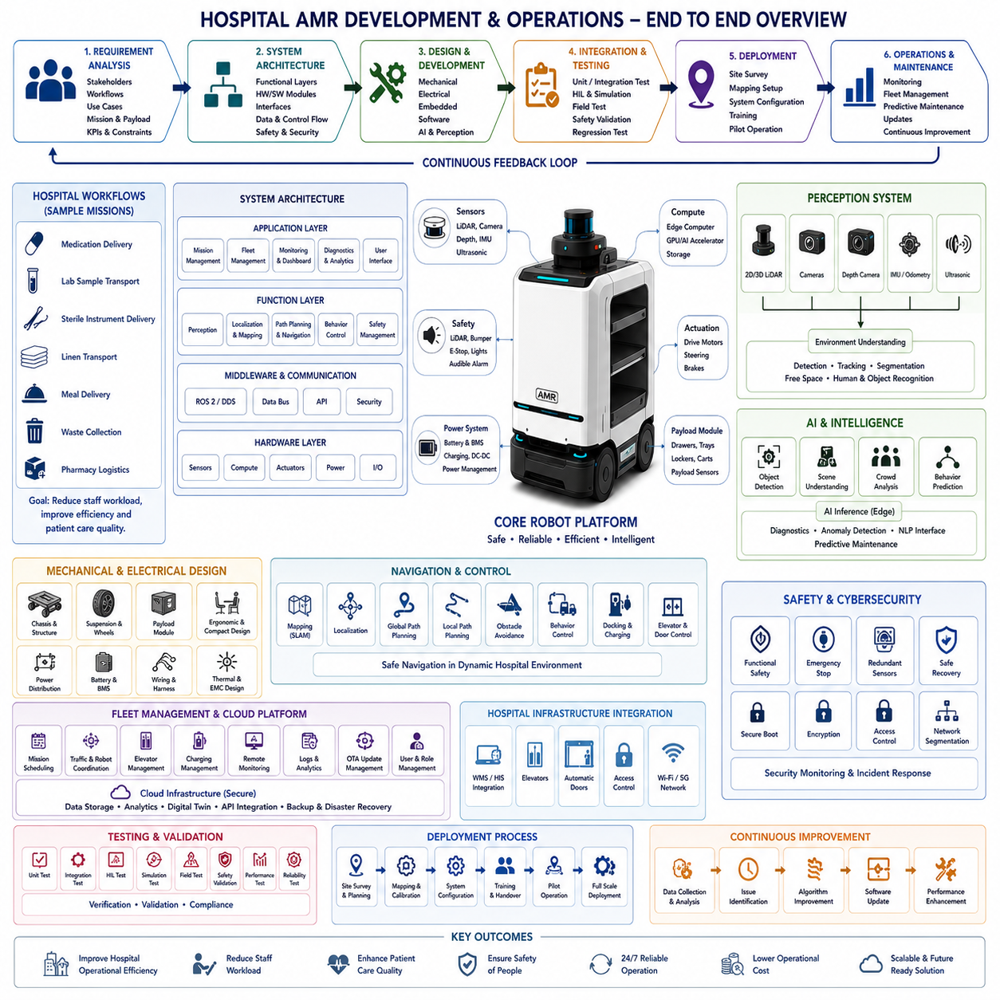
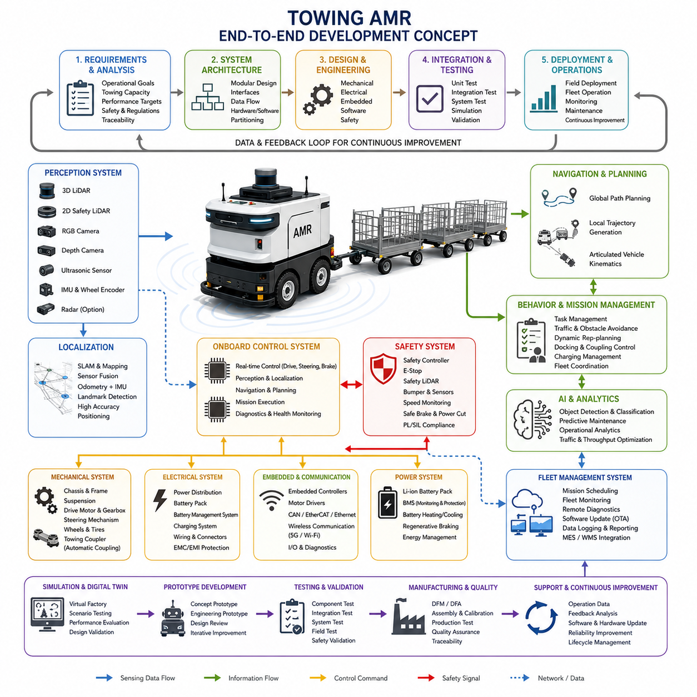
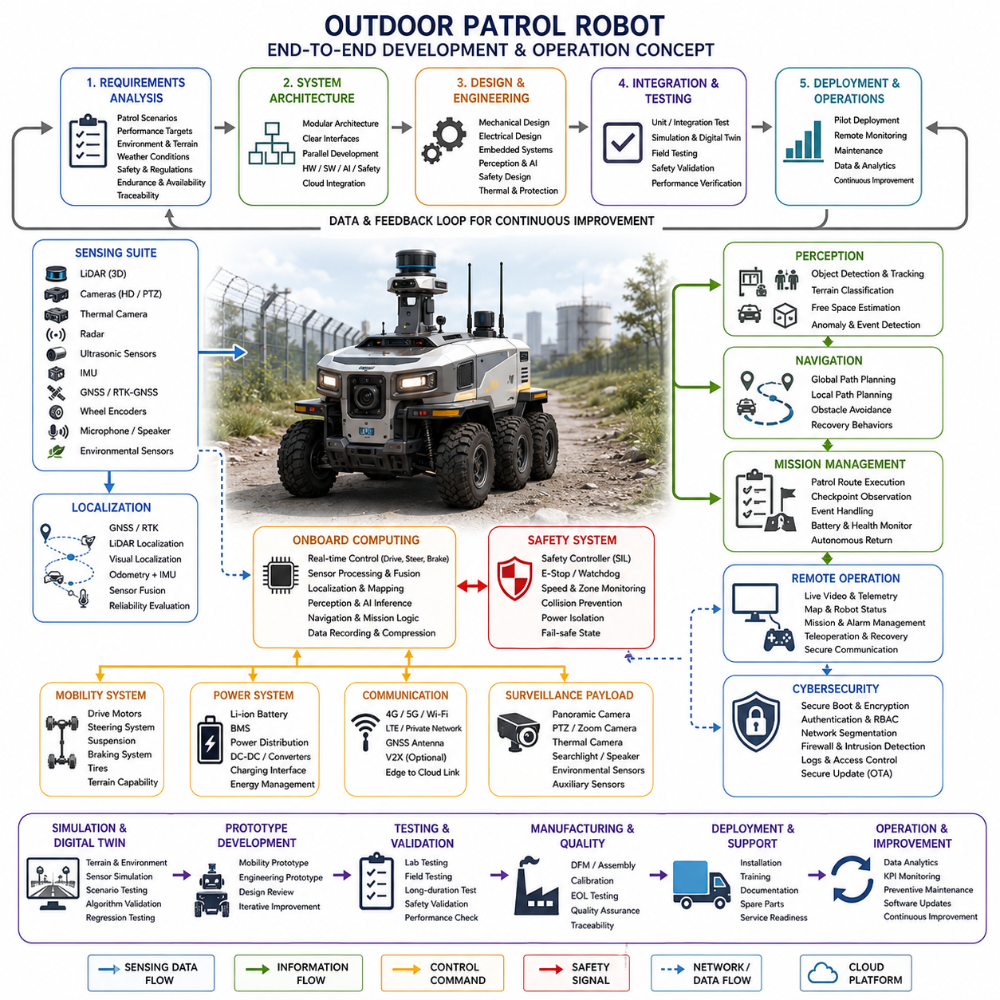
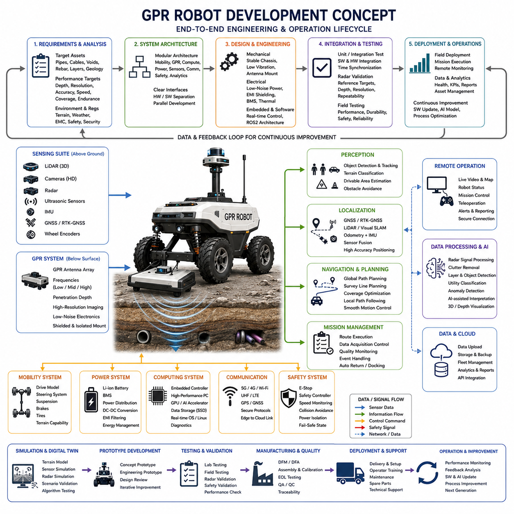
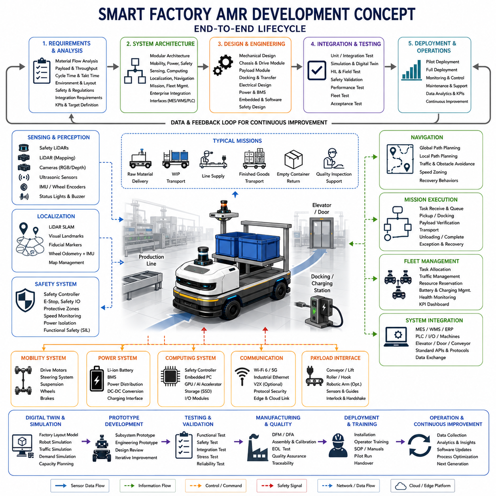
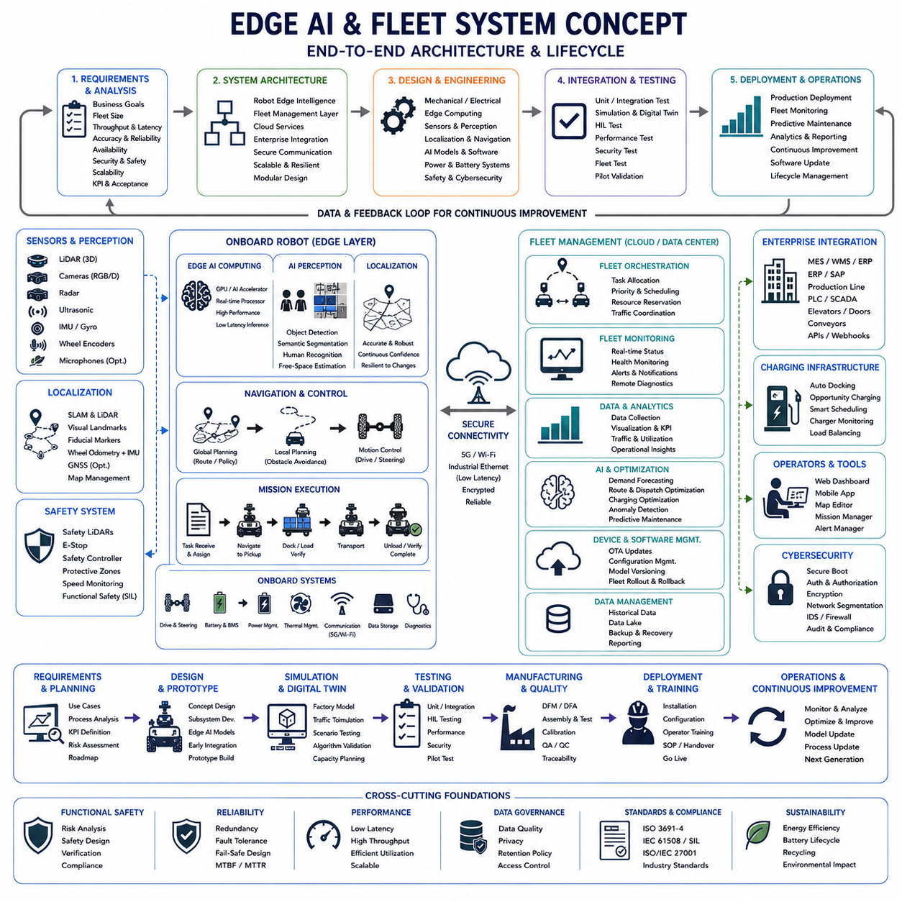
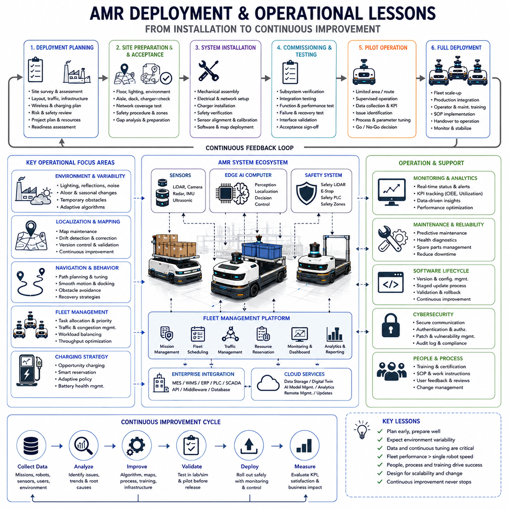
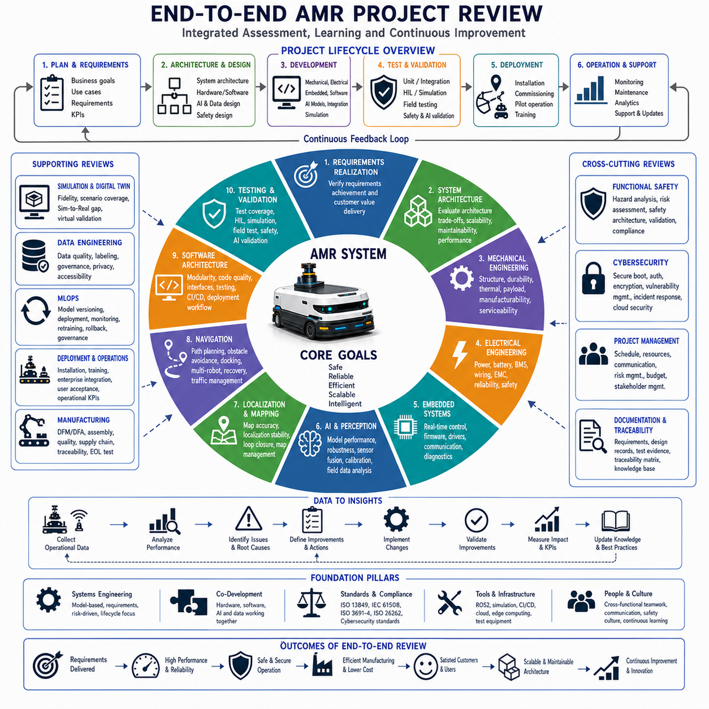

**Volume 10. AMR Engineering Process and Development Manual**


# Chapter 25. End-to-End AMR Development Case Studies

##  

## 25.01 Hospital AMR Development Case

{width="7.268055555555556in" height="7.268055555555556in"}

Hospital Autonomous Mobile Robot development represents one of the most comprehensive engineering challenges in modern robotics because it combines autonomous navigation, human-centered interaction, medical workflow integration, strict safety requirements, cybersecurity protection, and continuous operational reliability within a highly dynamic environment. Unlike industrial factories where operational conditions are relatively predictable, hospitals operate continuously with patients, medical staff, visitors, emergency situations, and sensitive medical equipment sharing the same physical space. Consequently, an end-to-end Hospital AMR development project must integrate system engineering, mechanical design, electrical engineering, embedded systems, perception, artificial intelligence, navigation, fleet management, deployment, maintenance, and regulatory compliance into a single coordinated development process. This case study illustrates how a complete hospital AMR project progresses from initial concept to stable clinical operation while maintaining safety, efficiency, and service quality.

The project begins with a detailed requirement analysis involving hospital administrators, physicians, nurses, logistics personnel, facility managers, infection-control specialists, IT administrators, and maintenance engineers. Rather than focusing solely on robot capabilities, the engineering team first analyzes hospital workflows to identify repetitive transportation tasks that consume valuable medical staff time. Typical missions include delivering medications, transporting laboratory samples, distributing sterile instruments, moving linens, carrying meals, collecting waste, and supporting pharmacy logistics. Each workflow is documented together with operating schedules, priority levels, payload characteristics, destination frequencies, elevator usage, infection-control requirements, and expected service response times. These operational requirements become the foundation for every engineering decision throughout the project lifecycle.

System architecture development translates operational requirements into a modular engineering design that separates hardware, software, communication, perception, navigation, and cloud services into clearly defined functional layers. The robot platform typically includes a differential-drive or omnidirectional mobile base, industrial embedded computers, battery management systems, motor controllers, multiple safety sensors, and redundant communication interfaces. Higher software layers include localization, mapping, path planning, obstacle avoidance, mission execution, fleet coordination, remote monitoring, diagnostics, and cybersecurity services. Well-defined interfaces between these modules simplify development, testing, maintenance, and future feature expansion while allowing individual subsystems to evolve independently without destabilizing the overall platform.

Mechanical engineering focuses on producing a platform that satisfies both clinical usability and long-term operational durability. Hospital corridors, patient rooms, elevators, operating areas, pharmacies, and storage facilities require compact dimensions, smooth maneuverability, low acoustic noise, and high reliability during continuous operation. Engineers optimize chassis rigidity, suspension behavior, wheel selection, center of gravity, payload compartments, service accessibility, and thermal management while minimizing vibration that could damage sensitive medical supplies. The external enclosure is designed using rounded surfaces and antimicrobial materials that simplify cleaning and disinfection while preventing contamination accumulation throughout daily operation.

Electrical system development emphasizes reliability, safety, and maintainability within healthcare environments. Battery capacity must support continuous operation across multiple shifts while enabling opportunity charging between missions. Electrical engineers integrate power distribution, battery management, emergency stop circuits, redundant communication buses, motor drivers, sensor interfaces, charging systems, and safety monitoring into a robust electrical architecture. Electromagnetic compatibility receives particular attention because hospital environments contain numerous sensitive medical devices whose operation must never be disturbed by robotic electronics. Every electrical subsystem undergoes extensive validation before integration into the complete robotic platform.

Embedded software development establishes deterministic real-time control over every hardware subsystem. Low-level firmware manages motor control, battery monitoring, sensor acquisition, communication timing, diagnostic reporting, safety supervision, and emergency recovery independently from higher-level applications. Industrial communication protocols coordinate information exchange between embedded controllers and edge computers while maintaining predictable latency under varying workloads. Hardware abstraction layers simplify software portability, allowing future hardware upgrades without extensive application-level modifications. This layered architecture improves long-term maintainability while reducing integration complexity throughout the development lifecycle.

Perception system development combines multiple complementary sensing technologies to ensure reliable environmental awareness under diverse hospital conditions. Two-dimensional LiDAR sensors provide accurate obstacle detection and localization support, while depth cameras identify people, carts, wheelchairs, beds, and temporary obstacles. Additional ultrasonic sensors improve near-field safety around the robot base, and inertial measurement units stabilize localization during temporary sensor degradation. Sensor fusion algorithms continuously combine these heterogeneous measurements to generate a consistent environmental representation despite changing lighting conditions, crowded hallways, reflective floors, or partially occluded pathways commonly encountered in healthcare facilities.

Localization and navigation development represents one of the most challenging engineering tasks because hospital environments remain highly dynamic throughout daily operation. Accurate maps are generated during initial commissioning using simultaneous localization and mapping techniques before navigation algorithms optimize routes connecting wards, pharmacies, laboratories, operating rooms, elevators, and storage areas. Dynamic obstacle avoidance continuously adapts planned trajectories to accommodate patients, nurses, stretchers, cleaning carts, and emergency equipment without interrupting hospital workflows. Elevators, automatic doors, restricted access zones, and temporary construction areas require additional integration with building management systems to ensure uninterrupted autonomous operation throughout the facility.

Artificial intelligence enhances perception, operational decision-making, and service quality beyond conventional navigation algorithms. Deep learning models classify pedestrians, detect wheelchairs, identify hospital equipment, recognize restricted areas, estimate crowd density, and predict pedestrian movement to improve navigation safety. AI-based diagnostics monitor battery health, component degradation, communication anomalies, and sensor performance while supporting predictive maintenance strategies. Natural language interfaces may assist healthcare personnel by simplifying mission requests and operational status inquiries. Every AI model undergoes extensive validation using representative hospital datasets before deployment to ensure reliable performance under realistic operational conditions.

Fleet management coordinates multiple robots operating simultaneously across different hospital departments while maximizing efficiency and minimizing operational conflicts. Mission scheduling algorithms assign transportation requests according to urgency, robot availability, battery status, traffic conditions, and delivery priorities. Fleet controllers optimize charging schedules, avoid corridor congestion, coordinate elevator access, and dynamically redistribute missions whenever robots experience temporary failures or maintenance requirements. Cloud-based monitoring dashboards provide administrators with real-time visibility into robot locations, mission progress, operational statistics, battery conditions, maintenance status, and system health across the complete robotic fleet.

Safety engineering remains the highest development priority throughout the entire project. Comprehensive hazard analyses identify potential risks associated with autonomous navigation, human interaction, electrical systems, batteries, moving mechanisms, and software behavior. Multiple independent protective layers include safety LiDAR monitoring, emergency stop circuits, redundant braking systems, controlled speed reduction near pedestrians, fault detection algorithms, and safe recovery procedures. Functional safety verification includes thousands of simulated and real-world scenarios covering communication failures, sensor faults, unexpected obstacles, emergency evacuations, and abnormal operator interactions. Continuous safety validation ensures that the robotic system consistently maintains acceptable operational risk throughout deployment.

Cybersecurity engineering protects hospital infrastructure, patient information, operational data, and robotic services against evolving digital threats. Secure boot mechanisms, encrypted communication, certificate-based authentication, access control policies, software integrity verification, network segmentation, and continuous security monitoring protect both robots and backend servers. OTA software updates are digitally signed and verified before installation to prevent unauthorized modifications. Security assessments, penetration testing, vulnerability scanning, and incident response planning become routine engineering activities rather than post-deployment considerations. Integrating cybersecurity into the development lifecycle strengthens operational resilience while supporting healthcare regulatory compliance.

Testing and validation progress systematically from unit testing to complete clinical deployment. Individual software modules undergo automated verification before integration testing confirms subsystem interoperability. Hardware-in-the-loop and simulation environments evaluate navigation algorithms, sensor fusion, safety functions, and communication reliability under thousands of representative scenarios before physical prototypes enter hospital environments. Controlled pilot deployments validate operational performance within selected hospital departments under engineering supervision. Field testing measures navigation accuracy, mission completion time, battery endurance, service reliability, safety performance, operator acceptance, and maintenance requirements while identifying opportunities for continuous optimization before full-scale deployment.

Deployment begins with comprehensive site surveys that evaluate wireless coverage, floor conditions, elevator interfaces, charging station locations, operational boundaries, infection-control procedures, emergency evacuation routes, and integration with existing hospital infrastructure. Engineers calibrate localization systems, configure navigation maps, verify fleet communication, train hospital personnel, and establish operational monitoring procedures before transferring responsibility to hospital operations. Early deployment phases typically involve limited mission categories before gradually expanding operational scope as confidence in system performance increases. Structured deployment minimizes operational disruption while allowing engineering teams to resolve unforeseen integration challenges efficiently.

Operational support continues long after initial deployment through proactive monitoring, preventive maintenance, software updates, performance analysis, and continuous improvement. Cloud-based monitoring platforms collect operational statistics, diagnostic logs, navigation performance, battery health, communication quality, and mission success rates for every robot. Engineering teams analyze collected data to identify emerging reliability issues, optimize navigation behavior, improve AI models, refine maintenance schedules, and enhance fleet coordination algorithms. Continuous operational feedback transforms deployed robots into valuable engineering learning platforms that drive future product evolution while steadily improving customer satisfaction and healthcare service efficiency.

The completed Hospital AMR project demonstrates that successful autonomous healthcare robotics extends far beyond developing a mobile platform capable of autonomous navigation. Long-term success depends upon integrating system engineering, multidisciplinary hardware and software development, artificial intelligence, functional safety, cybersecurity, manufacturing quality, deployment strategy, operational support, regulatory compliance, and continuous engineering improvement into a unified development methodology. By following a structured end-to-end engineering process, organizations can consistently deliver hospital robotic systems that safely support healthcare professionals, improve operational efficiency, reduce repetitive manual workloads, strengthen service quality, and establish a scalable technological foundation for the next generation of intelligent medical automation systems.

병원용 자율이동로봇(Hospital Autonomous Mobile Robot, **AMR**) 개발은 현대 로보틱스(Robotics) 분야에서 가장 종합적인 엔지니어링 과제 가운데 하나이다. 이는 자율주행(Autonomous Navigation), 사람 중심 상호작용(Human-centered Interaction), 병원 업무 프로세스(Hospital Workflow) 연계, 엄격한 안전(Safety) 요구사항, 사이버보안(Cybersecurity), 그리고 지속적인 운영 신뢰성(Operational Reliability)을 매우 복잡하고 역동적인 병원 환경 안에서 동시에 구현해야 하기 때문이다. 산업 공장(Industrial Factory)이 비교적 예측 가능한 환경에서 운영되는 것과 달리 병원은 환자(Patient), 의료진(Medical Staff), 방문객(Visitor), 응급 상황(Emergency Situation), 의료 장비(Medical Equipment)가 동일한 공간에서 24시간 함께 운영된다. 따라서 병원용 AMR 프로젝트는 시스템 엔지니어링(System Engineering), 기계 설계(Mechanical Design), 전기 설계(Electrical Engineering), 임베디드 시스템(Embedded System), 인지(Perception), 인공지능(Artificial Intelligence), 자율주행(Navigation), 플릿 관리(Fleet Management), 배포(Deployment), 유지보수(Maintenance), 규제 준수(Regulatory Compliance)를 하나의 통합된 개발 프로세스로 연결해야 한다. 본 사례는 병원용 AMR 프로젝트가 초기 개념 단계부터 실제 병원 운영까지 어떻게 진행되는지를 설명하며, 동시에 안전성과 효율성 그리고 서비스 품질을 유지하는 방법을 보여준다.

프로젝트는 병원 관리자(Hospital Administrator), 의사(Physician), 간호사(Nurse), 물류 담당자(Logistics Personnel), 시설 관리자(Facility Manager), 감염 관리 전문가(Infection-control Specialist), 정보기술 관리자(IT Administrator), 유지보수 엔지니어(Maintenance Engineer)가 참여하는 상세한 요구사항 분석(Requirement Analysis)으로 시작된다. 엔지니어링 팀은 단순히 로봇 기능을 정의하는 것이 아니라 병원의 실제 업무 흐름(Hospital Workflow)을 분석하여 의료진의 시간을 많이 소비하는 반복적인 운반 작업(Repetitive Transportation Task)을 식별한다. 대표적인 임무에는 의약품 배송(Medication Delivery), 검사 샘플 운반(Laboratory Sample Transportation), 멸균 기구(Sterile Instrument) 운송, 세탁물(Linen) 배송, 식사(Meal) 운반, 의료 폐기물(Waste) 수거, 약국 물류(Pharmacy Logistics) 지원 등이 포함된다. 각각의 업무는 운영 일정(Operating Schedule), 우선순위(Priority), 적재물 특성(Payload Characteristic), 목적지 빈도(Destination Frequency), 엘리베이터 사용(Elevator Usage), 감염관리 요구사항, 목표 응답시간(Response Time)과 함께 문서화되며 이후 모든 엔지니어링 의사결정의 기준이 된다.

시스템 아키텍처(System Architecture) 개발은 이러한 운영 요구사항을 하드웨어(Hardware), 소프트웨어(Software), 통신(Communication), 인지(Perception), 자율주행(Navigation), 클라우드 서비스(Cloud Service)를 명확하게 분리한 모듈형 설계(Modular Design)로 변환한다. 일반적인 플랫폼은 차동 구동(Differential Drive) 또는 전방향 구동(Omnidirectional Drive) 기반의 이동 플랫폼, 산업용 임베디드 컴퓨터(Industrial Embedded Computer), 배터리 관리 시스템(Battery Management System), 모터 제어기(Motor Controller), 다양한 안전 센서(Safety Sensor), 이중화 통신 인터페이스(Redundant Communication Interface)로 구성된다. 상위 소프트웨어 계층은 위치추정(Localization), 지도 작성(Mapping), 경로 계획(Path Planning), 장애물 회피(Obstacle Avoidance), 임무 수행(Mission Execution), 플릿 제어(Fleet Coordination), 원격 모니터링(Remote Monitoring), 진단(Diagnostics), 사이버보안 서비스를 포함한다. 명확하게 정의된 인터페이스는 개발, 시험, 유지보수, 기능 확장을 더욱 쉽게 만들어 준다.

기계 설계(Mechanical Engineering)는 병원 환경에서의 사용성과 장기적인 내구성을 동시에 만족하는 플랫폼을 구현하는 데 초점을 둔다. 병원 복도(Corridor), 병실(Patient Room), 엘리베이터(Elevator), 수술실(Operating Room), 약국(Pharmacy), 창고(Storage Facility)는 모두 협소한 공간과 높은 기동성을 요구하며 동시에 저소음(Low Acoustic Noise)과 높은 신뢰성을 필요로 한다. 엔지니어는 차체 강성(Chassis Rigidity), 서스펜션(Suspension), 휠(Wheel) 선정, 무게중심(Center of Gravity), 적재 공간(Payload Compartment), 유지보수 접근성(Service Accessibility), 열 관리(Thermal Management)를 최적화하면서 의료 물품이 손상되지 않도록 진동(Vibration)을 최소화한다. 또한 외부 커버는 둥근 형상(Rounded Surface)과 항균 소재(Antimicrobial Material)를 적용하여 세척과 소독을 쉽게 수행할 수 있도록 설계된다.

전기 시스템(Electrical System) 개발은 높은 신뢰성과 안전성을 확보하는 데 중점을 둔다. 배터리(Battery)는 여러 교대 근무(Shift) 동안 연속 운용이 가능해야 하며, 임무 사이의 기회 충전(Opportunity Charging)도 지원해야 한다. 전기 엔지니어는 전력 분배(Power Distribution), 배터리 관리 시스템(BMS), 비상정지 회로(Emergency Stop Circuit), 이중화 통신 버스(Redundant Communication Bus), 모터 드라이버(Motor Driver), 센서 인터페이스(Sensor Interface), 충전 시스템(Charging System), 안전 모니터링(Safety Monitoring)을 통합하여 견고한 전기 아키텍처를 구축한다. 또한 병원에는 다양한 의료 장비(Medical Equipment)가 존재하므로 전자파 적합성(Electromagnetic Compatibility, **EMC**) 설계도 매우 중요하며, 모든 전기 시스템은 통합 이전에 충분한 검증을 수행해야 한다.

임베디드 소프트웨어(Embedded Software) 개발은 모든 하드웨어를 실시간으로 안정적으로 제어하는 기반을 제공한다. 저수준 펌웨어(Low-level Firmware)는 모터 제어(Motor Control), 배터리 모니터링(Battery Monitoring), 센서 데이터 수집(Sensor Acquisition), 통신 제어(Communication Timing), 진단(Diagnostic Reporting), 안전 감시(Safety Supervision), 비상 복구(Emergency Recovery)를 상위 응용 프로그램과 독립적으로 수행한다. 산업용 통신 프로토콜(Industrial Communication Protocol)은 임베디드 제어기와 엣지 컴퓨터(Edge Computer) 간의 정보를 일정한 지연 시간(Latency)으로 전달한다. 또한 하드웨어 추상화 계층(Hardware Abstraction Layer)을 적용하여 향후 하드웨어가 변경되더라도 응용 소프트웨어를 크게 수정하지 않고 유지할 수 있도록 설계한다.

인지 시스템(Perception System) 개발은 다양한 센서를 결합하여 병원 환경에서도 안정적인 환경 인식을 수행하도록 한다. 2차원 라이다(2D LiDAR)는 장애물 검출과 위치추정을 지원하며, 깊이 카메라(Depth Camera)는 사람, 휠체어(Wheelchair), 병상(Bed), 의료 카트(Cart), 임시 장애물을 인식한다. 초음파 센서(Ultrasonic Sensor)는 근거리 안전성을 향상시키고, 관성측정장치(Inertial Measurement Unit, **IMU**)는 센서 성능이 일시적으로 저하될 경우 위치추정 안정성을 보완한다. 센서 융합(Sensor Fusion) 알고리즘은 조명 변화, 혼잡한 복도, 반사 바닥, 부분적으로 가려진 환경에서도 일관성 있는 환경 모델(Environment Model)을 생성하여 안정적인 자율주행을 가능하게 한다.

위치추정(Localization) 및 자율주행(Navigation) 개발은 병원과 같은 동적인 환경에서 가장 어려운 기술 과제 중 하나이다. 초기 구축 단계에서는 동시적 위치추정 및 지도작성(Simultaneous Localization and Mapping, **SLAM**) 기술을 이용하여 병원 전체의 지도를 생성한다. 이후 자율주행 알고리즘은 병동(Ward), 약국, 검사실(Laboratory), 수술실, 엘리베이터, 창고를 연결하는 최적의 이동 경로(Route)를 생성한다. 동적 장애물 회피(Dynamic Obstacle Avoidance)는 환자, 간호사, 이동 침대(Stretcher), 청소 카트(Cleaning Cart), 응급 장비를 실시간으로 회피하면서 병원 업무에 방해를 주지 않도록 동작한다. 또한 엘리베이터, 자동문(Automatic Door), 출입 통제 구역(Restricted Area), 공사 구역과도 건물 관리 시스템(Building Management System) 연동을 통해 안정적인 자율 운행을 수행한다.

인공지능(AI)은 단순한 자율주행을 넘어 환경 인식과 운영 효율을 향상시키는 역할을 수행한다. 딥러닝(Deep Learning) 모델은 사람, 휠체어, 의료 장비를 구분하고, 제한 구역을 인식하며, 복도의 혼잡도를 분석하고, 보행자의 이동을 예측하여 더욱 안전한 경로를 생성한다. 또한 AI 기반 진단(AI-based Diagnostics)은 배터리 상태, 부품 열화(Component Degradation), 통신 이상, 센서 성능 저하를 분석하여 예지 유지보수(Predictive Maintenance)를 지원한다. 자연어 인터페이스(Natural Language Interface)는 의료진이 음성이나 간단한 명령만으로 임무를 요청하거나 시스템 상태를 확인할 수 있도록 지원한다. 모든 AI 모델은 실제 병원 데이터를 이용하여 충분한 검증을 수행한 이후에만 운영 환경에 배포된다.

플릿 관리(Fleet Management)는 여러 대의 로봇이 동시에 병원 전체에서 효율적으로 협력하도록 지원한다. 임무 스케줄링(Mission Scheduling)은 긴급도(Urgency), 로봇 상태(Availability), 배터리 수준(Battery Status), 복도 혼잡도(Traffic Condition), 업무 우선순위(Priority)를 고려하여 각 임무를 적절한 로봇에 배정한다. 플릿 제어기(Fleet Controller)는 충전 일정(Charging Schedule), 엘리베이터 사용, 복도 혼잡 회피, 장애 발생 시 임무 재분배를 자동으로 수행한다. 클라우드 기반 모니터링 대시보드(Monitoring Dashboard)는 로봇 위치, 임무 진행 상황, 배터리 상태, 유지보수 정보, 시스템 상태를 실시간으로 병원 관리자에게 제공한다.

안전 엔지니어링(Safety Engineering)은 프로젝트 전체에서 가장 중요한 개발 요소이다. 위험 분석(Hazard Analysis)을 통해 자율주행, 사람과의 상호작용, 전기 시스템, 배터리, 기계 운동, 소프트웨어 동작에서 발생 가능한 위험을 모두 식별한다. 안전 라이다(Safety LiDAR), 비상정지(Emergency Stop), 이중 제동(Redundant Braking), 보행자 근접 시 속도 감소(Speed Reduction), 오류 검출(Fault Detection), 안전 복구(Safe Recovery) 등 여러 계층의 보호 메커니즘을 적용한다. 기능 안전(Function Safety) 검증은 통신 장애, 센서 고장, 예상치 못한 장애물, 응급 상황, 운영자 실수 등을 포함한 수천 개의 시나리오를 통해 수행되며, 어떠한 상황에서도 시스템이 안전 상태(Safe State)를 유지하도록 설계된다.

사이버보안(Cybersecurity)은 병원 인프라(Hospital Infrastructure), 환자 정보(Patient Information), 운영 데이터(Operation Data), 로봇 서비스를 디지털 공격으로부터 보호한다. 보안 부팅(Secure Boot), 암호화 통신(Encrypted Communication), 인증서 기반 인증(Certificate-based Authentication), 접근 제어(Access Control), 소프트웨어 무결성 검증(Software Integrity Verification), 네트워크 분리(Network Segmentation), 지속적인 보안 모니터링(Security Monitoring)을 적용한다. OTA(Over-the-Air) 소프트웨어 업데이트는 디지털 서명(Digital Signature)을 검증한 이후에만 설치되며, 침투 시험(Penetration Testing), 취약점 분석(Vulnerability Scanning), 사고 대응 계획(Incident Response Planning)은 개발 과정의 일부로 지속적으로 수행된다. 이러한 통합된 보안 체계는 의료기관의 규제 요구사항을 충족하면서 운영 신뢰성을 높여준다.

시험 및 검증(Testing and Validation)은 단위 시험(Unit Test)부터 실제 병원 배포까지 단계적으로 수행된다. 개별 소프트웨어 모듈은 자동화 시험을 통해 검증되고, 이후 통합 시험(Integration Test), 하드웨어 인 더 루프(Hardware-in-the-Loop, **HIL**) 시험, 시뮬레이션(Simulation)을 통해 자율주행, 센서 융합, 안전 기능, 통신 성능을 수천 개의 시나리오에서 검증한다. 실제 병원에서는 제한된 구역에서 파일럿 운영(Pilot Deployment)을 수행하여 자율주행 정확도, 임무 수행 시간, 배터리 지속시간, 운영 신뢰성, 안전성, 사용자 만족도, 유지보수 요구사항을 평가하고 지속적인 개선을 수행한 이후 전체 병원으로 확대 적용한다.

배포(Deployment)는 현장 조사(Site Survey)를 통해 무선 네트워크(Wireless Network), 바닥 상태(Floor Condition), 엘리베이터 인터페이스(Elevator Interface), 충전 스테이션 위치, 운영 구역, 감염관리 절차, 비상 대피 경로(Emergency Evacuation Route), 병원 시스템 연동 상태를 확인하는 것부터 시작된다. 이후 엔지니어는 위치추정 보정(Localization Calibration), 지도 구성(Map Configuration), 플릿 통신(Fleet Communication), 운영자 교육(Operator Training), 모니터링 체계를 구축한 후 운영 조직으로 시스템을 인계한다. 초기에는 제한된 임무만 수행한 뒤 안정성이 확인되면 점진적으로 운영 범위를 확대하는 방식이 일반적으로 사용된다. 이러한 단계적 배포는 운영 중단을 최소화하면서 시스템을 안정적으로 정착시키는 데 중요한 역할을 한다.

운영 지원(Operational Support)은 초기 구축 이후에도 지속적으로 수행된다. 클라우드 기반 모니터링 시스템은 운영 통계(Operation Statistics), 진단 로그(Diagnostic Log), 자율주행 성능, 배터리 상태, 통신 품질, 임무 성공률을 지속적으로 수집한다. 엔지니어는 이러한 데이터를 분석하여 신뢰성 문제를 조기에 발견하고, 자율주행 알고리즘을 개선하며, AI 모델을 업데이트하고, 유지보수 계획을 최적화하며, 플릿 제어 알고리즘을 지속적으로 향상시킨다. 실제 운영 과정에서 축적되는 데이터는 차세대 병원용 AMR 개발을 위한 중요한 엔지니어링 자산이 된다.

완성된 병원용 AMR 프로젝트는 단순히 자율주행이 가능한 이동 플랫폼을 개발하는 것만으로 성공할 수 없음을 보여준다. 성공적인 시스템은 시스템 엔지니어링(System Engineering), 기계 및 전기 설계(Mechanical and Electrical Engineering), 소프트웨어 개발(Software Development), 인공지능(AI), 기능 안전(Functional Safety), 사이버보안(Cybersecurity), 제조 품질(Manufacturing Quality), 배포 전략(Deployment Strategy), 운영 지원(Operational Support), 규제 준수(Regulatory Compliance), 지속적인 개선(Continuous Improvement)을 하나의 통합된 개발 프로세스로 연결해야 한다. 이러한 체계적인 엔드투엔드(End-to-End) 개발 방법론을 적용함으로써 조직은 의료진의 반복 업무를 줄이고, 병원 운영 효율성을 높이며, 의료 서비스 품질을 향상시키고, 차세대 지능형 의료 자동화(Intelligent Medical Automation)를 위한 지속 가능한 기술 기반을 구축할 수 있다.

##  

## 25.02 Towing AMR Development Case

{width="7.268055555555556in" height="7.268055555555556in"}

A towing Autonomous Mobile Robot (AMR) project differs fundamentally from many conventional service robots because its primary responsibility is not transporting payloads directly on its chassis but pulling multiple carts, trailers, or industrial carriers throughout highly dynamic production and logistics environments. Such systems must achieve high availability while maintaining precise trajectory tracking under continuously changing loads. Unlike fixed automation, towing AMRs operate alongside workers, forklifts, manual carts, and production equipment, requiring intelligent navigation, flexible scheduling, and safe interaction. The engineering process therefore extends far beyond mobile robot design and becomes a multidisciplinary systems engineering effort involving mechanics, electrical engineering, software architecture, artificial intelligence, manufacturing engineering, functional safety, and long-term operational management.

The project began with a detailed Product Requirements Document that translated customer operational goals into measurable engineering specifications. Manufacturing engineers identified transportation bottlenecks, production takt times, trailer capacities, loading methods, traffic density, charging opportunities, and operational shift schedules. These business objectives were transformed into quantitative system requirements such as towing capacity, vehicle speed, acceleration limits, docking accuracy, localization precision, battery endurance, charging strategy, obstacle detection range, emergency stopping performance, communication latency, and fleet utilization. Each requirement was assigned verification methods, acceptance criteria, and traceability links to downstream design documents, ensuring that engineering decisions remained connected to operational value throughout development.

System architecture development established the overall organization of the towing AMR platform before subsystem implementation began. Engineers divided the robot into mechanical, electrical, embedded control, perception, localization, navigation, fleet management, cloud services, safety supervision, and operational analytics layers. Standardized software interfaces minimized coupling between modules while allowing independent development by different engineering teams. The architecture also defined communication pathways between onboard controllers, industrial sensors, motor drivers, safety controllers, wireless infrastructure, and fleet management servers. Early interface definition significantly reduced integration risk and enabled parallel hardware and software development throughout the project lifecycle.

Mechanical engineering focused on designing a chassis capable of maintaining structural rigidity while towing heavy industrial loads over long operational periods. Finite element analysis optimized frame stiffness without introducing unnecessary weight, while suspension geometry improved wheel-ground contact across uneven factory surfaces. Engineers carefully selected drive motors, reduction gearboxes, steering mechanisms, bearings, wheel materials, and towing couplers according to expected duty cycles and environmental conditions. Particular attention was given to minimizing oscillations generated by long trailer combinations because even small dynamic instabilities could significantly reduce localization accuracy, increase tire wear, and degrade overall operational safety.

The towing interface represented one of the most critical mechanical subsystems in the project. Multiple coupling concepts were evaluated, including manual hitches, automatic mechanical couplers, electrically actuated locking systems, and sensor-assisted docking mechanisms. Automatic coupling greatly improved productivity because operators no longer needed to manually attach trailers during every transportation cycle. The engineering team incorporated redundant position sensing, locking confirmation, and emergency release mechanisms to ensure reliable operation under repeated loading cycles. Durability testing subjected couplers to tens of thousands of connection sequences to verify long-term reliability before production approval.

Electrical engineering emphasized robustness, serviceability, and modularity. The power distribution architecture separated traction power, compute systems, sensing devices, communication modules, and safety circuits to reduce interference and simplify maintenance. Battery sizing considered not only driving distance but also towing resistance, frequent acceleration, environmental temperature, regenerative braking characteristics, and charging opportunities during production. Engineers implemented comprehensive Battery Management System functions including cell balancing, thermal monitoring, current limitation, fault detection, and health estimation to maximize battery lifetime while ensuring safe operation under continuous industrial usage.

Safety circuit development proceeded independently from functional software to guarantee deterministic emergency behavior. Dedicated safety controllers supervised emergency stop buttons, safety LiDARs, bumper sensors, speed monitoring, brake activation, and power isolation circuits. Dual-channel safety architectures minimized single-point failures while periodic self-diagnostics continuously verified sensor availability and communication integrity. Safety engineers performed hazard analysis and risk assessment early in development, allowing required Performance Levels and Safety Integrity Levels to influence hardware selection, controller architecture, and software implementation from the beginning instead of being treated as late-stage additions.

Embedded software provided deterministic real-time control of vehicle motion. Separate controllers managed traction motors, steering actuators, braking systems, battery interfaces, and diagnostic communication while higher-level computing platforms executed perception, localization, navigation, and fleet coordination algorithms. CAN, EtherCAT, and Ethernet communication networks were selected according to bandwidth, determinism, reliability, and subsystem complexity. Firmware development followed strict coding standards, extensive unit testing, and hardware-in-the-loop verification to ensure stable performance before integration with upper software layers.

The perception system combined complementary sensing technologies to provide reliable environmental awareness across diverse operating conditions. Two-dimensional safety LiDARs protected the immediate operating area, while three-dimensional LiDARs, RGB cameras, depth sensors, ultrasonic sensors, wheel encoders, inertial measurement units, and optional radar systems contributed additional environmental information. Sensor fusion algorithms compensated for individual sensor limitations by integrating redundant observations into a consistent representation of surrounding obstacles, free space, dynamic objects, and trailer positions. Accurate sensor calibration and time synchronization proved essential for maintaining reliable perception during continuous industrial operation.

Localization development balanced absolute positioning with local environmental awareness. Simultaneous Localization and Mapping algorithms generated detailed facility maps, while wheel odometry, inertial measurements, LiDAR observations, and visual landmarks continuously corrected accumulated positioning errors. Localization engineers paid particular attention to trailer articulation because long trailer combinations altered vehicle dynamics and occasionally affected wheel slip characteristics. Robust localization algorithms therefore incorporated multiple sensor modalities to maintain positioning accuracy even during tight turns, partial wheel slippage, or temporary sensor occlusion caused by moving personnel and industrial equipment.

Navigation development represented one of the most technically demanding aspects of the towing project. Unlike ordinary mobile robots, towing AMRs must account for the kinematic behavior of connected trailers during path planning and motion execution. Vehicle trajectories that appear feasible for the tractor alone may become impossible once trailer articulation limits, turning radii, reverse motion constraints, and swing-out behavior are considered. The navigation software therefore integrated articulated vehicle kinematics directly into both global path planning and local trajectory generation, allowing the robot to execute safe, predictable movements under varying load configurations.

Behavior planning expanded beyond obstacle avoidance into comprehensive mission execution. The robot continuously evaluated traffic conditions, production priorities, battery state, trailer availability, charging schedules, blocked pathways, emergency events, and fleet coordination requests before selecting appropriate actions. Mission execution logic allowed transportation jobs to pause temporarily during congestion, reroute around temporary obstacles, or automatically resume after charging without operator intervention. These adaptive behaviors significantly increased overall fleet productivity while minimizing manual supervision requirements during daily industrial operations.

Artificial intelligence enhanced operational performance through multiple specialized models rather than relying upon a single monolithic system. Deep learning algorithms detected pallets, carts, workers, forklifts, loading stations, safety equipment, and transportation obstacles using multimodal sensor inputs. Predictive maintenance models analyzed vibration, motor current, battery behavior, temperature trends, and operational history to estimate component degradation before failures occurred. Operational analytics further optimized traffic flow by identifying congestion patterns, inefficient mission scheduling, excessive waiting times, and recurring operational bottlenecks across the production facility.

Software architecture emphasized modular ROS2-based development with clearly defined interfaces between perception, localization, navigation, mission management, diagnostics, fleet communication, and user interaction modules. Containerization simplified deployment while continuous integration pipelines automatically executed static analysis, unit tests, simulation scenarios, integration testing, and regression validation after every software modification. Standardized message definitions and version-controlled APIs allowed independent software teams to collaborate efficiently without introducing incompatible subsystem changes during rapid development iterations.

Simulation became an indispensable engineering tool long before physical prototypes entered testing. Digital twin environments reproduced factory layouts, production workflows, trailer configurations, dynamic obstacles, communication delays, and realistic sensor models. Engineers evaluated thousands of mission scenarios under varying operational conditions while collecting quantitative performance metrics including mission completion time, localization error, collision probability, battery utilization, trailer stability, and fleet throughput. Simulation substantially reduced development cost because software defects, navigation limitations, and operational inefficiencies could be identified before expensive prototype modifications became necessary.

Prototype development progressed through multiple increasingly capable engineering iterations. Early experimental platforms validated drivetrain concepts, towing mechanisms, steering control, and basic navigation performance under simplified conditions. Subsequent engineering prototypes incorporated production-level electrical systems, industrial sensors, safety hardware, autonomous docking capability, and fleet communication interfaces. Each prototype underwent structured design reviews where multidisciplinary engineering teams evaluated performance data, identified technical risks, prioritized corrective actions, and updated engineering documentation before authorizing progression toward the next development stage.

Testing followed a comprehensive verification strategy spanning component, subsystem, integrated system, and operational validation levels. Mechanical endurance testing evaluated frame fatigue, coupler durability, wheel wear, and suspension reliability under repeated towing cycles. Electrical validation confirmed power stability, electromagnetic compatibility, thermal performance, battery safety, and communication reliability. Software testing examined navigation robustness, localization accuracy, recovery behavior, fault tolerance, and mission execution logic. Integrated system testing combined these disciplines into realistic production scenarios where engineering teams measured complete operational performance under representative industrial conditions.

Field deployment introduced engineering challenges that could not be fully reproduced in laboratory environments. Real factories contained changing layouts, temporary storage areas, reflective surfaces, worn floor markings, wireless communication interference, seasonal environmental changes, and unpredictable human behavior. Operational data collection therefore became a continuous engineering activity rather than a one-time validation exercise. Fleet telemetry, diagnostic logs, perception recordings, maintenance reports, operator feedback, and production statistics were systematically collected, analyzed, and incorporated into subsequent software releases and hardware improvements through structured engineering change management.

Manufacturing engineering prepared the platform for scalable production while preserving validated prototype performance. Design for Manufacturing and Design for Assembly principles simplified structural components, reduced wiring complexity, standardized connectors, minimized unique fasteners, and increased module interchangeability. Incoming inspection procedures, assembly instructions, calibration workflows, production testing, traceability systems, and quality assurance checkpoints ensured that every manufactured robot maintained consistent mechanical precision, electrical integrity, software configuration, and safety compliance. Manufacturing readiness reviews confirmed that production capability matched anticipated commercial demand before full-scale deployment commenced.

Project management integrated all engineering disciplines through structured milestone reviews, configuration management, document traceability, risk monitoring, supplier coordination, and continuous stakeholder communication. Requirement changes, software revisions, hardware updates, and manufacturing modifications were carefully evaluated using formal engineering review processes before implementation. Lessons learned during each development phase were documented and incorporated into organizational engineering standards, allowing future towing AMR programs to benefit from accumulated technical knowledge while reducing project risk, development time, and overall engineering cost.

The completed towing AMR development project demonstrated that successful industrial autonomous transportation requires balanced optimization across mechanical engineering, electrical architecture, embedded control, perception, localization, navigation, artificial intelligence, manufacturing, quality assurance, and long-term operational management rather than excellence in any single discipline alone. The resulting engineering process established a repeatable framework for future industrial towing platforms capable of supporting larger fleets, heavier payloads, more sophisticated autonomous behaviors, tighter integration with manufacturing execution systems, and continuous operational improvement through data-driven engineering refinement.

견인형 자율이동로봇(Towing Autonomous Mobile Robot, AMR) 프로젝트는 기존의 많은 서비스 로봇과 근본적으로 다른 특성을 가진다. 일반적인 AMR은 자체 차체 위에 화물을 적재하여 운반하는 것이 주목적이지만, 견인형 AMR은 여러 대의 카트(cart), 트레일러(trailer), 산업용 운반 장치(carrier)를 견인하면서 생산 및 물류 환경 전체를 이동하는 것이 핵심 임무이다. 따라서 지속적으로 변화하는 하중(load) 조건에서도 높은 가동률(availability)과 정밀한 경로 추종(path tracking)을 동시에 달성해야 한다. 또한 작업자, 지게차(forklift), 수동 운반 카트(manual cart), 생산 설비와 함께 동일한 공간에서 운행되므로 지능형 내비게이션(intelligent navigation), 유연한 작업 스케줄링(scheduling), 안전한 인간-로봇 상호작용(human-robot interaction)이 필수적으로 요구된다. 이러한 이유로 개발 과정은 단순한 이동 로봇 설계를 넘어 기계(Mechanical), 전기(Electrical), 소프트웨어(Software), 인공지능(AI), 제조(Manufacturing), 기능안전(Functional Safety), 장기 운영(Operation)을 모두 통합하는 시스템 엔지니어링(System Engineering) 프로젝트로 발전하게 된다.

프로젝트는 고객의 운영 목표를 구체적인 공학적 요구사항으로 변환하는 제품 요구사항 문서(Product Requirements Document, PRD) 작성 단계에서 시작되었다. 제조 엔지니어는 물류 병목(bottleneck), 생산 택트 타임(takt time), 트레일러 적재 용량, 적재 방식, 작업장 교통 밀도, 충전 기회(opportunity), 교대 운영 일정 등을 분석하였다. 이러한 비즈니스 요구는 견인 용량(towing capacity), 차량 속도, 가속 성능, 도킹(docking) 정밀도, 위치추정(localization) 정확도, 배터리 운용 시간, 충전 전략(charging strategy), 장애물 감지 거리, 비상 정지 성능, 통신 지연 시간(latency), 플릿 활용도(fleet utilization) 등 정량적인 시스템 요구사항으로 변환되었다. 또한 모든 요구사항에는 검증 방법, 승인 기준, 추적성(traceability)이 함께 정의되어 이후의 설계와 시험 단계까지 일관성을 유지하도록 구성되었다.

시스템 아키텍처(System Architecture) 설계 단계에서는 전체 견인형 AMR 플랫폼(platform)의 구조를 먼저 정의하였다. 전체 시스템은 기계 구조, 전기 시스템, 임베디드 제어(Embedded Control), 인지(Perception), 위치추정(Localization), 내비게이션(Navigation), 플릿 관리(Fleet Management), 클라우드 서비스(Cloud Service), 안전 감독(Safety Supervision), 운영 분석(Operation Analytics) 계층으로 구분되었다. 각 계층은 표준화된 인터페이스(interface)를 통해 연결되어 서로의 내부 구현에 대한 의존성을 최소화하였다. 또한 온보드 제어기(Onboard Controller), 산업용 센서, 모터 드라이버(Motor Driver), 안전 제어기(Safety Controller), 무선 네트워크, 플릿 관리 서버 간의 데이터 흐름을 명확히 정의하여 여러 개발팀이 병렬적으로 작업할 수 있도록 지원하였다.

기계 설계(Mechanical Engineering)는 장기간의 중량 견인 작업에서도 충분한 강성과 내구성을 유지할 수 있는 차체(chassis) 개발에 집중하였다. 유한요소해석(Finite Element Analysis, FEA)을 활용하여 불필요한 중량 증가 없이 프레임(frame)의 강성을 최적화하였으며, 서스펜션(suspension) 구조는 울퉁불퉁한 공장 바닥에서도 바퀴와 지면의 접촉력을 유지하도록 설계되었다. 또한 구동 모터(drive motor), 감속기(reduction gearbox), 조향 장치(steering mechanism), 베어링(bearing), 휠(wheel), 견인 커플러(coupler)는 예상 운행 사이클과 환경 조건을 고려하여 선정되었다. 특히 긴 트레일러를 견인할 때 발생하는 진동과 흔들림은 위치추정 정확도와 타이어 마모, 안전성에 직접적인 영향을 주므로 이를 최소화하는 것이 중요한 설계 목표가 되었다.

견인 인터페이스(Towing Interface)는 전체 프로젝트에서 가장 중요한 기계 서브시스템(subsystem) 가운데 하나였다. 개발팀은 수동 히치(manual hitch), 자동 기계식 커플러, 전동 잠금 시스템(electrically actuated locking system), 센서 기반 자동 도킹(sensor-assisted docking) 방식 등을 비교 평가하였다. 자동 커플링(automatic coupling)은 작업자가 매번 트레일러를 연결하지 않아도 되므로 생산성을 크게 향상시켰다. 또한 위치 확인(position sensing), 잠금 상태 확인(lock confirmation), 비상 분리(emergency release)를 위한 이중화(redundancy) 기능을 추가하여 높은 신뢰성을 확보하였다. 내구성 시험에서는 수만 회 이상의 연결 및 분리 동작을 반복 수행하여 양산 이전에 장기 신뢰성을 충분히 검증하였다.

전기 시스템(Electrical Engineering)은 견고성(robustness), 유지보수성(serviceability), 모듈화(modularity)를 핵심 목표로 개발되었다. 전력 분배(Power Distribution)는 구동계, 컴퓨팅 시스템, 센서, 통신 장치, 안전 회로를 서로 분리하여 전기적 간섭을 줄이고 유지보수를 단순화하였다. 배터리(Battery) 용량은 주행 거리뿐 아니라 견인 저항, 반복적인 가감속, 온도 변화, 회생 제동(regenerative braking), 충전 기회 등을 함께 고려하여 결정되었다. 또한 배터리 관리 시스템(Battery Management System, BMS)은 셀 밸런싱(cell balancing), 온도 감시, 전류 제한, 이상 감지, 배터리 건강 상태(State of Health, SOH) 추정을 수행하여 장기간 안전하게 운용될 수 있도록 설계되었다.

안전 회로(Safety Circuit)는 일반 제어 소프트웨어와 독립적으로 설계되어 어떠한 상황에서도 결정론적인(deterministic) 비상 동작을 보장하도록 하였다. 전용 안전 제어기는 비상 정지(Emergency Stop), 안전 라이다(Safety LiDAR), 범퍼 센서(Bumper Sensor), 속도 감시, 브레이크 제어, 전원 차단을 독립적으로 수행하였다. 또한 이중 채널(Dual Channel) 안전 구조를 적용하여 단일 고장(Single Point Failure)의 영향을 최소화하였으며, 주기적인 자기 진단(Self Diagnostics)을 통해 센서 상태와 통신 이상을 지속적으로 감시하였다. 위험 분석(Hazard Analysis)과 위험성 평가(Risk Assessment)는 프로젝트 초기 단계에서 수행되어 필요한 성능 수준(Performance Level, PL)과 안전 무결성 수준(Safety Integrity Level, SIL)이 하드웨어와 소프트웨어 설계에 직접 반영되었다.

임베디드 소프트웨어(Embedded Software)는 차량 제어를 실시간(Real-Time)으로 수행하는 핵심 요소였다. 구동 모터, 조향 장치, 브레이크, 배터리 인터페이스, 진단 통신은 전용 제어기에서 수행되었으며, 상위 컴퓨팅 플랫폼에서는 인지, 위치추정, 내비게이션, 플릿 관리 알고리즘이 실행되었다. CAN, EtherCAT, Ethernet 통신은 요구되는 대역폭, 실시간성, 신뢰성을 고려하여 적절히 선택되었다. 또한 펌웨어(Firmware)는 엄격한 코딩 규칙, 단위 시험(Unit Test), HIL(Hardware-in-the-Loop) 검증을 거쳐 상위 시스템과 통합되었다.

인지 시스템(Perception System)은 다양한 센서를 결합하여 산업 환경에서 안정적인 환경 인식을 제공하도록 설계되었다. 2차원 안전 라이다(2D Safety LiDAR)는 즉각적인 안전 보호를 담당하고, 3차원 라이다(3D LiDAR), RGB 카메라(Camera), 깊이 카메라(Depth Camera), 초음파 센서(Ultrasonic Sensor), 휠 엔코더(Wheel Encoder), 관성측정장치(IMU), 필요 시 레이더(Radar)가 추가적인 환경 정보를 제공하였다. 센서 융합(Sensor Fusion)은 개별 센서의 한계를 상호 보완하여 장애물, 자유 공간(Free Space), 이동 객체(Dynamic Object), 트레일러 위치를 일관성 있게 추정하였다. 또한 정확한 센서 보정(Calibration)과 시간 동기화(Time Synchronization)는 안정적인 인지 성능을 유지하는 핵심 요소가 되었다.

위치추정(Localization)은 절대 위치와 주변 환경 정보를 동시에 활용하는 방식으로 개발되었다. 동시적 위치추정 및 지도작성(Simultaneous Localization and Mapping, SLAM)은 공장 지도를 생성하였으며, 휠 오도메트리(Odometry), IMU, 라이다, 비전 랜드마크(Landmark)를 함께 활용하여 누적 오차를 지속적으로 보정하였다. 특히 긴 트레일러를 견인하는 과정에서는 차량 운동 특성이 일반 AMR과 달라지고 휠 슬립(Wheel Slip)이 발생할 가능성이 높아지므로, 다양한 센서 정보를 활용하는 강인한(Robust) 위치추정 알고리즘이 적용되었다.

내비게이션(Navigation)은 견인형 AMR 개발에서 가장 어려운 기술 가운데 하나였다. 일반 이동 로봇과 달리 견인형 AMR은 연결된 트레일러의 운동학(Kinematics)을 동시에 고려해야 한다. 차량 단독으로는 가능한 경로도 트레일러의 회전 반경, 관절 각도(Articulation), 후진 제약, 스윙 아웃(Swing-Out) 현상 때문에 실제로는 실행이 불가능할 수 있다. 따라서 전역 경로 계획(Global Path Planning)과 지역 경로 생성(Local Trajectory Generation) 모두에서 연결 차량의 운동학 모델을 직접 고려하여 안전하고 예측 가능한 주행을 수행하도록 설계되었다.

행동 계획(Behavior Planning)은 단순한 장애물 회피를 넘어 전체 작업 흐름을 관리하였다. 로봇은 교통 상황, 생산 우선순위, 배터리 상태, 트레일러 가용성, 충전 일정, 경로 차단, 비상 상황, 플릿 요청 등을 종합적으로 분석하여 최적의 행동을 선택하였다. 또한 혼잡 시 작업을 일시 중지하거나, 우회 경로를 선택하거나, 충전 후 자동으로 작업을 재개하는 기능을 제공하여 작업자의 개입 없이도 지속적인 생산성을 유지할 수 있도록 하였다.

인공지능(AI)은 하나의 거대한 모델이 아니라 여러 개의 전문화된 모델을 활용하여 전체 시스템을 향상시켰다. 딥러닝(Deep Learning) 기반 모델은 팔레트(Pallet), 카트, 작업자, 지게차, 적재 위치, 장애물을 인식하였으며, 예지보전(Predictive Maintenance) 모델은 진동(Vibration), 모터 전류, 배터리 특성, 온도 변화, 운행 이력을 분석하여 부품의 열화를 사전에 예측하였다. 또한 운영 분석(Operation Analytics)은 반복적인 병목 현상과 비효율적인 작업 스케줄을 분석하여 플릿 전체의 생산성을 지속적으로 향상시켰다.

소프트웨어 아키텍처(Software Architecture)는 ROS2 기반의 모듈형 구조(Modular Architecture)를 채택하였다. 인지, 위치추정, 내비게이션, 임무 관리(Mission Management), 진단(Diagnostics), 플릿 통신, 사용자 인터페이스(User Interface)는 독립적인 노드(Node)로 구현되었으며 표준 메시지(Message)를 통해 상호 통신하였다. 컨테이너(Container) 기반 배포와 지속적 통합(Continuous Integration, CI)은 모든 코드 변경에 대해 정적 분석, 단위 시험, 시뮬레이션, 통합 시험, 회귀 시험(Regression Test)을 자동 수행하여 소프트웨어 품질을 지속적으로 유지하였다.

시뮬레이션(Simulation)은 실제 프로토타입 제작 이전부터 핵심적인 개발 도구로 활용되었다. 디지털 트윈(Digital Twin)은 공장 구조, 생산 흐름, 트레일러 구성, 이동 장애물, 통신 지연, 센서 특성을 현실적으로 재현하였다. 개발팀은 수천 개의 임무 시나리오를 반복 수행하면서 작업 완료 시간, 위치추정 오차, 충돌 가능성, 배터리 사용량, 트레일러 안정성, 플릿 처리량 등을 정량적으로 평가하였다. 이를 통해 실제 장비 제작 이전에 많은 설계 문제를 발견하고 수정할 수 있었다.

프로토타입(Prototype)은 단계적으로 발전하였다. 초기 시험 차량은 구동계와 견인 장치의 기본 개념을 검증하였으며, 이후 버전에서는 산업용 센서, 안전 시스템, 자동 도킹, 플릿 통신 기능이 순차적으로 추가되었다. 각 개발 단계에서는 다학제(Multidisciplinary) 설계 검토(Design Review)를 수행하여 성능 결과를 분석하고 기술적 위험 요소를 제거한 후 다음 단계 개발을 승인하였다.

시험(Testing)은 부품 수준(Component Level), 서브시스템 수준, 통합 시스템 수준, 실제 운영 수준으로 구분하여 수행되었다. 기계 시험은 프레임 피로(Fatigue), 커플러 내구성, 휠 마모, 서스펜션 신뢰성을 검증하였다. 전기 시험은 전원 안정성, 전자파 적합성(EMI/EMC), 열 특성(Thermal Performance), 배터리 안전성을 확인하였다. 소프트웨어 시험은 위치추정, 내비게이션, 장애 복구(Fault Recovery), 임무 수행 로직을 검증하였다. 마지막으로 통합 시험에서는 실제 공장 환경과 유사한 조건에서 전체 시스템의 성능을 종합적으로 평가하였다.

현장 배치(Field Deployment)는 실험실에서 발견되지 않았던 다양한 문제를 드러냈다. 실제 공장은 계속 변하는 레이아웃(layout), 임시 적재 공간, 반사 표면, 무선 통신 간섭, 계절 변화, 예측하기 어려운 작업자 행동 등을 포함하고 있었다. 따라서 운영 데이터(Operation Data)는 일회성 검증이 아니라 지속적으로 수집되고 분석되었다. 플릿 로그(Log), 진단 정보(Diagnostics), 센서 데이터, 유지보수 기록, 작업자 피드백은 차기 소프트웨어 업데이트와 하드웨어 개선에 반영되어 지속적인 성능 향상을 이루었다.

제조 엔지니어링(Manufacturing Engineering)은 검증된 프로토타입 성능을 유지하면서 대량 생산이 가능하도록 제품을 최적화하였다. 제조를 위한 설계(Design for Manufacturing, DFM)와 조립을 위한 설계(Design for Assembly, DFA)를 적용하여 부품 수를 줄이고 배선을 단순화하며 모듈화를 강화하였다. 또한 입고 검사(Incoming Inspection), 조립 절차, 센서 보정(Calibration), 생산 시험, 추적성 관리, 품질 보증(Quality Assurance) 절차를 구축하여 모든 생산 장비가 동일한 성능과 안전성을 유지하도록 하였다.

프로젝트 관리(Project Management)는 모든 개발 분야를 통합하는 중심 역할을 수행하였다. 일정 관리(Scheduling), 형상 관리(Configuration Management), 문서 추적성(Document Traceability), 위험 관리(Risk Management), 공급업체 협력, 이해관계자와의 지속적인 의사소통이 체계적으로 운영되었다. 요구사항 변경, 하드웨어 수정, 소프트웨어 업데이트, 제조 공정 변경은 모두 공식적인 설계 검토 절차를 거쳐 승인되었으며, 각 개발 단계에서 얻어진 교훈(Lessons Learned)은 조직의 표준 개발 프로세스에 반영되어 이후 프로젝트의 개발 기간 단축과 위험 감소에 활용되었다.

완성된 견인형 AMR 개발 프로젝트는 성공적인 산업용 자율 운송 시스템이 단순히 뛰어난 내비게이션이나 우수한 기계 설계만으로 완성되는 것이 아니라는 점을 보여주었다. 기계(Mechanical), 전기(Electrical), 임베디드 제어(Embedded Control), 인지(Perception), 위치추정(Localization), 내비게이션(Navigation), 인공지능(AI), 제조(Manufacturing), 품질보증(Quality Assurance), 장기 운영(Operation)이 균형 있게 최적화될 때 비로소 높은 신뢰성과 생산성을 갖춘 시스템을 구현할 수 있다. 이러한 개발 사례는 향후 더 큰 규모의 플릿(Fleet), 더욱 무거운 견인 하중, 고도화된 자율주행 기능, 제조 실행 시스템(Manufacturing Execution System, MES)과의 긴밀한 연동, 그리고 데이터 기반 지속적 개선(Continuous Improvement)을 지원하는 차세대 산업용 견인형 AMR 개발의 표준적인 엔드 투 엔드(End-to-End) 개발 프레임워크로 활용될 수 있다.

##  

## 25.03 Outdoor Patrol Robot Development Case

{width="7.268055555555556in" height="7.268055555555556in"}

An outdoor patrol robot development project begins with a clear definition of the environment, operational mission, and level of autonomy expected from the final system. Unlike indoor AMRs operating on predictable floors and controlled routes, outdoor patrol robots must travel across roads, sidewalks, ramps, gravel, grass, drainage covers, and partially damaged surfaces while remaining available in changing weather. The product requirements therefore combine autonomous mobility, surveillance, communication, safety, durability, cybersecurity, and long-duration field operation into a single engineering program.

The initial requirement analysis focuses on the patrol scenarios that the robot must support. Typical missions include perimeter inspection, industrial facility monitoring, construction-site patrol, campus security, infrastructure observation, restricted-area surveillance, and emergency situation reporting. Engineers define route length, patrol frequency, maximum slope, ground clearance, obstacle dimensions, allowable speed, operating temperature, rain and dust exposure, communication range, camera coverage, and required endurance. These requirements are linked to measurable verification criteria so that the final robot can be evaluated objectively.

System architecture is established before detailed hardware and software development begins. The robot is divided into mobility, power, sensing, computing, communication, safety, mission management, remote operation, and cloud monitoring domains. Low-level controllers handle deterministic drive, steering, braking, and emergency functions, while higher-level computers execute perception, localization, path planning, artificial intelligence, video processing, and patrol logic. Clear interfaces between these layers allow mechanical, electrical, embedded, software, and AI teams to develop their components in parallel without creating excessive dependency.

Mechanical engineering must create a platform that can survive repeated outdoor operation without sacrificing stability or serviceability. The chassis is designed for sufficient torsional rigidity, appropriate wheelbase, low center of gravity, and balanced weight distribution. Engineers evaluate four-wheel, six-wheel, differential-drive, skid-steer, Ackermann-steering, and articulated configurations according to terrain and speed requirements. Suspension, tires, wheel hubs, seals, bearings, and structural joints are selected to withstand vibration, shock, water, dust, corrosion, and continuous exposure to outdoor conditions.

Environmental protection strongly influences the enclosure and component arrangement. Electronic modules, batteries, computers, communication devices, and connectors require protection against rainwater, condensation, dust intrusion, and temperature variation. Sealing structures, drainage paths, breathable membranes, protected cable glands, corrosion-resistant coatings, and outdoor-rated connectors are incorporated into the design. Thermal management must also consider direct sunlight and low-speed operation, because enclosed computers and AI accelerators may generate significant heat even when external air movement is limited.

The electrical architecture is organized around a high-capacity battery, protected power distribution, and stable voltage conversion. Separate power domains are typically provided for traction motors, steering actuators, safety devices, computing platforms, communication equipment, lights, and surveillance payloads. The Battery Management System monitors cell voltage, current, temperature, insulation condition, charging state, and long-term health. Energy consumption is modeled for different patrol speeds, slopes, sensor loads, communication activity, and environmental temperatures to determine realistic mission endurance and charging intervals.

The sensing architecture combines navigation sensors with surveillance sensors. LiDAR, cameras, depth sensors, ultrasonic sensors, radar, wheel encoders, an inertial measurement unit, and GNSS may be integrated depending on the operating environment. Surveillance payloads can include panoramic cameras, optical zoom cameras, thermal cameras, microphones, speakers, searchlights, environmental sensors, and optional gas or radiation detectors. Sensor placement is optimized to reduce blind zones, protect the devices from impact, and maintain stable calibration despite vibration, temperature changes, and repeated outdoor use.

Localization must remain reliable when satellite signals, visual features, or LiDAR geometry become temporarily unavailable. Outdoor patrol robots commonly combine GNSS or RTK-GNSS with wheel odometry, IMU measurements, LiDAR localization, and visual positioning. In open areas, satellite positioning may provide strong absolute accuracy, while buildings, trees, tunnels, and metal structures can cause multipath errors or complete signal loss. Multi-sensor fusion therefore evaluates the confidence of each information source and smoothly changes weighting when environmental conditions alter sensor reliability.

Perception development focuses on understanding both terrain and activity around the robot. The system identifies pedestrians, vehicles, bicycles, animals, barriers, curbs, potholes, low vegetation, construction materials, and objects extending into the driving path. Free-space estimation is particularly important because outdoor environments do not always provide clear lane markings or structured corridors. Artificial intelligence models may also classify suspicious behavior, unauthorized entry, abandoned objects, smoke, fire, or unusual temperature patterns, but these detections must be verified against operational rules to minimize false alarms.

Navigation software generates routes that respect the physical limits of the vehicle and the safety requirements of shared outdoor spaces. The global planner considers maps, patrol checkpoints, restricted zones, slopes, road width, surface conditions, and preferred travel directions. The local planner responds to moving pedestrians, vehicles, temporary obstacles, and uncertain terrain while maintaining stable speed and steering behavior. Recovery functions are required when the robot encounters blocked paths, localization degradation, wheel slip, communication loss, or conditions that exceed safe mobility limits.

Mission management converts patrol policies into executable robot behavior. A patrol mission may include departure from a charging station, route execution, checkpoint observation, camera positioning, data recording, event detection, remote reporting, and autonomous return. The mission manager supervises battery level, health status, communication quality, localization confidence, weather conditions, and alarm priority. When an abnormal situation occurs, the robot may stop, maintain observation, approach from a safe distance, notify an operator, activate lights or speakers, and wait for further remote instruction.

Remote operation is essential even for a highly autonomous patrol robot. Operators require live video, map position, robot health, mission progress, alarm history, and communication status through a secure dashboard. Teleoperation may be used for recovery, close inspection, emergency intervention, or movement through environments not yet validated for autonomous travel. To prevent unsafe commands, remote control functions must respect onboard safety zones, speed limits, emergency stops, and communication timeout rules. The robot must always move to a safe state if the network connection becomes unstable or unavailable.

Cybersecurity is treated as a core system requirement because patrol robots collect sensitive video, location, audio, and facility information. Secure boot, encrypted communication, authenticated users, role-based access, protected storage, firewall configuration, software signing, and controlled update mechanisms are integrated into the platform. Network segmentation separates safety-critical control from external communication and cloud services. Security logging records access attempts, configuration changes, remote commands, and software updates so that abnormal activity can be investigated and operational responsibility can be traced.

Simulation and digital twins are used to evaluate the robot before extensive field testing. Virtual environments reproduce terrain, slopes, curbs, roads, buildings, pedestrians, vehicles, lighting changes, rain, fog, sensor noise, and communication limitations. Developers test patrol routes, obstacle avoidance, localization transitions, mission recovery, camera coverage, and energy consumption without risking physical equipment. Simulation also enables repeated regression testing whenever navigation, perception, or mission software is updated, reducing the possibility that a new feature introduces unexpected failures.

Prototype development proceeds through several controlled stages. The first mobility prototype validates chassis geometry, steering, suspension, braking, and basic power distribution. The next prototype adds production-representative sensors, computing modules, environmental protection, autonomous navigation, and safety systems. Later engineering units incorporate surveillance payloads, remote operation, fleet interfaces, charging functions, and maintainability improvements. Design reviews at each stage compare measured results with requirements and determine whether mechanical, electrical, software, or operational changes are necessary.

Testing combines laboratory evaluation, controlled outdoor trials, and long-duration field operation. Mechanical tests measure vibration resistance, structural fatigue, water protection, thermal performance, braking distance, slope capability, and obstacle-crossing performance. Software tests examine localization accuracy, detection performance, navigation reliability, recovery behavior, mission completion, and network failure response. Safety validation confirms emergency stopping, protective zones, speed supervision, power isolation, and fail-safe behavior. Each result is documented and traced to the original requirement and system configuration.

Pilot deployment reveals practical issues that may not appear during engineering tests. Outdoor patrol routes can change because of parked vehicles, construction work, vegetation growth, temporary fences, snow, standing water, or changes in pedestrian activity. Wireless coverage may vary by location and time, while camera visibility may be degraded by dirt, glare, darkness, rain, or condensation. Field data, operator comments, maintenance records, alarm statistics, and mission failures are collected systematically and converted into corrective actions, updated maps, software improvements, and revised operating procedures.

Manufacturing preparation transforms the validated prototype into a repeatable product. Components are modularized to simplify assembly, inspection, repair, and replacement. Cable routing, connector identification, sealing procedures, torque specifications, sensor mounting, calibration, software installation, and end-of-line testing are standardized. Quality assurance verifies mechanical alignment, electrical safety, environmental sealing, communication performance, sensor calibration, autonomous driving, emergency functions, and complete configuration traceability. Production records allow each delivered robot to be linked to its hardware, firmware, software, and test history.

Operational support continues after deployment through remote monitoring, preventive maintenance, software updates, map management, and performance analysis. Health data from motors, batteries, computers, sensors, cooling devices, and communication modules are used to identify degradation before service interruption occurs. Patrol completion rate, intervention frequency, false alarm rate, charging efficiency, network availability, and route delay become key operational indicators. These metrics guide continuous improvement and help determine whether problems originate from the robot, infrastructure, environment, software, or operating policy.

The completed outdoor patrol robot development case demonstrates that successful field autonomy depends on the integration of rugged mobility, reliable energy systems, multi-sensor localization, environmental perception, mission intelligence, secure communication, functional safety, and disciplined lifecycle management. The robot must not only navigate autonomously but also remain useful, maintainable, secure, and predictable throughout long-term operation. By applying an end-to-end engineering process from requirements and architecture through validation, manufacturing, deployment, and feedback, the project establishes a reusable foundation for future security, inspection, smart-city, industrial, and infrastructure patrol robot programs.

실외 순찰 로봇(Outdoor Patrol Robot) 개발 프로젝트는 최종 시스템이 수행해야 하는 운영 환경, 임무(Mission), 그리고 자율성 수준(Level of Autonomy)을 명확하게 정의하는 것에서 시작된다. 예측 가능한 바닥과 통제된 이동 경로에서 운행하는 실내 자율이동로봇(Autonomous Mobile Robot, AMR)과 달리, 실외 순찰 로봇은 도로, 보도, 경사로, 자갈길, 잔디, 배수로 덮개, 손상된 노면 등 다양한 지형을 안정적으로 이동해야 하며, 변화하는 기상 조건에서도 지속적으로 운영되어야 한다. 따라서 제품 요구사항(Product Requirements)은 자율주행(Autonomous Mobility), 감시(Surveillance), 통신(Communication), 안전(Safety), 내구성(Durability), 사이버보안(Cybersecurity), 장시간 현장 운용(Long-Duration Field Operation)을 하나의 통합된 엔지니어링 프로그램으로 구성하게 된다.

초기 요구사항 분석(Requirement Analysis)은 로봇이 수행해야 할 순찰 시나리오(Patrol Scenario)를 중심으로 진행된다. 대표적인 임무에는 시설 외곽 순찰, 산업시설 감시, 건설 현장 순찰, 캠퍼스 보안, 사회기반시설(Infrastructure) 점검, 출입 제한 구역 감시, 비상 상황 보고 등이 포함된다. 개발팀은 순찰 경로 길이, 순찰 주기, 최대 경사도, 지상고(Ground Clearance), 장애물 통과 능력, 허용 속도, 운용 온도, 방수 및 방진 성능, 통신 거리, 카메라 감시 범위, 운용 시간 등을 정량적으로 정의한다. 이러한 요구사항은 모두 측정 가능한 검증 기준(Verification Criteria)과 연결되어 최종 시스템이 객관적으로 평가될 수 있도록 구성된다.

시스템 아키텍처(System Architecture)는 상세한 하드웨어(Hardware)와 소프트웨어(Software) 개발 이전에 먼저 설계된다. 전체 시스템은 이동 플랫폼(Mobility), 전원(Power), 센서(Sensing), 컴퓨팅(Computing), 통신(Communication), 안전(Safety), 임무 관리(Mission Management), 원격 운영(Remote Operation), 클라우드 모니터링(Cloud Monitoring) 영역으로 구분된다. 저수준 제어기(Low-Level Controller)는 구동, 조향, 제동, 비상 기능을 결정론적(Deterministic)으로 제어하며, 상위 컴퓨터는 인지(Perception), 위치추정(Localization), 경로 계획(Path Planning), 인공지능(AI), 영상 처리(Video Processing), 순찰 제어 로직을 수행한다. 이러한 계층 간 명확한 인터페이스는 기계, 전기, 임베디드, 소프트웨어, AI 개발팀이 상호 의존성을 최소화하면서 병렬 개발을 수행할 수 있도록 지원한다.

기계 설계(Mechanical Engineering)는 반복적인 실외 운용 환경에서도 안정성과 유지보수성을 동시에 확보할 수 있는 플랫폼을 개발하는 데 집중한다. 차체(Chassis)는 충분한 비틀림 강성(Torsional Rigidity), 적절한 휠베이스(Wheelbase), 낮은 무게중심(Center of Gravity), 균형 잡힌 하중 분배를 목표로 설계된다. 또한 4륜, 6륜, 차동 구동(Differential Drive), 스키드 조향(Skid-Steer), 애커먼 조향(Ackermann Steering), 관절식 구조(Articulated Configuration) 등을 주행 환경과 요구 속도에 맞추어 비교 검토한다. 서스펜션(Suspension), 타이어(Tire), 휠 허브(Wheel Hub), 씰(Seal), 베어링(Bearing), 구조 접합부는 진동, 충격, 물, 먼지, 부식, 장기간의 실외 노출을 견딜 수 있도록 선정된다.

환경 보호(Environmental Protection)는 외함(Enclosure)과 부품 배치(Component Arrangement)에 큰 영향을 미친다. 전자 제어기, 배터리, 컴퓨터, 통신 장치, 커넥터는 빗물, 응결(Condensation), 먼지 유입, 온도 변화로부터 보호되어야 한다. 이를 위해 밀봉 구조(Sealing Structure), 배수 경로(Drainage Path), 통기성 멤브레인(Breathable Membrane), 보호형 케이블 글랜드(Cable Gland), 부식 방지 코팅(Corrosion-Resistant Coating), 실외용 커넥터를 적용한다. 또한 열 관리(Thermal Management)는 직사광선과 저속 운행 조건을 함께 고려해야 하며, 밀폐된 AI 컴퓨터와 가속기(Accelerator)에서 발생하는 열을 효과적으로 방출할 수 있도록 설계된다.

전기 시스템(Electrical Architecture)은 대용량 배터리(Battery), 보호된 전력 분배(Power Distribution), 안정적인 전압 변환(Voltage Conversion)을 중심으로 구성된다. 일반적으로 구동 모터, 조향 장치, 안전 장치, 컴퓨팅 시스템, 통신 장비, 조명, 감시 장비는 서로 독립된 전원 영역(Power Domain)을 갖도록 설계된다. 배터리 관리 시스템(Battery Management System, BMS)은 셀(Cell)의 전압, 전류, 온도, 절연 상태, 충전 상태(State of Charge), 장기적인 건강 상태(State of Health)를 지속적으로 감시한다. 또한 순찰 속도, 경사도, 센서 사용량, 통신 부하, 외기 온도에 따른 에너지 소비를 분석하여 실제 운용 시간과 충전 주기를 산정한다.

센서 아키텍처(Sensor Architecture)는 자율주행 센서와 감시 센서를 함께 통합한다. 라이다(LiDAR), 카메라(Camera), 깊이 카메라(Depth Camera), 초음파 센서(Ultrasonic Sensor), 레이더(Radar), 휠 엔코더(Wheel Encoder), 관성측정장치(Inertial Measurement Unit, IMU), 위성항법시스템(Global Navigation Satellite System, GNSS)은 운용 환경에 따라 적절히 조합된다. 감시 장비에는 파노라마 카메라(Panoramic Camera), 광학 줌 카메라(Optical Zoom Camera), 열화상 카메라(Thermal Camera), 마이크(Microphone), 스피커(Speaker), 탐조등(Searchlight), 환경 센서(Environmental Sensor), 선택적으로 가스 및 방사선 탐지기(Gas and Radiation Detector)가 포함될 수 있다. 모든 센서는 사각지대(Blind Zone)를 최소화하고 충격으로부터 보호되며 진동과 온도 변화에도 안정적인 보정 상태를 유지하도록 배치된다.

위치추정(Localization)은 위성 신호, 영상 특징, 라이다 기반 위치 정보가 일시적으로 사라지는 상황에서도 안정적으로 유지되어야 한다. 실외 순찰 로봇은 일반적으로 GNSS 또는 실시간 이동 측위(Real-Time Kinematic GNSS, RTK-GNSS), 휠 오도메트리(Wheel Odometry), IMU, 라이다 위치추정(LiDAR Localization), 비전 기반 위치추정(Visual Localization)을 함께 활용한다. 개방된 지역에서는 위성 위치정보가 높은 정확도를 제공하지만, 건물, 나무, 터널, 금속 구조물에서는 다중 경로(Multipath) 오차나 신호 단절이 발생할 수 있다. 따라서 다중 센서 융합(Multi-Sensor Fusion)은 각 센서의 신뢰도를 지속적으로 평가하고 환경 변화에 따라 적절한 가중치(Weight)를 적용하여 안정적인 위치추정을 유지한다.

인지 시스템(Perception)은 주변 환경과 활동 상황을 정확하게 이해하는 것을 목표로 한다. 시스템은 사람, 차량, 자전거, 동물, 장애물, 연석(Curb), 포트홀(Pothole), 낮은 수풀, 공사 자재, 이동 경로를 침범하는 물체 등을 인식한다. 특히 자유 공간 추정(Free-Space Estimation)은 명확한 차선이나 통로가 존재하지 않는 실외 환경에서 매우 중요한 기능이다. 또한 인공지능(AI)은 수상한 행동(Suspicious Behavior), 무단 침입(Unauthorized Entry), 방치 물체(Abandoned Object), 연기(Smoke), 화재(Fire), 이상 온도 패턴을 탐지할 수 있지만, 잘못된 경보(False Alarm)를 줄이기 위해 운영 규칙(Operation Policy)과 함께 판단하도록 설계된다.

내비게이션(Navigation)은 차량의 물리적 한계와 공유 공간의 안전 요구사항을 동시에 만족하는 경로를 생성한다. 전역 경로 계획(Global Path Planning)은 지도(Map), 순찰 지점(Check Point), 제한 구역, 경사도, 도로 폭, 노면 상태, 권장 이동 방향을 고려한다. 지역 경로 계획(Local Path Planning)은 이동 중인 보행자, 차량, 임시 장애물, 불확실한 지형에 실시간으로 대응하면서 안정적인 속도와 조향 성능을 유지한다. 또한 경로 차단, 위치추정 오류, 휠 슬립(Wheel Slip), 통신 장애, 안전 기준을 초과하는 환경에서는 자동 복구(Recovery) 기능이 수행되도록 설계된다.

임무 관리(Mission Management)는 순찰 정책(Patrol Policy)을 실제 로봇 동작으로 변환하는 역할을 담당한다. 순찰 임무에는 충전소 출발, 경로 이동, 순찰 지점 관찰, 카메라 방향 제어, 데이터 기록, 이벤트 감지, 원격 보고, 자율 복귀 등이 포함된다. 임무 관리자는 배터리 상태, 시스템 건강 상태, 통신 품질, 위치추정 신뢰도, 기상 조건, 경보 우선순위를 지속적으로 감시한다. 이상 상황이 발생하면 로봇은 정지하거나 안전 거리를 유지하면서 감시를 계속하고, 운영자에게 알림을 전송하거나 조명과 스피커를 활성화한 후 원격 명령을 기다리도록 동작한다.

원격 운영(Remote Operation)은 높은 수준의 자율성을 가진 순찰 로봇에서도 반드시 필요한 기능이다. 운영자는 보안 대시보드(Dashboard)를 통해 실시간 영상, 지도 위치, 로봇 상태, 임무 진행 상황, 경보 이력, 통신 상태를 확인할 수 있어야 한다. 원격 조종(Teleoperation)은 장애 복구, 근접 점검, 비상 대응, 아직 자율주행이 검증되지 않은 구역을 통과할 때 사용된다. 그러나 원격 제어 역시 안전 구역(Safety Zone), 속도 제한, 비상 정지(Emergency Stop), 통신 타임아웃(Timeout)을 항상 준수해야 하며, 통신이 끊어질 경우 로봇은 자동으로 안전 상태(Safe State)로 전환되어야 한다.

사이버보안(Cybersecurity)은 순찰 로봇이 민감한 영상(Video), 위치(Location), 음성(Audio), 시설 정보를 수집하기 때문에 핵심적인 시스템 요구사항으로 취급된다. 보안 부팅(Secure Boot), 암호화 통신(Encrypted Communication), 사용자 인증(Authentication), 역할 기반 접근 제어(Role-Based Access Control), 보호된 저장 장치(Secure Storage), 방화벽(Firewall), 소프트웨어 서명(Software Signing), 안전한 업데이트(Update) 체계가 시스템에 포함된다. 또한 안전 제어망과 외부 통신망을 분리하는 네트워크 분리(Network Segmentation)를 적용하며, 접근 기록, 설정 변경, 원격 명령, 소프트웨어 업데이트 이력을 모두 저장하여 이상 행위를 추적할 수 있도록 한다.

시뮬레이션(Simulation)과 디지털 트윈(Digital Twin)은 실제 현장 시험 이전에 시스템을 검증하는 중요한 도구이다. 가상 환경(Virtual Environment)은 다양한 지형, 경사, 연석, 도로, 건물, 보행자, 차량, 조명 변화, 비, 안개, 센서 노이즈, 통신 제한 등을 현실적으로 재현한다. 개발자는 이러한 환경에서 순찰 경로, 장애물 회피, 위치추정 전환, 임무 복구, 카메라 감시 범위, 에너지 소비를 반복적으로 검증할 수 있다. 또한 소프트웨어가 변경될 때마다 동일한 시나리오를 반복 수행하는 회귀 시험(Regression Test)을 자동으로 수행하여 새로운 기능이 기존 성능을 저하시키지 않도록 관리한다.

프로토타입(Prototype)은 단계적으로 발전한다. 초기 이동 플랫폼은 차체 구조, 조향, 서스펜션, 제동, 전원 분배를 검증하며, 이후 프로토타입에서는 산업용 센서, 컴퓨팅 시스템, 환경 보호 기능, 자율주행 기능, 안전 시스템이 추가된다. 최종 엔지니어링 시제품에는 감시 장비, 원격 운영 기능, 플릿(Fleet) 연동, 자동 충전, 유지보수성 향상 기능이 포함된다. 각 개발 단계에서는 설계 검토(Design Review)를 수행하여 요구사항과 실제 성능을 비교하고 필요한 기계, 전기, 소프트웨어, 운영 개선 사항을 결정한다.

시험(Testing)은 실험실 시험, 통제된 실외 시험, 장기간 현장 시험을 결합하여 수행된다. 기계 시험에서는 진동 내구성, 구조 피로, 방수 성능, 열 성능, 제동 거리, 경사 주행 능력, 장애물 통과 능력을 평가한다. 소프트웨어 시험은 위치추정 정확도, 객체 인식 성능, 내비게이션 신뢰성, 장애 복구, 임무 수행률, 네트워크 장애 대응을 검증한다. 안전 시험은 비상 정지, 보호 구역, 속도 감시, 전원 차단, 페일세이프(Fail-Safe) 동작을 확인한다. 모든 시험 결과는 원래 요구사항과 시스템 형상(Configuration)에 연결되어 체계적으로 관리된다.

시범 운영(Pilot Deployment)은 실험실에서 확인되지 않았던 다양한 현장 문제를 발견하게 한다. 주차 차량, 공사 구간, 식생 변화, 임시 울타리, 눈, 고인 물, 보행자 이동 패턴 변화 등으로 인해 순찰 경로가 지속적으로 변경될 수 있다. 또한 무선 통신 품질은 장소와 시간에 따라 달라질 수 있으며, 카메라는 먼지, 역광, 야간, 비, 결로에 의해 성능이 저하될 수도 있다. 따라서 현장 데이터(Field Data), 운영자 의견, 유지보수 기록, 경보 통계, 임무 실패 사례를 체계적으로 분석하여 소프트웨어 개선, 지도 업데이트, 운영 절차 개선으로 연결하는 지속적인 피드백 과정이 이루어진다.

제조 준비(Manufacturing Preparation)는 검증된 프로토타입을 반복 생산 가능한 제품으로 전환하는 단계이다. 부품은 모듈화(Modularization)되어 조립, 검사, 수리, 교체가 쉽도록 설계된다. 배선(Cable Routing), 커넥터 식별, 밀봉 작업, 체결 토크(Torque), 센서 장착, 보정(Calibration), 소프트웨어 설치, 출하 시험(End-of-Line Test)이 표준화된다. 품질보증(Quality Assurance)은 기계 정렬, 전기 안전, 방수 성능, 통신 성능, 센서 보정, 자율주행 기능, 비상 기능을 검증하며, 생산 이력(Production Record)을 통해 각 로봇의 하드웨어, 펌웨어(Firmware), 소프트웨어, 시험 결과를 완전하게 추적할 수 있도록 관리한다.

운영 지원(Operation Support)은 제품 출하 이후에도 계속된다. 원격 모니터링(Remote Monitoring), 예방 정비(Preventive Maintenance), 소프트웨어 업데이트, 지도 관리(Map Management), 성능 분석을 통해 시스템을 지속적으로 개선한다. 모터, 배터리, 컴퓨터, 센서, 냉각 장치, 통신 장비의 상태 데이터를 분석하여 고장을 사전에 예측하고 서비스 중단을 최소화한다. 또한 순찰 완료율, 운영자 개입 빈도, 오경보(False Alarm) 비율, 충전 효율, 네트워크 가용성, 경로 지연 시간 등은 핵심 운영 지표(Key Performance Indicator, KPI)가 되며, 이를 통해 문제가 로봇 자체인지, 인프라인지, 운영 정책인지 지속적으로 분석하고 개선한다.

완성된 실외 순찰 로봇 개발 사례는 성공적인 자율 순찰 시스템이 단순한 자율주행 기술만으로 완성되지 않는다는 사실을 보여준다. 견고한 이동 플랫폼(Rugged Mobility), 신뢰성 높은 전력 시스템, 다중 센서 기반 위치추정(Multi-Sensor Localization), 환경 인지(Environmental Perception), 임무 지능(Mission Intelligence), 안전한 통신(Secure Communication), 기능안전(Functional Safety), 체계적인 생애주기 관리(Lifecycle Management)가 하나의 시스템으로 통합되어야 한다. 또한 로봇은 단순히 자율적으로 이동하는 것을 넘어 장기간 신뢰성 있게 운영되고 유지보수가 가능하며 보안성과 예측 가능성을 유지해야 한다. 요구사항 정의부터 시스템 아키텍처, 검증, 제조, 현장 배치, 운영 피드백까지 이어지는 엔드 투 엔드(End-to-End) 개발 프로세스는 향후 보안(Security), 시설 점검(Inspection), 스마트시티(Smart City), 산업 현장, 사회기반시설 순찰 로봇 개발을 위한 재사용 가능한 표준 개발 프레임워크가 될 수 있다.

##  

## 25.04 GPR Robot Development Case

{width="7.268055555555556in" height="7.268055555555556in"}

Grounded in the attached book structure, **"25_04_GPR_Robot_Development_Case"** belongs to the **End-to-End AMR Development Case Studies** section and should describe a complete engineering project integrating requirements engineering, mechanical design, electrical architecture, Ground Penetrating Radar (GPR) integration, perception, localization, autonomous navigation, AI, validation, manufacturing, deployment, and operational feedback into a single lifecycle.

A Ground Penetrating Radar (GPR) robot development project represents one of the most specialized applications of autonomous mobile robotics because the objective extends beyond safe navigation into accurate subsurface sensing and geophysical data acquisition. Unlike ordinary inspection robots that observe visible environments, a GPR robot simultaneously measures underground structures while maintaining precise positioning above the survey path. Successful deployment therefore depends on the integration of mobility engineering, radar technology, localization, sensor synchronization, autonomous navigation, artificial intelligence, and scientific data processing. The engineering effort must ensure that navigation accuracy and radar quality support each other rather than compete for computational resources or mechanical stability.

The project begins with a comprehensive Product Requirements Document that translates customer objectives into measurable engineering specifications. Infrastructure operators, utility companies, transportation agencies, construction firms, and research organizations define the types of underground assets that must be detected, including pipes, cables, tunnels, voids, reinforcement structures, buried objects, pavement layers, geological boundaries, and moisture variations. These operational goals are converted into engineering requirements covering radar penetration depth, horizontal resolution, localization accuracy, survey speed, coverage rate, environmental conditions, endurance, positioning repeatability, data storage capacity, communication reliability, and system availability. Every requirement receives corresponding verification criteria and traceability links to support validation throughout development.

System architecture establishes the overall organization of the robotic platform before subsystem implementation begins. The platform is divided into mechanical mobility, radar acquisition, electrical power, embedded control, localization, perception, navigation, mission management, data processing, cloud connectivity, and operational analytics. Real-time controllers supervise motion, braking, steering, and hardware safety, while high-performance computing systems execute radar processing, localization, AI inference, mapping, and autonomous navigation. Standardized interfaces between hardware and software modules simplify subsystem integration and allow multidisciplinary engineering teams to work simultaneously without introducing unnecessary coupling between components.

Mechanical engineering focuses on creating an exceptionally stable mobile platform because vibration directly influences radar signal quality. Chassis stiffness, suspension geometry, wheel selection, tire pressure, and weight distribution are optimized to minimize vertical oscillation during movement across asphalt, concrete, gravel, grass, and uneven terrain. The radar antenna mounting structure requires high structural rigidity while remaining sufficiently isolated from high-frequency mechanical vibration. Engineers carefully evaluate antenna height, mounting angle, electromagnetic shielding, and service accessibility to maintain consistent measurement quality throughout extended field operations.

Ground Penetrating Radar integration introduces unique engineering constraints that distinguish this project from ordinary autonomous robots. Antenna frequency determines penetration depth and spatial resolution, requiring application-specific tradeoff analysis. Lower frequencies enable deeper underground observation but reduce image resolution, while higher frequencies produce finer structural detail at shallower depths. Engineers must also minimize electromagnetic interference generated by motors, power electronics, wireless communication devices, and onboard computing systems through careful electrical layout, shielding strategies, grounding architecture, and cable routing. Mechanical integration further ensures that antenna movement relative to the ground remains highly predictable during continuous surveying.

The electrical architecture supplies stable power to traction systems, embedded controllers, radar electronics, computing platforms, localization sensors, communication equipment, and auxiliary devices without introducing electrical noise into sensitive radar measurements. Separate power domains isolate noisy motor drivers from precision analog radar circuits. Battery sizing considers survey duration, computational workload, environmental temperature, communication activity, and expected daily operating cycles. Battery Management System functions continuously monitor voltage, current, temperature, cell balancing, charging behavior, and long-term battery health to maximize operational reliability while protecting critical electronic subsystems.

Localization represents one of the most important engineering challenges because radar measurements have little practical value unless every underground observation is associated with an accurate geographic position. Multi-sensor localization combines GNSS or RTK-GNSS, inertial measurement units, wheel odometry, LiDAR, visual landmarks, and simultaneous localization and mapping algorithms according to environmental conditions. Survey-grade positioning accuracy is maintained by continuously estimating localization confidence and compensating for temporary satellite degradation, wheel slip, vegetation, tunnels, urban canyons, or dynamic obstacles that reduce positioning reliability during data acquisition.

Perception systems provide environmental awareness rather than underground sensing. Cameras, LiDAR, radar, ultrasonic sensors, and depth sensors identify pedestrians, vehicles, construction equipment, barriers, road edges, vegetation, and temporary obstacles that could interfere with safe robot operation. Terrain classification algorithms estimate drivable surfaces while identifying potholes, loose gravel, standing water, steep slopes, or unstable ground conditions. Sensor fusion combines these observations into a consistent environmental model that supports both autonomous navigation and operator situational awareness throughout the inspection mission.

Navigation software generates precise survey trajectories that satisfy both mobility constraints and radar measurement quality requirements. Conventional autonomous navigation seeks the shortest or fastest path, whereas GPR surveying prioritizes complete coverage, repeatable trajectory spacing, constant vehicle speed, and stable antenna motion. Path planning therefore minimizes unnecessary steering changes, acceleration, braking events, and lateral deviation while guaranteeing systematic coverage of the designated inspection region. Mission planners automatically generate parallel survey lines, boundary transitions, turning maneuvers, and overlapping coverage where higher inspection confidence is required.

Mission management coordinates the complete inspection workflow from initial deployment through final reporting. The robot departs from its charging station or transport vehicle, initializes localization, verifies radar health, synchronizes onboard sensors, executes predefined survey routes, monitors environmental conditions, records synchronized measurement data, uploads inspection results, and safely returns to its designated endpoint. Battery state, communication quality, localization confidence, radar performance, environmental conditions, and mission progress are continuously evaluated so that abnormal situations can be managed without compromising inspection quality or operational safety.

Artificial intelligence extends traditional radar interpretation by assisting engineers in identifying meaningful underground structures within large volumes of collected data. Machine learning models classify buried utilities, pavement layers, reinforcement bars, underground cavities, soil transitions, and anomalous reflections using both radar signals and contextual sensor information. AI may also prioritize suspicious regions for detailed inspection, reduce interpretation workload, estimate confidence levels, and support predictive infrastructure maintenance. Rather than replacing expert interpretation entirely, these models function as decision-support systems that accelerate analysis while maintaining engineering oversight.

Software architecture follows a modular ROS2-based framework that separates mobility control, localization, perception, radar acquisition, AI processing, mission management, diagnostics, communication, and user interfaces into independent software components. Standardized middleware interfaces simplify testing, maintenance, and future expansion while containerization supports reproducible deployment across development, simulation, and production environments. Continuous integration pipelines automatically execute unit testing, integration testing, regression analysis, software quality verification, and performance benchmarking whenever source code or configuration changes occur.

Time synchronization plays a critical role because every radar sample must correspond precisely with vehicle position, orientation, and sensor measurements. Precision Time Protocol, hardware timestamps, synchronized triggers, and deterministic communication architectures ensure that radar measurements, LiDAR scans, camera frames, IMU data, wheel encoder information, and GNSS observations remain temporally aligned throughout operation. Even small synchronization errors may introduce significant spatial distortion into reconstructed underground maps, making deterministic timing architecture a fundamental system requirement rather than a secondary optimization.

Simulation and digital twins enable engineers to evaluate system behavior before conducting expensive field experiments. Virtual environments reproduce terrain geometry, road conditions, survey trajectories, localization uncertainty, communication delays, environmental obstacles, and synthetic radar responses. Simulation supports validation of navigation algorithms, mission planning, localization strategies, battery consumption, communication reliability, and software integration without exposing expensive radar hardware to unnecessary operational risks. Repeated simulation also enables regression testing whenever navigation logic, localization algorithms, or radar processing software evolves during development.

Prototype development proceeds through multiple engineering iterations. Early prototypes validate mechanical stability, antenna integration, power architecture, and localization performance independently before complete radar integration begins. Later engineering prototypes incorporate production-level computing platforms, environmental protection, autonomous navigation, cloud connectivity, AI processing, and operational diagnostics. Each prototype undergoes multidisciplinary design reviews that compare measured performance against original requirements while documenting corrective actions for subsequent engineering iterations.

Testing follows a structured validation methodology covering laboratory experiments, controlled outdoor environments, representative infrastructure surveys, and long-duration operational trials. Mechanical testing evaluates vibration characteristics, structural durability, environmental resistance, and platform stability. Electrical testing verifies electromagnetic compatibility, power quality, battery performance, communication integrity, and thermal management. Radar validation compares measured underground structures against known reference targets to quantify detection accuracy, penetration depth, spatial resolution, and repeatability. Integrated field testing confirms that mobility, localization, radar sensing, AI processing, and mission execution perform consistently under realistic operational conditions.

Manufacturing engineering transforms validated prototypes into repeatable production systems by emphasizing modular assembly, simplified wiring, standardized interfaces, calibration procedures, production testing, quality assurance, and complete configuration traceability. Radar antenna alignment, localization calibration, sensor synchronization, software installation, and end-of-line verification become standardized manufacturing operations. Comprehensive documentation supports efficient assembly, maintenance, field servicing, spare parts management, and future product evolution while ensuring consistent performance across all manufactured units.

Field deployment demonstrates that successful GPR robot operation depends upon continuous feedback between engineering and real-world experience. Soil composition, moisture content, surface roughness, electromagnetic interference, seasonal environmental variation, and infrastructure aging all influence radar measurements differently from laboratory conditions. Operational logs, localization performance, radar quality metrics, maintenance history, operator observations, and inspection outcomes are systematically analyzed to refine navigation algorithms, AI models, radar processing software, mechanical design, and operational procedures. This continuous improvement process transforms field experience into engineering knowledge that benefits future deployments and subsequent product generations.

The completed GPR robot development case illustrates that autonomous subsurface inspection requires far more than integrating a radar sensor onto an autonomous mobile robot. True engineering success emerges from the balanced integration of stable mechanical design, low-noise electrical architecture, accurate localization, deterministic synchronization, intelligent navigation, advanced radar processing, artificial intelligence, structured software engineering, rigorous validation, scalable manufacturing, and continuous operational learning. Through this end-to-end engineering methodology, GPR robots become reliable platforms capable of supporting infrastructure inspection, underground utility mapping, transportation maintenance, geotechnical investigation, archaeological exploration, and future autonomous subsurface surveying applications.

지표투과레이더(Ground Penetrating Radar, GPR) 로봇 개발 프로젝트는 가장 전문화된 자율이동로봇(Autonomous Mobile Robot, AMR) 응용 분야 가운데 하나이다. 그 이유는 단순히 안전하게 이동하는 것이 목적이 아니라 지하(Subsurface)의 정보를 정확하게 측정하고 지구물리학적 데이터(Geophysical Data)를 수집하는 것이 핵심 목표이기 때문이다. 일반적인 점검 로봇이 지상의 환경만 관찰하는 것과 달리 GPR 로봇은 정해진 측량 경로(Survey Path)를 높은 정밀도로 유지하면서 동시에 지하 구조를 지속적으로 탐지해야 한다. 따라서 성공적인 시스템 구축을 위해서는 이동 플랫폼(Mobility), 레이더(Radar) 기술, 위치추정(Localization), 센서 시간 동기화(Sensor Synchronization), 자율주행(Autonomous Navigation), 인공지능(AI), 과학적 데이터 처리(Data Processing)를 하나의 통합 시스템으로 설계해야 한다. 또한 내비게이션 정확도와 레이더 측정 품질이 서로 경쟁하는 것이 아니라 상호 보완적으로 작동하도록 엔지니어링되어야 한다.

프로젝트는 고객의 요구사항을 정량적인 공학적 요구사항으로 변환하는 제품 요구사항 문서(Product Requirements Document, PRD) 작성 단계에서 시작된다. 고객은 일반적으로 사회기반시설(Infrastructure) 운영기관, 지하시설 관리기관, 전력 및 통신 회사, 건설사, 연구기관 등으로 구성되며, 탐지 대상에는 지하 배관(Pipe), 전력 케이블(Cable), 터널(Tunnel), 공동(Void), 철근 구조(Reinforcement Structure), 매설 물체(Buried Object), 포장층(Pavement Layer), 지질 경계(Geological Boundary), 수분 분포(Moisture Variation) 등이 포함된다. 이러한 운영 목적은 레이더 탐지 깊이(Penetration Depth), 수평 해상도(Horizontal Resolution), 위치추정 정확도, 측량 속도(Survey Speed), 조사 범위(Coverage Rate), 환경 조건, 운용 시간(Endurance), 위치 반복 정밀도(Positioning Repeatability), 데이터 저장 용량, 통신 신뢰성, 시스템 가용성(System Availability) 등 구체적인 공학적 요구사항으로 변환된다. 또한 모든 요구사항에는 검증 방법과 추적성(Traceability)이 정의되어 개발 전 과정에서 체계적으로 관리된다.

시스템 아키텍처(System Architecture)는 세부 설계 이전에 전체 플랫폼 구조를 정의하는 단계이다. 시스템은 이동 플랫폼(Mobility), 레이더 데이터 취득(Radar Acquisition), 전력 시스템(Power), 임베디드 제어(Embedded Control), 위치추정(Localization), 인지(Perception), 내비게이션(Navigation), 임무 관리(Mission Management), 데이터 처리(Data Processing), 클라우드 연동(Cloud Connectivity), 운영 분석(Operation Analytics)으로 구분된다. 실시간 제어기(Real-Time Controller)는 구동, 제동, 조향, 하드웨어 안전 기능을 담당하고, 고성능 컴퓨팅 시스템은 레이더 신호 처리(Radar Processing), 위치추정, AI 추론(Inference), 지도 생성(Mapping), 자율주행 기능을 수행한다. 또한 하드웨어와 소프트웨어 간의 표준 인터페이스를 정의하여 기계, 전기, 임베디드, AI 개발팀이 동시에 개발을 진행할 수 있도록 지원한다.

기계 설계(Mechanical Engineering)는 매우 안정적인 이동 플랫폼을 구현하는 데 집중한다. 이는 차량의 진동(Vibration)이 레이더 신호 품질에 직접적인 영향을 미치기 때문이다. 차체 강성(Chassis Stiffness), 서스펜션(Suspension), 휠(Wheel), 타이어(Tire), 하중 분배(Weight Distribution)를 최적화하여 아스팔트, 콘크리트, 자갈길, 잔디, 울퉁불퉁한 노면에서도 수직 진동을 최소화하도록 설계한다. 또한 GPR 안테나(Antenna)는 높은 구조 강성을 유지하면서도 고주파 진동으로부터 적절히 절연되어야 한다. 안테나 높이, 설치 각도, 전자기 차폐(Electromagnetic Shielding), 유지보수 접근성도 측정 품질을 유지하기 위한 중요한 설계 요소가 된다.

지표투과레이더(GPR) 통합은 일반적인 자율주행 로봇과 구별되는 가장 큰 특징이다. 안테나 주파수(Frequency)는 탐지 깊이와 공간 해상도를 동시에 결정하므로 응용 분야에 맞는 최적의 절충(Trade-Off)이 필요하다. 낮은 주파수는 깊은 지하까지 탐지가 가능하지만 해상도가 낮아지고, 높은 주파수는 해상도는 우수하지만 탐지 깊이가 감소한다. 또한 모터(Motor), 전력 변환기(Power Electronics), 무선 통신 장치, AI 컴퓨터에서 발생하는 전자기 간섭(Electromagnetic Interference, EMI)이 레이더 신호에 영향을 주지 않도록 전기적 배치, 차폐 구조, 접지(Grounding), 케이블 배선(Cable Routing)을 세심하게 설계해야 한다. 기계적으로도 안테나와 지면 사이의 상대 위치가 항상 일정하게 유지되도록 설계하여 측정 오차를 최소화한다.

전기 시스템(Electrical Architecture)은 구동 시스템, 임베디드 제어기, 레이더 전자장치, 컴퓨팅 플랫폼, 위치추정 센서, 통신 장치, 보조 장비에 안정적인 전력을 공급하면서도 민감한 레이더 회로에 전기적 잡음(Electrical Noise)이 유입되지 않도록 설계된다. 이를 위해 모터 드라이버(Motor Driver)와 아날로그 레이더 회로를 서로 다른 전원 영역(Power Domain)으로 분리한다. 배터리(Battery)는 측량 시간, AI 연산 부하, 외기 온도, 통신 사용량, 일일 운용 사이클을 고려하여 용량이 결정된다. 또한 배터리 관리 시스템(Battery Management System, BMS)은 전압, 전류, 온도, 셀 밸런싱(Cell Balancing), 충전 상태, 배터리 건강 상태(State of Health)를 지속적으로 감시하여 시스템의 신뢰성을 확보한다.

위치추정(Localization)은 GPR 로봇 개발에서 가장 중요한 기술 가운데 하나이다. 아무리 우수한 레이더 데이터라도 정확한 위치 정보와 연결되지 않으면 실제 활용 가치가 크게 감소한다. 따라서 다중 센서 위치추정(Multi-Sensor Localization)은 위성항법시스템(Global Navigation Satellite System, GNSS), 실시간 이동 측위(Real-Time Kinematic GNSS, RTK-GNSS), 관성측정장치(Inertial Measurement Unit, IMU), 휠 오도메트리(Wheel Odometry), 라이다(LiDAR), 비전(Visual) 기반 위치추정을 환경에 따라 함께 활용한다. 또한 위성 신호 약화, 휠 슬립(Wheel Slip), 식생(Vegetation), 터널, 도시 협곡(Urban Canyon), 이동 장애물 등 다양한 환경 변화에도 측량급(Survey Grade) 위치 정확도를 유지하기 위해 위치 신뢰도를 지속적으로 평가하고 보정한다.

인지 시스템(Perception)은 지하 탐사가 아니라 주변 환경을 안전하게 인식하는 역할을 담당한다. 카메라(Camera), 라이다(LiDAR), 레이더(Radar), 초음파 센서(Ultrasonic Sensor), 깊이 센서(Depth Sensor)는 보행자(Pedestrian), 차량(Vehicle), 건설 장비, 장애물, 도로 가장자리, 식생, 임시 장애물을 탐지한다. 또한 지형 분류(Terrain Classification)는 포트홀(Pothole), 자갈, 고인 물, 급경사, 불안정한 지면 등을 식별하여 안전한 주행 가능 영역을 계산한다. 센서 융합(Sensor Fusion)은 이러한 다양한 정보를 하나의 일관된 환경 모델(Environment Model)로 통합하여 자율주행과 운영자의 상황 인식(Situational Awareness)을 동시에 지원한다.

내비게이션(Navigation)은 일반 자율주행 로봇과는 다른 목표를 가진다. 일반적인 이동 로봇은 가장 빠르거나 가장 짧은 경로를 찾는 것이 중요하지만, GPR 로봇은 완전한 조사 범위(Complete Coverage), 일정한 측량 간격(Repeatable Trajectory Spacing), 일정한 속도(Constant Speed), 안정적인 안테나 움직임이 더욱 중요하다. 따라서 경로 계획(Path Planning)은 급격한 조향, 불필요한 가감속, 측량선 이탈을 최소화하면서 지정된 조사 구역을 빠짐없이 스캔하도록 설계된다. 또한 임무 계획(Mission Planning)은 평행한 측량선(Parallel Survey Line), 구역 전환, 회전 경로, 중복 조사 구간을 자동으로 생성하여 필요한 탐지 신뢰도를 확보한다.

임무 관리(Mission Management)는 전체 조사 과정을 자동으로 관리한다. 로봇은 충전소 또는 운반 차량에서 출발하여 위치추정을 초기화하고, 레이더 상태를 확인하며, 센서 동기화를 수행한 후, 사전에 정의된 조사 경로를 따라 이동하면서 데이터를 기록한다. 조사 완료 후에는 결과를 업로드하고 안전하게 종료 지점으로 복귀한다. 이 과정에서 배터리 상태, 통신 품질, 위치 신뢰도, 레이더 상태, 환경 조건, 임무 진행 상황을 지속적으로 감시하여 이상 상황이 발생하더라도 측량 품질과 안전성을 유지하도록 제어한다.

인공지능(AI)은 기존의 레이더 해석을 더욱 효율적으로 지원한다. 머신러닝(Machine Learning) 모델은 레이더 신호와 주변 센서 정보를 함께 분석하여 지하 매설관, 포장층, 철근, 공동, 토양 경계, 이상 반사(Anomalous Reflection)를 자동으로 분류한다. 또한 AI는 의심 구간을 우선적으로 표시하고, 해석 시간을 줄이며, 탐지 신뢰도를 함께 제공하여 유지보수 의사결정을 지원한다. 다만 AI는 전문가의 판단을 완전히 대체하는 것이 아니라, 엔지니어의 분석을 보조하는 의사결정 지원 시스템(Decision Support System)으로 활용된다.

소프트웨어 아키텍처(Software Architecture)는 ROS2 기반의 모듈형(Modular) 구조를 채택한다. 이동 제어, 위치추정, 인지, 레이더 데이터 취득, AI 처리, 임무 관리, 진단(Diagnostics), 통신, 사용자 인터페이스(User Interface)는 서로 독립된 소프트웨어 구성 요소로 개발된다. 또한 표준 미들웨어(Middleware)와 컨테이너(Container)를 활용하여 개발 환경, 시뮬레이션, 실제 운영 환경에서 동일한 실행 환경을 유지한다. 지속적 통합(Continuous Integration, CI)은 코드 변경 시마다 단위 시험(Unit Test), 통합 시험(Integration Test), 회귀 시험(Regression Test), 성능 검증을 자동으로 수행하여 소프트웨어 품질을 유지한다.

시간 동기화(Time Synchronization)는 GPR 로봇에서 매우 중요한 기술이다. 모든 레이더 샘플(Radar Sample)은 차량의 위치, 자세(Orientation), 센서 측정값과 정확히 일치해야 한다. 이를 위해 정밀 시간 프로토콜(Precision Time Protocol, PTP), 하드웨어 타임스탬프(Hardware Timestamp), 동기화 트리거(Synchronized Trigger), 결정론적 통신 구조를 활용하여 레이더, 라이다, 카메라, IMU, 휠 엔코더, GNSS 데이터가 정확하게 동일한 시간 기준으로 기록되도록 한다. 작은 시간 오차만 발생해도 지하 지도(Subsurface Map)에 큰 공간 왜곡이 발생할 수 있으므로 시간 동기화는 필수적인 시스템 요구사항이다.

시뮬레이션(Simulation)과 디지털 트윈(Digital Twin)은 실제 현장 시험 이전에 시스템을 검증하는 핵심 도구이다. 가상 환경(Virtual Environment)은 다양한 지형, 도로 상태, 측량 경로, 위치추정 오차, 통신 지연, 장애물, 레이더 응답을 현실적으로 재현한다. 이를 통해 내비게이션 알고리즘, 임무 계획, 위치추정 전략, 배터리 소비, 통신 안정성, 소프트웨어 통합을 실제 장비를 손상시키지 않고 반복적으로 검증할 수 있다. 또한 소프트웨어 변경 시에는 동일한 시나리오를 반복 수행하는 회귀 시험을 자동으로 수행하여 시스템의 안정성을 유지한다.

프로토타입(Prototype)은 여러 단계의 엔지니어링 반복(Engineering Iteration)을 통해 발전한다. 초기 시제품은 기계적 안정성, 안테나 장착 구조, 전력 시스템, 위치추정 성능을 개별적으로 검증하며, 이후 레이더 시스템을 통합한다. 최종 엔지니어링 시제품은 산업용 컴퓨팅 플랫폼, 환경 보호 기능, 자율주행, 클라우드 연결, AI 분석, 운영 진단 기능을 포함한다. 각 단계에서는 다학제(Multidisciplinary) 설계 검토를 수행하여 실제 성능을 요구사항과 비교하고 다음 단계의 개선 사항을 도출한다.

시험(Testing)은 실험실 시험, 통제된 실외 시험, 실제 인프라 측량, 장기간 현장 시험으로 구성된다. 기계 시험은 진동 특성, 구조 내구성, 환경 저항성, 플랫폼 안정성을 평가한다. 전기 시험은 전자파 적합성(Electromagnetic Compatibility, EMC), 전력 품질, 배터리 성능, 통신 안정성, 열 관리(Thermal Management)를 검증한다. 레이더 시험은 기준 표적(Known Reference Target)과 비교하여 탐지 정확도, 탐지 깊이, 공간 해상도, 반복성을 평가한다. 통합 시험에서는 이동 플랫폼, 위치추정, 레이더, AI, 임무 수행이 실제 환경에서도 안정적으로 동작하는지를 종합적으로 검증한다.

제조 엔지니어링(Manufacturing Engineering)은 검증된 프로토타입을 반복 생산 가능한 제품으로 전환한다. 모듈화(Modular Assembly), 단순화된 배선, 표준 인터페이스, 센서 보정, 생산 시험, 품질보증(Quality Assurance), 형상 추적(Configuration Traceability)을 중심으로 제조 공정을 설계한다. 또한 레이더 안테나 정렬(Antenna Alignment), 위치추정 보정(Localization Calibration), 센서 시간 동기화, 소프트웨어 설치, 출하 시험(End-of-Line Test)을 표준화하여 모든 생산 장비가 동일한 성능을 유지하도록 한다. 이러한 문서화와 표준화는 유지보수, 예비 부품 관리, 향후 제품 개선에도 중요한 기반이 된다.

현장 운영(Field Deployment)은 실제 환경에서 얻어진 경험을 다시 엔지니어링에 반영하는 과정이다. 토양 특성, 수분 함량, 노면 거칠기, 전자기 간섭, 계절 변화, 인프라 노후화는 실험실과는 다른 방식으로 레이더 신호에 영향을 준다. 따라서 운영 로그(Operation Log), 위치추정 성능, 레이더 품질, 유지보수 기록, 운영자 의견, 탐지 결과를 체계적으로 분석하여 내비게이션 알고리즘, AI 모델, 레이더 처리 소프트웨어, 기계 설계, 운영 절차를 지속적으로 개선한다. 이러한 피드백 과정은 실제 운영 경험을 새로운 엔지니어링 지식으로 축적하는 중요한 단계가 된다.

완성된 GPR 로봇 개발 사례는 단순히 자율이동로봇 위에 레이더를 장착하는 것만으로는 성공적인 시스템을 만들 수 없다는 점을 보여준다. 안정적인 기계 설계(Mechanical Design), 저잡음 전기 시스템(Low-Noise Electrical Architecture), 정밀 위치추정(Accurate Localization), 결정론적 시간 동기화(Deterministic Synchronization), 지능형 내비게이션(Intelligent Navigation), 고성능 레이더 처리(Advanced Radar Processing), 인공지능(AI), 체계적인 소프트웨어 엔지니어링, 엄격한 검증(Validation), 확장 가능한 제조(Scalable Manufacturing), 지속적인 운영 개선(Continuous Operational Learning)이 하나의 시스템으로 통합되어야 한다. 이러한 엔드 투 엔드(End-to-End) 개발 방법론은 사회기반시설 점검(Infrastructure Inspection), 지하시설 매핑(Underground Utility Mapping), 도로 유지관리(Transportation Maintenance), 지반 조사(Geotechnical Investigation), 고고학 탐사(Archaeological Exploration), 미래의 자율 지하 탐사 시스템 개발을 위한 신뢰성 높은 기반이 된다.

##  

## 25.05 Smart Factory AMR Case

{width="7.268055555555556in" height="7.268055555555556in"}

A smart factory Autonomous Mobile Robot (AMR) project begins with the objective of creating a flexible material movement system that can adapt to changing production schedules, layouts, product variants, and operational priorities. Unlike fixed conveyors or conventional Automated Guided Vehicles, a smart factory AMR must understand its environment, select appropriate routes, coordinate with machines and workers, and respond to production events in real time. The project therefore requires the integration of mechanical engineering, electrical systems, embedded control, perception, localization, navigation, fleet management, enterprise software, safety, manufacturing, and long-term operational analytics.

The initial product definition focuses on the factory processes that the AMR is expected to support. Typical missions include delivering raw materials, moving work-in-process items, supplying assembly stations, transporting finished goods, removing empty containers, supporting quality inspection, and transferring parts between production cells. Engineers analyze production takt time, material flow, payload size, pickup frequency, route distance, station interface, shift schedule, congestion level, and expected fleet size. These operational needs are converted into measurable requirements for payload, speed, positioning accuracy, mission cycle time, battery endurance, charging strategy, availability, safety, communication, and system integration.

A detailed site survey is conducted to understand the actual production environment before the architecture is finalized. Engineers map aisle widths, intersections, loading stations, elevators, automatic doors, fire zones, restricted areas, pedestrian crossings, forklift routes, floor conditions, wireless coverage, and emergency evacuation paths. The survey also identifies future layout changes and production expansion plans so that the AMR system does not become dependent on a temporary factory configuration. These observations are documented and linked to system requirements, operational assumptions, and deployment constraints.

The system architecture separates the AMR platform into mobility, power, safety, sensing, computing, communication, localization, navigation, mission execution, fleet coordination, and enterprise integration domains. Low-level controllers manage motors, brakes, steering, battery interfaces, and emergency functions, while higher-level computing platforms execute perception, localization, planning, traffic interaction, and mission logic. Fleet management services coordinate multiple robots, and external interfaces connect the system with Manufacturing Execution Systems, Warehouse Management Systems, Enterprise Resource Planning platforms, programmable logic controllers, and production equipment.

Mechanical development begins with the selection of a suitable mobility architecture and payload handling concept. Differential drive, omnidirectional drive, mecanum drive, and steering-based platforms are compared according to aisle width, maneuverability, floor quality, required speed, and positioning accuracy. The chassis must provide adequate stiffness, a low center of gravity, stable wheel contact, and easy maintenance access. Payload modules may include shelves, conveyors, lift tables, roller decks, hooks, racks, robotic arms, or customized fixtures depending on how materials are transferred between the AMR and production stations.

The payload interface requires careful engineering because reliable material transfer is often more difficult than autonomous driving itself. Sensors confirm the presence, position, and orientation of transported items, while mechanical guides reduce alignment sensitivity. Automated transfer mechanisms require interlocks with station equipment so that conveyors, lifts, doors, and clamps operate in the correct sequence. The robot must verify that the payload is secured before movement and confirm that unloading has completed before leaving the station. These functions are integrated into the mission state machine and safety logic.

Electrical architecture is designed for continuous industrial operation and rapid serviceability. Separate power domains are provided for traction motors, computing systems, safety components, sensors, payload devices, and communication equipment. Battery capacity is selected using mission frequency, load condition, acceleration profile, shift duration, charging opportunities, and expected degradation over the product lifecycle. The Battery Management System monitors voltage, current, temperature, cell balance, charging state, and battery health while communicating energy information to the mission and fleet management layers.

Opportunity charging is commonly used to increase fleet utilization without requiring oversized batteries. Robots may charge during planned waiting periods, production breaks, shift changes, or low-demand intervals. The fleet system evaluates battery level, mission priority, charger availability, and expected future workload before assigning charging tasks. Automatic docking requires reliable localization, physical alignment, electrical connection confirmation, and fault recovery behavior. If charging fails, the robot must safely retry, select another charger, or request operator support without disrupting production.

The sensing system combines safety-certified devices with operational perception sensors. Safety LiDARs supervise protective zones and emergency stopping, while additional LiDARs, cameras, depth sensors, ultrasonic sensors, wheel encoders, and inertial sensors support localization and environmental understanding. Sensor placement must minimize blind regions while avoiding interference from payloads, protective covers, and factory structures. Calibration procedures are standardized so that sensors can be replaced or serviced without introducing unacceptable localization or obstacle-detection errors.

Localization is designed to remain stable in environments containing repetitive structures, reflective surfaces, moving machinery, temporary storage, and frequent layout changes. LiDAR-based localization may be combined with wheel odometry, IMU measurements, visual landmarks, fiducial markers, or infrastructure references. The localization system continuously estimates confidence and detects divergence before the position error becomes unsafe. Map management procedures control how factory changes are surveyed, reviewed, approved, distributed, and versioned across the robot fleet.

Navigation software must balance efficiency, predictability, and safety. Global planning selects routes according to map geometry, traffic rules, restricted zones, robot dimensions, payload configuration, and production priority. Local planning responds to workers, forklifts, carts, temporary obstacles, and other AMRs while avoiding unstable or overly aggressive motion. Speed limits may vary by area, load, visibility, or pedestrian density. Recovery behaviors handle blocked aisles, localization uncertainty, failed station access, unexpected objects, and temporary route closures without requiring immediate human intervention.

Fleet management transforms individual robots into a coordinated production resource. The system receives transportation requests, assigns missions, manages priorities, reserves shared resources, prevents traffic conflicts, and monitors robot health. Task allocation considers robot location, payload compatibility, battery state, route availability, maintenance condition, and production urgency. Traffic control prevents deadlocks at narrow passages and intersections by applying reservation rules, priority policies, or centralized coordination. Fleet performance is evaluated using throughput, waiting time, utilization, charging time, intervention rate, and mission success.

Mission execution software converts a high-level production request into a sequence of verifiable robot actions. A mission may include traveling to a pickup station, requesting station access, docking, verifying payload transfer, transporting the item, waiting for destination readiness, unloading, and reporting completion. Each step includes timeouts, fault detection, retry rules, and recovery behavior. Mission state is preserved during temporary interruptions so that work can resume after charging, obstacle clearance, communication restoration, or controlled system restart.

Integration with factory systems is essential for achieving real operational value. The AMR system may receive tasks from MES or WMS platforms and exchange status information with production lines, warehouse equipment, conveyors, elevators, doors, and industrial robots. Standardized APIs and message formats reduce dependence on proprietary interfaces. Integration logic must clearly define task ownership, command authority, acknowledgement, failure handling, data timestamps, and system-of-record responsibility. A simulation or staging environment is used to validate interfaces before connection to live production equipment.

Functional safety is developed as an independent engineering discipline rather than a software feature. Hazard analysis identifies risks associated with collision, crushing, trapped personnel, dropped payloads, unstable loads, uncontrolled movement, charging, maintenance, and interaction with industrial equipment. Safety-rated controllers supervise emergency stops, safety scanners, protective fields, speed monitoring, brake control, and power isolation. Safety zones change according to speed, direction, payload, and operating area while remaining independent from non-safety perception and navigation software.

Human-robot interaction is designed to make robot behavior understandable to workers. Lights, displays, sounds, projected indicators, and movement patterns communicate robot direction, mission status, waiting state, fault condition, and intended action. Operators require simple procedures for pausing, recovering, loading, unloading, and reporting abnormalities. Excessive alarms or unclear signals can reduce trust and lead to unsafe workarounds, so interaction design is validated with actual users during pilot operation rather than being determined only by engineering assumptions.

The software platform is commonly organized using modular ROS2 components and clearly defined interfaces. Independent modules manage hardware drivers, localization, mapping, perception, planning, control, mission execution, diagnostics, fleet communication, and external APIs. Containerization supports consistent deployment across development computers, simulation servers, test robots, and production units. Version control and configuration management ensure that every robot can be traced to a specific software release, map version, parameter set, and safety configuration.

Continuous integration and testing pipelines automatically evaluate software whenever code or configuration changes occur. Unit tests verify algorithms and interfaces, while integration tests confirm communication between modules. Simulation-based regression tests execute representative factory scenarios, including intersections, blocked paths, docking, charging, traffic conflicts, sensor failures, and network interruptions. Hardware-in-the-loop testing validates communication with real controllers, motor drivers, safety devices, and battery systems before a new release is approved for field deployment.

Digital twins reproduce the factory layout, robot dynamics, sensor behavior, production demand, station logic, and fleet traffic. Engineers use simulation to estimate fleet size, route congestion, charger requirements, mission throughput, and the effect of layout alternatives before installing physical robots. Production planners can compare different scheduling rules or station locations without interrupting the factory. Digital twin data also supports operator training, software validation, incident reconstruction, and future capacity planning.

Prototype development proceeds from subsystem demonstrations to complete engineering vehicles. Early prototypes validate drivetrain performance, payload transfer, docking, communication, and navigation independently. Later units integrate production-level sensors, safety hardware, fleet communication, enterprise interfaces, charging systems, and maintainability features. Each prototype stage includes design reviews, risk assessment, performance measurement, and corrective action. A baseline configuration is frozen only after the integrated system satisfies functional, safety, reliability, and production requirements.

Testing is conducted at component, subsystem, robot, fleet, and factory levels. Mechanical tests examine payload stability, frame fatigue, wheel wear, docking durability, and transfer mechanism reliability. Electrical tests verify power quality, battery behavior, electromagnetic compatibility, thermal performance, and communication integrity. Navigation tests measure localization accuracy, stopping precision, obstacle avoidance, recovery, and route completion. Fleet tests evaluate traffic control, task allocation, charging coordination, network failure response, and system behavior under peak production demand.

Pilot deployment is introduced gradually to reduce operational risk. Initial robots may operate in a limited area during low-production periods with engineering supervision. As reliability improves, the route network, operating hours, mission types, and fleet size are expanded. Operators, production workers, maintenance staff, and safety personnel receive training before full operation. Pilot results are compared with agreed acceptance criteria, including throughput, availability, safety events, manual intervention, docking success, battery performance, and production impact.

Field data collection becomes a continuous engineering process after deployment. Robot logs, sensor recordings, mission histories, battery trends, fault reports, traffic delays, operator interventions, and production events are stored for analysis. Engineers use this information to distinguish isolated incidents from recurring system weaknesses. Data-driven reviews may reveal inefficient routes, excessive waiting, unreliable stations, localization degradation, battery imbalance, communication gaps, or unnecessary human interaction. Corrective actions are prioritized according to safety, production impact, recurrence, and implementation risk.

Manufacturing engineering converts the validated design into a consistent and serviceable product. Design for Manufacturing and Design for Assembly principles reduce part count, simplify wiring, standardize fasteners, improve module access, and minimize calibration effort. Production procedures cover mechanical assembly, harness installation, controller configuration, sensor calibration, software deployment, functional testing, safety verification, and traceability. End-of-line testing confirms that every robot meets defined performance requirements before shipment or installation.

Quality assurance links customer requirements, engineering specifications, test results, manufacturing records, and field performance. Nonconformities are documented and analyzed through structured corrective and preventive action processes. Configuration control prevents unapproved combinations of hardware, firmware, software, maps, and safety parameters from entering operation. Supplier quality is monitored for critical components such as batteries, motor drives, safety sensors, wheels, connectors, and industrial computers. Field failures are fed back into design reviews and supplier improvement activities.

Operational support includes remote monitoring, preventive maintenance, spare parts management, map updates, software releases, battery lifecycle management, and operator assistance. Health indicators from motors, brakes, wheels, batteries, computers, sensors, and communication devices are analyzed to predict degradation before a production interruption occurs. Maintenance activities are scheduled according to actual operating hours, travel distance, load history, fault trends, and environmental conditions rather than fixed calendar intervals alone.

The completed smart factory AMR case demonstrates that autonomous material transport is not simply a navigation project. Real productivity emerges from the integration of reliable mobility, safe payload transfer, accurate localization, predictable navigation, intelligent fleet coordination, factory-system interfaces, disciplined software engineering, rigorous validation, scalable manufacturing, and continuous operational improvement. When these elements are developed as one coordinated lifecycle, the AMR becomes a flexible production resource capable of adapting to changing products, layouts, demand patterns, and future factory automation strategies.

스마트 팩토리 자율이동로봇(Autonomous Mobile Robot, AMR) 프로젝트는 변화하는 생산 일정, 공장 레이아웃(Layout), 제품 종류(Product Variant), 운영 우선순위에 유연하게 대응할 수 있는 자재 운송(Material Movement) 시스템을 구축하는 것을 목표로 시작된다. 고정형 컨베이어(Conveyor)나 기존의 무인운반차(Automated Guided Vehicle, AGV)와 달리 스마트 팩토리 AMR은 주변 환경을 이해하고, 적절한 경로를 선택하며, 작업자와 생산 설비를 고려하여 실시간으로 생산 이벤트에 대응해야 한다. 따라서 본 프로젝트는 기계 설계(Mechanical Engineering), 전기 시스템(Electrical System), 임베디드 제어(Embedded Control), 인지(Perception), 위치추정(Localization), 내비게이션(Navigation), 플릿 관리(Fleet Management), 기업 시스템(Enterprise Software), 기능안전(Functional Safety), 제조(Manufacturing), 장기 운영 분석(Long-Term Operational Analytics)을 하나의 통합된 엔지니어링 시스템으로 개발하는 것을 목표로 한다.

초기 제품 정의(Product Definition)는 AMR이 지원해야 하는 실제 생산 공정을 중심으로 이루어진다. 대표적인 임무에는 원자재 공급, 공정 중 제품(Work-in-Process) 운반, 조립 공정 자재 공급, 완제품 이동, 빈 용기 회수, 품질 검사 지원, 생산 셀(Cell) 간 부품 운송 등이 포함된다. 엔지니어는 생산 택트 타임(Takt Time), 물류 흐름(Material Flow), 적재 중량(Payload), 자재 공급 주기, 이동 거리, 작업장 인터페이스, 교대 운영 일정, 교통 혼잡도, 예상 플릿 규모(Fleet Size)를 분석한다. 이러한 운영 요구사항은 적재 용량, 주행 속도, 위치 정밀도, 작업 사이클 시간, 배터리 운용 시간, 충전 전략, 가용성(Availability), 안전, 통신, 시스템 연동과 같은 정량적인 공학적 요구사항으로 변환된다.

시스템 아키텍처(System Architecture)를 확정하기 전에 실제 생산 환경에 대한 상세한 현장 조사(Site Survey)가 수행된다. 엔지니어는 통로 폭, 교차로, 적재 스테이션(Loading Station), 엘리베이터, 자동문, 화재 구역(Fire Zone), 출입 제한 구역, 보행자 횡단 구역, 지게차 이동 경로, 바닥 상태, 무선 네트워크 커버리지, 비상 대피 경로 등을 조사한다. 또한 향후 공장 레이아웃 변경과 생산 설비 확장 계획까지 함께 분석하여 AMR 시스템이 일시적인 생산 환경에 종속되지 않도록 설계한다. 이러한 조사 결과는 시스템 요구사항, 운영 가정, 구축 제약 조건과 연결되어 프로젝트 전반에서 활용된다.

시스템 아키텍처는 이동 플랫폼(Mobility), 전력(Power), 안전(Safety), 센서(Sensing), 컴퓨팅(Computing), 통신(Communication), 위치추정(Localization), 내비게이션(Navigation), 임무 수행(Mission Execution), 플릿 관리(Fleet Coordination), 기업 시스템 연동(Enterprise Integration) 영역으로 구성된다. 저수준 제어기(Low-Level Controller)는 모터, 브레이크, 조향, 배터리 인터페이스, 비상 기능을 담당하며, 상위 컴퓨팅 시스템은 인지, 위치추정, 경로 계획(Path Planning), 교통 상황 처리(Traffic Interaction), 임무 제어(Mission Logic)를 수행한다. 플릿 관리 시스템은 여러 대의 로봇을 동시에 제어하며, 외부 인터페이스는 제조 실행 시스템(Manufacturing Execution System, MES), 창고 관리 시스템(Warehouse Management System, WMS), 전사적 자원 관리(Enterprise Resource Planning, ERP), 프로그래머블 로직 컨트롤러(Programmable Logic Controller, PLC), 생산 설비와 연결된다.

기계 설계(Mechanical Development)는 적절한 이동 플랫폼과 적재 장치(Payload Handling) 구조를 선정하는 것부터 시작된다. 차동 구동(Differential Drive), 전방향 구동(Omnidirectional Drive), 메카넘 휠(Mecanum Drive), 조향 방식(Steering-Based Platform)은 통로 폭, 기동성(Maneuverability), 바닥 상태, 요구 속도, 위치 정밀도에 따라 비교된다. 차체(Chassis)는 충분한 강성(Stiffness), 낮은 무게중심(Center of Gravity), 안정적인 휠 접지력, 유지보수성을 제공해야 한다. 적재 모듈은 생산 설비와의 자재 전달 방식에 따라 선반(Shelf), 컨베이어, 리프트 테이블(Lift Table), 롤러 데크(Roller Deck), 후크(Hook), 랙(Rack), 로봇 암(Robot Arm), 전용 고정 장치(Fixture) 등 다양한 형태로 설계될 수 있다.

적재 인터페이스(Payload Interface)는 실제로 자율주행보다 더 어려운 기술적 과제가 되는 경우가 많다. 센서는 운반 물체의 존재 여부, 위치, 방향을 확인하며, 기계식 가이드(Mechanical Guide)는 정렬 오차를 줄여준다. 자동 이송 장치(Automatic Transfer Mechanism)는 생산 설비와 인터록(Interlock)되어 컨베이어, 리프트, 자동문, 클램프(Clamp)가 정확한 순서로 동작해야 한다. 또한 로봇은 적재물이 안전하게 고정되었는지 확인한 후 이동해야 하며, 하역(Unloading)이 완료되었는지 확인한 후 다음 임무를 수행한다. 이러한 모든 과정은 임무 상태 머신(Mission State Machine)과 안전 로직(Safety Logic)에 통합된다.

전기 시스템(Electrical Architecture)은 장기간의 산업 환경 운용과 유지보수성을 고려하여 설계된다. 구동 모터, 컴퓨팅 시스템, 안전 장치, 센서, 적재 장치, 통신 장비는 서로 독립된 전원 영역(Power Domain)을 가진다. 배터리(Battery) 용량은 임무 빈도, 적재 조건, 가속 특성, 교대 근무 시간, 충전 기회, 제품 수명 동안의 성능 저하까지 고려하여 결정된다. 배터리 관리 시스템(Battery Management System, BMS)은 전압, 전류, 온도, 셀 균형(Cell Balance), 충전 상태, 배터리 건강 상태(State of Health)를 지속적으로 감시하며, 이러한 에너지 정보를 임무 관리 및 플릿 관리 시스템에 전달한다.

기회 충전(Opportunity Charging)은 과도하게 큰 배터리를 사용하지 않으면서도 플릿의 활용도를 높이는 대표적인 전략이다. 로봇은 대기 시간, 생산 휴식 시간, 교대 시간, 작업량이 적은 시간대를 활용하여 자동으로 충전한다. 플릿 관리 시스템은 배터리 잔량, 임무 우선순위, 충전기 사용 가능 여부, 향후 작업량을 종합적으로 분석하여 충전 시점을 결정한다. 자동 도킹(Auto Docking)은 정확한 위치추정, 물리적 정렬, 충전 연결 확인, 장애 복구 기능을 필요로 한다. 만약 충전에 실패하면 로봇은 자동으로 재시도하거나 다른 충전기를 선택하거나 운영자에게 지원을 요청하면서도 생산 흐름을 최대한 유지하도록 설계된다.

센서 시스템(Sensing System)은 안전 인증(Safety-Certified) 센서와 일반 인지 센서를 함께 활용한다. 안전 라이다(Safety LiDAR)는 보호 구역과 비상 정지를 담당하며, 추가적인 라이다, 카메라(Camera), 깊이 센서(Depth Sensor), 초음파 센서(Ultrasonic Sensor), 휠 엔코더(Wheel Encoder), 관성측정장치(Inertial Measurement Unit, IMU)는 위치추정과 환경 인식을 지원한다. 센서는 적재물이나 보호 커버에 의해 시야가 가려지지 않도록 배치되며, 교체 후에도 동일한 성능을 유지할 수 있도록 표준화된 보정(Calibration) 절차를 적용한다.

위치추정(Localization)은 반복적인 구조물, 반사 표면, 이동 설비, 임시 적재 공간, 빈번한 레이아웃 변경이 발생하는 공장 환경에서도 안정적으로 동작해야 한다. 일반적으로 라이다 기반 위치추정(LiDAR Localization)에 휠 오도메트리(Wheel Odometry), IMU, 비전 랜드마크(Visual Landmark), 피듀셜 마커(Fiducial Marker), 시설 기준점(Infrastructure Reference)을 함께 사용한다. 위치추정 시스템은 항상 자신의 신뢰도(Confidence)를 계산하며, 오차가 위험 수준에 도달하기 전에 이상을 감지한다. 또한 지도(Map) 관리 시스템은 공장 구조 변경 시 지도 생성, 검토, 승인, 배포, 버전 관리까지 체계적으로 수행한다.

내비게이션(Navigation)은 효율성(Efficiency), 예측 가능성(Predictability), 안전성(Safety)의 균형을 유지해야 한다. 전역 경로 계획(Global Planning)은 지도, 교통 규칙, 제한 구역, 차량 크기, 적재 상태, 생산 우선순위를 고려하여 최적의 경로를 선택한다. 지역 경로 계획(Local Planning)은 작업자, 지게차, 카트, 임시 장애물, 다른 AMR에 실시간으로 대응하면서도 급격하거나 불안정한 움직임을 피한다. 또한 작업 구역, 적재 상태, 보행자 밀도에 따라 속도 제한이 달라질 수 있으며, 통로 차단, 위치추정 오류, 작업장 접근 실패, 예상치 못한 장애물에 대해서도 자동 복구(Recovery) 기능을 수행한다.

플릿 관리(Fleet Management)는 개별 AMR을 하나의 통합된 생산 자원으로 운영한다. 시스템은 운송 요청을 수신하고, 임무를 배정하며, 우선순위를 관리하고, 공유 자원을 예약하며, 교통 충돌을 방지하고, 각 로봇의 상태를 감시한다. 작업(Task) 할당은 로봇의 위치, 적재 가능 여부, 배터리 상태, 경로 상황, 유지보수 상태, 생산 긴급성을 함께 고려한다. 또한 좁은 통로나 교차로에서는 예약 기반(Reservation) 또는 중앙 집중형(Centralized Coordination) 교통 제어를 통해 교착 상태(Deadlock)를 방지한다. 플릿 성능은 처리량(Throughput), 대기 시간, 활용도(Utilization), 충전 시간, 운영자 개입 횟수, 임무 성공률을 기준으로 평가된다.

임무 수행(Mission Execution) 소프트웨어는 상위 생산 요청을 실제 로봇 동작으로 변환한다. 하나의 임무는 픽업 스테이션 이동, 설비 접근 요청, 도킹(Docking), 적재 확인, 운송, 목적지 준비 대기, 하역, 완료 보고의 순서로 수행된다. 각 단계에는 타임아웃(Timeout), 장애 감지(Fault Detection), 재시도(Retry), 복구 절차가 포함된다. 또한 충전, 장애물 제거, 통신 복구, 시스템 재시작으로 인해 작업이 일시 중단되더라도 임무 상태를 유지하여 중단된 위치에서 다시 작업을 이어갈 수 있도록 설계된다.

공장 시스템과의 연동(Integration)은 실제 생산성 향상을 위해 반드시 필요하다. AMR 시스템은 MES와 WMS에서 작업을 수신하고, 생산 라인, 창고 설비, 컨베이어, 엘리베이터, 자동문, 산업용 로봇과 상태 정보를 교환한다. 표준 API(Application Programming Interface)와 메시지 형식을 사용하여 특정 공급업체에 대한 의존성을 최소화한다. 또한 작업의 소유권(Task Ownership), 명령 권한(Command Authority), 응답(Acknowledgement), 장애 처리, 데이터 시간 정보(Timestamp), 시스템 책임(System of Record)을 명확하게 정의한다. 실제 공장과 연결하기 전에 시뮬레이션 또는 스테이징(Staging) 환경에서 인터페이스를 충분히 검증한다.

기능안전(Functional Safety)은 단순한 소프트웨어 기능이 아니라 독립적인 엔지니어링 분야로 개발된다. 위험 분석(Hazard Analysis)은 충돌(Collision), 끼임(Crushing), 작업자 협착, 적재물 낙하, 불안정한 적재, 제어 불능 이동, 충전 과정, 유지보수, 생산 설비와의 상호작용에서 발생할 수 있는 위험을 분석한다. 안전 제어기(Safety Controller)는 비상 정지(Emergency Stop), 안전 스캐너(Safety Scanner), 보호 영역(Protective Field), 속도 감시, 브레이크 제어, 전원 차단을 독립적으로 수행한다. 보호 구역은 속도, 이동 방향, 적재 상태, 작업 구역에 따라 동적으로 변경되며, 일반 인지 및 내비게이션 시스템과 독립적으로 동작한다.

사람과 로봇의 상호작용(Human-Robot Interaction)은 작업자가 로봇의 의도를 쉽게 이해할 수 있도록 설계된다. 조명(Light), 디스플레이(Display), 음향(Sound), 바닥 투사(Projected Indicator), 이동 패턴은 로봇의 이동 방향, 임무 상태, 대기 상태, 오류 상황, 다음 행동을 직관적으로 전달한다. 운영자는 로봇 정지, 복구, 적재, 하역, 이상 보고를 간단하게 수행할 수 있어야 한다. 또한 지나치게 많은 경보나 불명확한 표시 방식은 작업자의 신뢰를 떨어뜨리고 위험한 우회 작업을 유발할 수 있으므로 실제 운영 환경에서 충분한 사용성 검증(User Validation)을 수행한다.

소프트웨어 플랫폼(Software Platform)은 일반적으로 ROS2 기반의 모듈형 구조를 사용한다. 하드웨어 드라이버, 위치추정, 지도 생성, 인지, 경로 계획, 제어, 임무 수행, 진단, 플릿 통신, 외부 API는 각각 독립적인 모듈(Module)로 구성된다. 컨테이너(Container)를 활용하여 개발 환경, 시뮬레이션 서버, 시험 차량, 실제 운영 장비에서 동일한 실행 환경을 유지한다. 또한 버전 관리(Version Control)와 형상 관리(Configuration Management)를 통해 모든 로봇의 소프트웨어 버전, 지도 버전, 설정(Parameter), 안전 설정을 추적할 수 있도록 한다.

지속적 통합(Continuous Integration, CI)과 자동 시험(Test Pipeline)은 소프트웨어나 설정이 변경될 때마다 자동으로 실행된다. 단위 시험(Unit Test)은 알고리즘과 인터페이스를 검증하고, 통합 시험(Integration Test)은 모듈 간 통신을 확인한다. 시뮬레이션 기반 회귀 시험(Regression Test)은 교차로, 통로 차단, 도킹, 충전, 교통 충돌, 센서 오류, 네트워크 장애 등 실제 공장 시나리오를 반복 수행한다. 또한 HIL(Hardware-in-the-Loop) 시험을 통해 실제 제어기, 모터 드라이버, 안전 장치, 배터리 시스템과의 통신을 검증한 후 현장에 배포한다.

디지털 트윈(Digital Twin)은 공장 레이아웃, 로봇 동역학(Dynamics), 센서 특성, 생산 수요, 작업장 로직, 플릿 교통 상황을 가상으로 재현한다. 이를 통해 실제 장비를 설치하기 전에 적절한 플릿 규모, 교통 혼잡, 충전기 수량, 생산 처리량, 공장 레이아웃 변경 효과를 분석할 수 있다. 또한 생산 계획자는 다양한 스케줄링 전략과 작업장 배치를 실제 생산을 중단하지 않고 검토할 수 있으며, 디지털 트윈은 운영자 교육, 소프트웨어 검증, 사고 분석, 향후 생산 능력 계획에도 활용된다.

프로토타입(Prototype)은 여러 단계의 엔지니어링 개발을 거쳐 완성된다. 초기 시제품은 구동 시스템, 적재 장치, 도킹, 통신, 내비게이션을 각각 독립적으로 검증하며, 이후 산업용 센서, 안전 하드웨어, 플릿 통신, 기업 시스템 연동, 자동 충전, 유지보수 기능이 추가된다. 각 단계에서는 설계 검토(Design Review), 위험 분석(Risk Assessment), 성능 평가(Performance Measurement), 개선 활동(Corrective Action)을 수행한다. 기능, 안전, 신뢰성, 생산 요구사항을 모두 만족한 후에만 기준 형상(Baseline Configuration)이 확정된다.

시험(Testing)은 부품(Component), 서브시스템(Subsystem), 단일 로봇(Robot), 플릿(Fleet), 공장 전체 수준에서 수행된다. 기계 시험은 적재 안정성, 프레임 피로, 휠 마모, 도킹 내구성, 적재 장치 신뢰성을 평가한다. 전기 시험은 전력 품질, 배터리 특성, 전자파 적합성(Electromagnetic Compatibility, EMC), 열 성능(Thermal Performance), 통신 안정성을 검증한다. 내비게이션 시험은 위치추정 정확도, 정지 정밀도, 장애물 회피, 복구 기능, 경로 완료율을 평가하며, 플릿 시험은 교통 제어, 작업 할당, 충전 관리, 네트워크 장애 대응, 최대 생산 부하에서의 시스템 성능을 종합적으로 검증한다.

시범 운영(Pilot Deployment)은 운영 위험을 최소화하기 위해 단계적으로 수행된다. 초기에는 일부 구역과 저부하 생산 시간대에서 엔지니어의 감독 아래 운행하며, 신뢰성이 확보되면 운행 구역, 운영 시간, 임무 종류, 플릿 규모를 점차 확대한다. 운영자, 생산 작업자, 유지보수 담당자, 안전 관리자는 정식 운영 이전에 충분한 교육을 받는다. 시범 운영 결과는 처리량, 가용성, 안전 사고, 운영자 개입, 도킹 성공률, 배터리 성능, 생산성 향상 효과를 기준으로 평가된다.

현장 데이터 수집(Field Data Collection)은 운영 이후에도 지속되는 엔지니어링 활동이다. 로봇 로그(Log), 센서 기록, 임무 이력, 배터리 데이터, 장애 기록, 교통 지연, 운영자 개입, 생산 이벤트를 지속적으로 저장하고 분석한다. 엔지니어는 이를 통해 일시적인 문제와 반복적으로 발생하는 구조적 문제를 구분한다. 데이터 기반 분석(Data-Driven Analysis)은 비효율적인 경로, 과도한 대기 시간, 작업장 신뢰성 저하, 위치추정 오류, 배터리 불균형, 통신 문제, 불필요한 작업자 개입 등을 발견하고 지속적인 개선 활동으로 연결한다.

제조 엔지니어링(Manufacturing Engineering)은 검증된 설계를 반복 생산 가능한 제품으로 전환한다. 제조를 위한 설계(Design for Manufacturing, DFM)와 조립을 위한 설계(Design for Assembly, DFA)를 적용하여 부품 수를 줄이고, 배선을 단순화하며, 체결 부품을 표준화하고, 유지보수 접근성을 향상시키며, 보정 작업을 최소화한다. 생산 공정에는 기계 조립, 하네스(Harness) 설치, 제어기 설정, 센서 보정, 소프트웨어 설치, 기능 시험, 안전 검증, 형상 추적이 포함된다. 출하 시험(End-of-Line Test)은 모든 로봇이 요구된 성능을 만족하는지 최종 확인한다.

품질보증(Quality Assurance)은 고객 요구사항, 엔지니어링 사양, 시험 결과, 생산 기록, 현장 운영 데이터를 하나로 연결하는 역할을 수행한다. 부적합 사항(Nonconformity)은 체계적인 시정 및 예방 조치(Corrective and Preventive Action, CAPA)를 통해 관리된다. 형상 관리(Configuration Control)는 승인되지 않은 하드웨어, 펌웨어(Firmware), 소프트웨어, 지도, 안전 설정 조합이 운영 환경에 적용되는 것을 방지한다. 또한 배터리, 모터 드라이브, 안전 센서, 휠, 커넥터, 산업용 컴퓨터와 같은 핵심 부품은 공급업체 품질(Supplier Quality)까지 지속적으로 관리되며, 현장에서 발생한 문제는 다시 설계 개선과 공급업체 품질 향상 활동으로 연결된다.

운영 지원(Operation Support)은 원격 모니터링(Remote Monitoring), 예방 정비(Preventive Maintenance), 예비 부품 관리, 지도 업데이트(Map Update), 소프트웨어 업데이트, 배터리 수명 관리(Battery Lifecycle Management), 운영자 지원을 포함한다. 모터, 브레이크, 휠, 배터리, 컴퓨터, 센서, 통신 장비의 상태 데이터를 지속적으로 분석하여 실제 생산 중단이 발생하기 전에 부품의 성능 저하를 예측한다. 또한 유지보수는 단순한 달력 기반이 아니라 실제 운행 시간, 이동 거리, 적재 이력, 장애 발생 추세, 운영 환경을 기반으로 계획된다.

완성된 스마트 팩토리 AMR 개발 사례는 자율 물류 시스템이 단순한 자율주행 프로젝트가 아니라는 점을 보여준다. 진정한 생산성 향상은 신뢰성 높은 이동 플랫폼(Reliable Mobility), 안전한 적재물 전달(Safe Payload Transfer), 정밀한 위치추정(Accurate Localization), 예측 가능한 내비게이션(Predictable Navigation), 지능형 플릿 관리(Intelligent Fleet Coordination), 공장 시스템 연동(Factory System Integration), 체계적인 소프트웨어 엔지니어링(Systematic Software Engineering), 엄격한 검증(Rigorous Validation), 확장 가능한 제조(Scalable Manufacturing), 지속적인 운영 개선(Continuous Operational Improvement)이 하나의 생애주기(Lifecycle)로 통합될 때 비로소 실현된다. 이러한 엔드 투 엔드(End-to-End) 개발 방법론을 적용하면 AMR은 변화하는 제품 구성, 공장 레이아웃, 생산 수요, 미래 자동화 전략에 유연하게 대응할 수 있는 핵심 생산 자원(Core Production Resource)으로 발전할 수 있다.

##  

## 25.06 Edge AI and Fleet System Case

{width="7.268055555555556in" height="7.268055555555556in"}

An Edge AI and Fleet System project begins with the objective of transforming individual autonomous mobile robots into a coordinated intelligent transportation ecosystem. While a single Autonomous Mobile Robot (AMR) can perform localized navigation and mission execution, modern industrial environments require dozens or even hundreds of robots to cooperate efficiently under changing operational conditions. The engineering challenge therefore extends beyond autonomous driving into distributed intelligence, edge computing, cloud services, fleet coordination, operational analytics, cybersecurity, and enterprise integration. The final system must continuously balance computational performance, communication latency, operational safety, scalability, and reliability while supporting uninterrupted production.

The initial Product Requirements Document translates business objectives into measurable engineering requirements. Manufacturing companies, logistics providers, hospitals, airports, warehouses, and industrial campuses typically require transportation automation that can operate continuously with minimal human intervention. Requirements include fleet size, mission throughput, response time, navigation accuracy, communication reliability, edge inference latency, cloud synchronization frequency, system availability, cybersecurity, battery utilization, charging efficiency, and operational scalability. Each requirement is associated with measurable acceptance criteria, verification procedures, and traceability links so that engineering decisions remain aligned with operational objectives throughout the project lifecycle.

Operational analysis begins with a detailed study of production workflows, transportation demand, traffic density, shift schedules, infrastructure limitations, wireless coverage, and future expansion plans. Engineers identify transportation bottlenecks, resource conflicts, charging opportunities, elevator usage, shared pathways, docking stations, restricted zones, and emergency procedures. These operational characteristics determine fleet sizing, network architecture, charging infrastructure, mission scheduling strategies, and cloud computing requirements. Capacity planning also evaluates expected growth over multiple years to ensure that the architecture remains scalable without major redesign.

The overall system architecture separates responsibilities between robot-level intelligence and centralized fleet intelligence. Each robot performs real-time perception, localization, navigation, obstacle avoidance, motion control, safety supervision, and mission execution using onboard edge computing resources. Fleet-level services manage task allocation, traffic coordination, resource reservation, charging optimization, operational monitoring, software deployment, data analytics, and enterprise integration. Cloud services provide historical storage, reporting, AI model management, predictive maintenance, and long-term optimization while allowing the edge platform to continue operating safely even during temporary communication interruptions.

Edge computing architecture is designed to execute computationally demanding AI algorithms directly on each robot without relying on continuous cloud connectivity. Industrial GPUs, AI accelerators, embedded processors, and real-time controllers cooperate to perform perception, localization, semantic segmentation, object detection, human recognition, free-space estimation, trajectory planning, and autonomous decision-making. Critical safety functions remain completely independent from cloud services so that communication failures cannot compromise operational safety. The computing architecture is optimized to balance processing capability, thermal management, power consumption, reliability, and maintainability.

Mechanical engineering supports the computing architecture by providing vibration isolation, thermal management, electromagnetic protection, and service accessibility for onboard computing equipment. AI computers, storage devices, communication modules, antennas, power supplies, and cooling systems are integrated into protected enclosures that withstand industrial vibration, dust, humidity, and temperature variation. Airflow design, heat dissipation, cable routing, and structural reinforcement ensure that computational performance remains stable throughout long operating periods while simplifying maintenance and future hardware upgrades.

Electrical architecture distributes power efficiently among traction systems, embedded controllers, AI computing platforms, communication equipment, sensors, safety devices, and auxiliary electronics. Separate power domains minimize electrical interference while protecting sensitive AI processors from motor-generated noise. Battery sizing considers driving energy, computational workload, wireless communication, environmental conditions, and charging opportunities throughout the operational cycle. Battery Management System functions continuously monitor voltage, current, temperature, charging behavior, cell balancing, and battery health while providing energy information to mission planning and fleet optimization algorithms.

The perception system combines multiple sensing technologies to provide robust environmental understanding under diverse operating conditions. LiDAR, RGB cameras, depth sensors, ultrasonic sensors, radar, wheel encoders, inertial measurement units, and optional three-dimensional sensors contribute complementary environmental information. Sensor fusion algorithms integrate observations into a unified representation of free space, static infrastructure, moving vehicles, pedestrians, forklifts, pallets, production equipment, and temporary obstacles. Time synchronization ensures that all sensor measurements remain temporally aligned for accurate AI inference and localization.

Localization combines onboard intelligence with infrastructure support to achieve highly reliable positioning throughout large facilities. Simultaneous Localization and Mapping algorithms are integrated with wheel odometry, inertial measurements, visual landmarks, LiDAR observations, fiducial markers, and optional GNSS information where appropriate. The localization system continuously evaluates confidence levels and automatically compensates for sensor degradation, map changes, wheel slip, temporary occlusions, or environmental uncertainty. Fleet-wide map management ensures that every robot operates using validated map versions while allowing controlled deployment of future updates.

Navigation software generates safe, efficient, and predictable robot behavior within dynamic industrial environments. Global planning considers factory layouts, traffic policies, restricted zones, charging stations, docking locations, elevators, and production priorities. Local planning responds continuously to pedestrians, forklifts, temporary obstacles, other robots, and changing environmental conditions. Motion planning emphasizes smooth acceleration, stable turning, efficient obstacle avoidance, and repeatable docking while minimizing unnecessary path deviation. Recovery behaviors automatically resolve blocked routes, localization degradation, communication interruptions, and unexpected environmental events without unnecessary operator intervention.

Mission management coordinates every transportation request from assignment through successful completion. Each mission includes task reception, priority evaluation, robot selection, navigation, docking, payload verification, transportation, unloading, completion reporting, and resource release. Mission execution remains fault tolerant through timeout supervision, retry logic, exception handling, and autonomous recovery procedures. Mission state persistence allows robots to resume interrupted work following battery charging, temporary network loss, obstacle removal, or controlled software restart while maintaining operational consistency.

Fleet management transforms multiple autonomous robots into a coordinated logistics system. Task allocation algorithms evaluate robot position, payload compatibility, battery condition, maintenance status, traffic congestion, mission priority, and charger availability before assigning work. Traffic management coordinates intersections, narrow corridors, shared workspaces, elevators, automatic doors, and charging stations using reservation mechanisms and scheduling policies that eliminate deadlocks while maximizing throughput. Continuous fleet monitoring evaluates utilization, waiting time, travel efficiency, charging performance, mission completion rate, and operational availability to optimize productivity across the entire facility.

Artificial intelligence extends beyond perception into fleet-level operational optimization. Machine learning algorithms predict transportation demand, estimate traffic congestion, optimize charging schedules, forecast battery degradation, identify abnormal robot behavior, and recommend maintenance activities before failures occur. Reinforcement learning and optimization algorithms may improve fleet efficiency by continuously refining dispatch policies, route selection, charger utilization, and workload balancing. AI therefore functions both as an onboard decision-making capability and as a strategic optimization engine for the complete transportation ecosystem.

Communication architecture supports deterministic robot operation while maintaining secure cloud connectivity. Industrial Ethernet, Wi-Fi, private 5G, LTE, or hybrid communication networks are selected according to coverage, latency, bandwidth, reliability, and infrastructure availability. Communication quality is continuously monitored so that robots can gracefully transition between connected and disconnected operating modes. Critical operational decisions remain available locally on each robot, while cloud synchronization resumes automatically after network restoration without compromising mission consistency or safety.

Cybersecurity is incorporated throughout the architecture rather than being treated as a separate software feature. Secure boot, encrypted communication, authenticated devices, certificate management, role-based authorization, secure storage, firewall configuration, intrusion detection, software signing, and controlled update mechanisms protect both robots and cloud infrastructure. Network segmentation separates safety-critical communication from enterprise traffic and external connectivity. Comprehensive audit logging records software updates, user actions, configuration changes, remote commands, and security events to support regulatory compliance and incident investigation.

Software engineering follows a modular ROS2-based architecture with standardized APIs separating perception, localization, planning, control, diagnostics, fleet communication, mission management, cloud synchronization, and enterprise interfaces. Containerized deployment ensures identical software environments across development workstations, simulation systems, testing platforms, and production robots. Continuous Integration and Continuous Deployment pipelines automatically execute static analysis, unit testing, integration testing, simulation, regression validation, hardware-in-the-loop verification, cybersecurity scanning, and deployment qualification before releasing software into operational fleets.

Simulation and digital twin technologies enable large-scale validation before deployment. Virtual environments reproduce factory layouts, production schedules, communication latency, robot dynamics, sensor behavior, battery characteristics, charging infrastructure, and fleet traffic. Engineers evaluate dispatch algorithms, congestion management, mission scheduling, charging strategies, localization performance, and AI behavior under thousands of simulated operational scenarios. Digital twins also support operator training, production planning, incident reconstruction, predictive maintenance analysis, and future facility expansion studies without disrupting active production.

Prototype development progresses through several increasingly capable engineering stages. Early prototypes validate mobility, communication, edge computing, localization, and fleet connectivity independently before complete system integration. Later engineering prototypes incorporate production-level hardware, industrial networking, enterprise interfaces, AI acceleration, cybersecurity functions, and cloud services. Each development stage concludes with multidisciplinary design reviews evaluating technical performance, operational readiness, reliability, maintainability, cybersecurity, and compliance with customer requirements before authorizing progression toward production.

System validation combines laboratory experiments, simulation, pilot deployment, and full operational testing. Mechanical testing evaluates structural durability, thermal behavior, vibration resistance, and environmental protection. Electrical testing verifies power quality, electromagnetic compatibility, battery performance, and communication reliability. Software validation measures localization accuracy, AI inference performance, navigation robustness, mission execution, traffic coordination, and cloud synchronization. Fleet testing evaluates task allocation, charging optimization, congestion management, software updates, recovery behavior, and operational resilience under representative production conditions.

Manufacturing engineering prepares the platform for repeatable large-scale deployment by emphasizing modular assembly, standardized interfaces, simplified wiring, production calibration, automated testing, configuration management, and complete traceability. Assembly procedures verify computing hardware installation, sensor calibration, communication configuration, software deployment, cybersecurity initialization, and functional validation. End-of-line testing confirms that every robot satisfies defined mechanical, electrical, software, AI, safety, and communication performance requirements before shipment.

Operational deployment extends beyond installation into continuous lifecycle management. Fleet dashboards provide real-time visibility into robot health, mission progress, battery utilization, traffic conditions, communication quality, software versions, and operational performance indicators. Predictive maintenance algorithms analyze long-term trends in motors, batteries, computing systems, sensors, cooling devices, and communication hardware to identify degradation before service interruption occurs. Operational analytics continuously evaluate throughput, response time, idle duration, charging efficiency, intervention frequency, and utilization, allowing engineering teams to optimize system performance throughout the product lifecycle.

The completed Edge AI and Fleet System development case demonstrates that modern autonomous robot fleets require far more than autonomous navigation. Sustainable operational success emerges from the coordinated integration of edge intelligence, distributed computing, intelligent fleet management, enterprise connectivity, cloud analytics, cybersecurity, functional safety, structured software engineering, scalable manufacturing, and continuous operational improvement. Through this end-to-end engineering methodology, autonomous robot fleets become adaptive production infrastructure capable of supporting increasingly complex industrial environments while continuously improving efficiency, reliability, scalability, and operational intelligence.

엣지 AI(Edge AI) 및 플릿 시스템(Fleet System) 프로젝트는 개별 자율이동로봇(Autonomous Mobile Robot, AMR)을 하나의 지능형 협업 운송 생태계(Intelligent Transportation Ecosystem)로 발전시키는 것을 목표로 시작된다. 단일 AMR은 자체적으로 자율주행과 임무 수행을 할 수 있지만, 현대의 산업 환경에서는 수십 대에서 수백 대에 이르는 로봇이 변화하는 운영 조건 속에서 효율적으로 협력해야 한다. 따라서 엔지니어링 과제는 단순한 자율주행을 넘어 분산 지능(Distributed Intelligence), 엣지 컴퓨팅(Edge Computing), 클라우드 서비스(Cloud Service), 플릿 관리(Fleet Management), 운영 분석(Operational Analytics), 사이버보안(Cybersecurity), 기업 시스템 연동(Enterprise Integration)으로 확장된다. 최종 시스템은 계산 성능, 통신 지연(Latency), 운영 안전성, 확장성(Scalability), 신뢰성(Reliability)을 지속적으로 균형 있게 유지하면서 생산을 중단 없이 지원해야 한다.

초기 제품 요구사항 문서(Product Requirements Document, PRD)는 비즈니스 목표를 정량적인 공학적 요구사항으로 변환하는 단계이다. 제조 기업, 물류 기업, 병원, 공항, 창고, 산업 단지 등은 최소한의 사람 개입으로 지속적으로 운송 작업을 수행할 수 있는 시스템을 요구한다. 이에 따라 플릿 규모(Fleet Size), 작업 처리량(Mission Throughput), 응답 시간(Response Time), 내비게이션 정확도, 통신 신뢰성, 엣지 AI 추론 지연(Edge Inference Latency), 클라우드 동기화 주기, 시스템 가용성(System Availability), 사이버보안, 배터리 활용률, 충전 효율, 운영 확장성 등이 요구사항으로 정의된다. 또한 모든 요구사항은 검증 기준(Acceptance Criteria), 시험 절차(Verification Procedure), 추적성(Traceability)과 연결되어 프로젝트 전 과정에서 일관성을 유지하도록 관리된다.

운영 분석(Operational Analysis)은 생산 공정, 물류 흐름, 교통 밀도, 교대 운영, 인프라 제약, 무선 네트워크 범위, 향후 생산 확장 계획을 상세히 분석하는 것부터 시작된다. 엔지니어는 물류 병목(Bottleneck), 자원 충돌(Resource Conflict), 충전 기회(Opportunity Charging), 엘리베이터 사용, 공유 통로, 도킹 스테이션(Docking Station), 제한 구역, 비상 절차 등을 분석한다. 이러한 운영 특성은 플릿 규모, 네트워크 구조(Network Architecture), 충전 인프라, 작업 스케줄링 전략, 클라우드 컴퓨팅 구조를 결정하는 핵심 요소가 된다. 또한 향후 수년간의 생산 확대 계획까지 고려하여 시스템이 대규모 확장에도 재설계 없이 대응할 수 있도록 한다.

전체 시스템 아키텍처(System Architecture)는 로봇 수준의 지능(Robot-Level Intelligence)과 중앙 집중형 플릿 지능(Centralized Fleet Intelligence)을 명확하게 구분한다. 각 로봇은 온보드(Onboard) 엣지 컴퓨팅을 이용하여 인지(Perception), 위치추정(Localization), 내비게이션(Navigation), 장애물 회피(Obstacle Avoidance), 이동 제어(Motion Control), 안전 감시(Safety Supervision), 임무 수행(Mission Execution)을 독립적으로 수행한다. 반면 플릿 관리 시스템은 작업 할당(Task Allocation), 교통 제어(Traffic Coordination), 자원 예약(Resource Reservation), 충전 최적화, 운영 모니터링, 소프트웨어 배포, 데이터 분석, 기업 시스템 연동을 담당한다. 클라우드 서비스는 장기 데이터 저장, 보고서 생성, AI 모델 관리, 예지보전(Predictive Maintenance), 장기 최적화를 수행하며, 통신이 일시적으로 끊어져도 엣지 플랫폼은 독립적으로 안전하게 운영될 수 있도록 설계된다.

엣지 컴퓨팅 아키텍처(Edge Computing Architecture)는 클라우드 연결 없이도 AI 알고리즘을 각 로봇에서 직접 실행할 수 있도록 설계된다. 산업용 GPU, AI 가속기(AI Accelerator), 임베디드 프로세서(Embedded Processor), 실시간 제어기(Real-Time Controller)가 협력하여 인지, 위치추정, 의미론적 분할(Semantic Segmentation), 객체 인식(Object Detection), 사람 인식(Human Recognition), 자유 공간 추정(Free-Space Estimation), 경로 계획(Trajectory Planning), 자율 의사결정을 수행한다. 또한 안전과 관련된 기능은 클라우드와 완전히 독립적으로 동작하여 통신 장애가 발생하더라도 안전성이 영향을 받지 않도록 한다. 전체 컴퓨팅 구조는 연산 성능, 발열(Thermal Management), 전력 소비, 신뢰성, 유지보수성을 균형 있게 고려하여 설계된다.

기계 설계(Mechanical Engineering)는 온보드 컴퓨팅 장비를 안정적으로 보호하기 위해 진동 절연(Vibration Isolation), 열 관리, 전자기 보호(Electromagnetic Protection), 유지보수 접근성을 고려한다. AI 컴퓨터, 저장장치(Storage), 통신 모듈, 안테나(Antenna), 전원 공급 장치, 냉각 시스템은 산업 환경의 진동, 먼지, 습도, 온도 변화에 견딜 수 있는 보호 구조 안에 배치된다. 또한 공기 흐름(Airflow), 방열(Heat Dissipation), 케이블 배선(Cable Routing), 구조 보강을 최적화하여 장시간 운용 중에도 안정적인 계산 성능을 유지하면서 향후 하드웨어 업그레이드도 쉽게 수행할 수 있도록 한다.

전기 시스템(Electrical Architecture)은 구동 시스템, 임베디드 제어기, AI 컴퓨팅 플랫폼, 통신 장치, 센서, 안전 장치, 보조 전자 장치에 효율적으로 전력을 공급하도록 설계된다. 구동 모터에서 발생하는 전기적 노이즈(Electrical Noise)가 AI 프로세서에 영향을 주지 않도록 전원 영역(Power Domain)을 분리한다. 배터리(Battery) 용량은 주행 에너지뿐 아니라 AI 연산 부하, 무선 통신, 환경 조건, 충전 기회까지 함께 고려하여 결정된다. 배터리 관리 시스템(Battery Management System, BMS)은 전압, 전류, 온도, 충전 상태, 셀 균형(Cell Balancing), 배터리 건강 상태(State of Health)를 지속적으로 감시하고, 이러한 정보를 임무 계획과 플릿 최적화 알고리즘에 제공한다.

인지 시스템(Perception System)은 다양한 센서를 융합하여 안정적인 환경 인식을 제공한다. 라이다(LiDAR), RGB 카메라, 깊이 센서(Depth Sensor), 초음파 센서(Ultrasonic Sensor), 레이더(Radar), 휠 엔코더(Wheel Encoder), 관성측정장치(Inertial Measurement Unit, IMU), 필요에 따라 3차원 센서(3D Sensor)가 함께 사용된다. 센서 융합(Sensor Fusion)은 자유 공간(Free Space), 고정 구조물, 이동 차량, 작업자, 지게차(Forklift), 팔레트(Pallet), 생산 설비, 임시 장애물을 하나의 통합된 환경 모델(Environment Model)로 구성한다. 또한 정확한 시간 동기화(Time Synchronization)를 통해 AI 추론과 위치추정이 항상 일관된 센서 데이터를 사용할 수 있도록 한다.

위치추정(Localization)은 로봇 자체의 지능과 시설 인프라를 함께 활용하여 대규모 공장에서도 높은 정확도를 유지하도록 설계된다. 동시적 위치추정 및 지도작성(Simultaneous Localization and Mapping, SLAM), 휠 오도메트리(Wheel Odometry), IMU, 비전 랜드마크(Visual Landmark), 라이다 측정, 피듀셜 마커(Fiducial Marker), 필요 시 위성항법시스템(Global Navigation Satellite System, GNSS)을 함께 활용한다. 위치추정 시스템은 항상 자신의 신뢰도(Confidence)를 계산하고, 센서 성능 저하, 지도 변경, 휠 슬립(Wheel Slip), 시야 가림(Occlusion), 환경 변화가 발생하면 이를 자동으로 보정한다. 또한 플릿 전체가 항상 검증된 지도 버전(Map Version)을 사용하도록 지도 관리(Map Management)가 체계적으로 수행된다.

내비게이션(Navigation)은 변화하는 산업 환경에서 안전하고 효율적인 이동을 목표로 한다. 전역 경로 계획(Global Planning)은 공장 구조, 교통 규칙, 제한 구역, 충전소, 도킹 위치, 엘리베이터, 생산 우선순위를 고려하여 최적의 경로를 선택한다. 지역 경로 계획(Local Planning)은 작업자, 지게차, 임시 장애물, 다른 AMR의 움직임에 실시간으로 대응한다. 또한 가속과 감속을 부드럽게 수행하고, 안정적인 회전과 정밀 도킹을 유지하며, 불필요한 경로 변경을 최소화하도록 설계된다. 통로 차단, 위치추정 오류, 통신 장애, 예상치 못한 환경 변화가 발생하면 자동 복구(Recovery) 기능을 수행하여 운영자의 개입을 최소화한다.

임무 관리(Mission Management)는 작업 요청을 성공적으로 완료하기까지의 모든 과정을 관리한다. 하나의 임무는 작업 수신(Task Reception), 우선순위 평가(Priority Evaluation), 로봇 선택, 내비게이션, 도킹(Docking), 적재 확인(Payload Verification), 운송, 하역(Unloading), 완료 보고, 자원 해제(Resource Release)의 순서로 수행된다. 또한 타임아웃(Timeout), 재시도(Retry), 예외 처리(Exception Handling), 자동 복구 기능을 통해 장애 상황에서도 안정적으로 작업을 수행한다. 임무 상태는 배터리 충전, 네트워크 장애, 장애물 제거, 시스템 재시작 이후에도 그대로 유지되어 중단된 작업을 이어서 수행할 수 있도록 설계된다.

플릿 관리(Fleet Management)는 여러 대의 자율주행 로봇을 하나의 물류 시스템으로 운영한다. 작업 할당(Task Allocation)은 로봇 위치, 적재 가능 여부, 배터리 상태, 유지보수 상태, 교통 혼잡도, 작업 우선순위, 충전기 사용 가능 여부를 종합적으로 고려한다. 교통 관리(Traffic Management)는 교차로, 좁은 통로, 공유 작업 공간, 엘리베이터, 자동문, 충전소를 예약(Reservation)과 스케줄링(Scheduling)을 통해 제어하여 교착 상태(Deadlock)를 방지하면서 처리량을 극대화한다. 또한 플릿 전체의 활용률(Utilization), 대기 시간, 이동 효율, 충전 성능, 작업 완료율, 운영 가용성을 지속적으로 분석하여 생산성을 향상시킨다.

인공지능(AI)은 단순한 객체 인식을 넘어 플릿 전체의 운영을 최적화하는 역할을 수행한다. 머신러닝(Machine Learning)은 작업 수요를 예측하고, 교통 혼잡을 분석하며, 충전 일정을 최적화하고, 배터리 성능 저하를 예측하며, 이상 동작(Abnormal Behavior)을 감지하고, 예방 정비(Predictive Maintenance)를 추천한다. 강화학습(Reinforcement Learning)과 최적화 알고리즘(Optimization Algorithm)은 작업 배분, 경로 선택, 충전기 활용, 작업 부하 분산을 지속적으로 개선한다. 따라서 AI는 개별 로봇의 의사결정뿐 아니라 전체 물류 시스템을 최적화하는 전략적 엔진으로도 활용된다.

통신 아키텍처(Communication Architecture)는 결정론적(Deterministic) 운영과 안전한 클라우드 연결을 동시에 지원한다. 산업용 이더넷(Industrial Ethernet), Wi-Fi, 전용 5세대 이동통신(Private 5G), LTE, 하이브리드 네트워크(Hybrid Network)는 통신 범위, 지연 시간, 대역폭, 신뢰성, 인프라 환경에 맞추어 선택된다. 시스템은 통신 품질을 지속적으로 감시하며, 네트워크가 끊어져도 각 로봇은 독립적으로 안전한 작업을 수행할 수 있도록 설계된다. 통신이 복구되면 클라우드와의 데이터 동기화도 자동으로 수행된다.

사이버보안(Cybersecurity)은 시스템 전반에 통합되어 설계된다. 보안 부팅(Secure Boot), 암호화 통신(Encrypted Communication), 장치 인증(Device Authentication), 인증서 관리(Certificate Management), 역할 기반 접근 제어(Role-Based Authorization), 안전한 저장장치(Secure Storage), 방화벽(Firewall), 침입 탐지(Intrusion Detection), 소프트웨어 서명(Software Signing), 안전한 업데이트(Update) 체계가 적용된다. 또한 네트워크 분리(Network Segmentation)를 통해 안전 관련 통신과 일반 기업 네트워크를 분리하며, 모든 사용자 작업, 설정 변경, 원격 명령, 소프트웨어 업데이트, 보안 이벤트를 감사 로그(Audit Log)에 기록하여 규정 준수와 사고 분석을 지원한다.

소프트웨어 엔지니어링(Software Engineering)은 ROS2 기반의 모듈형 구조를 사용한다. 인지, 위치추정, 경로 계획, 제어, 진단(Diagnostics), 플릿 통신, 임무 관리, 클라우드 동기화, 기업 시스템 인터페이스는 표준 API(Application Programming Interface)를 통해 서로 독립적으로 개발된다. 컨테이너(Container) 기술을 활용하여 개발 환경, 시뮬레이션, 시험 장비, 실제 로봇에서 동일한 실행 환경을 유지한다. 지속적 통합 및 지속적 배포(Continuous Integration and Continuous Deployment, CI/CD)는 정적 분석(Static Analysis), 단위 시험(Unit Test), 통합 시험(Integration Test), 시뮬레이션, 회귀 시험(Regression Test), HIL(Hardware-in-the-Loop) 검증, 사이버보안 검사, 배포 검증을 자동으로 수행한 후에만 새로운 소프트웨어를 운영 환경에 배포한다.

시뮬레이션(Simulation)과 디지털 트윈(Digital Twin)은 실제 운영 전에 대규모 시스템을 검증하는 핵심 도구이다. 가상 환경은 공장 레이아웃(Layout), 생산 일정, 통신 지연, 로봇 동역학(Dynamics), 센서 특성, 배터리 성능, 충전 인프라, 플릿 교통을 현실적으로 재현한다. 엔지니어는 수천 개의 시나리오를 반복 실행하여 작업 배분, 교통 제어, 충전 전략, 위치추정, AI 알고리즘을 검증한다. 또한 디지털 트윈은 운영자 교육, 생산 계획, 사고 분석, 예방 정비, 공장 확장 계획에도 활용된다.

프로토타입(Prototype)은 여러 단계의 엔지니어링 과정을 거쳐 발전한다. 초기 시제품은 이동 플랫폼, 통신, 엣지 컴퓨팅, 위치추정, 플릿 연결 기능을 각각 독립적으로 검증한다. 이후 산업용 하드웨어, 기업 시스템 인터페이스, AI 가속기, 사이버보안 기능, 클라우드 서비스를 통합한 엔지니어링 시제품으로 발전한다. 각 단계에서는 설계 검토(Design Review)를 수행하여 기술 성능, 운영 준비도, 신뢰성, 유지보수성, 보안성, 고객 요구사항 충족 여부를 평가한 후 다음 개발 단계로 진행한다.

시스템 검증(System Validation)은 실험실 시험, 시뮬레이션, 시범 운영(Pilot Deployment), 실제 운영 시험을 모두 포함한다. 기계 시험은 구조 강도, 열 특성, 진동 저항, 환경 보호 성능을 평가한다. 전기 시험은 전력 품질, 전자파 적합성(Electromagnetic Compatibility, EMC), 배터리 성능, 통신 신뢰성을 검증한다. 소프트웨어 시험은 위치추정 정확도, AI 추론 성능, 내비게이션 안정성, 임무 수행, 교통 제어, 클라우드 동기화를 평가한다. 또한 플릿 시험은 작업 할당, 충전 최적화, 혼잡 관리, 소프트웨어 업데이트, 장애 복구, 생산 환경에서의 운영 안정성을 종합적으로 검증한다.

제조 엔지니어링(Manufacturing Engineering)은 대량 생산을 위한 반복 가능한 생산 체계를 구축한다. 모듈화(Modular Assembly), 표준 인터페이스(Standardized Interface), 단순화된 배선, 생산 보정(Calibration), 자동 시험, 형상 관리(Configuration Management), 추적성(Traceability)을 중심으로 생산 공정을 설계한다. 또한 컴퓨팅 하드웨어, 센서 보정, 통신 설정, 소프트웨어 설치, 사이버보안 초기화, 기능 시험을 수행한다. 출하 시험(End-of-Line Test)은 모든 로봇이 기계, 전기, 소프트웨어, AI, 안전, 통신 성능 요구사항을 만족하는지 최종 확인한다.

운영 단계(Operation Deployment)는 단순한 설치를 넘어 전체 생애주기(Lifecycle)를 관리하는 과정이다. 플릿 대시보드(Fleet Dashboard)는 로봇 상태, 작업 진행 상황, 배터리 사용량, 교통 상황, 통신 품질, 소프트웨어 버전, 운영 성능 지표를 실시간으로 제공한다. 예지보전(Predictive Maintenance)은 모터, 배터리, 컴퓨팅 시스템, 센서, 냉각 장치, 통신 장비의 장기 데이터를 분석하여 고장을 사전에 예측한다. 또한 운영 분석(Operational Analytics)은 처리량(Throughput), 응답 시간(Response Time), 대기 시간, 충전 효율, 운영자 개입 빈도, 활용률을 지속적으로 분석하여 시스템 성능을 꾸준히 향상시킨다.

완성된 엣지 AI 및 플릿 시스템 개발 사례는 현대의 자율주행 로봇 시스템이 단순한 자율주행 기술만으로는 성공할 수 없음을 보여준다. 지속 가능한 운영 성과는 엣지 지능(Edge Intelligence), 분산 컴퓨팅(Distributed Computing), 지능형 플릿 관리(Intelligent Fleet Management), 기업 시스템 연동(Enterprise Connectivity), 클라우드 분석(Cloud Analytics), 사이버보안(Cybersecurity), 기능안전(Functional Safety), 체계적인 소프트웨어 엔지니어링(Systematic Software Engineering), 확장 가능한 제조(Scalable Manufacturing), 지속적인 운영 개선(Continuous Operational Improvement)이 하나의 통합된 시스템으로 개발될 때 비로소 달성될 수 있다. 이러한 엔드 투 엔드(End-to-End) 개발 방법론을 통해 자율주행 로봇 플릿은 더욱 복잡한 산업 환경에서도 지속적으로 학습하고 최적화되며, 높은 효율성과 신뢰성, 확장성, 운영 지능을 제공하는 핵심 생산 인프라(Core Production Infrastructure)로 발전할 수 있다.

##  

## 25.07 Deployment and Operational Lessons

{width="7.268055555555556in" height="7.268055555555556in"}

A deployment and operational lessons project represents the final stage of an Autonomous Mobile Robot (AMR) development program, where engineering assumptions are validated against real-world operation. Laboratory testing and simulation demonstrate technical capability, but deployment determines whether the complete system can consistently deliver business value under changing operational conditions. During this stage, engineers discover how autonomous robots interact with production environments, human operators, infrastructure, enterprise systems, maintenance teams, and organizational processes. The objective is not simply to install robots but to establish a sustainable operational ecosystem that continuously improves throughout the product lifecycle.

Deployment planning begins long before the first robot arrives at the customer site. Engineers evaluate facility layouts, traffic patterns, wireless communication coverage, charging locations, emergency procedures, production schedules, maintenance areas, environmental conditions, and future expansion plans. Operational readiness assessments verify that infrastructure, software, documentation, personnel training, and support resources are prepared before commissioning begins. Careful preparation significantly reduces deployment risk and prevents unnecessary interruptions to customer operations during system installation.

Site acceptance requires verification that the physical environment satisfies the assumptions made during system design. Floor conditions, lighting, reflective surfaces, environmental noise, temperature, humidity, aisle width, docking locations, and wireless network performance are inspected before autonomous operation begins. Small differences between engineering drawings and actual facilities often become important during deployment. Unexpected obstacles, temporary storage areas, equipment relocation, or construction work may require map updates and operational adjustments before production use can begin safely.

System installation follows a structured engineering procedure rather than an ad hoc implementation. Mechanical assembly, electrical integration, network configuration, charging station installation, safety verification, localization calibration, sensor alignment, software deployment, and enterprise connectivity are completed in a predefined sequence. Each completed activity is documented and validated before the next phase begins. Configuration management ensures that installed hardware, firmware, software versions, maps, AI models, and safety parameters remain fully traceable throughout the deployment process.

Commissioning validates that every subsystem operates correctly both independently and as an integrated solution. Mobility, localization, navigation, docking, charging, payload handling, communication, fleet coordination, and external interfaces are verified using predefined acceptance procedures. Functional testing gradually expands from individual robot operation to coordinated fleet behavior. Engineers intentionally introduce representative operational scenarios, including blocked paths, communication interruptions, battery depletion, and equipment faults, to confirm that recovery strategies function correctly under realistic conditions.

Pilot operation provides the first opportunity to evaluate robot behavior during actual production activities. Initial deployment is usually limited to selected routes, restricted operating hours, or carefully supervised production areas. Engineers monitor robot performance continuously while collecting operational metrics and user feedback. This gradual introduction allows unexpected problems to be identified before the system becomes responsible for mission-critical production tasks. Operational confidence grows progressively as successful mission completion rates increase and manual intervention decreases.

Human acceptance frequently becomes as important as technical performance. Operators, maintenance personnel, supervisors, and production workers must understand how the robots behave, communicate, and respond under both normal and abnormal conditions. Comprehensive training programs explain mission execution, safety procedures, manual recovery, charging operations, diagnostics, and routine maintenance. User confidence develops when robot behavior remains consistent, predictable, and transparent rather than appearing autonomous without explanation. Well-designed human-machine interaction significantly reduces operational resistance and improves long-term productivity.

One of the most common deployment lessons is that environmental variability exceeds laboratory expectations. Lighting conditions change throughout the day, reflective surfaces create unexpected sensor behavior, temporary storage modifies navigation paths, and seasonal environmental conditions influence localization accuracy. Human traffic patterns also vary between production shifts, maintenance activities, and emergency situations. Rather than attempting to eliminate every environmental variation, successful deployments develop adaptive algorithms and operational procedures capable of maintaining stable performance despite changing conditions.

Localization performance often requires continuous refinement after deployment. Although maps generated during installation provide an excellent starting point, daily production activities gradually modify the environment. Pallets, machinery, storage racks, temporary barriers, and equipment movement introduce changes that influence localization confidence. Map maintenance therefore becomes an operational activity rather than a one-time engineering task. Controlled map update procedures ensure that improvements are validated before distribution across the entire robot fleet.

Navigation behavior evolves significantly through operational experience. Laboratory tuning emphasizes algorithmic correctness, while deployment reveals opportunities to improve efficiency, comfort, and predictability. Engineers may adjust acceleration profiles, turning behavior, docking precision, obstacle avoidance strategies, waiting logic, or traffic interaction policies based on observed performance. Small navigation improvements often produce substantial gains in mission throughput, battery utilization, and operator confidence when accumulated over thousands of daily missions.

Fleet management becomes increasingly important as the number of deployed robots grows. Small installations may function effectively using relatively simple task allocation strategies, but larger deployments require sophisticated traffic coordination, charger scheduling, workload balancing, and congestion management. Operational analytics frequently reveal that fleet efficiency depends more on coordination quality than on individual robot performance. Continuous optimization therefore focuses on system-wide resource utilization rather than maximizing the speed of isolated robots.

Charging strategy represents another major operational lesson. Engineering calculations may accurately estimate average energy consumption, but actual battery usage depends upon mission variability, payload weight, environmental conditions, waiting time, and production schedules. Opportunity charging, adaptive charging policies, and intelligent charger reservation frequently outperform fixed charging schedules. Fleet management continuously adjusts charging priorities according to operational demand, allowing productivity to remain high while reducing unnecessary battery degradation.

Communication reliability becomes particularly important in large industrial facilities. Wireless coverage may vary because of structural obstacles, machinery, electromagnetic interference, or temporary environmental changes. Successful deployments avoid dependence on uninterrupted cloud connectivity by ensuring that essential navigation, safety, localization, and mission execution remain fully operational at the edge. Communication recovery procedures synchronize operational data automatically after network restoration without requiring operator intervention or compromising mission consistency.

Cybersecurity evolves from a design requirement into an operational responsibility. Software updates, user management, authentication policies, certificate renewal, vulnerability monitoring, and security auditing continue throughout the product lifecycle. Deployment lessons demonstrate that cybersecurity must remain integrated with routine maintenance rather than being treated as an isolated IT function. Regular security reviews, controlled software releases, and comprehensive audit logging reduce operational risk while maintaining regulatory compliance and customer confidence.

Maintenance strategies gradually transition from reactive repair toward predictive maintenance. Continuous monitoring of motors, batteries, sensors, cooling systems, communication devices, and computing platforms enables degradation trends to be identified before failures interrupt production. Predictive maintenance algorithms analyze vibration, temperature, electrical current, charging behavior, localization quality, communication statistics, and operational history to estimate remaining useful life. Planned maintenance based on actual equipment condition generally improves availability while reducing unnecessary service activities.

Operational data becomes one of the most valuable engineering resources after deployment. Every mission generates information describing robot movement, traffic conditions, charging behavior, localization confidence, obstacle encounters, mission duration, communication quality, software performance, and operator interaction. Aggregated operational data supports root-cause analysis, AI model improvement, software optimization, fleet planning, and future product development. Organizations that systematically analyze operational information typically achieve faster performance improvement than those relying only on individual incident reports.

Software updates require disciplined lifecycle management because deployed robots operate within active production environments. New software must preserve compatibility with existing hardware, maps, fleet services, enterprise interfaces, and operational procedures. Validation progresses through laboratory testing, simulation, pilot deployment, limited production rollout, and full deployment. Controlled release management minimizes operational disruption while allowing continuous delivery of performance improvements, cybersecurity enhancements, AI model updates, and new functionality throughout the system lifecycle.

Enterprise integration continues evolving after deployment as organizations identify additional automation opportunities. Initial integration often focuses on transportation requests and mission completion reporting, but later phases may include production scheduling, warehouse optimization, predictive maintenance, inventory management, quality systems, energy management, and digital twin synchronization. Standardized APIs and modular software architecture simplify future expansion without requiring extensive redesign of existing robot capabilities.

Scalability is another important operational lesson. Systems designed only for initial deployment frequently require significant architectural changes when fleet size, production volume, or facility complexity increases. Successful engineering projects anticipate future expansion by designing communication infrastructure, fleet management algorithms, cloud services, cybersecurity architecture, and software deployment mechanisms capable of supporting substantial operational growth. Scalability therefore becomes a fundamental design objective rather than an afterthought.

Customer support extends beyond technical troubleshooting into long-term partnership. Engineering teams collect user feedback, operational statistics, maintenance observations, and business performance indicators to guide future product evolution. Regular operational reviews identify improvement opportunities involving navigation efficiency, workflow integration, operator experience, fleet utilization, AI performance, software usability, and maintenance procedures. Continuous collaboration between developers and end users transforms deployment experience into valuable engineering knowledge.

The most significant lesson from successful AMR deployments is that operational excellence emerges from continuous adaptation rather than perfect initial design. Real environments evolve, production priorities change, technology advances, and customer expectations increase over time. Sustainable autonomous systems therefore combine robust engineering foundations with disciplined lifecycle management, data-driven optimization, proactive maintenance, scalable software architecture, and ongoing collaboration between engineering teams and operational users. Through this continuous improvement philosophy, deployment becomes not the end of development but the beginning of long-term operational evolution and product maturity.

배포 및 운영 교훈(Deployment and Operational Lessons)은 자율이동로봇(Autonomous Mobile Robot, AMR) 개발 프로젝트의 마지막 단계로, 엔지니어링 과정에서 세운 가정이 실제 운영 환경에서 얼마나 타당한지를 검증하는 과정이다. 실험실 시험과 시뮬레이션(Simulation)은 기술적인 성능을 입증할 수 있지만, 실제 배포(Deployment)는 전체 시스템이 변화하는 운영 환경 속에서도 지속적으로 비즈니스 가치를 제공할 수 있는지를 결정한다. 이 단계에서 엔지니어는 자율주행 로봇이 생산 환경, 작업자, 인프라, 기업 시스템, 유지보수 조직, 운영 프로세스와 어떻게 상호작용하는지를 이해하게 된다. 따라서 목표는 단순히 로봇을 설치하는 것이 아니라 제품의 전체 생애주기(Lifecycle)에 걸쳐 지속적으로 발전하는 운영 생태계(Operational Ecosystem)를 구축하는 데 있다.

배포 계획(Deployment Planning)은 첫 번째 로봇이 고객 현장에 도착하기 훨씬 이전부터 시작된다. 엔지니어는 공장 레이아웃(Layout), 교통 흐름(Traffic Pattern), 무선 통신 범위(Wireless Coverage), 충전 위치, 비상 절차(Emergency Procedure), 생산 일정, 유지보수 공간, 환경 조건, 향후 확장 계획을 사전에 분석한다. 또한 운영 준비도 평가(Operational Readiness Assessment)를 수행하여 인프라, 소프트웨어, 문서, 교육, 기술 지원 체계가 실제 설치 이전에 충분히 준비되었는지를 확인한다. 이러한 사전 준비는 구축 과정의 위험을 크게 줄이고 고객의 생산 활동이 중단되는 것을 최소화하는 데 중요한 역할을 한다.

현장 인수 시험(Site Acceptance)은 실제 환경이 시스템 설계 단계에서 가정한 조건을 만족하는지를 확인하는 과정이다. 바닥 상태(Floor Condition), 조명(Lighting), 반사 표면(Reflective Surface), 환경 소음(Environmental Noise), 온도, 습도, 통로 폭, 도킹 위치(Docking Location), 무선 네트워크 성능 등을 실제로 점검한다. 설계 도면에서는 보이지 않았던 작은 차이가 실제 운영에서는 중요한 문제가 되는 경우가 많다. 예상하지 못한 장애물, 임시 적재 공간, 설비 이동, 공사 구역은 지도(Map) 수정과 운영 절차 변경을 필요로 하며, 이러한 문제를 해결한 이후에야 안전한 생산 운영이 가능해진다.

시스템 설치(System Installation)는 즉흥적인 작업이 아니라 체계적인 엔지니어링 절차에 따라 수행된다. 기계 조립(Mechanical Assembly), 전기 연결(Electrical Integration), 네트워크 설정(Network Configuration), 충전기 설치, 기능안전 검증(Functional Safety Verification), 위치추정 보정(Localization Calibration), 센서 정렬(Sensor Alignment), 소프트웨어 설치(Software Deployment), 기업 시스템 연동(Enterprise Connectivity)이 정해진 순서에 따라 진행된다. 각 단계는 완료 후 반드시 검증을 거친 다음 다음 단계로 진행되며, 형상 관리(Configuration Management)를 통해 설치된 하드웨어, 펌웨어(Firmware), 소프트웨어 버전, 지도, AI 모델, 안전 설정이 모두 추적 가능하도록 관리된다.

시운전(Commissioning)은 각각의 서브시스템이 독립적으로뿐 아니라 통합 시스템으로도 정상 동작하는지를 확인하는 과정이다. 이동 플랫폼(Mobility), 위치추정(Localization), 내비게이션(Navigation), 도킹(Docking), 충전(Charging), 적재물 처리(Payload Handling), 통신(Communication), 플릿 협업(Fleet Coordination), 외부 인터페이스(External Interface)가 사전에 정의된 인수 절차에 따라 검증된다. 시험은 단일 로봇에서 시작하여 여러 대의 로봇이 협력하는 플릿 수준으로 확대된다. 또한 통로 차단, 통신 장애, 배터리 부족, 장비 고장과 같은 다양한 운영 시나리오를 의도적으로 발생시켜 복구 기능(Recovery Strategy)이 실제 환경에서도 정상적으로 동작하는지를 확인한다.

시범 운영(Pilot Operation)은 실제 생산 환경에서 로봇의 동작을 평가하는 첫 번째 단계이다. 초기에는 일부 구역, 제한된 시간대, 엔지니어가 상주하는 구역에서만 운영하며, 운영 데이터와 사용자 피드백(User Feedback)을 지속적으로 수집한다. 이러한 점진적인 도입 방식은 시스템이 생산의 핵심 역할을 맡기 전에 예기치 않은 문제를 발견하고 수정할 수 있도록 해준다. 임무 성공률(Mission Completion Rate)이 높아지고 운영자의 개입이 감소할수록 시스템에 대한 신뢰도 역시 점차 향상된다.

사람의 수용성(Human Acceptance)은 기술 성능만큼 중요한 요소가 된다. 운영자, 유지보수 담당자, 관리자, 생산 작업자는 로봇이 정상 상태와 이상 상태에서 어떻게 동작하고 의사소통하는지를 이해해야 한다. 교육 프로그램은 임무 수행(Mission Execution), 안전 절차(Safety Procedure), 수동 복구(Manual Recovery), 충전, 진단(Diagnostics), 일상적인 유지보수를 포함한다. 로봇이 예측 가능하고 일관성 있게 행동할수록 사용자의 신뢰는 높아지며, 명확한 사람-기계 상호작용(Human-Machine Interaction)은 운영 저항을 줄이고 장기적인 생산성을 향상시키는 핵심 요소가 된다.

배포 과정에서 가장 자주 발견되는 교훈 가운데 하나는 실제 환경의 변화가 실험실에서 예상한 것보다 훨씬 크다는 점이다. 하루 동안에도 조명 조건은 계속 바뀌고, 반사 표면은 센서의 동작에 영향을 주며, 임시 적재물은 이동 경로를 변경시킨다. 또한 계절 변화와 생산 교대에 따라 사람의 이동 패턴도 크게 달라질 수 있다. 성공적인 시스템은 이러한 환경 변화를 제거하려 하기보다, 변화하는 환경 속에서도 안정적으로 동작할 수 있는 적응형 알고리즘(Adaptive Algorithm)과 운영 절차를 구축한다.

위치추정(Localization)은 배포 이후에도 지속적인 개선이 필요한 기능이다. 설치 과정에서 생성된 지도는 좋은 출발점이지만, 생산 설비와 적재물은 시간이 지나면서 지속적으로 변한다. 팔레트(Pallet), 장비, 랙(Rack), 임시 장애물은 위치추정의 신뢰도에 영향을 준다. 따라서 지도 관리(Map Management)는 한 번 수행하는 작업이 아니라 지속적인 운영 활동이 된다. 지도 수정은 반드시 검증 절차를 거친 후 플릿 전체에 배포되어야 안정적인 운영이 가능하다.

내비게이션(Navigation) 역시 운영 경험을 통해 지속적으로 발전한다. 실험실에서는 알고리즘의 정확성이 중요하지만, 실제 현장에서는 이동 효율성, 승차감, 예측 가능성이 더욱 중요해진다. 엔지니어는 가속 및 감속 특성, 회전 방식, 도킹 정밀도, 장애물 회피 전략, 대기 로직, 교통 정책을 운영 결과에 따라 조정한다. 이러한 작은 개선이 수천 번의 반복 작업을 통해 누적되면 전체 생산성과 배터리 효율, 사용자 만족도가 크게 향상된다.

플릿 관리(Fleet Management)는 로봇 수가 증가할수록 더욱 중요한 요소가 된다. 소규모 시스템에서는 단순한 작업 배분만으로도 충분하지만, 대규모 플릿에서는 복잡한 교통 제어(Traffic Coordination), 충전 스케줄링(Charging Scheduling), 작업 부하 분산(Workload Balancing), 혼잡 관리(Congestion Management)가 필요하다. 실제 운영 데이터는 개별 로봇의 성능보다 전체 플릿의 협업 품질이 생산성을 결정한다는 사실을 보여준다. 따라서 지속적인 최적화는 개별 로봇의 속도를 높이는 것이 아니라 전체 시스템의 자원 활용을 극대화하는 방향으로 이루어진다.

충전 전략(Charging Strategy)은 운영 과정에서 얻는 중요한 교훈 가운데 하나이다. 설계 단계의 계산은 평균적인 에너지 소비를 예측할 수 있지만, 실제 배터리 사용량은 작업 종류, 적재 중량, 환경 조건, 대기 시간, 생산 일정에 따라 크게 달라진다. 기회 충전(Opportunity Charging), 적응형 충전 정책(Adaptive Charging Policy), 지능형 충전기 예약(Intelligent Charger Reservation)은 고정된 충전 방식보다 훨씬 높은 운영 효율을 제공하는 경우가 많다. 플릿 관리 시스템은 작업 우선순위와 배터리 상태를 지속적으로 분석하여 충전 시점을 최적화하고, 생산성을 유지하면서도 배터리 수명을 연장한다.

통신 신뢰성(Communication Reliability)은 대규모 산업 환경에서 매우 중요한 요소이다. 건물 구조, 생산 설비, 전자기 간섭(Electromagnetic Interference), 환경 변화는 무선 통신 품질을 지속적으로 변화시킨다. 성공적인 시스템은 클라우드 연결에만 의존하지 않고, 내비게이션, 안전, 위치추정, 임무 수행 기능이 엣지(Edge)에서 독립적으로 동작하도록 설계된다. 통신이 복구되면 운영 데이터는 자동으로 동기화되어 작업의 연속성과 일관성을 유지한다.

사이버보안(Cybersecurity)은 설계 단계의 요구사항에서 운영 단계의 지속적인 관리 업무로 발전한다. 소프트웨어 업데이트, 사용자 관리, 인증(Authentication), 인증서 갱신(Certificate Renewal), 취약점 관리(Vulnerability Monitoring), 보안 감사(Security Audit)는 시스템 운영 기간 내내 수행되어야 한다. 실제 운영 경험은 사이버보안이 단순한 정보기술(IT) 문제가 아니라 유지보수와 운영 절차에 통합되어야 함을 보여준다. 정기적인 보안 점검과 통제된 소프트웨어 배포는 운영 위험을 줄이고 고객의 신뢰를 유지하는 핵심 요소이다.

유지보수 전략(Maintenance Strategy)은 사후 수리(Reactive Repair)에서 예지보전(Predictive Maintenance)으로 발전한다. 모터, 배터리, 센서, 냉각 장치, 통신 장비, 컴퓨팅 시스템의 상태를 지속적으로 감시함으로써 실제 고장이 발생하기 전에 성능 저하를 예측할 수 있다. 예지보전 알고리즘은 진동(Vibration), 온도, 전류, 충전 특성, 위치추정 품질, 통신 통계, 운영 이력을 분석하여 잔여 수명(Remaining Useful Life)을 예측한다. 실제 장비 상태를 기반으로 계획된 유지보수는 시스템 가용성을 높이고 불필요한 정비 작업을 줄이는 데 효과적이다.

운영 데이터(Operational Data)는 배포 이후 가장 중요한 엔지니어링 자산 가운데 하나가 된다. 모든 임무는 로봇 이동, 교통 상황, 충전 특성, 위치추정 신뢰도, 장애물 발생, 작업 시간, 통신 품질, 소프트웨어 성능, 운영자 개입에 대한 데이터를 생성한다. 이러한 데이터를 종합적으로 분석하면 근본 원인 분석(Root Cause Analysis), AI 모델 개선, 소프트웨어 최적화, 플릿 계획, 차세대 제품 개발에 활용할 수 있다. 체계적인 데이터 분석을 수행하는 조직은 단순히 장애 보고서만 관리하는 조직보다 훨씬 빠르게 시스템 성능을 향상시킬 수 있다.

소프트웨어 업데이트(Software Update)는 운영 환경에서 매우 체계적으로 관리되어야 한다. 새로운 소프트웨어는 기존 하드웨어, 지도, 플릿 시스템, 기업 시스템 인터페이스, 운영 절차와의 호환성을 유지해야 한다. 검증은 실험실 시험, 시뮬레이션, 시범 운영, 제한적 운영, 전체 운영 확대의 순서로 진행된다. 이러한 단계적 배포는 운영 중단을 최소화하면서 성능 개선, 보안 강화, AI 모델 업데이트, 신규 기능을 안정적으로 제공할 수 있도록 한다.

기업 시스템 연동(Enterprise Integration)은 배포 이후에도 지속적으로 확대된다. 초기에는 운송 요청과 작업 완료 보고 중심으로 연동되지만, 이후에는 생산 일정 관리(Production Scheduling), 창고 최적화(Warehouse Optimization), 예지보전, 재고 관리(Inventory Management), 품질 시스템(Quality System), 에너지 관리(Energy Management), 디지털 트윈(Digital Twin) 연동으로 확대된다. 표준 API와 모듈형 소프트웨어 구조는 기존 시스템을 크게 변경하지 않고도 새로운 기능을 쉽게 추가할 수 있도록 한다.

확장성(Scalability)은 실제 운영에서 반드시 고려해야 하는 중요한 교훈이다. 초기 규모만 고려하여 설계된 시스템은 플릿 규모, 생산량, 시설 규모가 증가할 경우 대규모 구조 변경이 필요해질 수 있다. 성공적인 프로젝트는 초기부터 통신 인프라, 플릿 관리 알고리즘, 클라우드 서비스, 사이버보안 구조, 소프트웨어 배포 체계를 확장 가능하도록 설계한다. 따라서 확장성은 나중에 추가하는 기능이 아니라 처음부터 고려해야 하는 핵심 설계 목표가 된다.

고객 지원(Customer Support)은 단순한 기술 지원을 넘어 장기적인 협력 관계를 구축하는 과정이다. 엔지니어는 사용자 피드백, 운영 통계, 유지보수 결과, 비즈니스 성과를 지속적으로 분석하여 제품 개선 방향을 결정한다. 정기적인 운영 검토(Operation Review)는 내비게이션 효율, 작업 흐름, 사용자 경험, 플릿 활용도, AI 성능, 소프트웨어 사용성, 유지보수 절차를 함께 개선한다. 이러한 지속적인 협업은 실제 운영 경험을 차세대 제품 개발을 위한 소중한 엔지니어링 지식으로 전환한다.

성공적인 AMR 구축에서 얻을 수 있는 가장 중요한 교훈은 운영의 우수성(Operational Excellence)은 완벽한 초기 설계가 아니라 지속적인 적응(Continuous Adaptation)을 통해 달성된다는 점이다. 실제 운영 환경은 계속 변화하고, 생산 우선순위도 바뀌며, 기술은 발전하고, 고객의 요구사항도 점점 높아진다. 따라서 지속 가능한 자율주행 시스템은 견고한 엔지니어링 기반(Robust Engineering Foundation), 체계적인 생애주기 관리(Lifecycle Management), 데이터 기반 최적화(Data-Driven Optimization), 예방 중심 유지보수(Proactive Maintenance), 확장 가능한 소프트웨어 구조(Scalable Software Architecture), 그리고 개발 조직과 운영 조직 간의 지속적인 협력을 함께 갖추어야 한다. 이러한 지속적인 개선 철학(Continuous Improvement Philosophy)을 통해 배포는 개발의 종료가 아니라 장기적인 운영 진화(Long-Term Operational Evolution)와 제품 성숙(Product Maturity)의 새로운 출발점이 된다.

##  

## 25.08 End-to-End AMR Project Review

{width="7.268055555555556in" height="7.268055555555556in"}

An End-to-End Autonomous Mobile Robot (AMR) project review represents the culmination of the entire engineering lifecycle, integrating every discipline, decision, validation activity, and operational experience into a comprehensive assessment of project success. Unlike individual subsystem reviews that evaluate mechanical, electrical, software, or artificial intelligence performance separately, an end-to-end review examines how all engineering domains interacted throughout development and how effectively they achieved the original business objectives. The review therefore serves not only as a project closure activity but also as the foundation for future product generations, organizational learning, process improvement, and long-term technology strategy. A successful review transforms accumulated engineering knowledge into reusable assets that benefit subsequent AMR programs across multiple application domains.

The review begins by revisiting the original Product Requirements Document and evaluating how effectively the delivered system satisfies customer expectations. Every functional requirement, performance target, safety objective, operational constraint, and system interface is compared against measured implementation results. Requirement traceability ensures that every engineering decision remains connected to a documented business need while highlighting any deviations, requirement changes, or newly identified customer expectations that emerged during development. This structured comparison allows engineering teams to distinguish between planned improvements, necessary compromises, and unexpected discoveries while preserving valuable project knowledge for future development.

System architecture review evaluates whether the selected architecture successfully balanced performance, scalability, maintainability, reliability, safety, and future expandability. Hardware architecture, software architecture, cloud integration, edge computing, communication infrastructure, and interface definitions are examined as a complete engineering ecosystem rather than isolated technical components. Engineers analyze architectural tradeoffs that influenced cost, computational efficiency, energy consumption, development complexity, integration effort, and operational flexibility. Lessons learned from these tradeoffs become valuable architectural guidelines for subsequent AMR platforms.

Mechanical engineering assessment reviews chassis performance, structural durability, payload capability, suspension behavior, thermal management, manufacturability, maintenance accessibility, and environmental protection. Real operational data often reveals conditions that laboratory testing could not completely reproduce, including long-term vibration, unexpected mechanical wear, environmental contamination, repeated docking stress, transportation handling, and maintenance accessibility challenges. The review identifies structural improvements, manufacturing simplifications, modular design opportunities, and serviceability enhancements that reduce future development cost while improving long-term product reliability.

Electrical engineering review evaluates power architecture, battery integration, Battery Management System performance, wiring reliability, connector durability, electromagnetic compatibility, thermal stability, and electrical safety. Battery utilization, charging behavior, voltage stability, current distribution, power efficiency, and failure statistics are analyzed throughout the operational lifecycle. Engineers examine electrical faults, maintenance records, component aging, and environmental influences to determine whether the original electrical architecture provides sufficient robustness for long-term industrial deployment. The review frequently identifies opportunities for simplified wiring, improved redundancy, enhanced diagnostics, and higher serviceability.

Embedded system evaluation examines firmware reliability, real-time control performance, communication latency, controller synchronization, hardware abstraction, and system diagnostics. Real-world deployment frequently exposes timing variations, hardware interactions, communication delays, and computational loads that exceed laboratory assumptions. Embedded software reviews therefore analyze execution determinism, resource utilization, fault recovery, synchronization accuracy, and long-term operational stability. These findings support continuous improvement of embedded software architecture, hardware interfaces, and real-time operating strategies.

Artificial intelligence review focuses on model performance throughout the complete operational lifecycle rather than isolated benchmark results. Object detection, semantic segmentation, obstacle classification, human recognition, anomaly detection, and decision-making algorithms are evaluated using representative operational data collected after deployment. Engineers analyze false positives, false negatives, environmental robustness, computational efficiency, inference latency, dataset quality, and model generalization. Operational feedback often demonstrates that continuous data collection, retraining, and model governance are equally important as initial model accuracy during laboratory development.

Perception system assessment reviews sensor integration, calibration stability, synchronization accuracy, environmental robustness, sensor fusion performance, and operational reliability. Cameras, LiDAR, radar, ultrasonic sensors, inertial measurement units, wheel encoders, and additional sensing devices are evaluated collectively rather than independently. Environmental influences including lighting variation, dust accumulation, rain, reflective surfaces, vibration, temperature changes, and temporary obstructions are analyzed to determine their effect on perception quality. The review identifies opportunities for sensor placement optimization, calibration automation, improved redundancy, and enhanced fusion algorithms.

Localization and mapping review evaluates mapping accuracy, long-term localization stability, map maintenance procedures, loop closure reliability, multi-sensor localization performance, and operational consistency. Engineers examine localization confidence throughout extended deployment, particularly under changing environmental conditions, temporary infrastructure modifications, seasonal variation, and repeated operational cycles. Map version management, update procedures, validation workflows, and deployment strategies are assessed to ensure that localization remains scalable as facilities expand and robot fleets increase in size.

Navigation review evaluates how effectively the robot translated perception and localization into safe, predictable, and efficient movement. Global planning, local planning, obstacle avoidance, behavior planning, docking, charging, multi-robot interaction, and recovery strategies are analyzed using operational performance metrics rather than laboratory demonstrations alone. Engineers study mission efficiency, path smoothness, energy consumption, waiting behavior, traffic interaction, operator confidence, and recovery frequency. Navigation improvements are prioritized according to measurable operational benefit rather than theoretical algorithmic complexity.

Software architecture review examines modularity, maintainability, scalability, code quality, interface stability, testing coverage, deployment automation, and software lifecycle management. ROS2 architecture, middleware communication, package organization, application programming interfaces, continuous integration pipelines, containerization, and deployment workflows are evaluated as an integrated software engineering ecosystem. Development experience often identifies opportunities to simplify module dependencies, improve software reuse, reduce integration effort, and strengthen automated testing throughout future projects.

Testing and validation review measures the effectiveness of verification activities across every engineering discipline. Unit testing, integration testing, Hardware-in-the-Loop validation, simulation, field testing, safety testing, AI validation, and production acceptance testing are evaluated against actual operational performance. Engineers identify scenarios that were insufficiently represented during validation and document additional test cases required for future projects. This continuous refinement of testing methodology significantly reduces development risk while improving confidence before large-scale deployment.

Simulation and digital twin assessment evaluates how accurately virtual environments represented real operational behavior. Robot dynamics, sensor simulation, communication latency, production workflows, traffic interaction, charging behavior, and AI performance are compared between simulation and field operation. Differences between virtual and physical environments reveal opportunities to improve simulation fidelity, scenario diversity, synthetic data generation, and Sim-to-Real transfer methodology. High-quality digital twins become valuable engineering assets supporting development, operator training, maintenance planning, and future product optimization.

Data engineering review analyzes the complete lifecycle of operational data, including collection, storage, labeling, quality assurance, governance, privacy protection, and accessibility. Engineers evaluate whether datasets sufficiently represent operational diversity, edge cases, failure scenarios, environmental variability, and customer-specific workflows. Data quality directly influences AI performance, predictive maintenance capability, operational analytics, and continuous learning. The review therefore establishes improved strategies for dataset expansion, automated labeling, metadata management, and long-term data governance.

MLOps evaluation examines model version control, experiment tracking, deployment automation, runtime monitoring, continuous retraining, rollback capability, governance procedures, and AI approval workflows. Engineers determine whether operational AI updates remained reliable, traceable, and reproducible throughout deployment. Runtime monitoring identifies model drift, environmental changes, dataset evolution, and inference degradation before operational performance becomes unacceptable. Lessons learned strengthen future AI lifecycle management by integrating software engineering discipline with machine learning operations.

Deployment review focuses on installation efficiency, commissioning quality, pilot deployment success, operator training, infrastructure readiness, enterprise integration, and customer acceptance. Engineers evaluate deployment schedules, configuration consistency, installation procedures, documentation quality, and issue resolution efficiency across multiple deployment sites. Operational lessons demonstrate that deployment success depends equally upon technical preparation, organizational readiness, communication, training, and customer collaboration. Standardized deployment methodologies therefore become strategic assets for future commercial expansion.

Manufacturing assessment reviews production scalability, supply chain stability, assembly efficiency, calibration procedures, quality assurance, production testing, traceability, and manufacturing documentation. Design for Manufacturing, Design for Assembly, modular hardware architecture, standardized interfaces, and automated testing significantly influence production cost, product consistency, and field reliability. Manufacturing reviews identify opportunities to simplify production workflows, reduce assembly time, improve supplier quality, and accelerate future product scaling.

Quality assurance assessment integrates engineering documentation, design reviews, testing evidence, manufacturing records, operational incidents, corrective actions, and customer feedback into a unified quality management perspective. Engineers evaluate requirement compliance, process effectiveness, audit findings, field failure statistics, and continuous improvement activities. Rather than viewing quality as a final inspection stage, the review demonstrates that quality emerges from disciplined engineering practices applied consistently throughout the entire product lifecycle.

Functional safety review evaluates hazard analysis, risk assessment, safety architecture, protective devices, emergency behavior, safety validation, operational incidents, and regulatory compliance. Operational experience frequently identifies new safety scenarios that were not fully anticipated during initial development. These observations improve future hazard analysis, safety verification procedures, operator training, maintenance guidelines, and system architecture while strengthening organizational safety culture across future robotics projects.

Cybersecurity assessment reviews secure boot mechanisms, authentication, encrypted communication, certificate management, software update security, vulnerability monitoring, incident response, and cloud protection throughout deployment. Engineers evaluate whether cybersecurity remained effective under realistic operational conditions while balancing maintainability and usability. Lessons learned support stronger security governance, automated compliance verification, secure deployment workflows, and long-term operational resilience against evolving cyber threats.

Project management review analyzes planning accuracy, milestone achievement, resource utilization, technical communication, interdisciplinary collaboration, documentation quality, risk management, budget control, and stakeholder engagement. Engineering organizations frequently discover that successful AMR development depends not only upon technical excellence but also upon effective collaboration between mechanical, electrical, embedded, AI, software, manufacturing, quality, operations, and customer teams. Organizational learning therefore becomes one of the most valuable outcomes of the entire project.

The final project review concludes by integrating every technical lesson, operational observation, customer recommendation, manufacturing improvement, quality enhancement, safety finding, and management experience into a structured knowledge base supporting future AMR development. End-to-end engineering demonstrates that successful autonomous mobile robots emerge from the disciplined integration of requirements engineering, system architecture, multidisciplinary development, rigorous validation, scalable manufacturing, intelligent deployment, continuous operational learning, and long-term lifecycle management. The review therefore represents not merely the conclusion of one engineering program but the beginning of a continuously improving engineering ecosystem capable of producing increasingly reliable, intelligent, scalable, and commercially successful autonomous robotic systems.

종단간 자율이동로봇(Autonomous Mobile Robot, AMR) 프로젝트 검토(End-to-End AMR Project Review)는 전체 엔지니어링 생애주기(Lifecycle)를 종합적으로 마무리하는 단계로서, 개발 과정에서 이루어진 모든 설계 결정, 검증 활동, 운영 경험, 그리고 기술적 성과를 하나의 통합된 관점에서 평가하는 과정이다. 기계, 전기, 소프트웨어, 인공지능(AI)과 같은 개별 분야를 각각 평가하는 것이 아니라, 모든 기술 분야가 프로젝트 전반에 걸쳐 어떻게 상호작용하였으며 초기의 비즈니스 목표를 얼마나 효과적으로 달성했는지를 종합적으로 분석한다. 따라서 프로젝트 검토는 단순한 종료 절차가 아니라 차세대 제품 개발, 조직 학습, 프로세스 개선, 장기적인 기술 전략 수립을 위한 기반이 된다. 성공적인 프로젝트 검토는 축적된 엔지니어링 지식을 재사용 가능한 자산으로 전환하여 다양한 AMR 프로젝트에서 활용될 수 있도록 한다.

프로젝트 검토는 먼저 제품 요구사항 문서(Product Requirements Document, PRD)를 다시 검토하고, 최종 개발된 시스템이 고객의 기대를 얼마나 충족했는지를 평가하는 것에서 시작한다. 기능 요구사항(Function Requirement), 성능 목표(Performance Target), 안전 요구사항(Safety Requirement), 운영 제약조건(Operational Constraint), 시스템 인터페이스(System Interface)는 실제 측정된 결과와 비교된다. 요구사항 추적성(Requirement Traceability)은 모든 엔지니어링 결정이 원래의 비즈니스 요구와 연결되어 있는지를 확인하며, 개발 과정에서 발생한 요구사항 변경, 설계 수정, 새롭게 발견된 고객 요구사항도 함께 정리된다. 이러한 체계적인 비교는 계획된 개선 사항과 불가피한 절충, 그리고 예상하지 못했던 발견 사항을 명확하게 구분하여 향후 프로젝트에 중요한 지식을 제공한다.

시스템 아키텍처(System Architecture) 검토에서는 선택된 아키텍처가 성능, 확장성(Scalability), 유지보수성(Maintainability), 신뢰성(Reliability), 안전성(Safety), 향후 확장 가능성을 얼마나 균형 있게 만족시켰는지를 평가한다. 하드웨어 구조, 소프트웨어 구조, 클라우드 통합(Cloud Integration), 엣지 컴퓨팅(Edge Computing), 통신 인프라, 인터페이스 설계는 개별 요소가 아니라 하나의 통합된 시스템으로 분석된다. 또한 비용, 계산 성능, 에너지 효율, 개발 복잡도, 통합 난이도, 운영 유연성에 영향을 미친 아키텍처 트레이드오프(Trade-off)를 분석하며, 이러한 결과는 차세대 AMR 플랫폼 설계를 위한 중요한 기준이 된다.

기계 엔지니어링(Mechanical Engineering) 평가는 차체 구조(Chassis), 내구성(Durability), 적재 능력(Payload Capacity), 서스펜션(Suspension), 열관리(Thermal Management), 제조성(Manufacturability), 유지보수 접근성(Serviceability), 환경 보호 성능(Environmental Protection)을 종합적으로 검토한다. 실제 운영 과정에서는 장기간의 진동, 반복적인 도킹 충격, 오염 환경, 운송 과정의 스트레스, 유지보수 작업성과 같이 실험실에서는 충분히 재현하기 어려운 요소들이 나타난다. 이러한 운영 경험은 구조 개선, 제조 공정 단순화, 모듈화 설계, 유지보수성 향상을 위한 중요한 개선 방향을 제시한다.

전기 엔지니어링(Electrical Engineering) 검토에서는 전원 구조(Power Architecture), 배터리 통합(Battery Integration), 배터리 관리 시스템(Battery Management System, BMS), 배선(Wiring), 커넥터(Connector), 전자파 적합성(Electromagnetic Compatibility, EMC), 열 안정성(Thermal Stability), 전기 안전(Electrical Safety)을 평가한다. 배터리 사용 패턴, 충전 특성, 전압 안정성, 전류 분배, 전력 효율, 고장 통계를 운영 기간 전체에 걸쳐 분석한다. 또한 전기적 고장 사례, 유지보수 이력, 부품 노화, 환경 영향 등을 검토하여 장기적인 산업 현장 운영에 충분한 신뢰성을 제공하는지를 평가하며, 배선 단순화, 중복성(Redundancy), 진단 기능, 유지보수성 향상을 위한 개선 방향을 도출한다.

임베디드 시스템(Embedded System) 평가는 펌웨어(Firmware)의 신뢰성, 실시간 제어(Real-Time Control) 성능, 통신 지연(Communication Latency), 제어기 동기화(Controller Synchronization), 하드웨어 추상화(Hardware Abstraction), 시스템 진단(System Diagnostics)을 중심으로 수행된다. 실제 운영 환경에서는 실험실에서 예상하지 못했던 실행 시간 변화, 하드웨어 상호작용, 통신 지연, 계산 부하 증가가 발생하는 경우가 많다. 따라서 임베디드 소프트웨어는 실행 결정성(Execution Determinism), 자원 활용(Resource Utilization), 장애 복구(Fault Recovery), 동기화 정확도, 장기적인 운영 안정성을 중심으로 평가되며, 이를 통해 차세대 제어 소프트웨어 구조와 실시간 운영 전략을 지속적으로 개선할 수 있다.

인공지능(AI) 검토는 단순한 벤치마크(Benchmark) 성능이 아니라 실제 운영 전 과정에서 AI 모델이 얼마나 안정적으로 동작했는지를 평가한다. 객체 검출(Object Detection), 의미론적 분할(Semantic Segmentation), 장애물 분류(Obstacle Classification), 사람 인식(Human Recognition), 이상 탐지(Anomaly Detection), 의사결정(Decision Making) 알고리즘은 실제 운영 데이터를 기반으로 분석된다. 오검출(False Positive), 미검출(False Negative), 환경 적응성(Environmental Robustness), 계산 효율, 추론 지연(Inference Latency), 데이터셋 품질, 일반화 성능(Generalization)이 함께 평가되며, 지속적인 데이터 수집과 모델 재학습(Retraining), AI 거버넌스(Governance)의 중요성이 확인된다.

인지 시스템(Perception System) 평가는 센서 통합(Sensor Integration), 보정 안정성(Calibration Stability), 시간 동기화(Synchronization), 환경 적응성, 센서 융합(Sensor Fusion), 운영 신뢰성을 종합적으로 분석한다. 카메라(Camera), 라이다(LiDAR), 레이더(Radar), 초음파 센서(Ultrasonic Sensor), 관성측정장치(Inertial Measurement Unit, IMU), 휠 인코더(Wheel Encoder)는 개별적으로가 아니라 하나의 통합된 인지 시스템으로 평가된다. 조명 변화, 먼지, 비, 반사체, 진동, 온도 변화, 임시 장애물과 같은 실제 환경 요소가 인지 성능에 미치는 영향을 분석하며, 센서 배치 최적화, 자동 보정, 중복 센서 구성, 센서 융합 알고리즘 개선 방향을 도출한다.

위치추정(Localization) 및 지도작성(Mapping) 검토에서는 지도 정확도(Map Accuracy), 장기 위치추정 안정성(Long-Term Localization), 지도 관리(Map Maintenance), 루프 클로저(Loop Closure), 다중 센서 기반 위치추정(Multi-Sensor Localization), 운영 일관성을 평가한다. 장기간 운영 과정에서 환경 변화, 시설 변경, 계절 변화가 위치추정 성능에 미치는 영향을 분석하며, 지도 버전 관리(Map Version Management), 업데이트 절차(Update Procedure), 검증 과정(Validation Workflow), 배포 전략을 함께 검토하여 대규모 플릿(Fleet) 환경에서도 안정적인 위치추정을 유지할 수 있도록 한다.

내비게이션(Navigation) 검토에서는 인지와 위치추정 결과를 얼마나 안전하고 효율적이며 예측 가능한 이동으로 연결했는지를 평가한다. 전역 경로 계획(Global Planning), 지역 경로 계획(Local Planning), 장애물 회피(Obstacle Avoidance), 행동 계획(Behavior Planning), 도킹(Docking), 충전(Charging), 다중 로봇 협력(Multi-Robot Coordination), 복구 전략(Recovery Strategy)은 실제 운영 데이터를 기반으로 분석된다. 이동 효율, 경로의 부드러움, 에너지 소비, 대기 시간, 교통 상호작용, 운영자 신뢰도, 복구 빈도를 종합적으로 평가하며, 알고리즘의 복잡성보다 실제 운영 효과를 기준으로 개선 우선순위를 결정한다.

소프트웨어 아키텍처(Software Architecture) 검토에서는 모듈화(Modularity), 유지보수성, 확장성, 코드 품질(Code Quality), 인터페이스 안정성, 시험 자동화(Test Automation), 배포 자동화(Deployment Automation), 소프트웨어 생애주기 관리(Lifecycle Management)를 평가한다. ROS2 구조, 미들웨어(Middleware), 패키지 구성(Package Organization), 응용프로그램 인터페이스(API), 지속적 통합(Continuous Integration), 컨테이너(Container), 배포 워크플로우(Deployment Workflow)를 하나의 통합된 소프트웨어 생태계로 분석한다. 프로젝트 경험을 통해 모듈 간 의존성 감소, 코드 재사용성 향상, 통합 효율 개선, 자동 시험 강화와 같은 소프트웨어 품질 향상 방향을 도출한다.

시험 및 검증(Testing and Validation) 검토에서는 프로젝트 전체에서 수행된 검증 활동의 효과를 평가한다. 단위 시험(Unit Test), 통합 시험(Integration Test), HIL(Hardware-in-the-Loop) 시험, 시뮬레이션(Simulation), 현장 시험(Field Test), 기능안전 시험(Functional Safety Test), AI 검증(AI Validation), 생산 인수 시험(Production Acceptance Test)을 실제 운영 성과와 비교하여 분석한다. 충분히 검증되지 못했던 시나리오와 추가적으로 필요한 시험 항목을 정리함으로써 향후 프로젝트의 검증 체계를 더욱 강화할 수 있다.

시뮬레이션(Simulation)과 디지털 트윈(Digital Twin) 검토에서는 가상 환경이 실제 운영 환경을 얼마나 정확하게 재현했는지를 평가한다. 로봇 동역학(Robot Dynamics), 센서 모델, 통신 지연, 생산 공정, 교통 흐름, 충전 동작, AI 성능을 실제 운영 결과와 비교한다. 시뮬레이션과 현실 환경의 차이를 분석하여 물리 모델, 센서 모델, 합성 데이터(Synthetic Data), Sim-to-Real 전이 기술을 지속적으로 개선하며, 고품질 디지털 트윈은 향후 개발, 운영자 교육, 유지보수 계획, 제품 개선을 지원하는 핵심 자산이 된다.

데이터 엔지니어링(Data Engineering) 검토에서는 데이터 수집(Collection), 저장(Storage), 라벨링(Labeling), 품질 관리(Quality Assurance), 데이터 거버넌스(Data Governance), 개인정보 보호(Privacy), 데이터 접근성을 포함한 전체 데이터 생애주기를 평가한다. 운영 환경을 충분히 대표하는 데이터셋(Dataset), 엣지 케이스(Edge Case), 장애 사례(Failure Scenario), 환경 다양성, 고객별 작업 특성이 데이터에 얼마나 반영되었는지를 분석한다. 데이터 품질은 AI 성능뿐 아니라 예지보전(Predictive Maintenance), 운영 분석, 지속적 학습(Continuous Learning)에 직접적인 영향을 미치므로 데이터 관리 전략을 지속적으로 개선해야 한다.

MLOps(Machine Learning Operations) 검토에서는 모델 버전 관리(Model Version Control), 실험 관리(Experiment Tracking), 자동 배포(Deployment Automation), 실행 중 모니터링(Runtime Monitoring), 지속적 재학습(Continuous Retraining), 롤백(Rollback), AI 승인 절차(Governance)를 평가한다. 운영 중 AI 모델이 안정적이고 재현 가능하며 추적 가능한 방식으로 관리되었는지를 확인하며, 모델 드리프트(Model Drift), 환경 변화, 데이터셋 변화, 성능 저하를 조기에 탐지할 수 있는 체계를 검토한다. 이를 통해 AI 개발과 소프트웨어 엔지니어링을 통합한 지속 가능한 AI 운영 체계를 구축할 수 있다.

배포(Deployment) 검토에서는 설치 효율성, 시운전 품질, 시범 운영(Pilot Deployment), 운영자 교육, 인프라 준비도, 기업 시스템 연동, 고객 수용성을 평가한다. 설치 일정, 형상 관리(Configuration Management), 문서 품질, 문제 해결 속도, 여러 설치 현장에서의 운영 경험을 분석한다. 실제 프로젝트는 기술적 준비뿐 아니라 조직의 준비도, 사용자 교육, 원활한 의사소통, 고객과의 협력이 성공적인 배포를 결정한다는 사실을 보여주며, 표준화된 구축 방법론은 향후 상용화를 위한 중요한 경쟁력이 된다.

제조(Manufacturing) 검토에서는 생산 확장성(Production Scalability), 공급망(Supply Chain), 조립 효율성(Assembly Efficiency), 보정(Calibration), 품질 관리(Quality Assurance), 생산 시험, 추적성(Traceability), 제조 문서를 평가한다. 제조를 고려한 설계(Design for Manufacturing, DFM), 조립을 고려한 설계(Design for Assembly, DFA), 모듈형 설계(Modular Design), 표준 인터페이스(Standard Interface), 자동 시험은 생산 비용과 제품 일관성, 장기적인 신뢰성에 큰 영향을 미친다. 이러한 분석은 생산 공정 단순화와 양산 체계 개선을 위한 기반이 된다.

품질보증(Quality Assurance, QA) 검토에서는 설계 문서, 설계 검토(Design Review), 시험 결과, 제조 기록, 운영 장애, 시정 조치(Corrective Action), 고객 피드백을 통합하여 품질 관리 체계를 평가한다. 요구사항 준수 여부, 프로세스 효과성, 감사 결과(Audit Finding), 현장 품질 통계, 지속적인 개선 활동을 분석하며, 품질은 최종 검사 단계가 아니라 프로젝트 전체에서 일관된 엔지니어링 절차를 통해 만들어진다는 사실을 확인하게 된다.

기능안전(Functional Safety) 검토에서는 위험 분석(Hazard Analysis), 위험도 평가(Risk Assessment), 안전 아키텍처(Safety Architecture), 보호 장치(Protective Device), 비상 동작(Emergency Behavior), 안전 검증(Safety Validation), 운영 중 발생한 안전 사례, 규격 준수 여부를 종합적으로 평가한다. 실제 운영에서는 초기 개발 단계에서 예상하지 못했던 새로운 위험 상황이 발견되는 경우가 많으며, 이러한 경험은 향후 위험 분석, 안전 시험 절차, 운영자 교육, 시스템 설계를 더욱 향상시키는 데 활용된다.

사이버보안(Cybersecurity) 검토에서는 보안 부팅(Secure Boot), 인증(Authentication), 암호화 통신(Encrypted Communication), 인증서 관리(Certificate Management), OTA 보안(Over-the-Air Security), 취약점 관리(Vulnerability Monitoring), 사고 대응(Incident Response), 클라우드 보안을 평가한다. 실제 운영 환경에서 보안 체계가 유지보수성과 사용성을 저해하지 않으면서도 충분한 보호 수준을 제공했는지를 분석하며, 향후 보안 거버넌스와 자동화된 규정 준수 체계를 강화하는 기반이 된다.

프로젝트 관리(Project Management) 검토에서는 일정 계획(Project Scheduling), 마일스톤(Milestone), 자원 활용(Resource Utilization), 기술 커뮤니케이션(Technical Communication), 부서 간 협업(Cross-Functional Collaboration), 문서화(Document Management), 위험 관리(Risk Management), 예산 관리(Budget Control), 이해관계자 관리(Stakeholder Management)를 평가한다. 실제 AMR 프로젝트는 기계, 전기, 임베디드, AI, 소프트웨어, 제조, 품질, 운영, 고객 조직 간의 긴밀한 협업이 프로젝트 성공을 결정한다는 사실을 보여주며, 조직 차원의 학습은 가장 중요한 프로젝트 성과 가운데 하나가 된다.

최종 프로젝트 검토는 모든 기술적 교훈, 운영 경험, 고객 피드백, 제조 개선 사항, 품질 향상 결과, 안전 분석, 프로젝트 관리 경험을 하나의 체계적인 지식 기반(Knowledge Base)으로 통합하는 단계이다. 종단간 AMR 엔지니어링은 요구사항 정의(Requirements Engineering), 시스템 아키텍처(System Architecture), 다분야 통합 개발(Multidisciplinary Development), 철저한 검증(Rigorous Validation), 확장 가능한 제조(Scalable Manufacturing), 체계적인 배포(Intelligent Deployment), 지속적인 운영 학습(Continuous Operational Learning), 장기적인 생애주기 관리(Lifecycle Management)가 유기적으로 결합될 때 비로소 성공적인 자율이동로봇이 완성된다는 사실을 보여준다. 따라서 최종 프로젝트 검토는 하나의 프로젝트를 마무리하는 절차가 아니라, 더욱 지능적이고 신뢰성이 높으며 확장 가능하고 상업적으로 성공적인 차세대 AMR 시스템을 만들어 가기 위한 지속적인 엔지니어링 생태계의 새로운 출발점이 된다.
